# INFLUENCE OF AGING ON THE

# IMPACT PROPERTIES OF HASTELLOY N,

# HAYNES ALLOY NO. 25, AND

# HAYNES ALLOY NO. 188

H. E. McCoy

D. T. Bourgette

[Tab]

# LIBRARY LOAN COPY

MO NCI TRANSLER FOR ANOTHER PERSON

If you wish someone else can find this

document, sample or name with document

Stock Exchange Limited Energetics Pte Ltd

#

# OAK RIDGE NATIONAL LABORATORY

# 100000000000000000000000000000000000000000000

This report was prepared as an account of work sponsored by the United States Government. Neither the United States nor the United States Atomic Energy Commission, nor any of their employees, nor any of their contractors, subcontractors, or their employees, makes any warranty, express or implied, or assumes any legal liability or responsibility for the accuracy, completeness or usefulness of any information, apparatus, product or process disclosed, or represents that its use would not infringe privately owned rights.

Contract No. W-7405-eng-26

METALS AND CERAMICS DIVISION

INFLUENCE OF AGING ON THE IMPACT PROPERTIES OF HASTELLOY N, HAYNES ALLOY NO. 25, AND HAYNES ALLOY NO. 188

H. E. McCoy and D. T. Bourgette

DECEMBER 1973

OAK RIDGE NATIONAL LABORATORY

Oak Ridge, Tennessee 37830

operated by

UNION CARBIDE CORPORATION

for the

U.S. ATOMIC ENERGY COMMISSION

# CONTENTS

# Page

Abstract 1   
Introduction 1   
Experimental Details 2   
Impact Data 2   
Tensile Properties 9   
Metallographic Examination 10   
Scanning Electron Microscope Observations 21   
Discussion of Results 21   
Summary 25   
Acknowledgments 26   
References 26

H. E. McCoy and D. T. Bourgette

# ABSTRACT

Samples of Hastelloy N and Haynes alloy Nos. 25 and 188 were solution annealed, aged at temperatures over the range 650 to $900^{\circ}\mathrm{C}$ , and impact tested at 25 and $300^{\circ}\mathrm{C}$ . The impact energy decreased for most aging conditions, with the property changes being least for Hastelloy N and greatest for Haynes alloy No. 25. Small aged tensile samples showed that aging reduced the fracture strain at $25^{\circ}\mathrm{C}$ . The fractures of the tensile samples were examined, and some of the notched impact specimens were viewed optically. The reduction in toughness of Hastelloy N correlated well with the amount of grain boundary precipitate. Haynes alloys Nos. 25 and 188 formed carbides and Laves phase. These alloys had a strong tendency to fracture intergranularly even in the solution-annealed condition. The tendency increased with aging, and the increased amounts of grain boundary precipitate likely account for the reduction in toughness.

# INTRODUCTION

Hastelloy N is a solution-strengthened nickel-base alloy that was developed for good strength and corrosion resistance at about $650^{\circ}\mathrm{C}$ . No intermetallic compounds have been identified in this alloy, but carbides precipitate and cause modest changes in the properties. $^{1,2}$ Haynes alloys Nos. 25 and 188 are cobalt-base alloys that are solid solution strengthened and suitable for use at temperatures up to $1000^{\circ}\mathrm{C}$ . These cobalt-base alloys experience some property changes due to carbide precipitation, but the formation of brittle Laves phases of the $\mathrm{A}_2\mathrm{B}$ type is the main cause of embrittlement. $^{3-5}$

Generally, neither the carbides nor the Laves phases cause drastic embrittlement at elevated temperatures, but their effect increases as the temperature is decreased. The degree of embrittlement is also increased by increasing strain rate and by notches and other discontinuities that magnify the average stress. One of the applications that would subject the structural material to impact loading at low temperatures is in isotope power supplies intended for use in space. The material would be aged for several thousand hours at an elevated service temperature, cooled gradually while still in orbit or during reentry, and possibly exposed to impact loading during reentry. Thus, the impact properties after aging are of major concern in this application.

Although the experimental program described in this report was undertaken to provide necessary information for the design of isotope power supplies, numerous other applications require a knowledge of the impact properties of these alloys after prolonged aging. Our specific program involved aging samples of Hastelloy N, Haynes alloy No. 25, and Haynes alloy No. 188 up to 4000 hr at temperatures from 650 to $900^{\circ}\mathrm{C}$ and measuring their impact properties at 25 and $300^{\circ}\mathrm{C}$ . Budgetary limitations prohibited detailed phase identification, and only limited metallographic examination was possible.

# EXPERIMENTAL DETAILS

Experimental material of the three alloys was obtained in the form of 1/2-in.-thick plate. The vendor's and ORNL's chemical analyses are given in Table 1. The Hastelloy N was double vacuum melted and the Haynes alloys Nos. 25 and 188 were air melted and vacuum arc remelted.

Standard Charpy V-notch impact specimens were machined in conformance with the specifications in ASTM Standard E 23-66. The samples were solution annealed $1\mathrm{hr}$ at $1150^{\circ}\mathrm{C}$ in argon and cooled rapidly to ambient temperature. They were wrapped in nickel foil and sealed in quartz in argon at 0.33 atm and aged at various temperatures. Following aging they were broken from the capsule and impact tested at 25 and $300^{\circ}\mathrm{C}$ according to ASTM Standard E 23-66.

# IMPACT DATA

The results of impact tests on Hastelloy N at $25^{\circ}\mathrm{C}$ are shown in Fig. 1. The material was quite tough in the solution-annealed condition, with an impact energy of 164 ft-lb. Aging at 650 and $700^{\circ}\mathrm{C}$ caused a gradual decrease in the impact energy to values of 75 and 95 ft-lb, respectively, and then the impact energy increased with further aging. Aging at $900^{\circ}\mathrm{C}$ resulted in a steady decrease to about 30 ft-lb after aging 4000 hr. Aging at $800^{\circ}\mathrm{C}$ had little effect for 500 hr, but longer aging resulted in a rapid decrease in the impact energy to a value of 40 ft-lb after aging 4000 hr.

The impact results shown in Fig. 2 for Hastelloy N tested at $300^{\circ}\mathrm{C}$ are qualitatively similar to those shown in Fig. 1 for $25^{\circ}\mathrm{C}$ . The impact energies were higher at $300^{\circ}\mathrm{C}$ , with a value of 235 ft-1b for the solution-annealed material and a minimum value of 70 ft-1b for samples aged at $900^{\circ}\mathrm{C}$ .

The fractures of the Hastelloy N impact specimens are shown in Fig. 3. The lower smooth part of each sample is the machined portion of the notch. The appearance of the fracture is a qualitative measure of the toughness, with terms of "granular" (brittle) and "fibrous" (ductile) used commonly in the literature. All the samples had fibrous fractures, and three of the samples tested at $300^{\circ}\mathrm{C}$ had sufficient toughness not to part. The width of the sample at the base of the notch is another measure of plasticity. As the sample deforms longitudinally, it must contract laterally. Thus, the greater the reduction in width at the base of the notch, the greater the toughness. All the samples contracted

Table 1. Chemical Analyses of Alloys   

<table><tr><td rowspan="3">Element</td><td colspan="6">Contents, wt %</td></tr><tr><td colspan="2">Hastelloy Na</td><td colspan="2">HaynesbAlloy No. 25</td><td colspan="2">HaynesAlloy No. 188c</td></tr><tr><td>Vendor</td><td>ORNL</td><td>Vendor</td><td>ORNL</td><td>Vendor</td><td>ORNL</td></tr><tr><td>Cr</td><td>7.1</td><td>7.0</td><td>19.8</td><td>18.1</td><td>22.7</td><td>20.3</td></tr><tr><td>Fe</td><td>0.47</td><td></td><td>2.4</td><td>2.6</td><td>1.6</td><td>1.6</td></tr><tr><td>Ni</td><td>Bal</td><td>75.6</td><td>10.0</td><td>9.5</td><td>21.1</td><td>21.4</td></tr><tr><td>Co</td><td>0.08</td><td></td><td>Bal</td><td>52.1</td><td>Bal</td><td>39.5</td></tr><tr><td>Mo</td><td>16.7</td><td>15.7</td><td></td><td>0.57</td><td></td><td>0.39</td></tr><tr><td>W</td><td></td><td>0.03</td><td>14.5</td><td>13.3</td><td>14.1</td><td>15.3</td></tr><tr><td>C</td><td>0.052</td><td>0.051</td><td>0.12</td><td>0.12</td><td>0.09</td><td>0.11</td></tr><tr><td>Si</td><td>0.02</td><td>0.05</td><td>0.08</td><td>0.23</td><td>0.14</td><td>0.33</td></tr><tr><td>Mn</td><td>0.02</td><td>0.02</td><td>1.3</td><td>1.2</td><td>0.81</td><td>0.69</td></tr><tr><td>Ti</td><td>0.06</td><td>0.05</td><td></td><td>&lt;0.01</td><td></td><td>0.01</td></tr><tr><td>Al</td><td>0.13</td><td>0.2</td><td></td><td>0.1</td><td></td><td>0.1</td></tr><tr><td>Cu</td><td>0.02</td><td>0.02</td><td></td><td>0.03</td><td></td><td>0.03</td></tr><tr><td>P</td><td>0.004</td><td>0.0020</td><td>0.020</td><td>0.120</td><td>0.009</td><td>0.011</td></tr><tr><td>S</td><td>0.006</td><td>0.0020</td><td>0.009</td><td>0.003</td><td>0.001</td><td>0.001</td></tr><tr><td>B</td><td>0.001</td><td>0.0020</td><td></td><td>0.0050</td><td></td><td>0.0005</td></tr><tr><td>La</td><td></td><td></td><td></td><td></td><td>0.07</td><td>0.07</td></tr></table>

aProcured as arc-melted plate $48 \times 24 \times 1/2$ in. from Allvac Metals, heat 6960.   
bProcured as hot-rolled, pickled, and annealed plate $36 \times 76 \times 1/2$ in. from Stellar Division, Union Carbide Corporation, heat 1860-6-1813.   
cProcured as plate $30 \times 12 \times 1/2$ in. from Satellite Division, Union Carbide Corporation, heat 1880-8-0132.

appreciably at the base of the notch, but the samples aged at $900^{\circ}\mathrm{C}$ (rows 2 and 4) showed progressively less reduction in width with increasing aging time.

The variation of impact energy at $25^{\circ}\mathrm{C}$ with aging time is shown in Fig. 4 for Haynes alloy No. 25 aged at various temperatures. The impact energy in the solution-annealed condition was 70 ft-1b, compared with 164 ft-1b (Fig. 1) for Hastelloy N. Aging at 650, 700, 800, and $900^{\circ}\mathrm{C}$ caused a progressive decrease in impact energy with aging time, and the

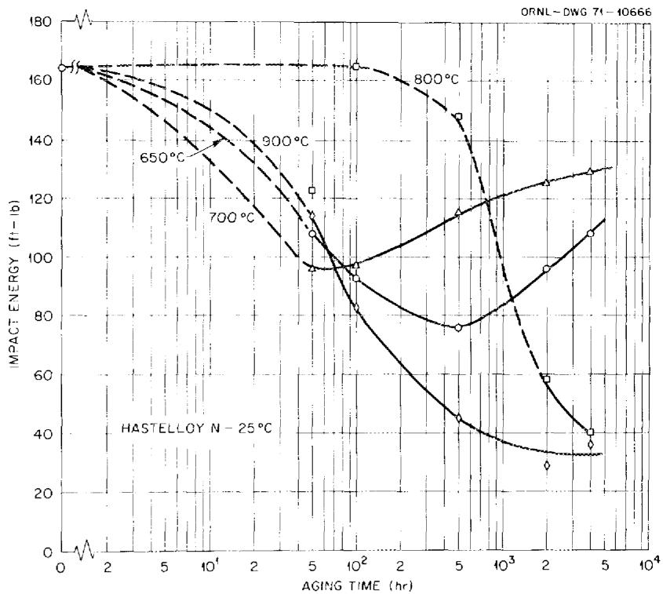  
Fig. 1. Variation of Notch-Impact Energy at $25^{\circ}\mathrm{C}$ With Aging Time for Hastelloy N. Samples annealed 1 hr at $1150^{\circ}\mathrm{C}$ before aging.

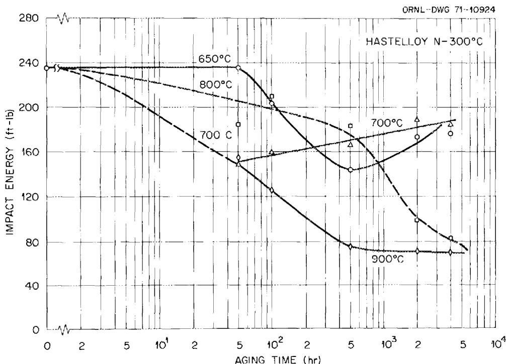  
Fig. 2. Variation of Notch-Impact Energy at $300^{\circ}\mathrm{C}$ With Aging Time for Hastelloy N. Samples annealed 1 hr at $1150^{\circ}\mathrm{C}$ before aging.

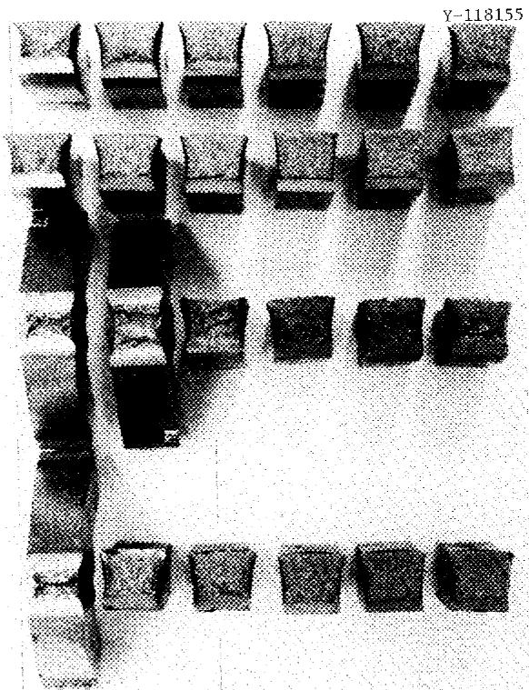  
Fig. 3. Fracture Surfaces of Hastelloy N Impact Samples. The aging time increases in each row from zero on the left to 4000 hr on the right. The samples in the top row were aged at $650^{\circ}\mathrm{C}$ and tested at $25^{\circ}\mathrm{C}$ , those in the second row were aged at $900^{\circ}\mathrm{C}$ and tested at $25^{\circ}\mathrm{C}$ , those in the third row were aged at $650^{\circ}\mathrm{C}$ and tested at $300^{\circ}\mathrm{C}$ , and those in the bottom row were aged at $900^{\circ}\mathrm{C}$ and tested at $300^{\circ}\mathrm{C}$ .

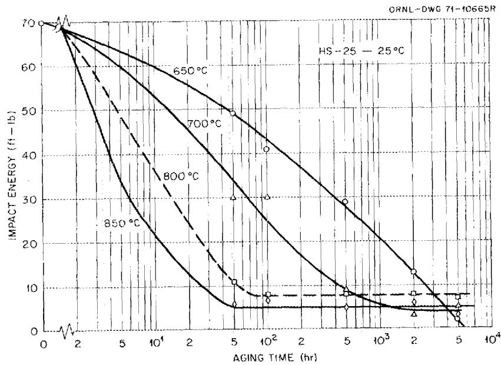  
Fig. 4. Variation of Notch-Impact Energy at $25^{\circ}\mathrm{C}$ With Aging Time for Haynes Alloy No. 25. Samples annealed 1 hr at $1150^{\circ}\mathrm{C}$ before aging.

rate of decrease increased with increasing aging temperature. The lowest impact energies resulting from aging were from 3 to 8 ft-1b.

The effects of aging on the impact energy of Haynes alloy No. 25 at $300^{\circ}\mathrm{C}$ are shown in Fig. 5 and are qualitatively similar to the effects noted at $25^{\circ}\mathrm{C}$ (Fig. 4). The lowest value noted at a test temperature of $300^{\circ}\mathrm{C}$ was 5 ft-lb for a sample aged at $650^{\circ}\mathrm{C}$ .

The fracture surfaces in Fig. 6 also reflect the large effect of aging on the impact properties. The top row was aged at $650^{\circ}\mathrm{C}$ and tested at $25^{\circ}\mathrm{C}$ . The fracture appearance changed from fibrous to granular, and the reduction in width at the base of the notch decreased with increasing aging time. The second row was aged at $850^{\circ}\mathrm{C}$ and tested at $25^{\circ}\mathrm{C}$ ; the fracture appearance and the reduction in width indicate a high rate of embrittlement during aging at $850^{\circ}\mathrm{C}$ . The samples in the third and fourth rows were aged at 650 and $850^{\circ}\mathrm{C}$ , respectively, and tested at $300^{\circ}\mathrm{C}$ . They reflect progressive embrittlement with increasing aging time.

The variation of impact energy at $25^{\circ}\mathrm{C}$ of Haynes alloy No. 188 with aging time is shown in Fig. 7. The impact energy in the solution-annealed condition was 58 ft-1b, compared with 70 ft-1b for Haynes alloy No. 25 and 164 ft-1b for Hastelloy N. Aging at $650^{\circ}\mathrm{C}$ gradually reduced the impact energy except for a possible increase after aging for 50 hr. Aging at $700^{\circ}\mathrm{C}$ reduced the impact energy for the first 500 hr, and further aging caused a slight improvement. Aging at 800 and $900^{\circ}\mathrm{C}$ reduced the impact energy to values of 9 and 6 ft-1b, respectively. The crossover

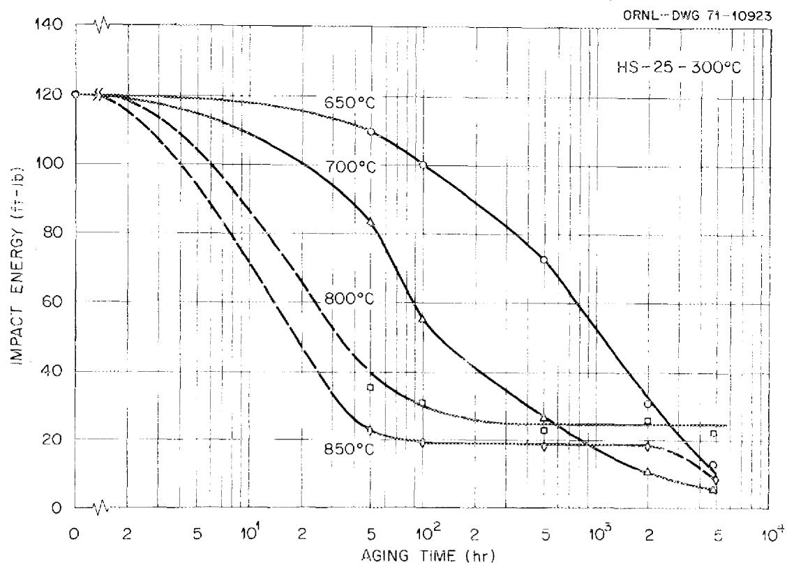  
Fig. 5. Variation of Notch-Impact Energy at $300^{\circ}\mathrm{C}$ With Aging Time for Haynes Alloy No. 25. Samples annealed 1 hr at $1150^{\circ}\mathrm{C}$ before aging.

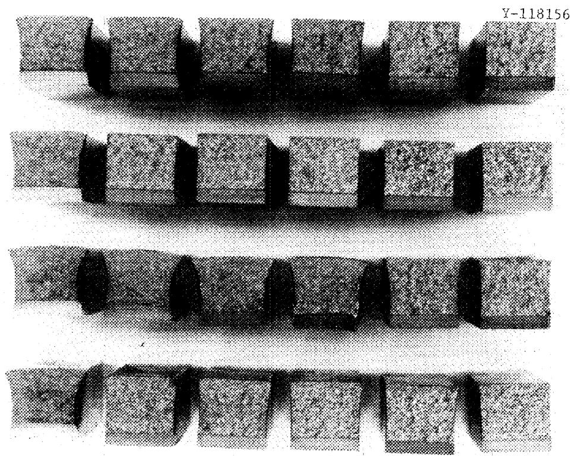  
Fig. 6. Fracture Surfaces of Haynes Alloy No. 25 Impact Samples. The aging time increases in each row from zero on the left to 4800 hr on the right. The samples in the top row were aged at $650^{\circ}\mathrm{C}$ and tested at $25^{\circ}\mathrm{C}$ , those in the second row were aged at $850^{\circ}\mathrm{C}$ and tested at $25^{\circ}\mathrm{C}$ , those in the third row were aged at $650^{\circ}\mathrm{C}$ and tested at $300^{\circ}\mathrm{C}$ , and those in the bottom row were aged at $850^{\circ}\mathrm{C}$ and tested at $300^{\circ}\mathrm{C}$ .

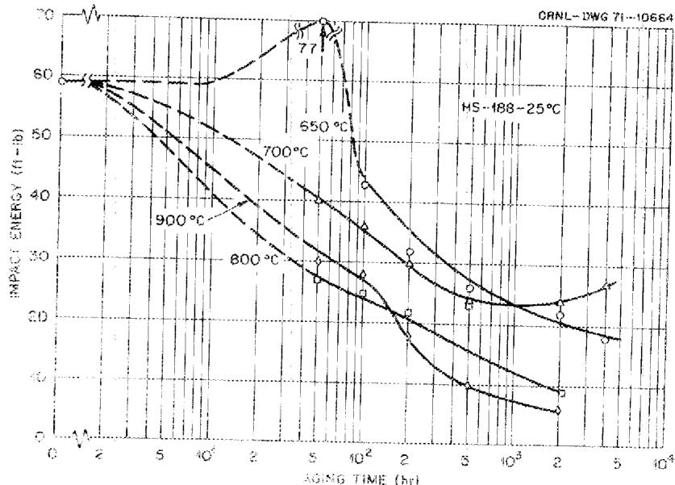  
Fig. 7. Variation of Notch-Impact Energy at $25^{\circ}\mathrm{C}$ With Aging Time for Haynes Alloy No. 188. Samples annealed 1 hr at $1150^{\circ}\mathrm{C}$ before aging.

in properties for aging temperatures of 800 and $900^{\circ}\mathrm{C}$ is likely real since the same effect was noted at a test temperature of $300^{\circ}\mathrm{C}$ (Fig. 8).

The impact results at a test temperature of $300^{\circ}\mathrm{C}$ for Haynes alloy No. 188 are shown in Fig. 8. These data show the improvement in impact properties after aging 50 hr at $650^{\circ}\mathrm{C}$ and the crossover in properties after aging at 800 and $900^{\circ}\mathrm{C}$ . Generally, the data show a gradual decrease in impact energy with aging time and larger effects with increasing aging temperature.

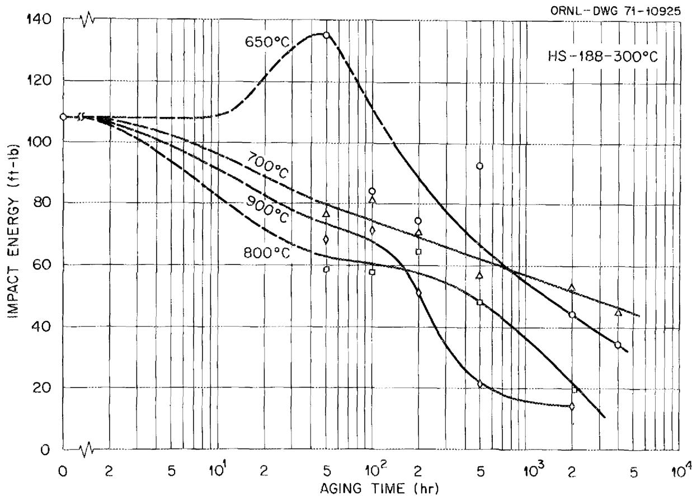  
Fig. 8. Variation of Notch-Impact Energy at $300^{\circ}\mathrm{C}$ With Aging Time for Haynes Alloy No. 188. Samples annealed 1 hr at $1150^{\circ}\mathrm{C}$ before aging.

The fracture surfaces of the Haynes alloy No. 188 samples shown in Fig. 9 show the decrease in ductility with aging. The fracture appearance changed from fibrous to granular, and the reduction in width at the base of the notch decreased as the aging time increased.

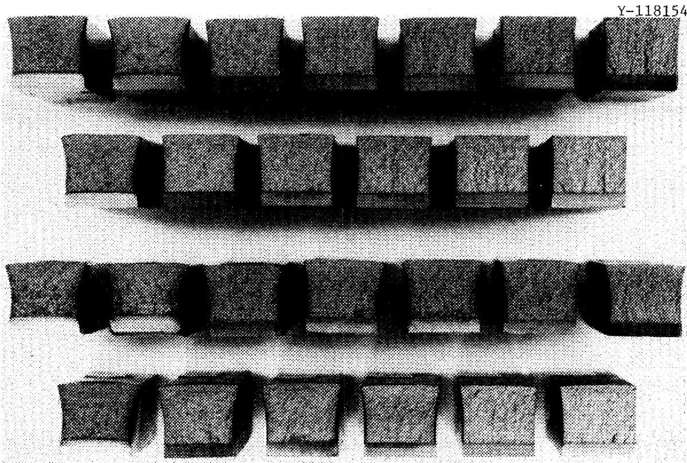  
Fig. 9. Fracture Surfaces of Haynes Alloy No. 188 Impact Specimens. The aging time increases in each row from zero on the left to 4000 hr on the right. The samples in the top row were aged at $650^{\circ}\mathrm{C}$ and tested at $25^{\circ}\mathrm{C}$ , those in the second row were aged at $900^{\circ}\mathrm{C}$ and tested at $25^{\circ}\mathrm{C}$ , those in the third row were aged at $650^{\circ}\mathrm{C}$ and tested at $300^{\circ}\mathrm{C}$ , and those in the bottom row were aged at $900^{\circ}\mathrm{C}$ and tested at $300^{\circ}\mathrm{C}$ .

# TENSILE PROPERTIES

Small tensile specimens having a gage section 1/2 in. long and 1/8 in. in diameter were machined from halves of several tested impact specimens. These specimens were tensile tested at $25^{\circ}\mathrm{C}$ at a strain rate of 0.1/min, and the results are summarized in Table 2. Although aging Hastelloy N at $900^{\circ}\mathrm{C}$ for 100 hr reduced the impact energy from 164 to 82 ft-lb (Fig. 1, p. 4) the uniaxial tensile properties changed very little (Table 2, specimens 11440 and 11441). Aging for 4000 hr at $900^{\circ}\mathrm{C}$ reduced the impact energy to 35 ft-lb, and the tensile properties indicate a general decrease in yield and tensile strength, very small changes in axial strain, and a sizeable decrease in the reduction in area (Table 2, specimens 11440 and 11448).

The tensile properties of Haynes alloy No. 25 were changed markedly as a result of aging. Aging for 50 hr at $850^{\circ}\mathrm{C}$ increased the yield stress

Table 2. Results of Tensile Tests at ${25}^{ \circ  }\mathrm{C}$   

<table><tr><td rowspan="2">Specimen</td><td rowspan="2">\(Aging^a\) (hr)</td><td rowspan="2">(°C)</td><td colspan="3">Stress, psi</td><td colspan="2">Strain, %</td><td rowspan="2">Reduction in Area, %</td></tr><tr><td>Yield</td><td>Ultimate Tensile</td><td>Fracture</td><td>Uniform</td><td>Total</td></tr><tr><td colspan="9">Hastelloy N</td></tr><tr><td>11440</td><td>0</td><td></td><td>60,300</td><td>114,400</td><td>105,700</td><td>51.2</td><td>55.6</td><td>41.5</td></tr><tr><td>11441</td><td>100</td><td>900</td><td>59,000</td><td>118,100</td><td>112,300</td><td>50.5</td><td>54.4</td><td>41.5</td></tr><tr><td>11448</td><td>4000</td><td>900</td><td>55,500</td><td>106,800</td><td>100,200</td><td>41.5</td><td>56.4</td><td>27.7</td></tr><tr><td colspan="9">Haynes Alloy No. 25</td></tr><tr><td>11446</td><td>0</td><td></td><td>71,700</td><td>138,400</td><td>137,500</td><td>43.2</td><td>43.6</td><td>27.9</td></tr><tr><td>11447</td><td>50</td><td>850</td><td>79,900</td><td>113,300</td><td>113,300</td><td>14.4</td><td>14.6</td><td>9.1</td></tr><tr><td>11445</td><td>4843</td><td>850</td><td>87,500</td><td>133,000</td><td>133,000</td><td>12.7</td><td>12.9</td><td>5.8</td></tr><tr><td colspan="9">Haynes Alloy No. 188</td></tr><tr><td>11444</td><td>0</td><td></td><td>69,800</td><td>143,700</td><td>141,200</td><td>51.2</td><td>53.5</td><td>40.0</td></tr><tr><td>11443</td><td>100</td><td>900</td><td>69,200</td><td>139,300</td><td>138,500</td><td>37.0</td><td>37.9</td><td>27.3</td></tr><tr><td>11442</td><td>2000</td><td>900</td><td>71,100</td><td>137,300</td><td>137,300</td><td>21.1</td><td>21.6</td><td>7.7</td></tr></table>

aAll specimens solution annealed 1 hr at $1150^{\circ}\mathrm{C}$ before aging.

and decreased all the ductility parameters (Table 2, specimens 11446 and 11447). These same aging conditions caused the impact energy to decrease from 70 to 6 ft-1b (Fig. 4, p. 5). Aging for 4843 hr at $850^{\circ}\mathrm{C}$ caused the yield stress to increase and the ductility parameters to decrease further. These same aging conditions caused the impact energy to decrease to about 3 ft-1b.

Aging at $900^{\circ}\mathrm{C}$ caused very little change in the strength parameters of Haynes alloy No. 188 (Table 2, specimens 11444, 11443, and 11442). However, the ductility parameters decreased with aging. The impact properties after 0, 100, and 2000 hr aging at $900^{\circ}\mathrm{C}$ were 58, 27, and 6 ft-lb, respectively (Fig. 7, p. 7).

# METALLOGRAPHIC EXAMINATION

No phase identification work was done on these samples, so we will only indicate the phases that are likely present on the basis of other studies. Carbides of the $\mathbf{M}_2\mathbf{C}$ and $\mathbf{M}_6\mathbf{C}$ types are formed in Hastelloy N, but the $\mathbf{M}_2\mathbf{C}$ type should predominate in a heat such as 6960, which contained only $0.05\%$ Si. The "M" in this carbide consists of about $80\%$ Mo and $20\%$ Cr. The microstructure of Hastelloy N after solution heat treatment is shown in Fig. 10. The grain boundaries were quite jagged and contained some fine carbide. Some coarser primary carbide was also present within the grains. Aging at $650^{\circ}\mathrm{C}$ caused a decrease in the impact energy for the first 500 hr and a slight increase with further aging (Fig. 1, p. 4). The microstructural change observed at $650^{\circ}\mathrm{C}$ was carbide precipitation along the grain boundaries, and no obvious characteristic of this precipitation could account for the slight minimum in the impact energy. Figure 11 shows the microstructure after 4000 hr aging at $650^{\circ}\mathrm{C}$ . Carbide has precipitated on and adjacent to the grain

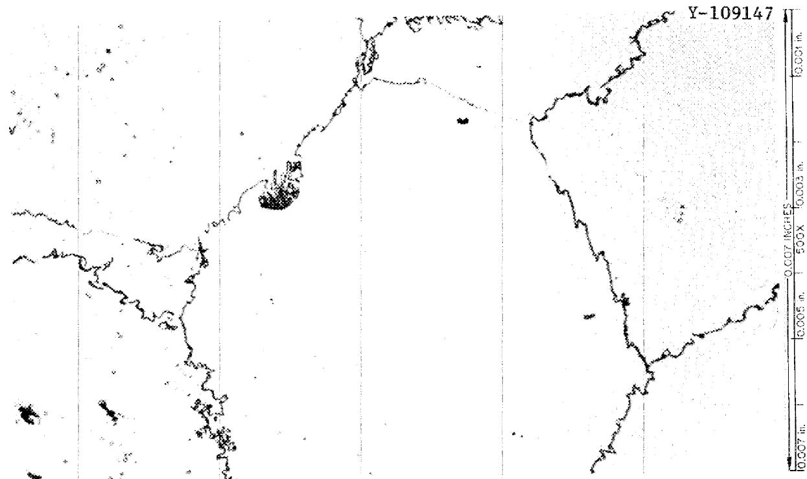  
Fig. 10. Typical Photomicrograph of Hastelloy N Annealed 1 hr at $1150^{\circ}\mathrm{C}$ . Impact energy at $25^{\circ}\mathrm{C}$ was 164 ft-1b. Etchant: glyceria regia.

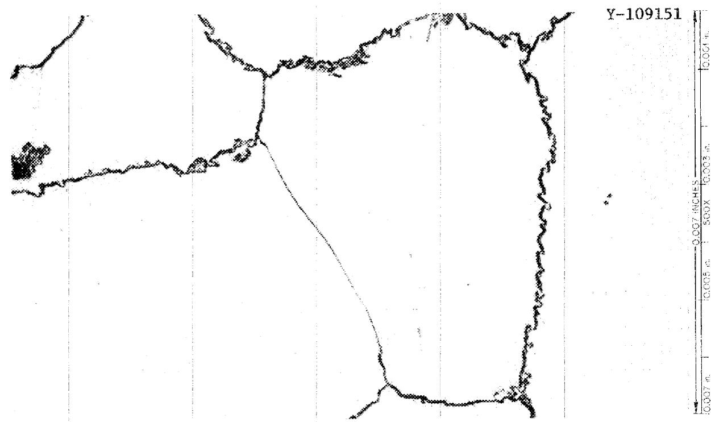  
Fig. 11. Typical Photomicrograph of Hastelloy N Annealed 1 hr at $1150^{\circ}\mathrm{C}$ and Aged 4000 hr at $650^{\circ}\mathrm{C}$ . Impact energy at $25^{\circ}\mathrm{C}$ was 108 ft-1b. Etchant: glyceria regia.

boundaries. Aging at $700^{\circ}\mathrm{C}$ caused carbide precipitation similar to that noted at $650^{\circ}\mathrm{C}$ . Aging at $800^{\circ}\mathrm{C}$ initially caused grain boundary carbide precipitation and some general precipitation (Fig. 12). After prolonged aging at $800^{\circ}\mathrm{C}$ , the grain boundary carbide agglomerated, and the amount of precipitate within the grain increased (Fig. 13). However, the impact energy continued to decrease with further aging at $800^{\circ}\mathrm{C}$ (Fig. 1, p. 4) even though the grain boundary carbide appeared to become discontinuous. At $900^{\circ}\mathrm{C}$ the carbide formed preferentially along the grain boundaries (Fig. 14). It was initially quite fine and became coarser and agglomerated with further aging time. The impact energy decreased with increasing carbide formation and seemed to reach a plateau of about 30 ft-lb after the carbide became quite coarse (Fig. 1, p. 4).

Wlodek3 has studied the embrittlement of Haynes alloy No. 25 and the phases that are formed. He found that the solution-annealed alloy contained $\mathrm{M}_{6}\mathrm{C}$ and $\mathrm{Zr}(\mathrm{N},\mathrm{C})$ . Aging over the range 650 to $1100^{\circ}\mathrm{C}$ formed $\mathrm{Cr}_{23}\mathrm{C}_{6}$ and a Laves phase, $\mathrm{A}_{2}\mathrm{B}$ . After prolonged aging the major constituents were $\mathrm{M}_{6}\mathrm{C}$ and the Laves phase. These various microconstituents assumed different morphologies at different aging temperatures, so it is not possible to identify microconstituents solely by optical metallography, and our phase identifications are largely conjecture.

The microstructure of solution-annealed Haynes alloy No. 25 is shown in Fig. 15; it contains a primary carbide, likely $\mathrm{M}_{6}\mathrm{C}$ . Even though aging at $650^{\circ}\mathrm{C}$ caused a steady decrease in the impact energy from 60 to 2 ft-1b (Fig. 4, p. 5), the microstructure changed only slightly. After aging for 4843 hr at $650^{\circ}\mathrm{C}$ (Fig. 16) the grain boundaries etched very quickly (likely because of the presence of carbide or Laves precipitate), and some precipitate was visible in the grains. Aging at $700^{\circ}\mathrm{C}$ produced a steady decrease in the impact energy (Fig. 4, p. 5), and large amounts of precipitate (likely Laves phase) were visible in the microstructure (Fig. 17). Aging at $800^{\circ}\mathrm{C}$ resulted in coarser precipitate than noted at $700^{\circ}\mathrm{C}$ , and the grain boundaries etched very readily (Fig. 18). Aging at $850^{\circ}\mathrm{C}$ for 50 hr caused the impact energy to decrease from 50 to 6 ft-1b (Fig. 4, p. 5), but the microstructure showed little change from the solution-annealed condition (compare Figs. 15 and 19). The main difference is the more rapid etching characteristics of the grain boundaries after aging. Aging 4843 hr at $850^{\circ}\mathrm{C}$ caused the impact energy to decrease only slightly from that noted after aging 50 hr; however, the amount of precipitate increased dramatically (Fig. 20). These observations lead to the speculation that the impact property changes in Haynes alloy No. 25 result primarily from the grain boundary precipitate structure and to a lesser extent on the precipitate within the grains.

Herchenroeder4 studied the aging characteristics of four heats of Haynes alloy No. 188. He found that the solution-annealed alloy contained primary $\mathbf{M}_6\mathbf{C}$ and that aging formed secondary $\mathbf{M}_6\mathbf{C}$ , $\mathbf{M}_{23}\mathbf{C}_6$ , and a Laves phase of the $\mathbf{A}_2\mathbf{B}$ type. Over the range 700 to $900^{\circ}\mathbf{C}$ the $\mathbf{M}_6\mathbf{C}$ tended strongly to transform to $\mathbf{M}_{23}\mathbf{C}_6$ on aging. The carbide transformation would make more of the group VIB materials available to form the $\mathbf{A}_2\mathbf{B}$ phase.

Aging at $650^{\circ}\mathrm{C}$ caused the impact energy of Haynes alloy No. 188 to decrease (Fig. 7, p. 7). The microstructure changed very little during the 2000 hr aging (Fig. 21). The primary change was the formation of precipitates along the grain boundaries so that these regions etched

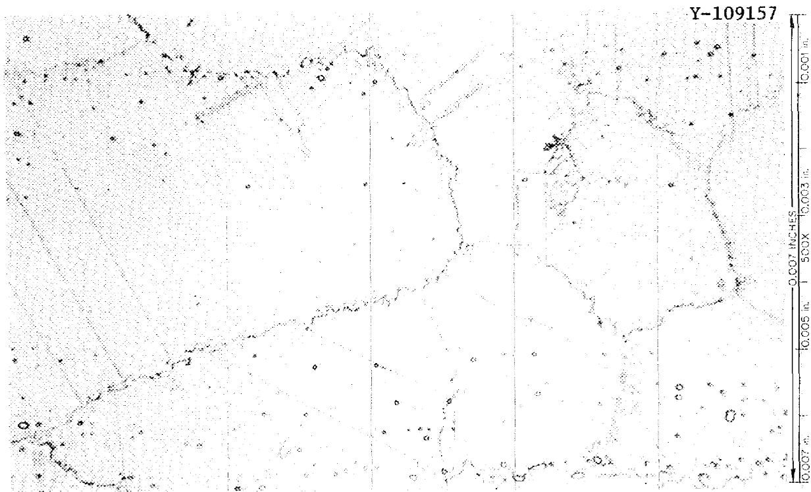  
Fig. 12. Typical Photomicrograph of Hastelloy N Annealed 1 hr at $1150^{\circ}\mathrm{C}$ and Aged 100 hr at $800^{\circ}\mathrm{C}$ . Impact energy was 165 ft-1b. Etchant: glyceria regia.

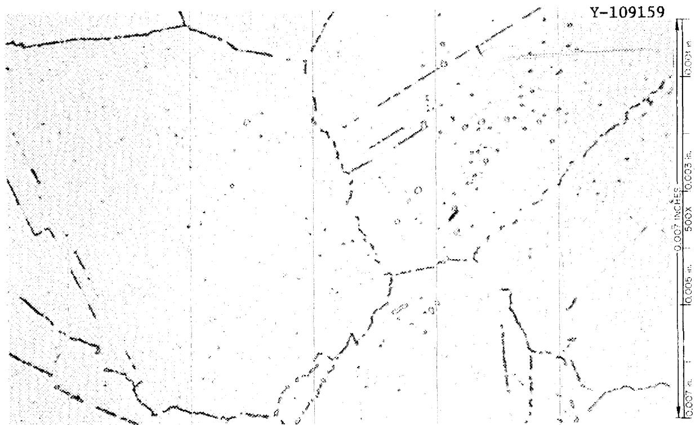  
Fig. 13. Typical Photomicrograph of Hastelloy N Annealed 1 hr at $1150^{\circ}\mathrm{C}$ and Aged 4000 hr at $800^{\circ}\mathrm{C}$ . Impact energy was 40 ft-lb. Etchant: glyceria regia.

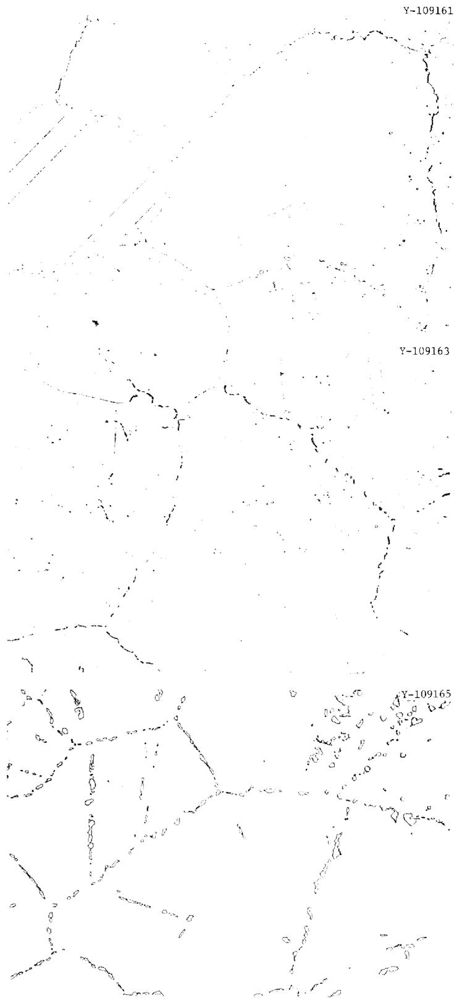  
Fig. 14. Photomicrographs of Hastelloy N Annealed 1 hr at $1150^{\circ}\mathrm{C}$ and Aged at $900^{\circ}\mathrm{C}$ . $500 \times$ (Reduced $39.5\%$ ). (a) 50 hr, (b) 100 hr, and (c) 4000 hr. Impact energies at $25^{\circ}\mathrm{C}$ were 114, 83, and 36 ft-1b, respectively. Etchant: glyceria regia.

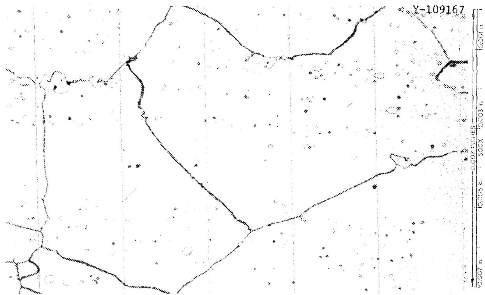  
Fig. 15. Typical Photomicrograph of Haynes Alloy No. 25 Annealed 1 hr at $1150^{\circ}\mathrm{C}$ . Impact energy at $25^{\circ}\mathrm{C}$ was 70 ft-lb. Etchant: glyceria regia,

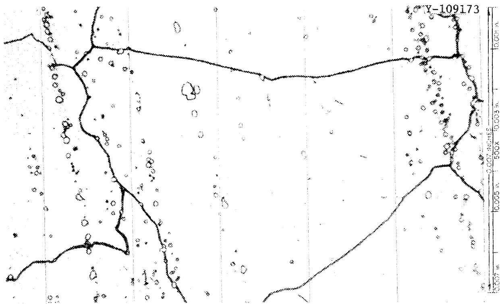  
Fig. 16. Typical Photomicrograph of Haynes Alloy No. 25 Annealed 1 hr at $1150^{\circ}\mathrm{C}$ and Aged 4843 hr at $650^{\circ}\mathrm{C}$ . Impact energy at $25^{\circ}\mathrm{C}$ was 2 ft-1b. Etchant: glyceria regia.

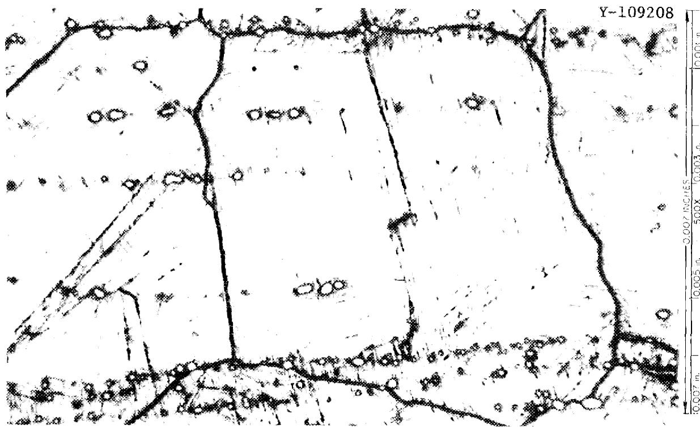  
Fig. 17. Typical Photomicrograph of Haynes Alloy No. 25 Annealed 1 hr at $1150^{\circ}\mathrm{C}$ and Aged 4843 hr at $700^{\circ}\mathrm{C}$ . Impact energy at $25^{\circ}\mathrm{C}$ was 5 ft-1b. Etchant: glyceria regia.

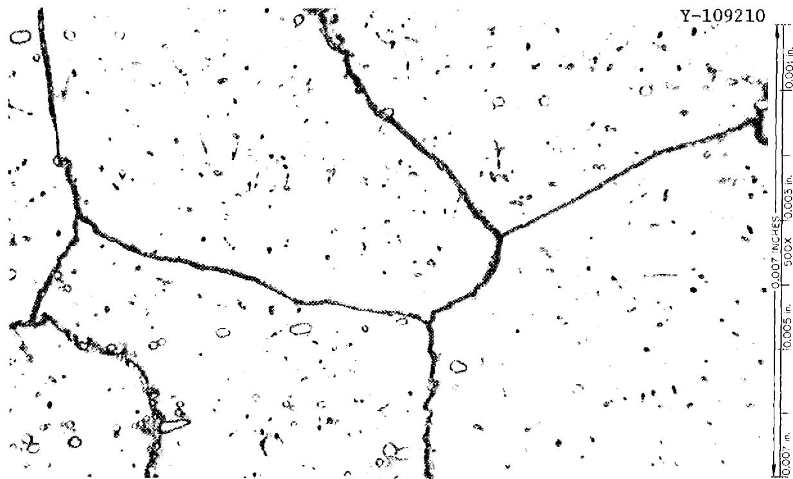  
Fig. 18. Typical Photomicrograph of Haynes Alloy No. 25 Annealed 1 hr at $1150^{\circ}\mathrm{C}$ and Aged 4843 hr at $800^{\circ}\mathrm{C}$ . Impact energy at $25^{\circ}\mathrm{C}$ was 7 ft-1b. Etchant: glyceria regia.

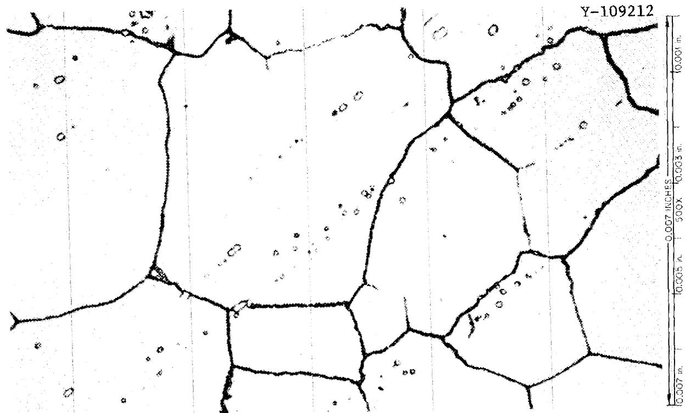  
Fig. 19. Typical Photomicrograph of Haynes Alloy No. 25 Annealed 1 hr at $1150^{\circ}\mathrm{C}$ and Aged 50 hr at $850^{\circ}\mathrm{C}$ . Impact energy at $25^{\circ}\mathrm{C}$ was 6 ft-1b. Etchant: glyceria regia.

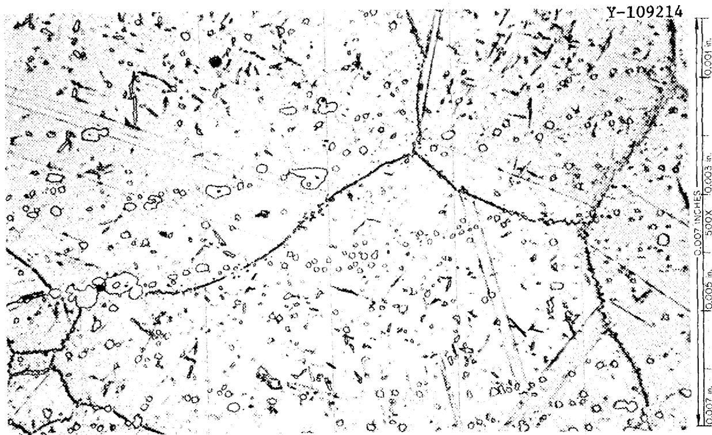  
Fig. 20. Typical Photomicrograph of Haynes Alloy No. 25 Annealed 1 hr at $1150^{\circ}\mathrm{C}$ and Aged 4843 hr at $850^{\circ}\mathrm{C}$ . Impact energy at $25^{\circ}\mathrm{C}$ was 3 ft-1b. Etchant: glyceria regia.

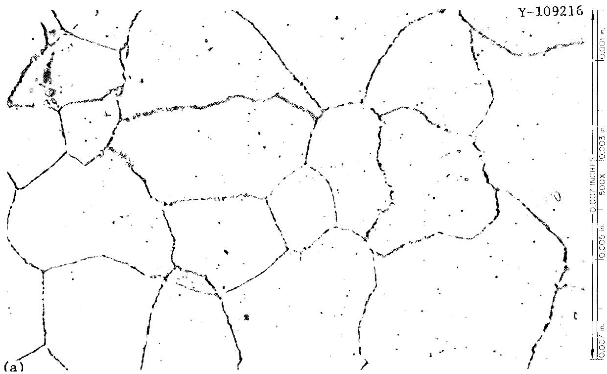

Fig. 21. Typical Photomicrographs of Haynes Alloy No. 188.   
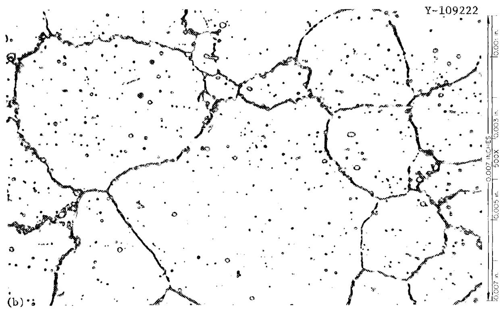  
(a) Annealed 1 hr at $1150^{\circ}\mathrm{C}$ . Impact energy at $25^{\circ}\mathrm{C}$ was 59 ft--1b.   
(b) Annealed 1 hr at $1150^{\circ}\mathrm{C}$ and aged 2000 hr at $650^{\circ}\mathrm{C}$ . Impact energy at $25^{\circ}\mathrm{C}$ was 22 ft-1b. Etchant: glyceria regia.

more readily. The results of Herchenroeder4 indicate that a sample aged at $650^{\circ}\mathrm{C}$ would contain $\mathbf{M}_{23}\mathbf{C}_6$ and $\mathbf{M}_6\mathbf{C}$ , but likely not Laves phase. The microstructure resulting from 2000 hr aging at $700^{\circ}\mathrm{C}$ contained copious grain boundary precipitate, likely carbides (Fig. 22). Aging at $800^{\circ}\mathrm{C}$ for 2000 hr resulted in the formation of more precipitates, primarily grain boundary (Fig. 23). Herchenroeder's work would indicate that this sample contained $\mathbf{M}_{23}\mathbf{C}_6$ and Laves phase. Aging at $900^{\circ}\mathrm{C}$ caused the grain boundary precipitate to agglomerate and a large amount of precipitate to form within the grains (Fig. 24). The samples in Fig. 24 likely contain $\mathbf{M}_{23}\mathbf{C}_6$ , $\mathbf{M}_6\mathbf{C}$ , and Laves phase.

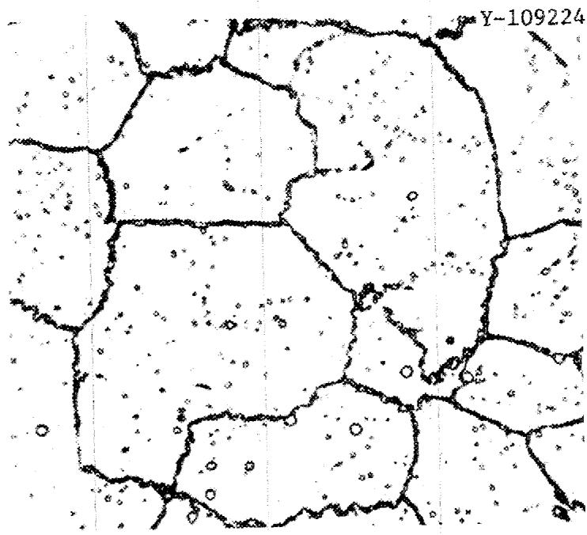  
Fig. 22. Typical Photomicrograph of Haynes Alloy No. 188 Annealed 1 hr at $1150^{\circ}\mathrm{C}$ and Aged 2000 hr at $700^{\circ}\mathrm{C}$ . Impact energy at $700^{\circ}\mathrm{C}$ was 24 ft-1b. Etchant: glyceria regia, $500\times$ .

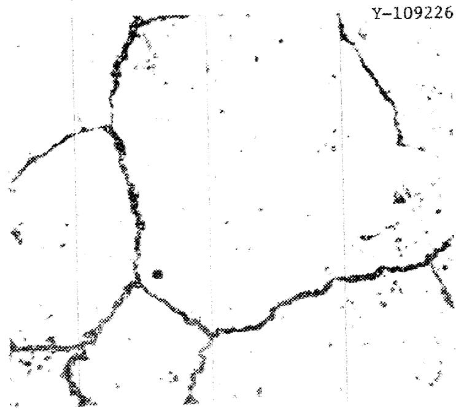  
Fig. 23. Typical Photomicrograph of Haynes Alloy No. 188 Annealed 1 hr at $1150^{\circ}\mathrm{C}$ and Aged 2100 hr at $800^{\circ}\mathrm{C}$ . Impact energy at $25^{\circ}\mathrm{C}$ was 9 ft-1b. Etchant: glyceria regia. $500\times$ .

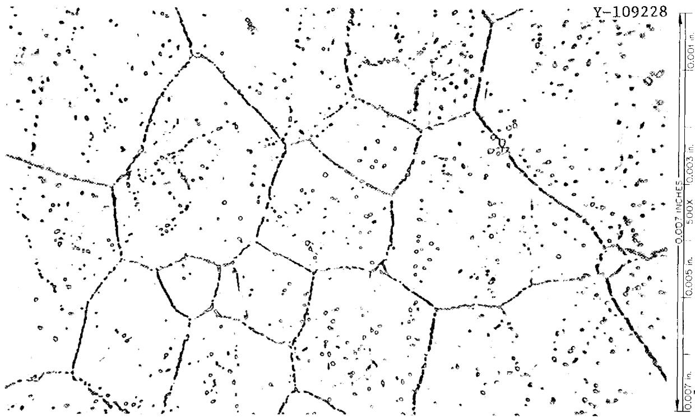

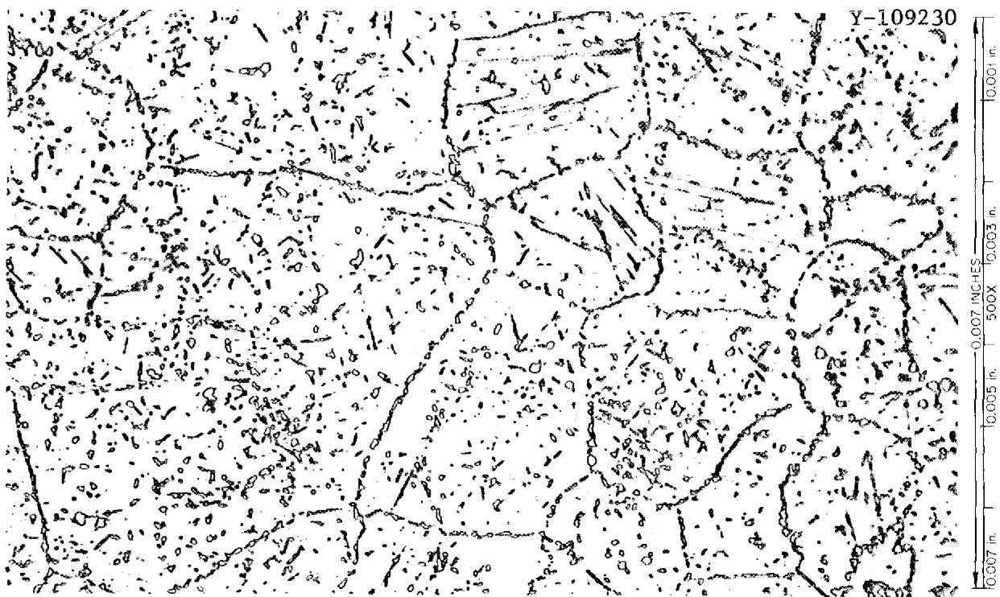  
Fig. 24. Typical Photomicrographs of Haynes Alloy No. 188 Annealed 1 hr at $1150^{\circ}\mathrm{C}$ and Aged at $900^{\circ}\mathrm{C}$ . (a) Aged 100 hr, impact energy at $25^{\circ}\mathrm{C}$ was 28 ft-1b. (b) Aged 2000 hr, impact energy at $25^{\circ}\mathrm{C}$ was 6 ft-1b. Etchant: glyceria regia.

# SCANNING ELECTRON MICROSCOPE OBSERVATIONS

The fractures of the nine tensile samples described in Table 2 (p. 10) were examined in the scanning electron microscope. Typical views of the Hastelloy N fractures are shown in Fig. 25. Some portions of the fracture were intergranular, but the entire surface shows deformation markings characteristic of ductile fracture. The intergranular cracks perpendicular to the plane of view would be expected because of the complex stress state that developed before fracture. As the specimen necked, three-dimensional stresses developed that would tend to open cracks perpendicular to the applied stress. The features of the fracture surface changed very little as a result of aging.

The photomicrographs shown in Fig. 26 of the Haynes alloy No. 25 tensile specimens show that the fractures are primarily intergranular. The main change that occurred with aging was a reduction in the amount of deformation (evidenced by dimpling) that occurred before fracture.

The fracture surfaces of the Haynes alloy No. 188 tensile specimens shown in Fig. 27 are quite similar to those of Haynes alloy No. 25. The predominant difference is the more ductile appearance of the Haynes alloy No. 188. Although the fractures were almost entirely intergranular, the fracture surfaces are dimpled from plastic deformation. We saw no features in Fig. 27 that obviously changed with aging, although the reduction in area changed from 40.0 to $7.7\%$ .

# DISCUSSION OF RESULTS

All three alloys underwent substantial losses in toughness as a result of aging over the temperature range 650 to $900^{\circ}\mathrm{C}$ . Hastelloy N forms only carbides during aging, but the alloy lost about $80\%$ of its toughness during aging at 800 and $900^{\circ}\mathrm{C}$ (Fig. 1, p. 4). Aging at 650 and $700^{\circ}\mathrm{C}$ caused losses of about $50\%$ . These losses in toughness seem to correlate with the amount of grain boundary precipitate.

Haynes alloys Nos. 25 and 188 are more complex than Hastelloy N in that they form Laves phases. The aging characteristics of these two alloys are compared in Fig. 28 in terms of the reduction in the impact energy. One of the objectives in the development of alloy No. 188 was to reduce the embrittlement due to Laves phase that occurred in Haynes alloy No. 25. The comparison in Fig. 28 shows that this was partially successful, since the time required to cause a certain loss in impact energy was much greater for alloy No. 188. This is particularly true for the larger losses in impact energy. For example, at $800^{\circ}\mathrm{C}$ alloy No. 25 lost $75\%$ of its impact energy in 30 hr, but alloy No. 188 required 600 hr.

Haynes alloys Nos. 25 and 188 both formed Laves phase, but alloy No.188 formed less. Both alloys formed carbides. The toughness of a material can be reduced by the matrix or the grain boundaries becoming brittle so that a low-energy fracture path is defined. The carbide and Laves phases could produce either of these effects. It is quite likely, although not necessarily the case, that the formation of either phase in quantities sufficient to embrittle the matrix would harden it also. It is also possible for the matrix to be strengthened sufficiently to cause the grain boundaries and adjacent regions to deform preferentially to the

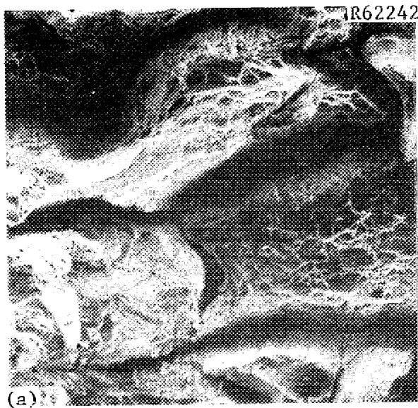

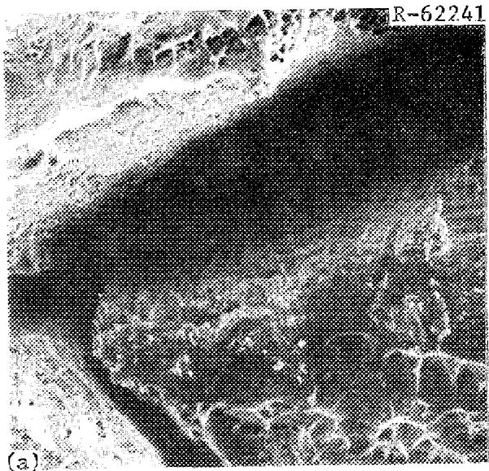

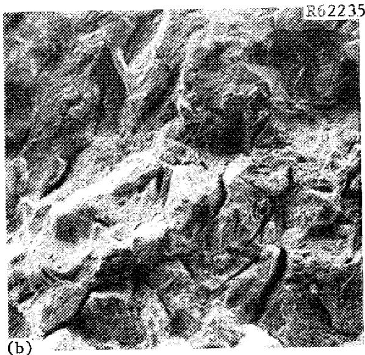

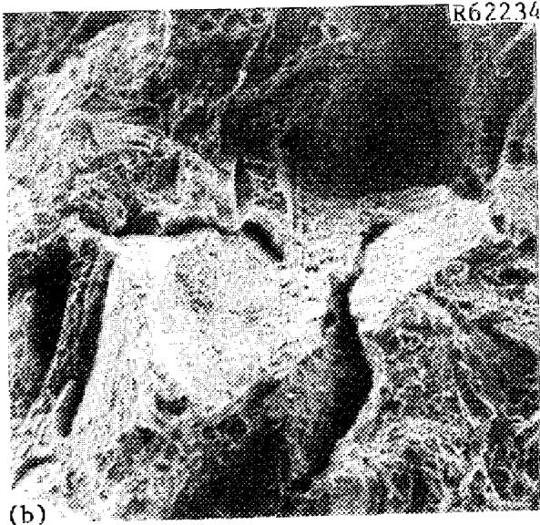

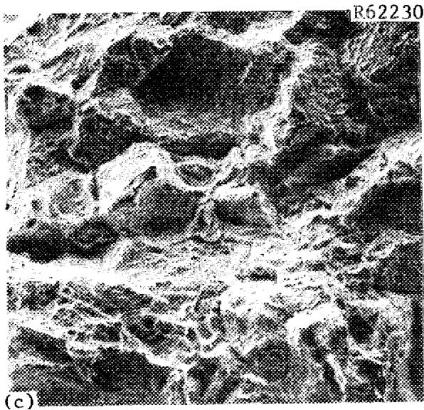  
Fig. 25. Scanning Electron Micrographs of the Fractures of Hastelloy N Tensile Specimens Fractured at $25^{\circ}\mathrm{C}$ . (a) Solution annealed. (b) Aged 100 hr at $900^{\circ}\mathrm{C}$ . (c) Aged 4000 hr at $900^{\circ}\mathrm{C}$ . Left $100\times$ . Right $300\times$ .

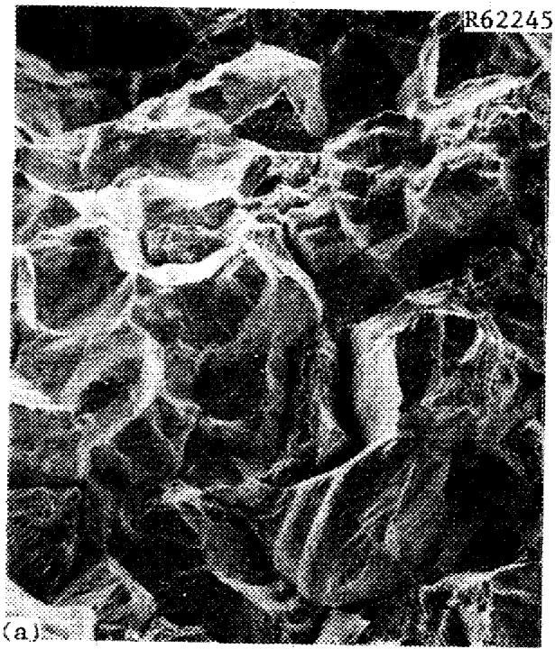

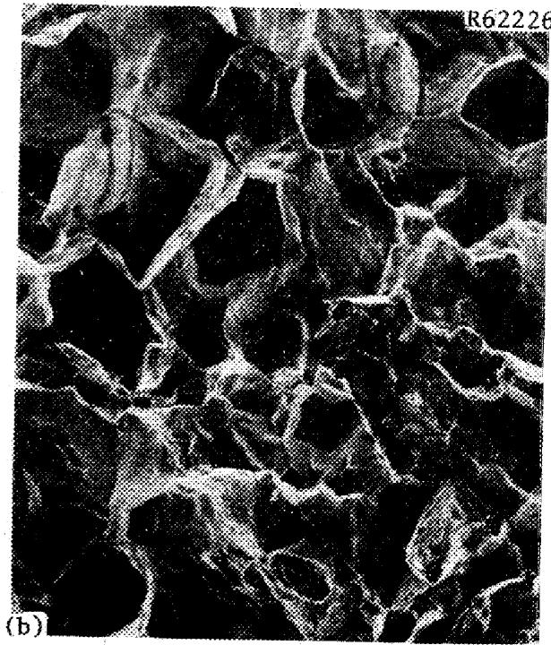

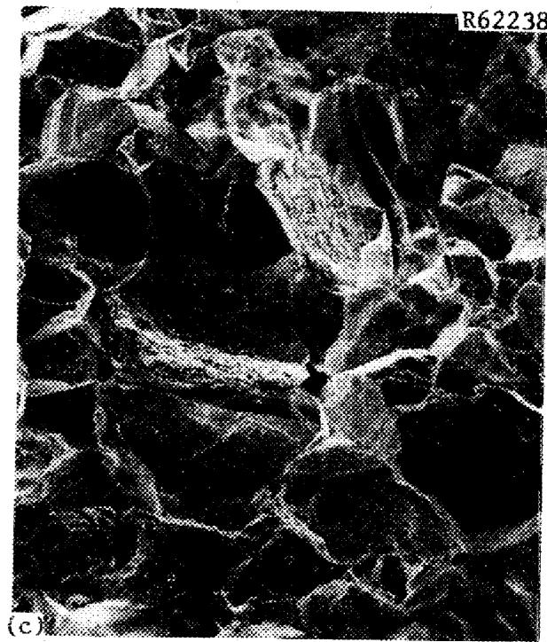  
Fig. 26. Scanning Electron Micrographs of the Fractures of Haynes Alloy No. 25 Tensile Specimens Fractured at $25^{\circ}\mathrm{C}$ . (a) Solution annealed. (b) Aged 50 hr at $850^{\circ}\mathrm{C}$ . (c) Aged 4843 hr at $850^{\circ}\mathrm{C}$ .

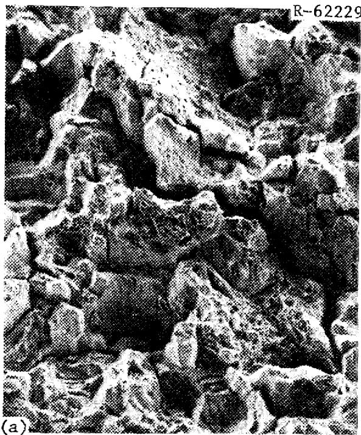

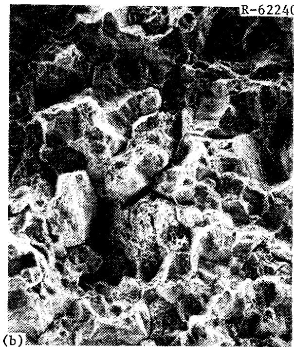

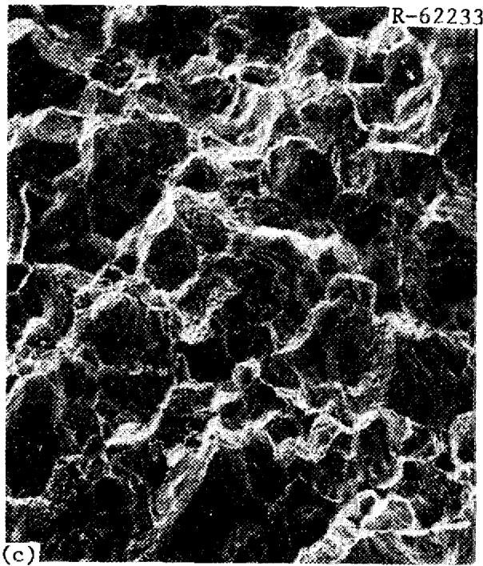  
Fig. 27. Scanning Electron Micrographs of the Fractures of Haynes Alloy No. 188 Tensile Specimens Tested at $25^{\circ}\mathrm{C}$ . (a) Solution annealed. (b) Aged 100 hr at $900^{\circ}\mathrm{C}$ . (c) Aged 2000 hr at $900^{\circ}\mathrm{C}$ .

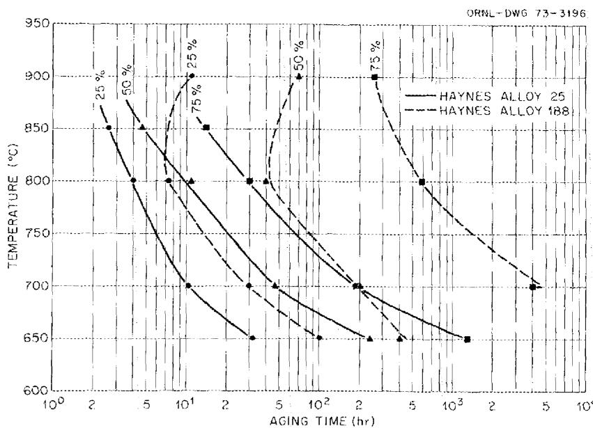  
Fig. 28. Reduction in Impact Energy at $25^{\circ}\mathrm{C}$ Due to Aging for Haynes Alloys Nos. 25 and 188. All samples annealed 1 hr at $1150^{\circ}\mathrm{C}$ before aging.

matrix. The yield stress of Haynes alloy No. 25 (Table 1, p. 3) increased about $20\%$ with aging, and the ductility parameters decreased. This alloy showed a strong tendency to fail intergranularly in the solution-annealed condition, and the tendency toward intergranular fracture increased. There was less evidence of grain boundary plasticity with aging, indicating that the grain boundaries themselves became less ductile with aging. The stronger matrix may have contributed to the embrittlement, but the grain boundary embrittlement seemed to be the dominant factor.

The data for Haynes alloy No. 188 are even less definitive of an embrittlement mechanism. The solution-annealed material fractured predominantly intergranularly. The yield and tensile stresses changed very little during aging, but the ductility decreased (Table 2, p. 10). Although the fracture was intergranular, considerable deformation occurred before the fracture (Fig. 27), and this did not change appreciably with aging. Thus, there is no evidence to support the premises that the matrix was strengthened or that the grain boundaries were embrittled by aging.

# SUMMARY

Impact samples of Hastelloy N, Haynes alloy No. 25, and Haynes alloy No. 188 were solution annealed and aged up to 4000 hr at temperatures over the range 650 to $900^{\circ}\mathrm{C}$ . Impact tests were run at 25 and $300^{\circ}\mathrm{C}$ , and all alloys underwent reduction in toughness due to aging. The reduction in toughness was least for Hastelloy N, intermediate for alloy No. 188, and greatest for alloy No. 25. The changes in Hastelloy N were due to carbide precipitation, and those in Haynes alloys Nos. 25 and 188

were likely due to the combined effects of carbide and Laves phase precipitation.

# ACKNOWLEDGMENTS

The authors gratefully acknowledge the contributions of J. M. Newsome, T. N. Jones, and W. J. Stelzman for the aging and impact testing; H. R. Tinch for the metallography; R. G. Berggren, R. G. Donnelly, and W. R. Martin for review of the manuscript; the ORNL Graphic Arts Department for preparation of the drawings, and the Metals and Ceramics Division Reports Office for preparation of the manuscript.

# REFERENCES

1. H. E. McCoy and R. E. Gehlbach, "Influence of Irradiation Temperature on the Creep-Rupture Properties of Hastelloy N," Nucl. Technol. 11(1): 45-60 (1971).   
2. H. E. McCoy, Jr., An Evaluation of the Molten-Salt Reactor Experiment Hastelloy N Surveillance Specimens - Fourth Group, ORNL-TM-3063 (March 1971).   
3. S. T. Wlodek, Embrittlement of a Co-Cr-W (L-605) Alloy, R-61-FPD-538 (December 1961).   
4. R. B. Herchenroeder, Aging Characteristics "Haynes" Developmental Alloy No. 188, Report No. 7513, Technology Department, Stellite Division, Union Carbide, Kokomo, Indiana (August 1, 1968).   
5. D. T. Bourgette, Effect of Aging Time and Temperature on the Impact and Tensile Behavior of L-605 - A Cobalt-Base Alloy, ORNL-TM-3734 (April 1973).

# INTERNAL DISTRIBUTION

# (73 copies)

(3) Central Research Library ORNL - Y-12 Technical Library Document Reference Section

(20) Laboratory Records Department Laboratory Records, ORNL RC ORNL Patent Office

G. M. Adamson, Jr.

R. G. Berggren

E. E. Bloom

C. R. Brinkman

D. A. Canonico

R. W. Carpenter

F. L. Culler

J. E. Cunningham

J.H.DeVan

J. R. DiStefano

(3) R. G. Donnelly

R. J. Gray

K. W. Haff

(3) M. R. Hill

D. 0. Hobson

H. Inouye

R. T. King

C.C.Koch

E. Lamb

C. T. Liu

W. R. Martin

(5) H. E. McCoy

H. C. McCurdy

R. E. McDonald

C.J.McHargue

P. Patriarca

P. L. Rittenhouse

(3) R. A. Robinson

M. W. Rosenthal

A. C. Schaffhauser

J. L. Scott

G. M. Slaughter

W.J.Stelzman

J. O. Stiegler

R.W.Swindeman

D. B. Trauger

J.R.Weir, Jr.

# EXTERNAL DISTRIBUTION

# (79 copies)

AEC ALBUQUERQUE OPERATIONS OFFICE, P.O. Box 5400, Albuquerque, NM 87115

D. Ofte

AEC DAYTON AREA OFFICE, P.O. Box 66, Miamisburg, OH 45342

D. D. Davis

AEC DIVISION OF APPLIED TECHNOLOGY, Washington, DC 20545

W. S. Hollman

J.N.Maddox

R.W.Shivers

AEC DIVISION OF REACTOR RESEARCH AND DEVELOPMENT, Washington, DC 20545

T.A.Nemzek

T. G. Reuther

J. M. Simmons

E. E. Sinclair

A. Van Echo

C. E. Weber

AEC DIVISION OF SPACE NUCLEAR SYSTEMS, Washington, DC 20545

R. T. Carpenter   
G.P.Dix   
D. S. Gabriel   
N. Goldenberg   
H. Jaffe   
W. K. Kern   
A. P. Litman   
G. A. Newby   
F. Schulman   
F. C. Schwenk   
C. O. Tarr

AEC-RRD SITE REPRESENTATIVES, Oak Ridge National Laboratory, P.O. Box X, Oak Ridge, TN 37830

D. F. Cope   
D.C.Davis，Jr.   
C. L. Matthews

AIR FORCE MATERIALS LABORATORY, Wright-Patterson Air Force Base, OH 45433

L.N.Hjelm   
1. Perlmutter

AIR FORCE SYSTEMS COMMAND (SCIZM), Andrews Air Force Base, MD 29331

G. R. Crane

AIR FORCE WEAPONS LABORATORY, Kirtland Air Force Base, Albuquerque, NM 87117

A. Noonan   
M. MacWilliams

ALVAC METALS COMPANY, P.O. Box 759, Monroe, NC 28110

W. M. Thomas

ARGONNE NATIONAL LABORATORY, 9700 S. Cass Avenue, Argonne, IL 60439

R.W.Weeks

BATEILLE MEMORIAL INSTITUTE, 505 King Avenue, Columbus, OH 43201

Defense Materials Information Center

W. Pardue

BUREAU OF MINES, ALBANY METALLURGY RESEARCH CENTER, P.O. Box 70, Albany, OR 97321

Haruo Kato

CABOT CORPORATION, STELLITE DIVISION, Kokomo, IN 46901

T. K. Roche   
S. T. Wlodek

DONALD W. DOUGLAS LABORATORIES, 2955 George Washington Way, Richland WA 99352   
D. Watrous   
DUPONT COMPANY, Savannah River Laboratory, Aiken, SC 29801   
D. R. Turno

GENERAL ELECTRIC COMPANY, SPACE DIVISION, ISOTOPE POWER SYSTEMS OPERATIONS, P.O. Box 8661, Philadelphia, PA 19101

Paul Brown   
H. Sayell   
R.E.Schafer

GULF GENERAL ATOMIC, P.O. Box 608, San Diego, CA 92112

N. B. Elsner   
L. Yang

HUNTINGTON ALLOYS, Huntington, WV 25720

J. M. Martin

ISOTOPES, INC., NUCLEAR SYSTEMS DIVISION, 110 W. Timonium Road, Timonium, MD 21093

G. Linkous

JET PROPULSION LABORATORY, 4800 Oak Grove Drive, Pasadena, CA 91103

R. G. Ivanoff   
V. Truscello

JOHNS HOPKINS UNIVERSITY, Department of Mechanics, Baltimore, MD 21218

R. Fischell

LOS ALAMOS SCIENTIFIC LABORATORY, P.O. Box 1663, Los Alamos, NM 87544

R. D. Baker   
K. Cooper   
R. Mulford

MONSANTO RESEARCH CORPORATION, MOUND LABORATORY, P.O. Box 32, Miamisburg, OH 45342

V. L. Avona   
W. T. Cave   
E. W. Johnson   
P. Tucker

NASA, AMES RESEARCH CENTER, Moffett Field, CA 94035

H. Nelson   
A. Wilbur

NASA, GODDARD SPACE FLIGHT CENTER, Greenbelt, MD 20770   
J. Epstein   
NASA HEADQUARTERS, CODE RN, 600 Independence Avenue, Washington, DC 20545   
G. Deutsch   
T. B. Kerr   
NASA, LAngley RESEARCH CENTER, Langley Station, Hampton, VA 23365   
R. Brouns   
NASA, LEWIS RESEARCH CENTER, 21000 Brookpart Road, Cleveland, OH 44135   
G.M.Ault   
H. C. Slone   
NASA，MANNEDSPACECRAFTCENTER，MailCodeE-P5，Houston，TX 77058  
T. W. Redding   
NAVAL AIR SYSTEM COMMAND (AIR-52031B), Washington, DC 20360   
I. Machlin   
NAVAL UNDERSEA RESEARCH AND DEVELOPMENT CENTER, Technical Library, Code 133, San Diego, CA 92132   
Commander   
NAVY FACILITIES ENGINEERING COMMAND, Department of the Navy, Code 042, Washington, DC 20390   
M. D. Starr   
NAVY SPACE SYSTEMS ACTIVITY, Air Force Unit Post Office, Los Angeles, CA 90045 ATTN: R. V. Silverman, Code 40   
Commanding Officer   
PACIFIC NORTHWEST LABORATORY, P.O. Box 550, Richland, WA 99352   
Director   
SANDIA CORPORATION, P.O. Box 5800, Albuquerque, NM 77115   
J. R. Holland   
J. McDonald   
TRW SYSTEMS, One Space Park, Redondo Beach, CA 90278   
J. Blumenthal   
A. Hoffman   
J.Ogren

WESTINGHOUSE ASTRONUCLEAR LABORATORY, P.O. Box 10864, Pittsburgh, PA 15231 William Buckman

USAEC OAK RIDGE OPERATIONS, P.O. Box E, Oak Ridge, TN 37830

Research and Technical Support

USAEC TECHNICAL INFORMATION CENTER, P.O. Box 62, Oak Ridge, TN 37830

(2)