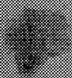

# Engineering Development Studies for Molten-Salt Breeder Reactor Processing No. 18

J.R.Hightower, Jr.

$\therefore \overrightarrow{PB} \cdot  \left( {\overrightarrow{PA} - \overrightarrow{PC}}\right)  = 0$

C2X1F

X01

LIBRARY LOAN COFFY

DO NOT TRANSFER TO ANOTHER PERSON

1

out the library all online last

${13}/{14}$

OAK RIDGE NATIONAL LABORATORY

（）

Printed in the United States of America. Available from

National Technical Information Service

U.S. Department of Commerce

5285 Port Royal Road, Springfield, Virginia 22161

Price: Printed Copy $5.45; Microfiche $2.25

This report was prepared as an account of work sponsored by the United States Government. Neither the United States nor the Energy Research and Development Administration, nor any of their employees, nor any of their contractors, subcontractors, or their employees, makes any warranty, express or implied, or assumes any legal liability or responsibility for the accuracy, completeness or usefulness of any information, apparatus, product or process disclosed, or represents that its use would not infringe privately owned rights.

ORNL-TM-4698

UC-76 - Molten Salt Reactor Technology

Contract No. W-7405-eng-26

CHEMICAL TECHNOLOGY DIVISION

ENGINEERING DEVELOPMENT STUDIES FOR MOLTEN-SALT BREEDER REACTOR PROCESSING NO. 18

J.R.Hightower, Jr.

MARCH 1975

NOTICE This document contains information of a preliminary nature and was prepared primarily for internal use at the Oak Ridge National Laboratory. It is subject to revision or correction and therefore does not represent a final report.

OAK RIDGE NATIONAL LABORATORY

Oak Ridge, Tennessee 37830

operated by

UNION CARBIDE CORPORATION

for the

ENERGY RESEARCH AND DEVELOPMENT ADMINISTRATION

Reports previously issued in this series are as follows:

ORNL-TM-3053 Period ending December 1968

ORNL-TM-3137 Period ending March 1969

ORNL-TM-3138 Period ending June 1969

ORNL-TM-3139 Period ending September 1969

ORNL-TM-3140 Period ending December 1969

ORNL-TM-3141 Period ending March 1970

ORNL-TM-3257 Period ending June 1970

ORNL-TM-3258 Period ending September 1970

ORNL-TM-3259 Period ending December 1970

ORNL-TM-3352 Period ending March 1971

# CONTENTS

Page

SUMMARIES V

1. INTRODUCTION. 1   
2. SALT-METAL CONTACTOR DEVELOPMENT. 1

2.1 Background 2   
2.2 Experimental Studies Using Water-Mercury Systems 4

2.2.1 Experimental procedures 4   
2.2.2 Results 5

2.3 Comparison of Correlations with MTE-3 Data 10   
2.4 Experimental Studies in the Salt-Bismuth Flow-through Facility 10

2.4.1 Experimental equipment. 13   
2.4.2 Mathematical analysis 13   
2.4.3 Experimental results. 18

2.5 Contactor Area Required for MSBR Processing Plant. 20   
2.6 Conclusions. 22

3. DEVELOPMENT OF THE METAL TRANSFER PROCESS: CONTINUATION OF ENGINEERING-SCALE EXPERIMENTS 23

3.1 Examination of MTE-3 Equipment and Materials 26   
3.2 Status of Experiment MTE-3B. 32

4. CONTINUOUS FLUORINATOR DEVELOPMENT. 37

4.1 Autoresistance Heating Tests 37   
4.2 Distribution of Current Densities in the Autoresistance Heating Equipment. 39

5. REFERENCES. 44

__________

__________

# SUMMARIES

# SALT-METAL CONTACTOR DEVELOPMENT

A water-mercury system was used to study the effect of geometric variations on mass transfer rates in rectangular contactors similar to those proposed for the MSBR fuel reprocessing scheme. Since mass transfer rates were not accurately predicted by the Lewis correlation, other correlations were investigated. The following correlation was found to fit the experimental results:

$$
\frac {6 0 k _ {1} L _ {1}}{v _ {1}} = 0. 2 0 5 8 \left(R e _ {1}\right) \left(\frac {n _ {2}}{n _ {1}}\right) ^ {1. 4} \left(0. 6 + \frac {n _ {2}}{n _ {1}}\right) ^ {- 2. 4} \left(S c _ {1}\right) ^ {- 1 / 6} \left(\frac {\rho_ {2}}{\rho_ {1}}\right) ^ {0. 2 7} \left(\frac {L}{H}\right) ^ {0. 4 5}.
$$

Mass transfer rates are being measured in a fluoride salt--bismuth contactor. A 6-in.-diam mild steel contactor has been installed in the flow-through reductive extraction facility for this purpose. Experimental results from these runs indicate that the mass transfer rates in the salt-bismuth system fall between the Lewis correlation and the modified correlation given above.

# DEVELOPMENT OF THE METAL TRANSFER PROCESS: CONTINUATION OF ENGINEERING-SCALE EXPERIMENTS

Four engineering-scale experiments (MTE-1, -2, -2B, and -3) to study the steps in the metal transfer process were completed prior to the termination of the Molten-Salt Reactor Program early in 1973. The last experiment, MTE-3, used salt and bismuth flow rates that were $1\%$ of the estimated flow rates required for processing a 1000-MW(e) reactor. We plan to continue these studies in a new experiment, designated as MTE-3B (identical to MTE-3).

The carbon steel vessels used in experiment MTE-3 are being replaced with new vessels. Fresh carrier salt, bismuth, and lithium chloride will be used.

Results of measurements of the mass transfer coefficients for radium, europium, lanthanum, and neodymium, obtained during operation of experiment MTE-3, indicated that many of the coefficients were lower than predicted by literature correlations. The reason for this is presently not known; consequently, additional studies are required in order to obtain data necessary for determining the size and type of equipment required for removal of the rare-earth fission products from molten-salt reactor fuel.

Examination of the MTE-3 carbon steel vessels indicated that no serious corrosion had occurred on the inside surfaces of the vessels exposed to salt and bismuth during 1 year of operation at $650^{\circ}\mathrm{C}$ (although the oxidation-resistant coating on the outside surface of the vessel failed to completely protect the carbon steel). Photomicrographs of the bismuth phases indicate that the surfaces in contact with the salts are enriched in thorium and iron.

# CONTINUOUS FLUORINATOR DEVELOPMENT

Autoresistance heating tests have been continued in the fluorinator mock-up using $\mathrm{LiF - BeF}_2\text{-ThF}_4$ (72-16-12 mole %) salt. The equipment was returned to operating condition, and five experiments were run. Although correct steady-state operation was not achieved, the results were encouraging.

A two-dimensional electrical analog was constructed to study current flow through the electrode sidearm and other critical areas of the test vessel. The model used constant-resistance paper cut in the shape of the sidearm. An electric field was produced between isopotential lines of conductive silver paint connected electrically to a constant-voltage source. The resulting flux lines were measured using a high-impedance voltmeter. These studies indicate that no regions of abnormally high current density existed in the first nine runs with the present auto-resistance heating equipment. Localized heating had previously been the suspected cause for the failure to achieve proper operation of this equipment.

# 1. INTRODUCTION

A molten-salt breeder reactor (MSBR) will be fueled with a molten fluoride mixture that will circulate through the blanket and core regions of the reactor and through the primary heat exchangers. We are developing processing methods for use in a close-coupled facility for removing fission products, corrosion products, and fissile materials from the molten fluoride mixture.

In January 1973, the Molten Salt Reactor (MSR) Program was interrupted for about a year. The program was reinstated at ORNL again in January 1974, and the study of several operations associated with MSBR processing was resumed. The remaining parts of this report discuss:

(1) development of mechanically-agitated salt-metal contactors,   
(2) examination of the vessels in which metal transfer experiment MTE-3 was carried out, and   
(3) experiments of autoresistance heating of molten salts conducted in a mock-up of a frozen wall fluorinator.

This work was carried out in the Chemical Technology Division during the period January through June 1974.

# 2. SALT-METAL CONTACTOR DEVELOPMENT

J. A. Klein

A critical step in the proposed MSBR processing scheme is the extraction of rare earths from the fluoride fuel carrier salt to an intermediate bismuth stream. One possible approach would be to use a mechanically-agitated nondispersing contactor in which bismuth and fluoride salt phases are agitated in order to facilitate the mass transfer of rare earths across the salt-bismuth interface.

During the period covered by this report we have correlated mass transfer coefficients which were measured in a water-mercury system with those which were collected from the open literature for aqueous-organic systems. We have completed four experiments in which mass transfer

coefficients in a fluoride salt-bismuth system were measured. This work is discussed in the following sections.

# 2.1 Background

Lewis1 investigated mass transfer rates in mechanically-agitated nondispersing contactors, all of the same size, using several aqueous-organic systems. He fitted his results with the following empirical equation:

$$
\frac {6 0 k _ {1} L}{v _ {1}} = 6. 7 6 + 1 0 ^ {- 6} (L) \left(R e _ {1} + R e _ {2} \frac {\eta_ {2}}{\eta_ {1}}\right) ^ {1. 6 5} + 1, \tag {1}
$$

where

$$
\mathrm {R e} = \text {R e y n o l d s n u m b e r} = \frac {\mathrm {N L} ^ {2} \rho}{n},
$$

$$
N = \text {s t i r r e r s p e e d} = \text {r p s},
$$

$$
L = \text {s t i r r e r} \quad \text {l e n g t h} = \text {c i n},
$$

$$
k = \text {m a s s t r a n s f e r c o e f f i c i e n t ,} \mathrm {c m / s e c},
$$

$$
\rho = \text {d e n s i t y} = g / c m ^ {3},
$$

$$
n = \text {v i s c o s i t y} = g / c m \cdot \sec ,
$$

$$
v = \text {k i n e m a t i c v i s c o s i t y} = \eta / \rho = \mathrm {c m} ^ {2} / \sec , \text {a n d}
$$

$$
1, 2 = \text {p h a s e}
$$

For the case in which $\mathbf{N}_1 = \mathbf{N}_2$ and $\mathbf{L}_1 = \mathbf{L}_2$ , the above equation can be reduced to the form

$$
\frac {6 0 k _ {1} L}{v _ {1}} = 6. 7 6 \times 1 0 ^ {- 6} (L) \left[ R e _ {1} \left(1 + \frac {\rho_ {2}}{\rho_ {1}}\right) \right] ^ {1. 6 5} + L. \tag {2}
$$

For Lewis' work, where the densities of the various phases varied from 0.8 to $1.2\mathrm{g/cm}^3$ but the stirrer length was kept constant, this correlation effectively uses only the Reynolds number of the phase being considered.

McManamey² correlated his own data with Lewis's results by the following expression, which is similar to that used by Lewis but includes the Schmidt number:

$$
\frac {6 0 k _ {1} L _ {1}}{n _ {1}} = 0. 1 0 2 (L) \left(R e _ {1}\right) ^ {0. 9} \left(1 + \frac {n _ {2}}{n _ {1}} \frac {R e _ {2}}{R e _ {1}}\right) \left(S c _ {1}\right) ^ {- 0. 3 7}, \tag {3}
$$

where

$$
\mathrm {S c} = \text {S c h m i d t n u m b e r} = \eta / \rho D, \text {a n d}
$$

$$
D = \text {d i f f u s i o n} = \mathrm {c m} ^ {2} / \sec .
$$

Note that the dependence on the Schmidt number is fairly weak. This equation can be reduced to:

$$
\frac {6 0 \mathrm {k} _ {1} \mathrm {L}}{\mathrm {v} _ {1}} = 0. 1 0 2 (\mathrm {L}) \left(\mathrm {R e} _ {1}\right) ^ {0. 9} \left(1 + \frac {\rho_ {1}}{\rho_ {2}}\right) \left(\mathrm {S c} _ {1}\right) ^ {- 0. 3 7}. \tag {4}
$$

Again, the Reynolds number of the phase being considered is the dominant factor, although it is raised to a different power from that used by Lewis (i.e., 0.9 rather than 1.65).

Mayers3 developed a slightly more involved correlation of the following form:

$$
\frac {6 0 \mathrm {k} _ {1} \mathrm {L} _ {1}}{\mathrm {v} _ {1}} = 0. 1 8 9 6 \left(\operatorname {R e} _ {1} \operatorname {R e} _ {2}\right) ^ {1 / 2} \left(\frac {\eta_ {2}}{\eta_ {1}}\right) ^ {1. 9} \left(0. 6 + \frac {\eta_ {2}}{\eta_ {1}}\right) ^ {- 2. 4} (\operatorname {S c} _ {1}) ^ {- 1 / 6}. \tag {5}
$$

This equation reduces to:

$$
\frac {6 0 \mathrm {k} _ {1} \mathrm {L}}{\nu_ {1}} = 0. 1 8 9 6 \left(\operatorname {R e} _ {1}\right) \left(\frac {\eta_ {2}}{\eta_ {1}}\right) ^ {1. 4} \left(0. 6 + \frac {\eta_ {2}}{\eta_ {1}}\right) ^ {- 2. 4} \left(\operatorname {S c} _ {1}\right) ^ {- 1 / 6} \left(\frac {\rho_ {2}}{\rho_ {1}}\right) ^ {0. 5}. \tag {6}
$$

This correlation indicates that the viscosity and density of each phase affect the mass transfer coefficient. This correlation is based on data covering a limited range of densities (0.8 to 1.2 g/cm³).

All of the above equations correlate the large amount of aqueous-organic data very well; the Mayers and McManamey correlations provide a slightly better fit than the Lewis correlation. However, in all cases, N, $\eta_{1}$ , and $\eta_{2}$ were the only parameters varied to any significant extent. The other variables were either held constant or were varied over very small ranges.

# 2.2 Experimental Studies Using Water-Mercury Systems

Previous reports4,5 have shown that a water-mercury contactor using the reaction

$$
\mathrm {P b} ^ {2 +} \left[ \mathrm {H} _ {2} 0 \right] + \mathrm {Z n} \left[ \mathrm {H g} \right]\rightarrow \mathrm {Z n} \left[ \mathrm {H g} \right] + \mathrm {Z n} ^ {2 +} \left[ \mathrm {H} _ {2} 0 \right]
$$

is suitable for studying mass transfer rates in this system. These studies have indicated that, although results were generally similar to the predictions of the Lewis correlation, significant deviations from the correlation do exist. In order to reconcile these discrepancies, we have studied the effect of geometric variations on mass transfer rates in rectangular contactors similar to those proposed for the MSBR fuel reprocessing scheme.

# 2.2.1 Experimental procedures

Three rectangular contactors were fabricated in the following sizes: 5-1/4 in. x 7 in., 7-3/4 in. x 10-1/2 in., and 11-5/8 in. x 12-1/2 in. The two smaller vessels were constructed of Plexiglas, while the larger was constructed of stainless steel.

Agitator blades having diameters of 3, 5, and 7 in. were fabricated. One set of blades had a constant height of $\frac{3}{4}$ in.; another set had a constant blade diameter/blade height ratio of 4.0. All of the blades were four-vaned straight paddles.

Each contactor was used to make a large number of experimental runs in which the phase volume, blade size, and agitation rates were varied. Agitation rates were limited to values below the point at which dispersion

of the phases became apparent. The paddles used in the two phases were identical in size.

Details of sampling and analysis of data are included in a previous report.

# 2.2.2 Results

Results obtained using the 7-3/4- by 10-1/2-in. contactor and a 5000-cm volume for each phase are compared with the three correlations in Figs. 1-3. Similar results were obtained for other contactor sizes. Table 1 gives the data for the water-mercury system. Phase 1 is mercury; phase 2 is water.

Experimental mass transfer coefficients ranged from 5 to $30\%$ of the values predicted by the Lewis correlation. The slope of the data deviated significantly from that of the Lewis correlation; it agreed very closely with the slope of the McManamey correlation, although experimental values were only 15 to $30\%$ of predicted values. Thus it appears that the McManamey correlation is only slightly better than the Lewis correlation. The slope of the Mayers correlation also matches that of the data very well but underpredicts experimental results by 40 to $50\%$ .

The results shown in Figs. 1 and 2, as well as the remainder of the data, indicate that the mass transfer coefficient is proportional to the stirrer length, $L$ , raised to a power different from that associated with the Reynolds number. The exponent of $L$ is 1 in the Mayers correlation rather than approximately 2 as in the other correlations. This change improves the correlation; however, it also seems to overcompensate to some extent.

Using the Mayers correlation as the best of the existing correlations, we added two additional terms to include the effect of the density ratio of the two phases $(\rho_{1} / \rho_{2})$ and a dimension ratio $(L / H)$ , where $H$ is the height of an individual phase. The tank size or phase volume was shown to be unimportant except in the manner in which it affects $H$ .

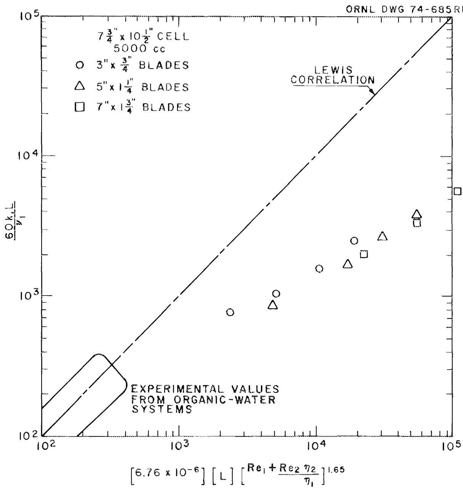  
Fig. 1. Selected experimental results as compared with the Lewis correlation for the water-mercury system.

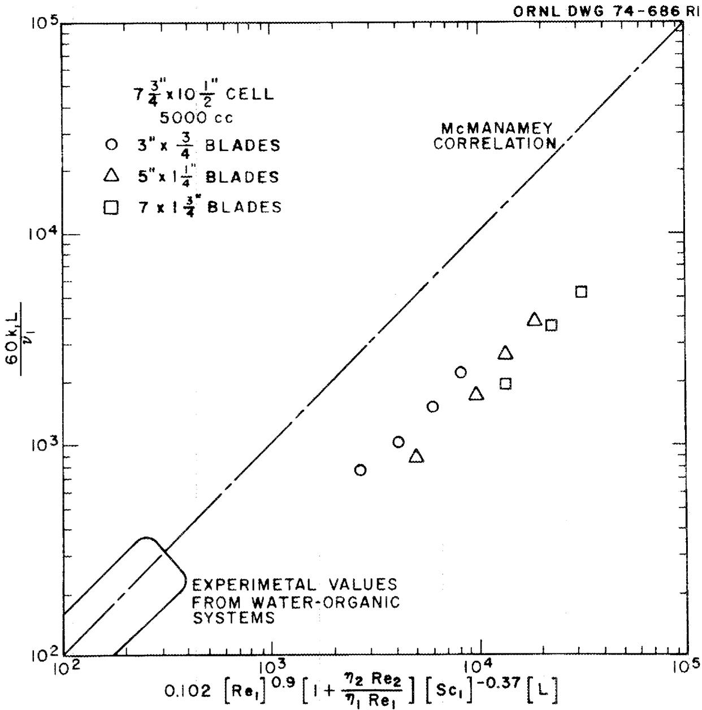  
Fig. 2. Selected water-mercury experimental results as compared with the McManamey correlation.

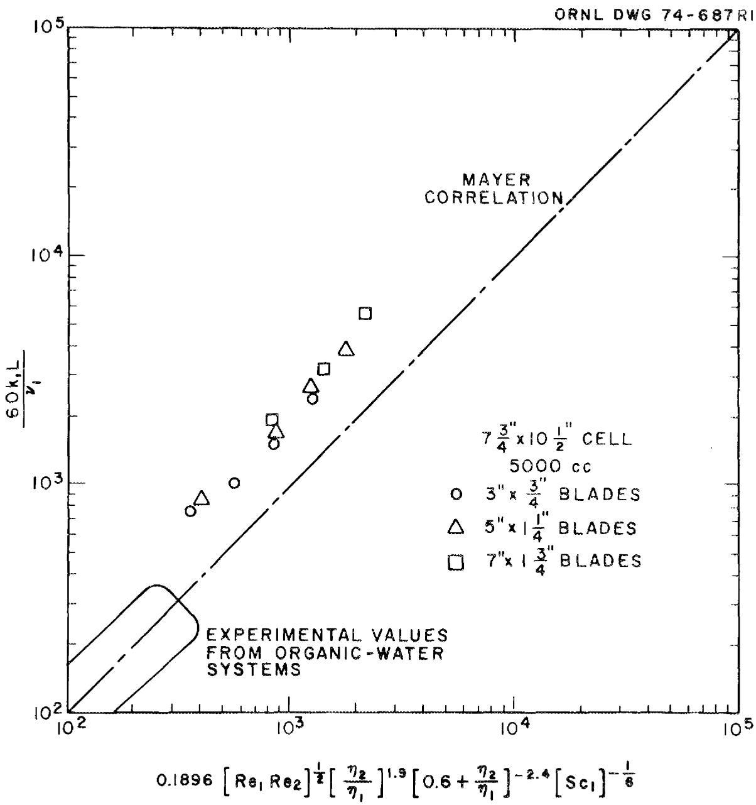  
Fig. 3. Selected experimental results as compared with the Mayer correlation for the water-mercury system.

Table 1. Experimental and predicted mass transfer rates for the water-mercury system   

<table><tr><td rowspan="2">Run No.</td><td rowspan="2">Contactor size (cm)</td><td rowspan="2">(L) Blade size (diam x height)</td><td rowspan="2">Phase volume (cc)</td><td rowspan="2">(H) Phase depth (cm)</td><td rowspan="2">(N) Stirrer speed (rpm)</td><td colspan="2">60 k1L v1</td><td rowspan="2">Contractor size (cm)</td><td rowspan="2">(L) Blade size (diam x height)</td><td rowspan="2">Phase volume (cc)</td><td rowspan="2">(H) Phase depth (cm)</td><td rowspan="2">(N) Stirrer speed (rpm)</td><td colspan="2">60 k1L v1</td><td></td></tr><tr><td>Predicted valuea</td><td>Experimental value</td><td>Predicted valuea</td><td>Experimental value</td><td></td></tr><tr><td>1</td><td>13.3 x 17.8</td><td>7.62 x 1.90</td><td>1,200</td><td>5.2</td><td>55</td><td>917</td><td>836</td><td>55</td><td>19.7 x 26.7</td><td>7.62 x 1.90</td><td>9,000</td><td>17.0</td><td>125</td><td>1223</td><td>1022</td></tr><tr><td>2</td><td></td><td></td><td>1,200</td><td>5.2</td><td>72</td><td>1200</td><td>577</td><td>56</td><td></td><td></td><td>9,000</td><td>17.0</td><td>150</td><td>1467</td><td>1234</td></tr><tr><td>3</td><td></td><td></td><td>1,200</td><td>5.2</td><td>98</td><td>1634</td><td>1457</td><td>70</td><td></td><td>12.70 x 3.175</td><td>3,000</td><td>5.5</td><td>21</td><td>1193</td><td>959</td></tr><tr><td>5</td><td></td><td></td><td>1,200</td><td>5.2</td><td>136</td><td>2267</td><td>3078</td><td>71</td><td></td><td></td><td>3,000</td><td>6.0</td><td>41</td><td>2240</td><td>1840</td></tr><tr><td>10</td><td></td><td></td><td>1,800</td><td>7.8</td><td>53</td><td>736</td><td>689</td><td>72</td><td></td><td></td><td>3,000</td><td>6.0</td><td>59</td><td>3223</td><td>2521</td></tr><tr><td>11</td><td></td><td></td><td>1,800</td><td>7.8</td><td>70</td><td>972</td><td>645</td><td>73</td><td></td><td></td><td>3,000</td><td>6.0</td><td>79</td><td>4316</td><td>3485</td></tr><tr><td>12</td><td></td><td></td><td>1,800</td><td>7.8</td><td>99</td><td>1375</td><td>1313</td><td>74</td><td></td><td></td><td>5,000</td><td>9.5</td><td>20</td><td>889</td><td>884</td></tr><tr><td>13</td><td></td><td></td><td>1,800</td><td>7.8</td><td>150</td><td>2083</td><td>2710</td><td>75</td><td></td><td></td><td>5,000</td><td>9.5</td><td>44</td><td>1955</td><td>1681</td></tr><tr><td>14</td><td></td><td></td><td>1,800</td><td>7.8</td><td>180</td><td>2500</td><td>3956</td><td>76</td><td></td><td></td><td>5,000</td><td>9.5</td><td>61</td><td>2710</td><td>2769</td></tr><tr><td>20</td><td></td><td></td><td>2,600</td><td>11.0</td><td>51</td><td>607</td><td>428</td><td>77</td><td></td><td></td><td>5,000</td><td>9.5</td><td>75</td><td>3332</td><td>4329</td></tr><tr><td>21</td><td></td><td></td><td>2,600</td><td>11.0</td><td>70</td><td>833</td><td>517</td><td>78</td><td></td><td></td><td>7,000</td><td>13.5</td><td>21</td><td>797</td><td>869</td></tr><tr><td>22</td><td></td><td></td><td>2,600</td><td>11.0</td><td>126</td><td>1499</td><td>2025</td><td>79</td><td></td><td></td><td>7,000</td><td>13.5</td><td>40</td><td>1517</td><td>1144</td></tr><tr><td>23</td><td></td><td></td><td>2,600</td><td>11.0</td><td>183</td><td>2177</td><td>3034</td><td>80</td><td></td><td></td><td>7,000</td><td>13.5</td><td>60</td><td>2276</td><td>2046</td></tr><tr><td>24</td><td></td><td></td><td>2,600</td><td>11.2</td><td>205</td><td>2420</td><td>3711</td><td>81</td><td></td><td></td><td>7,000</td><td>13.5</td><td>80</td><td>3035</td><td>3133</td></tr><tr><td>35</td><td></td><td>12.70 x 3.175</td><td>1,200</td><td>5.3</td><td>29</td><td>1676</td><td>1849</td><td>82</td><td></td><td></td><td>7,000</td><td>13.5</td><td>89</td><td>3376</td><td>3534</td></tr><tr><td>36</td><td></td><td></td><td>1,200</td><td>5.0</td><td>49</td><td>2906</td><td>3318</td><td>83</td><td></td><td></td><td>9,000</td><td>17.0</td><td>20</td><td>684</td><td>776</td></tr><tr><td>37</td><td></td><td></td><td>1,800</td><td>7.5</td><td>29</td><td>1433</td><td>1609</td><td>84</td><td></td><td></td><td>9,000</td><td>17.0</td><td>41</td><td>1402</td><td>1372</td></tr><tr><td>38</td><td></td><td></td><td>1,800</td><td>7.5</td><td>50</td><td>2471</td><td>3811</td><td>85</td><td></td><td></td><td>9,000</td><td>17.2</td><td>60</td><td>2041</td><td>1853</td></tr><tr><td>39</td><td></td><td></td><td>2,600</td><td>11.0</td><td>29</td><td>1206</td><td>1017</td><td>86</td><td></td><td></td><td>9,000</td><td>17.2</td><td>80</td><td>2721</td><td>2690</td></tr><tr><td>40</td><td></td><td></td><td>2,600</td><td>11.0</td><td>51</td><td>2121</td><td>3377</td><td>100</td><td></td><td>17.78 x 4.44</td><td>3,000</td><td>5.8</td><td>21</td><td>2657</td><td>2640</td></tr><tr><td>41</td><td></td><td></td><td>2,600</td><td>11.0</td><td>81</td><td>3369</td><td>6294</td><td>101</td><td></td><td></td><td>3,000</td><td>5.8</td><td>41</td><td>5185</td><td>5094</td></tr><tr><td>42</td><td>19.7 x 26.7</td><td>7.62 x 1.90</td><td>3,000</td><td>5.5</td><td>51</td><td>829</td><td>476</td><td>102</td><td></td><td></td><td>3,000</td><td>5.8</td><td>48</td><td>6073</td><td>7350</td></tr><tr><td>43</td><td></td><td></td><td>3,000</td><td>5.5</td><td>77</td><td>1252</td><td>1064</td><td>103</td><td></td><td></td><td>5,000</td><td>9.5</td><td>21</td><td>2128</td><td>2169</td></tr><tr><td>44</td><td></td><td></td><td>3,000</td><td>5.5</td><td>123</td><td>1999</td><td>1919</td><td>104</td><td></td><td></td><td>5,000</td><td>9.5</td><td>35</td><td>3546</td><td>4223</td></tr><tr><td>45</td><td></td><td></td><td>5,000</td><td>9.5</td><td>50</td><td>635</td><td>756</td><td>105</td><td></td><td></td><td>5,000</td><td>9.5</td><td>50</td><td>5066</td><td>6104</td></tr><tr><td>46</td><td></td><td></td><td>5,000</td><td>9.5</td><td>80</td><td>1017</td><td>1024</td><td>106</td><td></td><td></td><td>7,000</td><td>13.5</td><td>20</td><td>1730</td><td>1440</td></tr><tr><td>47</td><td></td><td></td><td>5,000</td><td>9.5</td><td>120</td><td>1525</td><td>1548</td><td>107</td><td></td><td></td><td>7,000</td><td>13.5</td><td>35</td><td>3028</td><td>3392</td></tr><tr><td>48</td><td></td><td></td><td>5,000</td><td>9.5</td><td>181</td><td>2300</td><td>2507</td><td>108</td><td></td><td></td><td>7,000</td><td>13.5</td><td>52</td><td>4498</td><td>6091</td></tr><tr><td>49</td><td></td><td></td><td>7,000</td><td>13.5</td><td>53</td><td>575</td><td>765</td><td>109</td><td></td><td></td><td>9,000</td><td>17.2</td><td>22</td><td>1707</td><td>2118</td></tr><tr><td>50</td><td></td><td></td><td>7,000</td><td>13.2</td><td>78</td><td>855</td><td>1045</td><td>110</td><td></td><td></td><td>9,000</td><td>17.5</td><td>39</td><td>3002</td><td>3314</td></tr><tr><td>51</td><td></td><td></td><td>7,000</td><td>13.5</td><td>127</td><td>1378</td><td>956</td><td>111</td><td></td><td></td><td>9,000</td><td>17.5</td><td>47</td><td>3617</td><td>4566</td></tr><tr><td>52</td><td></td><td></td><td>7,000</td><td>13.2</td><td>185</td><td>2028</td><td>1839</td><td>130</td><td>29.5 x 31.8</td><td>12.70 x 3.17</td><td>25,000</td><td>26.8</td><td>32</td><td>892</td><td>1167</td></tr><tr><td>53</td><td></td><td></td><td>9,000</td><td>17.1</td><td>51</td><td>498</td><td>421</td><td>131</td><td></td><td></td><td>25,000</td><td>26.9</td><td>51</td><td>1418</td><td>1435</td></tr><tr><td>54</td><td></td><td></td><td>9,000</td><td>17.0</td><td>82</td><td>802</td><td>843</td><td>132</td><td></td><td></td><td>25,000</td><td>26.2</td><td>80</td><td>2252</td><td>1881</td></tr></table>

$$
{ } ^ { a } 0 . 2 0 5 8 \left( R e _ { 1 } \right) \left( \frac { n _ { 2 } } { n _ { 1 } } \right) ^ { 1 . 4 } \left( 0 . 6 + \frac { n _ { 2 } } { n _ { 1 } } \right) ^ { - 2 . 4 } ( S c _ { 1 } ) ^ { - 1 / 6 } \left( \frac { p _ { 2 } } { p _ { 1 } } \right) ^ { 0 . 2 7 } \left( \frac { L } { H } \right) ^ { 0 . 4 5 }
$$

A linear regression which was performed on all the new experimental data to determine the exponents on $(\rho_{1} / \rho_{2})$ and $(L / H)$ yielded the following:

$$
\frac {6 0 k _ {1} L _ {1}}{v _ {1}} = 0. 2 0 5 8 \left[ R e _ {1} R e _ {2} \right] ^ {1 / 2} \left[ \frac {\eta_ {2}}{\eta_ {1}} \right] ^ {1. 9} \left[ 0. 6 + \frac {\eta_ {2}}{\eta_ {1}} \right] ^ {- 2. 4} \left[ S c _ {1} \right] ^ {- 1 / 6} \left[ \frac {\rho_ {1}}{\rho_ {2}} \right] ^ {0. 2 3} \left[ \frac {L _ {1}}{H} \right] ^ {0. 4 5}. \tag {7}
$$

For the case in which the blades in each phase have identical dimensions and stirring rates, this reduces to:

$$
\frac {6 0 \mathrm {k} _ {1} \mathrm {L}}{\nu_ {1}} = 0. 2 0 5 8 \left[ \operatorname {R e} _ {1} \right] \left[ \frac {\eta_ {2}}{\eta_ {1}} \right] ^ {1. 4} \left[ 0. 6 + \frac {\eta_ {2}}{\eta_ {1}} \right] ^ {- 2. 4} \left[ \operatorname {S c} _ {1} \right] ^ {- 1 / 6} \left[ \frac {\rho_ {2}}{\rho_ {1}} \right] ^ {0. 2 7} \left[ \frac {\mathrm {L}}{\mathrm {H}} \right] ^ {0. 4 5}. \tag {8}
$$

The constant was determined using the aqueous-organic systems as well as the mercury-water system. Thus the new correlation predicts the aqueous-organic systems as accurately as the Mayer correlation.

The modified correlation fits the experimental water-mercury data with a standard deviation at $25\%$ , as shown in Fig. 4.

# 2.3 Comparison of Correlations with MTE-3 Data

A comparison of the mass transfer coefficients reported from the experiment MTE-3 with both the Lewis and modified correlations was made in order to test the fit of the correlations with an actual salt-bismuth system. Results of the comparison are shown in Table 2. The data indicate that, while the Lewis correlation vastly overpredicts the mass transfer coefficients, the modified correlation usually underpredicts them —

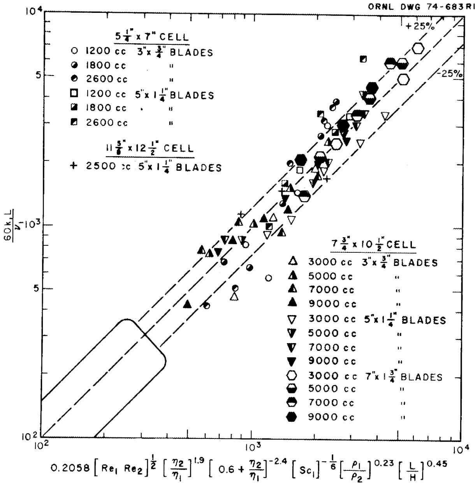  
Fig. 4. Experimental water-mercury results as fit by the modified mass-transfer correlation.

Table 2. Mass transfer coefficients from MTE-3 as compared with the Lewis and modified correlations   

<table><tr><td rowspan="2">Material</td><td rowspan="2">Agitator speed (rpm)</td><td colspan="3">K1(cm/sec)a</td><td colspan="3">K2(cm/sec)b</td><td colspan="3">K3(cm/sec)c</td></tr><tr><td>Measured value</td><td>Percent of Lewis</td><td>Percent of modified</td><td>Measured value</td><td>Percent of Lewis</td><td>Percent of modified</td><td>Measured value</td><td>Percent of Lewis</td><td>Percent of modified</td></tr><tr><td rowspan="2">Europium</td><td>100</td><td>1.0 x 10-4</td><td>30</td><td>400</td><td>1.5 x 10-6</td><td>10</td><td>71</td><td>1.1 x 10-3</td><td>10</td><td>85</td></tr><tr><td>200</td><td>3.0 x 10-4</td><td>30</td><td>600</td><td>4.8 x 10-6</td><td>10</td><td>112</td><td>3.3 x 10-3</td><td>10</td><td>127</td></tr><tr><td rowspan="6">Lanthanum</td><td>100</td><td>6.0 x 10-5</td><td>15</td><td>286</td><td>3.9 x 10-5</td><td>0.5</td><td>3</td><td>6.2 x 10-3</td><td>7</td><td>151</td></tr><tr><td>150</td><td>1.4 x 10-4</td><td>15</td><td>438</td><td>1.1 x 10-4</td><td>0.5</td><td>6</td><td>1.2 x 10-2</td><td>7</td><td>197</td></tr><tr><td>200</td><td>2.0 x 10-4</td><td>15</td><td>465</td><td>1.3 x 10-4</td><td>0.5</td><td>5</td><td>2.0 x 10-2</td><td>7</td><td>247</td></tr><tr><td>200</td><td>2.0 x 10-4</td><td>15</td><td>465</td><td>2.0 x 10-3</td><td>10</td><td>77</td><td>2.0 x 10-2</td><td>7</td><td>247</td></tr><tr><td>300</td><td>2.6 x 10-4</td><td>15</td><td>406</td><td>3.2 x 10-3</td><td>10</td><td>82</td><td>2.0 x 10-2</td><td>4</td><td>167</td></tr><tr><td>300</td><td>2.6 x 10-4</td><td>15</td><td>406</td><td>3.2 x 10-3</td><td>10</td><td>82</td><td>2.0 x 10-2</td><td>4</td><td>167</td></tr><tr><td rowspan="2">Neodymium</td><td>200</td><td>2.0 x 10-4</td><td>15</td><td>339</td><td>6.5 x 10-3</td><td>10</td><td>162</td><td>2.0 x 10-2</td><td>7</td><td>247</td></tr><tr><td>300</td><td>3.0 x 10-4</td><td>15</td><td>341</td><td>1.1 x 10-2</td><td>10</td><td>186</td><td>2.0 x 10-2</td><td>4</td><td>167</td></tr></table>

$\mathbf{a}_{\mathbf{K}_{1}}$ measured at fluoride salt--Bi-Th interface.   
$\mathbf{b}_{\kappa_2}$ measured at LiCl--Bi-Th interface.   
$c_{K_3}$ measured at LiCl--Li-Bi interface.

salt-bismuth flow-through facility. This experimental system (Fig. 5) allows (l) periodic cleaning of the feed salt and metal, (2) removal of surface contamination from the salt-metal interface, and (3) variation of the distribution ratio of the material of interest between the salt and the bismuth.

# 2.4.1 Experimental equipment

The new stirred-interface contactor makes use of the existing piping, equipment, and instrumentation present in the mild-steel reductive extraction system. The contactor, which is geometrically identical to that used with the water-mercury system, consists of a 6-in.-diam carbon-steel vessel containing four 1-in.-wide vertical baffles. The agitator consists of two 3-in.-diam stirrers with four noncanted blades. A 3/4-in. overflow at the interface allows for removal of interfacial films, as well as the salt and metal outflow. The system is operated in essentially the same manner as was employed with the packed column.[7-11] The salt and bismuth phases were equilibrated prior to an experiment. After the salt and metal phases had been transferred to the feed tanks,[97] Zr and $^{237}$ U tracers were added to the salt. With this technique the rates at which zirconium and uranium tracer transfer from the salt to the bismuth could be measured in a system that was otherwise at chemical equilibrium.

# 2.4.2 Mathematical analysis

For a flow-through, continuously stirred contactor at steady-state conditions, a mass balance on the salt phase yields:

$$
F _ {1} C _ {1} = F _ {1} C _ {s} + J, \tag {9}
$$

where

$$
\begin{array}{l} F _ {1} = \text {f l o w r a t e o f s a l t , c m} ^ {3} / \sec , \\ C _ {1} = \text {t r a c e r c o n c e n t r a t i o n i n s a l t i n f l o w , u n i t s / c m} ^ {3}, \\ C _ {s} = \text {t r a c e r c o n c e n t r a t i o n i n s a l t o u t f l o w , u n i t s / c m} ^ {3}, \\ J = \text {r a t e} \\ \end{array}
$$

ORNL DWG 74-694R1

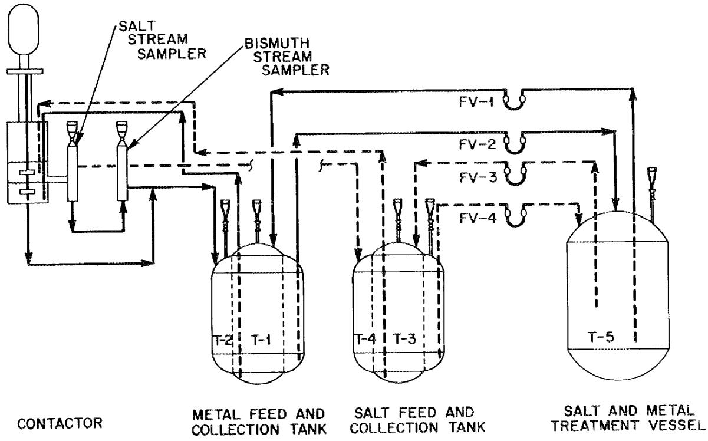  
Fig. 5. Salt-metal contactor as installed in the mild-steel reductive extraction facility.

Expressing the rate of transfer across the interface as the product of an overall mass transfer coefficient and a driving force times the area available for mass transfer yields:12

$$
J = K _ {S} \left[ C _ {S} - C _ {m} / D \right] A, \tag {10}
$$

where

$$
1 / K _ {S} = 1 / k _ {S} + 1 / D k _ {m}, \tag {11}
$$

and

$K_{s} =$ overall mass transfer coefficient based on salt phase, cm/sec,

$k_{s} =$ individual mass transfer coefficient in salt phase, cm/sec,

$\mathrm{k}_{\mathrm{m}} =$ individual mass transfer coefficient phase in metal, cm/sec,

D = distribution coefficient = ratio of concentration in metal

phase to concentration in salt phase at equilibrium,

$$
\frac {\text {m o l e s} / \mathrm {c m} ^ {3}}{\text {m o l e s} / \mathrm {c m} ^ {3}},
$$

$C_{m} =$ tracer concentration in metal outflow, units/cm $^3$ , and

A $=$ interfacial area, $\mathrm{cm}^2$

Taking an overall mass balance gives:

$$
C _ {1} F _ {1} + C _ {2} F _ {2} = C _ {s} F _ {1} + C _ {m} F _ {2}, \tag {12}
$$

where

$C_2 =$ tracer concentration in metal inflow, units/cm $^3$ , and

$F_{2} =$ flow rate of metal, $\mathrm{cm}^3/\mathrm{sec}$ .

If $C_2 = 0$ , Eq. (12) can be rearranged to give the four following relations:

$$
C _ {1} F _ {1} = C _ {s} F _ {1} + C _ {m} F _ {2}, \tag {13}
$$

$$
C _ {1} = C _ {s} + C _ {m} \left(\frac {F _ {2}}{F _ {1}}\right), \tag {14}
$$

$$
C _ {s} = C _ {1} - C _ {m} \left(\frac {F _ {2}}{F _ {1}}\right), \text {a n d} \tag {15}
$$

$$
C _ {m} = C _ {1} \frac {F _ {1}}{F _ {2}} - C _ {s} \left(\frac {F _ {1}}{F _ {2}}\right). \tag {16}
$$

Combining Eqs. (9), (10), and (16) yields:

$$
F _ {1} C _ {l} = F _ {1} C _ {s} + K _ {s} C _ {s} A - \frac {K _ {s} C _ {l} A}{D} \left(\frac {F _ {l}}{F _ {2}}\right) + \frac {K _ {s} C _ {s} A}{D} \left(\frac {F _ {l}}{F _ {2}}\right), \tag {17}
$$

which can be rearranged to give:

$$
C _ {s} / C _ {1} = \frac {F _ {1} + \frac {K A}{D} \left(F _ {1} / F _ {2}\right)}{F _ {1} + K s A + \frac {K A}{D} \left(\frac {F _ {1}}{F _ {2}}\right)}. \tag {18}
$$

Combining Eqs. (9), (10), and (15) yields:

$$
F _ {1} C _ {1} = F _ {1} C _ {1} - C F _ {2} + K _ {S} C _ {1} A - (K _ {S} C _ {1} A) \frac {F _ {2}}{F _ {1}} - \left(\frac {K _ {S} C _ {1} A}{D}\right), \tag {19}
$$

which is rearranged to give:

$$
\mathrm {C} _ {\mathrm {m}} / \mathrm {C} _ {1} = \frac {\mathrm {K} _ {\mathrm {S}} \mathrm {A}}{\mathrm {F} _ {2} + \left(\mathrm {K} _ {\mathrm {S}} \mathrm {A}\right) \frac {\mathrm {F} _ {2}}{\mathrm {F} _ {1}} + \left(\frac {\mathrm {K} _ {\mathrm {S}} \mathrm {A}}{\mathrm {D}}\right)}. \tag {20}
$$

Combining Eqs. (9), (10), and (14) yields:

$$
F _ {1} C _ {s} + C F _ {2} = F _ {1} C _ {s} + K _ {s} C A - \left(\frac {K _ {s} C A}{D}\right), \tag {21}
$$

which is arranged to give:

$$
C _ {m} / C _ {s} = \frac {K A}{F _ {2} + \left(\frac {K A}{D}\right)}. \tag {22}
$$

Rearranging Eqs. (18), (20), and (22) gives three expressions for the overall mass transfer coefficient in terms of the measured quantities $C_1, C_2, C_3$ , $F_1, F_2$ , $D$ , and $A$ :

$$
\begin{array}{l} \mathrm {K} _ {\mathrm {S}} = \frac {\mathrm {F} _ {1} \left(1 - \frac {\mathrm {C} _ {\mathrm {S}}}{\mathrm {C} _ {1}}\right)}{\mathrm {A} \left(\frac {\mathrm {C} _ {\mathrm {S}}}{\mathrm {C} _ {1}}\right) + \frac {\mathrm {A}}{\mathrm {D}} \left(\frac {\mathrm {C} _ {\mathrm {S}}}{\mathrm {C} _ {1}}\right) \left(\frac {\mathrm {F} _ {1}}{\mathrm {F} _ {2}}\right) - \frac {\mathrm {A}}{\mathrm {D}} \left(\frac {\mathrm {F} _ {1}}{\mathrm {F} _ {2}}\right)}, (23) \\ K _ {S} = \frac {\left(\frac {C _ {m}}{C _ {1}}\right) F _ {2}}{A - A \left(\frac {C _ {m}}{C _ {1}}\right) \left(\frac {F _ {2}}{F _ {1}}\right) - \left(\frac {C _ {m}}{C _ {1}}\right) \left(\frac {A}{D}\right)} \text {, a n d} (24) \\ K _ {S} = \frac {\left(\frac {C _ {m}}{C _ {s}}\right) F _ {2}}{A - \left(\frac {C _ {m}}{C _ {s}}\right) \left(\frac {A}{D}\right)}. (25) \\ \end{array}
$$

The above equations can then be used to calculate mass transfer coefficients from experimental results (i.e., the ratio of tracer concentrations in any two of the salt or bismuth flows).

Approximately 10-liter volumes of salt and bismuth were available, allowing flow rates up to 200 cc/min. Experimental values of D, the distribution coefficient for the material of interest, will vary somewhat; however, if D is made large enough, Eqs. (23), (24), and (25) reduce to:

$$
K _ {S} = \frac {F _ {1}}{A} \left(\frac {1 - \left(\frac {C _ {s}}{C _ {1}}\right)}{\left(\frac {C _ {s}}{C _ {1}}\right)}\right), \tag {26}
$$

$$
K _ {S} = \frac {F _ {2}}{A} \left(\frac {\left(\frac {C}{C _ {1}}\right)}{1 - \left(\frac {F _ {2}}{F _ {1}}\right) \left(\frac {C _ {m}}{C _ {1}}\right)}\right), \text {a n d} \tag {27}
$$

$$
\mathrm {K} _ {\mathrm {S}} = \frac {\mathrm {F} _ {2}}{\mathrm {A}} \frac {\mathrm {C} _ {\mathrm {m}}}{\mathrm {C} _ {\mathrm {s}}} \cdot \tag {28}
$$

Uncertainties in the distribution coefficient do not affect the accuracy of the overall mass transfer coefficient. However, when D is very large, the overall mass transfer coefficient is essentially the individual salt-phase coefficient since resistance to mass transfer in the metal phase is negligible in comparison. This is seen by allowing D to assume large values in Eq. (11).

# 2.4.3 Experimental results

Four runs have been completed to date. All runs were performed in a similar manner except as discussed below.

While the fluoride salt and bismuth are in contact in T5, the treatment vessel, a sufficient quantity of beryllium is electrolytically added to the salt to give any desired uranium distribution coefficient $(D_{u})$ . Since it is impossible to completely exclude oxidants, beryllium needs to be added periodically in order to maintain a relatively high distribution coefficient. Periodic transfers of salt and bismuth throughout the system are also performed to maintain the system at equilibrium.

Prior to a run, the salt and bismuth phases were separated by pressurizing T5 and transferring salt to T3 and bismuth to Tl. Approximately 7 mCi of $^{97}\mathrm{Zr}-^{97}\mathrm{Nb}$ and 50 to 100 mCi of $^{237}\mathrm{U}_{3}\mathrm{O}_{8}$ were then allowed to dissolve in the salt phase for about 2 hr. Activities of the $^{95}\mathrm{Zr}$ and $^{236}\mathrm{U}$ , which were also present, were negligible.

Salt and bismuth streams were passed through the contactor vessel by controlled pressurization of both T1 and T3. The contactor was maintained at approximately $590^{\circ}\mathrm{C}$ for each run. Both phases exit through a common overflow line, separate, and return to tanks T2 and T4. Periodic sampling of both exit streams was accomplished by means of flowing stream samplers installed in the exit lines from the contactor.

Samples taken were first counted for $^{237}\mathrm{U}$ and $^{97}\mathrm{Zr}$ , then pulverized, dissolved, and counted again for $^{237}\mathrm{U}$ (at this point, $^{97}\mathrm{Zr}$ had decayed to a very low level). Counting twice was done in order to correct for the self-absorption in the solid salt or bismuth samples of the 207.95-keV $\beta^{-}$ from $^{237}\mathrm{U}$ . No similar correction for the self-absorption of the $^{97}\mathrm{Zr}-^{97}\mathrm{Nb}$ (743.37 keV and 658.18 keV $\beta^{-}$ , respectively) activity could be done because of the shorter half-life. A complete wet analysis was also run on each sample. Mass transfer rates could then be calculated from the ratios of tracer concentrations as discussed previously.

Run TSMC-1 was mainly a preliminary experiment designed to test the procedure. In this run, the salt and bismuth flows were approximately 200 cc/min and the stirrer rate was 123 rpm. Unfortunately, the distribution coefficient was too low to effect any significant mass transfer; thus mass transfer rates could not be accurately determined.

Run TSMC-2 was performed without difficulty. The salt and bismuth flow rates were 228 and 197 cc/min, respectively. The distribution coefficient for this run was determined to be approximately 1.5, which was lower than desired but high enough to give meaningful results.

A bismuth line failure occurred immediately preceding run TSMC-3. During the resulting delay for repairs, the $^{97}$ Zr decayed and only the $^{237}$ U tracer could be used. The remainder of the run went smoothly. The salt and bismuth flow rates were 166 and 173 cc/min, respectively; the stirrer rate was 162 rpm. A high $D_{u} (>40)$ was maintained for this run.

In run TSMC-4, flow rates of 170 and 144 cc/min were set for the salt and bismuth flows; a stirrer rate of 205 rpm was maintained. Both distribution coefficients as determined from samples taken before, after, and during the run were greater than 200. [This value is sufficiently large that Eqs. (26-28) are valid.] Large distribution coefficients cannot be determined precisely due to the inability to determine very small amounts of uranium in the salt phase. No significant problems were encountered during this run.

Results for these four runs are shown in Table 3. As noted previously, results from run TSMC-1 are not meaningful. The three equations for determining the mass transfer rates [Eqs. (26), (27), and (28)] were used to calculate values for the mass transfer coefficient.

# 2.5 Contactor Area Required for MSBR Processing Plant

An estimate of the area required for a one-stage contactor for removing rare earths from the fuel salt can be made by using the mass transfer coefficients measured in the salt-bismuth flow-through facility.

The flowsheet assumes a total reactor fuel salt volume of 47,500 liters, with a salt flow of 55 cc/sec; this would give a 10-day removal time for the salt. Of the rare earths, cerium has the shortest removal time (16.6 days). Therefore, approximately a $60\%$ efficiency is needed for the proposed stirred interface contactor.

From Eq. (18),

$$
C _ {s} / C _ {1} = \frac {F _ {1} + \frac {K A}{D} \left(F _ {1} / F _ {2}\right)}{F _ {1} + K A + \frac {S}{D} \left(F _ {1} / F _ {2}\right)} = 0. 6 0 \tag {29}
$$

if $D$ is made large and the following reference values are used:

$$
F _ {2} = 7 8 0 \mathrm {c c / s e c} = \text {b i s m u t h f l o w r a t e},
$$

$$
F _ {1} = 5 5 \mathrm {c c / s e c} = \text {s a l t f l o w r a t e}, \text {a n d}
$$

$$
\text {a r e a} = 3 6. 7 / \mathrm {K} _ {\mathrm {S}}.
$$

Substituting values of mass transfer coefficient from Table 3 into Eq.

(29) gives the following results:

Table 3. Experimental results from the salt-metal contactor   

<table><tr><td rowspan="3">Run</td><td rowspan="3">Salt flow (cc/min)</td><td rowspan="3">Bismuth flow (cc/min)</td><td rowspan="3">Stirrer rate (rpm)</td><td rowspan="3">D u</td><td rowspan="3">Fraction tracer transferreda</td><td colspan="5">Ks(cm/sec)b</td></tr><tr><td colspan="3">Experimental</td><td colspan="2">Correlations</td></tr><tr><td>K1</td><td>K2</td><td>K3</td><td>Lewis</td><td>Modified</td></tr><tr><td>TSMC-1</td><td>212</td><td>193</td><td>123</td><td>~0.02</td><td>~0</td><td>~0</td><td>0.0014</td><td>0.0012</td><td>0.00030</td><td>0.000043</td></tr><tr><td>TSMC-2</td><td>228</td><td>197</td><td>121</td><td>1.5</td><td>0.17</td><td>0.0043</td><td>0.0090</td><td>0.0070</td><td>0.020</td><td>0.0012</td></tr><tr><td>TSMC-3</td><td>166</td><td>173</td><td>162</td><td>&gt;40</td><td>0.50</td><td>0.015</td><td>0.0099</td><td>0.012</td><td>0.032</td><td>0.0017</td></tr><tr><td>TSMC-4</td><td>170</td><td>144</td><td>205</td><td>&gt;200</td><td>0.78</td><td>0.055</td><td>0.052</td><td>0.054</td><td>0.051</td><td>0.0021</td></tr></table>

Fraction tracer transferred $= 1 - \frac{C_{s}}{C_{l}}$ .

$$
{ } ^ { b } K _ { s _ { 1 } } = K _ { s } = \frac { F _ { 1 } } { A } \left( \frac { 1 - \frac { C _ { s } } { C _ { 1 } } } { \frac { C _ { s } } { C _ { 1 } } } \right) , K _ { s _ { 2 } } = K _ { s } = \frac { F _ { 2 } } { A } \left( \frac { C _ { m } / C _ { 1 } } { 1 - \left( \frac { F _ { 2 } } { F _ { 1 } } \right) \left( \frac { C _ { m } } { C _ { 1 } } \right) } \right) , a n d K _ { s _ { 3 } } = K _ { s } = \frac { F _ { 2 } } { A } \left( \frac { C _ { m } } { C _ { s } } \right) .
$$

if $K_{s} = 0.0042 \, \text{cm/sec} =$ lowest experimental value,

A $= 9\mathrm{ft}^2$ and

if $K_{s} = 0.054 \, \text{cm/sec} =$ highest experimental value,

A $= 0.7 ft^{2}$

These values for the area of the proposed contactor would seem to be quite reasonable. However, the actual area which would be required for a contactor in a processing plant would be somewhat larger because the distribution coefficient in the contactor would not be as large as was assumed in the above calculation.

# 2.6 Conclusions

A new correlation has been developed to account for the effect of large density differences and variations in the stirrer length/phase depth ratio. The correlation given in Eq. (7) accurately predicts the experimental results for the water-mercury system as well as the results for the aqueous-organic systems reported in the literature. A flow-through, stirred-interface contactor was installed in the mild-steel reductive extraction facility. Mass transfer rates for a molten fluoride salt--bismuth system were measured using this contactor. These measured rates fell between the predictions made by the Lewis and modified correlations, except when high stirrer rates were used; in the latter cases, high mass transfer rates were obtained. If these values of mass transfer coefficient prevail, the required mass transfer area in an MSBR processing plant would not be unreasonably large.

# 3. DEVELOPMENT OF THE METAL TRANSFER PROCESS: CONTINUATION OF ENGINEERING-SCALE EXPERIMENTS

H. C. Savage

The present processing flowsheet13 uses the metal transfer process for removing rare earths from molten-salt breeder reactor fuel salt. In this process, fuel salt that is free of uranium and protactinium but contains the rare earths is countercurrently contacted with bismuth containing reductant to extract the rare earths into the bismuth. The bismuth stream, which contains the rare earths and thorium, is then countercurrently contacted with LiCl. Because of favorable distribution coefficients, significant fractions of the rare earths transfer to the LiCl along with a negligible amount of thorium. The final steps of the process consist in extracting the rare earths from the LiCl by contact with bismuth having lithium concentrations of 5 and 50 at. $\%$

Four engineering-scale experiments (MTE-1, -2, -2B, -3) have been carried out to study the steps in the metal transfer process and to obtain information such as mass transfer rates of the rare earths between the salt and bismuth phases necessary for determining the size and type of equipment needed for the process. The results obtained in these experiments were reported previously. $^{14-17}$ The selective removal of rare earths (lanthanum and $^{147}\mathrm{Nd}$ ) from MSBR fuel carrier salt (72-16-12 mole $\%$ LiF- $\mathrm{BeF}_2$ -ThF $_4$ ) and transfer to Li-Bi acceptor alloy were demonstrated in experiments MTE-1, -2, and -2B. MTE-3 was a larger-scale experiment, which included features such as mechanical agitation of the salt and metal phases to improve mass transfer rates of the rare earths across the three salt-metal interfaces. This experiment was designed to measure the mass transfer rates across the three interfaces as a function of agitator speed for comparison with calculated values using a mass transfer correlation developed by J. B. Lewis. $^{18}$

Experiment MTE-3 (shown schematically in Fig. 6) consisted of three interconnected vessels: a 14-in.-diam fuel salt reservoir, a 10-in.-diam salt-metal contactor, and a 6-in.-diam rare-earth stripper. The salt-metal contactor was divided into two compartments that were interconnected

ORNL-DWG-7i-i47-RI

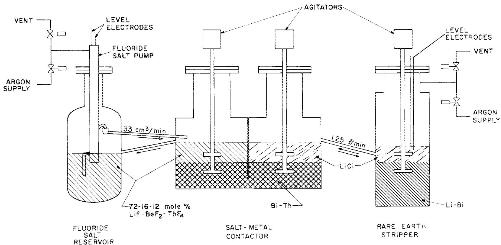  
Fig. 6. Flow diagram for metal transfer experiment MTE-3.

through an opening in the bottom of the divider by a pool of bismuth containing thorium and lithium. The stripper contained an Li-Bi solution. A mechanical agitator was used in each compartment of the contactor and in the Li-Bi stripper to promote mass transfer across the three salt-metal interfaces. All vessels were fabricated of carbon steel and had an oxidation-resistant coating of nickel aluminide on the outside surfaces.

The purpose of experiment MTE-3 was to evaluate the contactor and stripper described above for use in removing rare earths from molten-salt reactor fuel. Fluoride and LiCl flow rates were about $1\%$ of those required for removing rare earths from a 1000-MW(e) MSBR. The operating temperature was about $650^{\circ}\mathrm{C}$ ; the phases were 72-16-12 mole $\%$ LiF-BeF $_2$ -ThF $_4$ fuel carrier salt, 0.13 at. $\%$ Th-Bi solution containing about 100 wt ppm of lithium as reductant, and a 5 at. $\%$ Li-Bi solution in the stripper. In this process, the rare earths are extracted from the carrier salt into the Th-Bi solution. The rare earths are extracted from the Th-Bi into molten LiCl and are subsequently stripped from the LiCl into Bi-Li alloy.

Mass transfer coefficients for radium, europium, lanthanum, and neodymium were measured during 13 runs for comparison with values predicted by literature correlation. $^{18}$ Agitator speeds of 100 to 400 rpm were used. Many of the mass transfer coefficients were found to be substantially lower (4 to $15\%$ ) than predicted. $^{19}$ Termination of the MSR Program precluded further investigation of the mass transfer rates and postoperative examination of the MTE-3 equipment to determine the reason for the lower-than-expected transfer rates. The system was shut down and placed in standby condition, with all salt and metal phases frozen, in February 1973.

We plan to continue studies of the mass transfer rates of rare earths between fuel carrier salt, bismuth, and LiCl in a new experiment designated as MTE-3B. New vessels, salts, and bismuth will be used.

# 3.1 Examination of MTE-3 Equipment and Materials

Metal transfer experiment MTE-3 was maintained at approximately $650^{\circ}\mathrm{C}$ for about 1 year ( $\sim$ 8700 hr). During the final run (EU-9), in which an agitator speed of 400 rpm was employed, fluoride salt was entrained into the LiCl in the contactor $^{17}$ ( $\sim$ 10 wt % fluoride into the LiCl). This resulted in the transfer of thorium into the LiCl, from which it was subsequently extracted into the Li-Bi solution in the stripper. After run EU-9 the experiment was shut down, cooled to room temperature, and placed in standby. (This was in February 1973 when the MSR Program was terminated.)

Removal of the three agitator assemblies for examination of the molybdenum shafts and agitator blades and, if feasible, reuse in experiment MTE-3B required that the salt and metal phases in the contactor and stripper vessels be melted. After all heater circuits and recalibration of instrumentation had been checked, the contactor and stripper vessels were heated to approximately $650^{\circ}\mathrm{C}$ and the agitator assemblies were removed without difficulty. The agitator ports were immediately sealed with blank flange cover plates and the vessels cooled to ambient temperature. During the removal of the agitators, an argon atmosphere was maintained in the vessels.

A cursory visual examination indicated that the molybdenum shaft and blades were in good condition. No areas of heavy corrosion attacks were noted. However, some areas of the shaft and blades contain deposits of salt and metal which must be removed for a more-detailed and meaningful examination. Therefore, whether or not the molybdenum agitator can or should be used in experiment MTE-3B has not been determined. (Note: The shaft on the agitator from the LiCl side of the contactor was accidently broken, after removal, in an attempt to remove the pin holding the molybdenum shaft to the agitator drive unit.) Figure 7 is a photograph of the molybdenum agitator shafts as removed. Note that the agitator from the LiCl side of the contactor shaft is hollow at the break point. This is not in accord with the engineering drawing for the shaft (M12172 CD 027 E Rev. 5), which indicates a solid construction at the broken areas.

PHOTO 1070-74

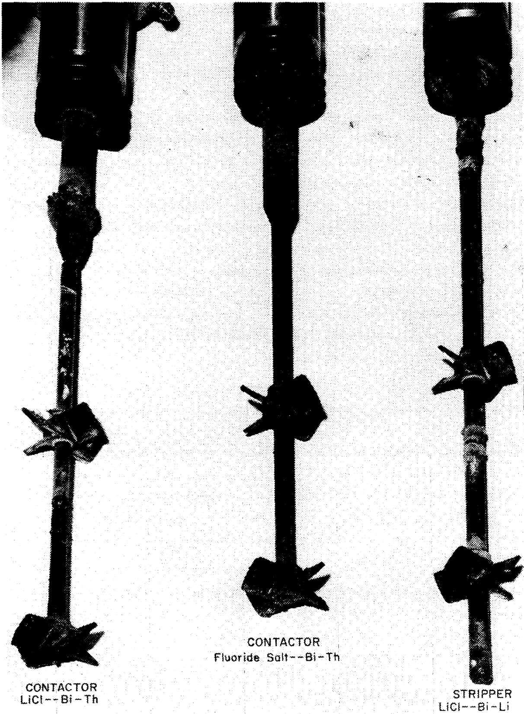  
Fig. 7. Photograph of agitator shafts removed from MTE-3.

We removed the thermal insulation from MTE-3 and some of the stainless steel shim stock surrounding the electric heaters. The outside surfaces of the carbon steel vessels (ASTM-A106 Grade B with a nominal composition of Fe; C, 0.30% max; Mn, 0.29-1.06%; P, 0.048% max; S, 0.058% max; Si, 0.10% min) were found to be badly oxidized due to failure of the oxidation-resistant coating. These vessels had been maintained at $\sim 650^{\circ}\mathrm{C}$ for approximately 1 year ( $\sim 8700\mathrm{hr}$ ). The depth of oxidation was estimated to be 1/16 in. or less and thus did not significantly affect the mechanical integrity of the vessels (initial wall thickness = 3/8 in.) at the operating conditions of MTE-3. The oxidation-resistant protective coating consisted of 0.015- to 0.020-in.-thick nickel aluminide applied by flame spraying with wire flame spray equipment. We contacted a representative of METCO, who recommended that a much better coating would be obtained by using a nickel-chromium alloy with aluminum composite in powder form (METCO No. P443-10) applied with plasma spray equipment. Test sections of carbon steel pipe with the two coatings described above have been prepared for comparative evaluation.

We obtained samples of the salts (fuel carrier salt and LiCl) and bismuth from the MTE-3 vessels by removing a 2-in.-diam plug across each salt-metal interface. A layer of material of different structure ( $\sim$ 1/3 in. thick) appeared to exist between the LiCl--Li-Bi phases in the stripper, whereas no comparable film was seen at the interfaces between the LiCl--Bi-Th and the fuel carrier salt--Bi-Th phases in the contactor. Corrosion of the inside surfaces of the 2-in.-diam vessel wall sections appeared minimal on visual examination of the 2-in.-diam plugs.

A small (vl/8- by 1/4-in.) sample of bismuth was taken at each of the three metal-salt interfaces for metallographic examination. Each section included the bismuth surface in contact with the salt phase. Photomicrographs of these samples are shown in Figs. 8-10. As seen, there is some foreign material at each surface of the bismuth which was in contact with the salt phase (fluid carrier salt and LiCl). Whether this material was present during operation of metal transfer experiment

ORNL DWG. 74-10113

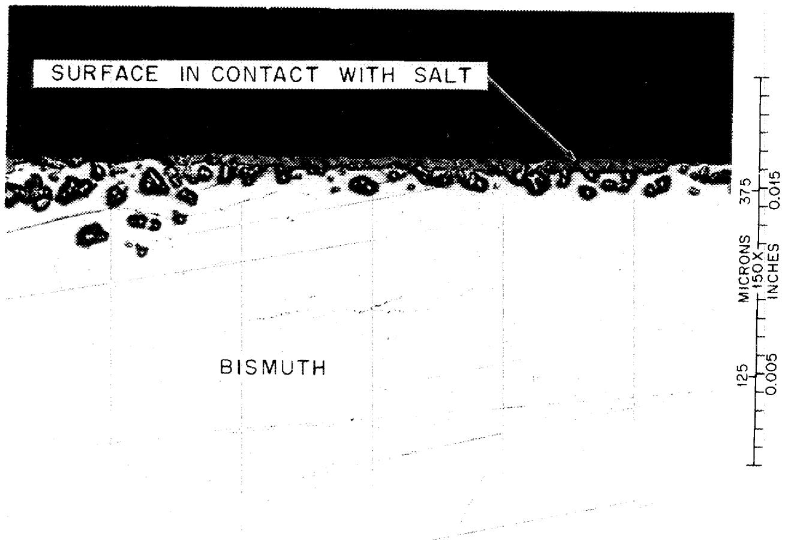  
Fig. 8. Photomicrograph of Bi-Th phase from the contactor at the fluoride carrier salt interface in experiment MTE-3. As polished. 150x.

ORNL DWG.74-10114

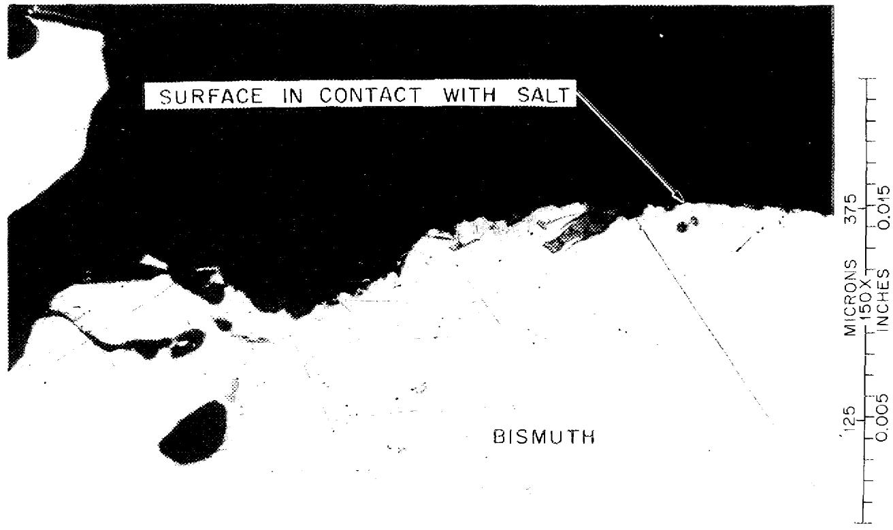  
Fig. 9. Photomicrograph of Bi-Th phase from the contactor at the LiCl interface in experiment MTE-3. As polished. 150x.

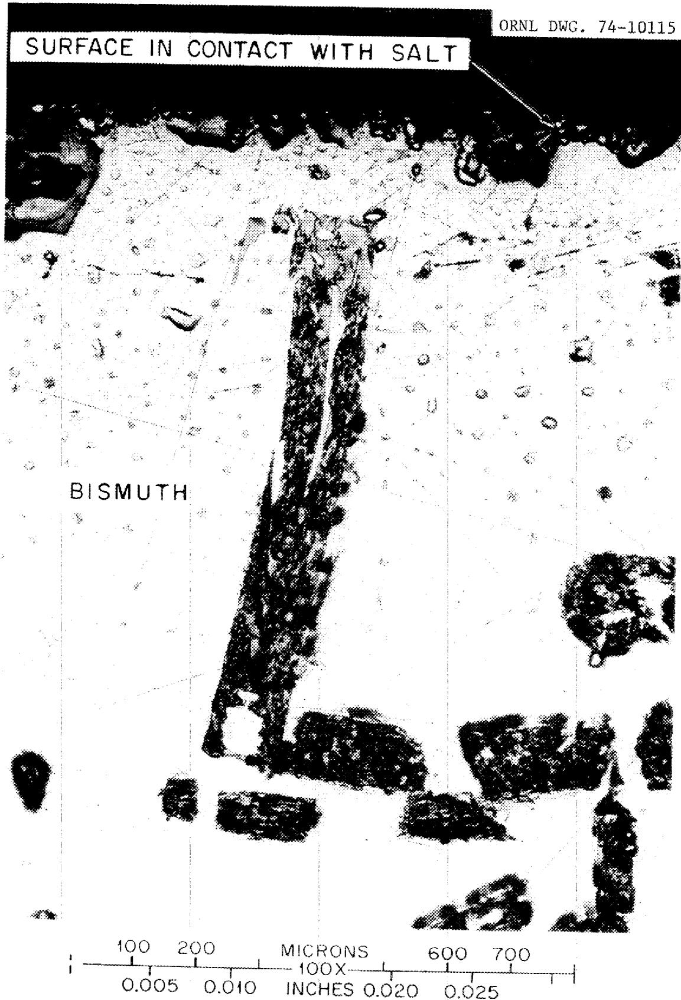  
Fig. 10. Photomicrograph of Li-Bi phase from the stripper vessel at the LiCl interface in experiment MTE-3. As polished. 100X.

MTE-3 or segregated at the surface when the phases were cooled without agitation is unknown.

Scanning electron microprobe analyses were performed to identify the material seen at the interfacial surfaces of the bismuth. Results are shown in Figs. 11-13. The bismuth in contact with the fluoride carriers salt contained a surface layer which was enriched with thorium and iron. Thorium and iron, along with some manganese and lanthanum (lanthanum was one of the rare earths used to measure mass transfer rates in MTE-3), were identified at the surface of the bismuth in contact with the LiCl in the contactor. Iron and thorium were also identified at the surface of the bismuth in contact with the LiCl in the stripper. The Bi-Th and the Li-Bi phases, as well as the salt phases, contained significant amounts of iron (see Table 4), undoubtedly as a result of corrosion of the carbon steel vessels. A petrographic examination was made of a sample of the fluoride salt from the contactor at a point near the Bi-Th phase and the tank wall. This examination indicated that the sample consisted principally of crystals of $3\mathrm{LiF}-\mathrm{ThF}_4$ . According to the phase diagram of the 72-16-12 mole $\%$ LiF- $BeF_2$ - $ThF_4$ , $3\mathrm{LiF}-\mathrm{ThF}_4$ would be expected to crystallize from solution on cooling--especially at or near the tank wall. No oxides were found in the sample.

A section of the Li-Bi--LiCl across the interfacial area from the stripper (which included the layer of material of different structure between the Li-Bi and the LiCl) is being examined by scanning electron microscopy. No results have been obtained as yet.

# 3.2 Status of Experiment MTE-3B

We plan to continue measuring the mass transfer rates of rare earths between salt and bismuth in a new experiment, which is designated as MTE-3B. The vessels, salts, and bismuth that were used for MTE-3 will be discarded. New carbon steel vessels are being fabricated, with mid-June being the estimated completion date. After the vessels have been received, assembly of the equipment will begin. Based on the results of MTE-3, initial experiments will be made at agitator speeds up to 300 rpm.

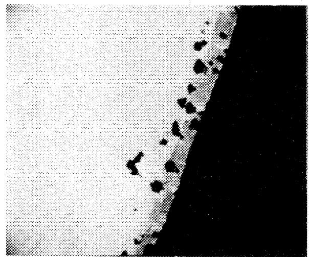  
Backscattered Electrons

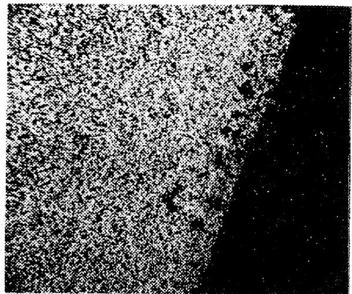  
Bi La X-Rays

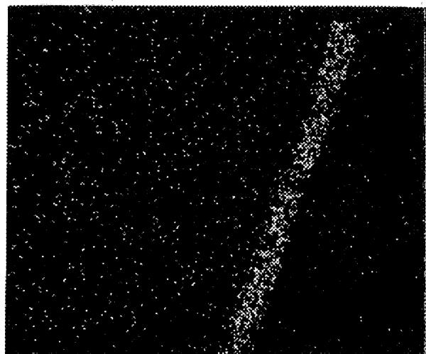  
Th $M_{\alpha}$ X-Rays

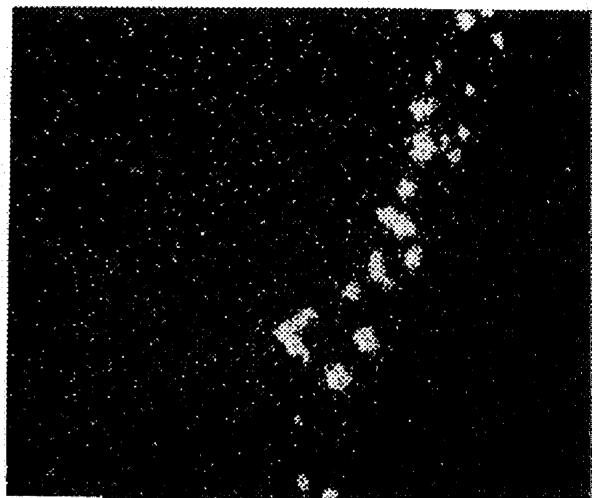  
500μm   
Fe Ka X-Rays   
Fig. 11. Electron beam scanning images of elements in the Bi-Th phase from the contactor at the fluoride salt interface in experiment MTE-3.

Y-124404

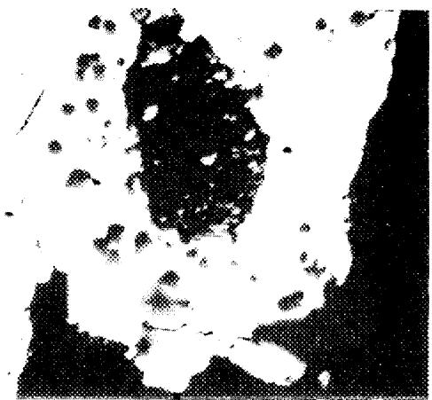  
Backscattered Electrons

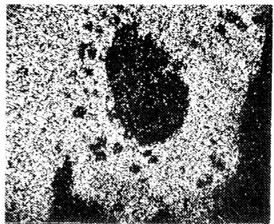  
Bi La X-Rays

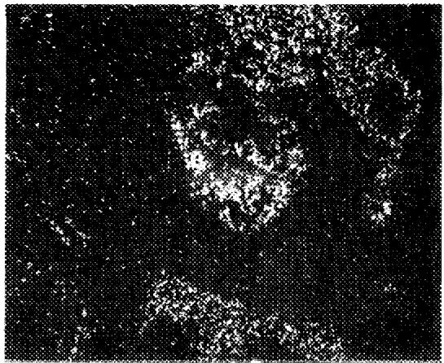  
Th Mo X-Rays

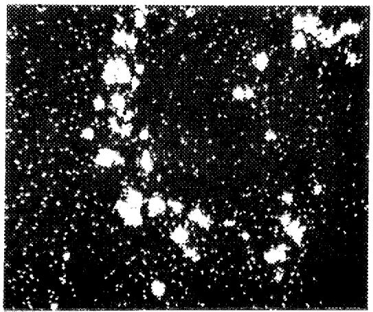  
Fe Ka X-Rays

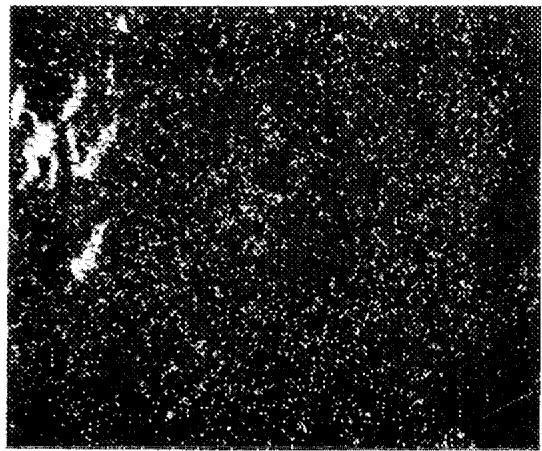  
Mn Kα X-Rays

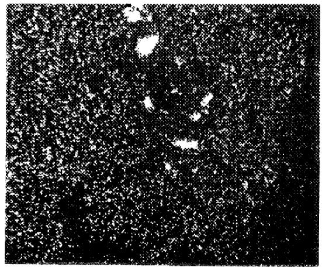  
La La X-Rays

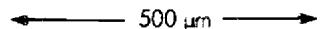  
Fig. 12. Electron beam scanning images of elements in the Bi-Th phase from the contactor at the LiCl salt interface in experiment MTE-3.

Y-124403

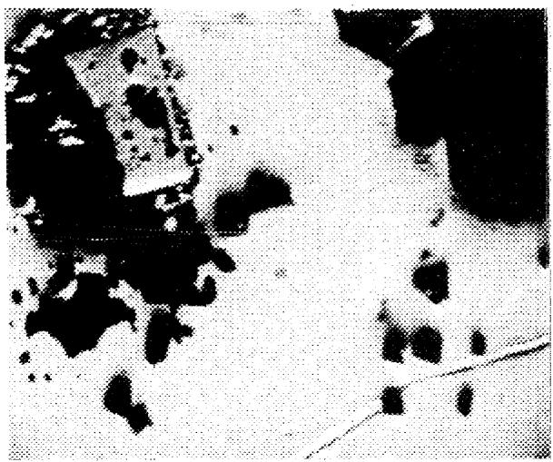  
Backscattered Electrons

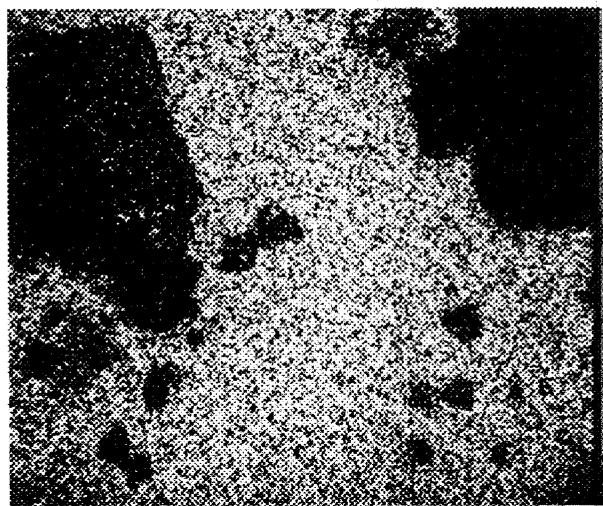  
Bi La X-Rays

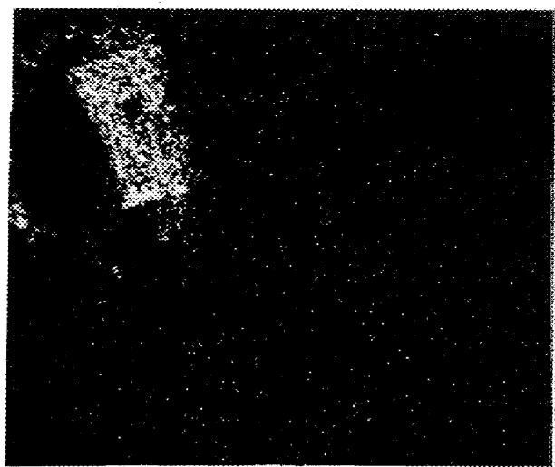  
ThMa X-Rays   
500μm

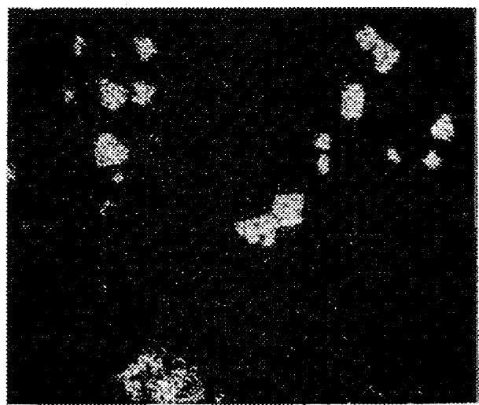  
Fe Ka X-Rays   
Fig. 13. Electron beam scanning images of elements in the Li-Bi phase from the stripper at the LiCl salt interface in experiment MTE-3.

Table 4. Iron content of samples of metal and salt phases from metal transfer experiment MTE-3   

<table><tr><td>Material</td><td>Fe (ppm)</td></tr><tr><td>Fluoride salt from contactor</td><td>320, 88a</td></tr><tr><td>Bi-Th, fluoride-salt side of contactor</td><td>1100</td></tr><tr><td>Bi-Th, LiCl side of contactor</td><td>2500</td></tr><tr><td>LiCl from contactor</td><td>3500</td></tr><tr><td>LiCl from stripper</td><td>650</td></tr><tr><td>Li-Bi from stripper</td><td>1400</td></tr></table>

Results for two different samples. All other results are for one sample.

Earlier data showed that improved transfer rates were observed with increasing speed; however, at 400 rpm, fluoride salt was entrained into the LiCl salt. $^{17}$ We plan to use $^{147}\mathrm{Nd}$ as the rare earth. As in experiment MTE-3, transfer rates can readily be followed by counting the 0.53-MeV gamma emitted by $^{147}\mathrm{Nd}$ . Also, the relatively short half-life of $^{147}\mathrm{Nd}$ (11 days) will allow experiments to be repeated after a reasonable waiting period.

# 4. CONTINUOUS FLUORINATOR DEVELOPMENT

R.M.Counce J.R.Hightower, Jr.

# 4.1 Autoresistance Heating Tests

A nonradioactive experiment to demonstrate that a layer of frozen salt will provide protection against corrosion in a continuous fluorinator requires a heat source in the molten salt which is immune to attack by the gaseous fluorine. We have previously shown20 that autoresistance heating of the salt is feasible, and have designed and built a fluorinator mock-up to test a design for an electrode sidearm to keep the electrode out of the fluorine stream.21

Five experiments (AHT-1 through -5) were run in the fluorinator mock-up before the MSR Program was interrupted (between January 1973 and January 1974). This equipment remained idle, but intact, during this period. The equipment has now been returned to operating condition, and testing of autoresistance heating in it has been resumed.

Experiments AHT3-6A, -6B, -7, -8, and -9 were carried out during this report period. In runs AHT3-6A, -6B, -8, and -9, the autoresistance heating was begun when the wall temperature of the test section was cooled to $350^{\circ}\mathrm{C}$ , the lowest temperature at which liquid can exist in the LiF-BeF $_2$ -ThF $_4$ system. No internal heating was attempted in run AHT3-7.

The circuit resistance during cooldown in runs AHT3-6A and -6B remained at about 0.01 to $0.03\Omega$ until the wall temperature dropped to approximately $500^{\circ}\mathrm{C}$ , where the fuel salt begins to freeze. As the wall temperature decreased from $500^{\circ}\mathrm{C}$ to $350^{\circ}\mathrm{C}$ , the resistance increased; at about $350^{\circ}\mathrm{C}$ , it increased dramatically. Presumably, this occurred because the salt film becomes completely nonconducting only when the temperature is sufficiently low to preclude the existence of liquid. In the $\mathrm{LiF - BeF}_2$ -ThF4 system, no liquid can exist below $350^{\circ}\mathrm{C}$ .

When the wall temperature reached $350^{\circ}\mathrm{C}$ , autoresistance heating was started. We had planned to increase the current through the salt until the wall temperatures indicated steady state. However, steady state was

not attained. Instead, the resistance through the conducting path decreased suddenly from $0.5\Omega$ in run 6A and $0.4\Omega$ in run 6B to zero, indicating a loss of film integrity and subsequent shorting of the heating current.

Increases in the wall temperatures at the time of shorting indicated that the shorting occurred near the bend in the electrode sidearm nearest to the electrode. This was thought to be due to localized high current densities. The sidearm and other critical areas of the test vessel have been modeled to determine if localized high current densities might exist. The modeling procedure and results are discussed in the next section.

In run AHT3-7, the wall temperature of the test vessel was lowered to $425^{\circ}\mathrm{C}$ and the remaining liquid salt was transferred to the feed tank. Internal heat generation was not attempted. The frozen salt wall was inspected after the equipment had been cooled to room temperature. The salt was almost completely frozen across the vessel just above the lower sidearm inlet, although a much thinner salt layer (v3/4 in.) was present just below the inlet and higher in the test section. This freezing was caused by contact of the unbeated argon with the liquid salt. Heaters have been added on the argon lines to the test vessel to help alleviate this problem.

After the effects of the cold argon had been reduced, the maximum resistance during autoresistance heating increased dramatically in AHT3-6A and -6B to 0.5 and $0.4\Omega$ , respectively. In run AHT3-8, which was made after heaters had been added on the argon lines, the maximum resistance was $2.4\Omega$ during autoresistance heating. During the period of autoresistance heating (25 min), the current was increased from 5 A to 24 A. The salt temperatures continued to decrease during this time but appeared to be approaching a constant value (above room temperature). After 25 min of autoresistance heating, the resistance suddenly decreased while the temperature rose rapidly in the bend of the electrode sidearm near the electrode, indicating that this was the area in which the salt film had melted.

Experiment AHT3-9 was performed using the same procedure as before, except that the current was limited to a maximum of 17 A. The electrode

in these tests consisted of a 1/2-in. Inconel tube extending to the intersection of the centerlines of the vertical section and the sloping section of the electrode sidearm (see ref. 21). In the first nine runs, the salt depth in the electrode sidearm above the end of the tube was measured by bubbling argon through the tube. Before run AHT3-9 was started, this measurement had indicated that the salt level in the sidearm was lower than that measured in the main compartment (gas-salt contacting zone) of the test vessel. Also, abnormally high resistances were observed during this run. The highest resistance during autoresistance heating in AHT3-9 was $4.3\Omega$ . At the end of the experiment, the salt was transferred to the feed tank from the test vessel. The captive volume of salt in the electrode sidearm could not be removed. After the equipment had been allowed to cool, the electrode was removed and examined. The lower 6 in. of the 1/2-in. Inconel tube of which the electrode was made was missing. Thus far, we have no explanation for this phenomenon.

# 4.2 Distribution of Current Densities in the Autoresistance Heating Equipment

We have constructed an electrical analog of the electrode sidearm in order to determine if there are regions of localized high current density which might be causing the frozen salt film near the electrode to melt. The analog was made from electrically conducting photographic paper* cut in the shape of the sidearm and the contained electrode. With the use of this special paper, a two-dimensional model may be constructed for the study of steady-state current flow in simple or complex geometry.[22]

The geometric model used isopotential nonconducting wall conditions, which were represented in the model by lines of conductive paint. ** By giving the opposing walls separate and distinct potentials, we were able to produce an electric field which could be mapped using a high-impedance voltmeter with an electric probe.

The isopotential lines generated between the walls in this manner represented current flow lines. By shifting the electrodes $90^{\circ}$ to the ends of the model, the isopotentials would represent the potential gradient in the system.

The Bivar potential source and probe used for measuring the electric field were made by Electronic Associates, Inc., of Long Beach, New Jersey. An accompanying Variplotter, also made by Electronic Associates, Inc., provided the connections to the voltage source and an insulated surface to hold the model. A high-impedance voltmeter was required to measure the field potentials.

The lines in Figs. 14-16 represent current stream lines. The distance between two stream lines in Fig. 14 represents the passage of $12.5\%$ of the total current. In Figs. 15 and 16, the distance between stream lines represents $10\%$ of the total current.

Figures 14 and 15 show that there are no regions of abnormally high current densities in the vicinity of the two bends in the electrode side-arm. The present sidearm design seems adequate with regard to localized heat generation rates.

Figure 16 shows an alternate electrode design which would further reduce localized heating at the sidearm bend near the electrode. This design has the additional advantage that it could also be used as the device for introducing the feed to the fluorinator without fear of impinging a jet of hot salt against the frozen wall and destroying the insulating film near the electrode.

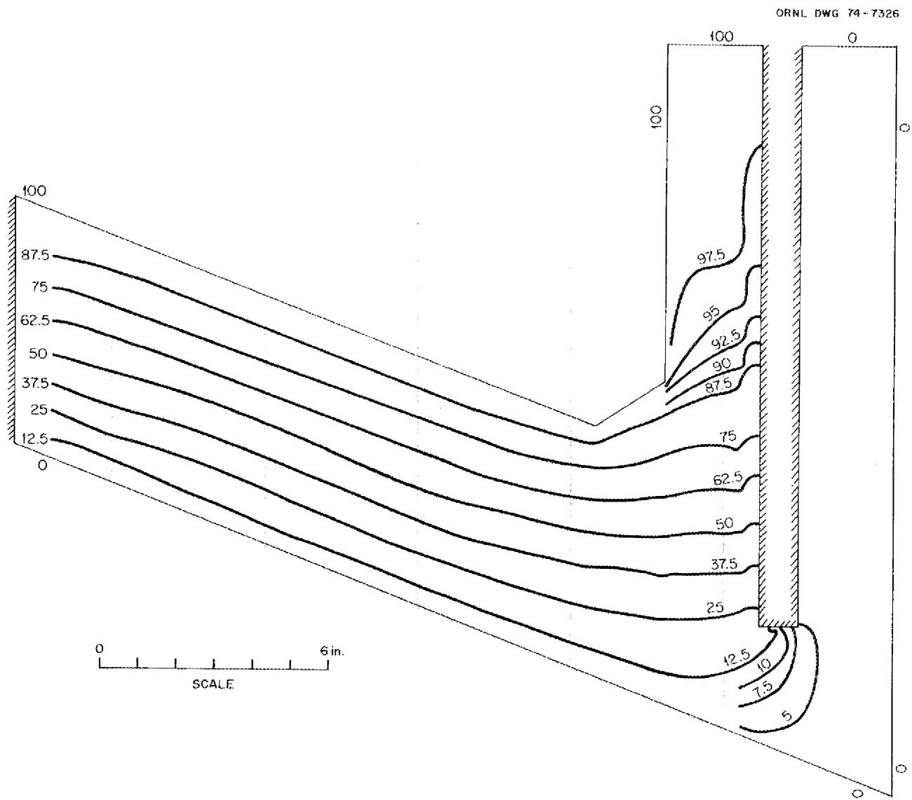  
Fig. 14. Calculated current distribution in the electrode sidearm of autoresistance heating test AHT-3. The percentage of the total current flowing between two stream lines is equal to the difference between the numbers on the stream lines.

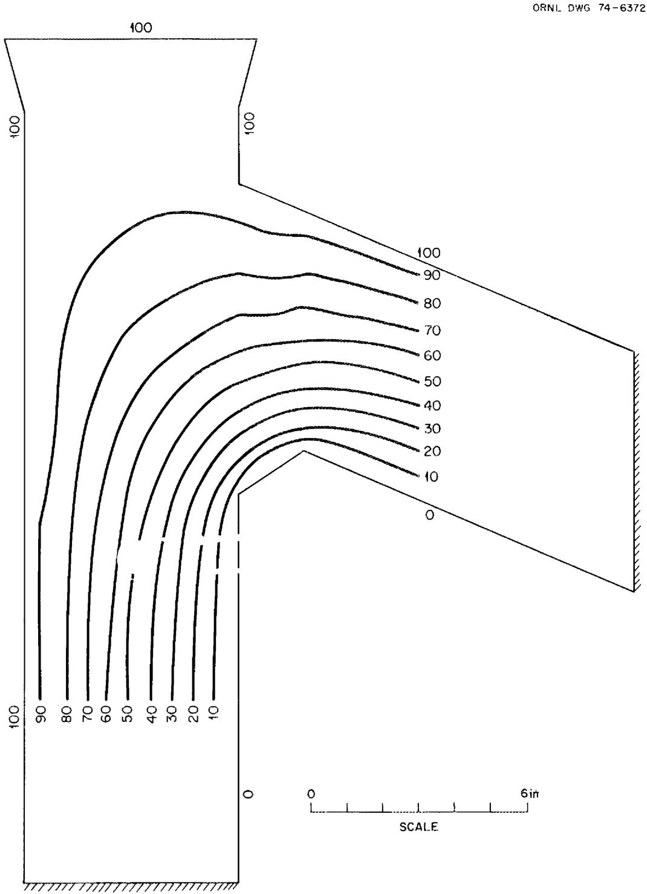  
Fig. 15. Calculated current distribution at the junction of the electrode sidearm and the fluorination section in autoresistance heating test AHT-3. The percentage of total current flowing between two stream lines is equal to the difference between the numbers on the stream lines.

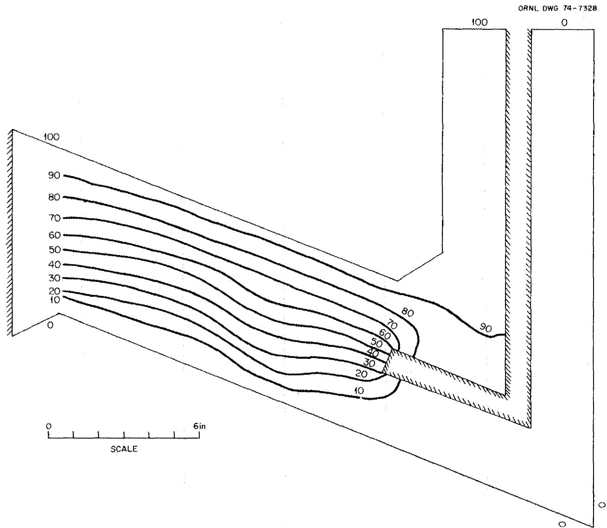  
Fig. 16. Calculated current distribution in the electrode sidearm using a new electrode design. The percentage of the total current flowing between two stream lines is equal to the difference between the numbers on the stream lines.

# 5. REFERENCES

1. J. B. Lewis, Chem. Eng. Sci. 3, 248-59 (1954).   
2. W. J. McManamey, Chem. Eng. Sci. 18, 123-32 (1961).   
3. G. R. A. Mayers, Chem. Eng. Sci. 16, 69-75 (1961).   
4. J. A. Klein, in Engineering Development Studies for Molten-Salt Breeder Reactor Processing No. 14, ORNL-TM-4018 (in preparation).   
5. J. A. Klein, in Engineering Development Studies for Molten-Salt Breeder Reactor Processing No. 15, ORNL-TM-4019 (in preparation).   
6. Chem. Technol. Div. Annu. Progr. Rept. Mar. 31, 1973, ORNL-4883, pp. 23-25.   
7. B. A. Hannaford, C. W. Kee, and L. E. McNeese, MSR Program Semiannu. Progr. Rept. Feb. 28, 1971, ORNL-4676, p. 256.   
8. B. A. Hannaford et al., MSR Program Semiannu. Progr. Rept. Aug. 31, 1971, ORNL-4728, p. 212.   
9. B. A. Hannaford, C. W. Kee, and L. E. McNeese, Engineering Development Studies for Molten-Salt Breeder Reactor Processing No. 8, ORNL-TM-3259, p. 64.   
10. B. A. Hannaford, C. W. Kee, and L. E. McNeese, Engineering Development Studies for Molten-Salt Breeder Reactor Processing No. 9, ORNL-TM-3259, p. 158.   
11. B. A. Hannaford, C. W. Kee, and L. E. McNeese, Engineering Development Studies for Molten-Salt Breeder Reactor Processing No. 10, ORNL-TM-3352, pp. 12-20.   
12. A. S. Foust et al., Principles of Unit Operations, p. 210, Wiley, New York, 1960.   
13. MSR Program Semiannu. Progr. Rept. Aug. 31, 1971, ORNI-4728, pp. 179-83.   
14. L. E. McNeese, Engineering Development Studies for Molten-Salt Breeder Reactor Processing No. 7, ORNL-TM-3257, pp. 29-46.   
15. L. E. McNeese, Engineering Development Studies for Molten-Salt Breeder Reactor Processing No. 9, ORNL-TM-3259, pp. 167-94.   
16. L. E. McNeese, Engineering Development Studies for Molten-Salt Breeder Reactor Processing No. 11, ORNL-TM-3774 (in preparation).

17. L. E. McNeese, Engineering Development Studies for Molten-Salt Breeder Reactor Processing No. 17, ORNL-TM-4178 (in preparation).   
18. J. B. Lewis, Chem. Eng. Sci. 3, 248-59 (1954).   
19. Chem. Technol. Div. Annu. Progr. Rept. Mar. 31, 1973, ORNL-4883, p. 25.   
20. J. R. Hightower, Jr., Engineering Development Studies for Molten-Salt Breeder Reactor Processing No. 16, ORNL-TM-4020 (in preparation).   
21. J. R. Hightower, Jr., Engineering Development Studies for Molten-Salt Breeder Reactor Processing No. 17, ORNL-TM-4178 (in preparation).   
22. C. F. Kayan, "An Electric Geometrical Analogue for Complex Heat Flow," Trans. ASME 67(8), 713-16 (1945).

# INTERNAL DISTRIBUTION

1-2. MSRP Director's Office

3. C. F. Baes, Jr.   
4. C. E. Bamberger   
5. M. Bender   
6. M. R. Bennett   
7. E. S. Bettis   
8. R.E.Blanco   
9. J. O. Blomeke   
10. E. G. Bohlmann   
11. J. Braunstein   
12. M. A. Brediq   
13. R. B. Briggs   
14. H. R. Bronstein   
15. R.E.Brooksbank   
16. C. H. Brown, Jr.   
17. K.B.Brown   
18. J. Brynestad   
19. S. Cantor   
20. D. W. Cardwell   
21. W. L. Carter   
22. W. H. Cook   
23. R.M.Counce   
24. J. L. Crowley   
25. F. L. Culler   
26. J.M.Dale   
27. F. L. Daley   
28. J.H.DeVan   
29. J. R. Distefano   
30. W.P.Eatherly   
31. R. L. Eqli, AEC-OSR   
32. J. R. Engel   
33. G.G.Fee   
34. D. E. Ferguson   
35. L. M. Ferris   
36. L. O. Gilpatrick   
37. J. C. Griess   
38. W. R. Grimes   
39. R. H. Guymon

40-61. J. R. Hightower, Jr.

62. B.F.Hitch

63. R.W. Horton

64. W.R.Huntley

65. C.W.Kee

66. A. D. Kelmers

67. J.A.Klein

68. W.R. Laing

69. R.B. Lindauer

70. R.E. MacPherson

71. W.C. McClain

72. H.E.McCoy

73. A.P. Malinauskas

74. C. L. Matthews, AEC-OSR

75. A.S. Meyer

76. R. L. Moore

77. J. P. Nichols

78. K.J.Notz

79. H. Postma

80. M. W. Rosenthal

81. A. D. Ryon

82. H. C. Savage

83. W. F. Schaffer, Jr.

84. C. D. Scott

85. M.J. Skinner

86. F.J. Smith

87. G.P.Smith

88. I. Spiewak

89. O.K.Tallent

90. L. M. Toth

91. D. B. Trauger

92. W.E.Unger

93. J.R.Weir

94. M. K. Wilkinson

95. R.G.Wymer

97. Central Research Library

98. Document Reference Section

99-101. Laboratory Records

102. Laboratory Records (LRD-RD)

# CONSULTANTS AND SUBCONTRACTORS

103. J. C. Frye   
104. C. H. Ice   
105. J. J. Katz   
106. E. A. Mason   
107. Ken Davis   
108. R.B.Richards

# EXTERNAL DISTRIBUTION

109. Research and Technical Support Division, ERDA, Oak Ridge Operations Office, P.O. Box E, Oak Ridge, Tenn. 37830   
110. Director, Reactor Division, FRDA, Oak Ridge Operations Office, P. O. Box E, Oak Ridge, Tenn. 37830   
111-112. Director, ERDA Division of Reactor Research and Development, Washington, D. C. 20545   
113-216. For distribution as shown in TID-4500 under UC-76, Molten Salt Reactor Technology