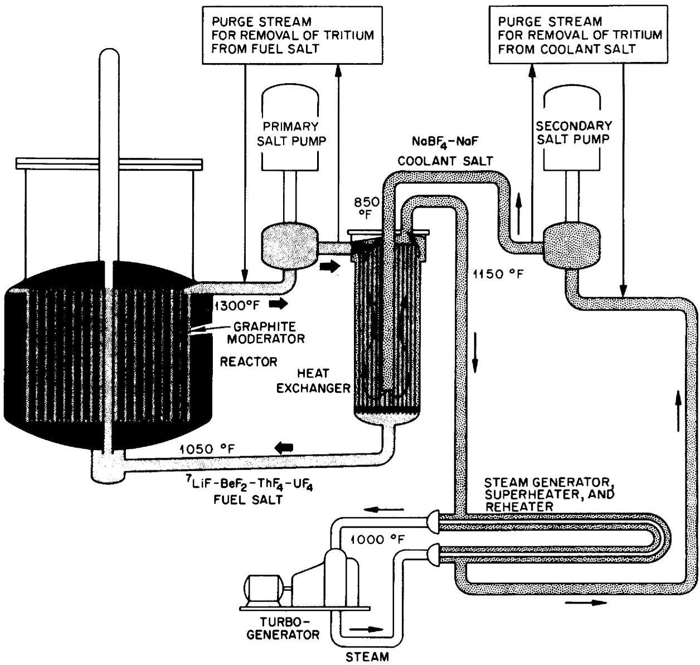
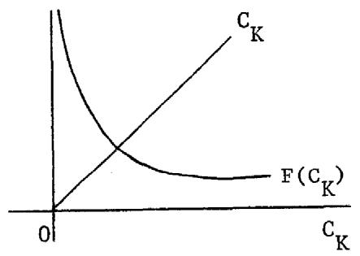
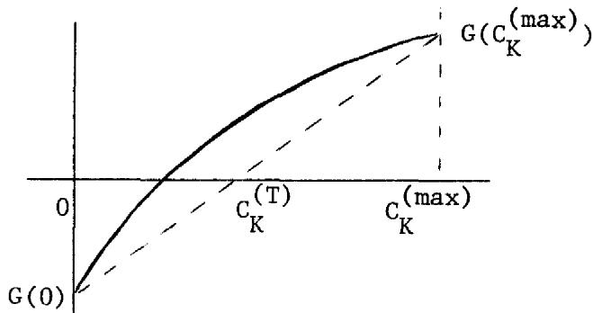
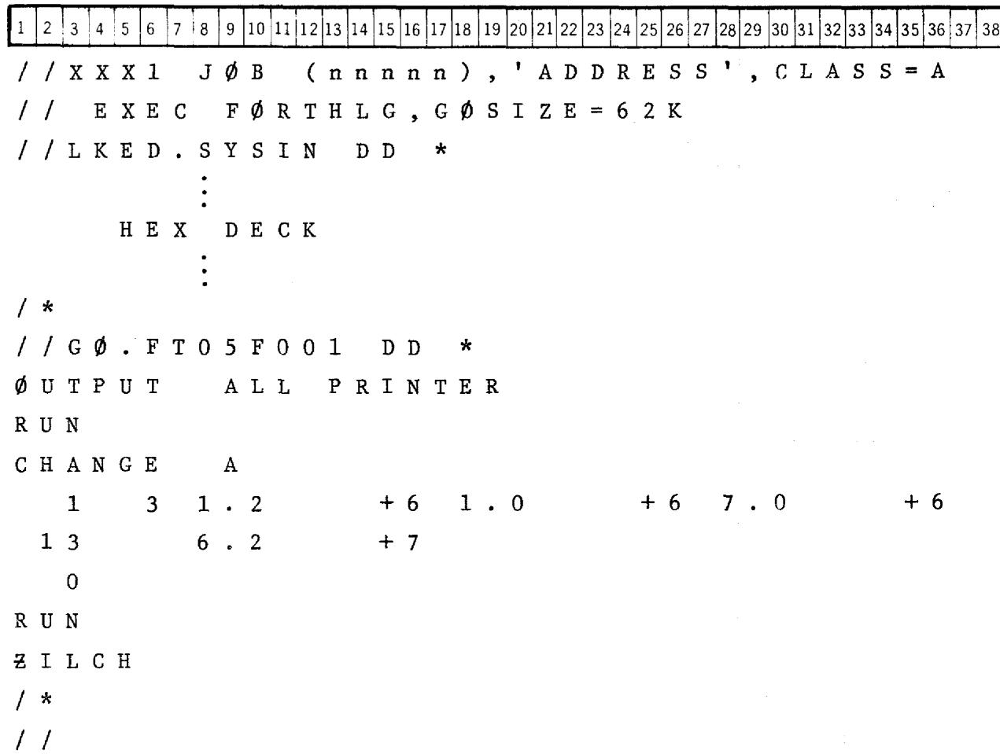
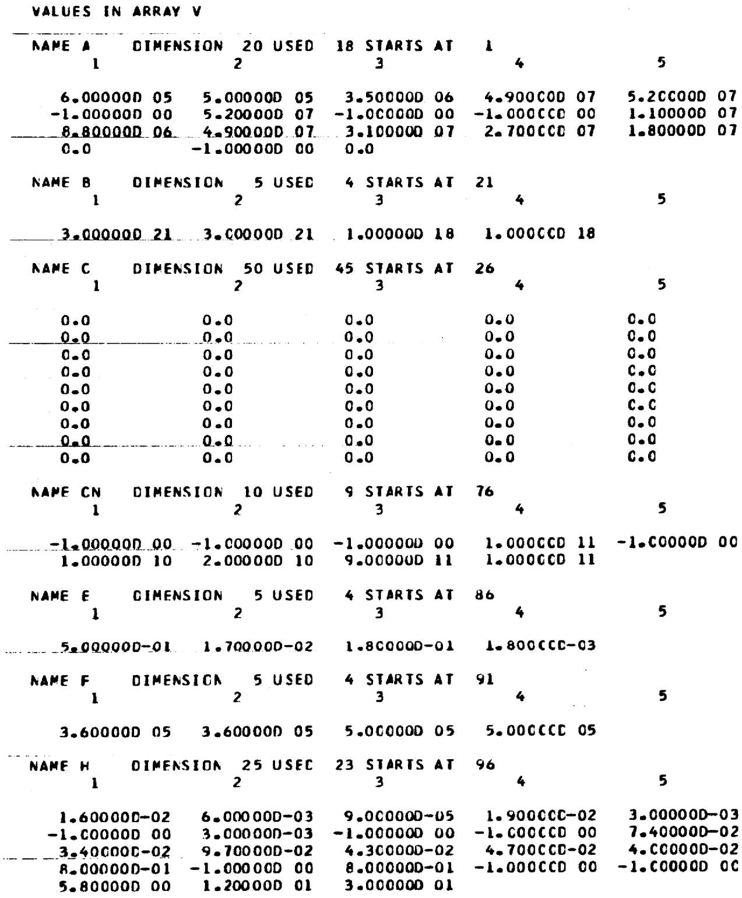
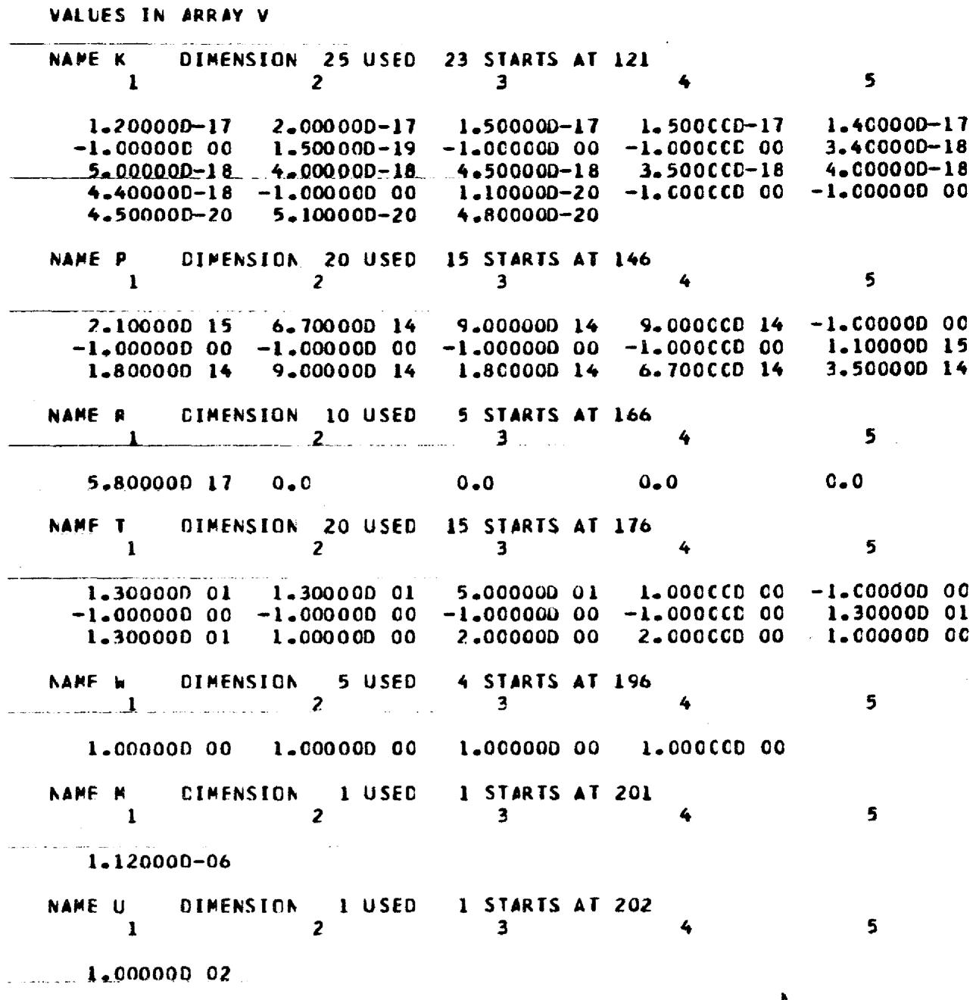
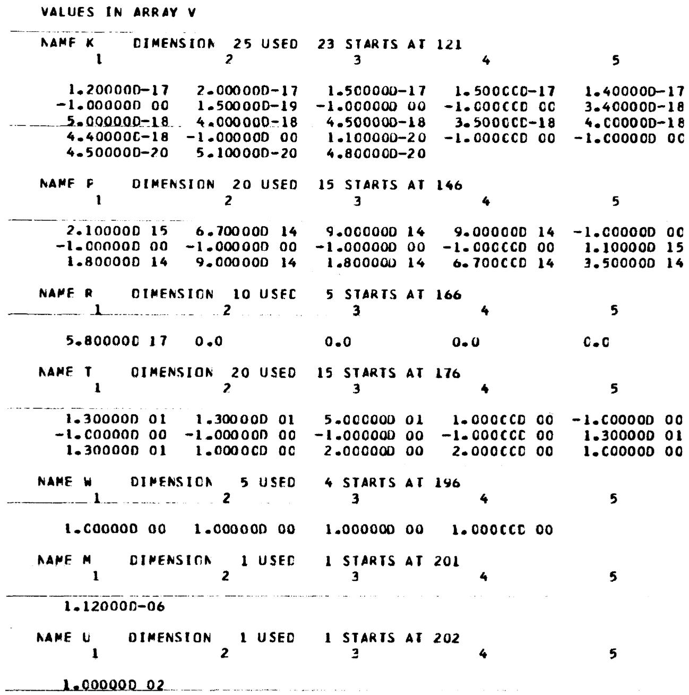

# A Method for Calculating the Steady-State Distribution of Tritium in a Molten-Salt Breeder Reactor Plant

R. B. Briggs   
C.W.Nestor


OAK RIDGE NATIONAL LABORATORY

OPERATED BY UNION CARBIDE CORPORATION • FOR THE U.S. ATOMIC ENERGY COMMISSION

Printed in the United States of America. Available from

National Technical Information Service

U.S. Department of Commerce

5285 Port Royal Road, Springfield, Virginia 22161

Price: Printed Copy $5.45; Microfiche $2.25

This report was prepared as an account of work sponsored by the United States Government. Neither the United States nor the Energy Research and Development Administration, nor any of their employees, nor any of their contractors, subcontractors, or their employees, makes any warranty, express or implied, or assumes any legal liability or responsibility for the accuracy, completeness or usefulness of any information, apparatus, product or process disclosed, or represents that its use would not infringe privately owned rights.

ORNL-TM-4804

UC-76 - Molten Salt

Reactor Technology

Contract No. W-7405-eng-26

Reactor Division

A METHOD FOR CALCULATING THE STEADY-STATE DISTRIBUTION OF TRITIUM IN A MOLTEN-SALT BREEDER REACTOR PLANT

R. B. Briggs

Central Management Office

C.W.Nestor

Computer Sciences Division

APRIL 1975

NOTICE

This report was prepared as an account of work sponsored by the United States Government. Neither the United States nor the United States Energy Research and Development Administration, nor any of their employees, nor any of their contractors, subcontractors, or their employees, makes any warranty, express or implied, or assumes any legal liability or responsibility for the accuracy, completeness or usefulness of any information, apparatus, product or process disclosed, or represents that its use would not infringe privately owned rights.

OAK RIDGE NATIONAL LABORATORY

Oak Ridge, Tennessee 37830

operated by

UNION CARBIDE CORPORATION

for the

U.S. ENERGY RESEARCH AND DEVELOPMENT ADMINISTRATION

MASTER


# CONTENTS

Abstract 1   
I. Introduction 2   
II. Derivation of Equations and Computational Procedures 9   
III. Solution of Equations 23   
IV. Nomenclature 35   
V. Computer Program, Input Instructions and Sample Problem 49   
Appendix - Program Listing 65

__________

# LIST OF FIGURES

Fig. 1. Molten-Salt Breeder Reactor System. 3   
Fig. 2. Sketch of $\mathbb{F}(\mathbb{C}_{\mathbb{K}})$ vs $\mathbf{C}_{\mathbf{K}}$ 27   
Fig. 3. Sketch of $G(\mathbf{C}_{\mathbf{K}})$ vs $C_{K}$ . 28   
Fig. 4. Sample Problem Input 52   
Fig. 5A. List of Parameter Values Used in Calculation 53   
Fig. 5B. Output from Iterative Calculations 55   
Fig. 5C. Output Summary 56   
Fig. 5D. Output Produced by "CHANGE" Command. 57   
Fig. 5E. List of Parameter Values Used in Calculation After "CHANGE" Command. 58   
Fig. 5F. Output from Iterative Calculations With New Parameters 60   
Fig. 5G. Output Summary (New Parameters). 61   
Fig. 5H. Response to Unrecognized Command Card. 62   
Fig. 5I. Normal Ending Message. 63

# A METHOD FOR CALCULATING THE STEADY-STATE DISTRIBUTION

# OF TRITIUM IN A MOLTEN-SALT BREEDER REACTOR PLANT

R. B. Briggs and C. W. Nestor, Jr.

# ABSTRACT

Tritium is produced in molten salt reactors primarily by fissioning of uranium and absorption of neutrons by the constituents of the fuel carrier salt. At the operating temperature of a large power reactor, tritium is expected to diffuse from the primary system through pipe and vessel walls to the surroundings and through heat exchanger tubes into the secondary system which contains a coolant salt. Some tritium will pass from the secondary system into the steam power system. This report describes a method for calculating the steady state distribution of tritium in a molten salt reactor plant and a computer program for making the calculations. The method takes into account the effects of various processes for removing tritium, the addition of hydrogen or hydrogenous compounds to the primary and secondary systems, and the chemistry of uranium in the fuel salt. Sample calculations indicate that 30 percent or more of the tritium might reach the steam system in a large power reactor unless special measures are taken to confine the tritium.

# I. INTRODUCTION

Conceptual designs of Molten Salt Breeder Reactor (MSBR) power plants usually can be represented by the diagram shown in Fig. 1. The fissioning of uranium in the fuel salt heats the salt as it is pumped through the reactor vessel in the primary system. The heat is transferred to a coolant salt that circulates in the secondary system and, thence, to water, producing steam to drive a turbine-generator in the steam system.

Fission products and other radioactive materials are produced in large amounts in the fuel salt. Much smaller amounts are produced in the coolant salt by the flux of delayed neutrons in the primary heat exchangers. The radioactivity is normally confined by the walls of the piping and vessels. However, tritium is produced in the salts, partly as a fission product, but mostly by absorption of neutrons by lithium in the fuel salt. At the high temperature of an MSBR, tritium diffuses through metals and might escape to the environs in amounts that would be cause for concern.

The purpose of this report is to describe a method for calculating the distribution of tritium in and its escape from an MSBR plant. We assume that the tritium, born as tritium ions, is present in the fuel salt primarily as tritium molecules* and tritium fluoride molecules.** The ions are estimated to be produced at a rate of 2.6 X $10^{14}$ /MWsec***

ORNL-DWG68-1185EB

  
Fig. 1. Molten Salt Breeder Reactor System.

in a typical fuel salt. The relative concentrations of tritium and tritium fluoride in the fuel salt are expected to be governed by the equilibrium relationship for the reaction,

$$
\mathrm {U F} _ {4} + 1 / 2 \mathrm {T} _ {2} \rightleftarrows \mathrm {U F} _ {3} + \mathrm {T F},
$$

with uranium in the salt. The absolute concentrations are governed by removal processes.

Three types of processes are provided for removing tritium from the primary system: permeation through the metal of the walls of piping and vessels, sorption on materials in contact with the salt, and purging. We assume that tritium molecules that reach a metal surface can sorb on the surface, dissociate into tritium atoms and diffuse through the metal. Tritium in tritium fluoride and other compounds is assumed to be chemically bound and unable to pass through the metal.

Experience with the Molten Salt Reactor Experiment indicated that tritium sorbs on and is tightly bound to graphite. We provide for sorption of tritium and tritium fluoride on the graphite in the reactor core.

Provision is made for purging tritium from the primary system by circulating a stream of salt through an apparatus which extracts gaseous tritium and tritium compounds. A contactor in which tritium and tritium fluoride are transferred to a gas phase by virtue of their vapor pressures would be such an apparatus. Current designs for MSBR's provide for sparging of the fuel salt with helium bubbles in the primary system to remove krypton and xenon. Tritium and tritium fluoride would be removed also. The sparging process can be treated as an equivalent purging process in the calculations.

Tritium will reach the secondary system by diffusion from the primary system through the walls of the tubes in the primary heat exchangers and by neutron capture in the coolant salt. We provide for removal of tritium from the secondary system by diffusion through the metal walls, sorption, and purging. The secondary system would not normally contain a sorber or have an elaborate purging system. Such processes, if incorporated into the plant, would be designed specifically for removing tritium.

The coolant salts do not normally contain constituents that are reducible by tritium and, thereby, able to convert tritium into tritium fluoride and make it unavailable to diffuse through the metal walls. We, therefore, have provided for addition of hydrogen fluoride or other hydrogenous compounds to the secondary system. We assume that tritium will exchange with the hydrogen in the added compound and that the compound will be extracted by the sorption and/or purge process.

The steam system and the cells around the reactor primary and secondary systems are considered to be sinks for tritium. Tritium reaching the steam system is assumed to exchange with hydrogen in the water, and that reaching the cells is assumed to be oxidized to water. The partial pressure of tritium is effectively zero.

In the calculations we assume that tritium and hydrogen behave identically. The equation used for calculating the diffusion of hydrogen through a metal wall states that the rate of transport per unit of surface area is proportional to the product of a permeability coefficient and the difference between the square roots of the partial pressures of hydrogen at the inner and outer surfaces of the metal.

In this circumstance, addition of hydrogen can reduce the transport of tritium through the metal. Suppose, for example, the partial pressures of tritium and hydrogen at the outer surface of a pipe are zero and the partial pressure of tritium at the inner surface is held constant. If hydrogen were added to increase the total hydrogen partial pressure at the inner surface by a factor of 100, the flow of hydrogen plus tritium through the metal wall would increase by a factor of 10. But the flow of tritium would decrease by a factor of 10 because of the 100-fold dilution of hydrogen. Because of other factors, the effect of adding hydrogen may not be so dramatic, but the calculational method provides for addition of hydrogen to the primary and secondary systems and for hydrogen to be present at a specified concentration in the steam system so that the effects can be studied.*

The calculational model describes the behavior of tritium in an MSBR plant to the extent that it is known or has been inferred at the present time. The removal processes can be included in or eliminated from the calculations by careful choice of the values assigned to coefficients in the equations. The model probably does not include all the chemical reactions and physical processes that will ultimately be

*The calculational procedure might have been developed to treat hydrogen and tritium as separate species. Separate values then could be assigned to important parameters, such as solubility and diffusion coefficients, for each species. Interaction between hydrogen and tritium would be taken into account by the equilibrium relationship

$$
p _ {H T} ^ {2} / p _ {H 2} \cdot p _ {T 2} = k _ {p} f o r t h e r e a c t i o n H _ {2} + T _ {2} \not \rightleftarrows H T.
$$

However, $\mathbf{k}_{\mathfrak{p}}$ has a value near 4 at temperatures of interest, which signifies that hydrogen and tritium interact as though they are the same species. Also, there are substantial uncertainties in the values for most of the parameters. Complicating the procedure to treat hydrogen and tritium separately would not, for the present, improve the accuracy of the results.

shown to affect the distribution of tritium in an MSBR. In some instances these effects can be included, when recognized, simply by adjusting the coefficients in equations for processes presently included. Others may require incorporation of additional processes.

Two assumptions in the calculational procedure should be recognized for their potential for leading to major differences between the calculated distribution of tritium and what would actually occur in a reactor plant. Tritium, present in the salt as tritium fluoride, can react with metal to yield tritium atoms that would dissolve in and diffuse through the metal. Neglect of this reaction could cause the calculations to be greatly in error under circumstances where most of the tritium is present in the salt as tritium fluoride.

Oxide films (and possibly others) that form on metal surfaces reduce the permeability of a metal wall to the passage of hydrogen. They may also cause the transport to vary with pressure to a power in the range of 1/2 to 1. The reduced permeability appears as a coefficient in the transport equations of the model, but we make no provision for changing the exponent on the pressure terms from 1/2. The calculated transport of tritium through the metal walls and the effect of the addition of hydrogen in reducing the transport would both be greater than would actually occur if the actual transport were proportional to the pressure to a power in the range 1/2 to 1. The calculations would not underestimate the transport unless the total pressure of tritium and hydrogen exceeded the reference pressure for the permeability coefficient, which is usually 1 atm.

#

# II. DERIVATION OF EQUATIONS AND COMPUTATIONAL PROCEDURES

In making the calculations, we first calculate the distribution of hydrogen plus tritium in order to establish flows and concentrations of the combined isotopes throughout the plant. Then we calculate the distribution of tritium throughout the plant.

For calculating the distribution, the fluids in the primary and secondary systems and the various parts of the steam system are assumed to be well mixed and to contain uniform bulk concentrations of all constituents. The calculations are for steady-state conditions, and only hydrogen and tritium molecules are assumed to be able to sorb on the metal surfaces, dissociate, and diffuse through the metal walls. The various paths are defined and the distribution is calculated by the use of the following set of equations.*

A. In the primary system:

1. Transport of hydrogen through the salt film to the wall of the piping in the hot leg from the reactor vessel to the heat exchanger:

$$
\mathrm {Q} _ {1} = \mathrm {h} _ {1} \mathrm {A} _ {1} \left(\mathrm {C} _ {\mathrm {F}} - \mathrm {c} _ {1}\right). \tag {1a}
$$

Transport through the pipe wall to the surroundings where the hydrogen pressure is assumed to be negligible:

$$
Q _ {1} = \frac {p _ {1} A _ {1} \left[ \left(k _ {1} C _ {1}\right) ^ {\frac {1}{2}} - 0 \right]}{t _ {1}} = \frac {p _ {1} A _ {1} \left(k _ {1} C _ {1}\right) ^ {\frac {1}{2}}}{t _ {1}}. \tag {1b}
$$

2. Transport of hydrogen to and through the walls of the cold-leg piping from the heat exchanger to the reactor vessel:

$$
\begin{array}{l} Q _ {2} = h _ {2} A _ {2} \left(C _ {F} - C _ {2}\right) (2a) \\ = \frac {p _ {2} A _ {2} \left(k _ {2} C _ {2}\right) ^ {\frac {1}{2}}}{t _ {2}}. (2b) \\ \end{array}
$$

3. Transport of hydrogen to and through the walls of the reactor vessel and the shells of the heat exchangers in the primary system:

$$
\begin{array}{l} Q _ {3} = h _ {3} A _ {3} \left(C _ {F} - C _ {3}\right) (3a) \\ = \frac {\mathrm {p} _ {3} \mathrm {A} _ {3} \left(\mathrm {k} _ {3} \mathrm {C} _ {3}\right) ^ {\frac {1}{2}}}{\mathrm {t} _ {3}} (3b) \\ \end{array}
$$

4. Transport of hydrogen to and through the walls of the tubes in the primary heat exchangers into the secondary system:

$$
\begin{array}{l} Q _ {4} = h _ {4} A _ {4} \left(C _ {F} - C _ {4}\right) (4a) \\ = \frac {p _ {4} A _ {4}}{t _ {4}} \left[ \left(k _ {4} C _ {4}\right) ^ {\frac {1}{2}} - \left(k _ {1 2} C _ {1 2}\right) ^ {\frac {1}{2}} \right]. (4b) \\ \end{array}
$$

5. Transport of hydrogen to the surfaces of the graphite in the reactor vessel or to other sorber:

$$
Q _ {5} = h _ {5} A _ {5} \left(C _ {F} - C _ {5}\right). \tag {5a}
$$

Sorption by the graphite or other sorber assuming that the sorbing surface is replaced continuously and that the concentration of sorbed gas is proportional to the square root of the partial pressure:

$$
Q _ {5} = B _ {1} W _ {1} A _ {5} \left(k _ {5} C _ {5}\right) ^ {\frac {1}{2}}. \tag {5b}
$$

6. Removal of hydrogen by purge:

$$
\mathrm {Q} _ {\mathrm {6}} = \mathrm {F} _ {1} \mathrm {E} _ {1} \mathrm {C} _ {\mathrm {F}}. \tag {6}
$$

7. Transport of hydrogen fluoride to and removal by sorber:

$$
\begin{array}{l} \mathrm {Q} _ {7} = \mathrm {h} _ {7} \mathrm {A} _ {7} \left(\mathrm {C} _ {\mathrm {F F}} - \mathrm {C} _ {7}\right) (7a) \\ = B _ {2} W _ {2} A _ {7} \left(k _ {7} C _ {7}\right) ^ {\frac {1}{2}}. (7b) \\ \end{array}
$$

8. Removal of hydrogen fluoride by purge:

$$
\mathrm {Q} _ {\mathrm {B}} = \mathrm {F} _ {2} \mathrm {E} _ {2} \mathrm {C} _ {\mathrm {F F}}. \tag {8}
$$

Because the molecular species involved may contain different numbers of hydrogen atoms, all the calculations are done in terms of atoms of hydrogen. This does not mean that the hydrogen necessarily diffuses as single atoms, but only that a transport unit is one hydrogen atom and the parameters are expressed in terms of single hydrogen atoms. A Q value of 1 then represents the transport of one-half molecule of $\mathsf{H}_2$ , one molecule of HF, or one-fourth molecule of a compound like $\mathsf{CH}_4$ , all per unit time. Likewise, a C value of 1 represents a concentration of one-half molecule of $\mathsf{H}_2$ , one molecule of HF, or one-fourth molecule of $\mathsf{CH}_4$ , all per unit volume.

If the rates of inflow of tritium and hydrogen atoms $(\mathbb{R}_1$ and $\mathbb{R}_2$ , respectively) to the primary system are given, a material balance over the primary system gives

$$
R _ {1} + R _ {2} = \sum_ {i = 1} ^ {8} Q _ {i}. \tag {9}
$$

In our calculations, all flow rates in the sum on the right-hand side of Eq. 9 are positive or zero except for $Q_4$ , the transport through the

heat exchanger tubes to the secondary system. $Q_{4}$ can be positive,

negative or zero, depending on the conditions in the various systems.

Hydrogen is present in and is removed from the primary system as hydrogen

fluoride, but we provide no input of HF. It is produced by the reaction

$$
\mathrm {U F} _ {4} + \frac {1}{2} \mathrm {H} _ {2} \stackrel {\rightleftarrows} {\longrightarrow} \mathrm {U F} _ {3} + \mathrm {H F},
$$

which has an equilibrium quotient

$$
\frac {\mathrm {X} \left(\mathrm {U F} _ {3}\right)}{\mathrm {X} \left(\mathrm {U F} _ {4}\right)} \times \frac {\mathrm {P} (\mathrm {H F})}{\left[ \mathrm {P} \left(\mathrm {H} _ {2}\right) \right] ^ {\frac {1}{2}}} = \mathrm {M} ^ {\prime},
$$

or

$$
\frac {\mathrm {X} \left(\mathrm {U F} _ {3}\right)}{\mathrm {X} \left(\mathrm {U F} _ {4}\right)} \times \frac {\mathrm {k} _ {7} \mathrm {C} _ {\mathrm {F F}}}{\left(\mathrm {k} _ {5} \mathrm {C} _ {\mathrm {F}}\right) ^ {\frac {1}{2}}} = \mathrm {M}.
$$

Corrosion and other chemical considerations make it desirable to maintain the ratio $\mathrm{X(UF_3) / X(UF_4)}\equiv 1 / U$ at a constant value,\* so the concentration of HF in the bulk of the salt can be related to the hydrogen concentration by

$$
C _ {F F} = \frac {M U}{k _ {7}} \left(k _ {5} C _ {F}\right) ^ {\frac {1}{2}}. \tag {10}
$$

We replace $C_{\mathrm{FF}}$ by the equivalent function of $C_{\mathrm{F}}$ in Eqs. 7a and 8 to obtain expressions for $Q_7$ and $Q_8$ in terms of $C_{\mathrm{F}}$ .

B. Secondary System:

1. Hot-leg piping:

$$
\begin{array}{l} Q _ {1 0} = h _ {1 0} A _ {1 0} \left(C _ {C} - C _ {1 0}\right) (11a) \\ = \frac {p _ {1 0} A _ {1 0}}{t _ {1 0}} \left(k _ {1 0} C _ {1 0}\right) ^ {\frac {1}{2}}. (11b) \\ \end{array}
$$

2. Cold-leg piping:

$$
\begin{array}{l} Q _ {1 1} = h _ {1 1} A _ {1 1} \left(C _ {C} - C _ {1 1}\right) (12a) \\ = \frac {\mathrm {P} _ {1 1} \mathrm {A} _ {1 1}}{\mathrm {t} _ {1 1}} \left(\mathrm {k} _ {1 1} \mathrm {C} _ {1 1}\right) ^ {\frac {1}{2}}. (12b) \\ \end{array}
$$

3. Transport through the primary heat exchanger tubes into the primary system:

$$
\begin{array}{l} Q _ {1 2} = h _ {1 2} A _ {4} \left(C _ {C} - C _ {1 2}\right) (13a) \\ = \frac {p _ {4} A _ {4}}{t _ {4}} \left[ \left(k _ {1 2} C _ {1 2}\right) ^ {\frac {1}{2}} - \left(k _ {4} C _ {4}\right) ^ {\frac {1}{2}} \right]. (13b) \\ \end{array}
$$

4. Transport through the steam generator tubes into the steam system:

$$
\begin{array}{l} Q _ {1 3} = h _ {1 3} A _ {1 3} \left(C _ {C} - C _ {1 3}\right) (14a) \\ = \frac {\mathrm {P} _ {1 3} \mathrm {A} _ {1 3}}{\mathrm {t} _ {1 3}} \left[ \left(\mathrm {k} _ {1 3} \mathrm {C} _ {1 3}\right) ^ {\frac {1}{2}} - \left(\mathrm {k} _ {2 1} \mathrm {C} _ {2 1}\right) ^ {\frac {1}{2}} \right]. (14b) \\ \end{array}
$$

5. Transport through the superheater tubes into the steam system:

$$
\begin{array}{l} Q _ {1 4} = h _ {1 4} A _ {1 4} \left(C _ {C} - C _ {1 4}\right) (15a) \\ = \frac {p _ {1 4} A _ {1 4}}{t _ {1 4}} \left[ \left(k _ {1 4} C _ {1 4}\right) ^ {\frac {1}{2}} - \left(k _ {2 2} C _ {2 2}\right) ^ {\frac {1}{2}} \right]. (15b) \\ \end{array}
$$

6. Transport through the reheater tubes into the steam system:

$$
\begin{array}{l} Q _ {1 5} = h _ {1 5} A _ {1 5} \left(C _ {C} - C _ {1 5}\right) (16a) \\ = \frac {p _ {1 5} A _ {1 5}}{t _ {1 5}} \left[ \left(k _ {1 5} C _ {1 5}\right) ^ {\frac {1}{2}} - \left(k _ {2 3} C _ {2 3}\right) ^ {\frac {1}{2}} \right]. (16b) \\ \end{array}
$$

7. Removal by sorber as hydrogen:

$$
\begin{array}{l} Q _ {1 6} = h _ {1 6} A _ {1 6} \left(C _ {C} - C _ {1 6}\right) (17a) \\ = B _ {3} W _ {3} A _ {1 6} \left(k _ {1 6} C _ {1 6}\right) ^ {\frac {1}{2}}. (17b) \\ \end{array}
$$

8. Removal by purge as hydrogen:

$$
\mathrm {Q} _ {1 7} = \mathrm {F} _ {3} \mathrm {E} _ {3} \mathrm {C} _ {\mathrm {C}}. \tag {18}
$$

9. Removal by sorber as HF:

$$
Q _ {1 8} = h _ {1 8} A _ {1 8} \left(C _ {C F} - C _ {1 8}\right) \tag {19a}
$$

$$
= \mathrm {B} _ {4} \mathrm {W} _ {4} \mathrm {A} _ {1 8} \left(\mathrm {k} _ {1 8} \mathrm {C} _ {1 8}\right) ^ {\frac {1}{2}}. \tag {19b}
$$

10. Removal by purge as HF:

$$
\mathrm {Q} _ {1 9} = \mathrm {F} _ {4} \mathrm {E} _ {4} \mathrm {C} _ {\mathrm {C F}}. \tag {20}
$$

Since we assume that the hydrogen fluoride does not release hydrogen to diffuse through the metal walls, and that there are no chemical reactions in the secondary system that make the concentrations of hydrogen and hydrogen fluoride interdependent, we write separate material balances for the two species for the distribution of total tritium and hydrogen:

$$
R _ {3} + R _ {4} = \sum_ {\mathbf {i} = 1 0} ^ {1 7} Q _ {\mathbf {i}} \tag {21a}
$$

$$
R _ {5} = Q _ {1 8} + Q _ {1 9}. \tag {21b}
$$

In these equations all the R's and all the Q's have positive or zero values except for $Q_{12}$ , $Q_{13}$ , $Q_{14}$ and $Q_{15}$ , which can have negative values.

C. Steam generator system:

1. Transport through the steam generator tubes into the secondary system:

$$
\begin{array}{l} Q _ {2 1} = h _ {2 1} A _ {1 3} \left(C _ {S G} - C _ {2 1}\right) (22a) \\ = \frac {P _ {1 3} A _ {1 3}}{t _ {1 3}} \left[ \left(k _ {2 1} C _ {2 1}\right) ^ {\frac {1}{2}} - \left(k _ {1 3} C _ {1 3}\right) ^ {\frac {1}{2}} \right]. (22b) \\ \end{array}
$$

2. Transport through superheater tubes into the secondary system:

$$
Q _ {2 2} = h _ {2 2} A _ {1 4} \left(C _ {S S} - C _ {2 2}\right) \tag {23a}
$$

$$
= \frac {\mathrm {p} _ {1 4} \mathrm {A} _ {1 4}}{\mathrm {t} _ {1 4}} \left[ \left(\mathrm {k} _ {2 2} \mathrm {C} _ {2 2}\right) ^ {\frac {1}{2}} - \left(\mathrm {k} _ {1 4} \mathrm {C} _ {1 4}\right) ^ {\frac {1}{2}} \right]. \tag {23b}
$$

3. Transport through the reheater tubes into the secondary system:

$$
\begin{array}{l} Q _ {2 3} = h _ {2 3} A _ {1 5} \left(C _ {S R} - C _ {2 3}\right) (24a) \\ = \frac {p _ {1 5} A _ {1 5}}{t _ {1 5}} \left[ \left(k _ {2 3} C _ {2 3}\right) ^ {\frac {1}{2}} - \left(k _ {1 5} C _ {1 5}\right) ^ {\frac {1}{2}} \right]. (24b) \\ \end{array}
$$

In the steam system the values for $C_{\mathrm{SG}}$ , $C_{\mathrm{SS}}$ and $C_{\mathrm{SR}}$ will be given. The steam flows will be so large that the diffusion of hydrogen through the metals should not have much effect on the concentration of hydrogen in the steam. Under these assumptions, we do not require a material balance over the steam system. If hydrogen is added to the feed water as hydrazine or in some other manner to give a specified ratio of hydrogen to $\mathrm{H}_2\mathrm{O}$ , then this ratio, coupled with the steam tables, can be used to calculate the hydrogen concentrations in the water and steam in the steam-raising equipment. Without addition of hydrogen the concentrations are established by the dissociation of water.

We now need to solve the above equations to obtain values for all the flow rates and concentrations. We carry this out in the following sequence, discussed in more detail in Sec. III.

1. Calculate $C_{CF}$ , $C_{18}$ , $Q_{18}$ and $Q_{19}$ from equations 19a, 19b, 20 and 21b.   
2. Assume a value for $C_C$ .   
3. Calculate $Q_{10}$ , $Q_{11}$ , $Q_{16}$ , $Q_{17}$ and $C_{16}$ from equations 11a, 11b, 12a, 12b, 17a, 17b and 18.   
4. Calculate $Q_{13}$ , $Q_{14}$ , $Q_{15}$ , $C_{13}$ , $C_{14}$ and $C_{15}$ from equations 14a, 14b, 15a, 15b, 16a, 16b, 22a, 22b, 23a, 23b, 24a and 24b, noting that the steam system and the secondary system are coupled by the relationships $Q_{13} = -Q_{21}$ , $Q_{14} = -Q_{22}$ and $Q_{15} = -Q_{23}$ .

5. Calculate $\mathbb{Q}_{12}$ from the material balance, Eq. 21a.   
6. Calculate $C_F$ , $C_{12}$ and $C_4$ from Eqs. 4a, 4b, 13a, 13b, the relationship $Q_4 = -Q_{12}$ and the value of $Q_{12}$ obtained in step 5. These concentrations should all be positive. If any one of them is negative, steps 3 through 6 must be repeated with a larger value of $C_C$ .   
7. When positive values have been found for $C_F$ , $C_{12}$ and $C_4$ , calculate $Q_1, Q_2, Q_3, Q_5, Q_6, Q_7, Q_8, C_5, C_{FF}$ and $C_7$ .   
8. Calculate $\mathbf{R}_{\mathbf{F}}$ from

$$
R _ {F} = \sum_ {i = 1} ^ {8} Q _ {i} - (R _ {1} + R _ {2})
$$

If $R_F$ is positive, hydrogen must be added to the primary system in order to maintain a balance. This means that $C_F$ is too large, which in turn means that $C_C$ is too large, and steps 3 through 8 must be repeated with a smaller value of $C_C$ . If $R_F$ is negative, $C_C$ is too small and steps 3 through 8 must be repeated with a larger value of $C_C$ .

When this process has been repeated until the ratio $\left|\frac{R_{\mathrm{F}}}{R_1 + R_2}\right|$ is sufficiently small, the flows and concentrations of hydrogen plus tritium and of hydrogen fluoride plus tritium fluoride have been established throughout the plant and we can proceed with the calculation of the tritium distribution. We ignore the difference in the properties of the two isotopes and assume that they behave identically. Thus, hydrogen and tritium compounds have the same solubilities and diffusivities, and if a hydrogenous compound, such as HF, is added to a mixture of hydrogen and tritium, exchange will occur to give a ratio of tritium to hydrogen that is the same in hydrogen* and the added compound.

We now proceed with the calculation of the tritium distribution.

# D. Primary system:

1. Transport through walls of hot-leg piping:

$$
Q _ {3 1} = \frac {C _ {F T}}{C _ {F}} Q _ {1}. \tag {25}
$$

2. Transport through walls of cold-leg piping:

$$
Q _ {3 2} = \frac {C _ {F T}}{C _ {F}} Q _ {2}. \tag {26}
$$

3. Transport through wall of reactor vessel and shells of heat exchangers in primary system:

$$
\mathrm {Q} _ {3 3} = \frac {\mathrm {C} _ {\mathrm {F T}}}{\mathrm {C} _ {\mathrm {F}}} \mathrm {Q} _ {3}. \tag {27}
$$

4. Transport through walls of primary heat-exchanger tubes into the secondary system:

$$
\begin{array}{l} Q _ {3 4} = h _ {4} A _ {4} \left(C _ {F T} - C _ {3 4}\right) (28a) \\ = \frac {p _ {4} A _ {4}}{t _ {4}} \left[ \frac {k _ {4} C _ {3 4}}{\left(k _ {4} C _ {4}\right) ^ {\frac {1}{2}}} - \frac {k _ {1 2} C _ {4 2}}{\left(k _ {1 2} C _ {1 2}\right) ^ {\frac {1}{2}}} \right]. (28b) \\ \end{array}
$$

Equations 25 through 27 are straightforward, simply indicating that the amount of tritium flowing with hydrogen is proportional to the fraction of the concentration that is tritium when the flow of both is into a sink with a zero concentration of both. Equation 28a is straightforward, indicating that the flow of tritium from the bulk salt to the wall is proportional to the difference between the concentrations of tritium in the bulk fluid and the wall. Equation 28b, however, requires some additional explanation.

The rate of transport of hydrogen through a metal wall can be expressed as

$$
Q = \frac {D A}{t} \left(C _ {I} ^ {\prime} - C _ {O} ^ {\prime}\right),
$$

where D is the diffusivity of hydrogen atoms in the metal, the C's are the concentrations of hydrogen atoms dissolved in the metal at the inner (I) and outer (O) surfaces, t is the metal thickness and A is the surface area. Assuming no interaction of tritium and hydrogen atoms as they diffuse through the metal, the rate of transport of tritium is

$$
\mathrm {Q} _ {\mathrm {T}} = \frac {\mathrm {D A}}{\mathrm {t}} \left(\mathrm {C} _ {\mathrm {T I}} ^ {\prime} - \mathrm {C} _ {\mathrm {T O}} ^ {\prime}\right).
$$

The concentration of hydrogen + tritium atoms in the metal at the surface is

$$
C ^ {\prime} = S P ^ {\frac {1}{2}} = S (k C) ^ {\frac {1}{2}},
$$

where S is a solubility coefficient and P is the partial pressure of hydrogen + tritium and is equal to the product of Henry's law coefficient and the concentration of hydrogen + tritium in the salt at the surface. Assuming that the ratio of tritium to hydrogen + tritium in the metal at the surface is the same as that in the salt at the surface, we can write

$$
\mathbf {C} _ {\mathrm {T I}} ^ {\prime} = \mathbf {C} _ {\mathrm {T}} ^ {\prime} \frac {\mathbf {C} _ {\mathrm {T I}}}{\mathbf {C} _ {\mathrm {I}}} = \mathbf {S} (\mathbf {k} _ {\mathrm {I}} \mathbf {C} _ {\mathrm {I}}) ^ {\frac {1}{2}} \frac {\mathbf {C} _ {\mathrm {T I}}}{\mathbf {C} _ {\mathrm {I}}} = \mathbf {S} \frac {\mathbf {k} _ {\mathrm {I}} \mathbf {C} _ {\mathrm {T I}}}{(\mathbf {k} _ {\mathrm {I}} \mathbf {C} _ {\mathrm {I}}) ^ {\frac {1}{2}}}
$$

and a similar expression for the outer surface. Then,

$$
Q _ {T} = \frac {D S A}{t} \left[ \frac {k _ {I} C _ {T I}}{\left(k _ {I} C _ {I}\right) ^ {\frac {1}{2}}} - \frac {k _ {O} C _ {T O}}{\left(k _ {O} C _ {O}\right) ^ {\frac {1}{2}}} \right],
$$

and by substituting the permeability coefficient, $p$ , for the product, DS, we obtain Eq. 28b. This treatment is necessary here because the net flows of hydrogen and tritium may be in opposite directions. The equations provide a means for taking into account the effect of the mass action laws on the concentrations of tritium in the metal and its transport through the metal.

5. Removal by graphite or other sorber:

$$
Q _ {3 5} = \frac {C _ {F T}}{C _ {F}} Q _ {5} \cdot \tag {29}
$$

6. Removal by purge:

$$
\mathrm {Q} _ {3 6} = \frac {\mathrm {C} _ {\mathrm {F T}}}{\mathrm {C} _ {\mathrm {F}}} \mathrm {Q} _ {6}. \tag {30}
$$

7. Removal by graphite or other sorber as tritium fluoride:

$$
Q _ {3 7} = \frac {C _ {F T}}{C _ {F}} Q _ {7} \cdot \tag {31}
$$

8. Removal by purge as tritium fluoride:

$$
Q _ {3 8} = \frac {C _ {F T}}{C _ {F}} Q _ {8}. \tag {32}
$$

The tritium balance over the primary system is:

$$
R _ {1} = \sum_ {i = 3 1} ^ {3 8} Q _ {i}. \tag {33}
$$

E. Secondary system:

1. Hot-leg piping:

$$
Q _ {4 0} = \frac {C _ {C T}}{C _ {C}} Q _ {1 0}. \tag {34}
$$

2. Cold-leg piping:

$$
Q _ {4 1} = \frac {C _ {C T}}{C _ {C}} Q _ {1 1} \cdot \tag {35}
$$

3. Transport through primary heat exchanger tube walls into primary system:

$$
Q _ {4 2} = h _ {1 2} A _ {4} \left(C _ {\mathrm {C T}} - C _ {4 2}\right). \tag {36a}
$$

$$
= \frac {p _ {4} A _ {4}}{t _ {4}} \left[ \frac {k _ {1 2} C _ {4 2}}{(k _ {1 2} C _ {1 2}) ^ {2}} - \frac {k _ {4} C _ {3 4}}{(k _ {4} C _ {4}) ^ {2}} \right]. \tag {36b}
$$

4. Transport through steam generator tube walls into the steam system:

$$
Q _ {4 3} = h _ {1 3} A _ {1 3} \left(C _ {C T} - C _ {4 3}\right) \tag {37a}
$$

$$
= \frac {\mathrm {p} _ {1 3} \mathrm {A} _ {1 3}}{\mathrm {t} _ {1 3}} \frac {\mathrm {k} _ {1 3} \mathrm {C} _ {4 3}}{(\mathrm {k} _ {1 3} \mathrm {C} _ {1 3}) ^ {\frac {1}{2}}} \cdot \tag {37b}
$$

Calculations of the tritium distribution are based on the assumption that tritium will exchange so rapidly with the hydrogen in the steam to form tritiated water that the tritium concentration will be effectively zero.

5. Transport through the superheater tubes into the steam system:

$$
Q _ {4 4} = h _ {1 4} A _ {1 4} \left(C _ {\mathrm {C T}} - C _ {4 4}\right) \tag {38a}
$$

$$
= \frac {p _ {1 4} A _ {1 4}}{t _ {1 4}} \frac {k _ {1 4} C _ {4 4}}{\left(k _ {1 4} C _ {1 4}\right) ^ {2}}. \tag {38b}
$$

6. Transport through the reheater tubes into the steam system:

$$
Q _ {4 5} = h _ {1 5} A _ {1 5} \left(C _ {\mathrm {C T}} - C _ {4 5}\right) \tag {39a}
$$

$$
= \frac {p _ {1 5} A _ {1 5}}{t _ {1 5}} \frac {k _ {1 5} C _ {4 5}}{(k _ {1 5} C _ {1 5}) ^ {2}}. \tag {39b}
$$

7. Removal by sorber as tritium:

$$
Q _ {4 6} = \frac {C _ {C T}}{C _ {C}} Q _ {1 6}. \tag {40}
$$

8. Removal by purge as tritium:

$$
\mathrm {Q} _ {4 7} = \frac {\mathrm {C} _ {\mathrm {C T}}}{\mathrm {C} _ {\mathrm {C}}} \mathrm {Q} _ {1 7}. \tag {41}
$$

9. Removal by sorber as tritium fluoride:

$$
Q _ {4 8} = \frac {C _ {C T}}{C _ {C}} Q _ {1 8}. \tag {42}
$$

10. Removal by purge as tritium fluoride:

$$
Q _ {4 9} = \frac {C _ {C T}}{C _ {C}} Q _ {1 9}. \tag {43}
$$

The balance over the secondary system is:

$$
R _ {3} = \sum_ {\mathbf {i} = 4 0} ^ {4 9} Q _ {\mathbf {i}}. \tag {44}
$$

Since the tritium concentration in the steam system is assumed to be negligible, no equations are needed for the steam system.

To calculate the distribution of tritium, we solve Eqs. 25-44 in the following sequence, discussed in more detail in Section III.

1. Assume a tritium concentration, $C_{\mathrm{CT}}$ , in the secondary system and calculate $Q_{40}$ , $Q_{41}$ , $Q_{43}$ through $Q_{49}$ from Eqs. 34, 35, 37a, 37b, 38a, 38b, 39a, 39b, 40, 41, 42 and 43.   
2. Calculate $\mathbf{Q}_{42}$ from the material balance, Eq. 44.   
3. Calculate $C_{FT}$ from Eqs. 28a, 28b, 36a and 36b, the relationship $Q_{34} = -Q_{42}$ and the value of $Q_{42}$ from step 2. If the value of $C_{FT}$ is negative, increase the estimate for $C_{CT}$ and repeat steps 1 through 3. When we have found a positive $C_{FT}$ , we proceed to step 4.

4. Calculate $Q_{31}, Q_{32}, Q_{33}, Q_{35}, Q_{36}, Q_{37}$ and $Q_{38}$ from Eqs. 25-32.

5. Calculate $\mathbf{R}_{\mathbf{F}}$ , where

$$
R _ {F} = \sum_ {i = 3 1} ^ {3 8} Q _ {i} - R _ {1}
$$

is the term that must be added to the left side of Eq. 33 in order for the equation to balance. If $\mathbf{R}_{\mathbf{F}}$ is positive, tritium must be added to the primary system, so $\mathbf{C}_{\mathbf{FT}}$ and $\mathbf{C}_{\mathbf{CT}}$ are too large; if $\mathbf{R}_{\mathbf{F}}$ is negative, $\mathbf{C}_{\mathbf{FT}}$ and $\mathbf{C}_{\mathbf{CT}}$ are too small. Adjust the value of $\mathbf{C}_{\mathbf{CT}}$ and repeat steps 1 through 5. When $\left| \mathbf{R}_{\mathbf{F}} / \mathbf{R}_{\mathbf{1}} \right|$ is sufficiently small, the calculations are finished.

# III. SOLUTION OF EQUATIONS

In the procedure discussed above, we begin with the calculation of $C_{CF}$ , $C_{18}$ , $Q_{18}$ and $Q_{19}$ with Eqs. 19a, 19b and 20, and the material balance, Eq. 21b:

$$
\begin{array}{l} Q _ {1 8} = h _ {1 8} A _ {1 8} \left(C _ {C F} - C _ {1 8}\right) (19a) \\ = \mathrm {B} _ {4} \mathrm {W} _ {4} \mathrm {A} _ {1 8} \left(\mathrm {k} _ {1 8} \mathrm {C} _ {1 8}\right) ^ {\frac {1}{2}}, (19b) \\ \end{array}
$$

$$
\begin{array}{l} \mathrm {Q} _ {1 9} = \mathrm {F} _ {4} \mathrm {E} _ {4} \mathrm {C} _ {\mathrm {C F}}, (20) \\ R _ {5} = Q _ {1 8} + Q _ {1 9}. (21b) \\ \end{array}
$$

Eq. 19b requires that $Q_{18} \geq 0$ and Eq. 20 requires that $Q_{19} \geq 0$ , so if $R_5 = 0$ , 21b requires that $Q_{18} = Q_{19} = 0$ . If $R_5 > 0$ , we combine 21b, 20 and 19a to obtain

$$
R _ {5} - Q _ {1 8} = F _ {4} E _ {4} C _ {C F} = R _ {5} - h _ {1 8} A _ {1 8} \left(C _ {C F} - C _ {1 8}\right),
$$

or

$$
C _ {C F} = \frac {R _ {5} + h _ {1 8} A _ {1 8} C _ {1 8}}{F _ {4} E _ {4} + h _ {1 8} A _ {1 8}}. \tag {19c}
$$

Substituting 19c into 19a, setting the result equal to 19b and collecting terms we obtain

$$
\alpha - C _ {1 8} = \beta C _ {1 8} ^ {\frac {1}{2}}, \tag {19d}
$$

where we have defined

$$
\alpha = \frac {R _ {5}}{F _ {4} E _ {4}},
$$

and

$$
\beta = \left[ \frac {F _ {4} E _ {4} + h _ {1 8} A _ {1 8}}{F _ {4} E _ {4}} \right] \left[ \frac {B _ {4} W _ {4}}{H _ {1 8}} \right] \left[ k _ {1 8} \right] ^ {\frac {1}{2}}.
$$

Squaring both sides of 19d results in a quadratic equation for $C_{18}$ ; since the right-hand side of 19d is positive, we want the root of this quadratic which is less than $\alpha$ . We have

$$
C _ {1 8} ^ {2} - (2 \alpha + \beta^ {2}) C _ {1 8} + \alpha^ {2} = 0,
$$

$$
C _ {1 8} = \frac {2 \alpha + \beta^ {2} \pm \sqrt {\left(2 \alpha + \beta^ {2}\right) ^ {2} - 4 \alpha^ {2}}}{2}.
$$

To obtain the root less than $\alpha$ , we want the root with the negative sign. To avoid possible loss of significant figures, we note that the product of the roots is $\alpha^2$ , so that we can write the solution in the form

$$
C _ {1 8} = \frac {\alpha^ {2}}{\alpha + \frac {\beta^ {2}}{2} \left(1 + \sqrt {1 + \frac {4 \alpha}{\beta^ {2}}}\right)}. \tag {19e}
$$

Then we have

$$
Q _ {1 8} = B _ {4} W _ {4} A _ {1 8} \left(k _ {1 8} C _ {1 8}\right) ^ {\frac {1}{2}}, \tag {19b}
$$

$$
C _ {C F} = \frac {R _ {5} + h _ {1 8} A _ {1 8} C _ {1 8}}{F _ {4} E _ {4} + h _ {1 8} A _ {1 8}}, \tag {19c}
$$

and

$$
\mathrm {Q} _ {1 9} = \mathrm {F} _ {4} \mathrm {E} _ {4} \mathrm {C} _ {\mathrm {C F}}. \tag {20}
$$

With some value for $C_C$ we proceed to the calculation of $Q_{10}$ , $Q_{11}$ , $Q_{16}$ , $Q_{17}$ and $C_{16}$ . Eqs. 11a, 11b, 12a and 12b read

$$
Q _ {1 0} = h _ {1 0} A _ {1 0} \left(C _ {C} - C _ {1 0}\right), \tag {11a}
$$

$$
Q _ {1 0} = \frac {p _ {1 0} A _ {1 0}}{t _ {1 0}} \left(k _ {1 0} C _ {1 0}\right) ^ {\frac {1}{2}}, \tag {11b}
$$

$$
\mathrm {Q} _ {1 1} = \mathrm {h} _ {1 1} \mathrm {A} _ {1 1} \left(\mathrm {C} _ {\mathrm {C}} - \mathrm {C} _ {1 1}\right), \tag {12a}
$$

$$
Q _ {1 1} = \frac {P _ {1 1} A _ {1 1}}{t _ {1 1}} \left(k _ {1 1} C _ {1 1}\right) ^ {\frac {1}{2}}. \tag {12b}
$$

These equations (11 and 12) are identical in structure, as are Eqs. 1, 2, 3, 5, 7, 17 and 19. For Eqs. 11 and 12 we define

$$
C _ {i} = C _ {C}, \alpha = k _ {i} \left(\frac {p _ {i}}{t _ {i} h _ {i}}\right) ^ {2}, i = 1 0, 1 1,
$$

and Eqs. 11 and 12 then can be written in the form of quadratics in the concentration $C_i$ :

$$
C _ {i} ^ {2} - (2 C _ {1} + \alpha) C _ {i} + C _ {1} ^ {2} = 0.
$$

From Eqs. 1lb and 12b, the flow rates $Q_{10}$ and $Q_{11}$ must be positive, so that the root desired in each case is the smaller one. We have

$$
C _ {i} = \frac {C _ {1} ^ {2}}{C _ {1} + \frac {\alpha}{2} \left(1 + \sqrt {1 + \frac {4 C _ {1}}{\alpha}}\right)}, i = 1 0, 1 1,
$$

and

$$
Q _ {i} = \frac {P _ {i} A _ {i}}{t _ {i}} \left(k _ {i} C _ {i}\right) ^ {\frac {1}{2}}, i = 1 0, 1 1.
$$

By putting

$$
\mathrm {C} _ {1} = \mathrm {C} _ {\mathrm {C}},
$$

$$
\alpha = \left(\frac {\mathrm {B} _ {3} \mathrm {W} _ {3}}{\mathrm {h} _ {1 6}}\right) ^ {2} \mathrm {k} _ {1 6},
$$

$C_{16}$ can be calculated in the same fashion (Eqs. 17a and 17b) and the flow rates $Q_{16}$ and $Q_{17}$ are

$$
Q _ {1 6} = B _ {3} W _ {3} A _ {1 6} \left(k _ {1 6} C _ {1 6}\right) ^ {\frac {1}{2}},
$$

$$
\mathrm {Q} _ {1 7} = \mathrm {F} _ {3} \mathrm {E} _ {3} \mathrm {C} _ {\mathrm {C}}.
$$

We continue with step 4, the calculation of the flow rates $Q_{13}$ , $Q_{14}$ and $Q_{15}$ , and the corresponding concentrations $C_{13}$ , $C_{14}$ and $C_{15}$ , using Eqs. 14a, 14b, 15a, 15b, 16a, 16b, 22a, 22b, 23a, 23b, 24a and 24b. Note that the secondary system and the steam system are coupled by the equations

$$
Q _ {1 3} = - Q _ {2 1}, Q _ {1 4} = - Q _ {2 2} \text {a n d} Q _ {1 5} = - Q _ {2 3}.
$$

The three equations 14, 15 and 16 all have the same structure and can be written in the form

$$
h _ {K} \left(C _ {1} - C _ {K}\right) = \frac {p _ {K}}{t _ {K}} \left[ \left(k _ {K} C _ {K}\right) ^ {\frac {1}{2}} - \left(k _ {L} C _ {L}\right) ^ {\frac {1}{2}} \right], \tag {a}
$$

$$
\mathrm {h} _ {\mathrm {L}} \left(\mathrm {C} _ {\mathrm {L}} - \mathrm {C} _ {2}\right) = \mathrm {h} _ {\mathrm {K}} \left(\mathrm {C} _ {1} - \mathrm {C} _ {\mathrm {K}}\right), \tag {b}
$$

where $\mathrm{K} = 13, 14$ and $15, \mathrm{C}_1 = \mathrm{C}_{\mathrm{C}}$ , $\mathrm{L} = 21, 22$ and $23$ , and we identify $\mathrm{C}_2$ as $\mathrm{C}_{\mathrm{SG}}$ , $\mathrm{C}_{\mathrm{SS}}$ and $\mathrm{C}_{\mathrm{SR}}$ for $\mathrm{K} = 13, 14$ and $15$ , respectively. We can solve Eq. b for $\mathrm{C}_{\mathrm{L}}$ :

$$
C _ {L} = \frac {h _ {K} \left(C _ {1} - C _ {K}\right) + h _ {L} C _ {2}}{h _ {L}} = \frac {h _ {K}}{h _ {L}} \left(C _ {1} - C _ {K}\right) + C _ {2}. \tag {c}
$$

Since $C_L$ must be non-negative, there is a maximum permissible value $C_K^{(\max)}$ , which is the value such that

$$
\frac {h _ {K}}{h _ {L}} \left(C _ {1} - C _ {K} ^ {(m a x)}\right) + C _ {2} = 0,
$$

or

$$
C _ {K} ^ {(\max )} = C _ {1} + \frac {h _ {L}}{h _ {K}} C _ {2}. \tag {d}
$$

If we substitute (c) into (a) and rearrange, we have

$$
C _ {K} = C _ {1} + \frac {P _ {K}}{h _ {K} t _ {K}} \left\{k _ {L} ^ {\frac {1}{2}} \left[ \frac {h _ {K}}{h _ {L}} \left(C _ {1} - C _ {K}\right) + C _ {2} \right] ^ {\frac {1}{2}} - \left[ k _ {K} C _ {K} \right] ^ {\frac {1}{2}} \right\}, \tag {e}
$$

or, more concisely,

$$
C _ {K} = F \left(C _ {K}\right).
$$

To locate the solutions (if any) of this equation, we need to examine the behavior of $\mathbb{F}(\mathbb{C}_{\mathbf{K}})$ for $0 \leq C_{K} \leq C_{K}^{\text{(max)}}$ . We find that

$$
F (0) > 0
$$

and

$$
\begin{array}{l} F ^ {\prime} \left(C _ {K}\right) <   0, F ^ {\prime} (0) = - \infty \\ \mathrm {F} ^ {\prime \prime} \left(\mathrm {C} _ {\mathrm {K}}\right) \geq 0. \\ \end{array}
$$

The graph of $\mathbf{F}(\mathbf{C}_{\mathbf{K}})$ then looks like the curve in Fig. 2.

  
Fig. 2. Sketch of $\mathbf{F}(\mathbf{C}_{\mathbf{K}})$ vs $\mathbf{C}_{\mathbf{K}}$ .

For there to be a solution between zero and $C_K^{(\max)}$ , we must have $C_K^{(\max)} > F(C_K^{(\max)})$ and upon substitution of our expression (d) into $F(C_K)$ , we find that this condition is satisfied. We will now examine the function

$$
G \left(C _ {K}\right) = C _ {K} - F \left(C _ {K}\right).
$$

We note that

$$
G (0) = - F (0) <   0
$$

$$
G \left(C _ {K} ^ {\left(\max\right)}\right) > 0
$$

and

$$
G ^ {\prime} \left(C _ {K}\right) = 1 - F ^ {\prime} \left(C _ {K}\right) > 0 [ \text {s i n c e} F ^ {\prime} \left(C _ {K}\right) <   0 ]
$$

This insures that $G(C_{K})$ has one and only one zero in the range

$0 \leq C_{K} \leq C_{K}^{(\max)}$ . Since $G''(C_{K}) = -F''(C_{K})$ , $G''(C_{K}) \leq 0$ , and the graph of $G(C_{K})$ looks like the curve shown in Fig. 3.

  
Fig. 3. Sketch of $G(C_{K})$ vs $C_{K}$

With a suitable $C_K^{(1)}$ we can compute $G_1 = G(C_K^{(1)}) < 0$ (for example, starting with $C_K^{(1)} = 0$ ) and with a suitable $C_K^{(2)}$ , $G_2 = G(C_K^{(2)}) > 0$ ( $C_K^{(2)} = C_K^{(\max)}$ , to start). An approximation to the solution $C_K^{(T)}$ , is derived from the inverse linear interpolation:

$$
C _ {K} ^ {(T)} = \frac {G _ {2} C _ {K} ^ {(1)} - G _ {1} C _ {K} ^ {(2)}}{G _ {2} - G _ {1}} ,
$$

as shown in Fig. 2. A better approximation can be derived with inverse quadratic interpolation:

$$
C _ {K} ^ {(x)} = \frac {\left(0 - G _ {T}\right) \left(0 - G _ {2}\right)}{\left(G _ {1} - G _ {T}\right) \left(G _ {1} - G _ {2}\right)} C _ {K} ^ {(1)} + \frac {\left(0 - G _ {1}\right) \left(0 - G _ {T}\right)}{\left(G _ {2} - G _ {1}\right) \left(G _ {2} - G _ {T}\right)} C _ {K} ^ {(2)} + \frac {\left(0 - G _ {1}\right) \left(0 - G _ {2}\right)}{\left(G _ {T} - G _ {1}\right) \left(G _ {T} - G _ {1}\right)} C _ {K} ^ {(T)}.
$$

With $G''(C_K) \leq 0$ as shown and $G'(C_K) > 0$ , $G_T = G(C_K^{(T)})$ will be positive and $C_K^{(T)}$ should be larger than the root. If $C_K^{(x)}$ is larger than $C_K^{(T)}$ , we replace $C_K^{(2)}$ by $C_K^{(T)}$ , $G_2$ by $G_T$ , and repeat the inverse linear interpolation. If, however, $C_K^{(x)}$ is smaller than $C_K^{(T)}$ , we calculate $G_x = G(C_K^{(x)})$ ; and if this value is negative, we replace $C_K^{(1)}$ by $C_K^{(x)}$ , $G_1$ by $G_x$ , $C_K^{(2)}$ by $C_K^{(T)}$ and $G_2$ by $G_T$ , and repeat the inverse linear interpolation. If $G_x$ is positive, we replace $C_K^{(2)}$ by $C_K^{(x)}$ and $G_2$ by $G_x$ and repeat the inverse linear interpolation. We terminate this process when

$$
\left| 1 - \frac {\mathrm {c} _ {\mathrm {K}} ^ {\mathrm {(T)}}}{\mathrm {c} _ {\mathrm {K}} ^ {\mathrm {(x)}}} \right| <   \mathrm {c} _ {\mathrm {T O L}},
$$

or when we have done 50 iterations. The tolerance $C_{\mathrm{TOL}}$ is defined in a DATA statement in our program. We have found that the procedure converges in about four iterations for $C_{\mathrm{TOL}} = 10^{-5}$ and in about six iterations for $C_{\mathrm{TOL}} = 10^{-7}$ .

The required flow rates $Q_{13}, Q_{21}, Q_{14}, Q_{22}, Q_{15}$ and $Q_{23}$ can now be computed from

$$
Q _ {i} = h _ {i} A _ {i} \left(C _ {C} - C _ {i}\right)
$$

$$
Q _ {i + 8} = - Q _ {i}, \quad i = 1 3, 1 4, 1 5.
$$

The flow rate of hydrogen and tritium through heat exchanger tube walls from the secondary to the primary system, $Q_{12}$ , is

$$
Q _ {1 2} = R _ {3} + R _ {4} - \left(Q _ {1 0} + Q _ {1 1} + Q _ {1 3} + Q _ {1 4} + Q _ {1 5} + Q _ {1 6} + Q _ {1 7}\right),
$$

and from Eq. 13a,

$$
C _ {1 2} = C _ {C} - \frac {Q _ {1 2}}{h _ {1 2} A _ {4}}.
$$

If the value for $C_{12}$ is negative, we have used too small a value for $C_C$ , so we double our previous guess and start over at step 3. If the computed value is positive, we proceed to calculate (Eq. 13b)

$$
C _ {4} = \frac {1}{k _ {4}} \left[ \left(k _ {1 2} C _ {1 2}\right) ^ {\frac {1}{2}} - \frac {Q _ {1 2} t _ {4}}{p _ {4} A _ {4}} \right] ^ {2},
$$

and finally,

$$
C _ {F} = C _ {4} - \frac {Q _ {1 2}}{h _ {4} A _ {4}}.
$$

If the computed value for $C_F$ is negative, we need a larger value for $C_C$ , so we double our previous guess and return to step 3. If positive, we proceed to step 7, the computation of the remaining flow rates $Q_1$ , $Q_2$ , $Q_3$ , $Q_5$ , $Q_6$ , $Q_7$ and $Q_8$ and the concentrations $C_5$ , $C_{FF}$ and $C_7$ .

We can write Eqs. 1, 2 and 3 in the form

$$
Q _ {i} = h _ {i} A _ {i} \left(C _ {F} - C _ {i}\right) = \frac {p _ {i} A _ {i}}{t _ {i}} \left(k _ {i} C _ {i}\right) ^ {\frac {1}{2}}, i = 1, 2, 3,
$$

and with

$$
\alpha = \left(\frac {\mathrm {p _ {\vec {i}}}}{\mathrm {t _ {\vec {i}} h _ {\vec {i}}}}\right) ^ {2} \mathrm {k _ {\vec {i}}}
$$

the resulting quadratic equations can be solved in the same way as those for $C_{10}$ and $C_{11}$ . Eqs. 5 can be manipulated into the same form with

$$
\alpha = \left(\frac {\mathrm {B} _ {1} \mathrm {W} _ {1}}{\mathrm {h} _ {5}}\right) ^ {2} \mathrm {k} _ {5}
$$

so that we can calculate $C_5$ , and from it

$$
Q _ {5} = B _ {1} W _ {1} A _ {5} \left(k _ {5} C _ {5}\right) ^ {\frac {1}{2}} \tag {5b}
$$

Again, Eqs. 7a and 7b can be written as a quadratic for $C_7$ with

$$
\alpha = \left(\frac {B _ {2} W _ {2}}{h _ {7}}\right) ^ {2} k _ {7}
$$

so that we can calculate

$$
Q _ {7} = B _ {2} W _ {2} A _ {7} \left(k _ {7} C _ {7}\right) ^ {\frac {1}{2}}
$$

$$
\mathrm {Q} _ {8} = \mathrm {F} _ {2} \mathrm {E} _ {2} \mathrm {C} _ {\mathrm {F F}}
$$

and

$$
R _ {F} = \sum_ {i = 1} ^ {8} Q _ {i} - R _ {1} - R _ {2}
$$

where $C_{\mathrm{FF}}$ is

$$
C _ {F F} = \frac {M U}{k _ {7}} \left(k _ {5} C _ {F}\right) ^ {\frac {1}{2}} \tag {10}
$$

This is the end of the first part of the procedure if $\mathbb{R}_{\mathbb{F}}$ is small enough. We test the condition

$$
\left| \frac {R _ {F}}{R _ {1} + R _ {2}} \right| <   T _ {T O L}
$$

(where the quantity $\mathrm{T}_{\mathrm{TOL}}$ is defined in a DATA statement in our program) and if it is satisfied, we proceed to the second part. If not, we adjust $\mathbf{C}_{\mathbf{C}}$ in a variety of ways, depending on what information we have accumulated so far. We carry out a preliminary search for two values of $\mathbf{C}_{\mathbf{C}}$ which bracket the root, i.e., one for which $\mathbf{R}_{\mathbf{F}}$ is negative and the other for which $\mathbf{R}_{\mathbf{F}}$ is positive. If this is the first iteration or if both our present and previous values of $\mathbf{R}_{\mathbf{F}}$ have the same sign, we multiply $\mathbf{C}_{\mathbf{C}}$ by a factor $m$ such that

$$
m = 1 0 ^ {- R _ {F} / (R _ {1} + R _ {2})}
$$

but limited to the range

$$
. 0 1 \leq m \leq 1 0 0.
$$

When we have bracketed the root, we combine inverse linear and inverse quadratic interpolation in much the same way as we did for the solution of the equations for $C_{13}$ , $C_{14}$ and $C_{15}$ , keeping the root bracketed and attempting to reduce the length of the interval containing the root. When this process has converged, we proceed to the tritium calculation.

With a value for $C_{\mathrm{CT}}$ , the concentration of tritium in the secondary salt, we compute

$$
Q _ {4 0} = \frac {C _ {C T}}{C _ {C}} Q _ {1 0} \tag {34}
$$

$$
Q _ {4 1} = \frac {C _ {C T}}{C _ {C}} Q _ {1 1} \tag {35}
$$

and from Eqs. 37a, 37b, 38a, 38b, 39a and 39b we obtain

$$
C _ {4 3} = \frac {h _ {1 3} t _ {1 3} \left(C _ {1 3} / k _ {1 3}\right) ^ {\frac {1}{2}} / p _ {1 3}}{1 + h _ {1 3} t _ {1 3} \left(C _ {1 3} / k _ {1 3}\right) ^ {\frac {1}{2}} / p _ {1 3}} C _ {C T} \tag {37c}
$$

$$
\mathrm {Q} _ {4 3} = \frac {\mathrm {p} _ {1 3} \mathrm {A} _ {1 3}}{\mathrm {t} _ {1 3} \left(\mathrm {C} _ {1 3} / \mathrm {k} _ {1 3}\right) ^ {2}} \quad \mathrm {C} _ {4 3} \tag {37b}
$$

$$
\mathrm {C} _ {4 4} = \frac {\mathrm {h} _ {1 4} \mathrm {t} _ {1 4} \left(\mathrm {C} _ {1 4} / \mathrm {k} _ {1 4}\right) ^ {\frac {1}{2}} / \mathrm {p} _ {1 4}}{1 + \mathrm {h} _ {1 4} \mathrm {t} _ {1 4} \left(\mathrm {C} _ {1 4} / \mathrm {k} _ {1 4}\right) ^ {\frac {1}{2}} / \mathrm {p} _ {1 4}} \mathrm {C} _ {\mathrm {C T}} \tag {38c}
$$

$$
Q _ {4 4} = \frac {p _ {1 4} A _ {1 4}}{t _ {1 4} \left(C _ {1 4} / k _ {1 4}\right) ^ {\frac {1}{2}}} C _ {4 4} \tag {38b}
$$

$$
C _ {4 5} = \frac {h _ {1 5} t _ {1 5} \left(C _ {1 5} / k _ {1 5}\right) ^ {\frac {1}{2}} / p _ {1 5}}{1 + h _ {1 5} t _ {1 5} \left(C _ {1 5} / k _ {1 5}\right) ^ {\frac {1}{2}} / p _ {1 5}} C _ {C T} \tag {39c}
$$

$$
Q _ {4 5} = \frac {p _ {1 5} A _ {1 5}}{t _ {1 5} \left(C _ {1 5} / k _ {1 5}\right) ^ {\frac {1}{2}}} C _ {4 5} \tag {39b}
$$

$$
Q _ {i + 3 0} = \frac {C _ {C T}}{C _ {C}} Q _ {i}, i = 1 6, 1 7, 1 8, 1 9 \tag {40-43}
$$

$$
Q _ {4 2} = R _ {3} - Q _ {4 0} - Q _ {4 1} - Q _ {4 3} - Q _ {4 4} - Q _ {4 5} - Q _ {4 6} - Q _ {4 7} - Q _ {4 8} - Q _ {4 9} \tag {44}
$$

and finally

$$
C _ {4 2} = C _ {C T} - \frac {Q _ {4 2}}{h _ {1 2} A _ {4}}.
$$

If this value is negative, we have used too small a value for $C_{\mathrm{CT}}$ ; in the same way as before, we double $C_{\mathrm{CT}}$ and try again, starting at Eq. 34. When we have found a positive $C_{42}$ , we compute

$$
C _ {3 4} = \left(\frac {C _ {4}}{k _ {4}}\right) ^ {\frac {1}{2}} \left[ \frac {C _ {4 2}}{\left(C _ {1 2} / k _ {1 2}\right) ^ {2}} - \frac {t _ {4} Q _ {4 2}}{p _ {4} A _ {4}} \right]
$$

Again, if $C_{34}$ is negative, we need to double $C_{\mathrm{CT}}$ and try again.

When we have found a positive $C_{34}$ , we compute

$$
C _ {F T} = C _ {3 4} - \frac {Q _ {4 2}}{h _ {4} A _ {4}}
$$

and continue with the doubling scheme until $C_{42}$ , $C_{34}$ and $C_{FT}$ are all positive. We can now compute the flow rates

$$
Q _ {3 0 + i} = \frac {C _ {F T}}{C _ {F}} Q _ {i}, i = 1, 2, 3, 5, 6, 7, 8
$$

and

$$
R _ {F} = \sum_ {i = 3 1} ^ {3 8} Q _ {i} - R _ {1}.
$$

Our test is now on $\left| \mathbb{R}_{\mathbb{F}} / \mathbb{R}_1 \right|$ , and we use the same adjustment and interpolation procedures as for $C_C$ .


# IV. NOMENCLATURE

<table><tr><td></td><td>Reference Value*</td><td>Name**</td></tr><tr><td>A = surface area, cm2</td><td></td><td>A</td></tr><tr><td>A1 = hot leg of primary system (piping and pumps)</td><td>6 x 105</td><td></td></tr><tr><td>A2 = cold leg of primary system (piping)</td><td>5 x 105</td><td></td></tr><tr><td>A3 = reactor vessel and heat exchanger shells</td><td>3.5 x 106</td><td></td></tr><tr><td>A4 = tubes of primary heat exchanger</td><td>4.9 x 107</td><td></td></tr><tr><td>A5 = core graphite for sorption of hydrogen</td><td>5.2 x 107</td><td></td></tr><tr><td>A6 = --</td><td></td><td></td></tr><tr><td>A7 = core graphite for sorption of hydrogen fluoride</td><td>5.2 x 107</td><td></td></tr><tr><td>A8 = --</td><td></td><td></td></tr><tr><td>A9 = --</td><td></td><td></td></tr><tr><td>A10 = hot leg of secondary system (piping, pumps, half of shells on steam-raising equipment)</td><td>1.1 x 107</td><td></td></tr><tr><td>A11 = cold leg of secondary system (piping, half of shells on steam-raising equipment)</td><td>8.8 x 106</td><td></td></tr><tr><td>A12 = A4</td><td>4.9 x 107</td><td></td></tr><tr><td>A13 = tubes of steam generators</td><td>3.1 x 107</td><td></td></tr><tr><td>A14 = tubes of superheaters</td><td>2.7 x 107</td><td></td></tr><tr><td>A15 = tubes of reheaters</td><td>1.8 x 107</td><td></td></tr><tr><td>A16 = sorber of hydrogen</td><td>0</td><td></td></tr><tr><td>A17 = --</td><td></td><td></td></tr><tr><td>A18 = sorber of hydrogen fluoride</td><td>0</td><td></td></tr><tr><td></td><td>Reference Value</td><td>Name</td></tr><tr><td>B = sorption factor, atoms/cm2atm1/2</td><td></td><td>B</td></tr><tr><td>B1= hydrogen + tritium on core graphite</td><td>3 X 1021</td><td></td></tr><tr><td>B2= hydrogen fluoride on core graphite</td><td>3 X 1021</td><td></td></tr><tr><td>B3= hydrogen + tritium on sorber in secondary system</td><td>1 X 1018</td><td></td></tr><tr><td>B4= hydrogen fluoride on sorber in secondary system</td><td>1 X 1018</td><td></td></tr><tr><td>C = concentration, atoms/cm3</td><td></td><td></td></tr><tr><td>CF= hydrogen + tritium in bulk of primary salt</td><td></td><td>CF</td></tr><tr><td>CFF= hydrogen + tritium as hydrogen fluoride in bulk of primary salt</td><td></td><td>CFF</td></tr><tr><td>CT= tritium in bulk of primary salt</td><td></td><td>CFT</td></tr><tr><td>CC= hydrogen + tritium in bulk of secondary salt</td><td></td><td>CC</td></tr><tr><td>CZF= hydrogen + tritium as hydrogen fluoride in bulk of secondary salt</td><td></td><td>CCF</td></tr><tr><td>CCT= tritium in bulk of secondary salt</td><td></td><td>CCT</td></tr><tr><td>CSG= hydrogen in bulk of water in steam generator (672°K)</td><td>2 X 1010</td><td>CSG</td></tr><tr><td>CSS= hydrogen in bulk of steam in superheater (783°K)</td><td>9 X 1011</td><td>CSS</td></tr><tr><td>CSR= hydrogen in bulk of steam in reheater (755°K)</td><td>1 X 1011</td><td>CSR</td></tr><tr><td>C1= hydrogen + tritium in salt at surface of hot leg of primary system</td><td></td><td>C</td></tr><tr><td>C2= hydrogen + tritium in salt at surface of cold leg of primary system</td><td></td><td></td></tr><tr><td>C3= hydrogen + tritium in salt at surface of reactor vessel and heat exchanger shells</td><td></td><td></td></tr></table>

Reference Value

Name

$\mathbf{C}_{4} =$ hydrogen $^+$ tritium in salt at surfaces of heat exchanger tubes in primary system

C5 = hydrogen + tritium in salt at surfaces of core graphite in primary system

C 6

$\mathbf{C}_{7} =$ hydrogen fluoride in salt at surfaces of core graphite in primary system

C 8

Cg

$\mathbf{C}_{10} =$ hydrogen $^+$ tritium in salt at surface of hot leg in secondary system

C11 = hydrogen + tritium in salt at surface of cold leg in secondary system

$\mathbf{C}_{12} =$ hydrogen + tritium in salt at surfaces of heat exchanger tubes in secondary system

$\mathrm{C}_{13} =$ hydrogen + tritium in salt at surfaces of steam generator tubes in secondary system

$\mathbf{C}_{14} =$ hydrogen $^+$ tritium in salt at surfaces of superheater tubes in secondary system

C15 = hydrogen + tritium in salt at surfaces of reheater tubes in secondary system

C16 = hydrogen + tritium in salt at surfaces of sorber in secondary system

C17

C18 = hydrogen fluoride in salt at surfaces of sorber in secondary system

C19

$$
c _ {2 0} = - -
$$

$$
C _ {2 1} = \text {h y d r o g e n i n s t e a m a t s u r f a c e s o f s t e a m}
$$

$$
\mathrm {C} _ {2 2} = \text {h y d r o g e n i n s t e a m a t s u r f a c e s o f s u p e r -}
$$

$$
C _ {2 3} = \text {h y d r o g e n i n s t e a m s u r f a c e s o f r e h e a t e r}
$$

$$
\mathrm {c} _ {2 4} - \mathrm {c} _ {3 3} = - -
$$

$$
C _ {3 4} = \text {t r i t i u m i n s a l t a t s u r f a c e s o f h e a t}
$$

$$
C _ {3 5} - C _ {4 1} = - -
$$

$$
C _ {4 2} = \text {t r i t i u m i n s a l t a t s u r f a c e s o f h e a t}
$$

$$
C _ {4 3} = \text {t r i t i u m i n s a l t a t s u r f a c e s o f s t e a m}
$$

$$
C _ {4 4} = \text {t r i t i u m i n s a l t a t s u r f a c e s o f s u p e r -}
$$

$$
C _ {4 5} = \text {t r i t i u m i n s a l t a t s u r f a c e s o f r e h e a t e r}
$$

$$
E = e f f i c i e n c y
$$

$$
E _ {1} = \text {r e m o v a l o f h y d r o g e n + t r i t i u m f r o m p u r g e} \quad 5 \times 1 0 ^ {- 1}
$$

$$
E _ {2} = \text {r e m o v a l} \quad \text {h y d r o g e n} \quad \text {f l u o r i d e} \quad \text {f r o m} \quad \text {p u r g e} \quad \text {s t r a m} \quad \text {i n} \quad \text {p r i m a r y} \quad \text {s y s t e m} \quad 1. 7 \times 1 0 ^ {- 2}
$$

$$
E _ {3} = \text {r e m o v a l o f h y d r o g e n + t r i t i u m f r o m p u r g e} \quad 1. 8 \times 1 0 ^ {- 1}
$$

$$
\begin{array}{r l} \mathrm {E} _ {4} & = \text {r e m o v a l o f h y d r o g e n f l u o r i d e f r o m p u r g e} \\ & \text {s t r e a m i n s e c o n d a r y s y s t e m} \end{array} \quad 1. 8 \times 1 0 ^ {- 3}
$$

Reference Value

Name

E

<table><tr><td></td><td>Reference Value</td><td>Name</td></tr><tr><td>F = flow rate, cm3/sec</td><td></td><td>F</td></tr><tr><td>F1 = purge stream for removal of hydrogen + tritium from primary system</td><td>3.6 X 105</td><td></td></tr><tr><td>F2 = purge stream for removal of hydrogen fluoride from primary system</td><td>3.6 X 105</td><td></td></tr><tr><td>F3 = purge stream for removal of hydrogen + tritium from secondary system</td><td>5.0 X 105</td><td></td></tr><tr><td>F4 = purge stream for removal of hydrogen fluoride from secondary system</td><td>5.0 X 105</td><td></td></tr><tr><td>h = mass transfer coefficient, cm/sec</td><td></td><td>H</td></tr><tr><td>h1 = hydrogen through primary salt to surfaces of hot leg in primary system</td><td>1.6 X 10-2</td><td></td></tr><tr><td>h2 = hydrogen through primary salt to surfaces of cold leg in primary system</td><td>6.0 X 10-3</td><td></td></tr><tr><td>h3 = hydrogen through primary salt to surfaces of reactor vessel and heat exchanger shells in primary system</td><td>9.0 X 10-5</td><td></td></tr><tr><td>h4 = hydrogen through primary salt to surfaces of heat exchanger tubes in primary system</td><td>1.9 X 10-2</td><td></td></tr><tr><td>h5 = hydrogen through primary salt to surfaces of core graphite in primary system</td><td>3.0 X 10-3</td><td></td></tr><tr><td>h6 = --</td><td></td><td></td></tr><tr><td>h7 = hydrogen fluoride through primary salt to surfaces of core graphite in primary system</td><td>3.0 X 10-3</td><td></td></tr><tr><td>h8 = --</td><td></td><td></td></tr><tr><td>h9 = --</td><td></td><td></td></tr><tr><td>h10 = hydrogen through secondary salt to surfaces of hot leg in secondary system</td><td>7.4 X 10-2</td><td></td></tr><tr><td>h11 = hydrogen through secondary salt to surfaces of cold leg in secondary system</td><td>3.4 x 10-2</td><td></td></tr><tr><td>h12 = hydrogen through secondary salt to surfaces of tubes in heat exchangers in secondary system</td><td>9.7 x 10-2</td><td></td></tr><tr><td>h13 = hydrogen through secondary salt to surfaces of tubes of steam generators in secondary system</td><td>4.3 x 10-2</td><td></td></tr><tr><td>h14 = hydrogen through secondary salt to surfaces of tubes in superheaters in secondary system</td><td>4.7 x 10-2</td><td></td></tr><tr><td>h15 = hydrogen through secondary salt to surfaces of tubes in reheaters in secondary system</td><td>4.0 x 10-2</td><td></td></tr><tr><td>h16 = hydrogen through secondary salt to surfaces of sorber in secondary system</td><td>8.0 x 10-1</td><td></td></tr><tr><td>h17 = --</td><td>---</td><td></td></tr><tr><td>h18 = hydrogen fluoride through secondary salt to surfaces of sorber in secondary system</td><td>8.0 x 10-1</td><td></td></tr><tr><td>h19 = --</td><td>---</td><td></td></tr><tr><td>h20 = --</td><td>---</td><td></td></tr><tr><td>h21 = hydrogen through water to surfaces of tubes of steam generators in steam system</td><td>5.8</td><td></td></tr><tr><td>h22 = hydrogen through steam to surfaces of tubes of steam generators in steam system</td><td>12</td><td></td></tr><tr><td>h23 = hydrogen through steam to surfaces of tubes of reheaters in steam system</td><td>30</td><td></td></tr></table>

$$
\begin{array}{l} k = H e n r y ^ {\prime} s 1 a w c o e f f i c i e n t, \frac {(c m ^ {3} m e l t) (a t m .)}{a t o m H} \\ = 0. 8 3 \times 1 0 ^ {- 2 4} \left[ k ^ {\prime} \frac {\text {m o l e s H} _ {2}}{\left(\mathrm {c m} ^ {3} \text {m e l t}\right) (\mathrm {a t m .})} \right] ^ {- 1} \\ \end{array}
$$

<table><tr><td></td><td>Reference Value</td><td>Name</td></tr><tr><td>= 1.7 X 10-24[k' moles HF (cm3 melt) (atm.)]^-1</td><td></td><td></td></tr><tr><td>k1 = hydrogen in primary salt in hot leg in primary system (973°K)</td><td>1.2 X 10^-17</td><td></td></tr><tr><td>k2 = hydrogen in primary salt in cold leg in primary system (838°K)</td><td>2.0 X 10^-17</td><td></td></tr><tr><td>k3 = hydrogen in primary salt in reactor vessel and heat exchanger shells in primary system (908°K)</td><td>1.5 X 10^-17</td><td></td></tr><tr><td>k4 = hydrogen in primary salt in heat exchangers in primary system (908°K)</td><td>1.5 X 10^-17</td><td></td></tr><tr><td>k5 = hydrogen in primary salt in reactor core in primary system (923°K)</td><td>1.4 X 10^-17</td><td></td></tr><tr><td>k6 = --</td><td>---</td><td></td></tr><tr><td>k7 = hydrogen fluoride in primary salt in reactor core in primary system (923°K)</td><td>1.5 X 10^-19</td><td></td></tr><tr><td>k8 = --</td><td>---</td><td></td></tr><tr><td>k9 = --</td><td>---</td><td></td></tr><tr><td>k10 = hydrogen in secondary salt in hot leg in secondary system (894°K)</td><td>3.4 X 10^-18</td><td></td></tr><tr><td>k11 = hydrogen in secondary salt in cold leg in secondary system (723°K)</td><td>5.0 X 10^-18</td><td></td></tr><tr><td>k12 = hydrogen in secondary salt in heat exchangers in secondary system (809°K)</td><td>4.0 X 10^-18</td><td></td></tr><tr><td>k13 = hydrogen in secondary salt in steam generators in secondary system (783°K)</td><td>4.5 X 10^-18</td><td></td></tr><tr><td>k14 = hydrogen in secondary salt in superheaters in secondary system (866°K)</td><td>3.5 X 10^-18</td><td></td></tr><tr><td>k15 = hydrogen in secondary salt in reheaters in secondary system (810°K)</td><td>4.0 X 10^-18</td><td></td></tr><tr><td>k16 = hydrogen in secondary salt in contact with sorber in secondary system (773°K)</td><td>4.4 x 10-18</td><td></td></tr><tr><td>k17 = --</td><td>---</td><td></td></tr><tr><td>k18 = hydrogen fluoride in secondary salt in contact with sorber in secondary system (773°K)</td><td>1.1 x 10-20</td><td></td></tr><tr><td>k19 = --</td><td>---</td><td></td></tr><tr><td>k20 = --</td><td>---</td><td></td></tr><tr><td>k21 = hydrogen in steam in steam generators in steam system (660°K)</td><td>4.5 x 10-20</td><td></td></tr><tr><td>k22 = hydrogen in steam in superheaters in the steam system (755°K)</td><td>5.1 x 10-20</td><td></td></tr><tr><td>k23 = hydrogen in steam in reheaters in steam system (714°K)</td><td>4.8 x 10-20</td><td></td></tr><tr><td>M = equilibrium quotient for reduction of UF4by hydrogen, atm1/2, (923°K)</td><td>1.12 x 10-6</td><td>M</td></tr><tr><td>p = permeability coefficient for hydrogen in metal</td><td></td><td>P</td></tr><tr><td colspan="3">(atoms H)(mm)/(sec) (cm2) (atm)1/2 = 1.5 x 1016 p' (cm3H2STP)(mm) / (hr) (cm2) (atm)1/2</td></tr><tr><td>p1 = at average temperature of metal in hot leg in primary system (973°K)</td><td>2.1 x 1015</td><td></td></tr><tr><td>p2 = at average temperature of metal in cold leg in primary system (838°K)</td><td>6.7 x 1014</td><td></td></tr><tr><td>p3 = at average temperature of metal in reactor vessel and heat exchanger shells in primary system (873°K)</td><td>9.0 x 1014</td><td></td></tr><tr><td>p4 = at average temperature of metal in tubes in heat exchangers in primary system (873°K)</td><td>9.0 x 1014</td><td></td></tr><tr><td>p5-p9 = --</td><td>---</td><td></td></tr><tr><td>p10 = at average temperature of metal in hot leg in secondary system (893°K)</td><td>1.1 X 1015</td><td></td></tr><tr><td>p11 = at average temperature of metal in cold leg in secondary system (723°K)</td><td>1.8 X 1014</td><td></td></tr><tr><td>p12 = p4</td><td>9.0 X 1014</td><td></td></tr><tr><td>p13 = at average temperature of tubes in steam generators in secondary system (723°K)</td><td>1.8 X 1014</td><td></td></tr><tr><td>p14 = at average temperature of tubes in super-heaters in secondary system (838°K)</td><td>6.7 X 1014</td><td></td></tr><tr><td>p15 = at average temperature of tubes in reheaters in secondary system (773°K)</td><td>3.5 X 1014</td><td></td></tr></table>

$\mathbf{P} =$ pressure, atm. or other appropriate units

$Q =$ rate of transport, atoms of hydrogen and/or tritium per second

Q

$\mathsf{Q}_{1} =$ hydrogen $^+$ tritium through walls of hot leg in primary system   
$\mathsf{Q}_2 =$ hydrogen $^+$ tritium through walls of cold leg in primary system   
$\mathrm{Q}_{3} =$ hydrogen + tritium through wall of reactor vessel and shells of heat exchangers in primary system   
$\mathsf{Q}_4 =$ hydrogen $^+$ tritium through walls of tubes in heat exchangers from primary system to secondary system   
$Q_{5} =$ hydrogen + tritium to core graphite in primary system   
$\mathsf{Q}_{6} =$ hydrogen $^+$ tritium to purge in primary system

$\mathbf{Q}_7 =$ hydrogen fluoride to core graphite in primary system   
$\mathbf{Q}_{8} =$ hydrogen fluoride to purge in primary system   
Q9  
$\mathrm{Q}_{10} =$ hydrogen $^+$ tritium through walls of hot leg in secondary system   
$Q_{11} =$ hydrogen $^+$ tritium through walls of cold leg in secondary system   
$\mathsf{Q}_{12} =$ hydrogen $^+$ tritium through walls of tubes in heat exchangers from secondary system to primary system $= -\mathbb{Q}_4$   
$Q_{13} =$ hydrogen + tritium through walls of the steam generator tubes from the secondary system into the steam system   
$\mathsf{Q}_{14} =$ hydrogen + tritium through walls of the superheater tubes from the secondary system into the steam system   
$\mathrm{Q}_{15} =$ hydrogen + tritium through walls of the reheater tubes from the secondary system into the steam system   
$\mathrm{Q}_{16} =$ hydrogen + tritium to sorber in secondary system   
Q17 = hydrogen + tritium to purge in secondary system   
Q18 = hydrogen fluoride to sorber in secondary system   
$\mathrm{Q}_{19} =$ hydrogen fluoride to purge in secondary system   
Q20 = --   
$Q_{21} =$ hydrogen through walls of steam generator tubes from steam system into secondary system $= -Q_{13}$

Reference

Value

Name

Reference Value Name

$$
\begin{array}{l} Q _ {2 2} = \text {h y d r o g e n t h r o u g h w a l l s o f s u p e r h e a t e r} \\ \text {t u b e s f r o m s t e a m s y s t e m i n t o s e c o n d a r y} \\ \text {s y s t e m} = - Q _ {1 4} \end{array}
$$

$$
\begin{array}{r l} Q _ {2 3} & = \text {h y d r o g e n t h r o u g h w a l l s o f r e h e a t e r t u b e s} \\ & \text {f r o m s t e a m s y s t e m i n t o s e c o n d a r y s y s t e m} = \\ & - Q _ {1 5} \end{array}
$$

$$
\mathrm {Q} _ {2 4} - \mathrm {Q} _ {3 0} = - -
$$

$$
\mathrm {Q} _ {3 1} = \text {t r i t i u m} \quad \text {t r i t i u m} \quad \text {t h r o u g h} \quad \text {w a l l s} \quad \text {o f} \quad \text {h o t} \quad \text {l e g} \quad \text {i n}
$$

$$
Q _ {3 2} = \text {t r i t i u m}
$$

$$
Q _ {3 3} = \text {t r i t i u m}
$$

$$
Q _ {3 4} = \text {t r i t i u m} \quad \text {t h r o u g h w a l l s o f h e a t e x c h a n g e r} \quad \text {t u b e s f r o m p r i m a r y s y s t e m i n t o s e c o n d a r y} \quad \text {s y s t e m}
$$

$$
Q _ {3 5} = \begin{array}{c} \text {t r i t i u m} \\ \text {s y s t e m} \end{array} \text {t o c o r e g r a p h i t e i n p r i m a r y}
$$

$$
Q _ {3 6} = \text {t r i t i u m}
$$

$$
Q _ {3 7} = \begin{array}{l} \text {t r i t i u m f l u o r i d e t o c o r e g r a p h i t e i n} \\ \text {p r i m a r y s y s t e m} \end{array}
$$

$$
Q _ {3 8} = \text {t r i t i u m f l u o r i d e t o p u r g e i n p r i m a r y}
$$

$$
Q _ {3 9} = - -
$$

$$
Q _ {4 0} = \text {t r i t i u m}
$$

$$
Q _ {4 1} = \text {t r i t i u m}
$$

$$
\begin{array}{r l} \mathrm {Q} _ {4 2} & = \text {t r i t i u m} \\ & \text {t h r o u g h w a l l s o f h e a t e x c h a n g e r} \\ & \text {t u b e s f r o m s e c o n d a r y s y s t e m i n t o p r i m a r y} \\ & \text {s y s t e m} = - \mathrm {Q} _ {3 4} \end{array}
$$

<table><tr><td></td><td>Reference Value</td><td>Name</td></tr><tr><td>Q43 = tritium through walls of steam generator tubes from secondary system into steam system</td><td></td><td></td></tr><tr><td>Q44 = tritium through walls of superheater tubes from secondary system into steam system</td><td></td><td></td></tr><tr><td>Q45 = tritium through walls of reheater tubes from secondary system into steam system</td><td></td><td></td></tr><tr><td>Q46 = tritium to sorber in secondary system</td><td></td><td></td></tr><tr><td>Q47 = tritium to purge in secondary system</td><td></td><td></td></tr><tr><td>Q48 = tritium fluoride to sorber in secondary system</td><td></td><td></td></tr><tr><td>Q49 = tritium fluoride to purge in secondary system</td><td></td><td></td></tr><tr><td>rate of production or addition, atoms/sec</td><td></td><td>R</td></tr><tr><td>R1 = tritium in primary system</td><td>5.8 X 1017</td><td></td></tr><tr><td>R2 = hydrogen to primary system</td><td>0</td><td></td></tr><tr><td>R3 = tritium in secondary system</td><td>0</td><td></td></tr><tr><td>R4 = hydrogen to secondary system</td><td>0</td><td></td></tr><tr><td>R5 = hydrogen fluoride to secondary system</td><td>0</td><td></td></tr><tr><td>RF = hydrogen or tritium to primary system in order to obtain overall material balance</td><td>---</td><td></td></tr><tr><td>temperature, °K</td><td></td><td></td></tr><tr><td>wall thickness, mm</td><td></td><td>T</td></tr><tr><td>t1 = hot leg in primary system</td><td>13</td><td></td></tr><tr><td>t2 = cold leg in primary system</td><td>13</td><td></td></tr><tr><td>t3 = reactor vessel and heat exchanger shells in primary system</td><td>50</td><td></td></tr><tr><td>t4 = tubes in heat exchangers in primary system</td><td>1</td><td></td></tr><tr><td>t5-t9 = --</td><td></td><td></td></tr><tr><td>t10 = hot leg in secondary system</td><td>13</td><td></td></tr><tr><td>t11 = cold leg in secondary system</td><td>13</td><td></td></tr><tr><td>t12 = t4</td><td></td><td></td></tr><tr><td>t13 = tubes in steam generators</td><td>2</td><td></td></tr><tr><td>t14 = tubes in superheaters</td><td>2</td><td></td></tr><tr><td>t15 = tubes in reheaters</td><td>1</td><td></td></tr><tr><td>U = ratio XUF4 / XUF3</td><td>100</td><td>U</td></tr><tr><td>W = replacement rate, fraction/sec</td><td></td><td>W</td></tr><tr><td>W1 = core graphite or other sorber of hydrogen in primary system</td><td>1</td><td></td></tr><tr><td>W2 = core graphite or other sorber of hydrogen fluoride in primary system</td><td>1</td><td></td></tr><tr><td>W3 = sorber of hydrogen in secondary system</td><td>1</td><td></td></tr><tr><td>W4 = sorber of hydrogen fluoride in secondary system</td><td>1</td><td></td></tr><tr><td>X = mole fraction</td><td></td><td></td></tr></table>

$\therefore m = \frac{3}{11}$

# V. COMPUTER PROGRAM, INPUT INSTRUCTIONS AND SAMPLE PROBLEM

The FORTRAN-IV program listed in the Appendix was written to provide a flexible and easily used tool for parameter studies. Many of the system parameters listed in Sec. IV have standard or reference values, and we have written the program to allow the user to specify a new value for any parameter, to use the reference value, or to reset a parameter to its reference value. Instructions to the program are in the form of simple commands, followed by numerical values as required.

Output from the program consists of the summary of concentrations, flow rates and fractions shown in Fig. 2, any input commands, and various messages from the program to display the progress of the iterative parts of the calculation.

The three options currently available to the user are

(a) OUTPUT

(b) OUTPUT ALL CRBE\*

all commands begin in column 1; (the underline indicates a blank space)

(c) OUTPUT ALL PRINTER

With choice (a), the summary output is sent to logical unit 20 and all other output is sent to logical unit 6 (the line printer); with choice (b), all output is sent to logical unit 20; and with choice (c), all output is sent to logical unit 6. For choices (a) and (b), appropriate data definition (DD) statements for unit 20 must appear in the user's job control language.

To change various system parameters, the command is CHANGE_XXX where XXX is replaced by the appropriate variable name as listed in Sec. IV. If the variable name refers to one of the named concentrations $(C_F, C_{FF}, \ldots, C_{SR})$ , the next line of input must contain the new parameter value in cols. 1-10. If the variable name refers to any of the subscripted variables in Sec. IV, the next line must contain a starting index, $n_1$ , a stopping index $n_2$ and the new values for the variables specified by the subscripts $n_1$ through $n_2$ . A maximum of seven consecutive values is allowed; if there are more than seven, put the subsequent values on subsequent lines. End with a line with a starting index of zero. The following example illustrates the format.

<table><tr><td>1</td><td>2</td><td>3</td><td>4</td><td>5</td><td>6</td><td>7</td><td>8</td><td>9</td><td>10</td><td>11</td><td>12</td><td>13</td><td>14</td><td>15</td><td>16</td><td>17</td><td>18</td><td>19</td><td>20</td><td>21</td><td>22</td><td>23</td><td>24</td><td>25</td><td>26</td><td>27</td><td>28</td><td>29</td><td>30</td><td>31</td><td>32</td><td>33</td><td>34</td><td>35</td><td>36</td><td>37</td><td></td><td></td></tr><tr><td colspan="6">CHANGES</td><td colspan="11">A</td><td colspan="7">1.0</td><td rowspan="4" colspan="4">+6</td><td rowspan="4" colspan="11">7.0</td></tr><tr><td></td><td colspan="2">1</td><td colspan="3">3</td><td colspan="12">1.2</td><td></td><td></td><td></td><td></td><td></td><td></td><td></td></tr><tr><td></td><td>1</td><td colspan="4">3</td><td>6</td><td colspan="11">2.</td><td></td><td></td><td></td><td></td><td></td><td></td><td></td></tr><tr><td></td><td colspan="5">0</td><td></td><td></td><td></td><td></td><td></td><td></td><td></td><td></td><td></td><td></td><td></td><td></td><td></td><td></td><td></td><td></td><td></td><td></td><td></td><td></td></tr></table>

This will insert new values for $A_1, A_2, A_3$ and $A_{13}$ of $1.2 \times 10^6$ , $1.0 \times 10^6$ , $7.0 \times 10^6$ and $62 \times 10^6$ , respectively. If only one value is to be changed, the second subscript need not appear.

The user can supply starting estimates for $C_C$ and $C_{CT}$ , the concentrations of hydrogen plus tritium and tritium in the bulk of the secondary salt, with the "CHANGE" command. If no values are supplied the program will use 1 X 10 $^{11}$ for $C_C$ and 1 X 10 $^{10}$ for $C_{CT}$ .

To perform a calculation when all the necessary changes have been made, the command is

RUN

A calculation will then be done with the parameters specified. For subsequent cases, all parameters will have the values present at the end of the preceding calculation; to change the parameters, the user can supply additional "CHANGE" commands. To reset parameters to their reference values, the command is

RESET XXX

If "XXX" is left blank, all parameters will be reset; if "XXX" is the name of a subscripted variable, all entries with the given name will be reset; and if "XXX" is the name of one of the named concentrations $(C_F, C_{FF}, \ldots, C_{SR})$ then just that concentration will be reset. If, for example, after running the case specified by the "CHANGE" command in the example, a user put

RESET A

then all the A's would be reset to their reference values.

The program will stop when an end-of-file condition is detected on the standard input unit, i.e., when it runs out of data.

The input and output for a sample problem are shown in Figs. 4 and 5. Reference values from Section IV were used in the sample calculation. The results indicate that 30 percent or more of the tritium might reach the steam system in a large power reactor unless special measures are taken to confine the tritium.

  
Fig. 4. Sample Problem Input

  
Fig. 5A. List of Parameter Values Used in Calculation.

  
Fig. 5A. (Continued).

<table><tr><td colspan="6">ITERATIVE SOLUTION FOR CC</td></tr><tr><td>NCC</td><td>CC1</td><td>CCL</td><td>CCX</td><td>RFX</td><td>CC2</td></tr><tr><td>0</td><td></td><td></td><td></td><td>3.47462D</td><td>17 1.00000D 11</td></tr><tr><td>1</td><td>2.52116D 10</td><td></td><td></td><td>-2.91224D</td><td>17 1.00000D 11</td></tr><tr><td>2</td><td>2.52116D 10</td><td>5.93131D 10</td><td></td><td>1.62379D</td><td>16 1.00000D 11</td></tr><tr><td></td><td></td><td></td><td>5.74238D 10</td><td>1.92741D</td><td>14 5.74238D 10</td></tr><tr><td>4</td><td>2.52116D 10</td><td>5.74025D 10</td><td></td><td>1.13535D</td><td>13 5.74238D 10</td></tr><tr><td></td><td></td><td></td><td>5.74012D 10</td><td>1.02747D</td><td>08 08</td></tr><tr><td colspan="6">ITERATIVE SOLUTION FOR CCT</td></tr><tr><td>NCC</td><td>CC1</td><td>CCL</td><td>CCX</td><td>RFX</td><td>CC2</td></tr><tr><td>0</td><td>1.00000D 10</td><td></td><td></td><td>-4.71400D</td><td>17 5.74012D 10</td></tr><tr><td>1</td><td></td><td></td><td></td><td>4.33784D</td><td>16 16</td></tr></table>

Fig. 5B. Output from Iterative Calculations.

OUTPUT SUMMARY   

<table><tr><td colspan="2">STEAM SYSTEM</td></tr><tr><td>FLOW OF H + T INTO STEAM SYSTEM</td><td>1.71072D 17</td></tr><tr><td>FLOW OF T INTO STEAM SYSTEM</td><td>1.76310D 17</td></tr><tr><td>FLOW OF H INTO STEAM SYSTEM</td><td>-5.23800D 15</td></tr><tr><td>FRACTION OF T INTO STEAM SYSTEM</td><td>3.03983D-01</td></tr><tr><td colspan="2">SECONDARY SYSTEM</td></tr><tr><td colspan="2">FLOWS</td></tr><tr><td>H + T INTO SECONDARY FROM PRIMARY</td><td>2.38501D 17</td></tr><tr><td>T INTO SECONDARY FROM PRIMARY</td><td>2.39047D 17</td></tr><tr><td>H + T THRU PIPE WALLS INTO CELLS</td><td>6.22626D 16</td></tr><tr><td>T THRU PIPE WALLS INTO CELLS</td><td>5.79300D 16</td></tr><tr><td colspan="2">SORPTION BY SINK</td></tr><tr><td>H + T</td><td>0.0</td></tr><tr><td>T</td><td>0.0</td></tr><tr><td>HF</td><td>0.0</td></tr><tr><td>TF</td><td>0.0</td></tr><tr><td colspan="2">REMOVAL BY PURGE</td></tr><tr><td>H + T</td><td>5.16611D 15</td></tr><tr><td>T</td><td>4.80662D 15</td></tr><tr><td>HF</td><td>0.0</td></tr><tr><td>TF</td><td>0.0</td></tr><tr><td colspan="2">FRACTION OF T</td></tr><tr><td>PASSING THRU PIPE WALLS</td><td>9.98793D-02</td></tr><tr><td>SORBED BY SINK AS T</td><td>0.0</td></tr><tr><td>SORBED BY SINK AS TF</td><td>0.0</td></tr><tr><td>REMOVED BY PURGE AS T</td><td>8.28727D-03</td></tr><tr><td>REMOVED BY PURGE AS TF</td><td>0.0</td></tr><tr><td colspan="2">CONCENTRATIONS IN SECONDARY SALT</td></tr><tr><td>H + T (CC)</td><td>5.74012D 10</td></tr><tr><td>T (CCT)</td><td>5.34069D 10</td></tr><tr><td>HF (CCF)</td><td>0.0</td></tr><tr><td colspan="2">PRIMARY SYSTEM</td></tr><tr><td colspan="2">FLows</td></tr><tr><td>H + T THRU WALLS INTO CELL</td><td>3.68436D 15</td></tr><tr><td>T THRU WALLS INTO CELL</td><td>3.67847D 15</td></tr><tr><td colspan="2">SORPTION BY SINK</td></tr><tr><td>H + T</td><td>4.45130D 16</td></tr><tr><td>T</td><td>4.44419D 16</td></tr><tr><td>HF</td><td>2.32807D 17</td></tr><tr><td>TF</td><td>2.32435D 17</td></tr><tr><td colspan="2">REMOVED BY PURGE</td></tr><tr><td>H + T</td><td>5.13612D 16</td></tr><tr><td>T</td><td>5.12791D 16</td></tr><tr><td>HF</td><td>9.13321D 15</td></tr><tr><td>TF</td><td>9.11861D 15</td></tr><tr><td colspan="2">FRACTION OF T</td></tr><tr><td>PASSING THRU WALLS INTO CELL</td><td>6.34219D-03</td></tr><tr><td>SORBED BY SINK AS T</td><td>7.66239D-02</td></tr><tr><td>SORBC BY SINK AS TF</td><td>4.00750D-01</td></tr><tr><td>REMOVED BY PURGE AS T</td><td>8.84122D-02</td></tr><tr><td>REMOVED BY PURGE AS TF</td><td>1.57217D-02</td></tr><tr><td colspan="2">CONCENTRATIONS IN PRIMARY SALT</td></tr><tr><td>H + T (CF)</td><td>2.85340D 11</td></tr><tr><td>T (CFT)</td><td>2.84884D 11</td></tr><tr><td>HF (CFF)</td><td>1.49235D 12</td></tr></table>

Fig. 5C. Output Summary.

A (1,3)

1.20000C 06 1.000000 06 7.00CC00 06

A (13.13)

6.20000D 07

Fig. 5D. Output Produced by "CHANGE" Command.

Fig. 5E. List of Parameter Values Used in Calculation After "CHANGE" Command.   

<table><tr><td colspan="6">VALUES IN ARRAY V</td></tr><tr><td colspan="6">NAME A DIMENSION 20 USED 18 STARTS AT 1</td></tr><tr><td>1</td><td>2</td><td>3</td><td>4</td><td>5</td><td></td></tr><tr><td>1.20000D 06</td><td>1.00000D 06</td><td>7.00000D 06</td><td>4.900CCD 07</td><td>5.20000D 07</td><td></td></tr><tr><td>-1.00000D 00</td><td>5.20000D 07</td><td>-1.00000D 00</td><td>-1.000CCD 00</td><td>1.10000D 07</td><td></td></tr><tr><td>8.80000D 06</td><td>4.90000D 07</td><td>6.20000D 07</td><td>2.700CCD 07</td><td>1.80000D 07</td><td></td></tr><tr><td>0.0</td><td>-1.00000D 00</td><td>0.0</td><td></td><td></td><td></td></tr><tr><td colspan="6">NAME B DIMENSION 5 USED 4 STARTS AT 21</td></tr><tr><td>1</td><td>2</td><td>3</td><td>4</td><td>5</td><td></td></tr><tr><td>3.00000 21</td><td>3.00000D 21</td><td>1.00000D 18</td><td>1.000CCD 18</td><td></td><td></td></tr><tr><td colspan="6">NAME C DIMENSION 50 USED 45 STARTS AT 26</td></tr><tr><td>1</td><td>2</td><td>3</td><td>4</td><td>5</td><td></td></tr><tr><td>7.94414D 07</td><td>6.58548D 07</td><td>1.62035D 05</td><td>7.73273D 10</td><td>6.94438D-09</td><td></td></tr><tr><td>0.0</td><td>1.62245D-05</td><td>0.0</td><td>0.0</td><td>6.13618D 08</td><td></td></tr><tr><td>2.99629D 09</td><td>2.87318D 11</td><td>6.774C8D 08</td><td>1.3795EC 10</td><td>1.41313D 09</td><td></td></tr><tr><td>4.06149D 02</td><td>0.0</td><td>0.0</td><td>0.0</td><td>0.0</td><td></td></tr><tr><td>2.03867D 10</td><td>9.00153D 11</td><td>1.00069D 11</td><td>0.0</td><td>0.0</td><td></td></tr><tr><td>0.0</td><td>0.0</td><td>0.0</td><td>0.0</td><td>0.0</td><td></td></tr><tr><td>0.0</td><td>0.0</td><td>0.0</td><td>2.86783D 10</td><td>0.0</td><td></td></tr><tr><td>0.0</td><td>0.0</td><td>0.0</td><td>0.0</td><td>0.0</td><td></td></tr><tr><td>0.0</td><td>1.05570D 11</td><td>3.16772D 08</td><td>4.74597C 08</td><td>1.16510D 08</td><td></td></tr><tr><td colspan="6">NAME CN DIMENSION 10 USED 9 STARTS AT 76</td></tr><tr><td>1</td><td>2</td><td>3</td><td>4</td><td>5</td><td></td></tr><tr><td>3.11803D 11</td><td>1.56002D 12</td><td>2.90143D 11</td><td>5.2842CD 10</td><td>0.0</td><td></td></tr><tr><td>5.43552D 10</td><td>2.00000D 10</td><td>9.00000D 11</td><td>1.000CCC 11</td><td></td><td></td></tr><tr><td colspan="6">NAME E DIMENSION 5 USED 4 STARTS AT 86</td></tr><tr><td>1</td><td>2</td><td>3</td><td>4</td><td>5</td><td></td></tr><tr><td>5.0000D-01</td><td>1.70000D-02</td><td>1.800QOD-01</td><td>1.800CCC-03</td><td></td><td></td></tr><tr><td colspan="6">NAME F DIMENSION 5 USED 4 STARTS AT 91</td></tr><tr><td>1</td><td>2</td><td>3</td><td>4</td><td>5</td><td></td></tr><tr><td>3.60000D 05</td><td>3.60000D 05</td><td>5.00000D 05</td><td>5.000C0D 05</td><td></td><td></td></tr><tr><td colspan="6">NAME H DIMENSION 25 USED 23 STARTS AT 96</td></tr><tr><td>1</td><td>2</td><td>3</td><td>4</td><td>5</td><td></td></tr><tr><td>1.60000D-02</td><td>6.00000D-03</td><td>9.00000D-05</td><td>1.900CCD-02</td><td>3.00000D-03</td><td></td></tr><tr><td>-1.00000D 00</td><td>3.00000D-03</td><td>-1.00000D 00</td><td>-1.000CCD 00</td><td>7.40000D-02</td><td></td></tr><tr><td>3.4000D-02</td><td>9.70000D-02</td><td>4.30000D-02</td><td>4.700CCD-02</td><td>4.00000D-02</td><td></td></tr><tr><td>8.00000D-01</td><td>-1.00000D 00</td><td>8.00000D-01</td><td>-1.000CCD 00</td><td>-1.00000D 00</td><td></td></tr><tr><td>5.80000D 00</td><td>1.20000D 01</td><td>3.00000D 01</td><td></td><td></td><td></td></tr></table>

  
Fig. 5E. (Continued).

<table><tr><td colspan="6">ITERATIVE SOLUTION FOR CC</td></tr><tr><td>NCC</td><td>CC1</td><td>CCL</td><td>CCX</td><td>RFX</td><td>CC2</td></tr><tr><td>0</td><td></td><td></td><td></td><td>1.44089D</td><td>17 5.74012D 10</td></tr><tr><td>1</td><td>3.24168D 10</td><td></td><td></td><td>-1.33923D</td><td>17</td></tr><tr><td>2</td><td>3.24168D 10</td><td>4.44522D 10</td><td></td><td>2.91408D</td><td>15 5.74012D 10</td></tr><tr><td></td><td></td><td></td><td>4.41906D 10</td><td>6.33182D</td><td>12 4.41906D 10</td></tr><tr><td>4</td><td>3.24168D 10</td><td>4.41900D 10</td><td></td><td>1.41909D</td><td>11</td></tr><tr><td colspan="6">ITERATIVE SOLUTION FOR CCT</td></tr><tr><td>NCC</td><td>CC1</td><td>CCL</td><td>CCX</td><td>RFX</td><td>CC2</td></tr><tr><td>0</td><td></td><td></td><td></td><td>1.74565D</td><td>17 5.34069D 10</td></tr><tr><td>1</td><td>2.67277D 10</td><td></td><td></td><td>-2.02375D</td><td>17</td></tr></table>

Fig. 5F. Output from Iterative Calculations With New Parameters.

OUTPUT SUMMARY   

<table><tr><td colspan="2">STEAM SYSTEM</td></tr><tr><td>FLOW OF H • T INTO STEAM SYSTEM</td><td>1.85851D 17</td></tr><tr><td>FLOW OF T INTO STEAM SYSTEM</td><td>1.89989D 17</td></tr><tr><td>FLOW OF H INTO STEAM SYSTEM</td><td>-4.13811D 15</td></tr><tr><td>FRACTION OF T INTO STEAM SYSTEM</td><td>3.27568D-01</td></tr></table>

SECONDARY SYSTEM   

<table><tr><td colspan="2">FLows</td></tr><tr><td>H + T INTO SECONDARY FROM PRIMARY</td><td>2.38032D 17</td></tr><tr><td>T INTO SECONDARY FROM PRIMARY</td><td>2.38464D 17</td></tr><tr><td>H + T THRU PIPE WALLS INTO CELLS</td><td>4.82035D 16</td></tr><tr><td>T THRU PIPE WALLS INTO CELLS</td><td>4.47799D 16</td></tr><tr><td colspan="2">SORPTION BY SINK</td></tr><tr><td>H + T</td><td>0.0</td></tr><tr><td>T</td><td>0.0</td></tr><tr><td>HF</td><td>0.0</td></tr><tr><td>TF</td><td>0.0</td></tr></table>

<table><tr><td colspan="2">REMOVAL BY PURGE</td></tr><tr><td>H + T</td><td>3.97710D 15</td></tr><tr><td>T</td><td>3.69463D 15</td></tr><tr><td>HF</td><td>0.0</td></tr><tr><td>TF</td><td>0.0</td></tr></table>

<table><tr><td colspan="2">FRACTION OF T</td></tr><tr><td>PASSING THRU PIPE WALLS</td><td>7.72067D-02</td></tr><tr><td>SORBED BY SINK AS T</td><td>0.0</td></tr><tr><td>SORBED BY SINK AS TF</td><td>0.0</td></tr><tr><td>REMOVED BY PURGE AS T</td><td>6.37006D-03</td></tr><tr><td>REMOVED BY PURGE AS TF</td><td>0.0</td></tr></table>

<table><tr><td colspan="2">CONCENTRATIONS IN SECONDARY SALT</td></tr><tr><td>H • T (CC)</td><td>4.41900D 10</td></tr><tr><td>T (CCT)</td><td>4.10515D 10</td></tr><tr><td>HF (CCF)</td><td>0.0</td></tr></table>

<table><tr><td>PRIMARY SYSTEM
FLOWS
H + T THRU WALLS INTO CELL
T THRU WALLS INTO CELL
SORPTION BY SINK
H + T
T
HF
TF</td><td>7.26328D 15
7.25410D 15
4.38759D 16
4.38205D 16
2.31135D 17
2.30843D 17</td></tr></table>

<table><tr><td colspan="2">REMOVAL BY PURGE</td></tr><tr><td>H + T</td><td>5.06261D 16</td></tr><tr><td>T</td><td>5.05621D 16</td></tr><tr><td>HF</td><td>9.06761D 15</td></tr><tr><td>TF</td><td>9.05616D 15</td></tr></table>

<table><tr><td colspan="2">FRACTION OF T</td></tr><tr><td>PASSING THRU WALLS INTO CELL</td><td>1.25071D-02</td></tr><tr><td>SORBED BY SINK AS T</td><td>7.55526D-02</td></tr><tr><td>SORBED BY SINK AS TF</td><td>3.98006D-01</td></tr><tr><td>REMOVED BY PURGE AS T</td><td>8.71760D-02</td></tr><tr><td>REMOVED BY PURGE AS TF</td><td>1.56141D-02</td></tr><tr><td colspan="2">CONCENTRATIONS IN PRIMARY SALT</td></tr><tr><td>H + T (CF)</td><td>2.81256D 11</td></tr><tr><td>T (CFT)</td><td>2.80901D 11</td></tr><tr><td>HF (CFF)</td><td>1.48164D 12</td></tr></table>

Fig. 5G. Output Summary (New Parameters).

  
Fig. 5H. Response to Unrecognized Command Card.

ACRPMAL STOP - ALL CATA PROCESSED

IHC002ISTOP 0

Fig. 5I. Normal Ending Message.

#

APPENDIX

PROGRAM LISTING

<table><tr><td colspan="3">LFEV1 21.6 (MFC 72) OS/360 FORTRAN H DATE 74.304/09.17.44</td></tr><tr><td colspan="3">COMPIER CPTIONS - NAME= MAIN, UPT=U2, LINECNT=55, SIZE=000OK,SOLURCF.FBDIC.NULIST.ACCECK,LCAC,NDMAP,NOEDIT,NOIC,NOXREF</td></tr><tr><td>ISN 0002</td><td>IMPlicit REAL#8 (A-H, D-2)</td><td></td></tr><tr><td>ISN 0003</td><td>REA#8 K,P</td><td></td></tr><tr><td>ISN 0004</td><td>REAL*4 FALL, CUT, HCRH, HPRT, HCA+, RES., RUN, HBLK, FTEE, CARD</td><td></td></tr><tr><td>ISN 0005</td><td>DIMENSION A(201), B(5), C(50), CN(10), E(5), F(5), H(25), I(25), J(20), R(10), T(20), W(5), CARC(20), VALU(7)</td><td></td></tr><tr><td>ISN 0006</td><td>DIMENSION C(50)</td><td></td></tr><tr><td>ISN 0007</td><td>EUIVALENCE (A(1), V(1), (B(1), V(2), 1), (C(1), V(26)), 1 (C(1), V(76)), (E(1), V(86)), (F(1), V(91)), (H(1), V(66)), 2 (K(1), V(121), (P(1), V(146), (R(1), V(166)), (T(1), V(176)), 3 (W(1), V(166)), (M, V(201)), TL, V(2C))</td><td></td></tr><tr><td>ISN 0008</td><td>EUIVAFACE (CN(1), CF), (CN(1), CCF), (CN(3), CFT), (CN(4), CC), 1 (CN(5), CCF), (CN(6), CCT), (CN(7), CSG), (CN(8), CSS), (CN(9), GSR)</td><td></td></tr><tr><td>ISN 0009</td><td>COMMON/FLK2/IN, IDOUT, IPR, KCLT, KPR</td><td></td></tr><tr><td>ISN 0010</td><td>COMMON /RLK1 / V(250)</td><td></td></tr><tr><td>ISN 0011</td><td>COMMON/PLK3/ IUMI(20), IUSE(2C), NM(2C), IBEG(2C), NMCH(1G), 1 NVAR, ACN</td><td></td></tr><tr><td>ISN 0012</td><td>DATA ALL/HALL, HOUT/HOUTP, HCRE/4, CRAF, HPRT/4,HPRIN/, HCGA/4, HCHAN, HRES/4, HMFSE, PRUN/4, PRUN /, HBLK/4H /</td><td></td></tr><tr><td>ISN 0013</td><td>DATA XLCG/2, 3CG/4, HFE/4HI /</td><td></td></tr><tr><td>ISN 0014</td><td>DATA CTCL/1.C-7, TTUL/1.D-7</td><td></td></tr><tr><td>C</td><td>CTOL AND TTOL ARE THE CONVERGENCE TOLERANCES FOR CSCLVE</td><td></td></tr><tr><td>C</td><td>ANC TE RESPECTIVELY.</td><td></td></tr><tr><td>C</td><td>MAIN PROGRAM FOR CALCULATION OF MSER TRITIUM FLOW</td><td></td></tr><tr><td>C</td><td>SET LP REFERENCE VALUES IN WORKING ARRAY V</td><td></td></tr><tr><td>C</td><td>CALL SETREF(HPLK)</td><td></td></tr><tr><td>C</td><td>READ A CARD AND CHELA FOR INSTRUCTIONS</td><td></td></tr><tr><td>C</td><td></td><td></td></tr><tr><td>C</td><td></td><td></td></tr><tr><td>C</td><td></td><td></td></tr><tr><td>C</td><td></td><td></td></tr><tr><td>C</td><td></td><td></td></tr><tr><td>C</td><td></td><td></td></tr><tr><td>C</td><td></td><td></td></tr><tr><td>C</td><td></td><td></td></tr><tr><td>C</td><td></td><td></td></tr><tr><td>C</td><td></td><td></td></tr><tr><td>C</td><td></td><td></td></tr><tr><td>C</td><td></td><td></td></tr><tr><td>C</td><td></td><td></td></tr><tr><td>C</td><td></td><td></td></tr><tr><td>C</td><td></td><td></td></tr><tr><td>C</td><td></td><td></td></tr><tr><td>C</td><td></td><td></td></tr></table>

PAGE 002

```txt
ISN 0076 GC TC 125  
C C C C C C C C C C C C C C C C C C C C C C C C C C C C C C C C C C C C C C C C C C C C C C C C C C C C C C C C C C C C C C C C C C C C C C C C C C C C C C C C C C C C C C C C C C C C C C C C C C C C C   
ISN 0077 135 IF(CARD(1),NE,MRES) GU TO 15C  
ISN 0079 1IF(CARD(3),NE,HBLK) GU TO 137  
ISN 0081 136 CALL SETREF(CARD(3))  
ISN 0082 GC TC 100  
C G G G G G G G G G G G G G G G G G G G G G G G G G G G G G G G G G G G G G G G G G G G G G G G G G G G G G G G G G G G G G G G G G G G G G G G G G G G G G G G G G G G G G G G G G G G G G G G G G G G GG TCTTGTTCCTTCTTCTTCTTCTTCTTCTTCTTCTTCTTCTTCTTCTTCTTCTTCTTCTTCTTCTTCTTCTTCTTCTTCTTCTTCTTCTTCTTCTTCTTCTTCTTCTTCTTCTTCTTCTTCTTCTTCTTCTTCTTCTTCTTCTTCTTCTTCTTCTTCTTCT 
```

PAGE 003

ISBN 0169

ISN otla

JSN OISI

1SN 0157

1SN0133

1SN 0154

ISN 0155

1SN0156

1SN015?

TSN 0158

ISN 0159

ISN 0160

[SN 016]

ISN 0162

ISN 0163

ISN 0165

ISN 0166

ISN 0167

15N 0168

TSN 0169

ISN 0170

15N 0171

ISSN 0172

[SN0173

15N 0174

1SN0176

15N C177

15N 0178

15N 0179

15N 0180

ISN 0181

ISN 0183

15N 0184

ISBN 0185

15N 0186

15N 0187

ISN 0188

ISN 0189

ISN 0190

ISN 0191

15N 0192

15N 0193

ISBN 0194

15N G196

[SN 0197]

1SN 0198

ISN 0199

SN 0200

1SN 0207

ISBN 0204

ISN 0205

1SN 0206

ISBN 0207

15N 0208

ISN 0210

1SN0211

ISBN 0212

ISN 0213

[SN 0215]

15N 0216

35 FORMAT (FALURE IN SOLUTION FOR $(C^{\prime},\Delta 1)$

Gto 1co

301 bn 305 1=16.11

ALF=K（I）*（P（I）/（T（I）*H（I）））**2

CALL COLAC(CC,ALFA.C(1))

Q[1] = P[1] * A[1] * DSQRT(K[1] * C[1]) / T[1]

BC5 CONTINUE

GET C(16), C(10) - EUS. 17A.8

Hw=（3）h（3）

A{FA=K(16)*{PW/H(16)】**2

CALLCCCAD{CCALFA.C16）}

Q(16)=BwA(16)*USURT(K(16*[C(16))

GEL 171 - E9. 18

0[17]=F(3)*E(3)*CC

GET C(13), 0(13), C(14), C(15), 0(15)

ECS. 14A.B. 22A. 15A.B. 23A. 16A.B. 24A

GCAF=0

CALL CSCLVE(CC.CSG.P(13).T(13).F(13).F(21).K(13).K(21)).CTCL.

GCCF.C（13）.C（21）

IEIGCCF.LE.01GUJU32u

x1=13

x2=21

C2=CSG

15 WRIIE(KCUT,30) K1,K2

FCRMT\*FALUREIN SOLUTIONFCR C(1,12,）ANDC(12,）

1G0C#-1

CALL CSCLVE(C,C2,P(K1),T(K1),F(K1),F(K2),K(K1),K(K2),CTQL

IGCCF.C(K1）.C(K2)

60 10 100

20 CALL CSCLF(CC, CSS, P14), Y(14), + (14), + (22), K(14), K(22), CTCL, I TGCFF, C(14), C(22)

[FICGCEF.LE.01 GUTU 25

K1=14

K2=22

C. $2 \approx \mathrm{CSS}$

GO TO 315

025CALLCSCLVE(CC,CSR.P(15),T(15),F(15),F(23),K(15),K(23),CTCL.

GCRF.C(15),C(23))

ELIGCFF-LE0)691033w

K1=15

x2=23

C2=CC

60.315

C(13).C(21).u(14).u(22).Q(15).Q(23)

330 00 335 =13.15

Q（I）=H（I）*A（I）*（CC-C（I））

C（8+1）=-C（1）

35 CCNTINLF

GET C(12), C(4) AND C(12) - EQS. 21A, 13A, R

9(12)=8(3)+8(4)-9(10)-9(11)-6(12)-6(14)-9(15)-9(16)-9(17)

0（4）-C（12）

C（12）=CC-（12）/（H（12）*A（4））

1F[（12）.G1.0.00] 60 10 340

1c=12

WHITE(KCLT,80) NCC.HULK.CC.CC(CC)

80 FORMAT(1X.13.4 CC. A1.1 = 1,1FE14.5,4 (112.4) = 1, E14.5)

IE (112) IS NEGATIVE. ADJUST CC ANG IRY AGAIN

136CC=CC+CC

SEE IF AN UPPER LIMII (CC2) WAS FCLNC.

IF SC, CC NOT EXCEED IT.

IF（CC2.EG.C.CO）GO TO 300

IF（CC.11.CC2）GO TO 300

CC=0.5DC*（CC2+U.500*CC）

GC TC 300

GET C(4) AND CR - EOS. 13A.B. 4A.B

40（14）=（C5CRT（x12）-C112）-（14）/（P（4）*A（4））**2/K（4）

C=F(C(4)-C(12)/(H(4)*Δ(4))

[IFCF.61.0.C0] GO TO 500

IF CE IS NEGATIVE, ADJUST CC AND TRY AGAIN

WRITE(KCLT.81) NCC.HBLK.CC.FELK.CF

8F CERPAHIX+13.CA.Al. $= 4$ .IPE14.5.F.A1. $= ^{\prime \prime}$ E14.5

GG 16 336

CCIFKTRY.AE.1)GTO SO

RF1×0.C0

RF2=0.CC

PAGE 004

KTRY=2   
NSN 0218 NCC #0   
ISN 0219 WRITE (KCLT,SCHKL   
ISN 0220 50 FCRATI ITFATIVE SOLUTION FOR CC4A1/IX/   
C ACC.6x.CCL.11x.CCL.11x.CCG.X11x.RFX.11x.CC2/1X)   
C REGIN CALCULATION OF QUANTITIES DEPENDENT ON CF   
C GET C(1),C(2),C(3),C(1),C(2),C(3)   
C EOS.24B.2A.B.3A.B   
C   
ISN 0221 501 DC 505 [1,3   
ISN 0222 ALF $\equiv$ K(1)*(P(1)/(T(1)*H(1))#2   
ISN 0223 CALL CCUAD(CF,ALFA,C(1))   
ISN 0224 Q(1)=P(1)*A(1)*DSORT(K(1)*C(1))/T(1)   
ISN 0225 5CS CONTALE   
C CET C(5).C(5)-EOS.5A.E   
C   
ISN 0226 Rh=P(1)#(1)   
ISN 0227 AIFA $\equiv$ K(5)*[BW/H(5)]**2   
ISN 0228 CALL CCLAD(CF,ALFA,C(5))   
ISN 0229 O(5)=R*A(5)*DSCR(K(5)*C(5))   
C CFT C(6)-EQ.6   
C   
ISN 0230 O(6)=F(1)*E(1)*CF   
C CET CFF-EC.10   
C   
ISN 0231 CFF $\equiv$ M*L*DSCRT(K(5)*CF)/K(7)   
C CET C(7).C(7)-EOS.7A.E   
C   
ISN 0232 Rh=P(2)#(2)   
ISN 0233 AIF $\equiv$ K(7)*[BW/H(7)]**2   
ISN 0234 CALL CCLAD(CFF,ALFA,C(7))   
ISN 0235 O(7)=R*A(7)*DSCR(K(7)*C(7))   
C CFT C(8)-EG.8   
C   
ISN 0236 Q(8)=F(2)*E(2)*CFF   
C   
ISN 0237 RSUM=R(1)+R(2)   
ISN 0238 RF=CI+CI+CI+CI+Q(4)+Q(5)+G(6)+Q(7)+Q(B)-RSUM   
ISN 0239 TE=RF/RSUM   
C TEST CCVERGENCE   
C   
ISN 0240 IFLOABSITE.LT.TTOL GO TO TCC   
C ACT CCVERAGE-CHECK XTRY TO SEE WHAT NEXT   
C   
ISN 0242 IF(KTRY.AF.2)GU TO S40   
C   
ISN 0244 KTRY=2 PEANS PRELIMINARY SEARCH FOR CC1 AND CC2   
C WHIC+BRACKET THE ANSWER   
C   
ISN 0244 IF (RF.GT.O.CO) GU TO S10   
ISN 0246 CC1=CC   
ISN 0247 RF=RF   
ISN 0248 WRITE(Kcut,55) NCG.CCL.RF1   
ISN 0249 55 FCRMATIX,13,1PE14,5,2BX,E14.5)   
ISN 0250 GC TO S15   
ISN 0251 510 CC2=CC   
ISN 0252 RF=RF   
ISN 0253 WRITE(Kcut,56) NCG.RF2.CC2   
ISN 0254 56 FCRMATIX,13,42X,1P2F14.5)   
ISN 0255 515 IF(RF1*RF2)530,520,>16   
C RF1*RF2 POSITIVE SHOULO NEVER HAPPEN-SOMETHING WRCNG   
C   
ISN 0256 IF (RF.CUT.S1) HBLK   
ISN 0257 IFCRMATIX.RF*RF2 POSITIVE-SOMETHING FCULED UP IN CC*,A1)   
ISN 0258 GO TO ICO   
C STILL LCKTAG FOR ONE LIMIT-ACJUST CC AND TRY AGAIN   
C KEEP ADJUSTMENT FACTOR LESS THAN ICO AND GREATER THAN .01   
C   
ISN 0259 TFXCLG=TE*XCLCG   
ISN 0260 TFXCLG-GT.4-6DO) TEXCL=(OSIGN4.6DO,TEXCLG)   
ISN 0262 ADJ=DLCG(CC)-TEXCLG   
ISN 0263 CC=CEXP(AJ)   
ISN 0264 GO TO 3OO   
C RF1*RF2 NEGATIVE-ANSWER ERACKETEC   
C   
ISN 0265 KTRY=3   
C INVERSE LINEAR INTERPOLATIA   
C

PAGE 005

1SN 0267 KTRY=4   
1SN 0268 IF(ISC.2)GG TO 537   
1SN 0270 CC=CCL   
1SN 0271 GC TC 3CO   
1SN 0272 537 CCT=CCL   
1SN 0273 GC TC 705   
1SN 0274 540 IF(KTRY.EC.3)GTO535   
1SN C IFFKTRY.AE-41 GTO555   
C KTRY=4 MEANS INVERSE LINEAR INTERPCLATION HAS BEEN   
C C CPMPLETED AND KF(CCL) CALCULATEC   
C   
1SN 0278 WRITE(KCT.52)NCC.CCL.CC.RF.CC2   
1SN 0279 52 FORPAT(1x.13,1P2E14.5,14x.2E14.5)   
1SN 0280 542 RFT=RF   
C INVERSE CLUAHATIC INTERPCLATION   
C   
1SN 0281 D1=RF1-RFT   
1SN 0282 D2=FF2-PFT   
1SN 0283 D3=D2-D1   
1SN 0284 CGX=CCL*RF1*FF2/(DL*DZ1-CCL*RFT*RF2/(G1*D3)+CC2*RF1*RFT/(D2*D3)   
1SN 0285 IF(CCX.LT.CC1)GU TO 545   
1SN 0287 IF(CCX.CT.CC2)GO TO 545   
1SN 0289 KTRY=5   
1SN 0290 IF(ISC.EC.2) GO TO 544   
1SN 0292 CC=CCX   
1SN 0293 GC TC 3CO   
1SN 0294 CCT=CCx   
1SN 0295 GC TC 705   
1SN 0296 C45 IF(RFT.LT.C.CC) GO TO 550   
1SN 0298 CC2=CCL   
1SN 0299 RF2=RFT   
1SN 0300 GO TO 530   
1SN 0301 C55 CC1=CCL   
1SN 0302 RF1=RFT   
GC TC 530   
C KTRY=5 MEANS INVERSE QUADRATIC INTERPOLATION HAS BEEN   
C CPMPLETED AND KF(CCX) CALCULATEC   
C   
1SN 0304 C55 IF(KTRY.NF.51) GO TO 585   
1SN 0306 C56 RFx=RF   
1SN 0307 WRITE(KCUT.53)CCA.RFX   
1SN 0308 C TEST RFT AND RFX TO SEE WHAT NEW LIMITS ARE   
C   
1SN 0309 IF(RFX.CT.C.CO) GO TO 570   
1SN 0311 IF(RFT.GT.O.CO) GU TO 565   
1SN 0313 IF(DABS(RFX).GT.DABS(RFT)) GC TC 550   
1SN 0315 C60 CC1=CCX   
1SN 0316 RF1=RFX   
1SN 0317 GO TO 530   
1SN 0318 C65 CC2=CCL   
1SN 0319 RF2=RFT   
GC TC 560   
1SN 0321 C70 IF(RFT.LT.O.CO) GO TO 580   
1SN 0323 IF(RFX.CT.RFT) GO TO 565   
1SN 0325 C75 CC2=C.CX   
1SN 0326 RF2=RFX   
1SN 0327 GC TC 530   
1SN 0328 C80 CC1=CCL   
1SN 0329 RF1=RFT   
GS TO 575   
1SN 0331 C85 WRITc(KCUT.54) KTRY   
1SN 0332 S4 FORATI'KTRY $\ast^{\prime}.$ I4/ERRUR')   
GC TC 1OO   
C CALCULATION OF TRITIUM DISTRIBUTICA-CCT SET BY CHARGE INSTRUCTION   
C   
1SN 0334 TCO KTRY=1   
ISN 0335 ISN=2   
ISN 0336 NCCT=O   
C GET (4C) AND Q(4L)- EQS.34 ANC.35   
C   
ISN 0337 NCCT=NCCT+1   
ISN 0338 IF(ACT.TLE.5O) GU TO JOG   
ISN 0340 WRITE(KCUT.35) HTEE   
ISN 0341 GC TC 1OO   
ISN 0342 T6RATIC=CCT/CC   
ISN 0343 C(4C)=RATIC*C(1U)   
ISN 0344 C(4I)=RATIC*C(II)   
ISN 0345 OSUP=C(4I)+Q(4O)   
C GET (43),C(44),C(45),G(43),C(44),C(45)-EQS.37A,P,38A,B,39A,B   
C

PAGE 006

```csv
ISN 0350 C[1]=CCT+TCP/12.DUHICDP]  
ISN 0351 Q11=F1J*8(J)G(11)/TC  
ISN 0352 OSUP=CI1)+CSUP  
ISN 0353 710 CONTINUE  
C GET (146) THRU Q(49) - EQS. 40 THRU 43  
C DOD 715 I=46,49  
ISN 0355 Q11=G1-30)*RATIO  
ISN 0356 OSUP=CI1+CSUM  
ISN 0357 715 CONTINUE  
C GET (142) AND U(34) - EC. 44 - MATERIAL BALANCE  
C Q142)=F(3)-CSUM  
ISN 0359 Q134=-C(42)  
C C FET C(42)-EQ. 36A - CHECK FCR POSITIVE  
C C C FET C(42)-EQ. 36A - CHECK FCR POSITIVE  
C C C FET C(42)-EQ. 36A - CHECK FCR POSITIVE  
C C C FET C(42)-EQ. 36A - CHECK FCR POSITIVE  
C C C FET C(42)-EQ. 36A - CHECK FCR POSITIVE  
C C C FET C(42) - EQ. 28B - CHECK FCR POSITIVE  
C C C FET C(42) - EQ. 28B - CHECK FCR POSITIVE  
C C C FET C(42) - EQ. 28B - CHECK FCR POSITIVE  
C C C FET C(42) - EQ. 28B - CHECK FCR POSITIVE  
C C C FET C(42) - EQ. 28B - CHECK FPR POSITIVE  
C C C FET C(42) - EQ. 28B - CHECK FCR POSITIVE  
C C C FET C(42) - EQ. 28B - CHECK FCR POSITIVE  
C C C FET C(42) - EQ. 28B - CHECK FCR POSITIVE  
C C C FET C(42) - EQ. 28B - CHECK FCR POSITIVE  
IISN 0360 C(142)=CCT-C(142)/(H112)*A(4))  
ISN 0361 IFC(C42).GT.C.DO) GO TO 725  
ISN 0363 TC=42  
ISN 0364 721 WRITE(KCUT,BD) ACCT,HTEE,CCT,TC,C(1C)  
ISN 0365 CCCT=CCT+CCT  
ISN 0366 GC TC 705  
C C C FET C(42)-GET C(34) - EQ. 28B - CHECK FCR POSITIVE  
C C C FET C(34) - GET C(34) - EQ. 28B - CHECK FCR POSITIVE  
C C C FET C(34) - GET C(34) - EQ. 28B - CHECK FCR POSITIVE  
C C C FET C(34) - GET C(34) - EQ. 28B - CHECK FCR POSITIVE  
C C C FET C(34) - GET C(34) -EQ. 28B - CHECK FCR POSITIVE  
C C C FET C(34) - GET C(34) - EQ. 28B - CHECK FCR POSITIVE  
C C C FET C(34) - GET C(34) - EQ. 28B - CHECK FCR POSITIVE  
C C C FET C(34) - GET C(34) - EQ. 28B -CHECK KTRY  
C GFR NEXT STEP  
C C C FET C(34) AND L(42) ALL FCSITVE - CHECK KTRY  
C GFR NEXT STEP  
C C C FET C(34) AND L(42) ALL FCSITVE - CHECK KTRY  
C GFR NEXT STEP  
C C C FET C(34) AND L(42) ALL FCSITVE - CHECK KTRY  
C GFR NEXT STEP  
C C C FET C(34) AND L(42) ALL FCSITVE - CHECK KTRY  
G TF=RF/R()  
ISN 0379 KTHY=2  
ISN 0380 RF1=0,DC  
ISN 0381 RFZ=0,CC  
ISN 0382 NCCT=0  
ISN 0383 WRITE(KCUT,5C1) HTEE  
ISN 0384 RATIF=CFT/CF  
ISN 0385 OTSP=0,CO  
ISN 0386 DO755 I=31,38  
ISN 0387 TF(LF,EC,34) CC TO 755  
ISN 0389 QLI=RATIF*QLI-30)  
ISN 0390 OTSP=CTS#+CI1)  
ISN 0391 RF=CTSM-R()  
ISN 0392 TF=RF/R()  
ISN 0393 IFCARSITE.LT.ITUL GO TO 9CC  
ISN 0395 IFCKTRY.AE.2) GO TO 790  
ISN 0397 IFCRF.CT.O.DO) GO TO 760  
ISN 0399 CC=CCCT  
ISN 0400 RF1=RF  
ISN 0401 WRITE(KCUT,551 NCCT,CC1.RF1  
ISN 0402 GC TC 765  
ISN 0403 CC2=CCT  
ISN 0404 RF2=RF  
ISN 0405 WRITE(KCUT,56) NCCT.RF2.CC2  
ISN 0406 765 I(FIRFI*RF2)530,770,766  
ISN 0407 766 WRITE(KCUT,51) HTFE  
ISN 0408 GC TC 100  
C STILL LOCKING FOR ONE LIMIT - ACJUST CCT AND TRY AGAIN  
C KEEF ADJUSTMENT FACTOR LESS THAN JDO AND GREATER THAN .01  
C CLTPLT SECTION  
ISN 0409 770 TFXCLG=TF×CLG  
ISN 0410 IFDABES(TEXCLG).GT.4-6DU) TEXCLG=CSIGN(4.6DO,TEXCLG)  
ISN 0412 ADJ=CLCE(CCT)-TEXCLG  
ISN 0413 CCCT=DEXFI(AJ)  
ISN 0414 GC TO 7CS5  
ISN 0415 750 IFCKTRY.EC.3) GO TO 535  
ISN 0417 IFCKTRY.AE.4) GO TO 795  
ISN 0419 WRITE(KCUT,571 NCCT.CL.GCT.FF.CC2  
ISN 0420 GC TC 542  
ISN 0421 IFCKTRY.AE.51 GO TO 585  
ISN 0423 GC TC 556 
```

PAGE 007

<table><tr><td>1S N</td><td>0427</td><td>QHTSS=(C13)+C14)+Q15)</td></tr><tr><td>1S N</td><td>0428</td><td>QTSSS=(C43+Q14)+Q15)</td></tr><tr><td>1S N</td><td>0429</td><td>GHS=CHSS-CTSS</td></tr><tr><td>1S N</td><td>0430</td><td>RSUP=1.00/R(11)+R(31)</td></tr><tr><td>1S N</td><td>0431</td><td>FRTSS=RSL*Q15SS</td></tr><tr><td>1S N</td><td>0432</td><td>WRITE[ICUT,93] GHTSS,QTSS,GHSS,FRTSS</td></tr><tr><td>1S N</td><td>0433</td><td>93 FORMATT*STEAM SYSTEM*/5x*FLCW OF H + T INTO STEAM SYSTEM*,IPE16=5/5x,*FLOW OF T INTO STEAM SYSTEM*,E20=5/5x,*FLCF CH F H*,2*INTO STEAM SYSTEM*,E20=5/5x,*FRACTION OF T INTC STEAM SYSTEM*,3 FIE,5/1x)</td></tr><tr><td>1S N</td><td>0434</td><td>QHTFN=C101+C(11)</td></tr><tr><td>1S N</td><td>0435</td><td>QTPH=G(40)+C(41)</td></tr><tr><td>1S N</td><td>0436</td><td>FRTPH=CTPH*RSUM</td></tr><tr><td>1S N</td><td>0437</td><td>FTSSK=C(46)*RSUM</td></tr><tr><td>1S N</td><td>0438</td><td>FRTSF=C(48)*RSUM</td></tr><tr><td>1S N</td><td>0439</td><td>FRRFT=C(47)*RSUM</td></tr><tr><td>1S N</td><td>0440</td><td>FRRPF=C(49)*RSUM</td></tr><tr><td>1S N</td><td>0441</td><td>WRITE[ICUT,94] Q(41)+Q(34),QHTFN,CTPH,C(16),Q(46),Q(18),C(148),1 C(17),C(17),C(19),Q(49),FRTPH,FTSSK,FRTSF,FRRPT,FRRPF</td></tr><tr><td>1S N</td><td>0442</td><td>WRITE[ICUT,95] CC,CCT,CLF</td></tr><tr><td>1S N</td><td>0443</td><td>94 FORMATT*SECONDARY SYSTEM*/ FLOWS*/5x,*H + T INTC SECONDARY*,1*FRCMPRIMARY,IPE14.5/5x,*T INTO SECCCANCY FROM PRIMARY*,E18,5/2 5x,*H + T THRU PIPE WALLS INTO CELLS*,E15=5/5x,*T THRU PIPE*,3*WALLS INTO CELLS*,E19,5/7,* SCPTION PY SINK*/5x,*H + T*,28x,4F 14.5/5x,*32A,E14.5/5x,*IF*,31X,E14.5/5x,*TF*,31X,E14.5/5x,*REMOVAL BY PURGE*/5x,*H + T*,2EX,E14.5/5x,*T,32X,E14.5/5x,*FRACTION CF/T,5x,*PASSING*,7*THRU FPTE WALLS,10x+,E14.5/5x,*SCRPED BY SINK AS T*,14x,E14.5/5x,8 5x,*SCRPED BY SINK AS TF*,13x,E14.5/5x,*REMOVE BY PURGE AS T*,9 12x,E14.5/5x,*REMOVED BY PURGE,9 12x,E14.5/5x</td></tr><tr><td>1S N</td><td>0444</td><td>95 FORMATT*CCACENTRATIONS IN SECONDARY SALT*/5x,*H + T (CC),23x,1 IPF14.5/5x,*T (CLT),26x,E14.5/5x,*HF(CCF),25x,E14.5/5x/1x)</td></tr><tr><td>1S N</td><td>0445</td><td>QHTB=C(11)+C(21)+Q(3)</td></tr><tr><td>1S N</td><td>0446</td><td>QTM=C(31)+C(32)+Q(33)</td></tr><tr><td>1S N</td><td>0447</td><td>FRTVC=CTB*RSUM</td></tr><tr><td>1S N</td><td>0448</td><td>FTSC=F(C35)*RSUM</td></tr><tr><td>1S N</td><td>0449</td><td>FTSSIF=C(37)*RSUM</td></tr><tr><td>1S N</td><td>0450</td><td>FTRPT=C(36)*RSUM</td></tr><tr><td>1S N</td><td>0451</td><td>FTRTF=C(38)*RSUM</td></tr><tr><td>1S N</td><td>0452</td><td>WRITE[KCUT,96] QTM,UTM,U(5),C(35),C(7),C(37),Q(6),Q(36),C(8),1 C(31),FRTBC,FTSSF,FTPFT,FTPFT</td></tr><tr><td>1S N</td><td>0453</td><td>WRITE[KCUT,97] CF,CF,T,FF</td></tr><tr><td>1S N</td><td>0454</td><td>96 FORMATT*PRIMARY SYSTEM*/ FLCWS*/5x,*H + T THRU WALLS INTO 1*1*CELL,IPE21.5/5x,*T THRU WALLS INTO CELL*,11X,E14.5/5x,*SORPTIO#2RY SINK*/5x,*H + T*,28x,E14.5/5x,*T*,32X,E14.5/5x,*HE*,31X,E14.5/5x,3 5x,*TF*,31X,E14.5/5x,*REMOVAL BY PURGE*/5x,*H + T*,28X,E14.5/5x,4T*,32X,E14.5/5x,*HF*,31X,E14.5/5x,*TF*,31X,E14.5/5x,*FRACTION OF5T*/5X,*PASSING THRU WALLS INTO CELL*,E19.5/5x,*SORBED BY SINK AS TF*,13x,E14.5/5x,*REMOVED BY7*RY PURGE AS T*,12x,E14.5/5x,*REMOVED BY PURGE AS TF*,11X,E14.5/5x</td></tr><tr><td>1S N</td><td>0455</td><td>97 FORMATT*CCACENTRATIONS IN PRIMARY SALT*/5x,*H + T (CF),23x,1 IPF14.5/5x,*T(LCT),27X,E14.5/5x,*TF(CFF),25X,E14.5/5x</td></tr><tr><td>1S N</td><td>0456</td><td>CALL NEFKG</td></tr><tr><td>1S N</td><td>0457</td><td>GC TC 100</td></tr><tr><td colspan="2">C</td><td>END CF FILE DETECTED ON INFUT UNIT</td></tr><tr><td colspan="2">C</td><td>END CF FILE DETECTED ON INFUT UNIT</td></tr><tr><td colspan="2">C</td><td>END CF FILE DETECTED ON INFUT UNIT</td></tr><tr><td colspan="2">C</td><td>END CF FILE DETECTED ON INFUT UNIT</td></tr><tr><td colspan="2">C</td><td>END CF FILE DETECTED ON INFUT UNIT</td></tr><tr><td colspan="2">C</td><td>END CF FILE DETECTED ON INFUT UNIT</td></tr></table>

*OPTIONS IN EFFECT* NAME= PAIN, OPT=02 LINECNT=95, SIZE=CCCOK.

#OPTIONS IN EFFECT* SOURCE:EBCCIC.NOLIST.NCOECK,LCAC,NCMAP.NOEDIT.NOID.NCXREF

\*STATISTCS\* SOURCE STATEGENIS $\equiv$ 401.PNOGRAP SIZE 10188

\*STATISTICS\* NO DIAGNOSTICS GENERATED

\*\*\*\*\* FND CF COMPLIATION \*\*\*\*

45k BYTES OF CORE NOT USED

<table><tr><td>LEVEL</td><td>21.6</td><td>(DFC 72)</td><td>05/360</td><td>FORTRAN H</td><td>DATE</td><td>74-304/09,19:05</td></tr><tr><td colspan="7">COMPILER OPTIONS - NAME= MAIN,OPT=02, LINECNT=95,SIZE=0000K,</td></tr><tr><td colspan="7">SOURCE=EBCOIC, NOLIST, NODECK, LCAC, NOMAP, NOEDIT, ACID, NOXREF</td></tr><tr><td>ISN 0002</td><td colspan="6">BLOCK DATA</td></tr><tr><td>ISN 0003</td><td colspan="6">CCMON /BLK3/ IDIM1201, IUSE1201, NM1201, IBEG1201, NMC1101,</td></tr><tr><td colspan="7">&amp; NVAR, HCN</td></tr><tr><td>ISN 0004</td><td colspan="6">DATA IDIM / 20,5,50,10,5,5,25,25,2C,10,20,5,1,1,6*0/</td></tr><tr><td>ISN 0005</td><td colspan="6">DATA ILSE / 18,4,43, 9,44,43,23,15, 5,15,4,1,1,6*0/</td></tr><tr><td>ISN 0006</td><td colspan="6">DATA IBEG / 1,21,26,76,86,91,56,121,146,166,176,196,201,202,6*0/</td></tr><tr><td>ISN 0007</td><td colspan="6">DATA NP/4HA ,4HD ,4HC ,4FN ,4FH ,4HF ,4HM ,</td></tr><tr><td>&amp;</td><td colspan="6">4HK ,4HP ,4HR ,4T ,4HM ,4HM ,4HU /</td></tr><tr><td>ISN 0008</td><td colspan="6">DATA NVAR, HCN / 14, 9/</td></tr><tr><td>ISN 0009</td><td colspan="6">DATA NPCA / 4HCF ,4HCFF ,4HCFT ,4CC ,4HCCF ,4HCCT ,4HCSG .</td></tr><tr><td>&amp;</td><td colspan="6">4HCSS ,4HCSR ,4H /</td></tr><tr><td>ISN 0010</td><td colspan="6">COMPCN /BLK2/ IN, IOUT, IPR, KOUT, KPR</td></tr><tr><td>ISN 0011</td><td colspan="6">DATA IN, IOUT, IPK /5, 20, 6/</td></tr><tr><td colspan="7">C</td></tr><tr><td>C</td><td colspan="6">IN = INPUT UNIT NO.</td></tr><tr><td>C</td><td colspan="6">IOUT = AUXILIARY OUTPUT UNIT NC.</td></tr><tr><td>C</td><td colspan="6">IPR = LINE PRINTER UNIT NC.</td></tr><tr><td colspan="7">C</td></tr><tr><td>ISN 0012</td><td colspan="6">FND</td></tr><tr><td>*OPTIONS IN EFFECT*</td><td colspan="6">NAME= MAIN,OPT=02, LINECNT=95,SIZE=0000K,</td></tr><tr><td>*OPTIONS IN EFFECT*</td><td colspan="6">SCURCE, EBCDIC, NOLIST, NODECK, LCAC, NCMAP, NOEDIT, NOID, NOXREF</td></tr><tr><td>*STATISTICS*</td><td colspan="6">SCURCE STATEMENTS = 11, PROGRAM SIZE = 8</td></tr><tr><td>*STATISTICS*</td><td colspan="6">NO DIAGNOSTICS GENERATED</td></tr><tr><td colspan="7">***** FND CF COMPILEATION *****</td></tr><tr><td colspan="7">COMPILER OPTIONS = NAME=MAIN,OPT=02,LINECAT=65,SIZE=000OK,</td></tr><tr><td>ISN 0002</td><td colspan="6">SUBROUTINE SETREF (NAME)</td></tr><tr><td>C</td><td colspan="6">SETS VARIABLES TO THE IN REFERENCE VALUES. IF NAME IS BLANK,</td></tr><tr><td>C</td><td colspan="6">ALL VARIABLES AS SPECIFIED IN THE ARRAY NM WILL BE SET.</td></tr><tr><td>C</td><td colspan="6">IF NAME IS PRINT, ALL VARIABLES IN THE ARRAY VREF</td></tr><tr><td>C</td><td colspan="6">WILL BE PRINTED.</td></tr><tr><td>C</td><td colspan="6"></td></tr><tr><td>C</td><td colspan="6">IMPLICIT REAL*# (A-H,O-2)</td></tr><tr><td>C</td><td colspan="6">REAL*4 WRC,VWWORD</td></tr><tr><td>C</td><td colspan="6">CMPCH/RLK3/ IUI120),IUEE(2C1,NM120),IBEGIL,,NMCA(1C1,</td></tr><tr><td>C</td><td colspan="6">1 NVAR,ACN</td></tr><tr><td>C</td><td colspan="6">DIMENSION VREF(250),VQL(1551),VG2(15)</td></tr><tr><td>C</td><td colspan="6">EQUIVALENCE (VU111),VREF(96)).(VQ2(11),VREF(176))</td></tr><tr><td>C</td><td colspan="6"></td></tr><tr><td>C</td><td colspan="6">VQ1 ANC VC2 ARE DUMMY ARRAYS USED IN THE INITIALIZATION OF</td></tr><tr><td>C</td><td colspan="6">PARTS OF VREF. THE REFERENCE ARRAY.</td></tr><tr><td>C</td><td colspan="6"></td></tr><tr><td>C</td><td colspan="6">DATA [LINK/4H] /.IPRT/4HPRNT/</td></tr><tr><td>C</td><td colspan="6">DATA VWD/4HVREF/.VW/4HV/</td></tr><tr><td>C</td><td colspan="6"></td></tr><tr><td>C</td><td colspan="6">CCMPCH/BLK2/IN,IOUT,IPR,KCLT,KPR</td></tr><tr><td>C</td><td colspan="6">CCMPCH/BLK1/VI250)</td></tr><tr><td>C</td><td colspan="6"></td></tr><tr><td>C</td><td colspan="6">THE CCMPHT CANUS INTENSPERSED AMONG THE FOLLOWING</td></tr><tr><td>C</td><td colspan="6">CONTINUATION CANUS CAUSE AC TROUBLE WITH THE ORNL CCMPIER.</td></tr><tr><td>C</td><td colspan="6">THIS IS CONTRARY TO THE RULE ON PG. 12,GC28-6515-8,</td></tr><tr><td>C</td><td colspan="6">TAP SYSTEM/360 AND SYSTEM/370 FCTRAN IV LANGUAGE.</td></tr><tr><td>C</td><td colspan="6"></td></tr><tr><td>C</td><td colspan="6">DATA VREF</td></tr><tr><td>C</td><td colspan="6"></td></tr><tr><td>C</td><td colspan="6">REFERENCE VALUES FOR AII)</td></tr><tr><td>C</td><td colspan="6">17.6D6..506.3.5u0..49.06..92.C6,-1.00,52.06,2*-1.00,11.C6,8.8D6,</td></tr><tr><td>C</td><td colspan="6">2 49.06.31.C6.27.06.18.06.UCC,-1.D0.0.00,2*-1.DC,</td></tr><tr><td>C</td><td colspan="6"></td></tr><tr><td>C</td><td colspan="6">REFERENCE VALUES FOR BII)</td></tr><tr><td>C</td><td colspan="6">2 3.C21.3.021.1U18.1U18.-1.CC,</td></tr><tr><td>C</td><td colspan="6"></td></tr><tr><td>C</td><td colspan="6">REFERENCE VALUES FOR CII) ARE ALL ZERC</td></tr><tr><td>C</td><td colspan="6"></td></tr><tr><td>C</td><td colspan="6">3 45*0.DC,5*-1.D0,</td></tr><tr><td>C</td><td colspan="6"></td></tr><tr><td>C</td><td colspan="6">REFERENCE VALUES FOR CNII)</td></tr><tr><td>C</td><td colspan="6">4 6*-1.CC.2.C10.9.D11.1.D11.-1.CC,</td></tr><tr><td>C</td><td colspan="6"></td></tr><tr><td>C</td><td colspan="6">REFERENCE VALUES FOR EII)</td></tr><tr><td>C</td><td colspan="6"></td></tr><tr><td>C</td><td colspan="6">5 .500..(1700..1800..0U1BDO,-1.CO,</td></tr><tr><td>C</td><td colspan="6"></td></tr><tr><td>C</td><td colspan="6">REFERENCE VALUES FOR FII)</td></tr><tr><td>C</td><td colspan="6"></td></tr><tr><td>C</td><td colspan="6">6 3.6D5.3.6C5.5.05.5.05.-1.D0/</td></tr><tr><td>C</td><td colspan="6"></td></tr><tr><td>C</td><td colspan="6">REFERENCE VALUES FOR HII)</td></tr><tr><td>C</td><td colspan="6"></td></tr><tr><td>C</td><td colspan="6">DATA VCI/</td></tr><tr><td>C</td><td colspan="6">1 1.6D-2.6.C-3.9.D-5.1.4U-2.3.C-3.-1.CC.3.D-3.2*-1.DC,</td></tr><tr><td>C</td><td colspan="6">2 7.4D-2.3.4D-2.9.7D-2.4.7D-2.4.0D-2..8D0.-1.00..8D0,</td></tr><tr><td>C</td><td colspan="6">3 2*-1.DC.5.8D0.12.00.30.C0.2*-1.DC,</td></tr><tr><td>C</td><td colspan="6"></td></tr><tr><td>C</td><td colspan="6">REFERENCE VALUES FOR KII)</td></tr><tr><td>C</td><td colspan="6">4 1.2D-17.2.0-17.1.50-17.1.5C-17.1.4D-17.1.00.1.5C-19.2*-1.00,</td></tr><tr><td>C</td><td colspan="6">53.4C-18.5.0-18.4.0-18.4.5D-18.3.5D-18.4.0-18.4.4D-18.4.4D-18.4.4D-18.4.4D-18.4.4D-18.4.4D-18.4.4D-18.4.4D-18.4.4D-18.4.4D-18.4.4D-18.4.4D-18.4.4D-18</td></tr><tr><td>C</td><td colspan="6"></td></tr><tr><td>C</td><td colspan="6">REFERENCE VALUES FOR PII)</td></tr><tr><td>C</td><td colspan="6"></td></tr><tr><td>C</td><td colspan="6">62.1D15.6.7C14.9.0014.9.0014.5*-1.CC.1.1D15.1.8D14.9.0D14.1.BD14,</td></tr><tr><td>C</td><td colspan="6">76.7C14.3.5C14.9*-1.D0,</td></tr><tr><td>C</td><td colspan="6"></td></tr><tr><td>C</td><td colspan="6">REFERENCE VALUES FOR RII)</td></tr><tr><td>C</td><td colspan="6"></td></tr><tr><td>C</td><td colspan="6">8 5.6D17.4*C.CC,5*-1.D0/</td></tr><tr><td>C</td><td colspan="6"></td></tr><tr><td>C</td><td colspan="6">REFERENCE VALUES FOR TII)</td></tr><tr><td>C</td><td colspan="6"></td></tr><tr><td>C</td><td colspan="6">DATA VCI/</td></tr><tr><td>C</td><td colspan="6">1 2*-13.CO .50.00.1.00.5*-1.00.2*-13.CC.1.00.2*-2.DC.1.CC.5*-1.00,</td></tr><tr><td>C</td><td colspan="6"></td></tr><tr><td>C</td><td colspan="6">REFERENCE VALUES FOR WII)</td></tr><tr><td>C</td><td colspan="6"></td></tr><tr><td>C</td><td colspan="6">2 4*-1.CC.-1.CC,</td></tr><tr><td>C</td><td colspan="6"></td></tr><tr><td>C</td><td colspan="6">REFERENCE VALUE FOR M</td></tr><tr><td>C</td><td colspan="6"></td></tr><tr><td>C</td><td colspan="6">31.120-6,</td></tr><tr><td>C</td><td colspan="6"></td></tr><tr><td>C</td><td colspan="6">REFERENCE VALUE FOR U</td></tr><tr><td>C</td><td colspan="6"></td></tr></table>

```vba
C C C C C C C C C C C C C C C C C C C C C C C C C C C C C C C C C C C C C C C C C C C C C C C C C C C C C C C C C C C C C C C C C C C C C C C C C C C C C C C C C C C C C C C C C C C C C C C C C C C C C   
C I S N 0015 I F(NAME.EQ.IBLNK) GO TO 102 I F(NAME.EG.IFRTI) GO TO 115   
C G G G G G G G G G G G G G G G G G G G G G G G G G G G G G G G G G G G G G G G G G G G G G G G G G G G G G G G G G G G G G G G G G G G G G G G G G G G G G G G G G G G G G G G G G G G G G G G G G G G G   
C I S N 0019 CALL MATCH(NAME.HM.NVAR.NK) I FINK.AE.OI GC TO 101   
C I S N 0020 I FINK.AE.OI GC TO 101   
C I S N 0021 NC MATCH FCUND - PRINT MESSAGE   
C I S N 0022 CHECK NAME AGAINST ON TABLE   
C I S N 0023 I F(KC.EG.OI) GC TO 300   
I S N 0025 J = TREG(41+XC-1   
I S N 0026 V(JI=VREF(J)   
I S N 0027 RETLRN   
I S N 0028 3CO WRITE(KCLT.1) NAME   
I S N 0029 1 FORPAT(IX/AC MATCH FOR "A4." IN SETREF - NO CHANGE IN V)   
I S N 0030 RETLRN   
C I S N 0031 ICI N1=NK   
I S N 0032 N2=NK   
I S N 0033 GC TC 103   
I S N 0034 1C2 N1=1   
I S N 0035 N2=NvAR   
I S N 0036 1C3 DC 11C A=N1,A2   
I S N 0037 IT=ILSE(A)   
I S N 0038 J=TREG(A)   
I S N 0039 DO 105 I=1,IT   
I S N 0040 V(JI=VREFIJ)   
I S N 0041 1C5 J=J+1   
I S N 0042 11O CONTINUE   
I S N 0043 RETLRN   
C I S N 0044 PRINT ALL REFERENCE VALUES   
C I S N 0045 WORD=VxRc   
I S N 0046 DO 130 A=1,NVAR   
I S N 0047 IT=USE(A)/S+4   
I S N 0048 IF(LINES*IT.LE.SU) GO TO 120   
I S N 0050 CALL NEWFG   
I S N 0051 WRITE(KCLT.2) wRD   
I S N 0052 ? FORMAT('VALUES IN ARKAY ',A4)   
I S N 0053 LINES=C   
I S N 0054 12O WRITE(WUT.3) NM(N).IDIM(N).ILSE(N).IBEG(N),(I,I=1,5)   
I S N 0055 3 FORMAT(IX/NAME",A4." DIMESIGN",14," USED",14," STARTS AT'14/   
17X,4(II,13x),II/IX)   
I S N 0056 J1=IBEG(A)   
I S N 0057 II=J1   
I S N 0058 J2=II+ILSE(A)-1   
I S N 0059 DC 125 J=J1,J2,5   
I S N 0060 I2=PINO(II+4,J2)   
I S N 0061 WRITE(KCLT.4)(VREF(I),I=II,12)   
I S N 0062 4 FORMAT(IX,IPSEL4.5)   
I S N 0063 II=II+1   
I S N 0064 I25 CONTINUE   
I S N 0065 LINES=LINE+SIT   
I S N 0066 I3O CONTINUE   
I S N 0067 RETLRN   
I S N 0068 ENTRY LCK   
I S N 0069 WORD=Vh   
C I S N 0070 PRINTS VALUES IN V SELECTEC BY NAME. IF NAME IS PLANK. PRINT ALL.   
C I S N 0071 CHECK NAME   
C I S N 0072 IF(NAME.EG.IPLNK) GO TO 132   
C I S N 0073 CCCK FCF MATCH IN TABLE   
C I S N 0074 CALL PATCH(NAME.NVAR.NK) I FINK.AE.OI GC TO 2O1   
C I S N 0075 CALL PATCH(NAME.NMCN.NCN.KC) I FINK.EG.OI GO TO 3O1 J=IBEG(4)+KC-1   
I S N 0076 J=IBEG(4)+KC-1   
I S N 0079 WRITE(KCLT.6) NMGN(KG), J.VJ   
I S N 008O 6 FORMAT(IX/IX,A4."=VI",II,III,IV, VALUE =",IPEL4.5)   
I S N 0081 RETLRN   
I S N 0082 3CI WRIte(KCLT.5) NAME   
I S N 0o83 I OFPAT(IX/AC MATCH FOUND FCR 'A4.' IN LOOK - NO PRINT')   
I S N O84 RETLRN 
```

PAGE 003   

<table><tr><td>1SN 0085</td><td>2C1</td><td>N1=AK</td></tr><tr><td>1SN 0086</td><td></td><td>N2=AK</td></tr><tr><td>1SN C087</td><td></td><td>GO TC 135</td></tr><tr><td>1SN 0088</td><td>132</td><td>N1=1</td></tr><tr><td>1SN 0089</td><td></td><td>N2=AVAR</td></tr><tr><td></td><td>C</td><td></td></tr><tr><td></td><td>C</td><td>PRINT SELECTED VALUES IN V</td></tr><tr><td></td><td>C</td><td></td></tr><tr><td>1SN C090</td><td>135</td><td>LINES=50</td></tr><tr><td>1SN 0091</td><td></td><td>DG 150 A=A1.N2</td></tr><tr><td>1SN 0092</td><td></td><td>IT=1USFIN/5+4</td></tr><tr><td>1SN 0093</td><td></td><td>IF(LINES+IT,IE.50) GO TO 140</td></tr><tr><td>1SN C095</td><td></td><td>CALL AFKPG</td></tr><tr><td>1SN 0096</td><td></td><td>WRITE(KCLT.2) WORD</td></tr><tr><td>1SN 0097</td><td></td><td>LINES=0</td></tr><tr><td>1SN C098</td><td>140</td><td>WRITE(CUT.3) MINI,IDIM(A),IUSE(N),IEEGINI,(I,I=1,5)</td></tr><tr><td>1SN 0099</td><td></td><td>J1=1BEG(N)</td></tr><tr><td>1SN 0100</td><td></td><td>I1=J1</td></tr><tr><td>1SN 0101</td><td></td><td>J2=II+IUSE(N)-1</td></tr><tr><td>1SN 0102</td><td></td><td>DO 145 J=J1.J2.S</td></tr><tr><td>1SN 0103</td><td></td><td>I2=PIN(I1+4.J2)</td></tr><tr><td>1SN 0104</td><td></td><td>WRITE(CUT.4) (V11.1=11.12)</td></tr><tr><td>1SN 0105</td><td></td><td>I1=12+1</td></tr><tr><td>1SN 0106</td><td>145</td><td>CONTINUE</td></tr><tr><td>1SN 0107</td><td></td><td>LINES=LINES+IT</td></tr><tr><td>1SN 0108</td><td>150</td><td>CONTINUE</td></tr><tr><td>1SN 0109</td><td></td><td>RETURN</td></tr><tr><td>1SN 0110</td><td></td><td>END</td></tr><tr><td>*OPTIONS IN EFFECT*</td><td colspan="2">NAME= PAIA.UPT=02 LINECAT=55,SIZE=0000K,</td></tr><tr><td>*OPTIONS IN EFFECT*</td><td colspan="2">SCURCE,ERCCIC,NOLIST,NUDECK,LCAC,NCMAP,NOEDIT,NOID,NOXREF</td></tr><tr><td>*STATISTICS*</td><td colspan="2">SCURCE STATEMENTS = 109 .PHOGRAM SIZE = 3996</td></tr><tr><td>*STATISTICS*</td><td colspan="2">NO DIAGNOSTICS GENERATED</td></tr><tr><td colspan="2">***** END CF COMPILEATION*****</td><td>10SK BYTES OF CORE NOT USED</td></tr></table>

<table><tr><td>LEVEL</td><td>21.6</td><td>(DEC 72)</td><td>05/36C</td><td>FORTRAN H</td><td>DATE</td><td>74.304/09.19.44</td></tr><tr><td colspan="7">COMPIER OPTIONS - NAME=MAIN,OPT=02,LINECT=95,SIZE=000CK</td></tr><tr><td>ISN</td><td>0002</td><td>SUBCLKTINE CSCLVECL1,C2,PK,TK,KH,HL,KK,KL,EPS,ICDF,CCK,CKL</td><td>CSOL</td><td>100</td><td></td><td></td></tr><tr><td>ISN</td><td>0003</td><td>IMPLICIT REAL*8 (A-H,U-2)</td><td></td><td></td><td></td><td></td></tr><tr><td>ISN</td><td>0004</td><td>REAL*8 KK,KL</td><td></td><td></td><td></td><td></td></tr><tr><td>ISN</td><td>0005</td><td>TEST=1CC.C0</td><td></td><td></td><td></td><td></td></tr><tr><td>ISN</td><td>0006</td><td>ASSIGN 55 TC K</td><td></td><td></td><td></td><td></td></tr><tr><td>ISN</td><td>0007</td><td>HKOH=HK/HL</td><td></td><td></td><td></td><td></td></tr><tr><td>ISN</td><td>0008</td><td>PCTH=PK/(TK*HK)</td><td></td><td></td><td></td><td></td></tr><tr><td>ISN</td><td>0009</td><td>CKMAX=C1+C2/FKCHL</td><td></td><td></td><td></td><td></td></tr><tr><td colspan="7">C</td></tr><tr><td colspan="7">C</td></tr><tr><td colspan="7">C</td></tr><tr><td colspan="7">C</td></tr><tr><td colspan="7">C</td></tr><tr><td colspan="7">C</td></tr><tr><td colspan="7">C</td></tr><tr><td colspan="7">C</td></tr><tr><td colspan="7">C</td></tr><tr><td colspan="7">C</td></tr><tr><td colspan="6">C</td><td></td></tr><tr><td colspan="6">C</td><td></td></tr><tr><td colspan="6">C</td><td></td></tr><tr><td colspan="6">C</td><td></td></tr><tr><td colspan="6">C</td><td></td></tr><tr><td colspan="6">C</td><td></td></tr><tr><td colspan="6">C</td><td></td></tr><tr><td colspan="6">C</td><td></td></tr><tr><td colspan="6">C</td><td></td></tr><tr><td colspan="6">C</td><td></td></tr><tr><td colspan="6">C</td><td>CSOL 130</td></tr><tr><td colspan="6">C</td><td>CSOL 131</td></tr><tr><td colspan="6">C</td><td>CSOL 132</td></tr><tr><td colspan="6">C</td><td>CSOL 133</td></tr><tr><td colspan="6">C</td><td>CSOL 135</td></tr><tr><td colspan="6">C</td><td>CSOL 136</td></tr><tr><td colspan="6">C</td><td>CSOL 137</td></tr><tr><td colspan="6">C</td><td>CSOL 138</td></tr><tr><td colspan="6">C</td><td>CSOL 139</td></tr><tr><td colspan="6">C</td><td>CSOL 140</td></tr><tr><td colspan="6">C</td><td>CSOL 141</td></tr><tr><td colspan="6">C</td><td>CSOL 142</td></tr><tr><td colspan="6">C</td><td>CSOL 143</td></tr><tr><td colspan="6">C</td><td>CSOL 150</td></tr><tr><td colspan="6">C</td><td>CSOL 155</td></tr><tr><td colspan="6">C</td><td>CSOL 160</td></tr><tr><td colspan="6">C</td><td>CSOL 161</td></tr><tr><td colspan="6">C</td><td>CSOL 162</td></tr><tr><td colspan="6">C</td><td>CSOL 163</td></tr><tr><td colspan="6">C</td><td>CSOL 165</td></tr><tr><td colspan="6">C</td><td>CSOL 170</td></tr><tr><td colspan="6">C</td><td>CSOL 175</td></tr><tr><td colspan="6">C</td><td>CSOL 176</td></tr><tr><td colspan="6">C</td><td>CSOL 180</td></tr><tr><td colspan="6">C</td><td>CSOL 182</td></tr><tr><td colspan="6">C</td><td>CSOL 183</td></tr><tr><td colspan="6">C</td><td>CSOL 245</td></tr><tr><td colspan="6">C</td><td>CSOL 250</td></tr><tr><td colspan="6">C</td><td>CSOL 255</td></tr><tr><td colspan="6">C</td><td>CSOL 255</td></tr><tr><td colspan="6">C</td><td>CSOL 255</td></tr><tr><td colspan="6">C</td><td>CSOL 255</td></tr><tr><td colspan="6">C</td><td>CSOL 255</td></tr><tr><td colspan="6">C</td><td>CSOL 255</td></tr><tr><td colspan="6">C</td><td>CSOL 255</td></tr><tr><td>CSIN</td><td>0024</td><td>CSK1=0.</td><td></td><td></td><td></td><td></td></tr><tr><td>ISN</td><td>0025</td><td>CKCLO=CK1</td><td></td><td></td><td></td><td></td></tr><tr><td>ISN</td><td>0026</td><td>CL1=KL*IKK(HEL*CL+CL)</td><td></td><td></td><td></td><td></td></tr><tr><td>ISN</td><td>0027</td><td>G1= (CL+PCTH*OSQRT(GLI))</td><td></td><td></td><td></td><td></td></tr><tr><td>ISN</td><td>0028</td><td>DO 115 IT=1.50</td><td></td><td></td><td></td><td></td></tr><tr><td colspan="6">C</td><td>CSOL 180</td></tr><tr><td colspan="6">C</td><td>CSOL 182</td></tr><tr><td colspan="6">C</td><td>CSOL 183</td></tr><tr><td colspan="6">C</td><td>CSOL 183</td></tr><tr><td colspan="6">C</td><td>CSOL 183</td></tr><tr><td colspan="6">C</td><td>CSOL 183</td></tr><tr><td colspan="6">C</td><td>CSOL 183</td></tr><tr><td colspan="6">C</td><td>CSOL 183</td></tr><tr><td colspan="6">C</td><td>CSOL 183</td></tr><tr><td>CSIN</td><td>0032</td><td>CLT=KL*IKK(HEL*CL+CL)</td><td></td><td></td><td></td><td></td></tr><tr><td>ISN</td><td>0033</td><td>FF=C1+PCTH* (ESQRT(CLT)-DSQRT(KK*CKT))</td><td></td><td></td><td></td><td></td></tr><tr><td>ISN</td><td>0034</td><td>G=GKT-FF</td><td></td><td></td><td></td><td></td></tr><tr><td>ISN</td><td>0035</td><td>DG1=G-G1</td><td></td><td></td><td></td><td></td></tr><tr><td>ISN</td><td>0036</td><td>DG2=G-G2</td><td></td><td></td><td></td><td></td></tr><tr><td>ISN</td><td>0037</td><td>DG3=DG2-DG1</td><td></td><td></td><td></td><td></td></tr><tr><td>ISN</td><td>0038</td><td>CX=-G=G2*CK1/(DG3*OG1)+G1*G2*CKT/(EC1*EG2)+GL*G*CK2/(DG3*DG2)</td><td></td><td></td><td></td><td></td></tr><tr><td>ISN</td><td>0039</td><td>IFIGCCF*GE-C) GU TO 200</td><td></td><td></td><td></td><td></td></tr><tr><td colspan="6">C</td><td>CSOL 245</td></tr><tr><td colspan="6">C</td><td>CSOL 245</td></tr><tr><td colspan="6">C</td><td>CSOL 250</td></tr><tr><td colspan="6">C</td><td>CSOL 255</td></tr><tr><td colspan="6">C</td><td>CSOL 255</td></tr><tr><td colspan="6">C</td><td>CSOL 255</td></tr><tr><td colspan="6">C</td><td>CSOL 255</td></tr><tr><td>CSIN</td><td>0041</td><td>PRINT 2.IITCK1.CAT.CX*CK2.TEST</td><td></td><td></td><td></td><td></td></tr><tr><td>ISN</td><td>0042</td><td>2 FCRPATT(X13,IP5F4*)</td><td></td><td></td><td></td><td></td></tr><tr><td>ISN</td><td>0043</td><td>2CO1 F(CX,LE.CX1) GO TO 102</td><td></td><td></td><td></td><td></td></tr><tr><td>ISN</td><td>0045</td><td>1F(CX,CE.CX1) GO TO 102</td><td></td><td></td><td></td><td></td></tr><tr><td>ISN</td><td>0047</td><td>TEST=DABS(CK(LU/CX-L.DO))</td><td></td><td></td><td></td><td></td></tr><tr><td>ISN</td><td>0048</td><td>1FTEST.CT.EFS) GO TO 201</td><td></td><td></td><td></td><td></td></tr><tr><td>ISN</td><td>0050</td><td>CKT=CK</td><td></td><td></td><td></td><td></td></tr><tr><td>ISN</td><td>0051</td><td>GC TO 120</td><td></td><td></td><td></td><td></td></tr><tr><td>ISN</td><td>0052</td><td>201 CLX=KL*IKK(HEL*CL-CK1+C2)</td><td></td><td></td><td></td><td></td></tr><tr><td>ISN</td><td>0053</td><td>FX=C1+PCTH* (ESQRT(CLX)-DSQRT(KK*CX))</td><td></td><td></td><td></td><td></td></tr><tr><td>ISN</td><td>0054</td><td>GX=CX-FX</td><td></td><td></td><td></td><td></td></tr><tr><td>ISN</td><td>0055</td><td>CKCLO=CX</td><td></td><td></td><td></td><td></td></tr><tr><td>ISN</td><td>0056</td><td>IFIGX,LT.CJ) GO TO 101</td><td></td><td></td><td></td><td></td></tr><tr><td>ISN</td><td>0058</td><td>CK2=CK</td><td></td><td></td><td></td><td></td></tr><tr><td>ISN</td><td>0059</td><td>G2=Gx</td><td></td><td></td><td></td><td></td></tr><tr><td>ISN</td><td>0060</td><td>GO TO 115</td><td></td><td></td><td></td><td></td></tr><tr><td>ISN</td><td>0061</td><td>1C1CK1=CK</td><td></td><td></td><td></td><td></td></tr><tr><td>ISN</td><td>0062</td><td>G1=Gx</td><td></td><td></td><td></td><td></td></tr><tr><td>ISN</td><td>0063</td><td>GG TO 105</td><td></td><td></td><td></td><td></td></tr><tr><td>ISN</td><td>0064</td><td>1C2 TEST=DABS(CKLO/CKT-1.DO)</td><td></td><td></td><td></td><td></td></tr><tr><td>ISN</td><td>0065</td><td>CKOLD=CKT</td><td></td><td></td><td></td><td></td></tr><tr><td>ISN</td><td>0066</td><td>IFTEST.LEEPS) GO TO 120</td><td></td><td></td><td></td><td></td></tr><tr><td>ISN</td><td>0068</td><td>IF(G .EC,O.CO) GO TO 120</td><td></td><td></td><td></td><td></td></tr><tr><td>ISN</td><td>0070</td><td>IFIG.GT.O.) GC TO 105</td><td></td><td></td><td></td><td></td></tr><tr><td>ISN</td><td>0072</td><td>G1=G</td><td></td><td></td><td></td><td></td></tr><tr><td>ISN</td><td>0073</td><td>CK1*CKT</td><td></td><td></td><td></td><td></td></tr><tr><td>ISN</td><td>0074</td><td>GC TO 115</td><td></td><td></td><td></td><td></td></tr><tr><td>ISN</td><td>0075</td><td>1C5 G2=G</td><td></td><td></td><td></td><td></td></tr><tr><td>ISN</td><td>0076</td><td>CK2*CKT</td><td></td><td></td><td></td><td></td></tr><tr><td>ISN</td><td>0077</td><td>115 CONTINUE</td><td></td><td></td><td></td><td></td></tr><tr><td colspan="6">C</td><td>CSOL 275</td></tr><tr><td colspan="6">C</td><td>CSOL 280</td></tr><tr><td colspan="6">C</td><td>CSOL 285</td></tr><tr><td colspan="6">C</td><td>CSOL 290</td></tr><tr><td colspan="6">C</td><td>CSOL 295</td></tr></table>

PAGE 002

ISN 00AO 1GOF-PAXO（1，IGOF+）  
ISN 0081 RETURN   
15N 00A2 120 CK=CKT   
ISN0083 C=+K（L-CK）+C2   
ISN 0084 130 RFTURN   
ISN 0085 ENO

CSCL 300   
CSOL 305   
CS01 310   
  
CSCL 320   
CSOL 325

*OPTIONS IN EFFECT

NAME= PAIN.CPT=02.LINFCTN=95.SIZE=CCCOK,

*OPTIONS IN EFFECT

SCUPCE,EBCCIC,NOLIST,NGDECK,LCAC,NCMAP,NOEDIT,NOIO,NOXREF

\*STATISTICS

SOURCE STATEMENTS

64 . PROGRAM SIZE = 2024

\*STATTISCS

DIAGNOSTICS GENERATED

\*\*\*\*\* END CF COMPILATICN \*\*\*\*\*

121K BYTES OF CORE NCT USED

<table><tr><td colspan="2">LEVEL 21.6 (DEC 72)</td><td>CS/360 FCRTRAN H DATE 74.3C4/09.20.10</td></tr><tr><td colspan="3">COMPIPLER CPTIONS - NAME= MAIN,OPT=02,LINECNT=55,SIZE=0000K, SCLRCE,FBCDIC,NOLIST,ACDECK,LCAC,NOMAP,NOEDIT,NOIO,NOXREF</td></tr><tr><td>ISN 0002</td><td>SUARCLINE NEWPG</td><td>NEWP 100</td></tr><tr><td>C</td><td></td><td>NEWP 105</td></tr><tr><td>C</td><td>IF THE SUMMARY OUTPUT UNIT (KOUT) IS THE LINE PRINTER (IPR),</td><td>NEWP 110</td></tr><tr><td>C</td><td>EFFECT TO A NEW PAGE, IF NCT, PRINT 5 BLANK LINES,</td><td>NEWP 115</td></tr><tr><td>C</td><td></td><td>NEWP 120</td></tr><tr><td>ISN 0003</td><td>CCMPAN /BLKP/ IN, IOUT, IPR, KOUT, KPR</td><td>NEWP 125</td></tr><tr><td>ISN 0004</td><td>IFF(KOUT,EC,IPR) GU TO 100</td><td>NEWP 130</td></tr><tr><td>ISN 0006</td><td>WRITE(KOUT,1)</td><td>NEWP 135</td></tr><tr><td>ISN 0007</td><td>1 FORMATT(IX/IX/IX/IX/IX/IX)</td><td>NEWP 140</td></tr><tr><td>ISN 0008</td><td>RETURN</td><td>NEWP 145</td></tr><tr><td>ISN 0009</td><td>100 WRITE(KOUT,2)</td><td>NEWP 150</td></tr><tr><td>ISN 0010</td><td>2 FORMATT(1M1)</td><td>NEWP 155</td></tr><tr><td>ISN 0011</td><td>RETURN</td><td>NEWP 160</td></tr><tr><td>ISN 0012</td><td>END</td><td>NEWP 165</td></tr><tr><td>*OPTIONS IN EFFECT*</td><td colspan="2">NAME= MAIN,OPT=02,LINECNT=55,SIZE=0000K,</td></tr><tr><td>*OPTIONS IN EFFECT*</td><td colspan="2">SCURCE,EBCCIC,NOLIST,NGDECK,LCAC,NCHMAP,NOEDIT,NOIO,NOXREF</td></tr><tr><td>*STATISTICS*</td><td colspan="2">SOURCE STATEMENTS = 11,PROGRAM SIZE = 260</td></tr><tr><td>*STATISTICS*</td><td colspan="2">NO DIAGNOSTICS GENERATED</td></tr><tr><td colspan="2">***** END OF COMPILEATION*****</td><td>133K BYTES OF CORE NOT USED</td></tr></table>

<table><tr><td colspan="2">LEVEL 21.6 (DEC. 72)</td><td>CS/260 FCRTRAN H DATE 74-3C4/09-20-25</td></tr><tr><td colspan="3">COMPIER OPTIONS - NAME= MAIN+OPT=02 LINECNT=SS,SIZE=0000K, 
SOURCE=BCDIC+NOLIST,ACCECK,LCAC,NOMAP,NOEDIT,ACID,NOXREF</td></tr><tr><td>ISN 0002</td><td>SLARQLTINF CCUAD[Cl,ALFA,CK]</td><td>CCUA 105</td></tr><tr><td>C</td><td rowspan="2">SCLVES THE QUADRATIC EQUATION</td><td>CCUA 110</td></tr><tr><td>C</td><td>CCUA 115</td></tr><tr><td>C</td><td rowspan="2">CK***2-(2*Cl+ALFA)*CK + Cl**2 = C</td><td>CCUA 125</td></tr><tr><td>C</td><td>CCUA 130</td></tr><tr><td>C</td><td rowspan="2">FOR THE ROOT CK WHICH IS LESS THAN Cl/KK.</td><td>CCUA 135</td></tr><tr><td>C</td><td>CCUA 135</td></tr><tr><td>ISN 0003</td><td>IMPLICIT REAL*8 (A-H,G-Z)</td><td></td></tr><tr><td>ISN 0004</td><td>REAL*8 WK</td><td>CCUA 140</td></tr><tr><td>ISN 0005</td><td>T=T1/KK</td><td>CCUA 145</td></tr><tr><td>ISN 0006</td><td>CK=[1**2/(Cl+.*5*ALFA*(1.+USCRT(4.*Cl/ALFA+1.))])</td><td></td></tr><tr><td>ISN 0007</td><td>RETLA</td><td>CCUA 155</td></tr><tr><td>ISN 0008</td><td>END</td><td>CCUA 160</td></tr><tr><td>*OPTIONS IN EFFECT*</td><td colspan="2">NAME= MAIN.CPI=02 LINECNT=SS,SIZE=0000K,</td></tr><tr><td>*OPTIONS IN EFFECT*</td><td colspan="2">SCLACE,EBCCIC,NOLIST,NCCECK,LCAC,NOMAP,NOEDIT,NOID,NOXREF</td></tr><tr><td>*STATISTICS*</td><td colspan="2">SOURCE STATEMENTS = 7 .PROGRAM SIZE = 444</td></tr><tr><td>*STATISTICS*</td><td colspan="2">NO DIAGNOSTICS GENERATED</td></tr><tr><td colspan="2">******** END OF COMPILEATION********</td><td>133K BYTES OF CORE NOT USED</td></tr></table>

<table><tr><td>LEVEL</td><td>21.6</td><td>(SEC 72)</td><td>CS/360</td><td>FORTRAN H</td><td>DATE</td><td>74.304/09,20,38</td></tr><tr><td colspan="7">COMPIER OPTIONS - NAME= MAIN.OPT=U2 LINECNT=SS SIZE=0000K,</td></tr><tr><td>ISN 0002</td><td colspan="6">SUBRCUTINE MATCH (NAME, NTAB, NN, NMAT)</td></tr><tr><td></td><td colspan="6">C</td></tr><tr><td></td><td>C</td><td colspan="5">SEARCSES THE ARRAY NTAB WITH NN ITEMS FOR THE FIRST</td></tr><tr><td></td><td>C</td><td colspan="5">CCCLPRFACE OF NAME: IF NAME IS NOT FOUND IN NTAB, NMAT</td></tr><tr><td></td><td>C</td><td colspan="5">IS RETURNED WITH THE VALUE ZERO.</td></tr><tr><td></td><td>C</td><td></td><td></td><td></td><td></td><td></td></tr><tr><td>ISN 0003</td><td colspan="6">DIMFASICA NTAP (LO)</td></tr><tr><td>ISN 0004</td><td colspan="6">NMAT = 0</td></tr><tr><td>ISN 0005</td><td colspan="6">DC 100 R=1,NA</td></tr><tr><td>ISN 0006</td><td colspan="6">IF (ICP PAINAME, NTABIN), 4) .AE, C) GO TO 100</td></tr><tr><td>ISN 0008</td><td colspan="6">NMAT = A</td></tr><tr><td>ISN 0009</td><td colspan="6">RETURN</td></tr><tr><td>ISN 0010</td><td colspan="6">100 CONTINUE</td></tr><tr><td>ISN 0011</td><td colspan="6">RETURN</td></tr><tr><td>ISN 0012</td><td colspan="6">END</td></tr><tr><td>*OPTIONS IN EFFECT*</td><td colspan="6">NAME= MAIN.OPT=U2 LINECNT=SS SIZE=G000K,</td></tr><tr><td>*OPTIONS IN EFFECT*</td><td colspan="6">SCURCE.FRCCIL, NOLIST, NLDECK, LCAC, NCMAP, NOEDIT, NOID, ACXREF</td></tr><tr><td>*STATISTICS*</td><td colspan="6">SOURCE STATEMENTS = 11 .PROGRAM SIZE = 398</td></tr><tr><td>*STATISTICS*</td><td colspan="6">NO DIAGNOSTICS GENERATED</td></tr><tr><td colspan="4">***** END CF COMPLETION ****</td><td colspan="3">133K EYTES OF CORE NOT USED</td></tr><tr><td>*STATISTICS*</td><td colspan="6">NO DIAGNOSTICS THIS STEP</td></tr></table>

# INTERNAL DISTRIBUTION

1. L. L. Anthony   
2. R. F. Apple   
3. C. F. Baes, Jr.   
4. C. E. Bamberger   
5. J. T. Bell   
6. M. Bender   
7. E. S. Bettis   
8. D. N. Braski   
9. J. Braunstein   
10. M. A. Bredig   
11. R. B. Briggs   
12. C. R. Brinkman   
13. H. R. Bronstein   
14. A. A. Brooks   
15. C. H. Brown   
16. J. Brynestad   
17. S. Cantor

18-27. J. A. Carpenter

28. H.P.Carter   
29. J. A. Carter   
30. W. L. Carter   
31. B. R. Clark   
32. R. E. Clausing   
33. E. L. Compere   
34. J. A. Conlin   
35. W.H.Cook   
36. J. H. Cooper   
37. R. M. Counce   
38. J. S. Crowell   
39. F. L. Culler   
40. J. M. Dale   
41. J. H. DeVan   
42. J. R. DiStefano   
43. W. P. Eatherly

44-46. J. R. Engel

47. G.G.Fee   
48. D. E. Ferguson   
49. L. M. Ferris   
50. R. H. Fowler   
51. L. O. Gilpatrick   
52. W. R. Grimes   
53. R. H. Guymon   
54. W. O. Harms   
55. P. N. Haubenreich   
56. R. W. Henderson   
57. J. R. Hightower, Jr.   
58. B. F. Hitch

59. W.R.Huntley   
60. C. R. Hyman   
61. P. R. Kasten   
62. C.W.Kee   
63. J. R. Keiser   
64. O. L. Keller   
65. A. D. Kelmers   
66. H. T. Kerr   
67. W.R.Laing   
68. R. B. Lindauer   
69. R. E. MacPherson   
70. G. Mamantov   
71. D. L. Manning   
72. W. R. Martin   
73. L. Maya   
74. G. T. Mays   
75. H.E.McCoy   
76. H. F. McDuffie   
77. C. J. McHargue   
78. H. A. McLain   
79. B. McNabb   
80. A. S. Meyer   
85. C. W. Nestor, Jr.   
86. M. R. Patterson   
87. S. K. Penny   
88. F. A. Posey   
89. H. Postma   
90. C. E. Prince   
91. B. E. Prince   
92. T. K. Roche   
93. M. W. Rosenthal   
94. H. C. Savage   
95. M. R. Sheldon   
96. M. J. Skinner   
97. A. N. Smith   
98. F. J. Smith   
99. I. Spiewak   
00. R.A. Strehlow   
01. D. J. Strickler   
02. J. G. Sullivan   
03. O. K. Tallent   
04. R.E.Thoma   
05. D. B. Trauger   
06. T. N. Washburn   
07. J.R. Weir   
08. G.W. Westley   
09. J. C. White

110. G. E. Whitesides

119. K-25 Library

111. R.P.Wichner

120-122. Laboratory Records

112. M. K. Wilkinson

123. Laboratory Records - RC

113. J. P. Young

124-125. MSRP Director's Office,

114. A. Zucker

4500NM，Rm．147

115-117. Central Research Library

126. ORNL Patent Office

118. Document Reference Section

127. Y-12 Technical Library

# EXTERNAL DISTRIBUTION

128. Research and Technical Support Division, ERDA, Oak Ridge

Operations Office, Post Office Box E, Oak Ridge, Tenn. 37830

129. Director, Reactor Division, ERDA, Oak Ridge Operations Office,

Post Office Box E, Oak Ridge, Tenn. 37830

130-131. Director, Division of Reactor Research and Development, ERDA

Washington, DC 20545

132-235. For distribution as shown in TID-4500 under UC-76, Molten-Salt

Reactor Technology