# Engineering Development Studies for Mollen-Salt Breeder Reactor Processing No. 19

2018年1月29日星期五中圆

10.11 with sequences $k$ and $n$ (see Fig. 6).

t al . Cite This is an open access article

OAK RIDGE NATIONAL LABORATORY

【双】双】双】双】双】双】双】双】双】双】双】双】双】双】双】双】双】双】双】双】双】双】双】双】双】双】双】双】双】双】双】双】双】双】双】双】双】双】双】双】双】双】双】双】

Printed in the United States of America. Available from

National Technical Information Service

U.S. Department of Commerce

5285 Port Royal Road, Springfield, Virginia 22161

Price: Printed Copy $5.45; Microfiche $2.25

This report was prepared as an account of work sponsored by the United States Government. Neither the United States nor the Energy Research and Development Administration, nor any of their employees, nor any of their contractors, subcontractors, or their employees, makes any warranty, express or implied, or assumes any legal liability or responsibility for the accuracy, completeness or usefulness of any information, apparatus, product or process disclosed, or represents that its use would not infringe privately owned rights.

ORNL-TM-4863

UC-76 - Molten Salt Reactor Technology

Contract No. W-7405-eng-26

CHEMICAL TECHNOLOGY DIVISION

ENGINEERING DEVELOPMENT STUDIES FOR MOLTEN-SALT BREEDER REACTOR PROCESSING NO. 19

Compiled by:

J. R. Hightower, Jr.

Other Contributors:

C. H. Brown, Jr.

W. L. Carter

R. M. Counce

J. A. Klein

H. C. Savage

JULY 1975

NOTICE This document contains information of a preliminary nature and was prepared primarily for internal use at the Oak Ridge National Laboratory. It is subject to revision or correction and therefore does not represent a final report.

OAK RIDGE NATIONAL LABORATORY

Oak Ridge, Tennessee 37830

operated by

UNION CARBIDE CORPORATION

for the

ENERGY RESEARCH AND DEVELOPMENT ADMINISTRATION

Reports previously issued in this series are as follows:

<table><tr><td>ORNL-TM-3053</td><td>Period ending December 1968</td></tr><tr><td>ORNL-TM-3137</td><td>Period ending March 1969</td></tr><tr><td>ORNL-TM-3138</td><td>Period ending June 1969</td></tr><tr><td>ORNL-TM-3139</td><td>Period ending September 1969</td></tr><tr><td>ORNL-TM-3140</td><td>Period ending December 1969</td></tr><tr><td>ORNL-TM-3141</td><td>Period ending March 1970</td></tr><tr><td>ORNL-TM-3257</td><td>Period ending June 1970</td></tr><tr><td>ORNL-TM-3258</td><td>Period ending September 1970</td></tr><tr><td>ORNL-TM-3259</td><td>Period ending December 1970</td></tr><tr><td>ORNL-TM-3352</td><td>Period ending March 1971</td></tr><tr><td>ORNL-TM-4698</td><td>Period January through June 19</td></tr></table>

# CONTENTS

Page

SUMMARIES. V

1. INTRODUCTION 1   
2. DEVELOPMENT OF THE METAL TRANSFER PROCESS. 1

2.1 Examination of MTE-3 Equipment and Materials. 2   
2.2 Installation of Metal Transfer Experiment MTE-3B. 6   
2.3 Design of the Metal Transfer Process Facility 9

3. SALT-METAL CONTACTOR DEVELOPMENT: EXPERIMENTS WITH A MECHANICALLY AGITATED, NONDISpersING CONTACTOR USING WATER AND MERCURY. 11

3.1 Theory. 11   
3.2 Experimental Apparatus. 18   
3.3 Results and Conclusions 18

4. SALT-METAL CONTACTOR DEVELOPMENT: EXPERIMENTS WITH A MECHANICALLY AGITATED, NONDISpersING CONTACTOR IN THE SALT-BISMUTH FLOWTHROUGH FACILITY 21   
5. FUEL RECONSTITUTION DEVELOPMENT: DESIGN OF A FUEL RECONSTITUTION ENGINEERING EXPERIMENT 38   
6. REFERENCES 43

__________

# SUMMARIES

# DEVELOPMENT OF THE METAL TRANSFER PROCESS

We have continued fabrication and assembly of the new carbon steel vessels for metal transfer experiment MTE-3B; during this report period, the vessels were completed and installed in the metal transfer experiment facility in Bldg. 3541. The vessels previously used in experiment MTE-3, along with the salts and bismuth they contained, were removed and sent to the burial ground for disposal. We are renovating the metal transfer hood to improve operating accessibility and assure that all equipment is in good operating condition.

Examination of the vessels and analyses of the salt and metal phases from the previously operated experiment MTE-3 have been completed. Limited visual examination indicated that the internal surfaces exposed to salts and bismuth were in excellent condition. Failure of the oxidation-resistant protective coating on the external surfaces allowed significant oxidation of these surfaces at the $650^{\circ}\mathrm{C}$ operating temperature, but was not extensive enough to affect the vessel integrity. A different protective coating with superior air-oxidation resistance was applied to the MTE-3B vessels.

X-ray fluorescence analyses of the Li-Bi phase from the rare-earth stripper at the LiCl--Li-Bi interface contained significant amounts of iron and thorium. Scanning electron photomicrographs of this interface at magnification of 20, 100, 500, and 2000X were taken. No identifiable film or foreign material can be seen at the interface.

Review of the design criteria for the Metal Transfer Process Facility has been initiated. This facility is to be located in Bldg. 7503 (MSRESite).

# SALT-METAL CONTACTOR DEVELOPMENT: EXPERIMENTS WITH A MECHANICALLY AGITATED, NONDISPERSING CONTACTOR USING WATER AND MERCURY

Five runs were made in the 5- by 7-in.-Plexiglas contactor with phase volumes, agitator speed, and initial mercury-phase zinc concentrations held constant at 1.8 liters, 150 rpm, and 0.1 M, respectively. The initial aqueous-phase lead concentration was varied from 0.02 M to 0.10 M to determine which phase contains the limiting resistance to mass transfer and the concentration of lead ions in the aqueous phase at which the control of mass transfer changes from one phase to the other.

A model was developed for this system under the assumption that the reaction takes place entirely at the water-mercury interface and is instantaneous and irreversible. It was found that for the conditions under which these and all previous runs were performed, the resistance to mass transfer was not in the mercury phase as was previously believed.

# SALT-METAL CONTACTOR DEVELOPMENT: EXPERIMENTS WITH A MECHANICALLY AGITATED, NONDISPERSING CONTACTOR IN THE SALT-BISMUTH FLOWTHROUGH FACILITY

A 6-in. diam low-carbon steel stirred interface contactor has been installed in the Salt-Bismuth Flowthrough Facility in Bldg. 3592, which was previously used to study salt-bismuth flow in packed columns. Six tracer runs have been completed to date using $^{97}\mathrm{Zr}$ and $^{237}\mathrm{U}$ tracers. The stirrer rate was varied from 121 rpm to 205 rpm.

Results from the first six runs indicate that the salt-phase mass transfer coefficient based on $^{237}\mathrm{U}$ counting data is $37 \pm 3\%$ of the value predicted by the Lewis correlation for runs 1, 2, 3, and 5, and is $116 \pm 10\%$ of the Lewis value for runs 4 and 6. The relatively high values for the latter two runs are probably due to dispersal of salt into the bismuth. Experiments with water-mercury and water-methylene bromide systems support this belief. The mass transfer coefficients based on $^{97}\mathrm{Zr}$ counting data are felt to be less reliable than those based on $^{237}\mathrm{U}$ because of the inability to correct for self absorption of the $^{743.37}\mathrm{keV}\beta^{-}$ in the solid bismuth samples.

# FUEL RECONSTITUTION DEVELOPMENT: DESIGN OF A FUEL RECONSTITUTION ENGINEERING EXPERIMENT

We are beginning engineering studies of fuel reconstitution. Equipment is described for carrying out the reaction of gaseous $\mathsf{UF}_6$ with $\mathsf{UF}_4$ dissolved in molten salt and the subsequent reduction with hydrogen of the resultant $\mathsf{UF}_5$ . The experiment will be a flowthrough operation, and the main vessels will consist of a 36-liter feed tank, a $\mathsf{UF}_6$ absorption vessel, a hydrogen reduction column, and a receiver vessel.

# 1. INTRODUCTION

A molten-salt breeder reactor (MSBR) will be fueled with a molten fluoride mixture that will circulate through the blanket and core regions of the reactor and through the primary heat exchangers. We are developing processing methods for use in a close-coupled facility for removing fission products, corrosion products, and fissile materials from the molten fluoride mixture.

Several operations associated with MSBR processing are under study. The remaining parts of this report discuss:

(1) results of inspection of equipment used in experiment MTE-3 for demonstrating the metal transfer process for removal of rare earths from MSBR fuel carrier salt,   
(2) status of the installation of equipment for metal transfer experiment MTE-3B,   
(3) results of studies with mechanically agitated, nondispersing contactors using water and mercury,   
(4) results of studies with mechanically agitated, nondispersing contactors using molten salt and bismuth, and   
(5) a description of equipment being fabricated for a fuel reconstitution engineering experiment.

This work was performed in the Chemical Technology Division during the period June through September 1974.

# 2. DEVELOPMENT OF THE METAL TRANSFER PROCESS

H. C. Savage and W. L. Carter

We plan to continue studying the steps in the metal transfer process for removing rare earths from molten-salt breeder reactor fuel salt. In this process, fuel salt, which is free of uranium and protactinium but contains the rare earths, is contacted with bismuth containing reductant to extract the rare earths into bismuth. The bismuth phase, which contains the rare earths and thorium, is then contacted with lithium chloride. Because of favorable distribution coefficients, significant fractions of

the rare earths transfer to the lithium chloride along with a negligible amount of thorium. The final steps of the process extract the rare earths from the lithium chloride by contact with bismuth having lithium concentrations of 5 and 50 at. $\%$

The current experiments utilize mechanically agitated contactors as an alternative to packed columns for the metal transfer process. $^{1,2}$ The Lewis-type contactor appears to have the potential for achieving acceptable rare-earth mass transfer rates with minimum dispersal of the salt and bismuth phases. $^{3,4}$ This is an important factor, since entrainment of bismuth into processed fuel salt that is returned to the reactor cannot be tolerated. The contactor has two agitators--one in the salt phase and one in the bismuth phase--that are located well away from the salt-bismuth interface. These agitators are operated in such a manner that the phases are mixed as vigorously as possible without dispersing one phase into the other.

An engineering experiment (MTE-3) in which the salt flow rate was about $1\%$ of that required for processing the fuel salt from a 1000 MW(e) MSBR was operated during 1972 to measure rare-earth mass transfer rates across the salt-bismuth interfaces. These experiments will be continued in a new experiment, designated MTE-3B, that will use new process vessels, salts, and bismuth.

# 2.1 Examination of MTE-3 Equipment and Materials

We completed the examination of the vessels and removal of samples of the salt and bismuth phases from various locations in the contactor and stripper vessels. The vessels, along with the salt and bismuth contained in them, were removed from the hood in Bldg. 3541 and were sent to the burial ground for disposal.

As previously reported1 significant amounts of iron were found in samples of the Bi-Th, Li-Bi, and LiCl phases taken at or near the salt-metal interfaces. Additional samples of the Bi-Th, Li-Bi, and LiCl were taken at various distances from the interfaces and analyzed for iron content. The samples were obtained by drilling through the tank walls with

a l-in.-diam hole saw, and were generally taken from material approximately 1/2 in. from the inside-wall surface. Results of iron analyses are shown in Table 1. As seen in this table, iron concentrations in samples taken some distance (2 to 8 in.) from the interfaces are significantly lower than those at or near the interface.

A section of the Li-Bi--LiCl across the interfacial area in the stripper was examined by scanning electron microscopy. Scanning electron photomicrographs at magnifications of 20, 100, 500, and 2000X were taken of this interface, and are shown in Fig. 1. These photographs were taken of the rough, polished surface, and no identifiable film or foreign material is visible. (From a visual examination of the as-removed section of this interface, there appeared to be a layer of material $\sim$ 1/32 in. thick of a different structure than the LiCl phase or the Li-Bi phase.)

Analyses by X-ray fluorescence were made at five locations across this interface, which are identified as 1, 2, 3, 4, and 5 on the 20X photomicrograph of Fig. 1. Results are given below:

(1) In the LiCl some distance from the Bi-LiCl boundary, some thorium and a small amount of bismuth and lanthanum were detected.   
(2) In the LiCl near the Bi-LiCl boundary, a very small amount of thorium, iron, and bismuth was detected.   
(3) On the Bi-LiCl boundary, thorium and iron, as well as bismuth and chlorine, were detected.   
(4) In the bismuth area near the Bi-LiCl boundary, large amounts of thorium, iron, and chlorine, as well as the bismuth, were detected.   
(5) In the bismuth area some distance from the Bi-LiCl boundary, only bismuth was detected.

The presence of iron (or iron oxides) at or near the interface is consistent with the relative densities of bismuth $(9.6\mathrm{g} / \mathrm{cm}^3)$ and iron $(7.6\mathrm{g} / \mathrm{cm}^3)$ or possibly iron oxides $(\sim 5.5\mathrm{g} / \mathrm{cm}^3)$ that would be expected to precipitate on cooling of the bismuth phase. Iron might be expected to concentrate at the interfaces due to the densities of the iron and iron oxides $(\sim 5$ to $5.5\mathrm{g} / \mathrm{cm}^3)$ , and the salt and bismuth phases $(\sim 3.5$

Table 1. Iron content in samples of metal and salt phases from metal transfer experiment MTE-3 at various distances from the metal-salt interfaces   

<table><tr><td>Material</td><td>Source</td><td>Fe (ppm)</td></tr><tr><td rowspan="4">Bi-Th</td><td>Contactor, LiCl side</td><td></td></tr><tr><td>~ 1/8 in. from interface</td><td>2500</td></tr><tr><td>~ 2 in. from interface</td><td>18</td></tr><tr><td>~ 4-1/2 in. from interface</td><td>17</td></tr><tr><td rowspan="4">Bi-Th</td><td>Contactor, fluoride salt side</td><td></td></tr><tr><td>~ 1/4 in. from interface</td><td>1100</td></tr><tr><td>~ 2 in. from interface</td><td>37</td></tr><tr><td>~ 4 in. from interface</td><td>9</td></tr><tr><td rowspan="4">Li-Bi</td><td>Stripper</td><td></td></tr><tr><td>&lt; 1/8 in. from interface</td><td>1400</td></tr><tr><td>~ 2 in. from interface</td><td>108</td></tr><tr><td>~ 5 in. from interface</td><td>7</td></tr><tr><td rowspan="5">LiCl</td><td>Stripper</td><td></td></tr><tr><td>~ 1/2 in. from interface</td><td>650</td></tr><tr><td>~ 1 in. from interface</td><td>200</td></tr><tr><td>~ 6-3/4 in. from interface</td><td>115</td></tr><tr><td>~ 8-3/4 in. from interface</td><td>35</td></tr><tr><td rowspan="2">LiF-BeF2-ThF4(72-16-12 mole %)</td><td>Contactor</td><td></td></tr><tr><td>~ 1/8 in. from interface</td><td>320,88a</td></tr></table>

Results of two different samples. All other results are for one sample.

g/cm³ for fluoride salt, 1.5 g/cm³ for LiCl, and ~ 9.6 g/cm³ for bis-muth).

When sampling the LiCl in the stripper about 1 in. above the LiCl-- Li-Bi interface, a small amount of black material was seen. We were able to separate some of this black material $(\underline{\leq} 1 / 2g)$ from the salt for chemical analyses. The following results were reported (wt %): Bi - 52.7; Th - 18.7; Cl - 4.1; Li - 2.8; F - 2.4; Fe - 0.26; Be - 1 ppm.

ORNL DWG.74-10116

MAG:2000X

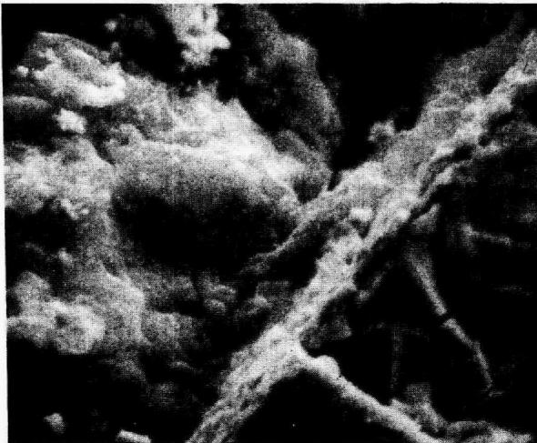

MAG:500X

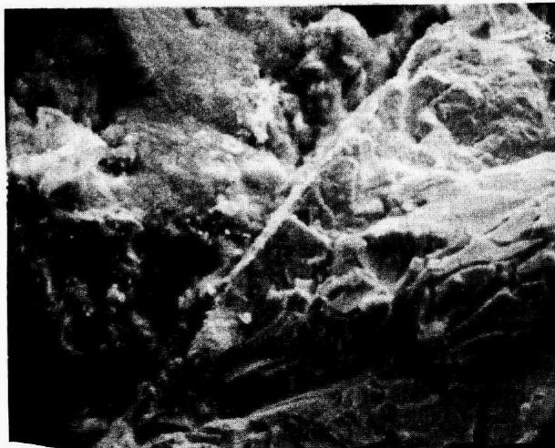

MAG:100X

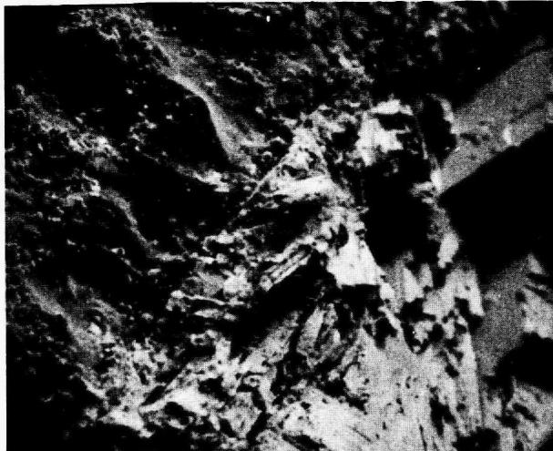

MAG:20X

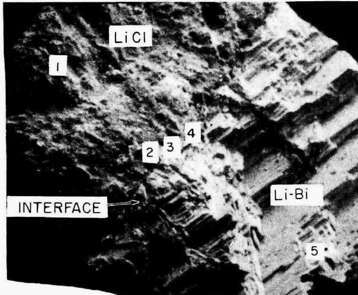  
Fig. 1. Scanning electron photomicrographs of the interface between LiCl and Li-Bi in the stripper from experiment MTE-3. Unpolished.

These constituents total $81\%$ , leaving $19\%$ unaccounted for. No other elements, except possibly those introduced by oxygen or water contamination, are known to be present in the system. If it is assumed that the remainder is predominantly oxygen, this would be sufficient to form oxides and/or hydroxides of all of the cationic species (bismuth, thorium, lithium, and iron). The gram equivalent of these species is $\sim 0.015$ , while the anion-gram equivalent of fluorine and chlorine is only $0.0025$ . For $19\mathrm{wt}\%$ oxygen in the material, the oxygen gas equivalent is $0.024$ , or $0.011$ of hydroxide.

It is not now possible to draw firm conclusions about the relationship of our current observations to the low mass transfer rates seen in experiment MTE-3. The transfer of fluoride salt into the chloride salt just prior to shutdown, and the length of time between shutdown and inspection (from February 1973 to February 1974), have caused much uncertainty in the interpretation of the analyses.

Additional samples of fluoride salt, LiCl--Bi-Th, and LiBi from interfacial surfaces in the contactor and stripper have been submitted for X-ray diffraction analyses in an attempt to identify compounds which might be present. (Nothing other than beryllium was identified on one sample of Li-Bi from the stripper previously examined by X-ray diffraction.)

# 2.2 Installation of Metal Transfer Experiment MTE-3B

Fabrication and assembly of new carbon steel vessels were completed during this report period. An oxidation-resistant protective coating (METCO No. P443-10, $\sim$ 0.015 in. thick) was applied to the outside surfaces of the carbon steel vessels and interconnecting lines to prevent air oxidation at the operating temperature of $650^{\circ}\mathrm{C}$ . A new pump for transferring fuel carrier salt between the salt reservoir and contactor was fabricated and installed. New molybdenum agitator shafts and blades have also been obtained, and the agitator assemblies were installed in the contactor and stripper.

The vessels and their contents (fuel carrier salt, lithium chloride, and bismuth) previously used in experiment MTE-3 were removed from Bldg.

3541 and sent to the burial ground for disposal. The new vessels have been installed, and the experimental area in which the metal transfer experiment is located is being renovated. This includes rerouting some of the service lines to improve access to sampling stations, relocation of some pressure gages, flowmeters, and valves for better visibility and access, calibration and replacement (where required) of pressure gages, flowmeters, and solenoid valves, and recalibration of temperature controllers and recorders.

We have completed tests on two different oxidation-resistant protective coatings using a different method of application for each type of coating. The coatings were applied to test sections made from longitudinal half-sections of 6-in. sched 40 mild steel pipe. The test sections were coated on all exposed surfaces. One test piece was coated with the nickel alumide material (METCO No. M405-10 wire) by flame spraying with a wire gun to obtain a coating thickness of $\sim 0.010$ in., thereby duplicating the coating used on the MTE-3 vessels. The second test piece was coated with a nickel chromium alloy containing $6\%$ aluminum (METCO No. P443-10 powder) applied with a plasma spray gun to a thickness of $\sim 0.010$ in., as recommended by the manufacturer. The two pieces were placed on fire bricks inside a furnace and heated to the test temperature. During the test, the pieces were thermally cycled several times by alternately cooling the furnace to $\sim 100^{\circ}\mathrm{C}$ and returning it to the test temperature.

The initial test temperature was $700^{\circ}\mathrm{C}$ . After $400\mathrm{hr}$ at $700^{\circ}\mathrm{C}$ with eight thermal cycles, the pieces were examined, weighed, and photographed (Fig. 2). The M405-10 coating was covered extensively with a rust-colored oxidation product, but there was no sign of spalling of the coating, whereas the piece coated with P443-10 had a much better appearance with only one edge showing a rust color. Weight gain of the P443-10 coated test piece was about $7.3\mathrm{mg/cm}^2$ , while the M405-10 coating gained about $10.3\mathrm{mg/cm}^2$ .

The test temperature was then increased to $815^{\circ}\mathrm{C}$ and was continued for 520 hr with eight thermal cycles to $100^{\circ}\mathrm{C}$ . The test pieces were again examined, weighed, and photographed (Fig. 2). The M405-10 coating had

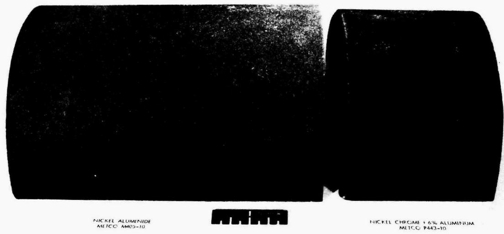  
(a)

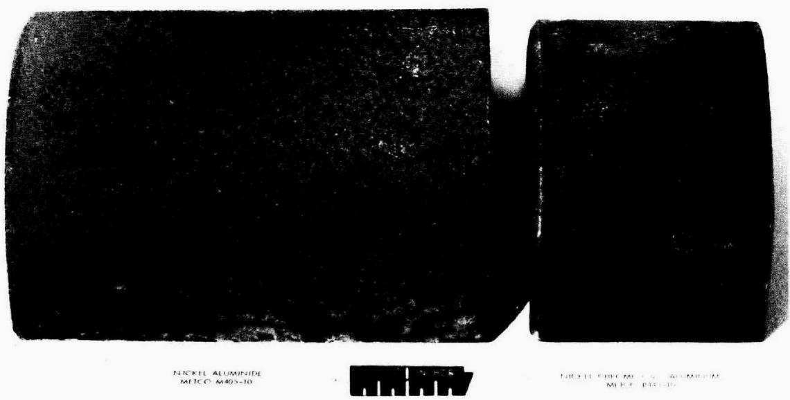  
(b)   
Fig. 2. Photographs of 6-in. sched 40 mild steel pipe with oxidation resistant protective coatings: (a) after 400 hr at $700^{\circ}\mathrm{C}$ in air, (b) after 500 additional hr at $815^{\circ}\mathrm{C}$ in air.

deteriorated to the point where spalling had occurred, while the P443-10 coating had no spalling except along one edge where there was some rust-colored oxidation product and some spalling. Total weight gain of the M405-10-coated test piece was $69.2\mathrm{mg/cm}^2$ , and $20.5\mathrm{mg/cm}^2$ for the P443-10 test piece.

Metallographic examinations were made of the best and worst appearing areas of the two specimens. In the best appearing areas, both coatings were adherent, but a thin layer of oxide formed at the metal-coating interface of the specimen coated with METCO M405-10; this indicates that oxygen is diffusing through the coating. The metal-coating interface of the specimen coated with METCO P443-10 was free of visible oxide, indicating that it is a good barrier to oxygen diffusion. For the worst areas of both coatings, oxide at the metal-coating interfaces caused some spalling where the coating may not have been thick enough to prevent oxygen diffusion through the coatings. The oxide formed underneath the P443-10 coating (in a spalled area occurring only along one edge) appeared to be more dense and protective than that formed on the M405-10-coated specimen. This indicates that some of the elements in the P443-10 coating may have diffused into the base metal and imparted a measure of protection, even though the coating had separated in this area.

This limited test clearly demonstrated the superiority of the plasma spray P443-10 coating over the M405-10-wire gun sprayed material previously used for the MTE-3 vessel; therefore, the plasma spray coating has been applied to the external surfaces of the MTE-3B vessels that will operate at elevated temperatures.

# 2.3 Design of the Metal Transfer Process Facility

Design of the metal transfer process facility (MTPF) in which the fourth metal transfer experiment (MTE-4) will be carried out was underway when the MSR program was terminated in 1973.6 Briefly reviewed, MTE-4 is an engineering experiment that will use salt flow rates that are 5 to $10\%$ of those required for processing a 1000-MW(e) MSBR. Conceptual designs of the three-stage salt-metal contactor, made of graphite, and its

containment vessel were completed. The primary purposes of MTE-4 are:

(1) demonstration of the removal of rare-earth fission products from MSBR fuel carrier salt, and accumulation of these materials in a lithium-bismuth solution in equipment of a significant size,   
(2) determination of mass transfer coefficients between mechanically agitated salt and bismuth phases,   
(3) determination of the rate of removal of rare earths from the fluoride salt in multistage equipment,   
(4) evaluation of potential materials of construction, particularly graphite,   
(5) testing of mechanical devices, such as pumps and agitators, that will be required in a processing plant, and   
(6) development of instrumentation for measurement and control of process variables, such as salt-metal interface location, salt flow rate, and salt or bismuth liquid level.

We are currently reviewing the design of metal transfer experiment MTE-4. A mathematical model of the system has been devised, and a computer program (METTRAN) has been written to simulate transient operation of the experiment. Computations can be made to determine the concentration of each nuclide being transferred at each stage and at the feed and receiving vessels as a function of operating time. The program allows the experimenter to make parametric studies for such design features as interfacial area, number of stages, flow rates, agitator speed, and inventories of materials. METTRAN is being used to analyze the MTE-4 experiment to ascertain the significance of various design features on metal transfer rates in order to fix optimal design conditions.

Due to space limitations in Bldg. 4505, we are planning to locate MTE-4 and several of the engineering experiments on molten-salt processing in the MSRE Building (7503). General cleanup and checkout of existing building services (electrical circuits, ventilation, and air-filtration systems) is underway. A 480-V, 3-phase, 60-Hz, 300-kW diesel generator set and necessary controls will be installed in the existing generator

building at the MSRE site. This will provide emergency power for maintaining portions of engineering experiments which contain salt or bismuth at temperatures above the liquidus temperatures. A purchase order for the generator set has been issued, and the system design has been completed.

# 3. SALT-METAL CONTACTOR DEVELOPMENT: EXPERIMENTS WITH A MECHANICALLY AGITATED, NONDISPERSING CONTACTOR USING WATER AND MERCURY

C. H. Brown, Jr.

A critical part of the proposed MSBR processing plant is the extraction of rare earths from the fluoride fuel carrier salt to an intermediate bismuth stream. One device being considered for performing this extraction is a mechanically agitated, nondispersing contactor in which bismuth and fluoride salt phases are agitated to enhance the mass transfer rate of rare earths across the salt-bismuth interface. Previous reports2,7,8 have shown that the following reaction in the water-mercury system is suitable for simulating and studying mass transfer rates in systems with high density differences:

$$
\mathrm {P b} ^ {2 +} \left[ \mathrm {H} _ {2} 0 \right] + \mathrm {Z n} [ \mathrm {H g} ] \rightarrow \mathrm {Z n} ^ {2 +} \left[ \mathrm {H} _ {2} 0 \right] + \mathrm {P b} [ \mathrm {H g} ]. \tag {1}
$$

A large amount of data have been reported7 for the water-mercury system in which it was assumed that the limiting resistance to mass transfer existed entirely in the mercury phase, as suggested by literature correlations. During this report period, a series of experiments was performed in the water-mercury contactor to determine which phase actually controls the rate of mass transfer and, also, the concentration of $\mathsf{Pb}^{2+}$ at which the control of mass transfer changes from one phase to the other.

# 3.1 Theory

The reaction under consideration, Eq. (1), is a liquid-phase ionic reaction that occurs entirely at the mercury-water interface; this is because zinc metal and lead metal are insoluble in water and there can

be no ionic lead or zinc in the mercury. Since this is a typical ionic reaction, it is assumed to be essentially instantaneous and irreversible. The equilibrium constant for the reaction is given by the following equation:

$$
\mathrm {K} + \frac {\mathrm {C} _ {\mathrm {P b}} \mathrm {C} _ {\mathrm {Z n}} 2 +}{\mathrm {C} _ {\mathrm {P b}} 2 + \mathrm {C} _ {\mathrm {Z n}}} \tag {2}
$$

where

$$
K = \text {e q u i l i b r i u m}
$$

$$
C _ {P b} = \text {c o n c e n t r a t i o n o f P b m e t a l i n m e r c u r y , g - m o l e / l i t e r ,}
$$

$$
C _ {P b} 2 + = c o n c e n t r a t i o n \text {f o l d s i n w a t e r , g - m o l e / l i t e r ,}
$$

$$
C _ {Z n} = \text {c o n c e n t r a t i o n o f Z n m e t a l i n m e r c u r y , g - m o l e / l i t e r ,}
$$

$$
C _ {Z n 2 +} = \text {c o n c e n t r a t i o n o f Z n i o n s i n w a t e r , g - m o l e / l i t e r .}
$$

The equilibrium constant is very large, implying that at equilibrium the ionic lead and metallic zinc cannot coexist at appreciable concentrations at the interface. Since it is assumed to be an extremely fast reaction, the equilibrium relation near the interface must be satisfied at all times.

For the instantaneous irreversible reaction discussed previously, two situations could occur near the liquid-liquid interface, depending on the relative magnitudes of the individual-phase mass transfer coefficients and the bulk-phase concentrations of the transferring species in each phase. Figure 3 illustrates these two conditions.

In Fig. 3(a), the limiting resistance to mass transfer is assumed to occur in the mercury phase. It can be shown that the product of the bulk phase concentration of reactant and the individual-phase mass transfer coefficient in the phase where the limitation occurs must be less than the product of the bulk-phase concentration of the other reactant and the individual-phase mass transfer coefficient in the other phase.9 The concentration of zinc in mercury near the interface decreases from the

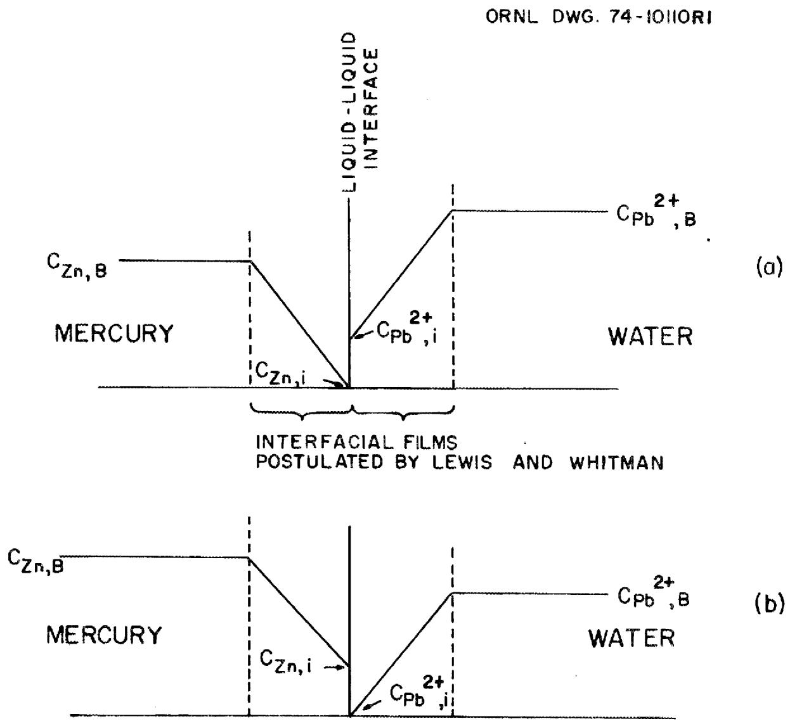  
Fig. 3. Interfacial behavior for an instantaneous irreversible reaction occurring between two liquid phases. (a) Mercury-phase controlling mass transfer. (b) Water-phase controlling mass transfer.

bulk concentration to near zero at the mercury-water interface. The concentration at the interface is very small because of the instantaneous irreversible reaction that occurs at the interface. At the interface in the water phase, the concentration of $\mathrm{Pb}^{2+}$ has a finite value and increases through the interfacial film to the bulk phase value.

Fig. 3(b) illustrates the condition in which the limiting resistance to mass transfer is assumed to occur in the water phase. The explanation of the concentration gradients in the interfacial films is entirely analogous to the case explained above. The concentration profiles of lead in the mercury, $\mathrm{Zn}^{2+}$ in the water, and $\mathrm{NO}_3^-$ (the anion) in the water are not shown in Fig. 3.

Several correlations have been developed and presented in the literature for predicting individual-phase mass transfer coefficients in nondispersing stirred interface contactors. For the mercury-water system, all of these correlations predict that the mercury-phase mass transfer coefficient would be smaller than the water-phase coefficient.

In all previous work performed with the mercury-water system, $^{2,7,8}$ the concentrations of the reactants were equal. This condition, coupled with the fact that the mercury-phase mass transfer coefficient was predicted to be significantly smaller than the water-phase coefficient, indicated that the limiting resistance to mass transfer should occur in the mercury phase.

In order to test the assumption that mass transfer is controlled by the mercury phase, we can write the following relations for transfer of the reactants from the bulk phase to the interface where they react, based on the two-film representation shown in Fig. 3:

$$
\mathrm {N} _ {\mathrm {Z n}} = \mathrm {k} _ {\mathrm {H g}} \mathrm {A} \left(\mathrm {C} _ {\mathrm {Z n}, \mathrm {B}} - \mathrm {C} _ {\mathrm {Z n}, \mathrm {i}}\right), \tag {3}
$$

$$
\mathrm {N} _ {\mathrm {P b}} 2 + = \mathrm {k} _ {\mathrm {H} _ {2} 0} ^ {\mathrm {A}} \left(\mathrm {C} _ {\mathrm {P b}} 2 +, \mathrm {B} - \mathrm {C} _ {\mathrm {P b}} 2 +, \mathrm {i}\right), \tag {4}
$$

where

k = individual-phase mass transfer coefficient, cm/sec,

N = rate of mass transfer to the interface, g/sec,

A = interfacial area, cm²,

C = concentration, (B denotes bulk-phase concentration, i denotes interfacial concentration), g/cm³, and

subscripts $\mathsf{Hg}$ and $\mathsf{H}_2\mathsf{O}$ refer to the phase being considered. As stated above, we assumed that the rate at which reaction (1) proceeds is controlled by the rate of transfer of zinc through the mercury phase to the interface. The necessary conditions for this assumption to be valid are:

(1) The equilibrium constant for the reaction must be large (i.e., the reaction should be irreversible).   
(2) The product of the mass transfer coefficient times the bulk concentration of reactant in the phase where the rate of mass transfer is limiting must be less than the product in the other phase.

Since 1 mole of zinc is equivalent to 1 mole of $\mathsf{Pb}^{2+}$ according to Eq. (1), $\mathsf{N}_{\mathsf{Pb}}2 + = \mathsf{N}_{\mathsf{Zn}}$ . Substituting Eqs. (3) and (4) into this expression, and assuming that the controlling resistance is in the mercury phase, the following expression is obtained for the apparent mercury-phase mass transfer coefficient:

$$
k _ {H g, A} = \frac {k _ {H _ {2} O} \left(C _ {P b} 2 ^ {+} , B - C _ {P b} 2 ^ {+} , i\right)}{C _ {Z n , B}} \tag {5}
$$

where

$\mathbf{k}_{\mathrm{Hg,A}} =$ the apparent individual-phase mass transfer coefficient for the mercury phase, cm/sec,

$\mathrm{k}_{\mathrm{H}_20} =$ the true individual-phase mass transfer coefficient for the water phase.

In the above equation, the actual mass transfer coefficient differs from the apparent mass transfer coefficient only if the mercury phase does not control the rate of mass transfer. The transient method used to determine the mass transfer coefficient has been described previously.[8]

By an argument similar to that which led to the development of Eq. (5), an equation for the apparent aqueous-phase mass transfer coefficient can be written for the case where the limiting resistance is in the water.

The concentration of $\mathsf{Pb}^{2+}$ in the water below which the limiting resistance to mass transfer is in the water (at a fixed concentration of zinc in the mercury) can be determined as follows: If the $\mathsf{Pb}^{2+}$ concentration is sufficiently high, the limiting resistance to mass transfer will be in the mercury, and the interfacial concentration of $\mathsf{Pb}^{2+}$ , $\mathsf{C}_{\mathsf{Pb}} 2+$ , i will have a finite value. If $\mathsf{C}_{\mathsf{Pb}} 2+$ , B is lowered by an amount $\Delta$ (not large enough to cause the limiting resistance to change phases), Eq. (5) then indicates that $\mathsf{C}_{\mathsf{Pb}} 2+$ , i must also decrease by the same amount $\Delta$ , keeping the difference $\mathsf{C}_{\mathsf{Pb}} 2+$ , B - $\mathsf{C}_{\mathsf{Pb}} 2+$ , i constant. The water-phase mass transfer coefficient is assumed to remain constant (although of unknown value). If $\mathsf{C}_{\mathsf{Pb}} 2+$ , B is reduced sufficiently, $\mathsf{C}_{\mathsf{Pb}} 2+$ , i will drop to zero; if $\mathsf{C}_{\mathsf{Pb}} 2+$ , B is further reduced, $\mathsf{C}_{\mathsf{Pb}} 2+$ , i will remain zero, and the limiting resistance will change from the mercury phase to the water phase. At high values of $\mathsf{C}_{\mathsf{Pb}} 2+$ , B, the apparent mercury-phase mass transfer coefficient will remain constant as $\mathsf{C}_{\mathsf{Pb}} 2+$ , B is lowered to the point where the limiting resistance moves into the water phase. As $\mathsf{C}_{\mathsf{Pb}} 2+$ , B is further reduced, $\mathsf{C}_{\mathsf{Pb}} 2+$ , i will be zero or very near zero. Equation (5) shows that the apparent mercury-phase mass transfer coefficient will vary directly with $\mathsf{C}_{\mathsf{Pb}} 2+$ , B (since $\mathsf{C}_{\mathsf{Zn}}, \mathsf{B}$ is fixed, and the true water-phase mass transfer coefficient is assumed to be constant). This dependence of the apparent mercury-phase mass transfer coefficient on the concentration of $\mathsf{Pb}^{2+}$ in the water is shown in Fig. 4. The dependence of the analogously defined apparent water-phase mass transfer coefficient is also shown. Thus, by calculating the apparent mercury-phase mass transfer coefficient as a function of the initial aqueous-phase lead concentration for a single agitator speed, the transition from mercury-phase controlling to aqueous-phase controlling should be identifiable by a line-slope change determined by plotting the apparent mercury-phase mass transfer coefficient vs the initial aqueous-phase lead concentration.

ORNL DWG. 74-10III

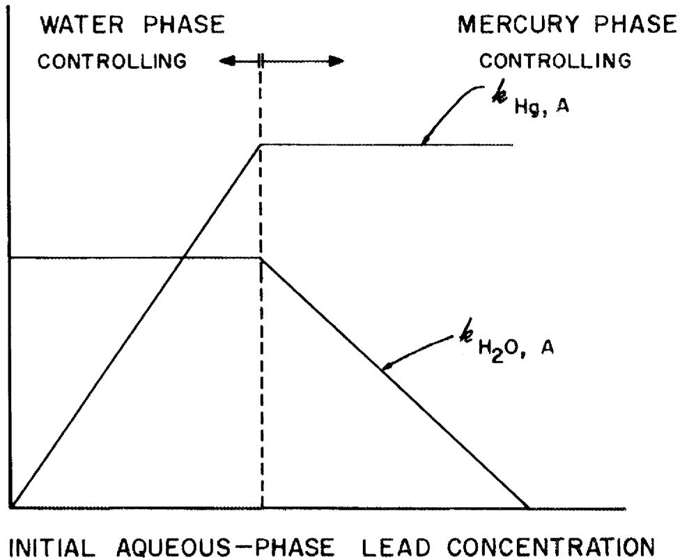  
APPARENT INDIVIDUAL-PHASE MASS   
TRANSFER COEFFICIENT   
Fig. 4. Theoretical relationship between the apparent mass transfer coefficients and the initial aqueous-phase lead concentration.

# 3.2 Experimental Apparatus

A series of mass transfer experiments was performed in a mercury-water contactor to determine the point at which control of mass transfer changes from the mercury phase to the aqueous phase. The experimental apparatus used in this study is shown schematically in Fig. 5. The equipment consists of a 5- by 7-in. Plexiglas vessel, 10 in. high, containing two phases, each of which is 3 in. deep. An agitator shaft to which two four-vaned, flat paddles are attached is suspended from a variable speed motor. The paddles are positioned at the midpoint of each phase. In this study, the two phases were 1.8 liters of clean mercury containing $0.1\mathrm{M}$ Zn, and 1.8 liters of distilled water containing from 0.02 to 0.10 $\underline{\underline{\mathbf{M}}}$ Pb $(\mathrm{NO}_3)_2$ .

# 3.3 Results and Conclusions

Five experiments were run to measure the apparent mercury-phase mass transfer coefficient as a function of the initial aqueous-phase lead concentration. The initial mercury-phase zinc concentration was held constant at 0.1 M. Phase volumes and agitator speed were also held constant at 1.8 liters and $\sim 150$ rpm, respectively.

The experimental results are presented graphically in Fig. 6. The apparent mercury-phase mass transfer coefficient decreased for all initial lead concentrations less than in previous experiments. This indicates that under the specified conditions, the limiting resistance to mass transfer is apparently not in the mercury phase. However, based on the one point at the lowest $\mathsf{Pb}^{2+}$ concentration, the apparent aqueous-phase mass transfer coefficient does not seem to remain a constant as would be predicted by the model described above. This point must be clarified by additional data.

From these results, the following conclusion can be drawn: For the conditions under which these and all other runs were performed, the resistance to mass transfer was not in the mercury phase as was previously believed. Further studies are needed to test other assumptions employed in analyzing results from the transient mass transfer equipment.

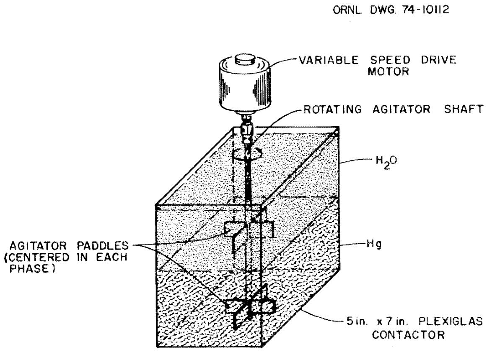  
Fig. 5. Schematic diagram of the Plexiglas contactor used for the mercury-water system.

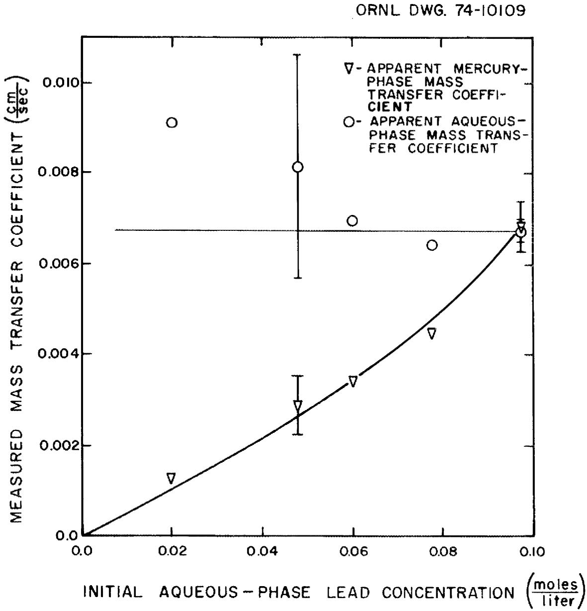  
Fig. 6. Experimental results showing the apparent mercury-phase mass transfer coefficients as a function of the initial aqueous-lead concentration at constant agitator speed.

4. SALT-METAL CONTACTOR DEVELOPMENT: EXPERIMENTS WITH A MECHANICALLY AGITATED, NONDISpersING CONTACTOR IN THE SALT-BISMUTH FLOWTHROUGH FACILITY

J. A. Klein, C. H. Brown, Jr., and J. R. Hightower, Jr.

Mechanically agitated, nondispersing contactors are being considered for extracting protactinium and the rare-earth fission products from the fuel carrier salt of a molten-salt breeder reactor into molten bismuth containing dissolved reductant.

Mass transfer rates were measured in a mild steel contactor which was fabricated and installed in the Salt-Bismuth Flowthrough Facility. This experimental system allows (a) periodic purification of the feed salt and metal, (b) removal of surface contamination from the salt-metal interface, and (c) varying of the distribution ratio of the material of interest between the salt and bismuth.

The new stirred interface contactor makes use of the existing piping equipment and instrumentation in the Salt-Bismuth Flowthrough Facility that were used for studying salt-bismuth flow in packed columns. A simplified flow diagram of the facility is shown in Fig. 7. The facility contains five vessels, the associated piping, and the contactor assembly. The vessels are a salt-feed tank, a salt-collection tank, a bismuth-feed tank, a bismuth-collection tank, and a treatment vessel (T5) for sparging both salt and metal with mixtures of HF and $\mathbf{H}_2$ . To conserve space, feed and collection tanks for both salt and metal are concentric. Feed and collection tanks and piping are made of low carbon steel. The treatment vessel is made of stainless steel with a graphite liner.

A diagram of the contactor is shown in Fig. 8. The contactor is made of a 6-in.-diam low-carbon steel vessel containing four 1-in.-wide vertical baffles. The agitator consists of two 2-7/8-in.-diam stirrers with four 3/4-in.-wide noncanted blades. A 3/4-in.-diam overflow at the interface allows the removal of interfacial films with the salt and metal effluent streams. Salt and bismuth are fed in the contactor below the surface of the respective phase, and both phases were equilibrated prior to an experiment. The system was operated in essentially the same manner

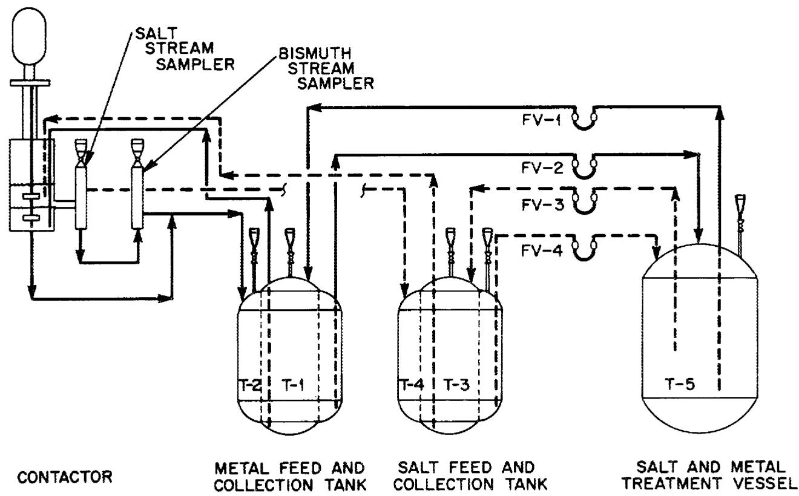  
Fig. 7. Flow diagram of the Salt-Bismuth Flowthrough Facility with the mechanically agitated contactor installed.

ORNL DWG 74-10073

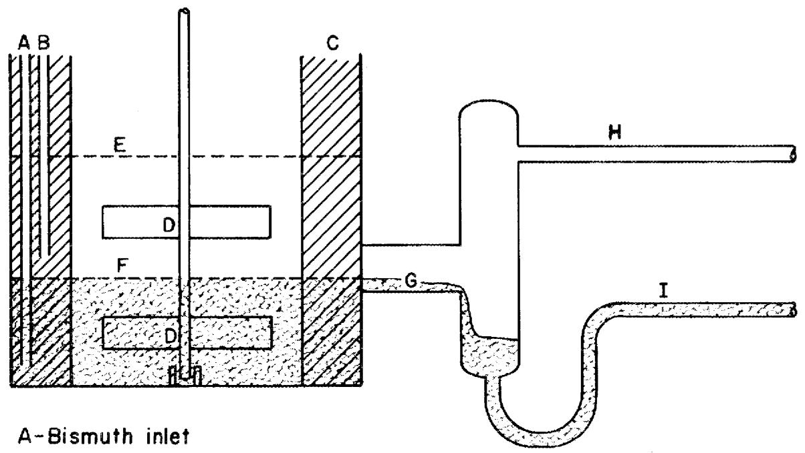  
Fig. 8. Diagram of the mechanically agitated, nondispersing contactor installed in the Salt-Bismuth Flowthrough Facility.

B-Salt Inlet

C-Four I-in.baffles

D-2-7/8-in. x 3/4-in. blades

E-Gas-salt interface

F-Bismuth-salt interface

G-Interface removal

H-Salt effluent

I-Bismuth effluent

as was employed with the packed column. $^{10-14}$ After transfer of the salt and metal phases to the feed tanks, $^{97}Zr$ and $^{237}U$ tracers were added to the salt. With this technique, the rates at which zirconium and uranium tracers transfer from the salt to the bismuth could be measured in a system that was otherwise at chemical equilibrium.

The experimentally determined data from the system are sufficient to allow three independent expressions for the overall mass transfer coefficient to be derived for the contactor in the Salt-Bismuth Flowthrough Facility from steady-state material balance relationships.

These expressions for the overall mass transfer coefficient are given below in terms of the measured quantities $C_1, C_s, C_m, F_1, F_2, D$ , and A:

$$
\begin{array}{l} K _ {S _ {1}} = \frac {F _ {1} \left(1 - \frac {C _ {s}}{C _ {1}}\right)}{A \left(\frac {C _ {s}}{C _ {1}}\right) + \frac {A}{D} \left(\frac {C _ {s}}{C _ {1}}\right) \left(\frac {F _ {1}}{F _ {2}}\right) - \frac {A}{D} \left(\frac {F _ {1}}{F _ {2}}\right)}, (6) \\ K _ {S _ {2}} = \frac {\left(\frac {C m}{C _ {1}}\right) F _ {2}}{A - A \left(\frac {C m}{C _ {1}}\right) \left(\frac {F _ {2}}{F _ {1}}\right) - \left(\frac {C m}{C _ {1}}\right) \left(\frac {A}{D}\right)} \text {, a n d} (7) \\ K _ {S _ {3}} = \frac {\left(\frac {C m}{C _ {S}}\right) F _ {2}}{A - \left(\frac {C m}{C _ {S}}\right) \left(\frac {A}{D}\right)} (8) \\ \end{array}
$$

where

$$
\begin{array}{l} F _ {1} = \text {f l o w r a t e o f s a l t , c m} ^ {3} / \sec , \\ F _ {2} = \text {f l o w r a t e o f m e t a l , c m} ^ {3} / \sec , \\ C _ {1} = \text {t r a c e r c o n c e n t r a t i o n i n s a l t i n f l o w , u n i t s / c m} ^ {3}, \\ \end{array}
$$

$C_{s} =$ tracer concentration in salt outflow, units/cm $^3$ ,   
$C_{\mathrm{m}} =$ tracer concentration in metal outflow, units/cm³,

A = interfacial area, cm², and

D = distribution coefficient = ratio of concentration in metal phase to concentration in salt phase at equilibrium, moles/cm $^3$ moles/cm $^3$ .

The subscripts 1, 2, and 3 on $\mathbf{K}_{\mathrm{s}}$ indicate the equation used to evaluate the overall mass transfer coefficient, $\mathbf{K}_{\mathrm{s}}$ . The overall mass transfer coefficient is related to the mass transfer coefficients in the individual phases through the following relation:

$$
1 / K _ {s} = 1 / k _ {s} + 1 / D k _ {m}, \tag {9}
$$

where

$K_{s} =$ overall mass transfer coefficient based on salt-phase concentrations, cm/sec,

$k_{s} =$ individual mass transfer coefficient in salt phase, cm/sec, and

$k_{m} =$ individual mass transfer coefficient phase in metal, cm/sec.

Within experimental error, the distribution coefficient, $D$ , can be set as desired. In order to minimize effects of uncertainties in the value of $D$ on the calculated value of the overall mass transfer coefficient, it is desirable to make $D$ fairly large. For the values of concentrations and flow rates used in these experiments, the terms containing $D$ in Eqs. (6)-(8) are less than $5\%$ of the values of the other terms for values of $D$ greater than 20, and can be disregarded with little error. Assuming that the terms containing $D$ can be omitted, Eqs. (6)-(8) reduce to

$$
\begin{array}{l} K _ {S _ {1}} = \frac {F _ {1}}{A} \left[ \frac {1 - \left(\frac {C _ {s}}{C _ {1}}\right)}{\left(\frac {C _ {s}}{C _ {1}}\right)} \right], (10) \\ \mathrm {K} _ {\mathrm {S} _ {2}} = \frac {\mathrm {F} _ {2}}{\mathrm {A}} \left[ \frac {\left(\frac {\mathrm {C} _ {\mathrm {m}}}{\mathrm {C} _ {1}}\right)}{1 - \left(\frac {\mathrm {F} _ {2}}{\mathrm {F} _ {1}}\right) \left(\frac {\mathrm {C} _ {\mathrm {m}}}{\mathrm {C} _ {1}}\right)} \right], \text {a n d} (11) \\ \mathrm {K} _ {\mathrm {S} _ {3}} = \frac {\mathrm {F} _ {2}}{\mathrm {A}} \frac {\mathrm {C} _ {\mathrm {m}}}{\mathrm {C} _ {\mathrm {S}}} \quad ; (12) \\ \end{array}
$$

uncertainties in the distribution coefficient do not affect the accuracy of the overall mass transfer coefficient. However, as shown by Eq. (9), when D is very large, the overall mass transfer coefficient is essentially the individual salt-phase coefficient, since resistance to mass transfer in the metal phase is negligible in comparison.

Six runs have been completed to date. Four runs (TSMC-1 through -4) have been discussed previously, and two runs (TSMC-5 and -6) were completed during this report period. We have recalculated results for all runs and will discuss them together in this report.

All runs were performed using the same procedure. While the fluoride salt and bismuth are in contact in T5 (the treatment vessel), sufficient beryllium is added to the salt electrolytically to produce the desired distribution coefficient, D. Since it is impossible to completely exclude oxidants, addition of beryllium must be carried out periodically in order to maintain a relatively high distribution coefficient. Periodic transfer of salt and bismuth throughout the system are also performed to keep the system in equilibrium.

Prior to a run, the salt and bismuth phases are separated by pressurizing the salt-bismuth purification vessel and transferring salt and

bismuth to their respective feed tanks. Approximately 7 mCi of $^{97}\mathrm{Zr}-^{97}\mathrm{Nb}$ and 50 to 100 mCi of $^{237}\mathrm{U}_{3}\mathrm{O}_{8}$ are allowed to dissolve in the salt phase about 2 hr prior to an experiment.

Salt and bismuth streams are passed through the contactor vessel at the desired flow rates by controlled pressurization of the salt and bismuth feed tanks. The contactor is maintained at approximately $590^{\circ}\mathrm{C}$ for all runs. Both phases exit through a common overflow line, separate, and return to the salt and bismuth catch vessels. Periodic sampling of both exit streams is accomplished by means of flowing-stream samplers installed in the exit lines from the contactor.

Sample analysis was accomplished by first counting the sample capsules for the activity of $^{237}\mathrm{U}$ (207.95 keV $\beta^{-}$ ) and the activity of $^{97}\mathrm{Zr}-^{97}\mathrm{Nb}$ (743.37 keV and 658.18 keV $\beta^{-}$ , respectively) after secular equilibrium was reached between $^{97}\mathrm{Zr}$ and its daughter $^{97}\mathrm{Nb}$ . The material in the sample capsules was then dissolved, and the activity of $^{237}\mathrm{U}$ was counted again after the $^{97}\mathrm{Zr}-^{97}\mathrm{Nb}$ activity had decayed to a very low level; this was done to correct for self-absorption in the solid samples. Mass transfer rates were then calculated from the ratios of tracer concentrations as discussed previously.

The counting data obtained during runs TSMC-2 through -6 are shown in Tables 2-6. Counting data are given for $^{237}\mathrm{U}$ (207.45 keV $\beta^{-}$ ) and $^{97}\mathrm{Zr}$ (743.37 keV $\beta^{-}$ ) in the solid salt and bismuth samples, and for $^{237}\mathrm{U}$ after the samples were dissolved. All the results are given in terms of counts per gram of phase.

Results of measurements of overall mass transfer coefficients are shown in Table 7. Three different equations for calculating mass transfer coefficients were used for calculating the results for any one run, and the results are presented as an average of three calculated values with the standard deviation. Values are given both for results based on the uranium counting data and for results based on the zirconium counting data.

Table 2. Counting data obtained from run TSMC-2   

<table><tr><td>Sample codea</td><td>Solid analysis for 237U (counts/g)</td><td>Solution analysis for 237U (counts/g)</td><td>Solid analysis for 97Zr (counts/g)</td><td>Sample codea</td><td>Solid analysis for 237U (counts/g)</td><td>Solution analysis for 237U (counts/g)</td><td>Solid analysis for 97Zr (counts/g)</td></tr><tr><td colspan="8">Samples taken prior to run</td></tr><tr><td>88-B-5</td><td>≤ 3.3 x 102</td><td>≤ 2.8 x 103</td><td>≤ 6.37 x 101</td><td>86-S-5</td><td>≤ 8.5 x 103</td><td>≤ 1.8 x 104</td><td>≤ 4.5 x 102</td></tr><tr><td>93-B-1</td><td>≤ 3.2 x 102</td><td>≤ 1.9 x 103</td><td>≤ 1.03 x 102</td><td>87-S-5</td><td>≤ 6.8 x 103</td><td>≤ 1.8 x 104</td><td>≤ 7.7 x 102</td></tr><tr><td>94-B-1</td><td>≤ 2.2 x 102</td><td>≤ 2.3 x 103</td><td>≤ 6.6 x 101</td><td>89-S-3</td><td>≤ 2.9 x 103</td><td>≤ 6.4 x 103</td><td>≤ 3.9 x 102</td></tr><tr><td></td><td></td><td></td><td></td><td>90-S-3</td><td>≤ 5.6 x 104</td><td>≤ 6.8 x 104</td><td>≤ 6.6 x 102</td></tr><tr><td colspan="8">Samples taken prior to run, but after addition of tracers</td></tr><tr><td></td><td></td><td></td><td></td><td>91-S-3</td><td>3.01 x 105</td><td>2.79 x 105</td><td>1.85 x 105</td></tr><tr><td></td><td></td><td></td><td></td><td>92-S-3</td><td>1.96 x 105</td><td>2.09 x 105</td><td>1.79 x 105</td></tr><tr><td colspan="8">Samples taken during run</td></tr><tr><td>93-B-FS</td><td>1.80 x 104</td><td>3.49 x 104</td><td>2.01 x 104</td><td>100-S-FS</td><td>2.32 x 105</td><td>2.36 x 105</td><td>1.48 x 105</td></tr><tr><td>94-B-FS</td><td>1.46 x 104</td><td>3.29 x 104</td><td>1.69 x 104</td><td>101-S-FS</td><td>2.41 x 105</td><td>2.70 x 105</td><td>1.52 x 105</td></tr><tr><td>95-B-FS</td><td>1.91 x 104</td><td>2.80 x 104</td><td>2.00 x 104</td><td>102-S-FS</td><td>2.44 x 105</td><td>2.57 x 105</td><td>1.71 x 105</td></tr><tr><td>96-B-FS</td><td>2.24 x 104</td><td>4.28 x 104</td><td>2.10 x 104</td><td>103-S-FS</td><td>--</td><td>--</td><td>--</td></tr><tr><td>97-B-FS</td><td>2.15 x 104</td><td>3.87 x 104</td><td>1.94 x 104</td><td>104-S-FS</td><td>2.65 x 105</td><td>2.87 x 105</td><td>1.90 x 105</td></tr><tr><td>98-B-FS</td><td>1.86 x 104</td><td>3.91 x 104</td><td>1.97 x 104</td><td>105-S-FS</td><td>2.74 x 105</td><td>2.77 x 105</td><td>1.64 x 105</td></tr><tr><td>99-B-FS</td><td>3.21 x 104</td><td>5.01 x 104</td><td>2.74 x 104</td><td>106-S-FS</td><td>2.91 x 105</td><td>2.57 x 105</td><td>1.65 x 105</td></tr><tr><td colspan="8">Samples taken after run</td></tr><tr><td>107-B-1</td><td>5.05 x 103</td><td>1.08 x 104</td><td>4.40 x 103</td><td>111-S-3</td><td>5.00 x 105</td><td>5.09 x 105</td><td>1.94 x 105</td></tr><tr><td>108-B-1</td><td>4.18 x 103</td><td>1.04 x 104</td><td>4.05 x 103</td><td>112-S-3</td><td>5.14 x 105</td><td>5.51 x 105</td><td>1.93 x 105</td></tr><tr><td>109-B-2</td><td>1.48 x 104</td><td>3.29 x 104</td><td>1.61 x 104</td><td>113-S-4</td><td>2.41 x 105</td><td>2.82 x 105</td><td>1.29 x 105</td></tr><tr><td>110-B-2</td><td>1.96 x 104</td><td>3.76 x 104</td><td>1.83 x 104</td><td>114-S-4</td><td>2.55 x 105</td><td>2.91 x 105</td><td>1.36 x 105</td></tr><tr><td>115-B-5</td><td>2.76 x 104</td><td>5.52 x 104</td><td>2.40 x 104</td><td>117-S-5</td><td>1.53 x 105</td><td>&lt; 1.9 x 105</td><td>6.63 x 104</td></tr><tr><td>116-B-5</td><td>5.15 x 104</td><td>6.34 x 104</td><td>2.54 x 104</td><td>118-S-5</td><td>9.59 x 104</td><td>&lt; 2.6 x 105</td><td>7.95 x 104</td></tr></table>

Each sample is designated by a code corresponding to A-B-C, where A = sample number; B = material in sample (B = bismuth, S = salt); and C = sample origin; 1 = T1; 2 = T2; 3 = T3; 4 = T4; 5 = T5; FS = flowing stream sample.

Table 3. Counting data obtained from run TSMC-3   

<table><tr><td>Sample codea</td><td>Solid analysis for 237U (counts/g)</td><td>Solution analysis for 237U (counts/g)</td><td>Sample codea</td><td>Solid analysis for 237U (counts/g)</td><td>Solution analysis for 237U (counts/g)</td></tr><tr><td colspan="6">Samples taken prior to run</td></tr><tr><td>141-B-5</td><td>≤ 1.13 x 102</td><td>≤ 5.1 x 103</td><td>143-S-5</td><td>≤ 3.3 x 103</td><td>≤ 5.3 x 104</td></tr><tr><td>142-B-5</td><td>≤ 1.64 x 102</td><td>≤ 5.5 x 103</td><td>144-S-5</td><td>≤ 3.2 x 103</td><td>≤ 7.6 x 104</td></tr><tr><td>147-B-5</td><td>≤ 6.26 x 101</td><td>≤ 3.4 x 103</td><td>145-S-3</td><td>≤ 3.4 x 103</td><td>≤ 7.6 x 104</td></tr><tr><td>148-B-5</td><td>≤ 1.00 x 102</td><td>≤ 4.0 x 103</td><td>146-S-3</td><td>≤ 3.2 x 104</td><td>≤ 5.6 x 104</td></tr><tr><td colspan="6">Samples taken prior to run but after addition of tracer</td></tr><tr><td></td><td></td><td></td><td>149-S-3</td><td>6.13 x 105</td><td>9.37 x 105</td></tr><tr><td></td><td></td><td></td><td>150-S-3</td><td>6.33 x 105</td><td>9.29 x 105</td></tr><tr><td colspan="6">Samples taken during run</td></tr><tr><td>151-B-FS</td><td>4.52 x 104</td><td>1.13 x 105</td><td>158-S-FS</td><td>3.48 x 105</td><td>4.89 x 105</td></tr><tr><td>152-B-FS</td><td>4.14 x 104</td><td>1.29 x 105</td><td>159-S-FS</td><td>--</td><td>--</td></tr><tr><td>153-B-FS</td><td>4.12 x 104</td><td>1.33 x 105</td><td>160-S-FS</td><td>2.96 x 105</td><td>4.36 x 105</td></tr><tr><td>154-B-FS</td><td>4.51 x 104</td><td>1.44 x 105</td><td>161-S-FS</td><td>3.08 x 105</td><td>4.56 x 105</td></tr><tr><td>155-B-FS</td><td>6.32 x 105</td><td>1.26 x 105</td><td>162-S-FS</td><td>3.02 x 105</td><td>3.99 x 105</td></tr><tr><td>156-B-FS</td><td>3.88 x 104</td><td>1.44 x 105</td><td>163-S-FS</td><td>3.19 x 105</td><td>4.43 x 105</td></tr><tr><td>157-B-FS</td><td>4.00 x 104</td><td>1.49 x 105</td><td>164-S-FS</td><td>--</td><td>--</td></tr><tr><td colspan="6">Samples taken after run</td></tr><tr><td>165-B-1</td><td>4.38 x 102</td><td>4.8 x 103</td><td>167-S-3</td><td>6.68 x 105</td><td>1.19 x 105</td></tr><tr><td>166-B-1</td><td>6.53 x 102</td><td>4.7 x 103</td><td>168-S-3</td><td>--</td><td>--</td></tr><tr><td>169-B-2</td><td>3.19 x 104</td><td>1.61 x 105</td><td>171-S-4</td><td>2.64 x 105</td><td>4.71 x 105</td></tr><tr><td>170-B-2</td><td>2.86 x 104</td><td>9.56 x 104</td><td>172-S-4</td><td>2.70 x 105</td><td>4.12 x 105</td></tr><tr><td>173-B-5</td><td>5.47 x 104</td><td>1.43 x 105</td><td>175-S-5</td><td>≤ 6.4 x 103</td><td>≤ 1.4 x 105</td></tr><tr><td>174-B-5</td><td>5.24 x 104</td><td>1.44 x 105</td><td>176-S-5</td><td>≤ 6.4 x 103</td><td>≤ 1.4 x 105</td></tr></table>

aEach sample is designated by a code corresponding to A-B-C, where A = sample number; B = material in sample (B = bismuth, S = salt); and C = sample origin; 1 = T1; 2 = T2; 3 = T3; 4 = T4; 5 = T5; FS = flowing stream sample.

Table 4. Counting data obtained from run TSMC-4   

<table><tr><td>Sample codea</td><td>Solid analysis for 237U (counts/g)</td><td>Solution analysis for 237U (counts/g)</td><td>Solid analysis for 97Zr (counts/g)</td><td>Sample codea</td><td>Solid analysis for 237U (counts/g)</td><td>Solution analysis for 237U (counts/g)</td><td>Solid analysis for 97Zr (counts/g)</td></tr><tr><td colspan="8">Samples taken prior to run</td></tr><tr><td>191-B-5</td><td>&lt; 1.03 x 103</td><td>≤ 5.1 x 103</td><td>≤ 4.4 x 102</td><td>189-S-5</td><td>&lt; 5.9 x 103</td><td>&lt; 3.6 x 104</td><td>&lt; 1.5 x 103</td></tr><tr><td>192-B-5</td><td>≤ 8.83 x 102</td><td>≤ 6.7 x 103</td><td>≤ 3.3 x 102</td><td>190-S-5</td><td>&lt; 4.0 x 103</td><td>&lt; 3.8 x 104</td><td>&lt; 6.4 x 102</td></tr><tr><td>195-B-1</td><td>≤ 1.00 x 103</td><td>≤ 4.9 x 103</td><td>≤ 3.3 x 102</td><td>193-S-3</td><td>&lt; 4.7 x 103</td><td>&lt; 3.6 x 104</td><td>&lt; 1.4 x 103</td></tr><tr><td>196-B-1</td><td>≤ 1.19 x 103</td><td>≤ 4.7 x 103</td><td>≤ 5.7 x 102</td><td>194-S-3</td><td>≤ 4.3 x 103</td><td>≤ 1.0 x 104</td><td>≤ 9.5 x 102</td></tr><tr><td colspan="8">Samples taken prior to run but after addition of tracers</td></tr><tr><td></td><td></td><td></td><td></td><td>197-S-3</td><td>1.22 x 105</td><td>1.44 x 105</td><td>1.92 x 105</td></tr><tr><td></td><td></td><td></td><td></td><td>198-S-3</td><td>1.21 x 105</td><td>1.49 x 105</td><td>1.99 x 105</td></tr><tr><td colspan="8">Samples taken during run</td></tr><tr><td>199-B-FS</td><td>9.67 x 104</td><td>2.91 x 105</td><td>3.63 x 104</td><td>206-S-FS</td><td>1.46 x 105</td><td>2.97 x 105</td><td>4.58 x 104</td></tr><tr><td>200-B-FS</td><td>1.45 x 105</td><td>3.57 x 105</td><td>4.50 x 104</td><td>207-S-FS</td><td>2.64 x 105</td><td>3.23 x 105</td><td>6.33 x 104</td></tr><tr><td>201-B-FS</td><td>1.70 x 105</td><td>4.82 x 105</td><td>5.66 x 104</td><td>208-S-FS</td><td>2.98 x 105</td><td>2.88 x 105</td><td>4.61 x 104</td></tr><tr><td>202-B-FS</td><td>1.85 x 105</td><td>4.72 x 105</td><td>6.34 x 104</td><td>209-S-FS</td><td>2.97 x 105</td><td>5.01 x 105</td><td>6.07 x 104</td></tr><tr><td>203-B-FS</td><td>2.19 x 105</td><td>5.01 x 105</td><td>6.38 x 104</td><td>210-S-FS</td><td>2.76 x 105</td><td>3.34 x 105</td><td>6.96 x 104</td></tr><tr><td>204-B-FS</td><td>1.83 x 105</td><td>5.36 x 105</td><td>6.43 x 104</td><td>211-S-FS</td><td>2.63 x 105</td><td>3.10 x 105</td><td>8.48 x 104</td></tr><tr><td>205-B-FS</td><td>1.57 x 105</td><td>5.32 x 105</td><td>7.12 x 104</td><td>212-S-FS</td><td>2.52 x 105</td><td>3.14 x 105</td><td>6.84 x 104</td></tr><tr><td colspan="8">Samples taken after run</td></tr><tr><td>213-B-1</td><td>2.06 x 103</td><td>8.7 x 103</td><td>1.9 x 103</td><td>217-S-3</td><td>1.31 x 106</td><td>1.48 x 106</td><td>2.39 x 105</td></tr><tr><td>214-B-1</td><td>1.73 x 103</td><td>7.7 x 103</td><td>1.1 x 103</td><td>218-S-3</td><td>1.25 x 106</td><td>1.54 x 106</td><td>2.36 x 105</td></tr><tr><td>215-B-2</td><td>1.08 x 105</td><td>2.84 x 105</td><td>3.69 x 104</td><td>219-S-4</td><td>2.29 x 105</td><td>2.61 x 105</td><td>4.88 x 104</td></tr><tr><td>216-B-2</td><td>1.07 x 105</td><td>3.17 x 105</td><td>3.68 x 104</td><td>220-S-4</td><td>2.38 x 105</td><td>2.71 x 105</td><td>4.67 x 104</td></tr><tr><td>221-B-5</td><td>7.86 x 104</td><td>2.23 x 105</td><td>2.53 x 104</td><td>223-S-5</td><td>8.3 x 104</td><td>&lt; 4.7 x 104</td><td>&lt; 2.2 x 103</td></tr><tr><td>222-B-5</td><td>8.28 x 104</td><td>2.38 x 105</td><td>2.62 x 104</td><td>224-S-5</td><td>8.0 x 104</td><td>&lt; 4.9 x 104</td><td>&lt; 3.9 x 103</td></tr></table>

Each sample is designated by a code corresponding to A-B-C, where A = sample number; B = material in sample (B = bismuth, S = salt); and C = sample origin; l = T1; 2 = T2; 3 = T3; 4 = T4; 5 = T5; FS = flowing stream sample.

Table 5. Counting data obtained from run TSMC-5   

<table><tr><td>Sample codea</td><td>Solid analysis for 237U (counts/g)</td><td>Solution analysis for 237U (counts/g)</td><td>Solid analysis for 97Zr (counts/g)</td><td>Sample codea</td><td>Solid analysis for 237U (counts/g)</td><td>Solution analysis for 237U (counts/g)</td><td>Solid analysis for 97Zr (counts/g)</td></tr><tr><td colspan="8">Samples taken prior to run</td></tr><tr><td>227-B-5</td><td>&lt; 5.64 x 102</td><td>--</td><td>&lt; 1.4 x 102</td><td>225-S-5</td><td>&lt; 7.4 x 103</td><td>--</td><td>&lt; 1.6 x 103</td></tr><tr><td>228-B-5</td><td>≤ 8.49 x 102</td><td>--</td><td>≤ 2.2 x 102</td><td>226-S-5</td><td>&lt; 6.9 x 103</td><td>--</td><td>≤ 8.9 x 102</td></tr><tr><td>231-B-1</td><td>≤ 4.83 x 102</td><td>--</td><td>≤ 1.1 x 102</td><td>229-S-3</td><td>&lt; 4.9 x 103</td><td>--</td><td>≤ 1.2 x 103</td></tr><tr><td>232-B-1</td><td>≤ 5.91 x 102</td><td>--</td><td>≤ 1.0 x 102</td><td>230-S-3</td><td>&lt; 6.0 x 103</td><td>--</td><td>≤ 1.4 x 103</td></tr><tr><td colspan="8">Samples taken prior to run but after addition of tracers</td></tr><tr><td></td><td></td><td></td><td></td><td>233-S-3</td><td>2.54 x 106</td><td>3.44 x 106</td><td>2.10 x 105</td></tr><tr><td></td><td></td><td></td><td></td><td>234-S-3</td><td>2.57 x 106</td><td>3.48 x 106</td><td>2.20 x 105</td></tr><tr><td colspan="8">Samples taken during run</td></tr><tr><td>235-B-FS</td><td>1.04 x 105</td><td>2.87 x 105</td><td>1.85 x 104</td><td>242-S-FS</td><td>1.83 x 106</td><td>2.13 x 106</td><td>2.47 x 105</td></tr><tr><td>236-B-FS</td><td>1.30 x 105</td><td>4.13 x 105</td><td>2.62 x 104</td><td>243-S-FS</td><td>1.64 x 106</td><td>2.00 x 106</td><td>1.79 x 105</td></tr><tr><td>237-B-FS</td><td>1.53 x 105</td><td>4.60 x 105</td><td>2.94 x 104</td><td>244-S-FS</td><td>1.82 x 106</td><td>2.00 x 106</td><td>2.64 x 105</td></tr><tr><td>238-B-FS</td><td>1.35 x 105</td><td>4.61 x 105</td><td>2.89 x 104</td><td>245-S-FS</td><td>1.78 x 106</td><td>2.10 x 106</td><td>2.43 x 105</td></tr><tr><td>239-B-FS</td><td>1.35 x 105</td><td>4.83 x 105</td><td>2.78 x 104</td><td>246-S-FS</td><td>1.96 x 106</td><td>2.01 x 106</td><td>2.25 x 105</td></tr><tr><td>240-B-FS</td><td>1.67 x 105</td><td>4.67 x 105</td><td>3.04 x 104</td><td>247-S-FS</td><td>1.79 x 106</td><td>2.08 x 106</td><td>1.92 x 105</td></tr><tr><td>241-B-FS</td><td>1.41 x 105</td><td>5.31 x 105</td><td>2.92 x 104</td><td>248-S-FS</td><td>5.40 x 106</td><td>--</td><td>5.36 x 104</td></tr><tr><td colspan="8">Samples taken after run</td></tr><tr><td>249-B-1</td><td>&lt; 1.38 x 103</td><td>--</td><td>&lt; 4.0 x 102</td><td>253-S-3</td><td>3.11 x 106</td><td>--</td><td>2.96 x 105</td></tr><tr><td>250-B-1</td><td>≤ 1.05 x 103</td><td>--</td><td>≤ 3.5 x 102</td><td>254-S-3</td><td>3.28 x 106</td><td>--</td><td>3.19 x 105</td></tr><tr><td>251-B-2</td><td>7.70 x 104</td><td>--</td><td>1.95 x 104</td><td>255-S-4</td><td>1.52 x 106</td><td>--</td><td>1.19 x 105</td></tr><tr><td>252-B-2</td><td>1.00 x 105</td><td>--</td><td>1.80 x 104</td><td>256-S-4</td><td>1.10 x 106</td><td>--</td><td>1.37 x 105</td></tr><tr><td>257-B-5</td><td>1.71 x 105</td><td>--</td><td>2.47 x 104</td><td>259-S-5</td><td>&lt; 9.2 x 103</td><td>--</td><td>&lt; 2.6 x 103</td></tr><tr><td>258-B-5</td><td>1.34 x 105</td><td>--</td><td>2.00 x 104</td><td>260-S-5</td><td>&lt; 1.1 x 104</td><td>--</td><td>≤ 3.5 x 103</td></tr></table>

Each sample is designated by a code corresponding to A-B-C, where A = sample number; B = material in sample (B = bismuth, S = salt); and C = sample origin; 1 = T1; 2 = T2; 3 = T3; 4 = T4; 5 = T5; FS = flowing stream sample.

Table 6. Counting data obtained from run TSMC-6   

<table><tr><td>Sample codea</td><td>Solid analysis for 237U (counts/g)</td><td>Solution analysis for 237U (counts/g)</td><td>Solid analysis for 97Zr (counts/g)</td><td>Sample codea</td><td>Solid analysis for 237U (counts/g)</td><td>Solution analysis for 237U (counts/g)</td><td>Solid analysis for 97Zr (counts/g)</td></tr><tr><td colspan="8">Samples taken prior to run</td></tr><tr><td>261-B-5</td><td>1.75 x 104</td><td>5.32 x 104</td><td>--</td><td>259-S-5</td><td>&lt; 6.2 x 103</td><td>&lt; 1.3 x 104</td><td>&lt; 2.2 x 103</td></tr><tr><td>262-B-5</td><td>2.37 x 104</td><td>5.55 x 104</td><td>2.51 x 103</td><td>260-S-5</td><td>≤ 6.1 x 103</td><td>≤ 1.3 x 104</td><td>≤ 1.3 x 103</td></tr><tr><td>265-B-1</td><td>1.95 x 104</td><td>5.78 x 104</td><td>8.96 x 101</td><td>263-S-3</td><td>&lt; 1.3 x 103</td><td>&lt; 1.4 x 104</td><td>&lt; 1.6 x 103</td></tr><tr><td>266-B-1</td><td>1.99 x 104</td><td>5.47 x 104</td><td>9.48 x 101</td><td>264-S-3</td><td>≤ 5.6 x 103</td><td>≤ 1.4 x 104</td><td>≤ 2.1 x 103</td></tr><tr><td colspan="8">Samples taken prior to run but after addition of tracers</td></tr><tr><td></td><td></td><td></td><td></td><td>267-S-3</td><td>1.12 x 106</td><td>1.29 x 106</td><td>3.29 x 105</td></tr><tr><td></td><td></td><td></td><td></td><td>268-S-3</td><td>1.07 x 105</td><td>1.34 x 106</td><td>3.16 x 105</td></tr><tr><td colspan="8">Samples taken during run</td></tr><tr><td>269-B-FS</td><td>7.69 x 104</td><td>2.39 x 105</td><td>6.78 x 104</td><td>276-S-FS</td><td>4.11 x 105</td><td>3.53 x 105</td><td>1.75 x 105</td></tr><tr><td>270-B-FS</td><td>1.13 x 105</td><td>3.63 x 105</td><td>6.70 x 104</td><td>277-S-FS</td><td>4.63 x 105</td><td>4.55 x 105</td><td>2.30 x 105</td></tr><tr><td>271-B-FS</td><td>1.25 x 105</td><td>4.16 x 1105</td><td>7.54 x 104</td><td>278-S-FS</td><td>4.59 x 105</td><td>3.83 x 105</td><td>2.11 x 105</td></tr><tr><td>272-B-FS</td><td>1.43 x 105</td><td>4.17 x 105</td><td>8.01 x 104</td><td>279-S-FS</td><td>4.03 x 105</td><td>4.38 x 105</td><td>2.16 x 105</td></tr><tr><td>273-B-FS</td><td>1.55 x 105</td><td>4.36 x 105</td><td>7.79 x 104</td><td>280-S-FS</td><td>5.00 x 105</td><td>4.26 x 105</td><td>1.85 x 105</td></tr><tr><td>274-B-FS</td><td>1.54 x 105</td><td>4.27 x 105</td><td>9.01 x 104</td><td>281-S-FS</td><td>4.83 x 105</td><td>4.66 x 105</td><td>2.03 x 105</td></tr><tr><td>275-B-FS</td><td>1.53 x 105</td><td>4.53 x 105</td><td>8.85 x 104</td><td>282-S-FS</td><td>4.63 x 105</td><td>3.40 x 105</td><td>2.07 x 105</td></tr><tr><td colspan="8">Samples taken after run</td></tr><tr><td>283-B-1</td><td>2.28 x 104</td><td>6.79 x 104</td><td>3.73 x 103</td><td>287-S-3</td><td>1.32 x 105</td><td>1.60 x 106</td><td>3.47 x 105</td></tr><tr><td>284-B-1</td><td>2.51 x 104</td><td>6.59 x 104</td><td>3.44 x 103</td><td>288-S-3</td><td>1.20 x 106</td><td>1.34 x 106</td><td>3.57 x 105</td></tr><tr><td>285-B-2</td><td>1.07 x 105</td><td>3.34 x 105</td><td>5.33 x 104</td><td>289-S-4</td><td>4.04 x 105</td><td>4.15 x 105</td><td>8.40 x 104</td></tr><tr><td>286-B-2</td><td>1.13 x 105</td><td>3.11 x 105</td><td>5.59 x 104</td><td>290-S-4</td><td>3.90 x 105</td><td>3.80 x 105</td><td>8.89 x 104</td></tr><tr><td>291-B-5</td><td>1.05 x 105</td><td>3.41 x 105</td><td>4.36 x 104</td><td>293-S-5</td><td>&lt; 9.2 x 103</td><td>&lt; 1.8 x 105</td><td>≤ 5.7 x 103</td></tr><tr><td>292-B-5</td><td>1.33 x 105</td><td>3.31 x 105</td><td>4.45 x 104</td><td>294-S-5</td><td>≤ 8.1 x 103</td><td>≤ 1.7 x 105</td><td>≤ 5.0 x 103</td></tr></table>

Each sample is designated by a code corresponding to A-B-C, where A = sample number; B = material in sample (B = bismuth, S = salt); and C = sample origin 1 = T1 2 = T2 3 = T3 4 = T4 5 = T5 FS = flowing stream sample.

Table 7. Experimental results from the salt-metal contactor   

<table><tr><td rowspan="2">Run</td><td rowspan="2">Salt flow (cc/min)</td><td rowspan="2">Bismuth flow (cc/min)</td><td rowspan="2">Stirrer rate (rpm)</td><td rowspan="2">\(D_{U}\)</td><td rowspan="2">\(D_{Zr}\)</td><td rowspan="2">Fraction tracer transferreda</td><td colspan="2">\(K_{S}\)(cm/sec)</td></tr><tr><td>Based on U</td><td>Based on Zr</td></tr><tr><td>TSMC-2</td><td>228</td><td>197</td><td>121</td><td>0.94-34</td><td>0.96</td><td>0.17</td><td>0.0059 - 0.0092</td><td>0.0083 ± 0.0055</td></tr><tr><td>TSMC-3</td><td>166</td><td>173</td><td>162</td><td>&gt;34</td><td>--</td><td>0.50</td><td>0.012 ± 0.003</td><td>---</td></tr><tr><td>TSMC-4</td><td>170</td><td>144</td><td>205</td><td>&gt;172</td><td>&gt;24</td><td>0.78</td><td>0.054 ± 0.02</td><td>0.035 ± 0.02</td></tr><tr><td>TSMC-5</td><td>219</td><td>175</td><td>124</td><td>&gt;43</td><td>&gt;24</td><td>0.35</td><td>0.0095 ± 0.0013</td><td>0.0163 ± 0.159</td></tr><tr><td>TSMC-6</td><td>206</td><td>185</td><td>180</td><td>&gt;172</td><td>&gt;24</td><td>0.64</td><td>0.049 ± 0.02</td><td>0.020 ± 0.01</td></tr></table>

a Fraction tracer transferred $= (1 - c_{s} / c_{l})$

A preliminary run, TSMC-1, was primarily designed to test the procedure. Salt and bismuth flows were approximately 200 cc/min, and the stirrer rate was 123 rpm. Unfortunately, the distribution coefficient was too low to effect any significant mass transfer; thus, mass transfer rates could not be accurately determined, and no results are shown for this run.

Operation of the equipment during run TSMC-2 was very smooth. The salt and bismuth flow rates were 228 and 197 cc/min, respectively. The distribution coefficients were higher than for the previous run but were lower than desired, and with a concomitant large degree of uncertainty. Several determinations of $D_{\mathrm{U}}$ were made with a range of 0.94 to 34; consequently, only a range of possible values for the overall mass transfer coefficient could be stated for the results based on uranium. One determination of $D_{\mathrm{Zr}}$ was made, indicating that $D_{\mathrm{Zr}}$ was 0.96. A value for overall mass transfer coefficient based on zirconium is given based on the value of this distribution coefficient, but since the value for $D_{\mathrm{Zr}}$ must be considered uncertain, there is a larger error in the mass transfer coefficient than is indicated by the reported standard deviation given in Table 7.

If it is assumed that the ratio of salt-side mass transfer coefficient to bismuth-side mass transfer coefficient can be determined from the Lewis correlation, then the salt-side mass transfer coefficients for run TSMC-2 are higher than the overall mass transfer coefficient by a factor of 1.55 for the results based on zirconium.

A bismuth line leak occurred immediately preceding run TSMC-3. During the resulting delay for repairs, the $^{97}\mathrm{Zr}$ decayed and only the $^{237}\mathrm{U}$ tracer could be used. The remainder of the run went smoothly. Salt and bismuth flow rates were 166 and 173 cc/min, and the stirrer rate was 162 rpm. A high value for $\mathsf{D}_{\mathsf{U}}$ (greater than 34) was maintained for this run.

In run TSMC-4, flow rates of 170 and 144 cc/min were set for the salt and bismuth flows, and a stirrer rate of 205 rpm was maintained. The distribution coefficient determined from samples taken before, after, and

during the run, were greater than 172 for $D_U$ and greater than 24 for $D_{Zr}$ . This value is sufficiently large so that Eqs. (10)-(12) are valid. Large distribution coefficients cannot be determined precisely due to the inability to determine very small amounts of uranium in the salt phase. No problems arose during this run.

Runs TSMC-5 and $-6$ were performed without incident. The distribution coefficients were maintained at high levels for both runs. TSMC-5 had a stirrer rate of 124 rpm, and salt and bismuth flows of 219 and 175 cc/min. TSMC-6 salt and bismuth flows were 206 and 185 cc/min, respectively, with a stirrer rate of 180 rpm.

As mentioned previously, when the distribution coefficient is large, the overall mass transfer coefficient is essentially the individual salt-phase mass transfer coefficient. Thus, results for runs TSMC-3 through -6 can be compared directly to the Lewis correlation. The Lewis correlation3,4 for mass transfer in the nondispensing contactor is

$$
\frac {6 0 k _ {1}}{v _ {1}} = (6. 7 6 x 1 0 ^ {- 6}) \left[ R e _ {1} + R e _ {2} \frac {n _ {2}}{n _ {1}} \right] ^ {1. 6 5} + 1, \tag {13}
$$

where

$$
\begin{array}{l} k = \text {i n d i v i d a l m a s s t r a n s f e r c o e f f i c i e n t}, \mathrm {c m} / \sec , \\ v = \text {k i n e m a t i c v i s c o s i t y} (\eta / \rho), \mathrm {c m} ^ {2} / \sec , \\ \eta = \text {v i s c o s i t y ,} P, \\ \rho = \text {d e n s i t y}, g / c m ^ {3}, \\ \mathrm {R e} = \mathrm {n d} ^ {2} / v, \text {d i m e s i o n l e s s}, \\ d = \text {a g i t a t o r} \\ n = \text {a g i t a t o r s p e e d}, \text {r p s}. \\ \end{array}
$$

The subscripts 1 and 2 refer to salt and bismuth, respectively. Figure 9 shows a comparison of the measured values of mass transfer coefficient with the Lewis correlation. The effects of mass transfer resistance in

ORNL DWG 74-6331R3

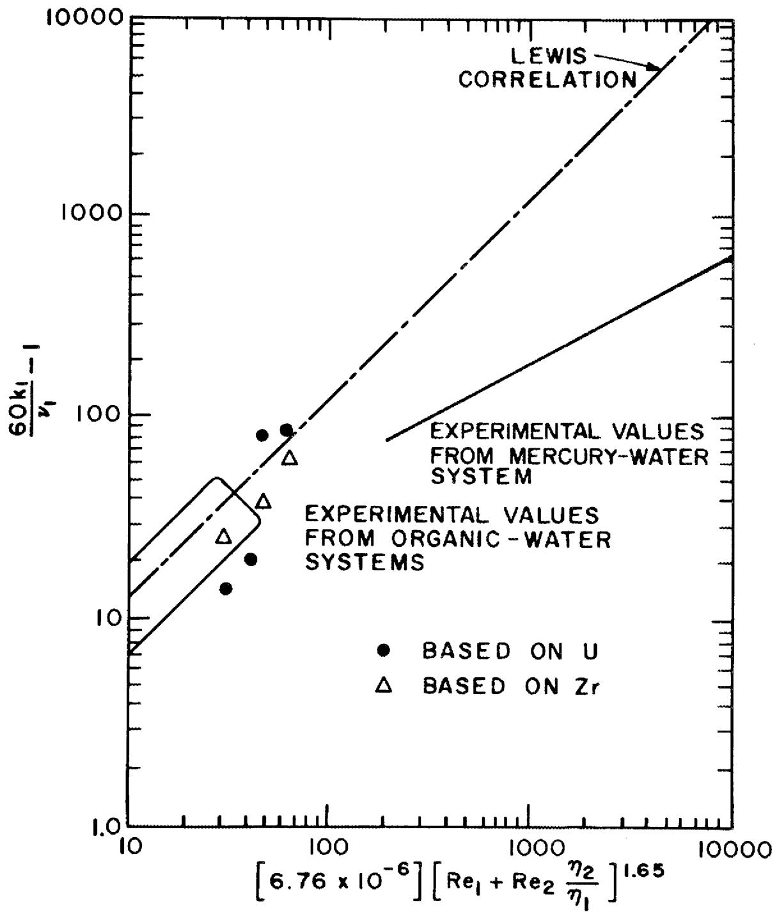  
Fig. 9. Experimental results from the salt-bismuth contactor.

the bismuth phase cannot be accurately accounted for in the results of run TSMC-2; hence, these results are not included in Fig. 9.

Figure 9 shows that two runs produced values of mass transfer coefficient that were 30 to $40\%$ of the values predicted by the Lewis correlation, while there were two runs that produced values which were slightly greater than those predicted by the Lewis correlation. The mass transfer coefficients based on zirconium are consistently lower (slightly) than the values based on uranium. It is felt that the mass transfer coefficients based on zirconium are less reliable than those based on uranium; in all runs, only about $60\%$ of the zirconium tracer could be accounted for, whereas more than $80\%$ of the uranium could be accounted for. This discrepancy is probably related to self absorption of the $743.37 \mathrm{keV} \beta^{-}$ from $^{97}\mathrm{Zr}$ in the bismuth samples.

We believe that the initiation of salt entrainment into the bismuth begins to occur at a stirrer speed between 160 and 180 rpm. The apparent increase in mass transfer coefficient is a manifestation of an increase in the surface area for mass transfer caused by surface motion. Experiments with water-mercury and water-methylene bromide systems support this belief.

If, as Fig. 9 seems to indicate, the mass transfer coefficients in the salt-bismuth system are lower by a factor of about 0.35 than predicted by the Lewis correlation, this corrected correlation could be used to estimate the area and bismuth flow rate required in the rare-earth removal contactor in the present flowsheet. The Lewis correlation predicts that mass transfer coefficients are approximately proportional to the agitator diameter, $d$ , to the 3.30 power. Since it has been shown[15] that the allowable agitator speed below which there is no phase dispersal is inversely proportional to the 1.43 power of the agitator diameter, at speeds slightly below the limiting agitator speed the mass transfer coefficient will apparently be proportional to the agitator diameter to the 0.94 power. These results were used to estimate the area required for a single-stage contactor and the bismuth flow rate to remove cerium, which has the shortest removal time (16.6 days) of the rare earths in the

reference flowsheet. For a salt flow rate of 0.88 gpm (corresponding to the 10-day cycle time used in the reference process flowsheet) and a distribution coefficient of 0.062 (the distribution coefficient that was used in the reference processing flowsheet), an area for mass transfer of $10\mathrm{ft}^2$ will allow removal of cerium on a 16.6-day cycle if the bismuth flow rate through the contactor is 30 gpm and a 3-ft-diam agitator is used. This bismuth flow rate is only about 2-1/2 times the flow rate specified in the processing plant flowsheet on the basis of equilibrium calculations. The use of a higher distribution coefficient, multiple stages, etc., can result in a reduction of either the bismuth flow rate or the mass transfer area. These changes, however, will result in changes in other sections of the flowsheet, and more extensive calculations are required to evaluate these effects.

# 5. FUEL RECONSTITUTION DEVELOPMENT: DESIGN OF A FUEL RECONSTITUTION ENGINEERING EXPERIMENT

R.M.Counce

The reference flowsheet for processing the fuel salt from a molten-salt breeder reactor (MSBR) is based upon removal of uranium by fluorination to $\mathbf{U}\mathbf{F}_{6}$ as the first processing step.[16] The uranium removed in this step must subsequently be returned to the fuel salt stream before it returns to the reactor. The method for recombining the uranium with the fuel carrier salt (reconstituting the fuel salt) is to absorb gaseous $\mathbf{U}\mathbf{F}_{6}$ into a recycled fuel salt stream containing dissolved $\mathbf{U}\mathbf{F}_{4}$ by utilizing the reaction:

$$
\mathrm {U F} _ {6 (\mathrm {g})} + \mathrm {U F} _ {4 (\mathrm {d})} = 2 \mathrm {U F} _ {5 (\mathrm {d})}. \tag {14}
$$

The resultant $\mathbf{U}\mathbf{F}_{5}$ would be reduced to $\mathbf{U}\mathbf{F}_{4}$ with hydrogen in a separate vessel according to the reaction:

$$
\mathrm {U F} _ {5 (\mathrm {d})} + 1 / 2 \mathrm {H} _ {2 (\mathrm {g})} = \mathrm {U F} _ {4 (\mathrm {d})} + \mathrm {H F} _ {(\mathrm {g})}. \tag {15}
$$

We are beginning engineering studies of the fuel reconstitution step in order to provide the technology necessary for the design of larger equipment for recombining UF6 generated in fluorinators in the processing plant with the processed fuel salt returning to the reactor. Equipment for studying the fuel reconstitution process has been designed during this report period, and is described in this report.

A flow diagram of the equipment to be used for the fuel reconstitution engineering experiment (FREE) is shown in Fig. 10. The equipment for this experiment consists of a 36-liter feed tank, a $\mathrm{UF}_{6}$ absorption vessel, a $\mathrm{H}_{2}$ reduction column, an effluent stream sampler, a 36-liter receiver, NaF traps for collecting excess $\mathrm{UF}_{6}$ and disposing of HF, gas supplies for argon, hydrogen, and $\mathrm{UF}_{6}$ , and means for analyzing the gas streams from the reaction vessels.

The experiment is operated by pressurizing the feed tank with argon in order to displace salt from the feed tank to the UF $_6$ absorption tank at rates from 50 to 300 cc/min. From the UF $_6$ absorption tank, the salt is siphoned into the H $_2$ reduction column, and the salt then flows by gravity through the effluent stream sampler to the receiver. The feed salt will be LiF-BeF $_2$ -ThF $_4$ (72-16-12 mole %) MSBR fuel carrier salt containing up to 0.3-mole % UF $_4$ . Absorption of UF $_6$ by reaction with dissolved UF $_4$ will occur in the UF $_6$ absorption vessel, and the resultant UF $_5$ will be reduced with hydrogen in the H $_2$ reduction column. Uranium hexafluoride flow rates from 60 to 360 scc/min, $^*$ and H $_2$ flow rates from 60 to 720 scc/min will be used. The effluent salt will be collected in the receiver for return to the feed tank at the end of the run. The eff-gas from the absorption vessel and the reduction column will be analyzed for UF $_6$ and HF, respectively. The salt in the feed tank and salt samples from the column effluent salt will be analyzed for uranium. The performance of the column will be determined from these analyses. The effluent HF and any UF $_6$ passing through the column will be collected on the NaF traps before the gas is exhausted to the off-gas system.

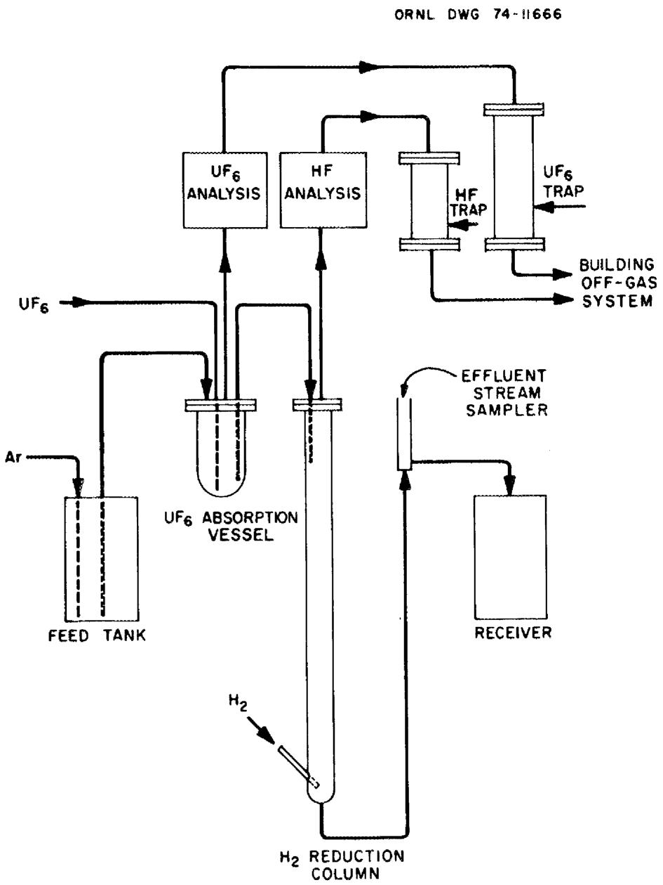  
Fig. 10. Flow diagram for equipment used in fuel reconstitution engineering experiment.

The fuel reconstitution engineering experiment will be installed in the high bay area, Bldg. 7503 (MSRE site). Scaffolding erected for a previous experiment will serve the FREE equipment adequately. The system, except for the upper section of the column, will be enclosed by a splash shield.

The UF $_6$ absorption vessel will have an inside diameter of 4 in. and an inside height of 11 in. The vessel will be constructed from 4-in. sched 40 nickel pipe mounted vertically with a 150-lb standard Monel flange at the top and a 0.25-in. nickel plate bottom. Two 1/2-in. nozzles provide for salt flow in and out of the vessel. Two 3/8-in. nozzles provide for UF $_6$ (g) flow in and off-gas flow out of the tank.

The $\mathsf{H}_2$ reduction column will have an overall height of 115 in. It is constructed of 1-1/2-in. sched 40 nickel pipe mounted vertically with a 150-lb Monel flange on the upper end, and a sched 40 nickel welded cap at the lower end. Gas enters through a 3/8-in. sched 40 nickel side arm at the bottom, while 1/2-in. and 3/8-in. nozzles provide for salt entrance and an off-gas exit.

Because of the highly corrosive nature of dissolved $\mathsf{UF}_{5}$ , all equipment exposed to significant quantities of $\mathsf{UF}_{5}$ will be gold or gold plated after a start up and demonstration period using the equipment described in this report.

The 36-liter feed tank will have an inside diameter of 10 in. and an inside height of 33 in. It will be a nickel vessel with 0.25-in.-thick walls, equipped with two 1/2-in. nozzles for salt exit and entrance lines, two 3/8-in. nozzles for argon sparging and off-gas exit, and a 3/4-in. sampling port. The receiver vessel will be essentially identical to the feed tank.

All piping exposed to the liquid phase (MSBR carrier salt) or temperature in excess of $100^{\circ}\mathrm{C}$ will be nickel pipe or tubing. Off-gas lines carrying $\mathsf{UF}_6$ or HF will be nickel tubing. All other gas lines will be copper tubing. Off-gas lines and liquid phase piping will be 1/2-in. tubing.

Standard brass valves can be used throughout the gas system, except on gas lines carrying UF or HF where nickel bellows-seal valves are required. Stainless steel, full-bore ball valves will be used to introduce the sample ladles into the flowing stream salt sampler.

Two sodium fluoride traps are required for UF $_6$ absorption and for HF absorption. These traps are identical except for their lengths. The UF $_6$ removal trap has a length of 55-5/8 in., while the HF trap has a length of 31-5/8 in. The traps are constructed of 4-in. sched 40 Monel pipe mounted vertically with 150-lb standard flanges at both ends for charing and removing NaF pellets. The gas enters from 1/2-in. nickel tubing through the flanged end and exits through the lower flanged end. A 6-in. section in the lower end of the trap contains 4-in.-diam Monel York mesh to keep pellets from plugging the exit.

The experiment will be monitored by analyzing the off-gas from each leg of the column. GOW-MAC gas density detectors are being considered for this. The detector elements of this analysis system are not exposed to the measured gas stream, which in this case is corrosive.

The liquid phase will be sampled periodically by withdrawing effluent-stream salt samples from the hydrogen reduction column. The sampler is a vertically mounted 3/4-in. sched 40 pipe, 20-3/4 in. in length; it has a stainless steel full-bore valve located 12-1/4 in. from the lower end to allow access to the flowing salt stream. The sampler is vented to the off-gas system above and below the ball valve. The salt flows into the lower end of the sampler from 1/2-in. tubing and exits 1-1/4 in. from the end, again using 1/2-in. tubing. This assures a minimum of 1/4 in. of salt for insertion of a sampler. The sampler is a stainless steel 0.250-in. diam by 1-in.-long tube with a 0.050-in. fritted metal filter on the lower end. It is connected to a 1/16-in. stainless steel tube which in turn is attached to a vacuum pump.

Engineering sketches for all of the equipment except the UF supply have been completed. The scaffolding in Bldg. 7503 is being cleared to make room for this experiment.

# 6. REFERENCES

1. H. C. Savage, Engineering Development Studies for Molten-Salt Breeder Reactor Processing No. 18, ORNL-TM-4698 (March 1975), pp. 23-36.   
2. J. A. Klein et al., MSR Program Semiannu. Progr. Rept. Aug. 31, 1972, ORNL-4832, p. 171.   
3. J. B. Lewis, Chem. Eng. Sci. 3, 248-59 (1954).   
4. J. B. Lewis, Chem. Eng. Sci. 3, 260-78 (1954).   
5. H. O. Weeren et al., Engineering Development Studies for Molten-Salt Breeder Reactor Processing No. 9, ORNL-TM-3259 (December 1972), pp. 205-15.   
6. W. L. Carter et al., MSR Program Semiannu. Progr. Rept. Feb. 29, 1972, ORNL-4782, pp. 224-25.   
7. J. A. Klein, Engineering Development Studies for Molten-Salt Breeder Reactor Processing No. 18, ORNL-TM-4698 (March 1975), pp. 1-22.   
8. J. A. Klein, in Engineering Development Studies for Molten-Salt Breeder Reactor Processing No. 15, ORNL-TM-4019 (in preparation).   
9. O. Levenspiel, Chemical Reaction Engineering, p. 387, Wiley, New York, 1962.   
10. B. A. Hannaford, C. W. Kee, and L. E. McNeese, MSR Program Semiannu. Progr. Rept. Feb. 28, 1971, ORNL-4676, p. 256.   
11. B. A. Hannaford et al., MSR Program Semiannu. Progr. Rept. Aug. 31, 1971, ORNL-4728, p. 212.   
12. B. A. Hannaford, C. W. Kee, and L. E. McNeese, Engineering Development Studies for Molten-Salt Breeder Reactor Processing No. 8, ORNL-TM-3259 (May 1972) p. 64.   
13. B. A. Hannaford, C. W. Kee, and L. E. McNeese, Engineering Development Studies for Molten-Salt Breeder Reactor Processing No. 9, ORNL-TM-3259 (December 1972), p. 158.   
14. B. A. Hannaford, Engineering Development Studies for Molten-Salt Breeder Reactor Processing No. 10, ORNL-TM-3352 (December 1972), p. 12.   
15. H. O. Weeren and L. E. McNeese, Engineering Development Studies for Molten-Salt Breeder Reactor Processing No. 10, ORNL-TM-3352 (December 1972), p. 53.   
16. D. E. Ferguson, Chem. Technol. Div. Annu. Progr. Rept. March 31, 1972, ORNL-4794, p. 1.

# INTERNAL DISTRIBUTION

1-2. MSRP Director's Office

3. C. F. Baes, Jr.

4. C. E. Bamberger

5. J. Beams

6. M. Bender

7. M. R. Bennett

8. E. S. Bettis

9. R. E. Blanco

10. J. O. Blomeke

11. E. G. Bohlmann

12. J. Braunstein

13. M. A. Bredig

14. R. B. Briggs

15. H. R. Bronstein

16. R.E.Brooksbank

17. C. H. Brown, Jr.

18. K. B. Brown

19. J. Brynestad

20. S. Cantor

21. D. W. Cardwell

22. W. L. Carter

23. W.H.Cook

24. R.M.Counce

25. J. L. Crowley

26. F. L. Culler

27. J.M.Dale

28. F. L. Daley

29. J.H.DeVan

30. J. R. DiStefano

31. W. P. Eatherly

32. R. L. Egli, ERDA-OSR

33. J. R. Engel

34. G. G. Fee

35. D. E. Ferguson

36. L. M. Ferris

37. L. O. Gilpatrick

38. J. C. Griess

39. W. R. Grimes

40. R. H. Guymon

41-66. J. R. Hightower, Jr.

67. B. F. Hitch

68. R.W.Horton

69. W.R.Huntley

70. C.W.Kee

71. A. D. Kelmers

72. J. A. Klein

73. W. R. Laing

74. R.B. Lindauer

75. R.E. MacPherson

76. W. C. McClain

77. H. E. McCoy

78. A. P. Malinauskas

79. C. L. Matthews, ERDA-OSR

80. A. S. Meyer

81. R. L. Moore

82. J.P.Nichols

83. K. J. Notz

84. R.O.Payne

85. H. Postma

86. M. W. Rosenthal

87. A. D. Ryon

88. H. C. Savage

90. C. D. Scott

91. M.J. Skinner

92. F.J. Smith

93. G.P. Smith

94. I. Spiewak

95. M. G. Stewart

96. O.K.Tallent

97. L. M. Toth

98. D. B. Trauger

99. W.E.Unger

100. J.R.Weir

101. M. K. Wilkinson

102. R. G. Wymer

103-105. Central Research Library

106. Document Reference Section

107-116. Laboratory Records

117. Laboratory Records (ORNL-RC)

# CONSULTANTS AND SUBCONTRACTORS

118. J. C. Frye   
119. C.H. Ice   
120. J. J. Katz   
121. W. K. Davis   
122. R.B.Richards

# EXTERNAL DISTRIBUTION

123. Research and Technical Support Division, ERDA, Oak Ridge Operations Office, P. O. Box E, Oak Ridge, Tenn. 37830   
124. Director, Reactor Division, ERDA, Oak Ridge Operations Office, P. O. Box E, Oak Ridge, Tenn. 37830

125-126. Director, ERDA Division of Reactor Research and Development, Washington, D. C. 20545   
127-230. For distribution as shown in TID-4500 under UC-76, Molten Salt Reactor Technology