# Engineering Development Studies for Mollen-Salt Breeder Reactor Processing No. 20

J.R.Hightower, Jr.

10.2.1.1.1.1.1.1.1.1.1.1.1.1.1.1.1.1.1.1.1.1.1.1.1.1.1.1.1.1.1.1.1.1.1.1.1.1.1.1.1.1.1.1.1.1.1.1.

（

e

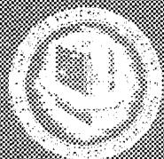

OAK RIDGE NATIONAL LABORATORY

Dongfeng 2018 - 2019 - 2020 - 2021 - 2022 - 2023 - 2024 - 2025 - 2026 - 2027 - 2028 - 2029 -

Printed in the United States of America. Available from

National Technical Information Service

U.S. Department of Commerce

5285 Port Royal Road, Springfield, Virginia 22161

Price: Printed Copy $5.50; Microfiche $2.25

This report was prepared as an account of work sponsored by the United States Government. Neither the United States nor the Energy Research and Development Administration, nor any of their employees, nor any of their contractors, subcontractors, or their employees, makes any warranty, express or implied, or assumes any legal liability or responsibility for the accuracy, completeness or usefulness of any information, apparatus, product or process disclosed, or represents that its use would not infringe privately owned rights.

ORNL-TM-4870

UC-76 - Molten Salt Reactor Technology

Contract No. W-7405-eng-26

CHEMICAL TECHNOLOGY DIVISION

ENGINEERING DEVELOPMENT STUDIES FOR MOLTEN-SALT

BREEDER REACTOR PROCESSING NO. 20

Compiled by:

J.R.Hightower，Jr.

Other Contributors:

C. H. Brown, Jr.

R. M. Counce

R. B. Lindauer

H. C. Savage

JANUARY 1976

OAK RIDGE NATIONAL LABORATORY

Oak Ridge, Tennessee 37830

operated by

UNION CARBIDE CORPORATION

for the

ENERGY RESEARCH AND DEVELOPMENT ADMINISTRATION

3445604501741

Reports previously issued in this series are as follows:

ORNL-TM-3053 Period ending December 1968

ORNL-TM-3137 Period ending March 1969

ORNL-TM-3138 Period ending June 1969

ORNL-TM-3139 Period ending September 1969

ORNI.-TM-3140 Period ending December 1969

ORNL-TM-3141 Period ending March 1970

ORNL-TM-3257 Period ending June 1970

ORNL-TM-3258 Period ending September 1970

ORNL-TM-3259 Period ending December 1970

ORNL-TM-3352 Period ending March 1971

ORNL-TM-4698 Period January through June 1974

ORNL-TM-4863 Period July through September 1974

# CONTENTS

Page

# SUMMARIES. V

# 1. INTRODUCTION 1

# 2. CONTINUOUS FLUORINATOR DEVELOPMENT: AUTORESISTANCE HEATING TEST AHT-3. 1

2.1 Experimental Equipment and Procedure. 2   
2.2 Experimental Results. 4

2.2.1 Run AHT-3-10 4   
2.2.2 Run AHT-3-11 4   
2.2.3 Run AHT-3-12 5   
2.2.4 Run AHT-3-13 5   
2.2.5 Run AHT-3-14 5  
2.2.6 Run AHT-3-15 6   
2.2.7 Run AHT-3-16 6   
2.2.8 Run AHT-3-17 6   
2.2.9 Run AHT-3-18 7   
2.2.10 Run AHT-3-19. 7   
2.2.11 Run AHT-3-20. 7   
2.2.12 Run AHT-3-21. 8

# 2.3 Discussion. 8

# 3. DEVELOPMENT OF THE METAL TRANSFER PROCESS. 9

3.1 Examination of MTE-3 Equipment and Materials. 9   
3.2 Status of Metal Transfer Experiment MTE-3B. 12

# 4. SALT-METAL CONTACTOR DEVELOPMENT: EXPERIMENTS WITH A MECHANICALLY AGITATED, NONDISpersING CONTACTOR IN THE SALT-BISMUTH FLOWTHROUGH FACILITY 14

4.1 Preparation for Mass Transfer Experiment TSMC-7 14

4.1.1 Addition of beryllium to the system. 14   
4.1.2 Prerun equilibration of salt and bismuth 14

4.2 Mass Transfer Experiment TSMC-4 15   
4.3 Experimental Results. 15

# 5. SALT-METAL CONTACTOR DEVELOPMENT: EXPERIMENTS WITH A MECHANICALLY AGITATED, NONDISPERSING CONTACTOR USING WATER AND MERCURY. 17

5.1 Theory. 19   
5.2 Experimental Results. 23

# CONTENTS (Continued)

Page

6. FUEL RECONSTITUTION DEVELOPMENT: INSTALLATION OF EQUIPMENT FOR A FUEL RECONSTITUTION ENGINEERING EXPERIMENT. 27

6.1 Equipment Documentation. 28   
6.2 UF 6 Generation 36   
6.3 Instrumentation and Controls 45

7. REFERENCES. 47

# SUMMARIES

# CONTINUOUS FLUORINATOR DEVELOPMENT: AUTORESISTANCE

# HEATING TEST AHT-3

Twelve additional autoresistance heating runs were made with the AHT-3 equipment. Air-water cooling coils were installed on the test sections of the test vessel to eliminate the need to remove insulation during each run. Seven runs were made using both vertical and side-arm electrode test sections, but steady temperature and resistance conditions were not maintained for any appreciable time. Five runs using an electrode at the top of the vertical test section and with the side-arm test section in a frozen position were more successful; temperature control was better, and it was found that steady conditions could be maintained at a much lower salt resistance than previously believed possible. Apparently, the resistivity of the salt being used was lower than literature values indicated by a factor of 5 to 10, probably because of impurities.

# DEVELOPMENT OF THE METAL TRANSFER PROCESS

We have completed the installation of all equipment for the metal transfer experiment MTE-3B in which we will continue to study the steps in the metal transfer process for removing rare-earth fission products from breeder reactor fuel salt. Necessary preoperational checkout of the system is under way before the salts and bismuth will be charged.

During this report period, additional samples of the salt and bismuth phases (at the three interfaces) from previously operated experiment MTE-3 were analyzed by X-ray diffraction to identify any interfacial impurities. A high concentration of $\mathrm{ThO}_2$ was found in the LiCl at the Bi-Li interface in the stripper vessel. No oxides were detected at the LiCl--Bi-Th and fluoride salt--Bi-Th interfaces in the contactor.

# SALT-METAL CONTACTOR DEVELOPMENT: EXPERIMENTS WITH A MECHANICALLY AGITATED, NONDISPERSING CONTACTOR IN THE SALT-BISMUTH FLOWTHROUGH FACILITY

The seventh tracer run, TSMC-7, has been completed in the mild steel contactor installed in the salt-bismuth flowthrough facility in Building 3592. Prior to the run, approximately 1.5 g-equiv of beryllium was added electrolytically to the salt phase to establish a uranium distribution coefficient of $\sim 100$ . The salt and bismuth phases were passed through the contactor to ensure that chemical equilibrium was achieved between the salt and bismuth.

Mass transfer experiment TSMC-7 was performed after $1\mathrm{mg}$ of ${}^{237}\mathrm{U}_{3}\mathrm{O}_{8}$ and $11\mathrm{mg}$ of $\mathrm{MgO}$ were added to the salt in the salt feed tank. Salt and bismuth flow rates were 152 and $170~\mathrm{cc / min}$ , respectively, with an agitator speed of $68~\mathrm{rpm}$ .

Results from the flowing stream samples taken during the run indicate that the salt-phase mass transfer coefficient was $0.0057 \pm 0.0012 \, \text{cm/sec}$ . This corresponds to $65\%$ of the value predicted by the Lewis correlation.

# SALT-METAL CONTACTOR DEVELOPMENT: EXPERIMENTS WITH A MECHANICALLY AGITATED, NONDISPERSING CONTACTOR USING WATER AND MERCURY

Data from a series of five experiments performed in the water-mercury contactor have been reanalyzed in an attempt to determine if the apparent change in mass transfer coefficient during the execution of a run was due to the controlling resistance to mass transfer changing from one phase to the other.

$$
\mathrm {P b} ^ {2 +} \left[ \mathrm {H} _ {2} 0 \right] + \mathrm {Z n} [ \mathrm {H g} ] \rightarrow \mathrm {Z n} ^ {2 +} \left[ \mathrm {H} _ {2} 0 \right] + \mathrm {P b} [ \mathrm {H g} ],
$$

to be instantaneous, irreversible, and occurring entirely at the water-mercury interface. The possibility that the control of mass transfer switched from one phase to the other during a run was also considered in developing the model.

The model described above was applied to the data obtained from five experiments. Several inconsistencies were found between the model and the experimental data. We concluded that this model does not adequately represent the system, and that further work is necessary in this area.

# FUEL RECONSTITUTION DEVELOPMENT: INSTALLATION OF EQUIPMENT FOR A FUEL RECONSTITUTION ENGINEERING EXPERIMENT

Equipment is described for absorbing UF $_6$ gas into a flowing salt stream containing UF $_4$ and reducing the resultant UF $_5$ to UF $_4$ by hydrogenation. Installation of the equipment is under way.

# 1. INTRODUCTION

A molten-salt breeder reactor (MSBR) will be fueled with a molten fluoride mixture that will circulate through the blanket and core regions of the reactor and through the primary heat exchangers. We are developing processing methods for use in a close-coupled facility for removing fission products, corrosion products, and fissile materials from the molten fluoride mixture.

Several operations associated with MSBR processing are under study. The remaining parts of this report discuss:

(1) experiments conducted in a simulated continuous fluorinator for studying autoresistance heating in molten salt and formation of frozen salt films on the fluorinator walls;   
(2) results of inspection of equipment used in metal transfer experiment MTE-3 for demonstrating the metal transfer process for removal of rare earths from MSBR fuel carriers salt;   
(3) measurements of mass transfer of $^{237}\mathrm{U}$ and $^{97}\mathrm{Zr}$ from MSBR fuel carrier salt to molten bismuth in a mechanically agitated contactor;   
(4) measurements of mass transfer of lead and zinc between aqueous solutions and mercury amalgams using a mechanically agitated contactor; and   
(5) design of experimental equipment to be used in engineering studies of fuel reconstitution.

This work was performed in the Chemical Technology Division during the period September through December 1974.

# 2. CONTINUOUS FLUORINATOR DEVELOPMENT: AUTORESISTANCE HEATING TEST AHT-3

R.B.Lindauer

A drain line was installed from the side arm to the vertical section of the test vessel in order to remove the salt heel from the side arm. This was done to facilitate removal of the electrode section which had melted off during autoresistance heating test run AHT-3-9; it was then possible to resume autoresistance heating test No. 3 (AHT-3).

Air-water cooling coils were installed on the side arm and vertical test sections of the test vessel to eliminate the need to remove (or loosen) insulation during each run. The cooling coils were placed on the test section in a coaxial position because of the arrangement of existing heaters. Temperature control could be improved by using heating and cooling zones which are transverse to the axis of the test section.

Seven runs were attempted using the entire test vessel (AHT-3-10 to -16). The best operation was attained in run AHT-3-15, but the resistance decreased after about an hour of autoresistance heating. The maximum power reached was 1130 W. The only temperature point above $350^{\circ}\mathrm{C}$ at this time was at the junction of the electrode side arm and the vertical test section.

An electrode was installed at the top of the vertical test section, and five more runs were made with the side arm frozen. Satisfactory operation was achieved, but with an unusually low salt resistance (0.09 to 0.12 Ω). This was only about 10% of the resistance found during good operation with $\mathrm{Li}_2\mathrm{BeF}_4$ . All attempts to transfer salt from the test vessel, which had frozen salt on the wall, were unsuccessful. A different autoresistance power supply with a higher current capacity was used in the last two runs, since large currents (100 A) were being used at these low resistances. It was found that steady conditions could be maintained with a resistance of 0.095 Ω using 110 A. It is believed that both the low resistance and the salt transfer difficulty are associated with crud and impurities in the salt.

# 2.1 Experimental Equipment and Procedure

The equipment and flowsheet were essentially the same as described previously. A 1/2-in.-OD nickel drain line was installed from the low point of the electrode side arm to the side of the 6-in. vertical section of the test vessel, 9 in. above the bottom. The line was installed to permit draining the salt heel from the side arm so that the section of electrode which melted off in the last experiment could be recovered. During normal operation this line will not be heated so that a salt plug will form.

A new electrode was fabricated consisting of a 3/4-in. sched 40 nickel pipe with a 5-in.-long section which extended up the center of the slanting portion of the electrode side arm. This electrode is therefore similar to the one which will be used in the next experiment, AHT-4, in which the circulating salt will enter the test vessel through the electrode.

Another change made to the equipment was the installation of cooling coils on the electrode side arm and on the vertical test section. These coils were strapped on the 6-in. pipe between the Calrod heating elements. There were four separate cooling circuits. Two coils (top and bottom) were installed on the slanting section of the side arm, connected in parallel, and had the same air-water supply. Four coils (north, east, south, and west) were installed on the vertical test section. These were connected with three separate cooling supplies. A very low (less than 50 cm³/min) water flow was metered into the cooling air to increase the heat removal capacity. Exit temperatures of each coil were monitored, and the water flow rate was adjusted to the maximum which could be vaporized. This was done by maintaining the exit cooling temperature slightly above $100^{\circ}\mathrm{C}$ . This cooling system eliminated the need to remove insulation from the test section in order to form the frozen salt film. The cooling rate was also increased.

The vent line in the center of the top flange of the 8-in.-diam disengaging section was moved to allow this access nozzle to be used for both an insulated thermocouple during runs AHT-3-10 to -16, and for the autoresistance electrode during runs AHT-3-17 to -21. In the last five runs, a 1/4-in.-diam nickel rod was used as the electrode with the rod submerged 4 in. into the salt. The length of the test section was approximately 24 in., compared with 44 in. for the side-arm electrode. These lengths assume a current path to the wall just below the gas inlet side arm.

Operation of the system was similar to that previously described. The entire test vessel was heated to between $500^{\circ}$ and $550^{\circ}$ C. Heat was then turned off the test section, and cooling air and water were turned on. When the wall temperature of the test section reached $350^{\circ}$ C (about 2 hr), the

autoresistance power was increased stepwise until the electrical resistance between the electrode and the molten salt at the bottom of the test vessel reached a constant value. The autoresistance power was turned on at a very low power (less than $10\mathrm{W}$ ) at the start of cooling so that the resistance could be calculated continuously from the voltage and current. An instrument was installed to perform this division electrically, and the quotient was recorded continuously on a 0 to $10\mathrm{mV}$ recorder. When the resistance had leveled off, the cooling was adjusted by adjusting the water and air flows. The voltage to the autoresistance circuit also required adjusting to maintain a constant frozen film.

# 2.2 Experimental Results

# 2.2.1 Run AHT-3-10

This run was made with cooling coils on only the electrode side arm test section. Insulation was loosened to cool the vertical test section. The electrical resistance through the salt was calculated periodically from the voltage and current. Sufficient water was added to the cooling air to keep the exit air temperature near $100^{\circ}\mathrm{C}$ . When the test section temperatures reached $350^{\circ}\mathrm{C}$ the autoresistance power was left on. The resistance remained fairly constant at about $1.7\Omega$ for 30 min as the power was increased to $2.1\mathrm{kW}$ (60 V and 35 A). At this point, the current rose sharply and the resistance dropped. The temperature at the top of the electrode side arm rose $20^{\circ}$ , indicating an electrical short at this point. After the hot spot was cooled for 15 min, autoresistance heating was resumed. The resistance slowly decreased however, and sufficient power could not be introduced to keep the vertical test section from freezing. After run AHT-3-12, it was discovered that one of the temperature recorders was reading $50^{\circ}\mathrm{C}$ too high, and the run had been started with too low a temperature at the bottom of the test vessel.

# 2.2.2 Run AHT-3-1.1

Cooling coils were installed on the vertical test section before this run. The system was heated to a higher temperature than normal to check out the new coolers. The average cooling rate was increased from 55 to

$85^{\circ}\mathrm{hr}$ , but there was time for only 20 min of autoresistance heating, not enough to reach steady conditions. The resistance dropped from 0.2 to 0.1 Ω during this period. Again, because of the incorrect temperature recorder, the bottom of the test vessel was allowed to drop below the liquidus temperature $(505^{\circ}\mathrm{C})$ .

# 2.2.3 Run AHT-3-12

Cooling was started with the test vessel at a higher temperature than normal--the test sections were about $600^{\circ}\mathrm{C}$ . A good cooling rate of about $98^{\circ}\mathrm{C/hr}$ was achieved, and the autoresistance power was started early in the day. Current was increased stepwise from 20 to 30 to 40 A. The resistance started to drop at 40 A, although a maximum power of only 480 W was being used. The resistance was 0.25 Ω. Since the resistivity of the salt was believed to be 0.75 Ω-cm, this indicated a very thin film. The power was reduced in an attempt to raise the resistance, but the test section froze over.

# 2.2.4 Run AHT-3-13

Before this run was started, it was discovered that one temperature recorder was reading $50^{\circ}\mathrm{C}$ higher than the other. When this was corrected it was found that the electrode side-arm test section was $50^{\circ}\mathrm{C}$ hotter than the vertical test section. There was insufficient time to balance the temperatures; by the time the side arm was cooled to $350^{\circ}\mathrm{C}$ , the vertical test section had cooled to $280^{\circ}\mathrm{C}$ . Autoresistance power was turned on, although the resistance was still low, and shorting occurred in the side arm.

# 2.2.5 Run AHT-3-14

Cooling of the electrode side arm was begun an hour before the cooling was started on the vertical test section in an effort to form a frozen film on the side arm before the vertical section became too cool; however, the vertical section cooled at a much higher rate. The junction of the vertical and side-arm test sections cooled very slowly. By the

time this point reached $350^{\circ}$ , the vertical test section had frozen completely. A recording resistance meter was installed before this run to provide an immediate indication of resistance changes.

# 2.2.6 Run AHT-3-15

Autoresistance heating was started when the electrode side-arm test section reached $350^{\circ}\mathrm{C}$ , although the vertical test section was still over $400^{\circ}\mathrm{C}$ . The resistance was unusually high, about $2\Omega$ , although the junction of the vertical and side-arm sections was about $440^{\circ}\mathrm{C}$ . The power was increased stepwise with only slight changes in resistance until 1130 W (38 V) was reached, at which point the resistance suddenly dropped to $0.7\Omega$ . Autoresistance heating of greater than 100 W had been applied for about 70 min, but temperatures on the test-section walls were still decreasing rapidly.

# 2.2.7 Run AHT-3-16

An attempt was made to duplicate run AHT-3-15, but with the junction of the vertical and side-arm test sections below $350^{\circ}\mathrm{C}$ . Autoresistance heating was not applied until this temperature was reached. When voltages approaching $20\mathrm{V}$ were applied, the resistance dropped from $\sim 2$ to $\sim 1\Omega$ . It was still believed that the resistivity of the salt was about $0.75\Omega$ -cm; the resistance was not allowed to get below $0.8\Omega$ , corresponding to a $3/4$ -in. film. If, at this time, it had been known that the resistivity of the salt was much lower, satisfactory operation might have been achieved with the electrode side arm by applying sufficient power to balance the heat loss before temperatures became too low and the test section froze over.

# 2.2.8 Run AHT-3-17

The side arm was allowed to freeze completely, and autoresistance heating was applied from an insulated 1/4-in.-diam nickel rod inserted through the 8-in.-diam disengagement section above the vertical test section. The rod extended 4 in. into the salt. The resistance again

increased to 800 W. This was similar to previous runs with the electrode side arm. However, during this run, as the resistance dropped, heating was maintained and relatively stable operation was achieved at a power level of about 900 W. The resistance decreased slowly, reaching 0.11 Ω at the end of the operating period. The current capacity of the auto-resistance power supply (100 A) was nearly reached. Test-section wall temperatures had leveled off at an average temperature of about $275^{\circ}\mathrm{C}$ .

# 2.2.9 Run AHT-3-18

In this run, we not only attempted to duplicate conditions of the previous run, but also to reach steady conditions early enough in the day to transfer the molten-salt core in the test section to the feed tank in order to visually check on the salt-film thickness. Operation was very similar to run AHT-3-17, with a resistance of 0.12 Ω using 850 W of autoresistance power. We were unable to transfer the salt as planned, although ten pressure-vacuum cycles were applied to the feed tank. The test vessel bottom temperature and transfer line temperature indicated a slight salt movement, and the applied pressure showed a slight indication on the test vessel level instrument. The salt level did not fall below the autoresistance electrode.

# 2.2.10 Run AHT-3-19

The two previous runs were more or less duplicated in this run. The test vessel bottom was heated to a higher temperature at the end of the run to aid in transfer, but this was not successful. As in the two previous runs, the current capacity of the autoresistance heating supply was not sufficient, and wall temperatures continued to decrease at the end of the run.

# 2.2.11 Run AHT-3-20

The autoresistance power supply was increased from 100- to 200-A max current; however, the new supply had only a 24-V max instead of 100 V. During this run, the resistance was allowed to increase to 0.8 Ω before autoresistance heating was applied, and only 600 W of power was available.

This was not sufficient to prevent the molten core from freezing, as was indicated by the test section liquid-level instrument going off the scale and an increase in the resistance to $>3\Omega$ .

# 2.2.12 Run AHT-3-21

The test-section wall was cooled as rapidly as possible and auto-resistance heating was started when the salt resistance was $0.37\Omega$ . All wall temperatures were below $350^{\circ}\mathrm{C}$ at this time. A maximum resistance of $0.40\Omega$ was reached when the maximum $24\mathrm{V}$ was applied to the electrode. The resistance then decreased and the power rose to a maximum of $2500\mathrm{W}$ . The voltage was decreased, and stable operation was reached with a resistance of about $0.09\Omega$ and $1470\mathrm{W}$ . The wall temperatures also leveled out. The resistance decreased very slowly and voltage and power were consequently lowered to $1160\mathrm{W}$ . The temperature of the bottom of the test vessel was being raised at this time to facilitate transfer of the salt from the test vessel for inspection of the frozen film; this was probably the cause of the decrease in resistance. After the power was decreased, the resistance slowly increased to $0.095\Omega$ . We were still unable to transfer salt after repeated attempts, so heating of the entire test vessel was begun to remove all of the salt to the feed tank. During the heatup, inspection of the cell revealed a salt leak which was located at the junction of the salt transfer line and the bottom of the test vessel. Approximately $6\mathrm{kg}$ of salt was lost.

# 2.3 Discussion

Successful operation might have been achieved in most of these runs if it had been known that the resistivity of the salt was not $0.75\Omega \text{-cm}$ , as stated in the literature,[2] but was considerably lower. In many cases, the autoresistance power was reduced when the resistance was in the range of 0.5 to $1.0\Omega$ ; this was done to prevent melting the frozen film. Later operation without the side arm showed that steady operation could be maintained in the 0.09- to $0.15\Omega$ range, and that the resistivity of the salt was probably lower than $0.75\Omega \text{-cm}$ by a factor of 5 to 10.

Operation with the electrode in the side arm was unsuccessful for two reasons. Cooling of both vertical and slanting test sections at the same rate to avoid freezing one section before a complete film was formed on the other section was quite difficult with the installed cooling zones. In addition, the junction of the side arm and vertical section was difficult to cool, and shorting occurred at this point until an air jet was applied. Both of these difficulties should be lessened considerably by circulating salt through the test vessel. This would be expected to promote a more uniform temperature over the entire test section. Consequently, we have started designing a system which will allow salt to be circulated through the test vessel.

# 3. DEVELOPMENT OF THE METAL TRANSFER PROCESS

H. C. Savage

Engineering experiments to study the steps in the metal transfer process for removing rare-earth fission products from molten-salt breeder reactor fuel salt will be continued in new process vessels which duplicate those used in a previous experiment, MTE-3. Installation of the equipment for the new experiment, designated MTE-3B, was completed during this report period. Experiment MTE-3B utilizes mechanically agitated contactors to achieve effective mass-transfer rates of the rare-earth fission products between the salt and metal phases in the metal transfer process (as was done in experiment MTE-3).

# 3.1 Examination of MTE-3 Equipment and Materials

We have previously reported the results of analyses of the salt and bismuth phases from experiment MTE-3. These analyses were made in an attempt to determine whether or not the lower-than-expected mass transfer coefficients observed in experiment MTE-3 were due to the presence of films (composed of solids) at the salt-bismuth interfaces formed by entry of impurities, such as oxides, into the system. These analyses, which included chemical analyses, metallographic examination, electron beam scanning, and X-ray fluorescence analyses, indicated the presence of

significant concentrations of iron (up to 3500 ppm) and thorium at the interfaces.

Visual examination of the 2-in.-diam plugs removed from the three interfaces (fluoride salt--Bi-Th, LiCl--Bi-Th, and LiCl--Bi-Li) indicated the presence of a layer of material $\sim 1/32$ -in. thick at the interface between the LiCl and Bi-Li in the stripper vessel. No foreign material was seen at the interfacial areas between the fluoride salt--Bi-Th and LiCl--Bi-Th in the contactor.

During this report period, samples of material were removed from the vicinity (within 1/32 in.) of each of the three salt-metal interfaces in the MTE-3 equipment and analyzed by X-ray diffraction. The results of the six analyses are given in Table 1. The only oxides in the system were at the interface between LiCl and the Li-Bi stripper alloy in the stripper vessel. A high concentration of $\mathrm{ThO}_2$ was found in the LiCl at this interface. Although no thorium should have been present in the stripper during most of the operating time, thorium could be expected to combine with any oxides present when the fluoride salt (containing thorium) was entrained into the chloride salt.

No oxides were detected at the LiCl--Bi-Th interface in the contactor. The analysis of the mass transfer rates observed during this experiment suggested that some hindrance of mass transfer was occurring at this interface, possibly caused by oxide films. Analyses of the material near this interface, however, do not support the theory that oxide films at the LiCl--Bi-Th interface slowed down the mass transfer.

The samples taken for X-ray diffraction analysis were extremely small (about 2 to $3\mathrm{mm}^3$ of material was removed from the interface for each sample), and effects of segregation during freezing will make interpretation of the results of these analyses very difficult. For instance, it is interesting to note that no LiCl was detected in the sample of LiCl taken from the interface in the stripper vessel.

Bismuth was detected in each of the salt samples analyzed by X-ray diffraction. It is likely that during freezing, bismuth was forced into the already frozen salt and was not present in the salt when both phases were molten.

Table 1. Results of X-ray diffraction analyses of material removed from the vicinity of salt-metal interfaces in experiment MTE-3   

<table><tr><td>Phase</td><td>Identified material</td><td>Estimated composition (mole %)a</td></tr><tr><td rowspan="4">LiCl in stripper</td><td>Bi</td><td>25-50</td></tr><tr><td>Li3ThF7</td><td>10-30</td></tr><tr><td>ThO2</td><td>40-80</td></tr><tr><td>unidentified solid solution</td><td>---</td></tr><tr><td rowspan="2">Li-Bi alloy in stripper</td><td>Bi</td><td>75-95</td></tr><tr><td>BeF2</td><td>2-10</td></tr><tr><td>Bi-Th in contact with LiCl in contactor</td><td>Bi</td><td>90</td></tr><tr><td rowspan="3">LiCl in contactor</td><td>Bi</td><td>30-70</td></tr><tr><td>LiCl</td><td>30-70</td></tr><tr><td>Li3ThF7</td><td>10-30</td></tr><tr><td rowspan="3">Fluoride salt in contactor</td><td>Bi</td><td>20-40</td></tr><tr><td>Li3ThF7</td><td>40-80</td></tr><tr><td>Li7Th6F31</td><td>5-15</td></tr><tr><td rowspan="3">Bi-Th in contact with fluoride salt in contactor</td><td>Bi</td><td>60-90</td></tr><tr><td>Th (unidentified compound)</td><td>---</td></tr><tr><td>Fe (no X-ray data available)</td><td>trace</td></tr></table>

$^{\mathrm{a}}$ X-ray diffraction can only detect $> \sim 5$ mole $\%$ .

It is to be noted that iron and/or iron oxides were not found by X-ray diffraction, since the amounts present (based on chemical analyses of similar samples) are below the limit of detectability by X-ray diffraction ( $\sim 5$ mole $\%$ ).

An additional chemical analysis was made of the 1/32-in.-thick layer of material found between the LiCl and the Bi-Li in the stripper vessel.

This material had a different structure and a dark gray or black appearance. The following results were reported (wt %):

Bi - 51.24 F - unable to analyze

Th - 3.7 Fe - 14.0

Li - 5.0 $0_{2}$ - unable to analyze due to high Bi

Bi 0.23 C1 394 ppm

The very high iron concentration (14 wt %) is unexpected. Previous analyses of other samples of similar appearing material indicated iron concentrations of about 0.25 wt %.

It is not possible at this time to draw firm conclusions about the relationship of these observations to the low mass transfer rates seen in experiment MTE-3. The transfer of fluoride salt into the chloride salt just prior to shutdown, and the length of time between shutdown and inspection (from February 1973 to February 1974), introduce much uncertainty in an accurate interpretation of the analyses. We plan to closely monitor the salt and metal phases during operation of experiment MTE-3B for buildup of impurities (iron and oxides). Sampling phases at or near each interface will be attempted.

# 3.2 Status of Metal Transfer Experiment MTE-3B

Installation of the new process vessels and equipment for metal transfer experiment MTE-3B was completed during this report period. Figure 1 is a photograph of the process vessels after electric heating elements and thermocouples were installed. We have completed the process piping installation, thermocouple and heater hookup, and the calibration of the temperature recorders and controllers, pressure gages, selected thermocouples, and all gas and cooling-water rotameters. The experiment is now ready for preoperational checkout, leak testing of the vessels and piping, pressure tests at the operating temperature of $650^{\circ}\mathrm{C}$ , and hydrogen treatment of the interior of the carbon steel process vessels to remove oxide impurities before charging salts and bismuth.

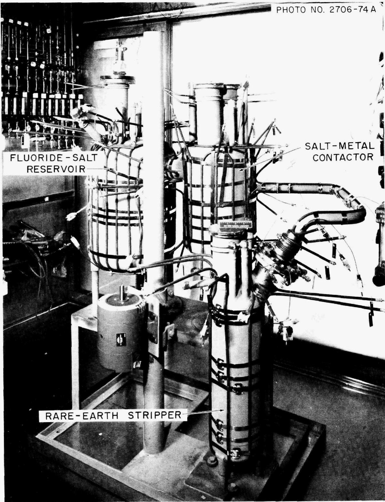  
Fig. 1. Photograph of processing vessels for metal-transfer experiment MTE-3B.

# 4. SALT-METAL CONTACTOR DEVELOPMENT: EXPERIMENTS WITH A MECHANICALLY AGITATED, NONDISPERSING CONTACTOR IN THE SALT-BISMUTH FLOWTHROUGH FACILITY

C. H. Brown, Jr.

We have continued operation of a facility in which mass transfer rates between molten $\mathrm{LiF - BeF}_2\text{-ThF}_4$ (72-16-12 mole %) and molten bismuth can be measured in a mechanically agitated, nondispersing contactor of the "Lewis" type. A total of seven experimental runs have been completed to date. Results from the first six runs have been reported previously. Preparation for and results obtained from the seventh run, TSMC-7, are discussed in the following sections.

# 4.1 Preparation for Mass Transfer Experiment TSMC-7

Prior to the run, it was necessary to: (1) add beryllium to the salt to adjust the uranium distribution coefficient, and (2) contact the salt and bismuth by passing both phases through the mild steel contactor to ensure that chemical equilibrium was achieved between the salt and bismuth.

# 4.1.1 Addition of beryllium to the system

As discussed previously, it is desirable to maintain the uranium distribution coefficient at a relatively high level ( $\geq 30$ ), so that the actual value of the distribution coefficient will not affect the calculation of the overall mass transfer coefficient. Approximately 1.37 g-equiv of beryllium was added electrolytically to the salt phase in the treatment vessel (T5), which raised the uranium distribution ratio to $>97$ .

# 4.1.2 Prerun equilibration of salt and bismuth

A $^{237}\mathrm{U}_{3}\mathrm{O}_{8}$ tracer was utilized to measure mass transfer rates across the salt-bismuth interface in the stirred interface contactor while the system was otherwise at chemical equilibrium. In order to ensure chemical equilibrium between the salt and bismuth, both phases were passed through

the contactor prior to run TSMC-7. Three attempts at phase equilibration runs were necessary before a satisfactory flowthrough was achieved.

During the first two attempts, a leak developed in the transfer line from the bismuth feed tank (TL) to the contactor. This transfer line was completely replaced, along with the associated Calrods and thermal insulation. The third attempt at phase equilibration was successful with salt and bismuth flow rates of 152 cc/min and 170 cc/min, respectively. The agitator was operated at $\sim$ 100 rpm.

# 4.2 Mass Transfer Experiment TSMC-4

After the phase equilibration described above was accomplished, the salt and bismuth were transferred to their respective feed tanks.

An 11-mg quantity of tracer, consisting of $1\mathrm{mg}$ of ${}^{237}\mathrm{U}_{3}\mathrm{O}_{8}$ and $10\mathrm{mg}$ of MgO which had been irradiated in the ORR for $72\mathrm{hr}$ , was placed in a steel addition vessel. It was then inserted in the salt-feed tank where it was sparged with $\sim 0.5$ scfm of argon for $1\mathrm{hr}$ to facilitate dissolution of the tracer in the salt phase.

The volumetric flow rates of salt and bismuth to the contactor were set at 152 cc/min and 170 cc/min, respectively, by controlled pressurization of the feed vessels (T3 and T1). The stirrer rate was set at 68 rpm for the run. Seven sets of samples were taken of the salt and bismuth effluent streams from the contactor.

# 4.3 Experimental Results

The samples taken during the run were analyzed by first counting the sample capsules for the activity of $^{237}\mathrm{U}$ (207.95 keV $\beta^{\sim}$ ). The material in the sample capsules was then dissolved, and the activity of $^{237}\mathrm{U}$ was counted again. The counting data obtained in this manner are shown in Table 2.

The overall salt-phase mass transfer coefficient was calculated using three different equations derived from an overall mass balance around the contactor. The average measured mass transfer coefficient, with the

Table 2. Counting data obtained from run TSMC-7   

<table><tr><td>Sample codea</td><td>Solid analysis for 237U (counts/g)</td><td>Solution analysis for 237U (counts/g)</td><td>Sample codea</td><td>Solid analysis for 237U (counts/g)</td><td>Solution analysis for 237U (counts/g)</td></tr><tr><td colspan="6">Samples taken prior to run</td></tr><tr><td>313-B-5</td><td>2.68 x 104</td><td>6.39 x 104</td><td>311-S-5</td><td>&lt; 4.2 x 103</td><td>&lt; 1.8 x 104</td></tr><tr><td>314-B-1</td><td>2.11 x 104</td><td>6.77 x 104</td><td>312-S-5</td><td>&lt; 5.2 x 103</td><td>&lt; 1.5 x 104</td></tr><tr><td>317-B-1</td><td>2.25 x 104</td><td>6.79 x 104</td><td>315-S-3</td><td>&lt; 6.6 x 103</td><td>&lt; 1.8 x 104</td></tr><tr><td>318-B-1</td><td>2.57 x 104</td><td>6.47 x 104</td><td>316-S-3</td><td>&lt; 7.6 x 103</td><td>&lt; 9.5 x 103</td></tr><tr><td colspan="6">Samples taken prior to run but after addition of tracers</td></tr><tr><td></td><td></td><td></td><td>319-S-3</td><td>3.95 x 106</td><td>5.46 x 103</td></tr><tr><td></td><td></td><td></td><td>320-S-3</td><td>3.95 x 106</td><td>5.61 x 106</td></tr><tr><td colspan="6">Samples taken during run</td></tr><tr><td>321-B-FS</td><td>1.20 x 105</td><td>3.91 x 105</td><td>329-S-FS</td><td>2.21 x 106</td><td>2.89 x 106</td></tr><tr><td>322-B-FS</td><td>1.36 x 105</td><td>4.33 x 105</td><td>330-S-FS</td><td>2.85 x 106</td><td>3.32 x 106</td></tr><tr><td>323-B-FS</td><td>1.47 x 105</td><td>4.81 x 105</td><td>331-S-FS</td><td>2.75 x 105</td><td>3.26 x 106</td></tr><tr><td>324-B-FS</td><td>1.81 x 105</td><td>5.03 x 105</td><td>332-S-FS</td><td>2.89 x 106</td><td>3.97 x 106</td></tr><tr><td>325-B-FS</td><td>1.62 x 105</td><td>5.06 x 105</td><td>333-S-FS</td><td>2.82 x 106</td><td>2.96 x 106</td></tr><tr><td>326-B-FS</td><td>1.79 x 105</td><td>5.05 x 105</td><td>334-S-FS</td><td>2.93 x 106</td><td>3.90 x 106</td></tr><tr><td>327-B-FS</td><td>1.78 x 105</td><td>5.17 x 105</td><td></td><td></td><td></td></tr><tr><td colspan="6">Samples taken after run</td></tr><tr><td>335-B-1</td><td>8.65 x 104</td><td>2.22 x 105</td><td>339-S-3</td><td>--</td><td>--</td></tr><tr><td>336-B-1</td><td>6.66 x 104</td><td>2.18 x 105</td><td>340-S-3</td><td>--</td><td>--</td></tr><tr><td>337-B-2</td><td>1.24 x 105</td><td>3.78 x 105</td><td>341-S-4</td><td>--</td><td>--</td></tr><tr><td>338-B-2</td><td>1.34 x 105</td><td>3.86 x 105</td><td>342-S-4</td><td>1.64 x 106</td><td>2.19 x 106</td></tr><tr><td>343-B-5</td><td>1.99 x 105</td><td>5.05 x 105</td><td>345-S-5</td><td>&lt; 9.8 x 103</td><td>&lt; 8.7 x 103</td></tr><tr><td>344-B-5</td><td>1.84 x 105</td><td>5.58 x 105</td><td>346-S-5</td><td>&lt; 5.3 x 103</td><td>&lt; 1.7 x 104</td></tr></table>

Each sample is designated by a code corresponding to A-B-C, where A = sample number; B = material in sample (B = bismuth, S = salt); and C = sample origin: 1 = T1, 2 = T2, 3 = T3, 4 = T4, 5 = T5, FS = flowing stream sample.

corresponding standard deviation, is $0.0057 \pm 0.0012$ cm/sec. This value corresponds to $65\%$ of the value predicted by the Lewis correlation. $^{6}$ A Lewis plot of the results for this run, along with the results from runs TSMC-3 through -6, are shown in Fig. 2. The nomenclature used in Fig. 2 is:

k = individual phase mass transfer coefficient, cm/sec,

$\nu =$ kinematic viscosity, cm²/sec,

Re = Reynolds number $(\mathrm{ND}^2 / \nu)$ , dimensionless,

D = stirrer diameter, cm,

N = stirrer rate, 1/sec,

subscripts 1, $2 =$ phase being considered.

In Fig. 2 it can be seen that the mass transfer group based on uranium is $45 \pm 13\%$ of the Lewis correlation for runs 3, 5, and 7, while that same group is $103 \pm 4\%$ of the Lewis correlation for runs 4 and 6. The mass transfer results based on zirconium are consistently slightly less than the values based on uranium. This discrepancy is probably related to the inability to correct for the self absorption of the $743.37 \mathrm{keV} \beta^{-}$ from the $97 \mathrm{Zr}$ in the solid bismuth samples.

We believe that at a stirrer speed between 160 and 180 rpm, the initiation of entrainment of salt into the bismuth begins to occur; the apparent increase in mass transfer coefficient is a manifestation of an increase in the surface area for mass transfer due to surface motion. Experiments with water-mercury and water-methylene bromide systems support this belief.

# 5. SALT-METAL CONTACTOR DEVELOPMENT: EXPERIMENTS WITH A MECHANICALLY AGITATED, NONDISPERSING CONTACTOR USING WATER AND MERCURY

C. H. Brown, Jr.

The reference flowsheet for the proposed MSBR processing plant calls for the extraction of rare earths from the fluoride fuel carrier salt to an intermediate bismuth stream. One device being considered for performing this extraction is a mechanically agitated, nondispersing contactor in

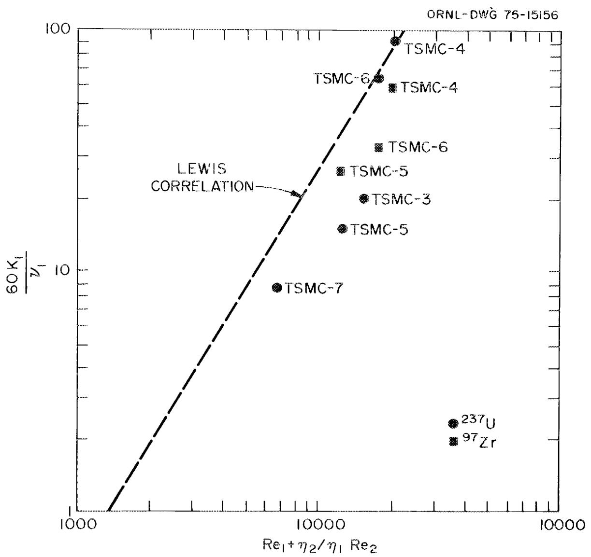  
Fig. 2. Comparison of mass transfer coefficients measured in the salt-bismuth contactor using $^{237}\mathrm{U}$ and $^{97}\mathrm{Zr}$ tracers with values predicted by the Lewis correlation.

which bismuth and fluoride salt phases are agitated to enhance the mass transfer rate of rare earths across the salt-bismuth interface. Previous reports have shown that the following reaction in the water-mercury system is suitable for simulating and studying mass transfer rates in systems with high density differences:

$$
\mathrm {P b} ^ {2 +} \left[ \mathrm {H} _ {2} 0 \right] + \mathrm {Z n} [ \mathrm {H g} ] \rightarrow \mathrm {Z n} ^ {2 +} \left[ \mathrm {H} _ {2} 0 \right] + \mathrm {P b} [ \mathrm {H g} ]. \tag {1}
$$

A large amount of data have been reported8 for the water-mercury system in which it was assumed that the limiting resistance to mass transfer existed entirely in the mercury phase, as suggested by literature correlations.

An experiment was previously described11 that was designed to identify the phase in which the controlling resistance to mass transfer resided. In these experiments, it was noticed that the mass transfer coefficient appeared to vary during the course of a run if the initial concentrations of Zn in the mercury phase and $\mathrm{Pb}^{2+}$ in the water phase were not equal. The mass transfer coefficient would abruptly change values after the experiment had been in progress for about 12 to 18 min. During this report period, the data from the experiments that had been performed in the water-mercury contactor were reanalyzed in an attempt to determine if the apparent change in mass transfer coefficient was due to the controlling resistance changing from one phase to the other during the course of an experiment.

# 5.1 Theory

As was previously reported, the reaction being studied, Eq. (1), is considered to be a fast, irreversible, ionic reaction which occurs entirely at the mercury-water interface.

The rate of transport of reactants from the bulk phase to the interface where they react is given by:

$$
\mathrm {N} _ {\mathrm {Z n} ^ {\circ}} = \mathrm {k} _ {\mathrm {H g}} \mathrm {A} \left(\mathrm {C} _ {\mathrm {Z n} ^ {\circ}, \mathrm {B}} - \mathrm {C} _ {\mathrm {Z n} ^ {\circ}, \mathrm {i}}\right), \tag {2}
$$

$$
\mathrm {N} _ {\mathrm {P b}} ^ {2 +} = \mathrm {k} _ {\mathrm {H} _ {2} 0} ^ {\mathrm {A}} \left(\mathrm {C} _ {\mathrm {P b}} ^ {2 +}, \mathrm {B} - \mathrm {C} _ {\mathrm {P b}} ^ {2 +}, \mathrm {i}\right), \tag {3}
$$

where

k = individual phase mass transfer coefficient, cm/sec,

N = rate of mass transport to the interface, g/sec,

A = interfacial area, cm²,

C = concentration,

B = denotation of bulk phase concentration,

i = denotation of interfacial concentration, $\mathrm{g/cm}^3$ , $\mathrm{Hg}, \mathrm{H}_2\mathrm{O}$ refers to the phase being considered.

Since one mole of $\mathbf{Zn}^{\circ}$ is equivalent to one mole of $\mathrm{Pb}^{2+}$ according to Eq. (1), then $\mathrm{N}_{\mathrm{Pb}} 2 + = \mathrm{N}_{\mathrm{Zn}}$ . Substituting Eqs. (2) and (3) into this expression yields the following equality,

$$
\mathrm {k} _ {\mathrm {H g}} \left(\mathrm {C} _ {\mathrm {Z n} ^ {\circ}, \mathrm {B}} - \mathrm {C} _ {\mathrm {Z n} ^ {\circ}, \mathrm {i}}\right) = \mathrm {k} _ {\mathrm {H} _ {2} 0} \left(\mathrm {C} _ {\mathrm {P b}} 2 +, \mathrm {B} - \mathrm {C} _ {\mathrm {P b}} 2 +, \mathrm {i}\right). \tag {4}
$$

As earlier reported, $^{11}$ if the controlling resistance to mass transfer is assumed to be in the ore phase, the interfacial reactant concentration in that phase is very small with respect to the bulk reactant concentration.

In the transient experiment which we have performed, $^{11}$ it may be possible for the limiting resistance to mass transfer to switch from one phase to the other during the course of an experiment. Since both interfacial reactant concentrations are very small with respect to their bulk phase concentrations, the following equality exists at this transition point:

$$
\mathrm {k} _ {\mathrm {H g}} \quad \mathrm {C} _ {\mathrm {Z n} ^ {\circ}, \mathrm {B}} = \mathrm {k} _ {\mathrm {H} _ {2} 0} \quad \mathrm {C} _ {\mathrm {P b} ^ {2 +}, \mathrm {B}}. \tag {5}
$$

If the controlling resistance to mass transfer is in the aqueous phase, two equations, one for the concentration of $\mathsf{Pb}^{2+}$ and one for the concentration of $\mathsf{Zn}^{2+}$ , can be derived:

$$
\ln \left[ \frac {\mathrm {C} _ {\mathrm {P b}} 2 + (\mathrm {t})}{\mathrm {C} _ {\mathrm {P b}} 2 + (0)} \right] = - \frac {\mathrm {k} _ {\mathrm {H} _ {2}} 0 ^ {\mathrm {A}}}{\mathrm {V} _ {\mathrm {H} _ {2}} 0} \quad \mathrm {t}, \text {a n d} \tag {6}
$$

$$
\ln \left[ \frac {\mathrm {C} _ {\mathrm {P b}} 2 + (0) - \mathrm {C} _ {\mathrm {Z n}} 2 + (t)}{\mathrm {C} _ {\mathrm {P b}} 2 + (0)} \right] = - \frac {\mathrm {k} _ {\mathrm {H} _ {2} 0} {} ^ {\mathrm {A}}}{\mathrm {V} _ {\mathrm {H} _ {2} 0}} t \tag {7}
$$

where

$$
V = \text {v o l u m e} \text {o f} \text {p h a s e}, \mathrm {c m} ^ {3},
$$

$$
t = \text {t i m e}, \sec , \text {a n d}
$$

parentheses indicate quantities which are functions of time.

If the mercury phase contains the controlling resistance to mass transfer, two other equations, one for the concentration of $\mathsf{Pb}^{2+}$ and one for the concentration of $\mathsf{Zn}^{2+}$ , can be derived:

$$
\ln \left[ \frac {\mathrm {C} _ {\mathrm {Z n}} \circ (0) - \mathrm {C} _ {\mathrm {P b}} 2 + (0) + \mathrm {C} _ {\mathrm {P b}} 2 + (\mathrm {t})}{\mathrm {C} _ {\mathrm {Z n}} \circ (0)} \right] = - \frac {\mathrm {k} _ {\mathrm {H g}} \quad \mathrm {A}}{\mathrm {V} _ {\mathrm {H g}}} \mathrm {t}, \text {a n d} \tag {8}
$$

$$
\ln \left[ \frac {\mathrm {C} _ {\mathrm {Z n}} \circ (0) - \mathrm {C} _ {\mathrm {Z n}} 2 + (\mathrm {t})}{\mathrm {C} _ {\mathrm {Z n}} \circ (0)} \right] = - \frac {\mathrm {k} _ {\mathrm {H g}} \quad \mathrm {A}}{\mathrm {V} _ {\mathrm {H g}}} \mathrm {t}. \tag {9}
$$

Equations (6)-(9) are all of the form,

$$
y = - m t, \tag {10}
$$

where

$$
y = \text {t h e n a t u r a l}
$$

$$
m = a \text {m a s s t r a n s f e r c o e f f i c i e n t t i m e s t h e i n t e r f a c i a l a r e a}
$$

$$
t = t i m e.
$$

This indicates that a logarithmic plot of the concentration ratio vs time should yield a straight line, with the slope being proportional to the mass transfer coefficient. If the control of mass transfer switches from

one phase to the other during the execution of an experiment, then the slope of the semilog plot mentioned above would indeed change, as was observed.

Equation (5) can be used with experimental values of $\mathrm{k}_{\mathrm{Hg}}$ , $\mathrm{k}_{\mathrm{H_2O}}$ , and concentrations of $\mathrm{Zn^{2+}}$ and $\mathrm{Pb^{2+}}$ , which are evaluated at the time of apparent change of mass transfer coefficient and at the beginning of the experiment, to determine the phase in which the limiting mass transfer resistance lay at the beginning of the run. The first step in the determination of the mass transfer limiting phase at the beginning of a run is to find the pair of individual phase mass transfer coefficients, one before and one after the transition point, which satisfy Eq. (5), with the bulk reactant concentrations evaluated at the transition point. Two combinations of mass transfer coefficients are possible, giving Eq. (5) the following two forms:

$$
\begin{array}{l} k _ {H g} ^ {(1)} C _ {Z n _ {t r} ^ {\circ}} = k _ {H _ {2} 0} ^ {(2)} C _ {P b 2 + t r}, \text {a n d} (11) \\ k _ {H g} ^ {(2)} C _ {Z n \circ} = k _ {H _ {2} 0} ^ {(1)} C _ {p b 2 +} (12) \\ \end{array}
$$

where superscripts 1 and 2 refer to the slope in Eq. (10) before and after the transition, respectively, and the subscript tr refers to the transition point. Equation (6) or (7) is used to determine $k_{\mathrm{H}_2\mathrm{O}}^{(1)}$ and $k_{\mathrm{H}_2\mathrm{O}}^{(2)}$ , and Eq. (8) or (9) is used to determine $k_{\mathrm{Hg}}^{(1)}$ and $k_{\mathrm{Hg}}^{(2)}$ .

Once it has been determined which of the two equations, Eq. (11) or (12), is satisfied for a particular run, the mass transfer limiting phase at the beginning of the run may be determined by further application of an inequality similar to Eq. (5). The individual phase mass transfer coefficient in the limiting phase times the bulk reactant concentration in that same phase must be less than the same product in the nonlimiting phase. Therefore, if Eq. (11) is satisfied, then the direction of the following inequality determines the initial mass transfer limiting phase,

$$
k _ {H g} ^ {(1)} C _ {Z n} \circ (0) > k _ {H _ {2} 0} ^ {(2)} C _ {p b} 2 + (0). \tag {13}
$$

Similarly, if Eq. (12) is satisfied, then the limiting phase is determined by the direction of the inequality:

$$
k _ {H g} ^ {(2)} C _ {Z n} ^ {\circ} (0) \geq k _ {H _ {2}} ^ {(1)} C _ {P b} 2 + (0). \tag {14}
$$

# 5.2 Experimental Results

Five experiments were run in the water-mercury contactor to determine if the apparent change in mass transfer coefficient was due to controlling resistance changing from one phase to the other during the course of an experiment. The initial mercury-phase zinc concentration was held constant at 0.1 M. Phase volumes and agitator speed were also held constant at 1.8 liters and $\sim 150$ rpm, respectively.

The experimental data obtained from these five runs, the conditions under which the runs were made, and the transient response of the system in terms of aqueous lead and zinc concentrations are shown in Table 3. The data were analyzed by use of the equations in the previous section.

Results of this analysis for determination of the phase which contained the limiting resistance to mass transfer at the beginning of each run are shown in Table 4, along with the measured value of the mass transfer coefficient in the limiting phase. These results indicate that the limiting resistance to mass transfer was initially in the mercury phase in the runs made without initial aqueous-phase lead concentration equal to or less than the initial mercury-phase zinc concentration. For the runs made with an initial lead ion concentration greater than the initial zinc amalgam concentration, the aqueous phase controls mass transfer. The results from run 148 (in which the initial reactant concentrations are nearly equal) are difficult to analyze, because only a slight change of slope in a plot of Eq. (10) was detected.

In runs 145 and 149, the initial lead ion concentration was low with respect to the zinc amalgam concentration. This would indicate that the

Initial Hg-Zn analgam concentration = 0.1 M

Stirrer velocity $= 150$ rpm

Phase volumes $= 1.8$ liters each

Paddle diameter $= 7.62$ cm

Paddle height = 1.91 cm

Table 3. Concentration vs time data from the water-mercury contactor   

<table><tr><td>Run number</td><td>Elapsed time (min)</td><td>Lead ion concentration (M)</td><td>Zinc ion concentration (M)</td></tr><tr><td rowspan="11">145</td><td>0</td><td>0.0197</td><td>0.0003</td></tr><tr><td>3</td><td>0.0171</td><td>0.0038</td></tr><tr><td>6</td><td>0.0141</td><td>0.0070</td></tr><tr><td>9</td><td>0.0112</td><td>0.0095</td></tr><tr><td>12</td><td>0.0092</td><td>0.0115</td></tr><tr><td>15</td><td>0.0071</td><td>0.0134</td></tr><tr><td>18</td><td>0.0053</td><td>0.0158</td></tr><tr><td>21</td><td>0.0042</td><td>0.0170</td></tr><tr><td>24</td><td>0.0033</td><td>0.0181</td></tr><tr><td>27</td><td>0.0025</td><td>0.0186</td></tr><tr><td>30</td><td>0.0019</td><td>0.0196</td></tr><tr><td rowspan="11">146</td><td>0</td><td>0.141</td><td>0.00021</td></tr><tr><td>3</td><td>0.131</td><td>0.0187</td></tr><tr><td>6</td><td>0.117</td><td>0.0346</td></tr><tr><td>9</td><td>0.101</td><td>0.0478</td></tr><tr><td>12</td><td>0.0883</td><td>0.0604</td></tr><tr><td>15</td><td>0.0738</td><td>0.0750</td></tr><tr><td>18</td><td>0.0589</td><td>0.0826</td></tr><tr><td>21</td><td>0.0589</td><td>0.0887</td></tr><tr><td>24</td><td>0.0550</td><td>0.0910</td></tr><tr><td>27</td><td>0.0526</td><td>0.0948</td></tr><tr><td>30</td><td>0.0512</td><td>0.0979</td></tr><tr><td rowspan="11">147</td><td>0</td><td>0.184</td><td>0.00104</td></tr><tr><td>3.33</td><td>0.171</td><td>0.0338</td></tr><tr><td>6</td><td>0.144</td><td>0.0520</td></tr><tr><td>9</td><td>0.132</td><td>0.0678</td></tr><tr><td>12</td><td>0.121</td><td>0.0811</td></tr><tr><td>15</td><td>0.109</td><td>0.0872</td></tr><tr><td>18</td><td>0.103</td><td>0.0902</td></tr><tr><td>21</td><td>0.101</td><td>0.0941</td></tr><tr><td>24</td><td>0.0999</td><td>0.0979</td></tr><tr><td>27</td><td>0.0975</td><td>0.0971</td></tr><tr><td>30</td><td>0.0956</td><td>0.100</td></tr><tr><td rowspan="13">148</td><td>0</td><td>0.0960</td><td>0.0007</td></tr><tr><td>5</td><td>0.0749</td><td>0.0199</td></tr><tr><td>10</td><td>0.0568</td><td>0.0375</td></tr><tr><td>15</td><td>0.0419</td><td>0.0516</td></tr><tr><td>20</td><td>0.0331</td><td>0.0631</td></tr><tr><td>25</td><td>0.0249</td><td>0.0704</td></tr><tr><td>30</td><td>0.0176</td><td>0.0784</td></tr><tr><td>35</td><td>0.0148</td><td>0.0834</td></tr><tr><td>40.33</td><td>0.0102</td><td>0.0899</td></tr><tr><td>45</td><td>0.0070</td><td>0.0906</td></tr><tr><td>50</td><td>0.0046</td><td>0.0922</td></tr><tr><td>55</td><td>0.0029</td><td>0.0922</td></tr><tr><td>60</td><td>0.0017</td><td>0.0948</td></tr><tr><td rowspan="11">149</td><td>0</td><td>0.0192</td><td>0.00045</td></tr><tr><td>3.17</td><td>0.0156</td><td>0.00512</td></tr><tr><td>6.07</td><td>0.0122</td><td>0.00795</td></tr><tr><td>9.25</td><td>0.0970</td><td>0.0106</td></tr><tr><td>12</td><td>0.0741</td><td>0.0130</td></tr><tr><td>15</td><td>0.00536</td><td>0.0148</td></tr><tr><td>18</td><td>0.00384</td><td>0.0162</td></tr><tr><td>21.08</td><td>0.00249</td><td>0.0177</td></tr><tr><td>24</td><td>0.00211</td><td>0.0188</td></tr><tr><td>27</td><td>0.00127</td><td>0.0190</td></tr><tr><td>30</td><td>0.00069</td><td>0.0199</td></tr></table>

Table 4. Initial lead ion concentration and mass transfer coefficients in the phase initially containing the limiting resistance to mass transfer for runs 145 to 149   

<table><tr><td rowspan="2">Run number</td><td rowspan="2">Initial lead ion concentration (M)</td><td colspan="2">Mass transfer coefficients in the phase controlling mass transfer initially (cm/sec)</td></tr><tr><td>kHg</td><td>KH2O</td></tr><tr><td>145</td><td>0.0197</td><td>0.0012</td><td></td></tr><tr><td>149</td><td>0.0192</td><td>0.0013</td><td></td></tr><tr><td>148</td><td>0.0960</td><td>0.0056</td><td></td></tr><tr><td>146</td><td>0.141</td><td></td><td>0.0061</td></tr><tr><td>147</td><td>0.184</td><td></td><td>0.0046</td></tr></table>

aqueous phase should initially contain the limiting resistance, since the initial lead ion concentration times the mass transfer coefficient should be less than the initial zinc amalgam concentration times the mass transfer coefficient in that phase. Similarly, in runs 146 and 147, the initial lead ion concentration was large with respect to the zinc amalgam concentration; this would indicate that the mercury phase should initially contain the limiting resistance to mass transfer.

According to the model we have developed, if the aqueous phase initially contains the limiting resistance to mass transfer, the following inequality is satisfied:

$$
k _ {H g} C _ {Z n} \circ (0) > k _ {H _ {2} 0} C _ {P b} 2 + (0). \tag {15}
$$

During the course of an experimental run, the inequality shown in Eq. (15) should always be satisfied, since the lead ion concentration decreases with an equal decrease in the zinc amalgam concentration. This indicates that the aqueous phase should control mass transfer throughout the run; no change of slope, corresponding to a change in the controlling phase, should be denoted in a plot of Eq. (6). Figure 3 shows the parameters of Eq. (6) plotted for the data obtained in run 146. A definite change of

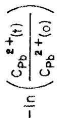

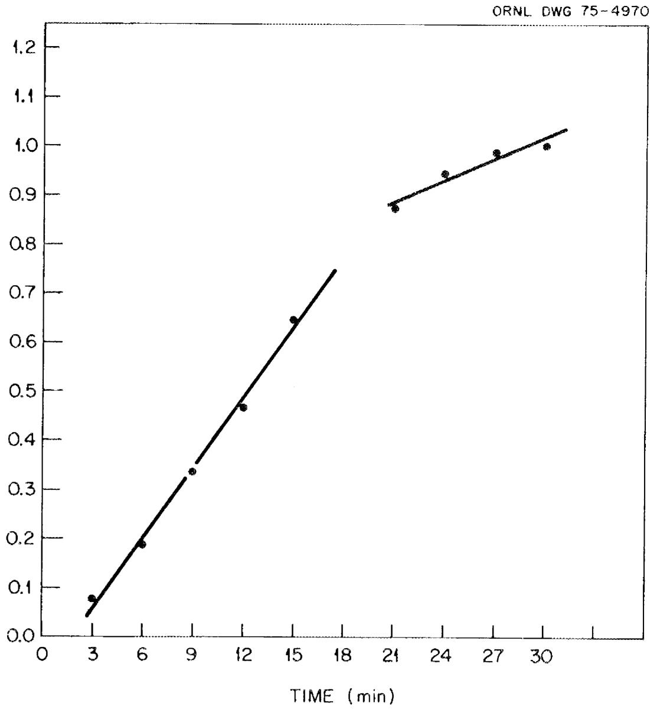  
Fig. 3. Logarithm of the concentration ratio vs time for run 146 in the water-mercury contactor.

slope is recognizable at a value of the abscissa (time) between 15 and 18 min, which would indicate a change in the phase containing the limiting resistance to mass transfer.

Mass transfer theory predicts that the value of the individual phase mass transfer coefficient is constant. The experimental results given in Table 4 indicate that the measured mass transfer coefficient for the mercury phase in runs 145, 148, and 149 increased in direct proportion to the initial lead ion concentration. Similarly, the values reported for the aqueous phase mass transfer coefficient in runs 146 and 147 vary inversely to the initial lead ion concentration. It is evident that for this system the model we have developed is inadequate, and further studies need to be made to completely understand the system.

# 6. FUEL RECONSTITUTION DEVELOPMENT: INSTALLATION OF EQUIPMENT FOR A FUEL RECONSTITUTION ENGINEERING EXPERIMENT

# R. M. Counce

The reference flowsheet for processing the fuel salt from a molten-salt breeder reactor (MSBR) is based upon removal of uranium by fluorination to $\mathrm{UF}_6$ as the first processing step. $^{12}$ The uranium removed in this step must subsequently be returned to the fuel salt stream before it returns to the reactor. The method for recombining the uranium with the fuel carrier salt (reconstituting the fuel salt) is to absorb gaseous $\mathrm{UF}_6$ into a recycled fuel salt stream containing dissolved $\mathrm{UF}_4$ by utilizing the reaction:

$$
\mathrm {U F} _ {6 (\mathrm {g})} + \mathrm {U F} _ {4 (\mathrm {d})} = 2 \mathrm {U F} _ {5 (\mathrm {d})}. \tag {16}
$$

The resultant $\mathrm{UF}_5$ would be reduced to $\mathrm{UF}_4$ with hydrogen in a separate vessel according to the reaction:

$$
\mathrm {U F} _ {5 (\mathrm {d})} + 1 / 2 \mathrm {H} _ {2 (\mathrm {g})} = \mathrm {U F} _ {4 (\mathrm {d})} + \mathrm {H F} _ {(\mathrm {g})}. \tag {17}
$$

We are beginning engineering studies of the fuel reconstitution step in order to provide the technology necessary for the design of larger equipment for recombining $\mathrm{UF}_6$ generated in fluorinators in the processing plant with the processed fuel salt returning to the reactor. During this report period, equipment that was described previously $^{13}$ was fabricated and is being installed. This report contains documentation of equipment and adds detail to the previous report.

The major components of the fuel reconstitution engineering experiment (FREE) are shown schematically in Fig. 4, and in more detail in Figs. 5 and 6. The equipment for this experiment consists of a 36-liter feed tank, a $\mathrm{UF}_6$ absorption vessel, a $\mathrm{H}_2$ reduction column, an effluent stream sampler, a 36-liter receiver, NaF traps for collecting excess $\mathrm{UF}_6$ and disposing of HF, gas supplies for argon, hydrogen, and $\mathrm{UF}_6$ , and means for analyzing the gas streams from the reaction vessels.

# 6.1 Equipment Documentation

The feed and receiver tanks are almost identical in construction, with the exception that the feed tank has an additional nozzle. The similarity of these vessels is seen in Figs. 7 and 8. The feed tank has five nozzles, as seen in Fig. 9, as follows:

(1) a salt inlet nozzle (1/2-in. sched 40 pipe with a fitting for a sleeved 3/8-in. tube that does not extend into the tank);   
(2) a-salt exit nozzle (1/2-in. sched 40 pipe with a fitting for a sleeved 3/8-in. tube that extends to 1/2 in. of the bottom of the tank);   
(3) a sparge nozzle (3/8-in. sched 40 pipe with a fitting for a sleeved 1/4-in. tube extending to within 1/2 in. of the bottom of the tank);   
(4) an off-gas and pressurization nozzle (3/8-in. sched 40 pipe with a fitting for a sleeved 1/4-in. tube that does not extend into the tank); and   
(5) a sampler port (3/4-in. pipe with a 3/4-in. ball valve and cap).

The return tank has nozzles 1 through 4 of the above, as seen in Fig. 10; however, the only pressurization capacity is through the sparge line.

ORNL DWG 74-11666R1

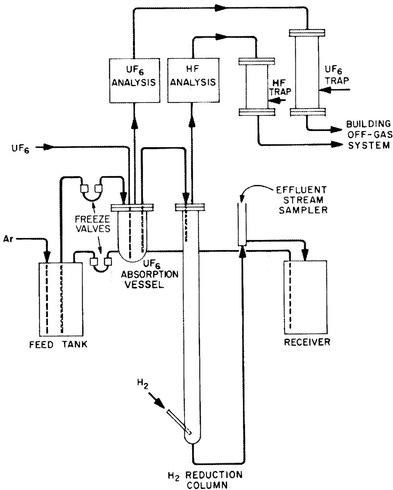  
Fig. 4. Schematic flow diagram for the fuel reconstitution engineering experiment (FREE).

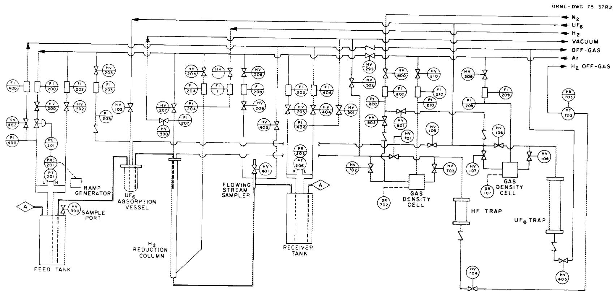  
Fig. 5. Flow diagram for FREE.

ORNL-DWG 75-35R2

FI IOI IS A HASTINGS

MASS FLOWMETER

MODIFIED TO GIVE

A 10-50 mA

OUTPUT SIGNAL

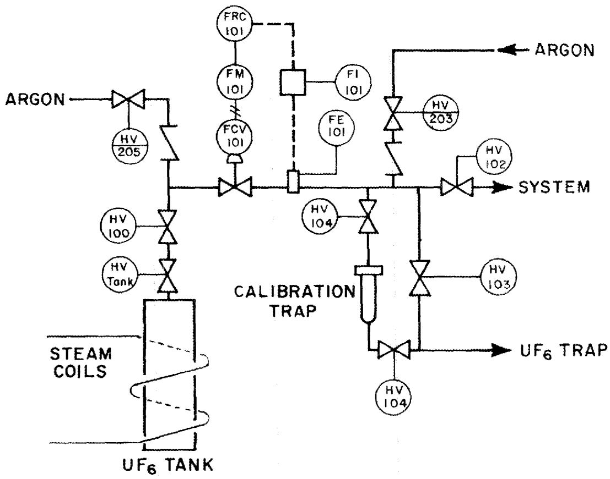  
Fig. 6. UF generation and metering system flow diagram for FREE.

PHOTO 3144-74

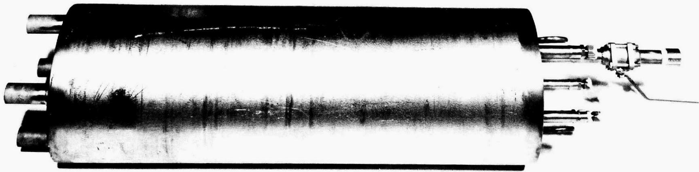

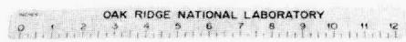  
Fig. 7. Feed tank for FREE.

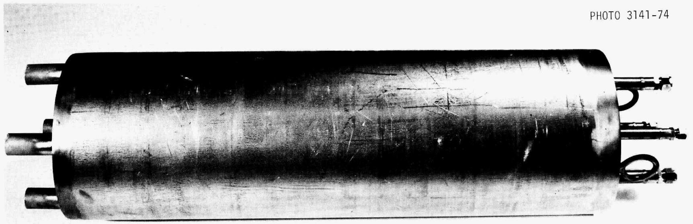

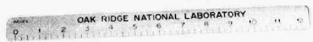  
Fig. 8. Receiver tank for FREE.

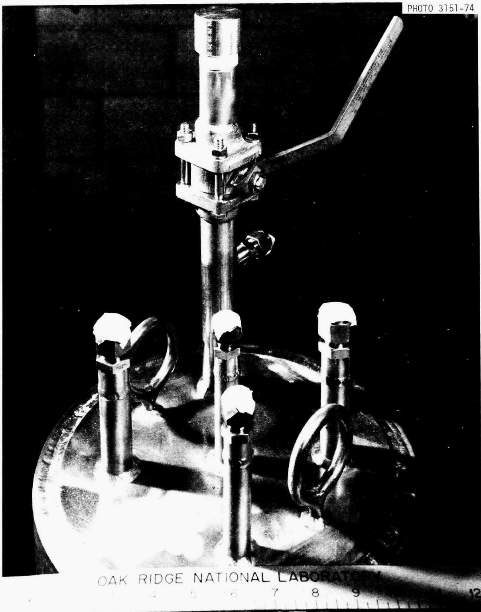  
Fig. 9. Top view of feed tank for FREE.

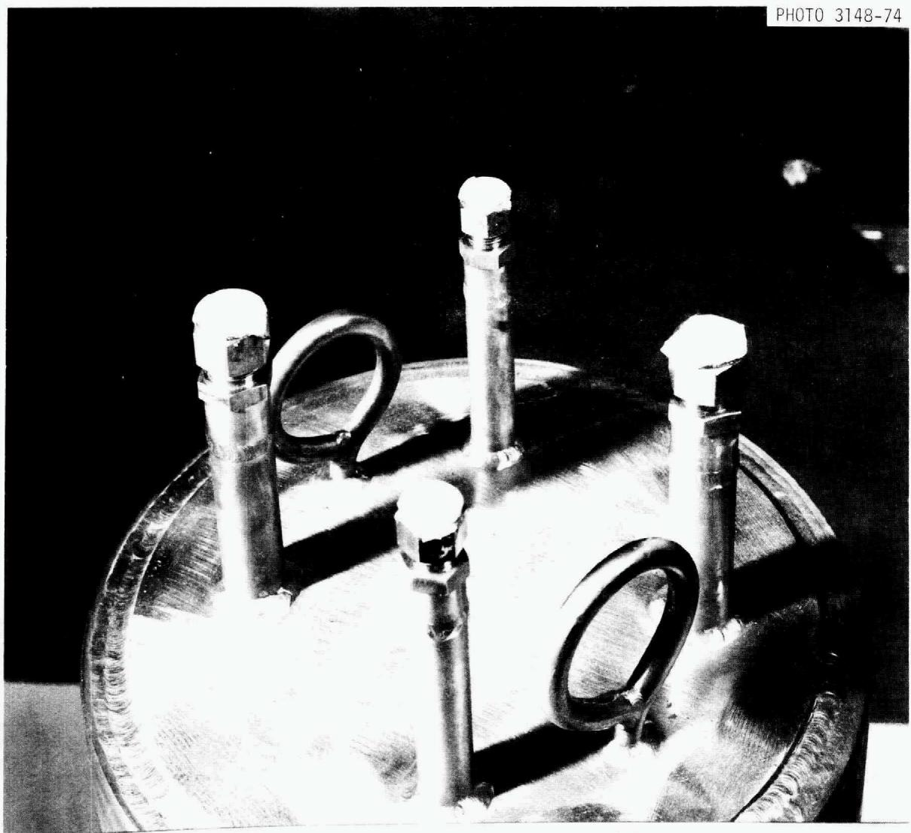

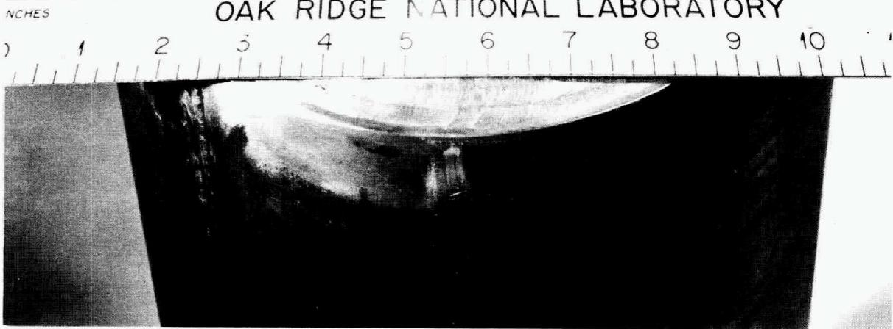  
Fig. 10. Top view of receiver tank for FREE.

A side view of the UF $6$ absorption vessel is shown in Fig. 11, and a top view is shown in Fig. 12. The nozzles in Fig. 12 are identical with nozzles 1 through 4 of the return tank with one exception. The off-gas nozzle is a 3/8-in. sched 40 pipe with a 3/8-in. Swagelock fitting which serves as the off-gas line from that vessel.

The $\mathrm{H}_{2}$ reduction column is shown in Figs. 13-15. Two nozzles are shown in a top view of the column (Fig. 14):

(1) a salt inlet nozzle (as previously described for the feed tank); and   
(2) an off-gas nozzle (as described for the UF $6$ absorption vessel).

Figure 15 shows the 3/8-in.-pipe side arm (the gas inlet and distributor). The hydrogen supply line, a 1/4-in. tube, is welded to this side arm. Also shown is the 3/8-in.-pipe salt exit port. The salt exit line, a 3/8-in. tube, is welded to the exit port.

The flowing stream sampler is shown in Fig. 16. Access to the liquid phase is obtained through the $3/4$ -in. ball valve. The sampler is equipped with a $3/8$ -in. tube fitting for an off-gas line. A $3/8$ -in. tube fitting for a "cover gas" line is not shown.

The $\mathrm{UF}_{6}$ and HF traps are identical in construction except for the length. The $\mathrm{UF}_{6}$ trap is 55-5/8 in. long, while the HF trap is 31-5/8-in. long. The $\mathrm{UF}_{6}$ trap is shown in Figs. 17 and 18. As seen in these figures, the trap has a 3/8-in. fitting on the top and bottom flanges for gas inlet and outlet, respectively. The HF trap is not shown because of its similarity to the $\mathrm{UF}_{6}$ trap.

# 6.2 UF Generation

The uranium hexafluoride for the fuel reconstitution engineering experiment will be acquired in 5-in.-diam by 36-in.-high cylinders. These cylinders contain up to 55 lb of $\mathbf{U}\mathbf{F}_{6}$ . The triple point of $\mathbf{U}\mathbf{F}_{6}$ occurs at 22 psia and $147.3^{\circ}\mathbf{F}$ . $\mathbf{U}\mathbf{F}_{6}(\mathbf{g})$ will be supplied to this experiment by maintaining the temperature of the $\mathbf{U}\mathbf{F}_{6}$ cylinder at $220^{\circ}\mathbf{F}$ , and the vapor pressure will be 70 psia. Heating will be accomplished by use of 17.2-psia steam.

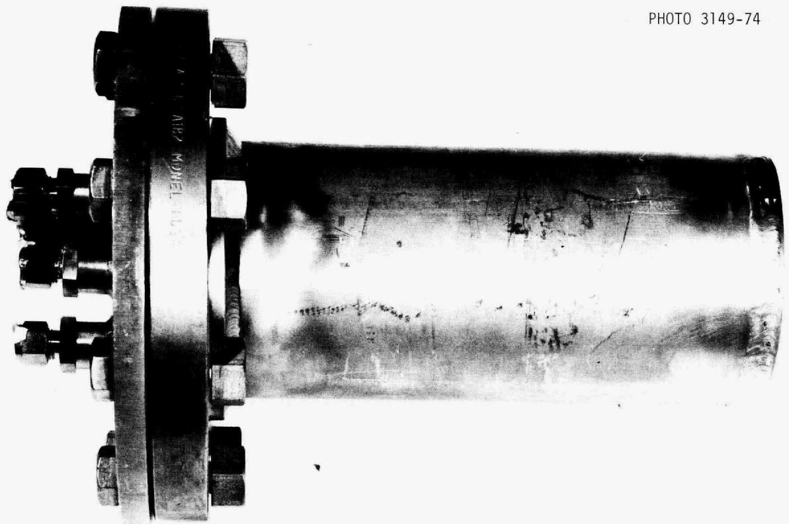

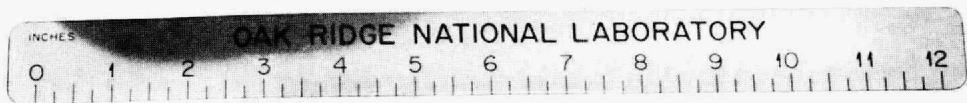  
Fig. 11. UF $_6$ absorption vessel for FREE.

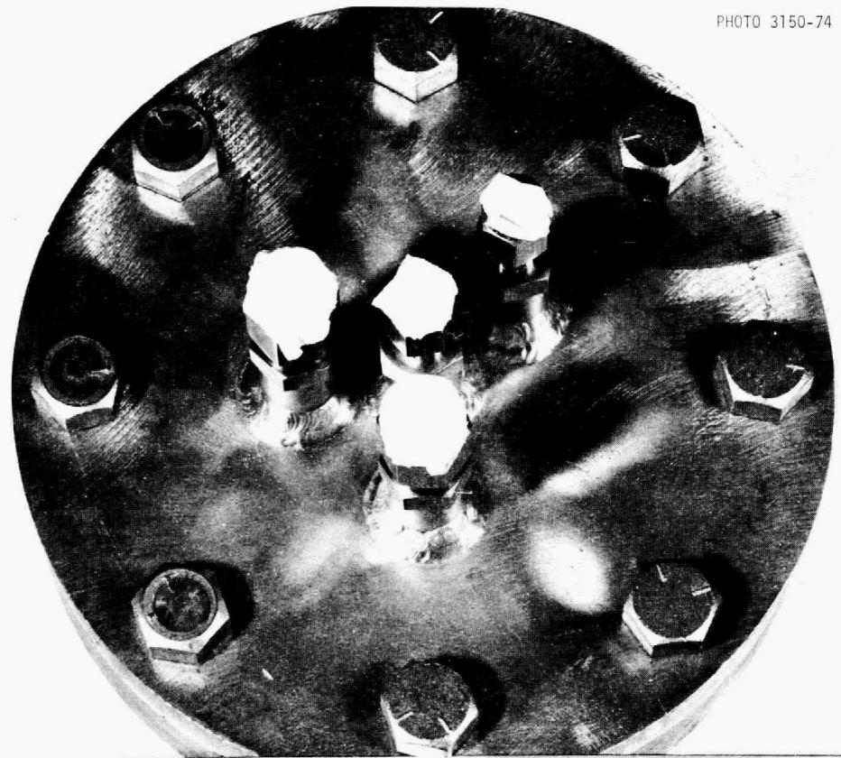  
Fig. 12. Top view of $\mathrm{UF}_{6}$ absorption vessel for FREE.

NCHES

# OAK RIDGE NATIONAL LABORATORY

0 1 2 3 4 5 6 7 8 9 10 11 12

PHOTO 3143-74

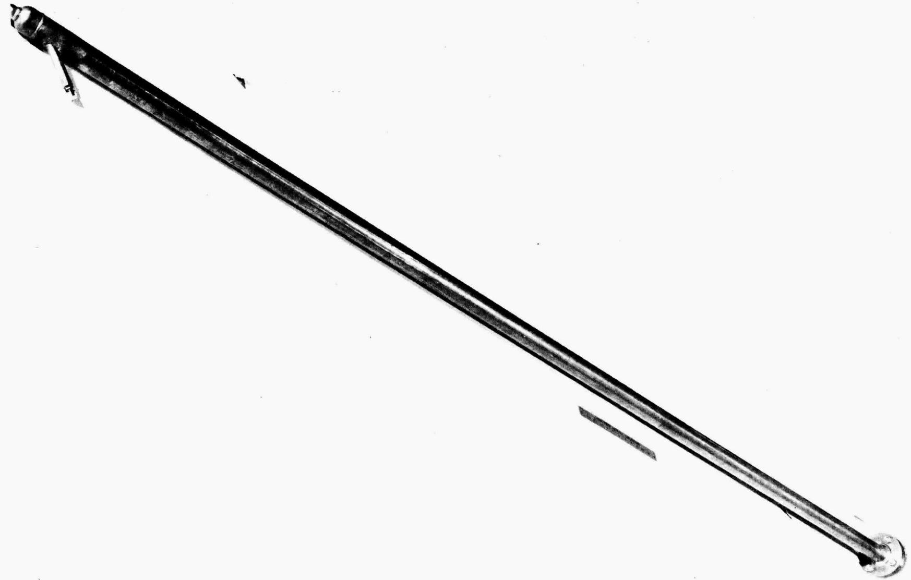  
Fig. 13. $\mathrm{H}_{2}$ reduction column for FREE.

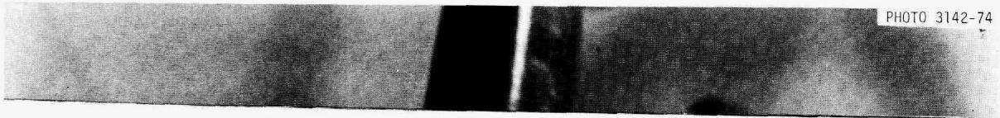

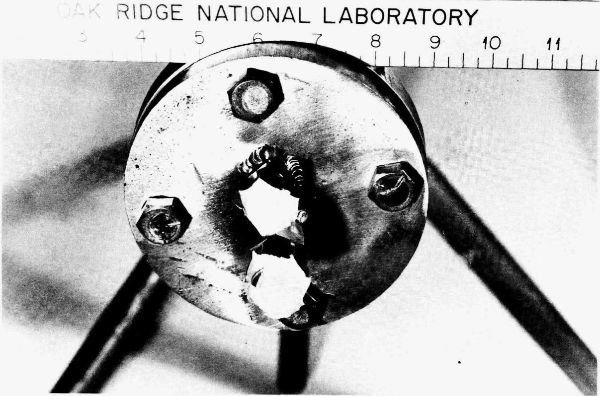  
Fig. 14. Top view of $\mathbf{H}_2$ reduction column for FREE.

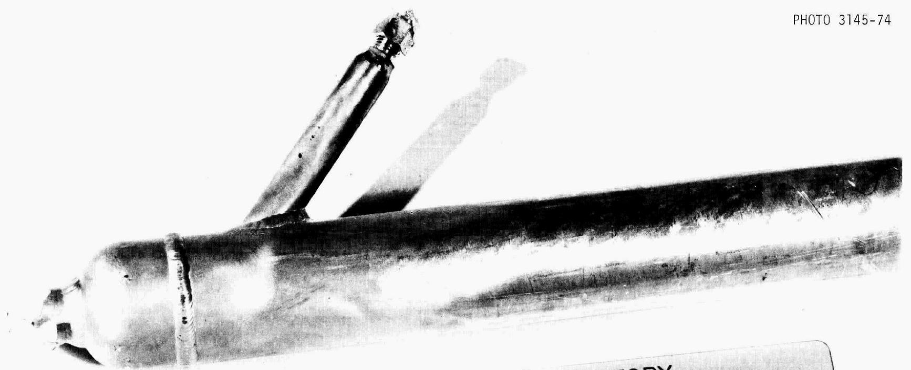

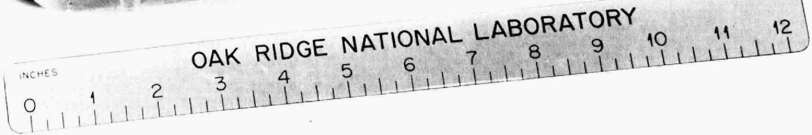  
Fig. 15. View near bottom of $\mathrm{H}_{2}$ reduction column for FREE.

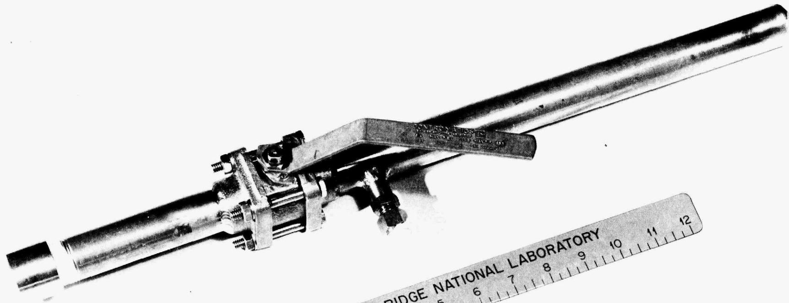

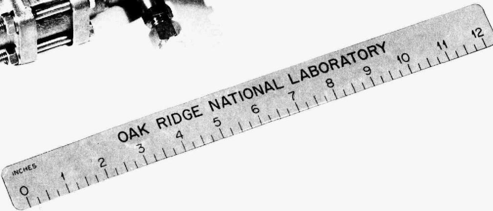  
Fig. 16. Flowing stream sampler for FREE.

PHOTO 3140-74

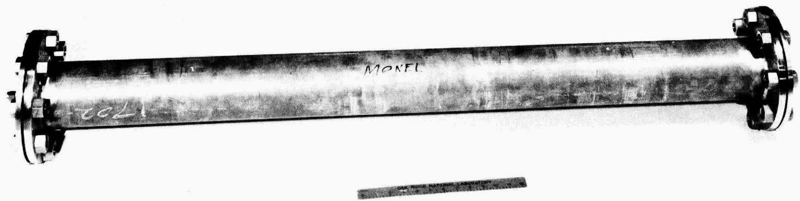  
Fig. 17. UF6 trap for FREE.

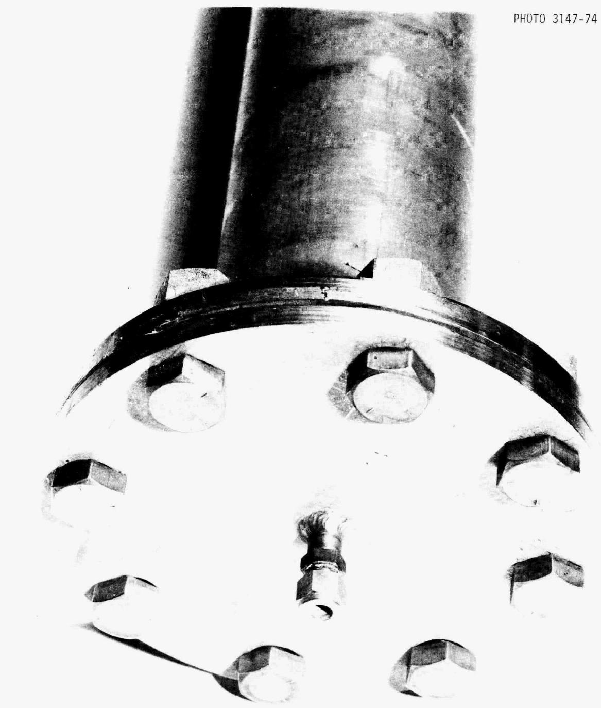

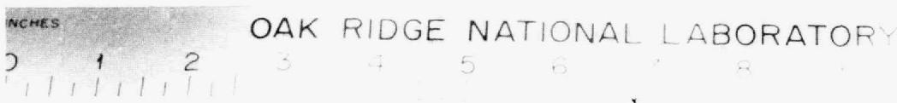  
Fig. 18. Top or bottom view of UF ${}_{6}$ trap for FREE.

The steam heats the cylinders directly through 3/8-in. copper tubing which is coiled around the entire cylinder, as illustrated in Fig. 6. The lower 18 in. of the cylinder and tubing is covered with a conductive cement to minimize response time. The cylinder and associated valves are then enclosed in a cabinet insulated with 2 in. of Fiberglas insulation.

# 6.3 Instrumentation and Controls

The principal objectives of the instrumentation and control system are to provide closely regulated flows of molten salt, $\mathrm{UF}_6$ , $\mathrm{H}_2$ , and diluent gases to the process, and to analyze the resultant off-gas.

Flow rate of salt to the UF $_6$ absorption tank is controlled by regulating the change of liquid level in the feed tank. This liquid level is inferred from the pressure of argon that is supplied to a dip-leg bubbler in the tank.

Figure 19 is a schematic diagram of the control system that regulates the flow of salt to the $\mathrm{UF}_6$ absorption vessel. An adjustable ramp generator and an electric-to-pneumatic converter are used to linearly decrease the set point of a controller that senses liquid level in the feed tank and controls the level by controlling the flow rate of pressurizing argon to the gas space of the feed tank. The result should be a uniformly decreasing salt level and, hence, a uniform discharge rate of salt from the tank. This control system should be unaffected by small increases in back pressure caused by plugging of transfer lines, decreasing feed tank level, etc., or leakage of pressurizing argon (a small argon bleed is provided to improve pressure control).

The $\mathrm{UF}_{6}$ control system is a simple feedback system involving a Hastings Mass Flow Meter as the flow rate sensor (see Fig. 6). This signal from the mass flow meter is altered to a 10 to $50\mathrm{mA}$ signal to feed an electronic Foxboro recorder-controller. The recorder-controller actuates a 1/4-in. Research Control Valve. All control instrumentation and equipment having contact with the $\mathrm{UF}_{6}$ stream (with the exception of the feed lines) are enclosed in an insulated cabinet maintained at $212^{\circ}\mathrm{F}$ .

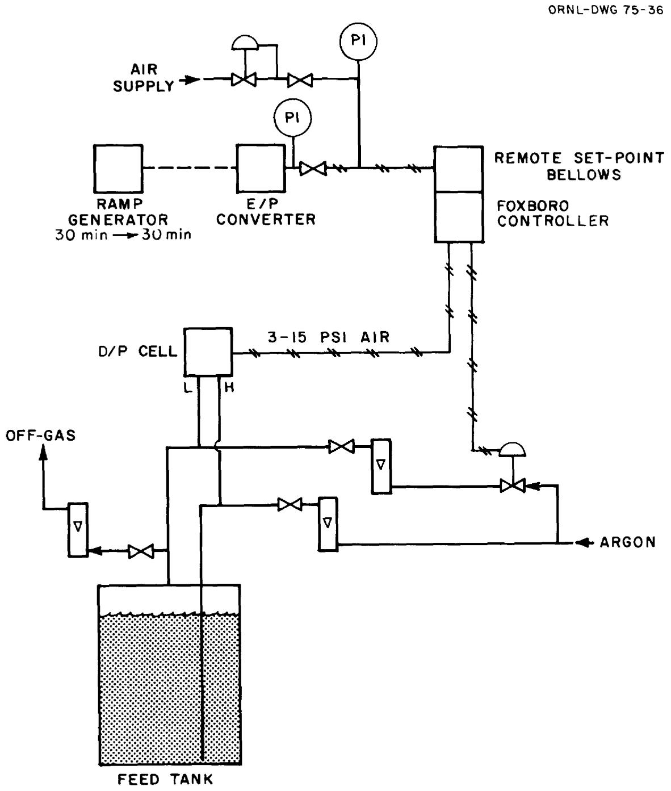  
Fig. 19. Schematic diagram of control system for metering salt from the feed tank for FREE.

The hydrogen and diluent gas streams are metered through Matheson flow meters accompanied by differential pressure indicators. The off-gas analysis is made by Gow-Mac gas density detectors. The gas concentrations can be inferred from the gas density analysis.

The liquid-phase system temperatures are maintained at the desired temperatures by automatic controllers. These controllers regulate appropriate voltage transformers that supply power to Calrod tubular heaters.

# 7. REFERENCES

1. R. M. Counce and J. R. Hightower, Jr., Engineering Development Studies for Molten-Salt Breeder Reactor Processing No. 18, ORNL-TM-4698 (March 1975), p. 37.   
2. MSR Program Semiann. Progr. Rept. Aug. 31, 1970, ORNL-4622, p. 101.   
3. Chem. Technol. Div. Annu. Progr. Rept. March 31, 1973, ORNL-4883, pp. 23-25.   
4. H. O. Weeren et al., Engineering Development Studies for Molten-Salt Breeder Reactor Processing No. 9, ORNL-TM-3259 (December 1972), pp. 205-15.   
5. H. C. Savage, Engineering Development Studies for Molten-Salt Breeder Reactor Processing No. 19, ORNL-TM-4863 (July 1975), p. 1.   
6. J. B. Lewis, Chem. Eng. Sci. 3, 248-59 (1954).   
7. J. A. Klein et al., Engineering Development Studies for Molten-Salt Breeder Reactor Processing No. 19, ORNL-TM-4863 (July 1975), p. 21.   
8. J. A. Klein, Engineering Development Studies for Molten-Salt Breeder Reactor Processing No. 18, ORNL-TM-4698 (March 1975), p. 1.   
9. J. A. Klein et al., MSR Program Semiannu. Progr. Rep. Aug. 31, 1972, ORNL-4832, p. 171.   
10. J. A. Klein, Engineering Development Studies for Molten-Salt Breeder Reactor Processing No. 15, ORNL-TM-4019 (in preparation).   
11. C. H. Brown, Jr. et al, Engineering Development Studies for Molten-Salt Breeder Reactor Processing No. 19, ORNL-TM-4863 (July 1975).   
12. R. M. Counce, MSR Program Semiannu. Progr. Rep. Aug. 31, 1974, ORNL-5011, p. 127.

13. R. M. Counce, Engineering Development Studies for Molten-Salt Breeder Reactor Processing No. 19, ORNL-TM-4863 (July 1975), p. 38.

# INTERNAL DISTRIBUTION

1-2. MSRP Director's Office   
3. C. F. Baes, Jr.   
4. C. E. Bamberger   
5. J. Beams   
6. M. Bender   
7. M. R. Bennett   
8. E. S. Bettis   
9. R.E.Blanco   
10. J. O. Blomeke   
11. E. G. Bohlmann   
12. J. Braunstein   
13. M. A. Bredig   
14. R. B. Briggs   
15. H. R. Bronstein   
16. R.E.Brooksbank   
17. C. H. Brown, Jr.   
18. K.B.Brown   
19. J. Brynestad   
20. S. Cantor   
21. D. W. Cardwell   
22. W. L. Carter   
23. W.H.Cook   
24. R.M.Counce   
25. J. L. Crowley   
26. F. L. Culler   
27. J. M. Dale   
28. F. L. Daley   
29. J.H.DeVan   
30. J. R. DiStefano   
31. W.P.Eatherly   
32. R. L. Egli, ERDA-OSR   
33. J. R. Engel   
34. G. G. Fee   
35. D. E. Ferguson   
36. L.M. Ferris   
37. L. O. Gilpatrick   
38. J. C. Griess   
39. W.R.Grimes   
40. R. H. Guymon

41-56. J.R.Hightower, Jr.

57. B.F.Hitch

58. R.W.Horton

59. W.R.Huntley

60. C.W. Kee

61. A. D. Kelmers

62. W.R.Laing

63. R. B. Lindauer

64. R.E. MacPherson

65. W.C.McClain

66. H. E. McCoy

67. A. P. Malinauskas

68. C. L. Matthews, ERDA-OSR

69. A. S. Meyer

70. R. L. Moore

71. J. P. Nichols

72. G. D. Owen

73. H. Postma

74. M. W. Rosenthal

75. H. C. Savage

76. C. D. Scott

77. M. J. Skinner

78. F. J. Smith

79. G.P. Smith

80. I. Spiewak

81. M. G. Stewart

82. O.K.Tallent

83. L. M. Toth

84. D. B. Trauger

85. W.E.Unger

86. J.R.Weir

87. M. K. Wilkinson

88. R. G. Wymer

91. Central Research Library

92. Document Reference Section

93-102. Laboratory Records

103. Laboratory Records (ORNL-RC)

# CONSULTANTS AND SUBCONTRACTORS

104. J. C. Frye   
105. C.H. Ice   
106. J. J. Katz   
107. W. K. Davis   
108. R.B.Richards

# EXTERNAL DISTRIBUTION

109. Research and Technical Support Division, ERDA, Oak Ridge Operations Office, P. O. Box E, Oak Ridge, Tenn. 37830   
110. Director, Reactor Division, ERDA, Oak Ridge Operations Office, P. O. Box E, Oak Ridge, Tenn. 37830   
111-112. Director, ERDA Division of Reactor Research and Development, Washington, D. C. 20545   
113-214. For distribution as shown in TID-4500 under UC-76, Molten Salt Reactor Technology