3 4456 0049243 A

# Engineering Development Studies for Molten-Salt Breeder Reactor Processing No. 21

A. ${\mathrm{C}}_{12}$ 、 ${\mathrm{C}}_{13}$ 、 ${\mathrm{C}}_{14}$ 、 ${\mathrm{C}}_{15}$ 、 ${\mathrm{C}}_{16}$ 、 ${\mathrm{C}}_{17}$ 、 ${\mathrm{C}}_{18}$ 、 ${\mathrm{C}}_{19}$ 、 ${\mathrm{C}}_{20}$ 、 ${\mathrm{C}}_{21}$ 、 ${\mathrm{C}}_{22}$ 、 ${\mathrm{C}}_{23}$ 、 ${\mathrm{C}}_{24}$ 、 ${\mathrm{C}}_{25}$ 、 ${\mathrm{C}}_{26}$ 、 ${\mathrm{C}}_{27}$ 、 ${\mathrm{C}}_{28}$ 、 ${\mathrm{C}}_{29}$ 、 ${\mathrm{C}}_{30}$ 、 ${\mathrm{C}}_{31}$ 、 ${\mathrm{C}}_{32}$ 、 ${\mathrm{C}}_{33}$ 、 ${\mathrm{C}}_{34}$ 、 ${\mathrm{C}}_{35}$ 、 ${\mathrm{C}}_{36}$ 、 ${\mathrm{C}}_{37}$ 、 ${\mathrm{C}}_{38}$ 、 ${\mathrm{C}}_{39}$ 、 ${\mathrm{C}}_{40}$ 、 ${\mathrm{C}}_{41}$ 、 ${\mathrm{C}}_{42}$ 、 ${\mathrm{C}}_{43}$ 、 ${\mathrm{C}}_{44}$ 、 ${\mathrm{C}}_{45}$ 、 ${\mathrm{C}}_{46}$ 、 ${\mathrm{C}}_{47}$ 、 ${\mathrm{C}}_{48}$ 、 ${\mathrm{C}}_{49}$ 、 ${\mathrm{C}}_{50}$ 、 ${\mathrm{C}}_{51}$ 、 ${\mathrm{C}}_{52}$ 、 ${\mathrm{C}}_{53}$ 、 ${\mathrm{C}}_{54}$ 、 ${\mathrm{C}}_{55}$ 、 ${\mathrm{C}}_{56}$ 、 ${\mathrm{C}}_{57}$ 、 ${\mathrm{C}}_{58}$ 、 ${\mathrm{C}}_{59}$ 、 ${\mathrm{C}}_{60}$ 、

（二）《关于修订<股东大会议事规则>的议案》

1.2.1.1 1

LIBERTARYLOAN COYET

PC 1001 1248135 10A

SPECS WITH THE NEW SINGULAR SET

OAK RIDGE NATIONAL LABORATORY

Printed in the United States of America. Available from

National Technical Information Service

U.S. Department of Commerce

5285 Port Royal Road, Springfield, Virginia 22161

Price: Printed Copy $4.00; Microfiche $2.25

This report was prepared as an account of work sponsored by the United States Government. Neither the United States nor the Energy Research and Development Administration, nor any of their employees, nor any of their contractors, subcontractors, or their employees, makes any warranty, express or implied, or assumes any legal liability or responsibility for the accuracy, completeness or usefulness of any information, apparatus, product or process disclosed, or represents that its use would not infringe privately owned rights.

ORNL/TM-4894

UC-76 - Molten Salt Reactor Technology

Contract No. W-7405-eng-26

CHEMICAL TECHNOLOGY DIVISION

ENGINEERING DEVELOPMENT STUDIES FOR MOLTEN-SALT BREEDER REACTOR PROCESSING NO. 21

Compiled by:

J.R.Hightower, Jr.

Other Contributors:

C. H. Brown, Jr.

R. M. Counce

R. B. Lindauer

H. C. Savage

MARCH 1976

NOTICE This document contains information of a preliminary nature and was prepared primarily for internal use at the Oak Ridge National Laboratory. It is subject to revision or correction and therefore does not represent a final report.

OAK RIDGE NATIONAL LABORATORY

Oak Ridge, Tennessee 37830

operated by

UNION CARBIDE CORPORATION

for the

3445600492438

ENERGY RESEARCH AND DEVELOPMENT ADMINISTRATION

Reports previously issued in this series are as follows:

ORNL-TM-3053 Period ending December 1968

ORNL-TM-3137 Period ending March 1969

ORNI-TM-3138 Period ending June 1969

ORNL-TM-3139 Period ending September 1969

ORNL-TM-3140 Period ending December 1969

ORNL-TM-3141 Period ending March 1970

ORNL-TM-3257 Period ending June 1970

ORNL-TM-3258 Period ending September 1970

ORNL-TM-3259 Period ending December 1970

ORNL-TM-3352 Period ending March 1971

ORNL-IM-4698 Period January through June 1974

ORNL-TM-4863 Period July through September 1974

ORNL-TM-4870 Period October through December 1974

# CONTENTS

Page

SUMMARIES. V

1. INTRODUCTION 1   
2. CONTINUOUS FLUORINATOR DEVELOPMENT: AUTORESISTANCE HEATING TEST AHT-4 1

2.1 Decontamination of AHT-3 Test Vessel. 2   
2.2 Design of Equipment for Autoresistance Heating Test AHT-4 2

3. DEVELOPMENT OF THE METAL TRANSFER PROCESS. 10   
3.1 Status of Metal Transfer Experiment MTE-3B. 10   
4. SALT-METAL CONTACTOR DEVELOPMENT: EXPERIMENTS WITH A MECHANICALLY AGITATED, NONDISPERSING CONTACTOR IN THE SALT-BISMUTH FLOWTHROUGH FACILITY 12

4.1 Preparation for Mass Transfer Experiments TSMC-8 and TSMC-9. 13   
4.2 Experimental Operation. 13   
4.3 Mass Transfer Results 14

5. SALT-METAL CONTACTOR DEVELOPMENT: EXPERIMENTS WITH A MECHANICALLY AGITATED, NONDISPERSING CONTACTOR USING WATER AND MERCURY. 21

5.1 Runs at Elevated Temperatures with the Lead Ion-Zinc Amalgam System. 22   
5.2 Polarographic Determination of Mass Transfer Coefficients 22

5.2.1 Theory 22   
5.2.2 Experimental equipment 24   
5.2.3 Experimental results 24

6. FUEL RECONSTITUTION DEVELOPMENT: INSTALLATION OF EQUIPMENT FOR A FUEL RECONSTITUTION ENGINEERING EXPERIMENT 26

6.1 Gas Supply Systems. 27   
6.2 Equipment Installation. 28   
6.3 $\mathbf{H}_2$ -HF Treatment of Salt from Autoresistance Heating Tests 35

7. REFERENCES

# SUMMARIES

# CONTINUOUS FLUORINATOR DEVELOPMENT: AUTORESISTANCE

# HEATING TEST AHT-4

After completion of the third autoresistance heating test (AHT-3), the system was dismantled and the test vessel was decontaminated for use in the next test, AHT-4. Design and fabrication for the other vessels to be used in AHT-4 were completed and installation was begun.

# DEVELOPMENT OF THE METAL TRANSFER PROCESS

Engineering experiments to study the steps in the metal transfer process for removing rare-earth fission products from a molten-salt breeder reactor fuel salt will be continued in experiment MTE-3B. During this report period, we completed preoperational testing of the facility; charging of the salt and bismuth phase to the process vessels is in progress.

# SALT-METAL CONTACTOR DEVELOPMENT: EXPERIMENTS WITH A MECHANICALLY AGITATED, NONDISPIERSING CONTACTOR IN THE SALT-BISMUTH FLOWTHROUGH FACILITY

The eighth and ninth tracer runs (TSMC-8 and -9) were completed in the mild steel contactor installed in the salt-bismuth flowthrough facility in Bldg. 3592. The agitator drive assembly failed to operate properly during run TSMC-8. The assembly was dismantled, repaired, and reassembled, with resultant satisfactory operation. Run TSMC-9 was made at a high agitator speed (244 rpm) to determine both the mass transfer coefficient under conditions in which salt is dispersed into the bismuth, and if large amounts of bismuth and salt are entrained in the other phase. The mass transfer coefficient was $0.121 \pm 0.108$ cm/sec, which is $178\%$ of the Lewis correlation. All the data suggest that when the phases are not dispersed, the effect of agitator speed on the mass transfer coefficient is less than that predicted by the Lewis correlation.

# SALT-METAL CONTACTOR DEVELOPMENT: EXPERIMENTS WITH A MECHANICALLY AGITATED, NONDISPIERSING CONTACTOR USING WATER AND MERCURY

Mass transfer rates between water and mercury have been measured in a mechanically agitated contactor using the reaction:

$$
\mathrm {P b} ^ {2 +} \left(\mathrm {H} _ {2} \mathrm {O}\right) + \mathrm {Z n} (\mathrm {H g}) \rightarrow \mathrm {Z n} ^ {2 +} \left(\mathrm {H} _ {2} \mathrm {O}\right) + \mathrm {P b} (\mathrm {H g}),
$$

which was assumed to be instantaneous, irreversible, and occurring entirely at the water-mercury interface.

Several runs were made in the water-mercury contactor at an elevated temperature ( $\sim 40^{\circ}\mathrm{C}$ ) to test the validity of the assumption that the interfacial reaction given above is instantaneous. Results from these runs were inconclusive.

Investigation was initiated to determine if polarography is a viable alternate method for measuring mass transfer rates in a stirred interface contactor using mercury and an aqueous electrolyte solution. Several electrolyte solutions were investigated, but none were found to be entirely inert to mercury. Information found in the literature suggested that a $\mathrm{Fe}^{2+}-\mathrm{Fe}^{3+}$ redox couple (using iron complexed with oxalate ions) may be suitable as an electrolyte for our application. Further tests will be performed to determine if the iron electrolyte will produce suitable polarograms.

# FUEL RECONSTITUTION DEVELOPMENT: INSTALLATION OF EQUIPMENT FOR A FUEL RECONSTITUTION ENGINEERING EXPERIMENT

Salt used in experiment AHT-3 was treated with $\mathbf{H}_{2}$ and HF to remove oxides. This salt will be used in the first fuel reconstitution experiments. Installation of the fuel reconstitution experimental equipment is continuing.

# 1. INTRODUCTION

A molten-salt breeder reactor (MSBR) will be fueled with a molten fluoride mixture that will circulate through the blanket and core regions of the reactor and through the primary heat exchangers. We are developing processing methods for use in a close-coupled facility for removing fission products, corrosion products, and fissile materials from the molten fluoride mixture.

Several operations associated with MSBR processing are under study. The remaining parts of this report discuss:

(1) decontamination of the test vessel used in autoresistance heating test AHT-3, and the design of equipment for auto-resistance heating test AHT-4;   
(2) progress on installation of metal transfer experiment MTE-3B;   
(3) measurements of mass transfer of $^{237}\mathrm{U}$ and $^{97}\mathrm{Zr}$ from MSBR fuel carrier salt to molten bismuth in a mechanically agitated contactor;   
(4) results of an investigation to determine if polarography is a suitable method for measuring water-side mass transfer coefficients in a mechanically agitated contactor operating with water and mercury; and   
(5) description of equipment to be used in engineering studies of fuel reconstitution.

This work was performed in the Chemical Technology Division during the period January through March 1975.

# 2. CONTINUOUS FLUORINATOR DEVELOPMENT: AUTORESISTANCE HEATING TEST AHT-4

# R. B. Lindauer

After completion of the third autoresistance heating test (AHT-3), the system was dismantled and the test vessel was decontaminated for use in the next test, AHT-4. Design and fabrication for the other vessels to be used in AHT-4 were completed and installation was begun.

# 2.1 Decontamination of AHT-3 Test Vessel

The test vessel was cleaned by treating it with hot (~ 200°F) $6 \%$ oxalic acid in an open steam- heated vat. In order to submerge the vessel completely in the 14- to 20- in. depth of solution, it was first necessary to cut the vessel below the electrode side arm, since this side arm and the gas-inlet side arm are not in the same plane. The bottom of the vessel, which contained a 2- in. salt heel, was removed before immersion. After 3 days, the solution was drained and the vessel was inspected. Salt remained below the gas-inlet side arm, and the electrode was still secured in the side arm by some residual salt. Evidently the salt had contained sufficient crud to prevent complete drainage through the side-arm drain line. A sample of the material taken from below the gas inlet contained $58 \%$ thorium.

The vessel was treated for an additional 3 days in a second oxalic acid bath. It was then possible to remove the electrode and chip out the remaining salt in the side arm. A survey of the vessel revealed considerable transferable activity. The vat was cleaned and the vessel was treated with a solution of ammonium oxalate and Versene. After this treatment, the metal surface had a shiny metallic appearance, compared with the dull, powdery look on the surface after the oxalic acid treatments. A third oxalate treatment was made followed by wet sand blasting. A final survey showed $< 200$ dpm of transferable activity.

# 2.2 Design of Equipment for Autoresistance Heating Test AHT-4

The next test of autoresistance heating for the frozen wall fluorinator will use a circulating salt system to help prevent complete freezing in the test vessel. The flowsheet for this test is shown in Fig. 1. Salt flows from the surge tank to the gas-liquid separator by means of an argon gas lift. The salt then flows by gravity to the test vessel where it enters through a special insulated flange and the electrode. The salt leaves the bottom of the test vessel and passes through a heat flowmeter before being returned to the surge tank through another insulated flange. The insulated flanges are water-cooled to permit the use of Teflon gaskets. The bolts are insulated by a Bakelite sleeve and Teflon washers, as shown

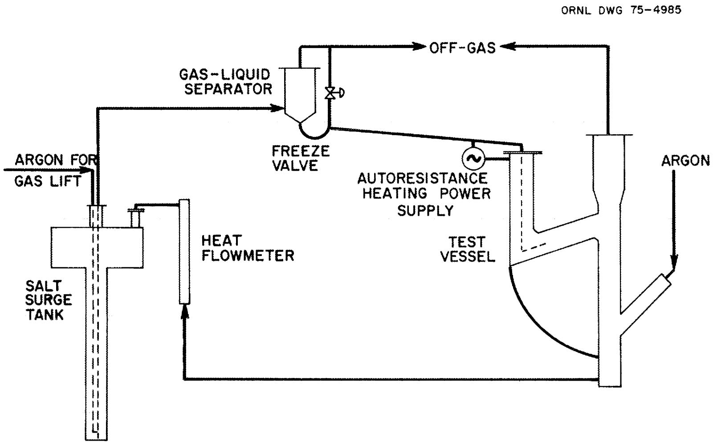  
Fig. 1. Flowsheet for autoresistance heating test AHT-4.

in Fig. 2. The return line has a deflector at the point at which it enters the surge tank to prevent short-circuiting across the liquid stream (Fig. 3). The surge tank and separator are, therefore, at the same electrical potential as the electrode and must be insulated from the equipment supports. Gas lines to these two vessels have insulated sections. An air-cooled freeze valve is located in the line between the separator and the test vessel to make it possible to transfer the molten salt from the test vessel to the surge tank after a run to determine the film thickness.

The individual equipment pieces are described below.

Test vessel. The test vessel is the same one used in AHT-3. After draining salt from the last run, inspection of the vessel revealed about 11 liters of material which failed to drain. This was due partly to runback, but was primarily caused by plugging of the side-arm drain line with impurities (oxides and structural metal fluorides) which had accumulated over the past 2 years. The bottom $6 - 1 / 2$ in. of the vessel was filled with salt and was cut off. Another cut was made below the electrode side arm to allow submergence in an open vat. The test vessel was treated with a hot $(\sim 200^{\circ}\mathrm{F})$ $6 \%$ oxalic acid solution for 7 days, and hot ammonium oxalate for 2 days. The solution was changed twice during the cleaning. Cleaning was complicated by the salt remaining in the electrode side arm which prevented removal of the electrode and flange. This also prevented circulation of the oxalic acid through the side arm. After the electrode was broken loose, the residual salt was broken up manually and decontamination was completed. New heaters and cooling coils have now been installed on the test vessel for better control of temperature. The electrode, Fig. 4, is similar to that used in AHT-3, but with an open-end pipe for salt flow.

Fluoride-salt surge tank (Figs. 5 and 6). This is a dual diameter vessel with a lower section of 6-in. sched 40 nickel pipe, 46-in. long; the upper section is 1/8-in-thick nickel, 24 in. in diameter by 11-in. high. The long 6-in. section provides ample submergence for the gas lift, while the large diameter upper section provides sufficient capacity to contain the salt from the entire system. A sensitive (0.20 in. of water) liquid-level instrument in the large diameter section will indicate

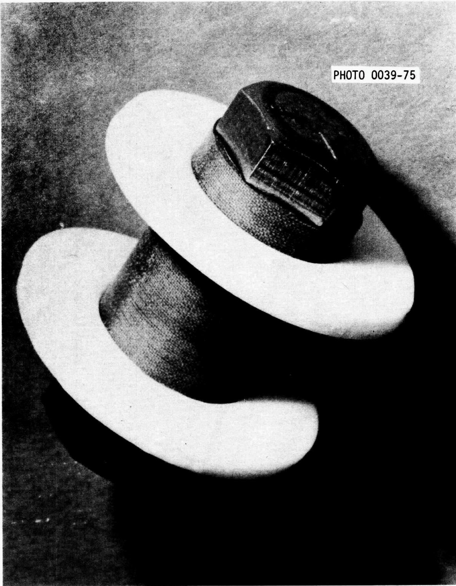  
Fig. 2. Insulated bolts used with electrical isolation flanges.

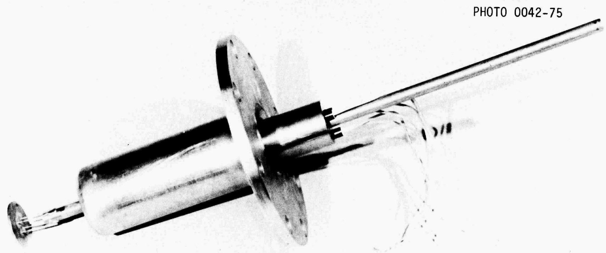  
Fig. 3. Electrical isolation flange for salt return line to surge tank.

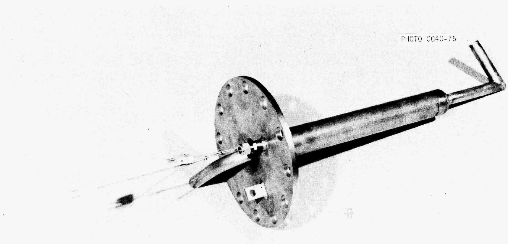  
Fig. 4. Electrode to be used in test vessel of autoresistance heating test AHT-4.

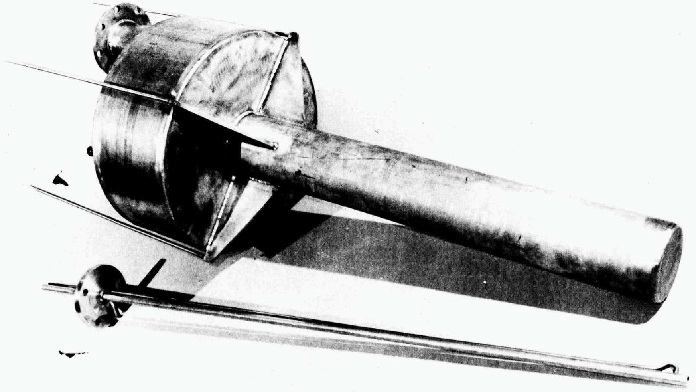  
Fig. 5. Top view of surge tank.

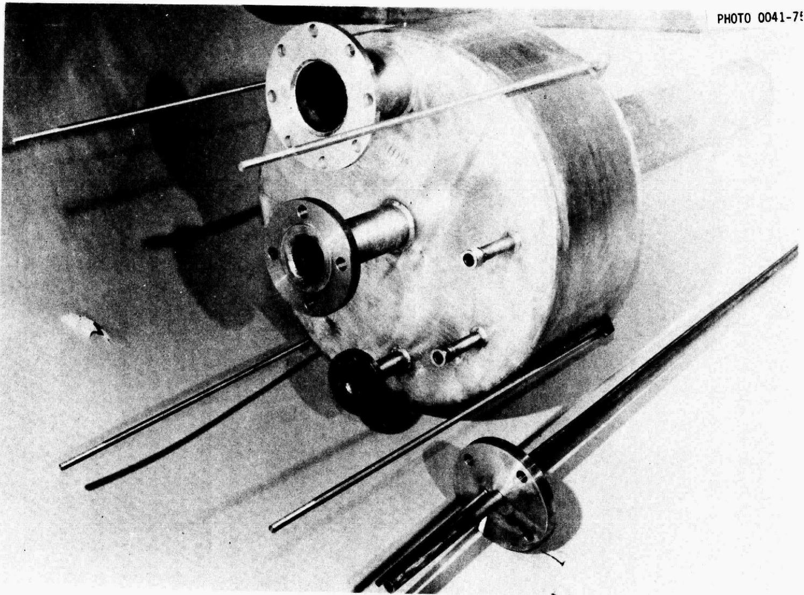  
Fig. 6. Bottom view of surge tank.

any unusual buildup of salt at the top of the test vessel or separator, as well as providing a means for measuring the volume of the frozen salt film after a test run.

Gas-liquid separator. This is an 8-in.-diam by 12-in.-high cone-bottom nickel vessel containing an 8-in.-deep demister of nickel Yorkmesh. Two baffle plates are located below the Yorkmesh for separation of the bulk of the argon and salt from the gas lift. A differential pressure instrument will detect any liquid buildup in the bottom or any excessive pressure drop across the separator. A thermowell is located in the Yorkmesh which will be maintained above the melting point of the salt.

Heat flowmeter. The salt leaving the test vessel passes through a 28-in. section of 2-in. nickel pipe containing a cartridge heater. Heat loss from the flowmeter (Fig. 7) will be balanced by external heaters. The internal heater can be operated on either $120\mathrm{V}$ (750 W) or $240\mathrm{V}$ (3000 W), depending on the salt flow rate. A temperature rise of about $10^{\circ}\mathrm{C}$ through the flowmeter will indicate a salt flow rate of either 0.9 or 3.6 liters/min, depending on whether the voltage applied to the cartridge heater is $120\mathrm{V}$ or $240\mathrm{V}$ .

# 3. DEVELOPMENT OF THE METAL TRANSFER PROCESS

H. C. Savage

Engineering experiments to study the steps in the metal transfer process for removing rare-earth fission products from a molten-salt breeder reactor fuel salt will be continued in experiment MTE-3B. During this report period, we completed preoperational testing of the facility, and the charging of the salt and bismuth phases to the process vessels is in progress.

# 3.1 Status of Metal Transfer Experiment MTE-3B

After installation, the three process vessels (fluoride fuel salt reservoirs, contactor, and stripper) were heated to the design operating temperatures of $650^{\circ}\mathrm{C}$ under an inert gas (argon) atmosphere, and were pressure tested at 15 psig. The carbon steel vessels were then hydrogen

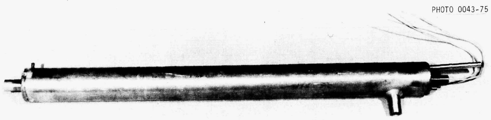  
Fig. 7. Heat flowmeter used in autoresistance heating test AHT-4.

treated for $\sim 7$ hrs while at $650^{\circ}\mathrm{C}$ to remove oxides from the internal surfaces. Addition of the salt and bismuth phases to the process vessels was then begun. All additions were made from auxiliary charging tanks, and care was taken to prevent contamination of the materials before and during transfer into the process vessels. Finally, all salts and bismuth were filtered through a sintered molybdenum frit ( $\sim 30$ -μ mean pore diameter) as they were transferred from the charging vessels into the process vessels to remove any particulates (such as oxides).

To date, we have completed the following additions to the MTE-3B process vessels:

(1) $61.7 \mathrm{~kg}$ of bismuth to the contactor vessel. The bismuth was hydrogen treated at $650^{\circ} \mathrm{C}$ to remove oxides.   
(2) $110.6 \, \text{kg}$ of fuel carrier salt (72-16-12 mole % LiF-BeF $_2$ -ThF $_4$ ) to the contactor and the fuel-salt reservoir. Before being added to the system, the fuel salt was sparged in the charging vessel with argon for 42 hr while in contact with bismuth which contained thorium.

The charging vessel used for the bismuth and fuel-carrier salt additions has been removed. A new charging vessel is being installed to facilitate the addition of a mixture of bismuth containing 5 at. % of lithium to the stripping vessel, and the lithium chloride addition to the contactor and stripper.

4. SALT-METAL CONTACTOR DEVELOPMENT: EXPERIMENTS WITH A MECHANICALLY AGITATED, NONDISPERSING CONTACTOR IN THE SALT-BISMUTH FLOWTHROUGH FACILITY

C. H. Brown, Jr.

We have continued operation of a facility in which mass transfer rates between molten $\mathrm{LiF - BeF_2 - ThF_4}$ (72-16-12 mole %) and molten bismuth can be measured in a mechanically agitated, nondispersing contactor of the "Lewis" type. A total of nine experimental runs have been completed to date. Results from the first seven runs have been previously reported.3,4 Preparation for and results obtained from the eighth and ninth runs, TSMC-8 and -9, respectively, are discussed in the following sections.

# 4.1 Preparation for Mass Transfer Experiments TSMC-8 and TSMC-9

In preparation for each of the runs made during this report period, it was necessary to: (1) add beryllium to the salt to adjust the uranium distribution coefficient; (2) contact the salt and bismuth by passing both phases through the mild steel contactor to ensure that chemical equilibrium was achieved between the salt and bismuth; and (3) add a sufficient quantity of $^{237}\mathrm{U}$ tracer to the salt while it was in the salt feed tank. The experimental procedure that was followed in the first six runs has been previously reported, and was followed in the last three runs.

# 4.2 Experimental Operation

Run TSMC-8 was performed with salt and bismuth flow rates of 152 cc/min and 164 cc/min, respectively. The uranium distribution coefficient was maintained at a high level (> 40) for this run, which, as has been previously discussed, is greater than the minimum desired value of 20. The agitator was thought to have been operated at 241 rpm, which is high enough to produce mild dispersion of the phases in the contactor and, therefore, results in a high measured mass transfer rate. Results from this run, however, indicated that very little (~ 25%) of the $^{337}\mathrm{U}$ tracer was actually transferred from the salt to the bismuth. Inspection of the magnetically coupled agitator drive assembly indicated that an accumulation of a highly viscous, carbonaceous material between the upper carbon bearing and the agitator drive shaft had prevented proper rotation of the shaft. The drive assembly operated satisfactorily after it was cleaned of all foreign material and reassembled.

The ninth tracer run, TSMC-9, was performed as a repeat of the eighth run. Salt and bismuth flow rates were set at 169 cc/min and 164 cc/min, respectively. The agitator was operated at 244 rpm during this run. A high stirrer rate was maintained in order to determine the effects of dispersal of one phase in the other on the mass transfer rate, and to determine if large amounts of bismuth and salt are entrained in the other phase after passing through the small settling chamber in the contactor effluent line. The uranium distribution coefficient was greater than 47

during this run. No systematic problems were encountered and the run was performed smoothly.

# 4.3 Mass Transfer Results

The samples taken during both runs were analyzed by first counting the sample capsules for the activity of $^{237}\mathrm{U}$ (207.95 keV $\beta^{-}$ ). The material in the sample capsules was then dissolved, and the activity of $^{237}\mathrm{U}$ was counted again. The counting data obtained in this manner for runs TSMC-8 and TSMC-9 are shown in Tables 1 and 2, respectively.

Operating conditions and mass transfer results for runs TSMC-8 and -9, and the results from runs TSMC-2 through -7 are summarized in Table 3. The salt-phase mass transfer coefficient was calculated using three different equations derived from an overall mass balance around the contactor.3 The average measured mass transfer coefficient, with the corresponding standard deviation, is reported in Table 3.

As previously discussed, the agitator failed to operate properly in run TSMC-8, which explains the rather low mass transfer rate measured during this run, $0.0022 \pm 0.0010 \, \text{cm/sec}$ . The measured mass transfer coefficient obtained in run TSMC-9 is $0.121 \pm 0.108 \, \text{cm/sec}$ , which corresponds to $178\%$ of the Lewis correlation. As shown by the high value for the standard deviation, the three determinations for the mass transfer coefficient differ greatly. One possible explanation for this is that the $^{237}\mathrm{U}$ tracer balance around the contactor showed closure to within only $50\%$ .

A Lewis plot of the results from the six runs which have produced meaningful results is shown in Fig. 8. The nomenclature used in Fig. 8 is:

k = individual phase mass transfer coefficient, cm/sec,

$\nu =$ kinematic viscosity, cm²/sec,

Re = Reynolds Number $(\mathrm{ND}^2 / \nu)$ , dimensionless,

D = stirrer diameter, cm,

$\mathbf{N} =$ stirrer rate, 1/sec,

subscripts 1, 2 = phase being considered.

Table 1. Counting data obtained from run TSMC-8   

<table><tr><td>Sample codea</td><td>Solid analysis for 237U (counts/g)</td><td>Solution analysis for 237U (counts/g)</td><td>Sample codea</td><td>Solid analysis for 237U (counts/g)</td><td>Solution analysis for 237U (counts/g)</td></tr><tr><td colspan="6">Samples taken prior to run</td></tr><tr><td>358-B-5</td><td>≤1.7 x 103</td><td>4.18 x 103</td><td>356-S-5</td><td>≤3.8 x 103</td><td></td></tr><tr><td>359-B-5</td><td>≤1.4 x 103</td><td>4.33 x 103</td><td>357-S-5</td><td>≤4.8 x 103</td><td>≤8.9 x 103</td></tr><tr><td>362-B-1</td><td>1.27 x 103</td><td>4.51 x 103</td><td>360-S-3</td><td>≤4.7 x 103</td><td>≤1.6 x 104</td></tr><tr><td>363-B-1</td><td>1.25 x 103</td><td>4.06 x 103</td><td>301-S-3</td><td>≤4.8 x 103</td><td>≤1.6 x 104</td></tr><tr><td colspan="6">Samples taken prior to run but after addition of tracer</td></tr><tr><td></td><td></td><td></td><td>364-S-3</td><td>2.35 x 106</td><td>2.89 x 106</td></tr><tr><td></td><td></td><td></td><td>365-S-3</td><td>2.41 x 106</td><td>2.91 x 106</td></tr><tr><td colspan="6">Samples taken during run</td></tr><tr><td>366-B-FS</td><td>2.74 x 103</td><td>1.00 x 104</td><td>373-S-FS</td><td>3.04 x 105</td><td>3.73 x 105</td></tr><tr><td>367-B-FS</td><td>9.18 x 103</td><td>3.21 x 104</td><td>374-S-FS</td><td>9.45 x 105</td><td>1.02 x 106</td></tr><tr><td>368-B-FS</td><td>2.66 x 104</td><td>8.88 x 104</td><td>375-S-FS</td><td>1.76 x 106</td><td>2.14 x 106</td></tr><tr><td>369-B-FS</td><td>2.43 x 104</td><td>8.03 x 104</td><td>376-S-FS</td><td>2.08 x 106</td><td>2.29 x 106</td></tr><tr><td>370-B-FS</td><td>2.36 x 104</td><td>8.69 x 104</td><td>377-S-FS</td><td>1.94 x 106</td><td>1.90 x 106</td></tr><tr><td>371-B-FS</td><td>2.99 x 104</td><td>9.59 x 104</td><td>378-S-FS</td><td>1.90 x 106</td><td>2.18 x 106</td></tr><tr><td>372-B-FS</td><td>3.06 x 104</td><td>1.06 x 105</td><td>379-S-FS</td><td>2.43 x 106</td><td>2.34 x 106</td></tr><tr><td colspan="6">Samples taken after run</td></tr><tr><td>380-B-1</td><td>4.78 x 103</td><td>1.57 x 104</td><td>384-S-3</td><td>2.28 x 106</td><td>2.67 x 106</td></tr><tr><td>381-B-1</td><td>4.81 x 103</td><td>1.48 x 104</td><td>385-S-3</td><td>2.10 x 106</td><td>2.48 x 106</td></tr><tr><td>382-B-2</td><td>1.51 x 104</td><td>5.22 x 104</td><td>386-S-4</td><td>1.77 x 106</td><td>2.15 x 106</td></tr><tr><td>383-B-2</td><td>1.56 x 104</td><td>4.07 x 104</td><td>387-S-4</td><td>1.80 x 106</td><td>2.35 x 106</td></tr><tr><td>388-B-5</td><td>1.22 x 105</td><td>3.19 x 105</td><td>390-S-5</td><td>≤1.0 x 104</td><td>≤2.4 x 104</td></tr><tr><td>389-B-5</td><td>1.39 x 105</td><td>3.66 x 105</td><td>391-S-5</td><td>≤1.2 x 104</td><td>≤2.4 x 104</td></tr></table>

Each sample is designated by a code corresponding to A-B-C, where A = sample number; B = material in sample (B = bismuth, S = salt); and C = sample origin: 1 = T1, 2 = T2, 3 = T3, 4 = T4, 5 = T5, FS = flowing stream sample.

Table 2. Counting data obtained from run TSMC-9   

<table><tr><td>Sample codea</td><td>Solid analysis for 237U (counts/g)</td><td>Solution analysis for 237U (counts/g)</td><td>Sample codea</td><td>Solid analysis for 237U (counts/g)</td><td>Solution analysis for 237U (counts/g)</td></tr><tr><td colspan="6">Samples taken prior to run</td></tr><tr><td>394-B-5</td><td>≤ 7.8 x 102</td><td>≤ 3.2 x 103</td><td>392-S-5</td><td>≤ 6.8 x 103</td><td>≤ 1.3 x 104</td></tr><tr><td>395-B-5</td><td>≤ 8.2 x 102</td><td>≤ 2.6 x 103</td><td>393-S-5</td><td>≤ 6.8 x 103</td><td>≤ 1.3 x 104</td></tr><tr><td>398-B-1</td><td>7.64 x 102</td><td>≤ 2.5 x 103</td><td>396-S-3</td><td>≤ 6.7 x 103</td><td>≤ 1.3 x 104</td></tr><tr><td>399-B-1</td><td>8.53 x 102</td><td>≤ 3.0 x 103</td><td>397-S-3</td><td>≤ 6.9 x 103</td><td>≤ 1.2 x 104</td></tr><tr><td colspan="6">Samples taken prior to run but after addition of tracer</td></tr><tr><td></td><td></td><td></td><td>400-S-3</td><td>2.17 x 106</td><td>2.89 x 106</td></tr><tr><td></td><td></td><td></td><td>401-S-3</td><td>2.18 x 106</td><td>3.25 x 106</td></tr><tr><td colspan="6">Samples taken during run</td></tr><tr><td>402-B-FS</td><td>3.05 x 105</td><td>5.20 x 105</td><td>409-S-FS</td><td>2.17 x 105</td><td>1.94 x 105</td></tr><tr><td>403-B-FS</td><td>3.15 x 105</td><td>4.74 x 105</td><td>410-S-FS</td><td>2.06 x 105</td><td>2.16 x 105</td></tr><tr><td>404-B-FS</td><td>2.96 x 105</td><td>6.35 x 105</td><td>411-S-FS</td><td>2.04 x 105</td><td>2.00 x 105</td></tr><tr><td>405-B-FS</td><td>2.78 x 105</td><td>5.29 x 105</td><td>412-S-FS</td><td>1.96 x 105</td><td>1.95 x 105</td></tr><tr><td>406-B-FS</td><td>3.31 x 105</td><td>4.36 x 105</td><td>413-S-FS</td><td>2.22 x 105</td><td>1.79 x 105</td></tr><tr><td>407-B-FS</td><td>2.88 x 105</td><td>5.71 x 105</td><td>414-S-FS</td><td>1.74 x 105</td><td>1.88 x 105</td></tr><tr><td>408-B-FS</td><td>2.92 x 105</td><td>5.94 x 105</td><td>415-S-FS</td><td>1.89 x 105</td><td>1.69 x 105</td></tr><tr><td colspan="6">Samples taken after run</td></tr><tr><td>416-B-1</td><td>8.55 x 102</td><td>≤ 3.7 x 103</td><td>420-S-3</td><td>6.89 x 105</td><td>8.72 x 105</td></tr><tr><td>417-B-1</td><td>9.25 x 102</td><td>≤ 3.1 x 103</td><td>421-S-3</td><td>7.12 x 105</td><td>8.65 x 105</td></tr><tr><td>418-B-1</td><td>1.47 x 105</td><td>3.05 x 105</td><td>422-S-4</td><td>1.54 x 105</td><td>1.81 x 105</td></tr><tr><td>419-B-2</td><td>1.43 x 105</td><td>2.86 x 105</td><td>423-S-4</td><td>1.54 x 105</td><td>1.69 x 105</td></tr><tr><td>424-B-5</td><td>1.08 x 105</td><td>2.29 x 105</td><td>426-S-5</td><td>≤ 7.1 x 103</td><td>≤ 1.5 x 104</td></tr><tr><td>425-B-5</td><td>1.19 x 105</td><td>2.45 x 105</td><td>427-S-5</td><td>≤ 6.4 x 103</td><td>≤ 1.4 x 104</td></tr></table>

Each sample is designated by a code corresponding to A-B-C, where A = sample number; B = material in sample (B = bismuth, S = salt); and C = sample origin: 1 = T1, 2 = T2, 3 = T3, 4 = T4, 5 = T5, FS = flowing stream sample.

Table 3. Experimental results of mass transfer measurements in the salt-bismuth contactor   

<table><tr><td rowspan="2">Run</td><td rowspan="2">Salt flow (cc/min)</td><td rowspan="2">Bismuth flow (cc/min)</td><td rowspan="2">Stirrer rate (rpm)</td><td rowspan="2">DU</td><td rowspan="2">DZr</td><td rowspan="2">Fraction tracer transferreda</td><td colspan="2">KS(cm/sec)</td></tr><tr><td>Based on U</td><td>Based on Zr</td></tr><tr><td>TSMC-2</td><td>228</td><td>197</td><td>121</td><td>0.94-34</td><td>0.96</td><td>0.17</td><td>0.0059 - 0.0092</td><td>0.0083 ± 0.0055</td></tr><tr><td>TSMC-3</td><td>166</td><td>173</td><td>162</td><td>&gt;34</td><td>--</td><td>0.50</td><td>0.012 ± 0.003</td><td>---</td></tr><tr><td>TSMC-4</td><td>170</td><td>144</td><td>205</td><td>&gt;172</td><td>&gt;24</td><td>0.78</td><td>0.054 ± 0.02</td><td>0.035 ± 0.02</td></tr><tr><td>TSMC-5</td><td>219</td><td>175</td><td>124</td><td>&gt;43</td><td>&gt;24</td><td>0.35</td><td>0.0095 ± 0.0013</td><td>0.0163 ± 0.0159</td></tr><tr><td>TSMC-6</td><td>206</td><td>185</td><td>180</td><td>&gt;172</td><td>&gt;24</td><td>0.64</td><td>0.039 ± 0.005</td><td>0.020 ± 0.01</td></tr><tr><td>TSMC-7</td><td>152</td><td>170</td><td>68</td><td>&gt;97</td><td>--</td><td>0.40</td><td>0.0057 ± 0.0012</td><td>---</td></tr><tr><td>TSMC-8</td><td>152</td><td>164</td><td>~0</td><td>&gt;40</td><td>--</td><td>0.25</td><td>0.0022 ± 0.0010</td><td>---</td></tr><tr><td>TSMC-9</td><td>169</td><td>164</td><td>244</td><td>&gt;47</td><td>--</td><td>0.94</td><td>0.121 ± 0.108</td><td>---</td></tr></table>

aFraction tracer transferred $= (1 - C_{s} / C_{l})$

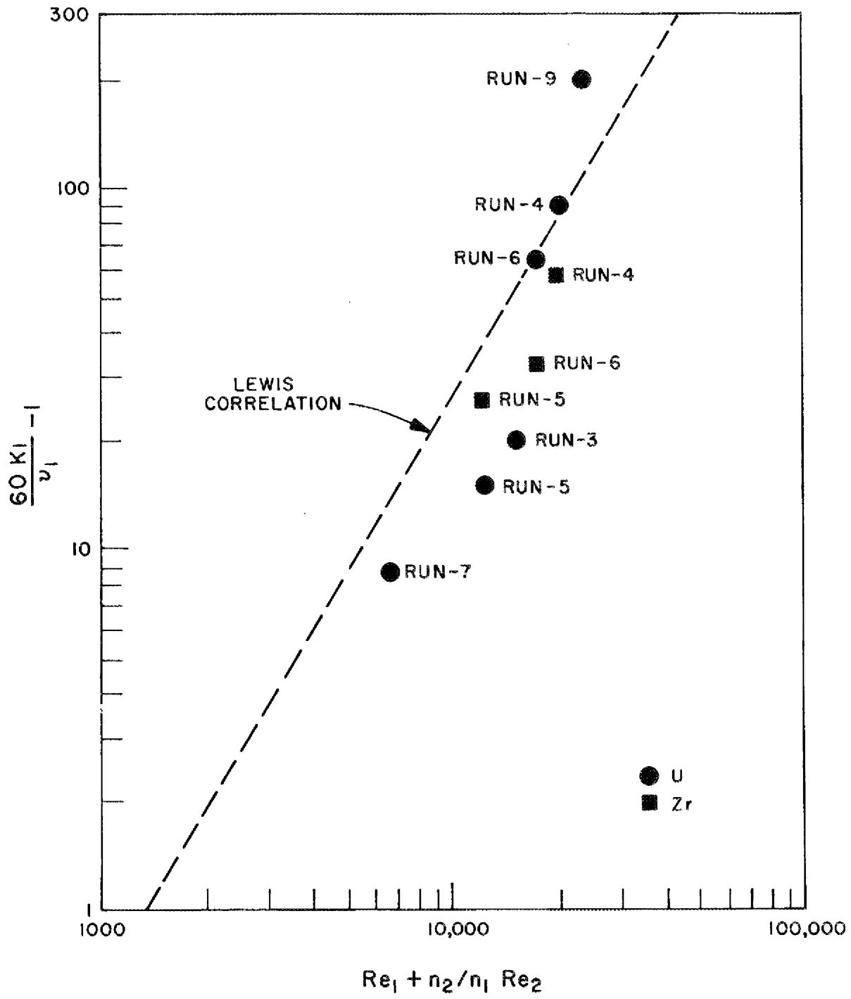  
Fig. 8. Mass transfer results measured in the salt-bismuth contactor with $^{237}\mathrm{U}$ and $^{97}\mathrm{Zr}$ tracers, compared to the values predicted by the Lewis correlation.

In Fig. 8 it can be seen that the mass transfer group based on uranium for runs 3, 5, and 7 is between $33\%$ and $65\%$ of the Lewis correlation, while that same group for runs 4, 6, and 9 is greater than $100\%$ of the Lewis correlation. Run 8 was not shown because of the malfunction of the agitator drive. In all but one case, the mass transfer results based on zirconium are consistently slightly less than the values based on uranium. This discrepancy is probably related to the inability to correct for the self-absorption of the $743.37 \mathrm{keV} \beta^{-}$ from the $97 \mathrm{Zr}$ in the solid bismuth samples.

Results from the runs performed in the nondispersed regime, runs TSMC-3, -5, and -7, suggest that the dependence of the mass transfer group on the Reynolds number group is slightly less than that predicted by the Lewis correlation. The exponent appears to be closer to 1.0 than to 1.65. This is consistent with the Lewis data which show that for a single aqueous-organic system, the exponent on the Reynolds number group is more nearly 1.0 than 1.65.

We believe that the initiation of entrainment of salt into the bismuth begins to occur at a stirrer speed between 160 and 180 rpm. The apparent increase in mass transfer coefficient is a manifestation of an increase in the surface area for mass transfer due to surface motion. This effect is verified by the high mass transfer rates measured in runs 4, 6, and 9. Experiments with water-mercury and water-methylene bromide systems support the belief that phase dispersal is present at agitator speeds near 180 rpm.

It is possible that at high agitator rates (> 170 rpm) some salt or bismuth is entrained in the other phase and is carried out of the contactor. This effect is detectable if sufficient settling time is not available between the times when the salt and bismuth exit from the contactor and when the flowing stream samples are taken. Figure 9 shows the results of analysis for beryllium in the bismuth flowing stream samples taken in runs TSMC-5, -6, and -9, which were performed at 124, 180, and 244 rpm, respectively.

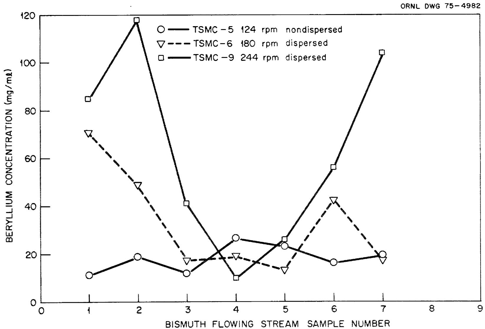  
Fig. 9. Beryllium concentration in the bismuth flowing stream samples.

It is assumed that any beryllium present in the salt is due to entrainment of salt in the bismuth phase. From Fig. 9, it is seen that when dispersion is suspected there is more beryllium, and hence salt, present in the bismuth stream, at least near the beginning and near the end of a run. In the middle of a run, agitator speed does not seem to have an effect on the amount of beryllium in the bismuth. The effect of salt entrainment in the bismuth is most significant in the metal transfer process where the presence of fluoride ions in the lithium chloride has a deleterious effect on the separation between the rare earths and thorium.

Analyses of bismuth in the salt samples could not be obtained. However, no gross amounts of bismuth were indicated from the weights of the salt samples. It is possible to take advantage of the increased mass transfer rate afforded by mild dispersal of the salt and bismuth phases in a stirred contactor without imposing any detrimental effects to the reactor vessel, or adding a large burden to the bismuth removal step. We plan to make a series of runs at high agitator speeds to investigate more closely the magnitude of entrainment effects in this type of contactor.

5. SALT-METAL CONTACTOR DEVELOPMENT: EXPERIMENTS WITH A MECHANICALLY AGITATED, NONDISpersING CONTACTOR USING WATER AND MERCURY

C. H. Brown, Jr.

We have continued development of a two-phase nondispersing contactor using water and mercury to simulate molten fluoride salt and bismuth.

During this report period, several runs were made in the water-mercury system at an elevated temperature to determine if the assumption that the reaction under consideration,

$$
\mathrm {P b} ^ {2 +} \left[ \mathrm {H} _ {2} \mathrm {O} \right] + \mathrm {Z n} \left[ \mathrm {H g} \right]\rightarrow \mathrm {Z n} ^ {2 +} \left[ \mathrm {H} _ {2} \mathrm {O} \right] + \mathrm {P b} \left[ \mathrm {H g} \right], \tag {1}
$$

is instantaneous. We have also initiated experiments to determine if polarography is a viable alternative method for determining individual

water-phase mass transfer coefficients in the nondispersing stirred interface contactor.

# 5.1 Runs at Elevated Temperatures with the Lead Ion-Zinc Amalgam System

Several runs were made in which the temperature of the contactor and reactants was raised to approximately $40^{\circ}\mathrm{C}$ . The results from these tests are inconclusive, because it was found that at this elevated temperature, hydrochloric acid, which was present in the aqueous phase to prevent oxide formation at the mercury surface, reacted with zinc to form zinc chloride. This makes the mass transfer analysis more difficult by interducing a competing reaction. Also, depletion of the acid caused formation of a spongy lead compound on the agitator blades and at the water-mercury interface.

# 5.2 Polarographic Determination of Mass Transfer Coefficients

Polarography has been suggested as an alternate method for determining the water-phase mass transfer coefficient in the water-mercury contactor. The necessary experimental equipment has been assembled and preliminary tests have been made to determine: (1) a suitable redox couple, and (2) an electrolyte which will produce the desired polarization curve while being chemically inert to mercury.

# 5.2.1 Theory

The polarographic technique for determining mass transfer coefficients involved oxidation of a reduced species or reduction of an oxidized species at an electrode which is at a condition of concentration polarization.

One system that has been studied previously is the reduction of ferricyanide ions at a polarized nickel electrode. As ferricyanide was reduced at the cathode, ferrocyanide was oxidized at the anode. There was no net consumption of chemicals or change in the composition of the electrolyte solution.

Polarization of the cathode can be accomplished in one of two ways -- either the cathode surface area is made very large with respect to the

anode surface area, or the concentration of the oxidized species is made very small with respect to the reduced species.

The migration of an ion in both electric and concentration fields is described by the Nernst-Planck equation:

$$
Q = D \left(\nabla C + \frac {Z C F}{R T} \nabla \Phi\right), \tag {2}
$$

where

$$
\begin{array}{l} C = \text {c o n c e n t r a t i o n} \\ Q = \text {f l u x} \text {o f t h e i o n , m o l e s c m} ^ {- 2} \sec^ {- 1} \\ D = \text {d i f f u s i o n} \quad \text {c o e f f i c i e n t}, \quad \mathrm {c m} ^ {2} / \sec , \\ Z = \text {v a l e n c e} \\ R = \text {g a s} \\ \mathrm {T} = \text {a b s o l u t e} ^ {\prime} \text {t e m p e r a t u r e}, ^ {\prime} \mathrm {K}, \\ F = \text {F a r a d a y} \quad \text {c o n s t a n t}, \quad {} ^ {\circ} C / \text {m o l e}, \\ \Phi = \text {e l e c t r i c p o t e n t i a l}, V. \\ \end{array}
$$

The first term in the expression represents the contribution of ordinary diffusion to the flux, and the second term represents the contribution of electromigration. A large concentration (relative to that of the reacting ion) of an inert electrolyte alters the dielectric properties of the solution such that the potential will decrease smoothly across the region between the electrodes, while the concentration drops sharply across the thin polarized layer near the cathode. Thus, the term containing the electric potential becomes relatively small, and

$$
Q \approx D \nabla C. \tag {3}
$$

The current flowing between the electrodes is thus a measure of mass transfer rates governed by ordinary molecular diffusion. This current is sometimes called the "diffusion current."

The impressed current across the cell is proportional to the mass flux across the stagnant layer between the bulk electrolyte and the polarized cathode, and the mass transfer coefficient is given by:

$$
K = \frac {I}{(Z) (A) (F) (C _ {B})}, \tag {4}
$$

where

$k =$ mass transfer coefficient through the film, cm/sec,

$\mathbf{I} =$ polarization current, A,

A = area of the polarized electrode, $\mathrm{cm}^2$ , and

$C_B =$ concentration in g-moles/cm $^3$ of transferring species in the bulk liquid.

Hence, it is possible to determine mass transfer rates from the bulk electrolyte to the electrode surface using experimentally determined values for I, $C_B$ , and A.

# 5.2.2 Experimental equipment

The experimental apparatus which will be used to measure mass transfer rates in the water-mercury stirred contactor is shown schematically in Fig. 10. The equipment consists of the 5- by 7-in. Plexiglas contactor which was used in previous work with the water-mercury system. The mercury surface in the contactor acts as the cathode in the electrochemical cell. The cathode is electrically connected to the rest of the circuit by a 1/8-in.-diam stainless steel welding rod which is electrically insulated from the electrolyte phase by a Teflon sheath. The anode of the cell is suspended in the aqueous electrolyte phase, and consists of a 1/8-in.-thick piece of nickel sheet which is formed to fit the inner perimeter of the Plexiglas cell. The current through the cell is inferred from the voltage drop across a $0.1\Omega \pm 0.5\%$ , 10-W precision resistor. The signal produced across the resistor is recorded as the y coordinate on a Hewlett-Packard x,y plotter. The x coordinate on the plotter is produced by the voltage supplied to the cell, which is a direct signal from the O to 10 V, O to 10 A Hewlett-Packard direct current power supply.

# 5.2.3 Experimental results

Several different electrolyte solutions have been evaluated on the basis to two different criteria: (1) the electrolyte must be chemically inert to mercury, and (2) it must be possible to polarize the mercury surface with the given electrolyte. The different electrolytes that have

ORNL DWG. 75-813 RI

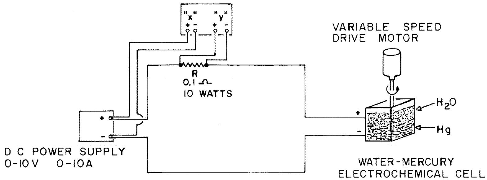  
X,Y PLOTTER   
Fig. 10. Schematic diagram of the equipment used to measure polari-zation currents in the water-mercury electrochemical cell contactor.

been examined are: (1) potassium ferro- and ferricyanide with a sodium hydroxide supporting electrolyte; (2) potassium ferro- and ferricyanide with a sodium chloride supporting electrolyte; (3) potassium ferro- and ferricyanides with a sodium nitrate supporting electrolyte; (4) ferrous and ferric sulfate with a sodium hydroxide supporting electrolyte; and (5) ferrous and ferric sulfate with sulfuric acid as the supporting electrolyte.

None of the electrolytes mentioned above met both of the imposed criteria. The ferrous and ferric sulfate system with sulfuric acid as the indifferent electrolyte was the only combination which proved to be chemically inert to the mercury cathode. It was found, however, that at a voltage less than sufficient to polarize the mercury cathode, the ferric ions reacted with the mercury cathode. This phenomenon has been previously reported in the literature.[6]

Kolthoff and Lingane report that the following reaction occurs when ferric ions are contacted with mercury:

$$
2 \mathrm {F e} ^ {3 +} 2 \mathrm {H g} = 2 \mathrm {F e} ^ {2 +} + \mathrm {H g} _ {2} ^ {2 +}; \tag {5}
$$

therefore, the half-wave potential of ferric ions cannot be measured directly.

The reversible oxidation and reduction of ferrous and ferric ions have been reported feasible when the iron ions are complexed with excess oxalate ions. This system will be examined in detail and applied to the experiment under development.

# 6. FUEL RECONSTITUTION DEVELOPMENT: INSTALLATION OF EQUIPMENT FOR A FUEL RECONSTITUTION ENGINEERING EXPERIMENT

R. M. Counce

The reference flowsheet for processing the fuel salt from a molten salt breeder reactor (MSBR) is based upon removal of uranium by fluorination to $\mathrm{UF_6}$ as the first processing step. The uranium removed in this step must subsequently be returned to the fuel salt stream before it

returns to the reactor. The method used for recombining the uranium with the fuel carrier salt (reconstituting the fuel salt) is to absorb gaseous $\mathrm{UF}_6$ into a recycled fuel salt stream containing dissolved $\mathrm{UF}_4$ by utilizing the reaction:

$$
\mathrm {U F} _ {6} (\mathrm {g}) + \mathrm {U F} _ {4} (\mathrm {d}) = 2 \mathrm {U F} _ {5} (\mathrm {d}). \tag {6}
$$

The resultant $\mathrm{UF}_5$ would be reduced to $\mathrm{UF}_4$ with hydrogen in a separate vessel according to the reaction:

$$
\mathrm {U F} _ {5 (d)} + 1 / 2 \mathrm {H} _ {2 (g)} = \mathrm {U F} _ {4 (d)} + \mathrm {H F} (g). \tag {7}
$$

We are beginning engineering studies of the fuel reconstitution step in order to provide the technology necessary for the design of larger equipment for recombining $\mathrm{UF}_6$ generated in fluorinators in the processing plant with the process fuel salt returning to the reactor. During this report period, installation of equipment previously described was continued. This report describes the general gas supply systems, documents the equipment installation, and describes the initial salt preparation.

# 6.1 Gas Supply Systems

The $\mathbf{U}\mathbf{F}_{6}$ for the fuel reconstitution engineering experiment is available in 5-in.-diam by 36-in.-high cylinders containing up to 55 lb of $\mathbf{U}\mathbf{F}_{6}$ . The $\mathbf{U}\mathbf{F}_{6(g)}$ will be supplied to this experiment by maintaining the temperature of the $\mathbf{U}\mathbf{F}_{6}$ cylinder at $220^{\circ}\mathbf{F}$ , and at a vapor pressure of 70 psia. This heating will be accomplished by use of 17.2-psia steam.

The steam heats the cylinders directly through 3/8-in. copper tubing, which is coiled around the entire cylinder. The lower 18 in. of the cylinder and tubing is covered with a conductive cement to minimize response time. The cylinder and associated valves are then enclosed in a cabinet insulated with 2 in. of Fiberglas insulation.

Purified argon will be used for all applications requiring an inert gas (e.g., pressurization of tanks for transferring salt, dip-leg bubblers for liquid level measurements, purging of equipment and lines, etc.). Cylinder argon is passed through a bed of titanium sponge where water and oxygen are removed. This bed operates at $825^{\circ}\mathrm{C}$ .

Cylinder hydrogen is purified sufficiently by passing it through a Deoxo unit, where oxygen is converted to water. No further purification of the nitrogen is needed, since it is sufficiently pure for use in calibrating the gas density cells.

# 6.2 Equipment Installation

The equipment for the fuel reconstitution engineering experiment is being installed in the northeast corner of the bay in Building 7503. The experiment is operated remotely from a control room in the building, although the gas flow controllers and some other equipment are located in the bay.

The experimental equipment is shown in Figs. 11-14 before the addition of thermal insulation. Fig. 11 is an overall sideview of the equipment showing the feed and receiver tanks, titanium sponge trap, $\mathsf{H}_2$ reduction column and its jackleg and sample port, and the HF and UF traps. Figure 12 is an overall front view of the experiment showing the gas control panel feed and receiver tanks, the top of the UF absorption vessel, and the H2 reduction column and its effluent stream sample port. Figure 13 shows a view of the lower portion of the H2 reduction column and its jackleg, and the instruments for measuring the depth of the feed and receiver tanks. A view of the HF and UF traps (packed beds of NaF pellets) and the in-line gas density detectors is shown in Fig. 14.

The electrical supply panel is located in a remote control room, and is shown in Fig. 15. Temperature is controlled by manual adjustment of heater voltage and by automatic on-off controllers.

Figure 16 shows the temperature recorders and temperature controllers for major vessels and the gas density cells. Also shown are level and flow recorders and controllers. The instruments at the right of the control panel are recorders associated with the gas density cells.

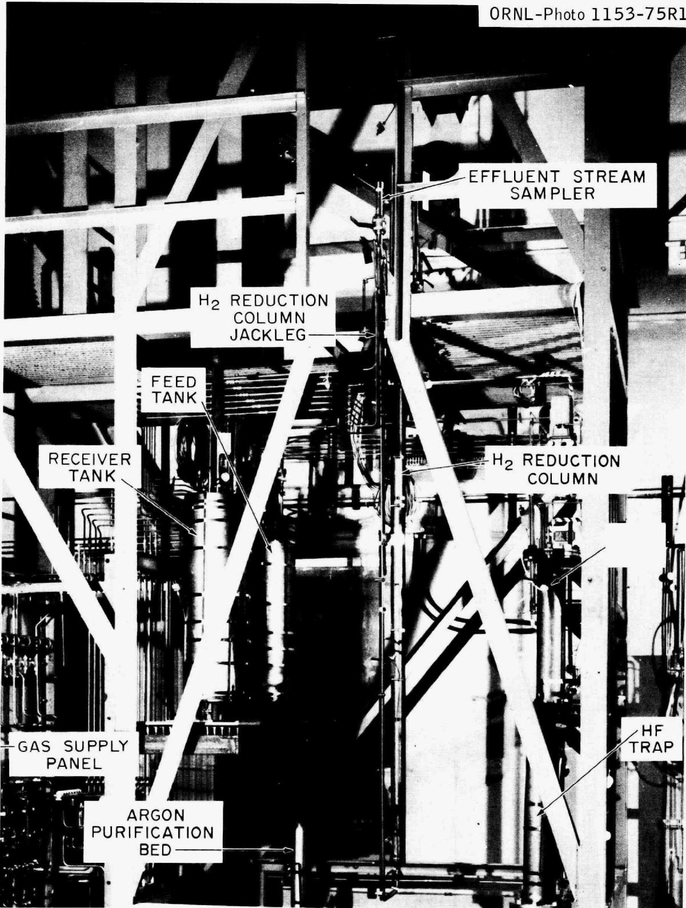  
Fig. 11. Overall side view of equipment for Fuel Reconstitution Engineering Experiment before addition of thermal insulation.

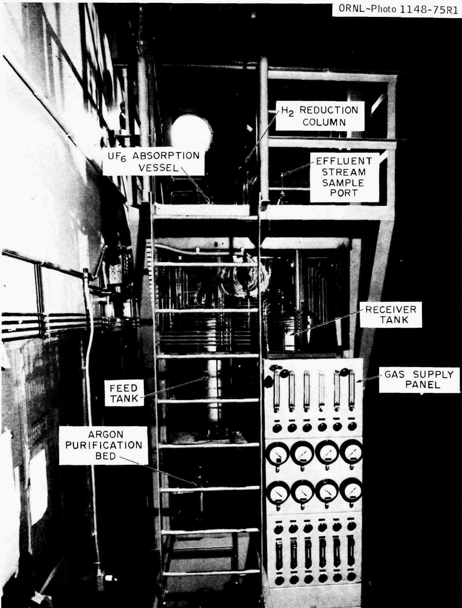  
Fig. 12. Overall front view of Fuel Reconstitution Engineering Experiment showing gas control panel.

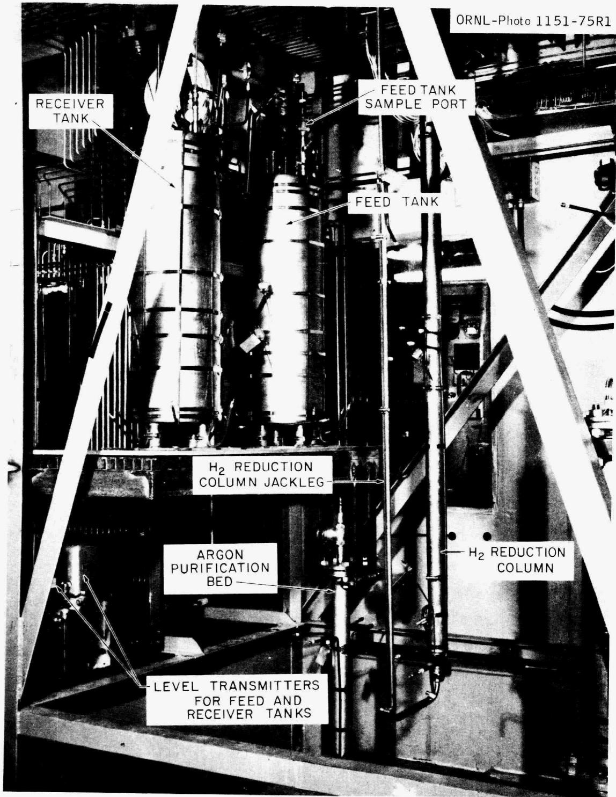  
Fig. 13. View of installed feed tank and receiver, titanium sponge trap, and bottom of hydrogenation column.

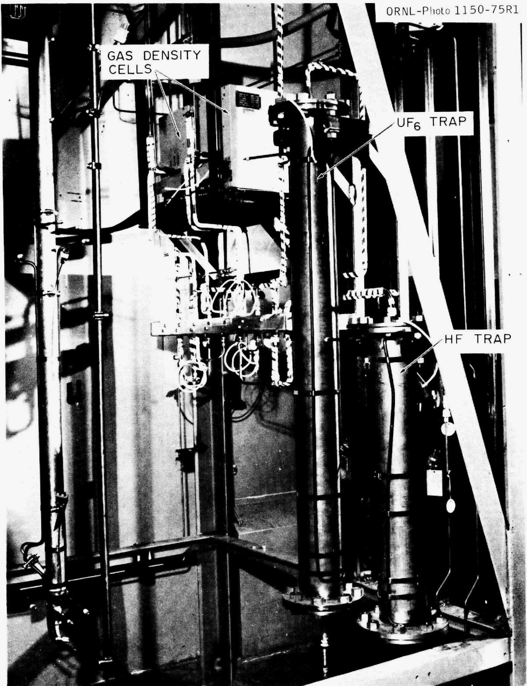  
Fig. 14. View of sodium fluoride traps and in-line gas density detectors.

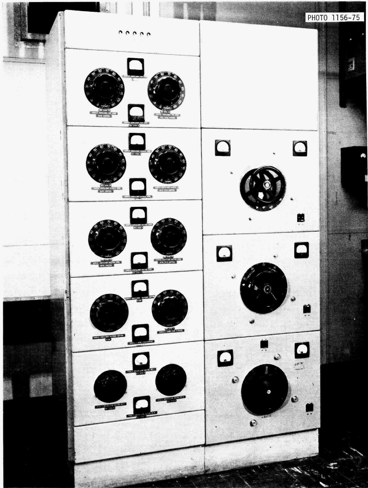  
Fig. 15. Electrical supply panel for Fuel Reconstitution Engineering Experiment.

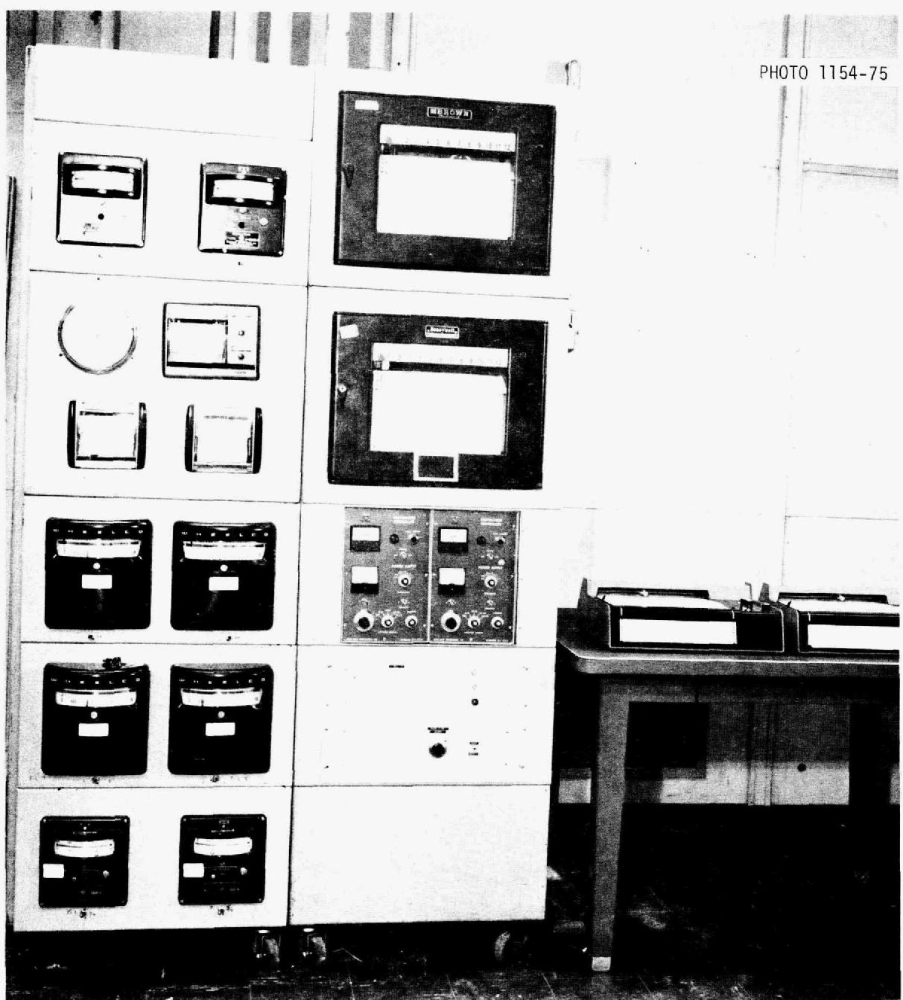  
Fig. 16. Panelboard for Fuel Reconstitution Engineering Experiment temperature, level, and flow recorders and controllers.

6.3 $\mathbf{H}_2$ -HF Treatment of Salt from Autoresistance Heating Tests

The first series of experiments will use $86\mathrm{kg}$ of fuel salt, formerly used in AHT-3. To remove oxides present in the salt, it was sparged with a $\mathsf{H}_2$ -HF mixture in Bldg. 3541. The metal oxides were removed according to the following generalized reaction:

$$
\mathrm {X H F} (\mathrm {g}) + \mathrm {M O x} / 2 (\mathrm {d}) \stackrel {\rightarrow} {\mathrm {M F}} _ {\mathrm {x}} (\mathrm {d}) + \mathrm {x} / 2 \mathrm {H} _ {2} \mathrm {O} (\mathrm {g}), \tag {8}
$$

where

$(g) =$ gaseous   
(d) $=$ dissolved

$\mathbf{x} =$ number of moles

M = metal species found in salt.

The HF was diluted with $\mathbf{H}_2$ in order to prevent excessive attack on vessel and piping. The HF concentration in the mixture was 33 vol%. The nominal total flow rate was 15 scfh.* The HF flow was set by controlling the pressure drop across a capillary; the $\mathbf{H}_2$ flow was set by use of a rotameter and was checked by a wet-test meter.

The HF utilization was determined by using an aqueous scrubber and a small $(0.05\mathrm{ft}^3/\mathrm{rev})$ wet-test meter in parallel with the NaF trap for sampling the gas fed to the treatment vessel or leaving the vessel. The concentration of HF in the gas stream was determined by passing the gas through $250\mathrm{ml}$ of a $0.4\mathrm{N}$ NaOH solution in the scrubber. When $0.05\mathrm{ft}^3$ of $\mathsf{H}_2$ had passed through the wet-test meter, the gas flow was stopped and the solution was removed for analysis. The HF concentration in the gas was determined by titrating small samples of the scrubbing solution with $0.1\mathrm{N}$ HCl. Both the feed and the discharge streams were monitored in this manner. Utilization of the HF was calculated from the feed and discharge concentrations. The HF utilization decreased from an initial value of about $50\%$ to about $25\%$ after 20 hr. The HF utilization remained at $25\%$ for the last 10 hr.

Reduction of corrosion product fluorides, principally $\mathrm{NiF}_2$ , $\mathrm{FeF}_2$ , and $\mathrm{CrF}_2$ , will proceed after verification of oxide removal. Of the corrosion products present in the salt, a hydrogen sparge will reduce only $\mathrm{NiF}_2$ in a practical time period; thus, $\mathrm{CrF}_2$ and possibly $\mathrm{FeF}_2$ will be reduced with Th metal.

After the reduction of the corrosion fluorides to their metallic form, they will be filtered from the mixture as it is decanted into a fuel reconstitution experiment vessel. Sufficient $\mathrm{UF_4}$ will be added to bring the concentration in the salt to 0.0125 mole % after the salt has been transferred to the fuel reconstitution equipment.

# 7. REFERENCES

1. H. C. Savage, Engineering Development Studies for Molten-Salt Breeder Reactor Processing No. 20, ORNL-TM-4870 (in preparation).   
2. J. B. Lewis, Chem. Eng. Sci. 3, 248-59 (1954).   
3. J. A. Klein, MSR Program Semiann. Progr. Rept. Aug. 31, 1974, ORNL-5011.   
4. C. H. Brown, Jr., MSR Program Semiann. Progr. Rept. Feb. 28, 1975, ORNL-5047.   
5. J. S. Watson, "A Study of Detached Turbulence Promoters for Increasing Mass Transfer Rates in Aqueous Chemical Flow," Ph.D. Thesis, University of Tennessee (1967).   
6. I. M. Kolthoff and J. J. Lingane, Polarography, 1st ed., Interscience, New York, 1946.   
7. R. M. Counce, Engineering Development Studies for Molten-Salt Breeder Reactor Processing No. 20, ORNL-TM-4870 (in preparation).

# INTERNAL DISTRIBUTION

1-2. MSRP Director's Office

3. C. F. Baes, Jr.   
4. C. E. Bamberger   
5. J. Beans   
6. M. Bender   
7. M. R. Bennett   
8. E. S. Bettis   
9. R. E. Blanco   
10. J. O. Blomeke   
11. E. G. Bohlmann   
12. J. Braunstein   
13. M. A. Bredig   
14. R. B. Briggs   
15. H. R. Bronstein   
16. R.E.Brooksbank   
17. C. H. Brown, Jr.   
18. K.B.Brown   
19. J. Brynestad   
20. S. Cantor   
21. D. W. Cardwell   
22. W. L. Carter   
23. W.H.Cook   
24. R.M.Counce   
25. J. L. Crowley   
26. F. L. Culler   
27. J.M.Dale   
28. F. L. Daley   
29. J.H.DeVan   
30. J. R. DiStefano   
31. W. P. Eatherly   
32. R. L. Egli, AEC-OSR   
33. J. R. Engel   
34. G. G. Fee   
35. D. E. Ferguson   
36. L. M. Ferris   
37. L. O. Gilpatrick   
38. W. S. Groenier   
39. J. C. Griess

40. W.R.Grimes   
41. R. H. Guymon

42-51. J.R.Hightower, Jr.   
52. B.F.Hitch   
53. R.W.Horton   
54. W.R.Huntley   
55. V. A. Jacobs   
56. C.W.Kee   
57. A. D. Kelmers   
58. W.R. Laing   
59. R.B.Lindauer   
60. R. E. MacPherson   
61. W.C.McClain   
62. H. E. McCoy   
63. A. P. Malinauskas   
64. C. L. Matthews   
65. R. L. Moore   
66. J.P.Nichols   
67. H. Postma   
68. M. W. Rosenthal   
69. H. C. Savage   
70. W. F. Schaffer, Jr.   
71. C. D. Scott   
72. M.J. Skinner   
73. F. J. Smith   
74. G.P. Smith   
75. I. Spiewak   
76. O.K. Tallent   
77. L. M. Toth   
78. D. B. Trauger   
79. W.E.Unger   
80. J. R. Weir   
81. M. K. Wilkinson   
82. R.G.Wymer   
84. Central Research Library   
85. Document Reference Section   
88. Laboratory Records   
89. Laboratory Records (LRD-RC)

# CONSULTANTS AND SUBCONTRACTORS

90. J.C.Frye   
91. C.H. Ice   
92. J.J.Katz   
93. E. A. Mason   
94. Ken Davis   
95. R. B. Richards

# EXTERNAL DISTRIBUTION

96. Research and Technical Support Division, ERDA, Oak Ridge Operations Office, P. O. Box E, Oak Ridge, Tenn. 37830   
97. Director, Reactor Division, ERDA, Oak Ridge Operations Office, P. O. Box E, Oak Ridge, Tenn. 37830

98-99. Director, ERDA Division of Reactor Research and Development, Washington, D. C. 20545

100-201. For distribution as shown in TID-4500 under UC-76, Molten Salt Reactor Technology