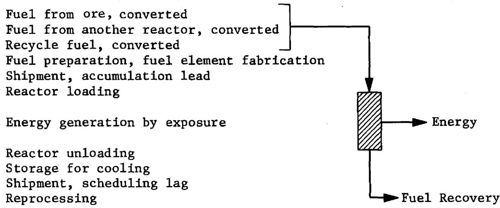

# On Nuclear Fuel, Mass Balances, Conversion Ratio, Doubling Time and Uncertainty

D. R. Vondy

OAK RIDGE NATIONAL LABORATORY

CENTRAL RESEARCH LIBRARY

DOCUMENT COLLECTION

LIBRARY LOAN COPY

DO NOT TRANSFER TO ANOTHER PERSON

If you wish someone else to see this

document, send in name with document

and the library will arrange a loan.

UCN-7969

(3) 8-671

OAK RIDGE NATIONAL LABORATORY

OPERATED BY UNION CARBIDE CORPORATION FOR THE ENERGY RESEARCH AND DEVELOPMENT ADMINISTRATION

Printed in the United States of America. Available from

National Technical Information Service

U.S. Department of Commerce

5285 Port Royal Road, Springfield, Virginia 22161

Price: Printed Copy $5.00; Microfiche $2.25

This report was prepared as an account of work sponsored by the United States Government. Neither the United States nor the Energy Research and Development Administration/United States Nuclear Regulatory Commission, nor any of their employees, nor any of their contractors, subcontractors, or their employees, makes any warranty, express or implied, or assumes any legal liability or responsibility for the accuracy, completeness or usefulness of any information, apparatus, product or process disclosed, or represents that its use would not infringe privately owned rights.

Contract No. W-7405-eng-26

NEUTRON PHYSICS DIVISION

ON NUCLEAR FUEL, MASS BALANCES, CONVERSION RATIO, DOUBLING TIME AND UNCERTAINTY

D. R. Vondy

Date Published: November 1976

OAK RIDGE NATIONAL LABORATORY

Oak Ridge, Tennessee 37820

operated by

UNION CARBIDE CORPORATION

for the

ENERGY RESEARCH AND DEVELOPMENT ADMINISTRATION

# CONTENTS

# Page

Abstract 1   
Introduction 1   
Conversion Ratio 5   
Criticality 7   
9   
Stable Breeder-Converter Industry 13   
Doubling Time 17   
Breeder Industry Economic Benefit 29   
Defining Nuclear Fuel 40   
Standard Definitions, Recommendations 53   
Uncertainty 55   
Example Effect of Uncertainty on Breeding Ratio 60

# Abstract

This study addresses certain aspects of analysis of performance of and projections for nuclear reactor power plants.

# Introduction

There is considerable interest in the performance characteristics of nuclear power plants. Concern over availability of fuel from ore leads directly to emphasis on the development of plants which breed fuel. This discussion addresses several aspects of performance analysis, some of which have received attention in the literature.[1-9]

Consider an installed nuclear power capacity of $N$ plants designed for an average power level $P$ each and operating at an effective load factor of $u$ (total power level relative to total design power level). The rate of energy generation is given by

$$
\frac {\mathrm {d} \mathbf {E}}{\mathrm {d} t} = \mathbf {u P N}. \tag {1}
$$

Given an effective rate of nuclear fuel consumption per unit energy generation, and the fraction useful energy conversion, $\eta$ , the rate of fuel consumption is known,

$$
\frac {\mathrm {d} \mathbf {F}}{\mathrm {d} t} = \frac {\mathrm {d} \mathbf {F}}{\eta \mathrm {d} E} \frac {\mathrm {d} E}{\mathrm {d} t} = \frac {u}{\eta} P N \frac {\mathrm {d} F}{\mathrm {d} E}. \tag {2}
$$

Here dF/dE refers to the destruction of nuclear fuel per unit energy generated.

The amount of useful energy produced over a time interval $T$ is given by

$$
E _ {e} (T) = \int_ {0} ^ {T} \frac {d E}{d t} d t = u P N T. \tag {3}
$$

The amount of fuel consumed over this period is given by

$$
F (\dot {T}) = \int_ {0} ^ {T} \left[ \frac {d F}{d t} \right] d t = \int_ {0} ^ {T} \frac {u}{\eta} P N \left[ \frac {d F}{d E} \right] d t
$$

$$
F (T) = \frac {u}{\eta} P N T \frac {d F}{d E} = \frac {E _ {e}}{\eta} \frac {d F}{d E}. \tag {4}
$$

Mean values of the variables were assumed to be appropriate.

The conversion ratio $C$ is defined as the rate of fuel generation relative to the rate of fuel consumption. Given a consumption of $F(T)$ , the production is $CF(T)$ , and the difference between generation and consumption is net production,

$$
\Delta F (T) = (C - 1) F (T) = (C - 1) \frac {E _ {e}}{\eta} \frac {d F}{d E}. \tag {5}
$$

Thus if $C < 1$ , fuel is used, while for $C > 1$ , fuel is produced or bred. In common terminology, when $C > 1$ , it is called the breeding ratio.

Given a fuel inventory associated with each plant of I, the committed amount of fuel is IN. The net production of fuel, or consumption of it if negative, relative to the committed inventory, is given by

$$
\frac {\Delta F (T)}{I N} = \frac {P T}{I} \frac {u}{\eta} (C - 1) \frac {d F}{d E}. \tag {6}
$$

For $C > 1$ , when this ratio is unity, the amount of fuel produced equals the inventory, and the required time may be interpreted as a doubling time,

$$
\mathrm {T} _ {\mathrm {d i}} = \frac {\mathrm {I}}{\mathrm {P}} \left[ \frac {\eta}{\mathrm {u}} \right] \frac {1}{(\mathrm {C} - 1) \frac {\mathrm {d F}}{\mathrm {d E}}} \tag {7}
$$

Thus the time required to double the inventory is proportional to the inventory and to the energy conversion efficiency, and inversely proportional to the other contributions considered. Note that the factor (C - 1) dF/dE is of basic interest, relative to the fuel inventory. P/I is the power level per unit fuel inventory. Decreasing the energy conversion efficiency reduces the doubling time (but it also increases the energy throw away and seriously affects exposure and power density). A short doubling time is associated with a high load factor.

Demand for expanding capacity (new, replacing old plants, or both) can be satisfied by breeder plants. Consider expansion in generating capacity in the form

$$
\frac {\mathrm {d} \mathrm {N} (\mathrm {t})}{\mathrm {d t}} = \mathrm {b N} (\mathrm {t}); \tag {8}
$$

$$
\frac {\mathrm {N} (\mathrm {t} + \mathrm {T})}{\mathrm {N} (\mathrm {t})} = \mathrm {e} ^ {\mathrm {b T}}. \tag {9}
$$

Doubling the capacity requires this ratio to double,

$$
e ^ {b T _ {d c}} = 2; \tag {10}
$$

$$
T _ {d c} = \frac {\ell n 2}{\frac {d N (t)}{N (t) d T}}. \tag {11}
$$

This denominator is simply $\frac{\Delta F(T)}{TIN}$ or $\frac{1}{T_{di}}$ ;

$$
\mathrm {T} _ {\mathrm {d c}} = \mathrm {T} _ {\mathrm {d i}} \ell n 2. \tag {12}
$$

This study is directed at a better understanding of the requirements for analysis by examining the equations for specific situations.

Although the above equations are rather basic, their use can only be rather casual; application is subject to interpretation. The "associated fuel inventory" is not defined. Can conversion ratio be determined adequately from neutron reaction rates? What is fuel? What are the effects of fueling plants discretely and losing material in processing?

Does realistic analysis demand more sophisticated formulas? What are the effects of uncertainties?

# Conversion Ratio

A basic, generic formulation for the conversion ratio is

$$
C = \frac {\text {R a t e o f f u e l g e n e r a t i o n}}{\text {R a t e o f f u e l d e s t r u c t i o n}},
$$

defined at a point in time. A primitive formulation is

$$
C p = \frac {R c}{X _ {f}} \quad , \tag {13}
$$

where the numerator is the integrated rate of neutron capture (n, no n) in fertile material,

$$
R _ {c} = \int_ {r} \int_ {E} \sum_ {n} N _ {n} (r) \sigma_ {c, n} (E) \phi (r, E) d E d r,
$$

where $\mathbf{N}_{\mathfrak{n}}(\mathbf{r})$ is the concentration of fertile nuclide n at location r, and $\phi (\mathbf{r},\mathbf{E})$ is the local neutron flux at energy E, and

$$
X _ {f} = \iint_ {r} \iint_ {E} \sum_ {m} N _ {m} (r) \sigma_ {a, m} (E) \phi (r, E) d E d r,
$$

where the fuel nuclides are indexed m. Special weighting may be applied, as importance by nuclide or by reaction rate type.

The conversion ratio may be expressed as the ratio of two time derivatives,

$$
C = \frac {\frac {d F}{d t} ^ {+}}{\frac {d F}{d t} -}, \tag {14}
$$

where the superscripts refer to generation $(+)$ and destruction $(-)$ .

The conversion ratio may be related to the mass balances for a period of plant operation (fuel exposure). Let $\mathbf{F}_{\mathbf{f}}$ be the amount of fuel supplied (a batch of fuel assemblies or a representative particle of material), and $\mathbf{F}_{\mathbf{d}}$ be the amount of fuel discharged subject to recovery,

$$
F _ {d} = F _ {f} + \int_ {0} ^ {T} \left[ \frac {d F ^ {+}}{d t} - \frac {d F ^ {-}}{d t} \right] d t, \tag {15}
$$

and using mean values,

$$
F _ {d} = F _ {f} + \left[ \frac {d F ^ {-}}{d t} \right] \int_ {0} ^ {T} \left\{\left[ \frac {\frac {d F ^ {+}}{d t}}{\frac {d F ^ {-}}{d t}} \right] - 1 \right\} d t,
$$

$$
F _ {d} = F _ {f} + T \left[ \frac {d F ^ {-}}{d t} \right] \quad (C - 1).
$$

Considering the relationship between the power level and the energy generated, $\mathrm{dE} = \mathrm{Pdt}$ , the use of mean values yields the more fundamental formulation

$$
F _ {d} = F _ {f} + \frac {E _ {e}}{\eta} \left[ \frac {d F}{d E} \right] \quad (c - 1). \tag {16}
$$

An effective conversion ratio may thus be defined from mass balances as

$$
C _ {e} = 1 + \frac {F _ {d}}{\frac {E _ {e}}{\eta}} \frac {- F _ {f}}{\frac {d F}{d E}}. \tag {17}
$$

If the primary use of the reported values for the conversion ratio is for analysis of fuel utilization, then that estimate which best predicts the fuel discharge by Equation 17 is the preferred one. What material is fuel must be decided, as is disussed later. Further, account should be taken of the difference between fuel discharged and fuel recovered for subsequent use.

# Criticality

A basic requirement for a nuclear plant is that the system be maintained critical (ignoring very short time behavior): the rate of generation of neutrons must equal the total rate of neutron loss. Fortunately the neutron half-life is sufficiently long that decay loss is negligible, leaving the overall neutron balance

$$
k (t) = \frac {\text {R a t e o f g e n e r a t i o n}}{\text {R a t e o f a b s o r p t i o n} + \text {l e a k a g e}} = \frac {G (t)}{X (t) + L (t)} = 1, \tag {18}
$$

where $L(t)$ is the surface leakage, small for large, reflected reactor cores,

$$
G (t) = \int_ {r} \int_ {E} \sum_ {n} N _ {n} (r) v \sigma_ {f, n} (E) \phi (r, E) d E d r, a n d
$$

$$
X (t) = \int_ {r} \int_ {E} \sum_ {n} ^ {N} _ {n} (r) \sigma_ {a, n} (E) \phi (r, E) d E d r.
$$

Expanding the contributions to the denominator of Equation 18,

$$
\begin{array}{l} \mathrm {G} _ {\mathrm {f}} = \mathrm {X} _ {\mathrm {f}} + \mathrm {R} _ {\mathrm {c}} + \mathrm {X} _ {\mathrm {f p}} + \mathrm {X} _ {\mathrm {c}} + \mathrm {X} _ {\mathrm {o}}, \\ \frac {\mathrm {R} _ {\mathrm {c}} + \mathrm {X} _ {\mathrm {f p}} + \mathrm {X} _ {\mathrm {c}} + \mathrm {X} _ {\mathrm {o}}}{\mathrm {X} _ {\mathrm {f}} \left[ \frac {\mathrm {G} _ {\mathrm {f}}}{\mathrm {X} _ {\mathrm {f}}} - 1 \right]} = 1, \tag {19} \\ \end{array}
$$

where

$$
\begin{array}{l} G _ {f} = \text {R a t e o f n e u t r o n p r o d u c t i o n} \\ X _ {f} = \text {R a t e o f n e u t r o n a b s o r p t i o n i n f u e l} \\ R _ {c} = \text {R a t e o f n e u t r o n c a p t u r e i n f e r t i l e m a t e r i a l} \\ X _ {f p} = \text {R a t e o f n e u t r o n a b s o r p t i o n i n f i s s i o n p r o d u c t s} \\ X _ {c} = \text {R a t e o f n e u t r o n a b s o r p t i o n i n c o n t r o l r o d} \\ \mathrm {X} _ {\mathrm {o}} = \text {A l l o t h e r l o s s e s}. \\ \end{array}
$$

Note that $G_{f} / X_{f}$ is an effective eta for the fuel mixture $(\nu \sigma_{f} / \sigma_{a})$ . In a reactor, this ratio tends to remain constant unless there is a large change in the neutron energy spectrum, except as shift occurs in the fuel mixture.

The power level is nearly proportional to $G_{f}$ . If there is net fuel consumption, the neutron flux level must increase to maintain the power level; this increases the terms in the numerator requiring control rod removal to reduce $X_{c}$ . If there is net fuel generation, control rod insertion may be required. As the fission product poisoning increases, approximately linearly with time, control rod absorptions must be reduced

for compensation. One objective in design is to reduce this swing, as by partial refueling or by tailoring the loading to improve the behavior.

Of primary interest in fuel utilization analysis is not the conversion ratio but C - 1. Expressing this in the primitive sense

$$
C - 1 = \frac {R _ {c}}{X _ {f}} = \frac {G _ {f}}{X _ {f}} - 2 - \left[ \frac {X _ {p f} + X _ {c} + X _ {o}}{X _ {f}} \right] \quad . \tag {20}
$$

Clearly $\mathrm{G_f / X_f}$ must be significantly greater than 2 if $\mathrm{C - 1 > 0}$ for breeding. Control rod losses, for example, directly reduce $\mathrm{C - 1}$ . Uncertainty in $\mathrm{C - 1}$ is directly related to reaction rates and is also dependent on the requirement for $\mathrm{X_c}$ to control reactivity swing and associated fuel inventory adjustments and their effects as a function of the multi-refueling history, not simply evaluated.

Results from calculations which ignore the requirements for a critical system and the losses in the neutron balance required for control generally have no more value than those ignoring practical design requirements.

# Primitive Economic Analysis

Evaluation of nuclear reactor plants includes economic considerations. The core design which is preferred under a set of economic conditions is that which will produce energy at the lowest cost. (Breeder plants are attractive for the future only because they are expected to produce

energy economically in competition with other schemes.) The cost of generating energy involves capital charges and operating costs which may have to be considered. Here the fuel cost component is addressed which could be from fuel ownership or rental.

Consider a reactor plant which achieves a quasi-equilibrium condition quickly so that examination of this situation is representative of the plant history. The life history of a fuel particle or the contents of a batch of fuel assemblies may be followed. There may be fuel make up from one or from another plant, fuel recycled from this reactor, and exposed fuel recovered for recycle or use in another reactor or sold or even thrown away. The history of interest is shown below for the general situation:

Losses of material occur in processing stages and through decay not shown explicitly. Also, complicated fueling schemes may not admit such a simple description.

An economic analysis requires that the costs associated with the above steps be determined per unit energy generated. Considering only those costs associated with fuel and not with processes, a simple formulation is as follows:

Let

$W_{f}$ be the unit value of fuel supplied,

$W_{r}$ be the unit value of fuel recovered,

$\mathbf{E}_{\mathbf{e}}$ be the associated energy generated,

Tf be the effective lead time,

T be the effective lag in recovery time,

i be the effective simple interest charge, and

be the loss fraction in recovery.

The total cost component of energy generation is given by the sum of direct and indirect (interest) costsa,

$$
\text {P a r t i a l E n e r g y C o s t} = \frac {1}{E _ {e}} \left[ W _ {f} F _ {f} \left(1 + i T _ {f}\right) - W _ {r} F _ {r} \left(1 - i T _ {e}\right) \right]. \tag {21}
$$

Note that the indirect costs are a direct consequence of displacement in time between the generation of energy (sale of it) and the purchase and sale of fuel (or its rental).

As shown in Equation 21, the basic data are fuel mass balances. For the more general economic analysis of a plant history, the basic data are still the mass balances. $^{1,2}$

A source of uncertainty in the economic analysis is the unit value of fuel. When one considers sale or purchase of fuel produced by a reactor plant, its value is not simply predicted. Generally a multi-plant economy would have to be considered and appropriate plant performances determined given the necessary coupling of the fuel cycles. A specific situation must be assessed. A special set of conditions is of considerable interest because of simplicity and applicability: The quasi-equilibrium cycle for a plant involving a set feed composition (from ore, from another reactor discharge, and/or recycle from this plant) and recovered fuel used in this plant or in others of the same type. The fuel cycle may involve full recycle or throw-away in part, or it may be for a breeder supplying fuel to inventory others of the same kind in an industry of expanding capacity. At some time in the future, a system consisting of two types of plants may be of primary interest with bred fuel used as make up for plants which do not breed. These situations avoid the uncertainty associated with assigning a unit value to recovered fuel; direct economic analysis is possible. Indeed the unneeded unit value of the fuel may be established, although it depends on the assumptions (formulation used and the economic parameters), and hence would be expected to have a relatively large uncertainty.

Recasting Equation 21 in terms of conversion ratio,

Partial Energy Cost = $\frac{\mathrm{F_f}}{\mathrm{E_e}}\left[\mathrm{W_f}(1 + \mathrm{iT_f}) - \mathrm{W_r}(1 - \mathrm{r})(1 - \mathrm{iT_e})\right]$

$$
- W _ {r} (1 - r) \left(1 - i T _ {e}\right) \left(\frac {1}{\eta}\right) \left[ \frac {d F}{d E} \right] (C - 1), \tag {22}
$$

useful for casual analysis. For $\mathrm{iT}_{\mathrm{e}} < 1$ , the last term increases the energy cost for $C < 1$ and decreases it for $C > 1$ ; low fuel cost for a breeder plant is anticipated due to the magnitude of this last term.

In projections for the future there has often been a disregard of the fact that increasing the conversion ratio (breeding ratio) in a reactor concept generally increases some of the components of the cost of power production. Under reasonable ground rules there is some optimum which must lie below the highest possible conversion ratio of minimum possible doubling time.

# Stable Breeder-Converter Industry

It is of interest to examine a possible future situation. Consider part of a nuclear power plant industry consisting of two reactor types. A fixed total power level is assumed, a fixed rate of energy generation. The first plant type produces excess fuel while the second type uses this excess as make-up. Parameters for the analysis are given below.

<table><tr><td>Reactor Plant Type</td><td>1</td><td>2</td></tr><tr><td>Conversion ratio</td><td>C1&gt;1</td><td>C2&lt;1</td></tr><tr><td>Fraction of reactor refueled</td><td>f1</td><td>f2</td></tr><tr><td>Average relative plant power level</td><td>g1</td><td>g2</td></tr><tr><td>Average fuel batch exposure time</td><td></td><td></td></tr><tr><td>Reference</td><td>t1</td><td>t2</td></tr><tr><td>At power level</td><td>t1/g1</td><td>t2/g2</td></tr><tr><td>Actual period between fuelings</td><td>q1=f1t1/g1</td><td>q2=f2t2/g2</td></tr><tr><td>Fuel per plant per fueling</td><td></td><td></td></tr><tr><td>From ore</td><td>Fa1</td><td>Fa2</td></tr><tr><td>Recycle (from same type)</td><td>Fx1</td><td>Fx2</td></tr><tr><td>Make-up (from other type)</td><td>-</td><td>Fm2</td></tr><tr><td>Recovered excess generation</td><td>Fe1</td><td>-</td></tr><tr><td>Number of plants operating</td><td>N1</td><td>N2</td></tr><tr><td>Annual refuelings</td><td>N1g1/f1t1</td><td>N2g2/f2t2</td></tr><tr><td>Reference plant power level</td><td>P1</td><td>P2</td></tr><tr><td>Plant power level</td><td>g1P1</td><td>g2P2</td></tr><tr><td>Total power level</td><td>N1g1P1</td><td>N2g2P2</td></tr><tr><td>Total Energy generation in time T</td><td>Q1=N1g1P1T</td><td>Q2=N2g2P2T</td></tr></table>

A mass balance on the fuel exchanged between the two types of plants gives

$$
\begin{array}{l} \frac {F _ {e 1} N _ {1}}{q _ {1}} = \frac {F _ {m 2} N _ {2}}{q _ {2}}, \\ \frac {\mathrm {N} _ {2}}{\mathrm {N} _ {1}} = \frac {\mathrm {F} _ {\mathrm {e} 1}}{\mathrm {F} _ {\mathrm {m} 2}} \left(\frac {\mathrm {q} _ {2}}{\mathrm {q} _ {1}}\right) \\ \frac {Q _ {2}}{Q _ {1}} = \frac {F _ {e 1}}{F _ {m 2}} \left(\frac {P _ {2} f _ {2} t _ {2}}{P _ {1} f _ {1} t _ {1}}\right) \tag {23} \\ \end{array}
$$

Basing fuel mass balances on conversion ratios,

$$
\begin{array}{l} F _ {e 1} = \left\{F _ {a 1} + (C _ {1} - 1) \frac {E _ {1}}{\eta_ {1}} \left. \frac {d F ^ {-}}{d E} \right| _ {1} \right\} (1 - r) - r F _ {x 1} \\ F _ {m 2} = (1 - c _ {2}) \frac {E _ {2}}{n _ {1}} \frac {d F ^ {-}}{d E} | _ {2} - F _ {a 2} + (\frac {r}{1 - r}) F _ {x 2} \\ \frac {\mathrm {N} _ {2}}{\mathrm {N} _ {1}} = \frac {\mathrm {F} _ {\mathrm {a} 1} + \left(\mathrm {c} _ {1} - 1\right) \frac {\mathrm {E} _ {1}}{\eta_ {1}} \frac {\mathrm {d F} ^ {-}}{\mathrm {d E}} \mid_ {1} (1 - \mathrm {r}) - \mathrm {r F} _ {\mathrm {x} 1}}{(1 - \mathrm {c} _ {2}) \frac {\mathrm {E} _ {2}}{\eta_ {2}} \frac {\mathrm {d F} ^ {-}}{\mathrm {d E}} \mid_ {2} - \mathrm {F} _ {\mathrm {a} 2} + (\frac {\mathrm {r}}{1 - \mathrm {r}}) \mathrm {F} _ {\mathrm {x} 2}} \quad \left(\frac {\mathrm {q} _ {2}}{\mathrm {q} _ {1}}\right). \tag {24} \\ \end{array}
$$

Considering the special situation where $\mathbf{F}_{\mathrm{al}} = \mathbf{F}_{\mathrm{a2}} = 0$ , and setting

$$
r = 0, \quad E _ {1} = f _ {1} t _ {1} P _ {1}, \quad a n d \quad E _ {2} = f _ {2} t _ {2} P _ {2},
$$

$$
\begin{array}{l} \frac {\mathrm {N} _ {2}}{\mathrm {N} _ {1}} \cong \frac {\left(\mathrm {C} _ {1} - 1\right)}{\left(1 - \mathrm {C} _ {2}\right)} \quad \frac {\mathrm {n} _ {2}}{\mathrm {n} _ {1}} \quad \left[ \begin{array}{l l} \frac {\mathrm {d F} ^ {-}}{\mathrm {d E}} & \\ \hline \frac {\mathrm {d F} ^ {-}}{\mathrm {d E}} & \end{array} \right] \frac {\mathrm {g} _ {1} ^ {\mathrm {P}} _ {1}}{\mathrm {g} _ {2} ^ {\mathrm {P}} _ {2}}; \\ \frac {Q _ {2}}{Q _ {1}} \cong \frac {\left(C _ {1} - 1\right)}{\left(1 - C _ {2}\right)} \quad \frac {n _ {2}}{n _ {1}} \quad \left[ \begin{array}{c c} \frac {\mathrm {d F} ^ {-}}{\mathrm {d E}} & \\ \frac {\mathrm {d F} ^ {-}}{\mathrm {d E}} & \end{array} \right] \tag {25} \\ \end{array}
$$

The ratio of the number of plants depends directly on the ratio of the rates of net fuel production and consumption and on the power levels at which the plants are operated. The electrical energy generation rates are in the ratio of the rates of fuel production and consumption. Primary contributions come from the energy conversion efficiencies and the amount of fuel consumed per unit product energy.

Consider the situation where type 2 plants are less expensive to build than type 1. The results indicate that given the flexibility, type 1 plants should be operated at the highest power level. Increasing the conversion ratios of both plant types may be desirable to increase the number of type 2 plants, but subject to detailed economic justification. There would be a payoff for increasing the efficiency of the type 1 plants at an associated increase in cost. These clues come from the formulation using conversion ratios; they must be representative for the situation to produce reasonable predictions from such casual analysis. Such casual conclusions are subject to more thorough analysis with consideration of all aspects. Required inventories, detailed scheduling and interruptions for refueling can be assessed given mass

balances for the fuel. These mass balances may be required under several operating conditions (different fractions of plant refueled, for example), for which the assumption that a value for the conversion ratio is representative may not hold. Loss in recovery should not be ignored.

For such analysis it is important that the fuel generated and the fuel used be the same thing. If consistent depletion calculations are made, there is no problem with mass balances for the heavy metals. But when casual analysis is done with conversion ratios, they should be on a common basis. If fuel is defined as the fissile nuclides (considering these as the primary thermal reactor fuel), then any attempt at optimization or choice between alternatives may produce a distorted result. Thus consideration should be given to the likely use of data such as conversion ratio in defining how it is to be calculated.

# Doubling Time

The doubling time of a specific breeder reactor type and design is used in the sense of supplying the inventory for two reactor plants from the fuel recovered from one under appropriate ground rules.2 The rate of growth of that segment of a power industry consisting of breeder plants is directly related to the doubling time. Only if the doubling time of breeder plants is appreciably shorter than the doubling time of the power industry can the fraction of plants which are breeders grow to dominate the industry in a reasonable time given limited fuel for inventory.

Consider a young and fractured nuclear breeder power industry in which the feed for a plant must come from its own discharge, from an external source, or from excess production. Given fuel balance data for a plant on the basis of the batch of material involved each refueling, with allowance for all losses, account can be made of the capability to inventory plants. The following terminology is used:

$$
\begin{array}{l} F _ {f} = \text {t o t a l f u e l f e e d} \\ F _ {x} = \text {r e c y c l e f e e d} \\ F _ {a} = \text {f e e d f r o m a n e x t e r n a l s o u r c e} \\ F _ {r} = \text {r e c o v e r e d f u e l} \\ F _ {e} = \text {e x c e s s r e c o v e r e d f u e l (a f t e r r e c y c l e t o t h e p l a n t)} \\ t _ {r} = \text {p e r i o d o f t i m e b e t w e e n f u e l i n g s}, \\ t _ {0} = \text {e x p o s u r e p e r i o d f o r a b a c h}, \\ \begin{array}{l} t _ {p} = \text {l a g t i m e b e t w e e n r e m o v a l a n d a v a i l a b i l i t y f o r s u b s e q u e n t} \\ \text {u s e (a f t e r c o o l i n g , s h i p p i n g , p r o c e s s i n g , r e f a b r i c a t i o n ,} \\ \text {a n d a c c u m u l a t i o n)} \end{array} \\ \begin{array}{l} t _ {i} = \text {a d d i t i o n a l} \\ \text {l a g t i m e a s s o c i a t e d w i t h b r i n g i n g a n e w p l a n t} \\ \text {o n l i n e a t f u l l l o a d ,} \end{array} \\ f = \text {f r a c t i o n} \\ \mathrm {N} _ {\mathrm {n}} = \text {n u m b e r o f p l a n t s f u e l e d a n d i n o p e r a t i o n d u n i n g p e r i o d n}. \\ \end{array}
$$

These definitions lead to the following relationships:

$$
\begin{array}{l} F _ {f} = F _ {x} + F _ {a}, \\ \mathrm {F} _ {\mathrm {r}} = \mathrm {F} _ {\mathrm {x}} + \mathrm {F} _ {\mathrm {e}}, \\ t _ {r} = f t _ {o}. \\ \end{array}
$$

A simple estimate of doubling time is available. An operating plant producing $\mathbf{F}_{\mathrm{e}}$ excess fuel in period $t_{r}$ will supply the material $\mathbf{F}_{\mathbf{x}} / f$ to fuel a second plant after a time, which may be called a primitive doubling time, of

$$
t _ {d} = t _ {r} \left[ \frac {F _ {x}}{f F _ {e}} \right] = t _ {o} \left[ \frac {F _ {x}}{F _ {e}} \right]. \tag {26}
$$

This estimate of doubling time can have but small utility as an index of performance, yet its simplicity makes use attractive.

A first plant requires a fuel inventory of $(\mathbf{F}_{\mathbf{x}} + \mathbf{F}_{\mathbf{a}}) / \mathbf{f}$ from an external source. Recovered material is available as recycle feed only after a period of time of $t_{r} + t_{p}$ . If the fuel is managed in a simple way to move directly to an equilibrium, refueling on a regular period with no complications in the fuel management, and it may be assumed that the rate of fuel generation is linear, then the amount of fuel recovered from the first batch is

$$
F _ {1} = F _ {x} + \frac {t r}{t _ {0}} F _ {e} = F _ {x} + f F _ {e}, a n d
$$

$$
\mathbf {F} _ {2} = \mathbf {F} _ {\mathbf {x}} + 2 \mathrm {f} \mathbf {F} _ {\mathbf {e}},
$$

$$
\mathbf {F} _ {3} = \mathbf {F} _ {\mathbf {x}} + 3 \mathrm {f} \mathbf {F} _ {\mathbf {e}},
$$

up to the time when

$$
F _ {x} + n f F _ {e} = F _ {x} + F _ {e};
$$

$$
\mathrm {n f} = 1.
$$

If the excess fuel is accumulated, a second plant can be fueled when

$$
\frac {F _ {x}}{f} = F _ {e} \left[ \begin{array}{l l} 1 / f & \\ \sum_ {n = 1} ^ {\infty} n f + m \end{array} \right]
$$

that is, after $\frac{1}{f} + m$ periods of operation,

$$
\frac {1}{f} + m = \frac {1}{f} + \frac {F _ {x}}{f F _ {e}} - \sum_ {n = 1} ^ {1 / f} n f = \frac {1}{f} \left[ 1 + \frac {F _ {x}}{F _ {e}} \right] - \left[ \frac {1 + f}{2 f} \right],
$$

and the time period which must elapse before the capacity can be doubled is

$$
t _ {d} = t _ {o} + t _ {i} + t _ {o} \quad \left[ 1 + \frac {F _ {x}}{F _ {e}} - f \left(\frac {1 + F}{2 f}\right) \right] \quad , \tag {27}
$$

where the inner bracketed term must be decreased to the next smaller integer. The delay in recycle of feed is for a period of $t_r + t_p$ ; material from an external source had to be supplied for the initial inventory, plus that for $[t_p / t_r]$ refuelings, $F_x\left\{1 / f + [t_p / t_r]\right\}$ where the bracketed term is truncated.

Special note should be taken of the difference between the delay time associated with refueling an operating plant and the delay time associated with adding capacity with recovered fuel. It is reasonable to expect that there will generally be extra delays associated with bringing new plants on line and achieving full load capacity. Here the approach taken is to assume that fuel for an operating plant must be recovered from its discharge (when available). A key variable is the delay time between

the time of removal of fuel from a plant and the time when the excess fuel produced becomes useful in a new plant.

The analysis of a breeder reactor economy presents a basic difficulty. With expansion, a relatively large fraction of the installed plants may represent newly added capacity for which an equilibrium condition has not established. It will now be assumed that refueling and addition of capacity occur at the same time for all plants, periodically. It will also be assumed that a fraction of each plant is discharged at the end of each operating period, and that the excess fuel production is proportioned to exposure time.

The amount of capacity added at the start of period $n$ is $N_n - N_{n-1}$ , and the amount of fuel required is $\frac{F_x}{f} \left[ N_n - N_{n-1} \right]$ . It will be assumed that this increased capacity yields fuel in the amount

$$
\begin{array}{l} \left[ \mathrm {N} _ {\mathrm {n}} - \mathrm {N} _ {\mathrm {n} - 1} \right] \left[ \mathrm {F} _ {\mathrm {x}} + \mathrm {f F} _ {\mathrm {e}} \right] \quad \text {a f t e r p e r i o d n}, \\ \left[ \mathrm {N} _ {\mathrm {n}} - \mathrm {N} _ {\mathrm {n} - 1} \right] \left[ \mathrm {F} _ {\mathrm {x}} + 2 \mathrm {f F} _ {\mathrm {e}} \right] \text {a f t e r p e r i o d n + 1 , o r} \\ \left[ \mathrm {N} _ {\mathrm {n}} - \mathrm {N} _ {\mathrm {n} - 1} \right] \left[ \mathrm {F} _ {\mathrm {x}} + \mathrm {m f F} _ {\mathrm {e}} \right] \quad \text {a t t h e s t a r t o f p e r i o d n + m , m f <   1}, \\ \left[ N _ {n} - N _ {n - 1} \right] \left[ F _ {x} + F _ {e} \right], m f \geq 1. \\ \end{array}
$$

It should be noted that this analysis does not address the situation where recovery of fuel is delayed, as due to shuffling and deferred removal of blankets, although it could be treated. Such delay in making recovered fuel can significantly increase the doubling time. Full treatment of a specific situation is possible, but attempts to generalize the treatment were not fruitful.

The total amount of fuel removed at the end of period $j = 1 / f$ is

$$
\begin{array}{l} \sum_ {n = 1} ^ {j} \left[ N _ {n} - N _ {n - 1} \right] \left[ F _ {x} + (j - n + 1) f F _ {e} \right] + \\ \sum_ {n = - k} ^ {\circ} \left[ N _ {n} - N _ {n - 1} \right]\left[ F _ {x} + F _ {e} \right], k \rightarrow \infty . \\ \end{array}
$$

This fuel is assumed to be available at the start of period $j + m$ for refueling and $j + l$ for inventory of new plants. A fuel mass balance yields

$$
\begin{array}{l} \sum_ {n = 1} ^ {j} \left[ N _ {n} - N _ {n - 1} \right] \left[ F _ {x} + (j - n + 1) \frac {1}{j} F _ {e} \right] + \sum_ {n = - k} ^ {o} \left[ N _ {n} - N _ {n - 1} \right] \left[ F _ {x} + F _ {e} \right] \\ = F _ {x} N _ {j + m} + j F _ {x} \left(N _ {j + l + 1} - N _ {j + l}\right), \tag {28} \\ \end{array}
$$

a recursion form which requires

$$
\frac {N _ {n + 1}}{N _ {n}} = A = \text {c o n s t a n t};
$$

$$
1 + \frac {\mathrm {F e}}{\mathrm {j F} _ {\mathrm {x}}} \sum_ {\mathrm {n} = 1} ^ {\mathrm {j}} \mathrm {A} ^ {\mathrm {n} - \mathrm {j}} = \mathrm {A} ^ {\mathrm {m}} + \mathrm {j} (\mathrm {A} - 1) \mathrm {A} ^ {\mathrm {l}}, \tag {29}
$$

and

$$
t _ {d} = \frac {f t _ {o} l n 2}{l n A}.
$$

A piece of interesting information which comes out of this formulation is the fraction of fuel feed which is used to inventory new plants,

$$
\frac {j}{j + \frac {A ^ {m - 2}}{(A - 1)}}
$$

Equation 29 appears very useful for analysis although it must be solved by trial and error (iteratively). Given mass balance data, namely the ratio of recovered excess feed to original feed, explicit account is taken of expanding capacity considering delays and no external fuel source. It may be practical to tailor the early fueling history to improve performance not accounted for here; however, any delay in recovery of produced fuel can be expected to increase the doubling time, requiring careful assessment. Of course decreasing the fraction of a plant fueled would usually increase down time for fueling decreasing the plant factor, reducing availability. Decreasing exposure would decrease the plant factor and would increase the losses associated with recovery, processing. These factors must be considered.

In applying Equation 29, it should be kept in mind that $\mathfrak{m}$ and $\mathfrak{l}$ are integers, multiples of the generation period. They can be used as non-integers, as to produce continuous results over a range of values of the parameters, but the physical situation represented thereby is less tangible.

Considering a simple situation, let $l = m$ , $f = 1$ , $j = 1$ , $t_r = t_0$

$$
A ^ {m + 1} = \frac {F _ {e} + F _ {x}}{F _ {x}};
$$

$$
t _ {d} = \frac {(m + 1) t _ {o} \ln 2}{\ln \left[ \frac {F + F _ {x}}{F _ {x}} \right]}
$$

Further, considering that $m$ is $t_p / t_o$ (for $f = 1$ ) raised to the next larger integer, the approximation that $m$ is just $t_p / t_o$ assumes earlier use. Allowing for some effect of $t_f$ , new plant start-up delay,

$$
t _ {d} = \left(t _ {o} + t _ {p} + \frac {t _ {i}}{4}\right) \frac {\ln 2}{\ln \left[ \frac {F _ {e} + F _ {x}}{F _ {x}} \right]} \tag {30}
$$

Note that losses in processing increase $\mathbf{F}_{\mathbf{x}}$ and reduce $\mathbf{F}_{\mathbf{e}}$ , both increasing $t_{d}$ . Uncertainty in $t_{d}$ associated with such losses may be assessed directly; for a recovery loss fraction of $r$ , replace

$$
\frac {F _ {e} + F _ {x}}{F _ {x}} \text {w i t h} \frac {(1 - r) F _ {d}}{F _ {x}}.
$$

Results from the equations may be compared. To judge the effect of varying one factor, the others must be fixed. Thus fixing the delay in availability, $m$ and $l$ in Equation 29 depend on $j$ . Typical results are shown in Table 1 for $t_d / t_o$ .

Table 1. Doubling Time Results.   
Values are the ratio of doubling time to batch exposure time, $t_d / t_o$ .   

<table><tr><td rowspan="2">\( \frac{\mathrm {F}_{\mathrm {e}}}{\mathrm {F}_{\mathrm {x}}} \)</td><td rowspan="2">f</td><td rowspan="2">\( \frac{t_{p}}{t_{o}} \)</td><td rowspan="2">\( \frac{t_{i}}{t_{o}} \)</td><td colspan="4">Equation</td></tr><tr><td>26</td><td>27</td><td>29</td><td>30</td></tr><tr><td>1</td><td>1/10</td><td>1</td><td>0</td><td></td><td>2.5</td><td>2.08</td><td></td></tr><tr><td>1</td><td>1/3</td><td>1</td><td>0</td><td></td><td>2.33</td><td>2.06</td><td></td></tr><tr><td>1</td><td>1/2</td><td>1</td><td>0</td><td></td><td>2.5</td><td>2.04</td><td></td></tr><tr><td>1</td><td>1</td><td>1</td><td>0</td><td></td><td>2.0</td><td>2.0</td><td>2.0</td></tr><tr><td>1/2</td><td>1/2</td><td>1</td><td>0</td><td></td><td>3.5</td><td>3.48</td><td></td></tr><tr><td>1/2</td><td>1</td><td>1</td><td>0</td><td></td><td>3.0</td><td>3.42</td><td>3.42</td></tr><tr><td>1/4</td><td>1/2</td><td>1</td><td>0</td><td></td><td>5.5</td><td>6.31</td><td></td></tr><tr><td>1/4</td><td>1</td><td>1</td><td>0</td><td></td><td>5.0</td><td>6.21</td><td>6.21</td></tr><tr><td>1/2</td><td>1/2</td><td>1/2</td><td>0</td><td></td><td>3.0</td><td>2.60</td><td></td></tr><tr><td>1/2</td><td>1/2</td><td>1/2</td><td>1/2</td><td></td><td>3.5</td><td>2.79</td><td></td></tr><tr><td>1</td><td>1</td><td>1</td><td>1</td><td></td><td>3.0</td><td>2.29</td><td>2.25</td></tr><tr><td>1/2</td><td>1</td><td>1</td><td>1</td><td></td><td>4.0</td><td>3.73</td><td>3.85</td></tr><tr><td>1/4</td><td>1</td><td>1</td><td>1</td><td></td><td>6.0</td><td>6.54</td><td>6.99</td></tr><tr><td>1</td><td>1</td><td>0</td><td>0</td><td>1.0</td><td>1.0</td><td>1.0</td><td>1.0</td></tr><tr><td>1/2</td><td>1</td><td>0</td><td>0</td><td>2.0</td><td>2.0</td><td>1.71</td><td>1.71</td></tr><tr><td>1/4</td><td>1</td><td>0</td><td>0</td><td>4.0</td><td>4.0</td><td>3.11</td><td>3.11</td></tr></table>

Study of these results shows that delay in availability is indeed significant. The delay time in fueling a second plant is dependent on how well the fueling schedule fits lag times; it can be longer or shorter than the doubling time of a developed industry. Perhaps some weighting over the first several generations would be most representative in a young industry. The doubling time for a second plant is representative of that obtained for the developed industry, in this example.

An attempt made to produce useful results considering explicit delays for an industry expanding exponentially was not fruitful.

Increase in capacity in increments is not the same as an exponential increase. If it is assumed that an equivalent of an exponential increase in capacity is desired,

$$
N (t) = N (o) e ^ {b t},
$$

and doubling time is given by

$$
t _ {d} = \frac {1}{b} \ln 2;
$$

$$
N (t) = N (o) \left[ \begin{array}{l} \frac {t}{t _ {d}} \\ 2 \end{array} \right].
$$

The quantity of energy generated over time $t_{\mathbf{r}}$ is given by

$$
Q (T) = \int_ {0} ^ {t r} P N (t) d t = \frac {t _ {d} P N (o)}{l n 2} \left[ 2 ^ {\frac {t _ {r}}{t _ {d}}} - 1 \right],
$$

where $P$ is the power level of each plant. With incremental increases in capacity periodically, the average energy generation between the midpoints of consecutive periods is

$$
Q (T) = \left(\frac {N _ {n} + N _ {n + 1}}{2}\right) P t _ {r}.
$$

Equating energy generation, an effective capacity doubling time is given by

$$
\frac {t _ {d}}{t _ {r}} \left[ 2 ^ {\frac {t _ {r}}{t _ {d}}} - 1 \right] = \left[ 1 + \frac {N _ {n + 1}}{N _ {n}} \right] \frac {\ell n 2}{2}, \tag {31}
$$

which may be solved by careful iteration. This result can be approximated by basing doubling time directly on capacity,

$$
\left[ \begin{array}{l} \frac {t _ {\mathrm {n + 1}}}{N _ {\mathrm {n}}} \\ \frac {t _ {\mathrm {n + 1}}}{N _ {\mathrm {n}}} \end{array} \right] = 2,
$$

$$
\frac {t _ {d}}{t _ {r}} = \frac {\ln 2}{\ln \left[ \frac {N _ {n + 1}}{N _ {n}} \right]} \tag {32}
$$

Typical values from these equations are shown below:

<table><tr><td>\( \frac{{\mathrm{N}}_{\mathrm{n} + 1}}{{\mathrm{\;N}}_{\mathrm{n}}} \)</td><td></td><td>\( \frac{{\mathrm{t}}_{\mathrm{d}}}{{\mathrm{t}}_{\mathrm{r}}} \)</td><td></td></tr><tr><td></td><td>Equation 31</td><td colspan="2">Equation 32</td></tr><tr><td>1</td><td>\( \infty \)</td><td colspan="2">\( \infty \)</td></tr><tr><td>21/20</td><td>14.09</td><td colspan="2">14.21</td></tr><tr><td>11/10</td><td>7.161</td><td colspan="2">7.273</td></tr><tr><td>6/5</td><td>3.692</td><td colspan="2">3.802</td></tr><tr><td>4/3</td><td>2.305</td><td colspan="2">2.409</td></tr><tr><td>3/2</td><td>1.609</td><td colspan="2">1.710</td></tr><tr><td>2</td><td>0.909</td><td colspan="2">1.000</td></tr></table>

It is interesting that the results from the two equations differ by 0.1.

It is of interest to recast Equation 30 in terms of conversion ratio.

From Equation 16,

$$
\frac {F _ {e} + F _ {x}}{F _ {x}} = (1 - r) \frac {F _ {d}}{F _ {f}} = (1 - r) \left[ 1 + (C - 1) \frac {E _ {e}}{F _ {f} ^ {n}} \frac {d F}{d E} \right],
$$

where $\mathbf{r}$ is the fraction loss,

$$
t _ {d} \cong \left(t _ {o} + t _ {p} + \frac {t _ {f}}{4}\right) \frac {\ln 2}{\ln \left\{(1 - r) \left[ 1 + (C - 1) \frac {E _ {e}}{F _ {f} ^ {n}} \frac {d F}{d E} \right] \right\}}. \tag {33}
$$

Equating this with the result for an expanding industry, Equations

7 and 12, yields the effective inventory,

$$
\frac {I}{P} \cong \frac {\left(t _ {o} + t _ {p} + \frac {t _ {i}}{4}\right) \left(\frac {u}{\eta}\right) (C - 1) \frac {d F}{d E}}{\ln \left\{(1 - r) \left[ 1 + (C - 1) \frac {E _ {e}}{F _ {f} ^ {\eta}} \frac {d F}{d E} \right] \right\}}. \tag {34}
$$

With fractional fueling, the situation is more involved and the result from Equation 26 would be used. Recovery, processing losses should be accounted for explicitly (by obtaining C from mass balance data). However, the mass balances are considered basic data, more tangible than other measures of conversion.

# Breeder Industry Economic Benefit

Consider a power industry of nuclear breeder reactor plants, the capacity expanding. A casual look is taken here at an economic benefit analysis required for a selection between possible alternatives, and at the parameters which play a major role in such evaluation.

For simplification, the continuous capacity expansion form will be used,

$$
\frac {d P (t)}{d t} = b P (t),
$$

where parameter $b$ is related to the effective doubling time by

$$
\begin{array}{l} P (t + t _ {d}) = 2 P (t), \\ P (t + t _ {d}) = P (t) e ^ {b t _ {d}}, \\ b = \frac {1}{t _ {d}} \ln 2. \\ \end{array}
$$

The ability to expand capacity depends on the availability of bred fuel for inventory. Given only one plant at the start, a second plant could be fueled only after a full inventory had been accumulated. Given several plants at the start, the capacity would double on the period of

the doubling time. Starting in 1990 with an effective doubling time of 10 years, the capacity could increase by a factor of 16 after 40 years, in year 2030; with a doubling time of 15 years, this could occur in 2050, and for 25, in 2090, well into the future.

The amount of product from the plants (electrical energy) can be assumed to be proportional to the capacity (fixed plant load factor, etc.).

The total of this product for a time period $T$ is

$$
V (T) \propto \int_ {0} ^ {T} P (t) d T = \frac {1}{b} \left(e ^ {b T} - 1\right), \tag {35}
$$

increasing rapidly as T increases, and significantly dependent on the doubling time, increasing as b increases. The shorter the doubling time, the more the useful product. For T = 40 years, the product with a doubling time of 10 years would be 38% more than for a doubling time of 12 years.

It is noted that if a substantial fraction of the total demand is to be satisfied well into the future with such plants, then the rate of capacity expansion should be no less than the rate of increase of demand, preferably somewhat more to make an ingress.

It is now assumed that a given amount of reactor fuel is available at the start. Each unit of product is considered to have a value and cost of its production fixed for a specific reactor plant design. The future will be considered out to time $T$ after the start and the situation (contributions) ignored at and beyond that time. The time variation in benefit will be removed by the technique of continuous discounting to

a present value using an effective discount factor i,

$$
\mathrm {B} (\mathrm {T}) = \int_ {\mathrm {O}} ^ {\mathrm {T}} \mathrm {V} (\mathrm {t}) \mathrm {e} ^ {- \mathrm {i t}} \mathrm {d t}, \tag {36}
$$

where $V(t)$ is the net benefit at future time $t$ and $B$ is present value of future benefit as expressed. A choice of parameters is made to explore primary aspects in the form:

$$
\begin{array}{l} V (o) = - C _ {o} Q, \\ V (t) = \left\{\left. z - \frac {C _ {p}}{u} - \left(\frac {1 - \eta}{\eta}\right) C _ {e} \right\} \frac {u \eta G}{I} - C _ {f} \right] Q e ^ {b t}; \\ B (T) = Q \left\{- C _ {o} + \left[ \left\{z - \frac {C _ {p}}{u} - (\frac {1 - \eta}{\eta}) C _ {e} \right\} \frac {u \eta G}{I} - C _ {f} \right] \left[ \frac {e ^ {(b - i) T} - 1}{b - i} \right] \right\}, \tag {37} \\ \end{array}
$$

where

Q - the amount of fuel available initially,

G - the rate of energy production,

I - the associated fuel inventory,

u - the average plant load factor,

$\eta$ - the efficiency of energy conversion,

$C_0$ - the unit cost of fuel (initial),

$C_p$ - the charge for the plants and their operation,

$C_e$ - a cost penalty for the whole operation, as waste and perhaps assessed damage and even technological uncertainty,

$C_f$ - the fuel cost (without any credit), and

z - unit value of the product,

consistent units required. Granted that this simple formulation leaves much to be desired; usual data must be interpreted carefully and more

complicated relationships would be typical, as of $C_p$ on $\mathfrak{n}$ , and the dependence of $b$ on $\mathfrak{n}$ and $u$ is not shown. Still, fundamental aspects can be addressed.

Increased benefit is associated directly with independent differences in the parameters, assuming it is positive:

shorter doubling time (larger b),

smaller inventory,

lower unit costs,

lower cost penalty,

higher plant load factor (which would also reduce the doubling time),

higher efficiency with the same doubling time,

higher product worth,

increase in size (increase in the amount of fuel at the start),

lower assigned value of the discount factor, and

larger value of T (the further the projection into the future).

By the approach taken, the product must be assigned a value, as from some other source than that under analysis as a competitive reference.

The present worth of the benefit could be set zero to determine an unknown product value (break-even considering all costs including indirect, usually for a single plant instead of an expanding industry), and considering any contributions at the end of the projection time.

The best economic choice between alternatives is that for which the product value based on costs is lowest, here in simplicity

$$
z = \operatorname {m i n i m u m} \left[ \frac {\mathrm {I C} _ {\mathrm {f}}}{\mathrm {u} \eta \mathrm {G}} + \frac {(1 - \eta)}{\eta} \mathrm {C} _ {\mathrm {e}} + \frac {1}{\mathrm {u}} \mathrm {C} _ {\mathrm {p}} \right],
$$

assuming adequate account of all contributions (fuel cost and credit). A significant contribution from the fuel inventory is indicated unless $C_f$ is small. Clearly $z$ must exceed this value to show benefit.

A comparison is now made between two situations for which only the inventory and doubling time parameters differ. The difference in benefit reduces to a comparison of the differences between the results in the form

$$
\mathrm {B (T)} = \left(\frac {\mathrm {a} _ {1}}{\mathrm {I}} - \mathrm {a} _ {2}\right) \left[ \frac {\mathrm {e} ^ {(\mathrm {b} - \mathrm {i}) \mathrm {T}} - \mathrm {1}}{\mathrm {b} - \mathrm {i}} \right].
$$

Results are shown below for a selected set of parameters for two situations using $i = 0.04$ , $a_1 = 1.0$ , and $a_2 = 0.1$ :

<table><tr><td>Case</td><td>1</td><td>2</td></tr><tr><td>Relative Fuel Inventory</td><td>1.0</td><td>1.5</td></tr><tr><td>Doubling Time</td><td>12.0</td><td>8.0</td></tr><tr><td>dB|dT|T=0</td><td>0.9</td><td>0.57</td></tr><tr><td>B(T=10)</td><td>9.85</td><td>7.22</td></tr><tr><td>B(T=20)</td><td>21.6</td><td>18.73</td></tr><tr><td>B(T=28)</td><td>32.6</td><td>32.7</td></tr><tr><td>B(T=30)</td><td>35.7</td><td>37.1</td></tr><tr><td>B(T=50)</td><td>72.5</td><td>113.0</td></tr><tr><td>B(T=100)</td><td>249.0</td><td>1277.0</td></tr></table>

The results show that the benefit curves cross over as the projection time increases. Case 1 is best for $T < 28$ years, Case 2 for $T > 28$ years. Unless this cross over occurs at a relatively short time, the choice between the alternatives in such a situation may be difficult to make, and it may well depend on considerations not addressed here. But given $T$ large enough, the system with the shortest doubling time shows the most economic benefit even if a larger fuel inventory is associated with it, other factors the same.

The economic benefit expected from the differences between two sets of parameters may be estimated directly. The amount is directly dependent on the number of reactor plants considered at some reference time, that is, on the amount of nuclear fuel considered initially. The relative economic benefit is now approximated with the simplified equation

$$
\frac {\mathrm {u n}}{\mathrm {I}} \quad \frac {\mathrm {e} ^ {(\mathrm {b} - \mathrm {i}) \mathrm {T}} - 1}{\mathrm {b} - \mathrm {i}},
$$

where I is relative plant fuel inventory. The parameter b is allowed to be negative (negative doubling time) to admit converter reactors such as currently being installed. Setting $i = 0.04$ and $T = 50$ , the following results are obtained:

<table><tr><td>Doubling Time</td><td>Relative (Plant 0.5</td><td>Factor 1.0</td><td>x Efficiency ÷ Fuel 1.5</td><td>Inventory)</td></tr><tr><td>6</td><td>282</td><td>565</td><td>847</td><td></td></tr><tr><td>8</td><td>100</td><td>199</td><td>299</td><td></td></tr><tr><td>10</td><td>57</td><td>114</td><td>171</td><td></td></tr><tr><td>15</td><td>29</td><td>59</td><td>88</td><td></td></tr><tr><td>17.3</td><td>25</td><td>50</td><td>75</td><td></td></tr><tr><td>20</td><td>22</td><td>44</td><td>66</td><td></td></tr><tr><td>30</td><td>17</td><td>34</td><td>51</td><td></td></tr><tr><td>∞</td><td>11</td><td>22</td><td>33</td><td></td></tr><tr><td>-30</td><td>7.6</td><td>15</td><td>23</td><td></td></tr><tr><td>-20</td><td>6.5</td><td>13</td><td>20</td><td></td></tr><tr><td>-15</td><td>5.7</td><td>11</td><td>17</td><td></td></tr><tr><td>-10</td><td>4.6</td><td>9.1</td><td>14</td><td></td></tr><tr><td>-5</td><td>2.8</td><td>5.6</td><td>8.4</td><td></td></tr><tr><td>-2.5</td><td>1.6</td><td>3.2</td><td>4.8</td><td></td></tr></table>

Note that a $50\%$ increase in efficiency would be expected to increase the doubling time by $50\%$ ; the data above indicates that this may or may not increase the benefit, although consideration of all factors could well show a gain, but basic cost differences would make a primary consideration which would have to be included.

Consider a present generation water moderated thermal neutron water reactor. Assuming effective values for the conversion ratio of 0.6, a fissile inventory (feed) of $3.0\mathrm{Kgm / MWe}$ , and a rate of fuel consumption

of 1.7Kgm/MWe-yr, at a load factor of 0.8, the effective doubling time is about

$$
3. 0 \mathrm {k n} 2 / (- 0. 6 \mathrm {x}. 8 \mathrm {x} 1. 7) = - 2. 5.
$$

The table above indicates the economic incentive and therefore justification for investment in development of a design which conserves fuel, up to the break even "breeder" having an infinite doubling time. Moving toward the right in the table is also important, increasing efficiency and reducing the fuel inventory. But truly significant economic benefit is shown toward the top of the table with a breeder design having a short doubling time.

There is a crucial value of the doubling time, perhaps considered critical in some circles. When $b = i$ the result is proportional to $T$ . For $b < i$ , the result for all future time is proportional to the reciprocal of (i-b), independent of $T$ for $T$ large. Assuming the model is realistic and that a limited amount of fuel is available for commitment (probably only a small fraction of total capacity for power generation would be committed to breeders), with only a reservation regarding the possibility that the electric demand would be exceeded by the model, the crucial value of the doubling time is

$$
t _ {d} = \frac {1}{i} \ln 2, \tag {38}
$$

where $i$ is the economic discount factor. For $i = 0.04$ , this value of the doubling time is 17.3 years. The economic benefit over the future would be smaller with a longer doubling time than this, relative to that for a shorter one. If $i = 0.02$ , the value is 34 and for $i = 0.06$ ,

the value is 11.6. What value of the discount factor is appropriate to analysis of the future utility industry in the United States?

A different model could lead to different conclusions. An attractive alternative would be starting with a fixed initial capacity, or fixed initial investment in plants (the investment which could include fuel inventory cost, or be just the construction labor cost). Such would be a direct assessment of economic benefit from investment. The higher the plant fuel inventory, the more fuel required, and the benefit would contain a negative contributing term proportional to the inventory (no inverse dependence); multiply the results by relative inventory to assess this situation. The benefit would still depend directly on the same function of the doubling time, only with a different leading coefficient. For the first example above, the cross over time would be much shorter.

The projector resorts to philosophical arguments to justify assumptions (to select formulations and parameters). In the extreme, these arguments might include, "Real benefit to the individual in our society is measured by his happiness and requires an increasing level of gross national product driven directly by an increasing supply of electricity, although the rate of increase is dependent on the economic climate in which conditions are expected to decrease this rate of change; an appropriate discount factor may be a direct consequence, not primarily influenced by bank interest rates. Decrease with time of the value of money (capital) is the result of maximizing this benefit. Varying interest rates, due to artificial forcing, produce pathetic consequences and chaos in projections.

Past history is but a clue to the future because it was forced by greed and exploitation (will the future be?). Etc." So how do we make reliable projections into the future? We tend to use a large value of the discount factor to cause an estimate of the incremental benefit to be conservative. Perhaps the discount factor should be increased with the projection time, a dependence of i on t in eq. 36, to disadvantage the predicted benefit due to increasing uncertainty, but then an argument can be made to decrease it.

Extending the above development to treat two reactor types, let the first have the shortest doubling time, the fuel production rate being

$$
\frac {d Q _ {1} (t)}{d t} = b _ {1} Q _ {1} (t).
$$

Using some of this to fuel the second reactor type,

$$
\frac {d Q _ {2} (t)}{d t} = b _ {2} Q _ {2} (t) + b _ {3} Q _ {1} (t).
$$

Carrying out the integrals, the economic benefit equation obtained is

$$
\begin{array}{l} B (T) = - \left[ Q _ {1} (0) C _ {0 1} + Q _ {2} (0) C _ {0 2} \right] \\ + \left\{\left[ \left(z - \frac {c _ {p 1}}{u _ {1}}\right) n _ {1} - (1 - n _ {1}) c _ {e 1} \right] \frac {u _ {1} G _ {1}}{I _ {1}} + c _ {f 1} \right\} Q _ {1} (0) \left| \frac {e ^ {(b _ {1} - b _ {3} - i) T} - 1}{(b _ {1} - b _ {3} - i)} \right. \\ + \left\{\left[ \left(z - \frac {c _ {p 2}}{u _ {2}}\right) n _ {2} - (1 - n _ {2}) c _ {e 2} \right] \frac {u _ {2} G _ {2}}{I _ {2}} + c _ {f 2} \right\} \\ \left\{Q _ {2} (0) \left[ \frac {e ^ {(b _ {2} - i) T}}{(b _ {2} - i)} \right] + \left[ \frac {b _ {3}}{b _ {1} - b _ {2} - b _ {3}} \right] Q _ {1} (0) \left[ \left(\frac {e ^ {(b _ {1} - b _ {3} - i) T}}{b _ {1} - b _ {3} - i} - 1\right) \right. \right. \\ \left. - \left(\frac {e ^ {(b _ {2} - i) T}}{b _ {2} - i} - 1\right) \right] \Bigg \} \tag {39} \\ \end{array}
$$

If we consider primary aspects and a long time, a minimum value of the parameter $b_1$ required to realize much future benefit over long time is

$$
b _ {1} > i + b _ {3};
$$

a crucial value of the doubling time is associated with the first plant type of

$$
t _ {d} = \frac {\ln 2}{i + b _ {3}}. \tag {40}
$$

It should be possible to determine an optimum ratio of the capacities of the two types of plants directly from economic considerations. Then for T large and $b_1 > b_2 + b_3$ ,

$$
\frac {Q _ {1}}{Q _ {2}} = \frac {b _ {1} - b _ {2} - b _ {3}}{b _ {3}},
$$

$$
b _ {3} = \frac {\left(\frac {1}{t _ {d 1}} - \frac {1}{t _ {d 2}}\right) \ln 2}{\left(1 + \frac {P _ {1} I _ {1} G _ {2} n _ {2}}{P _ {2} I _ {2} G _ {1} n _ {1}}\right)}; \tag {41}
$$

or in terms of conversion (breeding) ratios,

$$
b _ {3} = \frac {\frac {P _ {1} u _ {1} \left(C _ {1} - 1\right)}{I _ {1} n _ {1} G _ {1}} - \frac {P _ {2} u _ {2} \left(C _ {2} - 1\right)}{I _ {2} n _ {2} G _ {2}}}{1 + \frac {P _ {1} I _ {1} G _ {2} n _ {2}}{P _ {2} I _ {2} G _ {1} n _ {1}}} \cdot \tag {42}
$$

Naturally $b_{3}$ increases as the conversion ratio of the second type plant increases. (Note that $C_{2}$ may be $< 1$ .) Dedication of fuel to the second type plant increases the doubling time of the first type from $t_{d}$ to

$$
\frac {1}{1 / t _ {d} - b _ {3} / \ln 2}.
$$

Thus, $\mathrm{b}_{3} / \mathrm{b}_{1}$ is the fraction of the fuel produced by the first type plant supplied to the second type. The economic driving force is toward a second type plant which produces energy at a lower cost than the first type hence increasing the amount of energy generated by the second type: increasing its efficiency and reducing its inventory relative to the first type and increasing the conversion ratio of the first type plant.

# Defining Nuclear Fuel

For evaluation of fission reactor power plants, it is often necessary to define just what is nuclear fuel. By assigning weights to the individual actinide nuclides, the projected performance of two or more different designs may be compared. The effects of differences in operation and fuel management may be evaluated and the future examined considering the many possibilities. Of special interest are fuel utilization and optimum performance. The objective must be satisfying the requirements for reliable analysis. It does appear that a definition of fuel adequate for one purpose is quite inadequate for another. Note that even in a thermal reactor the fissile nuclides $\mathrm{U}^{233}$ , $\mathrm{U}^{235}$ , $\mathrm{Pu}^{239}$ , and $\mathrm{Pu}^{241}$ do not have equal weights when performance and fuel utilization are assessed, and relative worths have a dependence on reactor type.

For consistency, it is desirable to satisfy the reciprocal doubling time expression,

$$
\begin{array}{l} \frac {\mathrm {P T}}{\mathrm {I}} \left(\frac {\mathrm {d F}}{\mathrm {d E}}\right) (\mathrm {C} - 1) = \frac {(\text {p o w e r}) (\text {t i m e})}{\text {i n t e n t o r y}} \left(\frac {\text {c o n s u m p t i o n r a t e}}{\text {e n e r g y g e n e r a t i o n r a t e}}\right) \\ \times \left(\frac {\text {g e n e r a t i o n r a t e - c o n s u m p t i o n r a t e}}{\text {c o n s u m p t i o n r a t e}}\right) \\ = \frac {\text {e n e r g y}}{\text {i n v e n t o r y}} \left(\frac {\text {n e t p r o d u c t i o n r a t e}}{\text {e n e r g y g e n e r a t i o n r a t e}}\right), \\ \end{array}
$$

by satisfying the individual components, I, dF/dE, and C. Assigning weight $W_{n}$ to nuclide $n$ , the form of weighting chosen here is

$$
C = \frac {\sum_ {n} W _ {n} R _ {n}}{\sum_ {n} W _ {n} X _ {n}};
$$

$$
\frac {\mathrm {d F}}{\mathrm {d E}} = \frac {\sum_ {\mathrm {n}} ^ {\mathrm {W X}} _ {\mathrm {n n}}}{\sum_ {\mathrm {n}} ^ {\mathrm {H X}} _ {\mathrm {n n}}}  ;
$$

$$
I = \sum_ {n} W _ {n n} ^ {M};
$$

where $X_{n}$ is the absorption rate, $R_{n}$ is the generation rate, $H_{n}$ is the energy generation per absorption, and $M_{n}$ an assigned amount of nuclide $n$ . As shown, the conversion (breeding) ratio is independent of the normalization of the weights, but the other quantities are not, and the values of these will be meaningful only if care is taken in the normalization.

Consider the total neutron absorption by a nuclide over some interval of time $T$ in the sense

$$
X _ {n} T = \phi V T N _ {n} \sigma_ {a, n} = \int_ {t} \int_ {r} \int_ {E} N _ {n} (r, t) \sigma_ {a, n} (E) \phi (r, E, t) d E d r d t ,
$$

where a simple parametric form is used to characterize the behavior: effective values for $\phi$ the flux, V the volume, $N_{n}$ the concentration, and $\sigma_{a,n}$ the absorption cross section. (Difficulties with separability in certain situations must be avoided, as by using reaction rate integrals, perhaps for individual regions of the reactor.)

A steady-state neutron balance over this period is expressed as

$$
\sum_ {n} N _ {n} \left(v \sigma_ {f, n} - \sigma_ {a, n}\right) - \frac {\text {o t h e r l o s s e s}}{\phi V T} = 0. \tag {43}
$$

("Other losses" should be proportional to $\phi T$ .) Importance in the neutron balance sense may be considered directly. If a small amount of one nuclide were substituted for another, neutron conservation is obtained for small $T$ (or a point in time) by neglecting secondary effects:

$$
\mathrm {d N} _ {\mathbf {n}} \left(\nu \sigma_ {\mathbf {f}, \mathbf {n}} - \sigma_ {\mathbf {a}, \mathbf {n}} \mathbf {n}\right) + \mathrm {d N} _ {\mathbf {m}} \left(\nu \sigma_ {\mathbf {f}, \mathbf {m}} - \sigma_ {\mathbf {a}, \mathbf {n}} \mathbf {n}\right) = 0,
$$

$$
\frac {W _ {\mathrm {m}}}{W _ {\mathrm {n}}} = - \frac {\mathrm {d n} _ {\mathrm {n}}}{\mathrm {d N} _ {\mathrm {m}}} = \frac {\nu \sigma_ {\mathrm {f} , \mathrm {m}} - \sigma_ {\mathrm {a} , \mathrm {m}}}{\nu \sigma_ {\mathrm {f} , \mathrm {n}} - \sigma_ {\mathrm {a} , \mathrm {n}}}
$$

or if used in a relative sense, simply

$$
W _ {n} = v \sigma_ {f, n} - \sigma_ {a, n}. \tag {44}
$$

Consider that an increase in the amount of fuel loaded into a fuel pin requires a decrease in the amount of primary fertile material which can be loaded. With this physical constraint applied,

$$
\mathrm {d N} _ {\mathrm {n}} \left(\nu \sigma_ {\mathrm {f}, \mathrm {n}} - \sigma_ {\mathrm {a}, \mathrm {n}}\right) + \mathrm {d N} _ {\mathrm {m}} \left(\nu \sigma_ {\mathrm {f}, \mathrm {m}} - \sigma_ {\mathrm {a}, \mathrm {m}}\right) + \mathrm {d N} _ {\ell} \left(\nu \sigma_ {\mathrm {f}, \ell} - \sigma_ {\mathrm {a}, \ell}\right) = 0.
$$

$$
\text {W i t h} \mathrm {d N} _ {\ell} = - \left(\mathrm {d N} _ {\mathrm {n}} + \mathrm {d N} _ {\mathrm {m}}\right),
$$

$$
\frac {W _ {m}}{W _ {n}} = - \frac {d N _ {n}}{d N _ {m}} = \frac {\nu \sigma_ {f , n} - \sigma_ {a , m} - (\nu \sigma_ {f , l} - \sigma_ {a , l})}{\nu \sigma_ {f , n} - \sigma_ {a , n} - (\nu \sigma_ {f , l} - \sigma_ {a , l})};
$$

$$
W _ {n} = v \sigma_ {f, n} - \sigma_ {a, n} - \left(v \sigma_ {f, l} - \sigma_ {a, l}\right), \tag {45}
$$

where $\ell$ refers to the primary fertile material. usually $U^{238}$ (or $\mathsf{Th}^{232}$ ). The constraint on feed material is generally recognized. Baker and Ross

showed that Eq. 45 is appropriate in certain fast breeder studies. $^{4}$ Note that the reference fertile material has a zero worth assigned.

A worth may be assigned to the neutrons generated. Given use of $\sigma_{\mathbf{a},\mathbf{n}}$ neutrons for absorption, $\nu \sigma_{\mathrm{f,n}}$ neutrons are produced. Assigning worth $W_{n}$ to the nuclide and $W_{b}$ to the neutrons generated,

$$
w _ {n} \sigma_ {a, n} = w _ {b} v \sigma_ {f, n},
$$

or in a relative sense, the return relative to the investment is

$$
W _ {n} = \frac {\nu \sigma_ {f , n}}{\sigma_ {a , n}} = e t a. \tag {46}
$$

No attempt has been made to satisfy neutron balance requirements. Net worth is associated with the net generation of neutrons, since only these are available for producing fuel by capture in fertile material,

$$
w _ {n a, n} = w _ {b} \left(v \sigma_ {f, n} - \sigma_ {a, n}\right),
$$

or in the relative sense

$$
W _ {n} = \frac {v \sigma_ {f , n}}{\sigma_ {a , n}} - 1 = e t a - 1. \tag {47}
$$

Selection of weights which do not account for the worth of capture products is inadequate for much evaluation. There is a penalty associated with such nuclides as $\mathsf{Pu}^{236}$ and $\mathsf{Pu}^{242}$ which are produced from capture by high eta fissile nuclides which should be accounted for with appropriate weights.

Equating the worth of loss of a nuclide with the value of the excess neutrons generated, plus value of the capture product, gives

$$
w _ {n a, n} = w _ {b} \left(v \sigma_ {f, n} - \sigma_ {a, n}\right) + w _ {m n \rightarrow m}.
$$

In a relative sense, $W_{b}$ may be set to unity, leaving

$$
W _ {n} = \frac {v \sigma_ {f , n}}{\sigma_ {a , n}} - 1 + W _ {m} \frac {\sigma_ {n \rightarrow m}}{\sigma_ {a , n}}. \tag {48}
$$

Of course this weighting ignores many aspects including design constraints, and neutron balance requirements were not addressed.

It is of interest to consider that worth of a nuclide in a reactor may be associated with its ability to produce useful energy. Thus an importance may be defined as the thermal energy generated per atom destroyed,

$$
W _ {n} = H _ {n} \frac {\sigma_ {f , n}}{\sigma_ {a , n}}, \tag {49}
$$

where $H_n$ is the energy generated per fission. Worth of the capture product may also be considered,

$$
W _ {n} = H _ {n} \frac {\sigma_ {f , n}}{\sigma_ {a , n}} + W _ {m} \frac {\sigma_ {n \rightarrow m}}{\sigma_ {a , n}}. \tag {50}
$$

This weighting cannot generally be very useful because of the high importance assigned to fertile material. Probably better is an average from Eqs. 47 and 48, or in the relative sense, essentially

$$
w _ {n} = \frac {1}{\sigma_ {a , n}} \left(v \sigma_ {f, n} - \sigma_ {a, n} + \sigma_ {f, n} + w _ {m} \sigma_ {n \rightarrow m}\right). \tag {51}
$$

The worth of a nuclide supplied as feed can be expressed in terms of its worth in the specific reactor and the worths and amounts of other nuclides

produced by exposure. Such analysis is especially complicated by the need to account for worth of a nuclide as and where generated and also its worth as recovered for recycle feed. If the excess feed is for a second type of plant, performance of this plant must be considered. To be reliable, such analysis must consider not only the effects of exposure (the length of the exposure), but also satisfy basic design objectives. The fact that the use of one fuel nuclide as feed instead of another one decreases the doubling time of a breeder reactor or increases the conversion ratio of a converter reactor, indicates it has higher worth. Its relative worth must somehow be related to be real improvement realized from its use in an assessment which considers all aspects.

Results for the above equations are shown in Table 2 for the more interesting nuclides under selected thermal reactor conditions using effective cross sections ignoring high energy effects.

This array of results should indicate that while some weighting of the nuclides may be adequate for a specific purpose, it won't be for another. Importance in one reactor design won't be the same as in another. The subjects of fuel utilization and comparative reactor evaluation present challenges.

A simple approximation of the mass balance of nuclide n in a reactor plant operation is

$$
\mathrm {F} _ {\mathrm {n}} (\mathrm {T}) = \mathrm {T} \left(\mathrm {X} _ {\mathrm {n}} - \mathrm {R} _ {\mathrm {n}}\right) + \mathrm {Z} _ {\mathrm {n}} (\mathrm {T}),
$$

where for interval in time T the feed is F, the discharge Z, and X is the destruction rate and R the generation rate. Using effective cross sections and nuclide concentrations, and considering only primary aspects, the expression becomes

$$
F _ {n} (T) = V \phi T \left(N _ {n a, n} \sigma - N _ {m} \sigma_ {m \rightarrow n}\right) + Z _ {n} (T).
$$

Table 2. Relative Nuclide Worths   

<table><tr><td colspan="12">Relative Nuclide Worth</td></tr><tr><td rowspan="2">Nuclide</td><td colspan="3">Data</td><td colspan="8">Equation</td></tr><tr><td>σa</td><td>σf</td><td>eta = vσf/σa</td><td>44</td><td>45</td><td>46</td><td>47</td><td>48</td><td>49</td><td>50</td><td>51</td></tr><tr><td>U235</td><td>348</td><td>297</td><td>2.08</td><td>1.0</td><td>1.0</td><td>1.0</td><td>1.0</td><td>1.0</td><td>1.0</td><td>1.0</td><td>1.0</td></tr><tr><td>U236</td><td>12</td><td>0</td><td>0</td><td>-0.03</td><td>-0.08</td><td>0</td><td>-0.93</td><td>-1.07</td><td>0</td><td>0</td><td>-0.56</td></tr><tr><td>U238</td><td>20</td><td>0</td><td>0</td><td>-0.05</td><td>0</td><td>0</td><td>-0.93</td><td>-0.11</td><td>0</td><td>1.01</td><td>0.41</td></tr><tr><td>Pu239</td><td>1200</td><td>780</td><td>1.88</td><td>2.81</td><td>2.66</td><td>0.90</td><td>0.81</td><td>0.91</td><td>0.76</td><td>1.01</td><td>0.97</td></tr><tr><td>Pu240</td><td>500</td><td>0</td><td>0</td><td>-1.33</td><td>-1.26</td><td>0</td><td>-0.93</td><td>-0.10</td><td>0</td><td>0.71</td><td>0.31</td></tr><tr><td>Pu241</td><td>1060</td><td>750</td><td>2.14</td><td>3.22</td><td>3.05</td><td>1.03</td><td>1.06</td><td>0.91</td><td>0.71</td><td>0.71</td><td>0.87</td></tr><tr><td>Pu242</td><td>40</td><td>0</td><td>0</td><td>-0.11</td><td>-0.10</td><td>0</td><td>-0.93</td><td>-1.07</td><td>0</td><td>0</td><td>-0.56</td></tr></table>

For some situations it is appropriate to define a doubling time as that required to produce an excess of fuel equal in amount to the reactor contents. This is done here with weights assigned to the nuclides as

$$
\sum_ {\mathbf {n}} \mathrm {W} _ {\mathbf {n}} [ \mathrm {Z} _ {\mathbf {n}} (\mathrm {T}) - \mathrm {F} _ {\mathbf {n}} (\mathrm {T}) ] = \mathrm {V} \sum_ {\mathbf {n}} \mathrm {W} _ {\mathbf {n}} \mathrm {N} _ {\mathbf {n}};
$$

$$
\mathrm {T} _ {\mathrm {d}} = \frac {\sum_ {\mathrm {n}} ^ {\mathrm {N}} \mathrm {n} ^ {\mathrm {W}}}{\phi \sum_ {\mathrm {n}} ^ {\mathrm {N}} \mathrm {n} \left(\mathrm {W} _ {\mathrm {m}} \sigma_ {\mathrm {n} \rightarrow \mathrm {m}} - \mathrm {W} _ {\mathrm {n}} \sigma_ {\mathrm {a} , \mathrm {n}}\right)}. \tag {52}
$$

If we define a breeding ratio as

$$
C = \frac {\sum_ {n} W _ {m n} ^ {n} \sigma_ {n \rightarrow m}}{\sum_ {n} W _ {n n} ^ {n} \sigma_ {a , n}},
$$

$$
\mathrm {T} _ {\mathrm {d}} = \frac {1}{(\mathrm {C} - 1) \phi \left(\frac {\sum_ {\mathrm {n}} \mathrm {N} _ {\mathrm {n}} \mathrm {W} _ {\mathrm {a} , \mathrm {n}} \sigma}{\sum_ {\mathrm {n}} \mathrm {N} _ {\mathrm {n}} \mathrm {W} _ {\mathrm {n}}}\right)}. \tag {53}
$$

Note that the doubling time so expressed is inversely proportional to the flux level (i.e., to the power level), and independent of the normalization of the weights assigned to the nuclides.

Alternative definitions of the doubling time may be of interest.

Consider that over period $\mathbf{T_d}$ the total feed to the reactor includes some initial loading so that the total feed is

$$
\sum_ {n} W _ {n} \left[ F _ {n} (0) + F _ {n} \left(T _ {d}\right) \right].
$$

The discharge may include some quantity at the end of a discrete period, total

$$
\sum_ {\mathrm {n}} \mathrm {W} _ {\mathrm {n}} \mathrm {Z} _ {\mathrm {n}} \left(\mathrm {T} _ {\mathrm {d}}\right) .
$$

The amount of fuel required to inventory a second plant is $\sum_{n} W_{n} F_{n}(0)$ . Doubling occurs when

$$
\sum_ {n} W _ {n} \left[ Z _ {n} \left(T _ {d}\right) - F _ {n} \left(T _ {d}\right) \right] = \sum_ {n} W _ {n} F _ {n} (0),
$$

$$
\left(\mathrm {T} _ {\mathrm {d}}\right) = \frac {1}{(\mathrm {C} - 1) \mathrm {V} \phi \left[ \begin{array}{l} \sum_ {\mathrm {n}} ^ {\mathrm {N} _ {\mathrm {n}} \mathrm {W} _ {\mathrm {a}}, \mathrm {n}} \\ \hline \sum_ {\mathrm {n}} ^ {\mathrm {F} _ {\mathrm {n}} (0) \mathrm {W} _ {\mathrm {n}}} \end{array} \right]} .
$$

In a situation where quasi-equilibrium with recycle is considered, a fraction of the discharge material is used as feed,

$$
\mathrm {F} _ {\mathrm {n}} (\mathrm {T}) = \mathrm {f} _ {\mathrm {n n}} \mathrm {Z} (\mathrm {T}) + \mathrm {S} _ {\mathrm {n}} (\mathrm {T}),
$$

where a nuclide dependence is shown as $f_{n}$ (chemical separation presumed but not isotopic, and make-up $S_{n}$ allowed, as of fertile material) giving excess production of

$$
(1 - f _ {n}) Z _ {n} (T) - S _ {n} (T) = T \left(R _ {n} - X _ {n}\right),
$$

leading to the same expression for the doubling time as above relative to the inventory, but

$$
\left(\mathrm {T} _ {\mathrm {d}}\right) = \frac {1}{(C - 1) \mathrm {V} \phi \left\{\frac {\mathrm {n} ^ {\mathrm {N} _ {\mathrm {n}} \mathrm {W} _ {\mathrm {a}} \sigma_ {\mathrm {a} , \mathrm {n}}}}{\mathrm {n} ^ {\mathrm {W} _ {\mathrm {n}} \left[ \mathrm {S} _ {\mathrm {n}} (\mathrm {T}) + \mathrm {F} _ {\mathrm {n}} (0) \right]}} \right\}}.
$$

Special external feed complicates the situation, as does partial discharge and refueling of less than the whole plant each time. In its absence, or ignoring any contribution from external feed, the discharge and feed compositions are identical for quasi-equilibrium (equal $f_{n}$ for isotopes), so

$$
\mathrm {T} _ {\mathrm {d}} = \frac {1}{(\mathrm {C} - 1) \phi \sigma_ {\mathrm {a} , \mathrm {n}}} = \frac {1}{\phi \left[\left(\frac {\mathrm {N} _ {\mathrm {m}}}{\mathrm {N} _ {\mathrm {n}}}\right) \sigma_ {\mathrm {m} \rightarrow \mathrm {n}} - \sigma_ {\mathrm {a} , \mathrm {n}} \right]}, \tag {54}
$$

regardless of which nuclide is referenced. The results are independent of any assigned weights, but not when different recycle fractions are involved as make-up.

An idealized situation will be considered involving a fertile nuclide number 1 and a fissile nuclide number 2. Fission by the fertile nuclide will be ignored. The following quantities will be fixed:

$$
\mathrm {N} _ {2} \left(\nu \sigma_ {\mathrm {f}, 2} - \sigma_ {\mathrm {a}, 2}\right) - \mathrm {N} _ {1} \sigma_ {\mathrm {a}, 1}, \quad \text {n e u t r o n b a l a n c e ,}
$$

$$
\mathrm {N} _ {2} \sigma_ {f, 2} ^ {\phi}, \quad \text {p o w e r l e v e l},
$$

$$
\mathrm {N} _ {1} + \mathrm {N} _ {2}, \quad \text {f u e l p i n l o a d i n g}.
$$

The conversion (breeding) ratio is calculated as

$$
C = \left(\frac {N _ {1}}{N _ {2}}\right) \frac {\sigma_ {a , 1}}{\sigma_ {a , 2}}.
$$

The doubling time is calculated as

$$
T _ {d} = \frac {1}{\phi \left(\frac {N _ {1}}{N _ {2}} \sigma_ {a , 1} - \sigma_ {a , 2}\right)}.
$$

Note that there are severe constraints. Certainly

$$
N _ {2} \left(v \sigma_ {f, 2} - \sigma_ {a, 2}\right) > N _ {1} \sigma_ {a, 1}.
$$

For $C > 1$

$$
\sigma_ {a, 2} > \frac {\mathrm {N} _ {1}}{\mathrm {N} _ {2}} \sigma_ {a, 1}.
$$

Perturbations about a reference case will be examined. For the reference, selected values are $\sigma_{\mathrm{a},1} = 5$ for the fertile material and for the fuel, $\sigma_{\mathrm{a},2} = 20$ , $\sigma_{\mathrm{f},2} = 15$ , $\nu \sigma_{\mathrm{f},2} = 55$ , rather favorable. At the reference conditions of $\mathrm{N}_1 / \mathrm{N}_2 = 6$ and $\phi = 0.01 \, \text{n/bn-yr}$ (or $3.171 \times 10^{14} \, \text{n/cm}^2$ -sec), the conversion ratio is 1.5 and the doubling time is 10 years. Data for other cases considering different nuclear properties and results are shown in Table 3.

Note from these results that a 20 percent reduction in the fertile nuclide cross section reduced the breeding ratio; however, compensation by adjusting the nuclide densities resulted in a gain from reducing the fissile inventory and a decrease in the doubling time. A 10 percent increase in the fuel nuclide absorption cross section resulted in a serious decrease in the breeding ratio and a large increase in the doubling time. These results are of interest when the effects of cross section uncertainties are considered: a difference in the fertile nuclide absorption cross section can be compensated for with much smaller effect on performance than difference in the fissile nuclide absorption cross section.

Table 3. Results of Perturbing a Simple Situation   

<table><tr><td>Case</td><td>a</td><td>b</td><td>c</td><td>d</td><td>e</td><td>f</td><td>g</td></tr><tr><td>Fertile</td><td></td><td></td><td></td><td></td><td></td><td></td><td></td></tr><tr><td>σa</td><td>5.</td><td>4.</td><td>5.</td><td>4.</td><td>5.</td><td>5.</td><td>5.</td></tr><tr><td>Fissile</td><td></td><td></td><td></td><td></td><td></td><td></td><td></td></tr><tr><td>σa</td><td>20.</td><td>20.</td><td>15.</td><td>16.</td><td>22.</td><td>20.</td><td>20.</td></tr><tr><td>σf</td><td>15.</td><td>15.</td><td>12.</td><td>12.</td><td>15.</td><td>17.</td><td>15.</td></tr><tr><td>vσf</td><td>55.</td><td>55.</td><td>44.</td><td>44.</td><td>55.</td><td>55.</td><td>50.</td></tr><tr><td>eta</td><td>2.75</td><td>2.75</td><td>2.75</td><td>2.75</td><td>2.5</td><td>2.75</td><td>2.5</td></tr><tr><td>eta-1</td><td>1.75</td><td>1.75</td><td>1.75</td><td>1.75</td><td>1.5</td><td>1.75</td><td>1.5</td></tr><tr><td>vσf-σa</td><td>35.</td><td>35.</td><td>29.</td><td>28.</td><td>33.</td><td>35.</td><td>30.</td></tr><tr><td>Fissile vσf-σa plus fertile σa</td><td>40.</td><td>39.</td><td>34.</td><td>32.</td><td>38.</td><td>40.</td><td>35.</td></tr><tr><td>Last row × σf/σa</td><td>30.</td><td>29.25</td><td>27.2</td><td>24.</td><td>25.91</td><td>34.</td><td>26.26</td></tr><tr><td>Relative flux level</td><td>1.0</td><td>1.182</td><td>1.062</td><td>1.061</td><td>0.950</td><td>0.882</td><td>0.875</td></tr><tr><td>Relative fissile inventory</td><td>1.0</td><td>0.846</td><td>1.176</td><td>1.179</td><td>1.053</td><td>1.0</td><td>1.143</td></tr><tr><td>N1/N2</td><td>6.</td><td>7.273</td><td>4.952</td><td>4.935</td><td>5.650</td><td>6.</td><td>5.125</td></tr><tr><td>Conversion ration, C</td><td>1.5</td><td>1.455</td><td>1.651</td><td>1.234</td><td>1.284</td><td>1.5</td><td>1.281</td></tr><tr><td>Relative inventory ÷ (C - 1)</td><td>2.0</td><td>1.86</td><td>1.81</td><td>5.04</td><td>3.70</td><td>2.0</td><td>4.06</td></tr><tr><td>Doubling time</td><td>10.</td><td>9.31</td><td>9.65</td><td>25.1</td><td>16.8</td><td>11.3</td><td>20.3</td></tr></table>

Considering the above cases apply to different fertile, fissile nuclide pairs, it is noted that any simple measure of fuel worth may be inadequate to reflect performance. Keep in mind that a special situation was treated and several contributions have been ignored, including capture products, intermediate nuclides, fission of the fertile material, space, time effects, and so on.

The effects of mixtures of these sets of nuclides can be considered in the uncoupled sense, and possible weightings assessed. Quite generally a fertile nuclide which has a large capture cross section plays a major role in fuel production while a fuel nuclide having a large absorption cross section is consumed preferentially.

The worth of a nuclide as it exists while being consumed and produced in a reactor may be quite different than its worth as loaded. It is essential in a reactor having a high breeding ratio, for example, to produce some fuel in the blanket where the reactivity importance is low; maximum fuel generation cannot be achieved if a reactivity increase associated with increase in the fuel inventory must be compensated with control rod absorptions. Certainly weighting reaction rates with the adjoint flux solution to the neutron balance equation will not satisfy needs for estimating nuclide costs.

Special significance is attached to the worth of material loaded as fuel, and only careful assessment will produce this information. Some criteria is needed on which to base costs in the sense of fueling substitution. Quite generally, such substitution will cause a difference in performance. The doubling time for a breeder would be altered. It is likely necessary to perform a detailed economic analysis for a postulated future industry satisfying some specified demand load to adequately associate worth values to individual nuclides. In such assessment, it appears necessary to consider that the expanding capability will level out, and that more than one reactor concept will be involved, especially breeders fueling converters.

The objectives of specifying reference or standard definitions are to promote uniformity, ease understanding and facilitate comparisons of results. Thus reference prescriptions could be offered for calculating doubling time, conversion ratio, fuel consumption, and fuel nuclide weighting. Considering that different objectives seem to require somewhat different prescriptions, suitable reference prescriptions are not found. Rather the following recommendations are made:

I. Carefully document in detail the formulations used in generating results reported.   
II. Report consistent and complete information for assessment of fuel utilization (typically fuel mass balance, conversion ratio, energy per unit fuel destruction, doubling time).   
III. Qualify the importance of reported results regarding their merit considering the quality of the analysis; for example, extrapolation of information obtained at a newly fueled state to predict performance history, or analysis which ignores realistic requirements for heat removal and structural integrity (design constraints) is of limited utility.   
IV. When detailed analyses are done, generate and report adequate information to support extended analysis:

1. Detailed mass balances for the actinides including make-up and recycle feed, recoverable discharge, and internal and external inventories.   
2. Neutron balances showing primary neutron reaction rates in the actinides.   
3. Fuel utilization information including an assessment of worth of those fuels which may reasonably be expected to be available for feed including that produced and recoverable for recycle.

V. Certain information is of special interest when breeder reactors are studied, and should be reported:

1. Inventory doubling time using external feed.   
2. Inventory doubling time with recycle (quasi-equilibrium).   
3. An early industry doubling time.   
4. Worth of excess product in a second reactor type (usually a converter).

For an early industry doubling time, it is recommended that starting with a new plant, a second, third, and fourth plant be fueled using only produced, recovered fuel after refueling requirements have been satisfied with reasonable delay in availability for refueling. Half of the time from when the first plant must be fueled to the time the fourth plant can carry full load is a measure of doubling capability in an early industry, of considerable interest along with the amount of fuel which is required as external feed.

An industry composed of a mixture of breeder reactors and converters is distinct possibility for the future. Thus it is of interest to assess the worth of recovered fuel in excess of refueling requirements as converter reactor feed. Other reasonable possibilities should also be examined. For example, one type of design may be proposed to produce much fuel to inventory a second type; not only is the early history of plants coming on line of interest, but also a future time when there could be three different types of plants involved, one a converter (or perhaps the first type would phase out).

A complete analysis includes an assessment of reliability and uncertainty in reported results. The assessment should cover the data and the methods employed and the specific formulations applied. Lacking other techniques, the effects on the results may be displayed for perturbations.

# Uncertainty

The uncertainty in a reported value for a quantity which can not be uniquely defined independent of the situation may naturally be assumed to be large and the quantity probably unreliable for general use. Such is the case regarding conversion ratio. Mass balances for the nuclides of interest are judged here to be basic data and uncertainty in reported values is of considerable interest. Given uncertainty information for the reference data (nuclide concentrations and broad-energy-group microscopic cross sections), hopefully uncertainty in the calculated mass balances can be established.

To study the uncertainty associated with a quantity which depends on reaction rates, Equation 13 for the conversion ratio will be addressed. An alternative formulation would not significantly alter the aspects addressed here.

The change in conversion ratio from any cause is given directly in the limit of zero change by

$$
\frac {\partial C}{C \partial x} = \frac {\partial R _ {c}}{R _ {c} \partial x} - \frac {\partial X _ {f}}{X _ {f} \partial x},
$$

where $x$ refers to most any variable. The collective effect of a number of changes is given, to first order, by

$$
\frac {\delta C}{C} \cong \sum_ {i} \frac {1}{R _ {c}} \delta X _ {i} \frac {\partial R _ {c}}{\partial X _ {i}} - \frac {1}{X _ {f}} \delta X _ {i} \frac {\partial X _ {f}}{\partial X _ {i}}, \tag {55}
$$

where $\delta$ refers to a change in the quantity following it (as of a nuclide concentration or of a microscopic cross section).

Let us consider an appropriate, specific neutron balance for a reactor at some point in time:

<table><tr><td>Capture rate in fertile material</td><td>0.48</td></tr><tr><td>Absorption rate in fissile material</td><td>0.40</td></tr><tr><td>All other neutron losses</td><td>0.12</td></tr><tr><td>Total</td><td>1.00</td></tr></table>

This data yields a value of the conversion ratio,

$$
C = \frac {0 . 4 8}{0 . 4 0} = 1. 2 0,
$$

a breeding condition of course.

Consider that there are uncertainties associated with the reaction rates. If there is a 95 percent confidence level of $\pm 5$ percent in each (normal distribution) an approximate 95 percent confidence level of uncertainty in C is given from the skewed probable distribution by

$$
C = \frac {0 . 4 8 \pm 0 . 0 2 4}{0 . 4 0 \pm 0 . 0 2 0} \cong 1. 2 0 + 0. 0 8 2 - 0. 0 7 6 \cong 1. 2 0 \quad \left[ \begin{array}{c} 1 + 0. 0 6 8 \\ - 0. 0 6 3 \end{array} \right] \quad .
$$

If these uncertainties were of equal density over fixed bands of $\pm 5$ percent, direct calculation gives the extremes of uncertainty in C as

$$
\mathrm {C} = 1. 2 0 \begin{array}{l} + 0. 1 2 6 \\ - 0. 1 1 4 \end{array}
$$

however, the probability density drops off to zero at the extremes.

When uncertainties are normally distributed and quantities are additive, the appropriate formulation is

$$
\mathrm {B} \pm \sigma_ {\mathrm {r}} = \left(\sum_ {\mathrm {i}} ^ {\mathrm {Y}} _ {\mathrm {i}}\right) \pm \sqrt {\sum_ {\mathrm {i}} ^ {\sigma_ {\mathrm {i}}} {} ^ {2}}, \tag {56}
$$

where the quantities $Y$ sum to the result $B$ and may individually be positive or negative. Note that $\sigma$ here refers to standard deviation (not cross section); it may represent one standard deviation or any multiple of it. A different form is desired for use here, one involving relative uncertainties,

$$
\begin{array}{l} B \pm \sigma_ {r} = B (1 \pm f _ {b}) \\ f _ {b} = \sqrt {\sum_ {i} \left[ \frac {f _ {i} Y _ {i}}{B} \right] ^ {2}}, \tag {57} \\ \end{array}
$$

$$
\text {s i n c e} \sigma_ {i} = f _ {i} Y _ {i}, \quad B = \sum_ {i} Y _ {i}.
$$

Considering the form of the uncertainty contribution, Equation 26, the appropriate weighting here evidently is

$$
C \left(1 \pm f _ {c}\right) \cong \frac {R _ {c}}{X _ {f}} \left[ 1 \pm \sqrt {f _ {c} ^ {2} + f _ {a} ^ {2}} \right] \quad . \tag {58}
$$

$$
\text {p r e c i s e o n l y f o r} f _ {a} = 0,
$$

where typically $f_{c} = \frac{1}{R_{c}}\sum_{i}\delta X_{i}\left[\frac{\partial R_{c}}{\partial X_{i}}\right]$ . Using the data above

$$
C (1 \pm f _ {c}) \cong \frac {0 . 4 8}{0 . 4 0} \left\{1 \pm \sqrt {(0 . 0 5) ^ {2} + (0 . 0 5) ^ {2}} \right\} = 1. 2 0 [ 1 \pm 0. 0 7 1 ].
$$

This result is in substantial agreement with the first result above.

However, one must address the situation carefully and be especially wary of the precision and meaning of uncertainty estimates, especially so when they are large.

Importance weighting may be applied given an appropriate function $\phi^*$ which satisfies the specific situation within applied constraints. Typically, the local importance of capture by a fertile nuclide relative to the total importance is given by

$$
\frac {1}{I _ {c}} N _ {n} (r) \sigma_ {c} (n, E) \phi (r, E) \phi^ {*} (r, E) d r d E,
$$

where

$$
I _ {c} = \iint_ {r E n} \sum N _ {n} (r) \sigma_ {c} (n, E) \phi (r, E) \phi^ {*} (r, E) d E d r.
$$

A change in N or $\sigma$ is expected to have a local relative importance of

$$
\frac {1}{I _ {c}} \delta [ N _ {b} (r) \sigma_ {c} (n, E) ] \phi (r, E) \phi^ {*} (r, E) d E d r.
$$

And the total of the contributions is the sum. Similarly there is a contribution to the fuel absorption term, and a direct result is obtained from Equation (38).

Generally it would be fundamentally incorrect to report an uncertainty in the conversion ratio based on the above or similar analysis. Consider the uncertainty in the microscopic capture cross section of a fertile nuclide. If the cross section was actually higher than the value used, the fertile loading might simply be reduced, thereby effecting about the same reaction rates; the attempt would be made to hold No constant in some integral sense. Consider that the cross section of structural material was high; a lower value allows decrease in the fissile-to-fertile nuclide ratio to effect a critical system which would be expected to increase the conversion ratio. Yet the above equations do not consider this aspect. More sophistication is deemed necessary. It may generally be necessary to consider any specific situation special to assess the uncertainty because of practical considerations. In analysis of a core which satisfies design, performance requirements, some changes may be admitted, others not. It will be assumed here that the heavy metal content of the fuel pins or plates (the total inventory) can not be adjusted.

A reactor plant is maintained at the state of criticality on the average during its operation. Generally the estimate of fuel conversion is accurate only if the calculation is an accurate approximation to this state; otherwise, there is a direct contribution of uncertainty. When there is a swing in the reactivity (control absorber requirement) then end-of-cycle conditions must be satisfied; these may include a small amount of neutron loss to control rods to allow operation. Those uncertainties which lead

to uncertainty regarding the satisfaction of end-of-cycle conditions will make a direct contribution to the uncertainty in the estimate of any neutron reaction rate integral, in conversion ratio and in doubling time of a power industry consisting of breeder plants.

# Example Effect of Uncertainty on Breeding Ratio

The situation is considered where it is possible to adjust integrated reaction rates in the heavy metals, as by changing concentrations, the fertile and fissile loadings, or the positioning of specific fuel assemblies to alter importance. The assumption made is that if the absorption rate in fuel is adjusted a given amount, the capture rate in fertile material changes an equal amount of opposite sign. The equations for breeding ratio and the multiplication factor applied are

$$
B = \frac {R}{A}
$$

$$
k = \frac {n A}{A + R + X} = 1; (\eta - 1) A = R + X
$$

where

$$
B = \text {t h e p r i m i t i v e b r e e d i n g r a t i o}
$$

$$
R = \text {t h e n e u t r o n c a p t u r e r a t e i n f e r t i l e m a t e r i a l}
$$

$$
A = \text {t h e n e u t r o n a b s o r p t i o n r a t e i n f u e l}
$$

$$
X = a l l o t h e r n e u t r o n l o s s e s
$$

$$
\eta = \text {n e u t r o n s}
$$

$$
\text {s e n s e} \left(\eta \sigma_ {a} = v \sigma_ {f}\right).
$$

The primary properties of the fuel are considered here to be $\sigma_{\mathbf{a}}$ and $\eta$ . (See later discussion.) Consider that R is uncertain by $\Delta R$ . Allow some adjustment within the constraint of k = 1: ( $\eta - 1$ ) $\delta A = \delta R + \Delta R$ . As a first-order approximation, assume $\delta A = -\delta R$ which might be effected by adjusting concentrations,

$$
\frac {\Delta \mathrm {B}}{\mathrm {B}} \simeq \frac {\Delta \mathrm {R} + \delta \mathrm {R}}{\mathrm {R}} - \frac {\delta \mathrm {A}}{\mathrm {A}};
$$

$$
(\eta - 1) \delta A = \delta R + \Delta R = - \delta A + \Delta R;
$$

$$
\frac {\Delta \mathrm {B}}{\mathrm {B}} \simeq \frac {\Delta \mathrm {R}}{\mathrm {R}} \left[ 1 - \frac {1}{n} - \frac {\mathrm {R}}{\mathrm {A n}} \right] \quad ;
$$

$$
\frac {\Delta \mathrm {B}}{\mathrm {B}} \left(\frac {\mathrm {R}}{\Delta \mathrm {R}}\right) \simeq \frac {\mathrm {n} - \mathrm {1} - \mathrm {B}}{\mathrm {n}}.
$$

Consider $\eta = 2.5$ and initial values

<table><tr><td></td><td>Start</td><td>ΔR = -.05</td><td>Adjusted</td></tr><tr><td>A</td><td>.4</td><td>.4</td><td>.38</td></tr><tr><td>R</td><td>.5</td><td>.45</td><td>.47</td></tr><tr><td>X</td><td>.1</td><td>.1</td><td>.1</td></tr><tr><td>SUM</td><td>1.0</td><td>.95</td><td>.95</td></tr><tr><td>nA</td><td>1.0</td><td>1.0</td><td>.95</td></tr><tr><td>B</td><td>1.25</td><td>1.125</td><td>1.237</td></tr><tr><td>ΔB</td><td></td><td>-.125</td><td>-.013</td></tr><tr><td>B(R/ΔR)</td><td></td><td>1.0</td><td>0.1</td></tr></table>

Consider that A is uncertain by $\Delta A$

$$
(n - 1) (\delta A + \Delta A) = \delta R
$$

Assume $\delta \mathbf{A} = -\delta \mathbf{R}$ $(\eta -1)(\delta \mathbf{A} + \Delta \mathbf{A}) = -\delta \mathbf{A}$

$$
\begin{array}{l} (\eta - 1) \Delta A + \eta \delta A = 0; \\ \delta A = \frac {- (\eta - 1) \Delta A}{n}; \\ \delta R = \frac {(n - 1) \Delta A}{n}; \\ \frac {\Delta \mathrm {B}}{\mathrm {B}} \simeq \frac {\delta \mathrm {R}}{\mathrm {R}} - \frac {(\delta \mathrm {A} + \Delta \mathrm {A})}{\mathrm {A}}; \\ \frac {\Delta B}{B} = \frac {\Delta A}{A} \quad \frac {n - 1 - B}{n B}; \\ \frac {\Delta \mathrm {B}}{\mathrm {B}} \quad \frac {\mathrm {A}}{\Delta \mathrm {A}} \simeq \frac {\mathrm {n} - 1 - \mathrm {B}}{\eta \mathrm {B}}. \\ \end{array}
$$

<table><tr><td></td><td>Start</td><td>ΔA =+.05</td><td>Adjusted</td></tr><tr><td>A</td><td>.4</td><td>.45</td><td>.42</td></tr><tr><td>R</td><td>.5</td><td>.5</td><td>.53</td></tr><tr><td>X</td><td>.1</td><td>.1</td><td>.1</td></tr><tr><td>SUM</td><td>1.0</td><td>1.05</td><td>1.05</td></tr><tr><td>nA</td><td>1.0</td><td>1.125</td><td>1.05</td></tr><tr><td>B</td><td>1.25</td><td>1.111</td><td>1.262</td></tr><tr><td>ΔB</td><td></td><td>-.139</td><td>+.012</td></tr><tr><td>\(\frac{\Delta B}{B}\left(\frac{A}{\Delta A}\right)\)</td><td></td><td>-.89</td><td>.077</td></tr></table>

Consider that $\eta$ is uncertain by $\Delta \eta$ .

$$
\mathrm {A} \Delta \eta + (\eta - 1) \delta \mathrm {A} = \delta \mathrm {R}
$$

$$
\text {A s s u m e} \delta A = - \delta R; \quad A \Delta \eta + (\eta - 1) \delta A = - \delta A
$$

$$
\begin{array}{l} A \Delta n + n \delta A = 0; \\ \delta A = - \frac {A \Delta n}{n}; \\ \delta R = \frac {A \delta n}{n}; \\ \frac {\Delta \mathbf {B}}{\mathbf {B}} \simeq \frac {\delta \mathbf {R}}{\mathbf {R}} - \frac {\delta \mathbf {A}}{\mathbf {A}} = \frac {\mathbf {A} \Delta \eta}{\mathbf {R} \eta} + \frac {\Delta \eta}{\eta}; \\ \frac {\Delta \mathrm {B}}{\mathrm {B}} \simeq \frac {\Delta \eta}{\eta} \left[ \frac {\mathrm {B} + 1}{\mathrm {B}} \right]; \\ \frac {\Delta \mathrm {B}}{\mathrm {B}} \frac {\eta}{\Delta \eta} \simeq \frac {\mathrm {B} + 1}{\mathrm {B}}. \\ \end{array}
$$

<table><tr><td></td><td>Start</td><td>Δη = -.05</td><td>Adjusted</td></tr><tr><td>A</td><td>.4</td><td>.4</td><td>.408</td></tr><tr><td>R</td><td>.5</td><td>.5</td><td>.492</td></tr><tr><td>X</td><td>.1</td><td>.1</td><td>.1</td></tr><tr><td>SUM</td><td>1.0</td><td>1.0</td><td>1.000</td></tr><tr><td>ηA</td><td>1.0</td><td>.980</td><td>.9996</td></tr><tr><td>B</td><td>1.25</td><td>1.25</td><td>1.206</td></tr><tr><td>ΔB</td><td></td><td></td><td>-.044</td></tr><tr><td>3(A/ΔA)</td><td></td><td></td><td>1.76</td></tr></table>

Consider that $\mathbf{X}$ is uncertain by $\Delta \mathbf{X}$ .

$$
(\eta - 1) \delta A = \delta R + \Delta X
$$

Assume $\delta A = -\delta R$ nδA=△X;

$$
\begin{array}{l} \delta_ {\mathbf {A}} = \frac {\Delta \mathbf {X}}{\eta}; \\ \delta R = \frac {- \Delta X}{n}; \\ \frac {\Delta B}{B} \simeq \frac {- \Delta X}{R \eta} - \frac {\Delta X}{A \eta} = \frac {- \Delta X}{X} \left[ \frac {X}{\eta} \right] \left[ \frac {1}{R} + \frac {1}{A} \right], \\ \frac {\Delta B}{B} \simeq \frac {- \Delta X}{X} \left[ \frac {X}{n A} \right] \left[ \frac {B + 1}{B} \right] \\ \end{array}
$$

<table><tr><td></td><td>Start</td><td>ΔX = .05</td><td>Adjusted</td></tr><tr><td>A</td><td>.4</td><td>.4</td><td>.42</td></tr><tr><td>R</td><td>.5</td><td>.5</td><td>.48</td></tr><tr><td>X</td><td>.1</td><td>.05</td><td>.15</td></tr><tr><td>SUM</td><td>1.0</td><td>.95</td><td>1.05</td></tr><tr><td>nA</td><td>1.0</td><td>1.0</td><td>1.05</td></tr><tr><td>B</td><td>1.25</td><td>1.25</td><td>1.143</td></tr><tr><td>ΔB</td><td></td><td>0</td><td>-.107</td></tr><tr><td>B(X/ΔX)</td><td></td><td></td><td>-.171</td></tr></table>

The results for the approximation equations are summarized below; they are adequate approximations.

<table><tr><td>Contributor</td><td>Relative Effect</td><td>Equation</td><td>Example</td></tr><tr><td>Fertile Capture</td><td>ΔB/B (R/ΔR)</td><td>η - 1 - B/η</td><td>0.10</td></tr><tr><td>Fuel Absorption</td><td>ΔB/B (A/ΔA)</td><td>η - 1 - B/ηB</td><td>0.08</td></tr><tr><td>Fuel η</td><td>ΔB/B (η/Δη)</td><td>B + 1/B</td><td>1.8</td></tr><tr><td>Other Losses</td><td>ΔB/B (X/ΔX)</td><td>- X/ηA (B + 1/B)</td><td>-0.18</td></tr></table>

Clearly the relative error in $\eta$ is of primary concern. Some results are sensitive to the specific values of $\eta$ and $B$ and therefore quite dependent on the specific situation. Finally, the analysis presupposes that the adjustments can be made--are not only physically possible but reasonable within core design restraints--and that the low order approximation of importance produces reasonable results. It is quite likely that imposing physical and practical constraints causes symmetrical uncertainty data (as of cross sections) to produce unsymmetrical uncertainties in results.

Note that the compensation significantly reduced the effect of uncertainty in reaction rate on breeding ratio for capture in fertile or absorption in fissile material:

<table><tr><td>Contributor</td><td colspan="2">Relative Effect</td></tr><tr><td></td><td>Uncompensated</td><td>Compensated</td></tr><tr><td>Fertile Capture</td><td>1.0</td><td>0.10</td></tr><tr><td>Fuel Absorption</td><td>-0.89</td><td>0.08</td></tr><tr><td>Fuel η</td><td>0</td><td>1.8</td></tr><tr><td>Other Losses</td><td>0</td><td>-0.18</td></tr></table>

Of course if the "other losses" are uncertain, there will be an effect on the conversion ratio, not reflected by the uncompensated result. So the neutron balance must be considered. If a core design has been optimized with reference cross sections, it may not be possible to achieve the full reduction in uncertainty indicated above from the uncompensated ease to the compensated one.

Uncertainty in the value of $\eta$ of the fuel is identified as of most importance in the situation considered above.

It is also of interest to consider that more than one fertile nuclide and more than one fissile nuclide are involved. Consider two of each.

$$
\frac {\Delta \mathrm {B}}{\mathrm {B}} \simeq \left(\frac {\delta \mathrm {R} _ {1} + \delta \mathrm {R} _ {2}}{\mathrm {R} _ {1} + \mathrm {R} _ {2}}\right) - \left(\frac {\delta \mathrm {A} _ {1} + \delta \mathrm {A} _ {2}}{\mathrm {A} _ {1} + \mathrm {A} _ {2}}\right),
$$

$$
\begin{array}{l} \frac {\Delta \mathrm {B}}{\mathrm {B}} \simeq \frac {\delta \mathrm {R} _ {1}}{\mathrm {R} _ {1}} \left[ \frac {\mathrm {R} _ {1}}{\mathrm {R} _ {1} + \mathrm {R} _ {2}} \right] + \frac {\delta \mathrm {R} _ {2}}{\mathrm {R} _ {2}} \left[ \frac {\mathrm {R} _ {2}}{\mathrm {R} _ {1} + \mathrm {R} _ {2}} \right] \\ - \frac {\delta \mathrm {A} _ {1}}{\mathrm {A} _ {1}} \left[ \frac {\mathrm {A} _ {1}}{\mathrm {A} _ {1} + \mathrm {A} _ {2}} \right] - \frac {\delta \mathrm {A} _ {2}}{\mathrm {A} _ {2}} \left[ \frac {\mathrm {A} _ {2}}{\mathrm {A} _ {1} + \mathrm {A} _ {2}} \right]. \\ \end{array}
$$

Thus the uncertainty contribution to that in B from a specific nuclide is proportional to its relative contribution to the total reaction rate of the type of interest.

When two fuels are involved, we should consider the effect of uncertainty in $\mathfrak{n}$ specifically;

$$
\mathrm {A} _ {1} \left(\eta_ {1} - 1\right) + \mathrm {A} _ {2} \left(\eta_ {2} - 1\right) = \mathrm {R} + \mathrm {X}
$$

consider

$$
\mathrm {A} _ {1} \Delta \eta_ {1} + \delta \mathrm {A} _ {1} (\eta_ {1} - 1) + \delta \mathrm {A} _ {2} (\eta_ {2} - 1) = \delta \mathrm {R}
$$

Assume

$$
\delta \mathrm {A} _ {1} + \delta \mathrm {A} _ {2} = - \delta \mathrm {R}
$$

and that

$$
\frac {\delta \mathrm {A} _ {1}}{\mathrm {A} _ {1}} = \frac {\delta \mathrm {A} _ {2}}{\mathrm {A} _ {2}} \quad \text {o r t h a t} \quad \delta \mathrm {A} _ {2} = \delta \mathrm {A} _ {1} \left(\frac {\mathrm {A} _ {2}}{\mathrm {A} _ {1}}\right)
$$

$$
\mathrm {A} _ {1} \Delta n _ {1} + \delta \mathrm {A} _ {1} [ (n _ {1} - 1) + \frac {\mathrm {A} _ {2}}{\mathrm {A} _ {1}} (\mathrm {n} _ {2} - 1) ] = - \delta \mathrm {A} _ {1} \left(\frac {\mathrm {A} _ {1} + \mathrm {A} _ {2}}{\mathrm {A} _ {1}}\right)
$$

$$
\delta \mathrm {A} _ {1} = - \Delta \eta_ {1} \left(\frac {\mathrm {A} _ {1} ^ {2}}{\mathrm {A} _ {1} \eta_ {1} + \mathrm {A} _ {2} \eta_ {2}}\right)
$$

$$
\delta \mathrm {A} _ {2} = - \Delta \eta_ {1} \left(\frac {\mathrm {A} _ {2} \mathrm {A} _ {1}}{\mathrm {A} _ {1} \mathrm {n} _ {1} + \mathrm {A} _ {2} \mathrm {n} _ {2}}\right)
$$

$$
\delta R = + \Delta n _ {1} \left[ \frac {A _ {1} \left(A _ {1} + A _ {2}\right)}{A _ {1} n _ {1} + A _ {2} n _ {2}} \right]
$$

$$
\frac {\Delta \mathrm {B}}{\mathrm {B}} \simeq + \Delta \eta_ {1} \left(\frac {\mathrm {B} + 1}{\mathrm {B}}\right) \left(\frac {\mathrm {A} _ {1}}{\mathrm {A} _ {1} \eta_ {1} + \mathrm {A} _ {2} \eta_ {2}}\right)
$$

$$
\frac {\Delta \mathrm {B}}{\mathrm {B}} \left(\frac {\mathrm {n} _ {1}}{\Delta \mathrm {n} _ {1}}\right) \simeq + \left(\frac {\mathrm {B} + 1}{\mathrm {B}}\right) \left(\frac {\mathrm {A} _ {1} \mathrm {n} _ {1}}{\mathrm {A} _ {1} \mathrm {n} _ {1} + \mathrm {A} _ {2} \mathrm {n} _ {2}}\right)
$$

a weighting on the relative amount of neutron production.

It may be desirable to re-interpret the basic cross section data of the fuel. Let us consider that $\nu$ is known and that the equations are given by considering the fission rate $F$ and the capture rate $\mathbf{U}$ in fuel.

$$
B = \frac {R}{F + U}
$$

$$
k = \frac {v F}{F + U + R + X} = 1
$$

without compensation,

$$
\frac {\Delta \mathrm {B}}{\mathrm {B}} \approx \frac {\delta \mathrm {R}}{\mathrm {R}} - \frac {\delta \mathrm {F}}{\mathrm {F}} \left(\frac {\mathrm {F}}{\mathrm {F} + \mathrm {U}}\right) - \frac {\delta \mathrm {U}}{\mathrm {U}} \left(\frac {\mathrm {U}}{\mathrm {F} + \mathrm {U}}\right)
$$

That is

$$
\frac {\Delta \mathrm {B}}{\mathrm {B}} \left(\frac {\mathrm {F}}{\delta \mathrm {F}}\right) = - \frac {\mathrm {F}}{\mathrm {F} + \mathrm {U}} = - \frac {\mathrm {F}}{\mathrm {A}}
$$

$$
\frac {\Delta \mathrm {B}}{\mathrm {B}} \left(\frac {\mathrm {U}}{\delta \mathrm {U}}\right) = - \frac {\mathrm {U}}{\mathrm {F} + \mathrm {U}} = - \frac {\mathrm {U}}{\mathrm {A}}
$$

Consider compensation in the sense of $\delta A = -\delta R$ , given uncertainty in $F$ or $U$ . Assuming $-\delta R = \delta A = \delta U + \delta F$ and $\frac{\delta U}{U} = \frac{\delta F}{F}$ , the compensated results obtained are:

$$
\frac {\Delta B}{B} \left(\frac {F}{\Delta F}\right) \simeq + F \left[ \left(\frac {v - 1}{v}\right) \left(\frac {B + 1}{B}\right) - \frac {B}{R} \right] \quad ;
$$

$$
\frac {\Delta \mathrm {B}}{\mathrm {B}} \left(\frac {\mathrm {U}}{\Delta \mathrm {U}}\right) \simeq - \frac {\mathrm {U}}{\nu \mathrm {F}} \left(\frac {\mathrm {U B} ^ {2} + \mathrm {R B} + \mathrm {R}}{\mathrm {B R}}\right)
$$

Consider the example case above and letting $\mathbf{U} = 0.12$

$$
\frac {\Delta \mathbf {B}}{\mathbf {B}} \left(\frac {\mathbf {F}}{\Delta \mathbf {F}}\right) \simeq - 0. 3,
$$

$$
\frac {\Delta \mathrm {B}}{\mathrm {B}} \left(\frac {\mathrm {U}}{\Delta \mathrm {U}}\right) \simeq - 0. 2 4 \quad ,
$$

Without compensation, these have values of -0.7 and -0.3 respectively. Assuming that such compensation is necessary and can be achieved, the indication is that uncertainty in either the fuel fission cross section or the fuel capture cross section leads to more uncertainty in the breeding ratio (with compensation) than does the uncertainty in the fertile material capture cross section (or than the absorption cross section of the fuel given n), in the relative sense. Reasonable compensation does not as dramatically reduce the associated uncertainty in the breeding ratio as it can in the case of fertile capture.

It is noted that a more sophisticated mathematical analysis of uncertainty is desirable than the rather pedestrian discussion above.10 Still there is considerable utility in applying such analysis to assess the situation in a direct way which is readily understood if the limitation on interpretation and use of such results is recognized.

There is difficulty associated with analysis of the effects of uncertainties associated with cross sections. Establishing realistic uncertainty data is quite difficult considering the nature of experimental measurements. Also, data is normalized in some sense to effect agreement with integral measurements in the generation of "evaluated" data which is then used in analysis; this procedure reduces uncertainty of the data, but the remaining uncertainty is not easily established. Quite generally the analyst attempts a reasonable assessment by selection from the possibilities. Often aspects not considered lead to more uncertainty than predicted, while results are reported as if they were absolute.

1. M. W. Rosenthal, et al., "A Comparative Evaluation of Advanced Converters," USAEC Report ORNL-3686 (January 1965).   
2. H. L. Wyckoff and P. Greebler, "Definitions of Breeding Ratio and Doubling Time," *Nuclear Technology* 21: 158 (1974).   
3. NUS Corporation, "Guide for Economic Evaluation of Nuclear Reactor Plant Designs," USAEC Report NUS-531 (January 1967).   
4. P. V. Evans, Ed., "Appendix: Definitions of Fast Reactor Breeding and Inventory," Proc. London Conf. Fast Breeder Reactors, p. 947, Pergamon Press, New York (1967).   
5. K. O. Ott, "An Improved Definition of the Breeding Ratio for Fast Reactors," Trans. Amer. Nucl. Soc. 12: 719 (1969).   
6. P. Goldschmidt, "Breeding Ratio for Fast Reactors," Nucl. Appl. Technol. 9: 450 (1970).   
7. C. R. Adkins, "The Breeding Ratio with Correlation to Doubling Time and Fuel Cycle Reactivity Variation," Nucl. Technol. 13: 114 (1972).   
8. R. W. Hardie, R. P. Omberg and R. B. Rothrock, "Implications of Recent Trends on LMFBR Performance Characteristics," ANS Atlanta Topical Meeting (September 1974).   
9. Karl O. Ott and Robert C. Borg, "Derivation of Consistent Measures for the Doubling of Fast Breeder Reactor Fuel," Purdue University PNE-76-108 (March 1976).   
10. G. P. Cecchini and M. Salvatores, "Advances in Generalized Perturbation Theory," NS & E Technical Note, p. 304 46 (November 1971).

# INTERNAL DISTRIBUTION

1-3. L. S. Abbott

4. E.J.Allen   
5. D. E. Bartine   
6. L. L. Bennett   
7. R. H. Chapman   
8. R. L. Childs   
9. C.M.Cox   
10. S. N. Cramer   
11. F. L. Culler   
12. G.W.Cunningham   
13. J. G. Delene   
14. J. D. Drischler   
15. J. R. Engel   
16. W. W. Engle, Jr.   
17. G. F. Flanagan   
18. W.E.Bord   
19. T. B. Fowler   
20. E.H.Gift   
21. H. Goldstein, consultant   
22. N. M. Greene   
23. J. D. Jenkins   
24. H. T. Kerr   
25. R.A.Lillie   
26. F. C. Maienschein   
27. A. J. Miller   
28. F. R. Mynatt   
29. C. W. Nestor   
30. E. M. Oblow   
31. R.W. Peelle

32. F. G. Perey   
33. A. M. Perry   
34. L. M. Petrie   
35. H. Postma   
36. B. E. Prince   
37. D. L. Reed   
38. W. A. Rhoades   
39. J. C. Robinson   
40. D. L. Selby   
41. D. B. Simpson   
42. T. M. Sims   
43. J. H. Swanks   
44. J. S. Tang   
45. W. E. Thomas   
46. M. L. Tobias   
47. E. T. Tomlinson

48-58. D.R.Vondy

59. C. R. Weisbin   
60. G. E. Whitesides   
61. A. Zucker   
62. Paul Greebler, consultant   
63. W. W. Havens, consultant   
64. A. F. Henry, consultant   
65. R. E. Uhrig, consultant

66-67. Central Research Library

68. Y-12 Document Reference Section

69-70. Laboratory Records Department   
71. Laboratory Records, ORNL, RC   
72. ORNL Patent Office

73-85. NPD Reports Office

# EXTERNAL DISTRIBUTION

86-87. Energy Research and Development Administration, Division of Reactor Development and Demonstration, Washington, DC 20545: Director   
88. Energy Research and Development Administration, Oak Ridge Operations, Research and Technical Support Division, P. O. Box E, Oak Ridge, TN 37830: Director

89-115. Technical Information Center (TIC)   
116. Paul Dickson, Westinghouse Advanced Reactors Division, P.O. Box 158, Madison, Pennsylvania 15663   
117. Dick Doncals, Westinghouse Advanced Reactors Division, P. O. Box 158, Madison, Pennsylvania 15663   
118. Ralph Cerbone, Manager, GCFR Nuclear Analysis Branch, General Atomics, Inc., P. O. Box 81608, San Diego, California 92138   
119. Wolfgang Barthold, Argonne National Laboratory, 9700 South Cass Avenue, Argonne, Illinois 60439   
120. Bob Neuhold, Energy Research and Development Administration, Washington, D. C. 20545   
121. John Lewellan, Energy Research and Development Administration, Washington, D. C. 20545   
122. Phil Hemmig, Energy Research and Development Administration, Washington, D. C. 20545   
123. Sterling Bailey, General Electric Company, Breeder Reactor Department, 310 DeGuigne Drive, Sunnyvale, California 94086