# A Study of Tritium Removal from Fusion Reactor Blankets of Molten Salt and Lithium-Aluminum

Jan B. Talbot

MASTER

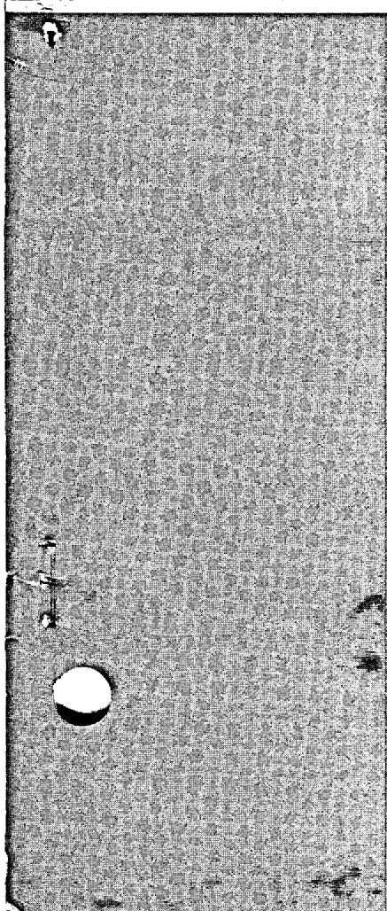

OAK RIDGE NATIONAL LABORATORY

OPERATED BY UNION CARBIDE CORPORATION FOR THE ENERGY RESEARCH AND DEVELOPMENT ADMINISTRATION

Printed in the United States of America. Available from

National Technical Information Service

U.S. Department of Commerce

5285 Port Royal Road, Springfield, Virginia 22161

Price: Printed Copy $5.00; Microfiche $2.25

This report was prepared as an account of work sponsored by the United States Government. Neither the United States nor the Energy Research and Development Administration, nor any of their employees, nor any of their contractors, subcontractors, or their employees, makes any warranty, express or implied, or assumes any legal liability or responsibility for the accuracy, completeness or usefulness of any information, apparatus, product or process disclosed, or represents that its use would not infringe privately owned rights.

Contract No. W-7405-eng-26

CHEMICAL TECHNOLOGY DIVISION

A STUDY OF TRITIUM REMOVAL FROM FUSION REACTOR BLANKETS OF MOLTEN SALT AND LITHIUM-ALUMINUM

# Jan B. Talbot

NOTICE This report was prepared as an account of work sponsored by the United States Government. Neither the United States nor the United States Energy Research and Development Administration, nor any of their employees, nor any of their contractors, subcontractors, or their employees, makes any warranty, express or implied, or assumes any legal liability or responsibility for the accuracy, completeness or usefulness of any information, apparatus, product or process disclosed, or represents that its use would not infringe privately owned rights.

A thesis presented to the Graduate Council of the Pennsylvania State University in partial fulfillment of the requirements for the degree of Master of Science

MARCH 1976

OAK RIDGE NATIONAL LABORATORY

Oak Ridge, Tennessee 37830

operated by

UNION CARBIDE CORPORATION

for the

ENERGY RESEARCH AND DEVELOPMENT ADMINISTRATION

# ACKNOWLEDGMENTS

This study was carried out as part of the Laboratory Graduate Participation Program, which is conducted by Oak Ridge Associated Universities, in cooperation with Oak Ridge National Laboratory, which is operated by Union Carbide Corporation for the Energy Research and Development Administration. The writer wishes to thank G. C. Kyker, Head of the University Programs Office, and D. E. Ferguson, Director, and C. D. Scott, Experimental Engineering Section Chief, of the ORNL Chemical Technology Division, whose support made this work possible.

The author wishes to acknowledge the advice and suggestions of P. Barton, J. S. Watson, and F. J. Smith, who served as advisors for this study.

The lithium-aluminum samples were prepared by the Metals and Ceramics Division under the supervision of J. H. DeVan. Chemical analyses were performed by the Analytical Chemistry Division under the supervision of W. R. Laing. The mass spectrometer experiment was conducted by J. D. Redman of the Chemistry Division. Special thanks are due to J. F. Land, who assisted with the operation of the experiments. Much appreciation is expressed to Y. H. Callahan and M. G. Stewart, who edited the manuscript, and to Janice Shannon, who typed the final edition. The drawings were prepared under the supervision of A. J. Farmer.

# ABSTRACT

The sorption of tritium by molten lithium-bismuth (Li-Bi, $\sim$ 15 at. $\%$ lithium) and solid equiatomic lithium-aluminum (Li-Al) was investigated experimentally to evaluate the potential applications of both materials in a controlled thermonuclear reactor. The Li-Bi alloy was proposed to countercurrently extract tritium from a molten salt ( $Li_{2}BeF_{4}$ ) blanket. However, because of the low solubility (< 10 ppb) at temperatures ranging from 500 to $700^{\circ}\mathrm{C}$ , the extraction process is not attractive.

Powell of Brookhaven National Laboratory has proposed using solid Li-Al as a minimum inventory blanket material. In the present study, the tritium sorption was determined to range from $10^{-5}$ to $10^{-6}$ at. fraction, which is in agreement with Powell's estimates. The quantities of tritium sorbed seemed to be controlled by surface reaction and/or slow internal diffusion.

The feasibility of the tritium recovery scheme suggested by Johnson for the Princeton Reference Design Tokamak was analyzed. The spray disengager process to recover tritium from molten salt seems discouraging due to the large jet velocity, the number of nozzles, and the droplet size needed for mass transfer of tritium fluoride from salt.

# vii

TABLE OF CONTENTS   

<table><tr><td>ACKNOWLEDGMENTS.</td><td>iii</td></tr><tr><td>ABSTRACT.</td><td>v</td></tr><tr><td>LIST OF TABLES.</td><td>ix</td></tr><tr><td>LIST OF FIGURES.</td><td>x</td></tr><tr><td>CHAPTER I. INTRODUCTION.</td><td>1</td></tr><tr><td>CHAPTER II. REVIEW OF LITERATURE.</td><td>3</td></tr><tr><td>CHAPTER III. THEORY.</td><td>10</td></tr><tr><td>CHAPTER IV. EXPERIMENTAL APPARATUS AND PROCEDURE.</td><td>14</td></tr><tr><td>Reagents.</td><td>14</td></tr><tr><td>Apparatus.</td><td>15</td></tr><tr><td>Li-Bi Sorption System.</td><td>15</td></tr><tr><td>Li-Al Sorption System.</td><td>18</td></tr><tr><td>Operational Procedures.</td><td>23</td></tr><tr><td>Li-Bi Sorption System.</td><td>23</td></tr><tr><td>Sampling Procedure.</td><td>23</td></tr><tr><td>Li-Al Sorption System.</td><td>24</td></tr><tr><td>Analytical Procedure.</td><td>26</td></tr><tr><td>CHAPTER V. EXPERIMENTAL DATA.</td><td>28</td></tr><tr><td>Li-Bi Sorption System.</td><td>28</td></tr><tr><td>Li-Al Sorption System.</td><td>32</td></tr><tr><td>CHAPTER VI. DISCUSSION OF RESULTS.</td><td>37</td></tr><tr><td>Li-Bi Sorption System.</td><td>37</td></tr><tr><td>Li-Al Sorption System.</td><td>38</td></tr><tr><td>CHAPTER VII. ANALYSIS OF THE TRITIUM RECOVERY SYSTEM FOR THE PRINCETON REFERENCE DESIGN.</td><td>42</td></tr><tr><td>Description of the Process.</td><td>42</td></tr><tr><td>Disengager Analysis.</td><td>45</td></tr><tr><td>Cyclic Condenser Analysis.</td><td>51</td></tr><tr><td>Other Design Considerations.</td><td>55</td></tr><tr><td>CHAPTER VIII. CONCLUSIONS AND RECOMMENDATIONS.</td><td>56</td></tr><tr><td>Conclusions.</td><td>56</td></tr><tr><td>Recommendations.</td><td>57</td></tr><tr><td>BIBLIOGRAPHY.</td><td>58</td></tr><tr><td>APPENDIX A. THE COMPATIBILITY OF Li-Bi WITH Li2BeF4.</td><td>61</td></tr><tr><td>APPENDIX B. SAMPLE CALCULATIONS FOR Li-Bi--TRITIUM SORPTION DATA FOR SAMPLE NO. 2.7 AT 600°C.</td><td>64</td></tr><tr><td>APPENDIX C. CALCULATION OF RESIDENCE TIME FOR MASS TRANSFER OF TRITIUM FLUORIDE FROM A SALT DROPLET.</td><td>67</td></tr><tr><td>APPENDIX D. CALCULATION OF SPRAY DISENGAGER HEIGHT FOR SALT DROPLETS OF VARIOUS SIZES (25)</td><td>68</td></tr><tr><td>APPENDIX E. CALCULATION OF THE FREQUENCIES OF MOLECULAR COLLISIONS (10)</td><td>71</td></tr><tr><td>APPENDIX F. CALCULATION OF MOLECULAR COLLISIONS WITH CONDENSER WALLS.</td><td>76</td></tr><tr><td>APPENDIX G. CALCULATION OF MEAN FREE PATHS OF TF AND HELIUM COLLISIONS.</td><td>78</td></tr><tr><td>APPENDIX H. CALCULATION OF CYCLIC CONDENSER HEAT LOAD.</td><td>81</td></tr></table>

# LIST OF TABLES

Table

I. HYDROGEN REACTIONS WITH THE ELEMENTS (40). 13   
II. RESULTS OF Li-Bi METAL PHASE ANALYSES FOR TRITIUM. 29   
III. RESULTS OF GAS-PHASE ANALYSES FOR TRITIUM CONCENTRATION. 30   
IV. RESULTS OF Li-Al ANALYSES FOR TRITIUM AT $400^{\circ}\mathrm{C}$ 33   
V. TIME-INDEPENDENT RESULTS OF Li-Al ANALYSES FOR TRITIUM . 34   
VI. FLOW RATES AND CONCENTRATIONS FOR THE TRITIUM RECOVERY

SYSTEM FOR THE PRINCETON REFERENCE REACTOR 44

VII. CHARACTERISTICS, ADVANTAGES, AND DISADVANTAGES OF PRESSURE

NOZZLES AND SPINNING-DISK ATOMIZERS (25) 50

VIII. MOLECULAR AND WALL COLLISION FREQUENCIES AND MEAN FREE

PATHS OF He and TF IN THE CYCLIC CONDENSERS. 54

# LIST OF FIGURES

# Figure

1 Simplified Schematic of a Controlled Thermonuclear Reactor System. 4   
2 Apparatus for Study of Sorption of Tritium in Li-Bi Alloy 16   
3 Reaction Vessel for Studying the Sorption of Tritium in Li-Bi Alloy 17   
4 Initial Equipment Design for Studying Sorption of Tritium in Li-Al Alloy. 19   
5 Revised Apparatus for Studying Sorption of Tritium in Li-Al Alloy 21   
6 Photograph of the Equipment Used to Measure Tritium Sorp-tion in Li-Al Alloy 22   
7 Sample Dissolution Apparatus for Tritium Analysis 27   
8 Tritium Concentration in Li-Bi Samples at the Corresponding Tritium Partial Pressure. 31   
9 Tritium Concentration as a Function of Percent Li-Al Sample Dissolved. 35   
10 A Comparison of Sieverts' Constants for Aluminum, Lithium, and Li-Al Alloy 40   
11 Princeton's Reference Design Salt Blanket Processing System. 43   
12 Schematic of the Salt Disengager and Salt Trap. 46   
13 Residence Time vs Drop Diameter for Molten Salt Mass Transfer. 48   
14 Schematic of the Cyclic Condensers. 52   
15 Numerical Solution of Liquid Diffusion in a Sphere. 67   
16 Ohnesorge's Chart (25) Showing Jet Breakup as a Function of Reynolds Number and Liquid Properties. 69

# CHAPTER I

# INTRODUCTION

The feasibility of commercial fusion power reactors depends upon the development of effective methods for containing and recovering tritium. Difficult problems are expected to be encountered in the handling, recovery, and containment of the fuel inventory of a controlled thermo-nuclear reactor (CTR) fueled with tritium and deuterium. Deuterium can be obtained from natural waters; however, tritium, which does not exist in useful concentrations in nature, must be generated by neutron bombardment of lithium-containing material in a blanket surrounding the reactor plasma. It is necessary to recycle tritium and deuterium from the exhaust plasma and to recover bred tritium from its blanket system for subsequent use as fuel. Stringent limitations must be imposed on the use of tritium concentrations in the system because of the direct effect upon the tritium inventory, the tritium release rate to the environment, and the embrittlement of structural materials by helium resulting from tritium decay.

Lithium-containing materials have been proposed for a variety of applications in CTRs. It is suggested in this study that molten lithium-bismuth (Li-Bi) alloy could be useful for extracting tritium from a CTR breeding blanket consisting of a molten mixture of lithium and beryllium fluorides. Of course, the applicability of such a recovery system depends upon the equilibrium uptake of tritium by the Li-Bi alloy. Power (30) has suggested using a solid lithium-aluminum (Li-Al) alloy in the tritium breeding blanket. The alloy plus its aluminum structure would produce a minimum neutron activation and a low tritium inventory. However, the

usefulness of the material is contingent upon its sorption of tritium and its ability to rapidly exchange tritium with a flush gas such as helium.

The objectives of this study were to evaluate experimentally the potential application of Li-Bi and Li-Al in a CTR. Thus, the tritium solubility and thermochemical behavior of the lithium alloys were investigated. The Pennsylvania State University is not licensed to work routinely with amounts of tritium greater than $100\mu \mathrm{Ci}$ . Since samples of more than ten times that amount were needed to attain meaningful experimental results, this study was conducted at the Oak Ridge National Laboratory (ORNL) as part of the Oak Ridge Associated Universities' Program.

Another objective of the research was to analyze the blanket recovery system proposed for the Princeton Reference Design CTR (21). In this conceptual design, tritium is generated from a molten fluoride salt blanket. The practicality of the blanket processing system was reviewed in this report by studying each of the required process steps and estimating the feasibility and equipment size involved.

# CHAPTER II

# REVIEW OF LITERATURE

Many conceptual and engineering designs have been made for a CTR (13,14,26,30,32). Most of the CTR concepts resemble the system shown in Fig. 1. The thermonuclear reactions that release energy are:

$$
D + T \rightarrow^ {4} H e + n, \quad 1 7. 6 M e V \quad e q. 1
$$

$$
\mathrm {D} + \mathrm {D} \rightarrow \mathrm {T} + \mathrm {H}, \quad 4. 0 3 \mathrm {M e V} \quad \text {e q .} 2
$$

$$
D + D \rightarrow {} ^ {3} H e + n, \quad 3. 2 7 M e V \quad e q. 3
$$

$$
D + ^ {3} H e \rightarrow^ {4} H e + H, \quad 1 8. 3 M e V \quad e q. 4
$$

$$
\mathrm {H} + 6 _ {\mathrm {L i}} \rightarrow 3 _ {\mathrm {H e}} + 4 _ {\mathrm {H e}}. \quad 4. 0 \quad \text {M e V} \quad \text {e q .} 5
$$

For the first generation of thermonuclear reactors, the deuterium-tritium (D-T) reaction is favored because it releases one of the largest quantities of energy and its probability of occurrence (cross section) is the highest of the above reactions (19). In a D-T reactor, a small percentage of the D-T mixture fuses during its residence in the plasma region. This fusion generates high-energy neutrons which deposit heat in the surrounding blanket fluid. The energy is then transferred to a secondary coolant fluid connected to a conventional steam cycle.

Tritium must be bred to fuel the reactor at a rate equal to, or greater than, the rate at which it is consumed in the plasma. The neutron bombardment of lithium produces tritium by the following reactions:

$$
6 _ {\mathrm {L i} + \mathrm {n} \rightarrow^ {4} \mathrm {H e} + \mathrm {T},} \tag {eq. 6}
$$

$$
{ } ^ { 7 } \mathrm { L i } + \mathrm { n } \rightarrow { } ^ { 4 } \mathrm { H e } + \mathrm { n } ^ { 1 } + \mathrm { T } . \tag {eq.7}
$$

Lithium must be included in the blanket material for breeding purposes. Subsequently, tritium handling systems are needed to recover tritium

ORNL DWG. 75-8303

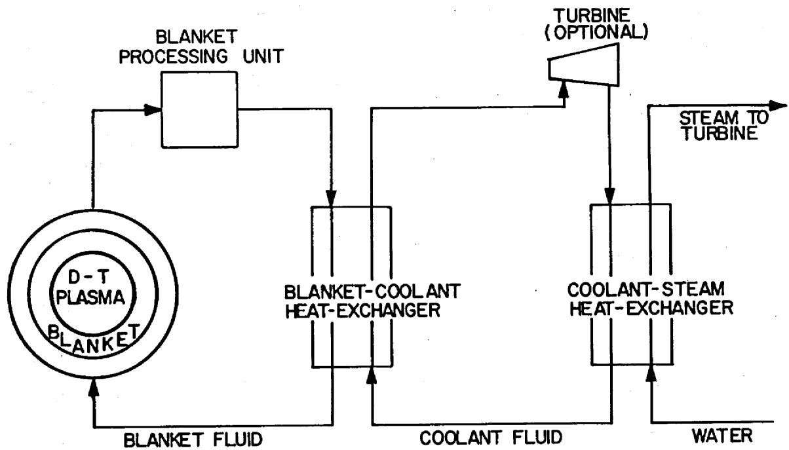  
Figure 1. Simplified Schematic of a Controlled Thermonuclear Reactor System.

from the blanket for recycling to the plasma. Although tritium breeding is not necessary for the deuterium-deuterium (D-D) and deuterium-helium $(\mathrm{D}-^{3}\mathrm{He})$ fuel cycles, tritium will be produced by D-D reactions (Equation 2) and handling systems will still be required, although the problems will probably be less severe.

Low tritium concentrations must be maintained in the blanket material by a tritium recovery system. Tritium has a half-life of 12.3 years and undergoes radioactive decay according to the reaction

$$
\mathrm {T} \rightarrow {} ^ {3} \mathrm {H e} + \mathrm {e} ^ {-} + 5. 6 \mathrm {k e V}. \tag {eq.8}
$$

The current Energy Research and Development Administration (ERDA) guidelines on radioactivity in effluents from light-water-cooled fission fission reactors require (a) that the dose rate at the site boundary not exceed 5 millirems/year and (b) that the annual average concentration of tritium prior to dilution in a natural body of water not exceed $5 \times 10^{-3}$ $\mu$ Ci/liter (39). When considering a $\sim$ 1000-MW(e) fusion reactor, these guidelines imply (a) that the release of tritium into coolant waters should be limited to $\sim$ 10 Ci/day and (b) that the amount discharged through a stack ( $\sim$ 30 m high) should be limited to $\sim$ 10 to 100 Ci/day (37,38). However, current designs of fusion reactors attempt to limit tritium release rates to a range of $\sim$ 1 to 10 Ci/day. This limitation constrains the concentration of tritium in the blanket material. Tritium, which is extremely mobile, will diffuse through all metal structures and heat transfer surfaces. Large concentrations of tritium in the blanket would lead to high release rates; therefore, the blanket must be processed to achieve the lowest possible concentration of tritium.

The thermonuclear power systems will process the blanket material within the blanket loop, as shown in Fig. 1; however, the choice of blanket and coolant fluids will have an important effect in the tritium recovery scheme. The two reactor designs of interest in the present study are those proposed by the Princeton Plasma Physics Laboratory (26) and the Brookhaven National Laboratory (30). Princeton's Reference Tokamak produces 2030 MW of electric power. The blanket material chosen to generate tritium is a mixture of lithium and beryllium fluorides $(\mathrm{Li}_2\mathrm{BeF}_4)$ . Helium was chosen as a coolant to carry heat from the $\mathrm{Li}_2\mathrm{BeF}_4$ blanket to the steam system. The Brookhaven conceptual design suggests a solid Li-Al alloy as a blanket material in which tritium is bred and a helium coolant stream. This concept is advantageous because structural materials with very little long-lived activation (e.g. aluminum), which are not compatible with $\mathrm{Li}_2\mathrm{BeF}_4$ , can be used.

Recovery of tritium from molten $\mathrm{Li}_{2}\mathrm{BeF}_{4}$ is difficult because the tritium concentration in the salt must be maintained at less than 1 ppm to prevent tritium leakage. Watson (41) has drawn several conclusions from an evaluation of the tritium recovery process for the $\mathrm{Li}_{2}\mathrm{BeF}_{4}$ blanket. Cold trapping and solid sorbents are not attractive due to the limited operating temperature range imposed by the salt and possible tritium permeation through regenerator surfaces. Diffusion cells are not practical because of salt corrosivity and liquid film resistance. Counter-current gas sparging with either helium or argon may be possible if a suitable compromise between the sparge rate and corrosion can be made. This necessitates that tritium pressures in the range of $10^{-8}$ to $10^{-11}$

atm and tritium fluoride (TF) pressures in the range of $10^{-2}$ to $10^{-4}$ atm be maintained.

In this study, the proposal examined is one in which $\mathrm{Li}_{2}\mathrm{BeF}_{4}$ would be contacted with an immiscible diffusion sink in a countercurrent liquid extractor. A tritium getter, added to the molten metal, would form a hydride to reduce the equilibrium activity of tritium and to obtain low tritium concentrations in the salt phase. The contacting medium investigated was Li-Bi, with lithium being the tritium getter. The tritium is then recovered from the molten Li-Bi either by a precipitation process or in diffusion cells.

The experimental apparatus used to determine the equilibrium distribution of tritium at low concentration levels in molten Li-Bi was a modification of that utilized previously at ORNL for phase equilibrium studies of molten salt and molten metal systems (12). The concentration of Li-Bi compatible with $\mathrm{Li}_2\mathrm{BeF}_4$ was determined by using available thermodynamic data (Appendix A). Lithium will reduce beryllium from the $\mathrm{Li}_2\mathrm{BeF}_4$ at large concentrations and will subsequently form another immiscible phase. A maximum concentration of 15 at. $\%$ lithium in bismuth was chosen for the tritium solubility experiment; this molten alloy is compatible with $\mathrm{Li}_2\mathrm{BeF}_4$ at the temperatures observed. The proposed extractor would use a lesser concentration of about 1 at. $\%$ lithium and operate at $900^{\circ}\mathrm{K}$ .

The process suggested by Johnson (21) in the Princeton Reference Tokamak study offers another method for recovering tritium from $\mathrm{Li}_2\mathrm{BeF}_4$ . The molten salt is sprayed continuously into eight towers which are maintained below $10^{-4}$ atm and located around the reactor system. TF and helium gases vaporize from the tiny droplets and are drawn through cold

traps, where all the TF is frozen out. The salt is collected at the bottom of each discharger and recirculated through the blanket. Periodically, the nitrogen-cooled traps are thawed, and liquid TF flows into electrolytic cells, where it is electrolyzed to $\mathbf{T}_2$ and $\mathbf{F}_2$ . The tritium is recycled to the primary fuel loop.

The tritium recovery scheme for the solid-lithium-containing blanket proposed by Brookhaven (30) seems less complex in comparison to the $\mathrm{Li}_2\mathrm{BeF}_4$ recovery systems. The tritium bred in the Li-Al alloy diffuses out of the solid, either into the vacuum region between the plasma and the first wall or into the helium coolant stream. By letting the tritium diffuse directly into the vacuum region, the tritium concentration in the Li-Al will eventually reach a steady-state value as it is released at the same rate that it is bred. If the resistance to tritium release is sufficiently small, the steady-state concentration will differ little from equilibrium conditions. If the vacuum region is maintained at $10^{-6}$ torr tritium pressure (1 torr equals $1\mathrm{mmHg}$ of pressure) and the residual gas is assumed to be $100\%$ tritium, the equilibrium atom fraction of tritium in Li-Al is about $2\times 10^{-6}$ (30). This corresponds to a tritium blanket inventory of about $160\mathrm{g}$ ( $2\times 10^{6}\mathrm{Ci}$ ). Since $\sim 300\mathrm{g}$ of tritium will be burned daily in the plasma, $2\times 10^{-6}$ atom fraction represents less than a day's inventory. If the tritium inventory in the blanket is too large, protium (normal hydrogen) could be used to scavenge the tritium. Finally, the tritium is recovered, combined with purified D-T fuel from the plasma, and recycled to the plasma.

Alternatively, the tritium could diffuse out the Li-Al into the helium coolant stream, where it is removed by absorption in a metal

hydride bed from which it is later recovered. The atom fraction of tritium in Li-Al is estimated to be $\sim 3 \times 10^{-5}$ , which is an order of magnitude greater than the previous case (30). The tritium concentration in the helium depends on the flow rate of helium coolant and the tritium diffusion rate. Again, additions of protium could lower the tritium concentration.

However, the difficulty of removing tritium from Li-Al depends upon both the equilibrium tritium concentration in Li-Al and the tritium diffusion rate in Li-Al. An experimental study by Wiswall and Wirsing (43) tested the removal of tritium from granular forms of Li-Al, $\mathrm{LiAlO}_2$ , and $\mathrm{Li}_2\mathrm{SiO}_3$ . The procedure was to flush helium through a bed of irradiated compounds at a controlled temperature in the range 400 to $600^{\circ}\mathrm{C}$ . Tritium, generated by exposure to thermal neutrons, diffused out of a sample and was carried to a tritium monitor. The data collected were not successfully analyzed in terms of a physical model. Removal rates were increased both by an increase in the helium flow rate and by additions of 1000 ppm of hydrogen to the helium; this shows that surface sorption is important. Yet, the escaping rate increased with a decrease in particle size, which indicates a slow diffusion within the alloy. This would also result from surface sorption, for the same loading, and surface resistance.

# CHAPTER III

# THEORY

The recovery of tritium from CTR materials depends on its distribution and leakage characteristics. These factors are determined by tritium solubility in the contacted materials, tritium diffusion rates through reactor fluids and structural components, and the formation of stable compounds.

The reaction for solutions of tritium in a metal can be written as follows:

$$
\mathrm {X} _ {(d)} + \frac {1}{2} \mathrm {T} _ {2 (g)} = \mathrm {X T} _ {(d)}, \quad \text {e q .} 9
$$

where

$$
\mathrm {X} _ {(d)} = \text {d i s s o l v e d i n m e t a l p h a s e},
$$

$$
\mathrm {T} _ {2 (\mathrm {g})} = \text {t r i t i u m g a s}.
$$

The equilibrium constant for the reaction is:

$$
K = \frac {\alpha_ {X T (d)}}{\alpha_ {X (d)} p _ {T _ {2}} ^ {\frac {1}{2}}} = \frac {\gamma_ {X T (d)} N _ {X T (d)}}{\alpha_ {X (d)} p _ {T _ {2}} ^ {\frac {1}{2}}} \tag {eq.10}
$$

where

$$
K = \text {e q u i l i b r i u m}
$$

$$
\alpha = \text {a c t i v i t y}
$$

$$
\mathrm {p} _ {\mathrm {T} _ {2}} = \text {t r i t i u m p a r t i a l p r e s s u r e s},
$$

$$
\gamma = \text {a c t i v i t y}
$$

$$
N = \text {c o n c e n t r a t i o n}.
$$

As $\mathtt{N}_{\mathtt{XT}}(\mathtt{d})$ approaches zero, $\alpha_{\mathtt{X}(\mathtt{d})}$ and $\gamma_{\mathtt{XT}}(\mathtt{d})$ become constant. In dilute solutions of tritium in metals, the relationship between solubility and pressures is given by Sieverts' law (27,33,36):

$$
\mathrm {N} _ {\mathrm {T}} = \mathrm {k} _ {\mathrm {s}} \mathrm {p} _ {\mathrm {T} _ {2}} ^ {\frac {1}{2}}, \quad \text {e q . 1 1}
$$

where

$$
\begin{array}{l} N _ {T} = \text {t r i t i u m c o n c e n t r a t i o n i n t h e m e t a l p h a s e}, \\ p _ {T 2} = \text {t r i t i u m p a r t i a l p r e s s u r e}, \\ k _ {s} = \text {S i e v e r t s} ^ {\prime} \text {c o n s t a n t}. \\ \end{array}
$$

Sieverts' constant is exponentially dependent on temperature, as follows:

$$
k _ {s} = k _ {s} ^ {\circ} \exp \left(Q _ {s} / k T\right), \quad e q. 1 2
$$

where

$$
\begin{array}{l} \mathrm {k} _ {\mathrm {s}} ^ {\circ} = \text {m a t e r i a l - r e l a t e d c o n s t a n t}, \\ Q _ {s} = \text {a c t i v a t i o n e n e r g y f o r t h e s o l u t i o n o f t r i t i u m i n t h e m e t a l}, \\ k = \text {B o l t z m a n n ' s} \\ T = \text {a b s o l u t e} ^ {\circ} K. \\ \end{array}
$$

According to Cantor and Grimes (6), the solubility of tritium in moltens salt is related by Henry's law, which is expressed as follows:

$$
\mathrm {N} _ {\mathrm {T}} = \mathrm {p} _ {\mathrm {T} _ {2}} \mathrm {k} _ {\mathrm {H}}, \tag {eq.13}
$$

where

$$
\mathrm {k} _ {\mathrm {H}} = \text {H e n r y ' s l a w c o n s t a n t}.
$$

The permeation of tritium through bulk material is given by the equation

$$
Q = \frac {A}{X} \left(p _ {i} ^ {\frac {1}{2}} - p _ {o} ^ {\frac {1}{2}}\right) B \cdot \exp \left(- Q _ {p} / k T\right), \quad e q. 1 4
$$

where

$Q =$ flux of tritium through the interface,

A = area of the interface,

$X =$ thickness of the interface,

$\mathfrak{p} =$ tritium pressure on a side of the interface $(\mathfrak{p}_i > \mathfrak{p}_o)$

$\mathbf{B} =$ material-related parameter,

$Q_{p} =$ material-related parameter.

Tritides are readily formed since hydrogen and its isotopes react with nearly every element. Table I illustrates the behavior of hydrogen with groups of the periodic table.

TABLEI   
HYDROGEN REACTIONS WITH THE ELEMENTS (40)   

<table><tr><td>Period</td><td>Elements</td><td>Type of Hydrogen Bond</td><td>Hydride Character</td></tr><tr><td>VIA</td><td>O, S, Se, Te, Po</td><td>Covalent</td><td>Decomposable gases of liquids (except solid AlH3)</td></tr><tr><td>VA</td><td>N, P, As, Sb, Bi</td><td></td><td></td></tr><tr><td>IVA</td><td>C, Si, Ge, Sn, Pb</td><td></td><td></td></tr><tr><td>IIIA</td><td>B, Al, Ga, In, Ti</td><td></td><td></td></tr><tr><td>VIIA</td><td>F, Cl, Br, I, At</td><td>Ionic with the hydrogen electro-positive</td><td>Corrosive gases or liquids</td></tr><tr><td>IIA</td><td>Be, Mg, Ca, Se, Ba, Ra</td><td>Ionic with the hydrogen electro-negative</td><td>Saltlike (except noncrystalline BeH2)</td></tr><tr><td>IA</td><td>Li, Na, K, Rb, Cs, Fr</td><td></td><td></td></tr><tr><td>IIB</td><td>Zn, Cd, Hg</td><td>Endothermic hydrogen occluder; no compound formation (except exothermic palladium)</td><td>Metallic; usually ductile</td></tr><tr><td>IB</td><td>Cu, Ag, Au, Ni, Pd, Pt</td><td></td><td></td></tr><tr><td>VIIIIB</td><td>Co, Rh, Ir, Fe, Ru, Os</td><td></td><td></td></tr><tr><td>VIIB</td><td>Mn, Tc, Re</td><td></td><td></td></tr><tr><td>VIB</td><td>Cr, Mo, W</td><td></td><td></td></tr><tr><td>VB</td><td>Y, Nb, Ta</td><td>Exothermic hydrogen occluder; metallic or interstitial com-pound formation</td><td>Metallic; usually brittle</td></tr><tr><td>IVB</td><td>Ti, Zr, Hf</td><td></td><td></td></tr><tr><td>IIIB</td><td>Sc, Y, La, a Acb</td><td></td><td></td></tr></table>

aAll lanthanides   
bAll actinides

# CHAPTER IV

# EXPERIMENTAL APPARATUS AND PROCEDURE

# Reagents

The bismuth was obtained from the Cominco American Company (99.9999% purity). The lithium metal was supplied by Fischer Scientific Company. Just prior to loading under an argon atmosphere, the pure lithium was cut and cleaned of oxide film. The Li-Al alloy was prepared by the Metals and Ceramics Division of ORNL. The procedure consisted of wrapping known amounts of lithium in aluminum foil, submerging the packets into a known quantity of molten aluminum (99.999% purity) contained in a molybdenum crucible, and continually mixing the alloy with a molybdenum stirrer. A 50-50 at. % mixture was then cast into 1/4-in.-OD rods (9). Each sample was approximately 1/4 to 1/2 in. long and weighed about 0.5 g. The alloy rods were thinly coated with a bluish oxide film. The intermetallic compound Li-Al is a solid solution between 45 and 56 at. % lithium (18). Li-Al displays a glasslike brittleness, and its density has been determined as 1.725 g/ml at room temperature (2). The equiatomic composition melts at $718^{\circ}\mathrm{C}$ .

All gases were of the highest purity commercially available. Argon, which was used as the inert cover gas, was further purified by passage through a titanium sponge trap; the lower section was held at $600^{\circ}\mathrm{C}$ for the removal of oxygen and water, and the upper portion was held at about $200^{\circ}\mathrm{C}$ for the removal of hydrogen. Tritium, obtained from the ORNL Isotopes Division, was supplied in 3/8-in. glass ampules, each containing 1 Ci in a volume of 1 ml (pressure equal to $\sim$ 324 torr).

# Apparatus

Li-Bi Sorption System. Equilibration and tritium sorption were conducted in a vessel of the type shown in Fig. 2. The apparatus has been used previously at ORNL for phase equilibria studies of molten salts and molten metal systems (12). Figure 3 illustrates the reaction vessel in detail. The vessel was fabricated from a 22-in. length of 2-in.-OD stainless steel pipe. Cooling fins welded to the exterior of the upper section of the vessel served both to cool and to support the vessel when it was positioned in a well-type furnace, which heated 6 in. of the container. A gas outlet tube was welded into the pipe between the furnace support and the flange. The upper flange section was fitted with a 1/2-in. ball valve, a thermocouple port, and a 1/4-in.-diam molybdenum sparge tube (~10 to 20-mil wall thickness). A Cajon O-ring fitting at the top of the sparge tube allowed raising and lowering. A Teflon plug, through which the samplers were inserted, was held in place by another O-ring, which was connected to the top of the ball valve. The Li-Bi alloy was contained in a molybdenum crucible 6 in. long, 1-1/2 in. ID, and 1-3/4 in. OD. The molybdenum crucible fitted loosely in the reaction vessel as shown in Fig. 3. The apparatus was operated in a radiochemical hood, which also provided secondary containment of tritium.

The temperature of the system was measured by a calibrated Chromel-Alumel thermocouple and recorded by a Brown potentiometric recorder. The temperature of the system was controlled with $\pm 2^{\circ}\mathrm{C}$ by a Wheelco proportional controller operating from a control thermocouple, which was placed against the exterior wall of the reactor vessel.

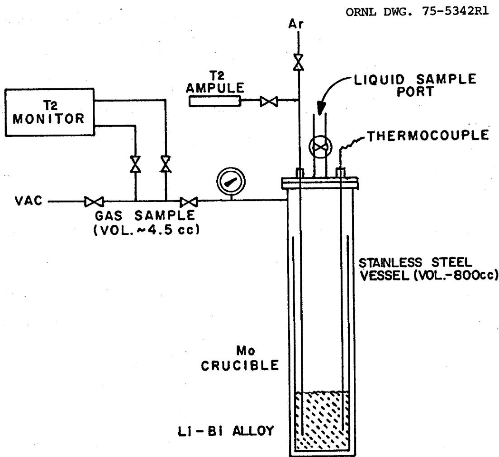  
Figure 2. Apparatus for Study of Tritium in Li-Bi Alloy.

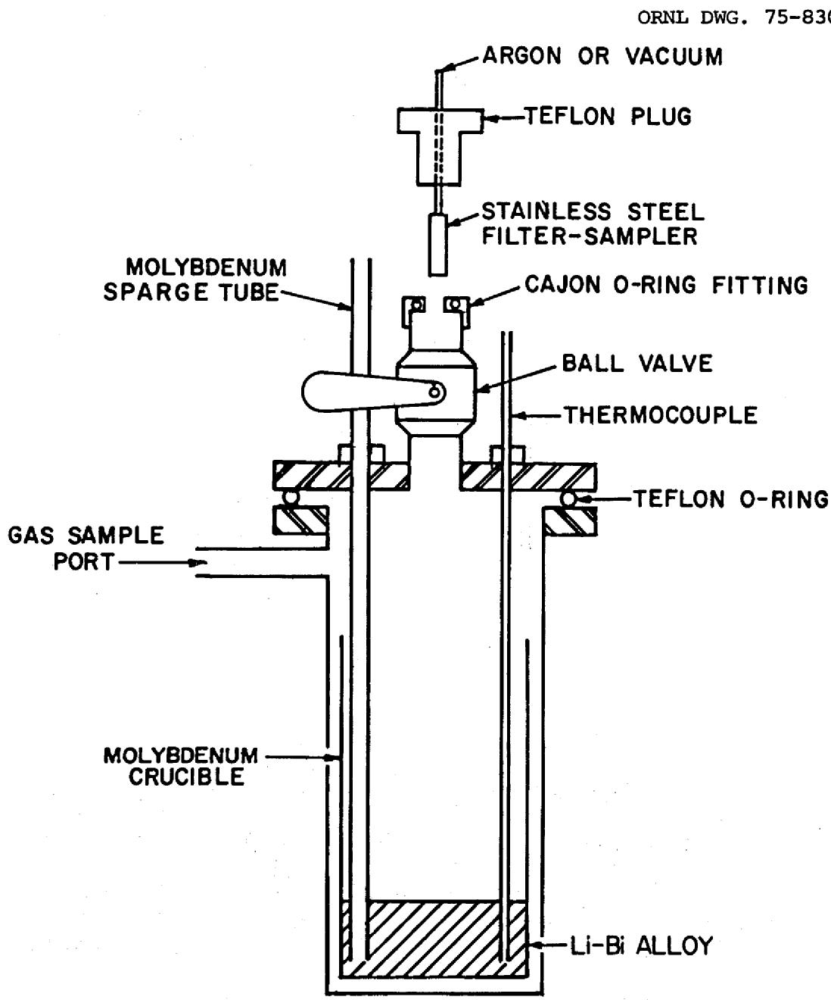  
Figure 3. Reaction Vessel for Studying the Sorption of Tritium in Li-Bi Alloy.

The samplers were constructed as follows:

"The filter-type samplers were fabricated of stainless steel. The l-in.-long body was drilled from heavy-walled, 1/4-in.-OD tubing, leaving a 1/8-in.-thick shoulder on one end; the wall thickness after drilling was about 30 mils. A 20-in. length of 1/16-in.-OD capillary tubing was welded into the shoulder to provide the stem for the sampler. The sampler was completed by welding a disk of FELTMetal fiber metal (Huyck Metal Co., product No. FM 225), having a median pore size of $20\mu$ , into the open end of the body." (12)

Li-Al Sorption System. The preliminary sorption apparatus was constructed of Pyrex to minimize tritium permeation from the system. Figure 4 shows a schematic of the equipment. Four Pyrex sample tubes were attached by ground-glass joints to a 4-ft-long by 1/2-in.-OD manifold; a mechanical vacuum pump was connected to one end of the manifold. Dow-Corning high-vacuum grease (No. 970V), a nonmelting silicone lubricant, was sparingly applied to the ground-glass and stopcock joints. High-vacuum stopcocks were used throughout the system. The pressure of the system was measured by a Virtis McCloud mercury manometer (0.005 to 5.00 torr) and a Hastings vacuum gauge $(10^{-3}$ to 1 torr).

Each sample tube was positioned in a 1-l/4-in.-ID clamshell furnace. The temperature of each sample was measured by a calibrated Chromel-Alumel thermocouple and indicated on a Doric Digital Thermocouple Indicator (No. DS-300) (-50 to +1350°C). The temperatures were controlled within ± 2°C by a Wheelco proportional controller operating from a control thermocouple placed against a copper shield inside each furnace.

The tritium leakage from the ground-glass joints and vacuum stopcocks was excessive at the l-torr tritium partial pressure involved. Although glass joints proved to be adequate for previous ORNL studies of tritium sorption in lithium, the resulting errors became significant when

ORNL DWG. 75-8300R1

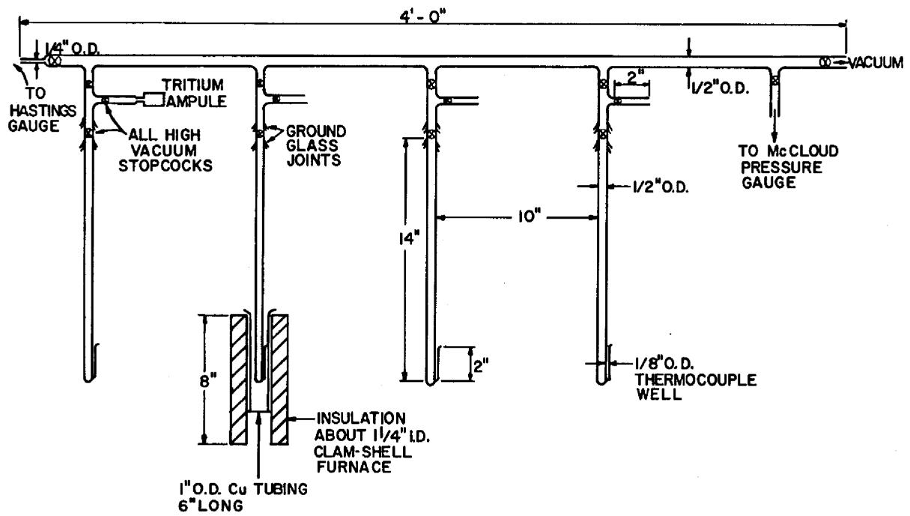  
Figure 4. Initial Equipment Design for Studying Sorption of Tritium in Li-Al Alloy.

materials with low tritium uptake were used. Thus, a more reliable stainless steel system was built.

Figure 5 shows a schematic of the revised tritium sorption system used in this study. The pumping system had been used previously at ORNL as part of a Sieverts' apparatus for obtaining measurements of equilibrium hydrogen isotope solubilities in lithium (35). This pumping system consisted of a mechanical pump coupled to a Consolidated Vacuum Corporation oil diffusion pump. The pressure measurement instruments included two Wallace and Tiernan precision pressure gauges, Model FA160 (0 to 20 torr) and Model 62A-4D-0800 (0 to 800 torr), and a Hastings vacuum gauge ( $10^{-3}$ to 1 torr). The sorption system consisted of four 1/2-in.-OD by 14-in.-long quartz sample tubes connected to a 3-ft-long manifold. The manifold was constructed of 1/4-in. stainless steel tubing. Each quartz tube was lined with a 10-in.-long by 3/8-in.-OD thin-walled (about 10 mil) stainless steel tube. A Cajon O-ring fitting connected each quartz tube to a Hoke vacuum valve, which was attached to the sorption manifold by another O-ring joint. Hoke vacuum valves were used throughout the system. Figure 6 shows a photograph of the equipment.

Each sample tube was positioned in a 1-1/4-in.-ID clamshell furnace by raising a lab-jack which had been placed underneath each furnace. The temperature of each sample tube was measured by a calibrated Chromel-Alumel thermocouple and recorded by a Brown potentiometric recorder. A Wheelco proportional controller regulated temperatures within $\pm 2^{\circ}\mathrm{C}$ . A control thermocouple was placed against a copper shield inside each furnace.

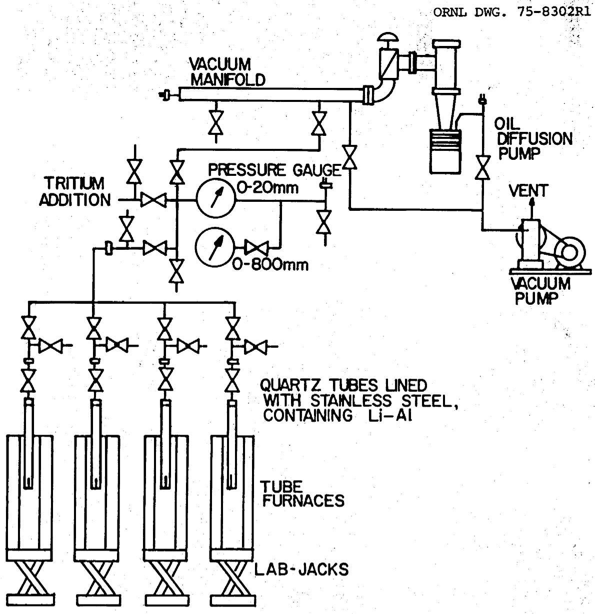  
Figure 5. Revised Apparatus for Studying Sorption of Tritium in Li-Al Alloy.

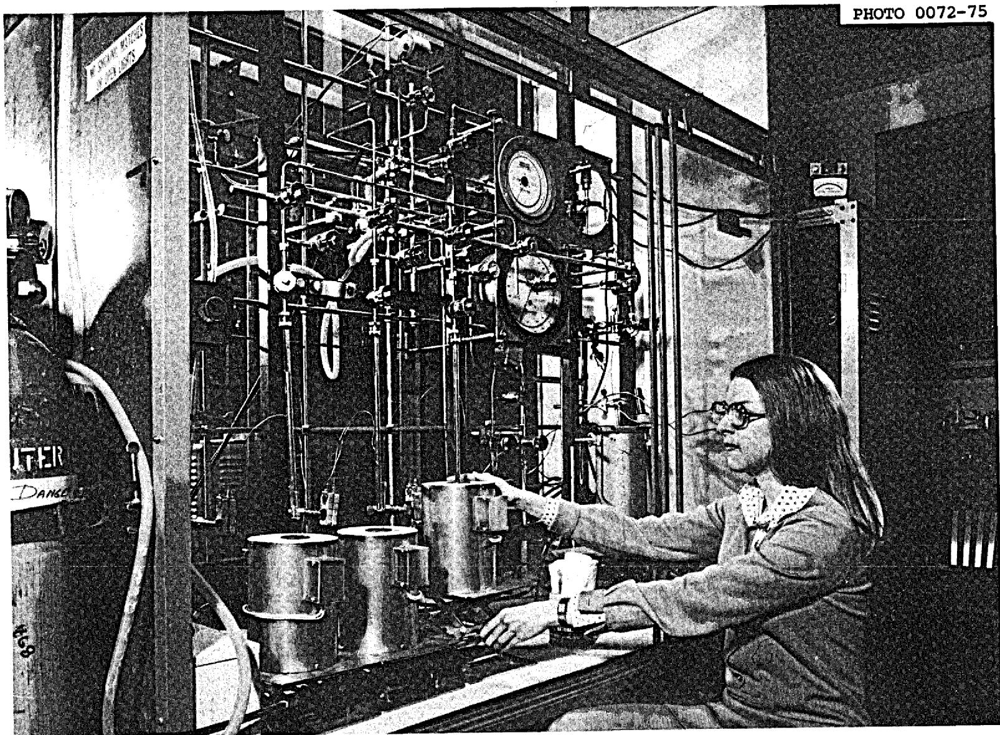  
Figure 6. Photograph of the Equipment Used to Measure Tritium Sorption in Li-Al Alloy.

# Operational Procedures

Li-Bi Sorption System. About $600\mathrm{g}$ of bismuth and $3.47\mathrm{g}$ of lithium ( $\sim 15$ at. $\%$ ) were loaded under an argon atmosphere into a molybdenum crucible, which was placed inside the reaction vessel. The upper flange section was bolted into place. To test for leaks, the vessel was pressurized with argon. After ensuring that no leaks were present, the system was heated to $600^{\circ}\mathrm{C}$ to melt the Li-Bi for sample analysis. (See Sampling Procedure section.) The molybdenum sparge tube was lowered into the molten metal, and argon was bubbled through the Li-Bi. The tritium ampule was attached to the sparge tube; the system was evacuated to about 0.1 torr; and the seal within the ampule was broken. To break the glass seal, a small metal bar was placed inside the ampule before attaching it to the sparge tube. Then a magnet was used to pull the bar through the seal, releasing the tritium. Argon was subsequently passed through the sparge tube to sweep the residual tritium into the Li-Bi alloy; the total system pressure was thereby increased to about 3 psi. Throughout the experiment (except during sampling), the system was kept under a 1- to 5-psi static argon pressure. A period of at least $24\mathrm{hr}$ was allowed to attain equilibrium at each temperature (500, 600, or $700^{\circ}\mathrm{C}$ ). Pairs of liquid and gas samples were removed for analysis.

Sampling Procedure. Each sampler was polished with emery paper before use. The stem of the sampler was then forced through a hole in the Teflon plug and connected to a flexible tube which leads to a manifold supplying both argon and vacuum. The sampler was placed in the upper chamber of the ball valve, and argon was flushed through the sampler and chamber for several minutes. Subsequently, the Teflon plug was inserted

into the O-ring fitting and tightened. The ball valve was then opened and the sampler, with argon flowing through it, was lowered and positioned in the liquid alloy. The flow of argon was continued for 2 to 5 min while the sampler was heated to the temperature of the alloy. The argon flow was stopped, and a vacuum was applied to the sampler. Li-Bi rapidly filled (< 10 sec) the sampler and solidified in the cool part of the capillary stem, thus sealing the sampler. The sampler was then drawn into the upper chamber, and the ball valve was closed. The outside of the filled sampler was carefully polished with emery cloth, and the stem and filter ends were removed with tubing cutters. The remaining part of the sampler contained about 2 g of Li-Bi. The metal sample was dissolved in nitric acid, and the solution was analyzed for tritium.

Gas-phase sampling involved first inducing a vacuum on the 4.5-ml-volume gas sample tubing. The sampler was filled by opening a valve to the vessel and releasing the gas. The valve to the reaction vessel was then closed, and the gas sample was slowly flushed to the analysis system by using argon containing a trace of hydrogen as a carrier gas. For tritium concentrations below $5 \times 10^{3} \mu \mathrm{Ci} / \mathrm{m}^{3}$ , the vapor phase was analyzed by a Triton monitor (Johnston Laboratory, Inc., Model 1055 B). For higher tritium concentrations, the tritium was oxidized at $600^{\circ} \mathrm{C}$ on CuO and trapped in water bubblers. Samples of the bubbler fluids were analyzed by liquid scintillation.

Li-Al Sorption System. The preliminary glass apparatus was operated as described below. One rod-shaped Li-Al sample was loaded under an inert atmosphere into each Pyrex tube. A vacuum stopcock was attached to each sample tube and closed also under an inert atmosphere. The sorption

manifold was evacuated and checked for leaks. The sample tubes were fastened to the manifold, and the total system was pumped down to about $10^{-2}$ torr to remove any residual gas.

After ensuring that there were no leaks, the sample tubes were positioned in the furnaces, heated to about $400^{\circ}\mathrm{C}$ , and continually evacuated, as the Li-Al outgassed, until the system pressure remained steady. Tritium was added as described in the Li-Bi sorption experiment. Usually, at least 24 hr was allowed for the Li-Al samples and tritium to equilibrate. Finally, the sample tubes were quickly cooled with a flow of air to ambient temperature and the samples were removed for analysis.

The procedure for operating the stainless steel system was similar to that used for the Pyrex equipment. A sample was loaded into each stainless-steel-lined quartz tube under an inert atmosphere. The sample was either used in rod form or was crushed into a powder (< 20 mesh). The vacuum valve was attached to the tube and tightly closed under an inert atmosphere. The pumping system and sorption manifold were evacuated. After ensuring that no leaks were present, the sample tubes were fastened to the evacuated manifold. Then the entire system was pumped down to approximately $10^{-2}$ torr to remove any residual gas. Again, the system was tested for leaks, and the sample tubes were positioned in the furnaces and heated. The system was continually evacuated until the pressure remained steady. Tritium was added to the sorption system from a glass ampule. The amounts of tritium used ranged from 1 to 16 Ci. The Li-Al samples and tritium were allowed to equilibrate for at least 24 hr at temperatures ranging from 400 to $600^{\circ}\mathrm{C}$ . After the samples had cooled to ambient temperature, they were removed for analysis.

# Analytical Procedure

The Li-Bi and Li-Al samples were analyzed by dissolving them in nitric acid and counting a dilute portion of the resulting solutions by liquid scintillation. Figure 7 shows the apparatus used in the dissolution process. A sample was placed in a 300-ml reaction flask. After an argon sweep gas had been established, a quantity of warm $75\%$ nitric acid in excess of the amount necessary to react with the sample was poured into the flask. As the sample dissolved, the released tritium was oxidized by hot CuO $(600^{\circ}\mathrm{C})$ and captured in water bubblers. A trace of hydrogen was added to the argon to continuously flush tritium from the CuO bed and tubing walls. Since the granular Li-Al samples reacted violently when nitric acid was added, a modified technique was used to dissolve the crushed samples. A sample was placed into the reaction flask, and water was slowly sprayed from a syringe to start the dissolution. Once the reaction was controlled, nitric acid was added and the aliquots were analyzed. The gas-phase samples were also swept through the CuO bed, and the tritium was trapped in the water bubblers. About $90\%$ of the oxidized tritium was captured in the first bubbler; thus, essentially all the tritium was trapped by two bubblers in series. The tritium monitor did not register above background tritium in the gas exiting the second water bubbler.

Diluted aliquots from the reaction vessel and the water bubblers were analyzed by conventional liquid scintillation techniques. The scintillation solution recipe was:

12 g PPO (2,5-diphenyloxazole)

0.3 g POPOP (1,4-bis-2(5-phenyloxazolyl)benzene)

2010 ml of toluene

990 ml of Triton X-100 (an emulsifier product of Rohm and Haas)

One milliliter of the sample solution was mixed with $10\mathrm{ml}$ of the scintillation counting solution. The tritium in each solution was detected by a Packard Model 574 Tri-carb scintillation spectrometer, which had an efficiency of about $20\%$ . Samples were also analyzed by a similar method by the ORNL Analytical Chemistry Division.

ORNL DWG. 75-5344

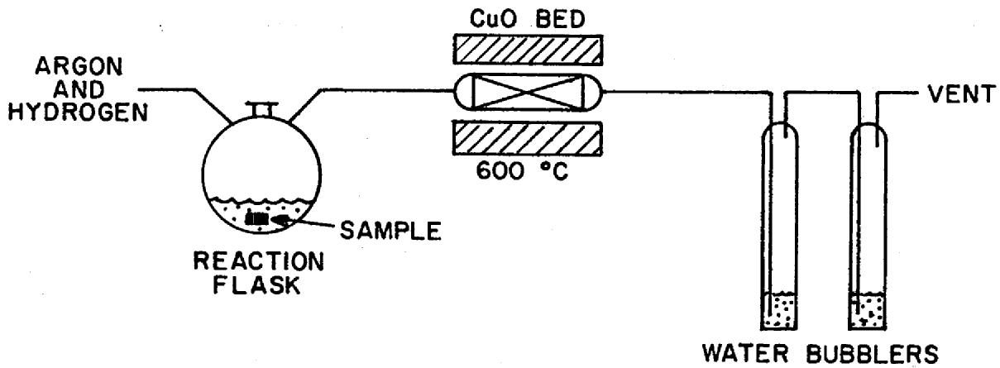  
Figure 7. Sample Dissolution Apparatus for Tritium Analysis.

# CHAPTER V

# EXPERIMENTAL DATA

# Li-Bi Sorption System

The analytical results in Table II and Table III show that the quantities of tritium sorbed by molten Li-Bi were very low. Because of the diffusion of tritium through the stainless steel reactor and the leakage during sampling, the total amounts of tritium continuously decreased from the initial 1 Ci addition to about $10^{-4}$ Ci. Therefore, the solubility of tritium in Li-Bi ranged from about 0.1 to 0.01 ppb, respectively. Multiple metal-phase samples were taken to check the reproducibility of the sampling and analysis techniques. However, samples 2.1 to 2.7 were exceptions, and the values in Table II represent only one concentration value rather than an average of several values as do the remainder of samples. Since the tritium concentration in the gas was substantially greater than that in the Li-Bi, cross-contamination was found from using one CuO bed and contaminated bubblers. Consequently, the lowest concentration value was used for the first seven samples. For the rest of the samples, a separate catalyst bed was used for each phase analysis and all glassware was carefully cleaned between runs. Reproducibility of the gas-phase analyses in Table III was checked by a tritium monitor at levels of less than $5 \times 10^{3} \mu \mathrm{Ci} / \mathrm{m}^{3}$ .

The ideal gas law was applied to determine tritium partial pressures above the Li-Bi phase. Data were taken at 500, 600, and $700^{\circ}\mathrm{C}$ . However, most of the simultaneous gas and metal sampling was done at $600^{\circ}\mathrm{C}$ . Figure 8 shows all the data points and a least-squares fit of the data at $600^{\circ}\mathrm{C}$ . The equation represented by the straight line is:

TABLE II   
RESULTS OF Li-Bi METAL PHASE ANALYSES FOR TRITIUMa   

<table><tr><td rowspan="2">Sample No.</td><td rowspan="2">Temp (°C)</td><td rowspan="2">Sample Wt (g)</td><td colspan="6">Tritium Concentration in Li-Bi</td></tr><tr><td>dpm/ml x 103</td><td>Ci</td><td>g</td><td>ppb</td><td>at.%</td><td></td></tr><tr><td>2.1</td><td>600</td><td>1.9409</td><td>78.03</td><td>1.645 x 10-6</td><td>1.704 x 10-10</td><td>0.0878</td><td>6.057 x 10-7</td><td></td></tr><tr><td>2.2</td><td>600</td><td>1.7661</td><td>32.9</td><td>7.409 x 10-7</td><td>7.676 x 10-7</td><td>0.0435</td><td>3.001 x 10-7</td><td></td></tr><tr><td>2.3</td><td>500</td><td>1.9991</td><td>267</td><td>6.013 x 10-6</td><td>6.229 x 10-10</td><td>0.3129</td><td>2.159 x 10-6</td><td></td></tr><tr><td>2.4</td><td>600</td><td>2.1573</td><td>107</td><td>2.409 x 10-6</td><td>2.496 x 10-10</td><td>0.1157</td><td>7.982 x 10-7</td><td></td></tr><tr><td>2.5</td><td>700</td><td>1.9043</td><td>32.7</td><td>7.365 x 10-7</td><td>7.630 x 10-11</td><td>0.0401</td><td>2.766 x 10-7</td><td></td></tr><tr><td>2.6</td><td>500</td><td>0.8304</td><td>11.09</td><td>2.498 x 10-7</td><td>2.588 x 10-11</td><td>0.0312</td><td>2.152 x 10-7</td><td></td></tr><tr><td>2.7</td><td>600</td><td>1.8375</td><td>12.89</td><td>2.903 x 10-7</td><td>3.008 x 10-11</td><td>0.0164</td><td>1.131 x 10-7</td><td></td></tr><tr><td>2.8A</td><td>700</td><td>1.8659</td><td>2.98</td><td>6.712 x 10-8</td><td>6.954 x 10-12</td><td>0.00373</td><td>2.111 x 10-8</td><td></td></tr><tr><td>2.8B</td><td></td><td>2.1041</td><td>2.16</td><td>4.865 x 10-8</td><td>5.040 x 10-12</td><td>0.00239</td><td></td><td></td></tr><tr><td>2.9A</td><td>500</td><td>2.0251</td><td>2.99</td><td>6.734 x 10-8</td><td>6.976 x 10-12</td><td>0.00345</td><td></td><td></td></tr><tr><td>2.9B</td><td></td><td>2.3340</td><td>2.92</td><td>6.577 x 10-8</td><td>6.814 x 10-12</td><td>0.00292</td><td></td><td></td></tr><tr><td>2.9C</td><td></td><td>2.3196</td><td>2.19</td><td>4.932 x 10-8</td><td>5.106 x 10-12</td><td>0.00220</td><td></td><td></td></tr><tr><td>210A</td><td>600</td><td>2.1038</td><td>8.00</td><td>1.80 x 10-7</td><td>1.865 x 10-11</td><td>0.00886</td><td></td><td></td></tr><tr><td>210B</td><td></td><td>1.9041</td><td>4.94</td><td>1.113 x 10-7</td><td>1.153 x 10-11</td><td>0.00606</td><td></td><td></td></tr><tr><td>210C</td><td></td><td>1.6492</td><td>4.68</td><td>1.054 x 10-7</td><td>1.092 x 10-11</td><td>0.00662</td><td></td><td></td></tr><tr><td>211A</td><td>700</td><td>2.1793</td><td>9.93</td><td>2.236 x 10-7</td><td>2.316 x 10-11</td><td>0.01063</td><td></td><td></td></tr><tr><td>211B</td><td></td><td>2.2471</td><td>3.91</td><td>8.806 x 10-8</td><td>9.123 x 10-12</td><td>0.00406</td><td></td><td></td></tr><tr><td>211C</td><td></td><td>1.5147</td><td>9.72</td><td>2.189 x 10-7</td><td>2.268 x 10-11</td><td>0.01497</td><td></td><td></td></tr><tr><td>3.1A</td><td>500</td><td>1.5229</td><td>3.68</td><td>8.288 x 10-8</td><td>8.586 x 10-12</td><td>0.00564</td><td>2.877 x 10-8</td><td></td></tr><tr><td>3.1B</td><td></td><td>2.0795</td><td>2.407</td><td>5.421 x 10-8</td><td>5.616 x 10-12</td><td>0.00270</td><td></td><td></td></tr><tr><td>3.2A</td><td>700</td><td>2.0424</td><td>21.44</td><td>4.828 x 10-7</td><td>5.002 x 10-11</td><td>0.0245</td><td>1.122 x 10-7</td><td></td></tr><tr><td>3.2B</td><td></td><td>2.0452</td><td>9.593</td><td>2.161 x 10-7</td><td>2.239 x 10-11</td><td>0.0109</td><td></td><td></td></tr><tr><td>3.3A</td><td>600</td><td>2.4211</td><td>5.73</td><td>1.291 x 10-7</td><td>1.337 x 10-11</td><td>0.00552</td><td>3.943 x 10-8</td><td></td></tr><tr><td>3.3B</td><td></td><td>2.0520</td><td>5.20</td><td>1.171 x 10-7</td><td>1.213 x 10-11</td><td>0.00591</td><td></td><td></td></tr></table>

${}^{a}$ Sample calculations of values appear in Appendix B.

TABLE III   
RESULTS OF GAS-PHASE ANALYSES FOR TRITIUM CONCENTRATION   

<table><tr><td rowspan="2">Sample No.</td><td rowspan="2">Temp (°C)</td><td colspan="5">Tritium Concentration in Gas Phase</td></tr><tr><td>By Liquid Scintillation (dpm/ml)</td><td>By Tritium Monitor (μCi/m3)b</td><td>Ci</td><td>g</td><td>T2Partial Pressure (torr)</td></tr><tr><td>2.1</td><td>600</td><td>1.131 x 107</td><td></td><td>4.528 x 10-2</td><td>4.691 x 10-6</td><td>1.059 x 10-1</td></tr><tr><td>2.2</td><td>600</td><td>1.941 x 106</td><td></td><td>7.772 x 10-3</td><td>8.052 x 10-7</td><td>1.819 x 10-2</td></tr><tr><td>2.3</td><td>500</td><td>1.802 x 107</td><td></td><td>7.215 x 10-2</td><td>7.475 x 10-6</td><td>1.495 x 10-1</td></tr><tr><td>2.4</td><td>600</td><td>3.574 x 106</td><td></td><td>1.431 x 10-2</td><td>1.483 x 10-6</td><td>3.349 x 10-2</td></tr><tr><td>2.5</td><td>700</td><td>9.730 x 105</td><td></td><td>3.896 x 10-3</td><td>4.036 x 10-7</td><td>1.016 x 10-2</td></tr><tr><td>2.6</td><td>500</td><td>5.011 x 106</td><td></td><td>2.002 x 10-2</td><td>2.074 x 10-6</td><td>4.148 x 10-2</td></tr><tr><td>2.7</td><td>600</td><td>4.778 x 105</td><td></td><td>1.913 x 10-3</td><td>1.982 x 10-7</td><td>4.477 x 10-3</td></tr><tr><td></td><td></td><td></td><td>4.9 x 103</td><td>1.306 x 10-3</td><td></td><td></td></tr><tr><td>2.8</td><td>700</td><td>1.480 x 106</td><td></td><td>5.926 x 10-3</td><td>6.139 x 10-7</td><td>1.545 x 10-2</td></tr><tr><td>2.9</td><td>500</td><td>2.629 x 105</td><td></td><td>1.053 x 10-3</td><td>1.091 x 10-7</td><td>2.182 x 10-3</td></tr><tr><td></td><td></td><td></td><td>3.9 x 103</td><td>1.037 x 10-3</td><td></td><td></td></tr><tr><td>2.10</td><td>600</td><td>1.726 x 105</td><td></td><td>6.911 x 10-4</td><td>7.243 x 10-8</td><td>1.636 x 10-3</td></tr><tr><td></td><td></td><td></td><td>2.5 x 103</td><td>6.665 x 10-4</td><td></td><td></td></tr><tr><td>2.11</td><td>700</td><td>9.854 x 104</td><td></td><td>3.946 x 10-4</td><td>4.088 x 10-8</td><td>1.029 x 10-3</td></tr><tr><td></td><td></td><td></td><td>8.0 x 103</td><td>2.128 x 10-4</td><td></td><td></td></tr><tr><td>3.1</td><td>500</td><td>6.525 x 104</td><td></td><td>2.613 x 10-4</td><td>2.707 x 10-8</td><td>5.414 x 10-4</td></tr><tr><td></td><td></td><td></td><td>9.75 x 102</td><td>2.594 x 10-4</td><td></td><td></td></tr><tr><td>3.2</td><td>700</td><td>9.246 x 104</td><td></td><td>3.702 x 10-4</td><td>3.835 x 10-8</td><td>9.654 x 10-4</td></tr><tr><td></td><td></td><td></td><td>1.4 x 103</td><td>3.724 x 10-4</td><td></td><td></td></tr><tr><td>3.3</td><td>600</td><td>1.680 x 105</td><td></td><td>6.727 x 10-4</td><td>6.969 x 10-8</td><td>1.574 x 10-3</td></tr><tr><td></td><td></td><td></td><td>2.05 x 103</td><td>5.466 x 10-4</td><td></td><td></td></tr></table>

aSample calculations of values appear in Appendix B.   
bTritium monitor is useful for tritium concentrations of $< 5.0\mathrm{x}10^{3}\mu \mathrm{Ci} / \mathrm{m}^{3}$ (< 1.33 x 10-3 Ci).

ORNL DWG. 75-8301R1

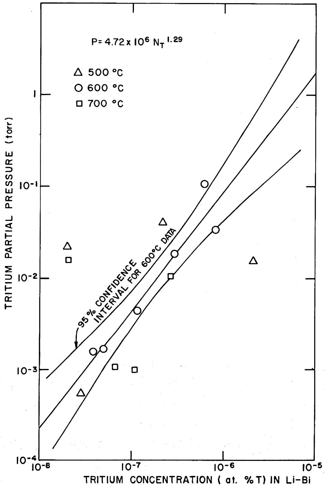  
Figure 8. Tritium Concentration in Li-Bi Samples at the Corresponding Tritium Partial Pressure.

$$
p _ {T _ {2}} = 4. 7 1 6 x 1 0 ^ {6} N _ {T} ^ {1. 2 8 8}, \quad e q. 1 5
$$

where

$$
\mathrm {p} _ {\mathrm {T} _ {2}} = \text {t r i t i u m p a r t i a l p r e s s u r e a b o v e t h e L i - B i , t o r r},
$$

$$
N _ {T} = \text {fraction of tritium in the Li - Bi , at .}
$$

From statistical analysis, the data at $600^{\circ}\mathrm{C}$ fall within the $95\%$ confidence interval which is $1.288 \pm 0.535$ (1.823 to 0.753) for the slope of the line.

# Li-Al Sorption System

The tritium sorption data for Li-Al are shown in Tables IV and V. The time-dependent data of Table IV at $400^{\circ}\mathrm{C}$ were measured when the system pressure was not remaining steady. The leakage problem was resolved, and constant-pressure measurements were taken (see Table V). Also, the most reliable data points are presented in Table V. Partial dissolution of Li-Al samples shows that the concentration of tritium decreases as a function of dissolved Li-Al (Table IV). Figure 9 shows the data graphically.

The limited data have noticeable discrepancies; however, the tritium concentration in the rod samples range from 0.01 to $4\mathrm{wt}$ ppm for tritium pressures of 0.14 to 5.42 torr, respectively. The concentration of tritium was generally higher in most of the powdered samples.

The chemical properties of Li-Al were more complex than was initially anticipated. According to the phase diagram (18), Li-Al forms an equi-atomic homogeneous solid solution. Yet, during heating of the samples, some material volatilized. A ring of a shiny, metallic silver substance

TABLE IV   
RESULTS OF Li-Al ANALYSES FOR TRITIUM AT $400^{\circ}\mathrm{C}$   

<table><tr><td rowspan="2">Sample No.</td><td rowspan="2">Time (days)</td><td colspan="2">Pressure (torr)</td><td rowspan="2">Sample Wt (g)</td><td colspan="3">Tritium Concentration in Li-Al</td></tr><tr><td>Initial</td><td>Final</td><td>dpm/ml</td><td>wt ppm</td><td>at.%</td></tr><tr><td>Al 1</td><td>1.76</td><td>0.66</td><td>1.17</td><td>0.545</td><td>6.60 x 109</td><td>0.565</td><td>4.305 x 10-4</td></tr><tr><td>Al 2</td><td>2.75</td><td>0.66</td><td>2.18</td><td>0.455</td><td>1.25 x 1010</td><td>1.282</td><td>9.765 x 10-4</td></tr><tr><td>Al 3</td><td>5.78</td><td>0.66</td><td>2.37</td><td>0.450</td><td>7.64 x 109</td><td>0.792</td><td>6.035 x 10-4</td></tr><tr><td>2Al 1</td><td>0.95</td><td>1.36</td><td>1.06</td><td>0.78</td><td>1.14 x 1010</td><td>0.682</td><td>5.195 x 10-4</td></tr><tr><td>2Al 2</td><td>3.75</td><td>1.36</td><td>3.40</td><td>0.79</td><td>4.22 x 1010</td><td>2.661</td><td>2.027 x 10-3</td></tr><tr><td>2Al 4a</td><td>0.89</td><td>1.36</td><td>1.02</td><td>0.58</td><td>2.37 x 1011</td><td>19.07</td><td>1.453 x 10-2</td></tr><tr><td colspan="8">Li-Al Partial Dissolution Results</td></tr><tr><td></td><td></td><td></td><td></td><td></td><td>Percent Sample Dissolved</td><td></td><td></td></tr><tr><td>Al 2.1</td><td>5.92</td><td>1.20</td><td>5.42</td><td>0.8036</td><td>13.2</td><td>3.96</td><td>3.04 x 10-3</td></tr><tr><td>Al 3.2</td><td>5.92</td><td>1.20</td><td>5.42</td><td>0.8968</td><td>15.7</td><td>3.53</td><td>2.70 x 10-3</td></tr><tr><td>Al 1</td><td>5.92</td><td>1.20</td><td>5.42</td><td>1.7018</td><td>49.8</td><td>1.39</td><td>1.06 x 10-3</td></tr><tr><td>Al 3.1</td><td>5.92</td><td>1.20</td><td>5.42</td><td>0.6110</td><td>68.8</td><td>3.22</td><td>2.64 x 10-3</td></tr><tr><td>Al 2.2</td><td>5.92</td><td>1.20</td><td>5.42</td><td>0.5050</td><td>100.0</td><td>1.07</td><td>8.18 x 10-4</td></tr></table>

TABLE V   
TIME-INDEPENDENT RESULTS OF Li-Al ANALYSES FOR TRITIUM   

<table><tr><td>Sample No.</td><td>Temperature (°C)</td><td>Sample Wt (g)</td><td>Pressure (torr)</td><td colspan="2">Tritium Concentration in Li-Al wt ppm at.%</td></tr><tr><td>4 Al 2</td><td>500</td><td>0.46</td><td>0.52</td><td>4.11</td><td>3.14 x 10-3</td></tr><tr><td>4 Al 3</td><td>500</td><td>0.48</td><td>0.52</td><td>2.08</td><td>1.59 x 10-3</td></tr><tr><td>3 Al 1</td><td>550</td><td>0.458</td><td>0.14</td><td>0.013</td><td>9.96 x 10-6</td></tr><tr><td>3 Al 3a</td><td>550</td><td>0.413</td><td>0.14</td><td>0.067</td><td>5.14 x 10-5</td></tr><tr><td>4 Al 1</td><td>550</td><td>0.39</td><td>0.53</td><td>0.136</td><td>1.04 x 10-4</td></tr><tr><td>4 Al 4a</td><td>550</td><td>0.50</td><td>0.53</td><td>33.29</td><td>2.36 x 10-2</td></tr><tr><td>3 Al 2</td><td>600</td><td>0.534</td><td>0.13</td><td>0.158</td><td>1.21 x 10-4</td></tr><tr><td></td><td></td><td colspan="2">Most Reliable Data</td><td></td><td></td></tr><tr><td>5 Al 1</td><td>400</td><td>0.35</td><td>0.032</td><td>0.343</td><td>2.62 x 10-4</td></tr><tr><td>5 Al 2</td><td>450</td><td>0.37</td><td>0.0325</td><td>0.467</td><td>3.58 x 10-4</td></tr><tr><td>5 Al 3</td><td>500</td><td>0.29</td><td>0.029</td><td>0.513</td><td>3.92 x 10-4</td></tr><tr><td>5 Al 4</td><td>550</td><td>0.29</td><td>0.028</td><td>1.086</td><td>8.32 x 10-4</td></tr></table>

Powder.

ω

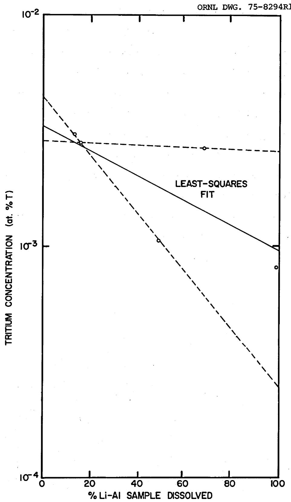  
Figure 9. Tritium Concentration as a Function of Percent Li-Al Sample Dissolved.

condensed on the cooled portion of the quartz sample tube. Initially, stainless steel liners were not inserted in the sample tubes to contain the Li-Al; the quartz tubes were attacked and cracked by the substance. Silica compounds, such as quartz, are rapidly attacked by molten lithium (15); therefore, it was suspected that excess lithium was present. To analyze the constituents of the volutilized material, a time-of-flight mass spectrometer experiment was conducted by John Redman of the ORNL Chemistry Division. Several Li-Al samples were analyzed both under vacuum and with a pure hydrogen flow. The temperature of the sample ranged from 400 to $650^{\circ}\mathrm{C}$ ; however, no lithium-containing vapor species were observed. This behavior needs to be verified before Li-Al is selected for a CTR blanket material.

# CHAPTER VI

# DISCUSSION OF RESULTS

# Li-Bi Sorption System

The solubility of tritium in molten Li-Bi (~ 15 at. % lithium) was determined to be less than 10 ppb at temperatures ranging from 500 to $700^{\circ}\mathrm{C}$ . Therefore, an extraction process based on this alloy would not be feasible.

The pressure-concentration relationship of Equation 15 does not correspond to Sieverts' law (Equation 11) or Henry's law, which states that the tritium partial pressure would be directly proportional to its concentration in the solution. If data followed Henry's law, the error of the slope could be due to impurities in the metal. However, formation of intermetallic Li-Bi compounds could cause a slope between 1 and 2. A temperature dependence cannot be determined from the scatter of data from Fig. 8. Further experiments would be needed to provide these correlations. Since the data clearly show that the proposed process is not practical, no further experiments were made in this area.

With appropriate equipment alterations, the leakage rate of tritium could be reduced and the sampling technique could be improved. Nevertheless, at such low solubility levels, the sensitivity of the liquid scintillation counting of samples could not be increased to enhance the accuracy of the data. Thus it was concluded that, due to the low sorption of tritium in Li-Bi, the proposed extraction process would not suffice as a tritium recovery method for a CTR molten salt blanket. Further experiments are not likely to alter these conclusions.

One reason for the low solubility of tritium in Li-Bi is that the lithium present is bonded so strongly with bismuth (18) that lithium tritide is not easily formed. It has been suggested that Li-Pb, which is chemically similar to the Li-Bi alloy, be used for neutron shields and collimators (15). Previous studies suggest that this material is potentially useful because it is relatively inexpensive, easily handled and fabricated, and stable in air at temperatures over $200^{\circ}\mathrm{C}$ and neutron fluxes of the order of $10^{12}$ neutrons/cm² sec. But, it was also considered useful because it was assumed that the tritium produced would be bound chemically, as lithium tritide, within the Li-Pb. This is doubtful due to the low solubility of tritium in Li-Bi which was determined in this investigation. This study could also be relevant to some proposed uses of Li-Pb in fusion reactors.

# Li-Al Sorption System

The tritium sorption data in Tables IV and V, although not conclusive, do provide some insight into the relatively complex nature of Li-Al. The limited amount of data and the apparent inconsistencies make correlations of temperature, pressure, concentration, and sorption rate impossible. Tritium sorption rates were low, and equilibrium probably was not achieved in many of the experiments.

The partial dissolution experiment does indicate that the loading was determined by sorption rate rather than equilibrium, but it does not explain the manner in which the sorption occurred. The tritium concentration decreased as more of the total sample was dissolved, the concentration being higher at the surface. Sorption may be controlled by either surface reaction or slow diffusion, or both. Surface adsorption

could be very important if the solid blanket material were to "powder" under irradiation; also, diffusion by grain boundaries could be significant. The sorption time does seem to be several days. This indicates that a desorption time would be also several days, thus increasing the tritium inventory significantly.

The tritium solubilities observed in this study were low and in the range of $10^{-8}$ to $10^{-6}$ atom fraction in Li-Al suggested by Powell (30). Powell assumed that the tritium equilibrium solubility in Li-Al alloy followed Sieverts' law; Sieverts' constant was chosen to be $4.47 \times 10^{2}$ torr $^{1/2}$ (atom fraction) $^{-1}$ at $500^{\circ}\mathrm{C}$ . Assuming that Sieverts' law is applicable to Li-Al, Sieverts' constants were determined for the most reliable data (most likely to be equilibrium solubility data) in Table V. Figure 10 is a plot of Sieverts' constants for this data set, liquid lithium (35), and aluminum (11) as a function of inverse temperature. Sieverts' constants for Li-Al are between the lithium and aluminum data; the slope of the line is in the same direction as that of the aluminum data line. The value from Fig. 10 at $500^{\circ}\mathrm{C}$ is $3.4 \times 10^{4}$ torr $^{1/2}$ (atom fraction) $^{-1}$ . Wiswall and Wirsing (43) found a typical value of $1.22 \times 10^{4}$ at $500^{\circ}\mathrm{C}$ ; therefore, Powell's estimate of a Sieverts' constant is too small.

Some of the data suggest that tritium inventories may not follow a simple Sieverts' relationship, but this cannot be determined conclusively from the present study. The tritium partial pressure readings were affected by the presence of the stainless steel tube liners, which absorb tritium throughout the experimental temperature range. Tritium solubility in stainless steel follows the Sieverts' relationship (28):

40

ORNL DWG. 75-8290R1

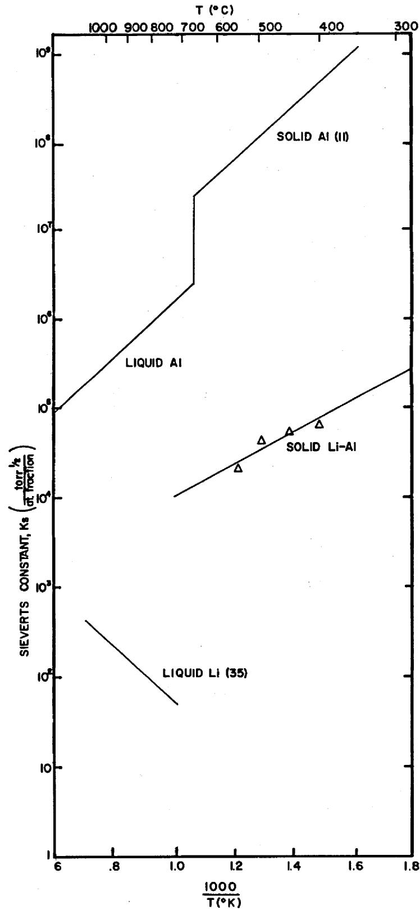  
Figure 10. A Comparison of Sieverts' Constants for Aluminum, Lithium, and Li-Al Alloy.

$$
N _ {T} = 2. 4 7 \exp \left[ \frac {- 1 . 1 5 5}{T (° K)} \right] p _ {T _ {2}} ^ {\frac {1}{2}}, \tag {eq.16}
$$

where

$$
\begin{array}{l} N _ {T} = \text {m o l e f r a c t i o n o f t r i t i u m i n 3 0 4 s t a i n l e s s s t e e l}, \\ \mathrm {p} _ {\mathrm {T} _ {2}} = \text {t r i t i u m p a r t i a l p r e s s u r e , t o r r ,} \\ T = t e m p e r a t u r e, ^ {\circ} K. \\ \end{array}
$$

The stainless steel liners were necessary to prevent an attack of the quartz containers. It has been reported (l) that Li-Al alloys with a lithium content greater than 4 wt % (~12 at. % lithium) form a separate metallic lithium phase; however, the mass spectrometer experiments did not verify this. The attack was probably due to excess lithium in the Li-Al samples. Further thermochemical study of Li-Al is needed.

# CHAPTER VII

# ANALYSIS OF THE TRITIUM RECOVERY SYSTEM FOR THE PRINCETON REFERENCE DESIGN

A Tokamak fusion reactor consumes deuterium and tritium which are injected continuously into the toroidal reactor. In the Princeton Reference Design, about $10\%$ of the fuel ions fuse and the resulting fast neutrons are captured in the molten $\mathrm{Li}_2\mathrm{BeF}_4$ blanket. Tritium fuel is generated from the lithium in the salt blanket. The principal coolant for the fusion plant is helium gas, which cools the reactor and divertor walls, as well as the blanket. Conventional water boilers then cool the helium and produce steam which is used to drive electric power generators.

Tritium must be recovered from the blanket and recycled to replace that consumed in the plasma. Johnson (21) has proposed the tritium recovery scheme considered in this section.

# Description of the Process

Figure 11 shows the tritium recovery system for the molten fluoride loop. The flow rates and concentrations are listed in Table VI.

The breeder salt recirculates constantly through eight disengagers arranged in parallel about the periphery of the reactor. The salt is sprayed into the disengagers as small droplets to provide an extended surface area for the dissolved helium and TF to diffuse from the liquid salt. Salt collects in the bottom of the disengager and flows back to the reactor blanket. An unspecified doctor system removes impurities from the $\mathrm{Li}_{2}\mathrm{BeF}_{4}$ and adds makeup agents to maintain the desired salt composition to a small drag stream of salt.

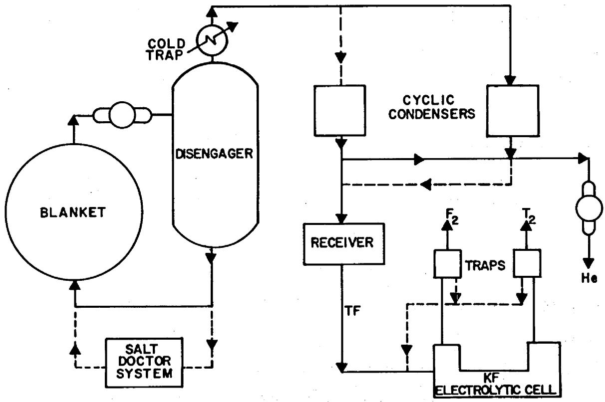  
Figure 11. Princeton's Reference Design Salt Blanket Processing System.

ORNL DWG. 75-8288

TABLE VI   
FLOW RATES AND CONCENTRATIONS FOR THE TRITIUM RECOVERY SYSTEM FOR THE PRINCETON REFERENCE REACTOR   

<table><tr><td>Li2BeF4salt flow through disengagers</td><td>4.0 x 106kg/hr</td></tr><tr><td>TF Concentration in salt</td><td></td></tr><tr><td>Entering disengagers</td><td>2.09 x 10-7mole fraction</td></tr><tr><td>Exiting disengagers</td><td>1.29 x 10-8mole fraction</td></tr><tr><td>Exhaust gas composition</td><td></td></tr><tr><td>TF</td><td>1.0 x 10-4atm</td></tr><tr><td>He</td><td>1.53 x 10-4atm</td></tr><tr><td>Salt</td><td>1.3 x 10-4atm</td></tr><tr><td>Tritium recovery</td><td>548 g/day</td></tr><tr><td>Helium ash discharge</td><td>1120 g/day</td></tr></table>

The gas effluent is drawn successively through a water-cooled salt trap and liquid nitrogen-cooled cyclic condensers. The helium is discharged to a storage system for final control. Solid TF is melted out of the offstream cyclic condenser and collected in a small receiver. The salt flows intermittently through a purification system and into an electrolysis cell, where a solution of KF in TF is electrolyzed to $\mathbf{F}_2$ and $\mathbf{T}_2$ . The gases emerging from the electrodes are saturated with TF and must pass through the liquid nitrogen-cooled traps to remove the TF. The pure tritium gas is recycled to the primary fuel loop.

The main components of the processing scheme, the spray disengagers, and cyclic condensers were investigated in detail to evaluate their associated problems. The areas that may cause problems for the usage of disengagers are: (a) the diameter and residence time of the droplets

needed for adequate mass transfer of the dissolved TF and He in the salt, (b) the ability to spray a molten salt in an evacuated vessel, and (c) the characteristics of spray nozzles to disengage the salt. The possible difficulties of the cyclic condensers involve (a) the effect of a noncondensable gas on the surface area needed for condensation, and (b) the type of TF flow in the condenser. These considerations were examined to evaluate the salt processing system.

# Disengager Analysis

Figure 12 shows a detailed schematic of the proposed disengagers. Each of the eight disengagers is equipped with spray nozzles near the top and a salt discharge line at the bottom. Baffles near the top of the vessel prevent salt entrainment into the vapors which are vented at the top.

To avoid wall embrittlement, the maximum tolerable tritium pressure in the salt was estimated by Maroni (24) as $10^{-2}$ torr or $1.32 \times 10^{-5}$ atm. The corresponding TF concentration in the entering salt was calculated to be $2.09 \times 10^{-7}$ mole fraction. The exit concentration corresponding to a TF pressure of $10^{-4}$ atm is $1.29 \times 10^{-8}$ mole fraction.

A simplified picture of the mass transfer mechanism in an individual salt droplet is as follows: (a) TF diffuses from within the drop to the surface of the drop, and (b) TF diffuses from the drop surface into the gas phase. For the first step involving liquid diffusion in a spherical drop, with negligible drag effects, the rate equation is (29):

$$
\frac {C}{C _ {0}} = \frac {6}{\pi^ {2}} \left(e ^ {- \pi^ {2} D t / r ^ {2}} + 1 / 4 e ^ {- 4 \pi^ {2} D t / r ^ {2}} + 1 / 9 e ^ {- 9 \pi^ {2} D t / r ^ {2}} + \dots\right),
$$

eq. 17

ORNL DWG. 75-8292

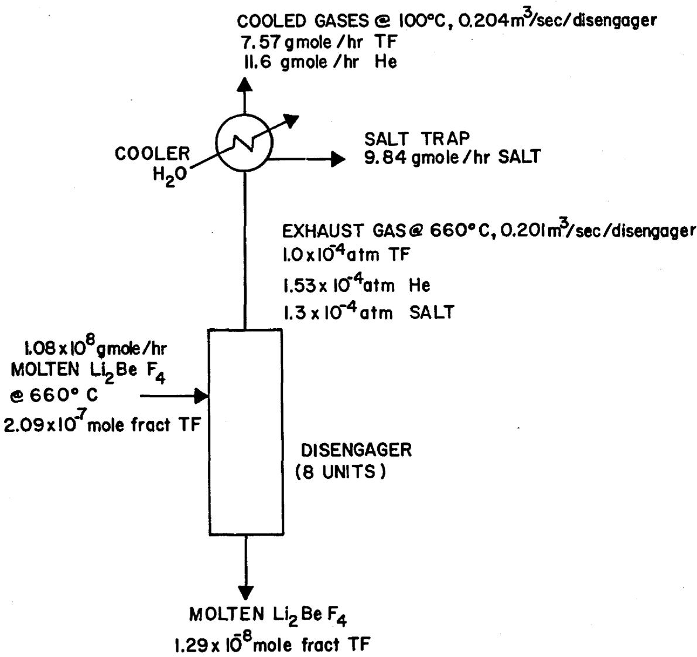  
Figure 12. Schematic of the Salt Disengager and Salt Trap.

where

$C_{0} =$ initial TF concentration, mole fraction,

$C =$ final average TF concentration, mole fraction,

D = liquid diffusivity of TF in molten salt, cm²/sec,

$\mathbf{r} =$ radius of the droplet, cm,

$t =$ time,sec.

Using the values for the initial and final average TF concentrations in the salt, $\mathrm{C} / \mathrm{C}_{\circ}$ is calculated to be 6.17 x $10^{-2}$ . The corresponding $\mathrm{Dt} / \mathrm{r}^{2}$ value is 0.232 (Appendix C). The liquid diffusivity of TF in molten salt suggested by Cantor (5) is $10^{-5} \, \mathrm{cm}^{2} / \mathrm{sec}$ ; therefore, $\mathrm{t} / \mathrm{r}^{2}$ equals 2.32 x $10^{4} \, \mathrm{sec} / \mathrm{cm}^{2}$ . Figure 13 is a graph of time vs diameter for this equation.

For the second step involving liquid diffusion in a spherical drop, the diffusion rate equation for TF removal through the gas film resistance is:

$$
\frac {d N}{d t} = K _ {g} a (p _ {i} - p), \quad e q. 1 8
$$

where

$$
\mathbf {N} = \text {m o l e s} \quad \text {o f} \quad \mathbf {T F},
$$

$K_{g} =$ mass transfer coefficient, moles/cm sec torr,

a = surface area of drop, cm²,

$\mathbf{p}_{\dot{\mathbf{i}}} =$ vapor pressure of TF, torr,

$\mathbf{p} =$ partial pressure of TF in gas phase, torr.

This step is negligible since the salt is sprayed into a vacuum and the gas film resistance is essentially zero.

Atomization of a fluid usually involves the application of an external force, such as a gas resistance. However, disintegration will occur in a vacuum if the liquid jet is turbulent throughout and its surface

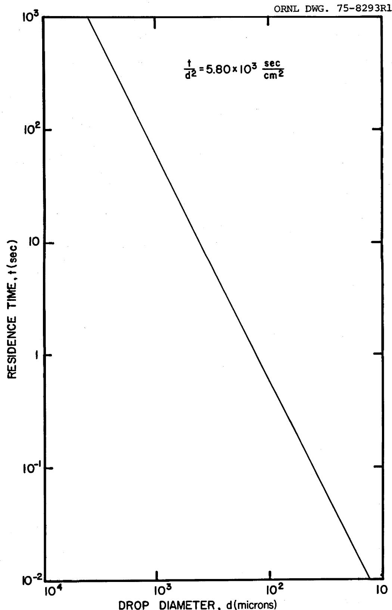  
Figure 13. Residence Time vs Drop Diameter for Molten Salt Mass Transfer.

tension is overcome (25). The effects of liquid properties and jet velocity on the jet breakup have been studied for the case of atomization without the influence of a surrounding medium. The mechanism can be predicted to be dependent on jet diameter, jet velocity, liquid density, surface tension, and viscosity (Appendix D). From this correlation, the jet velocity needed to achieve atomization must be greater than 488 fps to obtain a droplet size of $150\mu$ . From Fig. 13, the residence time for mass transfer for a $150-\mu$ drop is found to be 1.31 sec; therefore, a column height of over 637 ft is necessary. A smaller droplets size would decrease the height of a disengager.

The selection of the type of spray nozzle has a considerable bearing on the dimension of the spray tower. The characteristics, operating ranges, advantages, and disadvantages for hydraulic-pressure nozzles and spinning-disk atomizers are listed in Table VII. The maximum capacity through a single nozzle or the feed rate from a spinning disk is about 10,000 lb/hr. The salt flow rate through each disengager is $5.0 \times 10^{5}$ kg/hr or $1.1 \times 10^{6}$ lb/hr; therefore, the minimum number of nozzles per disengager would be about 110.

A preliminary study of a dropwise liquid-gas contacting system was made by Gabor et al. (16). Fused $\mathrm{NaF - ZrF_4}$ containing dissolved uranium tetrafluoride was sprayed into a fluorine atmosphere to recover uranium hexafluoride. Experimental equipment was developed to test heat and mass transfer rates. A Spraying Systems Company full-cone spray nozzle (1/8 G3001.4) constructed of Monel was used for the heat transfer tests. This nozzle had a 0.026-in. orifice. The salt was heated to $650^{\circ}\mathrm{C}$ and sprayed into air at $20^{\circ}\mathrm{C}$ . The average diameter for a droplet was determined to be $164\mu$ .

# TABLE VII

# CHARACTERISTICS, ADVANTAGES, AND DISADVANTAGES OF PRESSURE

# NOZZLES AND SPINNING-DISK ATOMIZERS (25)

Hydraulic-Pressure Nozzles

Spinning-Disk Atomizers

# Characteristics

1. Pressure: up to 10,000 lb/in.²   
2. Capacity: up to 10,000 lb of feed per hour per nozzle   
3. Feed viscosity: up to several hundred centipoises depending on pressures, capacity, and orifice size

1. Disk speed: 500-30,000 rpm   
2. Disk diameter: 2-10 in.   
3. Feed rate: 0.05-15,000 lb per hour per disk

# Advantages

1. Suited for multiple atomizers   
2. Used for countercurrent spray drying   
3. Nozzles generally inexpensive   
4. Flexibility in designs and types   
5. Better for viscous fluids than are spinning disks, since feed can be preheated under pressure

1. More flexible than nozzles; handle changes in feed rate since disk speed and feed rate vary independently   
2. Multiple fluids can be easily handled and mixed   
3. Liquid feed is under low pressure   
4. No small clearances or openings which may plug or erode

# Disadvantages

1. Inflexible due to pressure, capacity, and orifice size variables being independent   
2. Nozzle susceptible to erosion and plugging   
3. High-pressure pumps are expensive   
4. Limit to the fineness of atomization   
5. Variations in feed rate not always feasible

1. Counterflow is difficult   
2. Disks as well as the drive mechanisms are expensive   
3. Not readily adapted to horizontal spray dryers   
4. Not well suited to very viscous liquids

Several problems were encountered in spraying the fluoride salt. Difficulties associated with plugging of the spray nozzle were solved by heating the nozzle for fully controlled operation. In other fused-salt process studies, autoresistively heated salt transfer lines have proved successful. The nozzles used were removed and inspected after 20 batch sprayings. Examination revealed that the orifice had enlarged from 26 to 32 mils, increasing the area about $50\%$ and indicating frequent nozzle replacement.

The prospect of a spray process for the recovery of tritium from molten fluoride salt appears discouraging. The velocity of the jet must be high to overcome the surface tension of the salt for atomization to occur with negligible gas film resistance or drag effects of a vacuum of $10^{-4}$ torr. The droplet diameter and residence time in the disengager needed for mass transfer, coupled with the acceleration of the drops as they fall, lead to a design of a tower of considerable height. If the minimum number of nozzles if 110, the column diameter must also be large to decrease coalescence of the droplets. The corrosion within the spray nozzles would make frequent replacement necessary for full operation.

# Cyclic Condenser Analysis

A schematic of the cyclic condensers is shown in Fig. 14. The cooled helium and TF leave the salt trap and are drawn through an on-stream cyclic condenser. The gas is cooled further to the liquid nitrogen temperature of $77.4^{\circ}\mathrm{K}$ , and the TF is condensed out.

Ideally, the condenser walls must be kept cold enough to freeze out nearly all the TF to a negligibly low equilibrium pressure. This would expose the condenser surface to gas bombardment, so that the pumping speed

ORNL DWG. 75-8295

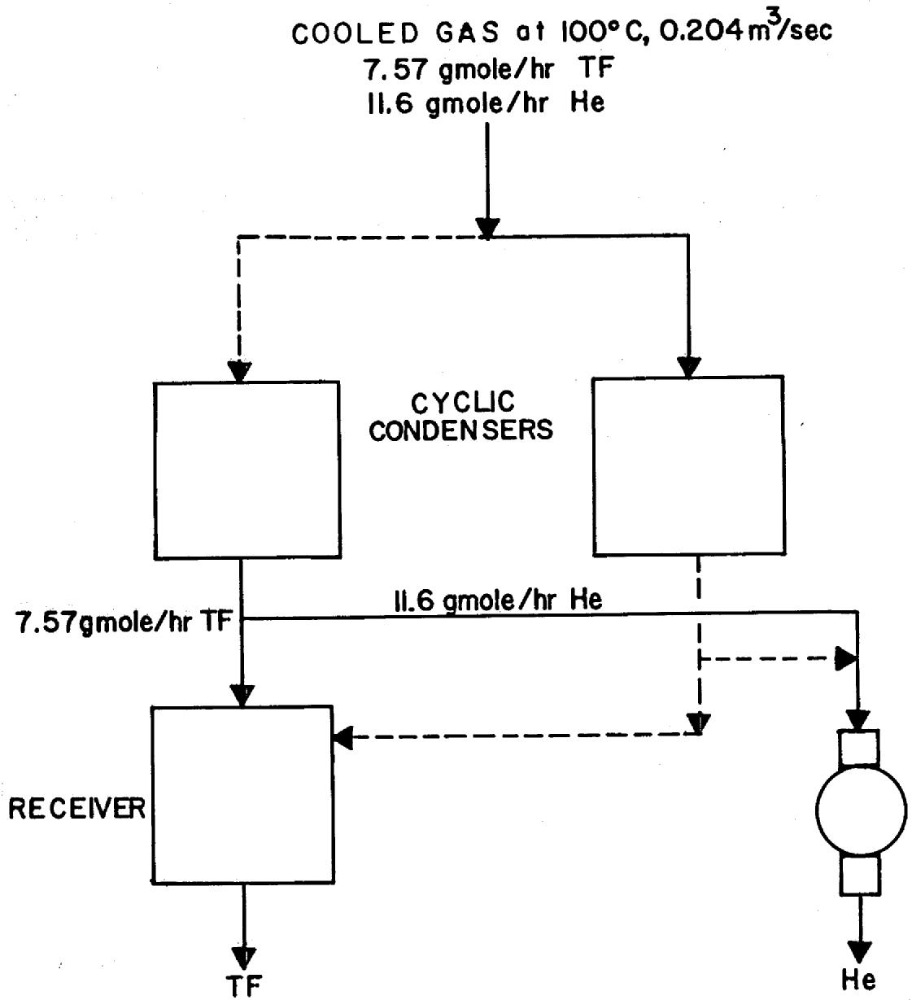  
Figure 14. Schematic of the Cyclic Condensers.

would be limited only by surface area and the sticking probability of the impinging molecules (31). Noncondensables often influence the pumping speed and the condenser surface area. The condensing gas is likely to sweep the noncondensable gas against the condenser surface, creating a blanket through which the condensing gas must diffuse to reach the cold wall. However, gas blankets are not formed when the mean free paths are long or when the proportion of uncondensable gas is sufficiently low (31).

Since an appreciable amount of helium, a noncondensable gas, is drawn through the condenser, the mean free paths were calculated to determine whether a gaseous diffusion barrier would form. The mean free path is the average distance traveled by a molecule between collisions. Mean free paths can be determined from the collision frequencies of the interacting molecules. The frequencies of collision of the possible pairs of impacting molecules, the subsequent mean free paths, and the frequencies of collision with the condenser walls are listed in Table VIII.

When collisions of molecules with each other are negligible in comparison with their impacts on the walls of the surrounding enclosure, the gas is in Knudsen or "free molecular" flow. Knudsen flow usually assumes very dilute gases with pressures in the region of $10^{-3}$ to $10^{-9}$ atm or a very narrow capillary tube. Also, the mean free path is greater than the tube diameter for Knudsen flow of a gas (23).

As stated in Johnson's process design, the duct diameter must not be less than $0.5\mathrm{m}$ to avoid large pressure losses. The mean free paths vary from about $10^{-2}\mathrm{cm}$ to about $10^{7}\mathrm{cm}$ . The impacts of molecules with the walls are in the same range as the intermolecular collisions; therefore, it is difficult to determine whether the gas flowing through the

TABLE VIII

MOLECULAR AND WALL COLLISION FREQUENCIES AND MEAN FREE PATHS OF He and TF IN THE CYCLIC CONDENSERS

(1) Molecular Collision Frequencies, molecules $\mathrm{cm}^{-3}\sec^{-1}$ (Appendix E)

$$
H e - H e 7. 1 4 2 x 1 0 ^ {2 1}
$$

$$
\mathrm {H e} - \mathrm {T F} 2. 0 1 3 x 1 0 ^ {1 4}
$$

$$
\mathrm {T F - T F} 6. 7 8 2 \times 1 0 ^ {5}
$$

(2) Wall Impact Frequencies, molecules cm $^{-2}$ sec $^{-1}$ (Appendix F)

$$
\text {H e} \quad 1. 5 1 6 x 1 0 ^ {2 0}
$$

$$
\mathrm {T F} \quad 2. 4 3 0 \times 1 0 ^ {1 2}
$$

(3) Mean Free Paths $(\lambda)$ , cm (Appendix G)

$$
\lambda \mathrm {H e} - \mathrm {H e} \quad 8. 4 9 \quad x 1 0 ^ {- 2}
$$

$$
\lambda \mathrm {T F} - \mathrm {H e} 4. 8 2 x 1 0 ^ {- 2}
$$

$$
\lambda \mathrm {H e} - \mathrm {T F} \quad 3. 0 1 \quad x 1 0 ^ {6}
$$

$$
\lambda \mathrm {T F} - \mathrm {T F} \quad 1. 4 3 \quad x 1 0 ^ {7}
$$

condenser is in Knudsen flow. Consequently, the helium may interfere with the condensation of TF. An alternate condenser design, such as using multiple tubes with smaller-diameter ducts instead of one 0.5-mduct, may be a possible solution.

As stated in the proposed design, the heat load of each condenser consists basically of the periodic heating and cooling of the mass of metal (equivalent to $500\mathrm{kg}$ of steel) constituting the condenser. The heat flux to cool the TF gas from $373^{\circ}\mathrm{K}$ to $77.4^{\circ}\mathrm{K}$ can be approximated by summing the latent and sensible heat changes (Appendix H). The total enthalpy change was calculated to be $\sim 132\mathrm{kcal / hr}$ ; however, assuming

that the energy loss equals the decrease of the condenser temperature itself from the melting point of TF (20°C) to 77.4°K, the total heat exchange duty per condenser is 1075 kcal/hr (Appendix H). Thus, the freezing out of TF is a minor part of the heat load.

The cyclic condensers seem to be feasible as an integral part of the tritium recovery system. Helium may increase the surface area required to freeze out the TF; thus the condenser design will have to take this into account. Since the cooling of the condenser itself, rather than the heat flux of condensing the TF gas, is the main component of the heat exchange duty, the total power requirement is not increased unless there is an increase in the condenser area itself.

# Other Design Considerations

The salt traps above each spray tower and the vacuum pump system may be areas of additional design consideration. The molten salt entering the spray disengagers at $660^{\circ}\mathrm{C}$ may be boiling, inasmuch as the uncertainty is a factor of 10 for the reported values of vapor pressure for molten $\mathrm{Li}_2\mathrm{BeF}_4$ (4). The vapor pressure at $660^{\circ}\mathrm{C}$ of the molten salt is determined to be $1.3 \times 10^{-4}$ atm, and the total pressure of the vessel is $3.83 \times 10^{-4}$ atm. An increase in the quantity of vaporized salt in the gas effluent would increase the salt trap size needed. The salt captured in the cold traps may have to be reprocessed due to redissolution of TF into the salt.

Tritium loss from the vacuum pump system will be inherent; therefore, a trapping system should be a requirement to prevent the escape of TF. In choosing the vacuum pumps, the compatibility of TF with the pump components must be reviewed.

# CHAPTER VIII

# CONCLUSIONS AND RECOMMENDATIONS

# Conclusions

From this study, the following conclusions can be drawn:

1. The solubility of tritium in molten Li-Bi ( $\sim$ 15 at. $\%$ lithium) is less than 0.1 ppb at temperatures ranging from 500 to $700^{\circ}\mathrm{C}$ .   
2. Because of the low solubility of tritium in Li-Bi, the extraction process proposed to recover tritium from a $\mathrm{Li}_2\mathrm{BeF}_4$ blanket is not attractive.   
3. Tritium sorption in solid equiatomic Li-Al ranges from $10^{-5}$ to $10^{-6}$ atom fraction tritium, which is in agreement with estimates for the blanket recovery system proposed by Powell (30).   
4. The Sieverts' constants determined for the solubility of tritium in Li-Al are smaller than those for aluminum, but larger than those for lithium at 400 to $600^{\circ}\mathrm{C}$ .   
5. The sorption of tritium in Li-Al appears to be controlled by surface reaction, slow internal diffusion, or both.   
6. The spray disengager process for the recovery of tritium from molten $\mathrm{Li}_{2}\mathrm{BeF}_{4}$ does not look attractive for the following reasons:

(a) The velocity of the salt jet must be high for atomization in a $10^{-4}$ atm vacuum ( $>488$ fps for 150-µ droplets).   
(b) The drop diameter and residence time needed in the disengager for the mass transfer of TF leads to a tower of considerable height ( $>637$ ft for $150 - \mu$ droplets).   
(c) The minimum number of nozzles needed to atomize the amount of $\mathrm{Li}_2\mathrm{BeF}_4$ to be processed per disengager is 110. Corrosion within the nozzles would make frequent replacement necessary.

# Recommendations

For further study, the following recommendations are made:

1. Appropriate equipment design and sampling technique improvements are necessary to collect more accurate data for determining the physical chemistry of the Li-Bi--tritium system.   
2. Removal of tritium from irradiated Li-Al of low lithium content should be investigated to determine tritium solubility and release rates.   
3. Alternative flowsheets for recovering tritium from $\mathsf{Li}_2\mathsf{BeF}_4$ blankets should be investigated.

# BIBLIOGRAPHY

1. Abraham, B. M., "Tritium Production by Neutron-Irradiation of Aluminum-Lithium Alloys," U.S. Patent 3,100,184 (August 6, 1963).   
2. Ageev, N. V., ed., Handbook of Binary Metallic Systems: Structures and Properties, Vol. 1, pp. 154-60, U.S. Dept. of Commerce and the National Science Foundation, Israel Program for Scientific Translations, Washington, D.C. (1966).   
3. Baes, C. F., Jr., "The Chemistry and Thermodynamics of Molten Salt Reactor Fuels," AIME Nuclear Fuel Reprocessing Symposium, Nuclear Metallurgy Symposium, Vol. 15, USAEC Division of Technical Information Extension (1969).   
4. Cantor, S., Physical Properties of Molten-Salt Reactor Fuel, Coolant, and Flush Salts, ORNL-TM-2316 (August 1968).   
5. Cantor, S., Private communication, Oak Ridge National Laboratory, Oak Ridge, Tenn. (1975).   
6. Cantor, S., and Grimes, W. R., "Fused-Salt Corrosion and Its Control in Fusion Reactors," Nucl. Technol. 22, 120-26 (April 1974).   
7. Cember, Herman, Introduction to Health Physics, p. 85, Pergamon Press, New York, 1969.   
8. Daniels, F., and Alberty, R. A., Physical Chemistry, 2nd ed., pp. 286-89, John Wiley and Sons, Inc., New York, 1961.   
9. DeVan, J. H., Private communication, Oak Ridge National Laboratory, Oak Ridge, Tenn. (1975).   
10. Eggers, D. F., Jr., Gregory, N. W., Halsey, G. D., Jr., and Rabinovitch, B. S., Physical Chemistry, p. 391, John Wiley and Sons, Inc., New York, 1964.   
11. Elliot, Rodney P., ed., Constitution of Binary Alloys, 1st supplement, p. 155, McGraw-Hill Book Co., New York, 1965.   
12. Ferris, L. M., Mailen, J. C., Lawrance, J. J., Smith, F. J., and Nogueira, E. D., "Equilibrium Distribution of Actinide and Lanthanide Elements Between Molten Fluoride Salts and Liquid Bismuth Solutions," J. Inorg. Nucl. Chem. 32, 2019-35 (1970).   
13. Fraas, A. P., Conceptional Design of the Blanket and Shield Region and Related Systems for a Full Scale Toroidal Fusion Reactor, ORNL-TM-3096 (1973).

14. Fraas, A. P., "Conceptual Design of a Fusion Power Plant to Meet the Total Energy Requirements of an Urban Complex," Nuclear Fusion Reactor Conference, British Nuclear Energy Society (September 1969).   
15. Frigerio, Norman A., and LaVoy, Leo L., "The Preparation and Properties of LiPb, A Novel Material for Shields and Collimators," Nucl. Technol. 10, 322-24 (March 1971).   
16. Gabor, J. D., et al., Spray Fluorination of Fused Salt as a Uranium Recovery Study, ANL-6131 (March 1960).   
17. Glasstone, S., Textbook of Physical Chemistry, 7th ed., pp. 262-70, D. Van Nostrand Co., New York, 1940.   
18. Hansen, M., ed., Constitution of Binary Alloys, McGraw-Hill Book Co., New York, 1958.   
19. Hickman, Robert G., "Tritium in Nuclear Fusion Power," Seventy-seventh National Meeting of the American Institute of Chemical Engineers, Pittsburgh, Pennsylvania, 1974.   
20. Hitch, B. F., and Baes, C. F., Jr., Inorg. Chem. 8, 201 (1969).   
21. Johnson, E. F., "Fuel Handling," A Fusion Power Plant, pp. 362-410, Plasma Physics Laboratory, Princeton University, Princeton, N. J., August 1974.   
22. Kirk-Othmer Encyclopedia of Chemical Technology, 2nd ed., 9, p. 611, "Hydrogen Fluoride," Interscience Publishers, New York, 1972.   
23. Knudsen, M. H. C., The Kinetic Theory of Gases, Methuen and Co., London, 1950.   
24. Maroni, V. A., "Tritium Distribution and Leakage," A Fusion Power Plant, pp. 411-31, Plasma Physics Laboratory, Princeton University, Princeton, N. J., August 1974.   
25. Marshall, W. R., Jr., "Atomization and Spray Drying," Chem. Engr. Prog. Mono. Series, No. 2, Vol. 50, American Institute of Chemical Engineers, New York, 1954.   
26. Mills, R. G., ed., A Fusion Power Plant, Plasma Physics Laboratory, Princeton University, Princeton, N. J., August 1974.   
27. Mueller, W. M., Blackledge, J. P., and Libowitz, G. G., Metal Hydrides, p. 71, Academic Press, New York, 1960.   
28. Nelson, Howard G., and Stein, James E., Gas-Phase Hydrogen Permeation Through Alpha Iron, 4130 Steel, and 304 Stainless Steel from Less Than $100^{\circ}\mathrm{C}$ to Near $600^{\circ}\mathrm{C}$ , NASA-TN-D7265, Ames Research Center, Iowa, April 1973.

29. Newman, A. B., Trans. Am. Inst. Chem. Engrs. 27 (1931).   
30. Powell, J. R., et al., Studies of Fusion Reactor Blankets with Minimum Radioactive Inventory and with Tritium Breeding in Solid Lithium Compounds: A Preliminary Report, BNL-18236 (June 1973).   
31. Power, B. D., High Vacuum Pumping Equipment, Reinhold Publishing Co., New York, 1966.   
32. Rose, D. J., On the Feasibility of Power by Nuclear Fusion, ORNL-TM-2204 (May 1968).   
33. Sieverts, A., "Absorption of Gases by Metals," Z. Metalkunde 21, 37-46 (1929).   
34. Simons, J. H., ed., Fluorine Chemistry, p. 233, Academic Press, New York, 1950.   
35. Smith, F. J., and Land, J. F., "Hydrogen Isotope-Lithium System," Trans. Am. Nucl. Soc. 21, 167 (1975).   
36. Sokol'skaya, L. I., Gases in Light Metals, Pergamon Press, New York, 1961.   
37. Steiner, D., "Fusion Reactor Design Problems," International Atomic Energy Agency, Vienna, 1974.   
38. Steiner, D., and Fraas, A. P., "Preliminary Observation on the Radiological Implications of Fusion Power," Nucl. Safety 13, 353 (1972).   
39. U. S. Energy Research and Development Administration, (formerly USAEC), Proposed Rule Making, 10 CFR 50, Federal Register 36, No. 111 (June 1971).   
40. Vetrano, J. B., "Hydrides as Neutron Moderator and Reflector Materials," Nuclear Engr. and Design 14, 390-412 (1970).   
41. Watson, J. S., A Summary of Tritium Handling Problems in Fusion Reactors, ORNL-TM-4022 (November 1972).   
42. Weast, R. C., ed., Handbook of Chemistry and Physics, 50th ed., p. F-44, The Chemical Rubber Co., Cleveland, Ohio (1970).   
43. Wiswall, R. H., and Wirsing, E., The Removal of Tritium from Solid CTR Blanket Materials: A Progress Report, BNL-19766 (February 1975).

# APPENDIX A

$$
\text {T H E C O M P A T I B I L I T Y O F L i - B i W I T H L i} _ {2} \mathrm {B e F} _ {4}
$$

The equilibrium distribution studied can be represented by the reaction:

$$
\mathrm {B e F} _ {2 (\text {s a l t})} + 2 \mathrm {L i} (\mathrm {B i}) = \mathrm {B e} (\mathrm {B i}) + 2 \mathrm {L i F} (\text {s a l t}) \cdot \quad \text {e q .} 1 9
$$

The equilibrium constant for reaction 19 can be written as:

$$
\mathrm {K} = \frac {\mathrm {Y} _ {\mathrm {B e}} \gamma_ {\mathrm {B e}} \mathrm {X} ^ {2} {} _ {\mathrm {L i F}} \gamma^ {2} {} _ {\mathrm {L i F}}}{\mathrm {X} _ {\mathrm {B e F} _ {2}} \gamma_ {\mathrm {B e F} _ {2}} \mathrm {Y} ^ {2} {} _ {\mathrm {L i}} \gamma^ {2} {} _ {\mathrm {L i}}} \quad , \tag {eq.20}
$$

where

$$
K = \text {e q u i l i b r i u m}
$$

$$
Y = \text {m o l e}
$$

$$
X = \text {m o l e}
$$

$$
\gamma = \text {a c t i v i t y}
$$

The change of standard free energy for reaction 19 is:

$$
\Delta G ^ {\circ} = - R T \ln K = 2 \Delta G _ {L i F} ^ {f} - \Delta G _ {B e F _ {2}} ^ {f}, \tag {eq.21}
$$

where

$$
\Delta G ^ {\circ} = \text {c h a n g e o f s t a n d a r d f r e e e n e r g y , k c a l / m o l e},
$$

$$
\Delta G ^ {f} = \text {s t a n d a r d f r e e e n e r g y o f f o r m a t i o n , k c a l / m o l e},
$$

$$
R = \text {g a s} \quad \text {c o n s t a n t}, 1. 9 8 7 \quad \text {c a l / g - m o l e} ^ {\circ} K,
$$

$$
T = t e m p e r a t u r e, ^ {\circ} K.
$$

From Equations 20 and 21, the following relation is obtained:

$$
\ln K = \frac {\Delta G _ {B e F _ {2}} ^ {f} - 2 \Delta G _ {L i F} ^ {f}}{R T} = \ln \frac {Y _ {B e} \gamma_ {B e} X _ {L i F} ^ {2} \gamma_ {L i F} ^ {2}}{X _ {B e F _ {2}} \gamma_ {B e F _ {2}} Y _ {L i} ^ {2} \gamma_ {L i} ^ {2}}. \tag {eq.22}
$$

The experimental conditions are:

$$
\mathrm {T} = 6 0 0 ^ {\circ} \mathrm {C} = 8 7 3 ^ {\circ} \mathrm {K},
$$

$$
\mathrm {X} _ {\text {L i F}} = 0. 6 6 7,
$$

$$
\mathrm {x} _ {\text {B e F} _ {2}} = 0. 3 3 3,
$$

$$
\mathrm {Y} _ {\mathrm {L i}} = 0. 1 5.
$$

The thermodynamic data needed are:

$$
\Delta G _ {\mathrm {B e F} _ {2}} ^ {\mathrm {f}} = - 2 4 3. 8 6 + 3 0. 0 1 \left[ \frac {\mathrm {T}}{1 0 3} \right] \text {k c a l / m o l e , (R e f e r e n c e 3) ,} \quad \text {e q .} 2 3
$$

or

$$
\Delta G _ {\mathrm {B e F} _ {2}} ^ {\mathrm {f}} = - 2 1 7. 6 6 \mathrm {k c a l / m o l e a t} 6 0 0 ^ {\circ} \mathrm {C},
$$

$$
\Delta G _ {\text {L i F}} ^ {f} = - 1 4 1. 7 9 + 1 6. 5 8 \left[ \frac {\mathrm {T}}{1 0 ^ {3}} \right] \text {k c a l / m o l e , (R e f e r e n c e 3) ,} \quad \text {e q .} 2 4
$$

or

$$
\Delta G _ {\text {L i F}} ^ {f} = - 1 2 7. 3 2 \mathrm {k c a l / m o l e} \text {a t} 6 0 0 ^ {\circ} \mathrm {C},
$$

$$
\ln \gamma_ {L i} = 0. 4 5 0 9 - \frac {8 7 0 5}{T (° K)}, \text {(R e f e r e n c e l 2)}, \tag {eq.25}
$$

or

$$
\ln \gamma_ {\mathrm {L i}} = - 9. 5 2 0 5 \text {a t} 6 0 0 ^ {\circ} \mathrm {C},
$$

$$
\ln \gamma_ {\mathrm {L i F}} = - 0. 8 9 1 3 \text {a t} 6 0 0 ^ {\circ} \mathrm {C}. (\text {R e f e r e n c e} 2 0) \tag {eq.26}
$$

From Equation 22, we obtain:

$$
\ln K = \frac {\Delta G _ {B e F _ {2}} ^ {f} - 2 \Delta G _ {L i F} ^ {f}}{R T} = 2 1. 3 1 8, \tag {eq.27}
$$

$$
\log (\text {p p m B e}) = 6. 8 5 - \frac {6 1 4 0}{T \left(^ {\circ} K\right)}, \text {(R e f e r e n c e l l)} \tag {eq.28}
$$

$$
\mathrm {p p m} \quad \mathrm {B e} = - 0. 1 8 3 2 \text {a t} 6 0 0 ^ {\circ} \mathrm {C},
$$

or

$$
Y _ {B e} = 1. 5 2 0 7 \times 1 0 ^ {- 5}.
$$

The activity, a, of a pure substance is unity. By definition,

$$
a _ {i} = \gamma_ {i} X _ {i}. \tag {eq.29}
$$

Therefore,

$$
\gamma_ {B i} X _ {B i} = \gamma_ {B e} X _ {B e} = 1, \tag {eq.30}
$$

or

$$
\gamma_ {B e} = \frac {\gamma_ {B i} x _ {B i}}{x _ {B e}} = \frac {1}{1 . 5 2 0 7 x 1 0 ^ {- 5}} = 6. 5 7 5 9 x 1 0 ^ {4}.
$$

Assuming $\gamma_{\mathrm{BeF}_2} = 1$ , from Equations 22 and 27,

$$
\ln \mathrm {Y} _ {\mathrm {B e}} = 2 1. 3 1 8 - 3 2. 4 3 6 = - 1 1. 1 1 0,
$$

or

$$
Y _ {B e} = 1. 4 8 4 6 \times 1 0 ^ {- 5}.
$$

This value of $\mathrm{Y}_{\mathrm{Be}} = 1.4846 \times 10^{-5}$ is less than the solubility value of $1.5207 \times 10^{-5}$ at $600^{\circ}\mathrm{C}$ from Equation 28; thus Li-Bi ( $\sim 15$ at. $\%$ Li) is compatible with $\mathrm{Li}_2\mathrm{BeF}_4$ at $600^{\circ}\mathrm{C}$ . The proposed extractor will operate at $980^{\circ}\mathrm{K}$ and $\mathrm{Y}_{\mathrm{Li}} = 0.01$ . At these conditions, $\mathrm{Y}_{\mathrm{Be}} = 2.779 \times 10^{-7}$ , which is less than the solubility value of $8.912 \times 10^{-5}$ .

# APPENDIX B

SAMPLE CALCULATIONS FOR Li-Bi--TRITIUM SORPTION DATA FOR SAMPLE NO. 2.7 AT $600^{\circ}\mathrm{C}$

(I) For the Li-Bi metal-phase analysis, the

$$
\text {L i - B i s a m p l e w e i g h t} = 1. 8 3 7 5 \mathrm {g},
$$

and

$$
l i q u i d s c i n t i l l a t i o n r e s u l t = 1. 2 8 9 \times 1 0 ^ {4} d p m / m l;
$$

$$
\left(1. 2 8 9 \times 1 0 ^ {4} \frac {\mathrm {d p m}}{\mathrm {m l}}\right) \left(5 0 \mathrm {m l} \text {s o l u t i o n}\right) \left(\frac {\mathrm {C i}}{2 . 2 2 \times 1 0 ^ {1 2} \mathrm {d p m}}\right) = 2. 9 0 3 \times 1 0 ^ {- 7} \mathrm {C i T}.
$$

The specific activity of tritium is calculated from the following equation:

$$
\text {s p e c i f i c a c t i v i t y} = \frac {1 . 1 3 x 1 0 ^ {1 3}}{(M) \left(t _ {\frac {1}{2}}\right)} \frac {C i}{g}, \quad \text {(R e f e r e n c e 7)}, \quad \text {e q .} 3 1
$$

where

$$
M = \text {m o l e c u l a r w e i g h t o f T}, 3. 0 1 6 g / g - m o l e,
$$

$$
t _ {\frac {1}{2}} = \text {h a l f - l i f e o f} T _ {2}, 1 2. 3 \text {y e a r s o r} 3. 8 8 1 5 \times 1 0 ^ {8} \text {s e c};
$$

therefore, the

$$
\text {s p e c i f i c a c t i v i t y} = \frac {1 . 1 3 x 1 0 ^ {1 3}}{(3 . 0 1 6) (3 . 8 8 1 5 x 1 0 ^ {8})} = 9. 6 5 3 x 1 0 ^ {3} \frac {\mathrm {C i}}{\mathrm {g T}}
$$

or

$$
1. 0 3 6 \times 1 0 ^ {- 4} \frac {g T}{C i}.
$$

Thus,

$$
\left(2. 9 0 3 x 1 0 ^ {- 7} \mathrm {C i}\right) \left(\frac {1 . 0 3 6 x 1 0 ^ {- 4}}{\mathrm {C i}} g T\right) = 2. 9 9 6 x 1 0 ^ {- 1 1} g T,
$$

$$
\frac {2 . 9 9 6 \times 1 0 ^ {- 1 1} g T}{1 . 8 3 7 5 g L i - B i + 2 . 9 9 6 \times 1 0 ^ {- 1 1} g T} = 0. 0 1 6 3 p p b,
$$

or

$$
\begin{array}{l} \text {at.} \% \mathrm {T} = \left[ \frac {\mathrm {g T}}{3.016 \mathrm {g / g - m o l e}} / \left(\frac {\mathrm {g T}}{3.016 \mathrm {g / g - m o l e}} + \frac {\mathrm {g s a m p l e w t}}{208.1 \mathrm {g / g - m o l e}}\right) \right] \times 100 \\ \simeq \frac {\mathrm {g} \mathrm {T}}{\text {s a m p l e w t}} (6. 8 9 9 \times 1 0 ^ {3}) = \frac {2 . 9 9 6 \times 1 0 ^ {- 1 1} \mathrm {g}}{1 . 8 3 7 5 \mathrm {g}} (6. 8 9 9 \times 1 0 ^ {3}) \\ = 1. 1 2 5 \times 1 0 ^ {- 7}. \\ \end{array}
$$

(II) For the gas-phase analysis for tritium,

the liquid scintillation result $= 4.778 \times 10^{5} \, \text{dpm/ml}$ ,

and tritium monitor result $= 4.9 \times 10^{3} \mu \mathrm{Ci} / \mathrm{m}^{3}$ .

(a) For the liquid scintillation result:

$$
\begin{array}{l} \left(4. 7 7 8 \times 1 0 ^ {5} \frac {\mathrm {d p m}}{\mathrm {m l}}\right) \left(\frac {5 0 - \mathrm {m l} \text {s o l u t i o n}}{4 . 5 - \mathrm {m l} \text {g a s} \text {s a m p l e}}\right) \left(8 0 0 - \mathrm {m l} \text {g a s v o l u m e}\right) \left(\frac {\mathrm {C i}}{2 . 2 2 \times 1 0 ^ {1 2} \mathrm {d p m}}\right) \\ = 1. 9 1 3 \times 1 0 ^ {- 3} \mathrm {C i} \\ \end{array}
$$

or

$$
(1. 9 1 3 x 1 0 ^ {- 3} C i) \left(\frac {1 . 0 3 6 x 1 0 ^ {- 4} g}{C i}\right) = 1. 9 8 2 x 1 0 ^ {- 7} g T.
$$

Using the ideal gas law,

$$
p = \frac {n R T}{V}, \tag {32}
$$

where

$\mathbf{p} =$ tritium partial pressure, torr,

$\eta =$ moles of tritium, $g$ -moles,

T = temperature, ${}^{\circ}\mathrm{K}$

V = gas volume, 800 cm³,

R = 62,400 torr cm³/°K g-mole.

By substitution,

$$
p = \left(\frac {1 . 9 8 2 x 1 0 ^ {- 7} g T}{3 . 0 1 6 g / g - m o l e T}\right) \left(\frac {6 2 , 4 0 0 \text {t o r r c m} ^ {3}}{^ {\circ} K g - m o l e}\right) (8 7 3. 1 ^ {\circ} K) \left(\frac {1}{8 0 0 c m ^ {3}}\right)
$$

$$
p = 4. 4 9 9 x 1 0 ^ {- 3} \text {t o r r .}
$$

(b) For the tritium monitor result:

$$
\begin{array}{l} \left(4. 9 \times 1 0 ^ {3} \frac {\mu C i}{m ^ {3}}\right) \left(\frac {1 0 ^ {- 6} C i}{\mu C i}\right) \binom {1. 5 \text {l i t e r s g a s v o l u m e}} {\text {i n m o n i t o r}} \binom {1 0 ^ {- 3} m ^ {3}} {\text {l i t e r}} \binom {8 0 0 - m l \text {v o l u m e}} {4. 5 - m l \text {s a m p l e}} \\ = 1. 3 0 7 x 1 0 ^ {- 3} C i. \\ \end{array}
$$

# APPENDIX C

# CALCULATION OF RESIDENCE TIME FOR MASS TRANSFER OF

# TRITIUM FLUORIDE FROM A SALT DROPLET

A numerical solution of liquid diffusion in a sphere is expressed in Fig. 15, which relates $C / C_0$ , the ratio of the final average concentration to the initial concentration, to $D t / r^2$ , where $D$ is the liquid diffusivity, $t$ is the residence time, and $r$ is the radius of the sphere (29).

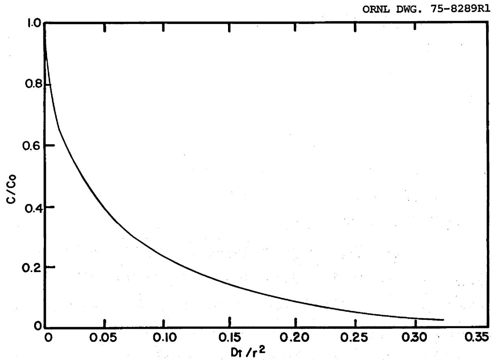  
Figure 15. Numerical Solution of Liquid Diffusion in a Sphere.

# APPENDIX D

# CALCULATION OF SPRAY DISENGAGER HEIGHT FOR SALT DROPLETS OF VARIOUS SIZES (25)

For Tyler's mathematical predictions, drop diameter and wavelength can be correlated by the equation

$$
\frac {\lambda}{d _ {0}} = \frac {2}{3} \left(\frac {x}{d _ {0}}\right) ^ {3} \approx 4. 6 9, \tag {eq.33}
$$

where

$$
\begin{array}{l} \lambda = \text {w a v e l e n g t h}, \mathrm {c m}, \\ d _ {o} = \text {j e t d i a m e t e r}, c m, \\ x = \text {d r o p} \\ \end{array}
$$

therefore,

$$
x = 1. 9 2 d _ {0}.
$$

If $x = 150 \mu$ or $1.5 \times 10^{-2} \, \text{cm}$ , $d_{\circ} = 7.8 \times 10^{-3} \, \text{cm}$ .

The breakup mechanism of a jet as predicted by dimensional analysis is a function of the jet Reynolds number, $\mathrm{v}\mathrm{d}_{\mathrm{o}}\rho_{\mathrm{L}} / \mu$ , and a dimensionless group, $\mu /\sigma \rho_{\mathrm{L0}}^{\mathrm{d}}$ , referred to as the Z-number, where $\mathbf{v}$ is the jet velocity (cm/sec), $\sigma$ is the surface tension (dynes/cm), $\rho_{\mathrm{L}}$ is the liquid density $(\mathrm{g} / \mathrm{cm}^{3})$ , and $\mu$ is the liquid viscosity (g/cm sec). Experimental data are correlated in Fig. 16 to show this relationship.

From the physical properties of $\mathsf{Li}_2\mathsf{BeF}_4$ salt,

$$
Z = \frac {\mu}{\sqrt {\rho_ {L} \sigma d _ {o}}} = 2 2. 6 c P \left[ \left(1. 9 4 \frac {g}{c c}\right) \left(\frac {1 8 0 \text {d y n e s}}{c m}\right) (7. 8 \times 1 0 ^ {- 3} c m) \right] ^ {- \frac {1}{2}} = 0. 1 3 7.
$$

From Fig. 16, $\mathbb{N}_{\mathrm{Re}} > 10^3$ for atomization of the jet. That is,

$$
N _ {R e} = \frac {v d _ {o} \rho_ {L}}{\mu} = v (7. 8 x 1 0 ^ {- 3} c m) \left(1. 9 4 \frac {g}{c c}\right) \left(\frac {c m \sec}{0 . 2 2 6 g}\right) = 6. 6 9 6 x 1 0 ^ {- 2} v,
$$

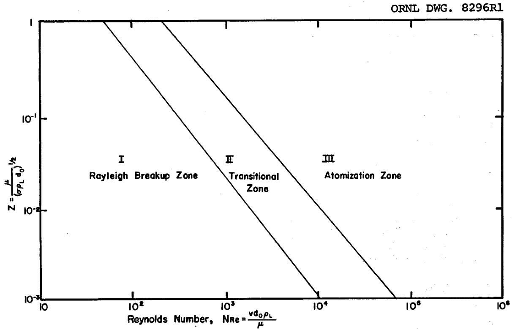  
Figure 16. Ohnesorge's Chart (25) Showing Jet Breakup as a Function of Reynolds Number and Liquid Properties.

or

$$
v = \frac {N _ {\text {R e}}}{6 . 6 9 6 x 1 0 ^ {- 2}} > \frac {1 0 ^ {- 3}}{6 . 6 9 6 x 1 0 ^ {- 2}} = 1. 4 9 x 1 0 ^ {4} \frac {\mathrm {c m}}{\mathrm {s e c}} = 4 8 8 \frac {\mathrm {f t}}{\mathrm {s e c}}.
$$

From Fig. 13, $t = 1.31$ sec; thus, $h > 637$ ft.

If $x = 100 \mu$ or $10^{-2}$ cm, then

$$
d _ {o} = 5. 2 1 x 1 0 ^ {- 3} c m,
$$

$$
z = 0. 1 6 8,
$$

$$
\mathrm {N} _ {\text {R e}} > 9 \times 1 0 ^ {2},
$$

$$
v > 6 5 9 \frac {f t}{\sec},
$$

$$
t = 0. 5 8 \text {s e c}, \text {a n d}
$$

$$
\mathrm {h} > 3 8 2 \mathrm {f t}.
$$

If $x = 200 \mu$ or $2x10^{-2}$ cm, then

$$
d _ {o} = 1. 0 4 \times 1 0 ^ {- 2} c m,
$$

$$
z = 0. 1 1 9,
$$

$$
\mathrm {N} _ {\mathrm {R e}} > 1 0 ^ {3},
$$

$$
v > 3 6 7 \frac {f t}{\sec},
$$

$$
t = 2. 3 2 \sec , a n d
$$

$$
\mathrm {h} > 8 5 1 \mathrm {f t}.
$$

# APPENDIX E

CALCULATION OF THE FREQUENCIES OF MOLECULAR COLLISIONS (10)

The total collision number for $\mathbb{N}^{\prime}$ molecules of Type A per unit volume is:

$$
F _ {A A} = N _ {A} ^ {\prime 2} \sigma_ {A} ^ {2} \left(\frac {2 \pi k T}{n}\right) ^ {1 / 2} \quad e q. 3 4
$$

$$
\eta = \frac {m}{2} \text {a n d} N _ {A} ^ {\prime} = \frac {P}{k T},
$$

where

$$
N _ {A} ^ {\prime} = \text {n u m b e r o f T y p e A m o l e c u l e s p e r u n i t v o l u m e , m o l e c u l e s / c m} ^ {3},
$$

$$
\sigma = \text {m o l e c u l a r d i a m e t e r ,} \mathrm {c m},
$$

$$
k = \text {B o l t z m a n n ' s c o n s t a n t ,} 1. 3 8 x 1 0 ^ {- 1 6} g c m ^ {2} / \sec^ {2} \circ K,
$$

$$
\eta = \text {r e d u c e d} g / \text {m o l e c u l e},
$$

$$
m = \text {m o l e c u l a r m a s s}, g / \text {m o l e c u l e},
$$

$$
T = t e m p e r a t u r e, ^ {\circ} K,
$$

$$
P = \text {p r e s s u r e}, g / c m \sec^ {2}.
$$

For collisions between unlike molecules,

$$
F _ {A B} = 2 \left[ N _ {A} ^ {\prime} N _ {B} ^ {\prime} \right] \left[ \sigma_ {A B} ^ {2} \right] \left(\frac {2 \pi k T}{\eta_ {A B}}\right) ^ {1 / 2}, \tag {eq.35}
$$

where

$$
n _ {A B} = \frac {m _ {A} m _ {B}}{m _ {A} + m _ {B}}
$$

$$
\sigma_ {A B} ^ {2} = \left(\frac {\sigma_ {A} + \sigma_ {B}}{2}\right) ^ {2}.
$$

If $A = \mathrm{TF}$ and $B = \mathrm{helium}$ ,

$$
F _ {A A} = N _ {A} ^ {\prime 2} \sigma_ {A} ^ {2} \left(\frac {2 \pi k T}{n _ {A}}\right) ^ {1 / 2}, \tag {I}
$$

where

$$
\begin{array}{l} P _ {A} = (3. 7 6 \times 1 0 ^ {- 1 2} \text {a t m}) \left(\frac {7 6 \mathrm {c m H g}}{\mathrm {a t m}}\right) \left(\frac {1 3 . 6 \mathrm {g H g}}{\mathrm {c m} ^ {3}}\right) \left(\frac {9 8 0 \mathrm {c m}}{\mathrm {s e c} ^ {2}}\right) \\ = \frac {3 . 8 0 9 \times 1 0 ^ {- 6} g}{c m \sec^ {2}} \\ \end{array}
$$

$$
\begin{array}{l} N _ {A} ^ {\prime} = \frac {P _ {A}}{k T} = \left(\frac {3 . 8 0 9 x 1 0 ^ {- 6} g}{c m s e c ^ {2}}\right) \left(\frac {s e c ^ {2} o K}{1 . 3 8 x 1 0 ^ {- 1 6} g c m ^ {2}}\right) \left(\frac {1}{7 7 . 4 ^ {o K}}\right) \\ = \frac {3 . 5 6 x 1 0 ^ {8}}{c m ^ {3}} \\ \end{array}
$$

$$
\eta_ {A} = \frac {1}{2} \left(\frac {2 2 . 0 2 g}{g - m o l e}\right) \left(\frac {g - m o l e}{6 . 0 2 x 1 0 ^ {2 3} m o l e c u l e s}\right) = 1. 8 3 x 1 0 ^ {- 2 3} g / m o l e c u l e.
$$

The molecular diameter of hydrogen fluoride (HF) is $9.4 \times 10^{-9} \, \text{cm}$ (34). Assuming the molecular diameter of TF to be approximately the same as for HF,

$$
\sigma_ {A} \simeq 9. 4 x 1 0 ^ {- 9} c m.
$$

Then,

$$
\begin{array}{l} F _ {A A} = (3. 5 6 \times 1 0 ^ {8} \mathrm {c m} ^ {- 3}) ^ {2} (9. 4 \times 1 0 ^ {- 9} \mathrm {c m}) ^ {2} \\ \left[ 2 \pi \left(\frac {1 . 3 8 x 1 0 ^ {- 1 6} g c m ^ {2}}{\sec^ {2} \circ K}\right) (7 7. 4 ^ {\circ} K) \left(\frac {\text {m o l e c u l e}}{1 . 8 3 x 1 0 ^ {- 2 3} g}\right) \right] ^ {1 / 2} \\ \end{array}
$$

or

$$
F _ {A A} = 6. 7 8 2 \times 1 0 ^ {5} \frac {\text {m o l e c u l e s}}{\mathrm {c m} ^ {3} \sec}.
$$

$$
\mathrm {F} _ {\mathrm {B B}} = \mathrm {N} _ {\mathrm {B}} ^ {\prime 2} \sigma_ {\mathrm {B}} ^ {2} \left(\frac {2 \pi \mathrm {k T}}{\eta_ {\mathrm {B}}}\right) ^ {1 / 2},
$$

where

$$
P _ {B} = 1 0 ^ {- 4} \text {a t m} = 1 0 1. 3 \frac {g}{\mathrm {c m} \sec^ {2}}
$$

$$
N _ {B} ^ {\prime} = \frac {P _ {B}}{k T} = \left(\frac {1 0 1 . 3 g}{c m \sec^ {2} 2}\right) \left(\frac {\sec {} ^ {\circ} K}{1 . 3 8 x 1 0 ^ {- 1 6} g c m ^ {2}}\right) \left(\frac {1}{7 7 . 4 ^ {\circ} K}\right) = \frac {9 . 4 8 x 1 0 ^ {1 2}}{c m ^ {3}}
$$

$$
\eta_ {B} = \frac {1}{2} \left(\frac {4 . 0 0 3 g}{g - m o l e}\right) \left(\frac {g - m o l e}{6 . 0 2 x 1 0 ^ {2 3} m o l e c u l e s}\right) = 3. 3 2 x 1 0 ^ {- 2 4} g / m o l e c u l e
$$

The molecular diameter is related to gas viscosity by the following equation:

$$
\mu = \frac {5}{1 6} \left[ \frac {\left(\pi m k T\right) ^ {1 / 2}}{\pi \sigma^ {2}} \right] (\text {R e f e r e n c e 8}) \tag {36}
$$

or

$$
\sigma^ {2} = \frac {5}{1 6} \left[ \frac {\left(\pi m k T\right) ^ {1 / 2}}{\pi \mu} \right],
$$

where

$$
\mu = \text {g a s v i s c o s i t y}, \mathrm {g} / \mathrm {c m} \text {s e c}.
$$

For helium at $77.4^{\circ}\mathrm{K}$ , $\mu$ equals $8.4 \times 10^{-5} \, \mathrm{g/cm} \, \mathrm{sec}$ (42) and $\sigma_{\mathrm{B}}$ is calculated from Equation 36:

1/2

$$
\begin{array}{l} \sigma_ {B} ^ {2} = \frac {5}{1 6} \left\{\left[ \pi \left(\frac {4 . 0 0 g}{6 . 0 2 x 1 0 ^ {2 3} m o l e c u l e s}\right) \left(\frac {1 . 3 8 x 1 0 ^ {- 1 6} g c m ^ {2}}{\sec^ {2} \circ K}\right) (7 7. 4 ^ {\circ} K) \right] \right. \\ \left. \cdot \frac {1}{\pi} \left(\frac {\operatorname {c m} \sec}{8 . 4 x 1 0 ^ {- 5} g}\right) \right\} \\ \end{array}
$$

$$
\begin{array}{l} \sigma_ {B} ^ {2} = 5. 5 9 2 \times 1 0 ^ {- 1 6} \mathrm {c m} ^ {2}, \text {o r} \\ \sigma_ {B} = 2. 3 6 5 \times 1 0 ^ {- 8} c m. \\ \end{array}
$$

$$
\begin{array}{l} F _ {B B} = (9. 4 8 x 1 0 ^ {1 5} \mathrm {c m} ^ {- 3}) ^ {2} (2. 3 6 5 x 1 0 ^ {- 8} \mathrm {c m}) ^ {2} \\ \left[ 2 \pi \left(\frac {1 . 3 8 x 1 0 ^ {- 1 6} g c m ^ {2}}{\sec^ {2} \circ K}\right) (7 7. 4 ^ {\circ} K) \left(\frac {\text {m o l e c u l e}}{3 . 3 2 x 1 0 ^ {- 2 4} g}\right) \right], \\ \end{array}
$$

$$
F _ {B B} = 7. 1 4 2 \times 1 0 ^ {2 1} \frac {\text {m o l e c u l e s}}{\mathrm {c m} ^ {3} \sec}.
$$

$$
\mathrm {F} _ {\mathrm {A B}} = 2 \left[ \mathrm {N} _ {\mathrm {A}} ^ {\prime} \mathrm {N} _ {\mathrm {B}} ^ {\prime} \right] \left[ \sigma_ {\mathrm {A B}} ^ {2} \right] \left(\frac {2 \pi \mathrm {k T}}{\eta_ {\mathrm {A B}}}\right) ^ {1 / 2},
$$

where

$$
\eta_ {A B} = \frac {(4 . 0 0 3) (2 2 . 0 2)}{(4 . 0 0 3 + 2 2 . 0 2) (6 . 0 2 x 1 0 ^ {2 3})} g / m o l e c u l e, o r
$$

$$
\eta_ {A B} = 5. 6 2 7 \times 1 0 ^ {- 2 4} g / m o l e c u l e,
$$

$$
\sigma_ {A B} ^ {2} = \left[ \frac {2 . 3 6 5 x 1 0 ^ {- 8} c m + 9 . 4 x 1 0 ^ {- 9} c m}{2} \right] ^ {2}, o r
$$

$$
\sigma_ {A B} ^ {2} = 2. 7 3 1 \times 1 0 ^ {- 1 6} c m ^ {2}.
$$

Then,

$$
\begin{array}{l} F _ {A B} = 2 (9. 4 8 \times 1 0 ^ {1 5} \mathrm {c m} ^ {- 3}) (3. 5 6 \times 1 0 ^ {8} \mathrm {c m} ^ {- 3}) (2. 7 3 1 \times 1 0 ^ {- 1 6} \mathrm {c m} ^ {2}) \\ \cdot \left[ \frac {2 \pi k T}{n _ {A B}} \right] ^ {1 / 2}, o r \\ \end{array}
$$

$$
F _ {A B} = 1. 8 4 3 x 1 0 ^ {9} \mathrm {c m} ^ {- 4} \left[ 2 \pi \left(\frac {1 . 3 8 x 1 0 ^ {- 1 6} g \mathrm {c m} ^ {2}}{\sec^ {2} \circ K}\right) (7 7. 4 ^ {\circ} K) \left(\frac {\text {m o l e c u l e}}{5 . 6 2 7 x 1 0 ^ {- 2 4} g}\right) \right] ^ {1 / 2}
$$

or

$$
F _ {A B} = 2. 0 1 3 x 1 0 ^ {1 4} \frac {\text {m o l e c u l e s}}{\mathrm {c m} ^ {3} \sec}.
$$

# APPENDIX F

# CALCULATION OF MOLECULAR COLLISIONS WITH CONDenser WALLS

The mass of gas striking $1 \, \text{cm}^2$ of wall surface per second is given by:

$$
M = N ^ {\prime} \overline {{C}} m / 4, (R e f e r e n c e 1 7) \tag {37}
$$

where

$$
M = \text {m a s s o f g a s c o l l i d i n g w i t h t h e w a l l ,} g / c m ^ {2} \sec ,
$$

$$
N ^ {\prime} = \text {n u m b e r o f m o l e c u l e s p e r u n i t v o l u m e , m o l e c u l e s / c m} ^ {3},
$$

$$
\overline {{C}} = \text {a v e r a g e}
$$

$$
m = \text {m a s s o f a s i n g l e m o c u l e ,} g / \text {m o l e c u l e .}
$$

If $A = TF$ and $B = He$ ,

then, $\mathrm{M}_{\mathrm{A}} = \mathrm{N}_{\mathrm{A}}^{\prime} \overline{\mathrm{C}}_{\mathrm{A}} \mathrm{m}_{\mathrm{A}} / 4$

where

$$
N _ {A} ^ {\prime} = 3. 5 6 \times 1 0 ^ {8} \text {m o l e c u l e s / c m} ^ {2},
$$

$$
\overline {{c}} _ {A} = 2. 7 2 7 \times 1 0 ^ {4} c m / s e c,
$$

$$
m _ {A} = 3. 6 6 x 1 0 ^ {- 2 3} g / m o l e c u l e,
$$

or

$$
M _ {A} = 8. 8 8 \times 1 0 ^ {- 1 1} \frac {g}{c m ^ {2} \cdot s e c} = 2. 4 3 \times 1 0 ^ {1 2} \frac {m o l e c u l e s}{c m ^ {2} s e c};
$$

and

$$
\mathrm {M} _ {\mathrm {B}} = \mathrm {N} _ {\mathrm {B}} ^ {\prime} \overline {{\mathrm {C}}} _ {\mathrm {B}} \mathrm {m} _ {\mathrm {B}} / 4,
$$

where

$$
N _ {B} ^ {\prime} = 9. 4 8 \times 1 0 ^ {1 5} \text {m o l e c u l e s / c m} ^ {3},
$$

$$
\overline {{C}} _ {B} = 6. 3 9 5 \times 1 0 ^ {4} \mathrm {c m / s e c},
$$

$$
m _ {B} = 6. 6 4 9 \times 1 0 ^ {- 2 4} g / m o l e c u l e,
$$

or

$$
M _ {B} = 1. 0 0 8 \times 1 0 ^ {- 3} \frac {g}{c m ^ {2} s e c} = 1. 5 1 6 \times 1 0 ^ {2 0} \frac {\text {m o l e c u l e s}}{c m ^ {2} s e c}.
$$

The ratio, $\frac{\mathbf{M}_{\mathrm{B}}}{\mathbf{M}_{\mathrm{A}}}$ , is calculated,

$$
\frac {M _ {B}}{M _ {A}} = \frac {1 . 5 1 6 x 1 0 ^ {2 0}}{2 . 4 3 x 1 0 ^ {1 2}} = 6. 2 3 7 x 1 0 ^ {7}.
$$

# APPENDIX G

# CALCULATION OF MEAN FREE PATHS OF TF AND HELIUM COLLISIONS

The mean free path is the average distance traveled by a molecule A in a straight line before it collides with a molecule B. This value is related to the frequency of collisions between molecules A and B as follows:

$$
\lambda_ {A, B} = \frac {\overline {{C}} _ {A} N _ {A} ^ {\prime}}{F _ {A B}}, (R e f e r e n c e 1 7), \tag {eq.38}
$$

where

$$
\begin{array}{l} \lambda_ {A, B} = \text {m e a n f r e e p a t h o f m o l e c u l e A c o l l i d i n g w i t h m o l e c u l e B , c m}, \\ \overline {{C}} _ {A} = \text {m e a n v e l o c i t y o f m o l e c u l e A , c m / s e c}, \\ N _ {A} ^ {\prime} = \text {n u m b e r o f m o l e c u l e s o f A i n u i t v o l u m e}, \frac {\text {m o l e c u l e s}}{\mathrm {c m} ^ {3}}. \\ \end{array}
$$

The mean velocity may be expressed by

$$
\overline {{C}} _ {A} = (8 k T / \pi m) ^ {1 / 2}, (R e f e r e n c e 1 7), \quad \text {e q .} 3 9
$$

where

$$
k = \text {B o l t z m a n n ' s c o n s t a n t}, 1. 3 8 x 1 0 ^ {- 1 6} g c m ^ {2} / \sec^ {2} \circ K,
$$

$$
\mathrm {T} = \text {t e m p e r a t u r e}, ^ {\circ} \mathrm {K},
$$

$$
m = \text {m a s s o f a s i n g l e m o c u l e ,} g / \text {m o l e c u l e .}
$$

Therefore, if $A = TF$ and $B = He$ ,

$$
\lambda_ {A, A} = \frac {\overline {{C}} _ {A} N _ {A} ^ {\prime}}{F _ {A A}},
$$

where

$$
N _ {A} ^ {\prime} = 3. 5 6 \times 1 0 ^ {8} \text {m o l e c u l e s / c m} ^ {3},
$$

$$
F _ {A A} = 6. 7 8 2 \times 1 0 ^ {5} \text {m o l e c u l e s / c m} ^ {3} \sec ,
$$

$$
\overline {{C}} _ {A} = \left[ \frac {8}{\pi} \left(\frac {1 . 3 8 x 1 0 ^ {- 1 6} g c m ^ {2}}{\sec^ {2} \circ K}\right) (7 7. 4 ^ {\circ} K) \left(\frac {6 . 0 2 x 1 0 ^ {2 3}}{2 2 . 0 2 g} \text {m o l e c u l e s}\right) \right] ^ {1 / 2},
$$

or $\overline{c}_{A} = 2.727 \times 10^{4} \mathrm{~cm} / \mathrm{sec};$

substituting.

$$
\lambda_ {A, A} = \frac {(2 . 7 2 7 \times 1 0 ^ {4} \mathrm {c m / s e c}) (3 . 5 6 \times 1 0 ^ {8} \mathrm {c m} ^ {- 3}}{(6 . 7 8 2 \times 1 0 ^ {5} \mathrm {c m} ^ {- 3} \mathrm {s e c} ^ {- 1})},
$$

or

$$
\lambda_ {A, A} = 1. 4 3 \times 1 0 ^ {7} c m.
$$

（II） $\lambda_{B,B} = \frac{\overline{C}_B N_B'}{F_{BB}}$

where

$$
N _ {B} ^ {\prime} = 9. 4 8 \times 1 0 ^ {1 5} \text {m o l e c u l e s / c m} ^ {- 3},
$$

$$
F _ {B B} = 7. 1 4 2 \times 1 0 ^ {2 1} \text {m o l e c u l e s / c m} ^ {3} \sec ,
$$

$$
\overline {{C}} _ {B} = \left[ \frac {8}{\pi} \left(\frac {1 . 3 8 x 1 0 ^ {- 1 6} g c m ^ {2}}{\sec^ {2} o _ {K}}\right) (7 7. 4 ^ {\circ} K) \left(\frac {6 . 0 2 x 1 0 ^ {2 3} m o l e c u l e s}{4 . 0 0 3 g}\right) \right] ^ {1 / 2}
$$

or

$$
\overline {{C}} _ {B} = 6. 3 9 5 \times 1 0 ^ {4} c m / s e c;
$$

substituting,

$$
\lambda_ {B, B} = 8. 4 9 \times 1 0 ^ {- 2} c m.
$$

（III） $\lambda_{\mathrm{A,B}} = \frac{\overline{\mathrm{C}}_{\mathrm{A}}\mathrm{N}_{\mathrm{A}}^{\prime}}{\mathrm{F}_{\mathrm{AB}}}$

where

$$
F _ {A B} = 2. 0 1 3 \times 1 0 ^ {1 4} \text {m o l e c u l e s / c m} ^ {3} \sec ;
$$

thus

$$
\begin{array}{l} \lambda_ {A, B} = 4. 8 2 \times 1 0 ^ {- 2} c m. \\ \lambda_ {B, A} = \frac {\overline {{C}} _ {B} N _ {B} ^ {\prime}}{F _ {A B}} \\ \lambda_ {B, A} = 3. 0 1 \times 1 0 ^ {6} c m. \\ \end{array}
$$

# APPENDIX H

# CALCULATION OF CYCLIC CONDenser HEAT LOAD

The heat exchange duty of the cyclic condenser, as expressed in the Princeton Reference Design (21), is the cooling duty of decreasing the condenser temperature from the melting point of TF $(20^{\circ}\mathrm{C})$ to $78^{\circ}\mathrm{K}$ . Thus, the total duty per condenser is calculated to be:

$$
2 \left[ 6 0 \frac {\mathrm {k c a l}}{\circ \mathrm {C}} \right] \left[ \frac {(2 9 3 - 7 8)}{2 ^ {4} \mathrm {h r}} \circ \mathrm {C} \right] = 1 0 7 5 \frac {\mathrm {k c a l}}{\mathrm {h r}},
$$

where $60 \frac{\text{kcal}}{\circ C}$ equals the total thermal capacity equivalent to $500 \text{kg}$ of steel.

To estimate the heat change required to cool TF from $100^{\circ}\mathrm{C}$ to $78^{\circ}\mathrm{K}$ , the sensible and latent heats are summed as shown below. The heat capacities and enthalpy changes are HF physical properties (22,34).

(a) Sensible heat, $100^{\circ}\mathrm{C}$ to $20^{\circ}\mathrm{C}$ (melting point of TF)

$$
Q _ {1} = m C _ {p (g)} \Delta T _ {1} \approx \left(7. 5 7 \frac {g - m o l e}{h r}\right) \left(\frac {1 4 3 c a l}{g - m o l e ^ {\circ} C}\right) \left(1 0 0 - 2 0 ^ {\circ} C\right) = 8. 6 6 x 1 0 ^ {4} \frac {c a l}{h r}
$$

(b) Latent heat of vaporization

$$
Q _ {2} = m \Delta H v \approx (7. 5 7 \frac {g - m o l e}{h r}) (1 6 9 7 \frac {c a l}{g - m o l e}) = 1. 2 8 5 x 1 0 ^ {4} \frac {c a l}{h r}
$$

(c) Sensible heat, $20^{\circ}\mathrm{C}$ to $-83^{\circ}\mathrm{C}$ (freezing point of TF)

$$
Q _ {3} = m C _ {p (k)} \Delta T _ {3} \approx \left(7. 5 7 \frac {g - m o l e}{h r}\right) \left(\frac {1 2 . 2 c a l}{g - m o l e ^ {\circ} C}\right) \quad (2 0 + 8 3 ^ {\circ} C) = 9. 5 1 2 x 1 0 ^ {3} \frac {c a l}{h r}
$$

(d) Latent heat of fusion

$$
Q _ {4} = m \Delta H _ {f} \simeq (7. 5 7 \frac {g - m o l e}{h r}) (\frac {2 2 . 0 2 g}{g - m o l e}) (4 6. 9 3 \frac {c a l}{g}) = 7. 8 2 3 x 1 0 ^ {3} \frac {c a l}{h r}
$$

(e) Sensible heat, $-83^{\circ}C$ to $78^{\circ}K$

$$
\begin{array}{l} Q _ {5} = m \int_ {7 8 ^ {\circ} K} ^ {1 5 0 ^ {\circ} K} C p d T = (7. 5 7 \frac {g - m o l e}{h r}) \left[ \left(\frac {1 2 . 2 c a l}{g - m o l e ^ {\circ} K}\right) (1 9 0 ^ {\circ} K) - \left(\frac {4 . 2 c a l}{g - m o l e ^ {\circ} K}\right) (7 8 ^ {\circ} K) \right] \\ \simeq 1. 5 0 6 \times 1 0 ^ {4} \frac {\mathrm {c a l}}{\mathrm {h r}}. \\ \end{array}
$$

The total heat load is

$$
\sum_ {i = 1} ^ {5} Q _ {i} \approx 1. 3 1 9 x 1 0 ^ {5} \frac {\mathrm {c a l}}{\mathrm {h r}} = 1. 3 1 9 x 1 0 ^ {2} \frac {\mathrm {k c a l}}{\mathrm {h r}}.
$$

# INTERNAL DISTRIBUTION

ORNL/TM-5104

1. Biology Library   
2-3. ORNL - Y-12 Technical Library   
4-5. Central Research Library   
6. Document Reference Section   
7-9. Laboratory Records   
10. Laboratory Records - RC   
11. ORNL Patent Section   
12. J. T. Bell   
13. K. B. Brown   
14. J. F. Clarke   
15. S. D. Clinton   
16. F. L. Culler   
17. J. H. Devan   
18. D. E. Ferguson   
19. L. M. Ferris   
20. P. W. Fisher   
21. R. C. Forrester, III   
22. A. P. Fraas   
23. W. R. Grimes

24. J. F. Land   
25. H. Postma   
26. J. D. Redman   
27. M. W. Rosenthal   
28. C. D. Scott   
29. J. L. Scott   
30. F. J. Smith   
31. D. Steiner   
46. J. B. Talbot   
47. D. B. Trauger   
52. J. S. Watson   
53. F. W. Wiffen   
54. R. G. Wymer   
55. W. K. Davis (Consultant)   
56. J. C. Frye (Consultant)   
57. C. H. Ice (Consultant)   
58. J. J. Katz (Consultant)   
59. R. B. Richards (Consultant)

# EXTERNAL DISTRIBUTION

60. J. L. Anderson, Los Alamos Scientific Laboratory, Los Alamos, New Mexico   
61. P. Barton, Fenske Laboratory, Pennsylvania State University, University Park, Pennsylvania 16802   
62. F. E. Coffman, Division of Controlled Thermonuclear Research, ERDA, Germantown, Maryland 20767   
63. W. J. Haubach, Division of Physical Research, ERDA, Germantown, Maryland 20767   
64. E. J. Hennelly, Savannah River Laboratory, Aiken, South Carolina 29801   
65. R. G. Hickman, Lawrence Livermore Laboratory, Livermore, California 94550   
66. E. F. Johnson, Princeton University, Princeton, New Jersey 08540   
67. G. C. Kyker, Oak Ridge Associated Universities, Oak Ridge, Tennessee 37830   
68. E. M. Larsen, University of Wisconsin, Madison, Wisconsin 53700   
69. V. A. Maroni, Argonne National Laboratory, Argonne, Illinois 60439   
70. J. R. Powell, Brookhaven National Laboratory, Upton, New York 11973   
71. E. Veleckis, Argonne National Laboratory, Argonne, Illinois 60439   
72. R. Wiswall, Brookhaven National Laboratory, Upton, New York 11973   
73. Research and Technical Support Division, ERDA-ORO, Oak Ridge, Tennessee 37830   
74-100. Technical Information Center, Oak Ridge, Tennessee 37830