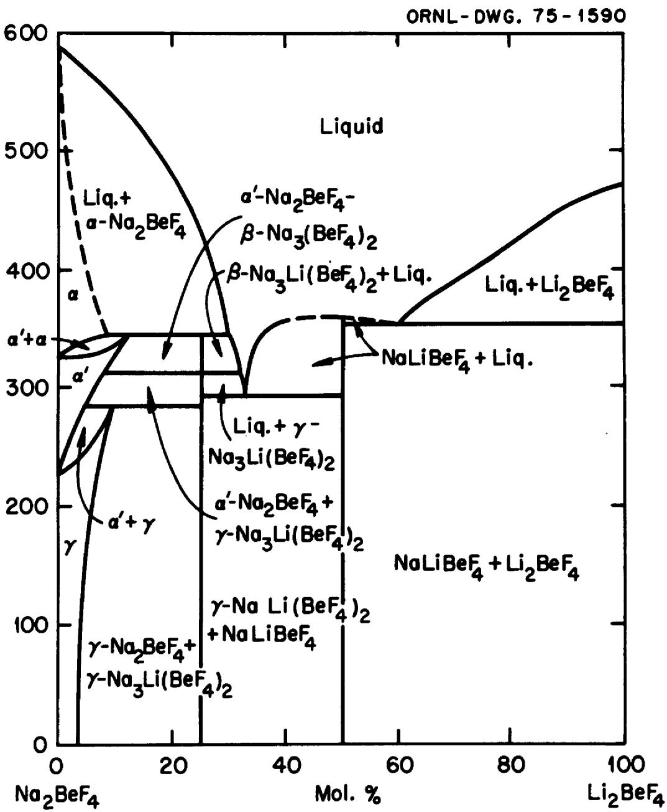
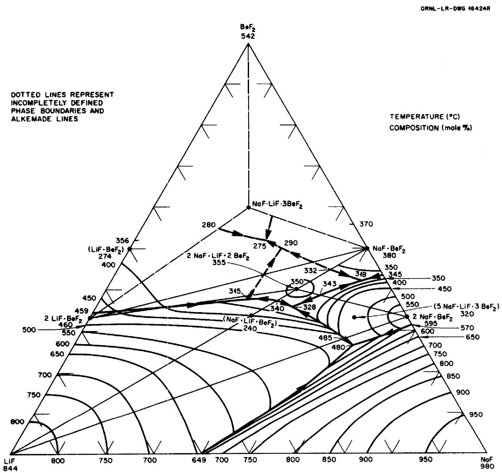

# Evaluation of Alternate Secondary (and Tertiary) Coolants for the Molten-Salt Breeder Reactor

A. D. Kelmers

C. F. Baes

E. S. Bettis

J. Brynestad

S. Cantor

J. R. Engel

W. R. Grimes

H. E. McCoy

A. S. Meyer

Printed in the United States of America. Available from

National Technical Information Service

U.S. Department of Commerce

5285 Port Royal Road, Springfield, Virginia 22161

Price: Printed Copy $5.00; Microfiche $2.25

This report was prepared as an account of work sponsored by the United States Government. Neither the United States nor the Energy Research and Development Administration/United States Nuclear Regulatory Commission, nor any of their employees, nor any of their contractors, subcontractors, or their employees, makes any warranty, express or implied, or assumes any legal liability or responsibility for the accuracy, completeness or usefulness of any information, apparatus, product or process disclosed, or represents that its use would not infringe privately owned rights.

Contract No. W-7405-eng-26

Chemistry Division

EVALUATION OF ALTERNATE SECONDARY (AND TERTIARY)

COOLANTS FOR THE MOLTEN-SALT BREEDER REACTOR

A. D. Kelmers

C. F. Baes

E. S. Bettis

J. Brynestad

S. Cantor

J. R. Engel

W. R. Grimes

H. E. McCoy

A. S. Meyer

NOTICE

This report was prepared as an account of work sponsored by the United States Government. Neither the United States nor the United States Energy Research and Development Administration, nor any of their employees, nor any of their contractors, subcontractors, or their employees, makes any warranty, express or implied, or assumes any legal liability or responsibility for the accuracy, completeness or usefulness of any information, apparatus, product or process disclosed, or represents that its use would not infringe privately owned rights.

APRIL 1976

OAK RIDGE NATIONAL LABORATORY

Oak Ridge, Tennessee 37830

operated by

UNION CARBIDE CORPORATION

for the

ENERGY RESEARCH AND DEVELOPMENT ADMINISTRATION

# PREFACE

Much of this report was written during the period September 1974 through March 1975. Since then, additional information has been developed which bears upon a number of the alternate coolant considerations. Progress relating to several pertinent topics is summarized in the following paragraphs.

The discussion of $\mathrm{NaBF}_{4}$ -NaF (92-8 mole %) as a potential secondary coolant (Section 5) indicates that, at the time this report was drafted, no data were available for estimating the tritium retention characteristics of this salt, and that the absence of tritium trapping could be a disadvantage for a single coolant. (Tritium trapping in the coolant salt is expected to be one of the best potential methods for limiting tritium transport into the steam system and then into the environment.) Since that time some preliminary experiments have been performed in engineering-scale equipment at ORNL which indicate that this salt mixture does have substantial tritium trapping capability. These experiments, which were started in July, 1975, in the Coolant-Salt Technology Facility, involve the addition of tritiated hydrogen to high-purity $\mathrm{NaBF}_{4}$ -NaF eutectic that contains no deliberate additives to enhance the tritium retention. The tritium-hydrogen mixture is added by diffusion through a metal tube to simulate the diffusion through MSBR heat-exchanger tubes, but at flow rates (per unit of tube area) that are $10^{4}$ to $10^{5}$ times those to be expected in a reactor.

Results of a recent steady-state experiment, in which tritiated hydrogen was added to the system for more than 4 weeks, with the salt at

$811^{\circ}\mathrm{K}$ ( $1000^{\circ}\mathrm{F}$ ), indicated that up to $96\%$ of the tritium was trapped in the salt and subsequently released to the loop off-gas. The apparent ratio of the concentrations of combined and elemental tritium in the circulating salt was about 4000. This ratio is important in determining the rate at which tritium can be removed in a stripping system as opposed to the rate at which the elemental form can escape into the steam system.

While the information that is currently available is inadequate for accurate extrapolation to the rate of tritium release to the steam system of an MSER, it appears that the sodium fluoroborate salt mixture would have a substantial inhibiting effect on such release and that environmentally acceptable rates (<10 Ci/d) could be achieved with reasonable effort.

Also, with regard to the use of $\mathrm{NaBF}_4$ -NaF (92-8 mole %) as a secondary coolant (Section 5), concern was expressed about potential reactions between coolant and fuel salt LiF-BeF $_2$ -ThF $_4$ -UF $_4$ (71.7-16.0-12.0-0.3 mole %) in the event of mixing. Laboratory experiments have shown: (i) The rate of evaluation of $\mathrm{BF}_3$ gas on mixing was low, about 30 minutes were required to complete the reaction

$$
\mathrm {N a B F} _ {4} (\mathrm {d}) _ {\text {c o o l a n t}} \rightarrow \mathrm {B F} _ {3} (\mathrm {g}) + \mathrm {N a F} (\mathrm {d}) _ {\text {f u e l s a l t}}.
$$

Presumably the rate-limiting step was transfer of NaF across the salt-salt interface, thus, in a reactor system with turbulent flow, the release of $\mathrm{BF}_3$ might be more rapid. However, the results are encouraging relative to MSBRs in that very rapid gas release resulting in significant pressuresurges was not experienced. (ii) No tendency was observed for the fissile fuel salt constituents thorium or uranium to redistribute or to form more

concentrated solutions, or to precipitate following mixing of coolant salt into fuel salt. (iii) Apparently an oxide species forms in the coolant salt phase which is more stable than $\mathrm{UO}_2$ , since no $\mathrm{UO}_2$ precipitation was observed even when molten coolant-fuel salt mixtures were agitated while exposed to air for several hours. Thus, large amounts of oxygenated compounds could be added to the fluoroborate coolant salt for the purpose of sequestering tritium, since leakage of such a coolant salt into the fuel salt would not lead to precipitation of uranium or thorium.

Investigation of $\mathrm{NaBF}_4$ melts by x-ray powder diffraction, infrared spectroscopy and Raman spectroscopy have identified the stable ring compound $\mathrm{Na}_3\mathrm{B}_3\mathrm{F}_6\mathrm{O}_3$ as the probable oxygen-containing species in coolant melts. Measurements of condensates trapped from the CSTF loop show a tritium concentration of $10^{5}$ relative to the salt, suggesting that a volative species may be selectively transporting tritium from the loop through the vapor. Recent results indicate that $\mathrm{BF}_3\cdot 2\mathrm{H}_2\mathrm{O}$ may exist as a molecular compound in the vapor and could be responsible for the tritium trapping.

All the above results are favorable for the use of $\mathrm{NaBF}_{4}$ -NaF (92-8 mole %) melts as an MSBR secondary coolant. Satisfactory tritium trapping, an important coolant criterion, appears highly probable, vigorous chemical reactions or pressure surges were not encountered on mixing coolant and fuel salt, and precipitation or segregation of fissile components was not encountered.

A ternary salt NaF-LiF-BeF $_2$ (45-22-33 mole %), has been considered as an alternate coolant (Section 6). Two published references gave

freezing points of $290^{\circ}\mathrm{C}$ and $340^{\circ}\mathrm{C}$ for a melt of this composition. Since the freezing point is an important coolant criterion, differential thermal analysis techniques were used to reinvestigate the portion of the phase diagram near this composition. The results confirmed that the composition NaF-LiF-BeF $_2$ (45-22-33 mole %) had the lowest liquidus temperature in this region of the phase diagram. A freezing temperature of about $335^{\circ}\mathrm{C}$ would be a practical value for engineering considerations.

# CONTENTS

Page

# 1. SUMMARY AND RECOMMENDATIONS 1

1.1 Comparison of Best MSBR Coolants 1   
1.2Recommended Future Work 9

# 2. INTRODUCTION 13

2.1 Purpose and Organization of the Report 13   
2.2 Terminology 14

# 3. COOLANT CRITERIA 15

3.1 Safety Significant Events 17   
3.2 Anticipated Off-Design Transients 18   
3.3 Design Characteristics 23

# 4. REJECTED COOLANT CANDIDATES 27

4.1 Single Secondary Coolants 27   
4.2 Dual Coolant Configurations 36

# 5．STATUS OF FLUOROBORATE COOLANT 38

5.1 Safety Significant Criteria 39   
5.2 Off-Design Transients 40   
5.3 Design Factors 45

# 6. ALTERNATE SINGLE COOLANT: NaF-7LiF-BeF2 48

6.1 Safety Significant Criteria 48   
6.2 Off-Design Transients 49   
6.3 Design Factors 51

# 7. ALTERNATE DUAL COOLANT CANDIDATES 56

7.1 Secondary Coolant 57   
7.2 Compressed Helium Tertiary Coolant 59   
7.3 Molten Salt Tertiary Coolant 65   
7.4 Liquid Metal Tertiary Coolants 69   
7.5 Fluidized-Bed Tertiary System 73

# 8. ACKNOWLEDGEMENTS 74

# 9. REFERENCES 75

viii

# DEDICATION

We dedicate this report to our late friend and colleague, A. S. (Al) Meyer, whose untiring efforts in developing molten-salt reactor technology and unfailing good humor will always be remembered.

# 1. SUMMARY AND RECOMMENDATIONS

# 1.1 Comparison of Best MSBR Coolants

The three most promising coolant selections for an MSBR have been identified and evaluated in detail from the many coolants considered in this report for application either as a secondary coolant in 1000-MW(e) MSBR configurations using only one coolant, or as secondary and tertiary coolants in an MSBR dual coolant configuration employing two different coolants. These are: as single secondary coolants,

(1) a ternary sodium-lithium-beryllium fluoride melt $(\mathrm{Na}_{1.34}\mathrm{Li}_{0.66}\mathrm{BeF}_4)$ ,   
(2) the sodium fluoroborate-sodium fluoride eutectic melt, the present reference design secondary coolant,

and, in the case of the dual coolant configuration,

(1) molten lithium-beryllim fluoride $(\mathrm{Li}_{2}\mathrm{BeF}_{4})$ as the secondary coolant and helium gas as the tertiary coolant.

A straightforward comparison of advantages and disadvantages has been made in the case of the two single secondary coolant candidates and this comparison favors the ternary fluoride melt by a slight margin, primarily because of problems to be encountered if the fluoroborate secondary coolant and fuel salt were to become mixed. The application of sodium fluoroborate melt as the single secondary coolant may offer some potential, yet unproven, advantage in tritium trapping which could offset other less desirable characteristics. The coolants selected for the dual coolant configuration appear, on the basis of present knowledge, to resolve all technological problems and, in addition, to offer operational advantages; however, the addition of another heat-transfer loop to the MSBR would decrease thermal

efficiency and entail an increase in both capital and operating costs. A direct comparison between the more attractive single secondary coolant and the dual, secondary and tertiary, coolant concepts cannot now be made since technological factors on the one hand must be evaluated relative to economic considerations on the other. The future work necessary to reach such a comparison has been identified and is detailed in Section 1.2.

# 1.1.1 Single coolants

In this MSBR configuration, heat is transferred from the fuel salt (the primary coolant) to the coolant (the secondary coolant) in several primary heat exchangers. The heated coolant is then circulated in independent loops to the steam generators. A side stream could be withdrawn and processed to maintain the desired coolant redox potential.

Many potential secondary coolant candidates were considered and rejected (Section 4), primarily due to (i) potentially safety significant incompatibility with the fuel salt or (ii) unacceptable corrosivity. Liquid metals or compressed gases appeared unacceptable for these reasons. Of the numerous molten salts considered, two appeared substantially better and were evaluated in detail. These are sodium fluoroborate $\left[\mathrm{NaBF}_{4}-\mathrm{NaF}\right.$ (92-8 mole %), the current reference design coolant] which is considered in Section 5, and a ternary sodium-lithium-beryllium fluoride $\left(\mathrm{Na}_{1.34} \mathrm{Li}_{0.66} \mathrm{BeF}_{4}\right)$ which is reviewed in Section 6.

A one-on-one comparison of these two candidates was carried out in terms of selected coolant criteria (Section 3) and is presented in Table 1.1. Consideration of potentially safety significant events, off-design transients, and design factors are covered in three groups of items. In the case of safety significant criteria, items la and lb in Table 1.1,

Table 1.1. Comparison of $\mathrm{NaBF}_4$ -NaF eutectic and Na1.34Li0.66BeF4   

<table><tr><td>Criteria</td><td>NaBF4-NaF</td><td>Na1.34Li0.66BeF4</td><td>Comparison</td></tr><tr><td colspan="4">1. Safety Significant</td></tr><tr><td>a. Change in nuclear reactivity in case of leak into primary system.</td><td>Presence of10Bprecludes any increase in reactivity due to bubbles or voids in the core from BF3gas.</td><td>None.</td><td rowspan="2">Na1.34Li0.66BeF4may be the safer coolant.</td></tr><tr><td>b. Chemical reactions in case of fuel salt coolant interleakage.</td><td>Pressure surges caused by the release of BF3might threaten primary system boundary.</td><td>None</td></tr><tr><td colspan="4">2. Off-Design Transients</td></tr><tr><td>a. Leak of coolant into primary system.</td><td>Released BF3will dissolve in the fuel salt, may penetrate the core graphite, and could harm the charcoal beds. BF3in the fuel salt can be mostly removed by inert-gas sparge; lesser amounts can be burned out neutronically.</td><td>No evolution of gas to affect graphite or charcoal. NaF in the fuel salt will reduce breeding gain by a minor amount.</td><td rowspan="2">Effects of mixing fuel salt and coolant are less troublesome with Na1.34Li0.66BeF4.</td></tr><tr><td>b. Leak of fuel salt into coolant.</td><td>BeF2, UF4, ThF4, di-and trivalent fission product fluorides, noble-metal fission products are all insoluble.</td><td>Only noble-metal fission products are insoluble, all fissile materials are completely soluble.</td></tr><tr><td>c. Leak of steam into coolant.</td><td>Corrosion of metals, formation of soluble oxides and low partial pressure (&lt;1 atm) of HF. Heat exchange surfaces could be fouled by insoluble corrosion product fluorides, Na3CrF6and perhaps NaNiF3.</td><td>Corrosion of metals, formation of insoluble BeO and low partial pressure of HF. Heat exchange surfaces could be fouled by BeO, and perhaps by Na3CrF6and NaNiF3.</td><td>Effects of mixing steam and coolant are roughly the same for both coolants.</td></tr><tr><td>d. Leak of coolant into steam system.</td><td>Very little is known about the effects (such as stress corrosion cracking) of fluorides of steam systems.</td><td></td><td></td></tr><tr><td>e. Leaks to cell atmosphere.</td><td>Coolant reacts with moisture to yield acidic vapors.</td><td>Coolant reacts with moisture to produce BeO and acidic vapors.</td><td>No advantage or serious problem with either coolant.</td></tr><tr><td colspan="4">3. Design Factors</td></tr><tr><td>a. Corrosivity</td><td>Boron in coolant can be reduced by metallic chromium and by some minor alloy constituents.</td><td>The coolant will not react with alloy constituents.</td><td>Corrosivity less for Na1.34Li0.66BeF4, although the difference may not be significant since corrosion will probably be governed by additives necessary to sequester tritium.</td></tr><tr><td>b. Freezing Point</td><td>384°C(723°F)</td><td>290 - 340°C(554 - 644°F)Two references disagree.</td><td>Less (and possibly no) pre-heating of feedwater will be necessary if Na1.34LiBeF4is the coolant:34066</td></tr><tr><td>c. Heat Transfer and Hydrodynamic Properties</td><td>All properties measured. 
Thermal conductivity: k = 0.4 W m-1oK-1 
Heat capacity: Cp = 0.36 cal g-1oK-1 
Viscosity: η454°C = 1.91 cp; η621°C = 1.07 cp 
Density: ρ550°C = 1.86 g cm-3</td><td>All properties estimated. 
k = 0.85 W m-1oK-1 
Cp = 0.46 cal g-1oK-1 
η454°C = 22 cp; η621°C = 7.4 cp 
ρ550°C = 2.1 g cm-3</td><td>Overall roughly equivalent. 
Film coefficient and volumetric heat-capacity better for Na1.34Li0.66BeF4. Kineumatic viscosity more favorable for NaBF4-NaF.</td></tr><tr><td>d. Vapor Pressure</td><td>Sizeable BF3decomposition pressure.</td><td>Insignificant vapor pressure.</td><td>Slight advantage for Na1.34Li0.66BeF4.</td></tr><tr><td>e. Radiation Stability</td><td>No chemical decomposition due to gammas. 
Neutrons transmute 10B with no significant increase in corrosivity.</td><td>No chemical decomposition due to gammas. 
No effects on chemical stability due to neutronically induced transmutations.</td><td>Both acceptable.</td></tr><tr><td>f. Tritium Trapping</td><td>Isotope-exchange and/or oxidizing additives necessary. 
High solubility of oxide ion may improve tritium trapping. BF3·H2O vapor species may also be significant.</td><td>Isotope-exchange and/or oxidizing additives necessary.</td><td>Possible advantage for NaBF4-NaF.</td></tr><tr><td>g. Cost and Availability</td><td>8400 ft3cost $0.37M. Coolant consists of common elements.</td><td>8400 ft3cost $6M.</td><td>Clear advantage for NaBF4-NaF.</td></tr></table>

the ternary fluoride is preferred over sodium fluoroborate which would release $\mathrm{BF}_3$ gas in the event of fuel-salt-coolant interleakage. The potentially safety significant release of $\mathrm{BF}_3$ gas is the most serious negative factor in considering fluoroborate as a secondary coolant (see Section 5.1.2). In the case of off-design transients, $\mathrm{BF}_3$ release as a result of minor leaks, item 2a, is again a problem which is absent with the ternary fluoride melt. Fissile materials might redistribute between immiscible phases after leaks in the case of fluoroborate while they would be completely soluble in the ternary fluoride melt, item 2b, again favoring this coolant. In considering design factors, differences in corrosivity of the melts toward Hastelloy N, item 3a, slightly favor the ternary fluoride melt but the differences are minor and in either case corrosion will probably be governed by the conditions selected to sequester tritium in the secondary coolant. The freezing point criterion, item 3b, clearly favors the ternary fluoride melt since its lower freezing point would require less preheating of the feedwater. Heat transfer and hydrodynamic properties, item 3c, and radiation stability, item 3e, are equivalent for the two candidates and in either case quite adequate for MSBR application. The necessity of maintaining a fixed $\mathrm{BF}_3$ vapor pressure over the fluoroborate coolant, item 3d, gives a slight advantage to the ternary fluoride melt. The probable necessity of trapping some portion of the tritium in the secondary coolant, item 3f, may favor fluoroborate, although at this time tritium trapping has not been demonstrated experimentally in fluoroborate melt. Finally, cost and availability, item 3g, clearly favors fluoroborate since beryllim and $99.99+\%$ Li would be required for the ternary fluoride melt. The cost for the Na $_{1.34}$ Li $_{0.66}$ BeF $_{4}$ coolant is less

than that for an equivalent volume of $\mathrm{Li}_2\mathrm{BeF}_4$ since the lithium content is lower.

The result of this comparison is that the ternary fluoride melt is favored by a majority of the criteria, especially those associated with potentially safety significant events and with the ability to cope with off-design transients. The minority of criteria that do favor the fluoroborate coolant are in the area of design factors, where various aspects of the ternary fluoride coolant that are less suitable could be accommodated by suitable engineering design considerations. While the ternary fluoride melt appears to be the more suitable coolant for an MSBR design employing a single secondary coolant, the sodium fluoroborate coolant would likely be preferred if it can be shown to aid significantly in tritium management in an MSBR.

# 1.1.2 Dual coolants

In this MSBR configuration, heat is transferred from the fuel salt (the primary coolant) to a secondary coolant in several primary heat ex-changers. The heated secondary coolant is circulated in several loops to intermediate heat exchangers where the heat is transferred to a tertiary coolant which is then circulated in several loops to the steam-raising system. Side stream processing might be required on both the secondary and tertiary coolant loops to remove tritium, remove corrosion products and/or adjust the coolant redox potential.

Three combinations of dual coolants were evaluated in detail for this MSBR configuration (Section 7). In each case the secondary coolant was lithium-beryllim fluoride, $\mathrm{Li}_2\mathrm{BeF}_4$ , the coolant used previously in the MSRE. It was selected because of its complete compatibility with the fuel

salt in the event of mixing due to leaks in the primary heat exchanger or other causes. In addition, its relatively high melting point helps decrease the possibility of fuel salt freezing during thermal transients. All design factors also favored this secondary coolant with the exception of cost due to its $^{7}$ Li content. Three different tertiary coolants were evaluated, a compressed gas (helium, Section 7.2), a different molten salt (a ternary carbonate melt, Section 7.3) and a liquid metal (molten sodium, Section 7.4). Of these three, compressed helium was by far the most attractive candidate and is the only one recommended for further consideration. Liquid sodium was considered to be less attractive due to severe chemical incompatibility with both the secondary coolant and the steam in case of leaks, and problems associated with thermal shock to structural components. Tritium trapping methods are being developed for the LMFBR but may not be adequate for MSBRs. A molten carbonate tertiary coolant was more suitable than liquid sodium since it could readily afford methods of trapping large amounts of tritium; however, it is chemically reactive with the secondary coolant, releasing $\mathrm{CO}_{2}$ gas on mixing, and little information is available concerning materials of adequate corrosion resistance to construct the third loop. Thus the carbonate tertiary coolant concept was not felt to warrant additional attention at this time.

The use of compressed helium (700 psia) as the tertiary coolant in an MSBR concept coupled with molten ${}^{7}\mathrm{Li}_{2}\mathrm{BeF}_{4}$ as the secondary coolant appears to meet all technological requirements for an MSBR, but only at some additional cost for construction and operation. The advantages are:

(1) tritium can be readily trapped by the addition of $O_2$ and/or $H_2O$ at low concentration to the helium loop; the proportions will be

dependent upon the rate of back diffusion of normal hydrogen from the steam system.

(2) the $\mathsf{Li}_2\mathsf{BeF}_4$ secondary coolant is completely compatible with the fuel salt on intermixing, thus leakage of secondary coolant into the primary circuit is not a serious matter   
(3) steam leaks into the helium loop from the steam-raising system would not cause a major increase in corrosion of the tertiary loop nor would helium leaking into the steam system lead to damage   
(4) operation and control of the MSBR is simplified by the "soft" coupling introduced by the helium loop   
(5) start-up of the MSBR is easier and a much smaller auxiliary steam generator would be required than in the case of an all molten salt MSBR   
(6) the possibility of fuel freezing on thermal transients is greatly reduced   
(7) steam generator technology already developed for the HTGR could be adapted for this MSBR configuration   
(8) plant availability and maintainability would be improved by the added passive barrier introduced by the tertiary loop.

The only apparent disadvantages to this MSBR configuration are the added cost and decreased thermal efficiency. The cost increase comes primarily from the hardware required for the third loop and from the decreased thermal efficiency. The decrease in thermal efficiency results from the pumping power necessary to circulate the helium. Very preliminary estimates (Section 7.3.2) indicate that the added cost may be

relatively modest, but a more detailed analysis is needed.

# 1.2 Recommended Future Work

In order to reach a final choice of a coolant or dual coolants for an MSBR, additional cost information is required so that a quantitative comparison can be made among the three coolant selections defined in Section 1.1. The following work is recommended:

(1) preliminary engineering conceptual designs and cost estimates of a 1000-MW(e) MSBR with a single coolant configuration employing either the ternary fluoride melt or sodium fluoroborate as the secondary coolant. Similar information should be developed simultaneously for the dual coolant configuration with molten $\mathrm{Li}_2\mathrm{BeF}_4$ as the secondary coolant and compressed helium as the tertiary coolant.   
(2) definition of the tritium trapping capability of the coolants, either secondary or tertiary, and experimental demonstration of such trapping in helium, sodium fluoroborate and the ternary fluoride melt, and   
(3) experimental evaluation of the fuel salt-sodium fluoroborate compatibility questions.

The recommended work items should be carried out concurrently. The experimental work called for in recommendations 2 and 3 would help supply accurate information for conceptual design work and cost data. Simultaneously, as the conceptual designs and cost estimates advance they will help guide the experimental work to the most critical areas. A direct comparison of the single vs dual coolant MSBR configurations and a final selection of an

MSBR coolant(s) can be made only after these recommendations are carried out. Reduction of the comparison of the competing concepts to a comparison of construction and operating costs provides the only means for quantitative evaluation.

# 1.2.1 Conceptual designs and cost estimates

Development of capital and operating costs adequate to make a meaningful comparison among the coolant choices and configurations is the most important recommendation. Dollars are the only common denominator among the disparate factors that must be evaluated and a comparison cannot be made until cost estimates are available. Work of this nature done during the preparation of this report was, of necessity, quite limited and is useful only in suggesting that costs associated with the helium tertiary loop may not be unattractive.

Adequate information should be developed to aid in the selection of fluoroborate or the ternary fluoride melt in single coolant configurations. It is anticipated that problems associated with fuel salt-coolant intermising (Section 1.2.3) may play a dominant role in the selection and may favor the ternary fluoride. The extent to which sodium fluoroborate can assist in tritium management is also quite important. In evaluating the dual coolant configuration, heat transfer calculations and estimates of the salt volumes for the primary and secondary loops will be important. Also, sizing of helium-loop components, ducts, circulators, steam generators and tritium removal systems should be done with greater accuracy. The cost and availability of $^7\mathrm{Li}$ compounds should be better defined. Details to be considered in the conceptual design include, for example, pressure relief mechanisms in the coolant loop in case of major steam

inleakage, how to deal with or prevent cooling the fuel salt below its liquidus temperature and sizing the auxiliary steam system. Also questions such as establishing relative levels of plant availability and maintainability in different configurations should be considered.

# 1.2.2 Tritium trapping

It is recommended that adequate experimental data be developed to define the capability of tritium trapping in the three coolants: helium, the ternary fluoride melt and the fluoroborate melt. Approximately 2400 Ci of tritium per day will be generated in the MSBR fuel salt. Only about $0.1\%$ of this material can be permitted to diffuse through the steam generators to the steam system, from which it would be discharged to the environment (Section 3.3.5). Many factors affect the distribution of tritium in the MSBR. These include:

(1) the $U^{4+}/U^{3+}$ ratio in the fuel salt, which controls the ratio of $\mathrm{TH} / (\mathrm{T},\mathrm{H})\mathrm{F}$   
(2) ability of the core graphite to sorb tritium and/or (T,H)F   
(3) tritium diffusion through the primary system pressure boundary to the cell atmosphere   
(4) tritium trapping in the secondary or tertiary coolant   
(5) decreased permeability to tritium in the steam generator tube walls due to oxide formation on the steam side.

Currently, none of these factors has been adequately quantified. Experimental work is under way to investigate items (1), (4) and (5). Parametric studies indicate that perhaps half or more of the tritium must be trapped in the coolant in order to limit the environmental release to no more than 1 to 2 Ci per day.

Since tritium trapping in the coolant has been established as a significant criterion and the ability, or lack of ability, to sequester tritium has been considered a major factor in favoring some coolant candidates, experimental work on each of the five factors defined in the preceding paragraph will be needed, including laboratory experiments and circulating loops with provisions for removal of trapped tritium from the respective coolant. Potential environmental impacts due to reactor operation are currently receiving increased attention and establishment of an acceptable level of tritium release and experimental demonstration that this could be achieved in an MSBR are important aspects in the ultimate selection of a practical and acceptable coolant or coolants for the MSBR.

# 1.2.3 Fuel-salt fluoroborate mixing problems

Problems associated with the intermixing of sodium fluoroborate and fuel salt need to be more carefully defined. Leakage of fluoroborate into the primary circuit will generate $\mathrm{BF}_3$ gas. Over a wide range of equilibrium conditions the resulting pressure may not be large; however, under dynamic conditions much greater pressure transients could be developed. Such situations may be safety significant and should be assessed carefully. If fuel salt leaks into the secondary circuit, the fissile materials would be relatively insoluble in the fluoroborate and would precipitate. Additional information is needed to understand the complicated salt system formed after mixing and to define the concentration of the various components in the phase or phases which result. Information of this type will help establish the seriousness of fuel salt-coolant intermixing, an important evaluation criterion.

# 2. INTRODUCTION

# 2.1 Purpose and Organization of the Report

The purpose of this report is to evaluate alternate secondary (and tertiary) coolants for the Molten-Salt Breeder Reactor (MSBR). While extensive experience has been accumulated for many years with molten fuel salts, $^{1}$ including operation of the Molten-Salt Reactor Experiment, the selection and evaluation of an MSBR secondary coolant has received less attention. A sodium fluoroborate melt, actually the eutectic composition $\mathrm{NaBF}_{4}$ -NaF (92-8 mole %), was proposed $^{2}$ in 1965 and is the current reference design coolant. $^{3}$ It has been recognized, however, that this sodium fluoroborate melt is less than ideal in some respects $^{4,5}$ and, therefore, an evaluation of fluoroborate and alternate coolants was carried out. This report comprises the finding of that evaluation.

First, a set of coolant criteria was established that would be pertinent regardless of what the coolant choices might be. The criteria were divided into three categories: (i) safety significant events, (ii) anticipated off-design transients, and (iii) design characteristics. These criteria, presented in Section 3, were then used to evaluate various alternate coolant candidates as well as to reevaluate the sodium fluoroborate eutectic mixture. As the criteria were developed and applied, the first two categories dominated many considerations and resulted in the rejection of a number of coolant candidates (Section 4). The status of fluoroborate coolant, relative to the criteria, is presented in Section 5. In Sections 6 and 7, evaluations of several potential alternate coolant concepts for the MSBR are presented.

Based on the available information and reasonable estimates, the coolants (fluoroborate and alternates) are evaluated by degree of compliance with the coolant criteria and probability of successful development and application to an MSBR. Also, recommendations are made relative to the work needed, either experimental or conceptual design, to resolve unknown areas to permit a final selection of an MSBR coolant or coolants.

# 2.2 Terminology

Definitions for some of the terms used frequently in this report follows.

Primary Loop - The first circulating loop is referred to as the primary or first coolant loop, since it accepts the heat generated by nuclear fission in the core. This loop contains the fuel salt, or primary coolant, which is circulated to the primary heat exchangers where the heat is transferred to the fluid in the next loop.

Secondary Loop - The second circulating loop contains the secondary coolant, which is the first coolant other than the fuel salt. In the conceptual design this coolant is a fluoroborate eutectic melt and is used to transfer heat from the primary heat exchangers to the steam-raising system.

Tertiary Loop (optional) - In some conceptual MSBR configurations a third coolant loop is employed which contains the tertiary coolant, or the second coolant transfers its heat via intermediate heat exchangers to the tertiary coolant which then circulates between the intermediate heat ex-changers and the steam-raising system.

Coolant - When used without a describing adjective, the term "coolant" refers to the fluid (molten salt, liquid metal or compressed gas), within

the secondary or tertiary loop under consideration.

Steam-Raising System - This refers to the heat exchangers which transfer heat from either the secondary or tertiary coolant to the water or supercritical steam.

Steam System - This term describes the entire system in contact with steam or water and thus includes the steam-raising system, superheaters, preheaters, turbines, condensers, etc.

MSBR - A complete molten-salt breeder reactor facility of a nominal 1000-MW(e) capacity. The fuel is considered to be $^{233}\mathrm{U}$ in the nominal fuel-carrier salt mixture $\mathrm{LiF - BeF}_2\mathrm{-ThF}_4$ (72-16-12 mole %).

# 3. COOLANT CRITERIA

Any secondary coolant (or combination of coolants in secondary and tertiary loops) used to transfer the heat generated in the fuel salt in the primary loop to the steam-raising system must, obviously, satisfy a number of requirements which will lead to a practical, safe and economical design for an MSBR. Certain restrictions on the choice of coolant are also imposed; these stem principally from safety requirements and anticipated events related to off-design conditions. Molten salts, liquid metals, or gases could be selected as coolants and, to some extent, various criteria would be more or less relevant to one or the other.

In this section, the coolant criteria - requirements and restrictions - are detailed under three categories: (1) safety significant events, (2) anticipated off-design transients and, (3) design characteristics. The safety criteria are the most restrictive and absolute in nature and are related to events which could lead to unacceptable consequences. The

criteria detailed under anticipated off-design transients are also somewhat restrictive but, in addition, involve "trade-off" features or aspects of a coolant which can be accommodated by appropriate design. In general, these criteria are formulated to preserve the integrity of reactor systems during transients which can be anticipated. The third category, design characteristics, includes criteria related to optimizing the MSBR design with regard to cost, thermal efficiency, etc., and are the least restrictive since desirable or less-desirable features of coolants and the associated plant design must be evaluated and compared to reach a workable and economically attractive design of an MSBR.

These criteria were developed, as much as possible, without considering any specific coolant or combination of coolants for an MSBR, but rather by establishing a screening mechanism for evaluating coolant candidates. Some of the criteria are absolute in nature; a coolant must meet these criteria or it cannot be considered applicable irrespective of how attractive it might appear in other aspects. Most of the criteria, however, are relative in nature and more or less favorable aspects of various coolants can be adapted for use in an MSBR through suitable design. The process of evaluating potential coolants is complicated somewhat by the possibility of using two coolant circuits (secondary and tertiary) containing different coolants to transfer heat from the fuel salt to the steam-raising system. Thus, a pair of coolants could be selected, neither of which meet all the criteria. A final comparison and selection can be achieved only when the various criteria can be reduced to capital and operating costs; dollars are the common denominator in such a comparison.

# 3.1 Safety Significant Events

The criteria detailed in this subsection are limited to those related to safety significant events which could lead to temperature and/or pressure excursions of sufficient magnitude to breach, or threaten to breach, the primary system boundary. The characteristics of an MSBR are inherently quite stable and safe; however, selection of an unsuitable secondary coolant could compromise these characteristics in the event of secondary coolant entering the fuel circuit. Thus, these criteria are most useful in rejecting entire classes of potential candidate coolants from further consideration.

# 3.1.1 Increase in reactivity

3.1.1.1 Precipitation of fissile material. The coolant must not be capable of causing significant precipitation and/or segregation of fissile material by the formation of compounds insoluble in fuel salt under any event; e.g., leaks in the primary heat exchangers. For example, the temperature and pressure surges in the core caused by the return of a few (probably $< 10$ ) kg of uranium which had precipitated outside the core, might cause damage before being checked by inherent shutdown mechanisms. Use of a coolant potentially capable of causing such events would, therefore, likely represent an unsafe design. Precipitation of fissile material in the coolant circuit probably would not represent a safety problem, although shut down and clean-up of the secondary circuit would be required to remove fission product contamination. Hidden precipitation of fissile material would probably violate safeguard accountability requirements.

3.1.1.2 Gas injection into core. Another restriction results from the fact that the MSBR core has a small positive reactivity response to

the introduction of voids or gas bubbles of materials with low neutron-capture cross-section. $^3$ Thus inleakage of a gaseous coolant or production of gases resulting in a void volume greater than about $10\%$ over the entire core could lead to unacceptable surges in fission rate and must be avoided.

# 3.1.2 Gas generation or in-leakage

The generation of large volumes of gases or release of a high-pressure gaseous coolant as a result of a primary heat exchanger leak cannot be permitted to over-pressurize and damage or rupture the fuel salt system or inactivate or poison the fission-product gas absorber beds of the off-gas system. Such events would lead to release of radioactivity within the MSBR containment and could treaten the primary system boundary. Minor in-leakage or generation of gas could probably be accommodated by suitable design.

# 3.1.3 Chemical reactions

Vigorous chemical reactions should not occur between fuel and coolant as a result of a leak or other mixing event. In addition, coolant leaking into the primary system should not react vigorously with the graphite moderator. Chemical reactions which could lead to serious damage or destruction of reactor structural components could be considered safety significant events due to the potential for release of radioactivity. Minor chemical reactivity can probably be accommodated by suitable design if the reaction products are innocuous or readily removable.

# 3.2 Anticipated Off-Design Transients

A variety of off-design conditions and transient events can be anticipated to occur during the projected 30-year life of an MSBR. Examples

of such events are leaks in heat exchangers or thermal excursions on reactor scram or turbine trip. The design of an MSBR and the selection of a coolant or coolants must be able to accommodate such events with a minimum of resulting down time or damage. These criteria are less restrictive than the safety-related criteria and involve, in many cases, various features which can be accommodated by appropriate design.

# 3.2.1 Primary heat exchanger leaks

The conceptual design of a 1000-MW(e) MSBR power station3 specifies four shell-and-tube type primary heat exchangers each containing 5896 tubes. It is assumed that some tube failures will occur during the life of the power station; therefore, the heat exchanger design incorporates provisions for tube-bundle replacement or tube plugging by remote operation. Tube failures will, of course, lead to mixing of fuel and coolant. Both massive and minor leaks must be considered. Minor leaks and their results must be tolerable and repairable. Massive leaks, such as the collapse of an entire heat exchanger assembly, would not be expected to occur; nonetheless, the possibility of such events must be recognized and accommodated in the design although repair might be difficult. It is felt that adequate assurance of unidirectional leakage cannot be achieved by suitable adjustment of the fuel and coolant pressures; thus, leakage in both directions through the primary heat exchanger must be considered. Similarly, leakage of the coolant into the reactor containment cell could mix coolant and fuel in the drain tank, and the same criteria apply to such an event.

The three most serious possible events as a result of primary heat exchanger leaks - increases in reactivity, gas generation or in-leakage,

and vigorous chemical reactions have been considered above, Sections 3.1.1, 3.1.2 and 3.1.3.

3.2.1.1 Reduction in breeding gain. It is desirable that the breeding gain not be substantially reduced as a result of the introduction of nuclear poisons in the fuel which cannot readily be removed. This is a less serious situation since power generation and operation as a converter could be maintained by the addition of more uranium. In any case, the valuable nuclear fuel should not be rendered useless or require removal from the MSBR and expensive processing.

3.2.1.2 Clean-up of coolant. Leakage of fuel salt into the coolant would introduce fission products in the coolant salt. If the coolant is relatively inexpensive it could be discarded after recovery of fissile material. If the coolant is more expensive and thus cannot be readily discarded, methods for purifying the coolant should be available.

3.2.1.3 Fuel processing chemical plant. A side-stream of fuel is continuously withdrawn from the reactor and processed by fluorination for the recovery of uranium, by reductive extraction for the removal and retention of protactinium and by metal transfer for the removal of fission products. Leakage of coolant into fuel could result in the transport of dissolved or suspended coolant into these systems. It would be desirable if significant chemical reactions or disruption of the function of the chemical processing plant did not occur.

# 3.2.2 Steam-raising system leaks

The steam-raising system of a 1000-MW(e) MSBR contains a large heat-exchange area having coolant on one side and supercritical steam on the other. Leaks must be assumed to occur periodically during the 30-year

life of the MSBR. Although the predominant leakage would occur from the high pressure steam into the lower pressure coolant, it must be assumed that some coolant could leak into the steam-raising system and be circulated through the power plant and turbines. Leakage in either direction must not result in vigorous chemical reactions which yield large quantities of heat or gaseous products. Such events could lead to wastage of the structural material and/or disruption of the integrity of the system. Mild chemical reaction could be acceptable if the reaction products are tolerable or easily removable. Also, leakage should not lead to unacceptably high corrosion rates in either the coolant loop or the steam system. It is necessary that the coolant not be capable of causing stress-corrosion cracking of the steam system following a mixing event. Even ppb quantities of some ions can lead to stress-corrosion cracking of certain steam system alloys and, if such alloys are used, the coolant cannot contain such ions.

# 3.2.3 Fuel-salt freezing

Events can be expected to occur which lead to rapid thermal excursions and impose off-design conditions. The coolant or coolants and accompanying system design must be able to accommodate such events. In the case of a reactor scram, heat generation in the fuel salt via fission will be abruptly decreased but heat removal will continue because of the finite time involved in stopping the fuel and coolant circulation pumps and the steam turbine. Damage to the primary heat exchangers caused by stresses associated with freezing and thawing of the fuel salt would be difficult and costly to repair and could lead to a radiological hazard. Thus, an MSBR design should include features that preclude the possibility of fuel

salt freezing. Two conceivable methods of preventing freezing would be to use (1) a molten salt coolant with a freezing point higher than that of the fuel salt $502^{\circ}\mathrm{C}$ (935°F) or (2) a coolant with suitable heat-transport properties.

For a single coolant system the first method is untenable since conventional steam cycles demand a coolant with a considerably lower freezing point (Section 3.3.2). The second method is conceivable if the reactor design can accommodate a coolant with poor heat-transport properties. If not, engineering precautions, possibly in the form of a dependable system to by-pass coolant around the steam generators, would be required.

For a dual coolant design, this criterion could be satisfied by the selection of a secondary coolant with a freezing point higher than $500^{\circ}\mathrm{C}$ $(932^{\circ}\mathrm{F})$ while the tertiary coolant could have a lower freezing point compatible with the steam-raising system. In this configuration, freeze-up would occur first in the intermediate heat exchanger. Volume change on freezing and thawing must be accommodated by suitable design to prevent rupturing portions of the intermediate heat exchangers or again a fast acting by-pass system may be needed. A gaseous coolant in a tertiary loop could possibly meet this requirement and might help circumvent the problem of freeze-up in the intermediate heat exchange.

# 3.2.4 Leaks to or from cell atmosphere

Leakage of coolant into the cell atmosphere - nitrogen plus oxygen and traces of water vapor - should not result in violent chemical reactions or large volumes of gaseous products. Similarly, leakage of the cell atmosphere into the coolant system again should not lead to vigorous chemical reactions, and the reaction products should be readily removable.

An increased oxygen concentration in the coolant could lead to increased corrosivity and could conceivably be unacceptable in the event of subsequent mixing of contaminated coolant and fuel due to the very low solubility of uranium, thorium and protactinium oxides in the fuel salt. The products of minor inleakage should be innocuous or readily removable.

# 3.3 Design Characteristics

The criteria related to normal operating conditions are presented in this subsection. For successful adaptation to an MSBR design, a coolant, or combination of coolants in two loops, must meet all of these criteria to some degree. Since it is very unlikely that any one candidate coolant will be optimum in all categories, selection of a coolant to meet these criteria involves an averaging of advantages of desirable features and accommodation of the disadvantages where the coolant is less than optimum. Particularly for the criteria in this section, consideration of the ultimate capital and operating costs are necessary in comparing alternate coolants.

# 3.3.1 Corrosion

The rate of corrosion of the coolant system boundary must be consistent with the 30-year design life of the plant. Coolants which, because of predictably high corrosion rates, would lead to rapid failure of plant components are unacceptable. With some coolant candidates, corrosion considerations amount largely to a comparison of coolant cost and heat-transfer and fluid properties with the increased cost of providing greater metal thickness to withstand increased corrosion. Soluble corrosion products may accumulate in molten salt coolants and must either

be removed or not interfere with operation of the coolant loop via fouling of heat exchange surfaces.

# 3.3.2 Freezing point

Any freezing point below $330^{\circ}\mathrm{C}$ ( $626^{\circ}\mathrm{F}$ ) would probably permit a feed-water temperature as low as $304^{\circ}\mathrm{C}$ ( $580^{\circ}\mathrm{F}$ ) which would be compatible with conventional supercritical steam cycles. Higher coolant freezing points can be tolerated, but with increasing cost and efficiency penalties as the freezing temperature increases. If the freezing point is such that the feedwater must be heated to $427^{\circ}\mathrm{C}$ ( $800^{\circ}\mathrm{F}$ ) or higher, the increased costs are probably prohibitive. Considering the thermal efficiency of an MSBR and the ease of normal operation, there is no lower limit to the freezing point. Gaseous coolants, of course, offer another means of attaining the equivalent of a very low freezing point. The criterion for prevention of fuel freezing (Section 3.2.3) places additional restrictions on the coolant freezing point in some design configurations. If a tertiary coolant loop is employed, then only the tertiary coolant need have a low freezing point.

# 3.3.3 Heat transfer and fluid transport properties

The coolant must have heat transfer and fluid transport properties that are compatible with a practical and economical MSBR deisgn. These properties include high thermal conductivity and heat capacity, and low viscosity; such a combination-of properties implies high heat-transfer coefficients and low pumping power requirements. Thus, for a gaseous coolant to meet these criteria it would probably have to operate at pressures of several hundred psi. Different coolants, molten salts,

liquid metals, or gases, will offer various combinations of these properties. For those candidate coolants which are not so extreme in some property as to be summarily rejected, an analysis relating the coolant properties to capital costs (e.g., heat exchanger area) and operating costs (e.g., pumping power requirements) of MSBRs would be required to make a qualified selection between competitive coolants.

# 3.3.4 Vapor pressure and composition

The vapor pressure of a molten-salt or liquid-metal coolant should be low at the highest temperature to be encountered during normal operation or off-design excursions. Vapor pressures greater than one atmosphere would complicate engineering design, but probably could be accommodated. Even low vapor pressures, 0.01 to 1 atmosphere, will require recovering the coolant vapor from the cover gas sweep stream and returning it to the coolant to prevent depletion of volatile constituents. It would be advantageous if the coolant did not sublime which could result in formation of a solid from the vapor in cooler regions with associated restrictions in vent lines, erosion of pump shafts and seals, etc.

Consideration of a gaseous coolant implies a substantially different design to accommodate the moderate-to-high pressures involved.

# 3.3.5 Tritium control

Because the fuel salt contains a high atomic density of lithium, a significant quantity of tritium (2420 curies or about 0.25 g per day in a 1000-MW(e) MSBR $^6$ ) is generated in the reactor core. Since metals at high temperatures are permeable to isotopes of hydrogen, a portion, calculated to be in the range of 790-1500 Ci/day for the reference concept,

could reach the steam system. $^{6,7}$ Virtually all of this tritium would be released to the environment by normal system blowdown and/or leakage. The associated release rate would be 50 to 100 times that for light-water-cooled nuclear power stations and probably would be environmentally unacceptable. If the tritium were allowed to accumulate in the steam system by requiring total recycle of all steam discharges, the steam system probably would become sufficiently radioactive (2 Ci/gal) to require personnel protection during maintenance and would be expensive to maintain. Thus, it is probable that the coolant system may be required to interdict in some way the flow of tritium.

Various tritium trapping schemes have been proposed, including isotopic exchange or oxidation within the coolant and subsequent side-stream removal of tritium as THO or TO- compounds. Further, the formation of an oxide film on the steam side of the steam-raising system is expected to decrease the tritium permeability in this portion of the system and thus raise the partial pressure of tritium within the coolant, possibly to a level where gas sparging or sorption could be used for tritium removal.

However, none of these potential methods for tritium control has been evaluated or demonstrated experimentally nor has the environmental impact been carefully assessed to set a limit for tritium release; thus, it is difficult to establish quantitative criteria for this aspect of the coolant or coolants. It is apparent that it would be beneficial if tritium diffusing into the coolant were sequestered and not allowed to enter the steam system. Depending on future experimental results and environmental considerations, this could become a mandatory requirement. This requirement could possibly be met by different means in secondary or

tertiary loops depending on the selection of a molten salt or a gaseous coolant for that loop.

# 3.3.6 Radiation and chemical stability

The coolant should be highly resistant to radiation damage under all operating conditions. It should not evolve gases or form sludges or solids that foul heat-exchange surfaces. Neither should it become increasingly corrosive with use. Minor chemical changes during operation could be accommodated by side-stream processing to remove decomposition products.

# 3.3.7 Cost and availability

The material chosen for the coolant should be composed of compounds or elements which are readily available in adequate quantity and which preferably are available in high purity. While low cost is desirable, the capital and operating costs associated with a given coolant will be more important than the initial coolant cost. Initial cost is a relative item and must be compared to other attributes.

# 4. REJECTED COOLANT CANDIDATES

# 4.1 Single Secondary Coolants

In this section many possible coolants having a wide variety of chemical and physical properties are considered. Most are rejected because leakage of coolant into fuel salt could cause, or could threaten to cause, safety-significant events, or else because the coolant would be too corrosive. Three coolants used in other reactors, sodium, helium, and $\mathsf{H}_2\mathsf{O}$ , were unacceptable because of safety-related problems that could arise if leaks occurred in the primary heat exchangers. For the same

reason, organic coolants and low melting oxides (nitrates, nitrites, and carbonates) were rejected. The molten mixture of LiF and $\mathrm{BeF}_2$ used as the MSRE coolant was rejected because of the penalty in thermodynamic efficiency associated with its high freezing point. The low melting metals, lead, tin, and bismuth, were rejected because of their corrosivity toward structural alloys; mercury was dismissed on account of its scarcity in the earth's crust. Hydroxides and salts which contain easily reducible cations ( $\mathrm{Ni}^{2+}$ , $\mathrm{Cu}^{2+}$ , $\mathrm{Sn}^{2+}$ , $\mathrm{Pb}^{2+}$ , $\mathrm{Fe}^{3+}$ and $\mathrm{Bi}^{n+}$ ) were rejected because they would not be stable in nickel- or iron-base alloys of construction. Although a single factor was sufficient for rejection, many of these fluids could have been dismissed from further consideration because of other serious shortcomings.

# 4.1.1 Coolants used in other nuclear reactors

4.1.1.1 Sodium. Sodium and other alkali metals are capable of chemically reducing all cations in the fuel salt except lithium in case of their leakage into fuel salt. The uranium fluorides, $\mathsf{UF}_4$ and $\mathsf{UF}_3$ , are the most readily reduced fuel salt components and the reduced forms of uranium are either sparingly soluble ( $\mathsf{UF}_3$ ) or insoluble (uranium metal) in fuel salt. Accordingly, inleakage of sodium through a primary heat-exchanger would precipitate $\mathsf{UF}_3$ or uranium metal, either of which could subsequently cause an unacceptable increase in reactivity. Beryllium metal, from $\mathsf{BeF}_2$ , could alloy with structural metals. Thus, sodium is not an acceptable coolant choice.

Sodium has additional serious drawbacks. The very high thermal conductivity of sodium, while advantageous for compact heat exchanger and steam generator design, is a distinct disadvantage in dealing with

thermal transients and avoiding possible fuel freeze-up. Another disadvantage of sodium is its vigorous reaction with water or steam to product hydrogen and sodium hydroxide or sodium oxide, depending on whether water or sodium is in excess. Very rapid corrosion may accompany leakage of steam into sodium.

Sodium may not offer an effective means of sequestering tritium. Although in the LMFBR the tritium problem may be solved via cold trapping of sodium tritide, this approach would probably not trap tritium in the MSBR adequately since it is present in quantities that are 50 to 100 times greater than in the LMFBR.

4.1.1.2 Helium (and other high-pressure gases). Helium cannot be used as the MSBR secondary coolant because its leakage into the fuel-salt could lead to unacceptable power surges associated with the positive reactivity coefficient for voids or bubbles (criterion e.1.1.2). Similarly, other high-pressure gases having low neutron capture cross-sections $\left(\mathrm{CO}_{2},\right.$ $\left.\mathrm{H}_{2},\mathrm{Ne},\mathrm{Ar}\right)$ can be rejected.

Even if "fail-safe", leak-free primary heat exchangers were developed, there are strong incentives for favoring a low-pressure liquid secondary coolant over a high-pressure gaseous secondary coolant. The lower volumetric heat capacity of gases would require substantial increases in the fuel salt inventory and in heat-exchange surface area, and result in greater power required to circulate the coolant. Although these disadvantages can be dealt with, the sum of the costs to do so could be substantial.

4.1.1.3 $^7\mathrm{LiF - BeF}_2$ . These two fluorides are major components of the fuel salt and the consequences would be minimal if a $^7\mathrm{LiF - BeF}_2$ coolant were mixed with the fuel. This optimum coolant-fuel compatibility was the

chief reason for using a mixture of $^{7}\mathrm{LiF}$ and $\mathrm{BeF}_2$ (66-34 mole %) in the Molten-Salt Reactor Experiment (MSRE). In this application, heat was transferred from the coolant at $546^{\circ}\mathrm{C}$ (1015°F) to a low-efficiency, air-cooled radiator. The coolant performed in a completely satisfactory manner in the MSRE. However, in an MSBR the coolant should be able to deliver heat to portions of the steam system at much lower temperatures than $546^{\circ}\mathrm{C}$ . Molten mixtures of $^{7}\mathrm{LiF}-\mathrm{BeF}_2$ could be used, but only at substantial cost for auxiliaries. The exact composition that could be used in the MSBR coolant circuit would be a compromise between high freezing point and high viscosity; compositions of interest would have LiF contents of 60 to 67 mole % resulting in freezing points between 440 and $460^{\circ}\mathrm{C}$ (825-860°F). The need to prevent salt from freezing in the steam-raising equipment would require an abnormally high feedwater temperature, and result in a decrease in the thermal efficiency of the reactor. Assuming a supercritical steam cycle in which the feedwater would be preheated to $426^{\circ}\mathrm{C}$ (800°F), approximately the lowest temperature if $\mathrm{LiF}-\mathrm{BeF}_2$ were the coolant, Robertson estimated that the net plant efficiency would be $41.3\%$ as compared to $44.5\%$ in a system having a feedwater temperature of $371^{\circ}\mathrm{C}$ (700°F). The unconventional size of the preheat equipment (especially pressure booster pumps) would impose additional costs.

A second unfavorable factor associated with use of 7LiF-BeF2 is the cost of the coolant inventory. Assuming an inventory of 8500 ft3 of 7LiF-BeF2 (66-34 mole %) and estimated prices of $120/kg 7Li and $86/kg Be, the coolant would cost approximately $13 million.

Although a single coolant MSBR could not use a coolant composed solely of $^{7}$ LiF and $\text{BeF}_2$ because of its high freezing point and cost, this

coolant appears very attractive in the dual coolant configurations described in Section 7.

4.1.1.4 H₂O (water or supercritical steam). Leakage of water in any form into the fuel salt will cause precipitation of the fissile material in the fuel, and, perhaps, a substantial increase in the bubble volume reaching the core due to steam formation. A second serious shortcoming of water stems from the high freezing point, 446°C (835°F), of the fuel salt. Both of these events are potentially safety significant. To prevent fuel salt from freezing in primary heat exchangers requires that the coolant water be a gas (steam) with all the economic disadvantages that are thereby incurred (see Section 4.1.1.2). For these reasons, as well as the need to ensure against any possible fission-product contamination of the steam-power system, it has never appeared feasible to raise steam directly in the MSBR primary heat exchanger.

4.1.1.5 Organic coolants. This class of coolants is occasionally proposed as a means of coping with the MSBR tritium problem.5 The relatively low temperatures (400 to $450^{\circ}\mathrm{C}$ , 752 to $842^{\circ}\mathrm{F}$ ) at which pyrolysis occurs is a sufficient basis for rejecting these materials. In addition, an organic coolant, if mixed with molten fuel salt, is likely to chemically reduce and precipitate the uranium.

# 4.1.2 Low-melting metals and salts

4.1.2.1 Metals (Pb, Sn, Bi, Hg). These metals, with the possible exception of mercury, would rapidly corrode the nickel or iron-base alloy structural materials likely to be used in the coolant circuit at the design temperature of the MSBR. Even if compatible constructional materials were available, the costs of circulating these dense liquids would be very high.

As with sodium, the high thermal conductivity of these molten metals is a disadvantage when thermal transients occur. Aside from its well known toxicity, the scarcity of mercury in the earth's crust is sufficient for rejecting this metal as an MSBR coolant. A similar argument perhaps applies to bismuth; in addition, this metal expands upon solidification, a property which would complicate the design of coolant circuits. For these four heavy metals the shortcomings are serious enough to discount their use as an MSBR coolant.

4.1.2.2 Oxide-containing salts (nitrates, nitrites, hydroxides, and carbonates). When a coolant containing substantial oxide, or oxide within a complex ion, mixes with the fuel salt, precipitation of a solid phase containing uranium oxide is likely, and this could be a safety-significant event.

These oxide-containing coolant candidates which freeze below $400^{\circ}\mathrm{C}$ ( $752^{\circ}\mathrm{F}$ ) have other serious disadvantages. Nitrates, either alone or mixed with nitrites, could react violently with the moderator graphite if a leak occurred in a primary heat-exchanger. Carbonates are also unacceptable because of fuel salt-coolant mixing considerations. The reaction of fluoride with carbonate could release $\mathrm{CO}_{2}$ in quantities sufficient to increase the bubble fraction in the core to unacceptable levels. Molten hydroxide coolants, although ideal for managing the MSBR tritium problem, must be rejected because of their corrosiveness to nickel- and iron-based alloys of construction.

4.1.2.3 Salts containing reducible cations. There are a number of low melting halides that are unacceptable because they would cause intolerable corrosion of the structural alloy Hastelloy N. One example is

$\mathrm{SnF}_2$ whose melting point is $212^{\circ}\mathrm{C}$ (414°F). This salt can oxidize any of the major components of Hastelloy N. In general, metallic halides containing ions more oxidizing than $\mathrm{Ni}^{2+}$ will not be stable in nickel-base alloys; the cations in this category include $\mathrm{Sn}^{2+}$ , $\mathrm{Pb}^{2+}$ , $\mathrm{Fe}^{3+}$ , $\mathrm{Bi}^{n+}$ and $\mathrm{Cu}^{2+}$ . Salt melts containing substantial $\mathrm{Ni}^{2+}$ concentrations are rejected because they are likely to lead to mass transfer of nickel metal. The same considerations apply to iron-based alloys; in addition, ferrous halides would be unacceptable because of mass-transfer problems.

# 4.1.3 Other molten halide mixtures

There are several other molten halides mixtures that have freezing points below $400^{\circ}\mathrm{C}$ ( $752^{\circ}\mathrm{F}$ ) which cannot be rejected because of a failure to meet an important criterion; nonetheless these mixtures have short-comings which render them less attractive MSBR secondary coolants. These molten halides are discussed very briefly below.

4.1.3.1 Mixtures of alkali chlorides. These are typically mixtures of LiCl, NaCl, and KCl. The LiCl is required to obtain a sufficiently low melting point and, because of the necessity for using lithium-7, these coolants would be fairly expensive. Leakage of coolant into the fuel salt would cause a reactivity loss which would be primarily remedied by removal of chloride from the fuel salt; unfortunately, potassium and sodium cannot be removed from the fuel-salt by the fuel processing circuit and these ions would reduce the breeding gain. A more serious situation could arise if coolant leaked into the steam system. Ferritic alloys may be acceptable although chlorides cause stress-corrosion cracking in many steam-system materials at very low concentrations in water or in steam.

4.1.3.2 Mixtures of NaCl and AlCl₃. The main potential advantages of these mixtures are low freezing point, 151°C (303°F) for an equimolar mixture, low viscosity, and low costs. If a substantial volume of this melt leaked into the fuel-salt, a solid of the cryolite structure (Na₃AlF₆) would likely precipitate; if carried into the core, these solids could restrict flow in the channels through the moderator. Although the vapor pressure of these mixtures is moderately high, the vapor can be easily prevented from condensing by heating cold surfaces (e.g., vent lines) to about 180°C (356°F). The general considerations of stress-corrosion cracking resulting from chlorides in the steam system apply to this coolant as well. It is not clear how this coolant would trap tritium.

4.1.3.3 $\mathrm{ZrF}_{4}-\mathrm{KF}-\mathrm{NaF}$ (42-48-10 mole%). This salt mixture is sometimes considered as a possible inexpensive alternate coolant because of its chemical compatibility with fuel-salt in case of a leak in the primary heat exchanger. However, the breeding gain would be permanently decreased by the presence of potassium in the fuel salt. A disadvantage of this melt is associated with its condensible vapor, preponderantly $\mathrm{ZrF}_{4}$ . The "snow" that would form could block vent lines and cause problems in pumps that circulate the coolant.

# 4.1.4 Fluidized-bed coolants

A fluidized-bed concept could, in principle, be used to transport heat directly from the fuel salt to the steam system. This alternative was also suggested by an independent design study.[8] However, no definitive conclusions were reached. To avoid the potential hazards associated with the presence of high pressure steam-system piping inside the reactor primary containment and adjacent to piping containing fuel salt, such a system

would probably necessitate two fluidized beds to perform the functions of the primary heat exchanger and the steam generator. Heat would be transferred to the bed material inside the primary containment and the bed material would be transported to steam generators located outside the containment.

This approach appears to offer a number of advantages over other single-coolant concepts. The favorable heat-transfer and heat-transport characteristics of the fluidized beds would reduce the heat-exchange surface-area and fluid-pumping requirements to values near those normally associated with liquid coolants. Absolute gas pressures potentially could be as low or lower than fuel-system pressures to minimize the possibility of introducing gas into the primary loop and reactor core in the event of a fuel-tube failure. The use of an inert fluidizing gas, probably helium, and an appropriately inert bed material could significantly reduce structural-material constraints. For example, ordinary steam-system materials could probably be used for the steam generators since resistance to corrosion by molten salt would not be a requirement. With an inert bed material, additions of $\mathrm{H}_2\mathrm{O}$ and/or $\mathrm{O}_2$ might be made to the gas phase to interdict the flow of tritium from the fuel system to the steam system. Alternatively, the bed material itself might perform the tritium trapping function.

A major requirement of this concept would be compatibility of the bed material with the materials of both the fuel system and the steam system. As a minimum, there should be no vigorous chemical interaction between the fuel salt and the bed material. In addition it should be possible to separate the bed material from fuel salt without excessive

effort, and small amounts of bed materials should not strongly affect the chemical, physical, and neutronic characteristics of the fuel salt. In particular, the bed material should have minimal neutron-moderating capability to avoid either positive nuclear reactivity excursions if bed material were to enter the core, or nuclear criticality in the fluidized bed if large amounts of fuel salt were to leak into the bed. Other potential effects of salt leaks, such as loss of fluidization would also have to be shown to be acceptable. Bed materials that could react chemically with high-temperature steam (e.g. graphite) would also be unacceptable. Since the bed material would likely become activated and/or contaminated in use, it should have sufficient mechanical stability to preclude the replacement and disposal of large amounts of solids.

While an extensive survey has not been made, it appears likely that a combination of fluidizing gas and bed material could be identified that meets the fundamental requirements for an MSR application. However, since fluidized-bed heat exchangers have not been used in power reactor applications, a substantial effort would be required to develop and demonstrate the operability, reliability, maintainability, and safety of this concept at levels commensurate with the requirements for nuclear systems. In view of the fact that other, more conventional systems appear to be adequate for MSBR applications, there appears to be no incentive for further consideration of a fluidized-bed single coolant at this time.

# 4.2 Dual Coolant Configurations

The optimum, i.e. safest, and most economic, reactor configuration may involve two coolants in series; a secondary coolant which transfers heat from the fuel salt to a tertiary coolant which, in turn, produces the

steam to drive the turbogenerators. Thus two coolants could be employed, neither of which meet all the coolant criteria. Dual coolant configurations which appear to be the most attractive will be discussed in detail in Section 7. The purpose of this subsection is to identify the fluids that are acceptable in secondary and tertiary loops.

# 4.2.1 Secondary coolants

Of all the fluids rejected in this section, only molten $\mathrm{LiF - BeF}_2$ mixtures are clearly acceptable secondary coolants. The criteria for rejecting all the others as single secondary coolants also apply for rejecting them as secondary coolants in dual coolant configurations. They either would pose safety problems if leaks occurred in the primary heat exchangers or else they are too corrosive toward structural alloys.

# 4.2.2 Tertiary (steam-raising) coolants

It was assumed that the prime purpose of an additional coolant loop is to provide the means for sequestering tritium. Hence, any fluid that cannot do this at reasonable cost while maintaining a tolerable rate of corrosion was not considered acceptable. Nitrates and nitrites decompose at too low a temperature to warrant serious consideration. Heavy metals as well as the salts with reducible ions mentioned in Section 4.1.2 are eliminated from further consideration on the same basis (corrosivity) by which they were discounted as secondary coolants. Sodium is not likely to sequester enough of the tritium to be an acceptable tertiary coolant. Helium or the ternary eutectic $(\mathrm{Na}, \mathrm{Li}, \mathrm{K})_{2} \mathrm{CO}_{3}$ are the two most attractive tertiary coolants identified in this study.

The use of nitrate-nitrite mixtures as a steam-raising coolant has

been considered due to the ease of trapping tritium by oxidation to THO. It appears, however, that the thermal stability of such mixtures is not adequate to accommodate the design temperature of $621^{\circ}\mathrm{C}$ (1150°F). The maximum temperature would probably have to be lowered to 482-538°C (900-100°F) to prevent substantial degradation of the nitrate-nitrite mixture with a concomitant decrease in overall plant thermal efficiency. Also, very little information exists concerning potential materials of containment at these temperatures. For these reasons nitrate-nitrite mixtures are not felt to be attractive tertiary coolants and were not considered further.

# 5. STATUS OF FLUOROBORATE COOLANT

A salt mixture composed of sodium fluoroborate and sodium fluoride was first proposed2 as the MSBR secondary coolant in 1965 after it was recognized that the MSRE coolant,7 LiF-BeF2 (66-34 mole %), would be undesirable in a breeder reactor due to its high cost and high freezing point. On the basis of a reported10 eutectic temperature of $304^{\circ}\mathrm{C}$ ( $579^{\circ}\mathrm{F}$ ), low cost, and estimates of physical and chemical properties11 that seemed acceptable, molten NaBF4-NaF (92-8 mole %) appeared to be an attractive secondary coolant fluid for the MSBR.

The principal advantages of the fluoroborate coolant are low cost and low viscosity. Its actual freezing point $384^{\circ}\mathrm{C}$ ( $723^{\circ}\mathrm{F}$ )12 is somewhat higher than desired, but the penalties associated with this freezing point are not great. The chief disadvantages of this salt arise from events associated with fuel-salt-coolant mixing. These include generation of $\mathrm{BF}_3$ gas and probable redistribution of fissile material between immiscible

phases. Most other properties of fluoroborate are acceptable with adequate design considerations. A possible advantage is its potential for trapping tritium. In the following section the $\mathrm{NaBF}_4$ -NaF secondary coolant is evaluated in terms of criteria detailed in Section 3.

# 5.1 Safety Significant Criteria

# 5.1.1 Increase of reactivity

Any mixing between coolant and fuel salt is very unlikely to lead to an increase in nuclear reactivity. This coolant is inherently safe due to the very high cross section of $^{10}\mathrm{B}$ which virtually guarantees that fuel-salt-coolant mixing would cause an immediate decrease in reactivity as soon as coolant is swept into the core.

# 5.1.2 Chemical reactions

In the event that fluoroborate mixed with fuel salt due to leaks in the primary heat exchangers or secondary coolant system, the reaction of safety significance is the decomposition of $\mathrm{NaBF}_4$ ,

$$
\mathrm {N a B F} _ {4} (\ell) \rightarrow \mathrm {N a F} (d) + \mathrm {B F} _ {3} (g).
$$

The reaction would be displaced to the right by dissolution of NaF in the fuel salt mixture. From measurements of the solubility of $\mathsf{BF}_3$ in various molten fluorides $^{13}$ and from the preliminary study $^{14}$ of phase equilibria of coolant and fuel salts, the following will occur when coolant and fuel salt are mixed in various proportions:

(a) an increase in $\mathrm{BF}_3$ pressure (except for quite low concentrations of coolant in fuel salt)   
(b) absorption of heat   
(c) partial immiscibility of the resulting phases.

To better define the pressures generated by mixing fuel salt and coolant15 more measurements would be required, particularly dynamic mixing experiments to investigate non-equilibrium conditions.

A $\mathrm{BF}_3$ pressure surge caused by a tubing failure in a primary heat exchanger might lead to further damage of the heat exchanger. It is likely that a pressure relief device would be activated which would release gaseous fission products into the cell. If a break occurred in a coolant circulation line such that a large volume ( $\sim 500\mathrm{ft}^3$ ) spilled out onto the catch pan on the floor of the cell and drained into the fuel drain tank through the thermally activated rupture disc at the top of the tank, $\mathrm{BF}_3$ generated in the tank could carry gaseous fission products out into the cell through the open drain.

The probability of such accidents are admittedly very small. The chief value in considering them lies in devising the necessary engineering safeguards to counter such possible dangers and in comparing fluoroborate with other potential secondary coolant candidates.

# 5.2 Off-Design Transients

# 5.2.1 Leaks in the primary heat exchanger

The effects and consequences of leaks outlined in this subsection are caused by transients which can be anticipated, and are differentiated from safety significant events. In this discussion, $\mathsf{BF}_3$ pressure surges are not considered serious enough to cause breaks in the primary containment boundary. In the case of a small hole in a tube wall, coolant will leak into the fuel salt and most of the $\mathsf{BF}_3$ and all of the NaF will dissolve in the fuel salt mixture. In case of a larger leak such as a tube

break, coolant will flow into fuel salt and fuel salt may flow into the coolant. For still larger leaks two immiscible liquid phases may form. Whenever $\mathsf{BF}_3$ is released in the primary circuit, some will be swept into the off-gas system where it may interact with the charcoal beds and a smaller amount may diffuse into the core graphite, but most of the $\mathsf{BF}_3$ is likely to dissolve in the fuel salt.

5.2.1.1 Gas generation or inleakage. (a) Dissolution in fuel salt. The solubility of $\mathsf{BF}_3$ is relatively high in fuel salt and even higher in fuel salt containing a substantial concentration of NaF. $^{13}$ For example, at $704^{\circ}\mathrm{C}$ ( $1300^{\circ}\mathrm{F}$ ) 4 moles of $\mathsf{BF}_3$ confined to a volume half-filled with fuel salt will be partitioned at equilibrium, 3 moles $\mathsf{BF}_3$ in the salt and one mole in the vapor space. If $1\mathrm{ft}^3$ of coolant equilibrated with the inventory of fuel salt ( $1720\mathrm{ft}^3$ ) and if the only vapor space in the fuel circuit were a $1\%$ bubble fraction in the salt, the $\mathsf{BF}_3$ saturation pressure would be only 0.23 atm (3 psi). A far smaller amount of coolant ( $0.127\mathrm{ft}^3$ ), if carried into the core, contains enough boron ( $0.6\mathrm{kg}$ ) to render the reactor subcritical. The $10.9\mathrm{kg}$ of sodium in $1\mathrm{ft}^3$ of coolant would have a minor effect on reactivity; about $2,000\mathrm{kg}$ of sodium in the core would be required to cause the same negative reactivity effect as $0.6\mathrm{kg}$ of boron. The consequences of a much larger leak are discussed in subsection 5.2.1.2.

(b) Interaction of $\mathbf{BF}_3$ with charcoal. Some of the $\mathbf{BF}_3$ released or generated in the primary circuit and fuel drain tank will be swept into the off-gas system. Adverse consequences might be inactivation of the charcoal beds, or worse, selective sorption of $\mathbf{BF}_3$ and desorption of the xenon and krypton. Data for predicting the effect of $\mathbf{BF}_3$ on charcoal beds is not available.

(c) Interaction of $\mathsf{BF}_3$ with core graphite. No chemical reactions, including intercalation, are known between $\mathsf{BF}_3$ and graphite and chemical effects on graphite should be absent.

5.2.1.2 Reduction in breeding gain. The breeding ratio of an MSBR, nominally 1.07, is reduced when fluoroborate coolant or any other source of boron is present in the core. The amount of boron in the core that changes the reactor into a converter, i.e., reduces the breeding ratio to 1.00, is quite small; 3 kg in the salt or 2 kg dispersed in the graphite. The situation with sodium is quite different. It takes approximately 9000 kg of sodium in the core to reduce the breeding ratio to 1.00 and thus sodium presents much less of a problem. The sodium in sodium fluoroborate, that enters the primary circuit would not penetrate the graphite.

(a) Boron and sodium in the fuel salt. In a "small" leak case, $1\mathrm{ft}^3$ of coolant is assumed to leak into the fuel salt. This amount of coolant contains $4.7\mathrm{kg}$ of boron. If the boron is dispersed homogeneously within the $1074\mathrm{ft}^3$ of fuel salt in the core, it would now contain $2.95\mathrm{kg}$ of boron. More than enough will enter the core to bring the reactor subcritical. The boron content of the fuel salt can be greatly reduced by allowing the fuel salt temperature to rise or by sparging with an inert gas to effect $\mathrm{BF}_3$ removal. These last two operations might be done in the fuel drain tank or in the fuel storage tank. The $\mathrm{BF}_3$ volatilized from the salt could be trapped in disposable NaF absorbers. Any $^{10}\mathrm{B}$ that cannot be removed from the fuel salt by chemical or physical methods could be neutrically burned out.

Larger inleakage of fluoroborate presents greater difficulties. For example, if a double-ended tubing rupture occurred in the heat exchanger

and a volume of fluoroborate equal to the heat-exchanger shell (416 ft³) were to mix with the fuel salt, the mixture would contain approximately 2500 kg of boron and 5750 kg of sodium. Most of the boron and all of the sodium would be in the fuel drain tank. As with a small leak, the boron in the fuel salt could be reduced to an acceptably low level by some combination of sparging and heating. Even if all the boron were removed from the fuel salt, the amount of sodium dissolved in the fuel salt is such that the breeding gain of the reactor would be halved. Since sodium cannot be removed by on-site reprocessing, continued use of the fuel salt would depend on economic considerations.

(b) Boron in the graphite. No quantitative data exist to define what $\mathrm{BF}_3$ will do to the graphite that will be used in the MSBR. A 1000-MW(e) reactor contains about $0.3 \times 10^6$ kg of graphite and if about $2\mathrm{kg}$ of boron is present on or in this graphite, the breeding ratio will decrease to 1.00. If boron cannot be desorbed from the graphite, the reactivity losses could be overridden by adding more uranium to the fuel salt.

5.2.1.3 Clean-up of coolant and coolant circuit. Any sizeable break in a heat-exchanger tube is likely to leak fuel salt into the coolant. Since all components of the fuel salt except LiF are insoluble in $\mathrm{NaBF}_4$ , the uranium in the fuel salt will most probably be entrained in the coolant as a crystalline complex of $\mathrm{UF}_4$ , e.g., $\mathrm{Na}_2\mathrm{UF}_6$ . But even if the LiF were not leached out by the coolant, the fuel would freeze when the temperature in the coolant dropped below $502^{\circ}\mathrm{C}$ ( $935^{\circ}\mathrm{F}$ ). The contaminated coolant could be discarded. Discard of the coolant in one of four coolant circuits involves the loss of only about $100,000.

5.2.1.4 Contamination of chemical plant. Entry of boron into the

on-site fuel-processing facilities will not create a serious problem. The $\mathsf{BF}_3$ may separate from the $\mathsf{UF}_6$ in the fluorination and reconstitution steps. In general, diminution of boron in the fuel salt to some acceptable level by prior sparging is the obvious provision for protecting the chemical plant from boron and this should be readily achievable.

# 5.2.2 Other leaks

5.2.2.1 Inleakage of steam. Small leaks in the steam-raising system, if detected and repaired within a short time, would not be very harmful. Indeed, small amounts of water may aid tritium control in the coolant. Large leaks, however, will greatly increase metal corrosion and mass transfer.[16] An associated complication is the formation of the relatively insoluble corrosion products $\mathrm{Na}_3\mathrm{CrF}_6$ and $\mathrm{NaNiF}_3$ , which could foul steam-generator surfaces and/or restrict narrow coolant flow channels. A method for removing these solids may have to be developed.

5.2.2.2 Leakage of coolant into steam. A large break in a steam-generator tube could introduce small amounts of coolant salt into the steam-feedwater system counter to the pressure differential. The pH of the water will be changed due to the formation of HF with fluoride-containing salts and the water will also contain ppm concentrations of fluoride. There is no evidence that this could lead to stress-corrosion cracking but this has not been studied sufficiently and experimental investigations would be needed.

5.2.2.3 Leaks to the cell atmosphere. Small amounts of coolant leaking into the cell will react with moisture in the atmosphere and generate acidic vapors that could cause minor corrosion of the metal lining the concrete cell walls.

# 5.3 Design Factors

# 5.3.1 Corrosion

The inherent corrosivity of eutectic $\mathrm{NaBF}_4$ -NaF melt toward nickel-base alloys is small. In Hastelloy N, the minor alloy constituents Cr, Ti, Mn, Si, and Hf will react with the salt. For instance, the following reaction, at reactor temperatures has a negative standard free energy: $(1 + x)\mathrm{Cr}(c) + 2\mathrm{NaF}(d) + \mathrm{NaBF}_4(d) + \mathrm{Na}_3\mathrm{CrF}_6(c) + \mathrm{Cr}_x\mathrm{B}(c)$ If the concentration of chromium in the alloy is low (<0.1 atomic fraction), this reaction is likely to be diffusion limited and of little significance. Increased concentrations of chromium in the containment alloy could lead to increased corrosion rates. $\mathrm{Na}_{3}\mathrm{CrF}_{6}$ is sparingly soluble in fluoroborate17 and plugging of flow channels might be a problem.

# 5.3.2 Freezing point

The $\mathrm{NaBF}_{4}$ -NaF eutectic freezes at $384^{\circ}\mathrm{C}$ ( $723^{\circ}\mathrm{F}$ ) $^{12}$ which is too high to be compatible with the highest feedwater temperature ( $\sim 290^{\circ}\mathrm{C}$ , $580^{\circ}\mathrm{F}$ ) that could be used in an unmodified supercritical steam cycle. The design modifications and costs necessary to preheat the feedwater to $371^{\circ}\mathrm{C}$ ( $700^{\circ}\mathrm{F}$ ) and the low pressure steam to $343^{\circ}\mathrm{C}$ ( $650^{\circ}\mathrm{F}$ ) have been estimated $^{18}$ and are a very small fraction of the total plant cost. Although further design modifications may be necessary to prevent possible damage caused by salt freezing on cold spots in the salt side of steam generators, the associated costs are probably modest.

# 5.3.3 Heat-transfer and hydrodynamic properties

The heat-transfer properties, thermal conductivity and thermal capacity of fluoroborate are acceptable; the kinematic viscosity (viscosity

divided by density) is very favorable. Measurement of heat transfer19 in a tubular test-section of a pump loop showed that the performance of fluoroborate was consistent with the Seider-Tate correlation which successfully correlates data for a wide variety of non-metallic fluids flowing turbulently in pipes.

# 5.3.4 Vapor pressure and composition

The equilibrium decomposition pressures of $\mathsf{BF}_3$ over this coolant are moderate; at the hot-leg temperature of the coolant loop, $621^{\circ}\mathrm{C}$ (1150°F) $\mathsf{P}_{\mathsf{BF}_3}$ is 0.33 atm (5 psi). The $\mathsf{BF}_3$ cannot condense in the annular spaces in the pumps since its critical temperature is -12°C (10°F). Present designs of coolant pumps call for helium or some other inert gas to sweep downshaft toward the pump bowl. In the process, the sweep gas carries $\mathsf{BF}_3$ out of the pump bowl and if makeup $\mathsf{BF}_3$ is not added, the coolant will slowly change composition and increase in freezing point. The $\mathsf{He} - \mathsf{BF}_3$ gas mixture cannot be continuously discharged from the plant because of the toxicity and chemical reactivity of $\mathsf{BF}_3$ . Also, the amount of helium involved is probably too expensive to waste. Thus, it would be necessary to develop a $\mathsf{BF}_3$ recirculation system.

# 5.3.5 Radiation and chemical stability

The effect of the intense gamma radiation to which the coolant salt would be exposed in the primary heat-exchangers was investigated by E. L. Compere et al.[20] Salt was exposed for 1460 hr in a Hastelloy N capsule experiment at $600^{\circ}\mathrm{C}$ (1112°F) and no evidence of chemical decomposition was detected from vapor pressure measurements or from metal weight losses.

Fluoroborate coolant will also be irradiated by delayed neutrons in the primary heat exchangers. Their effect on fluoroborate chemistry has not been studied experimentally. However, investigation of $\mathrm{BF}_3$ gas21 suggests that the only significant chemical change in the salt would be the release of fluorine by the reaction:

$$
{ } ^ { 1 0 } _ { \mathrm { B F } _ { 3 } } + n \rightarrow { } ^ { 7 } _ { \mathrm { L i F } } + \alpha + F _ { 2 } .
$$

The number of delayed neutrons in primary heat exchangers will be about $10^{17}$ n/sec, thus the maximum yield of $\mathsf{F}_2$ from the coolant will be only approximately 5 moles per year. This rather small amount of oxidant can probably be handled by the processing methods that would be used to control the redox conditions of the coolant.

# 5.3.6 Tritium

The sequestering of tritium in the fluoroborate coolant is as yet undemonstrated. Ionic species containing oxidized hydrogen which could exchange with and trap tritium are identified $(\mathrm{BF}_3\mathrm{OH}^-)$ , expected $(\mathrm{HF}_2^-)$ , or suspected $(\mathrm{H}^+)$ . There also may be polymeric oxyfluoroborate ions which could bind $\mathrm{H}^+$ or $\mathrm{T}^+$ . It is not yet known, however, if one or more of these species can be stabilized at a sufficiently high concentrations to be effective for tritium trapping without exceeding the limits of the oxidation potential of the coolant beyond which corrosive attack of nickel-base alloys would become excessive. There is some experimental evidence[22] that the proton of the $\mathrm{BF}_3\mathrm{OH}^-$ species did not undergo the expected rapid exchange with $\mathrm{D}^+$ . Thus, there are a number of unresolved questions concerning the potential of this coolant for tritium trapping, but this is also true for other possible molten-salt coolants.

# 5.3.7 Cost and availability

The coolant components, $\mathrm{NaBF}_4$ and NaF, are inexpensive and readily available commercially, although the purity necessary for reactor use may require some development efforts. In 1971, the estimated cost18 of the 8500 ft3 inventory was $0.37 M.

# 6. ALTERNATE SINGLE COOLANT: NaF-7LiF-BeF2

The composition of this coolant is $\mathrm{NaF}^{-7}\mathrm{LiF}-\mathrm{BeF}_{2}$ (45-22-33 mole %) or $\mathrm{Na}_{1.34}^{7}\mathrm{Li}_{0.66}\mathrm{BeF}_{4}$ . Thus, this coolant is very similar to the MSRE coolant, except that sodium is substituted for approximately two-thirds of the lithium ions. A secondary coolant composed of these fluorides has a major advantage of compatibility with fuel salt; i.e., the consequences of interleakage or mixing with the fuel salt are minor or readily reversible. Another advantage of this coolant is a very low vapor pressure. Disadvantages are relatively high inventory cost and increased corrosivity when mixed with steam. This coolant is reviewed in terms of the criteria detailed in Section 3, as was the fluoroborate coolant in Section 5.

# 6.1 Safety Significant Criteria

$\mathrm{Na}_{1.34}^{7}\mathrm{Li}_{0.66}\mathrm{BeF}_{4}$ is a very safe coolant that is compatible with fuel salt. Mixing of fuel salt and coolant will not precipitate uranium, will not release or absorb much heat, and will not generate gases by chemical reactions. In case coolant is carried into the core, reactivity will decrease slightly because of the sodium.

# 6.2 Off-Design Transients

# 6.2.1 Leaks in primary heat exchangers

6.2.1.1 Secondary coolant into fuel salt. The effect of greatest significance will be a reduction in the breeding gain arising from the dissolution of NaF in the fuel salt; however, a considerable volume of coolant is necessary. For instance, approximately 2000 kg of sodium in the core could be necessary to render the reactor subcritical. Introduction of this much sodium into the core would require the inleakage and homogeneous distribution of about 6570 liters (230 ft³) of secondary coolant.

The fuel reprocessing system would not be significantly affected, however, it would not remove the sodium from the fuel salt. A decision would have to be made between continued operation with a lower breeding performance by overriding the sodium poisoning via addition of more uranium, reclaiming the $^7$ Li and Be content by suitable processing methods, or replacement of the fuel carrier salt.

Other effects of inleakage would be minimal. This coolant is miscible with fuel salt and would not penetrate the moderator graphite. Also, fuel salt contaminated with coolant would have virtually the same solubilities of inert gases and hydrogen.

6.2.1.2 Fuel salt into the secondary coolant circuit. The damage to the coolant and the coolant circuit would not be very great in case of an inleakage of fuel salt. All constituents and fission products contained in the fuel salt are soluble in the coolant salt except for "noble" metallic fission products Nb, Mo, Tc, Ru, Ag, and Sb. In such an event it would probably be necessary to dispose of the contaminated coolant and

replace it. After the leak was repaired, clean coolant salt could be used to flush the loop. Any radioactivity remaining would be due to the noble metal fission products adhering to metal surfaces.

# 6.2.2 Other leaks

6.2.2.1 Inleakage of steam. The effects of steam upon the coolant and coolant loop would be corrosion of metal to form complex corrosion-product fluorides and, if the solubility of oxide in the coolant were exceeded, precipitation of beryllium oxide. The reactions can be written as follows: $\mathrm{H}_2\mathrm{O}(\mathrm{g}) + \mathrm{M}(\mathrm{alloy}) + \mathrm{NaF}(\mathrm{d}) + \mathrm{BeF}_2(\mathrm{d}) \rightarrow \mathrm{BeO}(\mathrm{s}) + \mathrm{NaMF}_3(\mathrm{c}) + \mathrm{H}_2(\mathrm{g})$ , where M represents Fe or Ni, and

$3/2\mathrm{H}_{2}\mathrm{O}(\mathrm{g}) + \mathrm{Cr}(\mathrm{alloy}) + 3\mathrm{NaF}(\mathrm{d}) + 3/2\mathrm{BeF}_{2}(\mathrm{d}) \rightarrow \mathrm{BeO}(\mathrm{c}) + \mathrm{Na}_{3}\mathrm{CrF}_{6}(\mathrm{c}) + 3/2\mathrm{H}_{2}(\mathrm{g}).$ These reactions would probably proceed to completion because the corrosion-product fluorides are very stable, $^{23}$ and the hydrogen would readily escape from the system. Thus, for every water molecule that leaks into the coolant, slightly less than one atom of metal will be corroded. Cleanup of the coolant system after such a leak could be a significant task.

6.2.2.2 Leakage of coolant into steam. The situation here is similar to that of the fluoroborate coolant. Very little is known about the influence of these fluorides in relation to stress-corrosion cracking and such information would have to be obtained prior to specifying the materials for an MSBR steam system.

6.2.2.3 Leaks to the cell atmosphere. Small amounts of coolant flowing into the cell will react with moisture to produce BeO and HF. The HF may cause minor corrosion of the metal that covers the cell wall.

# 6.3 Design Factors

# 6.3.1 Corrosivity

Pure $\mathrm{Na}_{1.34}\mathrm{Li}_{0.66}\mathrm{BeF}_{4}$ is not corrosive toward all major and virtually all minor constituents of structural metal alloys. Inadvertent introduction of oxidants (steam leaks) or deliberate addition of oxidants (for tritium control) will substantially increase the corrosivity of the coolant. The oxidizing effects of steam leaks have already been discussed in Section 6.2.2.1. As with fluoroborate, oxidizing agents may have to be added to $\mathrm{Na}_{1.34}\mathrm{Li}_{0.66}\mathrm{BeF}_{4}$ to sequester tritium which diffuses into the secondary coolant circuit. It will have to be determined if effective concentrations of these oxidizing additives can be attained in this salt and if they are tolerable to materials of construction.

# 6.3.2 Freezing point

$\mathrm{Na}_{1.34}\mathrm{Li}_{0.66}\mathrm{BeF}_{4}$ has a liquidus temperature that may be $290^{\circ}\mathrm{C}$ ( $554^{\circ}\mathrm{F}$ ) but could be as high as $340^{\circ}\mathrm{C}$ ( $644^{\circ}\mathrm{F}$ ). The lower temperature is taken from a published study $^{24}$ of the $\mathrm{Na}_{2}\mathrm{BeF}_{4}-\mathrm{Li}_{2}\mathrm{BeF}_{4}$ phase diagram, shown in Fig. 6.1. The higher liquidus temperature is derived from a preliminary diagram of NaF-LiF-BeF $_2$ , Fig. 6.2, in a compilation $^{25}$ of phase diagrams. The composition chosen for this ( $\mathrm{NaF}-\mathrm{LiF}-\mathrm{BeF}_{2}$ ) coolant is based on the liquidus temperature valley presented in Fig. 6.1. If the liquidus temperature of $\mathrm{Na}_{1.34}\mathrm{Li}_{0.66}\mathrm{BeF}_{4}$ is actually $340^{\circ}\mathrm{C}$ ( $644^{\circ}\mathrm{F}$ ) as shown in Fig. 6.2, then a shift to a slightly different composition NaF-LiF-BeF $_2$ (41-23-36 mole %) should provide a liquidus temperature of $328^{\circ}\mathrm{C}$ ( $622^{\circ}\mathrm{F}$ ), perhaps still low enough to operate a supercritical steam cycle without freezing the coolant salt. If a $\mathrm{NaF}-\mathrm{LiF}-\mathrm{BeF}_{2}$ mixture is to be chosen as

  
Fig. 6.1. Phase diagram $\mathrm{Na}_{2}\mathrm{BeF}_{4} - \mathrm{Li}_{2}\mathrm{BeF}_{4}$ .

  
Fig. 6.2. Phase diagram of LiF-NaF-BeF $_2$ system.

the secondary MSBR coolant, there is an obvious need to refine the phase diagram data in the composition region around 33 mole % BeF $_2$ .

# 6.3.3 Heat-transfer and hydrodynamic properties

Heat-transfer properties are good by comparison with other moltensalt coolants. The thermal conductivity is estimated to be twice that of eutectic $\mathrm{NaBF}_4$ -NaF and the heat capacity per unit mass is about $20\%$ greater. The viscosity of $\mathrm{Na}_{1.34}\mathrm{Li}_{0.66}\mathrm{BeF}_4$ is about 10 times that of eutectic $\mathrm{NaBF}_4$ -NaF, but certainly still acceptable. This property has not been measured for this specific mixture, but the data for the NaF- and LiF- $\mathrm{BeF}_2$ binary systems suggest that the viscosity should be almost the same as that of the MSRE coolant and thus should be a satisfactory heat transport medium.

# 6.3.4 Vapor pressure and composition

The equilibrium vapor pressure should be very low. By combining data in the NaF-BeF $_2$ and LiF-BeF $_2$ systems, an estimated vapor pressure of 0.002 torr is obtained at $621^{\circ}\mathrm{C}$ (1150°F), the outlet temperature of the primary heat exchangers. The vapor composition has not been determined, but BeF $_2$ (g) should be the dominant vapor species.

# 6.3.5 Radiation and chemical stability

Experience gained in the MSRE $^{29}$ and in the extensive in-pile radiation testing program $^{30}$ of similar molten salt strongly suggest that as long as the temperature is kept greater than $150^{\circ}\mathrm{C}$ , radiolytic decomposition of this salt will be of no importance to the corrosion of structural metals.

# 6.3.6 Tritium

The trapping of tritium in this coolant will likely require concentrations of oxidizing ions such as $\mathrm{OH}^{-}$ or $\mathrm{Ni}^{2+}$ which could also oxidize metals that will be in contact with the coolant. It is known31 that substantial concentrations of $\mathrm{OH}^{-}$ can be maintained in the LiF-BeF2 system at 500-700°C (932-1292°F) and similar concentrations can be expected in molten NaF-LiF-BeF2. The solubility of metal ion oxidants $\mathrm{Ni}^{2+}$ or $\mathrm{Fe}^{2+}$ may be limited because these ions are stabilized in complex, relatively insoluble solids, as $\mathrm{NaNiF}_3$ or $\mathrm{NaFeF}_3$ .23 The concentrations of hydroxide and oxide in this coolant may also be constrained by the need to prevent precipitation of $\mathrm{UO}_2$ in case coolant leaks into the fuel salt. As with the fluoroborate secondary coolant, the basic question is: Can the ionic species which traps tritium be stabilized at sufficiently high concentration without causing intolerable corrosive attack? Experimental investigation will be required to answer this question.

# 6.3.7 Cost and availability

The inventory of secondary coolant given in the conceptual design31 would cost approximately $6 million, assuming unit prices18 of $120/kg for 7Li and $16.50/kg for BeF2. The relatively high cost of the coolant inventory is an incentive for minimizing the volume of salt required in the coolant circuits through appropriate design. Cost as well as viscosity could perhaps be reduced by substituting MgF2, AlF3, or ZnF4 for part of the BeF2.

Beryllium is not an abundant element in the earth's crust and world demand, if maintained at the rate of 1968, would deplete world reserves in about 25 years.32 However, beryllium mineral resources are at least

1000 times greater than the reserves. If these resources are developed, the supply of beryllium would be adequate for all molten-salt reactor needs. Fortunately, the cost of the ore is a small part of the cost of the metal and, thus, the price of beryllium may not rise appreciably as these resources are developed.

# 7. ALTERNATE DUAL COOLANT CANDIDATES

In the dual coolant MSBR configuration the reactor and primary loop containing the fuel salt are considered to be similar to those detailed in the conceptual design. The fuel salt is circulated through the primary heat exchangers where heat is transferred to the secondary coolant. The secondary coolant is circulated to intermediate heat exchangers where heat is transferred to a tertiary coolant, and the tertiary coolant is circulated to the steam-raising system. The incentives for considering the addition of a third loop to an MSBR include a better opportunity for tritium trapping, addition of another passive barrier between the fission product inventory in the reactor and the steam system, improved chemical compatibility between adjacent loop fluids in the event of leaks, and, in some cases, improved plant operability and maintainability. Financial penalties are, of course, associated with the addition of a third loop in both capital and operating costs.

Three dual coolant MSBR configurations are considered in this section as alternate reactor concepts that could satisfy, to varying degrees, the coolant criteria. Each employs a molten salt secondary coolant and in each case $\mathrm{Li}_2\mathrm{BeF}_4$ has been selected as the molten salt (Section 7.1). This was due primarily to the excellent compatibility between this material and the fuel salt if they should become mixed. Also, $\mathrm{Li}_2\mathrm{BeF}_4$ has an adequately

high freezing point so that the problems of fuel salt freeze-up are substantially diminished.

For the tertiary coolant, a gas, a different molten salt, a liquid metal and also a novel fluidized bed heat exchanger are considered. The reactor configuration utilizing helium gas (Section 7.2) appears to resolve all technological problems and to satisfy all coolant criteria; however, only at an expense due to the additional hardware required for the tertiary loop, reduced thermal efficiency and increased pumping power requirements. Molten carbonates are considered (Section 7.3) as the tertiary coolant, and liquid sodium also has been evaluated (Section 7.4), but both seem less attractive and are unlikely to be suitable tertiary coolants. The fluidized bed heat exchanger concept (Section 7.5) would require substantial development before it could be applied to a reactor system; for this reason, no work on this concept is recommended at this time.

# 7.1 Secondary Coolant

Lithium beryllium fluoride, $\mathrm{Li}_2\mathrm{BeF}_4$ , appears to be near ideal as a secondary coolant in this configuration. No other fluid appeared to be a serious candidate (Section 4.2.1).

# 7.1.1 Advantages

7.1.1.1 Compatibility with fuel salt. The secondary coolant, $\mathrm{Li}_2\mathrm{BeF}_4$ , is completely compatible with fuel salt under any condition or event, such as primary heat exchanger leaks. No precipitation of fissile material can occur nor are reaction product gases evolved. Indeed, no reactions occur other than mixing of two miscible liquids. Leakage of coolant into fuel salt only dilutes the uranium and thorium, which could

be easily corrected by removing fuel carrier salt in the fuel processing facility or by the addition of more fissile material. No nuclear poisons would be added to the fuel salt and no purification or special processing would be required. Leakage of fuel salt into the secondary coolant circuit would require shut down and clean-up due to radiological contamination, but no precipitation or other reactions would occur. It might be advantageous to maintain the pressure differential so that leakage in most cases would be predominantly from the secondary coolant into the fuel. Then, in the case of minor leaks it might not be necessary to shut down and repair immediately.

7.1.1.2 Avoidance of fuel salt freezing. The $\mathrm{Li}_{2}\mathrm{BeF}_{4}$ secondary coolant freezes congruently at $459^{\circ}\mathrm{C}$ ( $858^{\circ}\mathrm{F}$ ) while the fuel salt freezes incongruently, the first solids, a thorium-rich phase, appear at the liquidus temperature of $502^{\circ}\mathrm{C}$ ( $935^{\circ}\mathrm{F}$ ) while the fuel salt is not completely frozen until the solidus temperature of $\sim 445^{\circ}\mathrm{C}$ ( $\sim 833^{\circ}\mathrm{F}$ ) is reached. Thus the selection of $\mathrm{Li}_{2}\mathrm{BeF}_{4}$ as the secondary coolant substantially diminishes the problem of fuel freezing (criterion 3.3.2) since it would freeze above the fuel salt solidus temperature. If it were necessary, the liquidus temperature of the secondary coolant could be increased to $510^{\circ}\mathrm{C}$ ( $950^{\circ}\mathrm{F}$ ) by using $\mathrm{LiF - BeF}_{2}$ (70-30 mole %). With this composition, the heat transfer properties of the secondary coolant should diminish markedly as the temperature falls to near the fuel salt freezing point and thus fuel salt freeze up could probably be further delayed or completely prevented.

# 7.1.2 Disadvantage

The lithium in the secondary circuit would have to be compose of $99.99 + \%$ Li to prevent ruining the fuel salt by the addition of $^6$ Li in

case coolant leaked into the primary circuit. The added costs due to the $^{7}\mathrm{Li}$ would depend on factors such as the composition and volume of the secondary coolant as well as the price of $^{7}\mathrm{Li}$ compounds, but are likely to be several million dollars for an MSBR.

# 7.1.3 Future work

The future work needed to more accurately evaluate $\mathrm{Li}_2\mathrm{BeF}_4$ , or other LiF-BeF $_2$ mixtures, as a secondary coolant involves (1) a better understanding of the fuel freezing problem, (2) accurate cost estimates for $^7\mathrm{Li}$ compounds in the quantities that would be needed in an MSBR, and (3) consideration of design factors that would minimize the volume of salt in the secondary circuit.

# 7.2 Compressed Helium Tertiary Coolant

Of the compressed gases that could be considered as tertiary coolants, helium at about 700 psia appeared by far the most attractive. Considerable experience has been accrued over the years with helium in various gas-cooled reactors and much development work has been done in the HTGR program. The primary advantage of helium is its chemical inertness.

# 7.2.1 Advantages

7.2.1.1 Tritium trapping. Generation of tritium in relatively large amounts (approximately 2400 Ci per day) is unavoidable in a molten-salt reactor.6,7 Virtually all of the tritium must be sequestered and removed to prevent it from entering the steam system from which it is released to the environment. The use of the helium loop may be the easiest and possibly the least expensive way of removing tritium from an MSBR plant since the tritium can be captured in the helium and removed from this helium

loop. Some preliminary calculations have been made on the quantities of water and oxygen that must be added to the helium to trap the tritium. Assuming that no protective film forms on the steam side of the steam generators to limit hydrogen diffusion from the steam, approximately 100 standard liters of oxygen per hour would have to be added to the helium tertiary loops to trap tritium as tritiated water and the entire volume of helium would have to be processed to remove the tritiated water once every four hours. If hydrogen diffusion from the steam system is reduced due to formation of an oxide film, less oxygen addition would be required but a little water would need to be added. This situation, which represents the most likely operating conditions, would result in a water concentration in the helium tertiary loop of the order of 10 ppm and an oxygen concentration of about 0.1 ppm in order to lower the tritium loss to the steam system and environment to approximately 2 Ci per day or less

7.2.1.2 Reactor control. A nuclear reactor has a very fast response to control parameters because of the nature of the fission process. When there is a tight coupling of the reactor to the steam turbine load, for example, by means of circulating salt circuits, careful design is required to prevent control "hunting" when sudden load transients are imposed on the system. Control is much easier on coupled systems when one of the sub-systems has a much larger time constant than the other. The time constant for the helium loop is very large compared to that of the reactor or the secondary coolant loop because of the nature of the heat transfer in a gas loop and this eases the control problem and facilitates stable operation.

7.2.1.3 Compatibility with the steam system. Since it is certain

that there will be leaks in the steam generators during the 30-year life of an MSBR plant, it is desirable that such leaks not result in harmful corrosion of either the salt loop or the steam system. If the steam generator is heated by helium, there is no incompatibility problem and no corrosion difficulty aggravated by a steam leak. The addition of steam to the moist helium would not result in significant attack of the materials of construction of that loop and the tritiated water could be removed in a processing side stream.

7.2.1.4 Steam system design. A helium loop can be combined with any kind of steam system desired. By using a helium tertiary loop, steam conditions can be chosen to optimize the steam system, although it appears that a supercritical steam system is very desirable if not necessary for a salt-steam generator because of freezing point considerations of the salt. Steam system components would likely have a longer life expectancy in the case of a helium tertiary loop than with salt-heated steam generators since no additional corrosive materials are introduced to the steam system by a leak.

7.2.1.5 Utilization of existing steam generator technology. If a helium tertiary loop is used in the MSBR plant, the same type of steam generators could be used as have already been developed for gas-cooled reactors. The exact units used for HTGR plants may not be directly applicable to an MSBR plant, but certainly much of the development work necessary for such a unit could be adapted. The same is true for the helium circulators and other components of the helium loop. There remains a considerable amount of development work required to design and prove a steam generator to generate steam directly from molten salt; for example,

problems regarding thermal stress, especially in tube sheets, will require resolution.

7.2.1.6 Simplified startup procedures. Solid-fueled, water-cooled reactors can start at room temperature and the entire plant can be brought to operating temperature on nuclear power; however, molten-salt systems, particularly systems with salt-steam generators, require more extensive considerations. Because of the high freezing points of the molten salts, the salt as well as the salt loops must be brought up to temperatures of approximately $540^{\circ}\mathrm{C}$ ( $\nu 1000^{\circ}\mathrm{F}$ ) before the loops are filled with salt. The steam system must also be brought up to operating temperature by an auxiliary steam source before the secondary salt can be introduced into the steam generators. The fossil fired auxiliary boiler must be of the order of $10\%$ of the thermal rating of the plant, or 225 MW(t), for molten-salt-heated steam generator designs.

Startup of the plant would be simplified if there were a helium tertiary loop since an indirect heating source would not be required. The helium tertiary loop could be started up cold using a much smaller auxiliary boiler to bring up the steam system and heat could be fed back "upstream" into the salt secondary and primary loops of the MSBR plant. The boiler would only be of sufficient size to overcome the heat losses in the various systems and thus represent a significant capital savings. Auxiliary electrical heat would still be required for the salt loops but the entire startup procedure would become much less complicated.

7.2.1.7 Plant availability and maintainability. The addition of a helium tertiary loop would increase the plant availability and simplify maintenance, primarily due to elimination of most of the corrosion problems associated with other MSBR configurations. Steam leaks in the steam raising

system, a common generating plant problem, would not lead to the formation of corrosive materials in the secondary loop nor can toxic materials be introduced into the steam system that would require extensive clean-up before repairs could be started following shut down after a steam system leak.

# 7.2.2 Disadvantages

While the advantages of adding a helium tertiary heat transfer loop are real, there are also some disadvantages. These are mainly in the area of capital costs and can be accurately assessed from an economic standpoint. It is not so easy to quantify the offsetting economic advantages, primarily in safety and ease of operation, which result from the addition of the helium loop.

It is obvious that additional components would be required in the helium tertiary loop. Helium ducting, helium circulators, and intermediate heat exchangers would be required. The coolant salt inventory would be somewhat greater and the steam generators would have more surface area to transfer heat from the helium to steam.

Preliminary conceptual design work gave estimates that seem to indicate the cost of adding a helium tertiary loop to an MSBR is not prohibitive. One intermediate exchanger will be needed to transfer heat from the secondary coolant salt to the helium for each secondary salt loop. A heat transfer calculation showed that about 106,800 ft² of surface area would be required for heat transfer from the secondary salt to helium. In the conceptual design³ the primary heat exchangers had a total surface area of 54,252 ft². These exchangers were to be made of Hastelloy N. The salt to helium exchangers likely could be made of stainless steel. This

cheaper material would make the cost per square foot somewhat less for the stainless units, but since fabrication costs are a large fraction of total cost, the saving would be less than the ratio of the cost of the materials. Thus, this very preliminary estimate suggests that the intermediate heat exchangers for use with the helium loop would likely add about $4\%$ to the total direct cost of the MSBR.

An additional item of capital cost are the helium circulators. Based on HTGR cost figures33 for these items, approximately $3\%$ would be added to the capital cost. Because of the lower temperature of helium approximately $593^{\circ}\mathrm{C}$ ( $1100^{\circ}\mathrm{F}$ ) instead of $815^{\circ}\mathrm{C}$ ( $1500^{\circ}\mathrm{F}$ ) as in the HTGR, a larger mass flow of helium would be required so that six circulators of HTGR size would be required.

For the same reason (lower helium temperature), more steam generators would be required for comparable power in the MSBR than are needed for the HTGR.[33] By increasing the steam generator cost proportional to the increased surface area required, the additional direct capital cost of the helium-steam generators would be about $8\%$ .

The $^7\mathrm{Li}_2\mathrm{BeF}_4$ in the secondary loop is more expensive than the $\mathrm{NaF - NaBF}_4$ melt considered in the conceptual design. $^3$ It is roughly estimated that the $\mathrm{Li}_2\mathrm{BeF}_4$ used would add about $13 million to the cost over that of fluoroborate.

To summarize the capital cost estimates, it appears that the addition of the helium tertiary loop would add approximately 15 to $20\%$ to the total plant capital cost. From this would be subtracted a credit for the reduced size of the auxiliary steam system. Differences in plant control and plant protective factors have not been defined and may add debits or credits to the costs. In addition to the capital cost items, there is an operating

cost penalty in the power required to operate the steam turbine driven helium circulators which require 73 megawatts; this would reduce the overall thermal efficiency from $44.4\%$ to about $42.7\%$ .

# 7.2.3 Future work

In this preliminary evaluation of alternate coolants, it has not been possible to do a thorough optimized plant design study. A more detailed conceptual design study would be required to accurately assess the operating advantages and economic penalties associated with this MSBR configuration. It is essential that this be done, because only dollars offer a direct method of comparison of these coolant schemes.

Although tritium trapping in moist helium appears certain, an experimental demonstration of the sequestering of tritium in the helium stream along with a positive method for its removal from the helium should be carried out. The removal of tritium must be done at such a rate as to limit the diffusion of tritium into the steam to a value of 2 Ci/day or less. The 240,000 square feet of steam generator surface presents a very large area through which tritium could diffuse and the diffusion process will compete with any removal system employed to remove tritium from the helium.

# 7.3 Molten Salt Tertiary Coolant

In selecting an MSBR configuration utilizing two different molten salts in the secondary and tertiary loops, it is desirable to choose a secondary coolant that is compatible with the fuel salt and to choose a tertiary coolant that can sequester tritium and is chemically compatible with the steam system. If the secondary coolant is chosen to be

compatible with the fuel salt and the tertiary coolant is chosen to be compatible with steam, an incompatibility problem between the secondary and tertiary coolant frequently exists at the intermediate heat exchanger in case of leaks. This problem eliminated many coolant combinations from further consideration and remains a major disadvantage with the combination of two molten salts described in this section.

The two molten salt coolants selected are $\mathrm{Li}_2\mathrm{BeF}_4$ for the secondary coolant and a ternary carbonate eutectic melt, $\mathrm{Li}_2\mathrm{CO}_3\mathrm{-Na}_2\mathrm{CO}_3\mathrm{-K}_2\mathrm{CO}_3$ (42.5-30.6-26.8 mole %), for the tertiary coolant. The chemistry of carbonate melts has been recently reviewed[34-36] and suggests several potential advantages over fluoride melts for application as a tertiary MSBR coolant.

# 7.3.1 Advantages

7.3.1.1 Tritium trapping. An appreciable concentration of hydroxide ion, $\mathrm{OH}^{-}$ , can be dissolved in the ternary carbonate eutectic melt, thus providing a large reservoir of hydrogen in the tertiary loop for isotopic exchange with tritium. For example, at a $\mathrm{CO}_{2} / \mathrm{H}_{2} \mathrm{O}$ partial pressure ratio of 10 in the vapor over the melt, the $\mathrm{OH}^{-}$ concentration in the melt would be $2.8 \times 10^{-3}$ mole fraction or $480 \mathrm{ppm}$ . The $\mathrm{OH}^{-}$ concentration was calculated for the equilibrium

$$
2 0 H ^ {-} (d) + C O _ {2} (g) = C O _ {3} ^ {2 -} (d) + H _ {2} O (g)
$$

where the equilibrium constant has been determined36 to be 31.6 at $600^{\circ}\mathrm{C}$ . Hydroxide, or trapped $\mathrm{OT^{-}}$ , could be removed from the melt in a processing side stream. For example, sparging with dry $\mathrm{CO}_{2}$ at 1 atm pressure would lower the $\mathrm{OT^{-}}$ concentration to 4.8 ppm, assuming an equilibrium partial pressure of $10^{-5}$ atm of $\mathrm{H}_{2}\mathrm{O}$ .

In considering tritium trapping, it has been assumed that the exchange reactions

$$
T _ {2} (g) + O H ^ {-} (d) = T H (g) + O T ^ {-} (d)
$$

and

$$
\mathrm {T} _ {2} (\mathrm {g}) + \mathrm {H} _ {2} \mathrm {O} (\mathrm {g}) = \mathrm {T H} (\mathrm {g}) + \mathrm {T H O} (\mathrm {g})
$$

are rapid in this carbonate medium. This would have to be demonstrated experimentally. Direct oxidation of tritium to $\mathrm{T}_{2}0$ or THO seems unlikely.

7.3.1.2 Compatibility with the steam system. The freezing point of the tertiary coolant $(392^{\circ}\mathrm{C}, 738^{\circ}\mathrm{F})$ , is adequate for supercritical steam cycles utilizing steam reheat of the feedwater to prevent coolant freezing in the feedwater heaters. Leaks of steam into the carbonate coolant would lead to initial $\mathrm{CO}_{2}$ evolution and transient corrosivity due to the presence of $\mathrm{OH}^{-}$ . However, this could probably be corrected by $\mathrm{CO}_{2}$ . Thus steam inleakage could be considered as helping to reduce tritium diffusion to the steam system by isotopic dilution. Leakage of the carbonate tertiary coolant into the steam system, however, could have serious consequences, as discussed in Section 7.3.2.2.

# 7.3.2 Disadvantages

7.3.2.1 Incompatibility of secondary and tertiary coolants. Leaks in the intermediate heat exchangers will lead to mixing of secondary coolant $(\mathrm{Li}_2\mathrm{BeF}_4)$ and tertiary coolant (a ternary carbonate eutectic melt), resulting in the evolution of gaseous $\mathrm{CO}_{2}$ and precipitation of BeO. $\mathrm{Li}_2\mathrm{BeF}_4(\ell) + \mathrm{M}_2\mathrm{CO}_3(\ell) = \mathrm{CO}_2(\mathrm{g}) + \mathrm{BeO}(\mathrm{c}) + 2\mathrm{LiF}(\mathrm{d}) + 2\mathrm{MF}(\mathrm{d})$ The equilibrium constant for the reaction $\mathrm{BeO}(\mathrm{c}) + \mathrm{CO}_2(\mathrm{g}) \rightarrow \mathrm{Be}^{2+}(\mathrm{d}) + \mathrm{CO}_3^{2-}(\mathrm{d})$ ,

estimated to be about $8 \times 10^{-3}$ , indicates that dissolution of beryllium oxide from the system after a leak would not be practical since it would require excessive $\mathrm{CO}_{2}$ overpressures, in the order of 100 atm (1470 psi). Thus, mechanical removal of precipitated BeO from the heat exchangers and loop could be necessary in some situations.

In order to protect the primary heat exchanger from damage due to $\mathrm{CO}_{2}$ pressure and thus avoid the possibility of releasing radioactivity, the secondary coolant circuit and probably also the tertiary circuit would have to include some pressure relief mechanism to relieve the $\mathrm{CO}_{2}$ evolved on leakage. Leakage of secondary coolant into the tertiary loop would also lead to increased corrosion in the tertiary loop. The problems associated with coping with the incompatibility of these two coolants represent significant design consideration; however, they are, in principle, simpler than those associated with primary heat exchanger problems because no radioactivity is involved.

7.3.2.2 Materials of construction. It would be necessary to develop a material of construction for the tertiary loop. It is possible that alloys high in nickel and chromium, such as Incoloy 800, could be utilized. Stainless steel has been shown35 to resist corrosion at $600^{\circ}\mathrm{C}$ (1112°F) through the mechanism of passivation with chromium oxide. High chromium-high nickel alloys may also be potential candidates for development.37 A serious problem may also exist in the choice of materials for the steam system since leakage of carbonate into the steam system could lead to hydroxide stress-corrosion cracking of many conventional steam system alloys.

7.3.2.3 Vapor pressure. The vapor pressure above the eutectic due

to decomposition of $\mathrm{CO}_3^{2-}(\mathrm{d})$ to $\mathrm{CO}_2(\mathrm{g})$ is quite low and increases only slightly with added hydroxide. At an $\mathrm{OH}^-$ concentration of 480 ppm, which would be typical for systems containing $\mathrm{OH}^-$ for isotopic exchange with tritium, the $\mathrm{CO}_2$ partial pressure would be about 0.4 mm Hg (0.008 psi) assuming that the only source of water in the vapor phase is due to $2\mathrm{OH}^{-}\rightleftharpoons \mathrm{H}_{2}\mathrm{O} + \mathrm{O}^{2-}$ .

# 7.3.3 Future work

No future work seems warranted at this time to further evaluate the ternary carbonate melt as a tertiary coolant. The most serious negative factors are the chemical incompatibility between the secondary and tertiary coolants and the present lack of a material capable of withstanding the corrosive carbonate melt for 30 years. Also, physical properties of this melt are not well known, particularly heat transport and transfer properties such as thermal conductivity, heat capacity and viscosity. It is possible that the ternary carbonate eutectic could be utilized as an MSBR coolant, but considerable work would be required and it now appears less attractive than other potential coolants.

# 7.4 Liquid Metal Tertiary Coolants

The use of liquid metals as a heat transport medium offer several significant advantages when compared to molten salts or gases. These include excellent heat transfer properties which permit the design of small, very efficient heat exchangers, low viscosity and, in the case of sodium, a low freezing point which simplifies operation and start-up. As discussed in Section 4, no liquid metal appears applicable as a secondary coolant for MSBRs due to chemical reactivity with the fuel in the case of leaks in the primary heat exchanger. Advantage could be taken

of these desirable properties if liquid metals were utilized as a tertiary coolant, however there are also serious disadvantages. These include chemical reactivity with the steam or with the secondary coolant in the event of leaks in steam generators or the intermediate heat exchanger, and lack of a solution to the tritium management problem. Sodium was evaluated since considerable experience is being accumulated in the LMFBR program with sodium as a heat transport medium. Considerable effort is currently involved in the design of steam generators. Two types of solutions to the chemical incompatibility problem are being considered. The first involves the design of carefully welded "leak free" heat ex-changers coupled with the capability for rapid detection of leaks and shut down followed by easy repair. Such steam generators should be readily applicable to this MSBR configuration. The second approach involves the design of a more complex doubled-wall steam generator with inert gas purging of annular channels to diminish the possibility of sodium-water intermixing in the event of a leak.

# 7.4.1 Advantages

7.4.1.1 Steam generators. The use of sodium as the tertiary coolant might allow the adoption of LMFBR-type steam generators. Due to the favorable heat transfer properties of liquid metals these steam generators would be considerably smaller than those required for steam generation from molten salts or gases.

7.4.1.2 Smaller intermediate heat exchangers. Due to the favorable heat transfer properties of sodium, the intermediate heat exchanger could be of significantly smaller size, and thus lower cost, than in the cases with either gaseous or molten-salt tertiary coolant concepts.

7.4.1.3 Operational advantages. The low melting point and the compact design of the steam generators allow considerable freedom for optimization of steam conditions and flexibility in operating characteristics.

# 7.4.2 Disadvantages

7.4.2.1 Incompatibility of sodium and water. Sodium and water react rapidly with the evolution of heat and potentially combustible hydrogen gas. In considering sodium-steam generators for the MSBR, it is assumed that adequate safeguards to prevent significant chemical events will have been developed by the LMFBR program. These could take the form of leak-free steam generators or more complex double-walled steam generators with provision for annular gas flow. Such chemical reactions represent an area of concern which is absent in all the other MSBR configurations considered in the report and are clearly a negative factor in considering the use of sodium.

7.4.2.2 Incompatibility of sodium and $\mathrm{Li}_2\mathrm{BeF}_4$ . In the event of leakage in the intermediate heat exchanger sodium will react rapidly with the $\mathrm{Li}_2\mathrm{BeF}_4$ to form insoluble Be metal and NaF. Clean up and repair of the secondary coolant system will probably prove expensive in any case and, if the Be metal alloys significantly with the structural metal of the secondary coolant loop, replacement of that loop might be required. Since the secondary coolant loop includes the primary heat exchanger with the associated radioactivity, repair or replacement could be very difficult and expensive.

7.4.2.3 No solution to the tritium management problem. The use of sodium as a tertiary coolant may not offer a useful solution to the tritium problem in the MSBR. In the LMFBR, which has a tritium problem

50- to 100-fold less than the MSBR, it is planned to remove tritium by cold-trapping as NaT. However, most metal tritides are relatively unstable at elevated temperatures and thus may not afford a means of sequestering a significant amount of tritium for the MSBR.

7.4.2.4 Thermal shock. The excellent heat transport properties of liquid metals introduce a concomitant problem: thermal shock to heat exchange surfaces. This complicates the design, limits the operating characteristics and makes off-design transient events a more serious problem than with molten salt or gas tertiary coolants.

7.4.2.5 Incompatibility with the cell atmosphere. Molten sodium if released from a leak in the tertiary system into the containment cell, would react with the oxygen and moisture in the cell atmosphere. To avoid this, the tertiary loop cell atmosphere would have to be an inert gas. Alternately, ancillary systems could be required to prevent or contain fires due to sodium leakage at any point in the tertiary loop, its drain tanks and other auxiliary equipment. Again, equipment developed for the LMFBR may be adaptable to the MSBR.

7.4.2.6 Sodium containment. A transition from nickel-base alloys for containment of the $\mathrm{Li}_2\mathrm{BeF}_4$ secondary coolant to iron-base alloys for containment of the sodium tertiary coolant is essential at the sodium-salt interface. This is not a major disadvantage and it might also be desirable to make such a transition for economic reasons.

# 7.4.3 Future work

The disadvantages associated with use of sodium in an MSBR in the manner discussed appear sufficient to discourage additional consideration. If the LMFBR project finds attractive solutions to some of these problems

and if alternate MSBR concepts appear less attractive in the future, additional consideration could be given to sodium as a tertiary coolant.

# 7.5 Fluidized-Bed Tertiary System

One possible variation of the helium tertiary loop might make use of fluidized-bed heat exchangers in the steam-raising system. Since the fluidized beds would be isolated from the fuel salt by the $\mathrm{Li}_2\mathrm{BeF}_4$ secondary coolant salt, design limitations and materials compatibility requirements would be substantially reduced from those discussed earlier (Sec. 4.1.4) for a single-coolant fluidized-bed system. In this application single-vessel fluidized beds could be considered, with the secondary-coolant tube bundles and steam tubes in the same vessel. Potentially adverse nuclear effects associated with intermixing of the fluid-ized bed materials and fuel salt would require essentially no consideration. The absence of large quantities of long-lived radioactive materials (except possibly tritium) from the secondary coolant would permit the use of more conventional maintenance methods for the fluidized beds.

However, tertiary fluidized beds would retain some of the potential disadvantages of single-coolant fluidized beds. Tritium trapping and removal probably would have to be accomplished in the fluidized-bed loops, so appropriate consideration of tritium contamination would be required. In addition, any adverse effects on bed performance due to salt leaks would have to be shown to be manageable.

The use of fluidized beds would greatly reduce the operating economic penalty of a gaseous third-loop coolant associated with coolant pumping power, but it is not clear that major capital equipment savings would be realized. While fluidized beds have certain attractive features, an

extensive development program would be required to bring them to the point required for use in fission reactor systems. Possible future developments of fluidized beds should be considered for application in MSBRs but no work appears to be warranted at this time.

# 8. ACKNOWLEDGEMENTS

The committee wishes to acknowledge contributions by W. K. Furlong and L. Maya to many of the calculations and L. M. Ferris for editorial assistance. Also, the secretarial assistance of Nancy Pope was greatly appreciated.

# 9. REFERENCES

1. R. E. Thoma, Chemical Aspects of MSRE Operations, ORNL-4658 (December 1971).   
2. MSR Program Semiannu. Progr. Rep., Aug. 31, 1965, ORNL-3872, p. 135.   
3. R. C. Robertson (ed.), Conceptual Design Study of a Single-Fluid Molten-Salt Breeder Reactor, ORNL-4541 (June 1971).   
4. L. E. McNeese and Staff of the Molten-Salt Reactor Program, Program Plan for Development of Molten-Salt Breeder Reactors, ORNL-5018 (December 1974), p. 5-47.   
5. J. P. Sanders, A Review of Possible Choices for Secondary Coolants for Molten Salt Reactors, ORNL-CF-71-8-10 (August 6, 1971).   
6. R. B. Briggs, Reactor Technology 14, 335 (1971).   
7. R. B. Briggs, Reactor Technology 15, 79 (1972).   
8. Evasco Services, Inc., 1000 MW(e) Molten Salt Breeder Reactor Conceptual Design Study, Final Report - Task I, (Feb. 1972), p. 4-2.   
9. E. G. Bohlmann, Heat Transfer Salt for High Temperature Steam Generation, ORNL-TM-3777 (December 1972).   
10. V. G. Selivanov and V. V. Stender, Zhur. Neorg. Kim. 3(2), 448 (1958).   
11. S. Cantor et al., Physical Properties of Molten-Salt Reactor Fuel, Coolant and Flush Salts, ORNL-TM-2316 (Aug. 1968).   
12. C. J. Barton et al., MSR Program Semiannu. Progr. Rep. Aug. 31, 1967, ORNL-4191, p. 158.   
13. S. Cantor, J. Nucl. Mater. 47, 177 (1973).   
14. C. E. Bamberger, C. F. Baes, Jr., J. P. Young, and C. S. Sherer, MSR Program Semiannu. Progr. Rep., Feb. 20, 1968, ORNL-4254, pp. 171-73.

15. D. M. Richardson and J. H. Shaffer, MSR Program Monthly Rep. for Oct. 1969, MSR-69-106, pp. 18-20.   
16. J. W. Koger, Corrosion and Mass Transfer Characteristics of $\mathrm{NaBF}_{4}$ -NaF (92-8 mole %) in Hastelloy-N, ORNL-TM-3866 (Oct. 1972).   
17. C. J. Barton, J. Inorg. Nucl. Chem. 33, 1946 (1973).   
18. R. C. Robertson (ed.), Conceptual Design Study of a Single Fluid Molten Salt Breeder Reactor, ORNL-4541, p. 80 (June 1971).   
19. W. R. Huntley et al., MSR Program Semiannu. Progr. Rep. Aug. 31, 1971, ORNL-4728, p. 152.   
20. E. L. Compere et al., J. Nucl. Mater. 34, 97 (1970).   
21. W. K. McCarty, USAEC Report NAA-SR-1999 (1957).   
22. J. P. Young, J. B. Bates, and G. E. Boyd, MSR Program Semiannu. Progr. Rep. Aug. 31, 1972, ORNL-4832, pp. 52-53.   
23. C. E. Bamberger, B. F. Hitch, and C. F. Baes, J. Inorg. Nucl. Chem. 36, 543 (1974).   
24. N. A. Toropov and I. L. Shchetnikova, Russ. J. Inorg. Chem. 2(8), 238 (1957).   
25. R. E. Thoma (ed.), Phase Diagrams of Nuclear Reactor Materials, ORNL-2548, p. 42 (1959).   
26. S. Cantor, W. T. Ward, and C. T. Moynihan, J. Chem. Phys. 50, 2874 (1969).   
27. K. A. Sense and R. W. Stone, J. Phys. Chem. 62, 453 (1958).   
28. S. Cantor, D. S. Hsu, and W. T. Ward, Reactor Chem. Div. Annu. Progr. Rep. Dec. 31, 1965, ORNL-3913, pp. 24-26.   
29. P. N. Haubenreich and J. R. Engel, Nucl. Appl. Tech. 8(2), 118 (1970).   
30. W. R. Grimes, Chemical Research and Development for Molten Salt Breeder

Reactors, ORNL-CF-66-7-41, pp. 45-55 (1966).   
31. A. L. Mathews and C. F. Baes, Inorg. Chem. 7, 373 (1968).   
32. M. J. Bell, Availability of Natural Resources for Molten-Salt Breeder Reactors, ORNL-TM-3563 (Nov. 1971).   
33. High Temperature Gas-Cooled Reactor Plant, vol. V, WASH-1230, United Engineers and Construction, Inc., 1973.   
34. K. H. Stern, High Temperature Properties and Decomposition of Inorganic Salts Part 2: Carbonates, NSRDS-NBS 30, National Bureau of Standards, Washington, D.C. (1969).   
35. G. J. Janz, J. Chem. Educ. 44, 581 (1967).   
36. N. Busson, S. Palons, J. Millet and R. Buret, Electrochim. Acta 12, 1609 (1967).   
37. William P. Banks, Materials Protection 6, 37 (1967).

# INTERNAL DISTRIBUTION

1. R.F.Apple   
2. C. F. Baes   
3. C. E. Bamberger   
4. E. S. Bettis   
5. J. Braunstein   
6. M. A. Bredig   
7. R. B. Briggs   
8. H. R. Bronstein   
9. J. Brynestad   
10. S. Cantor   
11. J. L. Crowley   
12. F. L. Culler   
13. J. M. Dale   
14. J. H. Devan   
15. W.P.Eatherly   
16. J. R. Engel   
17. G. G. Fee   
18. D. E. Ferguson   
19. L. M. Ferris   
20. L. O. Gilpatrick   
21. W. R. Grimes   
22. A. G. Grindell   
23. R. H. Guymon   
24. P. N. Haubenreich   
25. J. R. Hightower, Jr.   
26. B. F. Hitch   
27. H. W. Hoffman   
28. W. R. Huntley   
29. J. R. Keiser

30. O. L. Keller   
31. A. D. Kelmers   
32. M. I. Lundin   
33. H. G. MacPherson, UT   
34. R. E. MacPherson   
35. G. Mamantov   
36. D. L. Manning   
37. W. R. Martin   
38. C. L. Matthews, ERDA-ORO   
39. L. Maya   
40. G. T. Mays   
41. H. E. McCoy   
42. H. F. McDuffie

43-46. L.E. McNeese

47. F. H. Neill   
48. C. B. Pollock   
49. H. Postma   
50. M. W. Rosenthal   
51. W. D. Shults   
52. M. J. Skinner   
53. A. N. Smith   
54. I. Spiewak   
55. D. B. Trauger   
56. A. M. Weinberg, ORAU

57-58. Central Research Library

59. Document Reference Section

60-62. Laboratory Records

63. Laboratory Records (LRD-RC)   
64. ORNL Patent Office

# EXTERNAL DISTRIBUTION

65. Research and Technical Support Division, Energy Research and Development Administration, Oak Ridge Operations Office, Post Office Box E, Oak Ridge, TN 37830.   
66. Director, Reactor Division, Energy Research and Development Administration, Oak Ridge Operations Office, Post Office Box E, Oak Ridge, TN 37830.   
67-68. Director, Division of Nuclear Research and Applications, Energy Research and Development Administration, Washington, DC 20545

69-172.

For distribution as shown in TID-4500 under UC-76, Molten-Salt Reactor Technology.