ORNL/TM-5335

Dist. Category UC-76

Contract No. W-7405-eng-26

Reactor Division

HEAT TRANSFER MEASUREMENTS IN A FORCED CONVECTION LOOP WITH TWO MOLTEN-FLUORIDE SALTS: LiF-BeF $_2$ -ThF $_2$ -UF $_4$ AND EUTECTIC NaBF $_4$ -NaF

M. D. Silverman W. R. Huntley H. E. Robertson

Date Published: October 1976

NOTICE This report was prepared as an account of work sponsored by the United States Government. Neither the United States nor the United States Energy Research and Development Administration, nor any of their employees, nor any of their contractors, subcontractors, or their employees, makes any warranty, express or implied, or assumes any legal liability or responsibility for the accuracy, completeness or usefulness of any information, apparatus, product or process disclosed, or represents that its use would not infringe privately owned rights.

Prepared by the OAK RIDGE NATIONAL LABORATORY

Oak Ridge, Tennessee 37830

operated by

UNION CARBIDE CORPORATION

for the

ENERGY RESEARCH AND DEVELOPMENT ADMINISTRATION

MASTER

# OAK RIDGE NATIONAL LABORATORY

OPERATED BY

UNION CARBIDE CORPORATION

NUCLEAR DIVISION

POST OFFICE BOX X

OAK RIDGE, TENNESSEE 37830

November 10, 1976

To: Recipients of Subject Report

Report No.: ORNL/TM-5335 Classification: Unclassified

Author(s): M. D. Silverman, W. R. Huntley and H. E. Robertson

Subject: Heat Transfer Measurements in a Forced Convection Loop with

Two Molten-Fluoride Salts: LiF-BeF2-ThF4-UF4 and Eutectic NaBF4-NaF.

Please make pen and ink corrections to your copy(ies) of subject report as indicated below.

Title page (inside and outside in title, $\mathsf{ThF}_2$ should read $\mathsf{ThF}_4$ )

Page 1 in title, ThF $_2$ , should read ThF $_4$

Page 1 in Abstract, Line 2, $\mathsf{ThF}_2$ should read $\mathsf{ThF}_4$

Page 1 third line from bottom, $\mathsf{ThF}_2$ should read $\mathsf{ThF}_4$ .

J. L. Langford, Supervisor Laboratory Records Department Information Division

__________

__________

# CONTENTS

ABSTRACT 1

INTRODUCTION 1

EXPERIMENTAL 2

DATA AND CALCULATIONS 12

ANALYSIS AND RESULTS 16

CONCLUSIONS 23

NOMENCLATURE 24

ACKNOWLEDGMENTS 25

REFERENCES 25

# HEAT TRANSFER MEASUREMENTS IN A FORCED CONVECTION LOOP WITH TWO MOLTEN-FLUORIDE SALTS: LiF-BeF $_2$ -ThF $_2$ -UF $_4$ AND EUTECTIC NaBF $_4$ -NaF

M. D. Silverman W. R. Huntley H. E. Robertson

# ABSTRACT

Heat transfer coefficients were determined experimentally for two molten-fluoride salts [LiF-BeF $_2$ -ThF $_2$ -UF $_4$ (72-16-12-0.3 mole %) and NaBF $_4$ -NaF (92-8 mole %)] proposed as the fuel salt and coolant salt, respectively, for molten-salt breeder reactors. Information was obtained over a wide range of variables, with salt flowing through l2.7-mm-OD (0.5-in.) Hastelloy N tubing in a forced convection loop (FCL-2b).

Satisfactory agreement with the empirical Sieder-Tate correlation was obtained in the fully developed turbulent region at Reynolds moduli above 15,000 and with a modified Hausen equation in the extended transition region (Re $\sim$ 2100-15,000). Insufficient data were obtained in the laminar region to allow any conclusions to be drawn. These results indicate that the proposed salts behave as normal heat transfer fluids with an extended transition region.

Key words: Heat transfer, molten-fluoride salts, sodium fluoroborate, forced convection, transition flow regime, turbulent flow.

# INTRODUCTION

The heat transfer properties of various molten-salt mixtures are needed for designing certain components for molten-salt breeder reactors (MSBRs). Previous investigations have demonstrated that molten salts usually behave like normal fluids; however, nonwetting of metallic surfaces or the formation of low-conductance surface films can occur, indicating that heat transfer measurements for specific reactor salts are necessary. A forced convection loop (FCL-2b), designed primarily for corrosion testing, was used initially to obtain heat transfer information on a proposed $\mathrm{NaBF_4}$ - $\mathrm{NaF}$ (92-8 mole %) coolant salt. More recently, tests were made in the same loop with a proposed fuel-salt mixture [LiF- $\mathrm{BeF_2}$ - $\mathrm{ThF_2}$ - $\mathrm{UF_4}$ (72-16-12-0.3 mole %)].

Heat transfer coefficients were obtained for a wide range of variables (see Table 1) for both salts flowing through 12.7-mm-OD (0.5-in.)

Table 1. Variables used in heat transfer measurements   

<table><tr><td colspan="2">Fuel-salt data</td></tr><tr><td>Reynolds modulus</td><td>1540-14,200</td></tr><tr><td>Prandtl modulus</td><td>6.6-14.2</td></tr><tr><td>Fluid temperature</td><td>549-765°C (1020-1440°F)</td></tr><tr><td>Heat flux</td><td>142,000-630,000 W/m2(45,000-200,000 Btu hr-1 ft-2)</td></tr><tr><td>Heat transfer coefficient</td><td>1320-11,800 W m-2(K)-1[230-2080 Btu hr-1 ft-2(°F)-1]</td></tr><tr><td>Nusselt modulus</td><td>11-102</td></tr><tr><td colspan="2">Coolant-salt data</td></tr><tr><td>Reynolds modulus</td><td>5100-45,000</td></tr><tr><td>Prandtl modulus</td><td>5.3-5.64</td></tr><tr><td>Fluid temperature</td><td>450-610°C (840-1130°F)</td></tr><tr><td>Heat flux</td><td>136,000-499,000 W/m2(43,000-158,000 Btu hr-1 ft-2)</td></tr><tr><td>Heat transfer coefficient</td><td>1380-10,100 W m-2(K)-1[240-1780 Btu hr-1 ft-2(°F)-1]</td></tr><tr><td>Nusselt modulus</td><td>35-255</td></tr></table>

Hastelloy N tubing. These results are compared with calculated coefficients, using accepted heat transfer correlations for the various flow regimes and known values for the physical properties of the salts.

# EXPERIMENTAL

Forced convection loop MSR-FCL-2b, designed primarily for corrosion testing, $^{5}$ was used for these experiments. The loop (Fig. 1) is constructed of 12.7-mm-OD (0.5-in.), 1.09-mm-wall (0.043-in.) commercial Hastelloy N tubing and contains three corrosion test specimen assemblies exposed to the circulating salt at three different temperatures and bulk flow velocities of 1.3 (4.3) and 2.5 m/sec (8.2 fps). Two independently controlled

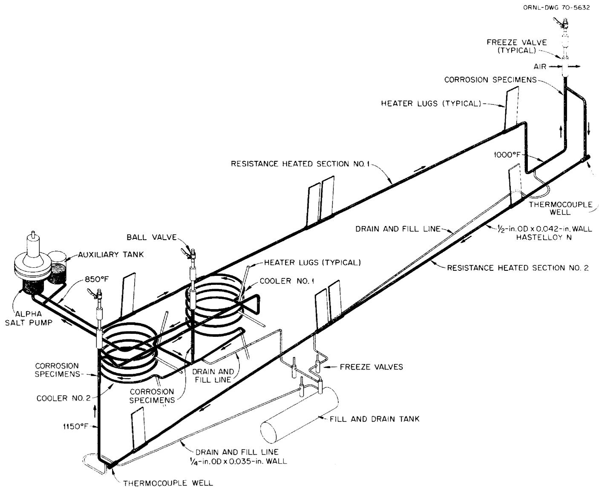  
Fig. 1. Molten-Salt Forced Convection Corrosion Loop MSR-FCL-2.

resistance-heated sections and two finned-tube coolers provide a temperature differential of $\sim 166^{\circ}\mathrm{C}$ ( $300^{\circ}\mathrm{F}$ ) at the normal flow rate of $2.5 \times 10^{-4} \, \mathrm{m}^{3} / \mathrm{sec}$ ( $8.8 \times 10^{-3} \, \mathrm{ft}^{3} / \mathrm{sec}$ ). Resistance heating ( $I^{2}R$ heaters) is supplied by a four-lug system, with voltage potential applied to the two center lugs while the two exterior lugs are at ground potential (Fig. 2). Thus, there is an unheated section at the center lugs. Because the electrical resistance of the molten salt is very high compared with that of the metal tubing (whose resistance remains almost constant over the temperature range of these experiments), this method of heating is well adapted to the system. One resistance-heated section (the heat transfer test section, designated No. 2) contains an actively heated length of $3.5\, \mathrm{m}$ ( $11.5\, \mathrm{ft}$ ), resulting in an L/D ratio of 331 and a heat transfer area of $0.115\, \mathrm{m}^{2}$ ( $1.08\, \mathrm{ft}^{2}$ ). Guard heaters (clamshells) are located on the heater lugs and along the resistance-heated tube to make up heat losses during the heat transfer runs (Fig. 3). Figure 4 shows the test loop with all heaters, thermocouples, and thermal insulation installed.

The temperature of the bulk fluid is measured by three thermocouples located in wells at the inlet and the exit of the test section. Wall temperatures along the heated section are measured by 12 sheathed, insulated-junction, 1.02-mm-OD (0.040-in.) Chromel-Alumel precalibrated thermocouples that are wrapped $180^{\circ}$ circumferentially around the tubing and clamped against the wall at about 0.30-m (l-ft) intervals. Thermo-couple readings during the experiments are recorded automatically by the Dextir, a central digital data-acquisition system with an accuracy of $\pm 0.10\%$ of full scale and a resolution of 1 part in 10,000.

The actual dimensions of the tubing in resistance-heated section 2 were determined before installation. The tubing outside diameter, measured by conventional outside micrometers, averaged $12.68 \mathrm{~mm}$ (0.499 in.); the tube wall thickness, measured with an ultrasonic Vidigage, averaged $1.09 \mathrm{~mm}$ (0.043 in.). Therefore, the tube internal diameter at room temperature was calculated to be $10.49 \mathrm{~mm}$ (0.413 in.), and this value was used in all subsequent heat transfer calculations.

A variable-speed drive motor on the pump (Fig. 5) controls the salt flow rate. In the fuel-salt experiments the pump speed was varied from

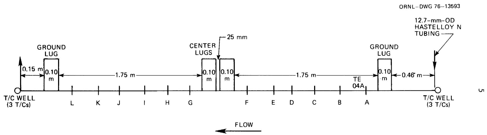  
Fig. 2. Heater test section 2 - details.

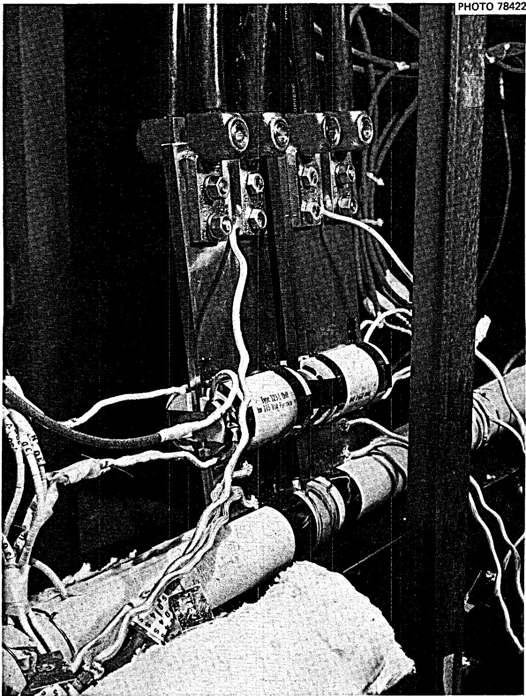  
Fig. 3. Center lugs and clamshell heaters on No. 2 heater section.

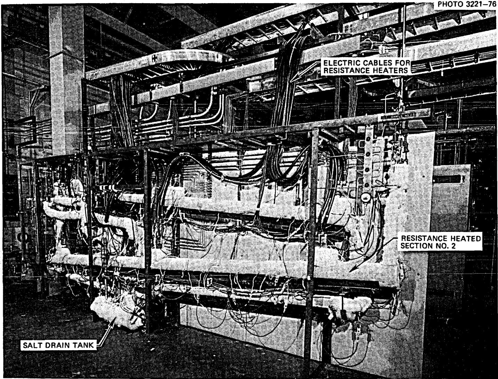  
Fig. 4. Salt test loop with protective metal enclosures removed.

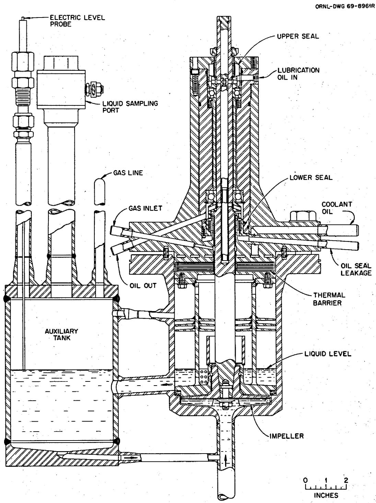  
Fig. 5. Alpha pump.

1000 to 4700 rpm, yielding flow rates of 40 to 250 ml/sec, which corresponds to a Reynolds modulus $(\mathbf{N}_{\mathrm{Re}})$ of 1542 to 14,200. The lower flow limit was set to avoid salt freezing, whereas the upper limit was dictated by the horsepower required for driving the pump. Tests with the coolant salt were done at pump speeds up to 5300 rpm, since this salt is less dense and requires less pumping power for a given flow rate.

Initially, a series of heat loss measurements was made with no salt in the loop in order to determine correct guard heater settings to be used in the heat transfer experiments. In these tests, the power input to the guard heaters was varied and subsequently plotted vs the average temperature obtained from readings of the 12 thermocouples (A-L) on the surface of the loop piping. These data then were used to demonstrate the error in surface-mounted thermocouple readings in a subsequent test where the guard heaters were not energized and salt flow was $\sim 2.5 \times 10^{-4} \mathrm{~m}^{3} / \mathrm{sec}$ . For example, in run 1 (Fig 6) (line YY), 1250 W was the power input to the guard heaters; the average temperatures of the bulk fluid obtained from the three thermocouples in the inlet and outlet wells were $663^{\circ} \mathrm{C}$ ( $1225^{\circ} \mathrm{F}$ ) and $665^{\circ} \mathrm{C}$ ( $1129^{\circ} \mathrm{F}$ ), respectively. The average of all the 12 thermocouple readings (A-L) from the surface of the loop piping was $664^{\circ} \mathrm{C}$ , indicating good agreement with the bulk fluid temperature. In run 2 (line XX), no power was applied to the guard heaters; the bulk fluid temperatures obtained from the three thermocouples in the wells at the inlet and exit averaged $748^{\circ} \mathrm{C}$ and $750^{\circ} \mathrm{C}$ ( $1382^{\circ} \mathrm{F}$ ), respectively. However, the 12 surface thermocouples yielded an average temperature of only $732^{\circ} \mathrm{C}$ , indicating a wall temperature error of approximately $17^{\circ} \mathrm{C}$ ( $31^{\circ} \mathrm{F}$ ) without the guard heaters. In all experiments, power input to the guard heaters was adjusted to balance any heat loss from the test section.

In each experiment, after power was supplied to the $I^2R$ heaters, steady-state conditions were established (with appropriate guard heater wattage) before taking readings of the loop operating parameters [i.e., inlet and outlet temperatures, wall temperatures, power input to the guard heaters, pump speed, and resistance heating wattage (the latter measured by calibrated precision watt meters having an accuracy of ±0.25%)]. Two sets of readings, taken at least 10 min apart, were recorded for each data point. The data for a typical experiment (Fig. 7) show the wall

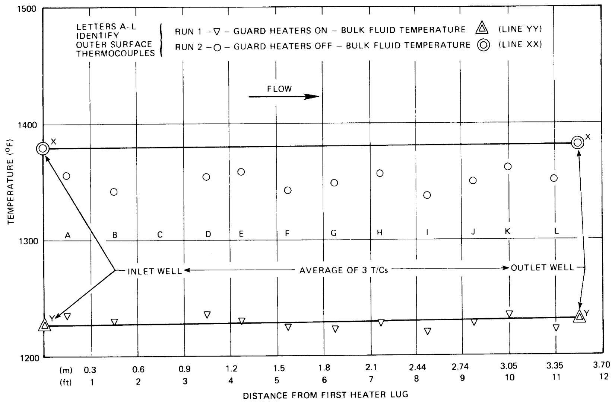  
Fig. 6. Heat loss tests, FCL-2b.

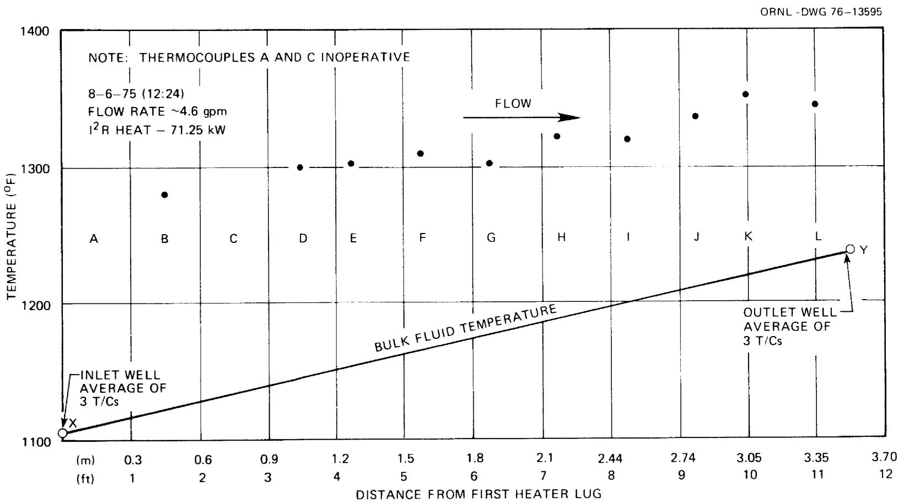  
Fig. 7. Heat transfer run 5 - fuel salt.

temperatures recorded by the surface thermocouples at the appropriate locations. There is a slight drop in wall temperature between the F and G locations (Fig. 2) which is probably caused by an increased film coefficient due to turbulence from weld penetrations at the lugs (F is located $150~\mathrm{mm}$ upstream of the center power lugs and G is $150~\mathrm{mm}$ downstream). However, the bulk fluid temperature at any location along the piping was assumed to rise linearly by drawing a line connecting points X and Y, which were the temperatures obtained by averaging the three thermocouple readings from the inlet and outlet thermocouple wells, respectively.

Initially, there was concern that the sheathed thermocouples strapped against the tube wall surface might not measure the surface temperature accurately because they were not bonded to the wall. Therefore, four 0.25-mm-OD (0.010-in.) bare-wire thermocouples were spot welded to the heated tube wall for comparison purposes. These four thermocouples were read with a potentiometer, while the sheathed thermocouples were recorded by the Dextir. Special test runs were made with the guard heaters both on and off to observe the performance of the two types of thermocouples at surface temperatures ranging from 444 to $605^{\circ}\mathrm{C}$ . With the guard heaters set at the proper level to make up heat losses, the sheathed thermocouples read randomly higher than the bare-wire thermocouples by 0.6 to $3.9^{\circ}\mathrm{C}$ . Without guard heat, the sheathed thermocouples read randomly lower by 0.3 to $3.9^{\circ}\mathrm{C}$ . It was concluded from these measurements that the sheathed thermocouple readings were sufficiently accurate for our tests.

The physical properties of the fuel salt and coolant salt $^{6-8}$ used in these experiments are listed in Tables 2 and 3, chemical analyses are given in Table 4, and properties of the Hastelloy N alloy $^{9}$ are shown in Table 5.

# DATA AND CALCULATIONS

Nine heat transfer tests were made with the coolant salt and twenty-one with the fuel salt. The data from these experiments, along with the necessary physical constants, were used to calculate the dimensionless parameters such as the Reynolds, Prandtl, and Nusselt numbers by the following procedure. Initially, the inside wall temperature of the tube at each thermocouple location was obtained from the measured outside wall

Table 2. Thermophysical property data for molten-salt fuel mixture LiF-BeF $_2$ -ThF $_4$ -UF $_4$ (72-16-12-0.3 mole %)   

<table><tr><td>Parameter</td><td>Value</td><td>Uncertainty</td><td>Ref.</td></tr><tr><td>Viscosity</td><td></td><td></td><td></td></tr><tr><td>lb ft-1 hr-1</td><td>0.264 exp [7370/T(°R)]</td><td>±10%</td><td>6</td></tr><tr><td>Pa/sec</td><td>1.09 × 10-4exp [4090/T (K)]</td><td>±10%</td><td>6</td></tr><tr><td>Thermal conductivity</td><td></td><td></td><td></td></tr><tr><td>Btu hr-1 ft-1 (°F)-1</td><td>0.71</td><td>±15%</td><td>α</td></tr><tr><td>W m-1 (K)-1</td><td>1.23</td><td>±15%</td><td>α</td></tr><tr><td>Density</td><td></td><td></td><td></td></tr><tr><td>lb/ft3</td><td>228.7 - 0.0205T (°F)</td><td>±1%</td><td>6</td></tr><tr><td>kg/m3</td><td>3665 - 0.591T (°C)</td><td>±1%</td><td>6</td></tr><tr><td>Heat capacity</td><td></td><td></td><td></td></tr><tr><td>Btu lb-1 (°F)-1</td><td>0.324</td><td>±4%</td><td>7</td></tr><tr><td>J kg-1 (K)-1</td><td>1357</td><td>±4%</td><td>7</td></tr><tr><td>Liquidus temperature</td><td></td><td></td><td></td></tr><tr><td>°F</td><td>932</td><td>±10°F</td><td>7</td></tr><tr><td>°C</td><td>500</td><td>±6°C</td><td>7</td></tr></table>

Estimated from values given in Ref. 8 for analogous salts.

Table 3. Thermophysical property data for molten-salt coolant mixture $\mathrm{NaBF_4 - NaF}$ (92-8 mole %)   

<table><tr><td>Parameter</td><td>Value</td><td>Uncertainty</td><td>Ref.</td></tr><tr><td>Viscosity</td><td></td><td></td><td></td></tr><tr><td>1b ft-1 hr-1</td><td>0.212 exp [4032/T (°R)]</td><td>±10%</td><td>6</td></tr><tr><td>Pa/sec</td><td>8.77 × 10-5exp [2240/T (K)]</td><td>±10%</td><td>6</td></tr><tr><td>Thermal conductivity</td><td></td><td></td><td></td></tr><tr><td>Btu hr-1 ft-1 (°F)-1</td><td>0.24</td><td>±15%</td><td>8</td></tr><tr><td>W m-1 (K)-1</td><td>0.42</td><td>±15%</td><td>8</td></tr><tr><td>Density</td><td></td><td></td><td></td></tr><tr><td>1b/ft3</td><td>141.4 - 0.0247T (°F)</td><td>±1%</td><td>6</td></tr><tr><td>kg/m3</td><td>2252 - 0.0711T (°C)</td><td>±1%</td><td>6</td></tr><tr><td>Heat capacity</td><td></td><td></td><td></td></tr><tr><td>Btu lb-1 (°F)-1</td><td>0.360</td><td>±2%</td><td>7</td></tr><tr><td>J kg-1 (K)-1</td><td>1507</td><td>±2%</td><td>7</td></tr><tr><td>Liquidus temperature</td><td></td><td></td><td></td></tr><tr><td>°F</td><td>725</td><td>±2°F</td><td>7</td></tr><tr><td>°C</td><td>385</td><td>±1°C</td><td>7</td></tr></table>

fuel salt LiF-BeF2-ThF4-UF4

(72-16-12-0.3 mole %) and

coolant salt $\mathrm{NaBF}_4$ -NaF

(92-8 mole %)

Table 4. Typical analyses of   

<table><tr><td>Constituent</td><td>Weight %</td><td>ppm</td></tr><tr><td></td><td>Fuel salt</td><td></td></tr><tr><td>Li</td><td>7.28</td><td></td></tr><tr><td>Be</td><td>2.03</td><td></td></tr><tr><td>Th</td><td>44.97</td><td></td></tr><tr><td>U</td><td>1.00</td><td></td></tr><tr><td>F</td><td>45.03</td><td></td></tr><tr><td>Ni</td><td></td><td>70</td></tr><tr><td>Cr</td><td></td><td>85</td></tr><tr><td>Fe</td><td></td><td>45</td></tr><tr><td>O2</td><td></td><td>58</td></tr><tr><td></td><td>Coolant salt</td><td></td></tr><tr><td>Na</td><td>21.5</td><td></td></tr><tr><td>B</td><td>9.7</td><td></td></tr><tr><td>F</td><td>68.3</td><td></td></tr><tr><td>Ni</td><td></td><td>7</td></tr><tr><td>Cr</td><td></td><td>80</td></tr><tr><td>Fe</td><td></td><td>350</td></tr><tr><td>O2</td><td></td><td>700</td></tr><tr><td>H</td><td></td><td>30</td></tr><tr><td>Mo</td><td></td><td>3</td></tr></table>

Table 5. Properties of Hastelloy N alloy   

<table><tr><td colspan="2">Thermal conductivity, W cm-1(°C)-1</td></tr><tr><td>At 0-440°C</td><td>0.1 + 1.25 × 10-4(°C)</td></tr><tr><td>At 440-700°C</td><td>0.07724 + 1.897 × 10-4(°C)</td></tr><tr><td colspan="2">Electrical resistivity, μΩ-cm</td></tr><tr><td>At 24°C</td><td>18.8</td></tr><tr><td>At 704°C</td><td>19.7</td></tr><tr><td>Mean coefficient of thermal expansion (20-650°C)</td><td>14 × 10-6/°C</td></tr><tr><td colspan="2">Chemical composition,%</td></tr><tr><td>Chromium</td><td>6.00-8.00</td></tr><tr><td>Molybdenum</td><td>15.00-18.00</td></tr><tr><td>Iron</td><td>5.00 (max)</td></tr><tr><td>Silicon</td><td>1.00 (max)</td></tr><tr><td>Manganese</td><td>0.80 (max)</td></tr><tr><td>Carbon</td><td>0.04-0.08</td></tr><tr><td>Nickel</td><td>Balance</td></tr></table>

temperature by the equation10

$$
\Delta \mathrm {T} _ {\text {w a l l}} = \mathrm {t} _ {\mathrm {o}} - \mathrm {t} _ {\mathrm {i}} = \frac {\mathrm {q}}{2 \pi \mathrm {L k} _ {\mathrm {N}} \left(\mathrm {r} _ {\mathrm {o}} ^ {2} - \mathrm {r} _ {\mathrm {i}} ^ {2}\right)} \left(\mathrm {r} _ {\mathrm {o}} ^ {2} \ln \frac {\mathrm {r} _ {\mathrm {o}}}{\mathrm {r} _ {\mathrm {i}}} - \frac {\mathrm {r} _ {\mathrm {o}} ^ {2} - \mathrm {r} _ {\mathrm {i}} ^ {2}}{2}\right),
$$

where $\mathbf{r}_0$ and $\mathbf{r}_i$ are the outside and inside radius of the tube, respectively; $t_0$ and $t_i$ are the outside (surface) and inside wall temperatures; $L$ is the test-section length of tubing; $k_N$ is the thermal conductivity of the Hastelloy N tubing at the corresponding outside wall temperature; and $q$ is the rate of heat transfer to the fluid.

The temperature drop through the fluid film was then obtained by subtracting the temperature of the bulk fluid (estimated from the linear-type plot shown in Fig. 7) from the inside wall temperature.

Local heat transfer coefficients were calculated from the experimental data by employing the equation for convective heat transfer by forced flow in tubes,

$$
h _ {e x p} = \frac {(q / A) _ {X}}{\left(t _ {i} - t _ {m}\right) _ {X}},
$$

where $h$ is the film coefficient for heat transfer at position $X$ along the tube, $A$ is the inner surface area for heat transfer, and $t_m$ is the temperature of the bulk fluid. The average linear velocity of the bulk fluid through the test section, $V_m$ , was not measured experimentally but was estimated from the heat flux and bulk fluid $\Delta T$ according to

$$
V _ {m} = \frac {q}{c _ {p} \Delta T A},
$$

where $c_p$ is the heat capacity of the salt (Table 2 or 3). The dimensionless Reynolds, Prandtl, and Nusselt terms* were calculated from the appropriate values of $h$ and $V_m$ and the appropriate physical constants (Table 2 or 3).

Selected data, along with the calculated parameters, are summarized in Tables 6 and 7. The calculations involve several assumptions made in the treatment of the data. The straight line drawn between the mean inlet and outlet fluid temperatures (thermocouple well readings, e.g., Fig. 7) assumes constant physical properties for the salt and uniform heat transfer over the inner surface of the test section. This treatment is supported by the essentially constant heat capacity of both liquid salts in the experimental temperature range and the relatively constant resistance of the Hastelloy N test section (<1% variation).

# ANALYSIS AND RESULTS

Although there is not complete agreement in the literature, the following standard heat transfer correlations are well accepted and have been used in comparing our results.

Laminar region - the Sieder-Tate equation,11

$$
\mathrm {N} _ {\mathrm {N u}} = 1. 8 6 \left[ \mathrm {N} _ {\mathrm {R e}} \mathrm {N} _ {\mathrm {P r}} (\mathrm {D} / \mathrm {L}) \right] ^ {1 / 3} \left(\mu_ {\mathrm {B}} / \mu_ {\mathrm {S}}\right) ^ {0. 1 4};
$$

transition region - a modified form12 of the Hausen13 equation,

$$
\mathrm {N} _ {\mathrm {N u}} = 0. 1 1 6 \left(\mathrm {N} _ {\mathrm {R e}} ^ {2 / 3} - 1 2 5\right) \mathrm {N} _ {\mathrm {P r}} ^ {1 / 3} \left(\mu_ {\mathrm {B}} / \mu_ {\mathrm {S}}\right) ^ {0. 1 4};
$$

turbulent region - the Sieder-Tate equation, $^{11}$

$$
N _ {N u} = 0. 0 2 7 N _ {R e} ^ {0 \cdot 8} N _ {P r} ^ {1 / 3} (\mu_ {B} / \mu_ {S}) ^ {0 \cdot 1 4}.
$$

These correlations for both salts along with the experimental values are plotted in Figs. 8 and 9 using all thermocouple readings along the entire length of resistance-heated section 2. Because the heat flux was interrupted at the center lugs, a maximum L/D of 167 was used in the treatment of these data. These results are quite similar, although the physical properties of the coolant salt (Table 2) differ enough from those of the fuel salt to provide a higher $\mathrm{N}_{\mathrm{Re}}$ range.

Table 6. Experimental data for heat transfer studies using LiF-BeF $_2$ -ThF $_4$ -UF $_4$ (72-16-12-0.3 mole %) $^{a,b}$   

<table><tr><td rowspan="2">Run No.</td><td rowspan="2">Heat input (kW)</td><td colspan="2">Average temperature (°F)</td><td rowspan="2">Mass flow (lb/hr)</td><td rowspan="2">Q/A (Btu hr-1ft-2× 10-4)</td><td rowspan="2">h exp [Btu hr-1ft-2(°F)-1]</td><td rowspan="2">NRe</td><td rowspan="2">NPr</td><td rowspan="2">NNu</td><td rowspan="2">NHT</td></tr><tr><td>Inlet</td><td>Outlet</td></tr><tr><td rowspan="2">3</td><td rowspan="2">63.20</td><td rowspan="2">1113</td><td rowspan="2">1248</td><td rowspan="2">4931</td><td rowspan="2">17.35</td><td>1427</td><td>7,488</td><td>11.2</td><td>69.6</td><td>29.8</td></tr><tr><td>1527</td><td>7,732</td><td>10.8</td><td>74.5</td><td>32.4</td></tr><tr><td rowspan="2">4</td><td rowspan="2">63.20</td><td rowspan="2">1109</td><td rowspan="2">1246</td><td rowspan="2">4859</td><td rowspan="2">17.35</td><td>1381</td><td>7,215</td><td>11.3</td><td>67.4</td><td>28.7</td></tr><tr><td>1527</td><td>7,445</td><td>11.0</td><td>74.5</td><td>32.2</td></tr><tr><td rowspan="2">5</td><td rowspan="2">71.25</td><td rowspan="2">1107</td><td rowspan="2">1237</td><td rowspan="2">5774</td><td rowspan="2">19.56</td><td>1610</td><td>8,416</td><td>11.5</td><td>78.6</td><td>33.3</td></tr><tr><td>1677</td><td>8,700</td><td>11.1</td><td>81.8</td><td>35.1</td></tr><tr><td rowspan="2">6</td><td rowspan="2">50.24</td><td rowspan="2">1095</td><td rowspan="2">1236</td><td rowspan="2">3727</td><td rowspan="2">13.79</td><td>997</td><td>5,318</td><td>11.8</td><td>48.6</td><td>20.3</td></tr><tr><td>1075</td><td>5,492</td><td>11.4</td><td>52.5</td><td>22.2</td></tr><tr><td rowspan="2">7</td><td rowspan="2">36.50</td><td rowspan="2">1111</td><td rowspan="2">1257</td><td rowspan="2">2633</td><td rowspan="2">10.02</td><td>670</td><td>3,954</td><td>11.2</td><td>32.7</td><td>13.9</td></tr><tr><td>733</td><td>4,081</td><td>10.8</td><td>35.8</td><td>15.4</td></tr><tr><td rowspan="2">8</td><td rowspan="2">25.44</td><td rowspan="2">1021</td><td rowspan="2">1190</td><td rowspan="2">1585</td><td rowspan="2">6.98</td><td>279</td><td>1,872</td><td>14.2</td><td>13.6</td><td>5.1</td></tr><tr><td>303</td><td>1,951</td><td>13.7</td><td>14.8</td><td>5.7</td></tr><tr><td rowspan="2">9</td><td rowspan="2">19.52</td><td rowspan="2">1037</td><td rowspan="2">1190</td><td rowspan="2">1344</td><td rowspan="2">5.36</td><td>253</td><td>1,633</td><td>13.8</td><td>12.4</td><td>4.8</td></tr><tr><td>284</td><td>1,703</td><td>13.2</td><td>13.9</td><td>5.5</td></tr><tr><td rowspan="2">11</td><td rowspan="2">45.60</td><td rowspan="2">1310</td><td rowspan="2">1396</td><td rowspan="2">5585</td><td rowspan="2">12.52</td><td>1896</td><td>13,000</td><td>7.2</td><td>92.5</td><td>47.0</td></tr><tr><td>1987</td><td>13,210</td><td>7.1</td><td>97.0</td><td>49.5</td></tr><tr><td rowspan="2">12</td><td rowspan="2">66.16</td><td rowspan="2">1115</td><td rowspan="2">1258</td><td rowspan="2">4874</td><td rowspan="2">18.16</td><td>1326</td><td>7,422</td><td>11.0</td><td>64.8</td><td>27.7</td></tr><tr><td>1365</td><td>7,664</td><td>10.7</td><td>66.7</td><td>29.0</td></tr><tr><td rowspan="2">13</td><td rowspan="2">49.52</td><td rowspan="2">1087</td><td rowspan="2">1233</td><td rowspan="2">3573</td><td rowspan="2">13.59</td><td>888</td><td>5,019</td><td>12.0</td><td>43.3</td><td>17.9</td></tr><tr><td>951</td><td>5,200</td><td>11.5</td><td>46.5</td><td>19.5</td></tr><tr><td rowspan="2">14</td><td rowspan="2">36.96</td><td rowspan="2">1095</td><td rowspan="2">1241</td><td rowspan="2">2667</td><td rowspan="2">10.15</td><td>632</td><td>3,836</td><td>11.7</td><td>30.9</td><td>12.9</td></tr><tr><td>684</td><td>3,970</td><td>11.3</td><td>33.4</td><td>14.2</td></tr><tr><td rowspan="2">15</td><td rowspan="2">18.48</td><td rowspan="2">1075</td><td rowspan="2">1194</td><td rowspan="2">1643</td><td rowspan="2">5.07</td><td>243</td><td>2,168</td><td>12.7</td><td>11.9</td><td>4.7</td></tr><tr><td>260</td><td>2,234</td><td>12.3</td><td>12.7</td><td>5.1</td></tr><tr><td rowspan="2">16</td><td rowspan="2">18.32</td><td rowspan="2">1054</td><td rowspan="2">1216</td><td rowspan="2">1187</td><td rowspan="2">5.03</td><td>244</td><td>1,542</td><td>12.9</td><td>11.9</td><td>4.7</td></tr><tr><td>272</td><td>1,605</td><td>12.4</td><td>13.3</td><td>5.4</td></tr><tr><td rowspan="2">17</td><td rowspan="2">33.68</td><td rowspan="2">1074</td><td rowspan="2">1149</td><td rowspan="2">4762</td><td rowspan="2">9.24</td><td>1119</td><td>5,960</td><td>13.4</td><td>54.7</td><td>22.3</td></tr><tr><td>1223</td><td>6,060</td><td>13.2</td><td>59.8</td><td>24.6</td></tr><tr><td rowspan="2">Run No.</td><td rowspan="2">Heat input (kW)</td><td colspan="2">Average temperature (°F)</td><td rowspan="2">Mass flow (1b/hr)</td><td rowspan="2">Q/A (Btu hr-1ft-2× 10-4)</td><td rowspan="2">h exp [Btu hr-1ft-2(°F)-1]</td><td rowspan="2">NRe</td><td rowspan="2">NPr</td><td rowspan="2">NNu</td><td rowspan="2">NHT</td></tr><tr><td>Inlet</td><td>Outlet</td></tr><tr><td rowspan="2">20</td><td rowspan="2">54.16</td><td rowspan="2">1162</td><td rowspan="2">1278</td><td rowspan="2">4919</td><td rowspan="2">14.87</td><td>1457</td><td>8,230</td><td>10.0</td><td>71.3</td><td>31.9</td></tr><tr><td>1578</td><td>8,450</td><td>9.8</td><td>77.2</td><td>34.9</td></tr><tr><td rowspan="2">21</td><td rowspan="2">21.76</td><td rowspan="2">1160</td><td rowspan="2">1284</td><td rowspan="2">1848</td><td rowspan="2">5.97</td><td>439</td><td>3,097</td><td>10.0</td><td>21.5</td><td>9.5</td></tr><tr><td>486</td><td>3,189</td><td>9.7</td><td>23.8</td><td>10.7</td></tr><tr><td rowspan="2">22</td><td rowspan="2">16.40</td><td rowspan="2">1061</td><td rowspan="2">1204</td><td rowspan="2">1208</td><td rowspan="2">4.50</td><td>234</td><td>1,566</td><td>13.0</td><td>11.5</td><td>4.5</td></tr><tr><td>259</td><td>1,627</td><td>12.5</td><td>12.7</td><td>5.1</td></tr><tr><td rowspan="2">23</td><td rowspan="2">61.84</td><td rowspan="2">1149</td><td rowspan="2">1287</td><td rowspan="2">4720</td><td rowspan="2">16.97</td><td>1385</td><td>7,795</td><td>10.2</td><td>67.7</td><td>29.9</td></tr><tr><td>1442</td><td>8,038</td><td>9.9</td><td>70.5</td><td>31.6</td></tr><tr><td rowspan="2">25</td><td rowspan="2">55.76</td><td rowspan="2">1295</td><td rowspan="2">1413</td><td rowspan="2">4990</td><td rowspan="2">15.31</td><td>1722</td><td>11,560</td><td>7.3</td><td>84.2</td><td>42.3</td></tr><tr><td>1822</td><td>11,810</td><td>7.1</td><td>89.1</td><td>45.2</td></tr><tr><td rowspan="2">26</td><td rowspan="2">56.72</td><td rowspan="2">1330</td><td rowspan="2">1437</td><td rowspan="2">5600</td><td rowspan="2">15.57</td><td>2027</td><td>13,930</td><td>6.7</td><td>99.1</td><td>51.2</td></tr><tr><td>2079</td><td>14,210</td><td>6.6</td><td>102.0</td><td>53.0</td></tr></table>

aThe two sets of values in the last five columns correspond to the data obtained from the 1.3- and 1.6-m (4.25- and 5.25-ft) thermocouple locations (see text); $\mathrm{N}_{\mathrm{HT}} = \mathrm{N}_{\mathrm{Nu}}$ $(\mathrm{N}_{\mathrm{Pr}})^{-1 / 3}(\mu_{\mathrm{B}} / \mu_{\mathrm{S}})^{-0.14}$ .   
To obtain SI equivalents for the units in the table, multiply the values as follows: $1\mathrm{b / hr}\times 1.26\times 10^{-4} = \mathrm{kg / sec}$ Btu hr-1 ft-2 x 3.152 W/m²; Btu hr-1 ft-² (°F)-1 x 5.674 = W m-2 (K)-1.

Table 7. Experimental data for heat transfer studies using NaFBF4-NaF (92-8 mole %) $^{a,b}$   

<table><tr><td rowspan="2">Run No.</td><td rowspan="2">Heat input (kW)</td><td colspan="2">Average temperature (°F)</td><td rowspan="2">Mass flow (lb/hr)</td><td rowspan="2">Q/A (Btu hr-1ft-2)</td><td rowspan="2">h exp [Btu hr-1ft-2(°F)-1]</td><td rowspan="2">NRe</td><td rowspan="2">NPr</td><td rowspan="2">NNu</td><td rowspan="2">NHT</td></tr><tr><td>Inlet</td><td>Outlet</td></tr><tr><td>1</td><td>46.8</td><td>934</td><td>1039</td><td>4226</td><td>128,459</td><td>1722</td><td>44,455</td><td>5.28</td><td>247</td><td>139</td></tr><tr><td></td><td></td><td></td><td></td><td></td><td></td><td>1782</td><td>44,965</td><td>5.22</td><td>255</td><td>145</td></tr><tr><td>2</td><td>57.0</td><td>896</td><td>1024</td><td>4222</td><td>156,456</td><td>1598</td><td>41,582</td><td>5.64</td><td>229</td><td>125</td></tr><tr><td></td><td></td><td></td><td></td><td></td><td></td><td>1647</td><td>42,486</td><td>5.52</td><td>236</td><td>130</td></tr><tr><td>3</td><td>57.7</td><td>881</td><td>1042</td><td>3398</td><td>158,378</td><td>1376</td><td>33,463</td><td>5.64</td><td>197</td><td>107</td></tr><tr><td></td><td></td><td></td><td></td><td></td><td></td><td>1402</td><td>34,191</td><td>5.52</td><td>201</td><td>110</td></tr><tr><td>4</td><td>56.8</td><td>872</td><td>1101</td><td>2351</td><td>155,908</td><td>1052</td><td>23,852</td><td>5.48</td><td>151</td><td>83</td></tr><tr><td></td><td></td><td></td><td></td><td></td><td></td><td>1068</td><td>24,663</td><td>5.3</td><td>153</td><td>85</td></tr><tr><td>5</td><td>15.7</td><td>842</td><td>1134</td><td>510</td><td>43,094</td><td>244</td><td>5,104</td><td>5.55</td><td>35</td><td>19</td></tr><tr><td></td><td></td><td></td><td></td><td></td><td></td><td>257</td><td>5,350</td><td>5.3</td><td>37</td><td>20</td></tr><tr><td>6</td><td>30.2</td><td>844</td><td>1134</td><td>987</td><td>82,894</td><td>460</td><td>9,878</td><td>5.55</td><td>66</td><td>36</td></tr><tr><td></td><td></td><td></td><td></td><td></td><td></td><td>474</td><td>10,354</td><td>5.3</td><td>68</td><td>37</td></tr><tr><td>7</td><td>39.9</td><td>858</td><td>1110</td><td>1501</td><td>109,520</td><td>696</td><td>15,023</td><td>5.55</td><td>100</td><td>54</td></tr><tr><td></td><td></td><td></td><td></td><td></td><td></td><td>716</td><td>15,746</td><td>5.3</td><td>103</td><td>57</td></tr><tr><td>9</td><td>50.7</td><td>916</td><td>1070</td><td>3121</td><td>139,164</td><td>1347</td><td>32,648</td><td>5.31</td><td>193</td><td>108</td></tr><tr><td></td><td></td><td></td><td></td><td></td><td></td><td>1392</td><td>33,598</td><td>5.16</td><td>200</td><td>113</td></tr><tr><td>12</td><td>27.6</td><td>977</td><td>1061</td><td>3115</td><td>75,758</td><td>1377</td><td>34,956</td><td>4.95</td><td>197</td><td>114</td></tr><tr><td></td><td></td><td></td><td></td><td></td><td></td><td>1403</td><td>35,384</td><td>4.89</td><td>201</td><td>117</td></tr></table>

aThe two sets of values in the last five columns correspond to data obtained from the 1.3- and 1.6-m (4.25- and 5.25-ft) thermocouple locations (see text); $\mathrm{N}_{\mathrm{HT}} = \mathrm{N}_{\mathrm{Nu}}$ $(\mathbf{N}_{\mathbf{Pr}})^{-1 / 3}(\mu_{\mathbf{B}} / \mu_{\mathbf{S}})^{-0.14}$ .   
See Table 6 for SI conversions.

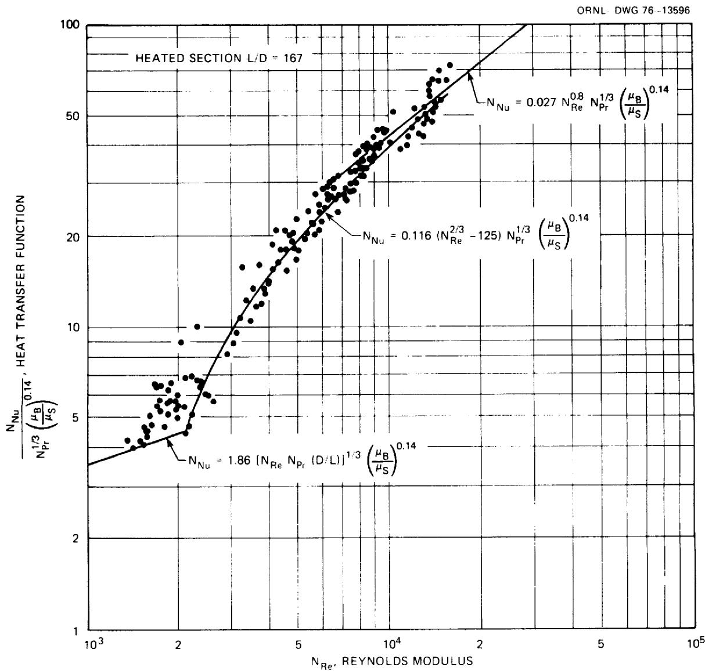  
Fig. 8. Heat transfer characteristics of LiF-BeF $_2$ -ThF $_4$ -UF $_4$ (72-16-12-0.3 mole %) flowing in a 10.5-mm-ID tube, summary of all data.

Since the guard heaters on the tubing were set for an average temperature, the guard heat flux would be high for the entrance section, resulting in high thermocouple readings and therefore indicating low heat transfer function, $\mathbf{N}_{\mathrm{HT}}$ :

$$
\mathrm {N} _ {\mathrm {H T}} = \frac {\mathrm {N} _ {\mathrm {N u}}}{\mathrm {N} _ {\mathrm {P R}} ^ {1 / 3} \left(\mu_ {\mathrm {B}} / \mu_ {\mathrm {S}}\right) ^ {0 . 1 4}}.
$$

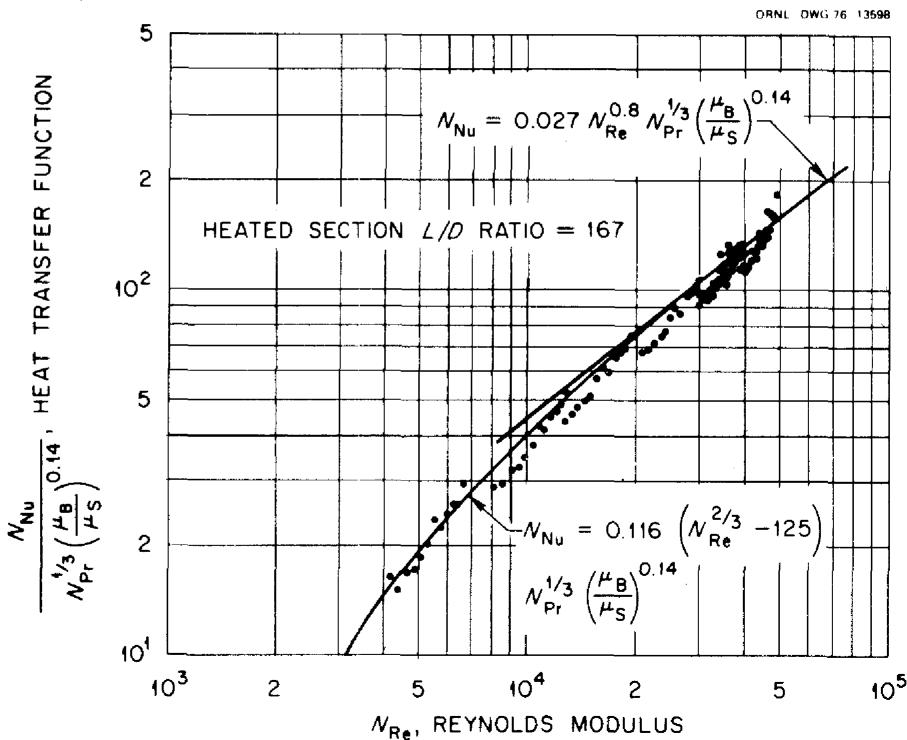  
Fig. 9. Heat transfer characteristics of $\mathrm{NaBF}_4$ -NaF (92-8 mole %) flowing in a 10.6-mm-ID tube, summary of all data.

Conversely, at the exit, the guard heater input is low, causing low thermocouple readings and high $\mathbf{N}_{\mathrm{HT}}$ values. Consequently, the best data should be those obtained from the thermocouple readings near the center of the test section. However, it was noted the $\mathbf{N}_{\mathrm{HT}}$ results just downstream of the center lugs were abnormally high. The reason for this, which was discovered during inspection of the loop piping after the heat transfer runs were completed, was excessive penetration of the butt welds where the lugs joined the tubing. This disrupted the inner surface of the flow channel and undoubtedly caused turbulence, with better downstream heat transfer. Thus, it was concluded that the best data should be those obtained from the E and F thermocouple locations [1.30 m (4.25 ft) and 1.60 m (5.25 ft) downstream from the inlet]. Therefore these data points for both salts are replotted with the standard correlations in Fig. 10 and Fig. 11.

There is satisfactory agreement with the Sieder-Tate correlation in the fully developed turbulent region at Reynolds moduli above 15,000. Between Reynolds moduli of $\sim 2100$ and 15,000, the experimental data agree

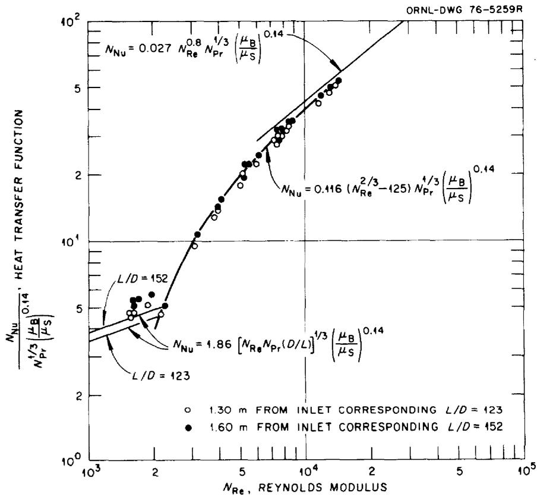  
Fig. 10. Heat transfer characteristics of LiF-BeF $_2$ -ThF $_4$ -UF $_4$ (72-16-12-0.3 mole %) flowing in a 10.5-mm-ID tube, stable heat transfer zone.

very well with the modified12 Hausen13 equation, which is normally applicable to the transition region. The extended transition region is probably due to the high viscosity and large negative temperature coefficient of viscosity of the fuel salt. It is known from hydrodynamic stability that heat transfer from a solid interface to a fluid whose viscosity decreases with temperature can produce this effect. As noted earlier, freezing of the salt at low velocities limited the data obtainable at low Reynolds moduli. These data at the upper limit of the laminar flow region are too meager to allow any conclusions to be drawn.

The results of these experiments are similar for both salts and indicate that the proposed coolant and fuel salts behave as normal heat transfer fluids with a somewhat extended transition region.

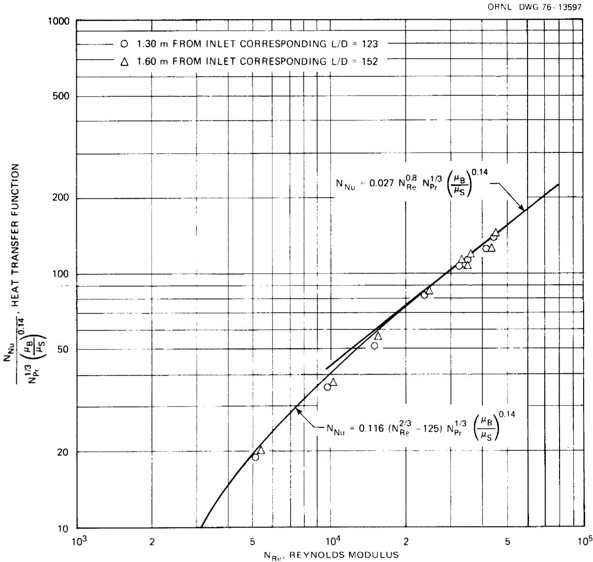  
Fig. 11. Heat transfer characteristics of $\mathrm{NaBF}_4$ -NaF (92-8 mole %) flowing in a 10.5-mm-ID tube, stable heat transfer zone.

# CONCLUSIONS

The heat transfer performance of a proposed MSBR coolant salt $\left[\mathrm{NaBF}_{4}-\mathrm{NaF}\right.$ (92-8 mole %)] and a fuel salt $\left[\mathrm{LiF}-\mathrm{BeF}_{2}-\mathrm{ThF}_{4}-\mathrm{UF}_{4}\right.$ (72-16-12-0.3 mole %)] was measured in forced convection loop FCL-2b. Satisfactory agreement with the empirical Sieder-Tate correlation was observed in the fully developed turbulent region at Reynolds moduli above 15,000. Between Reynolds

moduli of $\sim 2100$ and 15,000, the experimental data follows a modified Hausen equation which is normally applicable to the transition region. The extended transition region is probably due to the high viscosity and large negative temperature coefficient of viscosity of the salts. Insufficient data were taken in the laminar region to allow any conclusions to be drawn. The results of these experiments are similar for both salts and indicate that the proposed salts behave as normal heat transfer fluids with an extended transition region.

# NOMENCLATURE

A Heat transfer surface area   
Cp Heat capacity of fluid at constant pressure   
D Inside diameter of tube   
h Coefficient of heat transfer (film coefficient)   
kThermal conductivity of Hastelloy N   
k Thermal conductivity of the bulk fluid   
L Length of test section   
0 Density of the bulk fluid   
q Heat transfer rate to fluid $\mathbf{r}_o,\mathbf{r}_i$ Test-section tube radius, outside and inside, respectively $\mathbf{t}_{\mathrm{o}},\mathbf{t}_{\mathrm{i}}$ Temperature, outer and inner surface of tube, respectively   
tm Temperature of bulk fluid V m Average linear velocity of fluid through the test section $\mu_{B},\mu_{S}$ Viscosity of the fluid at temperatures $\mathfrak{t}_{\mathfrak{m}}$ and $\mathfrak{t}_{\mathfrak{i}}$ ,respectively

# Dimensionless Heat Transfer Moduli

$\mathbf{N}_{\mathbf{Nu}}$ Nusselt modulus, $\mathrm{hD / k}$ $\mathbf{N}_{\mathbf{Re}}$ Reynolds modulus, $\mathrm{DV}_{\mathrm{m}}\rho /\mu_{\mathrm{B}}$ $\mathbf{N}_{\mathbf{Pr}}$ Prandtl modulus, $\mathtt{c}_{\mathtt{p}}\mu_{\mathtt{B}} / \mathtt{k}$ $\mathbf{N}_{\mathbf{HT}}$ Heat transfer function (for plotting purposes), $\mathbf{N}_{\mathbf{Nu}}\mathbf{N}_{\mathbf{Pr}}^{-1 / 3}(\mu_{\mathbf{B}} / \mu_{\mathbf{S}})^{-0.14}$

# ACKNOWLEDGMENTS

We would like to acknowledge H. C. Savage, who assisted in the assembly of the test loop and initial heat transfer tests with sodium fluoroborate salt, and R. H. Guymon for valuable comments and suggestions in reviewing this report.

# REFERENCES

1. H. W. Hoffman, Turbulent Forced-Convection Heat Transfer in Circular Tubes Containing Molten Sodium Hydroxide, USAEC Report ORNL-1370 (October 1952); see also Proceedings of the 1953 Heat Transfer and Fluid Mechanics Institute, p. 83, Stanford University Press, Stanford, Calif., 1953.   
2. M. M. Yarosh, "Evaluation of the Performance of Liquid Metal and Molten-Salt Heat Exchangers," Nucl. Sci. Eng. 8, 32-43 (1960).   
3. J. W. Cooke and B. Cox, Forced Convection Heat Transfer Measurements with a Molten Fluoride Salt Mixture in a Smooth Tube, USAEC Report ORNL/TM-4079, Oak Ridge National Laboratory (March 1973).   
4. H. W. Hoffman and J. Lones, Fused Salt Heat Transfer - Part II: Forced Convection Heat Transfer in Circular Tubes Containing NaK-KF-LiF Eutectic, USAEC Report ORNL-1777, Oak Ridge National Laboratory (February 1955).   
5. W. R. Huntley, J. W. Koger, and H. C. Savage, MSRP Semiannu. Progr. Rep. Aug. 31, 1970, USAEC Report ORNL-4622, Oak Ridge National Laboratory, pp. 176-78.   
6. S. Cantor, Density and Viscosity of Several Molten Fluoride Mixtures, USAEC Report ORNL/TM-4308, Oak Ridge National Laboratory (March 1973).   
7. S. Cantor et al., Physical Properties of Molten-Salt Reactor Fuel, Coolant, and Flush Salts, USAEC Report ORNL/TM-2316, Oak Ridge National Laboratory (August 1968).   
8. J. W. Cooke, MSRP Semiannu. Progr. Rep. Aug. 31, 1969, USAEC Report ORNL-4449, Oak Ridge National Laboratory, p. 92.   
9. D. L. McElroy et al., "Thermal Conductivity of INOR-8 Between 100 and $800^{\circ}C$ ," Trans. Amer. Soc. Met. 55, 749 (1962).   
10. W. E. Kirst, W. M. Nagle, and J. B. Castner, Trans. AICHe 36, 371 (1940).   
11. E. N. Sieder and G. E. Tate, "Heat Transfer and Pressure Drops of Liquids in Tubes," Ind. Eng. Chem. 28 (12), 1429-35 (1936).

12. H. W. Hoffman and S. I. Cohen, Fused Salt Heat Transfer - Part III: Forced-Convection Heat Transfer in Circular Tubes Containing the Salt Mixture $\mathsf{NaNO}_2$ - $\mathsf{NaNO}_3$ - $\mathsf{KNO}_3$ , USAEC Report ORNL-2433, Oak Ridge National Laboratory (March 1960).   
13. H. Hausen. Z. Ver. Deut. Ing. Beih, Verfahrenstechnik 4, 91-98 (1943).

# Internal Distribution

1. E. S. Bettis   
2. H. R. Bronstein   
3. S. Cantor   
4. C. J. Claffey   
5. W. B. Cottrell   
6. J. L. Crowley   
7. J. H. Devan   
8. J. R. DiStefano   
9. J. R. Engel   
10. G. G. Fee   
11. D. E. Ferguson   
12. L. M. Ferris   
13. M.H. Fontana   
14. A. P. Fraas   
15. M. J. Goglia   
16. G. W. Greene   
17. A. G. Grindell   
18. R. H. Guymon   
19. J. R. Hightower, Jr.   
20. H. W. Hoffman   
21-28. W.R.Huntley   
29. J. R. Keiser   
30. A. D. Kelmers   
31. W.R.Laing   
32. R. E. MacPherson   
33. G. Mamantov   
34. D. L. Manning

35. G. T. Mays   
36. W. J. McCarthy, Jr.   
37. H. E. McCoy   
38. H. A. McLain

39-41. L.E. McNeese

42. R. L. Moore   
43. H. E. Robertson   
44. T. K. Roche   
45. M. W. Rosenthal   
46. W. E. Sallee   
47. J. P. Sanders   
48. H. C. Savage   
49. Myrtleen Sheldon

50-57. M. D. Silverman

58. A. N. Smith   
59. G.P. Smith   
60. I. Spiewak   
61. J. J. Taylor   
62. D. B. Trauger   
63. G. D. Whitman   
64. W. J. Wilcox   
65. L. V. Wilson   
66. ORNL Patent Office

67-68. Central Research Library   
69. Document Reference Section   
70-72. Laboratory Records   
73. Laboratory Records (LRD-RC)

# External Distribution

74. Research and Technical Support Division, Energy Research and Development Administration, Oak Ridge Operations Office, Post Office Box E, Oak Ridge, Tenn. 37830   
75. Director, Reactor Division, Energy Research and Development Administration, Oak Ridge Operations Office, Post Office Box E, Oak Ridge, Tenn. 37830   
76-77. Director, Division of Nuclear Research and Applications, Energy Research and Development Administration, Washington, DC 20545   
78-182. For distribution as shown in TID-4500 under UC-76, Molten-Salt Reactor Technology