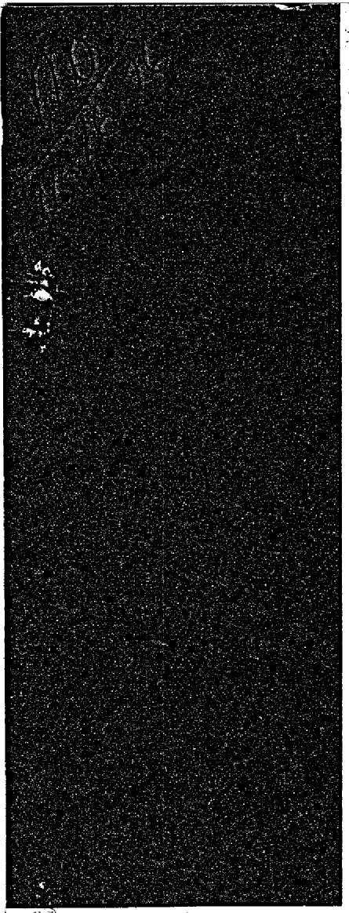

# Temperature Gradient Compatibility Tests of Some Refractory Metals and Alloys in Bismuth and Bismuth-Lithium Solutions

J. R. DiStefano

O. B. Cavin

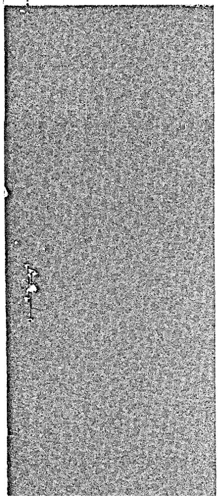

OAK RIDGE NATIONAL LABORATORY

OPERATED BY UNION CARBIDE CORPORATION FOR THE ENERGY RESEARCH AND DEVELOPMENT ADMINISTRATION

Printed in the United States of America. Available from

National Technical Information Service

U.S. Department of Commerce

5285 Port Royal Road, Springfield, Virginia 22161

Price: Printed Copy $4.00; Microfiche$ 2.25

This report was prepared as an account of work sponsored by the United States Government. Neither the United States nor the Energy Research and Development Administration/United States Nuclear Regulatory Commission, nor any of their employees, nor any of their contractors, subcontractors, or their employees, makes any warranty, express or implied, or assumes any legal liability or responsibility for the accuracy, completeness or usefulness of any information, apparatus, product or process disclosed, or represents that its use would not infringe privately owned rights.

Contract No. W-7405-eng-26

METALS AND CERAMICS DIVISION

TEMPERATURE GRADIENT COMPATIBILITY TESTS OF SOME REFRACTORY METALS AND ALLOYS IN BISMUTH AND BISMUTH-LITHIUM SOLUTIONS

J. R. DiStefano and O. B. Cavin

Date Published: November 1976

NOTICE This report was prepared as an account of work sponsored by the United States Government. Neither the United States nor the United States Energy Research and Development Administration, nor any of their employees, nor any of their contractors, subcontractors, or their employees, makes any warranty, express or implied, or assumes any legal liability or responsibility for the accuracy, completeness or usefulness of any information, apparatus, product or process disclosed, or represents that its use would not infringe privately owned rights.

OAK RIDGE NATIONAL LABORATORY

Oak Ridge, Tennessee 37830

operated by

UNION CARBIDE CORPORATION

for the

ENERGY RESEARCH AND DEVELOPMENT ADMINISTRATION

MASTER

# CONTENTS

Abstract 1   
Introduction 1   
Results 11   
Quartz Tests - Group 1 11   
Quartz Tests - Group 2 15   
Metal Loop Tests in Bi-2.5% Li - Group 3 30   
Summary and Conclusions 32   
Acknowledgments 33   
References 33

J. R. DiStefano and O. B. Cavin

# ABSTRACT

Quartz, T-111 and Mo thermal-convection loop tests were conducted at temperatures up to $700^{\circ}\mathrm{C}$ ( $100^{\circ}\mathrm{C} \Delta T$ ) to determine the compatibility of several refractory metals/alloys with bismuth and bismuth-lithium solutions for molten salt breeder reactor applications. Methods of evaluation included weight change measurements, metallographic examination, chemical and electron microprobe analysis, and mechanical properties tests. Molybdenum, T-111, and Ta-10% W appear to be the most promising containment materials, while niobium and iron-based alloys are unacceptable.

# INTRODUCTION

A key feature in the conceptual design of the single-fluid molten salt breeder reactor (MSBR) is the connecting chemical processing plant to continuously remove protactinium and fission products from the fuel salt (Fig. 1). Protactinium, the intermediate element in the breeding chain between thorium and $^{23} \mathrm{U}$ , has a significant neutron capture cross section and must be kept out of the core to obtain a good breeding ratio. Rare-earth-element fission products are also neutron poisons and so must be stripped from the fuel. A promising approach for MSBR fuel processing uses liquid bismuth containing dissolved lithium and thorium as reductants to extract protactinium and rare earth elements from fuel salt containing both uranium and thorium (Fig. 2). In 1968 the chemical feasibility of this process was demonstrated.

One of the requirements for the development of the reductive extraction process is identifying materials that are compatible with both molten flouride salts and bismuth-containing reductants. Hastelloy N (Ni-7% Cr-16% Mo-5% Fe) has excellent compatibility with molten salts at 500-700°C; however, it does not have good compatibility with bismuth. Of ten elements tested, graphite, tungsten, and molybdenum appear most promising (Table l) and they are also compatible with molten flouride mixtures. Extensive investigations of bismuth as a reactor coolant have shown that inhibitors such as magnesium, titanium, and zirconium are often required to reduce the high corrosion rates of conventional materials in bismuth.[12-16] However, these types of inhibitors would not be readily acceptable for use in the molten salt system because they would be eliminated from the bismuth stream by several of the proposed steps in processing.

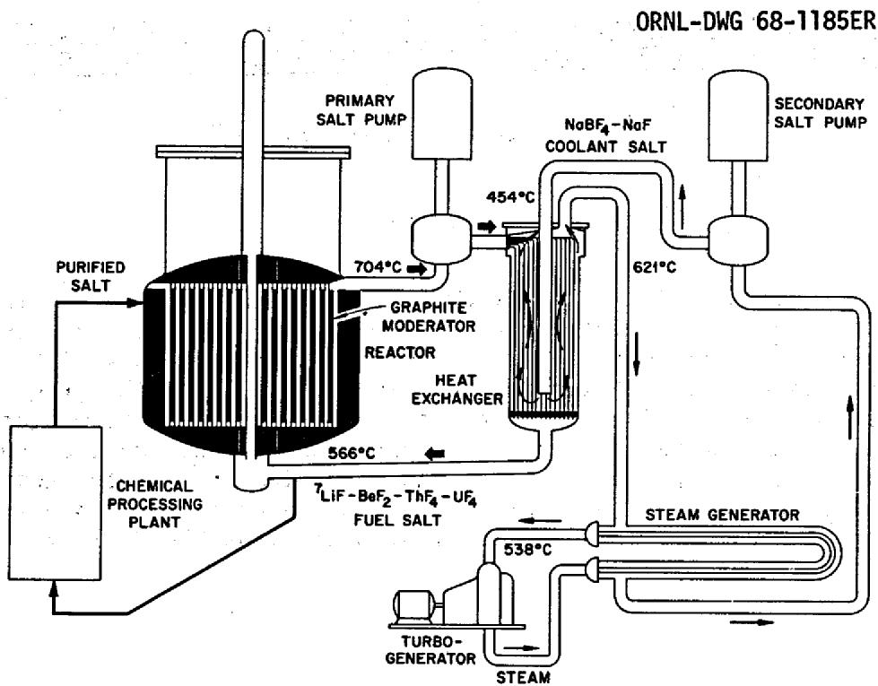  
Fig. 1. Single-Fluid, Two-Region Molten-Salt Breeder Reactor.

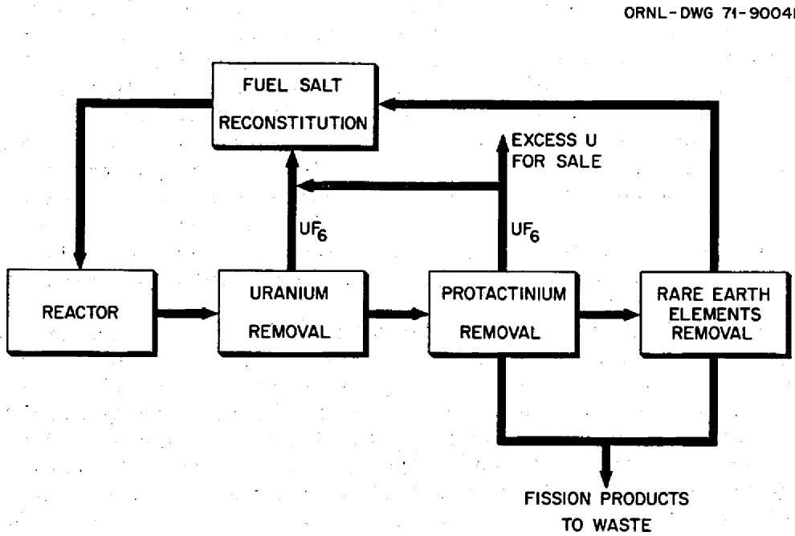  
Fig. 2. Simplified Flowsheet for Processing the Fuel in a Molten-Salt Breeder Reactor.

Table 1. Solubilities of Some Elements in Bismuth at ${600}^{ \circ  }\mathrm{C}$   

<table><tr><td>Element</td><td>Solubility, ppm</td><td>Reference</td></tr><tr><td>W</td><td>Not detectable</td><td>3</td></tr><tr><td>C</td><td>&lt;1</td><td>4</td></tr><tr><td>Mo</td><td>&lt;1</td><td>5;6</td></tr><tr><td>Be</td><td>6</td><td>6</td></tr><tr><td>V</td><td>45;110</td><td>7;11</td></tr><tr><td>Fe</td><td>50</td><td>5</td></tr><tr><td>Cr</td><td>145</td><td>5</td></tr><tr><td>Nb</td><td>100-200</td><td>8</td></tr><tr><td>Co</td><td>590</td><td>9</td></tr><tr><td>Ni</td><td>65,750</td><td>10</td></tr></table>

The low solubility of graphite, tungsten, and molybdenum in bismuth has been confirmed in compatibility tests by other investigators, and, in addition, rhenium, tantalum, tantalum alloys, and certain ceramic oxides and carbides also appeared to be promising for bismuth containment.[12-17]

In a high temperature isothermal system thermodynamic equilibrium among components is generally reached relatively quickly; the compatibility of the system can often be predicted if phase diagrams of the components are known. When there are thermal fluctuations and/or gradients within a system and the equilibrium constant for a corrosion reaction is temperature dependent, continuing corrosion can occur. For example, if iron dissolves in bismuth, and the solubility increases with temperature, simultaneous dissolution and deposition of iron will occur in the system. Under steady state conditions the solution or deposition rate equation for a given location can be expressed:

$$
J = K \left(C _ {\mathrm {S A T}} - C\right), \tag {1}
$$

where $J$ is the flux of material entering or leaving the liquid metal, $K$ is a rate constant, $C_{\mathrm{SAT}}$ is the equilibrium solubility of the solute, and $C$ is the actual concentration of the solute. The driving force for either dissolution or deposition is directly proportional to the concentration differential that exists in the system at a particular location and the appropriate rate constant for the process. Our data (Table 1) agree with previous compatibility experiments[12-17] that suggest that $C_{\mathrm{SAT}}$ is very low for graphite and the refractory metals tungsten, rhenium, molybdenum, and tantalum. Niobium and iron are somewhat less promising, but still show relatively low solubility in bismuth.

The reductive extraction process for protactinium removal uses bismuth containing small concentrations of lithium, and the metal transfer process for removing rare earth element fission products from the fuel salt uses bismuth containing 2-3 wt % Li. Since the solubility of materials in bismuth-lithium solutions could be appreciably different from their solubility in pure bismuth (Table 1), tests had to be conducted in the appropriate chemical processing solutions.

Thermal convection loops used in these tests were fabricated from quartz, T-111 (Ta-8% W-2% Hf), and molybdenum. The quartz loops were satisfactory for testing in pure bismuth and in bismuth containing up to 0.01 wt % lithium. No quartz loops with higher lithium concentrations were operated because of the reaction between SiO₂ and lithium. Loops fabricated from quartz were relatively inexpensive and could be operated in an air environment. Samples of the materials being tested were suspended in the vertical hot- and cold-leg sections (Fig. 3). To prevent the samples from floating, they were attached to a quartz rod that was held at the top of each leg. Several types of sample geometries were used, including flat tabs, cylindrical tubes, and cylindrical and sheet tensile specimens.

External heaters were placed on each leg to preheat the loop above the melting point of bismuth or the Bi-Li solution. A pot containing the melt to be circulated was attached by a mechanical connector to the bottom of the cold leg (Fig. 3.). Before filling, the loop was evacuated so a pressure differential would force the liquid into the loop. During operation, the metal line below the quartz was unheated to allow formation of a solid plug to serve as a freeze valve. When the test was completed, this section of the line was heated to allow the fluid to drain back into the attached pot.

The design of the metal thermal convection loops was similar to that of the quartz loops (Fig. 4). Two sections of 7/8-in. OD × 0.050 in. tubing were bent to form one vertical-horizontal segment (Fig. 4). The segments were joined by making gas-tungsten-arc saddle welds at the top and bottom of the vertical legs. Tubular sheet and tensile specimens were suspended in each of the vertical legs. Wires linked the specimens together to ridigly attach the specimen chain to the vertical legs at the top and bottom.

The metal loops were used to test a bismuth-lithium alloy containing 2.5 wt % Li. This alloy was prepared and purified in a molybdenum-lined stainless steel container (labeled "transfer pot" in Fig. 4). The lines extending from the top of the loop surge tank were made of tantalum for ease of fabrication and corrosion resistance. A commercially-produced Nb-1% Zr-type 316 stainless steel dissimilar metal joint connected the transfer pot to the loop. The Nb-1% Zr end was welded to the tantalum tube; a mechanical fitting connected the stainless steel end to the transfer pot lines. Two types of heaters were used: The main hot-leg heater contained a radiating tantalum element while standard Calrod heaters were strapped to other portions of the loop (Fig. 4). The molybdenum loop is shown (Fig. 5) prior to being installed in a vacuum chamber where the test was run.

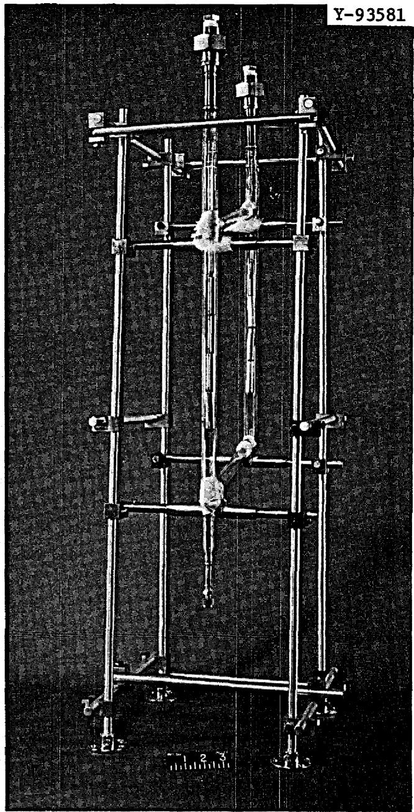  
Fig. 3. Quartz Thermal Convection Loop with Metal Samples in Hot and Cold Legs.

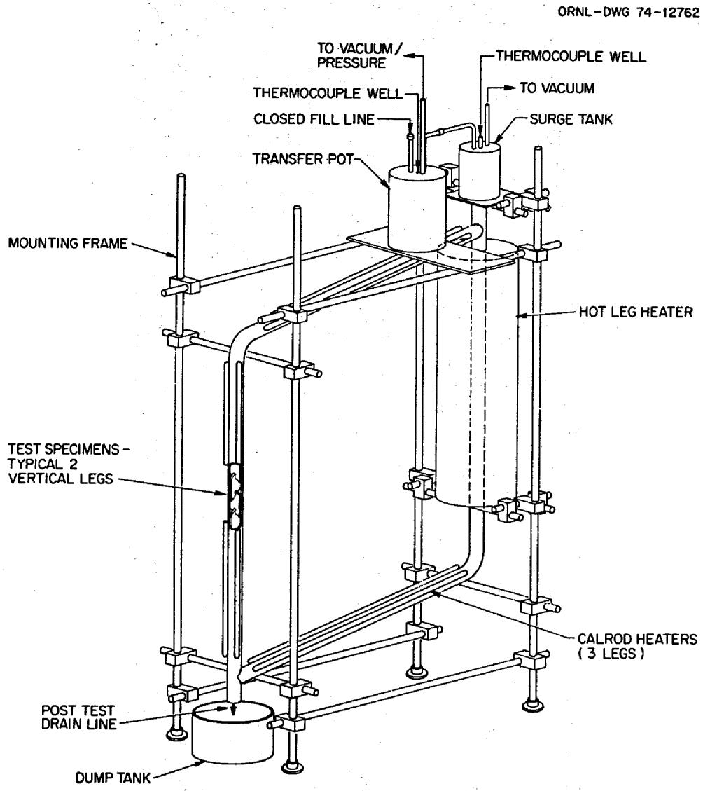  
Fig. 4. Design of Metal Thermal Convection Loop Apparatus.

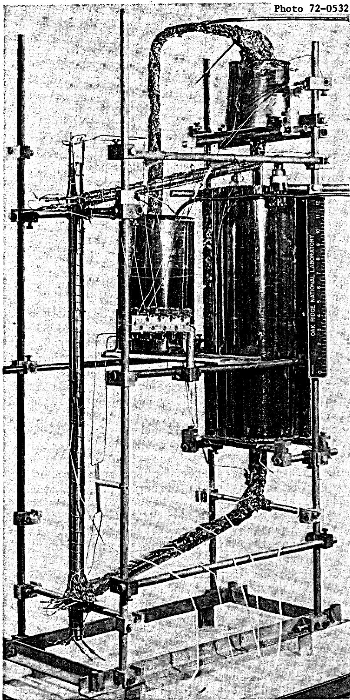  
Fig. 5. Molybdenum Thermal Convection Loop Prior to Test in Vacuum Chamber.

After evacuation and baking out of the vacuum chamber, the entire loop was heated to $500^{\circ}\mathrm{C}$ , since the melting point of Bi-2.5 wt $\%$ Li is slightly less than $500^{\circ}\mathrm{C}$ (Fig. 6). As the transfer pot was heated to $600^{\circ}\mathrm{C}$ ( $900^{\circ}\mathrm{C}$ in the case of the molybdenum loop), the loop was evacuated, and differential pressure was used to transfer the bismuth-lithium solution into the loop. During operation the tantalum heater heated the hot leg, but the required temperature differential was maintained with little or no heat to the rest of the loop from the Calrod heaters.

To stop the test, the heaters were turned off and the bismuth-lithium solution was allowed to solidify. When the system had cooled, the vacuum chamber was opened and the bottom of the cold leg cut off. A drain tank was placed immediately under this portion of the cold leg, the chamber re-evacuated, and the loop heated to approximately $600^{\circ}\mathrm{C}$ to allow it to drain.

Samples generally required cleaning before meaningful weight and dimensional measurements could be obtained. Several different techniques removed the bismuth or Bi-Li that adhered to the samples. If the amount were small, mechanically cleaning the samples was sufficient. A more satisfactory technique was to amalgamate the bismuth by dipping the sample into hot mercury (approximately $100 - 150^{\circ}\mathrm{C}$ ) and then removing the amalgam mechanically.

Bismuth used in these studies was Grade 69 obtained from Cominco American Corporation. Except for Quartz loops 1 and 2, the as-received material was first purified by bubbling hydrogen through the molten metal for two hours at $350^{\circ}\mathrm{C}$ , in a molybdenum-lined container. Initially the exit gas burned intermittently and had a reddish hue. Subsequently the gas burned continuously and was almost colorless indicating that reaction with hydrogen had ceased. If an alloy were required, solid lithium was added to solid, purified bismuth, and the mixture was heated above the melting temperature of the alloy. The phase diagram shows that the melting temperature of the alloy varies with lithium concentration (Fig. 6). Additionally, in the Group 1 series (see results section) the bismuth or bismuth-lithium solution was filtered prior to introduction into the loop through a type 316 stainless steel filter having openings of $10\mu \mathrm{m}$ . Determinations of various impurities before and after the various treatments (Table 2) showed no significant improvement in the purity of the bismuth; however, visual observations of the exit gas flame and the appearance of the bismuth indicated that some purification had occurred during hydrogen firing.

The addition of more lithium to bismuth as required for the two metal thermal convection loop tests was much more difficult because (1) the melting temperature of the alloy is much higher, (2) the bismuth-lithium reaction is strongly exothermic, and (3) during alloying there is a tendency to form $\mathrm{Li}_{3}\mathrm{Bi}$ ( $\mathrm{Bi}-9\%$ Li), which melts at $1150^{\circ}\mathrm{C}$ . A special apparatus was used to prepare $\mathrm{Bi}-2.5\%$ Li for these tests (Fig. 7). Lithium was first purified by hot getting with zirconium foil at $800^{\circ}\mathrm{C}$ , and the required amount transferred into a type 304 stainless steel container. Sequential steps were then as follows:

1. Solid bismuth was loaded into a molybdenum-lined stainless steel container and the container was sealed under argon.

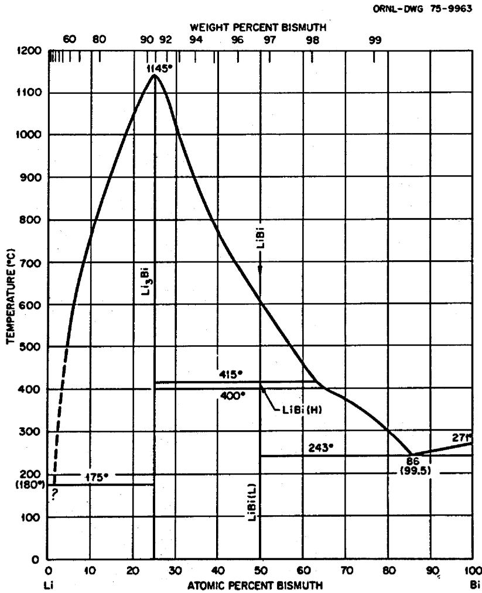  
Fig. 6. Lithium-Bismuth Phase Diagram.

Table 2. Concentration of Impurities in Bismuth Used in Quartz Loop Tests, ppm   

<table><tr><td>Bismuth Condition</td><td>Cr</td><td>Fe</td><td>Mn</td><td>Ni</td><td>Mo</td><td>C</td><td>H2</td><td>O2</td></tr><tr><td>As-received</td><td>&lt;5</td><td>&lt;5</td><td>&lt;5</td><td>&lt;5</td><td>&lt;1</td><td>&lt;20</td><td>&lt;1</td><td>&lt;6</td></tr><tr><td>After hydrogen treatment</td><td>2</td><td>8</td><td>1</td><td>3</td><td>0.2</td><td>NDb</td><td>5</td><td>9</td></tr><tr><td>Filtered through stainless steel screen</td><td>20</td><td>30</td><td>3</td><td>30</td><td>0.2</td><td>NDb</td><td>5</td><td>7</td></tr></table>

ND $\equiv$ Not determined.

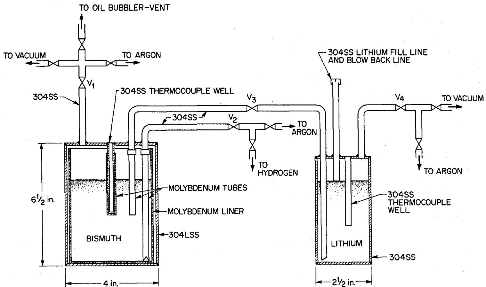  
Fig. 7. System Used to Prepare and Purify Bi-Li Alloy.

2. The bismuth container was evacuated and heated at $650^{\circ}\mathrm{C}$ .   
3. Hydrogen was bubbled through the molten bismuth for approximately 24 hr.   
4. The temperature of the bismuth was raised to $700^{\circ}\mathrm{C}$ ; the lithium was heated to $250^{\circ}\mathrm{C}$ in a separate container.   
5. Lithium was transferred into the bismuth container by pressure differential. Molten lithium was injected below the liquid bismuth surface (Fig. 7).

After alloying a sample was taken and a typical analysis was lithium-2.4%, hydrogen-14 ppm, and oxygen-90 ppm.

Nominal operating conditions for all of the loop tests was $700^{\circ}\mathrm{C}$ maximum hot leg temperature and a minimum cold leg temperature of 590- $625^{\circ}\mathrm{C}$ . For the quartz loop tests Cr-Al thermocouples were used; they were located in wells protruding through the quartz into the liquid stream. Thermocouples made of Pt, Pt-10% Rh were similarly inserted into wells through the T-111 tubing wall to measure temperature in test CPML-1. In test CPML-2 Pt, Pt-10% Rh thermocouples were again used, but they were strapped to the outside surface of the molybdenum tubing.

All quartz loops were operated in an external air environment. Refractory metal loops were operated in a vacuum chamber at pressures of $10^{-4}$ to $10^{-5}$ Pa ( $10^{-6}$ to $10^{-7}$ torr).

# RESULTS

Compatibility results from these experiments can be grouped according to the materials tested and the lithium concentration of the bismuth. Bismuth and Bi-0.01% Li solutions (Groups 1 and 2) were circulated in quartz loops containing samples of various metals (Table 3). A solution of Bi-2.5% Li (Group 3) was circulated in a molybdenum loop (CPML-1) for 3000 hr and in a T-111 loop (CPML-2) for 8700 hr. In each case the loops contained samples of the same material as the loop itself. Alloys investigated were based on molybdenum, tantalum, niobium, and iron. When Nb or Fe-based alloys were included, the tests operated for relatively short times before the flow stopped (Quartz tests - Group 1). All tests using only molybdenum alloy or tantalum alloy samples completed their scheduled operating period (up to 10,000 hr) (Quartz tests - Group 2).

# Quartz Tests - Group 1

Quartz loops 1 and 2 contained samples of TZM, tantalum, Nb-1 Zr and niobium and operated for 18 and 23 hr respectively before flow stopped. In loop 1 flow was stopped by a plug which formed at the top of the cold leg. The quartz fractured at this point, exposing the bismuth to air. The samples remianed immersed in bismuth, but the weight changes (Table 4) may reflect exposure to air as well as mass-transfer effects. Loop 2 stopped flowing after 23 hr. Although a solid plug had again formed, it did not fracture the quartz. Samples of the plug were analyzed spectrographically and niobium was found to be the major constituent of the plug.

Table 3. Summary of Quartz Loop Tests (700°C max, ~100°C ΔT)   

<table><tr><td>Loop</td><td>Samples</td><td>Fluid</td><td>Time (hr)</td></tr><tr><td colspan="4">Group 1</td></tr><tr><td>1</td><td>TZMa/Ta/Nb/Nb-1% Zr</td><td>Bi</td><td>18b</td></tr><tr><td>2</td><td>TZM/Ta/Nb/Nb-1% Zr</td><td>Bi</td><td>23b</td></tr><tr><td>4</td><td>Nb/Nb-1% Zr</td><td>Bi</td><td>115c</td></tr><tr><td>9</td><td>Fe-5% Mo</td><td>Bi</td><td>423</td></tr><tr><td colspan="4">Group 2</td></tr><tr><td>3</td><td>Mo/TZmd</td><td>Bi</td><td>3,000e</td></tr><tr><td>6</td><td>Ta/T-111</td><td>Bi</td><td>3,000e</td></tr><tr><td rowspan="2">10</td><td rowspan="2">Mo brazed with Fe-based alloys</td><td rowspan="2">Bi</td><td>2,100e</td></tr><tr><td>3,000e</td></tr><tr><td>17</td><td>Ta-10% W</td><td>Bi</td><td>3,000e</td></tr><tr><td>7</td><td>Mo/TZM</td><td>Bi-0.01% Li</td><td>3,000e</td></tr><tr><td>11</td><td>Mo</td><td>Bi-0.01% Li</td><td>3,000e</td></tr><tr><td>12</td><td>T-111</td><td>Bi-0.01% Li</td><td>3,000e</td></tr><tr><td>13</td><td>Ta</td><td>Bi-0.01% Li</td><td>3,000e</td></tr><tr><td>18</td><td>Ta-10% W</td><td>Bi-0.01% Li</td><td>3,000e</td></tr><tr><td>15</td><td>Mo</td><td>Bi-0.01% Li</td><td>10,000e</td></tr></table>

${}^{a}$ TZM is Mo-0.5% Ti-0.1% Zr.   
bFlow stopped.   
Terminated, samples dissolved.   
dT-111 is Ta-8% W-2% Hf.   
eCompleted.

Table 4. Weight Changes in Samples From Quartz Loop ${1}^{\mathbf{a}}$   

<table><tr><td>Material</td><td>Location</td><td>Weight change (mg/cm2)</td><td>Corrosion rate (mg/cm2 yr)</td></tr><tr><td>Tantalum</td><td>Hot leg</td><td>-0.4</td><td>-195</td></tr><tr><td>TZM</td><td>Hot leg</td><td>-15.9</td><td>-7,738</td></tr><tr><td>Nb-1% Zr</td><td>Hot leg</td><td>-54.3</td><td>-26,426</td></tr><tr><td>Niobium</td><td>Hot leg</td><td>-31.0</td><td>-15,086</td></tr><tr><td>Tantalum</td><td>Cold leg</td><td>+0.3</td><td>+146</td></tr><tr><td>TZM</td><td>Cold leg</td><td>-11.0</td><td>-5,353</td></tr><tr><td>Nb-1% Zr</td><td>Cold leg</td><td>-4.9</td><td>-2,385</td></tr><tr><td>Niobium</td><td>Cold leg</td><td>-1.3</td><td>-633</td></tr></table>

aAfter 18 hr in bismuth at $700^{\circ}\mathrm{C}$ maximum temperature and $100^{\circ}\mathrm{C}$ temperature differential.

X-ray diffraction also indicated the presence of small amounts of $\mathrm{Bi}_{2} \mathrm{O}_{3}-\mathrm{Nb}_{2} \mathrm{O}_{5}$ . To eliminate the possibility that oxygen contamination of bismuth might be responsible for these results, bismuth used in subsequent group 1 tests was purified by bubbling hydrogen through the molten metal for $2 \mathrm{hr}$ at $350^{\circ} \mathrm{C}$ and then filtering as described previously.

Loop 4 contained niobium and $\mathrm{Nb}-1\%$ Zr samples and was operated at a maximum temperature of $705^{\circ}\mathrm{C}$ with a temperature differential of $75^{\circ}\mathrm{C}$ for a period of 115 hr before flow stopped. X-ray diffraction analysis of a sample taken from the plug that had formed in the cold leg showed the presence of several phases: bismuth, alpha zirconium, and several unidentified phases. Niobium was not detected by x-ray diffraction analysis, but the atomic radius of niobium is the same as bismuth and it could occupy substitutional lattice sites in the bismuth unit cell without affecting the lattice parameter of the bismuth. Spectrographic analysis of a sample of the plug materials indicated that it contained $0.5\%$ Nb, $100~\mathrm{ppm}$ Zr, $300~\mathrm{ppm}$ Ni, $500~\mathrm{ppm}$ Fe, with the remainder bismuth. The iron, nickel, and chromium probably dissolved in the bismuth during transfer through stainless steel lines and filter during loading of the loop.

The samples from this test are shown (Fig. 8). The $\mathrm{Nb - 1\%}$ Zr sample from the hot leg was almost completely dissolved. Bismuth remained on the samples after draining and was not successfully removed; therefore, weight change data were not recorded.

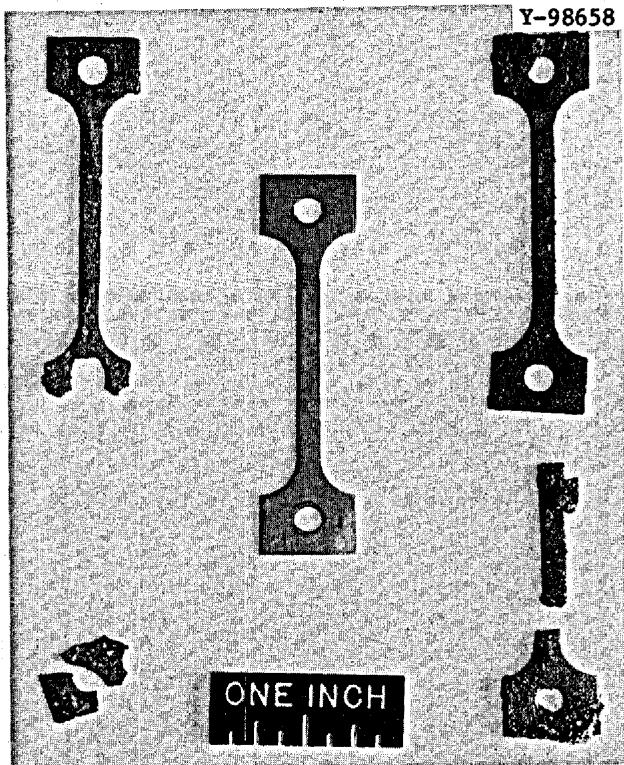  
Fig. 8. Niobium and Nb-1% Zr Samples From Quartz Thermal Convection Loop 4.

Photomicrographs of selected samples are shown (Fig. 9). The niobium sample from the hot leg is thicker than it was originally; however, the unattacked center section is less than 0.020 in. compared to an original sample thickness of 0.027 in. In electron probe scanning images of this sample (Fig. 10) the layer adhering to the niobium appears to be primarily bismuth, but the particles within the bismuth are niobium.

In niobium-1% zirconium samples from hot- and cold-leg regions of loop 4 (Fig. 9) the cold-leg sample has a greater unaffected center section (about 0.027 in.) than the hot-leg sample, and has greater total thickness (about 0.040 in. compared with 0.030 in.). This suggests that there has been considerable mass transfer of material from hot- to cold-leg sections.

Loop 9, which contained Fe-5% Mo samples, operated for 423 hr before a power failure stopped the test. After 216 hr one of the samples from the hot leg came loose from its wire holder and floated to the top of the bismuth. When the loop operation was stopped after 423 hr this was the only sample recovered; all other samples apparently had dissolved. Analysis of a sample of the bismuth from the top of the cold leg determined that it contained $13\%$ iron and $0.018\%$ molybdenum. The unheated area of the cold leg above the samples was the coldest portion of the loop and is probably where deposition occurred. If so, bismuth flowing past the cold

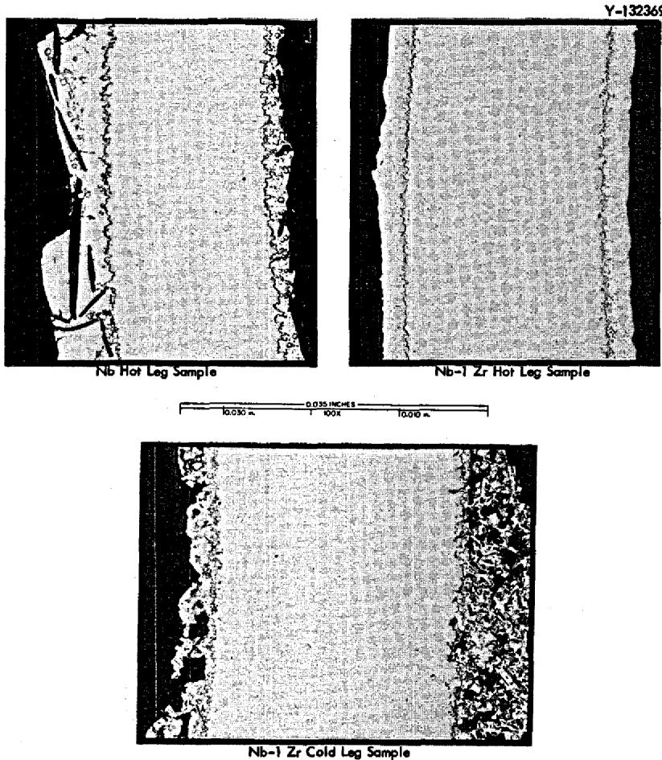  
Fig. 9. Niobium and Nb-1% Zr Samples From Quartz Thermal Convection Loop 4.

Y-100290

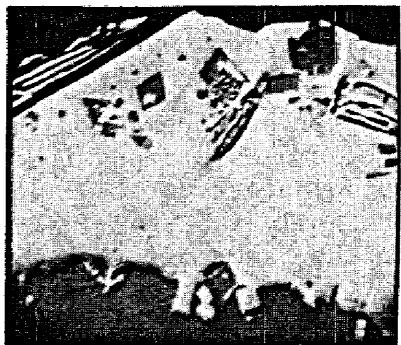  
Back-Scattered Electrons

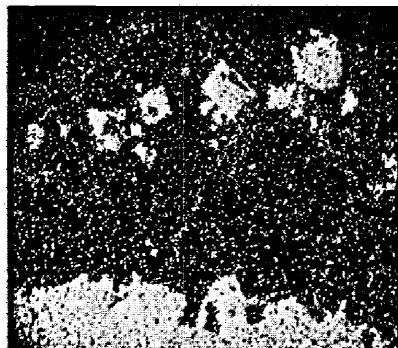  
Nbla

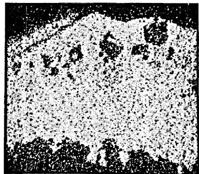  
BiLa   
Fig. 10. Electron Probe Scanning Images of Niobium Hot Leg Sample From Quartz Thermal Convection Loop 4.

leg samples could continue to have a strong dissolution effect. Static capsule tests of this alloy for 600 hr at $650^{\circ}\mathrm{C}$ in bismuth did not show detectable dissolution, thus indicating a strong influence of the rate constant $K$ (Eq. 1) on mass transfer of iron in temperature gradient systems involving bismuth.

# Quartz Tests - Group 2

Ten quartz loops were tested with samples of tantalum (alloys) and/or molybdenum (alloys). Loops 3, 6, 10, and 16 circulated bismuth while the remaining six loops circulated Bi-0.01% Li. All of these loops were operated for 3000 hr except for loop 10, which was operated 2100 hr, and loop 15, which was operated 10,000 hr.

Loop 10 contained molybdenum samples that had been brazed together with iron-based alloys. Four different compositions were used:

<table><tr><td>Braze Alloy Designation</td><td>Nominal Composition (wt %)</td></tr><tr><td>16 M</td><td>Fe-0% Mo-4% C-1% B</td></tr><tr><td>35 M</td><td>Fe-15% Mo-4% C-1% B</td></tr><tr><td>36 M</td><td>Fe-25% Mo-4% C-1% B</td></tr><tr><td>42 M</td><td>Fe-15% Mo-4% C-1% B-5% Ge</td></tr></table>

The loop operation was stopped after 2100 hr and weight changes of the samples were measured (Table 5). They were very small weight changes, and analysis of the bismuth gave little evidence that dissolution had occurred. Iron and molybdenum concentrations were less than 3 ppm, and carbon was 8-13 ppm. However, metallographic examination showed that each of the braze alloys contained an outer surface layer (Fig. 11). A more detailed examination was made of the samples brazed with alloys 16 M and 35 M. For the alloys before test no outer surface layer was visible (Fig. 12). An electron beam microprobe analysis determined the distribution of iron, molybdenum, and bismuth in the braze after test. In alloy 16 M the outer surface layer was rich in iron; the white particles contained $88\%$ bismuth, $5\%$ molybdenum, and less than $0.5\%$ iron (Fig. 13). An area adjacent to the white particles contained $41\%$ bismuth, $23\%$ molybdenum, and $4\%$ iron, while the dark spots were predominantly iron (about $70\%$ ). In alloy 35 M the surface layer appears to be subdivided into two segments (Fig. 14) with the outermost segment rich in molybdenum and the inner segment predominantly iron. Bismuth has completely penetrated the braze (Fig. 15). Thus, although there was little evidence of mass transfer, bismuth did react with the iron-based braze alloys.

The effect of lithium in bismuth on the corrosion rates of Mo/TZM, Ta/T-111, and Ta-10% W is shown in Tables 6, 7, and 8. Maximum corrosion rate (weight loss) of molybdenum in Bi-0.01% Li was 16.9 mg/cm²·yr compared with 1.64 mg/cm²·yr in pure bismuth. Tantalum and T-111 also showed higher rates of mass transfer in Bi-0.01% Li, but Ta-10% W showed the opposite effect - a higher corrosion rate in bismuth compared with Bi-0.01% Li, where all the samples exhibited small weight gains.

Table 5. Weight Changes in Molybdenum-Braze Samples Exposed to Bismuth in Quartz Thermal Convection Loop Tests   

<table><tr><td colspan="3">Conditions: 700°C Max Hot Leg Temperature; 95°C Temperature Differential</td></tr><tr><td rowspan="2">Braze Alloy</td><td colspan="2">Weight Change (mg)</td></tr><tr><td>Hot Leg</td><td>Cold Leg</td></tr><tr><td>16 M (Fe-4% C-1% B)</td><td>-1.6</td><td>Sample not included</td></tr><tr><td>35 M (Fe-4% C-1% B-15% Mo)</td><td>-4.2</td><td>+12.2</td></tr><tr><td>36 M (Fe-4% C-1% B-25% Mo)</td><td>-16.6</td><td>+5.0</td></tr><tr><td>42 M (Fe-4% C-1% B-15% Mo-5% Ge)</td><td>-0.2</td><td>+2.2</td></tr></table>

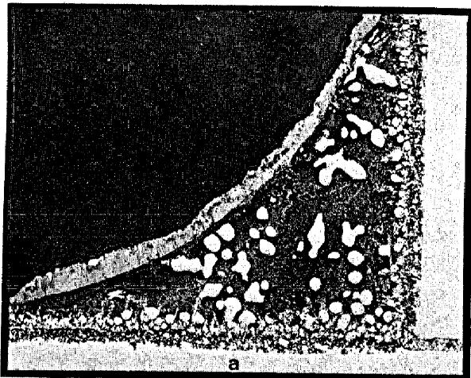  
Alloy 16M (Fe-4C-1B)   
0.035 INHES 100X

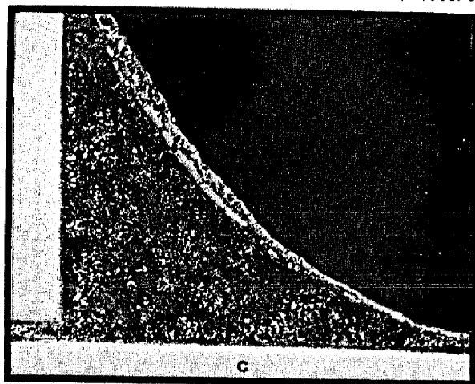  
Alloy 36 M (Fe-25Mo-4C-1B)

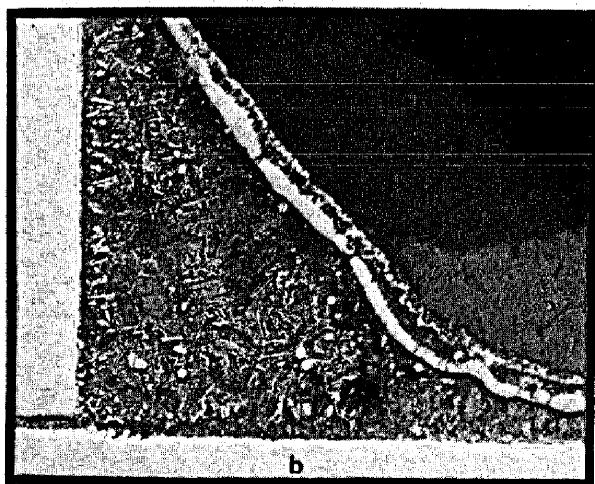  
Alloy 35 M (Fe-15 Mo-4 C-1 B)

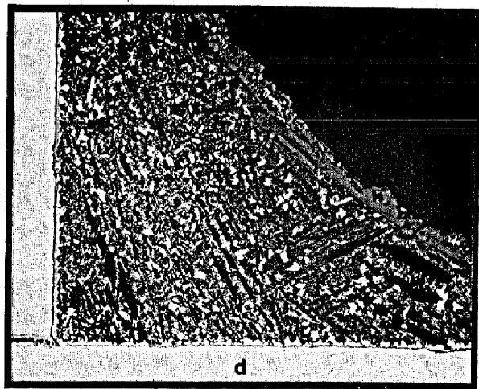  
Alloy 42 M (Fe - 15 Mo - 4 C - 1 B - 5 Ge)   
Fig. 11. Brazed Molybdenum Samples After Exposure to Bismuth in Quartz Thermal Convection Loop Test 10.

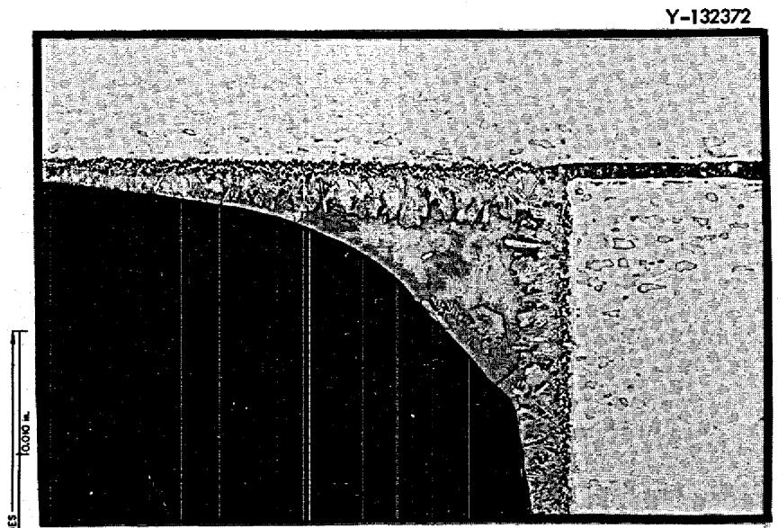

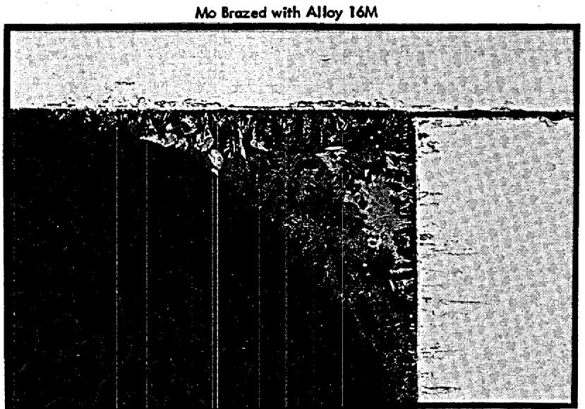  
0.035 INCHES 1000 0.000 m   
Mo Brazed with Alloy 35M   
Fig. 12. Brazed Molybdenum Samples Before Test in Quartz Loop 10.

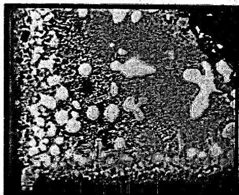  
Backscattered Electrons

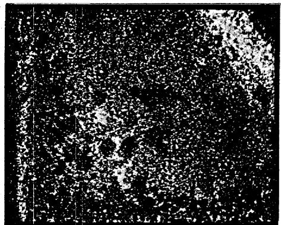  
FeKa

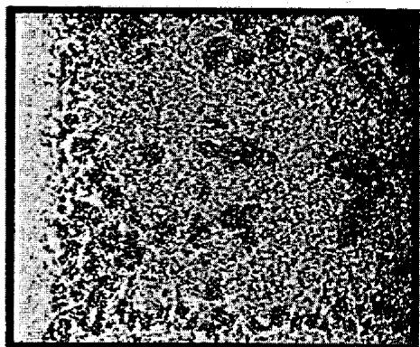  
MoLa

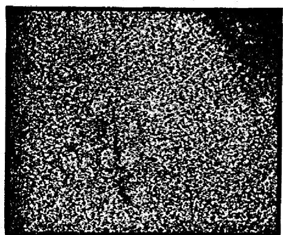  
BiLa   
Fig. 13. Electron Beam Scanning Images of Molybdenum Sample Brazed With Alloy 16M After Exposure to Bismuth in Quartz Loop 10. Lighter regions indicate higher concentration of listed element.

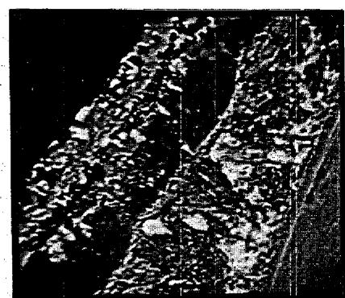  
Backscattered Electrons

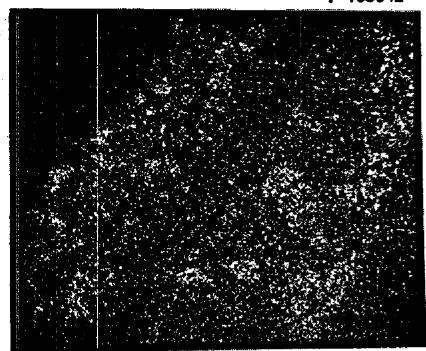  
BiLa

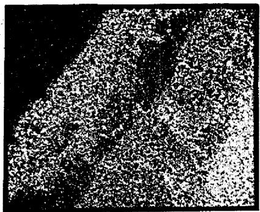  
MoLa

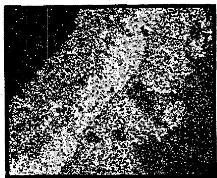  
FeKa   
Fig. 14. Electron Beam Scanning Images of Molybdenum Sample Brazed With Alloy 35M After Exposure to Bismuth in Quartz Loop 10. Lighter regions indicate higher concentration of listed element.

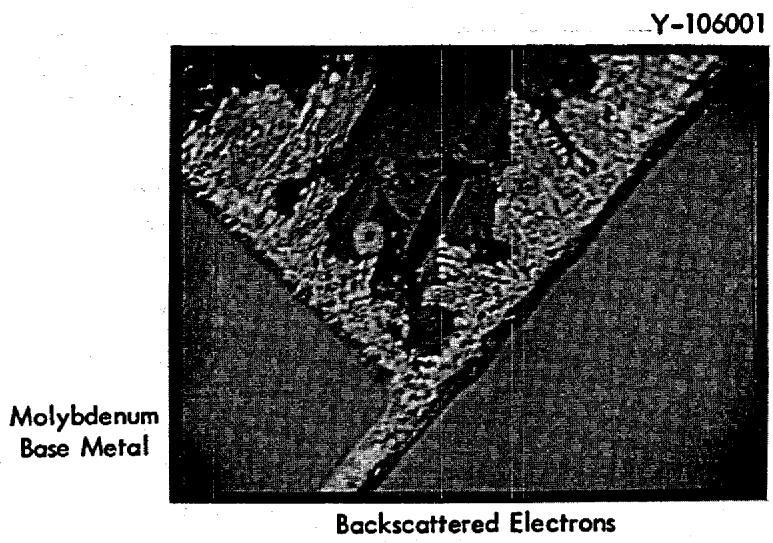

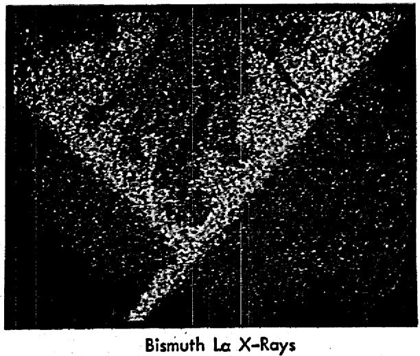  
Fig. 15. Electron Beam Scanning Image of Molybdenum Sample Brazed With Alloy 35M After Exposure to Bismuth in Quartz Loop 10. Bismuth has completely penetrated the braze alloy.

Table 6. Comparison of Corrosion Rates of Molybdenum and TZM Samples Exposed to Bismuth or Bi-0.01% Li in Quartz Thermal Convection Loop Tests for 3000 hr   

<table><tr><td rowspan="2">Location</td><td rowspan="2">Temperature (°C)</td><td colspan="3">Corrosion Rate (mg/cm2·yr)</td></tr><tr><td>Loop 3 Bismuth</td><td>Loop 7 Bi-0.01% Li</td><td>Loop 11 Bi-0.01% Li</td></tr><tr><td rowspan="4">Hot Leg</td><td>630</td><td>+0.53</td><td>+8.65</td><td>+3.10</td></tr><tr><td>640</td><td>+1.72a</td><td>-0.36a</td><td>-1.14</td></tr><tr><td>660</td><td>-1.64</td><td>-16.9</td><td>-3.80</td></tr><tr><td>690</td><td>+1.58</td><td>-1.74</td><td>-9.70</td></tr><tr><td rowspan="4">Cold Leg</td><td>680</td><td>+3.80</td><td>+3.56</td><td>-0.03</td></tr><tr><td>660</td><td>-1.02</td><td>-0.58</td><td>+0.26</td></tr><tr><td>640</td><td>+0.90a</td><td>+0.59a</td><td>+0.44</td></tr><tr><td>615</td><td>+1.43</td><td>0</td><td>+1.34</td></tr></table>

aTZM sample.

Table 7. Comparison of Corrosion Rates of Tantalum and T-111 Exposed to Bismuth and Bi-0.01% Li for 3000 hr in Quartz Thermal Convection Loops   

<table><tr><td rowspan="2">Location</td><td rowspan="2">Temperature (°C)</td><td colspan="3">Corrosion Rate (mg/cm2·yr)</td></tr><tr><td>Loop 6a(Ta/T-111, Bismuth)</td><td>Loop 13b(Ta, Bi-0.01% Li)</td><td>Loop 12c(T-111, Bi-0.01% Li)</td></tr><tr><td rowspan="4">Hot Leg</td><td>630</td><td>+13.73d</td><td>-16.8</td><td>+0.82</td></tr><tr><td>640</td><td>+0.75d</td><td>-41.8</td><td>-2.28</td></tr><tr><td>660</td><td>-47.16</td><td>-6.5</td><td>+1.08</td></tr><tr><td>690</td><td>-79.79</td><td>-137</td><td>-13.6</td></tr><tr><td rowspan="4">Cold Leg</td><td>680</td><td>-17.50</td><td>-68.9</td><td>-0.85</td></tr><tr><td>660</td><td>-24.40</td><td>-47.7</td><td>+0.70</td></tr><tr><td>640</td><td>+0.15d</td><td>-46.1</td><td>-1.46</td></tr><tr><td>615</td><td>+0.29d</td><td>-112.4</td><td>+0.44</td></tr></table>

${}^{a}{20}$ ppm tantalum in bismuth after test; less than 2 ppm before test.   
b30-150 ppm tantalum in bismuth after test; less than 1 ppm before test.   
c20-800 ppm tantalum in bismuth after test; 3 ppm before test.   
dT-111 samples, others were tantalum samples.

Table 8. Comparison of Corrosion Rates of Ta-10% W Samples Exposed to Bismuth or Bi-0.01% Li in Quartz Loop Tests for 3000 Hr   

<table><tr><td rowspan="2">Location</td><td rowspan="2">Temperature (°C)</td><td colspan="2">Corrosion Rate (mg/cm2·yr)</td></tr><tr><td>Loop 17 (Bismuth)</td><td>Loop 18 (Bi-0.01% Li)</td></tr><tr><td rowspan="4">Hot Leg</td><td>630</td><td>-1.40</td><td>+0.22</td></tr><tr><td>640</td><td>-3.65</td><td>+0.20</td></tr><tr><td>660</td><td>a</td><td>+0.26</td></tr><tr><td>690</td><td>a</td><td>-0.37</td></tr><tr><td rowspan="4">Cold Leg</td><td>680</td><td>-2.86</td><td>+0.46</td></tr><tr><td>660</td><td>-1.43</td><td>+0.13</td></tr><tr><td>640</td><td>-2.48</td><td>+0.35</td></tr><tr><td>615</td><td>-1.23</td><td>+0.13</td></tr></table>

${}^{a}$ Sample damaged during bismuth removal.

The metallographic appearance of Mo and TZM samples from loops 3 and 7 is shown (Figs. 16 and 17). Hot-leg samples of molybdenum from both of these tests show grain boundary corrosion to about 0.0005 in. Little or no attack on TZM was noted. There was a layer of extremely fine grains at the surface of the molybdenum which were attacked intergranularly. These grains were probably caused by residual cold work from machining and subsequent recrystallization at the test temperature. If these grain boundaries picked up iron during machining, preferential attack might be expected.

Room temperature mechanical property tests of the molybdenum samples showed their properties to be changed only slightly from those of the as-received samples (Table 9). Metallographic examination of the tensile samples showed there was no effect of the intergranular attack of the fine surface grains. Chemical analysis of the melts (Table 10) showed slightly higher molybdenum in Bi-0.01% Li after testing. In general, the results indicate that the addition of 0.01% Li to bismuth had little effect on its compatibility with molybdenum.

The alloy Ta-10% W showed similar resistance to both bismuth and Bi-0.01% Li (Fig. 18). A hot-leg sample (from loop 17) exposed to bismuth was slightly corroded to a depth of approximately 0.0005 in., but there was no visible corrosion of any of the specimens exposed to Bi-0.01% Li. Chemical analyses of the melts after test were similar to those before test, indicating that Ta-10% W has good corrosion resistance to both fluids.

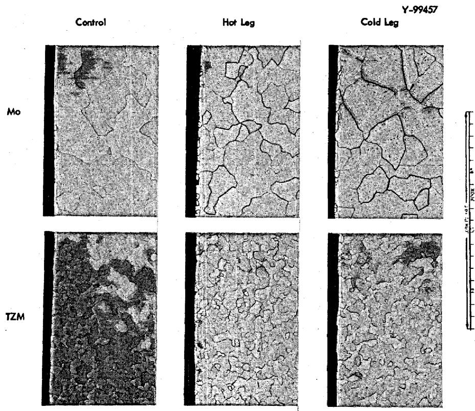  
Fig. 16. Molybdenum and TZM Samples From Quartz Loop 3.

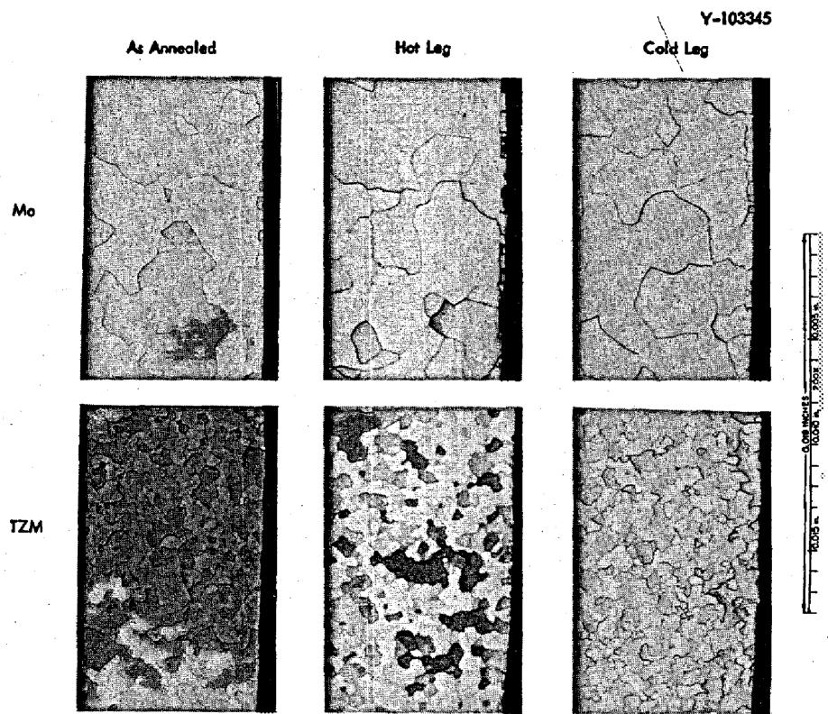  
Fig. 17. Molybdenum and TZM Samples From Quartz Loop 7.

Table 9. Effect of Exposure to Bi-0.01% Li in Quartz Thermal Convection Loops on the Room Temperature Tensile Properties of Refractory Metals   

<table><tr><td rowspan="3">Sample location</td><td colspan="8">Material</td></tr><tr><td colspan="2">Molybdenum</td><td colspan="2">Tantalum</td><td colspan="2">T-111</td><td colspan="2">Ta-10% W</td></tr><tr><td>UTS\(^a\) (10\(^3\) psi)</td><td>Elong. (%)</td><td>UTS\(^a\) (10\(^3\) psi)</td><td>Elong. (%)</td><td>UTS\(^a\) (10\(^3\) psi)</td><td>Elong. (%)</td><td>UTS\(^a\) (10\(^3\) psi)</td><td>Elong. (%)</td></tr><tr><td>As-received</td><td>110</td><td>8.7</td><td>44</td><td>24</td><td>94</td><td>10</td><td>84</td><td>14</td></tr><tr><td>Hot leg 690°C</td><td>111</td><td>11.3</td><td>47</td><td>23</td><td>52</td><td>0</td><td>87</td><td>8</td></tr><tr><td>Hot leg 660°C</td><td>111</td><td>8.0</td><td>47</td><td>26</td><td>61</td><td>0</td><td>92</td><td>10</td></tr><tr><td>Cold leg 660°C</td><td>112</td><td>11.3</td><td>50</td><td>26</td><td>88</td><td>1</td><td>88</td><td>7</td></tr><tr><td>Cold leg 640°C</td><td>112</td><td>11.3</td><td>47</td><td>25</td><td>47</td><td>0</td><td>89</td><td>7</td></tr></table>

Ultimate tensile stress.

Table 10. Composition of Bismuth and Bi-0.01% Li Melts Before and After Exposure to Molybdenum and TZM in Quartz Loops 3, 7, and 11   

<table><tr><td rowspan="2">Loop</td><td rowspan="2">Time Sampled</td><td colspan="10">Concentration (ppm)</td></tr><tr><td>C</td><td>H</td><td>N</td><td>O</td><td>Li</td><td>Mo</td><td>Ni</td><td>Si</td><td>Ta</td><td>Zr</td></tr><tr><td rowspan="2">3</td><td>Before test</td><td>10</td><td>5</td><td>2</td><td>8</td><td>0.1</td><td>&lt;0.5</td><td>30</td><td>8</td><td>3</td><td>0.3</td></tr><tr><td>After test</td><td>9</td><td>&lt;1</td><td>&lt;1</td><td>2</td><td>0.1</td><td>&lt;0.5</td><td>30</td><td>8</td><td>3</td><td>0.3</td></tr><tr><td rowspan="2">7</td><td>Before test</td><td>9</td><td>1</td><td>1</td><td>2</td><td>100</td><td>0.5</td><td>70</td><td>8</td><td>3</td><td>0.3</td></tr><tr><td>After test</td><td>30</td><td>1</td><td>1</td><td>7</td><td>60</td><td>4</td><td>70</td><td>10</td><td>2</td><td>2</td></tr><tr><td rowspan="2">11</td><td>Before test</td><td>22</td><td>&lt;1</td><td>&lt;1</td><td>8</td><td>96</td><td>2</td><td>30</td><td>&lt;30</td><td>3</td><td>&lt;50</td></tr><tr><td>After test</td><td>24</td><td>1</td><td>&lt;1</td><td>30</td><td>100</td><td>&lt;30</td><td>40</td><td>&lt;30</td><td>&lt;200</td><td>&lt;50</td></tr></table>

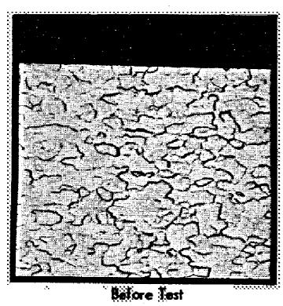

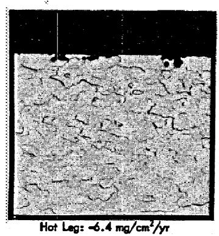

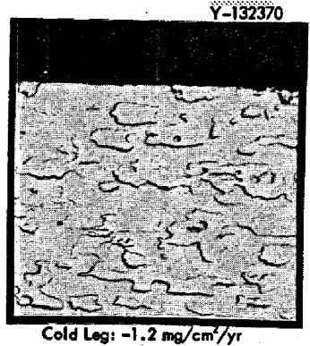

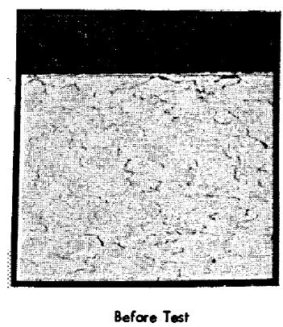

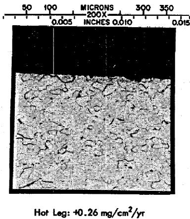

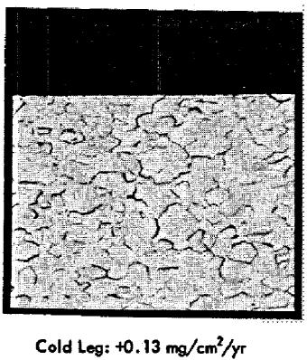  
Fig 18. Ta-10% W Samples Before and After Exposure to Bismuth (Quartz Loop 17 - Upper Pictures) and Bi-0.01% Li (Quartz Loop 18 - Lower Pictures). Maximum hot leg temperature was $700^{\circ}\mathrm{C}$ and minimum cold leg temperature was $600^{\circ}\mathrm{C}$ .

Weight changes in tantalum and T-111 specimens were greater when they were exposed to Bi-0.01% Li than when exposed to bismuth and posttest chemical analyses (Table 11) indicated there was a greater concentration of tantalum in the melts containing 0.01% lithium. However, metallographic examination of the samples did not show any significant differences (Fig. 19). Weight changes in T-111 were small and there was little evidence of corrosion, although surface and grain boundary corrosion from 0.001-0.002 in. occurred in tantalum.

The effect of time on the mass-transfer rate in the molybdenum-Bi-0.01% Li system is indicated by comparison of the results from loops 11 and 15. Weight change data are presented in Table 12. Corrosion rates as indicated by maximum weight loss in $\mathrm{mg/cm^2}$ yr generally decreased with time. Tripling the time decreased the maximum corrosion rate by a factor of about 1.5. However, the net weight loss obtained by summing the weight changes of all the specimens increased from 549 mg to 1754 mg, a 3.2-fold increase. After 10,000 hr, corrosion of the molybdenum was still less than 0.0005 in. deep (Fig. 20).

Table 11. Composition of Bismuth and Bi-0.01% Li Melts Before and After Exposure to Tantalum/T-111 in Quartz Loops 6, 13, and 12   

<table><tr><td rowspan="2">Loop</td><td rowspan="2">Time</td><td colspan="11">Concentration, ppm</td></tr><tr><td>C</td><td>H</td><td>N</td><td>O</td><td>Li</td><td>Fe</td><td>Ni</td><td>Cr</td><td>Ta</td><td>W</td><td>Hf</td></tr><tr><td rowspan="2">6</td><td>Before test</td><td>36</td><td>&lt;1</td><td>&lt;1</td><td>2</td><td></td><td>3</td><td>70</td><td>200</td><td>&lt;2</td><td>&lt;1</td><td>&lt;1</td></tr><tr><td>After test</td><td>&lt;20</td><td>&lt;1</td><td>&lt;1</td><td>4</td><td></td><td>3</td><td>70</td><td>50</td><td>&lt;15</td><td>&lt;1</td><td>&lt;1</td></tr><tr><td rowspan="2">13</td><td>Before test</td><td>16</td><td>&lt;1</td><td>&lt;1</td><td>16</td><td>127</td><td>30</td><td>100</td><td>150</td><td>5</td><td>&lt;3</td><td>&lt;3</td></tr><tr><td>After test</td><td>28</td><td>&lt;2</td><td>&lt;1</td><td>20</td><td>90</td><td>340</td><td>50</td><td>90</td><td>80</td><td>&lt;3</td><td>&lt;3</td></tr><tr><td rowspan="2">12</td><td>Before test</td><td>15</td><td>&lt;1</td><td>&lt;1</td><td>13</td><td>82</td><td>30</td><td>100</td><td>150</td><td>3</td><td>&lt;3</td><td>&lt;3</td></tr><tr><td>After test</td><td>23</td><td>&lt;2</td><td>&lt;1</td><td>20</td><td>80</td><td>40</td><td>60</td><td>50</td><td>250</td><td>&lt;3</td><td>&lt;3</td></tr></table>

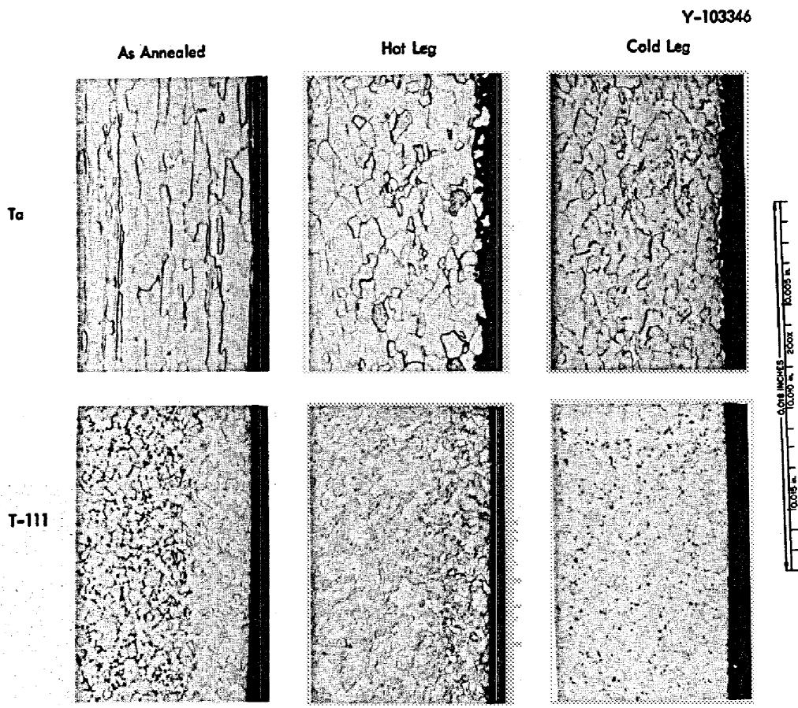  
Fig. 19. Tantalum and T-111 Specimens Before and After Exposure to Bismuth in Quartz Thermal Convection Loop 6.

Table 12. Comparison of Weight Change and Corrosion Rate in Molybdenum Samples Exposed to Bi-0.01% Li in Quartz Thermal Convection Loops for 3,000 and 10,000 hr   

<table><tr><td rowspan="2">Sample Location</td><td rowspan="2">Temperature (°C)</td><td colspan="2">Weight Change, mg/cm2</td><td colspan="2">Corrosion rate, mg/cm2·yr</td></tr><tr><td>Loop 11a(3,000 hr)</td><td>Loop 15b(10,000 hr)</td><td>Loop 11(3,000 hr)</td><td>Loop 15(10,000 hr)</td></tr><tr><td rowspan="4">Hot leg</td><td>630</td><td>-0.39</td><td>+0.17</td><td>-1.14</td><td>+0.15</td></tr><tr><td>640</td><td>+1.06</td><td>-0.23</td><td>+3.10</td><td>-0.20</td></tr><tr><td>660</td><td>-1.30</td><td>-4.10</td><td>-3.80</td><td>-3.59</td></tr><tr><td>690</td><td>-3.32</td><td>-7.08</td><td>-9.70</td><td>-6.20</td></tr><tr><td rowspan="4">Cold leg</td><td>680</td><td>-0.01</td><td>-1.47</td><td>-0.03</td><td>-1.28</td></tr><tr><td>660</td><td>+0.09</td><td>-0.55</td><td>+0.26</td><td>-0.48</td></tr><tr><td>640</td><td>+0.15</td><td>-0.39</td><td>+0.44</td><td>-0.34</td></tr><tr><td>615</td><td>+0.46</td><td>+0.07</td><td>+1.34</td><td>+0.06</td></tr></table>

a2-5 ppm molybdenum in bismuth after test; 2 ppm before test.   
<100 ppm molybdenum in bismuth after test; <100 ppm before test.

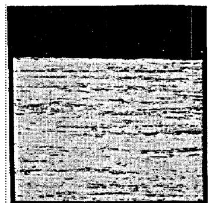  
Before Test

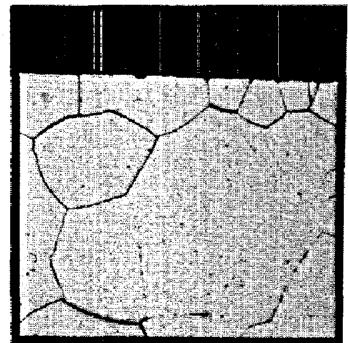  
Hot Leg: $-3.8\mathrm{mg/cm^2/yr}$

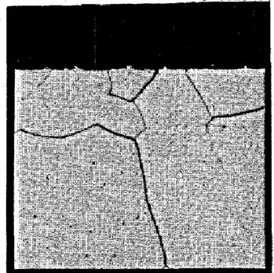  
Hot Leg: +3.1 mg/cm²/yr

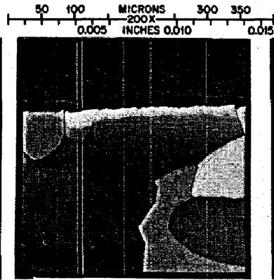  
Hot Leg: $-3.6\mathrm{mg/cm}^2/\mathrm{yr}$

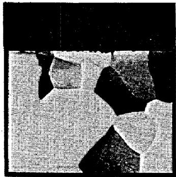  
Cold Leg: $+0.6\mathrm{mg/cm^2/yr}$

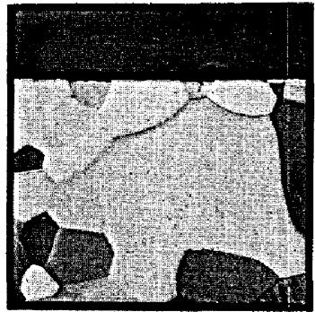  
Fig. 20. Molybdenum Samples Before and After Exposure to Bi-0.01% Li for 3000 hr (loop 11-upper) and 10,000 hr (loop 16-lower). Lower samples were etched by anodizing.   
Y-132371

Before Test

When the corrosion rates of tantalum alloys and molybdenum were compared (Table 13) after 3000 hr exposure to Bi-0.01% Li, Ta-10% W showed the greatest resistance to corrosion, while tantalum showed the least resistance. Metallographically Ta-10% W, T-111, and molybdenum were all corroded to <0.0005 in. deep compared with 0.001 to 0.002 in. in tantalum. When the mechanical properties of the materials before and after test were compared (Table 9), three of the materials, Ta-10% W, tantalum, and molybdenum, showed little change, but the strength and ductility of T-111 were significantly reduced. Loss of ductility in T-111 was also observed when the alloy was exposed to unalloyed bismuth. No significant changes in the mechanical properties of T-111 were found when the alloy was heated in argon for 3000 hr at 700°C.

In studying the behavior of T-111, Inouye and Liu18 found that relatively small additions of oxygen can cause embrittlement, if oxygen is added at $1000^{\circ}\mathrm{C}$ or lower. For example, the addition of 620 ppm oxygen to T-111 at $1000^{\circ}\mathrm{C}$ will cause severe embrittlement (5% elongation), but as small as 370 ppm will cause embrittlement if it is added at $825^{\circ}\mathrm{C}$ . Samples of T-111 from these quartz loop tests picked up from 100-500 ppm during exposure at $600 - 700^{\circ}\mathrm{C}$ , and this may have caused embrittlement of the alloy. The source of oxygen in these tests is presumed to be the quartz loop material. The melts were slightly higher in oxygen following the tests (Table 12), indicating that oxygen was being fed to the bismuth or Bi-0.01% Li from the quartz or some outside source.

Table 13. Comparison of Corrosion Rates of Materials Exposed to Bi-0.01% Li for 3000 hr in Quartz   

<table><tr><td rowspan="2">Location</td><td rowspan="2">Temperature (°C)</td><td colspan="4">Corrosion Rate, mg/cm2·yr</td></tr><tr><td>Loop 13 (Ta)</td><td>Loop 18 (Ta-10% W)</td><td>Loop 12 (T-111)</td><td>Loop 11 (Mo)</td></tr><tr><td rowspan="4">Hot leg</td><td>630</td><td>-16.8</td><td>+0.22</td><td>+0.82</td><td>-1.14</td></tr><tr><td>640</td><td>-41.8</td><td>+0.20</td><td>-2.28</td><td>+3.10</td></tr><tr><td>660</td><td>-6.5</td><td>+0.26</td><td>+1.08</td><td>-3.80</td></tr><tr><td>690</td><td>-137</td><td>-0.37</td><td>-13.6</td><td>-9.70</td></tr><tr><td rowspan="4">Cold leg</td><td>680</td><td>-68.9</td><td>+0.46</td><td>-0.85</td><td>-0.03</td></tr><tr><td>660</td><td>-47.7</td><td>+0.13</td><td>+0.70</td><td>+0.26</td></tr><tr><td>640</td><td>-112</td><td>+0.35</td><td>-1.46</td><td>+0.44</td></tr><tr><td>615</td><td>-46.1</td><td>+0.13</td><td>+0.44</td><td>+1.34</td></tr></table>

Two all-metal loop tests were operated with Bi-2.5% Li. One loop (of T-111) operated for 3000 hr while the second (of molybdenum) operated for 8700 hr. Both loops had specimens located in the two vertical legs. Maximum temperature was $700^{\circ}\mathrm{C}$ and the $\Delta T$ during operation was approximately $100^{\circ}\mathrm{C}$ . The tests were conducted within an ion-pumped high-vacuum enclosure.

Maximum weight loss in the T-111 loop was $2.73\mathrm{mg/cm^2}$ ( $7.97\mathrm{mg/cm^2}\cdot \mathrm{yr}$ ). There was very slight (less than 0.0005 in. deep) metallographic evidence or corrosion, and room-temperature tensile tests showed no changes in mechanical properties of posttest samples compared with the starting material. The oxygen content of the T-111 samples averaged 240 ppm after test compared with 60 ppm before test. However, in addition to bismuth exposure, the T-111 samples and loop were both annealed in vacuum for $\sim 2$ hr at $1400^{\circ}\mathrm{C}$ prior to test. That the samples were not brittle after test suggests that much of the oxygen increase occurred during the vacuum anneal. In contrast to the effect on T-111 at lower temperatures, the addition of 100-200 ppm at $1400^{\circ}\mathrm{C}$ did not embrittle the samples.[19] At lower temperatures oxygen in T-111 preferentially associates with hafnium as extremely fine hafnium-oxygen zones that are coherent with the matrix.[20] At temperatures below $800^{\circ}\mathrm{C}$ coarsening of the hafnium-oxygen zones is sluggish, but at high temperatures coarsening readily occurs and the alloy is more ductile in this condition. Samples of brittle T-111 from the quartz loop tests were heat-treated for 1 hr at $1400^{\circ}\mathrm{C}$ and ductility was restored as determined by room temperature bend tests. Specimens from the quartz loops were 0.020-in.-thick flat samples compared with 0.125-in.-diam tensile bars in this test. If oxygen were homogeneously distributed in the samples, specimen geometry probably did not contribute to the difference in ductility that was noted.

The molybdenum loop operated for 8700 hr. Weight changes for specimens from hot and cold leg sections of the loop were recorded (Fig. 21). The maximum weight loss was $3.62 \, \text{mg/cm}^2$ (approximately $3.6 \, \text{mg/cm}^2\cdot \text{yr}$ or $0.15 \, \text{mil/year}$ assuming uniform surface removal), and occurred in the specimen located in the maximum temperature section at the top of the hot leg. Deposition occurred in all cold leg samples and in the first three samples in the heated section. The maximum corrosion rate of $3.62 \, \text{mg/cm}^2\cdot \text{yr}$ is about that found in previous quartz loop tests that circulated Bi-100 ppm lithium for 3000 hr (Table 7) and indicates that mass transport of molybdenum is relatively insensitive to the lithium content of the bismuth.

Metallographic examination of samples from the molybdenum loop revealed small amounts of dissolution and deposition of molybdenum in the hot and cold leg samples respectively. Intergranular corrosion occurred to depths less than 0.0005 in. (Fig. 22).

Mechanical properties (Table 14) of selected specimens from the hot leg were, on the average, more ductile and weaker than those from the cold leg. However, the properties of all specimens fall within a normal range for this material.

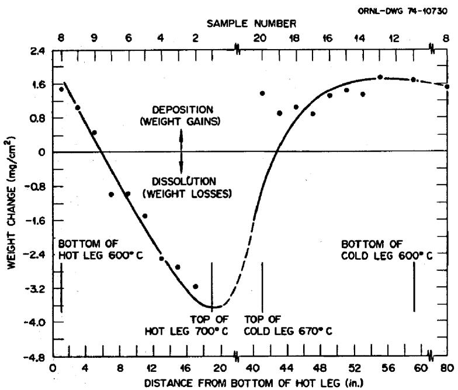  
Fig. 21. Weight Changes in Molybdenum Samples Exposed to Bi-2.5% Li in Thermal Convection Loop Test CPML-2.

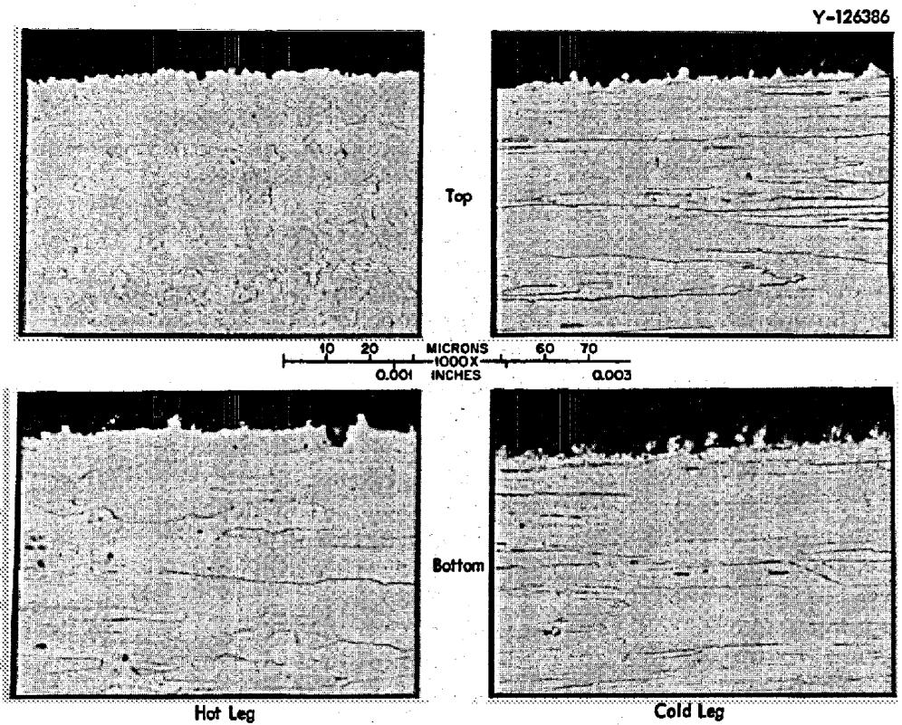  
Fig. 22. Metallographic Appearance of Molybdenum Samples From CPML-2.

Table 14. Room Temperature Mechanical Properties of Molybdenum Exposed to Bi-2.5% Li for 8700 hr in Thermal-Convection Loop Test   

<table><tr><td>Sample</td><td>Location</td><td>Temperature (°C)</td><td>Elongation (% in 1.125 in.)</td><td>Ultimate Tensile Strength (psi)</td><td>0.2% Offset Yield Strength (psi)</td></tr><tr><td>1</td><td>Hot</td><td>700</td><td>15.1</td><td>100,800</td><td>98,300</td></tr><tr><td>3</td><td></td><td>680</td><td>12.5</td><td>104,100</td><td>103,700</td></tr><tr><td>5</td><td></td><td>650</td><td>13.6</td><td>97,700</td><td>93,400</td></tr><tr><td>7</td><td></td><td>630</td><td>17.5</td><td>93,900</td><td>80,900</td></tr><tr><td>9</td><td></td><td>620</td><td>15.2</td><td>96,700</td><td>87,700</td></tr><tr><td>Average</td><td>Hot</td><td></td><td>14.8</td><td>98,600</td><td>92,800</td></tr><tr><td>11</td><td>Cold</td><td>600</td><td>8.5</td><td>120,000</td><td>110,900</td></tr><tr><td>13</td><td></td><td>615</td><td>8.4</td><td>117,600</td><td>109,100</td></tr><tr><td>15</td><td></td><td>630</td><td>8.1</td><td>113,100</td><td>108,200</td></tr><tr><td>17</td><td></td><td>640</td><td>9.8</td><td>118,900</td><td>113,100</td></tr><tr><td>19</td><td></td><td>650</td><td>10.4</td><td>111,100</td><td>106,100</td></tr><tr><td>Average</td><td>Cold</td><td></td><td>9.0</td><td>116,100</td><td>109,500</td></tr></table>

# SUMMARY AND CONCLUSIONS

Unalloyed molybdenum and two tantalum alloys (T-111 and Ta-10% W) have excellent compatibility with bismuth-lithium solutions up to 700°C even under temperature gradient conditions. The mass-transfer corrosion rate of molybdenum at 600–700°C was quite low and decreased with time (up to 10,000 hr). The mass-transfer rate increased with increasing concentrations of lithium in bismuth, but the maximum depth of corrosion that was observed was always less than 0.0005 in. and was confined to the grain boundaries of fine-grain size surface grains. The room temperature mechanical properties of molybdenum appeared to be unaffected by exposure to bismuth or bismuth-lithium solutions. The tantalum alloy T-111 also has excellent compatibility with bismuth-lithium solutions, but was severely embrittled by 100–200 ppm O₂ when oxygen contamination occurred in the 600–700°C range. This embrittlement severely limits the potential of T-111 as a MSBR chemical processing construction material. The mechanical properties of the alloy Ta-10% W were not as sensitive to oxygen contamination as T-111; also Ta-10% W showed excellent compatibility in tests with Bi-0.01% Li for 3000 hr. Unalloyed tantalum had a corrosion rate about ten times that of the above materials when it was exposed to bismuth or Bi-0.01% Li. Unalloyed tantalum was not tested with Bi-2.5% Li. In addition, unalloyed tantalum is rapidly corroded²¹ by lithium at these temperatures if the oxygen concentration of the tantalum exceeds approximately 100 ppm; therefore, tantalum seems less suitable for processing applications than the above materials.

Iron, niobium, and several of their alloys were found to be unacceptable materials for containing bismuth under temperature gradient conditions. Although the solubility of these elements in bismuth is low, rapid kinetics of dissolution and deposition led to plugging of quartz thermal convection loops after only a few hundred hours of operation. Molybdenum samples brazed with iron-based alloys (Fe-C-B, and Fe-Mo-C-B) resisted mass transfer, but the braze alloys were attacked by bismuth. An alloy of Fe-5% Mo completely dissolved by mass transfer in bismuth after only a few hundred hours in a quartz thermal convection loop.

# ACKNOWLEDGMENTS

The work described in this report was supported by the Molten Salt Reactor Program and was carried out over a period of several years. Construction and operation of the quartz thermal convection loops was carried out under the direction of L. R. Trotter. R. E. McDonald provided considerable assistance during fabrication of the T-111 and molybdenum thermal convection loop components. Joining these loop components was the responsibility of A. J. Moorhead and J. D. Hudson. B. W. McCullum, J. W. Hendricks, and J. L. Griffith were responsible for construction and operation of the test loop facilities. George Griffith edited and Susan Hanzelka prepared this manuscript for reproduction.

These experiments were part of an overall materials program that was carried out under the direction of H. E. McCoy. Special thanks are due him for the general and technical guidance that was provided.

# REFERENCES

1. M. E. Whatley and L. E. McNeese, Molten Salt Reactor Program Semiann. Prog. Rep. Feb. 29, 1968, ORNL-4254.   
2. L. E. McNeese et al., Program Plan for Development of Molten-Salt Breeder Reactors, ORNL-5018 (December 1974).   
3. C. L. Sargent, J. Am. Chem. Soc. 22: 783-90 (1900).   
4. C. B. Griffith and M. W. Mallett, J. Am. Chem. Soc. 75: 1832 (1953).   
5. J. R. Weeks et al., Proc. Intern. Conf. Peaceful Uses At. Energy, Geneva, 1955, Vol. 9, pp. 341-55, Columbia University Press, New York.   
6. G. W. Horsley and J. T. Masjrey, J. Inst. Met. 86: 401-402 (1957-58).   
7. J. R. Weeks, A. Minardi, and S. Fink, Progress Report Nuclear Engineering Dept. May 1-Aug. 31, 1961, BNL-696, pp. 49-50.

8. G. W. Parry and L. W. Graham, Bull. Inst. Met. 4: 125-26 (1959).   
9. R. Damm, E. Scheil, and E. Wachtel, Z. Metallk. 53: 196-203 (1962).   
10. C. J. Klamut et al., Proc. U.N. Intern. Conf. Peaceful Uses At. Energy 2nd, Geneva, 1958, Vol. 7, pp. 173-95, United Nations, New York.   
11. V. W. Elred, Interaction Between Solid and Liquid Metals and Alloys, AERE - X/R 1806 (1955).   
12. J. F. Collins, Summary Report on the Solubility of Metals and Alloys in Pure Bismuth at Temperatures up to $2200^{\circ}F$ , NEPA-1800 (April 1951).   
13. T. A. Coultas, Corrosion of Refractories by Tin and Bismuth, NAA-SR-192, (Sept. 15, 1952).   
14. E. L. Reed, J. Am. Ceram. Soc. 37: 146-52 (1953).   
15. J. W. Seifeat and A. L. Love, Jr., Corrosion 17; 475t-78t (October 1961).   
16. W. J. Halleth and T. A. Coultas, Dynamic Corrosion of Graphite by Liquid Bismuth, NAA-SR-188 (Sept. 22, 1952).   
17. R. W. Fisher and G. R. Winders, in Liquid Metal Technology, Part 1, Chem. Engr. Progr. Symp. Ser. No. 20, Vol. 50, American Institute of Chemical Engineers, New York, 1957.   
18. M. Hansen, Constitution of Binary Alloys, 2nd ed., p. 316, McGraw-Hill, 1958.   
19. H. Inouye and C. T. Liu, Low-Pressure Oxidation of T-111 and Effect on Tensile Properties, ORNL-TM-4621 (August 1974).   
20. C. T. Liu, H. Inouye, and R. W. Carpenter, Mechanical Properties and Structure of Oxygen-Doped Tantalum-Base Alloy, ORNL-4839 (December 1972).   
21. R. L. Klueh, Metall. Trans. 5: 875-79 (April 1974).

# INTERNAL DISTRIBUTION

1-2. Central Research Library

3. Document Reference Section   
4-13. Laboratory Records Department   
14. Laboratory Records, ORNL RC   
15. ORNL Patent Office   
16. C.F.Baes   
17. C. E. Bamberger   
18. E. S. Bettis   
19. R. B. Briggs   
20. C. R. Brinkman   
21. D. A. Canonico

22-26. O. B. Cavin

27. S. Cantor   
28. J. L. Crowley   
29. F. L. Culler   
30. J. E. Cunningham   
31. J. H. DeVan

32-36. J. R. DiStefano

37. J. R. Engel   
38. G. G. Fee   
39. D. E. Ferguson   
40. L. M. Ferris   
41. A. P. Fraas   
42. G. M. Goodwin   
43. J. L. Griffith   
44. W. R. Grimes   
45. A. G. Grindell   
46. R. H. Guymon   
47. P. N. Haubenreich   
48. J. L. Hendricks   
49. J. R. Hightower, Jr.:

50-52. M.R.H11   
53. W. R. Huntley

54. J. R. Keiser   
55. O. L. Keller   
56. A. D. Kelmers   
57. A. L. Lotts   
58. M. I. Lundin   
59. H. G. MacPherson   
60. R. E. MacPherson   
61. G. Mamantov   
62. D. L. Manning   
63. W. R. Martin   
64. C. L. Matthews   
65. L. Maya   
66. H. E. McCoy   
67. R.E.McDonald   
68. C. J. McHargue   
69. H. G. McDuffie   
70. L. E. McNeese   
71. A. J. Moorhead   
72. E. L. Nicholson   
73. H. Postma   
74. M. W. Rosenthal   
75. H. C. Savage   
76. J. E. Selle   
77. G.M.Slaughter   
78. A. N. Smith   
79. D. B. Trauger   
80. J. R. Weir, Jr.   
81. J. P. Young   
82. P. M. Brister (consultant)   
83. John Moteff (consultant)   
84. Hayne Palmour III (consultant)   
85. J. W. Prados (consultant)   
86. N. E. Promise1 (consultant)   
87. D. F. Stein (consultant)

# EXTERNAL DISTRIBUTION

88-89. ERDA, Division of Nuclear Research and Applications, Washington, DC 20545   
90-91. ERDA, Oak Ridge Operations Office, P.O. Box E, Oak Ridge, TN 37830  
Director, Reactor Division  
Research and Technical Support Division   
92-196. ERDA, Technical Information Center, P.O. Box 62, Oak Ridge, TN 37830 For distribution as shown in TID-4500 Distribution Category, UC-76 (Molten-Salt Reactor Technology)