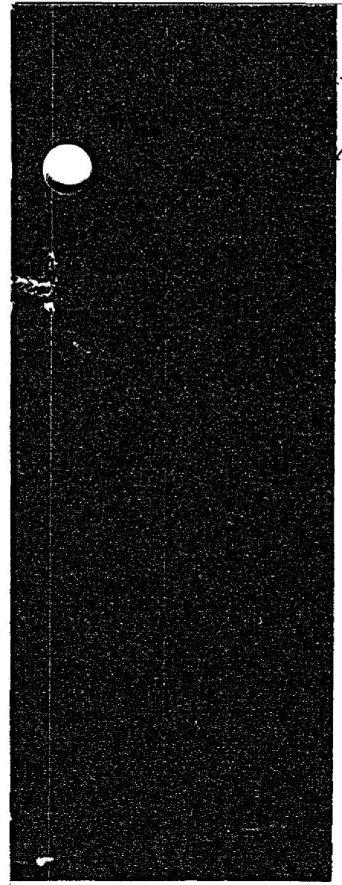

02-548 ORNL/TM-5540 ORNL/TM--5540

# System Design Description of Forced-Convection Molten-Salt Corrosion Loops MSR-FCL-3 and MSR-FCL-4

W. R. Huntley

M. D. Silverman

MASTER

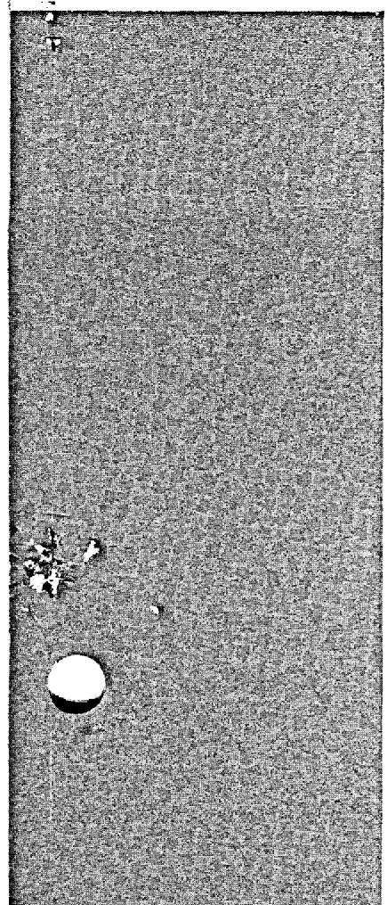

OAK RIDGE NATIONAL LABORATORY

OPERATED BY UNION CARBIDE CORPORATION FOR THE ENERGY RESEARCH AND DEVELOPMENT ADMINISTRATION

Printed in the United States of America. Available from

National Technical Information Service

U.S. Department of Commerce

5285 Port Royal Road, Springfield, Virginia 22161

Price: Printed Copy $5.50; Microfiche $2.25

This report was prepared as an account of work sponsored by the United States Government. Neither the United States nor the Energy Research and Development Administration/United States Nuclear Regulatory Commission, nor any of their employees, nor any of their contractors, subcontractors, or their employees, makes any warranty, express or implied, or assumes any legal liability or responsibility for the accuracy, completeness or usefulness of any information, apparatus, product or process disclosed, or represents that its use would not infringe privately owned rights.

Contract No. W-7504-eng-26

Engineering Technology Division

SYSTEM DESIGN DESCRIPTION OF FORCED-CONVECTION MOLTEN-SALT CORROSION LOOPS MSR-FCL-3 AND MSR-FCL-4

W. R. Huntley

M. D. Silverman

Date Published: November 1976

NOTICE:

This report was prepared as an account of work sponsored by the United States Government. Neither the United States nor the United States Energy Research and Development Administration, nor any of their employees, nor any of their contractors, subcontractors, or their employees, makes any warranty, express or implied, or assumes any legal liability or responsibility for the accuracy, completeness or usefulness of any information, apparatus, product or process disclosed, or represents that its use would not infringe privately owned rights.

Prepared by the

OAK RIDGE NATIONAL LABORATORY

Oak Ridge, Tennessee 37830

operated by

UNION CARBIDE CORPORATION

for the

ENERGY RESEARCH AND DEVELOPMENT ADMINISTRATION

# CONTENTS

# PREFACE V

# ABSTRACT 1

1. INTRODUCTION 1   
2. FUNCTIONS AND DESIGN REQUIREMENTS 2

2.1 Functional Requirements 2   
2.2 Design Requirements 3

2.2.1 Structural requirements 3   
2.2.2 Instrumentation and control requirements 4   
2.2.3 Quality assurance 4   
2.2.4 Codes and standards - mechanical and electrical 5

3. DESIGN DESCRIPTION 6

3.1 Detailed Systems 6   
3.2 Component Design Description 12

3.2.1 Salt pump and lubrication system 12   
3.2.2 Auxiliary tank 20   
3.2.3 Piping system 20   
3.2.4 Corrosion specimens 22   
3.2.5 Fill-and-drain tank 25   
3.2.6 Salt coolers 25   
3.2.7 Main heaters 31   
3.2.8 Auxiliary heaters 32   
3.2.9 Helium cover-gas system 34

3.3 Electrical Systems 36   
3.4 Instrumentation and Controls 41

3.4.1 Temperature measurement and control 41   
3.4.2 Pressure measurement and control 42   
3.4.3 Pump speed measurement and control 42   
3.4.4 Power measurements 43   
3.4.5 Thermal conductivity measurement 43   
3.4.6 Digital data system (Dextir) 43   
3.4.7 Block diagram 44   
3.4.8 Instrument application diagram 44   
3.4.9 Molten-salt level measurements 48   
3.4.10 Molten-salt flow measurement 48   
3.4.11 Control panels 48

4. SYSTEM LIMITATIONS, SET POINTS, AND PRECAUTIONS 50   
5. OPERATION 53

5.1 Initial Salt Filling of the Fill-and-Drain Tank 53

5.2 Filling the Loop with Salt 55   
5.3 Bringing the Loop to Design Conditions 56

6. MAINTENANCE 56

6.1 Maintenance Philosophy 56   
6.2 Normal Maintenance Requirements 57

ACKNOWLEDGMENTS 59

REFERENCES 59

APPENDIX A. ELECTRICAL DRAWING LIST (MSR-FCL-3) 61   
APPENDIX B. INSTRUMENT DRAWING LIST (MSR-FCL-3) 63   
APPENDIX C. MECHANICAL DRAWING LIST (MSR-FCL-3) 67   
APPENDIX D. ALPHA PUMP DRAWING LIST (MSR-FCL-3 AND -4) 71   
APPENDIX E. INSTRUMENT LIST FOR FCL-3 OR -4 73   
APPENDIX F. WELDING OF 2% Ti-MODIFIED HASTELLOY N 93

# PREFACE

This report presents the System Design Description of molten-salt corrosion loops MSR-FCL-3 and MSR-FCL-4, which are high-temperature test facilities designed to evaluate corrosion and mass transfer of modified Hastelloy N alloys for use in molten-salt breeder reactors. These loops were in the advanced stages of assembly when construction was halted due to termination of the Molten-Salt Breeder Reactor Program. The MSR-FCL-3 is essentially complete except for installation of piping system components, and the MSR-FCL-4 is about $60\%$ complete.

The design features are documented here for the benefit of those who may want to use the facilities for similar experimentation. The facilities are available for use on other programs as appropriate.

# SYSTEM DESIGN DESCRIPTION OF FORCED-CONVECTION MOLTEN-SALT CORROSION LOOPS MSR-FCL-3 AND MSR-FCL-4

W. R. Huntley   
M. D. Silverman

# ABSTRACT

Molten-salt corrosion loops MSR-FCL-3 and MSR-FCL-4 are high-temperature test facilities designed to evaluate corrosion and mass transfer of modified Hastelloy N alloys for future use in Molten-Salt Breeder Reactors. Salt is circulated by a centrifugal sump pump to evaluate material compatibility with LiF-BeF $_2$ -ThF $_4$ -UF $_4$ fuel salt at velocities up to 6 m/s (20 fps) and at salt temperatures from 566 to $705^{\circ}\mathrm{C}$ (1050 to $1300^{\circ}\mathrm{F}$ ).

This report presents the design description of the various components and systems that make up each corrosion facility, such as the salt pump, corrosion specimens, salt piping, main heaters, salt coolers, salt sampling equipment, and helium cover-gas system, etc. The electrical systems and instrumentation and controls are described, and operational procedures, system limitations, and maintenance philosophy are discussed.

Key words: molten salt, test facility, MSBR, corrosion, mass transfer, systems design description, forced convection, LiF-BeF $_2$ -ThF $_4$ -UF $_4$ , fuel salt, high temperature, centrifugal pump.

# 1. INTRODUCTION

Molten-salt corrosion loops MSR-FCL-3 and -4 were planned as part of the effort to develop a suitable metal alloy for the piping and components of future Molten-Salt Breeder Reactors (MSBRs). The corrosion loop design was based on the design of similar experiments that have been conducted at Oak Ridge National Laboratory (ORNL).1-3

Construction of the loops was not completed due to termination of the MSBR program at ORNL; however, the two identical loops were in advanced states of assembly when work was halted, with FCL-3 about $90\%$ complete and FCL-4 about $60\%$ complete.

This design report has been prepared to document design features in case the facilities are reactivated for some similar use and also to

provide design information for anyone initiating future forced-convection corrosion studies with molten salts. Since corrosion loops FCL-3 and -4 were identical, much of the descriptive material included in this report refers to only one loop, FCL-3, to avoid needless repetition.

# 2. FUNCTIONS AND DESIGN REQUIREMENTS

# 2.1 Functional Requirements

Corrosion loops FCL-3 and -4 were designed as part of the program to develop a structural containment material for the primary circuit of MSBRs. The primary salt circuit of a molten-salt reactor contains fission products, including tellurium, which have been shown to cause intergranular attack of standard Hastelloy N alloy. These test facilities are designed to permit evaluation of corrosion of modified Hastelloy N alloys with salt containing tellurium at typical MSBR temperature gradients and salt velocities. The equipment is designed for reliable operation over periods of several years to evaluate modified alloys containing titanium and niobium additions initially and to demonstrate adequate corrosion resistance of reference alloys for typical reactor lifetimes.

The capability for frequent inspection of removable metal corrosion specimens is provided by a unique system of salt freeze valves coupled with vertically oriented specimen-removal stations at three locations in the piping system. Based on past experience, we anticipate specimen removal at 500-hr increments initially and at 1000-hr increments during prolonged test runs. Salt samples are taken from the loop about two to four times per month during routine operation. The sampling is done at the auxiliary pump tank, where salt samples are removed in a small copper dip sampler via ball valves on a vertical riser pipe. The salt samples are removed in an air lock and analyzed elsewhere. On-line salt chemistry monitoring is accomplished by insertion of an electrochemical probe through another riser on the auxiliary tank. The electrochemical probe monitors the $\mathrm{U}^{4+}/\mathrm{U}^{3+}$ ratio in the salt and provides an extremely sensitive method for detecting changes in oxidation potential of the salt. $^{4}$ We anticipate measuring this ratio several times per week.

The corrosion loops are designed for reliable long-term service and for unattended operation on nights and weekends. A diesel-driven motor-generator (M-G) set provides emergency electrical power in the event of normal power interruption. Automatic protective features will "scram" the loop to place it in a safe standby condition if abnormal conditions occur. In the event of an alarm action during unattended operation, an alarm is sounded at the Plant Shift Supervisor (PSS) office, which is manned 24 hr/day. If time permits, the PSS will investigate the alarm at the facility; but in any case, a designated list of people will be telephoned until someone familiar with the facility is alerted that trouble has occurred.

The salt piping system is built to recognized standards of design, materials, and construction, but additional safety is provided by a metal shield enclosure to lessen operator hazard in the event of pipe rupture or component failure.

The corrosion loops were placed in Building 9201-3, Y-12 Area, because experimental space and utility services were available there. Equipment on hand at no cost to this project included a helium-purification system, emergency diesel-generator, electrical power supplies, electric bus bars, overhead crane, compressed air, etc.

# 2.2 Design Requirements

# 2.2.1 Structural requirements

All parts of the system that are exposed to high-velocity salt are made of $2\%$ Ti-modified Hastelloy N. Other parts of the system that are exposed to salt, such as the fill-and-drain tank, are made of standard Hastelloy N. Some pressure-containing parts that are not exposed to flowing salt are made of stainless steel; these stainless steel parts are used only at sealing members, such as liquid-level-probe penetrations and ball valves, in the inert-gas space above the salt liquid level and are generally at the end of vertical pipe extensions where temperatures are relatively low.

Pressures in the system range up to a maximum of 2.0 MPa (290 psia) at the pump discharge. The pressure drops slightly to 1.9 MPa (270 psia)

at the point of entry into heater 1, where the design metal temperature is $670^{\circ}\mathrm{C}$ (1240°F).

The maximum temperature to which pressure-containing metal in the system is exposed is $793^{\circ}\mathrm{C}$ ( $1450^{\circ}\mathrm{F}$ ) at the outlet of heater 2, where the pressure is $1.3\mathrm{MPa}$ (185 psia).

# 2.2.2 Instrumentation and control requirements

The instrumentation and control systems installed in the FCL-3 and -4 facilities are designed to maintain all system parameters within safe and acceptable ranges during both attended and unattended operation and to place the facility in a standby condition in the event of certain abnormal conditions, such as loss of electrical power, low helium system pressure, low pump coolant-oil flow, low pump speed, high main-heater temperature, low cooler temperature, or high temperature on the freeze valves of the specimen-removal stations.

In addition to the automatic safety actions, a number of additional alarm circuits are provided to alert the operator during attended operation (or the PSS during unattended operation) when certain parameters are outside prescribed limits. The alarms are both audible and visual.

Key parameters are measured and recorded either on strip-chart analog recorders or on a digital data-acquisition system (Dextir). Less important parameters are measured and indicated on appropriate instruments from which they may be logged by the operator as required.

Sufficient documentation is provided by drawings, calibration sheets, operating instructions, etc., to insure that the data are sufficient in both scope and quality to accomplish the objective of the experiment.

# 2.2.3 Quality assurance

Design, fabrication, inspection, and testing of the molten-salt system are performed in accordance with Quality Level III requirements, as defined in ORNL Quality Assurance Procedure QA-L-1-102, "Guide for the Selection of Quality Levels," and the requirements of Reactor Division Engineering Document No. Q-11628-RB-001-S-0, "Quality Assurance Program Index for Molten-Salt Corrosion Loop MSR-FCL-3."

The loop drawings specify standard Hastelloy N tubing, bar, etc., to be manufactured in accordance with Reactor Development Technology (RDT) standards of the Energy Research and Development Administration. However, such material was not available due to the limited quantities of Hastelloy N used at ORNL, and it was necessary to substitute material conforming to internal ORNL material standards. The ORNL material standards satisfy the significant quality provisions of the RDT standards.

RDT standards were not specified on the drawings for the $2\%$ Ti-modified Hastelloy N alloy shapes, because this was a new alloy that was being procured in small lots and procurement to RDT standards was not practical. Therefore, the $2\%$ Ti-modified Hastelloy N plate, bar, and tubing were purchased to applicable ASTM standards for standard Hastelloy N.

Welding procedures for $2\%$ Ti-modified Hastelloy were not specified on the drawings because such procedures were not known at the time the drawings were issued. However, procedures were later developed (see Appendix F), and it was found that existing procedures for welding standard Hastelloy N were applicable to $2\%$ Ti-modified Hastelloy N. Therefore, welds involving the modified alloy were done according to ORNL weld specifications WPS-1402 and WPS-2604.

# 2.2.4 Codes and standards - mechanical and electrical

Mechanical. Pressure vessels in the system are designed according to the rules of the ASME Boiler and Pressure Code, Section VIII, Division 1, 1974, "Pressure Vessels," and addenda thereto. Piping is designed in accordance with rules of ANSI Standard B31.1-1973, "Power Piping," and addenda thereto.

Prior to 1974, design and construction of Hastelloy N vessels, per Section VIII of the Code, were performed under the provisions of Code Case 1315. During 1974 this case was annulled, and these provisions were included in the basic code in the form of addenda to the Code. Allowable stresses for Hastelloy, referred to in the Code as alloy "N" with a nominal composition of Ni-Mo-Cr-Fe, are now given in the Code without change from their previous values in Case 1315.

Electrical. The electrical materials, workmanship, and completed installation comply with the following codes and standards: National

Electric Code, National Electric Manufacturers Association, American National Standards Institute, Institute of Electrical and Electronic Engineers, and Underwriters' Laboratories, Inc.

Also specific details for the installation of the heater elements are given in an internal Union Carbide Corporation Engineering Standard ES2.1-1, "Installation Specification - Ceramic and Tubular-Type Heaters," and internal Checkout Procedure QA-10596-RB-008-S-0.

# 3. DESIGN DESCRIPTION

# 3.1 Detailed Systems

The physical arrangement of mechanical components and piping is shown in the simplified drawing of Fig. 1, and the test facility is shown schematically in Fig. 2. A centrifugal sump pump is located at the high point of the facility. Liquid salt volume changes due to temperature cycling are accommodated within the auxiliary pump tank and pump bowl. The salt is discharged from the pump at a flow rate of $\sim 2.5 \times 10^{-4} \mathrm{~m}^{3} / \mathrm{s}$ (4 gpm) and flows through a piping system fabricated of $12.7\text{-mm - OD}\times 1.07\text{-mm - wall}$ (1/2-in.-OD $\times$ 0.042-in.-wall) tubing. The pump discharges into resistance heater 1, where the salt temperature is increased from 566 to $635^{\circ}\mathrm{C}$ . The salt then flows past the corrosion specimens of metallurgical station 2 (MET 2) and is heated further to $705^{\circ}\mathrm{C}$ as it passes through resistance-heated section 2. The salt passes vertically through corrosion station MET 3 and enters the two air-cooled finned heat exchangers, where the salt temperature is reduced to $566^{\circ}\mathrm{C}$ before it flows past the corrosion specimens at station MET 1. This arrangement allows metallurgical specimens to be exposed to salt at the high, intermediate, and low bulk fluid salt temperatures of the loop. The corrosion specimens are mounted on holders that can be removed vertically for frequent examination via salt freeze valves and ball valves, as described in detail elsewhere. The corrosion stations are designed so that specimens may be removed without draining the molten salt from the facility. Therefore, the specimen stations are vertically oriented and the freeze valves are located at the same vertical elevation as the free liquid surface in the pump and pump auxiliary tank. This

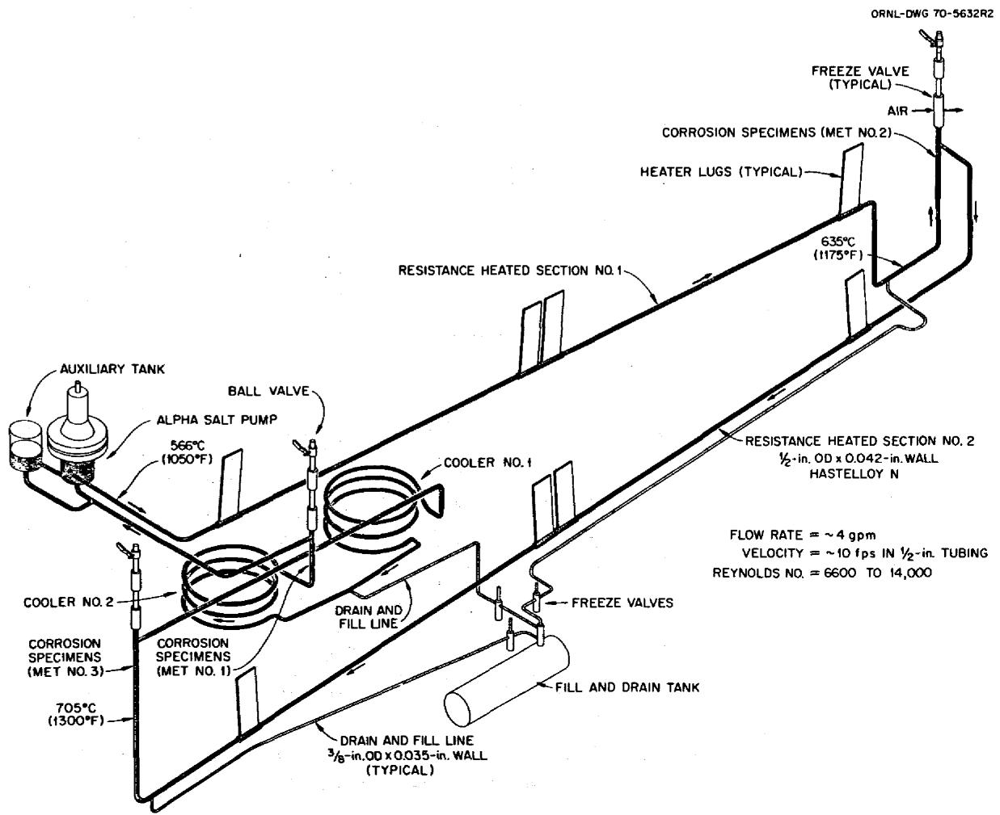  
Fig. 1. Isometric drawing of Molten-Salt Forced Convection Corrosion Loop MSR-FCL-3 (1 in. = 25.4 mm; 1 gpm = 3.785 liters/min; 1 fps = 0.305 m/s).

configuration results in a piping system with three low points, and a corresponding number of fill-and-drain lines are required. Freeze valves are used in the fill-and-drain lines, since they provide dependable zero-leakage shutoff at reasonable cost. The fill-and-drain lines are fabricated of standard Hastelloy N tubing of 9.5 mm OD × 0.9 mm wall (3/8 in. OD × 0.035 in. wall) and attach to a common dip tube in the fill-and-drain tank. The fill-and-drain tank is located at the lowest point of the system to allow gravity drainage.

Corrosion loops FCL-3 and -4 are designed to operate with the MSBR reference fuel salt mixture LiF-BeF $_2$ -ThF $_4$ -UF $_4$ (72-16-11.7-0.3 mole%).

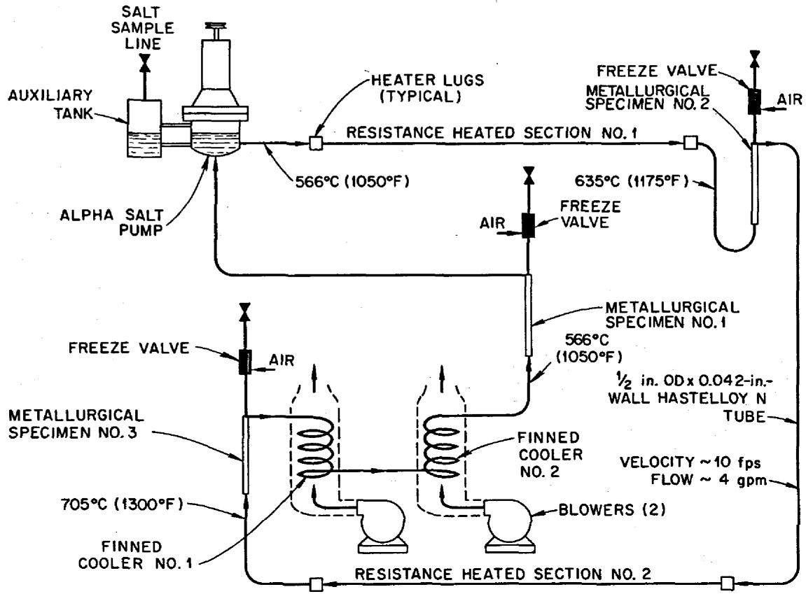  
Fig. 2. Simplified schematic drawing of Molten-Salt Corrosion Loop MSR-FCL-3 (1 in. = 25.4 mm; 1 gpm = 3.785 liters/min; 1 fps = 0.305 m/s).

The thermophysical properties $^{5-7}$ of the salt mixture are shown in Table 1. The salt is quite viscous and dense; for example, at the minimum loop temperature of $566^{\circ}\mathrm{C}$ the viscosity is 0.0144 Pa·s (35 lb ft $^{-1}$ hr $^{-1}$ ) and the density is 3.3 g/cm $^{3}$ (207 lb/ft $^{3}$ ). At design temperature and design flow rate of 2.5 × $10^{-4}$ m $^{3}$ /s (4 gpm), the calculated loop pressure drop is 1.9 MPa (270 psi). This pressure loss can be matched by operating the ALPHA centrifugal salt pump at about 5000 rpm.

A temperature profile of the loop was calculated and is shown graphically in Fig. 3. The symbols at the top of the figure indicate the components through which the salt flows, starting at the pump, passing through heaters 1 and 2, coolers 1 and 2, and returning to the pump suction. The solid heavy line represents the bulk fluid temperature as it ranges over the MSBR reference design conditions of 566 to $705^{\circ}\mathrm{C}$ . The inner wall temperatures, shown by the finely dashed line, vary greatly from the bulk salt

Table 1. Thermophysical property data for molten-salt mixture   

<table><tr><td>Parameter</td><td>Value</td><td>Uncertainty (%)</td><td>Ref.</td></tr><tr><td>Viscosity, μ</td><td></td><td></td><td></td></tr><tr><td>1b ft-1 hr-1</td><td>0.264 exp (7370/T) (°R)</td><td>10</td><td>6</td></tr><tr><td>Pa·s</td><td>1.09 × 10-4exp (4090/T) (K)</td><td>10</td><td>6</td></tr><tr><td>Thermal conductivity,a k</td><td></td><td></td><td></td></tr><tr><td>Btu hr-1 ft-1 (°F)-1</td><td>0.71</td><td>15</td><td>7</td></tr><tr><td>W m-1 (K)-1</td><td>1.23</td><td>15</td><td>7</td></tr><tr><td>Density, ρ</td><td></td><td></td><td></td></tr><tr><td>1b/ft3</td><td>228.7 - 0.0205T (°F)</td><td>1</td><td>6</td></tr><tr><td>g/cm3</td><td>3.665 - 5.91 × 10-4T (°C)</td><td>1</td><td>6</td></tr><tr><td>Specific heat, Cp</td><td></td><td></td><td></td></tr><tr><td>Btu lb-1 (°F)-1</td><td>0.324</td><td>4</td><td>5</td></tr><tr><td>J kg-1 (K)-1</td><td>1357</td><td>4</td><td>5</td></tr><tr><td>Liquidus temperature</td><td></td><td></td><td></td></tr><tr><td>°F</td><td>932</td><td>5°C</td><td>5</td></tr><tr><td>°C</td><td>500</td><td>5°C</td><td>5</td></tr></table>

${}^{a}$ Estimated from values given in Ref. 7 for analogous salts.

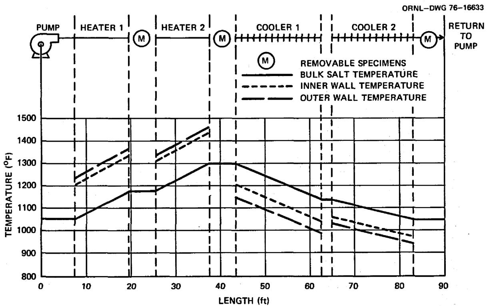  
Fig. 3. Temperature profile of Molten-Salt Forced Convection Corrosion Loop, MSR-FCL-3, at design operating conditions (1 ft = 0.305 m).

temperature due to the large temperature drop across the fluid film at the pipe surface. The film drop and $\Delta T$ across the Ti-modified Hastelloy N tube wall result in outer wall temperatures ranging from $793^{\circ}C$ at the outlet of heater 2 to $504^{\circ}C$ at the outlet of cooler 2. The amount of air cooling at cooler 2 is intentionally less than that at cooler 1 so as to keep the inner wall temperature of cooler 2 just above the salt liquidus temperature. At design conditions, the inner wall temperature at this point is $521^{\circ}C$ , which is about $21^{\circ}C$ above the liquidus temperature of the salt. Table 2 is a summary of engineering design data for FCL-3 and -4.

The general status of loop construction at the time the project was halted is indicated in Fig. 4, an overhead photograph of the test area. FCL-3 and -4 were 90 and $60\%$ completed, respectively, and were being built adjacent to the earlier corrosion loop FCL-2. The new control panels and overhead cable trays are readily visible in the photograph.

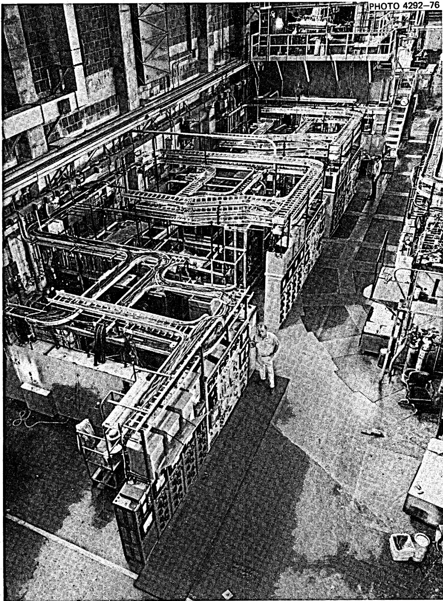  
Fig. 4. Overhead view of test area showing corrosion loops FCL-2, -3, and -4.

Table 2. Engineering design data for loops FCL-3 and -4   

<table><tr><td colspan="2">Materials, temperatures, velocities, volumes, etc.</td></tr><tr><td>Tubing and corrosion specimens</td><td>2% Ti-modified Hastelloy N</td></tr><tr><td>Nominal tubing size</td><td>12.7 mm OD × 1.1 mm wall (0.5 × 0.042 in.)</td></tr><tr><td>Approximate tubing length</td><td>27 m (90 ft)</td></tr><tr><td>Bulk fluid temperatures</td><td>566-705°C (1050-1300°F)</td></tr><tr><td>Bulk fluid ΔT</td><td>139°C (250°F)</td></tr><tr><td>Fluid velocity past corrosion specimens</td><td>3 to 6 m/s (10 to 20 fps)</td></tr><tr><td>Flow rate</td><td>2.5 × 10-4m3/s (4 gpm)</td></tr><tr><td>System ΔP at 4 gpm</td><td>1.9 MPa (270 psi)</td></tr><tr><td>Salt volume in loop</td><td>4920 cm3(300 in.3)</td></tr><tr><td>Surface-to-volume ratio</td><td>3.2 cm2/cm3(8.1 in.2/in.3)</td></tr><tr><td>Pump speed</td><td>5000 rpm</td></tr><tr><td>Type of salt</td><td>LiF-BeF2-ThF4-UF4 (72-16-11.7-0.3 mole %)</td></tr><tr><td colspan="2">Cooler data</td></tr><tr><td rowspan="2">Material</td><td>12.7-mm-OD × 1.1-mm-wall (0.5-× 0.42-in.)</td></tr><tr><td>2% Ti-modified Hastelloy N with 1.6-mm-thick (1/16-in.) nickel fins</td></tr><tr><td>Number of cooler sections</td><td>2</td></tr><tr><td>Finned length of cooler 1</td><td>5.7 m (18.8 ft)</td></tr><tr><td>Finned length of cooler 2</td><td>5.5 m (17.9 ft)</td></tr><tr><td>Coolant air flow per cooler</td><td>~0.9 m3/s (~2000 cfm)</td></tr><tr><td>Cooling load, cooler 1</td><td>100 kW (342,000 Btu/hr)</td></tr><tr><td>Cooling load, cooler 2</td><td>58 kW (200,000 Btu/hr)</td></tr><tr><td>Total heat removal from both coolers</td><td>158 kW (540,000 Btu/hr)</td></tr><tr><td>Cooler 1 heat flux at tube ID</td><td>0.53 MW/m2(167,000 Btu hr-1 ft-2)</td></tr><tr><td>Cooler 2 heat flux at tube ID</td><td>0.3 MW/m2(96,000 Btu hr-1 ft-2)</td></tr><tr><td>Inside wall temperature at outlet, cooler 2</td><td>521°C (970°F)</td></tr><tr><td colspan="2">Heater data</td></tr><tr><td>Material</td><td>2% Ti-modified Hastelloy N</td></tr><tr><td>Heater size</td><td>12.7 mm OD × 1.1 mm wall (0.5 × 0.042 in.)</td></tr><tr><td>Current to center lugs on heater</td><td>1700 A</td></tr><tr><td>Number of heated sections</td><td>2</td></tr><tr><td>Length of each heater</td><td>3.7 m (12 ft)</td></tr><tr><td>Heat input each heater</td><td>79 kW (270,000 Btu/hr)</td></tr><tr><td>Total</td><td>158 kW (540,000 Btu/hr)</td></tr><tr><td>Inside wall temperature at outlet heater 2</td><td>777°C (1430°F)</td></tr><tr><td>Outside wall temperature at outlet heater 2</td><td>793°C (1460°F)</td></tr><tr><td>(maximum pipe wall temperature)</td><td></td></tr><tr><td>Heat flux</td><td>0.65 MW/m2(205,000 Btu hr-1 ft-2)</td></tr><tr><td>Salt Reynolds number in piping</td><td>6600 to 14,000</td></tr></table>

# 3.2 Component Design Descriptions

# 3.2.1 Salt pump and lubrication system

The ALPHA pump, shown in Fig. 5, is a centrifugal sump pump designed at ORNL for molten-salt or liquid-metal service. The impeller, shaft, and lower liquid-wetted portions of the pump are fabricated of $2\%$ Ti-modified Hastelloy N alloy, and the bearing housing is fabricated of stainless steel.

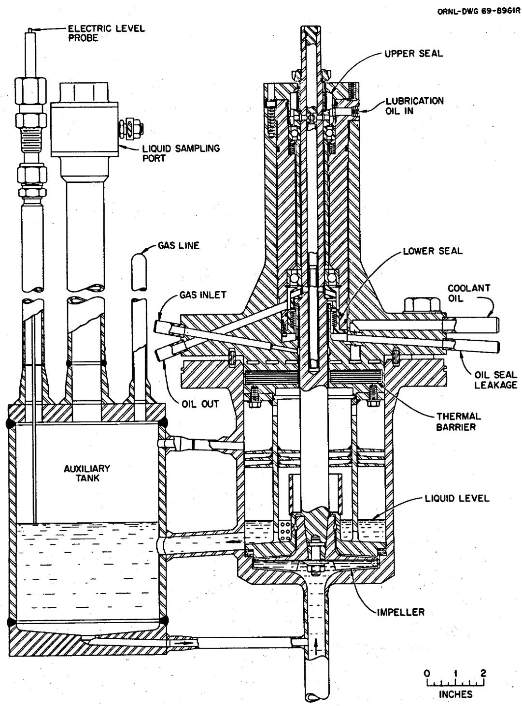  
Fig. 5. Cross section view of ALPHA pump (1 in. = 25.4 mm).

The pump is designed to operate at speeds up to 6000 rpm to provide flows to $1.9 \times 10^{-3} \, \text{m}^3/\text{s}$ (30 gpm) at temperatures to $760^{\circ}\text{C}$ . However, in this corrosion loop application the pump will normally operate at about 5000 rpm and a flow rate of $2.5 \times 10^{-4} \, \text{m}^3/\text{s}$ (4 gpm) at $566^{\circ}\text{C}$ and a head of 58 m (191 ft). Pump drawings are listed in Appendix D.

The pump performance data with water, shown in Fig. 6, shows that the pump will be operating far below its design flow rate. At low flow rates

ORNL-DWG 73-4163R

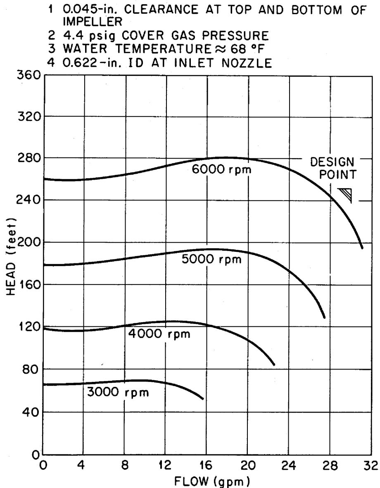  
Fig. 6. ALPHA pump performance in water (1 ft = 0.305 m; 1 gpm = 3.785 liters/min).

the efficiency of the ALPHA pump is also low; however, comprehensive efficiency data are not available over the range of flow rates and speeds shown in Fig. 6. One specific efficiency data point was obtained during operation of a preceding corrosion loop in which sodium fluoroborate salt was pumped at $4800\mathrm{rpm}$ , at a temperature of $455^{\circ}\mathrm{C}$ , and at a flow rate of $2.5 \times 10^{-4}$ $\mathrm{m}^{3}/\mathrm{s}$ (4 gpm), and the efficiency was found to be only $8.3\%$ . Therefore, the pump efficiency is expected to be about $8\%$ at design conditions in corrosion loops FCL-3 and -4. Pump efficiencies approaching $50\%$ would be expected for salt flow rates near the pump design rate of $1.9 \times 10^{-3}$ $\mathrm{m}^{3}/\mathrm{s}$ (30 gpm).

The ALPHA pump is driven by a 15-kW (20-hp) variable-speed motor which in turn is supplied by a variable-frequency, variable-voltage M-G set. The motors are much larger than required for this particular application but were purchased in this size in case the ALPHA pumps are used in future applications that demand more pumping power. The motor and generator are described in Section 3.4, Electrical Systems. The drive motor is supported over the ALPHA pump by a special alignment spool piece, and the motor is directly connected to the pump shaft by a flexible coupling (Thomas Catalog No. 861, type DBZ-A, size 101). In previous applications, the ALPHA pump has been driven by V-belts, but this has proved unreliable at speeds above 4000 rpm, particularly with the relatively dense fuel salt mixture, due to upper shaft flexing and vibrations from the belt torque. Therefore, the direct drive was selected for corrosion loops FCL-3 and -4, even though it is more costly because it involves a high-speed motor design and an M-G set for each corrosion loop. The M-G sets were available from other facilities at no cost.

An auxiliary tank, mounted adjacent to and on the same level as the pump bowl, provides the necessary space to accommodate thermally created volume changes in liquid inventories. The auxiliary tank also provides space to mount liquid-level indicators and liquid-sampling equipment and may be easily replaced to accommodate the requirements of a particular experiment. Interconnecting piping between the auxiliary tank, pump bowl, and pump inlet permits liquid flow from the shaft labyrinth above the impeller to the auxiliary tank and then to the pump inlet. The liquid flow rate through the auxiliary tank (shaft labyrinth leakage) varies with pump speed and flow as shown in Fig. 7. At the required loop design condition of 5000

1 0.045-in. CLEARANCE AT TOP AND BOTTOM OF IMPELLER   
2 4.4 psi COVER GAS PRESSURE   
3 WATER TEMPERATURE ≈ 68 °F  
4 0.622-in. ID AT INLET NOZZLE

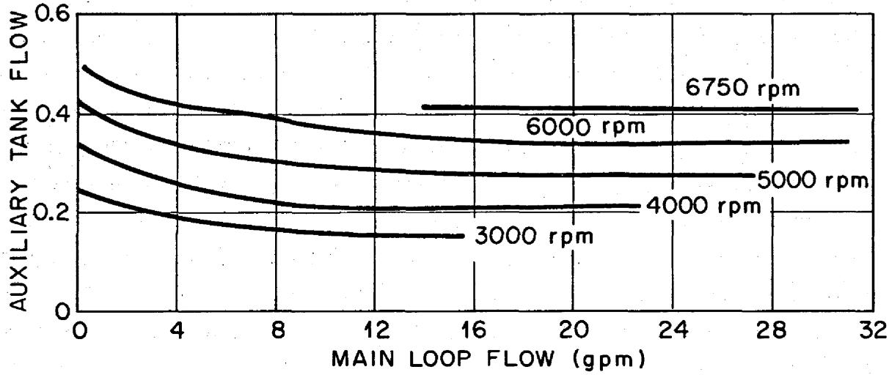  
Fig. 7. ALPHA pump main loop flow vs auxiliary tank flow (1 gpm = 3.785 liters/min).

rpm and flow rate of $2.5 \times 10^{-4} \, \text{m}^3/\text{s}$ (4 gpm), the auxiliary tank flow rate will be approximately $20 \, \text{cm}^3/\text{s}$ (0.34 gpm).

The pump has an overhung vertical shaft with two oil-lubricated ball bearings and two oil-lubricated mechanical face seals located above the process liquid surface. Oil enters at the top of the pump to lubricate the bearings and seals and also to provide shaft cooling. A second oil stream enters the pump flange to provide cooling and acts as a protective heat dam between the bearings and seals and the elevated-temperature process fluid. An inert-gas purge flow of $80~\mathrm{cm}^3/\mathrm{min}$ introduced at the "gas inlet" is directed to the shaft annulus, flows upward to exit through the seal leakage line, and carries leakage from the lower oil seal overboard. Although the pump is designed for a split purge gas flow at the shaft annulus, the downward flow portion of the split gas purge is not needed when handling liquids, such as molten salt, which have low vapor pressures.

A separate oil system is provided to supply lubrication and coolant oil to the ALPHA pump. The system uses a light turbine oil, Gulfspin 35, which is a paraffinic straight mineral oil with a flash point of $161^{\circ}\mathrm{C}$ and

a fire point of $175^{\circ}\mathrm{C}$ . The oil viscosity ranges from 66 Saybolt seconds at $38^{\circ}\mathrm{C}$ to 36 Saybolt seconds at $100^{\circ}\mathrm{C}$ , the heat capacity is $1.9\mathrm{kJ/kg.K}$ , and the specific gravity is 0.85. The oil system is cooled by a water-cooled heat exchanger located in the oil reservoir, as shown in the instrument application diagrams, Figs. 20 and 21, in Section 3.4.8. Oil flow is provided by a 90-W (1/8-hp) centrifugal pump which discharges oil at a pressure of $220\mathrm{kPa}$ (17 psig). The oil flow is continuously filtered to ensure its cleanliness. A flow switch, FS-005A, is used to automatically start the spare oil pump in case of loss of flow. In the event of loss of normal power, both oil pumps are automatically switched to the emergency generator power supply to ensure that coolant oil flow is maintained while the pump bowl is at elevated temperature. The total oil flow from one operating oil pump is throttled to 2.3 liters/min such that the bearings and oil seals receive 0.6 liter/min of "lube oil" and the remainder flows in parallel through "coolant oil" passages within the pump.

A throttle valve (HV-008) is installed in the lubrication return line to create oil back pressure at the lower oil seal. This feature is provided to ensure that the oil pressure outside the seal is equal to, or greater than, the helium pressure within the seal and thereby maintain lubrication of the lapped seal surfaces. A pressure switch (PS-008) and an alarm are provided to alert the operators if the oil back pressure drops below the normal operating pressure of helium within the lower seal assembly and pump bowl.

The ALPHA pump has been successfully operated in two previous high-temperature molten-salt applications. The pump has operated for 6800 hr at 4800 rpm, pumping $2.5 \times 10^{-4} \mathrm{~m}^{3} / \mathrm{s}$ (4 gpm) of sodium fluoroborate salt $\left(\mathrm{NaBF}_{4}-\mathrm{NaF}, 92-8 \text { mole } \% \right)$ at a temperature of $455^{\circ} \mathrm{C}$ . A posttest inspection showed that the bearings and seals were in excellent condition. The pump has accumulated an additional 12,000 hr at 4000 rpm, pumping $2 \times 10^{-4} \mathrm{~m}^{3} / \mathrm{s}$ (3.1 gpm) of fuel salt mixture $\left(\mathrm{LiF}-\mathrm{BeF}_{2}-\mathrm{ThF}_{4}-\mathrm{UF}_{4}\right)$ at temperatures ranging from 566 to $727^{\circ} \mathrm{C}$ . These previous pump applications imply that reliable pump operation can be expected in corrosion loops FCL-3 and -4. A summary of expected operating conditions for the ALPHA pump in FCL-3 and -4 is shown in Table 3.

Table 3. Expected operating conditionsa for ALPHA pump in FCL-3 and -4   

<table><tr><td>Type of salt being pumped</td><td>LiF-BeF2-ThF4-UF4(72-16-11.7-0.3 mole %)</td></tr><tr><td>Salt temperature</td><td>566°C (1050°F)</td></tr><tr><td>Salt density at 566°C</td><td>3.33 g/cm3(206 lb/ft3)</td></tr><tr><td>Pump speed</td><td>5000 rpm</td></tr><tr><td>Salt flow rate</td><td>2.5 × 10-4m3/s (4 gpm)</td></tr><tr><td>Pump head</td><td>58.2 m (191 ft)</td></tr><tr><td>Auxiliary tank flow rate</td><td>21 cm3/s (0.34 gpm)</td></tr><tr><td>Pump efficiencyb</td><td>~8%</td></tr><tr><td>Cover gas pressure</td><td>143 kPa (6 psig)</td></tr><tr><td>Type of cover gas</td><td>Helium</td></tr><tr><td>Lubrication oil flow rate</td><td>0.6 liter/min</td></tr><tr><td>Lubrication oil pressure at bearing housing exit</td><td>157 kPa (8 psig)</td></tr><tr><td>Coolant oil flow rate</td><td>1.7 liters/min</td></tr><tr><td>Helium flow rate through lower oil seal catch basin</td><td>80 cc/min</td></tr><tr><td>Helium flow rate downward in the shaft annulus</td><td>None</td></tr><tr><td>Typical lower oil seal leakage</td><td>2 to 25 cc/day</td></tr><tr><td>Typical upper oil seal leakage</td><td>2 to 25 cc/day</td></tr><tr><td>Inlet temperature of lubrication oil</td><td>32°C (90°F)</td></tr><tr><td>Outlet temperature of lubrication oil</td><td>42°C (108°F)</td></tr><tr><td>Inlet temperature of coolant oil</td><td>32°C (90°F)</td></tr><tr><td>Exit temperature of coolant oil</td><td>35°C (95°F)</td></tr></table>

${}^{a}$ Based on actual ALPHA pump operation at ${566}^{ \circ  }\mathrm{C}$ in corrosion loop MSR-FCL-2b.   
bThe pump efficiency is very low in this application because the pump operates far from its design point.

Parts were fabricated to provide four complete ALPHA pump rotary assemblies for the corrosion loop program. Also, two pump bowls and two auxiliary tanks were fabricated. Figure 8 shows an exploded view of all the parts of the rotary assembly plus the pump bowl. The auxiliary tank is described in more detail in the next section of this report.

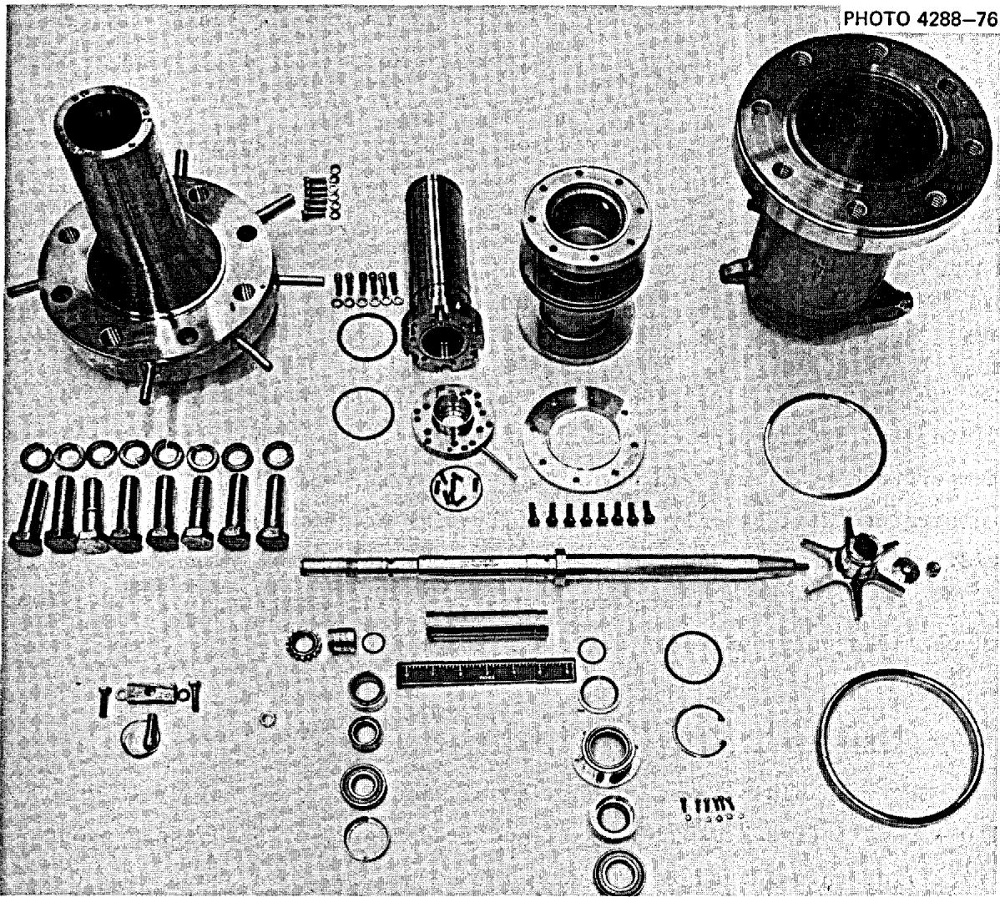  
Fig. 8. Exploded view of the ALPHA salt pump rotary assembly and pump tank.

# 3.2.2 Auxiliary tank

The auxiliary tank serves as an extension of the ALPHA pump bowl. It is connected to the pump bowl by circulating salt lines and by a single vent connection into the helium space above the gas-salt interface.

Six nozzles penetrate the top head of the auxiliary tank. Three of these are of 19-mm-OD (3/4-in.) tubing for insertion of liquid level probes. The other three nozzles are 33-mm-OD (1-in., sched-40 IPS). These latter three penetrations are for salt sampling, chemical additions, and electrochemical probes. The liquid-level-probe penetrations are provided with compressed Teflon seals. The salt sampling, chemical addition, and electrochemical probe ports are sealed by ball valves with Teflon seats.

The inside dimensions of the tank are approximately 152 mm in diameter (6 in.) by 178 mm high (7 in.) The lower portions of the tank, which are exposed to flowing salt, are made of 2% Ti-modified Hastelloy N. Upper parts of the tank, which are above the salt level, are made of standard Hastelloy N, except for some stainless steel parts that are used at the ball valves and level probe seals.

The design pressure and temperature of the tank are 0.5 MPa (65 psia) and $705^{\circ}\mathrm{C}$ ( $1300^{\circ}\mathrm{F}$ ), except at the Teflon seals, where the design temperature is $204^{\circ}\mathrm{C}$ ( $400^{\circ}\mathrm{F}$ ). This lower temperature at the seals is achieved by providing tubing and pipe extensions of sufficient length to assure the proper temperature gradient. In normal operation, the anticipated pressure and temperature will be only 0.15 MPa (21 psia) at $566^{\circ}\mathrm{C}$ ( $1050^{\circ}\mathrm{F}$ ), thus providing a good margin between design and operating conditions.

A photograph of a completed auxiliary tank is shown in Fig. 9; two of these tanks were built for corrosion loops FCL-3 and -4.

# 3.2.3 Piping system

The main piping system consists of about $27\mathrm{m}$ (90 ft) of 13-mm-OD X 1.07-mm-wall (1/2 × 0.042-in.) Ti-modified Hastelloy N tubing. About $7\mathrm{m}$ (24 ft) of this length is included in the heaters, and about $12\mathrm{m}$ (38 ft) is in the coolers. Corrosion specimens are installed at three points in the piping system, as described in detail in Section 3.2.4.

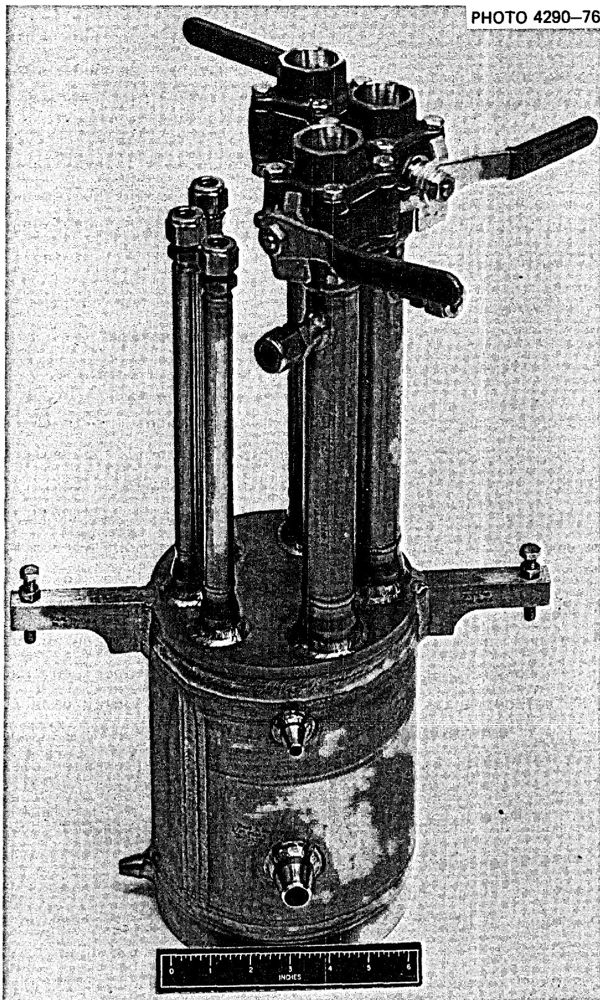  
Fig. 9. Auxiliary tank for ALPHA salt pump (1 in. = 25.4 mm).

The normal flow rate of salt in the piping system is $2.5 \times 10^{-4} \, \text{m}^3 / \text{s}$ (4 gpm). This gives a velocity of about $3 \, \text{m/s}$ (10 fps) in the 10.5-mm-ID (0.413-in.) tubing and Reynolds moduli in the range of 6600 to 14,000.

The design pressure and temperature for the piping system are 1.8 MPa (265 psia) and $705^{\circ}\mathrm{C}$ ( $1300^{\circ}\mathrm{F}$ ), except in heater sections, where a higher metal temperature is permitted since the pressure is lower. (See Section 3.2.7 for pressure-temperature design conditions in the heater sections.)

In order to ensure that cyclic thermal stresses do not cause fatigue failure, the piping system was analyzed using the MEC-21 piping flexibility computer program developed at the Mare Island Naval Shipyard, San Francisco, Calif.

# 3.2.4 Corrosion specimens

Corrosion specimens are installed at three locations in the system that were chosen to expose the specimens to three different salt temperatures. Sample station 1 is located between the outlet of cooler 2 and the pump inlet, where the bulk salt temperature is $566^{\circ}\mathrm{C}$ ( $1050^{\circ}\mathrm{F}$ ). Station 2 is between heaters 1 and 2, where the salt temperature is $635^{\circ}\mathrm{C}$ ( $1175^{\circ}\mathrm{F}$ ). Station 3 is between the outlet of heater 2 and the inlet to cooler 1, where the salt temperature is $705^{\circ}\mathrm{C}$ ( $1300^{\circ}\mathrm{F}$ ).

Each of the three stations has provision for insertion and withdrawal of a specimen holder that holds six specimens. Each specimen, made of Tim-modified Hastelloy N, is 0.86 mm thick (0.034 in.), 4.6 mm wide (0.181 in.), and 43 mm long (1 11/16 in.). The cross-sectional area of the specimen holder is enlarged at the upper end to decrease the flow area of the salt. Therefore, the salt velocity is a nominal 3 m/s (10 fps) over the lower three specimens and increases to a nominal 6 m/s (20 fps) as the salt passes over the upper three specimens. This design feature allows evaluation of velocity effects on the corrosion rates at each of the three corrosion sample stations. A cross-section drawing of a typical corrosion specimen station is shown in Fig. 10.

The corrosion specimens are inserted and withdrawn through a salt freeze valve and two ball valves at each station. This feature allows frequent specimen removal at minimum cost, since no cutting or welding operations are required to gain access to the specimens within the piping system.

ORNL-DWG 70-5629

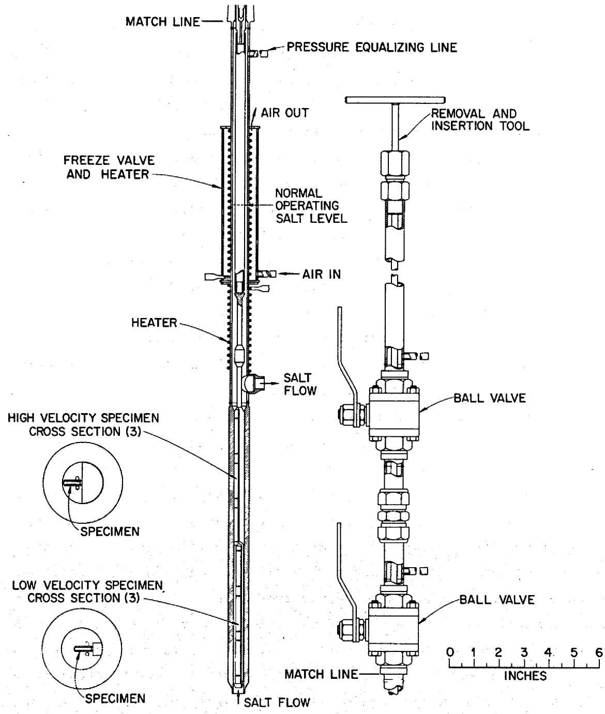  
Fig. 10. Corrosion specimen installation and removal system for MSR-FCL-3 (1 in. = 25.4 mm).

Also, the specimens are attached to the specimen holder by special clips and 0.8-mm-diam (0.031-in.) wire to eliminate welding operations during installation of specimens on the holder.

The freeze valve serves as a block valve to prevent escape of salt through the access port during normal operation. The two ball valves provide an air lock for evacuation and helium purging during insertion or withdrawal operations, since it is desirable to minimize atmospheric contamination during specimen removal or reinsertion.

The salt will usually not be drained from the loop during specimen examination, since this might alter the salt composition slightly by mixing with the heel of salt remaining in the fill-and-drain tank. The salt in the drain tank can have significantly different impurity levels than the circulating salt due to corrosion processes over long periods of time or due to experimental salt chemistry modifications that are sometimes made to the pumped salt inventory. The ability to change corrosion specimens without salt drainage is a relatively new feature in pumped salt corrosion loops at ORNL and is expected to be very useful in precisely monitoring corrosion and mass transfer phenomena.

A typical corrosion specimen removal and examination proceeds as follows. The thermal gradient in the salt loop is removed by lowering the input of the main resistance heaters while simultaneously turning off the air blowers on the coolers. The salt pump is then stopped, and all gas equalizer lines are opened between the three corrosion specimen stations and the free liquid salt surface in the pump auxiliary tank. The three corrosion specimen stations and pump auxiliary tank are all located at the same vertical elevation to permit free liquid surfaces at all four locations while the freeze valves are melted. Careful operation is required to ensure that no sudden pressure surges or unequal pressures occur during specimen removal or insertion, since this will lift salt above the normal salt levels in the freeze valves and result in plugged gas lines or damaged ball valves.

Past experience on a similar loop has shown that corrosion specimen removal, examination, reinsertion, and loop restarting can be accomplished in 8 hr.

# 3.2.5 Fill-and-drain tank

The fill-and-drain tank, as the name implies, is used in routine filling and draining operations. It also serves as a sump into which loop contents may be dumped in the event of an emergency. The tank is installed at the lowest point in the system. The cylindrical fill-and-drain tank is installed with the axis horizontal and is about 0.18 m in diameter (7.1 in.) by 0.56 m long (22 in.), with an internal volume of $\sim 14$ liters (0.49 ft $^3$ ). The tank is provided with a series of nozzle connections for (1) filling, (2) draining, (3) evacuation, (4) salt sampling, and (5) installation of liquid-level probes. All parts of the tank that are exposed to salt are fabricated of standard Hastelloy N except for the area of the low temperature seals, where some stainless steel materials are used. A photograph of the fill-and-drain tank is shown in Fig. 11.

A 33-mm-OD (1-in., sched-40) nozzle extension with Teflon-seated ball valve closure is provided for evacuation and salt sampling. Two 33-mm-OD (1-in., sched-40) nozzles with Teflon compression seals are used for liquid-level probe insertion. A 13-mm-diam (0.5-in.) tubing nozzle with compression fitting is provided for pressurizing, off-gas, and pressure equalization. Another 13-mm-diam (0.5-in.) tubing nozzle, normally capped off with a compression fitting plug, is available for external filling and draining of the tank. Three 9.5-mm-diam (0.4-in.) tubing connections are welded to the loop fill-and-drain lines.

Design pressure and temperature for the tank are 0.8 MPa (115 psia) and $648^{\circ}\mathrm{C}$ ( $1200^{\circ}\mathrm{F}$ ) except at the Teflon seals, where the design temperature is $204^{\circ}\mathrm{C}$ ( $400^{\circ}\mathrm{F}$ ) maximum. Anticipated normal operating pressure and temperature are 0.24 MPa (35 psia) and $566^{\circ}\mathrm{C}$ ( $1050^{\circ}\mathrm{F}$ ).

# 3.2.6 Salt coolers

The heat that is added to the salt in the circulating loop by means of resistance-heated pipes and by pumping power input is removed at the two salt-to-air coolers, which are installed in the system in series. Cooling capacity is $100\mathrm{kW}$ (342,000 Btu/hr) for cooler 1 and $58\mathrm{kW}$ (200,000 Btu/hr) for cooler 2, for a total of $158\mathrm{kW}$ (542,000 Btu/hr).

Each cooler was designed for $0.9 \, \text{m}^3/\text{s}$ (2000 cfm) of ambient air flow from inside Bldg. 9201-3 by a centrifugal forced-draft fan. However,

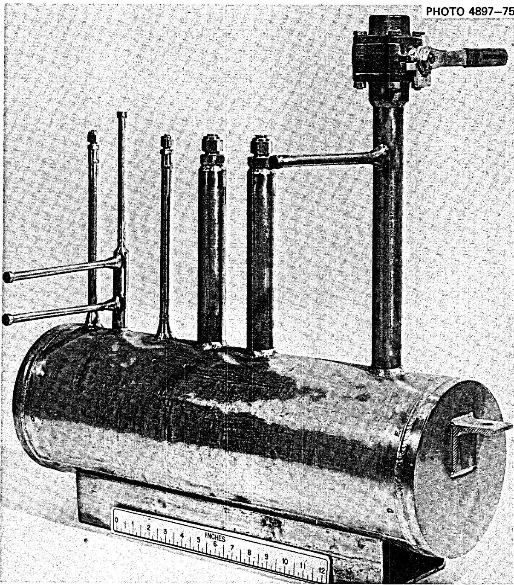  
Fig. 11. Fill-and-drain tank for FCL-3 and -4 (1 in. = 25.4 mm).

actual field measurements on FCL-2 showed that more than $1.4 \, \text{m}^3/\text{s}$ (3000 cfm) is available with the present 2.2-kW (3-hp), 1750-rpm blower motors. Therefore, excess cooling capacity is available on FCL-3 and FCL-4 if needed. The air flows over the finned helical tubes of coolers and is then exhausted vertically into the high-bay area of the building.

Each cooler consists of four helical coils of finned tubing with a coil diameter of 0.46 m (18.1 in.) and a pitch of 0.076 m (3.0 in.). Fin material is nickel and fin thickness is 1.6 mm (0.063 in.). Fins are brazed to the Ti-modified Hastelloy N tubes, using Coast Metals No. 52 brazing alloy. The effective lengths of the finned sections are 5.7 m (18.8 ft) for cooler 1 and 5.5 m (17.9 ft) for cooler 2.

The fins for coolers 1 and 2 have different outside diameters and spacing. The fin is $51 \, \text{mm}$ OD (2 in.) for cooler 1 and $38 \, \text{mm}$ (1.5 in.) for cooler 2. The fin spacing pitch is $5.6 \, \text{mm}$ (0.22 in.) for cooler 1 and 8.5 mm (0.33 in.) for cooler 2. This difference in fins is used to provide a lesser degree of cooling in cooler 2 in order to prevent freezing of salt in the latter cooling stage. The fin spacing was increased from that used in an earlier corrosion loop, MSR-FCL-2, because FCL-3 and FCL-4 have a higher operating temperature at the coolers and therefore require fewer fins to reject the design heat load. A finned cooler coil fabricated for MSR-FCL-2 is shown in Fig. 12 for information purposes. The cooler coils for FCL-3 and FCL-4 were not completed prior to project termination but would have been similar to Fig. 12.

A unique feature of these coolers is the requirement that they must serve as ovens for preheating their respective portions of the system during startup when the entire system must be heated to a temperature above the liquidus of the salt. The coolers are designed to serve as heaters at this time, with electrical connections provided so that the finned tubes are heated by direct electrical resistance in a manner similar to the main heaters. Air flow is restricted at this time to the maximum degree possible, not only by cutting off the blowers but also by closing the specially designed air duct valves or dampers to further reduce natural convection inside the coolers. The cooler heaters are energized at all times, whether in preheating operation or during $\Delta T$ operation. Power inputs of about $5\mathrm{kW}$ are required at each cooler heater to keep the fuel-salt mixture from freezing. A photograph of two of the cooler housings, which discharge the heated air vertically, is shown in Fig. 13.

Operation of corrosion loop MSR-FCL-2 showed that a modification of the original cooler design and other related scram features was needed to reduce heat losses at the coolers after a scram. In FCL-2, any scram

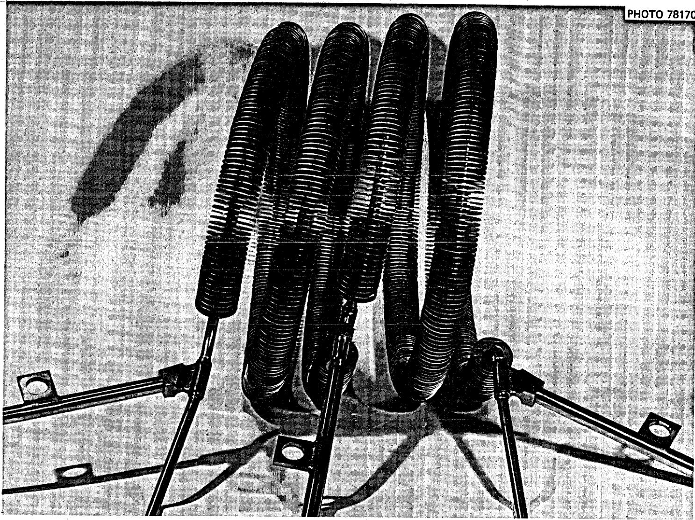  
Fig. 12. Air-cooled heat exchanger coil for molten-salt corrosion loop.

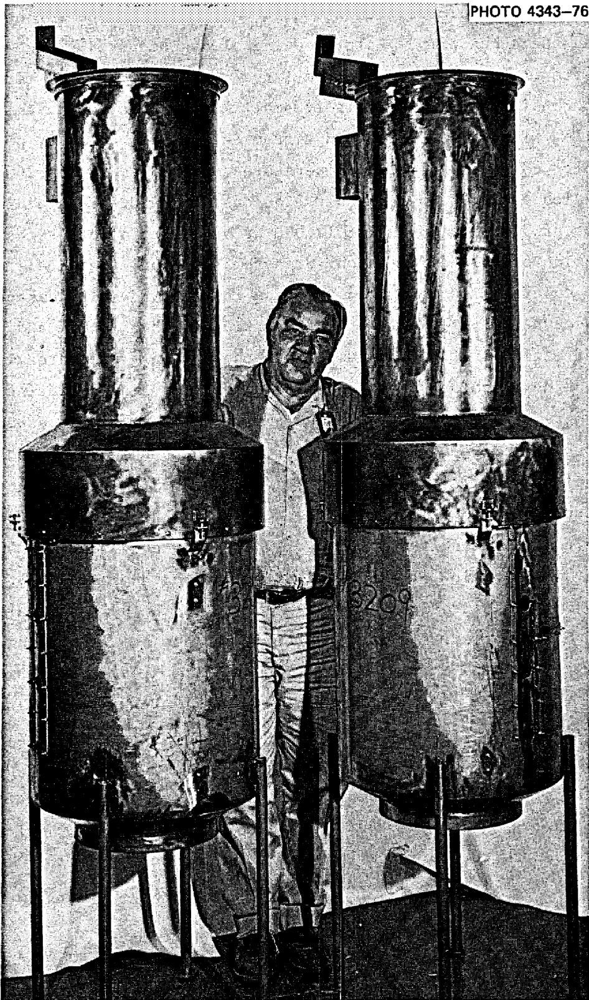  
Fig. 13. Cooler housings for corrosion loop FCL-3.

action (manual or automatic) turned off the main resistance heaters, turned off the air blowers, closed the insulated dampers on the cooler housing, and stopped the ALPHA pump. Salt freezing always occurred in the coolers of FCL-2 after loop scram, due to the large mass of air-cooled metal within the cooler housing and the relatively small mass of hot salt within the cooler coils. Temperature recordings from the bottom, coldest, portions of the cooler coils showed that temperatures dropped as low as $260^{\circ}\mathrm{C}$ after a scram, which is far below the salt liquidus of $500^{\circ}\mathrm{C}$ . This did not cause significant problems during about 17,000 hr of operation other than delaying resumption of salt circulation for a few hours while gradual remelting occurred. However, in two shutdowns, pipe rupture and salt leakage occurred because salt froze in another portion of the loop in addition to the known freezing in the coolers. Since the second frozen area was not apparent to the operators during either incident, normal operating and remelting programs were followed, which resulted in salt liquid expansion and pipe rupture between the frozen coolers and the unsuspected salt plug.

Several design modifications were made to FCL-2 to reduce the likelihood of further incidents of this type. The scram circuits were revised to provide continuous salt-pump operation at a reduced speed of 2000 rpm after each scram in lieu of the previous scheme which provided for stopping the pump. This provides more heat energy to the cooled metal within the cooler housing via the flowing salt. Also, the cooler housing was modified with internal thermal insulation and added electric "guard" heaters to reduce the mass of cold metal to which the salt-containing cooler coil can transfer heat. The guard heaters are energized after the cooling air is flowing through the coolers and are automatically de-energized to prevent overheating of the cooler if air flow is interrupted, as is done during a scram or shutdown. Thirdly, an automatic solenoid valve was added to turn off auxiliary cooling air to the heating lugs on the main resistance heaters after a scram or whenever the heaters are deactivated.

Tests of the FCL-2 automatic system shutdown from $\Delta T$ operation were made to verify that the design modifications would prevent salt freezing in the coolers after a scream. The tests were successful and showed that the newly added automatic features worked as planned; that is, the pump

speed was reduced from design speed to 2000 rpm, the guard heaters on the coolers were de-energized, and the cooling air on the resistance heater lugs was cut off. Due to the new design modifications, the salt continued to flow at a reduced rate after the scream and the isothermal circulating salt temperature fell only to $565^{\circ}\mathrm{C}$ ( $1050^{\circ}\mathrm{F}$ ), which is considered a safe level above the salt liquidus of $500^{\circ}\mathrm{C}$ ( $932^{\circ}\mathrm{F}$ ).

It was planned to include the above design features in FCL-3 and FCL-4 because they worked successfully in FCL-2. However, the molten-salt program was canceled before the design changes were effected. Therefore, record design drawings for FCL-3 and FCL-4 do not show these changes, but they would have been included if the program had proceeded to completion. Record drawings of FCL-2 do show these various modifications.

# 3.2.7 Main heaters

Power input to the main heater of the loop is accomplished by means of direct resistance heating of a portion of the piping. Two sections of tubing, 12.7 mm OD (0.5 in.) × 1.07 mm wall (0.042 in.), are designated as heaters 1 and 2. Each heater is approximately 3.7 m long (146 in.), and heat input at each is 79 kW (270,000 Btu/hr) for a total of 158 kW (540,000 Btu/hr). The heat flux for this rate of heat input is 0.65 MW/m² (205,000 Btu/hr ft²). Each heater section has four large electrical lugs; the two outer lugs are at ground potential and the two center lugs are at higher potential. At design power, the voltage potential from center to end lug is about 46 V, and the current in the pipe wall is about 860 A.

Pressure and temperature gradients through the two heater sections are such that the temperature of the salt increases as pressure decreases. This is beneficial in that the advantage of higher strength in the metal wall of the piping is present at that part of the heater that must contain the higher pressure. For heater 1, design and operating pressure and temperature range from 1.9 MPa (270 psia) at $670^{\circ}\mathrm{C}$ ( $1238^{\circ}\mathrm{F}$ ) to 1.6 MPa (235 psia) at $738^{\circ}\mathrm{C}$ ( $1360^{\circ}\mathrm{F}$ ). For heater 2, these values range from 1.48 MPa at $727^{\circ}\mathrm{C}$ ( $1340^{\circ}\mathrm{F}$ ) to 1.3 MPa at $793^{\circ}\mathrm{C}$ ( $1460^{\circ}\mathrm{F}$ ). The specified pneumatic test pressure is 38.9 MPa (5640 psia) at room temperature for both heaters.

Main loop heaters 1 and 2 and cooler heaters 1 and 2 are controlled by individual saturable reactors and associated monitoring and control

circuitry. The monitoring and instrumentation circuitry is described in Sect. 3.4. Main loop heater 2 is automatically controlled to maintain a selected heater outlet temperature, while the other three direct resistance heaters are manually set at selected power levels. The 110-kVA transformers and saturable reactors that supply power for the main resistance heaters of FCL-4 are shown in Fig. 14.

# 3.2.8 Auxiliary heaters

The auxiliary heaters trace the system piping, and individual heater output is manually adjustable by operation of the associated variable transformer. The operation of the heaters is monitored and recorded by thermocouples and recording instruments. The proper voltage setting is determined experimentally to establish the desired preheating temperature, and then mechanical stops are installed on the controller to preclude accidental overheating by the operator.

Tubular electric heaters are used for auxiliary heating on the loop components and all sections of piping that are not direct resistance heated. The tubular-type auxiliary heaters are rated 1640 W/m (500 W/ft), 230 V, and $815^{\circ}\mathrm{C}$ (1500°F) sheath temperature. These heaters are operated at a maximum of 140 V, which provides a convenient method of derating commercially available 230-V heaters from 1640 to 575 W/m (175 W/ft). This greatly increases the life of the heaters and consequently reduces maintenance and associated downtime of the facility.

All tubular electric heaters are x-rayed before installation on the loop piping to precisely determine the location of the heating coil within the heater. Past experience has shown that manufacturing tolerances on the internal heater lead lengths are large enough to create unintentional frozen areas in molten-salt piping systems unless such precautionary measures are used.

Clamshell auxiliary heaters are used on the main loop heater piping systems 1 and 2 and also on freeze valves and connecting lugs. These heaters are rated $115\mathrm{V}$ or $120\mathrm{V}$ with maximum heater temperatures of $980^{\circ}\mathrm{C}$ $(1800^{\circ}\mathrm{F})$ . These heaters are also operated at reduced voltage and power for the reasons stated above. Clamshell heaters were selected for the direct resistance heated section of the loop because they are mounted on

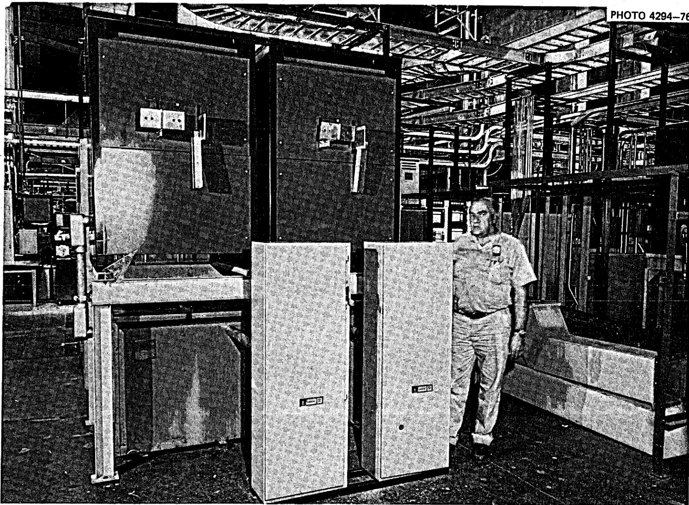  
Fig. 14. 110-kVA transformers and saturable reactors for main resistance heaters on FCL-4.

fired-lava spacers and thereby electrically insulated from the voltage that is applied directly to the piping and lugs.

# 3.2.9 Helium cover-gas system

Dry oxygen-free helium is supplied to FCL-3 and FCL-4 by the cover-gas system previously used at the Molten-Salt Reactor Experiment (MSRE). This gas system, shown schematically in Fig. 15, is shared with the Coolant-Salt Technology Facility, Gas-Systems Technology Facility, and corrosion loop MSR-FCL-2.

Helium is normally supplied by one of two banks of three standard cylinders. The supply line has a pressure indicator and alarm (PIA-500E), which is activated at 2.2 MPa (300 psig); this is followed by a pressure-reducing valve (PCV-500G), which lowers the supply pressure to 1.8 MPa (250 psig). This pressure is monitored by a high-low alarm switch (PA-500) set at 2.0 MPa (275 psig) and 1.5 MPa (200 psig). The supply line also has a tee leading to the oxygen analyzer $\mathrm{AO}_2$ -548.

The supply line then branches into two parallel stainless steel tubing lines to supply the two helium-treatment stations. The identical branches contain a tee to a purge vent, gas-treatment equipment, a tee leading to a rupture disk, a tee for a gas cylinder connection, and isolation valves.

The purge vents, lines 504 and 505, are used to vent helium from cylinders that can be connected at V-500B and V-500C to backflush and regenerate the helium dryers. The vents combine into a single tube that contains a flow indicator (FI-505) before the helium is vented to the atmosphere.

The rupture disks in lines 506 and 507 provide overpressure protection for the helium-treatment equipment. These lines also contain high-pressure alarms, PA-506 and PA-507, that are set at 2.0 MPa (275 psig).

The two branches of the treatment system recombine as line 500, which is connected to a flow-indicating controller and an air-operated control valve (FCV-500) that limits the supply gas flow to 10 liters/min (0.35 ft³/min).

A third dryer (DR-3) is located downstream of FCV-500 in the line leading to the treated-helium storage tank and subsequently to corrosion loops FCL-3 and FCL-4. The gas supply for the corrosion loops tees off

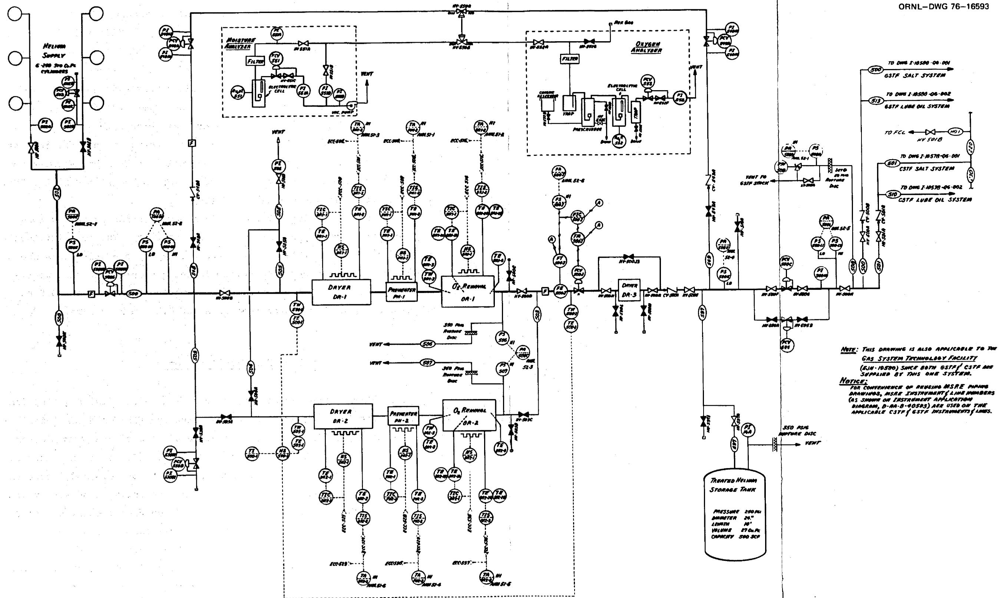  
Fig. 15. Instrument application diagram for the helium cover-gas system.

from line 501, which supplies the Coolant-Salt Technology Facility, and then branches again for each of the corrosion loop facilities. The remainder of the gas lines on corrosion loops FCL-3 and FCL-4 are shown on the instrument application diagrams, Figs. 20 and 21 of Section 3.4.8.

The three gas dryers are filled with Linde molecular sieve No. 13X and normally operate at room temperature. The dryers can be regenerated by heating to $205^{\circ}\mathrm{C}$ ( $400^{\circ}\mathrm{F}$ ) and flowing dry gas through the bed to carry off accumulated moisture. The preheater is not normally used and is kept at room temperature. Oxygen removal is accomplished by a high-temperature bed of titanium chips. The operating bed is maintained at $540^{\circ}\mathrm{C}$ ( $1000^{\circ}\mathrm{F}$ ), while the standby bed is kept at $425^{\circ}\mathrm{C}$ ( $800^{\circ}\mathrm{F}$ ).

The helium gas leaving the MSRE helium purification system is constantly monitored for oxygen and water vapor content. The impurity levels are checked and logged at least once each weekday by operating personnel to ensure that properly purified helium is being supplied to the experiments. Past data show that typical water vapor content is about 0.2 ppm by volume and typical oxygen content is about 0.3 ppm by volume.

# 3.3 Electrical Systems

Figure 16 is a one-line diagram of the plant electrical distribution system to substations 18E and 15E, which serve the FCL-3 and FCL-4 facilities, respectively. Figure 17 is a one-line diagram of the normal power and emergency power electrical systems for FCL-3. (An identical installation is designed for FCL-4.) Electrical power for controls and instruments that are necessary for experimental operation, monitoring, and safety are supplied from both the normal power system and the diesel-generator emergency power system through automatic transfer switches.

Normal power is supplied by TVA from a 154-kV network through a 40-MVA, 154/13.8-kV transformer to a 13.8-kV bus distribution system. Circuit breaker 1332 and disconnect switch 1332EA serve transformer 418E (13.8 kV, 460 V, 1500 kVA), which in turn serves substation 18E. Circuit breaker 1333 and disconnect switch 1333EC serve transformer 415E (13.8 kV, 460 V, 1500 kVA), which in turn serves substation 15E.

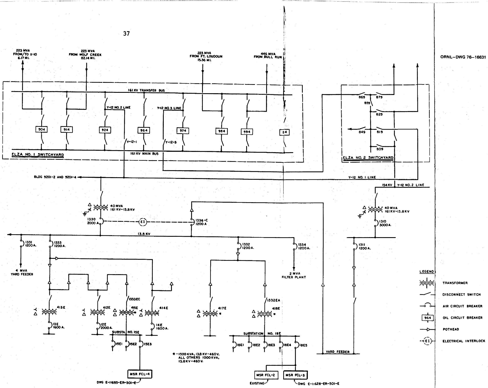  
Fig. 16. One-line diagram of area power supply.

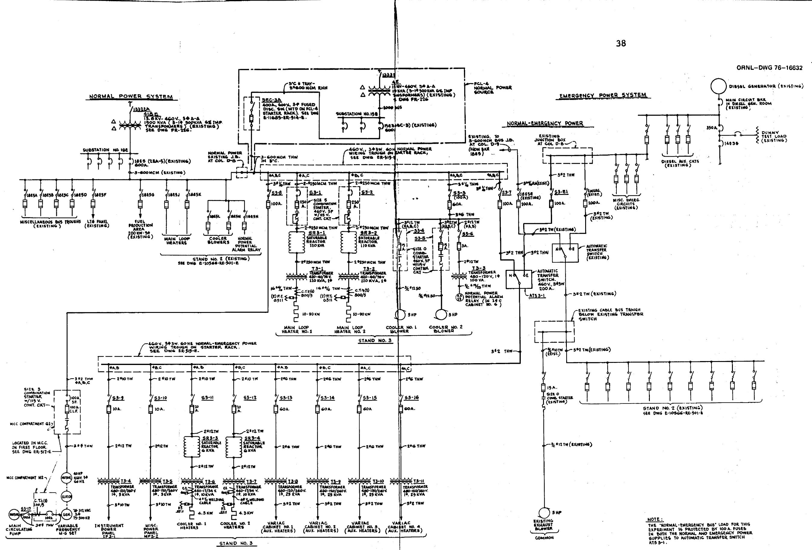  
Fig. 17. One-line diagram of power supply for FCL-3 (or FCL-4).

#

Emergency power is supplied by a diesel-engine-driven generator, rated $300\mathrm{kW}$ , $460\mathrm{V}$ , 3 phase, $60\mathrm{Hz}$ , which is designed to start automatically within 20 sec after a failure of the normal 460-V power supply. Emergency power is supplied through an automatic transfer switch to provide resistance heating of coolers 1 and 2 and also to energize the four variable transformer cabinets that serve all auxiliary heaters for the piping system.

The ALPHA salt pump is driven by a 15-kW (20-hp) variable-speed motor, which is supplied by a variable-frequency, variable-voltage motor-generator set. The motor is a squirrel-cage, induction-type designed for 5000 rpm, 6 pole, 3 phase, 250 Hz, 260 V, open drop proof, NEMA design B, Class F insulation, with vertical solid shaft and mounting flange downward. It is designed for continuous operation from 75 to 250 Hz, with a constant torque load equivalent to 15 kW at 5000 rpm, with the supply voltage equal to 1.04 times the frequency. The motors were procured in accordance with Job Specification E-11628-ER-001-S-0.

One desired modification of the pump control system was not incorporated in the drawings because the MSR project was canceled before the change was effected. We wanted to alter the scram sequence so that the pump would continue to operate at a reduced speed of about 2000 rpm after any scram action to help avoid salt freezing in the cooler coils. A design for providing such a speed reduction was not completed, but this system would be desirable if the loops were ever reactivated and operated with a salt mixture having a relatively high liquidus temperature.

The motor-generator set is rated at $30\mathrm{kVA}$ . The pump motor is directly connected electrically to the generator output such that the motor will start when the generator is started. The motor-generator installation for both FCL-3 and FCL-4 is shown in Fig. 18.

The FCL-3 electrical system drawing numbers and titles are shown on the drawing list included as Appendix A. The list for FCL-4 is similar. The FCL-4 electrical drawings were essentially complete, except for modifications for low-speed pump operation after scram, when the project was canceled. Due to the cancellation, FCL-4 drawings were not formally approved or issued.

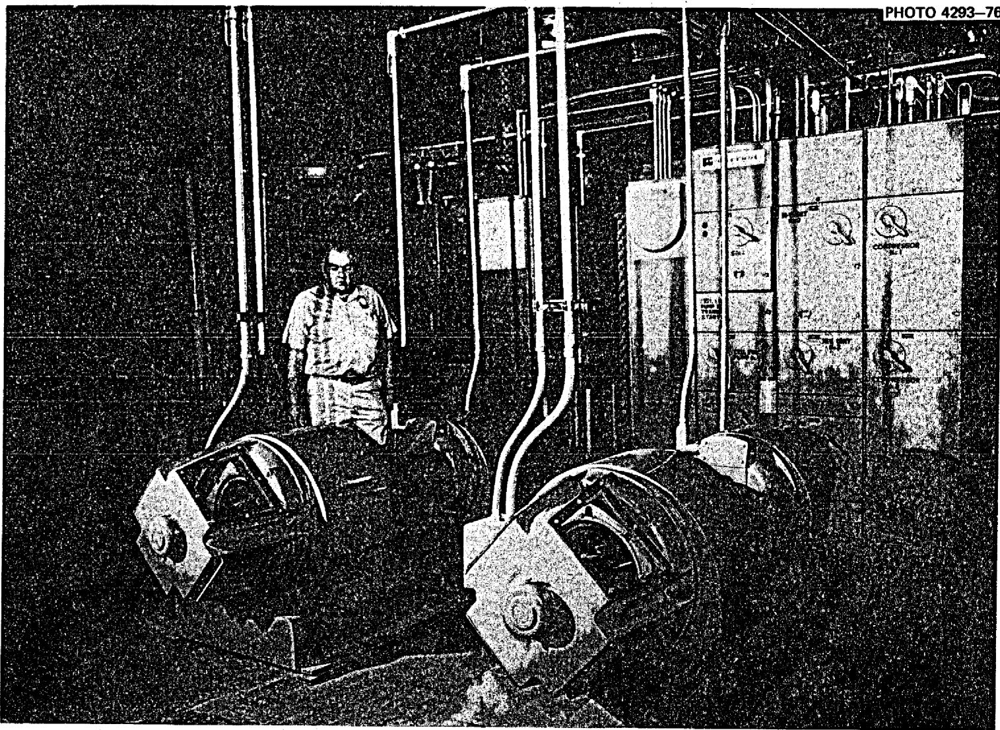  
Fig. 18. Variable-speed motor-generator sets for ALPHA pump drive motors on FCL-3 and -4.

Details of the main heaters and auxiliary heaters were discussed in Sections 3.2.7 and 3.2.8.

# 3.4 Instrumentation and Controls

# 3.4.1 Temperature measurement and control

There are approximately 125 numbered thermocouples in each of the FCL-3 and FCL-4 loops. These thermocouples are industrial grade (0.075%), type K (Chromel-Alumel), with stainless steel sheaths and MgO insulation and ungrounded measuring junctions. Most are 1 mm (0.040 in.) in diameter; others are 1.6 mm (0.063 in.) in diameter. Of the 125 temperature measurements, 53 are recorded on strip-chart recorders (42 of these are also recorded automatically on the Dextir digital data-acquisition system); 6 are used with temperature-indicating switches in alarm and/or safety circuits, while the remainder are indicated on a manually operated digital temperature indicator.

Temperature control of the entire electrical preheating system for the loop piping and coolers is by manual adjustment of a number of variable auto transformers that either supply power directly to resistance heaters or modulate current that is subsequently rectified and used to control power supplied by saturable reactors to the resistance heaters.

The main resistance heaters, which produce the temperature rise in the salt flowing to metallurgical samples in stations 2 and 3, receive their power from two saturable reactors with step-down transformers to match the transformer impedance to the load. The saturable reactor supplying resistance heater 2 is controlled by an automatic three-term (proportional, derivative, and reset) controller (TRC-6) that operates through a magnetic amplifier. The saturable reactor supplying resistance heater 1 is controlled by TC-5, which is manually set to provide a constant power input. Both TC-5 and TRC-6 have electrical interlocks in the heater control circuits (circuits 2 and 3) that prevent energizing the power to the heaters without first adjusting the controls to minimum power input. This feature reduces the probability of operator error and accidental overheating of the loop piping during restarting of the loop. These interlocks

are bypassed for a period of approximately 2 sec following a complete loss of power; this permits restoration of power following momentary power dips such as those caused by lightning.

High-temperature limit switches are actuated by the thermocouples located on the downstream end of each of the main resistance heaters, and a low-temperature limit switch is actuated by a thermocouple located at the exit of cooler 2 to provide scram action as required. In addition, there is a high-temperature scram on each of the three metallurgical-sample-station freeze valves.

# 3.4.2 Pressure measurement and control

System pressure is maintained at a fixed value by supplying helium gas to the system through pressure regulator PV-H02A while simultaneously bleeding helium gas plus pump seal oil leakage via oil traps at a controlled rate through PdC-H11A.

An absolute-pressure transmitter is located on each of the three metallurgical sample lines and on each of the two salt sample lines. These pressure measurements are used to ensure that pressures in all the sample lines are equalized during filling and sampling operations to prevent forcing salt into the gas lines. These five pressure signals are selectively indicated on digital pressure indicator PI-14 by operating switch PS-14. Additionally, the two pressure signals transmitted from the salt sample stations are recorded on a two-pen strip-chart recorder, since they indicate operating pressures of the pump bowl and drain tank.

In addition to the above pressure measurements, five vacuum gages (Hastings) and numerous dial gages (pressure, vacuum, and compound) are located throughout the system.

No direct measurements of salt pressure are included because of the cost and complexity of instrumentation suitable for this purpose.

# 3.4.3 Pump speed measurement and control

The pump speed is measured by a magnetic pickup and gear tooth arrangement that is located just below the direct-drive coupling on the pump shaft. The pulses generated by the magnetic pickup are counted and

converted to an analog current signal, which is indicated on panel meter SI-11. Pump speed is controlled by adjusting the frequency of a variable-frequency motor-generator set that supplies power to the pump drive motor. Low pump speed, which is detected by switch SS-11, initiates a scram and produces an alarm.

# 3.4.4 Power measurements

Power supplied to the main loop resistance heaters is measured by thermal-watt converters and recorded on a two-pen strip-chart recorder (and on the Dextir data system), with each pen recording the power dissipated in one of the two heaters. Power to the pump motor is recorded on recording wattmeter $\mathbf{E}_{\mathbf{W}} \mathbf{R} - 11$ . Power to the two resistance cooler heaters is indicated on panel-mounted watt meters.

# 3.4.5 Thermal conductivity measurement

Thermal conductivity of the helium cover gas is measured by a heated filament conductivity bridge (CE-H04A) and recorded on a strip-chart recorder. The pure helium input to the loop is used as a reference and compared to helium vented from the oil catch basin of the pump. This provides a means of detecting helium contamination by air, moisture, and impurities from the salt. The thermal conductivity measurement system was originally used in the early corrosion loops (MSR-FCL-1 and MSR-FCL-2) to monitor boron trifluoride $(\mathrm{BF}_3)$ carried away from the sodium fluoroborate coolant salt within the pump bowl. The thermal conductivity system has been retained for corrosion loops FCL-3 and FCL-4 primarily because it has proved useful in monitoring air and moisture contamination, particularly from outgassing that occurs during initial preheating operations.

# 3.4.6 Digital data system (Dextir)

A number of the data points, including temperatures, heater power, and pump speed, are recorded on a central digital data-acquisition system, which consists of Beckman Dextir data-collection hardware interfaced to a Digital Equipment Corporation PDP-8 computer. Data may be converted on line to engineering units and printed out on a teletype terminal or they

may be recorded on magnetic tape and converted off line by the IBM-360/75 (or other) computer.

The 23-channel analog boxes and one 25-channel digital box are installed on each of the FCL-3 and FCL-4 facilities. In addition, a 43-channel, $338.6\mathrm{K}$ $(150^{\circ}\mathrm{F})$ , or equivalent, thermocouple reference box is installed on each loop.

Each digital box of 25 channels is normally scanned automatically at hourly intervals but may be scanned at intervals of 5, 15, or 30 min as well. Any box may be set to scan continuously, or a single scan may be initiated manually at any time.

The Dextir system has three ranges of 0 to 10, 0 to 100, and 0 to 1000 mV that may be preselected for each individual channel. Overall accuracy is ±0.07% of full scale, and resolution is one part in 10,000.

# 3.4.7 Block diagram

Referring to Fig. 19, Control System Block Diagram, there are two sources of power for the test facility: building power and diesel power. There are also two power buses. One bus is energized only from the building power source (normal TVA power) and supplies power to the main loop heaters, the cooler blowers, the damper motors, and the variable-frequency M-G set. The other bus is energized from the building power source when it is available, but is automatically switched to the diesel power source if the building power fails. This bus supplies power to all heaters (except the main loop resistance heaters) and to the lube oil pumps. The objective of this design is to scram the loop, but keep the salt molten during TVA power outages, and to ensure that cooling oil flow is maintained in the centrifugal pump at all times.

# 3.4.8 Instrument application diagram

There are two drawings for each test loop comprising the Instrument Application Diagram. Figures 20 and 21 show the diagram for FCL-3 only, because the diagrams for FCL-4 are identical. The first of these shows the salt system, including the pump, the main loop heaters, the coolers, the fill-and-drain tank, and the three metallurgical sample lines with

C

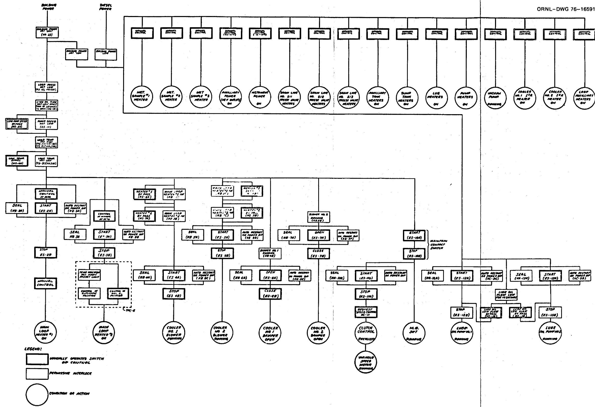  
Fig. 19. Block diagram of control system.

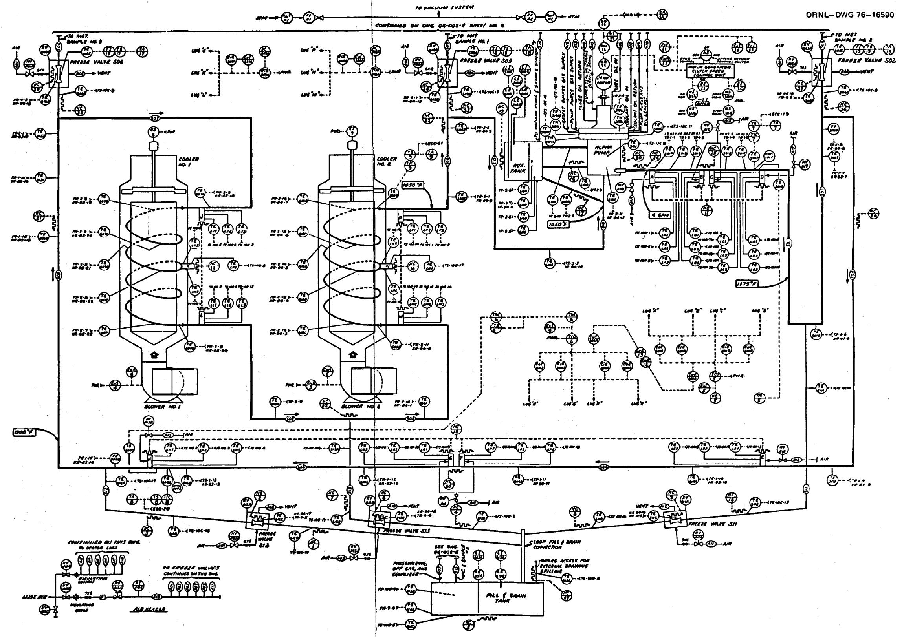  
Fig. 20. Instrument application diagram for MSR-FCL-3 - sheet 1.

C

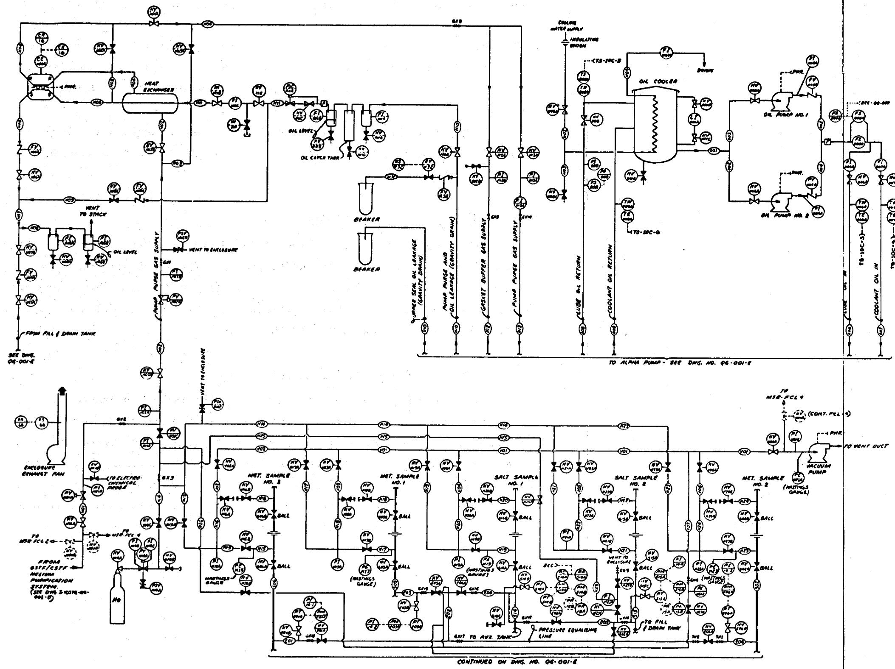  
Fig. 21. Instrument application diagram for MSR-FCL-3 - sheet 2.   
C

ORNL-DWG 76-16592

LEGENO   

<table><tr><td>○ Field mounted instrument</td></tr></table>

INMPMENT IMPACTED IN VALUE STATION   
MAME MOUNTED INSTRUMENT   
CING NUMBERS   
-0-

1. The ANOPT LETPED TO EACH INSTRUMENT
DEMORES INSTRUMENT LOCATION AS
Follows

NOTES   

<table><tr><td>SVM</td><td>PROCESS</td><td>LAST-# USE</td></tr><tr><td>A</td><td>AIR</td><td>3</td></tr><tr><td>B</td><td>GOAL-MODEL LINES</td><td>G</td></tr><tr><td>N</td><td>NEUQUIN</td><td>28</td></tr><tr><td>L</td><td>LUG (MEATER)</td><td></td></tr><tr><td>O</td><td>OIL</td><td>2*</td></tr><tr><td>B</td><td>SALT</td><td>67</td></tr><tr><td>V</td><td>VACUUM</td><td>G</td></tr><tr><td>W</td><td>WATER</td><td>4</td></tr></table>

EAEERTOOANC BMO.57-1-1 FOR (EXPLANATION OF INSTRUMENT) SYMBOLS

their associated freeze valves. The second drawing shows the helium supply system, the sample station valving, the lube oil pumps, the vacuum systems, and the thermal conductivity measuring system. These diagrams are intended to show schematically the instrumentation of the entire facility and are not, of course, intended to show or imply any dimensional data.

A complete list of instruments shown on these diagrams is given in Appendix E, and a list of Instrumentation and Control drawings is included in Appendix B.

# 3.4.9 Molten-salt level measurements

Salt level is measured in the fill-and-drain tank and in the auxiliary tank by "spark plug"-type continuity probes. The level detection circuitry operates with a low ac voltage of approximately 6.3 V at 60 Hz on the probe when it is not in contact with molten salt. This voltage drops to approximately 1 V when the salt contacts the probe.

# 3.4.10 Molten-salt flow measurement

Due to the high cost and complexity of instruments suitable for measuring molten-salt flow directly, no direct flow measurements are made. In lieu of a direct measurement, the main loop resistance heater sections are used as calorimetric flowmeters. By using the auxiliary heaters to make up for heat losses, the flow rate of the salt through the heater sections can be calculated from measurements of the temperature rise and power input to the resistance-heated section.

# 3.4.11 Control panels

The control panels for corrosion loops FCL-2, FCL-3, and FCL-4 are shown assembled in the experimental area of Building 9201-3 in Fig. 22. Each of the new loops requires four control panels with variable transformers for electrical preheating and four special-purpose cabinets for the most frequently used controls. Two additional cabinets are required on each loop for data logging and auxiliary instrumentation, but they are located behind the main panel and are not visible in Fig. 22.

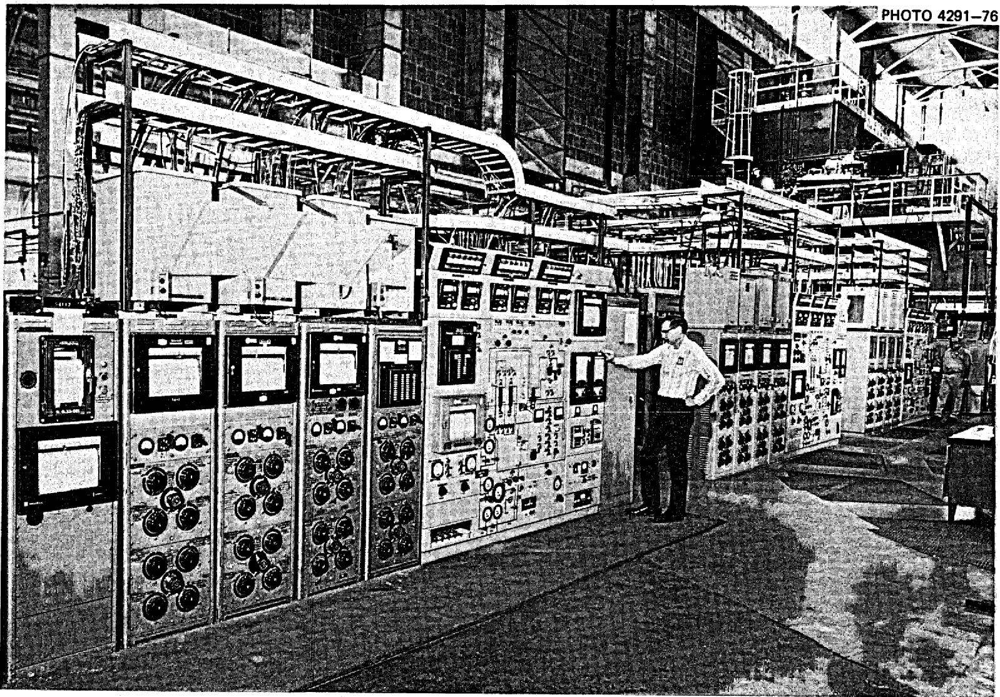  
Fig. 22. View of control panels for corrosion loops FCL-2, FCL-3, and FCL-4.

# 4. SYSTEM LIMITATIONS, SET POINTS, AND PRECAUTIONS

The loop automatic instrumentation is designed to prevent (1) over-pressurization, (2) overheating, (3) loop damage if the pump stops, and (4) accidental salt freezing if normal electric power supply is lost. If specified limits are exceeded, the more critical parameters will place the loop in standby condition (scram) by turning off the main resistance heaters, turning off the air coolers, and reducing the pump speed. Pressure relief valves PSV-H02A and PSV-H14B, which are set to relieve at 0.3 MPa (30 psig), are located on the helium supply lines to the pump bowl and to other gas systems to preclude excess cover-gas pressure. High-temperature alarms are provided near the exit regions of the main resistance-heated sections 1 and 2. Protection against overheating is particularly important on the main heaters because of the high heat flux in these regions and corresponding rapid temperature rise if salt flow is reduced or stopped. High-temperature alarm and scram action to the standby condition is also provided on the three salt freeze valves of the metallurgical specimen removal stations. A low-temperature alarm warns of near freezing conditions at the exit of cooler 2 via TIC-9, and scram action will result. Scram action also occurs if the flow rate of lubrication oil to the pump is low or if the helium cover-gas pressure drops below 117 kPa (17 psia).

A number of less critical alarms provide operator information about off-design conditions but do not place the loop in standby. These alarms include low temperature on the guard heaters of the coolers, low flow of the ventilation air from the shielded loop enclosures, bypass of the building alarm, or low oil pressure at PS-008. A summary of all alarms and respective parameter set points is shown in Table 4.

The major precaution in loop design is to prevent accidental freezing of the salt within the piping system. Freezing of salt is avoided because melting operations can easily lead to pipe rupture as the salt expands during reheating. To this end, the heaters on the piping should be arranged, as much as practical, so that melting operations can be carried out by progressing in short increments of length from a free surface, such as the salt level within the pump tank. Emergency diesel-driven auxiliary power

Table 4. Alarm summary for FCL-3 or -4   

<table><tr><td>Alarm conditions</td><td>Control action</td><td>Instrument No.</td><td>Set point</td></tr><tr><td rowspan="2">High loop temperature</td><td rowspan="2">Scram</td><td>TIC-7 (TE-S01T)</td><td>790°C (1460°F)</td></tr><tr><td>TIC-8 (TE-S04Y)</td><td>840°C (1550°F)</td></tr><tr><td>Low loop temperature</td><td>Scram</td><td>TIC-9 (TE-S08T)</td><td>495°C (925°F)</td></tr><tr><td>Low pump speed</td><td>Scram</td><td>SI-11</td><td>2500 rpm</td></tr><tr><td>Low loop pressure</td><td>Scram</td><td>PR-15A</td><td>117 kPa (17 psia)</td></tr><tr><td>Low pump oil flow</td><td>Scram</td><td>FI-005A</td><td>50% of normal flow</td></tr><tr><td>Loss of building power</td><td>Scram and switch to emergency power</td><td></td><td></td></tr><tr><td>Cooler No. 1 blower off</td><td>Cooler No. 1 damper closes</td><td></td><td></td></tr><tr><td>Cooler No. 2 blower off</td><td>Cooler No. 2 damper closes</td><td></td><td></td></tr><tr><td>Interlocks bypassed (switches HS2, HS3, HS4, HS5, HS6, HS7, HS8)</td><td>Nonea</td><td></td><td></td></tr><tr><td>High temp. freeze valve S09, MET sample 1</td><td>Scram</td><td>TIS-18 (TE-S09C)</td><td>205°C (400°F)</td></tr><tr><td>High temp. freeze valve S02, MET sample 2</td><td>Scram</td><td>TIS-19 (TE-S02C)</td><td>205°C (400°F)</td></tr><tr><td>High temp. freeze valve S06, MET sample 3</td><td>Scram</td><td>TIS-17 (TE-S06C)</td><td>205°C (400°F)</td></tr><tr><td>Cooler guard heater at low temperature</td><td>None</td><td>Brown Recorder cabinet 11</td><td>93°C (200°F)</td></tr><tr><td>Vent stack flow</td><td>Nonea</td><td>Damper in air duct</td><td>Off-on</td></tr><tr><td>Building alarm bypass</td><td>Nonea</td><td></td><td></td></tr><tr><td>Pump electric power lost</td><td>Scram</td><td></td><td></td></tr><tr><td>Lubrication oil at low pressure</td><td>Nonea</td><td>PS-008</td><td>134 kPa (4.8 psig)</td></tr></table>

Local alarm only.

supply is available if normal electric power fails, and automatic switching between power supplies is provided. A low-temperature alarm is provided at the exit of cooler 2, and the loop will automatically scream to the standby condition if the salt temperature approaches $500^{\circ}\mathrm{C}$ ( $932^{\circ}\mathrm{F}$ ). No automatic salt draining features were included, as is normal for larger test facilities, because the circulating salt inventory is only about 5 liters (1.3 gal).

The loop is operated within a shielded enclosure to prevent operator injury due to leakage of the high-temperature salt. The shielded enclosure is ventilated by an exhaust system, so that smoke or fumes from leakage are carried to a stack on the roof. Ventilation is required because the molten salt contains both beryllium and a small amount of alpha-radioactive material. Constant air monitor filters (two each) are located at each end of the enclosure, and these are periodically removed and checked by Health Physics personnel to ensure that contamination levels are within safe limits adjacent to the loops.

These corrosion loops generally operate at full design conditions 24 hr/day, and therefore all instrument alarms are monitored both by local alarms and by an annunciator panel located at the PSS office. An automatic timer switch transfers alarm signals to the PSS office at night and on weekends because someone is on duty there at all times. In the event of an alarm, operator personnel familiar with the equipment are notified of the alarm condition from the PSS office by telephone. Operator personnel are expected to investigate the alarm condition by coming to the operating area to determine appropriate action.

The only significant fire hazard of the facility is related to the 8 liters of lubrication oil for the pump. The salt will not self-ignite in the event of a salt leak, but the salt temperature is high enough to ignite the oil if the two fluids mix accidentally. An oil catch pan is provided around the pump bowl and bearing housing so that any oil leakage in this area will safely drain away rather than drop onto the thermal insulation and the hot exterior surfaces of the pump and piping. Overhead clearance at the test facility is such that an oil fire could safely burn itself out without endangering other experiments or the loop operators.

Instrumentation is provided to allow the loop to continue operation without scrambling in the event of electrical power dips or brief outages of 2 sec or less. This feature is particularly useful during the summer months when severe electrical storms occur and momentary outages due to lightning are frequent. The cooldown time of the ALPHA pump is such that some salt flow is maintained during the 2-sec interval and the salt in the coolers does not freeze. Therefore, the power dip instrumentation allows the loop to accumulate more operating time at design conditions and is particularly beneficial during periods of unattended operation on nights and weekends.

# 5. OPERATION

Operation of corrosion loops MSR-FCL-3 and -4 will profit from previous operation of MSR-FCL-2 for more than 19,000 hr, particularly since there is a high degree of commonality among the three systems. Prior to operation, standard practice dictates

1. preparation of an operating manual describing the loop design and equipment, initial'system check-out, and detailed operating procedures;   
2. posting of emergency procedures at the loop control panel;   
3. posting of a loop schematic diagram identifying significant system components;   
4. posting of an isometric diagram of the system indicating the location of electric heaters and their associated thermocouples and controllers. Due to program cancellation, this work was not completed.

# 5.1 Initial Salt Filling of the Fill-and-Drain Tank

The system is readied for operation after completing pneumatic and helium leak testing, electrical checkout, etc., by baking out the piping system to remove water vapor from the metallic surfaces. Care must be exercised to ensure that the pump cooling oil is turned on before heating

begins. The system is evacuated repeatedly to $\sim 3$ kPa (0.5 psia) and refilled with purified helium to purge moisture. A high vacuum is specifically avoided during evacuation of the loop piping, because the light turbine oil in the pump oil catch basin would diffuse under high vacuum pumping and contaminate interior surfaces of the loop piping. After bake-out and purging is completed, the fill-and-drain tank is prepared for salt filling. A small transfer pot containing about 20 kg (22 lb) of fuel salt is attached to the Swagelok compression fitting on the drain tank dip-leg access riser pipe via 6.3-mm-OD X 0.9-mm-wall (1/4-in.-OD X 0.035-in.-wall) Hastelloy N tubing. The transfer pot is preheated to about $705^{\circ} \mathrm{C}$ (1300°F), and purified helium is bubbled through the dip tube for at least an hour to stir the salt and ensure that no salt segregation has occurred during melting. Failure to stir the salt can result in transfer of an atypical, segregated fuel-salt mixture into the drain tank. Prior to salt transfer, the adjustable level probes in the fill-and-drain tank are set to observe the desired filling level and the tank is preheated to about $600^{\circ} \mathrm{C}$ (1112°F). The helium pressure above the salt surface of the transfer pot is increased slightly to force the molten salt through the transfer line into the fill-and-drain tank. The proper salt level in the fill-and-drain tank can easily be obtained if the end of the fill line is located at the desired salt elevation. Of course, this must be done at the time the salt transfer line is installed initially in the drain tank dip-leg access riser. Salt is transferred until it rises above the end of the dip tube, and then helium pressure is reversed to blow the salt back toward the transfer pot. When the salt level reaches the end of the dip tube, an audible bubbling can be heard as the helium flows back through the salt remaining in the transfer pot. This method provides a positive method of filling to a precise level and additionally blows most of the salt out of the transfer line when the salt transfer is completed. After the transfer pot is cooled and removed, a salt sample is taken from the drain tank and analyzed for contamination.

Safety procedures require that personnel wear protective clothing while working on the salt-transfer equipment whenever the salt is molten. This safety equipment consists of a long chrome leather coat, chrome

leather hood, and gloves. Two men are required in any salt-transfer operation as a safety precaution.

# 5.2 Filling the Loop with Salt

The operators must establish cooling oil flow through the pump before any heat is applied to the pump bowl to prevent damage to bearings and seals. The loop piping is then readied for filling by adjusting the manual variable transformer preheat controls until all piping and components are heated to at least $650^{\circ}\mathrm{C}$ ( $1200^{\circ}\mathrm{F}$ ). No specific heating rate is observed during preheating of the piping. The adjustable transformers are normally set at the voltage required to heat the piping to about $650^{\circ}\mathrm{C}$ ( $1200^{\circ}\mathrm{F}$ ) and allowed to come to equilibrium. All gas equalizer lines are opened to allow pressure balancing between the free salt surface in the pump bowl and the free surfaces at each of the three metallurgical sample stations. Filling of this system is a critical operation, because the four free surfaces at the pump and metallurgical sample stations fill simultaneously. Any surge of pressure or sudden venting can cause salt level surging at the metallurgical sample station, which results in salt freezing in the small unheated gas lines located just above the freeze valve elevation. An improper filling technique and resultant salt surging can also result in salt damage to the Teflon parts of the ball valve located about 21 cm (8 in.) above the normal salt level within the metallurgical sample stations. About 5 liters (1.3 gal) of salt is required to fill the loop to the normal operating level [i.e., a salt depth of 10 cm (3.9 in.) in the auxiliary pump tank]. Salt transfer is halted by careful pressure balancing between the drain tank and the auxiliary pump tank, and then the separate drain lines are cooled and frozen. After the drain lines are frozen, the metallurgical sample stringers are lowered through their respective air locks and ball valves to be immersed in the salt. The tee handles are then disengaged from the metallurgical specimen stringers, the ball valves closed, and the freeze valves established on each station. Forced salt circulation may now commence by starting the ALPHA pump.

# 5.3 Bringing the Loop to Design Conditions

The loop is brought from isothermal to $\Delta T$ operation by first bringing the ALPHA pump to normal operating speed of 5000 rpm to create a flow rate of $2.5 \times 10^{-4} \mathrm{~m}^{3} / \mathrm{s}$ (4 gpm) and then gradually applying the $\Delta T$ by incremental manual increases in the main resistance heaters with corresponding manual adjustment of the blower inlet dampers to increase cooler air flow. Past experience with corrosion loop FCL-2 has shown that an experienced operator can convert loop operation from isothermal to $\Delta T$ conditions in 0.5 hr or less.

After the system is at $\Delta T$ conditions, the guard heaters on the coolers must be manually set at their proper heating range by adjusting four variable transformers. These heaters increase the temperature of the metal mass within the cooler air ducts during $\Delta T$ operation to help prevent salt freezing in the event of a scram. This feature was added to corrosion loop FCL-2 after actual operating experience showed that the small salt inventory of the loop came dangerously close to freezing after special manual scams during which the salt pump continued to circulate salt after the scram.

After the loop temperatures are at operating conditions, the power-dip circuit is actuated by pushing reset switch ES-9A. If the power-dip circuit were not reset, the loop would scram if any momentary power outage occurred. After ES-9A is reset, the loop can tolerate a 2-sec power outage and resume operation without alarm or operator assistance. It is noted that the power-dip circuit cannot be reset while any parameter that scrams the loop is in either a scram condition or bypassed. The loop is now at design conditions and ready for extended operation.

# 6. MAINTENANCE

# 6.1 Maintenance Philosophy

Maintenance of the loop equipment within the shielded enclosure will not be done while the piping is full of salt and operating at full pump speed, because the pump discharge pressure is quite high [i.e., 2.0 MPa (290 psia)] and any salt leakage might endanger personnel. Minor repairs

to instrumentation and controls within the enclosure can be done with the loop full of salt and with the pump stopped, since the maximum pressure within the loop is then about 0.136 MPa (5 psig). Maintenance will be performed by properly supervised and experienced craftsmen wearing prescribed safety clothing. The entry of personnel into the facility shielded enclosure is controlled by the project leader. A safety work permit and the safety equipment indicated in Table 5 are required for entry into the enclosure. If a salt leak occurs, respirators are required, in addition to the equipment shown in the table, until the salt spill had been removed and the area approved by Health Physics personnel.

Table 5. Safety requirements   

<table><tr><td></td><td>For enclosure entry</td><td>For opening salt piping</td></tr><tr><td>System empty and at ambient temperature</td><td>a</td><td>a</td></tr><tr><td>System empty with heat applied</td><td>b</td><td>Not permitted</td></tr><tr><td>System full of salt, pump stopped</td><td>b</td><td>Not permitted</td></tr><tr><td>System full, pump at full speed</td><td>c</td><td>Not permitted</td></tr></table>

${}^{a}$ Safety glasses and gloves.   
bFull protective equipment - chrome leather suit, gloves, and head cover.   
cMaintenance is not permitted, but inspection by loop operators in full protective equipment (b) is sometimes required.

# 6.2 Normal Maintenance Requirements

During normal operation of loop FCL-3 or FCL-4, routine checks, calibrations, and preventive maintenance of the loop components, auxiliary equipment, and instrumentation are required to minimize malfunction of the facility. A check list of the facility equipment and the required maintenance is given in Table 6. Scram circuits are periodically tested during actual loop operation to ensure that the required safety actions occur.

Table 6. Preventive maintenance check list   

<table><tr><td>Equipment or function</td><td>Action</td><td>Time between checks</td></tr><tr><td>Check alarms and \(scrams^a\)</td><td></td><td></td></tr><tr><td>Loop temperature, high (TIC-7, TIC-8)</td><td>Scram</td><td>3 months</td></tr><tr><td>Loop temperature, low (TIC-9)</td><td></td><td></td></tr><tr><td>Freeze valve temperature, high, MET sample 1 (TIS-18)</td><td></td><td></td></tr><tr><td>Freeze valve temperature, high, MET sample 2 (TIS-19)</td><td></td><td></td></tr><tr><td>Freeze valve temperature, high, MET sample 3 (TIS-17)</td><td></td><td></td></tr><tr><td>Loop pressure, low (PR-15A)</td><td></td><td></td></tr><tr><td>Pump cooling and lubrication oil flow, low (FI-005A)</td><td></td><td></td></tr><tr><td>Pump lubrication oil pressure, low</td><td>Alarm</td><td>1 month</td></tr><tr><td>Pump low speed</td><td>Scram</td><td>3 months</td></tr><tr><td>Low-temperature alarm on cooler guard heaters</td><td>Alarm</td><td>3 months</td></tr><tr><td>Check and calibrate temperature, pressure, and power recorders and controllers</td><td></td><td></td></tr><tr><td>Temperature recorders</td><td>Data</td><td>6 months</td></tr><tr><td>Temperature indicators</td><td>Data</td><td></td></tr><tr><td>Temperature controllers</td><td>Control</td><td></td></tr><tr><td>Pressure recorders</td><td>Data</td><td></td></tr><tr><td>Pressure transducers and pressure indicators</td><td>Data</td><td>1 month</td></tr><tr><td>Loop power recorders</td><td>Data</td><td>6 months</td></tr><tr><td>Pump speed indicators and conductivity cell</td><td>Data</td><td>3 months</td></tr><tr><td>Change vacuum tubes, TICs</td><td>Control</td><td>6 months</td></tr><tr><td>ALPHA\(pump^b\)</td><td></td><td></td></tr><tr><td>Check pump lubrication oil low-pressure alarm (PS-008)</td><td>Alarm</td><td>3 months</td></tr><tr><td>Check speed with strobe light</td><td>None</td><td>1 month</td></tr><tr><td>Check lubrication oil sump level</td><td></td><td>1 week</td></tr><tr><td>Check lower shaft seal leakage (oil)</td><td></td><td>1 day</td></tr><tr><td>Check upper shaft seal leakage (oil)</td><td></td><td>1 day</td></tr><tr><td>Check drive motor for excessive noise or vibration</td><td></td><td>1 day</td></tr><tr><td>Check M-G set for noise or vibration</td><td></td><td>1 week</td></tr><tr><td>Check lubrication and cooling oil system leakage</td><td></td><td>1 week</td></tr><tr><td>Clean &quot;auto clean&quot; filter in cooling and lubri-cation oil system by rotating wiper handle</td><td></td><td>3 months</td></tr></table>

aScram condition transfers loop from design (ΔT) operation to standby.   
b ALPHA pump bearings and seals are designed for at least 8000 hr operation; they may require less frequent replacement, as determined by experience.

# ACKNOWLEDGMENTS

We express our thanks to the many persons who contributed to the design, fabrication, and construction of molten-salt corrosion loops FCL-3 and FCL-4. We specifically acknowledge H. E. McCoy, R. E. MacPherson, and J. R. Engel for project management and guidance; C. J. Claffey for mechanical design; C. W. Collins for vessel and piping stress analysis; W. E. Sallee for electrical design; and G. W. Greene for instrumentation and control design. Messrs. Claffey, Sallee, and Greene also contributed sections of this design report in their respective specialities. J. R. Keiser provided metallurgical advice; E. M. Lees and H. E. Robertson gave fabrication and construction assistance; and Virginia Maggart provided secretarial assistance.

# REFERENCES

1. W. R. Huntley and P. A. Gnadt, Design and Operation of a Forced-Circulation Test Facility (MSR-FCL-1) Employing Hastelloy N Alloy and Sodium Fluoroborate Salt, ORNL/TM-3863 (January 1973).   
2. W. R. Huntley, J. W. Koger, and H. C. Savage, MSRP Semiannu. Progr. Rep. Aug. 31, 1970, ORNL-4622, pp. 176-8.   
3. J. W. Koger, A Forced-Circulation Loop for Corrosion Studies: Hastelloy N Compatibility with $\mathrm{NaBF}_4$ -NaF (92-8 mole %), ORNL/TM-4221 (December 1972).   
4. H. W. Jenkins et al., "EMF and Voltametric Measurements on the $\mathbf{U}^{4+}/\mathbf{U}^{3+}$ Couple in Molten LiF-BeF $_2$ -ZrF $_4$ ," J. Electrochem. Soc. 116, 1712 (1969).   
5. S. Cantor et al., Physical Properties of Molten-Salt Reactor Fuel, Coolant, and Flush Salts, ORNL/TM-2316 (August 1968).   
6. S. Cantor, Density and Viscosity of Several Molten Fluoride Mixtures, ORNL/TM-4308 (March 1973).   
7. J. W. Cooke, MSRP Semiannu. Progr. Rep. Aug. 31, 1969, ORNL-4449, p. 92.   
8. J. H. Griffin, Piping Flexibility Analyses Program MEC-21, LA-2929 (July 1964).

# Appendix A

# ELECTRICAL DRAWING LIST (MSR-FCL-3)

Electrical drawing list (MSR-FCL-3)   

<table><tr><td>Drawing
No.</td><td>Size</td><td>Title</td></tr><tr><td>E 11628 E R 501</td><td>E</td><td>Single-Line Diagram - Normal and Emergency Power</td></tr><tr><td>E 11628 E R 502</td><td>E</td><td>Schematic Diagram - Sh. 1 - Normal and Emergency Power</td></tr><tr><td>E 11628 E R 503</td><td>E</td><td>Schematic Diagram - Sh. 2 - Normal and Emergency Power</td></tr><tr><td>E 11628 E R 504</td><td>E</td><td>Schematic Diagram - Sh. 3 - Normal and Emergency Power</td></tr><tr><td>E 11628 E R 505</td><td>E</td><td>Auxiliary Heaters - Schem. Diag. - Sh. 4 - Normal and Elec. Power</td></tr><tr><td>E 11628 E R 506</td><td>E</td><td>Main Pump Motor - Schematic and Control Diagram</td></tr><tr><td>E 11628 E R 507</td><td>E</td><td>Exp. Piping Isometric - Heater and T/C Arrangement</td></tr><tr><td>E 11628 E R 508</td><td>E</td><td>Auxiliary Heater and Power Supply Schedule</td></tr><tr><td>E 11628 E R 509</td><td>E</td><td>Variac Cabinet No. 1 - Assembly and Wiring</td></tr><tr><td>E 11628 E R 510</td><td>E</td><td>Variac Cabinet No. 2 - Assembly and Wiring</td></tr><tr><td>E 11628 E R 511</td><td>E</td><td>Variac Cabinet No. 3 - Assembly and Wiring</td></tr><tr><td>E 11628 E R 512</td><td>E</td><td>Variac Cabinet No. 4 - Assembly and Wiring</td></tr><tr><td>E 11628 E R 513</td><td>E</td><td>Metering Cabinet No. 10 - Assembly and Wiring</td></tr><tr><td>E 11628 E R 514</td><td>E</td><td>Exp. Area-Equipment Arrangement - Plan</td></tr><tr><td>E 11628 E R 515</td><td>E</td><td>Exp. Area-Equipment Arrangement - Elevations</td></tr><tr><td>E 11628 E R 516</td><td>E</td><td>Starter Rack Frames &amp; Trans. Support Frame - Assembly &amp; Details</td></tr><tr><td>E 11628 E R 517</td><td>E</td><td>Main Pump Drive-Motor Generator Installation - lst F. Plans</td></tr><tr><td>E 11628 E R 518</td><td>E</td><td>Equipment Grounding</td></tr><tr><td>E 11628 E R 519</td><td>E</td><td>Electrical Auxiliary Details</td></tr><tr><td>E 11628 E R 520</td><td>E</td><td>Type &quot;E&quot; Variac Control Panel - Assembly &amp; Wiring Diagram</td></tr></table>

# Appendix B

# INSTRUMENT DRAWING LIST (MSR-FCL-3)

Instrument drawing list (MSR-FCL-3)   

<table><tr><td>Drawing
No.</td><td>Size</td><td>Title</td></tr><tr><td>I-11628-QG-001</td><td>E</td><td>Instrument Application Diagram, Sh. No. 1</td></tr><tr><td>I-11628-QG-002</td><td>E</td><td>Instrument Application Diagram, Sh. No. 2</td></tr><tr><td>I-11628-QG-003</td><td>E</td><td>Control System Block Diagram</td></tr><tr><td>I-11628-QG-004</td><td>D</td><td>Typ. T/C Installation and Dextir Tab.</td></tr><tr><td>I-11628-QG-005</td><td>D</td><td>Ann. Common Conn. M. E. D.</td></tr><tr><td>I-11628-QG-006</td><td>D</td><td>Control Circuit 1 through 13 M. E. D.</td></tr><tr><td>I-11628-QG-007</td><td>D</td><td>Control Circuit 14 through 33</td></tr><tr><td>I-11628-QG-008</td><td>D</td><td>Ann. Circuit No. 50 through 67</td></tr><tr><td>I-11628-QG-009</td><td>D</td><td>AC Power M. E. D.</td></tr><tr><td>I-11628-QG-010</td><td>D</td><td>Power Measurement Control Cir. 45 through 48</td></tr><tr><td>I-11628-QG-011</td><td>D</td><td>Conductivity Measuring System M. E. D.</td></tr><tr><td>I-11628-QG-012</td><td>D</td><td>Pressure Transducers M. E. D.</td></tr><tr><td>I-11628-QG-013</td><td>D</td><td>M. E. A. Diagram for M-G Set and Clutch</td></tr><tr><td>I-11628-QG-014</td><td>D</td><td>T/C Tabulation</td></tr><tr><td>I-11628-QG-015</td><td>D</td><td>Instrument Cabinets No. 5, 6, 7, 8, and 9, Front Elev.</td></tr><tr><td>I-11628-QG-016</td><td>D</td><td>Instrument Panels Det's. No. 5E, 6C, 6D, and 6E Cutouts</td></tr><tr><td>I-11628-QG-017</td><td>D</td><td>Instrument Panels Det's. No. 7C, 7D, 7E, 8D, and 8G Cutouts</td></tr><tr><td>I-11628-QG-018</td><td>D</td><td>Instrument Panels Det's. No. 5C, 5F, and 9C Cut-outs</td></tr><tr><td>I-11628-QG-019</td><td>D</td><td>Cabinet No. 5 Rear View</td></tr><tr><td>I-11628-QG-020</td><td>D</td><td>Cabinet No. 6 Rear View</td></tr><tr><td>I-11628-QG-021</td><td>D</td><td>Cabinet No. 7 Rear View</td></tr><tr><td>I-11628-QG-022</td><td>D</td><td>Cabinet No. 8 Rear View</td></tr><tr><td>I-11628-QG-023</td><td>D</td><td>Graphic Symbols</td></tr><tr><td>I-11628-QG-024</td><td>D</td><td>Relay Mounting Board Details</td></tr><tr><td>I-11628-QG-025</td><td>D</td><td>Side Plate and Ground Bus Details</td></tr><tr><td>I-11628-QG-026</td><td>D</td><td>Leeds and Northrup CAT Control Modifications</td></tr><tr><td>I-11628-QG-027</td><td>D</td><td>Instrument Cab. No. 5 Wiring Table</td></tr><tr><td>I-11628-QG-028</td><td>D</td><td>Instrument Cab. No. 6 Wiring Table</td></tr><tr><td>I-11628-QG-029</td><td>D</td><td>Instrument Cab. No. 7 Wiring Table</td></tr><tr><td>I-11628-QG-030</td><td>D</td><td>Instrument Cab. No. 8 Wiring Table</td></tr><tr><td>I-11628-QG-031</td><td>D</td><td>Instrument Cab. No. 10 Wiring Table</td></tr><tr><td>I-11628-QG-032</td><td>D</td><td>Level Element Control Box LS-10 Details and Assembly</td></tr></table>

# Appendix C

# MECHANICAL DRAWING LIST (MSR-FCL-3)

<table><tr><td>Drawing
No.</td><td>Size</td><td>Title</td></tr><tr><td>P 11628 ER 002</td><td>E</td><td>Views (B-B, C-C, and D-D) Loop Piping and Equipment</td></tr><tr><td>P 11628 ER 003</td><td>E</td><td>Plan and Elevation Loop Piping and Equipment</td></tr><tr><td>M-11628 ER 004</td><td>E</td><td>Cooler No. 1 Assembly</td></tr><tr><td>M 11628 ER 005</td><td>E</td><td>Cooler No. 2 Assembly</td></tr><tr><td>M 11628 ER 006</td><td>E</td><td>Removable Specimen Assembly</td></tr><tr><td>M 11628 ER 007</td><td>E</td><td>Removable Specimen Details</td></tr><tr><td>M 11628 ER 008</td><td>E</td><td>Removable Specimen Details</td></tr><tr><td>M 11628 ER 009</td><td>E</td><td>Cooler No. 2, Details of Lower Housing and Support Legs</td></tr><tr><td>M 11628 ER 010</td><td>E</td><td>Coolers No. 1 and 2, Subassembly of Core and Dampers</td></tr><tr><td>M 11628 ER 011</td><td>E</td><td>Coolers No. 1 and 2, Upper Removable Duct and Details</td></tr><tr><td>M 11628 ER 012</td><td>E</td><td>Blower and Duct Assembly No. 1 and 2 Blowers</td></tr><tr><td>M 11628 ER 013</td><td>E</td><td>Blower Duct Details for No. 1 and 2 Blowers</td></tr><tr><td>P 11628 ER 014</td><td>E</td><td>Cooler No. 1 Coil Weldment and Details</td></tr><tr><td>P 11628 ER 015</td><td>E</td><td>Cooler No. 2 Coil Weldment and Details</td></tr><tr><td>M 11628 ER 016</td><td>E</td><td>Fill-and-Drain Tank Assembly and Details</td></tr><tr><td>M 11628 ER 017</td><td>E</td><td>Cooler No. 1 Subassembly Lower Housing</td></tr><tr><td>S 11628 ER 018</td><td>E</td><td>Support Frame Assembly Plan</td></tr><tr><td>S 11628 ER 019</td><td>E</td><td>Support Frame Details, Sh. 1</td></tr><tr><td>S 11628 ER 020</td><td>E</td><td>Support Frame Details, Sh. 2</td></tr><tr><td>P 11628 ER 021</td><td>E</td><td>Special Fittings and Freeze Valve</td></tr><tr><td>M 11628 ER 022</td><td>E</td><td>Resistance Heater No. 2</td></tr><tr><td>M 11628 ER 023</td><td>E</td><td>Pump Auxiliary Tank</td></tr><tr><td>P 11628 ER 024</td><td>E</td><td>Lube Oil and Purge Gas Cabinet Piping</td></tr><tr><td>M 11628 ER 025</td><td>E</td><td>Location and Service Piping, FCL 3 and 4</td></tr><tr><td>M 11628 ER 026</td><td>E</td><td>Enclosure Exhaust Duct and Support Weldments</td></tr><tr><td>M 11628 ER 027</td><td>E</td><td>Service Piping for FCL-3 and -4</td></tr><tr><td>M 11628 ER 028</td><td>E</td><td>Enclosure (Shielding) Assembly</td></tr><tr><td>M 11628 ER 029</td><td>E</td><td>Enclosure (Shielding) Section and Details</td></tr><tr><td>M 11628 ER 030</td><td>E</td><td>Enclosure (Shielding) Section and Details</td></tr><tr><td>M 11628 ER 031</td><td>E</td><td>Enclosure Panels</td></tr><tr><td>M 11628 ER 032</td><td>E</td><td>Enclosure (Shielding) Weldment</td></tr><tr><td>M 11628 ER 033</td><td>E</td><td>Sampler Assembly and Details</td></tr><tr><td>P 11628 ER 034</td><td>E</td><td>Corrosion Specimen and Salt Sample Valving,
Vacuum and Helium Service</td></tr><tr><td>S 11628 ER 035</td><td>E</td><td>Purge Gas Cabinet</td></tr><tr><td>S 11628 ER 036</td><td>E</td><td>Purge Gas Cabinet - Details</td></tr><tr><td>P 11628 ER 037</td><td>E</td><td>Lube Oil and Purge Gas Cab. Piping Sections,
Weldments &amp; Details</td></tr><tr><td>S 11628 ER 039</td><td>E</td><td>Support Frame Details, Sh. 3</td></tr><tr><td>S 11628 ER 040</td><td>E</td><td>Support Frame Assembly Elevation</td></tr><tr><td>M 11628 ER 041</td><td>E</td><td>Auxiliary Tank Details</td></tr><tr><td>M 11628 ER 042</td><td>E</td><td>Miscellaneous Details</td></tr><tr><td>M 11628 ER 043</td><td>E</td><td>Resistance Heater No. 1</td></tr><tr><td>M 11628 ER 044</td><td>E</td><td>Lube Oil and Purge Gas Cabinet Details</td></tr><tr><td>M 11628 ER 045</td><td>E</td><td>Circulating Pump Drive Motor Assembly</td></tr><tr><td>M 11628 ER 046</td><td>E</td><td>Flexible Coupling</td></tr></table>

Appendix D

ALPHA PUMP DRAWING LIST (MSR-FCL-3 AND -4)

ALPHA pump drawing list (MSR-FCL-3 and -4)   

<table><tr><td>Drawing No.</td><td>Size</td><td>Title</td></tr><tr><td>M 11628 E R 101</td><td>E</td><td>ALPHA Pump Assembly</td></tr><tr><td>M 11628 E R 102</td><td>D</td><td>Outer Bearing Housing Assembly</td></tr><tr><td>M 11628 E R 103</td><td>D</td><td>Seal Details</td></tr><tr><td>M 11628 E R 104</td><td>D</td><td>Inner Shaft and Details</td></tr><tr><td>M 11628 E R 105</td><td>D</td><td>Inner Bearing Housing</td></tr><tr><td>M 11628 E R 106</td><td>D</td><td>Details</td></tr><tr><td>M 11628 E R 107</td><td>D</td><td>Shaft Assembly</td></tr><tr><td>M 11628 E R 108</td><td>D</td><td>Pump Impeller</td></tr><tr><td>M 11628 E R 109</td><td>E</td><td>Casing Sleeve</td></tr><tr><td>M 11628 E R 110</td><td>D</td><td>Outer Bearing Housing Weldment</td></tr><tr><td>M 11628 E R 111</td><td>D</td><td>Pump Casing Blank</td></tr><tr><td>M 11628 E R 112</td><td>D</td><td>Details</td></tr><tr><td>M 11628 E R 113</td><td>D</td><td>Details</td></tr><tr><td>M 11628 E R 115</td><td>D</td><td>Shroud Assembly</td></tr><tr><td>M 11628 E R 116</td><td>D</td><td>Shaft</td></tr><tr><td>M 11628 E R 117</td><td>D</td><td>Polygon Gages</td></tr></table>

# Appendix E

# INSTRUMENT LIST FOR FCL-3 OR -4

Instrument list for FCL-3 or -4   

<table><tr><td>Instrument No.</td><td>Service</td><td>Description</td><td>Location</td></tr><tr><td>CE-H04A</td><td>Thermal conductivity</td><td>GOW-MAC 24-100</td><td>Valve box</td></tr><tr><td>CR-16</td><td>Conductivity recorder</td><td>Minneapolis-Honeywell Class 15, single pen</td><td>Panel 5D</td></tr><tr><td>CX-16</td><td>Conductivity power supply and con-roller</td><td>GOW-MAC 24-510</td><td>Panel 8D</td></tr><tr><td>ECO-S07A</td><td>Cooler heater 1 control</td><td>6 kVA single-phase saturable reactor</td><td>Electrical equip. rack</td></tr><tr><td>ECO-S08A</td><td>Cooler heater 2 control</td><td>6 kVA single-phase saturable reactor</td><td>Electrical equip. rack</td></tr><tr><td>EeE-S01A</td><td>Potential transformer 0.5:1</td><td>GE type JE-27; Cat. No. 760X90G119</td><td>Cabinet 10</td></tr><tr><td>EeE-S01B</td><td>Potential transformer 0.5:1</td><td>GE type JE-27; Cat. No. 760X90G119</td><td>Cabinet 10</td></tr><tr><td>EeE-S04A</td><td>Potential transformer 0.5:1</td><td>GE type JE-27; Cat. No. 760X90G119</td><td>Cabinet 10</td></tr><tr><td>EeE-S04B</td><td>Potential transformer 0.5:1</td><td>GE type JE-27; Cat. No. 760X90G119</td><td>Cabinet 10</td></tr><tr><td>EeE-S07A</td><td>Potential transformer 0.25:1</td><td>GE type JE-27; Cat. No. 760X90G126</td><td>Cabinet 10</td></tr><tr><td>EeE-S08A</td><td>Potential transformer 0.25:1</td><td>GE type JE-27; Cat. No. 760X90G126</td><td>Cabinet 10</td></tr><tr><td>EeI-5</td><td>Saturable reactor control volts</td><td>Weston 0-150 VDC Model 301-57</td><td>Panel 8C</td></tr><tr><td>EeI-6</td><td>Saturable reactor control volts</td><td>Weston 0-150 VDC Model 301-57</td><td>Panel 8C</td></tr><tr><td>EeI-11</td><td>Clutch volts</td><td>Weston 0-300 VAC Model 744</td><td>Panel 7D</td></tr><tr><td>EfI-11</td><td>M-G set frequency</td><td>Louis Allis 0-400 CPS</td><td>Panel 7D</td></tr><tr><td>EIE-S01A, B</td><td>Current transformer</td><td>Esterline-Angus Model D 800:5</td><td>On 110 kVA XFORMER Sec</td></tr><tr><td>EIE-S04A, B</td><td>Current transformer</td><td>Esterline-Angus Model D 800:5</td><td>On 110 kVA XFORMER Sec</td></tr><tr><td>EIE-S07A</td><td>Current transformer</td><td>GE type JAK-0 400:5</td><td>Elect. equip. rack</td></tr><tr><td>EIE-S08A</td><td>Current transformer</td><td>GE type JAK-0 400:5</td><td>Elect. equip. rack</td></tr><tr><td>EII-11</td><td>Clutch current</td><td>Weston 0-5 A ac, Model 744</td><td>Panel 7D</td></tr><tr><td>EI-10</td><td>M-G set "power on" indicator</td><td>Pilot light, 115 V, green lens</td><td>Panel 8C</td></tr><tr><td>EI-11</td><td>Clutch "power on" indicator</td><td>Pilot light, 115 V, green lens</td><td>Panel 8C</td></tr><tr><td>ES-6</td><td>Damper motor power switch</td><td>Allen Bradley Bulletin 800T</td><td>Panel 6C</td></tr><tr><td>ES-7</td><td>Damper motor power switch</td><td>Allen Bradley Bulletin 800T</td><td>Panel 6C</td></tr><tr><td>ES-32</td><td>Remote vent switch</td><td>Allen Bradley Bulletin 800T</td><td>Panel 7C</td></tr><tr><td>EV-H10B</td><td>Solenoid vent valve</td><td>ASCO 8262B208, or equal</td><td>Valve station</td></tr><tr><td>EwA-4</td><td>Loss of blower power alarm</td><td>Tigerman 416 NCL-52 annunciator</td><td>Panel 6A</td></tr><tr><td>EwA-5</td><td>Loss of blower power alarm</td><td>Tigerman 416 NCL-52 annunciator</td><td>Panel 6A</td></tr><tr><td>EwE-S01A</td><td>Power to millivolt transducer</td><td>Sangamo type CW-10, Cat. No. S1477</td><td>Cabinet 10</td></tr><tr><td>EwE-S04A</td><td>Power to millivolt transducer</td><td>Sangamo type CW-10, Cat. No. S1477</td><td>Cabinet 10</td></tr><tr><td>EwI-S07A</td><td>Indicating wattmeter</td><td>GE Model AB-10</td><td>Panel 5E</td></tr><tr><td>EwI-S08A</td><td>Indicating wattmeter</td><td>GE Model AB-10</td><td>Panel 5E</td></tr><tr><td>EwR-11</td><td>Pump power recording wattmeter</td><td>Esterline Angus Model AW</td><td>Panel 8D</td></tr><tr><td>EwR-12</td><td>Main loop heater 1 power</td><td>Minn.-Honeywell Class 15, 2 pen</td><td>Panel 8B</td></tr><tr><td>EwR-13</td><td>Main loop heater 2 power</td><td>Minn.-Honeywell Class 15, 2 pen</td><td>Panel 8B</td></tr><tr><td>EwS-4</td><td>Cooler 1 power switch</td><td>Allen Bradley Bulletin 800T</td><td>Panel 6D</td></tr><tr><td>EwS-5</td><td>Cooler 2 power switch</td><td>Bulletin 800T</td><td>Panel 6D</td></tr><tr><td>FA-005A</td><td>Oil-flow-low alarm</td><td>Tigerman 416 NCL-S2 annunciator</td><td>Panel 5A</td></tr><tr><td>FA-66</td><td>Enclosure exhaust low-flow alarm</td><td>Tigerman 416 NCL-S2 annunciator</td><td>Panel 7A</td></tr><tr><td>FE-005A</td><td>Total oil flow orifice</td><td>Fabricated in-house</td><td>Oil pump discharge</td></tr><tr><td>FE-66</td><td>Enclosure exhaust flow switch</td><td>Honeywell type 543B 1019-1</td><td>In exhaust duct</td></tr><tr><td>FI-H08A</td><td>Bubbler flow indicator and oil trap</td><td>Meriam Model C-1241</td><td>System vent line</td></tr><tr><td>FI-H08B</td><td>Bubbler flow indicator and oil trap</td><td>Meriam Model C-1241</td><td>System vent line</td></tr><tr><td>FI-006A</td><td>ALPHA pump lubrication oil flow</td><td>Rotameter, Brooks Model 8-1110-10, or equal</td><td>Pump lubrication oil line</td></tr><tr><td>FI-007A</td><td>ALPHA pump coolant oil flow</td><td>Rotameter, Brooks Model 8-1110-10, or equal</td><td>Pump coolant line</td></tr><tr><td>FI-W04A</td><td>Water flow to oil cooler</td><td>Rotameter, Brooks Model 8-1110-10, or equal</td><td>Water coolant line</td></tr><tr><td>FI-11A</td><td>Oil leakage trap</td><td>Meriam Model C-1241</td><td>In valve box</td></tr><tr><td>FI-11B</td><td>Oil leakage trap</td><td>Meriam Model C-1241</td><td>In valve box</td></tr><tr><td>FI-11C</td><td>Off-gas flow indicator</td><td>Fischer and Porter Model 10A 1340</td><td>In valve box</td></tr><tr><td>FI-13A</td><td>Pump helium purge flow</td><td>Fischer and Porter Model 10A 1340</td><td>ALPHA pump purge line</td></tr><tr><td>FI-25A</td><td>Helium flow to fill-and-drain tank</td><td>Fischer and Porter Model 10A 1340</td><td>Panel 6D</td></tr><tr><td>FS-005A</td><td>Oil-flow-low alarm switch</td><td>Meletron Model 402</td><td>Across FE 005A</td></tr><tr><td>FV-H06A</td><td>Pump purge vent check valve</td><td>Whitey B-4C4-1/3, or equal</td><td>Valve box</td></tr><tr><td>FV-H07A</td><td>Fill-and-drain tank vent check valve</td><td>Whitey B-4C4-1/3, or equal</td><td>Valve box</td></tr><tr><td>FV-H09A</td><td>Conductivity cell bypass check valve</td><td>Whitey B-4C4-1/3, or equal</td><td>Valve box</td></tr><tr><td>FV-004A</td><td>Oil pump discharge check valve</td><td>01C W547Y, or equal</td><td>Oil pump</td></tr><tr><td>FV-005A</td><td>Oil pump discharge check valve</td><td>01C W547Y, or equal</td><td>Oil pump</td></tr><tr><td>FV-H32</td><td>Pump oil leakage check valve</td><td>Whitey 8-4C4-1/3, or equal</td><td>Inside encl.</td></tr><tr><td>HC-S07A</td><td>Cooler 1 power adjuster</td><td>General Radio Model W2 w/rect.</td><td>Panel 5F</td></tr><tr><td>HC-S07B</td><td>Cooler 2 power adjuster</td><td>General Radio Model W2 w/rect.</td><td>Panel 5F</td></tr><tr><td>HS-10A</td><td>M-G set motor start switch</td><td>Cutler-Hammer maintain contact</td><td>Panel 7D</td></tr><tr><td>HS-10B</td><td>M-G set motor stop switch</td><td>Cutler-Hammer maintain contact</td><td>Panel 7D</td></tr><tr><td>HS-11A</td><td>Clutch voltage on switch</td><td>Allen Bradley Bulletin 800T</td><td>Panel 7D</td></tr><tr><td>HS-11B</td><td>Clutch voltage off switch</td><td>Allen Bradley Bulletin 800T</td><td>Panel 7D</td></tr><tr><td>HS-11C</td><td>Clutch voltage adjust switch</td><td>GE SB switch</td><td>Panel 7D</td></tr><tr><td>HV-A01A</td><td>Adjust cooling air to freeze valve S06</td><td>Hand valve, Whitey B-1V56, or equal</td><td>Panel 6C</td></tr><tr><td>HV-A03A</td><td>Adjust cooling air to freeze valve S09</td><td></td><td>Panel 6C</td></tr><tr><td>HV-A05A</td><td>Adjust cooling air to freeze valve S02</td><td></td><td>Panel 7C</td></tr><tr><td>HV-A07A</td><td>Adjust cooling air to freeze valve S12</td><td></td><td>Panel 6E</td></tr><tr><td>HV-A09A</td><td>Adjust cooling air to freeze valve S13</td><td></td><td>Panel 6E</td></tr><tr><td>HV-A11A</td><td>Adjust cooling air to freeze valve S11</td><td></td><td>Panel 7E</td></tr><tr><td>HV-A13</td><td>Adjust cooling air to heater lug H</td><td></td><td>Inside encl.</td></tr><tr><td>HV-A14</td><td>Adjust cooling air to heater lugs F &amp; G</td><td></td><td>Inside encl.</td></tr><tr><td>HV-A15</td><td>Adjust cooling air to heater lugs B &amp; C</td><td>Whitey B-1K54, or equal</td><td>Inside encl.</td></tr><tr><td>HV-A16</td><td>Adjust cooling air to heater lug E</td><td></td><td>Inside encl.</td></tr><tr><td>HV-A17</td><td>Adjust cooling air to heater lug D</td><td></td><td>Inside encl.</td></tr><tr><td>HV-A18</td><td>Adjust cooling air to heater lug A</td><td></td><td>Inside encl.</td></tr><tr><td>HV-E01A</td><td>Equalize pressure between lines E01 and E02</td><td></td><td>Panel 6C</td></tr><tr><td>HV-E01B</td><td>Block line to PT-E01A</td><td></td><td>Inside encl.</td></tr><tr><td>HV-E02A</td><td>Equalize pressure between lines E02 and E05</td><td></td><td>Panel 6E</td></tr><tr><td>HV-E03A</td><td>Equalize pressure between lines E02 and E03</td><td></td><td>Panel 6C</td></tr><tr><td>HV-E03B</td><td>Block line to PT-E03A</td><td></td><td>Inside encl.</td></tr><tr><td>HV-E04A</td><td>Equalize pressure between lines E02 and E04</td><td></td><td>Panel 6C</td></tr><tr><td>HV-E05A</td><td>Equalize pressure between lines E04 and E05</td><td></td><td>Panel 6C</td></tr><tr><td>HV-E06A</td><td>Equalize pressure between lines E02 and E06</td><td></td><td>Panel 7C</td></tr><tr><td>HV-E06B</td><td>Block line to PT-E06A</td><td></td><td>Inside encl.</td></tr><tr><td>HV-H01A</td><td>Line H01 from GSTF/CSTF He system</td><td></td><td>At helium supply</td></tr><tr><td>HV-H01B</td><td>In line to electrochemical probe</td><td>Whitey B-1K54, or equal</td><td>At helium supply station</td></tr><tr><td>HV-H01C</td><td>In helium supply system</td><td></td><td>Panel 6E</td></tr><tr><td>HV-H02A</td><td>In helium line H02</td><td></td><td>Panel 6E</td></tr><tr><td>HV-H02B</td><td>In line to helium heat exchanger</td><td></td><td>In valve station</td></tr><tr><td>HV-H03A</td><td>Conductivity cell bypass valve</td><td></td><td></td></tr><tr><td>HV-H04A</td><td>Conductivity cell block valve</td><td></td><td></td></tr><tr><td>HV-H05A</td><td>Conductivity cell "zero" valve</td><td></td><td></td></tr><tr><td>HV-H06A</td><td>ALPHA pump purge block valve</td><td></td><td></td></tr><tr><td>HV-H07A</td><td>Fill-and-drain tank purge block valve</td><td></td><td></td></tr><tr><td>HV-H07B</td><td>Fill-and-drain tank purge block valve</td><td></td><td></td></tr><tr><td>HV-H08A</td><td>FI-H08A drain valve</td><td></td><td></td></tr><tr><td>HV-H08B</td><td>FI-H08B drain valve</td><td></td><td></td></tr><tr><td>HV-H09A</td><td>Conductivity cell bypass valve</td><td></td><td></td></tr><tr><td>HV-H10A</td><td>ALPHA pump purge block valve</td><td></td><td></td></tr><tr><td>HV-H11A</td><td>FI-H11A drain valve</td><td></td><td></td></tr><tr><td>HV-H11B</td><td>FI-H11B drain valve</td><td></td><td></td></tr><tr><td>HV-H11C</td><td>ALPHA pump purge throttling valve</td><td>Hoke 2 PY 281, or equal</td><td>In valve station</td></tr><tr><td>HV-H11D</td><td>ALPHA pump purge block valve</td><td>Whitey B-1K54, or equal</td><td></td></tr><tr><td>HV-H11E</td><td>ALPHA pump purge block valve</td><td></td><td></td></tr><tr><td>HV-H11F</td><td>Conductivity cell calibration port</td><td></td><td></td></tr><tr><td>HV-H11G</td><td>Oil catch tank drain valve</td><td></td><td></td></tr><tr><td>HV-H12A</td><td>Pump gasket buffer gas supply valve</td><td></td><td></td></tr><tr><td>HV-H12B</td><td>Pump gasket buffer gas supply valve</td><td></td><td></td></tr><tr><td>HV-H13A</td><td>Pump purge gas supply valve</td><td></td><td></td></tr><tr><td>HV-H14A</td><td>Helium station bottle valve</td><td>Supplied with helium bottle</td><td>On helium bottle</td></tr><tr><td>HV-H14B</td><td>Helium supply valve (utility)</td><td>Whitey B-1K54, or equal</td><td>Helium bottle station</td></tr><tr><td>HV-H14C</td><td>Helium bottle supply block valve</td><td></td><td>Helium bottle station</td></tr><tr><td>HV-H15A</td><td>MET sample station 3 He supply valve</td><td></td><td>MET sample station 3</td></tr><tr><td>HV-H15B</td><td></td><td></td><td></td></tr><tr><td>HV-H16A</td><td></td><td></td><td></td></tr><tr><td>HV-H16B</td><td></td><td></td><td></td></tr><tr><td>HV-H17A</td><td>MET sample station 1 He supply valve</td><td>Whitey B-1K54, or equal</td><td>MET sample station 1</td></tr><tr><td>HV-H17B</td><td></td><td></td><td></td></tr><tr><td>HV-H18A</td><td></td><td></td><td></td></tr><tr><td>HV-H18B</td><td></td><td></td><td></td></tr><tr><td>HV-H19A</td><td>Salt sample station 1 He supply valve</td><td></td><td>Salt sample station 1</td></tr><tr><td>HV-H19B</td><td></td><td></td><td></td></tr><tr><td>HV-H20A</td><td></td><td></td><td></td></tr><tr><td>HV-H20B</td><td></td><td></td><td></td></tr><tr><td>HV-H21A</td><td>Salt sample station 2 He supply valve</td><td></td><td>Salt sample station 2</td></tr><tr><td>HV-H21B</td><td></td><td></td><td></td></tr><tr><td>HV-H22A</td><td></td><td></td><td></td></tr><tr><td>HV-H22B</td><td></td><td></td><td></td></tr><tr><td>HV-H23A</td><td>MET sample station 2 He supply valve</td><td></td><td>MET sample station 2</td></tr><tr><td>HV-H23B</td><td></td><td></td><td></td></tr><tr><td>HV-H24A</td><td></td><td></td><td></td></tr><tr><td>HV-H24B</td><td></td><td></td><td></td></tr><tr><td>HV-H25A</td><td>Fill-and-drain tank He throttling valve</td><td>Whitey B-1V54, or equal</td><td>Panel 6E</td></tr><tr><td>HV-H25B</td><td>Fill-and-drain tank vent valve</td><td>Whitey B-1K54, or equal</td><td>Panel 6D</td></tr><tr><td>HV-H25C</td><td>Fill-and-drain tank block valve</td><td>Whitey B-1K54, or equal</td><td>Panel 6D</td></tr><tr><td>HV-H26A</td><td>Fill-and-drain tank block valve</td><td>Whitey B-1K54, or equal</td><td>Panel 6E</td></tr><tr><td>HV-001A</td><td>Oil cooler drain valve</td><td>Nibco/Scott T-235Y, or equal</td><td>Oil cooler</td></tr><tr><td>HV-001B</td><td>Oil cooler level indicator block valve</td><td>Nibco/Scott T-235Y, or equal</td><td>Oil cooler</td></tr><tr><td>HV-001C</td><td>Oil cooler level indicator block valve</td><td>Nibco/Scott T-235Y, or equal</td><td>Oil cooler</td></tr><tr><td>HV-002A</td><td>Oil pump 2 inlet block valve</td><td>Hammond 1B643, or equal</td><td>Oil pump 2 in-let</td></tr><tr><td>HV-003A</td><td>Oil pump 1 inlet block valve</td><td>Hammond 1B643, or equal</td><td>Oil pump 1 in-let</td></tr><tr><td>HV-006A</td><td>Lubrication oil throttling valve</td><td>Powell Fig. 180A, or equal</td><td>Lubrication oil line</td></tr><tr><td>HV-007A</td><td>Cooling oil throttling valve</td><td>Powell Fig. 180A, or equal</td><td>Cooling oil line</td></tr><tr><td>HV-S02A</td><td>MET sample station 1 ball valve</td><td>Worcester No. 466-T-SW</td><td>MET sample station 1</td></tr><tr><td>HV-S02B</td><td>MET sample station 1 ball valve</td><td>Worcester No. 466-T-SW</td><td>MET sample station 1</td></tr><tr><td>HV-S06A</td><td>MET sample station 3 ball valve</td><td>Worcester No. 466-T-SW</td><td>MET sample station 3</td></tr><tr><td>HV-S06B</td><td>MET sample station 3 ball valve</td><td></td><td>MET sample station 3</td></tr><tr><td>HV-S09A</td><td>MET sample station 2 ball valve</td><td></td><td>MET sample station 2</td></tr><tr><td>HV-S09B</td><td>MET sample station 2 ball valve</td><td></td><td>MET sample station 2</td></tr><tr><td>HV-S14A</td><td>Salt sample station 1 ball valve</td><td></td><td>Salt sample station 1</td></tr><tr><td>HV-S14B</td><td>Salt sample station 1 ball valve</td><td></td><td></td></tr><tr><td>HV-S14C</td><td>Auxiliary tank helium valve</td><td>Whitey B-1K54, or equal</td><td></td></tr><tr><td>HV-S14D</td><td>PT-S14A block valve</td><td>Whitey B-1K54, or equal</td><td></td></tr><tr><td>HV-S15A</td><td>Salt sample station 2 ball valve</td><td>Worcester No. 466-T-SW</td><td>Salt sample station 2</td></tr><tr><td>HV-S15B</td><td>Salt sample station 2 ball valve</td><td>Worcester No. 466-T-SW</td><td>Salt sample station 2</td></tr><tr><td>HV-S15C</td><td>PT-S15A block valve</td><td>Whitey B-1K54, or equal</td><td>Salt sample station 2</td></tr><tr><td>HV-V01A</td><td>Vacuum pump isolation valve</td><td>WRC 1253 3/4, or equal</td><td>Vacuum pump inlet</td></tr><tr><td>HV-V02A</td><td>MET sample 3 vacuum valve</td><td>Whitey B-1K54, or equal</td><td>MET sample 3</td></tr><tr><td>HV-V03A</td><td>MET sample 1 vacuum valve</td><td></td><td>MET sample 1</td></tr><tr><td>HV-V04A</td><td>Salt sample 1 vacuum valve</td><td></td><td>Met sample 3</td></tr><tr><td>HV-V05A</td><td>Salt sample 2 vacuum valve</td><td></td><td>Salt sample 2</td></tr><tr><td>HV-V06A</td><td>MET sample 2 vacuum valve</td><td>Whitey B-1K54, or equal</td><td>MET sample 2</td></tr><tr><td>HV-V07A</td><td>Equalizing lines vacuum valve</td><td>Whitey B-1K54, or equal</td><td>Panel 6E</td></tr><tr><td>HV-W02A</td><td>Oil cooler water throttling valve</td><td>Whitey B-1V54, or equal</td><td>Valve station</td></tr><tr><td>HV-W02B</td><td>Oil cooler water drain valve</td><td>• Whitey B-1K54, or equal</td><td>Valve station</td></tr><tr><td>LE-10A</td><td>Auxiliary tank low salt level</td><td>Salt probe</td><td>Auxiliary tank</td></tr><tr><td>LE-10B</td><td>Auxiliary tank medium salt level</td><td></td><td></td></tr><tr><td>LE-10C</td><td>Auxiliary tank high salt level</td><td></td><td></td></tr><tr><td>LE-S15A</td><td>Fill-and-drain tank low salt level</td><td></td><td>Fill-and-drain tank</td></tr><tr><td>LE-S15B</td><td>Fill-and-drain tank high salt level</td><td></td><td></td></tr><tr><td>LI-10A</td><td>Auxiliary tank low-level indicator</td><td>115-V pilot light, white lens</td><td>Panel 6C</td></tr><tr><td>LI-10B</td><td>Auxiliary tank medium-level indicator</td><td></td><td></td></tr><tr><td>LI-10C</td><td>Auxiliary tank high-level indicator</td><td></td><td></td></tr><tr><td>LI-S15A</td><td>Fill-and-drain tank low-salt-level indicator</td><td></td><td>Panel 7E</td></tr><tr><td>LI-S15B</td><td>Fill-and-drain tank high-salt-level indicator</td><td></td><td></td></tr><tr><td>PA-S14A</td><td>Auxiliary tank low pressure alarm</td><td>Tigerman 416 NCL-S2 annunciator</td><td>Panel 5A</td></tr><tr><td>PdC-H11A</td><td>Loop exhaust gas diff. pressure con-trol</td><td>Moore Products type 63SU-L</td><td>In valve station</td></tr><tr><td>PE-H15</td><td>MET sample station 3 vacuum</td><td>Hastings vacuum gage type DV-6M</td><td>MET station 3</td></tr><tr><td>PE-H17</td><td>MET sample station 1 vacuum</td><td></td><td>MET station 1</td></tr><tr><td>PE-H19</td><td>Salt sample station 1 vacuum</td><td></td><td>Salt station 1</td></tr><tr><td>PE-H23</td><td>MET sample station 2 vacuum</td><td></td><td>MET station 2</td></tr><tr><td>PE-V01A</td><td>Vacuum pump inlet vacuum</td><td></td><td>Vacuum pump inlet</td></tr><tr><td>PI-A13A</td><td>Air header pressure</td><td>Norten-Ketay 3 1/2 in., 0-30 psig, or equal</td><td>Panel 7E</td></tr><tr><td>PI-14</td><td>Digital pressure indicator</td><td>Data Technology Corp. Model 412-03</td><td>Panel 5C</td></tr><tr><td>PI-H01A</td><td>Purified helium regulated pressure</td><td>Ashcroft Cat. No. 1009A, or equal</td><td>Helium bottle sta-tion</td></tr><tr><td>PI-H02A</td><td>Helium pressure from regulated source</td><td>Norten Ketay, or equal; 3 1/2 in. diam, 0-30 psig</td><td>Panel 6E</td></tr><tr><td>PI-H02B</td><td>Helium pressure to ALPHA pump</td><td></td><td>Panel 6E</td></tr><tr><td>PI-H12A</td><td>Helium pressure to gasket buffer</td><td></td><td>Panel 6D</td></tr><tr><td>PI-H13A</td><td>Helium pressure to pump purge</td><td></td><td>Panel 6D</td></tr><tr><td>PI-H14A</td><td>Helium pressure to sampling station</td><td></td><td>Panel 6E</td></tr><tr><td>PI-H14B</td><td>Helium bottle supply pressure</td><td>Integral with PV-H14A (bottle regulator)</td><td>Helium bottle station</td></tr><tr><td>PI-H14C</td><td>Helium bottle regulated pressure</td><td>Integral with PV-H14A (bottle regulator)</td><td>Helium bottle station</td></tr><tr><td>PI-H15A</td><td>MET sample 3 pressure</td><td>2 1/2 in. diam, 30 in. Hg, 5 psi compound gage</td><td>MET sample 3</td></tr><tr><td>PI-H17A</td><td>MET sample 1 pressure</td><td></td><td>MET sample 1</td></tr><tr><td>PI-H19A</td><td>Salt sample 1 pressure</td><td></td><td>Salt sample 1</td></tr><tr><td>PI-H21A</td><td>Salt sample 2 pressure</td><td></td><td>Salt sample 2</td></tr><tr><td>PI-H23A</td><td>MET sample 2 pressure</td><td></td><td>MET sample 2</td></tr><tr><td>PI-004A</td><td>Oil pump 2 discharge pressure</td><td>2 in. diam, 0-60 psig pressure gage</td><td>Oil pump stand</td></tr><tr><td>PI-005A</td><td>Oil pump 1 discharge pressure</td><td>2 in. diam, 0-60 psig pressure gage</td><td>Oil pump stand</td></tr><tr><td>PI-V01A</td><td>Vacuum system pressure</td><td>Ashcroft Duragage 0-30 in. Hg, or equal</td><td>Panel 6E</td></tr><tr><td>PI-V01B</td><td>Vacuum system pressure</td><td>Ashcroft Duragage 0-30 in. Hg, or equal</td><td>Vacuum pump inlet</td></tr><tr><td>PM-E01A</td><td>MET sample 3 pressure modifier</td><td>Bell &amp; Howell Model 18-112A-M31</td><td>Instr. cabinet 5</td></tr><tr><td>PM-E03A</td><td>MET sample 1 pressure modifier</td><td>Model 18-112A-M31</td><td>Instr. cabinet 5</td></tr><tr><td>PM-E-6A</td><td>MET sample 2 pressure modifier</td><td>Model 18-112A-M31</td><td>Instr. cabinet 5</td></tr><tr><td>PM-S14A</td><td>Auxiliary tank pressure modifier</td><td>Bell &amp; Howell Model 18-112A-AA</td><td>Instr. cabinet 5</td></tr><tr><td>PM-S14B</td><td>Auxiliary tank pressure modifier</td><td>Foxboro Model 66GT-OW</td><td>Instr. cabinet 5</td></tr><tr><td>PM-S15A</td><td>Fill-and-drain tank pressure modifier</td><td>Bell &amp; Howell Model 18-112A-AA</td><td>Instr. cabinet 5</td></tr><tr><td>PM-S15B</td><td>Fill-and-drain tank pressure modifier</td><td>Foxboro Model 66GT-OW</td><td>Instr. cabinet 5</td></tr><tr><td>PR-15A, B</td><td>Auxiliary tank and fill-and-drain pressure recorder</td><td>Foxboro 2-pen Model M-64</td><td>Panel 5C</td></tr><tr><td>PS-S14A</td><td>Auxiliary tank low pressure switch</td><td>In PM-S14A</td><td>Instr. cabinet 5</td></tr><tr><td>PS-008</td><td>Lubrication oil return line pressure switch</td><td>Honeywell Model LR404H 10271, or equal</td><td>Lubrication oil stand</td></tr><tr><td>PSV-H02A</td><td>ALPHA pump helium pressure relief</td><td>Circle Seal model</td><td>Inside encl.</td></tr><tr><td>PSV-H14A</td><td>Helium bottle regulator relief</td><td>Integral with PV-H14A</td><td>Helium bottle station</td></tr><tr><td>PSV-H14B</td><td>Sample station pressure relief</td><td>Circle Seal model</td><td>Inside encl.</td></tr><tr><td>PT-E01A</td><td>MET sample 3 pressure transmitter</td><td>Bell &amp; Howell Model 4-402-0004</td><td>MET sample 3</td></tr><tr><td>PT-E03A</td><td>MET sample 1 pressure transmitter</td><td></td><td>MET sample 1</td></tr><tr><td>PT-E06A</td><td>MET sample 2 pressure transmitter</td><td></td><td>MET sample 2</td></tr><tr><td>PT-S14A</td><td>Auxiliary tank pressure transmitter</td><td>Bell &amp; Howell Model 4-402-0004</td><td>Auxiliary tank</td></tr><tr><td>PT-S15A</td><td>Fill-and-drain tank pressure transmitter</td><td>Bell &amp; Howell Model 4-402-0004</td><td>Fill-and-drain tank</td></tr><tr><td>PV-A13A</td><td>Air header pilot pressure regulator</td><td>Fisher Controls type 67, or equal</td><td>Panel 7E</td></tr><tr><td>PV-H01A</td><td>Purified helium pressure regulator</td><td>Fisher Controls type 67, or equal</td><td>Helium bottle station</td></tr><tr><td>PV-H02A</td><td>Pump purge gas pressure regulator</td><td>Fisher Controls type 67, or equal</td><td>Panel 6E</td></tr><tr><td>PV-H14A</td><td>Helium bottle pressure regulator</td><td>Dual-gage helium cylinder regulator</td><td>Helium bottle station</td></tr><tr><td>TCO-5</td><td>I²R heater 1 control operator</td><td>Hevi-duty 110 kVA saturable reactor</td><td>Electrical equipment</td></tr><tr><td>TCO-6</td><td>I²R heater 2 control operator</td><td>Hevi-duty 110 kVA saturable reactor</td><td>Electrical equipment</td></tr><tr><td>TIC-7</td><td>I²R heater 1 temperature indicator-controller</td><td>Barber-Colman Model 292P</td><td>Panel 5B</td></tr><tr><td>TIC-8</td><td>I²R heater 2 temperature indicator-controller</td><td></td><td>Panel 5B</td></tr><tr><td>TIC-9</td><td>Cooler 2 temperature indicator-controller</td><td></td><td>Panel 6B</td></tr><tr><td>TI-17</td><td>Freeze valve S06 temperature indicator</td><td></td><td>Panel 6B</td></tr><tr><td>TI-18</td><td>Freeze valve S09 temperature indicator</td><td></td><td>Panel 7B</td></tr><tr><td>TI-19</td><td>Freeze valve S02 temperature indicator</td><td></td><td>Panel 7B</td></tr><tr><td>TI-20</td><td>Miscellaneous temperature indicator</td><td>Doric Scientific Model DS-350</td><td>Panel 5C</td></tr><tr><td>TR-1</td><td>Miscellaneous temperature indicator-recorder</td><td>Minneapolis-Honeywell Class 15 multipoint</td><td>Variac cabinet 1</td></tr><tr><td>TR-2</td><td>Miscellaneous temperature indicator recorder</td><td>Minneapolis-Honeywell Class 15 multipoint</td><td>Variac cabinet 2</td></tr><tr><td>TR-3</td><td></td><td></td><td>Variac cabinet 3</td></tr><tr><td>TR-4</td><td></td><td></td><td>Variac cabinet 4</td></tr><tr><td>TR-5</td><td>I²R heater 1 temperature recorder</td><td>Leeds &amp; Northrup Model H recorder</td><td>Panel 8C</td></tr><tr><td>TRC-6</td><td>I²R heater 2 temperature recorder-controller</td><td>L&amp;N Model H recorder-controller</td><td>Panel 8C</td></tr><tr><td>TS-7</td><td>I²R heater 1 temperature limit switch</td><td>Integral with TIC-7</td><td>Panel 5B</td></tr><tr><td>TS-8</td><td>I²R heater 2 temperature limit switch</td><td>Integral with TIC-8</td><td>Panel 5B</td></tr><tr><td>TS-9</td><td>Cooler 2 temperature limit switch</td><td>Integral with TIC-9</td><td>Panel 6B</td></tr><tr><td>TS-17A</td><td>Freeze valve S06 temperature alarm switch</td><td>Integral with TI-17</td><td>Panel 6B</td></tr><tr><td>TS-18A</td><td>Freeze valve S09 temperature alarm switch</td><td>Integral with TI-18</td><td>Panel 7B</td></tr><tr><td>TS-19A</td><td>Freeze valve S02 temperature alarm switch</td><td>Integral with TI-19</td><td>Panel 7B</td></tr><tr><td>TS-20</td><td>Thermocouple selector switch</td><td>Lewis type 1154</td><td>Panel 5C</td></tr><tr><td>TS-20A</td><td>Thermocouple selector switch</td><td>Lewis type 10S20</td><td>Panel 5C</td></tr><tr><td>TS-20B</td><td>Thermocouple selector switch</td><td>Lewis type 10S20</td><td>Panel 5C</td></tr><tr><td>TS-20C</td><td>Thermocouple selector switch</td><td>Lewis type 10S20</td><td>Panel 5C</td></tr><tr><td>TS-20D</td><td>Thermocouple selector switch</td><td>Lewis type 10S20</td><td>Panel 5C</td></tr></table>

Appendix F

WELDING OF $2 \%$ Ti- $.$ MODIFIED HASTELLOY N

# INTRA-LABORATORY CORRESPONDENCE

OAK RIDGE NATIONAL LABORATORY

July 1, 1975

To: L. E. McNeese

Subject: Welding of $2\%$ Ti-Modified Hastelloy N

Standard Hastelloy N is a code-approved material, and welding procedures are in common use at ORNL for joining this material to itself (WPS 1402) and for joining Hastelloy N to the 300-series stainless steels (WPS 2604). We have found it necessary to modify the chemical composition of this alloy to obtain better nuclear performance. One of the modified compositions contains $2\%$ Ti, and we are using this material in the construction of two forced-circulation loops. Thus, we must determine whether the modified alloy can be welded by the existing procedures or whether new procedures must be established.

Three test welds were prepared by Frizzell et al. and the reports are attached. The welds were:

1. modified Hastelloy N to modified Hastelloy N with modified Hastelloy N wire,   
2. modified Hastelloy N to standard Hastelloy N with modified Hastelloy N wire, and   
3. modified Hastelloy N to 300 stainless steel with 82T filler wire.

These welds were made by the same parameters specified in WPS 1402 and WPS 2604. They were quite sound and passed all tests.

The observations from these three weldability tests and the similarity of the physical and mechanical properties of the $2\%$ Ti-modified and standard Hastelloy N led to the conclusion that the $2\%$ Ti-modified Hastelloy N is equivalent to the standard Hastelloy N described in ASME Code Cases 1315 and 1345. Thus WPS 1402 can be used for any combination of standard and $2\%$ Ti-modified Hastelloy N base and filler metals. Similarly, WPS 2604 can be used to join the $2\%$ Ti-modified alloy to 300-series stainless steels. Welders already qualified on WPS 1402 and 2604 are qualified to weld $2\%$ Ti-modified Hastelloy N.

Since the exact chemical modification of Hastelloy N to be used in the future has not been determined, we view the steps taken here as an interim measure. When we determine the final composition, we will proceed to establish this

alloy as a separate code-approved material with its own welding procedures. In the meantime the existing procedures will be used.

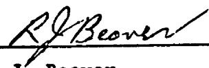

R. J. Beaver  
QAC-Materials

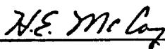

H. E. McCoy, Manager Molten Salt Reactor Materials Program

HEM:kd

Att.

cc: J. R. Engel, w/o att.

D. R. Frizzell, w/att.

R. H. Guymon, w/o att.

W. R. Huntley, w/o att.

B. McNabb, w/o att.

C. A. Mills, w/att.

T. K. Roche, w/o att.

J. R. Weir, w/att.

C. H. Wödtke, w/o att.

Internal Distribution   

<table><tr><td>1.</td><td>R. F. Apple</td><td>32.</td><td>J. R. Keiser</td></tr><tr><td>2.</td><td>C. R. Brinkman</td><td>33.</td><td>A. D. Kelmers</td></tr><tr><td>3.</td><td>W. D. Burch</td><td>34.</td><td>C. J. McHargue</td></tr><tr><td>4.</td><td>C. J. Claffey</td><td>35.</td><td>R. E. MacPherson</td></tr><tr><td>5.</td><td>W. E. Cooper</td><td>36.</td><td>W. J. McCarthy, Jr.</td></tr><tr><td>6.</td><td>J. M. Corum</td><td>37.</td><td>H. E. McCoy</td></tr><tr><td>7.</td><td>W. B. Cottrell</td><td>38-40.</td><td>L. E. McNeese</td></tr><tr><td>8.</td><td>J. M. Dale</td><td>41.</td><td>R. L. Moore</td></tr><tr><td>9.</td><td>J. H. DeVan</td><td>42.</td><td>H. E. Robertson</td></tr><tr><td>10.</td><td>J. R. Engel</td><td>43.</td><td>T. K. Roche</td></tr><tr><td>11.</td><td>G. G. Fee</td><td>44.</td><td>W. E. Sallee</td></tr><tr><td>12.</td><td>D. E. Ferguson</td><td>45.</td><td>Myrtleen Sheldon</td></tr><tr><td>13.</td><td>L. M. Ferris</td><td>46.</td><td>M. D. Silverman</td></tr><tr><td>14.</td><td>M. H. Fontana</td><td>47.</td><td>A. N. Smith</td></tr><tr><td>15.</td><td>A. P. Fraas</td><td>48.</td><td>I. Spiewak</td></tr><tr><td>16.</td><td>M. J. Goglia</td><td>49.</td><td>J. J. Taylor</td></tr><tr><td>17.</td><td>G. W. Greene</td><td>50.</td><td>J. R. Weir</td></tr><tr><td>18.</td><td>A. G. Grindell</td><td>51.</td><td>G. D. Whitman</td></tr><tr><td>19.</td><td>R. H. Guymon</td><td>52.</td><td>W. J. Wilcox</td></tr><tr><td>20.</td><td>W. O. Harms</td><td>53.</td><td>L. V. Wilson</td></tr><tr><td>21.</td><td>J. R. Hightower, Jr.</td><td>54.</td><td>ORNL Patent Office</td></tr><tr><td>22.</td><td>H. W. Hoffman</td><td>55-56.</td><td>Central Research Library</td></tr><tr><td>23.</td><td>W. R. Huntley</td><td>57.</td><td>Document Reference Section</td></tr><tr><td>24.</td><td>P. R. Kasten</td><td>58-60.</td><td>Laboratory Records Department</td></tr><tr><td></td><td></td><td>61.</td><td>Laboratory Records (RC)</td></tr></table>

External Distribution   

<table><tr><td>62.</td><td>Research and Technical Support Division, ERDA, ORO</td></tr><tr><td>63.</td><td>Director, Reactor Division, ERDA, ORO</td></tr><tr><td>64-65.</td><td>Director, Division of Nuclear Research and Applications, Energy Research and Development Administration, Washington, D.C. 20545</td></tr><tr><td>66-169.</td><td>For distribution as shown in TID-4500 under UC-76, Molten-Salt Reactor Technology</td></tr></table>