# Assessment of the Thorium Fuel Cycle in Power Reactors

P. R. Kasten

F. J. Homan

E. J. Allen

K. J. Notz

D. E. Bartine'

A. R. Olsen

W. L. Carter

R. H. Rainey

E. H. Gift

J. E. Rushton

J. D. Jenkins

M. L. Tobias

A. L. Lotts

OAK RIDGE NATIONAL LABORATORY

CENTRAL RESEARCH LIBRARY

DOCUMENT COLLECTION

LIBRARY LOAN COPY

DO NOT TRANSFER TO ANOTHER PERSON

If you wish someone else to see this

document, send in name with document

and the library will arrange a loan.

#

6

Printed in the United States of America. Available from

the Department of Energy

Technical Information Center

P.O.Box 62,Oak Ridge,Tennessee 37830

Printed Copy A04 Microfiche A01

This report was prepared as an account of work sponsored by an agency of the United States Government. Neither the United States nor any agency thereof, nor any of their employees, makes any warranty, expressed or implied, or assumes any legal liability or responsibility for any third party's use or the results of such use of any information, apparatus, product or process disclosed in this report, or represents that its use by such third party would not infringe privately owned rights.

# OAK RIDGE NATIONAL LABORATORY

OPERATED BY

# UNION CARBIDE CORPORATION

NUCLEAR DIVISION

POST OFFICE BOX X

OAK RIDGE, TENNESSEE 37830

October 3, 1979

To: Recipients of Subject Report

Report No: ORNL-5565 Classification: Unclassified

Author(s): R. W. Swindeman

Subject: Analysis of Creep-Rupture Data for Reference Heat of Type 304 Stainless Steel (25-mm Plate).

The availability notice that appears on the inside front cover of subject report is incorrect. Please replace with the attached notice which has been prepared on self-adhesive gummed stock.

We apologize for your inconvenience.

with

W. N. Drewery, Supervisor

Laboratory Records Department

Information Division

WND:we

Attachment

Contract No. W-7405-eng-26

ASSESSMENT OF THE THORIUM FUEL CYCLE IN POWER REACTORS

P. R. Kasten

Central Management Offices

F. J. Homan

A. L. Lotts

A. R. Olsen

Metals and Ceramics Division

E. J. Allen

J. D. Jenkins

J. E. Rushton

M. L. Tobias

Engineering Technology Division

D. E. Bartine

Neutron Physics Division

W. L. Carter

K. J. Notz

R. H. Rainey

Chemical Technology Division

E. H. Gift

Oak Ridge Gaseous Diffusion Plant

Date Published: January 1977

# CONTENTS

Page Abstract v

Summary . vii Conclusions x Recommendations xii

1. INTRODUCTION 1   
2. PRESENTATION OF REPORT 5   
3. PERFORMANCE OF THORIUM AND URANIUM FUEL CYCLES IN THERMAL REACTORS 8   
4. PERFORMANCE OF THE THORIUM AND URANIUM FUEL CYCLES IN FAST REACTORS 40   
5. CONCLUSIONS AND RECOMMENDATIONS 42

5.1 Conclusions 42   
5.2 Recommendations 44

Appendix A - Physics Considerations A-1   
Appendix B-Thorium Fuel Cycles in LWRs .B-1   
Appendix C-Thorium Fuel Cycles in HTGRs. . . . . . . . . . C-1   
Appendix D-Thorium Fuel Cycle in HwRs (CANDU) . . . . . . . . D-1   
Appendix E-Thorium Fuel Cycle in FBRs. . . . . . . . . . . E-1   
Appendix F - Use of $^{233}\mathrm{U}$ and $^{238}\mathrm{U}$ in Fast Breeder Reactors ("Denatured" Fuel Cycles). . . . . . . . . . . . . . . . . . . . . . . . . . . . . . . . . . . . . . . . . . . . . . . . . . . . . . . . . . . . .   
Appendix G - Ore and Separative Work Requirements in an Integrated Nuclear Economy. . . . . . . . . . . . . . . . . . . . . . . . . . . . . . . . . . . . . . . . . . . . .   
Appendix H - Reprocessing Cost Estimates H-1   
Appendix I - Fabrication and Refabrication Cost Estimates . . . I-1   
Appendix J-Institutional Considerations. J-1   
Appendix K - Studies and Programs Required to "Americanize" the CANDU System. K-1   
Appendix L - Summary of Calculations and Calculational Methods L-1

Page

Appendix M - Qualitative Overview of Recycle Process Status for Various Reactor Systems. M-1

Appendix N - Power Cost and Ore Utilization Summary. N-1

Appendix 0 - Irradiation Performance of Thorium-Containing Fuels 0-1

Appendix P - Comments on Fissile Availability for FBR Economy P-1

Appendix Q- Considerations Regarding Break-Even Breeders . . . . . . . . . . . . . . . . . . . . . . . . . . . . . . . . . . . . . . . . . . . . . . . . . . . . . . . . . . . .

# Abstract

A study was conducted at Oak Ridge National Laboratory to evaluate the role of thorium fuel cycles in power reactors. Three thermal reactor systems were considered: Light Water Reactors (LWRs); High-Temperature Gas-Cooled Reactors (HTGRs); and Heavy Water Reactors (HWRs) of the Canadian Deuterium Uranium Reactor (CANDU) type; most of the effort was on these systems. A summary comparing thorium and uranium fuel cycles in Fast Breeder Reactors (FBRs) was also compiled.

Relative to thermal reactors, the results show that better $\mathrm{U}_{3}\mathrm{O}_{8}$ utilization is possible using thorium fuel cycles than can be achieved with uranium cycles. However, thorium cycle use does not change the need for FBRs so long as significant increases in nuclear power generation are needed for long times. Commercialization of thorium cycles, including recycle, would give added flexibility to the U.S. nuclear industry to deal with any delay in FBR introduction or with commercialization of a low-gain FBR. Further, thorium fuel cycles under certain circumstances can produce lower cost power than uranium cycles, particularly at higher $\mathrm{U}_{3}\mathrm{O}_{8}$ prices. Generally, it appears more desirable economically to recycle plutonium with thorium rather than with uranium in thermal reactors. However, limitations on the amount of available plutonium would significantly limit overall improvements in fuel utilization.

The most direct vehicle in which to take advantage of the improved fuel utilization capabilities of the thorium fuel cycle are LWRs since they will be generating most of the nuclear power during the next two decades. However, the thorium cycle does not appear to compete economically in present LWRs even at uranium prices over $100/lb. Of the thermal reactors and under reference conditions of this study, thorium fueled HTGRs and HWRs have the best fuel utilization performance, while HTGRs offer the best opportunity for economic use of the thorium cycle. HWR(Th)s have about the same fuel utilization characteristics as HTGRs, but at a higher power cost.

In FBRs, thorium or thorium/uranium cycles provide a more negative void coefficient of reactivity than does the uranium cycle; further, mixed cycles provide an alternative fuel in the event that a full recycle plutonium economy is limited. The use of metal fuel provides the best nuclear performance from thorium cycles, and the superior physical properties of thorium metal relative to uranium might lead to an economic FBR with high fuel-utilization characteristics. The use of thorium in FBRs can provide desirable fuel for both thermal and fast reactors while increasing the ratio of thermal-to-fast reactors that can be maintained in an FBR economy.

# SUMMARY

A study is made of the role that thorium fuel cycles can have in power reactors based on present estimates of economic factors, $\mathrm{U}_{3}\mathrm{O}_{8}$ resources, and nuclear power growth scenarios. In doing this, fuelutilization characteristics and power costs are estimated for various reference reactor types, treating both the uranium and the thorium fuel cycles to obtain the relative merits of the different systems. Three thermal reactor types are considered: Light-Water Reactors (LWRs), High-Temperature Gas-Cooled Reactors (HTGRs), and Heavy-Water Reactors (HWRs). For these systems, benefits to be obtained by the introduction of the thorium fuel cycle are evaluated on the basis of the relative energy generation from a given $\mathrm{U}_{3}\mathrm{O}_{8}$ resource and on economic performance as a function of $\mathrm{U}_{3}\mathrm{O}_{8}$ and uranium enrichment costs. Overall economic benefits or penalties were estimated using a $7.5\%$ /year discount factor. A summary of the performance of thorium, uranium, and mixed fuel cycles in Fast Breeder Reactors (FBRs) is also prepared, with both Liquid-Metal Fast Breeder Reactors (LMFBRs) and Gas-Cooled Fast Reactors (GCRFs) being treated.

This study considers that there are no restrictions on either fuel use or on fuel recycle and also determines the relative economic and fuel-utilization performance of the thorium and uranium fuel cycles in the various thermal reactor types. The evaluation criteria are based primarily on economic performance, although $\mathrm{U}_{3}\mathrm{O}_{8}$ utilization is also given importance. In determining economic performance, $\mathrm{U}_{3}\mathrm{O}_{8}$ prices are varied from $25/1b$ to $300/1b$ . On the above bases, the use of the thorium fuel cycle rather than the uranium cycle in thermal reactors results in better $\mathrm{U}_{3}\mathrm{O}_{8}$ utilization and, in some cases, improved economic performance. At the same time, if FBRs are introduced on planned schedules, the use of LWRs and FBRs on the uranium cycle gives better $\mathrm{U}_{3}\mathrm{O}_{8}$ utilization in a growing economy than does the use of the thorium cycle in thermal reactors. However, if FBR introduction is delayed significantly, the use of thorium fuel cycles is advantageous from a fuel-utilization viewpoint.

In the above context, the application of the thorium fuel cycle rather than the uranium cycle is justified on the following bases. In thermal reactors, the thorium fuel cycle permits: (1) more energy to be extracted from $\mathrm{U}_{3}\mathrm{O}_{8}$ , thus providing a contingency position if commercial introduction of the LMFBR is delayed; (2) more economic power generation than that from LWRs (uranium cycle), particularly at higher $\mathrm{U}_{3}\mathrm{O}_{8}$ prices; (3) a decreased burden on FBRs relative to early expansion needs when FBRs are first introduced into the power economy; and (4) a higher ratio of thermal-to-fast reactors in an established FBR power economy. In fast reactors, the thorium or mixed thorium/uranium cycle permits: (1) a more negative void coefficient in the core of the reactor, (2) the use of a "denatured" fuel (one in which uranium containing less than $20\%$ fissile is the initial fissile fuel) in selected reactors, and (3) production of a fuel which has desirable features for both fast and thermal reactors.

The LWR provides the most direct route for application of the thorium fuel cycle; however, the uranium cycle in LWRs is more economic than the thorium cycle for the reference conditions. Further, the estimated impact of the LWR(Th) (with 1980 introduction) in improved fuel utilization is less than that of either the HTGR or HWR (with 1995-2000 introduction); also, use of the thorium cycle in LWRs at an early date impacts the production of Pu for early use in FBRs, while similar use of HTGRs or HWRs at a later date does not.

Of the thermal reactors investigated, and for the reference evaluation conditions, only the HTGR is more economic with the thorium cycle than with the uranium cycle at present nuclear fuel costs. If the uncertainties regarding commercial introduction of the HTGR in the U.S. can be resolved favorably, then the HTGR appears to offer the best combination of economics and fuel utilization performance with the thorium fuel cycle. While HTGRs probably cannot be commercialized in time to put these advantages to wide use before about 1995-2000, their impact on improving fuel utilization can still be significant. The HWR is the next best system for thorium application, having about the same fuel utilization characteristics as the HTGR but higher power costs; again, this reactor type is less commercialized in the U.S. than the LWR. In fast reactors, thorium or mixed fuel cycles in

LMFBRs appears attractive for obtaining improved void coefficients of reactivity, for use if metallic fuels are practical, and for use if "denatured" fuel cycles are mandatory.

The practical application of the thorium fuel cycle requires the development of fuel recycle capability. In particular, the lack of thorium fuel recycle capability has severe economic impacts on LWR(Th)s and HWR(Th)s. While much technology already exists upon which future work can be based with regard to fuel recycle development, considerable effort is still needed relative to providing a practical demonstration of recycle technology. Demonstration of recycle fuel irradiation performance is also needed.

With regard to the application of plutonium fueling in thermal reactors, Pu/Th appears economically attractive relative to $\mathrm{Pu} / ^{238}\mathrm{U}$ ; further, Pu/Th appears economically preferable to $^{235}\mathrm{U} / \mathrm{Th}$ fueling if Pu costs are those associated with recovery from LWR fuel. At the same time, the concentration of fissile plutonium in fuel discharged from natural-uranium HwRs appears to be too low to be economically recovered; use of an enriched uranium cycle in HwRs changes that situation. Overall, while Pu/Th fueling in thermal reactors appears economically desirable, such fueling has only a small influence on improving fuel-utilization performance, because of limited Pu availability. The primary justification for Pu/Th use is an economic one and dependent on Pu price.

Specific unit costs are estimated for fuel fabrication, reprocessing, refabrication, and associated operations; these are utilized with estimates of capital costs and operating and maintenance costs to give power costs. For $\mathrm{U}_{3}\mathrm{O}_{8}$ prices less than approximately $40/lb, the lowest power costs for thermal reactors are generally calculated when no fuel recycle takes place, considering all fuel cycles. However, increasing the $\mathrm{U}_{3}\mathrm{O}_{8}$ price makes fuel recycle the most economic option, and its application increases the energy extraction from a given $\mathrm{U}_{3}\mathrm{O}_{8}$ resource.

For estimated reactor growth scenarios, thorium cycle use in LWRs (CR ~ 0.7) provides 12 to $16\%$ more energy, while HTGRs or HWRs (with a CR ~ 0.8) provides about 20 to $50\%$ more energy, based on thorium reactors being introduced commercially on a large scale about 1995-2000. The increase can be larger if a conversion ratio of 0.9 is employed, and much larger if break-even breeders are utilized; however, in the HWRs

and HTGRs examined, such high conversion ratios generally lead to substantially increased fuel inventories as well as high fuel recycle costs, so that the associated economic performance is unattractive. Overall, for the reference conditions, economic benefits relative to LWR(U)s with Pu recycle (and discounted at 7.5%/yr) are greatest for HTGRs; based on HTGR capital costs being equal to LWR capital costs, $U_{3}O_{8}$ prices of \ $100/lb, \(U_{3}O_{8}$ resources of 2.5-3.5 million tons, and an HTGR conversion ratio of $\sim 0.8$ , benefits are \\)6.4-21.6 billion. Corresponding benefits are \$1-3.8 billion for HWRs; a penalty is associated with use of LWR(Th)s. Also, the discounted capital investment in separations facilities appears significantly less for LWRs and HTGRs than for HWRs. The above HTGR benefits do not take into consideration the cost of developing commercial HTGRs. Estimating the cost of developing HTGRs at \\)2 billion (undiscounted), an increase in HTGR capital costs of \ $95-115/kW(e) cancels the benefits stated above. If costs for developing HWR(Th)s are \$ 0.5 billion (undiscounted), an increase in HWR(Th) capital costs of \\(13-18 kW(e) cancels the HWR(Th) benefits stated above.

# Conclusions

1. Developing of the thorium fuel cycle is justified on the bases of better $\mathrm{U}_{3}\mathrm{O}_{8}$ utilization, improved potential for long-term economics, and additional flexibility with regard to fuel recycle alternatives. Thus, introduction of the thorium fuel cycle provides additional power generation capability in case of delayed introduction of commercial FBRs, or in case there is introduction of a low-gain FBR on the reference schedule.   
2. Use of LWR(Th)s rather than LWR(U)s will increase the amount of energy generated from a given $\mathsf{U}_3\mathsf{O}_8$ resource by about $20\%$ above the reference value, considering substitution of thoria for urania in present type LWR designs. Use of LWR(Th)s beginning in 1995-2000 increases the energy generation from specified $\mathsf{U}_3\mathsf{O}_8$ resources by $12 - 16\%$ relative to complete use of LWR(U)s. However, LWR(Th) systems do not appear economic compared to LWR(U) systems based on present commercial reactor designs even when the $\mathsf{U}_3\mathsf{O}_8$ price is $100/1b or more.

3. If the uncertainties regarding commercial introduction of the HTGR in the U.S. can be resolved favorably, then the HTGR appears to offer the best combination of economics and fuel utilization with the thorium fuel cycle. Further, possible future increases in thermal efficiency through application of combined cycle HTGRs significantly increases economic and fuel utilization potential.   
4. The HWR(Th) system appears better suited than the LWR(Th) system for attaining high conversion ratios. However, the capital component of the HWR power cost appears at least as high as that of LWRs, exclusive of the HWR requirement for heavy water, such that total power costs of HWRs appear higher than that of LWRs for U3O8 prices less than ~$50/lb. A decrease in HWR capital costs appears important to HWR application in the U.S. At $100/lb U3O8, the HWR(Th) system is more economic than either the LWR(Th) or LWR(U) systems.   
5. The use of HTGRs and HWRs with conversion ratios in the 0.8 to 0.9 range increases energy generation from a given $\mathrm{U}_{3} \mathrm{O}_{8}$ resource by 20 to $64\%$ , considering the introduction of these reactors by 1995-2000. (Power growth scenarios utilized in estimating the above considered nuclear power levels to rise to 400 to 600 GW(e) by the year 2000.)   
6. Operation of thermal reactors on Pu/Th fueling appears to be economically attractive when Pu is recovered from LWRs or enriched-uranium HWRs. However, the use of Pu/Th fueling does not have a large impact on fuel-utilization characteristics because of limited Pu availability. Further, the use of Pu in this manner does not permit Pu to be available for startup of FBRs. The Pu needs of FBRs under reference introduction and growth scenarios are such that reserving Pu for FBRs precludes large-scale use of Pu/Th fuel cycles.   
7. The economic application of the thorium cycle in thermal reactors generally requires the establishment of a fuel recycle industry, particularly for LWRs and HWRs (fuel recycle is also required for utilizing product Pu and uranium from the uranium cycle). Without fuel recycle, the thorium cycle can be used most effectively in HTGRs; however, recycle in HTGRs is desirable to increase fuel-utilization performance, and is also economically desirable when $\mathrm{U}_{3}\mathrm{O}_{8}$ costs rise above about $40/lb for the reference conditions of this study.

8. Converter reactor operation with conversion ratios above about 0.9 does not appear economical; the high fuel recycle costs associated with low fuel burnups and the high fissile inventory requirements outweigh the improvement in fuel utilization achieved.   
9. The discounted economic benefits from thorium cycle use in the various reference-type reactors, and relative to LWR(U)s with Pu recycle, vary from $1-3.8 billion for HwRs, and from $6.4-21.6 billion for HTGRs, based on capital charge equality for LWRs, HTGRs and HwRS, economic conversion ratios, estimated power growth scenarios, thorium reactor introduction by 1995-2000, a U₃O₈ price of $100/lb, and U₃O₈ resources of 2.5-3.5 million tons. The use of thorium cycles in reference LWRs does not appear economic relative to use of LWR(U)s.   
10. The HTGR economic benefits given in (9) above are cancelled if the unit capital costs of HTGRs are increased by $95-115/kW(e) above those for LWRs; similarly, the HwR economic benefits are cancelled if the relative HwR capital costs are increased by $13-18/kW(e).   
11. Although the nuclear performance of the thorium fuel cycle in FBRs is generally not as good as the uranium cycle, use of mixed cycles in FBRs may be satisfactory and/or desirable. Also, use of metallic fuels might be possible with thorium while not with uranium because of the superior properties of thorium-based metal relative to uranium alloys. Use of metallic thorium fuel improves the performance of the thorium fuel cycle relative to use of oxide fuel; however, safety considerations may influence the use of metallic fuel.   
12. From a safeguards viewpoint, developing a mixed uranium/thorium fuel cycle permits a "denaturing" of recycle fissile fuels, since $^{233}\mathrm{U}$ can be diluted with $^{238}\mathrm{U}$ . This flexibility could be important if fuel feed to certain FBR power stations were limited to $\sim 20\%$ enriched uranium.

# Recommendations

Strong support should be given to the thorium-cycle HTGR as the best contingency reactor in case there is a significant delay in the introduction of LMFBRs. The emphasis should be placed on commercializing HTGRs and introducing them on a time schedule such that they can capture a large share of the nuclear power market by 1995-2000.

In addition to the above, continued studies and evaluations should be carried out on the LWR(Th) and HWR(Th) systems. Since LWRs are the most direct vehicle for thorium utilization, LWR(Th) systems should be studied more thoroughly to be sure the conclusions of this limited study are valid. Such studies should also evaluate LWR designs based on a more advanced technology; in the later case, care must be taken to consider the influence of licensing requirements on design. Relative to heavy water reactors, HWR(Th)s should be considered for commercial introduction into the U.S. as a backup to the HTGR. Associated effort should include an evaluation of the costs and schedules for commercial introduction and licensing of HWRs, of the capital investments required for $\mathrm{D}_2\mathrm{O}$ separation plants, and an assessment of all costs not expected to be borne by industry.

Finally, it should be noted that the above considers no limitations on fuel use or on fuel recycle other than those associated with economic/technical factors. If limitations on fuel recycle are imposed upon the nuclear industry because of safeguards considerations, the use of thorium/uranium mixed cycles in FBRs may be necessary to have a breeder economy, and could have implications on thermal reactor fuel cycles. This situation was examined only peripherally in this report; based on the results obtained, it is recommended that thorium/uranium fuel cycles in FBRs be studied in detail, along with their possible interactions with thermal reactors.

# 1. INTRODUCTION

This report provides the results of a concentrated effort over a two-month period to assess the relative economic and fuel-utilization performance of thorium and uranium fuel cycles in various reactor types. Under the limited time conditions of this study, it was not possible to go into the detail that would be desirable. Further, we were dependent primarily on information which was quickly available to us, such as that from specific organizations performing work on the concepts of interest and from open literature publications and meeting presentations. With regard to LWRs, relatively little detailed information regarding the performance of the thorium fuel cycle was initially available; reactor physics information utilized was largely obtained from the open literature, along with results of independent calculations at ORNL; information was also obtained from General Electric (ERDA-sponsored study) and from Combustion Engineering (EPRI-sponsored study). In general, much of the open literature information on thorium cycles in LWRs appears inconsistent and optimistic with regard to use of the thorium cycle. The calculations we performed were generally consistent with the Combustion Engineering results and provided the basis for our evaluation of the thorium fuel cycle in LWRs. At the same time, the detailed analyses performed by GE indicate that the economic use of Pu with thorium in LWRs is much more complicated than presented by the relatively simple calculations utilized in this brief study; such aspects were not considered in this report.

The HWR(Th) and CANDU results are largely based on studies performed by Canada, as reported by Argonne National Laboratory. Because of their interest, Canada has studied a wide number of uranium and thorium fuel cycle cases; as a result, this particular reactor type was studied in considerable detail relative to the comparative performance of thorium and uranium fuel cycles.

For the HTGR, results obtained by General Atomic were utilized. ORNL has been involved in HTGR development for many years and is quite familiar with this concept and its performance; only those cases and parameter values which were felt to be significant in evaluating the concept were

presented. No comparison is given between the thorium and uranium fuel cycles for this reactor type, since with fuel recycle (the case of interest in this study), the thorium cycle is preferred from both economic and fuel utilization viewpoints.

Relative to FBRs, general information is based primarily upon open literature publications; in addition, some detailed, specific calculations relating to the relative performance of thorium and uranium fuel cycles in FBRs (LMFBRs and GCFRs) were carried out, with emphasis on the use of fissile uranium of less than $20\%$ enrichment.

One of the important items influencing the calculated performance of a given reactor type is the reactor physics analysis of the core. It should be noted that not all of the reactor physics information used here appears to be of the same quality. Specifically, we have confidence that the results presented for the physics performance of the HTGR are of high quality and are fair representations of what can be expected experimentally. We have less confidence in the reactor physics data given for the high-conversion-ratio HWR(Th) systems and believe that the fissile fuel inventories tend to be low at the high conversion ratios. With regard to the LWR(Th)s, our confidence in the results was not great during the first part of this study, with the stated performance considered to be optimistic. Since that time we have modified our results, and more recently we have obtained detailed information from Combustion Engineering on their comprehensive study of thorium use in pressurized water reactors; that information largely confirms the results given in the present report.

The reactor plant capital costs, operating and maintenance costs, and associated economic bases used in this study are based on what we believe to be consistent relative values for developed industries, based on evaluations by others. The estimates of fuel fabrication, refabrication, and reprocessing costs were based on consistent evaluations which we performed during this study, considering specific flowsheets, processes, and equipment. The resulting economic factors are termed the "reference" values employed in this study, and on which

the results are based. At the same time, based on past experience, such reference cost estimates could have significant uncertainties. The influence of uncertainties in relative costs on the results were not treated in detail, but a few specific cases were treated.

This report initially contained an evaluation of the Light Water Breeder Reactor (LWBR) and its prebreeders; however, the LWBR design available to us did not represent the most recent design concept. As a result, ERDA-DNRA requested that the LWBR not be included at this time; they plan to evaluate the updated LWBR design at a future time. Also, the report does not consider molten-salt reactors. Further, relative to the reactors treated, only "reference-type" designs were considered in obtaining the results since these designs have passed through the licensing process. While designs other than reference can be considered, a much more detailed study would be required, since safety considerations would also have to be treated in detail. Specifically, LWRs could be redesigned to give improved nuclear performance at the expense of safety margin or by depending upon advances in heat transfer and fluid flow technology. Such designs were not considered, and no specific conclusions are reached concerning their economic and fuel-utilization performance.

An initial draft version of this report was widely distributed during July and August of 1976 to obtain review comments concerning this study. The responses obtained have been most helpful and were carefully considered during the preparation of the present report. As a result, a number of small technical changes were made; additional discussions have been provided to make the intent of certain sections more clear, and there have been changes in the overall presentation to make the report more readable.

We believe this study to be a significant initial effort with meaningful overall results on which future work can be based; at the same time, there are considerable uncertainties in important economic and parameter estimates and in certain "ground rules." For example, this study generally assumed that there are no restrictions on fuel use

or on fuel recycle other than those dictated by technical and economic considerations. Changing that ground rule would drastically alter the interaction of fuel cycles. Thus, there is a continuing need to factor in new information as it develops relative to the evaluation of the role of thorium fuel cycles in power reactors.

# 2. PRESENTATION OF REPORT

Because of the diverse nature of this study and the limited time period during which most of the information was developed, compiled, and written, various topics were treated separately, and these are presented in the appendices. The report proper makes use of the general results obtained in the separate studies, although additional evaluations were also performed. In general, the material in the appendices gives more detailed information concerning the specific subject matter. At the same time, because the evaluation approaches utilized in the various appendices are not always the same, differences in detail exist between the report proper and certain appendices. Sections 3 and 4 below provide the final evaluations.

The attached appendices provide an information resource concerning various aspects of this study; a brief description of their content is given below.

Appendix A summarizes the reactor physics aspects of thorium fuels in both thermal and fast neutron spectra. The purpose of this appendix is to provide perspective relative to the reactor physics features associated with the use of various fuels in power reactors, since these features influence the desirability and practicality of thorium fuel cycles.

Appendices B, C, and D describe detailed studies performed on thorium fuel cycles in LWRs, HTGRs, and HWRs. The results in Appendix B are largely based on open literature publications in conjunction with additional information obtained from various sources; both uranium and thorium fuel cycles were treated. It was difficult to get a consistent evaluation of the thorium fuel cycle based on the open literature publications; Appendix B compares the various results and places them in perspective. Appendix C summarizes thorium fuel cycles in HTGRs and the variation in performance associated with various core design features. Results were largely obtained from General Atomic. Appendix C also treats the operation of HTGRs as near-breeders, considering prismatic and pebble-bed type fuel elements. Appendix D summarizes the performance of thorium

fuel cycles in HWRs of the CANDU reactor type, based largely on Canadian designs. The information in Appendix D determined that the optimum conversion ratio for the plutonium/thorium fueled concept is about 0.9, while the optimum conversion ratio for the $^{235}\mathrm{U} / \mathrm{Th}$ fueled concept is about 0.8.

Appendices E and F concern fast breeder reactors; Appendix E summarizes open literature information on the thorium and uranium fuel cycles in FBRs. Appendix F provides results on specific calculations performed relative to the use of $^{233}\mathrm{U} / ^{238}\mathrm{U}$ in FBRs to examine the feasibility of using uranium containing less than $20\%$ fissile material in LMFBRs or GCFRs.

Appendix G illustrates ore and separative-work requirements in an integrated nuclear economy based on estimated reactor parameters and specified nuclear power growths.

Estimates of the cost of fuel recycle are given in Appendices H and I. These estimates are based on specific flowsheets, on equipment requirements, and on operating requirements, with special emphasis on consistency. The unit costs for reprocessing various reactor fuels are given in Appendix H, along with unit costs for fuel shipping and waste storage. Similarly, Appendix I provides unit cost estimates for fuel fabrication and refabrication. Appendix M gives a qualitative overview of the fuel recycle process technology required for the various reactor systems, and also estimates the sequential fuel recycle development costs for the various reactor types.

Appendix J gives a brief discussion of some of the institutional considerations associated with the introduction of the thorium fuel cycle into the nuclear economy; Appendix K summarizes some of the studies and programs required to "Americanize" the CANDU systems. This latter appendix considers only R&D requirements and does not include demonstration programs or those programs that might be required as a result of licensing studies.

Appendix N summarizes the power costs and ore-utilization performance of the various thermal reactors, based on information given in Appendices B, C, and D, and utilizing the calculational methods summarized in Appendix L. Not all the economic parameters used in this appendix are the same as given in Sections 3 and 4 below.

Appendices O, P, and Q give useful additional information in areas related to this study. Appendix O summarizes the irradiation performance of thorium-containing fuels for the various reactor types. Appendix P considers fissile availability in an FBR economy based on a specific power growth rate in which LWRs are utilized initially. The influence of HTGR use is also considered. Appendix Q gives an analysis of the HTGR while operating as a near- or break-even breeder.

The relative performance of the thorium and uranium cycles in thermal and fast reactors are evaluated in Sections 3 and 4 below. For the thermal reactors, the relative fuel-utilization and economic performance of the two fuel cycles are considered for LWRs, HWRs, and HTGRs, considering several power growth scenarios and $\mathrm{U}_{3}\mathrm{O}_{8}$ resources. In evaluating thermal reactors, it is implicit that only the thermal reactor component of a nuclear power industry be considered. So long as fissile material (assumed to be Pu) is stored for later use in FBRs, it will always be possible to initiate an FBR industry which can grow with time. For the fast reactors, nuclear performance is summarized relative to the use of thorium or uranium fuel cycles; in addition, some consideration is given to the use of denatured fuel cycles. Section 5 gives the conclusions and recommendations based on Sections 3 and 4.

# 3. PERFORMANCE OF THORIUM AND URANIUM FUEL CYCLES IN THERMAL REACTORS

In evaluating the role of thorium fuel cycles, important criteria are fuel-utilization and economic performance (including associated economic benefits or penalties). In this section, the various thermal reactors considered are assessed with regard to their relative energy extraction from a given ore resource under various nuclear power growth scenarios, along with associated power costs, and economic benefits or penalties relative to a reference power cost. These evaluations also treat the influence of uranium-ore and separative-work prices on power costs as a function of reactor type and fuel cycle operation. Thermal reactors of the LWR, HWR, and HTGR type and of reference design are considered here.

Two basic nuclear power growth scenarios are considered; in one, power capacity growth is maintained at 15 GW(e)/year up to a level of 450 GW. After the power level reaches 450 GW, it is maintained at that level until it is necessary to reduce the capacity because of limitations in $\mathrm{U}_{3}\mathrm{O}_{8}$ resources. In the second scenario, nuclear power growth occurs at 30 GW/year until the capacity reaches a level of 900 GW(e). The power capacity is maintained at 900 GW(e) until it is necessary to reduce the level because of limitations in $\mathrm{U}_{3}\mathrm{O}_{8}$ resources.

The power growth scenarios are indicated in Figures 1, 2, 3, and 4. In all cases, reference-type LWRs, termed $\mathrm{LWR}_1$ 's, are utilized initially; after a given time, new reactors are built. The new reactors are either $\mathrm{LWR}_2$ 's (same as $\mathrm{LWR}_1$ but identified differently to clarify results), $\mathrm{LWR}(\mathrm{Th})$ 's (LWRs operating on the thorium cycle), HWRs, or HTGRs. For Scenario I given in Fig. 1, $\mathrm{LWR}_1$ 's are installed at a rate of 15 GW(e)/year from 1970 until the year 2000; after that time, they are withdrawn from use as their 30-year lifetime is attained. The $\mathrm{LWR}_1$ 's withdrawn from use are replaced with a second type reactor as indicated above. As shown in Fig. 1, the power capacity is maintained at 450 GW(e) for a period of time, $t_e$ , defined as the time of extension associated with maintaining the power capacity at 450 GW(e). After time $t_e$ , no new reactors are built, and those in use are operated until the end of their 30-year lifetime.

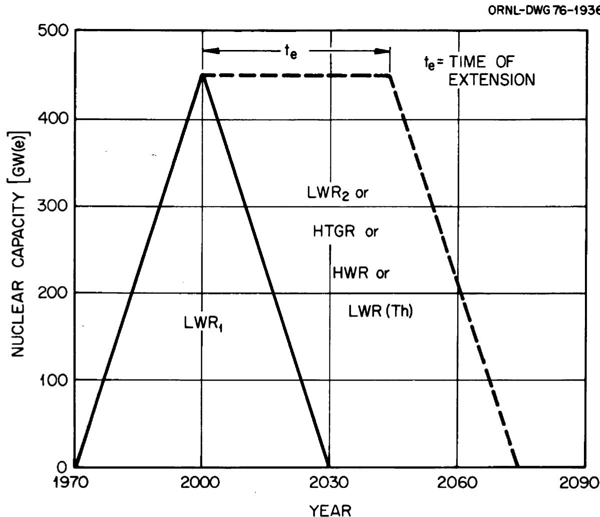  
Fig. 1. Thermal reactor power growth scenario I (Initial growth of 15 GW(e)/year; LWR $_2$ , LWR(Th), HWR, or HTGR introduced in 2000).

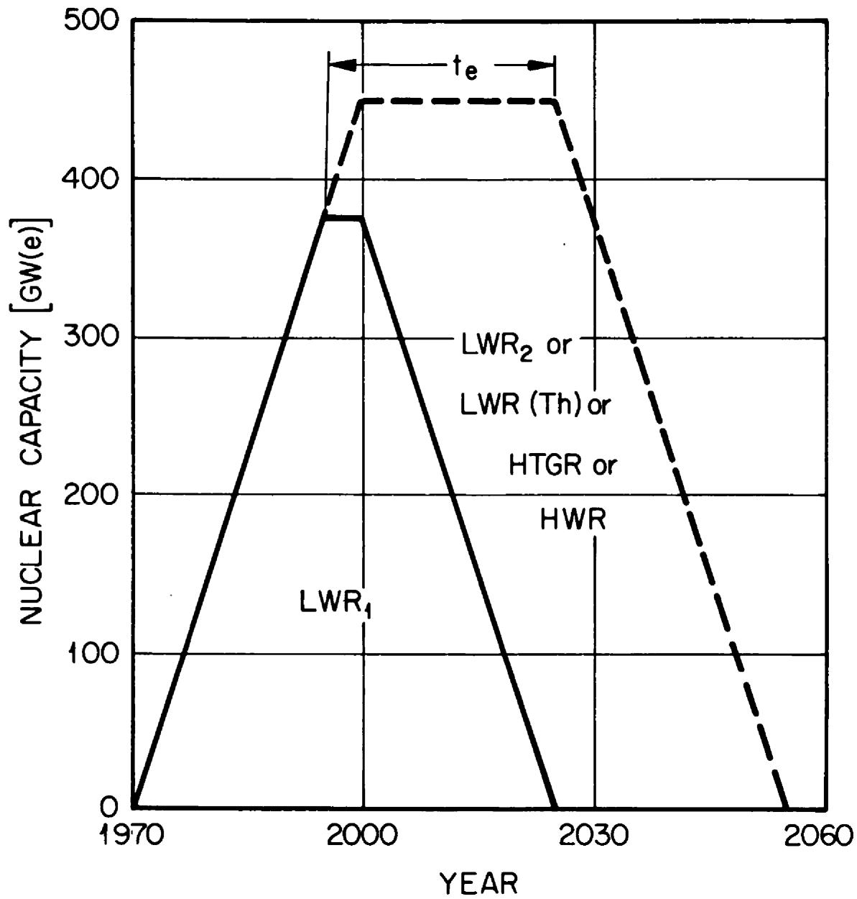  
Fig. 2. Power growth scenario IA (Initial growth of 15 GW(e)/year; LWR $_2$ , LWR(Th), HWR, or HTGR introduced in 1995).

ORNL-DWG 76-19370

ORNL-DWG 76-19371

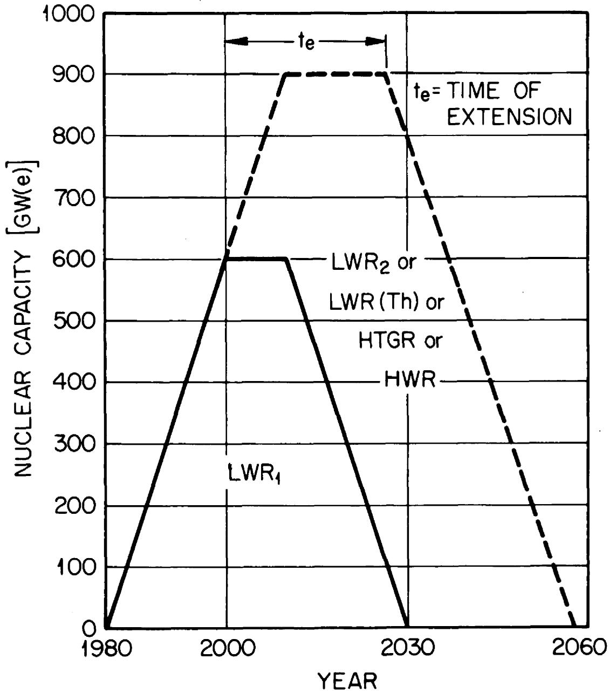  
Fig. 3. Reactor power growth scenario II (Initial power growth of 30 GW(e)/year; LWR $_2$ , LWR(Th), HWR, or HTGR introduced in 2000).

ORNL-DWG 76-19372

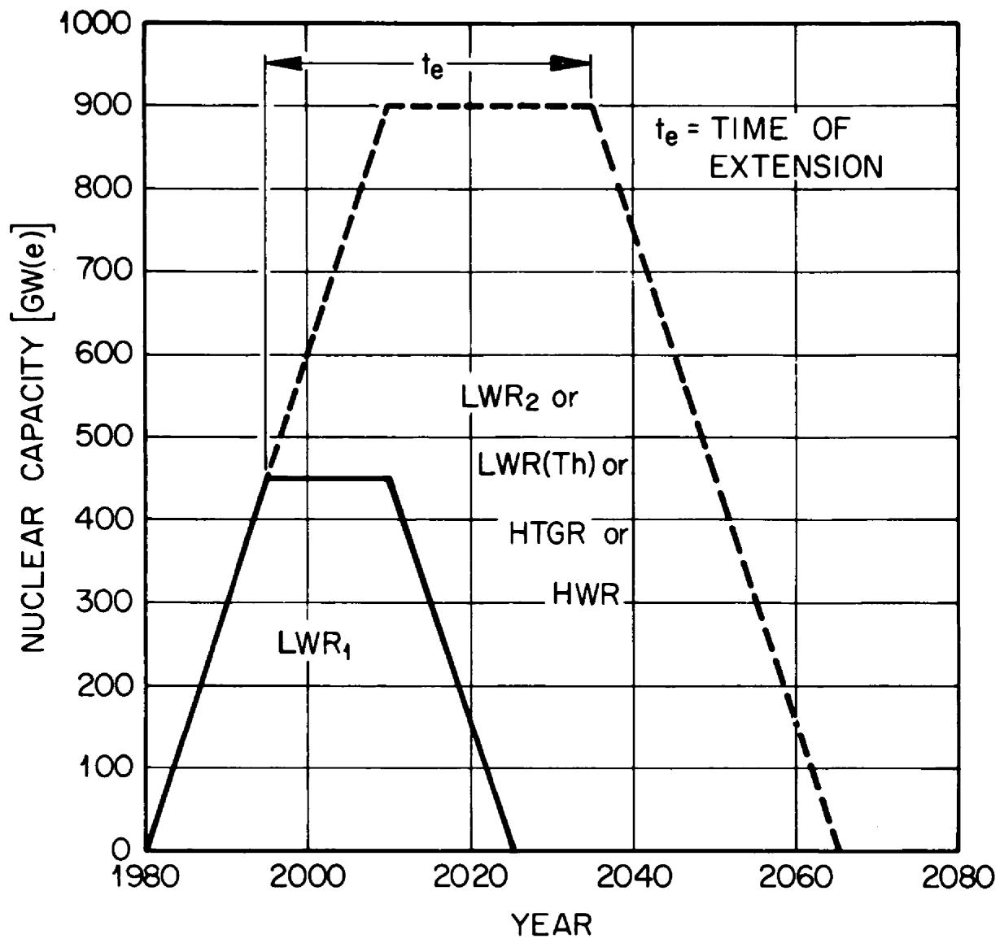  
Fig. 4. Power growth scenario IIA (Initial power growth of 30 GW(e)/year; LWR $_2$ , LWR(Th), HWR, or HTGR introduced in 1995).

A variation in the above power growth scenario, termed Scenario IA, is also considered and shown in Fig. 2. In Scenario IA, $\mathrm{LWR}_1$ 's are installed from 1970 to 1995 at 15 GW(e)/year; no new $\mathrm{LWR}_1$ reactors are built after 1995, and those in operation continue until the end of their 30-year life. Starting in 1995, a second reactor type is built (either $\mathrm{LWR}_2$ , $\mathrm{LWR}(\mathrm{Th})$ , HWR, or HTGR) such that the power capacity increases to 450 GW in the year 2000; the power capacity is then maintained at that level until it is necessary to shut the reactors down because of limitations in $\mathrm{U}_3\mathrm{O}_8$ resources. Again, the time during which new reactors are introduced, including the time the power capacity remains at 450 GW(e), is called $t_e$ (time of extension); $t_e$ is indicated in Fig. 2.

The second type of power growth scenario, termed Scenario II, is shown in Fig. 3. In this specific case, the power capacity increases from zero in 1980, at a rate of 30 GW(e)/year, until a level of 600 GW(e) is reached in the year 2000. The newly constructed LWR1 reactors are operated for 30 years, resulting in the power capacity curve shown for LWR1. Starting in the year 2000, a second reactor is installed at a rate of 30 GW(e)/year, such that the total power level rises to 900 GW(e) by the year 2010. After that time, the power level is maintained at 900 GW(e) until the U3O8 commitment associated with a 30-year reactor life equals the U3O8 resource. The time during which new reactors are installed, along with the time at which the power capacity is maintained at 900 GW(e), is again termed te, the time of extension, and is indicated in Fig. 3.

A variation in the above power growth scenario, termed Scenario IIA, is given in Fig. 4. In Scenario IIA, the time of growth of $\mathrm{LWR}_1$ 's takes place from 1980 to 1995, after which time new reactors are installed. As shown, the maximum power capacity rises to 900 GW(e). Again, $t_e$ designates the time during which new reactors are built and includes the time during which the power capacity remains at 900 GW(e).

The above power growth scenarios, along with the $\mathrm{U}_{3}\mathrm{O}_{8}$ requirements of the various reactors, permits the calculation of the energy that can be generated from a given $\mathrm{U}_{3}\mathrm{O}_{8}$ resource. In calculating the mined $\mathrm{U}_{3}\mathrm{O}_{8}$ needs, the reactor lifetime requirements given in Table 1 are employed.

Table 1. Relative ${\mathrm{U}}_{3}{\mathrm{O}}_{8}$ Needs ${}^{a}$   
[One 1000-Mn(e) Reactor; 21 Full-Power Years, 0.2% Tails]   

<table><tr><td>Reactor</td><td>Fuel Recycle</td><td>U3O8a(Tons)</td></tr><tr><td>LWR</td><td>No</td><td>6010</td></tr><tr><td>LWR</td><td>U only</td><td>4780</td></tr><tr><td>LWR</td><td>U/Pu</td><td>3890</td></tr><tr><td>LWR(Th)</td><td>Yes</td><td>3242</td></tr><tr><td>CANDU</td><td>No</td><td>4650</td></tr><tr><td>CANDU</td><td>Yes</td><td>2710</td></tr><tr><td>HTGR (CR = 0.66)</td><td>No</td><td>4310</td></tr><tr><td>HTGR (CR = 0.66)</td><td>Yes</td><td>2680</td></tr><tr><td>HWR or HTGR (CR = 0.82)</td><td>Yes</td><td>2032</td></tr><tr><td>HWR or HTGR (CR = 0.85)</td><td>Yes</td><td>1925</td></tr><tr><td>HWR or HTGR (CR = 0.90)</td><td>Yes</td><td>1774</td></tr><tr><td>HWR or HTGR (CR = 1.0)</td><td>Yes</td><td>1710</td></tr></table>

$a_{\mathrm{U}_3\mathrm{O}_8}$ requirements include initial core inventory; however, for HWR or HTGR with $\mathrm{CR} = 1$ , the entire fuel cycle inventory is included.

The values in Table 1 are estimated $\mathrm{U}_{3}\mathrm{O}_{8}$ needs associated with one 1000-MW(e) reactor operating for 21 full-power years; also, the concentration of $^{235}\mathrm{U}$ in the "tails" from the enrichment process is taken to be $0.2\%$ $^{235}\mathrm{U}$ . The $\mathrm{U}_{3}\mathrm{O}_{8}$ requirements include the initial core inventory. Although at first it will take more than the initial core inventory because of the inventory associated with fuel fabrication and reprocessing, all the inventory becomes available later as the plants are shut down. However, the availability of that inventory may not always correspond to $\mathrm{U}_{3}\mathrm{O}_{8}$ needs; for reactors with a fuel conversion ratio (CR) less than unity, the core inventory is included to compensate for the possibility that fuel-cycle-inventory availability may not be properly phased with the $\mathrm{U}_{3}\mathrm{O}_{8}$ needs of the remaining plants as nuclear capacity is decreasing.

However, in the case of a break-even breeder, energy can be generated indefinitely. As a result, it is necessary to include the inventory needs of the entire fuel cycle, as is done in Table 1.

Based on the above nuclear power growth scenarios and the lifetime $\mathrm{U}_{3}\mathrm{O}_{8}$ requirements associated with the various reactors, estimates of the relative energy generated by the various reactors are obtained, as well as estimates for $t_{e}$ , the years during which new reactors are being constructed and the power level is being maintained. In obtaining those estimates, it is always assumed that 1200 MT of the fissile Pu generated by $\mathrm{LWR}_{1}$ will be stored and saved for FBR use [this would be the quantity of fissile PU required by FBRs in a power growth economy of 30 GW(e)/year, where the FBRs have a specific inventory of 4 kg fissile/MW(e) and an overall fuel doubling time of 20 years (simple doubling time, including the fuel cycle inventory]. Further, the ore resource considered available for reactor use is either 2.5 million tons $\mathrm{U}_{3}\mathrm{O}_{8}$ or 3.5 million tons $\mathrm{U}_{3}\mathrm{O}_{8}$ .

The results obtained are given in Figs. 5, 6, and 7 for the various power growth scenarios and reactor types. As stated previously, $\mathrm{LWR}_2$ represents a continued construction of $\mathrm{LWR}_1$ , but is specifically identified to clarify the results. As shown in Fig. 5, for power growth Scenario I and a $U_{3}O_{8}$ resource of 2.5 million tons, $\mathrm{LWR}_2$ 's have a $t_e$ of 8.6 years. Further, the energy generated by $\mathrm{LWR}_1$ plus $\mathrm{LWR}_2$ is considered as the reference energy generation based on the use of LWRs (on the uranium fuel cyle) to consume the entire ore resource (except for 1200 tons of fissile Pu which is held in storage for FBRs). On that basis, the relative energy generated by $\mathrm{LWR}_1$ plus $\mathrm{LWR}_2$ is unity, as indicated in Fig. 5. Also shown in Fig. 5 are the results when 3.5 million tons $U_{3}O_{8}$ are considered, as given by the dashed lines. In this latter case, $t_e$ for $\mathrm{LWR}_2$ is 25 years, and again the relative energy generation for $\mathrm{LWR}_1$ plus $\mathrm{LWR}_2$ is unity. The results for the various reactor systems are also shown, with "LWR(Th)" representing LWRs operating on the thorium fuel cycle with recycle of bred fuel.* "HTGR(0.66)" represents a steam-cycle HTGR operating with a fuel

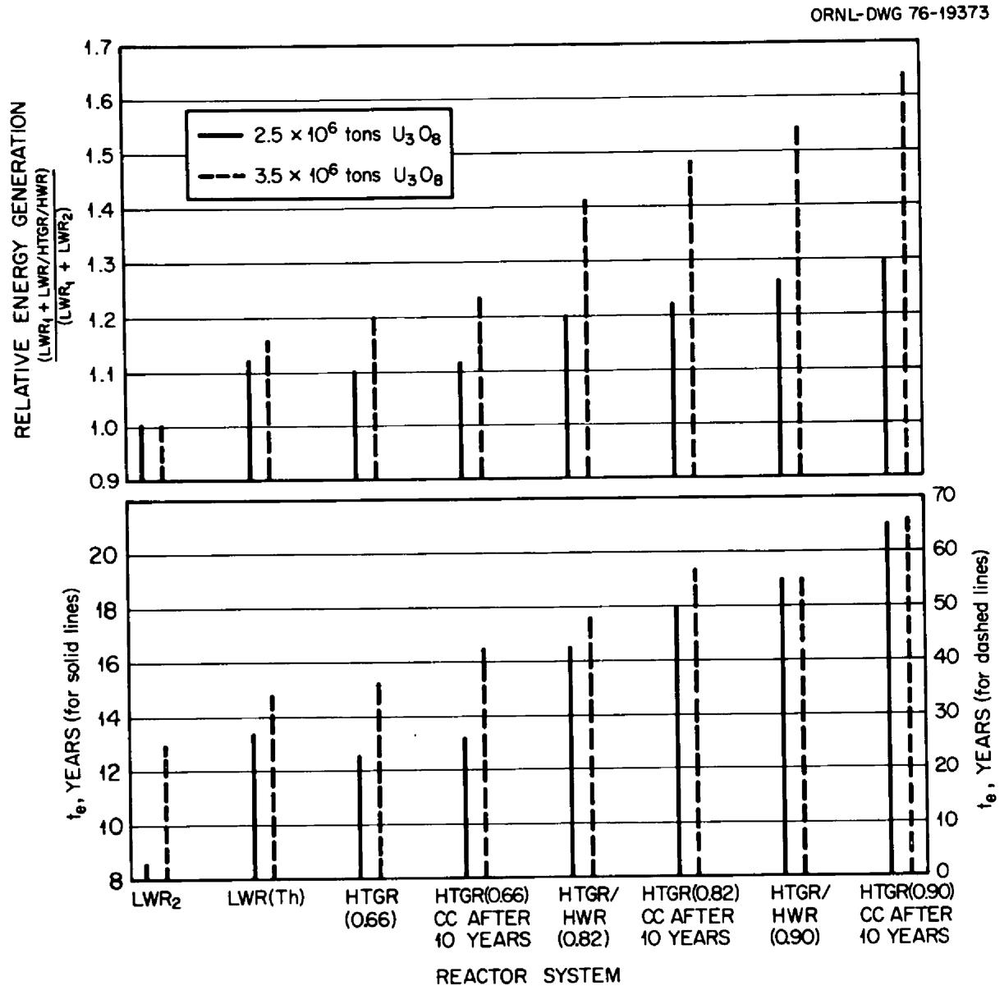  
Fig. 5. Relative energy generation for power growth scenario I (15 GW(e)/year, new reactors in 2000).

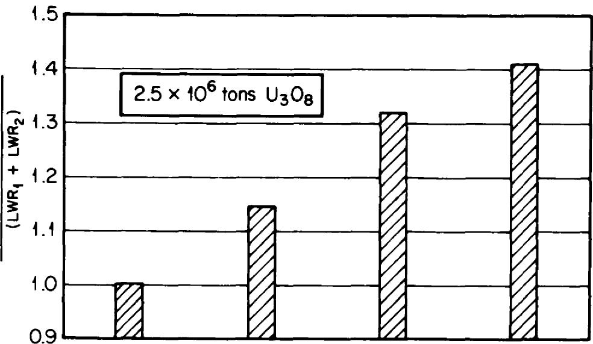  
RELATIVE ENERGY GENERATION   
(LWR + LWR/HTGR/HWR)

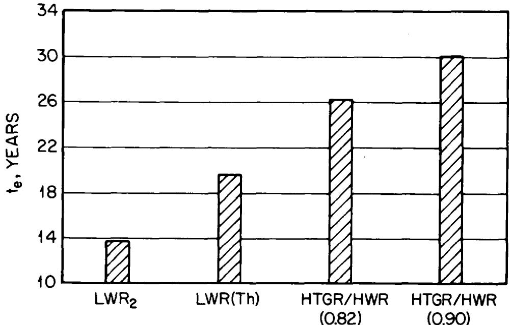  
REACTORSYSTEM   
Fig. 6. Relative energy generation for power growth scenario IA (15 GW(e)/year, new reactors in 1995).

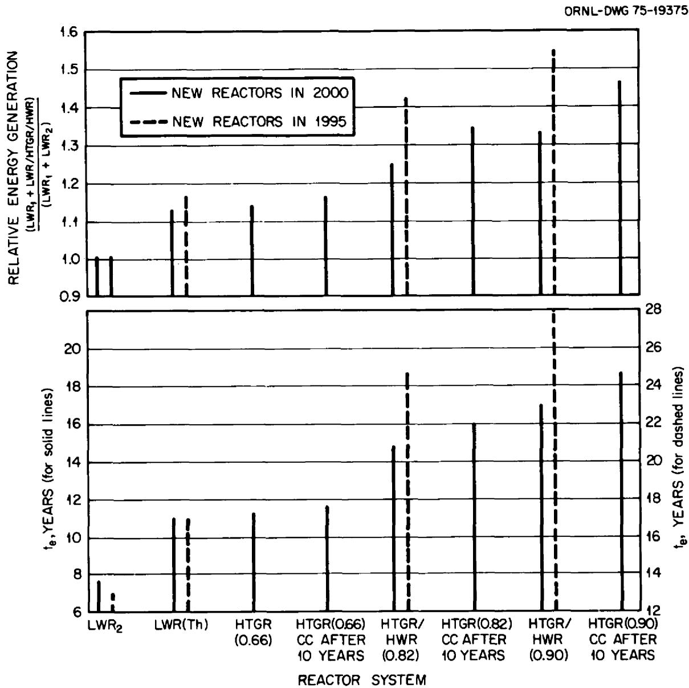  
Fig. 7. Relative energy generation for power growth scenarios II and IIA (30 GW(e)/year; 3.5 x $10^{6}$ tons $\mathrm{U}_{3}\mathrm{O}_{8}$ ).

conversion ratio of 0.66 and with recycle of bred fuel; "HTGR(0.66)-CC after 10 years" represents the use of steam cycle HTGRs initially, with combined cycle HTGRs (which employ gas turbine topping cycle and an ammonia turbine bottoming cycle) utilized for all new reactor construction 10 years after the introduction of HTGRs; "HTGR/HWR(0.82)" represents use of steam-cycle HTGRs or HWRs operating on the thorium cycle, with either reactor type having a fuel conversion ratio of 0.82; "HTGR(0.82)-CC after 10 years" represents HTGRs with a conversion ratio of 0.82 and combined-cycle HTGRs being built 10 years after HTGR introduction; similarly, HTGRs and HWRs with a CR of 0.90 are also considered. The use of combined-cycle HTGRs permits the additional generation of energy because of the higher thermal efficiency of that system (efficiency is estimated to be $48\%$ compared with $39\%$ for the steam cycle HTGR).

The results in Fig. 5 show that the relative energy generation is significantly influenced both by reactor type and by the amount of $\mathrm{U}_{3}\mathrm{O}_{8}$ available for use. Using 2.5 million tons of $\mathrm{U}_{3}\mathrm{O}_{8}$ , about $12\%$ more energy is obtained with LWR(Th)s rather than LWRs after the year 2000; if HTGRs or HWRs with a conversion ratio of 0.82 are employed, the relative energy generation is $20\%$ more than the reference value. If HTGRs with a conversion ratio of 0.9 are utilized, with combined-cycle HTGRs employed 10 years after the introduction of steam-cycle HTGRs, the relative energy generation is about $130\%$ . Alternatively, if the $\mathrm{U}_{3}\mathrm{O}_{8}$ resource is 3.5 million tons, the latter value increases to $165\%$ of the reference value. The times of extension for the various cases are given in Fig. 5 and range from 8.6 to 66 years.

If new reactors are started in 1995 rather than in 2000, different values for $t_e$ and relative energy generation are obtained. Figure 6 gives results for Power Growth Scenario IA (Fig. 2), with 2.5 million tons of $U_3O_8$ being utilized; as shown, the relative energy generation is $114\%$ for the LWR(Th) case, rising to $132\%$ for HWRs or HTGRs with a CR of 0.82 and to $141\%$ for HWRs or HTGRs with a CR of 0.9. Similarly, the

time of extension, $t_e$ , varies from 19.5 to 30 years relative to a value of 13.6 for the reference LWR. Comparing the results from Fig. 6 and Fig. 5 indicates that introducing HwRs or HTGRs with a CR of 0.82 in 1995 instead of 2000 increases the relative energy generation from a value of 120% to 132%.

Figure 7 gives relative energy generation results for Power Growth Scenarios II and IIA (initial growth of 30 GW(e)/year; new reactor types in either 1995 or 2000) for a $U_{3}O_{8}$ resource of 3.5 million tons. With new reactors introduced in the year 2000, the relative energy generation by new reactors gives energy increases of $13\%$ for LWR(Th)s, $25\%$ for either HTGRs or HWRs having a CR of 0.82, and $46\%$ for HTGRs having a CR of 0.9, along with the introduction of combined-cycle HTGRs 10 years after the introduction of steam-cycle HTGRs. The value of $t_e$ increases from 7.6 years for LWRs to 18.6 years for steam-cycle HTGRs. When new reactors are introduced in 1995 instead of 2000, the relative energy generation by new reactors gave energy increases of $16\%$ (instead of $13\%$ ) for LWR(Th)s, $42\%$ (instead of $25\%$ ) for HTGR/HWRs (0.82), and $55\%$ (instead of $33\%$ ) for HTGR/HWRs (0.9). The values of $t_e$ increase from 12.7 years for LWRs to 28 years for HTGR/HWRs (0.9).

In addition to fuel-utilization aspects, it is important to evaluate the economic performance of the various reactor types. This evaluation is accomplished by treating uranium-ore and separative-work prices as parameters for the various reactor types. The calculations performed and cost factors employed are similar to those utilized in Appendix N and are discussed below. The results given present a consistent evaluation of the relative power costs in the various thermal reactor concepts as a function of $U_{3}O_{8}$ costs, separative-work costs, and for consistent estimates of the fuel fabrication, refabrication, and reprocessing costs. The unit recycle costs take into consideration the throughput of the recycle plant associated with a specific reactor concept, with some consideration given to the influence of scale on unit costs as the throughput of the plant is increased. At the same time, the costs of fuel recycle do not include estimates for fuel shipping, storage, and waste treatment, as given in Appendix H. The slightly lower effective recycle costs utilized here (relative to those given in Appendices H and I) give somewhat preferential

treatment to those reactors having relatively low fuel exposures. The fuel cycle cost factors employed are listed in Table 2, which also gives the $\mathrm{U}_{3}\mathrm{O}_{8}$ and separative-work prices that are considered, in addition to the estimated cost of thoria. Specific values for the fabrication of fresh fuel, for reprocessing of fuel, and for the refabrication of recycle fuel are given for the various reactor concepts; these values represent 1976 cost estimates. Effective fuel storage costs used here are also listed. The cost to recover fissile plutonium considers only that cost associated with reprocessing the material. On the above bases, and assuming that the first reactor cycle always pays for fuel storage, the cost of recovering fissile Pu is about $20 / g$ for LWRs and about $\$24$ to $\$50 / g$ for HWRs. The above effectively assumes that the first reactor fuel cycle will "write off" any fuel value of the product Pu.

Other general features of the fuel cycle cost calculations employed in this section are given below. With the CANDU reactor (operating with natural uranium), the fuel is considered to be obtained for fuel fabrication 1/2 year before reactor exposure; in all other reactor concepts, fuel fabrication is considered to require having fuel "on hand" one year before reactor exposure. The time for fuel reprocessing and conversion is considered to require fuel to be "on hand" for one year following reactor exposure, for all reactor concepts. In the case where fuel is stored, the fuel and fabrication "inventory" is written off over the reactor lifetime and an appropriate "inventory factor" is utilized to properly account for those costs over the period of fuel exposure. When fuel is recycled, two basic situations are considered; in one, the first cycle is considered specifically; the second treats all subsequent operations to be on the "equilibrium cycle." For the first cycle, the fuel and fabrication "inventory" is considered to be written off over the lifetime of the fuel; as a result, fuel which is recycled to subsequent cycles has no cost to those cycles other than costs associated with fuel refabrication and reprocessing. As a result, for the equilibrium cycles, the "inventory" charge is only associated with the "makeup" fuel, and with the write-off of working capital associated with fuel fabrication/ refabrication. The average fuel cycle cost is then obtained by averaging

Table 2. Fuel Cycle Cost Factors   

<table><tr><td colspan="4">A. Ore and Separative Work Factors</td></tr><tr><td colspan="2">U3O8, $/lb/SWU, $/kg</td><td colspan="2">ThO2</td></tr><tr><td colspan="2">25/75</td><td colspan="2">$30/kg</td></tr><tr><td colspan="2">40/100</td><td colspan="2">(no recycle considered)</td></tr><tr><td colspan="2">100/150</td><td></td><td></td></tr><tr><td colspan="2">300/200</td><td></td><td></td></tr><tr><td colspan="4">B. Fuel Cycle Cost Parameters, $/kg</td></tr><tr><td>Reactors</td><td>Fuel Fab.</td><td>Fuel Reprocess.</td><td>Fuel Refabrication</td></tr><tr><td>LWR</td><td></td><td></td><td></td></tr><tr><td>U235/U238</td><td>114</td><td>221</td><td rowspan="2">500</td></tr><tr><td>Pu/U</td><td></td><td>221</td></tr><tr><td>U235/Th</td><td>152</td><td>250</td><td>570</td></tr><tr><td>U233/Th</td><td></td><td>250</td><td rowspan="2">510</td></tr><tr><td>Pu/Th</td><td></td><td>260</td></tr><tr><td>HWR</td><td></td><td></td><td></td></tr><tr><td>Natural U</td><td>50</td><td>150</td><td rowspan="3">310</td></tr><tr><td>Enriched U</td><td>80</td><td>160</td></tr><tr><td>Pu/U</td><td></td><td>160</td></tr><tr><td>U235/Th</td><td>100</td><td>210</td><td>390</td></tr><tr><td>U233/Th</td><td></td><td>210</td><td rowspan="2">320</td></tr><tr><td>Pu/Th</td><td></td><td>220</td></tr><tr><td>HTGR</td><td></td><td></td><td></td></tr><tr><td>U235</td><td>400</td><td>750</td><td rowspan="2">1030</td></tr><tr><td>U233/Th</td><td></td><td>750</td></tr><tr><td>U235/U238</td><td>360</td><td>730</td><td rowspan="2">1030</td></tr><tr><td>Pu/Th</td><td></td><td>750</td></tr><tr><td colspan="4">C. Effective Fuel Storage Costs</td></tr><tr><td colspan="2">Reactor Fuel</td><td colspan="2">Storage Costs, $/kg</td></tr><tr><td colspan="2">HWR (natural U)</td><td colspan="2">25</td></tr><tr><td colspan="2">HWR (enriched)</td><td colspan="2">100</td></tr><tr><td colspan="2">LWR</td><td colspan="2">100</td></tr><tr><td colspan="2">HTGR</td><td colspan="2">400</td></tr><tr><td colspan="4">D. Cost to Recover Fissile Pu</td></tr><tr><td colspan="2">LWR</td><td colspan="2">$20/g</td></tr><tr><td colspan="2">HWR</td><td colspan="2">$24-$50/g</td></tr></table>

the fuel costs of the first cycle and the equilibrium cycles on the basis that the reactor lifetime is 30 years and that a discount factor of $7.5\%$ / year applies. Other than the items mentioned above, the general calculation of the fuel cycle costs employed the same methods as described in Appendices N and L.

Table 3 lists the additional power cost factors which are employed here to obtain power costs. As shown, the capital charge rate is $16\%/$ year (however, the capital charge rate relative to fuel cycle working capital is taken to be $15\%/$ year). The heavy water cost is taken to be $\$110/$ kg, and the heavy water inventory of an HwR is considered to be $0.8$ kg/kW(e); heavy water losses from HwRs are taken to be $2\%/$ year. Reactor operating and maintenance costs are taken to be a nominal 2 mills/kWhr(e), which is estimated to be the appropriate value for approximately 1980. The capital cost of LwRs is considered to be the reference basis for capital costs. An LwR unit capital cost of $\$800/$ kW(e) is utilized here and is based on estimates for a plant starting operation in the early 1980s.* The absolute value of the capital cost is not so important in this study as the relative capital costs for the different reactor types. Reasonable changes in the above LwR cost estimate would not have a significant influence on the results of this study so long as relative costs are correct. Thus, the use of capital costs based on reactor operation in 1982-83 and of consistent fuel recycle costs based on construction of recycle plants in 1976 still permits a valid evaluation of thorium and uranium fuel cycles in the different reactors.

The capital cost for an HwR uranium system considers that the unit capital cost of an HwR operating at $80\%$ load factor is the same as that of an LwR operating at $75\%$ load factor. These relative values are in reasonable agreement with the information presented by Argonne National Laboratory in their draft 1976 report on HwRs, and also are consistent with the relative cost information developed for LwRs and HwRs as reported

Table 3. Power Cost Factors   

<table><tr><td colspan="6">Capital Charge Rate: 16%/year (15%/year for fuel cycle) 
D2O Cost: $110/kg 
D2O Inventory: ~ 0.8 kg/kW(e) 
D2O Losses: 2%/year</td></tr><tr><td rowspan="2">Reactor 
Type</td><td colspan="2">Capital Cost</td><td rowspan="2">Load 
factor,%</td><td rowspan="2">O&amp;M 
mills/kWhr(e)</td><td rowspan="2">D2O Cost 
mills/kWhr(e)</td></tr><tr><td>$/kW(e)</td><td>mills/kWhr(e)</td></tr><tr><td>LWR</td><td>800</td><td>19.5</td><td>75</td><td>2.0</td><td></td></tr><tr><td>HWR(U)</td><td>853</td><td>19.5</td><td>80</td><td>2.0</td><td>2.26</td></tr><tr><td>HWR(Th)</td><td>843</td><td>19.3</td><td>80</td><td>2.0</td><td>2.0</td></tr><tr><td>HTGR-SC</td><td>800</td><td>19.5</td><td>75</td><td>2.0</td><td></td></tr><tr><td>HTGR-CC</td><td>720</td><td>17.6</td><td>75</td><td>2.0</td><td></td></tr></table>

in WASH-1087.\* Further, the capital cost of the thorium-fueled HWR relative to the uranium-fueled HwR is somewhat lower due to the slightly tighter lattice spacing that could be used for the thorium cycle system. This difference is also reflected in the heavy water costs for HwR(Th) systems, with the $\mathsf{D}_2\mathsf{O}$ inventory and makeup costs reduced by about $10\%$ relative to those costs for uranium-fueled HwRs.

The relative capital costs of the HTGR are based on recent evaluations by United Engineers and Constructors, $^{\dagger}$ who estimated that the unit capital costs for SC-HTGRs (when developed to the same extent as LWRs) were essentially the same as those for LWRs. The CC-HTGR costs are taken to be $10\%$ less than those of the SC-HTGR costs (the UE&C cost estimate for this system was about $15\%$ less than the SC-HTGR).

The resulting calculated power costs for the various reactor systems are summarized in Figs. 8-11. The calculated costs for the LWR are given in Fig. 8; as shown, results are given for the LWR operating on the uranium cycle with storage of fuel and for the LWR with recycle of uranium and plutonium; the latter case is considered to give the reference power cost against which new systems need to compete. Results are also given for the LWR(Th), initially fueled with thorium and $^{235}\mathrm{U}$ and with recycle of bred $^{233}\mathrm{U}$ .

With regard to the horizontal lines associated with Pu/Th or $\mathrm{Pu} / ^{238}\mathrm{U}$ fueled systems, the term "limited" implies there is a limited amount of Pu which is available. Further, the horizontal lines imply that the power cost is independent of $\mathrm{U}_{3}\mathrm{O}_{8}$ cost. The Pu cost is that cost associated with recovery from the first LWR uranium cycle, with the "fuel value" of the Pu being "written off" over the first cycle. It can be noted in Fig. 8 that the use of Pu with thorium has a power cost about 1.5 mills/kWhr(e) lower than the use of Pu with uranium based on the estimates and calculations employed here.

Recycle Pu can have a value higher than the cost of recovery, particularly if it is recycled soon after discharge from the reactor. However, if the spent fuel is stored after exposure without certainty of recycle, its value should be written off over the fuel exposure. Further, since the uranium cycle in LWRs appears to be able to "write off" exposed fuel economically, acceptance of this procedure encourages fuel recycle and reactor operation at relatively high fuel conversion ratios.

As shown in Fig. 8, use of uranium cycle LWRs with storage of fuel appears to be the most economic option for LWRs up to a \(U_{3}O_{8}\) cost of about \(\$50/\mathrm{lb}\). Above the cost, it appears more economical to recycle uranium and Pu. However, use of LWR(Th)s with recycle of fuel does not appear preferable to the uranium cycle even at high \(U_{3}O_{8}\) costs. Maintaining the cost of separative work constant at \(\$100/\mathrm{kg}\) SWU for \(U_{3}O_{8}\) costs above \(\$40/\mathrm{lb}\) would help the thorium cycle in LWRs. \(U_{3}O_{8}\) costs/SWU costs of \(\$100\) per lb of \(U_{3}O_{8}/\)100 per kg SWU instead of \(\$100/$150, respectively, decreases LWR(Th) costs by about 0.3 mills/kWhr(e) relative to LWR(U) systems; similarly, employing costs of

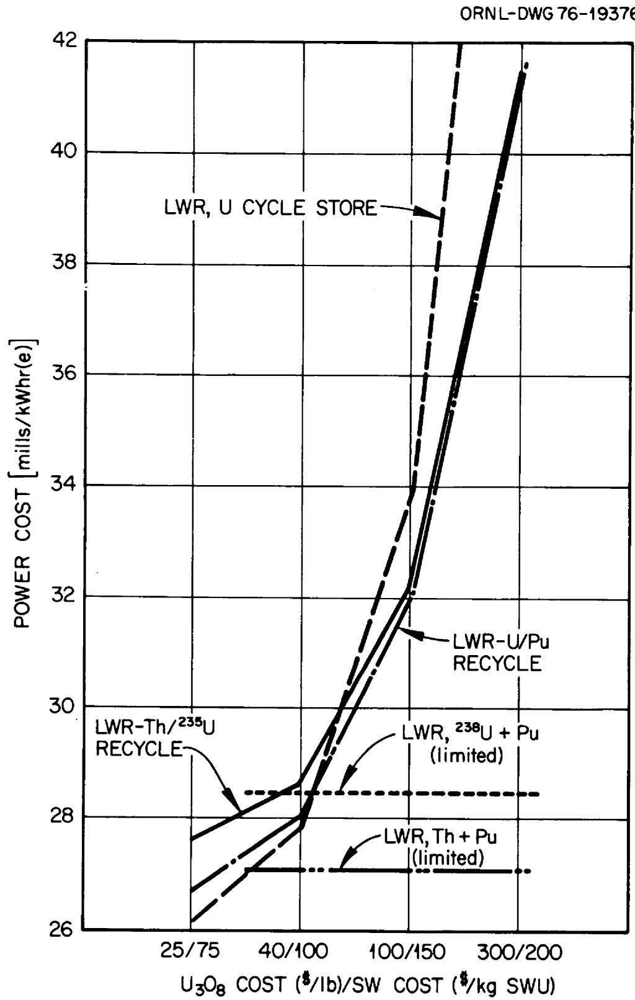  
Fig. 8. LWR power costs.

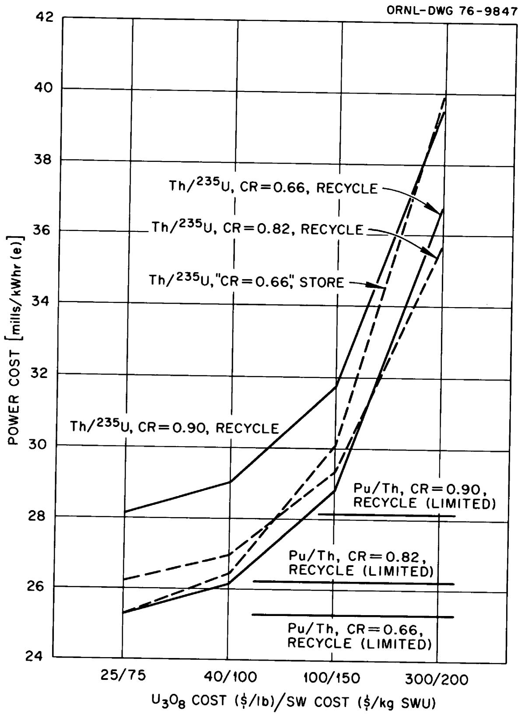  
Fig. 9. HTGR power costs.

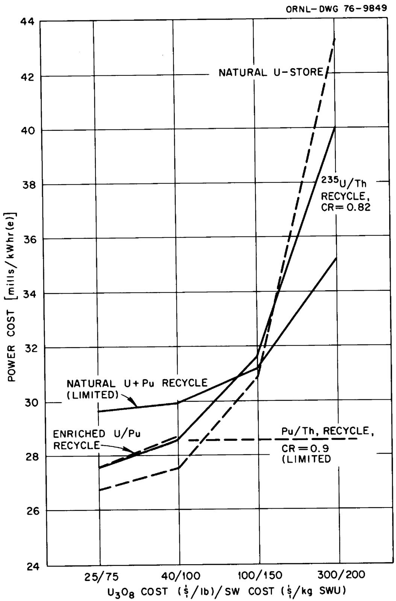  
Fig. 10. HwR power costs.

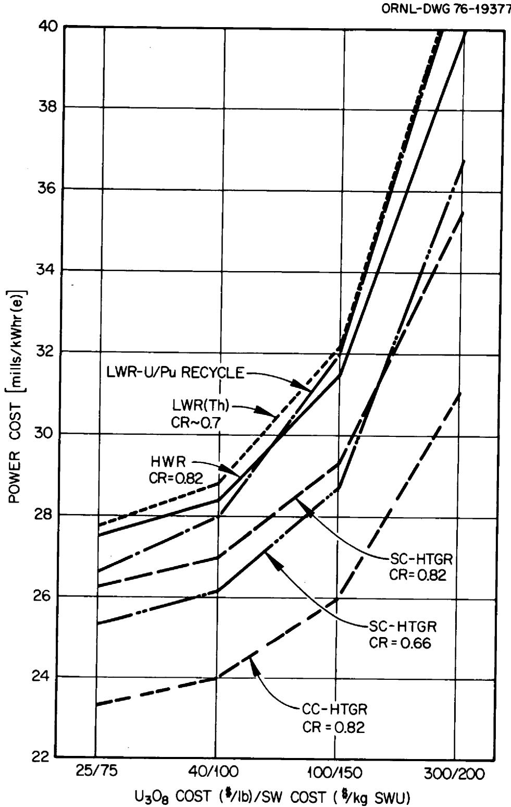  
Fig. 11. Comparative power costs for CC-HTGR(GT) and HTGR, HWR, and LWR.

$300 per lb/$ 100 per kg instead of $\$ 300/$ 200 decreases the relative LWR(Th) costs by about 0.5 mills/kWhr(e). Such changes would make the LWR(Th) cycle more attractive at the higher $\mathrm{U}_{3}\mathrm{O}_{8}$ costs, based on the evaluations given here. [Recent results by Combustion Engineering, however, indicate that the above economic performance for LWR(Th)s relative to LWR(U)s is optimistic.]*

Figure 9 gives estimated power costs for HTGRs as a function of $U_{3}O_{8}$ and separative work costs. Results are generally for the thorium cycle with recycle of the bred $^{233}\mathrm{U}$ ; however, storage of spent fuel is treated for the low CR design. Costs are also given for Pu/Th fueling with recycle of bred $^{233}\mathrm{U}$ for various conversion-ratio designs; in these cases there are a limited number of reactors which can be built because of the limited amount of Pu which is available. The associated costs are shown independent of $U_{3}O_{8}$ cost on the same bases given above for Pu/Th use in LWRs. Because of its limited application, little emphasis is given to the use of Pu, other than pointing out that Pu use with thorium appears economically attractive. Overall, Fig. 9 shows that up to a $U_{3}O_{8}$ price of about $\$40/\mathrm{lb}$ , it is about as economic to store fuel as it is to recycle fuel in the most economic reactor, which has a conversion ratio of about 0.66. (In the case of fuel storage, the CR is less than 0.66; however, in order to identify the specific core design, the term "CR = 0.66" is used.) As the cost of $U_{3}O_{8}$ rises, it becomes important to recycle fuel, and at $\$100/\mathrm{lb}$ for $U_{3}O_{8}$ the cost of power from an HTGR with a CR of about 0.82 is about the same as that from a reactor with a CR of 0.66, based on the estimates and calculations used here. At a CR of 0.9, however, the power cost does not appear as favorable as with a CR of 0.82. At the same time, if low-cost Pu is available, high CR systems appear economically attractive.

Figure 10 gives the estimated HwR power costs. The results indicate that the natural uranium system with fuel storage is the most economic

one up to $U_{3}O_{8}$ prices of about $\$100/1b$ U $3O_8$ . At $U_{3}O_{8}$ prices above about $\$130/1b$ , the thorium cycle with a CR of 0.82 becomes more economic than the natural-uranium cycle with fuel storage. However, use of natural uranium plus Pu, with fuel recycle, is more economic than either of the above cycles at the higher ore prices. (In this case, the number of reactors operating on this cycle are limited by Pu availability.) The use of Pu with Th appears economically attractive at $U_{3}O_{8}$ prices above about $\$60/1b$ in reactors with a CR about 0.9. (Again, the cost is shown to be independent of $U_{3}O_{8}$ price because Pu is considered to be available from the first uranium cycle for only the cost of recovery; the number of reactors which can be operated on this cycle is limited because of limited availability of Pu.)

Pu can also be recycled in HwR uranium cycles; however, recycle of Pu in natural uranium systems is not as economic as the natural-uranium cycle with fuel storage, because of the refabrication penalty associated with adding Pu to all of the fuel. If Pu is to be recycled in uranium systems, it should be employed in conjunction with the enriched uranium cycle, with the Pu utilized in only a fraction of the fuel elements in order to reduce the effective fuel refabrication penalty. As indicated in Fig. 10, use of the latter cycle (enriched U/Pu, recycle) gives power costs about the same as the thorium cycle, with the thorium cycle tending to be lower at $\mathrm{U}_{3}\mathrm{O}_{8}$ prices above about $40/lb.

Figure 11 gives a summary of selected cost information taken from the previous figures so as to place power costs of the various reactor systems in perspective, and in addition shows the economic performance of the combined cycle HTGR (CC-HTGR)* with a CR of 0.82. It can be noted that the CC-HTGR system has significantly lower power costs than the other systems; at the same time, it will take longer to introduce the CC-HTGR commercially than the SC-HTGR.

Figure 12 summarizes power costs of thorium cycles in the different reactors (with fuel recycle) relative to LWRs recycling uranium and Pu.

ORNL-DWG 76-19378

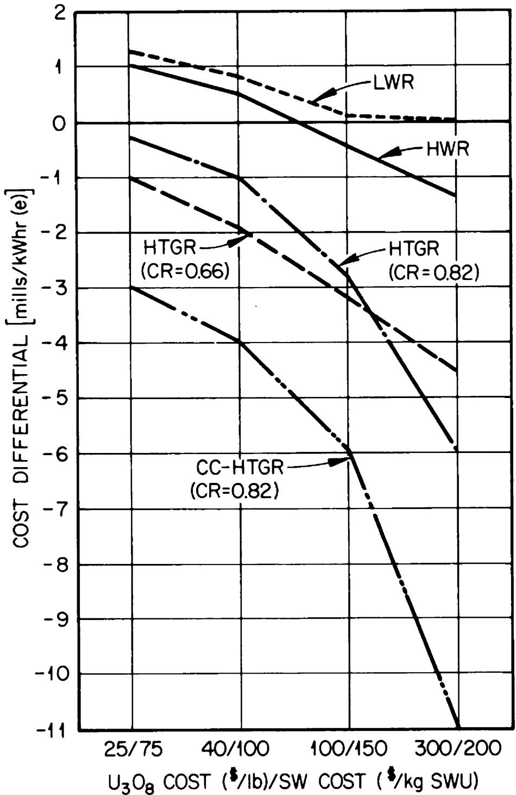  
Fig. 12. Power costs relative to LWR(U/Pu) (Recycle in all cases).

On that basis, the power cost differentials between a given thorium system and the LWR with U/Pu recycle is given as a function of $U_{3}O_{8}$ and separative work costs. The cost differentials given for the differnt systems show that an HwR(Th) system with a CR of 0.82 does not become economical relative to LWRs until $U_{3}O_{8}$ costs exceed about $\$70/\mathrm{lb}$ , and that the economic advantage at $\$100/\mathrm{lb}$ $U_{3}O_{8}$ is only about 0.5 mills/kWhr(e). The LWR(Th) system at a CR of approximately 0.7 does not become economical at any of the $U_{3}O_{8}$ prices considered under the evaluation conditions utilized. HTGRs are the most economical systems shown in Fig. 12, having a power cost advantage relative to LWRs for all $U_{3}O_{8}$ prices employed; at $U_{3}O_{8}$ prices of approximately $\$100/\mathrm{lb}$ , the economic advantage of the steam-cycle HTGR with CRs of 0.66 to 0.82 is about 3 mills/kWhr(e), whereas that of CC-HTGRs is 6 mills/kWhr(e).

Based on the above cost bases, economic factors, and the associated power cost differentials given in Fig. 12, the economic benefits of the various systems can be calculated. In all cases, the benefits are calculated relative to a reference power cost equal to the LWR (U/Pu recycle) system. Figures 13 and 14 give the results of these calculations using a discount factor of $7.5\%$ /year to obtain discounted benefits (back to 1976), with Fig. 13 considering Power Growth Scenarios I and IA, and with Fig. 14 considering Power Growth Scenarios II and IIA. The term "delta" in the above figures refers to the unit power cost of savings associated with the specific system, and is relative to the cost of power from the LWR (U/Pu recycle) system. It is assumed that the reference cost of power always applies, even though the LWR may not always be available; thus, if the reference power source alternative to the LWR were to cost more than that of LWR (U/Pu recycle), the benefits obtained would be higher than those shown. In calculating the discounted benefits of future systems, it is assumed that the price of $\mathrm{U}_3\mathrm{O}_8$ will be $\$100/1b$ at that time, and the relative cost differentials associated with that price are used in calculating the discounted benefits shown in Figs. 13 and 14. The terms used to describe the various reactor systems are those used previously.

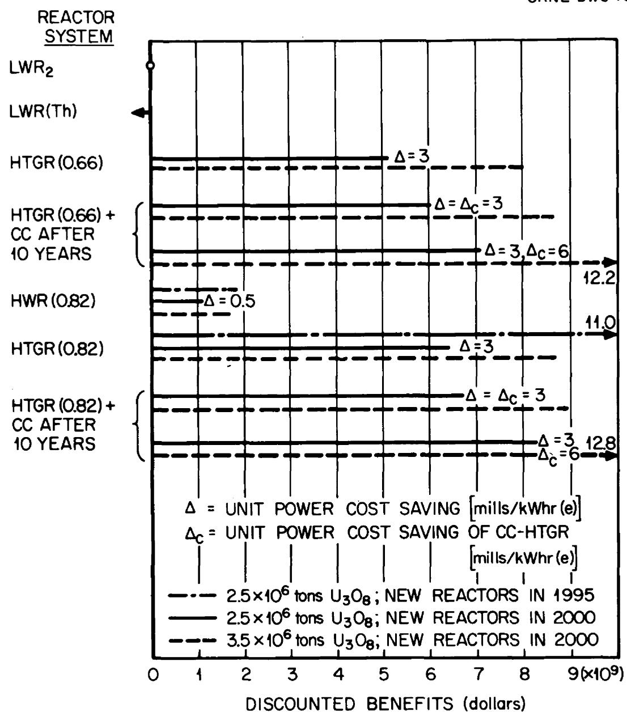  
Fig. 13. Discounted benefits for power growth scenarios I and IA (Initial power growth = 15 GW(e)/year).

ORNL-DWG 76-19379

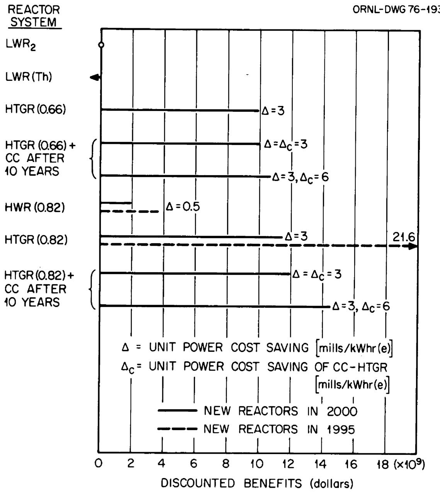  
Fig. 14. Discounted benefits for power growth scenarios II and IIA (Initial power growth = 30 GW(e)/year; U₃O₈ resource = 3.5 x 10⁶ tons).

Figure 13 gives the benefits (discounted to 1976) for Power Growth Scenarios I and IA (see Figs. 1 and 2), where the initial power growth rate is 15 GW(e)/year, and new reactors are introduced in either 1995 or 2000. Since LWR2 in this case is LWR (U/Pu recycle), and provides the reference cost, there are no benefits shown for LWR2. Similarly, since the LWR(Th) system has higher costs than LWR(U) systems, there are no benefits shown for LWR(Th)s. [At the same time, if the cost of separative work is considered to be $100/kg SWU instead of $150/kg, the LWR(Th) benefits are about $1.9 to $2.3 billion for Power Growth Scenario I and for U3O8 resources of 2.5 to 3.5 x 106 tons, based on this study. In obtaining this benefit, all LWRs which are in service in the year 2000 are converted to LWR(Th)s at that time; subsequently, only LWR(Th)s are utilized.]

Similarly, results are given for the other reactor systems. By far the most benefits are obtained with HTGRs, with introduction of SC-HTGRs followed by CC-HTGRs having the most benefits. For HTGRs (CR = 0.82) introduced in 2000, and with a U₃O₈ resource of 2.5 x 10⁶ tons, the benefits are $6.4 billion. If a combined-cycle HTGR is introduced 10 years after introduction of the steam cycle HTGR, and a unit power cost savings of 3 mills/kWhr(e) is applied to all HTGRs, the discounted benefits are $6.7 billion. If, on the other hand, the CC-HTGR had a unit power cost saving of 6 mills/kWhr(e) rather than 3, the discounted benefits are about $8.2 billion. For this latter case, if the U₃O₈ resource is increased to 3.5 million tons, then the discounted benefits increase to $12.8 billion.*

For the HwR with a CR of 0.82, and with new reactors introduced in 2000 and a $U_{3}O_{8}$ resource of $2.5 \times 10^{6}$ tons, the discounted benefits are estimated to be about $1 billion; increasing the $U_{3}O_{8}$ resource to $3.5 \times 10^{6}$ tons increases the benefits to $1.5 billion. Introducing such reactors in 1995 (with a $U_{3}O_{8}$ resource of $2.5 \times 10^{6}$ tons) results in benefits of $1.8 billion.

Figure 14 gives results similar to those in Fig. 13, except Power Growth Scenarios II and IIA are treated (see Figs. 3 and 4), where the initial power growth rate is 30 GW(e)/year, and new reactors are introduced in either 1995 or 2000. In all cases a $U_{3}O_{8}$ resource of 3.5 x $10^{6}$ tons is assumed. The results show no benefits for LWR(Th)s under the reference evaluation conditions. Similarly, HTGRs with a CR of 0.82 show benefits of $11.4 billion for introduction in 2000 and $21.6 billion for introduction in 1995; analogous benefits for HWRs (CR = 0.82) are $1.9 billion and $3.6 billion, respectively. Figure 14 also shows the benefits associated with HTGRs having a CR of 0.66, and with introduction of CC-HTGRs. Overall, HTGRs again show the largest benefits for the evaluated conditions.

The results in Figs. 13 and 14 show that it is important to bring in a new system as early as possible in order to increase the benefits to be obtained from that system (for the scenarios studied, relative benefits increase by about $90\%$ when new reactors are introduced in 1995 rather than in 2000). On the other hand, the results also indicate that the economic benefits from HTGRs introduced in 2000 are significantly greater than the benefits from HWRs or LWR(Th)s introduced in 1995.

Another economic factor to consider is the capital investment for separation facilities required with the various reactor systems. In particular, heavy water separation plants are required for HWRs, while enriched-uranium reactor systems require uranium enrichment facilities. Comparing the separation facility investments for natural-uranium HWRs with those of LWRs and HTGRs indicates there is a higher discounted capital investment required for HWRs than for either LWRs or HTGRs. Specifically, based on estimated relative investments of \(3 billion for a uranium enrichment plant producing \(10^{7}\) kg SWU/year, and of \(\$1\) billion for a heavy water plant producing 1000 MT \(\mathsf{D}_2\mathsf{O}\)/year, and a nuclear power growth rate of 30 GW(e)/year, the discounted capital investment associated with the separations facility (employing a discount factor of \(7.5\%/\) year) is about \(\$12\) billion for HTGRs, about \(\$14\) billion for LWRs (uranium cycle), and about \(\$24\) billion for HWRs (natural uranium). Thus, the HwR requires about \(\$12\) billion more in discounted capital investments for separations facilities than does the HTGR. If the nuclear capacity growth were 15 GW(e)/year, the capital investments would be one-half of those above, in which case the HwR would require \(\$6\) billion more than the HTGR.

Another factor to consider is the development costs associated with introducing a new reactor concept. Developing a commercial HTGR could cost more than developing a commercial HWR(Th) or LWR(Th). Specifically, the anticipated development costs for SC-HTGRs are estimated to be about $1.4 to $1.5 billion* (including about $900 million for fuel recycle development and demonstration), with development of CC-HTGRs costing about $500 million* more when developed with the SC-HTGR. Thus, the total development costs of SC- and CC-HTGRs are estimated to be about $2 billion. The discounted value of the above $2 billion would be about $1.4 billion (at a discount factor of 7.5%/year). Thus, even though there were no development costs associated with HWR(Th) or LWR(Th) systems, the net economic benefits to be obtained with HTGRs for the reference conditions are greater than from either of the other systems. Of course, there are development costs associated with commercializing HWR(Th)s and LWR(Th)s; it is estimated that costs of fuel recycle development plus those of a demonstration fuel recycle facility would be about $600 million or more. An uncertainty in HWR costs also involves in part the uncertainty in design and development required to license HWRs in the U.S.

As shown previously in Figs. 11 and 12, the CC-HTGR has significantly lower power costs than the other systems. This illustrates the economic importance of increasing the thermal efficiency of a given reactor system when doing so does not cause a corresponding increase in plant capital costs, and does not require a new type, more expensive fuel system. At the same time, the benefits for the CC-HTGR relative to the SC-HTGR are dependent upon the discount factor employed and the time of introduction of the reactor systems; the benefits shown in Figs. 13 and 14 are based on introduction of CC-HTGRs 10 years after SC-HTGRs, and a discount factor of $7.5\%$ /year. As a result, the discounted benefits from CC-HTGR use relative to SC-HTGR use are not as large as might be expected from the results given in Fig. 11. Nonetheless, the benefits are still significant, and justify estimated expenditures for CC-HTGR development.

The correct value to use for the discount factor is difficult to determine. In commercial ventures, discount factors greater than $7.5\%$ / year are prevalent. However, for something so basic as the ability to produce energy for long periods of time, values much less than $7.5\%$ / year can be appropriate. While we believe the value used is appropriate for the evaluation performed, it should be recognized that there is significant uncertainty as to the correct value to employ. A value lower than $7.5\%$ / year would give more weight to future benefits than given here, while a higher value would give more weight to near-term benefits.

Although not treated here, increasing the core specific power and/or the mean energy of neutrons causing fission tends to help the relative performance of the thorium cycle in LWRs. The basic questions related to the development of such LWRs concern the permissible safety margins and the associated heat transfer/fluid flow performance. Licensing requirements are thus a key concern for such LWR designs.

# 4. PERFORMANCE OF THE THORIUM AND URANIUM FUEL CYCLES IN FAST REACTORS

This section provides a summary of the performance of thorium, uranium, and mixed fuel cycles in fast breeder reactors (FBRs), with both Liquid-Metal Fast Breeder Reactors (LMFBRs) and Gas-Cooled Fast Reactors (GCFRs) being treated. In these reactors, the use of thorium or thorium/uranium fuel cycles provides a more negative void coefficient of reactivity in the core than does the use of the uranium fuel cycle; since the coolant void coefficient of reactivity is much larger in LMFBRs than in GCFRs, the above effect is more important in LMFBRs. However, the use of the thorium cycle in conjunction with ceramic fuels leads to lower breeding ratios than does the use of the uranium cycle. While oxide fuels based on the thorium cycle have slightly better material and thermal performance properties than similar fuels for the uranium cycle, such differences do not appear significant.

With regard to metallic fuels, the material and irradiation performance properties of thorium-based metal alloys are more suitable to reactor use than are uranium metal alloys. Thus, the use of metallic fuels might be possible with thorium but not with uranium. Further, the use of metallic fuels based on the thorium cycle leads to breeding ratios comparable to those obtained with ceramic fuels on the uranium cycle. From a thermal hydraulic viewpoint under steady-state conditions, thorium metal fuels appear able to operate at higher heat ratings than do oxide fuels; however, safety considerations may limit power densities in metal-fueled systems. Also, while irradiation experience to date with thorium metal fuels in encouraging, it is limited, and much more development work is required before utilization of such fuels can become a reality.

It is evident that the recycle of fuels is required for fast reactors to operate effectively as breeders. The development of fuel recycle capability involves similar effort and demonstration for either the uranium or thorium fuel cycle. The present effort is on the uranium cycle; the inclusion of thorium cycles will require an incremental increase in effort to address those problems peculiar to use of thorium fuels.

A feature of thorium fuel cycles in FBRs that might become very significant in the future is related to safeguard aspects. Developing a mixed uranium/thorium fuel cycle permits the denaturing of recycle fissile fuels since $^{233}\mathrm{U}$ can be diluted with $^{238}\mathrm{U}$ . This flexibility can be important if fuel feed to certain FBR power stations is limited to about 20% enriched uranium. Either LMFBRs or GCFRs can operate with such fuels; further, the nuclear performance of such fuels appears to be satisfactory. The use of the mixed fuel cycle, however, leads to some plutonium production. The use of that plutonium at restricted sites increases the fuel-utilization characteristics possible; if the plutonium cannot be recycled, it is more important to have a high breeding ratio in FBRs.

Finally, the use of thorium in fast reactors leads to a fissile fuel that is desirable for thermal reactors; this in combination with thorium cycle use in thermal reactors helps permit the ratio of thermal-to-fast reactors to be relatively high in a stabilized nuclear industry.

# 5. CONCLUSIONS AND RECOMMENDATIONS

A number of conclusions and recommendations are listed below, based on the reference conditions of this study. At the same time, it should be recognized that there are uncertainties in a number of the economic parameters and cost estimates utilized, and the results should not be taken out of context. Nonetheless, several variations in economic parameters were considered, and for the specific cases investigated, the general conclusions remained valid. Further, the results for the thermal reactors tacitly consider that FBRs will eventually be applied and that thermal reactors will not always be utilized to expand the nuclear economy. In that context, thorium fuel cycles can have the advantages given. If thermal reactors are always used to expand the economy, the use of advanced converters has less impact on improved fuel utilization. Also, it is not an ensured feature of thorium fuel cycles that they will be economic. The results given in this report indicate that unless reactors such as the HTGR are successfully developed, thorium fuel cycles in thermal reactors will find it difficult to compete economically with the uranium cycle. Further, the HTGR is not ensured to be an economic system under all circumstances.

# 5.1 Conclusions

1. Development of the thorium fuel cycle is justified on the bases of better $\mathrm{U}_{3}\mathrm{O}_{8}$ utilization, improved potential for long-term economics, and additional flexibility with regard to fuel recycle alternatives. Thus, introduction of the thorium fuel cycle provides additional power generation capability in case of the delayed introduction of commercial FBRs, or in case there is introduction of a low-gain FBR on the reference schedule.   
2. Use of LWR(Th)s rather than LWR(U)s will increase the amount of energy generated from a given $\mathrm{U}_{3}\mathrm{O}_{8}$ resource by about $20\%$ above the reference value, considering substitution of thoria for urania in present type LWR designs. Use of LWR(Th)s beginning in 1995-2000 increases the energy generation from specified $\mathrm{U}_{3}\mathrm{O}_{8}$ resources by $12 - 16\%$ relative to complete

use of LWR(U)s. However, LWR(Th) systems do not appear economic compared to LWR(U) systems based on present commercial reactor designs even when the $U_{3}O_{8}$ price is $\$100/\mathrm{lb}$ or more.

3. If the uncertainties regarding commercial introduction of the HTGR in the U.S. can be resolved favorably, then the HTGR appears to offer the best combination of economics and fuel utilization with the thorium fuel cycle. Further, possible future increases in thermal efficiency through application of combined cycle HTGRs significantly increases economic and fuel utilization potential.   
4. The HWR(Th) system appears better suited than the LWR(Th) system for attaining high conversion ratios. However, the capital component of the HWR power cost appears at least as high as that of LWRs, exclusive of the HWR requirement for heavy water, such that total power costs of HWRs appear higher than that of LWRs for \(\mathrm{U}_{3}\mathrm{O}_{8}\) prices less than \(\sim \\(50 / 1b\). A decrease in HWR capital costs appears important to HWR application in the U.S. At \(\$100 / 1b\) \(\mathrm{U}_{3}\mathrm{O}_{8}\), the HWR(Th) system is more economic than either the LWR(Th) or LWR(U) systems.   
5. The use of HTGRs and HWRs with conversion ratios in the 0.8 to 0.9 range increases energy generation from a given $\mathrm{U}_{3}\mathrm{O}_{8}$ resource by 20 to $64\%$ , considering introduction of these reactors by 1995-2000. (Power growth scenarios utilized in estimating the above considered nuclear power levels to rise to 400 to 600 GW(e) by the year 2000.)   
6. Operation of thermal reactors on Pu/Th fueling appears to be economically attractive when Pu is recovered from LWRs or enricheduranium HWRs. However, the use of Pu/Th fueling does not have a large impact on fuel-utilization characteristics because of limited Pu availability. Further, the use of Pu in this manner does not permit it to be available for startup of FBRs. The Pu needs of FBRs under reference introduction and growth scenarios are such that reserving Pu for FBRs precludes large-scale use of Pu/Th fuel cycles.   
7. The economic application of the thorium cycle in thermal reactors generally requires establishment of a fuel recycle industry, particularly for LWRs and HWRs (fuel recycle is also required for utilizing product Pu and uranium from the uranium cycle). Without fuel recycle, the thorium cycle can be used most effectively in HTGRs; however, recycle in HTGRs is desirable to increase fuel-utilization performance and is

economically desirable when $\mathrm{U}_{3} \mathrm{O}_{8}$ costs rise above about $40/lb for the reference conditions of this study.

8. Converter reactor operation with conversion ratios above about 0.9 does not appear economical; the high fuel recycle costs associated with low fuel burnups and the high fissile inventory requirements outweigh the improvement in fuel utilization achieved.   
9. The discounted economic benefits from thorium cycle use in the various reference-type reactors, and relative to LWR(U)s with Pu recycle, vary from $1-3.8 billion for HWRs, and from $6.4-21.6 billion for HTGRs, based on capital charge equality for LWRs, HTGRs and HWRs, economic conversion ratios, estimated power growth scenarios, thorium reactor introduction by 1995-2000, a U₃O₈ price of $100/lb, and U₃O₈ resources of 2.5-3.5 million tons. The use of thorium cycles in reference LWRs does not appear economic relative to use of LWR(U)s.   
10. The HTGR economic benefits given in (9) above are cancelled if the unit capital costs of HTGRs are increased by $95-115/kW(e) above those for LWRs; similarly, the HWR economic benefits are cancelled if the relative HWR capital costs are increased by $13-18/kW(e).   
11. Although the nuclear performance of the thorium fuel cycle in FBRs is generally not as good as the uranium cycle, use of mixed cycles in FBRs may be satisfactory and/or desirable. Also, use of metallic fuels might be possible with thorium while not with uranium because of the superior properties of thorium-based metal relative to uranium alloys. Use of metallic thorium fuel improves the performance of the thorium fuel cycle relative to use of oxide fuel; however, safety considerations may influence the use of metallic fuel.   
12. From a safeguards viewpoint, developing a mixed uranium/thorium fuel cycle permits a "denaturing" of recycle fissile fuels, since $^{233}\mathrm{U}$ can be diluted with $^{238}\mathrm{U}$ . This flexibility could be important if fuel feed to certain FBR power stations were limited to $\sim 20\%$ enriched uranium.

# Recommendations

Strong support should be given to the thorium-cycle HTGR as the best contingency reactor in case there is a significant delay in the introduction

of LMFBRs. The emphasis should be placed on commercializing HTGRs and introducing them on a time schedule such that they can capture a large share of the nuclear power market by 1995-2000.

In addition to the above, continued studies and evaluations should be carried out on the LWR(Th) and HWR(Th) systems. Since LWRs are the most direct vehicle for thorium utilization, LWR(Th) systems should be studied more thoroughly to be sure the conclusions of this limited study are valid. Such studies should also evaluate LWR designs based on a more advanced technology; in the latter case, care must be taken to consider the influence of licensing requirements on design. Relative to heavy water reactors, HWR(Th)s should be considered for commercial introduction into the U.S. as a backup to the HTGR. Associated effort should include an evaluation of the costs and schedules for commercial introduction and licensing of HWRs, of the capital investments required for $\mathrm{D}_2\mathrm{O}$ separation plants, and an assessment of all costs not expected to be borne by industry.

Finally, it should be noted that the above considers no limitations on fuel use or on fuel recycle other than those associated with economic/technical factors. If limitations on fuel recycle are imposed upon the nuclear industry because of safeguards considerations, the use of thorium/uranium mixed cycles in FBRs may be necessary to have a breeder economy, and could have implications on thermal reactor fuel cycles. This situation was examined only peripherally in this report; based on the results obtained, it is recommended that thorium/uranium fuel cycles in FBRs be studied in detail, along with their possible interactions with thermal reactors.

# APPENDIX A

# PHYSICS CONSIDERATIONS

Summary: The physics aspects of thorium fuels in both thermal and fast neutron spectra are discussed. Higher conversion ratios (CR) are possible using the thorium fuel cycle in a thermal neutron spectrum because of the favorable ratio of neutron captures to fissions in U-233. The importance of this ratio in the conversion ratio can be seen in Eq. (Al):

$$
\mathrm {C R} = \eta \varepsilon^ {\prime} - 1 - \text {l o s s e s}, \tag {A1}
$$

where

CR = conversion ratio,

$\eta = \nu / (1 + \alpha) =$ neutrons created per neutron destroyed (eta),

$\nu =$ neutrons produced per fission (nu),

$\alpha =$ ratio of captures to fissions (alpha),

$\varepsilon^{\prime} =$ ratio of total fissions to fissile fissions (epsilon prime).

Neutron losses to fission products and captures in higher isotopes are also discussed.

In a fast neutron spectrum the values of alphas for U-233 and Pu-239 are about the same. Pu-239 has a higher value of nu, and the U-238 fertile isotope has nuclear properties which yield a higher value of epsilon prime than in the Th-232 fertile atoms. The overall result is a higher conversion ratio for the U-Pu fuel cycle in a fast spectrum. However, there are safety advantages associated with thorium fuel in a fast spectrum, which are discussed in some detail. In addition, the physical properties of thorium metal are more favorable for use as a nuclear fuel than the physical properties of uranium metal. A fast breeder reactor using thorium metal fuel in the core would have a lower breeding gain than a plutonium oxide fueled core, but might require a lower specific inventory because of the higher power density achievable with metal fuel. This would partially compensate for the lower breeding gain associated with thorium cycles.

Of the over 1000 naturally occurring isotopes, only two have the necessary nuclear properties and occur in sufficient abundance to be of interest as potential sources for augmenting our limited fissile fuel resources. These isotopes are $^{232}\mathrm{Th}$ and $^{238}\mathrm{U}$ . Both are abundant in nature (in the sense that if their potential could be fully realized they would suffice to supply the world energy requirements for centuries) and both exhibit qualitatively the same behavior when exposed to a neutron flux in the core or blanket of a nuclear reactor. The transmutation chains for $^{232}\mathrm{Th}$ and $^{238}\mathrm{U}$ , through which they are transformed to the fissionable isotopes $^{233}\mathrm{U}$ and $^{239}\mathrm{Pu}$ , are shown in Fig. A.1. Both nuclides transform to their fissile offspring by a single neutron capture and two successive $\beta$ decays.

From a reactor physics point of view, the relative merits of the two isotopes as potential fuel sources depend not so much on their intrinsic nuclear properties (given their inherent fertility) as on the nuclear properties of their offspring and, to a lesser extent, on their gestation period. It is these secondary properties which determine their ultimate value in a power reactor economy and influence the selection of one or the other for application in a particular reactor type.

The virtues of thorium as the fertile element in thermal reactor fuel cycles have been reiterated by a number of investigators over the years. $^{1,2,3,4,5}$ In the final analysis, all of the arguments revolve around the fact that $^{233}\mathrm{U}$ , the fissile daughter of $^{232}\mathrm{Th}$ , produces more neutrons than its competitor, $^{239}\mathrm{Pu}$ , when exposed to a thermal neutron spectrum. The difference is not large. The number of neutrons produced per thermal (2200 m/sec) neutron absorption is $\sim 2.28$ for $^{233}\mathrm{U}$ versus $\sim 2.11$ for $^{239}\mathrm{Pu}$ , but in the tightly regulated neutron economy of a nuclear reactor core where control is exercised in terms of increments of the delayed neutron fraction (from 0.65% to 0.21% depending on the fissile component of the fuel), the additional neutrons can have a significant impact on the nuclear performance and economics of power reactor operation.

ORNL-DWG 76-17706

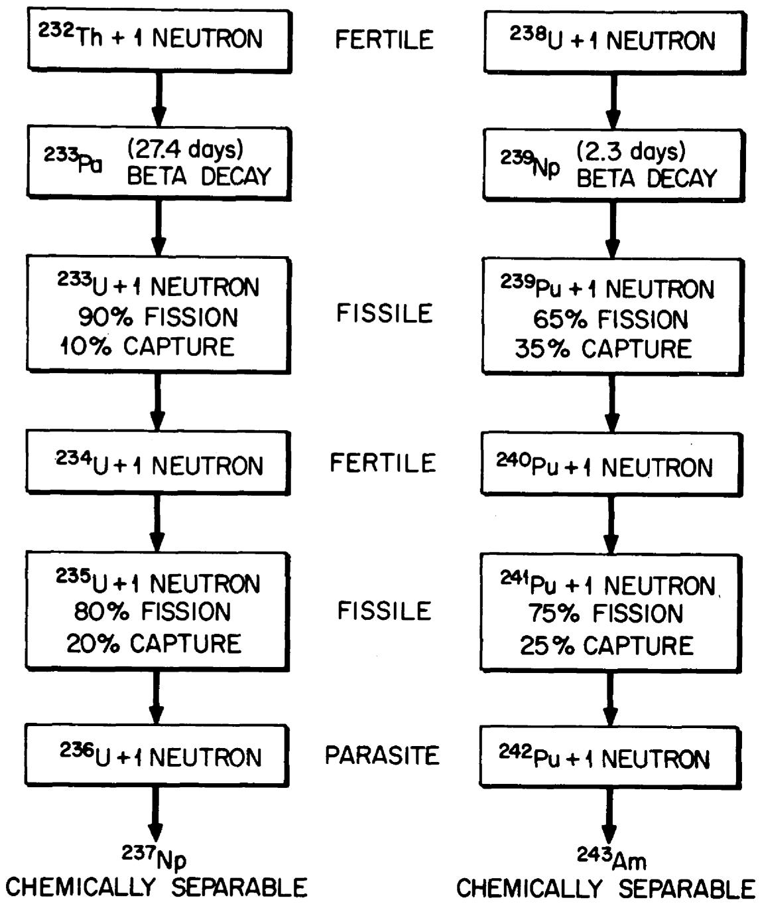  
Fig. A.1. Isotopic buildup in thorium and $^{238}\mathrm{U}$ systems.

The discussion which follows describes in detail those particular physical attributes of the thorium fuel cycle which make it attractive for implementation in thermal reactor systems. It is extracted essentially verbatim from one of the review papers on the topic.2

Table A.1 shows the important nuclear parameters of the principal fissile isotopes available for use in nuclear power reactors. Figure A.2 shows the spectrum averaged $\eta$ values $^6$ (plotted as $\eta$ -l) for a series of binary mixtures of $^{233}\mathrm{U}$ , $^{235}\mathrm{U}$ , and $^{239}\mathrm{Pu}$ in a graphite moderator at room temperature, at $573^{\circ}\mathrm{K}$ , and at $900^{\circ}\mathrm{K}$ . Figure A.2 may be taken as a good indication of the various isotopes' potential for high conversion ratios in thermal reactors, and it may be seen that only $^{233}\mathrm{U}$ has values of $\eta$ appreciably larger than 2.0. (Also shown in Fig. A.2 is the "thermality" or fraction of all neutron absorptions in fuel that occur at neutron energies below 0.45 eV.)

The attainable conversion ratio, in a thermal reactor, depends somewhat on the choice of moderator. The principal moderators are water, heavy water, beryllium, beryllium oxide, and graphite. The maximum conversion ratio for $^{233}\mathrm{U}$ in each of these moderators, allowing only for losses in the moderator itself, is shown in Fig. A.3 as a function of the slowing-down power, $\xi \sigma_{\mathrm{s}}$ , per fuel atom. ( $\sigma_{\mathrm{s}}$ is the free-atom scattering cross section of the moderator, and $\xi$ is the mean logarithmic energy loss of neutrons in collision with moderator atoms.)

The curves generally exhibit a maximum, resulting from the opposing effects of rising $\bar{\eta}$ and increasing moderator loss as moderator-to-fuel ratio increases. Losses in $\mathrm{D}_2\mathrm{O}$ are very small, even with an allowance (which is included in the curve) for 0.14 percent $\mathrm{H}_2\mathrm{O}$ in the $\mathrm{D}_2\mathrm{O}$ . The maximum breeding ratio in $\mathrm{H}_2\mathrm{O}$ is only 0.02 less than in carbon; however, as with $\mathrm{D}_2\mathrm{O}$ , losses in structure may be important. Beryllium would appear to be especially suitable as a moderator for thermal reactors; its large (n,2n) cross section is only partly offset by a low-threshold (n, $\alpha$ ) reaction, yielding a net fast-effect factor of about 1.07 (for

Table A.1. Neutron Cross Sections (in Barns) of the Principal Fissile Nuclides $^{233}\mathrm{U}$ , $^{235}\mathrm{U}$ , $^{239}\mathrm{Pu}$ , and $^{241}\mathrm{Pu}^{\mathrm{a}}$   
(Neutron energy $= 0.0252\mathrm{eV}$ , velocity $= 2200\mathrm{m / sec}$ )   

<table><tr><td></td><td>233U</td><td>235U</td><td>239Pu</td><td>241Pu</td></tr><tr><td>σab</td><td>578±2</td><td>678±2</td><td>1013±4</td><td>1375±9</td></tr><tr><td>σf</td><td>531±2</td><td>580±2</td><td>742±3</td><td>1007±7</td></tr><tr><td>σγ</td><td>47±1</td><td>98±1</td><td>271±3</td><td>368±8</td></tr><tr><td>α</td><td>0.089±0.002</td><td>0.169±0.002</td><td>0.366±0.004</td><td>0.365±0.009</td></tr><tr><td>η</td><td>2.284±0.006</td><td>2.072±0.006</td><td>2.109±0.007</td><td>2.149±0.014</td></tr><tr><td>ν</td><td>2.487±0.007</td><td>2.423±0.007</td><td>2.880±0.009</td><td>2.934±0.012</td></tr></table>

- Hanna, G. C. et al 1969. *At. Energ. Rev.* 7:3-92. Figures in the referenced article were all given to one additional significant figure.   
$\sigma_{a} = \sigma_{f} + \sigma_{\gamma}; \alpha = \sigma_{\gamma} / \sigma_{f}; \nu =$ neutrons per fission $= \eta (1 + \alpha)$

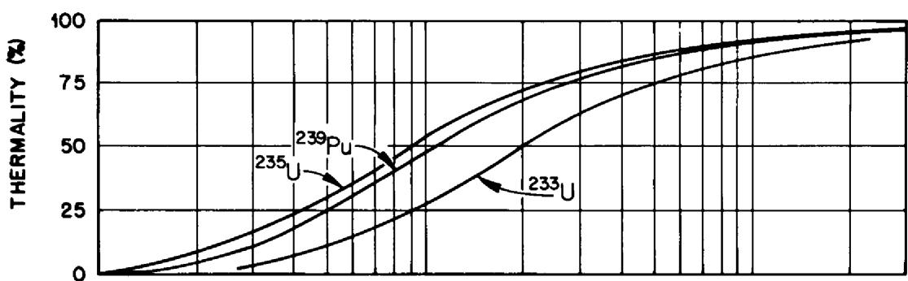

ORNL-DWG 76-17296

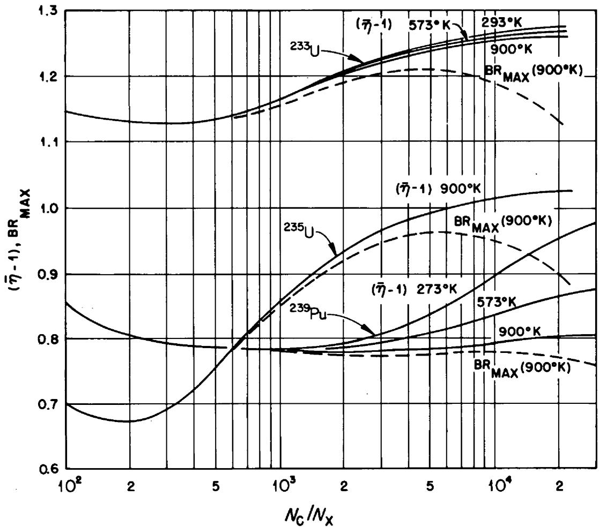  
Fig. A.2. Spectrum-averaged eta maximum theoretical breeding ratio, and "thermality" (fraction of absorptions below 0.45 eV) as functions of moderator-to-fuel atom ratio. Carbon moderator. Temperatures as indicated.

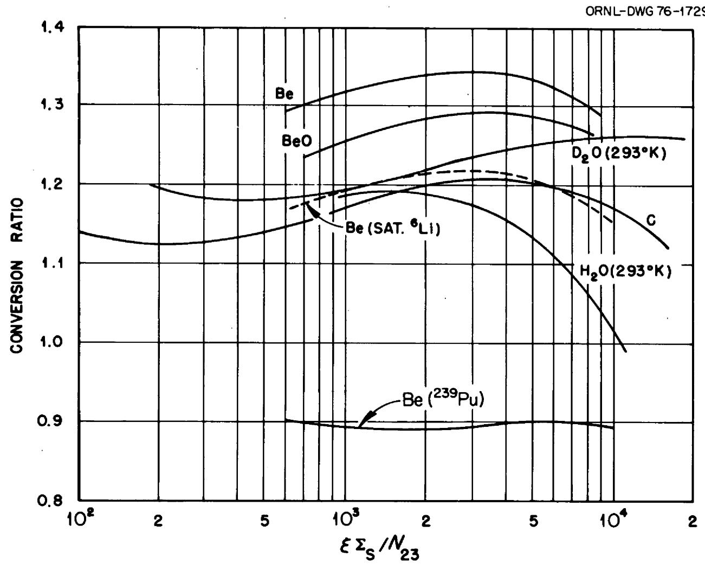  
Fig. A.3. Maximum theoretical conversion ratio for various moderators, as a function of moderator-to-fuel atom ratio. Fuel is $^{233}\mathrm{U}$ and temperature is $900^{\circ}\mathrm{K}$ unless otherwise indicated.

$\mathsf{Be})^{2}$ or 1.04 for $\mathsf{BeO}.\ast$ Unfortunately, the $\mathsf{Be}(n,\alpha)$ reaction produces $^6\mathrm{Li}$ , which has a neutron absorption cross section of 940 barns at 0.025 eV, and therefore reaches saturation rather quickly - more quickly than the fuel burns up. In Fig. A.3 we therefore indicate the reduced conversion ratio that would follow saturation of the $^6\mathrm{Li}$ . (Higher-order gaseous products, $^3\mathrm{H}$ and $^3\mathrm{He}$ , which would result from neutron capture in $^6\mathrm{Li}$ , are presumed to be unimportant, as poisons, because of the long life and mobility of the $^3\mathrm{H}$ .)

Fast neutron multiplication can also result from fissions or $(n,2n)$ reactions in $^{235}\mathrm{U}$ , $^{232}\mathrm{Th}$ , or other even-even nuclides such as $^{234}\mathrm{U}$ , $^{236}\mathrm{U}$ , or $^{240}\mathrm{Pu}$ . In contrast to the situation in fast-breeder reactors, however, these reactions make only minor contributions to the overall neutron production in thermal breeders. Fast fission in $^{232}\mathrm{Th}$ is much less important than in $^{238}\mathrm{U}$ because the cross section above threshold is much lower for $^{232}\mathrm{Th}$ than for $^{238}\mathrm{U}$ .

Control of the neutron loss due to leakage is largely a matter of economics. Leakage can be reduced by surrounding the active core by a blanket region containing mainly the fertile material - e.g., $^{232}\mathrm{Th}$ - the extent of the reduction depending in part on the thickness of the blanket. Increasing the blanket thickness, we reach a point beyond which a further increase would cost more than the value of the additional neutrons saved. Indeed, it may be found that no blanket is economically justifiable. In any event, as a general rule, leakage losses in a reactor designed for minimum power cost are not likely to be less than 0.01 to 0.02 (relative to $\eta$ source neutrons).

Neutron losses to the high-cross-section fission product $^{135}\mathrm{Xe}$ are well known. The xenon poison fraction - i.e., neutron absorptions in xenon per absorption in fuel - may be related to the fuel specific power,

S[Mw(t)/kg fissile], which is a useful generalized measure of the neutron flux level in a reactor. Using the xenon yield for thermal-neutron fission of $^{233}\mathrm{U}$ (0.060) and cross sections appropriate to a graphite core at $600^{\circ}\mathrm{C}$ with $\mathrm{N_c / N_{23}} \sim 9000$ , we find for the xenon poison fraction

$$
P \cong 0. 0 5 4 S (0. 4 4 + S) ^ {- 1}.
$$

For typical in-core inventories of fissile fuel, values of S of 1 to 3 MW(t)/kg will normally be attained, corresponding to values of P of 0.037 to 0.047. Thus, a reduction of about 0.04 in conversion ratio will usually be associated with equilibrium concentrations of $^{135}\mathrm{Xe}$ .

Following a reactor shutdown or reduction in power, the xenon poisoning temporarily increases, passing through a maximum 10 to 12 hours after the shutdown. The magnitude of this transient additional poison fraction also depends on the fuel specific power, and is approximately 0.01, 0.04, or 0.07 for $S = 1$ , 2, or 3 MW(t)/kg, respectively. Although the temporary loss is not significant by itself, a reactivity reserve for xenon override, if normally compensated by control rods, would represent a permanent loss of neutrons.

A potentially significant neutron loss in Th fueled thermal reactors is that due to capture in $^{233}\mathrm{Pa}$ , which is an intermediate in the breeding reaction

$$
{ } ^ { 2 3 2 } \mathrm { T h } ( n , \gamma ) { } ^ { 2 3 3 } \mathrm { T h } \frac { \beta ^ { - } } { 2 2 m } \rightarrow { } ^ { 2 3 3 } \mathrm { P a } \frac { \beta ^ { - } } { 2 7 . 4 d } \rightarrow { } ^ { 2 3 3 } \mathrm { U } .
$$

$^{233}\mathrm{Pa}$ has a thermal-neutron cross section of about 43 b and a resonance integral of about 850 b. The loss of neutrons by absorption in $^{233}\mathrm{Pa}$ is similar to the $^{135}\mathrm{Xe}$ loss, in that it involves a competition between neutron capture and radioactive decay, and is roughly proportional to fuel specific power for $\sigma (\mathrm{Pa})\phi /\lambda << 1$ . However, since absorption of a neutron by $^{233}\mathrm{Pa}$ destroys a nascent $^{233}\mathrm{U}$ atom, as well as removing a

neutron that might have created yet another $^{233}\mathrm{U}$ atom, the loss to $^{233}\mathrm{Pa}$ is double the simple ratio of absorptions in $^{233}\mathrm{Pa}$ to absorptions in $^{233}\mathrm{U}$ .

We relate the $^{233}\mathrm{Pa}$ loss to specific power in a way similar to that used for xenon. While the ratio of spectrum-averaged cross sections, $\overline{\sigma}^{(233}\mathrm{Pa}) / \overline{\sigma}^{(233}\mathrm{U)}$ , does depend on the reactor spectrum, a value of one-third may be taken as typical. Assuming that the conversion ratio is close to unity, and noting that the decay constant of $^{233}\mathrm{Pa}$ is 0.0257/day, we find that the loss in conversion ratio is given approximately by

$$
\delta \mathrm {B R} \sim 2 \mathrm {S} (6 4 + \mathrm {S}) ^ {- 1},
$$

with values of 0.03, 0.06, and 0.09 for $S = 1$ , 2, and 3 MW(t)/kg, respectively.

This loss may be reduced by partial segregation of the thorium and fissile uranium so that the thorium, and hence the protactinium, experiences a low neutron flux, while the fissile uranium is exposed to a higher flux. The factors involving the specific power in the above expression would then be multiplied by the ratio of effective flux in the thorium to that in the fuel.

An interesting consequence of the relatively long mean life of $^{233}\mathrm{Pa}$ (39 days) is that a significant reactivity addition can occur during a prolonged reactor shutdown. During normal, steady-state reactor operation, the ratio of $^{233}\mathrm{Pa}$ inventory to fissile uranium inventory is approximately S/20, where S is, again, the in-core fuel specific power in MW(t)/kg (fissile). Thus, for S in the range 1 to 3 MW(t)/kg, an increase of 5 to 15 percent in fuel inventory would occur, with a time constant for approach to saturation of 39 days. While the reactivity effect of this additional $^{233}\mathrm{U}$ would depend on its location - i.e., on the initial degree of segregation of the fissile and fertile materials in the reactor - the effect could be as much as 40 percent of the fractional increase in fuel inventory; thus a reactivity increase $\delta \mathbf{k} / \mathbf{k} \sim 0.02$

to 0.06 could occur. Such a reactivity increase need not be a problem, but appropriate control devices would be required to compensate for it. After the reactor is brought back to power, some loss of neutrons to control poisons might be involved, while equilibrium concentrations of fuel and protactinium are reestablished. Unfortunately, the reactivity increase associated with $^{233}\mathrm{Pa}$ decay cannot provide xenon override capability, since the time constants for the two processes are very different - i.e., 39 days vs 10 hours.

One of the most important sources of neutron loss, from the standpoint of achieving high conversion ratios in a thermal reactor, is the loss to slowly saturating or nonsaturating fission products. In contrast to $^{135}\mathrm{Xe}$ and $^{149}\mathrm{Sm}$ , whose very large neutron-absorption cross sections cause them to reach saturation very quickly, the great majority of the fission products have cross sections which are comparable to or smaller than that of the fuel itself. Thus, the aggregate poisoning effect of these fission products is roughly proportional to the fractional burnup of the fuel prior to its removal from the reactor for chemical processing. The fission product poisoning depends also on the neutron spectrum, on the predominant species of fuel in the reactor, on the fuel-replacement strategy employed, and on the flux level, or fuel specific power. It is hardly possible, therefore, to exhibit a single universal relationship between fuel burnup and fission-product poisoning. Nonetheless we show a few typical points in Fig. A.4 in which the fractional fuel burnup is expressed in terms of fifa - i.e., fissions per initial fissile atom in fresh fuel. (Note that with fuel regeneration by breeding, exposures greater than one fifa are possible.) It may be inferred from Fig. A4 (with due allowance for the effects of other variables) that neutron losses in the neighborhood of 0.10 (per neutron absorbed in fissile atoms) may be expected for fuel exposures of 1 to 1.5 fifa.

Another rather important factor that tends to reduce conversion ratio in a thermal reactor is the presence of higher isotopes of uranium, resulting from successive neutron captures in the chain starting with $^{233}\mathrm{U}$ . The

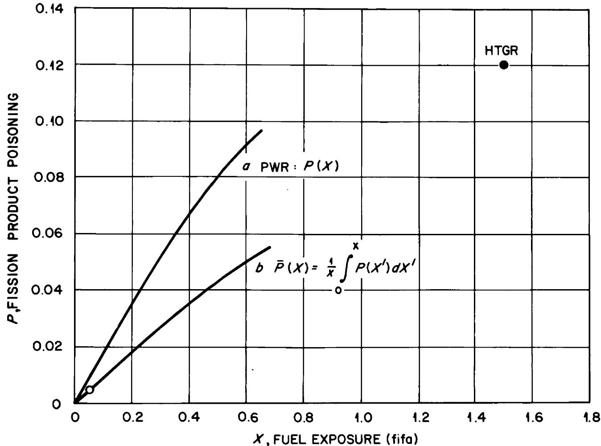  
Fig. A.4. Fission product poisoning, excluding $^{135}\mathrm{Xe}$ and $^{149}\mathrm{Sm}$ from 149 chain fission yield. (Neutron absorptions in fission products per absorption in fissile fuel.)

reduction results in part from the weighted contribution of the lower $\mathfrak{n}$ of $^{235}\mathrm{U}$ and in part from the added neutron loss in $^{236}\mathrm{U}$ and $^{237}\mathrm{Np}$ .

It should also be noted that the buildup of $^{236}\mathrm{U}$ , and of any nuclides beyond it in the chain, may be rather slow, owing to a rather small cross section of $^{236}\mathrm{U}$ relative to that of $^{233}\mathrm{U}$ . For a fuel specific power of 1 MW(t)/kg, the time constant for the approach of the $^{236}\mathrm{U}$ concentration to equilibrium is something like 50 years at 0.8 plant factor (40 equivalent full-power years). Of course a higher specific power would produce a shorter time constant. (For this calculation, the specific power must be based on the entire inventory of fissile uranium chargeable to the reactor - i.e., including the out-of-pile as well as in-pile inventories.) On the other hand, it should also be noted that if a reactor system is started up initially with $^{235}\mathrm{U}$ , owing to a lack of $^{233}\mathrm{U}$ for startup, then an amount of $^{236}\mathrm{U}$ much greater than the equilibrium amount would be produced early in the life of the system, and the equilibrium concentration would be approached from the high side. This extra poisoning effect must be experienced somewhere in the nuclear power complex, whether or not the extra $^{236}\mathrm{U}$ is retained in the reactor.

Quite apart from the cost factors involved, rapid chemical processing may prove to be undesirable if the recovery of fissile material from exposed fuel elements is incomplete. If a small fraction of the fuel is lost during each fuel processing cycle, an effective reduction in conversion ratio is experienced which is inversely proportional to the discharge fuel exposure, expressed in fissions per initial fissile atom. For example, at an exposure of one fifa (neglecting a small correction due to radiative capture), a processing loss of 0.5 percent would give rise to a 0.005 reduction in conversion ratio, while at 0.1 fifa the same processing loss would lower the effective conversion ratio by 0.05. In Fig. A.5, we see how the combined loss of conversion ratio due to fission products and processing losses might vary with fuel discharge exposure, for a postulated linear loss due to the fission product aggregate (excluding $^{135}\mathrm{Xe}$ and $^{149}\mathrm{Sm}$ ).

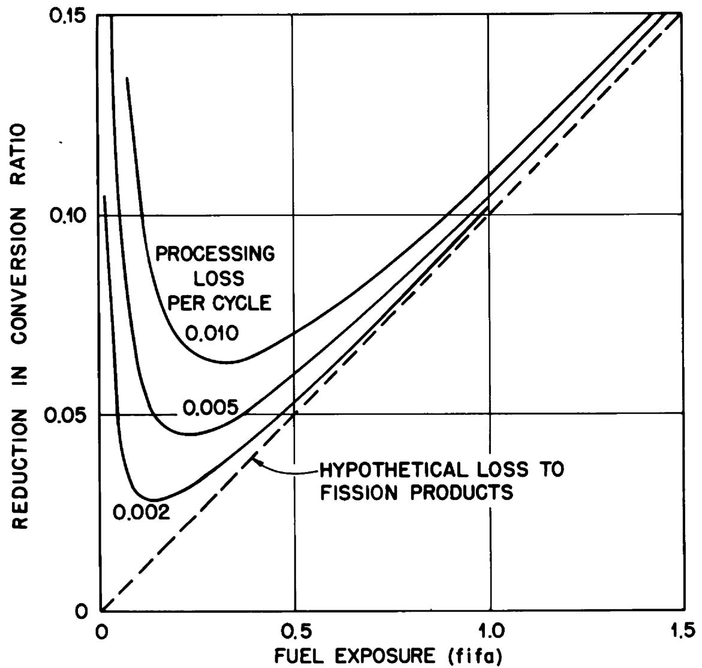  
Fig. A.5. Combined reduction in conversion ratio due to fission products and chemical processing losses.

ORNL-DWG 76-17298

For solid fuel elements, material losses in processing and refabrication are customarily supposed to be in the neighborhood of 1.0 percent. Figure A.5 would suggest an optimum exposure of about 0.3 fifa for this rate of loss; but in fact, because of fabrication and processing costs, the economic optimum exposure would typically be much greater than this.

The differences between the $^{233}\mathrm{U} - ^{232}\mathrm{Th}$ and $^{239}\mathrm{Pu} - ^{238}\mathrm{U}$ fuel cycles can be explicitly quantified by considering the two flow charts given in Fig. A.6. These charts represent the fissile and fertile transmutation chains and neutron utilization in two idealized thermal reactor cores optimized for the respective fuel cycles. $^3$ The $^{233}\mathrm{U} - ^{232}\mathrm{Th}$ system is a heavy water moderated reactor and the $^{239}\mathrm{Pu} - ^{238}\mathrm{U}$ system is an optimized light water reactor. In addition, it is assumed for purposes of exposition that no neutrons are lost to leakage or parasitic captures in structure, moderator or fission products. The neutron balances are based on the destruction of 100 atoms of the fissile isotope.

Consideration of these flow charts shows that for these idealized thermal fuel cycles the $^{233}\mathrm{U} - ^{232}\mathrm{Th}$ system yields a conversion ratio of 1.18, i.e., 118 atoms of $^{233}\mathrm{U}$ are produced for each 100 atoms destroyed, while the $^{239}\mathrm{Pu} - ^{238}\mathrm{U}$ cycle yields a conversion ratio of 0.99. Neither of these values is achievable in practice because of parasitic captures and neutron leakage, but the incremental difference between the thorium and uranium fuel cycles carries over to actual reactors and can be exploited by the clever nuclear designer.

Characteristics of Thorium Fuel in a Fast Neutron Spectrum

In a thermal neutron spectrum higher conversion ratios are possible with thorium fuels with $^{233}\mathrm{U}$ as the fissile isotope because of the lower ratio of captures to fissions in $^{233}\mathrm{U}$ compared with $^{235}\mathrm{U}$ and $^{239}\mathrm{Pu}$ . This advantage does not exist in a fast neutron spectrum, as shown in Figs. A.7 and A.8 from ref 5. In a fast spectrum the larger value of $\nu$ for $^{239}\mathrm{Pu}$ dominates and results in a higher conversion ratio (higher $\eta$ ), as shown in Fig. A.9. Table A.2 (ref 7) lists values of $\nu$ for several isotopes.

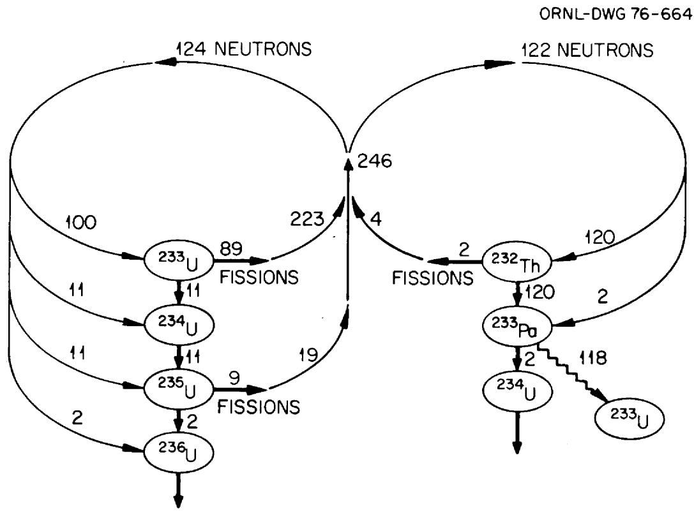

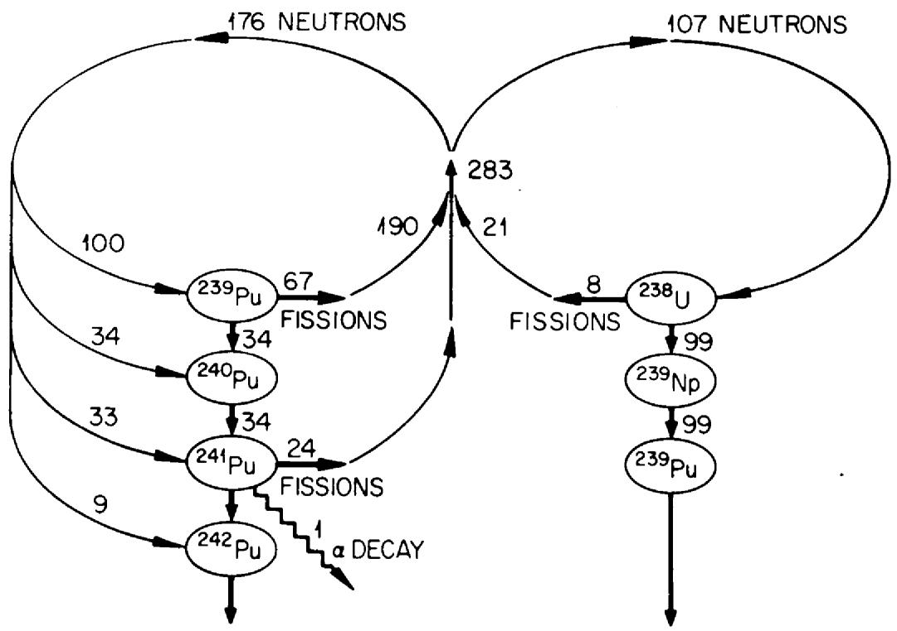  
233U-232Th Fuel Cycle Conversion Ratio = 1·18   
$\underline{^{239}Pu - ^{238}U}$ Fuel Cycle Conversion Ratio = 0.99   
Fig. A.6. Neutron and isotopic balances for idealized Pu-U and U-Th thermal fuel cycles.

ORNL-DWG 76-17705

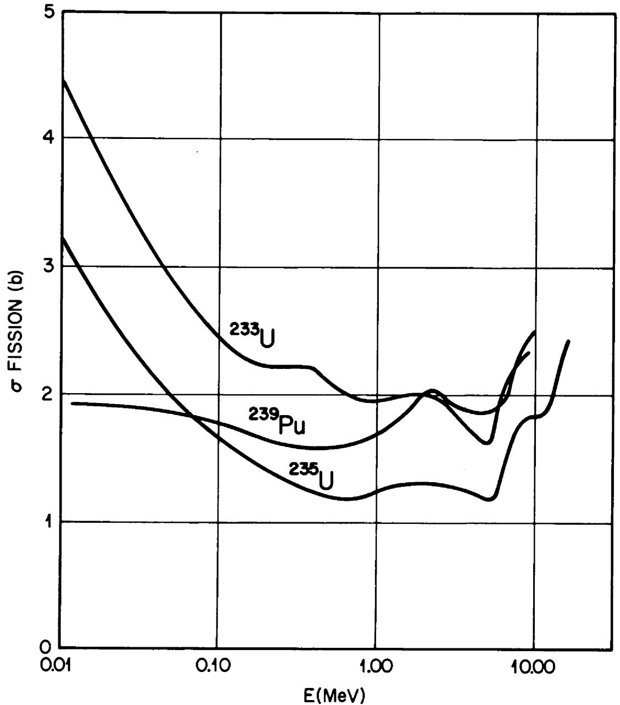  
Fig. A.7. Fission cross-section $^{233}\mathrm{U}$ , $^{235}\mathrm{U}$ , and $^{239}\mathrm{Pu}$ at high energy.

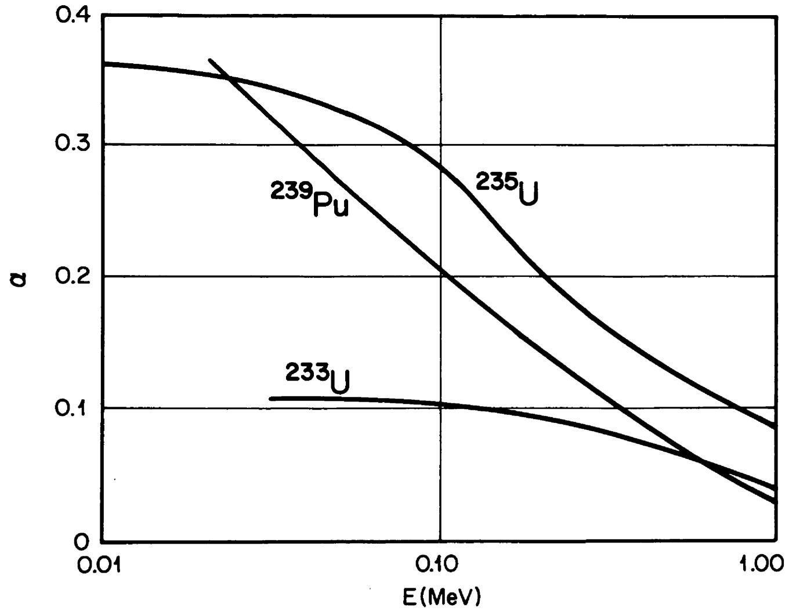  
Fig. A.8. Capture to fission ratio $^{233}\mathrm{U}$ , $^{235}\mathrm{U}$ , $^{239}\mathrm{Pu}$ at high energy.

Fig. A.9. nVS energy for $^{233}\mathrm{U}$ , $^{235}\mathrm{U}$ , and $^{239}\mathrm{Pu}$ .   
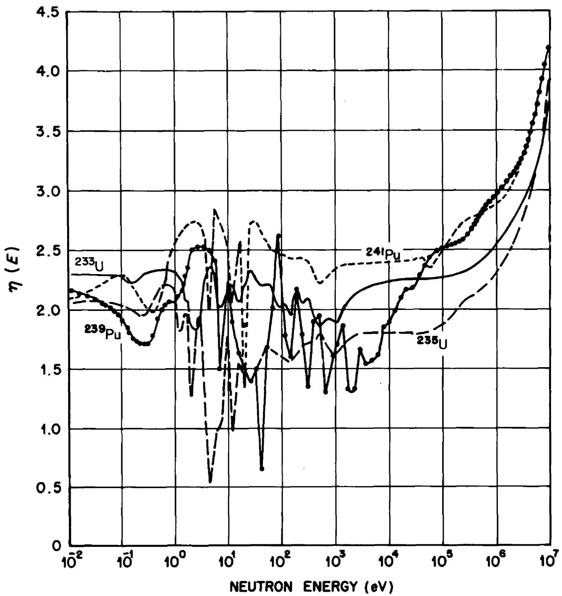  
ORNL-DWG 76-17294

Table A.2. Neutrons Emitted per Fission (v) Produced by 1.5 MeV Neutrons   

<table><tr><td>Isotope</td><td>ν</td></tr><tr><td>Th-232</td><td>2.2</td></tr><tr><td>U-233</td><td>2.66</td></tr><tr><td>U-235</td><td>2.58</td></tr><tr><td>U-238</td><td>2.57</td></tr><tr><td>Pu-239</td><td>3.09</td></tr><tr><td>Pu-240</td><td>3.1</td></tr><tr><td>Pu-241</td><td>3.2</td></tr></table>

Another feature of thorium in a fast neutron spectrum is the relatively low contribution of neutrons from fertile fissions in Th-232, compared with U-238. An important component of the conversion ratio (breeding ratio) is the fast fission factor, $\varepsilon'$ , shown in Eq. (Al). As shown in Fig. A.10 the fission threshold energy is considerably lower in Th-232 than in U-238, and the fission cross section is much higher in U-238 at all neutron energies above 1 MeV. A similar plot in Ref (2) shows the fission cross sections for Pu-240 to be significantly higher than even U-238. Substantial quantities of Pu-240 are present in Pu-U FBR fuels.

Because of the neutronic properties described above, thorium fuels are inferior to uranium-plutonium fuels in fast reactors, with respect to breeding potential. In an LMFBR such as the Clinch River Breeder Reactor, fast fissioning in U-238 and the higher fertile isotopes of Pu contribute $17\%$ of the power produced. If Th-232 replaced U-238 as the fertile material, the fast fission contribution would drop to approximately $3\%$ . The contribution of U-238 to direct energy production in an FBR is an advantage from the standpoint of resource utilization; however this large fast fission effect has a safety drawback.

It has been shown that the Th-U fuel cycle has superior conversion characteristics in a thermal neutron spectrum, while in a fast spectrum the U-Pu fuel cycle has superior characteristics. For a fast spectrum

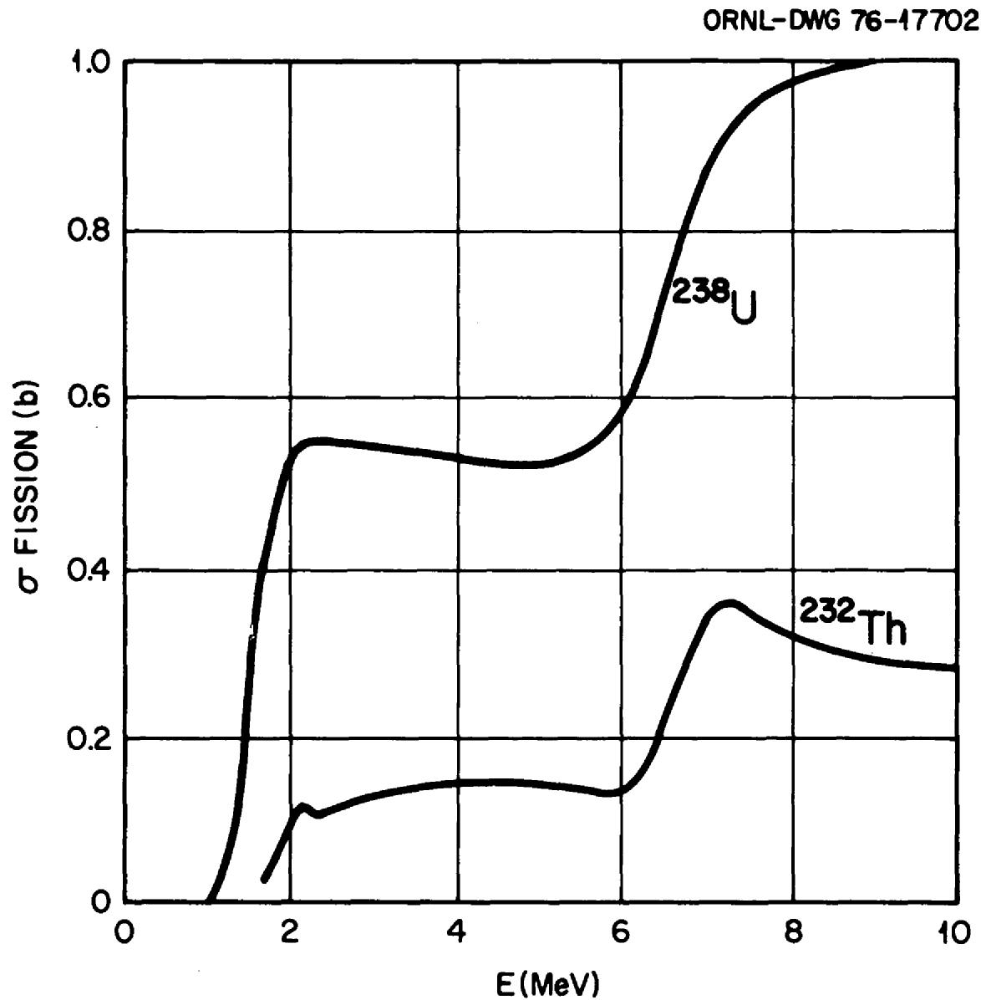  
Fig. A.10. Fission cross-section of $^{232}\mathrm{Th}$ and $^{238}\mathrm{U}$ .

with a median neutron energy of 0.15 MeV (typical of an LMFBR) Pu-239 has a higher breeding potential than U-233. As the average energy of the neutron spectrum increases, the relative Pu-239 to U-233 breeding advantage increases. This increase is due in part to the increased contribution of U-238 fissions as the neutron energy spectrum hardens. This characteristic of the U-Pu fuel can lead to control problems during potential sodium voiding incidents.

Sodium voiding in an FBR core has two major effects on reactor neutronics. First, the average neutron energy increases and second neutron leakage (loss) increases.

In a large FBR fueled with $^{239}\mathrm{Pu}$ and $^{238}\mathrm{U}$ , the higher neutron energy causes increased $^{238}\mathrm{U}$ fissions and a higher eta value for $^{239}\mathrm{Pu}$ . These positive reactivity effects dominate the negative leakage effect and lead to a large increase in reactivity which can cause an unstable control condition. In a thorium fueled reactor the lack of a significant fast fission factor causes leakage to be the dominant effect so that the sodium void effect is negative or much less positive than in the case of a $^{239}\mathrm{Pu}-^{238}\mathrm{U}$ core. The positive sodium void effect for $^{239}\mathrm{Pu}-^{238}\mathrm{U}$ can occur only in large cores. The use of a thorium based fuel would mitigate this problem and would yield improved inherent safety for the LMFBR.

The effect of $^{233}\mathrm{Pa}$ as a neutron poison is less severe in the case of a fast spectrum as compared to a thermal spectrum because the ratio of the capture cross sections of $^{233}\mathrm{Pa}$ and $^{232}\mathrm{Th}$ is only 1.5 in a fast spectrum whereas this ratio is $\sim 6$ in a thermal spectrum. The higher power density in an FBR causes a higher rate of burnout of $^{233}\mathrm{Pa}$ than occurs in a thermal reactor. This effect decreases the production rate of $^{233}\mathrm{U}$ .

The actual breeding performance of FBRs fueled with Th and $^{233}\mathrm{U}$ depends significantly on the fuel form, specific power, and type of core cooling. Table A.3 shows the relative breeding ratios of FBRs fueled with $^{233}\mathrm{U}-\mathrm{Th}$ and $^{239}\mathrm{Pu}-\mathrm{U}$ .

Table A.3. Breeding Ratios of 2500 MW(th) FBRs ${}^{a}$   

<table><tr><td>Fuel Nuclides</td><td>Fuel Composition</td><td>Coolant</td><td>Power Density [MW(Th)/liter]</td><td>Breeding Ratiob</td></tr><tr><td rowspan="2">233U-Th</td><td>Metal</td><td>Na</td><td>0.62</td><td>1.26</td></tr><tr><td>Oxide</td><td>Na</td><td>0.39</td><td>1.16</td></tr><tr><td rowspan="2">233U-Th</td><td>Metal</td><td>He</td><td>0.45</td><td>1.29</td></tr><tr><td>Oxide</td><td>He</td><td>0.24</td><td>1.21</td></tr><tr><td rowspan="2">239Pu-U</td><td>Oxide</td><td>Na</td><td>0.38</td><td>1.35</td></tr><tr><td>Oxide</td><td>He</td><td>0.24</td><td>1.44</td></tr></table>

$^{a}$ Source: B. R. Sehgal, C. Lin, J. Naser, W. B. Loewenstein, "Thorium-Based Fuels in Fast Breeder Reactors," Trans. Amer. Nucl. Soc. 21: 422 (1975).   
bThe values shown are for a spherical reactor and would be smaller for the usual cylindrical reactor.

No $^{239}\mathrm{Pu}-\mathrm{U}$ metal fuel is shown in Table A.3 because the poor irradiation properties of uranium-plutonium metal alloys exclude their consideration for economical FBRs. The Th metal systems show substantial breeding gains over Th oxide systems. The $^{239}\mathrm{Pu}-\mathrm{U}$ oxide system has a better breeding ratio than either the Th metal or oxide cases. The higher power density considered in the Th metal system caused this reactor to have a significantly lower fissile inventory than the oxide fueled cores and the lower inventory would partially compensate for the breeding ratio difference between the thorium metal and uranium oxide cases.

# REFERENCES

1. Paul R. Kasten, "The Role of Thorium in Power Reactor Development," Atomic Energy Review Vol. III, No. 3, pp. 473ff 1AEA, Vienna, 1970.   
2. Alfred M. Perry, Alvin M. Weinberg, "Thermal Breeder Reactors," Annual Review of Nuclear Science, Vol 22 (1972).   
3. E. A. Eschbach, D. E. Deonigi, "Possible Optimum Use of Thorium and Uranium Employing Crossed Progeny Fuel Cycles," Proc. 2nd Intl. Thorium Fuel Cycle Symp., Gatlinburg, Tenn. (May 1966).   
4. P. R. Kasten, M. L. Tobias, "Application of the Thorium Fuel Cycle," Trans. Am. Nucl. Soc., ANS Mtg. San Francisco, Nov. 1975.   
5. USAEC, The Use of Thorium in Nuclear Power Reactors, WASH 1097 (June 1969).   
6. A. M. Perry, G. L Ragan, USAEC Document, ORNL-TM-3827 (1972).   
7. David Okrent, "Neutron Physics Considerations in Large Fast Reactors," Power Reactor Technology, Vol 7, No. 2, pp. 107-137 (Spring 1964).

# APPENDIX B

# THORIUM FUEL CYCLES IN LWRs

Summary: Several studies have been done which have considered the use of thorium fuel cycles in light-water reactors to improve uranium ore utilization. These studies are described and compared in this Appendix. Fuel cycle cost calculations have been made for these thorium cycles using a consistent technique (described in Appendix L) that has also been used for other reactor concepts using thorium fuel cycles. According to the studies cited, conversion ratios of up to 0.73 are possible using $^{233}\mathrm{UO}_2 - \mathrm{ThO}_2$ fuel in standard LWR fuel elements, achieving burnups similar to those achieved by LWR fuels operating on the uranium fuel cycle (about 30 MWd/kg HM). Slightly higher conversion ratios (up to about 0.79) are possible with $^{233}\mathrm{U}$ -Th metal fuels. The reprocessing and refabrication costs of metal fuels are not known, but it is anticipated that considerable cost savings could be realized in fabrication if metal fuel and zircaloy cladding were coextruded. It has been concluded that a considerable development effort would be required to qualify the processes and product for this concept and that the expense incurred may not be justified in terms of the benefits received.

Conversion ratios of near unity have been calculated for metal fuels operating to very low exposures. It is emphasized that these calculations have been made for a standard LWR core arrangement, with no modifications except to replace ceramic $\mathrm{UO}_2$ with Th-U metal fuel and to decrease fuel exposures. The fuel cycle cost calculated, assuming the same costs on a $\$ /kg$ HM basis as those used for ceramic fuels, was very high for this concept because of the frequent reprocessing required.

The initial and makeup uranium inventory for all the cases considered in this Appendix were $93\%$ enriched in U-235. According to the studies, Pu can be substituted for the highly enriched uranium with some economic advantage. Nuclear performance is slightly better with uranium fissile feed.

Calculations derived from several literature sources have been used as indicators of the ore utilization capabilities of LWRs using thorium-uranium and thorium-plutonium fuel cycles. Table B.1 describes several parameters for 1000 MW(e) PWRs operating with $\mathrm{UO_2}$ , urania-thoria, uranium-thorium metal, plutonia-thoria, plutonium-thorium metal, and urania-plutonia. The table also has similar information for BWRs using $\mathrm{UO_2}$ and uranium-thorium metal fuel. Several items of interest are:

1. Only the first and second cycles are included in the table. Information on the equilibrium cycle is needed to make valid comparisons.   
2. The conversion ratio for the first uranium cycle is lower than that for the second cycle. This is contrary to what is usually reported and is not explained in the reference. These results are probably caused by use of inconsistent cross sections for plutonium.   
3. It was assumed that the reactor is operating with annual reloading and that the fuel is discharged after reaching 33 MWd/kg HM burnup.   
4. The isotopic composition of the discharge Pu after 33 MWd/kg HM is $58.9\%$ Pu-239, $21.4\%$ Pu-240, $14.2\%$ Pu-241, and $5.5\%$ Pu-242.

The large amount of Pu-240 that converts to Pu-241 is the reason for the higher conversion ratio in the plutonia-urania column, compared with that in the $\mathrm{UO_2}$ column. It appears that inconsistent cross sections were used for plutonium isotopes, distorting the result.

5. The burnup character of $\mathrm{UO_2}$ , $\mathrm{PuO_2}$ , and U-Th metal fuels is compared in Fig. B.1. There is a very rapid reactivity change in the $\mathrm{UO_2}$ lattice. The large amount of Pu-240 in the $\mathrm{PuO_2}$ lattice helps to reduce the reactivity swing through the full fuel cycle. The metal fuel (U-Th), which has the highest conversion ratio of the three, shows the least

Table B.1. LWR Fuel Cycle Characteristics for 1000 MW(e) Reactors   

<table><tr><td rowspan="2"></td><td colspan="6">PWR</td><td colspan="2">BWR</td></tr><tr><td>UO2</td><td>UO2-ThO2</td><td>U-Th</td><td>PuO2-UO2a</td><td>PuO2-ThO2a</td><td>Pu-Tha</td><td>UO2</td><td>U-Th</td></tr><tr><td rowspan="2">Initial fissile enrichment-w/o</td><td rowspan="2">U-3.20</td><td rowspan="2">U-4.50</td><td rowspan="2">U-3.91</td><td>Pu-2.37</td><td rowspan="2">Pu-4.48</td><td rowspan="2">Pu-3.71</td><td rowspan="2">U-2.70</td><td rowspan="2">U-3.67</td></tr><tr><td>U-0.72</td></tr><tr><td rowspan="2">Initial uniform loading (MT fissile)</td><td rowspan="2">U-2.740</td><td rowspan="2">U-3.681</td><td rowspan="2">U-4.583</td><td>Pu-2.079</td><td rowspan="2">Pu-3.720</td><td rowspan="2">Pu-4.398</td><td rowspan="2">U-3.802</td><td rowspan="2">U-6.830</td></tr><tr><td>U-0.618</td></tr><tr><td>Natural U (102MT)</td><td>5.028</td><td>7.189</td><td>8.951</td><td></td><td></td><td></td><td>6.889</td><td>13.337</td></tr><tr><td>Separative Work (102KG)</td><td>4.063</td><td>9.324</td><td>11.608</td><td></td><td></td><td></td><td>5.148</td><td>17.299</td></tr><tr><td>Conversion ratio of first fuel cycle</td><td>0.61</td><td>0.76</td><td>0.81</td><td>0.74</td><td>0.78</td><td>0.81</td><td>0.62</td><td>0.81</td></tr><tr><td rowspan="2">Makeup requirement per year (MT fissile)</td><td rowspan="2">U-0.459</td><td rowspan="2">U-0.315</td><td rowspan="2">U-0.176</td><td>Pu-0.253</td><td rowspan="2">Pu-0.310</td><td rowspan="2">Pu-0.302</td><td rowspan="2"></td><td rowspan="2"></td></tr><tr><td>U-0.206</td></tr><tr><td>Natural U (102MT)</td><td>0.824</td><td>0.615</td><td>0.344</td><td></td><td></td><td></td><td></td><td></td></tr><tr><td>Separative work (102KG)</td><td>1.018</td><td>0.798</td><td>0.446</td><td></td><td></td><td></td><td></td><td></td></tr><tr><td>Conversion ratio of second cycle</td><td>0.67</td><td>0.79</td><td>0.84</td><td>0.75</td><td>0.81</td><td>0.84</td><td></td><td></td></tr></table>

${}^{a}$ Values of Pu are those of Pu-239 plus Pu-241 only.   
Source: C. Lin and B. Zolotar, "Thorium: An Alternative Fuel for LWRs," Electric Power Research Institute (EPRI) Research Progress Report NP-2 (February 1975) p. 19.

ORNL DWG 76-17701

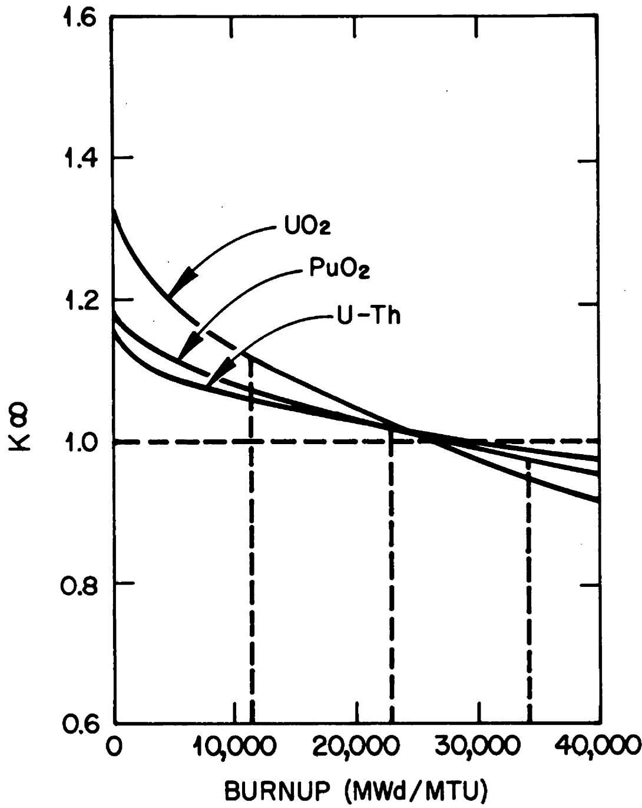  
Fig. B.1. Burnup character of uranium and thorium fuels. Source: C. Lin and B. Zolotar, "Thorium: An Alternative Fuel for LWRs," Electric Power Research Institute (EPRI) Research Progress Report NP-2 (February 1975), p. 19.

reactivity change. The initial dip in reactivity is due to the 27-day half life of Pa-233 decaying to U-233. The small relative reactivity change in the U-Th fuel reduces the amount of poison control required and therefore enhances the conversion ratio.

6. The BWRs require somewhat more fuel because of the lower power density relative to PWRs. The same trends were noted in comparing $\mathrm{UO_2}$ and U-Th metal in the BWR, as had been observed for the PWR. Therefore, further comparisons with the BWR were not considered.   
7. Higher conversion ratios for plutonia-thoria than for urania-thoria are reported in Table B.l. Additional studies by Combustion Engineering financed by EPRI do not support this observation.1 Better fuel utilization is achieved using uranium (93% enriched) and thorium than using plutonium and thorium.1 It is judged that the CE results are more representative of LWR performance, and these results are consistent with the limited calculations performed at ORNL.

A second study on the use of thorium fuel cycles in LWRs is described in Table B.2 (ref. 2). The calculations presented in Table B.2 are for a 587 MW(e) PWR, therefore, most of the numbers cannot be directly compared with the numbers in Table B.1, although this will be rectified later. Several items of interest are noted from the Correa study (ref. 2).

1. Marginally higher conversion ratios are possible with metal fuel compared with oxide fuel. Higher initial inventories were employed with the metal fuel, with lower makeup requirements.   
2. Significant improvements in conversion ratio are possible using U-233 in place of U-235. However, without a source of U-233 (such as from a breeder reactor), there is little opportunity to take advantage of this improvement.

Table B.2. Fuel Cycle Characteristics for a 587 MW(e) PWR   

<table><tr><td>Fuel</td><td>UO2(3.3%) (standard)</td><td>PuO2+NaUTU2</td><td>235UO2+ThO2</td><td>233UO2+ThO2</td><td>235U+Th</td><td>233U+Th</td><td>PuO2+ThO2</td></tr><tr><td>Av Absorption (450 days)</td><td></td><td></td><td></td><td></td><td></td><td></td><td></td></tr><tr><td>Fissile</td><td>0.478</td><td>0.480</td><td>0.480</td><td>0.442</td><td>0.480</td><td>0.440</td><td>0.496</td></tr><tr><td>Fertile</td><td>0.328</td><td>0.381</td><td>0.302</td><td>0.335</td><td>0.327</td><td>0.362</td><td>0.354</td></tr><tr><td>Fission Products</td><td>0.087</td><td>0.078</td><td>0.101</td><td>0.097</td><td>0.094</td><td>0.090</td><td>0.087</td></tr><tr><td>Structural Materials</td><td>0.023</td><td>0.016</td><td>0.026</td><td>0.029</td><td>0.022</td><td>0.024</td><td>0.016</td></tr><tr><td>H2O</td><td>0.037</td><td>0.022</td><td>0.041</td><td>0.042</td><td>0.032</td><td>0.035</td><td>0.022</td></tr><tr><td>B-10</td><td>0.040</td><td>0.023</td><td>0.046</td><td>0.049</td><td>0.037</td><td>0.041</td><td>0.022</td></tr><tr><td>Initial Enrichment</td><td>3.30</td><td>3.51</td><td>4.19</td><td>3.20</td><td>3.67</td><td>2.60</td><td>4.29</td></tr><tr><td>η (450 days)</td><td>1.93</td><td>1.91</td><td>2.04</td><td>2.22</td><td>2.03</td><td>2.21</td><td>1.96</td></tr><tr><td>ε (450 days)</td><td>1.09</td><td>1.09</td><td>1.02</td><td>1.02</td><td>1.03</td><td>1.03</td><td>1.03</td></tr><tr><td>Conversion Ratio CR (450 days)</td><td>0.61</td><td>0.72</td><td>0.61</td><td>0.73</td><td>0.65</td><td>0.79</td><td>0.69</td></tr><tr><td>Inventorya (kg)</td><td></td><td></td><td></td><td></td><td></td><td></td><td></td></tr><tr><td>U-233</td><td></td><td></td><td></td><td>1405</td><td></td><td>1521</td><td></td></tr><tr><td>U-235</td><td>1589</td><td>333</td><td>1843</td><td></td><td>2157</td><td></td><td></td></tr><tr><td>Pu-239</td><td></td><td>1133</td><td></td><td></td><td></td><td></td><td>1542</td></tr><tr><td>Pu-241</td><td></td><td>249</td><td></td><td></td><td></td><td></td><td>335</td></tr><tr><td>Total</td><td>1589</td><td>1715</td><td>1843</td><td>1405</td><td>2157</td><td>1521</td><td>1877</td></tr></table>

Table B.2. Fuel Cycle Characteristics for a 587 MW(E) PWR (cont'd)   

<table><tr><td>Fuel</td><td>UO2(3.3%) (standard)</td><td>PuO2+NaUTO2</td><td>235UO2+ThO2</td><td>233UO2+ThO2</td><td>235U+Th</td><td>233U+Th</td><td>PuO2+ThO2</td></tr><tr><td>Consumption (kg/year)</td><td></td><td></td><td></td><td></td><td></td><td></td><td></td></tr><tr><td>U-233</td><td></td><td></td><td>-193</td><td>186</td><td>-228</td><td>183</td><td>-182</td></tr><tr><td>U-235</td><td>386</td><td>61</td><td>454</td><td>-9</td><td>473</td><td>-9</td><td>-2</td></tr><tr><td>Pu-239</td><td>-100</td><td>166</td><td>-4</td><td></td><td>-2</td><td></td><td>437</td></tr><tr><td>Pu-241</td><td>-22</td><td>-5</td><td>-4</td><td></td><td>-2</td><td></td><td>18</td></tr><tr><td>Total</td><td>264</td><td>222</td><td>253</td><td>177</td><td>241</td><td>174</td><td>271</td></tr></table>

aInventory = initial charge of fissile mass; thermal power = 1780 MW(th); thermal efficiency = 0.33 (assumed); burnup = 900 days at full power (1.6 x 106 Mw).   
Source: Francisco Correa, "Thorium Utilization in PWRs" (MS Thesis)

3. Comparison of the $\mathrm{UO_2}$ and $\mathrm{UO_2 - ThO_2}$ cases reveals a fissile requirement of about 22.51 kg U-235/MW(e) for 30 years of operation with $\mathrm{UO_2}$ and no recycle, compared with about 26.33 kg U-235/MW(e) for $\mathrm{UO_2 - ThO_2}$ . If complete recycle is assumed, the 30-year consumption values are 16.20 and 16.07 kg U-235/MW(e) respectively. From this comparison, it appears that there is little incentive to develop $^{235}\mathrm{UO_2 - ThO_2}$ as a replacement for the $\mathrm{UO_2}$ cycle. However, the $^{233}\mathrm{UO_2 - ThO_2}$ case with total recycle requires only 11.44 kg U-235/MW(e) over 30 years. As indicated earlier, a supply of U-233 is required to take advantage of this cycle. The $^{235}\mathrm{UO_2 - ThO_2}$ case is made even less attractive when separative work requirements are considered. About 1.76 times as much separative work is required per kilogram of product for the 93% enriched fuel used in the $^{235}\mathrm{U - ThO_2}$ cycle as that required for the 3% enriched $\mathrm{UO_2}$ cycle.   
Another study on the use of thorium fuels in LWRs was done by E. Hettergott and R. K. Lane of General Atomic Company. $^{3}$ This study is summarized in Table B.3. The GA work in Table B.3 is compared with the EPRI study cited earlier. $^{4}$ Several conclusions can be drawn from the GA study:   
1. More uranium ore is required by the thorium fuel cycle in LWRs than by the uranium cycle, if recycle is not permitted. If recycle is permitted, the thorium cycle yields slightly better ore utilization. Without recycle, the order of preference (relative to ore utilization) is $\mathrm{UO}_2$ , $\mathrm{UO}_2\text{-}\mathrm{ThO}_2$ , and U-Th metal. With recycle, the order of preference is reversed.   
2. The EPRI results are slightly more optimistic with respect to ore utilization for the recycle cases and slightly less optimistic for the nonrecycle cases.   
3. Both the GA and the EPRI studies show that the amount of power produced from a fixed-ore resource can be doubled by the application of a thorium fuel cycle (with recycle) in LWRs, as compared with the uranium cycle (without recycle). The advantage drops to about a $25\%$ increase when compared with the uranium cycle with complete recycle.

Table B.3. Regionwise Mass Flows at Equilibrium Conditions   

<table><tr><td rowspan="2"></td><td rowspan="2">Number of 
Assemblies 
(1 Region)</td><td rowspan="2">Burnup 
(MWd/MTHM)a</td><td colspan="5">Initial</td><td colspan="3">Final</td></tr><tr><td>Heavy Metalb(kg)</td><td>U-235(kg)</td><td>U-235 Makeup(kg)</td><td>Fissile Pu(kg)</td><td>U-233(kg)</td><td>U-235(kg)</td><td>Fissile Pu(kg)</td><td>U-233(kg)</td></tr><tr><td colspan="11">Case 1 - UO2 Reference</td></tr><tr><td>No Recycle</td><td></td><td></td><td></td><td></td><td></td><td></td><td></td><td></td><td></td><td></td></tr><tr><td>GAC</td><td>64</td><td>33,000</td><td>28,350</td><td>907</td><td></td><td></td><td></td><td>234</td><td>203</td><td></td></tr><tr><td>EPRI</td><td>64</td><td>33,000</td><td>28,395</td><td>909</td><td></td><td></td><td></td><td>236</td><td>200</td><td></td></tr><tr><td>Recycle</td><td></td><td></td><td></td><td></td><td></td><td></td><td></td><td></td><td></td><td></td></tr><tr><td>GAC</td><td>64</td><td>33,000</td><td>28,485</td><td>770</td><td>537</td><td>203</td><td></td><td>257</td><td>258</td><td></td></tr><tr><td>EPRI</td><td>64</td><td>33,000</td><td>28,655</td><td>693</td><td>458</td><td>200</td><td></td><td>228</td><td>255</td><td></td></tr><tr><td colspan="11">Case 2 - ThO2</td></tr><tr><td>No Recycle</td><td></td><td></td><td></td><td></td><td></td><td></td><td></td><td></td><td></td><td></td></tr><tr><td>GAC</td><td>64</td><td>34,500</td><td>27,160</td><td>1099</td><td></td><td></td><td></td><td>258</td><td></td><td>370</td></tr><tr><td>EPRI</td><td>64</td><td>34,500</td><td>27,140</td><td>1220</td><td></td><td></td><td></td><td>408</td><td></td><td>382</td></tr><tr><td>Recycle</td><td></td><td></td><td></td><td></td><td></td><td></td><td></td><td></td><td></td><td></td></tr><tr><td>GAC</td><td>64</td><td>34,500</td><td>27,170</td><td>657</td><td>399</td><td></td><td>370</td><td>169</td><td></td><td>441</td></tr><tr><td>EPRI</td><td>64</td><td>34,500</td><td>27,210</td><td>722</td><td>313</td><td></td><td>382</td><td>247</td><td></td><td>488</td></tr><tr><td colspan="11">Case 3 - Th-Metal</td></tr><tr><td>No Recycle</td><td></td><td></td><td></td><td></td><td></td><td></td><td></td><td></td><td></td><td></td></tr><tr><td>GAC</td><td>64</td><td>25,800</td><td>36,520</td><td>1257</td><td></td><td></td><td></td><td>401</td><td></td><td>426</td></tr><tr><td>EPRI</td><td>64</td><td>24,100</td><td>38,880</td><td>1520</td><td></td><td></td><td></td><td>665</td><td></td><td>490</td></tr><tr><td>Recycle</td><td></td><td></td><td></td><td></td><td></td><td></td><td></td><td></td><td></td><td></td></tr><tr><td>GAC</td><td>64</td><td>25,800</td><td>36,590</td><td>741</td><td>340</td><td></td><td>426</td><td>253</td><td></td><td>537</td></tr><tr><td>EPRI</td><td>64</td><td>24,100</td><td>38,910</td><td>840</td><td>175</td><td></td><td>490</td><td>365</td><td></td><td>670</td></tr></table>

a Megawatt-days per metric ton of heavy metal.   
bOne-third of core for 1000 MW(e) reactor.

4. The advantage of the thorium fuel cycle with metal fuel over the thorium cycle with oxide fuel is small in the GA study (about $9\%$ ). This small increase does not justify the cost and time required to qualify and specify metal fuel for LWRs. In the EPRI study, the advantage is considerably larger ( $33\%$ ); however, the Correa results support the GA study, therefore the conclusion is still considered valid.

The three studies summarized in Tables B.1 through B.3 are compared in Tables B.4 and B.5. Some additional information from other studies for the LWR uranium cycle is also presented. There is reasonable agreement between these studies, except in a few areas that have already been identified. The superiority of U-233 fuel over U-235 fuel is clearly shown in these tables. In order to exploit this superiority, it will be necessary to establish a recycle capability very early to recover and utilize the bred U-233. The thorium cycle, using U-235, is less attractive than the uranium cycle, assuming no recycle; and with full recycle, the thorium cycle offers only a slight improvement, certainly not enough to justify the time and expense to establish this cycle. Unless an external source of U-233 (such as from a thorium-fueled FBR) can be established, it is concluded that thorium cycles in LWRs are not attractive enough to warrant commercialization.

As already described, the best resource utilization using a thorium fuel cycle in LWRs is achieved using metal fuel. The studies summarized in Table B.4 reflect a conversion ratio approaching 0.8, achieved with $^{233}\mathrm{U}$ -Th metal fuel irradiated to about 27 MWd/kg HM. Higher conversion ratios are possible if lower exposures can be accepted. Reference (5) presents some calculations which probably represent the limit of performance of thorium fuel in LWRs that can be achieved without major design changes in the reactor. Performance characteristics of the Thorium Replacement Reactor Core (TRRC) are summarized in Table B.6.

Table B.4. Comparison of Studies on LWR Fuel Cycles   

<table><tr><td></td><td></td><td>Linb (EPRI)</td><td>Corrêac (IEA Brazil)</td><td>Pardued (BMI)</td><td>ANLe</td><td>Gaf</td><td>EPRIf</td></tr><tr><td>I.</td><td>UO2No Recycle</td><td></td><td></td><td></td><td></td><td></td><td></td></tr><tr><td></td><td>(1) Core HM Inven- tory</td><td>85.63</td><td>81.97</td><td>92.36</td><td>94.40</td><td>85.05</td><td>85.19</td></tr><tr><td></td><td>(2) Core Fissile Inventory</td><td>2.74</td><td>2.71</td><td>1.97</td><td>2.83</td><td>2.72</td><td>2.73</td></tr><tr><td></td><td>(3) Annual Fissile Consumptiong</td><td>0.46</td><td>0.45</td><td>0.37</td><td>0.44</td><td>0.47</td><td>0.47</td></tr><tr><td></td><td>(4) Burnup</td><td>33.00</td><td>33.27</td><td>30.00</td><td>30.50</td><td>33.00</td><td>33.00</td></tr><tr><td></td><td>(5) Conversion Ratio</td><td>0.61</td><td>0.61</td><td></td><td>0.61</td><td></td><td></td></tr><tr><td>II.</td><td>PuO2-NaT UO2</td><td></td><td></td><td></td><td></td><td></td><td></td></tr><tr><td></td><td>(1) Core HM Inven- tory</td><td>87.72</td><td>83.18</td><td></td><td></td><td></td><td></td></tr><tr><td></td><td>(2) Core Fissile Inventory</td><td>2.70</td><td>2.92</td><td></td><td></td><td></td><td></td></tr><tr><td></td><td>(3) Annual Fissile Consumptiong</td><td>0.46</td><td>0.38</td><td></td><td></td><td></td><td></td></tr><tr><td></td><td>(4) Burnup</td><td>33.00</td><td>32.79</td><td></td><td></td><td></td><td></td></tr><tr><td></td><td>(5) Conversion Ratio</td><td>0.74</td><td>0.72</td><td></td><td></td><td></td><td></td></tr><tr><td>III.</td><td>235UO2-ThO2</td><td></td><td></td><td></td><td></td><td></td><td></td></tr><tr><td></td><td>(1) Core HM Inven- tory</td><td>81.80</td><td>74.88</td><td></td><td></td><td>81.48</td><td>81.42</td></tr><tr><td></td><td>(2) Core Fissile Inventory</td><td>3.68</td><td>3.14</td><td></td><td></td><td>3.30</td><td>3.66</td></tr><tr><td></td><td>(3) Annual Fissile Consumptiong</td><td>0.32</td><td>0.43</td><td></td><td></td><td>0.40</td><td>0.31</td></tr><tr><td></td><td>(4) Burnup</td><td>33.00</td><td>36.42</td><td></td><td></td><td>34.50</td><td>34.50</td></tr><tr><td></td><td>(5) Conversion Ratio</td><td>0.76</td><td>0.61</td><td></td><td></td><td></td><td></td></tr><tr><td>IV.</td><td>233UO2-ThO2</td><td></td><td></td><td></td><td></td><td></td><td></td></tr><tr><td></td><td>(1) Core HM Inven- tory</td><td></td><td>74.81</td><td></td><td></td><td></td><td></td></tr><tr><td></td><td>(2) Core Fissile Inventory</td><td></td><td>2.39</td><td></td><td></td><td></td><td></td></tr><tr><td></td><td>(3) Annual Fissile Consumptiong</td><td></td><td>0.30</td><td></td><td></td><td></td><td></td></tr><tr><td></td><td>(4) Burnup</td><td></td><td>36.49</td><td></td><td></td><td></td><td></td></tr><tr><td></td><td>(5) Conversion Ratio</td><td></td><td>0.73</td><td></td><td></td><td></td><td></td></tr></table>

Table B.4. Comparison $^{\alpha}$ of Studies on LWR Fuel Cycle (cont'd)   

<table><tr><td></td><td></td><td>\( Lin^b \)(EPRI)</td><td>\( Correa^c \)(IEA Brazil)</td><td>\( Pardued \)(BMI)</td><td>ANLe</td><td>GAf</td><td>\( EPRI^f \)</td></tr><tr><td rowspan="6">V.</td><td>\( ^{235}U-Th \)</td><td></td><td></td><td></td><td></td><td></td><td></td></tr><tr><td>(1) Core HM Inven-tory</td><td>117.21</td><td>100.10</td><td></td><td></td><td>109.56</td><td>116.64</td></tr><tr><td>(2) Core Fissile Inventory</td><td>4.58</td><td>3.67</td><td></td><td></td><td>3.77</td><td>4.56</td></tr><tr><td>(3) Annual Fissile \( Consumption^g \)</td><td>0.18</td><td>0.41</td><td></td><td></td><td>0.34</td><td>0.18</td></tr><tr><td>(4) Burnup</td><td>33.00</td><td>27.26</td><td></td><td></td><td>25.80</td><td>24.10</td></tr><tr><td>(5) Conversion Ratio</td><td>0.81</td><td>0.65</td><td></td><td></td><td></td><td></td></tr><tr><td rowspan="6">VI.</td><td>\( ^{233}U-Th \)</td><td></td><td></td><td></td><td></td><td></td><td></td></tr><tr><td>(1) Core HM Inven-tory</td><td></td><td>99.80</td><td></td><td></td><td></td><td></td></tr><tr><td>(2) Core Fissile Inventory</td><td></td><td>2.59</td><td></td><td></td><td></td><td></td></tr><tr><td>(3) Annual Fissile \( Consumption^g \)</td><td></td><td>0.30</td><td></td><td></td><td></td><td></td></tr><tr><td>(4) Burnup</td><td></td><td>27.38</td><td></td><td></td><td></td><td></td></tr><tr><td>(5) Conversion Ratio</td><td></td><td>0.79</td><td></td><td></td><td></td><td></td></tr><tr><td rowspan="6">VII.</td><td>\( PuO_2-ThO_2 \)</td><td></td><td></td><td></td><td></td><td></td><td></td></tr><tr><td>(1) Core HM Inven-tory</td><td>83.04</td><td>74.59</td><td></td><td></td><td></td><td></td></tr><tr><td>(2) Core Fissile Inventory</td><td>3.72</td><td>3.20</td><td></td><td></td><td></td><td></td></tr><tr><td>(3) Annual Fissile \( Consumption^g \)</td><td>0.31</td><td>0.46</td><td></td><td></td><td></td><td></td></tr><tr><td>(4) Burnup</td><td>33.00</td><td>36.58</td><td></td><td></td><td></td><td></td></tr><tr><td>(5) Conversion Ratio</td><td>0.78</td><td>0.69</td><td></td><td></td><td></td><td></td></tr><tr><td rowspan="6">VIII.</td><td>\( PuO_2-UO_2 \)\( (^{235}U Makeup) \)</td><td></td><td></td><td></td><td></td><td></td><td></td></tr><tr><td>(1) Core HM Inven-tory</td><td></td><td></td><td></td><td>94.40</td><td>85.46</td><td>85.97</td></tr><tr><td>(2) Core Fissile Inventory</td><td></td><td></td><td></td><td>2.83</td><td>2.71</td><td>2.68</td></tr><tr><td>(3) Annual Fissile \( Consumption^g \)</td><td></td><td></td><td></td><td>0.44</td><td>0.54</td><td>0.46</td></tr><tr><td>(4) Burnup</td><td></td><td></td><td></td><td>30.50</td><td>33.00</td><td>33.00</td></tr><tr><td>(5) Conversion Ratio</td><td></td><td></td><td></td><td>0.61</td><td></td><td></td></tr></table>

$a_{\text{All inventory values are kg/MW(e)}}$ All fissile consumption values are $\mathrm{kg} / \mathrm{MW}(\mathrm{e})$ yr  
All burnup values are MWD/kg HM

bC. Lin and B. Zolotar, "Thorium: An Alternative Fuel for LWRs," Electric Power Research Institute, EPRI Res. Prog. Rep. Feb. 1975, NP-2, p. 19.   
cFrancisco Corrêa, "Thorium Utilization in PWRs", MS Thesis.   
d. W. M. Pardue et al., "A Comparison of Advanced Reactor Potentials", presented at the ASME/ANS International Conference on Advanced Nuclear Energy Systems, March 14-17, 1976, Pittsburgh, Pa.   
eR. V. Laney et al., "A Brief Survey of Considerations Involved in Introducing CANDU Reactors into the U.S.", unpublished ANL Report.   
fPrivate communication from R. K. Lane (GA) to F. J. Homan (ORNL) dated 11 June 1976. Based on work performed by E. Hettergott (now with EXXON).   
For accurate comparison, the annual fissile consumption numbers should be normalized to the effected load factor assumed in the calculation. This can be done as follows:

$$
\begin{array}{c c} \frac {\text {M W d (t h) D a y}}{\text {k g H M}} & \frac {\text {k g H M C h a r g e d}}{\text {y e a r}} \quad \frac {0 . 3 3 \text {M W (e)}}{\text {M W (t h)}} = \frac {\text {M W (e) - y e a r}}{\text {y e a r}} \\ \hline 3 6 5 & \frac {\text {D a y s}}{\text {y e a r}} \end{array}
$$

Consider the GA numbers for $\mathrm{UO}_2$ (NR):

$$
\frac {\mathrm {M W} (\mathrm {e}) - \text {y e a r}}{\text {y e a r}} = \frac {(3 3 . 0 0) (8 5 0 5 0) (0 . 3 3)}{3 (3 6 5)} = 8 4 6
$$

Therefore, load factor $\sim \frac{846}{1000} = 0.85$

Fissile Consumption $= \frac{470}{846} = 0.56\frac{\mathrm{kg}^{235}\mathrm{U}}{\mathrm{MW}(\mathrm{e})\mathrm{year}}$

Table B.5. Comparison of Fissile Consumption for LWR Fuel Cycles   

<table><tr><td rowspan="2">Fuel Cycle</td><td colspan="6">30 yr 235U Requirementsa
kg/MW(e)</td></tr><tr><td>Lin</td><td>Corrêa</td><td>BMI</td><td>ANL</td><td>GA</td><td>EPRI</td></tr><tr><td>Without Recycle</td><td></td><td></td><td></td><td></td><td></td><td></td></tr><tr><td>UO2</td><td></td><td>22.43</td><td>24.59</td><td>28.93</td><td>29.93</td><td>29.93</td></tr><tr><td>UO2-ThO2</td><td></td><td>26.34</td><td></td><td></td><td>36.27</td><td>40.26</td></tr><tr><td>U-Th</td><td></td><td>27.85</td><td></td><td></td><td>41.48</td><td>50.16</td></tr><tr><td>With Recycle</td><td></td><td></td><td></td><td></td><td></td><td></td></tr><tr><td>235UO2</td><td>16.54</td><td>16.20</td><td>13.01</td><td>17.54</td><td>18.83</td><td>16.47</td></tr><tr><td>235UO2-ThO2</td><td>13.28</td><td>16.07</td><td></td><td></td><td>15.27</td><td>13.05</td></tr><tr><td>233UO2-ThO2</td><td></td><td>11.44</td><td></td><td></td><td></td><td></td></tr><tr><td>235U-Th</td><td>9.98</td><td>15.99</td><td></td><td></td><td>13.97</td><td>9.81</td></tr><tr><td>233U-Th</td><td></td><td>11.48</td><td></td><td></td><td></td><td></td></tr></table>

$\alpha_{\mathrm{kg}}$ 235U/MW(e) = Initial Inventory + 30 (annual makeup).

Table B.6. Performance Characteristics of Thorium Replacement Reactor Core (TRRC)   

<table><tr><td>Equilibrium exposure, MwD/ton (U + Th)</td><td>10,000</td><td>15,000</td><td>20,000</td><td>25,000</td></tr><tr><td>Feed enrichment, wt % fissile material</td><td>1.59</td><td>1.67</td><td>1.76</td><td>1.88</td></tr><tr><td>233U inventory, g/kW(e)</td><td>1.880</td><td>1.975</td><td>2.085</td><td>2.225</td></tr><tr><td>Breeding ratio</td><td>0.96</td><td>0.93</td><td>0.88</td><td>0.83</td></tr><tr><td>235U initial charge, g/kg (U + Th)</td><td>24.8</td><td>25.4</td><td>26.5</td><td>28.3</td></tr><tr><td>Initial uranium inventory, a tons natural U/GW(e)</td><td>589</td><td>603</td><td>630</td><td>692</td></tr><tr><td>235U makeup, g/kg (U + Th)</td><td>1.47</td><td>2.67</td><td>4.18</td><td>6.14</td></tr><tr><td>Annual uranium consumption, b tons natural U/GW(e)</td><td>30</td><td>37</td><td>44</td><td>54</td></tr><tr><td>Total ore consumption, c tons natural U/GW(e)</td><td>1489</td><td>1713</td><td>1950</td><td>2312</td></tr></table>

Source: G. B. Zorzoli, "An Evaluation of a Near-Breeder, Low Cost, LWR Concept," Energia Nucleare 19(3): 151 (March 1972).   
aDiffusion plant discharge: $0.25\%$ wt $^{235}\mathrm{U}$   
b. Diffusion plant discharge: 0.25% wt $^{235}\mathrm{U}$ ; load factor: 80%; average over 20 years.   
cInitial inventory plus 30-year makeup.

The calculated performance characteristics tabulated in Table B.6 were based on the following assumptions:

1. Recycle of all U and Pu produced by the Th-232 and U-233 neutron chains, accounting for $1.5\%$ losses during reprocessing and refabrication.   
2. All Pu-233 in discharged fuel decays to U-233 before reloading, which requires at least 120 days between fuel discharge and reloading.   
3. Makeup fissile material is U-235.

The ore utilization characteristics of LWRs and CANDUs are shown in Table B.7. A comparison of the total ore consumption values in Tables B.6 and B.7 shows a decided advantage for the TRRC over standard LWRs and CANDUs.

Table B.7. Uranium Exploitation in LWRs and CANDUs   

<table><tr><td rowspan="2">Reactor System</td><td colspan="3">Natural Uranium Requirement, tons/GW(e)</td></tr><tr><td>Initial Inventory</td><td>Annual Consumption</td><td>Initial Inventory plus 30-Year Makeup</td></tr><tr><td>BWR</td><td>592</td><td>125</td><td>4342</td></tr><tr><td>PWR</td><td>406</td><td>133</td><td>4396</td></tr><tr><td>CANDU-PHW</td><td>144</td><td>103</td><td>3234</td></tr></table>

Source: G. B. Zorzoli, "An Evaluation of a Near-Breeder, Low Cost, LWR Concept," *Energia Nucleare* 19(3): 151 (March 1972).

# Cost Considerations for Thorium Fuel Cycles in LWRs

Cost of thorium: The cost of thorium should not be a big contribution to the fuel cycle cost. Using $100/kg thorium (corresponding to about $52/1b ThO₂) and the data from Table B.1, the following costs are calculated:

$$
i n i t i a l \quad i n v e n t o r y = 0. 2 6 m i l l s / k W h r
$$

$$
\text {y e a r l y m a k e u p} = 0. 3 7 \text {m i l l s / k W h r}
$$

0.63 total thorium component.

The initial inventory charge was based on the largest initial inventory given in Table B.1, that for metal fuel [about 115 kg of thorium for the reactor and about 65 kg of thorium elsewhere in the fuel cycle for a total Th inventory of 180 kg/MW(e)]. A charge of $10\%$ year for the initial Th inventory against yearly power production was assumed. The yearly makeup was assumed to be all fresh thorium. Under recycle operation it would be possible to recycle recovered thorium and largely eliminate the yearly makeup cost. The cost of $\$100/$ kg thorium ( $52/1b \, \text{ThO}_2)$ is very high. Figures B.2 and B.3 describe the cost and quantity relationships for both uranium and thorium ore. $^6$ The basic data are about eight years old, but are still in reasonable agreement with recently published information for uranium ore. $^7$ A comparison of Figs. B.2 and B.3 indicates that the cost per quantity relationship for $\text{ThO}_2$ and $\text{U}_3\text{O}_8$ are similar. From Fig. B.3, it appears that there is from 1 to 10 million tons of $\text{ThO}_2$ available at $\$50/1b$ or less.

Fuel Cycle Costs for several of the fuel management concepts described in this Appendix are tabulated in Appendix N. These costs are discussed in the main portion of this report and compared with fuel cycle costs for other reactor types that have been calculated on the same basis.

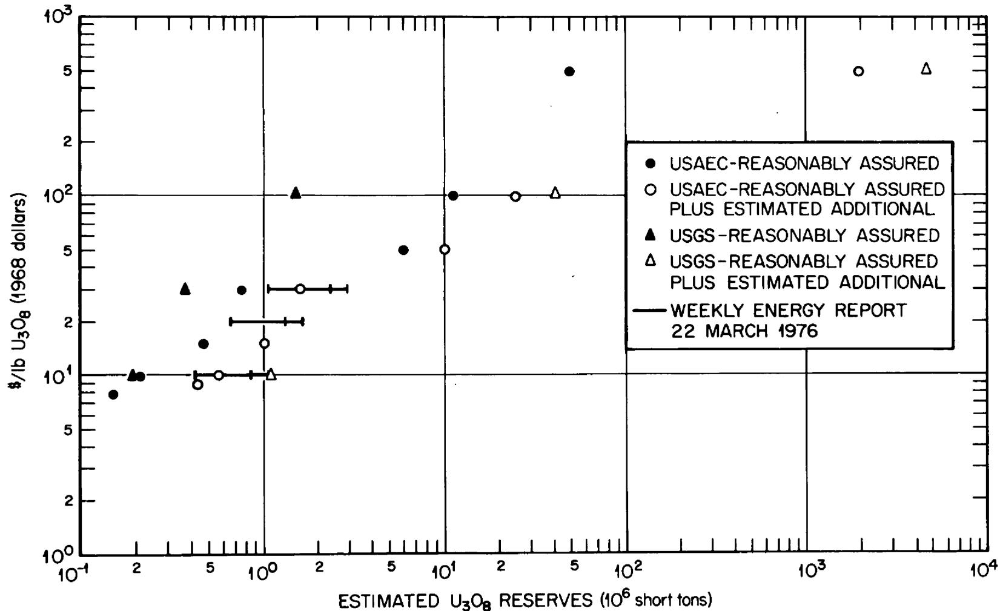  
Fig. B.2. Uranium reserves vs price.

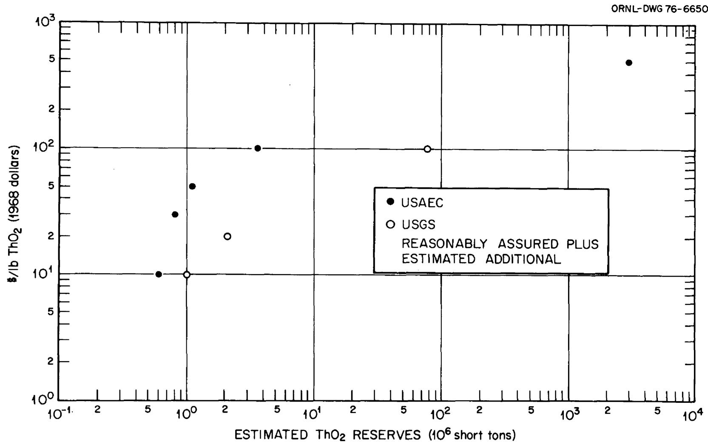  
Fig. B.3. Thorium reserves vs price.

# REFERENCES FOR APPENDIX B

1. Private communication from Norton Shapiro and Robert Hellens (CE) and Bal Raj Sehgal (EPRI) (April 1976).   
2. Francisco Corrêa, "Thorium Utilization in PWRs," MS thesis.   
3. Private communication from R. K. Lane (GA) to F. J. Homan (ORNL), date June 11, 1976; based on work performed by E. Hettergott (now with EXXON).   
4. C. Lin and B. Zolotar, "Thorium: An Alternative Fuel for LWRs," Electric Power Research Institute (EPRI) Research Progress Report NP-2 (February 1975), p. 19.   
5. G. B. Zorzoli, "An Evaluation of a Near-Breeder, Low Cost, LWR Concept," *Energia Nucleare* 19(3): 151 (March 1972).   
6. The Use of Thorium in Nuclear Power Reactors, WASH-1097 (June 1969), p. 30.   
7. Weekly Energy Report, March 22, 1976.

# APPENDIX C

# THORIUM FUEL CYCLES IN HTGRs

Summary: The HTGR system operates most efficiently on the thorium fuel cycle, and so relatively little development has been carried out in this country on the uranium cycle for HTGRs. This appendix discusses modifications which can be made to the reference HTGR fuel (conversion ratio = 0.66) to increase the conversion ratio. Conversion ratios of up to 0.82 are possible with currently achievable changes in fuel management and thorium loading. Conversion ratios of 0.95 and higher are possible with modifications to the fuel element which would permit higher volumetric fuel loadings than are possible under the reference design, and with decreased fuel exposure. Fuel utilization is nearly doubled over a 30-year reactor lifetime by increasing the conversion ratio from 0.66 to 0.90, but because of the higher specific inventory required for higher conversion ratios, the improved ore utilization is not realized for the first 10 years of operation.

While the economic penalties associated with high conversion ratios in HTGRs have not been totally evaluated, it appears that near-minimum fuel cycle costs are achieved with a conversion ratio of 0.75 to 0.80. The trade-offs between economics and conversion ratio are sensitive to both the assumed costs of fuel reprocessing and refabrication and to future uranium costs.

# Fuel Utilization Considerations and Options

Among the types of power reactors currently in advanced stages of commercial development, only the Light-Water Breeder Reactor (LWBR) and the High-Temperature Gas-Cooled Reactor (HTGR) have been envisioned from inception as utilizers of thorium.\* Because of the HTGR's unique fuel design, which consists of a mixture of thorium and uranium containing microspheres in

individual fuel rods, a wide latitude of fissile to fertile and heavy metal to moderator atom ratios are achievable without alteration of the basic concept and fuel design. These parameters control, to a large extent, the conversion ratio of the reactor system, and thus the current design HTGR is amenable to alterations in conversion ratio over a fairly large range. For this reason, the reactor fuel cycle can be tailored by varying the fuel loadings and fuel exposures to meet changing economic and resource availability conditions.

It is important to recognize that minimum short term energy costs do not occur with maximum conservation of fissile resources. Increasing the conversion ratio of an HTGR can be achieved by four basic design and operating changes. These are (1) increase the core thorium load, (2) decrease the core power density, (3) decrease the fuel residence time, and (4) increase the refueling frequency. Each of these steps can carry with it an economic penalty which may or may not be offset by the advantages of improved fuel utilization.

The current "reference" HTGR is designed to operate with a conversion ratio of 0.66, not much higher than its competitors, the light water reactors, which utilize the $^{238}\mathrm{U}-^{239}\mathrm{Pu}$ fuel cycle to achieve conversion ratios of approximately 0.60. Table C.1 shows the reactor parameters for the reference HTGR which had been optimized to then current economic conditions. $^{1}$ Currently projected uranium ore costs now favor a design of higher conversion ratio, that is, $\mathrm{CR} = 0.76$ . Table C.2 (ref. 2) shows the increases that can be achieved with the current fuel element design by the various strategies listed above. The achievable conversion ratio (in the event that alternate fuel designs are considered and the thorium loading is increased beyond what is volumetrically possible with the current element) is also indicated. It is noteworthy that the mined ore requirements can be reduced substantially without resorting to undeveloped technology.

The economic penalties associated with the indicated gains in conversion ratio are real but less easily quantified. They depend on projected economic conditions, the scarcity and hence increased cost of uranium ore, separative work costs, and the approximate knowledge of the cost to recycle bred fuel and to ship and dispose of radioactive materials.

Table C.1. Optimum HTGR Fuel Cycle Parameters under Current Economic Conditions   

<table><tr><td>Core average power density, W/cm3</td><td>8.4</td></tr><tr><td>Average C/Th ratio (initial core/equilibrium recycle)</td><td>214/238</td></tr><tr><td>Fuel lifetime,a years</td><td>4</td></tr><tr><td>Refueling interval,a years</td><td>1</td></tr><tr><td>Fraction of core refueled</td><td>1/4</td></tr><tr><td>Fertile load, kg/MW(e)</td><td></td></tr><tr><td>Initial core</td><td>32</td></tr><tr><td>Equilibrium core</td><td>29</td></tr><tr><td>235U requirements</td><td></td></tr><tr><td>Initial core, kg/MW(e)</td><td>1.40</td></tr><tr><td>Equilibrium annual makeup,a kg/MW(e)</td><td>0.33</td></tr><tr><td>Average conversion ratio</td><td></td></tr><tr><td>Initial cycle</td><td>0.69</td></tr><tr><td>Equilibrium cycle</td><td>0.66</td></tr></table>

aAt 80% average capacity factor.

Table C.2. Conversion Ratio Improvements*   

<table><tr><td>Case</td><td>Fissile Conversion Ratio</td><td>Relative Ore Equivalent</td></tr><tr><td>Reference HTGR</td><td>0.66</td><td>1.0</td></tr><tr><td>25% Increase in thorium load</td><td>0.71</td><td>0.85</td></tr><tr><td>Add semiannual fueling</td><td>0.76</td><td>0.71</td></tr><tr><td>Add reduced power density (lower to 6 W/cm3)</td><td>0.82</td><td>0.53</td></tr><tr><td>Modified fuel rods and/or improved fuel particles</td><td>~0.92~0.95</td><td></td></tr></table>

*Based on 4 yr fuel residence time.

The increase in thorium loading, which is a primary means by which the conversion ratio can be increased, carries with it a requirement for a higher initial fissile inventory to achieve and maintain criticality in the reactor.* Thus, while the overall uranium utilization is increased over the plant lifetime, the initial core and fuel recycle costs are higher. Figure C.1 shows the cumulative uranium-235 requirements per electrical megawatt for HTGRs with different conversion ratios.1 Similar information is given in Table C.3 in terms of ore feed requirements for three HTGRs.2 Note that while the total ore requirements are almost halved in going from a conversion ratio of 0.66 to 0.90, the initial fissile loading is more than doubled. The attractiveness of committing a large initial investment to fissile inventory becomes more appealing if large price increases are envisioned for fresh fuel feed over the life of the reactor.

Decreasing the reactor power density allows an increased conversion ratio primarily because, for a given electrical output, a lower power density implies a larger core volume, and hence additional volume is made available for fertile thorium loading. Also, neutron losses to $^{135}\mathrm{Xe}$ and $^{233}\mathrm{Pa}$ are reduced in a lower power density core.

The incremental costs incurred by a reduction in reactor power density arise in part from the requirements for a larger reactor pressure vessel. Such capital cost increases may be offset in part by a reduction in the pumping power required to force coolant gas through the reactor core. Also, decreasing the fuel exposure leads to an increased conversion ratio due to the more frequent removal of fission product poisons and, hence, an improved utilization of the neutrons in the reactor. Attendant costs arise from the need for increased fuel reprocessing and refabrication.

Table C.3. Reactor Feed Requirement   

<table><tr><td></td><td colspan="3">U3O8 Requirement, a tons/MWe, for Different Conversion Rates</td></tr><tr><td></td><td>HTGR, 0.66</td><td>HTGR, 0.82</td><td>HTGR, 0.90</td></tr><tr><td>Initial core</td><td>0.44</td><td>0.64</td><td>0.94</td></tr><tr><td>Annual reload</td><td>0.105</td><td>0.0565</td><td>0.035</td></tr><tr><td>40-year total</td><td>4.53</td><td>2.90</td><td>2.30</td></tr></table>

aAt 0.3% tails enrichment, 80% annual capacity factor and recycle of bred material.

Thus, the reduced total uranium ore requirements afforded by utilization of higher conversion ratios can be achieved only by the acceptance of higher capital or operating costs in other areas. It must also be emphasized that the ore savings thus realized are achieved only after a considerable period of operation. (Compare the cumulative ore demands of the 0.66 conversion ratio case and the 0.90 conversion ratio case for the first 10 years of operation in Fig. C.1.) As shown, the mined ore requirements for the high conversion systems are higher during the early years of operation.

The interest in thermal break-even breeder systems as a contingency position in the event LMFBRs are not commercialized on the schedule now assumed has resulted in several studies conducted at General Atomic Company $^{3,4}$ on near-breeder HTGRs. A near-breeder HTGR system would be similar to the Light-Water Breeder Reactor (LWBR) system described in Appendix F, in that a $^{233}\mathrm{U}$ inventory is produced in a conventional HTGR to fuel a near-breeder machine. Several pre-breeder alternatives have been considered. They are summarized in Table C.4, from which several observations can be made:

1. The best pre-breeders (i.e., the largest ratio of $^{233}\mathrm{U}$ produced to $^{235}\mathrm{U}$ consumed) have low power densities and intermediate thorium loadings (C/Th ratios of 150 to 170). Low power densities result in higher capital costs.   
2. If fuel from the pre-breeders is not reprocessed for the first 11 years of operation, the gross U-235 requirement is such that there is little influence of power density on optimum U-233 production. However, if the "residual" U-235 can be recycled in the pre-breeders, there is strong incentive for lower power densities (independent of the influence of higher capital costs).   
3. The results shown in Table C.4 are in agreement with German calculations associated with near-breeder systems in pebble bed HTRs (ref. 5).

A comparison of several HTGR near breeders is shown in Table C.5. Also shown are German calculations for near-breeder pebble bed HTRs.5 The GA and German calculations are in good agreement; the differences in net U-233 makeup can be explained by differences in the calculations:

1. The GA calculations assumed $98\%$ enriched U-233 from GCFBR blankets and the German calculations assumed self-generated U-233. The GA calculations for the case corresponding most closely to the German near-breeder case were repeated using a fuel composition of $71\%$ U-233, $20\%$ U-234, $7\%$ U-235, $2\%$ U-236 and $0\%$ U-238, and the results are shown in the comparison given in Table C.6. The use of $98\%$ U-233 feed in the initial core reduces the initial core requirement by $228\mathrm{kg}$ fissile relative to using HTGR bred uranium. Eventually, the makeup requirement for the case with GCFBR U-233 will become essentially equal to that for the HTGR U-233 case, since most of the total charged material will be self-generated U-233 of equilibrium composition. This equilibrium situation is not reached in the first ten years when starting with $98\%$ U-233. The makeup is higher in the earlier years to compensate for the buildup of U-234.

Table C.4. Pre-Breeder Characteristics*   

<table><tr><td>Case</td><td>W/CC</td><td>C/Th</td><td>Gross U-235 kg</td><td>Net U-235 kg</td><td>U-233† kg</td><td>U-233 Net U-235</td><td>U-233 Gross U-235</td></tr><tr><td>1</td><td>6</td><td>150</td><td>10520</td><td>8532</td><td>4409</td><td>0.516</td><td>0.419</td></tr><tr><td>2</td><td>7</td><td>240</td><td>7620</td><td>7314</td><td>2668</td><td>0.365</td><td>0.350</td></tr><tr><td>3</td><td>7</td><td>190</td><td>8480</td><td>7695</td><td>3298</td><td>0.429</td><td>0.389</td></tr><tr><td>4</td><td>7</td><td>150</td><td>10090</td><td>8470</td><td>4038</td><td>0.477</td><td>0.400</td></tr><tr><td>5</td><td>9</td><td>190</td><td>8577</td><td>7970</td><td>2915</td><td>0.366</td><td>0.340</td></tr><tr><td>6</td><td>8.3</td><td>240</td><td>7695</td><td>7472</td><td>2487</td><td>0.333</td><td>0.323</td></tr><tr><td>7</td><td>8.4</td><td>140</td><td>10360</td><td>8714</td><td>3878</td><td>0.445</td><td>0.374</td></tr><tr><td>8</td><td>4.5</td><td>365</td><td>7042</td><td>7061</td><td>2338</td><td>0.331</td><td>0.332</td></tr><tr><td>9</td><td>10</td><td>80</td><td>28097</td><td>14250</td><td>5838</td><td>0.410</td><td>0.21</td></tr><tr><td>10</td><td>6</td><td>240</td><td>7883</td><td>7330</td><td>3009</td><td>0.410</td><td>0.382</td></tr><tr><td>11</td><td>4</td><td>240</td><td>8519</td><td>7396</td><td>3844</td><td>0.519</td><td>0.451</td></tr><tr><td>12</td><td>4</td><td>140</td><td>14026</td><td>9428</td><td>5734</td><td>0.608</td><td>0.409</td></tr><tr><td>13</td><td>9</td><td>215</td><td>8000</td><td>7664</td><td>2583</td><td>0.337</td><td>0.323</td></tr></table>

* Kilograms for 11 years of operation at 1000 MW(e).   
About $4500\mathrm{kg}$ U-233 required for starting CR = 0.97 breeder.

Table C.5. Preliminary Comparisons for HTGR Near Breeders   

<table><tr><td rowspan="2"></td><td colspan="4">HTGRs*Near Breeders</td><td colspan="2">Pebble Bed*</td></tr><tr><td>C/Th = 70</td><td>C/Th = 90</td><td>C/Th = 110</td><td>C/Th = 110</td><td>Feeder C/Th = 205 C/HM = 198</td><td>Breeder C/Th = 125 C/HM = 110</td></tr><tr><td>Fuel Life</td><td>4 yr</td><td>4 yr</td><td>4 yr</td><td>2 yr</td><td>1.2 yr</td><td>2.2 yr</td></tr><tr><td>Power Density</td><td>5 w/cc</td><td>5 w/cc</td><td>5 w/cc</td><td>5 w/cc</td><td>5 w/cc</td><td>5 w/cc</td></tr><tr><td>CR</td><td>1.0</td><td>0.97</td><td>0.94</td><td>0.97</td><td>0.76</td><td>0.97</td></tr><tr><td>IC†Inventory, kg/1000 MW(e)</td><td>4907</td><td>3545</td><td>2822</td><td>2822</td><td>1414</td><td>2710 U-233 +284 U-235</td></tr><tr><td>IC†+ Reload 1 Inventory kg/1000 MW(e)</td><td>6292</td><td>4569</td><td>3690</td><td>4328</td><td></td><td></td></tr><tr><td>Net Makeup (10th year)‡ kg 233/1000 MW-year</td><td></td><td></td><td></td><td></td><td></td><td></td></tr><tr><td>1% losses</td><td>&lt; 69</td><td>&lt; 75</td><td>&lt; 103</td><td>&lt; 124</td><td>235</td><td>37</td></tr><tr><td>2.8% losses</td><td>&lt; 95</td><td>&lt; 93</td><td>&lt; 119</td><td>&lt; 146</td><td></td><td></td></tr></table>

*HTGRs: 3% Δk leakage; GCFR U-233 feed.   
Pebble bed: $2\%$ $\Delta k$ leakage; pebble bred U-233 feed.

$^{\dagger}$ IC = Initial core; IC inventory and reload requirements for HTGRs and pebble bed reactors are based on 80% yearly capacity factors.   
+ Cases not truly equilibrated at 10th year. Equilibrium values are 1/3 to 1/2 the 10th year net requirements.

Table C.6. Comparison of GAC and German Calculation of Near Breeder Using HTGR Bred Uranium Feed   

<table><tr><td></td><td>GAC HTGR
C/Th = 110</td><td>German Pebble-Bed
C/Th = 125
C/HM = 110</td></tr><tr><td>Fuel Life</td><td>2 years</td><td>~2.2 years</td></tr><tr><td>Power Density</td><td>5 w/cc</td><td>5 w/cc</td></tr><tr><td>CR</td><td>0.97</td><td>0.97</td></tr><tr><td>Leakage, % Δk</td><td>3%</td><td>2%</td></tr><tr><td rowspan="2">IC Inventory</td><td>2776 U-233</td><td>2710 (U-233)</td></tr><tr><td>274 U-235</td><td>+284 (U-235)</td></tr><tr><td>kg fissile/1000 MW(e)</td><td>3050</td><td>2994</td></tr><tr><td>Reload 1</td><td></td><td></td></tr><tr><td>kg fissile/1000 MW(e)</td><td>1882</td><td>Not given</td></tr><tr><td>Net Makeup</td><td></td><td></td></tr><tr><td>kg fissile/1000 MW(e), with 1% losses and 80% yearly capacity factors</td><td>31</td><td>37</td></tr></table>

2. The GA calculations assumed $3\% \Delta k / k$ in leakage and the German calculation assumed $2\% \Delta k / k$ . This effect is small compared to the initial U-233 enrichment. A $1\% \Delta k / k$ leakage difference is estimated to change the core fissile inventory by less than $50~\mathrm{kg}$ .

From the studies summarized in Table C.4, coupled with capital cost estimates for the pre-breeder HTGR, an overall optimized pre-breeder HTGR has been selected. $^{6}$ This reactor has a specific power of 5 w/cc and a C/Th ratio of 170 (C/Th = 150 for reloads). For best near-term ore utilization, this pre-breeder would be coupled with a near-breeder HTGR with a conversion ratio of 0.97. While the near-breeder HTGR continues to require makeup fuel, it requires a considerably lower initial fissile inventory than the HTGR breakeven breeder (see Table C.5).

# Economic Considerations

The decision to implement steps toward higher conversion ratio systems are dependent on economic considerations which, in turn, rest on speculative economic projections. For example, Fig. C.2 shows the results of a study7 to determine an optimum HTGR conversion ratio based on projected real-cost increases in $\mathrm{U}_{3}\mathrm{O}_{8}$ of $2\%$ and $6\%$ per year. The low base price of $26/lb $\mathrm{U}_{3}\mathrm{O}_{8}$ was assumed in the calculations presented in Fig. C.2. Other factors being equal, the higher future uranium costs favor the higher conversion ratio system.

In summary, the HTGR is a technologically developed reactor system that has the capacity to extend the electrical power generation obtainable from a given fissile uranium resource considerably beyond the value associated with light-water reactors operating on the uranium-plutonium cycle. Practical conversion ratios of up to about 0.82 are possible for this system with present technology. Conversion ratios above 0.9 can be obtained, based on physics considerations. The actual impact that the system may have on the nuclear resource picture depends first on its commercial acceptance; second, on its introduction rate vis-a-vis light-water reactors; and third, on the economic picture existing at the time of its introduction. These factors are considered in Appendix G and Appendix N.

ORNL-DWG 76-17297

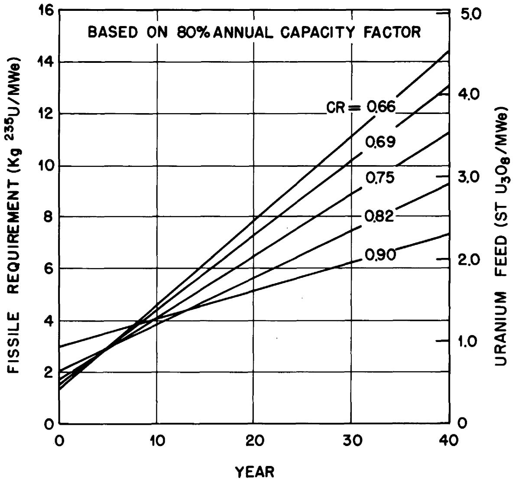  
Fig. C.1. Cumulative uranium and ore requirements.

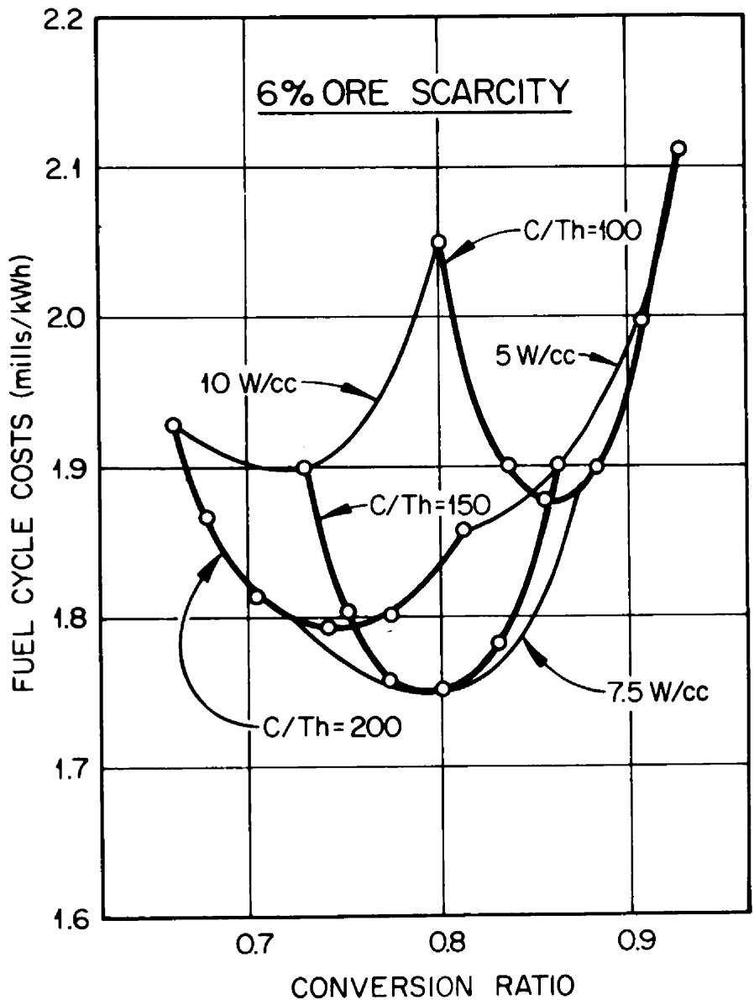

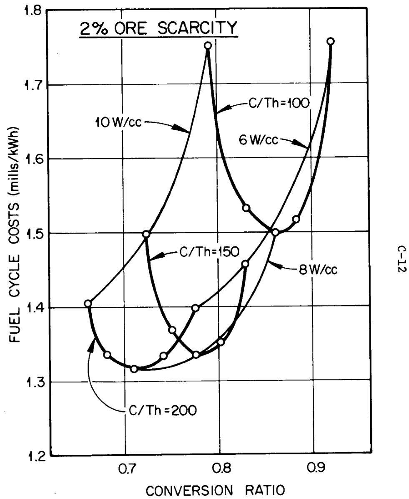  
Fig. C.2. Estimated HTGR fuel cycle costs for two assumed uranium scarcity values.

# REFERENCES FOR APPENDIX C

1. L. L. Bennett and R. K. Lane, "Fuel Management Flexibilities of Th-233U Cycle," Proceedings of American Nuclear Society Topical Meeting on Gas-Cooled Reactors, Gatlinburg, Tenn. (May 1974).   
2. R. H. Brogli, M. L. Hays, R. K. Lane, and R. F. Turner, The High Conversion HTGR for Resource Conservation, GA-A13606 (October 1975).   
3. Private communication, R. K. Lane (General Atomic) to F. J. Homan (Oak Ridge National Laboratory), June 11, 1976.   
4. R. K. Lane, R. Brogli, R. F. Turner, and N. Koo, High Conversion and Near-Breeder HTGR, GA-A14029 (July 1976).   
5. E. Teuchert and J. J. Rutten, "Near Breeding Thorium Fuel Cycle in the Pebble Bed HTR," Proceedings of the IAEA-OECD (NEA) International Symposium on Gas-Cooled Reactors With Emphasis on Advanced Systems, Julich, Germany, Oct. 13-17, 1975.   
6. Private communication, R. K. Lane (General Atomic) to F. J. Homan (Oak Ridge National Laboratory), June 21, 1976.   
7. R. H. Brogli (General Atomic), personal communication to J. D. Jenkins (Oak Ridge National Laboratory).

# APPENDIX D

# THORIUM FUEL CYCLE IN HwRs (CANDU)

Summary: The fuel utilization characteristics and fuel cycle cost for CANDU reactors are compared in this Appendix with LWRs. CANDU reactors are considered operating with no recycle, with plutonium recycle, and operating with a thorium-uranium fuel cycle. Several conclusions were reached:

1. Considerable flexibility exists with the CANDU system, and conversion ratios of up to 1.0 can be achieved using the thorium fuel cycle. An economic penalty is associated with higher conversion ratios since lower specific power and lower burnups are required.   
2. CANDUs operating on the thorium fuel cycle with a conversion ratio of 0.9 require 0.43 times as much $\mathrm{U}_{3}\mathrm{O}_{8}$ as LWRs operating on the uranium cycle with plutonium recycle. Numerous other comparisons are made between CANDUs and LWRs operating with both uranium and thorium cycles, with and without recycle. The CANDU is superior to the LWR in fuel utilization.   
3. When actual yearly ore requirements are considered (instead of the 30 year reactor commitment described above), it requires up to 15 years before the cumulative ore requirements of a reactor operating on the thorium fuel cycle with high conversion ratio are less than the cumulative requirements for a CANDU reactor operating with no recycle. This is due to the high specific inventory required to achieve high conversion ratios.   
4. The lowest fuel cycle costs were achieved with CANDUs operating on the thorium fuel cycle with conversion ratios in the range of 0.85 to 0.90 based on available information.

Operating Characteristics and Fuel Utilization in CANDU Reactors

This portion of the report presents the results of a very brief survey of the issues, the advantages and disadvantages, that would require consideration in any future decision to utilize CANDU reactors in the U.S., specifically those fueling options that will utilize thorium. Factors considered and discussed here are the relative performance characteristics of the fueling options, the inherent $\mathrm{U}_{3}\mathrm{O}_{8}$ fuel utilization economics, and the relative fuel cycle costs. The U.S. designed PWR, both with and without uranium and plutonium recycle, has been taken as the standard for comparison.

The fuel cycle characteristics of the standard CANDU (but uprated in specific power from the 19 kWth/kg HM of the Canadian Pickering Plant) both with and without plutonium recycle, and for two versions of the thorium-fueled CANDU, are presented in Table D.1. Two basic fueling options are considered for the use of thorium in the CANDU concept.

One option (when the conversion ratio is less than 1.0) utilizes plutonium makeup for the equilibrium refueling cycle and the other utilizes highly enriched $(\sim 93\%)$ U-235 as the makeup fuel. Both options will require substantial amounts of highly enriched U-235 for startup of the systems. Both options appear to be capable of being designed to operate with conversion ratios of 1.0.

Some of the potential tradeoff associated with high fuel utilization in CANDU reactors are listed in Table D.2. The use of thorium can improve the conversion ratio in any thermal reactor type, but the neutron economy of $\mathrm{D}_2\mathrm{O}$ moderation and cooling allows more potential for high conversion ratio.

Increasing the specific power reduces core size and $\mathrm{D}_2\mathrm{O}$ inventory. Fuel utilization is decreased as evidenced by greater fissile makeup and lower conversion ratio to maintain the same burnup. Optimization for

Table D.1. Performance Characteristics of Fueling Options for CANDU Reactors   

<table><tr><td rowspan="2"></td><td colspan="2">CANDU</td><td colspan="6">CANDU-Th (Pu Makeup, from Argonne Study)</td><td colspan="5">CANDU-Th (U-235 Makeup)**</td></tr><tr><td>No Recycle</td><td>Pu Recycle*</td><td>A</td><td>B</td><td>C</td><td>D</td><td>E</td><td>F</td><td>1</td><td>2</td><td>3</td><td>4</td><td>5</td></tr><tr><td>Specific Power, kWth/kg HM</td><td>26</td><td>26</td><td>29</td><td>29</td><td>29</td><td>29</td><td>29</td><td>29</td><td>38.4</td><td>38.4</td><td>38.4</td><td>25.6</td><td>25.6</td></tr><tr><td>Inventory, MT/GWe</td><td>128</td><td>128</td><td>115</td><td>115</td><td>115</td><td>115</td><td>115</td><td>115</td><td>86.8</td><td>86.8</td><td>86.8</td><td>130.2</td><td>130.2</td></tr><tr><td>Discharge Burnup, MWD/kg HM</td><td>7.5</td><td>18</td><td>10</td><td>20</td><td>25</td><td>33</td><td>40</td><td>44</td><td>15</td><td>27</td><td>44</td><td>8.5</td><td>27</td></tr><tr><td>Fuel Residence Time, Years</td><td>1.0</td><td>2.37</td><td>1.2</td><td>2.4</td><td>3.0</td><td>3.9</td><td>4.7</td><td>5.2</td><td>1.52</td><td>2.74</td><td>4.47</td><td>1.29</td><td>4.11</td></tr><tr><td>Equilibrium Cycle Loading***</td><td></td><td></td><td></td><td></td><td></td><td></td><td></td><td></td><td></td><td></td><td></td><td></td><td></td></tr><tr><td>MT HM/GWe-yr, U</td><td>127.7</td><td>31.5</td><td>0</td><td>18.8</td><td>24.5</td><td>34.2</td><td>40.7</td><td>45.6</td><td></td><td></td><td></td><td></td><td></td></tr><tr><td>U-Pu-O2</td><td></td><td>40.1</td><td>0</td><td>1†</td><td>2†</td><td>4†</td><td>6†</td><td>8†</td><td></td><td></td><td></td><td></td><td></td></tr><tr><td>(Th + U-233)-O2</td><td></td><td></td><td>95.7</td><td>40.8</td><td>30.9</td><td>21.2</td><td>16.3</td><td>14.0</td><td>64.9</td><td>36.0</td><td>22.1</td><td>114.5</td><td>36.0</td></tr><tr><td>Fissile Enrichment % U-235</td><td>0.711</td><td>0.71(U)</td><td></td><td></td><td></td><td></td><td></td><td></td><td></td><td></td><td></td><td></td><td></td></tr><tr><td>Fissile Pu, wt %</td><td></td><td>1.26(Pu)</td><td></td><td></td><td></td><td></td><td></td><td></td><td></td><td></td><td></td><td></td><td></td></tr><tr><td>Equilibrium Cycle Discharge, wt %, U-235</td><td>0.17</td><td>0.17</td><td></td><td></td><td></td><td></td><td></td><td></td><td></td><td></td><td></td><td></td><td></td></tr><tr><td>Fissile Pu, wt %</td><td>0.27</td><td>0.33</td><td></td><td></td><td></td><td></td><td></td><td></td><td></td><td></td><td></td><td></td><td></td></tr><tr><td>Requirement, ST U3O8/GWe-yr***</td><td></td><td></td><td></td><td></td><td></td><td></td><td></td><td></td><td></td><td></td><td></td><td></td><td></td></tr><tr><td>0.2 Tails</td><td>168</td><td>94</td><td>0</td><td>24.7</td><td>32.2</td><td>44.9</td><td>53.4</td><td>59.9</td><td>31.2</td><td>40.2</td><td>52.6</td><td>0</td><td>21.9</td></tr><tr><td>0.3 Tails</td><td></td><td></td><td></td><td></td><td></td><td></td><td></td><td></td><td>38.8</td><td>49.9</td><td>65.4</td><td>0</td><td>27.2</td></tr><tr><td>Sep. Work, MT SWU/GWe-yr***</td><td></td><td></td><td></td><td></td><td></td><td></td><td></td><td></td><td></td><td></td><td></td><td></td><td></td></tr><tr><td>0.2</td><td>0</td><td>0</td><td></td><td></td><td></td><td></td><td></td><td></td><td>31.1</td><td>40.1</td><td>52.5</td><td>0</td><td>21.9</td></tr><tr><td>0.3</td><td>0</td><td>0</td><td></td><td></td><td></td><td></td><td></td><td></td><td>26.4</td><td>34.0</td><td>44.6</td><td>0</td><td>18.6</td></tr><tr><td>Conversion Ratio</td><td>0.74</td><td>0.74</td><td>1.0</td><td>0.96</td><td>0.93</td><td>0.90</td><td>0.87</td><td>0.85</td><td>0.90</td><td>0.87</td><td>0.82</td><td>1.0</td><td>0.93</td></tr><tr><td>α, Capture to Fission Ratio</td><td>0.2</td><td>0.32</td><td>0.10</td><td>0.12</td><td>0.13</td><td>0.15</td><td>0.18</td><td>0.19</td><td>0.12</td><td>0.12</td><td>0.12</td><td>0.12</td><td>0.12</td></tr><tr><td>Equilibrium Cycle Fissile Loading</td><td></td><td></td><td></td><td></td><td></td><td></td><td></td><td></td><td></td><td></td><td></td><td></td><td></td></tr><tr><td>g U-235/kg HM</td><td>7.11</td><td>3.13</td><td>0</td><td></td><td></td><td></td><td></td><td></td><td>1.9</td><td>4.4</td><td>9.4</td><td>0</td><td>2.4</td></tr><tr><td>g Fissile Pu/kg HM</td><td>0</td><td>7.06</td><td>0</td><td>1</td><td>2</td><td>4</td><td>6</td><td>8</td><td></td><td></td><td></td><td></td><td></td></tr><tr><td>g Recycle U Fissile/kg HM</td><td>0</td><td>0</td><td>√18</td><td>18</td><td>18</td><td>18</td><td>18</td><td>18</td><td>√18</td><td>√18</td><td>√18</td><td>17.2</td><td>16.4</td></tr><tr><td>Total Fissile, g/kg HM</td><td>7.11</td><td>10.19</td><td>√18</td><td>19</td><td>20</td><td>22</td><td>24</td><td>26</td><td>20</td><td>22</td><td>27</td><td>17.2</td><td>18.8</td></tr><tr><td>Average Fissile, g/kg HM</td><td></td><td>√7</td><td>√18</td><td>18.5</td><td>19</td><td>20</td><td>21</td><td>22</td><td>19</td><td>20</td><td>23</td><td>17.2</td><td>17.6</td></tr></table>

*See Annex D.2 for plutonium recycle basis.   
**Personal communication from A. M. Perry, IEA, to E. H. Gift, March 1, 1976.   
\*\*\*At $80\%$ load factor.   
Fissile Pu only, g/kg HM

Table D.2. CANDU-Th Cycle Consideration   

<table><tr><td rowspan="2"></td><td rowspan="2">Pickering Station Data</td><td rowspan="2">Standard PHW-NU* Data</td><td rowspan="2">Ranges Considered for Th Cycle</td><td rowspan="2">Major Effect on Capital Cost and Fuel Utilization</td><td colspan="3">Optimum Trend for</td></tr><tr><td>Capital Intensive</td><td>U3O8 Cost Intensive</td><td>Fabrication - Refabrication Cost Intensive</td></tr><tr><td>Specific Power (kWth/kg HM)</td><td>19 (28 pins)</td><td>26 (37 pins)</td><td>16-38</td><td>Increased specific Power: 1. Reduced D2O inventory 2. Poor fuel utilization - increased fissile makeup or reduced burnup</td><td>High**</td><td>Low</td><td>Medium</td></tr><tr><td>Lattice Pitch (cm)</td><td>28.6</td><td>28.6</td><td>28.6-22.9</td><td>Reduced lattice pitch: 1. Reduced D2O inventory 2. Poor fuel utilization - increased fissile makeup or reduced burnup</td><td>Low</td><td>High</td><td>High</td></tr><tr><td>Burnup (MWD/kg HM)</td><td>7.5</td><td>7.5</td><td>10.0 up</td><td>Increased burnup: 1. Poor conversion ratio 2. Increased fissile makeup</td><td>-</td><td>Low</td><td>Medium</td></tr><tr><td>Coolant</td><td>PHW</td><td>PHW</td><td>PHW BLW OCR</td><td>BLW &amp; OCR: Reduced D2O inventory OCR: Higher thermal efficiency and higher specific power limit</td><td>BLW or OCR</td><td>-</td><td>-</td></tr></table>

*CANDU-PhW, natural uranium fueled.   
**For example, a "High" specific power is the optimum trend if capital costs are dominant.

high specific power is desirable if capital costs are high, and undesirable if $\mathrm{U}_{3} \mathrm{O}_{8}$ costs are high.

Reducing the lattice pitch tends to reduce the $\mathrm{D}_2\mathrm{O}$ inventory, but the overwhelming effect is to reduce the fuel utilization. Thus optimization would probably maintain the present lattice pitch, especially when $\mathrm{U}_{3}\mathrm{O}_{8}$ and fabrication costs are high.

Increasing the burnup of CANDU-Th options from 10 MWd/kg HM rapidly reduces the achievable conversion ratio, thus increasing fissile makeup requirements. If fabrication and reprocessing costs are high, the fuel cycle economics would favor high burnup over improved fuel utilization.

Changing the coolant from $\mathsf{D}_2\mathsf{O}$ to either light water or organic substantially lowers the $\mathsf{D}_2\mathsf{O}$ inventory, thus substantially lowering capital costs. The conversion ratio is lowered as a result of increased neutron losses in the coolant.

Utilizing the data of Table D.1 and the derived data shown in Table D.3, estimates have been made of the natural uranium fuel needs of CANDUs and PWRs, with and without plutonium recycle and of CANDUs fueled with thorium.

Table D.4 shows, on an individual reactor basis, the $\mathrm{U}_{3}\mathrm{O}_{8}$ requirements relative to a CANDU having no recycle. Thus the PWR at no recycle will require 30% more $\mathrm{U}_{3}\mathrm{O}_{8}$ than the CANDU with no recycle; for uranium recycle alone, the PWR and CANDU $\mathrm{U}_{3}\mathrm{O}_{8}$ needs are nearly equal; with uranium and plutonium recycle the PWRs' fuel needs are 80% of those of the CANDU with no recycle.

Recycle of Pu in the CANDU system leads to a $40\%$ fuel saving (essentially the same percentage fuel saving that plutonium + uranium recycle yields for the PWR). The use of thorium with either fissile plutonium or U-235 makeup leads to fuel savings of $70 - 75\%$ for conversion ratios near 1.0. Even for a conversion ratio near 0.8, fuel savings of $60\%$ could be expected.

Table D.3. Data for Use in Mines Fuel Needs Estimates   

<table><tr><td rowspan="2">Reactor Description</td><td colspan="2">Specific Inventory*</td><td rowspan="2">Thermal Efficiency, %</td><td rowspan="2">Conversion Ratio</td><td rowspan="2">Average Capture to Fission Ratio, α</td><td rowspan="2">100% Load Factor Doubling Time = D**</td><td rowspan="2">30-Year Minesed Fuel Need at 0.8 Load Factor, ST U3O8</td></tr><tr><td>ST Natural U3O8/GWe</td><td>kg Fissile/GWe</td></tr><tr><td>CANDU, No Recycle</td><td>168***</td><td></td><td>0.30</td><td>0.74</td><td>0.20</td><td>-1.0</td><td>5208</td></tr><tr><td>CANDU, Pu Recycle</td><td>303</td><td>1.456</td><td>0.30</td><td>0.74</td><td>0.32</td><td>-2.58</td><td>3100</td></tr><tr><td>CANDU, Th-Pu Fueled</td><td></td><td></td><td></td><td></td><td></td><td></td><td></td></tr><tr><td>CR = 1.0</td><td>1360</td><td>5.38</td><td>0.30</td><td>1.0</td><td>0.10</td><td>∞</td><td>1360</td></tr><tr><td>CR = 0.96</td><td>970</td><td>3.83</td><td>0.30</td><td>0.96</td><td>0.12</td><td>-70.27</td><td>1301</td></tr><tr><td>CR = 0.93</td><td>907</td><td>3.59</td><td>0.30</td><td>0.93</td><td>0.13</td><td>-37.31</td><td>1490</td></tr><tr><td>CR = 0.90</td><td>870</td><td>3.43</td><td>0.30</td><td>0.90</td><td>0.15</td><td>-24.52</td><td>1722</td></tr><tr><td>CR = 0.87</td><td>860</td><td>3.40</td><td>0.30</td><td>0.87</td><td>0.18</td><td>-18.22</td><td>1993</td></tr><tr><td>CR = 0.85</td><td>875</td><td>3.46</td><td>0.30</td><td>0.85</td><td>0.19</td><td>-15.93</td><td>2193</td></tr><tr><td>CANDU, Th-U-235 Fueled</td><td></td><td></td><td></td><td></td><td></td><td></td><td></td></tr><tr><td>CR = 0.9</td><td>990</td><td>3.9</td><td>0.30</td><td>0.9</td><td>0.11</td><td>-28.88</td><td>1813</td></tr><tr><td>CR = 0.87</td><td>760</td><td>3.0</td><td>0.30</td><td>0.87</td><td>0.12</td><td>-16.94</td><td>1837</td></tr><tr><td>CR = 0.82</td><td>735</td><td>2.9</td><td>0.30</td><td>0.82</td><td>0.13</td><td>-11.72</td><td>2240</td></tr><tr><td>CR = 1.0</td><td>1470</td><td>5.8</td><td>0.30</td><td>1.0</td><td>0.10</td><td>∞</td><td>1470</td></tr><tr><td>CR = 0.93</td><td>940</td><td>3.7</td><td>0.30</td><td>0.93</td><td>0.12</td><td>-38.79</td><td>1522</td></tr><tr><td>PWR, No Recycle</td><td>495</td><td></td><td>0.33</td><td>0.6</td><td>0.2</td><td>-1.88</td><td>6800</td></tr><tr><td>PWR, Uranium Recycle Only</td><td>495</td><td></td><td>0.33</td><td>0.6</td><td>0.2</td><td>-2.42</td><td>5410</td></tr><tr><td>PWR, Plutonium Recycle</td><td>495</td><td></td><td>0.33</td><td>0.6</td><td></td><td>-3.06</td><td>4370</td></tr></table>

*Based on 700 days ex-core inventory.   
**Doubling time is defined as: 2.74 * (Thermal Efficiency) (Specific Inventory) (Conversion Ratio - 1.0) (1 + α) (Reactor Load Factor)   
\*\*\*Initial core and annual reload at 0.8 load factor.

Table D.4. Relative 30-Year $\mathbf{U}_3\mathbf{O}_8$ Requirements (at 0.8 load factor)   

<table><tr><td></td><td>Relative U3O8 Need</td></tr><tr><td>PWR, No Recycle</td><td>1.31</td></tr><tr><td>PWR, Uranium Recycle</td><td>1.04</td></tr><tr><td>PWR, Plutonium and Uranium Recycle</td><td>0.82</td></tr><tr><td>CANDU, No Recycle</td><td>1.0</td></tr><tr><td>CANDU, Pu Recycle</td><td>0.60</td></tr><tr><td>CANDU, Th-Pu Fueled</td><td></td></tr><tr><td>CR = 1.0</td><td>0.26</td></tr><tr><td>CR = 0.96</td><td>0.25*</td></tr><tr><td>CR = 0.93</td><td>0.29</td></tr><tr><td>CR = 0.90</td><td>0.33</td></tr><tr><td>CR = 0.87</td><td>0.38</td></tr><tr><td>CR = 0.85</td><td>0.42</td></tr><tr><td>CANDU, Th-U-235 Fueled</td><td></td></tr><tr><td>CR = 0.9</td><td>0.35</td></tr><tr><td>CR = 0.87</td><td>0.35</td></tr><tr><td>CR = 0.82</td><td>0.43</td></tr><tr><td>CR = 1.0</td><td>0.28</td></tr><tr><td>CR = 0.93</td><td>0.29</td></tr></table>

*Small variations from expected values result from approximations in the data of Table 2.

Although these fuel savings are real they cannot be realized at the beginning of the reactor lifetime. In fact, for the thorium fueled reactor having a conversion ratio of 1.0, the entire fuel requirement is essentially required at the beginning of reactor life. Figure D.1 shows the $\mathrm{U}_{3}\mathrm{O}_{8}$ usage pattern over a 30-year reactor life (at 0.8 load factor) of selected 1000 MWe CANDU reactor options. Approximately seven years are required before the mined fuel needs of a CANDU, no recycle reactor surpass those of a CANDU reactor on the thorium cycle with a conversion ratio equal to 1.0. Similarly about 12 years are required for the plutonium recycle option to exceed the thorium cycle having a conversion ratio equal to 1.0.

To gain a better feeling for the dynamics of ore utilization of different concepts and reactor options the following scenario can be employed. Assume, for comparative purposes, that all of these concepts and reactor options are available now and that a country is going to choose one concept and meet all its power needs for 50 years with this one concept. Also, it might be assumed that fuel utilization is of major importance. Since the actual power growth cannot be known with any certainty, the representative power growths shown in Figure D.2 have been chosen. (Growth B [5 GWe/yr] of the figure is approximately one-fifth of the growth rate of the 1975 low ERDA growth projection.) The growth rates A, B, and C of Figure D.2 lead to total nuclear capacities at the end of 50 years of 370, 250, and 170 GWe, respectively.

Figure D.3 considers growth rate A (370 GWe in 50 years) and compares the relative $\mathrm{U}_{3}\mathrm{O}_{8}$ requirements of the PWR and the CANDU reactors (no thorium concepts). First it is apparent that over the 50-year time period the total cumulative requirements are relatively the same as those for the individual reactors (as discussed in Table D.4). It is of interest to note that although the 50-year uranium requirements for the PWR with plutonium recycle are only about $85\%$ of those for the CANDU, no recycle; for the first 17 to 18 years of the campaign the $\mathrm{U}_{3}\mathrm{O}_{8}$ requirements for the CANDU, no recycle are slightly lower.

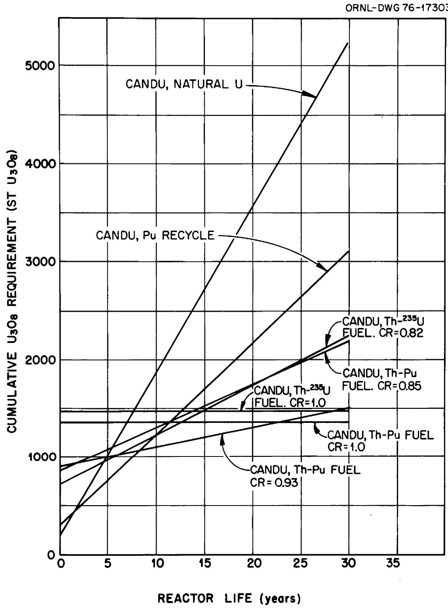  
Fig. D.l. $\mathrm{U}_{3}\mathrm{O}_{8}$ usage pattern for CANDU fueling options.

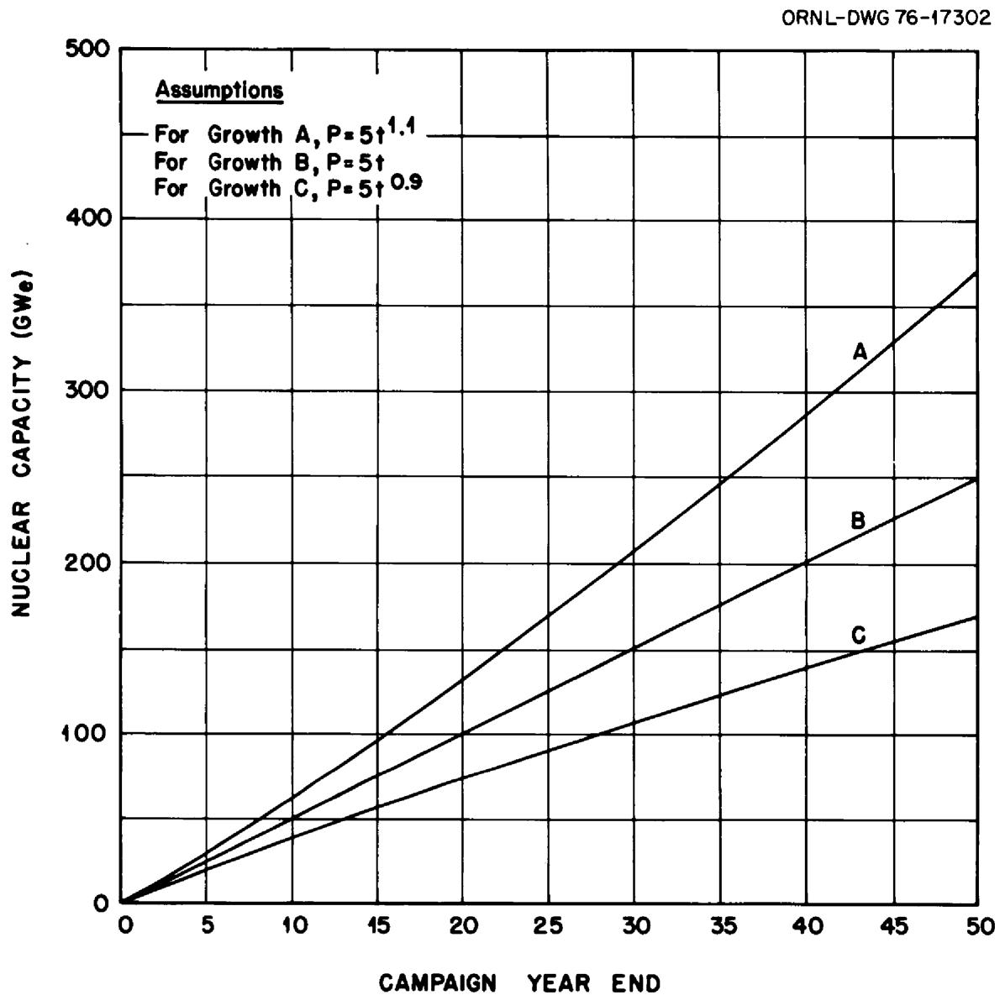  
Fig. D.2. Assumed CANDU nuclear growth schedules for estimating natural uranium utilization.

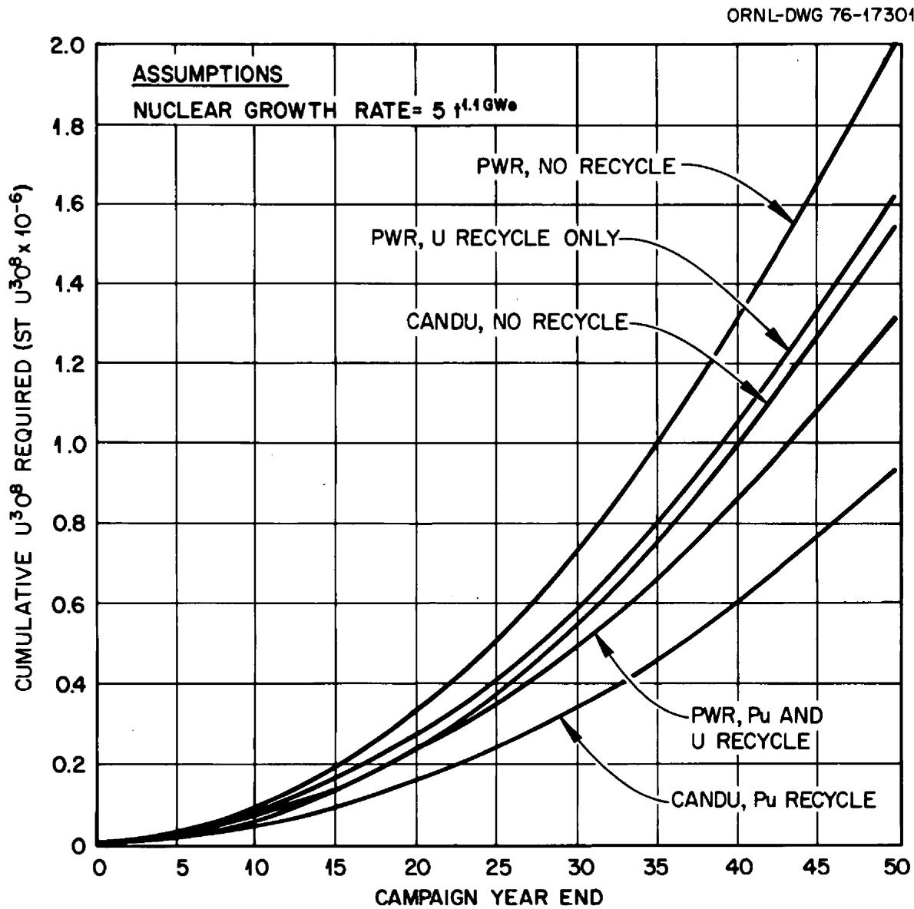  
Fig. D.3. Cumulative $\mathrm{U}_{3}\mathrm{O}_{8}$ requirements for PWR and CANDU with and without plutonium recycle.

In Figure D.4 the cumulative $\mathrm{U}_{3}\mathrm{O}_{8}$ requirements for the CANDU, no recycle, are compared with those of three CANDU thorium options for growth rate A (of Figure D.2). Figure D.5 presents a similar comparison for growth rate C. These figures show the effect of the high initial fuel loadings required by the thorium fueled reactor options. In Table D.5 these results are compared with those previously reported in Table D.4 for the individual 30-year reactor requirements. Table D.5 shows that, as the growth rate increases, a longer time is required before potential fuel gains of an advanced converter are realized.

This effect shows up also in the time required before the fuel requirements of an advanced converter are less than those of a less neutron efficient concept. This is illustrated in Table D.6 which lists the time in years before the fuel requirement of a high conversion ratio, thorium-fueled CANDU reactor is less than the fuel requirements of all lower conversion ratio concepts. For example, for power growth A and the thorium CANDU having a conversion ratio equal to 1.0, approximately 15 years are required before its fuel requirements are less than those of the CANDU, no recycle, 23 years before they are less than CANDU, Pure recycle, 19 years for thorium CANDU, CR = 0.85 and 38 years for thorium CANDU, CR = 0.93.

In addition to the cumulative $\mathrm{U}_{3}\mathrm{O}_{8}$ requirement, it is of interest to consider the amount of $\mathrm{U}_{3}\mathrm{O}_{8}$ that is committed for the lifetime of a nuclear power growth campaign. At any particular time, in an expanding nuclear growth campaign, the committed $\mathrm{U}_{3}\mathrm{O}_{8}$ is much greater than the amount actually required. Table D.7 compares the committed and cumulative $\mathrm{U}_{3}\mathrm{O}_{8}$ requirements for 50-year growth for the power growths A and C.

For power growth A, the cumulative requirement at the end of 50 years for the PWRs and CANDUs utilizing plutonium and uranium fuels only is one-half of that actually committed.

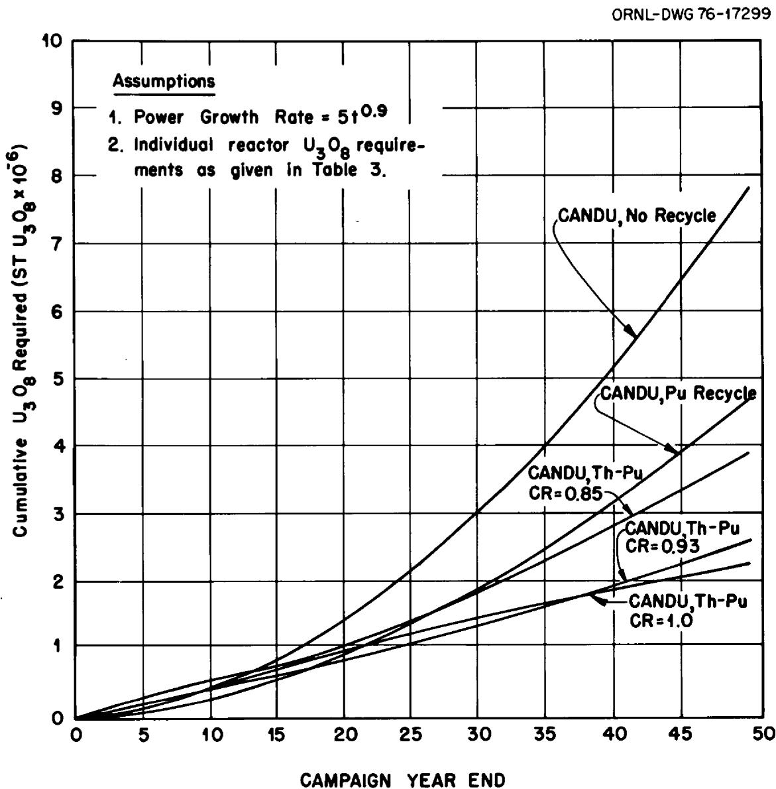  
Fig. D.4. Cumulative $\mathrm{U}_{3}\mathrm{O}_{8}$ requirement for CANDU reactor options.

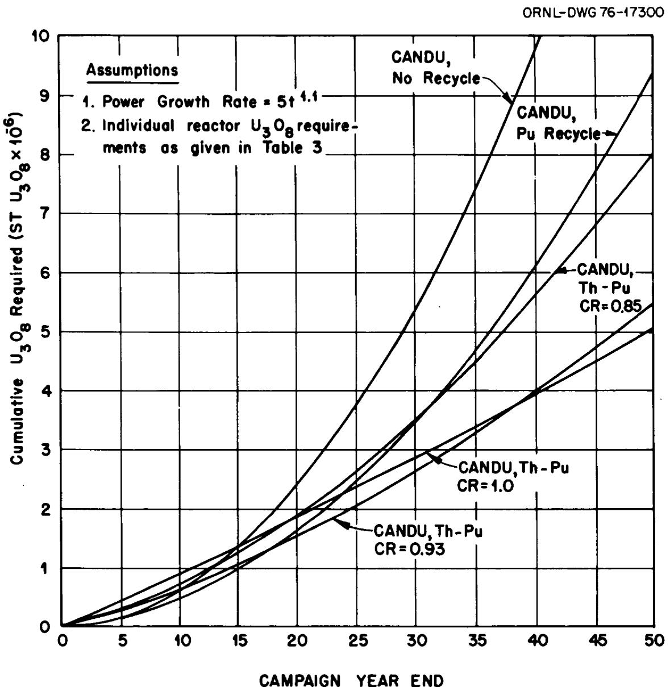  
Fig. D.5. Cumulative $\mathrm{U}_{3}\mathrm{O}_{8}$ requirement for CANDU reactor options.

Table D.5. Effect of Power Growth Rate of Cumulative (50-Year) $\mathrm{U}_{3}\mathrm{O}_{8}$ Requirements   

<table><tr><td>Reactor Type</td><td>Individual Reactor</td><td>Nuclear Growth A*</td><td>Nuclear Growth C**</td></tr><tr><td>CANDU, No Recycle</td><td>1.0</td><td>1.0</td><td>1.0</td></tr><tr><td>CANDU, Pu Recycle</td><td>0.595</td><td>0.610</td><td>0.605</td></tr><tr><td>CANDU, Th-Pu Feed</td><td></td><td></td><td></td></tr><tr><td>CR = 0.85</td><td>0.423</td><td>0.524</td><td>0.506</td></tr><tr><td>CR = 0.93</td><td>0.287</td><td>0.356</td><td>0.337</td></tr><tr><td>CR = 1.0</td><td>0.261</td><td>0.326</td><td>0.296</td></tr></table>

*Nuclear growth A = 5 t $^{1.1}$ , GWe (t = years). 50-year capacity is 370 GWe.   
\*\*Nuclear growth C = 5 t0.9, GWe. 50-year capacity is 169 GWe.

Table D.6. Time Required to Achieve Breakeven Fuel Needs   

<table><tr><td rowspan="2"></td><td rowspan="2">CANDU, No Recycle</td><td rowspan="2">CANDU, Pu Recycle</td><td colspan="3">CANDU, Th-Pu</td></tr><tr><td>CR = 0.85</td><td>CR = 0.93</td><td>CR = 1.0</td></tr><tr><td colspan="6">A. Individual Reactor, 30-Year Life</td></tr><tr><td>CANDU, No Recycle</td><td>0</td><td></td><td></td><td></td><td></td></tr><tr><td>CANDU, Pu Recycle</td><td>1</td><td>0</td><td></td><td></td><td></td></tr><tr><td colspan="6">CANDU, Th-Pu</td></tr><tr><td>CR = 0.85</td><td>6</td><td>11</td><td>0</td><td></td><td></td></tr><tr><td>CR = 0.93</td><td>5</td><td>8</td><td>2</td><td>0</td><td></td></tr><tr><td>CR = 1.0</td><td>7</td><td>11</td><td>11</td><td>28</td><td>0</td></tr><tr><td colspan="6">B. Power Growth Rate A</td></tr><tr><td>CANDU, No Recycle</td><td>0</td><td></td><td></td><td></td><td></td></tr><tr><td>CANDU, Pu Recycle</td><td>1</td><td>0</td><td></td><td></td><td></td></tr><tr><td colspan="6">CANDU, Th-Pu</td></tr><tr><td>CR = 0.85</td><td>12.5</td><td>30</td><td>0</td><td></td><td></td></tr><tr><td>CR = 0.93</td><td>10</td><td>18</td><td>1</td><td>0</td><td></td></tr><tr><td>CR = 1.0</td><td>15</td><td>23</td><td>19</td><td>38</td><td>0</td></tr><tr><td colspan="6">C. Power Growth Rate C</td></tr><tr><td>CANDU, No Recycle</td><td>0</td><td></td><td></td><td></td><td></td></tr><tr><td>CANDU, Pu Recycle</td><td>1</td><td>0</td><td></td><td></td><td></td></tr><tr><td colspan="6">CANDU, Th-Pu</td></tr><tr><td>CR = 0.85</td><td>11</td><td>27</td><td>0</td><td></td><td></td></tr><tr><td>CR = 0.93</td><td>9</td><td>17</td><td>1</td><td>0</td><td></td></tr><tr><td>CR = 1.0</td><td>13</td><td>22</td><td>17</td><td>35</td><td>0</td></tr></table>

Table D.7. Comparison of Committed and Cumulative $\mathbf{U}_{3}\mathbf{O}_{8}$ Requirements for a 50-Year Campaign   

<table><tr><td rowspan="3">Reactor Type</td><td colspan="2">Power Growth A
(Power at 50 years = 370 GWe)</td><td colspan="2">Power Growth C
(Power at 50 years = 170 GWe)</td></tr><tr><td colspan="2">ST U3O8</td><td colspan="2">ST U3O8</td></tr><tr><td>Cumulative Requirement</td><td>Committed Requirement*</td><td>Cumulative Requirement</td><td>Committed Requirement</td></tr><tr><td>PWR, No Recycle</td><td>2.04 × 106</td><td>4.08 × 106</td><td>1.02 × 106</td><td>1.86 × 106</td></tr><tr><td>PWR, Uranium Recycle</td><td>1.63 × 106</td><td>3.22 × 106</td><td>0.813 × 106</td><td>1.47 × 106</td></tr><tr><td>PWR, Pu Recycle</td><td>1.32 × 106</td><td>2.57 × 106</td><td>0.658 × 106</td><td>1.18 × 106</td></tr><tr><td>CANDU, No Recycle</td><td>1.54 × 106</td><td>3.17 × 106</td><td>0.776 × 106</td><td>1.44 × 106</td></tr><tr><td>CANDU, Pu Recycle</td><td>0.939 × 106</td><td>1.85 × 106</td><td>0.469 × 106</td><td>0.846 × 106</td></tr><tr><td>CANDU, Th-Pu Fueled</td><td></td><td></td><td></td><td></td></tr><tr><td>CR = 0.85</td><td>0.807 × 106</td><td>1.136 × 106</td><td>0.392 × 106</td><td>0.519 × 106</td></tr><tr><td>CR = 0.93</td><td>0.549 × 106</td><td>0.695 × 106</td><td>0.262 × 106</td><td>0.318 × 106</td></tr><tr><td>CR = 1.0</td><td>0.503 × 106</td><td>0.503 × 106</td><td>0.230 × 106</td><td>0.230 × 106</td></tr></table>

*For 50-year reactor lifetime at 0.8 load factor.

For the thorium-fueled CANDUs, much more of the total commitment would be required at the end of the 50-year period. In this analysis, for cases where the conversion ratio equals 1.0, the cumulative requirement and the commitment are equal.

# Fuel Cycle Cost Characteristics of CANDU Reactors

The fuel cycle costs for the CANDU reactor concepts are estimated using a simplified fuel cost model discussed in Annex D.1. Much of the input required by the model is derivable from the data of Tables D.1 and D.3 of the fuel performance and fuel utilization sections of this Appendix. Cost assumptions for reprocessing, fabrication, shipping and wastedisposal charges are from Appendixes H and I of this report.

These cost and fuel material flow requirements for the equilibrium refueling cycle are shown in Table D.8 for several CANDU fueling options and for comparison, those of a typical PWR reactor. It is apparent from the table that a substantial cost penalty will occur in the fabrication of either uranium-plutonium, thorium-U-233, or thorium-U-233-plutonium fuels. The fabrication cost ratios of these different fuels may be of greater interest than the estimated magnitudes shown in Table D.8. These ratios are listed in Table D.9.

The estimated reprocessing costs for the PWR were based on the AGNS plant expanded to handle the conversion of uranyl nitrate to $\mathrm{UF}_6$ , plutonium nitrate to $\mathrm{PuO}_2$ , and the solidification or containment of all radioactive liquid, gaseous and solid wastes from the reprocessing plant operation. They are based on 5 MT/day plant specifically designed to handle a particular fuel type. As such within the limit of accuracy of the estimation process, no significant cost differential was found for any of the several fuel types that might be considered by either the CANDU or the PWR. As a result the basic reprocessing cost was taken to be $226/kg. Since the recovery of the fissile content of thorium fuels that are clad with zirconium is poorly understood, fuel cycle cost

Table D.8. Data for Equilibrium Fuel Cycle Cost Calculations of CANDU Reactors   

<table><tr><td>Case</td><td>Annual U3O8Feed Rate,ST U3O8/GWe-Year</td><td>Annual ThO2Feed Rate,ST ThO2/GWe-Year</td><td>SeparativeWork Req&#x27;d.,MT SW/GWe-Year</td><td>FabricationRate,**MT/GWe-Year</td><td>Sum of Fab.,Shipping andReproc. Costs,$/kg U</td><td>ToppingFissilePu Feed,g/kg HM</td><td>In-CorePlusEx-Core***Time, Year</td><td>FabricationCost, $/kg</td><td>Shipping PlusReproc. Plus NoWaste DisposalCosts, $/kg</td><td>PermanentFuel AssemblyStorage Costs,$/kg</td></tr><tr><td>CANDU, NoRecycle</td><td>168</td><td>0</td><td>0</td><td>127.7</td><td>132.5†</td><td>0</td><td>2.918</td><td>79.5</td><td>-</td><td>50</td></tr><tr><td>CANDU, PuRecycle†</td><td>94</td><td>0</td><td>0</td><td>54.1</td><td>538§</td><td>0</td><td>4.29</td><td>312</td><td>226</td><td>-</td></tr><tr><td>A</td><td>0</td><td>107</td><td>0</td><td>97.3</td><td>611</td><td>0</td><td>3.12</td><td>385</td><td>226</td><td>-</td></tr><tr><td>B</td><td>24.7</td><td>53.6</td><td>0</td><td>48.7</td><td>611</td><td>1</td><td>4.32</td><td>385</td><td>226</td><td>-</td></tr><tr><td>C</td><td>32.2</td><td>42.8</td><td>0</td><td>38.9</td><td>611</td><td>2</td><td>4.92</td><td>385</td><td>226</td><td>-</td></tr><tr><td>D</td><td>44.9</td><td>32.5</td><td>0</td><td>29.5</td><td>611</td><td>4</td><td>5.82</td><td>385</td><td>226</td><td>-</td></tr><tr><td>E</td><td>53.4</td><td>26.7</td><td>0</td><td>24.3</td><td>611</td><td>6</td><td>6.62</td><td>385</td><td>226</td><td>-</td></tr><tr><td>F</td><td>59.9</td><td>24.3</td><td>0</td><td>22.1</td><td>611</td><td>8</td><td>7.12</td><td>385</td><td>226</td><td>-</td></tr><tr><td>1</td><td>31.2</td><td>71.4</td><td>31.2</td><td>64.9</td><td>611</td><td>0</td><td>3.44</td><td>385</td><td>226</td><td>-</td></tr><tr><td>2</td><td>40.2</td><td>39.6</td><td>40.2</td><td>36.0</td><td>611</td><td>0</td><td>9.66</td><td>385</td><td>226</td><td>-</td></tr><tr><td>3</td><td>52.6</td><td>24.3</td><td>52.6</td><td>22.1</td><td>611</td><td>0</td><td>6.39</td><td>385</td><td>226</td><td>-</td></tr><tr><td>4</td><td>0</td><td>126.0</td><td>0</td><td>114.5</td><td>611</td><td>0</td><td>3.21</td><td>385</td><td>226</td><td>-</td></tr><tr><td>5</td><td>21.9</td><td>39.6</td><td>21.9</td><td>36.0</td><td>611</td><td>0</td><td>6.03</td><td>385</td><td>226</td><td>-</td></tr><tr><td>PWR, NoRecycle</td><td>210.57</td><td>0</td><td>131.2</td><td>27.65</td><td>250†</td><td>0</td><td>4.82</td><td>150</td><td>-</td><td>100</td></tr><tr><td>PWR, UraniumRecycle</td><td>162.84</td><td>0</td><td>131.2</td><td>27.65</td><td>376</td><td>0</td><td>4.82</td><td>150</td><td>226</td><td>-</td></tr><tr><td>PWR, PuRecycle</td><td>129.18</td><td>0</td><td>96.2</td><td>27.65</td><td>469.5§§</td><td>0</td><td>4.82</td><td>500 MO2+150 UO2Av. = 243.5§§</td><td></td><td></td></tr></table>

*All data refer to an 0.8 reactor load factor.   
**This is also used for the reprocessing and shipping rate.   
\*\*\*Ex-core time = 700 days.   
†Includes $100/kg perpetual storage costs for PWR and $50/kg for CANDU.   
+Cases A to F represent the CANDU-Th Pu makeup concepts, and Cases 1 to 5 represent the CANDU-Th U-235 makeup concept described in Table D1.   
§Assumes all of the reload batch is of mixed oxide.   
§5 Assumes only 0.267 of a reload batch is mixed oxide.

Table D.9. Fabrication Cost Ratios of CANDU and PWR Fuels   

<table><tr><td>PWR, slightly enriched UO2</td><td>1.00</td></tr><tr><td>PWR, slightly enriched UO2-PuO2</td><td>3.33</td></tr><tr><td>CANDU, natural uranium (UO2)</td><td>0.53</td></tr><tr><td>CANDU, slightly enriched (UO2-PuO2)</td><td>2.08</td></tr><tr><td>CANDU, slightly enriched (UO2-PuO2-ThO2)</td><td>2.57</td></tr></table>

estimates were also made for a $50\%$ increase in the reprocessing charge when applied to thorium fuels. In addition to the unit costs listed in Table D.8, the remaining basic cost assumptions of the study are:

Separative work $\$ 70/$ SWU

$\mathbf{ThO}_2$ 15/1b ThO

Inventory charge rate 15%/yr

Reactor load factor 0.8

Figure D.6 presents a comparison of the fuel cycle cost of the PWR and the CANDU when both reactor types are not fueled with thorium.

This figure shows that for a large $\mathrm{U}_{3}\mathrm{O}_{8}$ cost range, the CANDU no recycle concept shows potential for lowest fuel cycle costs. In these estimates the cost of $\mathrm{D}_{2}\mathrm{O}$ initial inventory and annual losses have not been included. Other studies* have estimated the $\mathrm{D}_{2}\mathrm{O}$ loss cost to be about 0.35 mills/kWhr (for $\mathrm{D}_{2}\mathrm{O}$ at $\$110/\mathrm{kg}$ and $16\%/\mathrm{yr}$ charge rate) and the initial inventory cost to be about 2.5 mills/kWhr. The dashed lines show the effect of adding the annual $\mathrm{D}_{2}\mathrm{O}$ loss cost to the CANDU fuel cycle cost. Even with this cost added the CANDU, no recycle fuel cost is less than the PWR plutonium recycle cost when the cost of $\mathrm{U}_{3}\mathrm{O}_{8}$ is less than $\$25/\mathrm{lb}$ .

As presently conceived (and understood by this author) the Canadian concept for plutonium recycle will never be economically competitive. This fueling concept adds plutonium to all reload fuel assemblies to increase the fissile loading to near $1\%$ such that the achievable burnup approaches 18-19 MWd/kg HM. As such, this concept pays a high plutonium fabrication cost for all assemblies. It is possible that the use of

ORNL-DWG 76-17693

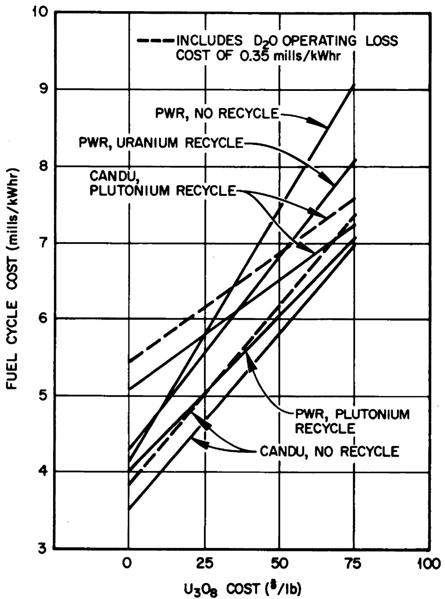  
Fig. D.6. Comparison of fuel cycle cost of the PWR and CANDU as a function of $\mathrm{U}_{3} \mathrm{O}_{8}$ cost.

plutonium spiking and slightly enriched uranium assemblies (as contemp-
plated by the PWR) might produce more favorable economics. On an economic
basis the PWR with plutonium recycle is very competitive with the CANDU.
Uranium recycle only in the PWR is seen to be economically justified at
a $\mathrm{U}_{3}\mathrm{O}_{8}$ cost of well under $20/lb.

Figure D.7 compares the fuel cycle costs (not including $\mathsf{D}_2\mathsf{O}$ losses) of concepts on uranium or thorium fuel options. In all circumstances considered, the CANDU-Th concept having a conversion ratio equal to 1.0 was uneconomical. Based on Figure D.7 the preferred method for utilization of thorium in CANDUs is to use highly enriched U-235 as the makeup fuel. This concept (at CR = 0.85) was the lowest cost option studied and was remarkably insensitive to $\mathsf{U}_3\mathsf{O}_8$ cost increases. The use of plutonium as the makeup fuel was found to be considerably less economic. However, these calculations were based on unit costs of Pu as recovered from CANDU reactors. Use of Pu from LWRs (if available) or from slightly enriched CANDU cycles would give more favorable results for Pu use.

Figure D.8 shows the fuel cycle cost as a function of the conversion ratio for the CANDU thorium concept having plutonium makeup. Distinct minima were found at about 0.9 to 0.92 conversion ratio. The effect of increasing the reprocessing cost from $226/kg to$ 339/kg (a 50% increase) is also shown. This increase tends to drive the optimum conversion ratio down. Conversely, increasing the cost of $U_{3}O_{8}$ tends to increase the optimum conversion ratio.

Figure D.9 presents similar results for a CANDU thorium concept having $93\%$ U-235 as the makeup fuel. For this makeup fuel the optimum conversion ratio is seen to be less than 0.8. This figure also shows the effect of increasing the power density on both conversion ratio and fuel costs. At the higher power density it seems apparent that conversion ratio of 1.0 is probably not attainable. The lower power density concept seems to have the potential for somewhat lower fuel cycle costs at its optimum conversion ratio.

ORNL-DWG 76-17694

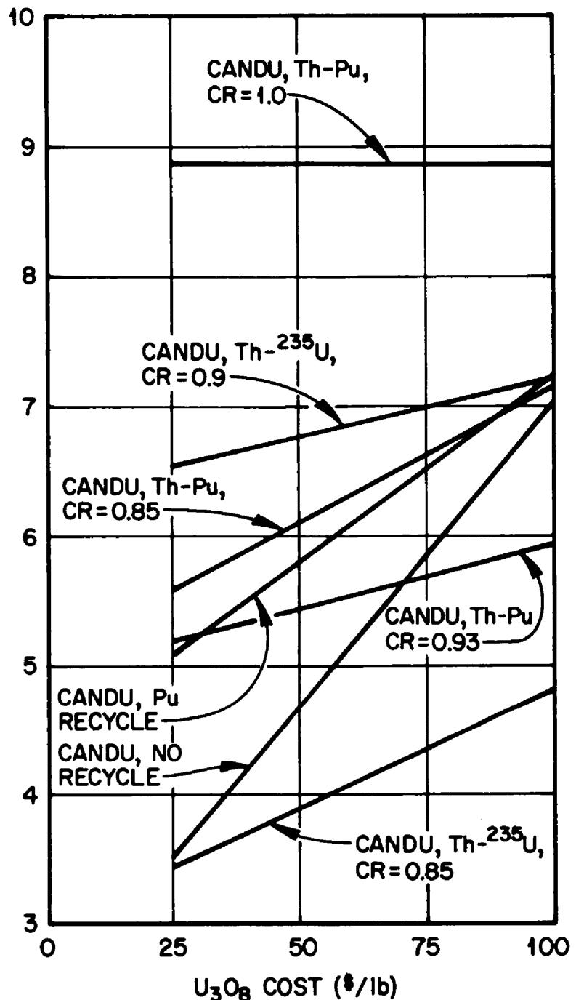  
FUEL CYCLE COST (mills/kWhr)   
Fig. D.7. Comparison of fuel cycle cost of CANDU concepts on uranium or thorium fuel options.

ORNL-DWG 76-17695

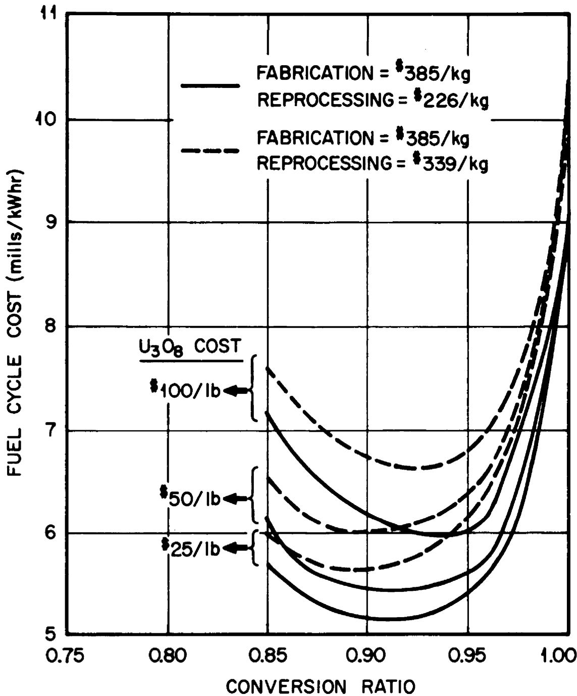  
Fig. D.8. Fuel cycle cost for CANDU-thorium concept having plutonium topping.

ORNL-DWG 76-17696

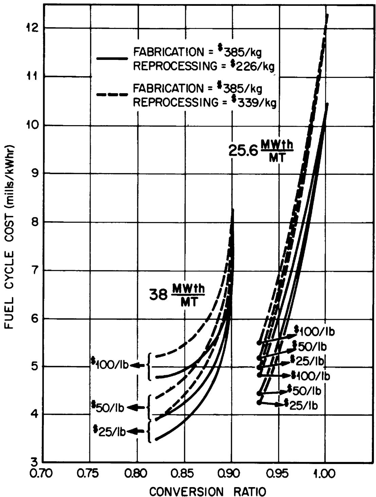  
Fig. D.9. Fuel cycle cost for CANDU-thorium concept having $93\%$ U-235 topping.

# ANNEX D.1

# CALCULATIONAL MODEL FOR EQUILIBRIUM FUEL CYCLE COSTS

The cost model employed in this work is highly simplified, but does consider the basic costs incurred by a utility. In this model no dollar value is attached to recycled fissile material. Present value discounting is not done, but an inventory charge based on total in-core plus ex-core time is estimated.

A. The burnup cost (of either $\mathrm{U}_{3}\mathrm{O}_{8}$ or $\mathrm{ThO}_2$ ) is defined by the equation

$$
\begin{array}{l} B = F c \frac {\$}{1 b} \cdot F \frac {S T}{G W e - y r} \frac {2 0 0 0 l b}{S T} \frac {1 0 ^ {3} m i l l s}{\$} \frac {G W}{1 0 ^ {6} k W} \frac {y r}{3 6 5 D} \frac {D}{2 4 h r} \\ = 2. 2 8 3 1 1 \times 1 0 ^ {- 4} \mathrm {F c} \cdot \mathrm {F}, \text {m i l l s / k W h r}. \\ \end{array}
$$

B. The separative work cost is defined as

$$
\begin{array}{l} S = X \cdot \frac {M T S W}{G W e - y r} \cdot Y \frac {\$}{k g - S W U} \cdot \frac {1 0 ^ {3} m i l l s}{\$} \frac {G W}{1 0 ^ {6} k W} \frac {1 0 ^ {3} k g}{M T} \frac {y r}{3 6 5 D} \frac {D}{2 4 h r} \\ = 1. 1 4 1 5 5 \times 1 0 ^ {- 4} \mathrm {X} \cdot \mathrm {Y}, \text {m i l l s / k W h r}. \\ \end{array}
$$

C. The fabrication, reprocessing, shipping or waste disposal costs are defined as

$$
\begin{array}{l} C _ {x} = M \frac {M T}{G W e - y r} \cdot F _ {x} \frac {\$}{k g H M} \cdot \frac {1 0 ^ {3} m i l l s}{\$} \frac {G W}{1 0 ^ {6} k W} \frac {1 0 ^ {3} k g}{M T} \frac {y r}{3 6 5 D} \frac {D}{2 4 h r} \\ = 1. 1 4 1 5 5 \times 1 0 ^ {- 4} \mathrm {M} \cdot \mathrm {F} _ {\mathrm {x}}, \text {m i l l s / k W h r}. \\ \end{array}
$$

D. The cost of supplemental plutonium feed (used for topping in some CANDU-Th concepts) is based solely on the money invested in recovery of plutonium from a standard natural uranium CANDU that would not otherwise be recovering the plutonium. Thus, it is defined as:

$$
\begin{array}{l} C p = M p \frac {g m P u}{k g H M} \cdot V p \frac {\$}{g m} \cdot M \frac {M T H M}{G W e - y r} \cdot \frac {1 0 ^ {3} k g}{M T} \cdot \frac {1 0 ^ {3} m i l l s}{\$} \cdot \frac {y r}{3 6 5 D} \cdot \frac {D}{2 4 h r} \\ = 1. 1 4 1 5 5 \times 1 0 ^ {- 4} \mathrm {M p} \cdot \mathrm {V p} \cdot \mathrm {M}, \text {m i l l s / k w h r}, \\ \end{array}
$$

where

$$
\begin{array}{l} V p = F _ {r e c} \frac {\$}{k g H M} \cdot \frac {k g H M}{2 . 7 g m f i s s i l e P u} \\ = 0. 3 7 0 3 7 \mathrm {F} _ {\text {r e c}}, \mathrm {\$/ g m}. \\ \end{array}
$$

$$
\begin{array}{l} F _ {r e c} = \text {N e t r e c o v e r y c o s t o f C A N D U p l u t o n i u m}, \\ = \mathrm {F r} + \mathrm {F w} - \mathrm {F s}, \mathrm {\$ / k g H M}, \\ \end{array}
$$

where

$$
F r = \text {R e p r o c e s s i n g}
$$

$$
\mathrm {F w} = \text {W a s t e a n d s a f e g u a r d s h a n d l i n g c o s t s},
$$

$$
\mathrm {F s} = \text {C o s t}
$$

$$
\therefore C p = 4. 2 2 7 9 \dot {6} \times 1 0 ^ {- 5} M p \cdot M \cdot F _ {r e c}, m i l l s / k W h r.
$$

E. The inventory cost is based on the average value of all other fuel cycle charges prorated over the entire in-core plus ex-core time and is defined as:

$$
I _ {c} = (B + S + C x + C p) \frac {1}{2} \cdot I \cdot T, m i l l s / k W h r,
$$

where

$$
\begin{array}{l} \begin{array}{l} C x = \text {S u m o f f a b r i c a t i o n , r e p r o c e s s i n g , s h i p p i n g a n d w a s e d i s p o s a l} \\ \text {c o s t s ,} \end{array} \\ I = \text {Annual charge rate}, \% / \mathrm {yr}, \\ T = \text {S u m o f e q u i l i b r i u m i n - c o r e p l u s e x - c o r e f u e l t i m e s , y e a r s}. \\ \end{array}
$$

# ANNEX D.2

# CANDU-PLUTONIUM RECYCLE DATA

Subsequent to the analysis made in this report and as a result of further discussions by ANL with the Canadians, the plutonium recycle concept for CANDUs has been updated.* The revised recycle concept considers the self-generated recycle of plutonium. Some of the pertinent fuel characteristics of the previous and present recycle concept are listed in Table DA.1.

The uranium requirements for the updated recycle mode are $82\%$ of those estimated originally. Relative to the no recycle mode, this method of plutonium recycle provides a $50\%$ fuel saving as compared with $60\%$ for the recycle concept given in Table D.1. This result does not change the conclusions previously obtained.

Table DA.1. Comparison of Pu Recycle in CANDU Reactors   

<table><tr><td></td><td>Reactor System in Table D.1.</td><td>Self-Generated Recycle System</td></tr><tr><td>Specific Power, kWth/kg HM</td><td>26</td><td>26</td></tr><tr><td>Inventory, MT/GWe</td><td>128</td><td>128</td></tr><tr><td>Discharge Burnup, MWd/kg HM</td><td>16</td><td>18</td></tr><tr><td>Fuel Residence Time, Years</td><td>2.37</td><td>2.1</td></tr><tr><td>Equilibrium Cycle Loading, MT HM/GWe-year</td><td></td><td></td></tr><tr><td>UO2</td><td>31.5</td><td></td></tr><tr><td>U-Pu-O2</td><td>40.1</td><td>59.8</td></tr><tr><td>Fissile Enrichment, wt % HM</td><td></td><td></td></tr><tr><td>U-235 in UO2</td><td>0.711</td><td>0.711</td></tr><tr><td>Fissile (U + Pu) in U-Pu-O2</td><td>(1.26 + 0.71)</td><td>1.02</td></tr><tr><td>Equilibrium Cycle Discharge, wt %</td><td></td><td></td></tr><tr><td>U-235 in UO2</td><td>0.17</td><td>0.11</td></tr><tr><td>Fissile Pu</td><td>0.33</td><td>0.35</td></tr><tr><td>U3O8 Requirement, STa/GWe-year</td><td>94</td><td>79</td></tr><tr><td>30-year Commitment, ST/GWe</td><td>3100</td><td>2540</td></tr></table>

$\alpha_{\mathrm{Short~tons}}$

# DATA SOURCES

1. E. Critoph, et al., Prospects for Self Sufficient Equilibrium Thorium Cycles in CANDU Reactors, Tran. ANS, November 1975.   
2. J. S. Foster and E. Critoph, The Status of the Canadian Nuclear Power Program and Possible Future Strategies (a paper prepared for the Wingspread Conference of "Advanced Converters and Near Breeders," May 14-16, 1975).   
3. S. R. Hatcher, Thorium Cycle in Heavy Water Moderated Pressure Tube (CANDU) Reactors, Tran. ANS, November 1975.   
4. S. Banerjee, E. Critoph, and R. G. Hart, Thorium as a Nuclear Fuel for CANDU Reactors, Canadian J. of Chem. Eng., Vol. 53, pp. 291-296, June 1975.   
5. A. M. Perry, An Analysis of Heavy Water Reactors Operating on the Thorium Cycle, Inst. For Energy Analysis (two unpublished papers analyzing uranium requirements and fuel cycle costs of the CANDU-Th with U-235 topping); personal communication to E. H. Gift, March 17, 1976.   
6. C. L. Moon, Pickering Generating Station, Nuclear Eng. Int., pp. 501-515, June 1970.   
7. M. F. Duret, *Plutonium Recycle in CANDU Type PHW Heavy Water Reactors*, AECL-3910, May 1971.   
8. A. J. Mooradian and O. J. C. Runnalls, CANDU--Economic Alternative to the Fast Breeders, AECL-4916, September 1974.   
9. W. B. Lewis et al., Large Scale Nuclear Energy from the Thorium Cycle, A/CONF. 49/P/157, Geneva, 1971.

10. A. W. L. Segal, Estimating CANDU Fuel Costs, AECL-4273, September 1972.   
11. B. I Spinrad, Thorium Based Fission Reactor Fuels, Conf. on Environmental Aspects of Non-Conventional Energy Sources, Denver, Colorado, March 1976.   
12. D. D. Stewart, The Canadian Incentive for Fuel Reprocessing and Plutonium Recycle, AECL-3136, June 1968.   
13. A Brief Survey of Considerations Involved in Introducing CANDU Reactors into the U.S. (draft), prepared by the staff of Argonne Natl. Lab. for DNRA of ERDA, January 5, 1976 (report).   
14. Study of Fission Power Reactor Development Strategy for the United States (draft), in preparation by the staff of Battelle Columbus Laboratories for the National Science Foundation.

# APPENDIX E

# THORIUM FUEL CYCLE IN FBRs

Summary: Several alternatives are available for use of thorium fuel cycles in FBRs. Thorium can be utilized in the FBR core, blanket, or both. Use of thorium in the core results in reduced breeding gain compared with the uranium-plutonium fuel cycle, but lower specific inventories might be possible if high power densities are practical. Under the latter circumstances, the doubling time of the two fuel cycles would be comparable. If core power densities are about the same value, the uranium cycle would have lower doubling times than the thorium cycle. Use of thorium in the core results in significantly more negative sodium void coefficients of reactivity for LMFBR cores. The lack of reprocessing experience on thorium containing FBR fuels, and the lack of irradiation performance data on thorium metal fuels are primary impediments for use of thorium FBR fuels. Incentives are the improved reactivity coefficients possible with thorium fuels, possible application of the thorium cycle in "denatured" fuel use, and in fast and thermal reactor fuel cycles once the fissile resource problem is solved.

# Thorium Use Options in FBRs

Thorium can be utilized in an FBR in four modes: 1) $^{233}\mathrm{U}$ -Th fuel can be used in the core with thorium blankets so that no plutonium or natural uranium is involved in the breeder fuel cycle. 2) $^{239}\mathrm{Pu}$ - $^{233}\mathrm{U}$ -Th fuel can be used in the core with variations on relative $^{239}\mathrm{Pu}$ to $^{233}\mathrm{U}$ ratios and blankets can contain thorium or uranium. 3) A thorium radial blanket can be used with a $^{239}\mathrm{Pu}$ - $^{238}\mathrm{U}$ core that has axial blankets of uranium as proposed for the GCFR; 4) A thorium radial blanket and a $^{233}\mathrm{U}$ - $^{238}\mathrm{U}$ core. Each of these systems has its own advantages and disadvantages, many of which are described in this Appendix in comparison with the conventional LMFBR or GCFR designs that incorporate $^{239}\mathrm{Pu}$ - $^{238}\mathrm{U}$ cores with uranium blankets. Additional information on "denatured" fuel use is given in Appendix Q.

In Appendix A it was shown that for identical fuel forms and coolants the uranium-plutonium cycle would have the largest breeding gain. It was also shown that thorium metal fuels have better breeding performance than thorium oxide fuels. A key point for thorium utilization in FBRs is that thorium can be used as a metal fuel whereas the irradiation properties and temperatures of phase change of uranium metal severely restrict its usefulness. Some selected properties of thorium and uranium fuels are shown in Table E.1. The phase change temperature and melting temperature of Th metal are significantly higher than those of U metal. In addition the Th matrix can contain significant fractions of U and Pu without significantly affecting its melting point. Uranium metal has anisotropic properties such that severe swelling and distortion take place under thermal cycling and reactor irradiation. Uranium alloys that have been developed to reduce irradiation distortion still show fuel swelling of about 10 vol % per atom percent burnup. Thorium metal with up to 20% uranium has shown excellent radiation stability in thermal neutron irradiation with volume increases of 2.5 vol % per atom percent burnup at $650^{\circ}\mathrm{C}$ , for burn-ups up to 4 atom percent. Thus thorium metal and thorium-Pu-U alloys show promise for use in FBRs. Irradiation experience with thorium metal in FBR environments is, however, very limited. The use of thorium metal as fuel in FBRs also offers the possibility of using cladding alloys other than stainless steel. A vanadium-20% titanium alloy has been suggested as a possible candidate because of its compatibility with thorium metal and its superior irradiation behavior. $^{2}$ The use of this alloy in a sodium environment would require that the oxygen content be kept very low. The neutron absorption of this alloy is less than stainless steel so that improved breeding is feasible. There is, of course considerable uncertainty in the practicality of thorium metal use, and that should be borne in mind in the following discussion.

The performance of FBRs fueled with mixed oxides of Pu and U, mixed oxides of $^{233}\mathrm{U}$ and Th, and Th metal fuels has been recently studied.2

Table E.1. Selected physical properties of thorium and uranium fuels   

<table><tr><td></td><td>UO2</td><td>ThO2</td><td>U(metal)</td><td>Th(metal)</td><td>UC</td><td>UC2</td><td>ThC</td><td>ThC2</td></tr><tr><td>Melting point (°C)</td><td>2750</td><td>3290</td><td>1130</td><td>1700</td><td>2320</td><td>2480</td><td>2625</td><td>2655</td></tr><tr><td>Melting point (°F)</td><td>4980</td><td>5970</td><td>2070</td><td>3100</td><td>4200</td><td>4600</td><td>4760</td><td>4810</td></tr><tr><td>Density (room temperature) (g/cm3)</td><td>10.5</td><td>9.7</td><td>19.0</td><td>11.6</td><td>13.0</td><td>11</td><td>10.6</td><td>9.6</td></tr><tr><td colspan="9">Thermal conductivitya</td></tr><tr><td>at 650°C (W/cm °C)</td><td>0.035</td><td>0.010</td><td>0.37</td><td>0.45</td><td>0.23</td><td></td><td>~0.2</td><td>~0.25</td></tr><tr><td>at 650°C (Btu/hr ft-1F)</td><td>2.0</td><td>2.3</td><td>21</td><td>26</td><td>13</td><td></td><td>~12</td><td>~14</td></tr><tr><td>Temperature at which phase change occurs (°C)</td><td></td><td></td><td>665 (α to β)</td><td>1375</td><td></td><td></td><td></td><td></td></tr><tr><td></td><td></td><td></td><td>775 (β to γ)</td><td>(FCC to BCC)</td><td></td><td></td><td></td><td></td></tr></table>

a Ceramics generally suffer a decrease in conductivity with long reactor exposure at relatively low temperature, which is not considered in the above values. At high temperatures $(> - 1700^{\circ}\mathrm{C})$ , irradiation effects on k do not appear significant.

SOURCE: P. R. Kasten, "The Role of Thorium in Power Reactor Development," Atomic Energy Review, vol VIII, No. 3, p. 473.

The neutronics calculations were performed for spherical reactors with $37\mathrm{V}\%$ fuel, $17\mathrm{V}\%$ structure, and $46\mathrm{V}\%$ coolant in the core region. Because the calculations assumed spherical cores, the breeding ratios are higher than in practical systems and the calculated fissile masses are lower than in practice; however, because all the studies were performed with consistent bases for core power densities, relative performance comparisons can be made. Table E.2 lists the results of this study.

Cases No. 1, 4, 7, and 11 show the potential capability of $^{233}\mathrm{U}-\mathrm{Th}$ breeders with metal or oxide fuels and Na or He coolants. These systems do not involve any use of Pu or natural U. As a basis for comparison case No. 10 is the reference LMFBR with Pu-U oxide core and U blankets. The reactivity effect of complete sodium voiding for the $^{233}\mathrm{U}-\mathrm{Th}$ systems is strongly negative as compared to the approximately $11 of positive reactivity that is generated in the reference LMFBR. The breeding ratio of the $^{233}\mathrm{U}-\mathrm{Th}$ metal, Na cooled core (case 1) is .09 less than the reference LMFBR (case 10); however, the fissile mass of the $^{233}\mathrm{U}-\mathrm{Th}$ case is only 70% of the fissile Pu mass in the reference case. Thus the doubling times of these two systems would be nearly identical. There are no current detailed evaluations of the technical problems associated with Th metal fuel development for FBR. These preliminary neutronics studies suggest that such evaluations should be undertaken to assess the feasibility, quantify the benefits, and determine the necessary development of Th fuel for FBRs. In particular, it is not certain that the core power densities assumed in these preliminary studies are practical for the metal fuel cases. The values are probably too high.

A second class of Th utilization in FBR involves the use of Pu-U-Th fuel alloys. Cases 2, 3, 5, and 6 from Table E.2 demonstrate the performance of these metal fuels. Again the inclusion of Th leads to a negative sodium void coefficient for total core voiding. The $^{239}\mathrm{Pu}-^{233}\mathrm{U}-\mathrm{Th}$ system with a U metal blanket (case 3) shows a nearly self-sufficient Pu core and a large net $^{233}\mathrm{U}$ production. As a matter of comparison a 1000 MW(e) high gain ( $\mathrm{CR} = 0.84$ ) HTGR requires only 157 kg/yr of $^{233}\mathrm{U}$ fuel. Thus the Th based LMFBR could supply the fissile

Table E.2. Characteristics of thorium and uranium fast breeder reactors   

<table><tr><td rowspan="2">Case No.</td><td rowspan="2">Core Fuel Material</td><td rowspan="2">Cladding Material</td><td rowspan="2">Blanket Material</td><td rowspan="2">Coolant</td><td rowspan="2">Core Filtrle Material</td><td rowspan="2">Core Volume (liter)</td><td rowspan="2">Core Avg Power Density [MW(th)/liter]</td><td rowspan="2">Fissile Mass (kg)</td><td rowspan="2">Doppler Coeff</td><td rowspan="2">Ak for Coolant Volding (3)</td><td colspan="2">Fertile** Captures</td><td></td></tr><tr><td>Fissile Absorptions</td><td>233u</td><td>239Pu</td></tr><tr><td>1</td><td>Th Metal Alloy</td><td>V-20 TI</td><td>Th Metal</td><td>Na</td><td>233U</td><td>4003</td><td>0.62*</td><td>1572</td><td>-0.009</td><td>-4.60</td><td>1.26</td><td>208.7</td><td>--</td></tr><tr><td>2</td><td>*</td><td>*</td><td>*</td><td>*</td><td>239Pu+233U††</td><td>*</td><td>0.62</td><td>1343 Pu +425 333U</td><td>-0.009</td><td>-2.29</td><td>1.38</td><td>897.2</td><td>-598.7</td></tr><tr><td>3</td><td>*</td><td>*</td><td>U Metal</td><td>*</td><td>*</td><td>*</td><td>0.60</td><td>1343 Pu +435 333U</td><td>-0.009</td><td>-0.71</td><td>1.46</td><td>482.0</td><td>-43.7</td></tr><tr><td>4</td><td>*</td><td>*</td><td>Th Metal</td><td>He</td><td>233U</td><td>5456</td><td>0.45</td><td>2143</td><td>-0.007</td><td>-0.13</td><td>1.29</td><td>224.1</td><td>--</td></tr><tr><td>5</td><td>*</td><td>*</td><td>*</td><td>*</td><td>239Pu+233U</td><td>*</td><td>0.45</td><td>1831 Pu +570 333U</td><td>-0.007</td><td>+0.01</td><td>1.45</td><td>934.6</td><td>-584.3</td></tr><tr><td>6</td><td>*</td><td>*</td><td>U Metal</td><td>*</td><td>*</td><td>*</td><td>0.43</td><td>1831 Pu +486 333U</td><td>-0.010</td><td>+0.02</td><td>1.55</td><td>486.5</td><td>-44.2</td></tr><tr><td>7</td><td>Th MOX</td><td>SS</td><td>ThO2</td><td>Na</td><td>233UO2</td><td>6371</td><td>0.39*†</td><td>1879</td><td>-0.016</td><td>-2.17</td><td>1.16</td><td>130.7</td><td>--</td></tr><tr><td>8</td><td>*</td><td>*</td><td>*</td><td>*</td><td>239PuO2</td><td>*</td><td>0.39</td><td>2466</td><td>-0.014</td><td>+0.50</td><td>1.18</td><td>1103.2</td><td>-959.6</td></tr><tr><td>9</td><td>*</td><td>*</td><td>UO2</td><td>*</td><td>*</td><td>*</td><td>0.38</td><td>2457</td><td>-0.014</td><td>+0.70</td><td>1.20</td><td>769.7</td><td>-589.7</td></tr><tr><td>10</td><td>U MOX</td><td>*</td><td>*</td><td>*</td><td>*</td><td>*</td><td>0.38</td><td>2223 Pu +129 235U</td><td>--</td><td>+3.73</td><td>1.35</td><td>--</td><td>358.2</td></tr><tr><td>11</td><td>Th MOX</td><td>SS</td><td>ThO2</td><td>He</td><td>233UO2</td><td>10,306</td><td>0.24*†</td><td>2910</td><td>-0.011</td><td>+0.01</td><td>1.21</td><td>169.9</td><td>--</td></tr><tr><td>12</td><td>*</td><td>*</td><td>*</td><td>*</td><td>239PuO2</td><td>*</td><td>0.24</td><td>3711</td><td>-0.010</td><td>+0.26</td><td>1.27</td><td>1149.7</td><td>-925.5</td></tr><tr><td>13</td><td>*</td><td>*</td><td>UO2</td><td>*</td><td>*</td><td>*</td><td>0.24</td><td>3693</td><td>-0.010</td><td>+0.27</td><td>1.30</td><td>821.6</td><td>-564.9</td></tr><tr><td>14</td><td>U MOX</td><td>*</td><td>*</td><td>*</td><td>*</td><td>*</td><td>0.24</td><td>3178 Pu +209 335U</td><td>--</td><td>+0.39</td><td>1.44</td><td>--</td><td>419.5</td></tr></table>

He is voided completely from the core region and He is voided completely from all regions.   
HOX - Fixed Oxide.   
This is the normal breeding ratio for the system in which the fissile material produced is the same as that consumed. The values shown are for a spherical reactor and would be smaller for the usual cylindrical reactor.   
+The Th-U-Pu alloy contains 9.5 wS 239pu   
These power densities are the same as in the demonstration-size designs of the LMFBR and the GCFR.   
This value of the power density is less than that for the early EBR-11 U-metal-fueled cores.

SOURCE: B. R. Sehgal, C. Lin, J. Noser, W. B. Loewenstein, "Thorium-Based Fuels in Fast Breeder Reactors," Trans. Am. Nucl. Soc. 21: 422 (1975).

material for itself and for two to three HTGRs. This high breeding performance was obtained with a Th loaded FBR core that had an overall negative sodium void coefficient. It should be emphasized that total sodium voiding is usually not the worst case from the viewpoint of reactivity changes. Further studies of cylindrical cores by the authors of the above comparison study showed that for case 3, the "worst case" reactivity increase was only $1/3$ of that in a Pu-U LMFBR. $^{3}$ For case 1 the "worst case" reactivity increase was $1/12$ of that in a Pu-U LMFBR.

The third use for thorium in FBRs is as a radial blanket material for $^{233}\mathrm{U}$ production. In the case of mixed oxide FBRs the substitution of a thorium blanket for a uranium blanket does not significantly affect the overall breeding performance, although there is a small decrease. Thus the selection of uranium or thorium blankets for an LMFBR depends on the relative economics of the bred materials and on the availability of the necessary reprocessing and refabrication technology.

Another possible FBR fuel combination involves use of U-233 and U-238 in the core, and thorium in the blanket. This corresponds to a mixed cycle with Pu generated in the core. This type of fueling might be utilized if "denatured" fuel containing less than $20\%$ fissile uranium were imposed on specific FBRs. The nuclear performance would be somewhat better than the FBR fueled with U-233 and Th in the core and Th in the blanket. More information on this is given in Appendix Q.

# REFERENCES FOR APPENDIX E

1. R. J. Cerbone, N. Tsaulfanidis, "Thorium Utilization in Gas-Cooled Fast Breeder Reactors," Trans. Am. Nucl. Soc. 22: 703 (1975).   
2. B. R. Sehgal, C. Lin, J. Naser, W. B. Loewenstein "Thorium-Based Fuels in Fast Breeder Reactors," Trans. Am. Nucl. Soc. 21: 422 (1975).   
3. B. R. Sehgal, J. Naser, C. Lin, W. B. Loewenstein, "Thorium Utilization in Fast Breeder Reactors," Trans. Am. Nucl. Soc. 22: 704 (1975).

# APPENDIX F

USE OF $^{233}\mathrm{U}$ AND $^{238}\mathrm{U}$ IN FAST BREEDER REACTORS

("Denatured" Fuel Cycles)

# I. Introduction

The purpose of this appendix is to examine the feasibility of using $^{233}\mathrm{U} - ^{238}\mathrm{U}$ oxide fuel in fast breeder reactors. By limiting the $^{233}\mathrm{U}$ content to less than 20% of the uranium, the safeguard requirements should be reduced significantly, since such a fuel system would avoid the possibility of chemical separation of fissile isotopes of the initial fuel, and the enrichment limitation is considered not to lend itself for use in a nuclear weapons device. The Pu bred in these reactors is assumed to be separated from the spent fuel and utilized in FBRs located inside safeguarded areas. The investigations here centered around two commercial-sized [1200 MW(e)] conceptual breeder designs; an LMFBR core design from GE, and a GCFR core design from GA. In both breeders, calculations were first performed for the Pu- $^{238}\mathrm{U}$ design and then for $^{233}\mathrm{U} - ^{238}\mathrm{U}$ fuel for comparative purposes. This appendix gives preliminary results of the comparison.

# II. LMFBR System

The LMFBR model used in this investigation is a GE design selected for benchmark use by the Large Core Code Evaluation Working Group. It consists of a two-enrichment zone core of $\mathrm{PuO_2}$ and depleted $^{238}\mathrm{UO_2}$ . The core composition is for the beginning of an equilibrium cycle. A more complete design description is given in Table F.1. Following a two-dimensional diffusion theory ( $P_{0}$ transport - corrected) calculation for the $\mathrm{Pu - }^{238}\mathrm{U}$ core, $^{233}\mathrm{U - }^{238}\mathrm{U}$ fuel was substituted for the $\mathrm{Pu - }^{238}\mathrm{U}$ case. The average fissile core enrichment dropped by $1.5\%$ while the breeding ratio dropped by $12\%$ as a result of changing from $\mathrm{Pu - }^{238}\mathrm{U}$ fuel to a $^{233}\mathrm{U - }^{238}\mathrm{U}$ fuel. Detailed results are shown in Table F.2. The Na in the beginning-of-life composition inner core zone was removed in both fuel systems in order to estimate the effect of $^{233}\mathrm{U}$ on the Na worth. Although

Table F.1. LMFBR Design Parameters   

<table><tr><td>Reactor Power, MW(t)</td><td>3085</td><td></td></tr><tr><td>Reactor Power, MW(e)</td><td>1200</td><td></td></tr><tr><td>Core Height, cm</td><td>107.72</td><td></td></tr><tr><td>Core Diameter, cm</td><td>286.30</td><td></td></tr><tr><td>Core volume, l</td><td>6940</td><td></td></tr><tr><td>Radial Blanket thickness, cm</td><td>38.91</td><td></td></tr><tr><td>Axial Blanket, thickness, cm (each end)</td><td>33.35</td><td></td></tr><tr><td>Composition</td><td></td><td></td></tr><tr><td>Core</td><td>PUO2 + depleted 238UO2</td><td></td></tr><tr><td>Axial Blanket</td><td>Depleted 238UO2</td><td></td></tr><tr><td>Radial Blanket</td><td>Depleted 238UO2</td><td></td></tr><tr><td>Enrichment (% fossil in total heavy metal)</td><td></td><td></td></tr><tr><td>Inner Core</td><td>10% (239Pu + 241Pu)</td><td></td></tr><tr><td>Outer Core</td><td>13.4% (239Pu + 241Pu)</td><td></td></tr><tr><td>Core Average</td><td>11.6% (239Pu + 242Pu)</td><td></td></tr><tr><td>Pu Composition</td><td></td><td></td></tr><tr><td>% 239Pu</td><td>60%</td><td></td></tr><tr><td>% 240Pu</td><td>23%</td><td></td></tr><tr><td>% 241Pu</td><td>11%</td><td></td></tr><tr><td>% 242Pu</td><td>6%</td><td></td></tr><tr><td>Inventory (tonne)</td><td></td><td></td></tr><tr><td>Fissile</td><td>3.07</td><td></td></tr><tr><td>Fertile</td><td>67.39</td><td></td></tr><tr><td>Volume Fractions</td><td>Core and Axial Blanket</td><td>Radial Blanket</td></tr><tr><td>Fuel</td><td>0.306</td><td>0.481</td></tr><tr><td>Sodium</td><td>0.365</td><td>0.274</td></tr><tr><td>Structural</td><td>0.329</td><td>0.245</td></tr></table>

Table F.2. LMFBR Calculational Parameters   

<table><tr><td>Fuel</td><td>Pu (Reference)</td><td>233U</td></tr><tr><td>keff</td><td>1.037</td><td>1.037</td></tr><tr><td>Enrichment(% fissile by atom)</td><td></td><td></td></tr><tr><td>Inner Core</td><td>10.0</td><td>8.7</td></tr><tr><td>Outer Core</td><td>13.4</td><td>11.6</td></tr><tr><td>Core Average</td><td>11.6</td><td>10.1</td></tr><tr><td>Breeding Ratio*</td><td></td><td></td></tr><tr><td>Inner Core</td><td>0.549</td><td>0.525</td></tr><tr><td>Outer Core</td><td>0.441</td><td>0.300</td></tr><tr><td>Total Core</td><td>0.990</td><td>0.825</td></tr><tr><td>Axial Blanket</td><td>0.163</td><td>0.190</td></tr><tr><td>Radial Blanket</td><td>0.222</td><td>0.198</td></tr><tr><td>TOTAL</td><td>1.375</td><td>1.213</td></tr></table>

$^{*}238_{\mathrm{U}}$ breeding $^{239}_{\mathrm{Pu}} + ^{240}_{\mathrm{Pu}}$ breeding $^{241}_{\mathrm{Pu}}$ .

voiding the inner core increased the effective system multiplication in both cases, the increase for the $^{233}\mathrm{U}$ -fueled system was an order of magnitude less than for the Pu-fueled system. A very preliminary burnup study for the $^{233}\mathrm{U}$ -fueled case indicated that the $^{233}\mathrm{U}/^{239}\mathrm{Pu}$ ratio in the core approached 1/1 over the equilibrium cycle. Thus, while the void coefficient of reactivity would increase over that of the initial-fueled core, the reactivity change associated with sodium voiding in an equilibrium core would still be only about half that of the plutonium-fueled system.

# III. GCFR System

The GCFR model used in this investigation was contributed by GA. It consists of a four-enrichment zone core of $\mathrm{PuO_2}$ and depleted $^{238}\mathrm{UO_2}$ surrounded by an axial blanket of depleted $^{238}\mathrm{UO_2}$ and a radial blanket of $\mathrm{ThO_2}$ . The core compositions used were for the initial loading. A more complete model description is given in Table F.3. Similar to the LMFBR case, a two-dimensional diffusion calculation ( $P_{o}$ transport-corrected) was performed for the $\mathrm{Pu - }^{238}\mathrm{U}$ fuel system and than a criticality search was performed for the equivalent $^{233}\mathrm{U - }^{238}\mathrm{U}$ system. The average percent fissile core enrichment dropped by $1.8\%$ and the breeding ratio dropped by $13\%$ , as a result of changing from $\mathrm{Pu - }^{238}\mathrm{U}$ to $^{233}\mathrm{U - }^{238}\mathrm{U}$ fuel. Details are given in Table F.4. When an equal-fissile inventory $^{233}\mathrm{U - }^{238}\mathrm{U}$ case was run (atoms $^{233}\mathrm{U} =$ atoms $^{239}\mathrm{Pu} + ^{241}\mathrm{Pu}$ , and $^{238}\mathrm{U}$ was added to return to the original $\mathbf{k}_{\text {eff }}$ ), the breeding ratio was only $8\%$ below the original $\mathrm{Pu - }^{238}\mathrm{U}$ case.

# IV. Conclusions and Observations

The initial calculations for $^{233}\mathrm{U} - ^{238}\mathrm{U}$ fueled breeders indicate that a breeder with acceptable breeding gain can be designed. In these initial calculations the only design change was the fuel substitution and enrichment change to achieve constant $k$ effective. A proper evaluation must include optimization of each of the candidate designs within the same constraints and performance goals. The present results indicate

Table F.3. GCFR Design Parameters   

<table><tr><td>Reactor Power, MW(t)</td><td>3158</td><td></td></tr><tr><td>Reactor Power, MW(e)</td><td>1200</td><td></td></tr><tr><td>Core Height, cm</td><td>135.2</td><td></td></tr><tr><td>Core Diameter, cm</td><td>321.7</td><td></td></tr><tr><td>Core Volume, l</td><td>10,980</td><td></td></tr><tr><td>Radial Blanket thickness, cm</td><td>34.53</td><td></td></tr><tr><td>Axial Blanket, thickness, cm (each end)</td><td>33.35</td><td></td></tr><tr><td>Composition</td><td></td><td></td></tr><tr><td>Core</td><td>PuO2+ depleted 238UO2</td><td></td></tr><tr><td>Axial Blanket</td><td>PuO2+ depleted 238UO2</td><td></td></tr><tr><td>Radial Blanket</td><td>ThO2</td><td></td></tr><tr><td>Enrichment (% fissile in total heavy metal)</td><td></td><td></td></tr><tr><td>Core 1</td><td>12.3% (239Pu + 241Pu)</td><td></td></tr><tr><td>Core 2</td><td>14.0% (239Pu + 241Pu)</td><td></td></tr><tr><td>Core 3</td><td>16.6% (239Pu + 241Pu)</td><td></td></tr><tr><td>Core 4</td><td>18.4% (239Pu + 241Pu)</td><td></td></tr><tr><td>Average Core</td><td>14.8% (239Pu + 241Pu)</td><td></td></tr><tr><td>Pu Composition</td><td></td><td></td></tr><tr><td>% 239Pu</td><td>67%</td><td></td></tr><tr><td>% 240Pu</td><td>26%</td><td></td></tr><tr><td>% 241Pu</td><td>5%</td><td></td></tr><tr><td>% 242Pu</td><td>2%</td><td></td></tr><tr><td>Inventory (tonne)</td><td></td><td></td></tr><tr><td>Fissile</td><td>3.23</td><td></td></tr><tr><td>Fertile</td><td>75.53</td><td></td></tr><tr><td>Volume Fractions</td><td>Core and Axial Blanket</td><td>Radial Blanket</td></tr><tr><td>Helium</td><td>0.640</td><td>0.34</td></tr><tr><td>Fuel</td><td>0.221</td><td>0.50</td></tr><tr><td>Structural</td><td>0.139</td><td>0.16</td></tr></table>

Table F.4. GCFR Calculational Parameters   

<table><tr><td>Fuel</td><td>Pu (Reference)</td><td>233U</td></tr><tr><td>k_eff</td><td>1.024</td><td>1.024</td></tr><tr><td>Enrichment (% fissile by atom)</td><td></td><td></td></tr><tr><td>Core Zone 1</td><td>12.3</td><td>10.5</td></tr><tr><td>Core Zone 2</td><td>14.0</td><td>12.0</td></tr><tr><td>Core Zone 3</td><td>16.6</td><td>14.3</td></tr><tr><td>Core Zone 4</td><td>18.4</td><td>15.9</td></tr><tr><td>Core Average</td><td>14.8</td><td>12.7</td></tr><tr><td>Breeding Ratio*</td><td></td><td></td></tr><tr><td>Core Zone 1</td><td>0.328</td><td>0.296</td></tr><tr><td>Core Zone 2</td><td>0.206</td><td>0.180</td></tr><tr><td>Core Zone 3</td><td>0.100</td><td>0.086</td></tr><tr><td>Core Zone 4</td><td>0.091</td><td>0.077</td></tr><tr><td>Core Total</td><td>0.725</td><td>0.639</td></tr><tr><td>Axial Blanket</td><td>0.388</td><td>0.327</td></tr><tr><td>Radial Blanket</td><td>0.307</td><td>0.268</td></tr><tr><td>TOTAL</td><td>1.421</td><td>1.234</td></tr></table>

that such designs would be practical for both LMFBR and GCFR breeder reactors.

Assorted observations from the initial study are as follows:

1. $^{233}\mathrm{U}$ provides a lower critical mass than Pu because of a higher fission cross section, but depresses the breeding relative to Pu because of the lower eta values in the important regions of the neutron energy spectrum.   
2. The LMFBR and GCFR designs used here were those optimized for Pu fuels. While substituting $^{233}\mathrm{U}$ fuel results in reasonable breeding performances, the designs probably are not optimal for $^{233}\mathrm{U}$ use.   
3. Current results indicate that variations in relative core zone enrichments and in fuel density will improve nuclear performance.   
4. The use of $^{233}\mathrm{U}$ fuel in the LMFBR should reduce the sodium void coefficient. Current results indicate that the sodium void coefficient would drop approximately by factors of 2 to 4 for the equilibrium cycle. The higher $^{238}\mathrm{U}$ fuel content should lead to a slight improvement in the Doppler coefficient.   
5. The effects of fission products and control poisons which were omitted in the initial calculations will not change the overall conclusions. This is largely due to the high conversion ratios for these large breeder cases.   
6. The combined effects of $^{233}\mathrm{U} - ^{238}\mathrm{U}$ fuel in possibly reducing safeguards risks and in reducing sodium void coefficients suggest that this fuel should be given further consideration in FBRs.

# APPENDIX G

# ORE AND SEPARATIVE WORK REQUIREMENTS IN AN INTEGRATED NUCLEAR ECONOMY

Summary: In several places in this paper ore utilization capabilities of a given reactor system are described by calculating the ore requirements to provide the initial fissile inventory, and makeup inventory for 30 years of reactor operation. This information is useful, but does not provide insight into the time variation of ore requirements. For example, high gain converters have a high initial inventory compared to low gain converters, and ore requirements in the early years of operation are therefore higher for the high gain converters. Another shortcoming of the "reactor commitment" method of describing ore utilization is that it does not permit easy comparison of different strategies or reactor mixes. To overcome this shortcoming a simple model has been developed to evaluate the time variation in ore and separative work requirements. This model is described in this appendix, and several example cases given. The model for computation of cumulative ore requirements is given by Eq. (G1).

$$
\mathrm {F m} = \mathrm {S P} - \int_ {0} ^ {\mathrm {t}} \frac {\mathrm {S P}}{\mathrm {D}} \mathrm {d t}, \tag {G1}
$$

where

$\mathbf{Fm} =$ cumulative ore requirements (kg) for a given reactor type,

$S =$ specific inventory [kg ore/MW(e)],

$\mathbf{P} =$ installed electrical capacity [MW(e)] for a given reactor type,

D = doubling time for the given reactor type (years). This is a negative number for converters.

$t =$ years since initial installation of the reactor type.

If a linear power growth rate is assumed, the integral in Eq. (G1) is easily evaluated.

The model for computation of separative work requirements is given in Eq. (G2):

$$
\frac {\operatorname {k g} \operatorname {S w u}}{\mathrm {P}} = \mathrm {V} \left(\mathrm {X} _ {\mathrm {p}}\right) - \mathrm {V} \left(\mathrm {X} _ {\mathrm {T}}\right) + \left(\frac {\mathrm {X} _ {\mathrm {p}} - \mathrm {X} _ {\mathrm {T}}}{\mathrm {X} _ {\mathrm {F}} - \mathrm {X} _ {\mathrm {T}}}\right) [ \mathrm {V} \left(\mathrm {X} _ {\mathrm {p}}\right) - \mathrm {V} \left(\mathrm {X} _ {\mathrm {F}}\right) ], \tag {G2}
$$

where

$$
\begin{array}{l} V (X) = (2 X - 1) \ln \frac {X}{1 - X}, \\ = \text {" v a l u e f u n c t i o n " w h i c h r e p r e s s t s t h e v a l u e o f o n e u n i t} \\ \end{array}
$$

$$
\begin{array}{l} X _ {p} = \text {p r o d u c t e n e r i c h m e n t (d e c i m a l)}, \\ \mathrm {X} _ {\mathrm {T}} = \text {t a i l s e n r i c h m e n t}, \\ X _ {F} = \text {f e e d e n r i c h m e n t}, \\ \end{array}
$$

$$
\frac {\mathrm {k g} \text {S w u}}{\mathrm {P}} = \mathrm {k g} \text {o f s e p a r a t i v e w o r k p e r M W (e)}.
$$

Five sample cases are given, which compare the ore and separative work requirements of LWRs, HTGRs, and FBRs. The point is made that if FBRs are delayed to the year 2000 or beyond, some form of high gain converter is needed to permit nuclear energy generation at that time to continue at the same level.

# Model for Ore Requirement Computation

A simple accurate model of fuel resource requirements would be beneficial to the understanding of the factors which influence fuel resource requirements as well as for initial survey estimates. Fuel resource requirements are currently estimated with complex computer programs such as ALPS, $^{1}$ which was not available to us in the time available for this study.

A model of the mined fuel requirements is developed for a system of similar reactors (LWRs, BWRs, or HTGRs, etc.) after which it is generalized to include a mixture of reactor types. The greatest unknown input to this model which has the most significant influence on fuel resource requirements is the estimated total nuclear power production

growth and how it is divided among the reactor types. Several examples will be given after the model development has been completed to illustrate this effect.

A fuel utilization model of a system of similar reactors can be developed from a simple mass flow balance. Let time be divided into equal intervals of length $\Delta t$ . For the $i$ th time interval, the reactor fuel inventory required to produce a specified power is then:

$$
I _ {i} = F _ {i} + R _ {i - k} + I _ {i - 1} (1 - f \Delta t),
$$

where

$\mathbf{f}\Delta \mathbf{t} =$ fraction of fuel replaced each $\Delta t$

1 - fΔt = fraction of reactor fuel remaining each Δt,

$f =$ fraction of reactor fuel replaced yearly,

$\Delta t =$ incremental time stop (years),

$\mathbf{F}_{i} =$ mined fuel for ith time interval,

$\mathbf{I}_{\mathbf{i}} =$ reactor fuel inventory for ith time interval,

$\mathbf{R}_{i - k} =$ fuel recycled from kth interval for use in ith interval,

but

$$
I _ {i} = S P _ {i},
$$

and

$$
R _ {i - k} = \left(f \Delta t I _ {i - k} + \frac {f \Delta t I _ {i - k}}{f D}\right) (1 - \beta),
$$

where

$\mathbf{P}_{\dot{\mathbf{i}}} =$ power at ith time interval (power capacity),

$\mathbf{S} =$ fuel inventory per unit power,

$\beta =$ fraction of fuel lost during recycle (assume $\beta = 0$ ),

[ D = \frac{\text{fuel cycle inventory}}{\text{rate of excess fuel production}}. ]

The total mined fuel requirements for the first $m$ time intervals is just the summation of $F_i$ from $i = 1$ to $i = m$ . If this summation is carried out and $\Delta t$ allowed to approach zero, the result is:

$$
\begin{array}{l} F (t) = S \left[ P (t) - P (0) + f \int_ {t - t ^ {\prime}} ^ {t} P (x) d x - f \int_ {- t ^ {\prime}} ^ {0} P (x) d x \right. \\ \left. - \frac {1}{D} \int_ {- t ^ {\prime}} ^ {t - t ^ {\prime}} P (x) d x \right], \\ \end{array}
$$

where

$$
\mathrm {F} (t) = \text {m i n e d f u e l r e q u i r e m e n t s a t t i m e t} (\text {t o t a l m i n e d f u e l p u t}
$$

$$
\begin{array}{l} t ^ {\prime} = \text {r e c y c l e t i m e (s t o g a r e t i m e + r e p r o c e s s i n g t i m e +} \\ \text {r e f a b r i c a t i o n t i m e)}. \end{array}
$$

If $t' = 0$ ,

$$
F (t) = S P (t) - S P (0) - \frac {S}{D} \int_ {0} ^ {t} P (x) d x.
$$

Everything has been defined in the above equations except D. The constant D depends on reactor type and can be defined on the basis of certain characteristic reactor parameters.

$$
\begin{array}{l} D = \frac {\text {f u e l c y c l e i n v e n t o r y}}{\text {r a t e o f e x c e s s f u e l p r o d u c t i o n}} \\ = \frac {\mathrm {S P} (t) \times 1 / 1 f \times \mathrm {P} (t)}{(\mathrm {C R} - 1) \frac {\text {e x c e s s k g}}{\mathrm {k g} \text {b u r n e d}} \times \frac {(1 + a) \mathrm {k g} \text {b u r n e d}}{\mathrm {k g} \text {f i s s i o n e d}} \times \frac {\mathrm {k g} \text {f i s s i o n e d}}{1 0 0 0 \mathrm {M W D} _ {t}} \times \frac {\mathrm {M W}}{\eta \mathrm {M W} _ {T}} \times \frac {3 6 5 \text {d a y s}}{\text {y e a r}}} \\ D = \frac {2 . 7 4 \mathrm {n S}}{(\mathrm {C R} - 1) (1 + \alpha) (1 \mathrm {f})}, \\ \end{array}
$$

where

$$
\begin{array}{l} C R = \frac {\text {f i s s i l e} \quad \text {p r o d u c e d}}{\text {f i s s i l e} \quad \text {c o n s u m e d}} (\text {c o n v e r s t i o n} \quad \text {r a t i o}), \\ n = \text {t h e r m a l} \\ l f = l o a d \text {f a c t o r}, \\ \alpha = \text {c a t t u r e s / f i s s i o n s (i n f i s s i l e i s o t o p e)}. \\ \end{array}
$$

Therefore, to estimate the mined fuel requirements, values for the following parameters are required:

$$
s \left(\frac {k g f i s s i l e}{M W e}\right), f (y r ^ {- 1}), t ^ {\prime} (y r), C r, n, a, 1 f,
$$

and

P(t) (MWe) for each reactor type.

The above derivation was for a system of reactors that were all of the same type. To determine the total mined fuel requirements in a nuclear economy comprised of several reactor types, the fuel requirement for each reactor type must be summed, or:

$$
F _ {t o t} (t) = \sum_ {i = 1} ^ {N} F _ {j} (t),
$$

where

N = number of reactor types,  
Fj(t) = mined fuel requirement for reactor type j in kg of fissile fuel,  
Ftot(t) = total mined fuel requirement in kg of fissile fuel.

The separative work requirement can readily be calculated from the preceding model for the mined fuel requirement. The preceding model calculated the mined fuel requirements in terms of fissile fuel placed in each reactor type. Since separative work is a measure of the value of fuel of a certain enrichment, the separative work requirement for each reactor type can be determined. The total separative work requirement would then just be the sum of the separative work for each reactor type.

Separative work is calculated as follows:2

Let

$$
\begin{array}{l} x _ {p} = p r o d u c t e n e r i c h m e n t (d e c i m a l), \\ \mathrm {x} _ {\mathrm {T}} = \text {t a i l s e n r i c h m e n t}, \\ \mathbf {x} _ {\mathbf {F}} = \text {f e e d} \\ \end{array}
$$

Then

$$
\mathrm {F} = \mathrm {P} \left(\frac {\mathrm {x} _ {\mathrm {p}} - \mathrm {x} _ {\mathrm {T}}}{\mathrm {x} _ {\mathrm {F}} - \mathrm {x} _ {\mathrm {T}}}\right), \tag {1}
$$

where

$$
\begin{array}{l} F = f l o w \quad w e i g h t \quad o f \quad f e e d, \\ P = \text {f l o w} \\ \end{array}
$$

$$
V (x) = (2 x - 1) \ln \frac {x}{1 - x}, \tag {2}
$$

where $V(x) =$ "value function" which represents value of one unit of uranium of assay $x$ , and

$$
\text {S w u} = \mathrm {P} \left\{\mathrm {V} \left(\mathrm {x} _ {\mathrm {p}}\right) - \mathrm {V} \left(\mathrm {x} _ {\mathrm {t}}\right) + \left(\frac {\mathrm {x} _ {\mathrm {p}} - \mathrm {x} _ {\mathrm {t}}}{\mathrm {x} _ {\mathrm {F}} - \mathrm {x} _ {\mathrm {t}}}\right) [ \mathrm {V} \left(\mathrm {x} _ {\mathrm {T}}\right) - \mathrm {V} \left(\mathrm {x} _ {\mathrm {F}}\right) ] \right\},
$$

$\mathrm{SR} = \frac{\mathrm{Swu}}{\mathrm{P}}$ [SR is a constant which depends on reactor type (depends on fuel, tails, and feed enrichments but feed and tails enrichments are assumed the same for all reactors in the system).]

The total separative work units in an integrated nuclear economy is then:

$$
\operatorname {S w u} (t) = \sum_ {j = 1} ^ {N} F _ {j} (t) S R _ {j} / x _ {p _ {j}},
$$

where

$$
\begin{array}{l} N = \text {n u m b e r o f} \\ \begin{array}{l} F _ {j} (t) = \text {m i n e d f u e l r e q u i r e m e n t f o r t h e j t h r e a c t o r t y p e i n k g} \\ \text {o f f i s s i l e f u e l}, \end{array} \\ \begin{array}{l} \mathrm {x} _ {\mathrm {p} _ {\mathrm {j}}} = \text {e n r i c h m e n t o f f i s s i l e f u e l}, \\ \end{array} \\ \mathrm {S R} _ {\mathrm {j}} = \text {d e f i n e d a b o v e a n d f o r j t h r e a c t o r t y p e}. \\ \end{array}
$$

The total natural uranium requirement is:

$$
F _ {N a t} (t) = \sum_ {j = 1} ^ {N} \frac {F _ {j} (t)}{x _ {p _ {j}}} \left(\frac {x _ {p _ {j}} - x _ {T}}{x _ {F} - x _ {T}}\right).
$$

The total $\mathrm{U}_{3}\mathrm{O}_{8}$ ore requirement is then:

$$
F _ {\text {o r e}} (t) = 1. 1 8 F _ {\text {N a t}} (t).
$$

Five example cases are presented. Each example is performed for various total nuclear power rates from 1980 on. The amount of mined ore requirement is presented for each example and the separative work requirement is calculated for several examples. Five reactor types are considered; standard and high-gain HTGRs, LWRs (U and Th cycle), and FBRs. The following values for the necessary reactor parameters were selected to represent the reactor types.

Table G.1 Reactor Parameters   

<table><tr><td></td><td>LWR</td><td>LWR-Th</td><td>HTGR(standard)</td><td>HTGR(high-gain)</td><td>FBR</td></tr><tr><td>S(kg fissile in core/Mwe)</td><td>1.9</td><td>2.85</td><td>1.39</td><td>2.23</td><td>2.56</td></tr><tr><td>Total fissileCore fissile</td><td>1.5</td><td>1.5</td><td>1.34</td><td>1.45</td><td>1.5</td></tr><tr><td>CR</td><td>.60</td><td>.70</td><td>.66</td><td>.82</td><td>1.25</td></tr><tr><td>η</td><td>.33</td><td>.33</td><td>.39</td><td>.39</td><td>.39</td></tr><tr><td>α</td><td>.27</td><td>.15</td><td>.15</td><td>.15</td><td>.25</td></tr><tr><td>D(yr)</td><td>-11.91</td><td>-16.02</td><td>-7.26</td><td>-23.82</td><td>+22.52*</td></tr><tr><td>XT</td><td>.003</td><td>.003</td><td>.003</td><td>.003</td><td></td></tr><tr><td>X_F</td><td>.00711</td><td>.00711</td><td>.00711</td><td>.00711</td><td></td></tr><tr><td>XP</td><td>.030</td><td>.9315</td><td>.9315</td><td>.9315</td><td></td></tr></table>

*The FBR has a fast fission effect which decreases the parameter D by about 20%. About 20% of the fissions are nonfissile fissions.

In these examples the ore and separative work values included in the tabulations reflect commitment only to the year specified. The total 30 year commitment of ore and separative work for a given reactor are not included.

# Example 1

Example 1 models an all LWR economy from 1980 to 2030. Plutonium is recycled on a two-year recycling time. The nuclear power capacity as a function of time is shown in the figure.

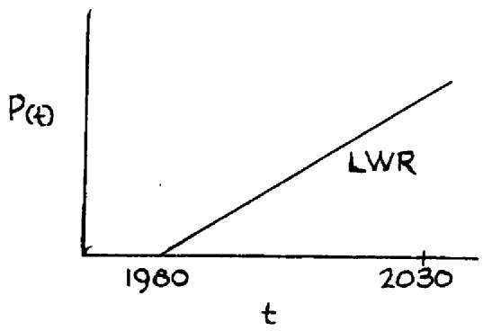

$$
P (t) = a t
$$

$$
a = 2 0, 0 0 0, 3 9, 0 0 0, a n d 4 0, 0 0 0 M W e / y e a r
$$

Total $\mathbf{U}_3\mathbf{O}_8$ Requirement (Metric Tons $\times 10^{6}$ )

<table><tr><td>Year</td><td>a = 20,000</td><td>a = 30,000</td><td>a = 40,000</td></tr><tr><td>2000</td><td>.887</td><td>1.33</td><td>1.78</td></tr><tr><td>2010</td><td>1.63</td><td>2.45</td><td>3.27</td></tr><tr><td>2030</td><td>3.73</td><td>6.16</td><td>7.46</td></tr></table>

Total Separative Work $(\mathrm{kg} \times 10^{9})$

<table><tr><td>Year</td><td>a = 20,000</td><td>a = 30,000</td><td>a = 40,000</td></tr><tr><td>2000</td><td>.388</td><td>.588</td><td>0.787</td></tr><tr><td>2010</td><td>.720</td><td>1.08</td><td>1.45</td></tr><tr><td>2030</td><td>1.65</td><td>2.72</td><td>3.30</td></tr></table>

# Example 2

In example 2, the standard HTGR, the high-gain HGTR, and the LWR are compared on the basis of ore and separative work requirements for an assumed number power capacity curve from 1980 to 2030. Plutonium and U-233 are recycled on a 2-year recycling time. The power capacity versus time is shown in the figure.

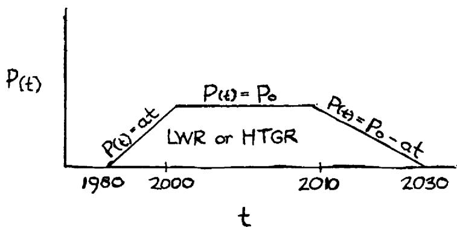

$$
a = 4 0, 0 0 0 \mathrm {M W e / y e a r}
$$

Total $\mathsf{U}_3\mathsf{O}_8$ Requirement (Metric Tons X 106)   

<table><tr><td>Year</td><td>LWR</td><td>LWR-Th</td><td>HTGR (standard)</td><td>HTGR (high-gain)</td></tr><tr><td>2000</td><td>1.78</td><td>1.59</td><td>1.01</td><td>1.05</td></tr><tr><td>2010</td><td>2.59</td><td>2.20</td><td>1.60</td><td>1.36</td></tr><tr><td>2030</td><td>2.43</td><td>1.83</td><td>1.76</td><td>.931</td></tr></table>

Total Separative Work Required (kg X 109)   

<table><tr><td>Year</td><td>LWR</td><td>LWR-Th</td><td>HTGR (standard)</td><td>HTGR (high-gain)</td></tr><tr><td>2000</td><td>.787</td><td>1.19</td><td>.755</td><td>.785</td></tr><tr><td>2010</td><td>1.14</td><td>1.65</td><td>1.20</td><td>1.07</td></tr><tr><td>2030</td><td>1.07</td><td>1.37</td><td>1.32</td><td>.696</td></tr></table>

NOTE: The mined ore and separation work requirement is proportional to the power growth rate $\alpha$ .

# Example 3

In example 3, the standard HTGR, the high-gain HTGR, and the LWR are compared with a different assumed power growth. Again the mined ore and separative work requirement is proportional to the value of $a$ .

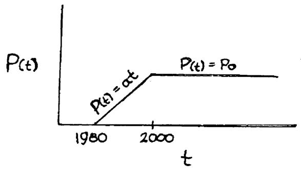

$$
a = 4 0, 0 0 0 \mathrm {M W e / y e a r}
$$

$\mathbf{U}_3\mathbf{O}_8$ Requirement (metric tons $\times 10^{6}$ )   

<table><tr><td>Year</td><td>LWR</td><td>HTGR (standard)</td><td>HTGR (high-gain)</td></tr><tr><td>2000</td><td>1.78</td><td>1.01</td><td>1.05</td></tr><tr><td>2010</td><td>2.59</td><td>1.60</td><td>1.36</td></tr><tr><td>2020</td><td>3.40</td><td>2.18</td><td>1.67</td></tr><tr><td>2030</td><td>4.21</td><td>2.77</td><td>1.98</td></tr></table>

Separative Work Required $(\mathrm{kg} \times 10^{9})$   

<table><tr><td>Year</td><td>LWR</td><td>HTGR (standard)</td><td>HTGR (high-gain)</td></tr><tr><td>2000</td><td>.787</td><td>.755</td><td>.785</td></tr><tr><td>2010</td><td>1.14</td><td>1.20</td><td>1.02</td></tr><tr><td>2020</td><td>1.50</td><td>1.63</td><td>1.25</td></tr><tr><td>2030</td><td>1.86</td><td>2.07</td><td>1.48</td></tr></table>

# Example 4

In example 4, the effect on mined ore required of the introduction of the FBR and the phase out of the LWR is illustrated. The power capacity versus time is shown in the figure.

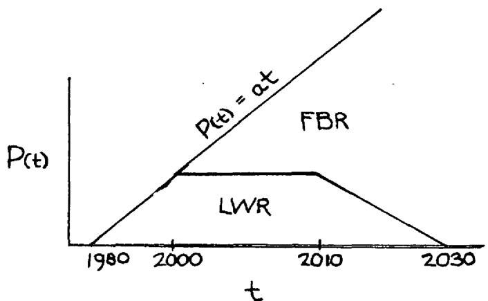

$$
a = 4 0, 0 0 0 M W e / y e a r
$$

Total $\mathbf{U}_3\mathbf{O}_8$ Requirement (Metric tons $\times 10^{6}$ )   

<table><tr><td>Year</td><td>LWR*</td><td>FBR**</td><td>Total</td></tr><tr><td>2000</td><td>1.78</td><td>0.0</td><td>1.78</td></tr><tr><td>2010</td><td>2.90</td><td>(.308)</td><td>2.90</td></tr><tr><td>2030</td><td>3.27</td><td>(.838)</td><td>3.27</td></tr><tr><td>2040</td><td>3.27</td><td>(.266)</td><td>3.27</td></tr><tr><td>2050</td><td>3.27</td><td>(-.482)</td><td>3.27</td></tr></table>

# Example 5

In example 5, the effect of the introduction of the FBR in the year 2000 on mined ore requirement is illustrated. In this case, the LWR does not phase out after FBR introduction but maintains a constant power capacity level. The nuclear power capacity versus time is shown in the figure.

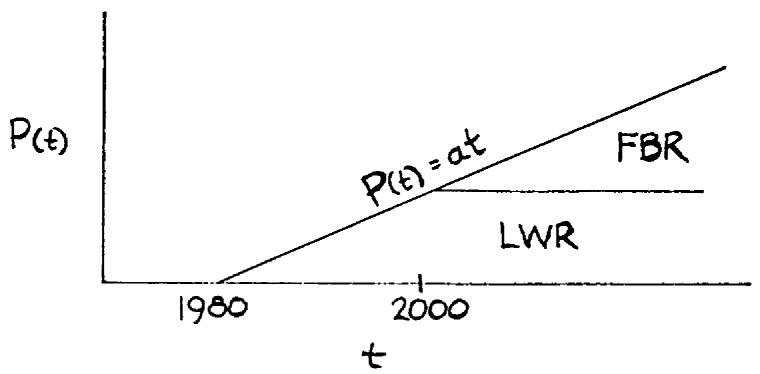

$$
a = 4 0, 0 0 0 \mathrm {M W e} / \mathrm {y e a r}
$$

Total $\mathbf{U}_3\mathbf{O}_8$ Requirements (Metric Tons $\times 10^{6}$ )   

<table><tr><td>Year</td><td>LWR*</td><td>FBR**</td><td>Total</td></tr><tr><td>2000</td><td>1.78</td><td>(0.0)</td><td>1.78</td></tr><tr><td>2010</td><td>2.90</td><td>(.308)</td><td>2.90</td></tr><tr><td>2020</td><td>3.84</td><td>(.441)</td><td>3.84</td></tr><tr><td>2030</td><td>4.61</td><td>(.397)</td><td>4.61</td></tr><tr><td>2040</td><td>5.20</td><td>(.177)</td><td>5.20</td></tr><tr><td>2050</td><td>5.61</td><td>(-.218)</td><td>5.61</td></tr><tr><td>2060</td><td>5.85</td><td>(-.790)</td><td>5.85</td></tr><tr><td>2070</td><td>5.91</td><td>(-1.54)</td><td>5.91</td></tr><tr><td>2080</td><td>5.80</td><td>(-2.46)</td><td>5.80</td></tr></table>

# REFERENCES

1. R. W. Hardie, W. E. Black, and W. W. Little, ALPS, A Linear Programming System for Forecasting Optimum Power Growth Patterns, HEDL-TME 72-31 (April 1972).   
2. Alexander Sesonke, Nuclear Power Plant Design Analysis, TID-26241 (1973).

# APPENDIX H

# REPROCESSING COST ESTIMATES

Summary: The bases on which shipping, reprocessing, conversion, and waste storage costs were estimated are described in this Appendix for LWR, CANDU, HTGR, and FBR fuel. Flow sheets for reprocessing fuel from each reactor type were drawn. Five stages in reprocessing were addressed in the flow sheets: (1) head end, (2) solvent extraction, (3) conversion, (4) off-gastreatment, and (5) waste disposal. The cost of shipping irradiated fuel from the reactor to the reprocessing plant was also considered. The complexity of the five stages of the reprocessing flow sheets were compared with the AGNS plant, where costs are assumed to be known. Estimates of cost for CANDU, HTGR, and FBR reprocessing were made on the basis of the comparison of flow sheets with the AGNS flow sheet for LWR Pu-U fuel. Two plant-size bases were used in this study, 5 tonnes HM/day and a plant of sufficient size to service a 50 GW(e) industry of a given reactor type. For LWR fuel reprocessing a 5 MT/day plant will service a 50 MW(e) industry, but for the other reactor systems considerably larger or smaller plants are required. This will be discussed later.

A summary of results of the reprocessing cost estimates on a $\$ /kg$ HM basis is given in Table H.1. The fuel cycles which have been considered in Table H.1 are summarized in Table H.2. The relationship between reprocessing capacity and installed electrical capacity is given in Table H.3. It is noted that 5 MT/day capacity for LWR fuel reprocessing will support a 50 GW(e) LWR economy. However, because of the high burnup achieved in HTGRs, a 5 MT/day reprocessing plant will support a 157 GW(e) HTGR economy. Likewise, because of the low exposure achieved on fuel operating in CANDU reactors operating on the U- $\mathrm{Pu}$ fuel cycle, a 26 MT/day reprocessing plant is required to support a 50 GW(e) economy.

($/kg heavy metal)

Table H.1. Thorium fuel cycle study: estimated costs of shipping, reprocessing, and waste disposal   

<table><tr><td rowspan="3">Reactor (fuel)</td><td colspan="4">Plant capacity</td></tr><tr><td colspan="3">5 tonne heavy metal/day</td><td>50 GW(e)</td></tr><tr><td>Shipping</td><td>Reprocessing</td><td>Waste Disposal</td><td>Reprocessing</td></tr><tr><td>LWR (U-Pu), AGNS plant</td><td>5</td><td>221</td><td>71</td><td>221</td></tr><tr><td>LWR (U-Th)</td><td>5</td><td>222</td><td>71</td><td>222</td></tr><tr><td>LWR (Pu-Th)</td><td>5</td><td>233</td><td>83</td><td>233</td></tr><tr><td>CANDU (U,Pu) (CR = 1.0)</td><td>1.5</td><td>210</td><td>61</td><td>86</td></tr><tr><td>CANDU (U,Th) (CR = 1.0)</td><td>4</td><td>207</td><td>61</td><td>96</td></tr><tr><td>CANDU (Pu,Th)</td><td>4</td><td>223</td><td>74</td><td>115</td></tr><tr><td>FBR (Pu-U), LMFBR</td><td>30</td><td>294</td><td>85</td><td>383</td></tr><tr><td>FBR (U-Th)</td><td>30</td><td>302</td><td>111</td><td>394</td></tr><tr><td>HTGR (U-Th) (CR = .66)</td><td>30</td><td>622</td><td>85</td><td>1148</td></tr><tr><td>HTGR (U-Pu)</td><td>30</td><td>631</td><td>85</td><td>1151</td></tr><tr><td>HTGR (Pu-Th)</td><td>30</td><td>626</td><td>85</td><td>1153</td></tr><tr><td>HTGR (U-Th) (CR = 0.82)</td><td>30</td><td>622</td><td>85</td><td>923</td></tr><tr><td>HTGR (U-Th) (CR = 0.82)(partial burning of graphite)</td><td>30</td><td>483</td><td>85</td><td>717</td></tr></table>

Table H.2. Fuel cycles considered for comparative costs of shipping, reprocessing, and waste storage   

<table><tr><td>Reactor</td><td>Initial Fuel</td><td>Recycle Fuel</td></tr><tr><td rowspan="3">LWR</td><td>(235U-238U) oxide</td><td>(Pu-238U) oxide</td></tr><tr><td>(235U-Th) oxide</td><td>(233U-Th) oxide</td></tr><tr><td>(Pu-Th) oxide</td><td>(233U-Th) oxide</td></tr><tr><td rowspan="3">CANDU</td><td>(235U-238U) oxide</td><td>(Pu-238U) oxide</td></tr><tr><td>(235U-Th) oxide</td><td>(233U-Th) oxide</td></tr><tr><td>(Pu-Th) oxide</td><td>(233U-Th) oxide</td></tr><tr><td rowspan="2">FBR</td><td>(Pu-238U) oxide</td><td>(Pu-238U) oxide</td></tr><tr><td>(233U-Th) alloy</td><td>(233U-Th) alloy</td></tr><tr><td rowspan="3">HTGR</td><td>235UC2-ThO2</td><td>233UC2-ThO2</td></tr><tr><td>235UC2-238UO2</td><td>(PU-238U) oxide</td></tr><tr><td>(Pu-Th) oxide</td><td>233UC2-ThO2</td></tr></table>

Table H.3. Reprocessing Capacity and Electrical Capacity Equivalence   

<table><tr><td>Fuel type</td><td>Installed Capacity GW(e) Supported by a 5 tonne/day Reprocessing Plant</td><td>Reprocessing Capacity (tonne/day) to support 50 GW(e) of installed capacity</td></tr><tr><td>LWR</td><td>50</td><td>5</td></tr><tr><td>CANDU (U-Pu)</td><td>9.7</td><td>26</td></tr><tr><td>CANDU (U-Th)</td><td>13</td><td>19</td></tr><tr><td>CANDU (Pu-Th)</td><td>15.4</td><td>16</td></tr><tr><td>FBR</td><td>80.1</td><td>3.1</td></tr><tr><td>HTGR</td><td>157</td><td>1.6</td></tr></table>

# Scope of the Study

This study includes costs for shipping irradiated fuel from the reactor to the reprocessing plant, reprocessing (including product conversion and waste treatment), waste shipping to a repository, and waste storage at the repository.

For the HTGR, it was assumed that the refabrication plant would be on the same site as the reprocessing plant. Refabrication of LWR, CANDU, and FBR fuel was assumed to take place at a central facility that served several reprocessing plants. For these reactors, the product conversion costs include the cost of making oxides $(\mathrm{UO}_3$ and $\mathrm{PuO}_2)$ at the reprocessing plant and the cost of reconverting these oxides at the fabrication plant into fuel material that meets the feed requirements of the refabrication plant. It was assumed that thorium could be shipped as $\mathrm{Th(NO_3)_4}$ solution and no reconversion penalty was applied. Although the costs of "tailormade" oxides are incurred at the refabrication plant, these costs are included in reprocessing.

# Approach Taken

The Barnwell (AGNS) plant and flow sheet was taken as the base case for estimation of capital costs. Capital costs of other flow sheets were estimated relative to the base case. Operating costs were scaled from capital costs, using estimated factors. A second iteration allowance was made for plant size, using estimated scaling factors. Most of the estimates made are of necessity qualitative and subjective, but a deliberate effort was made to avoid bias, either intentional or subliminal.

# Cost Basis

The initial cost basis for this evaluation was the cost of the Allied-General Nuclear Services (AGNS) plant at Barnwell, South Carolina. Although actual cost data for this plant are not yet available, the general consensus is that the complete plant cost will be about $800 million. This total cost was arbitrarily apportioned among the five major areas of the plant as

follows: $150 million for headend, $100 million for solvent extraction, $100 million for product conversion, $50 million for off-gas treatment, and $400 million for waste treatment.

# Process Flow Sheets

A process flow sheet was drawn for the AGNS plant to identify the principal operations of the five major systems of the plant for processing $^{235}\mathrm{UO}_2 - ^{238}\mathrm{UO}_2$ initial fuel and $\mathrm{PuO_2 - }^{238}\mathrm{UO_2}$ recycle fuel. Corresponding flow sheets were drawn for each of the other types of fuel discharged from LWRs, FBRs, and HTGRs (Figs. H1, H2, and H3). Reprocessing CANDU fuel is similar to reprocessing LWR fuel so a separate flow sheet was not required. These flow sheets formed the basis from which the cost comparisons were made. A deliberate effort was made to be consistent in preparing the flow sheets, both for systems within a flow sheet and between flow sheets.

# Cost Estimating Procedures

# Capital Costs

Each of the five major systems of the process flow sheet for the "unknown" plant was compared with the corresponding system of the AGNS plant, and an assessment was made of the relative complexity of corresponding systems. This assessment led to a "complexity factor" that could be used to relate the cost of an "unknown" system to the corresponding AGNS system. The determination of complexity factors was somewhat qualitative, being based upon considerations of process chemistry, nature and number of operations, and type of process equipment. Complexity factors are summarized on Tables H.4 through H.7.

A second consideration in determining the capital cost of the "unknown" system was the relative capacity of the "unknown" and corresponding AGNS system. In this case, we used data from other cost studies, $^{1}$ which have shown that plant capital costs may be related to throughput by a relationship of the form

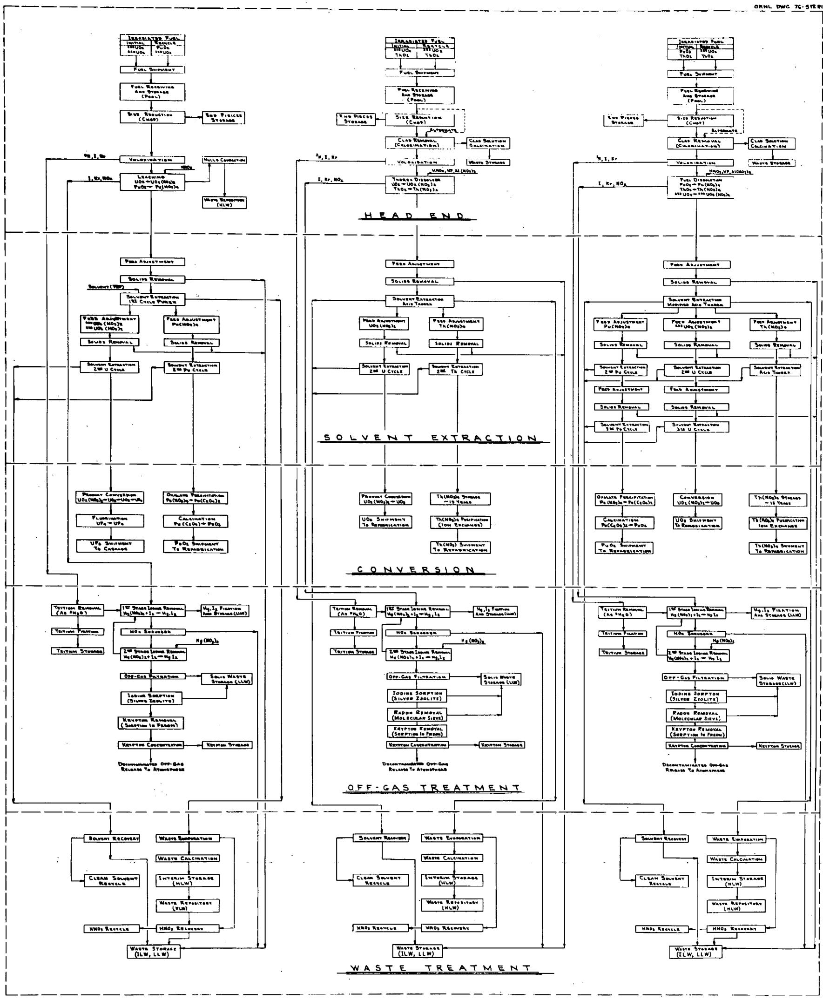  
Fig. H.l. LWR fuel reprocessing.

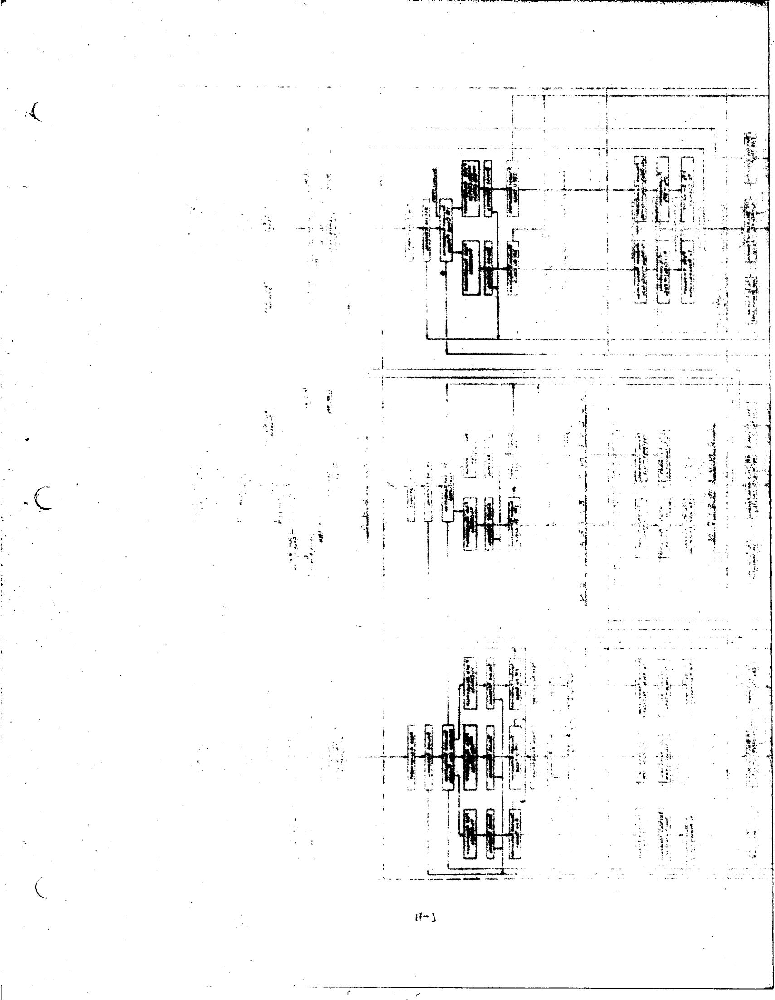

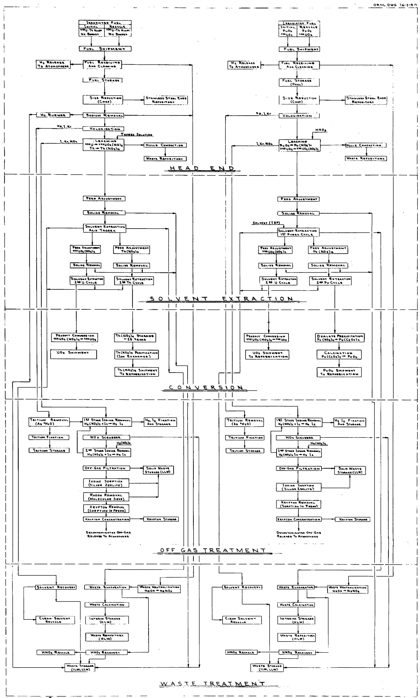  
Fig. H.2. FBR fuel reprocessing.

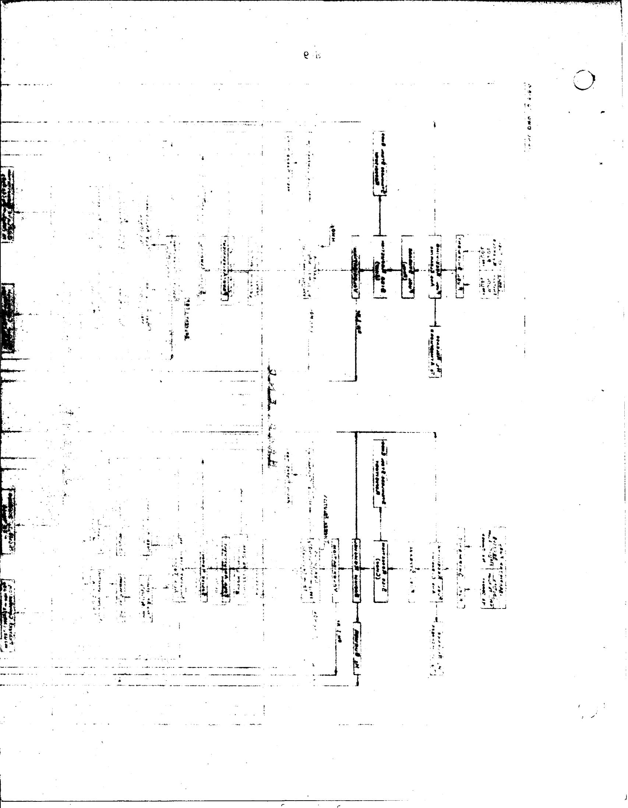

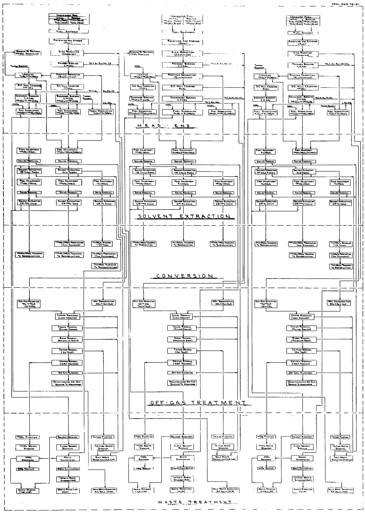  
Fig. H.3. HTGR fuel reprocessing.

II-H

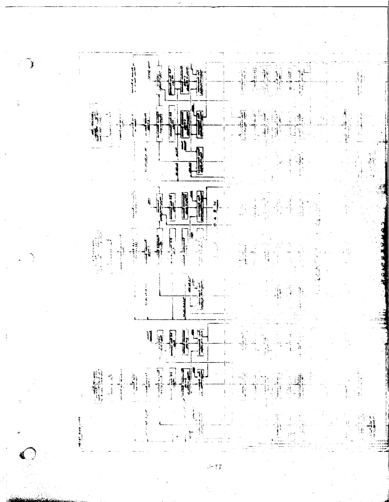

Power System

Table H.5. Thorium fuel cycle study: estimated shipping, reprocessing, and waste disposal costs for fast breeder reactors   

<table><tr><td>Reactor type</td><td>FBR</td><td>FBR</td></tr><tr><td>Initial fuel</td><td>PuO2-238UO2</td><td>233U-Th alloy</td></tr><tr><td>Recycle fuel</td><td>PuO2-238UO2</td><td>233U-Th alloy</td></tr><tr><td>Clad or coating</td><td>stainless steel</td><td>stainless steel</td></tr><tr><td colspan="3">Reprocessing Plant Capacitya</td></tr><tr><td>Heavy metal, tonne/day</td><td>2 (5)</td><td>2 (5)</td></tr><tr><td>Clad or graphite, tonne/day</td><td>3 (7.5)</td><td>3 (7.5)</td></tr><tr><td>Equivalent GW(e)</td><td>50 (125)</td><td>50 (125)</td></tr></table>

Estimated cost of shipping, reprocessing, and waste disposal   

<table><tr><td rowspan="2"></td><td rowspan="2">Factor
(Complexity) (size)</td><td colspan="2">Capital</td><td rowspan="2">Operating
($/kg HM)</td><td rowspan="2">Factor
(Complexity) (size)</td><td colspan="2">Capital</td><td rowspan="2">Operating
($/kg HM)</td></tr><tr><td>(10^6 $)</td><td>($/kg HM)</td><td>(10^6 $)</td><td>($/kg HM)</td></tr><tr><td>Irradiated fuel shipping</td><td></td><td>30</td><td></td><td></td><td></td><td>30</td><td></td><td></td></tr><tr><td>Reprocessing plantb</td><td></td><td></td><td></td><td></td><td></td><td></td><td></td><td></td></tr><tr><td>Headend</td><td>(1.05)(9.23/6.5)*6</td><td>194 (258)</td><td>62 (52)</td><td>25 (21)</td><td>(1.1)(9.23/6.5)*6</td><td>204 (270)</td><td>65 (54)</td><td>26 (22)</td></tr><tr><td>Solvent extraction</td><td>(1)(3.12/5)*35</td><td>85 (100)</td><td>27 (20)</td><td>8 (6)</td><td>(1)(3.12/5)*35</td><td>85 (100)</td><td>27 (20)</td><td>8 (6)</td></tr><tr><td>Product conversion</td><td>(.9)(3.12/5)*6</td><td>68 (90)</td><td>22 (18)</td><td>9 (7)</td><td>(.8)(3.12/5)*6</td><td>60 (80)</td><td>19 (16)</td><td>8 (6)</td></tr><tr><td>Off-gas treatment</td><td>(1)(3.12/5)*35</td><td>42 (50)</td><td>13 (10)</td><td>4 (3)</td><td>(1.05)(3.12/5)*35</td><td>44 (53)</td><td>14 (11)</td><td>4 (3)</td></tr><tr><td>Waste treatment</td><td>(1.05)(9.23/6.5)*35</td><td>475 (560)</td><td>152 (112)</td><td>61 (45)</td><td>(1.1)(9.23/6.5)*35</td><td>497 (587)</td><td>159 (117)</td><td>64 (47)</td></tr><tr><td>Total</td><td></td><td>864 (1058)</td><td>276 (212)</td><td>107 (82)</td><td></td><td>890 (1090)</td><td>284 (218)</td><td>110 (84)</td></tr><tr><td>Waste Disposal</td><td></td><td></td><td></td><td></td><td></td><td></td><td></td><td></td></tr><tr><td>Shipping</td><td></td><td>9.5</td><td></td><td></td><td></td><td>11</td><td></td><td></td></tr><tr><td>Repository</td><td></td><td>75</td><td></td><td></td><td></td><td>100</td><td></td><td></td></tr></table>

${}^{a}$ Values given in parentheses are for alternate plant capacity of 5 tonnes heavy metal/day.   
bCapital and operating cost given in parentheses are for alternate plant capacity of 5 tonnes heavy metal/day.

Table H.6. Thorium fuel cycle study: estimated shipping, reprocessing, and waste disposal costs for high temperature, gas cooled reactors   

<table><tr><td colspan="14">Power System</td></tr><tr><td>Reactor type</td><td colspan="5">HTGR235UC2(Triso)-ThO2(Biso)</td><td colspan="4">HTGR235UC2(Triso)-238UO2(Biso)</td><td colspan="4">HTGRPuO2(Triso)-THO2(Biso)</td></tr><tr><td>Initial fuel</td><td colspan="5">233UC2(Triso)-ThO2(Biso)</td><td colspan="4">PuO2(Triso)-238UO2(Biso)</td><td colspan="4">233UC2(Triso)-THO2(Biso)</td></tr><tr><td>Recycle fuel</td><td colspan="5">graphite</td><td colspan="4">graphite</td><td></td><td></td><td></td><td></td></tr><tr><td>Cled or coating</td><td></td><td></td><td></td><td></td><td></td><td></td><td></td><td></td><td></td><td></td><td></td><td></td><td></td></tr><tr><td colspan="14">Reprocessing Plant Capacitya</td></tr><tr><td>Heavy metal, tonne/day</td><td colspan="5">1.6 (5)</td><td colspan="4">1.6 (5)</td><td colspan="4">1.6 (5)</td></tr><tr><td>Clad or graphite, tonne/day</td><td colspan="5">18.5 (58.1)</td><td colspan="4">18.5 (58.1)</td><td colspan="4">18.5 (58.1)</td></tr><tr><td>Equivalent GW(e)</td><td colspan="5">50 (157.2)</td><td colspan="4">50 (157.2)</td><td colspan="4">50 (157.2)</td></tr><tr><td colspan="14">Estimated costs of shipping, reprocessing and waste disposal</td></tr><tr><td rowspan="2">Irradiated fuel shipmentReprocessing plantb</td><td>Factor(Complexity)(size)</td><td>Capital(106$)</td><td>($/kg Hm)</td><td>Operating($/kg Hm)</td><td>Factor(Complexity)(size)</td><td>Capital(106$)</td><td>($/kg Hm)</td><td>Operating($/kg Hm)</td><td>Factor(Complexity)(size)</td><td>Capital(106$)</td><td>($/kg Hm)</td><td>Operating($/kg Hm)</td><td></td></tr><tr><td></td><td>30</td><td></td><td></td><td></td><td>30</td><td></td><td></td><td></td><td>30</td><td></td><td></td><td></td></tr><tr><td>Headend</td><td>(1.8)(20.1/6.5).6</td><td>530 (1056)</td><td>331 (211)</td><td>132 (84)</td><td>(1.8)(20.1/6.5).6</td><td>530 (1056)</td><td>331 (211)</td><td>132 (84)</td><td>(1.8)(20.1/6.5).6</td><td>530 (1056)</td><td>331 (211)</td><td>132 (84)</td><td></td></tr><tr><td>Solvent extraction</td><td>(1.25)(1.6/5).35</td><td>84 (125)</td><td>52 (25)</td><td>16 (7.5)</td><td>(1.2)(1.6/5).35</td><td>67 (120)</td><td>42 (24)</td><td>13 (7.2)</td><td>(1.25)(1.6/5).35</td><td>84 (125)</td><td>52 (25)</td><td>16 (7.5)</td><td></td></tr><tr><td>Product conversion</td><td>(.10)(1.6/5).35</td><td>7 (10)</td><td>4 (2)</td><td>2 (.8)</td><td>(.4)(1.6/5).6</td><td>20 (40)</td><td>12 (8)</td><td>4.8 (3.2)</td><td>(.25)(1.6/5).6</td><td>13 (25)</td><td>8 (5)</td><td>3 (2)</td><td></td></tr><tr><td>Off-gas treatment</td><td>(1)(20.1/5).35</td><td>81 (121)</td><td>51 (24)</td><td>15 (7.2)</td><td>(1)(20.1/5).35</td><td>81 (121)</td><td>51 (24)</td><td>20 (9.6)</td><td>(1)(20.1/5).35</td><td>81 (121)</td><td>51 (24)</td><td>15 (7.2)</td><td></td></tr><tr><td>Waste treatment</td><td>(1.05)(20.1/6.5).35</td><td>623 (931)</td><td>389 (186)</td><td>156 (74)</td><td>(1.05)(20.1/6.5).35</td><td>623 (931)</td><td>389 (186)</td><td>156 (74)</td><td></td><td>623 (931)</td><td>389 (186)</td><td>156 (74)</td><td></td></tr><tr><td>Total</td><td></td><td>1325 (2243)</td><td>827 (449)</td><td>321 (173.5)</td><td></td><td>1321 (2268)</td><td>825 (453)</td><td>325.8(178)</td><td></td><td>1331 (2258)</td><td>831 (451)</td><td>322 (174.7)</td><td></td></tr><tr><td colspan="14">Waste disposal</td></tr><tr><td>Shipping</td><td></td><td>10</td><td></td><td></td><td></td><td>10</td><td></td><td></td><td></td><td>10</td><td></td><td></td><td></td></tr><tr><td>Repository</td><td></td><td>75</td><td></td><td></td><td></td><td>75</td><td></td><td></td><td></td><td>75</td><td></td><td></td><td></td></tr></table>

Table H.7. Thorium fuel cycle study: estimated shipping, reprocessing, and waste disposal costs for heavy water moderated reactors   

<table><tr><td colspan="17">Power System</td></tr><tr><td>Reactor type</td><td colspan="5">CANDU235UO2-238UO2</td><td colspan="5">CANDU235UO2-ThO2</td><td colspan="5">CANDU PuO2-ThO2</td><td></td></tr><tr><td>Initial fuel</td><td colspan="5">235UO2-238UO2</td><td colspan="5">235UO2-ThO2</td><td colspan="5">235UO2-ThO2</td><td></td></tr><tr><td>Recycle fuel</td><td colspan="5">PuO2-236UO2</td><td colspan="5">233UO2-ThO2</td><td colspan="5">233UO2-ThO2</td><td></td></tr><tr><td>Clad or coating</td><td colspan="5">Zircaloy</td><td colspan="5">Zircaloy</td><td colspan="5">Zircaloy</td><td></td></tr><tr><td colspan="17">Reprocessing Plant Capacitya</td></tr><tr><td>Heavy metal, tonne/day</td><td colspan="5">25.7 (5)</td><td colspan="5">19.2 (5)</td><td colspan="5">16.2 (5)</td><td></td></tr><tr><td>Clad or graphite, tonne/day</td><td colspan="5">2.43 (0.48)</td><td colspan="5">1.82 (0.48)</td><td colspan="5">1.53 (0.48)</td><td></td></tr><tr><td>Equivalent GW(e)</td><td colspan="5">50 (9.73)</td><td colspan="5">50 (13)</td><td colspan="5">50 (15.4)</td><td></td></tr><tr><td></td><td colspan="16">Estimated costs of shipping, reprocessing and waste disposal</td></tr><tr><td></td><td>Factor(Complexity)(size)</td><td>Capital(106$)</td><td>($/kg HMI)</td><td>Operating($/kg HMI)</td><td>Factor(Complexity)(size)</td><td>Capital(106$)</td><td>($/kg HMI)</td><td>Operating($/kg HMI)</td><td>Factor(Complexity)(size)</td><td>Capital(106$)</td><td>($/kg HMI)</td><td>Operating($/kg HMI)</td><td>Capital(106$)</td><td>($/kg HMI)</td><td>Operating($/kg HMI)</td><td></td></tr><tr><td>Irradiated fuel shipping</td><td colspan="4">1.5</td><td colspan="4">4</td><td colspan="4">4</td><td colspan="3">4</td><td></td></tr><tr><td>Reprocessing plantb</td><td></td><td></td><td></td><td></td><td></td><td></td><td></td><td></td><td></td><td></td><td></td><td></td><td></td><td></td><td></td><td></td></tr><tr><td>Headend</td><td>(1)(27.4/6.5).6</td><td>360 (135)</td><td>14.4 (27)</td><td>5.8 (11)</td><td>(1.1)(21.8/6.5).6</td><td>340 (135)</td><td>17 (27)</td><td>6.8 (10.8)</td><td>(1.1)(17.5/6.5).6</td><td>300 (149)</td><td>18.8 (30)</td><td>7.5 (12)</td><td></td><td></td><td></td><td></td></tr><tr><td>Solvent extraction</td><td>(1)(25/5).35</td><td>180 (100)</td><td>7.2 (20)</td><td>2.2 (6)</td><td>(1)(20/5).35</td><td>160 (100)</td><td>8 (20)</td><td>2.4 (6)</td><td>(1.15)(16/5).35</td><td>170 (115)</td><td>10.6 (23)</td><td>3.2 (6.9)</td><td></td><td></td><td></td><td></td></tr><tr><td>Product conversion</td><td>(1)(25/5).6</td><td>260 (100)</td><td>10.4 (20)</td><td>4.2 (8)</td><td>(0.7)(20/5).6</td><td>160 (70)</td><td>8 (14)</td><td>3.2 (5.6)</td><td>(.95)(16/5).6</td><td>190 (95)</td><td>11.9 (19)</td><td>4.8 (7.6)</td><td></td><td></td><td></td><td></td></tr><tr><td>Off-gas treatment</td><td>(1)(25/5).35</td><td>90 (50)</td><td>3.6 (10)</td><td>1.1 (3)</td><td>(1)(20/5).35</td><td>80 (50)</td><td>4 (10)</td><td>1.2 (3)</td><td>(1)(16/5).35</td><td>80 (50)</td><td>5.0 (10)</td><td>1.5 (3)</td><td></td><td></td><td></td><td></td></tr><tr><td>Waste treatment</td><td>(1)(27.4/6.5).35</td><td>660 (377)</td><td>26.4 (75)</td><td>10.6 (30)</td><td>(1.05)(21.8/6.5).35</td><td>640 (396)</td><td>32 (79)</td><td>13 (31.6)</td><td>(1.05)(17.5/6.5).35</td><td>590 (396)</td><td>36.9 (79)</td><td>15 (32)</td><td></td><td></td><td></td><td></td></tr><tr><td>Total</td><td></td><td>1550 (762)</td><td>62 (152)</td><td>24 (58)</td><td></td><td>1380 (751)</td><td>69 (150)</td><td>27 (57)</td><td></td><td>1330 (805)</td><td>83 (161)</td><td>32 (62)</td><td></td><td></td><td></td><td></td></tr><tr><td>Waste disposal</td><td></td><td></td><td></td><td></td><td></td><td></td><td></td><td></td><td></td><td></td><td></td><td></td><td></td><td></td><td></td><td></td></tr><tr><td>Shipping</td><td></td><td colspan="3">7.4</td><td></td><td colspan="3">7.4</td><td></td><td colspan="3">8.6</td><td></td><td></td><td></td><td></td></tr><tr><td>Repository</td><td></td><td colspan="3">54</td><td></td><td colspan="3">54</td><td></td><td colspan="3">65</td><td></td><td></td><td></td><td></td></tr></table>

${}^{a}$ Values given in parentheses are for alternate plant capacity of 5 tonne heavy metal/day.   
bCapital and operating costs given in parentheses are for alternate plant capacity of 5 tonnes heavy metal/day.

$$
\frac {\text {C o s t o f} ^ {\prime \prime} \text {u n k n o w n} ^ {\prime \prime}}{\text {c o s t o f A G N S}} = \left[ \frac {\text {t h r o u g h p u t o f} ^ {\prime \prime} \text {u n k n o w n} ^ {\prime \prime}}{\text {t h r o u g h p u t o f A G N S}} \right] ^ {n}.
$$

The expression in brackets above, the capacity factor, was calculated for each section of the "unknown" plant, and the estimated cost was found by multiplying the appropriate AGNS cost by the product of the complexity and capacity factors. The scaling factor, n, was taken to be 0.6 for headend and product conversion and 0.35 for solvent extraction, off-gas treatment, and waste treatment. Throughput included the total amount of material passing through a given section of the plant, that is, heavy metal plus cladding or matrix material.

Capital costs were determined for two plant sizes: (1) a processing plant that treats 5 tonnes of heavy metal per day and (2) a plant that treats the fuel discharged from reactors that produce a total of 50 GW(e). Plant operation of 300 days/year was assumed.

# Annual Capital and Operating Costs

An amortization rate of $30\%$ per year was used to determine annual capital costs. Annual operating costs were calculated for each major area of the plant and were taken as either $40\%$ or $30\%$ of the corresponding annual capital cost. Operating costs for the more labor intensive and higher maintenance areas (headend, product conversion, and waste treatment) were computed using the $40\%$ rate, whereas, costs for the more conventional chemical plant operations (solvent extraction and off-gas treatment) were calculated at $30\%$ .

# Shipping

Considerable research and development has gone into the study of shipping irradiated fuel elements, and reliable cost data are available. Shipping costs for the several fuels of this study were estimated from the data reported in WASH-1099, $^2$ with escalation to reflect current costs.

Very little is known, however, about the costs of shipping and storage of nuclear wastes. Preliminary shipping costs have been reported for HTGR wastes. Waste shipping costs for other fuels were estimated using the HTGR costs as a basis, with consideration given to types and quantities. Shipping costs include an allowance for worn-out equipment.

# Waste Storage

Waste storage costs were estimated by the same procedure as waste shipping costs. The cost data of the HTGR fuel cycle3 were taken as a basis, and costs for other fuels were related to these values.

# REFERENCES FOR APPENDIX H

1. Staff of the Oak Ridge National Laboratory, Reactor Fuel Cycle Costs for Nuclear Power Evaluation, WASH-1099, pp. 60-80 (December 1971).   
2. Staff of the Oak Ridge National Laboratory, Reactor Fuel Cycle Costs for Nuclear Power Evaluation, WASH-1099, pp. 99-117 (December 1971).   
3. HTGR Fuel Recycle Planning Team, Summary Program Plan - Alternate Program for HTGR Fuel Cycle (Draft), p. 148 (Apr. 11, 1975).

# Appendix I

# FABRICATION AND REFABRICATION COST ESTIMATES

Summary: The method used to estimate fuel fabrication and refabrication costs for LWR, CANDU, HTGR, and FBR systems is similar to that previously described for reprocessing (see Appendix H). Flowsheets were developed for each type of reactor fuel, and the complexity and specialized equipment requirements compared. Since no commercial scale facility exists for remote fuel fabrication, and the cost data for fresh fuel fabrication are not generally available, previous ORNL estimates for LWR fuel fabrication were updated, and used as a comparison base. A summary of the results of this study is contained in Table I.1 for plants with 2 MT HM/day output. The factors listed in Table I.2 can be applied directly to the $/kg$ values appearing in Table I.1 if estimates for other size plants are desired.

# Fuel Fabrication Cost Estimates

The large variety of fuel materials and fuel element designs considered in this study together with the limited time precluded a formalized estimation procedure such as that done previously. $^{1,2}$ However, one of the cases from these early studies formed the basis for the reference base case for metal clad cylindrical fuel rod types. This LWR (PWR) case from FABCØST 9 provided the appropriate distribution of cost elements under the categories of Capital, Hardware, and Operation. The costs in each category were escalated from the 1966 data by assuming a $10\%$ per year inflation rate, as was done in a previous study, $^{3}$ and adding both capital $(50\%)$ and operating $(30\%)$ increments to incorporate the features for current or proposed requirements for total liquid recycle, scrap reprocessing, and solid waste treatment, particularly transuranic waste. $^{4}$

With this as a basis, the fabrication process outlines given in Figs. I.l through I.4 were used to make a relative factorial estimate for incremental features in each category of cost. The hardware cost factors were based on available fuel element design data and evaluation of three increments: cladding (with end caps), fuel rod internal component complexity, and

Table I.1. Estimated Fabrication Cost Comparison   

<table><tr><td rowspan="2">Reactor Type</td><td rowspan="2">Fuel Material</td><td colspan="4">Relative Cost Factors</td><td rowspan="2">Estimated Costs ($/kg)b</td></tr><tr><td>Capital</td><td>Hardware</td><td>Operating</td><td>Total</td></tr><tr><td colspan="7">PART A</td></tr><tr><td rowspan="5">LWR (PWR)</td><td>(235U-U)O2</td><td>0.33</td><td>0.38</td><td>0.29</td><td>1.00</td><td>150c</td></tr><tr><td>(Pu-U)O2</td><td>1.49</td><td>0.38</td><td>1.45</td><td>3.32</td><td>500</td></tr><tr><td>(235U-Th)O2</td><td>0.50</td><td>0.42</td><td>0.44</td><td>1.36</td><td>200</td></tr><tr><td>(233U-Th)O2</td><td>1.98</td><td>0.38</td><td>1.45</td><td>3.81</td><td>570</td></tr><tr><td>(Pu-Th)O2</td><td>1.49</td><td>0.38</td><td>1.53</td><td>3.40</td><td>510</td></tr><tr><td rowspan="4">CANDU</td><td>Normal UO2</td><td>0.33</td><td>0.09</td><td>0.11</td><td>0.53</td><td>80</td></tr><tr><td>(Pu-U)O2</td><td>1.49</td><td>0.09</td><td>0.50</td><td>2.08</td><td>310</td></tr><tr><td>(233U-Th)O2</td><td>1.98</td><td>0.09</td><td>0.50</td><td>2.57</td><td>390</td></tr><tr><td>(Pu-Th)O2</td><td>1.49</td><td>0.09</td><td>0.53</td><td>2.11</td><td>320</td></tr><tr><td rowspan="3">FBR (L.M.)</td><td>(Pu-U)O2</td><td>3.19</td><td>0.58</td><td>2.10</td><td>5.87</td><td>880</td></tr><tr><td>(Pu-U)C</td><td>2.68</td><td>0.37</td><td>1.66</td><td>4.71</td><td>710</td></tr><tr><td>233U-Th</td><td>2.73</td><td>0.35</td><td>1.60</td><td>4.68</td><td>700</td></tr><tr><td rowspan="3">FBR (Gas)</td><td>(Pu-U)O2</td><td>3.19</td><td>0.90</td><td>2.29</td><td>6.38</td><td>960</td></tr><tr><td>(233U-Th)O2</td><td>4.55</td><td>0.90</td><td>2.40</td><td>7.85</td><td>1,180</td></tr><tr><td>(Pu-Th)O2</td><td>3.64</td><td>0.90</td><td>2.40</td><td>6.94</td><td>1,040</td></tr><tr><td colspan="7">PART B</td></tr><tr><td rowspan="4">HTGR</td><td>235UO2-ThO2</td><td>0.26</td><td>0.42</td><td>0.32</td><td>1.00</td><td>400d</td></tr><tr><td>233UCO-ThO2</td><td>1.21</td><td>0.42</td><td>0.95</td><td>2.58</td><td>1,030</td></tr><tr><td>235UO2-UO2</td><td>0.26</td><td>0.32</td><td>0.32</td><td>0.90</td><td>360</td></tr><tr><td>PuO2-ThO2</td><td>1.21</td><td>0.42</td><td>0.94</td><td>2.57</td><td>1,030</td></tr></table>

${}^{a}$ All cost comparisons are relative to the given base case factors.   
b1977 dollars assumed for total kilograms of heavy metal product with a plant output of 2 metric tonnes per day and 260 full operating days per year (520 MT/year).   
cBase case for metal clad fuel rods based on FABCOST 9 estimates (A. L. Lotts et al., A/CONF, 49/P/062, 1972) escalated to 1977 with additions for current scrap and waste treatment requirements.   
$d_{\text{Base}}$ case for all HTGR (Prismatic Fuel Element) cases based on data in "Summary Program Plan, Alternate Program for HTGR Fuel Recycle," April 11, 1975, Draft.

Table I.2. Fabrication Cost as a Function of Processing Rate   

<table><tr><td>Rate (MT HM/day)</td><td>Cost Fraction</td></tr><tr><td>0.5</td><td>1.53</td></tr><tr><td>1.0</td><td>1.23</td></tr><tr><td>2.0</td><td>1.00</td></tr><tr><td>3.0</td><td>0.90</td></tr><tr><td>4.0</td><td>0.84</td></tr><tr><td>5.0</td><td>0.79</td></tr><tr><td>6.0</td><td>0.76</td></tr><tr><td>&gt;7.0</td><td>0.73</td></tr></table>

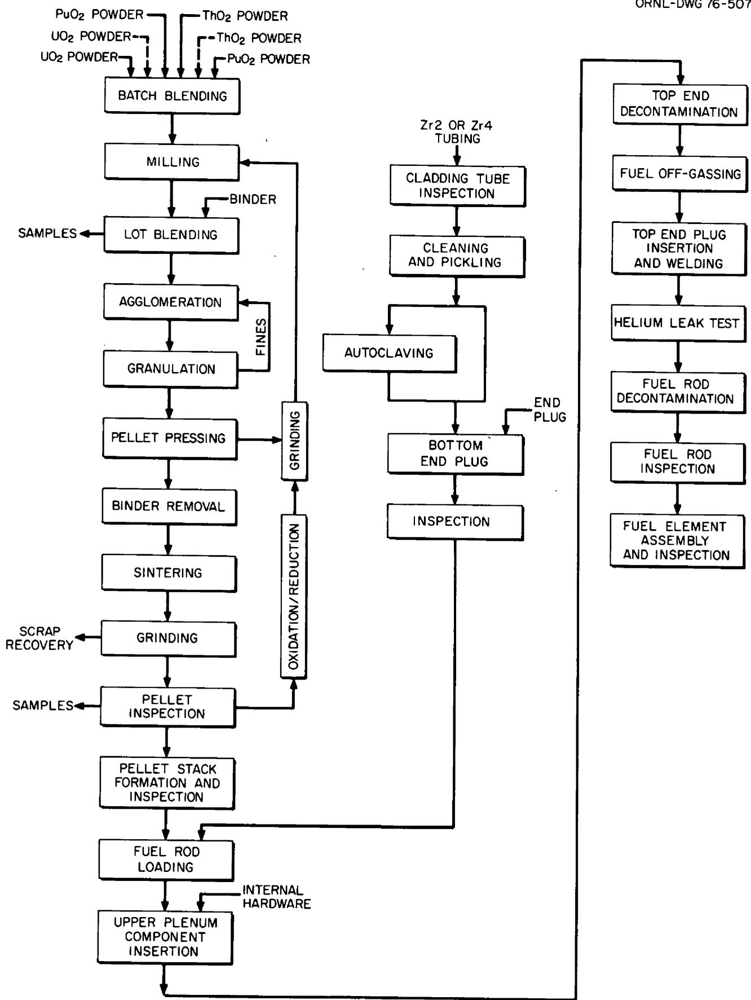  
Fig. I.l. LWR oxide recycle fuel element fabrication.

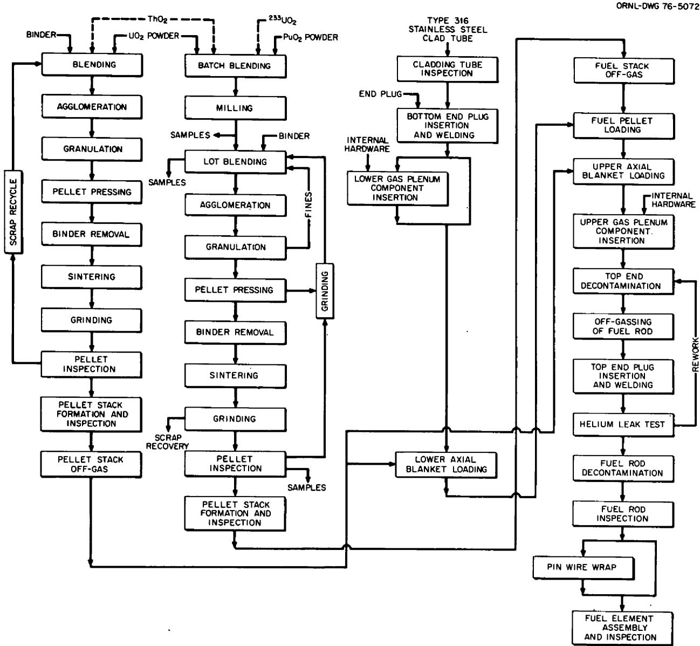  
Fig. I.2. FBR oxide fuel element fabrication.

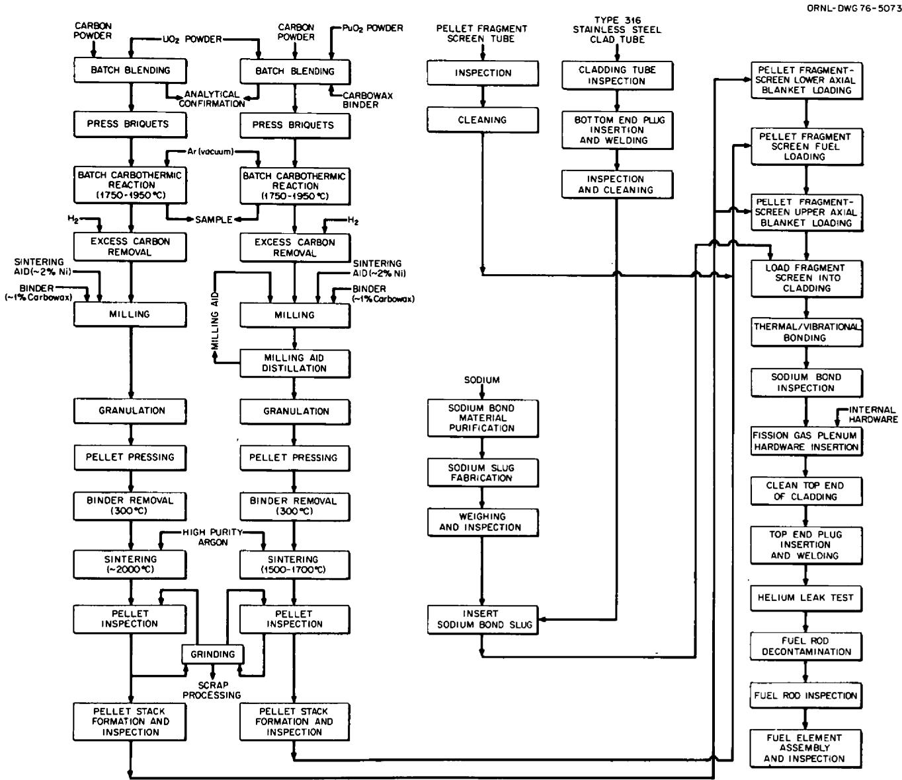  
Fig. I.3. FBR U-Pu Carbide fuel element fabrication.

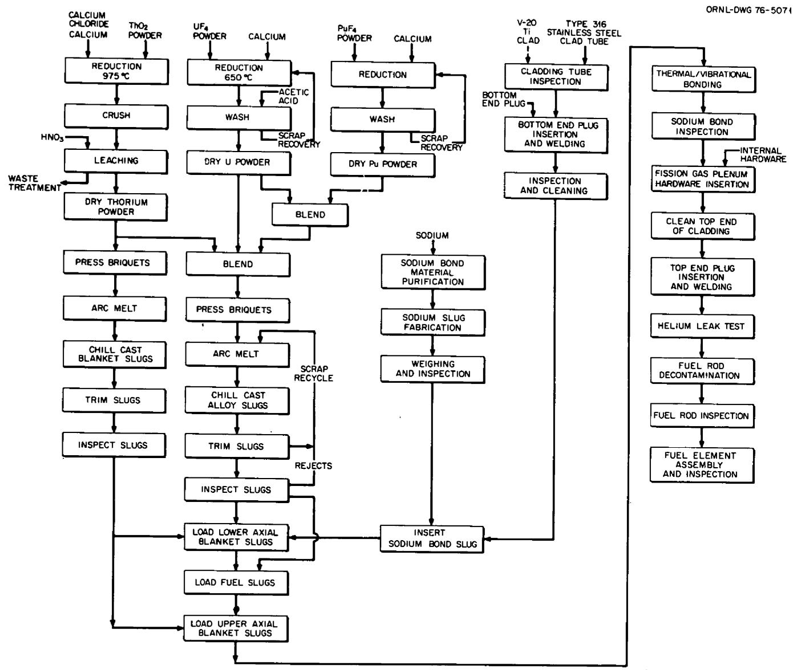  
Fig. I.4. FBR $^{233}\mathrm{U}$ -Th metal fuel element fabrication.

assembly components complexity. All capital cost factors included increments for buildings and equipment. A high level of mechanization was assumed for equipment, but the degree of automation varies as do the building costs in accordance with (1) the mode of operation from contact through moderate shielding, process step containment to significant shielding, and total process step containment, and (2) the accountability and safeguard considerations depending on fissile material and enrichment. Operating costs were derived from six weighted incremental costs covering cladding preparation, fuel preparation, rod loading element assembly-inspection-packaging, scrap recovery, and waste treatment. Although reference was made to some previous studies and cost estimations in developing the factors estimated for the various increments in each category, no attempt was made to normalize any case to such studies for metal clad fuels. A separate base case was derived for the unique configuration and fuel form of the HTGR reactors utilizing a recent ERDA task force study draft.[5]

The resulting relative fabrication costs comparison is presented in Table I.1. The precision of any category is probably less than for the total factors, particularly when one considers the options of trading between capital and operating costs that are available to any commercial venture. The absolute cost estimates are all given in 1977 dollars and are all for a common production rate plant of 2 metric tonnes per day of heavy metal product with a capital fixed charge rate of $30\%$ assumed. Within the accuracy of these estimates $(\pm 25\%)$ , the scaling factors for plant capacity are probably equivalent to those presented in the Geneva 1972 paper of Lotts et al. from the FABCOST 9 calculations. Thus a scaling factor can be derived from Table I.2.

The cost estimates are based on a given fuel element design for each reactor. No attempt has been made to judge the distribution of various fuel elements since a distribution of types within a given reactor is feasible in some instances and is therefore a design variable available to the core design and fuel management scheme.

# REFERENCES FOR APPENDIX I

1. A. L. Lotts and T. N. Washburn, "Use of Computer Codes in Estimating Fuel Element Fabrication Costs," Nucl. Appl., 4, 5: 307-19 (May 1968).   
2. A. L. Lotts, T. N. Washburn, and F. J. Homan, FABCOST 9, A Computer Code for Estimating Fabrication Costs for Rod-Bundle Fuel Elements, ORNL-4287 (August 1968).   
3. A. L. Lotts, T. N. Washburn, L. Giller, H. H. Klepfer, and W. H. Layman, "Status of Thermal Reactor Fuel Manufacture in the United States of America," Peaceful Uses of Atomic Energy, Vol 8, 1972 (14 Conf. 49/p/062).   
4. Proposed Amendment, 10CFR20 (FR Vol 39, No. 178, September 12, 1974).   
5. Summary Program Plan, Alternate Program for HTGR Fuel Recycle, Draft, April 11, 1975.

# INSTITUTIONAL CONSIDERATIONS

1. This study has shown that adoption of thorium cycles in thermal reactors results in better ore utilization than does use of the uranium cycle. At the same time, if Fast Breeder Reactors (FBRs) are commercialized on planned schedules, their use with the uranium cycle gives substantially better ore utilization in a growing nuclear economy. Thus, development of thorium fuel cycles corresponds to developing a contingency position for the case of a delay in FBR introduction. Further, thorium fuel cycles provide flexibility in the future if FBRs are introduced on schedule. If anticipated trends for relatively low nuclear electricity growth hold, and the breeder can be commercialized on the present ERDA schedule, the contingency position is not necessary. However, if nuclear electricity demand accelerates and/or the breeder is delayed significantly, then a contingency position is prudent. Advocates of the LWR-LMFBR scenario might argue that any money spent on contingency fuel cycles could be better utilized on the FBR program to increase the probability of meeting the present schedule. Those who advocate development of a contingency position think it unwise to risk everything on one system which may not be delivered on time. Both arguments have merit; so deciding between them requires a realistic assessment of the costs, risks, and benefits.

2. There is a school of thought which believes high gain converter reactors can replace FBRs in the nuclear picture, and provide the means to generate electricity until more advanced systems (fusion, solar) are commercially available on a large scale. Whether this is practical depends very much upon the nuclear power growth, the amount of natural $\mathrm{U}_{3}\mathrm{O}_{8}$ available at reasonable costs, and the introduction schedule of the advanced systems. Based on present estimates, FBRs are needed to maintain anticipated nuclear power growth. However, introduction of high gain converters (with conversion ratios approaching unity) does permit a substantial increase (relative to LWR use alone) in the nuclear power level which would be practical for the case of a substantial delay in the commercial use of FBRs. The results obtained here indicate that high priority should be given to the FBR, but that a contingency position can and should be developed which requires development and application of the thorium fuel cycle.

3. Use of thorium fuel cycles in thermal reactors will require the development of economic fuel recycle technology. Utilities will be reluctant to invest in the higher fuel inventory of thorium cycles unless there is a demonstrated, economic fuel recycle technology available to them. The above is particularly true of thorium-cycle LWRs and HWRs (HTGRs can store fuel for a number of years more economically then can the other concepts, but would require fuel recycle about 10 years after introduction). Further, early introduction of the thorium fuel cycle would require use of present reactor designs. Thorium fuel cycle development would be expedited by close collaboration with reactor vendors as well as with utilities.

4. Introduction of HwRs and/or HTGRs into the U.S. economy would require substantial investment in those systems. HwRs would have to meet U.S. safety, safeguards, and environmental regulations, and what influence they would have on the present CANDU-type design is not known at this time. Further, the estimated capital investment required in heavy water facilities would be very large, and greater than the cost of uranium enrichment facilities which HwR introduction could displace. HTGRs would require substantial investment in component development and testing, basic R & D, and "first of a kind" type costs. Thorium fuel cycle R & D would be required for all thermal reactors employing that cycle, but would be greatest for the HTGR. However, for operation on the thorium cycle, LwRs and HwRs would economically require commercial fuel recycle facilities earlier than would HTGRs.   
5. Commercialization of U/Th or Pu/Th fuel cycles will introduce safeguards requirements on fuel fabrication and refabrication facilities which are not currently in force for manufacture of low-enriched uranium fuel. The full costs associated with such safeguards are not yet known, but are anticipated to be high. The extent of thorium cycle utilization may be curtailed by the need to produce plutonium for FBRs, and therefore the expense associated with installation of safeguards may not be justified in the eyes of the fuel vendors.   
6. The reference nuclear development scenario for the U.S. calls for Light Water Reactors (LWRs) to provide power and produce plutonium to be used in LMFBRs. According to the simple model presented in Appendix P, about $60\%$ of the plutonium produced in LWRs over the next 30 years must be stockpiled for LMFBR inventories. If thorium fuel cycles were introduced in LWRs, the extent of introduction would be constrained by the requirement to stockpile plutonium. The investment in R & D needed to

commercialize thorium cycles in LWRs may not be justified in view of the modest improvements over the uranium cycle with uranium and plutonium recycle and the constraints imposed by the need for plutonium for use in Fast Breeder Reactors.

# APPENDIX K

# STUDIES AND PROGRAMS REQUIRED TO "AMERICANIZE"

# THE CANDU SYSTEM

Any planned program supporting CANDU reactor development in the U.S. should be on the basis that it leads to introduction of HWRs which can compete economically with other reactor systems. Primary economic features which favor CANDUs are their low fuel cycle costs and low separative work requirements for uranium enrichment. However, the cost of recovery of Pu from CANDU spent fuel appears relatively high per unit gram of fissile, such that it does not appear economically desirable to recover Pu from natural-uranium CANDUs. This probably would not be the case if slightly-enriched uranium-fueled HWRs were employed. Thus, introduction of HWRs into the U.S. might better be based on use of slightly-enriched uranium-fueled systems. This implies that in addition to studies involving estimates of HwR capital costs in the U.S., as well as the determination of U.S. licensing requirements and associated economic implications, an associated program of fuel development might be needed to insure that slightly enriched uranium fuel will perform as required. In addition, a fuel recycle R&D program for HWRs would be required, involving both the uranium fuel cycle and thorium cycle. Also, HWRs do add a requirement for large quantities of heavy water. While the technology of heavy water production is simpler than that of uranium isotope separation, and the required long term separation capacity is limited, the initial capital investment for heavy water production in an HwR economy appears higher than that needed for uranium enrichment plants in an LWR or HTGR economy.

An advantage of CANDU reactors is that they are now being built and are operating successfully. Thus, they presumably could be introduced in the U.S. fairly readily once the licensing and capital

costs requirements of HwR systems in the U.S. are resolved satisfactorily. Associated work would involve ERDA, NRC, national laboratories, A-E's, and Canadian support. This effort would require a detailed reactor design and associated safety analysis studies. The cost of such work would be dependent on the information available from the Canadians and the studies required as the work progressed; a minimum effort would require millions of dollars.

Based on the present type designs of CANDU reactors, needed research and development work would emphasize detailed evaluation of core performance under various fueling conditions, extensive fuel recycle development activities, and fuel irradiation testing. Primary areas are fuel reprocessing, fuel refabrication, and fabrication of fresh fuel, with emphasis on technology development and demonstration. Irradiation testing would involve slightly enriched uranium fuel as well as $^{235}\mathrm{U} / \mathrm{Th}$ and Pu/Th fuels. It is anticipated that an HwR fuel recycle development program involving Th/Pu and Th/U fuel cycles would cost overall about $150 million (this assumes that the recycle of U/Pu fuels from LWRs has been successfully developed and is used as base technology). The above does not include costs for a demonstration facility, which could add about $500 million to program costs. Additional work would include fuel development and testing and associated postirradiation evaluations costing about $30 million, and detailed reactor design and reactor physics analyses associated with fueling evaluations costing about $20 million. Table K1 provides a more detailed tabulation of estimated research programs and studies needed to support and justify HwRs in the U.S.; included are estimates of time required to complete such work and estimates of the cost.

Table Kl. Research Programs and Studies Needed to Support and Evaluate HwRs in the U.S.   

<table><tr><td>Activity</td><td>Estimated Time Required (yr)</td><td>Estimated Cost ($k) ('76 $'s)</td></tr><tr><td>A. Research Programs</td><td></td><td></td></tr><tr><td>1. Reprocessing systems and chemistry for:</td><td></td><td></td></tr><tr><td>a. Zr clad ThO2-235UO2 fuel</td><td>5</td><td>50,000</td></tr><tr><td>b. Zr clad ThO2-PuO2-233UO2 fuel.</td><td>5</td><td>60,000</td></tr><tr><td>2. Decladding techniques for Zr clad fuel (needed because Zr complicates reprocessing of Th).</td><td>5</td><td>5,000</td></tr><tr><td>3. Reinvestigation and optimization of the Thorex and Zirflex processes.</td><td>2</td><td>5,000</td></tr><tr><td>4. Determination in detail of the process differences between fabrication of 233U/Th fuels relative to Pu/U fuels.</td><td>2</td><td>20,000</td></tr><tr><td>5. Investigation of means to reduce the positive reactivity void coefficients in CANDU designs.</td><td>3</td><td>5,000</td></tr><tr><td>6. Determination of the extent of operational flexibility of CANDUs to meet U.S. utility requirements.</td><td>1</td><td>2,000</td></tr><tr><td>7. Updating of Th, 233U cross section measurements and evaluations.</td><td>2</td><td>200</td></tr><tr><td>B. Studies</td><td></td><td></td></tr><tr><td>1. Comparison of capital costs of CANDU and LWR systems on same basis, including plant modifications for CANDUs to bring them into compliance with U.S. standards and regulations.</td><td>1</td><td>2,000</td></tr><tr><td>2. Determination of importance of nuclear growth rate in the competitiveness of CANDU-Th vs CANDU-Pu recycle modes.</td><td>1</td><td>200</td></tr><tr><td>3. Study of an integrated Canadian-U.S. Nuclear growth scenario to show maximum advantage of CANDU-Th system. This implies an integrated fuel resource base.</td><td>2</td><td>500</td></tr><tr><td>4. Study the economics, fuel utilization, and fuel management in high-conversion ratio systems. Consider the trade-offs in lattice spacing, specific power, and fuel assembly design etc. as functions of the probable ranges of ore, reprocessing, fabrication, and separative work costs.</td><td>2</td><td>300</td></tr><tr><td>5. Investigation of the power cost economics and fuel utilization implications of slightly enriched fuel for CANDUs.</td><td>1</td><td>300</td></tr><tr><td>6. Study the advantages of ThC and Th metal in CANDU-Th reactors to further optimize the fuel utilization.</td><td>1</td><td>200</td></tr><tr><td>7. Determination of the optimum degree of symbiosis necessary between CANDU plutonium producers and CANDU thorium burners. Also, determination of the value of CANDU-Th with highly enriched 235U makeup.</td><td>2</td><td>300</td></tr><tr><td>C. Irradiation Program in Support of Research Programs</td><td>7</td><td>30,000</td></tr><tr><td>D. Design Work in Support of Studies including Reactor Physics Analyses Associated with Fueling Evaluation</td><td>3</td><td>20,000a $200,000</td></tr></table>

${}^{a}$ These costs could be much higher if major redesign studies were required for licensing purposes.

# APPENDIX L

# SUMMARY OF CALCULATIONS AND CALCULATIONAL METHODS

1. U-235 - U₃O₈ relationship

$$
\frac {\mathrm {k g} \mathrm {U}}{\mathrm {k g} \mathrm {U} _ {3} \mathrm {O} _ {8}} = \frac {3 (2 3 8)}{2 (2 3 8) + 8 (1 6)} = . 8 4 8 0
$$

$$
\begin{array}{l} \frac {\mathrm {k g} 2 3 5 \mathrm {U}}{\mathrm {k g} \mathrm {U}} = . 0 0 7 1 1 - . 0 0 1 0 = . 0 0 6 1 1 \\ = . 0 0 7 1 1 - . 0 0 2 0 = . 0 0 5 1 1 \\ = . 0 0 7 1 1 - . 0 0 2 5 = . 0 0 4 6 1 \\ = . 0 0 7 1 1 - . 0 0 3 0 = . 0 0 4 1 1 \end{array} \quad \begin{array}{l} \text {t a i l s a s s a y} \\ \text {w %} ^ {2 3 5 \mathrm {U}} \\ \text {.} 1 \\ \text {.} 2 \\ \text {.} 2 5 \\ \text {.} 3 \end{array}
$$

$$
\frac {\mathrm {k g} ^ {2 3 5} \mathrm {U}}{\mathrm {k g} \mathrm {U} _ {3} \mathrm {O} _ {8}} = \frac {\mathrm {k g} ^ {2 3 5} \mathrm {U}}{\mathrm {k g} \mathrm {U}} \frac {\mathrm {k g} \mathrm {U}}{\mathrm {k g} \mathrm {U} _ {3} \mathrm {O} _ {8}} = (. 0 0 5 1 1) (. 8 4 8 0)
$$

$$
= . 0 0 4 3 3 (. 2
$$

$$
\frac {\mathrm {k g} \mathrm {U} _ {3} 0 _ {8}}{\mathrm {k g} ^ {2 3 5} \mathrm {U}} = \frac {1}{. 0 0 4 3 3} \sim 2 3 1
$$

$$
\frac {\text {t o n s} \mathrm {U} _ {3} \mathrm {O} _ {8}}{\mathrm {k g} ^ {2 3 5} \mathrm {U}} = \frac {2 3 1 (2 . 2)}{2 0 0 0} = . 2 5 4 1
$$

tails ASSAY (% 235U)   

<table><tr><td></td><td>.1</td><td>.2</td><td>.25</td><td>.3</td><td>Natural U</td></tr><tr><td>kg 235U/kg U3O8</td><td>.00518</td><td>.00433</td><td>.00391</td><td>.00349</td><td>.00603</td></tr><tr><td>kg U3O8/kg 235U</td><td>193</td><td>231</td><td>256</td><td>287</td><td>166</td></tr><tr><td>tons U3O8/kg 235U</td><td>.212</td><td>.2541</td><td>.2816</td><td>.3157</td><td>.1824</td></tr></table>

2. Average in-core residence time

$$
\begin{array}{l} t _ {r} (y r) = \frac {\left[ \frac {k g H M}{M W (e)} \right] \left[ \frac {m w d (t h)}{k g H M} \right]}{\frac {m w d (t h)}{(y r) [ M W (e) ]}} \\ = \frac {\left[ \frac {\mathrm {k g} \mathrm {H M}}{\mathrm {M W} (\mathrm {e})} \right] \left[ \frac {\mathrm {m w d} (\mathrm {t h})}{\mathrm {k g} \mathrm {H M}} \right] \left[ \frac {\mathrm {M W} (\mathrm {e})}{\mathrm {M W} (\mathrm {t h})} \right]}{3 6 5 (\text {l o a d f a c t o r})} \\ \end{array}
$$

3. Total inventory1

$$
I _ {S} = \left(\frac {t r + t p}{t r}\right) I _ {r}
$$

$$
I _ {S} = \frac {k g}{M W (e)} t o t a l i n v e n t o r y
$$

$$
t _ {r} = \text {t i m e i n r e a c t o r (y r s)}
$$

$$
t _ {p} = \text {e x - r e a c t o r t i m e (y r s)}
$$

$$
I _ {r} = \frac {k g}{M W (e)} \text {i n r e a c t o r}
$$

4. U-235 cost²

$$
\begin{array}{l} \frac {\mathbb {S}}{\text {k g p r o d u c t}} = \left(\frac {\text {k g U}}{\text {k g p r o d u c t}}\right) \frac {\mathbb {S}}{\text {k g U}} + \left(\frac {\text {k g S w u}}{\text {k g p r o d u c t}}\right) \frac {\mathbb {S}}{\text {k g S w u}} \\ \frac {\mathbb {S}}{\mathrm {k g} ^ {2 3 5 \mathrm {U}}} = \frac {\frac {\mathbb {S}}{\mathrm {k g p r o d u c t}}}{\frac {\mathrm {k g} ^ {2 3 5 \mathrm {U}}}{\mathrm {k g p r o d u c t}}} \\ \end{array}
$$

$$
\begin{array}{l} \text {A s s u m e :} \quad \$ 4 0 / 1 b U _ {3} O _ {8} = \frac {\$ 1 0 4}{k g U} \\ \$ 75 / k g S w u \\ . 2 w \% ^ {235} U t a i l s \text {a s s a y} \\ \end{array}
$$

<table><tr><td>Product 
Enrichment 
w % 235U</td><td>kg U/kg Product</td><td>kg Swu/kg Product</td><td>$/g Product</td><td>$/g 235U</td></tr><tr><td>.711</td><td>1.000</td><td>0</td><td>.104</td><td>14.63</td></tr><tr><td>2.2</td><td>3.914</td><td>2.602</td><td>.602</td><td>27.37</td></tr><tr><td>2.4</td><td>4.305</td><td>3.018</td><td>.674</td><td>28.09</td></tr><tr><td>3.0</td><td>5.479</td><td>4.306</td><td>.893</td><td>29.76</td></tr><tr><td>3.4</td><td>6.262</td><td>5.191</td><td>1.041</td><td>30.61</td></tr><tr><td>3.6</td><td>6.654</td><td>5.638</td><td>1.115</td><td>30.97</td></tr><tr><td>93.0</td><td>181.605</td><td>235.550</td><td>36.55</td><td>39.30</td></tr></table>

# 5. Fuel cycle costs

# Components:

1. Inventory costs (capital)  
total fissile inventory  
fabrication cost of first core  
thorium inventory (for thorium cycles)   
2. Shipping   
3. Makeup fissile thorium (for thorium cycles)   
4. Reprocessing (for recycle cases only)   
5. Fabrication (refabrication)   
6. Spent fuel storage (for non-recycle cases only)   
7. Heavy water makeup (for HwRs only)

# Calculations:

# 1. Inventory

$$
\begin{array}{l} \left[ \frac {\mathcal {S}}{\mathrm {MW} (\mathrm {e}) \mathrm {yr}} \right] _ {\text {fissile}} = \left[ \frac {\text {total kg fissile}}{\mathrm {MW} (\mathrm {e})} \right] \left(\frac {\mathcal {S}}{\mathrm {kg fissile}}\right) \left(\frac {10 \%}{\mathrm {yr}}\right) \\ \left[ \frac {\mathcal {S}}{\mathrm {MW} (\mathrm {e}) \mathrm {yr}} \right] _ {\text {fab}} = \left[ \frac {\mathrm {kg} \mathrm {HM} \text {in 1st core}}{\mathrm {MW} (\mathrm {e})} \right] \left(\frac {\mathcal {S}}{\mathrm {kg} \mathrm {HM} \text {fab}}\right) \left(\frac {10 \%}{\mathrm {yr}}\right) \\ \left[ \frac {\S}{\mathrm {MW} (\mathrm {e}) \mathrm {yr}} \right] _ {\mathrm {Th}} = \left[ \frac {\mathrm {kg} \mathrm {Th} \text {in core}}{\mathrm {MW} (\mathrm {e})} \right] \left(\frac {\S}{\mathrm {kg} \mathrm {Th}}\right) \left(\frac {10 \%}{\mathrm {yr}}\right) \\ \end{array}
$$

Assume: $\frac{\S 25}{\mathrm{kg} \mathrm{Th}} \left( \frac{\S 10}{1 \mathrm{~b} \mathrm{ThO}_2} \right)$

$$
\frac {\text {m i l l s}}{\text {k w h r}} = \frac {\left[ \frac {\S}{\text {M W} (\mathrm {e}) \quad \text {y r}} \right] \left(1 0 ^ {+ 3} \frac {\text {m i l l s}}{\S}\right)}{\frac {\text {k w h r}}{\text {M W} (\mathrm {e}) \quad \text {y r}}}
$$

$$
\frac {\mathrm {k w} \mathrm {h r}}{\mathrm {M W} (\mathrm {e})} = \left(\frac {\mathrm {k w}}{\mathrm {M W}}\right) \left(\frac {\mathrm {h r s}}{\mathrm {y r}}\right) (\text {l o a d f a c t o r})
$$

$$
\therefore \frac {\text {m i l l s}}{\text {k w h r}} = \frac {\frac {\S}{\text {M W (e) y r}}}{7 0 0 8} \text {f o r l o a d s e c t i o n} = . 8
$$

2. Shipping Reprocessing $\frac{\S}{\mathrm{MW(e)}\mathrm{yr}} = \left(\frac{\S}{\mathrm{kg}}\right)\left[\frac{\mathrm{kg}}{\mathrm{MW(e)}\mathrm{yr}}\right]$ Fabrication

3. Spent fuel storage

Assume: $\frac{\$50}{kg}$ for CANDU, $\frac{\$100}{kg}$ for LWR, $\frac{\$200}{kg}$ for HTGR

4. Heavy water makeup

Assume: .35 mill/kw hr (ref. 3)

5. Makeup costs

$$
\left[ \frac {\mathbb {S}}{\mathrm {M W} (\mathrm {e}) \mathrm {y r}} \right] _ {\text {f i s s i l e}} = \left[ \frac {\mathrm {k g f i s s i l e m a k e u p}}{\mathrm {M W} (\mathrm {e}) \mathrm {y r}} \right] \left(\frac {\mathbb {S}}{\mathrm {k g f i s s i l e}}\right)
$$

$$
\left[ \frac {\S}{M W (e) y r} \right] _ {T h} = \left(\frac {k g T h m a k e u p}{y r}\right) \left(2 5 \frac {\S}{k g T h}\right)
$$

Discussion: In calculating fuel cycle costs in the above manner it is not necessary to assign a value to bred fuel. It is assumed that this fuel is recycled to the reactor. In the case of no recycle a charge is assigned for storing the spent fuel, with no credit for the fissile inventory in the stored fuel. Burnup costs are assigned on the basis of the cost of makeup fuel only. The low makeup costs associated with high gain converters is balanced by the inventory costs associated with high specific inventories. This is the fairest, simplest way of comparing fuel cycles and reactor types with vastly different thermal efficiencies, conversion ratios, burnups, and processing costs.

# APPENDIX M

# QUALITATIVE OVERVIEW OF RECYCLE PROCESS STATUS FOR VARIOUS REACTOR SYSTEMS

The following tables were derived to show the commonality in fuel recycle process for various reactors and reactor fuels and to provide a qualitative assessment of the current status of development for processes associated with these fuel types.

To provide the required perspective the required process steps, including irradiation proof-testing of the product, were identified generically for each of five reactor types and a variety of potential fuels. These are shown in Table Ml and address both recycled fuel and fresh fuel since in some instances development is required for that fuel derived from natural sources. For each of the process steps a current developmental status was defined in terms of the normal development stages shown schematically in Figure Ml. This status is given by the number in parenthesis for each generic process label.

Finally in Table M2 the commonality in processes is shown by establishing the development of recycle capability for current LWR fuels as a base and show which additional features would require additional development to establish the technology for recycle of a new reactor or fuel. It should be emphasized that this assessment is based on an assumed sequential development with the base case development and subsequent developments incorporating both historical data and anticipating future modifications and additions. Using these same ground rules, a relative order of magnitude cost projection was made, as shown in Table M2. The absolute values of these projections are highly uncertain. To establish an absolute cost projection would require the development and assessment of a detailed experimental plan. However, the relative numbers given in Table M2 do show the commonality between systems and how, by generally small incremental development additions, the number of recycle options and the ability to choose between alternate fuel resources can be expanded.

Table M.1. Overview of Processes for Fuel Recycle with Assessment of Status   

<table><tr><td rowspan="2">Reactor System</td><td colspan="7">Recycle Fuel Processes</td><td colspan="2">Fresh Fuel</td></tr><tr><td>Fuel</td><td>Head-End</td><td>Separation</td><td>Fuel Conversion</td><td>Refabrication</td><td>Recycle Fuel Irradiation Proof Testing</td><td>Fabrication</td><td>Fresh Fuel Irradiation Proof Testing</td><td></td></tr><tr><td rowspan="5">LMR</td><td>\(UO_2\)</td><td>Chop-Leach(4)</td><td>Purex(4)a</td><td>ADU(5)</td><td></td><td></td><td>Pellet Rod Bundle(5)</td><td>Proven(5)</td><td></td></tr><tr><td>\((U-Pu)_O_2\)</td><td>Chop-Leach(4)</td><td>Purex(4)</td><td>Oxalate(3)</td><td>Pellet Rod Bundle(2)</td><td>Proven(5)</td><td></td><td></td><td></td></tr><tr><td>\((^{231}U-Th)O_2\)</td><td>Cladding Separation(1)</td><td>Thorex(2) plus Purex(4A)b</td><td>ADU(5) plus Thermal Penetration(3)</td><td></td><td></td><td>Pellet Rod Bundle(5A)</td><td>Required</td><td></td></tr><tr><td>\((^{231}U-Th)O_2\)</td><td>Cladding Separation(1)</td><td>Thorex(2) plus Purex(4A)b</td><td>ADU(2) plus Thermal Penetration(3)</td><td>Pellet Rod Bundle(2)</td><td>Required</td><td></td><td></td><td></td></tr><tr><td>\((Pu-Th)O_2\)</td><td>Cladding Separation(1)</td><td>Thorex(2) plus Purex(4A)b</td><td>Oxalate(3) plus Thermal Penetration(3)</td><td>Pellet Rod Bundle(2A)</td><td>Required</td><td></td><td></td><td></td></tr><tr><td rowspan="2">LWBR</td><td>\((^{231}U-Th)O_2\)</td><td>Cladding Separation(1)</td><td>Thorex(2) plus Purex(4A)b</td><td>ADU(5A) plus Thermal Penetration(3)</td><td>Pellet Rod Bundle(2)</td><td>Required(3)</td><td></td><td></td><td></td></tr><tr><td></td><td></td><td></td><td></td><td></td><td></td><td>Pellet Rod Bundles(5)</td><td>Proven(5)</td><td></td></tr><tr><td rowspan="4">CANDU</td><td>\(UO_2\)</td><td>Chop-Leach(4)</td><td>Purex(4)</td><td>ADU(5)</td><td></td><td></td><td></td><td></td><td></td></tr><tr><td>\((U-Pu)_O_2\)</td><td>Chop-Leach(4)</td><td>Purex(4)</td><td>ADU(5) plus Oxalate(3)</td><td>Pellet Rod Bundle(2A)</td><td>Required(3)</td><td></td><td></td><td></td></tr><tr><td>\((^{231}U-Th)O_2\)</td><td>Cladding Separation(1)</td><td>Thorex(2) plus Purex(4A)</td><td>ADU(5) plus Thermal Penetration(3)</td><td></td><td></td><td>Pellet Rod Bundle(5A)</td><td>Required(3)</td><td></td></tr><tr><td>\((^{231}U-Th)O_2\)</td><td>Cladding Separation(1)</td><td>Thorex(2) plus Purex(4A)</td><td>ADU(2) plus Thermal Penetration(3)</td><td>Pellet Rod Bundle(2A)</td><td>Required(2)</td><td></td><td></td><td></td></tr><tr><td rowspan="5">FBR Core</td><td>\((U-Pu)_O_2\)</td><td>Chop-Leach(4A)</td><td>Purex(3A)</td><td>ADU(5) plus Oxalate(3A)</td><td>Pellet Rod Bundle(2)</td><td>Required(3)</td><td></td><td></td><td></td></tr><tr><td>\((^{231}U-Th)O_2\)</td><td>Chop-Leach(4A)</td><td>Thorex(2) plus Purex(3A)</td><td>ADU(2) plus Thermal Penetration(3)</td><td>Pellet Rod Bundle(2A)</td><td>Required(3)</td><td></td><td></td><td></td></tr><tr><td>\((Pu-Th)O_2\)</td><td>Chop-Leach(4A)</td><td>Thorex(2) plus Purex(3A)</td><td>Oxalate(3A) plus Thermal Penetration(3)</td><td>Pellet Rod Bundle(2A)</td><td>Required</td><td></td><td></td><td></td></tr><tr><td>\((^{231}U-Th)\)</td><td>Undefined(1)</td><td>Thorex(2) plus Purex(3A)</td><td>Reduction-Melt(1)</td><td>Slug Rod Bundle(1)</td><td>Required</td><td></td><td></td><td></td></tr><tr><td>\((^{231}U-Pu)C\)</td><td>Chop-Leach(1)</td><td>Purex(3A)</td><td>Carbothermic Reduction(2)</td><td>Pellet Rod Bundle(2)</td><td>Required</td><td></td><td></td><td></td></tr><tr><td rowspan="2">Blanket</td><td>\(UO_2\)</td><td>Chop-Leach(4)</td><td>Purex(4)</td><td>ADU(5)</td><td></td><td></td><td>Pellet Rod Bundle(5A)</td><td>Proven(5)</td><td></td></tr><tr><td>\(\mathsf{ThO}_2\)</td><td>Chop-Leach(4)</td><td>Thorex(2) plus Purex(3A)</td><td>Thermal Penetration(3)</td><td></td><td></td><td>Pellet Rod Bundle(5A)</td><td>Required</td><td></td></tr><tr><td rowspan="2">HTGR</td><td>\((^{231}U-Th)C-O\)</td><td>Burn-Leach(2)</td><td>Thorex(2) plus Purex(3A)</td><td>Resin Kernel(2)</td><td></td><td></td><td>Blended Bed-Prismatic Block(2)</td><td>Required(4)</td><td></td></tr><tr><td>\((^{231}U-Th)C-O\)</td><td>Burn-Leach(2)</td><td>Thorex(2) plus Purex(3A)</td><td>Resin Kernel(2)</td><td>Blended Bed-Prismatic(2)</td><td>Block</td><td>Required</td><td></td><td></td></tr></table>

aNumbers in parentheses are reference to the current stage of development (see Figure Ml).   
bThe suffix "A" denotes a process that has not been applied to the reactor fuel indicated, but that is readily adapted (at the stage indicated) without significant technological barriers.

ORNL-DWG 76-18737

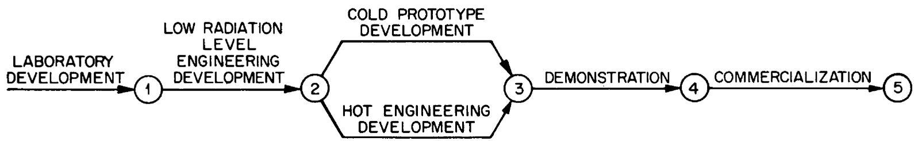  
Fig. M.l. Development sequence for fuel cycle facilities.

3

Table M.2. Possible Sequential $^{\alpha}$ Development for Fuel Recycle Capability   

<table><tr><td>Processes</td><td>Base LWR (U-Pu)O2</td><td>Add 1 CANDU (U-Pu)O2</td><td>Add 3 LWR Oxide Th Cycles</td><td>Add 4 CANDU Oxide Th Cycles</td><td>Add 5 LWBR Oxide Th Cycles</td><td>Add 6 HTCR Th Cycles</td><td>Add 7 FBR Oxide Th Cycles</td><td>Add 8 FBR Metal Th Cycles</td></tr><tr><td>Chop-Leach</td><td>R</td><td></td><td></td><td></td><td></td><td></td><td></td><td></td></tr><tr><td>Cladding Separation</td><td></td><td></td><td>R</td><td></td><td></td><td></td><td></td><td></td></tr><tr><td>Burn-Leach</td><td></td><td></td><td></td><td></td><td></td><td>R</td><td></td><td>R</td></tr><tr><td>Metal-Process</td><td></td><td></td><td></td><td></td><td></td><td></td><td></td><td></td></tr><tr><td>Purex</td><td>R</td><td></td><td></td><td></td><td></td><td></td><td></td><td></td></tr><tr><td>Thorex</td><td></td><td></td><td>R</td><td></td><td></td><td></td><td></td><td></td></tr><tr><td>ADU</td><td>R</td><td></td><td></td><td></td><td></td><td></td><td></td><td></td></tr><tr><td>Oxalate</td><td>R</td><td></td><td></td><td></td><td></td><td></td><td></td><td></td></tr><tr><td>Thermal-Penetration</td><td></td><td></td><td>R</td><td></td><td></td><td></td><td></td><td></td></tr><tr><td>Reduction-Melt</td><td></td><td></td><td></td><td></td><td></td><td></td><td></td><td>R</td></tr><tr><td>Resin Kernel</td><td></td><td></td><td></td><td></td><td></td><td>R</td><td></td><td></td></tr><tr><td>LWR Pellet Rod Bundle</td><td>R</td><td></td><td></td><td></td><td></td><td></td><td></td><td></td></tr><tr><td>LWBR Pellet Rod Bundle</td><td></td><td></td><td></td><td></td><td>R</td><td></td><td></td><td></td></tr><tr><td>CANDU Pellet Rod Bundle</td><td></td><td>R</td><td></td><td></td><td></td><td></td><td></td><td></td></tr><tr><td>FBR Oxide Pellet Rod Bundle</td><td></td><td></td><td></td><td></td><td></td><td></td><td>R</td><td></td></tr><tr><td>FBR Slug Rod Bundle</td><td></td><td></td><td></td><td></td><td></td><td></td><td></td><td>R</td></tr><tr><td>Blended Bed-Prismatic Block</td><td></td><td></td><td></td><td></td><td></td><td>R</td><td></td><td></td></tr><tr><td>Recycle Irradiation Proof</td><td></td><td>R</td><td>R</td><td>R</td><td>R</td><td>R</td><td>R</td><td>R</td></tr><tr><td>Fresh Fuel Irradiation Proof</td><td></td><td></td><td>R</td><td>R</td><td></td><td>R</td><td>R</td><td>R</td></tr><tr><td>Incremental Development Costb</td><td>250</td><td>50</td><td>125</td><td>25</td><td>50</td><td>250</td><td>150</td><td>200</td></tr><tr><td>Cumulative Development Costb</td><td>250</td><td>300</td><td>425</td><td>450</td><td>500</td><td>750</td><td>900</td><td>1100</td></tr></table>

aAssumes required processes are developed in the base case or a prior additional step for each additional system. If a process is not available the needed development is indicated by the letter "R". Also if additional development is needed it will need to be so designated [Eq. $(^{23}3\mathrm{U},\mathrm{Th})\mathrm{O}_2]$ . LWR Fuel Refabrication and bundle assembly is not required if the (U-Pu)O2 LWR fuel is done completely remotely. We have assumed this will be the case in this table.   
bFor development to demonstration stage (demonstration plant not included) all cost are in millions of dollars and exclude the cost of irradiation space for demonstration.

R&D work required for the LWR thorium fuel cycle involves developing and demonstrating fuel recycle technology and fuel irradiation performance. Developing recycle technology is required to facilitate the implementation of the thorium cycle in LWRs and to obtain associated improved fuel utilization.

LWR(Th) fuel recycle technology development could be carried out in an integrated program with both HWR(Th) and HTGR thorium cycle work since there are common areas of development. It is estimated that the R&D costs of LWR thorium fuel recycle would be about $150 million above that associated with developing fuel recycle technology for the uranium/ plutonium cycle in LWRs. In addition, a demonstration-scale facility involving both reprocessing and refabrication should be operated, and the cost of that would be several hundred million dollars above that associated with industry support.

A fuel irradiation testing and evaluation program would also be required to qualify thorium-based fuel and recycle fuel, the cost of which would be about $30 million. An extensive core design effort would also be needed to determine practical thorium-plus-fissile loading which are also relatively economical. The cost of such core design and associated core physics analyses are estimated to be about $15 million.

Overall, close coordination with industry would be required, with most of the fuel testing done in commercial facilities; where practical, use should also be made of industrial fabrication and refabrication facilities. Fuel cycle analysis work should also be closely coordinated with industrial studies.

With regard to the above, past and present development work on the LWR fuel cycle should be utilized insofar as possible. The large amount of fuel fabrication effort by industry to date should be at least partially

applicable; similarly, industrial work on fuel refabrication should be utilized. However, it is believed important that the sphere-pac method be emphasized in the refabrication of fuels. A corresponding fuel testing program would need to be included.

Fuel reprocessing studies can build on technologies previously and presently being developed; thus, the work being carried out on the Acid-Thorex Process for thorium fuels will be largely applicable. The shear-leach process for the head-end processing LWR uranium fuels will provide very useful information. There are special problems with thorium fuels (such as those associated with dissolution of thoria), and these will require specific R&D. Waste disposal treatment studies can build on those being done for the uranium cycle, taking into consideration any special requirements introduced by use of thoria.

Insofar as fuel testing is concerned, the irradiation testing performed under the LWBR program should provide very useful technology information, and such work should form a base for future development and testing.

# HTGR Fuel Recycle Development

The HTGR fuel recycle R&D and demonstration program has been developed in detail in a National Program Plan document developed jointly by Oak Ridge National Laboratory, General Atomic Company and Allied Chemical Corporation under ERDA sponsorship. The R&D effort is estimated to be about $400 million and the first-phase demonstration plant is estimated to cost about $600 million.

# APPENDIX N

# POWER COST AND ORE-UTILIZATION SUMMARY

Summary: Appendices B, C, and D have described metal loadings and makeup requirements for uranium and thorium fuel cycles in LWRs, HTGRs, and HWRs. Generally, higher conversion ratios can be achieved with higher initial loadings and lower burnup. Information on ore utilization has been presented, but very little has been said about cost. Fuel cycle cost calculations are presented in this Appendix, using the method outlined in Appendix L. Fixed ore and separative-work costs ( $40/lb U_{308}$ and $\$75$ /SWU respectively) are assumed in these calculations. Variations of fuel cycle cost with changing ore and SWU costs are discussed elsewhere in this report. The report confirms that costs associated with high initial inventories and low burnup outweigh the advantages of better ore utilization at current ore and SWU costs. It is also shown that the use of Pu as fissile material is economically superior to U-235, considering the assumed reprocessing costs. However, since the supply of Pu is limited, the economics of fuel costs are of little value when selecting reactor systems and fuel cycles to develop.

Relatively low fuel cycle costs (by comparison) were calculated for several HWR fuel cycles. There is some question in the authors' minds whether the inventory and makeup requirements reported in the HWR studies cited in this report are of the same quality as those reported for LWRs and HTGRs. Higher inventory and makeup requirements would result in higher fuel cycle costs. In addition, the fabrication, refabrication, and reprocessing costs used in the HWR fuel cycle cost calculations were those associated with very large industries, which would be required for HWRs because of the low exposures achieved in those reactors. Using costs associated with smaller fuel cycle industries would make the HWR fuel cycle costs much less attractive.

Considering all options, it is the authors' opinion that the HTGR offers the best combination of low fuel cycle cost and good ore utilization. Lowest power generation costs were calculated for the HTGR, with a conversion ratio of 0.66 and U-233 recycle. Higher ore and SWU costs would make the higher-conversion-ratio HTGR most attractive.

# Fuel Cycle Costs

Tables N.1 through N.5 contain fuel cycle cost estimates for the reactors and the fuel cycles included in this study. The (a) portions of the tables summarize the performance data from which the estimates are made, and the (b) portions contain the actual estimates. Table N.1 covers the PWR, using various $\mathrm{UO_2 - ThO_2}$ , $\mathrm{UO_2 - PuO_2}$ , U-Th, and Pu-Th fuel cycles. Table N.2 covers the PWR with a TRRC (Thorium Replacement Reactor Core), with conversion ratios of 0.83 to 0.96. A discussion of all PWR options is included in Appendix B. Table N.3 covers the HTGR, which is discussed in Appendix C. Table N.4 covers the CANDU using the plutonium cycle, as discussed in Appendix D. Table N.5 covers the CANDU using the thorium cycle, which is also covered in Appendix D.

Several aspects of the fuel cycle cost calculations deserve special mention:

1. LWR fuel cycle cost data presented in Table N.1 are based on selected studies from Appendix B. There is some variation among studies (shown in Table B.4) on initial inventories, makeup, and conversion ratio. There is fairly good agreement between the costs shown in Table N.1 and costs calculated for similar fuel cycles from other studies, shown in Appendix B. For example, the $\mathrm{UO_2}$ with no recycle, described in Table B.2, has a calculated fuel cycle cost of 6.6 mills/kwhr compared to 6.9 mills/kwhr in Table N.1. For $\mathrm{UO_2 - ThO_2}$ , the comparison is 9.1 mills/kwhr vs 9.4 mills/kwhr in Table N.1. The $\mathrm{PuO_2 - UO_2}$ case is an exception. In Table N.1, the value is 9.1 mills/kwhr compared with 7.5 mills/kwhr using data from the BMI study cited in Appendix B. Using data from Table B.2, the value for $\mathrm{PuO_2}$ - natural $\mathrm{UO_2}$ is 6.3 mills/kwhr. This value can be explained because of the $\$20/\mathrm{g}$ assumed for Pu vs $\$30/\mathrm{g}$ for U-235 (3% enriched). Based on these comparisons, it is possible that the value of 9.1 mills/kwhr, shown in Table N.1, might be high.

Table N.1(a). Parameters for Fuel Cycle Cost Calculation   

<table><tr><td>Reactor</td><td>PWRa</td><td>PWRa,b</td><td>PWRa,b</td><td>PWRb,c</td><td>PWRa,b</td><td>PWRc,d</td></tr><tr><td>Fuel</td><td>UO2 (No Recycle)</td><td>UO2-PuO2</td><td>UO2-ThO2</td><td>PuO2-ThO2</td><td>U-Th</td><td>Pu-Th</td></tr><tr><td>Conversion Ratio</td><td>0.61</td><td></td><td>0.76</td><td>0.78</td><td>0.81</td><td>0.81</td></tr><tr><td>Enrichment, % Fissile</td><td>3.2</td><td>3.2</td><td>4.0</td><td>4.48</td><td>3.44</td><td>3.71</td></tr><tr><td>Thermal Efficiency, %</td><td>33</td><td>33</td><td>33</td><td>33</td><td>33</td><td>33</td></tr><tr><td>Load Factor</td><td>0.8</td><td>0.8</td><td>0.8</td><td>0.8</td><td>0.8</td><td>0.8</td></tr><tr><td>Burnup (MWd/kg HM)</td><td>33</td><td>33</td><td>34.5</td><td>33</td><td>25.8</td><td>33</td></tr><tr><td>Time in Reactor (yr)</td><td>3.19</td><td>3.2</td><td>3.20</td><td>3.10</td><td>3.2</td><td>4.41</td></tr><tr><td>Ex-Reactor Time (yr)</td><td>1.8</td><td>2.6</td><td>2.6</td><td>2.6</td><td>2.6</td><td>2.6</td></tr><tr><td>(tr + tp)/tr</td><td>1.56</td><td>1.81</td><td>1.81</td><td>1.84</td><td>1.81</td><td>1.59</td></tr><tr><td colspan="7">Inventory [kg/MW(e)]</td></tr><tr><td>Reactor/Total 233U</td><td></td><td></td><td></td><td></td><td></td><td></td></tr><tr><td>235U</td><td>2.74/4.29</td><td>2.74/4.96</td><td>3.30/5.97</td><td></td><td>3.771/6.836</td><td></td></tr><tr><td>238U</td><td></td><td></td><td>0.25</td><td></td><td>0.284</td><td></td></tr><tr><td>Fissile Pu</td><td></td><td></td><td></td><td>3.720/6.73</td><td></td><td>4.398/6.99</td></tr><tr><td>Th</td><td></td><td></td><td>77.93/141.1</td><td>79.32/144</td><td>105.51/190.97</td><td>114.1/181.4</td></tr><tr><td>Total</td><td>85.6</td><td>85.6</td><td>81.5</td><td>83.04</td><td>109.56</td><td>118.5</td></tr><tr><td colspan="7">Makeup [kg/MW(e) yr]</td></tr><tr><td>233U</td><td></td><td></td><td></td><td></td><td></td><td></td></tr><tr><td>235U</td><td>0.91</td><td>0.54</td><td>0.399</td><td></td><td>0.34</td><td></td></tr><tr><td>238U</td><td></td><td></td><td></td><td></td><td></td><td></td></tr><tr><td>Fissile Pu</td><td></td><td></td><td></td><td>0.310</td><td></td><td>0.302</td></tr><tr><td>Th</td><td></td><td></td><td></td><td></td><td></td><td></td></tr><tr><td>Total</td><td>26.75</td><td>26.75</td><td>25.47</td><td>25.9</td><td>34.24</td><td>26.87</td></tr><tr><td>$/g Fresh 235U</td><td>30</td><td>30</td><td>40</td><td>40</td><td>40</td><td>20</td></tr><tr><td>$/g Makeup Fissile</td><td>30</td><td>30</td><td>40</td><td>20</td><td>40</td><td>20</td></tr><tr><td>30 yr 235U kg/MW(e)e</td><td>30.03</td><td>18.94</td><td>15.27</td><td></td><td>13.97</td><td></td></tr></table>

Table B.3, Appendix B of this report (GAC entries).   
Self generated recycle.   
Table B.1, Appendix B of this report.   
aExternal source of Pu assumed.   
Reactor inventory + 30 years makeup.

Table N.1(b). Fuel Cycle Cost Calculation  

<table><tr><td>Reactor</td><td>PWR</td><td>PWR</td><td>PWR</td><td>PWR</td><td>PWR</td><td>PWR</td></tr><tr><td>Fuel</td><td>\( UO_2 \)(No Recycle)</td><td>\( UO_2-PuO_2 \)</td><td>\( UO_2-ThO_2 \)</td><td>\( PuO_2-ThO_2 \)</td><td>U-Th</td><td>Pu-Th</td></tr><tr><td>Conversion Ratio</td><td>0.61</td><td></td><td>0.76</td><td>0.78</td><td>0.81</td><td>0.81</td></tr><tr><td>$/kg HM</td><td></td><td></td><td></td><td></td><td></td><td></td></tr><tr><td>Shipping</td><td>10</td><td>10</td><td>10</td><td>10</td><td>10</td><td></td></tr><tr><td>Makeup</td><td></td><td></td><td></td><td></td><td></td><td></td></tr><tr><td>$/g 233U</td><td></td><td></td><td></td><td></td><td></td><td></td></tr><tr><td>$/g 235U</td><td>30</td><td>30</td><td>40</td><td></td><td>40</td><td></td></tr><tr><td>$/g Pu</td><td></td><td></td><td></td><td>20</td><td></td><td>20</td></tr><tr><td>$/g Th</td><td></td><td></td><td>0.025</td><td>0.025</td><td>0.025</td><td>0.025</td></tr><tr><td>Reprocessing</td><td></td><td>292</td><td>292</td><td>316</td><td>300</td><td>300</td></tr><tr><td>Fabrication</td><td>150</td><td>150</td><td>200</td><td>510</td><td>200</td><td>500</td></tr><tr><td>Refabrication</td><td></td><td>500</td><td>570</td><td>510</td><td>500</td><td>500</td></tr><tr><td>Storage</td><td>100</td><td></td><td></td><td></td><td></td><td></td></tr><tr><td>mills/kW hr</td><td></td><td></td><td></td><td></td><td></td><td></td></tr><tr><td>Inventory (fissile)</td><td>1.836</td><td>2.123</td><td>3.408</td><td>1.921</td><td>3.902</td><td>1.995</td></tr><tr><td>Inventory (Th)</td><td></td><td></td><td>0.050</td><td>0.051</td><td>0.068</td><td>0.0647</td></tr><tr><td>First Core Fab</td><td>0.183</td><td>0.184</td><td>0.233</td><td>0.604</td><td>0.313</td><td>0.845</td></tr><tr><td>Shipping</td><td>0.038</td><td>0.038</td><td>0.038</td><td>0.038</td><td>0.049</td><td>0.038</td></tr><tr><td>Makeup</td><td>3.896</td><td>2.590</td><td>2.277</td><td>0.885</td><td>1.941</td><td>0.862</td></tr><tr><td>Reprocessing</td><td></td><td>1.187</td><td>1.133</td><td>1.210</td><td>1.466</td><td>1.147</td></tr><tr><td>Fab/Refab</td><td>0.574</td><td>1.912</td><td>2.212</td><td>1.885</td><td>2.443</td><td>1.912</td></tr><tr><td>Storage</td><td>0.400</td><td></td><td></td><td></td><td></td><td></td></tr><tr><td>Total</td><td>6.927</td><td>8.034</td><td>9.351</td><td>6.594</td><td>10.182</td><td>6.864</td></tr></table>

Table N.2(a). Parameters for Fuel Cycle Cost Calculation   

<table><tr><td>Reactor</td><td>PWR</td><td>PWR</td><td>PWR</td><td>PWR</td></tr><tr><td>Fuel</td><td>TRRC</td><td>TRRC</td><td>TRRC</td><td>TRRC</td></tr><tr><td>Conversion Ratio</td><td>0.96</td><td>0.93</td><td>0.88</td><td>0.83</td></tr><tr><td>Enrichment, %</td><td></td><td></td><td></td><td></td></tr><tr><td>Thermal Efficiency, %</td><td>33</td><td>33</td><td>33</td><td>33</td></tr><tr><td>Load Factor</td><td>0.8</td><td>0.8</td><td>0.8</td><td>0.8</td></tr><tr><td>Burnup (MWD/kg HM)</td><td>10</td><td>15</td><td>20</td><td>25</td></tr><tr><td>Time in Reactor (yr)</td><td>0.975</td><td>1.46</td><td>1.96</td><td>2.45</td></tr><tr><td>Ex-reactor Time (yr)</td><td>2.6</td><td>2.6</td><td>2.6</td><td>2.6</td></tr><tr><td>(tr+tp)/tr</td><td>3.67</td><td>2.78</td><td>2.33</td><td>2.06</td></tr><tr><td>Inventory [kg/MW(e)]</td><td></td><td></td><td></td><td></td></tr><tr><td>Reactor/Total 233U</td><td></td><td></td><td></td><td></td></tr><tr><td>235U</td><td>2.09/7.67</td><td>2.14/5.95</td><td>2.24/5.22</td><td>2.46/5.07</td></tr><tr><td>238U</td><td>0.16</td><td>0.16</td><td>0.17</td><td>0.19</td></tr><tr><td>Fissile Pu</td><td></td><td></td><td></td><td></td></tr><tr><td>Th</td><td>84.20/309</td><td>84.09/234</td><td>84.36/197</td><td>86.74/179</td></tr><tr><td>Total</td><td>86.25</td><td>86.39</td><td>86.77</td><td>89.39</td></tr><tr><td>Makeup [kg/MW(e) yr]</td><td></td><td></td><td></td><td></td></tr><tr><td>233U</td><td></td><td></td><td></td><td></td></tr><tr><td>235U</td><td>0.13</td><td>0.158</td><td>0.180</td><td>0.224</td></tr><tr><td>238U</td><td></td><td></td><td></td><td></td></tr><tr><td>Fissile Pu</td><td></td><td></td><td></td><td></td></tr><tr><td>Th</td><td>86.4</td><td>57.6</td><td>43.0</td><td>35.4</td></tr><tr><td>Total</td><td>88.46</td><td>59.17</td><td>43.04</td><td>36.49</td></tr><tr><td>$/g Fresh 235U</td><td>40</td><td>40</td><td>40</td><td>40</td></tr><tr><td>$/g Makeup Fissile</td><td>40</td><td>40</td><td>40</td><td>40</td></tr><tr><td>30 yr 235U kg/MW(e)</td><td>5.99</td><td>6.88</td><td>7.64</td><td>9.18</td></tr></table>

Table N.2(b). Fuel Cycle Cost Calculation   

<table><tr><td>Reactor</td><td>PWR</td><td>PWR</td><td>PWR</td><td>PWR</td></tr><tr><td>Fuel</td><td>TRRC</td><td>TRRC</td><td>TRRC</td><td>TRRC</td></tr><tr><td>Conversion Ratio</td><td>0.96</td><td>0.93</td><td>0.88</td><td>0.83</td></tr><tr><td>$/kg HM</td><td></td><td></td><td></td><td></td></tr><tr><td>Shipping</td><td>10</td><td>10</td><td>10</td><td>10</td></tr><tr><td>Makeup</td><td></td><td></td><td></td><td></td></tr><tr><td>$/g 233U</td><td></td><td></td><td></td><td></td></tr><tr><td>$/g 235U</td><td>40</td><td>40</td><td>40</td><td>40</td></tr><tr><td>$/g Pu</td><td></td><td></td><td></td><td></td></tr><tr><td>$/g Th</td><td></td><td></td><td></td><td></td></tr><tr><td>Reprocessing</td><td>300</td><td>300</td><td>300</td><td>300</td></tr><tr><td>Fabrication</td><td>200</td><td>200</td><td>200</td><td>200</td></tr><tr><td>Refabrication</td><td>500</td><td>500</td><td>500</td><td>500</td></tr><tr><td>Storage</td><td></td><td></td><td></td><td></td></tr><tr><td>mills/kW hr</td><td></td><td></td><td></td><td></td></tr><tr><td>Inventory (fissile)</td><td>4.378</td><td>3.396</td><td>3.140</td><td>3.030</td></tr><tr><td>Inventory (Th)</td><td>0.110</td><td>0.083</td><td>0.070</td><td>0.064</td></tr><tr><td>First Core Fab</td><td>0.246</td><td>0.246</td><td>0.246</td><td>0.246</td></tr><tr><td>Shipping</td><td>0.123</td><td>0.082</td><td>0.061</td><td>0.051</td></tr><tr><td>Makeup</td><td>0.742</td><td>0.902</td><td>1.027</td><td>1.278</td></tr><tr><td>Reprocessing</td><td>3.787</td><td>2.533</td><td>1.840</td><td>1.560</td></tr><tr><td>Fab/Refab</td><td>6.311</td><td>4.220</td><td>3.068</td><td>2.600</td></tr><tr><td>Storage</td><td></td><td></td><td></td><td></td></tr><tr><td>Total</td><td>15.697</td><td>11.462</td><td>9.452</td><td>8.829</td></tr></table>

Table N.3(a). Parameters for Fuel Cycle Cost Calculation   

<table><tr><td>Reactor</td><td>HTGRa</td><td>· HTGR-1b</td><td>HTGR-3b</td></tr><tr><td>Fuel</td><td>UCxOy, ThO2</td><td>UCxOy, ThO2</td><td>UCxOy, ThO2</td></tr><tr><td>Conversion Ratio</td><td>0.66</td><td>0.66</td><td>0.82</td></tr><tr><td>Enrichment, %</td><td></td><td></td><td></td></tr><tr><td>Thermal Efficiency, %</td><td>40</td><td>40</td><td>40</td></tr><tr><td>Load Factor</td><td>0.8</td><td>0.8</td><td>0.8</td></tr><tr><td>Burnup (MWD/kg HM)</td><td>86.4</td><td>86.4</td><td>49.7</td></tr><tr><td>Time in Reactor (yr)</td><td>4.0</td><td>4.0</td><td>3.5</td></tr><tr><td>Ex-reactor Time (yr)</td><td>1.8</td><td>2.6</td><td>2.6</td></tr><tr><td>(tp+tp)/tr</td><td>1.45</td><td>1.65</td><td>1.74</td></tr><tr><td>Inventory [kg/MW(e)]</td><td></td><td></td><td></td></tr><tr><td>Reactor/Total 233U</td><td></td><td></td><td></td></tr><tr><td>235U</td><td>1.4/2.03</td><td>1.4/2.31</td><td>1.89/3.29</td></tr><tr><td>238U</td><td>0.1</td><td>0.1</td><td>0.11</td></tr><tr><td>Fissile Pu</td><td></td><td></td><td></td></tr><tr><td>Th</td><td>32.3/46.8</td><td>32.3/53.3</td><td>49.4/86.0</td></tr><tr><td>Total</td><td>33.8</td><td>33.8</td><td>51.4</td></tr><tr><td>Makeup [kg/MW(e)yr]</td><td></td><td></td><td></td></tr><tr><td>233U</td><td></td><td></td><td></td></tr><tr><td>235U</td><td>0.625</td><td>0.324</td><td>0.20</td></tr><tr><td>238U</td><td></td><td></td><td></td></tr><tr><td>Fissile Pu</td><td></td><td></td><td></td></tr><tr><td>Th</td><td>8.08</td><td>8.08</td><td>14.1</td></tr><tr><td>Total</td><td>8.45</td><td>8.45</td><td>14.69</td></tr><tr><td>$/g Fresh 235U</td><td>40</td><td>40</td><td>40</td></tr><tr><td>$/g Makeup Fissile</td><td>40</td><td>40</td><td>40</td></tr><tr><td>30 yr 235U kg/MW(e)</td><td>20.15</td><td>11.12</td><td>7.89</td></tr></table>

$\alpha_{\mathbf{No}}$ Recycle.   
$b_{233}$ Recycle.

Table N.3(b). Fuel Cycle Cost Calculation   

<table><tr><td>Reactor</td><td>HTGRa</td><td>HTGR-1</td><td>HTGR-3</td></tr><tr><td>Fuel</td><td>UCxOy, ThO2</td><td>UCxOy, ThO2</td><td>UCxOy, ThO2</td></tr><tr><td>Conversion Ratio</td><td>0.66</td><td>0.66</td><td>0.82</td></tr><tr><td>$/kg HM</td><td></td><td></td><td></td></tr><tr><td>Shipping</td><td>60</td><td>60</td><td>60</td></tr><tr><td>Makeup</td><td></td><td></td><td></td></tr><tr><td>$/g 233U</td><td></td><td></td><td></td></tr><tr><td>$/g 235U</td><td>40</td><td>40</td><td>40</td></tr><tr><td>$/g Pu</td><td></td><td></td><td></td></tr><tr><td>$/g Th</td><td></td><td></td><td></td></tr><tr><td>Reprocessing</td><td></td><td>707</td><td>707</td></tr><tr><td>Fabrication</td><td>400</td><td>400</td><td>400</td></tr><tr><td>Refabrication</td><td></td><td>652b</td><td>652b</td></tr><tr><td>Storage</td><td>200</td><td></td><td></td></tr><tr><td>mills/kW hr</td><td></td><td></td><td></td></tr><tr><td>Inventory (fissile)</td><td>1.159</td><td>1.318</td><td>1.878</td></tr><tr><td>Inventory (Th)</td><td>0.017</td><td>0.019</td><td>0.031</td></tr><tr><td>First Core Fab</td><td>0.193</td><td>0.193</td><td>0.293</td></tr><tr><td>Shipping</td><td>0.072</td><td>0.072</td><td>0.126</td></tr><tr><td>Makeup</td><td>3.567</td><td>1.849</td><td>1.142</td></tr><tr><td>Reprocessing</td><td></td><td>0.852</td><td>1.482</td></tr><tr><td>Fab/Refab</td><td>0.482</td><td>0.786</td><td>1.367</td></tr><tr><td>Storage</td><td>0.241</td><td></td><td></td></tr><tr><td>Total</td><td>5.731</td><td>5.089</td><td>6.319</td></tr></table>

a No Recycle.   
b (0.6) 1030 + 0.4 (400) = 652

Table N.4(a). Parameters for Fuel Cycle Cost Calculation   

<table><tr><td>Reactor</td><td>CANDU</td><td>CANDU</td><td>CANDU</td><td>CANDU</td><td>CANDU</td><td>CANDU</td><td>CANDU</td><td>CANDU</td></tr><tr><td>Fuel</td><td>\( UO_2 \)</td><td>\( PuO_2- UO_2 \)</td><td>\( PuO_2- UO_2 \)</td><td>\( PuO_2- UO_2 \)</td><td>\( PuO_2- UO_2 \)</td><td>\( PuO_2- UO_2 \)</td><td>\( PuO_2- UO_2 \)</td><td>\( PuO_2- UO_2 \)</td></tr><tr><td>Conversion Ratio</td><td>0.74</td><td>0.74</td><td>1.0</td><td>0.96</td><td>0.93</td><td>0.90</td><td>0.87</td><td>0.85</td></tr><tr><td>Enrichment, %</td><td>0.711</td><td>1.02</td><td>1.8</td><td>1.9</td><td>2.0</td><td>2.2</td><td>2.4</td><td>2.6</td></tr><tr><td>Thermal Efficiency, %</td><td>30</td><td>30</td><td>30</td><td>30</td><td>30</td><td>30</td><td>30</td><td>30</td></tr><tr><td>Load Factor</td><td>0.8</td><td>0.8</td><td>0.8</td><td>0.8</td><td>0.8</td><td>0.8</td><td>0.8</td><td>0.8</td></tr><tr><td>Burnup (MWd/kg HM)</td><td>7.5</td><td>18</td><td>10</td><td>20</td><td>25</td><td>33</td><td>40</td><td>44</td></tr><tr><td>Time in Reactor (yr)</td><td>1.0</td><td>2.4</td><td>1.2</td><td>2.4</td><td>3.0</td><td>4.0</td><td>4.7</td><td>5.2</td></tr><tr><td>Ex-reactor Time (yr)</td><td>1.8</td><td>2.6</td><td>2.6</td><td>2.6</td><td>2.6</td><td>2.6</td><td>2.6</td><td>2.6</td></tr><tr><td>\( (t_{r^*} + t_p)/t_r \)</td><td>2.83</td><td>2.08</td><td>3.17</td><td>2.08</td><td>1.87</td><td>1.65</td><td>1.55</td><td>1.50</td></tr><tr><td colspan="9">Inventory [kg/MW(e)]</td></tr><tr><td>Reactor /Total \( ^{233}U \)</td><td></td><td></td><td></td><td></td><td></td><td></td><td></td><td></td></tr><tr><td>\( ^{235}U \)</td><td>0.910/2.58</td><td>0.401/0.834</td><td>2.07/6.56</td><td>2.07/4.31</td><td>2.07/3.87</td><td>2.07/3.42</td><td>2.07/3.21</td><td>2.07/3.11</td></tr><tr><td>\( ^{238}U \)</td><td></td><td></td><td></td><td></td><td></td><td></td><td></td><td></td></tr><tr><td>(Fissile) Pu</td><td></td><td>0.904/1.88</td><td></td><td>0.12/0.250</td><td>0.23/0.43</td><td>0.46/0.759</td><td>0.69/1.07</td><td>0.92/1.38</td></tr><tr><td>Th</td><td></td><td></td><td></td><td></td><td></td><td></td><td></td><td></td></tr><tr><td>Total</td><td>128</td><td>128</td><td>115</td><td>115</td><td>115</td><td>115</td><td>115</td><td>115</td></tr><tr><td colspan="9">Makeup [kg/MW(e) yr]</td></tr><tr><td>\( ^{233}U \)</td><td></td><td></td><td></td><td></td><td></td><td></td><td></td><td></td></tr><tr><td>\( ^{235}U \)</td><td>0.910</td><td>0.167</td><td></td><td></td><td></td><td></td><td></td><td></td></tr><tr><td>\( ^{238}U \)</td><td></td><td></td><td></td><td></td><td></td><td></td><td></td><td></td></tr><tr><td>(Fissile) Pu</td><td></td><td>0.376</td><td>0</td><td>0.048</td><td>0.077</td><td>0.115</td><td>0.147</td><td>0.177</td></tr><tr><td>Th</td><td></td><td></td><td></td><td></td><td></td><td></td><td></td><td></td></tr><tr><td>Total</td><td>128</td><td>53.3</td><td>95.8</td><td>47.9</td><td>38.3</td><td>28.8</td><td>24.5</td><td>22.1</td></tr><tr><td>$/g Fresh \( ^{235}U \)</td><td>15</td><td></td><td></td><td></td><td></td><td></td><td></td><td></td></tr><tr><td rowspan="2">$/g Makeup Fissile</td><td>20</td><td>20</td><td>20</td><td>20</td><td>20</td><td>20</td><td>20</td><td>20</td></tr><tr><td>50</td><td>50</td><td>50</td><td>50</td><td>50</td><td>50</td><td>50</td><td>50</td></tr></table>

Table N.4(b). Fuel Cycle Cost Calculation   

<table><tr><td>Reactor</td><td>CANDU</td><td>CANDU</td><td>CANDU</td><td>CANDU</td><td>CANDU</td><td>CANDU</td><td>CANDU</td><td>CANDU</td></tr><tr><td>Fuel</td><td>\( UO_2 \)</td><td>\( PuO_2-UO_2 \)</td><td>\( PuO_2-UO_2 \)</td><td>\( PuO_2-UO_2 \)</td><td>\( PuO_2-UO_2 \)</td><td>\( PuO_2-UO_2 \)</td><td>\( PuO_2-UO_2 \)</td><td>\( PuO_2-UO_2 \)</td></tr><tr><td>Conversion Ratio</td><td>0.74</td><td>0.74</td><td>1.0</td><td>0.96</td><td>0.93</td><td>0.90</td><td>0.87</td><td>0.85</td></tr><tr><td>$/kg HM</td><td></td><td></td><td></td><td></td><td></td><td></td><td></td><td></td></tr><tr><td>Shipping</td><td>3</td><td>3</td><td>3</td><td>3</td><td>3</td><td>3</td><td>3</td><td>3</td></tr><tr><td>Makeup</td><td></td><td></td><td></td><td></td><td></td><td></td><td></td><td></td></tr><tr><td>$/g 233U</td><td></td><td></td><td></td><td></td><td></td><td></td><td></td><td></td></tr><tr><td>$/g 235U</td><td>15</td><td></td><td></td><td></td><td></td><td></td><td></td><td></td></tr><tr><td>$/g Pu</td><td></td><td>\( 20 (50)^a \)</td><td>20 (50)</td><td>20 (50)</td><td>20 (50)</td><td>20 (50)</td><td>20 (50)</td><td>20 (50)</td></tr><tr><td>$/g Th</td><td></td><td></td><td></td><td></td><td></td><td></td><td></td><td></td></tr><tr><td>Reprocessing</td><td></td><td>147</td><td>147</td><td>147</td><td>147</td><td>147</td><td>147</td><td>147</td></tr><tr><td>Fabrication</td><td>60</td><td>230</td><td>230</td><td>230</td><td>230</td><td>230</td><td>230</td><td>230</td></tr><tr><td>Refabrication</td><td></td><td>230</td><td>230</td><td>230</td><td>230</td><td>230</td><td>230</td><td>230</td></tr><tr><td>Storage</td><td>\( 50^b \)</td><td></td><td></td><td></td><td></td><td></td><td></td><td></td></tr><tr><td>Mills/kW hr</td><td></td><td></td><td></td><td></td><td></td><td></td><td></td><td></td></tr><tr><td>Inventory (fissile)</td><td>0.552</td><td>0.775 (1.938)</td><td>187 (4.68)</td><td>1.30 (3.25)</td><td>1.23 (3.075)</td><td>1.19 (2.975)</td><td>1.22 (3.05)</td><td>1.28 (3.20)</td></tr><tr><td>Inventory (Th)</td><td></td><td></td><td></td><td></td><td></td><td></td><td></td><td></td></tr><tr><td>First Core Fab</td><td>0.109</td><td>0.42</td><td>0.377</td><td>0.377</td><td>0.377</td><td>0.377</td><td>0.377</td><td>0.377</td></tr><tr><td>Shipping</td><td>0.055</td><td>0.023</td><td>0.041</td><td>0.021</td><td>0.016</td><td>0.012</td><td>0.010</td><td>0.009</td></tr><tr><td>Makeup</td><td>1.945</td><td>1.550 (3.875)</td><td>0</td><td>0.137 (0.343)</td><td>0.220 (0.550)</td><td>0.328 (0.820)</td><td>0.420 (1.050)</td><td>0.505 (1.263)</td></tr><tr><td>Reprocessing</td><td></td><td>1.118</td><td>2.010</td><td>1.005</td><td>0.803</td><td>0.604</td><td>0.514</td><td>0.464</td></tr><tr><td>Fab/Refab</td><td>1.096</td><td>1.749</td><td>3.144</td><td>1.572</td><td>1.257</td><td>0.945</td><td>0.804</td><td>0.725</td></tr><tr><td>Storage</td><td>\( 0.913^b \)</td><td></td><td></td><td></td><td></td><td></td><td></td><td></td></tr><tr><td>Total</td><td>4.670</td><td>5.635(9.123)</td><td>7.442(10.247)</td><td>4.412(6.568)</td><td>3.903(6.078)</td><td>3.456(5.733)</td><td>3.345(5.806)</td><td>3.360(6.038)</td></tr></table>

$^\alpha$ Numbers in parentheses reflect $\$ 50/$ g Pu instead of $\$ 20/$ g Pu.   
$b$ Storage costs are based on $\$ 50/$ kg HM. Canadians are presently paying $\$ 10/$ kg HM for storage (personal communication from E. Critoph - AECL). On this basis, the storage cost would be 0.182 mills/kWhr, and the total fuel cycle cost would be 3.393 mills/kWhr. While the Canadian value may be more realistic for their purposes, we believe the $\$ 50/$ kg HM value provides a more realistic comparison with costs assumed for other reactor types.

Table N.5(a). Parameters for Fuel Cycle Cost Calculation   

<table><tr><td>Reactor</td><td>CANDU</td><td>CANDU</td><td>CANDU</td><td>CANDU</td><td>CANDU</td></tr><tr><td>Fuel</td><td>\( UO_2-ThO_2 \)</td><td>\( UO_2-ThO_2 \)</td><td>\( UO_2-ThO_2 \)</td><td>\( UO_2-ThO_2 \)</td><td>\( UO_2-ThO_2 \)</td></tr><tr><td>Conversion Ratio</td><td>0.90</td><td>0.87</td><td>0.82</td><td>1.0</td><td>0.93</td></tr><tr><td>Enrichment, %</td><td>2.0</td><td>2.2</td><td>2.7</td><td>1.72</td><td>1.88</td></tr><tr><td>Thermal Efficiency, %</td><td>30</td><td>30</td><td>30</td><td>30</td><td>30</td></tr><tr><td>Load Factor</td><td>0.8</td><td>0.8</td><td>0.8</td><td>0.8</td><td>0.8</td></tr><tr><td>Burnup (MWd/kg HM)</td><td>15</td><td>27</td><td>44</td><td>8.5</td><td>27</td></tr><tr><td>Time in Reactor (yr)</td><td>1.52</td><td>2.74</td><td>4.47</td><td>1.29</td><td>4.11</td></tr><tr><td>Ex-reactor Time (yr)</td><td>2.6</td><td>2.6</td><td>2.6</td><td>2.6</td><td>2.6</td></tr><tr><td>\( (t_r + t_p)/t_r \)</td><td>2.71</td><td>1.95</td><td>1.58</td><td>3.02</td><td>1.63</td></tr><tr><td>Inventory [kg/MW(e)]</td><td></td><td></td><td></td><td></td><td></td></tr><tr><td>Reactor/Total \( ^{233}U \)</td><td></td><td></td><td></td><td></td><td></td></tr><tr><td>\( ^{235}U \)</td><td>1.74/4.72</td><td>1.91/3.72</td><td>2.35/3.71</td><td>2.24/6.76</td><td>2.44/3.98</td></tr><tr><td>\( ^{238}U \)</td><td>0.13</td><td>0.14</td><td>0.18</td><td>0.17</td><td>0.18</td></tr><tr><td>Fissile Pu</td><td></td><td></td><td></td><td></td><td></td></tr><tr><td>Th</td><td>85.13/358</td><td>84.95/166</td><td>84.47/133</td><td>127.59/385</td><td>127.38/208</td></tr><tr><td>Total</td><td>87</td><td>87</td><td>87</td><td>130</td><td>130</td></tr><tr><td>Makeup [kg/MW(e) yr]</td><td></td><td></td><td></td><td></td><td></td></tr><tr><td>\( ^{233}U \)</td><td></td><td></td><td></td><td></td><td></td></tr><tr><td>\( ^{235}U \)</td><td>0.109</td><td>0.140</td><td>0.183</td><td>0</td><td>0.076</td></tr><tr><td>\( ^{238}U \)</td><td></td><td></td><td></td><td></td><td></td></tr><tr><td>Fissile Pu</td><td></td><td></td><td></td><td></td><td></td></tr><tr><td>Th</td><td>56</td><td>31</td><td>18</td><td>98</td><td>31</td></tr><tr><td>Total</td><td>57.24</td><td>31.75</td><td>19.46</td><td>100.78</td><td>31.63</td></tr><tr><td>$/g Fresh \( ^{235}U \)</td><td>40</td><td>40</td><td>40</td><td>40</td><td>40</td></tr><tr><td>$/g Makeup Fissile</td><td>40</td><td>40</td><td>40</td><td>40</td><td>40</td></tr><tr><td>30 yr \( ^{235}U \) kg/MW(e)</td><td>5.01</td><td>6.11</td><td>7.84</td><td>2.24</td><td>4.52</td></tr></table>

Table N.5(b). Fuel Cycle Cost Calculation   

<table><tr><td>Reactor</td><td>CANDU</td><td>CANDU</td><td>CANDU</td><td>CANDU</td><td>CANDU</td></tr><tr><td>Fuel</td><td>\( UO_2-ThO_2 \)</td><td>\( UO_2-ThO_2 \)</td><td>\( UO_2-ThO_2 \)</td><td>\( UO_2-ThO_2 \)</td><td>\( UO_2-ThO_2 \)</td></tr><tr><td>Conversion Ratio</td><td>0.90</td><td>0.87</td><td>0.82</td><td>1.0</td><td>0.93</td></tr><tr><td>$/kg HM</td><td></td><td></td><td></td><td></td><td></td></tr><tr><td>Shipping</td><td>3</td><td>3</td><td>3</td><td>3</td><td>3</td></tr><tr><td>Makeup</td><td></td><td></td><td></td><td></td><td></td></tr><tr><td>\( \\/g^{233}U \)</td><td></td><td></td><td></td><td></td><td></td></tr><tr><td>\( \\/g^{235}U \)</td><td>40</td><td>40</td><td>40</td><td>40</td><td>40</td></tr><tr><td>\( \\/gPu \)</td><td></td><td></td><td></td><td></td><td></td></tr><tr><td>\( \\/gTh \)</td><td>0.025</td><td>0.025</td><td>0.025</td><td>0.025</td><td>0.025</td></tr><tr><td>Reprocessing</td><td>157</td><td>157</td><td>157</td><td>157</td><td>157</td></tr><tr><td>Fabrication</td><td>60</td><td>60</td><td>60</td><td>60</td><td>60</td></tr><tr><td>Refabrication</td><td>293</td><td>293</td><td>293</td><td>293</td><td>293</td></tr><tr><td>Storage</td><td></td><td></td><td></td><td></td><td></td></tr><tr><td>mills/kW hr</td><td></td><td></td><td></td><td></td><td></td></tr><tr><td>Inventory (fissile)</td><td>2.694</td><td>2.118</td><td>2.118</td><td>3.858</td><td>2.271</td></tr><tr><td>Inventory (Th)</td><td>0.127</td><td>0.059</td><td>0.047</td><td>0.137</td><td>0.074</td></tr><tr><td>First Core Fab</td><td>0.074</td><td>0.074</td><td>0.074</td><td>0.111</td><td>0.111</td></tr><tr><td>Shipping</td><td>0.024</td><td>0.014</td><td>0.008</td><td>0.043</td><td>0.014</td></tr><tr><td>Makeup</td><td>0.622</td><td>0.799</td><td>1.044</td><td>0</td><td>0.434</td></tr><tr><td>Reprocessing</td><td>1.277</td><td>0.694</td><td>0.403</td><td>2.263</td><td>0.717</td></tr><tr><td>Fab/Refab</td><td>2.383</td><td>1.338</td><td>0.794</td><td>4.223</td><td>1.338</td></tr><tr><td>Storage</td><td></td><td></td><td></td><td></td><td></td></tr><tr><td>Total</td><td>7.201</td><td>5.096</td><td>4.588</td><td>10.635</td><td>4.959</td></tr></table>

2. The lowest fuel cycle costs are calculated for HWRs with conversion ratios around 0.85. The lowest costs were calculated using the uranium cycle with plutonium topping and assuming $20/g for Pu (LWR-discharge Pu). If CANDU-discharge Pu were used, the costs were much higher. The thorium cycle also looked attractive in the HWRs, although the fuel cycle costs were calculated on the basis of a large recycle industry, which would be necessary because of the low exposure achieved in HWRs. Fuel cycle costs would be much higher initially until a large recycle industry is established. In this regard, the HTGR looks more attractive because of the relatively low fuel cycle costs calculated on the basis of a small recycle industry. In any case, heavy water makeup costs push the HWRs to higher total power costs than HTGRs, as will be discussed later in this Appendix. It is concluded, therefore, that the HTGR with U-233 recycle offers the best combination of resource utilization and low power cost.

3. Fuel cycle costs for the Pu-Th cycle are considerably lower than those for the U-Th cycle, with comparable conversion ratios. This differential is due to the costs assumed for makeup uranium and plutonium. Makeup uranium (93% enriched) was assumed to cost about $40/g, which reflects an ore cost of $40/lb of U₃O₈ and a separate-work cost of $75/SWU. Makeup plutonium was assumed to cost $20/g, which is the approximate cost assumed for reprocessing LWR fuel. This will be discussed further.   
4. Fuel cycle costs for nonrecycle in LWRs on the uranium cycle and in HWRs on the natural uranium cycle were higher than the costs for recycle cases. This differential is due to the high cost of reprocessing and refabrication relative to the cost of fresh fissile fuel. If the cost of recycle fissile material is computed by Eq. (N1)

$$
\left(\frac {\mathrm {s} / \mathrm {k g}}{\text {f i s s i l e}} = (\frac {\mathrm {s} / \mathrm {k g}}{\text {r e p r o}} + (\frac {\mathrm {s} / \mathrm {k g}}{\text {r e f a b}} - (\frac {\mathrm {s} / \mathrm {k g}}{\text {f a b}}), \right. \tag {N1}
$$

and the reprocessing, refabrication, and fabrication costs described in Appendices H and I are assumed valid, the comparisons shown in Table N.6

Table N.6. Comparison of Fresh and Recycle Fissile Material Costs   

<table><tr><td></td><td>$/kg 
Reprocessing</td><td>$/kg 
Refabrication</td><td>$/kg 
Fabrication</td><td>kg Fissile 
kg HM Discharge</td><td>$/g Fissilea</td><td>$/g Recycleb</td></tr><tr><td>LWR</td><td>292</td><td>500</td><td>150</td><td>0.015</td><td>43</td><td>1.5</td></tr><tr><td rowspan="3">CANDU (5 tonne/day reprocessing</td><td>271</td><td rowspan="3">310</td><td rowspan="3">80</td><td rowspan="3">0.003</td><td rowspan="3">167</td><td rowspan="3">11.1</td></tr><tr><td>2 tonne/day fabrication</td></tr><tr><td>2 tonne/day refabrication)</td></tr><tr><td>CANDU [50 GW(e) economy]</td><td>147</td><td>230</td><td>60</td><td>0.003</td><td>106</td><td>7.1</td></tr><tr><td rowspan="3">HTGR (5 tonne/day reprocessing</td><td>707</td><td rowspan="3">1030</td><td rowspan="3">400</td><td rowspan="3">0.03</td><td rowspan="3">44.6</td><td rowspan="3">1.1</td></tr><tr><td>2 tonne/day fabrication</td></tr><tr><td>2 tonne/day refabrication)</td></tr><tr><td>HTGR [50 GW(e) economy]</td><td>1233</td><td>1576</td><td>612</td><td>0.03</td><td>73.2</td><td>1.8</td></tr></table>

$^a (\S /\mathrm{g})$ fissile $= (\S /\mathrm{kg})_{\mathrm{repro}} + (\S /\mathrm{kg})_{\mathrm{refab}} - (\S /\mathrm{kg})_{\mathrm{fab}}.$   
$b_{(\S /g)}$ fresh Values based on $\$ 40/1b$ U $_3$ O $_8$ and $\$ 75/$ SWU separative work.

can be made. Notice the penalty associated with using Pu from CANDUs. A high concentration of fissile material in the discharge is needed to make reprocessing profitable.

5. The costs for metal fuel reprocessing, fabrication, and refabrication were assumed to be the same as oxide fuel. This assumption probably penalizes metal fuels, since significant cost savings are envisioned if metal fuel and cladding could be coextruded. No meaningful studies of this fabrication route have been made, and metal fuels are of little interest for water reactors at present.

# Other Costs

A summary of all power costs is tabulated in Table N.7. Only fuel cycles requiring uranium makeup are included. Fuel cycles requiring plutonium makeup from other reactors are generally less expensive, as noted earlier; however, the calculation of ore utilization is complicated by the need to consider the amount of ore used to generate the plutonium. As noted earlier, the HTGR (U-233 recycle) has the lowest fuel cycle costs, followed by the CANDU-Th with a conversion ratio of 0.82. The following additional comments on the information in Table N.7 are of interest:

1. Capital costs are based on an estimate of $900/kW(e) for LWRs1 and the capital cost ratios given in the BMI study.2   
2. Heavy water costs are from ref. 2.   
3. The ore utilization capabilities of the various reactors and fuel cycles are based on the performance data tabulated in Tables N.l through N.5. There is some variation in this data and that presented in other studies. Table N.8 contains a comparison of the ORNL (this study), ANL (ref. 2), and BMI (ref N1) studies for cases that appear in all three studies. This comparison shows that the ORNL estimate for LWR fuel utilization is high but in good agreement with at least one other study for the CANDU and HTGR.

Table N.7. Cost Summary for Thorium-Uranium Fuel Cycle Alternatives   

<table><tr><td rowspan="2">Reactor</td><td rowspan="2">Fuel</td><td rowspan="2">CR</td><td colspan="6">mills/kW hr</td><td rowspan="2">30 yr Fissile Requirement kg 235U/MW</td><td rowspan="2">Numbere of Reactors Supported by 3.5 × 106tons U3O8</td><td rowspan="2">Yearsf Supply</td></tr><tr><td>Reactora Capital</td><td>06Mb</td><td>D2Oc</td><td>Fuel Cycle</td><td>D2Od Makeup</td><td>Total Power Cost</td></tr><tr><td rowspan="4">PWR</td><td>UO2g</td><td>0.61</td><td>19.3</td><td>2</td><td></td><td>6.9</td><td></td><td>28.2</td><td>30.03</td><td>459</td><td>23</td></tr><tr><td>UO2-ThO2</td><td>0.76</td><td>19.3</td><td>2</td><td></td><td>9.4</td><td></td><td>30.7</td><td>15.25</td><td>903</td><td>45</td></tr><tr><td>U-Th</td><td>0.81</td><td>19.3</td><td>2</td><td></td><td>10.2</td><td></td><td>29.7</td><td>13.97</td><td>986</td><td>49</td></tr><tr><td>U-Th</td><td>0.88</td><td>19.3</td><td>2</td><td></td><td>9.5</td><td></td><td>30.8</td><td>7.64</td><td>1803</td><td>90</td></tr><tr><td>HTGR</td><td>UCO-ThO2g</td><td>0.66</td><td>19.5</td><td>2</td><td></td><td>5.7</td><td></td><td>27.2</td><td>20.15</td><td>684</td><td>34</td></tr><tr><td>HTGR-1</td><td>UCO-ThO2</td><td>0.66</td><td>19.5</td><td>2</td><td></td><td>5.1</td><td></td><td>26.6</td><td>11.12</td><td>1239</td><td>62</td></tr><tr><td>HTGR-3</td><td>UCO-ThO2</td><td>0.82</td><td>19.5</td><td>2</td><td></td><td>6.3</td><td></td><td>27.8</td><td>7.89</td><td>1746</td><td>87</td></tr><tr><td rowspan="5">HWR</td><td rowspan="5">ThO2-UO2</td><td>0.90</td><td>21.4</td><td>2</td><td>2.6</td><td>7.2</td><td>0.4</td><td>33.6</td><td>5.01</td><td>2749</td><td>137</td></tr><tr><td>0.87</td><td>21.4</td><td>2</td><td>2.6</td><td>5.1</td><td>0.4</td><td>31.5</td><td>6.11</td><td>2254</td><td>113</td></tr><tr><td>0.82</td><td>21.4</td><td>2</td><td>2.6</td><td>4.6</td><td>0.4</td><td>31.0</td><td>7.84</td><td>1757</td><td>88</td></tr><tr><td>1.0</td><td>21.4</td><td>2</td><td>2.6</td><td>10.3</td><td>0.4</td><td>36.7</td><td>2.24</td><td>6149</td><td>307</td></tr><tr><td>0.93</td><td>21.4</td><td>2</td><td>2.6</td><td>5.0</td><td>0.4</td><td>31.4</td><td>4.52</td><td>3047</td><td>152</td></tr><tr><td>CANDU</td><td>UO2g</td><td>0.74</td><td>21.4</td><td>2</td><td>2.6</td><td>4.7</td><td>0.4</td><td>31.1</td><td>28.21</td><td>682</td><td>34</td></tr></table>

$a_{\text{Capital costs based on $900/kW(e)}}$ for LWRs, and a capital cost ratio of other reactors to LWRs of 1.11 for CANDUs and 1.01 for HTGRs. A fixed charge rate of $15\%/\text{yr}$ is assumed.   
$b_{\text{Operation and Maintenance costs assumed the same for all reactors and fuel cycles.}}$   
${}^{c}{\mathrm{D}}_{2}\mathrm{O}$ costs based on $\$ {120}/\mathrm{{kg}}{\mathrm{D}}_{2}\mathrm{O}$ and a requirement of 1 MT/MW initial inventory of heavy water in CANDUs.   
$d_{\mathrm{D}_20}$ makeup costs from private communication E. Critoph (AECL) to R. Laney (ANL) dated March 19, 1976.   
e The number of reactors supported by $3.5 \times 10^{6}$ short tons $\mathsf{U}_{3} \mathsf{O}_{8}$ assumes $0.2\%$ tails concentration (except for CANDU where $0\%$ tails concentration is assumed) or 0.2541 tons ore/kg $^{235}\mathrm{U}$ (0.182 for CANDU). The reactors assumed to be 1000 MW(e).   
The Years Supply column assumes a linear growth rate of 20 MW(e)/yr for nuclear power. The entry in this column is then the number of 1000 MW(e) reactors divided by 20 MW(e)/yr. No more reactors could be built after the year specified without exceeding the 3.5 million tons of ore. Reactors already on line would operate to the end of the 30 yr economic lifetime.   
$g_{\text{No Recycle}}$

Table N.8. Comparison with Other Studies   

<table><tr><td></td><td>ANL</td><td>BMI</td><td>ORNL</td></tr><tr><td colspan="4">Conversion Ratios</td></tr><tr><td>LWR</td><td>0.61</td><td>0.55</td><td>0.61</td></tr><tr><td>CANDU</td><td>0.74</td><td>0.71</td><td>0.74</td></tr><tr><td>HTGR</td><td>0.66</td><td>0.65</td><td>0.66</td></tr><tr><td colspan="4">30 Year Ore Requirementsa</td></tr><tr><td colspan="4">LWR</td></tr><tr><td>No Recycle</td><td>6.8</td><td>6.2</td><td>7.6</td></tr><tr><td>U Recycle</td><td>5.4</td><td>4.6</td><td></td></tr><tr><td>U, Pu Recycle</td><td>4.4</td><td>3.4</td><td>4.8</td></tr><tr><td colspan="4">CANDU</td></tr><tr><td>No Recycle</td><td>5.2</td><td>3.6</td><td>5.1</td></tr><tr><td>Pu Recycle</td><td>3.1</td><td>2.5</td><td>3.0</td></tr><tr><td colspan="4">HTGR</td></tr><tr><td>No Recycle</td><td>4.8</td><td>4.5</td><td>5.1</td></tr><tr><td>U-233 Recycle</td><td>3.0</td><td>2.9</td><td>2.8</td></tr></table>

$a_{0}$ ore utilization is short tons $\mathrm{U}_{3} \mathrm{O}_{8} / \mathrm{MW}(\mathrm{e})$ . Thirty year ore requirements include the first core loading plus 30 years of makeup.

# REFERENCES FOR APPENDIX N

1. A Brief Survey of Considerations Involved in Introducing CANDU Reactors into the U.S., unpublished Argonne National Laboratory, Argonne, Ill., report.   
2. W. M. Pardue et al., "A Comparison of Advanced Reactor Potentials," paper presented at ASME/ANS International Conference on Advanced Nuclear Energy Systems, March 14-17, 1976, Pittsburgh, Pa.

# Appendix 0

# IRRADIATION PERFORMANCE OF THORIUM-CONTAINING FUELS

Summary: The irradiation performance of thoria, thoria-urania, and thorium-uranium metal fuels is reviewed. Thoria and thoria-urania fuels appear to be well behaved. These fuels perform at least as well as $\mathrm{UO_2}$ under the same reactor conditions. Qualification and specification development for thoria-urania should be possible in a reasonably short time, and at modest expense. The data base on thorium carbide and (Th,U) $C_2$ comes mostly from the HTGR fuel development program. Continued testing supported by that program have shown oxides or oxide-carbide fuels to be superior in performance to the carbides. Therefore $\mathrm{ThC_2}$ and $(\mathrm{Th},\mathrm{U})\mathrm{C}_2$ are of little further interest in HTGRs. Thoria-plutonia fuels have not been extensively tested. There does not appear to be any reason why performance of this system should not be as favorable as the thoria-urania system, but because of the lack of data, the qualification and specification development program would require more time and be more costly than a similar program for thoria-urania.

Thorium and thorium-uranium metal fuels look attractive for FBR application. The irradiation stability of compounds containing less than $20\mathrm{w}\%$ U irradiated below $650^{\circ}\mathrm{C}$ looks good. Thorium-plutonium compounds do not appear useful as nuclear fuels because of the formation of low melting Pu-rich phases. Thorium-uranium metal fuels for LWRs are not seriously considered because of the potential for metal-water reactions. While the thorium-water reaction proceeds at a rate in thorium which is two orders of magnitude lower than in uranium at the water temperatures of interest, the development program required to qualify and specify such a fuel does not appear justified on the basis of the small improvement in conversion ratio that might be achieved.

Thorium oxide has been studied more extensively than any other thorium compound. A number of irradiation experiments involving $\mathrm{ThO}_2$ are reported in reference 1, including:

1. dense pellets with $6.36\mathrm{w}\% \mathrm{UO}_2$ in the Borax IV BWR blanket;   
2. the first cores of the Indian Point PWR and Elk River BWR, which also used pressed and sintered pellets of $\mathrm{ThO_2 - UO_2}$ ;   
3. PyC coated $\mathsf{ThO}_2$ microspheres have been extensively tested with the support of the HTGR fuel development program;   
4. coated particles of $(\mathsf{U},\mathsf{Th})\mathsf{O}_2$ have been extensively tested as potential HTGR fuels.

Thoria-urania fuels have been considered for several reactor concepts, including the Spectral-Shift Converter Reactor, $^{1}$ an HWR design using concentric fuel tubes filled with vibratory compacted $\mathrm{ThO_2 - UO_2}$ mixtures, $^{2}$ and the Heavy Water Organic Cooled Reactor (HWOCR). $^{3}$

A detailed summary of the irradiation behavior of $\mathsf{ThO}_2$ and $(\mathsf{Th},\mathsf{U})\mathsf{O}_2$ has been published by Olsen. In this work, the irradiation behavior of $\mathsf{ThO}_2$ and $(\mathsf{Th},\mathsf{U})\mathsf{O}_2$ in three different forms were compared. The forms were (1) vibratory compacted sol-gel powder, (2) arc-fused $(\mathsf{Th},\mathsf{U})\mathsf{O}_2$ rods, and (3) rods containing pressed and sintered pellets.

The conclusion reached by Olsen et al.4 is that all three forms of thoriaurania fuel performed well at burnups up to 80 Mw/d/kg HM. There was no evidence of breakaway swelling or sudden increases in fission gas release. The average linear heat rates for these fuel rods were between 300 and 350 w/cm (9.8 to 11.5 kw-ft).

Very little work has been done with this fuel. One $(\mathrm{Th},\mathrm{Pu})\mathrm{O}_2$ fuel rod was included in the work described by Olsen et al., but examination of this rod was incomplete at the time reference (4) was written. Preliminary examination of this fuel, which had been irradiated to a burnup of 29 MWd/kg HM at an average linear heat rate of 245 w/cm (8 kw-ft), showed a microstructure similar to $(\mathrm{Th},\mathrm{U})\mathrm{O}_2$ irradiated under the same conditions. Clearly, the deficiency of information about the performance of thoria-plutonia fuels must be addressed if large scale use of the thorium fuel cycle in LWRs and CANDUs is to be seriously considered.

Thorium Carbide and Thorium-Uranium Carbide (ThC₂ and (U, Th)C₂)

Most of the irradiation experience on this system has been accumulated by General Atomic Company (and other HTGR proponents) on coated-particle systems for the HTGR. The Fort St. Vrain Reactor (FSVR) core is a $(\mathbf{U},\mathbf{Th})\mathbf{C}_2$ fissile and $\mathrm{ThC_2}$ fertile combination. Subsequent developments in HTGR fuel technology have shown oxide and mixed oxide-carbide fuels to be superior in irradiation performance to the carbides. Therefore, the carbide system will probably not be considered further in HTGRs. It could probably be considered for other reactors such as the organic-cooled HWRs.

# Metal Fuels

In Appendices B and E the performance advantages of thorium-metal fuel for LWRs and FBRs, respectively, were discussed. Higher conversion ratios are possible with metallic fuels because of the higher concentration of fissile atoms and the lack of oxygen atoms to absorb neutrons. It is anticipated that some savings in fuel fabrication cost could be realized with thorium-uranium metal alloys if coextrusion techniques can be developed.

The use of metallic fuels in LWRs has never been seriously considered because of dimensional instability in metallic uranium and problems caused by metal-water reactions. Thorium metal behaves better than uranium on both counts.

The dimensional stability of metallic thorium under irradiation at temperatures below $600^{\circ}\mathrm{C}$ is well known, and the corrosion rate of bare thorium metal is two orders of magnitude lower than the rate for uranium in water at $300^{\circ}\mathrm{C}$ , as shown in Figs. 0.1 and 0.2 from reference 6.

No significant change in the corrosion behavior of thorium metal has been observed when alloyed up to $6\%$ uranium.[6]

Another major difference in the behavior of thorium-based fuels compared with uranium-based fuels is the mechanism of failure. In uranium-fueled rods, corrosion products block the cladding breach, permitting only leakage of water into the failed rod. No release of fuel to the coolant occurs until the blister formed ruptures and enlarges the breach. Fuel then exits to the cladding on a massive scale. With thorium-based fuels, both hydrogen and finely divided oxide are discharged from the breach continually. The initial discharge of fuel to the coolant signals the location of the failure before large amounts of fuel have entered the coolant. Shutdown of the reactor can be accomplished without major inconvenience because of the early warning and the relatively low rate of fuel corrosion.[6]

Even given the advantages of thorium metal fuel over uranium metal in water reactors, the development program required to qualify metal fuel for this application is probably not justified on the basis of the small gains in conversion ratio which can be achieved. However, in a FBR with sodium or gas coolant, the water-metal reaction problem does not exist, and the gains in breeding ratio achieved with metal fuel appear well worth the development cost.

Figure 0.3 summarizes the irradiation performance of a number of thorium-uranium metal alloys, irradiated at temperatures up to $1000^{\circ}\mathrm{C}$ and burnups of up to $10\%$ FIMA. The swelling rate remains constant at about $2\%$ volume increase per $\%$ FIMA, up to about $500^{\circ}\mathrm{C}$ . At higher temperatures, higher swelling rates are observed, and a strong temperature sensitivity exists. Volume increases measured in this work5 were linear with burnup and

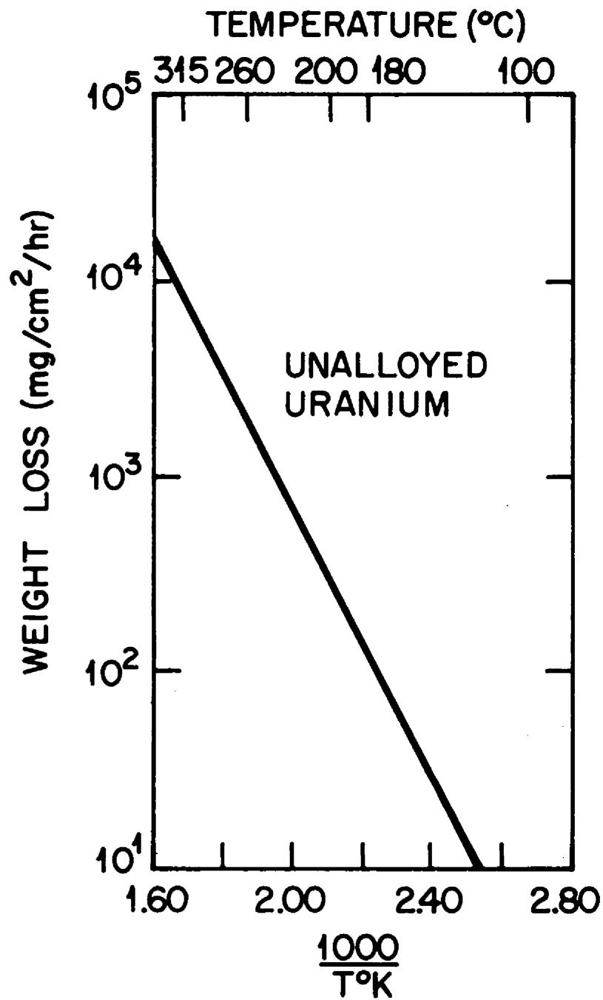  
Fig. 0.1. Water corrosion of uranium vs water temperature. Source: G. B. Zorzoli, "An Evaluation of a Near-Breeder, Low Cost, LWR Concept," Energia Nucleare 19(3) (March 1972).

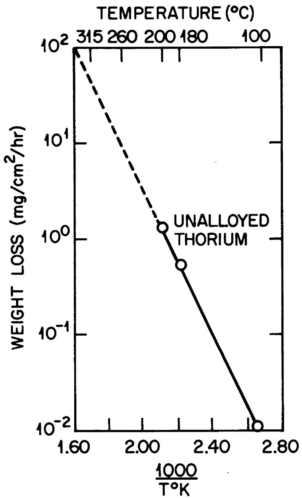  
Fig. 0.2. Water corrosion of thorium vs water temperature. Source: G. B. Zorzoli, "An Evaluation of a Near-Breeder, Low Cost, LWR Concept," Energia Nucleare 19(3) (March 1972).

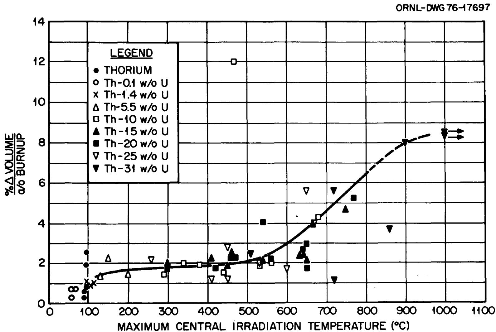  
Fig. 0.3. Effect of irradiation temperature on the swelling rate of thorium and thorium-uranium alloys. Source: J. H. Kittel, et al., Effects of Irradiation on Thorium and Thorium Alloys, ANL-5674 (Apr. 1, 1963).

independent of uranium content up to $20\mathrm{w}\%$ U. Specimens containing more than $25\mathrm{w}\%$ U became warped and distorted, a condition not noted in specimens containing less than $20\mathrm{w}\%$ U. Similar results were reported by workers at Battelle7 and Atomics International8.

Thorium-plutonium metal alloys have been rejected as candidate fuels. $^{9}$ The low melting point of plutonium compared with thorium and uranium (640°C for Pu, 1750°C for Th, 1132°C for U) is a potential source of problems for binary or ternary systems containing Pu. Compositions tending to form Pu-rich phases would have to be avoided because such phases would be expected to have melting points near that of Pu metal. Thorium-plutonium alloys tend to form Pu-rich phases as U-233 is bred in. $^{10}$

# REFERENCES FOR APPENDIX O

1. The Use of Thorium in Nuclear Power Reactors, WASH-1097 (June 1969) Appendix B.   
2. M. W. Rosenthal et al., A Comparative Evaluation of Advanced Converters, ORNL-3686 (January 1965).   
3. WASH-1083.   
4. A. R. Olsen et al., "Irradiation Behavior of Thorium-Uranium Alloys and Compounds," IAEA Technical Report Series No. 52, Utilization of Thorium in Power Reactors (1966), also available as ORNL/TM-1142 (June 1965).   
5. J. H. Kittel et al., Effects of Irradiation on Thorium and Thorium Alloys, ANL-5674 (April 1963).   
6. G. B. Zorzoli, "An Evaluation of a Near-Breeder, Low Cost, LWR Concept," Energia Nucleare (19), No. 3 (March 1972).   
7. J. E. Gates et al., The Examination and Evaluation of Irradiated Thorium-11 w% Uranium Specimens, BMI-1334 (April 1959).   
8. B. R. Hayward et al., Radiation Behavior of Metallic Fuels for Sodium Graphite Reactors, NAA-SR-3411 (August 1959).   
9. R. P. Hammond et al., The Unclad-Metal Breeder Reactor (UMBR) for Desalting or Power, ORNL-4202 (January 1969).   
10. L. R. Kelman et al., "Status of Metallic Plutonium Power-Breeder Fuels," *Plutonium* 1965, Proceedings of the Third International Conference on *Plutonium*, London, 1965, Chapman and Hall, London, 1967 (Chapter 22).

# APPENDIX P

# COMMENTS ON FISSILE AVAILABILITY FOR FBR ECONOMY

Summary: A simple nuclear growth model is considered for comparing the fissile inventories available for Fast Breeder Reactors (FBRs). A growth rate of 20 GW(e) per year (LWRs without recycle) over a 30-year period, followed by a 30-year period of constant power at 600 MW(e), will consume all of the currently estimated uranium resources. If plutonium is used in FBRs, and the nuclear growth rate is sustained at 20 GW(e) per year, only about $40\%$ of the energy production in LWRs over the first 30 years can be diverted to non-plutonium producing fuel cycles. Use of an HTGR- $^{233}$ U FBR system results in greater fissile inventory available for FBR startup, and in a lower mined ore requirement. The above assumes that HTGRs are available on the same basis as LWRs; similar results would apply if HWRs were used instead of HTGRs.

The current policy, with respect to development of nuclear energy from fission reactors, is to build around breeder reactors which can supply excess fissile material as well as produce power. New reactors can be built from the supply of excess fissile material without resorting to mining of additional uranium. Because of the importance of the breeder reactor and its early introduction, the growth of the breeder economy must not be constrained by lack of adequate fissile inventory. Simply put, there must be enough plutonium discharged from LWRs to sustain the growth of LMFBRs until the LMFBRs are producing enough plutonium to sustain their own growth. This report has discussed the virtues of thorium fuel cycles in converter reactors. Improved resource $(\mathrm{U}_{3}\mathrm{O}_{8})$ utilization can be achieved by employing thorium fuel cycles in HTGRs, CANDUs, and even LWRs as compared to the uranium cycle in LWRs. In some cases superior economics can also be achieved. However, it must be recognized that whenever natural $^{235}\mathrm{U}$ is employed in a thorium fuel cycle, the stockpile of plutonium available for FBRs suffers.

The fissile availability problem is placed in perspective by the following example. Assume a nuclear growth rate of 20 GW(e) per year. For the

first 30 years, LWRs are built and the discharged plutonium stored. Beginning in the 31st year, LMFBRs (based on advanced oxide fuel) are built at the rate of 20 GW(e) per year; further, LWRs are retired at the rate of 20 GW(e) per year, and replaced with new LWRs using the inventory of the retired plants (plus a small amount of fissile makeup.) This case is shown graphically in Fig. P.l. The reactor fissile requirements are given in Table P.l for the LWR, advanced oxide LMFBR, and several other reactors considered in a comparison study that will be discussed.

The case shown in Fig. P.1 for LWRs followed by LMFBRs is designated Case A, and the plutonium inventory as a function of time is shown in Fig. P.2. If no $^{235}\mathrm{U}$ is used after year 30, and all fissile material for startup of LMFBRs and refueling of LWRs must come from the approximately 1500 tonnes of plutonium stockpiled in year 30, growth in nuclear capacity can only continue for 5 more years, as shown by the solid portion of the Case A curves in Fig. P.2. If $^{235}\mathrm{U}$ is used to refuel the 600 LWRs on line, and the plutonium stockpile is used only for startup of the LMFBRs, then the plutonium stockpile is reduced to about 600 tonnes in year 55, when the discharge of excess plutonium from LMFBRs begins to exceed the plutonium required for startup of new reactors. This situation is shown by the dashed curve for Case A in Fig. P.2. Unfortunately, this case required more than 3.5 million tons of $\mathrm{U}_{3}\mathrm{O}_{8}$ ; about 4.0 million tons are used by the year 60. Even so, it is clear than less than $40\%$ of the energy production during the first 30 years of Case A can be accomplished using thorium fuel cycles, if the plutonium availability constraint is not to be violated. Plutonium availability considerations also affect the use of plutonium-thorium cycles, or plutonium recycle in LWRs.

Another case is presented for comparison. This is Case B, where the converter reactors built during the first 30 years are HTGRs, with a conversion ratio of 0.82; after this time, retired HTGRs are replaced. Uranium-233 is bred and stored for use in $^{233}\mathrm{U}$ fueled FBRs, beginning in year 31. The characteristics of $^{233}\mathrm{U}$ FBRs presented in Appendix E have been assumed and summarized in Table P.1. Because of the superior

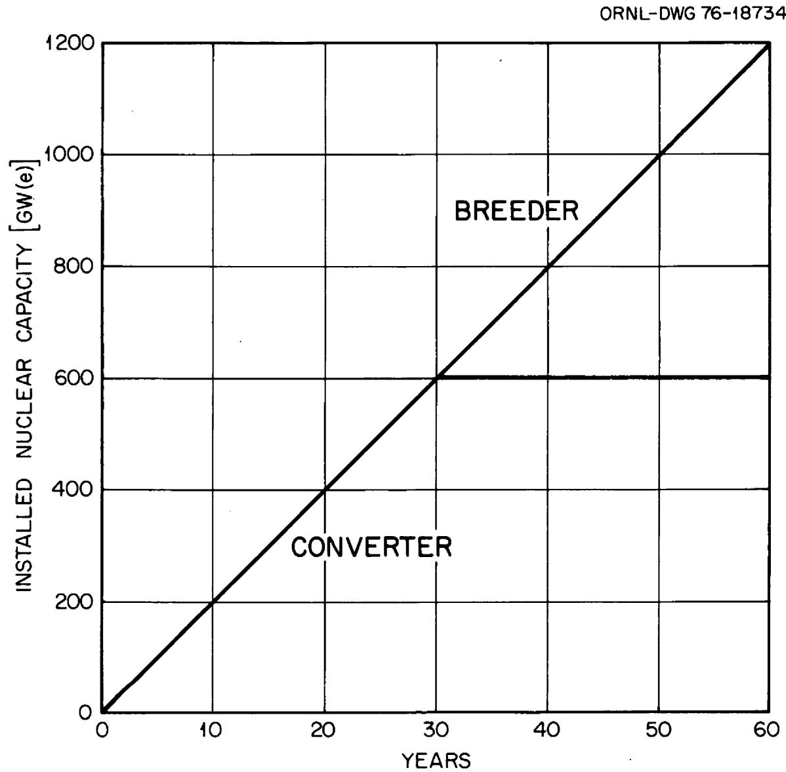  
Fig. P.l. Nuclear Growth Model for Fissile Inventory Study.

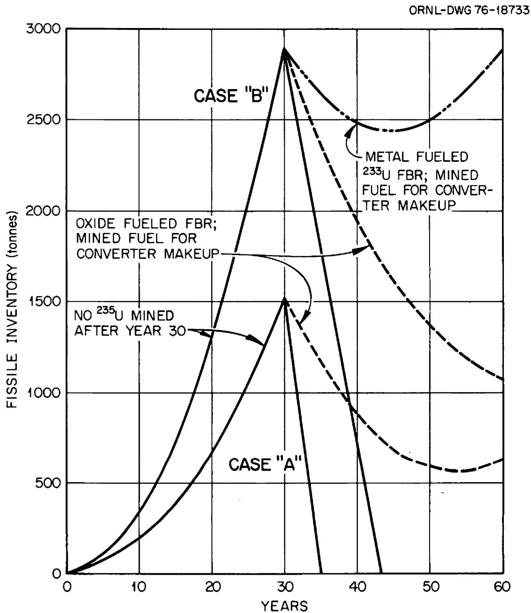  
Fig. P.2. Fissile Inventory Versus Time for U-Pu System (Case "A") and U-Th System (Case "B").

Table P.1. Reactor Characteristics for Fissile Inventory Study   

<table><tr><td rowspan="2"></td><td rowspan="2">LRWa</td><td rowspan="2">HTGRb</td><td colspan="5">Fast Breeder Reactors</td></tr><tr><td>Advanceda(Pu, U)O2Na Cooled</td><td>Th MetalcNa Cooled</td><td>Th MetalcHe Cooled</td><td>Th MOXcNa Cooled</td><td>Th MOXcHe Cooled</td></tr><tr><td colspan="8">Reactor Requirements</td></tr><tr><td>Reactor Inventory [kg/MW(e)]</td><td></td><td></td><td></td><td></td><td></td><td></td><td></td></tr><tr><td>233U</td><td></td><td></td><td></td><td>1.572</td><td>2.143</td><td>1.879</td><td>2.910</td></tr><tr><td>233U</td><td>1.967</td><td>1.890</td><td>0.064</td><td></td><td></td><td></td><td></td></tr><tr><td>Fissile Pu</td><td></td><td></td><td>2.080</td><td></td><td></td><td></td><td></td></tr><tr><td>Ex-Reactor Inventory [kg/MW(e)]</td><td></td><td></td><td></td><td></td><td></td><td></td><td></td></tr><tr><td>233U</td><td></td><td></td><td></td><td>1.572</td><td>2.143</td><td>1.879</td><td>2.910</td></tr><tr><td>233U</td><td>1.107</td><td>1.399</td><td>0.064</td><td></td><td></td><td></td><td></td></tr><tr><td>Fissile Pu</td><td></td><td></td><td>2.080</td><td></td><td></td><td></td><td></td></tr><tr><td>Annual Loading [kg/MW(e) yr]</td><td></td><td></td><td></td><td></td><td></td><td></td><td></td></tr><tr><td>233U</td><td></td><td></td><td></td><td>0.524</td><td>0.714</td><td>0.626</td><td>0.970</td></tr><tr><td>233U</td><td>0.754</td><td>0.540</td><td>0.030</td><td></td><td></td><td></td><td></td></tr><tr><td>Fissile Pu</td><td></td><td></td><td>0.785</td><td></td><td></td><td></td><td></td></tr><tr><td>Annual Discharge [kg/MW(e) yr]</td><td></td><td></td><td></td><td></td><td></td><td></td><td></td></tr><tr><td>233U</td><td></td><td>0.310</td><td></td><td>0.733</td><td>0.938</td><td>0.757</td><td>1.14</td></tr><tr><td>233U</td><td>0.222</td><td>0.162</td><td>0.025</td><td></td><td></td><td></td><td></td></tr><tr><td>Fissile Pu</td><td>0.164</td><td></td><td>0.958</td><td></td><td></td><td></td><td></td></tr><tr><td>Conversion Ration</td><td>0.60</td><td>0.82</td><td>1.25</td><td>1.26</td><td>1.29</td><td>1.16</td><td>1.21</td></tr><tr><td>Doubling Time (yr)</td><td></td><td></td><td>24.0</td><td>15.1</td><td>19.1</td><td>28.8</td><td>34.3</td></tr></table>

$^{a}$ W. M. Pardue et al., "A Comparison of Advanced Reactor Potentials" presented at the ASME/ANS International Conference on Advanced Nuclear Energy Systems, March 14-17, 1976, Pittsburgh, Pa.   
bUnpublished data of M. Z. Nagel et al (General Atomic Company) "Reactor Strategy Studies" 19 January 1976.   
Appendix E of this report.

conversion characteristics of the HTGR, the available fissile inventory $(^{233}\mathrm{U}$ in this case) for FBRs in year 30 is approximately twice that in the LWR-LMFBR case. Even using the poorest performing FBR discussed in Appendix E, the fissile inventory in year 60 is over 1000 tonnes of $^{233}\mathrm{U}$ , as shown in the dashed portion of Case B plotted in Fig. P.2. Using more optimistic FBR performance data (metal fuel), the $^{233}\mathrm{U}$ inventory by year 60 has returned to the level in year 30, as shown by the broken Case B curve in Fig. P.2. Even if no $^{235}\mathrm{U}$ is used after year 30, there is an adequate $^{233}\mathrm{U}$ inventory to fuel both FBRs and HTGRs for about 13 years (compared with 5 years for the LWR-LMFBR case). As shown in Fig. P.3, only 2.6 million tons of $\mathrm{U}_{3}\mathrm{O}_{8}$ have been consumed in Case B, compared to 4 million tons in Case A.

It is clear from this simple example that the HTGR- $^{233}$ U fueled FBR combination has superior capabilities with respect to resource utilization and fissile inventory for FBRs, if they were available on the same basis. The economics of the HTGR relative to the LWR are also favorable, as shown in Appendix N. Conversion ratios of 0.9 and greater appear achievable with the HTGR utilizing current fuel technology, with no apparent sacrifice in reactor safety.

Little advantage can be taken of the Case B findings because neither the HTGR nor the $^{233}\mathrm{U}$ -fueled FBR are being pursued seriously at this time. However, even with delayed introduction of HTGRs some of the above benefits can be obtained. Based on recent studies summarized in Appendix F of this report, $^{233}\mathrm{U}$ use in LMFBRs (with $^{238}\mathrm{U}$ ) appears as attractive as does plutonium.

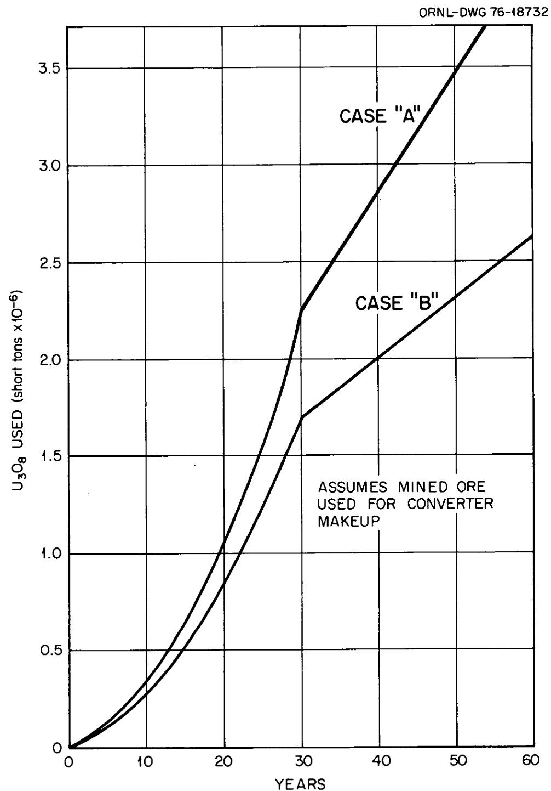  
Fig. P.3. $\mathrm{U}_{3} \mathrm{O}_{8}$ Requirements for U-Pu System (Case "A") and U-Th System (Case "B").

# APPENDIX Q

# CONSIDERATIONS REGARDING BREAK-EVEN BREEDERS

Summary. A simple example case is described whereby an HTGR thermal breeder (HTGRB) system is compared with several conventional converter reactors over a 60-year period. Reactors are built at a rate of 20 GW(e)/year for the first 30 years and then allowed to "coast down" over the second 30-year period. Compared are the time-dependent power production capabilities and uranium ore requirements. It is shown that the thermal breeder systems give a long-term power production capability which do not require additional uranium ore input after the initial $^{233}\mathrm{U}$ inventories are produced in pre-breeders. However, the early ore requirements are considerably higher for the thermal breeder systems than for conventional converter systems over the time span considered. Ore requirements are $64\%$ higher than for an HTGR $(\mathrm{CR} = 0.82)$ , and fuel cycle costs are two to three times higher than for conventional HTGRs and LWRs. Similar results should also apply to the use of HWR(Th)s. It is concluded that while thermal breeder systems provide long-term power production capability at a fixed level, there is no flexibility for growth provided by these sytems for a given $\mathrm{U}_{3}\mathrm{O}_{8}$ resource. Thus, they essentially represent a contingency position relative to a very long-term delay in FBR commercialization.

Break-even breeder systems are possible with LWRs, HWRs, and HTGRs. Such systems require production of $^{233}\mathrm{U}$ inventories in pre-breeder reactors; the thermal breeders then operate on a $^{233}\mathrm{U}-\mathrm{Th}$ fuel cycle. The advantages and disadvantages of such break-even systems can be seen with the following example.

A nuclear growth rate of 20 GW(e)/year was assumed; pre-breeders were built first to provide $^{233}\mathrm{U}$ inventories for the break-even breeders, which were built as soon as inventories were available. Power growth remained constant at 20 GW(e)/year for the first 30 years. During the next 30 years, pre-breeders were retired at the end of their economic

lifetime (30 years of operation). Inventories of $^{233}\mathrm{U}$ from retired reactors and from annual discharges of operating reactors were utilized to build additional break-even breeders during the years 31-60. All other fissile material discharged from the pre-breeders was recycled to the pre-breeders.

Considered in the example was a break-even HTGR system using $^{233}\mathrm{U}$ inventories produced in a lower-conversion-ratio HTGR. The mass requirements for the various reactors considered in the example are given in Table Q.1. The installed capacity vs time relationship is shown in Fig. Q.1 for the HTGR breeder (HTBR-B) system, for a light-water reactor with no recycle, and for an HTGR with a conversion ratio of 0.82 and $^{233}\mathrm{U}$ recycle. The ore requirements are shown in Fig. Q.2 for the breeder system, the LWR with no recycle, the HTGR ( $\mathrm{CR} = 0.82$ ), and several other systems which are included for comparison.

For the HTGR breeder system, a total of 334 pre-breeder HTGRs (HTGR-PB) were built, producing enough $^{233}\mathrm{U}$ for 498 HTGR breeders (HTGR-B).

Fuel cycle cost estimates are presented in Tables Q.2 and Q.3. In these estimates, it was assumed that $^{235}\mathrm{U}$ was purchased for pre-breeder operation, but $^{233}\mathrm{U}$ was made available to the breeders at no cost. On this basis the HTGR-PB and HTBR-B had fuel cycle costs of about 12 mills/kWhr. From these results it appears that the economic advantages in long-term, self-sustaining power generation possible with break-even breeders are outweighed by the high cost of operation and the large uranium ore requirements of the pre-breeders. Any economic advantages associated with the breeder operation have difficulty in being "visible" after applying a reasonable discount factor.

Three criteria have been identified for an effective thermal reactor system. They are:

1. Make effective use of uranium resources in the period prior to large-scale fast breeder reactor (FBR) introduction.

Table Q.1. Reactor Characteristics for Break-Even Breeder Study   

<table><tr><td>Reactor Requirements</td><td>LWRb</td><td>HTGRc</td><td>HTGR</td></tr><tr><td>Reactor Inventory [kg/MW(e)]</td><td></td><td></td><td></td></tr><tr><td>233U</td><td></td><td></td><td>5.960d</td></tr><tr><td>235U</td><td>1.967</td><td>3.700</td><td></td></tr><tr><td>Fissile Pu</td><td></td><td></td><td></td></tr><tr><td>Ex-Reactor Inventory [kg/MW(e)]a</td><td></td><td></td><td></td></tr><tr><td>233U</td><td></td><td></td><td>3.874</td></tr><tr><td>235U</td><td>1.107</td><td>2.410</td><td></td></tr><tr><td>Fissile Pu</td><td></td><td></td><td></td></tr><tr><td>Annual Loading [kg/MW(e)yr]</td><td></td><td></td><td></td></tr><tr><td>233U</td><td></td><td></td><td>1.490</td></tr><tr><td>235U</td><td>.754</td><td>.925</td><td></td></tr><tr><td>Fissile Pu</td><td></td><td></td><td></td></tr><tr><td>Annual Discharge [kg/MW(e)yr]</td><td></td><td></td><td></td></tr><tr><td>233U</td><td></td><td>.445</td><td>1.490</td></tr><tr><td>235U</td><td>.222</td><td>.258</td><td></td></tr><tr><td>Fissile Pu</td><td>.164</td><td></td><td></td></tr><tr><td>tr (Reactor Time) (yrs)</td><td>3.0</td><td>4.0</td><td>4.0</td></tr><tr><td>tp (Ex-Reactor Time) (yrs)</td><td>1.8</td><td>2.6</td><td>2.6</td></tr><tr><td>(tp + tr)/tr</td><td>1.60</td><td>1.65</td><td>1.65</td></tr><tr><td>Conversion Ratio</td><td>.60</td><td>.74</td><td>1.01</td></tr></table>

$\alpha_{\mathrm{Ex - reactor~inventory}} = \mathrm{reactor~inventory}[(t_{\mathrm{r}} + t_{\mathrm{p}}) / t_{\mathrm{r}}]$   
bSource: W. M. Pardue et al, A Comparison of Advanced Reactor Potentials, Presented at the ASME/ANS International Conference on Advanced Nuclear Energy Systems, March 14-17, 1976, Pittsburg, Pa.   
$^{c}$ Source: Private Communication from R. K. Lane (GA) to F. J. Homan (ORNL), June 14, 1976. $^{d}$ Source: Letter from R. F. Turner (GA) to E. DeLaney (ERDA), May 28, 1976.

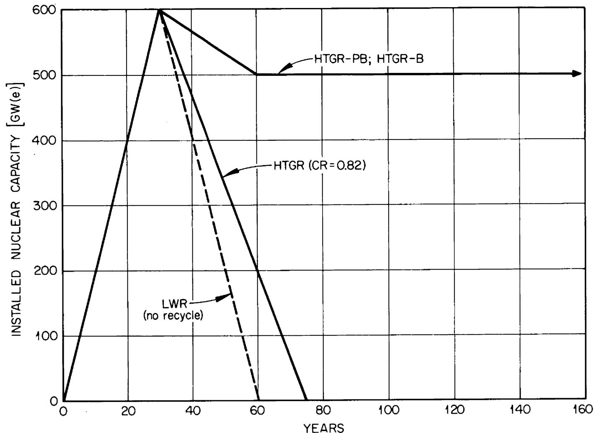  
Fig. Q.1. Installed capacity is time for LWBR, LWR, and HTGR comparison.

ORNL-DWG 76-18736

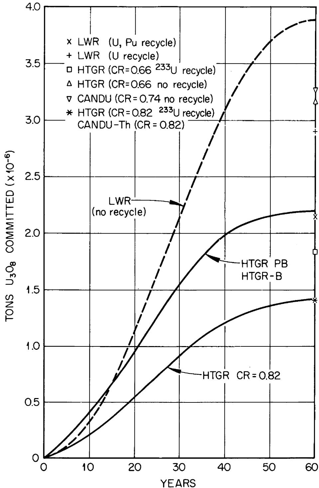  
Fig. Q.2. Ore requirements to sustain a 20 Gw(e)/year nuclear growth rate for 30 years.

Table Q.2. Parameters for Fuel Cycle Cost Calculation   

<table><tr><td>Reactor</td><td>HTGR-PBa</td><td>HTGR-Bb</td></tr><tr><td>Fuel</td><td></td><td></td></tr><tr><td>Conversion Ratio</td><td>0.74</td><td>&gt;1.0</td></tr><tr><td>Enrichment (%)</td><td>93</td><td></td></tr><tr><td>Thermal Efficiency (%)</td><td>40</td><td>40</td></tr><tr><td>Load Factor</td><td>0.8</td><td>0.8</td></tr><tr><td>Burnup (MWd/kg HM)</td><td>30.4</td><td>18.8</td></tr><tr><td>Time in Reactor (yr)</td><td>4</td><td>4</td></tr><tr><td>Ex-Reactor Time (yr)</td><td>2.6</td><td>2.6</td></tr><tr><td>(tr + tp)/tr</td><td>1.65</td><td>1.65</td></tr><tr><td>Inventory [kg/MW(e)]</td><td></td><td></td></tr><tr><td>Reactor/Total 233U</td><td></td><td>5.960/9.834</td></tr><tr><td>235U</td><td>3.70/6.11</td><td></td></tr><tr><td>238U</td><td></td><td></td></tr><tr><td>Fissile Pu</td><td></td><td></td></tr><tr><td>Th</td><td>92.5/152.6</td><td>149.0/245.9</td></tr><tr><td>Total</td><td>96.2</td><td>155.0</td></tr><tr><td>Makeup [kg/MW(e) yr]</td><td></td><td></td></tr><tr><td>233U</td><td></td><td>0</td></tr><tr><td>235U</td><td>0.668</td><td>0</td></tr><tr><td>238U</td><td></td><td></td></tr><tr><td>Fissile Pu</td><td></td><td></td></tr><tr><td>Th</td><td>23.1</td><td>37.3</td></tr><tr><td>Total</td><td>24.1</td><td>38.8</td></tr><tr><td>$/g Fresh 235U</td><td>40</td><td></td></tr><tr><td>$/g Makeup Fissile</td><td>40</td><td></td></tr></table>

$^{\alpha}$ HGTR-PB data from private communication from R. K. Lane (GA) to F. J. Homan (ORNL) June 14, 1976.   
bHTGR-B data from letter to E. Delaney (ERDA) from R. F. Turner (GA), dated May 28, 1976.

Table Q.3. Fuel Cycle Cost Calculation   

<table><tr><td>Reactor</td><td>HTGR-PB</td><td>HTGR-B</td></tr><tr><td>Fuel</td><td>235UCO-ThO2</td><td>233UCO-ThO2</td></tr><tr><td>Conversion Ratio</td><td>0.74</td><td>&gt;1.0</td></tr><tr><td>$/kg HM</td><td></td><td></td></tr><tr><td>Shipping</td><td>60</td><td>60</td></tr><tr><td>Makeup</td><td></td><td></td></tr><tr><td>233U</td><td rowspan="2">40</td><td rowspan="2">-</td></tr><tr><td>235U</td></tr><tr><td>Pu</td><td></td><td></td></tr><tr><td>Th</td><td>0.025</td><td>0.025</td></tr><tr><td>Reprocessing</td><td>707</td><td>707</td></tr><tr><td>Fabrication</td><td>400</td><td>1030</td></tr><tr><td>Refabrication</td><td>450</td><td>1030</td></tr><tr><td>Storage</td><td>-</td><td>-</td></tr><tr><td>Mills/kWhr</td><td></td><td></td></tr><tr><td>Inventory (fissile)</td><td>3.487</td><td>-</td></tr><tr><td>Inventory (Th)</td><td>0.054</td><td>0.088</td></tr><tr><td>1st Core Fab</td><td>0.549</td><td>2.278</td></tr><tr><td>Shipping</td><td>0.138</td><td>0.332</td></tr><tr><td>Makeup uranium</td><td>3.813</td><td>-</td></tr><tr><td>Thorium</td><td>0.082</td><td>0.133</td></tr><tr><td>Reprocessing</td><td>2.431</td><td>3.914</td></tr><tr><td>Fab/ReFab</td><td>1.548</td><td>5.703</td></tr><tr><td>Storage</td><td></td><td></td></tr><tr><td>Total</td><td>12.102</td><td>12.448</td></tr></table>

2. Provide sufficient fissile inventory for commercialization of FBRs.   
3. Economic power production.

Thermal breeder systems do not meet these criteria effectively. Thermal breeder systems provide the means for long-term power production at a constant level, with no additional uranium ore requirements. However, the high ore requirements needed to provide the $^{233}\mathrm{U}$ inventories of the breeder systems occur during a time of projected ore shortages, and no fissile inventories are built for FBRs other than those associated with the break-even breeders themselves. It is our conclusion that only if FBRs are delayed until about 2100 should break-even breeders of the type studied here be developed. Further, the power costs of such systems will be prohibitively high under the conditions of introduction assumed here. A less costly approach would be to gradually increase the conversion ratio with time, although such an approach leads to a lower power level achieved by the break-even breeders.

# INTERNAL DISTRIBUTION

1-2. Central Research Library   
3. Document Reference Section, Y-12   
4. ORNL Patent Office

5-7. Laboratory Records

8. Laboratory Records-RC   
9. E. J. Allen

10. T. D. Anderson   
11. D. E. Bartine   
12. J. T. Bradbury, ORGDP   
13. R. A. Bradley   
14. T. J. Burns   
15. W. L. Carter   
16. J. C. Cleveland   
17. J. H. Coobs   
18. D. A. Costanzo   
19. F. L. Culler   
20. G.G.Fee   
21. D. E. Ferguson   
22. Uri Gat   
23. E. H. Gift, ORGDP   
24. R. F. Hibbs, UCC-ND   
25. M. R. Hil1

26-35. F.J.Homan

36. J. D. Jenkins

37-66. P.R.Kasten

67. R. K. Kibbe   
68. W. J. Lackey   
69. E. L. Long, Jr.

70-79. A. L. Lotts   
80. F. C. Maienschein   
81. A. P. Malinauskas   
82. J. M. Morrison, ORGDP   
83. F. R. Mynatt   
84. A. R. Olsen   
85. J. P. Peerenboom   
86. H. Postma   
87. R. H. Rainey   
88. D. P. Reid   
89. J. E. Rushton   
90. C. D. Scott   
91. J. D. Sease   
92. J. W. Snider

93-117. I. Spiewak

118. W.E.Thomas   
119. D. B. Trauger   
120. P. R. Vanstrum, UCC-ND   
121. J. R. Weir   
122. R. G. Wymer

# EXTERNAL DISTRIBUTION

ERDA OAK RIDGE OPERATIONS OFFICE, P.O. Box E, Oak Ridge, TN 37830

123. Director, Research & Technical Support Division   
124. Director, Reactor Division

125-129. F. E. Dearing, Reactor Division (5)

130. H. F. Behrman

ERDA DIVISION OF NUCLEAR RESEARCH AND APPLICATIONS, Washington, DC 20545

131. Director   
132. Assistant Director, Nuclear Energy Assessment

133-182. K.A.Trickett

183. Assistant Director, Reactor Programs   
184. Chief, Gas-Cooled Thermal Reactors Branch

ERDA DIVISION OF WASTE MANAGEMENT, PRODUCTION, AND REPROCESSING, Washington, DC 20545

185. Director   
186. Assistant Director, Reprocessing and Recycle   
187. W. S. Scheib   
188. R.J.Galbo

ERDA DIVISION OF NAVAL REACTORS, Washington, DC 20545

189. R.H.Steele

ERDA OFFICE OF ASSISTANT ADMINISTRATOR, PLANNING AND ANALYSIS, Washington, DC 20545

190. J. F. Kaufman   
191. R.W. LaGassie

ERDA OFFICE OF ASSISTANT ADMINISTRATOR FOR NUCLEAR ENERGY

192. Kerry Dance   
193. D. F. Mears

U.S. NUCLEAR REGULATORY COMMISSION, Mail Stop 1100SS, Washington, DC 20555

194. Donald McPherson

GENERAL ATOMIC COMPANY, P.O. Box 81608, San Diego, CA 92138

195. C. L. Rickard, Vice President, Advanced Energy Systems   
196. H. B. Stewart, Vice President, Engineering   
197. R.C.Dahlberg   
198. R. K. Lane

OAK RIDGE ASSOCIATED UNIVERSITIES, Institute for Energy Analysis, P.O. Box 117, Oak Ridge, TN 37830

199. A. M. Perry   
200. A. M. Weinberg

201. N. B. Allred, Stone and Webster Engineering, P.O. Box 2325, Boston, MA 02107.   
202. Peter Auer, Laboratory of Nuclear Studies, Sibley School of Mechanical and Aerospace Engineering, Cornell University, Ithaca, NY 14853.   
203. S. Banerjee, Professor of Engineering Physics, McMaster University, Hamilton, Ontario, CANADA.   
204. Manson Benedict, 25 Byron Road, Weston, MA 02139.   
205. Hans Bethe, Laboratory of Nuclear Studies, Sibley School of Mechanical and Aerospace Engineering, Cornell University, Ithaca, NY 14853.   
206. Vincent S. Boyer, Philadelphia Electric Company, 2301 Market Street, Philadelphia, PA 19107.   
207. Chaim Braun, Brookhaven National Laboratory, Building 475, Upton, NY 11973.   
208. N. E. Carter, Battelle-Pacific Northwest Laboratory, P.O. Box 999, Richland, WA 99352.   
209. Eugene Critoph, Atomic Energy of Canada, Ltd., Chalk River Nuclear Laboratories, Chalk River, Ontario KOJ 1JO CANADA.

210. J. H. Crowley, United Engineers and Constructors, 1401 Arch Street, Philadelphia, PA 19105.   
211. Joseph R. Dietrich, Chief Scientist, Nuclear Power Systems, Combustion Engineering, Inc., Windsor, CT 06095.   
212. Michael J. Driscoll, Department of Nuclear Engineering, Massachusetts Institute of Technology, 138 Albany Street, Cambridge, MA 02139.   
213. J. S. Dziewisz, Babcock and Wilcox, P.O. Box 1260, Lynchburg, VA 24505.   
214. Milton Edlund, Virginia Polytechnic Institute, Blacksburg, VA 24060.   
215. Warren Falconer, Director, Physical Chemistry Research, Bell Laboratories, Murray Hill, NJ 07974.   
216. Harold L. Falkenberry, Chief, Power Research Staff, Tennessee Valley Authority, 1345 Commerce Union Bank Building, Chattanooga, TN 37401.   
217. Frank R. Field, E. I. du Pont de Nemours & Co., Savannah River Laboratory, Aiken, SC 29801.   
218. John S. Foran, Research Planning Associates, Inc., 44 Brattle Street, Cambridge, MA 02138.   
219. Brent Fryer, Exxon Nuclear Company, Research and Technology Center, 2955 George Washington Way, Richland, WA 99352.   
220. Robert Hellens, Nuclear Power Systems, Combustion Engineering, Inc., Windsor, CT 06095.   
221. Seymour Jaye, S. M. Stoller Corporation, 815 Colorado Building, 1919 14th Street, Boulder, CO 80302.   
222. A. E. Kakretz, Manager, Gas-Cooled Reactor Projects, General Electric Company, Energy Systems and Technology Division, Fairfield, CT 06431.   
223. R. A. Karam, Professor, Nuclear Engineering, School of Nuclear Engineering, Georgia Institute of Technology, Atlanta, GA 30332.   
224. Leon J. Lidofsky, Division of Nuclear Science and Engineering, 287A Engineering Terrace, 520 W. 120th Street, New York, NY 10027.   
225. Michael F. Macrakis, Harvard University, 24 Fieldmont Road, Belmont, MA 02718.   
226. Arturo Maimoni, Lawrence Livermore Laboratory, Bldg. L-156, P.O. Box 808, Livermore, CA 94550.   
227. Bruce J. Mann, Chief, Evaluations Branch, Office of Radiation Programs, EPA Environmental Support Laboratory, P.O. Box 15027, Las Vegas, NV 89114.   
228. Richard A. McCormack, President, RAMCO, Inc., 1205 Prospect Street, Suite 225, La Jolla, CA 92037.   
229. Malcom J. McNelly, Manager, International Planning, General Electric Company, 175 Curtner Avenue, San Jose, CA 95125.   
230. Ralph Moir, University of California, Lawrence Livermore Laboratory, P.O. Box 808, Livermore, CA 94550.   
231. Ernest J. Moniz, Center for Theoretical Physics, 6-310, Massachusetts Institute of Technology, Cambridge, MA 02139.   
232. Joseph Nardii, Westinghouse Advanced Nuclear Systems Division, P.O. Box 355, Pittsburgh, PA 15230.   
233. R. P. Omberg, Manager, Advanced Concepts, Hanford Engineering Development Laboratory, P.O. Box 1970, Richland, WA 99352.

234. R. E. Pahler, Electric Power Research Institute, Suite 835, 1750 New York Avenue, Washington, DC 20006.   
235. William M. Pardue, Battelle Columbus Laboratories, 505 King Avenue, Columbus, OH 43201.   
236. Thomas Pigford, Department of Nuclear Engineering, University of California, Berkely, CA 94720.   
237. R. L. Pigford, Department of Chemical Engineering, University of Delaware, Newark, DE 19711.   
238. J. C. Scarborough, NUS Corporation, 4 Research Place, Rockville, MD 20850.   
239. R. Sehgal, Electric Power Research Institute, P.O. Box 10412, Palo Alto, CA 94303.   
240. N. L. Shapiro, Manager, Advanced Design Projects, Combustion Engineering, Inc., 1000 Prospect Hill Road, Windsor, CT 06095.   
241. B. I. Spinrad, Department of Nuclear Engineering, Oregon State University, Corvallis, OR 97331.   
242. R. S. Stone, A. D. Little Company, 15 Acorn Park, Cambridge, MA 02140.   
243. L. J. Taylor, Westinghouse Advanced Nuclear Systems, P.O. Box 355, Pittsburgh, PA 15230.   
244. Jim Thomas, Westinghouse Energy Center, P.O. Box 355, Pittsburgh, PA 15230.   
245. C. E. Till, Argonne National Laboratory, 9700 South Cass Avenue, Argonne, IL 60439.   
246. R. C. Vogel, Exxon Nuclear Company, Inc., 2101 Horton Rapids Road, Richland, WA 99352.   
247. H. E. Williamson, Mgr., Systems Analysis, General Electric Company, Nuclear Energy Programs Division, 175 Curtner Avenue, San Jose, CA 95125.   
248. O. Woike, General Electric Company, Aircraft Engine Group, Mail Drop A79, Cincinnati, OH 45215.   
249. L. L. Wood, University of California, Lawrence Livermore Laboratory, P.O. Box 808, Livermore, CA 94550.   
250. Richard Ziskind, Science Applications, Inc., 101 Continental Building, Suite 310, El Segundo, CA 90245.   
251-385. ERDA Technical Information Center, Office of Information Services, P.O. Box 62, Oak Ridge, TN 37830.