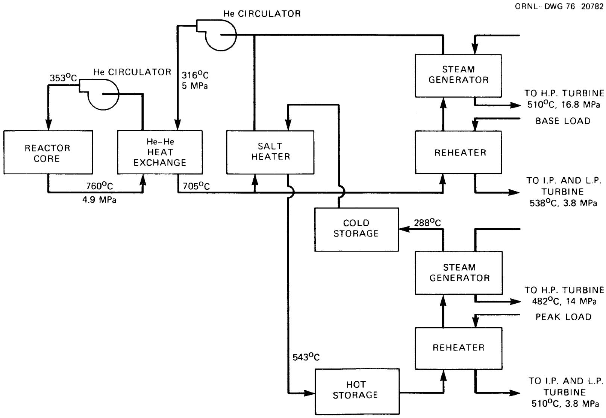
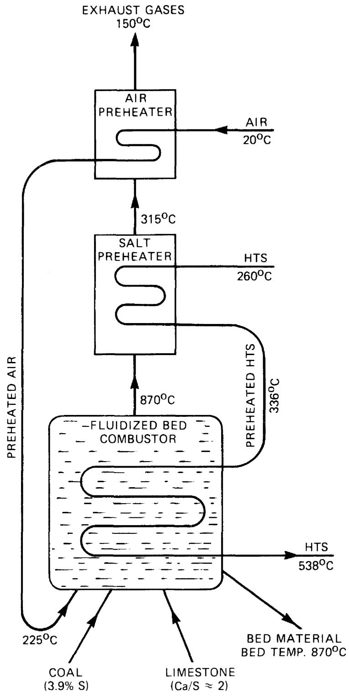
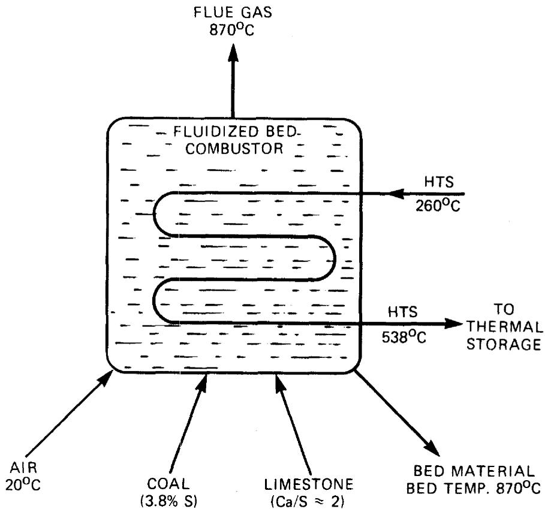

# Survey of Technology for Storage of Thermal Energy in Heat Transfer Salt

M. D. Silverman

J. R. Engel

OAK RIDGE NATIONAL LABORATORY

OPERATED BY UNION CARBIDE CORPORATION FOR THE ENERGY RESEARCH AND DEVELOPMENT ADMINISTRATION

Printed in the United States of America. Available from National Technical Information Service

U.S. Department of Commerce

5285 Port Royal Road, Springfield, Virginia 22161

Price: Printed Copy $4.00; Microfiche$ 3.00

This report was prepared as an account of work sponsored by the United States Government. Neither the United States nor the Energy Research and Development Administration/United States Nuclear Regulatory Commission, nor any of their employees, nor any of their contractors, subcontractors, or their employees, makes any warranty, express or implied, or assumes any legal liability or responsibility for the accuracy, completeness or usefulness of any information, apparatus, product or process disclosed, or represents that its use would not infringe privately owned rights.

Contract No. W-7405-eng-26

Engineering Technology Division

SURVEY OF TECHNOLOGY FOR STORAGE OF THERMAL ENERGY IN HEAT TRANSFER SALT

M. D. Silverman J. R. Engel

Manuscript Completed - January 18, 1977

Date Published - January 1977

-NOTICE

This report was prepared as an account of work sponsored by the United States Government. Neither the United States nor the United States Energy Research and Development Administration, nor any of their employees, not any of their contractors, subcontractors, or their employees, makes any warranty, express or implied, or assumes any legal liability or responsibility for the accuracy, completeness or usefulness of any information, apparatus, product or process disclosed, or represents that its use would not infringe privately owned rights.

Prepared by the

OAK RIDGE NATIONAL LABORATORY

Oak Ridge, Tennessee 37830

operated by

UNION CARBIDE CORPORATION

for the

ENERGY RESEARCH AND DEVELOPMENT ADMINISTRATION

# CONTENTS

# ABSTRACT 1

1. INTRODUCTION 1   
2. PROPERTIES OF HTS AND ALTERNATIVE SALT MIXTURES 5

2.1 HTS 5   
2.2 Alternative Salts 11   
2.3 Summary 12

3. MATERIAL COMPATIBILITY 12

3.1 State of the Art 12   
3.2 Available Corrosion Data 13

4. EQUIPMENT USED IN INDUSTRIAL HTS SYSTEMS 15   
5. CONCEPTUAL SYSTEMS FOR THERMAL ENERGY UTILIZATION INVOLVING NITRATE SALTS 17

5.1 Power-Generation Systems 17   
5.2 Other Applications 19

6. CONCLUSIONS 21

# REFERENCES 23

__________

# SURVEY OF TECHNOLOGY FOR STORAGE OF THERMAL ENERGY IN HEAT TRANSFER SALT

M. D. Silverman J. R. Engel

# ABSTRACT

The widespread use of nitrate-based fused salt mixtures as heat transport media in the petroleum and chemical process industries and in metallurgical heat-treatment operations has led to the development of satisfactory equipment for handling and containing these materials. A mixture known as heat transfer salt (HTS), which is composed of $40\%$ $\mathrm{NaNO}_2$ , $7\%$ $\mathrm{NaNO}_3$ , and $53\%$ $\mathrm{KNO}_3$ by weight, has been used commercially in large quantities as a heat transfer fluid. It has been suggested that this salt be used for storing energy as sensible heat in the temperature range 200 to $540^{\circ}\mathrm{C}$ (400 to $1000^{\circ}\mathrm{F}$ ). The eutectic $54\%$ $\mathrm{KNO}_3 - 46\%$ $\mathrm{NaNO}_3$ by weight known as "draw salt," which has undergone less testing but is more stable thermally and more attractive economically than HTS and has similar physical properties, may be a desirable alternative. Several specific energy storage applications, such as intermediate-load and peaking electric power, solar energy, and energy from fluidized-bed coal burners, are discussed. Long-term stability and corrosion data on these salts are presently available only to $\sim 480^{\circ}\mathrm{C}$ . However, for the design and construction of energy storage facilities to operate over many years at temperatures up to $\sim 540^{\circ}\mathrm{C}$ , long-term tests of thermal stability and corrosion are needed. Means for obtaining such information are proposed.

# 1. INTRODUCTION

Thermal-energy storage systems are of substantial interest to the Energy Research and Development Administration (ERDA) for both optimizing use of available energy sources and providing additional flexibility for utilizing heat from these sources. Systems based on storage of latent or sensible heat in fused salts are being envisioned for such diverse applications as providing intermediate-load and peaking power by the utility industry, a storage reservoir for coupling with a fluidized-bed coal-conversion system, storage for solar energy, and a heat transport fluid for process heat. These potential applications are discussed briefly below and are covered in more detail in Section 5.

Nearly all electric utility systems have considerable electric generating capability that is operated intermittently to accommodate daily,

weekly, and seasonal variations in the system load demand. Frequently, these intermediate- and peak-load demands are met by thermal-electric systems that consume premium-quality fossil fuel (oil and/or gas) or by older units that are less efficient and more costly to operate than base-load units. In such cases, the capacity of the thermal-energy generator must be matched to the maximum electric generating capability of the unit. Systems are being developed and installed by some utilities to store energy (in various forms) during periods of low electrical demand to supply power when demand is high.

One potentially attractive approach to the efficient use of energy storage is to separate the thermal-energy-generation system from the thermal- to electric-energy conversion system by means of a reservoir for storing thermal energy. Thus the energy required by a large, intermittently operated electric generator and its steam-turbine drive could be supplied by a much smaller thermal-energy generator that is operated continuously. This approach would incur any benefits associated with the high degree of utilization (effectively base-load operation) of the thermal-energy producer. The trade-off implied by this concept is the substitution of a large thermal-energy storage reservoir and its associated hardware for one-half to two-thirds of the instantaneous thermal-energy generation capability. This trade-off appears to be attractive if the cost of heat generation is dominated by capital charges or if it permits the substitution of lower-cost fossil or nuclear fuels for the increasingly scarce and expensive premium-quality fuels (oil and gas) in systems that can be made responsive to wide variations in load. Although this concept is still under development, two thermal-electric systems have been examined for which thermal-energy storage at high temperatures may be attractive.

Nuclear steam-electric systems generally are characterized by high capital costs for the nuclear heat source and relatively low fuel costs and therefore must be operated at high load factors to obtain a satisfactory return on investment. These systems would not be considered for intermediate-load electricity generation if the capacity of the nuclear heat source were sized to the steam-electric generating capacity. These systems become more attractive if a small nuclear heat source can be coupled to a much larger (in terms of power-generation capability) steam-electric generator

through a thermal-energy storage reservoir. In order to retain this attractiveness, it is essential that the efficiency of thermal-energy utilization not be excessively degraded by the interposition of the storage step. Since gas-cooled reactors are capable of delivering heat at temperatures well above those commonly used in steam power plants, these systems appear to be particularly well suited to the use of thermal-energy storage at high temperature for electricity generation.

A preliminary study has been made of a system in which a high-temperature gas-cooled reactor (HTGR) of the type developed by the General Atomic Company (GAC) was coupled to a high-temperature thermal-energy storage reservoir using sensible heat storage in HTS to generate intermediate-load electric power. This system was found to be economically attractive when compared with the more usual fossil-fired units used for the same electrical load duty, and the efficiency of thermal-energy utilization was $\sim 90\%$ of that for direct use of the energy (without storage) in a modern steam-electric power plant. Although this study considered a large HTGR and therefore a very large bloc of electric power (which probably could not be accommodated by most utility systems), the concept appears to retain much of its attractiveness in smaller size systems that are being studied.

Fluidized-bed coal burners, with limestone added to the bed, provide one means for reducing or eliminating the release of sulfur oxides from the combustion of high-sulfur coal. Thus, such units may be more suitable than other coal burners for siting close to electrical load centers. However, since fluidized-bed burners operate most effectively at constant power output, they are not well suited for load following or intermediate-load duty. The use of a high-temperature thermal storage reservoir with a fluidized-bed coal burner could form the basis for supplying intermediate-load and possibly peaking power. A preliminary investigation of this concept showed that it may have significant potential for storing thermal energy as sensible heat in HTS or a similar molten salt.

An important feature of current solar thermal power concepts is the storage of some thermal energy to extend the duty cycle of the generating system and to smooth out variations in solar-energy input. A number of concepts are being considered in this program, including sensible heat storage in nitrate-based molten salts.

Heat transfer salt has been used for many years in industrial circulation systems to provide heating and cooling for certain chemical reactions. Large-scale use as a heat transport fluid to supply process heat over considerable distances (up to several miles) has been studied for potential petroleum refinery use and for other applications. Such uses may be important in situations where the energy source must be located some distance from the load centers.

All the energy utilization concepts discussed above involve the use of thermal energy at relatively high temperatures (to about $550^{\circ}\mathrm{C}$ ). In all cases the simplest approach would be to make use of the sensible heat capacity of a relatively inert high-temperature fluid. HTS, because of its extensive use in industrial applications, and possibly other nitrate salt mixtures appear to have substantial potential for relatively near-term application to all the concepts. The realization of this potential depends significantly on the technology that is available to implement the concepts.

This report covers the state-of-the-art technology that has been accumulated for nitrate-based salts and especially for heat transfer salt Hitec®. Hitec, a mixture of $40\%$ $\mathrm{NaNO}_2$ , $7\%$ $\mathrm{NaNO}_3$ , and $53\%$ $\mathrm{KNO}_3$ by weight, was formerly marketed as HTS by DuPont Chemical Co. Areas where needed information is inadequate for the contemplated applications will be discussed and recommendations for obtaining such data from a research and development program will be proposed.

Hitec (HTS) was developed by DuPont during the late thirties for chemical process applications in the temperature range where water and organic media (e.g., Dowtherm) are inadequate [i.e., above $375^{\circ}\mathrm{C}$ ( $\sim 700^{\circ}\mathrm{F}$ )]. Physical and chemical properties, heat transfer data, and corrosion information for HTS were first reported in detail in 1940. The salt was readily accepted by the petroleum and chemical process industries, and considerable experience was gained in developing equipment for handling it. By the end of the forties, millions of kilograms of a modified HTS mixture ( $45\%$ $\mathrm{NaNO}_2 - 55\%$ $\mathrm{KNO}_3$ ) were being used in Houdry fixed-bed cracking units to maintain temperature conditions in the 425 to $485^{\circ}\mathrm{C}$ range. A discussion of the physical and chemical behavior of these nitrate-nitrite systems was reported, along with methods for plant control of salt composition. Rottenburg discussed industrial use of HTS in a publication entitled "Heat Transfer Media

for Use at Elevated Temperatures," but a later review article4 by Vosnick and Uhl, which concentrates almost entirely on HTS, supplied much more detailed information on its properties, heat transfer, safety, corrosion, and system design and operation. A licensed "salt dilution process," which has been issued to American Hydrotherm Co. of New York,5 involves the use of steam both at startup and at shutdown to avoid solids handling and freezing problems with HTS. A sizable number of plants (30 to 50) employing this process are now in commercial operation.

HTS has been and is being used in sizable quantities (as much as $\sim 5 \times 10^{5}$ kg in one unit) and at numerous installations. However, quantitative data on both long-term stability and corrosion are not available because industry has replaced facilities often for process changes dictated by economic factors and, in general, has not been motivated to obtain such information.

In discussions with Park Chemical Company, a supplier of heat transfer salt (under the trade name Partherm 290) for metallurgical heat treatment operations, it was learned that an alternative fused salt mixture, the binary eutectic $54\%$ $\mathrm{KNO}_3 - 46\%$ $\mathrm{NaNO}_3$ by weight (known as "high-temperature draw salt"), possesses greater thermal stability and is less corrosive than HTS, but quantitative data are not available. Although its melting point of $220^{\circ}\mathrm{C}$ ( $426^{\circ}\mathrm{F}$ ) is somewhat higher than that of HTS ( $142^{\circ}\mathrm{C}$ ), other desirable properties plus lower cost make this mixture attractive, and its potential is also examined.

# 2. PROPERTIES OF HTS AND ALTERNATIVE SALT MIXTURES

# 2.1 HTS

# Physical properties

The heat transfer salt HTS, or Hitec, $^{7}$ marketed by Coastal Chemical Co. (a DuPont subsidiary), contains $40\%$ $\mathrm{NaNO}_2$ , $7\%$ $\mathrm{NaNO}_3$ , and $53\%$ $\mathrm{KNO}_3$ by weight. Although other compositions have been used industrially (e.g., the Houdry fixed-bed cracking process used a $45\%$ $\mathrm{NaNO}_2 - 55\%$ $\mathrm{KNO}_3$ mixture), practically all the properties that have been determined $^{7,8}$ and listed in Table 1 are for the 40-7-53 composition. This mixture melts at $142^{\circ}\mathrm{C}$

Table 1. Physical properties of "selected" nitrate-based salts for thermal-energy storage   

<table><tr><td>Property</td><td>Hitec</td><td>Draw salt</td></tr><tr><td>Composition, wt %</td><td>40NaNO2, 7NaNO3, 53KNO3</td><td>46NaNO3, 54KNO3</td></tr><tr><td>Melting point, °C</td><td>142</td><td>220</td></tr><tr><td>Density, kg/m3</td><td></td><td></td></tr><tr><td>At 260°C</td><td>1890</td><td>1921</td></tr><tr><td>At 540°C</td><td>1680</td><td>1733</td></tr><tr><td>Specific heat, J kg-1(K)-1</td><td>1560</td><td>Unavailable</td></tr><tr><td>Viscosity, Pa/sec</td><td></td><td></td></tr><tr><td>At 260°C</td><td>0.0043</td><td>0.0043</td></tr><tr><td>At 540°Ca</td><td>0.0012</td><td>0.0011</td></tr><tr><td>Thermal conductivity, W m-1(K)-1</td><td>0.61</td><td>0.57</td></tr><tr><td>Heat transfer coefficient, W m-2(K)-1</td><td>4600-16,700</td><td>4300-15,600b</td></tr></table>

$\alpha_{\mathrm{Extrapolated}}$   
$b$ Estimated from HTS values using known parameters for draw salt.

$(288^{\circ}\mathrm{F})$ , but appreciable changes in composition do not affect the freezing point markedly. HTS has essentially zero vapor pressure in the 142 to $450^{\circ}\mathrm{C}$ range, and its specific heat is appreciably lower than that of water $(\sim 1/3)$ . However, its thermal conductivity is approximately the same and its density is approximately twice as large. The viscosity of HTS in its useful temperature range is greater than that of water and the liquid metals by an order of magnitude, but it compares favorably with other heat transfer fluids on the basis of heat-transport capacity $^{10}$ (i.e., the heat transferred per unit time, over a given range of temperature, for varying mass velocity). Fried $^{11}$ has derived a "heat transfer efficiency factor" for comparing various fluids as a function of temperature. Various heat transfer media and the limitations of each are summarized in Table 2.

HTS possesses most of the desirable attributes required for a heat transfer medium. Among its favorable "handling" properties are reasonable cost (33 to $45\text{€} / \text{kg}$ ) and ready availability, although the quantities ( $10^{8}$ kg) required for the aforementioned applications would probably necessitate expansion of capacity from only two domestic suppliers of $\mathrm{NaNO}_2$ and one for $\mathrm{KNO}_3$ . HTS has a low melting point, although impurities formed by thermal decomposition (largely from $\mathrm{NaNO}_2$ ) gradually elevate the melting point. The salt mixture is stable in air and in the presence of moisture. It is relatively nontoxic and is nonflammable; however, the molten salt must be kept out of contact with easily oxidized organic materials.

Hitec does not explode spontaneously, and attempts to detonate it by blasting gelatin have proved unsuccessful.4 However, the molten salt must be prevented from coming into contact with hot carbon since the mixture explodes. Therefore, solid fuel furnaces should not be used.3

# Chemical properties

It is known that the chemistry of the thermal stability of HTS is complex but that the decomposition of HTS proceeds via several significant reactions involving sodium nitrite (the least stable component of the three compounds that form heat transfer salt). However, the generally accepted9 overall reaction for its decomposition is

$$
5 \mathrm {N a N O} _ {2} \rightarrow 3 \mathrm {N a N O} _ {3} + \mathrm {N a} _ {2} \mathrm {O} + \mathrm {N} _ {2}. \tag {1}
$$

Table 2. Comparison of heat transfer media for use at high temperatures   

<table><tr><td>Medium</td><td>Practical temperature range (°C)</td><td>Cost ($/kg)</td><td>Melting point (°C)</td><td>Heat capacity (J kg-1K-1)</td><td>Film coefficienta h at 7.5 kW</td><td>Limitations</td></tr><tr><td>Dowtherm Ab</td><td>180–370</td><td>0.22</td><td>13</td><td>2760</td><td>600</td><td>Leaks readily at seals and glands; poor rate of heat transfer; decomposition causes fouling</td></tr><tr><td>HTS</td><td>205–540</td><td>0.44</td><td>142</td><td>1560</td><td>1400</td><td>Lines must be heated or steam traced because of freezing point</td></tr><tr><td>Draw salt</td><td>260–550</td><td>0.25</td><td>220</td><td>c</td><td>1320</td><td>Lines must be heated or steam traced because of freezing point</td></tr><tr><td>Na</td><td>125–760</td><td>0.57</td><td>98</td><td>1300</td><td>4000</td><td>Requires sealed system; reacts violently with H2O and other materials; needs special equipment</td></tr><tr><td>NaK</td><td>40–760</td><td>3.50</td><td>18</td><td>1050</td><td>3000</td><td>Requires sealed system; reacts violently with H2O and other materials; needs special equipment</td></tr><tr><td>Lead</td><td>370–930</td><td>0.44</td><td>327</td><td>159</td><td>2080</td><td>Forms solid oxides that foul heat transfer surfaces and cause corrosion; needs high power; is toxic</td></tr><tr><td>Mercuryb</td><td>370–540</td><td>8.8</td><td>-39</td><td>138</td><td>1100</td><td>Very toxic; installation requires a high inventory cost</td></tr></table>

${}^{a}$ At ${315}^{ \circ  }\mathrm{C}$ and at a velocity to require the indicated power per ${300}\mathrm{\;m}$ of ${7.6} - \mathrm{{cm}}$ pipe.   
$b_{\text{All}}$ are used as liquid except Dowtherm A and mercury, with latent heats of evaporation at 1 atm of $3.25 \times 10^{5}$ and $2.92 \times 10^{5} \mathrm{~J/kg}$ , respectively.   
${}^{a}$ Value should be approximately that of HTS.

Nitrogen evolution measurements and the above stoichiometry have been employed by Bohlmann9 to estimate the decomposition of HTS with time and as a function of temperature. Although these data indicate that an HTS system operating between 260 and $520^{\circ}\mathrm{C}$ might require replacement of about half the nitrite in the mixture annually, industrial experience has been much more favorable. One circulating HTS system12 has been operated under a nitrogen purge at temperatures up to $\sim 500^{\circ}\mathrm{C}$ ( $930^{\circ}\mathrm{F}$ ) for as long as five years with "minimal" incident and "minor" salt replacement. Another installation13 believes 10 years of operation at $\sim 480$ to $510^{\circ}\mathrm{C}$ under such conditions is achievable. It has been reported14 that the decomposition of alkali nitrate-nitrite mixtures is catalyzed by iron above $520^{\circ}\mathrm{C}$ but not by stainless steel. Because the only long-term (18 to 30 months) quantitative data presented9 were obtained in carbon steel circulation loops, the long-term stability of HTS (of varying purity) should be investigated at elevated temperatures (450 to $550^{\circ}\mathrm{C}$ ) in low-alloy steel and stainless steel systems.

# Effect of impurities

Technical-grade inorganic salts contain impurities. The purity that may be required for an HTS circulating system can be obtained by examining the specifications15 listed for metal heat treating operations. These list 0.10 and $0.30\%$ for sulfates and chlorides, respectively, as maximum concentrations that should be present in HTS.

The major impurities found in HTS systems that have been operating for extended periods at elevated temperatures are (1) sodium oxide (analyzed as sodium hydroxide due to water absorption in the salt), which is a decomposition product of the nitrite according to Eq. (1); and (2) sodium carbonate, which is formed by absorption of $\mathrm{CO}_{2}$ (which may be present in the cover gas phase as an impurity) by the free alkali present in the HTS:

$$
\mathrm {N a} _ {2} \mathrm {O} + \mathrm {C O} _ {2} \rightarrow \mathrm {N a} _ {2} \mathrm {C O} _ {3}. \tag {2}
$$

Formation of NaOH and/or $\mathrm{Na_2CO_3}$ in HTS depresses the freezing point at first, but eventually increasing amounts of these species result in carbonate precipitation and elevated freezing points. A detailed discussion

of the phase relations in HTS systems and the effect of impurities on the freezing point of the salt mixtures, along with suggested methods for controlling these impurities and reconstituting HTS in commercial systems, has been reported. $^2$

To summarize briefly, these methods involve (1) treatment of the HTS with nitric acid, which converts the hydroxide and carbonate back to nitrate (which in turn can be reduced to nitrite); (2) cooling the salt to allow the carbonate to settle out and then withdrawing the precipitate; (3) adding calcium nitrate to precipitate calcium carbonate and then filtering out the insoluble carbonate.

# Cover gases

Practically all the industrial systems that circulate HTS employ a cover gas (e.g., steam, air, or nitrogen). Using steam as a cover gas or inleakage of moisture leads to the formation of sodium hydroxide via the sodium oxide formed from nitrite decomposition. In turn, sodium carbonate is formed from the hydroxide by $\mathrm{CO}_{2}$ absorption. The presence of these components is deleterious, leading to increased melting points, precipitation, and/or increased corrosion.[2]

If purified air or oxygen is used as a cover gas, oxidation of nitrite to nitrate will occur at measurable rates above $400^{\circ}\mathrm{C}$ ( $750^{\circ}\mathrm{F}$ ), according to the back reaction shown in Eq. (2):

$$
2 \mathrm {N a N O} _ {2} + \mathrm {O} _ {2} \rightarrow 2 \mathrm {N a N O} _ {3}. \tag {3}
$$

The major effect of this reaction would be to convert nitrite to nitrate in HTS, $^{16-18}$ thus elevating the melting point of the mixture. However, no other major change should occur since the nitrate salts are each thermally more stable than nitrite. According to Eq. (1), a nitrogen overpressure (via a mass action effect) should suppress the formation of both sodium nitrate and sodium oxide. Some industrial installations have used nitrogen as a cover gas in circulating systems, ostensibly to keep the decomposition of nitrite as low as possible and the freezing point depressed by avoiding the increased formation of nitrate. However, in actual practice, a purge of nitrogen from which $\mathrm{CO}_{2}$ and moisture have been removed is usually employed.

# 2.2 Alternative Salts

The binary eutectic $54\%$ $\mathrm{KNO}_3 - 46\%$ $\mathrm{NaNO}_3$ ("draw salt") suggested above as an alternate for HTS essentially possesses all the favorable "handling" properties of HTS and, in addition, is lower in cost. Although the thermal decomposition of the specific eutectic mixture has not been studied in detail, considerable data have been reported[16,17] for the decomposition of each of the individual salts. The major decomposition reaction for an alkali nitrate is expressed by

$$
2 \mathrm {N a N O} _ {3} \rightleftharpoons 2 \mathrm {N a N O} _ {2} + \mathrm {O} _ {2}. \tag {3}
$$

The equilibrium constant for this reaction is $\sim 7 \times 10^{-2}$ at $550^{\circ} \mathrm{C}$ ( $1022^{\circ} \mathrm{F}$ ) and is $\sim 0.9 \times 10^{-2}$ for the corresponding potassium salt. $^{18}$ These values can be interpreted to indicate that at equilibrium and $l$ atm, draw salt at this temperature will contain approximately 53.4 parts of $\mathrm{KNO}_{3}$ , 0.5 part $\mathrm{KNO}_{2}$ , 43.5 parts $\mathrm{NaNO}_{3}$ , and 2.5 parts $\mathrm{NaNO}_{2}$ .

It has been stated that the binary mixture is more stable than either of its components.6 However, if it is assumed that the stability of the binary is only that based on the equilibrium constants given above for the individual salts, then draw salt at equilibrium at $550^{\circ}\mathrm{C}$ would contain about 3 parts of nitrite to 97 parts of nitrate. This is considerably less than the $40\%$ nitrite contained in HTS, so replacement costs for the binary system, based on nitrite decomposition, should be appreciably lower than those for HTS. Moreover, since oxygen is one of the products of nitrate decomposition, air could probably be used as the cover gas.

Another alternative salt mixture, a ternary eutectic containing $44.5\%$ $\mathrm{KNO}_3$ , $37.5\%$ $\mathrm{LiNO}_3$ , and $18\%$ $\mathrm{NaNO}_3$ and that melts at $120^{\circ}\mathrm{C}$ ( $248^{\circ}\mathrm{F}$ ), was investigated.[19] However, it has been shown[20] that lithium nitrate decomposition to yield the oxide, nitrogen, and oxygen is favored thermodynamically. Furthermore, molten lithium salts apparently are more corrosive than the corresponding sodium or potassium compounds, because of their greater tendency to decompose.[20] For these reasons and because the cost of lithium salts is approximately 10 to 20 times that of the corresponding sodium and potassium compounds, this mixture was not considered further.

# 2.3 Summary

HTS is assembled from inexpensive chemicals that are readily available in large quantity: the list prices per kilogram are $0.15, ~$0.30, and ~$0.44 for NaNO₃, KNO₃, and NaNO₂, respectively.²¹ It is believed that HTS in very large quantities could be obtained in the desired purity for ~$0.44/kg. Since sodium nitrite is the most expensive component of HTS, draw salt could be obtained for approximately one-half to two-thirds the cost of HTS. The known properties of this binary eutectic are also listed in Table 1.

# 3. MATERIAL COMPATIBILITY

# 3.1 State of the Art

HTS has been used in numerous diverse applications, but mainly in the chemical and petroleum process fields as a heat transport fluid and in the metallurgical industry for metal treatment operations. It is almost axiomatic, both in the chemical and metallurgical process industries, that unless a definitive argument can be made for the use of stainless steel and chrome, nickel, or molybdenum alloys, mild carbon steel should be employed.

For operation at temperatures $\leq 450^{\circ}\mathrm{C}$ , practically all systems containing HTS have been built of carbon steel (for economics), and the corrosion rates, although relatively high ( $>0.12$ to $0.25\mathrm{mm}$ /year), have been tolerated because chemical equipment can be depreciated over short time periods. Furthermore, in most of these applications, carbon steel has sufficient strength for the purposes employed. However, at temperatures $>450^{\circ}\mathrm{C}$ , the corrosion rate for HTS in carbon steel rises appreciably, and carbon steel does not possess the requisite strength often required for use over long operation at the elevated temperatures. This may necessitate the use of stainless steels and chrome-molybdenum alloys instead as containment materials, especially if a usable life of up to 30 years is desired.

# 3.2 Available Corrosion Data

# Carbon steel

Corrosion information and data for HTS contained in steel systems are quite sparse and come mainly from three sources: laboratory data, which are usually for the short term and from which large extrapolations would have to be made; industrial loops, some of which have operated for as long as several years; and finally chemical plants, which usually supply only qualitative data because they are often replaced for economic reasons.

Bohlmann9 has summarized most of the available data; using the parabolic rate law, he has extrapolated from short-term tests (up to 700 hr) yearly corrosion rates for various steels. Rates of 0.1 to 0.4 mm/year were obtained on carbon steel in the temperature range 450 to $540^{\circ}\mathrm{C}$ . Earlier, Russian investigators22 found corrosion rates of 0.1 to 0.2 mm/year for steel exposed to HTS for 700 hr at $500^{\circ}\mathrm{C}$ . Recent Russian studies23 revealed corrosion rates of 0.02 and 0.04 mm/year for unstressed and stressed specimens, respectively, when exposed to HTS for 600 hr at $500^{\circ}\mathrm{C}$ . The results of one-year plant tests in molten salt baths (assumed to be exposed to air since no specific cover gas was mentioned) in which the alkali content was not allowed to go over $0.3\%$ revealed no corrosion damage to mild carbon steel.23 However, when the alkali content of the bath rose to $\sim 1.5\%$ , the mild steel vessel walls burned through after 20 days at $550^{\circ}\mathrm{C}$ ( $1022^{\circ}\mathrm{F}$ ).

Most of the industrial applications (phthalic anhydride production, acrylic acid manufacture, caustic soda concentrators, etc.) involve HTS at temperatures below $450^{\circ}\mathrm{C}$ in carbon steel equipment. Additional assessments of corrosion by heat transfer salt in these plant size systems were also presented by Bohrmann.[9] The information is largely qualitative, that is, "negligible corrosion was observed" and often equipment was replaced after relatively short usage (one to two years) because of economic factors. Recently, one item of quantitative data was obtained from an HTS system used in a General Electric plastics plant.[24] Metallurgical examination of a section of carbon steel piping from the discharge line of the salt pump, exposed to temperatures between 450 and $500^{\circ}\mathrm{C}$ for $80\%$ of the time and in

which flow was $2.5 \, \text{m/sec}$ , showed a corrosion rate of $\sim 0.025 \, \text{mm/year}$ (intergranular growth and oxide layer) after five years of exposure. HTS has been used also as a heat transfer medium in concentrating caustic soda and caustic potash. In this application, the $73\%$ NaOH is circulated very rapidly through single-pass heat exchangers with HTS ( $N_2$ cover) on the shell side. The temperature of the salt is not allowed to exceed $525^{\circ} \text{C}$ . Corrosion and/or erosion in the nickel tubes of the heat exchanger was observed (attributed to very high velocities of the caustic), but corrosion on the shell side by HTS was considered to be very low.[13]

# Alloy steels

Corrosion information on low-alloy (e.g., Cr-Mo) and stainless steels has been obtained mostly from laboratory studies in short-term experiments (up to 700 hr). These data, also presented in Bohlmann's report, indicate that type 316 and possibly type 321 stainless steel would yield corrosion rates of $\leq 0.025$ mm/year at $540^{\circ}\mathrm{C}$ over long periods. Some Russian data $^{22}$ obtained from 700-hr tests at $500^{\circ}\mathrm{C}$ with a stainless steel (0.1% C, 18% Cr, 9% Ni, and a small percentage of Ti) yielded a corrosion rate of 0.06 mm/year. However, the latter study also revealed that under stress this type of steel was subject to intergranular corrosion. More recent Russian work $^{23}$ showed corrosion rates of 0.007 and 0.013 mm/year for unstressed and stressed specimens, respectively, of another stainless steel (18% Cr, 10% Ni, and a small amount of Ti) exposed to HTS at $500^{\circ}\mathrm{C}$ for 600 hr. This same steel was used in plant baths (assume open to air) for more than four years at 450 to $500^{\circ}\mathrm{C}$ with essentially no corrosion damage. However, some intergranular corrosion was found ( $\sim$ 10 mils deep) at the intersection of two seams where the metal had not fused. It was stated that "this steel was promising material but only for HTS applications at atmospheric pressure and below $500^{\circ}\mathrm{C}$ where large load-bearing stresses would not be encountered and that the alkali content of the salt must be controlled $< 0.3\%$ ." Heat-resistant titanium alloys VTS-1 and 480T3, which are characterized by small creep, yielded corrosion rates $^{23}$ of 0.001 to 0.002 mm/year at $500^{\circ}\mathrm{C}$ (932°F). To reiterate, although HTS has been used in many industrial applications, quantitative corrosion data on stainless steels are extremely meager, especially with respect to long-term operation.

Water intrusion into nitrate-nitrite salt mixtures does not cause serious corrosion effects, because nitrates have been used to passivate steel surfaces;[25,26] rather, the corrosion results from the presence of impurities such as $\mathrm{Na}_2\mathrm{O}$ , which reacts with water to form $\mathrm{NaOH}$ . The latter compound is known to aggravate corrosion in stainless steel systems, especially with respect to intergranular effects. Hence long-term corrosion tests should be performed to investigate the effect of impurities, such as $\mathrm{NaOH}$ , which may be present in large-scale HTS systems contained in stainless steel.

For possible reactor applications, interaction of HTS with other materials should be considered. HTS is not compatible with graphite or sodium, both of which are strong reducing agents. Based on thermodynamic data, the nitrate-sodium metal reaction should be as exothermic as the sodium-water reaction. HTS is soluble in water; the salt is hygroscopic when granular. This high solubility has been used in one type of process called the "salt dilution" system to simplify handling problems with HTS at startup and shutdown. Other systems have employed steam and electric tracing of process lines.

# 4. EQUIPMENT USED IN INDUSTRIAL HTS SYSTEMS

Millions of kilograms of HTS have been used in industrial systems and have led to the development of specific types of equipment for salt handling. Since these have been discussed in detail by Vosnick and Uhl4 and by Fried,11 they will only be described briefly here. Pumps used in salt systems are of the submerged vertical-centrifugal type, specified to permit no contact of liquid with the packing gland. Mechanical seals have seen extended use, but newer bellows-type seals can be used well above $250^{\circ}\mathrm{C}$ without the need of water-cooled jackets. Canned pumps are available at higher cost than centrifugal pumps and offer the advantage of leak-free operation at temperatures up to $540^{\circ}\mathrm{C}$ . Piping systems are constructed of seamless carbon steel (e.g., ASTM A106) for use below $450^{\circ}\mathrm{C}$ , and low-alloy (Cr-Mo) or stainless steels (types 316, 321, and 347) are employed above this temperature; usually these are welded systems containing ring-joint

flanges with soft metal or asbestos gaskets. Valves are normally used only in bypass and bleed lines. Salt flow is seldom controlled by valves, but instead by sizing the pump for maximum HTS flow.

Although numerous industrial installations have used excess heat from HTS to generate steam (and others are preparing to do so in view of the increasing cost of energy), the temperature of the steam produced has not been above $315^{\circ}\mathrm{C}$ . Consequently, the steam generators (or heat exchangers) used for this purpose have been constructed of carbon steel and have not been subjected to very high temperatures and pressures. Applications that are envisioned for HTS use (i.e., HTGR coupling for intermediate and peaking power, storage sink for fluidized-bed coal conversion, and solar storage) would require steam generators to withstand approximately 14 MPa (2000 psi), $500^{\circ}\mathrm{C}$ steam conditions over long periods of time (up to 30 years). For these conditions, steam generators would be constructed of chromium-molybdenum or stainless steel alloys.

Modern fossil-fired power plants use steam generators that are subjected to these high temperatures and pressures, but they are not constructed of carbon steel or low-alloy steels. Hence, some development work would be needed to ensure that the alloys selected for this purpose will be compatible with HTS on one side and with high-pressure steam on the other. Considerable development work now being pursued on the liquid-metal fast breeder reactor (LMFBR) project toward the construction of a sodium-steam generator can be utilized for designing an HTS steam generator because both systems will have to contain materials at low pressure on one side and high-pressure steam on the other. Because steam is compatible with HTS and does not present reaction problems, development of an HTS steam generator should not be difficult.

HTS has been and can be safely used in properly designed circulation systems. The few accidents reported27 have been due to overheated pots or reaction of hot salt with organic materials such as wood or graphite. Recommendations for good practice with HTS have been made by the Factory Insurance Association.28

# 5. CONCEPTUAL SYSTEMS FOR THERMAL ENERGY UTILIZATION INVOLVING NITRATE SALTS

# 5.1 Power-Generation Systems

An HTGR of the type developed by General Atomic can supply thermal energy at temperatures considerably higher than that supplied by presently operating nuclear reactors. A preliminary conceptual study indicates that part of this energy could be coupled to a high-temperature storage reservoir using sensible heat in Hitec to generate intermediate load electric power and/or peaking power during periods of heavy load demand. It is recognized that the ratio of this intermediate load to base-load generation would depend on the specific needs of the generating utility. A diagrammatic sketch of a system conceived during this study is shown in Fig. 1. In this type of system, two primary helium loops (i.e., two helium circulators) and two intermediate loops would be employed. Each intermediate helium loop provides heat to one steam generator and one salt system in parallel. The temperatures and pressures shown are tentative. In this particular arrangement, the efficiency of the peaking cycle is approximately $34.8\%$ and that estimated for the base-load steam system is $35.7\%$ , compared to $39\%$ for an all-base-loaded HTGR system, thus yielding a thermal utilization factor of $90\%$ . This system appears economically attractive for intermediate-load and peaking power generation when compared to fossil-fired units for similar electrical load demand.

In this study a 2000-MW(t) HTGR is used as an example, where 1120 MW(t) would be base loaded and 2550 MW(t) would be stored as sensible heat in the salt storage reservoir to be delivered on a daily 8-hr demand cycle. However, additional studies now being made indicate that this type of system retains its economic attractiveness even in smaller sizes. Early estimates indicate that the capital costs of salt storage and inventory comprise about $20\%$ of the total costs and that substitution of the binary eutectic salt $\mathrm{KNO}_3$ - $\mathrm{NaNO}_3$ could lower this fraction appreciably.

Fluidized beds for converting coal into clean energy sources are being tested by industry on a pilot-plant scale. This treatment has a unique advantage over present methods of burning coal in power plants because

  
Fig. 1. Salt storage system with intermediate helium loop.

high-sulfur coal can be used in the feed to the bed, thereby negating the need for large, expensive flue gas scrubbing systems to attain low-level sulfur dioxide emissions that meet Environmental Protection Agency standards. If the vast supplies of high-sulfur coal cannot be used efficiently, low-sulfur coals will have to be used, thus resulting in higher fuel costs to the consumer. Fluidized-bed burners operate more efficiently and more smoothly when they are used at constant power output. Therefore, storing sensible heat in a molten salt such as Hitec during low-demand periods would provide flexibility and avoid variable loads to the coal combustion system.

Two possible systems are sketched in Figs. 2 and 3. The need for an intermediate heat exchanger would be determined by the temperature drop across the fluidized bed and tube wall and the ability of the salt medium to tolerate the resulting inner wall temperature. A salt leak into the fluidized bed should not create any safety problems because of the large volume of air flowing through the combustor at a linear velocity of $\sim 1.4$ m/sec (residence time of 6 sec).

# 5.2 Other Applications

All solar energy systems will require an energy storage system to extend the duty cycle of the generating system when solar energy supply is limited. Proponents of these systems propose either latent or sensible heat storage. A report that discusses the application of current technology to high-temperature thermal-energy storage, especially with respect to solar energy application, presents several possible systems.[29] A conceptual design for a 10-MW(e) solar pilot plant involving a $\mathrm{NaNO}_3$ -NaOH latent heat thermal storage system has been proposed by the Honeywell Corp.[30] Another proposed solar energy design[31] envisions storing energy as sensible heat in either Hitec or draw salt. However, the overall economics of such systems remains to be determined.

Heat transfer salt has been used industrially in circulation systems to provide heating and cooling for various chemical reactions. Large-scale potential use of HTS as a heat transport fluid for petroleum refinery application has been investigated for transporting process heat over long

ORNL-DWG 76-20783

  
Fig. 2. Fluidized-bed, coal-fired combustor for HTS energy storage system (heat recovery from products).

  
Fig. 3. Fluidized-bed, coal-fired combustor for HTS energy storage system (no heat recovery from products).

distances (up to several miles). Such use may be desirable in situations where the energy source must be located away from the load center. This investigation32 showed that a transport system handling HTS (or draw salt) is the most economical when compared to systems using other fluids such as helium, air, $\mathbf{N}_2$ , $\mathrm{CO}_{2}$ , steam, and the liquid-metal alloy NaK. The cost of a heat transport system to supply and return HTS (or draw salt) through 2.1 km of piping was estimated to be approximately $40\%$ of that estimated for the next best choice, the alloy NaK.

# 6. CONCLUSIONS

Heat transfer salt has been used safely in many applications in the process industries. The experience gained in such usage has resulted in

the development of equipment and components that can satisfactorily handle large quantities of this mixture. The properties and handling of this material have been well documented. Because of these factors and its low price and ready availability, HTS (or draw salt) would serve as a satisfactory sensible heat storage medium for diverse applications such as intermediate-load and peaking power, coupling with a fluidized-bed coal burner, solar energy storage, and as a process heat fluid.

There are several areas of technology where further information is needed so that HTS or draw salt can be used for these applications.

1. The long-term stability of HTS and draw salt at temperatures up to $550^{\circ}\mathrm{C}$ should be investigated, preferably in conjunction with long-term corrosion testing.   
2. Long-term corrosion tests are needed on materials that would contain the nitrate salts; practically all the data now available for low-alloy and stainless steels are based on short-term experiments that have been extrapolated to yield so-called long-term corrosion rates. These tests should investigate the effect of temperature, salt velocity, $\Delta T$ conditions, and impurities on the corrosion rate. In addition, metallurgical effects such as intergranular corrosion, stress-corrosion cracking, creep, etc., should be evaluated.   
3. The steam generator that would be used for the above applications will contain HTS or draw salt at low pressure on one side and high-pressure steam on the other (about 14 MPa at $\sim 500^{\circ}\mathrm{C}$ ). Since present information is available only for carbon-steel steam generators containing HTS and steam at lower temperatures and pressures ( $\sim 325^{\circ}\mathrm{C}$ , 4 MPa), further development in the area of alloy materials and stainless steels is needed for steam generator fabrication. It is believed that information obtained from the large-scale development effort on the LMFBR project toward obtaining a viable steam generator can be used to advantage in this regard. Information gained from previous studies by the Foster-Wheeler Corporation toward developing a steam generator for the molten-salt breeder reactor should be utilized.

# REFERENCES

1. W. E. Kirst, M. W. Nagle, and J. B. Castner, "A New Heat Transfer Medium for High Temperatures," Trans. Am. Inst. Chem. Eng. 36, 371 (1940).   
2. J. Alexander, Jr., and S. G. Hindin, "Phase Relations in Heat Transfer Salt Systems," Ind. Eng. Chem. 39, 1044 (1947).   
3. P. A. Rottenburg, "Heat Transfer Media for Use at Elevated Temperatures," Trans. Inst. Chem. Eng. 35, 21 (1957).   
4. H. P. Vosnick and V. W. Uhl, "Molten Salt for Heat Transfer," Chem. Eng. 70, 129 (May 1963).   
5. Hydrotherm Molten Salt Heat Transfer System, American Hydrotherm Corp., 470 Park Ave. South, New York, N.Y. 10016.   
6. Private communication, Dr. R. W. Foreman, Research Director, Park Chemical Co., 8074 Military Ave., Detroit, Mich.; also Technical Bulletin J-9, Park Chemical Co.   
7. "DuPont HITEC® Heat Transfer Salt," E. I. duPont deNemours and Co., Explosives Dept. Chem. Products Sales Div., Wilmington Del. 19898.   
8. H. W. Hoffman and S. I. Cohen, Fused Salt Heat Transfer - Part III: Forced Convection Heat Transfer in Circular Tubes Containing the Salt Mixture $\mathsf{NaNO}_2$ - $\mathsf{NaNO}_3$ - $\mathsf{KNO}_3$ , ORNL-2433 (March 1960).   
9. E. G. Bohrmann, Heat Transfer Salt for High Temperature Steam Generation, ORNL/TM-3777 (December 1972).   
10. J. J. Carberry, "Media for Heat Transport," Chem. Eng. 60, 225 (June 1953).   
11. J. R. Fried, "Heat Transfer Agents for High-Temperature Systems," Chem. Eng. 80, 89 (May 28, 1973).   
12. Private communication, B. De Noyers, General Electric Noryl Plastics Plant, Albany, N.Y.   
13. Private communication, Lee Bergmann, BASF Wyandotte, Detroit, Mich.   
14. K. Leschewski and W. Degenhard, "The Chemical Changes of Molten Alkali Nitrates at Temperatures between $460^{\circ}$ and $600^{\circ}\mathrm{C}$ ," Ber. Dtsch. Chem. Ges. 72B, 1763 (1939).   
15. "Military Specification for Heat-Treating Salts (for Metals)," Mil-S-10699A (ORD), June 24, 1958.   
16. E. S. Freeman, "The Kinetics of the Thermal Decomposition of Sodium Nitrate and of the Reaction between Sodium Nitrite and Oxygen," J. Phys. Chem. 60, 1487 (1956).   
17. E. S. Freeman, "The Kinetics of the Thermal Decomposition of Potassium Nitrate and of the Reaction between Potassium Nitrite and Oxygen," J. Am. Chem. Soc. 79, 838 (1957).

18. R. F. Bartholomew, "A Study of the Equilibrium $\mathrm{KNO}_3(\ell) \neq \mathrm{KNO}_2(\ell) + 1/2$ $\mathrm{O}_2(\mathrm{g})$ over the Temperature Range $550 - 750^{\circ}\mathrm{C}$ , J. Phys. Chem. 70, 3442 (1966).   
19. A. G. Bergman and K. Nogoev, "The CO $(\mathrm{NH}_2)_2 - \mathrm{LiNO}_3$ ; K, Li, Na $|$ NO₃; and K, NH₄, Na $|$ NO₃ Systems," Russ. J. Inorg. Chem. 9(6), 771 (1964).   
20. L. E. Gastwirt and E. F. Johnson, "The Thermal Decomposition of Lithium Nitrate," MATT-98, Princeton University Plasma Physics Laboratory, Princeton, N.J. (August 1961).   
21. Chemical Marketing Reporter, September 1976.   
22. Yu I. Sorokin and Kh L. Tseitlin, "Corrosion of Metals in Nitrate-Nitrite Melts at $500^{\circ}\mathrm{C}$ , Khim. Prom. 41(1), 64 (1965).   
23. A. M. Sukhotin et al., "Stability of Materials of Construction in Contact with Nitrate-Nitrite Melts," Sov. Chem. Ind. 6, 1 (1974). (Translation of Khim Prom.)   
24. M. D. Silverman and E. C. Fox, "Visit to General Electric Noryl Plastics Plant," Trip Report, June 15, 1976.   
25. A. Baraka, A. I. Rabdel-Rohman, and A. A. El Hosary, "Corrosion of Mild Steel in Molten Sodium Nitrate-Potassium Nitrate Eutectic," Br. Corros. J. 11, 1 (1976).   
26. T. Notoya and R. Midorikawa, "Oxidation of Iron in Molten Alkali Nitrate," Denki Kagaku 39, 930 (1971).   
27. National Board Fire Underwriters, Research Report No. 2, Potential Hazards in Molten Salt Baths for Heat Treatments of Metals (1946).   
28. Anonymous, "Recommended Good Practice for Heat Transfer Mediums in Closed Systems," Factory Insurance Assn., Chicago.   
29. T. T. Bramlette et al., Survey of High Temperature Thermal Energy Storage, SAND 75-8063, Sandia Laboratories (March 1976).   
30. Honeywell Inc., "Solar Pilot Plant Phase 1," Quarterly Report No. 2 (April 1976).   
31. Martin-Marietta, "Central Receiver Solar Thermal Power System, Phase 1," Summary Progress Report for Period Ending Dec. 31, 1975, MCR-76-121.   
32. J. Huntsinger et al., Process Heat in Petroleum Refinery Applications, GA-A13406 (February 1976).

# Internal Distribution

1. T. D. Anderson

2. S.E.Beall

3. E. S. Bettis

4. E. G. Bohlmann

5. S. Cantor

6. W. E. Cooper

7. J. L. Crowley

8. F. L. Culler

9. J. H. Devan

10. D. M. Eissenberg

11-19. J.R.Engel

20. G.G.Fee

21. E. C. Fox

22. A. P. Fraas

23. L. C. Fuller

24. M. J. Goglia

25. R.H.Guymon

26. R.E.Helms

27. H. W. Hoffman

28. R. S. Holcomb

29. W.R.Huntley

30. J. E. Jones, Jr.

31. J. R. Keiser

32. E.J.Kelly

33. R. E. MacPherson

34. W. J. McCarthy

35. H. E. McCoy

36. J. P. Nichols

37. H. Postma

38. S. A. Reed

39. R. C. Robertson

40. M. W. Rosenthal

41. G. Samuels

42. J. L. Scott

43. M. R. Sheldon

44-53. M. D. Silverman

54. I. Spiewak

55. D. Steiner

56. J. J. Taylor

57. D. B. Trauger

58. J. S. Watson

59. W. M. Wells

60. R.W.Werner

61. W. J. Wilcox

62. ORNL Patent Office

63-64. Central Research Library

65. Document Reference Section

66-68. Laboratory Records Department

69. Laboratory Records (RC)

# External Distribution

70. Director, Division of Nuclear Research and Applications, ERDA, Washington, D.C. 20545

71. W. F. Savage, Division of Nuclear Research and Applications, ERDA, Washington, D.C. 20545

72. K. O. Laughon, Division of Nuclear Research and Applications, ERDA, Washington, D.C. 20545

73. R. G. Oehl, Division of Nuclear Research and Applications, ERDA, Washington, D.C. 20545

74. G. M. Kaplan, Division of Solar Energy, ERDA, Washington, D.C. 20545

75. M. Gutstein, Division of Solar Energy, ERDA, Washington, D.C. 20545

76. J. H. Swisher, Division of Energy Storage Systems, ERDA, Washington, D.C. 20545

77. C. J. Swet, Division of Energy Storage Systems, ERDA, Washington, D.C. 20545

78. R. N. Quade, General Atomic Co., P.O. Box 81608, San Diego, Calif. 92138   
79. D. L. Vrable, General Atomic Co., P.O. Box 81608, San Diego, Calif. 92138   
80. O. H. Woike, General Electric Co., P.O. Box 15132, Cincinnati, Ohio 45215   
81. R. F. Altman, Engineering Experimental Station, SEMTD, Georgia Inst. of Tech., Atlanta, Ga. 30332   
82. J. D. Walton, Engineering Experimental Station, SEMTD, Georgia Inst. of Tech., Atlanta, Ga. 30332   
83. T. T. Bramlette, Exploratory Materials Division, Sandia Laboratories, Livermore, Calif. 94550   
84. J. J. Bartel, Exploratory Materials Division, Sandia Laboratories, Livermore, Calif. 94550   
85. T. D. Brumleve, Solar Energy Technology Division, Sandia Laboratories, Livermore, Calif. 94550   
86. L. M. Murphy, Solar Energy Technology Division, Sandia Laboratories, Livermore, Calif. 94550   
87. J. C. Powell, Systems and Research Center, Honeywell, Inc., 2600 Ridgeway Parkway, Minneapolis, Minn. 55413   
88. W. J. Masicka, NASA Lewis Research Center, 21000 Brookpark Rd., Cleveland, Ohio 44135   
89. J. P. Joyce, NASA Lewis Research Center, 21000 Brookpark Rd., Cleveland, Ohio 44135   
90. A. A. Bruhn, American Hydrotherm Corp., 470 Park Ave., South, New York, N.Y. 10016   
91. F. D. DeNoyers, General Electric Co., Noryl Ave., Selkirk, N.Y. 12158   
92. R. W. Foreman, Director of Research, Park Chemical Co., 8074 Military Ave., Detroit, Mich. 48204   
93. L. H. Bergman, BASF-Wyandotte, Wyandotte, Mich. 48192   
94. J. F. Cox, Nuclear Department, Foster-Wheeler Energy Corporation, 110 South Orange Ave., Livingston, N.J. 07039   
95. C. D. Miserlis, Badger-America, Inc., 1 Broadway, Cambridge, Mass. 02142   
96. J. W. Pepper, Electric Power Research Institute, 3412 Hillview Ave., Palo Alto, Calif. 94304   
97. V. W. Uhl, Chemical Engineering Department, University of Virginia, Thornton Hall, Charlottesville, Va. 22901   
98. H. Behrman, ERDA, ORO, Oak Ridge, Tenn. 37830   
99. Director, Reactor Division, ERDA, ORO, Oak Ridge, Tenn. 37830   
100. Research and Technical Support Division, ERDA, ORO, Oak Ridge, Tenn. 37830   
101-127. Technical Information Center, ERDA, Oak Ridge, Tenn. 37830