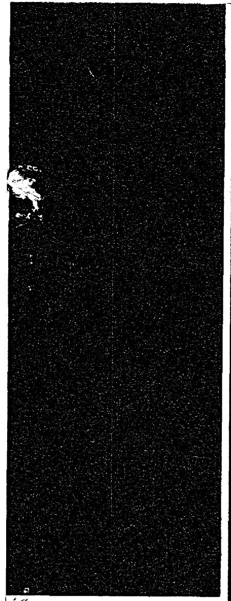

$$
\frac {1 4 0}{6 - 2 - 7 7}
$$

# Corrosion of Several Metals in Supercritical Steam at $538^{\circ}\mathrm{C}$

H. E. McCoy

B. McNabb

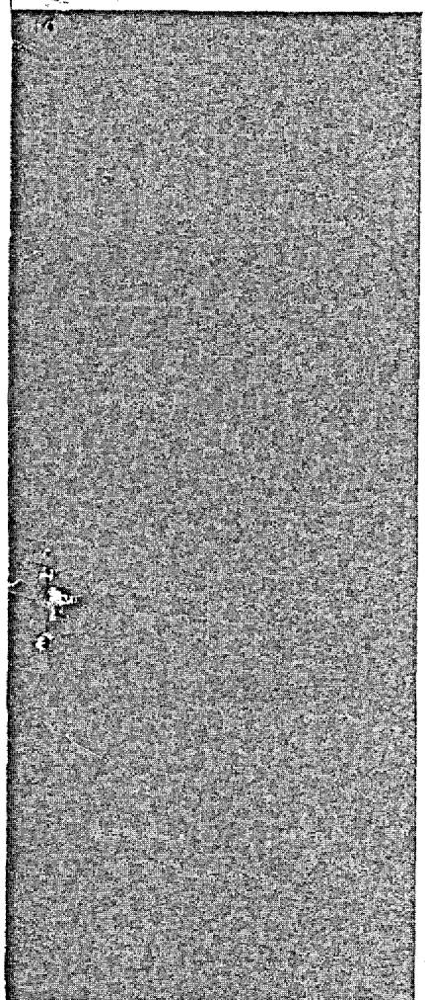

OAK RIDGE NATIONAL LABORATORY

OPERATED BY UNION CARBIDE CORPORATION FOR THE ENERGY RESEARCH AND DEVELOPMENT ADMINISTRATION

Printed in the United States of America. Available from National Technical Information Service

U.S. Department of Commerce

5285 Port Royal Road, Springfield, Virginia 22161

Price: Printed Copy $4,50; Microfiche $3.00

This report was prepared as an account of work sponsored by the United States Government. Neither the United States nor the Energy Research and Development Administration/United States Nuclear Regulatory Commission, nor any of their employees, nor any of their contractors, subcontractors, or their employees, makes any warranty, express or implied, or assumes any legal liability or responsibility for the accuracy, completeness or usefulness of any information, apparatus, product or process disclosed, or represents that its use would not infringe privately owned rights.

Contract No. W-7405-eng-26

METALS AND CERAMICS DIVISION

CORROSION OF SEVERAL METALS IN SUPERCRITICAL STEAM AT $538^{\circ}C$

H. E. McCoy and B. McNabb

Date Published: May 1977

- NOTICE

This report was prepared as an account of work sponsored by the United States Government. Neither the United States nor the United States Energy Research and Development Administration, nor any of their employees, nor any of their contractors, subcontractors, or their employees, makes any warranty, express or implied, or assumes any legal liability or responsibility for the accuracy, completeness or usefulness of any information, apparatus, product or process disclosed, or represents that its use would not infringe privately owned rights.

OAK RIDGE NATIONAL LABORATORY

Oak Ridge, Tennessee 37830

operated by

UNION CARBIDE CORPORATION

for the

ENERGY RESEARCH AND DEVELOPMENT ADMINISTRATION

MASTER

# CONTENTS

ABSTRACT 1

INTRODUCTION 1

EXPERIMENTAL DETAILS 2

Test Facility 2

Test Materials 4

Evaluation 4

Errors 6

Experimental Observations 6

Low-Alloy Ferritic Steels 6

Hastelloy N 10

Stainless Steels 17

Other Alloys 20

Tube Burst Results - Hastelloy N 24

SUMMARY 27

ACKNOWLEDGMENTS 28

REFERENCES 28

APPENDIX 33

# ABSTRACT

The corrosion of several iron- and nickel-base alloys in supercritical steam at 24.1 MPa (3500 psi) and $538^{\circ}\mathrm{C}$ has been measured to $7.92 \times 10^{7}$ sec (22,000 hr). The experiments were carried out in TVA's Bull Run Steam Plant. Corrosion was measured almost entirely by weight change and visual appearance; a few samples were evaluated by more descriptive analytical techniques. The corrosion rates of low-alloy ferritic steels containing from 1.1 to $8.7\%$ Cr and 0.5 to $1.0\%$ Mo differed by less than a factor of 2 in steam. Several modified compositions of Hastelloy N were evaluated and found to corrode at about equivalent rates. Of the alloys studied, the lowest weight gain in $3.6 \times 10^{7}$ sec (10,000 hr) was $0.01\mathrm{mg/cm}^2$ for Inconel 718 and the highest $10\mathrm{mg/cm}^2$ for the low-alloy ferritic steels.

# INTRODUCTION

This study was motivated by the need of the Molten-Salt Reactor Program for a material for use in steam generators. Hastelloy N has excellent compatibility with molten fluoride salts, but it failed prematurely in a simulated superheated steam environment. Thus, our program emphasized Hastelloy N, but included a total of over 80 alloys, mostly iron and nickel base. Because of our program to modify the chemical composition of Hastelloy N to obtain better resistance to embrittlement by irradiation and the fission product tellurium, several alloys with compositions slightly different from that of standard Hastelloy N were included in the study.

The tests were conducted in TVA's Bull Run Steam Plant in supercritical steam at 24.1 MPa (3500 psi) and $538^{\circ}\mathrm{C}$ . One test period included test times up to $5.4 \times 10^{7}$ sec (15,000 hr) and the data were reported previously. A second test period covered an additional $2.52 \times 10^{7}$ sec (7000 hr) on many of the same test coupons and extended the total exposure time to $7.92 \times 10^{7}$ sec (22,000 hr). Since the Molten Salt Reactor Program has again been discontinued, the results of the total steam corrosion will be presented in this report. Although the discussion will deal only with alloys selected to illustrate several important characteristics of steam corrosion, compositions and weight changes of all materials under investigation will be listed.

# EXPERIMENTAL DETAILS

# Test Facility

The facility used in this study is located in TVA's Bull Run Steam Plant. This is a coal-fired plant with a supercritical steam cycle and a power generation capability of 980 MW. The facility is located about 5.49 m (18 ft) upstream from the turbine. The steam is extremely clean at this location containing less than 1 ppb $\mathsf{O}_2$ , less than 5 ppb Cu, less than 3 ppb Na, less than 15 ppb $\mathsf{SiO}_2$ , and less than 6 ppb Fe. Hydrazine is added to the feed water to scavenge oxygen, and the pH was controlled at 9.40 to 9.45 with ammonia. The electrical conductivity of the steam condensate is usually less than $3 \times 10^{-7} \Omega \cdot \mathrm{cm}^{-1}$ .

Although the stream was generally very pure, during at least one $1.44 \times 10^{7}$ sec (4000 hr) period the level of impurities was significantly higher. During this period all specimens gained very close to $0.5\mathrm{mg/cm}^2$ . Bull Run engineers pointed out that several condenser tube leaks had occurred in the previous year of operation, whereas in earlier years, few if any condenser leaks occurred. Since the cooling water in the condensers is at higher pressure than the condensing steam, untreated cooling water is introduced into the steam system hot well when a leak occurs. After replacement of condenser tubes, most of the specimens lost weight for a brief period. Perturbations in the weight change data due to this phenomenon will be pointed out as the data are presented.

A schematic of the test facility is shown in Fig. 1 and a photograph of the disassembled test assembly is shown in Fig. 2. The steam entered the 4-in.-diam sched 160 type 316 stainless steel test chamber at a flow rate of 0.12 to $0.13\mathrm{kg / sec}$ (16 to 17 lb/min). The initial sample holder was a cube $50.8\mathrm{mm}$ (2 in.) on each side and would accommodate 140 samples. A second sample holder was later added that would hold 72 specimens. Most of the samples were $12.7\mathrm{mm}$ wide $\times 50.8\mathrm{mm}$ long $\times 0.89\mathrm{mm}$ thick (1/2 in. wide $\times$ 2 in. long $\times$ 0.035 in. thick). Alumina washers $0.51\mathrm{mm}$ (0.020 in.) thick were placed between the specimens before they were bolted in place. Most of the space between the holder and the vessel was baffled to force flow across the samples at about $6.10\mathrm{m / s}$ (20 fps). Ten stressed instrumented specimens were located at the front of the chamber and four uninstrumented stressed specimens were located in the filter basket. The specimen geometry was chosen so that the stress was provided by the force of the steam on the inner wall. The wall thickness of the reduced section was varied from 0.25 to $0.75\mathrm{mm}$ (0.010 to 0.030 in.) to provide stresses of 531 to $193\mathrm{MPa}$ (77 to $28\times 10^{3}$ psi). The front ten specimens had small capillary tubes that were heated by the steam when the tube specimen failed. A thermocouple attached to each capillary was recorded by a multipoint recorder and indicated when failure occurred. The steam passed through a metal filter to

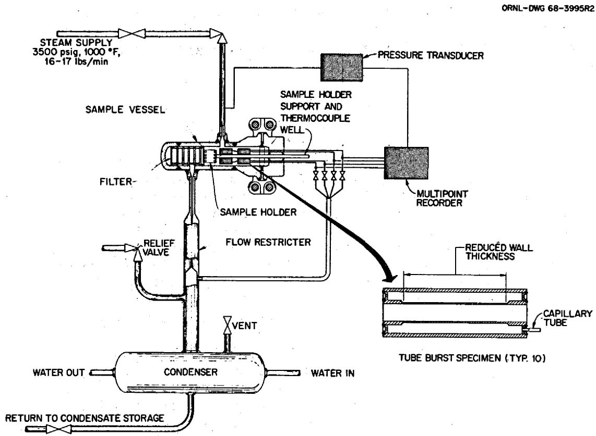  
Fig. 1. Schematic of Test Facility Double-Walled Tube-Burst Specimen.

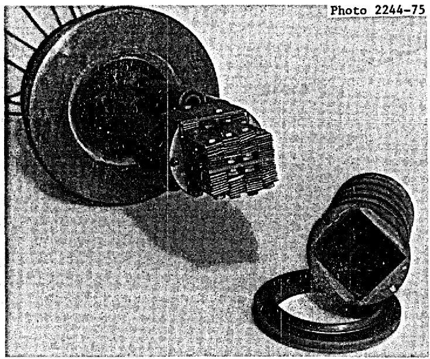  
Fig. 2. Photograph of the Steam Corrosion Chamber After 19,000 hr of Exposure. Features to note are the stressed but uninstrumented specimens in the filter (foreground), the two groups of unstressed specimens, and the 10 instrumented stressed specimens. The stressed specimens have an outside diameter of $25 \mathrm{~mm}$ (1 in.) and a length of $76 \mathrm{~mm}$ (3 in.).

trap scale before it entered the small diameter flow restrictor. The restrictor reduced the steam pressure to near atmospheric pressure before reaching the condenser. The condensate was returned to condensate storage.

# Test Materials

Chemical analyses of the test materials are given in Table 1. The first six alloys were commercial production materials. Alloys LC, MC, and NC were small melts of 2 1/4 Cr-1 Mo steel with variations in carbon content, and alloy 72768 is a commercial heat of 2 1/4 Cr-1 Mo steel. The other alloys down to "Hastelloy N modifications" were commercial production heats. Heats 185 through 237 were 2-lb laboratory melts. Hastelloy N heats 21541 through 73008 were small 50- to 100-lb melts that were vacuum melted and fabricated by commercial vendors. Hastelloy N heats 2477, 5065, 5067, 5085, 5095, 5101, and M1566 were large commercial heats of standard Hastelloy N.

All alloys were rolled to $0.89\mathrm{m}$ (0.035 in.) thick sheet. The rolling was done cold with intermediate anneals for softening; the finish of the exposed sample surface was generally typical of cold-rolled sheet. Samples were sheared, cleaned in acetone and alcohol, and annealed in argon for 1 hr at $927^{\circ}\mathrm{C}$ (the low-alloy ferritic steels), 1 hr at $1038^{\circ}\mathrm{C}$ (the stainless steels), or 1 hr at $1177^{\circ}\mathrm{C}$ (all other alloys).

# Evaluation

Generally only weight change measurements were made. However, the samples were also examined visually for evidence of spalling, oxide color, etc. More extensive evaluation was carried out on a few specimens, including metallography to determine depth of oxide penetration and electron microprobe scans of oxide-metal interfaces to determine the compositions of the oxide and the metal beneath the oxide.

The stressed specimens were removed every 1000 hr for examination. Measurements were made of the inside diameter of each tube with a die test gage. In this way several points were obtained on the strain-time plot for each specimen. Any failed specimens were replaced before the assembly was returned to Bull Run. Some of the failed tubes were subjected to metallographic examination.

Table 1. Chemical Analyses of Test Materials   

<table><tr><td rowspan="2">Alloy</td><td colspan="18">Concentration, wt %</td><td></td><td></td></tr><tr><td>Ni</td><td>No</td><td>Cr</td><td>Fe</td><td>Mn</td><td>C</td><td>Si</td><td>P</td><td>S</td><td>Cu</td><td>Co</td><td>V</td><td>W</td><td>Al</td><td>Ti</td><td>B</td><td>Nb</td><td>Hf</td><td>Zr</td><td>Other</td></tr><tr><td>Arco Irona</td><td></td><td></td><td></td><td>Bal</td><td>0.017</td><td>0.012</td><td></td><td>0.005</td><td>0.025</td><td></td><td></td><td></td><td></td><td></td><td></td><td></td><td></td><td></td><td></td><td></td></tr><tr><td>Low-Alloy Ferritic</td><td></td><td></td><td></td><td></td><td></td><td></td><td></td><td></td><td></td><td></td><td></td><td></td><td></td><td></td><td></td><td></td><td></td><td></td><td></td><td></td></tr><tr><td>1.1 Cr</td><td>0.25</td><td>0.49</td><td>1.1</td><td>Bal</td><td>0.42</td><td></td><td>0.64</td><td></td><td></td><td></td><td>&lt;0.05</td><td>&lt;0.02</td><td>&lt;0.05</td><td>&lt;0.05</td><td>&lt;0.02</td><td></td><td></td><td></td><td></td><td></td></tr><tr><td>1.9 Cr</td><td>0.20</td><td>0.54</td><td>1.9</td><td>Bal</td><td>0.46</td><td></td><td>0.17</td><td></td><td></td><td></td><td></td><td></td><td></td><td></td><td></td><td></td><td></td><td></td><td></td><td></td></tr><tr><td>2.0 Cr</td><td>0.32</td><td>0.88</td><td>2.0</td><td>Bal</td><td>0.40</td><td></td><td>0.25</td><td></td><td></td><td></td><td></td><td></td><td></td><td></td><td></td><td></td><td></td><td></td><td></td><td></td></tr><tr><td>4.2 Cr</td><td>0.36</td><td>0.47</td><td>4.2</td><td>Bal</td><td>0.40</td><td></td><td>0.35</td><td></td><td></td><td></td><td></td><td></td><td></td><td></td><td></td><td></td><td></td><td></td><td></td><td></td></tr><tr><td>8.7 Cr</td><td>0.35</td><td>0.97</td><td>8.7</td><td>Bal</td><td>0.44</td><td></td><td>0.50</td><td></td><td></td><td></td><td></td><td></td><td></td><td></td><td></td><td></td><td></td><td></td><td></td><td></td></tr><tr><td>LC</td><td>0.05</td><td>0.98</td><td>2.3</td><td>Bal</td><td>0.51</td><td>0.009</td><td>0.58</td><td>0.002</td><td>0.009</td><td></td><td></td><td></td><td></td><td></td><td></td><td></td><td></td><td></td><td></td><td></td></tr><tr><td>NC</td><td>&lt;0.05</td><td>1.14</td><td>2.4</td><td>Bal</td><td>0.38</td><td>0.030</td><td>0.27</td><td>0.019</td><td>0.025</td><td></td><td></td><td></td><td></td><td></td><td></td><td></td><td></td><td></td><td></td><td></td></tr><tr><td>NC</td><td>0.21</td><td>0.91</td><td>2.2</td><td>Bal</td><td>0.44</td><td>0.120</td><td>0.40</td><td>0.010</td><td>0.015</td><td></td><td></td><td></td><td></td><td></td><td></td><td></td><td></td><td></td><td></td><td></td></tr><tr><td>72768</td><td>0.16</td><td>0.95</td><td>2.2</td><td>Bal</td><td>0.44</td><td>0.09</td><td>0.38</td><td>0.011</td><td>0.011</td><td></td><td></td><td></td><td></td><td></td><td></td><td></td><td></td><td></td><td></td><td></td></tr><tr><td>12-5-3 Maraging</td><td>12.7</td><td>2.80</td><td>5.1</td><td>Bal</td><td>0.05</td><td></td><td>0.10</td><td></td><td></td><td></td><td></td><td></td><td>0.3</td><td></td><td></td><td></td><td></td><td></td><td></td><td></td></tr><tr><td>Stainless Steels</td><td></td><td></td><td></td><td></td><td></td><td></td><td></td><td></td><td></td><td></td><td></td><td></td><td></td><td></td><td></td><td></td><td></td><td></td><td></td><td></td></tr><tr><td>Type 502b</td><td></td><td>0.5</td><td>5.0</td><td>Bal</td><td></td><td>0.1</td><td></td><td></td><td></td><td></td><td></td><td></td><td></td><td></td><td></td><td></td><td></td><td></td><td></td><td></td></tr><tr><td>17-7 PE</td><td>7.10</td><td></td><td>17.0</td><td>Bal</td><td></td><td>0.07</td><td></td><td></td><td></td><td></td><td></td><td></td><td>1.15</td><td></td><td></td><td></td><td></td><td></td><td></td><td></td></tr><tr><td>Type 201</td><td>5.23</td><td></td><td>16.55</td><td>Bal</td><td>7.28</td><td>0.076</td><td>0.54</td><td>0.34</td><td>0.006</td><td></td><td></td><td></td><td></td><td></td><td></td><td></td><td></td><td></td><td></td><td></td></tr><tr><td>Type 304b</td><td>8.0</td><td></td><td>18.0</td><td>Bal</td><td></td><td>0.03</td><td></td><td></td><td></td><td></td><td></td><td></td><td></td><td></td><td></td><td></td><td></td><td></td><td></td><td></td></tr><tr><td>Type 308b</td><td>13.5</td><td></td><td>23.0</td><td>Bal</td><td></td><td>0.2</td><td></td><td></td><td></td><td></td><td></td><td></td><td></td><td></td><td></td><td></td><td></td><td></td><td></td><td></td></tr><tr><td>Type 310b</td><td>20.5</td><td></td><td>25.0</td><td>Bal</td><td></td><td>0.25</td><td></td><td>1.5</td><td></td><td></td><td></td><td></td><td></td><td></td><td></td><td></td><td></td><td></td><td></td><td></td></tr><tr><td>Type 316</td><td>13.01</td><td>2.8</td><td>17.0</td><td>Bal</td><td>1.74</td><td>0.027</td><td>0.65</td><td>0.016</td><td>0.017</td><td>0.10</td><td>0.15</td><td></td><td></td><td></td><td></td><td></td><td></td><td></td><td></td><td></td></tr><tr><td>Type 321b</td><td>10.5</td><td></td><td>18.0</td><td>Bal</td><td></td><td>0.08</td><td></td><td></td><td></td><td></td><td></td><td></td><td>0.4</td><td></td><td></td><td></td><td></td><td></td><td></td><td></td></tr><tr><td>Type 347b</td><td>11.0</td><td></td><td>18.0</td><td>Bal</td><td></td><td>0.08</td><td></td><td></td><td></td><td></td><td></td><td></td><td>4.0</td><td></td><td></td><td></td><td></td><td></td><td></td><td></td></tr><tr><td>Type 406</td><td></td><td></td><td>13.0</td><td>Bal</td><td></td><td>0.15</td><td></td><td></td><td></td><td></td><td></td><td></td><td></td><td></td><td></td><td></td><td></td><td></td><td></td><td></td></tr><tr><td>Type 410b</td><td></td><td></td><td>12.5</td><td>Bal</td><td></td><td>0.15</td><td></td><td></td><td></td><td></td><td></td><td></td><td></td><td></td><td></td><td></td><td></td><td></td><td></td><td></td></tr><tr><td>Type 446b</td><td></td><td></td><td>25.0</td><td>Bal</td><td></td><td>0.20</td><td></td><td></td><td></td><td></td><td></td><td></td><td></td><td></td><td></td><td></td><td></td><td></td><td></td><td></td></tr><tr><td>Ni-280</td><td>Bal</td><td>0.0002</td><td>0.002</td><td>0.003</td><td>&lt;0.0001</td><td>0.34</td><td>0.005</td><td></td><td>&lt;0.001</td><td>0.002</td><td>&lt;0.0001</td><td>&lt;0.0001</td><td>0.3</td><td>&lt;0.0001</td><td></td><td>&lt;0.0001</td><td></td><td>&lt;0.0001</td><td></td><td></td></tr><tr><td>Nonel</td><td>60.0</td><td></td><td></td><td>3.5</td><td>3.5</td><td>0.5</td><td></td><td></td><td>23</td><td></td><td></td><td>0.5</td><td></td><td></td><td></td><td></td><td></td><td></td><td></td><td></td></tr><tr><td>Copperb</td><td></td><td></td><td></td><td></td><td></td><td></td><td>0.02</td><td>9949</td><td></td><td></td><td></td><td></td><td></td><td></td><td></td><td></td><td></td><td></td><td></td><td></td></tr><tr><td>Inconel 600</td><td>78.0</td><td></td><td>14.5</td><td>7.0</td><td></td><td>0.05</td><td></td><td></td><td></td><td></td><td></td><td></td><td></td><td></td><td></td><td></td><td></td><td></td><td></td><td></td></tr><tr><td>Inconel 601</td><td>60.5</td><td></td><td>23.0</td><td>14.1</td><td>0.5</td><td>0.05</td><td>0.25</td><td></td><td>0.007</td><td></td><td></td><td>1.35</td><td></td><td></td><td></td><td></td><td></td><td></td><td></td><td></td></tr><tr><td>Inconel 718</td><td>53.0</td><td>3.0</td><td>18.0</td><td></td><td>0.05</td><td></td><td></td><td></td><td></td><td></td><td></td><td>0.50</td><td>1.0</td><td></td><td>5.0</td><td></td><td></td><td></td><td></td><td></td></tr><tr><td>Incoloy 800</td><td>31.3</td><td></td><td>20.1</td><td>46.2</td><td>0.84</td><td>0.04</td><td>0.38</td><td></td><td>0.008</td><td>0.50</td><td></td><td>0.24</td><td>0.36</td><td></td><td></td><td></td><td></td><td></td><td></td><td></td></tr><tr><td>Hastelloy B</td><td>Bal</td><td>27.0</td><td>&lt;0.2</td><td>5.2</td><td>0.96</td><td></td><td>0.3</td><td></td><td>0.01</td><td>0.48</td><td>0.2</td><td></td><td>&lt;0.05</td><td>&lt;0.01</td><td></td><td></td><td>&lt;0.05</td><td></td><td></td><td></td></tr><tr><td>Hastelloy C</td><td>Bal</td><td>16.0</td><td>16.0</td><td>5.8</td><td>0.75</td><td></td><td>0.48</td><td></td><td>0.01</td><td>1.2</td><td>5.0</td><td>0.2</td><td>&lt;0.01</td><td></td><td></td><td></td><td>&lt;0.05</td><td></td><td></td><td></td></tr><tr><td>Hastelloy S</td><td>Bal</td><td>14.7</td><td>14.5</td><td>0.90</td><td>0.04</td><td>0.007</td><td>&lt;0.01</td><td></td><td></td><td>0.22</td><td></td><td>0.2</td><td></td><td></td><td></td><td></td><td>0.01 B</td><td></td><td></td><td></td></tr><tr><td>Hastelloy W</td><td>60.0</td><td>25.0</td><td>5.0</td><td>5.5</td><td></td><td>0.08</td><td></td><td></td><td></td><td>1.0</td><td>0.30</td><td></td><td></td><td>1.03</td><td>&lt;0.1</td><td>&lt;0.05</td><td></td><td></td><td></td><td></td></tr><tr><td>Hastelloy X</td><td></td><td>8.6</td><td>22.0</td><td>19.0</td><td>0.64</td><td></td><td>0.60</td><td></td><td>0.02</td><td>2.0</td><td>0.05</td><td>0.5</td><td>0.2</td><td>&lt;0.01</td><td></td><td></td><td>&lt;0.05</td><td></td><td></td><td></td></tr><tr><td>Haynes Alloy 25</td><td>10.0</td><td>0.5</td><td>20.0</td><td>1.4</td><td>1.0</td><td>0.1</td><td>0.7</td><td>0.015</td><td>0.01</td><td>0.02</td><td>Bal</td><td>&lt;0.02</td><td>15.2</td><td>0.1</td><td>0.02</td><td></td><td></td><td>&lt;0.05</td><td></td><td></td></tr><tr><td>Haynes Alloy 188</td><td>22.0</td><td></td><td>22.0</td><td>3.0</td><td>1.25</td><td>0.15</td><td></td><td></td><td></td><td>Bal</td><td></td><td>15.0</td><td></td><td>1.25</td><td>2.5</td><td></td><td>0.01</td><td></td><td></td><td></td></tr><tr><td>Kene 62</td><td>Bal</td><td>9.0</td><td>15.0</td><td>22.0</td><td>0.25</td><td>0.05</td><td>0.25</td><td></td><td></td><td></td><td></td><td></td><td>1.25</td><td>2.5</td><td></td><td>2.25</td><td></td><td></td><td></td><td></td></tr><tr><td>Hastelloy N</td><td></td><td></td><td></td><td></td><td></td><td></td><td></td><td></td><td></td><td></td><td></td><td></td><td></td><td></td><td></td><td></td><td></td><td></td><td></td><td></td></tr><tr><td>Modifications:</td><td></td><td></td><td></td><td></td><td></td><td></td><td></td><td></td><td></td><td></td><td></td><td></td><td></td><td></td><td></td><td></td><td></td><td></td><td></td><td></td></tr><tr><td>185</td><td>Bal</td><td>11.0</td><td>5.9</td><td>3.8</td><td>0.46</td><td>0.05</td><td>0.10</td><td></td><td></td><td>&lt;0.03</td><td></td><td>&lt;0.1</td><td>&lt;0.05</td><td>0.91</td><td></td><td></td><td>&lt;0.1</td><td>0.98</td><td></td><td></td></tr><tr><td>186</td><td>Bal</td><td>10.0</td><td>5.4</td><td>3.5</td><td>0.45</td><td>0.05</td><td>0.09</td><td></td><td></td><td>&lt;0.03</td><td></td><td>&lt;0.1</td><td>0.84</td><td>0.88</td><td></td><td></td><td>&lt;0.1</td><td>&lt;0.05</td><td></td><td></td></tr><tr><td>188</td><td>Bal</td><td>13.0</td><td>7.3</td><td>4.5</td><td>0.49</td><td>0.05</td><td>0.15</td><td></td><td></td><td>&lt;0.03</td><td></td><td>&lt;0.1</td><td>0.95</td><td>&lt;0.02</td><td></td><td></td><td>1.1</td><td>&lt;0.05</td><td></td><td></td></tr><tr><td>231</td><td>Bal</td><td>12.0</td><td>7.0</td><td>4.2</td><td>0.03</td><td>0.05</td><td>0.12</td><td></td><td></td><td>&lt;0.03</td><td></td><td>&lt;0.05</td><td>&lt;0.02</td><td></td><td>&lt;0.05</td><td>1.3</td><td>&lt;0.05</td><td>1.2 Y</td><td></td><td></td></tr><tr><td>232</td><td>Bal</td><td>13.0</td><td>8.0</td><td>4.5</td><td>&lt;0.02</td><td>0.05</td><td>0.12</td><td></td><td></td><td>&lt;0.03</td><td></td><td>&lt;0.05</td><td>&lt;0.02</td><td></td><td>&lt;0.05</td><td>1.2</td><td>&lt;0.05</td><td></td><td></td><td></td></tr><tr><td>234</td><td>Bal</td><td>16.0</td><td>7.2</td><td>4.0</td><td>&lt;0.02</td><td>0.05</td><td>0.13</td><td></td><td></td><td>&lt;0.03</td><td></td><td>&lt;0.05</td><td>&lt;0.02</td><td></td><td>&lt;0.05</td><td>&lt;0.1</td><td>&lt;0.05</td><td></td><td></td><td></td></tr><tr><td>236</td><td>Bal</td><td>11.0</td><td>7.0</td><td>4.0</td><td>0.5</td><td>0.05</td><td>0.13</td><td></td><td></td><td>&lt;0.03</td><td></td><td>1.0</td><td>&lt;0.02</td><td></td><td>&lt;0.05</td><td>&lt;0.05</td><td>&lt;0.5</td><td></td><td></td><td></td></tr><tr><td>237</td><td>Bal</td><td>12.0</td><td>6.7</td><td>4.3</td><td>0.49</td><td>0.05</td><td>0.13</td><td></td><td></td><td>&lt;0.03</td><td></td><td>&lt;0.05</td><td>&lt;0.04</td><td></td><td>1.03</td><td>&lt;0.1</td><td>&lt;0.05</td><td></td><td></td><td></td></tr><tr><td>2477</td><td>Bal</td><td>16.2</td><td>7.0</td><td>4.2</td><td>0.055</td><td>0.057</td><td>0.047</td><td>0.008</td><td>0.004</td><td>0.01</td><td>&lt;0.01</td><td>0.03</td><td>0.02</td><td>0.03</td><td>0.002</td><td>&lt;0.005</td><td>&lt;0.01</td><td>&lt;0.01</td><td></td><td></td></tr><tr><td>5065</td><td>Bal</td><td>16.5</td><td>7.1</td><td>4.0</td><td>0.55</td><td>0.07</td><td>0.58</td><td>0.005</td><td>0.004</td><td>0.007</td><td>0.05</td><td>0.20</td><td>0.1</td><td>&lt;0.03</td><td>&lt;0.01</td><td>&lt;0.05</td><td>&lt;0.1</td><td></td><td></td><td></td></tr><tr><td>5067</td><td>Bal</td><td>17.2</td><td>7.4</td><td>4.0</td><td>0.48</td><td>0.06</td><td>0.43</td><td>0.005</td><td>0.007</td><td>0.01</td><td>0.09</td><td>0.30</td><td>0.6</td><td>&lt;0.01</td><td>&lt;0.04</td><td></td><td></td><td></td><td></td><td></td></tr><tr><td>5085</td><td>Bal</td><td>17.0</td><td>7.0</td><td>3.6</td><td>0.64</td><td>0.06</td><td>0.65</td><td>0.004</td><td>0.003</td><td>0.01</td><td>0.15</td><td>0.20</td><td>0.07</td><td>&lt;0.05</td><td>&lt;0.01</td><td>&lt;0.05</td><td></td><td></td><td></td><td></td></tr><tr><td>N1 5095</td><td>Bal</td><td>16.39</td><td>7.2</td><td>3.87</td><td>0.54</td><td>0.07</td><td>0.68</td><td>0.001</td><td>0.007</td><td>0.01</td><td>0.15</td><td></td><td>0.02</td><td></td><td>0.002</td><td></td><td></td><td></td><td></td><td></td></tr><tr><td>N2 5101</td><td>Bal</td><td>16.39</td><td>6.92</td><td>3.91</td><td>0.44</td><td>0.05</td><td>0.63</td><td>0.001</td><td>0.009</td><td>0.01</td><td>0.09</td><td></td><td>0.02</td><td></td><td>0.007</td><td></td><td></td><td></td><td></td><td></td></tr><tr><td>21541</td><td>Bal</td><td>11.6</td><td>7.3</td><td>0.04</td><td>0.16</td><td>0.05</td><td>0.017</td><td>0.001</td><td>0.002</td><td>&lt;0.10</td><td>&lt;1.0</td><td>1.98</td><td>0.03</td><td>0.005</td><td>0.007</td><td></td><td>&lt;0.05</td><td></td><td></td><td></td></tr><tr><td>21542</td><td>Bal</td><td>12.1</td><td>7.21</td><td>0.041</td><td>0.16</td><td>0.06</td><td>0.014</td><td>0.001</td><td>0.004</td><td>&lt;0.10</td><td>&lt;1.0</td><td>2.05</td><td>&lt;0.10</td><td>&lt;1.0</td><td>&lt;0.10</td><td>&lt;0.05</td><td>&lt;0.96</td><td></td><td></td><td></td></tr><tr><td>21543</td><td>Bal</td><td>12.4</td><td>7.31</td><td>0.31</td><td>0.038</td><td>0.08</td><td>0.05</td><td>&lt;0.01</td><td>&lt;0.001</td><td>&lt;0.04</td><td>&lt;1.0</td><td>&lt;1.0</td><td>&lt;0.2</td><td>&lt;0.03</td><td>&lt;0.003</td><td>&lt;0.70</td><td></td><td></td><td></td><td></td></tr><tr><td>21544</td><td>Bal</td><td>12.6</td><td>7.3</td><td>&lt;0.10</td><td>0.13</td><td>0.06</td><td>&lt;0.03</td><td>&lt;0.01</td><td>&lt;0.01</td><td>&lt;0.10</td><td>&lt;1.0</td><td>&lt;1.0</td><td>&lt;0.2</td><td>&lt;0.03</td><td>&lt;0.003</td><td>&lt;0.70</td><td></td><td></td><td></td><td></td></tr><tr><td>21545</td><td>Bal</td><td>12.9</td><td>7.8</td><td>&lt;0.18</td><td>0.29</td><td>0.05</td><td>&lt;0.015</td><td>&lt;0.001</td><td>&lt;0.02</td><td>&lt;1.0</td><td>&lt;1.0</td><td>&lt;1.0</td><td>&lt;1.0</td><td>&lt;0.2</td><td>&lt;0.03</td><td>&lt;0.003</td><td>&lt;0.71</td><td></td><td></td><td></td></tr><tr><td>21546</td><td>Bal</td><td>12.4</td><td>7.9</td><td>&lt;0.18</td><td>0.18</td><td>&lt;0.15</td><td>&lt;0.05</td><td>&lt;0.015</td><td>&lt;0.001</td><td>&lt;0.02</td><td>&lt;1.0</td><td>&lt;1.0</td><td>&lt;1.0</td><td>&lt;1.0</td><td>&lt;0.2</td><td>&lt;0.03</td><td>&lt;0.05</td><td></td><td></td><td></td></tr><tr><td>21554</td><td>Bal</td><td>12.4</td><td>7.8</td><td>&lt;0.18</td><td>0.18</td><td>&lt;0.15</td><td>&lt;0.05</td><td>&lt;0.015</td><td>&lt;0.001</td><td>&lt;0.02</td><td>&lt;1.0</td><td>&lt;1.0</td><td>&lt;1.0</td><td>&lt;1.0</td><td>&lt;0.2</td><td>&lt;0.03</td><td>&lt;0.75</td><td></td><td></td><td></td></tr><tr><td>21555</td><td>Bal</td><td>12.4</td><td>7.8</td><td>&lt;0.18</td><td>0.18</td><td>&lt;0.15</td><td>&lt;0.05</td><td>&lt;0.015</td><td>&lt;0.001</td><td>&lt;0.02</td><td>&lt;1.0</td><td>&lt;1.0</td><td>&lt;1.0</td><td>&lt;1.0</td><td>&lt;1.0</td><td>&lt;0.2</td><td>&lt;0.75</td><td></td><td></td><td></td></tr><tr><td>M1566</td><td>Bal</td><td>16.0</td><td>7.5</td><td>5.0</td><td>0.5</td><td>0.36</td><td></td><td></td><td></td><td>0.5</td><td></td><td></td><td></td><td></td><td></td><td></td><td></td><td></td><td></td><td></td></tr><tr><td>68688</td><td>Bal</td><td>13.8</td><td>7.91</td><td>4.98</td><td>0.52</td><td>0.079</td><td>0.38</td><td>0.042</td><td>&lt;0.02</td><td>0.023</td><td>0.08</td><td></td><td>0.013</td><td>&lt;0.02</td><td>&lt;0.02</td><td>&lt;0.05</td><td>&lt;0.05</td><td></td><td></td><td></td></tr><tr><td>68689</td><td>Bal</td><td>13.7</td><td>7.6</td><td>4.8</td><td>0.47</td><td>0.081</td><td>0.53</td><td>&lt;0.01</td><td>&lt;0.02</td><td>&lt;0.02</td><td>&lt;0.075</td><td></td><td></td><td>0.36</td><td>&lt;0.02</td><td>&lt;0.05</td><td>&lt;0.05</td><td></td><td></td><td></td></tr><tr><td>69344</td><td>Bal</td><td>13.0</td><td>7.4</td><td>4.0</td><td>0.56</td><td>0.109</td><td>0.5</td><td>&lt;0.001</td><td>&lt;0.04</td><td>&lt;0.03</td><td>&lt;0.06</td><td>&lt;1.01</td><td>&lt;0.24</td><td>&lt;0.77</td><td>&lt;0.001</td><td>1.7</td><td>&lt;0.01</td><td>&lt;0.01</td><td></td><td></td></tr><tr><td>69345</td><td>Bal</td><td>13.9</td><td>7.5</td><td>4.0</td><td>0.52</td><td>0.078</td><td>0.5</td><td>&lt;0.001</td><td>&lt;0.01</td><td>&lt;0.02</td><td>&lt;0.07</td><td>&lt;1.01</td><td>&lt;0.24</td><td>&lt;1.05</td><td>&lt;0.001</td><td>&lt;0.75</td><td>&lt;0.24</td><td></td><td></td><td></td></tr><tr><td>69641</td><td>Bal</td><td>13.9</td><td>6.9</td><td>0.30</td><td>0.35</td><td>0.06</td><td>&lt;0.02</td><td>&lt;0.01</td><td>&lt;0.001</td><td>&lt;0.03</td><td>&lt;0.02</td><td></td><td></td><td>&lt;0.33</td><td>&lt;1.30</td><td>&lt;0.001</td><td>&lt;0.75</td><td>&lt;0.24</td><td></td><td></td></tr><tr><td>69648</td><td>Bal</td><td>12.8</td><td>6.9</td><td>0.34</td><td>0.24</td><td>0.04</td><td>&lt;0.05</td><td>&lt;0.01</td><td>&lt;0.01</td><td>&lt;0.03</td><td>&lt;0.02</td><td></td><td></td><td>&lt;0.33</td><td>&lt;1.30</td><td>&lt;0.001</td><td>&lt;0.75</td><td>&lt;0.24</td><td></td><td></td></tr><tr><td>69714</td><td>Bal</td><td>12.4</td><td>8.0</td><td>0.10</td><td>0.35</td><td>0.12</td><td>&lt;0.05</td><td>&lt;0.01</td><td>&lt;0.01</td><td>&lt;0.05</td><td>&lt;1.01</td><td></td><td></td><td>&lt;0.33</td><td>&lt;1.35</td><td>&lt;0.001</td><td>&lt;1.95</td><td>&lt;0.8</td><td></td><td></td></tr><tr><td>717277</td><td>Bal</td><td>11.7</td><td>7.5</td><td>0.15</td><td>&lt;0.37</td><td>&lt;0.47</td><td>&lt;0.05</td><td>&lt;0.04</td><td>&lt;0.01</td><td>&lt;0.01</td><td>&lt;1.17</td><td></td><td></td><td>&lt;1.35</td><td>&lt;1.75</td><td>&lt;1.75</td><td>&lt;1.75</td><td></td><td></td><td></td></tr><tr><td>71785</td><td>Bal</td><td>12.2</td><td>7.0</td><td>0.16</td><td>&lt;2.77</td><td>&lt;0.27</td><td>&lt;0.057</td><td>&lt;0.092</td><td>&lt;0.024</td><td>&lt;0.03</td><td>&lt;0.033</td><td>&lt;1.41</td><td></td><td>&lt;1.17</td><td>&lt;1.75</td><td>&lt;1.75</td><td>&lt;1.75</td><td></td><td></td><td></td></tr><tr><td>71786</td><td>Bal</td><td>12.2</td><td>7.2</td><td>0.41</td><td>&lt;4.81</td><td>&lt;0.44</td><td>&lt;0.08</td><td>&lt;0.022</td><td>&lt;0.01</td><td>&lt;0.25</td><td>&lt;1.17</td><td></td><td></td><td>&lt;1.17</td><td>&lt;1.75</td><td>&lt;1.75</td><td>&lt;1.75</td><td></td><td></td><td></td></tr><tr><td>71787</td><td>Bal</td><td>12.5</td><td>7.0</td><td>0.18</td><td>&lt;4.33</td><td>&lt;0.43</td><td>&lt;0.021</td><td>&lt;0.012</td><td>&lt;0.024</td><td>&lt;0.02</td><td>&lt;1.17</td><td></td><td></td><td>&lt;1.17</td><td>&lt;1.75</td><td>&lt;1.75</td><td>&lt;1.75</td><td></td><td></td><td></td></tr><tr><td>71788</td><td>Bal</td><td>12.5</td><td>7.2</td><td>0.43</td><td>&lt;4.33</td><td>&lt;0.427</td><td>&lt;1.17</td><td>&lt;1.17</td><td>&lt;1.17</td><td>&lt;1.17</td><td>&lt;1.17</td><td></td><td></td><td>&lt;1.17</td><td>&lt;1.75</td><td>&lt;1.75</td><td>&lt;1.75</td><td></td><td></td><td></td></tr><tr><td>71795</td><td>Bal</td><td>13.0</td><td>7.8</td><td>0.04</td><td>&lt;63</td><td>&lt;0.54</td><td>&lt;1.17</td><td>&lt;1.17</td><td>&lt;1.17</td><td>&lt;1.17</td><td>&lt;1.17</td><td></td><td></td><td>&lt;1.17</td><td>&lt;1.75</td><td>&lt;1.75</td><td>&lt;1.75</td><td></td><td></td><td></td></tr><tr><td>71796</td><td>Bal</td><td>12.4</td><td>7.3</td><td>0.64</td><td>&lt;43</td><td>&lt;1.24</td><td>&lt;1.24</td><td>&lt;1.24</td><td>&lt;1.24</td><td>&lt;1.24</td><td>&lt;1.24</td><td></td><td></td><td>&lt;1.24</td><td>&lt;1.24</td><td>&lt;1.24</td><td>&lt;1.24</td><td></td><td></td><td></td></tr><tr><td>71797</td><td>Bal</td><td>12.5</td><td>7.0</td><td>0.29</td><td>&lt;38</td><td>&lt;1.35</td><td>&lt;1.35</td><td>&lt;1.35</td><td>&lt;1.35</td><td>&lt;1.35</td><td>&lt;1.35</td><td></td><td></td><td>&lt;1.35</td><td>&lt;1.35</td><td>&lt;1.35</td><td>&lt;1.35</td><td></td><td></td><td></td></tr><tr><td>71798</td><td>Bal</td><td>12.8</td><td>7.5</td><td>0.26</td><td>&lt;53</td><td>&lt;1.33</td><td>&lt;1.33</td><td>&lt;1.33</td><td>&lt;1.33</td><td>&lt;1.33</td><td>&lt;1.33</td><td></td><td></td><td>&lt;1.33</td><td>&lt;1.33</td><td>&lt;1.33</td><td>&lt;1.33</td><td></td><td></td><td></td></tr><tr><td>71785
71789
71788
71789
71788
71789
71788
71789
71788
71789
71788
71789
71788
71789
71788
71789
71788
71789
71788
7188
71789
71788
71789
71788
71789
71788
71789
71788
71789
71788
71789
71788
71789
71788
71789
71788
T
T
T
T
T
T
T
T
T
T
T
T
T
T
T
T
T
T
T
T
T
T
T
T
T
T
T
T
T
T
T
T
T
T
T
T
T
T
T
T
T
T
T
T
T
T
T
T
T
T
72153
72153
72153
72153
72153
72153
72153
72153
72153
72153
72153
72153
72153
72153
72153
T
T
T
T
T
T
T
T
T
T
T
T
T
T
T
T
T
T
T
T
T
T
T
T
T
T
T
T
T
T
T
T
T
T
T
T
T
T
T
T
T
T
T
T
T
T
T
T
T
t
T
T
T
T
T
T
T
T
T
T
T
T
T
T
T
T
T
T
T
T
T
T
T
T
T
T
T
T
T
T
T
T
T
T
T
T
T
T
T
T
T
T
T
T
T
T
T
T
T
l
T
T
T
T
T
T
T
T
T
T
T
T
T
T
T
T
T
T
T
T
T
T
T
T
T
T
T
T
T
T
T
T
T
T
T
T
T
T
T
T
T
T
T
T
T
T
T
T
T
L
T
T
T
T
T
T
T
T
T
T
T
T
T
T
T
T
T
T
T
T
T
T
T
T
T
T
T
T
T
T
T
T
T
T
T
T
T
T
T
T
T
T
T
T
T
T
T
T
T
I
T
T
T
T
T
T
T
T
T
T
T
T
T
T
T
T
T
T
T
T
T
T
T
T
T
T
T
T
T
T
T
T
T
T
T
T
T
T
T
T
T
T
T
T
T
T
T
T
T
TT
T
T
T
T
T
T
T
T
T
T
T
T
T
T
T
T
T
T
T
T
T
T
T
T
T
T
T
T
T
T
T
T
T
T
T
T
T
T
T
T
T
T
T
T
T
T
T
T
T
F
T
T
T
T
T
T
T
T
T
T
T
T
T
T
T
T
T
T
T
T
T
T
T
T
T
T
T
T
T
T
T
T
T
T
T
T
T
T
T
T
T
T
T
T
T
T
T
T
T
C
T
T
T
T
T
T
T
T
T
T
T
T
T
T
T
T
T
T
T
T
T
T
T
T
T
T
T
T
T
T
T
T
T
T
T
T
T
T
T
T
T
T
T
T
T
T
T
T
T
D
T
T
T
T
T
T
T
T
T
T
T
T
T
T
T
T
T
T
T
T
T
T
T
T
T
T
T
T
T
T
T
T
T
T
T
T
T
T
T
T
T
T
T
T
T
T
T
T
T
E
T
T
T
T
T
T
T
T
T
T
T
T
T
T
T
T
T
T
T
T
T
T
T
T
T
T
T
T
T
T
T
T
T
T
T
T
T
T
T
T
T
T
T
T
T
T
T
T
T
P
T
T
T
T
T
T
T
T
T
T
T
T
T
T
T
T
T
T
T
T
T
T
T
T
T
T
T
T
T
T
T
T
T
T
T
T
T
T
T
T
T
T
T
T
T
T
T
T
T
O
T
T
T
T
T
T
T
T
T
T
T
T
T
T
T
T
T
T
T
T
T
T
T
T
T
T
T
T
T
T
T
T
T
T
T
T
T
T
T
T
T
T
T
T
T
T
T
T
T
Q
Q
Q
Q
Q
Q
Q
Q
Q
Q
Q
Q
Q
Q
Q
Q
Q
Q
Q
Q
Q
Q
Q
Q
Q
Q
Q
Q
Q
Q
Q
Q
Q
Q
Q
Q
Q
Q
Q
Q
Q
Q
Q
Q
Q
Q
Q
Q
Q
Q
O
Q
Q
Q
Q
Q
Q
Q
Q
Q
Q
Q
Q
Q
Q
Q
Q
Q
Q
Q
Q
Q
Q
Q
Q
Q
Q
Q
Q
Q
Q
Q
Q
Q
Q
Q
Q
Q
Q
Q
Q
Q
Q
Q
Q
Q
Q
Q
Q
Q
q
q
q
q
q
q
q
q
q
q
q
q
q
q
q
q
q
q
q
q
q
q
q
q
q
q
q
q
q
q
q
q
q
q
q
q
q
q
q
q
q
q
q
q
q
q
q
q
q
q
Q
Q
Q
Q
Q
Q
Q
Q
Q
Q
Q
Q
Q
Q
Q
Q
Q
Q
Q
Q
Q
Q
Q
Q
Q
Q
Q
Q
Q
Q
Q
Q
Q
Q
Q
Q
Q
Q
Q
Q
Q
Q
Q
Q
Q
Q
Q
Q
Q
t
t
t
t
t
t
t
t
t
t
t
t
t
t
t
t
t
t
t
t
t
t
t
t
t
t
t
t
t
t
t
t
t
t
t
t
t
t
t
t
t
t
t
t
t
t
t
t
t
t
l
l
l
l
l
l
l
l
l
l
l
l
l
l
l
l
l
l
l
l
l
l
l
l
l
l
l
l
l
l
l
l
l
l
l
l
l
l
l
l
l
l
l
l
l
l
l
l
l
l
t
t
t
t
t
t
t
t
t
t
t
t
t
t
t
t
t
t
t
t
t
t
t
t
t
t
t
t
t
t
t
t
t
t
t
t
t
t
t
t
t
t
t
t
t
t
t
t
t
T T T T T T T T T T T T T T T T T T T T T T T T T T T T T T T T T T T T T T T T T T T T T T T T T T T T T T T T T T T T T T T T T T T T T T T T T T T T T T T T T T T T T T T T T T T T T T T T T T T T T F T T T T T T T T T T T T T T T T T T T T T T T T T T T T T T T T T T T T T T T T T T T T T T T T T T T T T T T T T T T T T T T T T T T T T T T T T T T T T T T T T T T T T T T T T T T T T T T T T T T P T T T T T T T T T T T T T T T T T T T T T T T T T T T T T T T T T T T T T T T T T T T T T T T T T T T T T T T T T T T T T T T T T T T T T T T T T T T T T T T T T T T T T T T T T T T T T T T T T T T I T T T T T T T T T T T T T T T T T T T T T T T T T T T T T T T T T T T T T T T T T T T T T T T T T T T T T T T T T T T T T T T T T T T T T T T T T T T T T T T T T T T T T T T T T T T T T T T T T T T E O O O O O O O O O O O O O O O O O O O O O O O O O O O O O O O O O O O O O O O O O O O O O O O O O O O O O O O O O O O O O O O O O O O O O O O O O O O O O O O O O O O O O O O O O O O O O O O O O O O O D O O O O O O O O O O O O O O O O O O O O O O O O O O O O O O O O O O O O O O O O O O O O O O O O O O O O O O O O O O O O O O O O O O O O O O O O O O O O O O O O O O O O O O O O O O O O O O O O O O O Q D Q D Q D Q D Q D Q D Q D Q D Q D Q D Q D Q D Q D Q D Q D Q D Q D Q D Q D Q D Q D Q D Q D Q D Q D Q D Q D Q D Q D Q D Q D Q D Q D Q D Q D Q D Q D Q D Q D Q D Q D Q D Q D Q D Q D Q D Q D Q D Q D Q D Q Q D Q D Q D Q D Q D Q D Q D Q D Q D Q D Q D Q D Q D Q D Q D Q D Q D Q D Q D Q D Q D Q D Q D Q D Q D Q D Q D Q D Q D Q D Q D Q D Q D Q D Q D Q D Q D Q D Q D Q D Q D Q D Q D Q D Q D Q D Q D Q D Q D Q O O O O O O O O O O O O O O O O O O O O O O O O O O O O O O O O O O O O O O O O O O O O O O O O O O O O O O O O O O O O O O O O O O O O O O O O O O O O O O O O O O O O O O O O O O O O O O O O O O OO O O O O O O O O O O O O O O O O O O O O O O O O O O O O O O O O O O O O O O O O O O O O O O O O O O O O O O O O O O O O O O O O O O O O O O O O O O O O O O O O O O O O O O O O O O O O O O O O O O O.OO O O O O O O O O O O O O O O O O O O O O O O O O O O O O O O O O O O O O O O O O O O O O O O O O O O O O O O O O O O O O O O O O O O O O O O O O O O O O O O O O O O O O O O O O O O O O O O O O O O D Q D Q D Q D Q D Q D Q D Q D Q D Q D Q D Q D Q D Q D Q D Q D Q D Q D Q D Q D Q D Q D Q D Q D Q D Q D Q D Q D Q D Q D Q D Q D Q D Q D Q D Q D Q D Q D Q D Q D Q D Q D Q D Q D Q D Q D Q D Q D Q D Q D D Q D Q D Q D Q D Q D Q D Q D Q D Q D Q D Q D Q D Q D Q D Q D Q D Q D Q D Q D Q D Q D Q D Q D Q D Q D Q D Q D Q D Q D Q D Q D Q D Q D Q D Q D Q D Q D Q D Q D Q D Q D Q D Q D Q D Q D Q D Q D Q D Q D q t t t t t t t t t t t t t t t t t t t t t t t t t t t t t t t t t t t t t t t t t t t t t t t t t t t t t t t t t t t t t t t t t t t t t t t t t t t t t t t t t t t t t t t t t t t t t t t t t t t t l t t l t l t l t l t l t l t l t l t l t l t l t l t l t l t l t l t l t l t l t l t l t l t l t l t l t l t l t l t l t l t l t l t l t l t l t l t l t l t l t l t l t l t l t l t l t l t l t l t l t l t t l t l t l t l t l t l t l t l t l t l t l t l t l t l t l t l t l t l t l t l t l t l t l t l t l t l t l t l t l t l t l t l t l t l t l t l t l t l t l t l t l t l t l t l t l t l t l t l l t l t l t l t l t l t l t l t l t l t l t l t l t l t l t l t l t l t l t l t l t l t l t l t l t l t l t l t l t l t l t l t l t l t l t l t l t l t l t l t l t l t l t l t l t l t l t l t l t l l t l l t l t l t l t l t l t l t l t l t l t l t l t l t l t l t l t l t l t l t l t l t l t l t l t l t l t l t l t l t l t l t l t l t l t l t l t l t l t l t l t l t l t l t l t l t l t l t l t t l t t l t l t l t l t l t l t l t l t l t l t l t l t l t l t l t l t l t l t l t l t l t l t l t l t l t l t l t l t l t l t l t l t l t l t l t l t l t l t l t l t l t l t l t l t l t l t l t t l t l l t l t l t l t l t l t l t l t l t l t l t l t l t l t l t l t l t l t l t l t l t l t l t l t l t l t l t l t l t l t l t l t l t l t l t l t l t l t l t l t l t l t l t l t l t l t l t l l t l t L T T T T T T T T T T T T T T T T T T T T T T T T T T T T T T T T T T T T T T T T T T T T T T T T T T T T T T T T T T T T T T T T T T T T T T T T T T T T T T T T T T T T T T T T T T T T T T T T T T T V V V V V V V V V V V V V V V V V V V V V V V V V V V V V V V V V V V V V V V V V V V V V V V V V V V V V V V V V V V V V V V V V V V V V V V V V V V V V V V V V V V V V V V V V V V V V V V V V V V V S S S S S S S S S S S S S S S S S S S S S S S S S S S S S S S S S S S S S S S S S S S S S S S S S S S S S S S S S S S S S S S S S S S S S S S S S S S S S S S S S S S S S S S S S S S S S S S S S S S S s s s s s s s s s s s s s s s s s s s s s s s s s s s s s s s s s s s s s s s s s s s s s s s s s s s s s s s s s s s s s s s s s s s s s s s s s s s s s s s s s s s s s s s s s s s s s s s s s s s s S S S S S S S S S S S S S S S S S S S S S S S S S S S S S S S S S S S S S S S S S S S S S S S S S S S S S S S S S S S S S S S S S S S S S S S S S S S S S S S S S S S S S S S S S S S S S S S S S S S G G G G G G G G G G G G G G G G G G G G G G G G G G G G G G G G G G G G G G G G G G G G G G G G G G G G G G G G G G G G G G G G G G G G G G G G G G G G G G G G G G G G G G G G G G G G G G G G G G G G C C C C C C C C C C C C C C C C C C C C C C C C C C C C C C C C C C C C C C C C C C C C C C C C C C C C C C C C C C C C C C C C C C C C C C C C C C C C C C C C C C C C C C C C C C C C C C C C C C C C c c c c c c c c c c c c c c c c c c c c c c c c c c c c c c c c c c c c c c c c c c c c c c c c c c c c c c c c c c c c c c c c c c c c c c c c c c c c c c c c c c c c c c c c c c c c c c c c c c c c d d d d d d d d d d d d d d d d d d d d d d d d d d d d d d d d d d d d d d d d d d d d d d d d d d d d d d d d d d d d d d d d d d d d d d d d d d d d d d d d d d d d d d d d d d d d d d d d d d d d c d d d d d d d d d d d d d d d d d d d d d d d d d d d d d d d d d d d d d d d d d d d d d d d d d d d d d d d d d d d d d d d d d d d d d d d d d d d d d d d d d d d d d d d d d d d d d d d d d d c c c c c c c c c c c c c c c c c c c c c c c c c c c c c c c c c c c c c c c c c c c c c c c c c c c c c c c c c c c c c c c c c c c c c c c c c c c c c c c c c c c c c c c c c c c c c c c c c c c e e e e e e e e e e e e e e e e e e e e e e e e e e e e e e e e e e e e e e e e e e e e e e e e e e e e e e e e e e e e e e e e e e e e e e e e e e e e e e e e e e e e e e e e e e e e e e e e e e e e ee e e e e e e e e e e e e e e e e e e e e e e e e e e e e e e e e e e e e e e e e e e e e e e e e e e e e e e e e e e e e e e e e e e e e e e e e e e e e e e e e e e e e e e e e e e e e e e e e e e e E E E E E E E E E E E E E E E E E E E E E E E E E E E E E E E E E E E E E E E E E E E E E E E E E E E E E E E E E E E E E E E E E E E E E E E E E E E E E E E E E E E E E E E E E E E E E E E E E E E E A E E E E E E E E E E E E E E E E E E E E E E E E E E E E E E E E E E E E E E E E E E E E E E E E E E E E E E E E E E E E E E E E E E E E E E E E E E E E E E E E E E E E E E E E E E E E E E E E E E E F F F F F F F F F F F F F F F F F F F F F F F F F F F F F F F F F F F F F F F F F F F F F F F F F F F F F F F F F F F F F F F F F F F F F F F F F F F F F F F F F F F F F F F F F F F F F F F F F F F F f f f f f f f f f f f f f f f f f f f f f f f f f f f f f f f f f f f f f f f f f f f f f f f f f f f f f f f f f f f f f f f f f f f f f f f f f f f f f f f f f f f f f f f f f f f f f f f f f f f f r r r r r r r r r r r r r r r r r r r r r r r r r r r r r r r r r r r r r r r r r r r r r r r r r r r r r r r r r r r r r r r r r r r r r r r r r r r r r r r r r r r r r r r r r r r r r r r r r r r r R R R R R R R R R R R R R R R R R R R R R R R R R R R R R R R R R R R R R R R R R R R R R R R R R R R R R R R R R R R R R R R R R R R R R R R R R R R R R R R R R R R R R R R R R R R R R R R R R R R R K I I I I I I I I I I I I I I I I I I I I I I I I I I I I I I I I I I I I I I I I I I I I I I I I I I I I I I I I I I I I I I I I I I I I I I I I I I I I I I I I I I I I I I I I I I I I I I I I I I I I II I I I I I I I I I I I I I I I I I I I I I I I I I I I I I I I I I I I I I I I I I I I I I I I I I I I I I I I I I I I I I I I I I I I I I I I I I I I I I I I I I I I I I I I I I I I I I I I I I I I L L L L L L L L L L L L L L L L L L L L L L L L L L L L L L L L L L L L L L L L L L L L L L L L L L L L L L L L L L L L L L L L L L L L L L L L L L L L L L L L L L L L L L L L L L L L L L L L L L L L I I I I I I I I I I I I I I I I I I I I I I I I I I I I I I I I I I I I I I I I I I I I I I I I I I I I I I I I I I I I I I I I I I I I I I I I I I I I I I I I I I I I I I I I I I I I I I I I I I I | | | | | | | | | | | | | | | | | | | | | | | | | | | | | | | | | | | | | | | | | | | | | | | | | | | | | | | | | | | | | | | | | | | | | | | | | | | | | | | | | | | | | | | | | | | | | | | | | | | | I | | | | | | | | | | | | | | | | | | | | | | | | | | | | | | | | | | | | | | | | | | | | | | | | | | | | | | | | | | | | | | | | | | | | | | | | | | | | | | | | | | | | | | | | | | | | | | | | | | I| | | | | | | | | | | | | | | | | | | | | | | | | | | | | | | | | | | | | | | | | | | | | | | | | | | | | | | | | | | | | | | | | | | | | | | | | | | | | | | | | | | | | | | | | | | | | | | | | | | | |
A 2 6 6 6 6 6 6 6 6 6 6 6 6 6 6 6 6 6 6 6 6 6 6 6 6 6 6 6 6 6 6 6 6 6 6 6 6 6 6 6 6 6 6 6 6 6 6 6 6 6 6 4 4 4 4 4 4 4 4 4 4 4 4 4 4 4 4 4 4 4 4 4 4 4 4 4 4 4 4 4 4 4 4 4 4 4 4 4 4 4 4 4 4 4 4 4 4 4 4 4 4 5 4 4 4 4 4 4 4 4 4 4 4 4 4 4 4 4 4 4 4 4 4 4 4 4 4 4 4 4 4 4 4 4 4 4 4 4 4 4 4 4 4 4 4 4 4 4 4 4 4 2 6 6 6 6 6 6 6 6 6 6 6 6 6 6 6 6 6 6 6 6 6 6 6 6 6 6 6 6 6 6 6 6 6 6 6 6 6 6 6 6 6 6 6 6 6 6 6 6 8 8 8 8 8 8 8 8 8 8 8 8 8 8 8 8 8 8 8 8 8 8 8 8 8 8 8 8 8 8 8 8 8 8 8 8 8 8 8 8 8 8 8 8 8 8 8 8 8 8 9 8 9 9 9 9 9 9 9 9 9 9 9 9 9 9 9 9 9 9 9 9 9 9 9 9 9 9 9 9 9 9 9 9 9 9 9 9 9 9 9 9 9 9 9 9 9 9 9 9 9 9 8 8 8 8 8 8 8 8 8 8 8 8 8 8 8 8 8 8 8 8 8 8 8 8 8 8 8 8 8 8 8 8 8 8 8 8 8 8 8 8 8 8 8 8 8 8 8 8 8 4 4 4 4 4 4 4 4 4 4 4 4 4 4 4 4 4 4 4 4 4 4 4 4 4 4 4 4 4 4 4 4 4 4 4 4 4 4 4 4 4 4 4 4 4 4 4 4 4 8 8 8 8 8 8 8 8 8 8 8 8 8 8 8 8 8 8 8 8 8 8 8 8 8 8 8 8 8 8 8 8 8 8 8 8 8 8 8 8 8 8 8 8 8 8 8 8 8 6 6 6 6 6 6 6 6 6 6 6 6 6 6 6 6 6 6 6 6 6 6 6 6 6 6 6 6 6 6 6 6 6 6 6 6 6 6 6 6 6 6 6 6 6 6 6 6 6 8 6 6 6 6 6 6 6 6 6 6 6 6 6 6 6 6 6 6 6 6 6 6 6 6 6 6 6 6 6 6 6 6 6 6 6 6 6 6 6 6 6 6 6 6 6 6 6 6 8 4 4 4 4 4 4 4 4 4 4 4 4 4 4 4 4 4 4 4 4 4 4 4 4 4 4 4 4 4 4 4 4 4 4 4 4 4 4 4 4 4 4 4 4 4 4 4 4 8 4 4 4 4 4 4 4 4 4 4 4 4 4 4 4 4 4 4 4 4 4 4 4 4 4 4 4 4 4 4 4 4 4 4 4 4 4 4 4 4 4 4 4 4 4 4 4 4 5 6 6 6 6 6 6 6 6 6 6 6 6 6 6 6 6 6 6 6 6 6 6 6 6 6 6 6 6 6 6 6 6 6 6 6 6 6 6 6 6 6 6 6 6 6 6 6 6 6 5 6 6 6 6 6 6 6 6 6 6 6 6 6 6 6 6 6 6 6 6 6 6 6 6 6 6 6 6 6 6 6 6 6 6 6 6 6 6 6 6 6 6 6 6 6 6 6 6 8 5 6 6 6 6 6 6 6 6 6 6 6 6 6 6 6 6 6 6 6 6 6 6 6 6 6 6 6 6 6 6 6 6 6 6 6 6 6 6 6 6 6 6 6 6 6 6 6 6 5 5 6 6 6 6 6 6 6 6 6 6 6 6 6 6 6 6 6 6 6 6 6 6 6 6 6 6 6 6 6 6 6 6 6 6 6 6 6 6 6 6 6 6 6 6 6 6 6 6 7 6</td><td></td><td></td><td></td><td></td><td></td><td></td><td></td><td></td><td></td><td></td><td></td><td></td><td></td><td></td><td></td><td></td><td></td><td></td><td></td><td></td></tr></table>

Nominal composition, all others are actual analyses.

# Errors

The specimens were weighed on a standard four-place balance with an accuracy of $\pm 0.0001\mathrm{g}$ . The specimens had surface areas of 12 to $14~\mathrm{cm}^2$ , so the uncertainty in weight corresponded to almost $0.01~\mathrm{mg/cm}^2$ . This error does not include small pieces of loose material that may have been adhering to the specimen or small amounts of oxide that may have been knocked off during disassembly. Efforts were made to minimize these sources of error, but they are likely still present.

The stresses imposed on the tube burst specimens were affected by uncertainties in tube dimensions. The uncertainty in the wall thickness was about $\pm 0.0127 \, \text{mm}$ ( $\pm 0.0005$ in.). When the nominal wall thickness was $0.254 \, \text{mm}$ (0.010 in.), this uncertainty introduced an error in the stress of $\pm 5\%$ . When the wall thickness was $0.762 \, \text{mm}$ (0.030 in.), this uncertainty was about $\pm 2\%$ .

# Experimental Observations

Weight gain results on all materials tested in steam are given in the Appendix.

# Low-Alloy Ferritic Steels

Five alloys containing from 1.1 to $8.7\%$ Cr and 0.5 to $1.0\%$ Mo (Table 1) were exposed to steam for 14,000 hr at $538^{\circ}\mathrm{C}$ and these results were presented previously and are shown in Table A1. These specimens were lost during the one year in which the program was inactive, and it was necessary to begin testing with a new group of specimens. These specimens were exposed 7000 hr, and the data for the second series are shown in Fig. 3 along with the scatterband for the first series. The extremes of the scatterband for the first series were defined by alloys containing $1.1\%$ Cr (lowest weight gain) and $1.9\%$ Cr (highest weight grain). These same alloys are near the extremes for the second series, and the data from the two series generally agree very well.

The behavior in air was vastly different from that noted in steam. After only 1000-hr exposure all alloys except the one containing $8.7\%$ Cr had begun to spall, and after 13,000-hr exposure all alloys had lost weight.[2]

Two samples from the steam series were examined metallographically and typical photomicrographs are shown in Fig. 4. The microstructures of the specimen containing 1.1 and $8.7\%$ Cr were quite similar. The oxide, which consists of two distinct layers had a total thickness of about $50~{\mu\mathrm{m}}$ . The microstructure of the metal surface was altered to a depth of about $10~{\mu\mathrm{m}}$ . Microprobe scans of these specimens showed that the oxide layer nearest the metal contained detectable quantities of

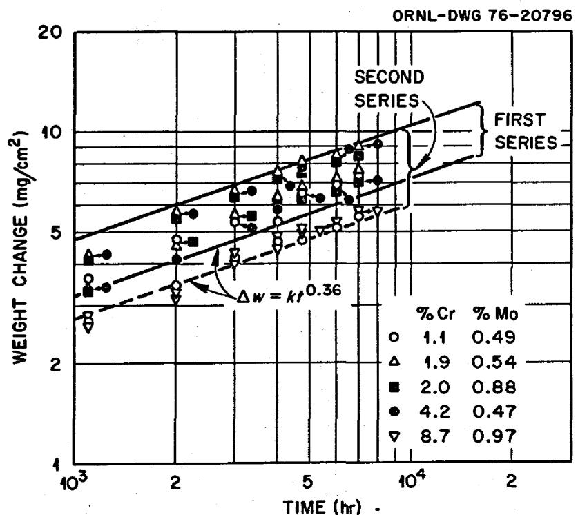  
Fig. 3. Influence of Chromium Content on the Weight Change of Annealed Low-Alloy Ferritic Steels in Supercritical Steam at $538^{\circ}\mathrm{C}$ and 24.1 MPa (3500 psi).

Fe, Cr, Mo, and Si with Fe and Cr being the predominant constituents. Only iron was detected in the outermost oxide. The two alloys chosen for metallographic examination had very similar weight gains and gained the least weight of the series. Note in Table 1 that these alloys were the highest in silicon and that silicon was detectable in the oxide film. In light of these observations and previous work that showed silicon to reduce the oxidation rate of steel,[4,5] it is quite likely that the higher silicon content of these two alloys resulted in their superior corrosion resistance.

The weight changes observed with several heats of 2 1/4 Cr-1 Mo steel are shown in Fig. 5. The scatterbands from the observations of steels containing from 1.1 to $8.7\%$ Cr are shown and the data for the four heats of 2 1/4 Cr-1 Mo steel fall within the scatterbands. The low carbon heat had the lowest oxidation rate, but we do not know a basis for attributing this to its low carbon content. These same alloys were exposed in the $50\%$ cold-worked condition. The data from these specimens are presented in Fig. 6. A comparison of Figs. 5 and 6 shows that cold working did not have a detectable effect on corrosion. (These data are also tabulated in Table A2.)

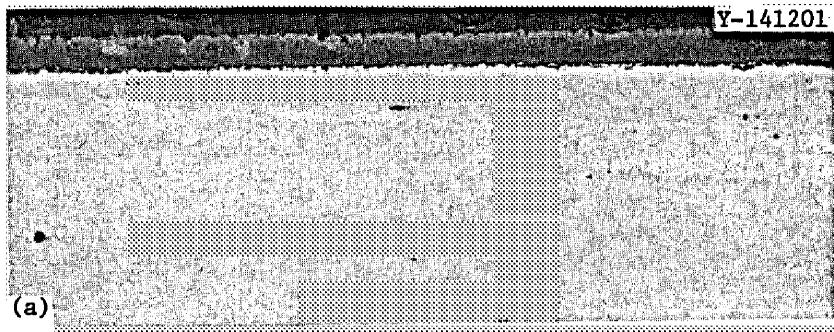

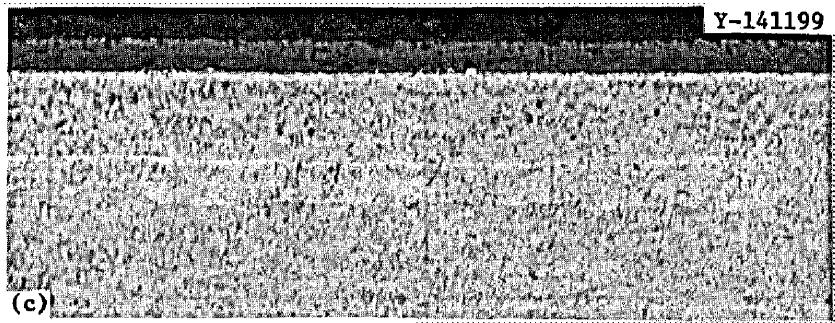

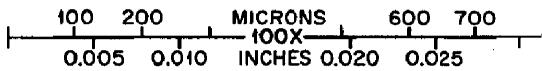

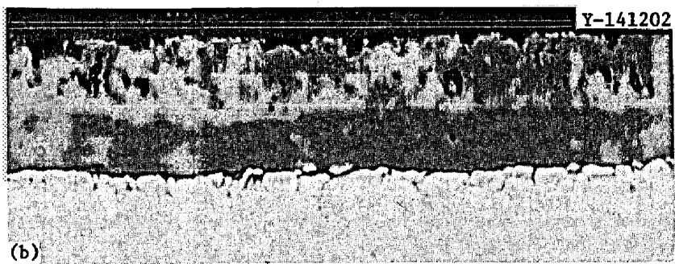

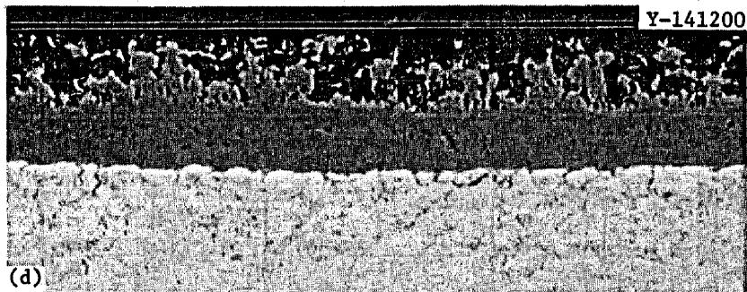

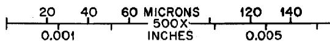  
Fig. 4. Photomicrographs of Low-Alloy Ferritic Steel Exposed to Steam at $538^{\circ}\mathrm{C}$ and 24.1 MPa (3500 psi) for 7000 hr. (a) and (b) Alloy containing $1.1\%$ Cr. (c) and (d) Alloy containing $8.7\%$ Cr. All specimens as polished; however, specimen shown in (c) and (d) was etched slightly by moisture in the ambient air.

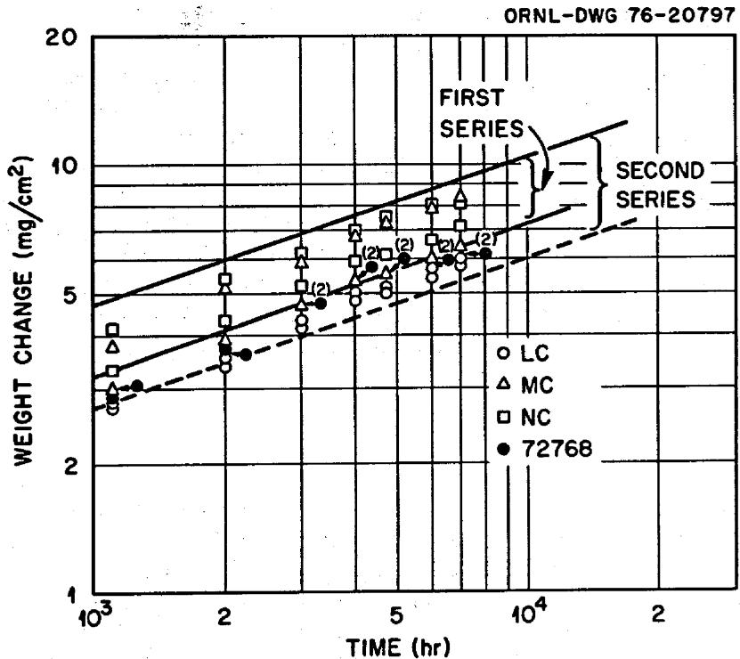  
Fig. 5. Weight Changes of Several Heats of $21/4$ Cr-1 Mo Steel in Solution-Annealed Condition Exposed to Supercritical Steam at $538^{\circ}\mathrm{C}$ and $24.1\mathrm{MPa}$ (3500 psi).

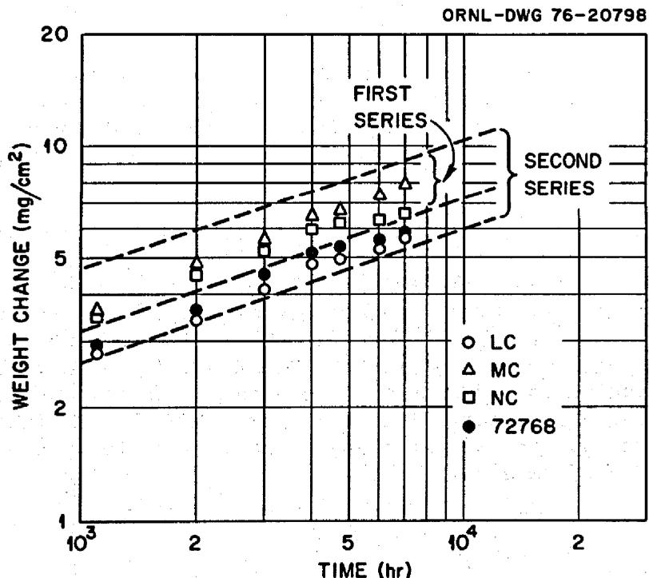  
Fig. 6. Weight Changes of Several Heats of $2 \, \text{l/4}$ Cr-1 Mo Steel in the Cold-Worked Condition Exposed to Steam at $538^{\circ}\text{C}$ and $24.1\text{MPa}$ (3500 psi).

Photomicrographs of three specimens of the 2 l/4 Cr-1 Mo steel are shown in Fig. 7. The three specimens examined were (1) standard alloy (heat 72768), annealed and air cooled, (2) standard alloy, cold worked $50\%$ , and (3) normal carbon (NC) alloy, annealed and air cooled. The oxides on all three specimens were very similar to each other and to the alloys shown in Fig. 4. The oxide consisted of two layers and had an overall thickness of about $50~{\mu\mathrm{m}}$ . The specimen underneath the oxide was affected to a depth of $10~{\mu\mathrm{m}}$ or less. Electron microprobe spectral analysis showed that the oxide on each specimen nearest the metal contained detectable quantities of Fe, Cr, Mo, and Si with Fe and Cr being the major constituent. The outermost oxide layer contained only iron in detectable concentrations.

# Hastelloy N

The weight changes of four heats of Hastelloy N exposed in steam are shown in Fig. 8. The variation among the four heats is about the same as the variation noted for duplication specimens of heat 5065. One of the heats, 2477, was vacuum melted, and the other three were air melted. The vacuum-melted heat was much lower in silicon and manganese than the air-melted heats, but this had no detectable effect on the corrosion rate in steam. After the first 4000-hr exposure, the weight change can be described by an equation of the form

$$
\Delta W = K t ^ {0 \cdot 2 1}, \tag {1}
$$

where $\Delta W$ is the weight gain in $\mathrm{mg/cm^2}$ , $t$ is the time in hr, and $K$ is a constant. The perturbation in rate after 15,000 hr is thought to be due to the condenser leaks in the plant and the attendant higher impurity levels in the steam. After the leaks were repaired, the rate of corrosion decreased.

Some Hastelloy N specimens from heat 5065 were given various surface treatments before exposure to steam. Six samples were solution annealed. Two of these were tested in the as-rolled and solution-treated condition, two others were electropolished, and two were abraded with 400 grit paper before exposure. Figure 9 shows that the weight changes were least for the electropolished material, intermediate for the as-rolled samples, and greatest for the abraded samples. Although the corrosion process may have been affected in a more complex way, the weight changes are qualitatively proportional to the "true" surface area.

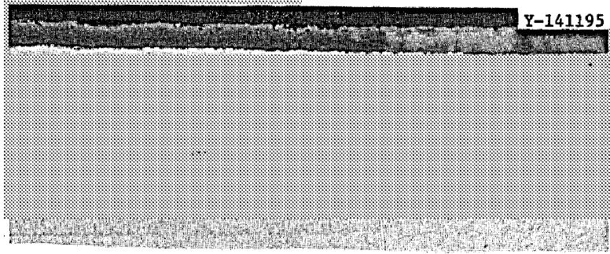

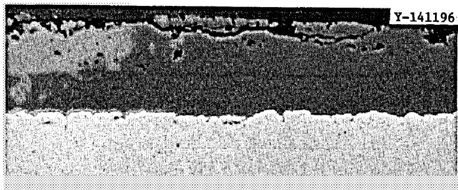

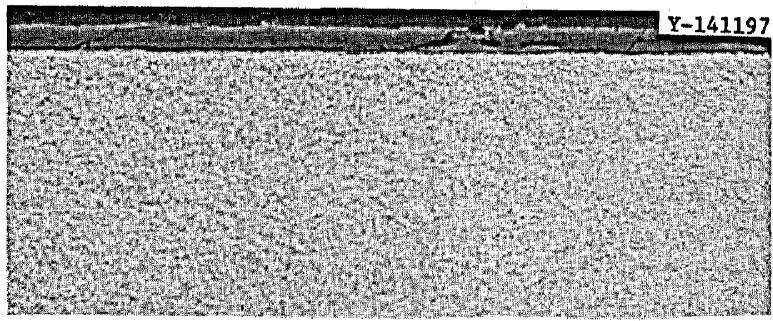

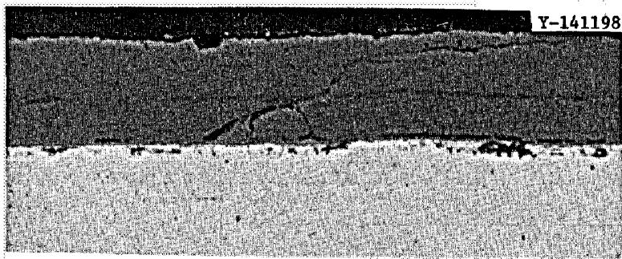

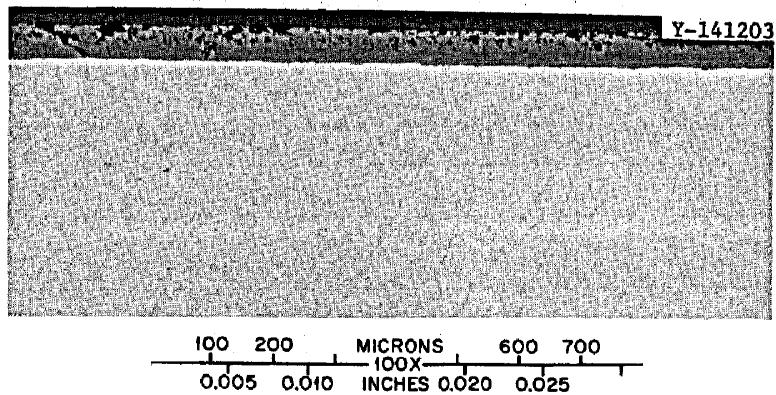

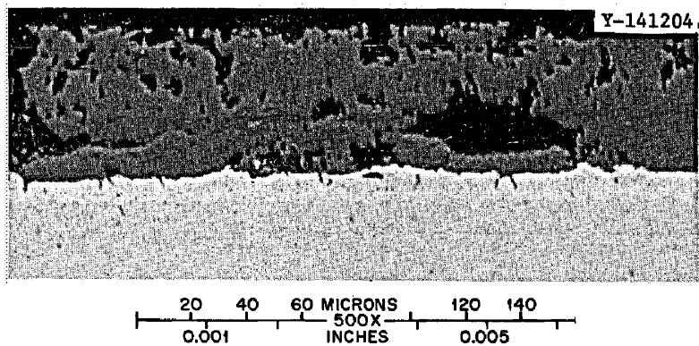  
Fig. 7. Photomicrographs of 2 l/4 Cr-l Mo Steel Exposed 7000 hr to Supercritical Steam at $538^{\circ}\mathrm{C}$ and 24.1 MPa (3500 psi). (a) and (b) Heat 72768, annealed at $927^{\circ}\mathrm{C}$ and air cooled. (c) and (d) Heat 72768, cold worked $50\%$ . (e) and (f) Heat NC annealed at $927^{\circ}\mathrm{C}$ and air cooled. As polished.

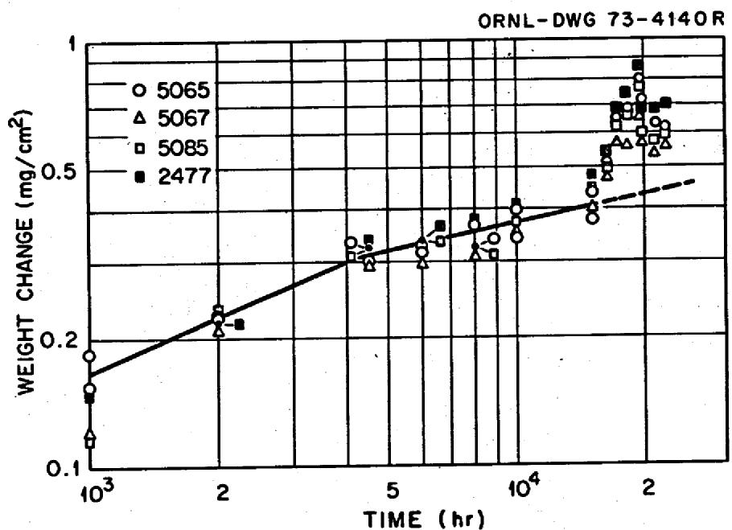  
Fig. 8. Weight Changes of Several Heats of Annealed Hastelloy N Exposed to Supercritical Steam at $538^{\circ}\mathrm{C}$ and 24.1 MPa (3500 psi).

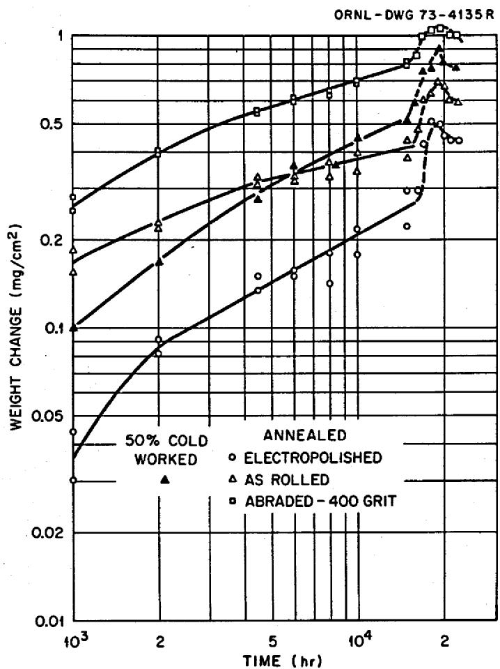  
Fig. 9. Effect of Surface Finish on the Corrosion of Hastelloy N (Heat 5065) in Steam at $538^{\circ}\mathrm{C}$ and 24.1 MPa (3500 psi).

One specimen was cold worked $50\%$ and tested with an as-rolled surface. The corrosion rate of this specimen was very near that of the annealed specimen with an as-rolled surface. Thus, cold working appears to have very little effect on the corrosion of Hastelloy N in steam. This is in agreement with the results of a prior study in which nickel-base alloys were noted to be less affected by cold working than high chromium steels.[6]

Specimens from small commercial heats of modified Hastelloy N containing from 0.10 to $2.1\%$ Ti were exposed to steam, and the results are summarized in Fig. 10. Alloys containing $0.1\%$ Ti (21546) and $0.49\%$ Ti (21545) gained weight more rapidly than the standard alloy. However, the slope (weight change per unit time for greater than 2000 hr) was quite low for both these alloys and about equivalent to that for the standard alloy at long times. Alloys containing 0.92, 1.30, and $2.1\%$ Ti gained less weight than standard Hastelloy N during 10,000 hr exposure. However, extrapolations to longer times would indicate that standard Hastelloy N and the alloys containing 0.10 and $0.50\%$ Ti would gain less weight than the alloys containing more titanium. One alloy containing $0.7\%$ Nb was also exposed and gained less weight than most of the titanium-modified alloys. The perturbation after long exposure times was due to the increased impurity level in the steam caused by the leaking condenser tubes. After the tubes were repaired, the specimen lost weight.

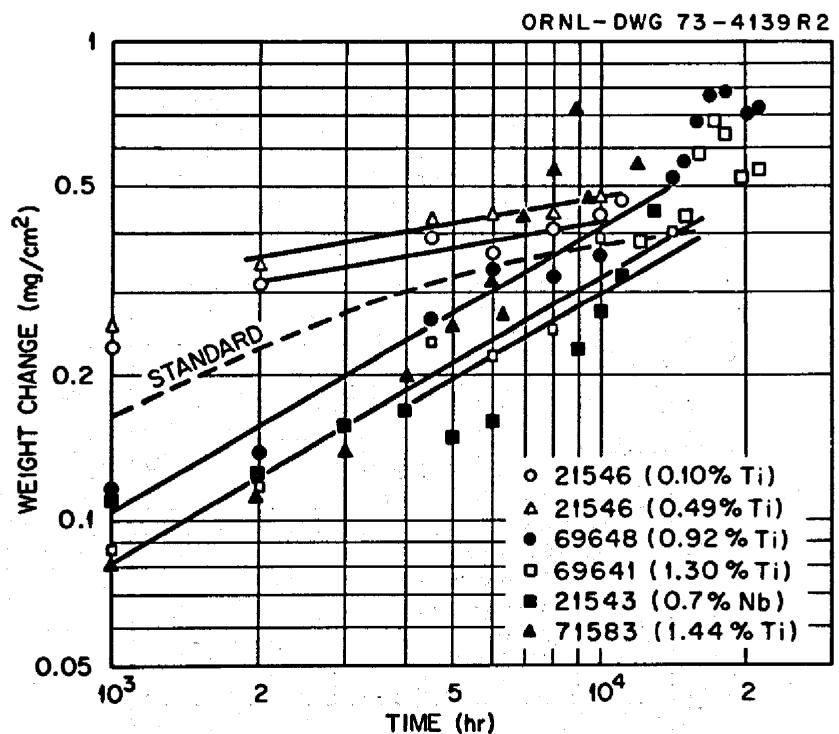  
Fig. 10. Several Alloys of Hastelloy N Modified with Titanium and Niobium and Exposed to Supercritical Steam at $538^{\circ}\mathrm{C}$ and 24.1 MPa (3500 psi).

Several laboratory melts of Hastelloy N containing additions of Ti, Al, Zr, Hf, Y, Ce, and Nb were exposed to steam for 22,000 hr, and the weight changes are shown in Fig. 11. Maximum and minimum weight changes in these alloys differed by less than a factor of 2, but only the alloy containing $1.03\%$ Nb gained less weight than the standard alloy. The perturbation after 15,000-hr exposure was due to leaking condenser tubes, and the specimen lost weight after the tubes were repaired.

Typical photomicrographs of two heats of standard Hastelloy N are shown in Fig. 12. The oxide was not of uniform thickness, but varied from a few to about $20~\mu \mathrm{m}$ thick. Electronmicroprobe studies revealed that both the inner and outer oxides contained Cr, Mo, Ni, and a trace of Fe.

Four of the modified Hastelloy N specimens were examined metallographically and typical photomicrographs are shown in Fig. 13. The oxides on all these alloys appear quite similar in morphology to those formed on standard Hastelloy N. Electronic microprobe scans of these samples revealed iron and nickel in the oxide of alloy 69648 (0.92% Ti), Fe, Ni, Cr, Ti, and Mo in the oxide of alloy 21543 (0.7% Nb), and nickel plus iron in the oxide of alloy 237 (1.03% Nb). The presence of iron in most of the oxides may have been attributable to the presence of iron particles in the steam. Since most of the steam circuit at Bull Run is constructed of low-alloy ferritic steels, large amounts of particulate iron are entrained in the steam and some deposit on the test specimens.

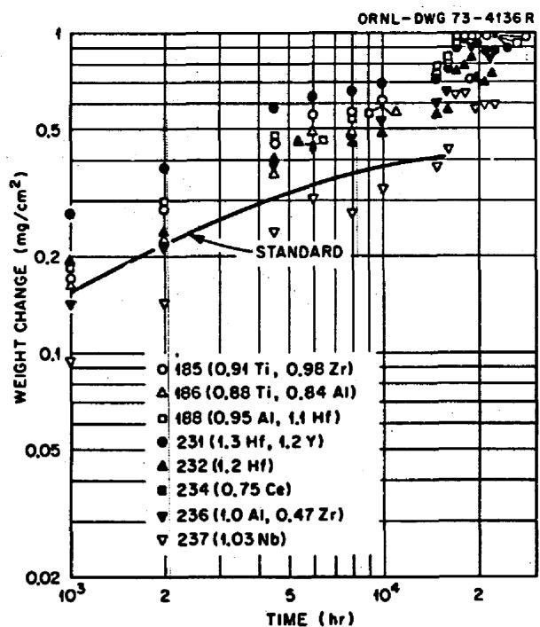  
Fig. 11. Corrosion of Various Modified Compositions of Hastelloy N in Steam at $538^{\circ}\mathrm{C}$ and 24.1 MPa (3500 psi).

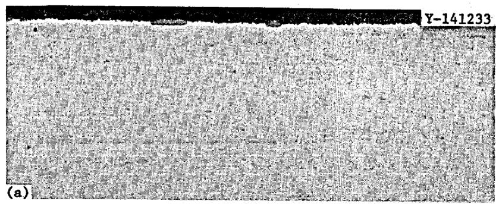

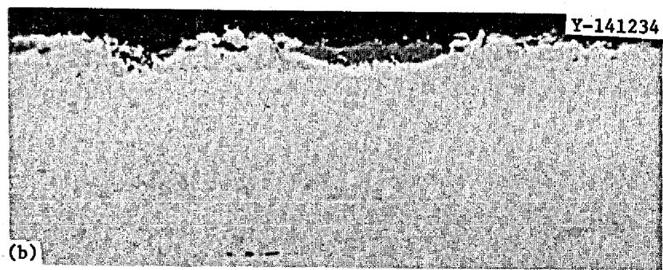

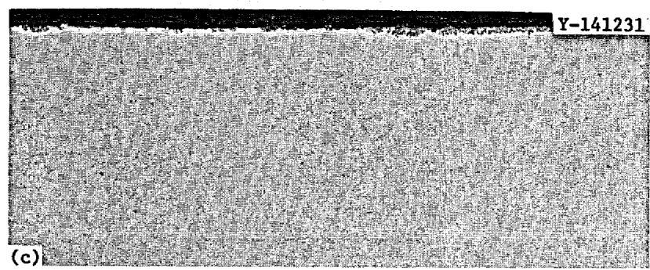

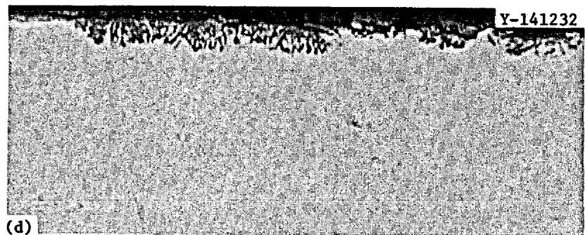

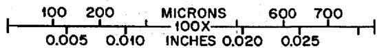

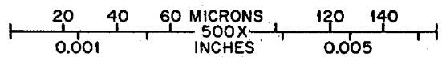  
Fig. 12. Photomicrographs of Hastelloy N Exposed to Steam at $538^{\circ}\mathrm{C}$ and 24.1 MPa (3500 psi) for 22,000 hr. (a) and (b) Heat 5065. (c) and (d) Heat 2477. As polished,

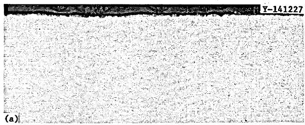

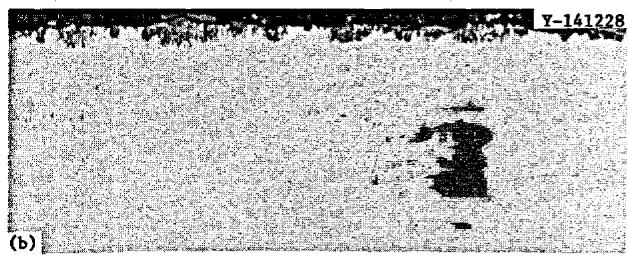

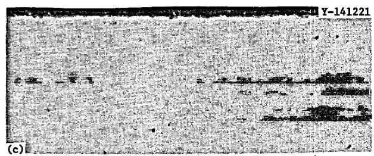

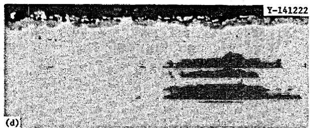

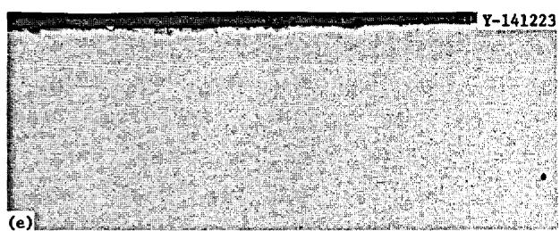

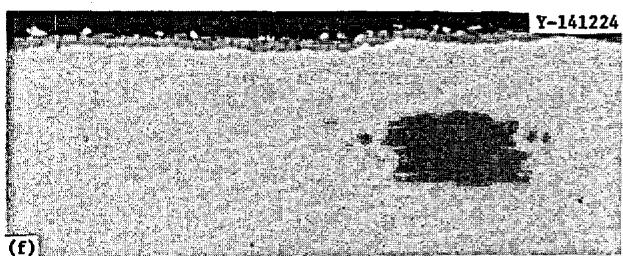

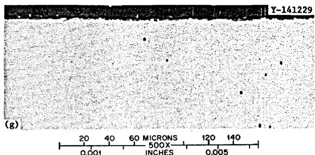

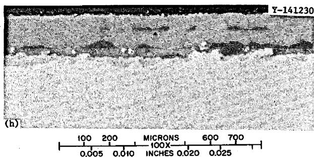  
Fig. 13. Photomicrographs of Modified Hastelloy N Exposed to Super-Critical Steam at $538^{\circ}\mathrm{C}$ and 24.1 MPa (3500 psi). (a) and (b) Heat 69648 (0.92% Ti), 21,000 hr. (c) and (d) Heat 71583 (1.44% Ti), 12,000 hr. (e) and (f) Heat 21543 (0.7% Nb), 16,000 hr. (g) and (h) Heat 237 (1.03% Nb), 21,000 hr. As polished.

# Stainless Steels

The data on stainless steels are given in Table A3 and the data for several selected steels are plotted in Fig. 14. These steels contain from 5 to $25\%$ Cr, and type 502 stainless steel with $5\%$ Cr has the highest oxidation rate. Type 17-7 PH steel contains $17\%$ Cr plus $1.15\%$ Al and has the lowest rate of weight change over the test period. The other four steels have about equal weight changes, but types 406 and 446 seem to be approaching a very low rate of weight gain.

Several of these same alloys were exposed in the cold-worked condition, and the observed weight changes of several of these alloys are shown in Fig. 15. Cold working reduced the corrosion rates of most steels studied by about a factor of 2, but had an even larger effect on type 201 stainless steel. This reduction of the corrosion rate of high chromium steels has been observed by other investigators.[7-9] The oxides on the annealed and cold-worked type 201 stainless steel specimens were subjected to x-ray diffraction after 6000-hr exposure to steam in an effort to determine a reason for the different oxidation behavior. The oxide on the annealed specimen consisted of $\mathrm{Fe}_{3}\mathrm{O}_{4}$ and $\alpha\text{-Fe}_2\mathrm{O}_3$ , and the oxide on the cold-worked specimen was $\mathrm{MnFe_2O_4}$ and $\alpha\text{-Fe}_2\mathrm{O}_3$ . The most striking difference in the two specimens was that the matrix lines for the annealed alloy were those of an fcc cell with a lattice parameter of $3.5975 \pm 0.0006$ A, and those for the cold-worked specimen were those of a bcc cell having a lattice parameter of $2.875 \pm 0.002$ A plus a fcc cell having approximately the same lattice parameter as above. The bcc lines were not present in an as-cold-worked specimen, so the phase likely formed during exposure to steam at $538^{\circ}\mathrm{C}$ . This bcc phase is possibly responsible in some undetermined way for the superior oxidation resistance of the cold-worked material. It is also possible that the formation of $\mathrm{MnFe_2O_4}$ on the cold-worked specimen may have increased its oxidation resistance.

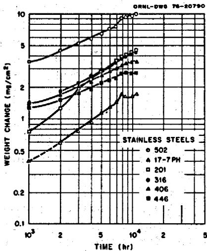  
Fig. 14. Weight Changes of Solution Annealed Stainless Steels in Steam at $538^{\circ}\mathrm{C}$ and 24.1 MPa (3500 psi).

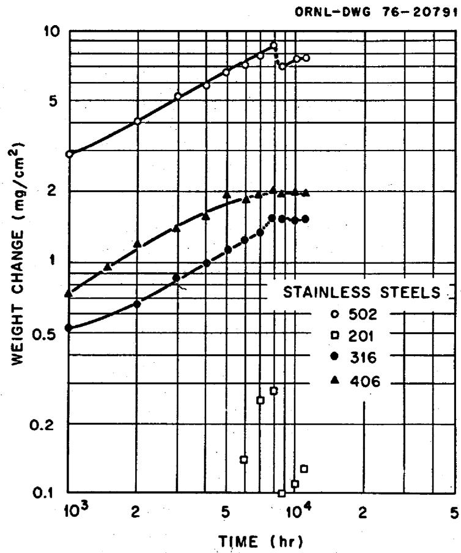  
Fig. 15. Weight Changes of Cold-Worked (50%) Stainless Steels in Steam at $538^{\circ}C$ and 24.1 MPa (3500 psi).

Six specimens of the stainless steel series were examined metallographically and typical photomicrographs are shown in Fig. 16. The 502 stainless steel with only $5\%$ Cr had an oxide film about $80~{\mu\mathrm{m}}$ thick. Electronic microprobe studies of the oxide on this specimen showed that the inner oxide contained iron and chromium and that only iron was detected in the outermost oxide. The oxides on the types 304 and 316 stainless steel specimens were quite similar to each other in morphology and were about $30~{\mu\mathrm{m}}$ thick. Electronic microprobe analysis showed that these specimens all had outer oxides in which only iron could be detected. The inner oxide of type 304 stainless steel contained iron, chromium, and nickel, and the inner oxide of type 316 stainless steel contained iron, nickel, chromium, and molybdenum. The photomicrographs of type 201 stainless steel show the marked effect of cold working on the rate of oxidation of this material. The oxide layer on the annealed material was about $40~{\mu\mathrm{m}}$ thick and that on the cold-worked materials was hardly detectable. On the annealed specimen the oxide consisted of two distinct layers with the inner one containing Fe, Mn, Cr, and Ni and the outer one containing iron and manganese. The oxide layer on the cold-worked specimen was too thin to analyze by the electronic microprobe analytical technique used.

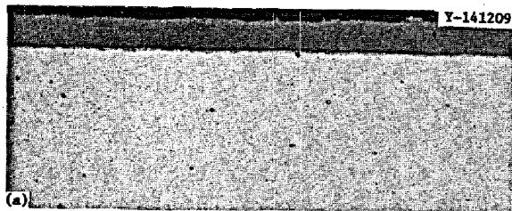

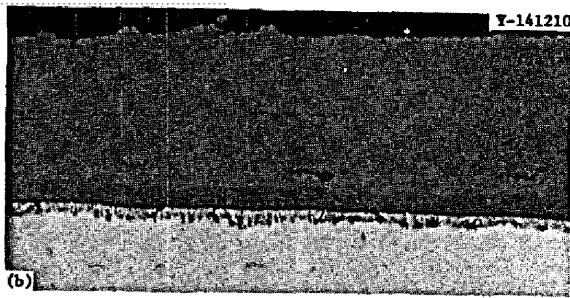

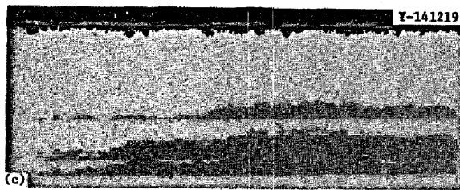

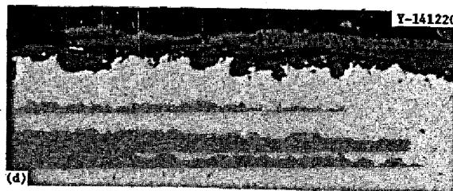

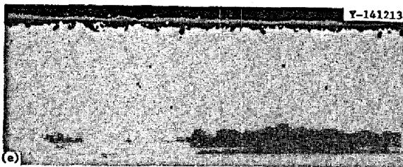

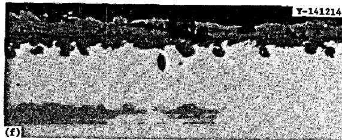

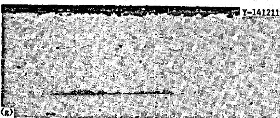

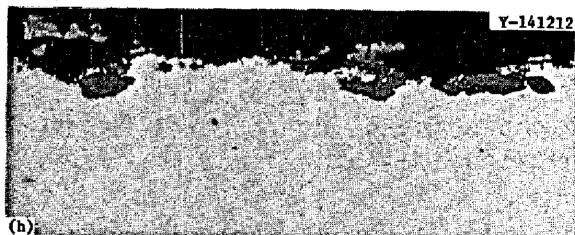

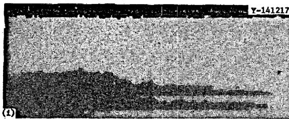

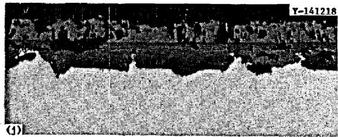

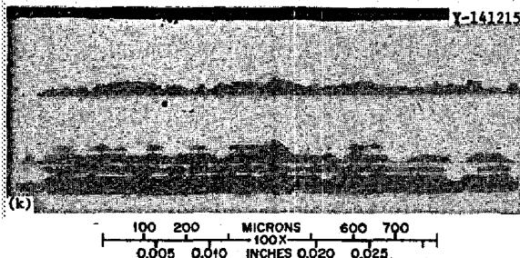

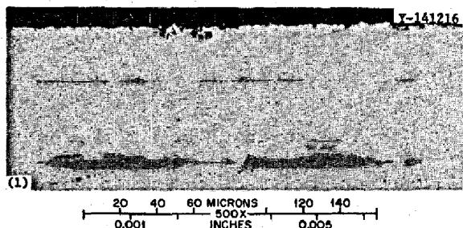  
Fig. 16. Photomicrographs of Several Steels Exposed to Steam at $538^{\circ}C$ and $24.1\mathrm{MPa}$ (3500 psi) for 11,000 hr (Type 304 Exposed 12,000 hr). (a) and (b) Annealed type 502. (c) and (d) As-received type 304. (e) and (f) Annealed type 316. (g) and (h) Cold-worked type 316. (i) and (j) Annealed type 201. (k) and (l) Cold-worked type 201. As polished.

# Other Alloys

Several other alloys were exposed to steam and their weight changes are shown in Figs. 17 through 20. In Fig. 17 the behavior of Armco iron, Monel, Incoloy 800, and several nickel-base alloys is shown. Monel and Armco iron gained weight at a very high rate whereas Inconel 718 gained weight at a very slow rate. Inconel 600 fell at an intermediate level of weight gain, and Inconel 601 fell at a lower level. Incoloy 800 gained weight at a relatively high rate for the first 2000 hr, but the rate rapidly decreased to where the rate was proportional to time to about the one tenth power.

The weight changes of several Hastelloys are shown in Fig. 18 and the data cover about one-half log cycle. These alloys contain from $0.2\%$ Cr (Hastelloy B) to $22\%$ Cr (Hastelloy X), but the differences in weight change are not simply inversely proportional to the chromium content.

The weight changes of several alloys in the cold-worked condition are shown in Fig. 19. By comparison with the annealed data in Figs. 17 and 18, some assessment can be made of the effects of cold working. Cold working caused Hastelloy B to gain weight at a faster rate and slightly reduced the weight gain of Incoloy 800. The weight gain of Inconel 718 appeared to be increased slightly by cold working, but the values are still so low that inaccuracies in weighing make this conclusion rather tenuous. The weight gained in the first 1000 hr was increased by cold working for several of the Hastelloys, but the rate slowed to where weight changes were about equivalent after a few thousand hours for annealed and cold-worked material.

The weight changes of three alloys in the annealed and cold-worked conditions are shown in Fig. 20. Haynes Alloy 188 gained weight more rapidly in the cold-worked condition than in the annealed condition, but the difference was quite small after 10,000-hr exposure. The weight changes of all these alloys were quite low.

Three specimens from this series were examined metallographically and typical photomicrographs are shown in Fig. 21. Incoloy 800 had a very irregular oxide with the thickness in some areas as much as $10~\mu \mathrm{m}$ . Examination by the electron microprobe showed that the inner oxide contained iron, nickel, and chromium, and that the outer oxide contained only iron in detectable quantities. This is in qualitative agreement with the observations of Tilborg and Linde.[10] Inconel 718 in the annealed condition formed a subsurface reaction product to a depth of about $15~\mu \mathrm{m}$ during exposure to steam, but this product was not present in the material cold worked prior to exposure. The oxide was too thin to be analyzed on the annealed specimen, but analysis of the oxide on the cold-worked specimen revealed the presence of iron, nickel, and chromium.

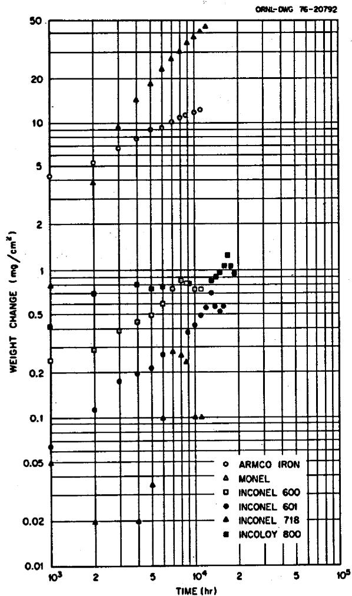  
Fig. 17. Weight Changes of Several Solution-Annealed Alloys in Steam at $538^{\circ}\mathrm{C}$ and 24.1 MPa (3500 psi).

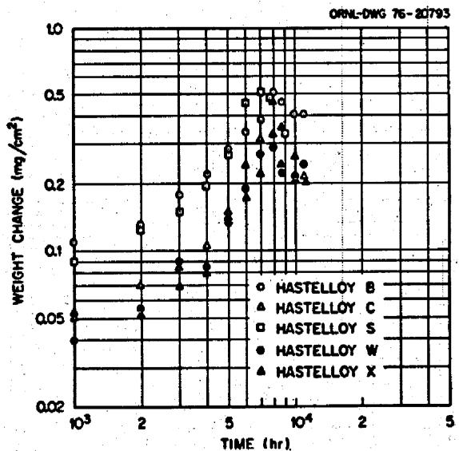  
Fig. 18. Weight Changes of Several Nickel-Base Alloys in the Solution-Annealed Condition in Steam at $538^{\circ}\mathrm{C}$ and 24.1 MPa (3500 psi).

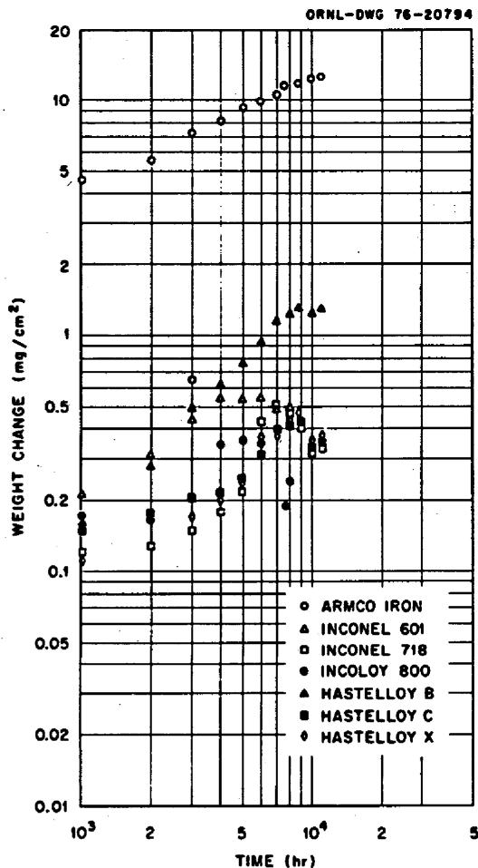  
Fig. 19. Weight Changes of Several Alloys in the Cold-Worked Condition in Steam at 24.1 MPa (3500 psi) and $538^{\circ}\mathrm{C}$ .

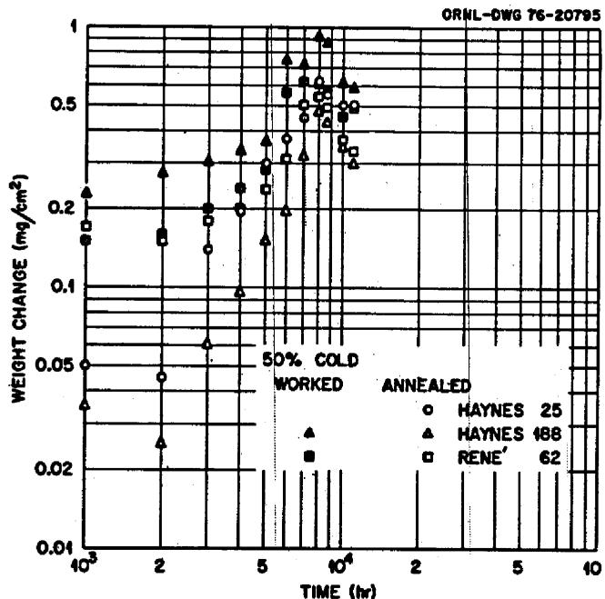  
Fig. 20. Weight Changes of Three Alloys in Steam at 24.1 MPa (3500 psi) and $538^{\circ}\mathrm{C}$ in the Annealed and Cold-Worked Conditions.

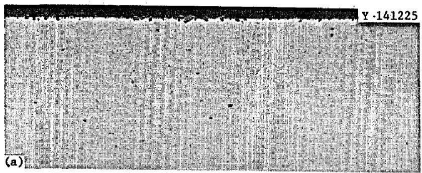

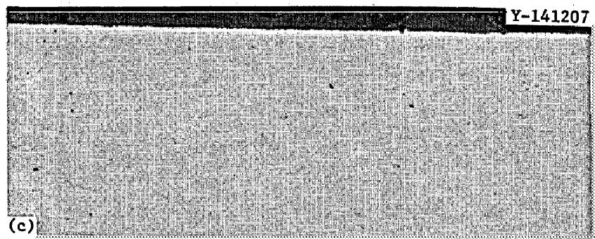

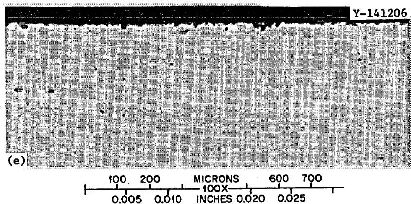

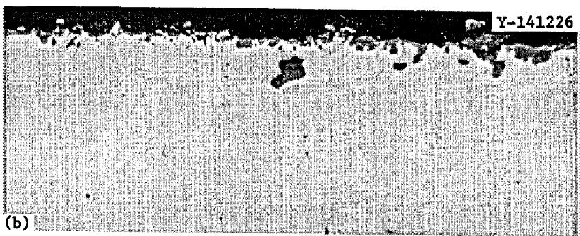

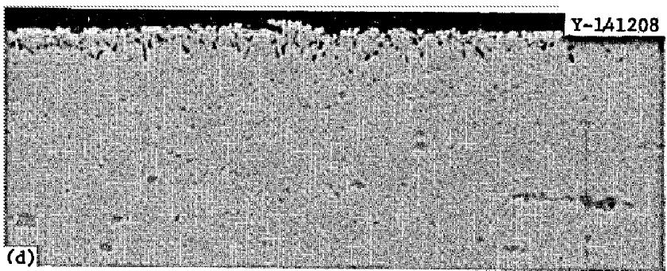

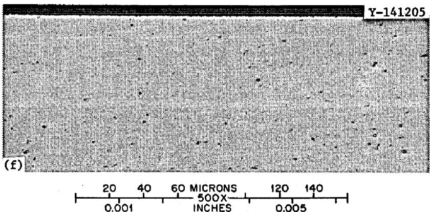  
Fig. 21. Photomicrographs of Specimens Exposed to Steam at $538^{\circ}\mathrm{C}$ and 24.1 MPa (3500 psi). (a) and (b) Annealed Incoloy 800, 19,000 hr. (c) and (d) Annealed Inconel 718, 11,000 hr. (e) and (f) Cold-worked Inconel 718, 11,000 hr. As polished.

# Tube Burst Results - Hastelloy N

Two heats of standard Hastelloy N tubing (N1 5095 and N2 5101) were evaluated in the stressed condition from 193 to 531 MPa (28.0 to $77.0 \times 10^{3} \mathrm{psi}$ ). The specimens of both heats in the annealed condition (1 hr at $1177^{\circ}\mathrm{C}$ ) had shorter rupture times in steam than in argon. Specimens of heat N1 5095 tested in the as-received condition and stressed below $345 \mathrm{MPa}$ ( $50.0 \times 10^{3} \mathrm{psi}$ ) in steam had rupture times equal to those of specimens tested in argon. Figure 22 shows the stress-rupture properties of heat N1 5095. Flaws in the specimens may have contributed to the scatter, but at stresses $<345 \mathrm{MPa}$ ( $<50.0 \times 10^{3} \mathrm{psi}$ ), where wall thicknesses are heavier, there appears to be no significant effect of steam on the rupture time. Two of the specimens stressed at 193 and $280 \mathrm{MPa}$ (28.0 and $40.6 \times 10^{3} \mathrm{psi}$ ) accumulated 15,000-hr exposure to steam at $538^{\circ}\mathrm{C}$ without rupture and three others at slightly higher stresses accumulated from 10,000 to 11,000 hr of exposure. Figure 23 shows the stress-rupture properties of heat N2 5101. Specimens in the annealed condition tested in steam had shorter rupture times than specimens tested in argon. Specimens in the as-received condition tested in steam had rupture times equal to or greater than specimens tested in argon. The longest rupture time of this heat was 12,000 hr for a specimen stressed at $336 \mathrm{MPa}$ ( $48.8 \times 10^{3} \mathrm{psi}$ ) in steam at $538^{\circ}\mathrm{C}$ .

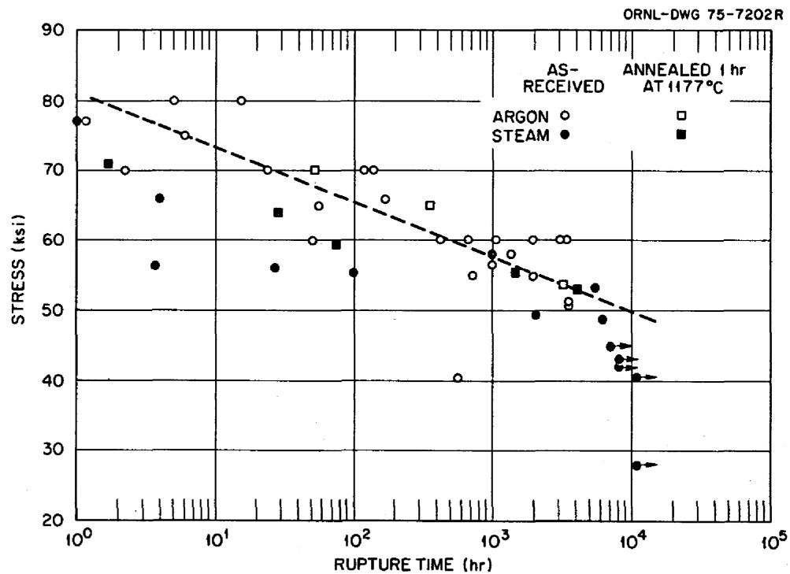  
Fig. 22. Rupture Life of Hastelloy N (Heat N1 5095). Tubes stressed in argon and steam environments at $538^{\circ}\mathrm{C}$ .

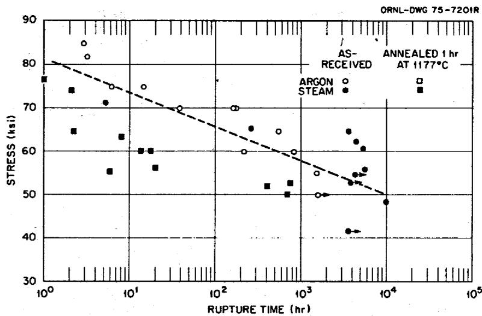  
Fig. 23. Rupture Life of Hastelloy N (Heat N2 5101). Tubes stressed in argon and steam environments at $j38^{\circ}C$ .

The minimum creep rates of both heats of material were plotted as a function of stress in Fig. 24. The creep rates were calculated from plots of diametral strain, $\Delta D / D$ vs time, which were based on measurements of the internal diameter of the specimens at 1000-hr intervals. There is considerable scatter in the data because of difficulty in measuring the internal diameters at the point of maximum strain, but the figure is useful as an indication of the strain rates expected in this stress range. Buildup of scale on the inside diameter exposed to steam also contributes to the inaccuracy of this method since the apparent strain is reduced as the scale thickens.

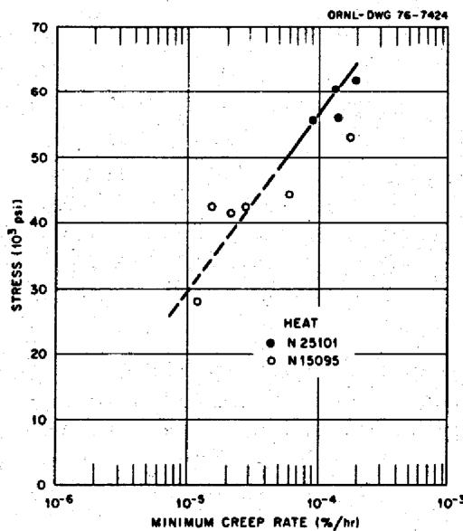  
Fig. 24. Creep Properties of Hastelloy N at $538^{\circ}\mathrm{C}$ in Steam Environment.

Four typical fractured specimens are shown in Fig. 25. In each case the outer protective tube has been machined off. The three short-term test specimens (1.65 to 75.3 hr) exhibited relatively ductile tearing fracture indicative of a very high strain rate at the moment of fracture. The specimen from the 2089-hr test had a lower ductility failure.

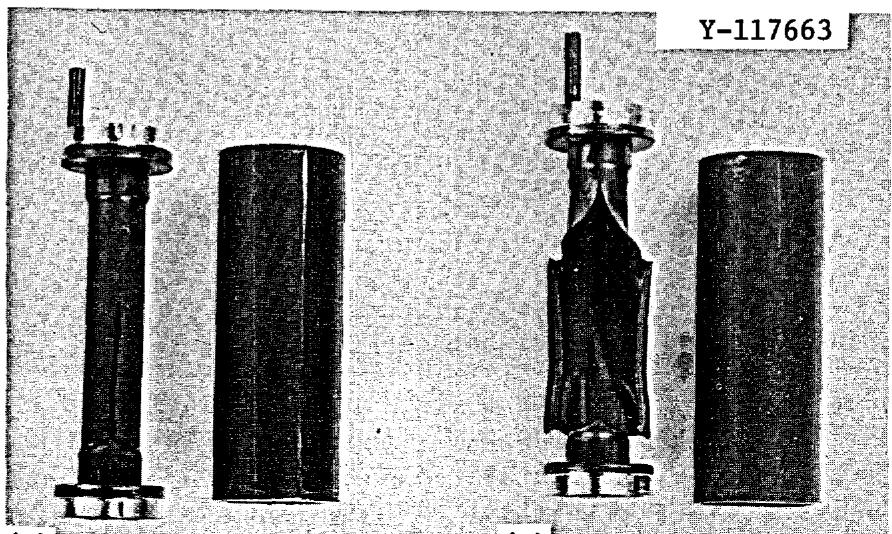  
(a)   
(b)

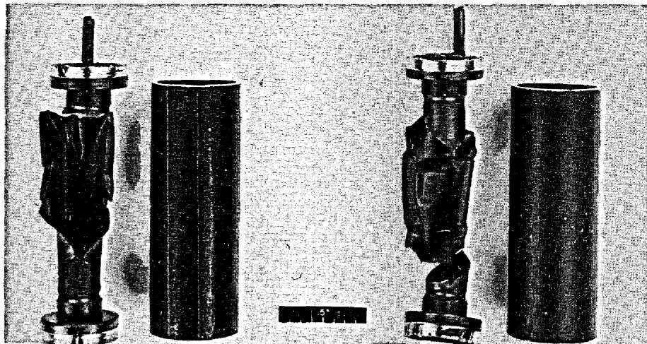  
(c)   
(d)   
Fig. 25. Photographs of Four Specimens Failed in Steam. See Fig. 1 for a schematic drawing of the assembled specimen. (a) SN 64, 340 MPa (49,340 psi), rupture at 2088.75 hr. (b) SN 118, 410 MPa (59,500 psi), rupture at 75.3 hr. (c) SN 111, 441 MPa (64,000 psi), rupture at 28.75 hr. (d) SN 106, 489 MPa (70,940 psi), rupture at 1.65 hr.

# SUMMARY

The corrosion of several alloys in supercritical steam at $538^{\circ}\mathrm{C}$ and 24.1 MPa (3500 psi) was measured for times up to 22,000 hr. Various post-test examinations were performed, and the following important observations were made.

1. All the alloys formed tenacious, nonspalling oxides when tested in steam.   
2. The corrosion rates of five ferritic alloys containing from 1.1 to $8.7\%$ Cr and 0.5 to $1.0\%$ Mo and four heats of 2 1/4 Cr-1 Mo steel containing from 0.009 to $0.12\%$ C were equal to within a factor of 2.   
3. Cold working prior to exposure did not have a detectable effect on the corrosion of 2 l/4 Cr-1 Mo steel.   
4. The oxide layer formed on the ferritic steel was about $50~\mu \mathrm{m}$ thick and consisted of two distinct layers. The layer next to the metal contained detectable quantities of Fe, Cr, Mo, and Si, and the outermost oxide contained only iron.   
5. The corrosion rate of Hastelloy N in steam increased with increasing surface roughness.   
6. Although rather large changes were made in the composition of Hastelloy N, the corrosion rate was altered by no more than a factor of 2.   
7. The oxide on Hastelloy N was quite irregular with the thickness in different locations varying from a few to $20~\mu \mathrm{m}$ . The surface of the oxide was quite high in iron, and this was likely due to the deposition of particulate iron from the steam circuit.   
8. The corrosion rates of several steels containing from 5 to $25\%$ Cr varied by an order of magnitude. The highest corrosion rate was exhibited by type 502 with $5\%$ Cr and the least by type 17 - 7 PH with $17\%$ Cr and $1.15\%$ Al.   
9. Cold working cause a large reduction in the corrosion rate of type 201 stainless steel. This reduction was associated with either the formation of a bcc phase or the spinel $\mathrm{MnFe_2O_4}$ that formed on the cold-worked material. Cold working has a lesser effect on the other high-chromium steels, but generally decreased the corrosion rates.   
10. Oxides on the stainless steels generally consisted of 2 distinct layers. The layer closest to the metal contained all principal constituents of the alloy, and the outer oxide contained only iron in detectable quantities.

11. Several iron- and nickel-base alloys were tested. Inconel 718 had the lowest weight gains, and Incoloy 800 had the lowest corrosion rate with a dependence on (time) $^{0.1}$ .   
12. The inner oxide on Incoloy 800 contained iron, nickel, and chromium, and the outer oxide contained only iron in detectable quantities. The oxide on Inconel 718 contained iron, nickel, and chromium.   
13. Inconel 718 in the annealed condition formed a subsurface reaction product to a depth of about $15\mu \mathrm{m}$ , but this product was not present in the cold-worked material.   
14. Although some small difference existed in the behavior of annealed and cold-worked nickel-base alloys, the effects were reasonably small.   
15. The stress-rupture properties of Hastelloy N were lower in steam than in argon at short rupture times, but were equivalent at long rupture times.

# ACKNOWLEDGMENTS

The authors are indebted to TVA for allowing this test facility to be placed in the Bull Run Steam Plant. P. Wade, C. F. Dye, R. C. Bishop, and C. S. Voles of TVA were very helpful in the day-to-day operation of the facility. The metallography in this report was prepared by W. H. Farmer, the electron microprobe work was performed by R. S. Crouse, the drawings were prepared by the ORNL Graphic Arts Department, and the manuscript was prepared by J. L. Bishop of the Metals and Ceramics Division Reports Office. The authors are grateful to J. P. Hammond, J. C. Griess, and C. R. Brinkman for their technical review of the manuscript.

# REFERENCES

1. C. N. Spalaris et al., Materials for Nuclear Superheater Applications, GEAP-3875 (1962).   
2. H. E. McCoy and B. McNabb, Corrosion of Several Iron- and Nickel-Base Alloys in Supercritical Steam at $1000^{\circ}F$ , ORNL/TM-4552 (1974).   
3. Tennessee Valley Authority, The Bull Run Steam Plant, TVA Technical Report 38, Knoxville, Tennessee, 1967.   
4. W. E. Ruther, R. R. Schlueter, R. H. Lee, and R. K. Hart, "Corrosion Behavior of Steels and Nickel Alloys in Superheated Steam," Corrosion 22: 147 (1966).

5. Par L. Grall, "Les aciers inoxydables et les alliages a base de nickel Etude de leurs propriéties de resistance a la corrosion dans la vepeur surchauffée, Bull. Inform. Sci. Tech. 139: 19 (1969).   
6. S. Leistikow, H. V. Berg, and E. Pott, Long-Time Corrosion Studies on Austenitic Cr-Ni Steel and Nickel-Base Alloys in Superheated Steam (620 C, 1 atm), with Special Attention to the Behavior of Cold-Formed Materials Surfaces, Report KFK-1301, Karlsruhe Nuclear Research Center (February 1971).   
7. Societe d'Etudes, de Recherche et d'Applications pour l'Industrie, Brussels, Studies of Steel Corrosion in High Temperature Water and Steam, Final Report. No. 1, June 16, 1962-October 31, 1965, Report EURAEC-1581 (1965).   
8. W. E. Ruther and U. S. Greenberg, J. Electrochem. Soc. 111: 1116-1121 (1964).   
9. J. P. Hammond, P. Patriarca, G. M. Slaughter, and W. A. Maxwell, "Corrosion of Incoloy 800 and Nickel-Base Alloy Weldments in Steam," Weld. J. (Miami) 52(6): 268-s-280-s (June 1973).   
10. P. J. van Tilborg, and A. van der Linde, Corrosion of Inconel-625 Hastelloy X280 and Incoloy-800 in 550-750°C Superheated Steam, Report RCN-109, Reactor Centrum Nederland, Pettern, The Netherlands (October 1969).

# APPENDIX

Collected Weight Change Data for Various Metals and Alloys Exposed to Supercritical Steam at 24.1 MPa (3500 psi) and $538^{\circ}\mathrm{C}$

Table A1. Weight Change Data for First Set of Specimens of Low-Alloy Ferritic and Maraging Steels   

<table><tr><td rowspan="2">Alloy</td><td rowspan="2">Specimen</td><td rowspan="2">Area (cm2)</td><td colspan="11">Weight Gain, mg/cm2, at Various Times in hr</td></tr><tr><td>670</td><td>1,000</td><td>2,000</td><td>2,482</td><td>4,000</td><td>4,482</td><td>6,000</td><td>8,000</td><td>10,000</td><td>13,000</td><td>14,000</td></tr><tr><td rowspan="3">Cr 1.1a</td><td>172</td><td>13.6924</td><td></td><td>3.14</td><td>3.78</td><td></td><td></td><td>5.12</td><td>6.00</td><td>6.47</td><td>6.80</td><td></td><td>9.12</td></tr><tr><td>173</td><td>13.6444</td><td></td><td>3.21</td><td></td><td></td><td></td><td></td><td></td><td></td><td></td><td></td><td></td></tr><tr><td>205</td><td>13.6221</td><td>2.31</td><td></td><td></td><td>4.22</td><td>4.96</td><td></td><td>5.37</td><td>5.60</td><td>6.22</td><td>7.74</td><td></td></tr><tr><td rowspan="4">Cr 1.9a</td><td>202</td><td>13.5654</td><td>3.97</td><td></td><td></td><td>6.30</td><td>7.98</td><td></td><td></td><td></td><td></td><td></td><td></td></tr><tr><td>208</td><td>13.6392</td><td>4.28</td><td></td><td></td><td>7.95</td><td>8.53</td><td></td><td>8.89</td><td>8.89</td><td>9.78</td><td>11.71</td><td></td></tr><tr><td>163</td><td>13.6274</td><td></td><td>4.94</td><td></td><td></td><td></td><td></td><td></td><td></td><td></td><td></td><td></td></tr><tr><td>164</td><td>13.6355</td><td></td><td>4.93</td><td>5.98</td><td></td><td></td><td>7.57</td><td>8.90</td><td>9.31</td><td>9.81</td><td></td><td>12.03</td></tr><tr><td rowspan="4">Cr 2.0a</td><td>166</td><td>13.6369</td><td></td><td>3.93</td><td></td><td></td><td></td><td></td><td></td><td></td><td></td><td></td><td></td></tr><tr><td>167</td><td>13.6287</td><td></td><td>3.40</td><td>4.32</td><td></td><td></td><td>5.80</td><td>6.93</td><td>7.37</td><td>7.63</td><td></td><td>9.60</td></tr><tr><td>203</td><td>13.5638</td><td>2.90</td><td></td><td></td><td>4.63</td><td>5.91</td><td></td><td></td><td></td><td></td><td></td><td></td></tr><tr><td>209</td><td>13.5759</td><td>2.73</td><td></td><td></td><td>4.51</td><td>5.77</td><td></td><td>6.08</td><td>6.53</td><td>7.31</td><td>8.96</td><td></td></tr><tr><td rowspan="3">Cr 4.2a</td><td>204</td><td>13.5999</td><td>3.76</td><td></td><td></td><td>6.14</td><td>7.74</td><td></td><td>8.07</td><td>8.64</td><td>9.97</td><td>11.88</td><td></td></tr><tr><td>169</td><td>13.6329</td><td></td><td>3.98</td><td>5.13</td><td></td><td></td><td>6.83</td><td>7.97</td><td>8.48</td><td>8.96</td><td></td><td>10.41</td></tr><tr><td>170</td><td>13.5955</td><td></td><td>4.49</td><td>6.89</td><td></td><td></td><td></td><td></td><td></td><td></td><td></td><td></td></tr><tr><td rowspan="3">Cr 8.7a</td><td>175</td><td>13.6411</td><td></td><td>3.77</td><td></td><td></td><td></td><td></td><td></td><td></td><td></td><td></td><td></td></tr><tr><td>176</td><td>13.6668</td><td></td><td>3.73</td><td>4.56</td><td></td><td></td><td>5.98</td><td>7.03</td><td>7.43</td><td>7.68</td><td></td><td>9.71</td></tr><tr><td>206</td><td>13.6558</td><td>2.74</td><td></td><td></td><td>5.81</td><td>6.27</td><td></td><td>6.27</td><td>6.57</td><td>7.29</td><td>8.79</td><td></td></tr><tr><td rowspan="3">12-5-3b</td><td>207</td><td>13.5928</td><td>3.97</td><td></td><td></td><td>6.61</td><td>8.91</td><td></td><td>9.73</td><td>10.22</td><td>11.33</td><td>13.99</td><td></td></tr><tr><td>178</td><td>13.5173</td><td></td><td>6.33</td><td></td><td></td><td></td><td></td><td></td><td></td><td></td><td></td><td></td></tr><tr><td>179</td><td>13.4833</td><td></td><td>6.16</td><td>7.37</td><td></td><td></td><td>9.48</td><td>11.04</td><td>11.77</td><td>12.13</td><td></td><td>15.48</td></tr></table>

$^{\mathbf{a}}$ Low-alloy ferritic steel annealed 1 hr at $927^{\circ}\mathrm{C}$ in argon.   
b12-5-3 maraging steel annealed 1 hr at $816^{\circ}C$ in argon.

Table A2. Weight Change Data for Second Set of Specimens of Low-Alloy Ferritic and Maraging Steels   

<table><tr><td rowspan="2">Alloy</td><td rowspan="2">Conditiona</td><td rowspan="2">Specimen</td><td rowspan="2">Area (cm2)</td><td colspan="7">Weight Gain, mg/cm2, at Various Times in hr</td></tr><tr><td>1100</td><td>2000</td><td>3000</td><td>4000</td><td>4700</td><td>6000</td><td>7000</td></tr><tr><td>LC</td><td>A</td><td>481</td><td>13.9030</td><td>2.88</td><td>3.40</td><td>4.10</td><td>4.88</td><td>4.98</td><td>5.34</td><td>5.72</td></tr><tr><td>LC</td><td>A</td><td>482</td><td>13.8512</td><td>2.75</td><td>3.42</td><td>4.14</td><td>4.84</td><td>4.99</td><td>5.35</td><td>5.73</td></tr><tr><td>LC</td><td>B</td><td>483</td><td>13.9548</td><td>2.68</td><td>3.39</td><td>4.19</td><td>4.86</td><td>5.04</td><td>5.45</td><td>5.82</td></tr><tr><td>LC</td><td>B</td><td>484</td><td>13.8130</td><td>2.75</td><td>3.53</td><td>4.28</td><td>4.98</td><td>5.14</td><td>5.60</td><td>6.03</td></tr><tr><td>MC</td><td>A</td><td>489</td><td>13.6378</td><td>3.20</td><td>4.16</td><td>4.99</td><td>5.73</td><td>5.91</td><td>6.37</td><td>6.85</td></tr><tr><td>MC</td><td>A</td><td>490</td><td>13.8373</td><td>4.08</td><td>5.43</td><td>6.15</td><td>7.00</td><td>7.46</td><td>8.35</td><td>9.01</td></tr><tr><td>MC</td><td>B</td><td>491</td><td>13.9548</td><td>2.96</td><td>3.86</td><td>4.64</td><td>5.35</td><td>5.50</td><td>5.96</td><td>6.39</td></tr><tr><td>MC</td><td>B</td><td>492</td><td>13.8650</td><td>3.77</td><td>5.14</td><td>5.91</td><td>6.82</td><td>7.34</td><td>7.90</td><td>8.38</td></tr><tr><td>NC</td><td>A</td><td>485</td><td>13.7092</td><td>3.08</td><td>3.85</td><td>4.52</td><td>5.18</td><td>5.30</td><td>5.70</td><td>6.12</td></tr><tr><td>NC</td><td>A</td><td>486</td><td>13.6301</td><td>3.96</td><td>5.10</td><td>6.02</td><td>6.88</td><td>7.22</td><td>7.21</td><td>7.41</td></tr><tr><td>NC</td><td>B</td><td>487</td><td>13.5783</td><td>3.31</td><td>4.35</td><td>5.22</td><td>5.99</td><td>6.17</td><td>6.67</td><td>7.17</td></tr><tr><td>NC</td><td>B</td><td>488</td><td>13.7993</td><td>4.18</td><td>5.41</td><td>6.15</td><td>6.93</td><td>7.40</td><td>7.88</td><td>8.23</td></tr><tr><td>72768</td><td>A</td><td>517</td><td>13.6437</td><td>2.92</td><td>3.59</td><td>4.52</td><td>5.07</td><td>5.32</td><td>5.56</td><td>5.90</td></tr><tr><td>72768</td><td>A</td><td>518</td><td>13.6165</td><td>2.96</td><td>3.65</td><td>4.52</td><td>5.10</td><td>5.37</td><td>5.60</td><td>5.95</td></tr><tr><td>72768</td><td>B</td><td>519</td><td>13.6956</td><td>2.96</td><td>3.69</td><td>4.64</td><td>5.28</td><td>5.54</td><td>5.80</td><td>6.16</td></tr><tr><td>72768</td><td>B</td><td>520</td><td>13.7200</td><td>2.85</td><td>3.59</td><td>4.61</td><td>5.20</td><td>5.45</td><td>5.70</td><td>6.08</td></tr><tr><td>Cr 1.1</td><td>A</td><td>493</td><td>11.0218</td><td>3.84</td><td>4.81</td><td>5.63</td><td>6.33</td><td>6.47</td><td>6.92</td><td>6.58</td></tr><tr><td>Cr 1.1</td><td>A</td><td>494</td><td>13.7718</td><td>3.75</td><td>4.97</td><td>5.56</td><td>6.24</td><td>6.70</td><td>7.17</td><td>6.90</td></tr><tr><td>Cr 1.1</td><td>B</td><td>495</td><td>13.4363</td><td>2.69</td><td>3.45</td><td>4.11</td><td>4.67</td><td>4.79</td><td>5.15</td><td>5.51</td></tr><tr><td>Cr 1.1</td><td>B</td><td>496</td><td>13.6437</td><td>3.62</td><td>4.74</td><td>5.39</td><td>5.39</td><td>6.47</td><td>6.90</td><td>7.34</td></tr><tr><td>Cr 1.9</td><td>A</td><td>497</td><td>13.7611</td><td>3.55</td><td>4.69</td><td>5.55</td><td>6.25</td><td>6.41</td><td>6.88</td><td>7.33</td></tr><tr><td>Cr 1.9</td><td>A</td><td>498</td><td>13.7337</td><td>4.35</td><td>5.78</td><td>6.60</td><td>7.38</td><td>7.78</td><td>8.32</td><td>8.70</td></tr><tr><td>Cr 1.9</td><td>B</td><td>499</td><td>13.8159</td><td>3.42</td><td>4.63</td><td>5.57</td><td>6.31</td><td>6.49</td><td>6.99</td><td>7.52</td></tr><tr><td>Cr 1.9</td><td>B</td><td>500</td><td>13.9780</td><td>4.29</td><td>5.74</td><td>6.58</td><td>7.48</td><td>8.00</td><td>8.59</td><td>8.96</td></tr><tr><td>Cr 2.0</td><td>A</td><td>501</td><td>13.7365</td><td>3.14</td><td>4.20</td><td>4.99</td><td>5.56</td><td>5.70</td><td>6.07</td><td>6.40</td></tr><tr><td>Cr 2.0</td><td>A</td><td>502</td><td>13.6573</td><td>4.14</td><td>5.37</td><td>6.20</td><td>6.91</td><td>7.37</td><td>7.89</td><td>7.94</td></tr><tr><td>Cr 2.0</td><td>B</td><td>503</td><td>13.7092</td><td>3.49</td><td>4.72</td><td>5.63</td><td>6.22</td><td>6.34</td><td>6.74</td><td>7.25</td></tr><tr><td>Cr 2.0</td><td>B</td><td>504</td><td>13.7092</td><td>4.09</td><td>5.49</td><td>6.37</td><td>7.15</td><td>7.59</td><td>8.10</td><td>8.43</td></tr><tr><td>Cr 4.2</td><td>A</td><td>505</td><td>13.6845</td><td>3.84</td><td>4.47</td><td>5.61</td><td>6.26</td><td>6.64</td><td>6.85</td><td>7.15</td></tr><tr><td>Cr 4.2</td><td>A</td><td>506</td><td>13.6301</td><td>4.45</td><td>5.72</td><td>6.58</td><td>7.34</td><td>7.75</td><td>8.18</td><td>8.48</td></tr><tr><td>Cr 4.2</td><td>B</td><td>507</td><td>13.7337</td><td>4.30</td><td>5.65</td><td>6.49</td><td>7.36</td><td>7.83</td><td>8.47</td><td>8.93</td></tr><tr><td>Cr 4.2</td><td>B</td><td>508</td><td>13.5130</td><td>3.35</td><td>4.13</td><td>5.30</td><td>5.97</td><td>6.37</td><td>6.70</td><td>7.10</td></tr><tr><td>Cr 8.7</td><td>A</td><td>509</td><td>13.7092</td><td>3.03</td><td>3.67</td><td>4.14</td><td>4.79</td><td>5.08</td><td>5.41</td><td>5.65</td></tr><tr><td>Cr 8.7</td><td>A</td><td>510</td><td>13.5621</td><td>3.05</td><td>3.70</td><td>4.17</td><td>4.82</td><td>5.12</td><td>5.45</td><td>5.72</td></tr><tr><td>Cr 8.7</td><td>B</td><td>511</td><td>13.7092</td><td>2.63</td><td>3.26</td><td>4.15</td><td>4.73</td><td>5.05</td><td>5.33</td><td>5.70</td></tr><tr><td>Cr 8.7</td><td>B</td><td>512</td><td>13.7611</td><td>2.58</td><td>3.21</td><td>4.04</td><td>4.61</td><td>4.91</td><td>5.18</td><td>5.55</td></tr><tr><td>12-5-3</td><td>A</td><td>513</td><td>13.6546</td><td>6.14</td><td>7.60</td><td>9.40</td><td>10.7</td><td>11.3</td><td>12.0</td><td>12.7</td></tr><tr><td>12-5-3</td><td>A</td><td>514</td><td>13.7993</td><td>5.97</td><td>7.31</td><td>9.26</td><td>10.5</td><td>11.1</td><td>11.8</td><td>12.5</td></tr><tr><td>12-5-3</td><td>C</td><td>515</td><td>13.5016</td><td>3.63</td><td>4.87</td><td>6.65</td><td>7.86</td><td>8.39</td><td>9.04</td><td>9.79</td></tr><tr><td>12-5-3</td><td>C</td><td>516</td><td>13.6325</td><td>3.43</td><td>4.64</td><td>6.39</td><td>7.66</td><td>8.18</td><td>8.80</td><td>9.56</td></tr></table>

${}^{\mathbf{a}}\mathbf{A} =$ Cold worked, $\mathbf{B} =$ annealed 1 hr at $927^{\circ}\mathrm{C}$ in argon, and $\mathbf{C} =$ annealed 1 hr at $816^{\circ}\mathrm{C}$ in argon.

Table A3. Weight Change Data for Specimens of Stainless Steels   

<table><tr><td rowspan="2">Stainless Steel Type</td><td rowspan="2">Specimen</td><td rowspan="2">Conditiona</td><td rowspan="2">Area (cm2)</td><td colspan="13">Weight Gain, mg/cm2, at Various Times in hr</td></tr><tr><td>1,000</td><td>2,000</td><td>3,000</td><td>4,000</td><td>5,100</td><td>6,000</td><td>7,000</td><td>8,000</td><td>8,700</td><td>10,000</td><td>11,000</td><td>12,000</td><td></td></tr><tr><td>502</td><td>372</td><td>Annealed</td><td>13.7092</td><td>3.71</td><td>4.77</td><td>5.43</td><td>6.05</td><td>6.84</td><td>7.52</td><td>8.20</td><td>9.75</td><td>9.90</td><td>10.28</td><td>10.61</td><td></td><td></td></tr><tr><td>502</td><td>373</td><td>Annealed</td><td>13.0605</td><td>3.29</td><td>4.23</td><td>4.95</td><td>5.49</td><td>6.19</td><td>6.64</td><td>7.09</td><td>8.26</td><td>8.56</td><td>8.94</td><td>9.48</td><td></td><td></td></tr><tr><td>502</td><td>405</td><td>Cold Worked 50%</td><td>13.8650</td><td>2.91</td><td>4.05</td><td>5.14</td><td>5.74</td><td>6.51</td><td>7.11</td><td>7.77</td><td>8.65</td><td>7.02</td><td>7.46</td><td>7.65</td><td></td><td></td></tr><tr><td>17-7 PH</td><td>374</td><td>Annealed</td><td>13.9202</td><td>0.50</td><td>0.66</td><td>0.83</td><td>0.98</td><td>1.19</td><td>1.32</td><td>1.44</td><td>1.75</td><td>1.65</td><td>1.65</td><td>1.69</td><td></td><td></td></tr><tr><td>17-7 PH</td><td>375</td><td>Annealed</td><td>13.8598</td><td>0.33</td><td>0.51</td><td>0.67</td><td>0.84</td><td>1.08</td><td>1.23</td><td>1.41</td><td>1.65</td><td>1.60</td><td>1.61</td><td>1.67</td><td></td><td></td></tr><tr><td>201</td><td>352</td><td>Annealed</td><td>13.5782</td><td>0.71</td><td>1.16</td><td>1.81</td><td>2.20</td><td>2.70</td><td>3.02</td><td>3.39</td><td>3.77</td><td>3.96</td><td>4.16</td><td>4.34</td><td></td><td></td></tr><tr><td>201</td><td>353</td><td>Annealed</td><td>13.5727</td><td>0.81</td><td>1.35</td><td>2.08</td><td>2.49</td><td>2.98</td><td>3.29</td><td>3.75</td><td>3.97</td><td>4.10</td><td>4.35</td><td>4.55</td><td></td><td></td></tr><tr><td>201</td><td>354</td><td>Cold Worked 50%</td><td>13.6137</td><td>0.04</td><td>0.04</td><td>0.07</td><td>0.04</td><td>0.05</td><td>0.14</td><td>0.21</td><td>0.24</td><td>0.18</td><td>0.11</td><td>0.13</td><td></td><td></td></tr><tr><td>201</td><td>355</td><td>Cold Worked 50%</td><td>13.7611</td><td>0.03</td><td>0.03</td><td>0.05</td><td>0.03</td><td>0.07</td><td>0.15</td><td>0.27</td><td>0.32</td><td>0.02</td><td>0.02</td><td>0.03</td><td></td><td></td></tr><tr><td>304</td><td>349</td><td>As-Received</td><td>13.6554</td><td>0.79</td><td>1.11</td><td>1.25</td><td>1.47</td><td>1.64</td><td>1.83</td><td>2.05</td><td>2.24</td><td>2.60b</td><td>2.54c</td><td>2.45</td><td>2.50</td><td></td></tr><tr><td>309</td><td>359</td><td>Annealed</td><td>13.7911</td><td>1.60</td><td>2.05</td><td>2.53</td><td>2.72</td><td>2.95</td><td>3.09</td><td>3.23</td><td>3.45</td><td>3.46</td><td>3.34</td><td>3.37</td><td></td><td></td></tr><tr><td>309</td><td>360</td><td>Annealed</td><td>13.4095</td><td>1.69</td><td>2.06</td><td>2.48</td><td>2.67</td><td>2.90</td><td>3.01</td><td>3.17</td><td>3.43</td><td>3.39</td><td>3.29</td><td>3.31</td><td></td><td></td></tr><tr><td>310</td><td>361</td><td>Annealed</td><td>13.5377</td><td>0.57</td><td>0.91</td><td>1.10</td><td>1.20</td><td>1.31</td><td>1.43</td><td>1.56</td><td>1.74</td><td>1.60</td><td>1.51</td><td>1.49</td><td></td><td></td></tr><tr><td>310</td><td>362</td><td>Annealed</td><td>13.5377</td><td>0.83</td><td>1.10</td><td>1.29</td><td>1.40</td><td>1.50</td><td>1.58</td><td>1.71</td><td>1.84</td><td>1.73</td><td>1.70</td><td>1.69</td><td></td><td></td></tr><tr><td>316</td><td>363</td><td>Annealed</td><td>13.5893</td><td>1.34</td><td>1.71</td><td>2.07</td><td>2.39</td><td>2.79</td><td>3.06</td><td>3.35</td><td>3.75</td><td>3.89</td><td>4.07</td><td>4.25</td><td></td><td></td></tr><tr><td>316</td><td>364</td><td>Annealed</td><td>13.1245</td><td>1.44</td><td>1.87</td><td>2.27</td><td>2.61</td><td>2.96</td><td>3.20</td><td>3.49</td><td>3.80</td><td>3.97</td><td>4.15</td><td>4.37</td><td></td><td></td></tr><tr><td>316</td><td>365</td><td>Cold Worked 50%</td><td>13.5512</td><td>0.52</td><td>0.66</td><td>0.85</td><td>1.00</td><td>1.14</td><td>1.23</td><td>1.34</td><td>1.56</td><td>1.55</td><td>1.51</td><td>1.54</td><td></td><td></td></tr><tr><td>321</td><td>366</td><td>Annealed</td><td>13.4699</td><td>0.75</td><td>1.05</td><td>1.39</td><td>1.69</td><td>2.09</td><td>2.31</td><td>2.61</td><td>3.13</td><td>3.33</td><td>3.56</td><td>3.82</td><td></td><td></td></tr><tr><td>321</td><td>367</td><td>Annealed</td><td>13.4320</td><td>0.67</td><td>0.93</td><td>1.22</td><td>1.47</td><td>1.84</td><td>2.03</td><td>2.29</td><td>2.76</td><td>2.91</td><td>3.05</td><td>3.28</td><td></td><td></td></tr><tr><td>347</td><td>334</td><td>Annealed</td><td>13.2688</td><td>0.67</td><td>1.05</td><td>1.17</td><td>1.33</td><td>1.42</td><td>1.52</td><td>1.61</td><td>1.73</td><td>1.94</td><td>1.71</td><td>1.70</td><td>1.71</td><td></td></tr><tr><td>347</td><td>335</td><td>Annealed</td><td>13.3337</td><td>0.55</td><td>0.78</td><td>0.92</td><td>1.09</td><td>1.19</td><td>1.25</td><td>1.37</td><td>1.55</td><td>1.81</td><td>1.45</td><td>1.44</td><td>1.46</td><td></td></tr><tr><td>406</td><td>368</td><td>Annealed</td><td>13.7580</td><td>1.56</td><td>1.92</td><td>2.28</td><td>2.51</td><td>2.85</td><td>3.02</td><td>3.17</td><td>3.42</td><td>3.48</td><td>3.53</td><td>3.61</td><td></td><td></td></tr><tr><td>406</td><td>369</td><td>Annealed</td><td>13.6301</td><td>1.25</td><td>1.54</td><td>1.86</td><td>2.09</td><td>2.45</td><td>2.62</td><td>2.80</td><td>3.07</td><td>3.16</td><td>3.16</td><td>3.24</td><td></td><td></td></tr><tr><td>406</td><td>406</td><td>Cold Worked 50%</td><td>13.5830</td><td>0.73</td><td>0.96</td><td>1.20</td><td>1.40</td><td>1.58</td><td>1.97</td><td>1.86</td><td>1.97</td><td>2.03</td><td>2.00</td><td>2.02</td><td></td><td></td></tr><tr><td>410</td><td>336</td><td>Annealed 927°C</td><td>13.7768</td><td>2.39</td><td>2.80</td><td>3.03</td><td>3.48</td><td>3.80</td><td>4.11</td><td>4.37</td><td>4.77</td><td>5.23</td><td>5.27</td><td>5.44</td><td>5.69</td><td></td></tr><tr><td>410</td><td>337</td><td>Annealed 927°C</td><td>13.5450</td><td>2.53</td><td>3.03</td><td>3.22</td><td>3.68</td><td>4.02</td><td>4.36</td><td>4.61</td><td>5.02</td><td>5.46</td><td>5.51</td><td>5.70</td><td>5.98</td><td></td></tr><tr><td>446</td><td>370</td><td>Annealed</td><td>12.8269</td><td>1.03</td><td>1.30</td><td>1.58</td><td>1.77</td><td>2.00</td><td>2.09</td><td>2.18</td><td>2.50</td><td>2.49</td><td>2.39</td><td>2.43</td><td></td><td></td></tr><tr><td>446</td><td>371</td><td>Annealed</td><td>14.0554</td><td>1.52</td><td>1.82</td><td>2.03</td><td>2.16</td><td>2.38</td><td>2.56</td><td>2.72</td><td>2.97</td><td>2.87</td><td>2.78</td><td>2.79</td><td></td><td></td></tr></table>

aAnnealed 1 hr in argon at $1038^{\circ}C$ unless otherwise specified.   
b9000 hr.   
$c_{9700}$ hr.

Table A4. Weight Change Data for Specimens of Nickel 280 Annealed 1 hr in Argon at $800^{\circ}\mathrm{C}$   

<table><tr><td rowspan="2">Specimen</td><td rowspan="2">Area (cm2)</td><td colspan="2">Weight Gain, mg/cm2, at</td></tr><tr><td>400 hr</td><td>1518 hr</td></tr><tr><td>266</td><td>13.8262</td><td>4.44</td><td>54.43</td></tr><tr><td>267</td><td>13.8262</td><td>3.33</td><td>77.11</td></tr><tr><td>268</td><td>13.9680</td><td>4.30</td><td>72.95</td></tr><tr><td>269</td><td>13.7880</td><td>5.25</td><td>75.29</td></tr></table>

Table A5. Weight Change Data for Specimens of Various Metals and Alloys   

<table><tr><td rowspan="2">Material</td><td rowspan="2">Specimen</td><td rowspan="2">Conditiona</td><td rowspan="2">Area (cm2)</td><td colspan="16">Weight Gain, mg/cm2, at Various Times in hr</td></tr><tr><td>1,000</td><td>2,000</td><td>3,000</td><td>4,000</td><td>5,000</td><td>6,000</td><td>7,000</td><td>8,000</td><td>8,700</td><td>10,000</td><td>11,000</td><td>12,000</td><td>13,000</td><td>14,000</td><td>15,000</td><td>16,000</td></tr><tr><td rowspan="3">Armco Iron</td><td>356</td><td>Annealed 927°C</td><td>13.6683</td><td>4.44</td><td>5.52</td><td>7.06</td><td>8.06</td><td>9.17</td><td>9.59</td><td>10.19</td><td>10.97</td><td>11.39</td><td>11.90</td><td>12.30</td><td></td><td></td><td></td><td></td><td></td></tr><tr><td>357</td><td>Annealed 927°C</td><td>13.6241</td><td>4.33</td><td>5.37</td><td>6.88</td><td>7.87</td><td>9.06</td><td>9.62</td><td>10.25</td><td>11.08</td><td>11.41</td><td>11.94</td><td>12.43</td><td></td><td></td><td></td><td></td><td></td></tr><tr><td>358</td><td>Cold Worked 50%</td><td>13.7063</td><td>4.66</td><td>5.68</td><td>7.22</td><td>8.24</td><td>9.38</td><td>9.97</td><td>10.57</td><td>11.47</td><td>11.89</td><td>12.45</td><td>12.97</td><td></td><td></td><td></td><td></td><td></td></tr><tr><td rowspan="2">Monel</td><td>332</td><td>Annealed 800°C</td><td>13.6301</td><td>0.62</td><td>2.81</td><td>7.89</td><td>12.96</td><td>17.28</td><td></td><td></td><td></td><td></td><td></td><td></td><td></td><td></td><td></td><td></td><td></td></tr><tr><td>333</td><td>Annealed 800°C</td><td>13.6301</td><td>1.19</td><td>4.59</td><td>9.50</td><td>14.42</td><td>18.54</td><td>23.33b</td><td>27.38</td><td>30.52</td><td>35.08c</td><td>38.22d</td><td>42.21</td><td>45.79</td><td></td><td></td><td></td><td></td></tr><tr><td rowspan="2">Copper</td><td>466</td><td>Annealed 800°C</td><td>13.5783</td><td>0.34</td><td>-0.13</td><td>-0.94</td><td>-1.61</td><td>-2.72</td><td>-3.71</td><td>-5.45d</td><td>-5.45</td><td>-7.65c</td><td></td><td></td><td></td><td></td><td></td><td></td><td></td></tr><tr><td>467</td><td>Annealed 800°C</td><td>13.5554</td><td>0.22</td><td>-0.18</td><td>-1.17</td><td>-1.80</td><td>-2.60</td><td>-3.68</td><td>-4.46d</td><td>-4.46</td><td>-6.23c</td><td></td><td></td><td></td><td></td><td></td><td></td><td></td></tr><tr><td rowspan="2">Inconel 600</td><td>388</td><td>Annealed 1176°C</td><td>13.5130</td><td>0.26</td><td>0.30</td><td>0.41</td><td>0.46</td><td>0.52</td><td>0.58</td><td>0.69</td><td>0.80</td><td>0.78</td><td>0.77</td><td></td><td></td><td></td><td></td><td></td><td></td></tr><tr><td>389</td><td>Annealed 1176°C</td><td>13.5265</td><td>0.24</td><td>0.27</td><td>0.37</td><td>0.43</td><td>0.49</td><td>0.62</td><td>0.87</td><td>0.86</td><td>0.85</td><td>0.71</td><td>0.74</td><td></td><td></td><td></td><td></td><td></td></tr><tr><td rowspan="3">Inconel 601</td><td>316</td><td>Annealed 1176°C</td><td>13.7337</td><td>0.06</td><td>0.11</td><td>0.17</td><td>0.17</td><td>0.19</td><td>0.25</td><td></td><td></td><td>0.36c</td><td>0.42e</td><td>0.50</td><td>0.56</td><td>0.73</td><td>0.57</td><td>0.52</td><td>0.57</td></tr><tr><td>317</td><td>Annealed 1176°C</td><td>13.7611</td><td>0.07</td><td>0.12</td><td>0.20</td><td>0.22</td><td>0.24</td><td>0.31</td><td></td><td></td><td>0.40c</td><td>0.45e</td><td>0.51</td><td>0.59</td><td>0.71</td><td>0.60</td><td>0.55</td><td>0.59</td></tr><tr><td>468</td><td>Cold Worked 50%</td><td>13.7546</td><td>0.21</td><td>0.31</td><td>0.44</td><td>0.55</td><td>0.54</td><td>0.55</td><td>0.48</td><td>0.50</td><td></td><td></td><td></td><td></td><td></td><td></td><td></td><td></td></tr><tr><td rowspan="3">Inconel 718</td><td>390</td><td>Annealed 1176°C</td><td>13.5644</td><td>0.05</td><td>0.02</td><td>0.00</td><td>0.02</td><td>0.03</td><td>0.10</td><td>0.30</td><td>0.29</td><td>0.25</td><td>0.10</td><td>0.10</td><td></td><td></td><td></td><td></td><td></td></tr><tr><td>391</td><td>Annealed 1176°C</td><td>13.7195</td><td>0.05</td><td>0.02</td><td>-0.02</td><td>0.00</td><td>0.04</td><td>0.10</td><td>0.28</td><td>0.25</td><td>0.22</td><td>0.10</td><td>0.10</td><td></td><td></td><td></td><td></td><td></td></tr><tr><td>412</td><td>Cold Worked 50%</td><td>13.3954</td><td>0.12</td><td>0.13</td><td>0.15</td><td>0.18</td><td>0.22</td><td>0.42</td><td>0.51</td><td>0.49</td><td>0.40</td><td>0.32</td><td>0.34</td><td></td><td></td><td></td><td></td><td></td></tr></table>

Annealed 1 hr in argon at the indicated temperature.   
b6,100 hr.   
$\mathbf{c}_{9,000}$ hr.   
$\mathbf{d}_{6,700}$ hr.   
10,100 hr.

Table A6. Weight Change Data for Specimens of Incoloy 800 and Hastelloy's B and C   

<table><tr><td rowspan="2">Alloy</td><td rowspan="2">Specimen</td><td rowspan="2">Conditiona</td><td rowspan="2">Area (cm2)</td><td colspan="17">Weight Gain, mg/cm2, at Various Times in hr</td></tr><tr><td>1,000</td><td>2,000</td><td>3,000</td><td>4,000</td><td>5,000</td><td>6,000</td><td>7,000</td><td>8,000</td><td>8,700</td><td>10,000</td><td>11,000</td><td>13,000</td><td>14,000</td><td>15,000</td><td>16,000</td><td>17,000</td><td>18,000</td></tr><tr><td rowspan="5">Incoloy 800</td><td>198</td><td>Annealed 1037°C</td><td>13.6339</td><td>0.50b</td><td>0.80c</td><td></td><td>0.95</td><td></td><td></td><td></td><td></td><td></td><td></td><td></td><td></td><td></td><td></td><td></td><td></td><td></td></tr><tr><td>199</td><td>Annealed 1037°C</td><td>13.6200</td><td>0.41</td><td>0.71</td><td></td><td>0.82</td><td>0.82</td><td>0.84</td><td></td><td>0.90</td><td></td><td></td><td></td><td>0.92</td><td>0.95</td><td>1.03</td><td>1.15</td><td>1.43</td><td>1.11</td></tr><tr><td>200</td><td>Annealed 1037°C</td><td>13.6350</td><td>0.42</td><td>0.68</td><td></td><td>0.81</td><td>0.71</td><td>0.71</td><td></td><td>0.75</td><td></td><td></td><td></td><td>0.80</td><td>0.86</td><td>0.92</td><td>1.03</td><td>1.24</td><td>1.01</td></tr><tr><td>201</td><td>Annealed 1037°C</td><td>13.5310</td><td>0.51</td><td>0.81</td><td></td><td></td><td></td><td></td><td></td><td></td><td></td><td></td><td></td><td></td><td></td><td></td><td></td><td></td><td></td></tr><tr><td>469</td><td>Cold Worked 50%</td><td>13.8543</td><td>0.17</td><td>0.17</td><td>0.65</td><td>0.35</td><td>0.36</td><td>0.35</td><td>0.19d</td><td>0.24</td><td></td><td></td><td></td><td></td><td></td><td></td><td></td><td></td><td></td></tr><tr><td rowspan="3">Hastelloy B</td><td>376</td><td>Annealed 1176°C</td><td>12.6206</td><td>0.10</td><td>0.11</td><td>0.16</td><td>0.19</td><td>0.27</td><td>0.34</td><td>0.36</td><td>0.47</td><td>0.42</td><td>0.38</td><td>0.40</td><td></td><td></td><td></td><td></td><td></td><td></td></tr><tr><td>377</td><td>Annealed 1176°C</td><td>13.6480</td><td>0.12</td><td>0.16</td><td>0.21</td><td>0.25</td><td>0.30</td><td>0.34</td><td>0.40</td><td>0.56</td><td>0.50</td><td>0.43</td><td>0.43</td><td></td><td></td><td></td><td></td><td></td><td></td></tr><tr><td>407</td><td>Cold Worked 50%</td><td>13.3631</td><td>0.16</td><td>0.29</td><td>0.49</td><td>0.62</td><td>0.76</td><td>0.94</td><td>1.16</td><td>1.26</td><td>1.32</td><td>1.25</td><td>1.29</td><td></td><td></td><td></td><td></td><td></td><td></td></tr><tr><td rowspan="3">Hastelloy C</td><td>378</td><td>Annealed 1176°C</td><td>13.5241</td><td>0.06</td><td>0.08</td><td>0.10</td><td>0.13</td><td>0.16</td><td>0.23</td><td>0.30</td><td>0.44</td><td>0.35</td><td>0.26</td><td>0.24</td><td></td><td></td><td></td><td></td><td></td><td></td></tr><tr><td>379</td><td>Annealed 1176°C</td><td>13.5621</td><td>0.04</td><td>0.06</td><td>0.07</td><td>0.08</td><td>0.14</td><td>0.25</td><td>0.32</td><td>0.51</td><td>0.35</td><td>0.26</td><td>0.22</td><td></td><td></td><td></td><td></td><td></td><td></td></tr><tr><td>408</td><td>Cold Worked 50%</td><td>13.6220</td><td>0.15</td><td>0.17</td><td>0.21</td><td>0.21</td><td>0.25</td><td>0.32</td><td>0.40</td><td>0.43</td><td>0.41</td><td>0.32</td><td>0.35</td><td></td><td></td><td></td><td></td><td></td><td></td></tr></table>

Annealed 1 hr in argon at the indicated temperature.   
b670 hr.   
c2,482 hr.   
$\pmb{d}_{6,700}$ hr.

Table A7. Weight Change Data for Specimens of Various Superalloys   

<table><tr><td rowspan="2">Alloy</td><td rowspan="2">Specimen</td><td rowspan="2">Conditiona</td><td rowspan="2">Area (cm2)</td><td colspan="11">Weight Gain, mg/cm2, at Various Times in hr</td></tr><tr><td>1,000</td><td>2,000</td><td>3,000</td><td>4,000</td><td>5,000</td><td>6,000</td><td>7,000</td><td>8,000</td><td>9,000</td><td>10,000</td><td>11,000</td></tr><tr><td rowspan="2">Hastelloy S</td><td>417</td><td>Annealed</td><td>13.7229</td><td>0.09</td><td>0.14</td><td>0.15</td><td>0.20</td><td>0.27</td><td>0.44</td><td>0.55</td><td>0.50b</td><td>0.34</td><td></td><td></td></tr><tr><td>418</td><td>Annealed</td><td>13.7229</td><td>0.09</td><td>0.12</td><td>0.15</td><td>0.19</td><td>0.27</td><td>0.46</td><td>0.47</td><td>0.46b</td><td>0.32</td><td></td><td></td></tr><tr><td rowspan="3">Hastelloy W</td><td>380</td><td>Annealed</td><td>12.8533</td><td>0.04</td><td>0.05</td><td>0.09</td><td>0.10</td><td>0.15</td><td>0.21</td><td>0.31</td><td>0.20</td><td>0.22c</td><td>0.22</td><td>0.25</td></tr><tr><td>381</td><td>Annealed</td><td>13.2794</td><td>0.04</td><td>0.06</td><td>0.09</td><td>0.07</td><td>0.12</td><td>0.17</td><td>0.23</td><td>0.38</td><td>0.23c</td><td>0.21</td><td>0.23</td></tr><tr><td>409</td><td>Cold Worked 50%</td><td>13.3134</td><td>0.11</td><td>0.16</td><td>0.20</td><td>0.23</td><td>0.30</td><td>0.38</td><td>0.49</td><td>0.59</td><td>0.62c</td><td>0.60</td><td>0.66</td></tr><tr><td rowspan="3">Hastelloy X</td><td>382</td><td>Annealed</td><td>13.8476</td><td>0.06</td><td>0.06</td><td>0.09</td><td>0.11</td><td>0.15</td><td>0.17</td><td>0.22</td><td>0.33</td><td>0.23c</td><td>0.20</td><td>0.22</td></tr><tr><td>383</td><td>Annealed</td><td>13.7953</td><td>0.04</td><td>0.04</td><td>0.05</td><td>0.05</td><td>0.15</td><td>0.18</td><td>0.22</td><td>0.33</td><td>0.25c</td><td>0.21</td><td>0.20</td></tr><tr><td>410</td><td>Cold Worked 50%</td><td>13.7063</td><td>0.12</td><td>0.14</td><td>0.17</td><td>0.21</td><td>0.24</td><td>0.35</td><td>0.38</td><td>0.47</td><td>0.46c</td><td>0.35</td><td>0.36</td></tr><tr><td rowspan="2">Haynes 25</td><td>384</td><td>Annealed</td><td>13.4209</td><td>0.03</td><td>0.01</td><td>0.10</td><td>0.16</td><td>0.28</td><td>0.34</td><td>0.40</td><td>0.58</td><td>0.49c</td><td>0.46</td><td>0.48</td></tr><tr><td>385</td><td>Annealed</td><td>13.5889</td><td>0.07</td><td>0.08</td><td>0.18</td><td>0.23</td><td>0.37</td><td>0.41</td><td>0.50</td><td>0.66</td><td>0.60c</td><td>0.54</td><td>0.52</td></tr><tr><td rowspan="3">Haynes 188</td><td>386</td><td>Annealed</td><td>13.2926</td><td>0.03</td><td>0.01</td><td>0.05</td><td>0.08</td><td>0.14</td><td>0.18</td><td>0.32</td><td>0.46</td><td>0.41c</td><td>0.32</td><td>0.28</td></tr><tr><td>387</td><td>Annealed</td><td>14.0295</td><td>0.04</td><td>0.04</td><td>0.07</td><td>0.11</td><td>0.16</td><td>0.21</td><td>0.32</td><td>0.49</td><td>0.44c</td><td>0.38</td><td>0.31</td></tr><tr><td>413</td><td>Cold Worked 50%</td><td>13.7684</td><td>0.23</td><td>0.27</td><td>0.30</td><td>0.33</td><td>0.36</td><td>0.75</td><td>0.71</td><td>0.92</td><td>0.87c</td><td>0.60</td><td>0.58</td></tr><tr><td rowspan="3">Rene 62</td><td>392</td><td>Annealed</td><td>13.6678</td><td>0.18</td><td>0.16</td><td>0.19</td><td>0.22</td><td>0.25</td><td>0.33</td><td>0.55</td><td>0.55</td><td>0.51c</td><td>0.40</td><td>0.37</td></tr><tr><td>393</td><td>Annealed</td><td>13.8791</td><td>0.15</td><td>0.14</td><td>0.17</td><td>0.18</td><td>0.23</td><td>0.30</td><td>0.46</td><td>0.54</td><td>0.48c</td><td>0.29</td><td>0.30</td></tr><tr><td>411</td><td>Cold Worked</td><td>13.7580</td><td>0.15</td><td>0.16</td><td>0.20</td><td>0.24</td><td>0.29</td><td>0.56</td><td>0.62</td><td>0.61</td><td>0.57c</td><td>0.45</td><td>0.50</td></tr></table>

${}^{a}$ Anneals are for 1 hr in argon at ${1176}^{ \circ  }\mathrm{C}$ .   
b7,700 hr.   
c8,700 hr.

Table A8. Weight Change Data for Specimens of Modified Hastelloy N Laboratory Heats   

<table><tr><td rowspan="2">Heat</td><td rowspan="2">Specimen</td><td rowspan="2">Area (cm2)</td><td colspan="14">Weight Gain, mg/cm2, at Various Times in hr</td><td></td></tr><tr><td>1,000</td><td>2,000</td><td>4,482</td><td>6,000</td><td>7,000</td><td>8,000</td><td>10,000</td><td>15,000</td><td>16,100</td><td>17,000</td><td>18,000</td><td>19,000</td><td>19,700</td><td>21,000</td><td>22,000</td></tr><tr><td>185</td><td>87</td><td>13.6149</td><td>0.14</td><td></td><td></td><td></td><td></td><td></td><td></td><td></td><td></td><td></td><td></td><td></td><td></td><td></td><td></td></tr><tr><td>185</td><td>88</td><td>13.6431</td><td>0.21</td><td>0.29</td><td>0.49</td><td>0.54</td><td></td><td>0.59</td><td>0.65</td><td>0.74</td><td>0.81</td><td>0.98</td><td>1.01</td><td>1.11</td><td>1.00</td><td>0.99</td><td>1.02</td></tr><tr><td>185</td><td>89</td><td>13.6603</td><td>0.20</td><td>0.32</td><td></td><td></td><td></td><td></td><td></td><td></td><td></td><td></td><td></td><td></td><td></td><td></td><td></td></tr><tr><td>185</td><td>90</td><td>13.6048</td><td>0.12</td><td>0.24</td><td>0.41</td><td>0.55</td><td></td><td>0.53</td><td>0.58</td><td></td><td></td><td></td><td></td><td></td><td></td><td></td><td></td></tr><tr><td>186</td><td>91</td><td>13.5903</td><td>0.21</td><td>0.24</td><td></td><td></td><td></td><td></td><td></td><td></td><td></td><td></td><td></td><td></td><td></td><td></td><td></td></tr><tr><td>186</td><td>92</td><td>13.6285</td><td>0.12</td><td>0.21</td><td>0.36b</td><td>0.49</td><td></td><td>0.48</td><td>0.59</td><td></td><td></td><td></td><td></td><td></td><td></td><td></td><td></td></tr><tr><td>186</td><td>521</td><td>13.6410</td><td>0.05</td><td>0.14</td><td>0.36b</td><td>0.28</td><td>0.27</td><td></td><td></td><td></td><td></td><td></td><td></td><td></td><td></td><td></td><td></td></tr><tr><td>188</td><td>37</td><td>13.6213</td><td>0.29</td><td>0.40</td><td>0.62</td><td>0.57</td><td></td><td>0.68</td><td>0.71</td><td>0.78</td><td>0.84</td><td>0.99</td><td>1.05</td><td>1.15</td><td>0.99</td><td>0.95</td><td>1.00</td></tr><tr><td>188</td><td>38</td><td>13.5819</td><td>0.09</td><td>0.19</td><td>0.32</td><td>0.32</td><td></td><td>0.40</td><td>0.46</td><td></td><td></td><td></td><td></td><td></td><td></td><td></td><td></td></tr><tr><td>231</td><td>35</td><td>13.6267</td><td>0.12</td><td>0.21</td><td>0.28</td><td>0.29</td><td></td><td></td><td></td><td></td><td></td><td></td><td></td><td></td><td></td><td></td><td></td></tr><tr><td>231</td><td>36</td><td>13.6386</td><td>0.26</td><td>0.43</td><td></td><td></td><td></td><td></td><td></td><td></td><td></td><td></td><td></td><td></td><td></td><td></td><td></td></tr><tr><td>231</td><td>105</td><td>12.5198</td><td>0.27</td><td>0.38</td><td>0.58</td><td>0.62</td><td></td><td>0.65</td><td>0.69</td><td>0.72</td><td>0.79</td><td>0.93</td><td>1.06</td><td>1.09</td><td>0.94</td><td>0.89</td><td>0.89</td></tr><tr><td>232</td><td>103</td><td>13.5416</td><td>0.18</td><td>0.22</td><td>0.39</td><td>0.43</td><td></td><td>0.44</td><td>0.47</td><td>0.55</td><td>0.59</td><td>0.78</td><td>0.80</td><td>0.84</td><td>0.72</td><td>0.71</td><td>0.72</td></tr><tr><td>232</td><td>104</td><td>13.5230</td><td>0.21</td><td>0.24</td><td>0.39</td><td>0.46</td><td></td><td>0.47</td><td>0.50</td><td></td><td></td><td></td><td></td><td></td><td></td><td></td><td></td></tr><tr><td>236</td><td>101</td><td>13.6424</td><td>0.11</td><td>0.17</td><td>0.35</td><td>0.41</td><td></td><td>0.45</td><td>0.52</td><td>0.60</td><td>0.66</td><td>0.88</td><td>0.89</td><td>0.93</td><td>0.84</td><td>0.84</td><td>0.85</td></tr><tr><td>236</td><td>102</td><td>13.6070</td><td>0.18</td><td>0.26</td><td>0.43</td><td>0.46</td><td></td><td>0.49</td><td>0.54</td><td></td><td></td><td></td><td></td><td></td><td></td><td></td><td></td></tr><tr><td>237</td><td>99</td><td>13.6422</td><td>0.10</td><td>0.15</td><td>0.24</td><td>0.28</td><td></td><td>0.29</td><td>0.33</td><td>0.38</td><td>0.43</td><td>0.65</td><td>0.65</td><td>0.73</td><td>0.58</td><td>0.59</td><td>0.60</td></tr><tr><td>237</td><td>100</td><td>13.6359</td><td>0.10</td><td>0.14</td><td>0.23</td><td>0.32</td><td></td><td>0.26</td><td>0.32</td><td></td><td></td><td></td><td></td><td></td><td></td><td></td><td></td></tr></table>

aAnnealed 1 hr in argon at $1176^{\circ}C$   
b4,700 hr.

Table A9. Weight Change Data for Specimens of Standard Hastelloy N Large Commercial Heats   

<table><tr><td rowspan="2">Heat</td><td rowspan="2">Specimen</td><td rowspan="2">Conditiona</td><td rowspan="2">Thickness (mm)</td><td rowspan="2">Area (cm2)</td><td colspan="14">Weight Gain, mg/cm2, at Various Times in hr</td></tr><tr><td>1,000</td><td>2,000</td><td>4,482</td><td>6,000</td><td>8,000</td><td>10,000</td><td>15,000</td><td>16,100</td><td>17,000</td><td>18,000</td><td>19,000</td><td>19,700</td><td>21,000</td><td>22,000</td></tr><tr><td>2477</td><td>23</td><td></td><td>0.77</td><td>13.6662</td><td>0.15</td><td>0.21</td><td>0.34</td><td>0.33</td><td>0.38</td><td>0.41</td><td>0.48</td><td>0.54</td><td>0.69</td><td>0.75</td><td>0.86</td><td>0.68</td><td>0.68</td><td>0.70</td></tr><tr><td>2477</td><td>24</td><td></td><td>0.77</td><td>13.5224</td><td>0.13</td><td>0.25</td><td></td><td></td><td></td><td></td><td></td><td></td><td></td><td></td><td></td><td></td><td></td><td></td></tr><tr><td>2477</td><td>55</td><td></td><td>0.25</td><td>12.8177</td><td>0.07</td><td>0.12</td><td>0.22</td><td>0.26</td><td>0.23</td><td>0.27</td><td>0.29</td><td>0.34</td><td>0.51</td><td>0.54</td><td>0.59</td><td>0.47</td><td>0.45</td><td>0.53</td></tr><tr><td>2477</td><td>56</td><td></td><td>0.25</td><td>12.7622</td><td>0.09</td><td>0.14</td><td>0.24</td><td>0.29</td><td></td><td></td><td></td><td></td><td></td><td></td><td></td><td></td><td></td><td></td></tr><tr><td>2477</td><td>57</td><td></td><td>0.25</td><td>12.6151</td><td>0.10</td><td>0.17</td><td></td><td></td><td></td><td></td><td></td><td></td><td></td><td></td><td></td><td></td><td></td><td></td></tr><tr><td>2477</td><td>58</td><td></td><td>0.25</td><td>12.4519</td><td>0.07</td><td>0.13</td><td>0.18</td><td>0.26</td><td>0.22</td><td>0.26</td><td></td><td></td><td></td><td></td><td></td><td></td><td></td><td></td></tr><tr><td>2477</td><td>59</td><td></td><td>0.25</td><td>12.7940</td><td>0.07</td><td>0.09</td><td>0.25</td><td>0.26</td><td></td><td></td><td></td><td></td><td></td><td></td><td></td><td></td><td></td><td></td></tr><tr><td>2477</td><td>60</td><td></td><td>0.25</td><td>12.6220</td><td>0.11</td><td>0.13</td><td></td><td></td><td></td><td></td><td></td><td></td><td></td><td></td><td></td><td></td><td></td><td></td></tr><tr><td>2477</td><td>61</td><td>Cold Worked 50X</td><td>0.25</td><td>12.6409</td><td>0.13</td><td>0.15</td><td>0.27</td><td>0.31</td><td>0.36</td><td>0.42</td><td>0.50</td><td>0.55</td><td>0.70</td><td>0.73</td><td>0.81</td><td>0.73</td><td>0.72</td><td>0.75</td></tr><tr><td>2477</td><td>62</td><td>Cold Worked 50X</td><td>0.25</td><td>12.9948</td><td>0.15</td><td>0.18</td><td></td><td></td><td></td><td></td><td></td><td></td><td></td><td></td><td></td><td></td><td></td><td></td></tr><tr><td>2477</td><td>63</td><td>Cold Worked 50X</td><td>0.25</td><td>12.9303</td><td>0.13</td><td>0.20</td><td>0.33</td><td>0.39</td><td></td><td></td><td></td><td></td><td></td><td></td><td></td><td></td><td></td><td></td></tr><tr><td>2477</td><td>64</td><td>Cold Worked 50X</td><td>0.25</td><td>12.5853</td><td>0.10</td><td>0.17</td><td>0.28</td><td>0.36</td><td>0.36</td><td>0.45</td><td>0.52</td><td>0.58</td><td>0.76</td><td>0.77</td><td>0.90</td><td>0.76</td><td>0.76</td><td>0.79</td></tr><tr><td>5065</td><td>1</td><td></td><td>0.25</td><td>12.5543</td><td>0.14</td><td>0.20</td><td>0.29</td><td>0.32</td><td>0.29</td><td>0.33</td><td></td><td></td><td></td><td></td><td></td><td></td><td></td><td></td></tr><tr><td>5065</td><td>2</td><td></td><td>0.25</td><td>12.5932</td><td>0.10</td><td>0.14</td><td>0.33</td><td>0.28</td><td>0.30</td><td>0.33</td><td>0.36</td><td>0.41</td><td>0.57</td><td>0.64</td><td>0.68</td><td>0.66</td><td>0.54</td><td>0.54</td></tr><tr><td>5065</td><td>3</td><td></td><td>0.51</td><td>12.9448</td><td>0.15</td><td>0.20</td><td>0.30</td><td>0.32</td><td>0.35</td><td>0.37</td><td>0.41</td><td>0.45</td><td>0.56</td><td>0.63</td><td>0.72</td><td>0.70</td><td>0.59</td><td>0.57</td></tr><tr><td>5065</td><td>4</td><td></td><td>0.51</td><td>12.9558</td><td>0.14</td><td>0.22</td><td>0.33</td><td>0.35</td><td>0.33</td><td>0.36</td><td>0.41</td><td>0.47</td><td>0.58</td><td>0.67</td><td>0.73</td><td>0.73</td><td>0.64</td><td>0.61</td></tr><tr><td>5065</td><td>5</td><td></td><td>0.77</td><td>13.4914</td><td>0.16</td><td>0.22</td><td>0.33</td><td>0.33</td><td>0.33</td><td>0.36</td><td>0.39</td><td>0.45</td><td>0.58</td><td>0.63</td><td>0.70</td><td>0.67</td><td>0.56</td><td>0.56</td></tr><tr><td>5065</td><td>6</td><td></td><td>0.77</td><td>13.5692</td><td>0.15</td><td>0.22</td><td>0.34</td><td>0.35</td><td>0.37</td><td>0.41</td><td>0.45</td><td>0.51</td><td>0.65</td><td>0.69</td><td>0.80</td><td>0.73</td><td>0.63</td><td>0.61</td></tr><tr><td>5065</td><td>7</td><td></td><td>1.52</td><td>14.5614</td><td>0.14</td><td>0.24</td><td>0.36</td><td>0.40</td><td>0.41</td><td>0.45</td><td>0.55</td><td>0.62</td><td>0.78</td><td>0.82</td><td>0.90</td><td>0.88</td><td>0.77</td><td>0.75</td></tr><tr><td>5065</td><td>8</td><td></td><td>1.52</td><td>14.5693</td><td>0.14</td><td>0.21</td><td>0.33</td><td>0.36</td><td>0.38</td><td>0.42</td><td>0.47</td><td>0.54</td><td>0.66</td><td>0.71</td><td>0.76</td><td>0.71</td><td>0.67</td><td>0.66</td></tr><tr><td>5065</td><td>9</td><td></td><td>0.77</td><td>13.5302</td><td>0.18</td><td>0.22</td><td>0.33</td><td>0.33</td><td>0.33</td><td>0.34</td><td>0.38</td><td>0.43</td><td>0.55</td><td>0.58</td><td>0.64</td><td>0.63</td><td>0.55</td><td>0.53</td></tr><tr><td>5065</td><td>10</td><td></td><td>0.77</td><td>13.6351</td><td>0.15</td><td>0.22</td><td>0.31</td><td>0.32</td><td>0.37</td><td>0.40</td><td>0.43</td><td>0.48</td><td>0.64</td><td>0.64</td><td>0.70</td><td>0.69</td><td>0.62</td><td>0.60</td></tr><tr><td>5065</td><td>11</td><td>Abraded</td><td>0.77</td><td>13.5960</td><td>0.29</td><td>0.40</td><td>0.56</td><td>0.60</td><td>0.63</td><td>0.70</td><td>0.81</td><td>0.87</td><td>1.01</td><td>1.04</td><td>1.08</td><td>1.08</td><td>1.04</td><td>1.03</td></tr><tr><td>5065</td><td>12</td><td>Abraded</td><td>0.77</td><td>13.5079</td><td>0.25</td><td>0.39</td><td>0.55</td><td>0.60</td><td>0.64</td><td>0.69</td><td>0.78</td><td>0.85</td><td>1.04</td><td>1.07</td><td>1.08</td><td>1.07</td><td>1.01</td><td>1.01</td></tr><tr><td>5065</td><td>13</td><td>Electropolished</td><td>0.77</td><td>13.3979</td><td>0.04</td><td>0.08</td><td>0.13</td><td>0.16</td><td>0.14</td><td>0.18</td><td>0.22</td><td>0.27</td><td>0.42</td><td>0.52</td><td>0.52</td><td>0.49</td><td>0.42</td><td>0.42</td></tr><tr><td>5065</td><td>14</td><td>Electropolished</td><td>0.77</td><td>13.2262</td><td>0.03</td><td>0.09</td><td>0.15</td><td>0.15</td><td>0.18</td><td>0.22</td><td>0.29</td><td>0.33</td><td>0.45</td><td>0.50</td><td>0.50</td><td>0.43</td><td>0.45</td><td>0.46</td></tr><tr><td>5065</td><td>15</td><td></td><td>0.25</td><td>12.5496</td><td>0.08</td><td>0.37</td><td>0.29</td><td>0.29</td><td></td><td></td><td></td><td></td><td></td><td></td><td></td><td></td><td></td><td></td></tr><tr><td>5065</td><td>16</td><td></td><td>0.25</td><td>12.5359</td><td>0.07</td><td>0.18</td><td></td><td></td><td></td><td></td><td></td><td></td><td></td><td></td><td></td><td></td><td></td><td></td></tr><tr><td>5065</td><td>17</td><td></td><td>0.25</td><td>12.5742</td><td>0.14</td><td>0.22</td><td>0.34</td><td>0.32</td><td></td><td></td><td></td><td></td><td></td><td></td><td></td><td></td><td></td><td></td></tr><tr><td>5067</td><td>18</td><td></td><td>0.77</td><td>13.3301</td><td>0.14</td><td>0.22</td><td>0.30</td><td>0.31</td><td></td><td></td><td></td><td></td><td></td><td></td><td></td><td></td><td></td><td></td></tr><tr><td>5067</td><td>19</td><td></td><td>0.25</td><td>12.4907</td><td>0.10</td><td>0.22</td><td>0.26</td><td>0.34</td><td></td><td></td><td></td><td></td><td></td><td></td><td></td><td></td><td></td><td></td></tr><tr><td>5067</td><td>20</td><td></td><td>0.77</td><td>13.3419</td><td>0.12</td><td>0.21</td><td>0.30</td><td>0.30</td><td>0.31</td><td>0.35</td><td>0.40</td><td>0.47</td><td>0.56</td><td>0.56</td><td>0.66</td><td>0.56</td><td>0.54</td><td>0.56</td></tr><tr><td>5067</td><td>67</td><td></td><td>0.77</td><td>13.2601</td><td>0.12</td><td>0.20</td><td></td><td></td><td></td><td></td><td></td><td></td><td></td><td></td><td></td><td></td><td></td><td></td></tr><tr><td>5067</td><td>68</td><td></td><td>0.77</td><td>13.1974</td><td>0.06</td><td>0.11</td><td>0.23</td><td>0.28</td><td>0.26</td><td>0.32</td><td></td><td></td><td></td><td></td><td></td><td></td><td></td><td></td></tr><tr><td>5085</td><td>21</td><td></td><td>0.77</td><td>13.6078</td><td>0.12</td><td>0.23</td><td>0.32</td><td>0.32</td><td>0.32</td><td>0.37</td><td>0.44</td><td>0.49</td><td>0.65</td><td>0.66</td><td>0.79</td><td>0.60</td><td>0.57</td><td>0.59</td></tr><tr><td>5085</td><td>22</td><td></td><td>0.77</td><td>13.5278</td><td>0.13</td><td>0.18</td><td>0.34</td><td>0.34</td><td></td><td></td><td></td><td></td><td></td><td></td><td></td><td></td><td></td><td></td></tr><tr><td>5085</td><td>65</td><td></td><td>0.77</td><td>13.7014</td><td>0.11</td><td>0.17</td><td>0.34</td><td>0.36</td><td>0.37</td><td>0.43</td><td></td><td></td><td></td><td></td><td></td><td></td><td></td><td></td></tr><tr><td>5085</td><td>66</td><td></td><td>0.77</td><td>13.5821</td><td>0.13</td><td>0.18</td><td></td><td></td><td></td><td></td><td></td><td></td><td></td><td></td><td></td><td></td><td></td><td></td></tr><tr><td>M1566</td><td>394</td><td></td><td>0.77</td><td>13.6297</td><td>0.09</td><td>0.09</td><td>0.18b</td><td>0.29</td><td>0.56</td><td>0.38</td><td>0.39c</td><td></td><td></td><td></td><td></td><td></td><td></td><td></td></tr><tr><td>M1566</td><td>395</td><td></td><td>0.77</td><td>13.6678</td><td>0.11</td><td>0.12</td><td>0.22b</td><td>0.32</td><td>0.62</td><td>0.37</td><td>0.40c</td><td></td><td></td><td></td><td></td><td></td><td></td><td></td></tr><tr><td>M1566</td><td>406</td><td>Cold Worked 50X</td><td>0.77</td><td>13.8262</td><td>0.12</td><td>0.15</td><td>0.33b</td><td>0.64</td><td>0.92</td><td>0.85</td><td>0.91c</td><td></td><td></td><td></td><td></td><td></td><td></td><td></td></tr></table>

a Unless otherwise specified, annealed 1 hr at $1175^{\circ}C$ in argon, tested with the surface in the as-rolled condition.   
b4,000 hr.   
c11,000 hr.

Table A10. Weight Change Data for Specimens of Modified Hastelloy N Commercial Heatsa   

<table><tr><td rowspan="2">Heat</td><td rowspan="2">Specimen</td><td rowspan="2">Area (cm2)</td><td colspan="15">Weight Gain, mg/cm2, at Various Times in hr</td><td></td></tr><tr><td>1,000</td><td>2,000</td><td>4,482</td><td>5,000</td><td>6,000</td><td>8,000</td><td>10,000</td><td>13,000</td><td>14,000</td><td>15,100</td><td>16,000</td><td>17,000</td><td>18,000</td><td>18,700</td><td>20,000</td><td>21,000</td></tr><tr><td>21545</td><td>27</td><td>13.4661</td><td>0.19</td><td></td><td></td><td></td><td></td><td></td><td></td><td></td><td></td><td></td><td></td><td></td><td></td><td></td><td></td><td></td></tr><tr><td>21545</td><td>28</td><td>13.4492</td><td>0.25</td><td>0.34</td><td>0.42</td><td></td><td>0.43</td><td>0.43</td><td>0.48</td><td></td><td></td><td></td><td></td><td></td><td></td><td></td><td></td><td></td></tr><tr><td>21545</td><td>97</td><td>13.3940</td><td>0.13</td><td>0.22</td><td></td><td></td><td></td><td></td><td></td><td></td><td></td><td></td><td></td><td></td><td></td><td></td><td></td><td></td></tr><tr><td>21545</td><td>98</td><td>13.4485</td><td>0.15</td><td>0.19</td><td>0.34</td><td></td><td>0.42</td><td></td><td></td><td></td><td></td><td></td><td></td><td></td><td></td><td></td><td></td><td></td></tr><tr><td>21546</td><td>25</td><td>13.5637</td><td>0.23</td><td>0.31</td><td>0.40</td><td></td><td>0.37</td><td>0.41</td><td>0.44</td><td></td><td></td><td></td><td></td><td></td><td></td><td></td><td></td><td></td></tr><tr><td>21546</td><td>26</td><td>13.5364</td><td>0.18</td><td></td><td></td><td></td><td></td><td></td><td></td><td></td><td></td><td></td><td></td><td></td><td></td><td></td><td></td><td></td></tr><tr><td>21546</td><td>95</td><td>13.6380</td><td>0.23</td><td>0.29</td><td>0.40</td><td></td><td>0.45</td><td></td><td></td><td></td><td></td><td></td><td></td><td></td><td></td><td></td><td></td><td></td></tr><tr><td>21546</td><td>96</td><td>13.5981</td><td>0.25</td><td>0.31</td><td></td><td></td><td></td><td></td><td></td><td></td><td></td><td></td><td></td><td></td><td></td><td></td><td></td><td></td></tr><tr><td>21554</td><td>83</td><td>13.5252</td><td>0.21</td><td>0.31</td><td>0.49</td><td></td><td>0.59</td><td></td><td></td><td></td><td></td><td></td><td></td><td></td><td></td><td></td><td></td><td></td></tr><tr><td>21554</td><td>84</td><td>13.5208</td><td>0.22</td><td>0.33</td><td></td><td></td><td></td><td></td><td></td><td></td><td></td><td></td><td></td><td></td><td></td><td></td><td></td><td></td></tr><tr><td>21554</td><td>85</td><td>13.5629</td><td>0.19</td><td>0.28</td><td>0.43</td><td></td><td>0.56</td><td>0.52</td><td>0.60</td><td></td><td></td><td></td><td></td><td></td><td></td><td></td><td></td><td></td></tr><tr><td>21554</td><td>86</td><td>13.5674</td><td>0.27</td><td></td><td></td><td></td><td></td><td></td><td></td><td></td><td></td><td></td><td></td><td></td><td></td><td></td><td></td><td></td></tr><tr><td>21555</td><td>79</td><td>13.4514</td><td>0.25</td><td></td><td></td><td></td><td></td><td></td><td></td><td></td><td></td><td></td><td></td><td></td><td></td><td></td><td></td><td></td></tr><tr><td>21555</td><td>80</td><td>13.5829</td><td>0.13</td><td>0.22</td><td>0.35</td><td></td><td>0.46</td><td></td><td></td><td></td><td></td><td></td><td></td><td></td><td></td><td></td><td></td><td></td></tr><tr><td>21555</td><td>81</td><td>13.5219</td><td>0.11</td><td>0.18</td><td>0.29</td><td></td><td>0.35</td><td>0.36</td><td>0.41</td><td></td><td></td><td></td><td></td><td></td><td></td><td></td><td></td><td></td></tr><tr><td>21555</td><td>82</td><td>13.4692</td><td>0.29</td><td>0.39</td><td></td><td></td><td></td><td></td><td></td><td></td><td></td><td></td><td></td><td></td><td></td><td></td><td></td><td></td></tr><tr><td>68688</td><td>75</td><td>13.6022</td><td>0.12</td><td>0.18</td><td></td><td></td><td></td><td></td><td></td><td></td><td></td><td></td><td></td><td></td><td></td><td></td><td></td><td></td></tr><tr><td>68688</td><td>76</td><td>13.5285</td><td>0.10</td><td>0.14</td><td>0.24</td><td></td><td>0.33</td><td></td><td></td><td></td><td></td><td></td><td></td><td></td><td></td><td></td><td></td><td></td></tr><tr><td>68688</td><td>77</td><td>13.5245</td><td>0.04</td><td>0.13</td><td>0.24</td><td></td><td>0.30</td><td>0.27</td><td>0.33</td><td></td><td></td><td></td><td></td><td></td><td></td><td></td><td></td><td></td></tr><tr><td>68688</td><td>78</td><td>13.5056</td><td>0.10</td><td></td><td></td><td></td><td></td><td></td><td></td><td></td><td></td><td></td><td></td><td></td><td></td><td></td><td></td><td></td></tr><tr><td>68688</td><td>194</td><td>13.1127</td><td>-0.01</td><td>0.13b</td><td>0.25c</td><td>0.19</td><td>0.19</td><td>0.24</td><td></td><td>0.26</td><td>0.31</td><td>0.39</td><td>0.49</td><td>0.63</td><td>0.44d</td><td>0.40e</td><td></td><td></td></tr><tr><td>68689</td><td>71</td><td>13.2735</td><td>0.12</td><td>0.18</td><td>0.31</td><td></td><td>0.41</td><td></td><td></td><td></td><td></td><td></td><td></td><td></td><td></td><td></td><td></td><td></td></tr><tr><td>68689</td><td>72</td><td>13.5373</td><td>0.10</td><td>0.18</td><td>0.30</td><td></td><td>0.41</td><td>0.40</td><td>0.44</td><td></td><td></td><td></td><td></td><td></td><td></td><td></td><td></td><td></td></tr><tr><td>68689</td><td>73</td><td>13.4412</td><td>0.13</td><td>0.19</td><td></td><td></td><td></td><td></td><td></td><td></td><td></td><td></td><td></td><td></td><td></td><td></td><td></td><td></td></tr><tr><td>68689</td><td>74</td><td>13.4479</td><td>0.14</td><td></td><td></td><td></td><td></td><td></td><td></td><td></td><td></td><td></td><td></td><td></td><td></td><td></td><td></td><td></td></tr><tr><td>68689</td><td>195</td><td>12.9800</td><td>0.03</td><td>0.13b</td><td>0.25c</td><td>0.17</td><td>0.18</td><td>0.26</td><td></td><td>0.29</td><td>0.34</td><td>0.44</td><td>0.54</td><td>0.61</td><td>0.55d</td><td>0.49e</td><td></td><td></td></tr><tr><td>69641</td><td>160</td><td>13.4860</td><td>0.10</td><td></td><td></td><td></td><td></td><td></td><td></td><td></td><td></td><td></td><td></td><td></td><td></td><td></td><td></td><td></td></tr><tr><td>69641</td><td>161</td><td>13.5752</td><td>0.09</td><td>0.12b</td><td>0.24</td><td></td><td>0.22</td><td>0.25</td><td>0.39</td><td></td><td>0.38</td><td>0.43</td><td>0.53</td><td>0.60</td><td>0.69</td><td>0.65</td><td>0.55</td><td></td></tr><tr><td>69641</td><td>196</td><td>13.5937</td><td>0.04</td><td>0.17b</td><td>0.18c</td><td>0.21</td><td>0.27</td><td>0.32</td><td></td><td></td><td></td><td></td><td></td><td></td><td></td><td></td><td></td><td></td></tr><tr><td>69648</td><td>157</td><td>13.5881</td><td>0.12</td><td>0.14</td><td>0.26</td><td></td><td>0.34</td><td>0.32</td><td>0.36</td><td></td><td>0.52</td><td>0.57</td><td>0.69</td><td>0.78</td><td>0.80</td><td>0.70</td><td>0.73</td><td></td></tr><tr><td>69648</td><td>158</td><td>13.5307</td><td>0.10</td><td></td><td></td><td></td><td></td><td></td><td></td><td></td><td></td><td></td><td></td><td></td><td></td><td></td><td></td><td></td></tr><tr><td>69648</td><td>197</td><td>13.6013</td><td>0.03</td><td>0.18b</td><td>0.26c</td><td>0.24</td><td>0.29</td><td>0.36</td><td></td><td>0.45</td><td>0.51</td><td>0.57</td><td>0.70</td><td>0.84</td><td>0.74d</td><td>0.67e</td><td></td><td></td></tr></table>

aAnnealed 1 hr in argon at $1176^{\circ}C$   
b2,482 hr.   
$\mathbf{c}_4,000$ hr.   
d17,700 hr.  
e19,000 hr.

Table All. Weight Change Data for Specimens of Modified Hastelloy N Commercial Heats   

<table><tr><td rowspan="2">Heat</td><td rowspan="2">Specimen</td><td rowspan="2">Area (cm2)</td><td colspan="15">Weight Gain, mg/cm2, at Various Times in hr</td><td></td></tr><tr><td>1,000</td><td>2,000</td><td>3,000</td><td>4,000</td><td>5,000</td><td>6,000</td><td>7,000</td><td>8,000</td><td>9,000</td><td>10,100</td><td>11,000</td><td>12,000</td><td>13,000</td><td>13,700</td><td>15,000</td><td>16,000</td></tr><tr><td>21541</td><td>314</td><td>13.6926</td><td>0.12</td><td>0.14</td><td>0.19</td><td>0.22</td><td>0.18</td><td>0.20</td><td></td><td></td><td>0.26</td><td>0.28</td><td>0.34</td><td>0.41</td><td>0.59</td><td>0.26</td><td>0.20</td><td>0.22</td></tr><tr><td>21541</td><td>315</td><td>13.7063</td><td>0.11</td><td>0.18</td><td>0.20</td><td>0.23</td><td>0.20</td><td>0.20</td><td></td><td></td><td>0.30</td><td>0.32</td><td>0.38</td><td>0.45</td><td>0.60</td><td>0.33</td><td>0.26</td><td>0.26</td></tr><tr><td>21542</td><td>312</td><td>13.6926</td><td>0.02</td><td>0.06</td><td>0.09</td><td>0.13</td><td>0.12</td><td>0.12</td><td></td><td></td><td>0.18</td><td>0.23</td><td>0.29</td><td>0.37</td><td>0.53</td><td>0.25</td><td>0.19</td><td>0.19</td></tr><tr><td>21542</td><td>313</td><td>13.8022</td><td>0.10</td><td>0.12</td><td>0.16</td><td>0.17</td><td>0.16</td><td>0.19</td><td></td><td></td><td>0.21</td><td>0.25</td><td>0.33</td><td>0.40</td><td>0.57</td><td>0.28</td><td>0.21</td><td>0.23</td></tr><tr><td>21543</td><td>310</td><td>13.7611</td><td>0.09</td><td>0.12</td><td>0.15</td><td>0.15</td><td>0.14</td><td>0.15</td><td></td><td></td><td>0.22</td><td>0.27</td><td>0.33</td><td>0.35</td><td>0.40</td><td>0.17</td><td>0.06</td><td>0.06</td></tr><tr><td>21543</td><td>311</td><td>13.7748</td><td>0.12</td><td>0.14</td><td>0.17</td><td>0.19</td><td>0.16</td><td>0.17</td><td></td><td></td><td>0.24</td><td>0.28</td><td>0.33</td><td>0.42</td><td>0.51</td><td>0.19</td><td>0.08</td><td>0.09</td></tr><tr><td>21544</td><td>308</td><td>13.7200</td><td>0.24</td><td>0.35</td><td>0.36</td><td>0.31</td><td>0.19</td><td>0.23</td><td></td><td></td><td>0.36</td><td>0.43</td><td>0.51</td><td>0.60</td><td>0.79</td><td>0.78</td><td>0.60</td><td>0.63</td></tr><tr><td>21544</td><td>309</td><td>13.7959</td><td>0.17</td><td>0.26</td><td>0.31</td><td>0.36</td><td>0.28</td><td>0.27</td><td></td><td></td><td>0.41</td><td>0.48</td><td>0.57</td><td>0.62</td><td>0.91</td><td>0.83</td><td>0.62</td><td>0.63</td></tr><tr><td>21545</td><td>343</td><td>13.4363</td><td>0.19</td><td>0.25</td><td>0.27</td><td>0.31</td><td>0.31</td><td>0.34</td><td>0.46</td><td>0.48</td><td>0.60</td><td>0.48b</td><td>0.41</td><td>0.36</td><td></td><td></td><td></td><td></td></tr><tr><td>21546</td><td>344</td><td>13.6956</td><td>0.27</td><td>0.34</td><td>0.34</td><td>0.39</td><td>0.41</td><td>0.45</td><td>0.56</td><td>0.58</td><td>0.71</td><td>0.61b</td><td>0.53</td><td>0.51</td><td></td><td></td><td></td><td></td></tr><tr><td>21554</td><td>345</td><td>13.6301</td><td>0.13</td><td>0.17</td><td>0.20</td><td>0.27</td><td>0.31</td><td>0.38</td><td>0.47</td><td>0.54</td><td>0.90</td><td>0.78b</td><td>0.55</td><td>0.54</td><td></td><td></td><td></td><td></td></tr><tr><td>21555</td><td>346</td><td>13.3827</td><td>0.07</td><td>0.12</td><td>0.13</td><td>0.19</td><td>0.25</td><td>0.28</td><td>0.38</td><td>0.40</td><td>0.56</td><td>0.52b</td><td>0.40</td><td>0.27</td><td></td><td></td><td></td><td></td></tr><tr><td>70727</td><td>342</td><td>14.1173</td><td>-0.05</td><td>-0.04</td><td>-0.05</td><td>-0.03</td><td>-0.03</td><td>0.01</td><td>0.08</td><td>0.18</td><td>0.38</td><td>0.11b</td><td>0.09</td><td>0.11</td><td></td><td></td><td></td><td></td></tr><tr><td>70785</td><td>306</td><td>13.7337</td><td>0.05</td><td>0.11</td><td>0.17</td><td>0.23</td><td>0.18</td><td>0.19</td><td></td><td></td><td>0.30</td><td>0.37</td><td>0.45</td><td>0.55</td><td>0.79</td><td>0.63</td><td>0.53</td><td>0.52</td></tr><tr><td>70785</td><td>307</td><td>13.7063</td><td>0.12</td><td>0.12</td><td>0.18</td><td>0.20</td><td>0.21</td><td>0.23</td><td></td><td></td><td>0.26</td><td>0.34</td><td>0.40</td><td>0.47</td><td>0.74</td><td>0.67</td><td>0.51</td><td>0.55</td></tr><tr><td>70786</td><td>304</td><td>13.7063</td><td>0.07</td><td>0.11</td><td>0.16</td><td>0.20</td><td>0.20</td><td>0.20</td><td></td><td></td><td>0.33</td><td>0.39</td><td>0.47</td><td>0.58</td><td>0.80</td><td>0.59</td><td>0.55</td><td>0.61</td></tr><tr><td>70786</td><td>305</td><td>13.7474</td><td>0.09</td><td>0.09</td><td>0.14</td><td>0.15</td><td>0.17</td><td>0.21</td><td></td><td></td><td>0.33</td><td>0.39</td><td>0.48</td><td>0.57</td><td>0.90</td><td>0.66</td><td>0.58</td><td>0.63</td></tr><tr><td>70787</td><td>302</td><td>13.7337</td><td>0.10</td><td>0.15</td><td>0.24</td><td>0.25</td><td>0.27</td><td>0.28</td><td></td><td></td><td>0.44</td><td>0.50</td><td>0.60</td><td>0.71</td><td>0.96</td><td>0.71</td><td>0.64</td><td>0.69</td></tr><tr><td>70787</td><td>303</td><td>13.6926</td><td>0.07</td><td>0.15</td><td>0.23</td><td>0.26</td><td>0.23</td><td>0.25</td><td></td><td></td><td>0.38</td><td>0.45</td><td>0.55</td><td>0.64</td><td>0.98</td><td>0.69</td><td>0.60</td><td>0.64</td></tr><tr><td>70788</td><td>300</td><td>13.7337</td><td>0.09</td><td>0.10</td><td>0.15</td><td>0.15</td><td>0.17</td><td>0.18</td><td></td><td></td><td>0.30</td><td>0.37</td><td>0.45</td><td>0.66</td><td>0.77</td><td>0.66</td><td>0.60</td><td>0.66</td></tr><tr><td>70788</td><td>301</td><td>13.7885</td><td>0.01</td><td>0.01</td><td>0.06</td><td>0.05</td><td>0.07</td><td>0.08</td><td></td><td></td><td>0.18</td><td>0.25</td><td>0.36</td><td>0.49</td><td>0.62</td><td>0.46</td><td>0.43</td><td>0.49</td></tr><tr><td>70795</td><td>298</td><td>13.6515</td><td>0.03</td><td>0.08</td><td>0.14</td><td>0.20</td><td>0.18</td><td>0.18</td><td></td><td></td><td>0.27</td><td>0.36</td><td>0.45</td><td>0.56</td><td>0.80</td><td>0.64</td><td>0.50</td><td>0.55</td></tr><tr><td>70795</td><td>299</td><td>13.6789</td><td>0.01</td><td>0.06</td><td>0.08</td><td>0.16</td><td>0.16</td><td>0.16</td><td></td><td></td><td>0.28</td><td>0.34</td><td>0.42</td><td>0.54</td><td>0.68</td><td>0.59</td><td>0.47</td><td>0.49</td></tr><tr><td>70796</td><td>296</td><td>13.8323</td><td>0.06</td><td>0.10</td><td>0.17</td><td>0.20</td><td>0.15</td><td>0.13</td><td></td><td></td><td>0.25</td><td>0.34</td><td>0.42</td><td>0.51</td><td>0.93</td><td>0.74</td><td>0.46</td><td>0.50</td></tr><tr><td>70796</td><td>297</td><td>13.8296</td><td>0.09</td><td>0.12</td><td>0.17</td><td>0.23</td><td>0.13</td><td>0.12</td><td></td><td></td><td>0.28</td><td>0.38</td><td>0.46</td><td>0.55</td><td>0.75</td><td>0.68</td><td>0.54</td><td>0.57</td></tr><tr><td>70797</td><td>294</td><td>13.7666</td><td>0.03</td><td>0.04</td><td>0.09</td><td>0.14</td><td>0.12</td><td>0.12</td><td></td><td></td><td>0.19</td><td>0.25</td><td>0.32</td><td>0.41</td><td>0.60</td><td>0.52</td><td>0.33</td><td>0.33</td></tr><tr><td>70797</td><td>295</td><td>13.7611</td><td>0.04</td><td>0.07</td><td>0.10</td><td>0.13</td><td>0.13</td><td>0.12</td><td></td><td></td><td>0.20</td><td>0.26</td><td>0.32</td><td>0.41</td><td>0.63</td><td>0.51</td><td>0.37</td><td>0.39</td></tr><tr><td>70798</td><td>292</td><td>13.7081</td><td>0.03</td><td>0.03</td><td>0.09</td><td>0.12</td><td>0.09</td><td>0.09</td><td></td><td></td><td>0.16</td><td>0.21</td><td>0.24</td><td>0.36</td><td>0.51</td><td>0.39</td><td>0.30</td><td>0.28</td></tr><tr><td>70798</td><td>293</td><td>13.6877</td><td>0.04</td><td>0.08</td><td>0.12</td><td>0.16</td><td>0.15</td><td>0.15</td><td></td><td></td><td>0.25</td><td>0.31</td><td>0.35</td><td>0.44</td><td>0.61</td><td>0.52</td><td>0.40</td><td>0.41</td></tr><tr><td>70835</td><td>290</td><td>13.9187</td><td>0.05</td><td>0.02</td><td>0.06</td><td>0.08</td><td>0.07</td><td>0.07</td><td></td><td></td><td>0.09</td><td></td><td></td><td></td><td></td><td></td><td></td><td></td></tr><tr><td>70835</td><td>291</td><td>13.7819</td><td>0.04</td><td>0.04</td><td>0.09</td><td>0.09</td><td>0.09</td><td>0.08</td><td></td><td></td><td>0.14</td><td>0.17</td><td>0.22</td><td>0.31</td><td>0.54</td><td>0.35</td><td>0.27</td><td>0.28</td></tr><tr><td>70835</td><td>529</td><td>13.9030</td><td>0.11</td><td>0.31</td><td>0.41</td><td>0.46</td><td>0.41</td><td>0.35</td><td>0.35</td><td></td><td></td><td></td><td></td><td></td><td></td><td></td><td></td><td></td></tr><tr><td>71114</td><td>338</td><td>13.7502</td><td>0.10</td><td>0.17</td><td>0.17</td><td>0.23</td><td>0.28</td><td>0.33</td><td>0.42</td><td>0.56</td><td>0.76</td><td>0.41b</td><td>0.43</td><td>0.45</td><td></td><td></td><td></td><td></td></tr><tr><td>71114</td><td>339</td><td>13.4699</td><td>0.10</td><td>0.15</td><td>0.15</td><td>0.20</td><td>0.23</td><td>0.33</td><td>0.39</td><td>0.51</td><td>0.69</td><td>0.37b</td><td>0.41</td><td>0.45</td><td></td><td></td><td></td><td></td></tr><tr><td>71583</td><td>340</td><td>13.6410</td><td>0.08</td><td>0.11</td><td>0.13</td><td>0.20</td><td>0.25</td><td>0.32</td><td>0.42</td><td>0.53</td><td>0.73</td><td>0.43b</td><td>0.46</td><td>0.54</td><td></td><td></td><td></td><td></td></tr><tr><td>71583</td><td>341</td><td>13.5512</td><td>0.08</td><td>0.13</td><td>0.15</td><td>0.21</td><td>0.26</td><td>0.33</td><td>0.44</td><td>0.55</td><td>0.72</td><td>0.47b</td><td>0.50</td><td>0.58</td><td></td><td></td><td></td><td></td></tr><tr><td>72115</td><td>396</td><td>13.7987</td><td>0.18</td><td>0.23</td><td>0.34</td><td>0.44</td><td>0.52</td><td>0.65</td><td>0.88</td><td>0.96</td><td>0.92c</td><td>0.82</td><td>0.86</td><td></td><td></td><td></td><td></td><td></td></tr><tr><td>72115</td><td>397d</td><td>13.7606</td><td>0.17</td><td>0.20</td><td>0.31</td><td>0.41</td><td>0.48</td><td>0.78</td><td>0.89</td><td>1.00</td><td>0.94c</td><td>0.73</td><td>0.75</td><td></td><td></td><td></td><td></td><td></td></tr><tr><td>72115</td><td>414d</td><td>13.7200</td><td>0.18</td><td>0.29</td><td>0.42</td><td>0.51</td><td>0.59</td><td>0.70</td><td>0.82</td><td>0.94c</td><td>0.84</td><td>0.88</td><td></td><td></td><td></td><td></td><td></td><td></td></tr><tr><td>72503</td><td>398</td><td>13.8469</td><td>0.12</td><td>0.14</td><td>0.22</td><td>0.27</td><td>0.36c</td><td>0.50</td><td>0.66</td><td>0.71</td><td>0.72c</td><td>0.65</td><td>0.70</td><td></td><td></td><td></td><td></td><td></td></tr><tr><td>72503</td><td>399d</td><td>13.9060</td><td>0.11</td><td>0.12</td><td>0.20</td><td>0.27</td><td>0.35</td><td>0.44</td><td>0.59</td><td>0.64</td><td>0.64c</td><td>0.60</td><td>0.65</td><td></td><td></td><td></td><td></td><td></td></tr><tr><td>72503</td><td>415d</td><td>13.7870</td><td>0.04</td><td>0.02</td><td>0.02</td><td>0.04</td><td>0.06</td><td>0.12</td><td>0.24</td><td>0.32</td><td>0.33c</td><td>0.27</td><td>0.25</td><td></td><td></td><td></td><td></td><td></td></tr><tr><td>72604</td><td>400</td><td>14.0059</td><td>0.39</td><td>0.40</td><td>0.47</td><td>0.54</td><td>0.61</td><td>0.72</td><td>0.85</td><td>0.91</td><td>0.85c</td><td>0.75</td><td>0.72</td><td></td><td></td><td></td><td></td><td></td></tr><tr><td>72604</td><td>401</td><td>13.9300</td><td>0.34</td><td>0.34</td><td>0.39</td><td>0.46</td><td>0.55</td><td>0.69</td><td>0.83</td><td>0.87</td><td>0.84c</td><td>0.70</td><td>0.71</td><td></td><td></td><td></td><td></td><td></td></tr><tr><td>72604</td><td>416</td><td>12.4655</td><td>0.15</td><td>0.23</td><td>0.36</td><td>0.44</td><td>0.57</td><td>0.71</td><td>0.84</td><td>0.96</td><td>0.99c</td><td>0.97</td><td>0.99</td><td></td><td></td><td></td><td></td><td></td></tr><tr><td>73008</td><td>530d</td><td>13.1383</td><td>0.00</td><td>0.05</td><td>0.12</td><td>0.15</td><td>0.17</td><td>0.18</td><td>0.19</td><td></td><td></td><td></td><td></td><td></td><td></td><td></td><td></td><td></td></tr><tr><td>73008</td><td>531d</td><td>13.3845</td><td>0.08</td><td>0.25</td><td>0.25</td><td>0.34</td><td>0.32</td><td>0.31</td><td>0.32</td><td></td><td></td><td></td><td></td><td></td><td></td><td></td><td></td><td></td></tr><tr><td>73008</td><td>532</td><td>13.5265</td><td>0.10</td><td>0.14</td><td>0.21</td><td>0.24</td><td>0.24</td><td>0.23</td><td></td><td></td><td></td><td></td><td></td><td></td><td></td><td></td><td></td><td></td></tr><tr><td>73008</td><td>533</td><td>13.5265</td><td>0.23</td><td>0.44</td><td>0.47</td><td>0.62</td><td>0.62</td><td>0.58</td><td>0.57</td><td></td><td></td><td></td><td></td><td></td><td></td><td></td><td></td><td></td></tr></table>

a Unless otherwise specified,annealed 1 hr at $1176^{\circ}C$ in argon.   
b9,700 hr.   
8,700 hr.   
Cold worked 50%.

Table A12. Weight Change Data for Specimens of Modified Hastelloy N Commercial Heats   

<table><tr><td rowspan="2">Heat</td><td rowspan="2">Specimen</td><td rowspan="2">Area (cm2)</td><td colspan="7">Weight Gain, mg/cm2, at Various Times in hr</td></tr><tr><td>1,812</td><td>3,330</td><td>4,330</td><td>5,330</td><td>6,330</td><td>8,330</td><td>12,330</td></tr><tr><td>69344</td><td>258</td><td>13.6713</td><td>0.21</td><td>0.17</td><td>0.19</td><td>0.21</td><td>0.23</td><td>0.22</td><td>0.26</td></tr><tr><td>69344</td><td>259</td><td>13.6708</td><td>0.12b</td><td>0.20</td><td>0.24d</td><td>0.21e</td><td>0.25f</td><td>0.25g</td><td>0.28</td></tr><tr><td>69344</td><td>522</td><td>14.0641</td><td>0.14b</td><td>0.23c</td><td>0.24d</td><td>0.21e</td><td>0.23f</td><td>0.25g</td><td></td></tr><tr><td>69344</td><td>523</td><td>14.3600</td><td>0.18b</td><td>0.29c</td><td>0.33d</td><td>0.23e</td><td>0.25f</td><td>0.27g</td><td></td></tr><tr><td>69345</td><td>260</td><td>13.6722</td><td>0.18</td><td>0.13</td><td>0.16</td><td>0.20</td><td>0.26</td><td>0.21</td><td>0.26</td></tr><tr><td>69345</td><td>261</td><td>13.6106</td><td>0.15b</td><td>0.20</td><td>0.19</td><td>0.19</td><td>0.23f</td><td>0.21</td><td>0.26</td></tr><tr><td>69345</td><td>524</td><td>14.0517</td><td>0.29b</td><td>0.26c</td><td>0.38d</td><td>0.37e</td><td>0.32f</td><td>0.30g</td><td></td></tr><tr><td>69345</td><td>525</td><td>13.9051</td><td>0.32b</td><td>0.32c</td><td>0.40d</td><td>0.40e</td><td>0.32f</td><td>0.29g</td><td></td></tr><tr><td>69714</td><td>262</td><td>13.6283</td><td>0.16</td><td>0.22</td><td>0.20</td><td>0.21</td><td>0.23</td><td>0.24</td><td>0.31</td></tr><tr><td>69714</td><td>263</td><td>13.6248</td><td>0.16b</td><td>0.20</td><td>0.18d</td><td>0.21</td><td>0.30f</td><td>0.28</td><td>0.34</td></tr><tr><td>69714</td><td>526</td><td>13.6273</td><td>0.42b</td><td>0.43c</td><td>0.54d</td><td>0.57e</td><td>0.45f</td><td>0.43g</td><td></td></tr><tr><td>69714</td><td>527</td><td>13.6956</td><td>0.34b</td><td>0.37c</td><td>0.46d</td><td>0.48e</td><td>0.39f</td><td>0.38g</td><td></td></tr><tr><td>70727</td><td>264</td><td>13.6558</td><td>0.19</td><td>0.24</td><td>0.27</td><td>0.29</td><td>0.39</td><td>0.37</td><td></td></tr><tr><td>70727</td><td>265</td><td>13.6675</td><td>0.19b</td><td>0.20</td><td>0.18d</td><td>0.20</td><td>0.27f</td><td>0.26</td><td>0.33</td></tr><tr><td>70727</td><td>528</td><td>14.2668</td><td>0.25b</td><td>0.29c</td><td>0.41d</td><td>0.33e</td><td>0.23f</td><td>0.19g</td><td></td></tr></table>

aAnnealed 1 hr at $1176^{\circ}C$ in argon.   
b2,000 hr.   
$\mathbf{c}_{3,000}$ hr.   
$\mathbf{d}_{4,000}$ hr.   
$\mathbf{e}_{5,000}$ hr.   
f6,000 hr.   
87,000 hr.

# INTERNAL DISTRIBUTION

1-2. Central Research Library   
3. Document Reference Section   
4-18. Laboratory Records Department   
19. Laboratory Records, ORNL RC   
20. ORNL Patent Office   
21. R. J. Beaver   
22. C. R. Brinkman   
23. W. D. Burch   
24. D. A. Canonico   
25. J. V. Cathcart   
26. J. H. Coobs   
27. R. H. Cooper, Jr.   
28. W. R. Corwin   
29. W. B. Cottrell   
30. J. H. DeVan   
31. J. R. DiStefano   
32. R. G. Donnelly   
33. J. R. Engel   
34. M. H. Fontana   
35. G. M. Goodwin   
36. R. J. Gray   
37. J. C. Griess   
38. J. P. Hammond   
39. W. O. Harms   
40-42. M.R.H111

43. F. J. Homan   
44. W. R. Huntley   
45. H. Inouye   
46. P. R. Kasten   
47. J. R. Keiser   
48. J. F. King   
49. R. T. King   
50. R. L. Klueh   
51. A. L. Lotts   
52. R. E. MacPherson   
53. W. R. Martin (Y-12)   
54. R. W. McClung   
64. H. E. McCoy   
65. C. J. McHargue   
-75. B. McNabb, Jr.   
78. L. E. McNeese   
79. P. Patriarca   
80. T. K. Roche   
81. W. E. Sallee   
82. H. C. Savage   
83. M. D. Silverman   
84. G. M. Slaughter   
85. D. B. Trauger   
86. J. R. Weir   
87. W. A. Maxwell (consultant)

# EXTERNAL DISTRIBUTION

88-89. ERDA OAK RIDGE OPERATIONS OFFICE, P.O. Box E, Oak Ridge, TN 37830

Director, Reactor Division Research and Technical Support Division

90-91. ERDA DIVISION OF NUCLEAR RESEARCH AND APPLICATION, Washington, DC 20545

Director

92-205. ERDA TECHNICAL INFORMATION CENTER, Office of Information Services, P.O. Box 62, Oak Ridge, TN 37830

For distribution as shown in TID-4500 Distribution Category, UC-76 (Molten Salt Reactor Technology).