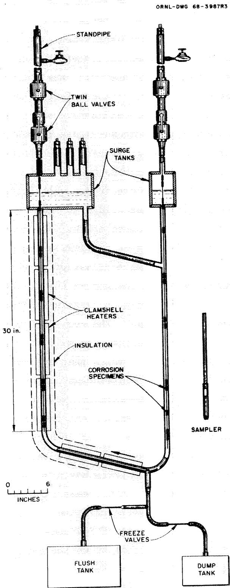
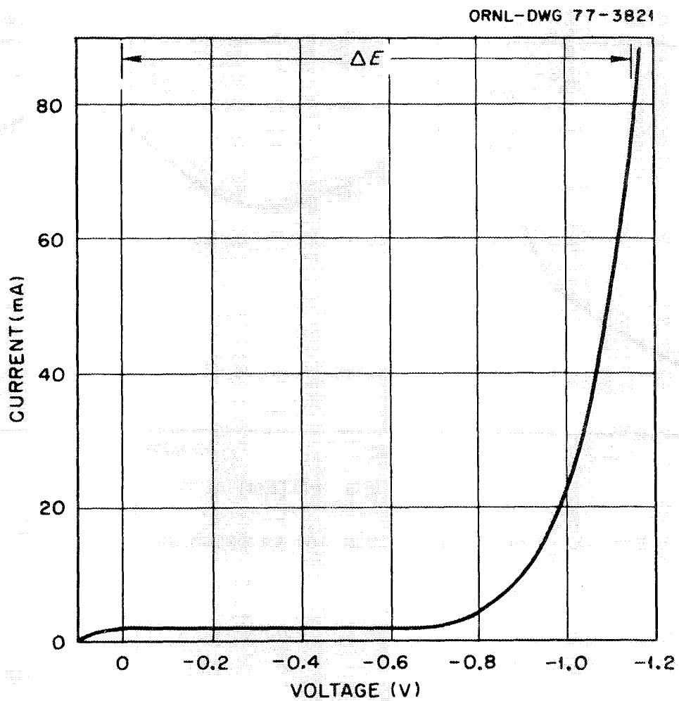
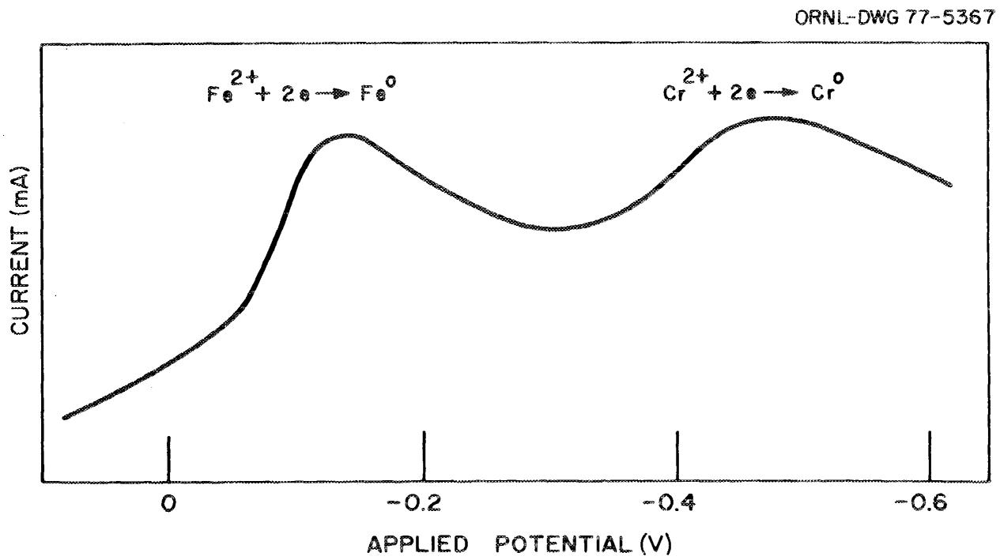
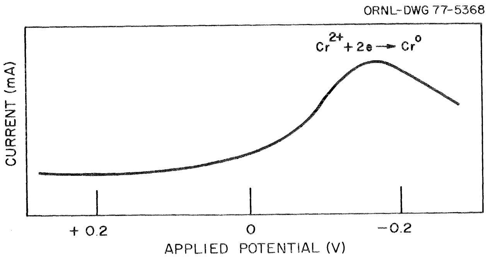
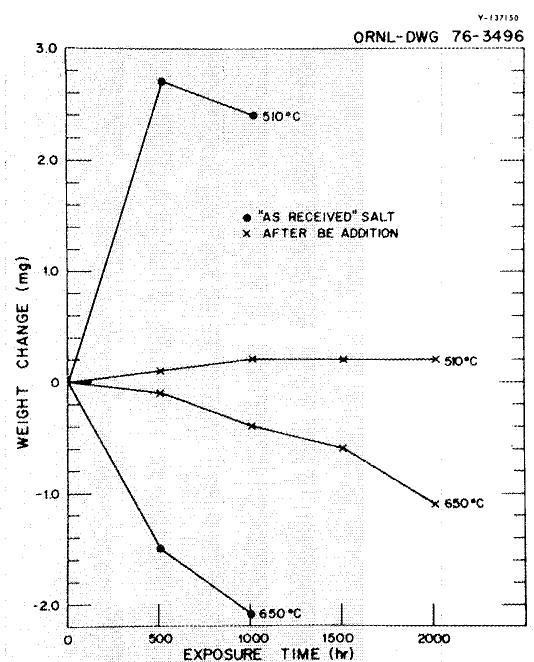
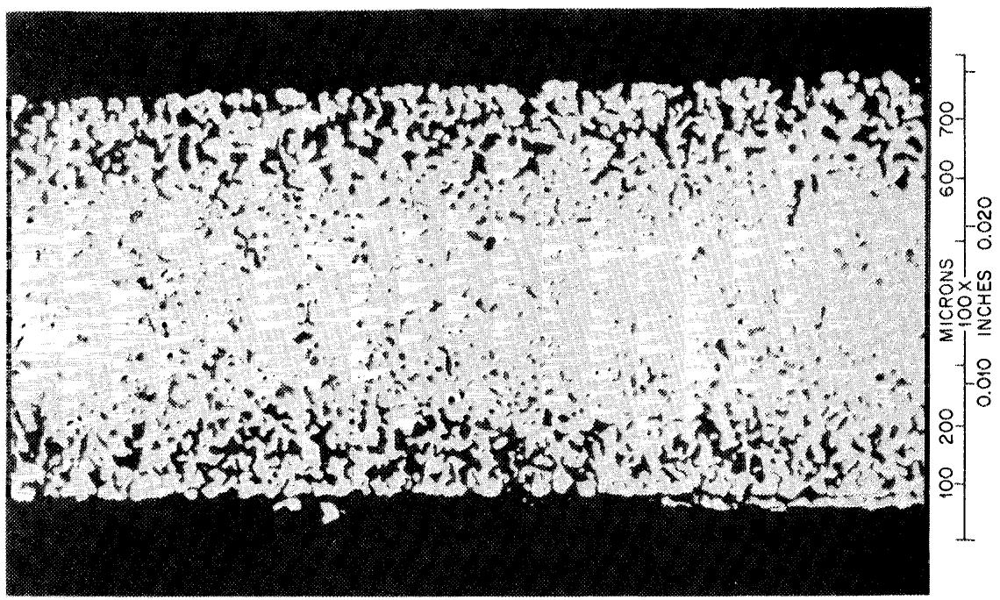
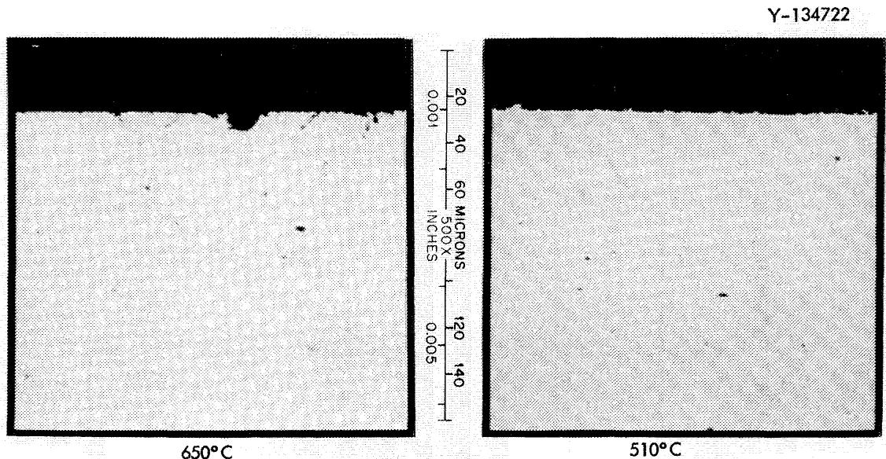
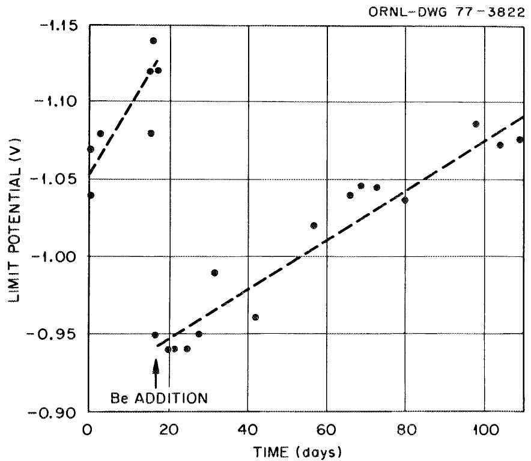

# The Corrosion Resistance of Type 316 Stainless Steel to $\mathsf{Li}_2\mathsf{BeF}_4$

J. R. Keiser   
J. H. Devan   
D. L. Manning

OAK RIDGE NATIONAL LABORATORY

CENTRAL RESEARCH LIBRARY

DOCUMENT COLLECTION

LIBRARY LOAN COPY

DO NOT TRANSFER TO ANOTHER PERSON

If you wish someone else to see this

document, send in name with document

and the library wall arrange a loan.

2019年4月28日

1

Printed in the United States of America. Available from

National Technical Information Service

U.S. Department of Commerce

5285 Port Royal Road, Springfield, Virginia 2216t

Price: Printed Copy $4.00; Microfiche $3.00

This report was prepared as an account of work sponsored by the United States Government. Neither the United States nor the Energy Research and Development Administration/United States Nuclear Regulatory Commission, nor any of their employees, nor any of their contractors, subcontractors, or their employees, makes any warranty, express or implied, or assumes any legal liability or responsibility for the accuracy, completeness or usefulness of any information, apparatus, product or process disclosed, or represents that its use would not infringe privately owned rights.

Contract No. W-7405-eng-26

METALS AND CERAMICS DIVISION

The Corrosion Resistance of Type 316 Stainless Steel to $\mathsf{Li}_2\mathsf{BeF}_4$

J. R. Keiser, J. H. Devan, and D. L. Manning

Date Published - April 1977

NOTICE This document contains information of a preliminary nature. It is subject to revision or correction and therefore does not represent a final report.

OAK RIDGE NATIONAL LABORATORY

Oak Ridge, Tennessee 37830

operated by

UNION CARBIDE CORPORATION

for the

ENERGY RESEARCH AND DEVELOPMENT ADMINISTRATION

__________

# TABLE OF CONTENTS

ABSTRACT 1

INTRODUCTION 1

EXPERIMENTAL METHODS 6

EXPERIMENTAL RESULTS 11

CONCLUSIONS 14

ACKNOWLEDGMENTS 15

J. R. Keiser, J. H. Devan, and D. L. Manning

# ABSTRACT

The corrosion rate of type 316 stainless steel in molten LiF-BeF $_2$ (66-34 mole %) has been measured in a thermal-convection loop operating with a maximum temperature of $650^{\circ}\mathrm{C}$ and a temperature difference of $160^{\circ}\mathrm{C}$ . The corrosion rate was correlated with the concentration of impurities in the salt and with the fluoride ion oxidation potential as determined by an on-line voltameter.

A corrosion rate of $-10~\mu \mathrm{m}$ /year was observed initially in the as-received salt. This rate decreased as reactions with initial salt impurities went to completion. Direct addition of beryllium metal to the salt further reduced the corrosion rate.

# INTRODUCTION

The selection of the first-wall and blanket materials for the first-generation TOKAMAK-type magnetic fusion reactors will be determined by a combination of neutronic, radiation damage, and chemical requirements. The technological problems associated with fabrication, welding, and adequate production of the refractory metals niobium, vanadium, and molybdenum have resulted in type 316 stainless steel being given strong consideration for the fusion reactor first-wall material. The choices for a blanket capable of breeding tritium are limited to lithium or a lithium-bearing compound, but this blanket material must also be chemically compatible with the first wall. Because the extent of corrosion of stainless steel by liquid lithium may impose a severe temperature limit, strong consideration is being given to the use of a mixture of

the salts LiF and $\mathrm{BeF}_2$ for a blanket of a fusion reactor with a stainless steel first wall. The purpose of this paper is to report on the corrosion resistance of type 316 stainless steel to $\mathrm{Li}_2\mathrm{BeF}_4$ .

There are potential problems associated with the use of LiF-BeF $_2$ as a combined coolant-breeding material. $^{2}$ These include the effective breeding and the efficient recovery of tritium, the effect on the salt of induced electric fields and of transmutation products, and the compatibility of the salt with the component it contacts. The tritium breeding ratio of this salt is not as high as is that of lithium, and some designs would probably require the addition of a neutron multiplier such as beryllium.

Another problem could be the electric field induced in the conducting salt when it flows through the intense magnetic fields required for plasma containment. This potential difference occurring between the salt and the pipe wall could be great enough to electrolyze the salt and thus cause severe corrosion problems for the metallic container. Means of reducing the effect of the induced field to a tolerable level have been suggested by Homeyer.3 According to him, electrolytic corrosion could be minimized by avoiding, as much as possible, high fluid velocities perpendicular to the magnetic field. Solution of this problem will most probably have to be a result of engineering design changes rather than through additions or modifications to the salt.

An additional concern will be the corrosive effect of the salt on the stainless steel. As seen from the free energies of formation in Table 1, LiF and $\mathrm{BeF}_2$ are much more stable than the fluorides of the major constituents of stainless steel, Fe, Ni, and Cr. Consequently, no significant reaction of the salt components with the metallic container is expected; however, impurities in the salt may cause corrosion. Impurities expected to be present are HF and $\mathrm{NiF}_2$ , and these will cause reactions of the type:

Table 1. Formation Free Energy of Fluoride at ${1000}\mathrm{\;K}$   

<table><tr><td rowspan="2">Compound</td><td colspan="2">Free Energy per Gram-Atom of Fluorinea</td></tr><tr><td>(kJ)</td><td>(kcal)</td></tr><tr><td>LiF</td><td>-523</td><td>-125</td></tr><tr><td>BeF2</td><td>-448</td><td>-107</td></tr><tr><td>UF3</td><td>-410</td><td>-98</td></tr><tr><td>CrF2</td><td>-314</td><td>-75</td></tr><tr><td>FeF2</td><td>-280</td><td>-67</td></tr><tr><td>HF</td><td>-276</td><td>-66</td></tr><tr><td>NiF2</td><td>-230</td><td>-55</td></tr><tr><td>MoF6</td><td>-209</td><td>-50</td></tr></table>

aC. F. Baes, Jr., "The Chemistry and Thermodynamics of Molten Salt Reactor Fuels," Nucl. Met. 15, 624, P. Chiott; Ed., CONF-690801 (1969).

$$
2 \mathrm {H F} + \mathrm {M} \rightleftharpoons \mathrm {H} _ {2} + \mathrm {M F} _ {2}, \text {w h e r e M c o u l d b e F e o r C r}; \tag {1}
$$

$$
\mathrm {M F} _ {2} + \mathrm {C r} \rightleftharpoons \mathrm {M} + \mathrm {C r F} _ {2} \text {w h e r e M c o u l d b e N i o r F e}. \tag {2}
$$

These reactions of impurities with the container will occur at a high rate initially but will slow down as the impurities are consumed. As long as no additional impurities are added to the system, after the first few hundred hours these initial reactions are not expected to contribute significantly to corrosion. The addition of a reductant to the salt could eliminate the corrosive effects of the impurities by the reductant rather than the wall reacting with the impurities. The transmutation products formed by neutron reaction with the salt represent another significant source of oxidants in the salt. All three elemental constituents of the salt - lithium, beryllium, and fluorine - are expected to undergo transmutation reactions.

The reactions of lithium,

$$
{ } ^ { 7 } \mathrm { L i F } + n \rightarrow \mathrm { H e } + { } _ { 1 } ^ { 3 } \mathrm { H F } + n ^ { \prime } \tag {3}
$$

and

$$
{ } ^ { 6 } \mathrm { L i F } + n \rightarrow \mathrm { H e } + { } _ { 1 } ^ { 3 } \mathrm { H F } , \tag {4}
$$

are, of course, desired because this is the means of producing the tritium fuel. However, the TF produced can react with the stainless steel container to form metals fluorides as shown in Eq. (1).

Transmutation of beryllium can occur in either of two ways:

$$
\mathrm {B e F} _ {2} + n \rightarrow 2 n + 2 \underset {2} {\mathrm {H e}} + 2 \mathrm {F} \tag {5}
$$

or

$$
\mathrm {B e F} _ {2} + n \rightarrow_ {2} ^ {4} \mathrm {H e} + _ {2} ^ {6} \mathrm {H e} + 2 \mathrm {F}. \tag {6}
$$

The ${}_{2}^{6}$ He undergoes beta decay with an 0.8-sec half-life yielding for the right side of Equation 6,

$$
{ } _ { 2 } ^ { 4 } \mathrm { H e } + { } ^ { 6 } \mathrm { L i F } + \mathrm { F }
$$

The fluorine produced in these beryllium transmutation reactions can react with the stainless steel container, constituting another source of corrosion.

The other transmutation of the salt components is that of fluorine:

$$
{ } ^ { 1 9 } \mathrm { F } ^ { - - } + n \rightarrow { } _ { 7 } ^ { 1 6 } \mathrm { N } ^ { - - } + { } _ { 2 } ^ { 4 } \mathrm { H e } . \tag {7}
$$

The ${}^{16}\mathrm{N}$ undergoes beta decay with about a 7-sec half-life yielding $^{16}0$ , which can be expected to react with the containment metal causing additional corrosion. The net result of all three transmutation reactions is the production of substances that will cause corrosion of the stainless

steel containment alloy. The extent of this corrosion would be very significant and possibly intolerable. One means of at least reducing and perhaps of eliminating this corrosion is to add a redox buffer to the salt. This buffer would need to be capable of (1) reducing the TF to $\mathbf{T}_2$ and a soluble fluoride, (2) reacting with the fluorine to form a stable, soluble fluoride, and (3) forming a stable oxide that dissolves in salt and can be processed out of the salt.

One other problem associated with the use of $\mathrm{Li}_2\mathrm{BeF}_4$ is the recovery of tritium from the salt. The redox buffer required to keep the tritium in the form of $\mathrm{T}_2$ because of the corrosivity of TF with stainless steel will probably make it easier to remove the tritium from the salt.

The potential problems associated with impurities, transmutation products, and tritium recovery will almost certainly require a redox buffer if a $\mathrm{Li}_2\mathrm{BeF}_4$ blanket is to be used with a stainless steel containment vessel. A great deal of experience with molten salt containing a redox buffer has been accumulated at ORNL as a result of work for the Molten Salt Breeder Reactor Program. $^4$ The fuel salt for this reactor is composed of LiF and $\mathrm{BeF}_2$ to which the fertile material $\mathrm{ThF}_4$ and fissile material $\mathrm{UF}_4$ have been added. Because of reactions that occur during both preparation and holding in the containment vessel, the uranium is actually found to be present in both the three and four plus oxidation states ( $\mathrm{UF}_3$ and $\mathrm{UF}_4$ ). Together these compounds make up 0.3 mole % of the fuel salt. This amount of material is sufficient to ensure that addition of an oxidizing or reducing impurity to the salt does not cause serious corrosion of many containment vessel materials. Addition of an oxidizing impurity results in some U(III) being oxidized to U(IV) and, conversely, addition of a reducing impurity results in reduction of U(IV) to U(III). Consequently, a small change in the U(IV)/U(III) ratio might occur, but because of this buffering action, no drastic swings in the oxidation potential will take place.

The choice of a redox buffer for $\mathrm{Li}_2\mathrm{BeF}_4$ in stainless steel will depend on how "reducing" it is necessary to make the salt. One material

that could make the salt sufficiently "reducing" to practically eliminate the corrosion caused by impurities and transmutation products is beryllium. Typical reactions could be:

$$
\mathrm {B e} + \mathrm {F e F} _ {2} \rightarrow \mathrm {F e} + \mathrm {B e F} _ {2}, \tag {8}
$$

$$
\mathrm {B e} + 2 \mathrm {H F} \rightarrow \mathrm {H} _ {2} + \mathrm {B e F} _ {2}, \tag {9}
$$

$$
\mathrm {B e} + 2 \mathrm {F} \rightarrow \mathrm {B e F} _ {2}. \tag {10}
$$

To determine the suitability of stainless steel for containing $\mathrm{Li}_2\mathrm{BeF}_4$ , corrosion measurements have been made with salt in the as-received condition and in the reducing condition reached by adding beryllium to it.

# EXPERIMENTAL METHODS

The experimental assembly used for this corrosion work, called a thermal-convection loop, is shown in Fig. 1. The loop portion of the assembly is constructed of type 316 stainless steel tubing and is heated on the bottom and one verticle side. Cooling the other two sides causes the molten salt in the tubing to flow because of the variation in density of the salt with temperature. The velocity of the salt is about $1 \, \text{m/min}$ . Other important features of the loop are the removable corrosion specimens and the accesses for insertion of electrodes for voltammetry measurements and for addition of material to the salt in the loop or removal of salt samples from the loop. Sixteen corrosion specimens are used, with eight inserted in the hot leg (heated vertical section) and eight in the cold leg (cooled vertical section). These specimens are removed from the loop every $500 \, \text{hr}$ for weighing and examination. When the investigations to be made with a particular set of specimens are completed, several of the specimens are examined metallographically and, if warranted, with the electron microprobe. These results reveal at which temperature weight

  
Fig. 1. Schematic of Thermal-Convection Loop. Scale length is $0.15\mathrm{m}$ . Height shown is $0.76\mathrm{m}$ .

gains or losses have occurred, and the microprobe examination identifies which components of the specimen material have been transported.

One of the most significant improvements in thermal-convection loop operation has been the application of voltammetry. Controlled-potential voltammetry is a modern electrochemical technique, which may be used to examine the nature of an electrochemical reaction in different media, such as aqueous and nonaqueous solutions and high-temperature salt systems. For measurements in molten $\mathrm{Li_2BeF_4}$ , the electrodes consisted of the loop itself, which served as the counter electrode, and two iridium electrodes, which were the quasi-reference and working electrodes. These electrodes were typically 25-mm (1-in.) lengths of 18-gage iridium wires welded to 3-mm-OD (1/8-in.) nickel risers. The electrode area exposed to the melt was 10 to $20\mathrm{mm}^2$ . The voltammograms were recorded versus the iridium quasi-reference electrode (Ir QRE), which is poised at the equilibrium potential ( $E_{\mathrm{eq}}$ ) of the melt. In this manner relative changes in the oxidation potential of the salt and of the concentration of certain impurities and corrosion products can be measured on-line. The equilibrium potential of the salt is a measure of the tendency of the melt to react with oxidizable materials that it contacts. For melts that are not poised by a redox buffer relative changes in the equilibrium potential are conveniently observed by determining voltammetrically the potential difference ( $\Delta E$ ) between the melt equilibrium potential and the cathodic limit of the melt, which for $\mathrm{Li_2BeF_4}$ is the reduction of beryllium(II). We define the cathodic limit for these measurements as the potential at 80 mA cell current. Other reference markers may also be used as long as the same conditions are maintained. A decrease in $\Delta E$ , resulting in a cathodic shift in $E_{\mathrm{eq}}$ for example, indicates that the melt has become less oxidizing; and an increase in $\Delta E$ indicates that the opposite has occurred. A voltammetric scan that shows the cathodic limit relative to $E_{\mathrm{eq}}$ is illustrated in Fig. 2.

  
Fig. 2. Voltammetric Scan to Final Limit of $\mathsf{Li}_2\mathsf{BeF}_4$ in Loop NCL 31.

The reduction of $\mathrm{Fe}^{2+}$ and $\mathrm{Cr}^{2+}$ impurities is illustrated by the voltammogram shown in Fig. 3. The peak heights of the two waves correspond to about $130~\mathrm{ppm}$ $\mathrm{Fe}^{2+}$ and $100~\mathrm{PPM}$ $\mathrm{Cr}^{2+}$ . Fig. 4 shows the results of a voltammetric scan made several weeks after that of Fig. 3. The peak due to iron has disappeared, while the chromium peak is about the same height. It is also interesting to note that the melt has become less oxidizing as indicated by the cathodic shift in $E_{\mathrm{eq}}$ relative to the peak potential of the chromium wave. The good agreement between the voltammetric results and the results of the analyses of salt samples indicates the usefulness of controlled-potential voltammetry for rapid in situ measurements.

  
Fig. 3. Reduction of Iron and Chromium in Loop NCL 31.

  
Fig. 4. Reduction of Chromium in Loop NCL 31.

# EXPERIMENTAL RESULTS

Type 316 stainless steel specimens were first exposed in the type 316 stainless steel thermal-convection loop containing as-received $\mathrm{Li}_2\mathrm{BeF}_4$ salt with a high impurity level (190 ppm Fe, 60 ppm Cr). The circulating salt had a maximum temperature of $650^{\circ}\mathrm{C}$ and a minimum of $490^{\circ}\mathrm{C}$ . The specimens were examined after 500 and 1000 hr, and the condition of the salt was monitored by means of voltammetry and salt samples. Following this initial exposure, a beryllium rod was lowered into the salt and a new set of type 316 stainless steel specimens was inserted. These specimens were examined after 500, 1000, 1500, and 2000 hr in the salt. Meanwhile, monitoring of the condition of the salt was continued.

Examination of the specimens after the first 500-hr exposure showed that significant weight changes had occurred, most likely because of reactions with impurities. Figure 5 shows the weight change results for specimens near the highest and lowest temperatures. The

  
Fig. 5. Weight Change Results for Type 316 Stainless Steel Specimens Exposed to LiF-BeF $_2$ Salt in Both the As-Received Relatively Oxidizing Condition and in the Relatively Reducing Condition Created by the Addition of Beryllium to the Salt.

weight lost by the hottest specimen during the first 500 hr, if we assume that the material was lost uniformly from the surface, corresponds to a corrosion rate of about $10~\mu \mathrm{m}$ (0.4 mil) per year. However, in previous work with stainless steel in fluoride salts containing $\mathrm{UF_4}$ as an oxidizing species, corrosion did not result in uniform removal of material; rather, a porous structure was found (Fig. 6). The 1000-hr exposure of our specimens was not long enough for extensive corrosion to occur, but Fig. 7 indicates that material was not removed uniformly from the hotter specimen. Consequently, the depth of attack can be expected to exceed that calculated for uniform material removal. Furthermore, in the salt of a fusion reactor, impurities would be produced continuously and in significant quantities, and these impurities would be more oxidizing than the impurities found in this experimental salt. Thus, corrosion of stainless steel in a fusion reactor could be a serious problem if no effort is made to buffer the salt.

Y-127785

  
Fig. 6. Type 304L Stainless Steel Specimen from Loop 1258 Exposed to LiF-BeF $_2$ -ZrF $_4$ -ThF $_4$ -UF $_4$ (70-23-5-1-1 mole %) for 45,724 hr at $685^{\circ}\mathrm{C}$ .

  
Fig. 7. Type 316 Stainless Steel Specimens Exposed to $\mathsf{Li}_2\mathsf{BeF}_4$ for 1004 hr.

To evaluate the effect of a buffer on the corrosion of stainless steel in $\mathrm{Li_2BeF_4}$ , a piece of beryllium was inserted into the salt and allowed to react. As shown in Fig. 8, the equilibrium potential shifted cathodically, indicating the salt was made less oxidizing. Voltammetric measurements indicated the $\mathrm{FeF_2}$ concentration to be less than about 20 ppm. A new set of specimens was exposed to this reducing salt for 2000 hr. Examination of the specimens after 500 and 1000 hr showed very small weight changes, near the limit of detection. As shown in Fig. 5, the weight changes for the specimen temperatures considered were much smaller for the specimens in the reducing salt during the first 1000 hr than in the as-received salt.

Figure 5 shows that once the beryllium was removed from the salt (during the first 500-hr specimen exposure to the reducing salt), the specimen in the hottest position showed increasing weight loss as a function of time. This most probably occurred because, once the source of beryllium was removed, the species in the salt were no longer in equilibrium and the salt became progressively more oxidizing. Thus, to maintain a low corrosion rate, beryllium would have to be added continuously or at least periodically. If that were done the corrosion rate of type 316 stainless steel in $\mathrm{Li}_2\mathrm{BeF}_4$ salt could be kept within a range acceptable for fusion reactor service.

  
Fig. 8. Variation of the Limit for $\mathsf{Li}_2\mathsf{BeF}_4$ Salt in NCL 31.

# CONCLUSIONS

The conclusions that can be drawn from this research are:

1. The oxidation potential of the salt can be controlled by additions of a reducing metal,   
2. Voltammetric techniques provide on-line measurement of the oxidation potential of the salt and the concentration of impurities in the salt.   
3. High corrosion rates are encountered initially in salt with a normal impurity concentration.   
4. The corrosion rate of type 316 stainless steel in $\mathrm{Li}_2\mathrm{BeF}_4$ salt was reduced significantly by the direct addition of beryllium metal to the salt.

# ACKNOWLEDGMENTS

The authors would like to make note of the efforts of E. J. Lawrence for operating the thermal-convection loop; J. R. DiStefano and J. L. Scott for reviewing, S. Peterson for editing, and Gail Golliher for final preparation of the manuscript for reproduction.

# INTERNAL DISTRIBUTION

1-2. Central Research Library

3. Document Reference Section   
4. Laboratory Records Department   
5. Laboratory Records, ORNL RC   
6. ORNL Patent Office   
7. R. G. Alsmiller, Jr.   
8. E. S. Bettis   
9. E. H. Bryant   
10. D. D. Cannon   
11. J. F. Clarke   
12. R.E.Clausing   
13. S. D. Clinton   
14. J. E. Cunningham   
15. R. A. Dandl   
16. J. H. Devan   
17. A. P. Fraas

18-19. Fusion Energy Division Library

20. Fusion Energy Division Reports Office   
21. T. A. Gabriel   
22. M. L. Grossbeck   
23. P. N. Haubenreich

24-26. M.R.Hi11

27. J. A. Horak

28-47. J.R.Keiser

48. G. G. Kelley   
49. G. Krist   
50. C. G. Lawson   
51. D. L. Manning   
52. H. E. McCoy   
53. H. C. McCurdy   
54. C. J. McHargue   
55. O.B.Morgan   
56. H. Postma   
57. M. Roberts   
58. M. W. Rosenthal   
59. J. L. Scott   
60. J. E. Selle   
61. T. E. Shannon   
62. G.M.Slaughter   
63. D. Steiner   
64. W.C.T. Stoddart   
65. J. S. Watson   
66. J. R. Weir, Jr.   
67. W. M. Wells   
68. R. Werner   
69. F. W. Wiffen

# EXTERNAL DISTRIBUTION

70-71. ARGONNE NATIONAL LABORATORY, 9700 South Cass Avenue, Argonne, IL 60439

V. A. Maroni, CTR Program, 208 W115

D. L. Smith

72. CULHAM LABORATORY, Abingdon, Oxon, 0X14 3DB, United Kingdom

73-74. PRINCETON PLASMA PHYSICS LABORATORY, P.O. Box 451, Princeton, NJ 08540

R. Mills

W. G. Price

75. PRINCETON UNIVERSITY, Chemical Engineering Department, Princeton, NJ 08540

E. Johnson

76. WESTINGHOUSE ELECTRIC CORPORATION, Research and Development Center, Pittsburg, PA 15235

R.E.Gold

77-82. ERDA DIVISION OF MAGNETIC FUSION ENERGY, Washington, DC 20545

M. M. Cohen

E.N.C. Dalder

C. R. Finfgeld

T.C.Reuther，Jr.

J. M. Williams

K. M. Zwilsky

83-84. ERDA, OAK RIDGE OPERATIONS OFFICE, P.O. Box E, Oak Ridge, TN 37830

Director, Reactor Division

Director, Research and Technical Support Division

85-111. ERDA TECHNICAL INFORMATION CENTER, Office of Technical Information, P.O. Box 62, Oak Ridge, TN 37830