ORNL/TM-5783

Distribution

Category UC-76

Contract No. W-7405-eng-26

METALS AND CERAMICS DIVISION

COMPATIBILITY STUDIES OF POTENTIAL MOLTEN-SALT BREEDER REACTOR MATERIALS IN MOLTEN FLUORIDE SALTS

J. R. Keiser

Date Published: May 1977

NOTICE

This report was prepared as an account of work sponsored by the United States Government. Neither the United States nor the United States Energy Research and Development Administration, nor any of their employees, nor any of their contractors, subcontractors, or their employees, makes any warranty, express or implied, or assumes any legal liability or responsibility for the accuracy, completeness or usefulness of any information, apparatus, product or process disclosed, or represents that its use would not infringe privately owned rights.

NOTICE This document contains information of a preliminary nature. It is subject to revision or correction and therefore does not represent a final report.

OAK RIDGE NATIONAL LABORATORY

Oak Ridge, Tennessee 37830

operated by

UNION CARBIDE CORPORATION

for the

ENERGY RESEARCH AND DEVELOPMENT ADMINISTRATION

MASTER

# CONTENTS

Pa

ABSTRACT 1

INTRODUCTION 3

EXPERIMENTAL METHODS 3

EXPERIMENTAL RESULTS 7

Thermal-Convection Loop 21A 7

Thermal-Convection Loop 23 10

Thermal-Convection Loop 31 15

Thermal-Convection Loops 18C and 24 17

Forced-Circulation Loop FCL-2B 1

CONCLUSIONS 21

ACKNOWLEDGMENTS 21

# COMPATIBILITY STUDIES OF POTENTIAL MOLTEN-SALT BREEDER REACTOR MATERIALS IN MOLTEN FLUORIDE SALTS

J. R. Keiser

# ABSTRACT

This report summarizes the molten fluoride salt compatibility studies carried out during the period 1974-76 in support of the Molten-Salt Reactor Program. Thermal-convection and forced-circulation loops were used to measure the corrosion rate of selected alloys. Results confirmed the relationship of time, initial chromium concentration, and mass loss developed by previous workers. The corrosion rates of Hastelloy N and Hastelloy N modified by the addition of 1-3 wt % Nb were well within the acceptable range for use in an MSBR.

# INTRODUCTION

The purpose of this report is to summarize the corrosion studies carried out for the Molten-Salt Reactor Program during the period September 1974 through May 1976. These studies were intended to determine the corrosion resistance of potential Molten-Salt Breeder Reactor containment vessel materials in molten fluoride salt. The nickel-base alloy Hastelloy N was used successfully for the containment vessel of an experimental molten-salt reactor, the Molten-Salt Reactor Experiment. However, the discovery of irradiation embrittlement and grain boundary embrittlement by the fission product tellurium led to a program to develop an alloy that would be sufficiently resistant to the conditions. To ensure that any new or modified alloy would have a high resistance to corrosion by the fluoride salt, salt-metal corrosion studies were made. Materials investigated include Hastelloy N, chromium and niobium modifications of Hastelloy N, Inconel 60l, and type 316 stainless steel. The stainless steel was tested in LiF-BeF $_2$ (65-35 mole %), and the other alloys were tested in MSBR fuel salt, LiF-BeF $_2$ -ThF $_4$ -UF $_4$ (72-16-11.7-0.3 mole %).

Previous researchers1,2 have measured the corrosion resistance of Hastelloy N and two types of stainless steel in various fluoride salt mixtures. Their work has shown a multicomponent alloy is corroded by the oxidation and removal of the least noble component. For Hastelloy N, the least noble component is chromium. Fluoride salts can oxidize chromium by reaction with impurities in the salt such as HF, NiF2, and FeF2 and by reaction with constituents of the salt. Impurity reactions expected are

$$
2 \mathrm {H F} + \mathrm {C r} \rightleftharpoons \mathrm {C r F} _ {2} + \mathrm {H} _ {2} \tag {1}
$$

and

$$
\mathrm {F e F} _ {2} + \mathrm {C r} \rightleftharpoons \mathrm {C r F} _ {2} + \mathrm {F e}. \tag {2}
$$

The salt constituent $\mathrm{UF_4}$ can give the reaction:

$$
2 \mathrm {U F} _ {4} + \mathrm {C r} \rightleftharpoons \mathrm {C r F} _ {2} + 2 \mathrm {U F} _ {3}. \tag {3}
$$

If salt containing $\mathrm{UF_4}$ and a small amount of impurities is put into a Hastelloy N system in which the salt circulates nonisothermally, chromium will initially be removed from all parts of the system because of reaction with both impurities and $\mathrm{UF_4}$ . The impurity reactions are expected to go to completion fairly rapidly so that they will have an effect only on the short-time corrosion results. On the other hand, since the equilibrium constant for reaction (3) is a function of temperature, this reaction provides a means for the continuous transfer of

chromium from the hotter sections of the system to the cooler sections. The amount of chromium, $\Delta M$ , removed from a unit area of surface can be shown to be:

$$
\Delta M = B C _ {0} \sqrt {D t} \tag {4}
$$

where $B$ is a temperature-dependent constant, $C_0$ is the initial concentration of chromium in the alloy, and $D$ is the diffusivity of chromium in the alloy. The limiting step for this mass transfer has been shown to be the diffusion of chromium in the metal when Hastelloy N is the alloy considered. If other strong fluoride formers - such as Ti, Nb, or Al - are present in the alloy, mass transfer of these elements would be expected to occur by the same mechanism as discussed above.

# EXPERIMENTAL METHODS

Our corrosion studies have been carried out in five thermal-convection loops and one forced-circulation loop. Figures 1 and 2 show schematic drawings of these loops. These loops circulate salt around a system across which a temperature gradient is maintained. For most of these loops the temperature limits were maintained at 704 and $566^{\circ}\mathrm{C}$ (1300 and $1050^{\circ}\mathrm{F}$ ), the proposed maximum and minimum temperatures for the fuel salt of an MSBR. Other important features of these loops are the removable corrosion specimens and the accesses to the salt to permit insertion of electrodes for controlled-potential voltammetry. Voltammetric measurements, which were made by members of the Analytical Chemistry Division, allowed us to make on-line determinations of the oxidation potential and corrosion product concentration of the salt. Detailed explanations of voltammetry are available elsewhere. $^{3,4}$ The operating conditions for each of the loops are described in Table 1.

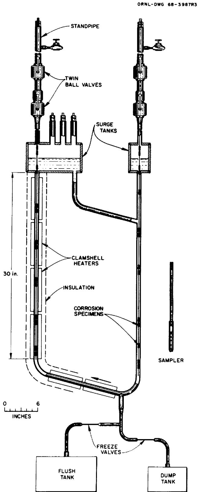  
Fig. 1. Schematic of Thermal-Convection Loop. Scale is $0.15\mathrm{m}$ . Height shown is $0.76\mathrm{m}$ .

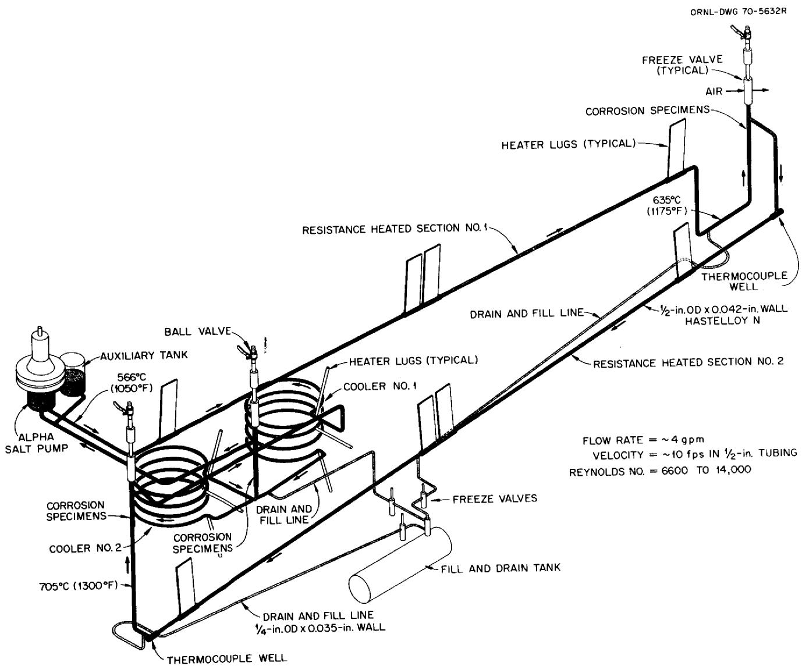  
Fig. 2. Schematic of Molten-Salt Forced-Convection Corrosion Loop MSR-FCL-2 b. Flow rate $\approx 0.25$ liter/sec; velocity $\approx 3$ m/sec in 13-mm tubing; loop tubing is 13-mm OD by 1.07-mm wall; drain and fill line is 6.4-mm OD by 0.9-mm wall.

Table 1. Loop Operating Conditions   

<table><tr><td rowspan="2">Loop</td><td rowspan="2">Loop Material</td><td rowspan="2">Specimen Material</td><td rowspan="2">Salt</td><td colspan="2">Operating Temperature, °C</td><td rowspan="2">Purpose</td></tr><tr><td>Max</td><td>Min</td></tr><tr><td colspan="7">Thermal-C-vention Loop</td></tr><tr><td rowspan="2">21A</td><td rowspan="2">Hastelloy N</td><td rowspan="2">Hastelloy N, 1%-Nb-mod Hastelloy N</td><td rowspan="2">MSBR Fuel</td><td rowspan="2">704</td><td rowspan="2">566</td><td>1. Analytic method development</td></tr><tr><td>2. Base-line corrosion data</td></tr><tr><td rowspan="2">23</td><td rowspan="2">Inconel 601</td><td>Inconel 601</td><td>MSBR Fuel</td><td>704</td><td>566</td><td>1. Measure corrosion rate of high-Cr alloy (Inconel 601)</td></tr><tr><td>Graphite</td><td>MSBR Fuel</td><td>677</td><td>550</td><td>2. Investigate Graphite UF3 Reaction</td></tr><tr><td rowspan="2">31</td><td rowspan="2">Type 316 Stainless Steel</td><td rowspan="2">Type 316 Stainless Steel</td><td rowspan="2">Li2BeF4</td><td rowspan="2">649</td><td rowspan="2">493</td><td>1. Measure corrosion rate of type 316 stainless steel in potential coolant salt</td></tr><tr><td>2. Investigate effect of Be addition to salt</td></tr><tr><td>24</td><td>Hastelloy N</td><td>7%-Cr-mod Hastelloy N, 12%-Cr-mod Hastelloy N, 3.4%-Nb-mod Hastelloy N</td><td>MSBR Fuel</td><td>704</td><td>566</td><td>1. Measure corrosion rate of modified Hastelloy N alloys</td></tr><tr><td>18C</td><td>Hastelloy N</td><td>10%-Cr-mod Hastelloy N, 15%-Cr-mod Hastelloy N</td><td>MSBR Fuel</td><td>704</td><td>566</td><td>1. Measure corrosion rate of modified Hastelloy N alloys</td></tr><tr><td colspan="7">Forced-Circulation Loop</td></tr><tr><td>FCL-2B</td><td>Hastelloy N</td><td>Hastelloy N, 1%-Nb-mod Hastelloy N</td><td>MSBR Fuel</td><td>704</td><td>566</td><td>1. Base-line corrosion data in high-velocity salt</td></tr></table>

# EXPERIMENTAL RESULTS

# Thermal-Convection Loop 21A

Hastelloy N loop NCL 21A was the first loop to be put into operation when the Molten-Salt Reactor Program was resumed in 1974. As such, the loop was used to obtain base-line corrosion data for Hastelloy N and to provide a test bed for voltammetry measurements of MSBR fuel salt. The voltammetry results showed that the oxidation potential as reflected by the U(IV)/U(III) ratio remained quite high throughout the 17.5 months of operation. In fact, with a U(IV)/U(III) ratio of about $10^{4}$ loop 21A contained the most oxidizing salt of all the loop experiments.

The first specimens used in this loop were made of Hastelloy N and were removed for examination about every 2500 hr. Figure 3 shows the weight change as a function of the exposure time for these specimens for up to 10,000 hr in salt. From this figure the rate of the weight change clearly decreased with time. Figure 4 shows that the change in weight varies as the square root of time, as predicted from Eq. (4).

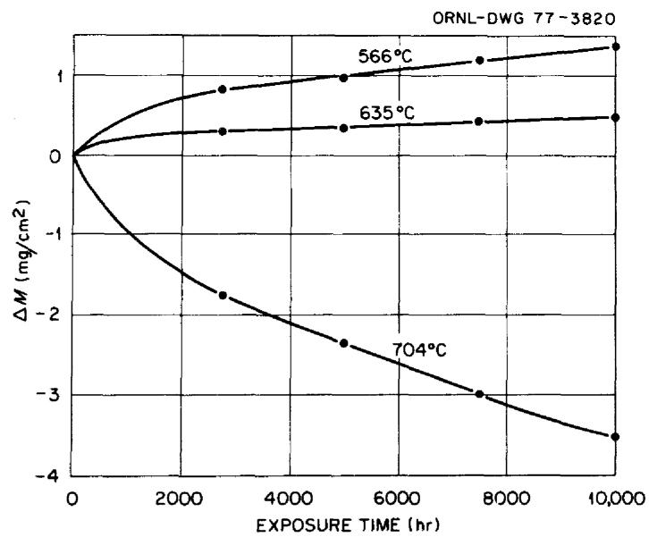  
Fig. 3. Weight Change vs Exposure Time for Hastelloy N Specimens Exposed to MSBR Fuel Salt at 566, 635, and $704^{\circ}\mathrm{C}$ in Thermal-Convection Loop 21A.

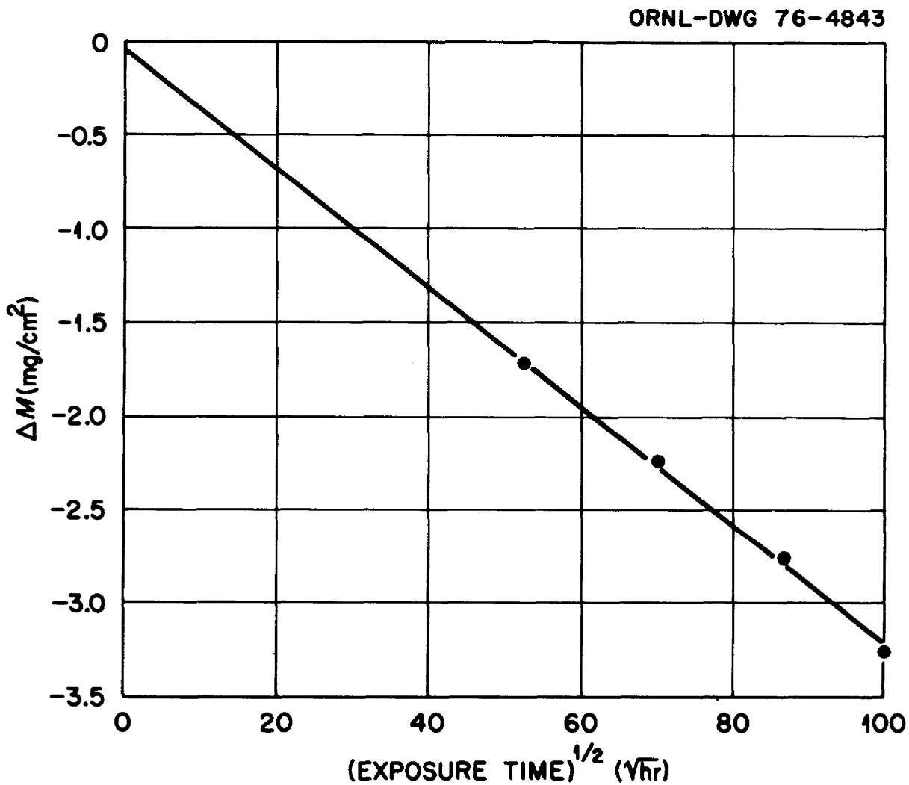  
Fig. 4. Weight Change vs Square Root of Exposure Time for Hastelloy N Specimen Exposed to MSBR Fuel Salt at $690^{\circ}\mathrm{C}$ in Thermal-Convection Loop 21A.

Specimens that had been exposed for 7500 hr in the hottest and coldest parts of the loop were examined metallographically. As is evident in Fig. 5 the pitting on the higher temperature specimen was limited to about $5\mu \mathrm{m}$ , indicating that the effect of the salt was relatively mild.

Following the 10,000-hr exposure of standard Hastelloy N, loop 21A was used to test specimens of $1\%$ -Nb-modified Hastelloy N (experimental heat 522). Only a short exposure was achieved with these specimens before a power supply malfunction terminated the experiment, but the short-time corrosion results (Table 2) compare very favorably with results for standard Hastelloy N.

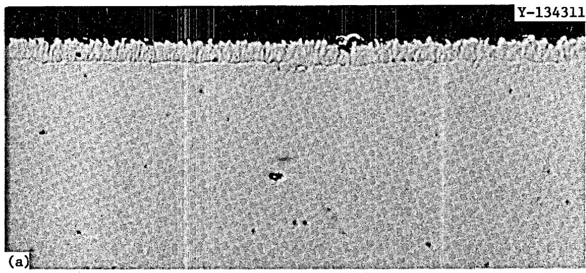

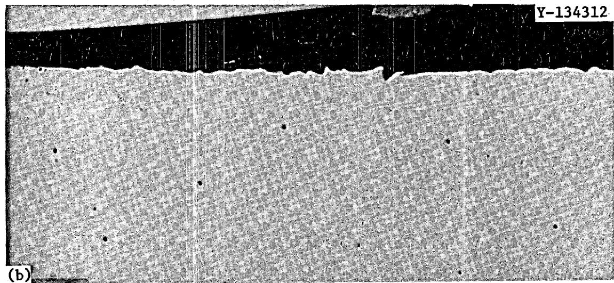  
Fig. 5. Hastelloy N Exposed to MSBR Fuel Salt for 7500 hr at (a) 704 and (b) $566^{\circ}\mathrm{C}$ . $500\times$ .

Table 2. Hastelloy N Corrosion Rate Measurements from Loop 21A   

<table><tr><td rowspan="2">Alloy</td><td rowspan="2">Total Exposure (hr)</td><td colspan="3">Corrosion Rate, mg cm-2year-1, at Each Exposure Temperature</td></tr><tr><td>566°C</td><td>635°C</td><td>704°C</td></tr><tr><td>Standard</td><td>10,009</td><td>+1.17</td><td>+0.39</td><td>-3.09</td></tr><tr><td>1% Nb Modified</td><td>1,004</td><td>0.0</td><td>-0.25</td><td>-3.30</td></tr></table>

# Thermal-Convection Loop 23

The observation that the high-chromium alloy Inconel 601 (23 wt % Cr) resisted intergranular attack by tellurium led to the construction of a thermal-convection loop to determine how severe the corrosion by MSBR fuel salt would be. After the new loop was filled with salt, voltammetric techniques were used to follow the change in the U(IV)/U(III) ratio as an indication of the extent of the initial reaction between chromium and $\mathrm{UF_4}$ . The U(IV)/U(III) ratio decreased very rapidly, dropping to about 40 within a few days, meaning that considerable reaction was probably occurring between the salt and this Inconel 601 loop. Inconel 601 specimens exposed 721 hr all showed a weight loss, and that shown by the hottest specimen was very large ( $>30\ \mathrm{mg~cm}^{-2}\ \mathrm{year}^{-1}$ ). Furthermore, the material lost by the hottest specimens was not removed uniformly from the surface, but resulted in the formation of the porous surface structure shown in Fig. 6. As shown in Fig. 7, electron microprobe examination of this specimen showed high thorium concentration in the pores. Since the only known source of thorium was the $\mathrm{ThF_4}$ contained in the salt, the salt likely penetrated the pores. Continuous line scans made with the microprobe for the elements Ni, Cr, and Th, shown in Fig. 8, clearly show the depletion of chromium near the surface. These results provide further evidence of the presence of thorium in the pores. Diffusion calculations provide another piece of evidence indicating that salt must have penetrated the pores. Based on the bulk chromium concentration of 23 wt $\%$ , microprobe measurements5 determined a chromium concentration of 6.6 wt $\%$ at the surface of the specimen in Fig. 6. From these concentrations, a depletion depth of $80\ \mu\mathrm{m}$ taken from Fig. 8, and diffusion values taken from Evans, Koger, and DeVan,6 we calculate that the exposure time would have to be nearly 1000 times greater to attain this concentration profile as a result of bulk diffusion alone at $704^{\circ}\mathrm{C}$ . To obtain this

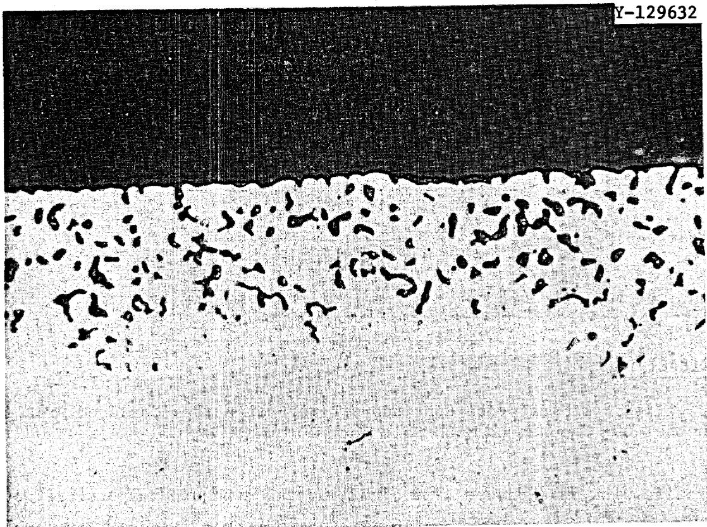  
Fig. 6. Inconel 601 Exposed to MSBR Fuel Salt for 721 hr at $704^{\circ}\mathrm{C}$ . 500x.

Y-131294

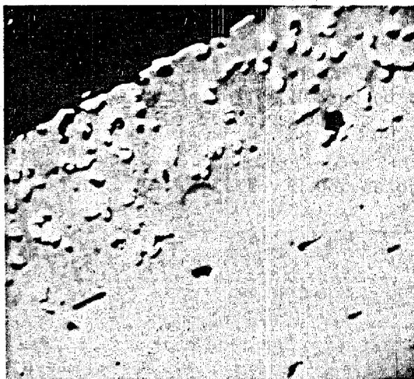  
Backscattered Electrons

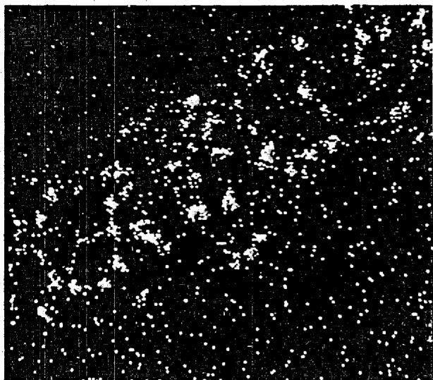  
ThMa X-Rays   
Fig. 7. Electron-Beam Scanning Images of Inconel 601 Exposed to MSBR Salts for 720 hr at $704^{\circ}\mathrm{C}$ .

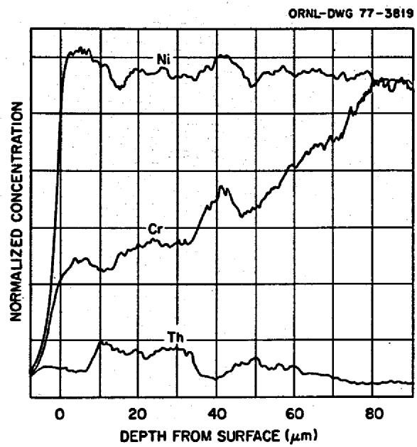  
Fig. 8. Microprobe Continuous Line Scan Across Corroded Area in Inconel 601 Exposed to MSBR Salt for 720 hr at $704^{\circ}\mathrm{C}$ .

profile with an exposure time of 721 hr the exposure temperature would have to be about $1000^{\circ}\mathrm{C}$ , nearly $300^{\circ}\mathrm{C}$ higher than it was. Thus, to establish the gradient that was observed, salt was most likely present in the pores to provide a short-circuit path for removal of the chromium. Examination of a specimen from the coldest part of the loop revealed surface deposits, shown in Fig. 9, which were identified by microprobe analysis as chromium. The conclusion from this test is that Inconel 601 would be unsuitable for use in a molten-salt breeder reactor.

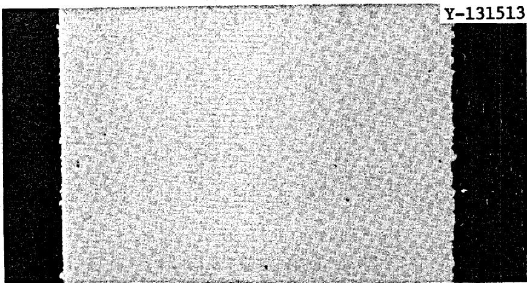  
Fig. 9. Inconel 601 Exposed to MSBR Fuel Salt for 721 hr at $570^{\circ}\mathrm{C}$ . $500\times$

It is expected that the lower limit for the U(IV)/U(III) ratio in an MSBR will be determined by the conditions under which the reaction

$$
4 \mathrm {U F} _ {3} + 2 \mathrm {C} \rightleftharpoons 3 \mathrm {U F} _ {4} + \mathrm {U C} _ {2} \tag {5}
$$

proceeds to the right. Because the U(IV)/U(III) ratio of the salt in loop 23 had decreased to less than 6, we decided to try to reproduce the results of Toth and Gilpatrick, $^{7}$ shown in Fig. 10, which predict that $\mathrm{UC}_2$ should be stable at the lowest temperatures that could be maintained in this loop, $545 - 550^{\circ}\mathrm{C}$ . However, graphite specimens exposed to the salt for 530 hr did not show any evidence of $\mathrm{UC}_2$ . Since the specimens used were made of pyrolytic graphite, the high density of the material likely limited contact of the salt and graphite. The experiment was repeated by exposing a less dense graphite for 530 hr,

7L. M. Toth and L. O. Gilpatrick, The Equilibrium of Dilute UF3 Solutions Contained in Graphite, ORNL/TM-4056 (December 1972).

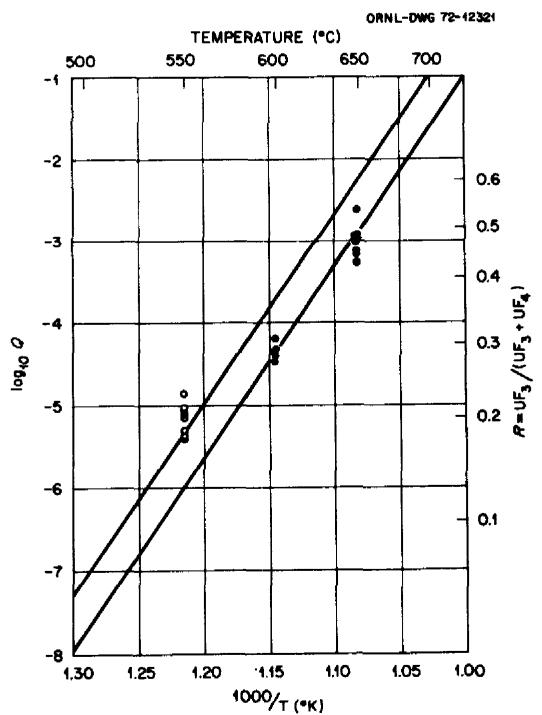  
Fig. 10. Equilibrium Quotients, $Q = (UF_3)^4 / (UF_4)^3$ , Versus Temperature for $UC_2 + 3UF_4(d) \rightleftharpoons 4UF_3(d) + 2C$ in the Solvent LiF-BeF $_2$ -ThF $_4$ (72-16-12 mole%).

then checking the graphite surface for the presence of a new phase by x-ray diffraction. A new phase was found, and it was tentatively identified by O. B. Cavin as $\mathrm{UO_2}$ . If indeed this compound was $\mathrm{UO_2}$ , it probably resulted from a uranium fluoride-water reaction, but it could have come from the hydrolysis of $\mathrm{UC_2}$ that had been formed by reaction (5). On the basis of information from L. M. Toth8 that nucleation of $\mathrm{UC_2}$ under our operating conditions could be very slow, a longer exposure was undertaken. Two specimens of the less dense graphite were exposed for about 3000 hr at a minimum temperature of $555^{\circ}\mathrm{C}$ in salt in which the U(IV)U/(III) ratio had dropped to about 4. However, x-ray analysis of these specimens showed no evidence of a phase other than the salt and graphite. No further investigations were carried out because of the termination of the program.

# Thermal-Convection Loop 31

Thermal-convection loop 31 is constructed of type 316 stainless steel, has type 316 stainless steel specimens, and has been used for corrosion measurements with one of the alternative coolant salts, LiF-BeF $_2$ (66-34 mole %). For the first 1000 hr of operation this loop was used to gather base-line corrosion data with as-received salt, which contained a relatively high concentration of impurity FeF $_2$ . As shown in Fig. 11, fairly significant weight changes occurred in the specimens, especially during the first 500 hr. Metallographic examination of specimens from the hottest and coldest positions showed, respectively, pitting and deposition, as is apparent in Fig. 12. Electron microprobe examination of the deposits indicated they were predominately iron, and we expect that the deposition occurred as a result of reaction (2). Bulk salt analyses and voltammetric measurement of the FeF $_2$ and CrF $_2$ concentrations of the salt during the first 1000 hr support this idea.

To learn if addition of a reductant to the salt would decrease the impurity level and consequently lower the corrosion rate, beryllium was added to the salt. New specimens were then inserted, and the corrosion rate was measured for stainless steel in this "reducing" salt. As long

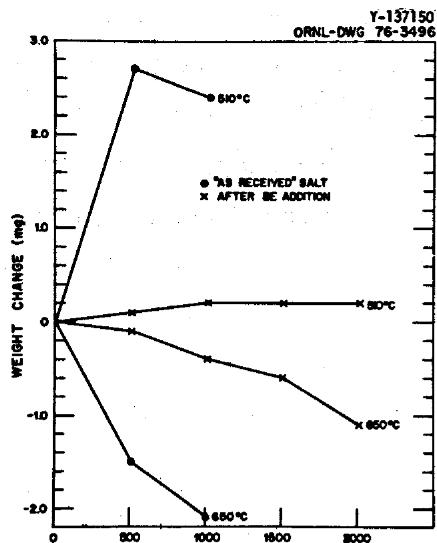  
Fig. 11. Weight Change vs Exposure Time for Type 316 Stainless Steel Exposed to LiF-BeF $_2$ .

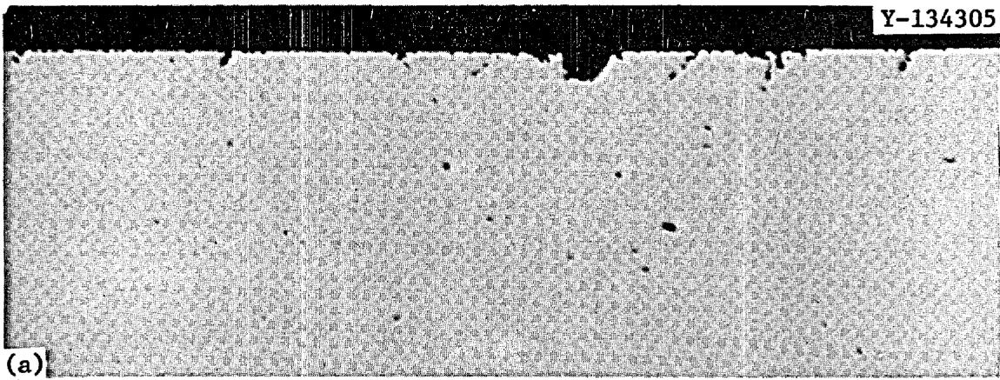

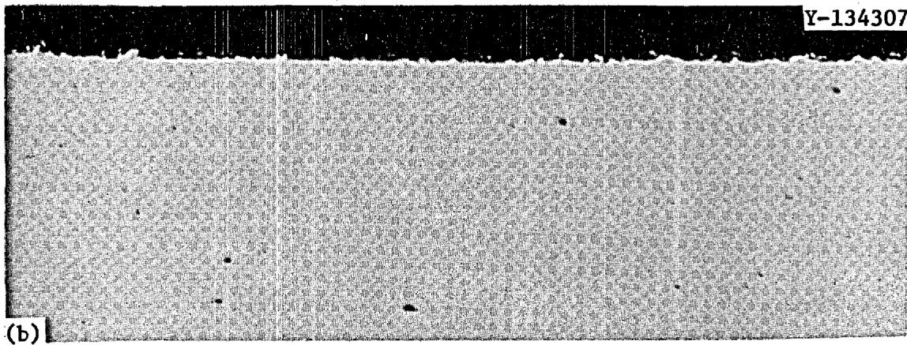  
Fig. 12. Type 316 Stainless Steel Exposed to LiF-BeF $_2$ for 1000 hr at (a) 650 and (b) $510^{\circ}\mathrm{C}$ . $500 \times$ .

as the beryllium rod was in the salt, the corrosion rate was extremely low. This is shown in Fig. 11 for the first 500 hr after the addition of beryllium. After removal of the beryllium, the specimen in the hottest position showed a pattern of increasing weight loss as a function of time. This most probably occurred because, once the source of beryllium was removed, the species in the salt were no longer in equilibrium and the salt became progressively more oxidizing with increasing time, especially as moisture would leak into the system. Weight change results for specimens exposed to the "reducing" salt are also shown in Fig. 11.

# Thermal-Convection Loops 18C and 24

Hastelloy N loops 18C and 24 were used to determine the effect of chromium concentration on the corrosion rate of Hastelloy N. Alloys such as stainless steels and Inconels with a relatively high chromium content had shown a resistance to grain boundary attack by tellurium that seemed to be roughly proportional to chromium composition. However, increasing the chromium content is, according to Eq. (4), expected to increase the corrosion that will occur because of mass transfer, From these tests and tellurium exposure tests we hoped to learn if there is an optimum chromium concentration. Specimens were fabricated from modified Hastelloy N alloys containing 7, 10, and $12\%$ Cr. Each set of specimens was exposed in one of the loops for a total of 1000 hr, with weight change measured after 500 and 1000 hr. Within experimental error the weight change results (Fig. 13) show the dependence on initial chromium concentration that would be expected according to Eq. (4).

Following completion of the studies with the chromium-modified alloys, loop 24 was used to measure the corrosion rate of $3.4\%$ -Nb-modified Hastelloy N. Results indicate a maximum corrosion rate of less than $2.20\mathrm{mgcm}^{-2}$ year-1 for a 1500-hr exposure.

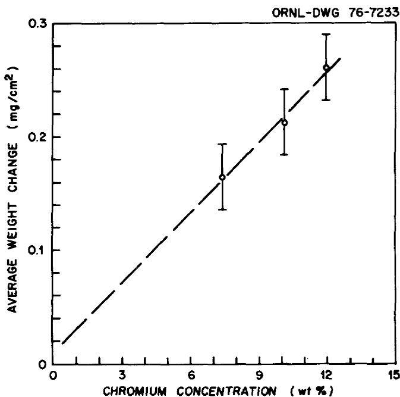  
Fig. 13. Effect of Chromium Concentration in Modified Hastelloy N on Weight Change After 1000 hr in MSBR Fuel Salt.

# Forced-Circulation Loop FCL-2B

Forced-circulation loop FCL-2B was used initially for fuel salt chemistry investigations. The first fuel salt corrosion investigations were made with standard Hastelloy N in salt with a U(IV)/U(III) ratio of about 100. Thus, the most significant differences between this loop and thermal-convection loop 21A were the oxidation potential of the salt $\left[\mathrm{v}10^{2}\right.$ vs $\left.\mathrm{v}10^{4}\right.$ in terms of U(IV)/U(III) ratio] and the velocity of the salt $2.5 - 5\mathrm{m / sec}$ vs $1\mathrm{m / min})$ . If Eq. (4) and the ideas that led to its development are correct, we would expect that (1) the only effect of the low U(IV)/U(III) ratio in FCL-2B would probably be a reduction in the initial corrosion compared with NCL 21A, and (2) the high salt velocity would have no effect on mass transfer of chromium since the limiting factor is the diffusion of chromium to the surface of the alloy, not transfer of the chromium from the hot to the cold parts of the system. The results of this study, shown in Table 3, indicate a very low corrosion rate for the 4000-hr exposure. This test was interrupted several times for repairs on the loop and for heat transfer measurements, but that did not seem to have a detrimental effect on the results.

A 4000-hr corrosion test of Hastelloy N in fuel salt with a U(IV)/U(III) ratio of 1000 was planned. Because of the decision to terminate the Molten-Salt Reactor Program, we decided the remaining operating time for this loop could be best spent measuring the corrosion rate of $1\%$ -Nb-modified Hastelloy N, an alloy that had shown good resistance to tellurium attack. Accordingly, a set of such specimens was prepared and inserted into the loop. Because of loop operating difficulties some of the weight changes measured after 500 and 1000 hr were of questionable value. Measurements made after 1500- and 2200-hr exposure were of good quality and are summarized in Table 3 along with some of the 500- and 1000-hr results. Included in this table for comparison are the results for the standard Hastelloy N specimens exposed for 4309 hr in this same salt and loop. It should be noted that the niobium-modified specimens gained more weight than they lost. This is most probably due to mass transfer of iron from the standard Hastelloy N tubing, which contains about 5 wt $\%$ Fe, to the modified alloy, which has essentially no iron. Taking into account the value at which the corrosion rate of the modified Hastelloy N seems to be leveling out, we expect that the corrosion resistance of the $1\%$ -Nb-modified Hastelloy N is at least as good as that of standard Hastelloy N.

Table 3. Corrosion Rate Measurement for Hastelloy N Specimens Exposed in FCL-2B   

<table><tr><td rowspan="2">Alloy</td><td rowspan="2">Exposure</td><td colspan="3">Corrosion Rate, mg cm-2year-1, at Each Exposure Temperature</td></tr><tr><td>566°C</td><td>635°C</td><td>704°C</td></tr><tr><td>Standard</td><td>4309 hr</td><td>+0.02</td><td>-0.20</td><td>-2.31</td></tr><tr><td rowspan="4">1%-Nb-Modified</td><td>first 580 hr</td><td></td><td></td><td>-0.52</td></tr><tr><td>next 497 hr</td><td></td><td></td><td>-0.31</td></tr><tr><td>next 496 hr</td><td>+1.69</td><td>+2.31</td><td>-0.38</td></tr><tr><td>next 669 hr</td><td>-0.46</td><td>+0.91</td><td>-0.28</td></tr></table>

# CONCLUSIONS

The following conclusions can be drawn from this work.

1. Voltammetry provides a very convenient means for on-line measurement of the oxidation potential and impurity concentration of the salt.   
2. Inconel 601 would probably not have sufficient corrosion resistance to be acceptable for use as a containment vessel material.   
3. No evidence of the formation of uranium carbide was found in studies of the reaction of graphite with very reducing salt.   
4. Weight loss of Hastelloy N specimens occurred as a linear function of the square root of the exposure time indicating diffusion-controlled corrosion.   
5. Type 316 stainless steel has a high initial corrosion rate in as-received $\mathrm{Li}_2\mathrm{BeF}_4$ , but has a very low corrosion rate when beryllium is added to the salt.   
6. Alloys of Hastelloy N modified by the addition of chromium showed weight losses proportional to the chromium concentration.   
7. Limited results indicate that the corrosion rates of 1- and $3.4\%$ -Nb-modified Hastelloy N are at least as good as that of standard Hastelloy N.

# ACKNOWLEDGMENTS

The author wishes to gratefully acknowledge the following persons; for their contributions; E. J. Lawrence for operation of the thermal-convection loops, W. R. Huntley and H. E. Robertson for operation of the forced-circulation loop, H. E. McCoy, J. R. DiStefano, and J. H. DeVan for their advice and helpful discussions, and S. Peterson for editing and Gail Golliher for preparing the manuscript.

# INTERNAL DISTRIBUTION

<table><tr><td>1-2.</td><td>Central Research Library</td><td>51.</td><td>A. D. Kelmers</td></tr><tr><td>3.</td><td>Document Reference Section</td><td>52.</td><td>R. E. MacPherson</td></tr><tr><td>4-13.</td><td>Laboratory Records Department</td><td>53.</td><td>G. Mamantov</td></tr><tr><td>14.</td><td>Laboratory Records, ORNL RC</td><td>54.</td><td>D. L. Manning</td></tr><tr><td>15.</td><td>ORNL Patent Office</td><td>55.</td><td>C. L. Matthews</td></tr><tr><td>16.</td><td>C. F. Baes</td><td>56.</td><td>L. Maya</td></tr><tr><td>17.</td><td>C. E. Bamberger</td><td>57.</td><td>H. E. McCoy</td></tr><tr><td>18.</td><td>E. S. Bettis</td><td>58.</td><td>C. J. McHargue</td></tr><tr><td>19.</td><td>C. R. Brinkman</td><td>59.</td><td>L. E. McNeese</td></tr><tr><td>20.</td><td>J. Brynestad</td><td>60.</td><td>H. Postma</td></tr><tr><td>21.</td><td>D. A. Canonico</td><td>61.</td><td>T. K. Roche</td></tr><tr><td>22.</td><td>S. Cantor</td><td>62.</td><td>M. W. Rosenthal</td></tr><tr><td>23.</td><td>C. B. Cavin</td><td>63.</td><td>H. C. Savage</td></tr><tr><td>24.</td><td>R. E. Clausing</td><td>64.</td><td>J. E. Selle</td></tr><tr><td>25.</td><td>J. L. Crowley</td><td>65.</td><td>M. D. Silverman</td></tr><tr><td>26.</td><td>F. L. Culler</td><td>66.</td><td>G. M. Slaughter</td></tr><tr><td>27.</td><td>J. E. Cunningham</td><td>67.</td><td>A. N. Smith</td></tr><tr><td>28.</td><td>J. H. DeVan</td><td>68.</td><td>L. M. Toth</td></tr><tr><td>29.</td><td>J. R. DiStefano</td><td>69.</td><td>D. B. Trauger</td></tr><tr><td>30.</td><td>R. G. Donnelly</td><td>70.</td><td>J. R. Weir, Jr.</td></tr><tr><td>31.</td><td>J. R. Engel</td><td>71.</td><td>C. L. White</td></tr><tr><td>32.</td><td>L. M. Ferris</td><td>72.</td><td>J. P. Young</td></tr><tr><td>33.</td><td>G. M. Goodwin</td><td>73.</td><td>R. W. Balluffi (consultant)</td></tr><tr><td>34.</td><td>W. R. Grimes</td><td>74.</td><td>P. M. Brister (consultant)</td></tr><tr><td>35.</td><td>R. H. Guymon</td><td>75.</td><td>W. R. Hibbard, Jr. (consultant)</td></tr><tr><td>36.</td><td>J. R. Hightower, Jr.</td><td>76.</td><td>Hayne Palmour III (consultant)</td></tr><tr><td>37-39.</td><td>M. R. Hill</td><td>77.</td><td>N. E. Promisel (consultant)</td></tr><tr><td>40.</td><td>W. R. Huntley</td><td>78.</td><td>D. F. Stein (consultant)</td></tr><tr><td>41-50.</td><td>J. R. Keiser</td><td></td><td></td></tr></table>

# EXTERNAL DISTRIBUTION

79-80. ERDA OAK RIDGE OPERATIONS OFFICE, P. O. Box E, Oak Ridge, TN 37830  
Director, Reactor Division  
Research and Technical Support Division

81-82. ERDA DIVISION OF NUCLEAR RESEARCH AND APPLICATION, Washington, DC 20545 Director

83-196. ERDA TECHNICAL INFORMATION CENTER, Office of Information Services, P. O. Box 62, Oak Ridge, TN 37830 For distribution as shown in TID-4500 Distribution Category, UC-76 (Molten Salt Reactor Technology).