# Status of Materials Development for Molen Salt Reactors

H.E.McCoy, Jr.

CITATION NEWS LITERATURE HISTORYCOMPUTER TECHNOLOGY (INTERNET) (BIOINFORMATION)

LIBERTARLOFLORE80

POHOTELINSHENGTEPHANDENSHENG

It ' s a rich source of information and is an excitingsource of knowledge . We will be looking for

$\therefore m = \frac{3}{11}$ ;

OAK RIDGE NATIONAL LABORATORY

Contract No. W-7405-eng-26

METALS AND CERAMICS DIVISION

# STATUS OF MATERIALS DEVELOPMENT FOR MOLTEN SALT REACTORS

H. E. McCoy, Jr.

Date Published: January 1978

NOTICE This document contains information of a preliminary nature.

It is subject to revision or correction and therefore does not represent a

final report.

OAK RIDGE NATIONAL LABORATORY

Oak Ridge. Tennessee 37830

operated by

UNION CARBIDE CORPORATION

for the

DEPARTMENT OF ENERGY

# CONTENTS

ABSTRACT 1   
INTRODUCTION 1   
DEVELOPMENT STRATEGY 2

Irradiation Embrittlement 2   
Tellurium Embrittlement-Alloy Modification 4   
Tellurium Embrittlement-Salt Modification 8

STATUS OF DEVELOPMENT 8

Irradiation Embrittlement-2% Ti-modified Alloy 8

Fabrication 8   
Weldability 10   
Creep Strength 10   
Alloy Stability 10   
Salt Corrosion 11   
Postirradiation Mechanical Properties 11   
Microstructural Features 11

Irradiation Embrittlement--Nb-modified Alloys 15

Fabrication 15   
Weldability 15   
Creep Strength 15   
Salt Corrosion 16   
Microstructural Features 17

Irradiation Embrittlement-Ti/Nb-modified Alloys 18

Tellurium Embrittlement--Screening Tests on Ti/Nb-modified Alloys 18   
Tellurium Embrittlement-In-reactor Capsules 24   
Tellurium Embrittlement--Chemical Equilibria 27

OVERALL ASSESSMENT 30

ACKNOWLEDGMENT 31

__________   
  
  
  
  
  
  
  
  
__________   
  
  
  
  
  
__________

# STATUS OF MATERIALS DEVELOPMENT FOR MOLTEN SALT REACTORS

H.E.McCoy,Jr.

# ABSTRACT

Experience to date has shown that in a molten-salt reactor environment the alloy Hastelloy N is embrittled by irradiation and suffers shallow intergranular cracking due to the fission product tellurium. From January 1974 through September 1976 these problems were actively researched. Hastelloy N modified with 1 to $2\%$ Nb was found to have good resistance to irradiation embrittlement and to intergranular cracking by tellurium. The severity of cracking by tellurium was noted to be influenced by the oxidation state of the salt so that cracking could be prevented even in standard Hastelloy N. This observation opened up other possibilities for materials selection.

# INTRODUCTION

Molten-salt reactors were initially considered for nuclear-powered aircraft in 1947. A small test reactor called the Aircraft Reactor Experiment was constructed in 1954 and was operated successfully for 221 hr. The potential of the concept for civilian power applications was realized, and the Molten-Salt Reactor Program was formalized in 1956. A 7.4-MW test reactor, called the Molten Salt Reactor Experiment (MSRE), was designed, constructed, and became critical in 1965. The reactor operated successfully for several years, and operation was terminated in 1969 after the reactor successfully completed its mission.[1]

During the years in which the MSRE was being built and brought into operation, most of the development work on molten-salt reactors was in support of the MSRE. As a result of the success of the MSRE, however, the budget was increased to permit work aimed at molten-salt breeder reactors (MSBR) and the shutdown of the MSRE freed additional funds for this purpose. These reactors would use a $\mathrm{LiF} / \mathrm{BeF}_2$ carrier salt with fissile $^{233}\mathrm{U}$ and fertile $^{232}\mathrm{Th}$ . The salt would flow through passages in a graphite-moderated core, where fissioning of the uranium and capture of the neutrons by thorium to form uranium would occur. However, numerous fission products would be produced, and their partial removal would be necessary to have an efficient breeder. The latest developments in chemical processing show that the fission products can be removed to acceptable levels by sequentially removing the uranium by fluoridation and by contacting the salt with Bi/Li solutions.

Although a number of areas require further development, this report will deal specifically with the metallic structural material for the primary system. Operation of the MSRE revealed two deficiencies in the Hastelloy N alloy (Ni; 16% Mo; 7% Cr; 5% Fe; 0.5% Si; and 0.05% C) developed specifically for use in molten-salt systems. First, the alloy was embrittled at elevated temperatures by exposure to thermal neutrons. The creep strength of the alloy was not affected, but the strain that could occur before fracture was reduced. The second problem was that the grain boundaries were embrittled to depths of 5 to 10 mils in all Hastelloy N exposed to the fuel salt and to a lesser extent in material exposed to the vapor above the salt. The embrittled boundaries were opened to form visible cracks only in the heat exchanger. In other

parts of the system it was necessary to strain the material to form visible cracks. This intergranular cracking was clearly associated with fission products, and strong circumstantial evidence suggested that tellurium was the cause of the embrittlement.

The materials program during the past several years emphasized these two problem areas. The irradiation-embrittlement problem was noted several years before the fission-product-related problem, and work has proceeded further in developing an alloy that resists embrittlement by neutrons than in developing an alloy that resists embrittlement by tellurium. The timing associated with discovering the two problems also led to the problems being pursued almost independently, and, in retrospect, to actions that do not appear to be aimed at the problem. However, this situation is largely attributable to the problem changing as more information became available.

The final objective of this study is to develop a material for construction of the primary system of an MSBR. This development will involve the progression of tests on small laboratory-size melts to tests on production-size melts and, similarly, a progression of test times for a few hundred hours to several thousand hours. This progression would lead to the development of an alloy for which production techniques are readily available and whose properties are well known.

# DEVELOPMENT STRATEGY

The problems of irradiation and fission-product embrittlement seemed best pursued through chemical modifications of the alloy. Previous studies at ORNL had shown that the degree of helium embrittlement of austenitic stainless steels could be reduced markedly by slight chemical modification,2 and it was anticipated that this approach would be useful for Hastelloy N. Previous evaluation of components from the MSRE had strongly implicated Te as the fission product responsible for the intergranular cracking.3 There are not much data available on tellurium chemistry, but the approach used was to add elements to Hastelloy N that were reactive with Te, in hopes that the reactive element would form a stable telluride compound. As a compound, the tellurium might be innocuous. A completely separate approach to the tellurium problem would be to modify the salt chemistry to place the tellurium in an innocuous form. Again, this approach was hampered by the lack of data on the many tellurides possible in a salt/fission-product mixture, and it was not viewed with much optimism. Each of these problems will be discussed, and the rationale for the experimental approach will be presented. It was imperative that these problems be corrected without sacrificing the excellent corrosion resistance of the material to fluoride salts and its ability to be manufactured and formed into useful shapes by conventional methods.

# Irradiation Embrittlement

Iron- and nickel-base alloys can be embrittled in a thermal neutron flux by the transmutation of tramp $^{10}\mathbf{B}$ to helium and lithium. This process generally results in the transmutation of most of the $^{10}\mathbf{B}$ by fluxes of thermal neutrons on the order of $10^{20}~\mathrm{cm}^{-2}$ , and usually yields from 1 to 10 atomic ppm of He. With Ni there is a further thermal two-step transmutation involving these reactions:

$$
5 8 _ {\mathrm {N i}} + n \rightarrow 5 9 _ {\mathrm {N i}},
$$

$$
5 9 \mathrm {N} _ {\mathrm {i}} + n \rightarrow^ {4} \mathrm {H e} + ^ {5 6} \mathrm {F e}.
$$

This sequence of reactions does not saturate, and although the cross sections are still in question, it would produce a maximum of 40 atomic ppm of He in the vessel over a 30-year MSBR lifetime. Helium from both sources collects in the grain boundaries and causes degradation of the mechanical properties at elevated temperatures. The effect manifests itself in reduced rupture life and reduced fracture strain.

Previous work with Hastelloy N showed that the predominant carbide formed in air-melted material containing about $0.5\%$ Si was $M_{6}\mathrm{C}$ where $M$ was $27.9\%$ Ni, $3.3\%$ Si, $0.6\%$ Fe, $56.1\%$ Mo, and $4.0\%$ Cr.[5] This carbide was very coarse and was not present on a fine enough scale to influence the transport of He through the individual grains to the grain boundaries. In vacuum-melted material the silicon was lower and the carbide was of the $M_{2}\mathrm{C}$ type where $M$ was 80 to $90\%$ Mo with the remainder Cr.[5] This carbide was fine but coarsened readily at about $700^{\circ}\mathrm{C}$ . By keeping the silicon low, reducing the molybdenum concentration from 16 to $12\%$ , and adding a small amount of one element from the group Nb, Ti, Zr, and Hf, a finely dispersed carbide of the MC type was formed. Figure 1 is an electron micrograph showing the fineness of

4E. J. Allen, H. T. Kerr, and J. R. Engel, ORNL, personal communication, August 1976.   
5H. F. McCoy, Jr., and R. E. Gehlbach, Nucl. Technol. 11, 45 (1971).

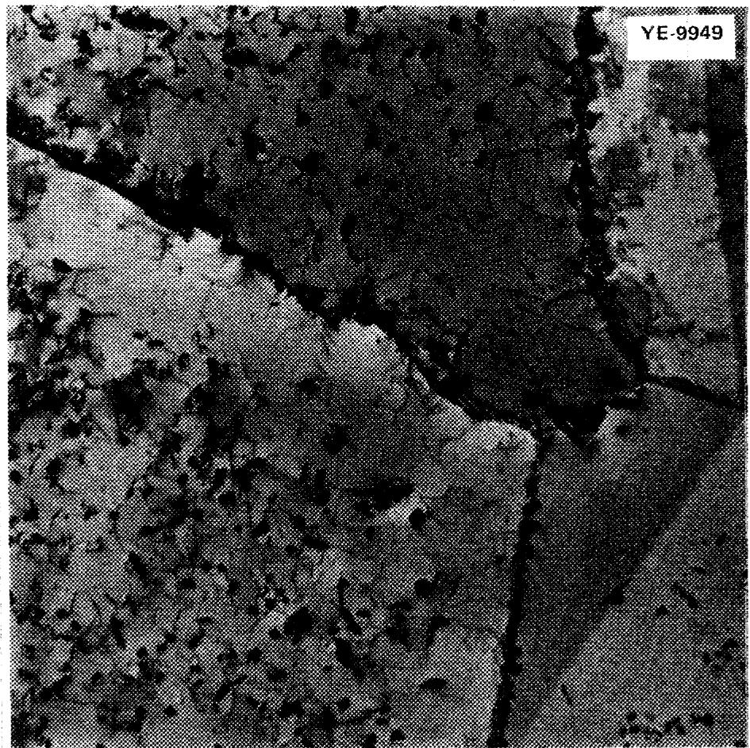  
1μm   
Fig. 1. Typical MC carbide distribution in hafnium-modified Hastelloy N. The alloy contains $0.7\%$ Hf and $0.06\%$ C and was aged $200\mathrm{hr}$ at $760^{\circ}\mathrm{C}$ . Original magnification: $5000\times$ .

this structure and how it could provide sites for trapping He and preventing its transport to grain boundaries. Other modifications were made in the specifications for Fe and Mn. These latter changes were made primarily to simplify the alloy for our studies and are not considered critical.

Postirradiation creep studies showed that Zr and Hf were effective in producing the desired carbide structure, but that they resulted in very poor weldability. Zirconium concentrations of as much as $0.05\%$ caused severe weld metal cracking. Because Hf contains some Zr, it was not possible to determine whether the Hf or the residual Zr caused the cracking. However, Hf had a further scale-up problem in that $\mathrm{HfO_2}$ is more stable than many oxides used in refractories. The Hf added to a melt in a refractory crucible would be oxidized and not available to form a carbide in the alloy. Thus, the use of Zr and Hf additions was not pursued further for practical reasons.

The Ti addition appeared very beneficial, and the development of Ti-modified alloys was pursued. Additions of Nb were studied to a lesser extent. It was not until late in the program when it was discovered that Ti was not only ineffective in preventing intergranular embrittlement by Te, but that it also destroyed the beneficial effects of Nb when both elements were present. However, the $2\%$ -Ti-modified alloy was developed through two large commercial production heats before this fact was discovered.

The experimental approach used to evaluate the extent of irradiation embrittlement was to irradiate small samples in the Oak Ridge Reactor (ORR) and then to perform postirradiation creep tests. One-hundred two specimens were irradiated at one time with controlled temperatures in the ORR poolside. Twenty-three hot-cell creep machines provided excellent facilities for the postirradiation creep tests. Control creep tests were run to provide a basis for comparison with the data on irradiated specimens. Selected irradiated and unirradiated specimens were chosen for detailed electron microscopy.

The alloys evaluated were made by three techniques. Small 2-lb melts were made at ORNL. They were arc melted on a water cooled Cu hearth, drop cast to ingots 1 in. diam by 6 in. long, and swaged to 1/4-in.-diam rods. Melts 50 to 100 lb were made by commercial vendors and formed into 1/2-in.-thick plates. These plates were used for weldability tests, and strips were cut for making test specimens. Two large commercial melts of 8000- and 10,000-lb sizes were obtained. They were made by standard melting practice and were formed into a number of products.

# Tellurium Embrittlement-Alloy Modification

Examination of components from the MSRE suggested that the fission-product tellurium was responsible for the intergranular cracking that occurred in Hastelloy N. Some early laboratory experiments demonstrated our ability to produce similar attack by exposing Hastelloy N to small concentrations of Te in the laboratory. These experiments revealed several important differences in the degree of embrittlement of various alloys by Te. However, these tests were not a good simulation of reactor conditions in that they exposed the metal to a relatively high flux of Te for a short time at the beginning of the test, and no further Te addition was made during the thermal anneal. In a reactor the metal would be exposed to a very small but almost constant flux of Te throughout its period of operation. Thus, better methods of exposure were needed.

The development of Auger spectroscopy methods at ORNL allowed a very definitive experiment to be performed recently on material retained from the MSRE. In this experiment a thin Hastelloy N foil from the MSRE was broken in the Auger spectrometer to expose a fresh grain boundary. As shown in Fig. 2,

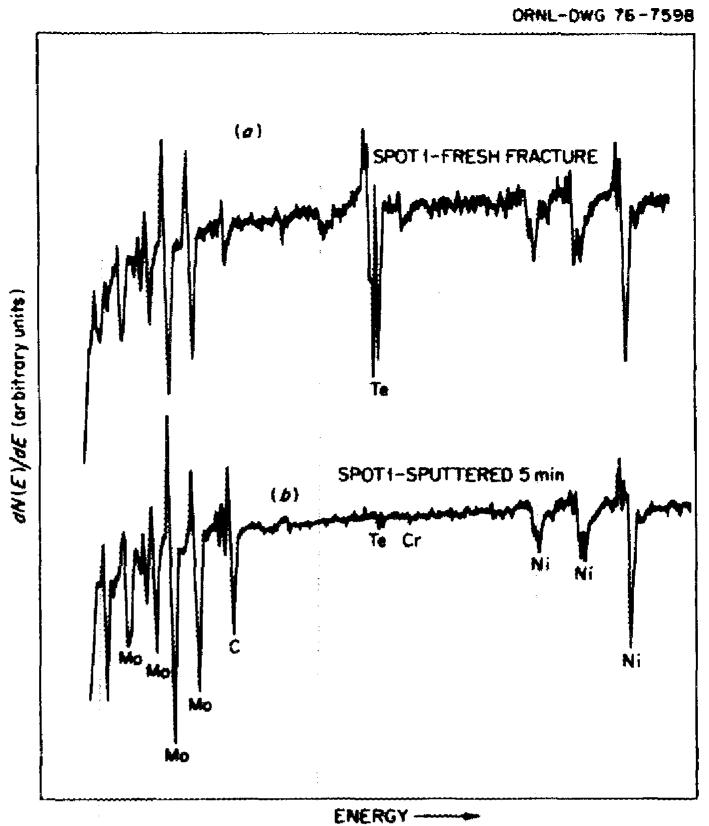  
Fig. 2. Auger spectra of fracture surface of Hastelloy N specimen from MSRE.

Auger spectroscopy showed the presence of Te in a brittle grain boundary and did not reveal another fission product in detectable concentrations. This experiment confirmed previous circumstantial evidence that indicated that the embrittlement was due to the fission product tellurium.

The sparsity of data on the chemistry of tellurides makes it possible only to postulate a mechanism for embrittlement. The phase diagram for the Ni/Te system is shown in Fig. 3. The nickel-rich side is characterized by very low solubility of tellurium in nickel and several intermetallic nickel/tellurium compounds. Such compounds are generally quite brittle and there is no reason to suspect that this system will not be the same. However, these compounds occur at reasonably high concentrations of Te, and one must postulate a mechanism for the enrichment of Te that would lead to the formation of brittle compounds. A schematic diagram of a grain boundary is shown in Fig. 4. Grain boundaries are regions of poor crystalline perfection between adjacent grains of different orientations. This region is generally assumed to be about 3 atomic diameters wide and can have diffusional and chemical characteristics much different from those of the bulk material. It is quite plausible that tellurium diffuses along the grain boundaries and that the concentrations reach levels as high as those required to form the brittle intermetallic compounds. In fact, Auger analysis of the specimen in Fig. 2 revealed about 25 at. $\%$ Te, a concentration quite adequate to form $\mathrm{Ni}_3\mathrm{Te}_2$ (Fig. 3).

The question of whether grain-boundary compounds were formed was not answered conclusively. There was little evidence to support the formation of massive precipitates, but the presence of rather large carbides in the grain boundaries made the analysis rather difficult. Generally, the Te was located within a very few atom layers of grain boundary or within a few atom layers of the carbide/bulk interface when a carbide

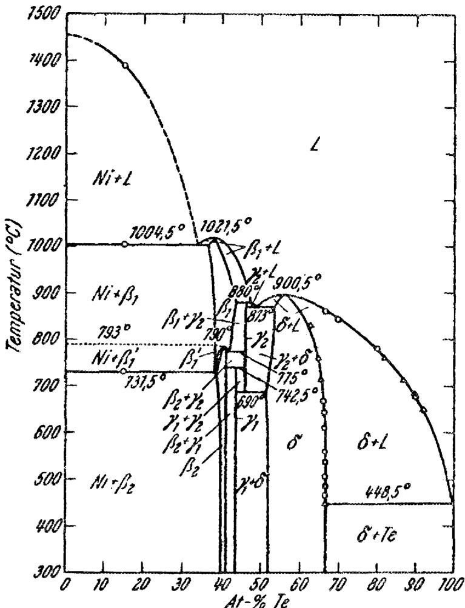  
Fig. 3. Phase diagram for Ni/Te system. Source: K. O. Klepp and K. L. Komarek, Monatsh. Chem. 103, 941 (1972).

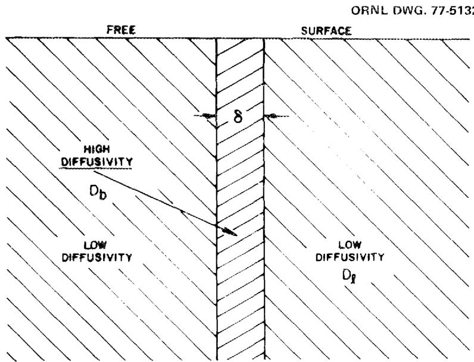  
Fig. 4. Schematic of grain boundary.

particle was present in the grain boundary. Sufficient data of the correct type to determine whether very thin grain boundary telluride phases formed or whether the presence of elemental Te (not as a compound) was sufficient to cause embrittlement did not exist.

With this picture of Te embrittlement, it became necessary to control the surface Te flux at some level typical of reactor operation. In the MSRE the flux of Te atoms reaching the metal was $10^{9}$ atoms $\mathrm{cm}^{-2}$ sec $^{-1}$ , and this value would be $10^{10}$ atoms $\mathrm{cm}^{-2}$ sec $^{-1}$ for a high-performance breeder. (These values were calculated based on many assumptions and are given only as order-of-magnitude estimates.) Even the value for a high-performance breeder is very small from the experimental standpoint. For example, this flux would require that a total of $7.6 \times 10^{-6}$ g of Te be transferred to a sample having a surface area of $10\mathrm{cm}^2$ in 1000 hr. Several Te delivery systems based on the vapor pressure of Te metal and the disassociation pressure of several metal tellurides were used, and these systems are shown schematically in Fig. 5. Te metal has a vapor pressure of about $10^{-4}$ torr at $300^{\circ}\mathrm{C}$ , and one method of exposure involves a Te metal temperature of $300^{\circ}\mathrm{C}$ and a specimen temperature of $700^{\circ}\mathrm{C}$ in a sealed quartz vacuum capsule. Several metal tellurides were synthesized; $\mathrm{Cr}_3\mathrm{Te}_4$ seemed to have the tellurium partial pressure at $700^{\circ}\mathrm{C}$ that most closely approximated the desired flux. This telluride was used in a vapor capsule, as a packing media, and in a fluoride salt. The last system appeared most desirable, and several hundred specimens were exposed in this manner. The exposed specimens were strained to failure in a room-temperature tensile test, and a longitudinal metallographic section was prepared. An optical system using a filar eyepiece with a position transducer was used to count the depth and frequency of cracking from which several related statistical parameters were deduced.

The attractiveness of forming a surface telluride reaction product in preference to having the tellurium diffuse into the metal can be illustrated by a rather simple calculation. With a tellurium flux in an MSBR of $3.8 \times 10^{10}$ atoms $\mathrm{cm}^{-2} \sec^{-1}$ , the amount of tellurium deposited on the metal surfaces over a period of 30 years would be $2.9 \times 10^{19}$ atoms $\mathrm{cm}^2$ . If the tellurium reacted with the nickel in the ratio of two atoms of tellurium per three atoms nickel $(\mathrm{Ni}_3\mathrm{Te}_2)$ , the nickel telluride would be contained in a layer of reaction

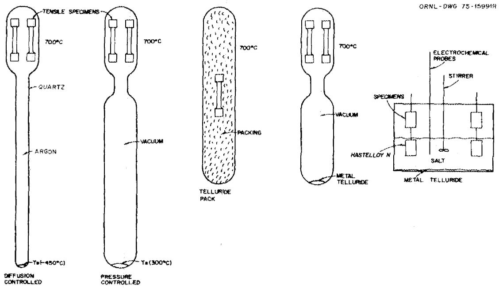  
Fig. 5. Laboratory methods for exposing metal specimens to tellurium.

product $4.7 \times 10^{-4}$ cm thick. Experimental evidence shows that tellurium does not react with nickel in this way, but diffuses preferentially along the grain boundaries. However, the addition of alloying elements to nickel that would form such a surface reaction product is a possible solution to the problem.

The most realistic method for exposing metal samples to Te was an irradiated fuel capsule made of the material of interest. Four experiments of this type, designated TeGen-1, TeGen-2, TeGen-3, and TeGen-4 were performed in the ORR at $700^{\circ}\mathrm{C}$ . Sections of the wall were strained after irradiation, and the severity of cracking was determined by metallographic means. Chemical analyses were performed on samples of the salt and the metal.

# Tellurium Embrittlement--Salt Modification

The behavior of tellurium in salt containing fission products is complex and open to speculation. Experience with the MSRE indicated that Te was deposited on the metal and graphite surfaces, and that only a very small amount resided in the salt at any given time.[8]

Brynestad and others9 suggested that it may be possible to make the salt reducing enough to tie the tellurium up as an innocuous telluride (e.g., "CrTe") by a reaction of the type:

$$
\mathrm {C r F} _ {2} + \mathrm {T e} + 2 \mathrm {U F} _ {3} \rightarrow 2 \mathrm {U F} _ {4} + \text {" C r T e .}
$$

Manning and Mamantov10 performed an electrochemical experiment that indicated that the ratio of $\mathrm{UF_4}$ to $\mathrm{UF_3}$ would have to be about 150 to favor the existence of telluride species over elemental tellurium in molten $\mathrm{LiF / BeF_2 / ThF_4}$ at $650^{\circ}\mathrm{C}$ . The work of Toth and Gilpatrick11 sets a lower practical limit for how reducing the salt can be during reactor operation. At reasonable reactor inlet temperatures of 500 to $550^{\circ}\mathrm{C}$ , the ratio of $\mathrm{UF_4}$ to $\mathrm{UF_3}$ must be about 10 to form uranium carbide. These observations lend some support for the approach of altering the oxidation state of the salt, but it is questionable whether the amount of $\mathrm{UF_3}$ required is practical and whether it is so high as to support the formation of uranium carbide.

Recent work by Keiser offered more hope that a stable telluride could be formed at reasonable $\mathrm{U}^{4+}/\mathrm{U}^{3+}$ ratios. $^{12}$ Keiser used $\mathrm{Cr}_3\mathrm{Te}_4$ as a tellurium source in $\mathrm{LiF/BeF}_2/\mathrm{UF}_4$ salt and varied the $\mathrm{U}^{4+}/\mathrm{U}^{3+}$ ratio of the salt by adding $\mathrm{NiF}_2$ (oxidizing) or $\mathrm{Be}$ (reducing). Small tensile specimens of standard Hastelloy N were exposed to the melt for about 200 hr at $700^{\circ}\mathrm{C}$ at each condition. The specimens were strained to failure and the crack severity determined metallographically.

# STATUS OF DEVELOPMENT

# Irradiation Embrittlement- $2\%$ -Ti-Modified Alloy

# Fabrication

The $2\%$ -Ti-modified Hastelloy N has been developed to rather advanced stages. About one hundred 2-lb lab melts, about twenty 50- to 100-lb commercial melts, and two large (10,000- and 8,000-lb) commercial melts have been made and processed to a large number of products.[13,14] Fabrication experience with these

8W. R. Grimes, Chemical Research and Development for Molten-Salt Breeder Reactors, ORNL/TM-1853 (June 1967).   
9J. Brynestad, ORNL, personal communication, 1975.   
10 L. E. McNese, Molten-Salt Reactor Program Semiannu. Prog. Rep. Feb. 29, 1976, ORNL-5132, pp. 38-39.   
11 L. M. Toth and L. O. Gilpatrick, The Equilibrium of Dilute $UF_{3}$ Solution Contained in Graphite, ORNL/TM-4056 (December 1972).   
$^{12}$ J. R. Keiser, Status of Tellurium-Hastelloy N Studies in Molten Fluoride Salts, ORNL/TM-6002 (October 1977).   
13 L. E. McNeese, Molten-Salt Reactor Program Semiannu. Prog. Rep. Feb. 29, 1976, ORNL-5132, pp. 42-45.   
14L.E.McNeese,Molten-Salt Reactor Program Semiannu.Prog.Rep.Feb.28,1975,ORNL-5047,pp.60-68.

materials was generally quite favorable, except for the occurrence under some conditions of cracking during hot working. Surface cracking occurred in the first heat in almost all products, and the problem was pursued by T. K. Roche (ORNL) and R. W. Bonn (Cabot Corporation).[15,16] Gleeble evaluation tests were used to show that the large heat had a much narrower working temperature range than small heats that had been produced previously. The problem was partially solved, and some useful products were obtained. A second heat (8000 lb) was made with only slight modification in the melting practice by the vendor. Although the chemical analysis of the second heat differed only slightly from that of the first heat (Table 1), the second heat had a much wider working temperature range than the first heat (Fig. 6). Experiences showed that the second heat fabricated much better than the first, but the cracking reappeared in drawing products having diameters below 1 in. The problem was partially alleviated by flexing the worked product to relieve residual stresses before annealing or by using $1120^{\circ}\mathrm{C}$ as an intermediate annealing temperature rather than the usual $1175^{\circ}\mathrm{C}$ . Products including welding wire down to 3/32 in. diam, and several sizes of plate and bar were produced. However, the hot cracking problem still exists as a partially unsolved black mark against this alloy. This type of cracking is due to the alloy not having sufficient hot ductility to prevent cracks forming in material that contains residual stresses due to a prior working operation. This behavior is usually associated with some of the residual elements in nickel. Because, within limits, titanium is not reputed to embrittle nickel-base alloys, it is possible that the hot-working problem is associated with some residual impurity rather than the major alloying elements in this alloy. It is unfortunate, but not too surprising, that fabrication problems were experienced with the first two large heats produced. Clearly this problem must be solved before the $2\%$ -titanium-modified alloy could be produced in large quantities.

15T. K. Roche, ORNL, personal communication.   
16R. W. Bonn, Cabot Corp., personal communication.

Table 1. Chemical analysis of production heats of $2\%$ -Ti-modified Hastelloy $\mathbf{N}^{\mathrm{a}}$   

<table><tr><td rowspan="2">Element</td><td colspan="2">Composition (wt %)</td></tr><tr><td>Heat 2810-4-7901b</td><td>Heat 8918-5-7421c</td></tr><tr><td>Al</td><td>0.10</td><td>0.12</td></tr><tr><td>B</td><td>&lt;0.002</td><td>&lt;0.001</td></tr><tr><td>C</td><td>0.06</td><td>0.07</td></tr><tr><td>Co</td><td>0.02</td><td>0.02</td></tr><tr><td>Cr</td><td>6.97</td><td>7.10</td></tr><tr><td>Cu</td><td>0.02</td><td>&lt;0.01</td></tr><tr><td>Fe</td><td>0.08</td><td>0.06</td></tr><tr><td>Mn</td><td>0.02</td><td>0.12</td></tr><tr><td>Mo</td><td>12.97</td><td>11.93</td></tr><tr><td>N</td><td>0.003</td><td>0.007</td></tr><tr><td>Ni</td><td>Balance</td><td>Balance</td></tr><tr><td>P</td><td>0.002</td><td>0.004</td></tr><tr><td>S</td><td>0.002</td><td>&lt;0.002</td></tr><tr><td>Si</td><td>0.03</td><td>0.04</td></tr><tr><td>Ti</td><td>1.80</td><td>1.90</td></tr><tr><td>W</td><td>0.01</td><td>&lt;0.05</td></tr></table>

$a$ Vendor analyses.

10,000 lb.   
$e^{8000}$ lb.

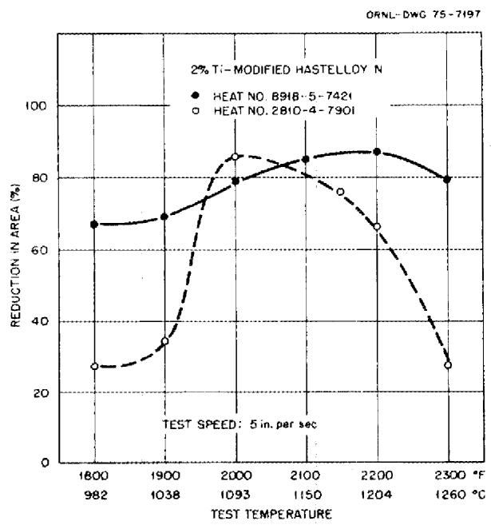  
Fig. 6. High-temperature ductility of two production heats (2810-4-7901 and 8918-5-7421) of $2\%$ -Ti-modified Hastelloy N, determined by Gleeble testing.

# Weldability

Weldability tests were performed on 1/2-in.-thick plate of the small and large commercial heats of the $2\%$ Ti-modified alloy. Two plates of alloy were welded with filler wire of the same material with the plates under high restraint. Bend straps were cut from the plate and subjected to bend tests according to specifications of the American Society of Mechanical Engineers. All heats, including the two large commercial heats, passed the tests and were noted by the welders to have excellent weldability. One important observation was made concerning postweld heat treatment. A postweld heat treatment of 2 to 8 hr at $870^{\circ}\mathrm{C}$ was established for standard Hastelloy N, and this treatment was sufficient to recover the weld properties to those of the base metal. Our limited studies indicated that welds in the $2\%$ Ti-modified alloy must be annealed at $1175^{\circ}\mathrm{C}$ (the normal solution annealing temperature) to bring the weld properties back to those of the base metal.

# Creep Strength

Creep tests were run on most of the heats of the $2\%$ -Ti-modified alloy. The stress-rupture properties are compared in Fig. 7 with those of standard Hastelloy N, and the Ti-modified alloy is superior at all three temperatures. The minimum creep rate of the Ti-modified alloy is compared in Fig. 8 with that of standard Hastelloy N. The modified alloy is superior at $650^{\circ}\mathrm{C}$ , and standard Hastelloy N is slightly superior at 704 and $760^{\circ}\mathrm{C}$ . Thus, the modified alloy has adequate creep strength.

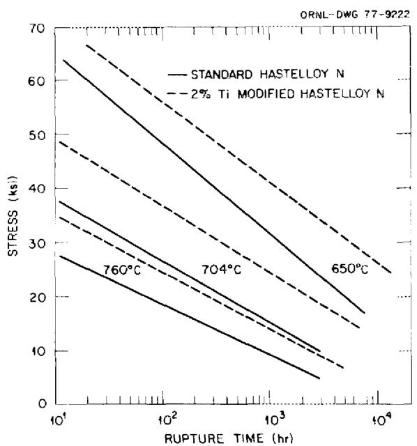  
Fig. 7. Comparison of the stress-rupture properties of standard and $2\%$ -Ti-modified Hastelloy N.

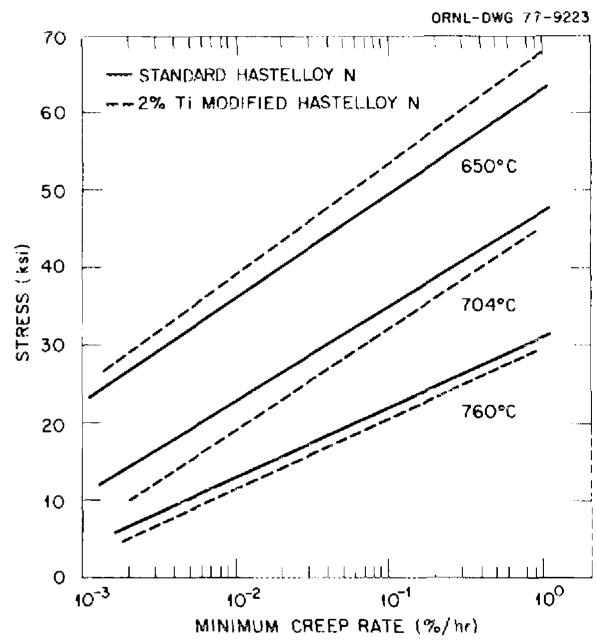  
Fig. 8. Comparison of the creep strengths of standard and $2\%$ -Ti-modified Hastelloy N.

# Alloy Stability

Samples of Ti-modified alloys were aged to 10,000 hr, but very few were tested. However, the few specimens that were tested had excellent properties and did not show any evidence of deterioration of properties with aging. Roche prepared several experimental alloys to evaluate the influence of Al and Ti content on the formation of gamma prime in this alloy base. This question came up because of the use of

Al for deoxidation of the melt. Roche17 found at $650^{\circ}\mathrm{C}$ that this alloy must contain more than $2.7\%$ Ti to form $\gamma'$ and that an alloy containing $2\%$ Ti could contain about $0.6\%$ Al before forming $\gamma'$ . Thus, the composition of the $2\%-$ Ti-modified alloy is such that it is a comfortable distance away from the phase boundaries of embrittling $\gamma'$ .

# Salt Corrosion

Because titanium is readily converted to a fluoride by salt, the addition of this element to the alloy raises the question of accelerated corrosion by fluoride salt. Actual measurements in thermal-convection loops have indicated that the corrosion rate of the Ti-modified alloy is lower than that of standard Hastelloy N.[18] Two factors are involved. First, the iron content of the modified alloy is only a few tenths of a percent, whereas the iron content of the standard alloy is 4 to $5\%$ . Because iron is almost as easily oxidized by the salt as chromium, iron contributes significantly to the corrosion rate in salt of reasonable oxidation potential. Thus, the lower iron content of the modified alloy would significantly reduce the corrosion rate of the modified alloy. The second factor is that titanium is not accessible to the salt unless it can diffuse to the alloy surface. Measurements of the diffusion rate of titanium in Hastelloy N showed that it moved about a factor of 10 more slowly than chromium.[19] Thus, it is quite reasonable that the modified alloy with its lower iron content and its $2\%$ titanium corrodes at a slower rate in salt than does standard Hastelloy N.

# Postirradiation Mechanical Properties

Many specimens of the $2\%$ -Ti-modified alloy base have been irradiated in the ORR to fluxes of thermal neutrons of 2 to $3\times 10^{20}\mathrm{cm}^{-2}$ and have been subjected to postirradiation creep testing. These tests have shown that the $2\%$ -Ti-modified alloys are very resistant to irradiation embrittlement at $700^{\circ}\mathrm{C}$ and lower, but that most heats of the modified alloy are embrittled at $760^{\circ}\mathrm{C}$ . The postirradiation creep properties at $650^{\circ}\mathrm{C}$ of several heats of the $2\%$ modified alloy are compared in Figs. 9 and 10 with those of standard Hastelloy N. The modified alloys are far superior to standard Hastelloy N in all regards. The data for three heats are shown in Fig. 11, where irradiation temperature is evaluated as the test variable. These data show that the properties deteriorated as the irradiation temperature was increased. The $2\%$ -Ti-modified alloy has good properties after irradiation at $650^{\circ}\mathrm{C}$ , acceptable properties after irradiation at $704^{\circ}\mathrm{C}$ , and unacceptable properties after irradiation at $760^{\circ}\mathrm{C}$ . Although there is a glimmer of hope that the alloy can be made stable at $760^{\circ}\mathrm{C}$ , it does not appear very promising. Reactor systems that operate at $650^{\circ}\mathrm{C}$ have good thermal efficiency, so there seems little incentive to operate at 700 to $760^{\circ}\mathrm{C}$ . However, an alloy capable of operation at these temperatures would give more margin for temperature excursions.

# Microstructural Features

Microstructural studies showed that the carbide formed in the $2\%$ -Ti-modified alloy was of the MC type, but the fine points of the behavior of these carbides were not studied sufficiently. Braski only began to scratch the surface in his efforts to produce a more homogeneous structure.[20] Bands of carbides form in this alloy (as they did in standard Hastelloy N) during early fabrication, and the result is that there are alternative regions of high and low densities of carbides.

17L.E.McNeeSc,Molten-Salt Reactor Program Semiannu.Prog.Rep.Feb.29,1976,ORNL-5132,p.51.   
18J. Koger, Alloy Compatibility With LiF-BeF2 Salts Containing ThF4 and UF4, ORNL/TM-4286 (December 1972).   
19 C. E. Sessions and T. S. Lundy, J. Nucl. Mater. 31(3), 316 (1969).   
$^{20}$ D. N. Braski and J. M. Leitnaker, Production of Homogeneous Titanium-Hastelloy N Alloys, ORNL/TM-5697 (February 1977).

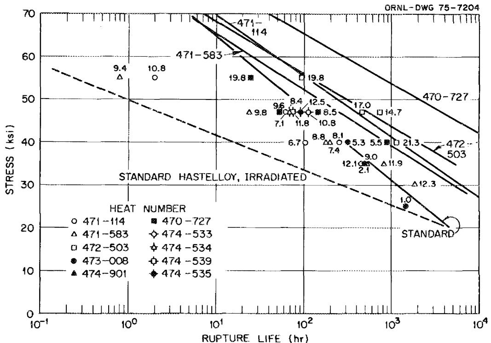  
Fig. 9. Postirradiation stress-rupture properties at $650^{\circ}\mathrm{C}$ of several heats of Ti-modified Hastelloy N. Samples were irradiated at $650^{\circ}\mathrm{C}$ to a flux of thermal neutrons of $3 \times 10^{20} \, \mathrm{cm}^{-2}$ . The numbers by the individual data points are the fracture strains in percent. The solid lines are for the heats in the unirradiated condition.

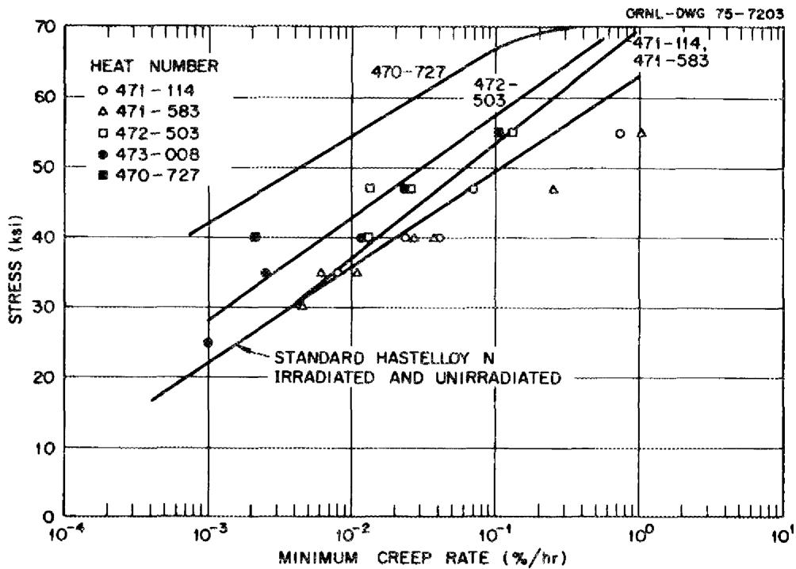  
Fig. 10. Postirradiation creep properties at $650^{\circ}\mathrm{C}$ of several heats of Ti-modified Hastelloy N. Samples were irradiated at $650^{\circ}\mathrm{C}$ to a flux of thermal neutrons of $3 \times 10^{20} \, \mathrm{cm}^{-2}$ . The solid lines are for heats in the unirradiated condition unless noted otherwise.

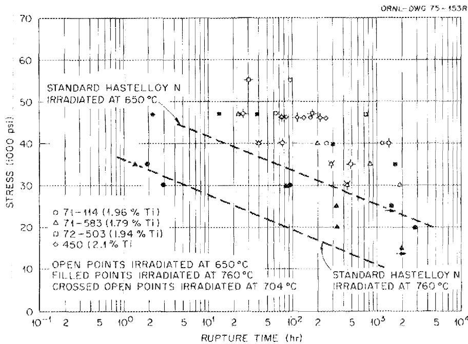  
Fig. 11. Postirradiation creep properties of Ti-modified alloys at $650^{\circ}\mathrm{C}$ after irradiation at indicated temperature to a flux of thermal neutrons of $3 \times 10^{20} \, \mathrm{cm}^{-2}$ . Numbers by points indicate fracture strains. Arrows indicate that test was still in progress when figure was made.

The practical aspects of the influence of carbide structure can be appreciated by examining samples of two heats of material that responded quite differently to irradiation. Comparative transmission electron micrographs are given for heats 71-114 and 72-502 in Figs. 12 to 14. After irradiation of $650^{\circ}\mathrm{C}$ there is not an appreciable difference in microstructure, but as the irradiation temperature was increased the carbides remained much finer in heat 72-503 than they did in heat 71-114. Similarly, the properties of heat

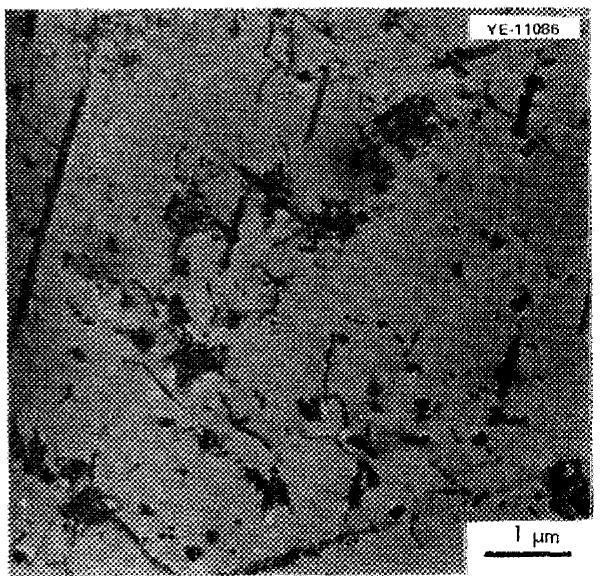  
(a)

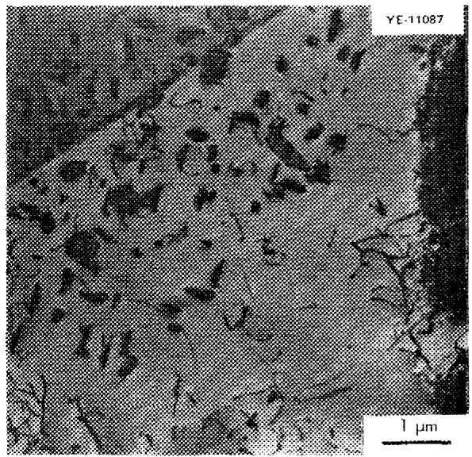  
(b)   
Fig. 12. Electron micrographs of two alloys after irradiation at $650^{\circ}\mathrm{C}$ for 1200 hr. (a) Alloy 503. (b) Alloy 114.

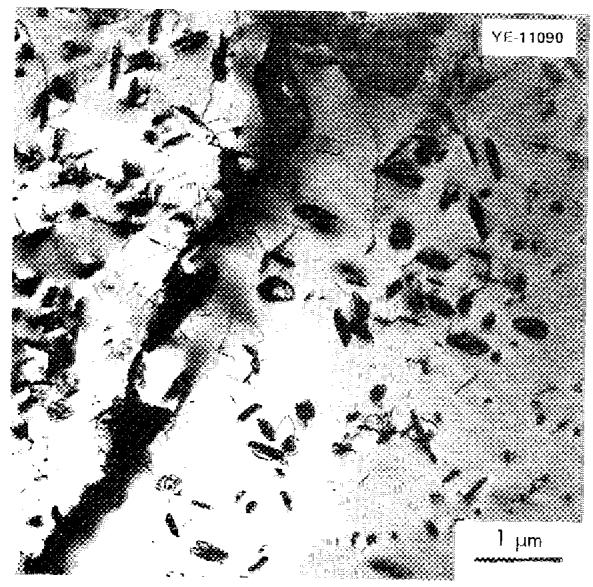  
(a)

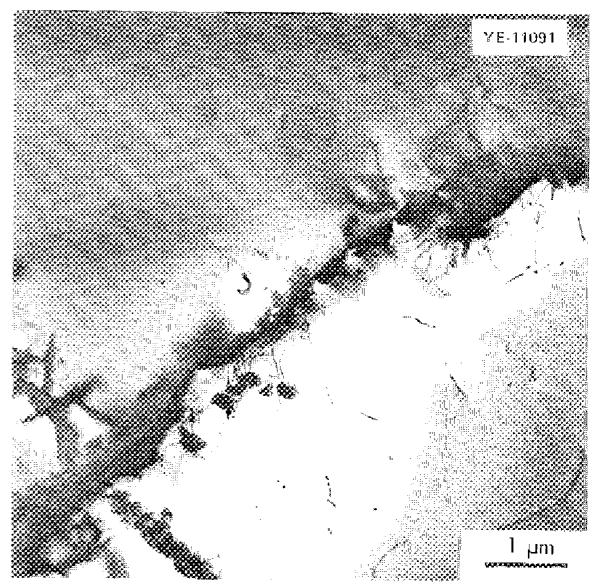  
(b)

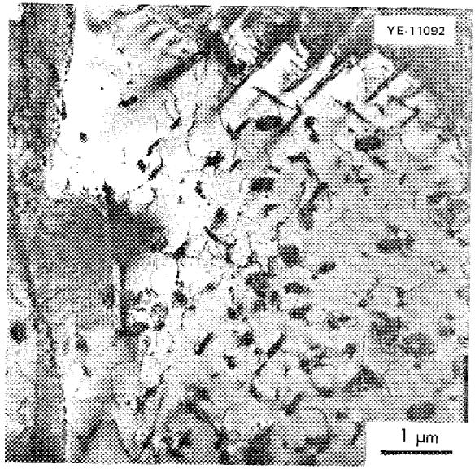  
Fig. 13. Electron micrographs of two alloys after irradiation at $704^{\circ}\mathrm{C}$ for 1200 hr. (a) Alloy 503. (b) Alloy 114.   
(a)

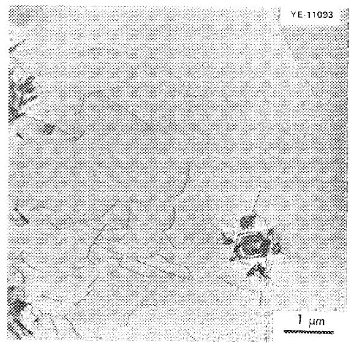  
(b)   
Fig. 14. Electron micrographs of two alloys after irradiation at $760^{\circ}\mathrm{C}$ for 1200 hr. (a) Alloy 503. (b) Alloy 114.

72-503 were far superior to those of heat 71-114. Preirradiation annealing had a marked influence on the properties of this alloy. As shown in Table 2, it was possible to cause dramatic changes in the postirradiation creep properties by very small changes in the preirradiation annealing temperature.

Further study of the precipitation morphology and kinetics is needed for this alloy. These studies are not likely to result in any surprises, but simply will reveal methods for controlling properties by closer control of heat treating during processing.

Table 2. Influence of preirradiation annealing treatment on the postirradiation creep properties of modified Hastelloy N (heat 471-114)   
Irradiated at $760^{\circ}\mathrm{C}$ and tested at $650^{\circ}\mathrm{C}$ .   

<table><tr><td>Test no.a</td><td>Preirradiation annealb</td><td>Stress (103psi)</td><td>Rupture life (hr)</td><td>Minimum creep rate (%/hr)</td><td>Total elongation (%)</td></tr><tr><td>1691</td><td>A</td><td>35</td><td>4.7</td><td>0.014</td><td>0.33</td></tr><tr><td>1712</td><td>A</td><td>30</td><td>6.0</td><td>0.010</td><td>0.48</td></tr><tr><td>1736</td><td>A</td><td>25</td><td>96.2</td><td>0.0022</td><td>0.78</td></tr><tr><td>1692</td><td>B</td><td>35</td><td>0.7</td><td>0.20</td><td>0.22</td></tr><tr><td>1746</td><td>B</td><td>30</td><td>3.4</td><td>0.029</td><td>0.36</td></tr><tr><td>1719</td><td>B</td><td>25</td><td>171.5</td><td>0.0009</td><td>1.8</td></tr><tr><td>1683</td><td>C</td><td>35</td><td>1.6</td><td>0.17</td><td>2.3</td></tr><tr><td>1706</td><td>C</td><td>30</td><td>93.6</td><td>0.029</td><td>3.6</td></tr><tr><td>1786</td><td>C</td><td>30</td><td>-</td><td>-</td><td>-</td></tr><tr><td>1715</td><td>C</td><td>25</td><td>1463.6c</td><td>0.0042</td><td>8.6</td></tr><tr><td>1792</td><td>C</td><td>20</td><td>2850.0</td><td>0.0010</td><td>8.1</td></tr><tr><td>1777</td><td>D</td><td>47</td><td>27.3</td><td>0.090</td><td>7.1</td></tr><tr><td>1737</td><td>D</td><td>40</td><td>223.0</td><td>0.011</td><td>3.6</td></tr><tr><td>1693</td><td>D</td><td>35</td><td>663.3</td><td>0.0044</td><td>4.0</td></tr><tr><td>1694</td><td>E</td><td>35</td><td>0.3</td><td>0.3</td><td>2.7</td></tr><tr><td>1720</td><td>E</td><td>25</td><td>60.0</td><td>0.0028</td><td>0.35</td></tr><tr><td>1794</td><td>E</td><td>15</td><td>2782.1</td><td>0.0006</td><td>2.1</td></tr></table>

$a_{\mathbb{R}}$ series.   
${}^{b}\mathrm{A} =$ annealed $1\mathrm{{hr}}$ at ${1038}^{ \circ  }\mathrm{C}$ in argon; $\mathrm{B} =$ annealed $1\mathrm{{hr}}$ at ${1093}^{ \circ  }\mathrm{C}$ in argon; $\mathrm{C} =$ annealed $1\mathrm{{hr}}$ at ${1177}^{ \circ  }\mathrm{C}$ in argon; $\mathrm{D} =$ annealed $1$ hr at ${1204}^{ \circ  }\mathrm{C}$ in argon; $\mathrm{E} =$ annealed $1\mathrm{{hr}}$ at ${1260}^{ \circ  }\mathrm{C}$ in argon.   
cDiscontinued before failure.

# Irradiation Embrittlement-Nb-modified Alloys

# Fabrication

Because work began later on the Nb-modified alloys than on the titanium-modified alloys, the fabrication experience was not as extensive. About fifty 2-lb laboratory melts containing up to $4.4\%$ Nb were melted and fabricated into 1/4-in.-diam rod, and five commercial melts about 50 lb each were melted and fabricated into 1/2-in.-thick plates. These alloys fabricated well by using the same annealing and working temperatures used for standard Hastelloy N.

# Weldability

Test welds (gas tungsten arc) were made in all five of the commercial Nb-containing heats. They were prepared by using the same welding parameters used for standard Hastelloy N. Bend specimens from all heats bent without evidence of cracking. Thus the weldability of these materials appears excellent.

# Creep Strength

The creep testing program on the Nb-modified alloys was still in the beginning stages, but sufficient data were obtained to show that Nb had very beneficial effects. The influence of Nb content on the 100-hr rupture stress is illustrated in Fig. 15. The properties of a typical heat of standard Hastelloy N are shown by the horizontal lines on the right-hand side of the figure. At $650^{\circ}\mathrm{C}$ the effects of Nb are linear up to about $1.5\%$ Nb, and further additions have a lesser effect. Irradiation at 650 and $704^{\circ}\mathrm{C}$ with subsequent testing at

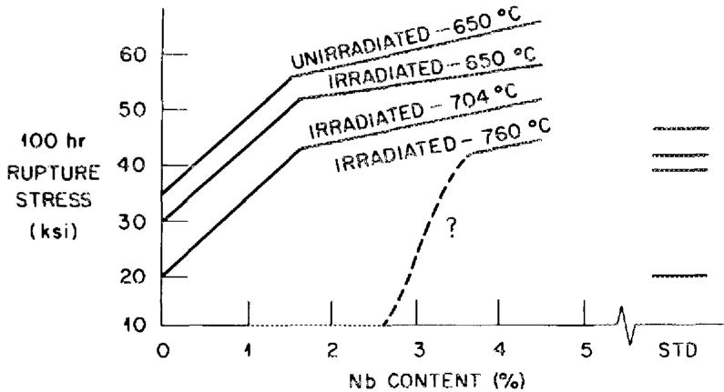  
Fig. 15. Influence of Nb content on the stress-rupture properties of modified Hasteley N at $650^{\circ}\mathrm{C}$ .

$650^{\circ}\mathrm{C}$ resulted in progressively lower strengths, but the strength variation with niobium content paralleled that of the unirradiated material. Irradiation at $760^{\circ}\mathrm{C}$ resulted in drastic degradation of properties for all alloys except those containing $3.5\%$ or more Nb.

The influence of Nb on creep strain is shown in Fig. 16. Niobium additions up to approximately $1.5\%$ have a large strengthening effect with a much lesser effect at higher niobium concentrations. Alloys containing $0.5\%$ or more Nb are stronger than standard Hastelloy N.

The fracture strain is the parameter of most concern. The influence of Nb on this parameter is shown in Fig. 17. In the unirradiated condition Nb has a beneficial effect up to about $3.3\%$ , and the ductility diminishes at higher Nb concentrations. The ductility of specimens irradiated and tested at $650^{\circ}\mathrm{C}$ was the same as that of unirradiated specimens. Irradiation at 704 and $760^{\circ}\mathrm{C}$ resulted in much lower fracture strains, but niobium had a beneficial effect. Thus, these data show that niobium improves the resistance of Hastelloy N to irradiation embrittlement, but that the alloys are likely not useful at operating temperatures much above $650^{\circ}\mathrm{C}$ .

ORNL-DWG 77-5145

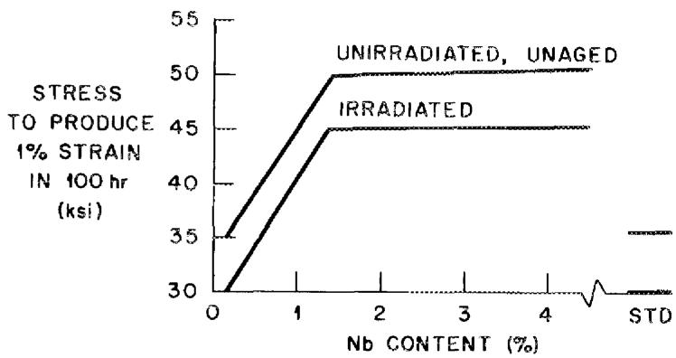  
Fig. 16. Influence of Nb content on the creep properties of modified Hastelloy N at $650^{\circ}\mathrm{C}$ .

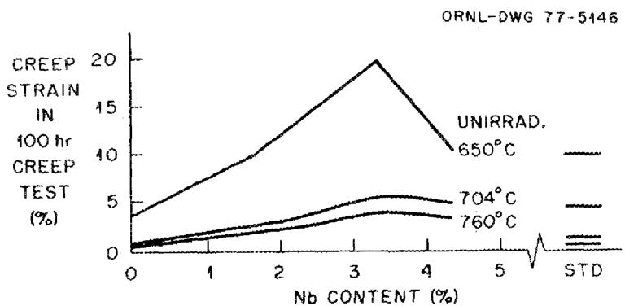  
Fig. 17. Influence of Nb content on the fracture strain of modified Hastelloy N at $650^{\circ}\mathrm{C}$

# Salt Corrosion

Niobium forms a very stable fluoride, so Nb would be removed from the alloy by the salt. However, the process would be limited by the diffusion of Nb to the specimen surface. It is very unlikely that Nb diffuses more rapidly than Cr; so, at worst, the presence of 1 to $2\%$ Nb can be likened to increasing the chromium content from $7\%$ to 8 to $9\%$ . Limited corrosion measurements in thermal convection and forced circulation loops indicated very good corrosion resistance of Nb-modified alloys.[21] Although further corrosion measurements need to be made, it is very unlikely that corrosion in salt will pose a problem with the Nb-modified alloys.

# Microstructural Features

Very limited microstructural studies showed that the carbides in the Nb-modified alloys behave qualitatively the same as those in the Ti-modified alloys. Solution annealing at $1175^{\circ}\mathrm{C}$ seemed to be nearer a true solution anneal for the Nb-modified alloys, with most of the carbon being in solid solution at this temperature. During subsequent exposure at typical service temperatures (e.g., $650^{\circ}\mathrm{C}$ ) fine carbides of the MC type precipitated. Fig. 18 shows the precipitates that formed at $650^{\circ}\mathrm{C}$ , and Fig. 19 shows how

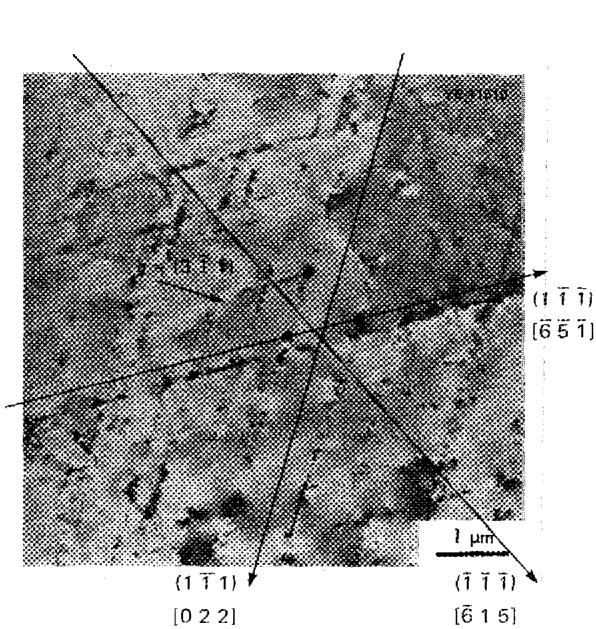  
Fig. 18. Unstressed portion of $1\%$ -Nb-modified Hastelloy N solution annealed at $650^{\circ}\mathrm{C}$ for 1175 hr. Original magnification: $25,000\times$

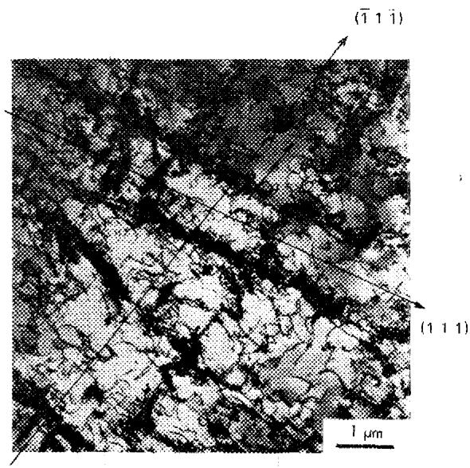  
Fig. 19. Specimen of $1\%$ -Nb-modified Hastelloy N solution annealed and stressed at 40,000 psi and $650^{\circ}\mathrm{C}$ for 1175 hr. Original magnification: $25,000\times$

dislocations interacted with these precipitates in a stressed sample. These precipitates would also act as very effective pinning sites for He.

The precipitates were extracted from some of these specimens and were found to consist of two face-centered cubic carbides having lattice parameters of 4.280 and 4.175 Å. X-ray fluorescence analyses of the extracted precipitates showed the presence of Mo, Nb, Cr, Ni, and Zr in the order of decreasing concentration. By transmission electron microscopy it was found that both carbides were epitaxially oriented with the matrix the [1 1 1] planes of the carbide and of the matrix being parallel to each other.[22]

# Irradiation Embrittlement-Ti/Nb-modified Alloys

Alloys containing Nb and Ti were not pursued adequately to obtain a very complete understanding, but they had a number of interesting features. Alloys with small concentrations of Nb and Ti (e.g., $1\%$ each) had very attractive pre- and postirradiation properties. They were strong and had fracture strains from 10 to $25\%$ in the irradiated condition.

Alloys that contained higher amounts of Nb and Ti (e.g., $2\%$ each) were very strong. They formed a stress-induced precipitate, probably $\gamma'$ , that made them strong with moderate ductility in the unirradiated condition. Some of the features of these alloys were presented previously.[23] In the irradiated conditions these alloys were strong but brittle.

Alloys with medium concentrations of niobium and titanium (e.g., $1\%$ each) have very attractive properties in the irradiated and unirradiated conditions. Alloys with higher amounts of Nb and Ti are very strong and may be useful for nonnuclear applications. In the medium-concentration alloys no $\gamma'$ was found, and the strengthening was attributed to combined solid solution and carbide strengthening mechanisms. In the higher concentration alloys, $\gamma'$ was formed and its formation was accelerated by stress. These alloys are very complex and were not studied sufficiently to fully understand the phase relationships.

# Tellurium Embrittlement Screening Tests on Ti/Nb-modified Alloys

Approximately 50 experiments involving some 2000 specimens were performed in which several alloys were exposed to tellurium. Several of these experiments were performed in learning how to expose specimens under reasonable conditions, and they did not provide useful materials information. The most realistic and reproducible method involved exposing metal specimens to salt containing $\mathrm{Cr}_3\mathrm{Te}_4$ and $\mathrm{Cr}_5\mathrm{Te}_6$ at $700^{\circ}\mathrm{C}$ . This method is shown schematically in the right-hand side of Fig. 5. The last specimens examined from this experiment were exposed for 2500 hours. Selected specimens from this experiment illustrate our general findings in this program. Photomicrographs of these specimens are shown in Fig. 20, and the chemical analyses are given in Table 3. Standard Hastelloy N [Fig. 20(a)] was embrittled under these conditions. Type 304 stainless steel [Fig. 20(b)] was roughened because of corrosion by the salt, but there is no evidence of intergranular embrittlement. Hastelloy S [Fig. 20(c)] and Inconel 600 [Fig. 20(d)] both contain nominally $15\%$ of Cr, but they were embrittled by the tellurium. Hastelloy N modified with $1.75\%$ Ti was embrittled [Fig. 20(e)]. Alloy 506 contained $14.5\%$ Cr [Fig. 20(f)] and was embrittled as severely as Hastelloy N containing $7\%$ Cr. Alloys 516 [Fig. 20(g)], 421543 [Fig. 20(h)], 517 [Fig. 20(i)], 525 [Fig. 20(j)], and 528 [Fig. 20(k)] contained $< 0.10$ , 0.70, 1.10, 1.5, and $4.4\%$ Nb, respectively. The severity of

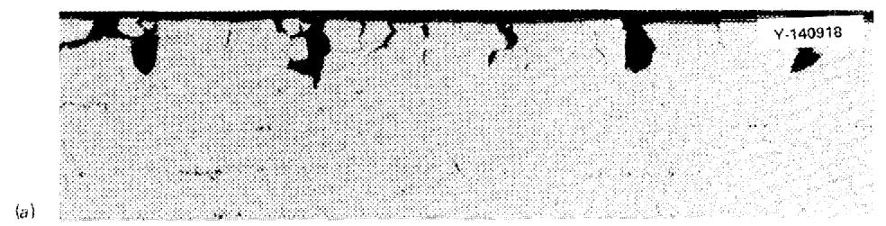

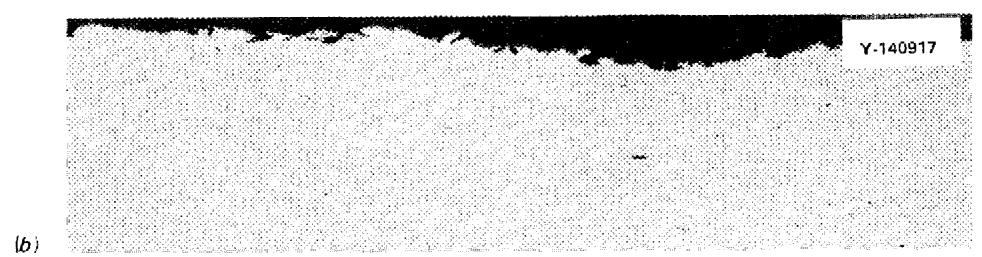

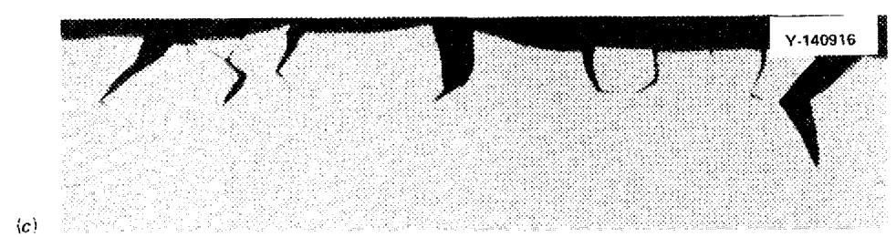

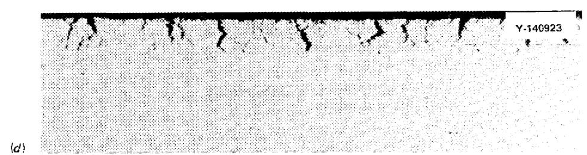

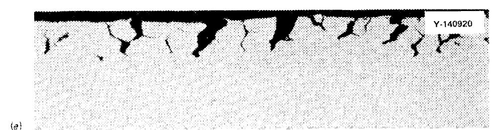

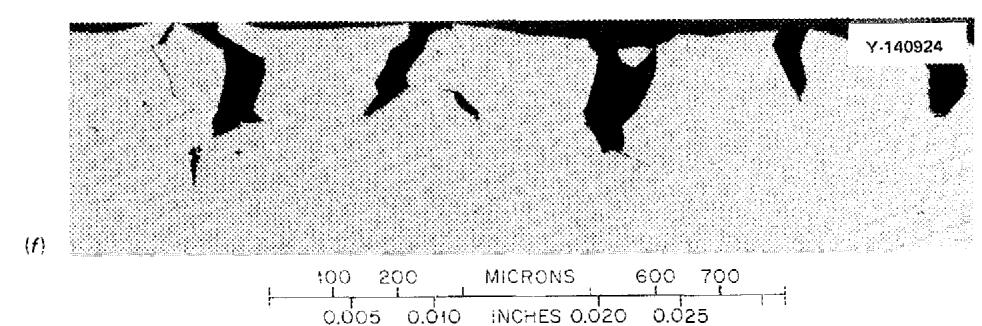  
Fig. 20. Photomicrographs of several alloys exposed to salt containing $\mathrm{Cr}_5\mathrm{Te}_6$ and $\mathrm{Cr}_3\mathrm{Te}_4$ for $2500\mathrm{hr}$ at $700^{\circ}\mathrm{C}$ and strained to failure at room temperature. (a) Standard Hastelloy N. (b) 304 stainless steel. (c) Hastelloy S. (d) Inconel 600. (e) Alloy 474533. (f) Alloy 506.

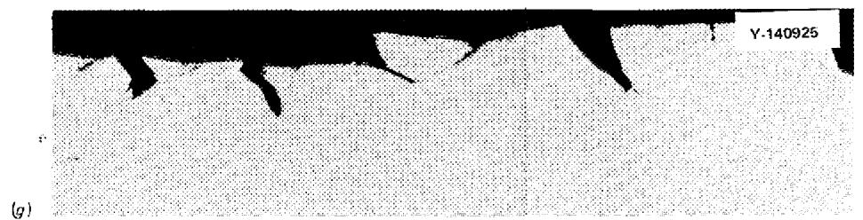

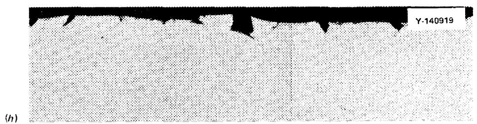

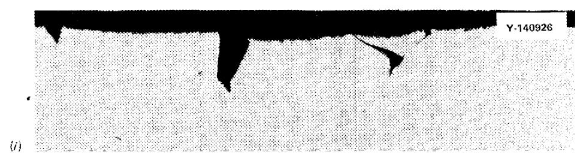

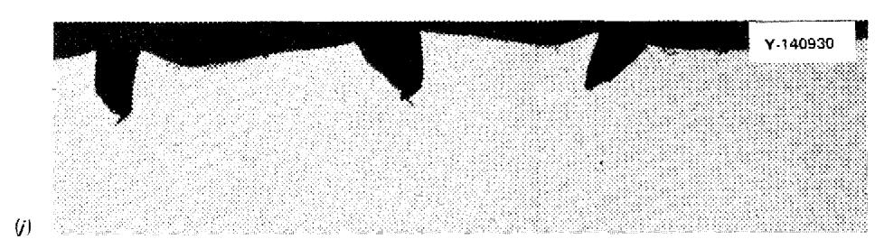

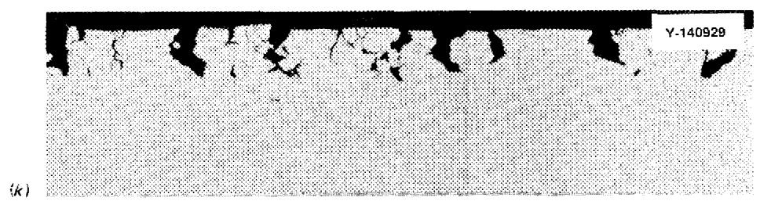

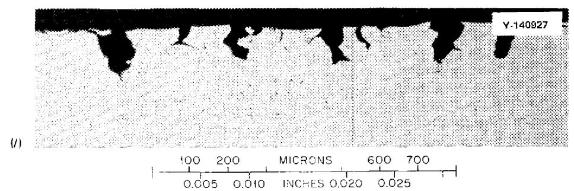  
Fig. 20 (concluded). Photomicrographs of several alloys exposed to salt containing $\mathrm{Cr}_5\mathrm{Te}_6$ and $\mathrm{Cr}_3\mathrm{Te}_4$ for $2500\mathrm{hr}$ at $700^{\circ}\mathrm{C}$ and strained to failure at room temperature. (g) Alloy 516. (h) Alloy 421543. (i) Alloy 517. (j) Alloy 525. (k) Alloy 528. (l) Alloy 518.

Table 3. Chemical analyses of alloys   
Alloys were exposed to salt containing $\mathrm{Cr_3Te_4}$ and $\mathrm{Cr_4Te_5}$ for $2500\mathrm{hr}$ at $700^{\circ}\mathrm{C}$ .   

<table><tr><td rowspan="2">Alloy</td><td rowspan="2">Alloy no.</td><td colspan="13">Concentration of elementa(wt %)</td><td></td><td></td></tr><tr><td>Ni</td><td>Mo</td><td>Cr</td><td>Fe</td><td>Mn</td><td>C</td><td>Si</td><td>Ti</td><td>Nb</td><td>Al</td><td>Co</td><td>Cu</td><td>La</td><td>Ni</td><td>W</td></tr><tr><td>Type 304 stainless steel</td><td>139969</td><td>9.3</td><td>b</td><td>18.5</td><td>Bal</td><td>1.51</td><td>0.027</td><td>0.45</td><td>b</td><td>b</td><td>b</td><td></td><td></td><td></td><td></td><td></td></tr><tr><td>Inconel 600</td><td>NX6372G</td><td>Bal</td><td>-</td><td>15.13c</td><td>9.17c</td><td>0.27c</td><td>0.10c</td><td>0.09c</td><td></td><td></td><td></td><td></td><td>0.31c</td><td></td><td></td><td></td></tr><tr><td>Hastelloy S</td><td>476316</td><td>Bal</td><td>14.16c</td><td>15.05c</td><td>0.47c</td><td>0.52c</td><td>0.003c</td><td>0.38c</td><td></td><td></td><td>0.27c</td><td></td><td></td><td>0.18c</td><td></td><td></td></tr><tr><td>Hastelloy N</td><td>405065</td><td>Bal</td><td>16.0</td><td>7.1</td><td>4.0</td><td>0.55</td><td>0.06</td><td>0.57</td><td>&lt;0.01</td><td>b</td><td>0.03</td><td></td><td></td><td></td><td></td><td></td></tr><tr><td>Modified Hastelloy N</td><td>474533</td><td>Bal</td><td>11.37</td><td>7.3</td><td>0.03c</td><td>0.04</td><td>0.091</td><td>0.15</td><td>1.75</td><td>b</td><td>0.54</td><td>0.03c</td><td></td><td></td><td></td><td>0.14c</td></tr><tr><td></td><td>421543</td><td>Bal</td><td>12.4</td><td>7.31</td><td>0.038</td><td>0.08</td><td>0.05</td><td>0.014</td><td>0.003</td><td>0.70</td><td>0.02</td><td></td><td></td><td></td><td></td><td></td></tr><tr><td></td><td>411</td><td>Bal</td><td>11.71</td><td>6.78</td><td>b</td><td>0.1</td><td>0.043</td><td>b</td><td>b</td><td>1.15</td><td>b</td><td></td><td></td><td></td><td></td><td></td></tr><tr><td></td><td>413</td><td>Bal</td><td>11.82</td><td>6.75</td><td>b</td><td>0.1</td><td>0.045</td><td>b</td><td>0.9</td><td>1.13</td><td>b</td><td></td><td></td><td></td><td></td><td></td></tr><tr><td></td><td>506</td><td>Bal</td><td>11.97</td><td>14.5</td><td>b</td><td>0.22</td><td>0.037</td><td>b</td><td>&lt;0.01</td><td>&lt;0.02</td><td>0.10</td><td></td><td></td><td></td><td></td><td></td></tr><tr><td></td><td>516</td><td>Bal</td><td>10.58</td><td>7.3</td><td>&lt;0.05</td><td>0.20</td><td>0.049</td><td>&lt;0.02</td><td>&lt;0.02</td><td>&lt;0.10</td><td>0.05</td><td></td><td></td><td></td><td></td><td></td></tr><tr><td></td><td>517</td><td>Bal</td><td>11.45</td><td>7.10</td><td>&lt;0.05</td><td>&lt;0.01</td><td>0.045</td><td>&lt;0.02</td><td>&lt;0.02</td><td>1.10</td><td>0.03</td><td></td><td></td><td></td><td></td><td></td></tr><tr><td></td><td>518</td><td>Bal</td><td>11.55</td><td>7.18</td><td>&lt;0.05</td><td>0.20</td><td>0.040</td><td>0.05</td><td>0.95</td><td>0.96</td><td>0.10</td><td></td><td></td><td></td><td></td><td></td></tr><tr><td></td><td>525</td><td>Bal</td><td>12d</td><td>7.17</td><td>b</td><td>0.2d</td><td>0.05d</td><td>b</td><td>&lt;0.02</td><td>1.5</td><td>0.1d</td><td></td><td></td><td></td><td></td><td></td></tr><tr><td></td><td>528</td><td>Bal</td><td>12d</td><td>7d</td><td>b</td><td>0.2d</td><td>0.05d</td><td>b</td><td>&lt;0.02</td><td>4.4</td><td>0.1d</td><td></td><td></td><td></td><td></td><td></td></tr></table>

$a_{\mathrm{Bal}} =$ balance.   
$b$ Not analyzed, but no intentional addition made of this element.

$c$ Vendor's analysis.

$d_{\mathrm{Not}}$ analyzed, but nominal concentration indicated.

cracking decreased steadily with increasing Nb content through $1.5\%$ , and then increased again at higher concentrations. In interpreting these photomicrographs, the reader must realize that the process of deforming the specimens to failure after the exposure to tellurium produces some cracks. The few cracks in Figs. 20(i)] and 20(j) are of the type produced by deformation, whereas the cracks in Fig. 20(k) are of the type that we associated with intergranular Te embrittlement. Titanium and Nb were both present in alloy 518 [Fig. 20(l)], and this alloy was more severely embrittled than alloy 517 [Fig. 20(i)], which contained only Nb.

The niobium-modified alloys were included in several experiments. As just discussed, samples containing from 0 to $4.4\%$ Nb were exposed for several different times in salt containing $\mathrm{Cr}_3\mathrm{Te}_4$ and $\mathrm{Cr}_5\mathrm{Te}_6$ . The crack depths and frequencies were determined optically on polished cross sections of the deformed test specimens. Because both the depth and frequency of cracking are important, these two parameters were multiplied together to give a new parameter. This product is shown in Fig. 21 for Nb-modified alloys that were exposed 250, 1000, and $2500\mathrm{hr}$ . These results show a definite minimum in the cracking severity as a function of Nb content, with the least severe cracking in alloys containing from 1 to $2\%$ Nb. One disturbing trend is that the curves for successive times are approximately parallel. This seems to indicate that even the most resistant alloys containing 1 to $2\%$ Nb are being embrittled by tellurium. This

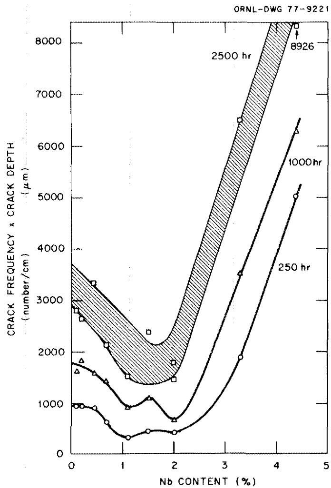  
Fig. 21. Variations of severity of cracking with Nb content. Samples were exposed for indicated times to salt containing $\mathrm{Cr_3Te_4}$ and $\mathrm{Cr_5Te_6}$ at $700^{\circ}\mathrm{C}$ .

behavior creates some difficulty in extrapolating from these 2500-hr experiments to a reactor lifetime of 30 years (250,000 hr).

These same Nb-bearing alloys were included in a pot experiment where the salt contained $\mathrm{Ni}_3\mathrm{Te}_2$ and Ni as the Te source. These experiments indicated that the Te activity associated with the $\mathrm{Ni}_3\mathrm{Te}_2 + \mathrm{Ni}$ source was slightly lower than that associated with the $\mathrm{Cr}_3\mathrm{Te}_4 + \mathrm{Cr}_5\mathrm{Te}_6$ source. Photomicrographs of several of the specimens are shown in Fig. 22. They demonstrate again that the minimum cracking occurred in alloys containing 1 to $2\%$ Nb.

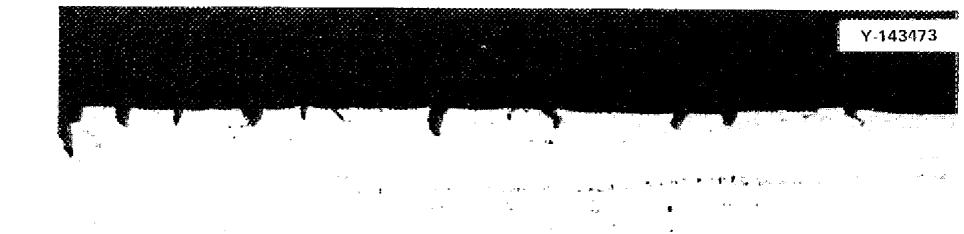

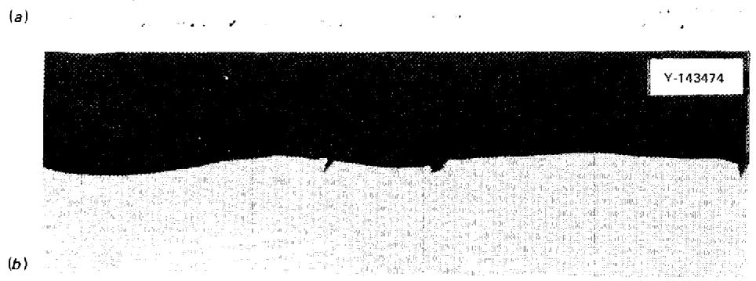

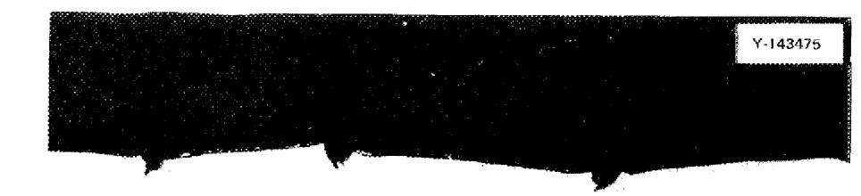

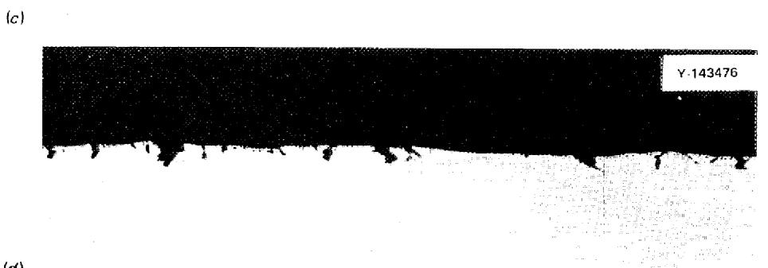  
(a)

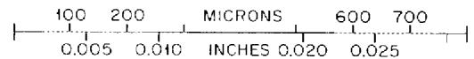  
Fig. 22. Effect of niobium on the tellurium embrittlement of Hastelloy N that had been exposed approximately 3000 hr at $700^{\circ}\mathrm{C}$ to $\mathrm{LiF / BeF_2 / ThF_4}$ (72, 16, 12 mole $\%$ respectively) containing $\mathrm{Ni}_3\mathrm{Te}_2$ and Ni. (a) $0\%$ Nb. (b) $1.1\%$ Nb. (c) $2.0\%$ Nb. (d) $4.4\%$ Nb.

Several unstressed specimens were included in some salt chambers containing $\mathrm{Cr_3Te_4}$ and $\mathrm{Cr_5Te_6}$ for about 6500 hours at $700^{\circ}\mathrm{C}$ . These samples were deformed to failure and examined metallographically. The photomicrographs in Fig. 23 show that the alloys containing 0.7 and $1.15\%$ Nb (alloys 421543 and 411, respectively) resisted embrittlement by tellurium, and the alloy containing $1.13\%$ Nb and $0.9\%$ Ti (alloy 413) did form intergranular cracks. These results show that the Nb alloy addition is beneficial in resisting Te embrittlement, but that the presence of titanium in addition to the niobium negated the beneficial effects of Nb.

The observations made in this study have only been partially presented in this report, but they repeatedly indicated several important effects of alloy composition on the extent of embrittlement by tellurium:

1. Iron-base alloys are not subject to intergranular embrittlement by tellurium, but it is unlikely that their corrosion rate in fuel salts is acceptably low.

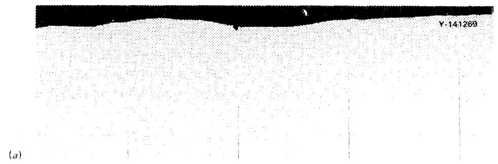

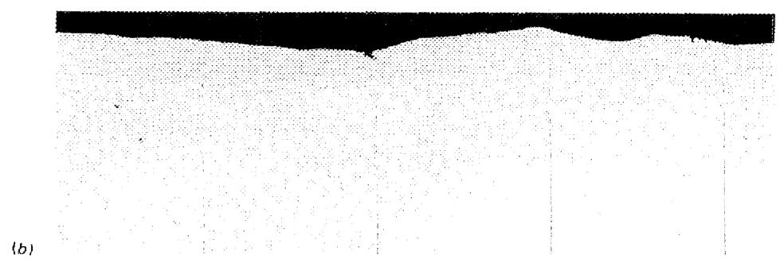

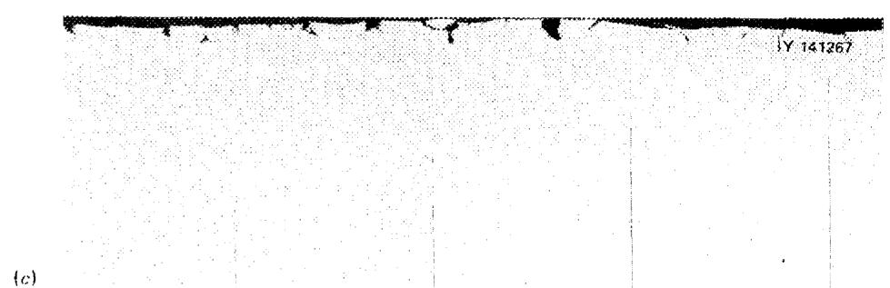

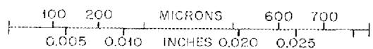  
Fig. 23. Photomicrographs of specimens exposed to salt containing $\mathrm{Cr}_3\mathrm{Te}_4$ and $\mathrm{Cr}_5\mathrm{Te}_6$ for about $6500\mathrm{hr}$ at $700^{\circ}\mathrm{C}$ . They were deformed to failure at room temperature and examined metallographically. (a) Alloy 421543. (b) Alloy 411. (c) Alloy 413.

2. Chromium additions of about $23\%$ to nickel-base alloys reduce the extent of embrittlement, but additions of $15\%$ are not effective. It is doubtful whether the corrosion rates in salt of alloys containing $23\%$ Cr are acceptable.   
3. Titanium (studied in levels up to $2\%$ ) is not effective in reducing intergranular embrittlement of Hastelloy N by tellurium.   
4. Niobium additions to Hastelloy N are beneficial in reducing intergranular tellurium embrittlement The maximum benefit occurred at niobium levels of 1 to $2\%$   
5. The presence of Ti in alloys modified with Nb negated the beneficial effects of the Nb

# Tellurium Embrittlement--In-reactor Capsules

Four fueled experiments were designed, fabricated, irradiated in the ORR, and were partially examined. In these experiments the material under study was fabricated into a tube $1/2$ in. outer diam by 4 in. long, and this tube was partially filled with salt containing $\mathrm{LiF} / \mathrm{BeF}_2 / \mathrm{ZrF}_4 / ^{233}\mathrm{UF}_4 / ^{238}\mathrm{UF}_4$ (63.5, 29.0, 5.0, 1.0, 1.5 mole $\%$ , respectively). The metal/salt interface temperature was $700^{\circ}\mathrm{C}$ , and the irradiation time was 1100 to $1200\mathrm{hr}$ . The rate of tellurium generation was $1.3\times 10^{10}$ atoms $\mathrm{sec}^{-1}\mathrm{cm}^{-2}$ The experiment was evaluated by cutting small metal rings from the fuel capsule and deforming them to crack embrittled grain boundaries. The rings were examined metallographically to determine the extent of cracking. The salt from the rings could be analyzed to obtain fission-product concentrations, and the metal rings could be successively acid leached and analyzed to obtain depth of fission product penetration into the metal.

The details of the design of these capsules, the steps in preparing the fuel change and transferring the fuel into the pins, the assembly of the pins into an irradiation capsule, irradiation of the pins, and postirradiation examination of the pins represented highly technical tasks that required the skills and resources of the entire Molten-Salt Reactor Program. Some of the details of the effort are given in the progress report for the program.[24] Time was not available to make sufficient tests, and it was not possible to analyze adequately the tests that were performed.

A schematic drawing of an assembled irradiation capsule is shown in Fig. 24. Three alloys could be studied in each experiment, and the twelve alloys investigated are-

<table><tr><td>Experiment No.</td><td>Alloy</td></tr><tr><td rowspan="3">1</td><td>Hastelloy N (standard)</td></tr><tr><td>Type 304 stainless steel</td></tr><tr><td>Inconel 601 (23% Cr)</td></tr><tr><td rowspan="3">2</td><td>Inconel 600 (15% Cr)</td></tr><tr><td>Hastelloy N (2% Ti)</td></tr><tr><td>Hastelloy N (2% Ti, 0.01% La)</td></tr><tr><td rowspan="3">3</td><td>Hastelloy N (0.5% Nb, 2% Ti)</td></tr><tr><td>Hastelloy N (1% Nb, 2% Ti)</td></tr><tr><td>Hastelloy N (1% Nb, 1% Ti)</td></tr><tr><td rowspan="3">4</td><td>Hastelloy N (7% Cr, 0.5% Nb)</td></tr><tr><td>Hastelloy N (7% Cr, 1% Nb)</td></tr><tr><td>Hastelloy N (15% Cr, 1% Nb, 1% Ti)</td></tr></table>

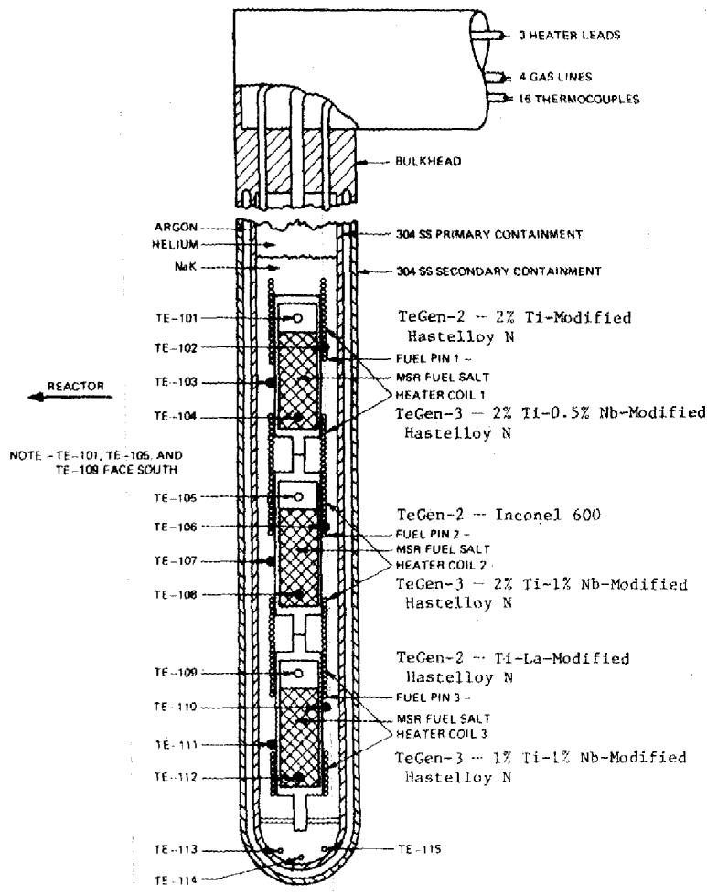  
Fig. 24. Schematic diagram of three fuel pins assembled for irradiation. The tubular fuel pins are the test materials.

Unfortunately, these alloys were selected before the surprising finding that alloys containing Ti or Ti plus Nb were embrittled by tellurium.

Typical photomicrographs of deformed rings from some of the experiments are given in Figs. 25 and 26. Hastelloy N formed intergranular cracks like those observed in material from the MSRE and in our screening experiments (Fig. 27); therefore, it is the experimental method that produced this phenomenon. Type 304 stainless steel formed very shallow cracks and they may have been due to fission products other than Te. Inconel 601 contained $23\%$ Cr and totally resisted cracking, as was observed in laboratory experiments. Alloys containing $7\%$ Cr and $2\%$ Ti and those containing $15\%$ Cr, $1\%$ Nb, and $1\%$ Ti formed intergranular cracks (Fig. 26). An alloy containing $7\%$ Cr and $1\%$ Nb did not form the fine intergranular cracks characteristic of Te embrittlement. These observations agree with the laboratory experiments described in the previous section.

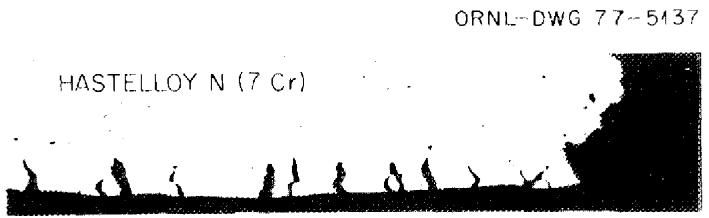

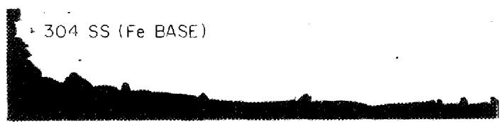

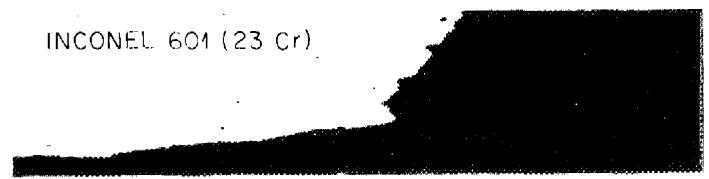

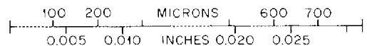  
Fig. 25. Strained tubular sections of three materials from first in-reactor fueled experiment.

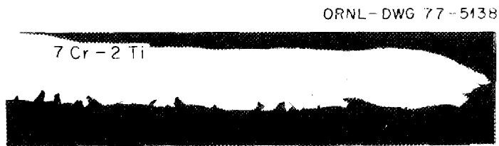

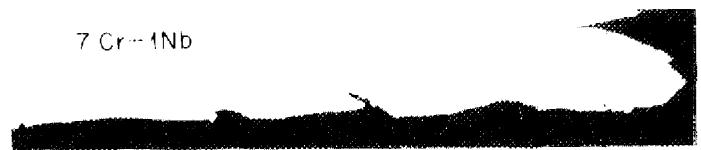

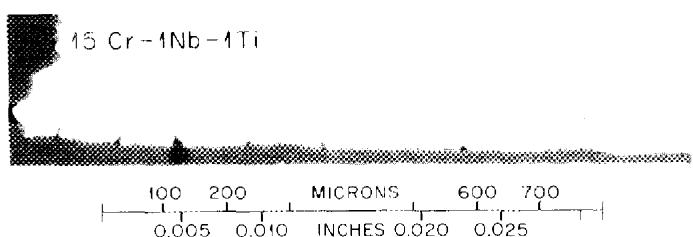  
Fig. 26. Strained tubular segments of three materials exposed in in-reactor fueled experiments.

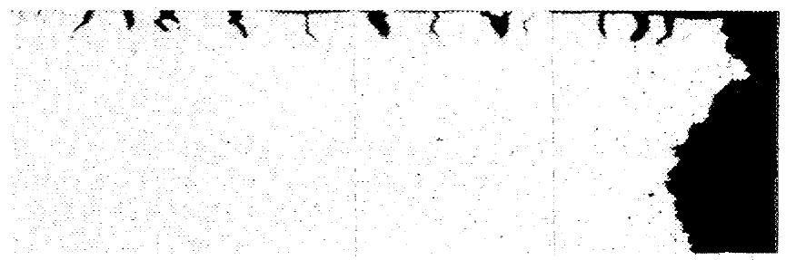

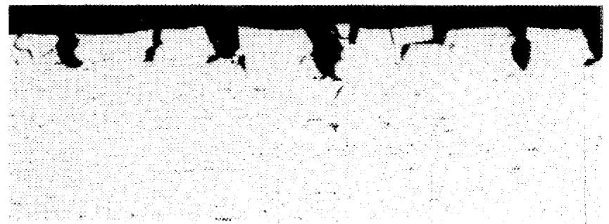  
ORR (TeGen-1)   
Laboratory

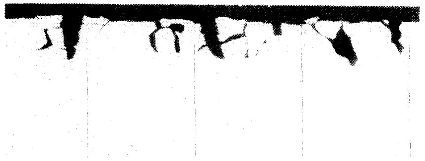

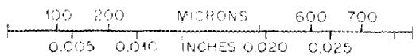  
Fig. 27. Intergranular crack formation in standard Hastelloy N as a result of exposure of Te-containing environments.

# Tellurium Embrittlement...Chemical Equilibria

The influence of oxidation state was studied by Keiser $^{25}$ in a vessel containing fuel salt with $\mathrm{Cr}_3\mathrm{Te}_4$ and $\mathrm{Cr}_5\mathrm{Te}_6$ . The experiment had electrochemical probes for determining the ratio of uranium in the $+4$ state $(\mathrm{UF}_4)$ to that in the $+3$ state $(\mathrm{UF}_3)$ . The salt was made more oxidizing by adding $\mathrm{NiF}_2$ and more reducing by adding Be. Tensile specimens of standard Hastelloy N were suspended in the salt for about 260 hr at $700^{\circ}\mathrm{C}$ . The oxidation state of the salt was stabilized, and the specimens were inserted so that each set of specimens was only exposed to one condition. After exposure, the specimens were strained to failure and were examined metallographically to determine the extent of cracking.

The results of crack measurements on specimens at several oxidation states are shown in Fig. 28. There is a very dramatic effect of oxidation state. At $\mathrm{U}^{4+}/\mathrm{U}^{3+}$ ratios of 60 or less there was very little cracking, and at ratios above 80 the cracking was extensive. Representative photomicrographs of some of the specimens are shown in Fig. 29.

These observations offer encouragement that a reactor could be operated in a chemical regime where the tellurium would not be embrittling even to standard Hastelloy N. The results in Fig. 28 indicate that at least $1.6\%$ of the uranium must be in the $+3$ oxidation state $(\mathrm{UF}_3)$ , and this condition seems quite reasonable from chemical and practical considerations. These experiments obviously did not involve several factors that would be encountered in a reactor, namely, other fission products, flowing salt, and temperature gradients. From our current level of understanding, these factors will not change the basic equilibrium even though reaction kinetics may be altered.

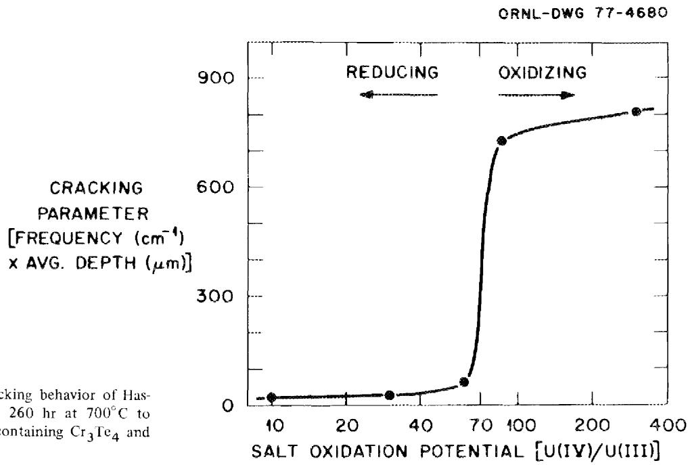  
Fig. 28. Cracking behavior of Hastelloy N exposed $260\mathrm{hr}$ at $700^{\circ}\mathrm{C}$ to MSBR fuel salt containing $\mathrm{Cr}_3\mathrm{Te}_4$ and $\mathrm{Cr}_5\mathrm{Te}_6$ .

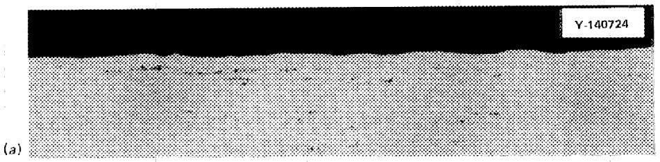

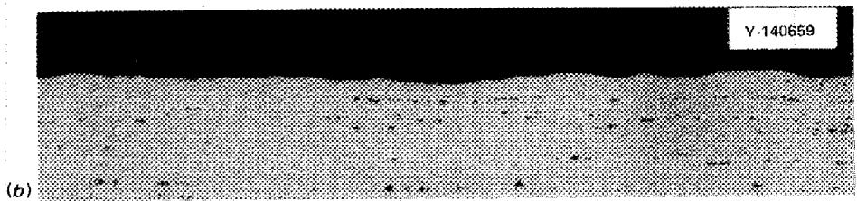

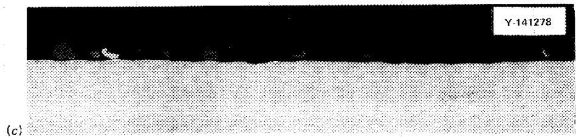

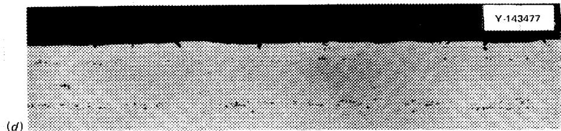

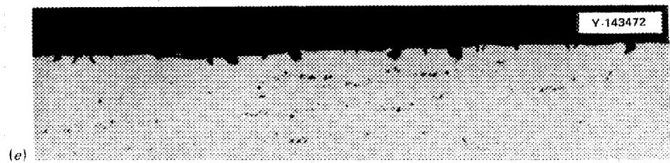

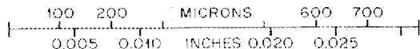  
Fig. 29. Photomicrographs of Hastelloy N exposed approximately 260 hr at $700^{\circ}\mathrm{C}$ to MSBR fuel salt containing $\mathrm{CrF}_2$ , $\mathrm{Cr}_3\mathrm{Te}_4$ , and $\mathrm{Cr}_5\mathrm{Te}_6$ . (a) $\mathrm{U}^{4+}/\mathrm{U}^{3+} = 10$ . (b) $\mathrm{U}^{4+}/\mathrm{U}^{3+} = 30$ . (c) $\mathrm{U}^{4+}/\mathrm{U}^{3+} = 60$ . (d) $\mathrm{U}^{4+}/\mathrm{U}^{3+} = 85$ . (e) $\mathrm{U}^{4+}/\mathrm{U}^{3+} = 300$ .

# OVERALL ASSESSMENT

Studies of irradiation embrittlement and intergranular tellurium embrittlement have progressed to the point where suitable options are available. The postirradiation creep properties were acceptable for Hastelloy N modified with $2\%$ of Ti, 1 to $4\%$ of Nb, or about $1\%$ each of Nb and Ti. The $2\%$ -Ti-modified alloy was made into a number of products, and some problems with cracking during annealing were encountered. The other alloys were only fabricated into 1/2-in.-thick plates and 1/4-in.-diam rods, and no problems were encountered. All alloys had excellent weldability. There are no obvious reasons why all of these alloys cannot be fabricated after development of suitable scale-up techniques.

The resistance of all these alloys to irradiation embrittlement depends upon the formation of a fine dispersion of MC type carbide particles. These particles act as sites for trapping He and prevent it from reaching the grain boundaries where it is embrittling. These alloys would be annealed after fabrication into basic structural shapes and the fine carbides would precipitate during service in the temperature range from 500 to $650^{\circ}\mathrm{C}$ . If the service temperature exceeds this range by much, the carbides begin to coarsen, and the resistance to irradiation embrittlement diminishes. Although some heats of the $2\%$ -Ti-modified alloys and 3- to $4\%$ -Nb-modified alloys had acceptable properties after irradiation at $760^{\circ}\mathrm{C}$ , it is very questionable whether these alloys can realistically be viewed for service temperatures above $650^{\circ}\mathrm{C}$ .

One very important development related to intergranular embrittlement by tellurium was a number of experimental methods for exposing test metals to tellurium under fairly realistic conditions. The use of metal tellurides that produce low partial pressures of tellurium at $700^{\circ}\mathrm{C}$ as sources of tellurium provided experimental ease and flexibility. The in-reactor fuel capsules also proved very effective experiments for exposing metals to tellurium and other fission products. The observation that the severity of cracking in standard Hastelloy N was influenced by the oxidation state of the salts adds the further experimental complexity that the oxidation state must be known and controllable in all experiments involving tellurium.

It is unfortunate that Ti-modified alloys were developed so far because of their good resistance to irradiation embrittlement before it was learned that the titanium addition even in conjunction with Nb resulted in alloys that were embrittled by Te as badly as standard Hastelloy N. However, this situation was due to the time spread of almost 6 years between discovery of the two problems and could not be prevented. The addition of 1 to $2\%$ of Nb to Hastelloy N resulted in alloys with improved resistance to intergranular cracking by tellurium but that did not totally resist cracking. Samples of these alloys were exposed to Te-containing environments for 6500 hr at $700^{\circ}\mathrm{C}$ with very favorable results. However, cyclic tests where crack propagation is being measured in the presence of Te will be required to clarify whether the Nb-modified alloys have adequate resistance to Te. The mechanism of the improved cracking resistance due to the presence of Nb in the alloy is not known, but it is hypothesized that the Nb forms surface-reaction layers with the Te in preference to its diffusion into the metal along the grain boundaries.

The screening experiments with various alloys elucidated some other possibilities. Nickel-base alloys containing $23\%$ Cr (Inconel 601) resisted cracking, whereas alloys containing $15\%$ Cr (Inconel 600, Hastelloy S, and Cr-modified Hastelloy N) were cracked as badly as standard Hastelloy N. However, it is questionable whether the corrosion rate of alloys containing $23\%$ Cr would be acceptable in salt. Type 304 stainless steel and several other iron-base alloys were observed to resist intergranular embrittlement, but these alloys also have questionable corrosion resistance in fuel salts. It is possible that a salt can be made adequately reducing to allow iron-base alloys to be used. This possibility must be pursued experimentally, because thermodynamic and kinetic data are not available to allow an analytical determination.

Many doors are opened by the discovery that cracking severity was influenced by the oxidation state of the salt, and that the salt could be made sufficiently reducing to prevent cracking in standard Hastelloy N.

Thus, alloys containing Ti could be used to take advantage of their excellent resistance to irradiation damage if they were protected from cracking by Te. Even standard Hastelloy N could be used in part of the system where the neutron flux was very low.

The research toward finding a material for constructing a molten-salt reactor that has adequate resistance to irradiation embrittlement and intergranular cracking by tellurium has progressed. Our findings suggest very strongly that a molten-salt reactor could be constructed of 1- to $2\%$ -Nb-modified Hastelloy N and operated very satisfactorily at $650^{\circ}\mathrm{C}$ . A number of other materials options exist, which when developed could lead to cost savings, improved performance, and greater reliability.

# ACKNOWLEDGMENT

The Molten-Salt Reactor Program was under the direction of L. E. McNeese. The work described in this report draws from the efforts of many persons including S. L. Bennett, K. W. Boling, D. N. Braski, J. Brynestad, R. E. Clausing, J. C. Feltner, W. H. Farmer, C. R. Hyman, J. R. Keiser, J. M. Leitnaker, B. McNabb, T. K. Roche, C. L. White, and J. W. Woods. The work was aided particularly by A. S. Meyer and D. L. Manning of the Analytical Chemistry Division. The report was reviewed by J. R. Keiser, T. K. Roche, and C. R. Brinkman.

# INTERNAL DISTRIBUTION

1-2. Central Research Library   
3. Document Reference Section   
4--8. Laboratory Records Department   
9. Laboratory Records, ORNL RC   
10. ORNL Patent Office   
11. E. J. Allen   
12. R.F. Apple   
13. C. F. Baes, Jr.   
14. C. E. Bamberger   
15. M. R. Bennett   
16. E. S. Bettis   
17. A. L. Boch   
18. D. N. Braski   
19. J. B. Braunstein   
20. M. A. Bredig   
21. R. B. Briggs   
22. C. R. Brinkman   
23. H. R. Bronstein   
24. J. Brynestad   
25. S. Cantor   
26. D. W. Cardwell   
27. J. A. Carter   
28. W. L. Carter   
29. R. E. Clausing   
30. J. A. Conlin   
31. J. H. Cooper   
32. L. T. Corbin   
33. J. M. Corum   
34. R.M. Counce   
35. J. L. Crowley

36. F. L. Culler   
37. J. Cunningham   
38. J. M. Dale   
39. J. H. DeVan   
40. J. R. DiStefano   
41. R. G. Donnelly   
42. W. P. Eatherly   
43. J. R. Engel   
44. G.G.Fee   
45. D. E. Ferguson   
46. L. M. Ferris   
47. L. O. Gilpatrick   
48. W. R. Grimes   
49. A. G. Grindell   
50. R. H. Guymon   
51. W. O. Harms   
52. P. N. Haubenreich   
53. R. F. Hibbs   
54. J. R. Hightower, Jr.   
57. M. R. Hill   
58. H. W. Hoffman   
59. W. R. Huntley   
60. C. R. Hyman   
61. P. R. Kasten   
62. J. R. Keiser   
63. A. D. Kelmers   
64. H. T. Kerr   
65. W. R. Laing   
66. J. M. Leitnaker   
67. R. B. Lindauer

68-74. H.E.McCoy, Jr.   
75. C.J. McHargue   
76. B. McNabb   
77. L. E. McNeese   
78. H. G. MacPherson   
79. R. E. MacPherson   
80. G. Mamantov   
81. D. L. Manning   
82. W. R. Martin   
83. C. L. Matthews   
84. L. Maya   
85. P. Patriarca   
86. H. Postma   
87. T. K. Roche   
88. M. W. Rosenthal   
89. H. C. Savage   
90. M. J. Skinner   
91. G. M. Slaughter   
92. G.P. Smith   
93. I. Spiewak   
94. J. O. Stiegler   
95. R. E. Thoma   
96. D.B. Trauger   
97. D. Y. Valentine   
98. A. M. Weinberg   
99. J. R. Weir   
100. J. C. White   
101. E. L. Youngblood

# EXTERNAL DISTRIBUTION

102. Research and Technical Support Division, ERDA, Oak Ridge Operations Office, Post Office Box E, Oak Ridge, Tenn. 37830   
103. Director, Reactor Division, ERDA, Oak Ridge Operations Office, Post Office Box E, Oak Ridge, Tenn. 37830   
104--105. Director, Division of Nuclear Research and Applications, ERDA, Washington, D.C. 20545   
106--216. For distribution as shown in TID-4500 under UC-76, Molten-Salt Reactor Technology category (25 copies-NTIS)