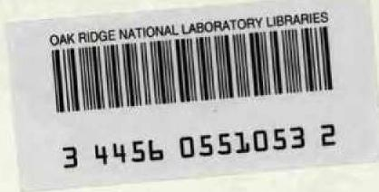
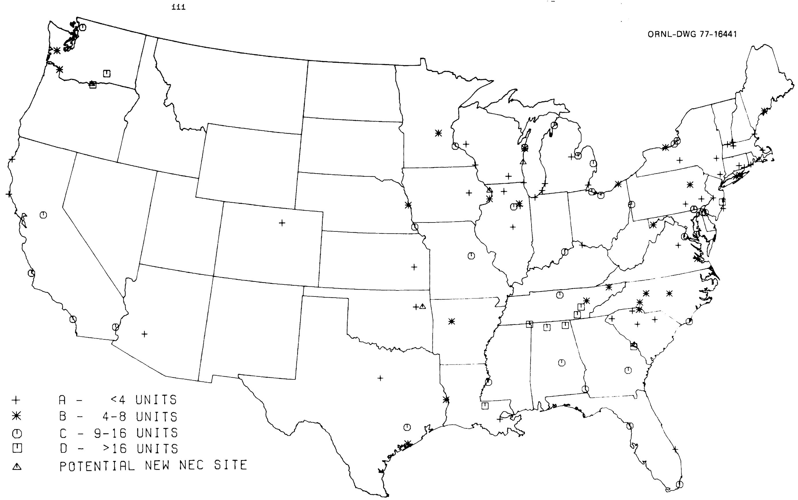

ORNL/TM-5927

${a}_{4}^{3} = {7}^{3}$

# Expansion Potential for Existing Nuclear Power Station Sites

D. F. Cope

H. F. Bauman

OAK RIDGE NATIONAL LABORATORY

CENTRAL RESEARCH LIBRARY

CIRCULATION SECTION

4500N ROOM 175

LIBRARY LOAN COPY

DO NOT TRANSFER TO ANOTHER PERSON

If you wish someone else to see this

report, send in name with report and

the library will arrange a loan.

LCN.7969 3 977

OAK RIDGE NATIONAL LABORATORY

OPERATED BY UNION CARBIDE CORPORATION FOR THE ENERGY RESEARCH AND DEVELOPMENT ADMINISTRATION

Printed in the United States of America. Available from

National Technical Information Service

U.S. Department of Commerce

5285 Port Royal Road, Springfield, Virginia 22161

Price: Printed Copy $8.00; Microfiche$ 3.00

This report was prepared as an account of work sponsored by the United States Government. Neither the United States nor the Energy Research and Development Administration/United States Nuclear Regulatory Commission, nor any of their employees, nor any of their contractors, subcontractors, or their employees, makes any warranty, express or implied, or assumes any legal liability or responsibility for the accuracy, completeness or usefulness of any information, apparatus, product or process disclosed, or represents that its use would not infringe privately owned rights.

ORNL/ TM-5927

Dist. Category UC-80

Contract No. W-7405-eng-26

Engineering Technology Division

EXPANSION POTENTIAL FOR EXISTING

NUCLEAR POWER STATION SITES

D. F. Cope H. F. Bauman

Manuscript Completed - September 26, 1977

Date Published - November 1977

Prepared by the

OAK RIDGE NATIONAL LABORATORY

Oak Ridge, Tennessee 37830

operated by

UNION CARBIDE CORPORATION

for the

DEPARTMENT OF ENERGY

  
Map of the United States locating the power plant sites evaluated.

# CONTENTS

ABSTRACT vii

FOREWORD ix

ACKNOWLEDGMENTS xi

LIST OF TABLES xii

1. INTRODUCTION 1

1.1 General 1   
1.2 Purpose 2   
1.3 Scope 3   
1.4 Organization 4

2. SOURCES OF INFORMATION 5   
3. ANALYTICAL METHODS AND LIMITING FACTORS 6

3.1 Cooling Water 6   
3.2 Heat Dissipation Systems 7   
3.3 Population Densities 8   
3.4 Site Areas 9   
3.5 Seismic and Geological Considerations 10   
3.6 Electrical Demand Considerations 11   
3.7 Environmental and Public Acceptance Issues 12   
3.8 Meteorological Influences on Site Capacity 13

4. SUMMARY AND CONCLUSIONS 15   
5. SITE EVALUATIONS 25

5.1 Analysis of Existing Sites 25   
5.2 Analysis of Potential Sites 117

6. INDEX OF POWER STATIONS 126

REFERENCES 128

# ABSTRACT

This report is a preliminary analysis of the expansion potential of the existing nuclear power sites, in particular their potential for development into nuclear energy centers (NECs) of 10 GW(e) or greater. The analysis is based primarily on matching the most important physical characteristics of a site against the dominating site criteria. Sites reviewed consist mainly of those in the 1974 through 1976 ERDA Nuclear Power Stations listings without regard to the present status of reactor construction plans. Also a small number of potential NEC sites which are not associated with existing power stations were reviewed. Each site was categorized in terms of its potential as: A dispersed site of 5 GW(e) or less; a mini-NEC of 5 to 10 GW(e); NECs of 10 to 20 GW(e); and large NECs of more than 20 GW(e).

The sites were categorized on their ultimate potential without regard to political considerations which might restrain their development. The analysis indicates that nearly $40\%$ of existing sites have potential for expansion to nuclear energy centers.

# FOREWORD

This study was initiated in the early stages of the Nuclear Regulatory Commission's (NRC) Nuclear Energy Center Site Survey (NECSS). It later became apparent that the NECSS study should be a general analysis rather than site-specific. Therefore, work on this report was discontinued. However, site-specific information is pertinent to NECSS follow-on studies, and the report has been completed under ERDA sponsorship.

The purpose of the study is to identify and characterize nuclear power station sites with the potential to accommodate large power generation capacity.

The analyses reported are intended to assess the maximum potential of a site and therefore should generally be viewed as approximate upper limits to site capacity. The capacity currently planned for a site constitutes a conservative lower limit and the capacity likely to be ultimately developed at a particular site will undoubtedly lie somewhere within these two limits.

It must be emphasized that this report carries no implications with respect to what nuclear electricity generating capacity can or will be licensed at a site, nor is it to be construed as indicative of what capacity the utility owners of a site may consider supportable or desirable.

# ACKNOWLEDGMENTS

The authors gratefully acknowledge the assistance of the following members of the Oak Ridge National Laboratory in the preparation of this report: Fred Heddleston for his unstinting cooperation in providing information on each of the sites analyzed; Garland C. Samuels for his expert advice on water availability and consumption; Marjorie E. Fish and George A. Cristy for site location data; and special thanks to Calvin C. Burwell for his comments and advice in planning and organizing the study.

LIST OF TABLES   

<table><tr><td>Table No.</td><td>Title</td><td>Page No.</td></tr><tr><td>1</td><td>Data summary on expansion potential of existing nuclear power station sites</td><td>16</td></tr><tr><td>2</td><td>Data summary on several proposed nuclear energy center sites</td><td>21</td></tr><tr><td>3</td><td>Key to Tables 1 and 2</td><td>22</td></tr></table>

# EXPANSION POTENTIAL FOR EXISTING NUCLEAR POWER STATION SITES

D. F. Cope H. F. Bauman

# 1. INTRODUCTION

# 1.1 General

Currently the question of what the United States' energy needs will be over the next 15 to 25 years, and longer, is a matter of considerable controversy. However, most of the predictions are that there will be some continued growth in the demand for energy, the chief disagreements being on what the rate of growth should or will be. There seems to be a greater unanimity of opinion that the future growth for electricity will be at a greater rate than the overall energy growth rate, but there are wide variations in the forecasts of future demand for electricity and especially the portion of this demand to be met with nuclear power. The latest U.S. Atomic Energy Commission's (USAEC) forecast1 had as its low figure of nuclear electricity generating capacity 230 gigawatts [GW(e)] by 1985 and 850 GW(e) by 2000. The Energy Research and Development Administration's (ERDA) 1975 update2 of the AEC's 1974 forecasts lowered these figures to 160 GW(e) and 625 GW(e) respectively. More recent ERDA estimates3,4 reduced these figures still further to 127 GW(e) and 380 GW(e). The high estimates from this most recent forecast are 166 GW(e) for 1985 and 620 GW(e) for the year 2000. Based on the most recent figures the nuclear power capacity now planned is adequate to meet the 1985 projected needs. However, in order to meet the year 2000 needs, the number of reactors would have to be increased by 2 to 3 times, or from about 200 to 400 additional reactors over those now planned. Providing suitable sites for even this number of reactors would require: (1) increasing the number of acceptable nuclear power plant sites; (2) placing a greater concentration of reactors on appropriately qualified sites, or probably both.

In view of this potential growth of nuclear capacity and the increasing competition for a limited number of good sites, it is not too

early to initiate planning and analyses on the potential capacity of existing sites and surveys of new sites that might be needed to accommodate future demands.

The problem of identifying and characterizing potential new sites is the more difficult and complex of the two tasks. Such an investigation if done effectively would require a comprehensive cooperative effort involving the electric utilities and local, state and federal governments. The recently completed Nuclear Regulatory Commission (NRC) Site Survey Report (NECSS) $^{5}$ developed the basic information required for such a study but stops short of identifying the requisite number of potential nuclear power station sites. Thus the study should be carried further to at least determine whether there is a potential deficiency of good sites, and if so, which of the electric reliability regions are affected and to what degree. NRC's letter forwarding their report to Congress recommended that further activities would be more appropriately conducted by another agency such as ERDA or the Federal Energy Administration (FEA). Although this recommendation applied specifically to nuclear energy centers it presumably is equally valid for the more general problem of surveying the availability of potential nuclear power station sites. The former problem relating to the capacity of existing sites is the subject of this report.

# 1.2 Purpose

The purpose of this study was to perform a preliminary analysis on the expansion potential of existing nuclear power station sites applying some of the more important and obvious siting criteria. The report also examines a few sites for which nuclear plants are not now planned but which have been identified as having a potential for being developed into nuclear energy centers. Some existing sites also have a potential for being developed into NECs and these will be identified to the extent practical within the limitations applying to the study. The term, Nuclear Energy Center (NEC), is used to describe a concentration of more than about 10 to 12 GW(e) of nuclear power facilities at a single geographical location. Nuclear fuel reprocessing facilities, which could be included in NECs, are not part of the study. The NECSS Report5 considered NECs of

up to 48 GW(e) of capacity, but concluded that there is no indication of an appropriate role for NECs of more than twenty 1250 MW(e) units until after the turn of the century. We agree with that conclusion and even though some sites may appear to have a potential capacity for more than about 20 GW(e), such large concentrations of power generation capability should be viewed as highly unlikely for the foreseeable future.

# 1.3 Scope

The report includes all sites listed in the U.S. Energy Research and Development Administration's (ERDA) releases on Nuclear Power Reactors in the United States $^{6,7}$ and prior AEC listings. $^{8}$ These publications list all nuclear reactors which are operable, being built, or planned. However, site identification and information is provided only on those reactors for which licenses are being sought and on which safety analysis reports and sometimes environmental reports have been issued. In some cases utilities have changed their plans for proceeding with the construction and operation of an announced reactors but the site information is still valid and hence included as part of this report.

In addition, other analyses have been performed and reports issued on potential nuclear sites other than existing reactor sites. Where such information has been readily available a small number of these sites also have been included following the analyses of existing sites and are designated as potential (P) sites.[9-12]

A siting study by the Washington Public Power Supply System13 analyzed twelve candidate power plant sites in the Pacific Northwest for thermal (nuclear or fossil fuel) electric power generating stations having a nominal capacity of at least 3000 MW(e). The findings of this study are not included in this report though some of the 12 sites appear to have a potential capacity of much more than 3000 MW(e). There are undoubtedly other studies of a similar nature but since the primary objective of this report is to analyze existing sites, no attempt was made to comprehensively identify and analyze other potentially large nuclear power plant sites.

Site information included in the report has been limited to summary information and data needed to characterize and analyze the site. This includes the site name and location, the utilities involved, the source and amount of cooling water, the type of heat dissipation system used, the resident populations at various distances from the sites to the extent available, the seismic zone in which the site is located, significant meteorological data where it was available, major transportation systems serving the site, and major electric demand (load) centers which conceivably could be served from the site.

The analyses of expansion potential were limited to preliminary screening type of investigations which considered only easily identified site features. Thus, it is only a miniscule representation of the effort and sophistication customarily applied by utilities in their analysis of generating station sites. Since the information on each site is necessarily skeletal, it should be used only for its contribution to the overall sitting picture and not taken as definitive for a particular site. The general approach used and some of the limitations involved in this analysis are discussed in Sect. 3 of this report.

# 1.4 Organization

The report is organized into a general introduction, descriptive sections (which includes the information sources, the analytical methods used, and discussion of limiting factors to the sites), summary tables of the sites and their characteristics, and a brief discussion of each site. In the discussion of the individual sites, the site characteristics are analyzed to determine the potential capacity of the site and the factors limiting the capacity.

# 2. SOURCES OF INFORMATION

Primary sources of information were various published documents and reports, some of which have been mentioned previously. $^{1-13}$ Much of the site information was taken from Heddleston's NSIC Reports $^{14}$ which summarized information contained in the Safety Analysis Reports and the Environmental Reports. Cooling water data was taken from Heddleston's reports and Samuels' Assessment of Water Resources for Nuclear Energy Centers. $^{15}$ General Electric's "Assessment of Energy Parks vs Dispersed Electric Power Generating Facilities" $^{16}$ and The NECSS Study $^{5}$ provided general sources of information and the AEC reports "Land Use and Nuclear Power Plants" $^{17}$ and "Nuclear Power Facility Performance Characteristics for Nuclear Environmental Impact Assessment" $^{18}$ provided specific case studies information. The NRC News Releases $^{19}$ provided current information of licensing and other site related actions. Distances, populations and transportation networks taken from Heddleston's Reports $^{14}$ were supplemented and checked against information taken from The National Atlas $^{20}$ and The Rand McNally Road Atlas. $^{21}$ Metropolitan populations were all based on the Rand McNally Metropolitan Area (RMA) populations. $^{22}$ Note that city populations are quoted where cities are given as location references, whereas metropolitan area populations are given where the population in the vicinity of the site is discussed.

In addition, informal evaluations of many sites were obtained from their owners as a byproduct of a recent survey of siting plans of U.S. utilities.[23] The utilities generally agreed with our evaluation of the physical characteristics of the sites, but were very restrained in their opinions of the ultimate capacity of the sites. The utilities are well aware, of course, of the political and institutional barriers to developing large sites. We mention these factors, insofar as they are known, in the analyses of individual sites, but they were not used as criteria in determining the ultimate capacity of sites under the ground rules of this study.

# 3. ANALYTICAL METHODS AND LIMITING FACTORS

The analysis was conducted by examining the significant site features, measuring these against the criteria which seemed most likely to apply, trying to determine the limiting factor or factors in each case, and then making a judgment on the potential capacity of the site applying the limiting factors. The manner in which these various site parameters were analyzed with respect to the applicable criteria is discussed below.

# 3.1 Cooling Water

Sources of cooling water consist of oceans, natural lakes, impounded bodies of water such as lakes, reservoirs and cooling ponds, and flowing rivers, streams and canals. Oceans and large lakes were considered to have sufficient cooling capacity that the available cooling water would impose no limit on the site capacity. Rivers and flowing streams usually have a known average and minimum flow rate, there being some variation in the definitions of what constitutes these flow rates. Where the minimum flow is given it was assumed that not more than $10\%$ of the flow could be consumed for the nuclear power station cooling. The site capacity evaluation was based on the water consumption of light water reactors using evaporative cooling and could be substantially different for other types of reactors or cooling systems. The cooling capacity of the source was estimated, based on a consumptive use of 25 cubic feet per sec (cfs) per 1000 MW(e), which is typical of the consumptive use of wet cooling towers. If information was not available on minimum flows, $2\%$ to $5\%$ of the average flow was used, the spread representing a judgment factor based on the stream's characteristics and the extent of water management applied. Impounded reservoirs and cooling ponds posed the most difficult situation, since an assessment of their cooling capacity requires an extensive amount of detailed hydrologic data which generally was not readily available. Thus, the final evaluation of these situations was highly judgemental.

The analysis of the cooling water limitations did not take into account competing demands for water, the downstream effect on other users,

water allocations, or the relative value of use of the water within competing demands.

# 3.2 Heat Dissipation Systems

The analyses of the potential capacities of the various sites were based on the use of cooling towers except for ocean and large lake sites where once-through cooling was assumed. In this context the type of heat dissipation system could be considered as subsidiary to the cooling water requirements and hence a secondary issue. However, the regulatory situation is uncertain and there is a segment of opinion which favors the use of cooling towers for practically all sites, including ocean and lakeshore. There are different opinions on what effect the use of cooling towers under these conditions might have on the potential capacity of the site, but it appears that in some instances they could become the primary limiting factor. Hence, it seems appropriate to discuss heat dissipation systems as they might relate to either increasing or decreasing the potential capacity of a site.

In the absence of adequate information to make an analytical determination of how cooling towers should be spaced to avoid possible atmospheric effects, the NECSS Report5 assumed four-unit clusters, spaced 2-1/2 miles apart. General application of this criterion would raise serious problems for potential NEC sites where the available land is limited. The number of cooling towers permitted could become the primary limiting factor to the potential capacity of a site. In addition, salt water cooling towers may generate environmental impacts which in themselves could become significant restraints to developing the full capacity of a site. Therefore, these two aspects of cooling tower use may strongly influence the potential capacity of a site.

Conversely, the capacity of a site primarily limited by water availability could be increased by adopting other types of heat dissipation systems such as dry or wet/dry cooling.

Thus it appears that establishing the potential capacity of a site may require greater attention to the type of heat dissipation system used

than was necessary for existing sites. Further consideration of these factors is beyond the scope of this report.

# 3.3 Population Densities

Population density criteria and guidelines have emanated from various sources particularly the regulatory reviews related to the licensing of nuclear plants. Also most of the sites considered in this study have received, or are in the process of receiving, a license for the amount of nuclear capacity planned for the site. Thus, certain population criteria have been met and the primary function of this analysis is to determine what limitations may exist to expansion of this capacity.

The criteria applied were the general population density criteria for nuclear power plant sites as set forth in 10 CFR Part 100 and the criteria used to screen sites for NECs as set forth in the NECSS Report (Paragraph 2.5.1, Page 2.7, Part V) which are as follows:

# Criteria

Areas having a site population factor (SPF) of less than 0.2 for 30 miles (numerically equivalent to having a population density of less than 200 persons per square mile uniformly distributed over a 30-mile radius) are generally considered to be most acceptable for the siting of nuclear energy centers.

Areas having a site population factor of 0.2 to 0.5 for 30 miles are probably acceptable but are subject to careful assessment of alternative siting.

Areas having a site population factor of greater than 0.5 for 30 miles (which includes all U.S. metropolitan areas) are least acceptable.

Population density distributions are a significant factor in evaluating the capacity potential of a site. However, the wide latitude and strong site dependence involved in their application means that conclusions as to the limits imposed involve large judgmental factors.

# 3.4 Site Areas

Land area requirements for nuclear power plant sites vary widely depending upon the topography, the cooling system utilized, the value of the land, and many other factors. Regulatory requirements on "Exclusion Areas" and "Low Population Zones" must be met as a minimum. The size of the area in conjunction with the location of the reactors within the area directly affect the radiation levels at the boundary which provides an incentive for large land areas if the site is to accommodate a large generating capacity. Thus, there are many factors involved in determining how large an area is needed to support a given nuclear capacity.

Site areas for currently licensed nuclear plants vary from a little more than 0.1 acre/MW(e) to over 100 times this amount. In the latter cases the additional land often was acquired to provide area for large cooling lakes or for later expansion. The required land area is smaller if the site is on the edge of a large body of water or certain categories of land which can be used as a buffer zone. The NECSS Report (Section 2.2.4, Pages 2-3)5 used conservatively for planning purposes 1 acre/MW(e) as the land area required for an NEC. Geologic, topographic, seismic, or terrain conditions may increase or decrease the amount of land required. Thus, there are many factors involved in determining the amount of land needed to support a certain capacity at a given site.

This study looked at the additional land required to support the estimated potential capacity of the site. Usually the additional land required was not owned by the utility. In these instances a map study was made of the contiguous areas to determine if there was a reasonable possibility that the required additional land could be acquired. Factors considered to be limiting to the acquisition of additional land were blocking features such as towns, parks, major highways, etc. One acre/MW(e) was the criterion used for the desired amount of land required but this was adjusted to fit local conditions. In most cases where land became the limiting factor to the capacity of the site about 0.3 acre/MW(e) was assumed as the minimum requirement. No attempt was made to determine the highest valued use of the land.

# 3.5 Seismic and Geological Considerations

Each of the sites studied was assigned to a seismic zone in accordance with the following definitions:

Zone 0, area with no reasonable expectation of earthquake damage;

Zone 1, expected minor damage;

Zone 2, expected moderate damage; and,

Zone 3, major destructive earthquakes may occur.

The assigned risk zone was based on Algermissen's seismic risk map for the conterminous United States, from "The Earthquake History of the United States."[24]

Since most of the sites have been, or are in the process of being, approved for the construction of one or more reactors, this indicates acceptable seismic conditions for some given capacity. The chief seismic problems in expanding the site for additional capacity are a network of faults, or seismically associated conditions, such as soil liquefaction, which may limit the number of locations within the potential site area, on which reactors can be constructed.

To a degree, the above described limitations are correctible by adequate engineering and construction procedures thus reducing the problem to an economic one. In extreme cases, this would be considered an infeasible and unacceptable solution. The investigations necessary to determine the extent to which these conditions may apply to a given site require huge and costly efforts and are beyond the scope of this study. Utilities have developed some of the required information in proving-up the site for the reactors now planned but in some instances these investigations would have to be expanded substantially to demonstrate that additional capacity could be installed on the site. Thus, the analyses performed as part of this study were limited to a qualitative judgment based on the seismic zone involved and any additional information emanating from the review process on the current planned reactors. In applying the seismic zone criterion, it was assumed that the cost and time required for investigation of site suitability would place severe restrictions on considering Zone 3 for large concentrations of nuclear power. For the other three zones, it was

considered that these costs would be acceptable and thus would not constitute an inherent limitation to the site.

Since the geologic and foundation conditions of existing sites have been accepted for the construction of one or more reactors, it was assumed that these conditions would prevail throughout the potential site area. A similar assumption was made with respect to topographical and general terrain conditions. However, there could be exceptions to this generality, and a more detailed investigation of some sites might indicate this assumption invalid but in many instances this would be an additional economic penalty rather than an inherent limitation.

# 3.6 Electrical Demand Considerations

A site with a potentially high generating capacity may be incompletely utilized if the electricity demand within the region fails to match the supply capability. Thus, lack of demand within an economically viable distance of the site could be a limitation to developing the capacity of the site. Utilities continuously survey the power demands within their regions and historically, have developed their supply capability accordingly. However, some utilities with good sites may lack the demand which would justify developing these sites to their full capability while other utilities may have the demand but lack acceptable sites. Hence it is becoming increasingly important to look at the electricity supply and demand situation as a regional problem where each region may involve several utility systems. The trend is for utilities to move in this direction through their electrical transmission interconnections and cooperative planning within the nine regional electric reliability councils. This is a dynamic and complex planning process which requires a continuing analysis by the utilities, the reliability regions and the states involved. Such a procedure is greatly beyond the scope of this report.

The procedure used for this study was to identify the major metropolitan population areas within 50 to 200 miles of the sites and draw qualitative conclusions based on the nearness or remoteness of the sites with respect to these population, and hence electrical load, centers. It

can be readily seen that this approach has some serious deficiencies in failing to consider such significant items as: (1) the possibility of serving a load center from alternative sites; (2) regional growth prospects; (3) electrical system stability; (4) economics of power transmission; (5) state regulatory responsibilities; and, (6) the many institutional problems involved. The approach does give some indication of whether the demand is a serious limitation to a site and identifies certain site-deficient regions. Therefore, notwithstanding its deficiencies, it is believed that this simplified analysis serves a useful purpose.

# 3.7 Environmental and Public Acceptance Issues

The criteria for what are acceptable environmental impacts from nuclear power stations are ill-defined in many critical areas and subject to influence by public attitudes nationally and within local regions. Also, the actual environmental impacts vary widely with specific sites and the immediate surroundings. Consequently this report makes no attempt to define and quantify the limits imposed by these impacts except to the extent that they are related to other siting criteria, such as cooling water for example. Some existing or planned nuclear power stations have been challenged on the basis of environmental issues and, where known, these have been taken into account in analyzing the potential capacity of a site. Also, the general environmental and ecological guidelines which have been established with respect to coastal zones, estuaries, land use, etc., have been considered in a subjective way.

However, lack of public acceptance can result from environmental issues as well as from more intangible issues and varies widely in different localities. Changing situations and attitudes could result in sites having potential capacities now considered acceptable to be later considered as unacceptable. Conversely, public and regulatory attitudes could change in the reverse direction such that environmental and public acceptance limits on existing sites could be relaxed. In this report the judgments of what constitute potential site capacities were based primarily on the inherent physical characteristics of the sites with little attempt to predict the limits imposed by environmental issues or lack of

public acceptance. However, these factors, insofar as known, are mentioned in the analyses of the individual sites, so that the users of this report can be aware of the intangible factors which may inhibit further development of given sites.

# 3.8 Meteorological Influences on Site Capacity

The effect of meteorology on the potential nuclear capacity of sites is largely dependent upon dispersion conditions of the atmosphere in the region of the sites. The effluent dilution capabilities of the atmosphere are primarily functions of wind speed, wind direction, and atmospheric stability. Particulates, fog, and precipitation also can affect atmospheric transport. Therefore, these are important considerations in the original site selection.

In considering the amount of capacity to be placed at a site, it must be recognized that large heat-producing facilities, such as concentrations of electric power generating plants, could cause measurable and perhaps significant atmospheric perturbations. However, the present state of the art does not permit a quantitative correlation between the meteorological effects to be expected versus the amount of generating capacity at a particular site.

The NECSS5 report discusses this potential problem in greater detail and their report assumes that power generating units are grouped in clusters of four, with the clusters being about 2.5 miles apart. The probability of perturbing effects between clusters is reduced by this wide spacing and thus represents a conservative solution to a potential problem. Such a dispersed pattern can be achieved by having a sufficiently large site area and generally is obtained by providing 1 acre of area for each MW(e) of power.

Other weather conditions which may affect large concentrations of nuclear power are the probability of occurrence, and the intensity, of severe storms, hurricanes and tornadoes. The nuclear installations themselves are unlikely to be damaged by even violent storms, hurricanes, or tornadoes; but cooling towers and transmission towers may be vulnerable to them. Knowing that such conditions might occur, mitigating engineering

and construction measures can be taken. Therefore, these phenomena do not usually constitute a limitation to the site, but rather constitute an economic penalty which must be weighted against the advantages of the particular site.

Thus, this report provides meteorological data that is readily available from the information sources previously described. It does not attempt to place meteorological limits on site capacities but describes the dispersion conditions which prevail at a given site in general terms such as good, average, or poor.

# 4. SUMMARY AND CONCLUSIONS

This study indicates that, of the 110 existing nuclear sites evaluated, 67 are physically suited for major expansion, and, of these, 44 could be expanded to NEC size $[>10\mathrm{GW(e)}]$ . For 10 of the possible NEC sites, no significant barriers to unlimited expansion $[>20\mathrm{GW(e)}]$ are indicated. In addition, of 8 potential NEC sites considered independent of existing sites, 6 appear suited for NECs, and 3 of these offer no significant barriers to unlimited expansion.

Thus, it appears that existing and known potential sites could go a long way toward meeting any presently anticipated need for NEC sites. However, the map (Frontispiece) shows that many of the favorable sites are clustered together, and that large areas of the country do not have known good sites. Since in many cases only one of two or three closely grouped sites would be required to serve a given region, we estimate that only about half of the favorable sites should be considered as ultimately available for development as NECs.

In regard to the individual site evaluations, it must be recognized that firm guidelines against which the capacity of a site can be specifically measured do not exist. Rather, one has a set of principles and general criteria which in application involve a number of site variables. In addition, there are certain intangibles such as those involved in the environmental and public acceptance issues. Thus, the final conclusion on what constitutes the allowable capacity for a given site is highly subjective and variable with changing attitudes. The final judgment of course is made by the regulatory authorities but until the final official decision is made there can be a wide range of estimates by different experts working with the same body of information. This, combined with the limited body of information from which this report was developed emphasizes the uncertainty in the estimates of potential capacity for any given site.

The individual site discussions (Sect. 5) briefly review the site characteristics, analyze the potential capacity of the site, and identify the limiting factors to expansion. This information is summarized in Tables 1 and 2. See Table 3 for key to abbreviations in Tables 1 and 2.

Table 1. Data summary on expansion potential of existing nuclear power station sites   

<table><tr><td rowspan="2">Site No.</td><td rowspan="2" colspan="2">Reference NSIC-55 Vol. Page</td><td rowspan="2">Name and location (utility)</td><td colspan="2">Latitude, N longitude, W</td><td rowspan="2">Electric Reliability Council</td><td colspan="4">Cooling water</td><td colspan="4">Population (thousands) radius (mile)</td><td>Present area (acres)</td><td colspan="2">Nuclear generating capacity [OW(e)]</td><td rowspan="2">Limiting factors</td><td rowspan="2">Seismic risk zone</td></tr><tr><td>Deg</td><td>Min</td><td>Source</td><td>Flow-cfs/103av (min)</td><td>Cooling system</td><td>2</td><td>5</td><td>10</td><td>50</td><td></td><td></td><td>Planned</td><td>Potential size category</td></tr><tr><td rowspan="2">AI-1</td><td>I</td><td>113</td><td>Brown&#x27;s Ferry, Units 1-3</td><td>34</td><td>42</td><td>6</td><td>Tennessee River</td><td>45</td><td>MDCTVC</td><td>0.2</td><td>3.2</td><td>-</td><td>-</td><td>840</td><td>3.2</td><td>D</td><td>Population and demand</td><td>1-2</td><td></td></tr><tr><td>II</td><td>1</td><td>Decatur, AL (TVA)</td><td>87</td><td>7</td><td></td><td>Wheeler Lake</td><td></td><td></td><td></td><td></td><td></td><td></td><td></td><td></td><td></td><td></td><td></td><td></td></tr><tr><td rowspan="2">AL-2</td><td rowspan="2">II</td><td rowspan="2">193</td><td>Joseph M. Farley, Units 1-2</td><td>31</td><td>13</td><td>6</td><td>Chattahoochee River</td><td>10.6</td><td>MDCTCS</td><td>0.5</td><td>2.3</td><td>-</td><td>-</td><td>800</td><td>1.7</td><td>C</td><td>Demand and land</td><td>1</td><td></td></tr><tr><td>Dothan, AL (APC)</td><td>85</td><td>7</td><td></td><td>Woodruff Reservoir</td><td></td><td></td><td></td><td></td><td></td><td></td><td></td><td></td><td></td><td></td><td></td><td></td></tr><tr><td rowspan="2">AL-3</td><td rowspan="2">V</td><td rowspan="2">106</td><td>Alan R. Barton, Units 1-4</td><td>32</td><td>45</td><td>6</td><td>Jordan Reservoir</td><td>16</td><td>MDCTCS</td><td>0.1</td><td>1.2</td><td>7</td><td>-</td><td>2,820</td><td>4.6</td><td>C</td><td>Water and demand</td><td>1</td><td></td></tr><tr><td>Clanton, AL (APC)</td><td>86</td><td>24</td><td></td><td>Coosa River</td><td></td><td></td><td></td><td></td><td></td><td></td><td></td><td></td><td></td><td></td><td></td><td></td></tr><tr><td rowspan="2">AL-4</td><td rowspan="2">III</td><td rowspan="2">91</td><td>Bellefonte, Units 1-2</td><td>34</td><td>43</td><td>6</td><td>Tennessee River</td><td>38.3</td><td>NDCTCS</td><td>0.1</td><td>2.8</td><td>18</td><td>-</td><td>1,500</td><td>2.4</td><td>D</td><td>Population and demand</td><td>2</td><td></td></tr><tr><td>Scottsboro, AL (TVA)</td><td>85</td><td>56</td><td></td><td>Gunterville Reservoir</td><td></td><td></td><td></td><td></td><td></td><td></td><td></td><td></td><td></td><td></td><td></td><td></td></tr><tr><td rowspan="2">AZ-1</td><td rowspan="2">V</td><td rowspan="2">114</td><td>Palo Verde, Units 1-3</td><td>33</td><td>23</td><td>9</td><td>Phoenix Sewage Plant</td><td>19</td><td>MDCT</td><td>0.1</td><td>0.2</td><td>2</td><td>-</td><td>3,800</td><td>3.8</td><td>A</td><td>Water</td><td>2</td><td></td></tr><tr><td>Wintersburg, AZ (AFS et al.)</td><td>112</td><td>52</td><td></td><td></td><td></td><td></td><td></td><td></td><td></td><td></td><td></td><td></td><td></td><td></td><td></td><td></td></tr><tr><td rowspan="2">AR-1</td><td>II</td><td>61</td><td>Arkansas Nuclear, Units 1-2</td><td>35</td><td>19</td><td>7</td><td>Arkansas River</td><td>40</td><td>OT and CSCT</td><td>0.7</td><td>3.7</td><td>-</td><td>-</td><td>1,160</td><td>1.2</td><td>B</td><td>Land and demand</td><td>1</td><td></td></tr><tr><td>II</td><td>235</td><td>Russellville, AR (APL)</td><td>93</td><td>14</td><td></td><td>Dardanelle Reservoir</td><td></td><td></td><td></td><td></td><td></td><td></td><td></td><td></td><td></td><td></td><td></td><td></td></tr><tr><td rowspan="2">CA-1</td><td rowspan="2">I</td><td rowspan="2">22</td><td>Humboldt Bay, Unit 3</td><td>40</td><td>44</td><td>9</td><td>Humboldt Bay Pacific Ocean</td><td>NA</td><td>OT</td><td>1.7</td><td>38</td><td>49</td><td>-</td><td>143</td><td>.07</td><td>A</td><td>Coastal zone and public acceptance</td><td>2-3</td><td></td></tr><tr><td>Bureau, CA (PO&amp;E)</td><td>124</td><td>13</td><td></td><td></td><td></td><td></td><td></td><td></td><td></td><td></td><td></td><td></td><td></td><td></td><td></td><td></td></tr><tr><td rowspan="2">CA-2</td><td>I</td><td>36</td><td>San Onofre, Units 1-3</td><td>33</td><td>22</td><td>9</td><td>Pacific Ocean</td><td>NA</td><td>OT</td><td>0.5</td><td>25</td><td>40</td><td>-</td><td>84</td><td>2.7</td><td>C</td><td>Coastal zone and public acceptance</td><td>3</td><td></td></tr><tr><td>II</td><td>217</td><td>San Clemente, CA (SCB)</td><td>117</td><td>34</td><td></td><td></td><td></td><td></td><td></td><td></td><td></td><td></td><td></td><td></td><td></td><td></td><td></td><td></td></tr><tr><td rowspan="2">CA-3</td><td>I</td><td>162</td><td>Diablo Canyon, Units 1-2</td><td>35</td><td>13</td><td>9</td><td>Pacific Ocean</td><td>NA</td><td>OT</td><td>0</td><td>0</td><td>4.5</td><td>-</td><td>750</td><td>2.2</td><td>C</td><td>Coastal zone and public acceptance</td><td>3</td><td></td></tr><tr><td>II</td><td>103</td><td>Diablo, CA (PO&amp;E)</td><td>120</td><td>51</td><td></td><td></td><td></td><td></td><td></td><td></td><td></td><td></td><td></td><td></td><td></td><td></td><td></td><td></td></tr><tr><td rowspan="2">CA-4</td><td rowspan="2">III</td><td rowspan="2">15</td><td>Mendocino, Units 1-2</td><td>38</td><td>55</td><td>9</td><td>Pacific Ocean</td><td>NA</td><td>OT</td><td>0.6</td><td>1.2</td><td>-</td><td>-</td><td>410</td><td>0</td><td>A</td><td>Public acceptance and seismic</td><td>3</td><td></td></tr><tr><td>Mendocino, CA (PO&amp;E)</td><td>123</td><td>43</td><td></td><td></td><td></td><td></td><td></td><td></td><td></td><td></td><td></td><td></td><td></td><td></td><td></td><td></td></tr><tr><td rowspan="2">CA-5</td><td rowspan="2">II</td><td rowspan="2">55</td><td>Rancho Seco Clay Station, CA (SMUD)</td><td>38</td><td>21</td><td>9</td><td>Folsom Canal American River</td><td>3.5</td><td>NDCTCS</td><td>0.1</td><td>0.4</td><td>-</td><td>400</td><td>2,480</td><td>0.9</td><td>C</td><td>Water and Seismic</td><td>2-3</td><td></td></tr><tr><td>Sun Desert, Units 1-2</td><td>121</td><td>7</td><td></td><td></td><td></td><td></td><td></td><td></td><td></td><td></td><td></td><td></td><td></td><td></td><td></td><td></td></tr><tr><td rowspan="2">CA-6</td><td rowspan="2">VI</td><td rowspan="2">NA</td><td rowspan="2">Bayesville, CA (SD&amp;E)</td><td>33</td><td>27</td><td>9</td><td>Colorado River</td><td>8.9</td><td>MDCT</td><td>0</td><td>0.5</td><td>1</td><td>28</td><td>7,040</td><td>2.0</td><td>C</td><td>Demand</td><td>2</td><td></td></tr><tr><td>114</td><td>49</td><td></td><td>Palo Verde Outfall Drain regulated</td><td></td><td></td><td></td><td></td><td></td><td></td><td></td><td></td><td></td><td></td><td></td><td></td></tr><tr><td rowspan="2">CO-1</td><td rowspan="2">V</td><td rowspan="2">26</td><td rowspan="2">Port St. Vrain Platteville, CO (PSC)</td><td>40</td><td>14</td><td>9</td><td>South Platte River</td><td>0.55</td><td>MDCTCS</td><td>0.2</td><td>2</td><td>9</td><td>-</td><td>2,238</td><td>0.3</td><td>A</td><td>Water</td><td>1</td><td></td></tr><tr><td>104</td><td>52</td><td></td><td>St. Vrain Creek</td><td></td><td></td><td></td><td></td><td></td><td></td><td></td><td></td><td></td><td></td><td></td><td></td></tr><tr><td rowspan="2">CT-1</td><td rowspan="2">I</td><td rowspan="2">43</td><td rowspan="2">Connecticut Yankee Haddam Neck, CT (NEU)</td><td>41</td><td>29</td><td>5</td><td>Connecticut River</td><td>16.6</td><td>OT</td><td>2</td><td>9</td><td>-</td><td>-</td><td>525</td><td>0.6</td><td>A</td><td>Population and land</td><td>2</td><td></td></tr><tr><td>72</td><td>30</td><td></td><td></td><td></td><td></td><td></td><td></td><td></td><td></td><td></td><td></td><td></td><td></td><td></td><td></td></tr><tr><td rowspan="2">CT-2</td><td>I</td><td>78</td><td>Millstone, Units 1-3</td><td>41</td><td>19</td><td>5</td><td>Niastic Bay Long Island Sound</td><td>NA</td><td>OT with Qry</td><td>5</td><td>48</td><td>100</td><td>2,500</td><td>500</td><td>2.6</td><td>A</td><td>Population and land</td><td>2</td><td></td></tr><tr><td>II</td><td>151</td><td>New London, CT (NEU)</td><td>72</td><td>10</td><td></td><td></td><td></td><td></td><td></td><td></td><td></td><td></td><td></td><td></td><td></td><td></td><td></td><td></td></tr><tr><td rowspan="2">DE-1</td><td rowspan="2">V</td><td rowspan="2">34</td><td>Summitt, Units 1-2</td><td>39</td><td>31</td><td>3</td><td>Chesapeake-Delaware Canal</td><td>NA</td><td>MDCT</td><td>0.5</td><td>4</td><td>42</td><td>-</td><td>1,800</td><td>1.5</td><td>C</td><td>Land and environment</td><td>2</td><td></td></tr><tr><td>Mt. Pleasant, DE (DPSL)</td><td>75</td><td>41</td><td></td><td></td><td></td><td></td><td></td><td></td><td></td><td></td><td></td><td></td><td></td><td></td><td></td><td></td></tr><tr><td rowspan="2">FL-1</td><td rowspan="2">I</td><td rowspan="2">92</td><td rowspan="2">Turkey Point, Units 3-4 Florida City, FL South Dade, Units 1-2 South Dade, FL (FP&amp;I)</td><td>25</td><td>26</td><td>6</td><td>Blscayne Bay Cooling Reservoir</td><td>NA</td><td>OT CC</td><td>0</td><td>5</td><td>88</td><td>-</td><td>3,300</td><td>1.4</td><td>C</td><td>Environment</td><td>0</td><td></td></tr><tr><td>80</td><td>20</td><td></td><td></td><td></td><td></td><td></td><td></td><td></td><td></td><td></td><td></td><td></td><td></td><td></td><td></td></tr><tr><td rowspan="2">FL-2</td><td rowspan="2">II</td><td rowspan="2">19</td><td rowspan="2">Crystal River, Unit 3 Red Level, FL (FPC)</td><td>28</td><td>58</td><td>6</td><td>Gulf of Mexico</td><td>NA</td><td>OT</td><td>0</td><td>0.1</td><td>-</td><td>-</td><td>4,736</td><td>0.8</td><td>C</td><td>Environment and demand</td><td>0</td><td></td></tr><tr><td>82</td><td>42</td><td></td><td></td><td></td><td></td><td></td><td></td><td></td><td></td><td></td><td></td><td></td><td></td><td></td><td></td></tr><tr><td rowspan="2">FL-3</td><td rowspan="2">II</td><td rowspan="2">145</td><td rowspan="2">St. Lucie, Units 1-2 Ft. Pierce, FL (FP&amp;I)</td><td>27</td><td>21</td><td>6</td><td>Atlantic Ocean</td><td>NA</td><td>OT</td><td>0.1</td><td>1.6</td><td>-</td><td>-</td><td>1,132</td><td>1.6</td><td>A</td><td>Land and demand</td><td>0</td><td></td></tr><tr><td>80</td><td>15</td><td></td><td></td><td></td><td></td><td></td><td></td><td></td><td></td><td></td><td></td><td></td><td></td><td></td><td></td></tr><tr><td rowspan="2">GA-1</td><td rowspan="2">II</td><td rowspan="2">91</td><td rowspan="2">Edwin I. Hatch, Units 1-2 Baxley, GA (GPC)</td><td>31</td><td>56</td><td>6</td><td>Altamahs River</td><td>13</td><td>MDCT</td><td>0.1</td><td>0.9</td><td>-</td><td>-</td><td>2,244</td><td>1.6</td><td>C</td><td>Demand and water</td><td>1</td><td></td></tr><tr><td>82</td><td>20</td><td></td><td></td><td></td><td></td><td></td><td></td><td></td><td></td><td></td><td></td><td></td><td></td><td></td><td></td></tr><tr><td rowspan="2">GA-2</td><td rowspan="2">III</td><td rowspan="2">75 (see No. P-1)</td><td rowspan="2">Alvin W. Vostle, Units 1-2 Waynesboro, GA (GPC)</td><td>33</td><td>9</td><td>6</td><td>Savannah River</td><td>10(5.8)</td><td>NDCTCS</td><td>0.1</td><td>0.4</td><td>5</td><td>600</td><td>3,200</td><td>2.2</td><td>D</td><td>Demand</td><td>2</td><td></td></tr><tr><td>81</td><td>46</td><td></td><td></td><td></td><td></td><td></td><td></td><td></td><td></td><td></td><td></td><td></td><td></td><td></td><td></td></tr><tr><td rowspan="2">IL-1</td><td rowspan="2">I</td><td rowspan="2">864</td><td rowspan="2">Dresden, Units 1-3 Morris, IL (CEC)</td><td>41</td><td>23</td><td>2</td><td>Illinois River</td><td>4.2(3)</td><td>OTCL</td><td>0</td><td>2.6</td><td>25</td><td>-</td><td>953</td><td>1.8</td><td>B</td><td>Land and water</td><td>1</td><td></td></tr><tr><td>88</td><td>16</td><td></td><td></td><td></td><td></td><td></td><td></td><td></td><td></td><td></td><td></td><td></td><td></td><td></td><td></td></tr><tr><td rowspan="2">IL-2</td><td rowspan="2">I</td><td rowspan="2">218</td><td rowspan="2">Zion, 1-2 Zion, IL (CEC)</td><td>42</td><td>28</td><td>2</td><td>Lake Michigan</td><td>NA</td><td>OT</td><td>26</td><td>106</td><td>-</td><td>10,000</td><td>250</td><td>2.1</td><td>A</td><td>Land and population</td><td>1</td><td></td></tr><tr><td>87</td><td>49</td><td></td><td></td><td></td><td></td><td></td><td></td><td></td><td></td><td></td><td></td><td></td><td></td><td></td><td></td></tr><tr><td>IL-3</td><td>I</td><td>99</td><td>Quad Cities, Units 1-2 Cordova, IL (CEC)</td><td>4190</td><td>4420</td><td>2</td><td>Mississippi River(6.6)</td><td>47(6.6)</td><td>OTSC</td><td>0.2</td><td>12</td><td>27</td><td>600</td><td>404</td><td>1.6</td><td>B</td><td>Land and population</td><td>1</td><td></td></tr></table>

Table 1 (continued)   

<table><tr><td rowspan="2">Site No.</td><td rowspan="2">Reference NSIC-55 Vol. Page</td><td rowspan="2">Name and location (utility)</td><td colspan="2">Latitude, N longitude, W</td><td rowspan="2">Electric Reliability Council</td><td colspan="3">Cooling water</td><td colspan="4">Population (thousands) radius (mile)</td><td rowspan="2">Present area (acres)</td><td colspan="2">Nuclear generating capacity [GW(e)]</td><td rowspan="2">Limiting factors</td><td rowspan="2">Seismic risk zone</td><td></td><td></td><td></td><td></td></tr><tr><td>Deg</td><td>Min</td><td>Source</td><td>Flow-ofs/108av (min)</td><td>Cooling system</td><td>2</td><td>5</td><td>10</td><td>50</td><td>Planned</td><td>Potential size category</td><td></td><td></td><td></td><td></td></tr><tr><td>IL-4</td><td>II</td><td>247</td><td>La Salle Co., Units 1-2Seneca, IL (CBC)</td><td>4188</td><td>1440</td><td>2</td><td>Illinois River</td><td>11(3.6)</td><td>CLCS</td><td></td><td></td><td></td><td>0.1</td><td>1</td><td>-</td><td>-</td><td>5,000</td><td>2.2</td><td>C</td><td>Land and water</td><td>1</td></tr><tr><td>IL-5</td><td>IV</td><td>28</td><td>Byron Nuclear Station, Units 1-2Byron, IL (CBC)</td><td>4289</td><td>517</td><td>2</td><td>Rock River</td><td>4.6</td><td>CTCS</td><td></td><td></td><td></td><td>0</td><td>6</td><td>20</td><td>900</td><td>1,830</td><td>2.2</td><td>A</td><td>Water and land</td><td>1</td></tr><tr><td>IL-6</td><td>IV</td><td>35</td><td>Braidwood, Units 1-2Braidwood, IL (CBC)</td><td>4188</td><td>1513</td><td>2</td><td>Kankakee River and Cooling Lake</td><td>0.13NA</td><td>CLCS</td><td></td><td></td><td></td><td>2</td><td>9</td><td>22</td><td>3,900</td><td>4,320</td><td>2.2</td><td>A</td><td>Water</td><td>1</td></tr><tr><td>IL-7</td><td>IV</td><td>49</td><td>Clinton, Units 1-2Clinton, IL (TPC)</td><td>4088</td><td>1050</td><td>2</td><td>Salt Creek and Reservoir</td><td>0.2(0.02)</td><td>OTCL</td><td></td><td></td><td></td><td>0.1</td><td>2</td><td>13</td><td>-</td><td>15,000</td><td>1.9</td><td>A</td><td>Water</td><td>1</td></tr><tr><td>IN-1</td><td>II</td><td>229</td><td>Bailly Westchester, IN (NIFS)</td><td>4187</td><td>387</td><td>1</td><td>Lake Michigan</td><td>NA</td><td>NDCTCS</td><td></td><td></td><td></td><td>1</td><td>27</td><td>200</td><td>-</td><td>350</td><td>0.7</td><td>A</td><td>Population, land and environment</td><td>0</td></tr><tr><td>IN-2</td><td>V</td><td>146</td><td>Marble Hill, Units 1-2Marble Hill, IN (PBSI)</td><td>3685</td><td>3627</td><td>1</td><td>Ohio River</td><td>112(10)</td><td>MDCTCS</td><td></td><td></td><td></td><td>0.3</td><td>2.4</td><td>19</td><td>1,250</td><td>987</td><td>2.3</td><td>C</td><td>Land</td><td>0</td></tr><tr><td>IA-1</td><td>II</td><td>127</td><td>Duane Arnold Energy Center, Unit 1Palo, IA (IEPCO)</td><td>4291</td><td>646</td><td>4</td><td>Cedar River</td><td>3neg.</td><td>MDCTCS</td><td></td><td></td><td></td><td>0.2</td><td>2.7</td><td>92</td><td>-</td><td>480</td><td>0.6</td><td>A</td><td>Water</td><td>1</td></tr><tr><td>KS-1</td><td>IV</td><td>77</td><td>Wolf Creek, Unit 1Burlington, KS (KG&amp;KCP&amp;L)</td><td>3895</td><td>1441</td><td>7</td><td>Wolf CreekCL on Neosho River</td><td>1(0)</td><td>OTCGCL</td><td></td><td></td><td></td><td>0.1</td><td>2.5</td><td>4</td><td>164</td><td>1,100</td><td>1.2</td><td>A</td><td>Water</td><td>1-2</td></tr><tr><td>LA-1</td><td>II</td><td>259</td><td>Waterford, Unit 3Talt, IA (LLIP)</td><td>3898</td><td>0028</td><td>7</td><td>Mississippi River</td><td>493(&gt;12)</td><td>OT</td><td></td><td></td><td></td><td>1.7</td><td>16</td><td>-</td><td>-</td><td>3,600</td><td>1.1</td><td>A</td><td>Population</td><td>1</td></tr><tr><td>LA-2</td><td>IV</td><td>42</td><td>River Bend, Units 1-2St. Francisville, IA (GSU)</td><td>3091</td><td>4520</td><td>7</td><td>Mississippi River</td><td>450(100)</td><td>CTCCCS</td><td></td><td></td><td></td><td>0.4</td><td>3</td><td>19</td><td>-</td><td>3,392</td><td>1.9</td><td>D</td><td>Demand</td><td>1</td></tr><tr><td>ME-1</td><td>II</td><td>43</td><td>Moline YankeeWiscasset, ME (MAPCO)</td><td>4369</td><td>542</td><td>5</td><td>Back RiverAtlantic Ocean, 15 mile</td><td>F.</td><td>OT</td><td></td><td></td><td></td><td>0.4</td><td>6.5</td><td>-</td><td>-</td><td>740</td><td>0.8</td><td>B</td><td>Demand and land</td><td>2</td></tr><tr><td>MD-1</td><td>II</td><td>73</td><td>Calvert Cliffs, Units 1-2Lusby, MD (BOE)</td><td>3876</td><td>2626</td><td>3</td><td>Chesapeake Bay</td><td>NA</td><td>OT</td><td></td><td></td><td></td><td>1.5</td><td>4.4</td><td>-</td><td>-</td><td>1,135</td><td>1.7</td><td>C</td><td>Public acceptance and environment</td><td>1</td></tr><tr><td>MD-2</td><td>III</td><td>123</td><td>Douglas Point, Units 1-2Douglas Point, MD (PEPCO)</td><td>3877</td><td>2715</td><td>3</td><td>Potomac RiverTidal flow</td><td>14(0.8)</td><td>NDCTCS</td><td></td><td></td><td></td><td>0.2</td><td>2</td><td>22</td><td>-</td><td>1,440</td><td>2.4</td><td>C</td><td>Public acceptance and environment</td><td>1</td></tr><tr><td>MA-1</td><td>I</td><td>15</td><td>Yankee Nuclear Power StationRowe, MA (YERPCO)</td><td>4272</td><td>4455</td><td>5</td><td>Sherman PondDeerfield River</td><td>0.9(0.2)</td><td>OTCL</td><td></td><td></td><td></td><td>0.2</td><td>2</td><td>18</td><td>1,400</td><td>2,000</td><td>0.2</td><td>A</td><td>Water</td><td>2</td></tr><tr><td>MA-2</td><td>I</td><td>211</td><td>Filgrim, Units 1-2</td><td>4170</td><td>5735</td><td>5</td><td>Cape Cod BayAtlantic Ocean</td><td>NA</td><td>OT</td><td></td><td></td><td></td><td>1.5</td><td>9</td><td>35</td><td>-</td><td>517</td><td>3.0</td><td>A</td><td>Population and land</td><td>2-3</td></tr><tr><td>MA-3</td><td>IV</td><td>119</td><td>Montague, Units 1-2Montague, MA (NEU)</td><td>4272</td><td>3532</td><td>5</td><td>Connecticut River</td><td>13(1.3)</td><td>NDCTCS</td><td></td><td></td><td></td><td>2.6</td><td>24</td><td>38</td><td>-</td><td>1,900</td><td>2.3</td><td>A</td><td>Water</td><td>2</td></tr><tr><td>MI-1</td><td>I</td><td>29</td><td>Big Rock PointCharlevoix, MI (CPC)</td><td>4585</td><td>2212</td><td>1</td><td>Lake Michigan</td><td>NA</td><td>OT</td><td></td><td></td><td></td><td>0</td><td>5</td><td>9</td><td>113</td><td>600</td><td>0.8</td><td>C</td><td>Land and demand</td><td>1</td></tr><tr><td>MI-2</td><td>II</td><td>169</td><td>Enrico Fermi, Units 2-3Lagoon Beach, MI (DEC)</td><td>4183</td><td>5916</td><td>1</td><td>Lake Erie</td><td>NA</td><td>NDCTCLCS</td><td></td><td></td><td></td><td>5</td><td>30</td><td>-</td><td>2,000</td><td>925</td><td>2.3</td><td>A</td><td>Polulation and land</td><td>1</td></tr><tr><td>MI-3</td><td>I</td><td>106</td><td>PalisadesSouth Haven, MI (CPC)</td><td>4286</td><td>1919</td><td>1</td><td>Lake Michigan</td><td>NA</td><td>MDCT</td><td></td><td></td><td></td><td>0.3</td><td>6</td><td>-</td><td>-</td><td>487</td><td>0.7</td><td>A</td><td>Land</td><td>1</td></tr><tr><td>MI-4</td><td>II</td><td>67</td><td>Donald C. Cook, Units 1-2Bridgeman, MI (IMECO)</td><td>4186</td><td>5834</td><td>1</td><td>Lake Michigan</td><td>NA</td><td>OT</td><td></td><td></td><td></td><td>1</td><td>9</td><td>-</td><td>-</td><td>650</td><td>2.1</td><td>A</td><td>Land</td><td>1</td></tr><tr><td>MI-5</td><td>II</td><td>121</td><td>Midland, Units 1-2Midland, MI (CPC)</td><td>4384</td><td>3513</td><td>1</td><td>Tittabawsee River</td><td>1.4NA</td><td>CLCS</td><td></td><td></td><td></td><td>4.6</td><td>20</td><td>-</td><td>-</td><td>370</td><td>1.6 (equiv.)</td><td>A</td><td>Water, land and population</td><td>1</td></tr><tr><td>MI-6</td><td>IV</td><td>21</td><td>Greenwood, Units 2-3St. Clair Co., MI (DEC)</td><td>4382</td><td>542</td><td>1</td><td>Lake Huron11 miles</td><td>NA</td><td>CLSC</td><td></td><td></td><td></td><td>0.3</td><td>3</td><td>16</td><td>2,000</td><td>3,260</td><td>2.4</td><td>C</td><td>Land</td><td>1</td></tr><tr><td>MI-7</td><td>IV</td><td>70</td><td>Quinllicasse, Units 1-2Quinllicasse, MI (CPC)</td><td>4383</td><td>3643</td><td>1</td><td>Lake HuronSaginaw Bay</td><td>NA</td><td>NDCTCS</td><td></td><td></td><td></td><td>0.5</td><td>3</td><td>72</td><td>1,000</td><td>1,065</td><td>2.4</td><td>C</td><td>Land</td><td>1</td></tr><tr><td>MN-1</td><td>I</td><td>127</td><td>MonticelloMonticello, MN (NSP)</td><td>4593</td><td>2051</td><td>4</td><td>Mississippi River</td><td>4.6(0.24)</td><td>CT</td><td></td><td></td><td></td><td>0.2</td><td>5</td><td>12</td><td>2,000</td><td>1,325</td><td>0.6</td><td>B</td><td>Land and water</td><td>1</td></tr><tr><td>MN-2</td><td>I</td><td>18337</td><td>Frazier Island, Units 1-2Red Wing, MN (NSP)</td><td>4492</td><td>3736</td><td>4</td><td>Mississippi River</td><td>15(4.6)</td><td>OTVCMDCT</td><td></td><td></td><td></td><td>0.4</td><td>4</td><td>-</td><td>-</td><td>560</td><td>1.1</td><td>C</td><td>Land and population</td><td>1</td></tr></table>

Table 1 (continued)   

<table><tr><td rowspan="2">Site No.</td><td rowspan="2">Reference NSIC-55Vol. Page</td><td rowspan="2">Name and location (utility)</td><td colspan="2">Latitude, N longitude, W</td><td rowspan="2">Electric Reliability Council</td><td colspan="3">Cooling water</td><td colspan="4">Population (thousands) radius (mile)</td><td rowspan="2">Present area (acres)</td><td colspan="2">Nuclear generating capacity [GW(e)]</td><td rowspan="2">Limiting factors</td><td rowspan="2">Seismic risk zone</td></tr><tr><td>Deg</td><td>Min</td><td>Source</td><td>Flow-cfs/10^3 av (min)</td><td>Cooling system</td><td>2</td><td>5</td><td>10</td><td>50</td><td>Planned</td><td>Potential size category</td></tr><tr><td rowspan="2">MS-1</td><td rowspan="2">III 59</td><td>Grand Gulf, Units 1-2</td><td>32</td><td>00</td><td rowspan="2">7</td><td rowspan="2">Mississippi River</td><td rowspan="2">600(73)</td><td rowspan="2">NDCTCS</td><td rowspan="2">0.2</td><td rowspan="2">2</td><td rowspan="2">7</td><td rowspan="2">300</td><td rowspan="2">2,200</td><td rowspan="2">2.5</td><td rowspan="2">C</td><td rowspan="2">Demand</td><td>0-1</td></tr><tr><td>Fort Gibson, MS (MP L)</td><td>91</td><td>3</td><td></td></tr><tr><td rowspan="2">MS-2</td><td rowspan="2">VI 50</td><td>Yellow Creek, Units 1-2</td><td>34</td><td>57</td><td rowspan="2">6</td><td>Pickwick Reservoir</td><td></td><td></td><td rowspan="2">0.3</td><td rowspan="2">1</td><td rowspan="2">6</td><td rowspan="2">-</td><td rowspan="2">1,160</td><td rowspan="2">2.5</td><td rowspan="2">D</td><td rowspan="2">Demand</td><td>1</td></tr><tr><td>Corinth, MS (TVA)</td><td>88</td><td>13</td><td>Tennessee River</td><td></td><td></td><td></td></tr><tr><td rowspan="2">MO-1</td><td rowspan="2">IV 84</td><td>Callaway, Units 1-2</td><td>38</td><td>46</td><td rowspan="2">2</td><td rowspan="2">Missouri River</td><td rowspan="2">78(5,5)</td><td rowspan="2">NDCTCS</td><td rowspan="2">0.1</td><td rowspan="2">1</td><td rowspan="2">9</td><td rowspan="2">305</td><td rowspan="2">3,177</td><td rowspan="2">2.2</td><td rowspan="2">C</td><td rowspan="2">Demand, land, and water</td><td>1</td></tr><tr><td>Fulton, MO (TEC)</td><td>91</td><td>48</td><td></td></tr><tr><td rowspan="2">NE-1</td><td>I 190</td><td>Pt. Calhoun, Units 1-2</td><td>41</td><td>31</td><td rowspan="2">4</td><td rowspan="2">Missouri River</td><td rowspan="2">27(6,5)</td><td rowspan="2">OT</td><td rowspan="2">0.2</td><td rowspan="2">8</td><td rowspan="2">14</td><td rowspan="2">730</td><td rowspan="2">1,159</td><td rowspan="2">1.6</td><td rowspan="2">B</td><td rowspan="2">Population and land</td><td>1</td></tr><tr><td>V 154</td><td>Pt. Calhoun, NE (OPPD &amp; NPPD)</td><td>96</td><td>5</td><td></td></tr><tr><td rowspan="2">NE-2</td><td rowspan="2">II 7</td><td>Cooper Nuclear Station</td><td>40</td><td>22</td><td rowspan="2">4</td><td rowspan="2">Missouri River</td><td rowspan="2">&gt;27(6-12)</td><td rowspan="2">OT</td><td rowspan="2">0</td><td rowspan="2">1</td><td rowspan="2">-</td><td rowspan="2">-</td><td rowspan="2">1,090</td><td rowspan="2">0.8</td><td rowspan="2">C</td><td rowspan="2">Land and demand</td><td>1</td></tr><tr><td>Brownsville, NE (NPPD)</td><td>95</td><td>38</td><td></td></tr><tr><td rowspan="2">NH-1</td><td>II 163</td><td>Seabrook, Units 1-2</td><td>42</td><td>54</td><td rowspan="2">5</td><td>Hampton Harbor</td><td>NA</td><td>OT</td><td rowspan="2">3</td><td rowspan="2">22</td><td rowspan="2">72</td><td rowspan="2">-</td><td rowspan="2">715</td><td rowspan="2">2.4</td><td rowspan="2">A</td><td rowspan="2">Land and population</td><td>2-3</td></tr><tr><td>III 107</td><td>Seabrook, NH (PSNH)</td><td>70</td><td>51</td><td>Atlantic Ocean</td><td></td><td></td><td></td></tr><tr><td rowspan="2">NJ-1</td><td>I 50</td><td>Oyster Creek, Unit 1</td><td>39</td><td>49</td><td rowspan="2">3</td><td>Barnegat Bay</td><td>NA</td><td>OT</td><td rowspan="2">2.5</td><td rowspan="2">10</td><td rowspan="2">45</td><td rowspan="2">3,500</td><td rowspan="2">1,425</td><td rowspan="2">1.8</td><td rowspan="2">D</td><td rowspan="2">Population and environment</td><td>1</td></tr><tr><td>II 223</td><td>Forked River, Unit 1</td><td>74</td><td>13</td><td>Atlantic Ocean</td><td></td><td></td><td></td></tr><tr><td rowspan="3">NJ-2</td><td>I 155</td><td>Salem, Units 1-2</td><td>39</td><td>28</td><td rowspan="3">3</td><td>Delaware River</td><td>15-river</td><td>OT</td><td rowspan="3">0</td><td rowspan="3">1</td><td rowspan="3">-</td><td rowspan="3">-</td><td rowspan="3">700</td><td rowspan="3">2.2</td><td rowspan="3">C</td><td rowspan="3">Land and environment</td><td>1</td></tr><tr><td>II 49</td><td>Salem, NJ</td><td>75</td><td>32</td><td rowspan="2">Tidal Flow</td><td></td><td></td><td></td></tr><tr><td>VI 18</td><td>Hope Creek, Salem, NJ (PSEAG)</td><td></td><td></td><td></td><td></td><td></td></tr><tr><td rowspan="2">NJ-3</td><td rowspan="2">II 205</td><td>Newbolt Island</td><td>40</td><td>8</td><td rowspan="2">3</td><td rowspan="2">Delaware River</td><td rowspan="2">12(7F)</td><td rowspan="2">NDCTCS</td><td rowspan="2">5</td><td rowspan="2">92</td><td rowspan="2">-</td><td rowspan="2">-</td><td rowspan="2">530</td><td rowspan="2">1.0</td><td rowspan="2">A</td><td rowspan="2">Land and population</td><td>1</td></tr><tr><td>Burlington Co., NJ (PSEAG)</td><td>74</td><td>46</td><td></td></tr><tr><td rowspan="2">NJ-4</td><td rowspan="2">V 50</td><td>Atlantic Generating Station</td><td>39</td><td>28</td><td rowspan="2">3</td><td>Atlantic Ocean</td><td>NA</td><td>OT</td><td rowspan="2">0</td><td rowspan="2">0.4</td><td rowspan="2">13</td><td rowspan="2">-</td><td rowspan="2">186</td><td rowspan="2">4.6</td><td rowspan="2">A</td><td rowspan="2">Off-shore site</td><td>1</td></tr><tr><td>Little Ege Inlet, NJ (PSEKG)</td><td>74</td><td>15</td><td>Offshore floating plant</td><td></td><td></td><td></td></tr><tr><td rowspan="3">NY-1</td><td>I 1</td><td>Indian Point, Units 1-3</td><td>41</td><td>16</td><td rowspan="3">5</td><td>Hudson River</td><td>20(3.5)</td><td>OT with Cry</td><td rowspan="3">9</td><td rowspan="3">53</td><td rowspan="3">218</td><td rowspan="3">17,000</td><td rowspan="3">239</td><td rowspan="3">2.1</td><td rowspan="3">A</td><td rowspan="3">Population and land</td><td>1</td></tr><tr><td>II 85</td><td>Indian Point, NY (Con Ed &amp; PASNY)</td><td>73</td><td>56</td><td rowspan="2">Tidal flow</td><td></td><td></td><td></td></tr><tr><td>II 197</td><td></td><td></td><td></td><td></td><td></td><td></td></tr><tr><td rowspan="3">NY-2</td><td>I 57</td><td>Nine Mile Point, Units 1-2</td><td>43</td><td>31</td><td rowspan="3">5</td><td rowspan="3">Lake Ontario</td><td rowspan="3">NA</td><td rowspan="3">OT</td><td rowspan="3">0.3</td><td rowspan="3">1</td><td rowspan="3">30</td><td rowspan="3">-</td><td rowspan="3">1,500</td><td rowspan="2">1.7</td><td rowspan="3">C</td><td rowspan="3">Seismic and demand</td><td>3</td></tr><tr><td>II 133</td><td>James A. Fitzpatrick (FASNY)</td><td>76</td><td>24</td><td></td></tr><tr><td>III 43</td><td>Scirba, NY (NMCC)</td><td></td><td></td><td>0.8</td><td></td></tr><tr><td rowspan="2">NY-3</td><td rowspan="2">II 97</td><td>Shoreham</td><td>40</td><td>58</td><td rowspan="2">5</td><td rowspan="2">Long Island Sound</td><td rowspan="2">NA</td><td rowspan="2">OT</td><td rowspan="2">3</td><td rowspan="2">12</td><td rowspan="2">-</td><td rowspan="2">18,000</td><td rowspan="2">450</td><td rowspan="2">0.8</td><td rowspan="2">B</td><td rowspan="2">Land and population</td><td>2</td></tr><tr><td>Brookhaven, NY (LILCO)</td><td>72</td><td>52</td><td></td></tr><tr><td rowspan="2">NY-4</td><td rowspan="2">I 71</td><td>R. E. Ginnie, Unit 1</td><td>43</td><td>17</td><td rowspan="2">5</td><td rowspan="2">Lake Ontario</td><td rowspan="2">NA</td><td rowspan="2">OT</td><td rowspan="2">1</td><td rowspan="2">8</td><td rowspan="2">34</td><td rowspan="2">-</td><td rowspan="2">338</td><td rowspan="2">0.5</td><td rowspan="2">B</td><td rowspan="2">Seismic and population</td><td>3</td></tr><tr><td>Ontario, NY (RAGE)</td><td>77</td><td>19</td><td></td></tr><tr><td rowspan="2">NY-5</td><td rowspan="2">V 162</td><td rowspan="2">Green County Plant Cement, NY (PASNY)</td><td>42</td><td>9</td><td rowspan="2">5</td><td rowspan="2">Hudson River</td><td rowspan="2">IS(TF)</td><td rowspan="2">NDCTCS</td><td rowspan="2">1.4</td><td rowspan="2">8</td><td rowspan="2">46</td><td rowspan="2">1,400</td><td rowspan="2">282</td><td rowspan="2">1.2</td><td rowspan="2">A</td><td rowspan="2">Land and public acceptance</td><td>1</td></tr><tr><td>73</td><td>55</td><td></td></tr><tr><td rowspan="2">NY-6</td><td rowspan="2">V 82</td><td>Jamesport Nuclear Power Station, Units 1-2</td><td>40</td><td>59</td><td rowspan="2">5</td><td rowspan="2">Long Island Sound</td><td rowspan="2">NA</td><td rowspan="2">OT</td><td rowspan="2">0.6</td><td rowspan="2">9</td><td rowspan="2">35</td><td rowspan="2">3,000</td><td rowspan="2">525</td><td rowspan="2">2.3</td><td rowspan="2">B</td><td rowspan="2">Land and population</td><td>2</td></tr><tr><td>Jamesport, NY (LILCO)</td><td>72</td><td>36</td><td></td></tr><tr><td rowspan="2">NY-7</td><td rowspan="2">IV 96</td><td>Sterling Nuclear Station, Unit 1</td><td>43</td><td>23</td><td rowspan="2">5</td><td rowspan="2">Lake Ontario</td><td rowspan="2">NA</td><td rowspan="2">OT</td><td rowspan="2">0.2</td><td rowspan="2">3</td><td rowspan="2">36</td><td rowspan="2">1,200</td><td rowspan="2">2,800</td><td rowspan="2">1.2</td><td rowspan="2">C</td><td rowspan="2">Seismic and demand</td><td>3</td></tr><tr><td>Oswogo, NY (RAGE)</td><td>76</td><td>39</td><td></td></tr><tr><td rowspan="2">NY-8</td><td rowspan="2">II 79</td><td>Bell Nuclear StationCayugulek, NY (NTSRG)</td><td>42</td><td>28</td><td rowspan="2">5</td><td rowspan="2">Lake Cayuga</td><td rowspan="2">NA</td><td rowspan="2">OT</td><td rowspan="2">0.5</td><td rowspan="2">6</td><td rowspan="2">-</td><td rowspan="2">900</td><td rowspan="2">900</td><td rowspan="2">0.9</td><td rowspan="2">A</td><td rowspan="2">Public acceptance</td><td>3</td></tr><tr><td>Cayugulek, NY (NTSRG)</td><td>76</td><td>30</td><td></td></tr><tr><td rowspan="2">NC-1</td><td rowspan="2">II 109</td><td>Brunswick, Units 1-2</td><td>33</td><td>58</td><td rowspan="2">6</td><td>Cape Fear River</td><td rowspan="2">9(7F)</td><td rowspan="2">OT</td><td rowspan="2">1</td><td rowspan="2">4</td><td rowspan="2">-</td><td rowspan="2">-</td><td rowspan="2">1,200</td><td rowspan="2">1.6</td><td rowspan="2">C</td><td rowspan="2">Demand</td><td>1</td></tr><tr><td>Southport, NC (CPAL)</td><td>78</td><td>1</td><td>Atlantic Ocean (5 miles)</td><td></td></tr><tr><td rowspan="2">NC-2</td><td rowspan="2">II 241</td><td>Mw, B. McDouie, Units 1-2</td><td>35</td><td>26</td><td rowspan="2">6</td><td>Catatava River</td><td>2.6</td><td>OT</td><td rowspan="2">0.4</td><td rowspan="2">2</td><td rowspan="2">-</td><td rowspan="2">-</td><td rowspan="2">30,000</td><td rowspan="2">2.4</td><td rowspan="2">B</td><td rowspan="2">Water</td><td>2</td></tr><tr><td>COWs Ford Dam, NC (Duke)</td><td>80</td><td>57</td><td>Lake Norman</td><td>NA</td><td>CL</td><td></td></tr><tr><td rowspan="2">NC-3</td><td rowspan="2">III 21</td><td>Sheeron Harris, Units 1-4</td><td>35</td><td>38</td><td rowspan="2">6</td><td>Cape Fear River</td><td>0.0(0.0)</td><td rowspan="2">OT</td><td rowspan="2">0.2</td><td rowspan="2">2</td><td rowspan="2">-</td><td rowspan="2">-</td><td rowspan="2">18,000</td><td rowspan="2">3.6</td><td rowspan="2">B</td><td rowspan="2">Water</td><td>1</td></tr><tr><td>Bunsell, NC (CPAL)</td><td>78</td><td>57</td><td>Reservoir</td><td>nor</td><td></td></tr><tr><td rowspan="2">NC-4</td><td rowspan="2">IV 105</td><td>Perkins, Units 1-3</td><td>35</td><td>51</td><td rowspan="2">6</td><td rowspan="2">Yadkin River</td><td rowspan="2">2.8(0.3)</td><td rowspan="2">NDCTCS</td><td rowspan="2">0.6</td><td rowspan="2">4</td><td rowspan="2">34</td><td rowspan="2">1,500</td><td rowspan="2">~1,200</td><td rowspan="2">3.8</td><td rowspan="2">B</td><td rowspan="2">Water</td><td>2</td></tr><tr><td>Davie County, NC (Duke)</td><td>80</td><td>27</td><td></td></tr><tr><td rowspan="2">OH-1</td><td>II 187</td><td>Davis-Besse, Units 1-3</td><td>41</td><td>36</td><td>1</td><td>Lake Erie</td><td>NA</td><td>NDCTCS</td><td>0.5</td><td>2</td><td>18</td><td>2,200</td><td>900</td><td>2.7</td><td>C</td><td>Land and population</td><td>1</td></tr><tr><td>IV 133</td><td>Oak Harbor, OH (TEC et al.)</td><td>83</td><td>5</td><td></td><td></td><td></td><td></td><td></td><td></td><td></td><td></td><td></td><td></td><td></td><td></td><td></td></tr><tr><td rowspan="2">Site No.</td><td rowspan="2">Reference NSIC-55 Vol. Page</td><td rowspan="2">Name and location (utility)</td><td colspan="2">Latitude, N longitude, W</td><td rowspan="2">Electric Reliability Council</td><td colspan="3">Cooling water</td><td colspan="4">Population (thousands) radius (mile)</td><td rowspan="2">Present area (acres)</td><td colspan="2">Nuclear generating capacity [Gt(e)]</td><td rowspan="2">Limiting factors</td><td rowspan="2">Seismic risk zone</td></tr><tr><td>Deg</td><td>Min</td><td>Source</td><td>Flow-cfs/103 av (min)</td><td>Cooling system</td><td>2</td><td>5</td><td>10</td><td>50</td><td>Planned</td><td>Potential size category</td></tr><tr><td rowspan="2">OH-2</td><td rowspan="2">III 99</td><td>Perry, Units 1-2</td><td>41</td><td>48</td><td>1</td><td>Lake Erie</td><td>NA</td><td>OT</td><td>1</td><td>8</td><td>68</td><td>2,500</td><td>1,065</td><td>2.4</td><td>B</td><td>Land and population</td><td>1</td></tr><tr><td>Perry, OH (CEI et al.)</td><td>81</td><td>9</td><td></td><td></td><td></td><td></td><td></td><td></td><td></td><td></td><td></td><td></td><td></td><td></td><td></td></tr><tr><td rowspan="2">OH-3</td><td rowspan="2">II 211</td><td>Wm. H. Zimmer, Units 1-2</td><td>38</td><td>52</td><td>1</td><td>Ohio River</td><td>97 (6-12)</td><td>NDCT CS</td><td>2</td><td>5</td><td>-</td><td>-</td><td>491</td><td>2.2</td><td>A</td><td>Land and population</td><td>1</td></tr><tr><td>Moscow, OH (CG&amp;E et al.)</td><td>84</td><td>14</td><td></td><td></td><td></td><td></td><td></td><td></td><td></td><td></td><td></td><td></td><td></td><td></td><td></td></tr><tr><td rowspan="2">OH-4</td><td rowspan="2">VI n.a.</td><td>Erie, Units 1-2</td><td>41</td><td>21</td><td>1</td><td>Lake Erie</td><td>NA</td><td>NDCT CS</td><td>1.5</td><td>9</td><td>46</td><td>2,500</td><td>1,740</td><td>2.7</td><td>C</td><td>Land and population</td><td>1</td></tr><tr><td>Berlin Height, OH (OBC)</td><td>82</td><td>29</td><td></td><td></td><td></td><td></td><td></td><td></td><td></td><td></td><td></td><td></td><td></td><td></td><td></td></tr><tr><td rowspan="2">OK-1</td><td rowspan="2">VI 42</td><td>Black Fox, Units 1-2</td><td>36</td><td>7</td><td>7</td><td>Verdigris</td><td>3.9 (0.4)</td><td>NDCT CS</td><td>0.1</td><td>2</td><td>7</td><td>700</td><td>2,206</td><td>2.3</td><td>A</td><td>Water and demand</td><td>1</td></tr><tr><td>Inola, OK (PSO)</td><td>95</td><td>33</td><td></td><td></td><td></td><td></td><td></td><td></td><td></td><td></td><td></td><td></td><td></td><td></td><td></td></tr><tr><td rowspan="2">OR-1</td><td rowspan="2">II 181</td><td>Trojan, Units 1-3</td><td>46</td><td>2</td><td>9</td><td>Columbia River Reverse tidal flow</td><td>430 (TF)</td><td>NDCT CS</td><td>0.6</td><td>8</td><td>-</td><td>-</td><td>625</td><td>3.7</td><td>B</td><td>Terrain</td><td>2</td></tr><tr><td>Prescott, OR (Port GE)</td><td>122</td><td>52</td><td></td><td></td><td></td><td></td><td></td><td></td><td></td><td></td><td></td><td></td><td></td><td></td><td></td></tr><tr><td rowspan="2">OR-2</td><td rowspan="2">V 74</td><td>Pebble Springs, Units 1-2</td><td>45</td><td>42</td><td>9</td><td>Columbia River 1900 acre reservoir</td><td>188 (75)</td><td>OT CLCS</td><td>0.1</td><td>0.5</td><td>0.6</td><td>-</td><td>8,400</td><td>2.5</td><td>D</td><td>Demand</td><td>2</td></tr><tr><td>Arlington, WA (Port GE)</td><td>120</td><td>8</td><td></td><td></td><td></td><td></td><td></td><td></td><td></td><td></td><td></td><td></td><td></td><td></td><td></td></tr><tr><td rowspan="2">PA-1</td><td rowspan="2">I 169</td><td>Pesch Bottom, Units 2-3</td><td>39</td><td>46</td><td>3</td><td>Conwongo reservoir</td><td>36 (1.4)</td><td>OT VC MDCT</td><td>0.7</td><td>15</td><td>-</td><td>-</td><td>620</td><td>2.1</td><td>C</td><td>Water and land</td><td>1</td></tr><tr><td>Pesch Bottom, PA (PE)</td><td>76</td><td>16</td><td></td><td></td><td></td><td></td><td></td><td></td><td></td><td></td><td></td><td></td><td></td><td></td><td></td></tr><tr><td rowspan="2">PA-2</td><td rowspan="2">II 199</td><td>Limerick, Units 1-2</td><td>40</td><td>13</td><td>3</td><td>Schuykill River (water from Delaware in low flow)</td><td>1.8</td><td>NDCT CS</td><td>5</td><td>66</td><td>-</td><td>-</td><td>587</td><td>2.1</td><td>A</td><td>Water</td><td>1</td></tr><tr><td>Pottstown, PA (PE)</td><td>75</td><td>35</td><td></td><td></td><td></td><td></td><td></td><td></td><td></td><td></td><td></td><td></td><td></td><td></td><td></td></tr><tr><td rowspan="2">PA-3</td><td rowspan="2">II 139</td><td>Beaver Valley, Units 1-2</td><td>40</td><td>37</td><td>1</td><td>Ohio River</td><td>16 (7.5)</td><td>OT and MD VC</td><td>8</td><td>18</td><td>-</td><td>-</td><td>50</td><td>1.8</td><td>C</td><td>Land and population</td><td>1</td></tr><tr><td>Shippingport, PA (DLC &amp; OEC)</td><td>80</td><td>26</td><td></td><td></td><td></td><td></td><td></td><td></td><td></td><td></td><td></td><td></td><td></td><td></td><td></td></tr><tr><td rowspan="2">PA-4</td><td rowspan="2">II 204</td><td>Three Mile Island, Units 1-2</td><td>40</td><td>8</td><td>3</td><td>Suzuehanna River</td><td>34 (1.7)</td><td>MD and NDCT CS</td><td>3</td><td>30</td><td>-</td><td>-</td><td>625</td><td>1.7</td><td>A</td><td>Land</td><td>1</td></tr><tr><td>Goldsboro, PA (JCPSL)</td><td>76</td><td>44</td><td></td><td></td><td></td><td></td><td></td><td></td><td></td><td></td><td></td><td></td><td></td><td></td><td></td></tr><tr><td rowspan="2">PA-5</td><td rowspan="2">II 265</td><td>Susquehanna, Units 1-2</td><td>41</td><td>5</td><td>3</td><td>Suzuehanna River</td><td>13 (c1.5)</td><td>NDCT CS</td><td>1</td><td>11</td><td>-</td><td>-</td><td>1,522</td><td>2.1</td><td>B</td><td>Water and population</td><td>1</td></tr><tr><td>Berwick, PA (PPNL)</td><td>76</td><td>9</td><td></td><td></td><td></td><td></td><td></td><td></td><td></td><td></td><td></td><td></td><td></td><td></td><td></td></tr><tr><td rowspan="2">PA-6</td><td rowspan="2">V 42</td><td>Pilton Nuclear Station Fuller, PA (PE)</td><td>39</td><td>46</td><td>3</td><td>Suzuehanna River</td><td>35 (1.4)</td><td>NDCT CS</td><td>1</td><td>6</td><td>28</td><td>-</td><td>360</td><td>2.3</td><td>C</td><td>Population and water</td><td>1</td></tr><tr><td>New England Power, Units 1-2</td><td>76</td><td>14</td><td></td><td></td><td></td><td></td><td></td><td></td><td></td><td></td><td></td><td></td><td></td><td></td><td></td></tr><tr><td rowspan="2">RI-1</td><td rowspan="2">VI 58</td><td>Charleston, RI (NEPC)</td><td>41</td><td>22</td><td>5</td><td>Atlantic Ocean</td><td>NA</td><td>OT</td><td>1.0</td><td>5</td><td>43</td><td>2,000</td><td>549</td><td>2.3</td><td>A</td><td>Land and population</td><td>1-2</td></tr><tr><td>H. B. Robinson, Unit 2</td><td>71</td><td>40</td><td></td><td></td><td></td><td></td><td></td><td></td><td></td><td></td><td></td><td></td><td></td><td></td><td></td></tr><tr><td rowspan="2">SC-1</td><td rowspan="2">I 120</td><td>H. B. Robinson, Unit 2</td><td>34</td><td>34</td><td>6</td><td>Lake Robinson</td><td>0.17 neg</td><td>OT CL</td><td>1.4</td><td>13</td><td>-</td><td>700</td><td>5,000</td><td>0.7</td><td>A</td><td>Water</td><td>1-2</td></tr><tr><td>Hartsville, SC (CP&amp;L)</td><td>80</td><td>10</td><td></td><td></td><td></td><td></td><td></td><td></td><td></td><td></td><td></td><td></td><td></td><td></td><td></td></tr><tr><td rowspan="2">SC-2</td><td rowspan="2">I 141</td><td>Oconee, Units 1-3</td><td>34</td><td>47</td><td>6</td><td>Lake Keowee Little River</td><td>1.1 neg</td><td>OT CL</td><td>1</td><td>6</td><td>-</td><td>-</td><td>500</td><td>2.7</td><td>A</td><td>Water and demand</td><td>2</td></tr><tr><td>Seneca, SC (Duke)</td><td>82</td><td>54</td><td></td><td></td><td></td><td></td><td></td><td></td><td></td><td></td><td></td><td></td><td></td><td></td><td></td></tr><tr><td rowspan="2">SC-3</td><td rowspan="2">II 277</td><td>Virgil C. Summer, Unit 1</td><td>34</td><td>18</td><td>6</td><td>Lake Monticello 11 mile2</td><td>NA</td><td>OT CL</td><td>0.2</td><td>1</td><td>-</td><td>-</td><td>11,000 (incl. res.)</td><td>0.9</td><td>A</td><td>Water</td><td>2</td></tr><tr><td>Broad River, SC (SCE&amp;G)</td><td>81</td><td>19</td><td></td><td></td><td></td><td></td><td></td><td></td><td></td><td></td><td></td><td></td><td></td><td></td><td></td></tr><tr><td rowspan="2">SC-4</td><td rowspan="2">III 51</td><td>Catesh, Units 1-2</td><td>35</td><td>3</td><td>6</td><td>Lake Wylie Catesh River</td><td>4.4 (0.5)</td><td>OT CL</td><td>0.5</td><td>6</td><td>65</td><td>-</td><td>23,600</td><td>2.3</td><td>B</td><td>Water and population</td><td>1</td></tr><tr><td>Lake Wylie, SC (Duke)</td><td>81</td><td>4</td><td></td><td></td><td></td><td></td><td></td><td></td><td></td><td></td><td></td><td></td><td></td><td></td><td></td></tr><tr><td rowspan="2">SC-5</td><td rowspan="2">IV 112</td><td>Cherokee, Units 1-3</td><td>35</td><td>2</td><td>6</td><td>Broad River 99 Island Reservoir</td><td>2.5 (0.24)</td><td>NDCT CS</td><td>0.6</td><td>4</td><td>32</td><td>1,300</td><td>1,500</td><td>3.8</td><td>A</td><td>Water</td><td>2</td></tr><tr><td>Cherokee County, SC (Duke)</td><td>81</td><td>31</td><td></td><td></td><td></td><td></td><td></td><td></td><td></td><td></td><td></td><td></td><td></td><td></td><td></td></tr><tr><td rowspan="2">TN-1</td><td rowspan="2">II 115</td><td>Sequoyah, Units 1-2</td><td>35</td><td>13</td><td>6</td><td>Chickamauga Lake Tennessee River</td><td>36.5 (&gt;12)</td><td>OT (with lagoon)</td><td>1</td><td>6</td><td>-</td><td>-</td><td>525</td><td>2.4</td><td>D</td><td>Population and public acceptance</td><td>2</td></tr><tr><td>Daley, TN (TVA)</td><td>85</td><td>5</td><td></td><td></td><td></td><td></td><td></td><td></td><td></td><td></td><td></td><td></td><td></td><td></td><td></td></tr><tr><td rowspan="2">TN-2</td><td rowspan="2">II 271</td><td>Watts Bar, Units 1-2</td><td>35</td><td>36</td><td>6</td><td>Chickamauga lake Tennessee River</td><td>26.4 (6-12)</td><td>NDCT HP-CS</td><td>0.2</td><td>2</td><td>-</td><td>-</td><td>1,770</td><td>2.5</td><td>D</td><td>Demand</td><td>2</td></tr><tr><td>Spring City, TN (TVA)</td><td>84</td><td>47</td><td></td><td></td><td></td><td></td><td></td><td></td><td></td><td></td><td></td><td></td><td></td><td></td><td></td></tr><tr><td rowspan="3">TN-3</td><td rowspan="3">V 122</td><td>CRBR - EDA Oak Ridge, TN (PNC)</td><td>35</td><td>54</td><td>6</td><td>Melton Hill Lake Clinic River</td><td>4.8 NA</td><td>NDCT CS</td><td>0.3</td><td>2.8</td><td>50</td><td>750</td><td>1,364</td><td>0.4</td><td>B</td><td>Population and demand</td><td>2</td></tr><tr><td>Hartsville, TN, Units 1-4</td><td>36</td><td>21</td><td>6</td><td>Cumberland River</td><td>17 (3-6)</td><td>NDCT CS</td><td>0.3</td><td>3</td><td>12</td><td>900</td><td>1,940</td><td>4.9</td><td>C</td><td>Public acceptance</td><td>1</td></tr><tr><td>Hartsville, TN (TVA)</td><td>86</td><td>5</td><td></td><td></td><td></td><td></td><td></td><td></td><td></td><td></td><td></td><td></td><td></td><td></td><td></td></tr><tr><td rowspan="2">TN-5</td><td rowspan="2">VI 34</td><td>Phillips Bend, Units 1-2</td><td>36</td><td>28</td><td>6</td><td>Holston River</td><td>3.6 (0.8)</td><td>NDCT CS</td><td>0.6</td><td>5.3</td><td>18</td><td>840</td><td>1,270</td><td>2.4</td><td>B</td><td>Water and demand</td><td>2</td></tr><tr><td>Surinoleville, TN (TVA)</td><td>82</td><td>49</td><td></td><td></td><td></td><td></td><td></td><td></td><td></td><td></td><td></td><td></td><td></td><td></td><td></td></tr><tr><td rowspan="2">TX-1</td><td rowspan="2">III 115</td><td>Comanche Peak, Units 1-2 Glen Rose, TX (TUS)</td><td>32</td><td>18</td><td>8</td><td>Squam Creek Reservoir (143,200 acre/ft proposed)</td><td>NA</td><td>OT CL</td><td>0.1</td><td>2</td><td>7</td><td>-</td><td>5,000</td><td>2.3</td><td>A</td><td>Water</td><td>0-1</td></tr><tr><td>Blue Hills, Units 1-2 Jasper, TX (SGU)</td><td>93</td><td>42</td><td>8</td><td>Toledo Bend Reservoir Sabine River</td><td>8.4 (0.7)</td><td>MDCCT CS-CL</td><td>0.1</td><td>0.2</td><td>1.5</td><td>56</td><td>3,016</td><td>1.9</td><td>B</td><td>Water and demand</td><td>0-1</td></tr></table>

Table 1 (continued)   

<table><tr><td rowspan="2">Site No.</td><td rowspan="2">Reference NSIC-55</td><td rowspan="2">Name and location (utility)</td><td colspan="2">Latitude, N longitude, W</td><td rowspan="2">Electric Reliability Council</td><td colspan="5">Cooling water</td><td colspan="4">Population (thousands) radius (mile)</td><td>Present area (acres)</td><td colspan="2">Nuclear generating capacity [Gw(e)]</td><td rowspan="2">Limiting factors</td><td>Seismic risk zone</td></tr><tr><td>Deg</td><td>Min</td><td>Source</td><td>Flow-cfs/103 av (min)</td><td>Cooling system</td><td>2</td><td>5</td><td>10</td><td>50</td><td></td><td></td><td>Planned</td><td>Potential size category</td><td></td><td></td></tr><tr><td>TX-3</td><td>IV 56</td><td>Allens Creek, Units 1-2 Wallis, TX (HL&amp;P)</td><td>29 96</td><td>41 6</td><td>8</td><td>Brazos River 7600 ac. CL</td><td>7.3 NA</td><td>CSCL</td><td>0.1</td><td>2</td><td>8</td><td>1,500</td><td>11,000</td><td>2.3</td><td>C</td><td>Water and demand</td><td>0</td><td></td><td></td></tr><tr><td>TX-4</td><td>IV 126</td><td>South Texas Project, Units 1-2 Matagorda, TX (HL&amp;P et al.)</td><td>28 96</td><td>48 3</td><td>8</td><td>Colorado River 7000 ac. CL Gulf of Mexico 14 miles</td><td>3.2 (0)</td><td>CSCL</td><td>0.1</td><td>0.3</td><td>3.2</td><td>177</td><td>12,350</td><td>2.5</td><td>B</td><td>Water and demand</td><td>0</td><td></td><td></td></tr><tr><td>VT-1</td><td>I 148</td><td>Vermont Yankee Vernon, VT (VVP)</td><td>42 72</td><td>47 31</td><td>5</td><td>Connecticut River Vernon Pond</td><td>10.2 (1.2)</td><td>MDCT VC</td><td>2</td><td>6.6</td><td>-</td><td>-</td><td>125</td><td>0.5</td><td>A</td><td>Land and population</td><td>2</td><td></td><td></td></tr><tr><td>VA-1</td><td>I 176</td><td>Surry, Units 1-4</td><td>37</td><td>10</td><td>6</td><td>James River Tidal Flow</td><td>9 (TF)</td><td>OTSC CS</td><td>0.1</td><td>1</td><td>108</td><td>-</td><td>840</td><td>3.4</td><td>B</td><td>Land and population</td><td>1</td><td></td><td></td></tr><tr><td>VA-2</td><td>III 83</td><td>Gravel Neck, VA (VEPCO)</td><td>76</td><td>42</td><td></td><td></td><td></td><td></td><td></td><td></td><td></td><td></td><td></td><td></td><td></td><td></td><td></td><td></td><td></td></tr><tr><td>VA-2</td><td>II 157</td><td>North Anna, Units 1-4</td><td>38</td><td>4</td><td>6</td><td>North Anna River Reservoir</td><td>0.4 neg</td><td>OT CLCS</td><td>0.2</td><td>1.1</td><td>-</td><td>-</td><td>1,075</td><td>3.6</td><td>A</td><td>Water</td><td>1</td><td></td><td></td></tr><tr><td>VA-1</td><td>III 27</td><td>Mineral, VA (VEPCO)</td><td>71</td><td>47</td><td></td><td></td><td></td><td></td><td></td><td></td><td></td><td></td><td></td><td></td><td></td><td></td><td></td><td></td><td></td></tr><tr><td>WA-1</td><td>III 9</td><td>Hanford, Units 1, 2, 4 and N ERDA Res., Hanford, WA (WPPSS &amp; ERDA)</td><td>46 119</td><td>28 19</td><td>9</td><td>Columbia River (&gt;12)</td><td>115 (&gt;12)</td><td>CT CS</td><td>0</td><td>0.05</td><td>-</td><td>50</td><td>380,000</td><td>4.4</td><td>D</td><td>Demand</td><td>2</td><td></td><td></td></tr><tr><td>WA-2</td><td>V 58</td><td>WPPSS Units 3 and 5 Elma, WA (WPPSS et al.)</td><td>46 123</td><td>58 28</td><td>9</td><td>Chehalis River (&gt;0.4)</td><td>6.6 (0.4)</td><td>NDCT CS</td><td>0.1</td><td>4</td><td>11</td><td>400</td><td>2,540</td><td>2.6</td><td>B</td><td>Water and seismic</td><td>3</td><td></td><td></td></tr><tr><td>WA-3</td><td>V 98</td><td>Skagit, Units 1-2 Sedro Woolley, WA (PSP&amp;L et al.)</td><td>48 122</td><td>32 5</td><td>9</td><td>Skagit River (&gt;3.1)</td><td>16.2 (3.1)</td><td>NDCT CS</td><td>0.2</td><td>2</td><td>16</td><td>500</td><td>1,500</td><td>2.6</td><td>C</td><td>Seismic and demand</td><td>3</td><td></td><td></td></tr><tr><td>WI-1</td><td>III 35</td><td>Lacrosse Genoa, WI (DPC)</td><td>43 91</td><td>34 14</td><td>4</td><td>Mississippi River (8)</td><td>28 (8)</td><td>OT</td><td>0.5</td><td>1.1</td><td>8</td><td>115</td><td>100</td><td>0.06</td><td>A</td><td>Land</td><td>1</td><td></td><td></td></tr><tr><td>WI-2</td><td>I 134</td><td>Point Beach, Units 1-2</td><td>44 87</td><td>17 32</td><td>2</td><td>Lake Michigan</td><td>NA</td><td>OT</td><td>0.3</td><td>2</td><td>-</td><td>-</td><td>1,260</td><td>1</td><td>B</td><td>Land and population</td><td>1</td><td></td><td></td></tr><tr><td>WI-3</td><td>II 31</td><td>Kewaunee Carlton, WI (WPSC)</td><td>44 87</td><td>20 32</td><td>2</td><td>Lake Michigan</td><td>NA</td><td>OT</td><td>0.2</td><td>3</td><td>-</td><td>-</td><td>907</td><td>0.5</td><td>C</td><td>Demand</td><td>1</td><td></td><td></td></tr><tr><td>WI-4</td><td>IV 140</td><td>Koshkongong, Units 1-2 Ft. Atkinson, WI (WEP, WP&amp;L &amp; WPSC)</td><td>42 88</td><td>52 53</td><td>2</td><td>Rock River Lake Koshkonong</td><td>0.85 neg</td><td>NDCT CS</td><td>0.8</td><td>5</td><td>46</td><td>2,200</td><td>1,410</td><td>1.8</td><td>A</td><td>Water</td><td>1</td><td></td><td></td></tr><tr><td>WI-5</td><td>IV 91</td><td>Tyrone Energy Park Durand, WI (NSP)</td><td>44 91</td><td>42 50</td><td>4</td><td>Chippewa River (&gt;0.5)</td><td>5.6 (0.5)</td><td>CT CS</td><td>0.1</td><td>1.2</td><td>9</td><td>-</td><td>4,600</td><td>1.2</td><td>A</td><td>Water</td><td>1</td><td></td><td></td></tr></table>

Table 2. Data summary on several proposed nuclear energy center sites   

<table><tr><td rowspan="2">Site No.</td><td rowspan="2">Reference</td><td rowspan="2">Name and location (utility)</td><td colspan="2">Latitude, N longitude, W</td><td rowspan="2">Electric Reliability Council</td><td colspan="4">Cooling water</td><td colspan="4">Population (thousands) radius (mile)</td><td rowspan="2">Present area (acres)</td><td colspan="2">Nuclear generating capacity [GW(e)]</td><td rowspan="2">Limiting factors</td><td rowspan="2">Seismic risk zone</td></tr><tr><td>Deg</td><td>Min</td><td>Source</td><td>Flow-cfs/103av (min)</td><td>Cooling system</td><td>2</td><td>5</td><td>10</td><td>50</td><td></td><td>Planned</td><td>Potential size category</td></tr><tr><td>P1</td><td>9</td><td>ERDA Savannah River Reservoir Augusta, GA</td><td>3381</td><td>1543</td><td>6</td><td>Savannah River</td><td colspan="2">(Discussed under site GA-2)</td><td></td><td></td><td></td><td></td><td>200,000</td><td></td><td>D</td><td>Demand</td><td>2</td><td></td></tr><tr><td>P2</td><td>9</td><td>Savanna Ordnance Depot Galena, IL</td><td>4290</td><td>1117</td><td>2</td><td>Mississippi River</td><td>47(6.6)</td><td>NA</td><td></td><td></td><td>sparse</td><td></td><td>20,000</td><td>0</td><td>D</td><td>Geology and demand Potential NEC</td><td>1</td><td></td></tr><tr><td>P3</td><td>9</td><td>Aberdeen Prov. Grounds Aberdeen, MD</td><td>3979</td><td>2212</td><td>3</td><td>Chesapeake Bay</td><td>NA</td><td>NA</td><td>low</td><td></td><td></td><td>high</td><td>29,000</td><td>0</td><td>B</td><td>Population and environment Potential NEC</td><td>1</td><td></td></tr><tr><td>P4</td><td>9</td><td>Westport River Westport, MA</td><td>4171</td><td>3000</td><td>5</td><td>Atlantic Ocean</td><td>NA</td><td>NA</td><td>low</td><td></td><td></td><td>high</td><td>16,000</td><td>0</td><td>C</td><td>Population and environment Potential NEC</td><td>2</td><td></td></tr><tr><td>P5</td><td>9</td><td>Central New Jersey Toms River, NJ</td><td>3974</td><td>5026</td><td>3</td><td>Atlantic Ocean</td><td>NA</td><td>NA</td><td>low</td><td></td><td></td><td>high</td><td>650,000</td><td>0</td><td>a</td><td>Water and environment</td><td>1</td><td></td></tr><tr><td>P6</td><td>10</td><td>Camp Gruber Muscooke, OK</td><td>3595</td><td>677</td><td>7</td><td>Arkansas River</td><td>15(.52)</td><td>NA</td><td>low</td><td>medium</td><td></td><td></td><td>70,000</td><td>0</td><td>C</td><td>Demand</td><td>1</td><td></td></tr><tr><td>P7</td><td>12</td><td>Roosevelt Energy Center Site West Roosevelt, WA (PacP&amp;L)</td><td>45120</td><td>4414</td><td>9</td><td>Columbia River</td><td>188(75)</td><td>NA</td><td>0.1</td><td>0.5</td><td>0.6</td><td></td><td>5,000</td><td>0</td><td>D</td><td>Demand Potential NEC</td><td>2</td><td></td></tr><tr><td>P8</td><td>9</td><td>Sheboygan, WI</td><td>4387</td><td>3345</td><td>2</td><td>Lake Michigan</td><td>NA</td><td>NA</td><td>low</td><td>medium</td><td></td><td></td><td>19,000</td><td>0</td><td>C</td><td>Demand and population</td><td>1</td><td></td></tr></table>

$a_{\text{Not suitable for NEC}}$

# A. Legend

Table 3. Key to Tables 1 and 2   

<table><tr><td>OT</td><td>Once through</td></tr><tr><td>CT</td><td>Cooling tower</td></tr><tr><td>MD</td><td>Mechanical draft</td></tr><tr><td>ND</td><td>Natural draft</td></tr><tr><td>VC</td><td>Variable cycle</td></tr><tr><td>CS</td><td>Closed system</td></tr><tr><td>CC</td><td>Cooling canal</td></tr><tr><td>CL</td><td>Cooling lake, or cooling pond</td></tr><tr><td>SC</td><td>Spray canal</td></tr><tr><td>NA</td><td>Not applicable</td></tr><tr><td>Lag</td><td>Lagoon</td></tr><tr><td>HP</td><td>Holding pond</td></tr><tr><td>Qry</td><td>Quarry</td></tr><tr><td>n.a.</td><td>Not available</td></tr><tr><td>TF</td><td>Tidal flow</td></tr></table>

# B. Potential for expansion categories

<table><tr><td>Category</td><td>Capacity, GW(e)</td></tr><tr><td>A</td><td>&lt;5</td></tr><tr><td>B</td><td>5-10</td></tr><tr><td>C</td><td>10-20</td></tr><tr><td>D</td><td>&gt;20</td></tr></table>

# C. Electric Reliability Council regions

1 ECAR East Central Area Reliability Coordination Agreement (OH, WV, IN, parts of KY, VA, PA, and most of MI)   
2 MAIN Mid-American Interpool Network (IL, parts of MO, WI, and MI)   
3 MAAC Mid-Atlantic Area Council (NJ, DE, most of PA, part of MD)   
4 MARCA Mid-Continent Area Reliability Coordination Agreement (ND, MN, IA, most of SD, parts of NE, MT and Manitoba)   
5 NPCC Northeast Power Coordinating Council (NY, New England, New Brunswick and Ontario)   
6 SERC Southeastern Electric Reliability Council (TN, NC, SC, AL, GA, FL, parts of MS, VA, KY)   
7 SPP Southwest Power Pool (KS, OK, AR, LA, parts of TX, NM, MS, MO)   
8 ERCOT Electric Reliability Council of Texas (most of TX)   
9 WSCC Western Systems Coordinating Council (WA, OR, CA, AZ, NV, UT, ID, WY, CO, parts of MT, SD, NE, NM)

# D. Utility names and abbreviations

APC Alabama Power Company

APL Arkansas Power and Light

APS Arizona Public Service

Table 3 (continued)   

<table><tr><td>BEC</td><td>Boston Edison Company</td></tr><tr><td>BG&amp;E</td><td>Baltimore Gas &amp; Electric Company</td></tr><tr><td>CEC</td><td>Commonwealth Edison Company</td></tr><tr><td>CEI</td><td>Cleveland Electric Illuminating Company</td></tr><tr><td>CG&amp;E</td><td>Cincinnati Gas &amp; Electric Company</td></tr><tr><td>CL&amp;P</td><td>Connecticut Light &amp; Power Company</td></tr><tr><td>ConEd</td><td>Consolidated Edison Company</td></tr><tr><td>CPC</td><td>Consumers Power Company</td></tr><tr><td>CP&amp;L</td><td>Carolina Power &amp; Light Company</td></tr><tr><td>DEC</td><td>Detroit Edison Company</td></tr><tr><td>DLC</td><td>Duquesne Light Company</td></tr><tr><td>DPC</td><td>Dairyland Power Cooperative</td></tr><tr><td>DP&amp;L</td><td>Delaware Power &amp; Light Company</td></tr><tr><td>Duke</td><td>Duke Power Company</td></tr><tr><td>ERDA</td><td>Energy Research and Development Administrati</td></tr><tr><td>FPC</td><td>Florida Power Corporation</td></tr><tr><td>FP&amp;L</td><td>Florida Power &amp; Light Company</td></tr><tr><td>GPC</td><td>Georgia Power Company</td></tr><tr><td>GSU</td><td>Gulf States Utilities Company</td></tr><tr><td>HEL</td><td>Hartford Electric Light Company</td></tr><tr><td>HL&amp;P</td><td>Houston Lighting &amp; Power Company</td></tr><tr><td>IE&amp;PCO</td><td>Iowa Electric &amp; Power Company</td></tr><tr><td>IGEC</td><td>Illinois Gas &amp; Electric Company</td></tr><tr><td>IMECO</td><td>Indiana &amp; Michigan-Electric Company</td></tr><tr><td>IPC</td><td>Illinois Power Company</td></tr><tr><td>JCP&amp;L</td><td>Jersey Central Power &amp; Light Company</td></tr><tr><td>KCP&amp;L</td><td>Kansas City Power &amp; Light Company</td></tr><tr><td>KG&amp;E</td><td>Kansas Gas &amp; Electric Company</td></tr><tr><td>LILCO</td><td>Long Island Lighting Company</td></tr><tr><td>LL&amp;P</td><td>Louisiana Light &amp; Power Company</td></tr><tr><td>MP&amp;L</td><td>Mississippi Power &amp; Light Company</td></tr><tr><td>MYAPCO</td><td>Maine Yankee Atomic Power Company</td></tr><tr><td>NEPC</td><td>New England Power Company</td></tr><tr><td>NEU</td><td>Northeast Utilities</td></tr><tr><td>NIPS</td><td>Northern Indiana Public Service Company</td></tr><tr><td>NMPC</td><td>Niagara Mohawk Power Corporation</td></tr><tr><td>NPPD</td><td>Nebraska Public Power District</td></tr><tr><td>NSP</td><td>Northern States Power Company</td></tr><tr><td>NYSE&amp;G</td><td>New York State Electric &amp; Gas Corporation</td></tr><tr><td>OEC</td><td>Ohio Edison Company</td></tr><tr><td>OPPD</td><td>Omaha Public Power District</td></tr><tr><td>PacP&amp;L</td><td>Pacific Power &amp; Light Company</td></tr><tr><td>PASNY</td><td>Power Authority of the State of New York</td></tr><tr><td>PE</td><td>Philadelphia Electric Company</td></tr><tr><td>PEPCO</td><td>Potomac Electric Power Company</td></tr><tr><td>PG&amp;E</td><td>Pacific Gas &amp; Electric Company</td></tr><tr><td>PMC</td><td>Project Management Corporation</td></tr><tr><td>Port GE</td><td>Portland General Electric Company</td></tr></table>

Table 3 (continued)   

<table><tr><td colspan="2">D. Utility names and abbreviations (continued)</td></tr><tr><td>PP&amp;L</td><td>Pennsylvania Power &amp; Light Company</td></tr><tr><td>PSC</td><td>Public Service Company of Colorado</td></tr><tr><td>PSE&amp;G</td><td>Public Service Electric &amp; Gas Company</td></tr><tr><td>PSI</td><td>Public Service Company of Indiana</td></tr><tr><td>PSNH</td><td>Public Service Company of New Hampshire</td></tr><tr><td>PSO</td><td>Public Service Company of Oklahoma</td></tr><tr><td>PSP&amp;L</td><td>Puget Sound Power and Light Company</td></tr><tr><td>RG&amp;E</td><td>Rochester Gas and Electric Company</td></tr><tr><td>SCE</td><td>Southern California Edison</td></tr><tr><td>SCE&amp;G</td><td>South Carolina Electric &amp; Gas Company</td></tr><tr><td>SDG&amp;E</td><td>San Diego Gas &amp; Electric Company</td></tr><tr><td>SMUD</td><td>Sacramento Municipal Utility District</td></tr><tr><td>TEC</td><td>Toledo Edison Company</td></tr><tr><td>TUS</td><td>Texas Utilities Services Incorporated</td></tr><tr><td>TVA</td><td>Tennessee Valley Authority</td></tr><tr><td>UEC</td><td>Union Electric Company</td></tr><tr><td>VEPCO</td><td>Virginia Electric Power Company</td></tr><tr><td>VYP</td><td>Vermont Yankee Power Corporation</td></tr><tr><td>WEP</td><td>Wisconsin Electric Power Company</td></tr><tr><td>WMP</td><td>Wisconsin-Michigan Power Company</td></tr><tr><td>WP&amp;L</td><td>Wisconsin Power &amp; Light Company</td></tr><tr><td>WPPSS</td><td>Washington Public Power Supply System</td></tr><tr><td>WPSC</td><td>Wisconsin Public Service Corporation</td></tr><tr><td>YEPCO</td><td>Yankee Electric Power Company</td></tr></table>

The expansion potential of each site is given in terms of the following four categories:

<table><tr><td>Category</td><td>Number of unitsa</td><td>Capacity GW(e)</td><td>Size class</td></tr><tr><td>A</td><td>≤4</td><td>≤5</td><td>Dispersed</td></tr><tr><td>B</td><td>4-8</td><td>5-10</td><td>Mini-NEC</td></tr><tr><td>C</td><td>8-16</td><td>10-20</td><td>NEC</td></tr><tr><td>D</td><td>&gt;16</td><td>&gt;20</td><td>Large NEC</td></tr></table>

$\alpha_{\text{Units of current unit size, 1200-1300 MW(e)}}$ .

Each site is indicated by a symbol indicating its estimated capacity on the map of the United States (Frontispiece). The potential capacity category is also given in the heading of each site description, as well as in Tables 1 and 2.

# 5. SITE EVALUATIONS

# 5.1 Analysis of Existing Sites

Sites are listed alphabetically by States, and numbered chronologically within each State. The site number for each station is also given in the "Index of Power Stations" in Sect. 6 of this report.

Site AL-1: Brown's Ferry Nuclear Station, Units 1-3, Decatur, Alabama (D)

This 840 acre site is located on the north shore of Lake Wheeler, an impoundment of the Tennessee River, at river mile 294 (RM 294). Athens, Alabama (14,000) is 10 miles NE and Decatur, Alabama (38,000) is 10 miles SE. Redstone Arsenal is 25 miles E, and Huntsville, Alabama (150,000) is 30 miles E. The population in the area is sparse, being about 200 within 2 miles, and 3200 within 5 miles. Land use within 5 miles is $75\%$ agriculture and the remainder mostly woods.

The foundation geology of the site is good. The site is on the border of seismic zones 1-2.

The transportation network is good. The site is on the Tennessee River, U.S. 72 is about 6 miles N, U.S. 31 about 6 miles E, and state highways connect the site with the two. The L&N RR is 6 miles E of the site.

The site is on the TVA system with all of its power interties and transmission interconnections and is within 100-150 miles of large metropolitan load centers such as Huntsville (194,000) 30 miles, Florence-Sheffield (94,000) 35 miles, Chattanooga (335,000) 110 miles, Nashville (560,000) 100 miles, Birmingham (680,000) 90 miles, and Atlanta (1.8 million) 165 miles. Consequently, transmission of large amounts of power from the site should not impose unreasonable economic penalties.

Ample water is available to support a large NEC, it should not be difficult to acquire additional land, and the site has many favorable characteristics for and could support a large nuclear energy center. Other potential NEC sites on the TVA system are Bellefonte Nuclear Station, 90 miles upstream, Sequoyah 190 miles upstream and Watts Bar

Nuclear Station 245 miles upstream on the Tennessee River. The chief limitations to the site are the proximity of Huntsville and electrical demand in context of other electricity generating centers of the TVA system. In view of other potential NEC sites on the TVA system, there is little incentive for concentrating very large blocks of power at any one site.

Site AL-2: Joseph M. Farley Nuclear Station, Dothan, Alabama (C)

This 800 acre site is located near the Chattahoochee River about 16 miles E of Dothan, Alabama (37,000). Columbia (850) is about 8 miles N. Albany, Georgia (73,000) is 60 miles ENE and Columbus, Georgia (167,000) is 87 miles N. The area is sparsely populated, the nearest house being nearly a mile from the plant, and there are approximately 2500 residents within 5 miles. Land use within 5 miles is 50-50 farming and forests. Acquisition of additional land to enlarge the site would not be a serious limitation. The transportation network is fair. State highway 95 which goes close by the site connects with U.S. 84 five miles S and state route 52, a principal through highway, is 5 miles N. River transportation is available via the Chattahoochee River. The Central of Georgia railroad goes through Columbia, and the SCL RR through Gordon, about 3 miles S.

The area is in seismic zone 1. There is a high incidence of tornadoes. Large metropolitan load centers within 100 miles of the site are Montgomery, Alabama (201,000), Columbus, Georgia (220,000), and Tallahassee, Florida (125,000). The area within 200 miles includes, in addition, Atlanta, Georgia (1.8 million), Birmingham, Alabama (680,000) and Mobile, Alabama (315,000).

In summary, adequate water is available to support an NEC, but providing emergency cooling water may pose an economic problem. Additional land would have to be acquired but this doesn't appear to pose any great difficulty. However, soil liquefaction conditions exist in the region and large land areas may be needed to find the number of good construction sites needed for an NEC. Also, the remoteness of load centers will require transmission of the power over distances up to about 200 miles. The tornado threat needs to be taken into account in designing and constructing the center particularly the transmission network. Notwithstanding these

disadvantages and based on the cooling water limitation, it appears that this site with additional land acquisition could support an NEC.

Site AL-3: Alan R. Barton Nuclear Station, Clanton, Alabama (C)

This 2800 acre site is located in east central Alabama on the west bank of the Coosa River at RM 32.6. It is about 6 miles E of Verbena (400), 15 miles SE of Clanton (6000), 27 miles N of Montgomery (200,000), and 60 miles SE of Birmingham (680,000). Population density is low in the immediate area, there being about 1200 people within 5 miles. Land use within 5 miles is primarily agriculture and forests.

The site is about 13 miles upstream from the Jordan and Walter Bouldin Hydroelectric Dams and 5 miles downstream from the Mitchell Hydroelectric Dam. The average flow of 16,000 cfs is the daily average measured below Jordan Dam, unadjusted for upstream control. The recorded minimum average discharge below Jordan Dam is 54 cfs. The well developed system of reservoirs and lakes plus the natural flow of the Coosa River provides a water source which appears capable of supporting a small NEC.

The transportation network is good, consisting of the Coosa River, the L&N Railroad at Verbena, and a good highway system in all directions within 5 to 10 miles of the site.

The site is in seismic zone 1 and has a high incidence of tornadoes.

Metropolitan load centers within 100 miles are Montgomery (200,000), and Birmingham (680,000). Extending this to 200 miles adds Atlanta (1.8 million), Huntsville, Alabama (200,000), Chattanooga (335,000), Mobile (315,000), Tallahassee (125,000), and Columbus, Georgia (220,000).

In summary, available water is probably sufficient to support a small NEC. Additional land would have to be acquired but this doesn't appear to present a difficult problem. Much of the generated power would have to be transmitted over relatively long distances (approximately 200 miles) to major load centers.

Site AL-4: Bellefonte Nuclear Station, Scottsboro, Alabama (D)

This 1500 acre site is on a peninsula in the Gunterville Reservoir of the Tennessee River at RM 392. It is on the west shore of the lake about

7 miles ESE of Scottsboro, Alabama (9400). The small towns of Pisgah (500) and Hollywood (900) are 5 miles ESE, and 3 1/2 miles WNW, respectively. Huntsville (150,000) is 38 miles W. The population within 2 miles is about 115, within 5 miles 2800, and within 10 miles 18,400. Land use within 5 miles is agricultural and woods. The Widows Creek coal fired plant is 15 miles NE.

The transportation network is good. In addition to the Tennessee River, the Southern RR is 3 miles NW, and U.S. Highway 72 is 2 miles NW.

The site is in seismic zone 2. The prevailing wind direction is NE/SW at an average speed of 2 mph.

Load centers within 100 miles are the metropolitan area of Atlanta (1.8 million), Huntsville (194,000), Chattanooga (335,000) and Birmingham (680,000). Extending this to 200 miles adds Knoxville (446,000), Nashville (560,000), Montgomery (200,000), and Columbus, Georgia (220,000).

Generally, the site has many favorable characteristics for an NEC. Available cooling water is sufficient to support a large NEC. Additional land would need to be acquired but should not pose a difficult problem. Major load centers are close enough that transmission should not impose a major economic penalty. Other potential nuclear energy centers in this region of the Tennessee River are Browns Ferry 98 river miles downstream. Plans for any one of these would affect each of the others and must be taken into account. Limitations to the site are the proximity of Huntsville and the electricity demand in context of other TVA electricity generating centers. The site is estimated to support a large NEC, but various factors may limit the size of the NEC. Also in view of the other potential NEC sites discussed above it is unlikely that large centers will be developed for a long time.

Site AZ-1: Palo Verde Nuclear Station, Wintersburg, Arizona (A)

This 3800 acre site is in SW Arizona, 15 miles W of Buckeye (2600), and 36 miles W of Phoenix (600,000). Wintersburg, a small community, is about 3 miles N. The nearby area is relatively flat desert traversed by numerous intermittent streams typical of the region and is sparsely populated.

The source of makeup water is waste water effluent from the City of Phoenix 91st Avenue Sewage Treatment Plant and is the limiting factor to the generating capacity of the site. The site is in seismic zone 2.

The transportation network consists of railroads 34 miles S and 45 miles N; Interstate 80, 16 miles SE, Interstate 10, 10 miles N, and a good network of local connecting highways and streets.

The major load center for this station up to 100 miles is Phoenix with a metropolitan population of 1.2 million. Extending the distance to 200 miles would add Tucson (400,000) and the sparsely populated area of the southern 2/3 of Arizona and the tip of SE California.

This is a favorable site and may be expanded to a large dispersed site, but there is not sufficient cooling water to support an NEC.

Site AR-1: Arkansas Nuclear Station, Russellville, Arkansas (B)

This 1100 acre site is on a peninsula jutting into the Dardanelle Reservoir of the Arkansas River about 7 miles upstream from the dam. The 37,000 acre reservoir is owned by the U.S. Government. London (550) is adjacent to the site, Delaware (150) is across the river about 4 miles away, and Russellville (12,000) is about 8 miles SE. Hot Springs (38,000) is about 55 miles S and Little Rock (133,000) about 60 miles SE. The population within 2 miles of the site is about 800 and within 5 miles about 8500. Forests cover nearly all the land within a 5-mile radius. The site is in seismic zone 1.

Transportation access is via the Arkansas River, U.S. 60 which goes close-by, and I-40 which is about 1 l/2 miles away. The Missouri Pacific Railroad runs along the N side of the reservoir and goes through London and Russellville.

Metropolitan centers within 100 miles are Little Rock (350,000), Hot Springs (50,000), and Fort Smith (93,000). Extending this to 200 miles adds Memphis (800,000), Springfield (170,000), Shreveport (280,000), and Greenville (51,000).

Based on mean annual flow sufficient water is available to support the largest NEC but during low flows the available water is limited. The Dardanelle Reservoir will greatly reduce these wide variations and it is

estimated that cooling water could be made available to support an NEC. Additional land would have to be acquired and the proximity of London could be an inhibiting factor in this regard. The interstate highway by the Dardanelle Reservoir and rugged terrain to the north also would make expansion difficult. Furthermore, load centers which could absorb the capacity from an NEC are long distances away.

Site CA-1: Humboldt Bay Nuclear Station, Eureka, California (A)

This 143 acre site is located on the east shore of Humboldt Bay just off the Pacific Ocean in Northern California. There are several small communities with populations of 200 to 650 within 1 l/2 miles. Eureka (25,000) is 4 miles N. The King Salmon resort is adjacent to the site. Redding-Enterprise (30,000) is about 120 miles ESE and Santa Rose (50,000) is 180 miles SSW. Population within 5 miles is about 38,000. Land use within 5 miles is $45\%$ ocean, residential and commercial around Eureka and lumbering and farming elsewhere. Two 50 MW(e) fossil units are on the site with the nuclear unit.

Ocean transportation is available, and U.S. highway 101 is close-by. The SPRR goes along the east shore of the bay through Eureka and Arcata. The site is near the boundary of seismic zones 2 and 3. Stability conditions are poor.

The site is distant from load centers and long transmission distances would be involved in distributing large amounts of excess power.

Water is no limitation but this site would raise environmental issues. If capacity is to be increased, additional land must be acquired which may be difficult, particularly in view of the coastal zoning restrictions. Although the site would otherwise accommodate additional capacity in view of above limitations it has been assumed that the potential additional capacity is low.

Site CA-2: San Onofre Nuclear Generating Station,

San Clemente, California (C)

The 84-acre San Onofre Site is surrounded on the land side by the Camp Pendleton Marine Base which has been considered as being a favorable site for a nuclear energy center.

Camp Pendleton, itself, encompasses an area of about 150 square miles but the potential nuclear energy center site is a strip which extends along the Pacific coast for about 15 miles and encompasses an area of 12 to 15 square miles. The effective area is much larger since it is bounded by the remainder of Camp Pendleton on the NE and by the Pacific Ocean on the SW.

The site is about 51 miles NW of San Diego (700,000), and 62 miles SE of Los Angeles (2.8 million). Oceanside (40,000) is 17 miles SE, San Clemente (18,000) is about 4 miles NW and several military camps are 2 to 4 miles away within the Camp Pendleton reservation. The population within 2 miles is 0, within 5 miles 25,000, and within 10 miles, 40,000. Land use within 5 miles is the military reservation and San Clemente.

The Atchison, Topeka and Sante Fe Railroad traverses the site along its length, paralleling the eight-lane Interstate 5.

The site does not appear to be susceptible to hurricanes or tornadoes, but it has poor dispersion conditions part of the time and there is some potential for fogging. It is in seismic zone 3 where major destructive earthquakes may occur. This is a major restriction imposing a need for a detailed geologic and engineering analysis, and for plant design and construction to withstand any earthquakes which might occur.

Major load centers of San Diego ( $\sim$ 1.4 million) and Los Angeles ( $\sim$ 9 million) are within 50 to 60 miles and should have a demand for all the power that can be generated from an NEC at this site.

The site has access to the Pacific Ocean water at temperatures from $57^{\circ}\mathrm{F}$ to $73^{\circ}\mathrm{F}$ and is one of the most studied coastal areas in the world. However, the marine environment is highly sensitive and adequate protective measures would need to be taken.

The site has many features favorable to an NEC, including ample cooling water, lots of potentially available land, and proximity to large demand areas. The major limitations are the coastal zoning restrictions, public acceptance, environmental issues and seismic risk. The coastal zoning restriction creates a major difficulty to increasing the capacity at the site but considering its many advantages it has been estimated that the site will accommodate an NEC.

Any action to make this site a nuclear energy center would need to be coordinated with the appropriate military authorities. Under the current agreement with the California Coastal Zone Conservation Commission further oceanfront expansion is not permitted. Future expansion set back some distance from the oceanfront could be a possibility.

Site CA-3: Diablo Canyon Nuclear Station, Diablo, California (C)

This 750 acre site is remote, located on a bluff overlooking the Pacific Ocean about 12 miles WSW of San Luis Obispo (28,000). Population within 5 miles is less than 100, and within 10 miles less than 5000. Public beaches and parks within 10 to 15 miles have a large influx of summer visitors. Land use within 5 miles is undeveloped and wooded.

Ocean transportation to the site is limited by the rugged coast line and high bluffs. U.S. Highway 101 runs N-S about 9 miles E of the site. The SP Railroad is close by and goes through Pismo Beach and San Luis Obispo. The site is in seismic zone 3.

Metropolitan centers are distant: Los Angeles (9 million) 150 miles, Bakersfield (200,000) 100 miles, Fresno (340,000) 120 miles, Santa Cruz (110,000) 140 miles, and Santa Barbara (162,000) 80 miles.

Water is no limitation, but additions to this ocean site may raise public acceptance and environmental issues related to the coastal zoning restrictions. Although the site is remote and additional land appears to be available, opposition may develop to the acquisition of the land for this purpose. Seismic risk is also a major uncertainty. These will be difficult limitations to overcome but the site is capable of accommodating an NEC.

Site CA-4: Mendocino Nuclear Station, Mendocino, California (A)

This 410 acre site overlooks the Pacific Ocean about 1 l/2 miles NW of Point Arena (500), 5 miles SSW of Manchester (v150), 25 miles S of Mendocino (1000) and 130 miles NW of San Francisco metropolitan area (4.4 million). The area is sparsely populated, there being as of 1970, 600 people within 2 miles, and 1300 within 5 miles. Land use within

5 miles is primarily agriculture and forests. A U.S. Coast Guard LORAN transmitter is just north of the site.

Ocean transportation to the site is limited by the rugged coast and steep bluffs. U.S. Highway 101 runs within a mile of the site. There is no railroad close to the site.

The site is in seismic zone 3. Tornadoes have not been recorded in the area.

The major metropolitan load centers are distant: San Francisco (4.5 million) being 130 miles, Santa Rosa (140,000) 60 miles, Sacramento (750,000) 120 miles. Redding-Enterprise (68,000) 135 miles, and Eureka (69,000) 120 miles.

The site has many good features for a small nuclear energy center -- unlimited water, available land and low population density. The limitations are public acceptance due to the coastal zoning restrictions, the seismic uncertainties and the remoteness from load centers. Otherwise, the site is potentially capable of supporting a mini NEC by acquiring additional land. However, in view of the problems that have been encountered in developing the site it is questionable whether it will be developed to its potential capacity.

# Site CA-5: Rancho Seco Nuclear Station, Clay Station, California (C)

This 2480 acre site is about 26 miles SE of Sacramento (260,000). The surrounding area is sparsely populated, there being less than 400 people within 5 miles. Land usage is agricultural and grazing.

The transportation network consists of a number of nearby state highways. The SP Railroad goes through Sacramento and there is a branch line close to the site.

The site is in seismic zone 3.

The major load centers are the San Francisco Metropolitan Area (4.5 million) approximately 80 miles, and Sacramento (750,000) 26 miles. The cooling water source is the Folsom South Canal (5 miles east of the site) which is under construction. Less than $10\%$ of the 3450 cfs flow of the Folsom South Canal should provide adequate makeup water for a small nuclear center but reliability of the flow and whether this amount of water would

be allocated for power generation needs to be determined. An alternate source of water is the American River 20 miles away. Since the canal water is for irrigation, the temperature rise should not be a serious constraint but the amount of water consumed would be. The surrounding land is used for cattle grazing, therefore the acquisition of additional land should not be a serious constraint. Transmission distances are relatively short and environmental issues should be a minimum for this site. The site is in a high risk seismic zone which could impose a serious restraint.

Site CA-6: Sundesert Nuclear Plant, Blythe, California (C)

This is a flat to rolling 7040 acre site on Palo Verde mesa (elev $\sim$ 400 ft msl) 5.5 miles west of the Colorado River and about 14 miles SSW of Blythe (9000). Nearby communities are Palo Verde (200), 3 miles E, and Ripley (200), 0.5 miles NE. The area is desert, with foothills to the N and W, and is very sparsely populated, 0 within 2 miles, 500 with 5 miles, 1000 within 10 miles, and 28,000 within 50 miles. The population is concentrated in irrigated valleys along the Colorado River, the nearest being the Palo Verde district.

The site is in seismic zone 2, and the prevailing wind is SSE in summer, NNW in winter, at an average speed of $7.7\mathrm{mph}$ . The annual rainfall is 4.0 in.

State Highway 78 runs 3 miles E of the site, and I-10 passes through Blythe. The Colorado River is unfortunately not a route for barge transportation. A branch line of the Santa Fe RR serves Blythe and Ripley.

Major load centers are San Diego (1.4 million) 150 miles, Los Angeles (9 million) 200 miles, Phoenix (1.2 million) 150 miles, Las Vegas (340,000) 180 miles, and Yuma (44,000) 50 miles.

The main source of water for this area is the Colorado River, which is completely regulated by control of flow from upstream reservoirs, with a mean flow of 8900 cfs at Cibola Valley (RM 620) just below the site. However, the power plants will use irrigation drainage water taken from the Palo Verde outfall drain, which returns irrigation drainage to the river, with a mean flow of 570 cfs and a 10-year monthly minimum flow of

435 cfs. Since each unit has an average makeup water requirement for cooling towers of about 24 cfs, there is physically sufficient water available for many more units. However, obtaining rights to water is very difficult in this region. The 17,000 acre-ft annually required for Unit 1 will be obtained by reducing, by the same amount, the diversion of water from the Colorado River by the Metropolitan Water District of Southern California via the Colorado River Aqueduct. The similar requirement for Unit 2 will be met by reducing the water used for irrigation on land purchased by the utility for its water rights. A further complication to water use is that the cooling tower blowdown, because of its salinity, cannot be returned to the river but will instead be evaporated to dryness in a 500 acre (for 2 units) solar pond.

This site is capable of supporting an NEC. It has several serious disadvantages, however; the consumptive use of water in a water-short region; the requirement for evaporation of the cooling tower blowdown; the inaccessibility to barge transportation for reactor vessels and other large components; and the long transmission distance to major load centers (about 200 miles to San Diego). San Onofre, a coastal site, could serve the same loads and has none of the above disadvantages. Expansion of the San Onofre site at present is politically not acceptable based mainly on considerations of coastal land use and seismic risk. If these matters are resolved in the future so that coastal sites become acceptable, Sundesert and other inland sites will not likely be considered for large concentrations of power.

# Site CO-1: Fort St. Vrain, Platteville, Colorado (A)

This 2240 acre site is located on a flat plain between South Platte River and St. Vrain Creek. It is 2 l/2 miles NW of Platteville (700) and 35 miles N of Denver (515,000). Greeley (39,000) is about 14 miles NW. Population density in the area is low, being about 200 within 2 miles, less than 2000 within 5 miles and less than 9000 within 10 miles. Most of the land within 20 miles is agricultural. The site is located in seismic zone 1.

The present reactor is about 2 miles south of the confluence of the St. Vrain Creek and the South Platte River. The flow of these streams

varies widely through the year and uncertainty on the amounts of water available results from drawoff and returns for irrigation. Due to the extensive use of water for irrigation during the summer - the season of greatest natural flow - the flow of the streams may be inadequate. Consequently, the station has a battery of wells to supplement the river flow when required. Thus, water availability is the limiting factor to putting any additional capacity at the site.

Other conditions such as transportation, population density, closeness to load centers, seismic zone and land availability are good, but are not discussed further in view of the water limitation.

Site CT-1: Connecticut Yankee Nuclear Station, Haddam, Connecticut (A)

This 525 acre site is between the Connecticut and Salmon River at their junction, about 18 miles NW of where the Connecticut flows into the ocean. River water at the site is fresh but a salt water wedge just reaches the site. The site is about 1 mile across the Connecticut River from Haddam (400). Several small communities are close to the site and the Haddam Meadows State Park is less than 1 mile away. The proximity of these communities are limiting factors to expansion of the site area. Meridian (56,000) is 16 miles WNW and Hartford (400,000) is about 25 miles NNW. Land use within 5 miles is $80\%$ wooded plus the small communities described above.

Access to the site is from State Route 151. State Highway 9 and the New York, New Haven, and Hartford RR are on the SW side of the river across from the site.

The site is in seismic zone 2. The area has occasional high winds and tornadoes.

There are several major metropolitan load centers within 50 to 100 miles of the site; Providence (900,000) 60 miles, Springfield, Massachusetts (500,000) 50 miles, Hartford ( $\sqrt[4]{}$ million) 25 miles, Waterbury (210,000) 30 miles, New Haven-Meridian-Bridgeport-Westport ( $\sqrt[4]{}$ million) 25 to 50 miles.

The site has adequate water for more plants but is likely to be capacity limited by population density and land availability. Metropolitan

Hartford is about 25 miles northwest and there are several small communities close to the site. It has been assumed that a small amount of additional capacity can be put at the site but this needs to be confirmed by a more detailed population analysis. The Millstone station is 20 miles SE, on the Long Island Sound.

Site CT-2: Millstone Nuclear Station, New London, Connecticut (A)

This 500 acre site is 3 miles WSW of New London, Connecticut (32,000) and 40 miles SE of Hartford (400,000) on a peninsula where the Niantic River flows into the Niantic Bay. Long Island Sound is just south of the site. The village of Niantic (4000) is 1.5 miles NW and there is a residential area 1/2 mile NE of the site. New London (32,000) is about 3 miles ENE. Population within a 2 mile radius including summer-beach people is less than 5000, but within a 5 mile radius there could be up to 60,000. Much of the area within 5 miles is water, the land is $73\%$ agriculture, $11\%$ recreational, and $9\%$ residential. The residential areas and small communities are limiting factors to expansion of the site. The Connecticut-Yankee Nuclear Station is 20 miles NW on the Connecticut River. The site is in seismic zone 2.

The Penn Central RR runs E-W across the northern boundary. State highways give road access to the site which also has access by water.

The site is well situated with respect to serving major load centers (see Site CT-1).

The limitations to the site are population density and land availability due to the proximity of small residential areas. It has been estimated that the site will support a large dispersed nuclear station but not an NEC.

Site DE-1: Summitt Nuclear Station, Mt. Pleasant, Delaware (C)

This 1800 acre site is about 1 mile S of the Chesapeake and Delaware Canal, 3 miles N of Mount Pleasant (500) and 5.5 miles E of Chesapeake City, Maryland (1100). The mean tidal range in the canal at the site is 3.8 ft. The immediate site area is not densely populated but there are

several towns and a population of 42,000 within 10 miles. Wilmington, Delaware (81,000) is about 15 miles NNE and Philadelphia ( $\sim 2$ million) about 45 miles NE. Water availability does not appear to be a limiting factor but this needs to be checked further. Environmental impacts on the canal need to be taken into account, and may constitute a limiting factor on further additions. The land on either side of the canal is owned by the U.S. Government and is designated the Canal Wildlife Area.

Transportation access is by the canal; U.S. Highway 13-301 which is 2 miles E, and State Highway 896 1.5 miles SW. The Penn Central Railroad runs within a few miles of the site. The site is in seismic zone 2.

The site is within 50 miles of major metropolitan load centers; Wilmington (81,000) about 5 miles, Philadelphia ( $\sim 5$ million) 45 miles, Baltimore ( $\sim 2$ million) 50 miles, and Washington ( $\sim 3$ million) 90 miles.

The site has many good features for a nuclear energy center. It is close to large demand centers, the canal provides a large supply of cooling water, and nearby population densities are low. It appears that additional land might be available south of and parallel to the canal; however, the Canal Wildlife Area probably would have to be excluded. Also, Mount Pleasant limits expansion to the S. An uncertain limiting factor would be the environmental impacts on the canal and adjoining land areas. For the purpose of this report it has been assumed that the site can support a small NEC.

Site FL-1: Turkey Point Nuclear Station, Florida City, Florida (C) (South Dade Nuclear Station, South Dade, Florida)

This 3300 acre site is on the west shore of Biscayne Bay about 25 miles S of Miami ( $\sim$ 5 million). About 5 to 8 miles across Biscayne Bay a chain of off-shore islands separates the bay from the ocean. The site is located in low swampy land typical of the coasts of south Florida. Urban developments in the region begin about 7 miles N and W of the site, with population patterns becoming dense along the coast going N toward Miami. Florida City (5200) and Homestead (14,000) are WNW about 10 miles. Otherwise, the area is sparsely populated, there being less than 100 people within 5 miles and around 90,000 within 10 miles. The land within

5 miles is mostly swampy and undeveloped with some agriculture in the NW portion. Two coal fired units are on the site adjacent to the nuclear units. Hawk Missile Base is 1 l/2 miles NW.

Water transportation access is available via Biscayne Bay. U.S. Highway 1 is about 9 miles from the site, and the Florida East Coast RR runs nearby U.S. 1.

The site is in seismic zone 0 but is subject to strong winds.

The site is 25 to 100 miles from the densely populated region along the coast extending from Miami north to West Palm Beach. The permanent population is about 2.5 million people with seasonal populations much higher.

The site has many advantages for a nuclear energy center including ample water, close to a high demand area, low seismic risk zone, remoteness, and low population density in the nearby area. The present land area is inadequate for a nuclear energy center but the Florida Power and Light Company owns thousands of acres of additional land adjacent to its cooling canals for the Turkey Point Station and even more land could be acquired if needed.

The chief limitation to the site is disposal of the effluent water in a way to meet the regulatory requirements on temperature rise and not create unacceptable environmental problems in so doing (see Wash. 1319).17 For the present units this has been done by constructing an extensive system of cooling channels and canals but this resulted in some impacts on the flora and fauna of the region. The extent to which this can be extended to meet the cooling water requirements for a larger generating capacity can only be determined through a more detailed analysis of the problems and trade-offs involved. No attempt has been made to do such an analysis and for this report it is estimated that an extended site will support an NEC.

# Site FL-2: Crystal River Nuclear Station, Crystal River, Florida (C)

This 4738 acre site is on the Gulf of Mexico, 7 1/2 miles NW of Crystal River, 52 miles SW of Gainesville (65,000) and 70 miles N of Tampa (310,000). Nearby population density is low, there being no people within

2 miles and less than 100 within 5 miles. The small village of Red Level adjoins the site on the N and Crystal River (1700) is about 6 to 7 miles SE. The nearby land is flat mangrove swamps and marshland. Land use within 5 miles is $80\%$ wooded and swamp and $20\%$ pasture. Two oil fired plants are located on the site.

Transportation access is by water and U.S. Highway 19 which runs nearby east of the site. A branch of the SCL RR runs into Crystal City.

The site is in seismic zone 0 but high winds, tornadoes and hurricanes are frequent.

Load centers which could be served from the site are the metropolitan areas of: Tampa-St. Petersburg-Clearwater (1.2 million) 75-80 miles, Sarasota-Bradenton (244,000) 115 miles, Lakeland (104,000) 75 miles, Orlando (500,000) 90 miles, Daytona Beach (125,000) 95 miles, Gainesville (97,000) 52 miles, and Jacksonville (600,000) 110 miles.

The site has ample water, available land for acquisition, low nearby population density and is reasonably close to major load centers. The chief limitation appears to be possible environmental impacts which are difficult to assess without a comprehensive detailed analysis. Long transmission distances to demand centers will become a limiting factor for large capacity centers. For this report it is estimated that with the acquisition of additional land the site can support an NEC.

# Site FL-3: St. Lucie Nuclear Station, Fort Pierce, Florida (A)

This 1132 acre site is on a narrow strip of land just off the coast of Florida. The Indian River which is the intercoastal waterway, lies between the island and the mainland. The Atlantic Ocean is on the other side of the island.

The population is sparse being less than 2000 within 5 miles, but several small communities are located along the mainland side of the Waterway. Fort Pierce (30,000) is 8 miles NNE and White City (600), Ankona, Watson, and Jenson Beach (900), are within 5 to 6 miles. Melbourne (41,000) is 55 miles NNE and West Palm Beach (61,000) is 45 miles SSE. Most of the land within 5 miles of the site is undeveloped or recreational with limited residences as noted.

Transportation access is by the Intercoastal Waterway, U.S. Highway 1 which is a few miles west and a state highway which runs through the site. The main line of the FEC RR runs along the beach across Indian River from the site.

The site is in seismic zone 0 but is subjected to high winds and hurricanes.

Major metropolitan load centers are the West Palm Beach-Miami strip ( $\sim$ 2.5 million) 45 to 120 miles, Tampa-Clearwater-St. Petersburg (1.5 million) 150 miles, Orlando (500,000) 110 miles, and Daytona Beach (125,000) 150 miles.

The two limiting factors to the site are the lack of capability for land expansion and the need to protect the environment. The effectiveness of the site is enhanced, however, by it being bounded on all sides by water, and by the narrow strip of land on which the site is located running for many miles parallel to the mainland. Thus, it may be feasible to spread sites out along this strip. Even the present site with its water boundaries conceivably can accommodate a large dispersed nuclear station. However, the site is presently considered not expandable because of land-use restrictions. Beyond some capacity, the long distances to major load centers would become a limitation. Also, the Turkey Point Nuclear Station would serve some of the same load centers.

Site GA-1: Edwin I. Hatch Nuclear Station, Baxley, Georgia (C)

This 2244 acre site is on the south side of the Altamaha River about 1 mile E of U.S. Highway 1. Baxley (3500) is about 11 miles S and Savannah (120,000) is about 75 miles ENE. The area is sparsely populated with less than 1000 people within 5 miles. The land is primarily wooded (70%) with a small amount of agriculture.

U.S. Highway 1 is about a mile east of the plant. The nearest railroad is 10 miles but a spur has been constructed to the site. The site is in seismic zone 1. There is a potential for hurricanes and tornadoes.

Metropolitan load centers which can be accommodated from the site are: Savannah (185,000) 65 miles, Augusta (215,000) 95 miles, Macon

(220,000) 90 miles, and Jacksonville (595,000) 100 miles. Atlanta (1.7 million) is about 170 miles.

This site is a potential nuclear energy center with many favorable characteristics. Ample cooling water is adequate for 12 to 24 GW(e), additional land appears available for acquisition, population density poses no problem, and environmental problems appear routine. Providing for the necessary emergency cooling water could be a major engineering and economic problem and might constitute the primary restriction to the site's capacity. Also, for a large center transmission distances might go up to 200 miles and this cost would need to be weighed against the advantages. It is estimated that an expanded site could accommodate an NEC.

Site GA-2: Allen W. Vogtle, Waynesboro, Georgia (and the ERDA Savannah River Reservation) (D)

This approximately 3200 acre site is on a bluff overlooking the Savannah River at about RM 151, across the river from the ERDA Savannah River Reservation. The site is approximately 15 miles ENE of Waynesboro (~5600) and 26 miles SE and downstream of Augusta (60,000). The region is sparsely populated, the population being less than 5000 within 10 miles, and less than 600,000 within 50 miles.

The land usage within a 5-mile radius is $50\%$ ERDA Savannah River Reservation, $30\%$ farming, and the rest wooded.

Transportation is good with access to river traffic, the Central of Georgia Railroad about 12 miles away, and Georgia Highway 23 about 5 miles SW.

The foundation geology of the site is good but the soil may be subject to liquefaction under seismic conditions. The site is in seismic zone 2. The prevailing wind direction is NW with an average speed of $6.5\mathrm{mph}$ . Meteorological conditions are fair, the dispersion conditions being poor, with a potential for fogging. There is a possibility of hurricanes or tornadoes.

The site is reasonably well located with respect to the major load centers of the southeast. Metropolitan population areas within 50 miles

are: Augusta (220,000), Columbia (330,000), and Savannah (185,000). Extending the distance to 100 miles does not add any large population centers but extending it to 150 miles brings in: Macon (220,000), Charleston (300,000), Greenville (300,000), Charlotte (450,000). and Atlanta (1.8 million).

The 200,000 acre ERDA (formerly AEC) Savannah River Reservation east of the site on the South Carolina side of the river, provides an alternate location for a nuclear energy center. It has the additional advantages of being under governmental control with a number of nuclear facilities already located on the site. Also, the Gulf-Allied Nuclear Fuel Reprocessing Facility is a few miles east near Barnwell, South Carolina.

Both the Vogtle Nuclear Station Site and the ERDA Savannah River Reservation Site have many favorable features for a nuclear energy center. The Savannah River provides adequate cooling water for a large NEC. Ample land is available to enlarge the site area (the Savannah River Reservation has sufficient land). Population density is low for a large region around the site, foundation conditions are good with the exception of a potential soil liquefaction problem and no unusual environmental problems seem evident. The seismic zone is 2 which is acceptable with proper engineering and construction of facilities. The major limitations are the long distances to load centers, the tendency of the soil to liquify under certain conditions may pose severe economic penalties which for a large capacity center must be weighed against other advantages of the site.

It is estimated that either site will support a large NEC. The ERDA Savannah River facility has some operating reactors and these will have to be taken into account should an NEC be contemplated for either site.

Site IL-1: Dresden Nuclear Station, Morris, Illinois (B)

This 953 acre site is located on the WSW side of the junction of the Des Plaines and Kankakee rivers to form the Illinois River. The site is about 10 miles ENE of Morris, Illinois (8200). Joliet (80,000) is 14 miles NE and Chicago ( $\sim$ 4 million) is 47 miles NE. Population within 2 miles is less than 100, and within 5 miles about 2600, and within

10 miles about 25,000. Land use within 5 miles is primarily agriculture and a few industrial activities. The industrial activities include the General Electric Company's Nuclear Plant Training Center and Midwest Fuel Recovery Facility which is south of the site. A large abandoned strip mine is also located in the area.

Transportation access is by the Illinois River, a state highway just south of the site, and I-66 about 3 miles south. A railroad line also is within about 3 miles of the site.

The site is in seismic zone 1. The prevailing wind is NE with an average speed of $10\mathrm{mph}$ .

The site is well located to serve the major load center of metropolitan Chicago (7 million) 47 miles north. However, there are other sites which can serve the same purpose. Other nearby load centers are the metropolitan areas of Rockford (240,000) 70 miles, Quad-Cities (310,000) 115 miles, Peoria (300,000) 85 miles, Bloomington (83,000) 75 miles, Champaign-Urbana (125,000) 90 miles, Lafayette, Indiana (105,000) about 100 miles, and Joliet (80,000) 14 miles.

Water availability will support a small nuclear energy center. Other favorable features are low close-by population density and reasonable proximity to load centers sufficient to absorb the generated power. Additional land would need to be acquired which may be difficult due to its high agricultural value. Overall the site is marginal for an NEC.

The LaSalle County site, potential nuclear energy center, is about 24 miles downstream on the Illinois River. The Zion Nuclear Station (of limited capacity) is on Lake Michigan 40 miles N of Chicago.

# Site IL-2: Zion Nuclear Station, Zion, Illinois (A)

This 250 acre site is on the west shore of Lake Michigan and adjacent to Zion (18,000). The population density near the site is high, the estimated population by 1985 being 26,000 people within 2 miles. Metropolitan Chicago (7 million) is 40 miles south. The site is bounded by the Illinois Beach State Park on the south, a city park on the north, the city of Zion on the west, and Lake Michigan on the east. Thus, it

is unlikely that the land area of the site can be expanded. This, with the population density problem, places limiting restrictions on the site.

Site IL-3: Quad-Cities Nuclear Station, Cordova, Illinois (B)

This 404 acre site is located on the east side of the Mississippi River about 3 miles north of Cordova, Illinois (600), and opposite the confluence of the Wapsipinican River with the Mississippi. Clinton, Iowa (57,000) is about 8 miles N and the Quad Cities, Davenport-Rock Island-Moline-East Moline (220,000) about 18 miles SSW. Population density is low within 2 miles and is about 12,000 within 5 miles. Land use within 5 miles is primarily agriculture but there is a small industrial park to the north and a wildlife refuge across the river from the site.

Transportation access is via the Mississippi River, State Highway 64 which goes close by the site, and the CB&Q Railroad which goes through Cordova.

The site is in seismic zone 1. It has strong winds.

Load centers available to the site are: Clinton (57,000) 8 miles, Dubuque (75,000) 65 miles, Cedar Rapids (110,000) 75 miles, Quad Cities (310,000) 18 miles, Burlington, Iowa (55,000) 75 miles, Galesburg (40,000) 60 miles, Peoria (300,000) 80 miles, and Rockford (240,000) 70 miles. Chicago (7 million) is about 140 miles.

Water availability is no limitation. Additional land to enlarge the site could be obtained but is limited by the surrounding communities of Cordova, Erie, Fenton, and Albany. Also, population density at 15 to 20 miles becomes a limiting factor. Thus, the site is limited by land and population and probably will not accommodate a nuclear energy center. For a large capacity NEC demand might also become a limiting factor.

The closest other planned nuclear stations on the Mississippi River are Lacrosse, Genoa, Wisconsin, and Prairie Island, Red Wing, Minnesota about 200 and 300 river miles north respectively; and River Bend, St. Francisville, which is more than 500 river miles to the south.

Site IL-4: LaSalle County Nuclear Station, Seneca, Illinois (C)

This 500 acre site is about 3-1/2 miles south of the Illinois River and about 5 miles south of Seneca (1800). Joliet (80,000) is about 30 miles NE, and Chicago (7 million) about 60 miles NE. Population density in the immediate area is low, there being only slightly more than 1000 people within 5 miles. Land use is predominantly agriculture farmland of high productivity. Several small communities are within 5 to 6 miles. The site will contain a large (2400 acre) cooling lake, the cooling water coming from the Illinois River.

Transportation access is by local highways which cross the site, the Illinois River 3-1/2 miles north and U.S. Highway 6 which goes through Seneca. A branch line RR will connect the site with the Atchinson, Topeka and Santa Fe Railroad 4 miles north. The site is in seismic zone 1.

The site is 24 miles SW of the Dresden Nuclear Station and could serve approximately the same load centers. It is about 90 miles SE of the Quad-Cities Nuclear Station, and about 70 miles NNW of Byron Nuclear Station.

Water from the Illinois River is sufficient to support a nuclear energy center of 12 to 18 GW(e). Other favorable factors are low population density, low seismic risk zone, and proximity to large load centers. However, these same load centers can be served from the alternate sites listed above as well as others not listed. The chief limiting factor is probably the availability of sufficient land. The nearby land is high quality agricultural land and its use for an NEC will generate questions as to whether this is the highest value use of the land (see Wash. 1319).[17]

It is estimated that the site can support an NEC, but land availability is marginal.

# Site IL-5: Byron Nuclear Station, Byron, Illinois (A)

This 1430 acre site is about 1-1/2 miles east of Rock River and about 3-1/2 miles SSW of of Byron, Illinois (1800). Rockford (150,000) is 17 miles NE. Population within 5 miles is about 6100, and within 10 miles about 20,000. Land use within 5 miles is agriculture, with

2 small communities: Byron 3-1/2 miles NNE, and Oregon (3600) 5 miles SSW. The Rockford Drag Strip with a yearly attendance of about 70,000 is 3 miles NNE.   
County Highway 2 runs along the east boundary of the site, State Highway 2 is 1-1/2 miles on the other side of Rock River, and State Highway 72 is about 2 miles N. The Chicago-Milwaukee Railroad is about 3 miles N.   
The prevailing wind direction is NW in winter and S in summer. Average wind speed is 10 mph. The site is in seismic zone 1.   
The Quad-Cities Nuclear Station is about 60 miles SW, the LaSalle County Nuclear Station about 70 miles SSE, and the Dresden Nuclear Station about 70 miles SE.   
Major load centers within 100 miles are: the metropolitan areas of Chicago (7 million) 100 miles, Rockford (240,000) 17 miles, Milwaukee (1.3 million) 85 miles, Madison (265,000) 65 miles, Dubuque (76,000) 70 miles, Quad Cities (310,000) 75 miles, Galesburg (42,000) 95 miles, Peoria (300,000) 95 miles, and Joliet (80,000) 75 miles.   
The site is well situated with respect to serving major load centers though some of these same load centers could be served from other sites. Water based on $10\%$ of the 1 day low flow of Rock River will support only about 1.6 GW(e), but an assessment based on $10\%$ of the annual 20-year low flow indicates that the site would support 6 to 12 GW(e) of capacity. Therefore, water is the limiting factor. Land is a mild limiting factor but additional land probably could be acquired up to the size required to meet the water limitations.   
It is estimated that the site has insufficient water for an NEC.

Site IL-6: Braidwood Nuclear Station, Braidwood, Illinois (A)

This 4320 acre site is 20 miles SSW of Joliet (80,000) near the community of Godley (about 250) and three miles W of the Kankakee River. It is located on a coal strip mine area which will be used for a 2640 acre cooling lake. The makeup water will be drawn from the Kankakee River. Population within 2 miles is 2000 and within 5 miles about 9000. Land use within 5 miles is predominately agriculture, but there are

four state parks within a 10 miles radius. Joliet Arsenal is about 8 miles NNE.

State Highway 129 and 53 run adjacent to the site on the NW corner. The GMO Railroad runs between the two highways, within about $1/4$ mile of the nearest reactor.

The site is in seismic zone 1. Atmospheric diffusion conditions are fairly good.

The site is 10 miles SSE of the Dresden Nuclear Station, 20 miles E of the LaSalle County Nuclear Station, and could serve the same load centers. It is only 45 miles SW of the center of Metropolitan Chicago (7 million).

Availability of cooling water is the limiting factor on the generating capacity which can be accommodated at the site and is insufficient to support more than a large dispersed site.

Site IL-7: Clinton Nuclear Station, Clinton, Illinois (A)

This 15,000 acre site is six miles E of Clinton, Illinois (7600) on a peninsula in the proposed reservoir made by damming Salt Creek and North Fork Salt Creek. Dewitt (200) is 3 miles ENE. Champaign-Urbana (90,000) is about 40 miles E. The area is sparsely populated, there being about 1200 people within 5 miles. Land use within 5 miles is predominantly agriculture. Weldon Springs State Park is 6 miles SW.

U.S. Highway 54 and State Highways 10 and 48 pass through the site. The Illinois Central Railroad crosses the site.

Indications are that water availability will not support additional capacity at the site, thus, other site features are not discussed further.

Site IN-1: Bailly Nuclear Station, Westchester, Indiana (A)

This 350 acre site is on the southeastern shore of Lake Michigan about 10 miles NE of Gary, Indiana (182,000) and about 25 miles E of the center of Chicago (7 million). Dune Acres (300) is 2 miles E and Porter (3100 is 3.2 miles SSW. Population within 2 miles is about 1000, and

within 5 miles about 27,000. Land use surrounding the site is mixed industrial, recreational, and agricultural. To the S and SW of the site is a large Bethlehem Steel Corporation plant. Further heavy industry is found to the W including the Port of Indiana 4 miles along the lake. The Indiana Dunes National Lakeshore lies immediately to the E of the site. Industrial, urban and other built-up areas lie to the S together with various types of agricultural land. The site contains two coal-fired units [194 MW(e) and 422 MW(e)] and a gas turbine peaking unit [33MW(e)]. A NIKE Missile Site (C-32) is 2-1/2 miles SE of the site.

U.S. Highway 12 runs along the SE border and U.S. Highway 20 passes within 2 miles. Water access is available via Lake Michigan.

Expansion of the site is restricted by the surrounding recreational, industrial, and residential areas making it unsuitable for more than a dispersed site. Other limiting factors are the high population densities beyond about 10 miles and the environmental issues involved in the construction for nuclear power stations.

Recently a court ruling banned construction of the 650 MW(e) station planned for the site by the Northern Indiana Public Service Co. The Nuclear Regulatory Commission has successfully appealed this ruling, but the addition of other units would again raise environmental and public acceptance issues. The Dunes form a relatively rare and complex ecosystem and have played a significant role in the development of ecology. This and other ecological aspects of the area indicate that environmental issues could be a limiting factor to further development of this site. In this connection see Wash. $1319^{17}$ for a more detailed discussion of this problem.

Site IN-2: Marble Hill Nuclear Station, Marble Hill, Indiana (C)

This 987 acre site is located on a bluff 2400 ft W of the Ohio River 6 miles ENE of New Washington (500). Other nearby towns are Bedford, Kentucky (780) 7 miles E, Hanover, Indiana (3018) 7.8 miles N, and Madison (13,081) 10.7 miles NNE. Several unincorporated communities of less than 500 people and within 5 miles of the site are: Paynesville 3 miles WNW,

Saluda 4.5 miles NW, Bethlehem 4.5 miles SSE, and Wise Landing 3.7 miles SE. Louisville (360,000) is 30 miles SSW.

The population within 2 miles is about 300, within 5 miles about 2400 and within 10 miles about 19,000. Land use is farming in valleys and wooded (25%) on steep slopes. Clifty Falls State Park is 11 miles NNE and attracts about 50,000 visitors annually.

The site is in seismic zone 0. The prevailing wind direction is SSW at an average speed of 7 mph.

Indiana State Route 62 is the closest major highway, 4 miles W of the site. Local roads lead to the site. U.S. 421 is across the river in Kentucky 7 miles E. A spur railroad will be built to the site from the C&C System 10 miles W. Water access is available via the Ohio River.

Metropolitan load centers within 59 miles are: Louisville (870,000); within 100 miles adds: Indianapolis ( $\sim$ 1 million), Cincinnati (1.4 million), Lexington (235,000), Bloomington (80,000), and Anderson (145,000).

This site has ample cooling water for a large NEC, is reasonably close to major load centers, is located in a low population density area and is in a low seismic zone. The chief limiting factor appears to be land availability because of the several small towns in the area. However, a map analysis indicates that sufficient land might be made available to support an NEC. Since much of the land involved is high value agricultural land, the economic feasibility of its use for an NEC would need to be studied in greater detail.

It is estimated that the site with the acquisition of additional land could support an NEC.

Site IA-1: Duane Arnold Nuclear Station, Palo, Iowa (A)

This 480 acre site is located on the Cedar River near Palo, Iowa ( $\sim$ 400) and about 10 miles NNW of Cedar Rapids (110,000). The area is sparsely populated, about 300 people within 2 miles and less than 3000 within 5 miles. Land use within 5 miles is agriculture $80\%$ and wooded $20\%$ .

State Highway 94 runs near the site and Interstate 380 is across the river about 3 miles E. The CRI&P Railroad runs through Palo near the site. The site is in seismic zone l.

Load centers within 100 miles are the metropolitan areas of: Burlington, Iowa (39,000) 90 miles, Cedar Rapids (150,000) 10 miles, Quad Cities (310,000) 70 miles, Clinton, Iowa (40,000) 80 miles, Dubuque (76,000) 65 miles, Waterloo (127,000) 45 miles, and Des Moines (310,000) 100 miles.

Assuming that $5\%$ of the average flow of Cedar River can be used for makeup water, the available water would support 6 GW(e) of electric generating capacity. However, low flow conditions would be determining and a more detailed analysis is needed to establish the limit set by these conditions. Additional land would need to be acquired to support this capacity but this appears to not pose an insurmountable problem. The proximity of Cedar Rapids might pose a population problem but the site could be expanded in a direction away from Cedar Rapids.

In summary, the site has insufficient water to support more than the capacity of a dispersed site.

Site KS-1: Wolf Creek Nuclear Station, Burlington, Kansas (A)

This 1100 acre site is about 3-1/2 miles NE of Burlington (2100) and 28 miles ESE of Emporia, Kansas (24,000). It is 75 miles SW of Kansas City, Kansas and 55 miles S of Topeka, Kansas. It is on the east side of a proposed 6000 acre man-made lake formed by impounding Wolf Creek which drains into the Neosho River. Makeup water to help fill the cooling lake will come from the Neosho River John Redmond Reservoir 3.6 miles W of the site. The reservoir has recreational use and is the site of a wildlife refuge. Other land use within a 5 mile radius is $46\%$ rangeland and $36\%$ agriculture. The population is sparse being less than 100 within 2 miles and 2500 within 5 miles.

U.S. Highway 75 runs between the site and the John Redmond Reservoir. A county road runs just north of the site. The nearest railroad is 9.5 miles SE.

The site is near the boundary of seismic zone 1 and 2. The prevailing wind direction is SSE in summer and NNW in winter at an average speed of $11\mathrm{mph}$ .

Load centers within 100 miles are the metropolitan areas of: Joplin, Missouri (67,000) 100 miles, Kansas City (1.2 million) 90 miles, Topeka (150,000) 55 miles, Manhattan-Junction City (50,000) 80 miles, and Wichita (345,000) 95 miles.

Water is the limiting factor for this site and it is questionable whether the available amount is sufficient to support more than the presently planned capacity.

Site LA-1: Waterford Nuclear Station, Taft, Louisiana (A)

This 3600 acre site is on the SW side of the Mississippi River about 22 miles W of New Orleans (665,000) and just W of Hahnville (2500). In a 2 mile radius from the plant there are about 1700 people and in 5 miles, 16,000. Land use within 5 miles is industrial along the river, agricultural and residential back from the river. Two coal fired plants will be located on the same site.

Transportation access is via the Mississippi River, State Highway 18 and the T&P Railroad.

The site is in seismic zone 1.

Major load centers which can be served from the site are the metropolitan areas of: New Orleans (1.3 million) 22 miles, Baton Rouge (370,000) 50 miles, Lafayette (134,000) 96 miles, Hattiesburg (58,000) 110 miles, and Gulf Port-Biloxi (175,000) 100 miles.

The River Bend Site is more than 100 river miles up the Mississippi River N of Baton Rouge.

This site is land and population limited. It is hemmed in on threesides by industrial areas, the Mississippi River, and small communities. It possibly could expand SW from the river into the agricultural area. Population probably is the primary limiting factor due to the proximity of New Orleans and small nearby communities. Based on the present site it is estimated that the capacity is limited to that of a dispersed site.

# Site LA-2: River Bend Nuclear Station, St. Francisville, Louisiana (D)

This 3292 acre site is located on the E bank of the Mississippi River near RM 262 and is $\sim 3$ miles SE of St. Francisville (2000). Baton Rouge (166,000) is 24 miles SSE. The population within 5 miles is less than 4000, and within 10 miles less than about 20,000. The nearest town over 2500 population is Port Gibson (2600), 5 miles away. Land usage within 5 miles is agricultural and commercial forests. The Audubon State Park is about 5 miles NE.

The transportation network is good. The Mississippi River flows by the site, the Illinois Central Railroad and State Highway 965 runs through the site and U.S. Highway 61 is within 1 mile of the site.

The site is susceptible to hurricanes and tornadoes, probably has poor dispersion conditions, and has the potential for fogging. The seismic zone is 1. Six natural gas pipelines run within 5 miles of the site.

The site is distant from major load centers except New Orleans. The metropolitan areas within 100 miles are: Baton Rouge (370,000), Natchez (42,000), Alexandria (100,000) and New Orleans (1.2 million). Extending to 200 miles would include the metropolitan areas of Mobile, Jackson, Greenville, Gulf Port-Biloxi, Shreveport, Monroe, Lake Charles, Hattiesburg, and Beaumont with a total population of about 1.5 million.

The site has potential as a nuclear energy center and was one of two sites discussed in detail in WASH-1288. It was also one of the potential nuclear energy sites identified by the AEC's Office of Planning and Analysis. Additional land would be needed but can be acquired. Water capacity is sufficient for a large NEC. The chief limiting factor is the distance from load centers. New Orleans is only about 100 miles away but is served by other generating stations.

It is estimated that the site will support a large NEC but the demand may not support a large capacity for a long time.

This 740 acre site a few miles Ssw of Wiscasset (v1800) is surrounded on the E and S by Back River and Montsweog Bay - all tidal estuary waters. The Atlantic Ocean is about 15 miles S. Within a 2-mile radius there are about 400 permanent residents and within 5 miles about 6500, including those living in Wiscasset. Portland (70,000) is 34 miles Ssw. Land use within 5 miles is residential, wooded and idle farmland.

Transportation access is by water, and nearby state highways. Railroad access is also available.

The site is in seismic zone 2.

The site is near the metropolitan load centers of the N New England coast and nearby inland areas, and includes Bangor (80,000) 70 miles, Augusta (22,000) 25 miles, Waterville (19,000) 40 miles, Auburn-Lewiston (75,000) 25 miles, Portland (200,000) 34 miles, and Portsmouth (75,000) 80 miles. The metropolitan area of Boston (3.8 million) is about 140 miles away.

The site has a low population density and is in a moderate seismic risk zone. Cooling water is ample for salt-water cooling towers but limited for fresh water, which could be piped from the Kennebec River. The land area needs to be enlarged in order to accommodate much larger capacity and this appears feasible but needs a more detailed analysis to assure that this is the case. Load demand within 100 miles of the site is limited but going to 150 miles includes the high population area of Boston. Environmental impacts will have to be considered in going to larger capacities.

Site MD-1: Calvert Cliffs Nuclear Station, Lusby, Maryland (C)

This 1135 acre site is on the W side of the Chesapeake Bay along the Calvert Cliffs about 3 miles E of Lusby. Washington, D.C. (760,000) is 45 miles NNW. Within a 2-mile radius there are about 1500 inhabitants and in a 5-mile radius there are about 4500. Land use within 5 miles is wooded and agricultural. Calvert Cliffs State Park is about 2-1/2 miles S of the site. The site is in seismic zone 1.

State Highways 2 and 4 which terminate at Chesapeake Bay about 8 miles S of the site run within several miles of the site. Water access is available via the Chesapeake Bay.

Major nearby metropolitan load centers are: Baltimore (1.9 million) 60 miles, Washington (3.1 million) 45 miles, Richmond (525,000) 90 miles, and Wilmington (80,000) 100 miles. The Douglas Point Nuclear Station 45 miles E on the other side of the peninsula could serve these same load centers.

The site has many favorable features for a nuclear energy center, including ample cooling water, proximity to major load centers, low seismic risk zone, and low population density in nearby areas. The site area would need to be enlarged but this doesn't seem to present a major problem. The capacity may well be limited by the ability to provide additional transmission corridors. Other limiting factors appear to be public acceptance and the closely related environmental issues. The extent to which they will limit the electric generating capacity which the site can otherwise support is difficult to assess. The favorable features of the site indicate ability to support an NEC. Plans for a center at this site would need to be coordinated with plans for the Douglas Point Nuclear Station site.

Site MD-2: Douglas Point Nuclear Station, Douglas Point, Maryland (C)

This 1440 acre site is on the E bank of the Potomac River about 3 miles W of the small community of Nanjemoy and about 25 miles SSW of Alexandria, Virginia (110,000). Population within 2 miles is about 200, and within 5 miles about 2300. The area generally is marshy and swampy. Land use within 5 miles is undeveloped and wooded. Aqua Po Beach, a county park, is 4 miles SW. Quantico Marine Station is 5-1/2 miles NNW.

State Highway 224 passes through the site, and State Highway 6 runs generally N-S about 3 miles E. Water access is available via the Potomac River.

The seismic zone is 1. The area has a high air pollution potential.

Major metropolitan load centers which can be served from the site are: Washington (3.1 million) 35 miles, Richmond (525,000) 60 miles, and

Baltimore (1.9 million) 70 miles. These same load centers can be served from the Calvert Cliffs Nuclear Station Site which is about 45 miles W on the Chesapeake Bay side of the peninsula.

The site is a potential nuclear energy site with many favorable features. These include ample cooling water, low nearby population density, low seismic risk zone and closeness to demand centers. Additional land needs to be acquired but appears to be available. However, the foundation conditions and general suitability of the available land needs to be better analyzed. The chief limiting factors appear to be public acceptance and the related environmental issues. The aquatic environment is sensitive and would become a major consideration in expanding the site. The favorable features of the site indicate ability to support an NEC on an enlarged site. Plans for this site and the Calvert Cliffs Site would need to be coordinated.

Site MA-1: Yankee Atomic Power Station, Rowe, Massachusetts (A)

This 2000 acre site is near the town of Rowe, Massachusetts on the E bank of the Deerfield River at a point approximately $3/4$ of a mile S of the Massachusetts-Vermont border. Pittsfield (57,000) is 24 miles SW. Population within 2 miles is about 250 and within 5 miles about 1700. Land use within 5 miles is $10\%$ crops, mostly maple syrup, and wooded. The site is adjacent to the Sherman Hydro-electric Station of N.E.P. Co. and on Sherman Pond. The Vermont-Yankee Nuclear Station is about 20 miles ENE.

The site has access to state highways and a railroad. It is in seismic zone 2.

The site is located to serve load centers at the metropolitan areas of: Pittsfield (100,000) 24 miles, Springfield (500,000) 45 miles, Hartford ( $400,000) 70 miles, Boston (3.8 million) 95 miles, Albany-Schenectady, New York (750,000) 60 miles, and New York City ($ 11 million) about 110 miles. Therefore, there is no limitation on potential demand.

This site is limited by available water which can only support a dispersed site.

Site MA-2: Pilgrim Nuclear Station, Plymouth, Massachusetts (A)

This 517 acre site is located on a bluff 20 feet above Cape Cod Bay about 5 miles SE of Plymouth, Massachusetts (19,000). Brockton (90,000) is 22 miles NW and Boston (650,000) 38 miles NW. The site is in a sparsely populated area except for beach properties which are 1/2 mile to 2 1/2 miles away. About 7000 seasonal summer residents live along the beach within 5 miles. Population within 2 miles is about 2200 and within 5 miles about 15,000. A group of contiguous communities consisting of Plymouth Center, West and North Plymouth, and Kingston Center, some located as near as 2.2 miles from the site, is designated as the nearest population center with a 1970 population of 20,000 and the projected 1990 population of 25,000. Land use within 5 miles is $75\%$ undeveloped, the remainder being agricultural, residential, and recreational. Two beach parks within 2 1/2 miles of the site have about 75,000 visitors per year and Plymouth Plantation 2 1/2 miles W has 250,000 visitors a year.

State Highway 3 runs along the S border of the site with an access road into the plant. A branch line railroad goes into Plymouth.

The site is near the boundary between seismic zones 2 and 3. It is typical of an ocean site with persistent winds, periodic serious hurricanes, and other ocean side effects. The area has good dispersion conditions.

The site is within 30 to 50 miles of the Boston Metropolitan Area with about 3 million people and about the same distance from Metropolitan Providence with another 600,000 people, so it is well located to serve large demand areas.

Population density and land are the limiting factors with the former probably being the more restrictive. It is estimated that the site will accommodate only the capacity of a dispersed site.

Site MA-3: Montague Nuclear Station, Montague, Massachusetts (A)

This 1900 acre site is 3.5 miles ESE of Greenfield (15,000) about 1.5 miles E of and 230 feet above the Connecticut River. Within 2 miles there are several small towns and about 2600 people, and within 5 miles about 24,000. Northampton (30,000) is about 18 miles SSW and the

Springfield-Holyoke metropolis (500,000) is about 30 miles SSW. Land use within 5 miles is mostly wooded with small amounts of farming and pasturing. Numerous recreational sites are within 5 miles of the site.

The site is in seismic zone 2. There is a high potential for air pollution about twice a year.

Lake Pleasant road runs through the site. I-91 is 5 miles W, and two railroad lines are within 1-1/2 miles.

The site is well located to serve the metropolitan areas of Springfield (500,000) 30 miles, Hartford ( $\sim 1$ million) 55 miles, Worcester (380,000) 50 miles, and the greater Boston area (3.8 million) 80 miles.

The chief limiting factor appears to be the adequacy of cooling water. Based on using $10\%$ of the water from the Connecticut River during periods of minimum flow the site would be marginal for a mini-NEC but could be improved by administrative control measures and supplementing the river with storage reservoirs. In view of this restriction, it is doubtful that the site can support a mini NEC.

Site MI-1: Big Rock Point Nuclear Station, Charlevoix, Michigan (C)

This 600 acre site is on the northeastern shore of Lake Michigan about 4 miles WNW of Charlevoix (3600). Lake Charlevoix is 3 miles S., Petoskey (6400) is 13 miles E, and Sault St. Marie, Canada (81,000) is 93 miles NNE. Population density is relatively low, there being about 100 people within 2 miles, 5000 within 5 miles, and less than 10,000 within 10 miles. Land use within 5 miles is agricultural and wooded with some commercial and industrial usage about 4 miles S. The site is in seismic zone 1. The prevailing wind direction is SSW at an average speed of 8 mph.

U.S. Highway 31 runs SE of the site about 1/2 mile away. The C&O Railroad is about 1 mile SE. Water transportation is available via Lake Michigan.

There are few large metropolitan load centers in the area: Sault St. Marie (81,000) is 93 miles, Saginaw (190,000) 160 miles, Grand Rapids (450,000) 170 miles, and Metropolitan Detroit (4.5 million) 225 miles.

Although population density is relatively low in the nearby region, extension of the site area is limited by nearby communities. Mt. McSauba is within 3 miles to the W, Charlevoix 4 miles SSE, and Bayshore about 5 miles E. However, it appears that the site could be expanded to the SE and with Lake Michigan to the N, sufficient area might be obtained to support a small NEC. The transmission distances to load centers will be relatively long imposing an economic penalty which must be considered in determining the capacity to be put at this site and may be the most important limiting factor.

# Site MI-2: Enrico Fermi Nuclear Station, Lagoona Beach, Michigan (A)

This 925 acre site is on Lake Erie just N of Stoney Point (500). It is about 25 miles SSW of the center of Metropolitan Detroit ( $4.5$ million) and about 30 miles from Toledo, Ohio (525,000). Population density is a problem the 1980 estimates being 5000 people within 2 miles, and about 30,000 people within 5 miles. Land use within 5 miles is agricultural $(70\%)$ , residential and recreational. The site is in seismic zone 1.

Transportation access is good, there being access by highway, railroad, and water.

The site is well situated with respect to the load centers of Detroit, Toledo, and Lansing (320,000).

In view of the high population density and the possible difficulty of obtaining more land, it is estimated that the site has little potential for other than a dispersed site.

# Site MI-3: Palisades Nuclear Station, South Haven, Michigan (A)

This 487 acre site is on the eastern shore of Lake Michigan about 5-1/2 miles south of New Haven (6500). Kalamazoo (210,000) is 35 miles E. Van Buren State Park joins the utility property on the N. Many tourists visit the beaches during the summer, but permanent population density is low, being about 300 within 2 miles and 5400 within 5 miles. East of the sand dunes the land is rolling with many open fields, berry farms, and orchards which constitutes the main land usage.within 5 miles.

Transportation access is by the lake, I-196 about 1 mile E, and the C&O Railroad about 2 miles E.

The site is in seismic zone 1. Stability data is neutral to unstable about $70\%$ of the time. The prevailing wind direction is westerly with an average speed of $12 \, \text{mph}$ .

The site is well located with respect to metropolitan load centers being within 100 miles of Chicago (7 million), South Bend (325,000), Kalamazoo (220,000), and Grand Rapids (455,000) and Lansing (320,000). Detroit and Toledo are about 150 miles.

The chief limiting factor is land availability due to Van Buren State Park to the N, small communities to the S, and I-196 and the C&O Railroad to the E. The open agricultural land to the E and Lake Michigan to the W offer good exclusion areas but I-196 would have to pass through a site which includes these areas. The acceptance of this arrangement cannot be predicted. Thus, it is estimated that the site can be enlarged only as a dispersed site. The capacity could be greatly increased if the site could be extended E of I-196.

Site MI-4: Donald C. Cook Nuclear Station, Bridgeman, Michigan (A)

This 650 acre site is located on the eastern shore of Lake Michigan 11 miles SSW of Benton Harbor (16,500), about 3 miles N of Bridgeman (1700), and 25 miles NW of South Bend, Indiana (134,000). Stevensville (1100) is 4 miles N and Baroda (400) is about 4 miles E. Metropolitan Chicago (~7 million) is about 60 air miles SW. Population density is relatively low, there being about 1000 people within 2 miles, and about 8000 within 5 miles by 1980. Land use within 5 miles is mostly agriculture, but some wooded, residential and recreational land. The site is rolling sand dunes. The Warren Dunes State Park is SSW about 4 miles.

Transportation access is via water, I-94 which runs through the site, and the C&O Railroad which is E of I-94. The site is in seismic zone 1.

The site is close enough to Chicago and the industrial areas of northern Indiana that transmission distances should be less than 100 miles.

The chief limiting factor to the site is the feasibility of acquiring additional land and obtaining the desired exclusion distances. Small communities limit expansion N and S of the site along the shore of Lake Michigan. Expansion to the SE may be feasible but would have to cross I-94 and the C&O Railroad. Lake Michigan adds to the exclusion area to the W and N. If the site could extend across I-94 it appears possible to acquire sufficient land to support an NEC. Otherwise, the capacity of the site must be severely limited. For this report it has been assumed that land is insufficient to support more than a dispersed site.

# Site MI-5: Midland Nuclear Station, Midland, Michigan (A)

This 370 acre site is on the SW bank of the Tittabawassee River across from the Dow Chemical Plant in the city of Midland (35,000). Population density is high, there being about 5000 people within 2 miles and 20,000 within 5 miles. The low population zone distance is about 1 mile. Bay City (54,000) is 19 miles E, Saginaw ( $\sim$ 100,000) is 22 miles SSE. Land use within 5 miles is industrial and residential to the N and E, and wooded and agricultural to the S and W.

The site has good highway and rail transportation access. It is located in seismic zone 1.

The site is land and population limited and probably cannot support more than the presently planned capacity.

# Site MI-6: Greenwood Energy Center, St. Clair County, Michigan (C)

This 3260 acre site (about $2 \times 3$ miles) is about 2 miles from each Fargo (147) and Avaco (236) and 11 miles W of Lake Huron. Sarnia, Ontario, Canada (59,000) is 18 miles SE and the center of metropolitan Detroit ( $\sim 4.5$ million) is 55 miles SSW. The Black River is 4 miles E. Makeup water will come from Lake Huron through a 15-mile pipeline. The population density is low, being about 300 within 2 miles and 3000 within 5 miles. Land usage within a 5-mile radius is agriculture and small communities. An oil fired unit [800 MW(e)] is being built on the N end of the property.

The site is well served with county roads and the C&O Railroad. U.S. Highway 25 is 10 miles E and I-94 terminates in Port Hudson approximately 15 miles ESE. Water transportation via Lake Huron is within 11 miles.

The site is in seismic zone 1. Low level (below 500 ft) weather inversions occur $30\%$ of the time. The prevailing wind direction is SW at an average speed of 10 mph.

The site is well located with respect to the load centers of the metropolitan areas of: Detroit (4.5 million), Sarnia (59,000), Port Huron (70,000), Flint (540,000), Saginaw (188,000) and Bay City-Midland (150,000).

The site has many favorable features for an NEC. Ample water can be obtained from Lake Huron at some pumping cost. The site is in a low density area close to major load centers and is in a low seismic risk zone. The limiting factor appears to be land since there are four small towns, Fargo, Avaco, Brockway and Yale which would confine the site size to 15 to 20 square miles. On this basis it is estimated that the site could be enlarged to support a small NEC.

Site MI-7: Quanicasse Nuclear Station, Quanicasse, Michigan (C)

This 1065 acre site is located on the southern shore of Saginaw Bay about 1 mile E of Quanicassee (v116). Bay City (v50,000) is 10 miles W, Saginaw (92,000) about 16 miles SW, and Detroit (v1.6 million) about 90 miles SSE. The 1970 population within 2 miles was v500, within 5 miles 3200, within 10 miles 72,000 and within 50 miles about 1 million. Land use within 5 miles is highly productive agriculture land and part of the site itself is used for agriculture with the northern portion along the Bay being marsh land. A wildlife refuge of 217 acres borders the site on the E and recreational areas are located along the Bay.

The site is located in seismic zone 1. The prevailing wind direction is WSW and an average speed of $9\mathrm{mph}$ .

State Highway 25 forms the southern border of the site and Nebobish Road cuts across the northern edge. The nearest railroad is the Penn

Central about 6 miles SW. A railroad spur will be extended to the site. Water transportation is available via Lake Huron.

The site is well located to serve the metropolitan load center of Detroit (4.5 million) which is 90 to 100 miles distant. Other major metropolitan areas within 100 miles are: Port Huron (70,000), Flint (540,000), Saginaw (190,000), Bay City-Midland (180,000), and Lansing (320,000).

This site has many advantages for a nuclear energy center: ample cooling water, low seismic risk zone, relatively low population density and reasonably close to major load centers. The present site would need to be expanded to support large capacities, but land appears to be available if justified for this purpose. The chief limitation to this expansion is the high agricultural value of the land. Thus, there may be other sites which would be equally suitable but involving lower value land. Recognizing this limitation it is estimated that the site will support an NEC.

Site MN-1: Monticello Nuclear Station, Monticello, Minnesota (B)

This 1325 acre site is 3 miles NW of Monticello (~1700) on the W bank of the Mississippi River. Minneapolis-St. Paul (750,000) is 33 miles SE. Population is about 200 within 2 miles of the site and 5000 within 5 miles. Land use within 5 miles is dairy farming, vegetable crops, small communities, and recreational. Sherburne National Wildlife Refuge is about 9 miles NE, Lake Maria State Park about 6 miles WSW, and Sand Dunes State Park about 9 miles NE of the site.

The site has access to I-94 and U.S. Highway 52. The Great Northern Railroad runs between the site and I-94. River access is available but is impeded by the bluffs at the site.

The site is in seismic zone 1. Weather conditions are scanty winter precipitation but ample summer rainfall, a tendency to extremes, with wide variations in temperature. The prevailing wind direction is NW at an average speed of 7 mph.

The load centers within 100 miles are the metropolitan areas of: Minneapolis-St. Paul (1.9 million), Mankato (46,000), St. Cloud (70,000), and Eau Claire, Wisconsin (82,000).

The limiting factors to the site are land and water. Expansion of the site to the SW is blocked by I-94 which confines it to the narrow strip between I-94 and the Mississippi River to the NE. If the site were permitted to include I-94, land would cease to be the limitation. The water limitation is based on the minimum flow of the river of 240 cfs. On the assumption that $10\%$ of this flow can be used for cooling, this will support a mini NEC.

The Prairie Island Nuclear Station (Site MN-2) is on the Mississippi River about 90 land miles S.

Site MN-2: Prairie Island Nuclear Station, Red Wing, Minnesota (C)

This 560 acre site is located on the W bank of the Mississippi River on a level flood plain about 1-1/2 miles wide between the Vermillion and Mississippi Rivers. Steep bluffs rise from the flood plain. A dam about 1-1/2 miles below the plant forms a stable pool of water from which cooling water is taken. The population within a 2-mile radius is 400, and in 5 miles 3300. Red Wing (10,200) is 6 miles SE. Minneapolis-St. Paul (750,000) is 30 miles SE. Land use in a 5-mile radius is dairy farming and vegetable canning.

The site has access to the Mississippi River, U.S. Highway 61 runs about 3 miles away, and the Chicago and St. Paul Railroad which runs along the NW boundary.

Load centers within 100 miles are the metropolitan areas of: Minneapolis-St. Paul (v1.9 million) 30 miles, Mankato (46,000) 85 miles, Rochester (77,000) 35 miles, La Crosse, Wisconsin (75,000) 90 miles, and Eau Claire, Wisconsin (82,000) 50 miles.

This site has ample water, is located in a low density population area, is in a low seismic risk zone area, and is well located to serve the large demand center of Minneapolis-St. Paul.

The chief limiting factor is land availability. Part of the nearby land is indian reservation which may not be available. The proximity of

Minneapolis-St. Paul (30 miles) is the major population limitation. It is estimated that the site can support an NEC if the land is available.

The Monticello Nuclear Station is about 90 land miles to the N and the La Crosse Nuclear Station both on the Mississippi River, about 90 land miles to the S.

Site MS-1: Grand Gulf Nuclear Station, Port Gibson, Mississippi (C)

This 2200 acre site is on the high ground 1-1/2 miles E of the Mississippi River and overlooking the river and its flood plains. There are two lakes on the western portion of the site. Population density in 2 miles is 200; in 5 miles 2100; in 10 miles 7300; and in 50 miles 270,000. Port Gibson (2600) is 6 miles SE. Vicksburg (26,000) is 25 miles NNE and Natchez (20,000) is 27 miles SSW. Land use within 5 miles is commercial forestry, agriculture and recreation. The Grand Gulf Military Park borders a portion of the N side of the site. The Warner YMCA camp is 3-1/2 miles NE and there are numerous hunting lodges near the site.

The site has access to several local roads and U.S. Highway 61 is about 5 miles E. The nearest railroad is the IC which goes through Port Gibson. Water access is available via the Mississippi River.

The site is near the boundary of seismic zones 0 and 1. Dispersion conditions are often poor.

Nearby load centers are the metropolitan areas of: Alexandria, Louisiana (98,000) 95 miles, Natchez (42,000) 27 miles, Baton Rouge (370,000) 110 miles, Hattiesburg (58,000) 110 miles, Greenville (51,000) 100 miles, and Monroe (115,000) 70 miles. Metropolitan New Orleans ( $\sim$ 1.1 million) is about 150 miles SSE, and Memphis (810,000) 220 miles NNE.

The site has many favorable features for an NEC including ample water, low population density, and low seismic risk zone. Additional land needs to be acquired but appears to be available. See Wash. 131917 for a more detailed discussion on land use.

The limiting factor is remoteness from load centers. It is estimated that the site can support an NEC.

Site MS-2: Yellow Creek Nuclear Plant, Corinth, Mississippi (D)

This 1160 acre site is on a peninsula in the Pickwick Reservoir with the Tennessee River (RM 216) on the E and Yellow Creek embayment on the W. Corinth (11,000) is 15 miles W. Population density is low, about 250 within 2 miles, 1000 within 5 miles, and about 6000 within 10 miles. The land is rolling and predominantly rural.

Water transportation is excellent; besides the Tennessee River, Yellow Creek is the route of the proposed Tennessee-Tombigbee Waterway. State Highway 25 is 2 miles W, U.S. 45 passes through Corinth, U.S. 72 is about 10 miles S, and the main line of the Southern RR is about 10 miles SSW.

The site is in seismic zone 1. The prevailing winds are southerly averaging $4.5 \, \text{mph}$ .

The nearest load center is Huntsville, Alabama (200,000) 93 miles, but the site is near the center of a triangle formed by Memphis (800,000), Nashville (560,000), and Birmingham (680,000), all within 100 to 125 miles.

The site has ample water, land for acquisition, low population density and is reasonably close to major load centers. The site could support a large NEC. However, some of the same loads could be supplied from other potential NEC sites such as Browns Ferry and Belefonte, and therefore this site will be limited by demand for some time into the future.

Site MO-1: Callaway Nuclear Station, Fulton, Missouri (C)

This 3200 acre site is on an 8 square mile plateau 300 feet above the Missouri River flood plain and about 5 miles N of the river. The utility owns an additional 1760 acres which forms a corridor from the site to the river and will be used for an access road, railroad spur, and water pipe line. Population in a 2-mile radius is about 100, in 5 miles 900, and in 10 miles 10,000. Fulton (12,500) is 10 miles N. Columbia (68,000) is 40 miles NW and Jefferson City (40,000) is 24 miles WSW. Land use in a 5-mile radius is $60\%$ forests, $20\%$ farming, and $20\%$ pasture.

The access road will connect with Missouri Highway 94 which runs along the river. I-70 is 12 miles N. The closest railroad is 3.5 miles with a spur line running to the site.

The site is in seismic zone 1. Dispersion conditions are good. The prevailing wind is SSE with an average speed of $10\mathrm{mph}$ .

Metropolitan load center areas within 100 miles are: Columbia (68,000) 40 miles, Jefferson City (40,000) 24 miles, and St. Louis ( $\sim$ 2.3 million) 80 miles E. Kansas City ( $\sim$ 1.2 million) is 150 miles NNW.

Water availability based on using $10\%$ of the minimum flow of the Missouri River will support an NEC. The site area would need to be enlarged. Distances to major load centers for this amount of capacity would impose an economic penalty which would have to be weighted against the advantages of this site.

The Cooper Nuclear Station (Site NE-2) is more than 200 land miles up the Missouri River.

Site NE-1: Ft. Calhoun Nuclear Station Ft. Calhoun, Nebraska (B)

This 380 acre site is on the W bank of the Missouri River near the village of Ft. Calhoun and about 20 miles NNW of Omaha (352,000). The site is relatively flat about 10 feet above the normal river pool. The river level is relatively constant because of a system of dams. The projected 1980 population in a radius of 2 miles is about 1000, in 5 miles 13,000, and in 10 miles 25,000. The city limits of Omaha is about 12 miles S. DeSoto National Wildlife Refuge of 8100 acres and with 400,000 visitors annually is 1-1/2 miles E. Wilson Island State Park is 4 miles SE, Blair (6200) is 3 miles NW. Land use within 5 miles is agricultural.

U.S. Highway 73 runs NE-SW about 3000 feet from the present plant. The C&NW Railroad has an E-W line through Blair and a NE-SW line along the SW border of the site. The Missouri River provides access by water.

The seismic zone for the site is 1. The prevailing wind direction is NW-SE at an average speed of $11\mathrm{mph}$ .

Metropolitan load center areas within 100 miles are: Omaha-Council Bluffs (560,000) 20 miles, Lincoln (170,000) 55 miles, and Sioux City (86,000) 70 miles. Extending the distance to 200 miles picks up: Sioux Falls (75,000), Grand Island (37,000), Kansas City (1.2 million), and Des Moines (310,000).

Water is available to support a large NEC. The limiting factor to the site probably is the proximity of Omaha and the population density within a 10-mile radius. The site would need to be enlarged to support additional capacity and the additional land would have to be along the river and E of Highway 73 since the communities of Blair, DeSoto and Ft. Calhoun limit expansion to the W. Alternatively, the site could be expanded on the E side of the river but this might not be practical. Load centers for a large generating capacity are remote. It is estimated that the site can support a mini NEC.

The Cooper Nuclear Station (Site NE-2) is about 80 land miles down the Missouri River.

Site NE-2: Cooper Nuclear Station, Brownsville, Nebraska (C)

This 1090 acre site is on the W bank of the Missouri River about 60 miles SE of Lincoln (150,000). Brownsville (250) is about 3 miles N, and Nemaha (250) is about 3 miles S. The land is flat and sparsely populated. Population in the area in a radius of 2 miles is about 50, and within 5 miles about 1100. Land use within 5 miles is agricultural. The site is in seismic zone 1.

The site has access to river transportation, State Highway 67 runs by the site, U.S. 136 runs E-W 3 miles N, U.S. 73 and 75 run N-S 9 miles W, and the CB&O Railroad also runs by the site.

Metropolitan load center areas within 100 miles are: Lincoln (170,000), Omaha-Council Bluffs (560,000), and St. Joseph (87,000). Extending the distance to 200 miles picks up Kansas City (1.2 million), Des Moines (310,000), Sioux Falls (75,000), and Grand Island (38,000).

Water is available based on minimum flows to support a large NEC. The limiting factors on the site is the need to extend the land and remoteness of large load centers. Expanding the site area to the N and S is limited by the communities of Brownsville and Nemaha but there appears to be available land from the river to the W. It is estimated that the site can support an NEC.

The Ft. Calhoun site which is about 80 land miles up the river could serve many of the same load centers as the Cooper Nuclear Station. The Callaway Nuclear Station is more than 200 land miles down the river.

Site NH-1: Seabrook Nuclear Station, Seabrook, New Hampshire (A)

This 650 acre site is 2 miles W of the Atlantic Ocean at the western edge of Hampton Harbor tidal marsh on the S bank of the Brown River. It is 11 miles S of Portsmouth (26,000) and about 8 miles SE of Exeter (6500). The small communities of Seabrook (700) and Hampton (6000) are about 2 miles to the S and N, respectively. Lawrence, Massachusetts (75,000) is 20 miles SW. Population within a radius of 2 miles is 3000, and in 5 miles 25,000. Daytime summer population could reach 120,000 within 5 miles because of beach traffic. Land use within 5 miles is mostly undeveloped marshland and recreational beaches.

U.S. Highway 1 passes 1 mile W of the site and I-95 is 1.6 miles W. The Boston and Maine Railroad passes within 1/2 mile. Water transportation is available through Hampton Harbor.

The site is near the boundary of seismic zones 2 and 3.

This site is well situated to serve the metropolitan load centers of Boston (3.8 million) 40 miles SW, Portsmouth (77,000), Lawrence (75,000), and the densely populated areas within 150 miles to the N, S, and W.

The limiting factors are the high population density beyond about 5 miles. Additional land possibly could be obtained though the nearby residential areas are limiting.

It is estimated that the site can accommodate only the capacity of a dispersed site.

Site NJ-1: Oyster Creek Nuclear Station, Forked River Nuclear Station, Forked River, New Jersey (D)

These two stations are on the same site and will be discussed together.

The 1425 acre site is on the Atlantic Coast of New Jersey between the two small streams, Oyster Creek and Crooked River, 2 miles inland from the shore of Barnegat Bay. It is about 2 miles S of Forked River (1500). Atlantic City (55,000) is 35 miles SSW. The permanent population in a radius of 2 miles is about 2500, in 5 miles about 10,000, and in 10 miles about 46,000. Land use within 5 miles is $70\%$ forest, vacant, or farm land.

The remainder is limited recreation and residential areas. A large influx of visitors occurs each summer.

Present plants are located between State Highway 9 and the Garden State Parkway. The nearest railroad is the CNJ which runs NE-SW about 15 miles W.

The site is in seismic zone 1. The area is subjected to many severe storms with an average of one hurricane or tornado per year. A steady breeze from the coast blows inland. The prevailing wind direction is WNW at an average speed of 7 mph.

The site is well located to serve major load centers, being about 50 miles from Philadelphia, 65 miles from the center of New York, and about 35 miles from Atlantic City.

This site has many features favorable to an NEC. These include ample water, an excellent location with respect to demand centers, low population density, low seismic risk, and apparently available land to enlarge the site if needed. Proximity to large population centers and environmental considerations may be the ultimate limiting factors.

A requirement for cooling towers could reduce the capacity which the site can support because of atmospheric effects. Notwithstanding, it is estimated that the site can support a large NEC. Development would be subject to coastal land-use restrictions.

Site NJ-2: Salem Nuclear Station, Salem, New Jersey (C) Hope Creek Nuclear Station, Salem, New Jersey

This 700 acre site is an artificial island near the E bank of the Delaware River estuary, which is 2 miles wide at this point. Tidal flow water is adequate to support a large nuclear energy center. The site is quite remote. The Hope Creek Nuclear Station will be located adjacent to the nearly completed Salem Nuclear Station on the same site. The population within a radius of 2 miles is 0, and in 5 miles 1200. Port Penn, Delaware (270) is 4-1/2 miles NW, Hancock Bridge 4 miles NE, and Salem, New Jersey (9000) 7-1/2 miles NE. Wilmington (95,000) is 17 miles N and Philadelphia (2 million) is about 40 miles. The land use in a 5-mile radius is tidal marshes and grasslands. The Summit Nuclear Power Station, Mt. Pleasant, Delaware is about 11 miles NNW.

The site is at the NW end of a site identified by the AEC as a potential nuclear park site. Their proposed site extends along the shoreline of the Delaware Bay for about 16 miles and encompasses an area of about 16 square miles. It is a generally marshy area, traversed by numerous channels, lakes, and streams. The elevation is generally less than 35 feet above sea level. Currently much of the land is owned by three utility systems in the region and their plans are to construct about 6000 MW(e) of capacity at the site by 1985.

Hurricanes may be expected in the area. The dispersion conditions should be good with some potential for fogging. The site is in seismic zone 1.

Transportation access is by water along the Intercoastal Waterway.

The load centers of Philadelphia, Wilmington, Camden, Vineland, and Atlantic City with a combined metropolitan population of nearly 4 million are within 50 miles and could be served from the site. New York City with a population of nearly 16 million is within 150 miles.

In summary, there is adequate cooling water, the site is in a low population density area, it is close to major load centers, and, if extended in size could support a large nuclear energy center. There is a sensitive marine environment and a problem in developing the site is to avoid creating unacceptable environmental changes. Land might become a limiting factor as the site is on an island of 2 to 3 square miles in area. However, both the Jersey and Delaware side of the river appears to have land which could be used to extend the site boundaries. The site appears to have high potential as an NEC and it is estimated that it could support an NEC.

# Site NJ-3: Newbold Island Nuclear Station, Bordertown, New Jersey (A)

This 530 acre site is on Newbold Island in the Delaware River about 2-1/2 miles NE of Bordertown (4800). Roebling (3600) is 1 mile SW, Kinhora (<1000) is 1/2 mile S and Hedding (<1000) is 1-1/2 miles S. Trenton (98,000) is 7 miles N. The 1960 population within 2 miles was 5000, and within 5 miles was 92,000. The projected 1980 population within 5 miles is 162,000. Land use within 5 miles is residential and industrial.

The site is located in seismic zone 1. Wind directions are variable.

The site has water transportation via the Delaware River and the Penn-Central RR and U.S. Route 130 run along the E bank of the Delaware River just across from the site.

The site is well located to serve the metropolitan areas of Philadelphia ( $\sim 5$ million) which is 26 miles SW and New York ( $\sim 17$ million) which is about 80 miles.

The site has adequate water, is well located to serve major load centers and is in a low seismic risk zone. The limiting factors is the site size which is confined to the island and the high population density.

The AEC on the basis of balancing all the various factors, including particularly the population distribution, concluded that an alternate location near the two Salem Units, was a more desirable alternative from an environmental standpoint. The AEC's regulatory staff did not view either site as posing an unacceptable risk to the public from a safety point of view. Due to the land and population density restrictions it is estimated that the site is limited to a small dispersed nuclear power station.

Site NJ-4: Atlantic Generating Station, Little Egg Inlet, New Jersey (A)

The site, approximately 186 acres of ocean, is located slightly SE of Little Egg Inlet and opposite Atlantic and Ocean Counties on shore. Beach Haven Heights (1500) is about 4 miles N. Atlantic City (50,000) is about 16 miles SSE. Population densities in the nearby area are quite low since there are few towns within 10 miles. The permanent population within 2 miles is zero.

The site will consist of a breakwater-protected basin capable of accommodating two floating nuclear power plants. The water depth is about 40 feet. Access to the site is by water, and if necessary, by helicopter.

The site is close enough to serve the load centers of New York, Philadelphia, Trenton, Wilmington, and Atlantic City.

The maximum generating capacity of an off shore site is an economic trade-off on breakwater construction for small clusters of 2 to 4 plants versus larger clusters of up to 8 to 12 plants. Experience is not available on which to make a judgment at this time. Physical factors do not seem to be limiting.

There seems to be no physical reason why off shore floating nuclear stations can't be developed into Nuclear Energy Centers of varying sizes. However, the possibility has not been analyzed carefully and there is a lack of experience to guide such an analysis. Some experts think that economic considerations will favor concentrating 4 to 6 plants within a single breakwater with this pattern being repeated where additional plants are needed.

Site NY-1: Indian Point Nuclear Station, Peekskill, New York (A)

This 239 acre site is on the E bank of the Hudson River about 24 miles N of the north boundary of New York City (19,000) two miles NE, and Buchanan (2500) 1 mile SE. Camp Smith military reservation is about 1 mile N and West Point is about 8 miles N. Land use within a 5-mile radius is mostly residential with some parks and military reservations. An industrial area joins the site on the S.

Water transportation is available via the Hudson River. The Penn-Central Railroad runs by the site less than 1 mile E with U.S. Highway 9W running near the railroad.

The site is in seismic zone 1. Prevailing wind direction is NNE/SSW at an average speed of 7 mph.

The site is close to the load center of New York, so there is no question of being able to dispose of all the generated power.

Limiting factors to the site are ability to expand the land area and the high population density. In view of these limitations it is estimated that the site cannot accommodate any additional capacity over what is now planned.

Site NY-2: Nine Mile Point Nuclear Station, Scriba, New York (C)  
The Fitzpatrick Nuclear Station, Scriba, New York

This 1500 acre site includes the Nine Mile Point Nuclear Station and the adjoining James A. Fitzpatrick Nuclear Station and is located on the SE shore of Lake Ontario about 7 miles NE of Oswego (24,000). The small community of Lakeview is about 1 mile SW. Scriba is about 3 miles S. Syracuse ( $\sim$ 200,000) is 36 miles S. Population in a radius of 2 miles is approximately 300, in 5 miles $\sim$ 1200, and in 10 miles, about 30,000.

Land use in a 5-mile radius is residential, agricultural, and recreational. The James A. Fitzpatrick Nuclear Station is about 1/2 mile E of the Nine Mile Point Station.

There is good highway access to the site, and a branch line of the Pennsylvania Railroad goes to each nuclear station. Water transportation is available via Lake Ontario.

The site is in seismic zone 3. The prevailing wind direction is N with an average speed of $10\mathrm{mph}$ .

The site is well located to serve much of North-Central New York. Load centers within 100 miles of the site include the metropolitan areas of: Kingston (89,000), Watertown (39,000), Utica-Rome (281,000), Syracuse (550,000), Binghamton (243,000), Auburn (49,000), Ithaca (69,000), Elmire-Corning (135,000), and Rochester (840,000). Buffalo (1.3 million) is about 129 miles and Albany-Schenectady-Troy ( $\sim 800,000$ ) is about 150 miles.

This combined site has several features favorable to its development into a nuclear energy center; ample cooling water, low nearby population density, and relatively close load centers. However, these load centers could be provided with electric power from alternative sites and the demand is not yet large enough to support a large NEC. Therefore, demand could be a limitation. Also, the site being in seismic zone 3 is an unfavorable factor. Additional land would need to be procured but appears to be available. The site is suited for once-through cooling; if cooling towers were required, this would increase the land requirement or reduce the capacity of the site. For this study, it is estimated that the site could support an NEC.

The Ginna Nuclear Station is about 50 miles SW on the southern shore of Lake Ontario. The Sterling Nuclear Power Station site is about 15 miles SW.

Site NY-3: Shoreham Nuclear Station, Brookhaven, New York (B)

This 450 acre site, about 1000 feet back from the Long Island north shore line, is about 5 miles N of the Brookhaven National Laboratory (BNL). Rocky Point ( $\sim$ 3000) is 2 to 3 miles SW and there are several other small communities within 2 to 3 miles of the site. The site is about 22 miles S of New Haven, Connecticut (160,000) and about 50 miles NNE of New York City. The permanent population in the immediate area is sparse. Estimates for 1980 are populations of about 3300 within 2 miles, and about 12,000 within 5 miles. Land use within 5 miles is residential and recreational along the ocean, but otherwise undeveloped except for the BNL. The Brookhaven State Park is about 2-1/2 miles S. The site is in seismic zone 2.

State Highway 25A runs E-W a few miles S of the site. Water transportation access is available via the Long Island Sound. The Long Island Railroad is about 6 miles S of the site.

Due to the proximity of New York City (about 50 miles SSW) and the heavily populated Long Island Sound coastline, nearby load centers can absorb any reasonable amount of generated electricity.

The site has many favorable features for a nuclear energy center: ample cooling water, proximity to load centers, and low nearby population density. Limitations are the ability to acquire additional land because of the recreational value of the land and the nearby communities. The proximity of New York City is also a limitation. It is estimated that an expanded site could possibly support a mini nuclear energy center.

The Jamesport Nuclear Station site is about 20 miles E on the southern shore of Long Island Sound.

Site NY-4: Ginna Nuclear Station, Ontario, New York (B)

This 338 acre site is on the southern shore of Lake Ontario, about 20 miles ENE of Rochester ( $\sim$ 300,000). Williamson ( $\sim$ 2000) is about 4 miles SSE. The small communities of Palneyville and Furnaceville are

approximately 2 miles E and 3 miles SW respectively. Syracuse (200,000) is about 55 miles SE. The nearby area is sparsely populated, the population being within 2 miles about 900, within 5 miles, about 8000, and within 10 miles about 35,000. Land usage within 5 miles is generally agricultural and fruitland. The site is located in seismic zone 3.

The Lake Road (State Highway 18) runs E-W approximately 1/2 miles S of the site, and U.S. 104 runs E-W 3-1/2 miles S. The New York Central Railroad runs alongside of U.S. 104. Water access is available via Lake Ontario.

The site is well located with respect to serving NW New York. Load centers within 100 miles include the metropolitan areas of: Rochester (840,000), Buffalo-Niagara Falls (1,250,000), Elmira-Corning (135,000), Binghamton (235,000), Ithaca (69,000), Auburn (49,000), Syracuse (550,000), Utica-Rome area (280,000), and Watertown (39,000). Buffalo ( $\sim$ 1.3 million) is about 90 miles SW and Albany-Schenectady-Troy ( $\sim$ 800,000) about 175 miles ESE. It appears that any reasonable amount of electricity generated at the site can be absorbed by nearby load centers, but the Nine Mile Point Nuclear Station 50 miles NE and the Sterling Nuclear Station 30 miles ENE can serve the same load centers.

The main limitations to the site are the nearness of the large population center of Rochester and its location in seismic zone 3. The population density is low in nearby areas and additional land appears to be available for acquisition to enlarge the site. It is estimated that the site can support a mini nuclear energy center.

# Site NY-5: Green County Nuclear Power Plant, Cementon, New York (A)

This 282 acre site is located on the west bank of the Hudson River at River Mile 108 about 1 mile N of the hamlet of Cementon (v600), and 13 miles N of Kingston (v26,000). Albany (v116,000) is 35 miles NNE. Population within 2 miles is v1400, within 5 miles v7600, and within 10 miles v46,000. Population around the site is sparse with less than 100 people per square mile. Land usage within 5 miles is primarily rural vacant land (v50%), with about 1/2 of the remainder devoted to agriculture. There is a small amount of residential and industrial

usage, there being 3 major cement plants within about 1 mile of the site. A 10 in. gas pipeline parallels I-87 and is about 1.5 miles W of the site. The Catskill State Forest Preserve is about 6 miles W of the site and Clermont State Park is 4 miles S.

The site is located in seismic zone 1. The prevailing wind direction is WNW in winter and S in the summer at an average speed of 6 mph. Calms occur about $9\%$ of the time. The site is infrequently affected by strong winds and hurricanes. Fog frequency is low.

The site is bounded on the W by the Penn-Central Railroad and U.S. Highway 9W. I-87 runs N-S about 2 miles W of the site. Transportation by water is available via the Hudson River.

Metropolitan population areas within 50 miles are: Pittsfield ( $\sim$ 100,000), Albany-Troy-Schenectady ( $\sim$ 750,000), Newberg ( $\sim$ 110,000), and Poughkeepsie ( $\sim$ 220,000). Extending this distance to 100 miles brings in Utica ( $\sim$ 280,000), Binghamton ( $\sim$ 235,000), Scranton ( $\sim$ 470,000) and New York City ( $\sim$ 17 million). Hence, the site is reasonably well located to serve major load centers.

This site has access to ample cooling water, is in a low seismic risk zone, and is well located to serve major load centers. The expansion capability of the site is limited by the Hudson River to the E, I-87 to the W, the towns of Cementon and Saugerties to the S and the village of Catskill to the N. The site presumably could be expanded within these boundaries along the Hudson River if public acceptance permitted. However, land acquisition appears to be the primary limitation to the site. Population densities could be a restriction but do not appear to be a severely limiting one. It is estimated that the site could only be expanded to accommodate a large dispersed station.

# Site NY-6: Jamesport Nuclear Power Station   Jamesport, New York (B)

This 555 acre site is $\sim 6$ miles NE of Riverhead (7600) on the northern shore of Long Island Sound, 65 miles E of New York City. The population within a radius of 2 miles is 600, in 5 miles 9000, in 10 miles 35,000, and within 50 miles about 3 million. The nearest community of appreciable size is Northville (2500) about $1 - 1 / 2$ miles SW. Jamesport ( $\sim 300$ ) is about

3 miles SSE. The area surrounding the site is mostly farmland with some residential area and woodlands. The site is in seismic zone 2.

State Highway 25 runs about 2 miles S of the site. Sound Avenue, a paved 2-lane road, bounds the site on the S. The nearest railroad facility is at Jamesport, about 3 miles S of the site. A barge unloading platform will be constructed to handle equipment transported by water.

The main load center would be New York City (65 miles WSW) and interties to the heavily populated NE.

The site has many favorable features for a nuclear energy center: ample cooling water, but the use of salt water for cooling which generates environmental problems, proximity to load centers, and low nearby population density. Additional land would have to be acquired which may pose a limitation, particularly in view of the land use patterns. The installation of additional overhead transmission lines will be costly and will undoubtedly meet with public opposition. From a physical point of view the site can be expanded and has the other requisites to support a mini NEC, but public acceptance may prove to be a major obstacle.

The Shoreham Nuclear Station is about 20 miles W on the southern shore of Long Island Sound.

Site NY-7: Sterling Nuclear Power Station, Oswego, New York (C)

This 2800 acre site is on the southern shore of Lake Ontario, 30 miles NW of Syracuse (200,000) and 8 miles SW of Oswego (24,000). The 1970 population in a radius of 2 miles is 200, in 5 miles 2800, in 10 miles 36,000, and in 50 miles 1,200,000. Land use in a 5-mile radius is agricultural (1/3) and forests. Fairhaven State Park is 2.5 miles SW from the site. An existing fossil fuel plant is about 1 mile SSW. The site is in seismic zone 3.

The transportation network to the site is excellent. U.S. Highway 104 is along the SE border, the Penn Central Railroad is 4 miles S, and water transportation is available via Lake Ontario.

Major load centers within 100 miles include the metropolitan areas of: Rochester-Greece-Irondequoit (v840,000), Elmire-Corning (135,000), Syracuse (550,000), Auburn (49,000), Binghamton (235,000), Utica-Rome

(280,000), Waterton (39,000), and Kingston (280,000). Another 50 miles includes the Albany-Schenectady-Troy area ( $\sim$ 800,000) and the Buffalo-Niagra Falls area (1.3 million).

The site has many favorable features for a nuclear energy center: ample cooling water, proximity to load centers, and low nearby population density. Additional land would have to be acquired but there does not appear to be strong limitation to its availability if the need justifies the cost. The location in seismic zone 3 may be a limiting factor.

The Nine Mile Point Nuclear Station site is about 15 miles NE, and the Ginna Nuclear Station site about 30 miles WSW, both on the southern shore of Lake Ontario. These sites located as they are dilute somewhat the need of a nuclear energy center for the area. However, each of the sites has the characteristics needed to develop it into a center.

Site NY-8: Bell Nuclear Station, Cayuga Lake, New York (A)

This 900 acre site is on the E bank of Cayuga Lake about 15 miles from the lower tip of the lake. The small community of Lakeridge is a few miles NNE. Aurora (~1100) is about 13 miles NNW. Syracuse (~200,000) is about 40 miles NE and Rochester (~300,000) about 60 miles NW. The 1960 population within 2 miles was about 500, and within 5 miles about 5500. Land use within 5 miles is primarily agricultural. The site is in seismic zone 3.

U.S. Highway 348 runs about 1 mile E of the site with connecting roads to the site. A main line RR runs through Aurora.

Metropolitan load centers within 100 miles are: Scranton, Pennsylvania (470,000), Binghamton ( $\sim$ 250,000), Ithaca ( $\sim$ 50,000), Utica-Rome ( $\sim$ 280,000), Syracuse ( $\sim$ 550,000), Auburn ( $\sim$ 50,000), Rochester-Irondequoit ( $\sim$ 850,000), and Elmira-Corning ( $\sim$ 140,000).

This site has many favorable features but met with strong public opposition and plans for its development into a nuclear station site were postponed, perhaps indefinitely. It is estimated that its potential capacity is limited to a small dispersed station.

# Site NC-1: Brunswick Nuclear Power Station, Southport, North Carolina (C)

This 1200 acre site is approximately 5 miles from the Atlantic Ocean and about 1-3/4 miles W of Cape Fear River. The 1966 population within a radius of 2 miles was about 650, and in 5 miles approximately 3500. The small community of Southport (2200) is about 3 miles SSW and Wilmington, North Carolina (55,000) is 20 miles NNE. The area is sparsely populated with local land either undeveloped swamps and woods, or used for limited farming. The site is in seismic zone 1.

Transportation access is by State Highway 133 which runs N-S about a mile from the site and by Cape Fear River about 1-3/4 miles distant. The SCL Railroad goes through Wilmington.

Major load centers are remote. Within 100 miles of the site there are no major load centers. Small cities with this radius include: Georgetown (10,000), Myrtle Beach (8600), Florence (26,000), Fayetteville (54,000), Goldsboro RMA (64,000), Kingston (23,000), and Jacksonville (73,000). The metropolitan areas within 150 miles are: Raleigh (250,000), Charleston (300,000), and Durham-Chapel Hill (200,000). Columbia (330,000), Charlotte (450,000), Winston-Salem (245,000) and Greensboro-High Point RMA (362,000) are within 200 miles.

Cooling water for this site is sufficient to support a nuclear energy center. Additional land would need to be acquired but this appears to be feasible in view of the low population density and the current use being made of the land. The chief disadvantage is the long distances to load centers which would impose a relatively large economic penalty for electricity transmission. General environmental issues could also be a limitation and the Coastal Zone Act could impact capacity. Notwithstanding these limitations it is estimated that the site could support an NEC.

The Shearon Harris Station is located on the Cape Fear River N of Raleigh. However, due to the long distance between the two stations they will not affect one another as far as cooling water is concerned.

# Site NC-2: McGuire Nuclear Power Station, Cowan's Ford, North Carolina (B)

This 30,000 acre site is on Lake Norman near Cowan's Ford Dam. Cornelius (1300) is about 3 miles N and Charlotte (250,000) is about 17 miles SSE. The 1970 population within 2 miles was about 350, and within 5 miles about 1500. Land use within 5 miles is about 1/2 agriculture and 1/2 forests.

The site is in seismic zone 2. High wind, hail and lightning can accompany summer thundershowers and hurricanes can affect the site.

State Highway 73 runs by the site and Interstate 77 is routed to run by the site. The Southern Railroad runs through Charlotte (about 20 miles S) and the SCL runs through Mount Holly (about 15 miles to the S).

Metropolitan area load centers within 100 miles include Fayetteville (210,000), Kannapolis-Concord (89,000), Greensboro-High Point (360,000), Winston-Salem (245,000), Johnson City-Elizabethton (100,000), Asheville (130,000), Spartanburg (40,000), Gastonia (120,000), Columbia (330,000), and Charlotte (250,000).

The site has many favorable features including low population density, ample land and proximity to load centers. The main limitation seems to be the availability of cooling water. Since Lake Norman provides storage capacity to even out the low flow periods of the Catawba River, it has been assumed that up to $10\%$ of the average flow can be used for cooling. This would support a mini NEC.

# Site NC-3: Shearon Harris Nuclear Power Station, Bonsal, North Carolina (B)

This 18,000 acre site will include a 10,000 acre reservoir made by impounding Buckhorn Creek. The site is mostly wooded and agricultural being in a sparsely populated area. The 1970 population in a radius of 2 miles was 119 and in 5 miles 1400. Raleigh (120,000) is 20 miles away. The site is in seismic zone 1.

Transportation access is via U.S. Highway 1 (1-1/2 miles NE) and the Seaboard Coastline Railroad.

Major metropolitan load centers (within 100 miles) include: Raleigh (250,000), Greenville (29,000), Goldsboro (64,000), Kingston (23,000), Fayetteville (212,000), Winston-Salem RMA (235,000), Greensboro-High Point (360,000), and Durham-Chapel Hill (200,000).

Water is the limiting factor to this site. During the crucial summer period it is estimated that the maximum reservoir temperatures could rise to approximately $98^{\circ}\mathrm{F}$ . However, with cooling towers the site could accommodate additional capacity. Therefore, it appears that the site will be able to accommodate more capacity than the 3600 MW(e) now planned for it, perhaps up to a mini-NEC.

The Brunswick Nuclear Station is also located on the Cape Fear River but since it draws water from the tidewater zone, the two sites will not affect one another as far as cooling water is concerned.

Site NC-4: Perkins Nuclear Station, Davie County, North Carolina (B)

This site estimated to be about 1200 acres is on the Yadkin River 7 miles SE of Mocksville (2400), 11 miles W of Lexington (16,000), and 12 miles N of Salisbury (22,000). Winston-Salem (150,000) is 20 miles NNE. The 1970 population in a radius of 2 miles was about 550, in 5 miles about 3800, in 10 miles about 34,000, and in 50 miles about 1,500,000. Land usage within 5 miles is agriculture. The site is in seismic zone 2.

The site is bounded on the N by State Highway 801. U.S. Highway 62 is 2-1/2 miles NE and U.S. 601 is 5 miles to the W. The nearest railroad is the Southern, 5 miles N.

Metropolitan area load centers within 100 miles include: Raleigh (250,000), Durham-Chapel Hill (200,000), Burlington (93,000), Greensboro-High Point (360,000), Winston-Salem (245,000), Gastonia (1,200,000), Charlotte (450,000), Kannapolis-Concord (90,000), and Fayetteville (212,000). The McGuire Nuclear Power Station is 40 miles SW.

Cooling water availability is a limitation. Since storage capacity is available to even out low flow periods it might be permissible to use up to $5\%$ of the average flow for cooling, however downstream usage of the water may result in some opposition if flows are reduced too much. This would support a mini NEC. Additional land would be needed, but it is

possible that additional land could be acquired. Overall, it is estimated that the site could support a mini NEC.

# Site OH-1: Davis-Besse Nuclear Station, Oak Harbor, Ohio (C)

This 900 acre site is on the southern shore of Lake Erie with the Toussaint River along its southern boundary. The small summer community of Locus Point is on the SW corner of the site and Toledo ( $\sim 400,000$ ) is 21 miles WNW. Port Clinton ( $\sim 7200$ ) is about 9 miles SE of the site. The projected 1980 population within 2 miles is about 500, 5 miles about 1600, 10 miles about 18,000, and 50 miles 2.2 million. Land use within 5 miles is primarily agricultural and marshland. About $\frac{2}{3}$ of the site area is marshland. Two wildlife refuges and Crane Creek State Park border the site. Erie Industrial Park is about 4 miles SE and employs about 1100 people. Camp Perry on the E side of the Industrial Park is a National Guard Training Camp with a varying population.

State Highway 2 forms the western site boundary. The nearest railroad is the Penn Central 6 miles S. The site is served by a spur from the Norfolk and Western 6 miles SW of the site. Water transportation is available via Lake Erie.

The site is in seismic zone 1. Stability conditions are generally neutral but the site is considered susceptible to tornadoes and may have poor dispersion conditions and potential fogging.

There are major load centers within 50 to 70 miles of the site, including the metropolitan areas of: Detroit ( $\sim$ 4.5 million), Toledo ( $\sim$ 525,000), Sandusky (60,000), and Cleveland ( $\sim$ 2.4 million).

There is ample cooling water for the site from Lake Erie and the main limiting factors appear to be population density and land. Nearby population densities are relatively low but there are about 2 million people within 50 miles. Land availability may be limited through the site being bounded by wildlife refuges and parks even though the land utilized for an energy center is not incompatible with these other uses.

It is estimated that the site can support a nuclear energy center.

This site is along the southern edge of an area identified in an earlier AEC study as a potential power park site. The AEC site extended

along the shore of Lake Erie for a distance of approximately 10 miles and encompassed an area of about 25 square miles of flat, marshy land. About 1/2 of the area is in the Ottawa National Wildlife Refuge. The area is sparsely populated. The Erie site, 35 miles SE, is also a potential NEC.

# Site OH-2: Perry Nuclear Station, Perry, Ohio (B)

This 1065 acre site is on a bluff about 50 ft above Lake Erie. It is 7 miles NE of Painesville (16,500) and 33 miles NE of Cleveland (metropolitan population 2.3 million). It is adjacent to the village of Perry (851). The permanent population in a 2-mile radius is $\sim$ 1200, in 5 miles $\sim$ 8000, in 10 miles 68,000, and in 50 miles approximately 2.5 million. Land use within 5 miles is $90\%$ agricultural (nurseries) or vacant. The lake shore is used for recreation. There are parks both E and W of the site.

The site is in seismic zone 1. The prevailing wind direction is SE in winter and NW in summer at an average speed of $6.5\mathrm{mph}$ .

U.S. Highway 20 is about 1 mile SSE of the site and two local roads go through the site. The Penn-Central Railroad is about 3 miles SSE. Water transportation is available via Lake Erie though the site itself is on a high bluff above the lake.

Major close-by load centers are the metropolitan areas of: Youngstown (500,000) 60 miles, Akron (625,000) 50 miles, and Cleveland (2.3 million) 35 miles.

The site is in a close-by medium population density area, has ample cooling water and is well located with respect to load centers. There may be problems in expanding the site area due to the village of Perry on the S and small parks to each the E and W. If the parks could be included in the site, or if the site could circumvent the parks in its expansion, sufficient land possibly could be obtained to support an NEC. In view of the uncertainty as to what would be acceptable in this regard, it has been assumed for the purposes of this study that enough additional land can be obtained to support only a mini NEC. Population density beyond about 5 miles also becomes a limiting factor. The population factor at 10 miles is about 0.23 and at 30 miles considerable higher as

this encompasses the NE section of Cleveland. Environmental issues also have arisen in connection with the present reactor construction program at this site but it is believed that these will not become limiting factors.

# Site OH-3: Zimmer Nuclear Station, Moscow, Ohio (A)

This 491 acre site is on the eastern side of the Ohio River about $\frac{1}{2}$ mile N of Moscow (700). The Cincinnati-Covington Metropolitan Area is about 25 miles NW. The population in a distance of 2 miles is about 1500, and in 5 miles about 5000. Land use within a 5-mile radius is agricultural and forests. The site is in seismic zone 1.

U.S. Highway 52 runs along the eastern boundary of the site and the C&O Railroad is on the western side of the river. Water transportation is available via the Ohio River.

Major load centers within 100 miles include the metropolitan areas of: Portsmouth (58,000) 65 miles, Columbus (950,000) 100 miles, Dayton-Springfield (940,000) 80 miles, Cincinnati-Hamilton-Covington (1.5 million) 25 miles, Huntington, West Virginia-Ashland, Kentucky (200,000) about 100 miles, Lexington, Kentucky (230,000) 60 miles, and Louisville, Kentucky (740,000) 90 miles.

This site is located on the narrow river plain between the river to the W and a low range of wooded hills to the E which limits expansion in these directions. The communities of Plainesville to the N and Moscow to the S limit expansion along the river. Thus, the size of the site area with good building sites for nuclear plants becomes the limiting factor. It is estimated that the site is limited to a dispersed nuclear station.

# Site OH-4: Erie Nuclear Station, Berlin Heights, Ohio (C)

This is a level to rolling 1740 acre site 2.4 miles S of the Lake Erie shore between Cleveland, 34 miles to the E, and Toledo, 55 miles to the NW. The site is in Berlin and Vermilion townships near the village of Berlin Heights (828), 0.8 miles S. Nearby towns on Lake Erie are Huron (6900) 3.4 miles NW, Vermilion (9900) 6.8 miles ENE, and Sandusky

(32,700) 8.9 miles NW. Other nearby towns are Milan (1400) 6.9 miles SW, and Norwalk (13,400) 8.3 miles SW. The permanent population in a 2-mile radius is 1500, in 5 miles 8500, in 10 miles 46,400, and in 50 miles 2.5 million. Land use within 5 miles is $46\%$ agricultural, $47\%$ uncultivated, and $4\%$ residential. The lakeshore is heavily used for recreation in summer, although there are no large parks nearby.

The site is in seismic zone 1. The prevailing wind is SW at an average speed of $7.5 \, \text{mph}$ .

The Ohio Turnpike is 1.2 miles S of the site, state route 2 is 1.5 miles N, and the site is bounded on the W by state route 61. On the N, the site is bounded by the Norfolk and Western RR, and ConRail (Penn. Central) is 1.9 miles N. The nearest Lake Erie harbor is in Huron about 5 miles NW.

Major load centers are Cleveland ( $\sim$ 2.3 million) 34 miles, Toledo ( $\sim$ 525,000) 55 miles, Akron (625,000) 50 miles, and Detroit ( $\sim$ 4.5 million) about 100 miles.

The local population density is low and land could be acquired to support an NEC. However, expansion is limited by major roads and railroads and would displace a number of residences. Population density becomes larger at about 10 miles (Sandusky) and beyond. However, water is unlimited and the site should support an NEC. The Davis-Besse site, 35 miles NW, is also a potential NEC.

Site OK-1: Black Fox Nuclear Station, Inola, Oklahoma (A)

This 2206 acre site is on the E bank of the Verdigris River (RM 39 to 43) 3 miles SW of Inola (1200), and about 20 miles E of Tulsa (330,000). The population within 2 miles is about 100, within 5 miles about 1800, and within 10 miles about 7300. Land use within 5 miles is predominately farming and beef cattle raising. There is no industry near the site but it is expected that industrial development will take place N and within several miles of the site. Three oil and gas pipelines pass within 4 to 5 miles of the site on the NW side. Several recreational sites are being developed on the river, two of these being along the site border.

The site is in seismic zone 1. The site has very low potential for air pollution but a high potential for tornadoes. The prevailing wind direction is S at an average speed of $10.7\mathrm{mph}$ .

State Highway 33 runs E-W about 2 miles N of the site and the Muskogee Turnpike runs NW-SE about 12 miles S of the site. The Missouri Pacific Railroad runs NW-SE about 3 miles NE of the site. The Verdigris River serves as part of the McClellan-Kerr Arkansas River Navigation System between the Arkansas River and Tulsa's Port of Catoosa.

The main electricity demand areas within 50 miles are Tulsa with a population of approximately 0.5 million and Muskogee ( $\sim$ 50,000). Extending the distance to 100 miles adds the metropolitan areas of Ft. Smith ( $\sim$ 95,000), and Joplin ( $\sim$ 68,000). Oklahoma City ( $\sim$ 700,000) is about 125 miles.

The primary limiting factors to the site are availability of cooling water and demand for the electric power. The Verdigris River during normal low flow periods will not support much more capacity than the 2.3 GW(e) now planned for the site. The development of reservoirs and the water management plans now underway will improve the situation but it is estimated that the capacity which can be accommodated at this site is limited to that of a dispersed nuclear station.

# Site OR-1: Trojan Nuclear Power Station, Prescott, Oregon (B)

This 625 acre site is on the western bank of the Columbia River, 1/2 mile S. of Prescott (v350) and 31 miles NNW of Portland (375,000). The population within a radius of 2 miles is about 600, and within 5 miles about 8000. Land use within 5 miles is predominantly forests. The seismic zone is 2.

Deep sea access is available via the Columbia River.[25] U.S. Highway 30 runs along the western side of the site and a mainline railroad runs through the site.

Load centers within 100 miles include the metropolitan areas of: Portland-Vancouver (1 million), Salem (135,000), Corvallis-Albany ( $\sim$ 50,000), Longview-Kelso (58,000), Aberdeen (20,000). The Seattle-Tacoma-Everett metropolitan area (1.8 million) is slightly over 100 miles.

This site has many good features for a nuclear energy center. It has ample cooling water, it is well located with respect to the Seattle-Portland load centers and can tie-in with the large Bonneville Power Administration hydro transmission network serving that area. The present land area would need to be expanded and suitable building space is limited by the nature of the terrain. This restriction is aggravated by the requirement for cooling towers which uses land that could otherwise be used for reactor structures. In extending the site to the W, one encounters rugged terrain not well suited for the emplacement of power plant structures. The Columbia River is a barrier to expansion to the E. Extension along the river is a possibility which cannot be adequately assessed in this report. However, in view of the many good features of the site it has been assumed that the site can support a mini nuclear energy center.

This site is about 75 miles SSE of the WPPSS Nuclear Station at Elma, Washington, and the two could serve much of the same demand area. Also this site, the WPPSS Nuclear Stations at Elma and Hanford, the Pebble Springs Site near Arlington, Oregon, and the Skagit Nuclear Station at Sedro Woolley, Washington are all potential nuclear energy center sites and the development of any one of these sites as an NEC would reduce the attractiveness of the others because of the limited demand from the areas which could be served.

# Site OR-2: Pebble Springs Nuclear Station, Arlington, Washington (D)

This 8400 acre site, including a 1900 acre cooling reservoir, is 3 miles SE of the Columbia River and about 3 miles ESE of Arlington (390) which is in north central Oregon. Makeup water is pumped from the Columbia River into Pebble Springs Reservoir. Storage regulation in the Columbia Basin upstream of the site provides assurance of availability of water for makeup. Population is sparse being only 600 people within 10 miles. The only incorporated city within a 10-mile radius is Arlington, Oregon ( $\sim$ 400) 3 miles WNW. Seven small incorporated communities lie within the 10-mile radius circle, four in Oregon and three across the river in Washington. One of these is W. Roosevelt to be discussed in connection

with Site P-7. The nearest population center is the Tri-Cities (Kennewick-Pasco-Richland) about 55 miles ENE and a metropolitan population of about 78,000. Portland ( $\nu400,000$ ) is 110 miles WSW. Population density in the immediate region is low being about 10 within 2 miles, about 500 within 5 miles, about 600 within 10 miles, and about 70,000 within 50 miles. Land usage within 5 miles is predominantly dry land agriculture and grazing.

The prevailing wind direction is WSW with an average speed of 8 mph, with good dispersion. The site is in seismic zone 2. Foundation conditions in the area are excellent.

The transportation network serving the site is good. Oregon State Highway 19 passes within 1.5 miles of the site, and the major E-W highway across Oregon, I-80N, lies about 3 miles NW of the site. The UP Railroad parallels the Columbia River approaching to within about 3 miles of the site at Arlington. Spur lines of the UP are in the vicinity of the site. The Columbia is a major navigable waterway and is 3 miles NW.

Major metropolitan load center areas available to the site are Portland ( $\sim 1$ million) 110 miles, Tri-Cities (78,000) 55 miles, Salem (136,000) 135 miles, Corvallis (49,000) 145 miles, Eugene ( $\sim 200,000$ ) 165 miles, and Seattle-Tacoma-Everett (1.8 million) 170 miles. The site could tie-in to the BPA transmission network at Arlington.

This site has excellent characteristics for an NEC. Cooling water is ample, human activities and population are sparse in the area, the transportation network is good, the meteorological conditions are good, and the foundation conditions are excellent. The chief limiting factor is the long distance to load centers and the competition with other good sites for the load demand within 200 miles.

For the purposes of this report it is estimated that the site will support a large NEC, although centers of this size are not likely to be developed in this region for many years. This site, the WPPSS sites at Hanford and Elma, Washington, the Skagit Nuclear Station at Sedro Woolley, and the nearby Boardman Nuclear Station site are all potential NEC sites, and the development of any one as an NEC would reduce the need of the others because of limited demand.

# Site PA-1: Peach Bottom Nuclear Station, Peach Bottom, Pennsylvania (C)

This 620 acre site is located on the western shore of the Conowingo Reservoir of the Susquehanna River about 3 miles NE of Slatesville and 19 miles SSE of Lancaster (58,000). Population in a radius of 2 miles is 700, and in 5 miles 15,000. Within 5 miles there are two hospitals, Bainbridge Naval Training Station, Aberdeen Proving Ground and the Army Chemical Center. Otherwise the land is agricultural and wooded.

The site is in seismic zone 1. The prevailing wind direction is westwardly at an average speed of $4\mathrm{mph}$ .

The site is rather remote being served by two access roads from State Highway 74 which is about 5 miles W. The Penn-Central Railroad is on the E side of the reservoir across from the site. Access to the site by water transportation does not exist except on the Conowingo Pond.

There are a number of major load centers within 50 miles, including the metropolitan areas of: Baltimore (1.9 million), Metropolitan Philadelphia-Wilmington-Trenton area (3.6 million), Lancaster (195,000), Harrisburg (370,000), York (185,000), and Reading (210,000).

This site appears to have sufficient water capacity to support a nuclear energy center but a more detailed analysis is needed on the Conowingo Reservoir capacity and uses to determine specifically the capacity which can be supported with the available cooling water. The site is excellently located with respect to load centers. More land would be required but apparently is available for acquisition. Nearby population density is low but there are a number of small towns within 10 to 15 miles of the site. It is estimated that the site could support a nuclear energy center. The planned capacity of this site would have to be considered in conjunction with that of the Fulton Nuclear Station just across the Conowingo Pond. The Three Mile Island Nuclear Station is about 35 miles upstream and the Susquehanna Nuclear Station more than 150 river miles upstream.

Site PA-2: Limerick Nuclear Station, Pottstown, Pennsylvania (A)

This 587 acre site is on the E side of the Schuykill River. Water can be drawn from the Delaware River during low flow in the Schuykill. Pottstown (26,000) is about 3 miles NW, Reading (110,000) 20 miles, and Philadelphia (3.5 million) is about 30 miles SE. The 1968 population within 2 miles was 5300, and within 5 miles was 67,000. Land use within 5 miles is agricultural and undeveloped and primarily rural within 10 miles.

The Reading Railroad runs through the site and U.S. Highway 22 runs just N and E of the site. The site is in seismic zone 1.

The site is well located to serve the load centers of Philadelphia, Wilmington, Baltimore, Harrisburg, Lancaster, Reading, Allentown, and Trenton. Thus, there is no problem in disposing of any amounts of power that might be generated at the site.

Water is the primary limitation to this site. Ten percent of the average flow of the Schuykill River would provide cooling water for a mini NEC, but low flow conditions probably would not support this capacity. Therefore, for planning purposes it has been assumed that the site is limited to a dispersed nuclear station. Additional land may need to be acquired but this should not pose a serious problem. Proximity to large population centers is a secondary limitation.

Site PA-3: Beaver Valley Nuclear Station, Shippingport, Pennsylvania (C)

This 450 acre site is on the S bank of the Ohio River 25 miles NW of Pittsburgh (520,000). Midland (5200) is on the other side of the river about 1 l/2 miles NW. The small community of Shippingport is 1/2 to 1 mile E. Several other small towns (populations not listed) are within 4 to 5 miles. The 1968 population within 2 miles was about 8000, and within 5 miles about 17,000. Land use within 2 miles is industrial and residential and beyond that, agricultural within 5 miles. A large industrial area is about 1 l/2 miles WNW.

The Pittsburgh and Lake Erie Railroad and U.S. Highway 168 run through the site. Transportation is also available via the Ohio River.

The prevailing wind direction is NW or S at an average speed of 5 mph. The site is in seismic zone 1.

Within a distance of 50 miles, the site could serve the load centers of the Metropolitan Pittsburgh area (2.1 million) and Youngstown (.5 million), as well as smaller population areas aggregating another .5 million people. Within 100 miles are Cleveland (2.3 million), Akron (630,000), Canton (320,000), Wheeling (160,000), Johnstown (150,000), and Erie (230,000).

The site has several good features such as ample cooling water, low nearby population density area, and good transportation routes. Its chief limitations seem to be the small area of the site, the large population center of Pittsburgh 25 miles away, and the local topographical features. Since there are 3 million or more people and heavy industrialized areas within 50 miles, and another 4 million people within 100 miles, it appears that distribution of large amounts of generated electricity should be no problem.

It is marginal as to whether the site can support a small nuclear energy center. Additional land would have to be acquired -- the feasibility of which will require a more detailed analysis. Also, the proximity of Pittsburg imposes a population density limitation.

# Site PA-4: Three Mile Island Nuclear Station, Goldsboro, Pennsylvania (A)

This 625 acre site is on Three Mile Island on the E side of the Conowingo Reservoir of the Susquehanna River. At this point, the river is nearly 2 miles wide with numerous islands in the area. Middletown (9000) is 4 miles N and Harrisburg (70,000) about 10 miles NW. The 1969 population within 2 miles was about 2700, and within 5 miles about 30,000. Nearest houses are about 2000 feet away and land use within 5 miles is primarily agriculture. The York Haven Hydrostation is about 2 1/2 miles downstream and the Peach Bottom Nuclear Station about 35 miles downstream. The Susquehanna Nuclear Station is more than 100 river miles upstream.

The Pennsylvania Railroad runs along the E bank of the river within about 1/2 mile of the site. The Pennsylvania Turnpike runs through Middletown. Olmstead State Airport is 2 1/2 miles NW and the Harrisburg Airport is 8 miles WNW.

The prevailing wind direction is WNW with an average speed of 5 mph. The seismic zone is 1.

The site is well located to serve within 50 miles the metropolitan load centers of Harrisburg (370,000), Reading (207,000), Lancaster (200,000), York (185,000), Pottsville (57,000), Lebanon (78,000), and Coatesville (66,000). The metropolitan areas of Philadelphia (5 million) and Allentown-Bethlehem-Easton (approximately 500,000) are within 100 miles.

The chief limitations to the site are its close proximity (10 to 15 miles) to the Metropolitan Harrisburg population of 370,000 people and the size of the site which is limited by the area of Three Mile Island the lower part of which has been dedicated to recreational use. Due to this limitation it is estimated that the site can support very little expansion over the capacity now planned.

Site PA-5: Susquehanna Nuclear Station, Berwick, Pennsylvania (B)

This 1522 acre site is on the W side of the Susquehanna River about 16 miles SW of Wilkes-Barre (59,000). The population density of the nearby region is low - there being within 2 miles about 1200 inhabitants, and within 5 miles about 11,000. The site is about 1 mile from the river and is hilly except for the flat river valley. Land use within 5 miles is wooded and agricultural. The site is in seismic zone 1.

The Erie Lakawanna Railroad and U.S. Highway 11 run along the boundary just E of the site. There are no airports close by.

Within 50 miles the site could serve the metropolitan load centers of Scranton-Wilkes Barre-Pittson (approximately 500,000), Allentown-Bethlehem-Easton (approximately .5 million), Hazelton (65,000), Pottsville (57,000), and other small communities. However, the metropolitan areas within 100 miles include Philadelphia (approximately 5 million), Binghamton (approximately 250,000), Reading (approximately 210,000), and Elmira

(135,000). Thus, having a demand for generated electricity should not pose a serious limitation.

The chief limiting factors to the site are availability of cooling water and to a lesser extent the close proximity of the Wilkes-Barre-Scranton area. Other conditions are relatively favorable. It is estimated that the site can accommodate a mini NEC. Additional land would have to be acquired to support this capacity but this should not be a major obstacle.

The Three Mile Island Nuclear Station is more than 100 river miles downstream and the Peach Bottom and Fulton Nuclear Stations are another 35 miles downstream.

Site PA-6: Fulton Nuclear Station, Fuller, Pennsylvania (C)

This 360 acre site is on the E bank of the Conowingo Pond of the Susquehanna River across the pond from the Peach Bottom Nuclear Power Station. The site is 1 l/2 miles W of the small community of McSparran, 17 miles S of Lancaster (58,000), 36 miles NE of Baltimore (910,000), and 59 miles WSW of Philadelphia (approximately 2 million). The population within 2 miles is about 1000; within 5 miles about 6000, and within 10 miles about 28,000.

Land use within 5 miles is primarily agricultural or vacant. It is relatively unpopulated and rural in nature. Peach Bottom Village and Fairfield are the nearest communities, being about 1 mile SSE and 1.5 miles NNE, respectively. Peach Bottom has about 100 houses and Fairfield about 30. In each case, many are summer cottages. The site is in seismic zone 1.

A track of the Penn Central Railroad passes through the SW edge of the site beside Conowingo Pond. A spur line will provide rail service to the site. State Highway 74 is about 5 miles E of the site. Feeder roads will have to be constructed from this highway into the site. Commercial river traffic is limited to the Susquehanna River below Conowingo Dam. Therefore, no water transportation link to the site exists.

The site is ideally located to serve several large load centers and distribution of generated power should not be a serious limitation.

The chief limitations to the site are the proximity of the large population centers of Baltimore and Philadelphia. The site seems to have sufficient cooling water capacity to support a nuclear energy center but a more detailed analysis is needed of the Conowingo Reservoir capacity and uses to determine specifically what generating capacity can be supported. Plans and projections must take into account the plans for the Peach Bottom Site just across the reservoir. It is estimated that the site can support an NEC.

The Three Mile Island Nuclear Station is located 35 miles upstream and the Susquehanna another 100 miles or more above that.

Initial plans to build two 1160 MW(e) High Temperature Gas Reactors (HTGR) on the site have been abandoned in favor of two coal fired plants. The site analysis is valid for either HTGRs or LWRs.

Site RI-1: New England Power Station, Charlestown, Rhode Island (A)

This 549 acre site is on the Atlantic Ocean at Block Island Sound, about 9 miles E of Westerly (14,000) and 35 miles WSW of Providence (180,000). The population density is about 1000 within 2 miles, 5000 within 5 miles, 43,000 within 10 miles, and about 2 million within 50 miles. The site was formerly a Naval Auxiliary Landing Field and except to the NW is surrounded by salt water ponds. A private landing strip and Kimball Bird Sanctuary lie immediately to the W, and Charlestown (3700) and the Charlestown Beach area, a summer resort, lie across a salt water inlet to the E. Land use within 5 miles is mostly forested or unused, with several residential and recreational areas. Most of the area is zoned residential.

U.S. Highways 1 and 1A run along the NW boundary of the site, and the Conrail (Penn Central) RR runs about 4 miles to the W.

The site is on the border of seismic zones 1 and 2, and the prevailing wind is SW at an average speed of 7.6 mph.

The site is well located to serve the Providence metropolitan area (about 1 million), 35 miles, and Boston ( $\sim$ 3.8 million) is about 85 miles N.

The site has ample water, good foundation conditions, and is close to load centers, but is small and lacks land suitable for expansion. It is limited by land and population to a dispersed site.

# Site SC-1: H. B. Robinson Nuclear Station, Hartsville, South Carolina (A)

This 5000 acre site is on Lake Robinson. This man-made lake, 4000 feet wide and 7.5 miles long, is fed by Black Creek. The site is about 7 miles NW of Hartsville (8000). Florence (26,000) is about 25 miles SE. The population within 2 miles is about 1400; and within 5 miles about 13,000. The area is sparsely populated. Land use within 5 miles is primarily agriculture.

Since this site is water limited to about the capacity now being planned for it, no further analysis is justified.

# Site SC-2: Oconee Nuclear Station, Seneca, South Carolina (A)

This 500 acre site (part of 150,000 acres owned by Duke Power Company) is on the 19,000 acre Lake Keowee. Oconee is part of the Keowee-Taxaway Project in Western North Carolina consisting of a series of manmade lakes for nuclear, hydro and pumped storage electricity generation. The lake is fed by several small rivers and creeks. Pickens (13,000) is about 15 miles NE and Greenville (62,000) is 26 miles ENE. Population is sparse, being about 900 within 2 miles, about 62,000 within 5 miles.

The metropolitan areas of Greenville (300,000), Spartanburg (140,000), and Anderson (64,000) are within about 50 miles of the site. Within 100 miles are Columbia (330,000) and Augusta (215,000). Thus, demand might constitute a time limiting factor to the amount of power to be generated, considering that other generating plants on the Duke system could serve some of the demand area. In this connection, see the reports on the Catawba and Cherokee Nuclear Stations.

It is difficult to determine the potential capacity of this site without analyzing the entire system; however, it appears that water availability will limit the site to a dispersed station, and no further

analysis is justified. Also, it may be more desirable to develop alternative Duke Power Company owned sites on Lake Keowee rather than increase the capacity of Oconee.

# Site SC-3: Virgil C. Summer Nuclear Station,

# Broad River, South Carolina (A)

This 11,000 acre site is being developed by South Carolina Electric and Gas Company near the small community of Parr. It is part of a complex consisting of the Parr Reservoir, the 7000 acre Monticello Lake, the Nuclear Station, and pumped hydro using the two reservoirs. Columbia (100,000) is 26 miles SE but the nearby area is sparsely populated. The 1970 population within 2 miles was less than 200, and within 5 miles about 1200. Land use within 5 miles is mostly wooded (80%) and less to agriculture (about 10%). A fossil plant and a small decommissioned nuclear plant are on the site.

Interstate Highway 26 (I-26) runs NW-SE about 10 miles S of the site and U.S. Highway 176 runs between I-26 and the site. State Highway 311 connects the site with these two highways. The site is in seismic zone 2.

The metropolitan centers of Columbia (330,000), Sumpter (70,000), and Rock Hill (56,000) totaling about .5 million people are within 50 miles of the site. Going out to 100 miles adds August (215,000), Anderson (64,000), Greenville (300,000), Spartanburg (141,000), Charlotte (455,000), and Florence (52,000) — another 1.3 million people. This indicates that the site could be demand limited, considering that the Catawba Nuclear Station is 65 miles NNE and the Robinson Nuclear Station about 80 miles ENE. Water availability appears to be another limiting factor and a more detailed analysis is required to determine how much capacity the available water will support. Otherwise, the site has features favorable for a small nuclear energy center.

In the absence of specific information of water supplies, it is estimated that the site is submarginal for an NEC and will only support a dispersed station.

# Site SC-4: Catawba Nuclear Station, Lake Wylie, South Carolina (B)

This 23,600 acre site is located on a peninsula extending into Lake Wylie of the Catawba River System of dams and hydro stations. The site is about 10 miles NNW of Rock Hill (34,000) and about 19 miles SW of Charlotte (241,000). The site is remote and in a low population density area. The 1970 population within 2 miles is about 500; within 5 miles about 5700; and within 10 miles about 66,000. The land use within 5 miles is wooded with homes (permanent and summer) along the lake.

The area has good foundation geology with favorable seismic history. It is in seismic zone 2. Meteorological factors provide reasonable diffusion.

State Highway 274 runs just to the W of the site and is connected with the site by State Highway 1132. The Southern Railroad runs several miles S of the site and thence to Rock Hill.

The site, though remote, is extremely well located with respect to load centers: metropolitan areas within 50 miles include Charlotte (455,000), Gastonia (120,000), and Spartanburg (141,000). Extending the distance to 100 miles adds Greenville (300,000), Anderson (64,000), Columbia (300,000), Sumpter (70,000), and Ashville (130,000). Thus, the metropolitan populations within 100 miles total nearly 2 million people. This site is about 25 miles E of the Cherokee Nuclear Station, about 35 miles S of the McGuire Nuclear Station, and about 65 miles NNE of the Summer Nuclear Station. Since the demand areas of these various sites overlap to some extent, they must be analyzed as a system in determining large concentrated capacities at any one site.

This site has several very favorable features. The limiting factors are availability of cooling water and proximity to large population centers. To determine the capacity which the available water will support requires a more thorough analysis than has been performed for this study. However, it appears that available water will support a mini NEC.

# Site SC-5: Cherokee Nuclear Station, Cherokee County, South Carolina (A)

This 1500 acre site is on the 99 Island Reservoir of Broad River. Blacksburg (2200) about 6 miles N is the nearest town. Spartanburg (45,000) is about 23 miles WSW and Charlotte (242,000) about 40 miles ENE. The nearby area is sparsely populated. The population within 2 miles is about 600; within 5 miles about 3500; within 10 miles about 32,000; and within 50 miles about 1.3 million. Land use within 5 miles is mostly cattle raising, only about $6\%$ of the land being suitable for pasture or farming.

The prevailing wind direction is SW at an average speed of about 7 mph. Calm periods are estimated to be $5\%$ of the time. The site is located in seismic zone 2.

The highway network in the region is good. I-85 is about 7 miles NW. U.S. Highway 29 is 5 miles NW. State Highway 5 is 5 miles NE, and State Highway 105 is 4 miles SW. The Southern Railroad is 5 miles NE.

The populations of metropolitan areas within 50 miles are: Charlotte ( $\sim$ 450,000), Spartanburg ( $\sim$ 140,000), and Greenville ( $\sim$ 300,000). Extending this to 100 miles brings in: Winston-Salem ( $\sim$ 250,000), Kannapolis ( $\sim$ 90,000), Johnson City ( $\sim$ 100,000), Ashville ( $\sim$ 130,000), and Columbia ( $\sim$ 330,000).

This site is about 25 miles W of the Catawba Nuclear Station and thus the two are located to serve much of the same load centers. It is also about 90 miles NE of Oconee Nuclear Station and about 55 miles S of the McGuire Nuclear Station. Thus, these four sites must be considered as part of a system in analyzing concentrated electricity demands from any sites serving the same general region.

While this site has several very favorable features, the electric generating capacity which it can accommodate is limited by availability of cooling water and proximity to the large population areas. Demand could be a limitation but water availability is the controlling factor. It is estimated that the site is presently limited to a dispersed nuclear station. The site generating capacity could be increased by constructing additional reservoir capacity but this would be a costly alternative.

This 525 acre site is on the W shore of Chicamauga Lake of the Tennessee River at river mile 484.5. Daisy, a small community of about 2500 people is 5 miles NE and Chattanooga (145,000) is about 12 miles SW. The site lies in a 10 mile wide valley surrounded by hilly terrain. The 1980 population is projected to be about 1500 people within 2 miles and about 12,000 within 5 miles. Land usage within 5 miles is undeveloped rural and woods, with growing residential use. In addition, the lake area is used extensively for recreation. The site is in seismic zone 2.

The transportation network serving the site is good. Water transportation is available via the Tennessee River. The L&N Railroad and U.S. Highway 27 run close to one another on the W side of the river, both passing through Daisy. State Route 163 connects the site with U.S. Highway 27.

Since the site serves the Tennessee Valley Authority (TVA) System, its capacity for meeting load demands must be analyzed as part of the total system needs. The main load center within 50 miles is metropolitan Chattanooga (335,000) but within 100 miles are the metropolitan areas of Knoxville ( $\sim$ 440,000), Atlanta ( $\sim$ 1.8 million), and Huntsville ( $\sim$ 200,000). Nashville (560,000) is about 100 miles. Thus, the site is well located to serve large and growing load centers.

The site has excellent characteristics for a nuclear energy center. Cooling water is adequate for a large center, it is well located to serve major load demand areas, it is located in a rural, low population density region, the transportation network is excellent, and the seismic characteristics are good. The site area would need to be enlarged but this doesn't appear to present a serious limitation. The chief limitation is the proximity of the large population area of Chattanooga with public acceptance a potential restriction. Otherwise and as far as physical characteristics are concerned, the site could support a large NEC.

The Watts Bar Nuclear Station is 44 miles upstream, the Clinch River Breeder Reactor Demonstration Project is about 95 miles upstream, the Bellefonte Nuclear Station 92 miles downstream, and the Brown's Ferry

Nuclear Station 190 miles downstream. All of these are potential nuclear energy center sites and plans for one would affect each of the others.

# Site TN-2: Watts Bar Nuclear Station, Spring City, Tennessee (D)

This 1770 acre site is on the W shore of the Chickamauga Lake of the Tennessee River about RM 528. The site is about 8 miles SE of Spring City (approximately 8000) and 45 miles NE of Chattanooga (145,000). The 1970 population within a distance of 2 miles was approximately 200, and within 5 miles approximately 2000. Land usage within 5 miles is mostly wooded (65%) and agriculture (35%). The site is in seismic zone 2.

The transportation network serving the site is good. Water access is available via the Tennessee River. The L&N Railroad and U.S. Highway 27 run close to one another paralleling the river on the W side. They both pass through Spring City. State Route 68 connects the site with U.S. Highway 27.

The site is 44 miles upriver from the Sequoyah Nuclear Station site and could generally serve the same load centers though it is a little farther from Atlanta and Huntsville than the Sequoyah site.

The site has excellent characteristics for a nuclear energy center. Cooling water is adequate for a large center, it is well located to serve major load centers, it is located in a rural low-population density area, the transportation network is excellent, and the seismic characteristics are good. The site area would need to be enlarged but this does not appear to present a serious limitation. Compared to the Sequoyah Nuclear Station, this site is more remote from large population centers and hence is less convenient to major load centers. The amount of cooling water is less than at the Sequoyah site but is ample in each case. The site has no serious limitations. It is estimated that the site will support a large NEC.

# Site TN-3: Clinch River Breeder Reactor Demonstration Project, Oak Ridge, Tennessee (B)

This 1364 acre site is a severed part of the 37,000 acre Energy Research and Development Agency (ERDA) Reservation. It is on a peninsula

surrounded on 3 sides by the Clinch River with the ERDA Reservation lying generally to the N and E. An area of about 100 acres set aside for the Clinch River Industrial Park joins the site on the NW. The ERDA Gaseous Diffusion Plant is 3 l/2 miles NNW, the Y-12 Manufacturing and Fabricating Plant about 4 miles N, the Oak Ridge National Laboratory 4 miles NE, and the Melton Hill Dam 4 l/2 miles E. Towns within 10 miles are Lenoir City (5400) 9 miles SE, Kingston (4200) 7 miles W, Harriman (8800) 9.5 miles WNW, and Oak Ridge (28,500) 9 miles NNE. Knoxville (175,000) is 25 miles E. The 1980 population is projected to be about 300 within 2 miles, 2800 within 5 miles, 50,000 within 10 miles, and 750,000 within 50 miles. Land usage within 5 miles is mostly government reservation, and unused woods except for a small amount of cattle grazing. In addition there are numerous recreational sites within 5 miles.

The site is in seismic zone 2. Prevailing wind direction is SSW-NNE at an average speed of $4.4\mathrm{mph}$ .

The transportation network serving the site is good. Water access is available via the Clinch-Tennessee Rivers. A rail spur will be run in from the Gaseous Diffusion Plant, Interstate 40 runs E-W 1 l/2 miles S and State Route 58, 1 l/2 miles NW is the access highway.

The Clinch River Breeder Reactor, now deferred, was to be a demonstration of the Liquid Metal Fast Breeder Reactor concept. No other electric power producing units exist at the site.

The major load centers within 50 miles of the site are the Gaseous Diffusion Enrichment Plants and the Knoxville-Oak Ridge-Maryville area (450,000). Extending the distance to 100 miles adds Chattanooga (335,000), and to 150 miles adds Kingsport (100,000), Nashville (560,000), Johnson City-Elizabethton (100,000), Bristol (50,000), and Lexington (250,000). The site is well located for feeding into the TVA system.

The site has favorable features for a small NEC. Cooling water is adequate, population density is low in nearby areas, and the transportation network is excellent. Limitations are the proximity to the population centers of Knoxville and Oak Ridge and the relatively poor location with respect to load centers. It is estimated that the site can accommodate a mini NEC. Since the LMFBR Demo Plant and perhaps the LMFBR Fuel Processing Plant were planned for the site, it might well serve as a

small LFMBR energy center. Other TVA sites downstream provide possible NEC sites for light water reactors.

Site TN-4: Hartsville Nuclear Station, Hartsville, Tennessee (C)

This 1940 acre site is located on Old Hickory Lake of the Cumberland River at approximate RM 285. The nearest communities are Hartsville (2300) which is about 5 miles NW and Dixon Springs (100) which is about 1 1/2 miles E. Nashville (275,000) is 40 miles WSW. The 1970 population was, within 2 miles about 300, within 5 miles 2600, within 10 miles 12,000 and within 50 miles 900,000. Land use within 5 miles is mostly agriculture with pasture land and hay crops predominating.

The prevailing wind direction is ENE at an average speed of $\sim 4$ mph. The site is in seismic zone 1.

The site is bounded on the N by Tennessee Highway 25. U.S. Highway 70N is across the river and about 6 miles S, I-40 is about 12 miles S. A railroad spur will be run into the site from Hartsville.

Major load centers within 50 miles are the metropolitan areas of Nashville (560,000), Murfreesboro (29,000), and Bowling Green (37,000). Extending the distance to 100 miles adds Clarksville (56,000), and extending the distance to 150 miles adds Knoxville-Maryville-Oak Ridge (440,000), Lexington (235,000), Louisville (900,000), Owensboro (50,000), Evansville (140,000), Paducah (32,000), Florence-Sheffield (92,000), and Chattanooga (335,000).

This site has many favorable features for a nuclear energy center. Cooling water is adequate to support an NEC, the transportation network is good, the seismic conditions are low risk, and the population density is low. The land area would need to be enlarged to accommodate an NEC but this doesn't appear to present a serious limitation. Public acceptance will be an issue and the site is relatively distant from major load centers. Otherwise there do not appear to be any major limitations. It is estimated that the site could support a nuclear energy center.

# Site TN-5: Phipps Bend Nuclear Station, Surgoinsville, Tennessee (B)

This 1270 acre site is on the W bank of the Holston River near RM 121, and is located on a peninsula formed by a wide sweeping curve of the river. Surgoinsville (~1300) is about 3 miles WNW, Church Hill (~3000) about 6 miles NE, and Kingsport (32,000) about 15 miles ENE. In 1970 the population within 2 miles was about 600, within 5 miles 5300, within 10 miles 18,000, and within 50 miles 850,000. Land use within 5 miles is agriculture and woods. The site is in a NE-SW valley with ridges on either side within 4 to 5 miles.

The prevailing wind direction is ENE-WSW with an average speed of $\sim 5$ mph. The site is located in seismic zone 2.

Transportation access is provided by U.S. Highway 11-W which passes within 2 miles, I-81 which runs NE-SW about 10 miles SSE of the site, and the Southern RR which passes within 1 1/2 miles NW and from which a spur line will be built to the site.

Metropolitan load centers within 50 miles are: Kingsport ( $\sim$ 100,000), and Johnson City ( $\sim$ 100,000); within 100 miles adds Knoxville ( $\sim$ 450,000), and Ashville ( $\sim$ 130,000); and within 150 miles adds Huntington-Ashland ( $\sim$ 250,000), Charleston ( $\sim$ 240,000), Greenville ( $\sim$ 300,000) and Lexington ( $\sim$ 235,000). The load centers beyond 100 miles are on other utility systems; however, this being a TVA site it can feed power into the TVA system for use elsewhere on the system.

Available cooling water at minimum flows would support only a dispersed nuclear station, but the system of dams on the Holston River and its tributaries help to even out seasonal flows. Thus it is estimated that the available water could possibly support more than just a dispersed site. Additional land would need to be acquired to support this capacity but this does not appear to present a major problem. Demand might be a limiting factor at capacities much beyond that of a dispersed site.

In summary, limited cooling water makes the site a marginal mini NEC possibility.

Site TX-1: Comanche Peak Nuclear Station, Glen Rose, Texas (A)

This 5000 acre site is located on Squaw Creek adjacent to the proposed 3135 acre (143,000 acre feet) Squaw Creek Reservoir. The nearest community is Glen Rose (\~1600) which is about 4 1/2 miles SSE. Fort Worth (390,000) is about 45 miles NNE and Dallas (850,000) about 70 miles NE. The population within 2 miles is less than 100, within 5 miles about 2000, and within 10 miles about 6600. The land use within 5 miles is rural farm/ranch land, most of which is rangeland.

The prevailing wind direction is SSE at an average speed of 11 mph. The site borders seismic zones 0 and 1.

U.S. Highway 377 is about 9 miles NW, U.S. Highway 67 about 4 miles S, and State Highway 144 is about 2 1/2 miles E. The AT&SF RR runs NE-SW about 8 miles NW.

The site is well located to serve the Dallas-Fort Worth demand area with a metropolitan area population of 21/2 million people.

The major limitation to the site is cooling water, and it has been assumed that the site will not support more than the presently dispersed nuclear station.

Site TX-2: Blue Hills Nuclear Station, Jasper, Texas (B)

This 3016 acre site is 2 miles SW of the Toledo Bend Reservoir on the Sabine River. The storage capacity of the reservoir is 4,660,000 acre feet thus instantaneous or daily minimum flows in the Sabine River are not strongly relevant. Reservoirs upstream have additional storage capacity of over 1,000,000 acre feet. The site is about 10 miles N of Wiergate (300) and Burkeville (100), and 25 miles ENE of Jasper (6300). The Texas-Louisiana border is 9 miles E of the site and Shreveport (182,000) is 95 miles N. The site is in a low population density area. Population as of 1970 was within 2 miles 5, within 5 miles less than 200, within 10 miles about 1500, and within 50 miles about 156,000. Land use within 5 miles is mostly woods.

The prevailing wind direction in summer is SE with an average speed of 12 mph, and in winter is N with an average speed of 12.5 mph.

Dispersion is good. The site is on the border of seismic zones 0 and 1. The area is subject to frequent hurricanes.

State Highway 87 is about 2 miles W and U.S. Highway 190 runs through Newton (v1600) 21 miles S of the site. The Sante Fe RR runs 18 miles W. A spur RR will be run in from this line to the site.

Load centers within 100 miles of the site are the metropolitan areas of Beaumont-Port Arthur (266,000), Lake Charles (80,000), Shreveport (280,000), and Marshall-Longview (70,000). Houston (2.1 million) and Texas City-Galveston (135,000) are about 140 miles and Dallas-Fort Worth (2.5 million) about 215 miles.

This site has many favorable features for a nuclear energy center. It is located in a low population density area, it is in a low risk seismic zone, the transportation network is good, and the series of reservoirs on the Sabine River appear to provide adequate cooling water for a small nuclear energy center. The chief limitation is the relatively long distance to major load centers. It is estimated that the site can support a mini NEC. Additional land will need to be acquired for an enlarged site but this should not be a serious limitation.

# Site TX-3: Allens Creek Nuclear Station, Wallis, Texas (C)

This 11,000 acre site is located on a bluff W of the Brazos River flood plain about 4 miles NE of Wallis (1000) and 7 miles SSE of Sealy (2700). A 7600 acre cooling lake will be formed through which Allens Creek will flow with the cooling lake discharging into the Brazos River. The site is 45 miles W of Houston (1.3 million). The area is sparsely populated there being as of 1970 less than 100 people within 2 miles, about 2000 within 5 miles, about 8000 within 10 miles, and 1.5 million within 50 miles. Land use within 5 miles is agriculture (80%), forests and rangeland.

The prevailing wind direction is SSE with an average speed of 11.6 mph. The site is in seismic zone 0.

State Route 36 runs SE-NW about 1 mile W of the reactor plant. It connects with Interstate 10 at Sealy. The Sante Fe and Southern Pacific

Railroads cross at the S end of the cooling lake. A spur line will be run into the site from the Sante Fe.

The site is well located to serve the metropolitan area of Houston (2.1 million). The metropolitan areas of Beaumont-Port Arthur (266,000), is about 125 miles, Austin (365,000) about 110 miles, San Antonio (925,000) about 150 miles, Corpus Christi (260,000) about 160 miles, and Waco (134,000) about 140 miles. Dallas-Fort Worth (2.5 million) is 225 miles. This site is about 65 miles N of the South Texas Nuclear Project and thus would serve some of the same electrical load areas.

The site has many favorable features for a nuclear energy center. It is in a low population density area of low seismic risk, is served by a good transportation network, is large enough to accommodate a small NEC.

A limitation to an NEC is that the generated power will have to be transmitted relatively long distances to load centers. The site possibly can support a small NEC if water is allocated for this purpose.

Site TX-4: South Texas Nuclear Project, Matagorda, Texas (B)

This 12,350 acre site is 3 miles W of the Colorado River and about 10 miles NW of the Bay of Matagorda which opens into the Gulf of Mexico. The site is 8 miles NW of Matagorda (l200), 12 miles SSW of Bay City (12,000), and 80 miles WSW of Galveston (65,000). The population in the area of the site is sparse being as of 1970 about 10 within 2 miles, 250 within 5 miles, 3200 within 10 miles, and 176,000 within 50 miles. Land use within 5 miles is predominantly agriculture, rice being the major crop. There are 6 ranches within 10 miles with a total of about 4000 head of cattle.

The prevailing wind direction is SE at an average speed of 9.5 mph. The stability data shows a tendency for stable conditions. The site is in seismic zone 0.

The site is served by Farm Road No. 521 and by a county road connecting with State Route 60, 7 1/2 miles E. State Route 35 is 9 miles NW. The Missouri Pacific RR is 5 miles NNE from which a spur line will be run to the site.

The metropolitan areas of Galveston (135,000), Houston (2.1 million), and Corpus Christi (260,000) are within 80 to 110 miles. Austin (365,000) is about 145 miles, San Antonio (924,000) about 155 miles, and Beaumont-Port Arthur (266,000) about 155 miles. This site is about 65 miles S of the Allens Creek Nuclear Station, thus would serve some of the same electrical load areas.

This site has many favorable features for an NEC. It is in a low population density area of low seismic risk, is served by a fair transportation network, and has a large site area. The distances to major load centers are relatively long and the supply of cooling water is limited. At times the low flow in the Colorado is nearly zero but the large man-made cooling pond mitigates the impact of this situation. If necessary, cooling water possibly could be brought from the Gulf of Mexico about 15 miles distant. Construction would have to be conducted in a manner to protect against adverse environmental impact, particularly of the sloughs and estuaries which might be affected. At present the water supply is not adequate to support an NEC, but possibly will support a mini NEC.

Site VT-1: Vermont Yankee Nuclear Station, Vernon, Vermont (A)

This 125 acre site is located on the W side of the Connecticut River on Vernon Pond about 1/2 mile above Vernon Dam and hydrostation. The community of Vernon, Vermont (1000) is approximately 2000 feet W and Hinsdale, New Hampshire ( $\sim$ 3300) is 1 l/2 miles E. Holyoke, Massachusetts (52,500) is 29 miles S. The 1970 population within 2 miles was about 2060, and within 5 miles 6590. Land use within 5 miles is wooded (75%), and the balance agricultural and industrial.

The prevailing wind direction is NNW at an average speed of 8 mph. Hills rise on both sides of the river creating a valley condition which effects winds and other meteorological conditions. Stability data is average. The site is in seismic zone 2.

State Route 142 and the Vermont RR run along the W edge of the site.

The site is well located to serve the load centers of Lowell, Lawrence, Manchester, Concord, Claremont, Battleboro and Springfield.

However, the site is small in size and the community of Vernon about 2000 feet away limits any expansion. Thus, it appears that the site is limited to the capacity now planned for it.

# Site VA-1: Surry Nuclear Station, Gravel Neck, Virginia (B)

This 840 acre site is on a peninsula on the E shore of the James River which at this point is 3 miles wide and has a 25 ft deep channel. This point in the river is about the limit of salt water intrusion from the ocean. The site is 7 l/2 miles SSE from Williamsburg (9100) and 10 miles NW of Newport News (138,000). The population density is low in the immediate area and as of 1970 was about 10 within 2 miles, about 700 within 5 miles and 108,000 within 10 miles. Land use within 5 miles is agricultural W and S, and water and military reservations N and E. Jamestown Island, a Federal park is 4 miles NW; Chippokes Plantation, a State Park, is 3 miles WSW; Jamestown National Historical Park is 5 miles WNW; and Colonial Williamsburg is 7 l/2 miles NNW. Adjacent to the site on the N is Hog Island, a waterfowl refuge. These numerous attractions bring thousands of visitors to the area. The site is located in seismic zone 1.

There is water access to the site by the James River. State Route 10 is the highway access to the site. The nearest railroads are at Portsmouth 25 miles SE or at Newport News on the other side of the river.

The site is well located to serve major load centers being within 50 miles of the metropolitan areas of Norfolk-Portsmouth (768,000), Newport News-Hampton (327,000), Richmond (526,000), Petersburg-Hopewell (130,000).

The site has ample cooling water, has low population density in the immediate area, is in a low seismic risk zone, has an adequate transportation network and is well located to serve major load centers. The primary limitations are the high population density areas of Newport News and Portsmouth to the SE and the heavily visited recreational areas to the NW. A more detailed assessment would be required to define this limitation more accurately.

The requirement for cooling towers could limit the site capacity to something less than an NEC unless there is abundant land to space the towers to avoid possible interference effects. Acquisition of the additional land needed in order to avoid this problem may be difficult. In consequence of this consideration, the site has been down-graded from a potential NEC to a potential mini NEC.

Site VA-2: North Anna Nuclear Station, Mineral, Virginia (A)

This 1075 acre site is on the S side of the North Anna River. A dam is being built downstream which will form a 13,000 acre reservoir. By using a system of dykes, a 3400 acre cooling pond will be formed near the plant site. The site is about 8 miles ENE of Mineral (400) and 40 miles NNW of Richmond (235,000). Population in the area is sparse being as of 1968 about 200 within 2 miles and about 1100 within 5 miles. Land use within 5 miles is primarily wooded (60%) and agricultural (30%). The site is in seismic zone 1.

The transportation network to the site is limited. A state highway connects the site with U.S. Highway 33 about 8 miles W. The C&O RR runs through Mineral.

The site is well located to serve the load centers of Metropolitan Richmond (526,000), Charlottesville (66,000), and Washington (3.2 million).

The site is cooling water limited and appears incapable of supporting more than a dispersed nuclear station, although the judicious use of cooling towers and reservoirs could possibly permit accommodation of a slightly higher capacity.

Site WA-1: WPPSS(Hanford) Nuclear Station, ERDA Reservation, Richland, Washington (D)

This site is located within the 600 square mile Energy Research and Development Administration's (ERDA) Hanford Reservation in Benton County, Washington. It is about 2.5 miles W of the Columbia River, 8 miles N of Richland ( $\sim$ 27,000) and 55 miles ESE of Yakima (48,000). The land is a flat, sparsely populated desert. The low population zone, 4 miles in radius, contained only 38 residents in 1970. The Fast Flux Test Facility

and the WPPSS Hanford-2 (WNP-2) Reactor are the only installations within the low population zone. Land use within 5 miles is mostly government reservation but there is some agricultural use of the land off the reservation. The site is located in seismic zone 2.

The transportation network has been designed to serve the government facilities on the reservation and is excellent. Three state highways serve the reservation; two run through the reservation and the third passes along the E side of the river across from the reservation boundary. There is a good internal network of roads and a main line railroad runs through the reservation.

The site is remote from load centers. Within 50 miles the Hanford Reservation itself and the metropolitan area of Richland (78,000) provide the only sizable load demands. The site is within 150 miles of the metropolitan areas of Yakima (90,000), Spokane (266,000), and Seattle (1.8 million). Portland-Vancouver (1,077,000) is 165 miles away. Although the site is distant from load centers it is accessible to the Bonneville Power Administration transmission network which provides a large capacity for moving large blocks of power.

This site has excellent features for the location of a large NEC. It has ample cooling water, abundant land, sparse population, good meteorological conditions, and is in a moderate seismic zone. The government-owned Hanford Reservation assures adequate land and facilities control of a potential NEC. The chief disadvantage, the long distance from load centers, is off-set to a large degree by the site being close to the BPA high capacity transmission system.

It is estimated that the site can support a large NEC though centers of this size are unlikely to be developed in this region for many years. This site could support a collocated fuel processing and fabrication center.

This site, the Pebble Springs site near Arlington, Oregon, the WPPSS Nuclear Station at Elma, the Skagit Nuclear Station at Sedro Woolley, Washington, and the Boardman Nuclear Station site are all potential NEC sites and the plans for an NEC at any one would reduce the need for the others because of limited demand from the areas which could be served.

This 2540 acre site is 1 mile S of the Chehalis River at the confluence with the Satsop River about 26 miles WSW of Olympia, Washington (23,000). Elma (2300) is 4 miles NW, Montesano (3000) about 5 1/2 miles NW, and Aberdeen (19,000) about 16 miles W. The projected 1980 population is expected to be about 100 within 2 miles, 4000 within 5 miles, 10,000 within 10 miles, and 400,000 within 50 miles. Land use within 5 miles is mostly forests with some agricultural areas in the river valleys.

The prevailing wind direction is SW at an average speed of 6 mph. Western Washington experiences better diffusion conditions than much of the rest of the country. The site being only 25 miles E of Grays Harbor on the Pacific Ocean will be meteorologically influenced by the ocean. The site is in seismic zone 3.

U.S. Highway 12 runs E-W 3 miles N of the site. The Northern Pacific RR parallels the highway in this area. The Union Pacific RR runs along the S bank of the Chehalis River, from which a spur line goes into the plant.

The site is well located to serve Aberdeen (19,000) and the metropolitan areas of Seattle-Tacoma-Everett (1.8 million) 70 miles, Bremerton (91,000) 45 miles, and Portland-Vancouver ( $\sim 1$ million) 100 miles. It is also accessible to the Bonneville Power Administration high capacity transmission system.

Some of the cooling tower makeup water will come from Ranney wells, but the supply of cooling water from the Chehalis River appears marginally adequate to support a mini NEC. Moving closer to Grays Harbor (20 to 25 miles) presumably would resolve one water problem. The proximity of Aberdeen (19,000) and the seismic zone could be limiting factors. Additional land would need to be acquired but appears to present no limiting problem, however the nearby terrain is rugged and could impose serious and costly construction problems. It is estimated that the site can accommodate a mini NEC.

This site, the Pebble Springs site near Arlington, Oregon, the Boardman Nuclear Station site, the WPPSS Hanford Nuclear Station, the Skagit Nuclear Station at Sedro Woolley, Washington, and the Trojan

Nuclear Station at Prescott, Oregon are all good sites, some being potential NECs. Thus, the development of any one to its full capacity would reduce the attractiveness of the others because of limited demand from the areas which could be served.

# Site WA-3: Skagit Nuclear Station, Sedro Woolley, Washington (C)

This 1500 acre site is in the Skagit River Valley about 1 mile N of the river. The South Fork of the Noohsack River is about 5 1/2 miles NE. Samish Bay of the Pacific Ocean is 16 miles W. Sedro Woolley (4600) is about 6 miles WNW, Bellingham $(\sim 40,000)$ about 23 miles NW, and Seattle (600,000) 64 miles S. The 1970 population within a 2-mile radius was about 300, within 5 miles about 3900, within 10 miles about 16,000, and within 50 miles about 500,000. Land use within 5 miles is agricultural, particularly dairy, beef, and poultry production; and forestry.

The prevailing wind direction is ENE at an average speed of 8 mph. Calms occur about $0.2\%$ of the time. The site is in seismic zone 3. The site is meteorologically influenced by the Pacific Ocean.

State Highway 20 borders the site on the S and the Burlington-Northern RR runs between the site and the river.

The site is about halfway (65 miles) between Seattle and Vancouver, British Columbia and is well located to serve the metropolitan areas of Seattle, Tacoma-Everett (1.8 million), Vancouver (\(200,000), Victoria (62,000), Bremerton (91,000) and Bellingham (58,000). In British Columbia the site is in competition with the large hydro-electric resources of that area. The hydro-electric generating capacity of the NW U.S. also serve this area but existing capacity is fully committed.

The site has many favorable features for an NEC; adequate cooling water, low population area, available land for expansion and a good transportation system. The chief disadvantages are the seismic zone and the ability to economically transport large amounts of power to the demand areas. In this sense the site is in competition with the potential capacity of the WPPSS Nuclear Stations at Elma and Hanford, the Pebble Springs site, Arlington, and the Trojan Nuclear Station at Prescott, Oregon. These all are potential NEC sites but the development of any

one of them as an NEC would reduce the potential of the others because of limited demand for the areas which would be served.

It is estimated that the site will support a small NEC.

Site WI-1: La Croose Nuclear Station, Genoa, Wisconsin (A)

This small site of about 100 acres is on the E bank of the Mississippi River in a 2-3/4 mile wide valley with 500 ft bluffs on either side. Genoa (320) is about 1 mile N and La Crosse (~51,000) is 20 miles N. The 1960 population within 2 miles was less than 500, within 5 miles less than 1100, within 10 miles about 8000, and within 25 miles about 115,000. Land use within 5 miles is mostly agricultural with some wooded and marshy land along the W side of the river. A 14,000 kW(e) coal-fired electric generating plant is adjacent to the nuclear plant. The site is in seismic zone 0.

State Highway 35 and the Chicago, Burlington & Quincy RR run through the site. Water access is available via the Mississippi River.

This small 50 MW(e) nuclear plant and the smaller 14 MW(e) coal-fired plant serve the local electrical demand of the Dairyland Power Cooperative. This local demand will grow slowly in the future and being spread over a large area will best be served by several small distributed plants. The site is small, is on a fill formed with dredged material from the river, and cannot be enlarged easily. Thus, the site is pretty well limited to the existing plants. However, moving the site onto the bluffs up out of the Mississippi River Canyon would relieve the land limitation but would impose large water pumping costs.

Site WI-2: Point Beach Nuclear Station  
Two Creeks, Wisconsin (B)

This 1260 acre site is on the W shore of Lake Michigan in the community of Two Creeks. Green Bay (92,000) is 27 miles NW, and Two Rivers (13,500) is 10 miles S. The Kewaunee Nuclear Station is 5 miles N. The Point Beach State Forest is just S of the site. The population is about 300 within 2 miles, and 1500 within 5 miles. Land use within a 5-mile

radius is agricultural (dairy farming and vegetable canning) and lake area. The site is located in seismic zone 1.

State Highway 42 runs N-S just W of the site, water access is available via Lake Michigan, and a main line RR runs through Manitowoc, 15 miles S.

Metropolitan areas within 50 miles of the site are: Green Bay (153,000), Appleton (159,000), and Manitowoc-Two Rivers (57,000). A 100-mile radius would add Fond du Lac (48,600), Oshkosh (71,300), Sheboygan (71,400) and Milwaukee (1.4 million). Chicago ( $\sim 7$ million) is about 180 miles.

This site has ample cooling water, is located in a low population density area and is reasonably close to large load centers. The site would have to be expanded to accommodate a capacity much larger than what is now planned. This could be done by expanding W and N across the State Highway 42. Southward expansion is blocked by the Point Beach State Forest. The small community of Point Beach, now within the site, could become a limiting factor to an NEC. Environmental considerations also become a major consideration due to the type of agriculture in the region, and the close-by recreational area.

It is estimated that the site could support a mini NEC. The Kewaunee Nuclear Station site could serve the same area.

Site WI-3: Kewaunee Nuclear Station, Carlton, Wisconsin (C)

This 907 acre site is located on the W shore of Lake Michigan about halfway between Kewaunee (2900) to the N and the small community of Two Creeks to the S. Green Bay (92,000) is 27 miles WNW. The Point Beach Nuclear Station is about 5 miles S, and the Point Beach State Park is 8 to 11 miles S. The population in the area is sparse. The 1985 projections are for about 200 people within 2 miles and 3000 people within 5 miles. Land usage within 5 miles is agricultural and dairy farming. The site is in seismic zone 1.

State Highway 42 runs through the site. Water access is via Lake Michigan. A main line RR runs through Manitowoc 20 miles S.

cannot support more than a dispersed nuclear station, and at this time there is some question as to whether the nuclear station planned for the site will be approved.

# Site WI-5: Tyrone Energy Park, Durand, Wisconsin (A)

This 4600 acre site is 1.2 miles SE of the Chippewa River about 8 miles NE of Durand (2100) and 19 WSW of Eau Clair (45,000). Minneapolis-St. Paul (1.8 million) is about 65 miles WNW. The 1970 population within 2 miles was about 100 people, within 5 miles about 1200, and within 10 miles about 9000. Land use within 5 miles is agricultural and dairy farming. Dunville public hunting and fishing ground is 8 miles from the site.

The prevailing wind direction is NNE in winter and SSE in summer, at average speeds of 11 mph and 9 mph, respectively. The site is in seismic zone 1.

Highway access is from State Route 85, 1 mile S, which connects with U.S. Highway 10 at Durand. I-94 is about 14 miles N. The Chicago-Milwaukee-St. Paul RR passes through the site.

The site is well located with respect to load centers. Metropolitan areas in the region of the site are Eau Claire-Chippewa Falls (82,000) 20 miles distant, La Crosse (76,000) 65 miles, Rochester (77,000) 60 miles, and Minneapolis-St. Paul ( $\sim$ 2 million) about 65 miles.

Adequacy of cooling water appears to be the primary limitation to the site. Other features are relatively favorable. It is estimated that the site will support a large dispersed nuclear station. Additional land might have to be acquired but this does not appear to present a serious limitation.

# 5.2 Analysis of Potential Sites

The following analysis of a limited number of potential sites are based on information from various readily available sources,[9-13] and is not intended to be a complete nor comprehensive report of all potential sites. It rather is an illustration of what might be available in addition to the identified existing sites listed in this report.

Site P-1: ERDA Savannah River Reservation, Augusta, Georgia

Reviewed as part of the analysis for the Alvin W. Vogtle Site, Waynesboro, Georgia (see GA-2).

Site P-2: Savanna Ordnance Depot, Galena, Illinois (D)

This potential nuclear energy site is a U.S. government-owned ordinance depot extending for about 13 miles on the E side of the Mississippi River and encompassing about 30 square miles of land. It is about 12 miles SSE of Galena (4000), 20 miles SE of Dubuque, Iowa (62,000), 25 miles NW of Savanna (5000), and about 140 miles WNW of Chicago (3.1 million). Population within 5 miles is sparse, and only several small towns are within 15 miles. Land use within about 15 miles is the ordinance depot, agriculture, and the upper Mississippi River Wildlife and Fish Refuge to the N.

Water is adequate (with use of cooling towers) for a large nuclear energy center. The transportation network is good. Water access is available via the Mississippi River. The Illinois Central RR serves the site and the internal road network is good. State Route 84 runs N-S at a distance of 5 miles E.

Meteorological conditions are fair. The area is susceptible to tornadoes but dispersion conditions should be good and the potential for fogging low. The site is in seismic zone 1. The foundation conditions may be poor.

Power demands within a 50-miles radius are relatively small but within 150 miles include Chicago and other large load centers. Metropolitan areas within 50 miles include Dubuque (76,000), Clinton (40,000), and Quad Cities (310,000). Extending this distance to 100 miles adds Waterloo (125,000), Cedar Rapids (150,000), Rockford (300,000) and Peoria (300,000). Chicago with a metropolitan population of about 7 million is about 140 miles E.

The site has many features favorable to the establishment of a nuclear energy center. Cooling water is adequate, the site is a government-owned reservation with ample land, it is in a low population density area, and

seismic conditions are good. The chief disadvantages seem to be the relatively long distance to major load centers and possibly poor foundation conditions.

The site appears potentially capable of supporting a large nuclear energy center. The site is about 70-80 river miles (about 35 air miles) upstream from the Quad Cities site which could possibly be developed into a small NEC.

# Site P-3: Aberdeen Proving Ground, Aberdeen, Maryland (B)

This potential nuclear energy site is a U.S. government-owned military reservation extending about 15 miles along the NW shore of the Chesapeake Bay and encompassing about 45 square miles of land. The site is just across the Bush River and NE of Edgewood Arsenal. Havre de Grace (8500) is 8 miles NE, Perryman (900) on the W edge of the area, Belcamp (600) 5 miles NW, Abingdon (300) 6 1/2 miles W, Edgweood (3100) 7 1/2 miles SW, Baltimore (~2 million) 28 miles SW, and Washington (~3 million) about 70 miles SW. No people reside on the site.

The site is generally flat, primarily woodland and marshes and is traversed by a number of small streams. It has been used by the U.S. Army for a number of years as a proving ground for weapons. Part of the area is currently designated as the Susquehanna National Wildlife Refuge. Unexploded munitions bedded in the ground are a potential hazard. A mainline of the Penn Central RR and Interstate 95 parallel the NW boundary of the site. Numerous secondary roads traverse the site.

The site is considered susceptible to hurricanes but should have good dispersion conditions. There may be a potential fogging condition. The location is in seismic zone 1.

The major load centers within a 50-mile radius are the metropolitan areas of Baltimore ( $\sim$ 2 million), and Wilmington ( $\sim$ 70,000). Washington ( $\sim$ 3 million) is about 70 miles away.

With the use of cooling towers sufficient water exists at the site to support a nuclear energy center. The estuarine situation which includes the Gunpowder and Bush Rivers as well as the bay situation would pose environmental problems as this is an important nursery ground for Atlantic

coast fish. Population density, including the proximity to Baltimore, could be a limitation, the extent of which will require more detailed study. Excluding the National Wildlife Refuge the site still has sufficient land to support an NEC. Considering the overall favorable features, it is estimated that the site can support a mini NEC. The Summit Nuclear Station is about 25 miles ENE.

# Site P-4: Westport River, Westport, Massachusetts (C)

This potential nuclear energy center site is located on the peninsula formed by the Westport River and Buzzards Bay. It has an Atlantic Ocean coastline of about 40 miles but encompasses an area of only about 25 square miles. Nearby cities are New Bedford (100,000) 10 miles NNW, Fall River (98,000) 15 miles NW, Providence (187,000) 25 miles NW, Brockton (84,000) 40 miles N and Boston (620,000) 50 miles N. The population density is relatively low up to about 10 miles. The land is occupied mainly by summer residents and is mostly privately owned. The central part of the site is partially occupied by the Damerest Lloyd Memorial State Park. The western part is partially occupied by Horseneck State Reservation.

The site is hilly and rocky, and rises to an elevation of over 100 ft above sea level. It is susceptible to hurricanes, may have poor dispersion conditions, and has a high potential for fogging. It is on the border of seismic zones 1 and 2. No railroad traverses the area and only secondary roads lead to the site.

Sufficient water exists to support a nuclear energy center but there could be a major problem involved in preventing unacceptable environmental impacts on the marine environment.

The site is well situated to serve major load centers, such as Boston (3.8 million), Providence (900,000), Fall River (150,000) and New Bedford (160,000), all within 50 miles.

Sufficient water exists to support an NEC but the transfer of water from the Westport River to Buzzards Bay might raise environmental problems. Also the estuarine situation could raise marine ecology problems. The proximity of New Bedford, Fall River and Providence may also impose

limitations to the size of the NEC. It is estimated that the site can possibly support a small nuclear energy center.

# Site P-5: Central New Jersey, Toms River, New Jersey (A)

This site9 is in the Pine Barrens of Central New Jersey. It encompasses an area of about 100 square miles. Its eastern boundary is about 10 miles from the Atlantic Coast and its western boundary about 25-30 miles from Camden, New Jersey (115,000). Other nearby cities are Toms River (9000) 11 miles NNE, Roosevelt City (800) 6 miles N, Chatsworth (400) 9 miles WSW, Atlantic City (59,000) 35 miles S, Philadelphia (2 million) 40 miles W, and New York City (8 million) 60-70 miles N. The population is low within 5 to 10 miles of the site but the site is within 50 miles of densely populated areas. Currently the land is wilderness with cultivated cranberry bogs in some portions. The Fort Dix military reservation is 8 miles N, the Lebanon State Forest is 11 miles NNW and Penn State Forest is 9 miles SSE.

A line of the Central RR of New Jersey forms the western boundary of the site.

The site may be susceptible to hurricanes and has some potential for fogging, but dispersion conditions should be good. It is located in seismic zone 1.

The site is water short and it appears that the only way to utilize it as a nuclear energy site is to bring water from the Atlantic Ocean. Even so, the terrain conditions may make it difficult to transport and store this water without contaminating the local fresh water aquifer with salt water. The area supports a fragile ecosystem and this wilderness area is the only one available to the nearby heavily populated zones. Therefore, protection of the environment is a problem which must be considered.

The site is well located for serving the load centers of Philadelphia, New Brunswick, Camden, Trenton, Atlantic City and even New York. The metropolitan population within a 50-miles radius is over 5 million people and within 75 miles more than 23 million.

The chief advantages to the site are ample land for development of a center, sparse nearby population, and good location with respect to major load centers. Disadvantages are the problems associated with providing cooling water, the environmental situation, and perhaps poor foundation conditions. For the present the lack of water and the environmental situation appears to make the site unsuitable for an NEC (A).

# Site P-6: Camp Gruber Military Reservation, Oklahoma (C)

Camp Gruber is a potential nuclear energy center site which was evaluated for the Federal Energy Administration by the Battelle Pacific Northwest Laboratory and the information for this analysis has been derived from their report.[10]

Camp Gruber is a 70,000 acre former military reservation now owned by the U.S. Government and the State of Oklahoma. It is between the Arkansas River which forms its border and the Illinois River to the E. The Arkansas River experiences wide fluctuations between high and low flow conditions but the extensive reservoir system has to a large extent mitigated the effects of low water flows. Thus, the cooling water supply at the Camp Gruber location appears sufficient to support a nuclear energy center of 12 to 15 GW(e). However, all the water in the Arkansas River at low flow periods has been appropriated and cooling water would have to be obtained by purchase of water rights or the construction of storage reservoirs.

The reservation is roughly a 10-mile square extending from a NS line just W of Braggs E for about 10 miles, and NS along this line for about 10 miles, starting 3 to 4 miles S of Braggs (350).

Fort Gibson (1500) is a few miles NW of the NW corner of the reservation. Muskogee (38,000) is 50 miles WNW and Tulsa (350,000) is 50 miles NW. Population within 5 miles of the reservation is sparse, the main communities being the ones listed above. The reservation itself has few permanent residents. Land use within 5 miles is primarily for recreation, cattle grazing, military training, and a game refuge.

The area is subject to tornadoes, strong winds and severe hailstorms. It is in seismic zone 1 but there is evidence of old faults on the site. Foundation conditions at the site are good.

The transportation network serving the site is good. Water transportation is available via the Arkansas River. The Missouri Pacific RR mainline is just to the W with old feeder lines serving the site. The Muskogee Turnpike is a few miles to the W connecting with I-40 15 miles S of the site, and State Route 10 runs E-W through Fort Gibson.

Camp Gruber is not particularly well located with respect to major load centers. The various load centers, their metropolitan populations and the approximate distances from Camp Gruber are: Muskogee ( $\sim$ 5000) 10 miles, Tulsa ( $\sim$ 500,000) 50 miles, Fort Smith ( $\sim$ 95,000) 50 miles, Fayetteville-Springdale ( $\sim$ 75,000) 65 miles, Joplin ( $\sim$ 65,000) 100 miles, Oklahoma City ( $\sim$ 700,000) 125 miles, Wichita ( $\sim$ 350,000) 200 miles, and Kansas City ( $\sim$ 1.3 million) 225 miles.

In summary, the significant advantages of the Camp Gruber reservation for a nuclear energy center are: adequate cooling water, ample land, a low nearby population density, good terrain and construction conditions, and it is close enough to coal fields and gas transmission pipelines that a combined nuclear-synthetic fuels plant might be an attractive possibility. Environmental protection measures should not be a major problem for this area.

The major disadvantages to the site are the long distances to major load centers. There also is uncertainty about the availability but not the adequacy of cooling water. However, this is a matter of priorities of use. The adverse meteorological conditions, particularly the possibility of frequent tornadoes must be provided for in the design and construction of a large energy facility, particularly the transmission network.

It is estimated that the site can support a small nuclear energy center if water is allocated for this purpose.

# Site P-7: Roosevelt Nuclear Station Site, West Roosevelt, Washington (D)

This 5000 acre potential site on the Washington side of the Columbia River about 5 to 6 miles N of and across the river from the Pebble Springs Nuclear Station is being studied by the Pacific Power and Light Company

as a potential energy center site. $^{12}$ The energy center is envisioned as including as many as six nuclear reactors and four coal-fired generating stations to take care of its needs until the turn of the century.

The potential site is near West Roosevelt, Washington on the opposite bank of the Columbia River from Arlington (400). Thus, some of the same characteristics apply to this site as to the Pebble Springs Nuclear Station site. Highway and railway transportation networks would be different since the two sites are separated by the Columbia River. Also, there are some terrain differences. State Highway 14 traverses the site and I-80N is just across the river in Arlington. The main line of the Burlington-Northern RR runs through Roosevelt. The Columbia River provides water access. Thus, the transportation network is good.

This site appears to have the same advantages and disadvantages as the Pebble Springs site. Thus, it has been assumed for this study that it could be developed into a large nuclear energy center with the same caveats as those applying to the Pebble Springs site.

The West Roosevelt site and the Pebble Springs site could possibly be developed into a common NEC.

# Site P-8: Sheboygan, Wisconsin (C)

This site identified as a potential nuclear energy center by the AEC's Office of Planning and Analysis9 is a long, narrow strip of land on the W shore of Lake Michigan commencing about 4 miles SSW of Sheboygan, Wisconsin (47,000) and extending SSW a distance of about 15 miles. Port Washington (7000) is about 7 miles SSW of the southern boundary of the site. Several other small towns, Cedar Grove (1200), Waldo (400), and Batavia (200) are within a few miles of the site. The closest large city is Milwaukee (765,000) 40 miles S. Population density in the vicinity of the site needs to be analyzed in greater detail to determine if this constitutes a problem.

The site encompasses an area of about 30 square miles. It is generally flat at an elevation 50 to 60 ft above Lake Michigan. Most of the land is cleared and farmland, although a significant portion of the site

is wooded. Two state parks are located on the northern end and another at the southern end of the site.

The Chicago and Northwestern Railroad parallels the western boundary of the site at a distance of 2 to 3 miles. U.S. Highway 141 also parallels the western boundary between it and the railroad. Water access is available via Lake Michigan.

The site is judged to be susceptible to tornadoes and may have poor dispersion conditions, and a potential for fogging. The location is in seismic zone 1.

The metropolitan population centers within 50 miles total about 1.6 million people, 1.3 million being in the Milwaukee area. Chicago with its metropolitan population of 7 million people is about 140 miles.

The chief advantages of the site as an NEC are ample cooling water and available land. Disadvantages are the long distances to large load centers, and perhaps the population densities of nearby areas. The Kewaunee and Point Beach Nuclear Power Sations are from 45 to 50 miles N on the shore of Lake Michigan.

It is estimated that the site could support a nuclear energy center.

6. INDEX OF POWER STATIONS   

<table><tr><td>Name</td><td>Site number</td><td>Name</td><td>Site number</td></tr><tr><td>Aberdeen</td><td>P-3</td><td>Hartsville</td><td>TN-4</td></tr><tr><td>Allens Creek</td><td>TX-3</td><td>Hatch</td><td>GA-1</td></tr><tr><td>Arkansas</td><td>AR-1</td><td>Hope Creek</td><td>NJ-2</td></tr><tr><td>Arnold</td><td>IA-1</td><td>Humbolt Bay</td><td>CA-1</td></tr><tr><td>Atlantic</td><td>NJ-4</td><td>Hutchinson</td><td>FL-3</td></tr><tr><td>Bailly</td><td>IN-1</td><td>Indian Point</td><td>NY-1</td></tr><tr><td>Barton</td><td>AL-3</td><td>Jamesport</td><td>NY-6</td></tr><tr><td>Beaver Valley</td><td>PA-3</td><td>Kewaunee</td><td>WI-3</td></tr><tr><td>Bell</td><td>NY-8</td><td>Koshkonong</td><td>WI-4</td></tr><tr><td>Bellefonte</td><td>AL-4</td><td>Lacrosse</td><td>WI-1</td></tr><tr><td>Big Rock Point</td><td>MI-1</td><td>LaSalle</td><td>IL-4</td></tr><tr><td>Black Fox</td><td>OK-1</td><td>Limerick</td><td>PA-2</td></tr><tr><td>Blue Hills</td><td>TX-2</td><td>Maine Yankee</td><td>ME-1</td></tr><tr><td>Braidwood</td><td>IL-6</td><td>Marble Hill</td><td>IN-2</td></tr><tr><td>Browns Ferry</td><td>AL-1</td><td>McGuire</td><td>NC-2</td></tr><tr><td>Brunswick</td><td>NC-1</td><td>Mendocino</td><td>CA-4</td></tr><tr><td>Byron</td><td>IL-5</td><td>Midland</td><td>MI-5</td></tr><tr><td>Callaway</td><td>MO-1</td><td>Millstone</td><td>CT-2</td></tr><tr><td>Calvert Cliffs</td><td>MD-1</td><td>Montague</td><td>MA-3</td></tr><tr><td>Camp Gruber, OK</td><td>P-6</td><td>Monticello</td><td>MN-1</td></tr><tr><td>Catawba</td><td>SC-4</td><td>Newbolt Island</td><td>NJ-3</td></tr><tr><td>Cherokee</td><td>SC-5</td><td>New England</td><td>RI-1</td></tr><tr><td>Clinch River</td><td>TN-3</td><td>New Jersey, Central</td><td>P-5</td></tr><tr><td>Clinton</td><td>IL-7</td><td>Nine Mile Point</td><td>NY-2</td></tr><tr><td>Comanche Peak</td><td>TX-1</td><td>North Anna</td><td>VA-2</td></tr><tr><td>Connecticut Yankee</td><td>CT-1</td><td>Oconee</td><td>SC-2</td></tr><tr><td>Cook</td><td>MI-4</td><td>Oyster Creek</td><td>NJ-1</td></tr><tr><td>Cooper</td><td>NE-2</td><td>Palisades</td><td>MI-3</td></tr><tr><td>Crystal River</td><td>FL-2</td><td>Palo Verde</td><td>AZ-1</td></tr><tr><td>Davis-Besse</td><td>OH-1</td><td>Peach Bottom</td><td>PA-1</td></tr><tr><td>Diablo Canyon</td><td>CA-3</td><td>Pebble Springs</td><td>OR-2</td></tr><tr><td>Douglas Point</td><td>MD-2</td><td>Perkins</td><td>NC-4</td></tr><tr><td>Dresden</td><td>IL-1</td><td>Perry</td><td>OH-2</td></tr><tr><td>Erie</td><td>OH-4</td><td>Phipps Bend</td><td>TN-5</td></tr><tr><td>Farley</td><td>AL-2</td><td>Pilgrim</td><td>MA-2</td></tr><tr><td>Fermi</td><td>MI-2</td><td>Point Beach</td><td>WI-2</td></tr><tr><td>Fitzpatrick</td><td>NY-2</td><td>Prairie Island</td><td>MN-2</td></tr><tr><td>Forked River</td><td>NJ-1</td><td>Quad Cities</td><td>IL-3</td></tr><tr><td>Ft. Calhoun</td><td>NE-1</td><td>Quanicasse</td><td>MI-7</td></tr><tr><td>Ft. St. Vrain</td><td>CO-1</td><td>Rancho Seco</td><td>CA-5</td></tr><tr><td>Fulton</td><td>PA-6</td><td>River Bend</td><td>LA-2</td></tr><tr><td>Ginna</td><td>NY-4</td><td>Robinson</td><td>SC-1</td></tr><tr><td>Grand Gulf</td><td>MS-1</td><td>Roosevelt</td><td>P-7</td></tr><tr><td>Green County</td><td>NY-5</td><td>Salem</td><td>NJ-2</td></tr><tr><td>Greenwood</td><td>MI-6</td><td>San Onofre</td><td>CA-2</td></tr><tr><td>Hanford</td><td>WA-1</td><td>Savanna Ordnance Depot</td><td>P-2</td></tr><tr><td>Harris</td><td>NC-3</td><td>Savannah River</td><td>P-1</td></tr><tr><td>Seabrook</td><td>NH-1</td><td>Turkey Point</td><td>FL-1</td></tr><tr><td>Sequoyah</td><td>TN-1</td><td>Tyrone</td><td>WI-5</td></tr><tr><td>Sheboygan</td><td>P-8</td><td>Vermont Yankee</td><td>VT-1</td></tr><tr><td>Shoreham</td><td>NY-3</td><td>Vogle</td><td>GA-2</td></tr><tr><td>Skagit</td><td>WA-3</td><td>Washington PPSS</td><td>WA-2</td></tr><tr><td>South Texas</td><td>TX-4</td><td>Waterford</td><td>LA-1</td></tr><tr><td>Sterling</td><td>NY-7</td><td>Watts Bar</td><td>TN-2</td></tr><tr><td>Summit</td><td>DE-1</td><td>Westport, MA</td><td>P-4</td></tr><tr><td>Sumner</td><td>SC-1</td><td>Wolf Creek</td><td>KS-1</td></tr><tr><td>Sundesert</td><td>CA-6</td><td>Yankee</td><td>MA-1</td></tr><tr><td>Surry</td><td>VA-1</td><td>Yellow Creek</td><td>MS-2</td></tr><tr><td>Susquehanna</td><td>PA-5</td><td>Zimmer</td><td>OH-3</td></tr><tr><td>Three Mile Island</td><td>PA-4</td><td>Zion</td><td>IL-2</td></tr><tr><td>Trojan</td><td>OR-1</td><td></td><td></td></tr></table>

# REFERENCES

1. U. S. Atomic Energy Commission, Nuclear Power Growth 1974-2000, WASH 1139(74) (February 1974).   
2. Roger LeGassie, Testimony before the JCAE Subcommittee Hearings to Review the National Breeder Reactor Program held by Congressman Mike McCormack, June 1975.   
3. E. J. Hanrahan, R. H. Williamson and R. W. Bown, "United States Uranium Requirements," The Uranium Industry Seminar, Grand Junction, Colorado, Oct. 19, 1976.   
4. E. J. Hanrahan, R. H. Williamson and R. W. Bown, "The Changing Nuclear Picture: Uranium and Separative Work Requirements," The Atomic Industrial Forum "Fuel Cycle Conference '77," Kansas City, Missouri, Apr. 25, 1977.   
5. U.S. Nuclear Regulatory Commission, Nuclear Energy Center Site Survey, NUREG-00001-ES (January 1976).   
6. Nuclear Reactors Built, Being Built, or Planned in the United States as of Dec. 31, 1976, TID-8200-R-35, TIC ERDA.   
7. U.S. Energy Research & Development Administration, Nuclear Power Reactors in the United States, Mar 31, 1975, June 30, 1975, Sept. 30, 1975 and Dec. 31, 1975.   
8. U.S. Atomic Energy Commission, Nuclear Power Reactors in the United States, Dec. 31, 1974 and prior issues.   
9. Power Parks - A Preliminary Analysis, Office of Planning and Analysis, USAEC (September 1973).   
10. Siting Energy Facilities at Camp Gruber, Oklahoma, A Report to the Federal Energy Administration by the Pacific Northwest Laboratories of the Battelle Memorial Institute (June 1975).   
11. Evaluation of Nuclear Energy Centers - A Task Force Study, Division of Reactor Research and Development, USAEC, WASH 1288 (January 1974).   
12. Power Plant Site Evaluation for Pacific Power and Light Company, prepared by Western Region Envicon Division of Woodward Clyde Consultants (Mar. 1, 1975).   
13. Executive Summary Siting Study for Washington Public Power Supply System, Woodward-Clyde Consultants (December 1975).   
14. Fred A. Heddleston, "Design Data and Safety Features of Commercial Nuclear Power Plants," ORNL-NSIC-55 (Vol. I-VI) (1973-1977).   
15. Garland Samuels, Assessment of Water Resources for Nuclear Energy Centers, ORNL-5097 (September 1976).   
16. "Assessment of Energy Parks vs Dispersed Electric Power Generating Facilities," prepared for the Office of Science Adviser, Energy R&D Policy Office of the National Science Foundation by the General Electric Company, NSF 75-500, May 1975.

17. Land Use and Nuclear Power Plants - Case Studies of Siting Problems, WASH 1319 (UC-11) (October 1974).   
18. Nuclear Power Facility Performance Characteristics for Making Environmental Impact Assessments, USAEC, WASH 1355 (December 1974).   
19. U.S. Nuclear Regulatory Commission, News Releases, Washington, D.C., (1975, 1976 and 1977).   
20. The National Atlas of the United States of America, U.S. Geological Survey, Department of Interior (1970).   
21. Rand McNally Road Atlas U.S. and Canada, 51st Edition (1975).   
22. Rand McNally 1976 Commercial Atlas and Marketing Guide, 107th Edition.   
23. D. F. Cope and H. F. Bauman, Utility Survey on Nuclear Power Plant Siting and Nuclear Energy Centers, ORNL/TM-5928 (June 1977).   
24. Earthquake History of the United States, Publication 41-1, Revised Edition (through 1970) National Oceanic and Atmospheric Administration, U.S. Department of Commerce (1973).   
25. Geraghty, Miller, Van der Leeden and Troise, Water Atlas of the United States, Water Information Center, Port Washington, New York (1973).

# Internal Distribution

1. T. D. Anderson   
2. S. I. Auerbach   
3. J. A. Auxier   
4. Seymour Baron

5-9. H.F.Bauman

10. S. E. Beall   
11. H. I. Bowers   
12. C. C. Burwell   
13. R. S. Carlsmith   
14. C. V. Chester

15-22. T. E. Cole

23-32. D.F.Cope (Consultant)

33. W. B. Cottrell   
34. F. L. Culler   
35. R. M. Davis   
36. J. G. Delene   
37. D. M. Eissenberg   
38. G. G. Fee   
39. A. J. Frankel

40. W. Fulkerson   
41. J. F. Harvey   
42. R.F.Hibbs   
43. O.H.Klepper   
44. Milton Levenson   
45. M. L. Myers   
46. H. Postma   
47. M. W. Rosenthal   
48. T. H. Row   
49. Dunlap Scott

50-74. I. Spiewak

75. R.E.Thoma   
76. D. B. Trauger

77-80. Central Research Library   
81. Document Reference Section   
82-84. Laboratory Records   
85. Laboratory Records, RC   
86. ORNL Patent Office

# External Distribution

87. D. C. Bauer, Division of Nuclear Research and Applications, ERDA, Washington, DC 20545   
88-90. E. S. Beckjord, Director, Division of Reactor Development and Demonstration, ERDA, Washington, DC 20545   
91. A. P. D'Zmura, Division of Nuclear Research and Applications, ERDA, Washington, DC 20545   
92-94. R. W. A. LeGassie, Office of the Assistant Administrator for Planning, Analysis and Evaluation, 7th Floor, Room 7127, ERDA, Washington, DC 20545   
95-104. W. F. Savage, Division of Nuclear Research and Applications, ERDA, Washington, DC 20545   
105. S. Strauch, Assistant Director for Energy Systems Analysis, Division of Nuclear Research and Applications, ERDA, Washington, DC 20545   
106. K. A. Trickett, Division of Nuclear Research and Applications, ERDA, Washington, DC 20545   
107. R. L. Egli, Director, Reactor Division, ERDA, Oak Ridge   
108. J. A. Lenhard, Director, Research & Technical Support Division, ERDA, Oak Ridge   
109. Don G. Allen, President, Yankee Atomic Electric Company, 20 Turnpike Road, Route 9, Westborough, MA 01581

110. Wells P. Allen, Senior Vice President, New York State Electric and Gas Corp., 4500 Vestel Parkway, E., Binghamton, NY 13902   
111. J. S. Anderson, Senior Vice President of Engineering and Operations, Utah Power and Light Company, 1407 W. North Temple Street, P.O. Box 899, Salt Lake City, UT 84110   
112. W. D. Arms, Vice President, Idaho Power Company, 1220 Idaho Street, Boise, ID 83707   
113. Dan M. Axelrod, United Engineers and Constructors, 30 South 17th Street, Philadelphia, PA 19101   
114. R. E. Balhiser, Director, Fossil Fuel and Advanced Systems Division, Electric Power Research Institute, P.O. Box 10412, Palo Alto, CA 94304   
115. Robert H. Ballard, Division Manager, System Planning Division Omaha Public Power District, 1623 Harney, Omaha, NE 68102   
116. James H. Baroff, The Energy Center, 1218 16th Street, NW, Washington, DC 20036   
117. Alexander Bastos, Office of Siting, Room 6150, Federal Energy Administration, 12th and Pennsylvania Ave., NW, Washington, DC 20461   
118. Ralph Bean, Chairman, New England Planning Commission, Central Maine Power Company, Edison Drive, Augusta, ME 04330   
119. Robert O. Bigelow, Planning Engineer, New England Electric System, 20 Turnpike Road, West Burrow, MA 01581   
120. R. T. Bowles, Director, System Planning Department, Florida Power Corporation, 3201 Thirty-fourth Street, S., P.O. Box 14042, St Petersburg, FL 33733   
121. Robert Brenner, 224-B Halsey Street, Princeton, NJ 08540   
122. John K. Brian, Vice President of Engineering and Construction, Union Electric Company, One Memorial Drive, St. Louis, MO 63166   
123. Perry G. Brittain, President, Texas Utilities Services, Inc., 2001 Bryan Tower, Dallas, TX 75201   
124. Walter Brown, Administrator-Manager, National Electric Reliability Council, Research Park, Terhune Road, Princeton, NJ 08540   
125. Kenneth D. Buck, Senior Planning Engineer, Bulk Power Planning Section, Cleveland Electric Illuminating Company, Illuminating Building, Public Square, Cleveland, OH 44101   
126. David Burd, Science Information Center, Rochester Gas and Electric Corp., 89 East Avenue, Rochester, NY 14649   
127. Saul Burstein, Senior Vice President, Wisconsin Electric Power Company, 231 West Michigan Street, Milwaukee, WI 53201   
128. K. A. Carlson, Vice President, Engineering & Environmental, Minnesota Power and Light Company, 30 West Superior Street, Duluth, MN 55802   
129. William Cavanaugh, III, Assistant Director, Power Production, Arkansas Power & Light Company, 9th & Louisiana Streets, Little Rock, AR 72203   
130. Fred Clagget, Office of Community Development, Office of the Governor, Olympia, WA 98504   
131. Dan Colmer, Vice President, Mississippi Power and Light Company, Box 1640, Jackson, MS 39205   
132. Bill Colston, San Diego Gas & Electric Company, P.O. Box 1831, San Diego, CA 92112

133. John T. Conway, Executive Assistant to the Chairman, Consolidated Edison Company, New York City, NY   
134. J. Coughlin, Vice President Nuclear, Public Service Company of Indiana, Inc., 1000 East Main Street, Plainfield, IN 46168   
135. E. N. Cramer, Engineer for Advanced Engineering Systems, Southern California Edison Company, P.O. Box 800, Rosemead, CA 91770   
136. Ed H. Crews, Jr., Vice President, Construction and Engineering, South Carolina Electric and Gas Company, 328 Main Street, Columbia, SC 29218   
137. L. C. Dail, Chief Engineer, Duke Power Company, 422 South Church Street, Charlotte, NC   
138. Jim Davidson, Senior Vice President, Iowa Electric Light & Power Company, ie Tower, 200 First Street, SE, Cedar Rapids, IA 52401   
139. Alan R. Davis, Director of Public Information, Boston Edison Company, 300 Boylston Street, Boston, MA 02199   
140. A. V. Dienhart, Vice President of Engineering, Northern States Power Company, 414 Nicolett Mall, Minneapolis, MN 55401   
141. Richard M. Eckert, General Manager, Engineering and Construction, Public Service Electric and Gas, 80 Park Place, Newark, NJ 07101   
142. Charles Erickson, Assistant Chief Electrical Engineer, Los Angeles Department of Water and Power, lll North Hope Street, P.O. Box 111, Los Angeles, CA 09912   
143. Malcolm Ernst, U.S. Nuclear Regulatory Commission, Mail Stop 209, Lugen Bell Building, Washington, DC 20555   
144. Mike Evans, Nuclear Engineer, Kansas City Power and Light Company, 1330 Baltimore Avenue, Kansas City, MO 64141   
145. Robert A. Evans, Assistant Vice President, Northeast Utilities, P.O. Box 270, Hartford, CT 06101   
146. M. E. Fate, Jr., Executive Vice President, Public Service Company, Public Service Company of Oklahoma, P.O. Box 201, Tulsa, OK 74102   
147. Roger D. Feldman, Deputy Assistant Administrator, Finance & Environment, Federal Energy Administration, Washington, DC 20461   
148. W. J. Ferguson, Vice President, Engineering & Construction, Puget Sound Power & Light Company, Puget Power Building, Bellevue, WA 98009   
149. Terry A. Ferrar, 312 Ridge Avenue, State College, PA 16801   
150. Harold B. Finger, Manager, Center for Energy Systems, General Electric Company, Suite 800, 777 14th Street, NW, Washington, DC 20005   
151. Lynn Firestone, Vice President, Ohio Edison Company, 47 North Main Street, Akron, OH 44308   
152. S. D. Freeman, 7211 Pyle Road, Bethesda, MD 20034   
153. H. T. Fullam, Battelle Pacific Northwest Laboratories, Battelle Boulevard, Richland, WA 99352   
154. Gerald Garvey, 81 Alexander Road, Princeton, NJ 08540   
155. R. M. Gerzetlich, Executive Engr. Fac. Planning, Consumers Power Company, 212 W. Michigan Avenue, Jackson, MI 49201   
156. Jack Gilleland, Tennessee Valley Authority, Power Building, 540 Market Street, Chattanooga, TN 37401

157. John W. Gore, Vice President, Engineering and Construction, Baltimore Gas and Electric Company, Gas and Electric Building, Baltimore, MD 21203   
158. Frank W. Graham, Atomic Industrial Forum, Inc., 7101 Wisconsin Ave., 12th Floor, Washington, DC 20014   
159. R. G. Graham, Manager, Public Relations, Cincinnati Gas and Electric Company, 139 E. Fourth Street, Cincinnati, OH 45202   
160-169. Fred A. Gross, Associate Director, Western Interstate Nuclear Board, 2500 Stapleton Plaza, 3333 Quebec Street, Denver, CO 80207   
170. R. O. M. Grutle, Vice President, Production, Otter Tail Power Company, 215 South Cascade Street, Fergus Falls, MN 56537   
171. Orval Hansen, 1819 H Street, NW, Washington, DC 20006   
172. William B. Harral, Executive Director, Governor's Energy Council, P.O. Box 1323, Harrisburg, PA 17120   
173. Harold Harty, Battelle Pacific Northwest Laboratories, Battelle Boulevard, Richland, WA 99352   
174. R. M. Heatherington, Vice President of Operations, Iowa-Illinois Gas and Electric Company, 206 East Second Street, Davenport, IA 52808   
175. Pat Howe, Director, Environmental Services, Carolina Power and Light Company, Raleigh, NC   
176. Herbert Jacobs, Energy Parks Coordinator, Governor's Energy Council, State Capital, Harrisburg, PA 17120   
177. R. T. Jaske, Office of Nuclear Materials Safety and Safeguards, U.S. Nuclear Regulatory Commission, Washington, DC 20555   
178. Steven Jellinek, Staff Director, Council on Environmental Quality, 722 Jackson Place, N.W., Washington, DC 20006   
179. M. W. Kech, Vice President Systems Planning, Toledo Edison Co., 300 Madison Avenue, Toledo, OH 43652   
180. Erasmus H. Kloman, Secretary, National Academy of Public Administration, 1225 Connecticut Avenue, NW, Washington, DC 20036   
181. Lynn Koch, Manager of the Nuclear Program, Illinois Power Company, 500 South 27th Street, Decatur, IL 62525   
182. Glen L. Koester, Executive Vice President, Kansas Gas and Electric Company, 201 North Market Street, Wichita, KS   
183. R. M. Kopper, Executive Vice President, Indiana & Michigan Electric Co., 2101 Spy Run Avenue, Fort Wayne, IN 46801   
184. R. R. Koprowski, Vice President Engineering and Construction, Rochester Gas and Electric Corp., 89 East Avenue, Rochester, NY 14649   
185. James P. Lagowski, Site Planning, Detroit Edison Company, 2000 Second Avenue, Detroit, MI 48226   
186. H. Landsberg, Director, Division of Energy and Resource Commodities, Resources for the Future, 1755 Massachusetts Ave. N.W., Washington, DC 20036   
187. Owen A. Lentz, Executive Manager, East Central Area Reliability Coordination Agreement, P.O. Box 192, Canton, OH 44701   
188. Joseph Lieberman, Nuclear Safety Associates, 510l River Road, Bethesda, MD 20016   
189. L. F. Lischer, Vice President, Commonwealth Edison Company, One First National Plaza, P.O. Box 767, Chicago, IL 60690

190. Glenn H. Lovin, Edison Electric Institute, 1015 18th Street, N.W., Washington, DC 20036   
191. J. E. Luhring, Vice President for Nuclear, Iowa Power and Light Company, 666 Grand Avenue, Des Moines, IA 50309   
192. J. P. Madgett, General Manager, Dairyland Power Cooperative, 2615 East Avenue, La Crosse, WI 54601   
193. Chuck Mangan, Manager of Production and Plant Engineering, Niagara Mohawk Power Company, 300 Erie Boulevard, West Syracuse, NY 13202   
194. R. J. Marchetti, Vice President for Power, Minnesota Power and Light Company, 30 West Superior Street, Duluth, MN 55802   
195. Austin J. Mary, Assistant to Senior Vice President, Gulf States Utilities Company, P.O. Box 2951, Beaumont, TX 77704   
196. J. J. Mattimoe, Assistant General Manager and Chief Engineer, Sacramento Municipal Utility District, 6201 S. Street, Box 15830, Sacramento, CA 95813   
197. J. R. McCormick, President, Hartford Electric Light Co., 176 Cumberland Ave., Wethersfield, CT 06109   
198. William M. McNamara, Madison Gas and Electric Company, 100 North Fairchild Street, Madison, WI 53701   
199. J. M. McReynolds, Vice President of Engineering, Houston Lighting and Power Company, P.O. Box 1700, Houston, TX 77001   
200. Marc Messing, Facility Siting Analyst, Environmental Policy Center, 317 Pennsylvania Avenue, SE, Washington, DC 20003   
201. J. M. Mooney, Vice President, Louisiana Power & Light Company, 142 Delaronde Street, New Orleans, LA 70174   
202. W. J. Mosley, Vice President Energy Planning, Consumers Power Co., 212 W. Michigan Avenue, Jackson, MI 49201   
203. Richard A. Mulford, Project Manager, Mechanical Engineering Division, Philadelphia Electric Company, 2301 Market Street, Philadelphia, PA 19101   
204. L. Manning Muntzing, LeBoeuf, Lamb, Leiby and McRae, 1757 N Street, N.W., Washington, DC 20036   
205-214. K. J. Nemeth, Executive Director, Southern Interstate Nuclear Board, One Exchange Place, Suite 1230, Atlanta, GA 30341   
215. C. M. Newstead, Technical Support Organization, Bldg. 197, Brookhaven National Laboratory, Upton, L.I., NY 11973   
216. John A. Nutant, Offshore Power Systems, 8000 Arlington Expressway, Jacksonville, FL 32211   
217. William Oakley, Assistant to Senator Bellman of Oklahoma, Washington, DC   
218. William S. O'Brien, Director, Environment & Licensing, Florida Power Corporation, 3201 Thirty-fourth Street, S., P.O. Box 14042, St. Petersburg, FL 33733   
219. James I. Owens, Project Manager, Summit Nuclear Power Plant, Delmarva Power and Light Company, 800 King Street, Wilmington, DE 19899   
220. P. F. Palmedo, Brookhaven National Laboratory, Upton, L.I., NY 11973   
221. J. F. Purcell, Vice President, Public Relations, Northern Indiana Public Service Company, 5265 Hohman Avenue, Hammond, IN 46325

222. Edmund J. Purdy, Philadelphia Electric Company, 2301 Market Street, Philadelphia, PA 19101   
223. Stanley Ragone, Senior Vice President for Power, Virginia Electric and Power Company, 700 East Franklin Street, Richmond, VA 23261   
224. James T. Ramey, Vice President, Stone & Webster Engr. Corp., 7315 Wisconsin Avenue, Bethesda, MD 20034   
225. John Randazza, Assistant Vice President, Central Maine Power Company, Edison Drive, Augusta, ME 04330   
226. G. Riley, Manager Systems Planning, Alabama Power Company, 600 North 18th Street, Birmingham, AL 35202   
227. Jene Robinson, Illinois Power Company, 500 South 27th Street, Decatur, IL 62525   
228. D. A. Ross, General Manager Nuclear, Jersey Central Power & Light Co., Madison Avenue at Punch Bowl Rd., Morristown, NJ 07960   
229. R. G. Ryan, Office of Nuclear Materials Safety and Safeguards, U.S. Nuclear Regulatory Commission, Washington, DC 20555   
230. John Saeger, Project Manager, Energy Park Development, Pennsylvania Power and Light Company, 2 North 9th Street, Allentown, PA 18101   
231. R. E. Schill, Central Vermont Public Service Corp., 77 Grove Street, Rutland, VT 05701   
232. Burkhard Schneider, Site Planning, Detroit Edison Company, 2000 Second Avenue, Detroit, MI 48226   
233. B. W. Shackelford, Vice President for Planning and Research, Pacific Gas and Electric Company, 77 Beale Street, San Francisco, CA 94106   
234. Barry S. Shanoff, Environmental Protection Agency, Washington, DC   
235. Don Sinville, Vice President, Public Service Company of New Hampshire, 1000 Helm Street, Manchester, NH 03105   
236. Harry Ken Sloth, Director of Environmental Affairs, Nebraska Public Power District, 2504 Fourteenth Street, Columbus, NE 68601   
237. S. H. Smiley, Director of Special Studies, U.S. Nuclear Regulatory Commission, Washington, DC 20555   
238. Robert J. Stegon, Offshore Power Systems, 8000 Arlington Expressway, Jacksonville, FL 32211   
239. Jack Stiles, Vice President for Power Planning, Pacific Power and Light Company, Public Service Building, Sixth Avenue, Portland, OR 97204   
240. Gerald I. Stillman, Principal Research Development Engineer, Power Authority of the State of New York, 10 Columbus Circle, New York, NY 10019   
241. D. S. Stokley, Senior Vice President Engineering and Operation, Wisconsin Power & Light Co., 222 W. Washington Ave., P.O. Box 192, Madison, WI 53701   
242. James L. Sundquist, Senior Fellow, The Brookings Institution, 1775 Massachusetts Avenue, NW, Washington, DC 20036   
243. Joseph Swidler, Leva, Hawes, Symington, Martin and Oppenheimer, 815 Connecticut Avenue, NW, Washington, DC 20006

244. L. D. Taylor, Professor of Economics, University of Arizona, Tucson, AZ 85721   
245. Jack R. Templeton, Manager of Systems Planning, Potomac Electric Power Company, Thomas Edison Building, 1900 Pennsylvania Avenue, N.W., Washington, DC 20006   
246. Ruble A. Thomas, Vice President, Southern Services, Inc., P.O. Box 2625, Birmingham, AL 35202   
247. Jack Thorpe, Chief Engineer, General Public Utilities Company, 80 Pine Street, New York, NY 10005   
248. David Tillson, Site Study Specialist, Washington Public Power Systems, 301 Fifth Avenue, P.O. Box 968, Richland, WA 99352   
249. Wilfred O. Uhl, Senior Vice President, Long Island Lighting Company, 250 Old Country Road, Mineola, NY 11501   
250. Robert E. Uhrig, Florida Power & Light Company, P.O. Box 013100 Miami, FL 33101   
251. Arvin E. Upton, LeBoeuf, Lamb, Leiby & MacRae, 1757 N. Street, NW, Washington, DC 20036   
252. E. E. Van Brunt, Jr., APS Vice President, Nuclear Services, ANPP Project Director, Arizona Nuclear Power Project, P.O. Box 21666, Phoenix, AZ 85036   
253. D. E. Vandenburgh, Vice President, Yankee Atomic Electric Company, 20 Turnpike Road, Route 9, Westborough, MA 01581   
254. Henry Van Wassen, Manager Beaver Valley Project, Duquesne Light Co., 435 Sixth Avenue, Pittsburg, PA 15219   
255. Gregory S. Vassell, Vice President, Systems Planning, American Electric Power Company, Inc., Room 1332, 2 Broadway, New York, NY 10004   
256. Don Voyles, Vice President, Duke Power Company, 422 South Church Street, Charlotte, NC   
257. R. F. Walker, President, Public Service Company of Colorado, P.O. Box 849, Denver CO 80201   
258. A. E. Wallace, President, Connecticut Light and Power Co., 107 Selden Street, Berlin, CT 06037   
259. William E. Warne, Chairman, Consultant, 2090 Eighth Avenue, Sacramento, CA 95818   
260. Alvin M. Weinberg, Director, Institute for Energy Analysis, Oak Ridge Associated Universities, Oak Ridge, TN 37830   
261. P. J. West, Chief of Development and Environmental Controls, Southern California Edison Company, P.O. Box 800, Rosemead, CA 91770   
262. Merrill Whitman, Americans for Energy Independence, 1250 Connecticut Avenue, N.W., Suite 502, Washington, DC 20036   
263. C. F. Whitmer, Vice President Engineering, Georgia Power Co., 270 Peachtree Street, Atlanta, GA 30303   
264. Jack Wilkins, Associate General Manager, Omaha Public Power District, 1623 Harney, Omaha, NE 68102   
265. Bill Williams, Technical Assistant to General Manager, South Carolina Public Service Authority, Monks Corner, SC   
266. Neil H. Woodley, Chairman, Generation Resources Investigation Team, Portland General Electric Company, Electric Building, 621 S.W. Alder Street, Portland, OR 97205

267. E. J. Woolever, Vice President Engineering and Construction, Duquesne Light Co., 435 Sixth Avenue, Pittsburg, PA 15219   
268. P. D. Ziemer, President, Wisconsin Public Service Corporation, P.O. Box 700, Green Bay, WI 54305   
269-407. For distribution as shown in TID-4500 under UC-80, General Reactor Technology