# Status of Tellurium-Hastelloy N Studies in Mollen Fluoride Salts

J.R.Keiser

OAK HUGE NATIONAL (NATIONAL)

(1) $\because {\bigtriangleup {ADE}}$ 为等腰 ${Rt}\bigtriangleup$ 体现

1

CIOI

If you wish someone like to see this

C

sion . This is the first time you see a

OAK RIDGE NATIONAL LABORATORY

Printed in the United States of America. Available from National Technical Information Service U.S. Department of Commerce 5285 Port Royal Road, Springfield, Virginia 22161 Price: Printed Copy $4.00; Microfiche $3.00

This report was prepared as an account of work sponsored by the United States Government. Neither the United States nor the Energy Research and Development Administration/United States Nuclear Regulatory Commission, nor any of their employees, nor any of their contractors, subcontractors, or their employees, makes any warranty, express or implied, or assumes any legal liability or responsibility for the accuracy, completeness or usefulness of any information, apparatus, product or process disclosed, or represents that its use would not infringe privately owned rights.

ORNL/TM-6002

Distribution

Category

UC-76

Contract No. W-7405-eng-26

METALS AND CERAMICS DIVISION

STATUS OF TELLURIUM-HASTELLOY N STUDIES IN MOLTEN FLUORIDE SALTS

J. R. Keiser

Date Published: October 1977

NOTICE This document contains information of a preliminary nature.

It is subject to revision or correction and therefore does not represent a

final report.

OAK RIDGE NATIONAL LABORATORY

Oak Ridge, Tennessee 37830

operated by

UNION CARBIDE CORPORATION

for the

ENERGY RESEARCH AND DEVELOPMENT ADMINISTRATION

# CONTENTS

Page

ABSTRACT 1   
INTRODUCTION 1   
TELLURIUM EXPERIMENTAL POT 1 . . . . . . . . . . . . . . . . . . . . . . . . . . . . . . . . . . . . .   
CHROMIUM TELLURIDE SOLUBILITY EXPERIMENT 4   
$\mathrm{Ni}_{3}\mathrm{Te}_{2}$ CAPSULE TEST 10   
TELLURIUM SCREENING TEST 13   
CHROMIUM-TELLURIUM-URANIUM INTERACTION EXPERIMENT 13   
SUMMARY. 22   
ACKNOWLEDGMENTS 22   
REFERENCES 23

J. R. Keiser

# ABSTRACT

Tellurium, which is a fission product in nuclear reactor fuels, can embrittle the surface grain boundaries of nickel-base structural materials. This report summarizes results of an experimental investigation conducted to understand the mechanism and to develop a means of controlling this embrittlement in the alloy Hastelloy N. The addition of a chromium telluride to salt can be used to provide small partial pressures of tellurium simulating a reactor environment where tellurium appears as a fission product. The intergranular embrittlement produced in Hastelloy N when exposed to this chromium telluride-salt mixture can be reduced by adding niobium to the Hastelloy N or by controlling the oxidation potential of the salt in the reducing range.

# INTRODUCTION

Hastelloy N composed of $7\%$ Cr, $16\%$ Mo, balance nickel, was used to contain the $\mathrm{LiF - BeF_2 - ZrF_4 - UF_4}$ fuel salt in the Molten Salt Reactor Experiment (MSRE). Tensile testing of Hastelloy N surveillance specimens, which had been exposed to fuel salt in the MSRE, produced cracks in the grain boundaries connecting to the salt-exposed surfaces of the specimens. Surface chemical analyses of the affected grain boundaries indicated the presence of the fission product tellurium. $^{1,2}$ Because the depth of cracking observed in the MSRE would not be acceptable when extrapolated to the 30-year design life of a Molten-Salt Breeder Reactor (MSBR), work began to provide for the MSBR primary containment vessel a material that would resist grain boundary attack by tellurium. In-reactor experiments, identified as TeGen capsules, were used to evaluate the embrittlement resistance of various alloys, but these experiments were time consuming

and expensive, and the number of alloys that could be tested at any one time was limited.

To evaluate many alloys and modifications for their resistance to tellurium attack, a test was sought to simulate the appearance of tellurium as a fission product in reactor fuel salt. A total of five experiments have been conducted to learn more about the behavior of various tellurium compounds in salt and to determine the effects of these telluridesalt mixtures on potential containment vessel materials.

The tellurium effect was measured in terms of the number and depth of cracks produced in a tensile specimen that had been strained to failure at room temperature after exposure in a molten salt that contained the telluride. Straining was used to open visible cracks along embrittled grain boundaries to facilitate counting, but it also caused a few other cracks, which were unrelated to the presence of tellurium, to form. These other cracks were factored into our analysis.

The results of the tellurium-Hastelloy N-molten fluoride salt studies follow in chronological order. The last experiments were not completed because the MSBR program was terminated.

# TELLURIUM EXPERIMENTAL POT 1

Our first tellurium experiment (pot 1) was in the form of a static pot built to evaluate the use of lithium telluride as a means for adding tellurium to salt. This pot (Fig. 1) allows tellurium to be added periodically in the form of salt pellets containing a measured amount of lithium telluride. Three viewing ports permit observation of the pellets after their addition to the salt. Electrodes for voltammetric measurements of the salt are inserted through Teflon seals and are used to detect and measure the concentration of certain species in the salt. About $600\mathrm{ml}$ of the salt $\mathrm{LiF - BeF_2 - ThF_4}$ (72-16-12 mol %) was used, and its temperature was maintained at $650^{\circ}\mathrm{C}$ .

In the first experiment, tellurium was added as the lithium telluride, $\mathrm{Li_2Te}$ , which was prepared by the ORNL Chemistry Division. Initially, two pellets, containing a total of $70\mathrm{mg}$ of $\mathrm{Li_2Te}$ , were added to $600\mathrm{ml}$ of salt. Voltammetric examination of the salt by D. L. Manning of the

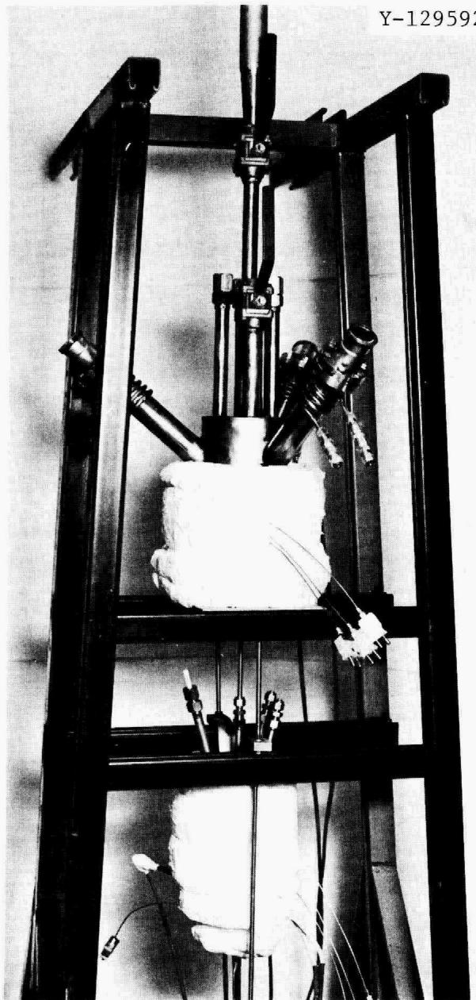  
Fig. 1. Tellurium Experimental Pot 1 Showing the Three Viewing Ports and Accesses for Electrochemical Probes.

Analytical Chemistry Division gave no indication of the presence of tellurium. Subsequently, three more $\mathrm{Li}_2\mathrm{Te}$ pellets were added, and the salt was sampled for chemical analysis. Three additions of $\mathrm{CrF}_2$ totalling $1.82\mathrm{g}$ were then made, followed by the addition of three more $\mathrm{Li}_2\mathrm{Te}$ pellets. A final addition consisting of $0.2\mathrm{g}$ of BeO was made.

Results are summarized as follows:

1. The $\mathsf{Li}_2\mathsf{Te}$ pellets did not melt and disappear immediately; some evidence of the pellets remained on the salt surface for the duration of the experiment.   
2. No electrochemical evidence of a soluble tellurium species was detected.   
3. Following the $\mathrm{Li}_2\mathrm{Te}$ additions, visibility through the view ports was limited by a bluish-grey deposit that was subsequently identified as predominantly tellurium.   
4. Chemical analysis of the salt sample taken after the addition of five $\mathrm{Li}_2\mathrm{Te}$ pellets showed that the tellurium content was less than 5 ppm. The conclusion was that use of $\mathrm{Li}_2\mathrm{Te}$ is not feasible for adding tellurium to MSBR fuel salt.

A second experiment was conducted in the same static pot at $650^{\circ}\mathrm{C}$ using the reportedly more soluble lithium telluride, $\mathrm{LiTe}_3$ . After the pot had been drained and cleaned, fresh salt was added, and three pellets containing a total of about $0.1\mathrm{g}$ of $\mathrm{LiTe}_3$ were inserted. During the following three weeks, electrochemical examinations of the salt by D. L. Manning revealed no indication of a soluble tellurium species. Since other experiments had shown that metal specimens could be embrittled by tellurium even when tellurium levels in the salt were below chemical detection limits, a Hastelloy N tensile specimen was inserted into the salt and three additional $\mathrm{LiTe}_3$ salt pellets were added. After about $650\mathrm{hr}$ the specimen was removed from the salt, tensile-tested to failure, and examined metallographically. Intergranular cracking, probably due to tellurium, was found, indicating that some mechanism exists for transport of tellurium or $\mathrm{LiTe}_3$ through the salt. Because concurrent experiments had identified simpler methods of adding tellurium to salt, no further work was carried out with either of the lithium tellurides.

# CHROMIUM TELLURIDE SOLUBILITY EXPERIMENT

The addition of a soluble chromium telluride - either $\mathrm{Cr_2Te_3}$ , $\mathrm{Cr_3Te_4}$ , or $\mathrm{Cr_5Te_6}$ - represents another method for adding tellurium to molten MSBR fuel salt. If an excess of chromium telluride is maintained, the chemical activity of tellurium in solution in the salt will be

determined if the temperature and the salt composition are not changed. To determine whether there is a temperature at which one of these chromium tellurides can provide a reasonable amount of tellurium in solution, we determined solubility of the chromium tellurides as a function of temperature.

A Hastelloy N pot was filled with about $500\mathrm{ml}$ of the salt $\mathrm{LiF - BeF_2 - }$ $\mathrm{ThF_4}$ (72-16-12 mol %), and the temperature of the pot was controlled at $700^{\circ}\mathrm{C}$ . After a sample of the salt was taken, $\mathrm{Cr_3Te_4}$ was added and a small Hastelloy N sheet specimen was inserted into the salt. After 170 hr the specimen was removed and after 250 hr a salt sample was taken. The temperature was then lowered to $650^{\circ}\mathrm{C}$ , and a day later another salt sample was taken.

This sequence was then repeated at $600^{\circ}\mathrm{C}$ . Next, the salt temperature was raised to $700^{\circ}\mathrm{C}$ , $\mathrm{Cr_2Te_3}$ was added, and another Hastelloy N specimen inserted. The specimen was removed and salt samples were taken under the same time-temperature conditions as discussed above.

The two Hastelloy N specimens were weighed and submitted for Auger electron spectroscopic (AES) examination. No weight changes were detected, but evidence of tellurium in the grain boundaries was found by AES. The results of the chemical analysis of the salt sample are shown in Table 1.

Table 1. Results of Chromium Telluride Solubility Measurements   

<table><tr><td rowspan="2">Sampling temperature (°C)</td><td colspan="5">Tellurium and Chromium Content of Salt Samples (ppm)</td></tr><tr><td colspan="2">Background(no Te added)</td><td colspan="2">AfterCr3Te4Addition</td><td>AfterCr2Te3Addition</td></tr><tr><td rowspan="2">700</td><td>Te</td><td>&lt;5</td><td>Te</td><td>&lt;5</td><td>Te</td></tr><tr><td>Cr</td><td>44</td><td>Cr</td><td>75</td><td>Cr</td></tr><tr><td rowspan="2">650</td><td></td><td></td><td>Te</td><td>15.1</td><td>Te</td></tr><tr><td></td><td></td><td>Cr</td><td>105</td><td>Cr</td></tr><tr><td rowspan="2">600</td><td></td><td></td><td>Tea</td><td>&lt;5</td><td>Te</td></tr><tr><td></td><td></td><td>Cra</td><td></td><td>88</td></tr></table>

aInsufficient sample.

Tellurium concentrations at $700^{\circ}\mathrm{C}$ were not as high as was expected, but some tellurium was in solution as demonstrated by the tellurium found on the grain boundaries of the specimens.

Following the solubility measurements, two tensile specimens were exposed to the salt- $\mathrm{Cr_2Te_3}$ solution. Both specimens, one of standard Hastelloy N and one of $2.6\%$ Nb-0.7% Ti-modified Hastelloy N, showed a weight increase after 500 hr exposure at $700^{\circ}\mathrm{C}$ . After room-temperature tensile testing, the standard Hastelloy N specimen had significantly more and deeper cracks than did the modified Hastelloy N specimen, as can be seen in Fig. 2 and Table 2. Also exposed to this salt- $\mathrm{Cr_2Te_3}$ solution were eight specimens that had been specially prepared for examination by AES. Unfortunately, the annealing treatment used before test resulted in large grains, and the data obtained were not interpretable.

Because specimens exposed to the $\mathrm{Cr_2Te_3}$ -salt solution had a surface reaction layer, we decided to use $\mathrm{Cr_3Te_4}$ for future experiments because of its lower tellurium activity. Accordingly, another pot was prepared, filled with salt, and doped with $\mathrm{Cr_3Te_4}$ . Tensile specimens of several modified Hastelloy N alloys with different combinations of niobium, titanium, and chromium were exposed to the salt- $\mathrm{Cr_3Te_4}$ system at $700^{\circ}\mathrm{C}$ . Examination of these specimens after tensile testing gave results included in Table 2. These results indicate that niobium as an alloying agent reduces embrittlement of Hastelloy N, but neither chromium nor niobium with titanium exhibit as strong an effect.

Standard Hastelloy N specimens intended for Auger studies were also exposed in this salt- $\mathrm{Cr}_3\mathrm{Te}_4$ system to provide information about the rate of tellurium attack (Fig. 3). As part of the Auger examination of these specimens, the depth of tellurium penetration was measured as a function of exposure time.3 These results are shown in Fig. 4.

For grain boundary diffusion where the diffusing species is soluble in the bulk, a $1/4$ power dependence is predicted. If essentially no bulk solubility is assumed, a power dependence of $1/2$ is expected. As seen from Fig. 4, these data fit a $t^{1/2}$ plot reasonably well. Because the exposure times considered were relatively short and because scatter in the measurements of depth was fairly large, the penetration rate calculated from these data has a rather large standard deviation.

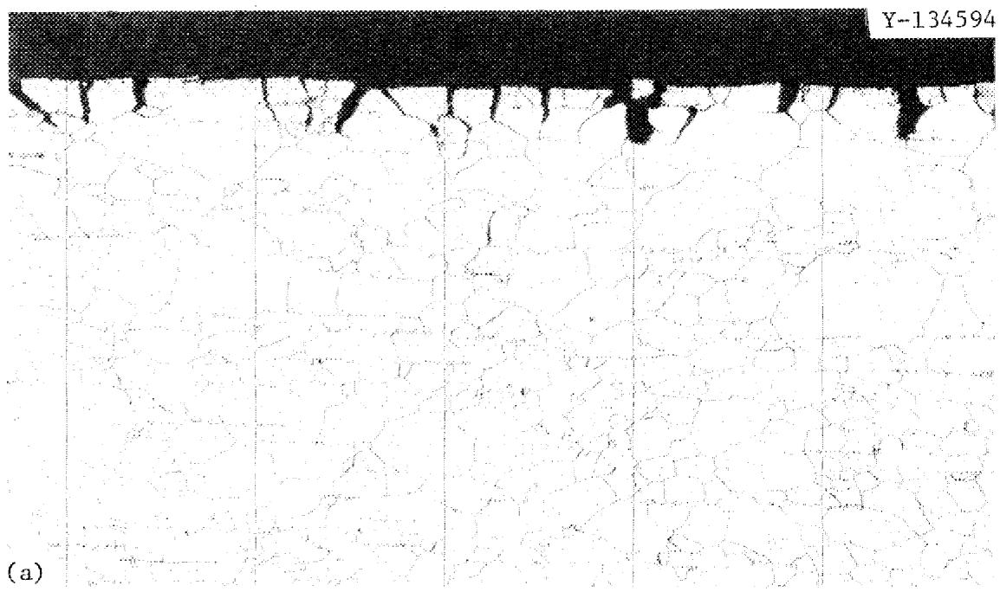

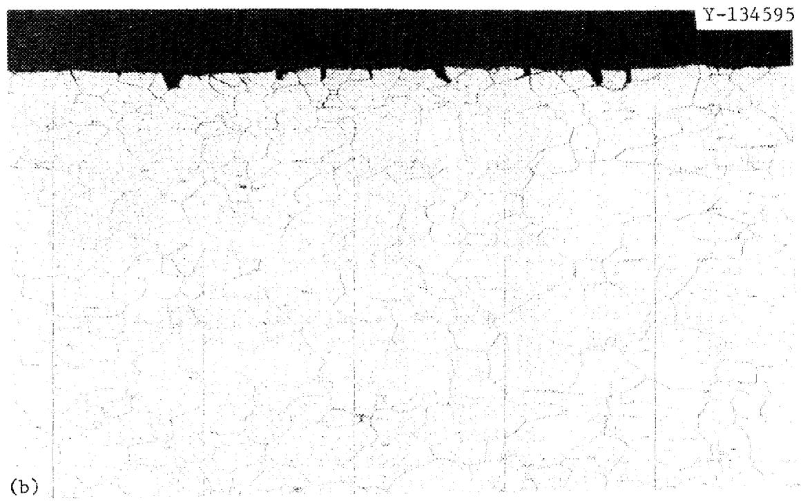  
Fig. 2. Photomicrographs of (a) Standard Hastelloy N, and (b) $2.6\%$ Nb-0.7% Ti-modified Hastelloy N Exposed to Salt plus $\mathrm{Cr_2Te_3}$ for 500 hr at $700^{\circ}\mathrm{C}$ , Then Strained to Failure at Room Temperature. Etched with aqua regia. $100\times$ .

Table 2. Intergranular Crack Behavior of Hastelloy N Specimens Exposed in Chromium Telluride Solubility Experiment   

<table><tr><td>Alloy</td><td>Exposurea Time (hr)</td><td>Salt Additive</td><td>Crackb Density (m-1)</td><td>Average Crack Depth (μm)</td><td>Density Times Depth</td></tr><tr><td>Standard</td><td>504</td><td>Cr2Te3</td><td>1.46 × 104</td><td>42.5</td><td>0.6205</td></tr><tr><td>2.6% Nb, 0.7% Ti</td><td>504</td><td>Cr2Te3</td><td>0.71</td><td>33.1</td><td>0.2350</td></tr><tr><td>Standard</td><td>499</td><td>Cr3Te4</td><td>1.38</td><td>50.4</td><td>0.6955</td></tr><tr><td>2.6% Nb, 0.7% Ti</td><td>499</td><td>Cr3Te4</td><td>0.97</td><td>24.3</td><td>0.2357</td></tr><tr><td>1.0% Nb, 1.0% Ti</td><td>244</td><td>Cr3Te4</td><td>1.02</td><td>37.4</td><td>0.3815</td></tr><tr><td>1.0% Nb</td><td>244</td><td>Cr3Te4</td><td>0.17</td><td>30.5</td><td>0.0519</td></tr><tr><td>7% Cr</td><td>500</td><td>Cr3Te4</td><td>0.47</td><td>35.6</td><td>0.1673</td></tr><tr><td>10% Cr</td><td>500</td><td>Cr3Te4</td><td>0.28</td><td>41.3</td><td>0.1156</td></tr><tr><td>12% Cr</td><td>503</td><td>Cr3Te4</td><td>0.71</td><td>43.7</td><td>0.3103</td></tr><tr><td>15% Cr</td><td>503</td><td>Cr3Te4</td><td>0.57</td><td>48.9</td><td>0.2787</td></tr></table>

aAll exposures were at $700^{\circ}\mathrm{C}$   
bMeasured number of cracks per meter of length along edge of a polished cross section of specimen.

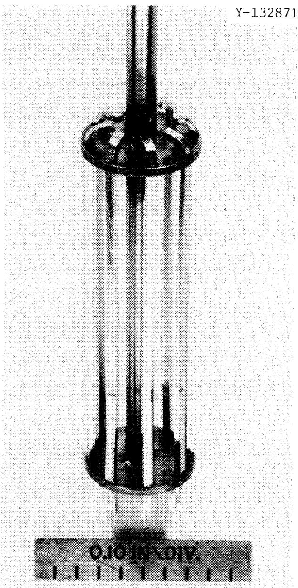  
Fig. 3. Hastelloy N Tensile Specimens Lsigned for Auger Studies Mounted in Holder Used for Salt Exposures. Note the reduced section in the lower portion of the specimens.

ORNL-DWG 77-11777

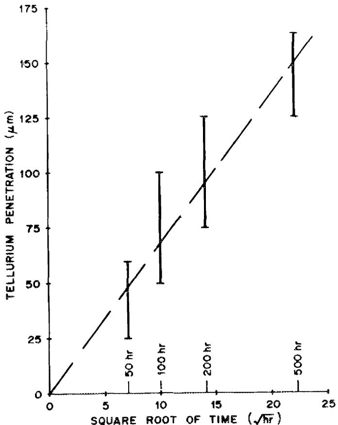  
Fig. 4. Tellurium Penetration versus Time for Hastelloy N Exposed at $700^{\circ}\mathrm{C}$ to $\mathrm{LiF - BeF_2 - ThF_4}$ (72-16-12 mol %) Containing $\mathrm{Cr_3Te_4}$ . Data obtained by AES.

# $\mathbf{N}\mathbf{i}_{3}\mathbf{T}\mathbf{e}_{2}$ CAPSULE TEST

Brynestad4 reported that a Hastelloy N specimen exposed to vapor above $\mathrm{Ni}_{3}\mathrm{Te}_{2} + \mathrm{Ni}$ for 1000 hr at $700^{\circ}\mathrm{C}$ did not show intergranular cracking. This suggested that the $\mathrm{Ni}_{3}\mathrm{Te}_{2} + \mathrm{Ni}$ system has a tellurium activity at which Hastelloy N is not attacked. To further evaluate this potentially significant result, a test was designed to expose Hastelloy N tensile specimens to salt containing $\mathrm{Ni}_{3}\mathrm{Te}_{2} + \mathrm{Ni}$ . A capsule was built and filled with about 310 ml of LiF-BeF2-ThF4 salt. A mixture of 62 at. % Ni-38 at. % Te, which had been annealed at high temperature to promote formation of $\mathrm{Ni}_{3}\mathrm{Te}_{2}$ plus a small excess of nickel, was added to the capsule, and four Hastelloy N specimens were inserted. One specimen was removed after 1000 hr at $700^{\circ}\mathrm{C}$ , strained to failure, and examined

metallographically. Contrary to Brynestad's earlier results in vapor, extensive intergranular cracking was found after exposure in salt. An x-ray examination of the $\mathrm{Ni}_3\mathrm{Te}_2 + \mathrm{Ni}$ mixture showed no evidence of unreacted tellurium, indicating that even the low tellurium activity associated with $\mathrm{Ni}_3\mathrm{Te}_2$ in this system causes intergranular attack of Hastelloy N. All three remaining specimens, which were exposed for longer times at $700^{\circ}\mathrm{C}$ , showed intergranular attack, and the results of metallographic examinations are given in Table 3.

Table 3. Intergranular Crack Behavior of Hastelloy N Exposed in Ni₃Te₂ Capsule Test at 700°C   

<table><tr><td>Alloy</td><td>Exposure Time (hr)</td><td>Crack Density (m-1)</td><td>Average Crack Depth (μm)</td><td>Density Time Depth</td></tr><tr><td>Standard</td><td>1079</td><td>8700</td><td>19.7</td><td>0.1714</td></tr><tr><td>Standard</td><td>2297</td><td>7700</td><td>34.8</td><td>0.2680</td></tr><tr><td>Standard</td><td>4377</td><td>9400</td><td>36.1</td><td>0.3393</td></tr><tr><td>Standard</td><td>4377</td><td>4700</td><td>34.7</td><td>0.1631</td></tr><tr><td>1.1% Nb</td><td>2080</td><td>300</td><td>48.2</td><td>0.0145</td></tr><tr><td>2.0% Nb</td><td>2080</td><td>1300</td><td>36.2</td><td>0.0471</td></tr><tr><td>Standard</td><td>2976</td><td>7900</td><td>23.2</td><td>0.1833</td></tr><tr><td>1.1% Nb</td><td>2976</td><td>400</td><td>44.3</td><td>0.0177</td></tr><tr><td>2.0% Nb</td><td>2976</td><td>800</td><td>37.5</td><td>0.0300</td></tr><tr><td>4.4% Nb</td><td>2976</td><td>4000</td><td>29.1</td><td>0.1164</td></tr></table>

Because other experiments were indicating that alloying with 1 to $2\%$ Nb lessens the tellurium embrittlement of Hastelloy N, four additional modified specimens were exposed to this $\mathrm{Ni}_3\mathrm{Te}_2$ -salt mixture in the capsule described above. The specimens contained additions of 0, 1.1, 2.0, and $4.4\%$ Nb and all were exposed for about 3000 hr at $700^{\circ}\mathrm{C}$ . After exposure, metallographic examination of the tensile tested specimens confirmed the effect of small additions of niobium on the tellurium embrittlement of Hastelloy N. Results are included in Table 3. Photomicrographs of these specimens are shown in Fig. 5.

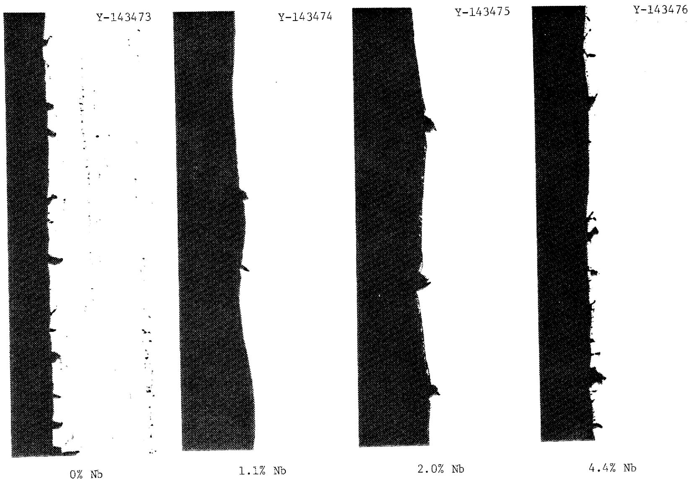  
Fig. 5. Effect of Niobium on the Tellurium Embrittlement of Hastelloy N that Had Been Exposed About 3000 hr at $700^{\circ}\mathrm{C}$ to $\mathrm{LiF - BeF_2 - ThF_4}$ (72-16-12 mol %) Containing $\mathrm{Ni}_3\mathrm{Te}_2 + \mathrm{Ni}$ . $100\times$

# TELLURIUM SCREENING TEST

To compare the resistance of various alloys to tellurium attack, we constructed a large pot to permit simultaneous exposure of a large number of specimens to a salt-tellurium system. This pot is equipped with a stirring mechanism, electrochemical probes, and five accesses for insertion of specimens. Up to 100 specimens can be exposed to salt at one time (Figs. 6 and 7). The pot was filled with about 11 liters of $\mathrm{LiF - BeF_2 - ThF_4}$ salt, and a mixture of $\mathrm{Cr_3Te_4}$ and $\mathrm{Cr_5Te_6}$ was added. Specimens that had been selected from the more than 50 different available modified and standard Hastelloy N compositions were exposed to this salt-telluride mixture for times ranging from 250 to 5000 hr at $700^{\circ}\mathrm{C}$ . Standard Hastelloy N was cracked to about the same extent when exposed in this system as when exposed in previously discussed systems. All results of the various exposures are tabulated elsewhere. The most notable result of these tests was the observation that the addition of 1 to 2 at. % Nb to Hastelloy N significantly reduced the cracking, as shown in Figs. 8 and 9. A more thorough discussion of these results will be given elsewhere.

# CHROMIUM-TELLURIUM-URANIUM INTERACTION EXPERIMENT

The research effort to solve the problem of tellurium intergranular attack of Hastelloy N was predominantly concerned with the development and testing of new alloys. The possibility of a chemical change in the salt that could alter the extent of attack by tellurium was also considered. It has been suggested7 that since chromium ion activity can be controlled, within a certain range, by the U(IV)/U(III) ratio, it might be possible to control tellurium activity by "complexing" reactions with chromium or other salt constituents, for example,

$$
2 \mathrm {U F} _ {3} + \mathrm {M F} _ {2} + \mathrm {x T e} \rightleftharpoons \text {" M T e} _ {\mathrm {x}} ^ {\prime \prime} + 2 \mathrm {U F} _ {4},
$$

where M denotes chromium or another salt component.

Electrochemical studies reported by Manning and Mamantov8 indicated that in a relatively reducing $\mathrm{LiF - BeF_2 - ThF_4}$ melt, tellurium could exist

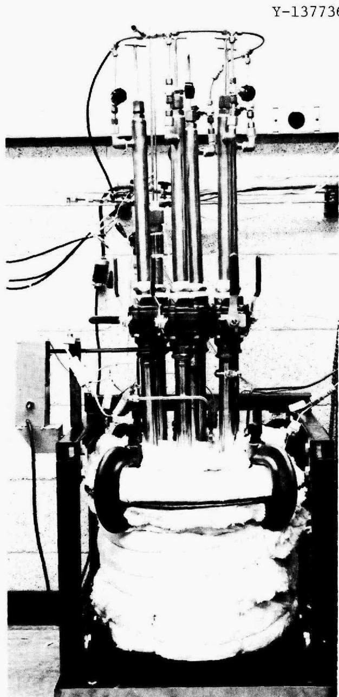  
Fig. 6. Tellurium Screening Pot Used for Exposing Tensile Specimens to LiF-BeF $_2$ -ThF $_4$ (72-16-12 mol %) Containing CrTe $_{1.266}$ .

Y-137735

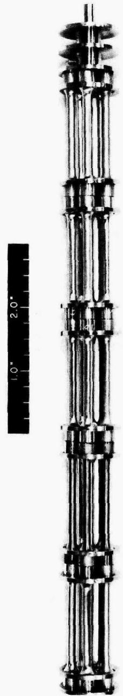  
Fig. 7. Holder with 25 Tensile Specimens Prepared for Insertion in Tellurium Screening Pot. The five top specimens will be in the vapor space above the salt, while the other 20 specimens will be in the molten salt.

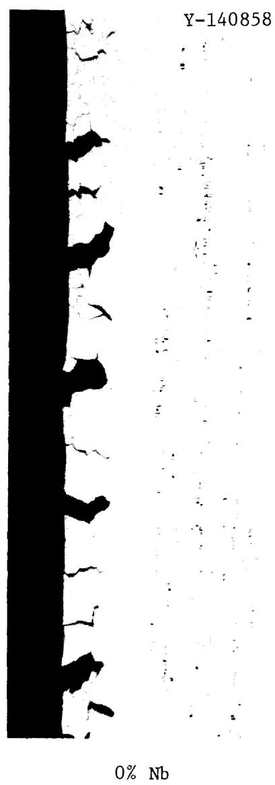

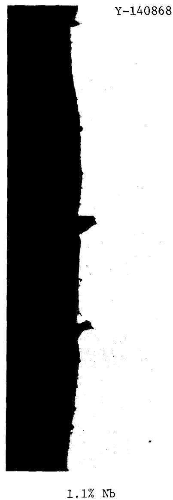

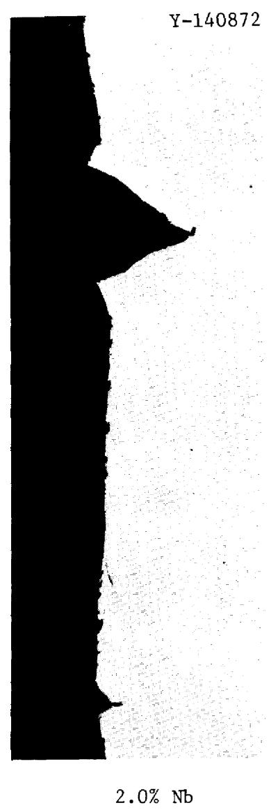

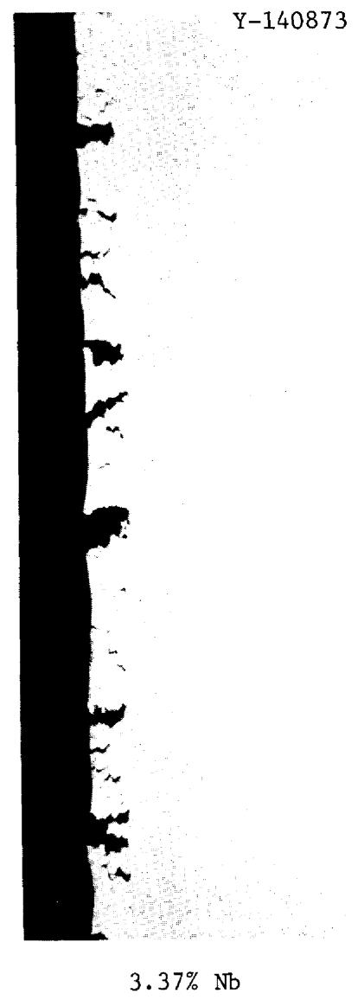  
Fig. 8. Effect of Niobium Additions on the Embrittlement of Hastelloy N Exposed 1000 hr at $700^{\circ}\mathrm{C}$ to $\mathrm{LiF - BeF_2 - ThF_4}$ (72-16-12 mol %) Containing $\mathrm{CrTe_{1.266}}$ . $100\times$

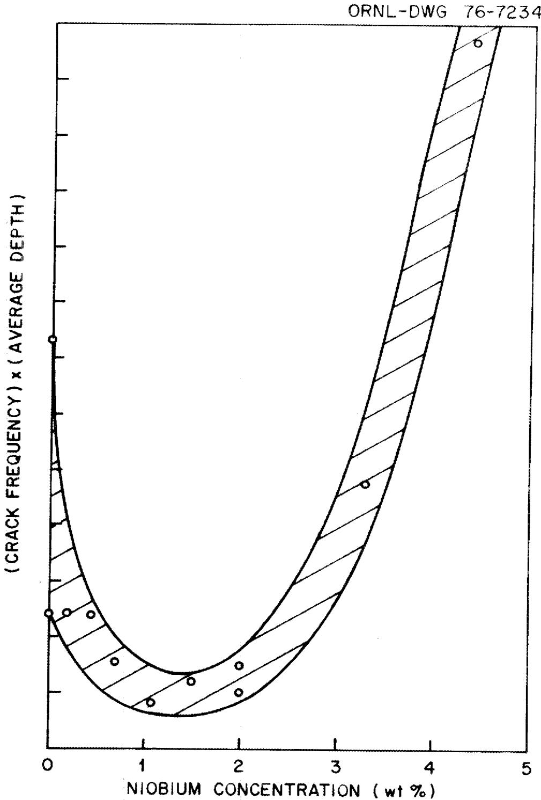  
Fig. 9. Effect of Niobium in Modified Hastelloy N on Grain Boundary Cracking when Exposed in Salt-Cr₃Te₄ + Cr₅Te₆ for 250 hr at 700°C.

as a telluride rather than as elemental tellurium. Their calculations showed the critical potential for the formation of a telluride corresponded to a U(IV)/U(III) ratio of about 150 at $650^{\circ}\mathrm{C}$ .

To check this hypothesis, a salt pot was built, equipped with electrochemical probes, and filled with about 1.4 liters of MSBR fuel salt $(\mathrm{LiF - BeF_2 - ThF_4 - UF_4})$ . With the close cooperation of D. L. Manning, Analytical Chemistry Division, the oxidation potential and impurity content of the salt were monitored voltammetrically. Additions of $\mathrm{CrFe_2}$ and about $1\mathrm{g}$ of $\mathrm{Cr_3Te_4}$ were made, and a Hastelloy N specimen was exposed for 500 hr to salt with a U(IV)/U(III) ratio of about 90. Metallographic examination of the specimen after deformation showed extensive cracking (Fig. 10).

To lower the oxidation potential of the salt, a beryllium rod was immersed in the salt for an hour after which time the U(IV)/U(III) ratio had decreased to about seven. After another addition of $\mathrm{CrF_2}$ and $\mathrm{Cr_3Te_4}$ to the salt, another specimen was exposed to the mixture for 500 hr. A metallographic examination (Fig. 10) of the tensile tested specimen showed a complete absence of grain boundary cracks. These results were encouraging so a series of exposures was carried out over a wider range of U(IV)/U(III) ratios. Specimens were exposed for about 260 hr at U(IV)/U(III) ratios of approximately 10, 30, 60, 85, and 300. Photomicrographs of the gage section of the tensile specimens from this series of tests are shown in Fig. 11. As is evident in Fig. 12, a marked change occurred in the cracking behavior of Hastelloy N exposed in this system in going from a ratio of about 60 to about 100.

The results of the metallographic examination of the specimens exposed in the Cr-Te-U interaction experiment are collected in Table 4 and are given in the order of exposure. Before each exposure both $\mathrm{CrFe_2}$ and $\mathrm{Cr_3Te_4}$ (or $\mathrm{CrTe_{1.266}}$ ) were added to the salt. According to the voltammetric measurements, the $\mathrm{Cr}^{++}$ content of the salt increased with successive $\mathrm{CrFe_2}$ additions. As can be seen from Table 4, the first and eighth exposures were at about the same oxidation potential (90 and 85), but the cracking behavior of the two differed more than would be expected from the difference in exposure time and oxidation potential. This suggests that the difference in $\mathrm{Cr}^{++}$ concentration between the early and later exposures is an important factor that affects the cracking behavior, but no funding or plans exist

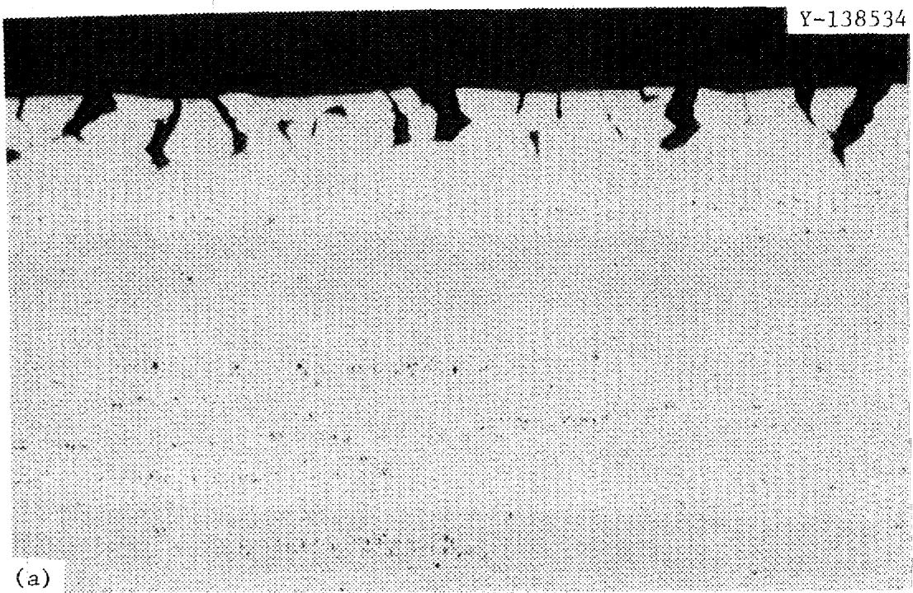

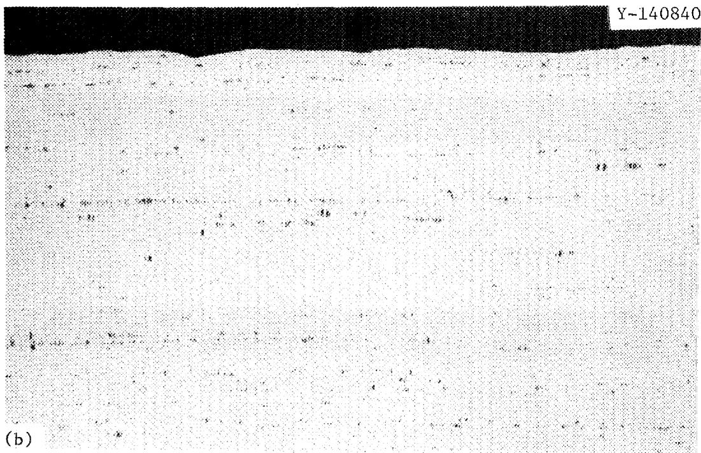  
Fig. 10. Hastelloy N Exposed 500 hr at $700^{\circ}\mathrm{C}$ to MSBR Fuel Salt Containing $\mathsf{CrFe}_2$ and $\mathsf{Cr}_3\mathsf{Te}_4$ With U(IV)/U(III) Equal to (a) 90 and (b) 7. $100\times$

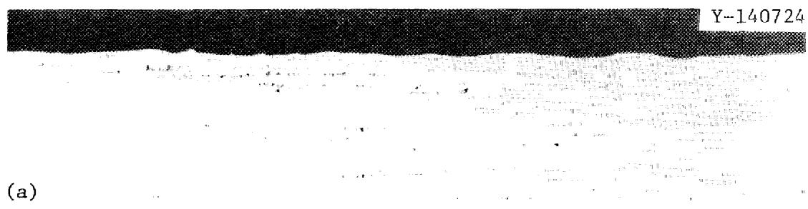

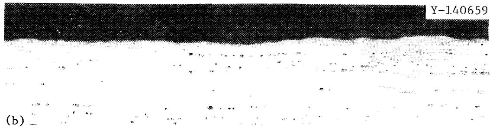

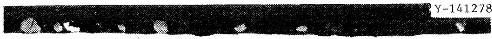

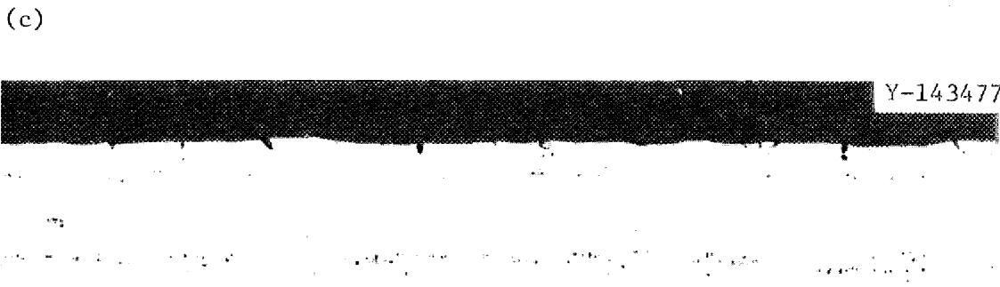

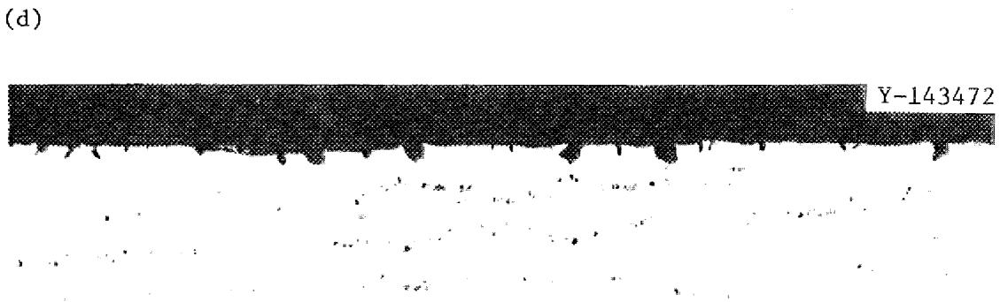  
(e)   
Fig. 11. Hastelloy N Exposed About 260 hr at $700^{\circ}\mathrm{C}$ to MSBR Fuel Salt Containing $\mathsf{CrFe}_2$ and $\mathsf{CrTe}_{1.266}$ with U(IV)/U(III) Equal to (a) 10, (b) 30, (c) 60, (d) 85, and (e) 300. $100\times$ .

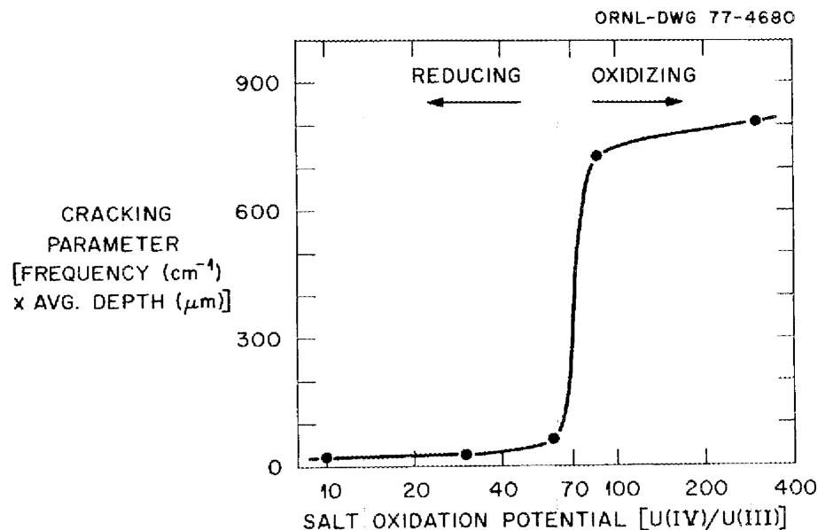  
Fig. 12. Cracking Behavior of Hastelloy N Exposed 260 hr at $700^{\circ}\mathrm{C}$ to MSBR Fuel Salt Containing $\mathrm{CrTe}_{1.266}$ .

Table 4. Intergranular Crack Behavior of Hastelloy N Specimens Exposed in Cr-Te-U Interaction Experiment at $700^{\circ}\mathrm{C}$   

<table><tr><td rowspan="2">Specimen</td><td colspan="3">Exposure Conditions</td><td rowspan="2">Crack Density (m-1)</td><td rowspan="2">Average Crack Depth (μm)</td><td rowspan="2">Density Times Depth</td></tr><tr><td>Time (hr)</td><td>U(IV) U(III)</td><td>Te Additive</td></tr><tr><td>1</td><td>504</td><td>~90</td><td>Cr3Te4</td><td>12,200</td><td>74.8</td><td>0.9126</td></tr><tr><td>2</td><td>502</td><td>~7</td><td>Cr3Te4</td><td>0</td><td>0.0</td><td>0.0</td></tr><tr><td>3</td><td>257</td><td>~10</td><td>CrTe1.266</td><td>200</td><td>3.6</td><td>0.0007</td></tr><tr><td>4</td><td>257</td><td>~10</td><td>CrTe1.266</td><td>400</td><td>8.6</td><td>0.0034</td></tr><tr><td>5</td><td>257</td><td>~30</td><td>CrTe1.266</td><td>200</td><td>12.7</td><td>0.0025</td></tr><tr><td>6</td><td>257</td><td>~30</td><td>CrTe1.266</td><td>300</td><td>12.2</td><td>0.0037</td></tr><tr><td>7</td><td>257</td><td>~60</td><td>CrTe1.266</td><td>500</td><td>13.0</td><td>0.0065</td></tr><tr><td>8</td><td>257</td><td>~85</td><td>CrTe1.266</td><td>6,800</td><td>10.7</td><td>0.0728</td></tr><tr><td>9</td><td>262</td><td>~300</td><td>CrTe1.266</td><td>6,000</td><td>13.6</td><td>0.0816</td></tr></table>

${}^{a}$ All were standard Hastelloy N,heat 405065.

for further investigation of this possibility. (Also different was the telluride added, $\mathrm{CrTe}_{1.333}$ vs $\mathrm{CrTe}_{1.266}$ , but from previous experience we would not expect it to make such a large difference).

Controlling the oxidation potential of the salt coupled with the presence of chromium ions in the salt appears to be an effective means of limiting tellurium embrittlement of Hastelloy N. However, further studies are needed to assess the effects of longer exposure times and to measure the interaction parameters for chromium and tellurium under varying salt oxidation potentials.

# SUMMARY

As a result of these studies, we have found that Hastelloy N exposed in salt containing metal tellurides such as $\mathbf{L}\mathbf{i}_{\mathbf{x}}\mathbf{T}\mathbf{e}$ and $\mathbf{C}\mathbf{r}_{\mathbf{y}}\mathbf{T}\mathbf{e}_{\mathbf{z}}$ undergoes grain boundary embrittlement like that observed in the MSRE. The embrittlement is a function of the chemical activity of tellurium associated with the telluride. The degree of embrittlement can be reduced by alloying additions to the Hastelloy N. The addition of 1 to 2 at. % Nb significantly reduces embrittlement, but small additions of titanium or additions of up to 15 at. % Cr do not affect embrittlement.

We have found that if the U(IV)/U(III) ratio in fuel salt is kept below about 60, embrittlement is essentially prevented when CrTe1.266 is used as the source of tellurium.

# ACKNOWLEDGMENTS

This work was supported by the Molten-Salt Reactor Program and was carried out under the program direction of H. E. McCoy. His strong support and encouragement are very much appreciated. The assistance of the following is gratefully appreciated: E. J. Lawrence for operating the experiments, B. McNabb and J. C. Feltner for preparation and evaluation of the specimens, W. H. Farmer for carrying out the metallographic examination of the specimens, J. R. DiStefano and J. H. DeVan for advice and encouragement, and H. E. McCoy and R. E. Clausing for review of the manuscript.

Some of the experiments were carried out as a project of the tellurium working group involving S. L. Bennett, D. N. Braski, J. Brynestad, R. E. Clausing, J. R. Keiser, J. M. Leitnaker, H. E. McCoy, and C. L. White. This group met periodically and made valuable input into these experiments.

The report was edited by R. R. Ihrig and prepared for reproduction by K. A. Witherspoon.

# REFERENCES

1. H. E. McCoy and B. McNabb, Intergranular Cracking of INOR-8 in the MSRE, ORNL-4829 (November 1972).   
2. R. E. Clausing and L. Heatherly, "Examination of a Hastelloy N Foil Sample Embrittled in the Molten Salt Reactor Experiment" paper in preparation.   
3. J. R. Keiser, D. L. Manning, and R. E. Clausing, "Corrosion Resistance of Some Nickel-Base Alloys to Molten Fluoride Salts Containing $\mathsf{UF}_4$ and Tellurium, pp 315-28 in Molten Salts, the Electrochemical Society, New York, 1976.   
4. H. E. McCoy, J. Brynestad, D. Kelmers, and B. McNabb, ORNL, private communication, May 31, 1975.   
5. D. N. Braski, ORNL private communication, March 1976.   
6. H. E. McCoy, Status of Materials Development for MSBR, ORNL/TM-5920 (report in preparation).   
7. J. Brynestad, ORNL, private communication, September 30, 1975.   
8. D. L. Manning and G. Mamantov, ORNL, private communication, November 30, 1975.

__________

__________

# INTERNAL DISTRIBUTION

1-2. Central Research Library

3. Document Reference Section

4-13. Laboratory Records Department

14. Laboratory Records, ORNL RC

15. ORNL Patent Office

16. C.F.Baes

17. C. E. Bamberger

18. E. S. Bettis

19. C. R. Brinkman

20. J. Brynestad

21. D. A. Canonico

22. S. Cantor

23. C. B. Cavin

24. R. E. Clausing

25. J. L. Crowley

26. F. L. Culler

27. J. E. Cunningham

28. J.H.DeVan

29. J. R. DiStefano

30. R. G. Donnelly

31. J. R. Engel

32. L. M. Ferris

33. G. M. Goodwin

34. W. R. Grimes

35. R. H. Guymon

36. J.R.Hightower, Jr.

37-39. M.R.Hill

40. W. R. Huntley

41-50. J. R. Keiser

51. A. D. Kelmers

52. R. E. MacPherson

53. G. Mamantov

54. D. L. Manning

55. C. L. Matthews

56. L. Maya

57. H. E. McCoy

58. C. J. McHargue

59. L. E. McNeese

60. H. Postma

61. T. K. Roche

62. M. W. Rosenthal

63. H. C. Savage

64. J. E. Selle

65. M. D. Silverman

66. G. M. Slaughter

67. A. N. Smith

68. L. M. Toth

69. D. B. Trauger

70. J. R. Weir, Jr.

71. C. L. White

72. J. P. Young

73. R.W. Balluffi (consultant)

74. P. M. Brister (consultant)

75. W. R. Hibbard, Jr. (consultant)

76. Hayne Palmour III (consultant)

77. N. E. Promisel (consultant)

78. D. F. Stein (consultant)

# EXTERNAL DISTRIBUTION

79-80. ERDA OAK RIDGE OPERATIONS OFFICE, P.O. Box E, Oak Ridge, TN 37830

Director, Reactor Division

Research and Technical Support Division

81-82. ERDA DIVISION OF NUCLEAR RESEARCH AND APPLICATION, Washington, DC 20545

Director

83-192. ERDA TECHNICAL INFORMATION CENTER, Office of Information Services, P.O. Box 62, Oak Ridge, TN 37830

For distribution as shown in TID-4500 Distribution Category, UC-76 (Molten Salt Reactor Technology)