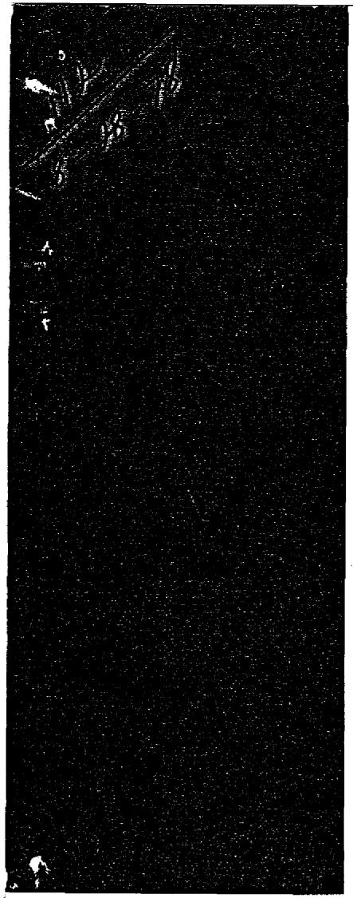
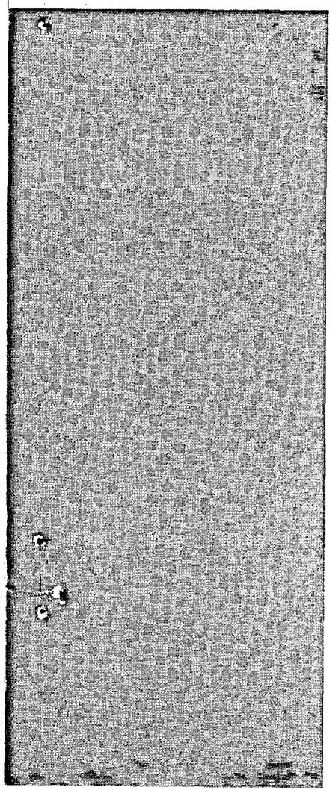
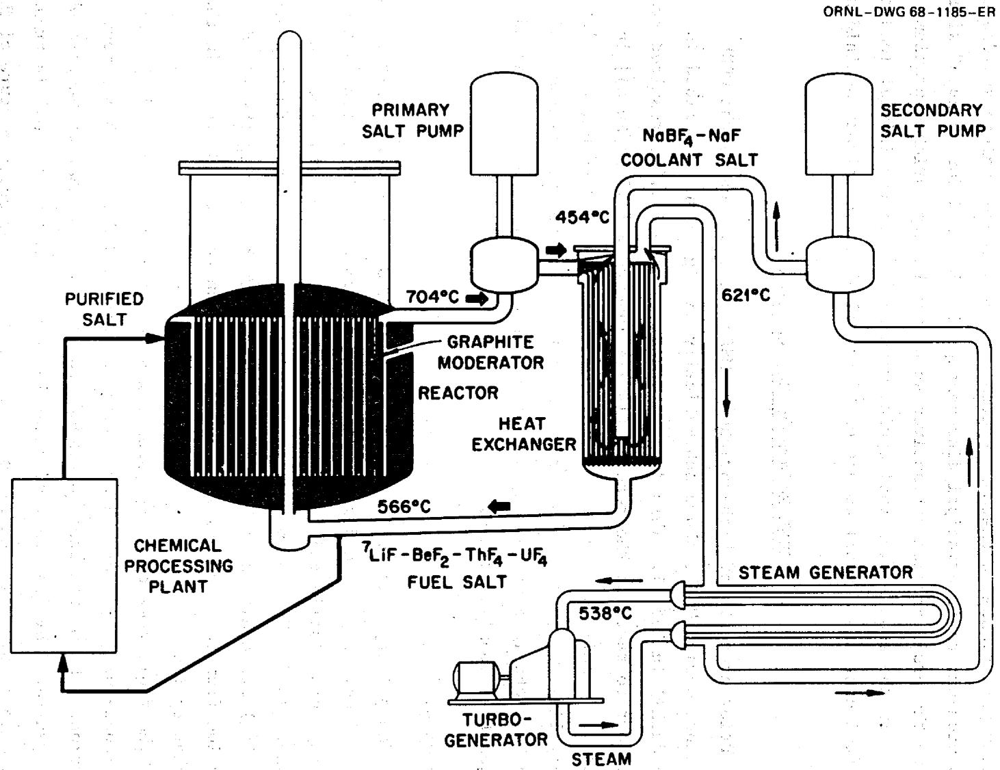
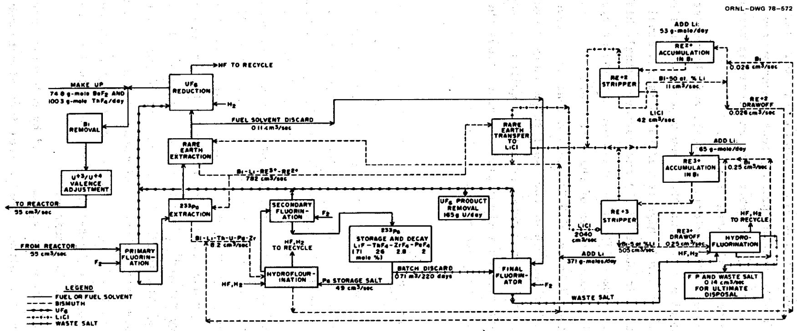
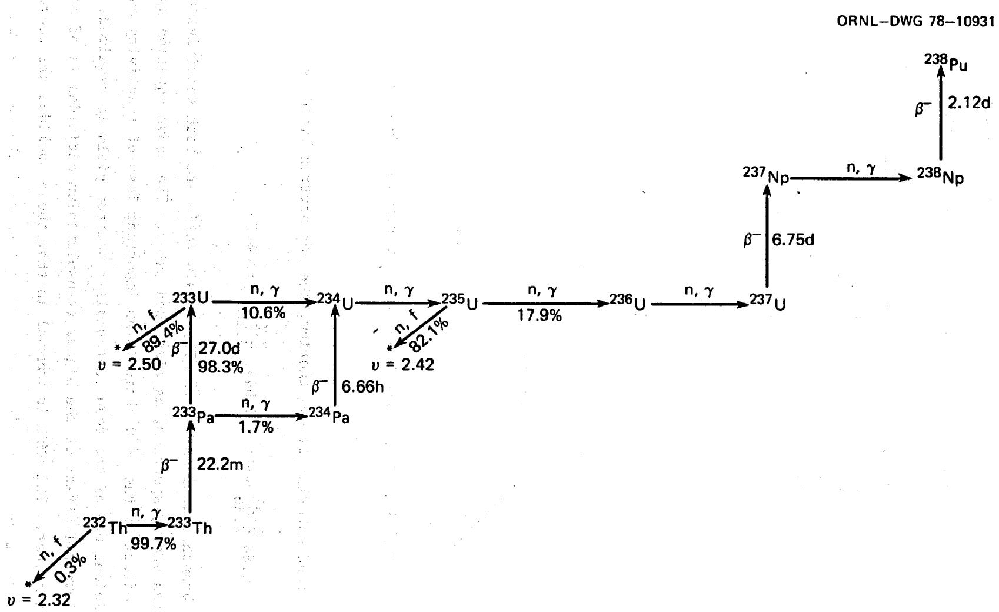
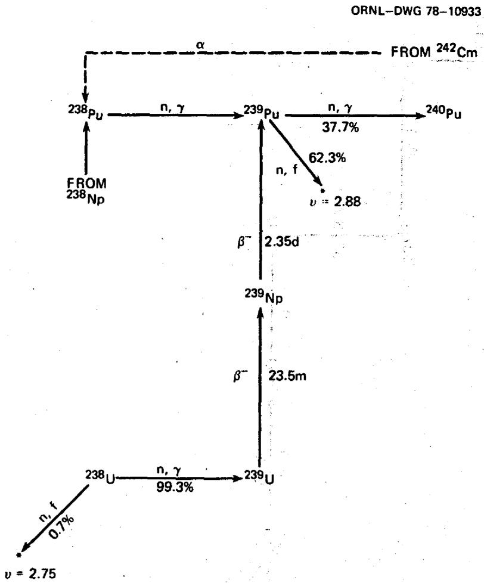
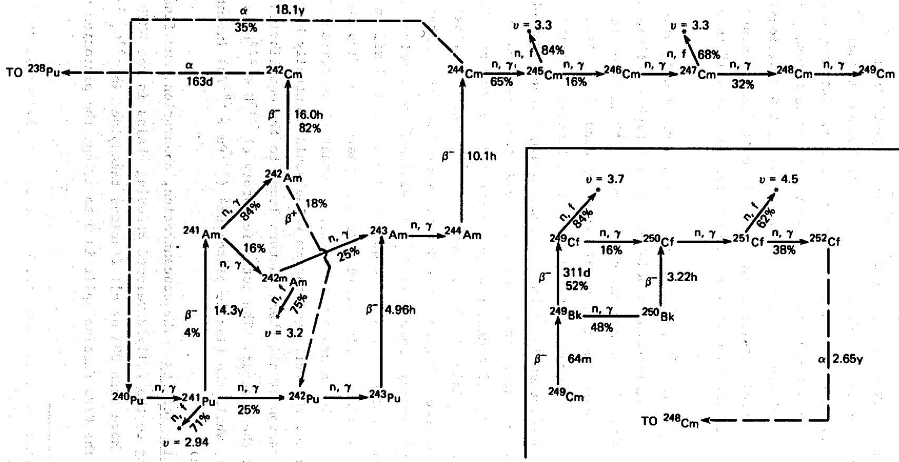
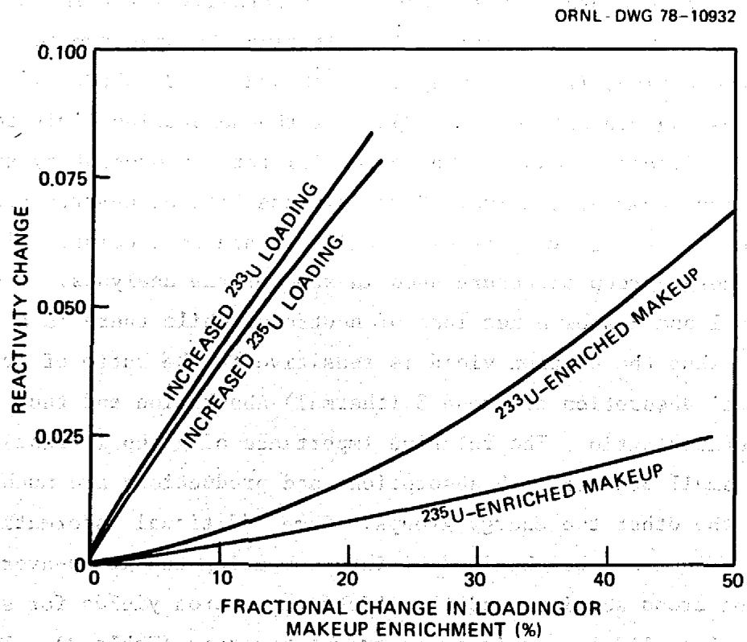
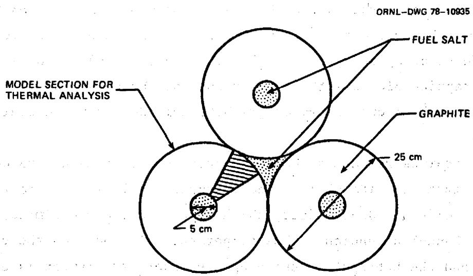
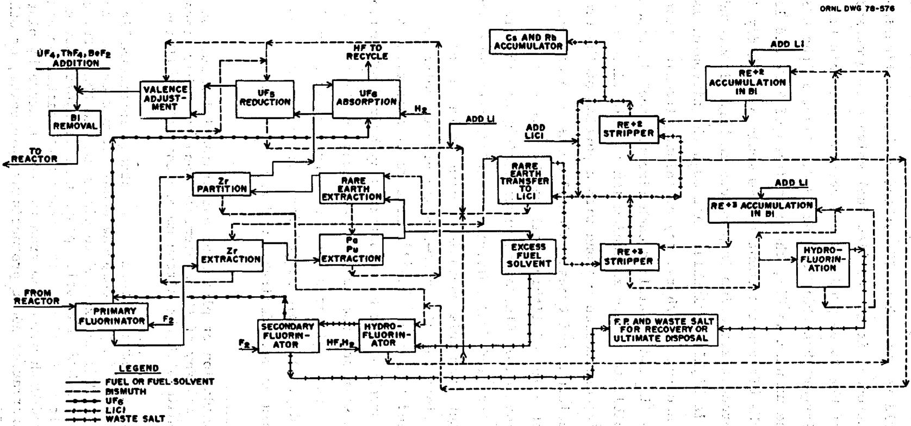

# MASTER

# MASTER

# Molten-Salt Reactors for Efficient Nuclear Fuel Utilization Without Plutonium Separation

J. R. Engel

W. R. Grimes

W. A. Rhoades

J. F. Dearing

OAK RIDGE NATIONAL LABORATORY

OPERATED BY UNION CARBIDE CORPORATION - FOR THE DEPARTMENT OF ENERGY

1

Printed in the United States of America. Available from National Technical Information Service U.S. Department of Commerce 5285 Port Royal Road, Springfield, Virginia 22161 Price: Printed Copy $5.25; Microfiche $3.00

This report was prepared as an account of work sponsored by an agency of the United States Government. Neither the United States Government nor any agency thereof, nor any of their employees, contractors, subcontractors, or their employees, makes any warranty, express or implied, nor assumes any legal liability or responsibility for any third party's use or the results of such use of any information, apparatus, product or process disclosed in this report, nor represents that its use by such third party would not infringe privately owned rights.

Contract No. W-7405-eng-26

Engineering Technology Division

MOLTEN-SALT REACTORS FOR EFFICIENT NUCLEAR FUEL UTILIZATION WITHOUT PLUTONIUM SEPARATION

J.R.Engel W.A.Rhoades

W.R.Grimes J.F.Dearing

Date Published - August 1978

NOTICE: This document contains information of a preliminary nature and was prepared primarily for internal use at the Oak Ridge National Laboratory.

Prepared by the

OAK RIDGE NATIONAL LABORATORY

Oak Ridge, Tennessee 37830

operated by

UNION CARBIDE CORPORATION

for the

DEPARTMENT OF ENERGY

NOTICE

This report was prepared as an account of work sponsored by the United States Government. Neither the United States nor the United States Department of Energy, nor any of their employees, nor any of their contractors, subcontractors, or their employees, makes any warranty, express or implied, or assumes any legal liability or responsibility for the accuracy, completeness or usefulness of any information, apparatus, product or process disclosed, or represents that its use would not infringe privately owned rights.

# CONTENTS

# Page

SUMMARY V

ABSTRACT 1

INTRODUCTION 1

BACKGROUND 3

HIGH-ENRICHMENT MSRs 5

ORNL Reference Design MSBR 5

Reference Design Variations 11

Plutonium Transmuter for $^{23}$ U Production 13

DENATURED MSR 14

General Characteristics 14

Reactor Characteristics 16

Core Thermal Hydraulics 31

Chemical Processing 33

Balance of Plant 39

MSR TECHNOLOGY STATUS 39

REFERENCES 40

#

#   
  
  
  
  
  
  
（20  
  
  
  
安维  
  
， ， ， ， ， ， ， ， ， ， ， ， ， ， ， ， ， ， ， ，

# SUMMARY

Research and development studies of molten-salt reactors (MSRs) for special purposes have been under way since 1947 and for possible application as possible commercial nuclear electric power generators since 1956. For the latter, the previous emphasis has been on breeding performance and low fissile inventory to help limit the demand on nonrenewable natural resources (uranium) in an expanding nuclear economy; little or no thought has been given to alternative uses of nuclear fuels such as proliferation of nuclear explosives. As a consequence, the conceptual designs that evolved (e.g., the ORNL reference design MSBR) all favored enriched $^{23} \mathrm{U}$ as fuel with an on-site chemical processing facility from which portions of that fuel could be diverted fairly easily. With the current interest in limiting the proliferation potential of nuclear electric power systems, a redirected study of MSRs was undertaken in an effort to identify conceptual systems that would be attractive in this situation. It appears that practical proliferation-resistant MSRs could be designed and built, and this report describes a particularly attractive break-even breeder that includes an on-site chemical reprocessing facility within the reactor primary containment.

The point of departure for this study (as for other recent MSR studies) was the ORNL reference design MSBR, which in many respects, reflects the state of MSR technology at the end of the reactor development program in fiscal year 1976. This reactor was characterized by a moderate breeding ratio ( $\sim$ 1.07), a low specific inventory of fissile fuel [v1.5 kg/MW(e)], a reasonable fuel doubling time ( $\sim$ 20 years), and almost no plutonium from the fuel cycle. This performance was to be achieved through the use of fuel highly enriched in $^{233}\mathrm{U}$ and $^{235}\mathrm{U}$ ( $\sim$ 72%) in a high-power-density core and an on-site fission-product-cleanup system with a 10-day fuel processing cycle. Two important steps in this processing cycle were (1) the isolation of the enriched uranium from, and its subsequent return to, the fuel salt and (2) the isolation of $^{233}\mathrm{Pa}$ for decay to $^{233}\mathrm{U}$ outside the reactor neutron flux to prevent counterproductive neutron captures in

the protactinium at the high flux levels* in the reactor. Both of these steps, along with the ready availability of excess bred fuel, were perceived to contribute to the proliferation sensitivity of the reference concept.

A preliminary study was undertaken late in calendar year 1976 to see if the reference MSBR concept could be modified to significantly enhance its proliferation resistance. Among the modifications considered were elimination of the breeding gain, a reduction in power density (and specific power) so that protactinium isolation could be avoided without excessive penalties, and several conceptual variations in the fuel processing cycle. Reduction of the fissile uranium enrichment (i.e., denaturing) was not considered at that time because of perceived problems with the attendant plutonium production. The net conclusion of this study was that, while some enhanced proliferation resistance could be achieved, the reference MSBR concept probably could not be made sufficiently resistant to allow its deployment outside areas that would be "secure" against diversion of fissile material or proliferation.

In a minor extension of the above study it was shown that, if MSRs were confined to "secure" areas, they could also be used to produce power from fission of plutonium (generated by other reactors) and to convert thorium to $^{233}\mathrm{U}$ for subsequent denaturing and use at dispersed sites. Since the confinement of MSRs exclusively to "secure" sites did not appear to be desirable, no further consideration was given to concepts without denatured uranium.

The current study of proliferation-resistant systems is based on the premise that MSRs would be attractive for dispersed deployment if they could operate with denatured uranium fuel, have good resource utilization characteristics, and require no fuel reprocessing outside the reactor primary containment envelope. A number of molten-salt concepts may meet these requirements, but the one that currently appears most attractive is a system with denatured fuel and a net effective lifetime breeding ratio of 1.00. This implies that, once such a reactor were supplied with

a fissile fuel charge, it and succeeding generations of hardware could operate indefinitely with no further addition of fissile material. Additions and removals of fertile material – both $^{238}\mathrm{U}$ and $^{232}\mathrm{Th}$ – and other salt constituents would, however, be required to maintain a stable chemical composition.

Break-even breeding in a denatured MSR is achieved by making several changes in the reference design MSBR concept. First, changes were made in the reactor core size and salt-graphite configuration to lower the core power density and to enhance neutron resonance self-shielding in the $^{238}\mathrm{U}$ in the fuel. These changes increased the fuel specific inventory somewhat (to about 2.4 kg fissile uranium plus 0.16 kg fissile plutonium per electric megawatt), but they also reduced the neutron losses to fission products and $^{233}\mathrm{Pa}$ and captures in $^{238}\mathrm{U}$ to help compensate for the reduced breeding performance imposed by the presence of the $^{238}\mathrm{U}$ denaturant. In addition, the lower neutron flux associated with these changes would extend the life expectancy of the moderator graphite in the core to approximately that of the reactor plant, thereby obviating the need for periodic graphite replacement. It would also substantially ease the graphite design constraints and allow for simpler geometric shapes. Although the neutronic calculations indicate that this reactor could operate indefinitely with the assumed chemical processing system, there is relatively little margin for error. However, a substantial margin could be provided by allowing the addition of small amounts of $^{235}\mathrm{U}$ (well within the denaturing limit) with the fertile $^{238}\mathrm{U}$ , and some additional margin probably could be obtained by adjusting the nominal core design and/or the fuel processing cycle.

Aside from the core nuclear concept, the other substantial change from the reference design MSBR is in the area of chemical processing. The requirement for break-even breeding would impose a need for continuous chemical processing, but the cycle time apparently could be increased to $\sim 20$ days (from 10 days for the MSBR). However, a more significant change would be the elimination of the steps to isolate $^{233}\mathrm{Pa}$ in order to avoid the loss to waste of plutonium. Since plutonium, the transplutonium actinides, and fission product zirconium all follow the protactinium, this change not only would preserve the plutonium required for neutronic survival, but also avoid chemical isolation and accessibility of proliferation-

# viii

attractive materials. (An additional step would then have to be provided in the process to remove zirconium on some reasonable time schedule.) The change actually would eliminate part of the reference flowsheet since the extracted protactinium and its companion nuclides would be returned directly to the fuel salt. With the exception of the zirconium-removal step, the modified process would involve the same chemical unit operations proposed for the reference MSBR system. Thus, this process should be no more difficult to develop and implement than that for the reference concept.

Preliminary study suggests that no changes to the reference design MSBR other than those described above for the core and chemical plant would be required to transform the MSBR into an attractive proliferation-resistant concept. It appears that a commercial prototype of such a system could be developed and in operation in about 30 years if a development effort were established.

# MOLTEN-SALT REACTORS FOR EFFICIENT NUCLEAR FUEL UTILIZATION WITHOUT PLUTONIUM SEPARATION

J.R.Engel W.A.Rhoades

W. R. Grimes J. F. Dearing

# ABSTRACT

Molten-salt reactors (MSRs), because of the fluid nature of the fuel, appear to provide an attractive approach to efficient fuel utilization in the Th-233U cycle as well as a means for limiting the availability of plutonium and the general proliferation risks associated with nuclear power generation.

High-enrichment $^{233}\mathrm{U}$ systems could, in principle, be operated with positive breeding gains to effectively eliminate plutonium as a nuclear fuel. However, such systems would be proliferation sensitive. Concept modifications (short of denaturing the uranium fuel) can be conceived to enhance the proliferation resistance of high-enrichment MSRs, but it is doubtful that sufficient enhancement could be achieved to make the systems suitable for deployment other than at "secure" sites.

Denaturing the uranium in an MSR introduces some plutonium into the fuel cycle and generally degrades its breeding performance. Nevertheless, a denatured MSR with full-scale on-site fuel reprocessing appears to be capable of break-even breeding. In addition, the plutonium (most of which is consumed in situ) would be of poor quality and would never be isolated from all other undesirable nuclides. Thus, such systems would provide for efficient utilization of uranium resources in a proliferation-resistant environment while limiting the amount of plutonium (and transplutonium actinides) that would have to be handled as waste.

The development of commercial MSRs by early in the 21st century appears to be technologically feasible.

# INTRODUCTION

The interest in limiting the distribution and availability of explosives-usable special nuclear materials (SNM), particularly plutonium, along with a recognized need for optimum utilization of nonrenewable energy sources, has led to a reexamination of the Molten-Salt Reactor (MSR) concept as a potential candidate for resource-efficient nuclear electric power generation within these constraints. Prior studies of

this concept had established it as a neutronically feasible nuclear breeder in the Th-233U system, but its proliferation resistance was not considered. In the current study, an effort is being made to retain favorable nuclear performance of the reactor while enhancing its proliferation resistance to a level that may make it attractive for widespread deployment as a nuclear power system.

The criteria for judging the proliferation resistance of a given nuclear power concept have not been fully established, but some of the properties of the "ideal" nuclear system are readily apparent. First, such a system should avoid the isolation of plutonium (of whatever isotopic composition) as a pure material anywhere in the reactor cycle, including the fuel cycle. Second, the system should limit to the extent possible the inventory of SNM at explosives-usable isotopic compositions, regardless of its chemical impurity or unavailability. Finally, the system should provide reasonable safeguards for any SNM that might be transformed (e.g., by isotope separation) into material that could be used for explosives. Another factor that has not been heavily emphasized is that, since the current generation of light-water reactors is producing a substantial amount of plutonium, there may be some advantage in a system that could in an appropriately safeguarded manner consume that plutonium to obviate the need for its long-term, safeguarded storage.

A variety of molten-salt reactors may be described which would have most of these properties in varying degrees. The basic reference design MSBR, $^{1}$ developed at Oak Ridge National Laboratory, could for all practical purposes eliminate plutonium as a nuclear fuel. However, such a system would require highly enriched uranium, a comparably attractive nuclear explosives material, as a fuel. If appropriately safeguarded facilities could be provided, MSRs could be used to transform plutonium to $^{233}\mathrm{U}$ (which can be denatured) while efficiently using the plutonium fission energy. Such systems could range from $^{233}\mathrm{U}$ fuel factories, which would require continuing plutonium fueling, to MSBRs or denatured MSRs in which plutonium might be used only as a startup fuel. But possibly the most attractive proliferation-resistant MSR concept is a denatured $^{233}\mathrm{U}$

system with a very limited internal plutonium inventory. Current studies indicate that such a system could produce all its own fuel requirements and have otherwise favorable technological features.

# BACKGROUND

The study and development of MSRs was begun at ORNL in 1947 as part of the U.S. Aircraft Nuclear Propulsion Program. This effort led to the construction and operation of a 2.5-MW(t) MSR [the Aircraft Reactor Experiment (ARE)] in 1954. Although the effort to develop an aircraft propulsion unit was subsequently abandoned, the potential of MSRs for civilian power production was recognized and a development program directed toward that goal was established in 1956. This effort led to the design, construction, and operation of the 8-MW(t) Molten-Salt Reactor Experiment (MSRE). Critical operation of the MSRE spanned the period from June 1965 to December 1969, during which the reactor accumulated over 13,000 equivalent full-power hours of operation and demonstrated remarkably high levels of operability, availability, and maintainability.[2] The reactor was fueled initially with a mixture of $^{235}\mathrm{U}$ and $^{238}\mathrm{U}$ which was subsequently removed (on site, by fluorination of the salt mixture) and replaced by $^{233}\mathrm{U}$ , thus making it the first reactor to operate at significant thermal power with this fuel. During the latter stages of reactor operation, a few hundred grams of plutonium was added to the reactor to demonstrate its compatibility with the salt mixture.

Subsequent to the operation of the MSRE, some conceptual design work was continued toward a Molten-Salt Test Reactor and a commercial-size Molten-Salt Breeder Reactor (MSBR). However, most of the program effort was directed toward further development of MSR technology. Emphasis in the design study was on moderately high breeding performance and a minimal specific fissile inventory for the system. These objectives led to a 1000-MW(e) reference design1 with a fissile inventory of only $1.5\mathrm{kg/MW(e)}$ and a compound doubling time of $\sim 19$ years.

The apparently favorable characteristics of the MSBR attracted some industrial and utility interest; this led to the formation of the Molten-Salt Group, headed by Evasco Services, Inc., and including several prominent

U.S. corporations. This group carried out some design studies3 and assessments of the ORNL work (under subcontract) as well as some independently funded studies.

A11 AEC-supported work on the MSR concept was interrupted in early 1973; the program was terminated and all subcontracts were canceled. The technology development effort was resumed in early 1974 (no conceptual design work) and terminated again in mid-1976. One result of that effort was a comprehensive program plan for the development of MSRs. The current study is part of the Department of Energy's Nonproliferation Alternative Systems Assessment Program, which was established in support of President Carter's Nuclear Policy Statement of April 7, 1977.

Molten-salt reactors, in common with essentially all fluid fuel concepts, have a number of characteristics which may prove valuable from the standpoint of nonproliferation of nuclear explosives. Since the fuel is a fluid, essentially all fuel fabrication and refabrication steps are eliminated from the reactor fuel cycle. Thus, at least in principle, it should be possible to carry out completely remote operations within the primary containment of the reactor system. This would eliminate all direct access to the fuel constituents.

Since the fluid fuel also contains fission products, the entire primary circuit (including the fuel processing facility) is highly radioactive and therefore not easily modified for diversion of fissile materials. Any such modification would require remote procedures which, even with extensive preparation and preplanning, would be difficult, time consuming, and expensive. Clandestine modification of the facility would be essentially impossible because of the high radiation levels inside the primary containment.

Molten-salt reactor systems as a class, particularly those treated here, have many features in common. All are thermal reactors with unclad graphite as the neutron moderator and all use the same nominal salt mixtures and the same conceptual balance-of-plant design. Differences among concepts are primarily in the details of the fuel-salt composition (e.g., uranium concentration and isotopic composition) and in the on-line fuel-cleanup concept.

# HIGH-ENRICHMENT MSRs

The principal advantages of high-enrichment MSRs are their favorable nuclear performance in thermal spectra and their near-complete avoidance of plutonium; their principal disadvantage is the need for "secure" siting due to the proliferation attractiveness of the highly enriched uranium fuel. In the equilibrium fuel cycle, with no $^{238}\mathrm{U}$ in the initial loading, the fuel contains a small amount of $^{238}\mathrm{Pu}$ and almost no higher actinides.

# ORNL Reference Design MSBR

Prior concepts of high-enrichment MSRs are typified by the ORNL reference design MSBR, shown schematically in Fig. 1 and described in some detail in Ref. 1. This design (breeding ratio = 1.07) resulted from an effort to restrict the reactor fissile inventory [1.5 kg/MW(e)] in order to maximize the conservation of uranium in an expanding, but ultimately limited, nuclear economy. Somewhat higher breeding ratios could have been obtained at the expense of higher inventories and correspondingly longer fuel doubling times.

# Reactor system

The primary feature in the MSBR design is a high-power-density, well-thermalized, graphite-moderated reactor in which a single molten salt containing both fissile and fertile material serves as both the fuel and blanket fluid. The two major neutronic functions (energy production and breeding) are achieved with a low fuel inventory by varying the fluid fraction from about 13 vol % in the core region to about 37 vol % in the blanket region.

The fluid fuel consists essentially of a molten mixture of $^7\mathrm{LiF}$ and $\mathrm{BeF_2}$ containing appropriate quantities of $\mathrm{ThF_4}$ and $\mathrm{UF_4}$ in a homogeneous solution. The molten fuel is pumped from the core to heat exchangers where heat generated by fission (and other related nuclear processes) is transferred to a molten secondary (or coolant) salt, a eutectic mixture of $\mathrm{NaBF_4}$ and NaF.* The secondary salt transports the heat to the steam supply

  
Fig. 1. Single-fluid, two-region molten-salt breeder reactor.

system and serves to isolate that system from the primary fluid, which is thereby confined to the reactor primary containment system. The secondary salt also serves to intercept tritium migrating through the heat exchange system toward the steam circuit.

The high degrees of radiological, chemical, and thermal stability of the inorganic fluoride salts and their low vapor pressures permit the operation of MSRs at relatively high temperatures (the nominal reactor outlet salt temperature is about 975 K) and correspondingly high-temperature, high-efficiency (nominally $44\%$ ), steam-electric power cycles. In fact, the high melting temperatures of the salts (e.g., the liquidus temperature of the fuel salt is $\sim 775$ K) require that these reactors be operated near the higher portion of the usual temperature range for fission power systems. This high-temperature operation requires the use of high-temperature design and systems technologies and also allows the use of established high-temperature steam-power technology.

# Fuel reprocessing

The fuel processing plant, or fission-product cleanup system (Fig. 2), of the reference design MSBR is conceived to operate continuously on a small side stream of molten fuel.[5,6] This processing plant removes fission product poisons for discard as waste. In addition, it removes $^{233}\mathrm{Pa}$ from the fuel mixture and accumulates it within the processing plant where it can decay to high-purity $^{233}\mathrm{U}$ without further exposure to neutrons. (Minimizing protactinium losses through neutron capture is particularly important at the high power density of the reference design MSBR and much less important in designs that operate at lower power densities.)

All the fission product species do not go to the processing plant; krypton and xenon are removed by sparging with helium in the reactor. The seminoble and noble metals rapidly deposit on surfaces within the reactor vessel and the primary heat exchanger; of these elements, only niobium appears to plate preferentially on the surface of the graphite moderator. Tritium diffuses through the heat-exchanger tube walls into the $\mathrm{NaBF}_4$ -NaF coolant, where most of it is retained.[7]

Most of the separations are accomplished by selective extractions of cationic species from the molten fluoride fuel into bismuth containing

  
Fig. 2. Flowsheet for fuel processing plant in reference design MSBR.

properly adjusted concentrations of lithium. Beryllium is not extracted; Zr, U, Pu, Pa, the rare earths, and Th are extractable in that order. $^{8,9}$ Such reductive extraction processes from fluoride fuel can effectively separate uranium from protactinium (but not from zirconium) and protactinium from the rare earths and thorium. Rare-earth fission products are partially extracted from molten fluoride mixtures by bismuth containing moderate concentrations of lithium, but they are accompanied by an appreciable quantity of thorium. Separation of thorium from rare earths (and from Y, Ba, Sr, Cs, and Rb, which behave similarly) must be accomplished by transferring all these elements (except thorium) to molten LiCl from the bismuth-lithium alloy. $^{6,10,11}$

Uranium can be separated and recovered by reductive extraction, but fluorination to $\mathrm{UF_6}$ is more effective and convenient. The $\mathrm{UF_6}$ and $\mathbf{F}_2$ are absorbed in a sufficient quantity of purified fuel solvent containing $\mathrm{UF_4}$ .5,6 Uranium in this solution is reduced to $\mathrm{UF_4}$ with $\mathrm{H}_2$ , and the reconstituted fuel salt is returned to the reactor after final cleanup and adjustment of the average uranium valence to about 3.99; $\mathrm{Br_2}$ , $\mathrm{I}_2$ (and probably $\mathrm{SeF_6}$ and $\mathrm{TeF_6}$ ), which are volatilized with the $\mathrm{UF_6}$ , pass through the sorber and must be removed from the off-gas stream.

A small processing plant is sufficient. The reactor fuel passes through the plant every ten days with a processing rate of $55~\mathrm{cm}^3/\mathrm{s}$ (0.87 gpm). Table 1 summarizes the removal methods and cycle times anticipated for such a plant. $^5$ The several separations required are well demonstrated in small-scale experiments, but engineering-scale demonstrations are still largely lacking, and materials to contain both molten fluorides and bismuth alloys seem certain to pose some problems.

# Nonproliferation attributes

Once placed in operation, the reference design MSBR would require no shipments of fissile material to the reactor and only occasional shipments of bred excess $^{233}\mathrm{U}$ to fuel other reactors. Accordingly, it would present a very low, and perhaps acceptable, profile toward diversion by subnational or terrorist groups. However, as far as weapons proliferation - a national decision to exploit the machine to produce nuclear weapons - such a reactor has pronounced and obvious weaknesses. The uranium within the fuel is

Table 1. Methods and cycle times for removal of fission products and salt constituents in an MSBR processing plant   

<table><tr><td>Group</td><td>Component</td><td>Removal time</td><td>Primary removal operation</td></tr><tr><td>Noble gases</td><td>Kr, Xe</td><td>50 sec</td><td>Sparging with inert gas in reactor fuel circuit</td></tr><tr><td>Seminoble and noble metals</td><td>Zn, Ga, Ge, As, Se, Nb, Mo, Tc, Ru, Rh, Pd, Ag, Cd, In, Sn, Sb, Te</td><td>2.4 hr</td><td>Plating out on surfaces in reactor vessel and heat exchangers</td></tr><tr><td>Uranium</td><td>233U, 234U, 235U, 236U, 237U</td><td></td><td>Volatilization in primary fluorinator; returned to carrier salt and recycled to reactor</td></tr><tr><td>Halogens</td><td>Br, I</td><td>10 days</td><td>Volatilization in primary fluorinator followed by accumulation in KOH solution in gas recycle system</td></tr><tr><td>Zirconium and protactinium</td><td>Zr, 233Pa</td><td>10 days</td><td>Reductive extraction into Bi-Li alloy followed by hydrofluorination into Pa decay salt</td></tr><tr><td>Corrosion products</td><td>Ni, Fe, Cr</td><td>10 days</td><td>Reductive extraction into Bi-Li alloy followed by hydrofluorination into Pa decay salt</td></tr><tr><td>Trivalent rare earthsb</td><td>Y, La, Ce, Pr, Nd, Pm, Gd, Tb, Dy, Ho, Er</td><td>25 daysc</td><td>Reductive extraction into Bi-Li alloy followed by metal transfer via LiCl into Bi-5 at. % Li solution</td></tr><tr><td>Divalent rare earths and alkaline earths</td><td>Sm, Eu, Sr, Ba</td><td>25 daysc</td><td>Reductive extraction into Bi-Li alloy followed by metal transfer via LiCl into Bi-5 at. % Li solution</td></tr><tr><td>Alkali metals</td><td>Rb, Cs</td><td>10 days</td><td>Reductive extraction into Bi-Li alloy followed by accumulation in LiCl</td></tr><tr><td>Carrier salt</td><td>Li, Be, Th</td><td>~15 years</td><td>Salt discard</td></tr></table>

$\alpha_{\mathrm{Adapted from Ref. 5}}$   
$b_{\mathbf{Y}}$ is not a rare earth but behaves as the trivalent rare earths.   
$c_{\bullet}$ Effective removal time - varies for the different elements.

clearly usable material for weapons, and its removal in relatively pure form by fluorination could be accomplished with little difficulty by use of the available processing system. Of course, such an action would be an overt and obvious treaty violation (the reactor could no longer furnish power), but given suitable other preparations the "warning time" could be quite short. Less obvious (and probably more insidious) routes for proliferation are, in principle, available. The reference MSBR produces more $^{233}\mathrm{U}$ than it requires; this $^{233}\mathrm{U}$ is generated in quite pure form in the protactinium accumulation system and is available via fluorination with the installed processing gear. Attempts to remove it secretly should be obvious to an inspector, but successful removal would be undetectable for a moderately long period. It is probably easy to underestimate the difficulties in such scenarios. The presence of appreciable quantities of $^{232}\mathrm{U}$ and of more than traces of fission products will add to the difficulties, but a well-planned and determined effort could obviously surmount them. As a consequence, the reference MSBR would seem more vulnerable than most reactor types to rapid results from an overt proliferation action and would offer significant opportunities for covert action.

# Reference Design Variations

Because of the perceived proliferation sensitivity of the reference design MSBR, a brief study12 was undertaken in the fall of 1976 to determine whether the basic concept could be modified to make it sufficiently proliferation resistant for wide deployment as a power producer. The requirement for a positive breeding gain was eliminated, but the high-enrichment fuel composition was retained to completely avoid the need to deal with plutonium. The only other change considered in the reactor was a lower power density (higher fissile specific inventory) to reduce the significance of neutron absorptions in $^{233}\mathrm{Pa}$ (if Pa isolation were abandoned) and to eliminate the need for periodic replacement of moderator graphite in the reactor core. Five variants of the basic system, including the fission-product-cleanup concept, were considered.12

The first variation modified the reactor performance capability and eliminated the breeding of excess fissile material. Such a system would have all the proliferation resistance (or sensitivity) of the reference

concept but would lack the potential for continuous removal of fissile fuel while maintaining reactor operation.

The second variation eliminated all fluorination steps - the most proliferation-sensitive procedure in the entire fuel-cleanup process. This would prevent the isolation of $^{233}\mathrm{Pa}$ and would require more isotopically separated $^7\mathrm{Li}$ , since uranium removal prior to fission-product cleanup would be accomplished by reduction with lithium. It appeared that fuel self-sufficiency could be maintained in such a system with a reduced reactor power density (to limit Pa losses and reduce the relative poisoning effect of other fission products) and a significantly longer fuel processing cycle. The longer processing cycle would also reduce the requirement for $^7\mathrm{Li}$ . The elimination of the fluorination steps was felt to represent a significant increase in proliferation resistance.

The third variation involved a major change from the nominal fission-product-cleanup concept; it was proposed to substitute a CeF $_3$ ion exchange system for all the chemical fission-product-cleanup operations. (Gas stripping to remove xenon and other volatile fission products would be retained.) Such a system would remove only the rare earths (by substituting Ce, which has a lower neutron cross section) and leave a variety of other fission products in the salt. Some degradation in breeding performance would be experienced, but it appeared that self-sustaining operation could be achieved at the lower core power density. Since this process completely avoided separation of the fissile material, it appeared to be significantly more proliferation resistant than the reference concept. However, the technical feasibility of this approach has not been demonstrated, and substantial research, development, and demonstration (RD&D) would be required to reduce it to practice if it is feasible.

The use of some form of vacuum distillation for fuel cleanup was proposed as a possible fourth approach to enhance the proliferation resistance of the reference reactor concept. Although such an approach would eliminate many of the proliferation-sensitive steps, it was not clear that it would be workable with a salt containing thorium. The technological uncertainty of this approach tended to rate it relatively low among the possible alternatives.

The final alternative considered was the elimination of all on-site cleanup processes other than physical removal of noble gases. The potential feasibility of this approach was based on some earlier studies of high-performance converter MSRs in which the unprocessed fuel charge was simply replaced every few years. It appeared that, if reactivity variations could be managed, such a system might require replacement of the fuel charge only two (or possibly three) times during the life of a reactor plant. Although such changes would require the application of additional safeguard measures, the infrequency of the changes was judged to make this approach reasonably acceptable.

Although some of the processing modifications to the high-enrichment concept appeared to be clearly technically feasible and all provided some enhancement of the proliferation resistance of the reactor, it did not appear that the antiproliferation gains were of sufficient magnitude to justify an extensive effort to develop the reactor and the associated fuel-cleanup system. Consequently, nondenatured MSRs for power generation at dispersed sites were not considered further.

# Plutonium Transmuter for $^{233}\mathrm{U}$ Production

It may be that any high-enrichment MSR would have to be located at a site where special safeguards would be in effect and thus special-purpose MSRs might also be acceptable. Of particular interest in this regard would be MSR systems that consume plutonium and higher actinides (produced by other reactors) and produce $^{23}$ U for denaturing and subsequent utilization at dispersed sites.

Thermal or near-thermal reactors (which include MSRs) are inherently less efficient burners of plutonium than are fast reactors and are at some disadvantage in "fuel-factory" applications. However, MSRs have minimal parasitic absorbers in their cores, need neither head-end reprocessing steps nor fuel element refabrication, and have a much smaller in-process inventory of product. Moreover, the MSR permits recovery of the $^{233}\mathrm{U}$ product as soon as it is produced; hence, very little of the product -- whose greatest value is as an export commodity -- is consumed by fission between replacements of solid fuel elements as in the fast reactor system.

Thus, any advantages MSRs might have as "fuel factories" would be related to their fluid fuel.*

The net production capability would be a major, but not the only, criterion for evaluating "fuel factory" options. Other significant criteria would include the technological feasibility of the concept, industrial acceptability, commercialization potential, safety and reliability, licensability, time to commercialization, and the probable net cost of the product. Molten-salt reactors have not been seriously considered heretofore as safeguarded producers of $^{233}\mathrm{U}$ ; perhaps they should be.

# DENATURED MSR

MSR systems containing substantial amounts of $^{238}\mathrm{U}$ have not been considered in most prior studies because of the perceived difficulties in dealing with the plutonium that would be produced. In addition, such systems would not be compatible with the high breeding performance and low inventories that have been among the traditional system goals. However, with the current emphasis on proliferation resistance and ultimate resource utilization in fission energy systems, MSRs fueled with denatured uranium may have significant overall technical advantages. The denatured MSR (DMSR) described in the following subsections is based on a preliminary conceptual study of this system. It is anticipated that a more precise and detailed description will be evolved as the study is continued.

# General Characteristics

The principal characteristics desired in a DMSR are (1) that it meet to the maximum extent practicable the currently perceived requirements for resistance to proliferation of nuclear explosives and (2) that it provide for a very high level of resource utilization.

At equilibrium, $^{\dagger}$ the principal fissile material in the denatured system is uranium with $^{233}\mathrm{U}$ and $^{235}\mathrm{U}$ in a ratio of about 10:1. Sufficient

$^{238}\mathrm{U}$ is present in the mixture to dilute the $^{233}\mathrm{U}$ by 6:1 and the $^{235}\mathrm{U}$ by 4:1. Additional denaturing is provided by the $^{234}\mathrm{U}$ and $^{236}\mathrm{U}$ in the steady-state mixture to achieve the preferred dilutions for nonproliferation. Although substantial plutonium is produced from the $^{238}\mathrm{U}$ , the high neutron cross sections of the plutonium isotopes and the fact that all plutonium is retained in the fuel salt keep the total plutonium inventory relatively low; about $10\%$ of the fissile material is plutonium (239 and 241 isotopes). The long effective exposure time of the plutonium results in the buildup of substantial amounts of $^{240}\mathrm{Pu}$ and $^{242}\mathrm{Pu}$ . Although these isotopes have significant fission cross sections (particularly at high neutron energies), they also undergo spontaneous fission (i.e., produce neutrons), which tends to detract from their value as explosives materials. In addition, there is no provision for the isolation of plutonium from a number of other radioactive and otherwise undesirable nuclides. One other potentially attractive material is $^{233}\mathrm{Pa}$ , which is present to about $84\mathrm{kg}$ in the fuel salt at steady state. If this material could be isolated from the rest of the fuel, it would eventually produce high-purity $^{233}\mathrm{U}$ , which would be proliferation sensitive. However, protactinium isolation is not part of the conceptual system, and modification of the system to provide for such isolation would be difficult, time consuming, expensive, and readily detectable.

Utilization of all natural resources in the denatured system appears to be quite favorable. Significant amounts of $^{7}$ LiF (and hence beryllium and thorium fluorides)* must be continuously removed from the fuel salt as $^{7}$ Li is added in the fission-product-cleanup system; however, these materials could be recovered by a variety of aqueous processes if it were economically attractive to do so. The effective breeding ratio can be maintained at 1.0, so that, after the initial fissile loading, no fissile material need be added or removed for the life of the plant; however, thorium and $^{238}$ U must be added continuously to maintain the concentrations of these nuclides. At the end of plant life, only a small amount of additional uranium would have to be added to that recoverable from the old

plant (to substitute for plutonium that is not recovered) to start up a new plant. Alternatively, the entire salt charge from a retired plant (including in-salt fission products, plutonium, and higher actinides) could be transferred to a new plant with no new fissile addition and no plutonium left over for storage or disposal.

The basic reactor flowsheet for the DMSR is essentially the same as that for the reference design MSBR. The only differences are in the core configuration, details of the fuel-salt composition, and the fission-product-cleanup (chemical processing) system. Thus the primary-system temperatures, pressures, and major flow rates, as well as the entire secondary system and balance of plant, would be the same as for the reference plant. The remainder of this section is devoted to those portions of the denatured concept that have not been described previously.

# Reactor Characteristics

The principal criterion for an attractive DMSR is survival in a neutronic sense. It is axiomatic that adding $^{238}\mathrm{U}$ to a thermal spectrum MSR degrades its overall breeding performance because the plutonium that is produced has a lower effective fission neutron yield than $^{233}\mathrm{U}$ in such a system. In addition, it was recognized that protactinium isolation would not be acceptable and that neutron and bred $^{233}\mathrm{U}$ losses due to neutron captures in $^{233}\mathrm{Pa}$ would have to be accommodated. Thus, the nuclear design problem became one of balancing a low core power density (to limit protactinium losses and graphite heating) against a higher fissile inventory in a core of reasonable size and balancing a more heterogeneous (lumped) core (to limit neutron absorptions in $^{238}\mathrm{U}$ ) against potential cooling problems in large moderator elements.

One of the first requirements established for the DMSR was the need for break-even breeding. This requirement probably applies to all denatured fluid-fuel reactors and to any other systems in which the entire fuel charge has one homogeneous composition.* The actual "critical point" for

operating feasibility occurs when the fractional rate of production of fissile isotopes equals that of consumption of fissile isotopes with appropriate consideration of the rate of burnup of fertile material. At this point it becomes possible to sustain reactor operation indefinitely by additions of denatured fuel. For denatured feeds containing $13\%$ $^{233}\mathrm{U}$ in $^{238}\mathrm{U}$ and $20\%$ $^{235}\mathrm{U}$ in $^{238}\mathrm{U}$ , the minimum acceptable MSR conversion ratios are 0.98 and 0.97, respectively. However, such systems would be significantly less attractive than a true break-even reactor in that they would require transport of substantial denatured fissile material to the site.

A DMSR must have an effective fission-product-removal system and must use the plutonium produced from $^{238}\mathrm{U}$ efficiently to achieve break-even breeding over its lifetime. The plutonium and protactinium, as well as uranium, must be removed from the fuel before rare-earth and other fission products can be removed. Accumulation of $^{233}\mathrm{Pa}$ for decay outside the reactor (as was planned for the reference MSBR) could not be permitted for the DMSR since it would make high-quality $^{233}\mathrm{U}$ available with moderate ease. It is convenient to remove plutonium and protactinium together from the fuel and to reintroduce them immediately to purified fuel solvent for return to the reactor. Such retention of $^{233}\mathrm{Pa}$ in the reactor tends to lower the tolerable neutron flux (and the power density) to limit losses of $^{233}\mathrm{Pa}$ by neutron capture. This decreased power density increases the fissile specific inventory for the system but also has some favorable effects.

1. If the neutron flux must be reduced, it is reasonable to reduce it to values that limit irradiation damage in the core graphite such that the graphite lifetime is equal to that of the reactor, thus eliminating the need for scheduled moderator replacement.   
2. At the lower neutron flux, the xenon poison fraction for a given xenon concentration is reduced, thereby possibly eliminating the need to impregnate the graphite surfaces to reduce their permeability to gases.   
3. The attendant lower graphite power densities lead to lower temperature rises in the graphite, thereby substantially easing the design constraints on moderator elements.   
4. The poison fraction associated with the shorter-lived fission products is somewhat reduced, providing slightly more margin for operation.

# Core configuration

Consideration of the above factors led to the selection of a nominal reference reactor concept with the characteristics described below.

1. A cylindrical reactor about $10 \, \text{m}$ in diameter by $10 \, \text{m}$ high, including the reflector. The core size is determined primarily by the neutron damage flux to the graphite with little influence (at these large sizes) from criticality or conversion ratio. Hence, effective flux flattening in the core might allow selection of a smaller reactor size or a longer graphite life with minimal reactivity penalty.   
2. A nominal fuel fraction in the core zone of about $13\%$ , subject to optimization and minor spatial variations (axial and radial) for flux flattening.   
3. Absence of a high-fuel-fraction "blanket" zone, comparable to the $37\%$ -salt zone surrounding the core in the reference design MSBR. This zone was used to help limit neutron leakage in the original breeder concept.   
4. Simple cylindrical design (25 cm OD) for the graphite moderator elements with relatively large-diameter $(\sim 5 - \mathrm{cm})$ central fuel passages. Refinement of the design might lead to modification of these properties.

This basic reactor design appears to meet the neutronic and thermal-hydraulic requirements of the system while providing latitude in several areas (core size, fuel fraction, and moderator-element size and shape) for adjustment of the system performance to cover uncertainties.

In addition to the above features, the reactor would include salt inlet and outlet plenums (between the core and reflector) at the bottom and top of the core that would be characterized by high fuel-salt volume fractions. A similar, though smaller, salt zone would be present between the core and reflector in the radial direction to accommodate the differential thermal expansion between the metal reactor vessel and the graphite moderator. (The reflector is attached to the vessel so that it moves outward as the vessel expands on heatup.) The effects of these zones are included in the conceptual design.

# Neutronic properties

Nuclear composition and the basic fuel cycle. The reference graphite and fuel characteristics and compositions are shown in Tables 2 and 3. The isotopic composition of the actinide component of the fuel at equilibrium depends on the refueling policy, the removal process, and the flux-averaged cross sections. The fuel circulation is rapid, so that fuel everywhere in the core can be assumed to have one composition.

After startup, the basic refueling policy is to add thorium continually in the amount required to hold the concentration constant and to add $^{238}\mathrm{U}$ as required to satisfy the "denaturing inequality," $\mathrm{N}_{238\mathrm{U}} \geq 6\mathrm{N}_{233\mathrm{U}} + 4\mathrm{N}_{235\mathrm{U}}$ , where $\mathbf{N}$ refers to nuclear number density. The actual amounts fed at equilibrium, assuming a 0.75 capacity factor for a 1000-MW(e) plant, are 601 kg of thorium and 116 kg of uranium per year. Thorium

Table 2. Reference characteristics of fuel salt and moderator for a denatured MSR   

<table><tr><td>Characteristic</td><td>Value</td></tr><tr><td>Graphite moderator density, Mg/m3</td><td>1.84</td></tr><tr><td>Fuel-salt density, Mg/m3</td><td>3.33</td></tr><tr><td>Salt volume in reactor vessel, m3</td><td>80</td></tr><tr><td>Salt volume outside reactor vessel, m3</td><td>23</td></tr><tr><td>Core salt volume fraction</td><td>0.129</td></tr></table>

Table 3. Nominal chemical composition of fuel salt   

<table><tr><td>Material</td><td>Molar percentage</td></tr><tr><td>7LiF</td><td>71.7</td></tr><tr><td>BeF2</td><td>16.0</td></tr><tr><td>XF4α</td><td>12.3</td></tr><tr><td>Fission products</td><td>Trace</td></tr></table>

$\alpha_{\mathbf{X}}$ refers to all actinides.

represents $84\%$ of the total feed on either a molar or a weight basis, and either depleted or natural uranium could be used with only insignificant differences. (Pure ${}^{238}\mathrm{U}$ was assumed in these studies.)

A fission-product-cleanup process much like that described for the reference design MSBR (see also Table 1) is presumed to operate continuously to remove materials from the fuel salt. A 20-day processing cycle was assumed for the denatured system (vs 10 days for the reference MSBR), so that effective removal times from Table 1 are approximately doubled for those elements* whose removal is a function of the processing cycle. Other differences from the reference cycle that arise from changes in the nominal reprocessing concept† are:

1. The $^{233}\mathrm{Pa}$ remains with the fuel salt indefinitely rather than being isolated on the nominal 20-day processing cycle.   
2. The transplutonium actinides are recycled into the fuel salt.   
3. Selenium and tellurium are removed with the halogens on the nominal 20-day processing cycle rather than plating out on metal surfaces on a very short cycle.   
4. Fission-product zirconium, because it requires a special separation operation, is removed on a rather long (v300-day) time cycle.   
5. The fuel carrier-salt replacement cycle is about 7.5 years.

The breeding and burning of fissile fuel proceed approximately as shown in the nuclide charts (Figs. 3 to 5), which illustrate the Th-U U-Pu, and transplutonium chains in the DMSR, respectively. Although the actual branch fractions depend on the flux level as well as the energy distribution of flux, these simplified chains indicate the potential for a mixed-fuel breeder. The data shown on the figures indicate a total of 2.36 neutrons absorbed and 2.51 neutrons produced for each thorium atom consumed in the $^{232}\mathrm{Th}$ chain, while the $^{238}\mathrm{U}$ chain has a "cost" of 3.20 neutrons and a yield of 2.88. From this, we can see that a combined neutron yield gives a small surplus to account for nonactinide losses.

  
Fig. 3. Simplified thorium-uranium nuclide schematic.

  
Fig. 4. Simplified uranium-plutonium nuclide schematic.

Since the feed material is $84\%$ thorium, the net neutron yield is

$$
Y \simeq 0. 8 4 \frac {2 . 5 1}{2 . 3 6} + (1 - 0. 8 4) \frac {2 . 8 8}{3 . 2 0} = 1. 0 4.
$$

The branch fractions and the Th/U chain ratio are both sensitive to the neutron energy spectrum, as discussed later. The above equation shows that the effect of the $^{238}\mathrm{U}$ chain is an important loss of reactivity and that efficient use of the resultant smaller neutron yield is required.

The overall effect of the higher transplutonium actinides is of particular interest. The DMSR is unusual in that these nuclides are recycled indefinitely as an alternative to including them with the waste stream. This reduces the long-term waste problem, but it can have a significant

  
ORNL-DWG 78-10934   
Fig. 5. Simplified transplutonium nuclide schematic.

effect on the neutron yield of the system. Data taken from a 200-year operation study show that each atom of $^{240}\mathrm{Pu}$ produced from $^{239}\mathrm{Pu}$ is joined by 0.11 atom produced by $\alpha$ decay of $^{244}\mathrm{Cm}$ . If the additional $^{240}\mathrm{Pu}$ , $^{241}\mathrm{Pu}$ , and $^{242}\mathrm{Pu}$ reactions are taken as a part of the transplutonium effect, we can characterize the total effect as follows: For each absorption in $^{242}\mathrm{Pu}$ calculated without the transplutonium chain, 4.0 additional absorptions, 1.0 additional fissions, and 3.2 additional fission neutrons are born. The net result is a loss of 0.8 neutron per "normal" absorption in $^{242}\mathrm{Pu}$ .

The fissions in $^{245}\mathrm{Cm}$ , $^{241}\mathrm{Pu}$ , and $^{247}\mathrm{Cm}$ , in descending order, are the largest neutron contributors associated with the higher actinides. At the low power density of this system, the $\alpha$ decay of $^{244}\mathrm{Cm}$ leads to an impaired neutron yield compared to that at higher power densities. Also, the $\beta^{-}$ decay of $^{241}\mathrm{Pu}$ becomes a nontrivial loss of fissile material.

Neutron absorption in $^{233}\mathrm{Pa}$ represents a significant loss of reactivity in this concept, since each atom would otherwise decay to a fissile $^{233}\mathrm{U}$ atom yielding 2.2 neutrons directly for each absorption. Each absorption in protactinium leads to another in $^{234}\mathrm{U}$ before a fissile material is finally produced. Higher power density would make this situation worse.

The nonfissioning capture in $^{235}\mathrm{U}$ is similarly unprofitable. A total of three additional captures are required to produce a fissile nuclide, $^{239}\mathrm{Pu}$ . Some of these chains would take many years to develop fully; for example, $^{236}\mathrm{U}$ would saturate with a time constant of approximately 30 years. Even so, the full equilibrium value would eventually be reached.

Consideration of all these factors leads to the equilibrium fissile inventory of the reactor. The total inventory of $^{233}\mathrm{U} + ^{235}\mathrm{U}$ is thus $2.4\mathrm{kg / MW(e)}$ , while the fissile plutonium* $(^{239}\mathrm{Pu} + ^{241}\mathrm{Pu})$ inventory is $0.16\mathrm{kg / MW(e)}$ .

Neutronics results. The concentration, absorption, and fission data corresponding to the fully developed breeding chains in the DMSR are shown in Table 4. More than $98\%$ of all fissions take place in ${}^{233}\mathrm{U}$ , ${}^{235}\mathrm{U}$ , ${}^{239}\mathrm{Pu}$ , and ${}^{241}\mathrm{Pu}$ . The U/Pu fission split is 5 to 1, but the plutonium neutron

Table 4. Nuclide concentrations and reaction rates in the DMSR after long full-power operation   

<table><tr><td>Nuclide</td><td>Concentrationa (×1024)</td><td>Neutron absorptionb</td><td>Fission fraction</td></tr><tr><td>232Th</td><td>3,211.0</td><td>0.32775</td><td>0.00248</td></tr><tr><td>233Pa</td><td>2.12</td><td>0.00396</td><td>0.00001</td></tr><tr><td>233U</td><td>54.7</td><td>0.32284</td><td>0.75133</td></tr><tr><td>234U</td><td>24.0</td><td>0.03420</td><td>0.00043</td></tr><tr><td>235U</td><td>6.07</td><td>0.03403</td><td>0.07272</td></tr><tr><td>236U</td><td>10.0</td><td>0.00610</td><td>0.00008</td></tr><tr><td>237Np</td><td>2.01</td><td>0.00607</td><td>0.00005</td></tr><tr><td>238U</td><td>348.0</td><td>0.06769</td><td>0.00119</td></tr><tr><td>239Pu</td><td>2.69</td><td>0.06723</td><td>0.10896</td></tr><tr><td>240Pu</td><td>1.63</td><td>0.02538</td><td>0.00006</td></tr><tr><td>241Pu</td><td>1.26</td><td>0.02435</td><td>0.04687</td></tr><tr><td>242Pu</td><td>3.43</td><td>0.00635</td><td>0.00006</td></tr><tr><td>Transplutoniumc</td><td></td><td>0.02605</td><td>0.01577</td></tr><tr><td>Total actinides</td><td></td><td>0.9520</td><td>1.00000</td></tr><tr><td>Fluorine</td><td>47,800</td><td>0.008</td><td></td></tr><tr><td>Lithium</td><td>22,400</td><td>0.007</td><td></td></tr><tr><td>Beryllium</td><td>5,010</td><td>0.001</td><td></td></tr><tr><td>Total fuel salt</td><td></td><td>0.968</td><td></td></tr><tr><td>Graphite</td><td>92,270</td><td>0.020</td><td></td></tr><tr><td>Fission products</td><td></td><td>0.004</td><td></td></tr><tr><td>Total</td><td></td><td>0.992</td><td></td></tr></table>

$^{\alpha}$ Nuclei per cubic meter of salt or moderator.   
$^b$ Absorption per neutron born; leakage is 0.008.   
$C$ Includes some $^{240}\mathrm{Pu}$ , $^{241}\mathrm{Pu}$ , and $^{242}\mathrm{Pu}$ produced from $\alpha$ decay of $^{244}\mathrm{Cm}$ .

yield per fission is significantly higher. Neutron leakage is only a small loss in this system, and captures in nonactinide nuclides are also low. The neutron utilization can be summarized as follows:

<table><tr><td>Absorber type</td><td>Absorption (%)</td></tr><tr><td>Actinides</td><td>95.2</td></tr><tr><td>Nonactinide salt nuclides</td><td>1.6</td></tr><tr><td>Fission products</td><td>0.4</td></tr><tr><td>Graphite</td><td>2.0</td></tr><tr><td>Leakage</td><td>0.8</td></tr></table>

The depression of thermal flux in the fuel is of some interest because it governs the allowable size of the moderator logs from a neutronics standpoint. If the flux depression is large, graphite and resonance capture will be enhanced. Table 5 shows that flux depression would not be excessive in the reference core design.

Table 5. Fuel disadvantage factors   

<table><tr><td>Neutron energy group</td><td>Inner fuel zone</td><td>Moderator</td><td>Outer fuel zone</td></tr><tr><td>1 (fast)</td><td>1.18</td><td>0.98</td><td>1.11</td></tr><tr><td>2 (resonance)</td><td>1.00</td><td>1.00</td><td>1.00</td></tr><tr><td>3 (thermal)</td><td>0.92</td><td>1.01</td><td>0.95</td></tr></table>

The spatial peaking factors for both power density and fast-neutron flux $(\mathrm{E} > 50\mathrm{keV})$ have significant effects on moderator graphite lifetime in MSRs, particularly in the low-power-density concepts where a moderator lifetime equal to that of the reactor system is desirable. The power-density distribution primarily affects the graphite temperature, which in turn affects the amount of graphite damage for a given neutron fluence; the neutron flux directly affects the carbon-atom displacement rate as well as the temperature. The peak-to-average values for both power density and neutron flux are the same in the nominal core design, both in the radial and axial directions; the values are 1.69 and 1.35 for radial and axial directions, respectively. The core average neutron damage flux is $3.1\times 10^{13}$ neutrons/cm $^2$ -sec (E > 50 keV). If a fast fluence of $3\times 10^{22}$ neutrons/cm $^2$ is assumed as the limit of useful moderator life, this value would be reached in the highest-flux region in 13 equivalent full-power years (17.3 years at 75% capacity factor). Less conservatism in defining the upper limit for damage fluence and flux flattening may allow an extension of the useful graphite life to the desired 30 years at 75% capacity factor.

Startup and control. The startup of the denatured system can be accomplished with either $^{233}\mathrm{U}$ or $^{235}\mathrm{U}$ at the appropriate denaturing level.

The effect of the denaturing is such that either fuel will give approximately the same performance. The initial reactivity is very sensitive to the initial fissile loading, as shown by Fig. 6. The calculated fissile loading required to achieve initial criticality and overcome equilibrium fission product loading is 2371 and $3115\mathrm{kg}$ for ${}^{233}\mathrm{U}$ and ${}^{235}\mathrm{U}$ , respectively. Figure 6 also shows that a $2\%$ error in the criticality calculations could be compensated by a $5\%$ change in fissile loading.

After startup, an increase in reactivity on the order of $2.5\%$ will occur due to the greater effect of buildup of new fissile material over that of fission products. Short-term reduction of reactivity could be accomplished by withholding uranium from the input stream. A short-term increase could be accomplished by reducing the thorium content, although the long-term effect of this action might be less fissile production. Thus, reactivity increases would more likely be provided by small fissile additions.

  
Fig. 6. Effect of initial loading and enriched makeup on equilibrium reactivity.

Long-term breeding and nuclear design flexibility. The neutronic calculations indicate that the DMSR would start and run for the life of the moderator on fuel which it manufactured internally. However, more is expected of it. In this scenario, it is intended that the fuel be recycled indefinitely in a succession of new reactors as the useful life of the old ones ends. This would eventually lead to a buildup of the "trash" nuclides $(^{236}\mathrm{U},^{237}\mathrm{Np},^{238}\mathrm{Pu},^{242}\mathrm{Pu}$ , and the various americium and curium nuclides).

Of these, the data used for $^{238}\mathrm{Pu}$ and the various americium and curium nuclides must be described as estimates and are perhaps subject to errors of $30\%$ or more. If these chains develop as predicted, the ultimate effect would be a slow approach after many years to an absorption fraction of 0.0633 (including plutonium and transplutonium effects) due to absorption in $^{238}\mathrm{Pu}$ , with a yield of 0.0377 for a net loss of 0.026. Present calculations indicate that a system using this fuel would be no more than barely critical if the calculations were accurate.

What can be done if these predictions are true? What if reactivity is even lower than predicted? Potential alternatives for increasing the overall system reactivity include (1) altering the spectrum to improve neutron production, (2) enriching the $^{238}\mathrm{U}$ added, (3) altering the fuel salt processing concept, or (4) adjusting the denaturing limit to reduce the $^{238}\mathrm{U}$ additions somewhat. The potential for improvement by spectrum modification seems attractive. Certainly the fission neutron yield is sensitive to the energy spectrum. To illustrate this point, Table 6 shows a three-energy-group structure used in some of the analyses. Absorptions in groups 1 and 2 show a net loss of neutrons, while there is a gain in group 3. Thus the neutron yield is sensitive to the ratio of group 2 (resonance) absorption to group 3 (thermal) absorption and thus to the fuel/moderator ratio. The relative importance of group 1 (fast) absorptions is small because both absorptions and productions are much smaller than for the other two energy groups. Some additional information on the spectrum effect may be obtained by intercomparing the group-average neutron absorption cross sections and the effective neutron yields for some of the heavy-metal nuclides in this three-group structure (Table 7). For example, it is clear from a comparison of the $\mathrm{Th}/^{238}\mathrm{U}$ cross-section ratios in the resonance and thermal groups that the ratio of $\mathrm{Th}/^{238}\mathrm{U}$ neutron absorptions

Table 6. Three-group-neutron structure and reaction rates for the postulated DMSR   

<table><tr><td>Group</td><td>Energy range</td><td>Flux volume</td><td>Relative neutron absorption</td><td>Fission neutron production</td><td>Net fission source</td></tr><tr><td>1</td><td>14.9–1.00 MeV</td><td>21</td><td>0.008</td><td>0.005</td><td>0.69</td></tr><tr><td>2</td><td>1.00–0.55 eV</td><td>223</td><td>0.378</td><td>0.197</td><td>0.31</td></tr><tr><td>3</td><td>0.55–0.005 eV</td><td>145</td><td>0.606</td><td>0.798</td><td>0.00</td></tr><tr><td colspan="2">Total</td><td>389</td><td>0.992</td><td>1.000</td><td>1.00</td></tr></table>

Table 7. Selected cross-section data for fissile/fertile nuclides   

<table><tr><td>Group</td><td>232Th</td><td>233U</td><td>235U</td><td>238U</td><td>239Pu</td><td>241Pu</td><td>233Pa</td></tr><tr><td>1 (fast)a</td><td></td><td></td><td></td><td></td><td></td><td></td><td></td></tr><tr><td>σa</td><td>0.19</td><td>2.2</td><td>1.5</td><td>0.51</td><td>2.1</td><td>2.0</td><td>0.81</td></tr><tr><td>ηb</td><td>1.2</td><td>2.6</td><td>2.6</td><td>2.4</td><td>3.2</td><td>3.1</td><td>2.1</td></tr><tr><td>2 (resonance)</td><td></td><td></td><td></td><td></td><td></td><td></td><td></td></tr><tr><td>σa</td><td>1.6</td><td>51</td><td>25</td><td>5.8</td><td>28</td><td>39</td><td>53</td></tr><tr><td>η</td><td>0.00</td><td>2.1</td><td>1.6</td><td>0.00</td><td>1.7</td><td>2.4</td><td>0.00</td></tr><tr><td>3 (thermal)</td><td></td><td></td><td></td><td></td><td></td><td></td><td></td></tr><tr><td>σa</td><td>3.0</td><td>250</td><td>274</td><td>1.2</td><td>1400</td><td>1000</td><td>16</td></tr><tr><td>η</td><td>0.00</td><td>2.3</td><td>2.0</td><td>0.00</td><td>1.8</td><td>2.2</td><td>0.00</td></tr></table>

$\alpha_{\mathrm{See also Table 6}}$   
bDefined here as $\nu \sigma_{\mathrm{f}} / \sigma_{\mathrm{a}}$

would be increased by reducing the resonance flux in relation to the thermal flux. The same would be true of the ratio of $^{23} \mathrm{U} / \mathrm{Th}$ absorptions. In this system, almost every neutron absorption in thorium also results in a neutron absorption in $^{23} \mathrm{U}$ ; thus, an increase in the absorption effectiveness of $^{23} \mathrm{U}$ with reduced resonance flux leads to a lower allowable inventory of $^{23} \mathrm{U}$ relative to thorium. Since the required $^{23} \mathrm{U}$ inventory is governed principally by the amount of $^{23} \mathrm{U}$ present, this also leads to a lower $^{23} \mathrm{U}$ loading. Both of these effects work to increase the relative

importance of the more productive Th- $^{233}\mathrm{U}$ chain (as measured by the higher weighted-average value of $\eta$ for $^{233}\mathrm{U}$ in this spectrum).

All these factors tend to make the neutron yield larger when resonance flux is reduced by increased moderation. Acting contrary to this trend is the tendency of the resonances in $^{238}\mathrm{U}$ to capture more as the concentration is reduced. This effect does not dominate, however. A thermal spectrum results in more absorption in nonactinide salt nuclides and graphite. Also, it is necessary to increase the moderator volume fraction to make the resonance flux lower. These effects result in more parasitic absorptions, which tend to offset the beneficial effects of the more-thermal spectrum.

In the reference MSBR, a "blanket" with a relatively high salt fraction and a harder spectrum was used around the optimum-spectrum inner core. This tended to increase reactivity, with the fissile material being produced in a hard spectrum with low parasitic capture and consumed in a softer central spectrum. Although the resulting core would be more complicated (and difficult to manufacture), the alternative might be acceptable if one were required to provide the added reactivity.

Figure 6 shows the effect of enriching the $^{238}\mathrm{U}$ makeup. The amount of $^{238}\mathrm{U}$ added would remain as before, but some $^{233}\mathrm{U}$ would be added. If the material were enriched to the nominal denaturing limit, $\sim 1\%$ of reactivity could be gained. A $50\%$ enrichment would yield $7\%$ of reactivity. This would require special protection of the material added, but the amount would be only $155\mathrm{kg}$ of fissile material per year. Enriched $^{235}\mathrm{U}$ could also be used with somewhat inferior results.

Since fission products constitute only a very small reactivity loss in this concept (cf. Table 4), the reactivity gain that could be realized by modifying the fission-product-cleanup process probably is insignificant. However, in the equilibrium fuel mixture, there is significant poisoning associated with neptunium, plutonium, and the transplutonium actinides. Thus, removal of some of these materials, possibly between movements of the salt from one reactor plant to another, could effect a significant extension in the useful life of the fuel charge. (In the limit, the entire fuel charge could be consigned to storage or disposal at the end of life of a given reactor.) It seems apparent, however, that this

approach would have an unfavorable effect on the antiproliferation attributes of the concept.

The final option – reducing the denaturing ratio – may be inferior to the other three from an antiproliferation viewpoint, although it would not add to the fuel cycle cost as would enriching the feed material. Allowing the $^{233}\mathrm{U}$ denaturing factor to drop to 4 as for $^{235}\mathrm{U}$ would produce a $0.7\%$ increase in reactivity. Further reductions in the $^{238}\mathrm{U}$ loading would also improve the reactivity but would decrease the proliferation resistance of the system.

In summary, it appears that an attractive, proliferation-resistant DMSR with break-even breeding is neutronically feasible and that sufficient latitude and alternatives exist to ensure its technological success in this area.

# Core Thermal Hydraulics

The reactor core thermal-hydraulic features, particularly with respect to graphite temperature and xenon transport to the graphite, were major considerations in the reference design MSBR. Although the design constraints are considerably relaxed in this area for the DMSR, they remain significant from the standpoint of overall technological feasibility of the concept.

Because of the relatively low power density of this reactor concept, simple core configurations which were not possible in the MSBR reference design1 may be considered. Three simple designs were considered: (1) a core made up of spaced graphite slabs, (2) a core made up of stacked hexagonal graphite blocks with circular coolant channels, and (3) a core consisting of a hexagonal array of graphite cylinders with central coolant channels.

Constraints which must be considered in selecting a core design include maximum graphite element temperature, local salt volume fraction, and the $^{238}\mathrm{U}$ self-shielding effect, which imposes a minimum limitation on the coolant channel dimensions. The temperature rise between the coolant channel and the hot spot in the graphite moderator element is especially important because of the strong dependence of graphite dimensional change

with temperature. The salt volume fraction and the $^{238}\mathrm{U}$ self-shielding effect strongly couple the thermal-hydraulic and the neutronic core designs.

These combined constraints appear to rule out the possibility of a graphite slab core configuration. Mechanical problems, especially the loss of coolant channel geometry due to shifting of the stacked hexagonal blocks, rule out the second option. The third design seems to fill all the requirements and is also very appealing because of its structural simplicity - which is important in a core expected to last the life of the plant. The outer diameter of the cylindrical graphite elements would be $\sim 25$ cm and the diameter of the inner coolant channel $\sim 5$ cm. This yields a salt volume fraction of $13\%$ and equal core salt temperature increases of $140^{\circ}\mathrm{C}$ in the central and outer coolant channels. Figure 7 shows the basic core geometry and the two types of salt flow channels (the central and the outer channels) which are formed between the moderator elements. The $30^{\circ}$ annular section of moderator element used in the thermal analysis is also shown in Fig. 7. If the heat transfer from the surfaces of this element were uniform and characterized by a Dittus-Boelter correlation film heat transfer coefficient, the maximum temperature rise in the moderator at the center of the reference core would be $\sim 60^{\circ}\mathrm{C}$ . The heat transfer, however, is obviously not uniform to the outer channel because (1) the salt (which wets

  
Fig. 7. Reference core configuration for denatured MSR.

graphite poorly) will not penetrate all the way to the point of contact of the moderator elements, (2) the salt velocity near the point of contact will be greatly diminished, and (3) regions of low salt velocity will have temperatures greater than the channel average because $>90\%$ of the power is generated in the flowing salt. In addition, the Dittus-Boelter correlation may not apply, because a thin film of helium may exist on the graphite surfaces.

In the absence of information on salt heat transfer coefficients, penetration depths, and turbulent velocity profiles, an estimate (probably conservative) of the moderator temperature structure was obtained assuming a salt film heat transfer coefficient of 0 within $15^{\circ}$ of the point of moderator contact and a salt film heat transfer coefficient equal to $80\%$ of the value obtained using the Dittus-Boelter correlation elsewhere.

With these boundary conditions, the heat conduction equation in cylindrical finite-difference form was solved in the $30^{\circ}$ graphite section using the method of successive over-relaxation. Constant heat generation and thermal conductivity within the graphite were assumed. This analysis yielded a maximum graphite temperature $80^{\circ}\mathrm{C}$ above the salt temperature at the core center and a maximum graphite temperature in the core of $740^{\circ}\mathrm{C}$ at an axial location 2.1 m downstream of the core midplane.

The hydraulic diameters of the central and outer channels are 5 and $2.6\mathrm{cm}$ , respectively, which means the central channels will need to be orificed to more nearly equalize the salt velocities and hence the salt temperature rises in two channels. This could possibly be achieved by machining small channels in the graphite near the inlet and outlet ends. The possibility of spacing the moderator elements to eliminate the problems caused by low heat transfer and low salt velocity near the contact points has been investigated, but at present it appears this would entail a salt volume fraction significantly greater than $13\%$ to be effective.

# Chemical Processing

Unit processes and operations generally similar to those in the flow-sheet for the reference MSBR can be used to process fuel from the DMSR. Processing for the latter reactor has not yet been analyzed in detail,

but it is clear that the flowsheets must differ in some important aspects. The fuel volume in the DMSR must be considerably larger, and, although the cycle time can probably be appreciably greater than 10 days, the processing plant will be somewhat larger than that of the MSBR. The DMSR will contain a considerable quantity of plutonium which must be retained within the reactor circuit. The MSBR system in which $^{233}\mathrm{Pa}$ was accumulated outside the reactor core and allowed to decay must obviously be abandoned since such a system would furnish weapons-usable $^{233}\mathrm{U}$ upon treatment with $\mathbf{F}_2$ . Since protactinium and plutonium, along with uranium, must be removed from the fuel solvent before yttrium and the rare-earth fission products can be removed, the DMSR must contain a system which provides for removal of plutonium and protactinium and minimizes proliferation opportunities by immediately reintroducing them to purified fuel solvent for return to the reactor. Such a protactinium-plutonium reintroduction circuit has the considerable disadvantage compared with the MSR plutonium accumulation system that it also reintroduces fission product zirconium to the purified fuel solvent. However, the protactinium-plutonium reintroduction circuit has the advantage - insofar as waste management is concerned - that it also reintroduces americium, curium, californium, and plutonium to the reactor fuel and permits only very small losses of any transuranium elements to the waste streams.*

It seems apparent that the DMSR can manage the noble-gas and the semi-noble and noble-metal fission products in the manner and with the same removal times described earlier (see Table 1) for the MSBR. Operation of the DMSR with 5 to $10\%$ of the uranium present as $\mathrm{UF}_3$ , as seems feasible, would apparently result in essentially immediate reduction of fission product selenium and tellurium to $\mathrm{Se}^{-2}$ and $\mathrm{Te}^{-2}$ and their complete retention (with little or no interaction with the Hastelloy N) by the fuel. Any other seminoble and noble-metal fission products that appear appreciably in the fuel stream to the processing plant could be effectively removed by a simple wash with bismuth containing no reducing agent.

The DMSR processing flowsheet, shown as a simplified block diagram in Fig. 8, would recover about $99\%$ of the uranium by fluorination to $\mathrm{UF}_6$ and would reintroduce it to purified fuel solvent as proposed for the MSBR. The quantity of $\mathrm{UF}_6$ to be produced and absorbed per unit time would be several-fold larger than that for the MSBR. Also, if the DMSR were operated with $10\%$ of the uranium as $\mathrm{UF}_3$ , the quantities of $\mathrm{SeF}_6$ and $\mathrm{TeF}_6$ to be recovered by the off-gas treatment system would be markedly increased.

Fission product zirconium is produced in high yield, and its removal from the fuel is highly desirable. Although the zirconium isotopes are not important neutron absorbers, any contained zirconium must be reduced with expensive $^{7}\mathrm{Li}$ and reoxidized each time the fuel is processed. It should be possible to remove zirconium (on a cycle time of about 200 days) by partial extraction - along with a portion of the uranium, plutonium, protactinium, and transuranium elements - in bismuth containing a small concentration of lithium followed by selective and essentially complete reoxidation of plutonium, protactinium, and the transuranium elements into purified fuel solvent in a multistage operation.* The pregnant solvent from this operation serves as the absorber solution for the $\mathrm{UF_6}$ . Since the zirconium-bearing bismuth solution cannot be completely freed from the $^{238}\mathrm{U}-^{233}\mathrm{U}$ mixture by selective oxidation, the zirconium and uranium must be transferred by hydrofluorination to a waste fluoride salt and the uranium recovered as $\mathrm{UF_6}$ by fluorination before discard of the waste salt at a rate corresponding to about 4 moles of zirconium per day. A simple method for zirconium removal on a much shorter cycle time would be very desirable and may be possible. $^{\dagger}$

  
Fig. 8. Preliminary flowsheet for fuel reprocessing plant in a denatured MSR.

If the partial reductive extraction of zirconium were used, the fuel salt would then pass to a multistage extractor where the balance of the zirconium, uranium, plutonium, protactinium, and transuranium elements would be recovered by extraction into a bismuth-lithium alloy at somewhat higher lithium concentration. By use of about six countercurrent stages with lithium in bismuth maintained at about $2.15 \times 10^{-3}$ atom fraction, the protactinium losses can be kept to completely negligible values and the plutonium losses can be made very satisfactorily low.* The pregnant bismuth (containing U, Zr, Pu, Pa, etc.) would be sent to the UF $_5$ reduction and final valence adjustment stages, where the values would be recovered in the fuel for return to the reactor. The fuel solvent (LiF-BeF $_2$ -ThF $_4$ containing a very large fraction of yttrium, the rare-earth, alkaline-earth, and alkali-metal fission products) from this extractor passes to the rare-earth extraction column.

The process for removing yttrium and rare-earth, alkaline-earth, and alkali-metal fission products from the fuel solvent is the same as that proposed and described above for the MSBR. The effective removal rates of the several fission products depend upon the element removed and upon the size, flow rates, and number of effective stages in the rare-earth extraction, transfer, and stripping systems. However, it appears that by processing $5\%$ of reactor inventory per day (a number that may prove uneconomically large), the rare earths and barium could be removed on a cycle time well below 100 days. Such removal would require discarding about 100 moles of lithium per day through hydrofluorination of the rare earths into waste salt. Cesium could be removed with a cycle time of 100 days by discarding about 100 moles of LiCl per day.

Since the quantities of uranium, plutonium, zirconium, and transuranium elements that must be reduced and reoxidized are much larger than in the MSBR, the use of lithium by the DMSR will be relatively large. On a 20-day processing cycle, about 2000 moles would be required as reductant each day (with most of this entering the fuel). This corresponds to about

$0.05\mathrm{m}^3$ (1.8 ft³) of purified fuel salt that must be removed each day.* About 280 moles of $\mathrm{ThF_4}$ , 7 moles of $^{236}\mathrm{UF}_4$ , and 430 moles of $\mathrm{BeF_2}$ must be added each day. These removals and additions constitute replacement of the fuel solvent ( $\mathrm{LiF - BeF_2 - ThF_4}$ ) once per 7.5 full-power years of operation.

Removal of radioactive species from the several exit gas streams could presumably be accomplished in the manner proposed - though not yet developed in detail - for the reference design MSBR. Krypton and xenon isotopes, along with small quantities of salt, radioactive particulates, and traces of radioiodines, must be removed and recovered as wastes from the reactor sparging circuit. Tritium must be recovered from the secondary coolant. Insofar as practicable, the several streams containing HF and $\mathbf{H}_2$ would be combined for recovery of the HF for recycle through the system for generation of $\mathbf{F}_2$ . It is clear that essentially complete recovery of radioiodine and radioselenium and tellurium from the gases passing the $\mathbf{UF}_6$ absorption system will prove to be difficult. $^{\dagger}$

All in all it is certain that, even if all the systems indicated above prove feasible, a great deal of development is required before the fuel processing plant could be designed in detail. Indeed, as indicated in a subsequent section of this document, design of the processing plant will be further complicated by the paucity of materials of construction that are adequately stable toward both molten fluorides and molten bismuth alloys.

*This salt contains essentially the proper quantity of LiF, BeF₂, and ThF₄ along with some rare-earth, alkaline-earth, and alkali-metal fission products and virtually no fissionable or transuranium isotopes. It considerably exceeds the quantity needed for the hydrofluorination of waste materials. It may be that an appreciable fraction of this could be stored and used for startup of additional DMSRs. Alternatively, and especially if solidified fluoride cannot be considered an adequate disposable waste, it may prove economical to recover at least the 7Li from the salt during its conversion to suitable waste.

†The very short cooling time for this fuel will, of course, intensify the iodine retention problem though the absence of complications from organic solvent-iodine interactions should be of some benefit.

# Balance of Plant

As indicated earlier, the purpose of this study is to examine the features of a DMSR that would differ significantly from those of the reference design MSBR. Since the fuel salt for the denatured system would have essentially the same thermal-hydraulic properties as the MSBR fuel salt, there is little if any basis for considering changes to the reference system other than those described above for the reactor itself and the the fission-product-cleanup system. Hence, the remainder of the primary-coolant (fuel) circuit, the entire secondary circuit including the secondary salt, the steam system, and the plant auxiliaries would be essentially as described for the MSBR. One possible exception to this is the shutdown cooling system and related equipment, which might be simpler for the denatured reactor because of the lower fuel power density. Other differences might appear if a detailed design were developed, but the reasons for such changes would involve engineering judgment, safety analysis, and/or economic choices rather than basic differences in the reactor concepts. As a consequence, most of the design study work that was directed toward the MSBR balance of plant could be applied to a denatured system.

# MSR TECHNOLOGY STATUS

A comprehensive review15 of the status of molten-salt-reactor technology was published by ORNL in August 1972. This document was complemented by an AEC review of the status16 which also identified a number of technical issues needing solutions before an MSR could be successfully built and licensed. When the technology development effort was resumed in 1974, work was directed toward several of these issues, including the primary-system structural alloy, chemical processing technology, and tritium management. Significant progress was made in these areas with laboratory demonstration of the requirements for an apparently satisfactory solution to the structural alloy question17,18 and an engineering-scale demonstration of tritium containment7 in the secondary salt. Design and construction of engineering-scale tests of several parts of the chemical processing concept were under way when the program was discontinued in 1976. The nature

of the technical progress that was made, in conjunction with the less- stringent requirements of the low-power-density denatured system, suggest that such a system could eventually be successfully developed. However, substantial time and effort would be required to develop the MSR into a licensable, commercially acceptable system.

# REFERENCES

1. R. C. Robertson, Ed., Conceptual Design Study of a Single-Fluid Molten-Salt Breeder Reactor, ORNL-4541 (June 1971).   
2. P. N. Haubenreich and J. R. Engel, "Experience with the Molten-Salt Reactor Experiment," Nucl. Appl. Tech. 8(2), 118 (February 1970).   
3. Evasco Services Inc., 1000 MW(e) Molten-Salt Breeder Reactor Conceptual Design Study, Final Report, Task 1 (February 1972).   
4. L. E. McNeese and Staff, Program Plan for Development of Molten-Salt Breeder Reactors, ORNL-5018 (December 1974).   
5. Molten-Salt Reactor Program, Semiannual Progress Report for Period Ending August 31, 1971, ORNL-4728, pp. 178-83.   
6. L. E. McNeese, "Fuel Processing," Chap. 11, pp. 331-63 of The Development Status of Molten-Salt Breeder Reactors, ORNL-4812 (August 1972).   
7. G. T. Mays et al., Distribution and Behavior of Tritium in the Cool-ant-Salt Technology Facility, ORNL/TM-5759 (April 1977).   
8. W. R. Grimes, "Molten-Salt Reactor Chemistry," Nucl. Appl. Tech. 8, 137 (1970).   
9. L. M. Ferris et al., "Equilibrium Distribution of Actinide and Lanthanide Elements between Molten Fluoride Salts and Liquid Bismuth Solutions," J. Inorg. Nucl. Chem. 32, 2019 (1970).   
10. F. J. Smith and L. M. Ferris, Molten-Salt Reactor Program, Semi-annual Progress Report for Period Ending February 28, 1969, ORNL-4396, p. 285.   
11. L. E. McNeese, Engineering Development Studies for Molten-Salt Breeder Reactor Processing, No. 5, ORNL/TM-3140 (October 1971).   
12. H. F. Bauman et al., Molten-Salt Reactor Concepts with Reduced Potential for Proliferation of Special Nuclear Materials, ORAU/IEA(M) 77-13 (February 1977).

13. L. Brewer, Science 161, 115 (1968).   
14. D. M. Moulton et al., Molten-Salt Reactor Program, Semiannual Progress Report for Period Ending August 31, 1969, ORNL-4449, p. 151.   
15. MSR Staff, The Development Status of Molten-Salt Breeder Reactors, ORNL-4812 (August 1972).   
16. An Evaluation of the Molten-Salt Breeder Reactor, prepared for the Federal Council on Science and Technology R&D Goals Study by the U.S. Atomic Energy Commission, Division of Reactor Development and Technology, WASH-1222 (September 1972).   
17. H. E. McCoy, Jr., Status of Materials Development for Molten-Salt Reactors, ORNL/TM-5920 (January 1978).   
18. J. R. Keiser, Status of Tellurium-Hastelloy N Studies in Molten Fluoride Salts, ORNL/TM-6002 (October 1977).

# Internal Distribution

1. T. D. Anderson   
2. Seymour Baron   
3. D. E. Bartine   
4. H. F. Bauman   
5. H. W. Bertini   
6. E. S. Bettis   
7. H. I. Bowers   
8. J. C. Cleveland   
9. T. E. Cole   
10. S. Cantor

11-15. J. F. Dearing

16-25. J.R.Engel

26. D. E. Ferguson   
27. M. H. Fontana   
28. A. J. Frankel

29-33. W.R.Grimes

34. R. H. Guymon   
35. W. O. Harms   
36. J. F. Harvey   
37. H. W. Hoffman   
38. J. D. Jenkins   
39. P. R. Kasten   
40. Milton Levenson

41. R. S. Lowrie   
42. R. E. MacPherson   
43. H. E. McCoy   
44. L. E. McNeese   
45. H. Postma

46-50. W.A.Rhoades

51. P. S. Rohwer   
52. M. W. Rosenthal   
53. Dunlap Scott   
54. M. R. Sheldon   
55. R. L. Shoup   
56. M. J. Skinner   
57. I. Spiewak   
58. H. E. Trammell   
59. D. B. Trauger   
60. J.R.Weir   
61. J. E. Vath   
62. R. G. Wymer

63-64. Central Research Library   
65. Document Reference Section   
66-68. Laboratory Records   
69. Laboratory Records (RC)

# External Distribution

70. Director, Office of Fuel Cycle Evaluation, Department of Energy, Washington, D.C. 20545   
71. E. G. DeLaney, Office of Fuel Cycle Evaluation Department of Energy, Washington, D.C. 20545   
72. C. Sege, Office of Fuel Cycle Evaluation, Department of Energy, Washington, D.C. 20545   
73. S. Strauch, Office of Fuel Cycle Evaluation, Department of Energy, Washington, D.C. 20545   
74. K. A. Trickett, Office of the Director, Division of Nuclear Power Development, Department of Energy, Washington, D.C. 20545   
75. Research and Technical Support Division, DOE-ORO   
76. Director, Reactor Division, DOE-ORO   
77. H. W. Behrman, DOE-ORO   
78. W. R. Harris, Rand Corporation, 1700 Main Street, Santa Monica, CA 90406   
79. S. Jaye, S. M. Stoller Corp., Suite 815, Colorado Building, Boulder, CO   
80. W. Lipinskki, Argonne National Laboratory, 9700 South Cass Ave., Argonne, IL 60439

81. R. Omberg, Hanford Engineering Development Laboratory, P.O. Box 1970, Richland, WASH 99352   
82. E. Straker, Science Applications, 8400 Westpark Drive, McLean, VA 22101   
83-193. For distribution as shown in TID-4500 under category UC-76, Molten-Salt Reactor Technology