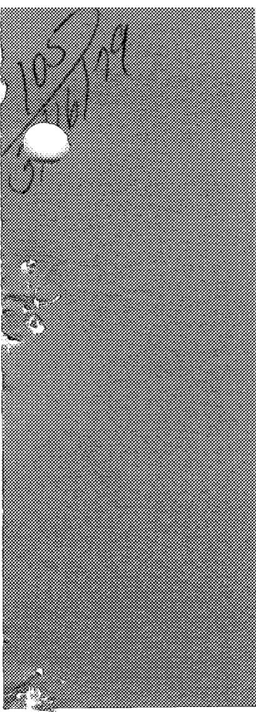

MASTER

DR. 2344

1

1

ORNL/TM-6415

# Development Status and Potential Program for Development of Proliferation-Resistant Molten-Salt Reactors

J.R.Engel

H. F. Bauman

J. F. Dearing

W. R. Grimes

H.E.McCoy, Jr.

OAK RIDGE NATIONAL LABORATORY

OPERATED BY UNION CARBIDI CORPORATION FOR THE DEPARMENT OF ENERGY

Printed in the United States of America. Available from

National Technical Information Service

U.S. Department of Commerce

5285 Port Royal Road, Springfield, Virginia 22161

Price: Printed Copy $8.00; Microfiche $3.00

This report was prepared as an account of work sponsored by an agency of the United States Government. Neither the United States Government nor any agency thereof, nor any of their employees, contractors, subcontractors, or their employees, makes any warranty, express or implied, nor assumes any legal liability or responsibility for any third party's use or the results of such use of any information, apparatus, product or process disclosed in this report, nor represents that its use by such third party would not infringe privately owned rights.

Contract No. W-7405-eng-26

Engineering Technology Division

DEVELOPMENT STATUS AND POTENTIAL PROGRAM FOR DEVELOPMENT OF PROLIFERATION-RESISTANT MOLTEN-SALT REACTORS

J. R. Engel

H. F. Bauman W. R. Grimes

J. F. Dearing H. E. McCoy, Jr.

Date Published: March 1979

NOTICE: This report contains information of a preliminary nature. It therefore does not represent a final report and is subject to changes or revisions at any time.

Prepared by the

OAK RIDGE NATIONAL LABORATORY

Oak Ridge, Tennessee 37830

operated by

UNION CARBIDE CORPORATION

for the

DEPARTMENT OF ENERGY

# NOTICE

This report was prepared as an account of work sponsored by the United States Government. Neither the United States nor the United States Department of Energy, nor any of their employees, nor any of their contractors, subcontractors, or their employees, makes any warranty, express or implied, or assumes any legal liability or responsibility for the accuracy, completeness or usefulness of any information, apparatus, product or process disclosed, or represents that its use would not infringe privately owned rights.

# CONTENTS

# Page

EXECUTIVE SUMMARY vii

ABSTRACT 1

INTRODUCTION 1

References 6

# PART I. REACTOR DESIGN AND DEVELOPMENT

1. REACTOR DESIGN, ANALYSIS, AND TECHNOLOGY DEVELOPMENT 9

Status in 1972 9

Current Development Status 9

DMSR Development Needs 11

References 14

# PART II. SAFETY AND SAFETY-RELATED TECHNOLOGY

2. REACTOR SAFETY AND LICENSING 23

Status and Development Needs 23

Safety 23

Licensing 25

Estimates of Scheduling and Costs 26

References 26

# PART III. FUEL-COOLANT BEHAVIOR AND FUEL PROCESSING

3. FUEL AND COOLANT CHEMISTRY 31

Key Differences in Reactor Concepts 31

Post-1974 Technology Advances 32

Status of Fuel and Coolant Chemistry 34

Fuel chemistry 34

Coolant chemistry 44

Fuel-coolant interactions 47

Fuel-graphite interactions 48

Prime R&D Needs 49

Fuel chemistry 49

Coolant chemistry 50

Fuel-coolant interactions 50

Fuel-graphite interactions 50

Estimates of Scheduling and Costs 51

# Page

4. ANALYTICAL CHEMISTRY 55

Scope and Nature of the Task 55

Key Differences in Reactor Concepts 56

Post-1974 Technology Advances 56

Status of Analytical Development 57

Key developments for MSRE 58

Analytical development for MSBR 60

Prime Development Needs 66

Estimates of Scheduling and Costs 67

5. MATERIALS DEVELOPMENT FOR FUEL REPROCESSING 72

Scope and Nature of the Task 72

Key Differences in Reactor Concepts 73

Post-1974 Technology Advances 74

Present Status of Technology 75

Materials for fluorinators and $\mathrm{UF}_6$ absorbers 75

Materials for selective extractions 76

Primary R&D Needs 82

Estimates of Scheduling and Costs 83

6. FUEL PROCESSING 88

Scope and Nature of the Task 88

Key Differences in Reactor Concepts 89

Post-1974 Advances 91

Status of Technology 93

Chemical status 93

Conceptual MSBR processing flowsheet 97

Engineering status 100

Special characteristics of DMSR processing 102

Possible processing alternatives 104

Primary R&D Needs 107

Estimates of Scheduling and Costs 108

References 112

# PART IV. REACTOR MATERIALS

7. STRUCTURAL METAL FOR PRIMARY AND SECONDARY CIRCUITS 123

Status in 1972 123

Status in 1976 126

Page

Current Status 130   
Further Technology Needs and Development Plan 130

8. GRAPHITE FOR MOLTEN-SALT REACTORS 135

Status in 1972 135   
Status in 1976 138   
Current Status 138   
Further Technology Needs and Development Plan 138

# EXECUTIVE SUMMARY

# INTRODUCTION

Molten-salt reactors (MSRs) are of interest in possible proliferation-resistant systems, particularly as denatured $^{233}\mathrm{U}$ power plants that could be widely deployed with minimal risk of proliferation. MSRs might also be used as "fuel factories" in secure centers, burning plutonium and producing $^{233}\mathrm{U}$ . However, before they can be used, the MSR concept must be developed into a commercial reality. The purpose of this report is to review the status of molten-salt technology from the standpoint of the development required to establish an MSR industry.

Following the successful operation of the Molten-Salt Reactor Experiment (MSRE, 1965-69), it became necessary for the government to decide if MSR development should be continued. To this end, a comprehensive report on MSR technology was published in August 1972.1 Because only limited R&D has been conducted since then, most of the information in the report is still valid and will be taken as the basis for the present review. Some additional development work done in 1974-76 will be used to update the conclusions of the 1972 study. The government decided not to proceed with the further development of the Molten-Salt Breeder Reactor (MSBR), or any other MSR, for reasons other than technological ones.

# DEVELOPMENT STATUS, 1972

The development status of MSBRs in 1972 is covered thoroughly in Ref. 1. All aspects of reactor development, from reactor physics to materials of construction, are covered and will not be repeated here. Of particular interest in that review are the discussions of technological advances believed to be needed before the next MSR could be built. These needed advances are defined briefly in the introduction of that report as follows:

"In the technology program several advances must be made before we can be confident that the next reactor can be built and operated successfully. The most important problem to which this applies is the surface

cracking of Hastelloy N. Some other developments, such as the testing of some of the components or the work on latter stages of the processing plant development, could actually be completed while a reactor is being designed and built. The major developments that we believe should be pursued during the next several years are the following:

"l. A modified Hastelloy N, or an alternative material that is immune to attack by tellurium, must be selected and its compatibility with fuel salt demonstrated with out-of-pile forced-convection loops and in-pile capsule experiments; means for giving it adequate resistance to radiation damage must be found, if needed, and commercial production of the alloy may have to be demonstrated. The mechanical properties data needed for code qualification must be acquired if they do not already exist.   
"2. A method of intercepting and isolating tritium to prevent its passage into the steam system must be demonstrated at realistic conditions and on a large enough scale to show that it is feasible for a reactor.   
"3. The various steps in the processing system must first be demonstrated in separate experiments; these steps must then be combined in an integrated demonstration of the complete process, including the materials of construction. Finally, after the MSBE* plant is conceptually designed, a mock-up containing components that are as close as possible in design to those which will be used in the actual process must be built and its operation and maintenance procedures demonstrated.   
"4. The various components and systems for the reactor must be developed and demonstrated under conditions and at sizes that allow confident extrapolation to the MSBE itself. These include the xenon stripping system for the fuel salt, off-gas and cleanup systems for the coolant salt (facilities in which these could be done are already under construction), tests of steam-generator modules and startup systems, and tests of prototypes of pumps that would actually go in the reactor. The construction of an engineering mock-up of the major components and systems of the reactor would be desirable, but whether or not that is done would depend

on how far the development program had proceeded in testing various components and systems individually.

"5. Graphite elements that are suitable for the MSBE should be purchased in sizes and quantities that assure that a commercial production capability does exist, and the radiation behavior of samples of the commercially produced material should be confirmed. Exploration of methods for sealing graphite to exclude xenon should continue.   
"6. On-line chemical analysis devices and the various instruments that will be needed for the reactor and processing plant should be purchased or developed and demonstrated on loops, processing experiments, and mock-ups."

The first three objectives were considered crucial to the MSBR concept; the results of further development effort on them during 1974-76 are discussed in the following section. Objectives 4 to 6, while important, did not appear to present any insurmountable obstacles; in any event, they could not be pursued further because of limited funding.

# RESULTS OF R&D - 1972 TO PRESENT

At the direction of AEC/ERDA,\* the MSR program was discontinued in early 1973, resumed in 1974, and finally terminated at the end of FY 1976. Although the development effort since 1972 has been severely restricted, some significant results were obtained from work performed mainly in 1974-76.

# Alloy Development for Molten-Salt Service

The nickel-based alloy Hastelloy N, which was specifically developed for use in molten-salt systems, was used in construction of the MSRE. The material generally performed very well, but two deficiencies became apparent: (1) the alloy was embrittled at elevated temperatures by exposure to thermal neutrons and (2) it was subject to intergranular surface cracking when exposed to fuel salt containing fission products.

Recent development work indicates that solutions are available for both these problems. Details of this work are given by McCoy; a summary of the results follows.

Irradiation experiments early in the MSR development program showed that Hastelloy N was subject to high-temperature embrittlement by thermal neutrons. The MSRE was designed around this limitation (stresses were low and strain limits were not exceeded), but the development of an improved alloy became a prime objective of the materials program. It was found that a modified Hastelloy N containing $2\%$ titanium had much improved postirradiation ductility, and extensive testing of the new alloy was under way at the close of MSRE operations.

The second problem, intergranular surface cracking, was discovered at the close of the MSRE operation when surface cracks were observed after strain testing of Hastelloy N specimens that had been exposed to fuel salt. Research since that time has shown that this phenomenon is the result of attack by tellurium, a fission product in irradiated fuel salt, on the grain boundaries.

As a result of research from 1974 to 1976, two likely solutions to the problem of tellurium attack have been developed. The first involves the development of an alloy that is resistant to tellurium attack but still retains the other required properties. This development has proceeded sufficiently to show that a modified Hastelloy N containing about $1\%$ niobium has good resistance to tellurium attack and adequate resistance to thermal-neutron embrittlement at temperatures up to $650^{\circ}\mathrm{C}$ . It was also found that alloys containing titanium, with or without niobium, exhibited superior neutron resistance but were not resistant to tellurium attack.

The second likely solution involves the chemistry of the fuel salt. Recent experiments indicate that intergranular attack on Hastelloy N is much less severe when the fuel-salt oxidation potential, as measured by the ratio of $\mathrm{U}^{4+}$ to $\mathrm{U}^{3+}$ , is less than 60.* This discovery opens up the possibility that the superior titanium-modified Hastelloy N could

be used for MSRs through careful control of the oxidation state of the fuel salt.

Both of the above solutions appear promising, but extensive testing under reactor conditions would be required before either could be used in the design of a future MSR.

# Tritium Control

Large quantities of tritium are produced in MSRs from neutron reactions with lithium in the fuel salt. Elemental tritium can diffuse through metal walls such as heat-exchanger tubes at elevated temperatures, thus providing a potential mechanism for the transport of tritium to the reactor steam via the secondary coolant loop and the steam generator. Recent experiments indicate that tritium is oxidized in the proposed MSR secondary coolant, sodium fluoroborate, thus blocking transport to the steam system.

In 1975 and 1976, tritium-addition experiments were conducted in an engineering-scale coolant salt test loop. The results are given in a report by Mays, Smith, and Engel.3 Briefly, the experiments showed that the steady-state ratio of combined to elemental tritium in the coolant salt was greater than 4000. A calculation applying this ratio to the case of an operating 1000-MW(e) MSBR indicated that the release of tritium to the steam system would be less than $\sim 400$ GBq/d (10 Ci/day). The conclusion of the study was that the release of tritium from an MSR using sodium fluoroborate in the secondary coolant system could be readily controlled to within Nuclear Regulatory Commission (NRC) guidelines.

# Engineering Development of Fuel Processing

By 1972, proof-of-principle experiments had been carried out for the various steps in the reference chemical process, but development and demonstration of engineering-scale equipment were just getting under way. The only large-scale processing demonstrated at that time was the batch fluorination of the MSRE fuel salt and the recovery of the uranium on NaF beds.

In the period 1974-76, efforts were begun to develop items of equipment which would be vital to the success of the metal-transfer process. Some progress was made in the development of a salt-bismuth contactor, a continuous fluorinator, and a UF $_6$ absorber for reconstituting the fuel salt. $^4$ Because of the program closeout in 1976, this work could not be continued long enough to culminate in engineering designs for the various items of equipment. The status of this work can be summed up by stating that, although no insurmountable obstacles were encountered, the major portion of process engineering development remains to be done.

# Other Areas of Development

The development status of areas other than those discussed above is practically unchanged since the report1 of 1972, because no further R&D was funded. These include development of reactor components, moderator graphite, analytical methods, and control instrumentation. Exceptions were a design study of a molten-salt heat exchanger and some limited work on the in-line monitoring of fuel salt.

In 1971, Foster-Wheeler Corp. was awarded a contract for a study of MSR steam-generator designs. The contract was suspended in 1973 and then reinstated in 1974 for the purpose of completing the first task (in a four-part contract), which was the design of a steam generator to meet specifically the steam and feedwater conditions postulated for the MSBR conceptual design. This task was successfully completed and a report issued in December 1974.[5] A design was presented which, based on analysis, would meet all the requirements for an MSR steam generator. However, the design was not experimentally verified because the MSR project was terminated.

The 1972 status report1 described the use of an in-line electrochemical technique known as voltammetry to monitor the oxidation potential of the fuel salt. The technique has since been used to monitor various corrosion test loops and other experiments and may also be used to monitor $\mathrm{Cr}^{2+}$ in fuel salt, a good indicator of the overall corrosion rate. Recently the technique has been used to measure the oxide ion in

fuel salt. Oxide monitoring is very important in molten-salt fuel because an increase in oxide contamination could lead to precipitation of uranium from the fuel as $\mathrm{UO_2}$ .

# SPECIAL DEVELOPMENT REQUIREMENTS FOR THE DMSR

Recent reexamination of the MSR concept with special attention to antiproliferation considerations has led to the identification of two preliminary design concepts for MSRs that appear to have substantially less proliferation sensitivity without incurring unacceptable performance penalties. The designation DMSR (for denatured molten-salt reactor) has been applied to both of these concepts because each would be fueled initially with $^{235}\mathrm{U}$ enriched to no more than $20\%$ and would be operated throughout its lifetime with denatured uranium.

The simpler of these DMSR concepts would completely eliminate on-line chemical processing of the fuel salt for removal of fission products. (Stripping of gaseous fission products would be retained, and some batch-wise treatment to control oxide contamination probably would be required.) This reactor would require routine additions of denatured $^{235}\mathrm{U}$ fuel, but would not require replacement or removal of the in-plant inventory except at the end of the 30-year plant lifetime. Adding an on-line chemical processing facility to the 30-year, once-through reactor provides the second DMSR design concept. With this addition, the conversion ratio of the reactor would reach 1.0 (i.e., break-even breeding) so that fuel additions could be eliminated and a given fuel charge could be used indefinitely by transferring it to a new reactor plant at the decommissioning of the old unit.

The required chemical processing facility for a DMSR, shown as a preliminary conceptual flowsheet in Fig. S.l, would be derived largely from the MSBR but would contain some significant differences. In particular, isolation and segregation of protactinium would be avoided, provisions would be made to retain and use the plutonium produced from $^{238}\mathrm{U}$ , and a special step would be added for removal of fission-product zirconium. Thus, the development of on-line chemical processing for a DMSR would

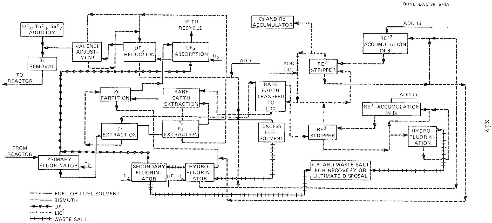  
Fig. S.1. Proposed DMSR fuel processing flowsheet.

require essentially all the technology development identified for the MSBR with additions to accommodate these differences. However, since the DMSR offers a no-processing option, a large fraction of the reprocessing development, along with its associated materials development, could be deferred or even eliminated. Such deferral might be expected to reduce the cost (but probably not the time) for developing the first DMSRs. To provide an overall perspective, this development plan includes costs and schedules for developing the reprocessing capability in parallel with the reactor.

The only other substantial difference (in terms of development needs) between the MSBR and the proposed DMSR concepts is the reactor core design, which is similar for both. Relaxing the breeding requirement and emphasizing proliferation resistance for the DMSR led to a core design with a much lower power density to limit losses of protactinium, the $^{233}\mathrm{U}$ precursor which is retained in the fuel salt of the DMSR. By reducing the rate of fast-neutron damage to the core graphite, the low power density also makes possible the design of a core in which the graphite need not be replaced for the life of the reactor. A low power density also reduces the poison fraction associated with xenon in the core graphite and thus there is less need for a low-permeability graphite. Although improvements in graphite life and permeability would be desirable, graphite grades tested before 1972 would have the properties acceptable for the DMSR core. Graphite development for the DMSR would not require (but could include) much effort beyond the specification and testing of commercial-source material.

# POTENTIAL PLAN FOR DMSR DEVELOPMENT

A major product of the reactivated MSR program in 1974 was a detailed plan for the first several years of a development effort that would ultimately lead to a commercial MSBR. Since the program authorized in 1974 was restricted in scope, no attempt was made in that plan to include costs and schedules for reactor plants beyond a limited treatment of a proposed next-generation reactor – the Molten-Salt Test Reactor

(MSTR). The primary function of the 1974 program plan was to define a base technology program for the MSBR. Since the technology needs for a DMSR closely parallel those of the MSBR, extensive use was made of the 1974 program plan in evolving the plan described below for DMSR development.

To develop a reasonable perspective of the potential role of the DMSR in providing nuclear electric power, it is necessary to conceptualize a reactor development and construction schedule that goes beyond the MSTR to at least the first commercial (or prototype) system and possibly on to the first of a series of "standard" plants. The potential schedule that was developed (Fig. S.2) has a reasonable basis for fulfillment in the light of the current state of MSR technology. Four generally parallel lines of effort would be pursued, including:

1. a base program of research and development (R&D);   
2. a project to design, build, and operate an MSTR;   
3. a project to study and eventually design and build a prototype, or first commercial, reactor plant;   
4. a project to design and build the first of possibly several "standardized" plants.

If adequate guidance is to be provided for an R&D program on MSRs, it is essential that some design activity be started on the prototype reactor and the MSTR at the beginning of the overall program. (These initial design efforts may be relatively small, however.) A prototype concept is required to define the systems to be tested in the MSTR, and the MSTR design is required to guide the initial phases of the R&D effort.

If such a program were started in FY 1980, the development and design activities could probably support authorization of a test reactor in FY 1985, and such a reactor could probably be built by 1995. The prototype commercial plant (supported by earlier design study) could be authorized approximately on completion of the MSTR, and the authorization for the first standard plant (if desired) could follow about 5 years later.

Although the technology development effort is shown as only a single line on Fig. S.2, it represents a multifaceted effort in support of all

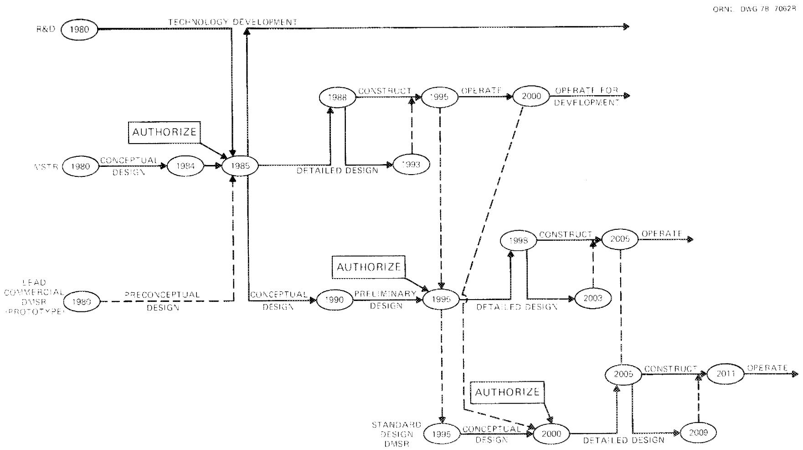  
Fig. S.2. Potential reactor construction schedule for commercialization of DMSRs.

the reactor construction projects throughout the program. This effort, which is described in some detail in the body of this report, is summarized in Table S.1 along with estimated costs (in unescalated 1978 dollars). This tabulation includes the estimated costs for development of full reprocessing capability. A substantial fraction of these costs (shown as $147 million over 32 years) might be deferred or saved if development of on-line fuel reprocessing were deferred or eliminated. The work for the first 15 years is shown on an annual basis, with most of the effort in support of the MSTR. In general, the funds shown here are consistent with the more detailed tabulations presented in the body of this report. However, in a few areas the development plan indicates that additional, undefined costs could be expected in some years. For purposes of this summary tabulation, funds were arbitrarily added in those areas to cover reasonable extra costs. Costs after the first 15 years are much less certain and are shown as totals only. The estimated cost of the total base program is approximately $700 million. The costs of the reactor construction projects, about $600 million* for the MSTR and possibly $1470 million* for the prototype, bring the estimated total program cost to about $2.8 billion. Since it is impossible to foresee all needs and costs for a program, this is probably a minimum figure. A contingency allowance should be added in a subsequent planning stage, as well as allowances for cost increases due to inflation and escalation and for any development contributions provided by industry.

Table S.1. Projected research and development costs for MSR base development program (thousands of 1978 dollars)   

<table><tr><td rowspan="2">Development activity</td><td rowspan="2">Type fund</td><td rowspan="2">Target reactor</td><td colspan="16">Cost by fiscal year</td><td rowspan="2">Total cost for first 15 years</td><td>Cost from 199522through 2011</td></tr><tr><td>1980</td><td>1981</td><td>1982</td><td>1983</td><td>1984</td><td>1985</td><td>1986</td><td>1987</td><td>1988</td><td>1989</td><td>1990</td><td>1991</td><td>1992</td><td>1993</td><td>1994</td><td></td><td></td></tr><tr><td rowspan="2">Reactor design and analysis</td><td>Operating</td><td rowspan="2">MSTR Demo</td><td rowspan="2">430</td><td rowspan="2">1,270</td><td rowspan="2">1,100</td><td rowspan="2">720</td><td rowspan="2">930</td><td rowspan="2">1,120200a</td><td rowspan="2">970200a</td><td rowspan="2">970200a</td><td rowspan="2">950200a</td><td rowspan="2">880200a</td><td rowspan="2">520500a</td><td rowspan="2">520500a</td><td rowspan="2">520500a</td><td rowspan="2">100920a</td><td rowspan="2">100920a</td><td>11,100</td><td>1,000</td><td></td></tr><tr><td>Operating</td><td>4,340a</td><td>20,000</td><td></td></tr><tr><td rowspan="2">Reactor and component technology</td><td>Operating</td><td>MSTR Demo</td><td>530</td><td>1,050</td><td>1,260</td><td>1,410</td><td>2,690</td><td>4,270</td><td>5,920</td><td>6,610</td><td>7,970</td><td>9,210300c</td><td>9,500600a</td><td>5,000a</td><td>3,000a</td><td>3,000a</td><td>62,920a</td><td>20,000</td><td></td><td></td></tr><tr><td>Operating Capital</td><td>All</td><td>40</td><td>99</td><td>150</td><td>80</td><td>5,350b</td><td>79,400b</td><td>26,100b</td><td>570</td><td>840</td><td>1,130</td><td>1,400</td><td>600a</td><td>800a</td><td>2,100a</td><td>2,800a</td><td>8,900a</td><td>80,000</td><td></td></tr><tr><td rowspan="2">Safety and licensing</td><td>Operating</td><td rowspan="2">MSTR Demo</td><td rowspan="2">117</td><td rowspan="2">303</td><td rowspan="2">351</td><td rowspan="2">468</td><td rowspan="2">397</td><td rowspan="2">676</td><td rowspan="2">839</td><td rowspan="2">975</td><td rowspan="2">1,100</td><td rowspan="2">1,235</td><td rowspan="2">1,300</td><td rowspan="2">1,500a</td><td>1,500a</td><td>1,500a</td><td>1,500a</td><td>13,761a</td><td>8,000</td><td></td></tr><tr><td>Operating</td><td>1,000a</td><td>300a</td><td>600a</td><td>1,000a</td><td>40,000</td><td></td></tr><tr><td rowspan="2">Fuel and coolant chemistry</td><td>Operating</td><td>MSTR Demo</td><td>695</td><td>990</td><td>1,125</td><td>1,230</td><td>1,345</td><td>1,360</td><td>1,430</td><td>1,475</td><td>1,300</td><td>935650</td><td>560440a</td><td>465535a</td><td>465535a</td><td>250750a</td><td>50950a</td><td>13,675</td><td>5,000</td><td></td></tr><tr><td>Operating Capital</td><td>All</td><td>95</td><td>205</td><td>335</td><td>310</td><td>180</td><td>410</td><td>325</td><td>350</td><td>183</td><td>5550a</td><td>50a</td><td>100a</td><td>100a</td><td>100a</td><td>2,850a</td><td>2,500</td><td></td><td></td></tr><tr><td rowspan="2">Analytical chemistry</td><td>Operating</td><td>MSTR Demo</td><td>260</td><td>405</td><td>485</td><td>570</td><td>670</td><td>715</td><td>765</td><td>760</td><td>695</td><td>615</td><td>480</td><td>435</td><td>385</td><td>275</td><td>200</td><td>7,715</td><td>2,000</td><td></td></tr><tr><td>Operating Capital</td><td>All</td><td>35</td><td>295</td><td>290</td><td>210</td><td>185</td><td>255</td><td>120</td><td>30</td><td>0</td><td>4050a</td><td>50a</td><td>50a</td><td>50a</td><td>50a</td><td>50a</td><td>640</td><td>5,000</td><td></td></tr><tr><td rowspan="2">Process materials</td><td>Operating</td><td>MSTR Demo</td><td>425</td><td>610</td><td>820</td><td>950</td><td>1,050</td><td>930</td><td>765</td><td>600</td><td>400</td><td>205</td><td>205</td><td>180</td><td>100a</td><td>100a</td><td>100a</td><td>7,440</td><td>1,820</td><td></td></tr><tr><td>Capital</td><td>All</td><td>100</td><td>1,175</td><td>2,070</td><td>1,560</td><td>1,380</td><td>700</td><td>400</td><td>350</td><td>250</td><td>100</td><td></td><td></td><td></td><td></td><td></td><td>8,085</td><td>325</td><td></td></tr><tr><td rowspan="2">Fuel processing technology</td><td>Operating</td><td>MSTR Demo</td><td>1285</td><td>2,170</td><td>2,480</td><td>2,455</td><td>2,500a</td><td>2,800a</td><td>3,000a</td><td>3,200</td><td>3,670</td><td>3,670</td><td>3,510</td><td>2,000500a</td><td>500a</td><td>0</td><td>0</td><td>33,240a</td><td>12,000</td><td></td></tr><tr><td>Capital</td><td>All</td><td>75</td><td>1,060</td><td>12,750b</td><td>0</td><td>7,000b</td><td>510</td><td>0</td><td>260</td><td>400</td><td>515</td><td>400</td><td>200</td><td>150a</td><td>150a</td><td>200a</td><td>5,000a</td><td>5,000</td><td></td></tr><tr><td rowspan="2">Structural alloy</td><td>Operating</td><td>MSTR Demo</td><td>2200</td><td>2,800</td><td>3,025</td><td>3,590</td><td>3,910</td><td>1,755</td><td>1,612</td><td>1,560</td><td>1,534</td><td>1,560</td><td>1,326a</td><td>800700a</td><td>1,000a</td><td>1,500a</td><td>1,500a</td><td>23,672</td><td>10,000</td><td></td></tr><tr><td>Operating Capital</td><td>All</td><td>955</td><td>1,170</td><td>1,502</td><td>507</td><td>98</td><td>169</td><td>150</td><td>176</td><td>137</td><td>150</td><td>137</td><td>80</td><td>100a</td><td>150a</td><td>150a</td><td>4,874a</td><td>30,000</td><td></td></tr><tr><td rowspan="2">Moderator graphite</td><td>Operating</td><td>MSTR Demo</td><td>300</td><td>300</td><td>450</td><td>600</td><td>600</td><td>500</td><td>600</td><td>650</td><td>550</td><td>500</td><td>400</td><td>430</td><td>300</td><td>300</td><td>300</td><td>6,750</td><td>3,000</td><td></td></tr><tr><td>Operating Capital</td><td>All</td><td>100</td><td>75</td><td>100</td><td>150</td><td>150</td><td>100</td><td>100</td><td>100</td><td>100</td><td>75</td><td>75</td><td>75</td><td>50</td><td>100a</td><td>150a</td><td>600a</td><td>8,000</td><td></td></tr><tr><td></td><td>Total fundsc</td><td>7462</td><td>13,968</td><td>28,293b</td><td>14,810</td><td>26,415b</td><td>95,870b</td><td>43,296b</td><td>18,836</td><td>20,281</td><td>21,440</td><td>21,627</td><td>15,590</td><td>13,470</td><td>14,470</td><td>14,870</td><td>370,878</td><td>331,685</td><td></td><td></td></tr></table>

${}^{a}$ Includes costs estimated without detailed program analysis.   
b Includes funds authorized for major development facility.   
Total funds through 2011: $702,563.

# REFERENCES

I. M. W. Rosenthal et al., The Development Status of Molten-Salt Breeder Reactors, ORNL-4812 (August 1972).   
2. H. E. McCoy, Jr., Status of Materials Development for Molten-Salt Reactors, ORNL/TM-5920 (January 1978).   
3. G. T. Mays, A. N. Smith, and J. R. Engel, Distribution and Behavior of Tritium in the Coolant-Salt Technology Facility, ORNL/TM-5759 (April 1977).   
4. Molten-Salt Reactor Program, Semiannual Progress Report for Period Ending February 29, 1976, ORNL-5132 (August 1976).   
5. Foster-Wheeler Energy Corporation, Task I Final Report, Design Studies of Steam Generators for Molten-Salt Reactors, ND/74/66 (December 1974).   
6. J. R. Engel et al., Conceptual Design Characteristics of a Denatured Molten-Salt Reactor with Once-Through Fueling, ORNL/TM (in preparation).   
7. J. R. Engel et al., Molten-Salt Reactors for Efficient Nuclear Fuel Utilization Without Plutnoium Separation, ORNL/TM-6413 (August 1978).   
8. L. E. McNeese et al., Program Plan for Development of Molten-Salt Breeder Reactors, ORNL-5018 (December 1974).

# DEVELOPMENT STATUS AND POTENTIAL PROGRAM FOR DEVELOPMENT OF PROLIFERATION-RESISTANT MOLTEN-SALT REACTORS

J. R. Engel

H.F.Bauman W.R.Grimes

J. F. Dearing H. E. McCoy, Jr.

# ABSTRACT

Preliminary studies of existing and conceptual moltensalt reactor (MSR) designs have led to the identification of conceptual systems that are technologically attractive when operated with denatured uranium as the principal fissile fuel. These denatured MSRs would also have favorable resource-utilization characteristics and substantial resistance to proliferation of weapons-usable nuclear materials. This report presents a summary of the current status of technology and a discussion of the major technical areas of a possible base program to develop commercial denatured MSRs. The general areas treated are (1) reactor design and development, (2) safety and safety related technology, (3) fuel-coolant behavior and fuel processing, and (4) reactor materials.

A substantial development effort could lead to authorization for construction of a molten-salt test reactor about 5 years after the start of the program and operation of the unit about 10 years later. A prototype commercial denatured MSR could be expected to begin operating 25 years from the start of the program.

The postulated base program would extend over 32 years and would cost about $700 million (1978 dollars, unescalated). Additional costs to construct the MSTR -$ 600 million - and the prototype commercial plant - $1470 million - would bring the total program cost to about $2.8 billion. Additional allowances probably should be made to cover contingencies and incidental technology areas not explicitly treated in this preliminary review.

# INTRODUCTION

A concept for a proliferation-resistant molten-salt reactor (MSR) fueled with denatured $^{233}\mathrm{U}$ and/or $^{235}\mathrm{U}$ has been evolved in response to the interest in proliferation-resistant power reactors for worldwide use. Briefly, such a reactor (1) must not provide a tempting or readily available source of weapons material; (2) must have good economics and

fuel utilization and be competitive with reactors generally used or planned for use in nuclear weapons states; and (3) must provide reasonable energy independence for the nonnuclear weapons states that adopt it (i.e., an assured source of fuel and/or reprocessing capability).

The proposed denatured molten-salt reactor (DMSR) concept, described in general below, meets these requirements for the following reasons:

1. the fissile material is denatured and/or confined within a contained highly radioactive system;   
2. the projected economic performance is competitive with other existing or proposed reactor systems;   
3. uranium resources would support at least five times the electrical capacity in DMSRs as in light-water reactors (LWRs) on a once-through cycle;   
4. each DMSR, as a break-even breeder (conversion ratio = 1.0) with online processing, once started would not need an outside source of fissile fuel indefinitely. (However, fertile material and the makeup salt constituents, $^{7}\mathrm{Li}$ and beryllium fluorides, would have to be supplied.)

At least two other MSR concepts may be attractive for proliferation-resistant systems. Their development will not be specifically considered in this report; however, they differ only in detail from the DMSR, and their development would require the solution of essentially the same problems. The two concepts are a partially self-sustaining DMSR without on-line processing and a plutonium-thorium MSR designed to consume plutonium and produce $^{233}\mathrm{U}$ for use in denatured reactors.

The development of a DMSR without on-line processing would be a relatively modest extension of current technology and could presumably be accomplished in a shorter time and with considerably less development effort than the proposed DMSR with processing. This version could not be a break-even breeder but would still be a high-performance converter with significantly improved fuel utilization over LWRs. Addition of an on-line fission product processing facility at some later date would transform the plant into a breeder. Preliminary results indicate that a fuel charge could last for the entire 30-year life of the reactor, at

$75\%$ capacity factor, with only routine additions of $^{238}\mathrm{U}$ and/or denatured $^{235}\mathrm{U}$ . A more detailed characterization of this concept is in progress.

A plutonium-fueled MSR could be designed for use in a secure energy center as a "fuel factory" to produce $^{233}\mathrm{U}$ for use in denatured reactors. The outstanding advantage of an MSR for this application is the ability to remove product $^{233}\mathrm{U}$ from the circulating fuel about as fast as it is formed, so that very little is consumed by fission within the reactor itself. Cycle times of $\sim 10$ days for uranium removal are considered feasible, compared with reprocessing times on the order of years for solid-fuel reactors. An MSR on this fuel cycle has been estimated to produce $750\mathrm{kg}$ of $^{233}\mathrm{U}$ per GW(e)·year at 0.75 plant factor; this is several times more than that produced by any other type of thermal reactor and about the same as expected from a plutonium-thorium liquid-metal fast breeder reactor (LMFBR). However, the MSR would consume half again as much plutonium or more. More quantitative fuel cycle data are not available at this time.

The nominal DMSR with processing is based on the design for the MSBR, as given in Refs. 2 and 3, with several important changes:

1. The start-up fuel is $^{235}\mathrm{U}$ (or $^{233}\mathrm{U}$ ) denatured with $^{238}\mathrm{U}$ rather than fully enriched uranium. Sufficient $^{238}\mathrm{U}$ is fed along with thorium to keep the fuel in the reactor denatured.   
2. The process is altered so that protactinium and plutonium are not isolated from the fuel salt. Protactinium, which decays to $^{233}\mathrm{U}$ , would otherwise be a source of undenatured fissile uranium.   
3. The reactor core is larger with a lower power density to reduce parasitic neutron absorptions in protactinium as well as in fission products. The power density is reduced sufficiently that replacement of the moderator graphite in the core is not required due to fast neutron damage during the lifetime of the reactor.

This version of the DMSR is described in greater detail in Ref. 4.

The MSR research and development was conducted largely at Oak Ridge National Laboratory, but with assistance by subcontractors and others, in a nearly continuous program for more than 25 years. The effort included many large engineering experiments and the design, construction, and

operation of two experimental reactors as well as many small-scale experiments in all fields of pertinent nuclear and materials science. For nearly 20 years, that effort was directed to MSRs for the generation of central station electricity, with the primary focus on an MSBR breeding $^{233}\mathrm{U}$ from $^{232}\mathrm{Th}$ in the thermal system. The large, varied, and impressive accomplishments of that program, along with the additional development requirements needed for demonstration of the MSBR, were described5 thoroughly as of mid-1972.* That material was updated, and a detailed description (along with a proposed schedule and costs) of remaining R&D items was presented6 in 1974. The status of molten-salt technology as of late 1974 and the additional needs of the MSBR, accordingly, are documented fairly well, as is the base program of research and technology development required to fill those needs.

A large fraction of the technology developed for the MSBR is applicable directly, or with a minimum of additional experimentation, to the DMSR. Moreover, most of the additional technology needed for the MSBR is also needed for the DMSR. However, the two reactors differ in some important regards. Accordingly, the technology development required for a DMSR is likely to involve significant redirection from that anticipated for the MSBR, particularly if the technology for on-line processing of the fuel salt is developed in conjunction with the reactor technology. In some areas (e.g., chemistry and chemical processing), this redirection probably would increase the requisite development effort, while in others (e.g., safety technology and graphite development), the required effort could decrease.

An additional consideration is the fact that a small MSR technology development effort was reestablished in mid-1974 and continued for about two years. Although this effort was limited in scope, some significant accomplishments were achieved that also affected the current effort to identify further technology needs.

To the extent that it was applicable, the 1974 program plan was used as a basis for this review and projection of the technology needs

and program plan for a DMSR. The present document is focused on the major development areas, with the recognition that significant development efforts could be required in other related areas. (Such ancillary activities would add somewhat to the overall development cost but probably would not appreciably affect the total schedule.) In a number of areas where little or no technical effort has been expended since 1972 and where the perceived needs are substantially the same, the tasks, schedules, and costs were transposed directly from the 1974 plan with only adjustments of the costs to account for inflation between 1974 and 1978. In other areas, minor adjustments were made to account for changes in either the technology status* or the apparent development needs.

The areas with the greatest potential for change from the 1974 program plan are those related to the chemical processing of the fuel salt. If the once-through version of the DMSR were developed, it might be possible to defer development of the reductive-extraction-metal-transfer process and thereby reduce the overall development cost for the DMSR. However, because the availability of this process would substantially improve the fuel utilization of a DMSR, the development needs, schedules, and costs for it were included in this plan. Thus, some latitude would exist in the implementation of the program plan.

The remainder of this report consists of four major parts, each prepared by a single primary author, which deal with the following major areas of base technology development: (1) reactor design and development, (2) safety and licensing, (3) fuel-coolant behavior and fuel processing, and (4) reactor materials. The parts (which contain up to four chapters) should be regarded as units because of the high level of interdependence among the subjects treated. However, the base program needs and their projected costs and schedules are developed separately within each chapter.

# References

1. J. R. Engel et al., Conceptual Design Characteristics of a Denatured Molten-Salt Reactor with Once-Through Fueling, ORNL/TM (in preparation.   
2. R. C. Robertson, ed., Conceptual Design Study of a Single-Fluid Molten-Salt Breeder Reactor, ORNL-4541 (June 1971).   
3. Evasco Services Inc., 1000 MW(e) Molten-Salt Breeder Reactor Conceptual Design Study, Final Report, Task 1, Subcontract No. 3560 with Union Carbide Corporation, Nuclear Division (February 1972).   
4. J. R. Engel et al., Molten-Salt Reactors for Efficient Nuclear Fuel Utilization without Plutonium Separation, ORNL/TM-6413 (August 1978).   
5. M. W. Rosenthal et al., The Development Status of Molten-Salt Breeder Reactors, ORNL-4812 (August 1972).   
6. L. E. McNeese et al., Program Plan for Development of Molten-Salt Breeder Reactors, ORNL-5018 (December 1974).

# PART I. REACTOR DESIGN AND DEVELOPMENT

H. F. Bauman

The objectives of the reactor design program are to first develop a fairly complete conceptual design for a full-scale [1000-MW(e)] DMSR in order to define more clearly the development problems that must be addressed. Then, concurrent with the technology development, a molten-salt test reactor (MSTR) would be designed, built, and operated to demonstrate all aspects of the required DMSR technology on a smaller scale. The scale of the MSTR would be decided as the program progressed. The MSBR conceptual design, which the DMSR would probably follow, proposed four fuel heat-exchanger and steam-generator modules of 250-MW(e) capacity each. The scale suggested for the MSTR would lie in the range of 100-MW(e) power [with two 50-MW(e) steam-generator modules (i.e., 1/5 scale)] to 250-MW(e) power with a single (i.e., full-scale) steam-generator module. The data from the component technology development program would be fed into the reactor design efforts, and the experience obtained in reactor construction and operation would, in turn, guide continuing effort in component development. An MSTR mockup is proposed which would permit integrated testing of most of the reactor components before the MSTR itself is built. Finally, the construction of the prototype DMSR would influence the development of a standardized DMSR design.

# 1. REACTOR DESIGN, ANALYSIS, AND TECHNOLOGY DEVELOPMENT

There is considerable experience in the engineering design and neutronic analysis of MSRs, through final design, construction, and operation. The molten-salt reactor experiment (MSRE) has been through the entire design process, and the ORNL reference concept $\mathsf{MSBR}^1$ has reached the stage of detailed conceptual design. In addition, the various reactor components and subsystems received intensive development effort in the technology development programs.

# Status in 1972

At the time the development-status report² was prepared (1972), a detailed conceptual design had been developed for the single-fluid MSBR. Furthermore, many alternative designs had been investigated, generally in lesser detail; one of these, also pertinent to the DMSR, was a low-power-density core design³ in which the core moderator graphite would have an expected lifetime equal to the design life of the reactor.

In the area of reactor components and systems, the most important items had been identified as salt pumps, the coolant system as a whole, heat exchangers, the entire steam system, valves, control rods, fuel storage, and gas handling.

Experience had been obtained in the MSRE in all the above areas except the steam system. However, new developments were proposed in several areas, such as the use of sodium fluoroborate as the secondary coolant (rather than lithium-beryllium fluoride), the use of mechanical valves in addition to freeze valves*, and the addition of a fuel-salt gas sparging system (rather than sparging of salt in the pump bowl).

# Current Development Status

The reactor design and analysis effort since 1972 has been minimal. However, a major study of tritium transport in molten-salt systems was

carried out in 1974-76, including experiments in a secondary-coolant-salt test loop.

Large quantities of tritium are produced in MSRs from neutron reactions with lithium in the fuel salt. Since elemental tritium can diffuse through metal walls, such as heat-exchanger tubes, at elevated temperatures, a potential path exists for the transport of tritium to the reactor steam via the secondary coolant loop and the steam generator. Recent experiments indicate that tritium is oxidized in the proposed MSR secondary coolant, sodium fluoroborate, thus blocking transport to the steam system.

Tritium-addition experiments were conducted in an engineering-scale coolant-salt test facility. The results are given in a recent report by Mays, Smith, and Engel.4 The experiments showed that the steady-state ratio of combined to elemental tritium in the coolant salt was greater than 4000. A calculation applying this ratio to the case of an operating MSBR indicated that the release of tritium to the steam system would be less than $\sim 400\mathrm{GBq / d}$ (10 Ci/day). The conclusion of the study was that the release of tritium from an MSR using sodium fluoroborate in the secondary coolant system could be readily controlled within NRC guidelines.

In the area of component development, there was an effort to advance the steam system development from the conceptual design proposed for the MSBR toward hardware development. In 1971, Foster-Wheeler Corporation was awarded a contract for a study of MSR steam-generator designs. The contract was suspended in 1973 and then reinstated in 1974 to complete the first task (in a four-task contract) - the conceptual design of a steam generator to meet specifically the steam and feedwater conditions postulated for the ORNL reference-design MSBR. This task was successfully completed, and a report was issued in December 1974.[5] A design was presented which, based on analysis, would meet all the requirements for an MSR steam generator. Because of the termination of the MSR project, the design did not receive experimental verification or further analytical study.

The coolant-salt test facility mentioned in connection with the tritium experiments was operated in the period 1974-76 to obtain engineering-scale experience with sodium fluoroborate, the proposed MSBR secondary coolant. The loop was operated successfully for $>5000$ hr at temperatures up to $540^{\circ}\mathrm{C}$ . The tests indicated that the engineering characteristics of sodium fluoroborate would be suitable for MSR secondary coolant.

One of the important advantages of MSRs is that $^{135}\mathrm{Xe}$ , a gaseous fission product with an extremely high thermal-neutron cross section, is not soluble in the fuel salt and can be rapidly removed from the system. Fission-product $^{135}\mathrm{Xe}$ is the single most important parasitic absorber of neutrons in thermal reactors, and the high conversion ratio of MSRs depends on efficient $^{135}\mathrm{Xe}$ removal. The xenon has two exits from the fuel salt: by absorption into the pores of the core graphite, where it would remain as a neutron poison, and by diffusion into the fuel cover gas (helium), where it can be removed from the system. A helium-stripping system is proposed for MSRs in which fine bubbles of helium are introduced into the fuel salt to provide a sink for xenon and are subsequently separated from the salt to remove the xenon effectively. Gas-bubble generators and strippers had been designed and were to be tested in a circulating salt loop when the program was ended in 1973. Although some additional work was done in the 1974-75 period, an integral test of the stripping system was not completed.

# DMSR Development Needs

All the design and development needs described for the MSBR in the 1974 program plan would also be required for the DMSR. However, some aspects of the program should be emphasized for the DMSR.

The core design and analysis for both the DMSR and the MSTR require particular attention to the effects of $^{238}\mathrm{U}$ , protactinium, and plutonium on the system fissile inventory and conversion ratio. Another important point is the core fast-flux distribution and its effect on the design life of the moderator graphite. Some preliminary neutronic calculations for a proposed DMSR design are given in Ref. 7. Since both thorium and

$^{238}\mathrm{U}$ are important neutron resonance absorbers, the lumping of fuel and the degree of thermalization of the neutron spectrum in the reactor core and reflector regions are important variables in the neutronic analysis. An extensive reactor-analysis program would be required to select optimized core designs for the MSTR and DMSR.

A very important problem for all molten-salt systems is the control of the reactor power and the temperatures in the fuel salt, the coolant salt, and the steam generators and the management of thermal cycles and thermal stresses in all parts of the reactor system. Although considerable experience in MSR thermal problems was obtained in the operation of the MSRE, the addition of a steam system and turbine-generator to the next generation of MSRs leads to considerably more complex interactions between the various components of the reactor systems. The analysis of thermal-hydraulic dynamic behavior of the proposed reactor systems will require the development of suitable computer models. Some preliminary analysis along these lines had been done for the MSBR, but a major extension of this program would be required for the DMSR.

The reactor technology effort encompasses the development of all the major components required in the reactor system. For the most part, highly specialized components such as the vessels and contactors for chemical processing and specific instrument items would be covered within the development programs for the associated technologies. However, some of the more general items (e.g., small salt pumps, valves, seals) might be included in the overall development program for reactor components. Such items probably would not greatly affect the total program cost.

A vital part of the development program for reactor components is the design of intermediate- and full-scale salt pumps. The pump preferred for molten-salt service is a vertical-shaft, centrifugal sump pump such as was used successfully in the MSRE and other test facilities. The drive shaft for this type pump extends through the reactor shielding so that the motor is relatively accessible and is in a low-radiation field. The scaleup of these pumps is proposed to proceed by extending the line of past development with as little change in conceptual design as possible. The nominal capacity of the MSRE pumps was $0.08 \, \text{m}^3/\text{s}$ (1200 gpm);

the pumps proposed for the MSBR, and required for any type of full-scale MSR, would be larger by a factor of about 20. The line of development may include an intermediate-size pump rated at about $0.3\mathrm{m}^3/\mathrm{sec}$ (5000 gpm).

The design of mechanical valves for molten-salt service and the use of freeze valves in large systems are also very important developments. The MSRE was operated entirely without mechanical valves; freeze valves were used where flow shutoff was required. Freeze valves have been used in pipe sizes up to 1:1/2 in. IPS and have been found to be reliable, zero-leakage devices so long as the integrity of the pipe itself is maintained.

The disadvantages of freeze valves are that (1) flow in a line must be stopped before a plug can be frozen, (2) they open and close relatively slowly, and (3) they cannot be used for throttling. Therefore, mechanical-type salt valves are considered essential to the operation of large MSRs. Experience with bellows-sealed mechanical valves in molten-salt experimental facilities has been limited. The main development problems are finding materials that will close tightly without binding in molten salt and developing reliable zero-leakage seals. Freeze valves, perhaps integral with mechanical valves, may also be developed for the larger systems.

Reactor control rods have been included in MSR designs, although control rods serve a limited purpose in fluid-fueled reactors. The reactivity of the core is controlled mainly by the composition of the fuel and by changes in the density of the fuel with temperature. The ultimate shutdown of the reactor is achieved by draining the fluid fuel to storage tanks. Control rods are required for short-term fine control of the temperature and reactivity of the core, as well as for rapid shutdown; so the design of control rods for molten-salt service is an important development need.

The fuel drain and storage system is another vital development. The fuel storage system must have the capability of removing afterheat to the ultimate heat sink in the event that the reactor becomes inoperable or is shut down for maintenance. A drain tank with a natural-convection NaK cooling system was proposed for the MSBR. Although this system appears workable, all aspects of fuel containment under normal and accident

conditions deserve further attention. Because of the relatively low power density in the fluid fuel (compared to solid fuel), it is likely that an MSR could be developed for which a containment melt- through accident would not be considered credible.

An MSTR mock-up is proposed which would permit integrated testing of the reactor components under zero-power conditions. The mock-up would permit solving of layout and remote maintenance problems before the reactor was built.

Possible schedules for the first 15 years of the DMSR development program are shown for the reactor design and analysis work in Table 1.1 and for the technology development work in Table 1.2.

Operating fund requirements for this period for reactor design and analysis are given in Table 1.3, and operating and capital fund requirements for technology development are given in Tables 1.4 and 1.5.

# References

1. R. C. Robertson, ed., Conceptual Design Study of a Single Fluid Molten-Salt Breeder Reactor, ORNL-4541 (June 1971).   
2. M. W. Rosenthal et al., The Development Status of Molten-Salt Breeder Reactors, ORNL-4812 (August 1972).   
3. Molten-Salt Reactor Program, Semiannual Progress Report for Period Ending August 31, 1970, ORNL-4622 (January 1971).   
4. G. T. Mays, A. N. Smith, and J. R. Engel, Distribution and Behavior of Tritium in the Coolant-Salt Technology Facility, ORNL/TM-5759 (April 1977).   
5. Foster-Wheeler Energy Corporation, Task I Final Report, Design Studies of Steam Generators for Molten Salt Reactors, ND/74/66 (December 1974).   
6. L. E. McNeese et al., Program Plan for Development of Molten-Salt Breeder Reactors, ORNL-5018 (December 1974).   
7. J. R. Engel et al., Molten-Salt Reactors for Efficient Nuclear Fuel Utilization without Plutonium Separation, ORNL/TM-6413 (August 1978).

Table 1.2. Schedule for work on reactor technology development   

<table><tr><td rowspan="2">Task</td><td colspan="14">Fiscal year</td><td></td></tr><tr><td>1980</td><td>1981</td><td>1982</td><td>1983</td><td>1984</td><td>1985</td><td>1986</td><td>1987</td><td>1988</td><td>1989</td><td>1990</td><td>1991</td><td>1992</td><td>1993</td><td>1994</td></tr><tr><td>Fuel-salt technology</td><td>\( \nabla^1 \)</td><td></td><td>\( \nabla^2 \)</td><td></td><td>\( \nabla^3 \)</td><td></td><td></td><td></td><td></td><td></td><td></td><td></td><td></td><td></td><td></td></tr><tr><td>ant-salt technology</td><td></td><td></td><td>\( \nabla^4 \)</td><td></td><td></td><td></td><td></td><td></td><td></td><td>\( \nabla^5 \)</td><td></td><td></td><td></td><td></td><td></td></tr><tr><td>m system technology</td><td>\( \nabla^6 \)</td><td>\( \nabla^7 \)</td><td></td><td></td><td>\( \nabla^8 \)</td><td></td><td>\( \nabla^9 \)</td><td></td><td>\( \nabla^{10} \)</td><td>\( \nabla^{11} \)</td><td></td><td></td><td></td><td></td><td></td></tr><tr><td>Cover- and off-gas system technology</td><td></td><td></td><td></td><td></td><td></td><td></td><td></td><td>\( \nabla^{12} \)</td><td></td><td>\( \nabla^{13} \)</td><td></td><td></td><td></td><td></td><td></td></tr><tr><td>Salt pump development</td><td></td><td></td><td></td><td></td><td></td><td></td><td>\( \nabla^{14} \)</td><td></td><td>\( \nabla^{15} \)</td><td></td><td></td><td></td><td></td><td></td><td></td></tr><tr><td>Primary heat-exchanger development</td><td></td><td></td><td></td><td></td><td></td><td></td><td></td><td>\( \nabla^{16} \)</td><td></td><td></td><td></td><td></td><td></td><td></td><td></td></tr><tr><td>Valve development</td><td></td><td></td><td></td><td></td><td>\( \nabla^{17} \)</td><td></td><td></td><td></td><td></td><td>\( \nabla^{18} \)</td><td></td><td></td><td></td><td>\( \nabla^{19} \)</td><td></td></tr><tr><td>Control rod development</td><td></td><td></td><td></td><td></td><td></td><td></td><td></td><td></td><td></td><td></td><td>\( \nabla^{20} \)</td><td></td><td></td><td></td><td></td></tr><tr><td>Containment and cell heating development</td><td></td><td></td><td></td><td></td><td></td><td></td><td>\( \nabla^{21} \)</td><td></td><td></td><td></td><td>\( \nabla^{22} \)</td><td></td><td></td><td></td><td></td></tr><tr><td>Components Test Facility</td><td></td><td></td><td></td><td></td><td>\( \nabla^{23} \)</td><td></td><td>\( \nabla^{24} \)</td><td></td><td></td><td></td><td></td><td></td><td></td><td>\( \nabla^{25} \)</td><td></td></tr></table>

Milestones:   
1. Gas-Systems Technology Facility water tests will be finished and construction completed so that salt operation can start.   
2. Sufficient tests will have been completed to indicate that the efficiency of the bubble generator-bubble separator is satisfactory and that mass-transfer rates are adequate to permit detailed design of the xenon removal system for an MSTR. Additional development will be done to refine the results and test the effects of other variables.   
3. All problems pertaining to the behavior of tritium in the fuel-salt system will be resolved.   
4. Test for determining the behavior of tritium in the coolant system will be completed. Corrosion-product removal studies will be completed.   
5. Large-scale demonstration tests of coolant-salt technology should be completed.   
6. The feasibility of using lower feedwater temperatures will be determined. This may affect the subsequent design and development of the steam system components.   
7. The plan for a steam-generator R&D program should be completed.   
8. The small-scale steam generator work should have progressed to a stage that will permit reevaluation of the R&D program.   
9. The construction of the steam-generator tube test stand, pressure relief system, and the 3-MW test assembly should be complete.   
10. Testing in the steam-generator tube test stand should be finished.   
11. Construction of the steam-generator model test installation, the pressure relief system, and the 30-MW model steam generator should be complete and operational tests will be started.

12. Development of methods for handling gaseous effluents (including fission products, tritium, and $\mathbf{BF}_3$ ) from the off-gas systems should be complete.

13. All other problems associated with the cover- and off-gas systems should be resolved.

14. The design of the MSTR prototype pump and pump test stand should be complete.

15. The construction of the MSTR prototype pump and pump test stand should be completed and operational tests will be started.

16. All development work on the primary heat exchanger preparatory to design of the MSTR will be completed.

17. Preliminary valve development needed to proceed with design of the MSTR will be finished.

18. Final development of specific valves for the MSTR will be finished.

19. Preliminary valve development for prototype DMSR will be completed.

20. All development needed for the MSTR control rods will be completed.

21. Exploratory studies and preliminary development needed for the design of the MSTR containment and cell heating should be completed.

22. Testing of the containment and cell heating design for the MSTR should be completed.

23. The design of the Components Test Facility should be sufficiently complete to start construction.

24. Construction of the Components Test Facility should be completed.

25. Design of component test facility for prototype DMSR completed.

Table 1.2. Schedule for work on reactor technology development   

<table><tr><td rowspan="2">Task</td><td colspan="14">Fiscal year</td><td></td></tr><tr><td>1980</td><td>1981</td><td>1982</td><td>1983</td><td>1984</td><td>1985</td><td>1986</td><td>1987</td><td>1988</td><td>1989</td><td>1990</td><td>1991</td><td>1992</td><td>1993</td><td>1994</td></tr><tr><td>Fuel-salt technology</td><td>\( \nabla^1 \)</td><td></td><td>\( \nabla^2 \)</td><td></td><td>\( \nabla^3 \)</td><td></td><td></td><td></td><td></td><td></td><td></td><td></td><td></td><td></td><td></td></tr><tr><td>ant-salt technology</td><td></td><td></td><td>\( \nabla^4 \)</td><td></td><td></td><td></td><td></td><td></td><td></td><td>\( \nabla^5 \)</td><td></td><td></td><td></td><td></td><td></td></tr><tr><td>m system technology</td><td>\( \nabla^6 \)</td><td>\( \nabla^7 \)</td><td></td><td></td><td>\( \nabla^8 \)</td><td></td><td>\( \nabla^9 \)</td><td></td><td>\( \nabla^{10} \)</td><td>\( \nabla^{11} \)</td><td></td><td></td><td></td><td></td><td></td></tr><tr><td>Cover- and off-gas system technology</td><td></td><td></td><td></td><td></td><td></td><td></td><td></td><td>\( \nabla^{12} \)</td><td></td><td></td><td>\( \nabla^{13} \)</td><td></td><td></td><td></td><td></td></tr><tr><td>Salt pump development</td><td></td><td></td><td></td><td></td><td></td><td></td><td></td><td>\( \nabla^{14} \)</td><td></td><td>\( \nabla^{15} \)</td><td></td><td></td><td></td><td></td><td></td></tr><tr><td>Primary heat-exchanger development</td><td></td><td></td><td></td><td></td><td></td><td></td><td></td><td></td><td>\( \nabla^{16} \)</td><td></td><td></td><td></td><td></td><td></td><td></td></tr><tr><td>Valve development</td><td></td><td></td><td></td><td></td><td>\( \nabla^{17} \)</td><td></td><td></td><td></td><td></td><td></td><td>\( \nabla^{18} \)</td><td></td><td></td><td>\( \nabla^{19} \)</td><td></td></tr><tr><td>Control rod development</td><td></td><td></td><td></td><td></td><td></td><td></td><td></td><td></td><td></td><td></td><td></td><td>\( \nabla^{20} \)</td><td></td><td></td><td></td></tr><tr><td>Containment and cell heating development</td><td></td><td></td><td></td><td></td><td></td><td></td><td></td><td>\( \nabla^{21} \)</td><td></td><td></td><td></td><td>\( \nabla^{22} \)</td><td></td><td></td><td></td></tr><tr><td>Components Test Facility</td><td></td><td></td><td></td><td></td><td></td><td>\( \nabla^{23} \)</td><td></td><td>\( \nabla^{24} \)</td><td></td><td></td><td></td><td></td><td></td><td>\( \nabla^{25} \)</td><td></td></tr></table>

# Milestones:

1. Gas-Systems Technology Facility water tests will be finished and construction completed so that salt operation can start.   
2. Sufficient tests will have been completed to indicate that the efficiency of the bubble generator-bubble separator is satisfactory and that mass-transfer rates are adequate to permit detailed design of the xenon removal system for an MSTR. Additional development will be done to refine the results and test the effects of other variables.   
3. All problems pertaining to the behavior of tritium in the fuel-salt system will be resolved.   
4. Test for determining the behavior of tritium in the coolant system will be completed. Corrosion-product removal studies will be completed.   
5. Large-scale demonstration tests of coolant-salt technology should be completed.   
6. The feasibility of using lower feedwater temperatures will be determined. This may affect the subsequent design and development of the steam system components.   
7. The plan for a steam-generator R&D program should be completed.   
8. The small-scale steam generator work should have progressed to a stage that will permit reevaluation of the R&D program.   
9. The construction of the steam-generator tube test stand, pressure relief system, and the 3-MW test assembly should be complete.   
10. Testing in the steam-generator tube test stand should be finished.   
11. Construction of the steam-generator model test installation, the pressure relief system, and the 30-MW model steam generator should be complete and operational tests will be started.

12. Development of methods for handling gaseous effluents (including fission products, tritium, and $\mathsf{BF}_3$ ) from the off-gas systems should be complete.   
13. All other problems associated with the cover- and off-gas systems should be resolved.   
14. The design of the MSTR prototype pump and pump test stand should be complete.   
15. The construction of the MSTR prototype pump and pump test stand should be completed and operational tests will be started.   
16. All development work on the primary heat exchanger preparatory to design of the MSTR will be completed.   
17. Preliminary valve development needed to proceed with design of the MSTR will be finished.   
18. Final development of specific valves for the MSTR will be finished.   
19. Preliminary valve development for prototype DMSR will be completed.   
20. All development needed for the MSTR control rods will be completed.   
21. Exploratory studies and preliminary development needed for the design of the MSTR containment and cell heating should be completed.   
22. Testing of the containment and cell heating design for the MSTR should be completed.   
23. The design of the Components Test Facility should be sufficiently complete to start construction.   
24. Construction of the Components Test Facility should be completed.   
25. Design of component test facility for prototype DMSR completed.

Table 1.3. Operating fund requirements for reactor design and analysis   

<table><tr><td rowspan="2">Task</td><td colspan="15">Cost (thousands of 1978 dollars) for fiscal year -</td></tr><tr><td>1980</td><td>1981</td><td>1982</td><td>1983</td><td>1984</td><td>1985</td><td>1986</td><td>1987</td><td>1988</td><td>1989</td><td>1990</td><td>1991</td><td>1992</td><td>1993</td><td>1994</td></tr><tr><td>Design studies of MSR power plants</td><td>340</td><td>930</td><td>620</td><td>230</td><td>270</td><td>520</td><td>520</td><td>540</td><td>520</td><td>360</td><td>300</td><td>300</td><td>300</td><td>300</td><td>300</td></tr><tr><td>Design technology</td><td>70</td><td>210</td><td>300</td><td>230</td><td>190</td><td>130</td><td>100</td><td>100</td><td>100</td><td>100</td><td>100</td><td>100</td><td>100</td><td>100</td><td>100</td></tr><tr><td>Codes and standards</td><td></td><td></td><td>50</td><td>90</td><td>170</td><td>250</td><td>260</td><td>170</td><td>170</td><td>260</td><td>260</td><td>260</td><td>260</td><td>260</td><td>260</td></tr><tr><td>Licensing of MSRs</td><td></td><td></td><td></td><td>40</td><td>170</td><td>250</td><td>330</td><td>260</td><td>260</td><td>260</td><td>260</td><td>260</td><td>260</td><td>260</td><td>260</td></tr><tr><td>Nuclear analysis of MSR power plants</td><td>20</td><td>130</td><td>130</td><td>130</td><td>130</td><td>170</td><td>100</td><td>100</td><td>100</td><td>100</td><td>100</td><td>100</td><td>100</td><td>100</td><td>100</td></tr><tr><td>Total \( funds^a \)</td><td>430</td><td>1270</td><td>1100</td><td>720</td><td>930</td><td>1320</td><td>1170</td><td>1170</td><td>1150</td><td>1080</td><td>1020</td><td>1020</td><td>1020</td><td>1020</td><td>1020</td></tr><tr><td>Allocation</td><td></td><td></td><td></td><td></td><td></td><td></td><td></td><td></td><td></td><td></td><td></td><td></td><td></td><td></td><td></td></tr><tr><td>MSTR</td><td>430</td><td>1270</td><td>1100</td><td>720</td><td>930</td><td>1120</td><td>970</td><td>970</td><td>950</td><td>880</td><td>520</td><td>520</td><td>520</td><td>100</td><td>100</td></tr><tr><td>Prototype DMSR</td><td></td><td></td><td></td><td></td><td></td><td>200</td><td>200</td><td>200</td><td>200</td><td>200</td><td>500</td><td>500</td><td>500</td><td>920</td><td>920</td></tr></table>

$\alpha_{\text{Total funds through 1994}}$ : $11,440.

Table 1.4. Operating fund requirements for work on reactor technology development   

<table><tr><td rowspan="2">Task</td><td colspan="15">Cost (thousands of 1978 dollars) for fiscal year -</td></tr><tr><td>1980</td><td>1981</td><td>1982</td><td>1983</td><td>1984</td><td>1985</td><td>1986</td><td>1987</td><td>1988</td><td>1989</td><td>1990</td><td>1991</td><td>1992</td><td>1993</td><td>1994</td></tr><tr><td>Fuel-salt technology</td><td>240</td><td>300</td><td>300</td><td>210</td><td>330</td><td>570</td><td>260</td><td>200</td><td>330</td><td>260</td><td>100</td><td>100</td><td>100</td><td>100</td><td>100</td></tr><tr><td>Coolant-salt technology</td><td>220</td><td>380</td><td>130</td><td></td><td></td><td></td><td></td><td>130</td><td>260</td><td>260</td><td>200</td><td>200</td><td>200</td><td>200</td><td>200</td></tr><tr><td>Steam system technology</td><td>70</td><td>370</td><td>750</td><td>780</td><td>1050</td><td>1420</td><td>1620</td><td>1600</td><td>1600</td><td>1600</td><td>1,600</td><td>500</td><td>500</td><td>500</td><td>500</td></tr><tr><td>Cover- and off-gas system technology</td><td></td><td></td><td>80</td><td>160</td><td>80</td><td>100</td><td>240</td><td>140</td><td>100</td><td>100</td><td>100</td><td>100</td><td>200</td><td>200</td><td>200</td></tr><tr><td>Salt pump development</td><td></td><td></td><td></td><td>50</td><td>180</td><td>800</td><td>2000</td><td>1600</td><td>1400</td><td>400</td><td>400</td><td>400</td><td>400</td><td>400</td><td>500</td></tr><tr><td>Primary heat-exchanger development</td><td></td><td></td><td></td><td></td><td></td><td></td><td>100</td><td>70</td><td>130</td><td>200</td><td>200</td><td>200</td><td>200</td><td>200</td><td>200</td></tr><tr><td>Valve development</td><td></td><td></td><td></td><td>50</td><td>130</td><td>130</td><td>130</td><td>130</td><td>130</td><td>260</td><td>200</td><td>200</td><td>200</td><td>200</td><td>300</td></tr><tr><td>Control rod development</td><td></td><td></td><td></td><td></td><td></td><td></td><td>80</td><td>80</td><td>80</td><td>200</td><td>200</td><td>200</td><td>200</td><td>200</td><td>200</td></tr><tr><td>Containment and cell heating development</td><td></td><td></td><td></td><td></td><td></td><td>80</td><td>130</td><td>80</td><td></td><td>130</td><td>100</td><td>100</td><td>100</td><td>100</td><td>100</td></tr><tr><td>Components Test Facility</td><td></td><td></td><td></td><td>160</td><td>100</td><td>260</td><td>260</td><td>580</td><td>940</td><td>2100</td><td>3,000</td><td>1000</td><td>1000</td><td>1000</td><td>1000</td></tr><tr><td>MSTR mock-up</td><td></td><td></td><td></td><td></td><td>820</td><td>910</td><td>1100</td><td>2000</td><td>3000</td><td>4000</td><td>4,000</td><td>3000</td><td>2000</td><td>2000</td><td>1000</td></tr><tr><td>Total \( funds^a \)</td><td>530</td><td>1050</td><td>1260</td><td>1410</td><td>2690</td><td>4270</td><td>5920</td><td>6610</td><td>7970</td><td>9510</td><td>10,100</td><td>6000</td><td>5100</td><td>5100</td><td>4300</td></tr><tr><td>Allocation</td><td></td><td></td><td></td><td></td><td></td><td></td><td></td><td></td><td></td><td></td><td></td><td></td><td></td><td></td><td></td></tr><tr><td>MSTR</td><td>530</td><td>1050</td><td>1260</td><td>1410</td><td>2690</td><td>4270</td><td>5920</td><td>6610</td><td>7970</td><td>9210</td><td>9,500</td><td>5000</td><td>3000</td><td>3000</td><td>1500</td></tr><tr><td>Prototype DMSR</td><td></td><td></td><td></td><td></td><td></td><td></td><td></td><td></td><td></td><td>300</td><td>600</td><td>1000</td><td>2100</td><td>2100</td><td>2800</td></tr></table>

$^\alpha$ Total funds through 1994: \$71,820.

Table 1.5. Capital fund requirements for work on reactor technology development   

<table><tr><td rowspan="2">Task</td><td colspan="15">Cost (thousands of 1978 dollars) for fiscal year -</td></tr><tr><td>1980</td><td>1981</td><td>1982</td><td>1983</td><td>1984</td><td>1985</td><td>1986</td><td>1987</td><td>1988</td><td>1989</td><td>1990</td><td>1991</td><td>1992</td><td>1993</td><td>1994</td></tr><tr><td>Fuel-salt technology</td><td>40</td><td>90</td><td></td><td></td><td></td><td>70</td><td></td><td>70</td><td>80</td><td></td><td></td><td></td><td></td><td></td><td></td></tr><tr><td>Coolant-salt technology</td><td></td><td></td><td>100</td><td></td><td></td><td></td><td></td><td></td><td></td><td></td><td></td><td></td><td></td><td></td><td></td></tr><tr><td>Steam system technology</td><td></td><td></td><td>50</td><td>30</td><td>5000</td><td></td><td>26,000</td><td></td><td>260</td><td>330</td><td></td><td></td><td></td><td></td><td></td></tr><tr><td>Cover- and off-gas system technology</td><td></td><td></td><td></td><td>50</td><td></td><td></td><td></td><td></td><td></td><td></td><td></td><td></td><td></td><td>100</td><td></td></tr><tr><td>Salt pump development</td><td></td><td></td><td></td><td></td><td></td><td>1,330</td><td></td><td></td><td></td><td></td><td></td><td></td><td></td><td></td><td>100</td></tr><tr><td>Primary heat-exchanger development</td><td></td><td></td><td></td><td></td><td></td><td></td><td></td><td>70</td><td></td><td></td><td></td><td></td><td></td><td></td><td></td></tr><tr><td>Valve development</td><td></td><td></td><td></td><td></td><td>330</td><td></td><td></td><td></td><td></td><td></td><td></td><td></td><td>300</td><td></td><td></td></tr><tr><td>Control rod development</td><td></td><td></td><td></td><td></td><td></td><td></td><td></td><td>330</td><td></td><td></td><td></td><td></td><td></td><td>300</td><td></td></tr><tr><td>Containment and cell heating development</td><td></td><td></td><td></td><td></td><td></td><td></td><td>100</td><td></td><td></td><td></td><td></td><td>100</td><td></td><td></td><td></td></tr><tr><td>Components Test Facility</td><td></td><td></td><td></td><td></td><td></td><td>13,000</td><td></td><td>100</td><td>500</td><td>800</td><td>1400</td><td>500</td><td>500</td><td>500</td><td>1000</td></tr><tr><td>MSTR mock-up</td><td></td><td></td><td></td><td></td><td></td><td>65,000</td><td></td><td></td><td></td><td></td><td></td><td></td><td></td><td></td><td></td></tr><tr><td>Total fundsa</td><td>40</td><td>90</td><td>150</td><td>80</td><td>5330</td><td>79,400</td><td>26,100</td><td>570</td><td>840</td><td>1130</td><td>1400</td><td>600</td><td>800</td><td>900</td><td>1100</td></tr><tr><td>Allocation</td><td></td><td></td><td></td><td></td><td></td><td></td><td></td><td></td><td></td><td></td><td></td><td></td><td></td><td></td><td></td></tr><tr><td>MSTR</td><td>40</td><td>90</td><td>150</td><td>80</td><td>5330</td><td>79,400</td><td>26,100</td><td>570</td><td>840</td><td>830</td><td>800</td><td></td><td></td><td></td><td></td></tr><tr><td>Prototype DMSR</td><td></td><td></td><td></td><td></td><td></td><td></td><td></td><td></td><td></td><td>300</td><td>600</td><td>600</td><td>800</td><td>900</td><td>1100</td></tr></table>

$^\alpha$ Total funds through 1994: $118,530.

# PART II. SAFETY AND SAFETY-RELATED TECHNOLOGY

J. F. Dearing

Substantial differences between the safety considerations for solid-fueled nuclear reactors and those for liquid-fueled systems, such as the MSR, have long been recognized. Consequently, safety studies have been included in all MSR design and technology development programs. However, comprehensive studies of the safety attributes of commercial-scale MSRs have been hampered by the lack of a reasonably complete conceptual design for a large MSR. Thus the area of MSR safety has been subjected to a great deal of generalization, with very little detailed system-specific analysis of the type required to define fully the safety characteristics and questions of the MSR concept. It is presumed that any future MSR development program would include significant effort in the area of safety technology, along with sufficient reactor design effort to support it adequately.

#

#

#

#

# 2. REACTOR SAFETY AND LICENSING

The MSR concept poses problems in safety and licensing that are significantly different from those encountered in the present-day generation of solid-fueled reactors. The successful operation of the MSRE and the safety studies of the MSBR concept, however, have already established a firm basis for identifying and solving these problems. A comprehensive summary of safety and safety-related technology status and development needs of the MSBR as of 1972 is included in Ref. 1. An update as of 1974 that presents a detailed plan for future work is included in Ref. 2. Although many of the safety analyses contained in these two documents will have to be carefully evaluated for applicability to the DMSR (especially reactor core neutronics and thermal hydraulics), the overall assessment of technological status and future development needs is expected to be applicable.

# Status and Development Needs

# Safety

The main feature of the DMSR which sets it apart from the other solid fuel reactor types is that the nuclear fuel is in fluid form (molten fluoride salt) and is circulated throughout the primary coolant system, becoming critical only in the graphite-moderated core. The possible problems and engineered safety features associated with this type of reactor will be quite different from those of the present day LWR and LMFBR designs. In the DMSR, the primary system coolant serves the dual role of being the medium in which heat is generated within the reactor core and the medium which transfers heat from the core to the primary heat exchangers. Thus the entire primary system will be subjected to both high temperatures $(700^{\circ}\mathrm{C}$ at core exit) and high levels of radiation by a fluid containing most of the daughter products of the fission process. Because of the low fuel salt vapor pressure, however, the primary system design pressure will be low, as in an LMFBR. The entire primary coolant system is analogous, in terms of level of confinement, to the cladding in a solid fuel reactor. Although much larger, it will not be

subjected to the rapid thermal transients (with melting) associated with LWR and LMFBR accident scenarios. Two additional levels of confinement will be provided in the DMSR, in accordance with present practice. The problem of developing a primary coolant system which will be reliable, maintainable (under remote conditions), inspectable, and structurally sound over the plant's 30-year lifetime will probably be the key factor in demonstrating ultimate safety and licensability.

It is the breach of the primary coolant system boundary, resulting in a large spill of highly radioactive salt into the primary containment, which will probably provide the design basis accident. The analogous level of occurrence in a solid fuel reactor would be major cladding failure. Possible initiators of this accident include pipe failure, missiles, and pressure or temperature transients in the primary coolant system. Failure of the boundary between the primary and secondary salt in the IHX could be especially damaging. In the event of a salt spill, a possibly redundant system of drains would be activated to channel the salt to the cooled drain tank. The primary system containment, defined as the set of hermetically sealed, concrete-shielded equipment cells, would probably not be threatened by such a spill, but cleanup operations would be difficult.

A unique safety feature of the DMSR is that, under accident shutdown conditions, the fuel material would be led to the "ECCS" (represented by drain tank cooling), rather than vice versa. The reactor and containment must be designed so that the decay heated fuel salt reaches the drain tank under any credible accident conditions. In any case, the decay heat is associated with a very large mass of fuel salt, so that melt through, or "CHINA SYNDOME," does not appear to be a problem.

The safety philosophy for accidents involving the reactor core is very different for fluid-fueled reactors than for solid-fueled ones because the heat source is (mainly) in the coolant and not in a solid, which requires continuous cooling to avoid melting. An LMFBR, for example, has a tremendous amount of stored energy in the fuel pins which much be removed under any accident conditions. Dryout, which leads to almost immediate meltdown in an LMFBR, would not be nearly as severe in the DMSR because the heat source would be removed along with the cooling capability.

Under normal conditions, the reactor power is stable to all frequencies of oscillation, because the negative prompt component of the temperature coefficient of reactivity dominates the positive delayed component. There appear to be no safety problems in the area of reactivity control. Because the fuel salt will be channeled to the cooled drain tank under many off-normal conditions, that tank probably must have redundant systems for decay heat removal. There is no credible means for achieving recriticality once the fuel salt has left the graphite-moderated core.

# Licensing

Although two experimental MSRs have been built and operated in the United States under government ownership, none has ever been subjected to formal licensing or even detailed review by the Nuclear Regulatory Commission (NRC). As a consequence, the question of licensability of MSRs remains largely open; the NRC has not yet identified major licensing issues, and the concept has not been considered by various public-interest organizations who are often involved in nuclear-plant licensing procedures. Furthermore, the licensing experience of solid-fueled reactors can be used as only a general guide because of significant fundamental differences between those systems and MSRs. Presumably MSRs would be required to comply with the intent, rather than the letter, of NRC requirements, particularly where methods of compliance are concept-specific.

Before any MSR is licensed, it probably will be necessary to define a complete new spectrum of potential transients and accidents, along with their applicable initiating events, to be treated in safety analysis reports. Some of the more important safety-significant events for an MSR were mentioned earlier, but even routine operational events may have a different order of importance for this reactor concept. For example, moderate reactor power disturbances would not be very important because one of the principal consequences, fuel cladding failure, is a nonevent in an MSR. However, a small leak of reactor coolant would be an important event because of the high level of radioactivity in the MSR coolant. The

previous examples of significant differences between MSRs and other licensed reactors illustrate why a substantial design and analysis effort would be required first. The reasons are (1) to establish licensing criteria for MSRs in general and a DMSR in particular and (2) to evaluate MSR licensability in relation to that of other reactor types.

# Estimates of Scheduling and Costs

A detailed plan for developing the technology necessary to ensure the safe operation of the MSBR under normal conditions and safe shutdown under accident conditions is presented in Ref. 2. There are no significant differences between the MSBR and DSMR concepts in terms of necessary safety and safety-related technology development; thus the program schedule and operating fund requirements for the MSBR safety technology development program found in Ref. 2 will serve as a first estimate of the requirements for a DMSR program. Table 2.1 shows the operating fund requirements (in 1978 dollars) for a safety technology development program beginning in 1980.

# References

1. M. W. Rosenthal et al., The Development Status of Molten-Salt Breeder Reactors, ORNL-4812 (August 1972).   
2. L. E. McNeese et al., Program Plan for Development of Molten-Salt Breeder Reactors, ORNL-5018 (December 1974).

Table 2.1. Summary of operating fund requirements for work on reactor safety   

<table><tr><td rowspan="2">Task</td><td colspan="12">Cost (thousands of 1978 dollars) for fiscal year -</td></tr><tr><td>1980</td><td>1981</td><td>1982</td><td>1983</td><td>1984</td><td>1985</td><td>1986</td><td>1987</td><td>1988</td><td>1989</td><td>1990</td><td>1991</td></tr><tr><td>Guidance studies</td><td>117</td><td>303</td><td>312</td><td>312</td><td>247</td><td>312</td><td>468</td><td>507</td><td>631</td><td>780</td><td>845</td><td></td></tr><tr><td>Fission-product behavior</td><td></td><td></td><td></td><td>39</td><td>59</td><td>78</td><td>59</td><td>59</td><td></td><td></td><td></td><td></td></tr><tr><td>Primary systems material</td><td></td><td></td><td>39</td><td>117</td><td>91</td><td>130</td><td>39</td><td></td><td></td><td></td><td></td><td></td></tr><tr><td>Component and systems technology (accident conditions)</td><td></td><td></td><td></td><td></td><td></td><td>156</td><td>208</td><td>215</td><td>273</td><td>325</td><td>325</td><td></td></tr><tr><td>Safety instrumentation and controls technology</td><td></td><td></td><td></td><td></td><td></td><td></td><td>65</td><td>65</td><td>65</td><td>65</td><td>65</td><td></td></tr><tr><td>Maintenance technology (postaccident)</td><td></td><td></td><td></td><td></td><td></td><td></td><td></td><td>65</td><td>65</td><td>65</td><td>65</td><td></td></tr><tr><td>Safety technology of processing and waste storage and handling</td><td></td><td></td><td></td><td></td><td></td><td></td><td></td><td>65</td><td>65</td><td></td><td></td><td></td></tr><tr><td>Total fundsa</td><td>117</td><td>303</td><td>351</td><td>468</td><td>397</td><td>676</td><td>839</td><td>975</td><td>1100</td><td>1235</td><td>1300</td><td></td></tr></table>

$^\alpha_{Total}$ funds through 1990: \$7761.

# W. R. Grimes

The development effort on MSRs prior to 1972 produced a large body of technical information related to the behavior of potential fuel and coolant salts and to the fuel processing concept. The primary focus for most of this development was the MSBR, but much of the resultant technology is also applicable to the DMSR. However, the two reactor concepts differ in important regards, and some of the chemistry and analytical chemistry programs thought to be virtually complete for the MSBR will require some additional effort for the DMSR. Differences in fuel processing, necessitated by both the differing fuels and the differing philosophies, will require some additional R&D (and possibly a different unit process in one area) as well as the engineering demonstration of the processing steps individually and in integrated operation which the MSBR also required.

The MSBR program continued after mid-1974, and the subsequent two years brought a variety of findings in the behavior of fuel and coolant salts, in reprocessing and fuel reconstitution, and in fuel-material interactions. All the findings, of course, contribute changes, some of which are significant to the required development effort. These three general topics, along with the relevant analytical chemistry, are treated here.

The following discussion attempts to briefly define the areas in which DMSR technology requirements differ substantially from those for the MSBR; in particular, differences in the reactors or recent advances in molten-salt technology that require or permit significant changes in the 1974 MSBR program plan are discussed. The general format for discussion of the four broad areas of technology includes (1) the key differences between the MSBR and the DMSR; (2) post-1974 advances in MSBR technology; (3) the status of molten-salt technology, with special emphasis on additional requirements for demonstration of the DMSR; and (4) estimates of scheduling and funding requirements of the overall DMSR program, drawn from the 1974 MSBR program plan.

# 3. FUEL AND COOLANT CHEMISTRY

Because both the fuel (primary coolant) and the coolant (secondary coolant) in an MSR are complex fluids, they are subject to a wide variety of chemical effects and interactions that have a vital influence on the overall behavior of the reactor system in which they are used. Therefore, a detailed understanding of the chemical behavior of these fluids under both normal and off-normal conditions is essential to the successful development of the MSR concept. This chapter discusses that chemical behavior as it applies specifically to the DMSR.

# Key Differences in Reactor Concepts

Fuel proposed for the MSBR contained thorium (as $\mathrm{ThF_4}$ ) as the fertile material. The fissile material for the initial loading was highly enriched $^{235}\mathrm{U}$ (essentially as $\mathrm{UF_4}$ ).* At equilibrium, the reactor (whose fuel was to be continuously processed on a 10-day cycle to remove fission products and to isolate $^{233}\mathrm{Pa}$ for decay to $^{233}\mathrm{U}$ outside the neutron flux) operated with $^{233}\mathrm{U}$ as the fissile material. Because little $^{238}\mathrm{U}$ was present and the small quantity of plutonium was removed with the protactinium and was not returned to the circuit, the amount of transuranium elements in the system was trivial. Fission-product zirconium (present in the fuel as $\mathrm{ZrF_4}$ ) was kept to a very low concentration since it was removed with the $^{233}\mathrm{Pa}$ and was not returned to the fuel. The fission process in $\mathrm{UF_4}$ appears to be inherently slightly oxidizing (and, accordingly, corrosive) to nickel-based alloys such as Hastelloy N; the total valence of fission-product cations in the melt in equilibrium with Hastelloy N is slightly less than four per fission event. This tendency toward enhanced corrosion as a direct consequence of fission was controlled in the $\mathrm{MSRE^i}$ and was to be controlled in the $\mathrm{MSBR^1,^2}$ by keeping a small fraction (ca. $1\%$ ) of the uranium present as $\mathrm{UF_3}$ .

In contrast to the MSBR (and since uranium is recoverable with relative ease by fluorination), the DMSR must never contain fuel in which the $^{235}\mathrm{U}$ and $^{233}\mathrm{U}$ are at weapons-usable concentrations; the overall uranium concentration must be markedly higher for DMSR fuel since a large quantity of $^{238}\mathrm{U}$ must always be present. The reactor is, accordingly, like an LWR - a producer and consumer of plutonium.* Isolation of $^{233}\mathrm{Pa}$ outside the reactor for decay to pure $^{233}\mathrm{U}$ must obviously be abandoned. Fission-product removal from the fuel necessitates prior removal of protactinium and plutonium (as well as uranium), but the DMSR is obviously constrained to reintroduce these materials directly to the reactor. As a consequence, the fuel will contain an appreciable concentration of transuranium isotopes. The constraint also eliminates the easy removal of fission-product zirconium conceived for the MSBR, and, unless some invention is realized, the DMSR must accept a low but appreciable concentration of $\mathrm{ZrF_4}$ in the fuel. Each of the differences above, of course, implies a nontrivial (though relatively small) change in the fuel chemistry. A larger change in fuel chemistry (and in R&D needs) would result from a decision to operate the reactor with 5 to $10\%$ of the uranium present as $\mathrm{UF_3}$ . A discussion of this issue is presented in a subsequent section.

It should be noted, even in a section such as this, that chemical behavior and associated R&D needs of the fuels for the MSBR and DMSR show far more similarities than differences.

# Post-1974 Technology Advances

The appearance of numerous shallow cracks when Hastelloy N specimens were tensile tested after exposure to the fuel was a key observation from the otherwise very successful four-year operation of the MSRE. This cracking behavior, which caused no particular problems in the MSRE but

which would probably prove intolerable upon extrapolation to an MSBR or DMSR, was shown to be a consequence of fission-product tellurium.* At the redox potential (set essentially by the ratio of $\mathrm{UF}_3$ to $\mathrm{UF}_4$ ) in an MSRE, fission-product tellurium would exist primarily as elemental tellurium and could react with the alloy. Post-1974 R&D served to confirm this hypothesis, and progress was made in understanding some details of the behavior of tellurium in molten fuel mixtures3,4,5 and in defining6 alloys (including slight modifications of Hastelloy N) far more resistant to tellurium embrittlement.6 Moreover, a considerable experimental program has shown that if the fuel has a sufficiently high ratio of $\mathrm{UF}_3$ to $\mathrm{UF}_4$ (0.02 to 0.1), the impact of added tellurium on ordinary Hastelloy N is very markedly diminished.6,7 It seems clear that at high $\mathrm{UF}_3/\mathrm{UF}_4$ ratios, tellurium is constrained to exist in the fuel as $\mathrm{Te}^{2-}$ (and almost certainly in solution) and is unable to mount an appreciable attack on the alloy. This observation appears to open many possibilities and may amount to a real breakthrough.

A careful remeasurement8 as a function of temperature and of solvent composition of the equilibrium,‡

$$
1 / 2 \mathrm {H} _ {2} (\mathrm {g}) + \mathrm {U F} _ {4} (\mathrm {d}) \rightleftharpoons \mathrm {U F} _ {3} (\mathrm {d}) + \mathrm {H F} (\mathrm {g}),
$$

has given a reasonable confirmation of the previous measurements in LiF-BeF $_2$ (66-34 mole %) and has extended them to other LiF-BeF $_2$ mixtures and to LiF-BeF $_2$ -ThF $_4$ (72-16-12 mole %). Stability of UF $_3$ relative to UF $_4$ increases rapidly with temperature and with a decrease in the free fluoride ion concentration of the fuel solvent.

Adequate retention of tritium that is generated within the fuel salt has been known to be a problem for MSRs for years. Two post-1974 developments at ORNL10,11 promise at least a major alleviation of the problem.

First, a series of experiments in which tritium was added to the NaF-NaBF₄ coolant salt in the Coolant-Salt Technology Facility (CSTF) showed that >90% of the tritium added under steady-state conditions appeared in the off-gas system in chemically combined (water-soluble) form and that ~98% of the added tritium was removed through the off-gas system.10 These data suggest that the fluoroborate coolant system of an MSBR (or DMSR) might well diminish the leakage of tritium to the reactor steam system to acceptable limits. Continued study11 shows that the oxide film formed by the reaction of steam with steam-generator materials can greatly impede the permeation of the metal by tritium. Even at a steam pressure of ~1 atm, where the oxidation rate is still clearly dependent on rates of diffusion from the bulk alloy through the oxide coating, tritium permeation is impeded by factors of nearly 500 after 150 days of exposure.*

# Status of Fuel and Coolant Chemistry

# Fuel chemistry

Choice of components and composition. For an MSBR, where excellent neutron economy is an absolute requirement, acceptable fuel components are few. The careful considerations and the detailed experimentation over a period of many years that led to the choice of fuel constituents and composition have been completely described. $^{1,12}$ There is no doubt that (1) the major constituents of the fuel salt for an MSBR must be LiF, $\mathrm{BeF}_2$ , $\mathrm{ThF}_4$ , and $\mathrm{UF}_4$ , with a composition of $\sim 71.7$ , 16, 12, and 0.3, respectively, and that (2) highly enriched ${}^{7}\mathrm{LiF}$ and ${}^{235}\mathrm{UF}_4$ are required.

For a DMSR the requirement for excellent neutron economy might seem to be capable of slight relaxation. However, such a reactor must have a reasonably high concentration of thorium and must contain more uranium than the MSBR. There can be no reasonable doubt that the anion must be $\mathbf{F}^{-}$ , and the possibility that one can find better diluent fluorides than ${}^{7}\mathrm{LiF}$ and $\mathrm{BeF}_2$ is extremely unlikely. $^{\dagger}$ The optimum composition of the

initial fuel loading for a DMSR is, of course, not yet known precisely. However, it appears likely that the optimum mixture will fall near (in mole %) 72 LiF, 16 BeF $_2$ , and 12 heavy-metal fluorides, with slightly less than 10.5 mole % ThF $_4$ and slightly more than 1.5 mole % UF $_4$ and UF $_3$ . As a consequence, much that has been learned about the MSBR fuel composition is directly applicable to the DMSR. Knowledge of the behavior of MSBR fuel, although not complete, can fairly be said to be extensive and detailed. $^{1,2,12}$

As an additional consequence, the DMSR (like the MSBR) will require a large-scale and reasonably economic source of lithium enriched to near $99.99\%$ Li. No such enrichment facility is operating in the United States today, but the technology is well known and relatively large-scale separation has been practiced in the past.

Fluoride phase behavior. Phase equilibria among the pertinent MSBR and DMSR fluorides have been studied in detail, and the equilibrium diagrams, although relatively complex, are well understood. Because these reactors need a $\mathrm{ThF_4}$ concentration much higher than that of $\mathrm{UF_4}$ , the phase behavior of the fuel is dictated by that of the LiF-BeF $_2$ -ThF $_4$ system1,12 shown in Fig. 3.1. This system shows a single ternary eutectic at 47 mole % LiF and 1.5 mole % ThF $_4$ , melting at $360^{\circ}\mathrm{C}$ . The system is complicated by the fact that the compound 3LiF·ThF $_4$ can incorporate $\mathrm{Be}^{2+}$ ions in both interstitial and substitutional sites to form solid solutions whose compositional extremes are represented by the shaded triangular region near that compound. Inspection of the phase diagram1,12 reveals that a considerable range of compositions with more than 10 mole % ThF $_4$ will be completely molten at or below $500^{\circ}\mathrm{C}$ . The maximum $\mathrm{ThF_4}$ concentration available at this liquidus temperature is just above 14 mole %. As expected from the general similarity of $\mathrm{ThF_4}$ and $\mathrm{UF_4}$ , substitution of a moderate quantity of $\mathrm{UF_4}$ for $\mathrm{ThF_4}$ scarcely changes the phase behavior.

Operation of the DMSR will result in production of plutonium and of smaller quantities of other transuranium isotopes. It seems likely that at equilibrium the concentration of plutonium will be near 0.05 mole $\%$ , while Np, Am, Cm, Cf, and Bk might together total an additional 0.025

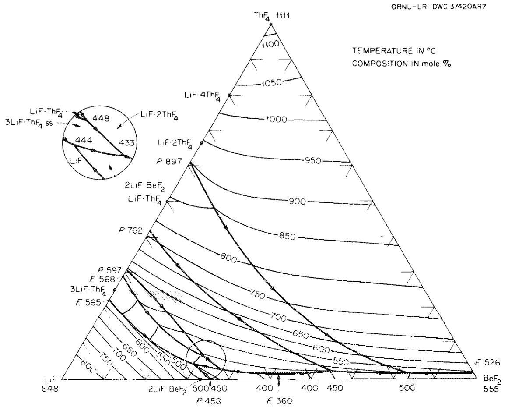  
Fig. 3.1. The system $\mathrm{LiF - BeF_2 - ThF_4}$

mole %. All these species are expected to be dissolved in the fuel solution as trifluorides.

The solubility of $\mathrm{PuF_3}$ in $\mathrm{LiF - BeF_2 - ThF_4}$ (72-16-12 mole %) has been measured at ORNL13 and at the Bhabba Atomic Research Center in India.14 The latter study indicated that solubility increased from 0.77 mole % at $523^{\circ}\mathrm{C}$ to 2.79 mole % at $718^{\circ}\mathrm{C}$ . The ORNL measurements yielded values about 20% higher. In both studies, more than one method was used for assay of the dissolved plutonium, and no ready explanation of the discrepancy is available. It is clear, however, that even the lower value far exceeds that required. The other transuranic species are known to dissolve15 in the $\mathrm{LiF - BeF_2 - ThF_4}$ solvent, but no quantitative definition of their solubility behavior exists. Such a definition must of course be obtained, but the generally close similarity in the behavior of the

trivalent actinides makes it most unlikely that solubility of these individual species can be a problem.

The solubility of $\mathrm{UF_3}$ in the fuel was known to be well in excess of that required for the MSBR, but its absolute magnitude is not well known. By analogy16 with behavior in $\mathrm{Li_2BeF_4}$ , the solubility of $\mathrm{UF_3}$ is very likely to be lower than that of $\mathrm{PuF_3}$ , but it is quite unlikely to be less than 0.4 mole % at $565^{\circ}\mathrm{C}$ .

The trivalent lanthanides and actinides are known to form solid solutions so that, in effect, all the rare-earth trifluorides and the actinide trifluorides act essentially as a single element. Should it prove desirable to operate with $10\%$ of the uranium reduced (ca. 0.16 mole $\%$ UF₃), it is possible, but highly unlikely, that the combination of all trifluorides (perhaps 0.3 mole %) might exceed this combined solubility at a temperature somewhat below the reactor inlet temperature. A few experiments* must be performed to check this slight possibility.

Oxide behavior. The behavior of molten fluoride systems such as this is markedly affected by appreciable concentrations of oxide ion.

The solubilities of the actinide dioxides in $\mathrm{LiF - BeF_2 - ThF_4}$ are low and are known $^{1,16-23}$ to decrease in the order $\mathrm{ThO_2}$ , $\mathrm{PaO_2}$ , $\mathrm{UO_2}$ , $\mathrm{PuO_2}$ . Solubility products and their temperature dependence have been measured for these oxides. Moreover, it is known $^{1,16-23}$ that these dioxides all have the same fluorite structure and form solid solutions; their behavior is reasonably well understood. $^{1}$ Plutonium as $\mathrm{PuF_3}$ shows little tendency to precipitate as oxide. $^{1,2}$

The compound $\mathrm{Pa}_2\mathrm{O}_5$ (or an addition compound of this material) is very insoluble in LiF-BeF $_2$ -ThF $_4$ (72-16-12 mole %). The oxide concentrations at which $\mathrm{Pa}_2\mathrm{O}_5$ can be precipitated depend on both the protactinium concentration and the oxidation state of the fuel. The situation is indicated by the equilibrium

$$
\frac {1}{2} \mathrm {P a} _ {2} \mathrm {O} _ {5} (\mathrm {c}) + \mathrm {U} ^ {3 +} \rightleftharpoons \mathrm {U} ^ {4 +} + \frac {5}{2} \mathrm {O} ^ {2 -} + \mathrm {P a} ^ {4 +},
$$

for which we estimate1 the equilibrium quotient

$$
\log \left[ \left(\mathrm {X} _ {\mathrm {O} ^ {2}} ^ {5 / 2} \cdot \mathrm {X} _ {\mathrm {P a} ^ {4}} + \cdot \mathrm {X} _ {\mathrm {U} ^ {4}} +\right) / \mathrm {X} _ {\mathrm {U} ^ {3}} + \right] = 0. 7 6 - 8 5 9 0 / \mathrm {T} (\pm 0. 8).
$$

The result is that with 100 ppm protactinium and 30 ppm oxide present, the $\mathrm{U}^{3+}/\mathrm{U}^{4+}$ ratio must be kept above about $10^{-5}$ if inadvertent precipitation of $\mathrm{Pa}_2\mathrm{O}_5$ is to be avoided. Such oxidizing conditions are easy to avoid in practice. There is also a dependence on the $\mathrm{U}^{3+}/\mathrm{U}^{4+}$ ratio of the oxide concentration at which $\mathrm{PuO}_2$ precipitation occurs. However, even stronger oxidizing conditions $(\mathrm{U}^{3+}/\mathrm{U}^{4+} < 10^{-8})$ are required to precipitate $\mathrm{PuO}_2$ from fuel for MSBRs or DMSRs.

The solubility of the oxides of neptunium, americium, or curium has not been examined. Some attention to this problem will be required, but it is not obvious that such studies have a high priority.

It is clear that the DMSR fuel must be protected from oxide contamination to avoid inadvertent precipitation. Because of the low oxide tolerance, this will require some care, but the successful operation of the MSRE over a 3-year period lends confidence that oxide contamination of the fuel system can be kept to adequately low levels. This confidence, when added to the prospect that the DMSR fuel will be reprocessed (and its oxide level reduced by fluorination of the uranium) on a continuous basis, suggests very strongly that problems with oxide contamination can be avoided.

Physical properties. Most of the physical properties of LiF-BeF $_2$ -ThF $_4$ (72-16-12 mole %)* are known with reasonable accuracy, although several have been defined by interpolation from measurements on slightly different compositions.

The liquidus temperature is well known, and density and viscosity are accurate to $\pm 3$ and $\pm 10\%$ , respectively. $^{2,24}$ The heat capacity has been derived from drop calorimetry; $^{25}$ on the basis of this determination and with a simple model for predicting heat capacity of molten fluorides, one can reliably predict the heat capacity of the DMSR mixture.

Thermal conductivity is the key property for predicting heat-transfer coefficients of molten fluorides. Measurements that are probably accurate to $\pm 10$ to $15\%$ have been obtained for LiF-BeF $_2$ -ThF $_4$ -UF $_4$ (67.5-20-12-0.5 mole%). For future design considerations it will be helpful to develop an apparatus to measure thermal conductivities of fluorides with greater accuracy and to determine the conductivity of the fuel salt composition.

The surface physical properties (surface tension and interfacial tension between salt and graphite) are only qualitatively known. Such properties are important in assessing wetting behavior and in determining the degree of salt penetration into graphite.

The vapor pressure, as yet unmeasured, has been extrapolated from measurements of $\mathrm{LiF - BeF_2}$ and $\mathrm{LiF - UF_4}$ mixtures. At the highest normal operating temperature, $704^{\circ}\mathrm{C}$ , the estimated vapor pressure is $\sim 1.3$ Pa $(10^{-2}$ torr). The vapor composition has not been measured, but the vapor would be considerably enriched in $\mathrm{BeF_2}$ and perhaps in $\mathrm{ThF_4}$ . Vapor pressure and vapor composition are not high-priority measurements. However, more than qualitative estimates of these properties will be required in future calculations of the amount and composition of salt that is transported by gas streams used to cool portions of the off-gas system in the primary circuit. A transpiration experiment would provide firm values of vapor composition and improved values of vapor pressure. Manometric measurements combined with mass-spectrographic determination would provide more precise information on both.

Fission-product chemistry. Much attention was given to behavior of the fission products in the $\mathrm{MSRE}^{27}$ because of their effect on reactor operation and performance, afterheat, and reactor maintenance. More experimentation will clearly be required in future DMSR (or MSBR) development.

The noble gases are only slightly soluble in molten fluorides $^{28-31}$ and can be removed by sparging with helium. More than $80\%$ of the $^{135}\mathrm{Xe}$ was removed by the relatively simple sparging system of the MSRE. $^{1}$ The more efficient sparging proposed for the MSBR should also be applicable to the DMSR. Most of the $^{135}\mathrm{Xe}$ (the worst of the fission-product poisons)

is formed indirectly by decay of 6.7-hr $^{135}\mathrm{I}$ , and the use of rapid side-stream stripping of $^{135}\mathrm{I}$ by the reaction

$$
\mathrm {H F} _ {(g)} \stackrel {{+}} {{\to}} \mathrm {I} ^ {-} (d) \stackrel {{+}} {{\to}} \mathrm {F} ^ {-} (d) \stackrel {{+}} {{\to}} \mathrm {H I} _ {(g)}
$$

was considered a remote possibility for the MSBR. $^2$ Such stripping seems a most unlikely need for the DMSR; if it were necessary, it would preclude operation at high $\mathrm{UF}_3 / \mathrm{UF}_4$ ratios.

The rare earths and other stable soluble fluorides (e.g., Zr, Ce, Sr, Cs, Y, Ba, and Rb) are all expected to be found principally in the fuel salt* and can be removed by the fuel processing operation.† The chemical behavior of these fission products is fairly well understood and, like the noble-gas behavior, can be predicted confidently for operating DMSRs.27

The chemical behavior of the so-called noble-metal fission products (Nb, Mo, Tc, Ru, Ag, Sb, and Te)‡ is considerably less predictable -- as has been borne out in MSRE operations[27] -- and warrants further study. According to available thermodynamic data, they are expected to appear in a reduced form at $\mathrm{UF}_3 / \mathrm{UF}_4$ ratios greater than $10^{-2}$ . However, in the reduced and presumed metallic state, these fission products can disperse via many mechanisms.

Analyses of MSRE salt samples for five noble-metal nuclides ( $^{99}\mathrm{Mo}$ , $^{103}\mathrm{Ru}$ , $^{106}\mathrm{Ru}$ , and $^{129-132}\mathrm{Te}$ ) showed that the fuel salt contained up to a few tens of percent of the nominal calculated inventory. All these species have volatile high-valence fluorides that could form under sufficiently oxidizing conditions. On the basis of thermodynamic considerations and a correlation of their behavior with that of $^{111}\mathrm{Ag}$ , for which no stable fluoride exists under fuel-salt conditions, it has been tentatively concluded that they are metallic species that occur as finely divided particles suspended in the salt.

The noble-metal fission products were also found deposited on graphite and Hastelloy N specimens (on surveillance specimens as well as on post-operation specimens). However, their distribution on both sets of specimens varied widely and allowed only very tenuous conclusions to be drawn. It was evident from these studies that net deposition was generally more intense on metal than on graphite, and deposition on the metal was more intense under turbulent flow.

Gas samples taken from the pump bowl during $^{235}\mathrm{U}$ operation of the MSRE indicated that substantial concentrations of noble metals were present in the gas phase, but improved sampling techniques (used during operation of the reactor with $^{233}\mathrm{UF}_4$ ) showed that previous samples had been contaminated by salt mist and that only a small fraction of the noble-metal fission products escape to the cover gas.

Of the noble metals, niobium is the most susceptible to oxidation; it was found appreciably in salt samples at the start of the $^{23}$ U MSRE operation because of the low initial $\mathrm{U}^{3+} / \mathrm{U}^{4+}$ ratio. It could be made to disappear by lowering the redox potential of the fuel,[1] but it subsequently reappeared in the salt several times for reasons that were not always explainable. The $^{95}$ Nb data did not correlate with the Mo-Ru-Te data mentioned previously, nor was there any observable correlation of niobium behavior with amounts found in gas samples.[1,27]

The actual state of these noble-metal fission products is important to the effectiveness of MSBR operations. If the products exist as metals and if they plate out on the Hastelloy-N portions of the reactor, they will be of little consequence as poisons; however, they can be of importance in determining the level of fission-product afterheat after reactor shutdown and will complicate maintenance operations and post-operation decontamination. They will contribute to neutron poisoning if they form carbides or adhere in some other way to the graphite moderator;* however, examination of the MSRE graphite moderator indicated that the extent of such adherence was limited. $^{1,2,27}$

Operation with a $\mathrm{UF}_3 / \mathrm{UF}_4$ ratio near 0.1 will apparently change the behavior of those noble metals capable of reduction to an anionic state. This seems certain to include tellurium $^{6,7}$ and may be safely presumed to include selenium. Antimony may exist (and may be dissolved) as $\mathrm{Sb}^{3-}$ in such melts, and other of the noble-metal fission products may be dissolved. If so, they, along with the tellurium and selenium, would - as was not expected for the MSBR - be transported to the fuel processing circuit, where their removal should be possible. Should a decision be made to operate with strongly reduced fuel, some study of such possibilities will be necessary.

Clearly, most of the future fission-product chemical research should be directed toward increasing our understanding of noble-metal-fission-product behavior to a level comparable to that of the other fission products. Factors of importance to future reactors include the redox potential of the system,\* the possible agglomeration of metals onto gas and bubble interfaces in the absence of colloidal (metallic, graphite, oxide, etc.) particles, the deposition of noble metals onto colloidal particles, and the deposition and resuspension of particles bearing noble metals.

Tritium behavior. A 1000-MW(e) MSBR has been estimated $^{32}$ to produce about 2420 Ci ( $\sim$ 0.25 g) of ${}^{3}\mathrm{H}$ per day; the DMSR must accordingly be expected to generate ${}^{3}\mathrm{H}$ at this rate. Since metals at high temperatures are permeable to the isotopes of hydrogen, the pathways for tritium flow from the reactor to the environment are numerous. Although many of the pathways do not present serious difficulty, $^{\dagger}$ the flow to the steam generator, if not inhibited, could result in tritium contamination of the steam system and release of tritium to the environment via blowdown and leakage to the condenser coolant.

As noted above (and described in more detail in a subsequent section), the NaF-NaBF₄ coolant appears to be the major defense against $^3\mathsf{H}$ escape to the steam system; however, the behavior of $^3\mathsf{H}$ in the fuel

system is obviously important. Most of the tritium $^{10,32}$ is generated by neutron reactions on $^{6}\mathrm{Li}$ and $^{7}\mathrm{Li}$ in the fuel. Such $^{3}\mathrm{H}$ is, in principle, generated in an oxidized state (as $^{3}\mathrm{HF}$ ). However, upon equilibration with a fuel containing a $\mathrm{UF}_3 / \mathrm{UF}_4$ ratio of 0.01 by the reaction

$$
\mathrm {H F} + \mathrm {U F} _ {3} (\mathrm {d}) \rightleftharpoons \frac {1}{2} \mathrm {H} _ {2} (\mathrm {g}) + \mathrm {U F} _ {4} (\mathrm {d}),
$$

the HF should be almost completely reduced to $\mathbf{H}_2$ ; reduction would of course be even more complete at $\mathrm{UF_3 / UF_4} = 0.1$ . The data for this equilibrium reaction are well known.[8,9]

Attempts have been made $^{2,6}$ to determine the solubility of $\mathbf{H}_2$ and $\mathbf{D}_2$ (and, by analogy, ${}^{3}\mathbf{H}_{2}$ ) in molten $\mathrm{Li}_2\mathrm{BeF}_4$ . Plausible (and very small) solubilities were measured, but the solubility is not precisely known. Further study of the solubility relationships is needed, and measurements of diffusivity in the fuel would also be valuable. It seems likely that an efficient sparging system (as for $^{135}\mathrm{Xe}$ removal) will strip a considerable fraction of the ${}^{3}\mathbf{H}_2$ to the reactor off-gas system, where it could be collected for disposal.

Basic studies of molten fluorides. A comprehensive knowledge of the formation free energies $(\Delta G^{\mathrm{f}})$ of solutes in molten $\mathrm{Li}_2\mathrm{BeF}_4$ has been gained over the years33 from measurements of heterogeneous equilibria involving various gases (e.g., HF or $\mathrm{H}_2\mathrm{O}$ ) and solids (e.g., metals or oxides). The list of dissolved components for which formation free energies have been estimated includes LiF, $\mathrm{BeF}_2$ , $\mathrm{ThF}_4$ , several rare-earth trifluorides, $\mathrm{ZrF}_4$ , $\mathrm{UF}_3$ , $\mathrm{UF}_4$ , $\mathrm{PaF}_4$ , $\mathrm{PaF}_5$ , $\mathrm{PuF}_3$ , $\mathrm{CrF}_2$ , $\mathrm{FeF}_2$ , $\mathrm{NiF}_2$ , $\mathrm{NbF}_4$ , $\mathrm{NbF}_5$ , $\mathrm{MoF}_3$ , HF, BeO, BeS, $\mathrm{Be(OH)}_2$ , and $\mathrm{BeI}_2$ . Some of these $\Delta G^{\mathrm{f}}$ values, however, are presently insufficiently accurate for the needs of the MSBR and DMSR programs (e.g., those for $\mathrm{PaF}_4$ , $\mathrm{PaF}_5$ , $\mathrm{ThF}_4$ , $\mathrm{MoF}_3$ , $\mathrm{NbF}_4$ , and $\mathrm{NbF}_5$ ) and additional equilibrium measurements involving these solutes are needed. Moreover, there is a need for the $\Delta G^{\mathrm{f}}$ values of certain other fission-product compounds such as the lower fluorides of technetium and ruthenium and various dissolved compounds of tellurium. A more urgent need is an increased knowledge of how activity coefficients (which have been defined as unity in $\mathrm{Li}_2\mathrm{BeF}_4$ ) vary as the melt composition changes. Such knowledge is required to predict how the numerous chemical equilibria

constants that may be derived from $\Delta G^{\dagger}$ values in $\mathrm{Li}_2\mathrm{BeF}_4$ will change as the melt composition is changed to that of a DMSR fuel.

# Coolant chemistry

It has never appeared feasible to raise steam directly from the fuel (primary) heat exchanger; accordingly, a secondary coolant must be provided to link the fuel circuit to the steam generator. The demands imposed upon this coolant fluid differ in obvious ways from those imposed upon the fuel system. Radiation intensities will be markedly less in the coolant system, and the consequences of uranium fission will be absent. However, the coolant salt must be compatible with the construction metals that are also compatible with the fuel and the steam; it must not undergo violent reactions with fuel or steam should leaks develop in either circuit. The coolant should be inexpensive, it must possess good heat transfer properties, and it must melt at temperatures suitable for steam cycle start-up. An ideal coolant would consist of compounds that are tolerable in the fuel or are easy to separate from the valuable fuel mixture should the fluids mix as a consequence of a leak.

Choice of coolant composition. Many types of coolant materials were carefully considered before the choice was made. The coolant which served admirably in the MSRE, $^7\mathrm{Li}_2\mathrm{BeF}_4$ , was rejected for the MSBR because of economics and because its liquidus temperature is higher than desirable. No substitute with ideal characteristics was found. After consideration of molten metals and molten chloride and molten fluoride mixtures, the best material overall appeared to be a mixture of sodium fluoride and sodium fluoroborate. $^1$ These compounds are readily available and inexpensive and appear to be sufficiently stable in the radiation field within the primary heat exchanger. The mixture of NaF- $\mathrm{NaBF}_4$ with 8 mole % NaF melts at the acceptably low temperature of $385^{\circ}\mathrm{C}$ ( $725^{\circ}\mathrm{F}$ ), and its physical properties seem adequate for its service as a heat transfer agent. These compounds are not ideally compatible with either steam or the MSBR fuel, but the reactions are neither violent nor even particularly energetic.

The fact that fluoroborates show an appreciable equilibrium pressure of gaseous $\mathrm{BF}_3$ at elevated temperatures presents minor difficulties. The

$\mathrm{BF}_3$ pressures are moderate; they may be calculated from

$$
\log \mathrm {P} = 1 1. 1 4 9 - 5 9 2 0 / \mathrm {T},
$$

when pressure is in pascals and temperature is in kelvin [yielding 23 kPa (175 torr) at $600^{\circ}\mathrm{C}$ ], and clearly present no dangerous situations. However, it is necessary to maintain the appropriate partial pressures of $\mathrm{BF}_3$ in any flowing cover-gas stream to avoid composition changes in the melt.

The appropriateness of that choice for the MSBR (and for the DMSR) has been confirmed by several findings in recent years. First, a careful and detailed reconsideration of secondary (and even secondary plus tertiary) coolants $^{34}$ ranked the NaF-NaBF $_4$ coolant very high on the list of alternatives. After these deliberations, $^{34}$ experimental information $^{10}$ became available to show that the NaF-NaBF $_4$ mixture was genuinely effective in trapping $^{3}$ H. The reconsideration, accordingly, concluded: $^{34}$

While the information that is currently available is inadequate for accurate extrapolation to the rate of tritium release to the steam system of an MSBR, it appears that the sodium fluoroborate salt mixture would have a substantial inhibiting effect on such release and that environmentally acceptable rates (<10 Ci/d) could be achieved with reasonable effort.

Additional study needed.* A considerable study of many aspects of fluoroborate chemistry has been conducted during the past few years. Nevertheless, our understanding of the chemistry of the NaF-NaBF $_4$ system is less complete, and our knowledge of its behavior rests on a less secure foundation than that of the MSBR fuel system. Thus there are several areas where further or additional work is needed, although it seems unlikely that the findings will threaten the feasibility of NaF-NaBF $_4$ in the MSBR (or DMSR) concept.

Phase behavior of the simple NaF-NaBF $_4$ system and the equilibrium pressure of BF $_3$ over the pertinent temperature interval are well understood. If the NaF-NaBF $_4$ eutectic (or some near variant of it) is the final coolant choice, little effort need be spent in these areas.

Additional information is needed, however, on the behavior of oxide and hydroxide ions in the fluoroborate melts. For example, the solubility of $\mathrm{Na}_2\mathrm{B}_2\mathrm{F}_6\mathrm{O}$ in the mixture is not well known; data on equilibria (in inert containers) among $\mathrm{H}_2\mathrm{O}$ , HF, $\mathrm{NaBF}_3\mathrm{OH}$ , and $\mathrm{Na}_2\mathrm{B}_2\mathrm{F}_6\mathrm{O}$ are still needed; and rates of reaction of dilute $\mathrm{NaBF}_3\mathrm{OH}$ solutions with metals need definition. Investigation of $\mathrm{NaBF}_4$ melts by x-ray powder diffraction, infrared spectroscopy, and Raman spectroscopy have identified the stable ring compound $\mathrm{Na}_3\mathrm{B}_3\mathrm{F}_6\mathrm{O}_3$ as the probable oxygen-containing species in coolant melts. $^{34}$ Measurements of condensates trapped from the coolant salt technology facility (CSTF), a development loop, show a tritium concentration of $10^5$ relative to the salt, suggesting that a volatile species may be selectively transporting tritium from the loop through the vapor. $^{10}$ Recent results indicate that $\mathrm{BF}_3\cdot 2\mathrm{H}_2\mathrm{O}$ may exist as a molecular compound in the vapor and could be responsible for the tritium trapping. $^{34}$ However, the mechanism by which tritium diffusing from the fuel system can be trapped needs additional study.

As indicated above, several of the physical property values have been estimated. These estimates are almost certainly adequate for the present, but the program needs to provide for measurement of these quantities.

Compatibility of the NaF-NaBF₄ with Hastelloy N under normal operating conditions seems assured. Additional study, in realistic flowing systems, of the corrosive effects of steam inleakage is necessary. This study, closely allied with the study of equilibria and the kinetics of reactions involving the hydroxides and oxides described above, would require the long-term operation of a demonstration loop that could simulate steam inleakage and coolant repurification.

Purification procedures for the coolant mixture are adequate for the present and can be used to provide material for the many necessary tests.1 However, they are not adequate for ultimate on-line processing of the coolant mixture during operation. Fluorination of the coolant

on a reasonable cycle time would almost certainly suffice but it has not been demonstrated. A process using a less aggressive reagent is clearly desirable. $^1$

A fluoroborate mixture has shown completely adequate radiation stability in a single (but realistically severe) test run. Additional radiation testing of this material in a flowing system would seem desirable and should ultimately be done but does not rate a high priority at present.1,2

# Fuel-coolant interactions

A rupture of a tube (or tubes) in the primary heat exchanger would unavoidably lead to mixing of some coolant salt with the fuel. The possibility of a nuclear incident would seem highly unlikely because of the consequent addition of the efficient nuclear poison boron to the fuel. However, since $\mathrm{BF}_3$ is volatile, mixing might result in a pressure surge, and the NaF- $\mathrm{NaBF}_4$ mixture contains some oxygenated species. The 1972 review, accordingly, concluded:

Mixing of coolant and fuel clearly requires additional study. The situation which results from equilibration of these fluids is reasonably well understood, and, even where large leakages of coolant into the fuel are assumed, the ultimate "equilibrium" seems to pose no real danger. However, the real situation may well not approximate an equilibrium condition. Studies of such mixing under realistic conditions in flowing systems are lacking and necessary.

The 1974 program plan2 included a very considerable program for such study.

More recent experiments34 have thrown additional light upon such mixing. Although additional experiments are needed, it now appears likely that such mixing would not pose drastic problems. These experiments revealed that $\mathrm{BF}_3$ gas was slowly evolved when the salts were mixed; some 30 min were required to complete the $\mathrm{BF}_3$ evolution. Furthermore, the $\mathrm{ThF}_4$ and $\mathrm{UF}_4$ showed no tendency to redistribute, to form more concentrated solutions, or to precipitate. Moreover, no $\mathrm{UO}_2$ precipitated even when the molten fuel-coolant combination was agitated for several hours while exposed to air.

Additional confirmatory experiments will be required and the different species in DMSR fuel must be tested. Such experiments may receive less attention and lower priority than previously believed. $^{1,2}$

# Fuel-graphite interactions

Graphite does not react with, and is not wetted by, molten fluoride mixtures of the type to be used in the MSBR. Available thermodynamic data35 suggest that the most likely reaction,

$$
4 U F _ {4} (d) + C (c) \rightleftharpoons C F _ {4} (g) + 4 U F _ {3} (d),
$$

should come to equilibrium at $\mathrm{CF_4}$ pressures below $10^{-8}$ atm. At least one source $^{36}$ lists chromium carbide $(\mathrm{Cr}_3\mathrm{C}_2)$ as stable at MSBR temperatures. If $\mathrm{Cr}_3\mathrm{C}_2$ is stable, it should be possible to transfer chromium from the bulk alloy to the graphite. No evidence of such behavior has been observed with Hastelloy N in the MSRE or other experimental assemblies. Although such migration may be possible with alloys of higher chromium content, it should not prove greatly deleterious, since its rate would be controlled by the rate at which chromium could diffuse to the alloy surface and should be limited by a film of $\mathrm{Cr}_3\mathrm{C}_2$ formed on the graphite. This consideration, taken with the wealth of favorable experience, suggests that no problems are likely from this source in the reference MSBR or in a DMSR.

However, some additional examination of this unlikely problem area must be done for the DMSR, particularly if operation at $\mathrm{UF}_3 / \mathrm{UF}_4$ ratios near 0.1 is to be attempted. The upper limit on that ratio will most likely be set by the equilibrium

$$
^ {4} \mathrm {U F} _ {3} (\mathrm {d}) + 2 \mathrm {C} (\mathrm {c}) \rightarrow 3 \mathrm {U F} _ {4} (\mathrm {d}) + \mathrm {U C} _ {2} (\mathrm {c})
$$

at the lower end of the operating temperature range. $^{37}$

Toth and Gilpatrick, $^{36}$ who used a spectrometric technique in which molten salts were contained in cells of graphite with diamond windows, made a careful study of equilibria among $\mathrm{UF}_3$ and $\mathrm{UF}_4$ in molten solution with solid graphite and uranium carbides. Their data show that the ratio

of $\mathrm{UF_3}$ to $\mathrm{UF_4}$ in LiF-BeF $_2$ -ThF $_4$ (72-16-12 mole %) in equilibrium with graphite and $\mathrm{UC_2}$ at $565^{\circ}\mathrm{C}$ lies in the range 0.11 to 0.16.* All equilibria studied were found to be very sensitive to temperature $^{\dagger}$ and to the free fluoride concentration of the solvent. It would seem likely that $\mathrm{UF_3 / UF_4}$ ratios as high as 0.1 can be tolerated for a DMSR (though slight adjustments in fuel composition or fuel-inlet temperature might be required), but confirmatory experiments are needed. Since similar systems appear to be sensitive to oxide ion concentration, some experimental study of this parameter will also be required.

Even at relatively high temperatures, graphite has been shown to adsorb $\mathrm{H}_{2}$ and its isotopes to an appreciable extent.[39] Further information about this phenomenon should be obtained.

# Prime R&D Needs

Weaknesses in the existing technological base and requirements for additional technical information have been identified throughout the preceding discussion of the technology status. These needs are consolidated and presented below, in outline form, to provide a concise tabulation for defining and scheduling possible R&D activities.

# Fuel chemistry

1. Demonstrate the feasibility of operation at $\mathrm{UF}_3 / \mathrm{UF}_4$ ratio of 0.07 to 0.1.

a. Verify the individual and collective solubilities of trivalent actinide fluorides.   
b. Verify the interaction of uranium with graphite.   
c. Verify the behavior of noble and seminoble fission products (i.e., Se, Sb, Tc, and Ru) along with tellurium.

2. Define the limits on tolerable oxide concentration to avoid precipitation of oxides from DMSR fuel at $\mathrm{UF_3 / UF_4}$ ratio of 0.1 and to avoid interaction of that fuel with graphite.

3. Provide sound measurements of those physical properties (surface tension, interfacial tension, thermal conductivity, vapor pressure, and vapor composition) that are not known with precision.   
4. Improve the knowledge of fission-product behavior, particularly of key noble metals, in reduced DMSR fuel.   
5. Determine the solubility and diffusion kinetics of $\mathbf{H}_2$ and its isotopes in DMSR fuel.   
6. Perform the basic studies to bring knowledge of solute behavior in $\mathrm{LiF - BeF_2 - ThF_4}$ (70-16-12 mole %) to at least the level of current knowledge of behavior in $\mathrm{Li}_2\mathrm{BeF}_4$ .

# Coolant chemistry

1. Identify and characterize oxygenated and protonated species in NaF-NaBF $_4$ as functions of "contamination" level.   
2. Elucidate the mechanisms by which the coolant salt takes up ${}^{3}\mathrm{H}$ and determine identity of the products and the key reaction rates.   
3. Determine (in cooperation with the materials development effort described in Part IV of this document) the effect of the "contaminants" mentioned above, and the effect of steam inleakage, on corrosivity of coolant salt.   
4. Refine the measurements of physical properties of NaF- $\mathrm{NaBF_4}$ as required.   
5. Confirm the adequacy of radiation resistance of the realistic mixture (i.e., with the desired "contaminant" level).

# Fuel-coolant interactions

1. Continue, and scale up, mixing studies to demonstrate that no hazardous interactions exist and define the limits of behavior.   
2. Consider the problems of fuel (and graphite) cleanup consequent to a fuel-coolant leak.

# Fuel-graphite interactions

1. The major need identified above is to demonstrate tolerable $\mathrm{UF}_3 / \mathrm{UF}_4$ ratios and $0^{2-}$ concentration limits to avoid formation of uranium carbides.

2. Define the extent to which $^3\mathsf{H}$ will be adsorbed by moderator graphite.   
3. Verify the interaction of noble-metal fission-products with graphite at usable $\mathrm{UF}_3 / \mathrm{UF}_4$ ratios.

# Estimates of Scheduling and Costs

Preliminary estimates of the necessary schedule and of its operating and capital funding requirements are presented below for the fuel and coolant chemistry program described above. As elsewhere in this document, it has been assumed that (1) the program would begin at the start of FY 1980, (2) it would lead to an operating DMSR in 1995, and (3) the R&D program will produce no great surprises and no major changes in program direction will be required.

The schedule, along with the dates on which key developments must be finished and major decisions made, is shown in Table 3.1. It seems virtually certain that the R&D programs (including those described elsewhere in this document) will provide some minor surprises and that some changes in the chemistry program will be required. No specific provisions for this are included; but, unless major revisions become necessary in the middle eighties, it appears likely that suitable fuel and coolant compositions could be confidently recommended on this schedule.

The operating funds (Table 3.2) and the capital equipment requirements (Table 3.3) are shown on a year-by-year basis in thousands of 1978 dollars. No allowance for contingencies, for major program changes, and for inflation during the interval have been provided.

Table 3.1. Schedule for chemical research and development   

<table><tr><td rowspan="2">Task</td><td colspan="15">Fiscal year</td><td></td></tr><tr><td>1980</td><td>1981</td><td>1982</td><td>1983</td><td>1984</td><td>1985</td><td>1986</td><td>1987</td><td>1988</td><td>1989</td><td>1990</td><td>1991</td><td>1992</td><td>1993</td><td>1994</td><td>1995</td></tr><tr><td>Fuel chemistry</td><td>\( \nabla^1 \)</td><td></td><td>\( \nabla^2 \)</td><td></td><td>\( \nabla^3 \)</td><td></td><td>\( \nabla^4 \)</td><td></td><td>\( \nabla^5 \)</td><td></td><td></td><td></td><td></td><td></td><td></td><td></td></tr><tr><td>Phase equilibria</td><td></td><td>\( \nabla^6 \)</td><td>\( \nabla^7 \)</td><td></td><td>\( \nabla^8 \)</td><td></td><td></td><td>\( \nabla^9 \)</td><td></td><td></td><td></td><td></td><td></td><td></td><td></td><td></td></tr><tr><td>Oxide behavior</td><td></td><td></td><td></td><td></td><td></td><td></td><td>\( \nabla^{10} \)</td><td></td><td></td><td></td><td></td><td></td><td></td><td></td><td></td><td></td></tr><tr><td>Physical properties</td><td></td><td></td><td></td><td></td><td></td><td></td><td></td><td></td><td></td><td></td><td></td><td>\( \nabla^{11} \)</td><td></td><td></td><td></td><td></td></tr><tr><td>Tritium behavior</td><td></td><td></td><td>\( \nabla^{12} \)</td><td></td><td></td><td>\( \nabla^{13} \)</td><td></td><td></td><td></td><td></td><td></td><td></td><td></td><td></td><td></td><td></td></tr><tr><td>Fission-product chemistry</td><td></td><td>\( \nabla^{14}\nabla^{15} \)</td><td></td><td>\( \nabla^{16} \)</td><td></td><td>\( \nabla^{17} \)</td><td>\( \nabla^{18} \)</td><td></td><td></td><td>\( \nabla^{19} \)</td><td></td><td></td><td></td><td>\( \nabla^{20} \)</td><td></td><td></td></tr><tr><td>Basic studies</td><td></td><td>\( \nabla^{24} \)</td><td></td><td></td><td></td><td></td><td>\( \nabla^{22} \)</td><td></td><td>\( \nabla^{23} \)</td><td></td><td></td><td></td><td></td><td></td><td></td><td></td></tr><tr><td>Coolant chemistry</td><td></td><td></td><td></td><td></td><td></td><td></td><td></td><td></td><td></td><td></td><td></td><td></td><td></td><td></td><td></td><td></td></tr><tr><td>Basic studies</td><td></td><td></td><td>\( \nabla^{24} \)</td><td></td><td></td><td></td><td>\( \nabla^{25} \)</td><td></td><td>\( \nabla^{26} \)</td><td>\( \nabla^{27} \)</td><td></td><td></td><td>\( \nabla^{28} \)</td><td></td><td></td><td></td></tr><tr><td>Physical properties</td><td></td><td></td><td></td><td></td><td></td><td></td><td></td><td></td><td></td><td></td><td></td><td></td><td>\( \nabla^{29} \)</td><td></td><td></td><td></td></tr><tr><td>Tritium chemistry</td><td></td><td></td><td></td><td></td><td></td><td></td><td></td><td>\( \nabla^{30} \)</td><td>\( \nabla^{31} \)</td><td></td><td>\( \nabla^{32} \)</td><td></td><td></td><td></td><td></td><td></td></tr><tr><td>Fuel-coolant interactions</td><td></td><td></td><td>\( \nabla^{33} \)</td><td></td><td></td><td></td><td>\( \nabla^{34} \)</td><td></td><td></td><td></td><td>\( \nabla^{35} \)</td><td></td><td></td><td></td><td></td><td></td></tr><tr><td>Fuel-graphite interactions</td><td></td><td></td><td>\( \nabla^{36} \)</td><td></td><td></td><td></td><td>\( \nabla^{37} \)</td><td>\( \nabla^5 \)</td><td></td><td></td><td></td><td>\( \nabla^{38} \)</td><td></td><td></td><td></td><td></td></tr></table>

Milestones:   
1. Determine solubility of $\mathbf{U}\mathbf{F}_3$ over reasonable fuel composition range.   
2. Determine solubility of $\mathrm{AmF}_3$ , $\mathrm{NpF}_3$ , and $\mathrm{CmF}_3$ .   
3. Define solubility limit of total metal trifluorides over reasonable range of compositions.   
4. Conclude phase equilibrium investigations, including effect of small concentrations of $\mathrm{Cl}^-$ .   
5. Make final decision as to feasibility of operation at $\mathrm{UF}_3 / \mathrm{UF}_4$ ratio near 0.1.   
6. Redetermine solubility of $\mathrm{Pa}_2\mathrm{O}_5$   
7. Establish solubilities of $\mathrm{Am}_2\mathrm{O}_3$ $\mathrm{Np_2O_3}$ and $\mathrm{Cm_2O_3}$   
8. Determine solid solution behavior as a function of oxide contamination level.   
9. Set limits on tolerable oxide ion concentration in fuel and assess possible separations procedures based on oxide precipitation.   
10. Determine surface physical properties of realistic composition range and assess wettability of metal and graphite.   
ll. Complete physical property determinations.   
12. Determine solubility of $\mathbf{H}_2$ and HT in fuel.   
13. Determine diffusivity of $\mathbf{H}_2$ and HT in fuel.   
14. Determine possibility of removal of $\mathsf{ZrF}_4$ from reduced fuel as intermetallic compound.   
15. Establish solubility of Te, $\mathsf{Te}^{2 - }$ , and other Te species in fuel.   
16. Determine oxidation states of noble and seminoble fission product metals as a function of pertinent $\mathrm{UF}_3 / \mathrm{UF}_4$ ratios.   
17. Make final conclusions as to Se, Te, I-, and Br- behavior at pertinent $\mathrm{UF}_3 / \mathrm{UF}_4$ ratios.   
18. Establish feasibility of removal of noble metals by washing with Bi (with no reductant).   
19. Establish extent of sorption of $\mathrm{I}_2$ , $\mathrm{SeF}_6$ , and $\mathrm{TeF}_6$ in oxidized fuel (uranium valence 4.5).

20. Make final evaluation of fission-product behavior for DMSR.

21. Define activity coefficients for $\mathrm{Te}^{2+}$ (and other Te species) in reduced fuel.

22. Complete evaluation of porous electrode studies.

23. Complete definition of activity coefficients for solutes in fuel.

24. Complete evaluation of boride formation on Hastelloy N in coolant salt.

25. Finish investigation of oxide species in coolants.

26. Finish measurement of free energy and activity coefficients of corrosion products in coolant salt.

27. Make final decision as to coolant composition.

28. Finish measurements of effect of steam inleakage into coolant.

29. Finish physical property measurements on coolant.

30. Identify mechanisms for trapping of tritium in fluoroborate.

31. Complete evaluation of reaction rates of tritium with fluoroborate species.

32. Complete evaluation of tritium removal from coolant and reconditioning of coolant.

33. Complete dynamic studies of fuel-coolant mixing.

34. Determine precipitation behavior of fuel with realistic oxide and protonic contaminants.

35. Complete evaluation of methods for recovery from fuel-coolant mixing.

36. Define limits on $\mathbf{UF}_3 / \mathbf{UF}_4$ ratio and oxide contamination level in fuel to avoid uranium carbide formation.

37. Complete evaluation of fission-product-graphite interaction with maximally reduced fuel.

38. Complete investigation of tritium uptake by moderator graphite and activated carbons.

Table 3.2. Operating fund requirements for chemical research and development   

<table><tr><td rowspan="2">Task</td><td colspan="16">Cost (thousands of 1978 dollars) for fiscal year -</td></tr><tr><td>1980</td><td>1981</td><td>1982</td><td>1983</td><td>1984</td><td>1985</td><td>1986</td><td>1987</td><td>1988</td><td>1989</td><td>1990</td><td>1991</td><td>1992</td><td>1993</td><td>1994</td><td>1995</td></tr><tr><td colspan="17">Fuel chemistry</td></tr><tr><td>Phase equilibria</td><td>100</td><td>100</td><td>100</td><td>100</td><td>100</td><td>100</td><td>75</td><td>50</td><td>25</td><td>0</td><td>0</td><td>0</td><td>0</td><td>0</td><td>0</td><td>0</td></tr><tr><td>Oxide behavior</td><td>150</td><td>150</td><td>150</td><td>150</td><td>175</td><td>150</td><td>100</td><td>50</td><td>50</td><td>0</td><td>0</td><td>0</td><td>0</td><td>0</td><td>0</td><td>0</td></tr><tr><td>Physical properties</td><td>0</td><td>0</td><td>60</td><td>60</td><td>60</td><td>60</td><td>120</td><td>120</td><td>120</td><td>60</td><td>60</td><td>40</td><td>40</td><td>0</td><td>0</td><td>0</td></tr><tr><td>Tritium behavior</td><td>0</td><td>120</td><td>120</td><td>150</td><td>150</td><td>100</td><td>100</td><td>50</td><td>50</td><td>0</td><td>0</td><td>0</td><td>0</td><td>0</td><td>0</td><td>0</td></tr><tr><td>Fission-product chemistry</td><td>80</td><td>120</td><td>120</td><td>120</td><td>120</td><td>120</td><td>200</td><td>250</td><td>250</td><td>250</td><td>150</td><td>150</td><td>150</td><td>100</td><td>50</td><td>0</td></tr><tr><td>BASIC studies</td><td>120</td><td>120</td><td>150</td><td>150</td><td>150</td><td>150</td><td>100</td><td>100</td><td>75</td><td>0</td><td>0</td><td>0</td><td>0</td><td>0</td><td>0</td><td>0</td></tr><tr><td colspan="17">Coolant chemistry</td></tr><tr><td>Basic studies</td><td>50</td><td>100</td><td>100</td><td>125</td><td>125</td><td>150</td><td>150</td><td>150</td><td>150</td><td>150</td><td>100</td><td>100</td><td>75</td><td>50</td><td>0</td><td>0</td></tr><tr><td>Physical properties</td><td>0</td><td>0</td><td>0</td><td>50</td><td>50</td><td>50</td><td>75</td><td>75</td><td>75</td><td>75</td><td>75</td><td>75</td><td>50</td><td>50</td><td>0</td><td>0</td></tr><tr><td>Tritium chemistry</td><td>70</td><td>125</td><td>150</td><td>150</td><td>215</td><td>230</td><td>260</td><td>330</td><td>330</td><td>300</td><td>150</td><td>100</td><td>100</td><td>50</td><td>0</td><td>0</td></tr><tr><td>Fuel-coolant interactions</td><td>75</td><td>75</td><td>75</td><td>75</td><td>100</td><td>100</td><td>100</td><td>100</td><td>50</td><td>25</td><td>0</td><td>0</td><td>0</td><td>0</td><td>0</td><td>0</td></tr><tr><td>Fuel-graphite interactions</td><td>50</td><td>80</td><td>100</td><td>100</td><td>100</td><td>150</td><td>150</td><td>200</td><td>125</td><td>75</td><td>25</td><td>0</td><td>0</td><td>0</td><td>0</td><td>0</td></tr><tr><td>Total fundsa</td><td>695</td><td>990</td><td>1125</td><td>1230</td><td>1345</td><td>1360</td><td>1430</td><td>1475</td><td>1300</td><td>935</td><td>560</td><td>465</td><td>465</td><td>250</td><td>50</td><td>0</td></tr></table>

${}^{a}$ Total funds through 1994: \$13,675.

Table 3.3. Capital equipment fund requirements for chemical research and development   

<table><tr><td rowspan="2">Task</td><td colspan="15">Cost (thousands of 1978 dollars) for fiscal year -</td><td></td></tr><tr><td>1980</td><td>1981</td><td>1982</td><td>1983</td><td>1984</td><td>1985</td><td>1986</td><td>1987</td><td>1988</td><td>1989</td><td>1990</td><td>1991</td><td>1992</td><td>1993</td><td>1994</td><td>1995</td></tr><tr><td>Fuel chemistry</td><td>40</td><td>90</td><td>145</td><td>130</td><td>40</td><td>160</td><td>100</td><td>100</td><td>95</td><td>20</td><td>10</td><td>10</td><td>0</td><td>0</td><td>0</td><td>0</td></tr><tr><td>Coolant chemistry</td><td>25</td><td>85</td><td>150</td><td>100</td><td>95</td><td>165</td><td>163</td><td>210</td><td>85</td><td>35</td><td>10</td><td>0</td><td>0</td><td>0</td><td>0</td><td>0</td></tr><tr><td>Fuel-coolant interactions</td><td>30</td><td>10</td><td>15</td><td>40</td><td>30</td><td>50</td><td>60</td><td>15</td><td>0</td><td>0</td><td>0</td><td>0</td><td>0</td><td>0</td><td>0</td><td>0</td></tr><tr><td>Fuel-graphite interactions</td><td>0</td><td>20</td><td>45</td><td>40</td><td>15</td><td>30</td><td>22</td><td>0</td><td>5</td><td>0</td><td>0</td><td>0</td><td>0</td><td>0</td><td>0</td><td>0</td></tr><tr><td>Total fundsa</td><td>95</td><td>205</td><td>355</td><td>310</td><td>180</td><td>410</td><td>325</td><td>350</td><td>185</td><td>55</td><td>20</td><td>10</td><td>0</td><td>0</td><td>0</td><td>0</td></tr></table>

$^\alpha$ Total funds through 1991: $2500.

# 4. ANALYTICAL CHEMISTRY

# Scope and Nature of the Task

With conventional solid-fueled reactors, there is neither the opportunity nor an obvious need for chemical analyses of the fuel during its sojourn in the reactor. On the other hand, for a fluid-fueled reactor, particularly one that includes a fuel processing plant, there is a pressing need to know the precise composition (particularly the concentrations of fissile materials) in several process streams. Moreover, such information is needed at frequent intervals (if not continuously) and on a real-time basis. As a consequence, such reactors are much more dependent on analytical chemistry than are, for example, LWRs.

The MSRE was indeed operated successfully with chemical analyses performed on discrete samples of fuel removed from the reactor for hot-cell study. However, it was recognized1 early that the MSBR and its associated reprocessing plant would require in-line analyses. The DMSR would be equally dependent on successful development of such analytical techniques.

These requirements are several in number. It will be necessary to determine on a virtually continuous basis the redox potential, the concentrations of uranium, protactinium, and other fissionable materials and of bismuth and specific corrosion products (notably chromium) in the stream entering the reactor from the processing plant. Such information must also be available for the fuel within the reactor circuit and in the stream to the reprocessing plant. In addition, it would be highly desirable to know the oxide ion concentration in the fuel within the reactor and in the stream from the processing plant and to know the states and concentrations of selected fission products in the fuel within the reactor. It will be essential to know the concentrations of uranium and fissile isotopes in the processing streams from which they could be lost (to the waste system) from the complex. These streams will include the small stream of released off-gas, the LiCl system* for rare-earth transfer, the $\mathrm{ZrF_4}$ removal system* and perhaps a system* for removal of metallic

noble-metal fission products. In addition, it will be necessary to monitor corrosion products, oxygenated compounds, and protonated (and tritiated) products in the coolant system and in the off-gas system as well as in the system for hold-up and recovery of tritium. Accordingly, on-line analyses will be required in at least three kinds of molten salts, in gases, and perhaps in molten bismuth alloys* within the processing plant.

# Key Differences in Reactor Concepts†

Insofar as the analytical chemistry requirements (and the R&D needs) are concerned, the DMSR and the MSBR are quite similar. The DMSR will require determination of plutonium (and to some extent of Am, Cm, and Np) to a degree markedly different from the MSBR. Concentrations of $\mathrm{UF}_3$ , $\mathrm{UF}_4$ , and $\mathrm{PaF}_4$ in the fuel stream will be higher in a DMSR (as will that of $\mathrm{ZrF}_4$ ) than in an MSBR. Complexities of the fuel processing plants for the two reactors are very similar, and, except for the presence of transuranics, so are the analytical requirements.

In principle, the emphasis on proliferation resistance would seem to place additional demands on surveillance and precise determination of plutonium, protactinium, and uranium within the DMSR system. In fact, the requirements already imposed by the demands for safe and reliable continuous operation of the complex are almost certainly at least as stringent.

# Post-1974 Technology Advances

Several advances, a few amounting to breakthroughs, were made in the 1971-1974 interval. $^{1,2}$ The post-1974 studies in analytical chemistry consisted mainly of (particularly valuable) service functions and, except for studies of tellurium behavior, contained little exploratory

development of the kind ultimately needed. Primary accomplishments in the post-1974 period were therefore relatively few. They did include the following:

1. On-line voltammetric techniques for determination of the $\mathrm{UF}_3 / \mathrm{UF}_4$ ratio were refined and were applied successfully and routinely in many corrosion test loops $^{40,41}$ and engineering experiments. $^{6,7,40,42}$ Such techniques can now be said to be well established in the absence of radiation (which should prove of little consequence) and of fission products.   
2. Measurements of protonated (and tritiated) species in the NaF-NaBF $_4$ coolant salt were applied successfully in engineering test equipment. $^{10,43}$   
3. Voltammetric and chronopotentiometric techniques have been successfully applied to measurements of $\mathrm{Fe}^{2+}$ in LiF-BeF $_2$ -ThF $_4$ (72-16-12 mole %), $^{44}$ and preliminary studies $^{45}$ using anodic voltammetry show promise for in-line monitoring of oxide level in this molten salt, at least under favorable conditions.

# Status of Analytical Development

MSRE operation was mainly conducted with analyses performed on discrete samples removed from the reactor. The reactor off-gas was analyzed by in-line methods, and remote gamma spectroscopy was used to study fission products; all other determinations were made using hot-cell techniques on batch samples. Of course, a major program of R&D preceded that operation. $^{1,2}$

Substantial experience had been gained in the handling and analysis of nonradioactive fluoride salts prior to the MSRE program. Ionic or instrumental methods had been developed for most metallic constituents. For MSRE application it was necessary to develop additional techniques and to adapt all the methods to hot-cell operations. A nonselective measurement of "reducing power" of adequate sensitivity had been developed (hydrogen evolution method).46 A general expertise47 in the radiochemical separation and measurement of fission products was available from earlier reactor programs at ORNL, and useful experience with in-line gas analysis, particularly process chromatography,48 was available from other programs.

During the operation of the MSRE and in the subsequent technology program, development of methods for discrete samples was continued, and the Laboratory has acquired instrumentation for newer analytical techniques. Instrumental methods expected to contribute to the program include x-ray absorption, diffraction, and fluorescence techniques; nuclear magnetic resonance (NMR); spark source mass spectrometry; electron spectroscopy for chemical analysis (ESCA) and Auger spectrometry; electron microprobe measurements; scanning electron microscopy; Raman spectrometry; Fourier transform spectrometry; neutron activation analysis; delayed neutron methods; photon activation analysis; and scanning with high-energy particles, e.g., protons.

# Key developments for MSRE

Homogenized and free-flowing powdered samples of radioactive fuels taken from the MSRE were routinely produced in the hot cell within 2 hr of receipt. Salt samples were taken in small copper ladles that were sealed under helium in a transport container in the sampler-enricher $^{50}$ for delivery to the hot cell. Atmospheric exposure was sufficient to compromise the determination of oxide and $\mathbf{U}^{3+}$ but did not affect other measurements. Techniques for taking and handling of such samples (for those analyses for which they will suffice) are well demonstrated.

Oxide concentration could not be reliably determined on the pulverized salt samples because of unavoidable atmospheric contamination. Instead, 50-g samples of salt were treated with anhydrous HF gas and the evolved water was collected and determined.[51] Oxide concentrations of about 50 ppm were determined with better than $\pm 10$ ppm precision.[1]

Uranium analyses by coulometric titration showed good reproducibility and precision (0.5%), but on-line reactivity balance data established changes in uranium concentration within the circuit with about ten times that sensitivity. $^{1}$ Fluorination of the uranium from 50-g samples was shown to be quantitative $^{52}$ and was used to separate uranium for precise isotopic determination. If necessary, it could also have served as the basis for a more accurate uranium analysis.

The rate of production of HF upon sparging of the fuel with $\mathbf{H}_2$ is a function of the $\mathrm{UF_3 / UF_4}$ ratio. This transpiration method, modified

to allow for other ions in the fuel, $^{53}$ gave values in reasonable agreement with "book" values during operation with $^{235}\mathrm{U}$ (0.9 mole $\%$ U). The method proved inadequate at the lower concentrations during operation of the MSRE with $^{233}\mathrm{U}$ . Attempts to determine $\mathrm{UF}_3 / \mathrm{UF}_4$ ratios by a voltammetric method using remelted salt samples was not generally successful $^{1,54}$ because of prior $\mathrm{UF}_3$ oxidation via atmospheric contamination. However, it was possible to follow $\mathrm{UF}_3$ generation via $\mathrm{H}_2$ sparging upon such samples. $^{1}$ The radiation level of the samples does not appear to affect the method.

A facility for spectrophotometry of highly irradiated fuel samples from the MSRE was designed and constructed.[54] The system design included devices for remelting large salt samples under inert atmosphere and dispensing portions to spectrophotometric cells. The entire system could not be completed in time to give much useful data for MSRE.* It has since been used to observe spectra of transuranium elements and of protactinium in molten salts. Feasibility of the general technique appears to be established.

Equipment was installed at the MSRE to perform limited in-line analyses of the reactor off-gases, using a thermal conductivity cell as a transducer. An oxidation and absorption train52 permitted measurement of total impurities and hydrocarbons in the off-gas. The sampling station also included a system for the cryogenic collection of xenon and krypton on molecular sieves to provide concentrated samples for the precise determination of the isotopic ratios of krypton and xenon by mass spectrometry. During the last two runs of the MSRE, equipment was installed55 at the reactor to convert the tritium in various gas streams to water for measurement by scintillation counting.

By means of a precise collimation system mounted on a maintenance shield, radiation from deposited fission products on components was directed to a high-resolution, lithium-drifted, germanium diode.[56] From the gamma spectra obtained, specific isotopes such as noble-metal fission products were identified and their distribution was mapped by moving

the collimating system. During the latter runs of the reactor, such measurements were made during power operation.[57]

# Analytical development for MSBR*

At present, it appears that the measurement of the concentration of major fuel constituents such as lithium, beryllium, thorium, and fluoride ion by in-line methods may not be practical in an MSBR. Fortunately, continuous monitoring of these constituents will not be critical to the operation of a reactor. The more critical determinations, which were briefly described above, are generally amenable to in-line measurement.

The ultimate need for an MSBR is an analytical system that includes all needed in-line analytical measurements that are feasible, backed up by adequate hot-cell and analytical laboratories. In the interim, capabilities must be developed and analytical support provided for the technology development activities in the program.

Electrochemical studies. For the analysis of molten-salt streams, electroanalytical techniques such as voltammetry and potentiometry appear to offer the most convenient transducers for remote in-line measurements. Voltammetry is based on the principle that when an inert electrode is inserted into a molten salt and subjected to a changing voltage relative to the salt potential, negligible current flows until a critical potential is reached at which one or more of the ions undergo an electrochemical reduction or oxidation. The potential at which this reaction takes place is characteristic of the particular ion or ions. If the potential is varied linearly with time, the resulting current-voltage curve follows a predictable pattern in which the current reaches a diffusion-limited maximum value that is directly proportional to the concentration of the electroactive ion or ions.

Basic voltammetric studies have been made on corrosion-product ions in the MSRE fuel solvent LiF-BeF $_2$ -ThF $_4$ $^{58-62}$ and in the proposed coolant salt NaBF $_4$ -NaF. $^{61-63}$ Most of this work is concerned with the determination of the oxidation states of the elements, the most suitable electrode

materials for their analysis, and the basic electrochemical characteristics of each element. It has been shown that relatively high concentrations (typically 20 ppm) can be estimated directly from the height of the voltammetric waves. Lower concentrations can be measured using the technique of stripping voltammetry through observation of the current produced when a corrosion product is oxidized from an electrode on which it has previously been plated.[64]

A voltammetric method has been developed for the determination of the $\mathrm{U}^{3+}/\mathrm{U}^{4+}$ ratio in the MSRE fuel.[65] This method involves the measurement of the potential difference between the equilibrium potential of the melt, measured by a noble electrode, and the voltammetric equivalent of the standard potential of the $\mathrm{U}^{3+}/\mathrm{U}^{4+}$ couple. The reliability of the method was verified by comparison with values obtained spectrophotometrically.[63] This determination has been completely automated with a PDP-8 computer,[66] which operates the voltammeter, analyzes the data, and computes the $\mathrm{U}^{3+}/\mathrm{U}^{4+}$ ratio. Recently, the method was used to determine $\mathrm{U}^{3+}/\mathrm{U}^{4+}$ ratios in a thorium-bearing fuel solvent, LiF-BeF $_2$ -ThF $_4$ (68-20-12 mole %). Ratios covering the range of $10^{-5}$ to $>10^{-2}$ were measured during the reduction of the fuel in a forced-convection loop.[2] The data support the reliability of the method in this medium.

Because the fuel-processing operation presents the possibility for introducing bismuth into the fuel, a method for bismuth determination is required. The reductive behavior of $\mathrm{Bi}^{3+}$ was characterized in LiF-BeF $_2$ -ThF $_4$ , and it was found to be rather easily reduced to the metal. As an impurity in the fuel salt, bismuth will probably be present in the metallic state; so some oxidative pretreatment of the melt will be necessary before a voltammetric determination of bismuth can be performed.

The measurement of the concentration of protonated species in the proposed MSBR coolant salt is of interest because of the potential use of the coolant for the containment of tritium. The measurement could also be used to evaluate the effect of proton concentrations on corrosion rates and as a possible detection technique for steam-generator leaks. A rather unique electroanalytical technique that is specific for hydrogen was investigated.[62,67] The method is based on the diffusion of hydrogen into an evacuated palladium-tube electrode when $\mathrm{NaBF}_4$ melts are

electrolyzed at a controlled potential. The pressure generated in the electrode is a sensitive measure of protons at parts-per-billion concentrations. The technique offers the advantages of specificity, applicability to in-line analysis, and the possibility of a measurement of tritium-to-hydrogen ratios in the coolant by counting the sample collected from the evacuated tube. Measurements by this technique have led to the discovery that at least two forms of combined hydrogen are present in $\mathrm{NaBF}_4$ melts.

The availability of an invariant reference potential to which other electrochemical reactions may be referred on a relative potential scale is a distinct advantage in all electroanalytical measurements. The major problem was to find nonconducting materials that would be compatible with fluoride melts. Successful measurements were performed with a $\mathrm{Ni} / \mathrm{NiF}_2$ electrode in which the reference solution (LiF-BeF $_2$ saturated with $\mathrm{NiF}_2$ ) is contained within a single-crystal LaF $_3$ cup. $^{68,69}$ Standard electrode potentials were determined for several metal/metal-ion couples which will be present in the reactor salt streams. $^{65}$ These electrode potentials provide a direct measure of the relative thermodynamic stability of electroactive species in the melts. This information can be used in equilibrium calculations to determine which ions would be expected to be present at different melt potentials.

As noted above, preliminary studies have indicated that, in at least some of the salt streams, an electroanalytic method for oxide concentration may be feasible. Determination of $\mathrm{Cl^-}$ in the fluoride melts (as may be necessary since $^7\mathrm{LiCl}$ from the fission-product transfer system could contaminate the fuel) can probably be accomplished by voltammetric techniques.

The MSBR required little effort on transuranic elements other than to determine whether traces of plutonium and higher transuranics interfered with determination of other pertinent species. Interference possibilities will be intensified in the DMSR and thus quantitative determinations of Pu, Am, Np, and Cm at various points must be provided.

Spectrophotometric studies. Because molten fluorides react with the light-transmitting glasses usually employed, special cell designs have been developed for the spectrophotometric examination of MSBR melts.

The pendant-drop technique $^{70}$ that was first developed was later replaced with the captive-liquid cell $^{71}$ in which molten salts are contained by virtue of their surface tension so that no window material is required. A concept has been proposed for the use of this cell in an in-line system. $^{72}$ The light path length through a salt in a captive-liquid cell is determinable but is not fixed. The need for a fixed path length promoted the design and fabrication of a graphite cell having small diamond-plate windows $^{73}$ which has been used successfully in a number of research applications. Another fixed-path-length cell which is still in the development stage makes use of a porous metal foil $^{74}$ that contains a number of small irregular pits formed electrochemically; many of the pits are etched completely through the foil so that light can be transmitted through the metal. Porous metal made from Hastelloy N has been purchased to test its use for cell construction.

The latest innovation in cell design is an optical probe* which lends itself to a sealable insertion into a molten-salt stream.[75] The probe makes use of multiple internal reflections within a slot of appropriate width cut through some portion of the internally reflected light beam.[75] During measurements the slot would be below the surface of the molten salt and would provide a known path length for absorbance measurements. It is believed that the probe could be made of $\mathrm{LaF}_3$ for measurements in $\mathrm{NaBF}_4$ streams.

Spectrophotometric studies of uranium in the $3^{+}$ oxidation state have shown that this method is a likely candidate for in-line determination of $\mathbf{U}^{3 + }$ in the reactor fuel. $^{76,77}$ An extremely sensitive absorption peak for $\mathbf{U}^{4 + }$ may be useful for monitoring residual uranium in depleted processing streams. $^{78}$ Quantitative characterizations, including absorption peak positions, peak intensities, and the assignment of spectra, have been made for $\mathbf{Ni}^{2 + }$ , $\mathbf{Fe}^{2 + }$ , $\mathbf{Cr}^{2 + }$ , $\mathbf{Cr}^{3 + }$ , $\mathbf{U}^{5 + }$ , $\mathbf{UO}_2^{2 + }$ , $\mathbf{Cu}^{2 + }$ , $\mathbf{Mn}^{2 + }$ , $\mathbf{Mn}^{3 + }$ , $\mathbf{Co}^{2 + }$ , $\mathbf{Mo}^{3 + }$ , $\mathbf{CrO}_4^{2 - }$ , $\mathbf{Pa}^{4 + }$ , $\mathbf{Pu}^{3 + }$ , $\mathbf{Pr}^{3 + }$ , $\mathbf{Nd}^{3 + }$ , $\mathbf{Sm}^{3 + }$ , $\mathbf{Er}^{3 + }$ , and $\mathbf{Ho}^{3 + }$ . Semi-quantitative characterizations, including absorption peak positions, approximate peak intensities, and possible assignment of spectra, have also been made for $\mathbf{T_i}^{3 + }$ , $\mathbf{V}^{2 + }$ , $\mathbf{V}^{3 + }$ , $\mathbf{Eu}^{2 + }$ , $\mathbf{Sm}^{2 + }$ , $\mathbf{Cm}^{3 + }$ , and $\mathbf{O}^{2 - }$ .

Evidence for the existence of hydrogen-containing impurities in $\mathrm{NaBF_4}$ was first obtained from near-infrared spectra of the molten salt and in mid-infrared spectra of pressed pellets of the crystalline material.79 In deuterium-exchange experiments attempted in fluoroborate melts, two sensitive absorption peaks corresponding to $\mathrm{BF}_3\mathrm{OH}^-$ and $\mathrm{BF}_3\mathrm{OD}^-$ were identified. There was no evidence that deuterium would exchange with $\mathrm{BF}_3\mathrm{OH}^-$ ; rather, $\mathrm{BF}_3\mathrm{OD}^-$ was generated via a redox reaction with impurities in the melt.80 The absorption spectra of several other species have been observed in fluoroborate melts.81 Work on spectrophotometric methods is also providing data for the identification and determination of solute species in the various melts of interest for the fuel-salt processing system.62

Gas analysis. Some determinations on MSRE samples (see preceding section) were done by treatment of the salt to produce gases for analysis. Little development of such devices has been attempted since the MSRE ceased operations. The electrolytic moisture monitor was demonstrated to provide more than adequate sensitivity for the measurement of water from the hydrofluorination method for oxide and to have adequate tolerance for operation at the anticipated radiation levels.[82] A method has been developed for the remote measurement of micromolar quantities of HF generated by hydrogenation of fuel samples using a thermal-conductivity method after preconcentration by trapping on NaF.[83]

Commercial gas chromatographic components for high-sensitivity measurement of permanent gas contaminants are not expected to be acceptable at the radiation levels of the MSBR off-gas. Valves contain elastomers that are subject to radiation damage and whose radiolysis products would contaminate the carrier gas. The more sensitive detectors generally depend on ionization by weak radiation sources and would obviously be affected by sample activity. A prototype of an all-metal sampling valve has been constructed to effect six-way, double-throw switching of gas streams with closure provided by a pressure-actuated metal diaphragm. A helium breakdown detector was found to be capable of measuring $<1$ -ppm concentrations of permanent gas impurities in helium. Use of this detector in a simple chromatograph on the purge gas of an in-reactor capsule test demonstrated that it was not affected by radioactivity.[85]

The analysis of the coolant cover gas involves less radioactivity but more complex chemical problems. Methods are being investigated for the determination of condensable material tentatively identified as $\mathrm{BF}_3$ hydrates and hydrolysis products $^{86}$ and for other forms of hydrogen and tritium. "Dew-point" and diffusion methods offer promise for such measurements. $^{87}$

In-line applications. The first successful chemical analysis of a flowing molten fluoride salt stream $^{88}$ was demonstrated by measuring $\mathrm{U}^{3+}/\mathrm{U}^{4+}$ ratios in a loop being operated to determine the effect of salt on Hastelloy N under both oxidizing and reducing conditions. The test facility was a Hastelloy N thermal-convection loop in which $\mathrm{LiF}-\mathrm{BeF}_2-\mathrm{ZrF}_4-\mathrm{UF}_4$ circulated at $\sim 25 \mathrm{~mm/s}$ (5 lin ft/min). The analytical transducers were platinum and iridium electrodes that were installed in a surge tank where the temperature was controlled at $650^{\circ}\mathrm{C}$ .

The $\mathrm{U}^{3+} / \mathrm{U}^{4+}$ ratio was monitored intermittently for several months on a completely automated basis. A new cyclic voltammeter, which provides several new capabilities for electrochemical studies on molten-salt systems, was designed for use with this system. The voltameter can be directly operated by a computer.[89] A PDP-8I computer was used to control the analysis system, analyze the experimental output, make the necessary calculations, and print out the results.

In-line measurements of $\mathrm{U}^{3+}/\mathrm{U}^{4+}$ ratios and $\mathrm{Cr}^{2+}$ concentrations have been made in fuel salt in a forced-convection loop. Severe vibration problems distort the waves and reduce the accuracy of the measurements when the fuel is pumped at high velocity, but excellent voltammograms are obtained when the pump is stopped.

In-line instrumentation has been satisfactorily demonstrated in operation of the CSTF. $^{10,2}$ Reduction waves for $\mathrm{Fe}^{3+}$ , $\mathrm{Fe}^{2+}$ , $\mathrm{Cr}^{2+}$ and possibly $\mathrm{Mo}^{3+}$ were observed at concentrations from 20 to 100 ppm. First-order decay of active protons was observed to concentrations as low as a few parts per billion, and hydrogen and tritium both in free and chemically combined form were successfully determined.

# Prime Development Needs*

The following list is a consolidation of the analytical chemistry development needs identified in the preceding section.

1. Continued on-line demonstration of $\mathrm{UF_3 / UF_4}$ ratio and total uranium concentration in operating loops, in radiation fields, and in presence of fission products and transuranics.   
2. Demonstration of satisfactory on-line methods for determination of plutonium and pertinent transuranics in realistic fuel and/or processing streams.   
3. Continued demonstration of methods for determination of corrosion products (particularly $\mathrm{Cr}^{2+}$ and $\mathrm{Fe}^{2+}$ ) in fuel, coolant, and some process streams.   
4. Methods for on-line determination of bismuth and $\mathrm{Cl}^-$ in fuel salt from processing plant.   
5. Sound methods for determination of protactinium in at least some of the processing streams and, if possible, in the fuel within the reactor.   
6. In-line determination of valence state and concentration of some important fission products (Te, Nb, Zr, Nd, and Eu) in fuel or pertinent process streams.   
7. On-line methods for estimation of $0^{2 - }$ content of fuel.   
8. Demonstration of methods for determination of oxygenated and protonated (and tritiated) species in coolant salt and, if possible, of tritiated species in the fuel.   
9. Development of methods for determination of U, Pu, Pa, Th, and $O^{2-}$ in molten LiCl.   
10. Development of methods for $\mathbf{C}\mathbf{s}^{+}$ , $\mathbf{R}\mathbf{b}^{+}$ , $\mathbf{F}^{-}$ , and corrosion products in LiCl.   
11. Methods for determination of $\mathsf{Li}^0$ , total reducing power, and hopefully specific metals (especially plutonium and protactinium) in molten bismuth.

12. Development of reference electrodes suitable for use in the pertinent systems.   
13. Methods for determination of $\mathbf{U}\mathbf{F}_{6}$ , $\mathbf{F}_{2}$ , $\mathbf{H}\mathbf{F}-\mathbf{H}_{2}$ mixtures, $\mathbf{I}_{2}$ , $\mathbf{T}\mathbf{e}\mathbf{F}_{6}$ , and $\mathbf{S}\mathbf{e}\mathbf{F}_{6}$ in process gas streams.   
14. Monitor for rare-gas fission products, and HT, $\mathbf{I}_2$ , etc., in fuel cover gas and in small gas releases from that system.   
15. Methods for analysis of cover gas over coolant for HT, HTO, other tritiated compounds, $\mathbf{BF}_3$ , etc.

It is clear that most if not all of the above studies must be demonstrated to be applicable in the presence of intense radiation fields and in realistic solutions containing a spectrum of materials that might interfere with the determinations.

Initial testing (most of which has been done) requires simple laboratory facilities. Generally (as has been done in the past), demonstration should use engineering-scale facilities that test other facets of the program at the same time. However, special facilities in which alpha-emitting isotopes (plutonium, etc.) can be safely handled and hot cells where high levels of activity can be used will clearly be required after the initial development stage has passed.

In addition, an in-line test facility will be required for testing the complex array of analytical devices in an integrated way.²

# Estimates of Scheduling and Costs

Preliminary estimates of the necessary schedule and of its operating and capital funding requirements are given here for the analytical chemistry program described above. As elsewhere in this document, it has been assumed (1) that the program would begin at start of FY 1980, (2) it would lead to an operating DMSR in 1995, and (3) the R&D program will produce no great surprises and no major changes in program direction will be required.

The schedule, along with the dates on which key developments must be finished and major decisions made, is shown in Table 4.1. It seems certain that the overall R&D programs (including those described elsewhere in this document) will provide some minor surprises, and some

Table 4.1. Schedule for analytical research and development   

<table><tr><td rowspan="2">Task</td><td colspan="15">Fiscal year</td><td></td></tr><tr><td>1980</td><td>1981</td><td>1982</td><td>1983</td><td>1984</td><td>1985</td><td>1986</td><td>1987</td><td>1988</td><td>1989</td><td>1990</td><td>1991</td><td>1992</td><td>1993</td><td>1994</td><td>1995</td></tr><tr><td>Electrochemical methods</td><td>\( \nabla^1 \)</td><td></td><td>\( \nabla^2 \)</td><td>\( \nabla^3 \)</td><td>\( \nabla^4 \)</td><td>\( \nabla^5 \)</td><td></td><td>\( \nabla^6 \)</td><td>\( \nabla^7 \)</td><td>\( \nabla^8 \)</td><td></td><td>\( \nabla^9 \)</td><td></td><td></td><td></td><td></td></tr><tr><td>Spectrophotometry</td><td></td><td></td><td>\( \nabla^2 \)</td><td></td><td></td><td>\( ^4\ \nabla^5\ \nabla^{10} \)</td><td></td><td></td><td>\( \nabla^7 \)</td><td></td><td></td><td>\( \nabla^9 \)</td><td></td><td>\( \nabla^{11} \)</td><td></td><td></td></tr><tr><td>Chemical methods</td><td></td><td></td><td>\( \nabla^2 \)</td><td>\( \nabla^{12} \)</td><td></td><td></td><td></td><td></td><td>\( \nabla^7 \)</td><td></td><td></td><td>\( \nabla^9 \)</td><td></td><td></td><td></td><td></td></tr><tr><td>Gas stream analysis</td><td></td><td></td><td></td><td>\( \nabla^{13}\ \nabla^2 \)</td><td></td><td></td><td></td><td></td><td>\( \nabla^7 \)</td><td></td><td></td><td>\( \nabla^9 \)</td><td></td><td></td><td></td><td></td></tr><tr><td>Gamma spectrometry</td><td></td><td></td><td></td><td></td><td></td><td></td><td></td><td></td><td></td><td></td><td></td><td></td><td>\( \nabla^{14} \)</td><td></td><td></td><td></td></tr><tr><td>In-line test facility</td><td></td><td></td><td></td><td>\( \nabla^{15} \)</td><td></td><td></td><td>\( \nabla^{16} \)</td><td></td><td></td><td></td><td></td><td></td><td>\( \nabla^{17} \)</td><td></td><td></td><td></td></tr><tr><td>Special studies</td><td></td><td></td><td>\( \nabla^{16} \)</td><td>\( \nabla^{19} \)</td><td></td><td></td><td></td><td></td><td></td><td></td><td></td><td></td><td></td><td></td><td>\( \nabla^{20} \)</td><td></td></tr></table>

# Milestones:

1. Complete basic evaluation of electrochemical bismuth methods.   
2. Complete development of methods for corrosion products and protonated species for $\mathrm{NaBF}_4$ .   
3. Establish feasibility and accuracy of $\mathrm{UF}_3 / \mathrm{UF}_4$ ratio determination.   
4. Demonstrate method for protactinium in fluoride streams.   
5. Demonstrate method for plutonium and transuranics in fluoride streams.   
6. Establish methods for $\mathrm{Cl}^-$ in fluoride streams and for uranium and thorium in LiCl.   
7. Start evaluation of radiation effects on methods.   
8. Demonstrate methods for protactinium, plutonium, cesium, and oxides in LiCl.   
9. Complete essential methods for processing system, including methods for Li, Th, Pu, and Pa in molten bismuth alloys.   
10. Demonstrate feasibility of precise spectrophotometric methods to $\pm 1\%$ level.

11. Establish ultimate precision of spectral methods for total uranium.   
12. Develop practical in-line transpiration system for testing.   
13. Evaluate gas-chromatographic and mass-spectrometric methods for testing.   
14. Complete evaluation of $\gamma$ -spectrometry capabilities.   
15. Complete construction of Analytical Test Facility.   
16. Demonstrate in-line oxide method for fuel streams.   
17. Complete tests of in-line transpiration measurements (includes bismuth, oxide in fuel, etc.).   
18. Complete basic studies of radiolytic oxide removal.   
19. Start in-line applications of analytical methods.   
20. Submit recommendations for complete chemical analysis for reactors.

changes in the analytical chemistry program will be required. No specific provisions for this are included; but, unless major revisions become necessary in the middle 1980s, it appears that suitable analytical techniques and instrumentation could be confidently recommended as shown in this schedule.

The operating funds (Table 4.2) and the capital equipment requirements (Table 4.3) are shown on a year-by-year basis in thousands of 1978 dollars. No allowance for contingencies, for major program changes, and inflation during the interval has been provided.

Table 4.2. Operating fund requirements for analytical chemistry research and development   

<table><tr><td rowspan="2">Task</td><td colspan="15">Cost (thousands of 1978 dollars) for fiscal year -</td><td></td></tr><tr><td>1980</td><td>1981</td><td>1982</td><td>1983</td><td>1984</td><td>1985</td><td>1986</td><td>1987</td><td>1988</td><td>1989</td><td>1990</td><td>1991</td><td>1992</td><td>1993</td><td>1994</td><td>1995</td></tr><tr><td>Electrochemical methods</td><td>135</td><td>152</td><td>160</td><td>196</td><td>225</td><td>240</td><td>250</td><td>240</td><td>207</td><td>135</td><td>100</td><td>100</td><td>100</td><td>75</td><td>50</td><td>0</td></tr><tr><td>Spectrophotometry</td><td>30</td><td>56</td><td>72</td><td>85</td><td>115</td><td>104</td><td>99</td><td>91</td><td>104</td><td>65</td><td>52</td><td>40</td><td>40</td><td>30</td><td>20</td><td>0</td></tr><tr><td>Chemical methods</td><td>30</td><td>57</td><td>70</td><td>78</td><td>87</td><td>85</td><td>97</td><td>78</td><td>78</td><td>105</td><td>78</td><td>50</td><td>35</td><td>35</td><td>30</td><td>0</td></tr><tr><td>Gas stream analysis</td><td>21</td><td>46</td><td>57</td><td>58</td><td>63</td><td>78</td><td>85</td><td>91</td><td>78</td><td>78</td><td>52</td><td>50</td><td>25</td><td>0</td><td>0</td><td>0</td></tr><tr><td>Gamma spectrometry</td><td>0</td><td>0</td><td>0</td><td>0</td><td>0</td><td>20</td><td>39</td><td>59</td><td>59</td><td>65</td><td>38</td><td>35</td><td>35</td><td>35</td><td>0</td><td>0</td></tr><tr><td>In-line test facility</td><td>16</td><td>39</td><td>52</td><td>65</td><td>78</td><td>85</td><td>91</td><td>91</td><td>52</td><td>0</td><td>0</td><td>0</td><td>0</td><td>0</td><td>0</td><td>0</td></tr><tr><td>Special studies</td><td>28</td><td>55</td><td>74</td><td>88</td><td>102</td><td>103</td><td>104</td><td>110</td><td>117</td><td>167</td><td>160</td><td>160</td><td>150</td><td>100</td><td>100</td><td>0</td></tr><tr><td>Total \( funds^a \)</td><td>260</td><td>405</td><td>485</td><td>570</td><td>670</td><td>715</td><td>765</td><td>760</td><td>695</td><td>615</td><td>480</td><td>435</td><td>385</td><td>275</td><td>200</td><td>0</td></tr></table>

Total funds through 1994: $7715.

Table 4.3. Capital equipment fund requirements for analytical chemistry research and development   

<table><tr><td rowspan="2">Task</td><td colspan="15">Cost (thousands of 1978 dollars) for fiscal year -</td><td></td></tr><tr><td>1980</td><td>1981</td><td>1982</td><td>1983</td><td>1984</td><td>1985</td><td>1986</td><td>1987</td><td>1988</td><td>1989</td><td>1990</td><td>1991</td><td>1992</td><td>1993</td><td>1994</td><td>1995</td></tr><tr><td>Electrochemical methods</td><td>12</td><td>8</td><td>70</td><td>20</td><td>8</td><td>0</td><td>10</td><td>0</td><td>0</td><td>0</td><td>0</td><td>0</td><td>0</td><td>0</td><td>0</td><td>0</td></tr><tr><td>Spectrophotometry</td><td>8</td><td>35</td><td>35</td><td>70</td><td>6</td><td>100</td><td>40</td><td>30</td><td>0</td><td>0</td><td>0</td><td>0</td><td>0</td><td>0</td><td>0</td><td>0</td></tr><tr><td>Chemical methods</td><td>3</td><td>17</td><td>5</td><td>40</td><td>12</td><td>0</td><td>0</td><td>0</td><td>0</td><td>0</td><td>0</td><td>0</td><td>0</td><td>0</td><td>0</td><td>0</td></tr><tr><td>Gas stream analysis</td><td>0</td><td>35</td><td>35</td><td>0</td><td>7</td><td>50</td><td>7</td><td>0</td><td>0</td><td>0</td><td>0</td><td>0</td><td>0</td><td>0</td><td>0</td><td>0</td></tr><tr><td>Gamma spectrometry</td><td>0</td><td>0</td><td>0</td><td>0</td><td>0</td><td>0</td><td>65</td><td>0</td><td>0</td><td>40</td><td>0</td><td>0</td><td>0</td><td>0</td><td>0</td><td>0</td></tr><tr><td>In-line test facility</td><td>0</td><td>150</td><td>75</td><td>0</td><td>0</td><td>0</td><td>0</td><td>0</td><td>0</td><td>0</td><td>0</td><td>0</td><td>0</td><td>0</td><td>0</td><td>0</td></tr><tr><td>Special studies</td><td>12</td><td>50</td><td>70</td><td>80</td><td>152</td><td>105</td><td>8</td><td>0</td><td>0</td><td>0</td><td>0</td><td>0</td><td>0</td><td>0</td><td>0</td><td>0</td></tr><tr><td>Total fundsa</td><td>35</td><td>295</td><td>290</td><td>210</td><td>185</td><td>255</td><td>120</td><td>30</td><td>0</td><td>40</td><td>0</td><td>0</td><td>0</td><td>0</td><td>0</td><td>0</td></tr></table>

$^\alpha_{Total}$ funds through 1990: \$1460.

# 5. MATERIALS DEVELOPMENT FOR FUEL REPROCESSING

# Scope and Nature of the Task

The materials required for molten-salt fuel reprocessing systems depend, of course, upon the nature of the chosen process and upon the design of the equipment to implement the process. For the MSBR* the key operations in fuel reprocessing1,2 are (1) removal of uranium from the fuel stream for immediate return to the reactor, (2) removal of $^{233}\mathrm{Pa}$ and fission-product zirconium from the fuel for isolation and decay of $^{233}\mathrm{Pa}$ outside the neutron flux, and (3) removal of rare-earth, alkali-metal, and alkaline-earth fission products from the fuel solvent ( $\mathrm{LiF - BeF_2 - ThF_4}$ ) before its return, along with the uranium, to the reactor.

Such a processing plant will present a variety of corrosive environments. Those of greatest severity are as follows:1,2

1. the presence of molten salt along with gaseous mixtures of $\mathbf{F}_2$ and $\mathbf{U}\mathbf{F}_6$ at 500 to $550^{\circ}C$ ;   
2. the presence of molten salts with absorbed $\mathrm{UF_6}$ so that average valence of uranium is near 4.5 ( $\mathrm{UF_{4.5}}$ ) at temperatures near $550^{\circ}\mathrm{C}$ ;   
3. the presence of molten salts (either molten fluorides or molten LiCl) and molten alloys containing bismuth, lithium, thorium, and other metals at temperatures near $650^{\circ}\mathrm{C}$ ; and   
4. the presence of $\mathrm{HF - H_2}$ mixtures and molten fluorides, along with bismuth in some cases, at 550 to $650^{\circ}C$ .   
5. the presence of interstitial impurities on the outside of the system at temperatures to $650^{\circ}\mathrm{C}$ , particularly if graphite or refractory metals are used.

The sizes and shapes of the components of the processing plant will evolve as additional pilot-plant work is performed on the various processing steps. The flow from the reactor is of the order of $60~\mathrm{cm}^3/\mathrm{s}$ (1 gpm), so the piping sizes will be quite small. The crucial process in most of the processing vessels is that liquids be contacted to transfer selected materials from one stream to the other. This contacting could

be carried out in columns with countercurrent flow or it could be accomplished in rather simple mixer-settler vessels with some stirring of the fluids at their interface. Thus the processing vessels may simply be pipe sections a few meters long and a few centimeters in diameter or they may be cells (about $1/2$ -m cubes) interconnected with small-diameter tubing. The high radiation and contamination levels will require that the processing plant be contained and have strict environmental control. If the components are constructed of reactive materials such as molybdenum, tantalum, or graphite, the environment must be an inert gas or a vacuum to prevent deterioration of the structural material.

Obviously, materials capable of long-term service under these conditions must be provided. The development program necessary to do this is described below.

# Key Differences in Reactor Concepts

The fuel reprocessing plant envisioned for a DMSR* will differ in several nontrivial regards from that of the reference MSBR. However, in the conceptual DMSR plant* the same unit operations and processes will be used as for the MSBR. Accordingly, it seems certain that materials satisfactory for construction of the reference MSBR reprocessing plant would suffice for a DMSR and that development needs identified for that $\mathsf{MSBR}^{1},^{2}$ plant differ trivially, if at all, from those of the generally similar DMSR plant.

Alternative processes (oxide precipitation of protactinium and, perhaps, of uranium) have been identified as being less satisfactory but probably feasible fall-back positions for some (not all) of the MSBR processing plant operations. It is less clear (see Chapter 6) that these would be feasible for the DMSR;† should they prove so, the materials effort to support them would differ little from that for an MSBR.

# Post-1974 Technology Advances

After 1974 the MSBR Program had severely limited funding and could afford little effort on development of materials for reprocessing equipment. Accordingly, the situation for this important development program is not markedly different from that described in the mid-1974 survey.[2]

Static tests for 3000 hr at $650^{\circ}\mathrm{C}$ showed that concentrated bismuth-lithium alloy (48 at. $\%$ lithium) contained in graphite crucibles* permeated graphite specimens nearly uniformly and to a depth (0.13 to 0.4 mm, or 5 to 15 mils) that depended on graphite density. Less-concentrated alloy (4.8 at. $\%$ lithium) showed little evidence of penetration except in low-density regions of the specimens. However, ATJ graphite specimens, tested in a molybdenum thermal convection loop for 3000 hr at hot- and cold-leg temperatures of 700 and $600^{\circ}\mathrm{C}$ showed very large weight gains of up to $65\%$ , virtually all due to bismuth, though some molybdenum was present. It seems possible, though it has not been confirmed, that the molybdenum (perhaps by formation of a carbide) greatly promoted wetting and permeation of the graphite by the alloy.

Tantalum and its alloys (particularly Ta-10% W) are known to be stable to bismuth-lithium alloys, $^{1,2}$ but the effect of molten fluorides on these alloys is not known. A thermal-convection loop of Ta-10% W was started in February 1976, with LiF-BeF $_2$ -ThF $_4$ -UF $_4$ (72-16-11.7-0.3 mole %) and with hot- and cold-leg temperatures of 690 and $585^{\circ}\mathrm{C}$ , respectively. $^{91}$ The loop was kept in operation when the MSR Program was terminated; it is still in operation after more than 18,000 hr with no appreciable change in flow characteristics. $^{92}$ Therefore, no marked mass transfer of the alloy appears to have occurred. Since reprocessing equipment probably does not need to have temperature gradients as high as $100^{\circ}\mathrm{C}$ , the Ta-10% W alloy shows real promise for use in reprocessing equipment.

Materials for fluorinators and $\mathrm{UF_6}$ absorbers

Nickel or nickel-base alloys can be used for construction of fluori-nators and for containment of $\mathbf{F}_2$ , $\mathbf{U}\mathbf{F}_6$ , and HF, though these metals would require protection by a frozen layer of fuel solvent over areas where contamination of the molten stream by the otherwise inevitable corrosion products would be severe. Many years of experience in fabrication and joining of such alloys have been accumulated1,2 in the construction of reactors and associated engineering hardware.

The corrosion of nickel and its alloys in the severe environment represented by fluorination of $\mathrm{UF_6}$ from molten salts has been studied in some detail. Most of the data were obtained during operation93 of two plant-scale fluorinators constructed of L nickel at temperatures ranging from 540 to $730^{\circ}\mathrm{C}$ . A number of corrosion specimens (20 different materials) were located in the fluorinators. Several specimens, including Hymu 80 and INOR-1, had lower rates of maximum corrosive attack than L nickel.93,94 Nevertheless, L nickel, protected where necessary by frozen salt, is the preferred material for the fluorination- $\mathrm{UF_6}$ -absorption system since the other alloys would contribute volatile fluorides of chromium and molybdenum to the gaseous $\mathrm{UF_6}$ .

Absorption of $\mathrm{UF_6}$ in molten salts containing $\mathrm{UF_4}$ is proposed (see Chapter 6) as the initial step in the fuel reconstitution for the MSBR and DMSR. The resulting solution, containing a significant concentration of $\mathrm{UF_5}$ , is quite corrosive. In principle, and perhaps in practice, the frozen salt protective layer could be used with vessels of nickel. It has been shown $^{95,96}$ that gold is a satisfactory container in small-scale experiments, and plans to use this expensive, but easily fabricable, metal in engineering-scale tests have been described. $^{97}$

Should continuous fluorination and $\mathrm{UF}_6$ absorption prove incapable of development because of materials or engineering design problems, it seems likely that alternatives may exist.* Therefore, success with the

materials problems for this segment of the processing system is highly desirable but perhaps not absolutely essential.

# Materials for selective extractions

Most of the essential separations required of the processing plant are accomplished by selectively extracting species from salt streams into bismuth-lithium alloys or vice versa.* These extractions pose difficult materials problems. Materials for containment of bismuth and its alloys are known, as are materials for containment of molten salts. Unfortunately, the two groups have few common members.

Iron and nickel alloys. Carbon steels and low-chromium steels were shown long ago to be satisfactory for long service in bismuth containing uranium at temperatures up to about $550^{\circ}\mathrm{C}$ , but such service required additions of magnesium or zirconium to the bismuth. Such additions would not survive the separations steps in the processing cycle. Moreover, the carbon steels are not really satisfactory long-term containers for molten fluorides. Carbon steels have been used as materials of construction for engineering tests of selective extraction processes pending development of better materials. However, it has never seemed likely that carbon or low-alloy steels could be used satisfactorily as key components of the processing system. Nickel-based alloys are known not to be adequate containers for bismuth.

Molybdenum. Corrosion studies at ORNL1 and elsewhere101,102 showed molybdenum to resist attack by bismuth and to show no appreciable mass transfer at 500 to $700^{\circ}\mathrm{C}$ for periods up to 10,000 hr. Moreover, molybdenum is known to have excellent resistance to molten fluorides.1,2 It is reactive with oxygen, but a purged argon or helium atmosphere containing up to 10 ppm oxygen would be acceptable. These facts make it quite attractive as a material for the processing plant; however, there are major difficulties associated with its use.

Molybdenum is a particularly structure-sensitive material; its mechanical properties vary widely depending upon how it has been metallurgically processed. The ductile-brittle transition temperature for molybdenum varies from below room temperature to $200 - 300^{\circ}\mathrm{C}$ , depending both upon strain rate and the microstructure of the metal. Maximum ductility is provided in the cold-worked, fine-grained condition. The arc-melted molybdenum now available commercially affords relatively good control of grain size and interstitial impurity level. Nevertheless, the use of molybdenum as a structural material requires highly specialized assembly procedures and imposes stringent limitations on system design from the standpoint of geometry and rigidity. $^{1,2}$

Many advances in the fabrication technology of molybdenum were made at ORNL during attempted construction of a molybdenum system in which bismuth and molten salt could be countercurrently contacted in a 25-mm-ID, 1.5-mm-high packed column having 90-mm-ID upper and lower disengaging sections. $^{103}$ Techniques were developed for the production of closed-end molybdenum vessels by back extrusion. Parts that were free from cracks and had high-quality surfaces were produced consistently with this technique by the use of $\mathrm{ZrO_2}$ -coated plungers and dies and extrusion temperatures of 1600 to $1700^{\circ}\mathrm{C}$ . The 1.7-mm-long molybdenum pipe for the extraction column, having an outside diameter of 29.5 mm and an inside diameter of 25 mm, was produced by floating-mandrel extrusion at $1600^{\circ}\mathrm{C}$ .

It was found that commercial molybdenum tubing can be made ductile at room temperature by etching 0.025 to 0.08 mm of material from the tube interior. $^{1,2}$

Complex components have been fabricated by welding $^{103}$ (either by gas-tungsten-arc or by electron-beam techniques). Two of the most important factors found to minimize molybdenum weldment cracking have been stress relieving of components and preheating prior to welding. Mechanical tube-to-header joints have also been produced by pressure bonding by use of commercial tube expanders. An iron-base alloy of the composition Fe-Mo-Ge-C-B (75-15-5-4-1 wt %) has been found to have good wetting and flow properties, a moderately low brazing temperature $(< 1200^{\circ}\mathrm{C})$ , and adequate resistance to corrosion by bismuth at $650^{\circ}\mathrm{C}$ .

Although molybdenum welds that are helium leaktight have been produced consistently using both the electron-beam and tungsten-arc techniques, the ductile-brittle transition of the resulting welds was above room temperature, and it was necessary to design each joint to support the welds mechanically. The joints were also back-brazed or vapor plated with tungsten to provide a secondary barrier against leakage.

Both previous surveys1,2 concluded that

The results of work to date on molybdenum fabrication techniques have been quite encouraging, and it is believed that the material can be used in constructing components for processing systems if proper attention is given to its fabrication characteristics.

That statement still appears to define a tenable position. However, the test assembly described above was not completed.* Each of the fabrication steps constituted a special R&D effort, and each welding and brazing operation was an adventure. There is little doubt that further advances in molybdenum metallurgy will be made, and it seems certain that molybdenum fabrication research should continue as a part of the DMSR. However, such fabrication will be slow and expensive for some time, and the products are likely to be of uncertain reliability. $^{\dagger}$ Since it can hardly be considered likely that complex engineering equipment of molybdenum can be provided on a short-term schedule, fabrication of molybdenum could be given a lower priority than previously suggested. $^{1,2}$

On the other hand, the coating of conventional materials (such as iron- or nickel-based alloys) with molybdenum should probably be considered for higher priority. Two types of coating processes have been investigated: chemical-vapor deposition by hydrogen reduction of $\mathrm{MoF_6}$ and deposition from molten-salt mixtures containing $\mathrm{MoF_6}$ by chemical reaction with the substrate. The latter method looks especially promising because more complicated components could probably be coated using this approach.

Tungsten and tantalum alloys. Pure tungsten is resistant to molten bismuth. Because of its high ductile-brittle transition temperature, it is not at all amenable to the fabrication and joining operations required for complex equipment, but crucibles, stirrers, etc., of tungsten could be used. Its use as a surface coating (by chemical vapor deposition) on molybdenum was noted above and could perhaps be extended to more conventional metals. Atmospheric protection equivalent to that required for molybdenum would be necessary for tungsten.

Pure tantalum and some of its alloys with tungsten (in particular, T-111: $8\%$ W, $2\%$ Hf, balance Ta) have been shown to be usefully compatible with molten bismuth and bismuth-lithium alloys. In quartz thermal-convection loops at $700^{\circ}\mathrm{C}$ , the mass transfer rate of pure tantalum in these liquid metals was greater than that of molybdenum, although the rate was still less than $0.08 \mathrm{~mm}$ /year. Mass transfer rates of the alloy T-111 were comparable to those for molybdenum, but the mechanical properties of the former alloy were strongly affected by interaction with interstitial impurities, primarily oxygen, in the experiments with pure bismuth in quartz loops. A more recent test carried out at $700^{\circ}\mathrm{C}$ with the bismuth-2.5 wt % lithium mixture in a loop constructed of T-111 tubing did not measurably affect the mechanical properties of the T-111, and the mass transfer rate again was insignificant. $^{1,2}$ There seems little reason to expect that an alloy of tantalum and tungsten alone (Ta-10% W, for example) would behave badly in bismuth-lithium alloys at $650^{\circ}\mathrm{C}$ .

Tantalum and its alloys have the very great virtue of relatively easy fabricability. Several complex assemblies have been fabricated at ORNL using the T-111 alloy, the largest of which was a forced-convection loop which circulated liquid lithium for 3000 hr at $1370^{\circ}\mathrm{C}$ . A thermal-convection loop of Ta-10% W was constructed in 1976 and is still in operation. In contrast to molybdenum, the alloy is quite ductile in the as-welded condition; thus it appears promising for complex geometries. The tantalum alloy, however, would require a higher degree of protection from interstitial impurities (oxygen, carbon, nitrogen) than would molybdenum. It is likely that a tantalum system would require operation in a

high vacuum $[10^{-5}\mathrm{Pa}(\sim 10^{-7}\mathrm{torr})]$ and that sufficient purity could not be maintained in an inert gas purge system.

The resistance of tantalum and its alloys to molten fluorides has long been questioned, but no definitive tests had been made when previous surveys were written. $^{1,2}$ Further tests are obviously necessary, but the continued satisfactory operation* of the Ta-10% W loop with LiF-BeF $_2$ -ThF $_4$ -UF $_4$ must be considered encouraging. Use of tantalum in contact with LiCl and bismuth-lithium alloys (as in the rare-earth transfer system) has previously been considered a likely possibility. $^{2}$

A high priority should be given to tests of tantalum alloys (particularly the Ta-10% W variety) in combinations of fluoride salts and bismuth-lithium alloys. Should they succeed, it seems likely that the fabrication problems could be readily managed.

Graphite. Graphite, which has excellent compatibility with fuel salt, also shows promise for the containment of bismuth. Compatibility tests to date have shown no evidence of chemical interaction between graphite and bismuth containing up to 3 wt % (50 at. %) lithium. However, the largest open pores of most commercially available polycrystalline graphites are penetrated to some extent by liquid bismuth. Static capsule tests105 of three commercial graphites (ATJ, AXF-5QBG, and Graphite A) were conducted for 500 hr at $700^{\circ}\mathrm{C}$ using both high-purity bismuth and bismuth-3 wt % lithium. Although penetration by pure bismuth was negligible, the addition of lithium to the bismuth appeared to increase the depth of permeation and presumably altered the wetting characteristics of the bismuth. Results (see above) obtained recently in a thermal-convection loop of molybdenum containing graphite specimens at 600 to $700^{\circ}\mathrm{C}$ in bismuth-3.8 at. % lithium were considerably more pessimistic.

Limited penetration of graphite by bismuth solutions may be tolerable. If not, several approaches have the potential for decreasing the extent to which a porous graphite is penetrated by bismuth and bismuth-lithium alloys. Two well-established approaches are multiple impregnations with liquid hydrocarbons, which are then carbonized and/or graphitized, and pyrocarbon coatings. Other approaches are based on

vapor-deposited molybdenum coatings and the use of carbide-forming sealants.

Fabrication of a processing plant from graphite would necessitate graphite-to-graphite and graphite-to-metal joints. Development studies have been conducted on both types of joints using high-temperature brazes and also metals which bond by carbide formation.[106,107] Several of these experimental joining techniques show promise for the chemical processing application. Graphite-to-graphite joints can also be made with plastic cements. Other workers[108,109] have pioneered mechanical joints that may be satisfactory for the proposed application.

It seems very likely that graphite can be used successfully in at least some portions of the plant. Graphite crucibles, complete with relatively simple piping connections, as liners within vessels of conventional alloys would seem to be clearly feasible. Whether truly complex and interconnecting assemblies can be reliably fabricated from graphite must, however, remain somewhat speculative at present.

Summary. Molybdenum exhibits excellent compatibility with the working fluids, and the external environment could be inert gas, but the problems in fabricating molybdenum are great. Tantalum is easy to fabricate and is likely compatible with the working fluids, but the external environment must be a hard vacuum. High-density graphite is likely compatible with the working fluids and can be adequately protected on the outside with an inert gas, but it is difficult to fabricate into complex shapes. As the chemistry of the processing system is engineered further through pilot plants, the precise type of hardware needed will be better defined. The approach taken to materials development will be initially emphasize definition of the basic material capabilities with respect to salt, bismuth-lithium, lithium chloride, and interstitial impurities, and then to develop a knowledge of fabrication capabilities. As process equipment becomes better defined, this information will be used to engineer the necessary components. This will involve the design, construction, and testing of prototypic units.

# Primary R&D Needs

The R&D program will necessarily be concerned with detailed tests of materials compatibility and with studies of welding, brazing, and other joining techniques as well as joint design. Facilities for static testing, for operation of thermal-convection loop assemblies, and for fabrication and operation of forced-convection (pumped) loops will be required along with sophisticated equipment for welding, brazing, etc., under carefully controlled atmospheres. Such facilities have been used routinely in the past and involve little, if any, additional development. The following key R&D items are required:*

1. Further demonstrate compatibility of tantalum alloys at realistic temperatures

a. with molten fluorides,   
b. with molten chlorides,   
c. with salt-bismuth-lithium, etc., combinations, and   
d. at controlled contamination levels.

2. Prepare sound molybdenum, tungsten, and tantalum coatings on conventional substrate metals in realistic geometries.   
3. Test such molybdenum and tungsten coatings

a. with pertinent salt-bismuth alloy combinations,   
b. under thermal stress and thermal shock, and   
c. at controlled contamination levels.

4. Conduct compatibility survey with a thermal-convection loop containing specimens of all likely materials

a. with molten LiCl,   
b. with molten fluoride, and   
c. with molten bismuth alloy containing lithium, thorium, etc.

5. Further test graphite compatibility with bismuth-lithium alloys containing other pertinent metals (i.e., thorium, uranium) and extend to "impervious" graphites.

6. Demonstrate suitable methods for joining of graphite and for obtaining "impervious" joints.   
7. Continue studies of fabrication of molybdenum at a reasonable pace.   
8. Perform studies as needed on fabrication of tantalum alloys.   
9. Test, preferably in forced-convection loops with reasonable temperature gradient (100°C?), overall compatibility of the salt-alloy combination with a combination of all materials to be included in the final system.*

# Estimates of Scheduling and Costs

Preliminary estimates of the necessary schedule and of its operating and capital funding requirements are presented below for the development of materials for fuel processing described above. As elsewhere in this document, it has been assumed that (1) the program would begin at the start of FY 1980, (2) it would lead to an operating DMSR in 1995, and (3) the R&D program will produce no great surprises and no major changes in program direction will be required.

The schedule, along with the dates on which key developments must be finished and major decisions made, is shown in Table 5.1. It seems certain that the overall R&D programs (including those described elsewhere in this document) will provide some minor surprises and that some changes in this development will be required. No specific provisions for this are included; but, unless major revisions become necessary in the middle 1980s, it appears likely that suitable materials for the processing operation could be recommended on this schedule.

The operating funds (Table 5.2) and the capital equipment requirements (Table 5.3) are shown on a year-by-year basis in thousands of 1978 dollars. No allowance for contingencies, major program changes, and inflation during the interval has been provided. The first task group involves the development of resistant coatings for use on graphite and/or other more conventional structural materials, while the second group of tasks includes the simultaneous development of refractory materials

Table 5.1. Schedule for fuel processing materials development   

<table><tr><td rowspan="2">Task</td><td colspan="12">Fiscal year</td></tr><tr><td>1980</td><td>1981</td><td>1982</td><td>1983</td><td>1984</td><td>1985</td><td>1986</td><td>1987</td><td>1988</td><td>1989</td><td>1990</td><td>1991</td></tr><tr><td>Coating development</td><td colspan="2">\( \nabla^1 \)</td><td>\( \nabla^2 \)</td><td colspan="2">\( \nabla^3 \)</td><td colspan="2">\( \nabla^4 \)</td><td></td><td></td><td></td><td></td><td></td></tr><tr><td>Compatibility demonstration</td><td colspan="3">\( \nabla^5 \)\( \nabla^6 \)\( \nabla^7 \)</td><td>\( \nabla^8 \)</td><td>\( \nabla^9 \)</td><td colspan="2">\( \nabla^{10} \)</td><td>\( \nabla^{11} \)</td><td></td><td></td><td></td><td></td></tr><tr><td>Fabrication development</td><td colspan="3"></td><td>\( \nabla^{12} \)</td><td>\( \nabla^{13} \)</td><td colspan="2">\( \nabla^{14} \)</td><td>\( \nabla^{15} \)</td><td></td><td>\( \nabla^{16} \)</td><td></td><td></td></tr><tr><td>Engineering experiments</td><td colspan="3"></td><td colspan="2">\( \nabla^{17} \)</td><td colspan="2">\( \nabla^{18} \)</td><td></td><td></td><td>\( \nabla^{19} \)</td><td></td><td></td></tr></table>

# Milestones:

1. Demonstration of sound coating of simple specimens with Mo, W, and Ta.   
2. Preliminary assessment of feasibility of coating concept.   
3. Demonstration of sound coatings on complex geometries.   
4. Final assessment of suitability of coating techniques.   
5. Preliminary assessment of compatibility of Ta-10% W in fluorides.   
6. Preliminary assessment of compatibility of Ta-10% W in LiCl.   
7. Start of thermal-convection tests of coated specimens in Bi-Li-Th and of all candidate materials together in Bi-Li-Th, molten fluoride (0.1 mole % $\mathrm{UF_4}$ ), and LiCl.   
8. Selection of materials for use in Integrated Process Test Facility, completion of thermal-convection tests of Mo in molten salts, and start of tests of graphite in Bi-Li-Th in forced-convection loops.

9. Start of tests of coated complex geometries in salt-alloy combination with forced circulation.   
10. Assessment of feasibility of coatings for processing plant use.   
ll. Demonstration of applicability of Ta-10% W for processing plant use and assessment feasibility of Mo from compatibility standpoint.   
12. Completion of fabrication studies with graphite.   
13. Completion of fabrication studies on Ta alloys.   
14. Completion of fabrication studies on Mo.   
15. Completion of joining studies on graphite.   
16. Completion of joining studies on Mo.   
17. Completion of surveillance program on specimens from Reductive Extraction Process Facility.   
18. Completion of surveillance program on samples from Metal Transfer Facility.   
19. Final decisions on materials for demonstration reactor processing plant.

Table 5.2. Operating fund requirements for fuel processing materials development   

<table><tr><td rowspan="2">Task</td><td colspan="12">Cost (thousands of 1978 dollars) for fiscal year -</td></tr><tr><td>1980</td><td>1981</td><td>1982</td><td>1983</td><td>1984</td><td>1985</td><td>1986</td><td>1987</td><td>1988</td><td>1989</td><td>1990</td><td>1991</td></tr><tr><td>Coating development</td><td>60</td><td>85</td><td>100</td><td>100</td><td>100</td><td>50</td><td>25</td><td>0</td><td>0</td><td>0</td><td>0</td><td>0</td></tr><tr><td>Compatibility demonstration</td><td>245</td><td>325</td><td>400</td><td>470</td><td>560</td><td>560</td><td>440</td><td>300</td><td>150</td><td>80</td><td>80</td><td>80</td></tr><tr><td>Fabrication development</td><td>100</td><td>160</td><td>240</td><td>260</td><td>270</td><td>200</td><td>200</td><td>200</td><td>150</td><td>75</td><td>75</td><td>75</td></tr><tr><td>Engineering experiments</td><td>20</td><td>40</td><td>80</td><td>120</td><td>120</td><td>120</td><td>100</td><td>100</td><td>100</td><td>50</td><td>50</td><td>25</td></tr><tr><td>Total fundsa</td><td>425</td><td>610</td><td>820</td><td>950</td><td>1050</td><td>930</td><td>765</td><td>600</td><td>400</td><td>205</td><td>205</td><td>180</td></tr></table>

$\alpha_{\text{Total funds through 1991}}$ : $7140.

Table 5.3. Capital fund requirements for fuel processing materials development   

<table><tr><td rowspan="2">Task</td><td colspan="12">Cost (thousands of 1978 dollars) for fiscal year -</td></tr><tr><td>1980</td><td>1981</td><td>1982</td><td>1983</td><td>1984</td><td>1985</td><td>1986</td><td>1987</td><td>1988</td><td>1989</td><td>1990</td><td>1991</td></tr><tr><td>Coating development</td><td>0</td><td>50</td><td>125</td><td>50</td><td>50</td><td>0</td><td>0</td><td>0</td><td>0</td><td>0</td><td>0</td><td>0</td></tr><tr><td>Compatibility demonstration</td><td>100</td><td>1125</td><td>1675</td><td>1300</td><td>1200</td><td>600</td><td>300</td><td>250</td><td>150</td><td>0</td><td>0</td><td>0</td></tr><tr><td>Fabrication development</td><td>0</td><td>0</td><td>220</td><td>160</td><td>30</td><td>0</td><td>0</td><td>0</td><td>0</td><td>0</td><td>0</td><td>0</td></tr><tr><td>Engineering experiments</td><td>0</td><td>0</td><td>50</td><td>50</td><td>100</td><td>100</td><td>100</td><td>100</td><td>100</td><td>100</td><td>0</td><td>0</td></tr><tr><td>Total fundsa</td><td>100</td><td>1175</td><td>2070</td><td>1560</td><td>1380</td><td>700</td><td>400</td><td>350</td><td>250</td><td>100</td><td>0</td><td>0</td></tr></table>

\(a_{\text{Total funds through 1991}}: \\)8085.\(

through construction and operation of both natural- and forced-circulation corrosion loops. The third task group involves development of fabrication techniques for the materials under development, while the fourth group is concerned with the evaluation of material performance in actual processing test equipment. It is, of course, conceivable that a high level of success with one material might eliminate much of the effort and associated costs on other materials.

This entire activity is time-scaled for completion in parallel with the development of the reactor concept. However, since the reactor could operate as a converter without on-line processing, the major part of this work could be deferred with the expectation of back-fitting a processing plant to then-existing reactor facilities if the economic incentive were sufficiently great when development was completed.

# 6. FUEL PROCESSING

# Scope and Nature of the Task

Fluid-fueled reactors, unlike more conventional reactor types, offer the opportunity for continuous processing of the fuel in a facility located at the site and directly coupled to the reactor. Continuous processing of its molten fluoride fuel on a relatively short cycle time* is essential if an MSR is to be a high-performance breeder of $^{233}\mathrm{U}$ through the intermediate $^{233}\mathrm{Pa}$ from $^{232}\mathrm{Th}$ . For a "hold your own" converter (conversion ratio = 1.0 throughout reactor life), a longer processing cycle time almost certainly suffices, but there is no doubt that an integrated and essentially continuous processing system is required. A DMSR that is to be fed no (or even little) fissile material after its initial charge is an example of such a reactor. $^{\dagger}$

Removal of fission products that are appreciable neutronic poisons is, of course, the primary purpose of fuel processing. In an MSR (see Chapter 3), not all of these species remain in the salt that flows to the reprocessing plant. The worst of the lot is $^{135}\mathrm{Xe}$ , which is virtually insoluble in the melt and is stripped by helium sparging within the reactor itself. Noble and seminoble metals are largely deposited within the primary heat exchanger and on other metal within the reactor system. The serious neutron poisons that are delivered to the processing plant, therefore, are primarily rare-earth isotopes dissolved as trifluorides in the molten fuel. These, along with other less important fission-product species, can be removed by extraction into bismuth-lithium alloy and subsequently transferred from that alloy into molten LiCl in a separate processing circuit. Unfortunately, the valuable fuel constituents (uranium, protactinium, plutonium) all extract into bismuth-lithium

alloy more readily than do the rare earths. Prior separation and recovery* of these materials must, accordingly, be part of the processing scheme.

The processing system must, in addition, (1) maintain the fuel at an acceptable redox potential $(\mathrm{UF}_3 / \mathrm{UF}_4$ ratio), (2) keep oxide and corrosion products to tolerable levels in the fuel, (3) remove radioactive species from any (gaseous) effluent streams, and (4) place the recovered fission products into waste forms suitable for at least temporary storage at the reactor site.

Fuel processing for the MSBR was far from a demonstrated reality at the termination of that effort, $^{1,2}$ but all key separations had been repeatedly demonstrated individually on a small scale. Overall feasibility seemed assured from a chemical viewpoint, but much work remained before engineering feasibility could be assured. $^{\dagger}$ The status and the remaining pressing needs in processing R&D -- and their relationships to those of DMSR -- are described in the following section.

# Key Differences in Reactor Concepts

The fuel mixtures for the MSBR and DMSR are similar in many regards, and the overall processing concepts share many features. However, both the fuel chemistry and the processing differ in several important ways.

A very important feature of MSBR processing was the removal of $^{233}\mathrm{Pa}$ from the fuel on a short cycle time (ten days) and its isolation in a molten-salt reservoir outside the reactor for decay there to essentially pure $^{233}\mathrm{U}$ . This product was recovered by fluorination; that needed by the reactor was reintroduced into the fuel, and the excess was stored for sale and use elsewhere. The proliferation resistance imposed on a DMSR for this study obviously necessitates abandonment of that portion of the

MSBR system. As a nontrivial consequence, such abandonment requires that the DMSR have an alternative scheme for removal of fission-product zirconium, which was sequestered (on the ten-day cycle time) with $^{233}\mathrm{Pa}$ in the MSBR processing plant and was discarded as waste after decay of the $^{233}\mathrm{Pa}$ .

The MSBR produced very little Pu, Am, Np, and Cm; and since what was produced was sequestered with the $^{233}\mathrm{Pa}$ and discarded to waste with the zirconium, the equilibrium fuel contained very small quantities of these materials. The DMSR is a prolific producer of plutonium (though at near equilibrium the plutonium is of relatively poor quality), and it needs to burn the fissile plutonium isotopes as fuel. The DMSR processing plant, therefore, needs to recover plutonium quantitatively and to return it immediately (along with $^{233}\mathrm{Pa}$ ) to the reactor. As a consequence, DMSR fuel will contain much larger quantities of transuranic isotopes than did the MSBR.

The DMSR will not breed and will not have excess fissile material for removal and sale for use elsewhere. However, it is likely that in its early clean operation (given start-up on $^{235}\mathrm{U}$ at 20% enrichment) it will generate an excess of $^{233}\mathrm{U}$ ; this will, of course, exist in a suitably denatured state but some storage of it (on NaF beds within the reactor containment) may be required until it is needed by the reactor.

Conceptual processes for the MSBR and DMSR, accordingly, employ very similar unit processes. Uranium is largely recovered by fluorination to $\mathrm{UF_6}$ and is returned immediately to the reactor fuel. In the DMSR, protactinium, plutonium, and the transuranium nuclides are recovered by selective extraction into dilute lithium-bismuth alloy and are immediately returned to the reactor. In both concepts the rare-earth, alkaline-earth, and alkali-metal fission products are selectively extracted into bismuth-lithium alloy and subsequently transferred to molten LiCl for recovery as waste. As in the case of fuel chemistry discussed above, the processing for the two reactors shows far more similarities than differences.

Both the proposed $\mathsf{MSBR}^{1,2}$ and the DMSR processes require removal of uranium by fluorination from the fuel salt and from a waste salt before discard. Removal from the MSBR fuel salt virtually requires* continuous fluorination, and such fluorination from the waste stream is desirable. The salt streams in the reactor processing plant contain much radioactivity and are appreciable volumetric heat sources; cooling of the vessel wall to form a frozen salt film without freezing the vessel contents would certainly seem feasible. Tests with normal (nonirradiated) salt mixtures must introduce this volumetric heat source artificially, and this has proven to be difficult.† Repeated attempts10,111 to demonstrate adequate frozen walls with nonradioactive salt have been virtual failures because of malfunction of the resistance heating systems.

Early studies $^{1,2}$ had shown that the sorption of $\mathrm{UF_6}$ in molten LiF-BeF $_2$ -ThF $_4$ containing $\mathrm{UF_4}$ by the reaction

$$
\mathrm {U F} _ {6} (\mathrm {g}) + \mathrm {U F} _ {4} (\mathrm {d}) \rightarrow 2 \mathrm {U F} _ {5} (\mathrm {d})
$$

is rapid but that the reaction

$$
\frac {1}{2} \mathrm {H} _ {2} (\mathrm {g}) + \mathrm {U F} _ {5} (\mathrm {d}) \rightarrow \mathrm {U F} _ {4} (\mathrm {d}) + \mathrm {H F} (\mathrm {g})
$$

is slow in the absence of a catalyst. The reaction, however, proceeds rapidly when platinum black, $^{112}$ platinum alloyed with the gold container, $^{112}$ or even a limited area of smooth platinum $^{113}$ serves as the catalyst. A facility to study this step on an engineering scale was built and checked out $^{114}$ with molten salt and inert gas, but it was not operated with UF $_6$ .

Two engineering assemblies to study the reductive-extraction-metal-transfer processes were completed and successfully operated in the post-

1974 period. These have been documented in some detail.[99,100] These assemblies both used mechanically agitated, nondispersing contactors* to equilibrate molten salt and molten bismuth alloy. Both assemblies were built of carbon steel, though a graphite liner was used in a portion of one of the apparatuses.

In the first of these, $^{99}$ nine runs were made to establish rates of mass transfer of $^{237}\mathrm{U}$ and $^{97}\mathrm{Zr}$ between LiF-BeF $_2$ -ThF $_4$ and bismuth as a function of agitator speed and salt and metal flow rates. These studies showed that the system could be readily operated, that mass-transfer rates increased with agitator speed, and that mass-transfer rates increased markedly with only minor phase dispersal. Although confirmation is needed, these studies also suggested that some phase dispersal might be tolerated without undue contamination of the fuel solvent with bismuth.

The more ambitious experiment $^{100}$ demonstrated (primarily with neodymium, using $^{147}\mathrm{Nd}$ as tracer) the metal-transfer process for removal of rare-earth fission products from molten LiF-BeF $_2$ -Th $_4$ into dilute bismuth-lithium and their subsequent transfer to molten LiCl and then to concentrated bismuth-lithium alloy. This process was demonstrated on a small engineering scale [about $1\%$ of the flows required for a ten-day processing cycle on a 1000-MW(e) MSBR]. Separation of the rare earths from thorium was demonstrated to be essentially that projected from laboratory-scale studies. $^{15}$ However, overall mass-transfer coefficients were lower than would be required for full-scale metal-transfer process equipment of reasonable size; this was particularly true of the two Bi-LiCl interfaces. There, however, it is possible that some phase dispersion can be tolerated.

A considerable study of the characteristics of mechanically agitated nondispersing salt-metal contactors was concluded115 using mercury and $\mathrm{H}_2\mathrm{O}$ to simulate the bismuth-salt system.

The code for computer calculation of the MSBR processing plant performance was further refined and its use described in detail.116

# Status of Technology

The chemical basis on which the processing system is founded is well understood; however, only small engineering experiments have been carried out to date and a considerable engineering development effort remains.

# Chemical status

Fluorination and fuel reconstitution. Removal of uranium from molten fluoride mixtures by treatment with $\mathbf{F}_2$ is well understood. Initial studies at ORNL led to the Fused Salt Fluoride Volatility Program, and batch fluorination of the irradiated Aircraft Reactor Experiment fuel was successfully demonstrated.[117] The studies culminated in the highly successful recovery of uranium from various irradiated zirconium-, aluminum-, and stainless steel-based fuels,[118] which in some cases were processed as early as 30 days after fuel discharge.[119] Uranium recoveries greater than $99\%$ and uranium decontamination factors in excess of $10^9$ were consistently demonstrated. More recently the Fused Salt Fluoride Volatility Process was used for removal of the $^{235}\mathrm{U}-^{238}\mathrm{U}$ mixture from the MSRE fuel salt at the MSRE site after the reactor had operated for about 1.5 years.[120] This operation was also highly successful, and the fuel carrier salt was subsequently combined with $^{233}\mathrm{U}$ and returned to the MSRE for an additional year of operation. There is no doubt that essentially quantitative recovery of uranium can be accomplished if necessary and that many details of fission-product behavior are well understood. Such fluorination also serves to remove oxide and oxygenated compounds (via their conversion to fluorides and $\mathrm{O}_2$ ) from the melt. However, for the MSBR a continuous fluorinator (probably of nickel protected by a layer of frozen salt) is essential, and such a device is, at least, highly desirable for the DMSR. Additional study is needed to develop and demonstrate such a device.

Gas phase reduction of $\mathrm{UF_6}$ to $\mathrm{UF_4}$ by hydrogenation is a well-known operation in the nuclear industry, and this process was initially considered applicable for the MSBR. $^{1,2}$ However, consideration of the difficulties associated with equipment scale-down, $\mathrm{UF_4}$ product collection and holdup, and remote operation prompted a search for a more direct means for recombining $\mathrm{UF_6}$ with molten fluoride mixtures. The known chemical

behavior suggested that $\mathrm{UF_6}$ could be absorbed directly into molten salt that contained $\mathrm{UF_4}$ . Subsequent experiments verified that the absorption reaction is rapid and that $\mathrm{UF_6}$ can be combined quantitatively with molten fluorides containing $\mathrm{UF_4}$ with the simultaneous formation of intermediate fluorides having a low volatility.[121] In the fuel reconstitution step, a gas stream containing $\mathrm{UF_6}$ and $\mathrm{F_2}$ can be reacted with a recirculating salt stream containing dissolved $\mathrm{UF_4}$ according to the reactions

$$
\mathrm {U F} _ {4} (\mathrm {d}) + \frac {1}{2} \mathrm {F} _ {2} (\mathrm {g}) = \mathrm {U F} _ {5} (\mathrm {d})
$$

and

$$
\mathrm {U F} _ {4} (\mathrm {d}) + \mathrm {U F} _ {6} (\mathrm {g}) = 2 \mathrm {U F} _ {5} (\mathrm {d}).
$$

The dissolved $\mathrm{UF}_5$ can be reduced in a separate chamber according to the reaction

$$
\mathrm {U F} _ {5} (\mathrm {d}) + \frac {1}{2} \mathrm {H} _ {2} (\mathrm {g}) = \mathrm {U F} _ {4} (\mathrm {d}) + \mathrm {H F} (\mathrm {g}).
$$

The final reaction is relatively slow in equipment of gold $^{1,2,121}$ but, as noted above, can be effectively catalyzed by platinum. Additional study is needed to establish whether, for example, iodine fluorides, $\mathrm{TeF_6}$ , $\mathrm{SeF_6}$ , etc., are absorbed by the strongly oxidized $\mathrm{UF_5}$ solution.

Selective reductive extraction. Selective extraction from molten fluoride mixtures and from molten LiCl into lithium-bismuth alloys has been studied in detail for essentially all the pertinent elements. $^{1,2,15}$

Bismuth is a low-melting-point $(271^{\circ}\mathrm{C})$ metal that is essentially immiscible with molten halide mixtures consisting of fluorides, chlorides, and bromides. The vapor pressure of bismuth in the temperature range of interest (500 to $700^{\circ}\mathrm{C}$ ) is negligible, and the solubilities of Li, Th, U, Pa, and most of the fission products are adequate for processing applications. Under the conditions of interest, reductive extraction reactions between materials in salt and metal phases can be represented by

the following reaction:

$$
\mathrm {M X} _ {\mathrm {n}} (\text {s a l t}) + \mathrm {n L i} (\mathrm {B i}) \rightleftharpoons \mathrm {M} (\mathrm {B i}) + \mathrm {n L i X} (\text {s a l t}),
$$

in which the metal halide $\mathbf{M}\mathbf{X}_{\mathfrak{n}}$ in the salt reacts with lithium from the bismuth phase to produce M in the bismuth phase and the respective lithium halide in the salt phase. The valence of M in the salt is +n, and X represents fluorine or chlorine. It has been found1,2,15 that the distribution coefficient D for metal M depends on the lithium concentration in the metal phase (mole fraction, $X_{\mathrm{Li}}$ ) as follows:

$$
\log D = n \log X _ {L i} + \log K _ {m} ^ {*}
$$

The quantity $\mathbf{K}_{\mathrm{m}}^{\star}$ is dependent only on temperature, and the distribution coefficient is defined by the relation

$$
D = \frac {\text {m o l e f r a c t i o n o f M i n m e t a l p h a s e}}{\text {m o l e f r a c t i o n o f M X} _ {\mathrm {n}} \text {i n s a l t p h a s e}}.
$$

The ease with which one component can be separated from another is indicated by the ratio of the respective distribution coefficients, that is, the separation factor. As the separation factor approaches unity, separation of the components becomes increasingly difficult. On the other hand, the greater the deviation from unity, the easier the separation.

Distribution data have been obtained for many elements $^{1,2,12,15}$ between LiF-BeF $_2$ -ThF $_4$ (72-16-12 mole %) and bismuth-lithium and between LiCl and bismuth-lithium. As Fig. 6.1 indicates, extraction from the molten fluoride affords excellent separation of Zr, U, and Pa from Th and the rare earths but relatively poor separation of the rare earths from thorium. Plutonium, neptunium, and americium are slightly more extractable from the fluoride than is protactinium; curium is slightly less extractable than protactinium. Figure 6.2 shows the quite different behavior when molten LiCl is used. Excellent separations of thorium from the rare-earth and alkaline-earth elements can be made by use of LiCl.

The distribution coefficient for thorium is decreased sharply by the addition of fluoride to the LiCl, although the distribution coefficients

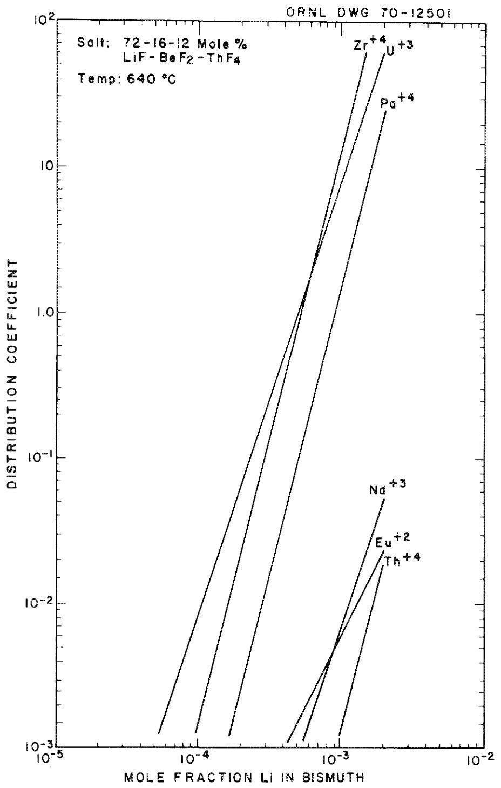  
Fig. 6.1. Distribution data between fuel salt and bismuth.

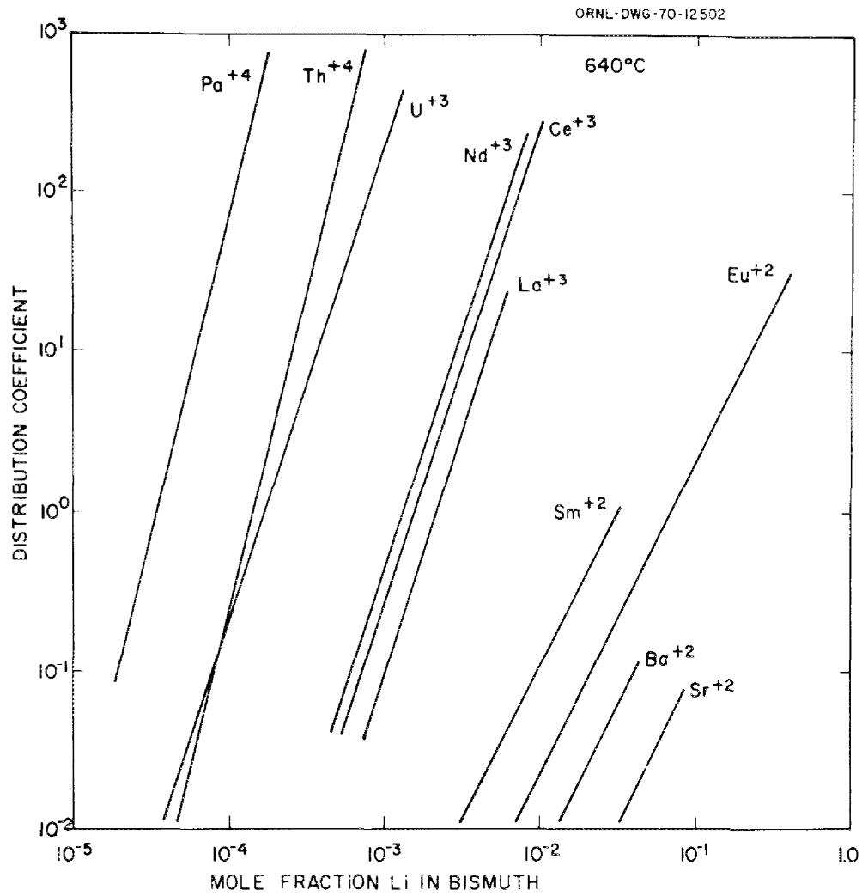  
Fig. 6.2. Distribution data between lithium chloride and bismuth.

for the rare earths are affected by only a minor amount. Thus, contamination of the LiCl with several mole percent fluoride will not affect the removal of the rare earths but will cause a sharp increase in the thorium removal rate. Data with LiBr are similar to those with LiCl, and the distribution behavior with LiCl-LiBr mixtures would not be likely to differ appreciably from the data with the pure materials.[122]

# Conceptual MSBR processing flowsheet

The reference MSBR processing flowsheet $^{2,123}$ is shown in Fig. 6.3. Fuel salt is withdrawn from the reactor on a ten-day cycle; for a 1000-MW(e) reactor, this represents a flow rate of $55~\mathrm{cm}^3/\mathrm{s}$ (0.88 gpm). The

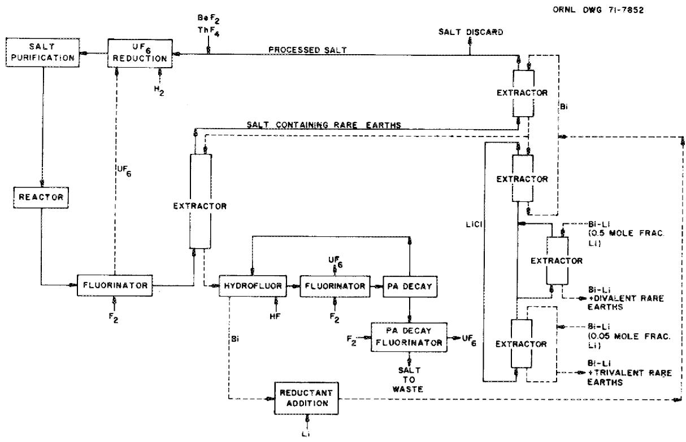  
Fig. 6.3. Conceptual flowsheet for fuel processing in a single-fluid MSBR.

fluorinator removes $99\%$ of the uranium. The protactinium extraction contactor is equivalent to five equilibrium stages. The bismuth flow rate through the contactor is $8.2~\mathrm{cm}^3/\mathrm{s}$ (0.13 gpm), and the inlet thorium concentration in the stream is $90\%$ of the thorium solubility at the operating temperature of $640^{\circ}\mathrm{C}$ . The protactinium decay tank has a volume of $4.5~\mathrm{m}^3$ ( $160~\mathrm{ft}^3$ ). The uranium inventory in the tank is less than $0.2\%$ of that in the reactor. Fluorides of Li, Th, Zr, and Ni accumulate in the tank at a total rate of about $0.003~\mathrm{m}^3/\mathrm{d}$ (0.1 ft³/day). These materials are removed by periodic withdrawal of salt to a final protactinium decay and fluorination operation. The bismuth flow rate through the two upper contactors in the rare-earth removal system is $790~\mathrm{cm}^3/\mathrm{s}$ (12.5 gpm), and the LiCl flow rate is $2080~\mathrm{cm}^3/\mathrm{s}$ (33 gpm). Each contactor is equilivalent to three equilibrium stages.

The trivalent and divalent rare earths are removed in separate contactors in order to minimize the amount of lithium required. Only $2\%$ of

the LiCl, or $42~\mathrm{cm}^3/\mathrm{s}$ (0.66 gpm), is fed to the two-stage divalent rare-earth removal contactor, where it is contacted with a $2200\text{-cm}^3/\mathrm{d}$ (0.58-gal/day) bismuth stream containing 50 at. $\%$ lithium. The trivalent stripper, where the LiCl is contacted with bismuth containing 5 at. $\%$ lithium, is equivalent to one equilibrium stage.

The remaining steps in the flowsheet consist in combining the processed salt with uranium and purifying the resulting fuel salt. The uranium addition is accomplished by absorbing the $\mathrm{UF_6 - F_2}$ stream from the fluorinators into fuel salt containing $\mathrm{UF_4}$ , which results in the formation of soluble $\mathrm{UF_5}$ . The $\mathrm{UF_5}$ is then reduced to $\mathrm{UF_4}$ by contact with hydrogen. The HF resulting from reduction of $\mathrm{UF_5}$ is electrolyzed in order to recycle the contained fluorine and hydrogen. These materials are recycled to avoid waste disposal charges on the material that would be produced if the HF were absorbed in an aqueous solution of KOH. $^{124}$ The salt will be contacted with nickel wool in the purification step in order to ensure that the final bismuth concentration is acceptably low.

The protactinium removal time obtained with the flowsheet is 10 days, and the rare-earth removal times range from 17 to 51 days, with the rare earths of most importance being removed on 27- to 30-day cycles. Calculations123,125 indicate that the flowsheet is relatively insensitive to minor variations in operating conditions, such as changes in temperature, flow rates, reductant concentrations, etc. However, as noted earlier, contamination of the molten LiCl by fluoride markedly increases extraction of thorium by the LiCl. It appears that up to 2 mole % of F⁻ in the LiCl (which would lead to loss of 7.7 g-moles of thorium per day) may be tolerable.2 It has been shown that treatment of LiCl contaminated with F⁻ by BCl₃ serves to volatalize BF₃; the F⁻ contamination should be easily removable.2,126

The reliable removal of decay heat from the processing plant is an important consideration because of the relatively short decay time before the salt enters the processing plant. A total of about 6 MW of heat would be produced in the processing plant for a 1000-MW(e) MSBR. Since molten bismuth, fuel salt, and LiCl are not subject to radiolytic degradation, there is not the usual concern encountered with processing of short-decayed fuel.

# Engineering status

Continuous fluorinator. As noted above, molten-salt fluorinations have been conducted in several cases. A countercurrent fluorinator $^{127}$ (25 mm diam, 1.8 m long, constructed of nickel) has been operated satisfactorily. Correlations for gas holdup and axial dispersion have been developed from studies of air-water solutions for application to larger fluorinators. $^{126}$

Frozen salt layers are believed to be essential for continuous fluorinators. $^{1,2}$ The feasibility of maintaining frozen salt layers in gas-salt contactors was demonstrated previously $^{125}$ in tests in a 0.12-m-diam, 2.4-m-high simulated fluorinator in which molten salt, $\mathrm{LiF - ZrF_4}$ (66-34 mole %), and argon were countercurrently contacted. An internal heat source in the molten region was provided by Calrod heaters contained in a 3/4-in. IPS pipe along the centerline of the vessel. A frozen salt layer was maintained in the system with equivalent volumetric heat generation rates of 353 to $1940~\mathrm{kW / m}^3$ . For comparison, the heat generation rates in fuel salt immediately after removal from the reactor and after passing through vessels having holdup times of 5 and 30 min are 2000, 950, and $420~\mathrm{kW / m}^3$ , respectively. $^{2}$

However, as noted previously, recent attempts to use autoresistance heating of the nonradioactive test salt (so that no unprotected metal would be present in the fluorinator) have proved disappointing.[10,11]

Fuel reconstitution. As noted earlier, engineering experiments have been designed, built, and tested in a preliminary way but no engineering studies of fuel reconstitution have been run.[97]

Selective reductive extractions. Both countercurrent extraction columns and mechanically agitated, nondispersing contactors have been tested on a small engineering scale. Tests of the latter contactors $^{99,100}$ were described above.

A salt-bismuth reductive extraction facility has been operated successfully in which uranium and zirconium were extracted from salt by countercurrent contact with bismuth containing reductant. $^{123,129}$ More than $95\%$ of the uranium was extracted from the salt by a 21-mm-diam, 610-mm-long packed column. The inlet uranium concentration in the salt was about $25\%$ of the uranium concentration in the reference MSBR. These

experiments represent the first demonstration of reductive extraction of uranium in a flowing system. Information on the rate of mass transfer of uranium and zirconium has also been obtained in the system using an isotopic dilution method, and HTU* values of about 1.4 m were obtained.[2]

Correlations have been developed $^{2,128,130}$ for flooding and dispersed-phase holdup in packed columns during countercurrent flow of liquids having high densities and a large difference in density, such as salt and bismuth. These correlations, which have been verified $^{123}$ by studies with molten salt and bismuth, were developed by study of countercurrent flow of mercury and water or high-density organics and water. Data on axial dispersion in the continuous phase during the countercurrent flow of high-density liquid in packed columns has also been obtained, $^{131,132}$ and a simple relation for predicting the effects of axial dispersion on column performance $^{133}$ has been developed. An eddy-current detector $^{129}$ for location of the salt-bismuth interface or bismuth level in an extraction circuit has been successfully demonstrated.

All aspects of the metal transfer process for rare-earth removal have been tested at two different engineering scales. $^{100,128}$

Interest in mildly agitated, nondispersing extractors has developed because (1) they should be much simpler to build of difficult-to-fabricate materials such as molybdenum or graphite and (2) they might be less likely to entrain bismuth in salt or salt in bismuth. Whether these or more conventional extraction columns are to be preferred is not yet established.

Design and development work has progressed on a Reductive Extraction Process Facility $^{2,129}$ that would allow operation of the important steps for the reductive extraction process for protactinium isolation. The facility would allow countercurrent contact of salt and bismuth streams in various types of contactors at flow rates as high as about $25\%$ of those required for processing a 1000-MW(e) MSBR. The facility would operate continuously and would allow measurement of mass transfer and hydrodynamic data under steady-state conditions.

Bismuth removal and uranium valence adjustment. Entrained or dissolved bismuth will have to be removed from the salt before it is returned to the reactor, since nickel is quite soluble in bismuth (about 10 wt %) at the reactor operating temperature. Efforts to measure the solubility of bismuth in salt have indicated that the solubility is lower than about 1 ppm, and the expected solubility of bismuth in the salt is very low under the highly reducing conditions that will be used. It appears that bismuth can be present at significant concentrations in the salt only as entrained metallic bismuth. Sampling of salt from engineering experiments indicated that the bismuth concentration in the salt ranges from 10 to 100 ppm after countercurrent contact of the salt and bismuth in a packed-column contactor; however, concentrations below 1 ppm are observed in salt leaving a stirred-interface, salt-metal contactor in which the salt and metal phases are not dispersed.[2]

A natural-circulation loop constructed of Hastelloy N and filled with fuel salt has been operated for about two years; a molybdenum cup containing bismuth was placed near the bottom of the loop. To date, the reported concentrations of bismuth in salt from the loop (<5 ppm) are essentially the same as those reported for salt from a loop containing no bismuth. No degradation of metallurgical properties has been noted on corrosion specimens removed from the loop containing bismuth.

Operating a MSR with a small fraction of the uranium present as $\mathrm{UF}_3$ is advantageous in order to minimize corrosion reactions and the oxidizing tendency of the fission process. The $U^{3+}/U^{4+}$ ratio in the MSRE was maintained at the desired level by reduction of $U^{4+}$ with beryllium metal, and a voltammetric method for the determination of this ratio in the MSRE fuel was developed. The final step in the processing plant will consist in continuously measuring and adjusting the $U^{3+}/U^{4+}$ ratio of the fuel salt returned to the reactor.

# Special characteristics of DMSR fuel processing

The DMSR core will be larger than that of the MSBR, and the inventory of fuel will be larger, probably by about twofold. The optimum processing cycle time - or even the tolerable limits on it - is not yet well defined; however, the limits probably lie between 30 and 150 days.

If so, the DMSR will process a smaller volume of fuel per day than would the MSBR. This is not, in itself, a real advantage since the equipment was relatively small for the MSBR and will not be much cheaper in smaller sizes. However, if long cycle times are tolerable to reactor neutronics, batch operations might be possible at a few points (the fluorinators, for example).

Several of the special characteristics of the DMSR will affect the processing operation to only a minor extent. The presence of plutonium and the transuranic isotopes is such a characteristic. In the MSBR, protactinium (plus zirconium and what plutonium and transuranics were present) was extracted into bismuth and immediately removed by hydrofluorination into the protactinium-isolation salt. In the DMSR these species will be recovered by reduction into bismuth* and immediate removal therefrom by oxidation† into the reconstituted and purified fuel.

The higher uranium concentration (by about fivefold) will probably mean that the quantity of $\mathrm{UF_6}$ produced per unit time will be larger in the DMSR than in the MSBR; the quantity produced per unit of salt will obviously be higher, and this may make the fuel reconstitution step more difficult in practice.

A major difference from the conceptual MSBR process may well be necessary to effect a reasonable removal of fission-product zirconium from the DMSR. Zirconium is not an important nuclear poison, and $\mathrm{ZrF_4}$ at low concentrations should affect the fuel properties trivially. However, $\mathrm{ZrF_4}$ in the fuel must be reduced and oxidized each time the fuel is processed, and the reduction requires expensive $^7\mathrm{Li}$ . Zirconium is the most readily reduced of all the pertinent elements (see Fig. 6.1) and it can probably be separated from plutonium and protactinium with some difficulty by selective extraction. If so, it can be removed - on some reasonable cycle time - by an additional extraction circuit. Zirconium cannot be reasonably separated from uranium by selective extraction, but uranium lost with the zirconium can readily be recovered

by fluorination. There is little doubt that a better method for removal of zirconium is desirable for the DMSR, and some R&D on this should be done. Possibly, the very stable intermetallic compounds that zirconium forms with platinum-group metals may offer such a possibility. $^{134,135}$

All other separations processes - and the associated R&D - would seem very similar to those required for the MSBR. A preliminary conceptual flowsheet for the DMSR136 is shown as Fig. 6.4.

# Possible processing alternatives

Small-scale studies137 appeared to show that protactinium could be oxidized to $\mathrm{Pa}^{5+}$ by treatment of the LiF-BeF $_2$ -ThF $_4$ melt with HF and that the protactinium could then be precipitated as very insoluble $\mathrm{Pa}_2\mathrm{O}_5$ . Thus it was possible that protactinium could be selectively removed from the salt without prior removal of the uranium. Removal of protactinium as $\mathrm{Pa}_2\mathrm{O}_5$ might have been a viable alternative for the MSBR, where isolation of this nuclide was a major requirement, but precipitation of only $\mathrm{Pa}_2\mathrm{O}_5$ would be of no value to the DMSR. However, it is possible to precipitate a solid solution of (Th,U)O $_2$ , containing a very high concentration ( $>95$ mole $\%$ ) of $\mathrm{UO}_2$ , by deliberate addition of oxide ion to the MSBR fuel.16 If the protactinium were oxidized to $\mathrm{Pa}^{5+}$ , its oxide would, of course, also be precipitated. If, in addition, plutonium were oxidized to $\mathrm{Pu}^{4+}$ (this oxidation is more difficult* and a small concentration of dissolved F $_2$ might be required), $\mathrm{PuO}_2$ would also be included in the solid solution. Whether americium, neptunium, and curium could be made to precipitate as oxides is not yet known.

Engineering studies of uranium oxide precipitation have been carried out; the studies involved the contact of 2 liters of MSBR fuel salt with $\mathrm{H}_2\mathrm{O}$ -Ar gas mixtures in a $100\mathrm{-mm}$ -diam nickel precipitator. Experiments were conducted at temperatures ranging from 540 to $630^{\circ}\mathrm{C}$ , and the composition of the $\mathrm{H}_2\mathrm{O}$ -Ar mixture was varied from 10 to $35\%$ water. The values for the water utilization were uniformly low (about 10 to $15\%$ ) and did not vary with the composition of the gas stream. Samples of the oxide contained about $90\%$ $\mathrm{UO_2}$ even though, at the lower uranium

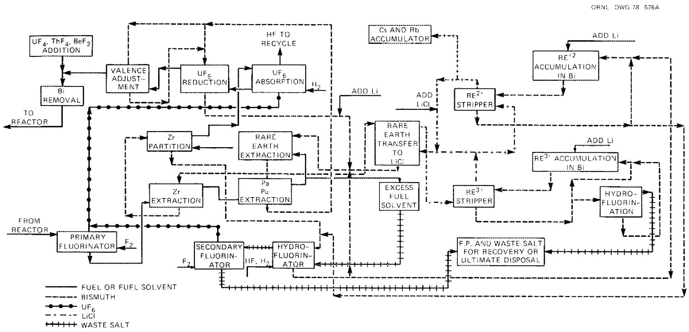  
Fig. 6.4. Preliminary flowsheet for fuel processing in a DMSR.

concentrations in the salt, the solid in equilibrium with the salt would contain $50\%$ $\mathrm{UO_2}$ or less. This enhancement of the uranium concentration in the solid phase appears to allow precipitation of $99\%$ of the uranium as a solid containing $85\%$ $\mathrm{UO_2}$ in a single-stage batch precipitator. The oxide precipitate was observed to settle rapidly, and more than $90\%$ of the salt could be separated from the oxide by simple decantation. $^1$ Thus an oxide precipitation scheme could possibly recover together the U, Pa, and Pu, along with a small amount of Th, as oxides. These could then be returned to the purified fuel solvent (by hydrofluorination) for return to the reactor. It would be necessary, of course, to remove residual $0^{2-}$ from the fuel solvent before the rare-earth removal step. If processing of a DMSR on a cycle time of 100 days or more is practicable (processing rate of $\leq 1\mathrm{~m}^3$ of salt per day), such an oxide precipitation might be used as a batch operation.\*

We know of no method for rare-earth removal that is comparable to the reductive-extraction-metal-transfer process. Many attempts have been made to find ion-exchange systems capable of removal of rare-earth ions from $\mathrm{LiF - BeF_2}$ and $\mathrm{LiF - BeF_2 - ThF_4}$ mixtures. All but a very few such materials are unstable in contact with the salts. The only stable one known to have ion-exchange capabilities is $\mathrm{CeF_3}$ , which will exchange $\mathrm{Ce}^{3+}$ for other rare-earth ions, but it is too soluble in $\mathrm{LiF - BeF_2 - ThF_4}$ to be genuinely useful. The fuel solvent, partially freed from other rare earths but saturated with $\mathrm{CeF_3}$ , could possibly be freed from cerium by oxidation to $\mathrm{Ce}^{4+}$ and precipitation of $\mathrm{CeO_2}$ . If so, the resulting $\mathrm{LiF - BeF_2 - ThF_4}$ would again have to be treated to remove excess $0^{2-}$ before its return (with the valuable fissile and fertile constituents) to the reactor.

Several combinations of the preferred processes with some of the alternatives are possible. Their attractiveness increases as the permissible processing cycle time lengthens. It seems certain, however, that all are less attractive than that represented by the reference MSBR unit processes.

# Primary R&D Needs

The primary needs, with relatively few exceptions, are for sound engineering tests of individual process steps and ultimately for relatively long-term and near full-scale integrated tests of the system as a whole. For the former tests the facilities needed are relatively modest, though test equipment and instrumentation are quite complex. For the integrated tests a special engineering laboratory will be required and an integrated process test facility must be provided with appropriate consideration of the need to demonstrate remote maintenance. Specific needs include

1. Determination by computer calculation, in close coordination with reactor neutronics studies, the permissible range of (and the optimum) processing cycle times and removal times.   
2. Demonstration of frozen-wall fluorination of uranium on a batch, and, hopefully, on a continuous, basis. Determination of behavior of neptunium in this fluorination.   
3. Demonstration of adequate $\mathrm{UF_6}$ absorption in LiF-BeF $_2$ -ThF $_4$ - $\mathrm{UF_4}$ mixture and suitable reduction to $\mathrm{UF_4}$ and to 7 to $10\%$ $\mathrm{UF_3}$ . Determination of behavior of an $\mathrm{NpF_6}$ in absorption system.   
4. Development and demonstration of a method for removal (by selective extraction or otherwise) of fission-product zirconium from the fuel.   
5. Demonstration of quantitative recovery of protactinium and plutonium by selective extraction on a scale at least $25\%$ of that required for a DMSR. Determination of efficiency of recovery of americium, neptunium, and curium in that extraction.   
6. Determination of behavior of $\mathrm{TeF_6}$ , $\mathrm{SeF_6}$ , $\mathrm{IF_5}$ , etc., in the $\mathrm{UF_6}$ absorption step.   
7. Demonstration of retention of $\mathsf{TeF}_6$ , $\mathsf{SeF}_6$ , $\mathsf{I}_2$ , etc., from the $\mathsf{UF}_6$ absorption off-gas.   
8. Demonstration of adequate removal of rare-earth, alkaline-earth, and alkali-metal fission products in a complete metal-transfer system.   
9. Demonstration of hydrofluorination of zirconium, rare-earth, etc., fission products into waste salt for storage.

10. Demonstration of the application of bismuth containing U, Zr, Pa, Pu, Th, Li, etc., for valence adjustment of fuel salt.   
11. Demonstration of adequate removal of bismuth (by absorption on nickel or gold wool) from salt for return to the reactor.   
12. Operation of the entire integrated system reliably for moderate to long times with realistic construction materials and reasonable concentrations of species at tracer level activity (where possible). Assessment of overall performance, achievable oxide concentration, effect of system upset on fissile losses to waste, etc.

# Estimates of Scheduling and Costs

Preliminary estimates of the necessary schedule and of its operating and capital funding requirements are presented below for the fuel processing development described above. As elsewhere in this document, it has been assumed that (1) the program would begin at start of FY 1980, (2) it would lead to an operating DMSR in 1995, and (3) the R&D program will produce no great surprises and no major changes in program direction will be required.

The schedule, along with the dates on which key developments must be finished and major decisions made, is shown in Table 6.1. It seems certain that the overall R&D programs (including those described elsewhere in this document) will provide some minor surprises and that some changes in this development effort will be required. No specific provisions for this are included; but, unless major revisions become necessary in the middle 1980s, it appears likely that suitable chemical processes and processing equipment could be recommended on this schedule.

The operating funds (Table 6.2) and the capital equipment requirements (Table 6.3) are shown on a year-by-year basis in thousands of 1978 dollars. No allowance for contingencies, major program changes, and inflation during the interval have been provided. As with the development of materials for chemical processing (Chap. 5), much of this effort could be deferred if a decision were made to delay the development of a break-even fuel cycle for the DMSR.

Table 6.1. Schedule for fuel processing development   

<table><tr><td rowspan="2">Task</td><td colspan="15">Fiscal year</td><td></td></tr><tr><td>1980</td><td>1981</td><td>1982</td><td>1983</td><td>1984</td><td>1985</td><td>1986</td><td>1987</td><td>1988</td><td>1989</td><td>1990</td><td>1991</td><td>1992</td><td>1993</td><td>1994</td><td>1995</td></tr><tr><td>Flowsheet development</td><td colspan="2">\( \nabla^4 \)</td><td colspan="2">\( \nabla^2 \)</td><td colspan="2">\( \nabla^3 \)</td><td colspan="2">\( \nabla^4 \)</td><td></td><td></td><td></td><td></td><td></td><td></td><td></td><td></td></tr><tr><td>Fluorinator development</td><td colspan="2">\( \nabla^5 \)</td><td colspan="2">\( \nabla^6 \)</td><td colspan="2">\( \nabla^7 \)</td><td></td><td></td><td></td><td></td><td></td><td></td><td></td><td></td><td></td><td></td></tr><tr><td>Fuel reconstitution</td><td colspan="2">\( \nabla^8 \)</td><td colspan="2">\( \nabla^9 \)</td><td colspan="2">\( \nabla^7 \)</td><td></td><td></td><td></td><td></td><td></td><td></td><td></td><td></td><td></td><td></td></tr><tr><td>Pa, Pu, etc., recovery</td><td colspan="2">\( \nabla^{10} \)</td><td colspan="2">\( \nabla^{11} \)</td><td colspan="2">\( \nabla^{12} \)</td><td></td><td></td><td></td><td></td><td></td><td></td><td></td><td></td><td></td><td></td></tr><tr><td>Rare-earth removal</td><td colspan="2">\( \nabla^{13} \)</td><td colspan="2">\( \nabla^{14} \)</td><td></td><td></td><td></td><td></td><td></td><td></td><td></td><td></td><td></td><td></td><td></td><td></td></tr><tr><td>Valence adjustment and purification</td><td colspan="2">\( \nabla^{15} \)</td><td colspan="2">\( \nabla^{16} \)</td><td></td><td></td><td></td><td></td><td></td><td></td><td></td><td></td><td></td><td></td><td></td><td></td></tr><tr><td>MSR Process Laboratory</td><td colspan="6">\( \nabla^{17} \)</td><td></td><td></td><td></td><td></td><td></td><td></td><td></td><td></td><td></td><td></td></tr><tr><td>Integrated Process Test Facility</td><td colspan="15">\( \nabla^{18} \)</td><td></td></tr></table>

# Milestones:

1. Define range of possible values for processing cycle time and removal times.   
2. Define optimum processing time.   
3. Decide on system for removal of zirconium for engineering tests.   
4. Complete flowsheets for conceptual DMSR.   
5. Test batch frozen-wall fluorinator.   
6. Complete studies of continuous fluorination in engineering facility.   
7. Complete studies of combined fluorination-recombination in engineering system on 25 to $50\%$ DMSR scale.   
8. Complete engineering studies of fuel reconstitution necessary for design of Fluorination-Reconstitution Engineering Experiment.   
9. Complete engineering studies of reductive extraction in Reductive Extraction Process Facility.

10. Complete engineering studies of reductive extraction in a mild-steel flow-through system.   
ll. Demonstrate recovery of protactinium by reductive extraction using gram quantities of $^{231}\mathrm{pa}$ .   
12. Demonstrate recovery of Pu, Am, Cm, etc., using gram quantities of Pu.   
13. Extend experiments in mild-steel system at $1\%$ of DMSR scale.   
14. Complete engineering experiment 5 to $10\%$ DMSR scale.   
15. Demonstrate removal of trace quantities of bismuth.   
16. Demonstrate continuous adjustment of uranium valence.   
17. Complete construction of MSR Processing Engineering Laboratory.   
18. Complete installation of Integrated Process Test Facility.   
19. Complete operations and tests with Integrated Process Test Facility.

Table 6.2. Operating fund requirements for fuel processing development   

<table><tr><td rowspan="2">Task</td><td colspan="15">Cost (thousands of 1978 dollars) for fiscal year -</td><td></td></tr><tr><td>1980</td><td>1981</td><td>1982</td><td>1983</td><td>1984</td><td>1985</td><td>1986</td><td>1987</td><td>1988</td><td>1989</td><td>1990</td><td>1991</td><td>1992</td><td>1993</td><td>1994</td><td>1995</td></tr><tr><td>Flowsheet development</td><td>40</td><td>150</td><td>250</td><td>300</td><td>150</td><td>75</td><td>40</td><td>0</td><td>0</td><td>0</td><td>0</td><td>0</td><td>0</td><td>0</td><td>0</td><td>0</td></tr><tr><td>Fluorinator development</td><td>290</td><td>590</td><td>490</td><td>315</td><td>100</td><td>50</td><td>0</td><td>0</td><td>0</td><td>0</td><td>0</td><td>0</td><td>0</td><td>0</td><td>0</td><td>0</td></tr><tr><td>Fuel reconstitution</td><td>200</td><td>340</td><td>220</td><td>310</td><td>200</td><td>100</td><td>0</td><td>0</td><td>0</td><td>0</td><td>0</td><td>0</td><td>0</td><td>0</td><td>0</td><td>0</td></tr><tr><td>Pa, Pu, etc., recovery</td><td>330</td><td>550</td><td>610</td><td>540</td><td>200</td><td>75</td><td>0</td><td>0</td><td>0</td><td>0</td><td>0</td><td>0</td><td>0</td><td>0</td><td>0</td><td>0</td></tr><tr><td>Rare-earth removal</td><td>270</td><td>200</td><td>235</td><td>195</td><td>100</td><td>50</td><td>0</td><td>0</td><td>0</td><td>0</td><td>0</td><td>0</td><td>0</td><td>0</td><td>0</td><td>0</td></tr><tr><td>Valence adjustment and purification</td><td>50</td><td>60</td><td>100</td><td>100</td><td>75</td><td>50</td><td>0</td><td>0</td><td>0</td><td>0</td><td>0</td><td>0</td><td>0</td><td>0</td><td>0</td><td>0</td></tr><tr><td>MSR Process Laboratory</td><td>105</td><td>65</td><td>325</td><td>385</td><td>200</td><td>250</td><td>100</td><td>0</td><td>0</td><td>0</td><td>0</td><td>0</td><td>0</td><td>0</td><td>0</td><td>0</td></tr><tr><td>Integrated Process Test Facility</td><td>0</td><td>215</td><td>250</td><td>310</td><td>455</td><td>360</td><td>770</td><td>3200</td><td>3670</td><td>3670</td><td>3510</td><td>2000</td><td>500</td><td>0</td><td>0</td><td>0</td></tr><tr><td>Total \( funds^a \)</td><td>1285</td><td>2170</td><td>2480</td><td>2455</td><td>\( 1480^b \)</td><td>\( 1010^b \)</td><td>\( 910^b \)</td><td>3200</td><td>3670</td><td>3670</td><td>3510</td><td>2000</td><td>500</td><td>0</td><td>0</td><td>0</td></tr></table>

$\alpha$ Total funds through 1992: $28,340.   
Additional funds related to fuel reprocessing will be required during these years in support of test reactor and test reactor mock-up. The variation in overall support level, therefore, will be considerably less abrupt.

Table 6.3. Capital equipment fund requirements for fuel processing development   

<table><tr><td rowspan="2">Task</td><td colspan="15">Cost (thousands of 1978 dollars) for fiscal year -</td><td></td></tr><tr><td>1980</td><td>1981</td><td>1982</td><td>1983</td><td>1984</td><td>1985</td><td>1986</td><td>1987</td><td>1988</td><td>1989</td><td>1990</td><td>1991</td><td>1992</td><td>1993</td><td>1994</td><td>1995</td></tr><tr><td>Capital equipment facilities</td><td></td><td></td><td></td><td></td><td></td><td></td><td></td><td></td><td></td><td></td><td></td><td></td><td></td><td></td><td></td><td></td></tr><tr><td>Flowsheet development</td><td>0</td><td>0</td><td>0</td><td>0</td><td>0</td><td>0</td><td>0</td><td>0</td><td>0</td><td>0</td><td>0</td><td>0</td><td>0</td><td>0</td><td>0</td><td>0</td></tr><tr><td>Fluorinator development</td><td>65</td><td>260</td><td>50</td><td>0</td><td>0</td><td>0</td><td>0</td><td>0</td><td>0</td><td>0</td><td>0</td><td>0</td><td>0</td><td>0</td><td>0</td><td>0</td></tr><tr><td>Fuel reconstitution</td><td>10</td><td>165</td><td>0</td><td>0</td><td>0</td><td>0</td><td>0</td><td>0</td><td>0</td><td>0</td><td>0</td><td>0</td><td>0</td><td>0</td><td>0</td><td>0</td></tr><tr><td>Pa, Pu, etc., recovery</td><td>0</td><td>285</td><td>600</td><td>0</td><td>0</td><td>0</td><td>0</td><td>0</td><td>0</td><td>0</td><td>0</td><td>0</td><td>0</td><td>0</td><td>0</td><td>0</td></tr><tr><td>Rare-earth removal</td><td>0</td><td>300</td><td>0</td><td>0</td><td>0</td><td>0</td><td>0</td><td>0</td><td>0</td><td>0</td><td>0</td><td>0</td><td>0</td><td>0</td><td>0</td><td>0</td></tr><tr><td>Valence adjustment and purification</td><td>0</td><td>50</td><td>100</td><td>0</td><td>0</td><td>0</td><td>0</td><td>0</td><td>0</td><td>0</td><td>0</td><td>0</td><td>0</td><td>0</td><td>0</td><td>0</td></tr><tr><td>IPTF: data processing</td><td>0</td><td>0</td><td>0</td><td>0</td><td>0</td><td>510</td><td>0</td><td>260</td><td>400</td><td>515</td><td>400</td><td>200</td><td>0</td><td>0</td><td>0</td><td>0</td></tr><tr><td>Total fundsb</td><td>75</td><td>1060</td><td>750</td><td>0</td><td>0</td><td>510</td><td>0</td><td>260</td><td>400</td><td>515</td><td>400</td><td>200</td><td>0</td><td>0</td><td>0</td><td>0</td></tr><tr><td>Capital projects</td><td></td><td></td><td></td><td></td><td></td><td></td><td></td><td></td><td></td><td></td><td></td><td></td><td></td><td></td><td></td><td></td></tr><tr><td>MSR Process Laboratory</td><td></td><td></td><td>12,000b</td><td></td><td></td><td></td><td></td><td></td><td></td><td></td><td></td><td></td><td></td><td></td><td></td><td></td></tr><tr><td>Integrated Process Test Facility</td><td></td><td></td><td></td><td></td><td>7000b</td><td></td><td></td><td></td><td></td><td></td><td></td><td></td><td></td><td></td><td></td><td></td></tr></table>

$\alpha_{\mathrm{LPTF}} = \text{Integrated Process Test Facility.}$   
bTotal funds through 1991: $23,170.

# References

1. M. W. Rosenthal et al., The Development Status of Molten-Salt Breeder Reactors, ORNL-4812 (August 1972).   
2. L. E. McNeese et al., Program Plan for Development of Molten-Salt Breeder Reactors, ORNL-5018 (December 1974).   
3. Molten-Salt Reactor Program, Semiannual Progress Report, ORNL-5047 (September 1975).   
4. Molten-Salt Reactor Program, Semiannual Progress Report, ORNL-5078 (February 1976).   
5. Molten-Salt Reactor Program, Semiannual Progress Report, ORNL-5132 (August 1976).   
6. H. E. McCoy, Jr., Status of Materials Development for Molten-Salt Reactors, ORNL/TM-5920 (January 1978).   
7. J. R. Keiser, Status of Tellurium-Hastelloy N Studies in Molten Fluoride Salts, ORNL/TM-6002 (October 1977).   
8. L. O. Gilpatrick and L. M. Toth, "The Hydrogen Reduction of Uranium Tetrafluoride in Molten Fluoride Solutions," J. Inorg. Nucl. Chem. 39(10), 1817-1822 (1977).   
9. G. Long and F. F. Blankenship, The Stability of Uranium Trifluoride, ORNL/TM-2065 (November 1969).   
10. G. T. Mays, A. N. Smith, and J. R. Engel, Distribution and Behavior of Tritium in the Coolant-Salt Technology Facility, ORNL/TM-5759 (April 1977).   
11. J. T. Bell, J. D. Redman, and F. J. Smith, "Permeation of Construction Materials by Hydrogen Isotopes," Chemistry Division Annual Progress Report, ORNL-5297 (September 1977).   
12. W. R. Grimes, "Molten-Salt Reactor Chemistry," Nucl. Appl. Technol., 8(2), 137-155 (February 1970).   
13. C. E. Bamberger et al., J. Inorg. Nucl. Chem. 33, 3591 (1971).   
14. Molten-Salt Breeder Reactor Concept, Quarterly Report for Period Ending July 31, 1971, NP-19145, Atomic Energy Commission, Bombay, India.   
15. L. M. Ferris et al., "Equilibrium Distribution of Actinide and Lanthanide Elements between Molten Fluoride Salts and Liquid Bismuth Solutions," J. Inorg. Nucl. Chem. 32, 2019 (1970).

16. C. F. Baes, Jr., "The Chemistry and Thermodynamics of Molten-Salt Reactor Fuels," p. 617 in Nuclear Metallurgy, Vol. 15, Symposium on Reprocessing of Nuclear Fuels, edited by P. Chiotti, CONF 690801, U.S. Atomic Energy Commission, Division of Technical Information, (August 1969).   
17. C. E. Bamberger and C. F. Baes, Jr., J. Nucl. Mat. 35, 117 (1970).   
18. C. E. Bamberger, R. G. Ross, and C. F. Baes, Jr., J. Inorg. Nucl. Chem. 33, 767 (1971).   
19. C. E. Bamberger, R. G. Ross, and C. F. Baes, Jr., in Molten-Salt Reactor Program Semiannual Progress Report, February 29, 1972, ORNL-4782, pp. 70-76.   
20. C. E. Bamberger et al., in Molten-Salt Reactor Program Semiannual Progress Report, February 28, 1971, ORNL-4728, p. 62.   
21. C. E. Bamberger, R. G. Ross, and C. F. Baes, Jr., in Molten-Salt Reactor Program Semiannual Progress Report, February 28, 1971, ORNL-4676, p. 119.   
22. C. E. Bamberger, R. G. Ross, and C. F. Baes, Jr., in Molten-Salt Reactor Program Semiannual Progress Report, August 31, 1971, ORNL-4622, p. 92.   
23. C. F. Baes, Jr., in Molten-Salt Reactor Program Semiannual Progress Report, February 28, 1970, ORNL-4548, p. 152.   
24. S. Cantor, Density and Viscosity of Several Molten Fluoride Mixtures, ORNL/TM-4308 (March 1973).   
25. S. Cantor (Ed.), Physical Properties of Molten-Salt Reactor Fuel, Coolant, and Flush Salts, ORNL/TM-2316 (August 1968).   
26. J. W. Cooke, Development of the Variable-Gap Technique for Measuring the Thermal Conductivity of Fluoride Salt Mixtures, ORNL-4831 (February 1973).   
27. E. L. Compere et al., Fission-Product Behavior in the Molten-Salt Reactor Experiment, ORNL-4865 (October 1975).   
28. A. P. Malinauskas and D. M. Richardson, "The Solubilities of Hydrogen, Deuterium, and Helium in Molten $\mathsf{Li}_2\mathsf{BeF}_4$ ," Ind. Eng. Chem. Fund. 13, 242 (1974).   
29. W. R. Grimes, N. V. Smith, and G. M. Watson, J. Phys. Chem. 62, 862 (1958).   
30. M. Blander et al., J. Phys. Chem. 63, 1164 (1959).   
31. G. M. Watson et al., J. Chem. Eng. Data 7, 285 (1962).

32. R. B. Briggs and R. B. Korsmeyer, in Molten-Salt Reactor Program Semiannual Progress Report, February 28, 1970, ORNL-4584, pp. 53-54.   
33. See review of many determinations by C. F. Baes, Jr., "The Chemistry and Thermodynamics of Molten-Salt Reactor Fuels," Nuclear Metallurgy, Vol. 15, CONF-690801, U.S. Atomic Energy Commission, Division of Technical Information, August 1969.   
34. A. D. Keimers et al., Evaluation of Alternate Secondary (and Tertiary) Coolants for the Molten-Salt Breeder Reactor, ORNL/TM-5325 (April 1976).   
35. L. Brewer et al., "The Thermodynamic Properties of the Halides," in The Chemistry and Metallurgy of Miscellaneous Materials: Thermodynamics, pp. 76-192, L. L. Quill, ed., McGraw-Hill, New York, 1950.   
36. J. F. Elliott and Molly Glieser, Thermochemistry for Steelmaking, Vol. 1, Addison-Wesley, Reading, Mass., 1960.   
37. L. M. Toth and L. O. Gilpatrick, The Equilibrium of Dilute $UF_3$ Solutions Contained in Graphite, ORNL/TM-4056 (December 1972).   
38. L. M. Toth and L. O. Gilpatrick, J. Phys. Chem. 77, 2799 (1973).   
39. R. A. Strehlow, in Molten-Salt Reactor Program Semiannual Progress Report for Period Ending February 28, 1970, ORNL-4548, p. 167.   
40. J. R. Keiser, *Compatibility Studies of Potential Molten-Salt Breeder Reactor Materials in Molten Fluoride Salts*, ORNL/TM-5783 (May 1977).   
41. J. R. Keiser, J. H. Devan, and D. L. Manning, The Corrosion Resistance of Type 316 Stainless Steel to $\mathsf{Li}_2\mathsf{BeF}_4$ , ORNL/TM-5782 (April 1977).   
42. M. R. Bennett and A. D. Kelmers, in Molten-Salt Reactor Program Semiannual Progress Report for Period Ending February 29, 1976, ORNL-5132, pp. 27-136 (August 1976).   
43. R. F. Apple, in Molten-Salt Reactor Program Semiannual Progress Report for Period Ending February 29, 1976, ORNL-5132, pp. 36-37.   
44. D. L. Manning and G. Mamantov, in Molten-Salt Reactor Program Semiannual Progress Report for Period Ending August 31, 1975, ORNL-5078, pp. 47-48 (February 1976).   
45. D. L. Manning and G. Mamantov, in Molten-Salt Reactor Program Semiannual Progress Report for Period Ending February 29, 1976, ORNL-5132, pp. 39-40 (August 1976).   
46. D. L. Manning, W. K. Miller, and R. Rowan, Methods of Determination of Uranium Trifluoride, ORNL-1279 (May 25, 1952).

47. ORNL Master Analytical Manual, Section 2, Radiochemical Methods, TID-7015 (1957).   
48. "Automatic Continuous Analysis of Helium," GCR Quarterly Progress Report, December 31, 1959, ORNL-2888, pp. 178-184.   
49. A. S. Meyer, personal communication, July 12, 1972.   
50. R. B. Gallaher, Operation of the Sampler-Enricher in the Molten-Salt Reactor Experiment, ORNL/TM-3524 (October 1971).   
51. Molten-Salt Reactor Program Semiannual Progress Report, February 28, 1966, ORNL-3936, p. 154.   
52. G. Goldberg and L. T. Corbin, in Molten-Salt Reactor Program Semi-annual Progress Report, August 31, 1968, ORNL-4344, pp. 198-199.   
53. J. M. Dale, R. F. Apple, and A. S. Meyer, in Molten-Salt Reactor Program Semiannual Progress Report, February 28, 1967, ORNL-4119, p. 158.   
54. J. P. Young, in Molten-Salt Reactor Program Semiannual Progress Report, February 28, 1969, ORNL-4396, pp. 202-204.   
55. J. M. Dale, R. F. Apple, and A. S. Meyer, in Molten-Salt Reactor Program Semiannual Progress Report, February 28, 1970, ORNL-4548, p. 183.   
56. R. Blumberg and T. H. Manney, in Molten-Salt Reactor Program Semi-annual Progress Report, August 31, 1968, ORNL-4344, p. 36.   
57. A. Houtzeel and F. F. Dyer, Gamma Spectrometric Studies of Fission Products in the MSRE, ORNL-3151 (August 1972).   
58. W. R. Laing et al., in Molten-Salt Reactor Program Semiannual Progress Report, February 28, 1969, ORNL-4396, p. 208.   
59. D. L. Manning and J. M. Dale, in Molten-Salt Reactor Program Semi-annual Progress Report, August 31, 1968, ORNL-4344, p. 192.   
60. D. L. Manning and G. Mamantov, "Rapid Scan Voltammetry and Chronopotentiometric Studies of Iron in Molten Fluorides," J. Electroanal. Chem. 7, 102-108 (1964).   
61. D. L. Manning, F. R. Clayton, and G. Mamantov, in Molten-Salt Reactor Program Semiannual Progress Report, August 31, 1971, ORNL-4728, p. 75.   
62. J. M. Dale and A. S. Meyer, in Molten-Salt Reactor Program Semiannual Progress Report, February 29, 1972, ORNL-4782, p. 77.

63. D. L. Manning, in Molten-Salt Reactor Program Semiannual Progress Report, February 28, 1971, ORNL-4676, p. 135.   
64. J. M. Dale and A. S. Meyer, in Molten-Salt Reactor Program Semi-annual Progress Report, February 29, 1972, ORNL-4782, p. 79.   
65. H. W. Jenkins et al., in Molten-Salt Reactor Program Semiannual Progress Report, February 28, 1969, ORNL-4396, p. 201.   
66. M. T. Kelley, R. W. Stelzner, and D. L. Manning, in Molten-Salt Reactor Program Semiannual Progress Report, August 31, 1969, ORNL-4449, p. 157.   
67. D. L. Manning and A. S. Meyer, in Molten-Salt Reactor Program Semi-annual Progress Report, August 31, 1971, ORNL-4728, p. 74.   
68. D. L. Manning and H. R. Bronstein, in Molten-Salt Reactor Program Semianual Progress Report, February 28, 1970, ORNL-4548, p. 184.   
69. D. L. Manning and F. L. Clayton, in Molten-Salt Reactor Program Semiannual Progress Report, August 1, 1970, ORNL-4622, p. 115.   
70. J. P. Young and J. C. White, "A High-Temperature Cell Assembly for Spectrophotometric Studies in Molten Fluorides," Anal. Chem. 31, 1892 (1959).   
71. J. P. Young, "Windowless Spectrophotometric Cell for Use with Corrosive Liquids," Anal. Chem. 36, 390 (1964).   
72. Molten-Salt Reactor Program Semiannual Progress Report, August 31, 1965, ORNL-3872, p. 145.   
73. L. M. Toth, J. P. Young, and G. P. Smith, in Molten-Salt Reactor Program Semiannual Progress Report, August 31, 1968, ORNL-4344, p. 168.   
74. J. P. Young, in Molten-Salt Reactor Program Semiannual Progress Report, August 31, 1969, ORNL-4449, p. 161.   
75. J. P. Young, in Molten-Salt Reactor Program Semiannual Progress Report, August 31, 1971, ORNL-4728, p. 71.   
76. J. P. Young, in Molten-Salt Reactor Program Semiannual Progress Report, February 28, 1967, ORNL-4119, p. 163.   
77. J. P. Young, in Molten-Salt Reactor Program Semiannual Progress Report, August 31, 1966, ORNL-4037, p. 193.   
78. J. P. Young, in Molten-Salt Reactor Program Semiannual Progress Report, February 28, 1967, ORNL-4119, p. 164.   
79. John B. Bates et al., in Molten-Salt Reactor Program Semiannual Progress Report, February 28, 1971, ORNL-4676, p. 94.

80. J. P. Young et al., in Molten-Salt Reactor Program Semiannual Progress Report, August 31, 1971, ORNL-4728, p. 73.   
81. J. P. Young, in Molten-Salt Reactor Program Semiannual Progress Report, February 28, 1971, ORNL-4676, p. 136.   
82. J. M. Dale et al., in Molten-Salt Reactor Program Semiannual Progress Report, August 31, 1968, ORNL-4344, p. 188.   
83. J. M. Dale et al., in Molten-Salt Reactor Program Semiannual Progress Report, August 31, 1968, ORNL-4344, p. 189.   
84. C. M. Boyd and A. S. Meyer, in Molten-Salt Reactor Program Semi-annual Progress Report, August 31, 1967, ORNL-4191, p. 173.   
85. J. C. White, in Molten-Salt Reactor Program Semiannual Progress Report, July 31, 1964, ORNL-3708, p. 328.   
86. R. F. Apple and A. S. Meyer, in Molten-Salt Reactor Program Semi-annual Progress Report, February 28, 1969, ORNL-4396, p. 207.   
87. R. F. Apple and A. S. Meyer, in Molten-Salt Reactor Program Semi-annual Progress Report, August 31, 1971, ORNL-4728, p. 72.   
88. J. M. Dale and A. S. Meyer, in Molten-Salt Reactor Program Semi-annual Progress Report, August 31, 1971, ORNL-4728, p. 69.   
89. J. M. Dale and T. R. Mueller, in Molten-Salt Reactor Program Semi-annual Progress Report, February 28, 1971, ORNL-4676, p. 138.   
90. J. R. DiStefano, in Molten-Salt Reactor Program Semiannual Report for Period Ending August 1, 1975, ORNL-5078, pp. 132-139.   
91. J. R. DiStefano, in Molten-Salt Reactor Program Semiannual Report for Period Ending February 29, 1976, ORNL-5132, p. 163.   
92. Personal communication, H. E. McCoy, ORNL, to W. R. Grimes, ORNL.   
93. A. P. Litman and A. E. Goldman, Corrosion Associated with Fluorination in the Oak Ridge National Laboratory Fluoride Volatility Process, ORNL-2832 (June 5, 1961).   
94. L. Hays, R. Breyne, and W. Seefeldt, "Comparative Tests of L Nickel, D Nickel, Hastelloy B, and INOR-1," Chemical Engineering Division Summary Report, July, August, September, 1968, ANL-5924, pp. 49-52.   
95. M. R. Bennett, in Molten-Salt Reactor Program Semiannual Progress Report for Period Ending August 31, 1971, ORNL-4728, p. 190.   
96. M. R. Bennett and A. D. Kelmers, in Molten-Salt Reactor Program Semiannual Progress Report for Period Ending February 29, 1976, ORNL-5132, p. 170.

97. R. M. Counce, in Molten-Salt Reactor Program Semiannual Progress Report for Period Ending August 31, 1975, ORNL-5078, p. 157.   
98. D. H. Gurinsky et al., "LMFR Materials," Chap. 21, p. 743, in Fluid Fuel Reactors, J. A. Lance, H. G. McPherson, and F. Maslam, Eds., Addison-Wesley, Reading, Mass., 1958.   
99. C. H. Brown, Jr., J. R. Hightower, Jr., and J. A. Klein, Measurement of Mass Transfer Coefficients in a Mechanically Agitated, Nondispersing Contactor Operating with a Molten Mixture of LiF-BeF $_2$ -ThF $_4$ and Molten Bismuth, ORNL-5143 (November 1976).   
100. H. C. Savage and J. R. Hightower, Jr., Engineering Tests of Metal Transfer Process for Extraction of Rare-Earth Fission Products from a Molten-Salt Breeder Reactor Fuel Salt, ORNL-5176 (February 1977).   
101. H. Shimotake, N. R. Stalica, and J. C. Hesson, "Corrosion of Refractory Metals by Liquid Bismuth, Tin, and Lead at $1000^{\circ}\mathrm{C}$ ," Trans. ANS 10, 141-142 (June 1967).   
102. J. W. Siefert and A. L. Lower, Jr., "Evaluation of Tantalum, Molybdenum, and Beryllium for Liquid Bismuth Service," Corrosion 17(10), 475t-78t (October 1961).   
103. J. R. DiStefano and A. J. Moorhead, Development and Construction of a Molybdenum Test Stand, ORNL-4874 (December 1972).   
104. B. Fleischer, in Metals and Ceramics Division Annual Progress Report, June 30, 1970, ORNL-4570, pp. 103-4.   
105. O. B. Cavin et al., in Molten-Salt Reactor Program Semiannual Progress Report for Period Ending February 29, 1972, ORNL-4782, p. 198.   
106. R. G. Donnelly and G. M. Slaughter, "The Brazing of Graphite," Welding J. 41(5), 461-69 (1962).   
107. J. P. Hammond and G. M. Slaughter, "Bonding Graphite to Metals with Transition Pieces," Welding J. 50(1), 33-40 (1970).   
108. W. J. Hallett and T. A. Coultas, Dynamic Corrosion of Graphite by Liquid Bismuth, NAA-SR-188 (Sept. 22, 1952).   
109. A. L. Lowe, Jr. (Compiler), Liquid Metal Fuel Reactor Experiment Graphite Evaluation Program, BAW-1197 (June 1960).   
110. R. B. Lindauer, in Molten-Salt Reactor Program Semiannual Progress Report for Period Ending February 28, 1975, ORNL-5047, p. 162.   
111. R. B. Lindauer, in Molten-Salt Reactor Program Semiannual Progress Report for Period Ending February 29, 1976, ORNL-5132, p. 184.

112. M. R. Bennett and A. D. Kelmers, in Molten-Salt Reactor Program Semiannual Progress Report for Period Ending February 28, 1975, ORNL-5047, p. 150.   
113. M. R. Bennett and A. D. Kelmers, in Molten-Salt Reactor Program Semiannual Progress Report for Period Ending February 29, 1976, ORNL-5132, p. 170.   
114. R. M. Counce, in Molten-Salt Reactor Program Semiannual Progress Report for Period Ending February 29, 1976, ORNL-5132, p. 189.   
115. C. H. Brown, Jr., and J. R. Hightower, Jr., in Molten-Salt Reactor Program Semiannual Progress Report for Period Ending February 29, 1976, ORNL-5132, p. 177.   
116. C. W. Kee and L. E. NcNeese, MPRR - Multiregion Processing Plant Code, ORNL/TM-4210 (September 1976).   
117. W. H. Carr, "Volatility Processing of the ARE Fuel," Chem. Eng. Prog. Symp. Ser. 56, 57 (1960).   
118. Chemical Technology Division Annual Progress Report, May 31, 1964, ORNL-3627, pp. 29-35.   
119. W. H. Carr et al., Molten-Salt Volatility Pilot Plant: Recovery of Enriched Uranium from Aluminum-Clad Fuel Elements, ORNL-4574 (April 1971).   
120. R. B. Lindauer, Processing of the MSRE Flush and Fuel Salts, ORNL/ TM-2578 (August 1969).   
121. M. R. Bennett and L. M. Ferris, J. Inorg. Nucl. Chem. 36, 1285 (1974).   
122. L. M. Ferris et al., J. Inorg. Nucl. Chem. 34, 313-20 (1972).   
123. L. E. McNeese, Engineering Development Studies for Molten-Salt Breeder Reactor Processing No. 8, ORNL/TM-3258 (May 1972).   
124. W. L. Carter and E. L. Nicholson, Design and Cost Study of a Fluorination-Reductive Extraction-Metal Transfer Process Plant for the MSBR, ORNL/TM-3579 (May 1972).   
125. L. E. McNeese, Engineering Development Studies for Molten-Salt Breeder Reactor Processing No. 6, ORNL/TM-3141 (December 1971).   
126. F. A. Doss, W. R. Grimes, and J. H. Shaffer, in Molten-Salt Reactor Program Semiannual Progress Report, August 31, 1970, ORNL-4622, p. 106.   
127. Chemical Technology Division Annual Progress Report, May 31, 1967, ORNL-4145, pp. 95-97.

128. J. S. Watson and L. E. McNeese, Engineering Development Studies for Molten-Salt Breeder Reactor Processing No. 9, ORNL/TM-3259, p. 52.   
129. B. A. Hannaford, W. M. Woods, and D. D. Sood, in Molten-Salt Reactor Program Semiannual Progress Report, February 29, 1972, ORNL-4782, pp. 227-30.   
130. L. E. McNeese, Engineering Development Studies for Molten-Salt Breeder Reactor Processing No. 5, ORNL/TM-3140 (October 1971).   
131. L. E. McNeese, Engineering Development Studies for Molten-Salt Breeder Reactor Processing No. 7, ORNL/TM-3257 (February 1972).   
132. J. S. Watson and L. E. McNeese, "Axial Dispersion in Packed Columns During Countercurrent Flow, Liquids of High Density Difference," Ind. Eng. Chem. Process Des. Develop. 11, 120-21 (1972).   
133. J. S. Watson and H. D. Cochran, "A Simple Method for Estimating the Effect of Axial Backmixing on Countercurrent Column Performance," Ind. Eng. Chem. Process Des. Develop. 10, 83-85 (1971).   
134. L. Brewer, Science 161, 115 (1968).   
135. D. M. Moulton et al., in Molten-Salt Reactor Program Semiannual Progress Report for Period Ending August 31, 1969, ORNL-4449, p. 151.   
136. J. R. Engel et al., Molten-Salt Reactors for Efficient Nuclear Fuel Utilization Without Plutonium Separation, ORNL/TM-6413 (August 1978).   
137. R. G. Ross, C. E. Bamberger, and C. F. Baes, Jr. in Molten-Salt Reactor Program Semiannual Progress Report, August 31, 1970, ORNL-4622, p. 92.   
138. M. J. Bell, D. D. Sood, and L. E. McNeese, in Molten-Salt Reactor Program Semiannual Progress Report, February 29, 1972, ORNL-4782, pp. 234-7.

# PART IV. REACTOR MATERIALS

# H. E. McCoy

The material for the primary circuit will be exposed at temperatures up to $700^{\circ}\mathrm{C}$ to fuel salt containing fission products and to irradiation by primarily thermal neutrons. A nickel-base alloy, Hastelloy N, has been demonstrated to be reasonably serviceable under these conditions, but it was embrittled by irradiation and suffered shallow intergranular embrittlement by the fission product tellurium. There is considerable experimental evidence that small modifications to the chemical composition of Hastelloy N results in improved resistance to neutron and fission-product embrittlement, and the materials program described in this plan is directed toward developing and commercializing a modified composition of Hastelloy N with improved properties.

The graphite moderator for an MSR must be capable of withstanding neutron fluences of at least $3 \times 10^{22}$ neutrons/cm². Commercial graphites exist which are likely to meet this goal, but further testing will be required to fully characterize these materials. There is also considerable evidence that graphite with improved dimensional stability can be developed. Methods for manufacturing these improved materials must be developed and the products irradiated and characterized. The improved materials must be scaled up by a commercial vendor.

# 7. STRUCTURAL METAL FOR PRIMARY AND SECONDARY CIRCUITS

The material used in constructing the primary circuit of an MSR will operate at temperatures up to $700^{\circ}\mathrm{C}$ . The inside of the circuit will be exposed to salt containing fission products and will receive a maximum thermal fluence of about $1 \times 10^{21}$ neutrons/cm² over the operating lifetime of about 30 years. This fluence will cause embrittlement due to helium formed by transmutation but will not cause swelling such as is noted at higher fast fluences. The outside of the primary circuit will be exposed to nitrogen containing sufficient air from inleakage to make it oxidizing to the metal. Thus the metal must have moderate oxidation resistance, must resist corrosion by the salt, and must not be subject to severe embrittlement by thermal neutrons.

In the secondary circuit the metal will be exposed to the coolant salt under much the same conditions described for the primary circuit. The main difference will be the absence of fission products and uranium in the coolant salt and the much lower neutron fluences. This material must have moderate oxidation resistance and must resist corrosion by a salt not containing fission products or uranium.

The primary and secondary circuits involve numerous structural shapes ranging from a few inches thick to tubing having wall thicknesses of only a few thousandths of an inch. These shapes must be fabricated and joined, primarily by welding, into an integral engineering structure. The structure must be designed and built by techniques approved by the ASME Boiler and Pressure Vessel Code.

# Status in 1972

Early materials studies led to the development of a nickel-base alloy, Hastelloy N, for use with fluoride salts. As shown in Table 7.1, the alloy contained $16\%$ molybdenum for strengthening and chromium sufficient to impart moderate oxidation resistance in air but not enough to lead to high corrosion rates in salt. This alloy was the sole structural material used in the MSRE and contributed significantly to the success of the experiment. However, two problems were noted with Hastelloy N

Table 7.1. Chemical composition of Hastelloy N   

<table><tr><td rowspan="2">Element</td><td colspan="3">Content (% by weight)a</td></tr><tr><td>Standard alloy</td><td>Modified alloy, 1972</td><td>Modified alloy, 1976</td></tr><tr><td>Nickel</td><td>Base</td><td>Base</td><td>Base</td></tr><tr><td>Molybdenum</td><td>15-18</td><td>11-13</td><td>11-13</td></tr><tr><td>Chromium</td><td>6-8</td><td>6-8</td><td>6-8</td></tr><tr><td>Iron</td><td>5</td><td>0.1b</td><td>0.1b</td></tr><tr><td>Manganese</td><td>1</td><td>0.15-0.25b</td><td>0.15-0.25b</td></tr><tr><td>Silicon</td><td>1</td><td>0.1</td><td>0.1</td></tr><tr><td>Phosphorus</td><td>0.015</td><td>0.01</td><td>0.01</td></tr><tr><td>Sulfur</td><td>0.020</td><td>0.01</td><td>0.01</td></tr><tr><td>Boron</td><td>0.01</td><td>0.001</td><td>0.001</td></tr><tr><td>Titanium</td><td></td><td>2</td><td></td></tr><tr><td>Niobium</td><td></td><td>0-2</td><td>1-2</td></tr></table>

${}^{a}$ Single values are maximum amounts allowed. The actual concentrations of these elements in an alloy can be much lower.   
These elements are not felt to be very important. Alloys are now being purchased with the small concentrations specified, but the specification may be changed in the future to allow a higher concentration.

which needed further attention before more advanced reactors could be built. First, it was found that Hastelloy N was embrittled by helium produced from $^{10}\mathrm{B}$ and directly from nickel by a two-step reaction. This type of radiation embrittlement is common to most iron- and nickel-base alloys. The second problem arose from the fission-product tellurium diffusing a short distance into the metal along the grain boundaries and embrittling the boundaries.

When our studies were terminated in early 1973, considerable progress had been made in finding solutions to both problems. Since the two problems were discovered a few years apart, the research on the two problem areas appears to have proceeded independently. However, the work must be brought together for the production of a single material that would be resistant to both problems. It was found that the carbide precipitate that normally occurs in Hastelloy N could be modified to obtain resistance to the embrittlement by helium. The presence of $16\%$ molybdenum and $0.5\%$ silicon led to the formation of a coarse carbide that was

of little benefit. Reduction of the molybdenum concentration to $12\%$ and the silicon content to $0.1\%$ and the addition of a reactive carbide former such as titanium led to the formation of a fine carbide precipitate and an alloy with good resistance to embrittlement by helium. The desired level of titanium was about $2\%$ , and the phenomenon had been checked out through numerous small laboratory and commercial melts by 1972.

Because the intergranular embrittlement of Hastelloy N by tellurium was noted in 1970, our understanding of the phenomenon was not very advanced at the conclusion of the program in 1973. Numerous parts of the MSRE were examined, and all surfaces exposed to fuel salt formed shallow intergranular cracks when strained. Some laboratory experiments had been performed in which Hastelloy N specimens had been exposed to low partial pressures of tellurium metal vapor and, when strained, formed intergranular cracks very similar to those noted in parts from the MSRE. Several findings indicated that tellurium was the likely cause of the intergranular embrittlement, and the selective diffusion of tellurium along the grain boundaries of Hastelloy N was demonstrated experimentally. One in-reactor fuel capsule was operated in which the grain boundaries of Hastelloy N were embrittled and those of Inconel 601 (Ni, $22\%$ Cr, $12\%$ Fe) were not. These findings were in agreement with laboratory experiments in which these same metals were exposed to low partial pressures of tellurium metal vapor. Thus, at the close of the program in early 1973, tellurium had been identified as the likely cause of the intergranular embrittlement, and several laboratory and in-reactor methods were devised for studying the phenomenon. Experimental results had been obtained which showed variations in sensitivity to embrittlement of various metals and offered encouragement that a structural material could be found which resisted embrittlement by tellurium.

The alloy composition favored at the close of the program in 1973 is given in Table 7.1 with the composition of standard Hastelloy N. The reasoning at that time was that the $2\%$ titanium addition would impart good resistance to irradiation embrittlement and that the 0 to $2\%$ niobium addition would impart good resistance to intergranular tellurium embrittlement. Neither of these chemical additions was expected to cause problems with respect to fabrication.

When the program was restarted in 1974, top priority was given to the tellurium-embrittlement problem. A small piece of Hastelloy N foil from the MSRE had been preserved for further study. The foil was broken inside an Auger spectrometer and the fresh surface analyzed. Tellurium was found in abundance, and no other fission product was present in detectable quantities. This showed even more positively that tellurium was responsible for the embrittlement.

Considerable effort was spent in seeking better methods of exposing test specimens to tellurium. In the MSRE the flux of the tellurium atoms reaching the metal was $10^{9}$ atoms $\mathrm{cm}^{-2}\mathrm{sec}^{-1}$ and this value would be $10^{10}$ atoms $\mathrm{cm}^{-2}\mathrm{sec}^{-1}$ for a high-performance breeder. Even the value for a high-performance breeder is very small from the experimental standpoint. For example, this flux would result in a total of $7.6 \times 10^{-6}$ g of tellurium transferred to a sample having a surface area of $10\mathrm{cm}^2$ in 1000 hr. Electrochemical probes were immersed directly in salt melts known to contain tellurium, and there was never any evidence of a soluble telluride species. However, there was considerable evidence that tellurium "moved" through salt from one point to another in a salt system. It was hypothesized that the tellurium actually moved as a low-pressure, pure-metal vapor and not as a reacted species. The most representative experimental system developed for exposing metal specimens to tellurium involved suspending the specimens in a stirred vessel of salt with granules of $\mathrm{Cr_3Te_4}$ and $\mathrm{Cr_5Te_6}$ lying on the bottom of the salt. Tellurium, at a very low partial pressure, was in equilibrium with the $\mathrm{Cr_3Te_4}$ and $\mathrm{Cr_5Te_6}$ , and exposure of Hastelloy N specimens to this mixture resulted in crack severities similar to those noted in samples from the MSRE.

Numerous samples were exposed to salt containing tellurium, and the most important finding was that modified Hastelloy N containing 1 to $2\%$ niobium had good resistance to embrittlement by tellurium (Fig. 7.1). An almost equally important finding was that the presence of titanium negated the beneficial effects of niobium. Thus, an alloy containing titanium, to impart resistance to irradiation embrittlement, and niobium, to impart resistance to tellurium embrittlement, did not have

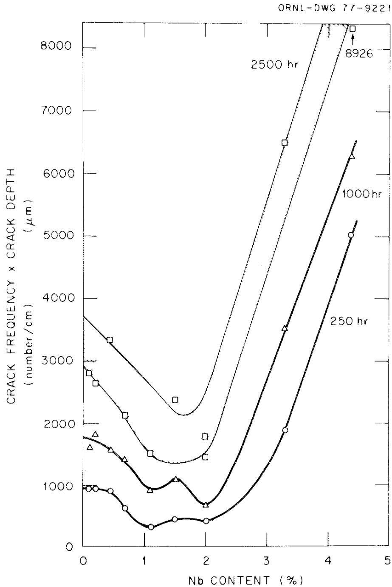  
Fig. 7.1. Variations of severity of cracking with niobium content. Samples were exposed for indicated times to salt containing $\mathrm{Cr}_3\mathrm{Te}_4$ and $\mathrm{Cr}_5\mathrm{Te}_6$ at $700^{\circ}\mathrm{C}$ .

acceptable resistance to tellurium embrittlement, even though the mechanical properties in the irradiated condition were excellent. As a result, it became necessary to determine whether alloys containing niobium (without titanium) had adequate resistance to irradiation embrittlement. There was time only to obtain the alloys and run one irradiation experiment, but the results looked very promising. An alloy containing $2\%$ niobium and irradiated at $704^{\circ}\mathrm{C}$ was about $30\%$ stronger than standard Hastelloy N and had a fracture strain of about $3\%$ compared with $<1\%$ for standard Hastelloy N. Even though alloys modified solely with niobium do not have as good postirradiation properties as alloys modified with titanium or titanium plus niobium, their properties are probably adequate.

The niobium-modified alloys were not made in melts larger than 50 lb, but no problems were encountered in this size with niobium concentrations up to and including $4.4\%$ . Test welds made in the 1/2-in.-thick plate passed the bend and tensile tests required by the ASME Boiler and Pressure Vessel Code. From the chemical analysis of the niobium-modified alloy, no scaleup problems are anticipated.

One series of experiments was carried out to investigate the effects of oxidation state on the tendency for cracks to be formed in tellurium-containing salt, on the supposition that the salt might be made reducing enough to tie the tellurium up in some innocuous metal complex. The salt was made more oxidizing by adding $\mathrm{NiF_2}$ and more reducing by adding beryllium. The experiment had electrochemical probes for determining the ratio of uranium in the $+4$ state $(\mathrm{UF_4})$ to that in the $+3$ state $(\mathrm{UF_3})$ . Tensile specimens of standard Hastelloy N were suspended in the salt for about 260 hr at $700^{\circ}\mathrm{C}$ . The oxidation state of the salt was stabilized, and the specimens were inserted so that each set of specimens was exposed to one condition. After exposure, the specimens were strained to failure and were examined metallographically to determine the extent of cracking. The results of measurements at several oxidation states are shown in Fig. 7.2. At $\mathrm{U}^{4+}/\mathrm{U}^{3+}$ ratios of 60 or less, there was very little cracking, and at ratios above 80 the cracking was very extensive. These observations offer encouragement that a reactor could be operated in a chemical regime where the tellurium would not be embrittling even to standard Hastelloy N. At least $1.6\%$ of the uranium

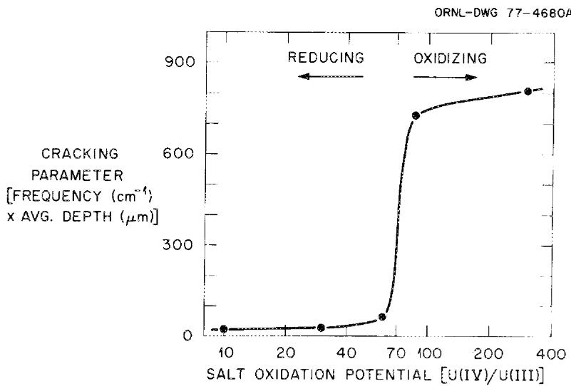  
Fig. 7.2. Cracking behavior of Hastelloy N exposed 260 hr at $700^{\circ}\mathrm{C}$ to MSBR fuel salt containing $\mathrm{Cr_3Te_4}$ and $\mathrm{Cr_5Te_6}$ .

would need to be in the $+3$ oxidation state $(\mathrm{UF}_3)$ , and this condition seems quite reasonable from chemical and practical considerations.

One further accomplishment during the period 1974-76 was the use of available data to predict the helium yield from interaction of nickel with thermal neutrons. It has been known for some time that iron- and nickel-base alloys can be embrittled in a thermal neutron flux by the transmutations of "tramp" $^{10}\mathrm{B}$ to helium and lithium. This process generally results in the transmutation of most of the $^{10}\mathrm{B}$ by fluences of thermal neutrons on the order of $10^{20} / \mathrm{cm}^2$ and usually yields from 1 to 10 at. ppm of helium. With nickel there is a further thermal two-step transmutation involving these reactions:

$$
\begin{array}{l} { } ^ { 5 8 } \mathrm { N i } + n \rightarrow { } ^ { 5 9 } \mathrm { N i } \\ ^ {5 9} \mathrm {N i} + n \rightarrow^ {4} \mathrm {H e} + ^ {5 6} \mathrm {F e}. \\ \end{array}
$$

This sequence of reactions does not saturate, and although the cross sections are still in question, it would produce a maximum of 40 at. ppm of helium in the vessel over a 30-year MSBR lifetime. This is not an unreasonable amount of helium to accommodate in the type of microstructure being developed in modified Hastelloy N.

# Current Status

At the close of the program in 1976 (and at the present time), the third alloy composition shown in Table 7.1 was favored. Considerable progress had been made in establishing test methods for evaluating a material's resistance to embrittlement by tellurium. Modified Hastelloy N containing from 1 to $3\%$ niobium was found to offer improved resistance to embrittlement by tellurium, but the test conditions were not sufficiently long or diversified to show that the alloy totally resists embrittlement. One irradiation experiment showed that the niobium-modified alloy offered adequate resistance to irradiation embrittlement, but more detailed tests are needed. Several small melts containing up to $4.4\%$ niobium were found to fabricate and weld well; so products containing 1 to $2\%$ niobium can probably be produced with a minimum of scale-up difficulties.

# Technology Needs and Development Plan

The overall development needs were described previously, but the new findings shift the emphasis from alloys modified with titanium and rare earths to those modified with niobium. The specific technology needs are identified in Table 7.2, along with a potential schedule for their development. The first task will involve irradiation, corrosion, tellurium exposure, mechanical property, and fabrication tests to finalize the composition for scale-up. The techniques for doing most of these tests have already been established.

The second task will involve procuring large commercial heats of the reference alloy. The material would be procured in structural shapes ranging from plate to thin-wall tubing, typical of the products to be used in a reactor. The third task consists in evaluating these materials by mechanical property and corrosion tests of at least 10,000-hr duration. The two main purposes of these tests would be to confirm the adequacy of the new alloy for reactor applications and to gather the data needed for reactor design. The fourth task would be to develop the design methods and rules needed to design a reactor to be built of the modified Hastelloy N. This task will have already been partially completed by ASME Pressure Vessel Code work currently in progress. The

Table 7.2. Schedule for development of structural metal for primary and secondary circuits   

<table><tr><td rowspan="2">Task</td><td colspan="11">Fiscal year</td></tr><tr><td>1980</td><td>1981</td><td>1982</td><td>1983</td><td>1984</td><td>1985</td><td>1986</td><td>1987</td><td>1988</td><td>1989</td><td>1990</td></tr><tr><td>Determination of alloy composition</td><td colspan="11">\( ^{1}\bigtriangledown^{23}\bigtriangledown^{4}\bigtriangledown^{5} \)</td></tr><tr><td>Procurement of commercial heats</td><td colspan="11">\( \nabla^{6}\nabla^{7} \)</td></tr><tr><td>Evaluation of commercial heats</td><td>\( \nabla^{8} \)</td><td>\( \nabla^{9} \)</td><td>\( \nabla^{10} \)</td><td>\( \nabla^{11} \)</td><td></td><td></td><td></td><td></td><td></td><td></td><td></td></tr><tr><td>Development of analytical design methods - ASME Code</td><td colspan="4">\( ^{12}\bigtriangledown^{13} \)</td><td>\( \nabla^{14} \)</td><td></td><td></td><td></td><td></td><td></td><td></td></tr><tr><td>Long-term material tests</td><td></td><td></td><td></td><td></td><td>\( \nabla^{15} \)</td><td></td><td></td><td></td><td></td><td></td><td></td></tr><tr><td>Alloy optimization</td><td></td><td></td><td></td><td></td><td>\( \nabla^{16} \)</td><td></td><td></td><td></td><td></td><td></td><td></td></tr></table>

# Milestones:

1. Receipt of small commercial heats containing 1 to $2\%$ Nb. Begin mechanical property and compatibility tests on heats.   
2. Receipt of products of 10,000-lb heat of $2\%$ Nb-modified Hastelloy N. Begin mechanical property and compatibility tests on 10,000-lb heat.   
3. Start forced-convection corrosion loop constructed of 10,000-lb heat for basic fuel salt corrosion studies. Begin $\sim 1$ -year irradiation of fuel pins made of most desirable alloy.   
4. Start forced-convection corrosion loop constructed of 10,000-lb heat for fuel salt-Te corrosion studies.   
5. Start forced-convection corrosion loop (FCL-5) constructed of 10,000-lb heat for coolant salt corrosion studies.   
6. Prepare specifications and solicit bids from potential vendors for four heats of desired composition.   
7. Begin receipt of products from four large heats.

8. Begin construction and checkout of equipment required for mechanical property tests on four large heats.   
9. Begin evaluation of four large heats by weldability, mechanical property, and compatibility tests.   
10. Begin operation of forced-circulation loops (FCL-6 and 7) constructed of modified alloy and circulating fuel salt.   
11. Begin operation of forced-circulation loops (FCL-8 and 9) constructed of modified alloy and circulating coolant salt.   
12. Begin detailed analysis of mechanical property data.   
13. Begin development of design methods for modified alloy.   
14. Submit data package for ASME Code Approval.   
15. Begin studies to raise allowable temperature for use of modified alloy.   
16. Begin long-term mechanical property and compatibility tests on modified alloy.

final product of this task would be inclusion of modified Hastelloy N into the high-temperature Code.

Although the data gathered in the third task (tests of 10,000-hr duration) will probably be adequate for Code approval, it will be desirable to continue some of the mechanical property and corrosion tests for longer times. The continuation of these tests in the fifth task will improve confidence in design rules and will allow last-minute changes in reactor operating parameters if necessary.

Although the work in the first five tasks should result in an alloy adequate for construction of MSRs, it is likely that further alloy development would lead to materials having improved characteristics which may allow a higher reactor-outlet salt temperature or significant relaxation of design and operating constraints. It is this further alloy optimization which will comprise the sixth task.

The operating and capital costs for these activities are summarized in Tables 7.3 and 7.4, respectively.

Table 7.3. Operating fund requirements for development of structural metal for primary and secondary circuits   

<table><tr><td rowspan="2">Task</td><td colspan="12">Cost (thousands of 1978 dollars) for fiscal year -</td></tr><tr><td>1980</td><td>1981</td><td>1982</td><td>1983</td><td>1984</td><td>1985</td><td>1986</td><td>1987</td><td>1988</td><td>1989</td><td>1990</td><td>1991</td></tr><tr><td>Determination of alloy composition</td><td>2200</td><td>2200</td><td></td><td></td><td></td><td></td><td></td><td></td><td></td><td></td><td></td><td></td></tr><tr><td>Procurement of commercial heats</td><td></td><td></td><td>520</td><td></td><td></td><td></td><td></td><td></td><td></td><td></td><td></td><td></td></tr><tr><td>Evaluation of commercial heats</td><td></td><td>600</td><td>2225</td><td>2660</td><td></td><td></td><td></td><td></td><td></td><td></td><td></td><td></td></tr><tr><td>Development of analytical design methods - ASME Code Case Sub- mission</td><td></td><td></td><td>280</td><td>930</td><td>220</td><td></td><td></td><td></td><td></td><td></td><td></td><td></td></tr><tr><td>Long-term material tests</td><td></td><td></td><td></td><td></td><td>1300</td><td>1300</td><td>1040</td><td>1040</td><td>910</td><td>910</td><td>650</td><td>400</td></tr><tr><td>Alloy optimization</td><td></td><td></td><td></td><td></td><td>390</td><td>455</td><td>572</td><td>520</td><td>624</td><td>650</td><td>676</td><td>400</td></tr><tr><td>Total \( funds^a \)</td><td>2200</td><td>2800</td><td>3025</td><td>3590</td><td>1910</td><td>1755</td><td>1612</td><td>1560</td><td>1534</td><td>1560</td><td>1326</td><td>800</td></tr></table>

$^{\alpha}$ Total funds through 1991: $23,672.

Table 7.4. Summary of capital equipment funds required for development of structural metal for primary and secondary circuits   

<table><tr><td rowspan="2">Task</td><td colspan="11">Cost (thousands of 1978 dollars) for fiscal year --</td></tr><tr><td>1980</td><td>1981</td><td>1982</td><td>1983</td><td>1984</td><td>1985</td><td>1986</td><td>1987</td><td>1988</td><td>1989</td><td>1990</td></tr><tr><td>Determination of alloy composition</td><td>955</td><td>732</td><td></td><td></td><td></td><td></td><td></td><td></td><td></td><td></td><td></td></tr><tr><td>Procurement of commercial heats</td><td></td><td></td><td>13</td><td></td><td></td><td></td><td></td><td></td><td></td><td></td><td></td></tr><tr><td>Evaluation of commercial heats</td><td></td><td>438</td><td>1424</td><td>377</td><td></td><td></td><td></td><td></td><td></td><td></td><td></td></tr><tr><td>Development of analytical design methods - Code Case Submission</td><td></td><td></td><td>65</td><td>130</td><td></td><td></td><td></td><td></td><td></td><td></td><td></td></tr><tr><td>Long-term material tests</td><td></td><td></td><td></td><td></td><td>52</td><td>78</td><td>46</td><td>72</td><td>39</td><td>52</td><td>39</td></tr><tr><td>Alloy optimization</td><td></td><td></td><td></td><td></td><td>46</td><td>91</td><td>104</td><td>104</td><td>98</td><td>98</td><td>98</td></tr><tr><td>Total fundsa</td><td>955</td><td>1170</td><td>1502</td><td>507</td><td>98</td><td>169</td><td>150</td><td>176</td><td>137</td><td>150</td><td>80</td></tr></table>

${}^{a}$ Total funds through 1991: \$5231.

# 8. GRAPHITE FOR MOLTEN-SALT REACTORS

The graphite in a single-fluid MSR serves no structural purpose* other than to define the flow patterns of the salt and, of course, to support its own weight. The requirements on the material are dictated most strongly by nuclear considerations, namely stability of the material against radiation-induced distortion and nonpenetrability by the fuel-bearing molten salt. The practical limitations of meeting these requirements, in turn, impose conditions on the core design, specifically the necessity to limit the cross-sectional area of the graphite prisms. The requirements of purity and impermeability to salt are easily met by several high-quality, fine-grained graphites, and the main problems arise from the requirement of stability against radiation-induced distortion.

# Status in 1972

By the time the MSBR Program was cancelled in early 1973, the dimensional changes of graphite during irradiation had been studied for a number of years. These changes depend largely on the degree of crystalline isotropy, but the volume changes fall into a rather consistent pattern. As shown in Fig. 8.1, there is first a period of densification during which the volume decreases and then a period of swelling in which the volume increases. The first period is of concern only because of the dimensional changes that occur, and the second period is of concern because of the dimensional changes and the formation of cracks. The formation of cracks would eventually allow salt to penetrate the graphite. The data shown in Fig. 8.1 are for $715^{\circ}\mathrm{C}$ , and the damage rate increases with increasing temperature. Thus the graphite section size should be kept small enough to prevent temperatures in the graphite from exceeding those in the salt by a wide margin.

In the breeder concept the neutron flux is sufficiently high in the central region of the core to require that the graphite be replaced about every four years. It was further required that the graphite be surface

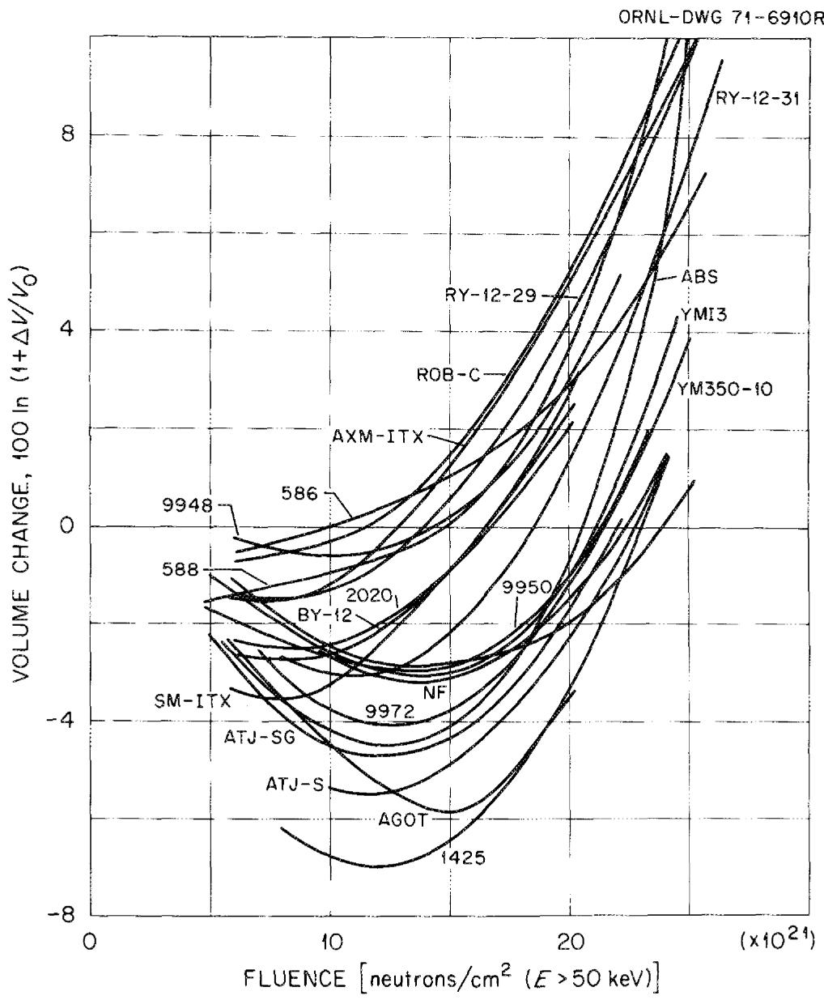  
Fig. 8.l. Volume changes for conventional graphites irradiated at $715^{\circ}\mathrm{C}$ .

sealed to prevent penetration of xenon into the graphite. Since replacement of the graphite would require considerable downtime, there was strong incentive to increase the fluence limit of the graphite. A considerable part of the ORNL graphite program was spent in irradiating commercial graphites and samples of special graphites with potentially improved irradiation resistance. The approach taken to sealing the graphite was surface sealing with pyrocarbon. Because of the neutronic

requirements, other substances could not be introduced in sufficient quantity to seal the surface.

The irradiation studies with several grades of graphite revealed that the so-called binderless graphites, e.g., POCO AXF, had improved dimensional stability over most of the conventional graphites (Fig. 8.2). The POCO graphites are presently available only in small sections, but the GLCC H-364 grade is available in large sections. The GLCC H-364 grade has almost as high an allowable fluence as POCO AXF. Further work on several special grades of graphite made at ORNL showed that graphites could be developed with fluence limits even greater than those of the POCO grades.

The pyrolytic sealing work was only partially successful. It was found that extreme care had to be taken to seal the material before irradiation. During irradiation the injected pyrocarbon actually caused expansion to begin at lower fluences than those at which it would occur in the absence of the coating. Thus the coating task was faced with a number of challenges.

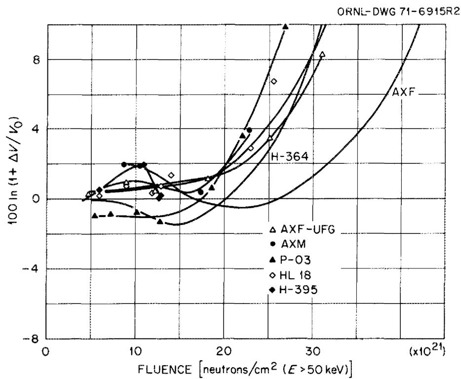  
Fig. 8.2. Volume changes for monolithic graphite irradiated at $715^{\circ}\mathrm{C}$ .

No work was undertaken on graphite during the last segment of the program. Thus the status in 1976 was the same as that in 1972.

# Current Status

With the relaxed requirements* for breeding performance in nonproliferating MSRs relative to the MSBR, the requirements for the graphite have diminished. First, the peak neutron flux in the core can be reduced to levels such that the graphite will last for the lifetime of the reactor plant. Secondly, the salt flow rate through the core is reduced from the turbulent regime, and the salt film at the graphite surface may offer sufficient resistance to xenon diffusion so that it will not be necessary to seal the graphite. The lessened gas permeability requirements also mean that the graphite damage limits can be raised (Figs. 8.1 and 8.2). The lifetime criterion adopted for the breeder was that the allowable fluence would be about $3 \times 10^{22}$ neutrons/ $\mathrm{cm}^2$ . This was estimated to be the fluence at which the structure in advanced graphites would contain sufficient cracks to be permeable to xenon. Experience has shown that even at volume changes of about $10\%$ the graphite is not cracked but is uniformly dilated. For nonproliferating devices where xenon permeability will not be of concern, the limit will be established by the formation of cracks sufficiently large for salt intrusion. It is likely that current technology graphites like GLCC $^{\dagger}$ H-364 could be used to $3 \times 10^{22}$ neutrons/ $\mathrm{cm}^2$ and that improved graphites with a limit of $4 \times 10^{22}$ neutrons/ $\mathrm{cm}^2$ could be developed.

# Further Technology Needs and Development Plan

The near-term goal of the future development program (see Table 8.1) will be to evaluate current commercial graphites for MSR use (Task 1).

Table 8.1. Schedule for graphite development   

<table><tr><td rowspan="2">Task</td><td colspan="14">Fiscal year</td><td></td></tr><tr><td>1980</td><td>1981</td><td>1982</td><td>1983</td><td>1984</td><td>1985</td><td>1986</td><td>1987</td><td>1988</td><td>1989</td><td>1990</td><td>1991</td><td>1992</td><td>1993</td><td>1994</td></tr><tr><td>Evaluation of commercial graphites</td><td colspan="4">\( \nabla^1 \)</td><td colspan="10">\( \nabla^2 \)</td><td></td></tr><tr><td>Development of improved graphites</td><td colspan="4"></td><td colspan="2"></td><td colspan="4">\( \nabla^3 \)</td><td colspan="4"></td><td></td></tr><tr><td>Procurement of commercial lots of improved graphites</td><td colspan="4"></td><td colspan="2"></td><td colspan="4">\( \nabla^4 \)</td><td colspan="4"></td><td></td></tr><tr><td>Evaluation of commercial lots of improved graphites</td><td colspan="4"></td><td colspan="2"></td><td colspan="4"></td><td colspan="4">\( \nabla^5 \)</td><td></td></tr></table>

# Milestones:

1. Establish program for development of improved graphites. Define variables to be investigated.   
2. Complete evaluation of commercial graphites. Prepare document specification.   
3. Develop procurement specification for improved commercial graphites.

4. Begin procurement of production lots of improved commercial graphites.   
5. Begin long-term evaluation of improved commercial graph-ites. Evaluation to include mechanical and physical properties before and after irradiation.

This will involve irradiation of promising commercial graphites with subsequent measurements of dimensional stability and thermal and electrical conductivity.

A longer-range goal will be the development of a graphite with an improved fluence limit. Efforts to date show that graphites can be tailored to have improved dimensional stability. In Task 2 this work will be continued to obtain several improved products, which will be irradiated and evaluated. The technology for making the most desirable products will be passed on to commercial vendors, and large lots of these graphites will be obtained (Task 3). The commercial graphites will be irradiated to high fluences, and the changes in dimensions, pore spectra, thermal conductivity, thermal expansion, and electrical conductivity will be measured (Task 4).

The operating and capital equipment costs for this work are summarized in Tables 8.2 and 8.3, respectively.

Table 8.2. Operating fund requirements for graphite development   

<table><tr><td rowspan="2">Task</td><td colspan="14">Cost (in thousands of 1978 dollars) for fiscal year -</td><td></td></tr><tr><td>1980</td><td>1981</td><td>1982</td><td>1983</td><td>1984</td><td>1985</td><td>1986</td><td>1987</td><td>1988</td><td>1989</td><td>1990</td><td>1991</td><td>1992</td><td>1993</td><td>1994</td></tr><tr><td>Evaluation of commercial graphites</td><td>300</td><td>300</td><td>300</td><td>300</td><td>300</td><td></td><td></td><td></td><td></td><td></td><td></td><td></td><td></td><td></td><td></td></tr><tr><td>Development of improved graphites</td><td></td><td></td><td>150</td><td>300</td><td>300</td><td>500</td><td>500</td><td>150</td><td></td><td></td><td></td><td></td><td></td><td></td><td></td></tr><tr><td>Procurement of commercial lots of improved graphite</td><td></td><td></td><td></td><td></td><td></td><td></td><td>100</td><td>200</td><td>150</td><td></td><td></td><td></td><td></td><td></td><td></td></tr><tr><td>Evaluation of commercial lots of improved graphites</td><td></td><td></td><td></td><td></td><td></td><td></td><td></td><td>300</td><td>500</td><td>500</td><td>400</td><td>400</td><td>300</td><td>300</td><td>300</td></tr><tr><td>Total fundsa</td><td>300</td><td>300</td><td>450</td><td>600</td><td>600</td><td>500</td><td>600</td><td>650</td><td>550</td><td>500</td><td>400</td><td>400</td><td>300</td><td>300</td><td>300</td></tr></table>

$^\alpha$ Total funds through 1994: $6750.

Table 8.3. Capital equipment fund requirements for graphite development   

<table><tr><td rowspan="2">Task</td><td colspan="14">Cost (in thousands of 1978 dollars) for fiscal year -</td><td></td></tr><tr><td>1980</td><td>1981</td><td>1982</td><td>1983</td><td>1984</td><td>1985</td><td>1986</td><td>1987</td><td>1988</td><td>1989</td><td>1990</td><td>1991</td><td>1992</td><td>1993</td><td>1994</td></tr><tr><td>Evaluation of commercial graphites</td><td>100</td><td>75</td><td>50</td><td>50</td><td>50</td><td></td><td></td><td></td><td></td><td></td><td></td><td></td><td></td><td></td><td></td></tr><tr><td>Development of improved graphites</td><td></td><td></td><td>50</td><td>100</td><td>100</td><td>100</td><td>100</td><td>50</td><td></td><td></td><td></td><td></td><td></td><td></td><td></td></tr><tr><td>Procurement of commercial lots of improved graphites</td><td></td><td></td><td></td><td></td><td></td><td></td><td></td><td></td><td></td><td></td><td></td><td></td><td></td><td></td><td></td></tr><tr><td>Evaluation of commercial lots of improved graphites</td><td></td><td></td><td></td><td></td><td></td><td></td><td></td><td>50</td><td>100</td><td>75</td><td>75</td><td>75</td><td>50</td><td>50</td><td></td></tr><tr><td>Total fundsa</td><td>100</td><td>75</td><td>100</td><td>150</td><td>150</td><td>100</td><td>100</td><td>100</td><td>100</td><td>75</td><td>75</td><td>75</td><td>50</td><td>50</td><td></td></tr></table>

$^\alpha$ Total funds through 1994: \$1350.

# Internal Distribution

1. T. D. Anderson   
2. Seymour Baron   
3. D. E. Bartine

4-8. H.F.Bauman

9. H.W. Bertini   
10. E. S. Bettis   
11. H. I. Bowers   
12. J. C. Cleveland   
13. T. E. Cole   
14. S. Cantor

15-19. J. F. Dearing

20-29. J.R.Engel

30. D. E. Ferguson   
31. M. H. Fontana

32-36. W.R.Grimes

37. R. H. Guymon   
38. W. O. Harms   
39. J. F. Harvey   
40. H. W. Hoffman   
41. J. D. Jenkins   
42. P. R. Kasten   
43. Milton Levenson   
44. R. S. Lowrie

45. R. E. MacPherson

46-50. H.E.McCoy

51. L. E. McNeese   
52. H. Postma

53-57. W.A.Rhoades   
58. P. S. Rohwer   
59. M. W. Rosenthal   
60. R. T. Santoro   
61. Dunlap Scott   
62. M. R. Sheldon   
63. R. L. Shoup   
64. M. J. Skinner   
65. I. Spiewak   
66. H. E. Trammell   
67. D. B. Trauger   
68. J. R. Weir   
69. J. E. Vath   
70. R. G. Wymer

71-72. Central Research Library   
73. Document Reference Section   
74-76. Laboratory Records   
77. Laboratory Records (RC)

# External Distribution

78. Director, Nuclear Alternative Systems Assessment Division, Department of Energy, Washington, D.C. 20545   
79. E. G. Delaney, Nuclear Alternative Systems Assessment Division, Department of Energy, Washington, D.C. 20545   
80. C. Sege, Nuclear Alternative Systems Assessment Division, Department of Energy, Washington, D.C. 20545   
81. S. Strauch, Nuclear Alternative Systems Assessment Division, Department of Energy, Washington, D.C. 20545   
82. K. A. Trickett, Office of the Director, Division of Nuclear Power Development, Department of Energy, Washington, D.C. 20545   
83. H. Kendrick, Nuclear Alternative Systems Assessment Division, Department of Energy, Washington, D.C. 20545   
84. NASAP Control Office, Department of Energy, Washington, D.C. 20545   
85. Assistant Manager, Energy Research and Development, DOE-ORO   
86. Director, Nuclear Research and Development Division, DOE-ORO   
87. G. Nugent, Burns and Roe, Inc., 185 Crossways Park Drive, Woodbury, NY 11797   
88. R. A. Edelman, Burns and Roe, Inc., 496 Kinderkamack Road, Oradell, NJ 07649

89. W. R. Harris, Rand Corporation, 1700 Main Street, Santa Monica, CA 90406   
90. S. Jaye, S. M. Stoller Corp., Suite 815, Colorado Building, Boulder, CO 80302   
91. W. Lipinski, Argonne National Laboratory, 9700 South Cass Ave., Argonne, IL 60439   
92. H. G. MacPherson, Institute for Energy Analysis, Oak Ridge Associated Universities, Oak Ridge, TN 37830   
93. R. Omberg, Hanford Engineering Development Laboratory, P.O. Box 1970, Richland, WASH 99352   
94. E. Straker, Science Applications, 8400 Westpark Drive, McLean, VA 22101   
95. A. M. Weinberg, Institute for Energy Analysis, Oak Ridge Associated Universities, Oak Ridge, TN 37830   
96. B. A. Pasternak, Booz, Allen Applied Research, 4330 East-West Highway, Bethesda, MD 20014   
97. M. C. J. Carlson, Manager, Alternative Fuel Cycle Evaluation Program, Hanford Engineering Development Laboratory, P.O. Box 1970, Richland, WA 99352   
98-202. For distribution as shown in TID-4500 under category UC-76, Molten-Salt Reactor Technology