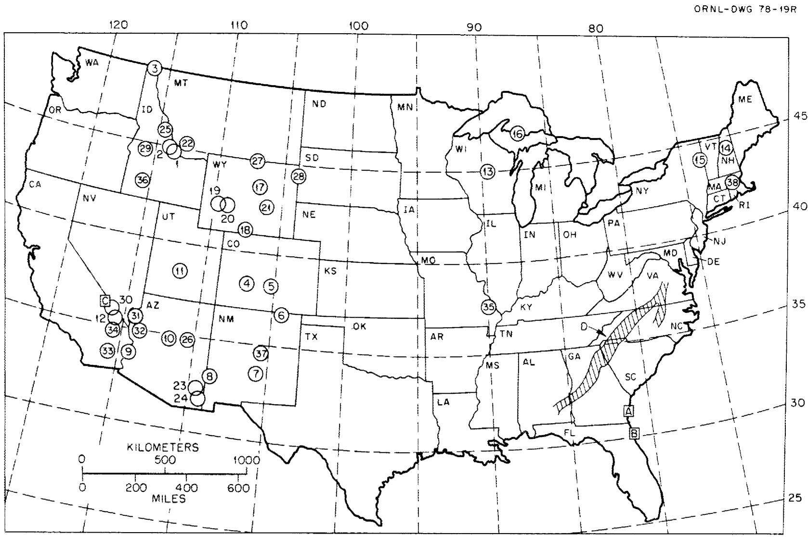
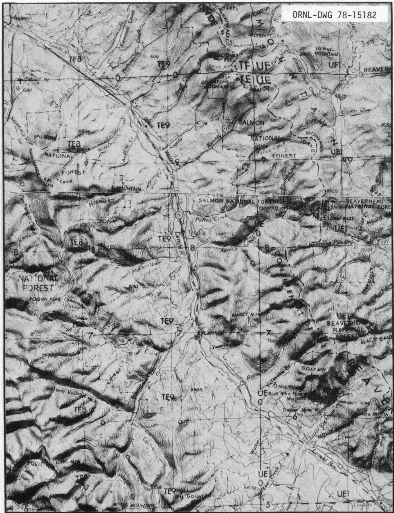
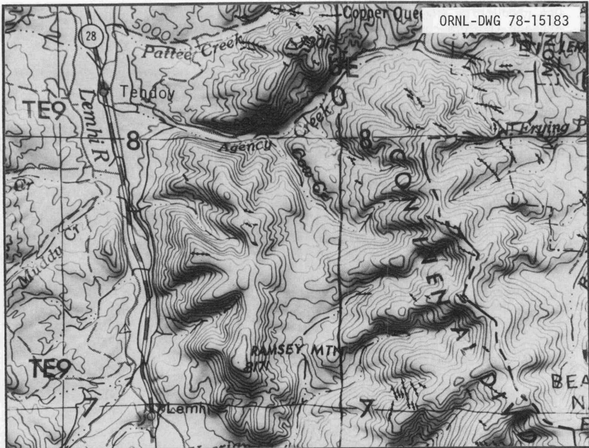
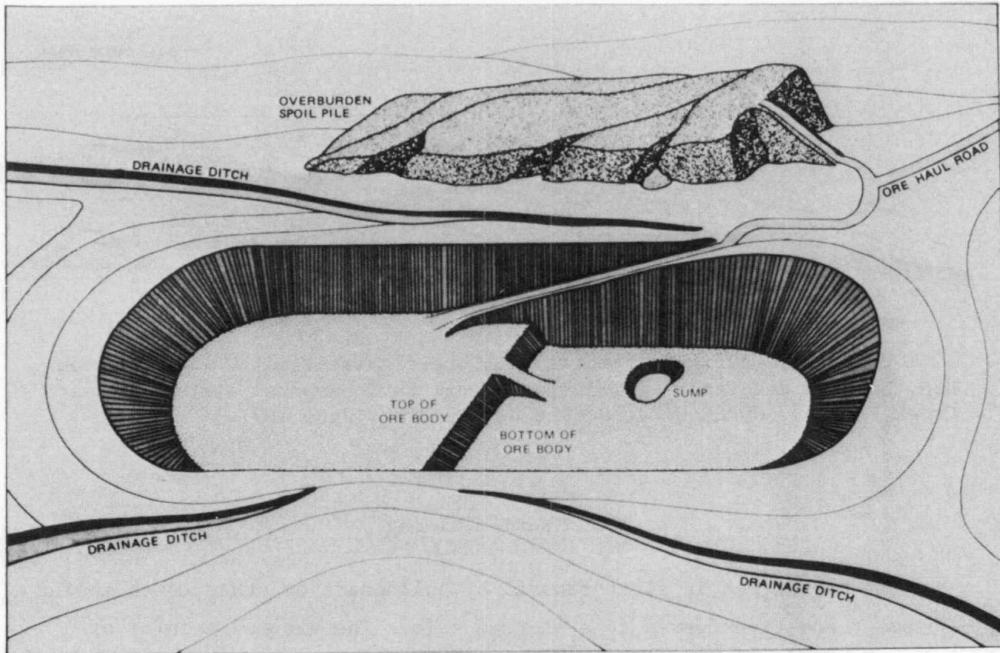
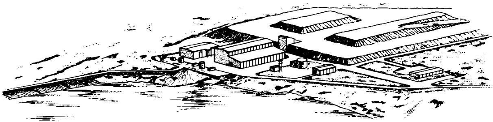
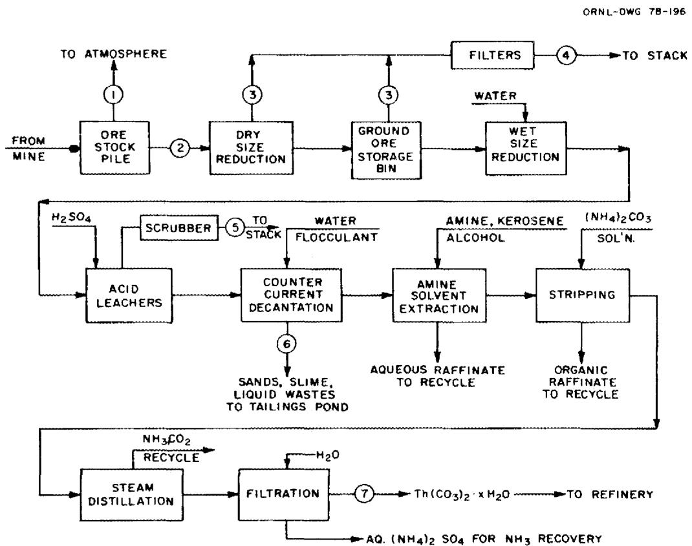
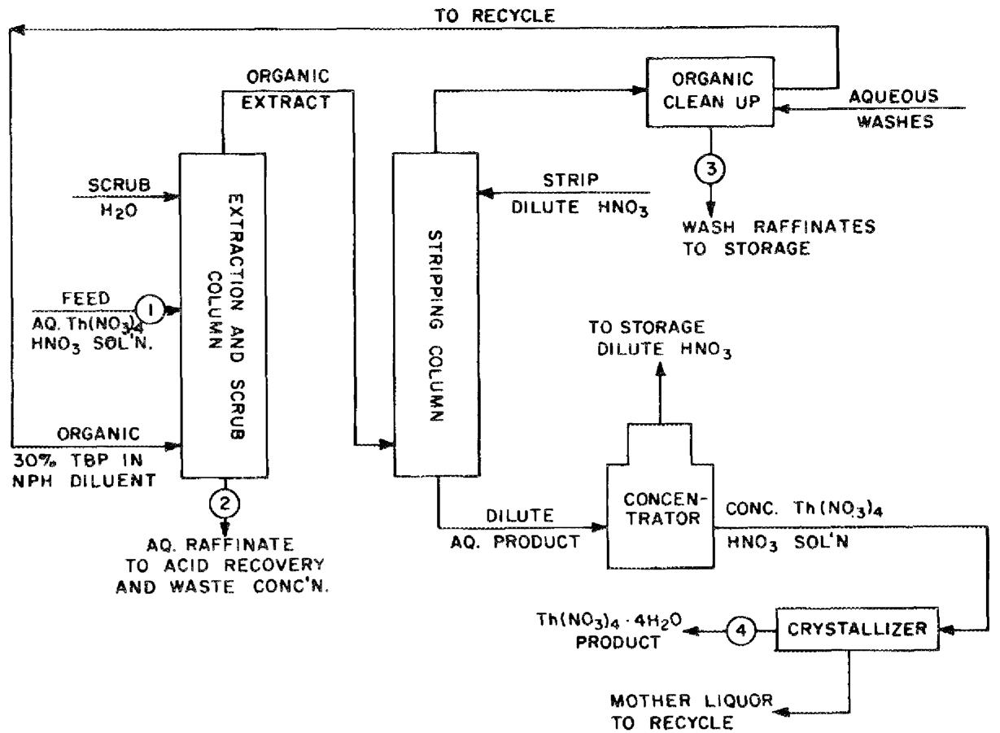
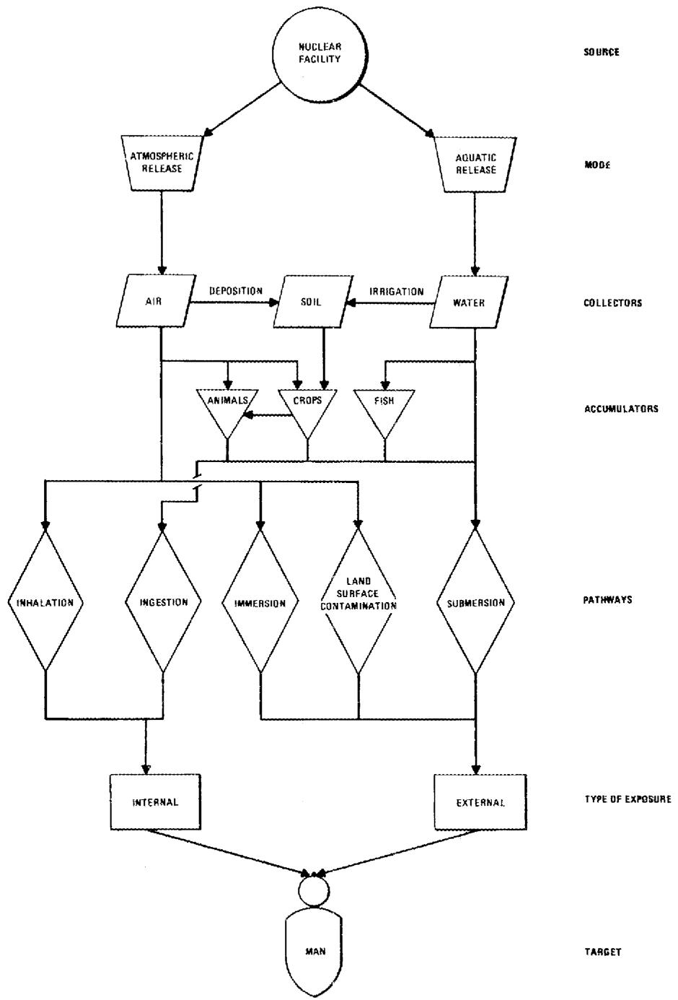
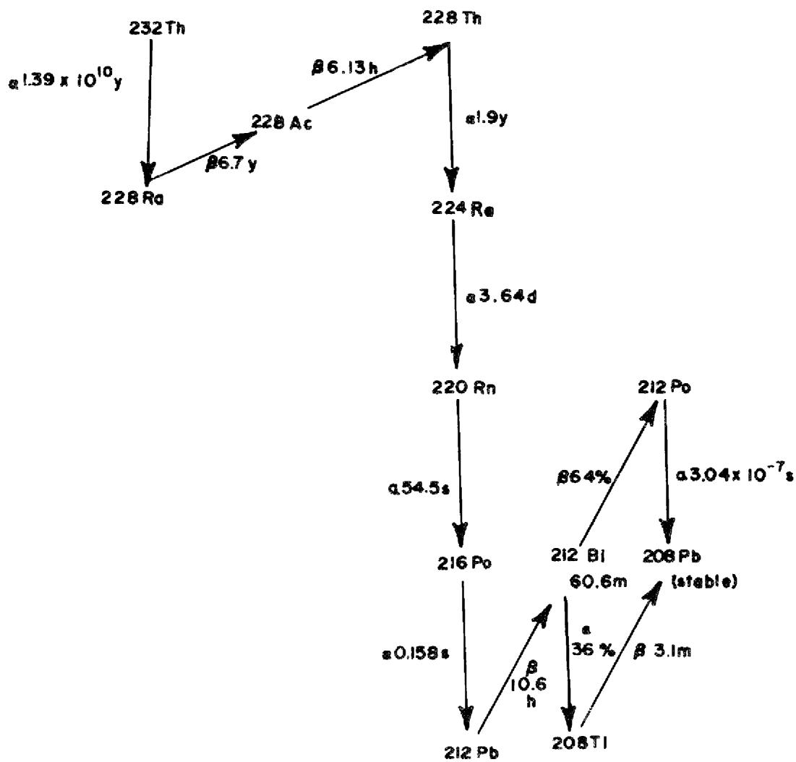
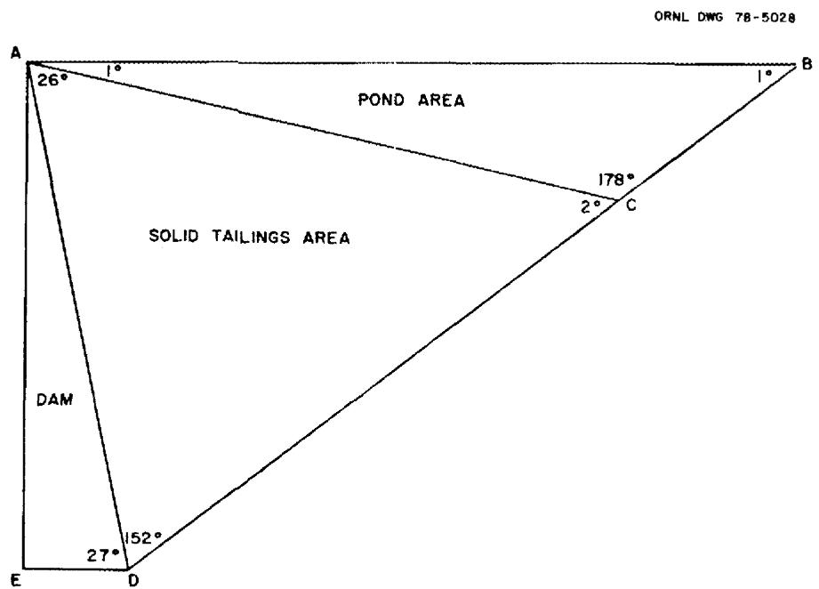

# Environmental Assessment of Alternate FBR Fuels: Radiological Assessment of Airborne Releases from Thorium Mining and Milling

V. J. Tennyery

E. S. Bomar

W. D. Bond

L. E. Morse

H. R. Meyer

J.E.Till

M. G. Yalcintas

Printed in the United States of America. Available from

the Department of Energy,

Technical Information Center

P.O.Box 62,Oak Ridge,Tennessee 37830

Price: Printed Copy $\$ 7.25$ ; Microfiche $\$ 3.00$

This report was prepared as an account of work sponsored by an agency of the United States Government. Neither the United States Government nor any agency thereof, nor any of their employees, contractors, subcontractors, or their employees, makes any warranty, express or implied, nor assumes any legal liability or responsibility for any third party's use or the results of such use of any information, apparatus, product or process disclosed in this report, nor represents that its use by such third party would not infringe privately owned rights.

ORNL/TM-6474

Dist. Categories UC-79b,-c

Contract No. W-7405-eng-26

METALS AND CERAMICS DIVISION

CHEMICAL TECHNOLOGY DIVISION

HEALTH AND ENVIRONMENTAL SAFETY DIVISION

ENVIRONMENTAL ASSESSMENT OF ALTERNATE FBR FUELS: RADILOGICAL

ASSESSMENT OF AIRBORNE RELEASES FROM

THORIUM MINING AND MILLING

V. J. Tennyery

E. S. Bomar

W.D.Bond 2

L.E.Morse

H. R. Meyer $\circ$

J.E.Till

M. G. Yalcintas

Date Published: October 1978

NOTICE This document contains information of a preliminary nature.

It is subject to revision or correction and therefore does not represent a final report.

OAK RIDGE NATIONAL LABORATORY

Oak Ridge, Tennessee 37830

operated by

UNION CARBIDE CORPORATION

for the

DEPARTMENT OF ENERGY

# CONTENTS

Page LIST OF FIGURES v

LIST OF TABLES vi

ABSTRACT 1

1. INTRODUCTION 2

2. FACILITY SITING, METEOROLOGY, AND POPULATION CHARACTERISTICS PERTAINING TO THORIUM ORE DEPOSITS 4

2.1 U.S. Thorium Deposits 4

2.2 Sites Selected for Analysis 8

2.3 Characteristics of Deposits in the Lemhi Pass District 10

2.4 Population Distribution 11

2.5 Meteorological Data 11

2.6 References 16

3. DESCRIPTION OF MODEL MINE AND MILL 20

3.1 Facility Description 20

3.2 Thorium Mining 23

3.3 Thorium Milling and Refining 23

3.3.1 Introduction 23

3.3.2 The ore storage pile 26

3.3.3 Ore preparation 26

3.3.4 Sulfuric acid leaching 26

3.3.5 Countercurrent decantation 27

3.3.6 Amine solvent extraction 27

3.3.7 Stripping 27

3.3.8 Steam distillation 28

3.3.9 Filtration 28

3.3.10 Thorium refining 28

3.3.11 The tailings pond 29

3.4 References 31

4. GENERATION OF SOURCE TERMS 32

4.1 Mining 32

4.1.1 Radon-220 32

4.1.2 Fugitive dust 32

4.2 Milling 34

4.2.1 Introduction 34

4.2.2 The ore stockpile 36

4.2.3 Dry crushing and sizing 38

4.2.4 Acid leaching of ore 38

4.2.5 Other mill operations 39

4.2.6 Thorium refining 39

4.2.7 Source terms for the tailings impoundment 40

4.3 References 47

# Page

5. RADIOLOGICAL ASSESSMENT METHODOLOGY 49

5.1 Additional Assumptions 53   
5.2 References 54

6. ANALYSIS OF RADIOLOGICAL IMPACT 56

6.1 Maximum Individual Doses 56   
6.2 Population Doses 58   
6.3Dose Commitments Following Plant Shutdown 60

6.4 Impact of Mine-and Mill-Generated $^{220}\mathrm{Rn}$ on Populations Outside the 50-mile Radius 64

6.5 Discussion 66   
6.6 References 68

RECOMMENDATIONS FOR FUTURE WORK 69

ACKNOWLEDGMENTS 70

Appendix 1. SUMMARIES OF METEOROLOGICAL DATA A1-1   
Appendix 2. DIFFUSION EQUATION USED FOR THE ESTIMATION OF RADON-220 EMISSIONS A2-1   
Appendix 3. RADON-220 RELEASE FROM THE OPEN-PIT THORIUM MINE A3-1   
Appendix 4. RADIOACTIVITY CONTAINED IN DUST GENERATED BY MINING OPERATIONS A4-1  
Appendix 5. ORIGIN CODE CALCULATIONS OF RADIONUCLIDES IN EQUILIBRIUM WITH THORIUM IN THE ORE AND IN THE MILL TAILINGS A5-1   
Appendix 6. MODEL TAILINGS IMPOUNDMENT A6-1   
Appendix 7. CALCULATION OF AREAS FOR DRY TAILINGS BEACH AND POND DURING THE 20-YEAR OPERATION OF THE MILL . . . A7-1  
Appendix 8. EVAPORATION OF THE TAILING POND AFTER MILL CLOSING AND EXPOSURE OF DRY TAILINGS SURFACE A8-1  
Appendix 9. RADON-220 FLUX FROM THE DRY TAILINGS AND FROM THE POND SURFACE A9-1

# LIST OF FIGURES

# Figure

2.1 Thorium resources in the United States 5   
2.2 Topographical map of Lemhi Pass district of Idaho and Montana 9   
3.1 Identified vein deposits of thorium ore in the vicinity of the Lemhi Pass 22   
3.2 Typical features of open-pit mine 22   
3.3 Artist's rendition of ore-treatment mill 23   
3.4 Conceptual thorium milling. Flow diagram 24   
3.5 Conceptual thorium milling. Flow diagram 25   
5.1 Exposure pathways to man 50   
6.1 Thorium-232 decay chain 63   
A.6.1 Cross section of the natural wedge-shaped basin A6-3

# LIST OF TABLES

# Table

2.1(a) Vein thorium deposits - United States 6   
2.1(b) Other thorium deposits - United States 7   
2.2 Population data for Lemhi Pass thorium resource site region - 1970 census information 12   
2.3 Population data for Wet Mountains thorium resource site region - 1970 census information 12   
3.1 Characteristics of the open-pit thorium mine and the model thorium mill and refinery 21   
3.2 Mass and volume flow rates for principal process streams of the model mill and refinery 25   
4.1 Radioactivity contained in dust generated by mining operations 33   
4.2 Estimated source terms for operation and closing of the model mill 35   
4.3 Values of concentrations of radionuclides in thorite ore and in dry mill tailings that were employed in calculation for 20-year mill operation 35   
4.4 Estimation of areas of the dry tailings beach and pond during mill operation for the hypothetical Montana and Colorado locations 41   
4.5 Estimation of areas of dry beach and pond as a function of time after closing down mill operations at the hypothetical Montana and Colorado locations 42   
4.6 Source terms for $^{220}\mathrm{Rn}$ during mill operating life and during final evaporation of the pond and covering of the dry tailings after the mill is closed 43   
4.7 Wind velocities and particle size distribution used in saltation model calculation 45   
4.8 Calculated suspension rates as a function of wind velocity, using the saltation model 45   
4.9 Suspension rates weighted for wind velocity distribution 46

Table

5.1 Dose conversion factors for total body, bone, and lungs for radionuclides in the $^{232}\mathrm{Th}$ decay chain 52   
6.1 Maximum individual 50-year dose commitment to total body and various organs from radioactivity released to the atmosphere during one year of facility operation 56   
6.2 Radionuclide contributors to the dose commitment to various organs for maximally exposed individual 57   
6.3 Contribution of exposure pathways to dose commitment to total body, bone, and lungs for maximally exposed individual 58   
6.4 Population dose commitment to total body and various organs from radioactivity released to the atmosphere during one year of facility operation 59   
6.5 Radionuclide contributions to the population dose commitment to various organs 59   
6.6 Contribution of exposure pathways to population dose commitment to total body, bone, and lungs 60   
6.7 Maximum individual 50-year dose commitments to total body and various organs from radioactivity released to the atmosphere during the first year after facility shutdown 61   
6.8 Radionuclide contributors to the dose commitments to various organs for individuals exposed during the first year after facility shutdown 61   
6.9 Contribution of exposure pathways to the dose commitment to total body, bone, and lungs for individuals exposed during the first year after facility shutdown 62   
6.10 Population dose commitments to total body and various organs from radioactivity released to the atmosphere during the first year after facility shutdown 62   
6.11 Radionuclide contributors to the population dose commitment to various organs for exposures during the first year after facility shutdown 63   
A.5.1 Calculated values of radionuclide activities and masses in equilibrium with $\lg$ of thorium (by ORIGEN code). A5-3

# Table

A.5.1 Calculated values of radionuclide activities and masses in equilibrium with $\lg$ of thorium (by ORIGEN code). A5-3   
A.5.2 Activity of tailings left from the extraction of 1 g of thorium: 91% extraction (from ORIGEN code calculations) A5-4   
A.6.1 Relationship of triangular areas and sides to the dam height $(\mathsf{d_h})$ A6-4   
A.6.2 Characteristics of model tailings pile A6~5   
A.7.1 Constants used in Bond-Godbee equation and the calculated steady-state volume of the tailings pond A7-5   
A.7.2 Calculated values of the minimum water addition rate required to keep tailings under water over the 20-year life of mill A7-5   
A.7.3 Change in volume of pond $(\mathbf{V}_{\mathfrak{p}})$ with time as a result of evaporation . . . . . . . . . . . . . . . . . . . . . . A7-6   
A.7.4 Evaporation surface area of tailings pond $\left(\mathbf{A}_{\mathfrak{p}}\right)$ and values of AC used to calculate area of tailings underneath the pond A7-6   
A.7.5 Calculated values for the area of tailings covered by water and of the dry tailings beach A7-7   
A.8.1 Volume of liquid in the tailings pond $(\mathbf{V}_{\mathrm{p}})$ as a function of elapsed time after closing the thorium mill . . . . . . . . . . . . . . . . . . . . . . . . . . . . A8-3

# ENVIRONMENTAL ASSESSMENT OF ALTERNATE FBR FUELS: RADILOGICAL ASSESSMENT OF AIRBORNE RELEASES FROM THORIUM MINING AND MILLING*

V. J. Tennyery†  
E. S. Bomar†  
W. D. Bond‡  
L. E. Morse‡

H. R. Meyer  
J. E. Till  
M. G. Yalcintas

# ABSTRACT

A radiological environmental assessment was performed for airborne releases from a thorium mining and milling facility based on site-specific analyses for known vein-type U.S. thorium ore deposits, using proximate meteorological data for the geographical region where these deposits are located. The assessment was done for a conceptual open-pit thorium mine plus a mill having a throughput rate of 1.6 Gg (1600 metric tons/day). The thorium ore was assumed to have an average $\mathrm{ThO_2}$ equivalent content of $0.5\%$ . The mill facility consisted of a mill and refinery whose product was reactor-grade thorium nitrate tetrahydrate. Several assumptions were necessary in order to conduct this analysis due to scarcity of data specific to erosion and dusting of thorium ore storage piles and a thorium mill-derived tailings beach.

Radiological dose commitments were calculated for airborne effluents from the mine and mill facility, using the AIRDOS-II code. The 50-year dose commitment to the maximally exposed individual and to the population, as shown by the 1970 census, living within 50 miles of the operation site was estimated for both Lemhi Pass, Idaho, and Wet Mountains, Colorado, sites. Principal airborne radionuclides which contribute to the population dose commitment for either site are $^{228}\mathrm{Ra}$ and $^{220}\mathrm{Rn}$ plus the daughters of $^{220}\mathrm{Rn}$ . Total-body dose commitments to the maximally exposed individual for one year of facility operation for the Lemhi Pass and Wet Mountains sites are $\sim 2.4$ and $\sim 3.5$ millionrems respectively. Population dose commitments to total body for the Lemhi Pass and Wet Mountains sites are 0.05 and 0.3 man-rem respectively. For both sites and both types of dose commitment, inhalation and ingestion are the largest pathway contributors to the dose. Several operations for thorium ore mining and milling were identified during this assessment for which the data base required for radionuclide source term generation was

either small or nonexistent. For operations where the data base was judged insufficient for generation of at least a first-approximation source term, data appropriate to the similar operation for uranium mining or milling were used as the basis for the source term. Areas where data needs are greatest include (1) quantitative values of emanation factors and diffusion coefficients for $^{220}\mathrm{Rn}$ for thorium ore materials, (2) fugitive dust generation rates from mine activities and thorium ore piles, (3) release rates of $^{220}\mathrm{Rn}$ from thorium ores under various storage conditions, (4) release rates of $^{220}\mathrm{Rn}$ from thorium ores for various milling process treatments, (5) properties of soils in mountainous locations of vein-type thorium deposits to determine their suitability for construction of tailings ponds and retention of radioactive species contained in the mill tailings, and (6) site-specific meteorology appropriate to prime candidate sites for thorium mines and mills.

# 1. INTRODUCTION

The thorium-uranium nuclear fuel cycle is being studied in several programs in the United States in order to better identify the nuclear weapons proliferation resistance of this cycle compared with that of the uranium-plutonium cycle. Another important feature of any fuel cycle considered for commercialization is the radiological impact of the cycle on the population. The impact derives from several sources, including contributions from ore mining and milling, fuel fabrication, reactor operation, transportation, fuel reprocessing, and fuel refabri-cation.

This report describes the results of a radiological analysis of the impact of thorium ore mining and milling from vein deposits at two specific sites, one in the Lemhi Pass district of Idaho and Montana and the other in the Wet Mountains of Colorado. Mining of vein-type deposits was analyzed because they are of the highest grade, and it is estimated that as much as $40\%$ of United States thorium reserves reside in such deposits.

Compositional data for the known vein-type thorium ore deposits plus the local topography of the region were employed in establishing details

of a model mine capable of providing 1.6 Gg (1600 metric tons) of ore per day plus a mill of equivalent throughput capacity. This plant is considered to be of reasonable size for such a mining endeavor.

This analysis differs in certain respects from a related and recently published study of thorium mining and milling reported in ERDA 1541 concerning the Light-Water Breeder Reactor Program. In the current work, recently improved assessment codes were employed and two site-specific cases were analyzed. The entire mining operation was considered to be open-pit type based on the geology of the known ore deposits at the sites. Source terms are included based on dust from the mining, movement of ore at the mine and mill, and ore crushing, plus the release of $^{220}\mathrm{Rn}$ from the mine, ore pile, mill, and tailings pond.

The appropriate source terms were used along with population density and meteorological data for the sites to estimate the population dose commitment associated with the extraction and processing of the thorium ore.

# 2. FACILITY SITING, METEOROLOGY, AND POPULATION CHARACTERISTICS PERTAINING TO THORIUM ORE DEPOSITS

# 2.1 U.S. Thorium Deposits

For the purposes of this report, it is assumed that the sources of thorium to be considered are within the continental United States. Thorium is found in several types of deposits in this country, including (1) veins, (2) stream and beach placer deposits or placer deposits incorporated in sedimentary rock, and (3) concentrations in igneous or metamorphic rocks. The largest recoverable thorium reserves are in the form of vein or placer deposits. Thorium dioxide resources in the United States available at a cost of $11 to $22 per kg ($4 to $10 per pound, 1969 dollars) are placed at approximately 600 Gg (600,000 metric tons).1

Monazite sands, which are primarily phosphates of the rare-earth elements, are formed as a result of the weathering of rocks such as granites. Running water carries the sands to locations remote from the original rock formations to places where conditions permit the heavier minerals to settle; this may occur in a river, or the sands may be carried to the ocean and coastal locations. Wave action has resulted in placer deposits of heavy minerals, such as ilmenite and monazite, along some beaches on the Atlantic Coast of the United States. A few of these deposits have been worked commercially to recover titanium-bearing minerals with monazite as a secondary product. Large-scale working of beach deposits in the future is unlikely, however, because of the high population density of the coastal region.

Figure 2.1 and Tables 2.1(a) and 2.1(b) present available information concerning significant thorium resource sites in the contiguous United States. Table 2.1(a) gives the locations, extent of sampling and observed thorium content, physical dimension, and nearby populations for vein-type deposits of thorium in the United States. $^{1-12}$ Table 2.1(b) identifies deposits of other types but which are predominately monazite ores. $^{13-17,31-34}$ Items A and B give the locations of placer deposits of monazite sands: the thorium content of these deposits at Jacksonville,

  
Fig. 2.1. Thorium resources in the United States.

Table 2.1(a). Vein thorium deposits - United States   

<table><tr><td>Location (see map)</td><td>County, state</td><td>Latitude (°N)</td><td>Longitude (°W)</td><td>Number of samples</td><td>Max vein length (m)</td><td>Max vein thickness (m)</td><td>Thorium content (%)</td><td>Population within 80 km (1970)</td><td>Ref.</td></tr><tr><td>1. Lemhi Pass</td><td>Lemhi, ID Beaver, MT</td><td>44.93</td><td>113.5</td><td>200+</td><td>1.2 × 103</td><td>9</td><td>0.001-16.3</td><td>14,242</td><td>2-5</td></tr><tr><td>2. Diamond Creek</td><td>Lemhi, ID</td><td>45</td><td>114</td><td>9</td><td>1.7 × 102</td><td>7.5</td><td>0.02-1.71</td><td>7,364</td><td>3</td></tr><tr><td>3. Hall Mt.</td><td>Boundary, ID</td><td>48.99</td><td>116.38</td><td>14</td><td>2.1 × 102</td><td>4</td><td>0.01-21</td><td>15,359</td><td>6</td></tr><tr><td>4. Powderhorn</td><td>Gunnison, CO</td><td>38.25</td><td>107</td><td>200+</td><td>1.1 × 103</td><td>5.5</td><td>0.01-4.3</td><td>32,192</td><td>7</td></tr><tr><td>5. Wet Mts.</td><td>Custer, CO</td><td>38.25</td><td>105.35</td><td>400+</td><td>1.5 × 103</td><td>15</td><td>0.02-12.5</td><td>262,144</td><td>8,9</td></tr><tr><td>6. Laughlin Pk.</td><td>Colfax, NM</td><td>36.75</td><td>104.25</td><td>10</td><td>2.4 × 102</td><td>6.1</td><td>0.05-0.82</td><td>27,615</td><td>2</td></tr><tr><td>7. Capitan Mts.</td><td>Lincoln, NM</td><td>33.5</td><td>105.78</td><td>12</td><td>46</td><td>2.4</td><td>0.01-1.12</td><td>47,668</td><td>10</td></tr><tr><td>8. Gold Hill</td><td>Grant, NM</td><td>33</td><td>109</td><td>2</td><td>12</td><td></td><td>0.05-0.72</td><td>39,900</td><td>2</td></tr><tr><td>9. Quartzite</td><td>Yuma, AZ</td><td>33.75</td><td>114.25</td><td>2</td><td>15</td><td>2.4</td><td>0.027-0.27</td><td>22,613</td><td>2</td></tr><tr><td>10. Cottonwood</td><td>Yavapai, AZ</td><td>34.75</td><td>112</td><td>1</td><td>30</td><td>18</td><td>0.013-0.91</td><td>64,769</td><td>2</td></tr><tr><td>11. Monroe Canyon</td><td>Seiver, UT</td><td>38.58</td><td>112</td><td>1</td><td>7.6</td><td>15</td><td>0.18-0.29</td><td>19,868</td><td>2</td></tr><tr><td>12. Mountain Pass</td><td>San Bernardino CA</td><td>35.46</td><td>115.5</td><td>18</td><td>4.9 × 102</td><td>3</td><td>0.02-4.9</td><td>30,321</td><td>11</td></tr><tr><td>13. Wausau</td><td>Marathon, WI</td><td>45</td><td>89.5</td><td>20</td><td>4.6 × 102</td><td>0.5</td><td></td><td>338,408</td><td>12</td></tr></table>

Table 2.1(b). Other thorium deposits - United States   

<table><tr><td></td><td>Location (see map)</td><td>County, state</td><td>Latitude (°N)</td><td>Longitude (°W)</td><td>Thorium content (ppm)</td><td>Population within 80 km (1970)</td><td>Ref.</td></tr><tr><td>14.</td><td>Conway</td><td>Conway, NH</td><td>44.00</td><td>71.16</td><td>64</td><td></td><td>29</td></tr><tr><td>15.</td><td>Mineville</td><td>Essex, NY</td><td>44.16</td><td>73.58</td><td>100-3800</td><td></td><td>30</td></tr><tr><td>16.</td><td>Palmer</td><td>Marquette, MI</td><td>46.5</td><td>87.5</td><td>50,000</td><td></td><td>31</td></tr><tr><td>17.</td><td>Owl Creek</td><td>Hot Spring, WY</td><td>43.48</td><td>105.50</td><td>134</td><td>30,292</td><td>13,14</td></tr><tr><td>18.</td><td>Rovlins uplift</td><td>Carbon, WY</td><td>41.78</td><td>107.13</td><td>146</td><td>13,201</td><td>13,14</td></tr><tr><td>19.</td><td>Wind River</td><td>Fremont, WY</td><td>43.5</td><td>109.5</td><td>366</td><td>31,648</td><td>13,14</td></tr><tr><td>20.</td><td>Wind River</td><td>Fremont, WY</td><td>43.5</td><td>109.6</td><td>66</td><td>31,648</td><td>13,14</td></tr><tr><td>21.</td><td>Seminoe</td><td>Natrona, WY</td><td>42.47</td><td>106.75</td><td>194-273</td><td>51,995</td><td>13,14</td></tr><tr><td>22.</td><td>Deer Creek</td><td>MT</td><td>45.2</td><td>112.5</td><td></td><td></td><td>30</td></tr><tr><td>23.</td><td>Blue Mt.</td><td>Greenlee, AZ</td><td>32.55</td><td>109.20</td><td>40</td><td>30,481</td><td>13,15</td></tr><tr><td>24.</td><td>Dos Cabesas</td><td>Cochise, AZ</td><td>32.2</td><td>109.42</td><td>19</td><td>30,098</td><td>13,15</td></tr><tr><td>25.</td><td>Mineral Hill</td><td>Lemhi, ID</td><td>45.6</td><td>114.9</td><td></td><td></td><td>13,15</td></tr><tr><td>26.</td><td>Diamond Rim</td><td>Gila, AZ</td><td>34.25</td><td>111.08</td><td>24</td><td>10,416</td><td>13,15</td></tr><tr><td>27.</td><td>Little Big Horn</td><td>Big Horn, WY</td><td>44.66</td><td>106.95</td><td></td><td></td><td></td></tr><tr><td>28.</td><td>Bear Lodge</td><td>Crook, WY</td><td>44.5</td><td>104.33</td><td>400-2500</td><td></td><td>30</td></tr><tr><td>29.</td><td>Idaho</td><td>Idaho, ID</td><td>46</td><td>115</td><td>200</td><td></td><td>32</td></tr><tr><td>30.</td><td>McCullough Mt.</td><td>Clark, NV</td><td>36</td><td>116</td><td>55-283</td><td>145,059</td><td>13,15</td></tr><tr><td>31.</td><td>Black Mts.</td><td>Mohave, AZ</td><td>35.5</td><td>114.5</td><td>180-253</td><td>137,958</td><td>13,15</td></tr><tr><td>32.</td><td>S. Peacock Mts.</td><td>Mohave, AZ</td><td>35</td><td>114</td><td>37-153</td><td>137,958</td><td>13,15</td></tr><tr><td>33.</td><td>Big Maria Mts.</td><td>Riverside, CA</td><td>33.5</td><td>116</td><td>29-146</td><td>136,470</td><td>13,15</td></tr><tr><td>34.</td><td>Marble Mts.</td><td>San Bernardino, CA</td><td>35</td><td>116</td><td>75-148</td><td>136,470</td><td>13,15</td></tr><tr><td>35.</td><td>St. Francois Mts.</td><td>St. Francois, MO</td><td>37.5</td><td>90</td><td>47</td><td>320,378</td><td>13,17</td></tr><tr><td>36.</td><td>Idaho Batholith</td><td>Boise, ID</td><td>44.0</td><td>115.90</td><td>100</td><td></td><td>32</td></tr><tr><td>37.</td><td>Gallinas</td><td>Lincoln, NM</td><td>34.15</td><td>105.63</td><td></td><td></td><td>33</td></tr><tr><td>38.</td><td>Worcester</td><td>Worcester, MA</td><td>42.25</td><td>71.75</td><td>300</td><td></td><td>30</td></tr><tr><td>A.</td><td>Georgia</td><td>Charlton, GA</td><td>32</td><td>81.6</td><td>&lt;1000</td><td></td><td>34</td></tr><tr><td>B.</td><td>Florida</td><td>Nassau, FL</td><td>30.2</td><td>81.3</td><td>&lt;1000</td><td></td><td>34</td></tr><tr><td>C.</td><td>California</td><td>San Bernardino, CA</td><td>36</td><td>117</td><td>200-5000</td><td></td><td>30</td></tr><tr><td>D.</td><td>Piedmont District</td><td>VA, NC, SC, AL</td><td>32-38</td><td>78-87</td><td>[5.67%]</td><td></td><td>30</td></tr></table>

Florida; Folkston, Georgia; and on Hilton Head Island, South Carolina;35 was estimated at 14 Gg (15,600 tons). The Folkston deposit has been reported more recently, however, to have been exhausted.36 Basnaesite deposits are being mined at Mountain Pass, California (item C). Two extensive deposits are identified as item D. The western belt extends for 1 Mm (600 miles) from eastern Virginia southwest to Alabama. It ranges from 0.02 to 0.8 Mm (10 to 50 miles) wide with an average width of about 0.03 Mm (20 miles). The eastern belt originates near Fredericksburg, Virginia, and continues for about 200 miles into North Carolina with an average width of about 0.01 Mm (5 miles).

# 2.2 Sites Selected for Analysis

The most promising thorium deposits for large-scale exploitation are thorite-bearing veins such as those located in Colorado, Idaho, and Montana. As much as $40\%$ of U.S. thorium reserves occur as vein deposits.[18] Reserves equal to about 100 Gg (100,000 metric tons) of $\mathrm{ThO_2}$ at $22 per kg ($10 per pound) or less (1969 dollars) are estimated to be available in the Lemhi Pass district of Idaho and Montana,[1] which lies astride the Continental Divide about 16 km (10 miles) east of Tendoy, Idaho. The Lemhi Pass is shown on the relief map[19] in Fig. 2.2 between the vertical coordinates UEO-UE1 and the horizontal coordinates 8-9. The thorium resources of the Lemhi Pass district could supply the requirements of a very large number of FBRs fueled with (Th, U)C and ThC, since calculations by Caspersson et al.[20] show a core blanket requirement of 83 to 117 Mg (83 to 117 metric tons) of thorium carbide equivalent per 1200-MW(e) core, depending on the core and blanket configuration. Additional vein deposits have been found in the Powder-horn and Wet Mountains districts of Colorado.

The winters in the Lemhi Pass district are described as moderate, and some of the deposits at the lower elevations can be worked year round. In severe winters, operations may, however, be shut down for several months.

  
Fig. 2.2. Topographical map of Lemhi Pass district of Idaho and Montana. (Photograph of selected portions of relief maps titled Dillon, Montana, NL12-7, and Dubois, Idaho, NL12-10; Hubbard Co., Northbrook, Illinois 60062.)

# 2.3 Characteristics of Deposits in the Lemhi Pass District

Information on the topography, general geology, and the nature of the thorium-bearing deposits in the Lemhi Pass area is given in Atomic Energy Commission reports by Sharp and Hetland and by Austin issued in 1968.[21,22] Over 200 samples were taken from about 100 prospects along a $110\text{-km}$ (70-mile) trend paralleling the Idaho-Montana border from Leadore, Idaho, to North Fork, Idaho. Elevations in this region range from $1.5\text{km}$ (5000 feet) above sea level along the Lemhi River up to $2.7\text{km}$ (9000 feet) at the Continental Divide. The ore minerals include phosphatic thorite, monazite, and rare-earth concentrations. Rare-earth phosphates such as xenotime $(\mathrm{YPO}_4)$ form an isomorphous series with thorite $(\mathrm{ThSiO}_4)$ to yield the mineral auralite. The ratio of rare earth to thorium in these deposits varies from 10:1 to 1:5. Additional information was reported by Ross and George[23] on metallurgical amenability tests and compositions of Idaho-Montana thorium ores. Spectrographic analyses show that these ores contain undetectable amounts of uranium (<0.0001 to 0.001%).

The thorium-bearing veins are, in general, not exposed but are covered by a thick layer of soil. The presence of the veins can often be detected by surveying the soil cover for radioactivity with sensitive instruments. Detection is possible due to a degree of mixing of minerals from the veins with the soil. Bulldoizing is necessary to expose the veins. The vein deposits show a northwesterly trend paralleling the Continental Divide from the vicinity of Leadore, Idaho, at the southern end, and all are found in an area about $110\mathrm{km}$ (70 miles) long and $13\mathrm{km}$ (8 miles) wide. The inclination of the veins varies, particularly near major faults. It is estimated that $60\%$ of the veins dip at angles of 45 to $60^{\circ}$ and $40\%$ dip at $>60^{\circ}$ . The flatter-dipping veins are from 0.9 to $4.6\mathrm{m}$ (3 to 15 ft) wide, while the steeper veins measure 0.15 to $1.5\mathrm{m}$ (0.5 to 5 ft) wide. Flat-dipping veins paralleling canyon walls can be mined by open-cut methods, possibly to 91 to $122\mathrm{m}$ (300 to 400 ft) below the outcrop. Underground methods would eventually have to be used to recover a major portion of the thorium. This study does not, however, consider the radiological hazards of underground thorium mines.

Borrowman and Rosenbaum24 demonstrated the recovery of the thorium content of thorite samples by acid dissolution. These samples were taken from vein deposits in the Lemhi Pass district of Idaho-Montana and the Powderhorn and Wet Mountains districts of Colorado. The samples ranged in content from 0.2 to 3.9 wt % thorium dioxide equivalent.

# 2.4 Population Distribution

Population data specific to the thorium resource sites under study in this report were obtained via the "Reactor Site Population Analysis" computer code available at ORNL. Output from this code is based on U.S. 1970 census information. Approximation of future population data was not deemed necessary for the purposes of this report, since thorium mining and milling population doses were found to be low, and population centers with the potential for significant growth are located at distances in excess of $32\mathrm{km}$ (20 miles) from either the Lemhi Pass or Wet Mountains sites, a condition which renders the dose estimation procedure relatively insensitive to moderate population increases. Tables 2.2 and 2.3 present population data breakdowns as input to the AIRDOS-II dose estimation code.

# 2.5 Meteorological Data

Since variations in meteorology have the potential for significantly modifying both individual and population doses calculated via methodologies using wind and stability category-dependent radionuclide dispersal models, use of local rather than generic meteorological data was deemed necessary in this study. Best available meteorological data for both the Lemhi Pass and the Wet Mountains resource sites were obtained from first-order weather stations located near each site. Two sets of data were obtained for each resource site, since no first-order weather station is located in the immediate vicinity of either Lemhi Pass or Wet Mountains. These data were obtained through the courtesy of the National Oceanic and Atmospheric Administration offices located at the National Climatic Center (NCC) in Asheville, North Carolina, and were provided in the form

Table 2.2. Population data for Lemhi Pass thorium resource site region - 1970 census information   

<table><tr><td rowspan="2">Compass direction</td><td colspan="6">Population distributiona</td></tr><tr><td>0-8.0b</td><td>8.0-16</td><td>16~32</td><td>32-48</td><td>48-64</td><td>64-80</td></tr><tr><td>N</td><td>0</td><td>0</td><td>0</td><td>c/8</td><td>211</td><td>0</td></tr><tr><td>NNE</td><td>0</td><td>0</td><td>0</td><td>0</td><td>0</td><td>0</td></tr><tr><td>NE</td><td>0</td><td>0</td><td>0</td><td>0</td><td>557</td><td>0</td></tr><tr><td>ENE</td><td>0</td><td>0</td><td>245</td><td>0</td><td>0</td><td>5,897</td></tr><tr><td>E</td><td>0</td><td>0</td><td>0</td><td>0</td><td>129</td><td>0</td></tr><tr><td>ESF</td><td>0</td><td>0</td><td>0</td><td>0</td><td>0</td><td>589</td></tr><tr><td>SE</td><td>0</td><td>0</td><td>0</td><td>0</td><td>0</td><td>0</td></tr><tr><td>SSE</td><td>0</td><td>0</td><td>111</td><td>0</td><td>70</td><td>0</td></tr><tr><td>S</td><td>0</td><td>0</td><td>0</td><td>0</td><td>0</td><td>0</td></tr><tr><td>SSW</td><td>0</td><td>412</td><td>0</td><td>0</td><td>4</td><td>0</td></tr><tr><td>SW</td><td>0</td><td>0</td><td>0</td><td>0</td><td>277</td><td>784</td></tr><tr><td>WSW</td><td>0</td><td>0</td><td>0</td><td>181</td><td>0</td><td>0</td></tr><tr><td>W</td><td>0</td><td>0</td><td>0</td><td>0</td><td>0</td><td>0</td></tr><tr><td>WNW</td><td>0</td><td>0</td><td>0</td><td>825</td><td>0</td><td>0</td></tr><tr><td>NW</td><td>0</td><td>0</td><td>337</td><td>2,910</td><td>534</td><td>168</td></tr><tr><td>NNW</td><td>0</td><td>0</td><td>0</td><td>0</td><td>0</td><td>0</td></tr><tr><td></td><td>0</td><td>412</td><td>693</td><td>3,916</td><td>1,782</td><td>7,438</td></tr></table>

$\alpha_{\text{Total population}} = 14,241$ .   
Distance $\times 10^{-3}$ m (applicable to each heading).

Table 2.3. Population data for Wet Mountains thorium resource site region - 1970 census information   

<table><tr><td rowspan="2">Compass direction</td><td colspan="6">Population distributiona</td></tr><tr><td>0-8.0b</td><td>8.0-16</td><td>16-32</td><td>32-48</td><td>48-64</td><td>64-80</td></tr><tr><td>N</td><td>0</td><td>0</td><td>0</td><td>0</td><td>0</td><td>835</td></tr><tr><td>NNE</td><td>0</td><td>264</td><td>12,264</td><td>70</td><td>791</td><td>18,910</td></tr><tr><td>NE</td><td>0</td><td>0</td><td>6,662</td><td>1,246</td><td>0</td><td>93,790</td></tr><tr><td>ENE</td><td>0</td><td>0</td><td>713</td><td>0</td><td>753</td><td>0</td></tr><tr><td>E</td><td>0</td><td>0</td><td>0</td><td>884</td><td>65,014</td><td>46,808</td></tr><tr><td>ESE</td><td>0</td><td>0</td><td>0</td><td>0</td><td>0</td><td>106</td></tr><tr><td>SE</td><td>0</td><td>318</td><td>0</td><td>0</td><td>1,563</td><td>404</td></tr><tr><td>SSE</td><td>0</td><td>0</td><td>0</td><td>0</td><td>170</td><td>0</td></tr><tr><td>S</td><td>0</td><td>0</td><td>164</td><td>0</td><td>363</td><td>0</td></tr><tr><td>SSW</td><td>0</td><td>126</td><td>0</td><td>0</td><td>20</td><td>741</td></tr><tr><td>SW</td><td>0</td><td>0</td><td>512</td><td>34</td><td>0</td><td>859</td></tr><tr><td>WSW</td><td>0</td><td>0</td><td>0</td><td>0</td><td>98</td><td>642</td></tr><tr><td>W</td><td>0</td><td>0</td><td>0</td><td>350</td><td>0</td><td>10</td></tr><tr><td>WNW</td><td>0</td><td>0</td><td>377</td><td>0</td><td>2,164</td><td>3,567</td></tr><tr><td>NW</td><td>0</td><td>0</td><td>0</td><td>0</td><td>0</td><td>0</td></tr><tr><td>NNW</td><td>0</td><td>0</td><td>0</td><td>346</td><td>24</td><td>182</td></tr><tr><td></td><td>0</td><td>708</td><td>20,692</td><td>2,930</td><td>70,960</td><td>166,854</td></tr></table>

Total population = 262,144.   
$b_{\text{Distance}} \times 10^{-3} \, \text{m}$ (applicable to each heading).

of monthly or seasonal summaries of wind speed and Pasquill stability category data based on extended observation periods. The data were condensed into AIRDOS-II format via ORNL IBM-360/91 computer manipulation and are presented in this condensed format in Appendix 1 of this report.

As noted in Sect. 2.2, it is anticipated that severe weather in the Lemhi Pass region may shut down mining (but not milling) operations for the winter months, since temperature, wind, and snowfall hinder outdoor operations. This report therefore assumes the establishment of an ore pile adjacent to the mill of a size sufficient to continue milling operations uninterrupted during the period December through February. It is concurrently assumed that mine-generated source terms are reduced to near zero during the winter season at the Lemhi Pass site. For this reason the appended AIRDOS-II meteorological summaries (Butte and Mullan Pass meteorologies) utilized in thorium mining AIRDOS-II dose estimations were composed from data excluding the winter season. Dose calculations for the Lemhi mill, ore pile, and tailings beach utilize four-season meteorological summaries, as do all calculations for the Wet Mountains site, where the winter climate is less severe.

The original STAR program meteorological summaries are on file at ORNL and at NCC-Asheville and are accessible under NCC I.D. as follows:

<table><tr><td>Thorium resource site</td><td>Best available meteorology</td><td>Station No.</td><td>STAR run</td></tr><tr><td>Wet Mountains</td><td>Alamosa, Colorado</td><td>23061</td><td>12/13/77</td></tr><tr><td>Wet Mountains</td><td>Pueblo, Colorado</td><td>93058</td><td>1/23/75</td></tr><tr><td>Lemhi Pass</td><td>Mullan Pass, Idaho</td><td>24154</td><td>11/21/77</td></tr><tr><td>Lemhi Pass</td><td>Butte, Montana</td><td>24135</td><td>3/22/72</td></tr></table>

Because no reliable method is available to determine which of the substitute meteorologies best represents exact conditions at the thorium resource site under consideration, dose estimates in this study were calculated for all four sets of meteorological data, and discussion emphasizes those meteorologies found to maximize radiological dose, a conservative procedure.

Detailed long-term study of wind speed and stability class variations at representative thorium resource sites is necessary before less conservative radiological studies can be performed for these sites.

To assist the reader in visualization of climatological conditions at the two resource sites, narrative climatological summaries have been abstracted from the STAR program data as obtained from NCC, and from other sources[25-27] and are presented in the following pages.

# NARRATIVE CLIMATOLOGICAL SUMMARY

Lemhi Pass Area

The thorium deposits in the Lemhi Pass area are centered approximately 16 km (10 miles) east of Tendoy, Idaho, over an area of about $260\mathrm{km}^2$ (100 square miles), astride the Continental Divide, which forms the Idaho-Montana border. The area is mountainous but not rugged and is characterized by rounded ridges rising steeply from the valley floors, providing sharp relief of as much as 0.91 km (3000 ft). The altitiude ranges from 1.5 km (4800 ft) above mean sea level in the Lemhi Valley to 2.4 km (9000 ft) at the Pass. North-facing slopes in the higher elevations are well timbered with pine, fir, and hemlock. Nontimbered areas are covered primarily with bunchgrass and sagebrush.

Predominant wind direction in the area is from the west with little seasonal variation in direction. Wind velocities average between 3.1 and $4.0 \, \text{m/sec}$ (7 to 9 mph) throughout the year.[25,26]

January is the coldest month, with an average temperature of $-12^{\circ}\mathrm{C}$ ( $10^{\circ}\mathrm{F}$ ). July and August both record approximately $16^{\circ}\mathrm{C}$ ( $60^{\circ}\mathrm{F}$ ) mean temperatures as the warmest months of the year. Mean temperatures in spring through fall progress in an orderly fashion from cool to warm to cool, without secondary maxima or minima. The period between the last freeze of spring (late June) and the first freeze of fall (late August) averages about 60 days. The mean annual number of days for which the daily minimum temperature is below freezing is 240. An average of two days each year exceeds a temperature of $32^{\circ}\mathrm{C}$ ( $90^{\circ}\mathrm{F}$ ). The average daily temperature range is $18^{\circ}\mathrm{C}$ ( $32.5^{\circ}\mathrm{F}$ ), with the greatest range ( $22^{\circ}\mathrm{C}$ , $40^{\circ}\mathrm{F}$ ) occurring in July, August, and September.

Total annual precipitation for the Lemhi area averages $0.6\mathrm{m}$ (24 in.), evenly distributed throughout the year. The mean annual number of days with measurable precipitation is 120. Mean annual snowfall is $2.5\mathrm{m}$ (100 in.).28

# NARRATIVE CLIMATOLOGICAL SUMMARY

Wet Mountains Area

The Wet Mountains are located about 80 km (50 miles) southwest of Colorado Springs and about 60 km (35 miles) west-southwest of Pueblo on the east side of the Sangre de Cristo Mountains and the San Isabel National Forest. These mountains are oriented northwest-southeast with peak altitudes of about 4 km (13,000 ft), and the terrain slopes downward to the east and northeast along the valley of the Arkansas River. The vegetation around Pueblo is sparse, and the region is largely tree-less. Along the skirts of the Sangre de Cristo Mountains the San Luis Valley lies from northwest to southeast, with the Great Sand Dunes National Monument located at the southwest extremity of the Sangre de Cristos. The town of Alamosa is located about 40 km (25 miles) southwest of the Great Sand Dunes National Monument within the San Luis Valley.

The wind directions in Alamosa are usually from south-southwest, southwest, and west-southwest with 8.5 to $11\mathrm{m / sec}$ (19 to 24 mph) maximum and 5.4 to $5.8\mathrm{m / sec}$ (12 to 13 mph) mean velocities. In Pueblo the wind is usually from the northwest or west, except in May and June, when it blows from the west or southwest. Seasonal mean wind velocities range from 3.1 to $5.4\mathrm{m / sec}$ (7 to 12 mph). Maximum wind velocities during December through July occur during the afternoon hours and reach 8.5 to 11 m/sec (19 to 24 mph). Between August and November, maximum velocities reach 5.8 to $8.0\mathrm{m / sec}$ (13 to 18 mph).[29,30]

The coldest month is normally December $(-7^{\circ}C, 20^{\circ}F$ mean temperature), but differences between the mean temperatures of December, January, and February are small. August is usually the warmest month, but differences between the mean temperature of June, July, and August are also relatively small. Mean temperatures of the spring and fall months progress in an orderly fashion from cool to warm to cool without secondary maxima or

minima. The average period between the last freeze of spring (May 30) and the first freeze of fall (August 15 to August 30) is 82 days. Annual occurrence of daily minimum temperature $0^{\circ}\mathrm{C}$ ( $32^{\circ}\mathrm{F}$ ) or below is 210 days. Temperatures of $32^{\circ}\mathrm{C}$ ( $90^{\circ}\mathrm{F}$ ) or above occur an average of 11 days annually. The average daily temperature range is about $18^{\circ}\mathrm{C}$ ( $32.5^{\circ}\mathrm{F}$ ).

Normal annual total precipitation is between 0.4 and $0.6\mathrm{m}$ (16 and 24 in.). Summer is the season of heaviest precipitation, with the monthly maximum normally occurring in July $(0.08\mathrm{m},3\mathrm{in})$ or August (0.05 to $0.10\mathrm{m},2$ to 4 in.). A mean of 92 days annually receives measurable $(0.25\mathrm{mm},0.01\mathrm{in}.$ or more) precipitation. Annual snowfall is 1.5 to $2.5\mathrm{m}$ (60 to 100 in.).27

# 2.6 References

1. U.S. Bureau of Mines, 1970 Edition Mineral Facts and Problems, U.S. Department of the Interior, Bureau of the Mines Bulletin 650.   
2. H. H. Staatz, "Thorium Veins in the United States," Econ. Geol. 69: 494 (1974).   
3. S. R. Austin, Thorium, Yttrium and Rare Earth Analyses, Lemhi Pass - Idaho and Montana, USAEC Technical Memorandum AEC-RID-2, p. 12 (1968).   
4. W. N. Sharp and W. S. Cavender, Geology and Thorium-Bearing Deposits of the Lemhi Pass Area, Lemhi County, Idaho and Beaverhead County, Montana, U.S. Geol. Survey Bulletin 1126, 76 (1962).   
5. A. F. Triters and E. W. Tooker, Uranium and Thorium Deposits in East-Central Idaho and Southwestern Montana, U.S. Geol. Survey Bulletin 933-H, 157 (1953).   
6. M. H. Staatz, "Thorium Rich Veins of Hall Mountain in Northern-Most Idaho," Econ. Geol. 67: 240 (1972).   
7. J. C. Olson and S. R. Wallace, Thorium and Rare Earth Minerals in Powderhorn District, Gunnison County, Colorado, U.S. Geol. Survey Bulletin 1027-0, 693 (1956).   
8. R. A. Christman et al., Geology and Thorium Deposits of the Wet Mountains, Colorado, U.S. Geol. Survey Bulletin 1072-H, 491 (1960).

9. M. R. Brock and Q. D. Singewald, Geologic Map of the Mount Tyndal Quadrangle, Custer County, Colorado, U.S. Geol. Survey Geol. Quad. Map GQ-596.   
10. G. B. Griswold, Mineral Deposits of Lincoln County, New Mexico, N. M. Bur. Mines Minerals Res. Bulletin 67, 117 (1959).   
11. J. C. Olson et al., Rare-Earth Mineral Deposits of the Mountain Pass District, San Bernardino, California, U.S. Geo. Survey Prof. Paper 261, 75 (1954).   
12. S. R. Vickers, Airborn and Ground Reconnaissance of Part of the Syenite Complex Near Wausau, Wisconsin, U.S. Geol. Survey Prof. Paper 300, 587 (1956).   
13. R. C. Malan, Summary Report - Distribution of Uranium and Thorium in the Precambrian of the Western United States, USAEC AEC-RID-12 (1972).   
14. C. R. Anhaeusser et al., "A Reappraisal of Some Aspects of Precambrian Shield Geology," Geol. Soc. Am. Bull. 80: 2175 (1969).   
15. R. C. Malan and D. A. Sterling, An Introduction to the Distribution of Uranium and Thorium in Precambrian Rocks Including the Results of Preliminary Studies in the Southwestern United States, USAEC AEC-RID-9.54 (1969).   
16. R. C. Malan and D. A. Sterling, Distribution of Uranium and Thorium in Precambrian Rocks of the Western Great Lakes Region, USAEC AEC-RID-10 (1969).   
17. R. C. Malan and D. A. Sterling, Distribution of Uranium and Thorium in the Precambrian of the West-Central and Northwest, USAEC AEC-RID-11 (1970).   
18. Eugene N. Cameron, Ed., The Mineral Position of the United States, 1975-2000, Society of Economic Geologists Foundation, Inc., University of Wisconsin Press, 1973.   
19. Hubbard Co., Northbrook, Illinois 60062, Relief Maps Titled Dillion, Montana, NL 12-7 and Dubois, Idaho, NL 12-10.

20. J. A. Caspersson et al., CE-FBR-77-370 (COO-2426-108), Initial Assessment of (Th,U) Alternate Fuels Performance in LMFBRs (August 1977).   
21. Byron J. Sharp and Donald L. Hetland, Thorium and Rare Earth Resources of the Lemhi Pass Area, Idaho and Montana, USAEC AEC-RID-3 (July 1968).   
22. S. R. Austin, Thorium, Yttrium, and Rare Earth Analyses, Lemhi Pass - Idaho and Montana, USAEC Technical Memorandum AEC-RID-2 (August 1968).   
23. J. Richard Ross and D'Arcy R. George, Metallurgical Amenability Tests on Idaho/Montana Thorium Ores, Research Report 62.1, U.S. Department of Interior, Bureau of Mines, Salt Lake City Metallurgy Research Center (November 1966).   
24. S. R. Borrowman and J. B. Rosenbaum, Recovery of Thorium from Ores in Colorado, Idaho, and Montana, U.S. Bureau of Mines Report of Investigations RI-5916 (1962).   
25. Seasonal and Annual Wind Distribution for Butte, Montana, 1956-60, U.S. Department of Commerce, National Oceanic and Atmospheric Administration, Environmental Data Service, Asheville, N.C., 1972.   
26. Monthly and Annual Wind Distribution for Mullah Pass, Idaho, 1950-54, U.S. Department of Commerce, National Oceanic and Atmospheric Administration, Environmental Data Service, Asheville, N.C., 1977.   
27. Climatic Atlas of the United States, U.S. Department of Commerce, Environmental Data Service, Asheville, N.C., 1974.   
28. Revised Uniform Summary of Surface Water Hourly Observations for Alamosa, Colorado, from 1948 to 1972, Data Processing Branch USAFETAC, Air Weather Service, 1973.   
29. Summary of Hourly Observations for Pueblo, Colorado, from 1950 to 1955, U.S. Department of Commerce, Weather Bureau, 1956.   
30. J. A. Adams, "The Conway Granite of NH as a Major Low Grade Thorium Resource," Natl. Acad. Sci. Proc. 48: 1898 (1962).   
31. W. S. Twenhofel and K. L. Buck, "The Geology of Thorium Deposits in the U.S.," Peaceful Use of Atomic Energy, p. 562, Geneva, 1955.

32. R. A. Vickers, "Geology and Monazite Content of the Gandrich Quartzite, Palmer Area, Marquette County, Michigan," Peaceful Use of Atomic Energy, p. 597, Geneva, 1955.   
33. J. H. Mackin and D. L. Schmidt, "Uranium and Thorium-Bearing Minerals in Placer Deposits, Idaho," Peaceful Use of Atomic Energy, p. 587, Geneva, 1955.   
34. J. J. Glass, "Basnaesite," Am. Mineral. 30: 601 (1945).   
35. C. K. McCauley, "Exploration for Heavy Minerals on Hilton Head Island, South Carolina," South Carolina Board Div., Geo. Bulletin, Vol. 26, p. 13, 1960.   
36. R. V. Sondermayor, "Thorium," Mineral Yearbook 1974, Dept. of Interior, U.S. Bureau of Mines, Vol. 1, p. 1269, 1974.

# 3. DESCRIPTION OF MODEL MINE AND MILL

# 3.1 Facility Description

The characteristics of the mine and mill considered here are similar to those described in the environmental statement for the Light-Water Breeder Reactor Program. Mine and mill characteristics are listed in Table 3.1. Actually, the ore may originate from concurrent mining of several veins at different locations. In a study of possible mining methods and costs applicable to the Lemhi Pass area, Peck and Birch reported selection of a mill site where power, water, and an area suitable for a tailings pond can be provided. This site would locate the mill at an average distance of 7 miles from the majority of the deposits. The distribution of these deposits in the vicinity of the Lemhi Pass and the towns of Tendoy and Lemhi, Idaho, is shown in Fig. 3.1. Location of the veins was identified from a reconnaissance map obtained from the Grand Junction Office of the Department of Energy. Locations of the veins are indicated on the relief map copy, Fig. 2.2.

Flat or mildly dipping veins near the surface would be mined first using open-cut methods since this is least costly. The radiological effects on the environment of open pit vs underground mining should be similar. Figure 3.2 shows the principal features of an open-pit mine, which include overburden storage, surface-drainage diversion, and haul-road access. The actual appearance of the mine would depend on the local terrain and the characteristics of the particular vein being mined. The location of some veins will allow natural drainage rather than pumping from a sump. Not shown but required is a holding pond for mine drainage water to provide for removal of suspended solids by settling. If close enough to the mill, this water can be used as part of the mill-process requirements. Otherwise, it will be disposed of by evaporation or natural seepage to groundwater.

The mill complex will be composed of an ore storage area, a tailings pond, and buildings to enclose ore processing and thorium nitrate tetrahydrate (ThNT) product refining equipment. While it is possible that

Table 3.1. Characteristics of the open-pit thorium mine and the model thorium mill and refinery   

<table><tr><td colspan="3">Mine</td></tr><tr><td>Approximate total area (m2)</td><td></td><td>4.9E4a</td></tr><tr><td>Exposed thorium-bearing vein(s) (m2)</td><td></td><td>1.2E4</td></tr><tr><td>Ore production (Mg/day)</td><td></td><td>1600</td></tr><tr><td>Average thorium content (% ThO2equivalent)</td><td></td><td>0.5</td></tr><tr><td>Water drainage (m3/day)</td><td></td><td>6.8E2</td></tr><tr><td>Average depth (m)</td><td></td><td>23</td></tr><tr><td colspan="3">Mill and Refinery</td></tr><tr><td>Ore capacity (Mg/day)</td><td></td><td>1600</td></tr><tr><td>Days of operation annually</td><td></td><td>300</td></tr><tr><td>Thorium recovery efficiency (%)</td><td></td><td></td></tr><tr><td>Mill</td><td></td><td>91%</td></tr><tr><td>Refinery</td><td></td><td>99.5%</td></tr><tr><td>Th(NO3)4·4H2O production (Gg/year)</td><td></td><td>4.5</td></tr><tr><td>Water required (m3/day)</td><td></td><td>2.4E3</td></tr><tr><td>Ore pile (m)</td><td></td><td>100 × 32 × 15</td></tr><tr><td>(Gg)</td><td></td><td>96</td></tr><tr><td colspan="3">Tailings impoundment</td></tr><tr><td></td><td>Montana</td><td>Colorado</td></tr><tr><td>Average area during 20-year mill life (m2)</td><td></td><td></td></tr><tr><td>Dry beach</td><td>4E3</td><td>36E3</td></tr><tr><td>Pond</td><td>57E4</td><td>49E4</td></tr><tr><td>Average area exposed during post-mill life (m2)</td><td></td><td></td></tr><tr><td>Dry beach</td><td>4E3</td><td>4E3</td></tr><tr><td>Pond</td><td>38E4</td><td>27E4</td></tr><tr><td>Air discharge from complex (m3/sec)</td><td></td><td>11.3</td></tr><tr><td>Filter losses (%)</td><td></td><td></td></tr><tr><td>Crusher dust</td><td></td><td>0.7</td></tr><tr><td>Th(NO3)4·4H2O product line</td><td></td><td>0.05</td></tr><tr><td>(bags plus HEPA)</td><td></td><td></td></tr></table>

$\alpha_{4.9E4} = 4.9 \times 10^{4}$ .

a thorium refinery may be located elsewhere, perhaps central to several thorium mine and mill operations in several states, the purposes of this study are best served by analyzing the impact of a local refinery, as well as mine and mill impacts. The thorium ore pile will contain a 60-day reserve to allow operation of the mill during periods when winter

  
Fig. 3.1. Identified vein deposits of thorium ore in the vicinity of the Lemhi Pass. (Photograph of selected portion of relief map titled Dubois, Idaho, NL12-10, Hubbard Co., Northbrook, Illinois 60062.) Deposit locations identified by $(\bullet -\bullet -\bullet)$ .

ORNL-DWG 78-15184

  
Fig. 3.2. Typical features of open-pit mine. (Taken from Tennessee Valley Authority Final Environmental Statement, Morton Ranch Uranium Mine.)

weather stops mining activities at the higher elevations. An artist's rendition of a typical mill complex is shown in Fig. 3.3. The ore will probably be stored in two or more piles based on thorium content. Selective blending will provide a more consistent thorium content of feed to the acid leaching step in the mill process.

ORNL-DWG78-12804

  
Fig. 3.3. Artist's rendition of ore-treatment mill. (Taken from U.S. Nuclear Regulatory Commission, Final Environmental Statement Bear Creek Project, NUREG-0129, Docket No. 40-8452, June 1977.)

# 3.2 Thorium Mining

The overburden is first removed by bulldozers or other earth-moving equipment and transferred to a storage pile. The exposed vein(s) of thorium-bearing ore is broken up by bulldozers, dozer-rippers, or selective blasting as required. Spot analyses are made of the thorium content of the ore, and the results are used to classify the ore for subsequent blending. Front-end loaders of about 5.4 Mg (5.4 metric tons) capacity transfer the ore to 35-Mg-capacity (35-metric ton) trucks to haul the ore to the mill. Generation of dust at the mine will be minimized by frequent sprinkling of the surface with water.

# 3.3 Thorium Milling and Refining

# 3.3.1 Introduction

The model plant chosen for identification of airborne effluents produces reactor-grade ThNT. The ore processing rate was 1.6 Gg of

thorite ore per day containing $0.5\%$ $\mathrm{ThO_2}$ and 300-day annual operations. A $91\%$ recovery of thorium was assumed. This is the same processing rate as reported in a previous study.1 The nitrate salt was chosen as the end product since it is a convenient starting point for the denitration, sol-gel, or coprecipitation routes to preparation of metal oxides.

Because there is at present no industry in the United States which produces thorium as a primary product, the model plant for the milling and refining of thorium ore was patterned after those reported for uranium ore. The model plant selected for thorium ore consists of a milling and a refining operation (Figs. 3.4 and 3.5). The conceptual flowsheet for the mill was derived from chemical flowsheets reported by the U.S. Bureau of Mines, whereas the conceptual flowsheet for the refinery was derived from a flowsheet developed for the reprocessing of irradiated $\mathrm{ThO_2}$ . Mass and the volumetric flow rates are given for key process streams in the conceptual flowsheets in Table 3.2.

  
Fig. 3.4. Conceptual thorium milling. Flow diagram.

  
Fig. 3.5. Conceptual thorium refining. Flow diagram.

Table 3.2. Mass and volume flow rates for principal process streams of the model mill and refinery   

<table><tr><td rowspan="2"></td><td colspan="3">Mill</td><td colspan="3">Refinery</td></tr><tr><td>Feeda</td><td>Product</td><td>Tailings</td><td>Feed</td><td>ThNT product</td><td>Aqueous wastes</td></tr><tr><td>Thorium</td><td></td><td></td><td></td><td></td><td></td><td></td></tr><tr><td>kg/sec</td><td>8.14E-2b</td><td>7.41E-2</td><td>7.33E-3</td><td>7.41E-2</td><td>7.37E-2</td><td>3.70E-3</td></tr><tr><td>(kg/day)</td><td>(7.03E+3)</td><td>(6.40E+3)</td><td>(6.33E+2)</td><td>(6.40E+3)</td><td>(6.37E+3)</td><td>(3.20E+2)</td></tr><tr><td>Volumec</td><td></td><td></td><td></td><td></td><td></td><td></td></tr><tr><td>m3/sec</td><td>3.47E-2</td><td>d</td><td>3.47E-2</td><td>4.06E-4</td><td>d</td><td>3.11E-3</td></tr><tr><td>(ft3/day)</td><td>(1.06E+5)</td><td>d</td><td>(1.06E+5)</td><td>(1.24E+3)</td><td>d</td><td>(9.50E+3)</td></tr></table>

${}^{a}$ Feed rate of ore is ${18.5}\mathrm{\;{kg}}/\mathrm{{sec}}\left( {{1.6}\mathrm{\;g}/\text{day}}\right)$ .   
$b_{\text{Read as } 8.14 \times 10^{-2}}$ .   
c Includes both process liquids and solids.   
$\tilde{d}_{\mathrm{Not}}$ determined.

The mill employs sulfuric acid leaching of the ground ore to solubilize the thorium, which is then purified and concentrated by an amine extraction process to produce a crude thorium product. The crude product is subsequently refined by TBP (tributyl phosphate) solvent extraction to yield reactor-grade ThNT.

It should be emphasized here that the chemical flowsheets utilized are conceptual in nature and have not been demonstrated on a pilot scale with all of the process steps operating in tandem. We assumed that the mill and refinery would be colocated for the purposes of this study. It is realized that the refinery could be geographically separated from the mill if overall economics, availability of skilled labor, or material resources dictate it. It was not the aim of this study to determine the best overall process and equipment configurations.

# 3.3.2 The ore storage pile

An outdoor storage pile containing a 60-day supply (96 Gg) of ore is assumed to be located about $60\mathrm{m}$ from the mill (Fig. IX.G.3-2, ref. 1). The stockpile will have the form of a rectangular parallelepiped with a base $100\times 32\mathrm{m}$ and a height of $15\mathrm{m}$ . The ore will be transported from the stockpile to the ore crusher by front-end loaders. Due to thorium decay, $^{220}\mathrm{Rn}$ will escape from the stockpile. Ore dusts will be generated by the transportation associated with the stockpile.

# 3.3.3 Ore preparation

Ore conditioning consists of a series of dry crushing and wet grinding operations preparatory to acid leaching. A gaseous radioactive effluent (stream 3, Fig. 3.4) results from the release of all the $^{220}\mathrm{Rn}$ inventory in the ore, which is assumed to occur in the dry crushing operation1 and during its residence in the ore bins. Air from the dry crushing and the ore storage bins is assumed to contain entrained radioactive particulate matter which is removed by bag filters (stream 4, Fig. 3.4) before being released to the stack.1,4

# 3.3.4 Sulfuric acid leaching

The wet ground ore is leached with sulfuric acid in order to solubilize the thorium values.[5,6] Radon-220 is released from the leachers

as a consequence of the decay chain $^{224}\mathrm{Ra}$ ( $3.14 \times 10^5\mathrm{sec}$ ) → $^{220}\mathrm{Rn}$ (55.6 sec). The leacher off-gases are scrubbed before being released to the stack. Mechanical stirring rather than air sparging is assumed to be employed in the leachers to minimize entrainment of liquid droplets which contain soluble radionuclides.

# 3.3.5 Countercurrent decantation

The slurry from the leachers is passed through a liquid-solid separation to recover the solubilized thorium values. The solubilized thorium is transferred to the solvent extraction unit. The washed residual solids are pumped to a tailings pond for storage. The tailings pond, which contains $^{232}$ Th daughters from the residual solids as well as a small amount of unrecovered thorium, is a source of radioactive effluents and is discussed in Sect. 3.3.11.

# 3.3.6 Amine solvent extraction

The leached thorium values are purified and concentrated by solvent extraction. This is done utilizing a primary amine in a hydrocarbon diluent with an alcohol additive to obtain desirable physical properties for the extractant. $^{4,5,6}$ Recycling the aqueous raffinate is employed to reduce the process requirements for water and mitigate the problem of disposing of a radioactive liquid effluent from the mill. About $5.7 \times 10^{-2} \mathrm{~m}^{3} / \mathrm{sec}$ ( $1.7 \times 10^{5} \mathrm{ft}^{3} / \mathrm{day}$ ) of aqueous raffinate is produced by the amine extraction (Fig. 3.4). In our conceptual flowsheet, about $95\%$ of the flow of this stream is assumed to be recycled to the countercurrent leaching and washing operations. Assumption of $95\%$ recycle of this stream may be optimistic and requires experimental verification. There is not enough information available to determine whether recycle is severely hampered by buildup of deleterious impurities.

# 3.3.7 Stripping

Thorium is stripped from the loaded organic extractant by an aqueous $(\mathrm{NH}_4)_2\mathrm{CO}_3$ solution. Other aqueous salt solutions may be used for stripping; however, the potential advantages of $(\mathrm{NH}_4)_2\mathrm{CO}_3$ will become

apparent in the discussion of subsequent operations. The stripped organic is recycled after washing.

# 3.3.8 Steam distillation

The aqueous strip solution is decomposed by steam distillation to yield a crude thorium solid product, and $\mathrm{NH}_3$ and $\mathrm{CO}_2$ are recovered and recycled. Experimental work is needed to determine the percentages of the $\mathrm{NH}_3$ and $\mathrm{CO}_2$ that may be recycled and to demonstrate feasibility.

# 3.3.9 Filtration

The crude $\mathrm{Th(CO_3)_2}$ product of the milling operation is filtered and washed to remove the $(\mathrm{NH}_4)_2\mathrm{SO}_4$ , which is treated with $\mathrm{Ca(OH)}_2$ and steam-distilled to recover the $\mathrm{NH}_3$ . Thorium carbonate undergoes further purification in the refinery to produce reactor-grade $\mathrm{Th(NO_3)_4} \cdot 4\mathrm{H}_2\mathrm{O}$ . Overall recovery of thorium through the milling process is estimated at $91\%$ .

# 3.3.10 Thorium refining

The $\mathrm{Th}(\mathrm{CO}_3)_2$ mill product (stream 7, Fig. 3.4) is dissolved in $\mathrm{HNO}_3$ and subjected to a solvent extraction cycle using $30\%$ TBP in normal paraffin hydrocarbon diluent as the extractant (Fig. 3.5). Thorium is obtained from a stripping column as a dilute $\mathrm{HNO}_3$ solution which is concentrated and crystallized to obtain reactor-grade $\mathrm{Th}(\mathrm{NO}_3)_4\cdot 4\mathrm{H}_2\mathrm{O}$ . The organic extractant phase will be recycled in this operation. Packaging of the ThNT would generate airborne radioactive particulate matter. Before air from this operation is released to the stack, it is passed through a bag filter and then through an HEPA filter. Thorium recovery for the refining cycle is estimated to be $99.5\%$ .

Aqueous solutions of nitrate wastes (streams 2 and 3, Fig. 3.5) are produced in the refinery and are impounded separately from the mill tailings. The best method for impoundment has not yet been determined; but an example of an acceptable method may be a neutralization of the combined waste streams to immobilize any soluble radionuclides and subsequent impoundment of the wastes in a barrier-lined evaporation pond. Although the present study does not deal with liquid wastes, those future

investigations which do should take cognizance that experimental information is needed in regard to (1) the radionuclide and chemical composition of the aqueous nitrate wastes and (2) the possible process options for recycle of nitric acid and water, and the percentages of recycle of these waste components that are likely to be attained using these options. In the conceptual flowsheet for the refinery (Fig. 3.4), it was assumed that significant amounts of the nitric acid and water could be evaporated or distilled and recycled. However, it is not known whether deleterious impurities might be introduced into process streams by this recycle method.

# 3.3.11 The tailings pond

Large quantities of liquid and solid wastes are produced in the milling of thorium ores. About $1\mathrm{kg}$ of solids and $1.5\mathrm{kg}$ of liquids will be produced per $1\mathrm{kg}$ of thorium ore processed. This waste is impounded in a tailings pond within the restricted mill area where the solids separate out and are eventually allowed to dry. The residual dry solids are permanently impounded on this site. Since approximately 1.6 Gg/day of solids contains about 0.23 TBq (6.3 Ci) of radioactivity from the decay of ${}^{232}\mathrm{Th}$ , at the time of discharge the amount of activity available over the assumed 20-year life of the mill operation is appreciable. The tailings pond is a potential source of airborne radioactive effluents due to (1) the release of ${}^{220}\mathrm{Rn}$ and (2) wind-generated radioactive dusts from the dry solids. There is also a possibility of other types of radionuclide source terms because of the potential for seepage of liquids containing soluble radionuclides from the tailings pond into the surrounding terrain. Soluble radionuclides may also be present in the liquid phase of the mill wastes. If the solubilities of ${}^{232}\mathrm{Th}$ , ${}^{226}\mathrm{Ra}$ , and ${}^{210}\mathrm{Pb}$ in liquid wastes from uranium mills4 are assumed to be representative of the solubilities of the corresponding radionuclides in the thorium mill waste liquids, the appropriate values for this case are: 4.11 MBq/m3 for ${}^{232}\mathrm{Th}$ , 41 Bq/m3 for ${}^{228}\mathrm{Th}$ , 70 MBq/m3 for ${}^{224}\mathrm{Ra}$ , 5.14 MBq/m3 for ${}^{228}\mathrm{Ra}$ , and 290 MBq/m3 for ${}^{212}\mathrm{Pb}$ . Experimental data are needed to determine whether the analogy with the pond liquor for uranium mills is correct. The absence of certain elements such as barium in thorium ores could appreciably increase the solubility of radium. Recommended practices

in the siting, construction, and management of tailings ponds to minimize release of radioactive effleunts have been described previously, $^{1,4,9,10}$ and these have been utilized in designing the pond described here. It was outside the scope of this study to determine radionuclide source terms resulting from seepage of liquids.

The impoundment is formed by constructing a dam on terrain with favorable topographical and geological features to minimize the potential for seepage. At normal liquid discharge rates of mills in the early stages of the operation, the tailings solids will be covered by liquid. The combined effect of increasing tailings volume and water evaporation will eventually expose the tailings solids. During mill life, measures are taken to prevent the solids from completely drying and becoming subject to wind erosion. During the time liquid waste is present in the tailings pond, a potential exists for the seepage of soluble radionuclides into the surrounding terrain. If this seepage reaches the local aquifers, it becomes a radioactive liquid effluent. Careful siting and construction of the tailings pond will minimize seepage. Monitoring for radioactive seepage with provision for its collection and return to the tailings pond is employed in the design and is used as a control measure. Again it is emphasized that this study does not deal with the potential for liquid waste releases and its site-specific aspects, particularly the potential for seepage through the bottom of the tailings pile and for horizontal movements that might reach surface streams.

At the end of the mill operation, the tailings pond is permitted to dry in a controlled manner so that only a relatively small area of dry tailings is exposed to the atmosphere at any time and is thus subject to wind erosion. After drying is completed, the active residue is covered with a layer of protective material sufficient to substantially reduce the escape of $^{220}\mathrm{Rn}$ to the atmosphere and to immobilize the dry tailings with respect to wind erosion. Because of the relatively short half-life of $^{220}\mathrm{Rn}$ (55.6 sec), only about 0.30 m (~1 ft) of earth cover is required to reduce its emission by a factor of ~5E7. The stability of the dry tailings pile and its covering with respect to geological and climatological factors is beyond the scope of this study.

# 3.4 References

1. Energy Research and Development Administration, Final Environmental Statement, Light-Water Breeder Reactor Program, ERDA-1541, Vol. 4, Appendix IX-G, June 1976.   
2. G. B. Peck and L. B. Birch, Mining Methods and Production Costs, USAEC AEC-RA-12, Grand Junction, Colorado (1968).   
3. Reconnaissance Geologic Map Showing Distribution of Thorium Veins, Lemhi County, Idaho, and Beaverhead County, Montana (south half). Provided by Eugene W. Grutt, Jr., Manager, Grand Junction Office, Department of Energy.   
4. M. B. Sears, R. E. Blanco, R. G. Dahlman, G. S. Hill, A. D. Ryon, and J. P. Witherspoon, Correlation of Radioactive Waste Treatment Costs and the Environmental Impact of Waste Effluents in the Nuclear Fuel Cycle for Use in Establishing "as Low as Practicable" Guides - Milling of Uranium Ores, ORNL/TM-4903, Vol. 1 (May 1975).   
5. S. R. Borrowman and J. B. Rosenbaum, Recovery of Thorium from Ores in Colorado, Idaho, and Montana, Bureau of Mines Report of Investigation RI 5916 (1962).   
6. J. R. Ross and D. R. George, Metallurgical Amenability Tests on Idaho-Montana Thorium Ores, Bureau of Mines Research Report 62.1 (November 1966).   
7. G. F. Smith, Purex Plant Chemical Flowsheet for the 1970 Thorium Campaign, ARH-1748 (July 10, 1970).   
8. D. J. Crouse, Jr., and K. B. Brown, "The Amex Process for Extracting Thorium Ores with Alkyl Amines," Ind. Eng. Chem. 51: 1461-64 (1959).   
9. U.S. Environmental Protection Agency, Office of Radiation Programs, Environmental Analysis of the Uranium Fuel Cycle, Part I - Fuel Supply, EPA-520/9-73-003-B (October 1973).   
10. U.S. Environmental Protection Agency, Office of Radiation Programs, Environmental Analysis of the Uranium Fuel Cycle, Part IV - Supplementary Analysis 1976, EPA 520/4-76-017 (July 1976).

# 4. GENERATION OF SOURCE TERMS

# 4.1 Mining

# 4.1.1 Radon-220

Release of $^{220}\mathrm{Rn}$ from a thorium mine will depend on several physical and chemical characteristics of the ore plus the amount of exposed ore in the mine. It is assumed here, as in ERDA-1541, $^{1}$ that 3 acres of thorium-bearing ore containing the equivalent of $0.5\%$ $\mathrm{ThO_2}$ are exposed in one or more pits being worked to supply 1.6 Gg/day (1600 metric tons/day) of ore to the mill. There appears to be no information in the technical literature relating to the measurement of $^{220}\mathrm{Rn}$ release from vein-type ore deposits. Radon-220 release as reported in ERDA-1541 was calculated by assuming that the characteristics which control the release from thorium ore are the same as those of a sandstone uranium ore from Ambrose Lake, New Mexico. $^{1}$ Radon-222 release from this sandstone was reported at 2.16 mBq/cm $^{2}$ -sec (0.0583 pCi/cm $^{2}$ -sec) by Schroeder and Evans. Using an expression developed by Culot and Schaiger $^{1,2}$ and correcting for differences of $^{222}\mathrm{Rn}$ and $^{220}\mathrm{Rn}$ half-lives and of the concentration of their radium parents in the ores, a flux rate was calculated for $^{220}\mathrm{Rn}$ of 1.32 kBq/m $^{2}$ -sec (3.56 × 10 $^{4}$ pCi/m $^{2}$ -sec), or a total of 16 MBq/sec (4.32 × 10 $^{8}$ pCi/sec) from 3 acres of exposed ore in the open-pit mine. Additional details of the calculation of $^{220}\mathrm{Rn}$ flux from the mine are shown in Appendixes 2 and 3.

# 4.1.2 Fugitive dust

A number of activities at the mine site will contribute to entrainment of dust in the air. In most environmental statements, dust formation and control is treated only in a qualitative manner by stating that appropriate measures will be taken to meet federal and state air quality standards with the expectation that the off-site effects will be negligible. Information upon which to make a quantitative determination of the amount of fugitive dust which will be generated is limited, and at best a number of assumptions must be employed. However, in spite of the required assumptions, a source term for fugitive dust generation at

the mine site is calculated as part of this analysis. Movement of heavy equipment, drilling, and blasting will contribute to generation of fugitive dust at the mine. A major portion of dust from vehicles will come from movement of front-end loaders and ore haulers. Front-end loaders of $3\mathrm{m}^3$ ( $4\mathrm{yd}^3$ ) capacity would make 296 "trips" per day, amounting to about $18\mathrm{km}$ (11 miles) to move $1.6\mathrm{Gg}$ (1600 metric tons) of ore. Concurrently, $35\mathrm{Mg}$ -capacity (35-metric ton) ore trucks would make 46 trips amounting to $27\mathrm{km}$ (17 miles). As shown in Appendix 4, the amount of dust raised by vehicular traffic can be estimated from the speed and distance traveled. $^3$ At an estimated average speed of $8.9\mathrm{m/sec}$ ( $20\mathrm{mph}$ ), about $450\mathrm{g}$ (1 lb) of dust will be injected into the air for each mile traveled if the surface is dry, resulting in generation of about $13\mathrm{kg}$ (29 lb) of dust per day. Other activities at the mine will double this to about $26\mathrm{kg/day}$ (58 lb/day). The expected dampness of the ore plus routine sprinkling of the mine area with water should reduce the rate of dust generation by about $50\%$ . $^3$ The concentration of thorium in the airborne dust will be further reduced to about half that of the ore by dilution with rock containing no thorium. An estimate of the contribution of the mine dust to airborne activity is given in Table 4.1. For lack of the necessary information, no attempt was made to estimate wind-blown loss of ore dust from trucks in transit to the mill.

<table><tr><td colspan="4">Table 4.1. Radioactivity contained in dust generated by mining operations</td></tr><tr><td rowspan="2">Isotope</td><td colspan="3">Radioactivity, Bq (pCi)</td></tr><tr><td>Per g of ore</td><td>Per 13 kg (29 lb)</td><td>\( dust^a \)/day</td></tr><tr><td>\( ^{232}\text{Th} \)</td><td>\( ^{18(4.8\text{E}2)^b} \)</td><td>1.2E5</td><td>(3.2E6)</td></tr><tr><td>\( ^{228}\text{Ra} \)</td><td>18 (4.8E2)</td><td>1.2E5</td><td>(3.2E6)</td></tr><tr><td>\( ^{228}\text{Ac} \)</td><td>18 (4.8E2)</td><td>1.2E5</td><td>(3.2E6)</td></tr><tr><td>\( ^{228}\text{Th} \)</td><td>18 (4.8E2)</td><td>1.2E5</td><td>(3.2E6)</td></tr><tr><td>\( ^{224}\text{Ra} \)</td><td>18 (4.8E2)</td><td>1.2E5</td><td>(3.2E6)</td></tr><tr><td>\( ^{220}\text{Rn} \)</td><td>18 (4.8E2)</td><td>1.2E5</td><td>(3.2E6)</td></tr><tr><td>\( ^{216}\text{Po} \)</td><td>18 (4.8E2)</td><td>1.2E5</td><td>(3.2E6)</td></tr><tr><td>\( ^{212}\text{Pb} \)</td><td>18 (4.8E2)</td><td>1.2E5</td><td>(3.2E6)</td></tr><tr><td>\( ^{212}\text{Bi} \)</td><td>18 (4.8E2)</td><td>1.2E5</td><td>(3.2E6)</td></tr><tr><td>\( ^{212}\text{Po} \)</td><td>11 (3.1E2)</td><td>7.5E4</td><td>(2.0E6)</td></tr><tr><td>\( ^{208}\text{Tl} \)</td><td>6 (1.7E2)</td><td>4.2E4</td><td>(1.1E6)</td></tr></table>

${}^{a}$ Concentration of Th in fugitive dust is diluted by dust containing no Th to about half that of the ore. ${}^{\mathrm{b}}{4.8}\mathrm{E}2 = {4.8} \times  {10}^{2}$ .

# 4.2 Milling

# 4.2.1 Introduction

Methods of calculations and calculated values of the airborne radioactive source terms from the model mill and refinery are presented in this section. Because there were no experimental data available for making source term calculations on thorium milling and refining, we made the assumption that the distribution of radionuclides throughout the liquid or solid process streams was essentially identical with that of a uranium mill and refinery. $^{4}$ In the case of the gaseous radionuclide $^{220}\mathrm{Rn}$ , we assumed it had the same escape potential from the ore and tailings as does $^{222}\mathrm{Rn}$ (after correcting for half-life difference) in the processing of sandstone ores of uranium. This assumption regarding $^{220}\mathrm{Rn}$ emission may lead to an overly conservative estimation of the source term, since the escape factors from different types of minerals vary greatly. $^{5}$ Clearly, experimental data are needed for many of the operations in the thorium milling and refining flowsheet. Areas requiring experimental data will be pointed out in the subsequent discussions.

Even with the uncertainties of the assumptions used in estimating source terms for thorium milling and mining, we believe our study shows that the airborne radionuclide releases for a thorium mill and refinery are comparable to that of a uranium mill and refinery of equivalent ore capacity and design. In order to determine the values of source terms with a reasonable degree of confidence, experimental data are needed regarding the escape of $^{220}\mathrm{Rn}$ and the distribution of all members of the thorium decay chain throughout the process streams.

Source terms estimated for the ore storage pile, the mill and refinery, the tailings beach and pond during 20-year operation of the mill, and the covering of the dry tailings at the end of mill life are shown in Table 4.2. Concentration of the radionuclides in the ore and tailings as used in source term estimations were calculated by the ORIGEN code6 and are given in Appendix 4. A summary of these concentrations is given in Table 4.3.

Table 4.2. Estimated source terms for operation and closing of the model mll   

<table><tr><td colspan="7">Source terma(Bq/sec)</td></tr><tr><td rowspan="2">Nuclide</td><td rowspan="2">Ore handling</td><td rowspan="2">Milli+refinery</td><td colspan="2">Tailings beach and pond</td><td colspan="2">Covering dry tailings</td></tr><tr><td>Montana</td><td>Colorado</td><td>Montana</td><td>Colorado</td></tr><tr><td>232Th</td><td>0.52</td><td>0.18</td><td>0.037</td><td>0.33</td><td>0.37</td><td>0.37</td></tr><tr><td>228Ra</td><td>0.52</td><td>0.18</td><td>0.33</td><td>3.0</td><td>3.3</td><td>3.3</td></tr><tr><td>228Ac</td><td>0.52</td><td>0.18</td><td>0.33</td><td>3.0</td><td>3.3</td><td>3.3</td></tr><tr><td>228Th</td><td>0.52</td><td>0.18</td><td>0.26</td><td>2.2</td><td>2.4</td><td>2.4</td></tr><tr><td>224Ra</td><td>0.52</td><td>0.18</td><td>0.26</td><td>2.2</td><td>2.4</td><td>2.4</td></tr><tr><td>216Po</td><td>0.52</td><td>0.18</td><td>0.26</td><td>2.2</td><td>2.4</td><td>2.4</td></tr><tr><td>212Bi</td><td>0.52</td><td>0.18</td><td>0.26</td><td>2.2</td><td>2.4</td><td>2.4</td></tr><tr><td>212Pb</td><td>0.52</td><td>0.18</td><td>0.26</td><td>2.2</td><td>2.4</td><td>2.4</td></tr><tr><td>208Tl</td><td>0.18</td><td>0.07</td><td>0.09</td><td>0.8</td><td>0.8</td><td>0.8</td></tr><tr><td>212Po</td><td>0.33</td><td>0.11</td><td>0.18</td><td>1.4</td><td>1.6</td><td>1.6</td></tr><tr><td>220Rn</td><td>1.5E7b</td><td>3.6E7</td><td>1.2E7</td><td>1.6E7</td><td>1.1E7</td><td>9.3E6</td></tr></table>

$\alpha_{1}$ Bq/sec = 27 pCi/sec.   
b1.5E7=1.5×107.

Table 4.3. Values of concentrations of radionuclides in thorite ore and in dry mill tailings that were employed in calculation for 20-year mill operation   

<table><tr><td rowspan="2">Nuclide</td><td colspan="3">Concentration (kBq/kg)</td></tr><tr><td>Ore</td><td>Bulk tailings</td><td>Tailings (&lt;80 μm particle size)a</td></tr><tr><td>232Th</td><td>17.7</td><td>1.6</td><td>4.0</td></tr><tr><td>228Th</td><td>17.7</td><td>10.5b</td><td>26.8b</td></tr><tr><td>228Ac</td><td>17.7</td><td>17.7</td><td>45.1</td></tr><tr><td>228Ra</td><td>17.7</td><td>17.7</td><td>45.1</td></tr><tr><td>224Ra</td><td>17.7</td><td>17.7</td><td>45.1</td></tr><tr><td>220Rn</td><td>17.7</td><td>17.7</td><td>45.1</td></tr><tr><td>216Po</td><td>17.7</td><td>17.7</td><td>45.1</td></tr><tr><td>212Po</td><td>17.7</td><td>17.7</td><td>45.1</td></tr><tr><td>212Bi</td><td>17.7</td><td>17.7</td><td>45.1</td></tr><tr><td>212Po</td><td>11.4</td><td>11.4</td><td>29.0</td></tr><tr><td>208Tl</td><td>6.3</td><td>6.3</td><td>16.1</td></tr></table>

${}^{a}$ Assumes nuclides are of a concentration that is 2.55 times greater than the average in the bulk tailings (ref. 4).   
$b_{\text{Maximum } 228\text{Th}}$ concentration in aged tailings $(10.5\mathrm{kBq/kg})$ occurs approximately three years after discharge because of $^{232}\text{Th}$ decay. In calculating source terms, a correction factor allowing for the age of the tailings was utilized. Maximum concentration of other nuclides is at discharge.

# 4.2.2 The ore stockpile

The ore stockpile is assumed to contain 96 Gg of ore, which is equivalent to a 60-day supply for the model mill and is assumed to be in the form of a rectangular parallelepiped with a base $100 \times 32$ m and a height of 15 m. Its surface area is $7160 \mathrm{~m}^2$ . The ore stockpile is a source of airborne effluents due to radioactive ore dusts and the emission of $^{220}\mathrm{Rn}$ . No model was available for calculation of a source term resulting from the action of winds on the ore pile. The only source terms calculated were those of $^{220}\mathrm{Rn}$ emission and particulates resulting from the movement of ore to and from the site.

4.2.2.1 Radon-220 emission. The $^{220}\mathrm{Rn}$ emission from the ore stockpile was calculated in the following manner, using Eq. (5) developed in Appendix 2. The $^{220}\mathrm{Rn}$ flux from the surface of the ore stockpile is given by

$$
J _ {0} = 4 5 5 \rho \left(k p ^ {- 1}\right) ^ {1 / 2}, \tag {1}
$$

where

$$
\left(\mathrm {k p} ^ {- 1}\right) = 5 \mathrm {E} - 6 \mathrm {m} ^ {2} / \sec
$$

(a term related to the diffusion of $^{220}\mathrm{Rn}$ in the porous medium; we assumed the value for coarse sand),

$$
\rho = \text {b u l k} \quad \text {d e n s i t y o f t h e o r e s t o c k p i l e , 2 E 3 k g / m ^ {3}}.
$$

Substitution of these values into Eq. (1) gives

$$
J _ {0} = 2. 0 4 \mathrm {k B q / m ^ {2}} \cdot \sec .
$$

The emission of $^{220}\mathrm{Rn}$ from the $7160 - \mathfrak{m}^2$ surface is

$$
2 2 0 \mathrm {R n} = 7 1 6 0 \times 2. 0 4 = 1 4. 6 \mathrm {M B q / s e c} (3. 9 4 \mathrm {E} 8 \mathrm {p C i / s e c})
$$

4.2.2.2 Ore movements at the mill site. Ore is transported from the stockpile to the mill by front-end loaders, and it is reasonable to assume that some spillage will occur. The spilled ore will be further pulverized by the road traffic and impacted into the unpaved road. Dust subsequently raised by traffic on this road will constitute a source of airborne radioactivity. The calculation of this source term is made in a similar manner to that for movement of ore at the mine site.

A front-end loader transporting $5.4\mathrm{Mg}$ of ore per load will require 296 "trips" to move $1.6\mathrm{Gg}$ of ore per day from the stockpile to the mill, an assumed distance of $60\mathrm{m}$ one way or a round trip of $120\mathrm{m}$ . This is equivalent to an average speed of $0.41\mathrm{m/sec}$ . The road speed of the transporter is assumed to be $8.9\mathrm{m/sec}$ .

The dust generated by this traffic3 as a function of vehicle speed is given by expression (2):

$$
E = 7 6 (1. 1 5 8) ^ {S}, \tag {2}
$$

where

s = vehicle speed in m/sec.

Substitution for $s$ gives $E = 280 \, \text{mg/m}$ of traffic, and the mass of dust $W$ generated per day is given by

$$
W = E (d), \tag {3}
$$

where

$d =$ total distance traveled per day.

Substitution into (3) gives $115\mathrm{mg / sec}$ (22 lb/day) for a dry surface. Wetting the unpaved road is assumed to reduce dusting by $50\%$ , that is, to $58\mathrm{mg / sec}$ . The road dust generated in this manner is assumed to have a thorium content approximately $50\%$ of that of the ore. The source term

for $^{232}\mathrm{Th}$ is calculated to be 520 mBq/sec. Source terms for the release of the other radionuclides from ore movements are shown in Table 4.2.

# 4.2.3 Dry crushing and sizing

All of the $^{220}\mathrm{Rn}$ inventory is assumed to be released during the crushing operation.1 Ore particulate releases were calculated assuming that $0.008\%$ of the ore was released as a dust to bag filters which operate at $99.3\%$ efficiency. This assumption implies that $0.7\%$ of the dust entering the filters was released to the atmosphere; thus the fraction of ore that is airborne is $5.6 \times 10^{-7}$ . The source term was calculated to be

$$
\begin{array}{l} 2 2 0 \mathrm {R n} = 1 7. 7 \mathrm {k B q / k g o r e} \times 1 8. 5 \mathrm {k g / s e c} \\ = 3 2 8 \mathrm {k B q / s e c} (8. 9 \mathrm {E} 6 \mathrm {p C i / s e c}). \\ \end{array}
$$

An example calculation of the particulate source terms is as follows:

$$
^ {2 3 2} \mathrm {T h} = 3 2 8 \mathrm {k B q / s e c} \times 5. 6 \mathrm {E} - 7 = 0. 1 8 \mathrm {B q / s e c} (5. 0 \mathrm {p C i / s e c}).
$$

The filter burden of ore dust for this operation is about 1.5 g/sec.

# 4.2.4 Acid leaching of ore

Radon-220 produced by the decay of $^{224}\mathrm{Ra}$ during the 12-hr leaching period is considered to be the only radioactive emission from this operation. It requires only about 10 min for the $^{220}\mathrm{Rn}$ ( $t_{1/2} = 55.6$ sec) to reattain secular equilibrium after it is released. Therefore, it was assumed that process holdup in bin storage allowed sufficient time for $^{220}\mathrm{Rn}$ to reattain secular equilibrium. For purposes of contrast, $^{222}\mathrm{Rn}$ present in uranium ore requires about 40 days to reattain secular equilibrium.

The source term for $^{220}\mathrm{Rn}$ was calculated by the following equation:

$$
{ } ^ { 2 2 0 } \mathrm { R n } = C _ { \mathrm { R n } } \cdot \lambda _ { 2 2 0 } \cdot t \cdot w \cdot f , \tag {4}
$$

where

$C_{Rn} =$ secular equilibrium concentration of $^{220}\mathrm{Rn}$ , 17.7 kBq/kg ore,

$\lambda_{220} =$ decay constant for $^{220}\mathrm{Rn}$ , 0.0125/sec,

$t =$ leaching time, $4.32 \times 10^{4}$ sec,

$w =$ mass of ore processed per day, 1.6 Gg, (18.5 kg/sec),

$\mathbf{f} = 0.2$

The factor f corrects for the decay of $^{220}\mathrm{Rn}$ in the time period between its generation and release. Using Eq. (4), the calculated value of the $^{220}\mathrm{Rn}$ source term is 35.3 MBq/sec. Technology is available for increasing the holdup (factor f) so that the $^{220}\mathrm{Rn}$ release is negligible, provided detailed cost-benefit analyses justify it. However, it was outside the scope of the present study to make this assessment.

# 4.2.5 Other mill operations

The remaining mill operations, including amine solvent extraction, stripping, steam distillation, and filtration are not regarded as sources of airborne radioactive emissions.

# 4.2.6 Thorium refining

The fraction of $\mathrm{Th(NO_3)_4\cdot 4H_2O}$ dispersed as dust is assumed to be the same as the fraction of yellow cake dispersed as dust in a uranium milling operation. This quantity, $1.25\%$ of the product, becomes airborne to the filters. $^4$ The bag filters operate at $99.3\%$ efficiency, which is equivalent to a product loss of $0.7\%$ . An efficiency of $99.95\%$ was assumed for the HEPA filter located downstream of the bag filter. Thorium recovery through refining but not including packaging is assumed to be $99.5\%$ . The source term for $^{232}\mathrm{Th}$ was calculated using Eq. (5):

$$
{ } ^ { 2 3 2 } \mathrm { T h } = ( W ) ( R ) ( D ) ( L ) ( ^ { 2 3 2 } \mathrm { T h } ) ( H ) , \tag {5}
$$

where

W = weight of Th in refinery feed, $7.4 \times 10^{-2} \mathrm{~kg} / \mathrm{sec}$ ,

R = Th recovery in refining, 99.5%,

D = suspended fraction of Th-bearing dusts, which is 1.25% of the refined product,

L = Th loss through bag filters, 0.7%,

$\mathrm{H} = \frac{\text { fraction of particulates passing through the HEPA filter, }}{5 \times 10^{-4}}$ ,

$(^{232}\mathrm{Th}) =$ thorium activity $= 4.03\mathrm{MBq / kg}$

The resulting source term for $^{232}\mathrm{Th}$ or $^{228}\mathrm{Th}$ is 13.0 mBq (35.0E-2 pCi/sec).

Due to lack of data on dusting characteristics of $\mathrm{Th(NO_3)_4\cdot 4H_2O}$ , it was assumed that they are similar to those of uranium yellow cake powder. If this assumption is not supported by later experimental data, the calculation of a more realistic source term can be made easily.

# 4.2.7 Source terms for the tailings impoundment

4.2.7.1 Introduction. The tailings impoundment is a source of $^{220}\mathrm{Rn}$ and airborne particulates during both mill operation and final covering of the dry tailings after the mill operations have ceased. A $^{220}\mathrm{Rn}$ source term results from a flux generated at the surface of both the exposed dry tailings and the pond. Soluble $^{224}\mathrm{Ra}$ in the pond liquor is responsible for the flux at the surface of the pond. We assumed there would be a negligible $^{220}\mathrm{Rn}$ flux resulting from wet tailings underneath the pond. The relaxation length for diffusion of $^{220}\mathrm{Rn}$ ( $t_{1/2} = 55.6$ sec) in water is about $300\mu \mathrm{m}$ . The flux resulting from this source would be negligible in comparison to those from the dry tailings beach and from the pond surface due to the $^{224}\mathrm{Ra}$ dissolved in the pond liquid. The particulate source terms resulted from a flux term generated by the prevailing winds at the specific site. The flux term for $^{220}\mathrm{Rn}$ was calculated by the diffusion model previously described (Sect. 4.1 and Appendix 2), whereas the particulate flux term was calculated from the saltation model. Since the source terms are a product of a flux term and an area term, it was necessary to develop a model for determination of the average surface area of the dry tailings beach and of the pond during mill operations and during final covering of the tailings pile.

The general features of the tailings impoundment basin were previously described in Sect. 3.3.11. Details of the development of the calculational models for the estimation of the average surface area of dry tailings beach and the pond are given in Appendixes 6, 7, and 8. The rate of exposure of dry tailings and the growth of the surface area of the pond are a function of the evaporation rate and the geometric configuration of the tailings impoundment. Evaporation rates at the Montana and Colorado sites were estimated to be 19 and $29\mathrm{nm / sec}$ respectively. The combined effects of increasing tailings volume and water evaporation eventually expose the tailings (Table 4.4) during mill operations. After mill operations have ceased, natural evaporation is utilized to dry up the pond so that covering of the residual tailings can be accomplished (Table 4.5). Covering may begin before the end of mill life or after mill operations have ceased. Note that the model tailings pond employed in this study never reaches a "steady-state" surface area during mill operations.[9]

Table 4.4. Estimation of areas of the dry tailings beach and pond during mill operation for the hypothetical Montana and Colorado locations   

<table><tr><td rowspan="2">Time (years)</td><td colspan="2">Dry beach area \( \left( {{\mathrm{m}}^{2} \times  \mathrm{E}3}\right) \)</td><td colspan="2">Pond area \( \left( {{\mathrm{m}}^{2} \times  \mathrm{E}4}\right) \)</td></tr><tr><td>Montana</td><td>Colorado</td><td>Montana</td><td>Colorado</td></tr><tr><td>1</td><td>0</td><td>0</td><td>\( {23}^{a} \)</td><td>22</td></tr><tr><td>2</td><td>0</td><td>0</td><td>31</td><td>29</td></tr><tr><td>3</td><td>0</td><td>0</td><td>37</td><td>34</td></tr><tr><td>4</td><td>0</td><td>0</td><td>42</td><td>38</td></tr><tr><td>5</td><td>0</td><td>0</td><td>46</td><td>41</td></tr><tr><td>6</td><td>0</td><td>0</td><td>49</td><td>44</td></tr><tr><td>7</td><td>0</td><td>\( {5}^{b} \)</td><td>52</td><td>46</td></tr><tr><td>8</td><td>0</td><td>7</td><td>55</td><td>48</td></tr><tr><td>9</td><td>0</td><td>18</td><td>57</td><td>50</td></tr><tr><td>10</td><td>0</td><td>25</td><td>59</td><td>51</td></tr><tr><td>11</td><td>0</td><td>32</td><td>62</td><td>53</td></tr><tr><td>12</td><td>0</td><td>39</td><td>64</td><td>54</td></tr><tr><td>13</td><td>0</td><td>47</td><td>65</td><td>55</td></tr><tr><td>14</td><td>0</td><td>54</td><td>67</td><td>56</td></tr><tr><td>15</td><td>4</td><td>61</td><td>68</td><td>57</td></tr><tr><td>16</td><td>8</td><td>68</td><td>70</td><td>57</td></tr><tr><td>17</td><td>12</td><td>76</td><td>71</td><td>58</td></tr><tr><td>18</td><td>16</td><td>83</td><td>72</td><td>59</td></tr><tr><td>19</td><td>21</td><td>91</td><td>73</td><td>59</td></tr><tr><td>20</td><td>26</td><td>98</td><td>74</td><td>60</td></tr><tr><td>Average</td><td>4</td><td>36</td><td>57</td><td>49</td></tr></table>

$\alpha_{\text{Read as } 230,000 \, \text{m}^2}$ .   
Read as 5000 m².

Table 4.5. Estimation of areas of dry beach and pond as a function of time after closing down mill operations at the hypothetical Montana and Colorado locations   

<table><tr><td rowspan="2">Time (years)</td><td colspan="2">Dry beach area (m2× E4)</td><td colspan="2">Pond area (m2× E4)</td></tr><tr><td>Montana</td><td>Colorado</td><td>Montana</td><td>Colorado</td></tr><tr><td>1</td><td>9a</td><td>24</td><td>62</td><td>31</td></tr><tr><td>2</td><td>16</td><td>33</td><td>50</td><td>13</td></tr><tr><td>3</td><td>23</td><td>40</td><td>38</td><td>0</td></tr><tr><td>4</td><td>30</td><td>40</td><td>25</td><td>0</td></tr><tr><td>5</td><td>36</td><td>40</td><td>13</td><td>0</td></tr><tr><td>6</td><td>40</td><td>40</td><td>0</td><td>0</td></tr></table>

$a_{\text{Read as}}$ 90,000 $\mathfrak{m}^2$

During mill operating life, it was assumed that chemical sprays and/or wetting were utilized to reduce the amount of airborne particulates and that covering would commence near the end of mill life. This procedure was assumed to reduce the average effective dry tailings area by about $90\%$ . For the Montana and Colorado sites the reduced areas were 4.0E2 and $36\mathrm{E}2\mathrm{m}^2$ respectively. After the end of mill life, it was assumed that, on the average, about $4.0\mathrm{E}3\mathrm{m}^2$ of dry beach surface was exposed per year during the tailings covering process at each site. We assumed that whenever $4.0\mathrm{E}3\mathrm{m}^2$ of dry beach $(9\times 440\mathrm{m})$ was exposed by evaporation, covering of the tailings pile commenced and was carried out at a rate commensurate with the rate of generation of an additional $4.0\times 10^{3}\mathrm{m}^{2}$ of fresh tailings surface.

4.2.7.2 Source terms for the emission of $^{220}\mathrm{Rn}$ . The flux terms for $^{220}\mathrm{Rn}$ for the surface of the dry tailings and the pond were calculated using the diffusion equation previously described. The calculated flux terms were

$$
\begin{array}{l} J _ {0} (\text {t a i l i n g s}) = 1. 6 7 \mathrm {k B q / m ^ {2}} \cdot \sec , \\ J _ {o} (p o n d) = 1 9. 3 B q / m ^ {2} \cdot s e c \\ \end{array}
$$

Details of the flux calculations are given in Appendix 9. The calculated source terms for the 20-year mill operation and covering of the tailings pile at the end of mill life for the hypothetical Montana and Colorado mills are given in Table 4.6.

Table 4.6. Source terms for $^{220}\mathrm{Rn}$ during mill operating life and during final evaporation of the pond and covering of the dry tailings after the mill is closed   

<table><tr><td rowspan="2">Hypothetical location</td><td rowspan="2">Area of dry tailings (m2× E2)</td><td rowspan="2">Area of pond (m2× E4)</td><td colspan="3">Source term (Bq/sec × E5)</td></tr><tr><td>Dry tailings</td><td>Pond</td><td>Total</td></tr><tr><td>Montana</td><td></td><td></td><td></td><td></td><td></td></tr><tr><td>Mill operating life</td><td>4a</td><td>57</td><td>7</td><td>110</td><td>117</td></tr><tr><td>Evaporation of pond and covering of tailings</td><td>40</td><td>38</td><td>40b</td><td>73</td><td>113</td></tr><tr><td>Colorado</td><td></td><td></td><td></td><td></td><td></td></tr><tr><td>Mill operating life</td><td>36</td><td>49</td><td>60</td><td>95</td><td>155</td></tr><tr><td>Evaporation of pond and covering of tailings</td><td>40</td><td>27</td><td>40b</td><td>52</td><td>92</td></tr></table>

$a_{\text{Read as } 4 \times 10^{2} \text{m}^{2}}$ .   
$b_{\mathrm{A}}$ factor of 0.6 was used to correct for decay of $^{224}\mathrm{Ra}$ parent.

It is possible to contour the surface of the tailings pile near the end of mill life, so that the time required to dry out the pond is decreased. However, this would not decrease the source terms significantly. The equivalent area of dry tailings would have to be exposed during mill life to accomplish it. There may be economic advantages to shortening the on-site activities as quickly as possible after mill operations cease. Again, it is pointed out that it was not the object of this study to determine the optimum operational methods, processes, and equipment for the thorium mill and refinery.

4.2.7.3 Source terms for airborne particulate emissions. The source terms for radioactive emissions from the milling waste solids are due to wind-borne dusts from the dry tailings beach. During mill operations the tailings deposit is either kept wet or treated chemically to prevent dusting. These procedures may not be completely effective, and it may be expected that a small dry beach will be subject to wind erosion. At the close of mill operations, the tailings impoundment is permitted to dry in a controlled fashion and at this time may be subject to wind erosion.

It was assumed that the principal mechanism for the generation of dusts is saltation, a process whereby the larger wind-driven particles with diameters $>80~\mu \mathrm{m}$ impact on the smaller particles and cause their suspension in the air. The application of saltation theory permits the calculation of the amount of wind-borne dust generated and consequently

the amount of wind-borne radioactivity. $^{7}$ The working equations for saltation calculations are

$$
d _ {t} = 3 6. 2 2 \mathrm {V} ^ {2}, \tag {6}
$$

$$
V _ {t} = 0. 1 6 6 \left(d _ {s}\right) ^ {0. 5}, \tag {7}
$$

$$
q = 9. 3 1 8 \times 1 0 ^ {- 3} \left(d _ {s}\right) ^ {0. 5} \left(V - V _ {t}\right) ^ {3}; \left(V > V _ {t}\right), \tag {8}
$$

$$
Q _ {S} = K q, \tag {9}
$$

where

$d_t =$ threshold diameter of the largest particle moved by the wind, $\mu m$ ,

$V =$ wind velocity at $1\mathrm{m}$ above ground, m/sec,

$d_{s} =$ average diameter for saltation for wind velocity V, $\mu m,$

$\mathbf{V}_{t} =$ threshold wind velocity for $\mathrm{d_s}$ , m/sec,

q = saltation rate (q = 0 for V < Vt), kg/m·sec,

$Q_{s} =$ particulate suspension rate, $\mathrm{kg / m^2}$ -sec,

$$
K = 1 \times 1 0 ^ {- 5}, m ^ {- 1}.
$$

The numerical values used in these equations result from various experimental values and estimates. The calculations are based on knowledge of the applicable wind velocities and the particle size distribution for the tailings (Table 4.7). Saltation cannot be caused by particles $< 80~\mu \mathrm{m}$ in diameter, and since the tailings have a negligible concentration of particles $>600~\mu \mathrm{m}$ in diameter, the particle size range leading to saltation of the tailings is established. First, the threshold diameter, $d_t$ , for each wind velocity is determined [Eq. (6)], and then the saltation diameter, $d_s$ , is calculated from the weighted average of particle diameters between $80~\mu \mathrm{m}$ and $d_t$ (Table 4.8). The threshold wind velocity, $V_t$ , for each $d_s$ is then calculated by use of Eq. (7). These values along with corresponding wind velocities are used

Table 4.7. Wind velocities and particle size distribution used in saltation model calculation   

<table><tr><td colspan="9">Wind velocities (m/sec)</td></tr><tr><td>Wind velocities (m/sec)</td><td>1.85</td><td>3.14</td><td>4.98</td><td>7.02</td><td>9.23</td><td>11.08</td><td>12.93</td><td></td></tr><tr><td>Frequency (%)</td><td>22</td><td>36</td><td>18</td><td>5</td><td>1.4</td><td>0.51</td><td>0.18</td><td></td></tr><tr><td colspan="9">Tailings particle size distribution (ref. 4, p. 230)</td></tr><tr><td>Diameter (μm)</td><td>44</td><td>61</td><td>125</td><td>250</td><td>500</td><td>840</td><td>&lt;10α</td><td>10-80α</td></tr><tr><td>% less than stated size</td><td>26.6</td><td>27.6</td><td>38.1</td><td>65.4</td><td>96.8</td><td>99.5</td><td>10.2</td><td>23.2</td></tr></table>

${}^{a}$ Calculated from linear regression equation for particle size distribution. $\mathrm{d} = {0.1711}{\mathrm{X}}^{1.753}$ ; $\mathrm{d} =$ particle diameter $\left( {\mu \mathrm{m}}\right) ;\mathrm{X} = \mathrm{{wt}}.\%$ less than $\mathrm{d}$ .

Table 4.8. Calculated suspension rates as a function of wind velocity, using the saltation model   

<table><tr><td>Wind velocity (v) (m/sec)</td><td>Threshold diam (d) (μm)</td><td>Saltation diam (d) (μm)</td><td>Threshold wind velocity (Vt) (m/sec)</td><td>Saltation rate (q) (kg/m·sec)</td><td>Suspension rate (Qs) (kg/m·sec)</td></tr><tr><td>1.85</td><td>124</td><td>102</td><td>1.68</td><td>4.62E-7a</td><td>4.62E-12</td></tr><tr><td>3.14</td><td>357</td><td>197</td><td>2.33</td><td>6.95E-5</td><td>6.95E-10</td></tr><tr><td>4.98</td><td>898</td><td>270</td><td>2.73</td><td>1.74E-3</td><td>1.74E-8</td></tr><tr><td>7.02</td><td>1784</td><td>270</td><td>2.73</td><td>1.21E-2</td><td>1.21E-7</td></tr><tr><td>9.23</td><td>3086</td><td>270</td><td>2.73</td><td>4.20E-2</td><td>4.20E-7</td></tr><tr><td>11.08</td><td>4447</td><td>270</td><td>2.73</td><td>8.91E-2</td><td>8.91E-7</td></tr><tr><td>12.93</td><td>6055</td><td>270</td><td>2.73</td><td>1.62E-1</td><td>1.62E-6</td></tr></table>

$\alpha_{\text{Read as } 4.62 \times 10^{-7}}$ .

to calculate the saltation rate, $q$ , with Eq. (8). Finally, the suspension rate, $Q_{s}$ , is obtained using Eq. (9). These $Q_{s}$ values are weighted according to wind velocity frequencies appropriate to the specific site to obtain an average ( $Q_{sw}$ ) used in the source term calculations (Table 4.9). The average value of $Q_{s}$ weighted for wind velocity distribution was $22.8\mu g / m^2 \cdot \text{sec}$ . Source terms are calculated by multiplying the value of $Q_{sw}$ by the radionuclide concentration times the area available for saltation, according to the following equation:

$$
\text {s o u r c e} = (2. 2 8 \mathrm {E} - 8) \mathrm {C} _ {\mathrm {r}} \cdot \mathrm {A} _ {\mathrm {s}}, \tag {10}
$$

Table 4.9. Suspension rates weighted for wind velocity distribution   

<table><tr><td>Wind velocity (v) (m/sec)</td><td>Wind frequency (%)</td><td>Suspension rate (Qs) (kg/m2·sec)</td><td>Weighted suspensiona rate (Qsw) (kg/m2·sec)</td></tr><tr><td>1.85</td><td>22</td><td>4.52E-12b</td><td>1.02E-12</td></tr><tr><td>3.14</td><td>36</td><td>6.95E-10</td><td>2.50E-10</td></tr><tr><td>4.98</td><td>18</td><td>1.74E-8</td><td>3.13E-9</td></tr><tr><td>7.02</td><td>5</td><td>1.21E-7</td><td>6.05E-9</td></tr><tr><td>9.23</td><td>1.4</td><td>4.20E-7</td><td>5.88E-9</td></tr><tr><td>11.08</td><td>0.51</td><td>8.91E-7</td><td>4.54E-9</td></tr><tr><td>12.93</td><td>0.18</td><td>1.62E-6</td><td>2.92E-9</td></tr></table>

$\alpha_{\mathrm{The}}$ average of the values in this column is 22.8 $\mu \mathrm{g} / \mathrm{m}^{2}$ sec.   
b Read as 4.52 x 10-12.

where

$$
C _ {r} = \text {r a d i o n u c l i d e c o n c e n t r a t i o n , B q / k g},
$$

$$
A _ {S} = \text {a r e a a v a i l a b l e f o r s a l t a t i o n ,} m ^ {2}.
$$

Source terms estimated from this equation are shown in Table 4.2. Values of $C_{\mathrm{r}}$ listed in Table 4.3 for the $<80~\mu \mathrm{m}$ particle size fraction were used in calculating the source terms during the 20-year operation of the mill. All of the particulate radionuclide concentrations except $^{232}\mathrm{Th}$ were reduced because of radioactive decay. The reduction factors utilized to correct the concentration for decay were as follows:

<table><tr><td>Nuclides</td><td>Factor</td></tr><tr><td>228Ra, 228Ac</td><td>0.8</td></tr><tr><td>Remaining nuclides</td><td>0.6</td></tr><tr><td>(except 232Th, 228Th)</td><td></td></tr></table>

The reduction factors and the $C_r$ values for $^{228}\mathrm{Th}$ were estimated from graphical plots of the data in Table A.5.2, Appendix 5. Values of $A_s$ utilized in the calculations were the following:

20-year mill life Post-mill life

Montana Colorado 4.0E2 m² 3.6E3 m² 4.0E3 m² 4.0E3 m²

4.2.7.4 Long-term stabilization of the dry tailings pile. A source term for the covered dry tailings pile after the mill operations have ceased and the residual pond liquid has been evaporated was not calculated. As pointed out in Sect. 3.3.11, in principle the $^{220}\mathrm{Rn}$ ( $t_{1/2} = 55.6$ sec) source term can be reduced by a factor of about 5E7 with the use of about 0.3 m (1 ft) of earth cover. Also, the covering would reduce the airborne particulate source term to near zero. Such source terms would be negligible in relation to those calculated for our model plant during mill operation and final impoundment operations.

The stabilized thorium mill tailings would not present the potential long-term radionuclide source terms as do the uranium mill tailings, which contain $^{226}\mathrm{Ra}$ ( $t_1/2 = 1622$ years) and its secular equilibrium daughter $^{222}\mathrm{Rn}$ ( $t_1/2 = 3.82$ days). The longest-lived daughter in the $^{232}\mathrm{Th}$ decay chain is $^{228}\mathrm{Ra}$ ( $t_1/2 = 5.75$ years). After a decay period of about ten half-lives, the tailings pile will be equivalent to a thorium ore body containing about $0.05\%$ thorium oxide.

# 4.3 References

1. Energy Research and Development Administration, Final Environmental Statement, Light-Water Breeder Reactor Program, ERDA-1541, Vol. 4, Appendix IX-G, June 1976.   
2. M. V. J. Culot and K. J. Schaiger, "Radon Progeny Control in Buildings," Colorado State University, Fort Collins, CO0-2273-1 (May 1973).   
3. PEDCO-Environmental Specialists, Inc., "Investigation of Fugitive Dust - Sources, Emissions, and Control," PB 226 693, Cincinnati, Ohio, May 1973.   
4. M. B. Sears, R. E. Blanco, R. G. Dahlman, G. S. Hill, A. D. Ryon, and J. P. Witherspoon, Correlation of Radioactive Waste Treatment Costs and the Environmental Impact of Waste Effluents in the Nuclear Fuel Cycle for Use in Establishing "as Low as Practicable" Guides - Milling of Uranium Ores, ORNL/TM-4903, Vol. 1 (May 1975).   
5. P. M. C. Barretto, R. B. Clark, and J. A. S. Adams, Physical Characteristics of Radon-222 Emanation from Rocks, Soils, and

Minerals: Its Relation to Temperature and Alpha Dose, the Natural Radiation Environment II, Proceedings of the Second International Symposium on the Natural Radiation Environment, August 7-11, 1972, Houston, Texas, CONF-720805-Ps, ed. J. A. S. Adams, W. M. Lowdeo, and T. F. Gesell.   
6. M. J. Bell, ORIGEN - The ORNL Isotope Generation and Depletion Code, ORNL-4628 (May 1973).   
7. M. T. Mills, R. C. Dahlmann, and J. S. Olson, Ground Level Air Concentrations of Dust Particles from a Tailings Area During a Typical Windstorm, ORNL/TM-4375 (September 1974).   
8. Climatic Atlas of the United States, U.S. Department of Commerce (C. R. Smith, Secretary), Environmental Science Services Division, (Robert M. White, Administrator), Environmental Data Service, (Woodrow C. Jacobs, Director), June 1968, reprinted by the National Oceanic and Atmospheric Administration, p. 63, 1974.   
9. Humble Oil and Refining Company, Minerals Dept., Applicant's Environmental Report, Highland Uranium Mill, Converse County, Wyoming, Docket 40-8102 (July 1971).

# 5. RADIOLOGICAL ASSESSMENT METHODOLOGY

The radiological impact to man resulting from the operation of the model thorium mining and milling complex is assessed by calculating the dose to the maximally exposed individual and the total dose to the population living within a 50-mile radius. There are several potential pathways of exposure to man from radioactive effluents released to the environment. These are illustrated schematically in Fig. 5.1. Radio-nuclides enter the environment from a facility via either liquid or atmospheric transport modes. They reach man through one or more collectors (air, soil, or water) with possible reconcentration by animals, crops, or aquatic biota. Pathways of human exposure include inhalation, ingestion, immersion, land surface contamination, and submersion. Ultimately, energy is deposited in human tissue by the radionuclides via internal or external exposure.

Radiological impact is calculated as the 50-year dose commitment, to individuals or populations, in units of millirems or man-rems per year of facility operation. The dose commitment is calculated for a specific intake of radionuclide and is defined as the total dose to a reference organ, resulting from a one-year exposure, which will accrue during the remaining lifetime of an individual. For radionuclides that have short biological or physical half-lives, the 50-year dose commitment would be approximately the same as the annual dose rate. For example, all of the dose commitment for $^{220}\mathrm{Rn}$ exposure (including radon daughters) is received during the first year.

On the other hand, $^{232}\mathrm{Th}$ is eliminated from the body very slowly and has a long half-life $(1.4 \times 10^{10}$ years), so that an individual will continue to receive a dose from the ingested material for many years after exposure. Under these conditions, the approximate dose received in the year that the radionuclide enters the body is obtained by dividing the dose commitment by 50. Thus the average annual dose rate is only 1/50 of the dose commitment. If an individual is exposed to mill effluents for the 20-year operating life of the plant, his annual dose rate during the twentieth year is about 20 times the annual dose rate for one year of exposure, and his total dose commitment is the

  
Fig. 5.1. Exposure pathways to man.

summation of the 50-year dose commitments for each of the 20 years. These generalized dose estimates are approximately correct for the conditions cited. However, a detailed calculation must be made to determine a more precise value for the actual dose received in a given year.1

The exposed person is assumed to be an adult, 20 years of age, having physiological parameters defined by the International Commission on Radiological Protection (ICRP).2 In our report the terms "dose commitment" and "dose" are used interchangeably; each implies a 50-year dose commitment. Doses to specific organs can vary considerably for internal exposure from ingested or inhaled radionuclides concentrated in certain organs of the body. Estimates of radiation dose to the total body and to major organs are, therefore, considered for all pathways of internal exposure and are based on parameters applicable to the average adult. Radiation dose to the internal organs of children in the population may vary from those received by an adult because of differences in radionuclide metabolism, organ size, and diet.3

Population total-body dose estimates are the sums of the total-body doses to individuals within 50 miles of the mine-mill complex. It is assumed for the purposes of this report that radiation dose to the total body is relatively independent of age; therefore, man-rem estimates are based on the total-body doses calculated for adults. Similarly, the population dose estimates for the various organs are the sum of specific adult organ doses for the individuals within 50 miles of the plant. The man-organ-rem estimates are also based on adult organ doses.

The AIRDOS-II computer code5 was used to estimate 50-year dose commitments from effluents released to the atmosphere. The AIRDOS-II code is a FORTRAN-IV computer code that calculates the dose commitment to individuals and populations for up to 36 radionuclides released from one to six stacks. Site-specific annual average meteorological, population, beef cattle, milk cattle, and crop data are supplied as input to the computer code. Output data include ground-level radionuclide concentrations in air and rate of deposition on ground and water surfaces for each radionuclide at specified distances and directions from the release point. From these values, doses to man at each distance and direction specified are estimated for total body, GI tract, bone, thyroid, lungs, muscle, kidneys, liver, spleen, testes, and ovaries, via each of the five significant pathways illustrated in Fig. 5.1.

Dose calculations are made with the use of dose conversion factors supplied as input data for each radionuclide and exposure mode. Dose

conversion factors for submersion in the gas-borne effluent, exposure to contaminated ground surface, and intake of radionuclides through inhalation and ingestion are calculated by the use of dosimetric criteria of the ICRP and other recognized authorities. These factors are computed and summarized in two computer codes, one for external exposure, EXREM-III, $^{6}$ and one for internal exposure, INREM-II. $^{7}$ Because recent revisions have been made in the INREM-II data base, a number of dose conversion factors used in this study are listed in Table 5.1 and supercede those listed in ref. 7.

Radioactive particulates are removed from the atmosphere and deposited on the ground through mechanisms of dry deposition and scavenging. Dry deposition, as used in this analysis, represents an integrated deposition of radioactive materials by processes of gravitational settling, adsorption, particle interception, diffusion, chemical, and electrostatic effects. Deposition velocity values for particulates range from 0.1 to $6.0~\mathrm{cm / sec}$ . Based on an analysis of the effect of deposition velocities on estimates of radiological impact, a value of 1 cm/sec is used for calculation of ground concentrations of radioactive particles for this facility. Scavenging of radionuclides in a plume is a process through which rain or snow washes out particles or dissolves gases and deposits them on the ground or water surfaces. Methods for estimating the scavenging coefficient can be found in Meteorology and Atomic Energy.

Table 5.1. Dose conversion factors for total body, bone, and lungs for radionuclides in the $^{232}\mathrm{Th}$ decay chain   

<table><tr><td rowspan="3">Radionuclide</td><td colspan="6">Conversion factors (rems/μCi)</td></tr><tr><td colspan="2">Total body</td><td colspan="2">Bone</td><td colspan="2">Lungs</td></tr><tr><td>Inhalation</td><td>Ingestion</td><td>Inhalation</td><td>Ingestion</td><td>Inhalation</td><td>Ingestion</td></tr><tr><td>232Th</td><td>7.9 × 101</td><td>1.4</td><td>8.7 × 102</td><td>1.8 × 101</td><td>2.3 × 102</td><td>1.1 × 10-4</td></tr><tr><td>228Ra</td><td>5.0</td><td>3.8</td><td>1.3 × 101</td><td>9.8</td><td>2.6</td><td>2.4 × 10-3</td></tr><tr><td>228Ac</td><td>5.1 × 10-4</td><td>2.7 × -4</td><td>2.6 × 10-2</td><td>1.2 × 10-4</td><td>1.3 × 10-1</td><td>2.6 × 10-5</td></tr><tr><td>228Th</td><td>1.4 × 101</td><td>2.8 × 10-1</td><td>6.9 × 101</td><td>3.3</td><td>3.7 × 102</td><td>1.0 × 10-4</td></tr><tr><td>224Ra</td><td>1.4 × 10-1</td><td>1.0 × 10-1</td><td>1.2 × 10-1</td><td>1.6 × 10-1</td><td>4.5</td><td>1.3 × 10-4</td></tr><tr><td>220Rn</td><td>1.6 × 10-5</td><td>0</td><td>0</td><td>0</td><td>1.1 × 10-3</td><td>0</td></tr><tr><td>212Pb</td><td>1.2 × 10-2</td><td>4.2 × 10-3</td><td>6.5 × 10-2</td><td>4.6 × 10-2</td><td>9.2 × 10-1</td><td>5.3 × 10-5</td></tr><tr><td>212Bi</td><td>2.2 × 10-3</td><td>9.0 × 10-5</td><td>8.0 × 10-4</td><td>1.3 × 10-4</td><td>1.4 × 10-1</td><td>1.3 × 10-5</td></tr><tr><td>208Tl</td><td>2.3 × 10-6</td><td>3.2 × 10-6</td><td>1.0 × 10-6</td><td>1.0 × 10-6</td><td>7.2 × 10-5</td><td>2.6 × 10-6</td></tr></table>

# 5.1 Additional Assumptions

Many of the basic incremental parameters used in AIRDOS-II individual and population dose estimates are conservative; that is, values are chosen to maximize hypothesized intake by man. Many factors that would reduce the radiation dose, such as shielding provided by dwellings and time spent away from the reference location, are not considered. It is assumed that persons remain unshielded at the reference location $100\%$ of the time. Moreover, in estimating the doses to maximally exposed individuals via the ingestion of vegetables, beef, and milk, all the food consumed by this individual is assumed to be produced at the reference location specified. Thus the dose estimated for the maximally exposed individual in this and other studies using AIRDOS-II is likely to be higher than doses that would occur in a real-world situation.

A special case exists in the methodology for the calculation of dose from $^{220}\mathrm{Rn}$ which deserves further elaboration. For purposes of this report, $^{220}\mathrm{Rn}$ gas is released from four locations within the mine-mill complex: the mine proper, the ore storage pile, the mill-refinery, and the tailings beach. It was further assumed that the nearest residence is located no closer than 1 mile from these facilities, in the direction of the prevailing wind. Given the short half-life of $^{220}\mathrm{Rn}$ (55.6 sec), we conservatively assumed in this study that all $^{220}\mathrm{Rn}$ decays to airborne $^{212}\mathrm{Pb}$ particulates prior to crossing the 1-mile facility boundary. Doses listed in the results as due to $^{220}\mathrm{Rn} + \mathrm{D}$ ( $^{220}\mathrm{Rn} +$ daughters) are therefore actually the result of ingestion and inhalation of $^{212}\mathrm{Pb}$ , for both the maximally exposed individuals and the general populations. As confirmation of the accuracy of this approximation, doses were independently calculated both for $^{220}\mathrm{Rn}$ gas alone and for $^{212}\mathrm{Pb}$ suspended as dust (rather than created by decay of airborne $^{220}\mathrm{Rn}$ ) from the four site operations. Doses calculated for these cases were insignificant in comparison to $^{212}\mathrm{Pb}$ doses generated from airborne $^{220}\mathrm{Rn}$ and were excluded from the tabulated results.

Additionally, dose commitment to the lung, as computed for this report via the INREM-II code7, is calculated as dose to the entire

lung, commonly identified as the "smeared lung" dose. Dose to the bronchial epithelium region of the lung from $^{220}\mathrm{Rn}$ daughters may be higher than that to the entire lung. A discussion of this relationship is available in Dunning et al., Vol. II. $^9$

# 5.2 References

1. M. F. Sears, R. E. Blanco, R. G. Dahlman, G. S. Hill, A. D. Ryan, and J. P. Witherspoon, Correlation of Radioactive Waste Treatment Costs and the Environmental Impact of Waste Effluents in the Nuclear Fuel Cycle for Use in Establishing "As Low As Practicable" Guides - Milling of Uranium Ores, ORNL/TM-4903, Vol. 1 (May 1975).   
2. International Commission on Radiological Protection, Report of the Task Group on Reference Man, ICRP 23, Pergamon, New York, 1975.   
3. G. R. Hoenes and J. K. Soldat, Age-Specific Radiation Dose Commitment Factors for a One-Year Chronic Intake, NUREG-0172 (November 1977).   
4. Federal Radiation Council, Estimates and Evaluation of Fallout in the United States from Nuclear Weapons Testing Conducted through 1962, Report No. 4, Government Printing Office, Washington, D.C. (1963).   
5. R. E. Moore, The AIRDOS-II Computer Code for Estimating Radiation Dose to Man from Airborne Radionuclides in Areas Surrounding Nuclear Facilities, ORNL-5245 (April 1977).   
6. D. K. Truby and S. V. Kaye, The EXREM-III Computer Code for Estimating External Radiation Doses to Populations from Environmental Releases, ORNL/TM-4322 (December 1973).   
7. G. G. Killough, D. E. Dunning, Jr., and J. C. Pleasant, INREM-IT: A Computer Implementation of Recent Models for Estimating the Dose Equivalent to Organs of Man from an Inhaled or Ingested Radionuclide, ORNL/NUREG/TM-84 (in press).   
8. D. H. Slade, Meteorology and Atomic Energy, Atomic Energy Commission, TTD-24190, Oak Ridge, Tennessee, 1968.

9. G. G. Killough et al., Estimates of Internal Dose Equivalent to 22 Target Organs for Radionuclides Occurring in Routine Releases From Nuclear Fuel-Cycle Facilities, vol. 2, ORNL/NUREG/TM-190, in press (1978).

# 6. ANALYSIS OF RADIOLOGICAL IMPACT

# 6.1 Maximum Individual Doses

The maximum individual doses at 1 one mile from the point of release of radionuclides are shown in Table 6.1. Data are listed for both the Lemhi Pass site and the Wet Mountains site; meteorologies for each site are also indicated.

Table 6.1. Maximum individual 50-year dose commitment to total body and various organs from radioactivity released to the atmosphere during one year of facility operation   

<table><tr><td rowspan="2">Meteorology</td><td colspan="7">Dose commitment (millirems)</td></tr><tr><td>Total body</td><td>GI tract</td><td>Bone</td><td>Thyroid</td><td>Lungs</td><td>Kidneys</td><td>Liver</td></tr><tr><td colspan="8">Lemhi Pass site</td></tr><tr><td>Butte</td><td>2.4</td><td>4.1</td><td>9.5</td><td>2.4</td><td>35.3</td><td>4.3</td><td>2.9</td></tr><tr><td>Mullan Pass</td><td>2.4</td><td>3.7</td><td>9.4</td><td>2.4</td><td>32.0</td><td>3.9</td><td>2.7</td></tr><tr><td colspan="8">Wet Mountains site</td></tr><tr><td>Pueblo</td><td>3.7</td><td>3.8</td><td>13.1</td><td>3.7</td><td>33.4</td><td>4.2</td><td>3.3</td></tr><tr><td>Alamosa</td><td>3.2</td><td>3.3</td><td>11.2</td><td>3.2</td><td>28.7</td><td>3.7</td><td>2.8</td></tr></table>

For Lemhi Pass, the Butte, Montana, meteorology gives doses that are slightly higher than those for the Mullan Pass meteorology. Therefore, the Butte meteorology will be considered in greater depth in this analysis. Lung is the critical organ, receiving a dose commitment of 35.3 millirems, while 9.5 and 2.4 millirems are delivered to bone and total body respectively. At the Colorado site, the Pueblo meteorology gives the highest doses. Again, lungs and bone are the organs receiving the highest doses, 33.4 and 13.1 millirems respectively, while dose to total body is 3.7 millirems.

A breakdown of the dose by radionuclides to various organs is shown in Table 6.2. For the Lemhi Pass site, $^{220}\mathrm{Rn}$ and daughters are the primary contributors to all organs. The second most important radionuclide is $^{228}\mathrm{Ra}$ , delivering $36\%$ of the dose to total body and thyroid. The relative distribution of the dose from radionuclides at the Wet Mountains site is similar to that for Lemhi Pass, with the exception that $^{228}\mathrm{Ra}$ is the major contributor to total body $(59\%)$ and thyroid $(59\%)$ .

Table 6.2. Radionuclide contributors to the dose commitment to various organs for maximally exposed individual   

<table><tr><td rowspan="2">Radionuclide</td><td colspan="7">Contribution to dose commitment (%)</td></tr><tr><td>Total body</td><td>GI tract</td><td>Bone</td><td>Thyroid</td><td>Lungs</td><td>Kidneys</td><td>Liver</td></tr><tr><td colspan="8">Lehmi Pass site (Butte meteorology)</td></tr><tr><td>232Th</td><td>3</td><td>&lt;1</td><td>10</td><td>4</td><td>&lt;1</td><td>1</td><td>13</td></tr><tr><td>228Ra</td><td>36</td><td>2</td><td>23</td><td>36</td><td>&lt;1</td><td>4</td><td>6</td></tr><tr><td>228Ac</td><td>&lt;1</td><td>&lt;1</td><td>&lt;1</td><td>&lt;1</td><td>&lt;1</td><td>&lt;1</td><td>&lt;1</td></tr><tr><td>228Th</td><td>1</td><td>&lt;1</td><td>2</td><td>2</td><td>&lt;1</td><td>&lt;1</td><td>3</td></tr><tr><td>224Ra</td><td>&lt;1</td><td>&lt;1</td><td>&lt;1</td><td>&lt;1</td><td>&lt;1</td><td>&lt;1</td><td>&lt;1</td></tr><tr><td>220Rn + Da</td><td>59</td><td>98</td><td>65</td><td>58</td><td>98</td><td>95</td><td>78</td></tr><tr><td colspan="8">Wet Mountains site (Peublo meteorology)</td></tr><tr><td>232Th</td><td>4</td><td>&lt;1</td><td>12</td><td>4</td><td>&lt;1</td><td>2</td><td>18</td></tr><tr><td>228Ra</td><td>59</td><td>4</td><td>42</td><td>59</td><td>&lt;1</td><td>9</td><td>13</td></tr><tr><td>228Ac</td><td>&lt;1</td><td>&lt;1</td><td>&lt;1</td><td>&lt;1</td><td>&lt;1</td><td>&lt;1</td><td>&lt;1</td></tr><tr><td>228Th</td><td>2</td><td>1</td><td>3</td><td>2</td><td>2</td><td>1</td><td>5</td></tr><tr><td>224Ra</td><td>&lt;1</td><td>&lt;1</td><td>&lt;1</td><td>&lt;1</td><td>&lt;1</td><td>&lt;1</td><td>&lt;1</td></tr><tr><td>220Rn + Da</td><td>35</td><td>94</td><td>43</td><td>35</td><td>96</td><td>87</td><td>63</td></tr></table>

${}^{a}$ Contribution of ${}^{220}\mathrm{{Rn}}$ and daughters of ${}^{220}\mathrm{{Rn}}$ .

The contribution of various exposure pathways to the dose commitment to the total body, bone, and lungs is shown in Table 6.3. For Lemhi Pass, ingestion is the primary mode of exposure for total body (47%) and bone (61%), while inhalation contributes 99% of the dose to the lungs. A similar distribution exists for the Wet Mountains site.

Additional AIRDOS-II computer runs were made to determine the increase in dose commitment if the site boundary were located at 0.5 mile from the point of release of radionuclides, instead of 1.0 mile as assumed in this assessment. It was determined that the maximum individual dose would increase by a factor of approximately 2.3 when the distance to the maximally exposed individual is reduced by one-half. Maximally exposed individual dose commitments calculated in this report could be reduced by imposing more stringent controls on the handling of ore and tailings and/or more effective treatment of airborne radionuclides prior to release at the mill site.

Maximum individual doses from thorium mining and milling appear to be comparable to those reported in assessments on uranium mining and milling operations.1 However, it is emphasized that many of the assumptions made in this study are based on extrapolations from current practices

Table 6.3. Contribution of exposure pathways to dose commitment to total body, bone, and lungs for maximally exposed individual   

<table><tr><td rowspan="2">Pathway</td><td colspan="3">Contribution to dose commitment (%)</td></tr><tr><td>Total body</td><td>Bone</td><td>Lungs</td></tr><tr><td colspan="4">Lemhi Pass site (Butte meteorology)</td></tr><tr><td>Inhalation</td><td>32</td><td>31</td><td>99</td></tr><tr><td>Submersion</td><td>&lt;1</td><td>&lt;1</td><td>&lt;1</td></tr><tr><td>Surface</td><td>21</td><td>8</td><td>1</td></tr><tr><td>Ingestion</td><td>47</td><td>61</td><td>&lt;1</td></tr><tr><td>Swimming</td><td>&lt;1</td><td>&lt;1</td><td>&lt;1</td></tr><tr><td colspan="4">Wet Mountains site (Fuego meteorology)</td></tr><tr><td>Inhalation</td><td>20</td><td>24</td><td>98</td></tr><tr><td>Submersion</td><td>&lt;1</td><td>&lt;1</td><td>&lt;1</td></tr><tr><td>Surface</td><td>15</td><td>6</td><td>2</td></tr><tr><td>Ingestion</td><td>64</td><td>69</td><td>&lt;1</td></tr><tr><td>Swimming</td><td>&lt;1</td><td>&lt;1</td><td>&lt;1</td></tr></table>

in the uranium mining and milling industry. These assumptions may not be exactly correct for thorium mining and milling. Therefore, as the thorium industry expands to accommodate the demand for thorium as a fertile material in nonproliferative fuel cycles, this assessment should be extended to include on-site measurements of source terms and meteorological and environmental parameters.

# 6.2. Population Doses

Population dose commitments in man-rems for each site and meteorology considered are listed in Table 6.4. Bone, lungs, and kidneys receive the highest doses at each site. The dose commitments for the Wet Mountains site (Alamosa meteorology) range from five to seven times higher than those for the Lemhi Pass site (Butte meteorology). This difference is primarily due to the greater population of the Wet Mountains area.

Table 6.5 lists the contribution of radionuclides to the population-organ-dose commitments. The most important radionuclides are $^{220}\mathrm{Rn}$ and its daughters, which deliver 64 to $98\%$ of the dose to the organs shown. Radium-228 is the second most important contributor, with the remainder of the dose being given by $^{232}\mathrm{Th}$ and $^{228}\mathrm{Th}$ .

Table 6.4. Population dose commitment to total body and various organs from radioactivity released to the atmosphere during one year of facility operation   

<table><tr><td rowspan="2">Meteorology</td><td colspan="7">Dose commitment (man-rems)</td></tr><tr><td>Total body</td><td>GI tract</td><td>Bone</td><td>Thyroid</td><td>Lungs</td><td>Kidneys</td><td>Liver</td></tr><tr><td colspan="8">Lemhi Pass site</td></tr><tr><td>Butte</td><td>0.05</td><td>0.03</td><td>0.1</td><td>0.05</td><td>0.7</td><td>0.07</td><td>0.06</td></tr><tr><td>Mullan Pass</td><td>0.05</td><td>0.03</td><td>0.1</td><td>0.05</td><td>0.8</td><td>0.08</td><td>0.06</td></tr><tr><td colspan="8">Wet Mountains site</td></tr><tr><td>Pueblo</td><td>0.3</td><td>0.1</td><td>0.7</td><td>0.2</td><td>2.8</td><td>0.3</td><td>0.3</td></tr><tr><td>Alamosa</td><td>0.3</td><td>0.2</td><td>0.9</td><td>0.3</td><td>3.7</td><td>0.4</td><td>0.3</td></tr></table>

Table 6.5. Radionuclide contributions to the population dose commitment to various organs   

<table><tr><td rowspan="2">Radionuclide</td><td colspan="6">Contribution to the dose commitment (%)</td></tr><tr><td>Total body</td><td>GI tract</td><td>Bone</td><td>Thyroid</td><td>Lungs</td><td>Kidneys</td></tr><tr><td colspan="7">\( Lemhi Pass site (Butte meteorology) \)</td></tr><tr><td>\( ^{232}\mathrm {Th} \)</td><td>3</td><td>&lt;1</td><td>12</td><td>3</td><td>&lt;1</td><td>1</td></tr><tr><td>\( ^{228}\mathrm {Ra} \)</td><td>28</td><td>7</td><td>22</td><td>28</td><td>&lt;1</td><td>4</td></tr><tr><td>\( ^{228}\mathrm {Ac} \)</td><td>&lt;1</td><td>&lt;1</td><td>&lt;1</td><td>&lt;1</td><td>&lt;1</td><td>&lt;1</td></tr><tr><td>\( ^{228}\mathrm {Th} \)</td><td>2</td><td>2</td><td>2</td><td>2</td><td>&lt;1</td><td>&lt;1</td></tr><tr><td>\( ^{224}\mathrm {Ra} \)</td><td>&lt;1</td><td>&lt;1</td><td>&lt;1</td><td>&lt;1</td><td>&lt;1</td><td>&lt;1</td></tr><tr><td>\( ^{220}\mathrm {Rn} + D^{\alpha } \)</td><td>67</td><td>91</td><td>64</td><td>67</td><td>98</td><td>94</td></tr><tr><td colspan="7">Wet Mountains site (Alomosa meteorology)</td></tr><tr><td>\( ^{232}\mathrm {Th} \)</td><td>3</td><td>&lt;1</td><td>13</td><td>3</td><td>&lt;1</td><td>1</td></tr><tr><td>\( ^{228}\mathrm {Ra} \)</td><td>48</td><td>16</td><td>40</td><td>48</td><td>&lt;1</td><td>10</td></tr><tr><td>\( ^{228}\mathrm {Ac} \)</td><td>&lt;1</td><td>&lt;1</td><td>&lt;1</td><td>&lt;1</td><td>&lt;1</td><td>&lt;1</td></tr><tr><td>\( ^{228}\mathrm {Th} \)</td><td>3</td><td>3</td><td>3</td><td>3</td><td>2</td><td>1</td></tr><tr><td>\( ^{228}\mathrm {Ra} \)</td><td>&lt;1</td><td>&lt;1</td><td>&lt;1</td><td>&lt;1</td><td>&lt;1</td><td>&lt;1</td></tr><tr><td>\( ^{220}\mathrm {Rn} + D^{\alpha } \)</td><td>46</td><td>81</td><td>45</td><td>46</td><td>97</td><td>87</td></tr></table>

${}^{a}$ Contribution of ${}^{{220}\mathrm{{Rn}}}$ and daughters of ${}^{{220}\mathrm{{Rn}}}$ .

The contribution of various exposure pathways to the population dose for each site (Butte and Alamosa meteorology) is shown in Table 6.6. The dose to total body is rather uniformly divided between inhalation $(39\%)$ , surface exposure $(36\%)$ , and ingestion $(25\%)$ . Dose to bone is primarily by inhalation $(53\%)$ , while surface exposure and ingestion contribute 18 and $24\%$ respectively. Exposure to lungs is almost entirely from inhalation of particulate matter $(98\%)$ .

Table 6.6. Contribution of exposure pathways to population dose commitment to total body, bone, and lungs   

<table><tr><td rowspan="2">Pathway</td><td colspan="3">Contribution to population dose commitment (%)</td></tr><tr><td>Total body</td><td>Bone</td><td>Lungs</td></tr><tr><td colspan="4">Lemhi Pass site (Butte meteorology)</td></tr><tr><td>Inhalation</td><td>39</td><td>53</td><td>98</td></tr><tr><td>Submersion</td><td>&lt;1</td><td>&lt;1</td><td>&lt;1</td></tr><tr><td>Surface</td><td>36</td><td>18</td><td>2</td></tr><tr><td>Ingestion</td><td>25</td><td>29</td><td>&lt;1</td></tr><tr><td>Swimming</td><td>&lt;1</td><td>&lt;1</td><td>&lt;1</td></tr><tr><td colspan="4">Wet Mountains site (Alamosa meteorology)</td></tr><tr><td>Inhalation</td><td>27</td><td>41</td><td>98</td></tr><tr><td>Submersion</td><td>&lt;1</td><td>&lt;1</td><td>&lt;1</td></tr><tr><td>Surface</td><td>31</td><td>15</td><td>2</td></tr><tr><td>Ingestion</td><td>41</td><td>43</td><td>&lt;1</td></tr><tr><td>Swimming</td><td>&lt;1</td><td>&lt;1</td><td>&lt;1</td></tr></table>

Population dose commitments appear to be acceptable in terms of risk to the public when compared with those reported for mining and milling of uranium ores.1 One factor leading to relatively low population exposures from thorium mining and milling is the rapid decay of $^{220}\mathrm{Rn}$ (55.6 sec) compared with that of $^{222}\mathrm{Rn}$ (3.8 days). This property implies that the mean distance of $^{220}\mathrm{Rn}$ transport from the site will not be great before decay to particulate daughters. Since the probability of deposition through washout, rainout, or gravitational settling is greater for particulates than gases, daughters of $^{220}\mathrm{Rn}$ are less likely to reach populated areas.

Again, however, it must be emphasized that these calculations are based on source terms that have primarily been developed from assumptions and extrapolations from mining and milling of uranium ore. Effort should be made to incorporate actual data from a large-scale thorium operation as it becomes available.

# 6.3 Dose Commitments Following Plant Shutdown

An analysis of maximum individual doses during the first year following plant shutdown indicates that dose commitments are significantly

lower than during facility operation and would continue to decrease with time. Typical postshutdown dose commitments are shown in Table 6.7. The lungs receive the highest dose (6.8 millirems), bone second (6.1 millirems), and total body and thyroid third (2.1 millirems). Primary contributors to the dose (Table 6.8) are $^{228}\mathrm{Ra}$ for bone, total body, and thyroid; and $^{220}\mathrm{Rn} + \mathrm{D}$ for GI tract, lungs, liver, and kidneys. The only other important contributors are $^{228}\mathrm{Th}$ , which delivers $12\%$ of the dose to liver and a smaller percentage to other organs, and $^{232}\mathrm{Th}$ , which delivers $11\%$ of the dose to liver and $5\%$ of the dose to bone.

Table 6.9 shows postoperational exposure via the different pathways. Ingestion is the dominant pathway for all organs with the exception of lungs, where inhalation contributes $97\%$ of the dose due primarily to airborne $^{212}\mathrm{Pb}$ , a daughter of $^{220}\mathrm{Rn}$ .

Table 6.7. Maximum individual 50-year dose commitments to total body and various organs from radioactivity released to the atmosphere during the first year after facility shutdown   

<table><tr><td rowspan="2">Site (meteorology)</td><td colspan="7">Dose commitment (millirems)</td></tr><tr><td>Total body</td><td>GI tract</td><td>Bone</td><td>Thyroid</td><td>Lungs</td><td>Kidneys</td><td>Liver</td></tr><tr><td>Lemhi Pass (Butte)</td><td>2.1</td><td>0.9</td><td>6.1</td><td>2.1</td><td>6.8</td><td>1.1</td><td>1.0</td></tr><tr><td>Wet Mountains (Pueblo)</td><td>1.5</td><td>0.6</td><td>4.4</td><td>1.5</td><td>4.3</td><td>0.7</td><td>0.7</td></tr></table>

Table 6.8. Radionuclide contributors to the dose commitments to various organs for individuals exposed during the first year after facility shutdown (Lemhi Pass site, Butte meteorologya)   

<table><tr><td rowspan="2">Radionuclide</td><td colspan="7">Contribution to the dose commitment (%)</td></tr><tr><td>Total body</td><td>GI tract</td><td>Bone</td><td>Thyroid</td><td>Lungs</td><td>Kidneys</td><td>Liver</td></tr><tr><td>232Th</td><td>1</td><td>&lt;1</td><td>5</td><td>1</td><td>&lt;1</td><td>1</td><td>11</td></tr><tr><td>228Ra</td><td>85</td><td>15</td><td>73</td><td>85</td><td>2</td><td>30</td><td>35</td></tr><tr><td>228Ac</td><td>&lt;1</td><td>&lt;1</td><td>&lt;1</td><td>&lt;1</td><td>&lt;1</td><td>&lt;1</td><td>&lt;1</td></tr><tr><td>228Th</td><td>2</td><td>3</td><td>4</td><td>2</td><td>6</td><td>3</td><td>12</td></tr><tr><td>224Ra</td><td>&lt;1</td><td>2</td><td>&lt;1</td><td>&lt;1</td><td>&lt;1</td><td>&lt;1</td><td>&lt;1</td></tr><tr><td>220Rn + D</td><td>12</td><td>80</td><td>18</td><td>12</td><td>91</td><td>66</td><td>41</td></tr></table>

Radionuclide contributions for the Wet Mountains site were similar to those listed here.

Table 6.9. Contribution of exposure pathways to the dose commitment to total body, bone, and lungs for individuals exposed during the first year after facility shutdown (Lemhi Pass site, Butte meteorology)   

<table><tr><td rowspan="2">Pathway</td><td colspan="3">Contribution of exposure pathway to dose commitment (%)</td></tr><tr><td>Total body</td><td>Bone</td><td>Lungs</td></tr><tr><td>Inhalation</td><td>8</td><td>11</td><td>97</td></tr><tr><td>Submersion in air</td><td>&lt;1</td><td>&lt;1</td><td>&lt;1</td></tr><tr><td>Surface</td><td>10</td><td>4</td><td>3</td></tr><tr><td>Ingestion</td><td>82</td><td>85</td><td>&lt;1</td></tr><tr><td>Swimming</td><td>&lt;1</td><td>&lt;1</td><td>&lt;1</td></tr></table>

$^{\alpha}$ Contributions of exposure pathways for the Wet Mountains site were similar to those listed here.

Population dose commitments for the first year after shutdown are shown in Table 6.10. It is evident from these data that population dose commitments would drop significantly after the facility ceases operation and would continue to drop with the decay of $^{232}$ Th daughters present in the tailings. The highest postshutdown doses occur at the Wet Mountains site (Alamosa meteorology). Radionuclide contributors to the population dose commitment are listed in Table 6.11. As with the postoperational individual doses, the primary contributors are $^{228}$ Ra for bone, total body, GI tract, thyroid, and liver; and $^{220}$ Rn + D for lungs and kidneys.

Figure 6.1 illustrates that $^{232}\mathrm{Th}$ -chain daughter activities are controlled by the $1.39 \times 10^{10}$ -year half-life of $^{232}\mathrm{Th}$ in fresh ore. Since $91\%$ of this $^{232}\mathrm{Th}$ is assumed to be removed during the milling process,

Table 6.10. Population dose commitments to total body and various organs from radioactivity released to the atmosphere during the first year after facility shutdown   

<table><tr><td rowspan="2">Site (meteorology)</td><td colspan="7">Dose commitment (man-rems)</td></tr><tr><td>Total body</td><td>GI tract</td><td>Bone</td><td>Thyroid</td><td>Lungs</td><td>Kidneys</td><td>Liver</td></tr><tr><td>Lemhi Pass (Butte)</td><td>0.02</td><td>0.007</td><td>0.06</td><td>0.02</td><td>0.11</td><td>0.01</td><td>0.01</td></tr><tr><td>Wet Mountains (Alamosa)</td><td>0.11</td><td>0.03</td><td>0.28</td><td>0.11</td><td>0.43</td><td>0.06</td><td>0.06</td></tr></table>

Table 6.11. Radionuclide contributors to the population dose commitment to various organs for exposures during the first year after facility shutdown (Wet Mountains site, Alamosa population)   

<table><tr><td rowspan="2">Radionuclide</td><td colspan="7">Contribution to the dose commitment (%)</td></tr><tr><td>Total body</td><td>GI tract</td><td>Bone</td><td>Thyroid</td><td>Lungs</td><td>Kidneys</td><td>Liver</td></tr><tr><td>232Th</td><td>1</td><td>&lt;1</td><td>5</td><td>&lt;1</td><td>&lt;1</td><td>&lt;1</td><td>9</td></tr><tr><td>228Ra</td><td>81</td><td>48</td><td>76</td><td>82</td><td>4</td><td>38</td><td>41</td></tr><tr><td>228Ac</td><td>&lt;1</td><td>&lt;1</td><td>&lt;1</td><td>&lt;1</td><td>&lt;1</td><td>&lt;1</td><td>&lt;1</td></tr><tr><td>228Th</td><td>4</td><td>8</td><td>4</td><td>4</td><td>8</td><td>4</td><td>10</td></tr><tr><td>224Ra</td><td>&lt;1</td><td>1</td><td>&lt;1</td><td>&lt;1</td><td>&lt;1</td><td>&lt;1</td><td>&lt;1</td></tr><tr><td>220Rn + D</td><td>14</td><td>43</td><td>15</td><td>14</td><td>87</td><td>57</td><td>40</td></tr></table>

ORNL DWG.78-5111

  
Fig. 6.1. Thorium-232 decay chain.

the tailings beach radionuclide chain activity would then be controlled largely by the 5.75-year half-life of $^{228}\mathrm{Ra}$ . Thorium-228, also removed in the milling process, is assumed to again approach equilibrium with $^{228}\mathrm{Ra}$ activity in the tailings during the 20-year plant lifetime. (Calculation of postshutdown radionuclide releases takes into account the layering of material in the tailings beach, correcting for reduced $^{228}\mathrm{Th}$ activity in recently released tailings materials.) Extraction of $^{232}\mathrm{Th}$ from thorium ore therefore effectively reduces the long-term toxicity of the tailings by approximately an order of magnitude and causes the short-term toxicity of the tailings (controlled by $^{228}\mathrm{Ra}$ ) to be maximized during the period immediately following shutdown, decaying with a 5.75-year half-life toward recontrol by the reduced $^{232}\mathrm{Th}$ content.

# 6.4 Impact of Mine-and Mill-Generated $^{220}\mathrm{Rn}$ on Populations Outside the 50-mile radius

To illustrate the relative radiological impact of mine- and mill-generated $^{220}\mathrm{Rn}$ , calculation of the total U.S. population dose due to crustal $^{232}\mathrm{Th}$ content follows. The average crustal abundance of $^{232}\mathrm{Th}$ is estimated to be 10.33 ppm, $^{2}$ or $1.03 \times 10^{-5} \mathrm{~g} \mathrm{Th} / \mathrm{g}$ crust. Using an average soil density of $2 \mathrm{~g} / \mathrm{cm}^{3}$ and a decay rate $\lambda$ for $^{220}\mathrm{Rn}$ of 0.693/55.6 sec = 1.27 × 10 $^{-2}$ /sec, an exhalation rate from soil for $^{220}\mathrm{Rn}$ of 0.336 pCi/cm $^{2}$ -sec has been calculated. $^{3}$ Multiplying this rate times the area of the contiguous U.S., 8 × 10 $^{16} \mathrm{~cm}^{2}$ , gives the total $^{220}\mathrm{Rn}$ exhalation rate for the contiguous U.S., 2.69 × 10 $^{16} \mathrm{pCi}/\mathrm{sec}$ . Eichholz $^{4}$ has estimated that the human lung receives an annual alpha dose of 0.6 millirad from daughters of naturally emanating $^{220}\mathrm{Rn}$ ; other organs receive lesser doses.

The $^{220}\mathrm{Rn}$ activity leaving the 50-mile-radius circle surrounding the hypothetical mine and mill site may be calculated as follows: The average sum of the estimated $^{220}\mathrm{Rn}$ activities generated at the mine and mill site (from Sect. 4.1) is $2.2 \times 10^{9} \, \mathrm{pCi/sec}$ . Allow a 1-sec increment of $^{220}\mathrm{Rn}$ gas $(2.2 \times 10^{9} \, \mathrm{pCi})$ to travel downwind to the 50-mile radiums boundary at 15 mph (an arbitrarily chosen wind speed). During the 3.33 hr required for transit to the boundary, the $^{220}\mathrm{Rn}$ activity (A) is reduced to $\mathrm{A} = \mathrm{A}_0 \mathrm{e}^{-\lambda t}$ , where $\mathrm{A}_0 = 2.2 \times 10^{9} \, \mathrm{pCi}$ , $\lambda = 1.27 \times 10^{-2} / \mathrm{sec}$

and $t = 1.2 \times 10^4$ sec. Therefore, the $^{220}\mathrm{Rn}$ activity per second leaving the 50-mile diameter under these assumptions is $2.2 \times 10^{9}$ pCi × $(7.6 \times 10^{-67}) = 1.7 \times 10^{-57}$ pCi, an insignificant activity when compared with the $^{220}\mathrm{Rn}$ exhalation rate calculated in the preceding paragraph.

To complete the analysis, it is necessary to consider the impact of $^{212}\mathrm{Pb}$ , daughter of $^{220}\mathrm{Rn}$ . Since one atom of $^{212}\mathrm{Pb}$ is created per decay of an atom of $^{220}\mathrm{Rn}$ , $^{212}\mathrm{Pb}$ activity is calculated by multiplying the activity of $^{220}\mathrm{Rn}$ released by the ratio of the radionuclide half-lives (see Fig. 6.1). Thus, release of $2.2 \times 10^{9}$ pCi/sec of $^{220}\mathrm{Rn}$ at the facility results in the effective release of

$$
2. 2 \times 1 0 ^ {9} \frac {\mathrm {p C i}}{\mathrm {s e c}} \times \frac {5 5 \mathrm {s e c}}{1 0 . 6 \mathrm {h r}} \times \frac {1 \mathrm {h r}}{3 . 6 \times 1 0 ^ {3} \mathrm {s e c}} = 3. 2 \times 1 0 ^ {6} \frac {\mathrm {p C i} ^ {2 1 2} \mathrm {P b}}{\mathrm {s e c}}.
$$

The AIRDOS-II computer code was used to estimate air concentrations of this $^{212}\mathrm{Pb}$ particulate both at the 1-mile facility boundary (location of the hypothetical maximally exposed individual) and at the 50-mile study area boundary. Meteorology specific to Butte, Montana, was used (see Appendix 1), and parameters including radionuclide decay, dilution in the atmosphere, dry deposition, and scavenging (see Sect. 5) were incorporated. Under these conditions, maximum air concentrations occur in the northeasterly direction from the facility. The concentration in air for $^{212}\mathrm{Pb}$ particulates at 50 miles vs 1 mile is reduced by a factor of about $3 \times 10^3$ .

Table 6.1 lists doses to the maximally exposed individual at 1 mile under these conditions, and Table 6.2 lists the percent contribution of $^{220}\mathrm{Rn} + \mathrm{D}$ (essentially $^{212}\mathrm{Pb}$ ) to these doses. Doses from $^{212}\mathrm{Pb}$ to a maximally exposed individual at 50 miles from the facility would be roughly proportional to the $^{212}\mathrm{Pb}$ air concentration (above) and would therefore be reduced with respect to the tabulated doses by approximately $2.9 \times 10^{3}$ . Under the conservative conditions used for maximal exposure (see Sect. 5), doses due to $^{220}\mathrm{Rn} + \mathrm{D}$ ( $^{212}\mathrm{Pb}$ ) release would approximate $5 \times 10^{-4}$ millirem to total body, $2 \times 10^{-3}$ millirem to bone, and $1 \times 10^{-2}$ millirem to lungs at 50 miles from the facility. Doses to individuals residing outside this boundary, and not subject to maximal exposure conditions, would be further reduced and are judged insignificant when compared with natural background $^{220}\mathrm{Rn} + \mathrm{D}$ exposures.

# 6.5 Discussion

Effect on estimated doses of variation in population size

One of the goals of this study was the radiological assessment of a range of thorium resource sites to estimate a range for the radiological hazards associated with the mining and milling of thorium. Analysis of available literature indicated the likelihood that, in the event of wide-spread implementation of a thorium-uranium-233 fuel cycle, extraction of large quantities of thorium would occur primarily in the vein deposits of the western United States. Inspection of data estimating thorium reserves at the various western resource sites led to identification of the Lemhi Pass and the Wet Mountains areas as likely to be worked. These sites were chosen for further analysis based on data indicating nearly 20 times the population residing within a 50-mile radius of the Wet Mountains site as compared with the Lemhi Pass site. This size range in potentially impacted populations provides the primary basis for the study's range of a factor of 4 to 5 (Tables 6.4 and 6.10) in estimated radiological doses for the two populations.

Effect on estimated doses of substitution of meteorological data sets

As noted in Sect. 2.5, choices of meteorological assumptions have the potential for significantly modifying doses calculated for fuel cycle facilities. Table 6.1 indicates that, for the meteorological data sets used in this study (and described in Sect. 2 and Appendix 1), lung doses to maximally exposed individuals may vary by as much as $10\%$ in the case of the Lemhi Pass site and $16\%$ in the Wet Mountains case, depending upon choice of meteorological data. Presumably, choice of less site-specific meteorological data, including generic or average U.S. meteorological summaries, could lead to further uncertainty in maximum individual dose estimates.

Population dose estimates (Table 6.4) are also found to be sensitive to choice of meteorological data, with lung doses to the general population varying by $14\%$ in the Lemhi cases and by $32\%$ in the Wet Mountains results.

In general, given the likelihood of complex local air flow patterns over mountainous terrains such as are encountered at these study sites,

actual doses to individuals residing near operating facilities may be greatly affected by local topography, orientation, and specific diurnal wind regimes. Doses in this report are necessarily calculated without access to such information and should be recalculated when data become available.

# Conclusions

This analysis of radiological impact suggests that maximum individual dose commitments at 1 mile from the point of release should be similar to those encountered in uranium operations. It was not possible to make a direct comparison of this assessment of thorium mining and milling with previous published assessments dealing with uranium ore. The primary reason for this difficulty is that this analysis incorporated different sets of meteorological data, site-specific population data, and assumed a 1-mile (vs 0.5 mile) distance to the facility boundary. Also, no operational experience existed on which to base the development of source terms. Therefore, use of conservative assumptions was required.

Doses to the maximally exposed individual at both sites were similar, between 2 and 4 millirems to the total body, 9 to 13 millirems to bone, and 29 to 35 millirems to lungs. General population doses were estimated to be highest for the Wet Mountains site, at 0.3 man-rem (total body), 0.9 man-rem (bone), and 3.7 man-rems (lungs). Doses calculated were largely the result of ingestion and inhalation of $^{220}\mathrm{Rn}$ daughters for both the maximum individual and general population cases. Significant contributions to dose were also found for $^{228}\mathrm{Ra}$ , $^{232}\mathrm{Th}$ , and $^{228}\mathrm{Th}$ in order of decreasing importance. Radon-220 and daughter doses to individuals outside the 50-mile-radius study area were determined to be insignificant when compared with natural background.

A distinct advantage of thorium mining and milling compared with uranium mining and milling may be that the radiological hazard encountered following plant shutdown is significantly lower and decreases rapidly after shutdown. Because radioactivity residual in the thorium tailings pile will be controlled primarily by the half-life of $^{228}\mathrm{Ra}$ (5.75 years), the need for extensive maintenance (compared to uranium facilities) of mill tailings for long periods after shutdown will be greatly reduced. In the

ALARA uranium mining and milling study, $^{1}$ it was concluded that at the New Mexico site, maximum doses to bone and total body at 0.5 mile from an interim-treated (via chemical dust-reducing spray) tailings area could be as high as 933 and 92 millirems respectively, using conservative assumptions. The magnitude of these doses suggests that extensive final treatment and long-term maintenance of a uranium tailings area might be necessary. In comparison, in this study of thorium mining and milling, the tailings pile (assumed treated by chemical spray) results in maximum individual doses estimated at 6.8 millirems to lungs and 2.1 millirems to total body for the Lemhi Pass site immediately after shutdown. Doses are also estimated to be reduced with time following shutdown. Therefore, it is concluded that postoperational handling of a thorium mine and mill facility may be significantly less complex than for a uranium facility, and that the radiological doses associated with the post-operational thorium facility might be significantly less for a given level of tailings pile treatment. It should be emphasized, however, that no difficulties in meeting current or proposed radiological standards are anticipated for either type of facility, given application of appropriate, available technologies.

# 6.6 References

1. M. F. Sears, R. E. Blanco, R. G. Dahlman, G. S. Hill, A. D. Ryan, and J. P. Witherspoon, Correlation of Radioactive Waste Treatment Costs and the Environmental Impact of Waste Effluents in the Nuclear Fuel Cycle for Use in Establishing "As Low As Practicable" Guides - Milling of Uranium Ores, ORNL/TM-4903, Vol. 1 (May 1975).   
2. R. C. Malan, Summary Report - Distribution of Uranium and Thorium in the Precambrian of the Western United States, AEC-RID-12 (1975).   
3. C. E. Junge, Air Chemistry and Radioactivity, A.P., 1963.   
4. G. G. Eichholz, "Environmental Aspects of Nuclear Power," Ann Arbor Science Publishers, Ann Arbor, Michigan, 1976.

# RECOMMENDATIONS FOR FUTURE WORK

During the conduct of this analysis, it became apparent that some of the technical data required for detailed radiological environmental assessments of thorium mining and milling were not available. In these cases, appropriate data pertinent to uranium mining and milling were often substituted and used in this work. In order for more refined assessments of thorium mining and milling to be performed in the future, data pertaining to the following areas are needed:

1. Quantitative measurement of emanation factors and diffusion coefficients for $^{220}\mathrm{Rn}$ in thorium ore materials such as those found in vein deposits.   
2. Determination of fugitive dust generation rates and the dust properties characteristic of mine activities and from exposed thorium ore deposits and ore piles. The latter should include studies of wind-blown dust from ore piles and involve quantitative descriptions of the saltation behavior of the thorium ores, when appropriate.   
3. Rates of release of $^{220}\mathrm{Rn}$ from thorium ore under various storage conditions are required. Effects of water sprays and/or other treatments in reducing dust and $^{220}\mathrm{Rn}$ releases from thorium ore storage piles should also be determined.   
4. Determination of the release rate of $^{220}\mathrm{Rn}$ from thorium ores is required for such typical mill treatments as crushing, grinding, and dissolution.   
5. The concentrations and compositions of thorium decay products in thorium mill waste liquors are required.   
6. Specific properties of soils from the mountainous locations where vein-type thorium ore deposits are located should be determined to assess the soils' suitability for construction of tailings ponds, controlling leakage of waste liquor from the pond, and reduction of migration of radionuclides from the tailings waste liquor.

# ACKNOWLEDGMENTS

The authors wish to extend their thanks and acknowledge the contributions which several individuals made in the preparation of this report.

K. H. Vogel and S. K. Beal* provided supplemental information on the assessment of thorium mining and milling as presented in the LightWater Breeder Reactor Program environmental statement. Eugene W. Grutt, Jr., and Donald L. Hetland† provided copies of several reports containing information about thorium deposits in the Lemhi Pass region. R. E. Moore‡ performed AIRDOS-II radiological dose calculations, and Don E. Dunning and George G. Killough‡ provided current dose conversion factors for the radionuclides of concern in this report. Mildred B. Sears‡ provided many helpful suggestions and discussions throughout the course of this study. Hershel W. Godsbee‡ contributed to the determination of the applicability of various diffusion models for estimation of 220Rn releases and assisted in the development of the equations for estimating the change in area of the tailings pond during the operation and closing down of the mill. The support and encouragement of George L. Sherwood, RRT/DOE, during the conduct of this work were also appreciated. Typing assistance was given by Susan Masingo, Beverly Varnadore, and Rebecca Hamley.‡

Appendix 1

SUMMARIES OF METEOROLOGICAL DATA

Pueblo , Colorado – FREQUENCY OF ATMOSPHERIC STABILITY CLASSES FOR EACH DIRECTION

SECTOR   

<table><tr><td></td><td>A</td><td>B</td><td>C</td><td>D</td><td>E</td><td>F</td></tr><tr><td>1</td><td>0.0338</td><td>0.2256</td><td>0.2169</td><td>0.2575</td><td>0.0683</td><td>0.1878</td></tr><tr><td>2</td><td>0.0248</td><td>0.2048</td><td>0.2462</td><td>0.3320</td><td>0.0613</td><td>0.1309</td></tr><tr><td>3</td><td>0.0236</td><td>0.1576</td><td>0.2337</td><td>0.3799</td><td>0.0699</td><td>0.1353</td></tr><tr><td>4</td><td>0.0144</td><td>0.0971</td><td>0.1745</td><td>0.4931</td><td>0.0933</td><td>0.1277</td></tr><tr><td>5</td><td>0.0084</td><td>0.0870</td><td>0.1201</td><td>0.4180</td><td>0.1486</td><td>0.2178</td></tr><tr><td>6</td><td>0.0094</td><td>0.0749</td><td>0.0860</td><td>0.4410</td><td>0.1833</td><td>0.2054</td></tr><tr><td>7</td><td>0.0144</td><td>0.0597</td><td>0.0678</td><td>0.4684</td><td>0.1766</td><td>0.2131</td></tr><tr><td>8</td><td>0.0041</td><td>0.0546</td><td>0.0547</td><td>0.5906</td><td>0.1479</td><td>0.1580</td></tr><tr><td>9</td><td>0.0072</td><td>0.0416</td><td>0.0401</td><td>0.5534</td><td>0.1564</td><td>0.2014</td></tr><tr><td>10</td><td>0.0065</td><td>0.0444</td><td>0.0585</td><td>0.3906</td><td>0.2221</td><td>0.2778</td></tr><tr><td>11</td><td>0.0072</td><td>0.0517</td><td>0.0734</td><td>0.3227</td><td>0.1948</td><td>0.3402</td></tr><tr><td>12</td><td>0.0036</td><td>0.0547</td><td>0.0893</td><td>0.4207</td><td>0.1511</td><td>0.2807</td></tr><tr><td>13</td><td>0.0070</td><td>0.0679</td><td>0.1085</td><td>0.2815</td><td>0.1567</td><td>0.3783</td></tr><tr><td>14</td><td>0.0059</td><td>0.0843</td><td>0.1436</td><td>0.2979</td><td>0.1570</td><td>0.3112</td></tr><tr><td>15</td><td>0.0149</td><td>0.1326</td><td>0.1494</td><td>0.3014</td><td>0.1145</td><td>0.2871</td></tr><tr><td>16</td><td>0.0214</td><td>0.2226</td><td>0.1765</td><td>0.2929</td><td>0.0665</td><td>0.2201</td></tr></table>

Pueblo, Colorado - FREQUENCIES OF HIND ODIRCTIONS AND TRUST-AVERAGE WIND SPEEDS

<table><tr><td colspan="2">WIND TOWARD FREQUENCY</td><td colspan="6">WIND SPEEDS FOR EACH STABILITY CLASS
(METERS/SEC)</td></tr><tr><td></td><td></td><td>A</td><td>B</td><td>C</td><td>D</td><td>F</td><td>F</td></tr><tr><td>1</td><td>0.046</td><td>1.70</td><td>2.22</td><td>3.81</td><td>4.96</td><td>3.48</td><td>1.34</td></tr><tr><td>2</td><td>0.055</td><td>1.78</td><td>2.73</td><td>4.30</td><td>5.12</td><td>3.75</td><td>1.44</td></tr><tr><td>3</td><td>0.088</td><td>1.70</td><td>2.64</td><td>4.18</td><td>5.02</td><td>3.72</td><td>1.41</td></tr><tr><td>4</td><td>0.076</td><td>1.81</td><td>2.64</td><td>4.25</td><td>5.28</td><td>3.72</td><td>1.58</td></tr><tr><td>5</td><td>0.069</td><td>1.55</td><td>2.16</td><td>3.66</td><td>4.85</td><td>3.77</td><td>1.60</td></tr><tr><td>6</td><td>0.048</td><td>1.23</td><td>2.04</td><td>3.64</td><td>5.45</td><td>3.92</td><td>1.68</td></tr><tr><td>7</td><td>0.054</td><td>1.55</td><td>1.70</td><td>3.66</td><td>6.20</td><td>3.96</td><td>1.53</td></tr><tr><td>8</td><td>0.032</td><td>1.15</td><td>1.85</td><td>4.14</td><td>7.45</td><td>4.02</td><td>1.62</td></tr><tr><td>9</td><td>0.064</td><td>1.03</td><td>1.90</td><td>3.49</td><td>8.00</td><td>3.93</td><td>1.63</td></tr><tr><td>10</td><td>0.047</td><td>1.58</td><td>1.96</td><td>3.13</td><td>6.81</td><td>3.88</td><td>1.76</td></tr><tr><td>11</td><td>0.056</td><td>1.07</td><td>1.84</td><td>3.37</td><td>6.49</td><td>3.75</td><td>1.54</td></tr><tr><td>12</td><td>0.093</td><td>1.63</td><td>1.94</td><td>3.68</td><td>7.41</td><td>3.71</td><td>1.71</td></tr><tr><td>13</td><td>0.107</td><td>1.32</td><td>1.58</td><td>3.52</td><td>6.51</td><td>3.84</td><td>1.62</td></tr><tr><td>14</td><td>0.067</td><td>1.81</td><td>1.98</td><td>3.70</td><td>6.34</td><td>3.81</td><td>1.68</td></tr><tr><td>15</td><td>0.049</td><td>1.67</td><td>1.74</td><td>3.67</td><td>6.18</td><td>3.57</td><td>1.44</td></tr><tr><td>16</td><td>0.029</td><td>1.76</td><td>2.08</td><td>3.65</td><td>6.01</td><td>3.49</td><td>1.33</td></tr></table>

Alamosa , Colorado - FREQUENCY OF ATMOSPHERIC STABILITY CLASSES FOR EACH DIRECTION

SECTOR   
FRACTION OF TIME IN EACH STABILITY CLASS   

<table><tr><td></td><td>A</td><td>B</td><td>C</td><td>D</td><td>E</td><td>F</td></tr><tr><td>1</td><td>0.0167</td><td>0.0982</td><td>0.1499</td><td>0.4119</td><td>0.1331</td><td>0.1903</td></tr><tr><td>2</td><td>0.0407</td><td>0.1553</td><td>0.1477</td><td>0.3138</td><td>0.1235</td><td>0.2189</td></tr><tr><td>3</td><td>0.0317</td><td>0.1891</td><td>0.1563</td><td>0.2956</td><td>0.1373</td><td>0.1901</td></tr><tr><td>4</td><td>0.0297</td><td>0.1607</td><td>0.1677</td><td>0.2968</td><td>0.1452</td><td>0.1999</td></tr><tr><td>5</td><td>0.0443</td><td>0.1631</td><td>0.1189</td><td>0.3107</td><td>0.1245</td><td>0.2385</td></tr><tr><td>6</td><td>0.0517</td><td>0.2023</td><td>0.1431</td><td>0.1904</td><td>0.1252</td><td>0.2872</td></tr><tr><td>7</td><td>0.0435</td><td>0.2148</td><td>0.1531</td><td>0.1960</td><td>0.1316</td><td>0.2609</td></tr><tr><td>8</td><td>0.0555</td><td>0.1910</td><td>0.1833</td><td>0.2280</td><td>0.1245</td><td>0.2176</td></tr><tr><td>9</td><td>0.0387</td><td>0.0991</td><td>0.1478</td><td>0.3599</td><td>0.1417</td><td>0.2128</td></tr><tr><td>10</td><td>0.0210</td><td>0.1240</td><td>0.1430</td><td>0.4166</td><td>0.1458</td><td>0.1496</td></tr><tr><td>11</td><td>0.0191</td><td>0.0946</td><td>0.1385</td><td>0.3767</td><td>0.1332</td><td>0.2377</td></tr><tr><td>12</td><td>0.0173</td><td>0.0964</td><td>0.1079</td><td>0.2957</td><td>0.1669</td><td>0.3158</td></tr><tr><td>13</td><td>0.0133</td><td>0.0769</td><td>0.1336</td><td>0.2683</td><td>0.1510</td><td>0.3557</td></tr><tr><td>14</td><td>0.0157</td><td>0.0797</td><td>0.1167</td><td>0.4051</td><td>0.1482</td><td>0.2346</td></tr><tr><td>15</td><td>0.0175</td><td>0.0840</td><td>0.1062</td><td>0.4506</td><td>0.1355</td><td>0.1960</td></tr><tr><td>16</td><td>0.0104</td><td>0.0581</td><td>0.1594</td><td>0.4337</td><td>0.1423</td><td>0.1960</td></tr></table>

Alamosa , Colorado - FREQUENCIES OF WIND DIRECTIONS AND TRUE-AVERAGE WIND SPEEDS

<table><tr><td colspan="8">WIND TOWARD FREQUENCY WIND SPEEDS FOR EACH STABILITY CLASS (METERS/SEC)</td></tr><tr><td></td><td></td><td>A</td><td>B</td><td>C</td><td>D</td><td>E</td><td>F</td></tr><tr><td>1</td><td>0.135</td><td>1.64</td><td>2.18</td><td>3.68</td><td>6.56</td><td>3.87</td><td>1.86</td></tr><tr><td>2</td><td>0.066</td><td>1.60</td><td>2.05</td><td>3.56</td><td>5.49</td><td>3.79</td><td>1.91</td></tr><tr><td>3</td><td>0.053</td><td>1.52</td><td>2.13</td><td>3.33</td><td>5.11</td><td>3.86</td><td>1.91</td></tr><tr><td>4</td><td>0.058</td><td>1.59</td><td>2.50</td><td>3.11</td><td>5.53</td><td>3.85</td><td>1.77</td></tr><tr><td>5</td><td>0.073</td><td>1.46</td><td>2.05</td><td>3.02</td><td>6.24</td><td>3.69</td><td>1.77</td></tr><tr><td>6</td><td>0.042</td><td>1.74</td><td>2.06</td><td>2.76</td><td>4.95</td><td>3.38</td><td>1.81</td></tr><tr><td>7</td><td>0.034</td><td>1.62</td><td>1.96</td><td>3.01</td><td>4.82</td><td>3.30</td><td>1.77</td></tr><tr><td>8</td><td>0.033</td><td>1.52</td><td>2.18</td><td>3.07</td><td>5.06</td><td>3.70</td><td>1.85</td></tr><tr><td>9</td><td>0.058</td><td>1.58</td><td>2.48</td><td>3.21</td><td>6.00</td><td>3.76</td><td>1.85</td></tr><tr><td>10</td><td>0.046</td><td>1.35</td><td>2.41</td><td>3.77</td><td>6.13</td><td>3.70</td><td>1.85</td></tr><tr><td>11</td><td>0.054</td><td>1.59</td><td>2.13</td><td>3.94</td><td>6.16</td><td>3.66</td><td>1.77</td></tr><tr><td>12</td><td>0.051</td><td>1.41</td><td>1.97</td><td>2.57</td><td>5.09</td><td>3.53</td><td>1.91</td></tr><tr><td>13</td><td>0.072</td><td>1.35</td><td>2.28</td><td>3.30</td><td>5.86</td><td>3.55</td><td>1.81</td></tr><tr><td>14</td><td>0.074</td><td>1.37</td><td>1.91</td><td>3.80</td><td>6.71</td><td>3.85</td><td>1.91</td></tr><tr><td>15</td><td>0.079</td><td>1.37</td><td>2.10</td><td>4.23</td><td>7.26</td><td>3.82</td><td>1.81</td></tr><tr><td>16</td><td>0.071</td><td>1.53</td><td>2.24</td><td>4.84</td><td>6.79</td><td>3.93</td><td>1.81</td></tr></table>

SECTOR   
FRACTION OF TIME IN EACH STABILITY CLASS   

<table><tr><td></td><td>A</td><td>B</td><td>C</td><td>D</td><td>E</td><td>F</td></tr><tr><td>1</td><td>0.0242</td><td>0.1549</td><td>0.1438</td><td>0.2994</td><td>0.0906</td><td>0.2870</td></tr><tr><td>2</td><td>0.0113</td><td>0.0794</td><td>0.1093</td><td>0.5897</td><td>0.0660</td><td>0.1443</td></tr><tr><td>3</td><td>0.0178</td><td>0.1072</td><td>0.1126</td><td>0.5550</td><td>0.0863</td><td>0.1211</td></tr><tr><td>4</td><td>0.0088</td><td>0.0463</td><td>0.1327</td><td>0.6145</td><td>0.1363</td><td>0.0614</td></tr><tr><td>5</td><td>0.0226</td><td>0.0775</td><td>0.1121</td><td>0.4511</td><td>0.1833</td><td>0.1534</td></tr><tr><td>6</td><td>0.0040</td><td>0.0621</td><td>0.1018</td><td>0.6171</td><td>0.1262</td><td>0.0889</td></tr><tr><td>7</td><td>0.0054</td><td>0.0982</td><td>0.1004</td><td>0.5237</td><td>0.1355</td><td>0.1369</td></tr><tr><td>8</td><td>0.0029</td><td>0.0450</td><td>0.1140</td><td>0.6510</td><td>0.1063</td><td>0.0808</td></tr><tr><td>9</td><td>0.0079</td><td>0.0569</td><td>0.0626</td><td>0.6563</td><td>0.0923</td><td>0.1239</td></tr><tr><td>10</td><td>0.0054</td><td>0.0239</td><td>0.0482</td><td>0.8016</td><td>0.0647</td><td>0.0553</td></tr><tr><td>11</td><td>0.0047</td><td>0.0504</td><td>0.0670</td><td>0.6805</td><td>0.0869</td><td>0.1105</td></tr><tr><td>12</td><td>0.0034</td><td>0.0314</td><td>0.0641</td><td>0.7405</td><td>0.1003</td><td>0.0604</td></tr><tr><td>13</td><td>0.0129</td><td>0.0469</td><td>0.0750</td><td>0.5760</td><td>0.1186</td><td>0.1707</td></tr><tr><td>14</td><td>0.0062</td><td>0.0494</td><td>0.0788</td><td>0.7042</td><td>0.0983</td><td>0.0630</td></tr><tr><td>15</td><td>0.0147</td><td>0.0928</td><td>0.1229</td><td>0.5316</td><td>0.0887</td><td>0.1494</td></tr><tr><td>16</td><td>0.0266</td><td>0.1137</td><td>0.1397</td><td>0.4573</td><td>0.1016</td><td>0.1611</td></tr></table>

Mullan Pass, Idaho - FREQUENCIES OF WIND DIRECTIONS AND TRUE-AVERAGE WIND SPEEDS

<table><tr><td rowspan="2">WIND TOWARD</td><td rowspan="2">FREQUENCY</td><td colspan="6">WIND SPEEDS FOR EACH STABILITY CLASS</td></tr><tr><td>A</td><td>B</td><td>C</td><td>D</td><td>E</td><td>F</td></tr><tr><td>1</td><td>0.014</td><td>1.13</td><td>1.45</td><td>2.24</td><td>3.10</td><td>3.65</td><td>1.42</td></tr><tr><td>2</td><td>0.010</td><td>1.10</td><td>1.85</td><td>3.20</td><td>5.41</td><td>3.98</td><td>1.53</td></tr><tr><td>3</td><td>0.026</td><td>1.12</td><td>1.75</td><td>3.04</td><td>5.45</td><td>4.03</td><td>1.65</td></tr><tr><td>4</td><td>0.019</td><td>0.98</td><td>2.06</td><td>3.63</td><td>5.86</td><td>4.19</td><td>1.58</td></tr><tr><td>5</td><td>0.026</td><td>1.05</td><td>1.82</td><td>3.12</td><td>5.26</td><td>4.14</td><td>1.64</td></tr><tr><td>6</td><td>0.030</td><td>0.77</td><td>1.67</td><td>3.43</td><td>6.39</td><td>4.12</td><td>1.75</td></tr><tr><td>7</td><td>0.054</td><td>1.03</td><td>1.64</td><td>3.07</td><td>5.10</td><td>3.98</td><td>1.68</td></tr><tr><td>8</td><td>0.059</td><td>0.98</td><td>2.05</td><td>3.28</td><td>5.69</td><td>4.02</td><td>1.68</td></tr><tr><td>9</td><td>0.124</td><td>1.10</td><td>1.73</td><td>2.94</td><td>4.85</td><td>3.71</td><td>1.53</td></tr><tr><td>10</td><td>0.097</td><td>1.25</td><td>2.18</td><td>3.83</td><td>5.12</td><td>3.88</td><td>1.76</td></tr><tr><td>11</td><td>0.169</td><td>1.02</td><td>2.11</td><td>3.51</td><td>5.09</td><td>3.77</td><td>1.48</td></tr><tr><td>12</td><td>0.083</td><td>1.48</td><td>2.32</td><td>3.73</td><td>5.50</td><td>4.02</td><td>1.75</td></tr><tr><td>13</td><td>0.081</td><td>1.01</td><td>1.79</td><td>2.86</td><td>4.36</td><td>3.83</td><td>1.66</td></tr><tr><td>14</td><td>0.074</td><td>1.04</td><td>2.26</td><td>3.50</td><td>5.23</td><td>4.08</td><td>1.72</td></tr><tr><td>15</td><td>0.106</td><td>1.24</td><td>1.86</td><td>3.20</td><td>4.19</td><td>3.90</td><td>1.53</td></tr><tr><td>16</td><td>0.017</td><td>1.20</td><td>2.23</td><td>3.21</td><td>4.15</td><td>3.87</td><td>1.64</td></tr></table>

WIND DIRECTIONS ARE NUMBRED COUNTERCLOCKWISE STARTING AT 1 FOR DUE NORTH

Mullan Pass, Idaho - FREQUENCY OF ATMOSPHERIC STABILITY CLASSES FOR EACH DIRECTION March through November average

SECTOR

FRACTION OF TIME IN EACH STABILITY CLASS

<table><tr><td></td><td>A</td><td>B</td><td>C</td><td>D</td><td>E</td><td>F</td></tr><tr><td>1</td><td>0.0143</td><td>0.0986</td><td>0.1040</td><td>0.5305</td><td>0.1144</td><td>0.1382</td></tr><tr><td>2</td><td>0.0052</td><td>0.0698</td><td>0.1325</td><td>0.5356</td><td>0.1210</td><td>0.1358</td></tr><tr><td>3</td><td>0.0094</td><td>0.1329</td><td>0.1187</td><td>0.4786</td><td>0.1414</td><td>0.1190</td></tr><tr><td>4</td><td>0.0066</td><td>0.0674</td><td>0.1178</td><td>0.5896</td><td>0.1317</td><td>0.0868</td></tr><tr><td>5</td><td>0.0250</td><td>0.0840</td><td>0.1170</td><td>0.4457</td><td>0.1817</td><td>0.1465</td></tr><tr><td>6</td><td>0.0150</td><td>0.0513</td><td>0.1296</td><td>0.6102</td><td>0.1271</td><td>0.0668</td></tr><tr><td>7</td><td>0.0191</td><td>0.1046</td><td>0.1164</td><td>0.5605</td><td>0.0793</td><td>0.1200</td></tr><tr><td>8</td><td>0.0182</td><td>0.0760</td><td>0.1078</td><td>0.5544</td><td>0.0645</td><td>0.1692</td></tr><tr><td>9</td><td>0.0416</td><td>0.1595</td><td>0.1414</td><td>0.2179</td><td>0.1677</td><td>0.2719</td></tr><tr><td>10</td><td>0.0151</td><td>0.0841</td><td>0.1225</td><td>0.5223</td><td>0.0977</td><td>0.1535</td></tr><tr><td>11</td><td>0.0164</td><td>0.1090</td><td>0.1329</td><td>0.4372</td><td>0.0992</td><td>0.1453</td></tr><tr><td>12</td><td>0.0082</td><td>0.0617</td><td>0.0986</td><td>0.6188</td><td>0.1106</td><td>0.1022</td></tr><tr><td>13</td><td>0.0145</td><td>0.0573</td><td>0.0793</td><td>0.5422</td><td>0.1382</td><td>0.1644</td></tr><tr><td>14</td><td>0.0038</td><td>0.0357</td><td>0.0726</td><td>0.6895</td><td>0.1111</td><td>0.0871</td></tr><tr><td>15</td><td>0.0064</td><td>0.0702</td><td>0.0907</td><td>0.6207</td><td>0.0987</td><td>0.1133</td></tr><tr><td>16</td><td>0.0088</td><td>0.0398</td><td>0.0727</td><td>0.7004</td><td>0.0901</td><td>0.0882</td></tr></table>

Mullan Pass, Idaho - FREQUENCIES OF WIND DIRECTIONS AND TRUE-AVARAGE WIND SPEUDS

March through November average

<table><tr><td>WIND TOWARD</td><td>FREQUENCY</td><td colspan="6">VIND SPEES FOR EACH STABILITY CLASS
(IMETERS/SEC)</td></tr><tr><td></td><td></td><td>A</td><td>B</td><td>C</td><td>D</td><td>E</td><td>F</td></tr><tr><td>1</td><td>0.085</td><td>1.12</td><td>1.87</td><td>3.27</td><td>4.97</td><td>3.92</td><td>1.61</td></tr><tr><td>2</td><td>0.055</td><td>0.96</td><td>1.96</td><td>3.28</td><td>4.98</td><td>3.94</td><td>1.71</td></tr><tr><td>3</td><td>0.056</td><td>0.98</td><td>1.75</td><td>3.11</td><td>5.51</td><td>4.14</td><td>1.77</td></tr><tr><td>4</td><td>0.033</td><td>0.77</td><td>1.80</td><td>3.56</td><td>6.41</td><td>4.17</td><td>1.70</td></tr><tr><td>5</td><td>0.031</td><td>1.06</td><td>1.83</td><td>1.07</td><td>5.46</td><td>4.21</td><td>1.58</td></tr><tr><td>6</td><td>0.024</td><td>0.92</td><td>2.04</td><td>3.67</td><td>5.93</td><td>4.14</td><td>1.60</td></tr><tr><td>7</td><td>0.031</td><td>1.14</td><td>1.88</td><td>3.01</td><td>5.61</td><td>4.07</td><td>1.64</td></tr><tr><td>8</td><td>0.013</td><td>1.01</td><td>1.91</td><td>2.98</td><td>4.88</td><td>3.77</td><td>1.48</td></tr><tr><td>9</td><td>0.018</td><td>1.34</td><td>1.46</td><td>2.33</td><td>3.63</td><td>3.44</td><td>1.56</td></tr><tr><td>10</td><td>0.045</td><td>1.19</td><td>1.92</td><td>3.14</td><td>3.65</td><td>3.67</td><td>1.63</td></tr><tr><td>11</td><td>0.111</td><td>1.31</td><td>1.92</td><td>3.30</td><td>4.73</td><td>4.02</td><td>1.52</td></tr><tr><td>12</td><td>0.079</td><td>1.02</td><td>2.21</td><td>3.26</td><td>5.10</td><td>4.05</td><td>1.67</td></tr><tr><td>13</td><td>0.079</td><td>1.05</td><td>1.98</td><td>3.13</td><td>4.78</td><td>3.91</td><td>1.74</td></tr><tr><td>14</td><td>0.106</td><td>1.44</td><td>2.20</td><td>3.53</td><td>5.11</td><td>4.01</td><td>1.66</td></tr><tr><td>15</td><td>0.146</td><td>1.06</td><td>2.24</td><td>3.74</td><td>5.58</td><td>3.91</td><td>1.55</td></tr><tr><td>16</td><td>0.089</td><td>1.19</td><td>1.99</td><td>3.72</td><td>5.59</td><td>3.72</td><td>1.68</td></tr></table>

Butte , Montana - FREQUENCY OF ATMOSPHERIC STABILITY CLASSES FOR EACH DIRECTION

SECTOR   
FRACTION OF TIME IN EACH STABILITY CLASS   

<table><tr><td></td><td>A</td><td>B</td><td>C</td><td>D</td><td>E</td><td>F</td></tr><tr><td>1</td><td>0.0210</td><td>0.1835</td><td>0.1366</td><td>0.4390</td><td>0.0711</td><td>0.1488</td></tr><tr><td>2</td><td>0.0081</td><td>0.1874</td><td>0.1525</td><td>0.4319</td><td>0.0554</td><td>0.1647</td></tr><tr><td>3</td><td>0.0410</td><td>0.3242</td><td>0.1436</td><td>0.2372</td><td>0.0427</td><td>0.2113</td></tr><tr><td>4</td><td>0.0241</td><td>0.3131</td><td>0.1657</td><td>0.2969</td><td>0.0350</td><td>0.1752</td></tr><tr><td>5</td><td>0.0226</td><td>0.2512</td><td>0.0945</td><td>0.3662</td><td>0.0616</td><td>0.2040</td></tr><tr><td>6</td><td>0.0231</td><td>0.1366</td><td>0.1262</td><td>0.4590</td><td>0.0497</td><td>0.2055</td></tr><tr><td>7</td><td>0.0049</td><td>0.1031</td><td>0.1179</td><td>0.3428</td><td>0.1072</td><td>0.3241</td></tr><tr><td>8</td><td>0.0028</td><td>0.0463</td><td>0.0548</td><td>0.3032</td><td>0.1202</td><td>0.4727</td></tr><tr><td>9</td><td>0.0030</td><td>0.0285</td><td>0.0440</td><td>0.2285</td><td>0.1527</td><td>0.5433</td></tr><tr><td>10</td><td>0.0123</td><td>0.0395</td><td>0.0542</td><td>0.3380</td><td>0.1372</td><td>0.4189</td></tr><tr><td>11</td><td>0.0174</td><td>0.0348</td><td>0.0816</td><td>0.5126</td><td>0.0947</td><td>0.2589</td></tr><tr><td>12</td><td>0.0110</td><td>0.0400</td><td>0.0752</td><td>0.7052</td><td>0.0654</td><td>0.1031</td></tr><tr><td>13</td><td>0.0083</td><td>0.0768</td><td>0.0788</td><td>0.6130</td><td>0.0913</td><td>0.1318</td></tr><tr><td>14</td><td>0.0073</td><td>0.0501</td><td>0.0841</td><td>0.6519</td><td>0.0838</td><td>0.1128</td></tr><tr><td>15</td><td>0.0067</td><td>0.0769</td><td>0.0904</td><td>0.6141</td><td>0.0870</td><td>0.1250</td></tr><tr><td>16</td><td>0.0076</td><td>0.0930</td><td>0.1182</td><td>0.5609</td><td>0.0847</td><td>0.1356</td></tr></table>

Butte, Montana - FRCOACHES OF WIND OIRCTIONS AND TRUPE-AVCPEGWIND SPECS

<table><tr><td colspan="2">AND TOWARD FREQUENCY</td><td colspan="6">WIND SPECS FOR EACH STABILITY CLASS (METERS/SEC)</td></tr><tr><td></td><td></td><td>A</td><td>B</td><td>C</td><td>D</td><td>E</td><td>F</td></tr><tr><td>1</td><td>0.064</td><td>1.05</td><td>1.35</td><td>2.51</td><td>4.05</td><td>3.23</td><td>1.24</td></tr><tr><td>2</td><td>0.041</td><td>1.15</td><td>1.33</td><td>2.34</td><td>3.29</td><td>3.39</td><td>1.08</td></tr><tr><td>3</td><td>0.024</td><td>0.77</td><td>1.38</td><td>2.39</td><td>2.51</td><td>2.81</td><td>1.15</td></tr><tr><td>4</td><td>0.014</td><td>1.15</td><td>1.52</td><td>2.47</td><td>3.76</td><td>3.10</td><td>1.02</td></tr><tr><td>5</td><td>0.015</td><td>1.15</td><td>1.31</td><td>2.60</td><td>3.89</td><td>3.13</td><td>1.27</td></tr><tr><td>6</td><td>0.029</td><td>0.96</td><td>1.31</td><td>3.24</td><td>5.60</td><td>3.00</td><td>1.25</td></tr><tr><td>7</td><td>0.067</td><td>1.15</td><td>1.36</td><td>2.95</td><td>5.14</td><td>3.29</td><td>1.27</td></tr><tr><td>8</td><td>0.118</td><td>0.77</td><td>1.20</td><td>2.71</td><td>5.16</td><td>3.55</td><td>1.28</td></tr><tr><td>9</td><td>0.108</td><td>0.77</td><td>1.21</td><td>2.07</td><td>4.71</td><td>3.61</td><td>1.46</td></tr><tr><td>10</td><td>0.081</td><td>0.90</td><td>1.50</td><td>3.02</td><td>4.90</td><td>3.62</td><td>1.35</td></tr><tr><td>11</td><td>0.057</td><td>1.02</td><td>1.64</td><td>3.35</td><td>5.24</td><td>3.32</td><td>1.24</td></tr><tr><td>12</td><td>0.061</td><td>1.15</td><td>1.43</td><td>4.03</td><td>5.12</td><td>3.60</td><td>1.14</td></tr><tr><td>13</td><td>0.040</td><td>1.15</td><td>1.74</td><td>3.67</td><td>5.05</td><td>3.49</td><td>1.08</td></tr><tr><td>14</td><td>0.031</td><td>0.96</td><td>1.67</td><td>3.56</td><td>5.84</td><td>3.73</td><td>1.24</td></tr><tr><td>15</td><td>0.100</td><td>1.15</td><td>1.45</td><td>3.31</td><td>5.35</td><td>3.62</td><td>1.31</td></tr><tr><td>16</td><td>0.089</td><td>1.15</td><td>1.49</td><td>3.06</td><td>4.39</td><td>3.47</td><td>1.15</td></tr></table>

WIND DIRECTIONS ARE NUMERED COUNTERCLOCKWISE STARTING AT 1 FORT DUL NORTH

Butte , Montana - FREQUENCY OF ATMOSPHERIC STABILITY CLASSES FOR EACH DIRECTION

March through November average

SEcT O

FRACTION OF TIME IN EACH STABILITY CLASS

<table><tr><td></td><td>A</td><td>B</td><td>C</td><td>D</td><td>E</td><td>F</td></tr><tr><td>1</td><td>0.0021</td><td>0.0243</td><td>0.0469</td><td>0.2219</td><td>0.1695</td><td>0.5352</td></tr><tr><td>2</td><td>0.0019</td><td>0.0474</td><td>0.0603</td><td>0.3069</td><td>0.1294</td><td>0.4541</td></tr><tr><td>3</td><td>0.0032</td><td>0.0983</td><td>0.1225</td><td>0.3560</td><td>0.1062</td><td>0.3037</td></tr><tr><td>4</td><td>0.0139</td><td>0.1414</td><td>0.1249</td><td>0.4808</td><td>0.0538</td><td>0.1853</td></tr><tr><td>5</td><td>0.0149</td><td>0.2857</td><td>0.0895</td><td>0.3616</td><td>0.0668</td><td>0.1816</td></tr><tr><td>6</td><td>0.0154</td><td>0.3413</td><td>0.1908</td><td>0.2773</td><td>0.0310</td><td>0.1442</td></tr><tr><td>7</td><td>0.0719</td><td>0.3575</td><td>0.1513</td><td>0.2084</td><td>0.0396</td><td>0.1714</td></tr><tr><td>8</td><td>0.0055</td><td>0.2187</td><td>0.1832</td><td>0.4057</td><td>0.0455</td><td>0.1414</td></tr><tr><td>9</td><td>0.0327</td><td>0.2092</td><td>0.1565</td><td>0.4145</td><td>0.0641</td><td>0.1229</td></tr><tr><td>10</td><td>0.0052</td><td>0.1069</td><td>0.1313</td><td>0.5665</td><td>0.0778</td><td>0.1123</td></tr><tr><td>11</td><td>0.0043</td><td>0.0870</td><td>0.1000</td><td>0.6145</td><td>0.0900</td><td>0.1043</td></tr><tr><td>12</td><td>0.0351</td><td>0.0523</td><td>0.0896</td><td>0.6525</td><td>0.0796</td><td>0.0908</td></tr><tr><td>13</td><td>0.0055</td><td>0.0898</td><td>0.0877</td><td>0.6045</td><td>0.0992</td><td>0.1134</td></tr><tr><td>14</td><td>0.0078</td><td>0.0489</td><td>0.0915</td><td>0.7184</td><td>0.0605</td><td>0.0729</td></tr><tr><td>15</td><td>0.0128</td><td>0.0428</td><td>0.0966</td><td>0.4906</td><td>0.1161</td><td>0.2411</td></tr><tr><td>16</td><td>0.0243</td><td>0.0494</td><td>0.0565</td><td>0.3250</td><td>0.1514</td><td>0.3933</td></tr></table>

Butte, Montana - FREQUENCIES OF WIND DIRECTIONS AND TRUE-AVERAGE WIND SPEEDS March through November average

<table><tr><td colspan="2">WIND TOWARDS FREQUENCY</td><td colspan="6">WIND SPEEDS FOR EACH STABILITY CLASS
(METERS/SECI)</td></tr><tr><td></td><td></td><td>A</td><td>B</td><td>C</td><td>D</td><td>E</td><td>F</td></tr><tr><td>1</td><td>0.108</td><td>0.77</td><td>1.46</td><td>2.07</td><td>4.72</td><td>3.73</td><td>1.55</td></tr><tr><td>2</td><td>0.119</td><td>0.77</td><td>1.32</td><td>2.92</td><td>5.41</td><td>3.60</td><td>1.36</td></tr><tr><td>3</td><td>0.069</td><td>1.50</td><td>1.57</td><td>3.27</td><td>5.54</td><td>3.47</td><td>1.36</td></tr><tr><td>4</td><td>0.032</td><td>1.13</td><td>1.39</td><td>3.59</td><td>5.97</td><td>3.05</td><td>1.35</td></tr><tr><td>5</td><td>0.015</td><td>1.50</td><td>1.39</td><td>3.02</td><td>4.38</td><td>3.22</td><td>1.44</td></tr><tr><td>6</td><td>0.014</td><td>1.50</td><td>1.64</td><td>2.37</td><td>4.20</td><td>3.29</td><td>1.17</td></tr><tr><td>7</td><td>0.026</td><td>0.77</td><td>1.47</td><td>2.57</td><td>2.62</td><td>2.89</td><td>1.30</td></tr><tr><td>8</td><td>0.040</td><td>1.50</td><td>1.42</td><td>2.41</td><td>3.60</td><td>3.48</td><td>1.15</td></tr><tr><td>9</td><td>0.063</td><td>1.01</td><td>1.46</td><td>2.69</td><td>4.47</td><td>3.39</td><td>1.33</td></tr><tr><td>10</td><td>0.089</td><td>1.50</td><td>1.64</td><td>3.32</td><td>4.84</td><td>3.63</td><td>1.22</td></tr><tr><td>11</td><td>0.104</td><td>1.50</td><td>1.53</td><td>3.49</td><td>5.60</td><td>3.76</td><td>1.43</td></tr><tr><td>12</td><td>0.100</td><td>0.82</td><td>1.80</td><td>3.85</td><td>5.95</td><td>3.82</td><td>1.30</td></tr><tr><td>13</td><td>0.041</td><td>1.50</td><td>1.85</td><td>3.97</td><td>5.17</td><td>3.60</td><td>1.17</td></tr><tr><td>14</td><td>0.056</td><td>1.50</td><td>1.54</td><td>4.26</td><td>6.14</td><td>3.69</td><td>1.21</td></tr><tr><td>15</td><td>0.042</td><td>1.26</td><td>1.30</td><td>3.58</td><td>5.44</td><td>3.37</td><td>1.30</td></tr><tr><td>16</td><td>0.076</td><td>0.86</td><td>1.61</td><td>3.66</td><td>5.00</td><td>3.67</td><td>1.46</td></tr></table>

# Appendix 2

DIFFUSION EQUATION USED FOR THE ESTIMATION OF RADON-220 EMISSIONS

An equation developed by Culot and Schaiger (ref. 2, Sect. 4.3) was used to estimate the $^{220}\mathrm{Rn}$ release from the open-pit mine, the ore pile, and the tailings pile. This equation was also used in the ERDA-1541 (ref. 1, Sect. 4.3) study. This equation, which describes the steady-state diffusion of radon from porous, uniform solids containing the radium parent, is

$$
J _ {0} = S \sqrt {\frac {k}{\lambda p}} \tanh  \left(\frac {L}{\sqrt {k / \lambda p}}\right), \tag {1}
$$

where

$\mathrm{J}_0 =$ radon flux at the surface of the solids, $\mathrm{Bq} / \mathrm{m}^2\cdot \mathrm{sec}$

S = production rate of radon in a unit volume of the solid, Bq/m³·sec,

$k =$ effective diffusion coefficient of radon in the interparticle void space, $\mathfrak{m}^2 /\mathfrak{sec}$

$p =$ void fraction: the fraction of total volume which is not occupied by solid particles (this is often called porosity and should not be confused with the porosity of an individual particle),

$\lambda =$ radon decay constant, $\sec^{-1}$

$\mathbf{L}$ = depth of the solids medium, m.

The term $\sqrt{k / \lambda p}$ is called the relaxation length. If the depth, $L$ , of the solids is $\geqslant 2$ or 3 relaxation leghths, then tanh $\left(\frac{L}{\sqrt{k / \lambda p}}\right)$ approaches 1,

and radon flux from the solid surface is described by

$$
J _ {0} = S \sqrt {k / \lambda p}. \tag {2}
$$

In the present study the depth of the ore body, the ore storage pile, and the tailings pile was sufficient to use Eq. (2).

The production rate of radon, S, is calculated by the following equation:

$$
S = C _ {R a} E \rho \lambda , \tag {3}
$$

where

$$
C _ {R a} = \text {c o n c e n t r a t i o n o f r a d i u m p a r e n t , B q / k g},
$$

E = emanation factor, dimensionless (this factor represents the fraction of radon which escapes from the solids particles and reaches interparticle void space),

$$
\begin{array}{l} \rho = \text {b u l k d e n s i t y o f s o l i d s}, \mathrm {k g} / \mathrm {m} ^ {3}, \\ \lambda = \text {r a d o n} \quad \text {d e c a y} \quad \text {c o n s t a n t}, \quad \sec^ {- 1}. \\ \end{array}
$$

By combining Eqs. (2) and (3), Eq. (4) is obtained:

$$
J _ {o} = C _ {R a} E \rho \lambda^ {1 / 2} (k p ^ {- 1}) ^ {1 / 2}. \tag {4}
$$

In all our estimates of $^{220}\mathrm{Rn}$ release, we assumed that the emanation factor, E, was the same for $^{220}\mathrm{Rn}$ ( $t_{1/2} = 55.6$ sec) as it is for $^{222}\mathrm{Rn}$ ( $3.30 \times 10^5$ sec). Values of E have not been measured for $^{220}\mathrm{Rn}$ . If the release mechanism of $^{220}\mathrm{Rn}$ is primarily a result of recoil energy of decay, this may be a good assumption. However, if the rate-controlling process is governed by gaseous diffusion through the solid, along grain boundaries, or from intraparticle porosity, the assumption would make our estimates of $^{220}\mathrm{Rn}$ release much too high. Reported values of E for $^{222}\mathrm{Rn}$ range from about 0.01 to 0.23. We used a value of 0.23 in all of our calculations so that a conservative estimate was obtained. Clearly, measurements of E values for $^{220}\mathrm{Rn}$ from thorium-containing solids are needed.

In calculating the radon flux from the mine, ore pile, and tailings, the only values which change for the different media are $(\mathrm{kp}^{-1})^{1/2}$ and $\rho$ . Therefore, we substituted $E = 0.23$ , $C_{Ra} = 17.7 \times 10^3$ Bq/kg, and the value

for $\lambda$ of $^{220}\mathrm{Rn}$ (0.0125/sec) in Eq. (4) and obtained Eq. (5), which was utilized as the general equation for an estimation of $^{220}\mathrm{Rn}$ release from thorium-containing solids:

$$
J _ {o} = 4 5 5 \rho (k / p) ^ {1 / 2}. \tag {5}
$$

# Appendix 3

# RADON-220 RELEASE FROM THE OPEN-PIT THORIUM MINE

# A3-3

The $^{220}\mathrm{Rn}$ flux was estimated using Eq. (5) (Appendix 2) after making the assumption that the in-place ore density was $2.25 \times 10^{3} \, \mathrm{kg/m}^{3}$ and the value of $\mathbf{k/p}$ was identical with that of $^{222}\mathrm{Rn}$ from the Ambrosia Lake deposit ( $1.65 \times 10^{-6} \, \mathrm{m}^{2}/\mathrm{sec}$ ):

$$
J _ {o} = 4 5 5 \times 2. 2 5 \times 1 0 ^ {3} \cdot (1. 6 5 \times 1 0 ^ {- 6}) ^ {1 / 2} = 1. 3 2 k B q / m ^ {2} \cdot s e c
$$

Therefore, for the $1.21 \times 10^{4} - m^{2}$ (3-acre) mine surface the source term ST is

$$
\mathrm {S T} = 1. 3 2 \times 1. 2 1 \times 1 0 ^ {4} = 1 6 \mathrm {M B q / s e c}.
$$

The value of $\mathrm{k/p}$ of $^{222}\mathrm{Rn}$ from the Ambrosia Lake deposit was calculated using Eq. (4) (Appendix 2) and the following values for the constants in Eq. (5):

$$
J _ {0} = 1 9. 9 \mathrm {B q} / \mathrm {m} ^ {2} \cdot \sec ,
$$

$$
\rho = 2. 2 5 \times 1 0 ^ {3} k g / m ^ {3},
$$

$$
\lambda_ {2 2 2} = 2. 0 9 7 \times 1 0 ^ {- 6},
$$

$$
C _ {R a} = 2 0. 7 k B q / k g,
$$

$$
E = 0. 2 3.
$$

Appendix 4

RADIOACTIVITY CONTAINED IN DUST GENERATED BY MINING OPERATIONS

The principal traffic in the mine area will be due to front-end loaders and the ore trucks plus activity of rippers and bulldozers.

Front-End Loaders [3 m³ (4 yd³) capacity]

The fractured ore will have an apparent density of about $80\%$ of theoretical or $1.8 \, \text{Mg/m}^3$ (1.8 metric tons/m³).

$$
\begin{array}{l} \text {C a p a c i t y} = 3 \mathrm {m} ^ {3} \times 1. 8 \mathrm {m g} / \mathrm {m} ^ {3} \\ = 5. 4 \mathrm {M g} / \text {l o a d} \\ \end{array}
$$

$$
\begin{array}{l} " \text {T r i p s} " / \text {d a y f o r 1 . 6 G g (1 6 0 0 m e t r i c t o n s)} \text {o f o r e} = \frac {1 . 6 \mathrm {G g} / \text {d a y}}{5 . 4 \mathrm {M g} / \text {l o a d}} \\ = 2 9 6 \text {l o a d s} / \text {d a y} \\ \end{array}
$$

$$
\text {R o u n d - t r i p} = 3 0 \mathrm {m} \times 2
$$

$$
= 6 0 \mathrm {m}
$$

$$
\text {D i s t a n c e} = 2 9 6 \text {t r i p s} \times 6 0 \mathrm {m}
$$

$$
= 1 8 \mathrm {k m}
$$

$$
= 1 1 \text {m i l e s} / \text {d a y}
$$

Ore Trucks [35 Mg (35 metric tons) capacity]

$$
\begin{array}{l} \text {" T r i p s "} / \text {d a y f o r 1 . 6 G g (1 6 0 0 m e t r i c t o n s)} \text {o f o r e} = \frac {1 . 6 \mathrm {G g}}{3 5 \mathrm {M g} \text {c a p a c i t y}} \\ = 4 6 \text {l o a d s / d a y} \\ \end{array}
$$

$$
\begin{array}{l} \text {" T r i p s "} / \text {d a y f o r 1 . 6 G g (1 6 0 0 m e t r i c t o n s)} \text {o f o r e} = \frac {1 . 6 \mathrm {G g}}{3 5 \mathrm {M g} \text {c a p a c i t y}} \\ = 4 6 \text {l o a d s / d a y} \\ \text {R o u n d} = 3 0 0 \mathrm {m} \times 2 \\ = 6 0 0 \mathrm {m} \\ \end{array}
$$

(Assumes $10\%$ grade out of pit of average depth of $23\mathrm{m}$ plus $75\mathrm{m}$ travel in pit. Does not include travel distance from mine to mill.)

A4-4

Distance traveled/day by ore haulers $= 600\mathrm{m}\times 46$ trips

$$
\begin{array}{l} = 2 8 \mathrm {k m} / \text {d a y} \\ = 1 7. 4 \text {m i l e s} / \text {d a y} \\ \end{array}
$$

Observations made by PEDCO-Environmental Specialists, Inc.,* show the rate of dust generation relates to vehicle speed as follows:

$$
E = (7 6) (1. 1 5 8) ^ {S},
$$

where

$E =$ dust emission in mg/vehicle-meter from dry road,

$\mathbf{s} =$ vehicle speed, m/sec.

An equivalent vehicle speed of $8.9 \, \text{m/sec}$ (20 mph) was selected for the mine vehicles. This is probably too high but is justified on the basis that heavy equipment is operated at high engine speeds with an attendant increase in dust from air blown by the engine cooling fan. Therefore,

E = 0.285 g/vehicle-meter (1.01 lb/vehicle-mile).

Dust generated by loaders and ore trucks = (17.7 km/day + 28 km/day) $(10^{3})$

$$
\begin{array}{l} (0. 2 8 5 \mathrm {g} / \text {v e h i c l e -} \\ = 1 3 \mathrm {k g} \text {d u s t} / \text {d a y} \\ = 2 9 \text {l b} \quad \text {d u s t} / \text {d a y} \\ \end{array}
$$

Other mine activities such as ripping, bulldoizing, drilling, and selective blasting will double this value. However, routine wetting with water should reduce dust generation by $50\%$ , resulting in an estimate of

13 kg/day (29 lb/day) of fugitive dust from mine operations. Although thorium-bearing rock will become spread around the pit, it is assumed that dust containing no thorium will dilute the fugitive ore dust to a concentration of about $0.25\% \mathrm{ThO}_2$ . The isotopic content of the fugitive dust is given in Table 4.1 of the report text.

# Appendix 5

ORIGEN CODE CALCULATIONS OF RADIONUCLIDES IN EQUILIBRIUM WITH THORIUM IN THE ORE AND IN THE MILL TAILINGS

# Thorium Ore

The radionuclide concentrations of the ore were computed from ORIGEN code calculations of the quantities of a daughter in equilibrium with $1\mathrm{g}$ of thorium (Table A.5.1). The values listed in Table 4.3 (Sect. 4.2) were computed by multiplying the values in Table A.5.1 by the factor $4.39 \times 10^{-3}$ , which is the weight fraction of Th in a thorium ore of $0.5\%$ $\mathrm{ThO}_2$ content. For example, $^{228}\mathrm{Th}$ concentration is

$$
{ } ^ { 2 2 8 } \mathrm { T h } = 4 . 3 9 \times 1 0 ^ { - 3 } \times 4 . 0 3 \times 1 0 ^ { 3 } = 1 7 . 7 \mathrm { B q / k g } .
$$

Table A.5.1. Calculated values of radionuclide activities and masses in equilibrium with $\lg$ of thorium (by ORIGEN code)   

<table><tr><td>Nuclide</td><td>Activity (kBq)</td><td>Mass (g)</td></tr><tr><td>232Th</td><td>4.03</td><td>1.00E0a</td></tr><tr><td>228Th</td><td>4.03</td><td>1.33E-10</td></tr><tr><td>228Ac</td><td>4.03</td><td>4.88E-14</td></tr><tr><td>228Ra</td><td>4.03</td><td>4.67E-10</td></tr><tr><td>224Ra</td><td>4.03</td><td>6.83E-13</td></tr><tr><td>220Rn</td><td>4.03</td><td>1.19E-16</td></tr><tr><td>216Po</td><td>4.03</td><td>3.14E-19</td></tr><tr><td>212Po</td><td>2.59</td><td>3.95E-25</td></tr><tr><td>212Bi</td><td>4.03</td><td>7.47E-15</td></tr><tr><td>212Po</td><td>4.03</td><td>7.84E-14</td></tr><tr><td>208Tl</td><td>1.46</td><td>1.35E-16</td></tr></table>

$\alpha_{\text{Read as } 1.00 \times 10^{0}}$ .

# Dry Tailings

The radionuclide concentrations of the tailings were computed from ORIGEN code calculations of the quantity of thorium daughters remaining after extraction of $1\mathrm{g}$ of thorium from an ore with a $91\%$ extraction efficiency (Table A.5.2). Removal of $1\mathrm{g}$ of thorium with an extraction efficiency of $91\%$ from the thorium ore $(0.5\% \mathrm{ThO}_2; 0.439\% \mathrm{Th})$ produces about $250\mathrm{g}$ of tailings. This quantity is calculated as follows:

mass of tailings per g of Th = 1 ÷ (0.91 × 4.39 × 10 $^{-3}$ ) = 250 g.

Table A.5.2. Activity of tailings left from the extraction of $1\mathrm{g}$ of thorium: $91\%$ extraction (from ORIGEN code calculations)   

<table><tr><td rowspan="2">Nuclide</td><td colspan="7">Activity (Bq)</td></tr><tr><td>Discharge</td><td>1 yr</td><td>3 yr</td><td>10 yr</td><td>100 yr</td><td>300 yr</td><td>30,000 yr</td></tr><tr><td>232Th</td><td>4.00E2a</td><td>4.00E2</td><td>4.00E2</td><td>4.00E2</td><td>4.00E2</td><td>4.00E2</td><td>4.00E2</td></tr><tr><td>228Th</td><td>4.00E2</td><td>1.56E3</td><td>2.64E3</td><td>2.26E3</td><td>5.85E2</td><td>4.00E2</td><td>4.00E2</td></tr><tr><td>228Ac</td><td>4.44E3</td><td>4.03E3</td><td>3.36E3</td><td>1.84E3</td><td>5.81E2</td><td>4.00E2</td><td>4.00E2</td></tr><tr><td>228Ra</td><td>4.44E3</td><td>4.03E3</td><td>3.36E3</td><td>1.84E3</td><td>5.81E2</td><td>4.00E2</td><td>4.00E2</td></tr><tr><td>224Ra</td><td>4.44E3</td><td>1.57E3</td><td>2.64E3</td><td>2.26E3</td><td>5.85E2</td><td>4.00E2</td><td>4.00E2</td></tr><tr><td>220Rn</td><td>4.44E3</td><td>1.57E3</td><td>2.64E3</td><td>2.26E3</td><td>5.85E2</td><td>4.00E2</td><td>4.00E2</td></tr><tr><td>216Po</td><td>4.44E3</td><td>1.57E3</td><td>2.64E3</td><td>2.26E3</td><td>5.85E2</td><td>4.00E2</td><td>4.00E2</td></tr><tr><td>212Po</td><td>2.84E3</td><td>1.00E3</td><td>1.69E3</td><td>1.44E3</td><td>3.74E2</td><td>2.56E2</td><td>2.56E2</td></tr><tr><td>212Bi</td><td>4.44E3</td><td>1.57E3</td><td>2.64E3</td><td>2.26E3</td><td>5.85E2</td><td>4.00E2</td><td>4.00E2</td></tr><tr><td>212Pb</td><td>4.44E3</td><td>1.57E3</td><td>2.64E3</td><td>2.26E3</td><td>5.85E2</td><td>4.00E2</td><td>4.00E2</td></tr><tr><td>208Tl</td><td>1.60E3</td><td>5.62E2</td><td>9.51E2</td><td>8.14E2</td><td>2.10E2</td><td>1.44E2</td><td>1.44E2</td></tr></table>

aRead as $4.00\times 10^{2}$

The values for tailings listed in Table 4.3 (Sect. 4.2) were obtained by multiplying the appropriate values listed in Table A.5.2 by the factor 4. At discharge, of course, the daughter concentrations in the tailings are equal to those of the original ore.

Note from Table A.5.2 that after about 100 years, the daughter activity, originally associated with the separated thorium, has about completely decayed. In comparison with uranium mill tailings, which contain an $^{226}\mathrm{Ra}$ daughter ( $t_{1/2} = 1622$ years), this is a relatively short time.

Appendix 6

MODEL TAILINGS IMPOUNDMENT

The model used for impoundment of the tailings is a natural wedge-shaped basin (Fig. A.6.1). The upstream face of the dam slopes $27^{\circ}$ (about 2:1) with the horizontal. The walls of the basin are assumed to be perpendicular to triangle ABD in Fig. A.6.1. The tailings surface slopes downward $1^{\circ}$ with the horizontal along line AC, and the bottom of the basin slopes upward $1^{\circ}$ from the upstream face of the dam along line BD. The length of dam, $\mathtt{d}_{\ell}$ , necessary to contain a given volume of tailings at a fixed dam height, $\mathtt{d_h}$ , can readily be calculated from the triangular area of the tailings represented by triangle ACD. In this study we choose to let the maximum value of $\mathtt{d_h}$ be $30.5\mathrm{m}$ (100 ft). The cross-sectional area of the tailings (triangle ACD) can easily be calculated in terms of $\mathtt{d_h}$ , using a Hewlett-Packard model HP-67 programmable calculator and the Triangles Program Card (Standard Pac SD-07-07). Relationships of the triangular areas to $\mathtt{d_h}$ , and the relationships of $\mathtt{d_h}$ to the various sides of the triangles used to calculate the surface areas of the tailings and the pond, are given in Table A.6.1. The calculated value of $\mathtt{d_{\ell}}$ required to contain the 20-year accumulation of tailings (5.86E6 m $^3$ ; 207E8 ft $^3$ ) is $441\mathrm{m}$ (1450 ft). In this study the evaporation rates of water from the pond were sufficiently high to permit

  
Fig. A.6.1. Cross section of the natural wedge-shaped basin.

Table A.6.1. Relationship of triangular areas and sides to the dam height $(\mathbf{d}_{\mathbf{h}})$   

<table><tr><td>Geometric term</td><td>Relation to dhα</td></tr><tr><td>Triangular areas</td><td></td></tr><tr><td>ACD</td><td>14.3057dh2</td></tr><tr><td>ABC</td><td>15.3206dh2</td></tr><tr><td>Triangle sides</td><td></td></tr><tr><td>AB</td><td>59.2526dh</td></tr><tr><td>AC</td><td>29.6308dh</td></tr><tr><td>BC</td><td>29.6308dh</td></tr><tr><td>CD</td><td>27.6679dh</td></tr><tr><td>AD</td><td>2.2027dh</td></tr><tr><td colspan="2">ad = AE (in Fig. A.6.1).</td></tr></table>

the $\mathrm{d_h}$ and $\mathrm{d}_{\ell}$ values for containment of the tailings to also be sufficient to contain all of the pond liquor. Since this calculation is only approximate, no contingency was allowed for abnormal weather conditions.

Once the values of $\mathrm{d_h}$ and $\mathrm{d}_\ell$ have been determined for containment of the 20-year accumulation of tailings, it is a relatively simple matter to calculate the surface area of the tailings. The surface area, $A_t$ , presented by the rectangular top of the tailings pile is proportional to the one-half power of the volume of tailings, $V_t$ , in the impoundment basin:

$$
\mathrm {A} _ {\mathrm {t}} = \mathrm {k} _ {\mathrm {o}} \mathrm {V} _ {\mathrm {t}} ^ {1 / 2}, \tag {1}
$$

where

$k_0 = a$ constant that is calculated from the geometric constants in Table A.6.1.

A sample calculation of $\mathbf{k}_0$ is as follows:

$$
V _ {t} = 1 4. 3 0 6 d _ {h} ^ {2} d _ {\lambda}, \tag {2}
$$

$$
\mathrm {A} _ {\text {t}} = \mathrm {d} \ell \cdot (\mathrm {A C}) \tag {3}
$$

$$
\mathrm {A C} = 2 9. 6 3 1 \mathrm {d} _ {\mathrm {h}}. \tag {4}
$$

Combining Eqs. (2), (3), and (4), Eq. (5) is obtained:

$$
A _ {t} = 1. 6 4 5 \times 1 0 ^ {2} V _ {t} ^ {1 / 2}. \tag {5}
$$

Therefore, $k_{0}$ is equal to $1.645 \times 10^{2} \, \text{m}^{1/2}$ . Since there is a fixed addition rate of tailings (9.29 × 10 $^{-3}$ m³/sec), Eq. (5) is more useful if time is substituted for $V_{t}$ in Eq. (5):

$$
A _ {t} = 8. 9 0 6 \times 1 0 ^ {4} t ^ {1 / 2}, \tag {6}
$$

where the units of $A_t$ are $m^2$ and those of $t$ are years.

The calculated values of $A_t$ at yearly intervals of the 20-year mill operation are given in Table A.6.2. The value of AC is also listed, since it is used in Appendix 7 to calculate the area of tailings covered by pond liquor.

Table A.6.2. Characteristics of model tailings pile   

<table><tr><td>Time (years)</td><td>Surface area \( \left( {{\mathrm{m}}^{2} \times  \mathrm{E}5}\right) \)</td><td>AC (m)</td></tr><tr><td>1</td><td>\( {0.9}^{\alpha } \)</td><td>202</td></tr><tr><td>2</td><td>1.3</td><td>286</td></tr><tr><td>3</td><td>1.5</td><td>350</td></tr><tr><td>4</td><td>1.8</td><td>404</td></tr><tr><td>5</td><td>2.0</td><td>451</td></tr><tr><td>6</td><td>2.2</td><td>495</td></tr><tr><td>7</td><td>2.4</td><td>534</td></tr><tr><td>8</td><td>2.5</td><td>562</td></tr><tr><td>9</td><td>2.7</td><td>606</td></tr><tr><td>10</td><td>2.8</td><td>639</td></tr><tr><td>11</td><td>3.0</td><td>670</td></tr><tr><td>12</td><td>3.1</td><td>700</td></tr><tr><td>13</td><td>3.2</td><td>728</td></tr><tr><td>14</td><td>3.3</td><td>756</td></tr><tr><td>15</td><td>3.5</td><td>782</td></tr><tr><td>16</td><td>3.6</td><td>808</td></tr><tr><td>17</td><td>3.7</td><td>832</td></tr><tr><td>18</td><td>3.8</td><td>857</td></tr><tr><td>19</td><td>3.9</td><td>880</td></tr><tr><td>20</td><td>4.0</td><td>903</td></tr><tr><td>Average</td><td>2.8</td><td>623</td></tr></table>

$\alpha_{\text{Read as } 0.9 \times 10^{5} \mathrm{~m}^{2}}$ .

Appendix 7

CALCULATION OF AREAS FOR DRY TAILINGS BEACH AND POND DURING THE 20-YEAR OPERATION OF THE MILL

Calculation of the volume of the pond and its surface area as a function time is more complicated than is the same calculation for the tailings, by virtue of the fact that the water is continuously lost by evaporation at a variable rate until the volume becomes constant at steady state. An equation for calculating the volume of the pond as a function of time was derived with the assistance of H. W. Godbee of ORNL. The calculated volume in turn could be used to calculate the surface area of the pond. We assumed no loss from the pond by seepage.

The derivation is as follows:

Let

$$
\begin{array}{l} I = \text {i n p u t} \\ 0 = \text {o u t p u t} \\ \mathrm {d V} _ {\mathrm {p}} = \text {c h a n g e i n v o l u m e o f p o n d}; \\ \end{array}
$$

then

$$
I - O = d V _ {p}. \tag {1}
$$

Because there is a fixed rate of addition of liquid to the pond, R, the increase of I with time is described by Eq. (2):

$$
I = R d t. \tag {2}
$$

Since it was shown in Appendix 6 that surface area of the top of a triangular wedge is given by

$$
\mathrm {A} _ {\mathrm {p}} = \mathrm {k} _ {\mathrm {O}} \mathrm {V} _ {\mathrm {p}} ^ {1 / 2}, \tag {3}
$$

where

$$
\begin{array}{l} \mathrm {A} _ {\mathrm {p}} = \text {s u r f a c e} \quad \text {a r e a o f p o n d ,} \quad \mathrm {m} ^ {2}, \\ V _ {p} = \text {v o l u m e o f p o n d}, m ^ {3}, \\ k _ {0} = \text {g e o m e t r i c c o n s t a n t ,} m ^ {1 / 2}; \\ \end{array}
$$

therefore

$$
0 = k _ {1} k _ {0} V _ {p} ^ {1 / 2}, \tag {4}
$$

where

$k_{1} =$ evaporation constant, m/sec.

After combining the two constants, Eq. (5) is obtained:

$$
0 = \mathrm {K V} _ {\mathrm {p}} ^ {1 / 2}. \tag {5}
$$

By substituting for I and O in Eq. (1), Eq. (6) is obtained:

$$
R d t - K V _ {p} ^ {1 / 2} d t = d V _ {p}. \tag {6}
$$

Integration of Eq. (6) yielded Eq. (7), which was named the Bond-Godbee equation:

$$
t = \frac {2 R}{K ^ {2}} \ln \frac {R}{2} - \frac {2}{K} V _ {p} ^ {1 / 2} - \frac {2 R}{K ^ {2}} \ln \left(\frac {R}{2} - \frac {K}{2} V _ {p} ^ {1 / 2}\right). \tag {7}
$$

It is relatively easy to solve this equation by "trial and error," using a programmable calculator such as the Hewlett-Packard model HP-67. Programs were written to evaluate $V_p$ at time $t$ and for the value of $R$ necessary to yield a given value of $V_p$ at time $t$ . Note that the Bond-Godbee equation is only valid for volumes of $V_p$ less than that at steady state. The steady-state volume is given by Eq. (8):

$$
\left(\mathrm {V} _ {\mathrm {p}}\right) \text {s t e a d y s t a t e} = \mathrm {K} ^ {2} \mathrm {K} ^ {- 2}. \tag {8}
$$

Values of $k_{0}$ , $K$ , and the calculated value of $V_{p}$ at steady state are given in Table A.7.1 for the water addition rate (1.94 × 10 $^{-2}$ m $^{3}$ /sec) to the model tailings impoundments. The calculated rate of addition of water to keep the tailings completely covered during the 20-year operation of the mill is given in Table A.7.2. For the evaporation rate of 1.93 × 10 $^{-8}$ m/sec

Table A.7.1. Constants used in Bond-Godbee equation and the calculated steady-state volume of the tailings pond   

<table><tr><td>Location</td><td>Evaporation rate (m/sec)</td><td>\( k_{o}(m^{1/2}) \)</td><td>K (m3/2/sec)</td><td>\( V_p \) at steady state (m3)</td></tr><tr><td>Montana</td><td>1.93E-8a</td><td>3.179E2</td><td>6.135E-6</td><td>9.97E6</td></tr><tr><td>Colorado</td><td>2.90E-8</td><td>3.179E2</td><td>9.218E-6</td><td>4.43E6</td></tr></table>

$\alpha$ Read as $1.93 \times 10^{-8}$ .

Table A.7.2. Calculated values of the minimum water addition rate required to keep tailings under water over the 20-year life of mill   

<table><tr><td>Location</td><td>Evaporation rate (m/sec)</td><td>Minimum rate (m3/sec)</td><td>Ratio of calculated rate to the rate for model mill</td></tr><tr><td>Montana</td><td>1.93E-8a</td><td>2.13E-2</td><td>1.1</td></tr><tr><td>Colorado</td><td>2.90E-8</td><td>2.77E-2</td><td>1.4</td></tr></table>

a Read as $1.93\times 10^{-8}$

(2 ft/year), a $10\%$ increase in the flow rate (obtained by adding water to the mill discharge) would keep the tailings covered over the 20-year operation. However, at an evaporation rate of $2.90 \times 10^{-8} \mathrm{~m/sec}$ (3 ft/year) an increase in flow rate of about $40\%$ would be required.

Calculated values of the pond volume at yearly intervals are shown in Table A.7.3 for the model pond at the Montana and Colorado sites, where the respective evaporation rates are $1.93 \times 10^{-8}$ and $2.90 \times 10^{-8} \mathrm{~m/sec}$ . At an evaporation rate of $1.93 \times 10^{-8} \mathrm{~m/sec}$ , the pond volume after 20 years reaches about $55\%$ of its potential steady-state value; whereas at $2.90 \times 10^{-8} \mathrm{~m/sec}$ , it reaches about $80\%$ . From the geometric relationships (Table A.6.1, Appendix 6) and the pond volumes (Table A.7.3), values of the area of exposed tailings, the area of tailings covered by the pond liquor, and the total surface area of the pond were calculated. Results of these calculations are shown in Tables A.7.4 and A.7.5.

Water input rate (R) = 1.94E-2 m³/sec

Table A.7.3. Change in volume of pond $(\mathbf{V}_{\mathfrak{p}})$ with time as a result of evaporation   

<table><tr><td rowspan="2">Time (years)</td><td colspan="2">\( {\mathrm{V}}_{\mathrm{p}}\left( {{\mathrm{m}}^{3} \times  \mathrm{E}6}\right) \)</td></tr><tr><td>Montana</td><td>Colorado</td></tr><tr><td>1</td><td>\( {0.52}^{a} \)</td><td>0.48</td></tr><tr><td>2</td><td>0.96</td><td>0.85</td></tr><tr><td>3</td><td>1.36</td><td>1.17</td></tr><tr><td>4</td><td>1.74</td><td>1.45</td></tr><tr><td>5</td><td>2.08</td><td>1.70</td></tr><tr><td>6</td><td>2.40</td><td>1.92</td></tr><tr><td>7</td><td>2.70</td><td>2.12</td></tr><tr><td>8</td><td>2.99</td><td>2.30</td></tr><tr><td>9</td><td>3.26</td><td>2.46</td></tr><tr><td>10</td><td>3.51</td><td>2.61</td></tr><tr><td>11</td><td>3.75</td><td>2.74</td></tr><tr><td>12</td><td>3.98</td><td>2.87</td></tr><tr><td>13</td><td>4.21</td><td>2.98</td></tr><tr><td>14</td><td>4.41</td><td>3.09</td></tr><tr><td>15</td><td>4.61</td><td>3.19</td></tr><tr><td>16</td><td>4.80</td><td>3.27</td></tr><tr><td>17</td><td>4.99</td><td>3.36</td></tr><tr><td>18</td><td>5.16</td><td>3.43</td></tr><tr><td>19</td><td>5.33</td><td>3.50</td></tr><tr><td>20</td><td>5.49</td><td>3.57</td></tr><tr><td>Average</td><td>3.41</td><td>2.45</td></tr></table>

aRead as $0.52\times 10^{6}\mathrm{m}^{3}$

Table A.7.4. Evaporation surface area of tailings pond $(A_{p})$ and values of AC used to calculate area of tailings underneath the pond   

<table><tr><td rowspan="2"></td><td colspan="9">Time (years)</td></tr><tr><td>1</td><td>2</td><td>3</td><td>4</td><td>5</td><td>10</td><td>15</td><td>20</td><td>\( Av^a \)</td></tr><tr><td colspan="10">\( A_p, m^2 \times E5 \)</td></tr><tr><td>Montana</td><td>\( 2.31^b \)</td><td>3.12</td><td>3.72</td><td>4.17</td><td>4.57</td><td>5.95</td><td>6.84</td><td>7.45</td><td>5.71</td></tr><tr><td>Colorado</td><td>2.19</td><td>2.91</td><td>3.44</td><td>3.84</td><td>4.13</td><td>5.14</td><td>5.67</td><td>5.99</td><td>4.86</td></tr><tr><td colspan="10">\( AC, ^c_m \)</td></tr><tr><td>Montana</td><td>259</td><td>354</td><td>421</td><td>475</td><td>521</td><td>677</td><td>774</td><td>844</td><td>646</td></tr><tr><td>Colorado</td><td>249</td><td>332</td><td>390</td><td>433</td><td>469</td><td>582</td><td>643</td><td>680</td><td>552</td></tr></table>

${}^{a}$ Average of values calculated at yearly intervals for the 20-year operation of the mill.   
b Read as $2.13\times 10^{5}\mathrm{m}^{2}$   
Area of tailings covered by pond liquor is equal to $\mathrm{AC} \times \mathrm{d}_{\mathbb{L}}$ .

Table A.7.5. Calculated values for the area of tailings covered by water and of the dry tailings beach   

<table><tr><td rowspan="2"></td><td colspan="9">Time (years)</td></tr><tr><td>1</td><td>2</td><td>3</td><td>4</td><td>5</td><td>10</td><td>15</td><td>20</td><td>\( Av^a \)</td></tr><tr><td colspan="10">Tailings beach, \( m^2 \times E3 \)</td></tr><tr><td>Montana</td><td>0</td><td>0</td><td>0</td><td>0</td><td>0</td><td>0</td><td>\( 4^b \)</td><td>24</td><td>4</td></tr><tr><td>Colorado</td><td>0</td><td>0</td><td>0</td><td>0</td><td>0</td><td>20</td><td>60</td><td>100</td><td>40</td></tr><tr><td colspan="10">Tailings under water, \( m^2 \times E4 \)</td></tr><tr><td>Montana</td><td>\( 9^c \)</td><td>13</td><td>15</td><td>18</td><td>20</td><td>28</td><td>34</td><td>37</td><td>27</td></tr><tr><td>Colorado</td><td>9</td><td>13</td><td>15</td><td>18</td><td>20</td><td>26</td><td>28</td><td>30</td><td>24</td></tr></table>

$^\alpha$ Average of values calculated at yearly intervals for the 20-year operation of the mill.   
Read as $4 \times 10^{3} \mathrm{~m}^{2}$ .   
Read as $9 \times 10^{4} \mathrm{~m}^{2}$ .

Appendix 8

EVAPORATION OF THE TAILINGS POND AFTER MILL CLOSING AND EXPOSURE OF DRY TAILINGS SURFACE

The equation used to calculate the evaporation area of the pond as a function of time was obtained by integrating Eq. (6), Appendix 7, with a water input rate of zero (i.e., $R = 0$ ):

$$
v _ {p t} ^ {1 / 2} = v _ {p i} ^ {1 / 2} - 2 K t, \tag {1}
$$

where

$V_{pi} =$ volume of liquid in the pond at mill closing, $\mathfrak{m}^3$

$V_{pt} =$ volume of liquid after evaporation time t, $\mathfrak{m}^3$

$\mathbf{K} =$ evaporation constant, $\mathfrak{m}^{3/2}/\mathfrak{sec}$ (values for Colorado and Montana sites previously given in Table A.7.1, Appendix 7),

$\mathbf{t} =$ time,sec.

Volumes of the ponds at the two locations as a function of elapsed time are given in Table A.8.1. From these volumes, values of the areas of the dry beach and of the pond were calculated by the same method used in Appendix 7. The values obtained were listed in Table 4.5 (Sect. 4.2).

Table A.8.1. Volume of liquid in the tailings pond $(\mathbf{V}_{\mathfrak{p}})$ as a function of elapsed time after closing the thorium mill   

<table><tr><td rowspan="2">Elapsed time (years)</td><td colspan="2">\( {\mathrm{V}}_{\mathrm{p}}\left( {{\mathrm{m}}^{3} \times  \mathrm{E}6}\right) \)</td></tr><tr><td>Montana</td><td>Colorado</td></tr><tr><td>1</td><td>\( {3.8}{\mathrm{E}}^{6a} \)</td><td>9.7E5</td></tr><tr><td>2</td><td>2.5E6</td><td>1.6E5</td></tr><tr><td>3</td><td>1.4E6</td><td>\( {0}^{\widetilde{D}} \)</td></tr><tr><td>4</td><td>6.2E5</td><td>0</td></tr><tr><td>5</td><td>1.6E5</td><td>0</td></tr><tr><td>6</td><td>2.8E2</td><td>0</td></tr></table>

$\alpha_{\mathrm{Read}}$ as $3.8 \times 10^{6} \mathrm{~m}^{3}$ .   
b Calculation by Eq. (1) estimates the pond is completely evaporated after 2.7 years.

# Appendix 9

RADON-220 FLUX FROM THE DRY TAILINGS AND FROM THE POND SURFACE

# Dry Tailings Surface

The $^{220}\mathrm{Rn}$ flux from the dry tailings surface during mill operations was calculated using Eq. (5) from Appendix 2 as follows:

$$
J _ {0} = 4 4 5 \rho (k p ^ {- 1}) ^ {1 / 2},
$$

$$
J _ {0} = 4 5 5 \times 1. 6 4 \times 1 0 ^ {3} \times 1 0 ^ {3} \times (5 \times 1 0 ^ {- 6}) ^ {1 / 2},
$$

$$
J _ {0} = 1. 6 7 \mathrm {k B q} / \mathrm {m} ^ {2} \cdot \sec (\text {o r} 4. 5 1 \times 1 0 ^ {1 4} \mathrm {p C i} / \mathrm {m} ^ {2} \cdot \sec).
$$

The following values of $\rho$ and $\mathbf{kp}^{-1}$ were utilized:

$$
\rho = 1. 6 4 \times 1 0 ^ {3} k g / m ^ {3},
$$

$$
k p ^ {- 1} = 5 \times 1 0 ^ {- 2} m ^ {2} / s e c.
$$

These values were utilized by previous investigators (ref. 4, Sect. 4.2.8) as being applicable to uranium mill tailings.

A factor of 0.6 was applied for decay of $^{224}\mathrm{Ra}$ in calculating the flux after shutdown of the mill. This factor was determined from a graphical plot of the data listed in Table A.5.2, Appendix 5.

# Surface of Pond

It was assumed that radium daughters of the thorium decay chain had the same solubility as that observed in the pond liquor of a uranium mill. Using Eq. (4), Appendix 2, the source term is as follows:

$$
J _ {0} = 5. 1 4 \times 1 0 ^ {3} \times 1 0 ^ {3} \times (0. 0 1 2 5) ^ {1 / 2} (1. 1 3 \times 1 0 ^ {- 9}) ^ {1 / 2},
$$

$$
J _ {O} = 1 9. 3 \mathrm {B q} / \mathrm {m} ^ {2} \cdot \sec (\text {o r} 5 2 2 \mathrm {p C i} / \mathrm {m} ^ {2} \cdot \sec).
$$

The following values for $C_{\mathrm{Ra}}$ of $^{224}\mathrm{Ra}$ , $\rho$ , and $\mathrm{kp^{-1}}$ were utilized:

$$
C _ {R a} = 5. 1 4 \times 1 0 ^ {3} B q / k g o f ^ {2 2 4} R a,
$$

$$
\rho = 1 \times 1 0 ^ {3} k g / m ^ {3},
$$

$$
\mathrm {k p} ^ {- 1} = 1. 1 3 \times 1 0 ^ {- 9} \mathrm {m} ^ {2} / \sec ,
$$

$$
\lambda_ {2 2 0} = 0. 0 1 2 5 / \sec .
$$

This calculation probably yields a source term that is optimistically low. The action of the prevailing wind on the surface of the pond would cause mixing of the upper liquid layer and hence enhance diffusion of the $220\mathrm{Rn}$ . However, we were unable to locate a model in the literature which took such a mixing process into account.

# INTERNAL DISTRIBUTION

1-3. Central Research Library

4. Document Reference Section

5-7. Laboratory Records Department

8. Laboratory Records, ORNL RC

9. ORNL Patent Office

10. R. L. Beatty   
11. B. G. Blaylock   
12. J. O. Blomeke

13-17. E. S. Bomar

18-20. W. D. Bond

21. R. A. Bradley   
22. R.E.Brooksbank   
23. W. D. Burch   
24. J. A. Carpenter   
25. A. G. Croff   
26. W. Davis

27. R. G. Donnelly   
28. J. I. Federer   
29. D. E. Ferguson   
30. D. W. Fitting   
31. R. B. Fitts   
32. M. H. Fontana   
33. E. J. Frederick   
34. W. R. Grimes   
35. W. O. Harms   
36. R.F.Hibbs   
37. G. S. H111

38-40. M.R.Hill

41. A. R. Irvine   
42. R. R. Judkin   
43. P. R. Kasten   
44. S. V. Kaye   
45. G. G. Killough, Jr.

46. W. J. Lackey   
47. R. E. Leuze   
48. A. L. Lotts   
49. C. J. McHargue

50-52. H. R. Meyer   
53. R. E. Moore   
54-56. L. E. Morse   
57. A. R. Olsen   
58. A. E. Pasto   
59. P. Patriarca   
60. H. Postma   
61. P. S. Rohwer   
62. M.B. Sears   
63. J. E. Selle   
64. I. Spiewak   
65. E. G. Struxness

66-165. V. J. Tennyery

166. S.M.Tiegs

167-169. J. E. Till

170. D. B. Trauger   
171. J. R. Weir, Jr.   
172. J. P. Witherspoon   
173. R.G.Wymer   
174. R.W.Balluffi (consultant)   
175. P. M. Brister (consultant)   
176. W. R. Hibbard, Jr. (consultant)   
177. R. I. Jaffe (consultant)   
178. M. J. Mayfield (consultant)   
179. N. E. Promise1 (consultant)

# EXTERNAL DISTRIBUTION

180-181. DOE DIVISION OF NUCLEAR FUEL CYCLE AND PRODUCTION, Washington DC 20545

Director

182-183. DOE DIVISION OF REACTOR RESEARCH AND DEVELOPMENT, Washington, DC 20545

Director

184-185. DOE OAK RIDGE OPERATIONS OFFICE, P.O. Box E, Oak Ridge, TN 37830  
Director, Research and Technical Support Division Director, Reactor Division   
186-432. DOE TECHNICAL INFORMATION CENTER, Office of Information Services, P.O. Box 62, Oak Ridge, TN 37830   
For distribution as shown in TID-4500 Distribution Categories UC-79b (Fuels and Materials Engineering Development) and UC-79c (Fuel Recycle)