# orn1

ORNL/TM-7207

OAK

R1D G

NATIONAL

LABORATORY

UNION CARBIDE

# Conceptual Design Characteristics of a Denatured Molten-Salt Reactor with Once-Through Fueling

J. R. Engel

H.F.Bauman

J. F. Dearing

W. R. Grimes

E. H. McCoy

W. A. Rhoades

MASTER

OPERATED BY

UNION CARBIDE CORPORATION

FOR THE UNITED STATES

DEPARTMENT OF ENERGY

Printed in the United States of America. Available from National Technical Information Service

U.S. Department of Commerce

5285 Port Royal Road, Springfield, Virginia 22161

NTIS price codes-Printed Copy: A08 Microfiche A01

This report was prepared as an account of work sponsored by an agency of the United States Government. Neither the United States Government nor any agency thereof, nor any of their employees, makes any warranty, express or implied, or assumes any legal liability or responsibility for the accuracy, completeness, or usefulness of any information, apparatus, product, or process disclosed, or represents that its use would not infringe privately owned rights. Reference herein to any specific commercial product, process, or service by trade name, trademark, manufacturer, or otherwise, does not necessarily constitute or imply its endorsement, recommendation, or favoring by the United States Government or any agency thereof. The views and opinions of authors expressed herein do not necessarily state or reflect those of the United States Government or any agency thereof.

Contract No. W-7405-eng-26

Engineering Technology Division

CONCEPTUAL DESIGN CHARACTERISTICS OF A DENATURED MOLTEN-SALT REACTOR WITH ONCE-THROUGH FUELING

J.R.Engel W.R.Grimes

H. F. Bauman H. E. McCoy

J. F. Dearing W. A. Rhoades

Date Published: July 1980

NOTICE This document contains information of a preliminary nature. It is subject to revision or correction and therefore does not represent a final report.

Prepared by the

OAK RIDGE NATIONAL LABORATORY

Oak Ridge, Tennessee 37830

operated by

UNION CARBIDE CORPORATION

for the

DEPARTMENT OF ENERGY

# CONTENTS

Page

# ABSTRACT 1

1. INTRODUCTION 2   
2. GENERAL DESCRIPTION OF DMSR 5

2.1 Fuel Circuit 6   
2.2 Coolant Circuit 7   
2.3 Balance-of-Plant 7   
2.4 Fuel Handling and Processing 8

3.REFERENCE-CONCEPT DMSR 10

3.1 Neutronic Properties 10

3.1.1 Neutronics core model 10   
3.1.2 Core design considerations 14   
3.1.3 Neutronics calculation approach 14   
3.1.4 Once-through system considerations 20   
3.1.5 Staticneutronic results 22   
3.1.6Burnup results 29   
3.1.7 Dynamic effects 33

3.2 Reactor Thermal Hydraulics 40

3.3 Fuel Behavior 46

3.3.1 Basic considerations 47   
3.3.2 Fission-product behavior 60   
3.3.3 Fuel maintenance 70

3.4 Reactor Materials 81

3.4.1 Structural alloy 81   
3.4.2 Moderator 87

3.5 Safety Considerations 90

3.6 Environmental Considerations 92

3.7 Antiproliferation Features 94

3.7.1 Potential sources of SSNM 94   
3.7.2 Accessibility of SSNM 95

4. ALTERNATIVE DMSR CONCEPTS 97

4.1 Fuel Cycle Choices 97

4.1.1 Break-even breeding 98   
4.1.2 Converter operation with fuel processing 100   
4.1.3 Partial fission-product removal 101   
4.1.4 Salt replacement 104

4.2 Fuel Cycle Performance 105

Page

# 5. COMMERCIALIZATION CONSIDERATIONS 109

5.1 Research and Development 109

5.1.1 Current status 110   
5.1.2 Technology base for reference DMSR 110   
5.1.3 Base program schedule and costs 112

5.2 Reactor Build Schedule 114

5.2.1 Reactor sequence 114   
5.2.2 Schedule and costs 114

5.3 Economic Performance of Commercial DMSR 116

5.3.1 Capital costs 117   
5.3.2 Nonfuel operation and maintenance cost 120   
5.3.3 Decommissioning and disposal cost 121   
5.3.4 Fuel cycle costs 124   
5.3.5 New power cost 127

5.4 Licensing 127

6. SUMMARY AND CONCLUSIONS 131

6.1 Reference-Concept DMSR 131   
6.2 Alternate DMSR Concepts 135   
6.3 Commercialization Considerations 136   
6.4 Conclusions 137

ACKNOWLEDGMENT 139

REFERENCES 140

APPENDIX A. COMPARATIVE REACTOR COST ESTIMATES 149

# CONCEPTUAL DESIGN CHARACTERISTICS OF A DENATURED MOLTEN-SALT REACTOR WITH ONCE-THROUGH FUELING

J.R.Engel W.R.Grimes

H. F. Bauman H. E. McCoy

J.R.Dearing W.A.Rhoades

# ABSTRACT

A study was made to examine the conceptual feasibility of a molten-salt power reactor fueled with denatured $^{235}\mathrm{U}$ and operated with a minimum of chemical processing.

Because such a reactor would not have a positive breeding gain, reductions in the fuel conversion ratio were allowed in the design to achieve other potentially favorable characteristics for the reactor. A conceptual core design was developed in which the power density was low enough to allow a 30-year life expectancy of the moderator graphite with a fluence limit of $3 \times 10^{26}$ neutrons/m $^2$ (E > 50 keV). This reactor could be made critical with about 3450 kg of 20% enriched $^{235}\mathrm{U}$ and operated for 30 years with routine additions of denatured $^{235}\mathrm{U}$ and no chemical processing for removal of fission products. The lifetime requirement of natural $\mathrm{U}_{3}\mathrm{O}_{8}$ for this once-through fuel cycle would be about 1810 Mg (~2000 short tons) for a 1-GWe plant operated at a 75% capacity factor. If the uranium in the fuel at the end of life were recovered (3160 kg fissile uranium at ~10% enrichment), the $\mathrm{U}_{3}\mathrm{O}_{8}$ requirement could be further reduced by nearly a factor of 2. The lifetime net plutonium production for this fuel cycle would be only 736 kg for all isotopes (238, 239, 240, 241, and 242).

A review of the chemical considerations associated with the conceptual fuel cycle indicates that no substantial difficulties would be expected if the soluble fission products and higher actinides were allowed to remain in the fuel salt for the life of the plant. Some salt treatment to counteract oxide contamination and to maintain the oxidation potential of the melt probably would be necessary, but these would require only well-known and demonstrated technology.

Although substantial technology development would be required, the denatured molten-salt reactor concept apparently could be made commercial in about 30 years; if the costs of intermediate developmental reactors are included, the cost for development is estimated to be $3750 million (1978 dollars). The resulting system would be approximately economically competitive with current-technology light-water reactor systems.

# 1. INTRODUCTION

Molten-salt reactors1 (MSRs) have been under study and development in the United States since about 1947, with most of the work since 1956 directed toward high-performance breeders for power production in the Th-233U fuel cycle. The most recent development effort in this area was terminated in September 1976 in response to guidance2 provided by the Energy Research and Development Administration (now Department of Energy) (ERDA/DOE) in March 1976. A brief study of alternative MSRs3 which emphasized their antiproliferation attributes was carried out in late 1976. This study concluded that MSRs without denatured fuel probably would not be sufficiently proliferation-resistant for unrestricted worldwide deployment. Subsequently, a more extensive study was undertaken at Oak Ridge National Laboratory (ORNL) to identify and characterize denatured moltensalt reactor (DMSR) concepts for possible application in antiproliferation situations. This work began as part of the effort initiated by ERDA in response to a nuclear policy statement by President Ford on October 28, 1976;4 it was continued under the Nonproliferation Alternative Systems Assessment Program (NASAP),5 which was established in response to the Nuclear Power Policy Statement by President Carter on April 7, 1977,6 and The National Energy Plan.7

The DMSR is only one of a large number of reactors and associated fuel cycles selected for study under NASAP. However, it is also a member of a smaller subgroup that would operate primarily on the Th-233U fuel cycle. Molten-salt reactors, in general, are particularly well suited to this fuel cycle because the fluid fuel and the associated core design tend to enhance neutron economy, which is particularly important for effective resource utilization. In addition, the ability of the molten fuel to retain plutonium (produced from neutron captures in the 238U denaturant) in a relatively inaccessible form appears to contribute to the proliferation resistance of the system. The MSR concept also offers the possibility of system operation within a sealed containment from which no fissile material is removed and to which only denatured fuel or fertile material is added during the life of the plant. This combination of properties suggests the possibility of a fuel cycle with a low overall cost and significant resistance to proliferation.

The primary purpose of this study was to identify and characterize one or more DMSR concepts with antiproliferation attributes at least equivalent to those of a "conventional" light-water reactor (LWR) operating on a once-through fuel cycle. The systems were also required to show an improvement over the LWR in terms of fissile and fertile resource utilization. Considerable effort was devoted to characterizing features of the concept(s) that would be expected to affect the assessment of their basic technological feasibility. These features included the estimated costs and time schedule for developing and deploying the reactors and their anticipated safety and environmental features.

Although the older MSR studies were directed toward a high-performance breeder [and a reference molten-salt breeder reactor (MSBR) design was developed], the basic concept is adaptable to a broad range of fuel cycles. Aside from the breeder, these fuel cycles range from a plutonium burner for $^{233}\mathrm{U}$ production, through a DMSR with break-even breeding and complex on-site fission-product processing,[9] to a denatured system with a 30-year fuel cycle that is once-through with respect to fission-product cleanup and fissile-material recycle. Of these, the last one currently appears to offer the most advantages for development as a proliferation-resistant power source. Consequently, this report is concentrated on a conceptual DMSR with a 30-year fuel cycle and no special chemical processing for fission-product removal; other alternatives are considered only briefly.

Section 2 contains a general description of the DMSR concept, with emphasis on those features that would be the same for all DMSR fuel cycles. Section 3 presents a more detailed treatment of the reference-concept DMSR covering the neutronic and thermal-hydraulic characteristics of the reactor core, fuel-salt chemistry, reactor materials, plant safety considerations, and system-specific environmental considerations. A general treatment of the antiproliferation attributes of the concept is also included. The next section (Sect. 4) addresses potential alternatives to the reference concept and their perceived advantages and disadvantages. Section 5 addresses the commercialization considerations for DMSRs, including the perceived status, needs, and potential research, development,

and demonstration (RD&D) program; a possible schedule for major construction projects; the estimated performance of commercial units; and any special licensing considerations. Finally, Sect. 6 presents the general conclusions of the study, along with suggestions that would affect any further work on this concept.

# 2. GENERAL DESCRIPTION OF DMSR

The plant concept for a DMSR is a direct outgrowth of the ORNL reference-design MSBR, and, therefore, it contains many favorable features of the breeder design. However, to comply with the antiproliferation goals, it also contains a number of differences, principally in the reactor core design and the fuel cycle. Figure 1 is a simplified schematic diagram of the reference-design MSBR. At this level of detail, there is only one difference from the DMSR concept: the on-line chemical processing plant (shown at the left of the core) would not be required for the DMSR.

ORNL-DWG 68-1185ER

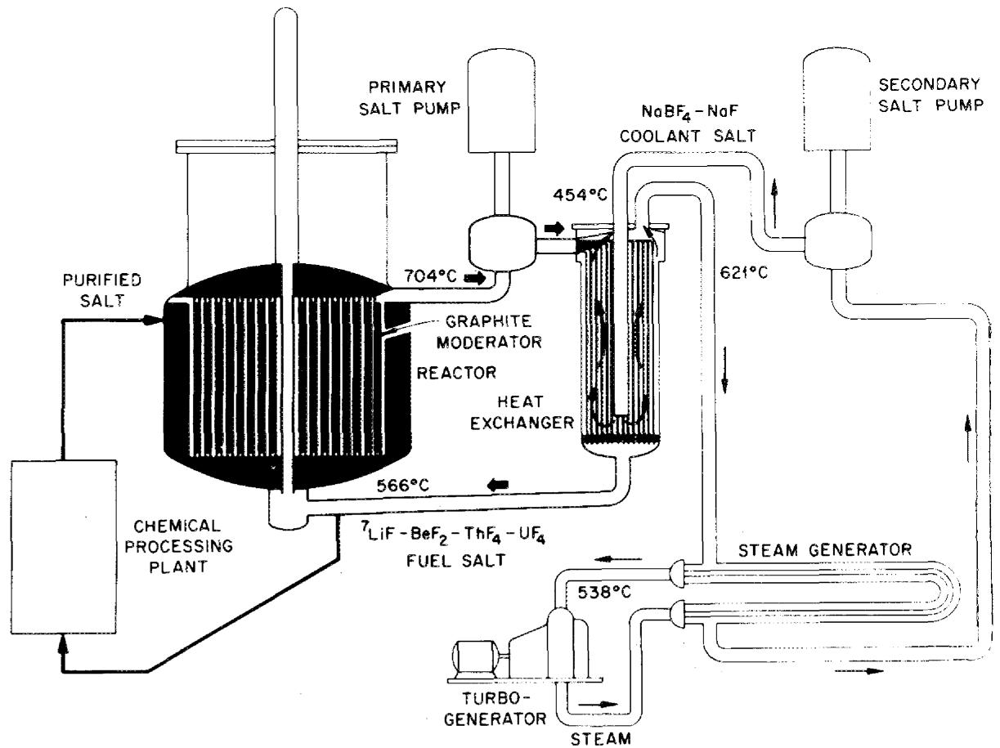  
Fig. 1. Single-fluid, two-region molten salt breeder reactor.

# 2.1 Fuel Circuit

The fuel circuit for a DMSR would be very similar to that for an MSBR; only the core design would be changed. The primary requirement for this redesign was a reduction in the core neutron flux (and power density) to

1. extend the life expectancy of the graphite moderator to the full 30-year plant lifetime,   
2. limit neutron captures in $^{233}\mathrm{Pa}$ which, to enhance proliferation resistance, would be retained in the fuel salt.

The lower power density would also tend to reduce the poisoning effects of short-lived fission products and to simplify the thermal-hydraulic constraints on the design of the moderator elements. The principal unfavorable effects would be the increases in inventory of the fuel salt and fissile fuel. Reference-design features of the DMSR core are described in greater detail in a later section.

At design power (1000 MWe), the fuel salt, which would have a liquidus temperature* of about $500^{\circ}\mathrm{C}$ , would enter the core at $566^{\circ}\mathrm{C}$ and leave at $704^{\circ}\mathrm{C}$ to transport about 2250 MWt (in four parallel loops) to the secondary salt. The flow rate of salt in each of the primary loops (including the bypass for xenon stripping) would be about $1\mathrm{m}^{3}/\mathrm{s}$ (16,000 gpm). The primary salt would contain 0.5 to $1\%$ (by volume) helium bubbles to serve as a stripping agent for xenon and other volatile fission products. Helium would be added to and removed from bypass flows of $\sim 10\%$ of each of the primary loop flows. This gas stripping would also remove some of the tritium from the primary salt, $^{\dagger}$ partly as $^{3}\mathrm{HF}$ ; however, most of the tritium would diffuse through the tube walls of the primary heat exchangers into the secondary salt. Helium removed from the primary circuit would be treated in a series of fission-product trapping and cleanup steps before being recycled for further gas stripping. Provisions would also be

made in the primary circuit to remove and return fuel salt without opening the primary containment and to add fuel-salt constituents as required to maintain the chemical condition of the salt.

# 2.2 Coolant Circuit

The secondary, or coolant-salt, circuits for the DMSR would be identical to those developed for the reference-design MSBR. The nominal flow rate of the secondary salt (a eutectic mixture of $\mathrm{NaBF}_4$ and NaF) would be about $1.26\mathrm{m}^3/\mathrm{s}$ (20,000 gpm) in each of the four loops, with a temperature rise from 454 to $621^{\circ}\mathrm{C}$ in the primary heat exchangers. This salt would be used to generate supercritical steam at about $540^{\circ}\mathrm{C}$ and 25 MPa to drive the turbine-generator system.*

In addition to its primary functions of isolating the highly radioactive primary circuit from the steam system and serving as an intermediate heat-transfer fluid, the sodium fluoroborate salt mixture would play a major role in limiting the release of tritium from the DMSR system. Engineering-scale tests in 1976 (Ref. 10) demonstrated that this salt is capable of trapping large quantities of tritium and transforming it to a less mobile, but still volatile, chemical form that transfers to the cover-gas system rather than diffusing through the steam generators to the water system. Consequently, the majority of the tritium ( $\sim 80\%$ ) would be trapped or condensed out of the secondary circuit cover gas, and less than $0.2\%$ of the total would be released.

# 2.3 Balance-of-Plant

The balance-of-plant for a DMSR primarily would be identical to that for an MSBR. Because the same salts and basic parameter values are involved, there would be no basis for changing the normal auxiliary systems required for normal plant operation. Differences, however, could appear in some of the safety systems. Because of the lower power density in the

DMSR, the shutdown residual-heat-removal (RHR) problem would be less severe than in the MSBR. Consequently, a less elaborate RHR system than would be needed for an MSBR might be acceptable for a DMSR. However, for purposes of characterizing the DMSR, the assumption was that the balance-of-plant would be the same as that for an MSBR.

# 2.4 Fuel Handling and Processing

The performance of an MSBR would be strongly dependent on the availability of an on-site continuous chemical-processing facility for removal of fission products and isolation of protactinium on relatively short time cycles. These treatments would make possible the achievement of a positive $^{233}\mathrm{U}$ breeding gain in a system with a low specific fissile inventory. Because a DMSR on a 30-year fuel cycle would not require even nominal break-even breeding and because a significantly higher fissile inventory could be tolerated, the processing requirements for a DMSR would be much less stringent than for an MSBR. Isolation of protactinium would be avoided for proliferation reasons, and chemical processing to remove fission products could be avoided without severe performance penalties.

Despite these concessions, some fission-product removal would take place in any MSR. Most of the rare gases (and some other volatile fission products) would be removed by the gas-sparging system in the primary circuit. In addition, a substantial fraction of the noble-metal* fission products would be expected to plate out on metal surfaces where they would not affect the neutronic performance. However, the reference-design reductive-extraction/metal-transfer process would not be involved.

Although there would be no chemical processing for fission-product removal, the DMSR likely would require a hydrofluorination system for occasional (presumably batchwise) treatment of the salt to remove oxygen contamination. In addition, because a DMSR would require routine additions of fissile fuel, as well as additions of other materials necessary to keep the fuel-salt chemical composition in proper balance, a chemical

addition station would be required. The technology for both of these operations is well established and was extensively demonstrated in the molten-salt reactor experiment (MSRE). These and other aspects of the DMSR fuel chemistry are treated in greater detail in a later section.

# 3. REFERENCE-CONCEPT DMSR

A preliminary conceptual design has been developed for a DMSR operating on a 30-year fuel cycle. The emphases to date have been on the reactor core design and fuel cycle, with less attention to other aspects of the system. Although this design establishes the basic concept and characterizes its major properties, it is tentative and would be subject to major refinement and revision if a substantial design effort were undertaken.

# 3.1 Neutronic Properties

The basic features of this DMSR concept which distinguish it from other MSRs are established primarily by the reactor core design and its associated neutronic properties. The design described here represents the results of a first-round effort to balance some of the many variables involved in a reactor core, but it is by no means an optimized design.

# 3.1.1 Neutronics core model

From a neutronics point of view, the core is simply designed as follows (Fig. 2).

1. The core and reflector fill a right circular cylinder that is $10 \, \text{m}$ in diameter and $10 \, \text{m}$ high. The core, which is a cylinder $8.3 \, \text{m}$ in diameter and $8.3 \, \text{m}$ high and centered inside the larger volume, is filled with cylindrical graphite logs in a triangular array of $0.254 \, \text{m}$ pitch. Approximately $95\%$ of the core (core B) has log diameter of $0.254 \, \text{m}$ , with the fluid fuel filling the interstitial volume to produce a fuel volume fraction of $9.31\%$ . An axial cylindrical hole of $0.051 \, \text{m}$ diam in the center of each log admits another $3.63\%$ fuel for a total of $12.94 \, \text{vol}\%$ . To achieve flattening of the fast flux and thus maximize the lifetime of the graphite moderator, the remaining $5\%$ of the core (core A), a cylinder $3 \, \text{m}$ in diameter and $3 \, \text{m}$ high, has a log diameter of $0.24 \, \text{m}$ , resulting in a total fuel volume fraction of $20.00\%$ in this zone.

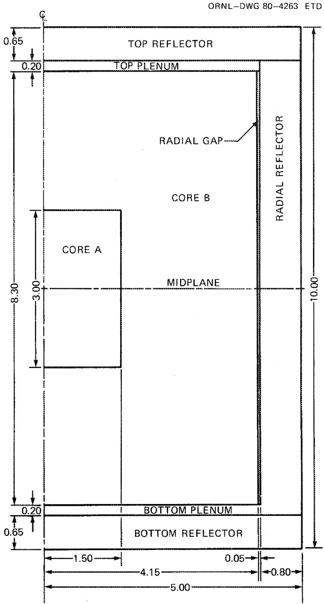  
Fig. 2. DMSR core model for neutronic studies - cylindrical geometry (all dimensions in meters).

2. The radial reflector is graphite $0.8\mathrm{m}$ thick and is attached to the reactor vessel at the $10 - \mathrm{m}$ diam. This leaves a gap of $0.05\mathrm{m}$ filled with fuel salt surrounding the core laterally.   
3. The inlet and outlet plena cover both the core and radial gap to their full diameter and are each $0.20 \, \text{m}$ thick. They consist of $50\%$ structural graphite and $50\%$ fuel.   
4. The axial reflectors are each $0.65\mathrm{m}$ thick and extend to the full $10 - \mathrm{m}$ diam.   
5. All reflector regions contain a small amount of fuel salt for cooling, which is estimated as $1 \text{ vol} \%$ at operating temperature.   
6. All stated dimensions are assumed to apply at nominal operating conditions. During system heatup, the length and diameter of the core vessel are assumed to increase at the rate of expansion of Hastelloy-N. The reflectors are assumed to expand at the expansion rate of graphite but to remain attached to the vessel. Because graphite expansion is less than that of the vessel, this will result in admitting additional salt to the reflector zones. The core and plenum regions are assumed to expand radially only at the expansion rate of graphite, which will establish the thickness of the radial gap. The axial configuration is affected by the logs floating upward in the salt and by the lower plenum being constructed so that it always contains $50\%$ salt. The thicknesses of the core and the upper plenum, then, increase at the graphite expansion rate, but the lower plenum grows at such a rate as to span the gap between the core and the bottom reflector.

Mechanical properties used for the principal constituents are summarized in Table 1. The salt is taken to have the nominal chemical composition shown in Table 2. The term "actinides" in this study refers to all elements of atomic numbers $\geq 90$ and not just to transplutonium elements. The actinide percentage is subject to small variations depending on the fuel cycle and the history of the fuel.

The inventory of fuel salt, both in and out of the core, is summarized in Table 3. This is believed to be a generous estimate of the required inventory for a l-GWe system. The thermal energy yield per fission is assumed to be 190 MeV for translation of absolute fission rates to effective power level.

Table 1. Reference properties of fuel salt and moderator for a DMSR   

<table><tr><td>Characteristic</td><td>Value</td></tr><tr><td>Graphite moderator density, Mg/m3</td><td>1.84</td></tr><tr><td>Fuel-salt density, Mg/m3</td><td>3.10</td></tr><tr><td>Graphite linear thermal expansion, × 10-6K-1</td><td>4.1</td></tr><tr><td>Vessel linear thermal expansion, × 10-6K-1</td><td>17.1</td></tr><tr><td>Fuel volumetric thermal expansion, × 10-6K-1</td><td>200</td></tr></table>

Table 2. Nominal chemical composition of DMSR fuel salt   

<table><tr><td>Material</td><td>Molar percentage</td></tr><tr><td>7LiF</td><td>74.0</td></tr><tr><td>BeF2</td><td>16.5</td></tr><tr><td>XF4α</td><td>9.5</td></tr><tr><td>Fission products</td><td>Trace</td></tr></table>

$\alpha_{\mathrm{X}}$ refers to all actinides.

Table 3. DMSR fuel-salt inventory   

<table><tr><td>Location</td><td>Volume (m3)</td></tr><tr><td>Core</td><td>59.4</td></tr><tr><td>Top and bottom plenums</td><td>11.1</td></tr><tr><td>Radial gap</td><td>10.9</td></tr><tr><td>Reflectors</td><td>3.0</td></tr><tr><td>External loop</td><td>20.0</td></tr><tr><td></td><td>104.0</td></tr></table>

# 3.1.2 Core design considerations

The size of the core was determined so as to allow a graphite moderator lifetime equal to the design lifetime of the plant. As compared with a smaller core, this resulted in lower neutron leakage, higher inventory of fissile material, and lower loss of protactinium due to neutron capture. If higher levels of graphite exposure were indicated by future data or decisions, a smaller core would probably be chosen.

The circular cylinder moderator shape resists binding effects that can occur with other shapes. The hole in the center is sized to provide desirable resonance self-shielding without undue thermal flux depression. The lattice pitch is simply a convenient one from both thermal and neutronic points of view. The reduced diameter of the central section of the logs was adjusted to give the proper degree of neutron flux flattening.

There is no doubt that flux flattening results in more core leakage, slightly degraded breeding, and more flux in the reactor vessel as compared with an unflattened core. The unflattened core, however, would have a much larger volume and much larger inventory of fissile material for the same maximum neutron damage flux.

The thorium concentration of the salt has been adjusted to give near-optimum long-term conversion and a low requirement for makeup fuel. This approach leads to a relatively high in-plant fissile inventory, which may have economic disadvantages. Thus, overall optimization might suggest more favorable combinations of inventory and makeup. The other actinide concentrations are determined by the various fueling policies considered and by the operating history of the fuel.

# 3.1.3 Neutronics calculation approach

# 3.1.3.1 Overall strategy

The overall approach was designed to couple numerous computer runs of relatively short duration. The objectives were good accuracy, relatively quick computer response, and the ability to repeat and revise different portions of the procedure as the design evolved.

Initial scoping studies showed that the self-shielding of thorium and $238\mathrm{U}$ has a most critical effect on the system neutronics, while that of the other uranium nuclides was comparatively less. Concentrations of protactinium, neptunium, and plutonium remained small enough to make self-shielding treatment of those nuclides necessary. The effect of resonance overlap between $^{232}\mathrm{Th}$ and $^{238}\mathrm{U}$ was of particular interest and was studied in some depth using the ROLAIDS module of the AMPX code system.[1] The conclusions were that this effect could be ignored safely in the present study and that treatment of the effect would have been burdensome had it been required.

Static. A set of cross sections for the more significant nuclides (Table 4) was prepared based on the ENDF/B Version 4 set of standard cross sections. $^{12}$ A total of 123 energy groups was used, with boundaries as listed in Table 5. Downscatter from any group to any other was allowed, and upscatter between all groups below 1.86 eV was allowed. The 123-group set was then reprocessed to enforce strict neutron conservation. This was especially important in the case of graphite.

Table 4. Nuclides in library of 123 energy groups used for DMSR study   

<table><tr><td>232Th</td><td>238U</td><td>F</td></tr><tr><td>233Pa</td><td>239Pu</td><td>7Li</td></tr><tr><td>233U</td><td>240Pu</td><td>Be</td></tr><tr><td>234U</td><td>241Pu</td><td>6Li</td></tr><tr><td>235U</td><td>242Pu</td><td>10B</td></tr><tr><td>236U</td><td>Graphite</td><td>238Pu</td></tr></table>

Self-shielding of thorium and uranium nuclides was treated using the NITAWL module of the AMPX code system. The Nordheim integral treatment was selected in each case. The geometric parameter applicable to the tricusp fuel area between the logs was determined by a special Monte Carlo computer code devised by J. R. Knight of ORNL.[13] Figure 3 illustrates

Table 5. XSDRN 123-group energy structure   

<table><tr><td rowspan="2">Group</td><td colspan="2">Boundaries</td><td rowspan="2">Group</td><td colspan="2">Boundaries</td><td rowspan="2">Group</td><td colspan="2">Boundaries</td></tr><tr><td>Energya</td><td>Lethargy</td><td>Energy</td><td>Lethargy</td><td>Energy</td><td>Lethargy</td></tr><tr><td>1</td><td>1.4918E07</td><td>-0.40</td><td>43</td><td>2.2371E05</td><td>3.80</td><td>84</td><td>2.2603E01</td><td>13.00</td></tr><tr><td>2</td><td>1.3499E07</td><td>-0.30</td><td>44</td><td>2.0242E05</td><td>3.90</td><td>85</td><td>1.7603E01</td><td>13.25</td></tr><tr><td>3</td><td>1.2214E07</td><td>-0.20</td><td>45</td><td>1.8316E05</td><td>4.00</td><td>86</td><td>1.3710E01</td><td>13.50</td></tr><tr><td>4</td><td>1.1052E07</td><td>-0.10</td><td>46</td><td>1.6573E05</td><td>4.10</td><td>87</td><td>1.0670E01</td><td>13.75</td></tr><tr><td>5</td><td>1.0000E07</td><td>0.0</td><td>47</td><td>1.4996E05</td><td>4.20</td><td>88</td><td>8.3153E-01</td><td>16.30</td></tr><tr><td>6</td><td>9.0948E06</td><td>0.10</td><td>48</td><td>1.3569E05</td><td>4.30</td><td>89</td><td>6.4760E-01</td><td>16.55</td></tr><tr><td>7</td><td>8.1873E06</td><td>0.20</td><td>49</td><td>1.2277E05</td><td>4.40</td><td>90</td><td>5.0435E-01</td><td>16.80</td></tr><tr><td>8</td><td>7.4082E06</td><td>0.30</td><td>50</td><td>1.1109E05</td><td>4.50</td><td>91</td><td>3.9279E-01</td><td>17.50</td></tr><tr><td>9</td><td>6.7032E06</td><td>0.40</td><td>51</td><td>8.6517E04</td><td>4.75</td><td>92</td><td>3.0590E-01</td><td>17.30</td></tr><tr><td>10</td><td>6.0653E06</td><td>0.50</td><td>52</td><td>6.7379E04</td><td>5.00</td><td>93</td><td>2.3824E-01</td><td>17.55</td></tr><tr><td>11</td><td>5.4881E06</td><td>0.60</td><td>53</td><td>5.2475E04</td><td>5.25</td><td>94</td><td>1.8554E-01</td><td>17.80</td></tr><tr><td>12</td><td>4.9659E06</td><td>0.70</td><td>54</td><td>4.0868E04</td><td>5.50</td><td>95</td><td>1.7090E-01</td><td>17.88</td></tr><tr><td>13</td><td>4.4933E06</td><td>0.80</td><td>55</td><td>3.1828E04</td><td>5.75</td><td>96</td><td>1.5670E-01</td><td>17.97</td></tr><tr><td>14</td><td>4.0657E06</td><td>0.90</td><td>56</td><td>2.4788E04</td><td>6.00</td><td>97</td><td>1.4320E-01</td><td>18.06</td></tr><tr><td>15</td><td>3.6788E06</td><td>1.00</td><td>57</td><td>1.9305E04</td><td>6.25</td><td>98</td><td>1.2850E-01</td><td>18.17</td></tr><tr><td>16</td><td>3.3287E06</td><td>1.10</td><td>58</td><td>1.5034E04</td><td>6.50</td><td>99</td><td>1.1340E-01</td><td>18.29</td></tr><tr><td>17</td><td>3.0119E06</td><td>1.20</td><td>59</td><td>1.1709E04</td><td>6.75</td><td>100</td><td>9.9920E-02</td><td>18.42</td></tr><tr><td>18</td><td>2.7253E06</td><td>1.30</td><td>60</td><td>9.1188E03</td><td>7.00</td><td>101</td><td>8.8100E-02</td><td>18.55</td></tr><tr><td>19</td><td>2.4660E06</td><td>1.40</td><td>61</td><td>7.1017E03</td><td>7.25</td><td>102</td><td>7.6840E-02</td><td>18.68</td></tr><tr><td>20</td><td>2.2313E06</td><td>1.50</td><td>62</td><td>5.5308E03</td><td>7.50</td><td>103</td><td>6.5520E-02</td><td>18.84</td></tr><tr><td>21</td><td>2.0190E06</td><td>1.60</td><td>63</td><td>4.3074E03</td><td>7.75</td><td>104</td><td>5.4880E-02</td><td>19.02</td></tr><tr><td>22</td><td>1.8268E06</td><td>1.70</td><td>64</td><td>3.3546E03</td><td>8.00</td><td>105</td><td>4.4850E-02</td><td>19.22</td></tr><tr><td>23</td><td>1.6530E06</td><td>1.80</td><td>65</td><td>2.6126E03</td><td>8.25</td><td>106</td><td>3.6140E-02</td><td>19.44</td></tr><tr><td>24</td><td>1.4957E06</td><td>1.90</td><td>66</td><td>2.0347E03</td><td>8.50</td><td>107</td><td>2.9940E-02</td><td>19.63</td></tr><tr><td>25</td><td>1.3534E06</td><td>2.00</td><td>67</td><td>1.5846E03</td><td>8.75</td><td>108</td><td>2.4930E-02</td><td>19.81</td></tr><tr><td>26</td><td>1.2246E06</td><td>2.10</td><td>68</td><td>1.2341E03</td><td>9.00</td><td>109</td><td>2.0710E-02</td><td>20.00</td></tr><tr><td>27</td><td>1.1080E06</td><td>2.20</td><td>69</td><td>9.6112E02</td><td>9.25</td><td>110</td><td>1.7980E-02</td><td>20.14</td></tr><tr><td>28</td><td>1.0026E06</td><td>2.30</td><td>70</td><td>7.4852E02</td><td>9.50</td><td>111</td><td>1.5980E-02</td><td>20.25</td></tr><tr><td>29</td><td>9.0718E05</td><td>2.40</td><td>71</td><td>5.8295E02</td><td>9.75</td><td>112</td><td>1.3980E-02</td><td>20.39</td></tr><tr><td>30</td><td>8.2085E05</td><td>2.50</td><td>72</td><td>4.5400E02</td><td>10.00</td><td>113</td><td>1.1980E-02</td><td>20.54</td></tr><tr><td>31</td><td>7.4274E05</td><td>2.60</td><td>73</td><td>3.5357E02</td><td>10.25</td><td>114</td><td>9.9700E-03</td><td>20.73</td></tr><tr><td>32</td><td>6.7206E05</td><td>2.70</td><td>74</td><td>2.7536E02</td><td>10.50</td><td>115</td><td>8.2300E-03</td><td>20.92</td></tr><tr><td>33</td><td>6.0810E05</td><td>2.80</td><td>75</td><td>2.1145E02</td><td>10.75</td><td>116</td><td>6.9900E-03</td><td>21.08</td></tr><tr><td>34</td><td>5.5023E05</td><td>2.90</td><td>76</td><td>1.6702E02</td><td>11.00</td><td>117</td><td>5.9900E-03</td><td>21.24</td></tr><tr><td>35</td><td>4.9787E05</td><td>3.00</td><td>77</td><td>1.3007E02</td><td>11.25</td><td>118</td><td>4.9900E-03</td><td>21.42</td></tr><tr><td>36</td><td>4.5049E05</td><td>3.10</td><td>78</td><td>1.0130E02</td><td>11.50</td><td>119</td><td>3.9800E-03</td><td>21.64</td></tr><tr><td>37</td><td>4.0762E05</td><td>3.20</td><td>79</td><td>7.8893E01</td><td>11.75</td><td>120</td><td>2.9800E-03</td><td>21.93</td></tr><tr><td>38</td><td>3.6883E05</td><td>3.30</td><td>80</td><td>6.1442E01</td><td>12.00</td><td>121</td><td>2.1100E-03</td><td>22.28</td></tr><tr><td>39</td><td>3.3373E05</td><td>3.40</td><td>81</td><td>4.7851E01</td><td>12.25</td><td>122</td><td>1.4900E-03</td><td>22.63</td></tr><tr><td>40</td><td>3.0197E05</td><td>3.50</td><td>82</td><td>3.7267E01</td><td>12.50</td><td>123</td><td>9.8000E-04</td><td>23.05</td></tr><tr><td>41</td><td>2.7324E05</td><td>3.60</td><td>83</td><td>2.9023E01</td><td>12.75</td><td>124</td><td>4.7000E-04</td><td>23.78b</td></tr><tr><td>42</td><td>2.4724E05</td><td>3.70</td><td></td><td></td><td></td><td></td><td></td><td></td></tr></table>

$\alpha_{\mathrm{Exx}}$ corresponds to $10^{\mathbf{xx}}$ .   
Lower boundary of group 123.

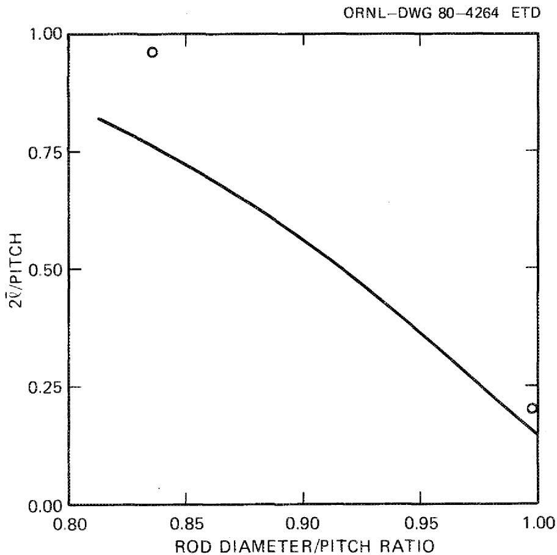  
Fig. 3. Mean chord length $\overline{k}$ of fuel surrounding triangular arrays of moderator rods. Circles illustrate predictions by the $4\mathrm{V} / \mathrm{A}$ rule.

the results of this treatment. The salt in the plenum and radial gap regions was represented as a 0.05-m plane environment.

The resulting multigroup cross sections were used with the XSDRNPM module of AMPX to accomplish a discrete-ordinates cell calculation in the S-4 approximation and to accomplish group reduction to three energy groups, as shown in Table 6. A separate cell calculation was performed for each of the two log diameters. Plenum and gap cross sections were weighted over the spectrum of the smaller log diameter because it lies between the standard diameter and the pure salt region in hardness.

The basic concentrations of the nuclides were based on estimated midlife conditions. Additional cases of self-shielding for the thorium

Table 6. Few-group energy structure for DMSR neutronic studies   

<table><tr><td>Energy group</td><td>Energy range</td></tr><tr><td>Fast</td><td>14.918 MeV to 52.475 eV</td></tr><tr><td>Resonance</td><td>52.475 eV to 2.3824 eV</td></tr><tr><td>Thermal</td><td>2.3824 eV to 0.00047 eV</td></tr></table>

and uranium nuclides were prepared for use in the depletion and reactivity coefficient studies. These were weighted over the neutron spectra calculated in the cell calculation.

The macrospatial effects were treated using the reduced cross section set with the APC II computer code.14 Separate axial and radial flux profiles were found with mutually consistent flux and leakage results. Core heterogeneity was treated by transverse flux weighting of the detailed geometry. Reaction parameters necessary for burnup were determined from these results, with care taken to combine all reactions representing a particular nuclear species regardless of positions in the cell or the identity of the cell involved. This is consistent with an assumption of rapid fuel circulation and mixing.

Burnup. A simple burnup code, QUAB, was devised to treat the unusual requirements of this study. Special features include the following.

1. Sufficient $238\mathrm{U}$ is added at all times to maintain the denatured condition.   
2. The thorium concentration can be held constant by automatic addition, allowed to decline naturally, or adjusted to maintain constant total actinide concentration.   
3. Periodic additions of enriched fissile material can be made.   
4. Periodic withdrawals of fuel can be made selectively by nuclide. This fuel can be held until the protactinium decays and then be reinserted selectively by nuclide into the machine. The first removal is replaced with fuel identical to the initial loading.   
5. Enriched material can be added on demand to maintain a specified reactivity margin.

The code calculates nuclide concentrations, total inventories, reactivity, and breeding ratio as a function of time.

Treating the lengthy transplutonium and fission-product chains in QUAB was not practical; multigroup data were not available for many of the required nuclides and were of dubious reliability for others. Instead, the ORIGEN code15 was used with a library of cross sections16 especially devised for its use. The ORIGEN results were then "patched into" the QUAB calculation directly.

The burnup calculation allowed the cross sections of thorium and $238\mathrm{U}$ to vary continuously during the calculation; this was accomplished by interpolation.

# 3.1.3.2 Evaluation

As desired, the method provided relatively rapid response, detailed treatment of resonances, and a multigroup spectrum and cell treatment. All details of the denatured fuel cycle were treated. The expedient of treating a range of thorium and $^{238}\mathrm{U}$ densities removed the necessity of imbedding the expensive and tedious resonance treatment inside the loop for varying densities. Deciding on the applicable range was not difficult after a few initial tries.

A system coupling the spatial calculation and depletion could be used. Many such systems are available, although all would require extensive modification for MSR use. What of the cell calculation? Table 7 shows the cell factors from our reference case which have been condensed to three energy groups. This is clearly a heterogeneous core. Further, the actinide densities are continually changing, resulting in time-dependent cell factors. Studies beyond these would be required to prove that a coupled system could be worthwhile without directly coupled cell calculations.

The requirement to "unmix" the revised nuclear densities after having them lumped together during a depletion step represents a complication that would thwart most existing codes. However, this complication must be coupled with logic to provide interpolation between cross-section sets representing various self-shielding situations. With or without an

Table 7. Unit cell flux ratios ${}^{a}$ for reference DMSR   

<table><tr><td rowspan="2">Energy group</td><td rowspan="2">Core zone</td><td colspan="3">Cell material</td></tr><tr><td>Inner salt</td><td>Moderator</td><td>Interstitial salt</td></tr><tr><td>Fast</td><td>A</td><td>1.14</td><td>0.96</td><td>1.14</td></tr><tr><td>Resonance</td><td>A</td><td>0.97</td><td>1.01</td><td>0.97</td></tr><tr><td>Thermal</td><td>A</td><td>0.94</td><td>1.03</td><td>0.88</td></tr><tr><td>Fast</td><td>B</td><td>1.28</td><td>0.98</td><td>1.12</td></tr><tr><td>Resonance</td><td>B</td><td>0.97</td><td>1.00</td><td>0.98</td></tr><tr><td>Thermal</td><td>B</td><td>0.88</td><td>1.01</td><td>0.93</td></tr></table>

$a_{\mathrm{Average}}$ flux in material divided by average cell flux.

imbedded cell calculation, an unusual code system clearly would be necessary to provide a fully satisfying level of detail to this problem. Obviously, a true two-dimensional spatial treatment of the flattened core would be appropriate, but imbedding such a calculation inside a depletion loop is expensive.

# 3.1.4 Once- through system considerations

# 3.1.4.1 Fueling policy

For purposes of nuclear calculations, the fueling policy for the once-through DMSR is as follows.

1. Thorium is added to an initial loading of salt in a specified concentration. During operation, the concentration is allowed to decline via burnup. Near the end of plant life, small amounts are removed as required to keep the total actinide content below the startup value.   
2. Uranium is added at the maximum allowable enrichment in the amount necessary to maintain criticality.

3. Additional $^{238}\mathrm{U}$ is added as required to maintain the denaturing inequality*

$$
\text {d e n s i t y} ^ {2 3 8} \mathrm {U} \geq (6 \times \text {d e n s i t y} ^ {2 3 3} \mathrm {U}) + (4 \times \text {d e n s i t y} ^ {2 3 5} \mathrm {U}).
$$

4. Removal of certain fission products is accomplished according to Table 8.

Table 8. Removal times for fission products in once-through cycles   

<table><tr><td>Fission-product group</td><td>Element</td><td>Removal time</td></tr><tr><td>Noble gases</td><td>Kr, Xe</td><td>50 s</td></tr><tr><td>Sominoble and noble metals</td><td>Zn, Ga, Ge, As, Nb, Mo, Tc, Ru, Rh, Pd, Ag, Cd, In, Sn, Sb</td><td>2.4 h</td></tr></table>

# 3.1.4.2 Fission-product buildup

A study of 30-year fission-product buildup was made as a function of various continuous removal rates for those products not listed in Table 8. The reactivity effect may be satisfactorily represented by

$$
\mathrm {d} \rho / \mathrm {d} t = Y - (\lambda + R) \rho ,
$$

where

$$
\begin{array}{l} \rho = \text {fission - product reactivity effect} (\%), \\ t = \text {t i m e} (y e a r), \\ Y = \text {yield} (0.93 \% / \text {year}), \\ \lambda = \text {b u r n o u t} (6. 8 \text {y e a r}) ^ {- 1}, \\ R = \text {r e m o v a l} \quad r a t e \quad (y e a r ^ {- 1}). \\ \end{array}
$$

The fit to data representing four removal times from five years to infinity had an absolute standard deviation of $0.28\%$ , which was considered adequate. Studies using this model indicated that removal times of a few years but shorter than infinity were not worthwhile, and the results of this section assume $\mathbb{R} = 0$ .

# 3.1.4.3 Transplutonium effects

A detailed study of transplutonium effects9 was made, and the conclusion was reached that the resulting fissile production only partially offsets the capture. The balance is less favorable than in reactors of higher power density because of the partial decay of $^{244}\mathrm{Cm}$ to $^{240}\mathrm{Pu}$ , which has comparatively less value. The study showed that each atom of $^{240}\mathrm{Pu}$ produced from $^{239}\mathrm{Pu}$ is joined by 0.11 additional atoms from the decay of $^{244}\mathrm{Cm}$ . For each neutron absorption in $^{242}\mathrm{Pu}$ calculated without the transplutonium effect, 4.0 additional absorptions and 3.2 additional fission neutrons ultimately result.

Although the actual time effects are complicated, the net effect was approximately represented as an additional fictitious nuclide, which was produced by capture in $^{242}\mathrm{Pu}$ and had the absorption cross section of $^{242}\mathrm{Pu}$ and no progeny. This would be slightly conservative at equilibrium and probably at earlier times also.

# 3.1.5 Staticneutronic results

# 3.1.5.1 Inventory and neutron utilization

Table 9 indicates the inventory of actinides at the beginning, middle, and end of the 30-year operating period, assuming a $75\%$ capacity factor. The high initial loading of $^{235}\mathrm{U}$ is largely replaced by $^{233}\mathrm{U}$ bred by the system in the first half of the lifetime. Toward the end of lifetime, enriched uranium additions required to override fission-product buildup cause a final increase in both the $^{235}\mathrm{U}$ and $^{238}\mathrm{U}$ content. The plutonium inventory is never large because of its high cross section in this spectrum.

Table 10 shows the midlife neutron utilization information. Note the low capture rate in nonfuel salt constituents (0.0153) and the fission-

Table 9. Actinide inventories in DMSR fuel salt   

<table><tr><td></td><td colspan="3">Inventory (kg)</td></tr><tr><td></td><td>BOLa</td><td>MOLb</td><td>EOLc</td></tr><tr><td>232Th</td><td>110,000</td><td>103,000</td><td>92,900</td></tr><tr><td>233Pa</td><td>0</td><td>45</td><td>38</td></tr><tr><td>233Ud</td><td>0</td><td>1,970</td><td>1,910</td></tr><tr><td>234U</td><td>0</td><td>372</td><td>596</td></tr><tr><td>235Ud</td><td>3,450</td><td>1,020</td><td>1,250</td></tr><tr><td>236U</td><td>0</td><td>661</td><td>978</td></tr><tr><td>237Np</td><td>0</td><td>75</td><td>136</td></tr><tr><td>238U</td><td>14,000</td><td>19,600</td><td>28,600</td></tr><tr><td>239Pu d</td><td>0</td><td>179</td><td>231</td></tr><tr><td>240Pu</td><td>0</td><td>102</td><td>133</td></tr><tr><td>241Pu d</td><td>0</td><td>76</td><td>100</td></tr><tr><td>242Pu</td><td>0</td><td>99</td><td>179</td></tr><tr><td>238Pu</td><td>0</td><td>36</td><td>93</td></tr><tr><td>Total actinides</td><td>127,000</td><td>127,000</td><td>127,000</td></tr><tr><td>Fissile uranium</td><td>3,450</td><td>2,990</td><td>3,160</td></tr><tr><td>Total fissile</td><td>3,450</td><td>3,440</td><td>3,490</td></tr></table>

$\alpha_{\text{Beginning-of-life}}$   
b Middle-of-life.   
$\pmb{c}$ End-of-life.   
$d_{\text{Nuclide}}$ treated as fissile in inventory calculation.

product capture rate (0.0563). A total of $22.2\%$ of the fission take place in $^{238}\mathrm{U}$ and its progeny, even though they comprise only $9.8\%$ of the fissile inventory. In spite of the high value of $\nu$ for these nuclides, they would not be a sufficient fuel without the thorium chain. The slight contribution of the transplutonium nuclides to total mass has been ignored, and the absorption value shown for this nuclide group is a net of absorp-tions less fissions. About $4\%$ of the $^{241}\mathrm{Pu}$ is lost through decay to $^{241}\mathrm{Am}$ , a poor fuel. The capture in $^{233}\mathrm{Pa}$ is particularly expensive be-cause each such atom otherwise would result in a highly profitable $^{233}\mathrm{U}$ fission.

Table 10. Nuclide concentrations and neutron utilization after 15 years of DMSR operation   

<table><tr><td>Nuclide</td><td>Concentrationa(x 1024)</td><td>Neutron absorptionb</td><td>Fission fraction</td><td>νσf/σa</td></tr><tr><td>232Th</td><td>2,561</td><td>0.2561</td><td>0.0017</td><td>0.0070</td></tr><tr><td>233Pa</td><td>1.13</td><td>0.0018</td><td>0.0000</td><td>0.0033</td></tr><tr><td>233U</td><td>49.0</td><td>0.2483</td><td>0.5480</td><td>2.2427</td></tr><tr><td>234U</td><td>9.21</td><td>0.0120</td><td>0.0002</td><td>0.0143</td></tr><tr><td>235U</td><td>25.1</td><td>0.1161</td><td>0.2272</td><td>1.9894</td></tr><tr><td>236U</td><td>16.2</td><td>0.0075</td><td>0.0001</td><td>0.0168</td></tr><tr><td>237Np</td><td>1.83</td><td>0.0047</td><td>0.0000</td><td>0.0102</td></tr><tr><td>238U</td><td>476</td><td>0.0901</td><td>0.0017</td><td>0.0194</td></tr><tr><td>239Pu</td><td>4.34</td><td>0.0896</td><td>0.1578</td><td>1.7905</td></tr><tr><td>240Pu</td><td>2.46</td><td>0.0324</td><td>0.0001</td><td>0.0032</td></tr><tr><td>241Pu</td><td>1.84</td><td>0.0293</td><td>0.0628</td><td>2.1754</td></tr><tr><td>242Pu</td><td>2.38</td><td>0.0039</td><td>0.0001</td><td>0.0136</td></tr><tr><td>Transplutoniume</td><td></td><td>0.0014</td><td></td><td></td></tr><tr><td>238Pu</td><td>0.882</td><td>0.0024</td><td>0.0003</td><td>0.1245</td></tr><tr><td>Total actinides</td><td></td><td>0.8956</td><td>1.0000</td><td></td></tr><tr><td>Fluorine</td><td>48,000</td><td>0.0079</td><td></td><td></td></tr><tr><td>Lithium</td><td>24,500</td><td>0.0062</td><td></td><td></td></tr><tr><td>Beryllium</td><td>5,470</td><td>0.0012</td><td></td><td></td></tr><tr><td></td><td></td><td>0.9109</td><td></td><td></td></tr><tr><td>Graphite</td><td>92,270</td><td>0.0172</td><td></td><td></td></tr><tr><td>Fission products</td><td></td><td>0.0563</td><td></td><td></td></tr><tr><td>Total</td><td></td><td>0.9844</td><td></td><td></td></tr></table>

$\alpha_{\text{Nuclei per cubic meter of salt or moderator.}}$   
$\bar{b}_{\text{Absorption per neutron born; leakage is 0.0156}}$   
$C$ Includes $^{240}\mathrm{Pu}$ , $^{241}\mathrm{Pu}$ , and $^{242}\mathrm{Pu}$ produced from a decay of $^{244}\mathrm{Cm}$ .

# 3.1.5.2 Flux and power distributions and graphite lifetime

The relative fast flux (E > 52.4 keV) and power-peaking factors are given in Table 11. These factors include the effects of flattening. For comparison, the overall fast flux peaking in an unflattened core would be $\sim 2.3$ ; the neutron leakage, however, would be only $0.8\%$ vs $1.56\%$ for this core.

Relative power distributions (Fig. 4) show no serious problems. The peak occurs in the well-cooled inner zone. A power peak per unit of core volume occurs in the gap between the core and the reflector, but the power per unit volume of salt is actually relatively low in that region.

Table 11. Neutron flux and power-peaking factors   

<table><tr><td></td><td>Fast flux</td><td>Power</td></tr><tr><td>Radial</td><td>1.32</td><td>1.36</td></tr><tr><td>Axial</td><td>1.15</td><td>1.15</td></tr><tr><td>Overall</td><td>1.52</td><td>1.56</td></tr></table>

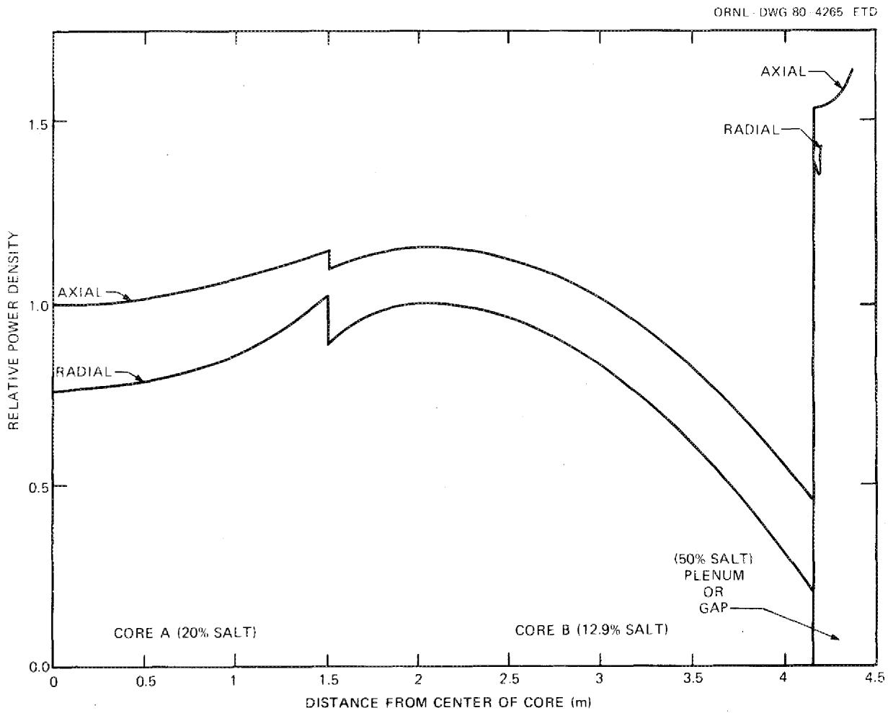  
Fig. 4. DMSR relative power-density distribution. Axial and radial profiles are separately and arbitrarily normalized.

The absolute maximum fast flux is of special interest because of its effect in limiting the graphite lifetime and, thus, in defining the core size. The maximum damage flux calculated in this study occurs near the edge of the inner core and is, at full power,

$$
\phi_ {\max } = 3. 9 \times 1 0 ^ {1 7} \text {n e u t r o n s} \mathrm {m} ^ {- 2} \mathrm {s} ^ {- 1} (3. 9 \times 1 0 ^ {1 3} \text {n e u t r o n s} \mathrm {c m} ^ {- 2} \mathrm {s} ^ {- 1}).
$$

In 30 years at $75\%$ capacity factor, this leads to a fluence of $2.7 \times 10^{26} \mathrm{~m}^{-2}$ ( $2.7 \times 10^{22} \mathrm{~cm}^{-2}$ ), which is well below the nominal graphite damage limit of $3 \times 10^{26} \mathrm{~m}^{-2}$ ( $3 \times 10^{22} \mathrm{~cm}^{-2}$ ).

# 3.1.5.3 Spectral and cross-section effects

A summary of relative absorptions, fission neutron productions, and neutron flux by energy group is shown in Table 12. Many of the captures are in the resonance range, largely in thorium and $^{238}\mathrm{U}$ , which leads to a larger absorption fraction in that group. In contrast, most of the fissions are caused by thermal neutrons.

Table 12. Spectral distribution in neutronic effects in a DMSR core   

<table><tr><td>Neutron energy group</td><td>Relative neutron flux</td><td>Fraction of neutron absorptions</td><td>Fraction of fission neutrons produced</td></tr><tr><td>Fast</td><td>66</td><td>0.014</td><td>0.007</td></tr><tr><td>Resonance</td><td>131</td><td>0.290</td><td>0.087</td></tr><tr><td>Thermal</td><td>134</td><td>0.676</td><td>0.906</td></tr></table>

Of special interest are the resonance cross sections of $^{232}\mathrm{Th}$ and $^{238}\mathrm{U}$ , because these largely determine the relative weight of the high-yield $^{232}\mathrm{Th}$ breeding chain vs the lower-yield $^{238}\mathrm{U}$ chain. Table 13 shows the effect of the lumping parameter $\overline{\lambda}$ on these data at typical densities. This shows that the spectral difference between the cells of core zones A and B (Fig. 2) gives a lower $^{238}\mathrm{U}$ capture effect in the harder spectrum

Table 13. Effect of lumping on key resonance cross sections   

<table><tr><td>Core zonea</td><td>Salt zone in cell</td><td>λ (cm)</td><td>σa(232Th) (barns)</td><td>σa(238U) (barns)</td><td>σa(238U)/σa(232Th)</td></tr><tr><td>A</td><td>Inner</td><td>2.540</td><td>2.44</td><td>7.86</td><td>3.22</td></tr><tr><td>A</td><td>Outer</td><td>2.032</td><td>2.51</td><td>7.96</td><td>3.17</td></tr><tr><td>B</td><td>Inner</td><td>2.540</td><td>2.42</td><td>7.96</td><td>3.29</td></tr><tr><td>B</td><td>Outer</td><td>1.022</td><td>3.14</td><td>10.6</td><td>3.38</td></tr><tr><td>Gap</td><td></td><td>5.0</td><td>2.14</td><td>6.6</td><td>3.08</td></tr></table>

${}^{a}$ See Fig. 2 for identification of core zones.

of zone A, as judged by the two zones with $\overline{k} = 25.4 \mathrm{~mm}$ . To estimate the effect on neutron yield, the $^{232}\mathrm{Th}$ chain has an ultimate yield in a particular situation of 1.06 neutrons per capture in $^{232}\mathrm{Th}$ , while the yield of $^{238}\mathrm{U}$ is only 0.84 (Ref. 9). With $\sim 40\%$ of the fertile capture in $^{238}\mathrm{U}$ , as it is for the present system, a $10\%$ increase in the 238-to-232 capture ratio would reduce neutron yield by $\sim 0.5\%$ . Accordingly, the variation in Table 12 is not a large effect. Even though cell geometry changes the cross sections significantly, the $^{232}\mathrm{Th}$ and $^{238}\mathrm{U}$ changes approximately cancel each other.

Another variable of interest is the density of the fuel-salt heavy nuclides. Table 9 shows that $^{238}\mathrm{U}$ density approximately doubles during the life of the system, and this is not accompanied by a corresponding change in $^{232}\mathrm{Th}$ . Varying over a range of reasonable interest, resonance data vs density are shown in Table 14 for the case of core zone A with $\overline{\lambda} = 25.4\mathrm{mm}$ . While the $^{232}\mathrm{Th}$ density increases by $51\%$ , the product of density and cross section increases by only $28\%$ . For $^{238}\mathrm{U}$ , the density increases by $129\%$ , and the product increases by only $57\%$ , thus illustrating that nuclide density and its effect on resonance cross section are both large, but partially cancelling, effects. A similar table for other nuclides for which resonances were calculated shows relatively less influence of nuclide density on cross section (Table 15).

Table 14. Effect of nuclide density on key resonance cross sections   

<table><tr><td>Nuclide</td><td>N
(nuclei/m3)</td><td>σa
(barns)</td><td>Noa
(m-1)</td></tr><tr><td rowspan="5">232Th</td><td>2200</td><td>2.61</td><td>0.5742</td></tr><tr><td>2400</td><td>2.52</td><td>0.6048</td></tr><tr><td>2582</td><td>2.44</td><td>0.6300</td></tr><tr><td>2800</td><td>2.37</td><td>0.6636</td></tr><tr><td>3318</td><td>2.21</td><td>0.7332</td></tr><tr><td rowspan="5">238U</td><td>350</td><td>9.03</td><td>0.3160</td></tr><tr><td>481</td><td>7.86</td><td>0.3781</td></tr><tr><td>650</td><td>6.85</td><td>0.4452</td></tr><tr><td>722</td><td>6.32</td><td>0.4563</td></tr><tr><td>800</td><td>6.22</td><td>0.4976</td></tr></table>

Table 15. Effect of nuclide density on other resonance cross sections   

<table><tr><td>Nuclide</td><td>Concentration (1024nuclei/m3)</td><td>σa(barns)</td><td>ΔN/N (%)</td><td>Δ(Noa)/(Noa)(%)</td></tr><tr><td>233U</td><td>47.2</td><td>33.3</td><td></td><td></td></tr><tr><td>233U</td><td>56.0</td><td>32.7</td><td>19</td><td>17</td></tr><tr><td>234U</td><td>8.62</td><td>39.9</td><td></td><td></td></tr><tr><td>234U</td><td>15.8</td><td>35.6</td><td>83</td><td>64</td></tr><tr><td>235U</td><td>25.9</td><td>27.5</td><td></td><td></td></tr><tr><td>235U</td><td>40.8</td><td>27.3</td><td>58</td><td>56</td></tr><tr><td>236U</td><td>16.4</td><td>22.9</td><td></td><td></td></tr><tr><td>236U</td><td>26.3</td><td>21.1</td><td>60</td><td>48</td></tr></table>

Spectral effects are also important, because a more thermal spectrum improves the neutron yield of both $^{233}\mathrm{U}$ and $^{235}\mathrm{U}$ but also results in more parasitic capture in these fissile nuclides. To illustrate this, Table 16 shows the effective neutron yield for the hard spectrum of core A vs the soft spectrum of core B. While $\nu \sigma_{\mathrm{f}} / \sigma_{\mathrm{a}}$ within each neutron group shows relatively little change, the overall ratio shows a $3\%$ increase in yield because of the softer spectrum.

Table 16. Effect of neutron spectrum on neutron yield for homogenized cell material   

<table><tr><td>Core zoneα</td><td>Neutron energy group</td><td>Neutron yield (νσf/σa)</td><td>index</td></tr><tr><td>A</td><td>Resonance</td><td>0.338</td><td></td></tr><tr><td>A</td><td>Thermal</td><td>1.442</td><td></td></tr><tr><td>A</td><td>Overall</td><td>1.050</td><td></td></tr><tr><td>B</td><td>Resonance</td><td>0.330</td><td></td></tr><tr><td>B</td><td>Thermal</td><td>1.432</td><td></td></tr><tr><td>B</td><td>Overall</td><td>1.080</td><td></td></tr></table>

a See Fig. 2 for identification of core zones.

# 3.1.6 Burnup results

# 3.1.6.1 Reactor fuel cycle

The time history of the fuel cycle in the DMSR provides some insight into the uranium resource utilization in this concept. The available reactivity in the core (Fig. 5) shows an increase during the first year as the inventory of $^{233}\mathrm{U}$ , a more efficient fuel than $^{235}\mathrm{U}$ , builds. This rise would have to be controlled so that fuel consumption was minimized. Thus, a temporary removal of some denatured fuel or additions of fertile material might be more effective than insertion of simple neutron poisons. After the first year, the reactivity begins to decline as fission-product poisoning increases and overcomes the $^{233}\mathrm{U}$ effect. Reactivity is subsequently kept above 1.0 by periodic additions of makeup fuel, containing $20\%$ enriched $^{235}\mathrm{U}$ .

The net conversion ratio of the system (fissile production divided by fissile consumption), which is shown in Fig. 6, undergoes a much more persistent rise that lasts about five years before a gradual decline sets in that lasts until the end of the 30-year cycle. Much of this decline is attributable to neutron poisoning by $^{238}\mathrm{U}$ , which is added with the

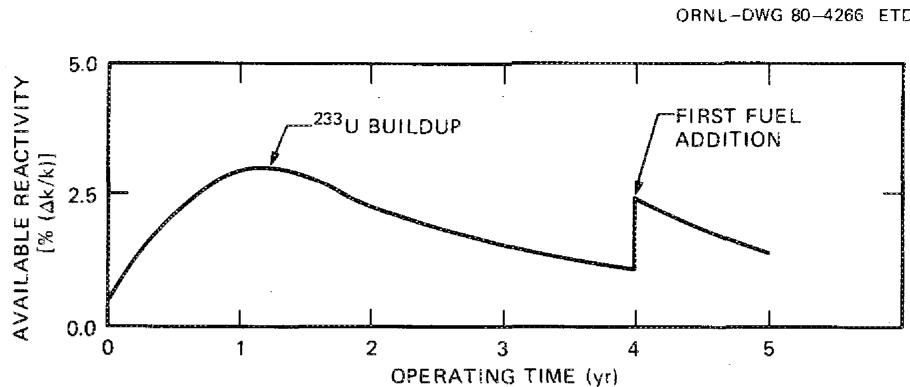  
Fig. 5. Time variation of core reactivity in a once-through DMSR operating at $75\%$ capacity factor.

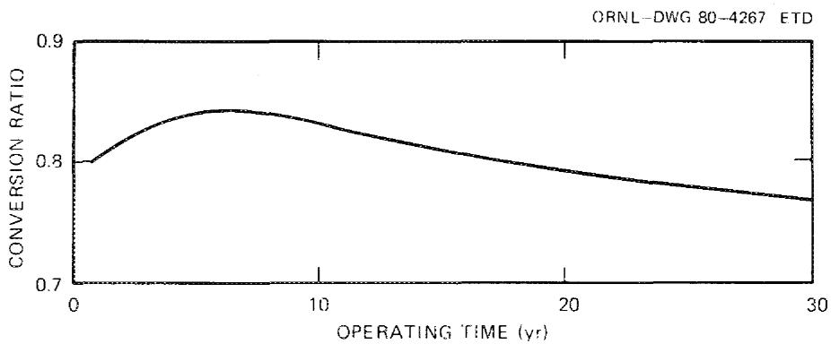  
Fig. 6. Conversion ratio vs time.

makeup fuel. The lifetime average conversion ratio for the 30-year fuel cycle is close to 0.8.

The schedule of fuel additions, including the initial critical loading for a 1-GWe plant operating at a $75\%$ capacity factor is shown in Table 17. This table also includes the quantities of the $\mathrm{U}_{3}\mathrm{O}_{8}$ and separative work required to supply the fissile material. Thus, the lifetime ore requirement would be about 2000 tons of $\mathrm{U}_{3}\mathrm{O}_{8}$ if no credit were allowed for the end-of-life fissile inventory. However, uranium is readily recoverable from this fuel in a pure and reusable form as $\mathrm{UF}_{6}$ . The recovered uranium would have to be reenriched, either by isotopic separation or by addition of high-enrichment fuel, before it could be reused in another DMSR, but reuse in some manner might be preferable to discarding the

Table 17. Fuel addition schedule for once-through DMSR   

<table><tr><td>Year</td><td>238U added (kg)</td><td>235U added (kg)</td><td>U3O8 requirement (Mg)a</td><td>Separative work requirement (103 kg)</td></tr><tr><td>0b</td><td>14,000</td><td>3,450</td><td>788</td><td>789</td></tr><tr><td>1</td><td>0</td><td>0</td><td>0</td><td>0</td></tr><tr><td>2</td><td>174</td><td>0</td><td>0</td><td>0</td></tr><tr><td>3</td><td>105</td><td>0</td><td>0</td><td>0</td></tr><tr><td>4</td><td>890</td><td>203</td><td>46.4</td><td>46.4</td></tr><tr><td>5</td><td>0</td><td>0</td><td>0</td><td>0</td></tr><tr><td>6</td><td>822</td><td>203</td><td>46.4</td><td>46.4</td></tr><tr><td>7</td><td>0</td><td>0</td><td>0</td><td>0</td></tr><tr><td>8</td><td>822</td><td>203</td><td>46.4</td><td>46.4</td></tr><tr><td>9</td><td>822</td><td>203</td><td>46.4</td><td>46.4</td></tr><tr><td>10</td><td>0</td><td>0</td><td>0</td><td>0</td></tr><tr><td>11</td><td>822</td><td>203</td><td>46.4</td><td>46.4</td></tr><tr><td>12</td><td>822</td><td>203</td><td>46.4</td><td>46.4</td></tr><tr><td>13</td><td>822</td><td>203</td><td>46.4</td><td>46.4</td></tr><tr><td>14</td><td>822</td><td>203</td><td>46.4</td><td>46.4</td></tr><tr><td>15</td><td>822</td><td>203</td><td>46.4</td><td>46.4</td></tr><tr><td>16</td><td>0</td><td>0</td><td>0</td><td>0</td></tr><tr><td>17</td><td>822</td><td>203</td><td>46.4</td><td>46.4</td></tr><tr><td>18</td><td>822</td><td>203</td><td>46.4</td><td>46.4</td></tr><tr><td>19</td><td>822</td><td>203</td><td>46.4</td><td>46.4</td></tr><tr><td>20</td><td>822</td><td>203</td><td>46.4</td><td>46.4</td></tr><tr><td>21</td><td>822</td><td>203</td><td>46.4</td><td>46.4</td></tr><tr><td>22</td><td>822</td><td>203</td><td>46.4</td><td>46.4</td></tr><tr><td>23</td><td>822</td><td>203</td><td>46.4</td><td>46.4</td></tr><tr><td>24</td><td>822</td><td>203</td><td>46.4</td><td>46.4</td></tr><tr><td>25</td><td>822</td><td>203</td><td>46.4</td><td>46.4</td></tr><tr><td>26</td><td>822</td><td>203</td><td>46.4</td><td>46.4</td></tr><tr><td>27</td><td>822</td><td>203</td><td>46.4</td><td>46.4</td></tr><tr><td>28</td><td>822</td><td>203</td><td>46.4</td><td>46.4</td></tr><tr><td>29</td><td>822</td><td>203</td><td>46.4</td><td>46.4</td></tr><tr><td></td><td></td><td></td><td></td><td></td></tr><tr><td>Total</td><td>32,400</td><td>7,920</td><td>1,810.0</td><td>1,810.0</td></tr></table>

$\alpha_{1} \mathrm{Mg} = 1.102$ short tons.   
bInitial loading.

"spent" fuel. If credit were allowed for the residual fissile uranium in the salt (plutonium presumably would not be recovered), the net $\mathrm{U}_{3} \mathrm{O}_{8}$ requirement would be reduced by almost one-half.

The temporal distribution of fuel requirements in a DMSR is also significant. The data in Table 17 show that only about $36\%$ of the makeup fuel is required during the first 15 years of the cycle; the major demand occurs toward the end-of-life. Thus, if the reactor were operated at a lower capacity factor in later years,\* the $\mathrm{U}_3\mathrm{O}_8$ requirement could be reduced further or the plant calendar lifetime could be extended. The advantage associated with the time distribution of the makeup fuel requirement is partly offset by the large initial fuel loading and the high in-plant fissile inventory. Therefore, an optimum fuel cycle might conceivably balance a lower initial loading (and inventory) having a lower net conversion ratio against a higher requirement for makeup fuel. There appears to be some latitude for optimization of the fuel cycle in this area.

# 3.1.6.2 Potential for improvement

While the fuel utilization of this conceptual system compares favorably with that of other reactor systems, some further improvements may be possible. Only a limited range of fuel volume fractions and core zones sizes has been considered for this core, and other values could lead to higher performance. However, there appears to be little potential benefit in using more than two core zones.

The actinide content of the salt is thought to be near optimum for long-term, high-performance conversion, but, as implied previously, another concentration might be better for the 30-year cycle. Certainly, some improvement in fuel utilization would come from relaxing the requirement for $^{238}\mathrm{U}$ content either of the system in operation or of the makeup material being added. Table 18 shows the approximate effect of these constraints on $^{235}\mathrm{U}$ requirements. Removing the requirement to fully denature the makeup feed material has only a small effect on the fuel requirement. Similarly, increasing the allowed enrichment of $^{233}\mathrm{U}$

Table 18. Effects of denaturing on 30-year cycle performance   

<table><tr><td rowspan="2">235U feed enrichment</td><td colspan="2">In-core enrichment</td><td rowspan="2">235U initial loading (kg)</td><td rowspan="2">235U feed requirement (kg)</td><td rowspan="2">Total 235U (kg)</td></tr><tr><td>235U</td><td>233U</td></tr><tr><td>0.1</td><td>0.2</td><td>0.142828</td><td>3450</td><td>5120</td><td>8570a</td></tr><tr><td>0.2</td><td>0.2</td><td>0.142828</td><td>3450</td><td>4470</td><td>7920a</td></tr><tr><td>0.4</td><td>0.2</td><td>0.142828</td><td>3450</td><td>4260</td><td>7710</td></tr><tr><td>0.2</td><td>0.2</td><td>0.071414</td><td>3450</td><td>4670</td><td>8120a</td></tr><tr><td>0.2</td><td>0.2</td><td>0.142828</td><td>3450</td><td>4470</td><td>7920a</td></tr><tr><td>0.2</td><td>0.2</td><td>0.285656</td><td>3450</td><td>4470</td><td>7920</td></tr><tr><td>0.2</td><td>0.1</td><td>0.142828</td><td>3980</td><td>5120</td><td>9100a</td></tr><tr><td>0.2</td><td>0.2</td><td>0.142828</td><td>3450</td><td>4470</td><td>7920a</td></tr><tr><td>0.2</td><td>0.4</td><td>0.142828</td><td>3040</td><td>4670</td><td>7710</td></tr><tr><td>0.2</td><td>1</td><td>1</td><td>2800</td><td>4060</td><td>6860</td></tr><tr><td>1</td><td>1</td><td>1</td><td>2800</td><td>2800</td><td>5600</td></tr></table>

$\alpha_{\text{Denotes reference conditions}}$

in the core has little effect. Only complete removal of all enrichment constraints would achieve an important fuel saving of $29\%$ . Thus, the requirement for denaturing cannot be regarded as an overriding limitation on the potential performance of this fuel cycle.

# 3.1.7 Dynamic effects

The dynamics of the DMSR would be dominated by the following factors:

1. a prompt, negative fuel-temperature coefficient of reactivity;   
2. a slow, positive moderator-temperature coefficient of reactivity;   
3. a negative fuel-salt density coefficient of reactivity;   
4. an interaction between fuel-salt flow rate and the neutronic response of the core caused by the sweeping of delayed neutron emitters out of the core;   
5. a long fuel-salt residence time in the core (relative to the average neutron lifetime).

# 3.1.7.1 Material reactivity worths

The reactivity worths of the major fuel constituents are shown in Table 19. The total worth is negative because the effects of fertile thorium and $^{238}\mathrm{U}$ overcome the positive effects of the fissile materials. This means that the reactivity could be made significantly higher by removing fuel salt, although the breeding performance would be reduced.

Table 19. Material concentration coefficient of reactivity   

<table><tr><td>Component</td><td>Specific coefficient (Δk/k)/ΔN (10-24m-3)</td><td>Total coefficient (Δk/k)/(ΔN/N)</td></tr><tr><td>Fuel salt</td><td></td><td>-0.14</td></tr><tr><td>Uranium</td><td>0.00026</td><td>0.15</td></tr><tr><td>Plutonium</td><td>-0.00091</td><td>0.010</td></tr><tr><td>Thorium</td><td>-0.00011</td><td>-0.29</td></tr><tr><td>233Pa</td><td>-0.0023</td><td>-0.0026</td></tr><tr><td>233U</td><td>0.0040</td><td>0.20</td></tr><tr><td>234U</td><td>-0.0015</td><td>-0.014</td></tr><tr><td>235U</td><td>0.0025</td><td>-0.063</td></tr><tr><td>236U</td><td>-0.00050</td><td>-0.0079</td></tr><tr><td>238U</td><td>-0.00019</td><td>-0.092</td></tr></table>

Removing $1\%$ of the uranium would have a reactivity effect of $-0.0015 \Delta k / k$ , and reinserting it would have a comparable positive effect. A comparable result for plutonium would be only $0.0001 \Delta k / k$ . If $1\%$ of the fuel salt could be replaced suddenly by bubbles, the effect would be an increase of $0.0014$ in reactivity, which is sufficient to induce a significant system transient. In practice, no likely mechanism exists that could bring about such an effect suddenly.

The specific coefficients show that, atom for atom, $^{233}\mathrm{U}$ is a much more reactive fuel than $^{235}\mathrm{U}$ or plutonium in the reference isotopic mix and that $^{238}\mathrm{U}$ is a greater depressant than thorium.

# 3.1.7.2 Temperature effects on reactivity

Temperature affects the reactivity of the core by (1) broadening narrow cross-section resonances, thus increasing their capture rate

(Doppler effect), (2) changing the energy distribution of the thermal neutron spectrum, and (3) causing expansion of the constituent materials. The expansion changes both the size and density of the core, as discussed earlier. Table 20 shows the various components of the total temperature coefficient. The fuel coefficient is dominated by both a large, negative Doppler component and a similar spectral component. This means, for example, that an increase of $100^{\circ}\mathrm{C}$ in fuel temperature would reduce reactivity by 0.009 essentially instantaneously.

Table 20. Temperature coefficients of reactivity for DMSR   

<table><tr><td>Component</td><td>Value (10-6K-1)</td></tr><tr><td>Fuel-salt Doppler</td><td>57</td></tr><tr><td>Fuel-salt density</td><td>30</td></tr><tr><td>Fuel-salt thermal spectrum</td><td>-60</td></tr><tr><td>Total fuel salt</td><td>-87</td></tr><tr><td>Moderator density</td><td>-2.2</td></tr><tr><td>Moderator expansion</td><td>7.2</td></tr><tr><td>Moderator thermal spectrum</td><td>14</td></tr><tr><td>Total moderator</td><td>19</td></tr><tr><td>Total core</td><td>-68</td></tr><tr><td>Reflector density</td><td>0.1</td></tr><tr><td>Reflector thermal spectrum</td><td>1.2</td></tr><tr><td>Reflector and vessel expansion</td><td>-4.9</td></tr><tr><td>Total reflector</td><td>-3.8</td></tr><tr><td>Total reactor</td><td>-72</td></tr></table>

The moderator effect is dominated by positive spectral and expansion effects. This effect is relatively slow to appear, however, because the time constant for conduction heating of the graphite is on the order of 140 s. If the temperature change were caused by a rapid power increase, a small portion ( $\sim 5\%$ ) of the excess power would appear in the moderator

immediately because of deposition of energy by fast neutrons and prompt gammas. Because the heat capacity of the moderator in a zone is always at least five times that of the fuel, the effect of direct transient moderator heating would be negligible.

The reflector and vessel coefficients would probably be very slow in taking effect because of large heat capacities and low fuel flow rates. Their total is dominated by a negative expansion term.

# 3.1.7.3 Delayed-neutron effects

The delayed-neutron fraction of $^{233}\mathrm{U}$ is not much higher than that of plutonium. In the reference cycle, the contribution of $^{235}\mathrm{U}$ is significant (Table 21).

Table 21. Delayed-neutron fraction, $\beta$   

<table><tr><td>Contributor</td><td>Fission fraction</td><td>Contribution to β</td></tr><tr><td>233U</td><td>0.55</td><td>0.0014</td></tr><tr><td>235U</td><td>0.23</td><td>0.0015</td></tr><tr><td>Plutonium</td><td>0.22</td><td>0.00046</td></tr><tr><td>Total β</td><td></td><td>0.0034</td></tr></table>

An unusual aspect of MSRs is that the fuel circulates fast enough to remove significant numbers of delayed-neutron precursors from the core before the neutrons are emitted. The lumped-parameter kinetics equations are taken as

$$
\frac {d C _ {i} (t)}{d t} = \frac {P \beta}{\Lambda} \alpha_ {i} - \lambda_ {i} C _ {i} (t) - R [ C _ {i} (t) - C _ {i} (t - \tau) e ^ {- \lambda_ {i} \tau} ],
$$

and

$$
\frac {d P}{d t} = \frac {P (k - k \beta - 1)}{k \Lambda} + \sum_ {i} \lambda_ {i} C _ {i} (t),
$$

where

$C_{i} =$ relative delayed-neutron precursor concentration,

$\mathbf{t} = \mathbf{\Delta}$ time,

$\mathbb{P} =$ reactor power,

$\beta =$ delayed-neutron fraction,

$\mathbf{k} =$ multiplication factor,

$\Lambda =$ prompt-neutron generation time,

$\lambda_{i} =$ delayed-neutron precursor decay constant,

$\alpha_{\mathrm{i}} =$ delayed-neutron fractional yield,

$\mathbf{R} =$ coolant flow constant,

$\tau =$ mean salt transit time in external loop.

These equations then show that, where dollars of reactivity are defined as $ = (k - 1)/kβ, the steady balance condition requires a nonzero value of $. Thus,

$$
\mathbb {S} (\text {s t e a d y s t a t e}) = \sum_ {i} \alpha_ {i} \frac {\mathrm {R E} _ {i}}{\lambda_ {i} + \mathrm {R E} _ {i}},
$$

where $\mathbf{E}_{\dot{\mathbf{i}}}$ is equal to $1 - e^{-\lambda_{i}\tau}$ . Defining a new effective reactivity as

$$
\Delta = \S - \sum_ {i} \alpha_ {i} \frac {R}{\lambda_ {i} + R},
$$

we can write the inhour equation relating asymptotic inverse period $\omega$ to $\Delta$ , the amount of reactivity in excess of that required to maintain steady state under the given flow rate.

$$
\Delta = \frac {\Lambda}{\beta} + \sum_ {i} \alpha_ {i} \frac {\omega + R (F _ {i} - E _ {i})}{\lambda_ {i} + \omega + R F _ {i}} \left(\frac {\lambda_ {i}}{\lambda_ {i} + R E _ {i}}\right),
$$

where $F_{i}$ is equal to $1 - \exp[-(\lambda_{i} + \omega)\tau]$ . The prompt-neutron generation time was calculated by the boron-poison method to be 362 μs. For now, we will ignore the difference between $\beta$ and $\beta_{\mathrm{eff}}$ , which is expected to be small in low-leakage systems. Table 22 was compiled using standard

Table 22. Kinetic response of DMSR   

<table><tr><td>Flow constant, R (s-1)</td><td>Flow reactivity loss, $ - Δ (dollars)</td><td>Net reactivity, Δ (dollars)</td><td>Reactor period, 1/ω (s)</td></tr><tr><td>0</td><td>0</td><td>0</td><td>∞</td></tr><tr><td>0</td><td>0</td><td>0.11</td><td>100</td></tr><tr><td>0</td><td>0</td><td>0.26</td><td>30</td></tr><tr><td>0</td><td>0</td><td>0.45</td><td>10</td></tr><tr><td>0</td><td>0</td><td>0.69</td><td>3</td></tr><tr><td>0</td><td>0</td><td>0.92</td><td>1</td></tr><tr><td>0</td><td>0</td><td>1.28</td><td>0.3</td></tr><tr><td>0</td><td>0</td><td>2.04</td><td>0.1</td></tr><tr><td>0.0515</td><td>0.23</td><td>0</td><td>∞</td></tr><tr><td>0.0515</td><td>0.23</td><td>0.07</td><td>100</td></tr><tr><td>0.0515</td><td>0.23</td><td>0.16</td><td>30</td></tr><tr><td>0.0515</td><td>0.23</td><td>0.29</td><td>10</td></tr><tr><td>0.0515</td><td>0.23</td><td>0.40</td><td>3</td></tr><tr><td>0.0515</td><td>0.23</td><td>0.70</td><td>1</td></tr><tr><td>0.0515</td><td>0.23</td><td>1.05</td><td>0.3</td></tr><tr><td>0.0515</td><td>0.23</td><td>1.82</td><td>0.1</td></tr></table>

delayed-neutron data. $^{17}$ The flow constant of $0.0515 \, \text{s}^{-1}$ corresponds to full-power operation with a mean fuel residence time of 19.4 s in the core.

These data show that less excess reactivity is required for a given small power response when the salt is flowing. This reactivity difference becomes constant at higher reactivities. Because of the very long generation time, the response to net reactivity changes of more than 1 dollar would be much smaller than that of many reactor types, which is characteristic of over-moderated graphite assemblies. The overall result would be a system with a power level that fluctuates more than usual because of inherent operating noise but that would be relatively easy to shut down by control rod action in an unplanned event. Power fluctuations would be expected to have little effect on the external system because of the large heat capacity of the core and the low flow rate.

# 3.1.7.4 Control requirements for normal operation

Assuming a core preheated to $775\mathrm{K}^{\star}$ and near critical, a reactivity increase of $0.07\%$ must be supplied by the control system as fuel flow through the core is started to compensate for the loss of delayed neutrons. An increase of about $1.1\%$ must be supplied to bring the fuel, moderator, and vessel to the average operating temperature near $925\mathrm{K}$ .

Xenon concentration is kept to a negligible level by the salt cleanup system and, therefore, has little effect on the control requirements. A more serious requirement is the longer-term positive reactivity peaking caused by early production of $^{233}\mathrm{U}$ ; this is approximately a $3\%$ effect. In addition, some shutdown margin (perhaps $2\%$ ) would be required for safety. This would be sufficient to overcome a $12\%$ change in salt density, for example, or a comparable loss in actinide content of the salt.

The total reactivity control span required with respect to a 775 K, no-flow, just-critical core thus would be from $+1.2\%$ to $-5.0\%$ . Of this, only about $-2\%$ must be rapid in nature, inserted by an active control device. The remainder could be partially supplied by adjusting the composition of the fuel salt.

# 3.1.7.5 Stability and transient safety

The core is stable to all frequencies of oscillation because the negative prompt component of the temperature coefficient of reactivity dominates the positive delayed component. At frequencies below that associated with the graphite thermal conduction process, the delayed component could subtract from the prompt component, but the effective coefficient would be no less negative than the total core coefficient. These frequencies would be on the order of inverse minutes and should pose no problem for control.

The response to sudden changes in the fuel-salt inlet temperature is relatively slow due to a salt residence time of almost 20 s. For example, the reactivity response to an abrupt change in inlet fuel-salt temperature

of $-50^{\circ}\mathrm{C}$ would be $+0.004$ (about 1.7 dollars) if the entire core could be filled. However, the external loops contain enough salt to fill only about one-third of the core; thus, the actual reactivity effect would be much smaller, and it would be inserted over a period of several seconds. The control system could readily compensate for such a slow change in reactivity. With no control response, a new power level would be gradually approached to counteract the cooling effect of the inlet condition, and then the continued heating effect of the higher power level would cause a reduction in reactivity and a return to a stable condition.

# 3.2 Reactor Thermal Hydraulics

The purpose of the thermal-hydraulic analysis of the DMSR is to demonstrate that the concept is viable and not to provide a detailed design. Neither the funding nor the necessary thermal-hydraulic properties of molten salt flow in a graphite core are presently available to perform the latter. Conservative estimates of important parameters are taken wherever possible; even if some of these should be nonconservative, simple modifications of the core design apparently could lead to acceptable results. Thermal-hydraulic behavior does not appear to be a limiting design constraint on the DMSR reference core.

Because of the relatively low power density of this concept, simple core configurations that were not possible in the MSBR reference design8 may be considered. Three simple designs were considered:

1. a core made up of spaced graphite slabs,   
2. a core made up of stacked hexagonal graphite blocks with circular coolant channels,   
3. a core consisting of a triangular array of graphite cylinders with central coolant channels.

Constraints that must be considered in selecting a core design include maximum graphite element temperature, local salt volume fraction, and the desired $^{238}\mathrm{U}$ self-shielding effect, which imposes a minimum limitation on the coolant channel dimensions. The temperature rise between the coolant channel and the hot spot in the graphite moderator element is especially important because of the strong dependence of graphite

dimensional change on temperature. The salt volume fraction and the $^{238}\mathrm{U}$ self-shielding effect strongly couple the thermal-hydraulic and the neutronic core designs. These combined constraints appear to rule out the possibility of a graphite slab core configuration. Mechanical problems, especially the loss of coolant channel geometry caused by shifting of stacked hexagonal blocks (thus creating stagnant or low flow zones), rule out the second option. In addition, that option would leave an undesirably large fraction of the fuel salt in narrow passages between the hexagonal elements. The third design seems to fill all the requirements and is also very appealing because of its structural simplicity, which is important in a core expected to last the life of the plant.

The outer diameter of the cylindrical graphite elements in the reference DMSR is $254\mathrm{mm}$ (10 in.), which is machined down to $244\mathrm{mm}$ (9.16 in.) in the central region (core zone A, Fig. 2). The diameter of the inner coolant channels is constant at $51\mathrm{mm}$ (2 in.). This design provides a salt fraction of $20.0\%$ in the central region and $12.9\%$ in the remainder of the core. The motivation behind this two-region design is to provide a first estimate of a flux-flattened core. Flux flattening is crucial to the design objective of reactor-lifetime graphite because both the maximum graphite damage and the maximum graphite temperature are reduced.

Figure 7 shows the arrangement of the graphite moderator elements in the outer region, zone B, which occupies most of the core volume. Note the 51-mm-diam (2-in.) interior salt channels and the exterior salt channels formed between the moderator elements. In zone B, the exterior channels have a uniform cross section along their entire length, except for possible orificing provisions at the ends. The arrangement is the same in the interior of the core (zone A), but the outer diameter of the moderator elements in the interior is reduced. This provides the higher salt fraction and allows the exterior channels to interconnect in that region.

Figure 7 also shows the location of a $30^{\circ}$ segment of a graphite element used in the analysis. The film heat-transfer coefficient at the graphite-salt interface is not well known, primarily because a helium film may exist on the graphite surface. This film would increase the thermal resistance but also would give a no-drag wall boundary condition to the salt velocity profile. In addition, near the moderator element contact

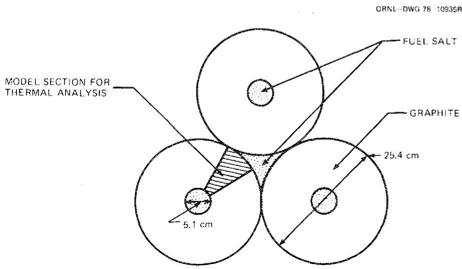  
Fig. 7. Arrangement of moderator elements in core B.

points (which only exist in the outer core region), heat transfer would be greatly diminished. The following simplifying assumption was made (probably conservative) concerning the salt-film heat-transfer coefficient: within $15^{\circ}$ of a contact point, the heat-transfer coefficient is zero; elsewhere, it is equal to $80\%$ of the value obtained by use of the Dittus-Boelter correlation.[18] This assumption increased the calculated total temperature rise in the moderator element by $\sim 50\%$ over that obtained by using $80\%$ of the Dittus-Boelter value for the entire surface.

With these boundary conditions, the heat conduction equation in cylindrical finite difference form was solved in the $30^{\circ}$ section at each axial node (40 nodes total) using the method of successive overrelaxation. Starting at the core inlet, the temperatures of an interior and an exterior salt channel are advanced in an axial marching-type solution through the core. Axial and radial homogeneous power profiles (see Fig. 4) were used, along with the following assumptions, to give salt-channel axial linear power profiles (Fig. 8) and local moderator volumetric power. At a given location, the volumetric powers in an interior and an exterior channel were assumed to be the same, and the volumetric power within the graphite was assumed to be $1\%$ of that in the salt and constant over the $30^{\circ}$ section. Neutronic analyses of the previous MSBR design8 provided the basis

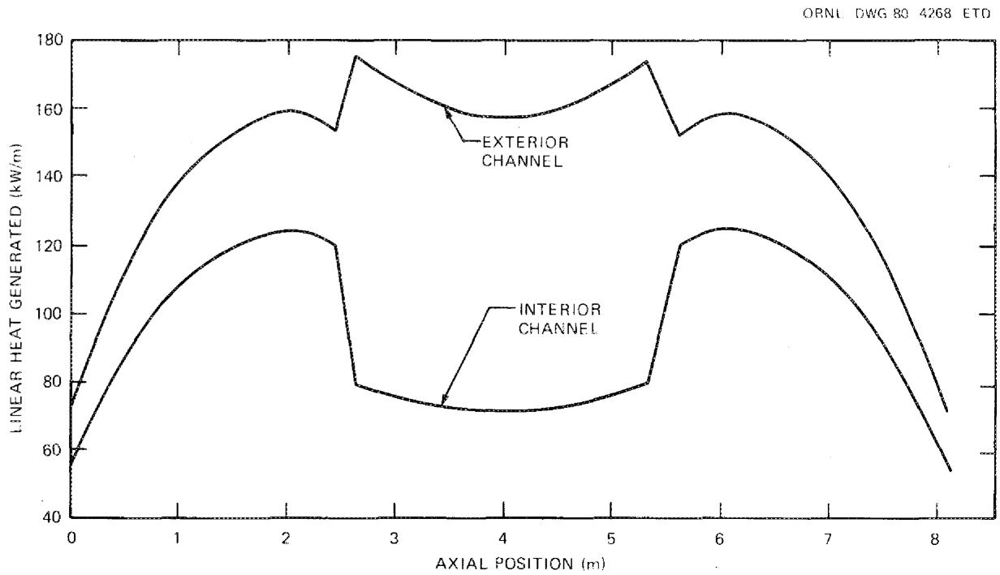  
Fig. 8. Core hot-channel linear power profiles.

for the latter assumption; the present analysis is not detailed enough to yield a better estimate.

As noted previously, the hot-channel axial linear power profiles of an interior and exterior channel are shown in Fig. 8. The hot channel occurs (radially) at the boundary between zones A and B. The central location of zone A (2.65 to 5.65 m) can be seen by the discontinuities in the linear power curves. The curves reflect both heat generated within the salt and heat transferred from the graphite to the salt.

Figure 9 shows calculated temperatures in the interior and exterior channels and the maximum temperature in the moderator as functions of axial position for the core hot channel. The highest moderator temperature occurs at a position $3.0\mathrm{m}$ above the core midplane. Isotherms in the $30^{\circ}$ moderator segment at this location are shown in Fig. 10. The assumption of no heat transfer within $15^{\circ}$ of the contact point causes substantial distortion of the isotherms near the outer surface. The calculated maximum graphite temperature is $741^{\circ}\mathrm{C}$ ( $1366^{\circ}\mathrm{F}$ ), which is close to the maximum allowable temperature ( $\sim 720^{\circ}\mathrm{C}$ ) for zero positive irradiation growth at a total fluence of $3 \times 10^{26}~\mathrm{m}^{-2}$ .

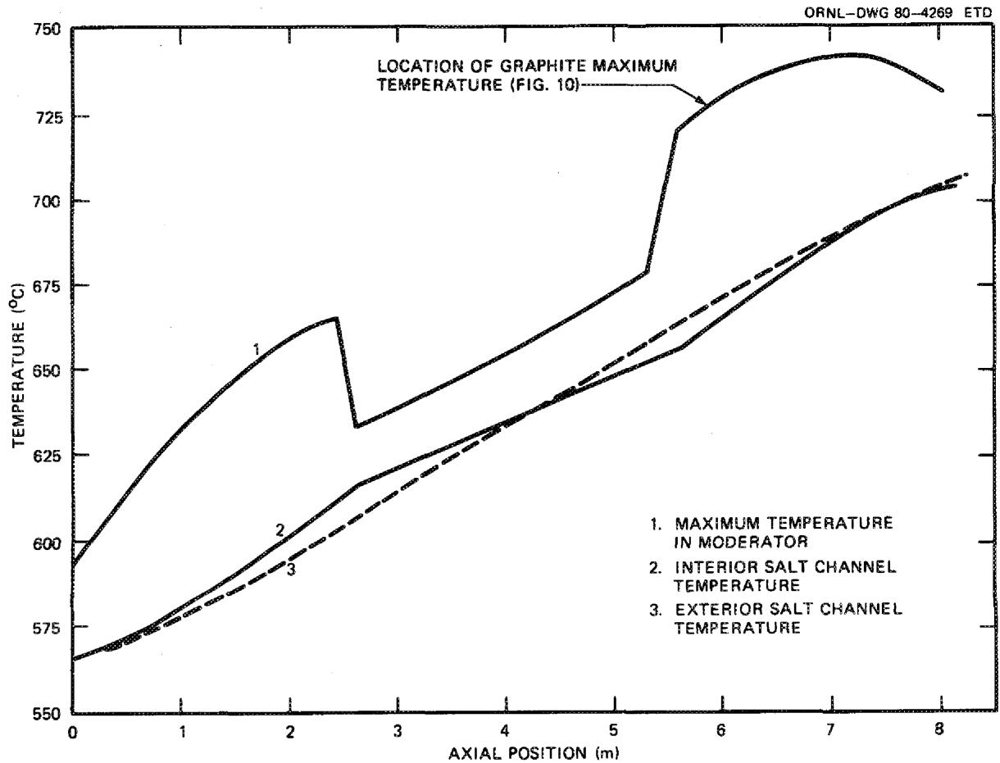  
Fig. 9. Axial temperature profiles: graphite and fuel salt for core hot channel.

Table 23 gives flow areas, salt velocities, Reynolds numbers, and heat-transfer coefficients for the interior and exterior channels (in both core zones A and B) for two cases: the core hot channel and the core average channel. The salt velocities are those necessary for an equal $139^{\circ}\mathrm{C}$ ( $250^{\circ}\mathrm{F}$ ) temperature rise across the core in the interior and exterior channels. The hydraulic diameters are not equal; thus, orificing of the interior channels would be necessary. This could be accomplished easily by reducing the diameter of the interior channel by $\sim 50\%$ for a short interval near core inlet and/or outlet. Overall core orificing would also be necessary to equalize core exit temperatures. The frictional pressure drop across the core $[\sim 7\mathrm{kPa}$ (1 psi)] is insignificant when compared with the pressure drop across the primary heat exchanger

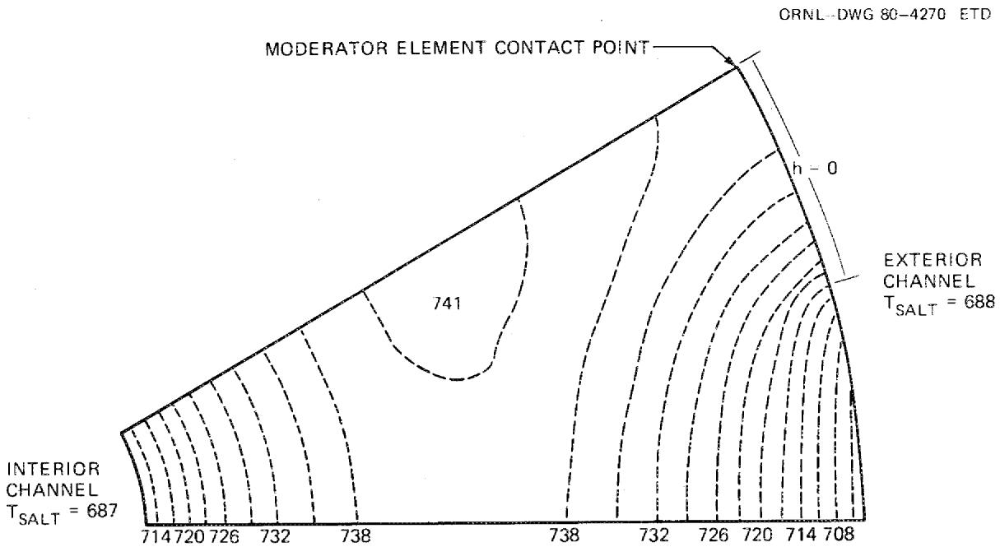  
Fig. 10. Isotherms in graphite at location of maximum temperature $(^{\circ}\mathrm{C})$ . Film heat-transfer coefficient h equals 0 where shown and equals $80\%$ of Dittus-Boelter correlation value elsewhere.

Table 23. Thermal-hydraulic data for DMSR core   

<table><tr><td></td><td colspan="2">Channel</td></tr><tr><td></td><td>\( Hot^a \)</td><td>Average</td></tr><tr><td>Flow area, \( m^2 \)</td><td></td><td></td></tr><tr><td>Interior channel</td><td>2.025 × 10-3</td><td>2.025 × 10-3</td></tr><tr><td>Exterior core A</td><td>4.580 × 10-3</td><td>4.580 × 10-3</td></tr><tr><td>Exterior core B</td><td>2.601 × 10-3</td><td>2.601 × 10-3</td></tr><tr><td>Salt velocity, m/s</td><td></td><td></td></tr><tr><td>Interior channel</td><td>0.601</td><td>0.441</td></tr><tr><td>Exterior core A</td><td>0.418</td><td>0.307</td></tr><tr><td>Exterior core B</td><td>0.735</td><td>0.540</td></tr><tr><td>Reynolds number</td><td></td><td></td></tr><tr><td>Interior channel</td><td>1.034 × 105</td><td>7.592 × 104</td></tr><tr><td>Exterior core A</td><td>6.759 × 104</td><td>4.962 × 104</td></tr><tr><td>Exterior core B</td><td>6.490 × 104</td><td>4.765 × 104</td></tr><tr><td>Heat-transfer coefficient,\( W m^{-2} K^{-1} \)</td><td></td><td></td></tr><tr><td>Interior channel</td><td>173</td><td>78</td></tr><tr><td>Exterior core A</td><td>130</td><td>59</td></tr><tr><td>Exterior core B</td><td>232</td><td>145</td></tr></table>

Maximum/average power is 1.362 over cores A and B.   
bObtained by using $80\%$ of Dittus-Boelter correlation value.

[~900 kPa (130 psi)]. Graphite and fuel-salt properties used in the analysis were obtained from Ref. 8.

The reference DMSR core design satisfies the two most important thermal-hydraulic considerations: (1) the maximum graphite temperature is low enough to allow it to last the life of the plant (24-full power years) and (2) regions of stagnant or laminar flow are avoided. Many variations on this design will be possible in achieving an optimum core, but the second consideration must always be noted. Because of the low thermal conductivity of the fuel salt, excessive temperatures can occur in very small stagnant or laminar flow regions. The graphite elements must retain their geometric integrity and must not create flow blockages. Extensive in-pile testing would be necessary to ensure that both of these considerations were met before construction of a demonstration plant could be undertaken.

# 3.3 Fuel Behavior

Excellent neutron economy is an absolute requirement for a thermal breeder (such as an MSBR), and fuel components with acceptably low neutron cross sections are few. We recognized very early in the MSBR development effort that (1) only fluorides need to be considered, (2) only LiF and $\mathrm{BeF}_2$ would prove acceptable as fuel solvents (diluents) for the fissile and fertile fluorides, and (3) the LiF must be highly enriched in $^7\mathrm{Li}$ . For a break-even reactor or for one that, though it retains most of the fission products within the fuel, is to be an effective converter, some sacrifice in neutron economy may be permissible. However, no likelihood for success seems possible with diluents other than $\mathrm{BeF}_2$ and LiF highly enriched (probably to $99.99\%$ ) in $^7\mathrm{Li}$ .

Accordingly, the fuel system for a DMSR necessarily will be very similar to the system that received intensive study for many years in MSBR development. A considerable fund of information exists about chemical properties, physical properties, and expected in-reactor behavior of such materials.

# 3.3.1 Basic considerations

# 3.3.1.1 Composition of DMSR fuel

Choice of initial composition. A DMSR will derive some of its fission energy from plutonium isotopes, but $^{233}\mathrm{U}$ and $^{235}\mathrm{U}$ will be the primary fissile isotopes, while $^{232}\mathrm{Th}$ , with important assistance from $^{238}\mathrm{U}$ , is the fertile material. Clearly (see previous neutronics discussion) the $^{232}\mathrm{Th}$ concentration will need to be markedly higher than the total concentration of uranium isotopes.

The only stable fluoride of thorium is $\mathrm{ThF}_4$ ; thus, it must be used in such fuels. Pure UF₃ is appreciably disproportionated at high temperatures by the reaction

$$
4 U F _ {3} \rightleftharpoons 3 U F _ {4} + U.
$$

Generally in molten fluoride solutions, this reaction proceeds appreciably at lower temperatures. A small amount of $\mathrm{UF}_3$ will be formed within the fuel by reaction (reduction) of $\mathrm{UF}_4$ with species within the container metal and, as explained below, a small quantity of $\mathrm{UF}_3$ deliberately maintained in the fuel serves as a very useful reduction-oxidation (redox) buffer in the fuel. Such $\mathrm{UF}_3$ is sufficiently stable in the presence of a large excess of $\mathrm{UF}_4$ , but $\mathrm{UF}_4$ must be the major uranium species in the fuel.[19,20] Conversely, $\mathrm{PuF}_4$ is reduced by the metallic container (and also by $\mathrm{UF}_3$ ), and $\mathrm{PuF}_3$ is the stable fluoride of this element in DMSR fuels.

Phase equilibria among the pertinent fluorides have been defined in detail and are well documented. $^{19-21}$ Because the concentration of $\mathrm{ThF}_4$ is much higher than that of $\mathrm{UF}_4$ , the phase behavior of the fuel is dictated by that of the LiF- $\mathrm{BeF}_2$ - $\mathrm{ThF}_4$ system shown in Fig. 11. The compound $3\mathrm{LiF} \cdot \mathrm{ThF}_4$ can incorporate $\mathrm{Be}^{2+}$ ions in both interstitial and substitutional sites to form solid solutions whose compositional extremes are represented by the shaded triangular region near that compound. The maximum $\mathrm{ThF}_4$ concentration available with the liquidus temperature below $500^{\circ}\mathrm{C}$ is just above 14 mole%. Replacement of a moderate amount of $\mathrm{ThF}_4$ by $\mathrm{UF}_4$ scarcely changes the phase behavior.

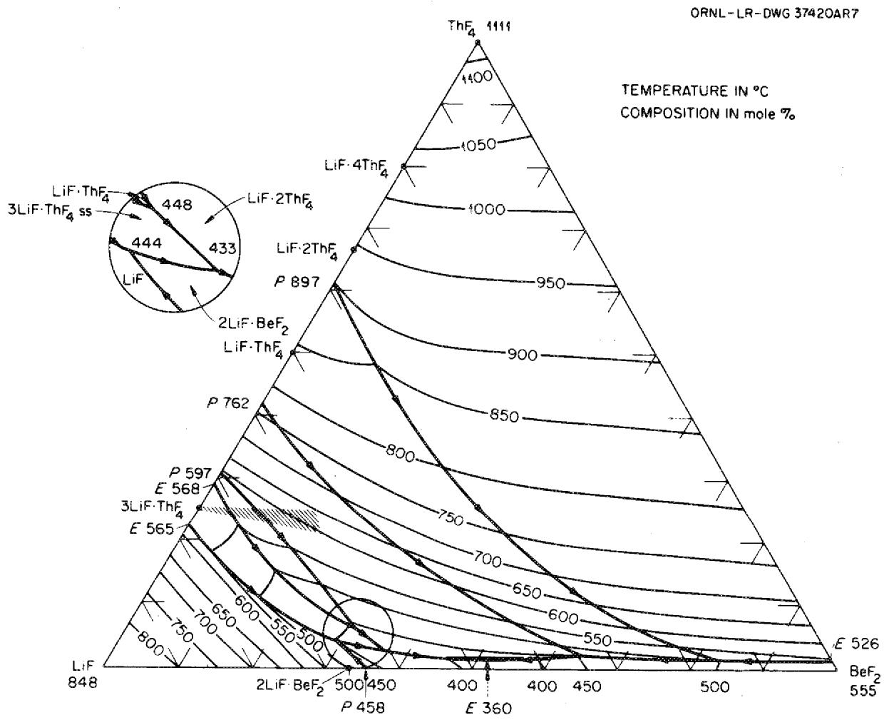  
Fig. 11. System LiF-BeF $_2$ -ThF $_4$ .

The MSBR proposed to use an initial fuel mixture containing 71.7 mole % LiF, 16 mole % BeF $_2$ , 12 mole % ThF $_4$ , and 0.3 mole % (highly enriched) UF $_4$ . The optimal initial concentration of fuel for a DMSR is not yet precisely defined. The initial fuel likely will need to contain between 9.5 and 12.5 mole % of heavy metal (uranium plus thorium), with uranium (enriched to $20\%$ $^{235}\mathrm{U}$ ) corresponding to about $12\%$ of the total. The composition range of interest to DMSRs, therefore, is likely to be bounded by (all concentrations in mole %): 70.8 LiF; 19.7 BeF $_2$ ; 8.35 ThF $_4$ ; 1.15 UF $_4$ and 71.5 LiF; 16 BeF $_2$ ; 11 ThF $_4$ ; and 1.5 UF $_4$ . For such compositions, the liquidus would range from about 480 to $500^{\circ}\mathrm{C}$ . Most chemical and physical properties of the chosen composition can be inferred reasonably well from existing data for the MSBR reference composition.

Variation of fuel composition with time. Fission of $^{235}\mathrm{U}$ in the operating reactor will result in a decrease of that isotope and an increase of fission products and in the generation of (1) $^{233}\mathrm{U}$ from $^{232}\mathrm{Th}$ , (2) $^{239}\mathrm{Pu}$ from $^{238}\mathrm{U}$ , and (3) numerous transuranium isotopes. Further, a once-through DMSR will require additions of uranium at intervals during its lifetime. For example, a DMSR with a fuel containing 9.5 mole % heavy metal would contain about 110,000 kg of $^{232}\mathrm{Th}$ , 3,450 kg of $^{235}\mathrm{U}$ , and 14,000 kg of $^{238}\mathrm{U}$ at startup. During 30 years of operation at 75% plant factor, it would require the addition of 4,470 kg of $^{235}\mathrm{U}$ and 18,400 kg of $^{238}\mathrm{U}$ . If such a reactor received only additions of $\mathrm{UF_4}$ and $\mathrm{UF_3}$ and if no fuel were removed,\* the final quantities and concentrations of heavy metals in the fuel would be those indicated in Table 24. The end-of-life fuel would also contain about 1.4 mole % of soluble fission-product species and would have a total of nearly 2.4 mole % of uranium isotopes, about 0.053 mole % of plutonium isotopes (about 32% of which is $^{239}\mathrm{Pu}$ ), and less $\mathrm{ThF_4}$ than the original fuel. Thus, the concentration of heavy metal in the fuel changes very little although the species do change; total heavy metals in the end-of-life fuel equal about 9.3 mole % compared with an initial 9.5 mole %. Therefore, the physical properties of the fuel would not be likely to change appreciably during reactor life although a gradual change in some chemical properties would be expected.

Additions of uranium can be made conveniently as a liquid $\mathrm{LiF - UF_4}$ mixture $^{19}$ (liquidus $490^{\circ}\mathrm{C}$ ) while the reactor is operating, as was done many times during operation of the MSRE. $^{22}$ To keep a proper concentration of $\mathrm{UF_3}$ in the fuel and possibly to remove tramp oxide-ion contamination from the fuel, some fuel maintenance operations will be necessary. The combination of these relatively simple operations likely will result in sufficient addition of LiF and $\mathrm{BeF_2}$ to require on-site removal and storage of a small fraction of the fuel before reactor end-of-life. These operations and the resulting fuel management options are described in a later section after the chemical basis for them has been presented.

Table 24. Approximate heavy metal inventory of end-of-life fuel in hypothetical DMSR with no fuel removal   

<table><tr><td rowspan="2">Specie</td><td colspan="2">Inventory</td></tr><tr><td>kg</td><td>Mole %</td></tr><tr><td>232Th</td><td>92,000</td><td>6.84</td></tr><tr><td>233Pa</td><td>38</td><td>2.8 × 10-3</td></tr><tr><td>233U</td><td>1,910</td><td>0.140</td></tr><tr><td>234U</td><td>596</td><td>0.043</td></tr><tr><td>235U</td><td>1,250</td><td>0.091</td></tr><tr><td>236U</td><td>978</td><td>0.071</td></tr><tr><td>238U</td><td>28,600</td><td>2.05</td></tr><tr><td>238Pu</td><td>93</td><td>6.7 × 10-3</td></tr><tr><td>239Pu</td><td>231</td><td>0.0165</td></tr><tr><td>240Pu</td><td>133</td><td>9.5 × 10-3</td></tr><tr><td>241Pu</td><td>100</td><td>7.1 × 10-3</td></tr><tr><td>242Pu</td><td>179</td><td>0.0126</td></tr><tr><td>237Np</td><td>136</td><td>9.8 × 10-3</td></tr></table>

${}^{a}$ Operated at 1 GWe for 30 years at ${75}\%$ plant factor.

# 3.3.1.2 Physical properties of DMSR fuels

Table 25 shows key physical properties of the compositions identified previously to represent the likely limits for DMSR use. As described in detail elsewhere,[19,20,23,24] several of these properties - particularly those of the salt with 9.5 mole % heavy metal - are interpolated from measurements on similar salt mixtures. From careful consideration of very similar mixtures for use in the MSBR, the properties clearly are adequate for the proposed service. However, because estimates rather than measured values are presented in several cases, an experimental program would be

Table 25. Physical properties for probable range of DMSR fuel compositions   

<table><tr><td rowspan="2">Properties</td><td colspan="2">Heavy metal content</td></tr><tr><td>Low</td><td>High</td></tr><tr><td rowspan="3">Composition, mole %</td><td>LiF 70.7</td><td>LiF 71.5</td></tr><tr><td>BeF219.8</td><td>BeF216</td></tr><tr><td>HMα9.5</td><td>HM 12.5</td></tr><tr><td>Liquidus, °C</td><td>80</td><td>500</td></tr><tr><td>Properties at 600°C</td><td></td><td></td></tr><tr><td>Density, Mg/m3</td><td>3.10</td><td>3.35</td></tr><tr><td>Heat capacity, kJ/kg·K</td><td>1.46</td><td>1.36</td></tr><tr><td>Viscosity</td><td></td><td></td></tr><tr><td>Pa·s</td><td>0.012</td><td>0.012</td></tr><tr><td>Centipoise</td><td>12</td><td>12</td></tr><tr><td>Thermal conductivity, W/K·m</td><td>1.2</td><td>1.2</td></tr><tr><td>Vapor pressure</td><td></td><td></td></tr><tr><td>Pa</td><td>&lt;10</td><td>&lt;10</td></tr><tr><td>Torr</td><td>&lt;0.1</td><td>&lt;0.1</td></tr></table>

$\alpha_{\mathrm{HM}} =$ heavy metal fluorides.

required to firm up the physical properties of the composition(s) chosen for service. Careful reevaluation of the properties would not be likely to disqualify these compositions from DMSR use.

# 3.3.1.3 Chemical properties of DMSR fuels

A molten-salt reactor such as a DMSR makes a number of stringent demands on its circulating fuel. Some of these demands have been implicit in the foregoing discussion of fuel behavior; examples include the obvious need to accommodate moderate concentrations of $\mathrm{UF}_4$ and large concentrations of $\mathrm{ThF}_4$ in relatively low-melting mixtures of materials with small cross sections for parasitic neutron capture and the need for adequate heat-transfer capability. The fuel must be capable of convenient

preparation in a pure homogeneous form for introduction into the reactor. In addition, the fuel must (1) be compatible with the structural and the moderator materials during normal operation, (2) be stable to intense radiation fields, and (3) tolerate fission of uranium and plutonium and the development of significant concentrations of fission products and plutonium and other actinides. Also, without dangerous consequences, it must be able to withstand a variety of off-design situations such as heat-exchanger leaks or possible ingress of air. Finally, although not presently necessary, it is desirable that at end-of-life the fuel be amenable to recovery of fissile, fertile, and other valuable materials. The ability of the fuel to meet or not to meet these diverse and conflicting demands largely depends on the chemical properties of the fuel. Most of the details of fission-product behavior are deferred to a subsequent section, but much of the basis for expected fuel performance is presented in the following discussion.

Thermodynamics of molten fluoride solutions. The thermodynamic properties of many pertinent species in molten LiF-BeF $_2$ solutions and a smaller number in LiF-BeF $_2$ -ThF $_4$ solutions have been studied in a long-continued experimental program. A variety of experimental techniques was employed. Much of the data was obtained by direct measurement of equilibrium concentrations and partial pressures for reactions such as

$$
{ } ^ { \mathrm { H } _ { 2 } ( \mathrm { g } ) } + \mathrm { F e F } _ { 2 } ( \mathrm { d } ) \rightleftharpoons \mathrm { F e } ^ { 0 } ( \mathrm { c } ) + 2 \mathrm { H F } ( \mathrm { g } )
$$

and

$$
\mathrm {2 H F} _ {(g)} + \mathrm {B e O} _ {(c)} \rightleftharpoons \mathrm {B e F} _ {2} (1) + \mathrm {H} _ {2} \mathrm {O} _ {(g)}
$$

(where g, c, l, and d represent gas, crystalline solid, molten solvent, and solute, respectively) using the molten fluoride as the reaction medium. Many studies of solubility behavior of sparingly soluble fluoride species have also been made. Baes $^{25,26}$ has reviewed all these studies and has tabulated thermodynamic data for many species in molten $\mathsf{Li}_2\mathsf{BeF}_4$ . Table 26 shows values for standard free energy of formation of major constituents and some possible corrosion products. Baes $^{25,26}$ has also

Table 26. Standard free energies of formation for compounds dissolved in molten $\mathbf{Li}_2\mathbf{BeF}_4$   

<table><tr><td>Compoundb</td><td>a</td><td>b</td><td>ΔGf(900 K) (kcal/atom F)c</td></tr><tr><td>LiF(1)</td><td>-141.79</td><td>16.58</td><td>126.9</td></tr><tr><td>BeF2(1)</td><td>-243.86</td><td>30.01</td><td>108.4</td></tr><tr><td>UF3(d)</td><td>-338.04</td><td>40.26</td><td>100.6</td></tr><tr><td>UF4(d)</td><td>-445.92</td><td>57.85</td><td>98.5</td></tr><tr><td>ThF4(d)</td><td>-491.19</td><td>62.50</td><td>108.8</td></tr><tr><td>ZrF4(d)</td><td>-452.96</td><td>65.05</td><td>98.6</td></tr><tr><td>NiF2(d)</td><td>-146.87</td><td>36.27</td><td>57.1</td></tr><tr><td>FeF2(d)</td><td>-154.69</td><td>21.78</td><td>67.5</td></tr><tr><td>CrF2(d)</td><td>-171.82</td><td>21.41</td><td>76.3</td></tr></table>

Adapted from Ref. 7.   
The standard state for LiF and $\mathsf{BeF}_2$ is the molten $\mathsf{Li}_2\mathsf{BeF}_4$ solvent. That for solute species - those with subscript (d) - is the hypothetical solution with the solute at unit mole fraction and the activity coefficient the solute would have at infinite dilution.   
For conversion to SI, 1 kcal = 4.18 kJ.

evaluated the effect of solvent composition in the LiF-BeF $_2$ system on activity coefficients of a variety of solutes.

Using a sophisticated spectrophotometric analysis for $\mathrm{UF}_4$ and $\mathrm{UF}_3$ , more recent study by Gilpatrick and Toth to evaluate the equilibrium

$$
\frac {1}{2} \mathrm {H} _ {2} (\mathrm {g}) + \mathrm {U F} _ {4} (\mathrm {d}) \rightleftharpoons \mathrm {U F} _ {3} (\mathrm {d}) + \mathrm {H F} (\mathrm {g})
$$

in several $\mathrm{LiF - BeF_2}$ and $\mathrm{LiF - BeF_2 - ThF_4}$ solvents essentially confirmed the

$\mathbf{U}\mathbf{F}_3$ value of Table 26 (if the $\mathbf{U}\mathbf{F}_4$ value is accepted) and showed that the difference between $\mathbf{U}\mathbf{F}_3$ and $\mathbf{U}\mathbf{F}_4$ standard free energies in LiF-BeF $_2$ -ThF $_4$ (72-16-12 mole %) is virtually identical to that of Table 26.

Bamberger et al.27 have shown that $\Delta G^{\mathrm{f}}$ for $\mathsf{PuF}_3$ in molten $\mathsf{Li}_2\mathsf{BeF}_4^*$ is $-1358 \pm 10.9 \, \text{kJ/mole}$ $(-325.6 \pm 2.6 \, \text{kcal/mole})$ and $-1357 \pm 10.9 \, \text{kJ/mole}$ $(-324.6 \pm 2.6 \, \text{kcal/mole})$ at 888 and $988 \, \text{K}$ , respectively. From these data and from the solubility of $\mathsf{PuF}_3$ , they have estimated for pure crystalline $\mathsf{PuF}_3$ the following values:

$$
\Delta \mathrm {G} ^ {\mathrm {f}} = - 1 4 5 3 \pm 1 0. 9 \mathrm {k J / m o l e} (- 3 4 7. 7 \pm 2. 6 \mathrm {k c a l / m o l e}) \text {a t} 8 8 8 \mathrm {K},
$$

$$
\Delta \mathrm {G} ^ {\mathrm {f}} = - 1 3 9 2 \pm 1 0. 9 \mathrm {k J / m o l e} (- 3 3 3. 1 \pm 2. 6 \mathrm {k c a l / m o l e}) \text {a t} 9 8 8 \mathrm {K}.
$$

Combining these values with those of Dawson et al.28 for the reaction

$$
4 \mathrm {P u F} _ {3} + \mathrm {O} _ {2} \rightleftharpoons 3 \mathrm {P u F} _ {4} + \mathrm {P u O} _ {2}
$$

yields the expression

$$
\Delta \mathrm {G} ^ {\mathrm {f}} = - 1 6 1 1 + 3 6. 4 (\mathrm {T} / 1 0 0 0) \pm 1 1. 7 \mathrm {k J} / \text {m o l e}
$$

or

$$
3 8 5. 4 + 8. 7 (T / 1 0 0 0) \pm 2. 8 k c a l / m o l e
$$

for crystalline $\mathrm{PuF}_4$ .

No definitive study of $\Delta \overline{\mathbf{G}}^{\mathrm{f}}$ for $\mathrm{PuF_4}$ in molten fluoride solution has been made. Its solubility (by analogy with those of $\mathrm{ZrF_4}$ , $\mathrm{UF_4}$ , and $\mathrm{ThF_4}$ ) is relatively high. Also, using the hypothetical standard state of unit mole fraction, it is more stable [perhaps by $63\mathrm{kJ / mole}$ (15 kcal/mole)] in solution than as the crystalline solid. If so, the reaction

$$
\mathrm {U F} _ {3} (\mathrm {d}) + \mathrm {P u F} _ {4} (\mathrm {d}) = \mathrm {P u F} _ {3} (\mathrm {d}) + \mathrm {U F} _ {4} (\mathrm {d})
$$

would be expected to have an equilibrium quotient (Q) of

$$
Q = \frac {[ P u F _ {3} ]}{[ P u F _ {4} ]} \frac {[ U F _ {4} ]}{[ U F _ {3} ]} = 1. 2 3 \times 1 0 ^ {6},
$$

where the brackets indicate mole fractions of the dissolved species. If only $2\%$ of the uranium were present as UF3, the ratio of $\mathrm{PuF_3 / PuF_4}$ would be near $2.5\times 10^{4}$ , and, to sustain a $\mathrm{PuF_3 / PuF_4}$ ratio of 1, only about 1 part UF3 per million parts UF4 could be tolerated. Clearly, unless very oxidizing conditions are maintained in the melt, the plutonium is essentially all $\mathrm{Pu}^{3+}$ .

The solubility of $\mathsf{PuF_3}$ in LiF-BeF2-ThF4 (72-16-12 mole %) has been measured in two laboratories.[29,30] Bamberger et al.[29] show the solubility of $\mathsf{PuF_3}$ in mole % ( $\mathsf{S_{PuF_3}}$ ) to be given by

$$
\log \mathrm {S p u F} _ {3} = (3. 0 1 \pm 0. 0 6) - (2. 4 1 \pm 0. 0 5) \times (1 0 0 0 / \mathrm {T}),
$$

with a heat of solution $(\Delta H_{s})$ of $46.0 \pm 1.0 \mathrm{~kJ} / \mathrm{mole}$ (11.008 ± 0.237 kcal/mole). If so, the solubility of $\mathrm{PuF}_{3}$ at $565^{\circ} \mathrm{C}$ , the likely minimum temperature within the DMSR circuit, should be near 1.36 mole%. This value is nearly identical (as is the heat of solution) to that obtained by Barton et al. $^{31}$ for $\mathrm{CeF}_{3}$ in the same solvent. However, the Indian study $^{30}$ gave significantly lower values; for example, at $565^{\circ} \mathrm{C}$ that study would suggest that $\mathrm{SpuF}_{3}$ should be near 1.1 mole%. The solubility of $\mathrm{PuF}_{3}$ alone is undoubtedly much higher than is required for its use in a DMSR. However, as described in a later section, difficulties possibly could ultimately result from the combined solubilities of a number of trifluorides that form solid solutions.

Given reasonable $\mathrm{UF}_3 / \mathrm{UF}_4$ ratios, americium, curium, californium, and probably neptunium also exist as trifluorides in the melt. No definitive studies of their solubilities in $\mathrm{LiF - BeF_2 - ThF_4}$ melts have been made. Such studies are needed, but their individual solubilities certainly will prove to be far higher than their concentrations in DMSR fuel.

Our knowledge of the thermodynamics of molten LiF-BeF $_2$ -ThF $_4$ solutions appears adequate to guide the necessary development studies, but considerable research and development (as well as data analysis) remain

to bring that understanding to the level that exists for LiF-BeF $_2$ solutions.

Oxide-fluoride behavior. The behavior of molten fluoride systems such as the DMSR fuel mixture can be affected markedly by addition of significant concentrations of oxide ion. For example, we know that crystals of $\mathrm{UO_2}$ precipitate when melts of $\mathrm{LiF_2 - UF_4}$ are treated with a reactive oxide such as water vapor.[19,32,33]

The solubilities of the actinide dioxides in $\mathrm{LiF - BeF_2 - ThF_4 - UF_4}$ mixtures are low, and they decrease in the order $\mathrm{ThO_2}$ , $\mathrm{PaO_2}$ , $\mathrm{UO_2}$ , and $\mathrm{PuO_2}$ . Moreover, these dioxides all possess the same (fluorite) crystal structure and can all form solid solutions with one another. Solubility products and their temperature dependence have been measured; their behavior is generally well understood.

Trivalent plutonium shows little or no tendency to precipitate as oxide from $\mathrm{LiF - BeF_2 - ThF_4 - UF_4}$ mixtures.[27] Because relatively large solubility seems to be general for trivalent oxides, it is highly likely that precipitation of $\mathrm{Am}_2\mathrm{O}_3$ and other trivalent actinides would be difficult to achieve.

If $\mathrm{Pa}^{4+}$ is oxidized to $\mathrm{Pa}^{5+}$ (which can be done readily in LiF-BeF $_2$ -ThF $_4$ -UF $_4$ by treatment with anhydrous and hydrogen-free HF gas), then $\mathrm{Pa}_2\mathrm{O}_5$ (or an addition compound of it) can be precipitated selectively. $^{41,44}$ Such oxidation to $\mathrm{Pa}^{5+}$ can be avoided by maintaining a small fraction of the uranium as UF $_3$ in the fuel mixture.

The relatively low oxide tolerance of DMSR fuel will require reasonable care to avoid inadvertent precipitation of actinide oxides within the reactor system. However, treatment of melts with anhydrous HF (even when substantially diluted with $\mathsf{H}_2$ ) serves to lower the oxide concentration to tolerable levels.[18,45]

Compatibility of fuel with reactor materials. Molten fluorides are excellent fluxes for many materials. Though some oxides are relatively insoluble, most are readily dissolved, and all are rapidly recrystallized; consequently, protective coatings are not useful, and the bare clean metal must withstand corrosive attack. The reactor metal (Hastelloy-N, described in detail in Sect. 3.4) was chosen and tailored to be thermodynamically stable to the fuel components, as much as possible.

Corrosion of Hastelloy-N by MSRE and MSBR fuel mixtures without irradiation and without the consequences of fission has been studied in sophisticated equipment for many years. It has been thoroughly described $^{1,2,19,20,28-38,46-56}$ and can be said to be well understood.

Table 26 clearly indicates that chromium is the most easily oxidized of the major Hastelloy-N components.\* Corrosion of the alloy, therefore, is essentially by selective leaching of chromium from the alloy. A rapid initial attack can result from reactions such as

$$
\begin{array}{l} F e F _ {2} + C r + C r F _ {2} + F e , \\ 2 H F + C r \rightarrow C r F _ {2} + H _ {2}, \\ 2 \mathrm {N i O} + \mathrm {T h F} _ {4} \rightarrow \mathrm {T h O} _ {2} + 2 \mathrm {N i F} _ {2}, \\ \end{array}
$$

and

$$
\mathrm {N i F} _ {2} + \mathrm {C r} + \mathrm {C r F} _ {2} + \mathrm {N i}
$$

if the fuel salt is impure or if the metal system is poorly cleaned. These reactions proceed to completion at all temperatures within the reactor circuit and do not afford a basis for continued attack.

The most oxidizing of the major constituents of the fuel is $\mathrm{UF}_4$ , and the reaction

$$
\mathrm {U F} _ {4} (\mathrm {d}) + \frac {1}{2} \operatorname {C r} (\mathrm {c}) \rightleftharpoons \frac {1}{2} \operatorname {C r F} _ {2} (\mathrm {d}) + \operatorname {U F} _ {3} (\mathrm {d})
$$

has an equilibrium constant with a small temperature dependence. When the salt is forced to circulate very rapidly through a large $(140^{\circ}\mathrm{C})$ temperature gradient, as is the case within the reactor circuit, a mechanism exists for mass transfer of chromium and for continued attack. The result is that chromium is selectively removed from the alloy in high-temperature regions and deposited on the alloy in low-temperature regions

of the reactor. The rate of transfer of chromium is limited by the rate at which the transferred chromium can diffuse into the alloy in the low-temperature regions. $^{19,20,56}$ The results of two decades of sophisticated corrosion testing have demonstrated the validity of this mechanism and have shown that such corrosion* will prove to be only a trifling problem for MSBR. Appreciable chromium depletion would be expected to a depth of less than 0.13 mm/year (0.5 mil/year) in metal at $704^{\circ}C$ . $^{19,47}$

The initial attack, which is not serious if proper purification of the salt and cleaning of the system have occurred, can be mitigated by the presence of a small quantity of $\mathrm{UF}_3$ along with $\mathrm{UF}_4$ in the salt. Control of the oxidation states of plutonium and protactinium and of certain fission products, along with control of the oxidative effects of the fission process, furnish more cogent reasons for maintaining $\mathrm{UF}_3$ in the fuel mixture. Slight continuing corrosion is affected very little (if at all) by the presence of small quantities of $\mathrm{UF}_3$ .

The unclad moderator graphite is not wetted by or chemically reactive to the standard MSRE or MSBR fuel compositions, and these facts appear unchanged by intense irradiation and the consequences of fission.[19,20,57,58] Estimates[22] are that the MSRE graphite moderator stack (3700 kg) acquired less than 2 g of uranium during operation of the reactor. Obviously, no appreciable interaction of graphite with the fuel (whose $\mathrm{UF}_3/\mathrm{UF}_4$ ratio was never above 0.02) occurred in that reactor. However, given a sufficiently high $\mathrm{UF}_3/\mathrm{UF}_4$ ratio, formation of uranium carbides must be expected, and this should be avoided. Toth and Gilpatrick, who used spectrophotometry in a graphite cell with diamond windows to assay equilibrium $\mathrm{UF}_3$ and $\mathrm{UF}_4$ concentrations, have carefully studied uranium carbide formation using $\mathrm{Li}_2\mathrm{BeF}_4$ (Refs. 59 and 60), other $\mathrm{LiF}-\mathrm{BeF}_2$ mixtures,[60,61] and $\mathrm{LiF}-\mathrm{BeF}_2-\mathrm{ThF}_4$ (72-16-12 mole %) (Ref. 61) as solvents. A surprising finding of these studies is that, contrary to generally accepted thermodynamic data,[62] $\mathrm{UC}_2$ is the stable carbide phase over the temperature interval 550 to $700^{\circ}\mathrm{C}$ . Figure 12 shows the results[61] of equilibration experiments in MSBR fuel solvent. Apparently, at the lowest temperature ( $565^{\circ}\mathrm{C}$ ) within a DMSR,

ORNL-DWG 72-12321

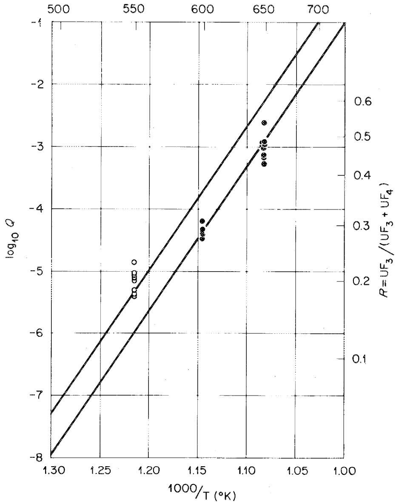  
TEMPERATURE (°C)   
Fig. 12. Equilibrium quotients, $Q = (UF_3)^4 / (UF_4)^3$ vs temperature for $UC_2 + 3UF_4(d) \rightleftharpoons 4UF_3(d) + 2C$ in the solvent LiF-BeF $_2$ -ThF $_4$ (72-16-12 mole%).

formation of $\mathrm{UC_2}$ should not occur unless the $\mathrm{UF_3 / UF_4}$ ratio is above about 0.17. Further experimentation with larger systems is desirable, but $\mathrm{UF_3 / UF_4}$ ratios of at least 0.1 apparently can be accommodated, if desirable.

# 3.3.1.4 Operational constraints and uncertainties

Most of the fuel behavior described or implied above may be considered well authenticated. Several constraints and at least minor uncertainties are obvious.

1. Fuel for a DMSR must be prepared from LiF containing a very high percentage of $^{7}$ Li.   
2. The fuel mixture must be managed and maintained so that an appreciable fraction of the uranium is present as $\mathrm{UF}_3$ .   
3. Additional experiments are necessary to establish exactly what fraction of the uranium may be present as $\mathrm{UF}_3$ without deleterious chemical reactions of the $\mathrm{UF}_3$ with graphite or possibly with other materials within the primary reactor system.   
4. Direct measurement of the physical and heat-transfer properties of the DMSR fuel mixture must be made.   
5. Further study of the fundamental thermodynamic properties of solutes in the LiF-BeF $_2$ -ThF $_4$ -UF $_4$ mixture are needed to ensure that basic understanding of the chemical behavior is accurate.

# 3.3.2 Fission-product behavior

# 3.3.2.1 Fission and its consequences

Fragments produced on fission of a heavy atom originate in energy states and with ionization levels far from those normally considered in chemical reactions. When the fission occurs in a well-mixed molten-salt liquid medium, these fragments must come to a steady state* as commonly encountered chemical entities because they quickly lose energy through collisions with the medium. The valence states that these chemical species assume are presumably defined by the requirements that (1) cation-anion equivalence be maintained in the molten-salt medium and (2) redox equilibria be established between the melt and the surface layers of the container metal.[19,63,64] The fission-product cations must satisfy the fission-product anions plus the fluoride ions released by disappearance

of the fissioned atom. Early assessment $^{63}$ indicated that the cations would prove adequate only if some of them assumed oxidation states corrosive to Hastelloy-N. A more recent examination $^{25}$ strongly supported this view; these studies indicated that the summation of the products of fission yield and stable valence for each species might be as low as three per fission event. Accordingly, fission of $\mathsf{UF_4}$ [releasing $4\mathsf{F}^{-} + 0.015$ $(\mathsf{Br}^{-} + \mathsf{I}^{-})$ per fission] would be intrinsically oxidizing to Hastelloy-N.* Maintenance of a small fraction of the uranium in the fuel as UF3 was successfully adopted to preclude corrosion from fission of $^{235}\mathsf{UF_4}$ in the MSRE. $^{19}$ A properly maintained redox potential in the fuel salt apparently will prevent any untoward immediate consequences of the fission event and will permit grow-in of the fission products in valence states defined by the redox potential.

# 3.3.2.2 Effects of radiation

When fission occurs in a molten fluoride solution, both electromagnetic radiations and particles of very high energy and intensity originate within the fluid. Local overheating is almost certainly not important in a DMSR where turbulent flow causes rapid intimate mixing. Moreover, the bonding in molten fluorides is completely ionic. Such a mixture, with neither covalent bonds to rupture nor a lattice to disrupt, should be quite resistant to radiation. Nevertheless, because there plausibly exists a radiation level sufficiently high to dissociate a molten fluoride into metal and fluorine, $^{\dagger}$ a number of tests of the possibility were made. $^{19,20,63,65}$

Many irradiation tests were conducted prior to 1959 with $\mathrm{NaF - ZrF_4 - UF_4}$ mixtures in Inconel at temperatures at or above $815^{\circ}\mathrm{C}$ (Refs. 24 and 25) and at quite high fission power densities from 80 to $1000\mathrm{MW / m}^3$ of fuel. No instability of the fuel system was apparent, and the corrosion did not exceed the considerable amount expected from laboratory-scale tests.

These early tests seemed to show that radiation posed no threat even at very high power levels, but further studies $^{66-69}$ were conducted primarily to test the wetting of graphite by $\mathrm{LiF - BeF_2 - ZrF_4 - ThF_4 - UF_4}$ mixtures under irradiation. Examination of these capsules after storage at ambient temperatures for many weeks revealed appreciable quantities of $\mathrm{CF_4}$ and, in most cases, considerable quantities of fluorine in the cover gas. Careful examination $^{20,70,71}$ strongly suggested that the $\mathbf{F}_2$ generation had not occurred at the high temperature but had occurred by radiolysis of the mixture in the solid state.

This suggestion was confirmed by irradiation of two arrays of Hastelloy-N capsules, all containing graphite and $\mathrm{LiF - BeF_2 - ZrF_4 - UF_4}$ mixtures. Two of the capsules in each array had gas inlet and exit lines to permit sampling of the cover gas as desired. Gas samples drawn from the test capsules at operating temperatures and at various power levels up to $80\mathrm{MW / m^3}$ showed no $\mathbf{F}_2$ (though an occasional sample from the first array showed detectable traces of $\mathrm{CF_4}$ ). However, during reactor shutdowns with the capsules at about $35^{\circ}\mathrm{C}$ , pressure rises were observed (usually after an induction period of a few hours), and $\mathbf{F}_2$ was evolved. In the second array, the capsules were kept hot during reactor shutdown as well as during operation; no evidence of $\mathbf{F}_2$ or $\mathrm{CF_4}$ was observed. Such $\mathbf{F}_2$ generation at ambient temperatures was subsequently followed for several months in ORNL hot cells. The generation diminished with time in a manner corresponding closely with decay of fission-product activity; $\mathbf{F}_2$ evolution at $35^{\circ}\mathrm{C}$ corresponded to about 0.02 molecule per $100\mathrm{eV}$ absorbed, could be completely stopped by heating to $100^{\circ}\mathrm{C}$ or above, and could be reduced markedly by chilling to $-70^{\circ}\mathrm{C}$ . The $\mathbf{F}_2$ evolution resumed, usually after a few hours, when temperature was returned to 35 to $50^{\circ}\mathrm{C}$ .

These and subsequent experiences, including operation of the MSRE, strongly indicate that radiolysis of the molten fuel at reasonable power densities is not a problem. It seems unlikely, though it is possible, that DMSR fuels will evolve $\mathbf{F}_2$ on cooling. If they do, arrangements must be made for their storage at elevated temperature until a fraction of the decay energy is dissipated.

# 3.3.2.3 Chemical behavior of fission products

The results of a program of solution thermodynamics, $^{25,26}$ a long-term program of in-pile irradiations, $^{57}$ and a number of special experiments permitted generally accurate predictions, $^{63-65}$ but much of our detailed -- and still incomplete -- understanding of fission-product behavior comes from operation of the MSRE. $^{19,22,72}$ The ability of the fission products to form stable compounds and to dissolve in the molten fuel serves to divide them into the three distinct groups described in the following discussion.

Noble-gas fission products and tritium. Krypton and xenon (which is an important neutron absorber) form no compounds under conditions existing in a DMSR or other molten-salt reactor.[19,73] Moreover, these gases are only very sparingly soluble in molten fluoride mixtures.[74-76] As with all noble gases (see Fig. 13),[76] their solubility increases with temperature and with diminishing size of the gaseous atom, while the heat of solution increases with increasing atomic size. This low solubility is a distinct advantage because it enables the ready removal of krypton and xenon from the reactor by sparging with helium. The relatively simple sparging system of the MSRE served to remove more than $80\%$ of the $^{135}\mathrm{Xe}$ , and far more efficient sparging was proposed for the MSBR.* Stripping of the noble gases from the reactor after a short residence time avoids the presence of their radioactive daughters in the fuel.

Tritium qualifies as a fission product because small quantities of it are produced in ternary fissions. However, essentially all of the tritium anticipated in $\mathsf{MSBR}^{10,77}$ results from other sources, as shown in Table 27.

A DMSR at similar power level and with a generally similar fuel must be expected to generate tritium at approximately this same rate. This tritium will originate in principle as $^3\mathrm{HF}$ ; however, with appreciable concentrations of $\mathrm{UF}_3$ present, this $^3\mathrm{HF}$ will be reduced largely to $^3\mathrm{H}_2$ .

ORNL-LR-DWG 41908

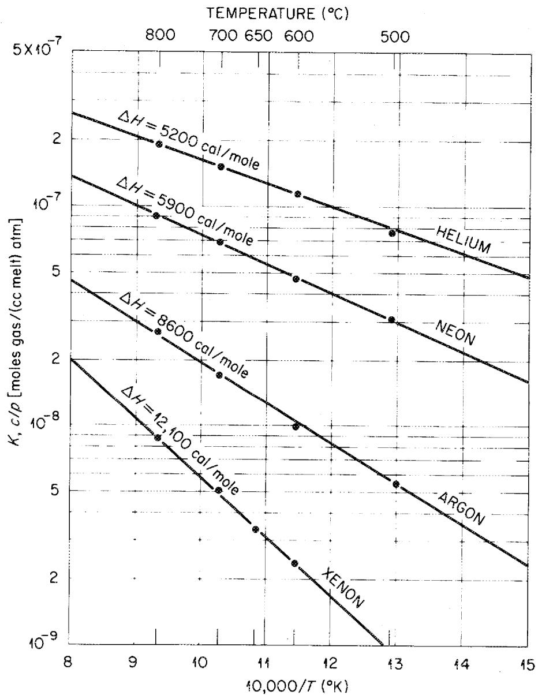  
Fig. 13. Solubilities of four noble gases as function of temperature in LiF-BeF $_2$ (64-36 mole %).76

Solubility of ${}^{3}\mathrm{H}_{2}$ in molten salts has not been measured, but the solubility of $\mathbf{H}_2$ in molten $\mathrm{Li_2BeF_4}$ is known $^{78}$ to be very small.* Some of this ${}^{3}\mathrm{H}_{2}$ would be removed, along with krypton and xenon, by sparging with helium. However, the extraordinary ability of hydrogen isotopes to diffuse

Table 27. Sources and rates of production of tritium in a 1000-MWe MSBR   

<table><tr><td rowspan="2">Source</td><td colspan="2">Production rate</td></tr><tr><td>MBq/s</td><td>Ci/d</td></tr><tr><td>Ternary fission</td><td>13</td><td>31</td></tr><tr><td>6Li(n,α)3H</td><td>518</td><td>1210</td></tr><tr><td>7Li(n,nα)3H</td><td>501</td><td>1170</td></tr><tr><td>19F(n,17O)3H</td><td>4</td><td>9</td></tr><tr><td>Total</td><td>1036</td><td>2420</td></tr></table>

$\alpha_{\mathrm{FromRef.}}$ 77.

through hot metals will permit a large fraction of the $^3\mathrm{H}_2$ to penetrate the primary heat exchanger to enter the secondary coolant. This phenomenon and its consequences are described briefly in Sect. 3.3.3.2.

Fission products with soluble stable compounds. Rubidium, cesium, strontium, barium, yttrium, the lanthanides, and zirconium all form quite stable fluorides that are relatively soluble in molten fluoride mixtures such as MSBR and DMSR fuels. Isotopes of these elements that have no noble-gas precursors, as expected, appeared almost entirely in the circulating fuel of the MSRE.[19,20,22,72] Very small quantities appeared at or near the surface of exposed graphite specimens; most of this deposition evidently resulted from fission recoil. Isotopes such as $^{89}\mathrm{Sr}$ and $^{140}\mathrm{Ba}$ , whose volatile precursors have appreciable half-lives and which were partially stripped from the reactor, were found in samples of the cover gas and within specimens of moderator graphite as well as in the fuel of the MSRE. Along with behavior of other isotopes, Fig. 14 shows the profiles observed for $^{137}\mathrm{Cs}$ and $^{140}\mathrm{Ba}$ in graphite specimens through diffusion of their respective $(^{137}\mathrm{Xe}, 3.9\mathrm{min}; ^{140}\mathrm{Xe}, 16\mathrm{s})$ precursors.

Bromine and iodine would be expected to appear in the fuel as soluble $\mathrm{Br}^{-}$ and $\mathrm{I}^{-}$ , particularly in the case where the fuel contains an appreciable concentration of $\mathrm{UF}_3$ . No analyses for $\mathrm{Br}^{-}$ were performed during

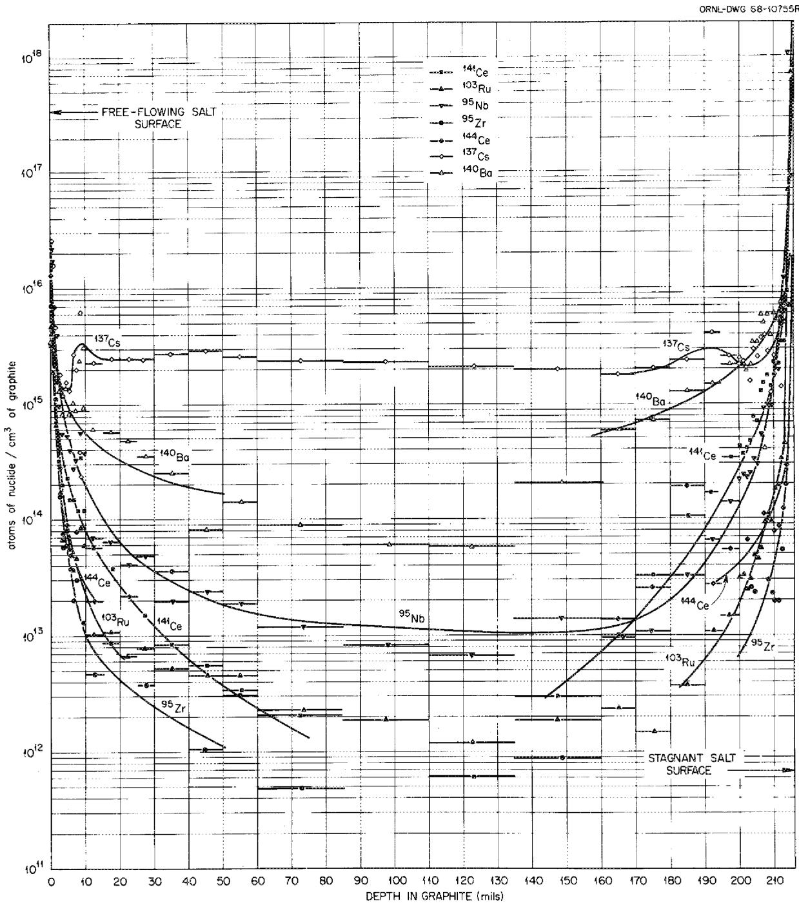  
Fig. 14. Fission product distribution in CGB (855) graphite specimen exposed in MSRE core during 32,000 MWh of power operation.[79]

operation of the MSRE. Analyses for $^{13}\mathrm{I}$ showed that a large fraction of the iodine was present in the fuel $^{20,72}$ and that $^{13}\mathrm{I}$ deposited on metal or graphite surfaces in the core region. However, material balances for $^{13}\mathrm{I}$ were generally low. It is possible that some of the precursor, $^{13}\mathrm{Te}$ (25 min), was volatilized and sparged with the krypton and xenon. Further, $^{13}\mathrm{I}$ produced by decay of $^{13}\mathrm{Te}$ in complex metallic deposits (as in the heat exchanger) may not have been able to return to the salt.

Noble and seminoble fission products. Some fission-product metals (Ge, As, Nb, Mo, Ru, Rh, Pd, Ag, Cd, Sn, and Sb) have fluorides that are unstable toward reduction by fuel mixtures with appreciable concentrations of $\mathrm{UF}_3$ ; thus, they must be expected to exist entirely in the elemental state in the reactor. Selenium and tellurium were also expected to be present as elements within the reactor circuit, and this behavior was generally confirmed during operation of the MSRE.[19,20,72] The MSRE fuel samples usually contained far less than the generated quantities of these elements. Portions of the MSRE samples were found (probably as metallic particulates) in the helium sparge gas,\* deposited on metal surfaces, and (a reasonably small fraction) deposited on graphite specimens. However, the distribution and especially the inventory in the fuel at the sampling point in the pump bowl showed major variations. Further study will be necessary before details of their behavior can be predicted with confidence for a DMSR.

In general, the results from MSRE operations suggest the following.[20]

1. The bulk of the noble metals remain accessible in the circulating loop but with widely varying amounts in circulation at any particular time.   
2. In spite of this wide variation in the total amount found in a particular sample, the proportional composition is relatively constant, indicating that the entire inventory is in substantial equilibrium with the new material being produced.

3. The mobility of the pool of noble-metal material suggests that deposits occur as an accumulation of finely divided well-mixed material rather than as a "plate."

Such precipitation within the reactor, though expected, is a disadvantage. Precipitation on the metal surface (most of which is in the heat exchanger) will be quite insufficient to impede fuel flow, but radioactive decay of the deposited material contributes to heat generation during reactor shutdown. Precipitation on the moderator graphite, which appeared to be considerably smaller than on the metal, would maximize their opportunities to absorb valuable neutrons.

Operation of the MSRE did produce one untoward effect of fission products.* Metal surfaces exposed to the fuel in the MSRE showed grain boundaries that were embrittled to depths of 0.1 to 0.3 mm (5 to 10 mils). In the heat exchanger, the embrittled boundaries opened to form metallographically visible cracks; in other regions such cracks formed only when the specimens were deliberately strained. Early studies80 implicated fission-product tellurium as responsible for this embrittlement, and subsequent work has confirmed this.46,48 However, more recent studies46,81,82 strongly suggest that (1) if the molten fuel is made to contain as much as $5\%$ of the uranium as UF3, the tellurium would be present as Te2- and (2) in that form, tellurium is much less aggressive. Much further study will be necessary, but use of this higher but still moderate UF3/UF4 ratio apparently will markedly alleviate, and probably control, the tellurium embrittlement problem.

# 3.3.2.4 Operational constraints

Avoiding the detrimental effects of fission-product tellurium (described immediately preceding) may make necessary the operation of the DMSR with as much as $5\%$ of the uranium fluoride present as $\mathrm{UF}_3$ . Consideration of possible reactions of $\mathrm{UF}_3$ to produce uranium carbides (described previously) suggests that operation with a considerably higher

$\mathrm{UF}_3 / \mathrm{UF}_4$ ratio would be possible. However, a more subtle constraint on DMSR operation possibly may result.

The lanthanide trifluorides are only moderately soluble in molten $\mathrm{LiF - BeF_2 - ThF_4 - UF_4}$ mixtures; if more than one such trifluoride is present, they crystallize as a solid solution of all the trifluorides on cooling of a saturated melt. Though not definitive, there is evidence that the actinide trifluorides (including $\mathrm{UF}_3$ ) might also join in such solid solutions. If so, the total (lanthanide plus actinide) trifluorides in the end-of-life reactor might possibly exceed their combined solubility.

The solubilities of $\mathrm{PuF_3}$ (Ref. 29) and $\mathrm{CeF_3}$ (Ref. 31) have been carefully determined in LiF-BeF $_2$ -ThF $_4$ (72-16-12 mole %) and can be considered to be moderately well known in DMSR fuel. According to Baes et al.,[29] the solubility of $\mathrm{PuF_3}$ in the LiF-BeF $_2$ -ThF $_4$ melt at $565^{\circ}\mathrm{C}$ (the minimum temperature anticipated within the DMSR fuel circuit) is 1.35 mole %. The solubility of $\mathrm{CeF_3}$ under the same conditions appears to be very slightly smaller (1.3 mole %).[29,31] Solubilities of the other pertinent fluorides are not well known. In $\mathrm{Li_2BeF_4}$ , the solubilities of several lanthanide trifluorides (including $\mathrm{CeF_3}$ ) have been shown[83] to be considerably smaller and to vary with some more and some less soluble than $\mathrm{CeF_3}$ . As a reasonable approximation (obviously, many additional data are needed), the solubility of the lanthanide-actinide trifluoride solid solution may be assumed to be near 1.3 mole %.

From Table 9, the DMSR fuel at end-of-life will contain some $1.404 \times 10^{5}$ moles of uranium isotopes and $3.64 \times 10^{3}$ moles of transuranium isotopes. The end-of-life inventory of lanthanide plus yttrium isotopes will be near $4.7 \times 10^{4}$ moles. If $5\%$ of the uranium is present as $\mathrm{UF}_{3}$ and if all transuranic and lanthanide species are assumed to be trivalent, the end-of-life reactor fuel will contain about $5.77 \times 10^{4}$ moles of trifluorides. The DMSR system (with about $5.3 \times 10^{6}$ moles of fluorides), therefore, would contain about 1.1 mole % of trifluorides. The solubility of the combined trifluorides likely would not be exceeded within the reactor circuit, but additional solubility data are needed to make this point certain.

# 3.3.2.5 Uncertain features

From the foregoing discussion, several uncertainties are apparent. Details of behavior of the noble and seminoble fission products are still poorly known. The fractions of each isotope that will appear in the off-gas, deposit on the moderator graphite, and deposit on the heat-exchanger metal of the DMSR can only be crudely estimated. That fraction which appears in the reactor off-gas would seem to cause no insurmountable problems though that system - at our present state of knowledge - would need to be overdesigned substantially. Their deposition in the heat exchanger is a recognized disadvantage and will be quite insufficient to impede fuel flow, but radioactive decay of the deposited material contributes heat that must be removed during reactor shutdown. Precipitation on the graphite, which appears to be smaller than on heat-exchanger metal, maximizes their opportunities to absorb neutrons. Clearly, a better knowledge of this situation is needed.

While the results obtained in the recent past are highly encouraging, additional data - especially on a larger scale - are needed to establish the redox potential $(\mathrm{UF}_3 / \mathrm{UF}_4$ ratio) required to keep the tellurium cracking problem to tolerable levels. Should the required $\mathrm{UF}_3 / \mathrm{UF}_4$ ratio rise substantially above 0.05, the probability of precipitation of trifluoride solid solutions would be increased.

Finally, additional information about the collective solubility behavior of the lanthanide-actinide trifluorides is required. Should they prove appreciably less soluble than now believed likely, some replacement of fuel might be required late in the life of the essentially unprocessed DMSR.

# 3.3.3 Fuel maintenance

To achieve fuel maintenance, (1) the fuel must be delivered to and into the reactor in a proper state of purity and homogeneity, (2) the fuel must be sufficiently protected from extraneous impurities, and (3) sound procedures must exist for addition of the required uranium and provision of the required $\mathrm{UF}_3 / \mathrm{UF}_4$ ratio.

# 3.3.3.1 Preparation of initial fuel

Initial purification procedures for the DMSR present no formidable problems. Nuclear poisons (e.g., boron, cadmium, or lanthanides) are not common contaminants of the constituent raw materials. All the pertinent compounds contain at least small amounts of water, and all are readily hydrolyzed to oxides and oxyfluorides at elevated temperatures. The compounds LiF and $\mathrm{BeF}_2$ generally contain a small quantity of sulfur as sulfate ion. Uranium tetrafluoride commonly contains small amounts of $\mathrm{UO}_2$ , $\mathrm{UF}_5$ , and $\mathrm{UO}_2\mathrm{F}_2$ .

Purification procedures $^{63,84,85}$ used to prepare materials for the aircraft reactor experiment (ARE), the MSRE, and many laboratory and engineering experiments have treated the mixed materials at high temperature (usually at $600^{\circ}\mathrm{C}$ ) with gaseous $\mathsf{H}_2$ -HF mixtures and then with pure $\mathsf{H}_2$ in equipment of nickel or copper. The HF- $\mathsf{H}_2$ treatment serves to (1) reduce the $\mathsf{U}^{5+}$ and $\mathsf{U}^{6+}$ to $\mathsf{U}^{4+}$ , (2) reduce sulfate to sulfide and remove it as $\mathsf{H}_2\mathsf{S}$ , (3) remove $\mathsf{Cl}^-$ as $\mathsf{HCl}$ , and (4) convert the oxides and oxyfluorides to fluorides. Final treatment with $\mathsf{H}_2$ serves to reduce $\mathsf{FeF}_3$ and $\mathsf{FeF}_2$ to insoluble iron and to remove $\mathsf{NiF}_2$ that may have been produced during hydrofluorination. To date, all preparations have been performed in batch equipment, but continuous equipment has been partially developed. $^{86,87}$

For a DMSR, as for the MSRE, $^{85}$ purification of the bulk of the fuel would presumably be conducted on LiF-BeF $_2$ -ThF $_4$ -UF $_4$ mixtures containing perhaps 85 to $90\%$ of the required UF $_4$ and on molten Li $_3$ UF $_7$ to provide the additional uranium necessary to bring the fuel to the critical and operating concentration.

Such a purification procedure can provide a sufficiently pure and completely homogeneous fuel material for initial operation of the reactor.

# 3.3.3.2 Contamination possibilities

Though the fuel material can be supplied and introduced into the reactor in sufficiently pure form, contamination of the fuel is possible from several sources.

Other reactor materials. The moderator graphite can contain a large quantity of $\mathrm{CO}_{2}$ , $\mathrm{CO}$ , and $\mathrm{H}_{2} \mathrm{O}$ by virtue of its porosity and internal

surface. Outgassing of the moderator by pumping at reduced pressure and elevated temperature is necessary and sufficient to prevent contamination of the fuel by oxide ion from reactive gases from this source.

Oxide films on the structural metal can also contaminate the fuel by oxide ion, and, as described previously, the dissolved $\mathrm{Fe}^{3+}$ , $\mathrm{Fe}^{2+}$ , and $\mathrm{Ni}^{2+}$ can be responsible for subsequent metal corrosion. In operation of the MSRE, the system was flushed with an LiF-BeF $_2$ mixture for cleaning at start-up and after each shutdown before introduction of the fuel mixture. This precaution might be unnecessary, but it did suffice to keep oxide contamination caused by surface oxidation of the metal to a minimum.

A small ( $\sim$ 100-ppm) concentration of $\mathrm{Cr}^{2+}$ in the fuel as a consequence of reaction of the metal with the fuel cannot be avoided. However, in the absence of extraneous oxidants, the reaction is very slight, and the presence of $\mathrm{Cr}^{2+}$ is completely innocuous.

Grow-in of the fission products is also unavoidable, as is the presence of a relatively small steady-state concentration of $^3\mathrm{H}_2$ .

Atmospheric contamination. Reaction of the DMSR fuel mixture with oxygen is relatively slow,\* but reaction with water vapor is more rapid. Further, contamination of the fuel with 40 to 50 ppm (by weight) of oxide ion could result in precipitation of a uranium-rich $(\mathrm{UTh})\mathrm{O}_2$ solid solution. A large ingress of contaminant air would be required to produce 40 ppm of $0^{2-}$ in the fuel, and the DMSR would be designed and operated so as to minimize the chances of such contamination. Operation of MSRE during much of a four-year period with many shutdowns and several minor repair operations showed no evidence of an increase in oxide contamination level. $^{22}$ Treatment of the initial fuel charge with anhydrous $\mathrm{HF - H_2}$ mixture during its preparation reduces the $0^{2-}$ concentration to innocuous levels, and similar treatment of contaminated fuel would serve to remove the $0^{2-}$ . Such treatment might never be required, but in the DMSR, simple equipment should be included that is capable of treatment to remove oxide ion should inadvertent contamination occur.

Contamination of fuel by secondary coolant. The only secondary coolant that has been demonstrated in a molten-salt reactor is $\mathrm{Li}_2\mathrm{BeF}_4$ , which is prepared from $^7\mathrm{LiF}$ and purified through procedures described previously for the fuel used in the MSRE.[22] This material is not considered suitable for an MSBR or a DMSR because it is expensive and its liquidus is too high. Many substitutes have been considered, but none have properties that are all near the ideal. On balance, the best choice appears to be a mixture of 8 mole % NaF and 92 mole % $\mathrm{NaBF}_4$ (Refs. 19, 20, and 88). These compounds are readily available at low cost. The liquidus[89] (see Fig. 15), stability toward gamma radiation in the primary heat exchanger,[90] heat-transfer properties,[23,24,91] and compatibility[47,48] with modified Hastelloy-N all appear adequate.

Intermixing of the fuel and the secondary coolant salts, as caused by leaks in the primary heat exchanger, would be an important consideration. The MSBR design8 and presumably the DMSR design assured a slightly higher pressure on the coolant side so that most leaks would be of coolant into fuel. Such a leak, however small, should be recognized at once

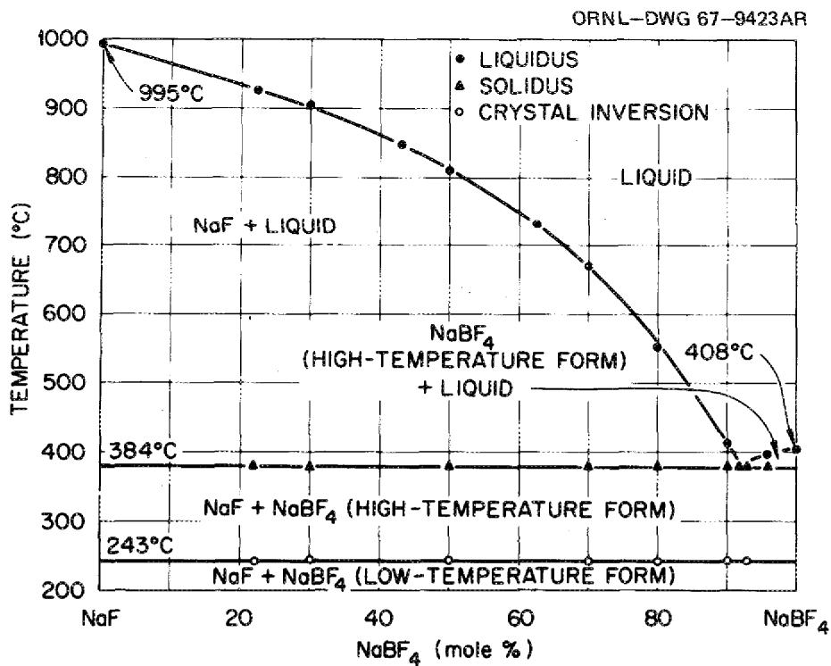  
Fig. 15. System NaF-NaBF $_4$ .

because of the marked reactivity loss caused by admission of boron into the fuel.

A small quantity of NaF-NaBF $_4$ added to the DMSR fuel would allow dissociation of the NaBF $_4$ into NaF and BF $_3$ . The NaF would dissolve in the fuel and remain as a minor parasitic neutron absorber. The BF $_3$ is relatively insoluble in the fuel $^{92,93}$ and would be readily sparged with the krypton and xenon into the off-gas system. A sufficiently small continuing leak could possibly be tolerated with some impairment in system performance.\* Given that the leaking tube could be plugged, infrequent small leaks almost certainly would not pose safety problems. Addition of a sufficiently large quantity of NaF-NaBF $_4$ could lead to formation of two immiscible liquid phases. $^{93}$ Such a leak (one capable of adding a few tens of percents of coolant to fuel) seems incredible; the presence of the large quantity of boron should certainly preclude reactivity accidents, but the fuel would be ruined. Returning the fuel mixture to some secure site for recovery would be necessary, and a most difficult cleanup and repair of the reactor would be necessary, if possible.

Small leaks of coolant into the fuel system probably pose no safety problems. However, additional study of the mixing of these fluids in realistic geometries and in flowing systems is needed before we can be certain that no potentially damaging situation could arise as a consequence of a sudden major failure of the heat exchanger.[20]

The fluoroborate secondary coolant apparently will contain small quantities of oxygenated species and some species containing hydroxyl ions.[20] These would be capable of precipitating oxides from the fuel if the coolant were mixed with fuel in large amounts, but the effects would be trivial compared with other effects noted previously. These substances in the secondary coolant, however, appear to have a nontrivial and beneficial effect on DMSR performance.[21] This beneficial effect is the apparent ability of the secondary coolant to scavenge tritium and convert it to a recoverable water-soluble form.

As noted earlier, a DMSR must be expected to generate about 1 GBq/s (2500 Ci/d) of tritium, and most of this must be expected to diffuse

through the walls of the primary heat exchanger into the coolant. Early estimates $^{94}$ suggested that, unless other mechanisms for tritium retention were provided, as much as $60\%$ of the tritium generated would be lost through the coolant piping to the steam system, from which it would be presumed to escape to the environment. Such a loss rate to the environment would be intolerably high.

Small-scale studies $^{95,96}$ suggested that oxide-bearing and protonated (e.g., $\mathrm{BF}_3\mathrm{OH}^-$ ) species were present in the molten NaF-NaBF $_4$ mixture proposed as the secondary coolant; the hypothesis was that exchange reactions might offer a mechanism for holdup of tritium in this mixture. $^{97}$ Small-scale experiments $^{98,99}$ seemed to show that deuterium diffused through a thin metal tube into such mixtures was retained by the melt but that exchange with OH $^{-}$ was not the responsible mechanism.

Though the trapping mechanism remains obscure, more recent tests10 have confirmed the ability of NaF-NaBF4 mixtures to hold up the tritium. An engineering-scale loop, through which the salt could be pumped at 0.05 m3/s (850 gpm), was used. This loop was arranged so that tritium could be introduced by diffusion through thin-walled tubes within the salt; also, the quantities of tritium within the salt, the quantities removed in the gas flow above the free salt surface within the pump bowl, and the quantity diffusing through the loop walls into the cooling air could be determined. During steady-state operation of this device in two tests, each lasting about 60 days, material balance accounted for about 99% of the added tritium.10 About 98% of the added tritium appeared in the effluent gas system of the pump, with more than 90% of this in a chemically combined (water-soluble) form. The tritium within the salt was essentially all chemically combined; the ratio of free tritium to combined tritium was less than 1:4000. Extrapolation of these data to the MSBR coolant system suggests that tritium losses to the MSBR steam generator could be kept to less than ~4 MBq/s (10 Ci/d).10

Further studies are clearly necessary; once the mechanism is established, the performance of the system might be improved. Means for replenishment of the active agent must be established, and improved means for recovery and ultimate disposal of the tritium must be developed.

# 3.3.3.3 Fuel maintenance options and methods

The initial fuel charge for a DMSR can be prepared in a high state of purity and introduced into the reactor by minor variants of the methods* used for the MSRE $^{4}$ and proposed for the MSBR. $^{8}$ For a once-through DMSR that proposes no chemical reprocessing to remove fission products, the required fuel maintenance operations are relatively few. They include (1) continuous removal (by the sparging and stripping section of the reactor) of fission-product krypton and xenon, (2) addition of $^{235}\mathrm{U}$ and $^{238}\mathrm{U}$ to replace that lost by burnup and to keep the fuel sufficiently denatured, and (3) in situ production of $\mathrm{UF}_3$ to keep the redox potential of the fuel at the desired level; they probably also include (4) removal of inadvertent oxide contaminants from the fuel; in addition, they may include (5) addition of $\mathrm{ThF}_4$ to replace that lost by transmutation or stored with fuel removed from the operating circuit and (6) removal of a portion of the insoluble noble and seminoble fission products. Each of these is discussed briefly in the following sections.

Continuous removal of fission-product krypton and xenon. Stripping of krypton and xenon makes possible their continuous removal from the reactor circuit by the purely physical means of stripping with helium. For the reference-design MSBR, $^{8}$ helium flowing at $0.005 \, \text{m}^{3} / \text{s}$ (10 cfm) was to be injected continuously into and withdrawn from fuel-salt side streams carrying a total of $0.35 \, \text{m}^{3} / \text{s}$ or about $10\%$ of the total fuel flow rate. Some generally similar operation should prove optimal for the DMSR. Such a stripping circuit would remove an appreciable (but not a major) fraction of the tritium and a small (perhaps very small) fraction of the noble and seminoble fission products as gas-borne particulates. In addition, the stripper would remove $\text{BF}_3$ if leaks of secondary coolant into the fuel were to occur. None of these removals (except possibly the last) appreciably affect the chemical behavior of the fuel system.

Addition of fissionable and fertile uranium. Adding $\sim 4,470$ kg of $235\mathrm{U}$ and $\sim 18,400$ kg of $238\mathrm{U}$ during the lifetime of the once-through DMSR

will apparently be necessary (see Table 17), assuming the fuel volume changes from these additions or other causes do not require removal of any fuel to storage. Such additions, which are made over the 30-year lifetime, would comprise some 30,190 kg (96,332 moles) of $\mathrm{UF_4}$ added at an average of 1,040 kg (3,320 moles)/year.

During operation, $^{22}$ many on-stream additions of fissionable material as molten $^{7}\mathrm{Li}_{3}\mathrm{UF}_{7}$ were made to the MSRE, and this method of addition can obviously be used as a clean, convenient way to add the uranium to a DMSR. Using this method of addition would require use of $2.89 \times 10^{5}$ moles (7514 kg) of $^{7}\mathrm{LiF}$ containing $2013\mathrm{kg}$ of $^{7}\mathrm{Li}$ . This represents about $6.8\%$ of the $^{7}\mathrm{Li}$ in the original fuel inventory and would result in appreciable volume increase (especially if $\mathrm{BeF}_2$ were added proportionally) in the fuel. $^{\dagger}$ During the course of reactor operation, removing some fuel to storage within the reactor complex would probably be necessary if this addition procedure were used.

Developing and demonstrating methods of addition of solid $\mathbf{U}\mathbf{F}_{4}$ (or proper mixtures of $\mathbf{U}\mathbf{F}_{4}$ plus $\mathbf{U}\mathbf{F}_{3}$ ) should be possible. These will be inherently more complex (and radioactively dirty), and stating which of the options would be preferred is not presently possible.

Maintaining the desired $\mathrm{UF}_3 / \mathrm{UF}_4$ ratio. Operation of the MSRE $^{19,22}$ demonstrated that in situ production of $\mathrm{UF}_3$ could be accomplished readily and conveniently by permitting the circulating fuel to react in the pump bowl with a rod of metallic beryllium suspended in a cage of Hastelloy-N. This technique could be adapted for use in a DMSR; beryllium reduction would be desirable if the fissionable and fertile uranium additions are to be made as $7\mathrm{Li}_{3}\mathrm{UF}_{7}$ .

The original charge of fuel contains some $7.35 \times 10^{4}$ moles of uranium. If all this were supplied as $\mathrm{UF}_{4}$ , about 1840 moles (16.54 kg) of $\mathrm{Be}^{0}$ would be required to reduce $5\%$ of it to $\mathrm{UF}_{3}$ . While the initial preparation procedure could be modified so that some of the $\mathrm{UF}_{3}$ would be present as the fuel was delivered, in situ production likely would be more convenient. The delivered fuel could be made slightly deficient in $\mathrm{BeF}_{2}$ to accommodate that generated by $\mathrm{UF}_{3}$ production.

As indicated previously, the fission process occurring with $\mathrm{UF}_{4}$ is significantly oxidizing. During the 30-year reactor lifetime (22.5 full-power years assumed) with $70\%$ of the fissions occurring in uranium isotopes, nearly $6.12 \times 10^{4}$ moles of uranium will have been fissioned. If the fissioning uranium is $95\% \mathrm{UF}_{4}$ , as much as $5.8 \times 10^{4}$ moles of $\mathrm{UF}_{3}$ might be oxidized [at a generally uniform rate of 7 moles ( $\sim 2.1\mathrm{kg}$ ) per full-power day] during the reactor lifetime. Its reduction would require some $2.9 \times 10^{4}$ moles ( $261\mathrm{kg}$ ) of metallic beryllium. The $\mathrm{BeF}_{2}$ produced in that manner represents about $3.0\%$ of that present in the original fuel charge.

Some additional reduction of $\mathbf{U}\mathbf{F}_{4}$ to $\mathbf{U}\mathbf{F}_{3}$ will be required if the fuel must be treated to remove oxide ion.

Accomplishing the reduction of $\mathrm{UF}_4$ to $\mathrm{UF}_3$ in situ would certainly seem feasible by using metallic uranium in place of beryllium. Should the decision be made to add the fissionable and fertile uranium as $\mathrm{UF}_4$ , reduction performance by use of uranium would have the advantage of not appreciably diluting the fuel.

Removal of inadvertent oxide contamination. Treatment of complex molten fluorides with anhydrous $\mathrm{HF - H_2}$ mixtures has been used commonly to reduce the oxide concentration to completely innocuous levels.[84,85] No real doubt exists that such treatment could be used if required for purification of DMSR fuel mixtures. However, there is little basis to assess the necessity of such purification. Operation of the MSRE during a four-year period with many shutdowns and several minor repair operations showed no evidence of oxide contamination. In early versions, equipment should be included in which $\mathrm{HF - H_2}$ mixtures and then $\mathrm{H_2}$ could be used to remove

such contamination. For a demonstration reactor, this relatively simple equipment probably should be sized to permit treatment of the fuel on a 300-d cycle; if it were pessimistically assumed that 3.3 d would be required to process a batch, the equipment should be sized to accommodate $1\%$ of the fuel charge ( $\sim 1 \mathrm{~m}^{3}$ ).

Some fission products would be affected by this treatment; iodine, in particular, would be evolved and would have to be managed in the off-gas. Selenium and tellurium (if they are soluble as $\mathrm{Se}^{2-}$ and $\mathrm{Te}^{2-}$ in the molten fuel) might also evolve. Oxidation of $\mathrm{Pa}^{4+}$ to $\mathrm{Pa}^{5+}$ could be avoided by inclusion of a few percent of $\mathrm{H}_{2}$ with the HF.

However, oxidation of a large fraction of the $\mathrm{UF_3}$ to $\mathrm{UF_4}$ would result unless the $\mathrm{HF - H_2}$ mixture contained so large a fraction of $\mathrm{H_2}$ that it would be relatively inefficient at oxide removal. Accordingly, to allow for additional (beryllium or uranium) reduction of this $\mathrm{UF_4}$ would be necessary to maintain the desired $\mathrm{UF_3 / UF_4}$ ratio.

For example, in the unlikely event that the fuel must be treated for oxide removal each 1000 full-power days, the inventory would require treatment 8.2 times during the reactor lifetime. The inventory of uranium isotopes (see Table 9) increases regularly during the reactor lifetime and may average $1.07 \times 10^{5}$ moles during the 30 years. If (as is not true) all the $\mathrm{UF}_3$ were oxidized each time and if $5\%$ of the uranium inventory were to be reduced, some $2.2 \times 10^{4}$ moles of $\mathrm{Be}^0$ would be required during the reactor lifetime. This, when added to the $2.9 \times 10^{4}$ moles of beryllium estimated previously to be required to overcome the oxidative effect of uranium fission, would total some $5.1 \times 10^{4}$ moles of $\mathrm{BeF}_2$ generated or near $5.4\%$ of the $\mathrm{BeF}_2$ in the original feed. This added $\mathrm{BeF}_2$ , though added at a slowly increasing rate during reactor life, is a good match for the $6.8\%$ of ${}^7\mathrm{LiF}$ needed to add the uranium as $\mathrm{Li}_3\mathrm{UF}_7$ . A perfect match of LiF and $\mathrm{BeF}_2$ additions is certainly not required; the maintenance processes briefly indicated above might provide a sufficiently good addition rate for LiF and $\mathrm{BeF}_2$ .

Possible addition of thorium. If making a few additions of thorium to the reactor fuel during its lifetime is necessary, then adding it as a liquid containing $^7\mathrm{LiF}$ and $\mathrm{ThF}_4$ should be possible. A possibility would be a melt containing about 70 mole % LiF and 30 mole % $\mathrm{ThF}_4$ melting near

$600^{\circ} \mathrm{C}$ (see Fig. 11). Alternatively, a procedure presumably could be developed for addition of solid $\mathrm{ThF}_4$ .

Partial removal of noble and seminoble metals. The behavior of these insoluble fission-product species, as indicated previously, is not understood in detail. If they precipitate as adherent deposits on the DMSR heat exchanger, they would cause no particularly difficult problems. However, should they form only loosely adherent deposits that break away and circulate with the fuel, they would be responsible for appreciable parasitic neutron captures. If these species were to deposit on the moderator graphite, they would constitute an even worse neutronic situation.

To the extent that they circulate as particulate material in the fuel, insoluble fission-product species could probably be usefully removed by a small bypass flow through a relatively simple Hastelloy-wool filter system. Presumably, such a system would need to have a reasonably low pressure drop and probably would need to consist of sections in parallel so that units whose capacity was exhausted could be reasonably replaced.

# 3.3.3.4 Summary, constraints, and uncertainties

Very likely, a number of options for fuel maintenance are available. Some of these have been demonstrated and others could be made available if there were good reasons why they were needed.

Several uncertainties also exist. Presently, we do not know whether (1) treatment to remove inadvertent contamination by oxide will be necessary, (2) addition of uranium to the DMSR fuel will be done by use of ${}^{7}\mathrm{Li}_{3}\mathrm{UF}_{7}$ , (3) the oxidative effect of fission is near 1 oxidative equivalent per mole of uranium fissioned, or (4) the removal of noble and seminoble metals from the DMSR fuel is necessary or desirable.

Should they prove desirable, a relatively large number of options could be made available. A great amount of further optimization of the fuel cycle for DMSR will be required before we know which, if any, of these options are necessary or desirable.

# 3.4 Reactor Materials

Although special, high-quality materials probably would be used throughout in the construction of a DMSR, most of them could be obtained from commercial sources that routinely supply such materials using currently available technology. Two notable exceptions to this generalization are the structural alloy that would have to be used for components normally exposed to molten salt and the graphite for the reactor core moderator and reflector. Both of these materials would require specifications peculiar to the MSR system.

# 3.4.1 Structural alloy

# 3.4.1.1 Requirements

The metallic structural material used in constructing the primary circuit of a molten-salt reactor will operate at temperatures up to about $700^{\circ}\mathrm{C}$ . The inside of the circuit will be exposed to salt that contains fission products and will receive a maximum thermal fluence of about $1 \times 10^{25}$ neutrons/m $^2$ over the operating lifetime of about 30 years. This fluence will cause some embrittlement because of helium formed by transmutation but will not cause swelling such as is noted at higher fast fluences. The outside of the primary circuit will be exposed to nitrogen that contains sufficient air from inleakage to make it oxidizing to the metal. Thus, the metal must (1) have moderate oxidation resistance, (2) resist corrosion by the salt, and (3) resist severe embrittlement by thermal neutrons.

In the secondary circuit, the metal will be exposed to the coolant salt under much the same conditions described for the primary circuit. The main differences will be the lack of fission products and uranium in the coolant salt and much lower neutron fluences. This material must have moderate oxidation resistance and must resist corrosion by a salt not containing fission products or uranium.

The primary and secondary circuits involve numerous structural shapes ranging from several centimeters thick to tubing having wall thicknesses of only a millimeter or so. These shapes must be fabricated and joined

(primaryly by welding) into an integral engineering structure. The structure must be designed and built by techniques approved by the American Society of Mechanical Engineers (ASME) Boiler and Pressure Vessel Code.

# 3.4.1.2 Status of development

Early materials studies led to the development of a nickel-base alloy, Hastelloy-N, for use with fluoride salts. As shown in Table 28, the alloy contained $16\%$ molybdenum for strengthening and chromium sufficient to impart moderate oxidation resistance in air but not enough to lead to high corrosion rates in salt. This alloy was the sole structural material

Table 28. Chemical composition of Hastelloy-N   

<table><tr><td rowspan="2">Element</td><td colspan="2">Content of alloy (wt %)a</td></tr><tr><td>Standard</td><td>Modified</td></tr><tr><td>Nickel</td><td>Base</td><td>Base</td></tr><tr><td>Molybdenum</td><td>15-18</td><td>11-13</td></tr><tr><td>Chromium</td><td>6-8</td><td>6-8</td></tr><tr><td>Iron</td><td>5</td><td>0.1b</td></tr><tr><td>Manganese</td><td>1</td><td>0.16-0.25b</td></tr><tr><td>Silicon</td><td>1</td><td>0.1</td></tr><tr><td>Phosphorus</td><td>0.015</td><td>0.01</td></tr><tr><td>Sulfur</td><td>0.020</td><td>0.01</td></tr><tr><td>Boron</td><td>0.01</td><td>0.001</td></tr><tr><td>Titanium</td><td></td><td></td></tr><tr><td>Niobium</td><td></td><td>1-2</td></tr></table>

$a_{\mathrm{Single}}$ values are maximum amounts allowed. The actual concentrations of these elements in an alloy can be much lower.

These elements are not felt to be very important. Alloys are now being purchased with the small concentrations specified, but the specification may be changed in the future to allow a higher concentration.

used in the MSRE and contributed significantly to the success of the experiment. However, two problems were noted with Hastelloy-N which needed further attention before more advanced reactors could be built. First, Hastelloy-N was found to be embrittled by helium produced directly from traces of $^{10}\mathrm{B}$ and indirectly from nickel by a two-step reaction. This type of radiation embrittlement is common to most iron- and nickel-base alloys. The second problem arose from the fission-product tellurium diffusing a short distance into the metal along the grain boundaries and embrittling the boundaries.

Considerable success was encountered in modifying the composition of Hastelloy-N to obtain better resistance to embrittlement by irradiation. The key factor was to modify the carbide precipitate from the coarse type found in standard Hastelloy-N to a very fine type. The presence of $16\%$ molybdenum and $0.5\%$ silicon led to the formation of a coarse carbide that had little benefit. Reduction of the molybdenum concentration to $12\%$ and the silicon content to $0.1\%$ and addition of a reactive carbide former such as titanium or niobium led to the formation of a fine carbide precipitate and an alloy with good resistance to embrittlement by helium. Considerable progress was made in the scale-up of an alloy containing $2\%$ titanium, but this alloy does not have sufficient resistance to intergranular cracking by tellurium. An alloy containing 1 to $2\%$ niobium was noted to be very resistant to cracking by tellurium and was produced in small commercial melts. The composition of the niobium-modified alloy is shown in Table 28. This alloy maintains good ductility up to the 40-ppm maximum helium content anticipated in the wall of a molten-salt reactor vessel.

In studying the tellurium embrittlement problem, considerable effort was spent in seeking better methods of exposing test specimens to tellurium. In the MSRE, the flux of the tellurium atoms reaching the metal was about $10^{13}$ atoms $\mathrm{m}^{-2}\mathrm{s}^{-1}$ , and this value would be $10^{14}$ atoms $\mathrm{m}^{-2}\mathrm{s}^{-1}$ for a high-performance breeder. Even the value for a high-performance breeder is very small from the experimental standpoint. For example, this flux would require that a total of $7.6 \times 10^{-6}$ g of tellurium be transferred to a sample having a surface area of $10\mathrm{cm}^2$ in $1000\mathrm{h}$ . Electrochemical probes were immersed directly in salt melts known to contain tellurium,

and there was never any evidence of a soluble telluride species. However, considerable evidence existed that tellurium "moved" through salt from one point to another in a salt system. The hypothesis was that the tellurium actually moved as a low-pressure pure metal vapor and not as a reacted species. The most representative experimental system developed for exposing metal specimens to tellurium involved suspending the specimens in a stirred vessel of salt with granules of $\mathrm{Cr_3Te_4}$ and $\mathrm{Cr_5Te_6}$ lying at the bottom of the salt. A very low partial pressure of tellurium was in equilibrium with the $\mathrm{Cr_3Te_4}$ and $\mathrm{Cr_5Te_6}$ , which resulted in Hastelloy-N specimens with crack severities similar to those noted in samples from the MSRE. Numerous samples were exposed to salt that contained tellurium, and the most important finding was that modified Hastelloy-N containing 1 to $2\%$ niobium had good resistance to embrittlement by tellurium (Fig. 16).

One series of experiments was run to investigate the effects of the oxidation state of tellurium-containing salt on the tendency for cracks to be formed. The supposition being examined was that the salt might be made reducing enough to tie up the tellurium in some innocuous metal complex. The salt was made more oxidizing by adding $\mathrm{NiF}_2$ and more reducing by adding elemental beryllium. The experiment had electrochemical probes for determining the ratio of uranium in the $+4$ state $(\mathrm{UF}_4)$ to that in the $+3$ state $(\mathrm{UF}_3)$ as an indicator of the oxidation state of the salt. Tensile specimens of standard Hastelloy-N were suspended in the salt for about $260\mathrm{h}$ at $700^{\circ}\mathrm{C}$ . The oxidation state of the salt was stabilized, and the specimens were inserted so that each set of specimens was exposed to one condition. After exposure, the specimens were strained to failure and were examined metallographically to determine the extent of cracking. The results of measurements at several oxidation states are shown in Fig. 17. At $\mathrm{U}^{4+}/\mathrm{U}^{3+}$ ratios of 60 or less, very little cracking occurred, and at ratios above 80, the cracking was extensive. These observations offer encouragement that a reactor could be operated in a chemical regime where the tellurium would not be embrittling even to standard Hastelloy-N. At least $1.6\%$ of the uranium would need to be in the $+3$ oxidation state $(\mathrm{UF}_3)$ , and this condition seems quite reasonable from chemical and practical considerations.

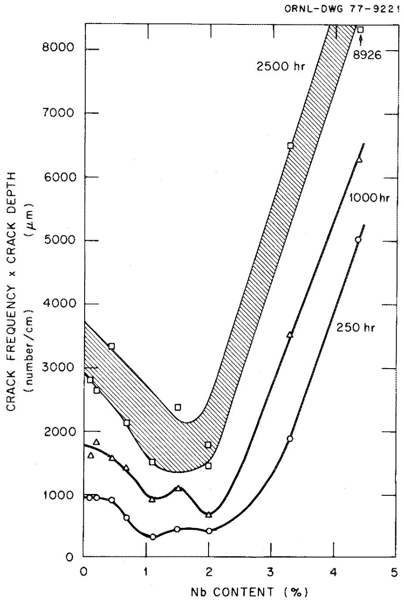  
Fig. 16. Variations of severity of cracking with Nb content. Sam- ples were exposed for indicated times to salt containing $\mathrm{Cr_3Te_4}$ and $\mathrm{Cr_5Te_6}$ at $700^{\circ}\mathrm{C}$ .

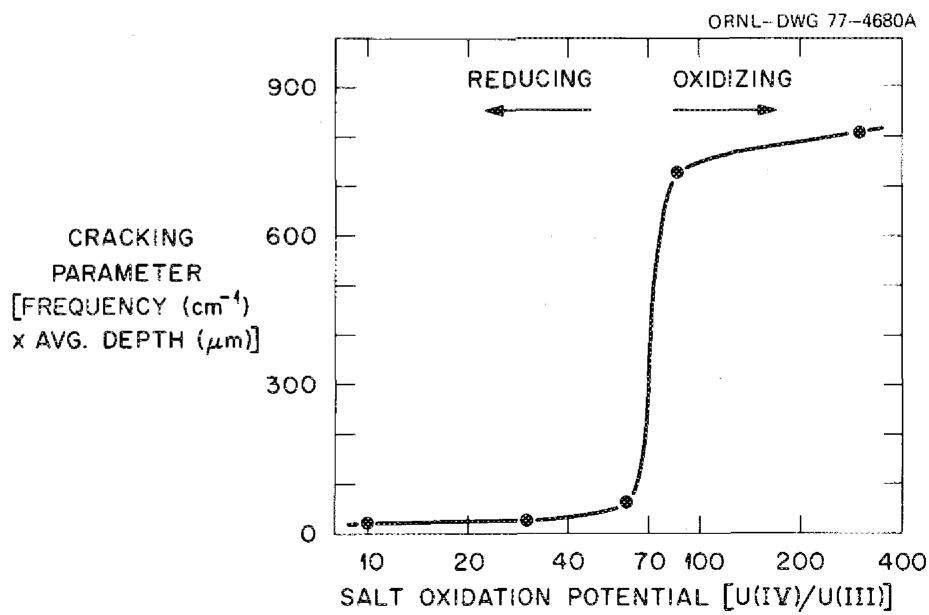  
Fig. 17. Cracking behavior of Hastelloy-N exposed 260 h at $700^{\circ}\mathrm{C}$ to MSBR fuel salt containing $\mathrm{Cr_3Te_4}$ and $\mathrm{Cr_5Te_6}$ .

Presently, the modified alloy composition shown in Table 28 is favored. Considerable progress had been made in establishing test methods for evaluating a material's resistance to embrittlement by tellurium. Modified Hastelloy-N containing from 1 to $2\%$ niobium was found to offer improved resistance to embrittlement by tellurium, but the test conditions were not sufficiently long or diversified to show that the alloy totally resisted embrittlement. One irradiation experiment showed that the niobium-modified alloy offered adequate resistance to irradiation embrittlement, but more detailed tests are needed. Several small melts containing up to $4.4\%$ niobium were found to fabricate and weld well, so products containing 1 to $2\%$ niobium likely can be produced with a minimum of scale-up difficulties.

# 3.4.1.3 Uncertainties

Although no basic scale-up problems are anticipated with the niobium-modified alloy, several large heats must be melted and processed into structural shapes to show that the alloy can be produced commercially. A further need exists for longer exposure of this alloy to irradiation

and to salt containing tellurium to show that it will resist embrittlement by these two processes over long periods of time. Numerous mechanical property tests must be run on the new alloy to develop the data needed for ASME Boiler and Pressure Vessel Code approval of the alloy and to establish adequate design methods.

# 3.4.2 Moderator

# 3.4.2.1 Requirements

The graphite in a single-fluid molten-salt reactor serves no structural purpose other than to define the flow patterns of the salt and, of course, to support its own weight. The requirements on the material are dictated most strongly by nuclear considerations, that is, stability of the material against radiation-induced distortion and nonpenetrability by the fuel-bearing molten salt. Practical limitations of meeting these requirements impose conditions on the core design -- specifically the necessity to limit the cross-sectional area of the graphite prisms. The requirements of purity and impermeability to salt are easily met by several high-quality fine-grained graphites, and the main problems arise from the requirement of stability against radiation-induced distortion.

# 3.4.2.2 Status of development

The dimensional changes of graphite during irradiation have been studied for a number of years. The dimensional changes largely depend on the degree of crystalline isotropy, but the volume changes fall into a rather consistent pattern. As shown in Fig. 18, a period of densification occurs first during which the volume decreases, and a period of swelling then occurs in which the volume increases. The first period is of concern only because of the dimensional changes that take place, and the second period is of concern because of the dimensional change and the formation of cracks. The formation of cracks would eventually allow salt to penetrate the graphite. Data shown in Fig. 18 are for $715^{\circ}\mathrm{C}$ , and the damage rate increases with increasing temperature. Thus, the graphite section size should be kept small enough to prevent temperatures in the graphite from greatly exceeding those in the salt.

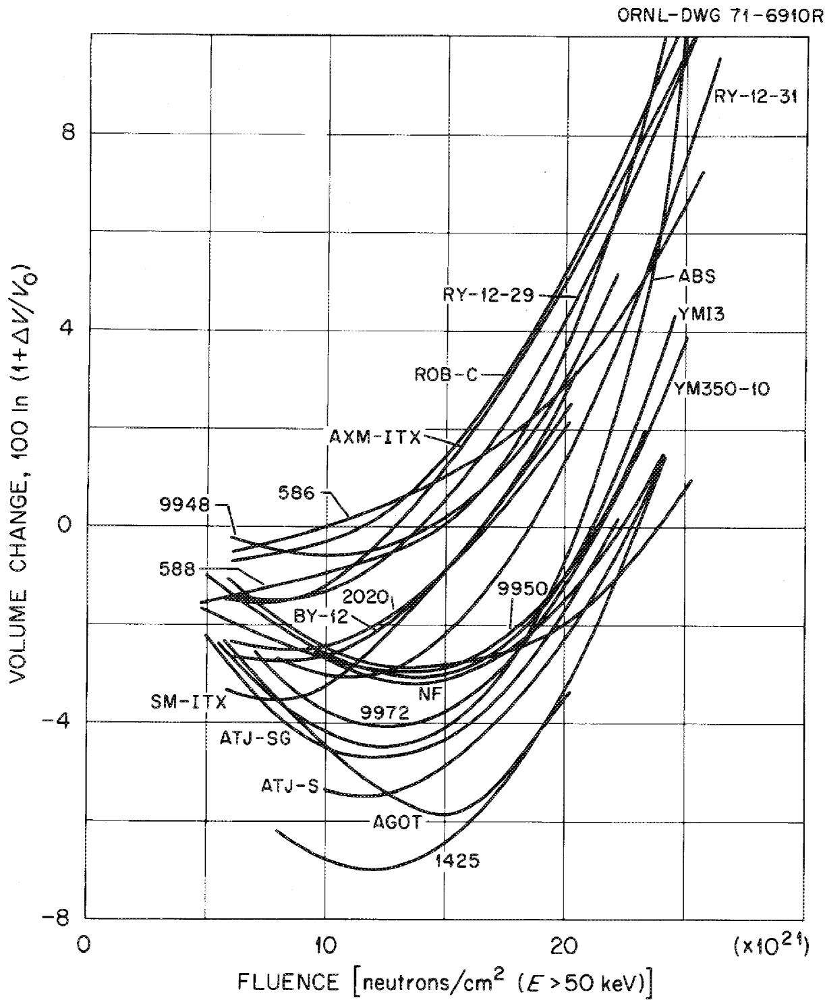  
Fig. 18. Volume changes for conventional graphites irradiated at $715^{\circ}\mathrm{C}$ .

With the different objectives of nonproliferating MSRs, the requirements for the graphite have diminished from those of the high-performance breeder. First, the peak neutron flux in the core can be reduced to levels such that the graphite will last for the lifetime of the reactor plant. Second, both the low power density and the low rate of xenon mass transfer to the graphite tend to limit the xenon poisoning effect in this reactor so that sealing the graphite may not be necessary. The lessened gas permeability requirements also mean that the graphite can be irradiated to higher fluences (Figs. 18 and 19). The lifetime criterion adopted for the breeder was a damage fluence of about $3 \times 10^{26}$ neutrons/m $^2$ . This

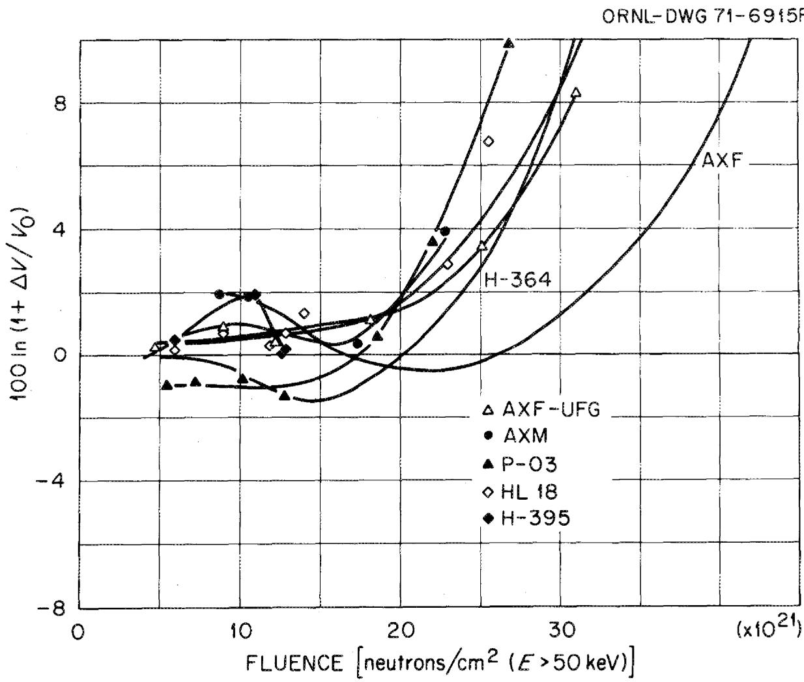  
Fig. 19. Volume changes for monolithic graphites irradiated at $715^{\circ}\mathrm{C}$ .

was estimated to be the fluence at which the graphite structure would contain sufficient cracks to be permeable to xenon. Experience has shown that, even at volume changes of about $10\%$ , the graphite is not cracked but is uniformly dilated. For nonproliferating devices, xenon permeability will not be of as much concern, and the limit probably will be established by the formation of cracks sufficiently large for salt intrusion. The GLCC* H-364 graphite likely could be used to $3 \times 10^{26}$ neutrons/ $\mathfrak{m}^2$ , and improved graphites with a limit of $4 \times 10^{26}$ neutrons/ $\mathfrak{m}^2$ could be developed.

The specific performance requirements for graphite suitable for the reactor design presented in this report are a lifetime fluence capability of $2.7 \times 10^{26}$ neutrons/m $^2$ (E > 50 keV) at a peak temperature of $750^{\circ}\mathrm{C}$ . Most probably, existing commercial graphites will satisfy this need.

# 3.4.2.3 Uncertainties

Although existing commercial graphites likely will meet the needs of the present design, graphite samples having the same cross section as the reference-design moderator elements need to be irradiated. These tests need to be run to the destruction of the graphite to determine the point at which the graphite actually heals. This will define failure in the present concept. Physical properties, particularly thermal conductivity, need to be measured as a function of fluence.

A longer-range effort to develop improved graphite for future reactors should be initiated. Early efforts show promise that graphites with improved dimensional stability can be developed.

# 3.5 Safety Considerations

The main feature of the DMSR which sets it apart from solid-fuel reactor types is that the nuclear fuel is in fluid form (molten fluoride salt) and is circulated throughout the primary coolant system, becoming critical only in the graphite-moderated core. Possible problems and engineered safety features associated with this type of reactor will be

quite different from those of the present LWR and liquid-metal fast breeder reactor (LMFBR) designs. A detailed safety analysis of the DMSR must await the results of a research and development (R&D) program; however, identifying possible generic problem areas and some of the advantages and disadvantages of this concept is already possible.

In the DMSR, the primary system fluid serves the dual role of being the medium in which heat is generated within the reactor core and the medium that transfers heat from the core to the primary heat exchangers. Thus, the entire primary system will be subject to both high temperatures (700°C at the core exit) and high levels of radiation by a fluid containing most of the daughter products of the fission process. Because of the low fuel-salt vapor pressure, however, the primary system design pressure will be low, as in an LMFBR. In terms of level of confinement, the entire reactor primary system is analogous to the fuel cladding in a solid-fuel reactor. Although much larger, it will not be subject to the rapid thermal transients (with melting) associated with LWR and LMFBR accident scenarios. Two additional levels of confinement will be provided in the DMSR, in accord with present practice. Note that the once-through DMSR concept has safety advantages over the break-even DMSR because a large and complex part of the primary containment – the chemical reprocessing plant – is substantially reduced and because less radioactive material is routinely removed from containment. The problem of developing a reactor primary system that will be reliable, maintainable (under remote conditions), inspectable, and structurally sound over the plant's 30-year life-time will probably be the key factor in demonstrating ultimate safety and licensability.

The breach of the reactor primary system boundary, resulting in a spill of highly radioactive salt into the primary containment, will probably provide the design-basis accident. The analogous event in a solid-fuel reactor would be major cladding failure. Possible initiators of this accident include pipe failure, missiles, and pressure or temperature transients in the primary salt system. Failure of the boundary between the primary and secondary salt in the primary heat exchangers could be especially damaging. In the event of salt spill, a possibly redundant system of drains would be activated to channel the salt to the continuously

cooled drain tank. The system primary containment, which is defined as the set of hermetically sealed concrete-shielded equipment cells, would probably not be threatened by such a spill, but cleanup operations would be difficult.

A unique safety feature of the DMSR is that, under accident shutdown conditions, the fuel material would be led to the emergency core cooling system (ECCS) (represented by drain tank cooling) rather than vice versa. The reactor and containment must be designed so that the decay-heated fuel salt reaches the drain tank under any credible accident conditions. In any case, the decay heat is associated with a very large mass of fuel salt so that melt-through (or "China Syndrome") is apparently not a problem.

The safety philosophy for accidents involving the reactor core is very different for fluid-fueled than for solid-fueled reactors because the heat source is mainly in the liquid-fuel salt and not in a solid, which requires continuous cooling to avoid melting. An LMFBR, for example, has a large amount of stored energy (which must be removed under any accident conditions) in the fuel pins. Dryout, which means immediate meltdown in an LMFBR, would not be nearly as severe in the DMSR because the heat source is removed along with the cooling capability. First-order analysis has shown that a flow blockage of a central coolant channel of the reference DMSR which reduces the flow to less than $\sim 20\%$ of nominal will probably result in local voiding of that channel. This was not true of the old MSBR design8 because the channels were more strongly thermally coupled. Whether the safety implications of this will lead to modifications of the DMSR reference design must be shown by future safety analysis studies. Under any off-normal conditions, the fuel salt will be channeled to the drain tank, which must have reliable systems for decay heat removal. No credible means exists for achieving recriticality once the fuel salt has left the graphite-moderated core.

# 3.6 Environmental Considerations

There are no significant differences in the environmental effects of routine operations between an MSR and reactors presently in commercial operation. No gaseous or liquid radioactive effluent discharge occurs

during normal operation. Minor amounts of such effluents may result from maintenance operations involving opening the primary system.

The MSR (along with the HTGR and the LMFBR) is in the class of reactors which operates at high temperatures and high thermal efficiencies -- about $40\%$ compared with about $32\%$ for LWRs. For the same electrical capacity, these more efficient reactors reject about $40\%$ less heat to the environment. This can reduce impacts such as consumptive use of water resources, atmospheric effects, and effects on aquatic life.

In the reference DMSR concept, neither the nuclear fuel nor the fission products (except for the volatiles, including xenon) are removed from the primary system during the reactor lifetime. This eliminates a major environmental problem of present day LWRs: frequent transportation of highly radioactive spent fuel from the reactor site to the reprocessing/storage facility. Most radioactive material remains within the DMSR primary containment for the 30-year reactor lifetime but must be dealt with at end-of-life. Uranium, lithium, and possibly other valuable elements will probably be recovered for reuse, but the remainder, which contains the actinides americium and curium (not found in significant amounts in spent LWR fuel), will have to be disposed of. Decommissioning the plant may be more difficult than for an LWR because the entire primary circuit will be intensely radioactive.

A large amount of tritium is generated in MSRs as a result of neutron reactions with the lithium in the fuel salt. Tritium is known to diffuse through metal walls such as heat-exchanger tubes, thus providing a potential route for transport of gaseous tritium through the secondary coolant loop to the steam generators. Recent experiments have shown that tritium is oxidized in the secondary coolant (sodium fluoroborate), which blocks further transport of tritium. The release of tritium from MSRs to the environment is estimated to be no greater than from LWRs and is well within NRC guidelines.

A power economy in which the MSR plays an important role would require large quantities of lithium, beryllium, fluorine (for the fuel-salt mixture), nickel (which comprises $78\%$ of the Hastelloy-N), and graphite (moderator elements). The environmental effects of obtaining, using, and disposing of these materials would certainly have to be evaluated.

# 3.7 Antiproliferation Features

A major feature of the DMSR is the relative unavailability of special nuclear material (SNM) that might be diverted and converted into strategic special nuclear material (SSNM) for use in the production of nuclear explosive devices. Because all the fuel would be in a homogeneous fluid, there would never be any subunits (e.g., fuel elements) that would be particularly enriched in a given "desirable" material or depleted with respect to specific contaminants. In addition, because the initial fuel charge as well as all makeup fuel would be denatured $^{235}\mathrm{U}$ and because "spent" fuel would not be removed from the primary containment except during decommissioning at the end of reactor life, the accessibility of even the mixed fuel would be severely restricted. Postulating ways of obtaining SSNM from any mixture containing fissile nuclides is always possible, but, in the case of the DMSR, these appear to involve special difficulties as well as low productivity.

# 3.7.1 Potential sources of SSNM

After the first few years of power operation,\* the principal fissile nuclide in a DMSR would be $^{233}\mathrm{U}$ with a substantial amount of $^{235}\mathrm{U}$ . However, both nuclides would remain fully denatured during the entire operation. Thus, after diversion and separation from other chemical species (many of which would be highly radioactive), the fissile uranium would still have to be subjected to an isotope enrichment process to produce SSNM. Other isotopic contaminants in the uranium, notably $^{232}\mathrm{U}$ , would tend to make this a difficult approach.

The next most abundant fissile material in DMSR fuel salt would be plutonium, with a maximum total-plant inventory (at end of plant life) of $334\mathrm{kg}$ of ${}^{239}\mathrm{Pu} + {}^{241}\mathrm{Pu}$ . However, this material would also contain $182\mathrm{kg}$ of ${}^{242}\mathrm{Pu}$ and $139\mathrm{kg}$ of ${}^{240}\mathrm{Pu}$ , which would tend to detract from its value

as SSNM. A more attractive isotopic mixture would exist early in the plant lifetime (e.g., after one year of operation), but the total inventory would be much smaller - only 86 kg of $^{239}\mathrm{Pu} + ^{241}\mathrm{Pu}$ with 13 kg of $^{240}\mathrm{Pu} + ^{242}\mathrm{Pu}$ .

Another potential source of SSNM in a DMSR would be $^{233}\mathrm{Pa}$ . This nuclide would have its maximum inventory of $\sim 63\mathrm{kg}$ early in the reactor life and slowly decline to about $41\mathrm{kg}$ at the end of life. In principle, this nuclide, if it could be cleanly and rapidly separated from the rest of the fuel salt, could provide an equivalent amount of high-purity $^{233}\mathrm{U}$ through simple radioactive decay.

# 3.7.2 Accessibility of SSNM

A major consideration regarding the accessibility of various forms of potential SSNM in a DMSR is that all the materials are intimately mixed with $\sim 350$ Mg of highly radioactive fuel salt with no known method for simple physical separation. Thus, diversion of only a modest amount (a few kilograms of SSNM without plans for isotopic enrichment would require the removal of a number of tons of fuel salt from the reactor system. The need for such large (and otherwise unjustifiable) salt removals,\* which without replacement would shut down the reactor, coupled with the need for an elaborate chemical treatment facility to isolate the product, appears to make this approach relatively impractical.

In principal, pure $^{233}\mathrm{U}$ could be diverted via the $^{233}\mathrm{Pa}$ route by modifying the in-plant hydrofluorinator to permit its use as a fluorinator. This would require two fluorinations of each batch of salt, with one occurring immediately after removal of the salt from the reactor to strip out the denatured uranium and a second about two months later to recover the $^{233}\mathrm{U}$ produced by $^{233}\mathrm{Pa}$ decay. However, if the system were originally designed to handle batches of salt no larger than $\sim 1\mathrm{m}^3$ , the

$^{233}\mathrm{U}$ production capability would be less than $3\mathrm{kg}$ /year, which seems impractically low.

Although the removal of fissile material from a DMSR may be awkward, if it could be accomplished without removing large quantities of salt, then the removal could be easily concealed by additions of denatured $^{235}\mathrm{U}$ to the fuel salt. The change in total uranium concentration would not become significant until after the exchange of a few tens of kilograms of fissile fuel.

Although a much more detailed, quantitative analysis that considered the relative values of various forms of SSNM would be required to permit a comprehensive assessment of the proliferation sensitivity of the once-through DMSR, this general treatment suggests that this concept may compare favorably with other alternatives in terms of resistance to proliferation of nuclear explosives.

# 4. ALTERNATIVE DMSR CONCEPTS

Of the several MSR concepts that have been considered, the DMSR described in the preceding section was judged to be the one most firmly based on currently available technology. However, it is not the only proliferation-resistant MSR concept that could be considered. However, because a high level of proliferation resistance in an MSR apparently requires denatured fuel, which imposes some design restrictions, the major differences among the alternate concepts involve the fuel cycle.

# 4.1 Fuel Cycle Choices

Possibly the most favorable fuel cycle for any DMSR, at least from the point of resource utilization, would be one with break-even breeding performance. Calculations for a DMSR core without neutron flux flattening to extend the life expectancy of the graphite moderator showed that break-even breeding was marginally possible with full-scale fission-product treatment of the fuel using a reductive-extraction/metal-transfer process100 similar to that proposed for the MSBR. Even if break-even performance were not attained, the initial fuel change could be "used" for several reactor plant lifetimes by feeding moderate amounts of fissile fuel.

The next step downward in performance might be a concept involving treatment of the fuel for partial fission-product removal by chemical operations significantly different from the reference process. This approach probably would lead to still lower conversion ratios, but it might permit internal recycle of the fuel through a few generations of reactors and, therefore, offer better resource utilization than the once-through fuel cycle.

Some improvement in fuel utilization over current-technology LWRs could be achieved even without on-site chemical treatment for fission-product removal. Periodic replacement of the fuel carrier salt (after recovery and return of only the uranium) with material that is free of fission products and higher actinides would improve the utilization of fissile fuel, though it would increase the consumption of other fuel-salt constituents.

All the MSR options from the breeder through the simplest converter would take advantage of the fact that the noble-gas fission products (including the very important nuclear poison $^{135}\mathrm{Xe}$ ) are very sparingly soluble in the molten fluoride fuel. Thus, they would all use simple stripping with gaseous helium to remove krypton and xenon from the primary system. In addition, they would all take advantage of the fact that the noble-metal and seminoble-metal fission products do not form stable fluorides in the fuel and would precipitate as elemental species, primarily on metal surfaces outside the reactor core.

# 4.1.1 Break-even breeding

The presence of $^{238}\mathrm{U}$ in a DMSR, combined with the effects of flux flattening, sufficiently reduces the nuclear performance so that a net breeding ratio substantially greater than 1.0 probably could not be achieved, even with full-scale fission-product processing. (A positive breeding gain presumably would be undesirable in a proliferation-resistant system because it would require the periodic "export" of excess fissile material.) However, the studies that have been carried out indicate that break-even breeding is within the uncertainty limits of the neutronic calculations for a flux-flattened DMSR core with a 30-year moderator life expectancy. Extended operation at break-even would require a carefully optimized core design as well as continuous fuel-salt processing on a relatively short time cycle (~20 d) to remove fission products and retain (or return) all fissile and higher-actinide nuclides.

The reference fuel processing concept proposed for the MSBR could not be directly applied to a DMSR for several reasons.

1. Isolation of $^{233}\mathrm{Pa}$ would not be acceptable in a DMSR because its decay would lead to a supply of diversion-sensitive, high-purity $^{233}\mathrm{U}$ .   
2. Isolation of protactinium would be accompanied by removal and loss of plutonium from the operating system. This would not only degrade system performance but also provide a source of plutonium that would have to be safeguarded and/or disposed of.

3. The reference system without protactinium isolation would have no means for removing fission-product zirconium, which would then reach undesirably high chemical concentrations.

However, the reference process could be modified to meet the requirements of the DMSR concept. A modified process (described in Ref. 9), in addition to providing the required fission-product removal, would offer other advantages.

1. The total plutonium inventory would be limited because the plutonium would eventually be consumed at its production rate in the reactor.   
2. The reactor would serve as its own "incinerator" for transplutonium actinides, which would be continuously recycled in the fuel.   
3. Neither the protactinium nor the plutonium would ever be isolated from all other highly radioactive species.

This modified processing concept would use all the basic unit operations proposed for the MSBR system in essentially the same sequence. However, additional, though similar, process steps would be required to remove zirconium on a reasonable time scale, and these are included in the conceptual flow sheet. Some removal of neptunium also might be desirable to avoid the long-term poisoning effects of $^{237}\mathrm{Np}$ and $^{238}\mathrm{Pu}$ ; this probably could be included without adding significantly to the complexity of the processing facility.

With full-scale fission-product removal and break-even breeding, the fuel in a DMSR could be used indefinitely. That is, at the end-of-life of one reactor plant, the fuel salt could be transferred to a new plant and used without any significant intermediate treatment. During the life of any given plant, adding thorium as the principal fertile material and $^{238}\mathrm{U}$ to maintain compliance with denaturing requirements would be necessary, but no fissile additions would be required. Other routine removals of fuel-carrier salt ( $\mathrm{LiF} + \mathrm{BeF}_2 + \mathrm{ThF}_4$ ) and additions of $\mathrm{BeF}_2$ and $\mathrm{ThF}_4^*$ would be required to maintain the desired chemical composition of the salt. The removed carrier salt could be disposed of (after conversion to a suitable form) or chemically processed for recycle into other MSRs.

# 4.1.2 Converter operation with fuel processing

Because the results of the currently completed neutronic calculations will not support any final conclusions about the breeding potential of fully optimized DMSR cores, consideration must be given to the consequences of conversion ratios lower than 1.00. The evaluations were performed for the two-zone flux-flattened core described for the 30-year fuel cycle with the fuel processing concept for the break-even breeder added. If this system were operated with no constraint on the enrichment of the uranium in the reactor and no $^{238}\mathrm{U}$ addition, it would gradually develop into an MSBR as the $^{238}\mathrm{U}$ was consumed. The system would then be fully self-sustaining on thorium with a breeding ratio of about 1.03 but with a very high enrichment of fissile uranium. Breeding ratios as high as 1.11 could be attained by changing the thorium concentration and/or the size of the inner core zone. With the addition of enough $^{238}\mathrm{U}$ to keep the in-plant uranium denatured at all times, this particular reactor system would ultimately require an additional $2\%$ in nuclear reactivity to be indefinitely operable.* This reactivity deficit, if real, could be supplied in a number of ways.

A moderate feed of $235\mathrm{U}$ at $20\%$ enrichment would extend the fuel cycle to about 300 years. At that time, the $238\mathrm{U}$ loading would become excessive, and the reactor could no longer be made critical. While even 300 years may be much longer than any reasonable planning horizon, this result indicates that a fully denatured MSR could have a very long, if not unlimited, fuel lifetime. If the enrichment of the feed material were allowed to rise to $33\%$ $235\mathrm{U}$ , reactor operation could be sustained indefinitely without fuel discard.

Because the buildup of $^{238}\mathrm{U}$ is the limiting phenomenon in the fuel cycle of any nonbreeding DMSR, any process that would have the effect of removing $^{238}\mathrm{U}$ would improve the characteristics of the cycle. With the fuel feed enrichment set at $20\%$ $^{235}\mathrm{U}$ , the buildup of $^{238}\mathrm{U}$ could be limited

by removing some uranium from the fuel salt and replacing it with fresh feed. If only $1\%$ of the uranium inventory were removed each year and consigned to waste or to off-site recovery, the in-plant isotopic composition would reach equilibrium within 300 years, and the fuel cycle could be continued indefinitely. An even more attractive choice would be to remove some of the uranium, strip out part of the $238\mathrm{U}$ , and return the remainder to the reactor plant. To examine this case, we assumed that $2\%$ of the reactor inventory would be treated each year and that the returning uranium would contain one-half the original $238\mathrm{U}$ or enough for denaturing, whichever was greater. (Only $238\mathrm{U}$ was extracted in this preliminary calculation.) The calculation showed that this approach also would allow indefinite operation and would require less feed material (see the following discussion) than the other options.

# 4.1.3 Partial fission-product removal

Although the reference fission-product processing concept could strongly affect the very long-term viability of DMSRs, the fission-product process would require substantial time and effort for commercial development, and, even then, it might not be a market success. Consequently, considering alternative processes might be useful.

A variety of alternative separations procedures have been examined over the years in the ORNL MSR program for possible application in fuel reprocessing operations. Possible recovery of protactinium, uranium, and other actinides by selective precipitation of oxides has been examined, though most methods have preferred removal of uranium isotopes by fluorination to volatile $\mathrm{UF}_6$ . Attempts to remove the lanthanides (the most important parasitic absorbers of neutrons) have included processes based on ion exchange, precipitation of intermetallic compounds, and even volatilization at low pressure of the other melt constituents* to leave the very nonvolatile lanthanide trifluorides behind. All such processes require solids handling, and many also have other disadvantages. None was

developed far enough to lead to an integrated process. Further, after discovery of the reductive-extraction/metal-transfer process, which, though complex, involved handling only liquids and gases, studies of all other separations were largely abandoned.

An ion-exchange process for selective removal of lanthanide ions from the molten fuel has long seemed attractive in principle,[19] but no attractive ion exchanger for these materials has been demonstrated. An obvious difficulty is posed by the aggressive tendency of the molten LiF-BeF $_2$ -ThF $_4$ -UF $_4$ system to react with most materials that are likely to be useful. Certain refractory lanthanide compounds (such as carbides, nitrides, or sulfides) could conceivably be useful and sufficiently stable. The only candidate materials to date have been materials such as CeF $_3$ and LaF $_3$ . By virtue of the formation of nearly ideal solid solutions among the rare earth trifluorides, these compounds are capable of removing other (higher cross-section) lanthanides from the molten fluorides. The neutron cross sections of cerium and lanthanum are not negligible; because such an exchange process saturates the treated fuel with CeF $_3$ or LaF $_3$ , the resulting fuel solution still has substantial parasitic neutron absorbers.[19] The CeF $_3$ (or LaF $_3$ ) exchanger also would presumably remove trivalent actinides (including plutonium) from the molten fuel. This would be unacceptable for a DMSR.

No overall chemical process based on such separations has been described. Obviously, much development would be necessary before such a process could be demonstrated. Also, several solids-handling operations apparently would be required and no process based on these operations could be capable of processing a DMSR on a short time cycle. However, given the present state of knowledge, the following process can be visualized to operate on relatively large (1- to $2\mathrm{-m}^3$ ) batches of DMSR fuel, possibly after cooling for 5 or 6 d. The following steps would be necessary.

Step 1. Treat the melt with a strong oxidant to convert $\mathbf{U}\mathbf{F}_3$ to $\mathbf{U}\mathbf{F}_4$ , $\mathbf{PaF}_4$ to $\mathbf{PaF}_5$ , and $\mathbf{PuF}_3$ to $\mathbf{PuF}_4$ . This should ensure that cerium is present as $\mathbf{CeF}_4$ and, probably, that neptunium is present as $\mathbf{NpF}_4$ . Americium and curium may be present as tetrafluorides but will

probably still be mostly trifluorides. This oxidized system will be corrosive, but it should be manageable in equipment of nickel or nickel-clad Hastelloy.

Step 2. Precipitate the insoluble oxides using water vapor diluted in helium. The oxides $\mathrm{UO}_2$ , $\mathrm{Pa}_2\mathrm{O}_5$ , $\mathrm{PuO}_2$ , $\mathrm{CeO}_2$ , probably $\mathrm{NpO}_2$ , and possibly $\mathrm{AmO}_2$ and $\mathrm{CmO}_2$ should be obtained. With the exception of $\mathrm{ZrO}_2$ and $\mathrm{Pa}_2\mathrm{O}_5$ , these will be largely in solid solution. The oxide solid solution is likely to contain 15 to $20\%$ of $\mathrm{ThO}_2$ ; this would correspond to a few (less than 5) percent of the $\mathrm{ThF}_4$ present in the fluoride. Recover the oxides by decantation and filtration.

Step 3. Hydrofluorinate the oxides from step 2 into the purified LiF-BeF $_2$ -ThF $_4$ melt from step 7 and reduce the melt with H $_2$ and then with lithium, thorium, or beryllium to reconstitute fuel with the desired UF $_3$ /UF $_4$ ratio.

Step 4. Hydrofluorinate the liquid from step 2 to remove excess oxide ion. Oxidize to get samarium and (if possible) europium to $\mathsf{SmF}_3$ and EuF₃.

Step 5. Treat the melt from step 4 with an excess of $\mathrm{CeF}_3$ . This might be done in a column or in a two- or three-batch countercurrent operation. This removes a major fraction of the rare earths but does essentially nothing for cesium, rubidium, strontium, and barium. (If neptunium, americium, and curium are appreciably harder to oxidize than plutonium, they should remain in the salt in step 2 and should be removed on the $\mathrm{CeF}_3$ in step 5.)

Step 6. The $\mathrm{LiF - BeF_2 - ThF_4}$ melt from step 5 contains only a fraction of the rare earth poisons but, of course, is saturated with $\mathrm{CeF_3}$ . Oxidize the $\mathrm{Ce^{3+}}$ to $\mathrm{Ce^{4+}}$ .

Step 7. Precipitate the $\mathrm{Ce^{4+}}$ as $\mathrm{CeO}_2$ . Some $\mathrm{ThO}_2$ will accompany the $\mathrm{CeO}_2$ , but the quantity should be small. Separate the precipitate by decantation and filtration. Feed the molten $\mathrm{LiF - BeF}_2 - \mathrm{ThF}_4$ to the fissile material recovery operation in step 3.

Step 8. Dissolve the solid $\mathrm{CeF}_3$ (contaminated with rare earths) from step 5 in some suitable salt (preferably not $^7\mathrm{LiF - BeF}_2$ ) and oxidize the $\mathrm{Ce}^{3+}$ to $\mathrm{Ce}^{4+}$ .

Step 9. Precipitate the cerium as $\mathrm{CeO}_2$ and recover the precipitate by decantation and filtration. Discard a portion of the molten salt, which contains rare earth fission products, to waste storage. Return the remainder with the necessary makeup to step 8.   
Step 10. Combine the $\mathrm{CeO}_2$ from step 9 with that from step 7 and treat these solids with HF and $\mathbf{H}_2$ to obtain $\mathrm{CeF}_3$ (plus some $\mathrm{ThF}_4$ ). Use this as the major part of the reagent for step 5.

This process would have a number of disadvantages when compared with the reductive-extraction/metal-transfer process. Zirconium, cesium, rubidium, strontium, and barium would not be removed, though none of these is a major problem. Neptunium probably would not be removed, though americium and curium may be. Iodine would be removed either during the fuel oxidation or subsequent hydrofluorinations. Selenium and tellurium - assuming that they arrive at the processing plant - might be volatilized as elements or as fluorides during the fuel oxidation step (and they might cause a corrosion problem for the process). Heat generation by the fuel, even after a few days cooling time, would present problems, and the complex process would be difficult (possibly impossible) to engineer. At best, several days would be required to get a batch of DMSR fuel solvent through the process, though the fissile materials might be returned to the reactor with a 2-d holdup. An appreciable inventory of fuel material (but perhaps not more than $5\%$ of reactor inventory) would be cooling and in the processing area.

# 4.1.4 Salt replacement

Even with no chemical removal of fission products, the neutron poisoning effect in a DMSR does not begin to approach saturation until after about 15 years of power operation at a $75\%$ capacity factor. Thus, if the fission-product inventory could be held at or below that corresponding to a 15-year level, a significant reduction in fueling requirements could be realized. The simplest way to limit the fission-product concentration in the salt is to discard a portion of the salt on a routine schedule and replace it with clean salt. With no refinement, salt discard would require replacement of the fissile material as well as the fertile component

and the solvent (or carrier) salt and, therefore, would actually require a larger uranium supply than the 30-year once-through fuel cycle proposed for the reference DMSR concept. However, uranium is easily and effectively separated from the rest of the fuel mixture, so the denatured uranium could be removed and recycled at the reactor site with a minimum of effort. Depending on the rate of salt replacement, this approach would significantly reduce the requirement for fissile uranium below that for the simple once-through cycle.

# 4.2 Fuel Cycle Performance

Of the alternate fuel cycles considered in this section, the break-even breeder, if it were successful, would provide for the best utilization of fissile fuel resources $(^{235}\mathrm{U})$ . If that system were started up on $20\%$ enriched ${}^{235}\mathrm{U}$ , it would probably require 700 to $1000\mathrm{Mg}$ of natural $\mathrm{U}_{3}\mathrm{O}_{8}$ to provide the initial fuel loading for each 1 GW of electric generating capability. [The separative work to enrich this fuel to $20\%$ ${}^{235}\mathrm{U}$ would be less than 1 million separative work units (SWU).] However, once provided, this fuel would continue to produce electricity in an arbitrarily long succession of power stations (or as long as fertile material was available). Thus, the effective resource requirement could be made arbitrarily small by averaging it over a large number of plants. Even if the initial fuel charge were used in only one plant, the resource requirement would be only 10 to $20\%$ of that for an LWR with similar electric generating capability.

The converter options with fuel processing provide other estimates of the potential performance of DMSRs with fission-product cleanup (Table 29). The options, which were described earlier, may be summarized as follows:

# Option

# Fuel cycle

A Initial load is $20\%$ 235U; makeup fuel is $20\%$ 235U   
B Initial load is $20\%$ 235U; makeup fuel is $33\%$ 235U   
C Initial load is $20\%$ 235U; annual discard of 1% of uranium inventory; makeup fuel is $20\%$ 235U   
D Initial load is $20\%$ $^{235}\mathrm{U}$ ; annual reenrichment of $2\%$ of uranium inventory to denaturing limit or to one-half of prior $^{238}\mathrm{U}$ content; makeup fuel is $20\%$ $^{235}\mathrm{U}$ .

Table 29. Performance data for long-term fuel cycle options for DMSRs $^{\alpha}$ with full-scale fission-product removal   

<table><tr><td></td><td colspan="4">Optionb</td></tr><tr><td></td><td>A</td><td>B</td><td>C</td><td>D</td></tr><tr><td>Conversion ratio after</td><td></td><td></td><td></td><td></td></tr><tr><td>20 years</td><td>0.90</td><td>0.94</td><td>0.94</td><td>0.94</td></tr><tr><td>300 years</td><td>0.74</td><td>0.92</td><td>0.93</td><td>0.89</td></tr><tr><td>600 years</td><td>c</td><td>0.92</td><td>0.93</td><td>0.89</td></tr><tr><td>Requirement for initial core loading</td><td></td><td></td><td></td><td></td></tr><tr><td>U3O8, Mg</td><td>860</td><td>860</td><td>860</td><td>900</td></tr><tr><td>Separative work, Mg SWU</td><td>860</td><td>890</td><td>860</td><td>900</td></tr><tr><td>Average requirement for fuel makeup per 30-year cycle</td><td></td><td></td><td></td><td></td></tr><tr><td>U3O8, Mg</td><td></td><td></td><td></td><td></td></tr><tr><td>During years 0-300</td><td>1000</td><td>420</td><td>580</td><td>500</td></tr><tr><td>During years 301-600</td><td>c</td><td>460</td><td>600</td><td>600</td></tr><tr><td>Separative work, Mg SWU</td><td></td><td></td><td></td><td></td></tr><tr><td>During years 0-300</td><td>1000</td><td>440</td><td>580</td><td>500</td></tr><tr><td>During years 301-600</td><td>c</td><td>470</td><td>600</td><td>600</td></tr><tr><td>Uranium reenrichment, Mg/year</td><td>0</td><td>0</td><td>0</td><td>0.60</td></tr><tr><td>Uranium discard, Mg/year</td><td>0</td><td>0</td><td>0.24</td><td>0</td></tr><tr><td>Fissile inventory at equilibrium, Mg</td><td></td><td></td><td></td><td></td></tr><tr><td>Uranium</td><td>1.2d</td><td>2.9</td><td>2.7</td><td>2.8</td></tr><tr><td>All fissile nuclides</td><td>3.2d</td><td>3.1</td><td>3.0</td><td>3.1</td></tr></table>

For 1 GWe at $75\%$ capacity factor.   
See text for characterization of options.   
cNot operable beyond 300 years.   
At 300 years.

The tabulated results show that all four of these options would maintain relatively high conversion ratios for very long times. The $\mathrm{U}_{3}\mathrm{O}_{8}$ resource requirements for the initial core loadings are all similar, and all are slightly higher than that for the once-through fuel cycle (because of the volume of fuel in the processing system).

The fuel makeup requirements are expressed in metric tons of $\mathrm{U}_{3}\mathrm{O}_{8}$ for 30 years of operation in a 1-GWe plant at $75\%$ capacity factor and are averages for ten 30-year cycles. The effect of this averaging is most pronounced for option A; the fuel makeup requirement is only a fraction of the average for the first one or two reactor lifetimes and is somewhat greater than the average for the last cycles. Thus, while this option would require more uranium than the others in the very long term, its performance for the first few reactor lifetimes would be quite attractive. Even for the long-term, this resource requirement would be well below that of current-generation LWRs. Option B illustrates the long-term saving in uranium resources that could be achieved if higher enrichments could be tolerated for the relatively small amounts of makeup fuel. Because the resource savings are principally long term and the required uranium enrichment exceeds currently perceived denaturing limits, this appears to be one of the less promising options. The two remaining options, C and D, both show favorable resource utilization properties for long times with only minor penalties for discarded uranium (option C) or uranium subjected to reenrichment (option D). Of these, option D clearly would be preferable if reenrichment were an acceptable procedure.

The preceding four converter options and/or the break-even breeder would require the availability of a complex and expensive fuel cleanup facility within the primary containment of each reactor installation.* The technology for an integrated processing facility has not been fully developed, and past work clearly indicates that a substantial development effort would be required to produce a commercially functional system. Even then, the capital, operating, and maintenance costs of such a system possibly would have a significant adverse impact on the overall economic performance of the associated DMSR. Other factors to be considered for these options included the willingness of the reactor operator to assume

responsibility for a chemical processing facility, the sociopolitical acceptability of colocating such a facility with each DMSR, and the licensing questions that may arise from such an arrangement.

The other end of the range of possible fuel cycle performances for DMSRs is represented by the 30-year cycle described earlier in this report as the reference concept. Although this system, with a lifetime requirement of $1810\mathrm{Mg}$ (2000 short tons) of $\mathrm{U}_{3}\mathrm{O}_{8}$ , would be the largest consumer of natural uranium and separative work among the DMSR options considered, it still would require substantially less of these commodities than the once-through fuel cycle in light-water reactors. In the absence of facilities for recycling the non-SNM constituents of the fuel salt, this approach would use less of such materials than any of the other alternatives. However, despite the 30-year fuel cycle, this concept would not eliminate all on-site chemical treatment of the fuel salt. The activities to maintain the desired $\mathrm{U}^{3+}/\mathrm{U}^{4+}$ ratio in the fuel and the treatments to limit the level of oxide contamination in the salt would still be needed. Thus, even the "simplest" DMSR would require some equipment for and some technical competence in chemical processing, even though neither would directly involve the SNM in the system.

The intermediate concepts that make use of a shorter salt discard cycle merely substitute consumption of other fluoride salts for part of the fissile uranium consumption in the reference 30-year cycle. Because these other fluorides (especially $^{7}\mathrm{LiF}$ ) may also be relatively expensive, this substitution might not always be cost effective. In addition, any system that used salt discard would have to recover uranium from the "waste" salt to prevent excessive uranium consumption. This would add yet another chemical processing operation to the reactor plant.

The alternatives that rely on special treatment schemes to remove fission products from the fuel salt may have attractive fuel utilization characteristics, but they have not been analyzed in sufficient detail to permit an accurate characterization. In addition, considerable research and development would be required before such processes could be shown to be technically feasible. Consequently, little incentive is apparent at this time to propose new and different chemical processing concepts for DMSRs.

# 5. COMMERCIALIZATION CONSIDERATIONS

While the technological feasibility, the overall technical performance, and the proliferation resistance of the DMSR are important characteristics to be considered in assessing its value as an alternative nuclear concept, an overriding consideration is likely to be the commercialization potential of the system. This general attribute includes a number of considerations, such as:

1. the probable total cost of developing a commercially ready system;   
2. the time required for such development, which strongly affects the impact a system can have on power needs;   
3. the probable net economic performance of commercial units, which determines the attractiveness of the concept to its potential users, that is, the electric power utilities;   
4. the ease of licensability of the commercial plants, which is a reflection of the concept's sociopolitical attractiveness, as well as its technical performance.

Some relevant information about the DMSR with respect to each of these points is presented in the following discussion.

# 5.1 Research and Development

Since MSR research and development has been under way for some 30 years, the basic technology is well understood. However, much of it has not been developed to the stage and scale that would be required for the construction of large reactor systems. Thus, a significant R&D effort would be an important part of any program to commercialize MSRs. In addition, until recently, development was concentrated on reactor concepts with a good breeding gain and a low fissile inventory so that the resulting thermal breeder reactor system would have a reasonably short doubling time and could be considered a viable alternative (or complement) to fast breeder systems. The technology needs of the modified reactor concept that has been developed in response to the recent emphasis on proliferation resistance differ from those of the nominal breeder concept.

# 5.1.1 Current status

MSR development has been carried through the design and operation of a proof-of-principle test reactor, the MSRE, which was an 8-MwT reactor that operated at ORNL from 1965 to 1969. This reactor demonstrated the basic reliability of a molten-salt system, stability of the fuel salt, compatibility of fluoride salts with Hastelloy-N and graphite, reliability of molten-salt pumps and heat exchangers, and maintenance of a radioactive fluid-fueled system by remote methods. The reactor was critical over $17,000\mathrm{h}$ , circulated fuel salt for nearly $22,000\mathrm{h}$ , and generated over $100,000\mathrm{MWh}$ of thermal energy. The MSRE had achieved all the objectives of the reactor test program when it was retired in 1969.

After the successful operation of the MSRE, the reactor concept appeared ready for commercial development. In preparation for further development, three major reports were prepared: a conceptual design study of an MSBR in 1971 (Ref. 8), a review of the status of development in 1972 (Ref. 101), and a program plan for development in 1974 (Ref. 21). For reasons other than technological, the government decided not to fund further development of MSRs. The program was cancelled in 1973, restarted in 1974, and finally terminated in 1976.

The development of a proliferation-resistant DMSR would require basically the same technological development program as was proposed for the MSBR, but the emphasis would be on reliability, ease of commercialization, licensing, and proliferation resistance rather than on high breeding performance. With these objectives in mind, the 1972 status-of-development report has been updated, and the program plan for development has been modified for the DMSR.[102] (While the main outline of DMSR development requirements will be presented in this report, the reader is referred to Ref. 102 for greater detail.)

# 5.1.2 Technology base for reference DMSR

The base technology for MSRs is well established and has been largely "proven in principle" by the operation of the MSRE. While no major unresolved technical issues exist at the present time, a large R&D effort would be required to bring molten-salt technology to commercialization.

At the close of MSRE operation, two major technical issues appeared unresolved. The first was the control of tritium, which is produced in fairly large quantities in a molten-salt system and which is known to diffuse through metal walls. Subsequent engineering-scale tests have demonstrated that tritium is oxidized in sodium fluoroborate, the proposed secondary salt for the DMSR, and appears to be handled readily. However, this process is not yet well understood, and the effects of maintaining an adequate concentration of the oxidant on the long-term compatibility of the salt with the structural alloy are unknown. The second issue involved the compatibility of Hastelloy-N with fuel salt. Operation of the MSRE showed that the general corrosion of Hastelloy-N and graphite in an operating MSR was near zero, as expected. However, metal surfaces that had been exposed to fuel salt containing fission products were unexpectedly found to exhibit grain-boundary attack, which was subsequently shown to be caused by reaction with the fission product, tellurium. Further work has shown that tellurium attack can be controlled by either a modification of the Hastelloy-N alloy or by control of the oxidation potential of the fuel salt.

The major areas of research required for commercialization of MSRs would involve improvement of the materials of construction (Hastelloy-N and graphite), the design of in-line instrumentation for high-temperature use, and the development of fuel processing (at least for the end of reactor life and possibly also for use on-line). The major areas of development involve the scale-up of reactor components (e.g., pumps) and the design and development of components that were not present in the MSRE (e.g., steam generators and mechanical valves). In addition, we anticipate that the design of some components such as the fuel drain system and the reactor cell with its insulation, heating, and cooling requirements would be extensively modified to meet currently unspecified licensing requirements. Another large area of development would be the control of the temperatures and flows in the primary and secondary salt systems and in the steam system to avoid salt freezing and excessive thermal stress. Alternatively, some components might be designed to accommodate such freezing. Still another area of development would be advanced remote maintenance techniques, including the replacement of components using remote pipe cutting and welding.

The concept of the DMSR has emphasized proliferation resistance, and further design efforts would be expected to adhere to proliferation-resistance criteria. However, no major areas have been identified in which the R&D requirements for a DMSR would be substantially different from those for other versions of the MSR concept. Essentially the same R&D program would be pursued as was planned for the MSBR. The selection of a low-power-density core for the DMSR has relieved the requirements for core graphite (especially for gas permeability) and has simplified vessel design (because graphite replacement is not required). The selection of a reference DMSR without on-line fuel processing has removed the development of on-line processing from the expected critical path for reactor development. Processing development should proceed, however, to meet two closely related objectives: (1) development of on-line reprocessing to obtain the improved fuel utilization of the break-even breeder DMSR option as soon as possible and (2) development of a process (probably using the same basic technology) for eventual central processing of fuel from once-through DMSRs, possibly in secure fuel service centers.

# 5.1.3 Base program schedule and costs

An R&D base program has been presented in some detail in the program plan.[102] The projected cost schedule (in 1978 dollars) for each major development activity annually from 1980 to 1994 and as a total for 1995 through 2011 is given in Table 30. The complete base program is projected to cost about $700 million over about 30 years.

Some of the costs are targeted for either the Molten-Salt Test Reactor (MSTR) or the demonstration DMSR (as discussed in the following section), while other costs apply generally to the MSR development program. However, these costs do not include design and construction costs for the reactor plants.

The schedule of fuel processing technology development was set up for the concurrent development of on-line processing. This schedule could be stretched if the once-through cycle were chosen for the first DMSRs. However, the development of processing technology is an important goal of the program in any event.

(Thousands of 1978 dollars)

Table 30. Projected research and development costs for MSR base development program   

<table><tr><td rowspan="2">Development activity</td><td rowspan="2">Type fund</td><td rowspan="2">Target reactor</td><td colspan="15">Cost by fiscal year</td><td rowspan="2">Total cost for first 15 years</td><td rowspan="2">Cost from 1995a through 2011</td></tr><tr><td>1980</td><td>1981</td><td>1982</td><td>1983</td><td>1984</td><td>1985</td><td>1986</td><td>1987</td><td>1988</td><td>1989</td><td>1990</td><td>1991</td><td>1992</td><td>1993</td><td>1994</td></tr><tr><td>Reactor design and analysis</td><td>Operating</td><td>MSTR Demo</td><td>430</td><td>1,270</td><td>1,100</td><td>720</td><td>930</td><td>1,120200a</td><td>970200a</td><td>970200a</td><td>950200a</td><td>880200a</td><td>520500a</td><td>520500a</td><td>520500a</td><td>100920a</td><td>100920a</td><td>11,1004,340a</td><td>1,00020,000</td></tr><tr><td rowspan="2">Reactor and component technology</td><td>Operating</td><td>MSTR Demo</td><td>530</td><td>1,050</td><td>1,260</td><td>1,410</td><td>2,690</td><td>4,270</td><td>5,920</td><td>6,610</td><td>7,970</td><td>9,210300a</td><td>9,500600a</td><td>5,000a</td><td>3,000a</td><td>1,500a</td><td>62,920a</td><td>20,00080,000</td><td></td></tr><tr><td>Capital</td><td>All</td><td>40</td><td>90</td><td>150</td><td>80</td><td>5,330b</td><td>79,400b</td><td>26,100b</td><td>570</td><td>840</td><td>1,130</td><td>1,400</td><td>600a</td><td>2,100a</td><td>2,800a</td><td>8,900a</td><td>8,900a</td><td></td></tr><tr><td rowspan="2">Safety and licensing</td><td>Operating</td><td>MSTR Demo</td><td>117</td><td>303</td><td>351</td><td>468</td><td>397</td><td>676</td><td>839</td><td>975</td><td>1,100</td><td>1,235</td><td>1,300</td><td>1,500a</td><td>1,500a</td><td>1,500a</td><td>1,500a</td><td>13,761a</td><td>8,000</td></tr><tr><td>Operating</td><td>MSTR Demo</td><td>695</td><td>990</td><td>1,125</td><td>1,230</td><td>1,345</td><td>1,360</td><td>1,430</td><td>1,475</td><td>1,300</td><td>93565a</td><td>560440a</td><td>465535a</td><td>465535a</td><td>250750a</td><td>50950a</td><td>1,36753,275a</td><td>5,00015,000</td></tr><tr><td rowspan="2">Fuel and coolant chemistry</td><td>Operating</td><td>MSTR Demo</td><td>95</td><td>205</td><td>335</td><td>310</td><td>180</td><td>410</td><td>325</td><td>350</td><td>185</td><td>55</td><td>50a</td><td>50a</td><td>100a</td><td>100a</td><td>100a</td><td>2,850a</td><td>2,500</td></tr><tr><td>Capital</td><td>All</td><td>95</td><td>205</td><td>335</td><td>310</td><td>180</td><td>410</td><td>325</td><td>350</td><td>185</td><td>55</td><td>50a</td><td>50a</td><td>100a</td><td>100a</td><td>100a</td><td>2,750a</td><td>2,000</td></tr><tr><td rowspan="2">Analytical chemistry</td><td>Operating</td><td>MSTR Demo</td><td>260</td><td>405</td><td>485</td><td>570</td><td>670</td><td>715</td><td>765</td><td>760</td><td>695</td><td>615</td><td>480</td><td>435</td><td>385</td><td>275</td><td>200</td><td>7,715</td><td>2,000</td></tr><tr><td>Capital</td><td>All</td><td>35</td><td>295</td><td>290</td><td>210</td><td>185</td><td>255</td><td>120</td><td>30</td><td>0</td><td>40</td><td>50a</td><td>50a</td><td>50a</td><td>50a</td><td>50a</td><td>640</td><td>5,000</td></tr><tr><td rowspan="2">Process materials</td><td>Operating</td><td>MSTR Demo</td><td>425</td><td>610</td><td>820</td><td>950</td><td>1,050</td><td>930</td><td>765</td><td>600</td><td>400</td><td>205</td><td>205</td><td>180</td><td>100a</td><td>100a</td><td>100a</td><td>7,440</td><td>1,820</td></tr><tr><td>Capital</td><td>All</td><td>100</td><td>1,175</td><td>2,070</td><td>1,560</td><td>1,380</td><td>700</td><td>400</td><td>350</td><td>250</td><td>100</td><td></td><td></td><td></td><td></td><td></td><td>8,085</td><td></td></tr><tr><td rowspan="2">Fuel processing technology</td><td>Operating</td><td>MSTR Demo</td><td>1285</td><td>2,170</td><td>2,480</td><td>2,455</td><td>2,500a</td><td>2,800a</td><td>3,000a</td><td>3,200</td><td>3,670</td><td>3,670</td><td>3,510</td><td>2,000500a</td><td>5001,000a</td><td>01,500a</td><td>02,000a</td><td>33,240a</td><td>12,000</td></tr><tr><td>Capital</td><td>All</td><td>75</td><td>1,060</td><td>12,750b</td><td>0</td><td>7,000b</td><td>510</td><td>0</td><td>260</td><td>400</td><td>515</td><td>400</td><td>200</td><td>150a</td><td>150a</td><td>200a</td><td>5,000a</td><td>5,000</td></tr><tr><td rowspan="2">Structural alloy</td><td>Operating</td><td>MSTR Demo</td><td>2200</td><td>2,800</td><td>3,025</td><td>3,590</td><td>1,910</td><td>1,755</td><td>1,612</td><td>1,560</td><td>1,534</td><td>1,560</td><td>1,326174a</td><td>800700a</td><td>1,000a</td><td>1,500a</td><td>1,500a</td><td>23,672</td><td>10,000</td></tr><tr><td>Operating</td><td>MSTR Demo</td><td>955</td><td>1,170</td><td>1,502</td><td>507</td><td>98</td><td>169</td><td>150</td><td>176</td><td>137</td><td>150</td><td>137</td><td>80</td><td>100a</td><td>150a</td><td>150a</td><td>4,874a</td><td>30,000</td></tr><tr><td rowspan="3">Moderator graphite</td><td>Capital</td><td>All</td><td>300</td><td>300</td><td>450</td><td>600</td><td>600</td><td>500</td><td>600</td><td>650</td><td>550</td><td>500</td><td>400</td><td>400</td><td>300100a</td><td>300200a</td><td>300300a</td><td>6,750600a</td><td>3,0008,000</td></tr><tr><td>Operating</td><td>MSTR Demo</td><td>100</td><td>75</td><td>100</td><td>150</td><td>150</td><td>100</td><td>100</td><td>100</td><td>100</td><td>75</td><td>75</td><td>75</td><td>50</td><td>100a</td><td>150a</td><td>1,500a</td><td>1,000</td></tr><tr><td>Capital</td><td>All</td><td>7462</td><td>13,968</td><td>28,293b</td><td>14,810</td><td>26,415b</td><td>95,870b</td><td>43,296b</td><td>18,836</td><td>20,281</td><td>21,440</td><td>21,627</td><td>15,590</td><td>13,470</td><td>14,470</td><td>14,870</td><td>370,878</td><td>331,685</td></tr></table>

${}^{a}$ Includes costs estimated without detailed program analysis.   
b Includes funds authorized for major development facility.   
$^\circ$ Total funds through 2011: \$702,563.

# 5.2.1 Reactor sequence

In addition to the program of base technology outlined previously, a series of three developmental reactors culminating with a standardized commercial plant are proposed for construction. The proposed development plan is given in considerable detail in Ref. 102.

The development sequence would start with a preliminary conceptual design for a 1000-MWe DMSR (which would actually be the second reactor in the series) to further define the development problems. This would be followed by considerable component development (in the base technology program), after which the MSTR would be designed. The MSTR is proposed to be in the 100- to 250-MWe size range, which would employ components in the one-fifth to full-scale range (based on the 1000-MWe conceptual design). Most of the MSTR components would be tested in an MSTR non-radioactive mockup before the MSTR was actually assembled.

During construction of the MSTR, component development and design of the prototype DMSR would proceed, with detailed design and construction coincident with operation of the MSTR. This would allow close feedback from MSTR experience into the design and construction of the prototype. Finally, detailed design of the first standard DMSR would proceed during construction of the prototype so construction of that reactor could begin shortly after the prototype started operation.

# 5.2.2 Schedule and costs

A potential reactor build schedule is given in Fig. 20. This is the same development schedule as was proposed for the break-even breeder DMSR option.9 In the latter case, the assumption was that development of the on-line reprocessing system proceeded in parallel with development of the reactors. Therefore, no credit can be taken for omitting process design in the schedule for the once-through DMSR. However, removal of the process development from the expected critical path for reactor development removes a major source of uncertainty and potential delay from the development schedule.

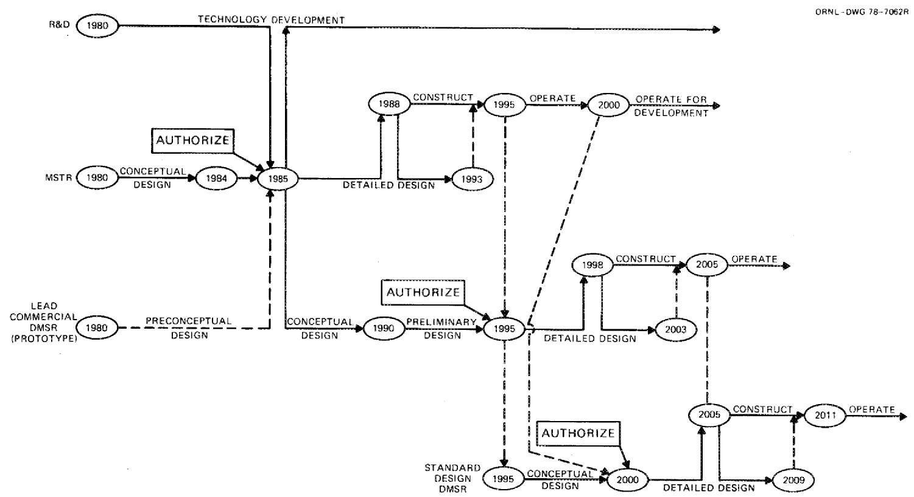  
Fig. 20. Potential reactor construction schedule for commercialization of DMSRs.

The construction cost of the MSTR may be estimated by updating the cost estimate for the MSTR prepared in 1975 for the MSBR program. Using a construction materials and labor increase of $12\%$ /year gives a multiplier of 1.4 and a cost for the MSTR in 1978 of about $600 million.

A detailed estimate of the cost of a 1000-MWe DMSR based on a mature technology is given in a following section. From this, we have estimated the cost of a first standardized DMSR by applying a factor of 1.5 to allow for increased first-of-a-kind costs and the cost of a lead commercial prototype by applying another factor of 1.5 to allow for increased prototype costs. Using this procedure, the cost of a 1000-MWe prototype DMSR is estimated to be $1470 million and the first standardized DMSR $980 million

The prototype DMSR need not be as large as 1000 MWe; the cost could be reduced some, for example, by building a 500-MWe prototype with two steam-generator loops rather than four.

Estimating the probable cost of experimental and prototype reactors in advance of design is exceedingly difficult. The cost estimates presented were made by a staff that has had experience in the design and operation of experimental reactors, particularly the MSRE. The MSRE was constructed and operated within budget, which is an indication that the technology is reasonably well understood and that cost estimates for future reactors are probably realistic, if not absolutely accurate. Conversely, the proposed reactors are a large step up in scale from the MSRE and would be subject to the vagaries of the licensing process for a new reactor type. These factors introduce uncertainties into the cost estimates which are beyond evaluation at the present time.

# 5.3 Economic Performance of Commercial DMSR

The projected cost of power from a commercial DMSR can be estimated only approximately because the DMSR is in the conceptual stage and not even a detailed conceptual design has been prepared. However, by taking advantage of the similarity of the DMSR to the MSBR (for which a detailed conceptual design and cost estimate have been prepared) and by carefully comparing the DMSR with LWR and coal-fired power plants (which would have

some components in common with or similar to those of a DMSR), a reasonable cost estimate can be made.

A cost estimate was prepared for the MSBR in 1970 and appears in Ref. 8. These costs were taken (for most accounts) as the basis for the DMSR estimate using the following method.

1. The costs were adjusted to take into account the differences in size or other requirements for the DMSR. For example, the reactor vessel cost was increased to take into account the larger size of the DMSR vessel.   
2. The 1970 costs were increased by a multiplier based on the increase in construction materials and labor costs from 1970 to 1978. The multiplier was calculated to be in the range 2.3 to 2.5; to be conservative, the multiplier 2.5 was used. This represents an annual rate of increase of about $12\%$ .

In addition, the costs of a pressurized-water reactor (PWR), a boiling-water reactor (BWR), and a coal-fired plant in 1978 were estimated using the CONCEPT V code.103 Where appropriate, some DMSR cost accounts were estimated based on the analogous account in one of the CONCEPT estimates. For example, the turbine--generator cost was based on the coal-fired plant estimate because the same type of supercritical steam turbine would be used.

In reporting the results, the cost estimates for the PWR and (in the appendix) the coal-fired plant are given for comparison. (The costs of the BWR were not substantially different from the PWR.)

The results of the estimates for capital, nonfuel operation and maintenance, and decommissioning costs are presented in the next three sections. The fuel cycle costs were calculated independently and are presented in a fourth section.

# 5.3.1 Capital costs

The bases for the capital cost estimates are given in Table 31. Some minor adjustments in the code of accounts used in the 1970 MSBR cost estimate were required to conform to the present code of accounts.

Table 31. Bases for capital or investment cost estimates   

<table><tr><td>Bases</td><td>Excluded costs</td></tr><tr><td>Plant site, Middletown (New England area)</td><td>Development costs and first-of-a-kind</td></tr><tr><td>Code of accounts, NUS-531 and NUREG-0241, -0242, -0243 (direct and indirect accounts)</td><td>Switchyard (including main transformer)</td></tr><tr><td>Cost date, 1978.0</td><td>Nuclear liability insurance</td></tr><tr><td>Regulation codes and standards, 1976</td><td>Interest during construction</td></tr><tr><td>Evaporative cooling</td><td>Escalation during construction</td></tr><tr><td>Commercial plant size (optimum), 1000 MWe</td><td>Contingency allowance</td></tr><tr><td>Cash flow, 1978 to commercial operation in 1988</td><td>Owners costs, including expenses for taxes and property insurance, spare parts, staff training</td></tr><tr><td>Capital costs in 1978 dollars/kWe</td><td>General and administrative, site selection, and other owner-related expenses</td></tr><tr><td></td><td>Salt and fuel inventory, including chemical processing system</td></tr></table>

The capital costs estimated for the DMSR and the PWR by major (two-digit) accounts are given in Table 32. A further breakdown (for three-digit accounts), which also includes the estimate for the coal-fired plant, is given in Appendix A (Table A.1). A cumulative cash flow schedule for the DMSR (adapted to the CONCEPT V cash flow schedule) is also given in Appendix A (Table A.2). The capital costs of the fuel treatment facilities are not included here but are taken into account in the fuel cycle cost (see Sect. 5.3.4). However, space and equipment for handling the coolant salt are included in the reactor plant estimates.

The DMSR is estimated to cost $653 million, or about $650/kWe in 1978 dollars. This compares with about $600/kWe for a PWR plant and $380/kWe for a coal plant without flue-gas cleaning.

(Expressed in millions of 1978.0 dollars)

Table 32. Capital cost estimate of commercial l-GWe DMSR and PWR plants   

<table><tr><td>Account No.</td><td>Item</td><td>DMSR</td><td>PWR</td></tr><tr><td colspan="4">Direct costs</td></tr><tr><td>20</td><td>Land and land rights</td><td>2</td><td>2</td></tr><tr><td>21</td><td>Structures and improvements</td><td>124</td><td>111</td></tr><tr><td>22</td><td>Reactor plant equipment</td><td>180</td><td>139</td></tr><tr><td>23</td><td>Turbine plant equipment</td><td>100</td><td>113</td></tr><tr><td>24</td><td>Electric plant equipment</td><td>54</td><td>44</td></tr><tr><td>25</td><td>Miscellaneous plant equipment</td><td>17</td><td>13</td></tr><tr><td>26</td><td>Main condenser heat rejection system</td><td>14</td><td>22</td></tr><tr><td colspan="2">Total direct costs</td><td>491</td><td>444</td></tr><tr><td colspan="4">Indirect costs</td></tr><tr><td>91</td><td>Construction services</td><td>75</td><td>70</td></tr><tr><td>92</td><td>Home office engineering and service</td><td>53</td><td>53</td></tr><tr><td>93</td><td>Field office engineering and service</td><td>34</td><td>30</td></tr><tr><td colspan="2">Total indirect costs</td><td>162</td><td>153</td></tr><tr><td colspan="2">Total plant capital cost</td><td>653</td><td>597</td></tr></table>

A discussion of some of the important assumptions and results for the major accounts follows.

Account 21. Structures and improvements. The primary and major structure in the DMSR plant is the reactor containment building. While layouts of internal areas would differ, comparable costs with the PWR are expected. An allowance has been entered for plant lifetime storage of radioactively contaminated items including provisions to facilitate decommissioning operations.

The other structures parallel the PWR structures in cost. The turbine rooms are considered comparable. A supercritical steam turbine for the DMSR is considerably smaller than a PWR turbine, but space was allowed for extra piping and equipment that may be required to adapt the supercritical system to a molten-salt steam generator. Space was also allowed for handling and storing coolant salt for normal operations and for

storing the blowdown material that would result from a major steam leak in the steam generator.

Account 22. Reactor plant equipment. The reactor and associated heat-transfer system costs have been updated from the 1970 estimate using a multiplier of 2.5. About $10\%$ of this total (accounts 221 and 222) has been added for engineered safety features (which were not previously considered) and for larger salt volumes. This amount also covers external heat dissipation equipment for engineered safety features. Radioactive waste handling in the DMSR was estimated to cost about the same as radioactive waste processing for the PWR.

Fuel handling and storage and maintenance equipment were updated from the MSBR estimate using the 2.5 multiplier. An allowance was made for the control features necessary for making the plant operate on the salt-steam cycle.

Account 23. Turbine plant equipment. This account parallels the coal plant case, which uses supercritical steam-cycle equipment. The feed-heating account was increased $50\%$ to allow for operating design features peculiar to the salt-loop application.

Account 24. Electric plant equipment. Except for provision of about 25 MWe of electric heating associated with the salt loops, this account is similar to the PWR case.

Account 25. Miscellaneous plant equipment. The auxiliary steam supply cost for the PWR has been increased to adjust the PWR cost to the DMSR basis.

Account 26. Main condenser heat rejection system. Design for the coal plant is comparable to the DMSR; therefore, the same costs have been assumed.

Accounts 91, 92, and 93. Indirect costs. The DMSR costs are based on PWR costs adjusted upward for those accounts in which higher labor requirements are anticipated.

# 5.3.2 Nonfuel operation and maintenance cost

Estimates of nonfuel operation and maintenance (O&M) costs of 2.82 mills/kWh are based on the single-unit base-load plant. The procedure

is based on the OMCOST code. $^{104}$ Annual expenses are derived for staff, maintenance materials, supplies and expenses, nuclear liability insurance, $^{*}$ operating fees, and general administrative activities. Operation and maintenance costs are presented in 1978 dollars and are divided into fixed (demand related) and variable (energy-related) components.

Staff requirements are given in Table 33 for a one-unit plant. Annual costs have been derived from the O&M cost code with modifications to adjust the maintenance-labor ratio to 70:30. Estimates were that a DMSR might require major plant work at ten-year intervals (over and above PWR requirements), for which maintenance labor was increased $\sim 50\%$ . The summary of annual O&M costs is given in Table 34.

# 5.3.3 Decommissioning and disposal cost

Costs for decontamination and decommissioning of the facilities would be incurred at the end of plant life. A nuclear waste working group comprised of DOE, Nuclear Regulatory Commission (NRC), and Environmental Protection Agency (EPA) officials is working to identify legislative needs on handling nuclear wastes. Preference is now given for dependence on "engineered and natural barriers" for control of on-site material after decommissioning with fall-back dependence on institutional controls for a "finite time." The group also opts for dismantling a decommissioned site after a short decay period, rather than either of two other options, which are entombing and mothballing nuclear facilities.

The cost of dismantling a DMSR is expected to be greater than for an LWR because the activity level of components in the primary circuit is higher. A number of estimates of the decommissioning cost of LWRs have been prepared; as a basis for our estimates, we have selected a representative recent (1978) estimate by the Tennessee Valley Authority (TVA) for their Yellow Creek plant early site review. The estimated decommissioning cost for this plant was $78 million for a BWR. If we assume that the cost for a DMSR would be about 10% greater, then the estimated decommissioning cost for a DMSR would be about $86 million. A

Table 33. Staff requirement for one 1-GWe DMSR power plant   

<table><tr><td>Employee type</td><td>Number</td></tr><tr><td>Plant manager&#x27;s office</td><td></td></tr><tr><td>Manager</td><td>1</td></tr><tr><td>Assistant</td><td>1</td></tr><tr><td>Quality assurance</td><td>3</td></tr><tr><td>Environmental control</td><td>1</td></tr><tr><td>Public relations</td><td>1</td></tr><tr><td>Training</td><td>1</td></tr><tr><td>Safety</td><td>1</td></tr><tr><td>Administration and services</td><td>13</td></tr><tr><td>Health services</td><td>1</td></tr><tr><td>Security</td><td>66</td></tr><tr><td>Subtotal</td><td>89</td></tr><tr><td>Operations</td><td></td></tr><tr><td>Supervision (nonshift)</td><td>2</td></tr><tr><td>Shifts</td><td>33</td></tr><tr><td>Subtotal</td><td>35</td></tr><tr><td>Maintenance</td><td></td></tr><tr><td>Supervision</td><td>8</td></tr><tr><td>Crafts</td><td>16</td></tr><tr><td>Peak maintenance, annualized</td><td>96</td></tr><tr><td>Subtotal</td><td>120</td></tr><tr><td>Technical and engineering</td><td></td></tr><tr><td>Reactor</td><td>1</td></tr><tr><td>Radiochemical</td><td>2</td></tr><tr><td>Instrumentation and control</td><td>2</td></tr><tr><td>Technical support staff</td><td>17</td></tr><tr><td>Subtotal</td><td>22</td></tr><tr><td>Total</td><td>266</td></tr><tr><td>Less security</td><td>200</td></tr><tr><td>Less security and peak maintenance</td><td>104</td></tr></table>

Table 34. Summary of annual nonfuel O&M costs for base-load steam-electric power plants in 1978.0   

<table><tr><td>Plant type</td><td>DMSR with evaporative cooling towers</td></tr><tr><td>Number of units per station</td><td>1</td></tr><tr><td>Thermal input per unit, MWt</td><td>2270</td></tr><tr><td>Plant net heat rate</td><td>7755</td></tr><tr><td>Plant net efficiency, %</td><td>44.00</td></tr><tr><td>Power output, net, MWe</td><td>1000</td></tr><tr><td>Annual net generation, million kWh</td><td>6570</td></tr><tr><td>Plant factor</td><td>0.75</td></tr><tr><td>Annual costs, thousands of dollars</td><td></td></tr><tr><td>Staff, 266 persons at $23,412</td><td>6228</td></tr><tr><td>Maintenance material</td><td>6555</td></tr><tr><td>Fixed</td><td>6555</td></tr><tr><td>Variable</td><td>0</td></tr><tr><td>Supplies and expenses</td><td>3317</td></tr><tr><td>Fixed, plant</td><td>3000</td></tr><tr><td>Variable, plant</td><td>317</td></tr><tr><td>Insurance and fees</td><td>408</td></tr><tr><td>Commercial liability insurance</td><td>284</td></tr><tr><td>Government liability insurance</td><td>18</td></tr><tr><td>Retrospective premium</td><td>6</td></tr><tr><td>Inspection fees and expenses</td><td>100</td></tr><tr><td>Administrative and general</td><td>2367</td></tr><tr><td>Total fixed costs</td><td>18,500</td></tr><tr><td>Total variable costs</td><td>317</td></tr><tr><td>Total annual O&amp;M costs</td><td>18,875</td></tr><tr><td>Unit costs, mills/kWh(e)</td><td></td></tr><tr><td>Fixed unit O&amp;M costs</td><td>2.75</td></tr><tr><td>Variable unit O&amp;M costs</td><td>0.07</td></tr><tr><td>Total unit O&amp;M costs</td><td>2.82</td></tr></table>

$a_{\text{Excludes the salt inventory losses; assumes nuclear insurance at LWR rates}}$ .

large uncertainty is present in this estimate, of course, because of the limited experience in decommissioning. However, the cost of decommissioning does not appear to be a large fraction of the cost of the construction, and the present worth of expenditures to be made in the future is small. The present worth of the estimated cost of decommissioning a DMSR 40 years after start-up, discounted to the start-up date at a 4.5% discount factor, would be about $15 million.

# 5.3.4 Fuel cycle costs

At this stage of development and optimization of a once-through DMSR, several assumptions are necessary if a fuel cycle cost is to be estimated.

One assumption is that the initial fuel charge will consist of 74 mole $\%$ LiF, 16.5 mole $\%$ BeF $_2$ , 8.23 mole $\%$ ThF $_4$ , and 1.27 mole $\%$ UF $_4$ plus UF $_3$ . If, as seems reasonable, an allowance is made for an additional $2\%$ of molten fuel in the drain tank, the initial fuel solvent will require 149 metric tons of ThF $_4$ , 113 metric tons of LiF, and 45.6 metric tons of BeF $_2$ . In addition, 23.5 metric tons of UF $_4$ enriched to $20\%$ in $^{235}\mathrm{U}$ is required; this is equivalent to 804 metric tons of U $_3$ O $_8$ and would require $8.05 \times 10^5$ SWU for its enrichment. The purified fuel delivered to the reactor storage tank would consist of 331 metric tons ( $7.30 \times 10^5$ lb) of material.

Total cost of the initial fuel is based on U3O8 at $35/lb, separative work at $80/SWU, BeF2 at $15/lb, thorium at $15/lb ThO2, and 7LiF available at $3/g of contained 7Li.* An additional $2/lb of tetrafluoride has been allotted for conversion of ThO2 to ThF4 and for conversion of UF6 to UF4. The fuel, made by mixing the powdered ingredients, must be purified in the molten state before use (as described in previous sections). Given the component fluorides at the prices above, the assumption is that this purification can be performed for $6/lb of finished product.

With these assumptions, the total cost of the initial DMSR fuel charge is near $225 million (see Table 35). If we assume that the annual

Table 35. Cost of initial fuel charge for once-through DMSR (331 metric tons fuel)   

<table><tr><td>Fuel</td><td>Cost
(dollars)</td></tr><tr><td>Fuel solvent</td><td></td></tr><tr><td>Materials</td><td></td></tr><tr><td>7LiF (30.46 metric tons lithium at $3/g)</td><td>91.38 × 10^6</td></tr><tr><td>ThF₄ (127.68 metric tons ThO₂ at $15/lb)</td><td>4.22 × 10^6</td></tr><tr><td>BeF₂ (45.60 metric tons at $15/lb)</td><td>1.51 × 10^6</td></tr><tr><td>Uranium (803.8 metric tons U₃O₈ at $35/lb)</td><td>62.03 × 10^6</td></tr><tr><td>Separative work (8.05 × 10^5 SWU at $80)</td><td>64.40 × 10^6</td></tr><tr><td>Conversion and purification</td><td></td></tr><tr><td>Thorium (148.96 metric tons ThF₄ at $2/lb)</td><td>6.57 × 10^5</td></tr><tr><td>Uranium (23.50 metric tons UF₄ at $2/lb)</td><td>1.04 × 10^5</td></tr><tr><td>Fuel mixture (331.2 metric tons at $6/lb)</td><td>1.99 × 10^6</td></tr><tr><td>Total cost of initial fuel</td><td>224.30 × 10^6</td></tr><tr><td>Annual charge (12%)</td><td>26.92 × 10^6</td></tr></table>

use charge is $12\%$ , this initial fuel contributes $26.9 million/year to the fuel cycle cost.

A once-through DMSR must add uranium at more or less regular intervals over its operating lifetime. Though other modes of addition are possible, for this assessment we assumed that the uranium additions will be made as a liquid $^{7}\mathrm{LiF - UF_4}$ mixture containing 30 mole % $\mathrm{UF_4}$ (melting at about $540^{\circ}\mathrm{C}$ ). Such additions would appreciably increase the $^{7}\mathrm{LiF}$ concentration of the fuel. Adjustment of the $\mathrm{UF_3 / UF_4}$ ratio is assumed to be done by in situ reduction of $\mathrm{UF_4}$ with metallic beryllium. The fuel stream is assumed to be treated (once in each 1000 full-power days) with an anhydrous $\mathrm{HF - H_2}$ mixture to remove inadvertent oxide contamination; the resulting oxidation of $\mathrm{UF_3}$ is managed by additional reduction with beryllim. With this mode of operation, $\mathrm{BeF_2}$ equivalent to nearly 6% of that in the original fuel charge would be added over the reactor lifetime. Such additions of $^{7}\mathrm{LiF}$ and $\mathrm{BeF_2}$ dilute the fuel and appreciably increase its volume so that an increasing (though relatively small) fraction of the

fuel would remain in the reactor drain tank. The dissolved parasitic neutron absorbers, of course, would also be diluted. At this stage of DMSR development, no detailed optimization for such fuel dilution has been made. For this assessment, we assumed that, as a consequence of this dilution effect by fuel maintenance, the uranium additions shown in Table 17 plus uranium (at $20\%$ enrichment) and thorium equivalent to $3\%$ of the initial inventory would be required over the 30-year operating life of the reactor. Thorium is assumed to be added as a molten mixture of ${}^{7}\mathrm{LiF}-\mathrm{ThF}_{4}$ containing 28 mole $\%$ $\mathrm{ThF}_{4}$ (melting point of $570^{\circ}\mathrm{C}$ ).

Table 36 shows the average annual cost of these additions and fuel maintenance. Costs of $\mathsf{ThF_4}$ , $\mathsf{UF_4}$ , $\mathsf{LiF}$ , and separative work are those described previously. Metallic beryllium is assumed to cost $75/1b$ . Cost of preparing the ${}^{7}\mathsf{LiF}-\mathsf{ThF_4}$ and ${}^{7}\mathsf{LiF}-\mathsf{UF_4}$ mixtures was assumed to be $\$20/1b$ (plus the cost of the solid raw materials).

Table 36. Average annual cost of fuel additions and maintenance   

<table><tr><td></td><td>Cost
(dollars)</td></tr><tr><td>Materials</td><td></td></tr><tr><td>7LiF (62.4 kg Li0 at $3.00/g)</td><td>1.87 × 105</td></tr><tr><td>Be0 (16.2 kg at $75/1b)</td><td>2.7 × 103</td></tr><tr><td>ThF4(0.149 metric tons at $15/1b ThO2)</td><td>4.2 × 103</td></tr><tr><td>UF4(34.83 metric tons U3O8 at $35/1b)</td><td>2.689 × 106</td></tr><tr><td>Separative work (3.48 × 104SWU at $80)</td><td>2.784 × 106</td></tr><tr><td>Conversion and purification</td><td></td></tr><tr><td>Thorium (0.149 metric tons ThF4at $2/1b)</td><td>7 × 102</td></tr><tr><td>Uranium (1.03 metric tons UF4at $2/1b)</td><td>4.5 × 103</td></tr><tr><td>7LiF-ThF4(0.181 metric tons at $20/1b)</td><td>8.0 × 103</td></tr><tr><td>7LiF-UF4(1.2209 metric tons at $20/1b)</td><td>5.42 × 104</td></tr><tr><td>HF-H2treatment of fuel</td><td></td></tr><tr><td>Fixed charges on equipment (at 10%)</td><td>1.5 × 106</td></tr><tr><td>Annual operating cost</td><td>5.0 × 105</td></tr><tr><td>Total average annual cost</td><td>7.73 × 106</td></tr></table>

There are no detailed estimates of the capital or operating costs of the equipment for HF-H2 treatment to remove 0²⁻ from the small batches of fuel. For this assessment, we assumed that the capital cost is $15 × 10⁶ and that its operation costs $500,000/year.

As a consequence of the assumptions and the estimates described, the cost of producing $6.57 \times 10^{9}$ kWh/year (operation at $75\%$ plant factor) apparently averages $34,650,000, and the resulting fuel cycle cost is about 5.3 mills/kWh.

Note that, if the price of 7Li were lowered by five-fold [to $0.60/g ($272/1b)], the resulting fuel cycle cost for the once-through DMSR would fall to slightly below 4 mills/kWh.

# 5.3.5 Net power cost

Because the return on the plant capital investment would be a substantial factor in the net cost of power from a DMSR and because a number of terms that would be important in a commercial plant were omitted in developing the capital cost estimate, projecting a potential net cost for DMSR power is not appropriate. Substantially more design and development would be required to support a reasonably reliable estimate. However, the previous discussions suggest that the cost of power from a DMSR would not be greatly different than that from other nuclear systems.

# 5.4 Licensing

Although two experimental MSRs have been built and operated in the United States under government ownership, none has ever been subjected to formal licensing or even detailed review by the NRC. As a consequence, the question of licensability of MSRs remains open; the NRC has not yet identified the major licensing issues and the concept has not been considered by various public interest organizations that are often involved in nuclear plant licensing procedures. Further, the licensing experience of solid-fueled reactors can be used as only a general guide because of significant fundamental differences between those systems and MSRs. Presumably, MSRs would be required to comply with the intent, rather than

the letter, of NRC requirements, particularly where methods of compliance are concept-specific.

Any special issues that might arise from public consideration of an MSR license probably would be closely associated with those features of the reactor concept that affect its safety and environmental attributes. A number of these features and attributes have been identified in earlier sections. One major difference between more conventional reactors and MSRs is in the confinement of radioactive fuel and fission products. The barriers to fission-product release in LWRs are (1) the fuel element cladding, (2) the reactor coolant pressure boundary (RCPB) (i.e., the primary-loop vessels, components, and piping), and (3) the reactor containment. This arrangement relies heavily on the ECCS to prevent cladding failure in the event of coolant loss by failure of the RCPB.* Without adequate ECCS performance, a failure of the RCPB conceivably could leave the fission products with only one level of confinement intact.

A different situation would prevail in an MSR because the fission-product confinement barriers are different. The relevant barriers in an MSR are (1) the RCPB, (2) the sealed reactor cells or primary containment, and (3) the reactor containment building or secondary containment. Because the fuel is a circulating liquid that is also the primary coolant, there is no thin fuel clad that could fail quickly on loss of cooling or in a reactor power/temperature transient. Thus, an entire class of potential accidents could be eliminated from the licensing consideration. Failure of the RCPB in an MSR would cause no short-term threat to either of the remaining two barriers to fission-product release. The ultimate requirements for longer-term protection of the fission-product barriers cannot be defined without extensive system design and safety analysis, but preliminary considerations suggest that the requirements may not be extensive.

Although radioactive materials would have three levels of confinement during normal operation, a different condition could exist during maintenance operations that required opening of the primary containment,

particularly if such activities were undertaken after an RCPB failure. However, in a shutdown situation, substantial confinement can be achieved through access limitation and controlled ventilation because, as shown by MSRE experience, fission products are not readily released and dispersed from stagnant salt. Thus, whether fission-product confinement would be a net favorable or unfavorable factor for a DMSR in a licensing proceeding is not clear at this time.

At the end of reactor life, a DMSR without fuel processing would contain the entire fission-product inventory associated with the 30-year operating history of the plant. Some of the volatile nuclides, especially $^{85}\mathrm{Kr}$ and $^{3}\mathrm{H}$ , would have been accumulated in storage containers outside the primary circuit, and the noble metals would have plated out on surfaces in the primary circuit. The inventories of these nuclides, which would not be strongly affected by nuclear burnup, would be about the same as those produced in a solid-fuel reactor with the same thermal power level and duty factor. However, because the DMSR would generate only about two-thirds as much thermal power as an LWR for the same electrical output, it would produce a correspondingly smaller inventory of fission products.

Most of the other fission products and all the transuranium nuclides would remain with the fuel salt in a DMSR. The inventories of these materials would be further reduced by nuclear burnup resulting from exposure of the nuclides to the neutron flux in the reactor core. This effect would be particularly important for the high-cross-section nuclides such as the major plutonium isotopes. Consequently, the net production of plutonium would be much smaller for a DMSR than for a comparable solid-fuel reactor, but the production of higher actinides would be much greater because of the long effective fuel exposure time.

Although a DMSR would produce a much smaller total inventory of some important nuclides over its lifetime than an LWR, the actual in-plant inventory could be substantially higher for the DMSR because there would be no periodic removal during refueling operations. (There would also be no major shipments of highly radioactive spent fuel from the plant during its lifetime and no out-of-reactor storage of such materials until after the final shutdown.) Thus, if a major release of in-plant radionuclides could occur, the consequence might be more serious in a DMSR than in an

LWR. However, considering the mechanisms and probabilities for release events, along with the consequences, would be necessary in assessing any effect on system licensability.

Before any MSR is licensed, we probably will need to define a complete new spectrum of potential transients and accidents and their applicable initiating events that are to be treated in safety analysis reports. Some of the more important safety-significant events for an MSR were mentioned earlier, but even routine operational events may have a different order of importance for this reactor concept. For example, moderate reactor power disturbances would not be very important because one of the principal consequences, fuel cladding failure, is a nonevent in an MSR. Conversely, a small leak of reactor coolant would be an important event because of the high level of radioactivity in the MSR coolant.

The above examples of significant differences between MSRs and other licensed reactors illustrate why a substantial design and analysis effort would be required - first to establish licensing criteria for MSRs in general and a DMSR in particular and second to evaluate MSR licensability in relation to that of other reactor types. This requirement, with no a priori assurance that an MSR could be licensed, makes it unlikely that private organizations in the United States would undertake the development and commercialization of MSRs. Instead, if such development were pursued, government funding probably would be required, at least until the licensing issues could be resolved and near-commercial units could be constructed.

# 6. SUMMARY AND CONCLUSIONS

The technology of MSRs was under development with U.S. government funding from 1947 to 1976 with a nominal one-year interruption from 1973 to 1974. Although no significant effort to commercialize MSRs was involved in this work, a very preliminary conceptual design was generated for a 1000-MWe MSBR, and some alternate fuel cycles were examined. The current study of denatured MSRs was supported by the program (NASAP) to identify, characterize, and assess proliferation-resistant alternatives to currently projected nuclear power systems.

In principal, MSRs could be operated with a number of fuel cycles ranging from plutonium-fueled production of denatured $^{233}\mathrm{U}$ , to break-even breeding with Th- $^{233}\mathrm{U}$ fuel, to high-performance conversion of thorium to $^{233}\mathrm{U}$ with denatured $^{235}\mathrm{U}$ makeup fuel. The last of these cycles currently appears to be the most attractive and is the one chosen for characterization in this study. The fuel cycle would involve an initial loading of denatured $^{235}\mathrm{U}$ ; operation for 30 years (at $75\%$ capacity factor) with $^{235}\mathrm{U}$ makeup, no fuel discharge, and no chemical treatment for fission-product removal; and end-of-life storage/disposal of the spent fuel. The resource utilization of this cycle could be significantly enhanced by end-of-life recovery of the denatured uranium in the fuel salt via fluorination.

# 6.1 Reference-Concept DMSR

The differences between a DMSR and the conceptual design MSBR involve primarily the reactor core and the fuel cycle. Thus, the rest of the primary circuit (e.g., pumps and heat exchangers) and the balance of the plant would be very similar for both concepts, and the descriptions developed for the MSBR are presumed to be applicable to the DMSR. Minor variations that might be associated with design optimization are not considered.

The reactor vessel for the DMSR, about $10\mathrm{m}$ in diameter and $10\mathrm{m}$ high, would be substantially larger than that for the high-performance breeder. This would permit the low power density required to allow a 30-year life expectancy for the reactor graphite and would also reduce

neutronic losses to $^{233}\mathrm{Pa}$ . Other effects of the low power density include reduced poisoning effects from in-core fission products and an increased fissile inventory.

The reactor core would consist of a central region containing 20 vol % fuel salt and a larger surrounding zone containing 13 vol % salt. Neutron moderation would be provided by vertical cylindrical unclad graphite "logs," with fuel salt flowing upward through central passages and between the moderator elements. The core would be surrounded first by salt plenums and expansion spaces and then by a graphite reflector and the reactor vessel.

With this core design, a 1-GWe plant would require an initial fissile loading of $3450\mathrm{kg}^{235}\mathrm{U}$ at $20\%$ enrichment (extractable from about 870 short tons of $\mathrm{U}_{3}\mathrm{O}_{8}$ ). Over 30 years at $75\%$ capacity factor, the fuel makeup requirement would be about $4470\mathrm{kg}$ of $20\%$ enriched $^{235}\mathrm{U}$ (from 1125 short tons of $\mathrm{U}_{3}\mathrm{O}_{8}$ ) for a lifetime $\mathrm{U}_{3}\mathrm{O}_{8}$ demand of 2000 short tons. However, at the end of plant life, the fuel salt would contain denatured fissile uranium ( $^{233}\mathrm{U}$ and $^{235}\mathrm{U}$ ) equivalent to at least 800 short tons of natural $\mathrm{U}_{3}\mathrm{O}_{8}$ . If this material could be recovered (e.g., by fluorination) and reenriched, it would substantially reduce the net fuel requirement of the DMSR.

Preliminary calculations of the kinetic and dynamic characteristics of the DMSR system indicate that it would exhibit high levels of control-lability and safety. The system would also possess inherent dynamic stability and would require only modest amounts of reactivity control capability.

A first-round analysis of the thermal-hydraulic characteristics of the DMSR core conceptual design indicated that the cylindrical moderator elements would be adequately cooled by the flowing fuel salt and that reasonable salt temperature distributions could be achieved with some orificing of the fuel flow passages. While some uncertainties about the detailed flow behavior in the salt-graphite system remain which would have to be resolved by developmental testing, the results would not be expected to affect the fundamental feasibility of the concept.

The primary fuel salt would be a molten mixture of LiF and $\mathrm{BeF}_2$ containing $\mathrm{ThF}_4$ , denatured $\mathrm{UF}_4$ , and some $\mathrm{PuF}_3$ . Lithium highly enriched in

the $^{7}\mathrm{Li}$ isotope $(>99.99\%)$ would be required, and the mixture would gradually build up a significant inventory of fission-product and higher-actinide fluorides. This mixture would have adequate neutronic, physical, thermal-hydraulic, and chemical characteristics to function for 30 years as a fuel and primary reactor coolant. Routine maintenance of the salt would be required to keep some of the uranium in the partly reduced $\mathbf{U}^{3+}$ state for the preferred chemical behavior.

Although severe contamination of the salt with oxide ion could lead to precipitation of plutonium and uranium oxides, the solubility of these oxides is high enough that an increase in oxide ion concentration probably could be detected and stopped before such precipitation occurred. In addition, cleanup of the salt on a routine basis to maintain the required low oxide concentration would be relatively easy. The fuel salt is also highly compatible, both chemically and physically, with the proposed structural alloy, Hastelloy-N, and with the proposed unclad graphite moderator.

The radiation resistance of the fuel salt is well established, and no radiation decomposition would be expected except at very low temperatures (below $\sim 100^{\circ}\mathrm{C}$ ). The noble-gas fission products, xenon and krypton, are only sparingly soluble in fuel salt and would be removed continuously during reactor operation by a helium sparging system. Portions of some other volatile fission products might also be removed by this system. Another class of fission products, the noble and seminoble metals, would be expected to exist in the metallic state and to plate out mostly on metal surfaces in the primary circuit. Keeping tellurium, which can be harmful to Hastelloy-N when deposited on its surface, in solution in the salt may be possible by appropriate control of the reduction/oxidation potential of the salt. Most of the fission products would remain in solution in the fuel salt. It appears (but must be demonstrated) that a full 30-year inventory of these materials could be tolerated without exceeding solubility limits.

Because routine additions of uranium would be required to maintain criticality in the reactor, additions of lithium and beryllium would also be required to maintain the desired chemical composition. Some of these additions, conceivably, could be used to help control the oxidation state

of the salt, which would have to be adjusted routinely to compensate for the oxidizing effect of the fission process. Also, the total salt inventory possibly would have to be limited through occasional withdrawals of some salt.

The DMSR, in common with other systems that would use molten fluoride salts, would require a special primary structural alloy and, possibly, special graphite for the moderator and reflector. The alloy that was originally developed for molten-salt service, Hastelloy-N, was found to be excessively embrittled by neutron irradiation and to experience shallow intergranular attack by fission-product tellurium. Subsequently, minor composition modifications were made which appear to provide adequate resistance to both radiation embrittlement and tellurium attack. While extensive testing and development would still be required to fully qualify the modified Hastelloy-N as a reactor structural material, the fundamental technical issue of an adequate material appears to be resolved.

The requirements imposed on the graphite in a DMSR are much less severe than those that would apply to a high-performance breeder reactor. The low flux levels in the core would lead to damage fluences of less than $3 \times 10^{26}$ neutrons/m $^2$ in 30 years, so some current technology graphites could last for the life of the plant. In addition, the low power density may eliminate the need to seal the graphite surfaces to limit xenon intrusion and poisoning. This would substantially reduce the technology development effort associated with the manufacture of DMSR graphite.

The generic safety features of a DMSR would differ significantly from those of other reactor types primarily because of the fluid nature of the fuel and the circulating inventory of fission products. Because the fuel in a DMSR would be unclad, the three levels of fission-product confinement for this system would be the RCPB and two separate levels of containment. The primary containment would be a set of sealed and inverted equipment cells that would be inaccessible to personnel after the onset of plant operation. These cells would provide the principal confinement of radioactivity in accidents involving failure of the RCPB. They could also provide auxiliary cooling of spilled fuel salt if that salt failed to flow to the cooled drain tank. Loss of cooling accidents

with reactor scram may be relatively mild in DMSRs because of the large heat capacity and low vapor pressure of the fuel salt which inherently retains most of the fission-product decay-heat generators. However, loss of cooling because of blocked core fuel passages at full power could lead to some local salt boiling. A full safety analysis of the DMSR has not been performed because it would require a much more comprehensive design than is currently available.

Preliminary consideration of the environmental effects of DMSRs suggests that such effects would generally be milder than for currently operating nuclear systems. There would be little or no routine gaseous and liquid radioactive effluents, less waste heat rejection, no shipment of radioactive spent fuel during the normal plant life, relatively little solid radioactive waste, and less impact from uranium mining. In contrast to these more favorable features, the DMSR at end-of-life would involve a more complex decommissioning program and a larger solid waste disposal task. In addition, during operation, the retention of tritium and the relatively larger inventory of radionuclides may require extra efforts to avoid possibly unfavorable effects.

In general, the antiproliferation features of the once-through DMSR appear to be relatively favorable. The entire fissile uranium inventory would be fully denatured, and there would be no convenient means of isolating $^{233}\mathrm{Pa}$ for decay to separated $^{233}\mathrm{U}$ . The fissile plutonium inventory would be small, of poor quality, and difficult to extract from the large mass of highly radioactive fuel salt. In addition, no shipments of spent fuel from the plant would occur except at the end-of-life.

# 6.2 Alternate DMSR Concepts

Although a DMSR operating on a 30-year, once-through fuel cycle appears to have a number of attractive features, the basic concept could be adapted to a number of alternative fuel cycles. If full-scale, online processing of the fuel salt to remove fission products were adopted, some likelihood exists that break-even breeding performance could be achieved. However, even without break-even breeding, the fuel charge could be recycled through several generations of reactors to greatly

reduce the average demand for mined uranium. Other performance improvements (short of break-even breeding) could be achieved by combining the on-line fuel processing with periodic removal or replenishment of part of the active uranium inventory. In all these options, the net consumption of natural uranium would become a minor factor in the application of DMSRs. Some consideration was given to fuel processing concepts that would remove only part of the soluble fission products. Such processes appear to offer few (if any) advantages over either the unprocessed or the fully processed approaches.

# 6.3 Commercialization Considerations

Since the MSR concept was under study and development for nearly 30 years, most of the relevant areas of the required technology have received at least some attention. After the successful operation of the MSRE, a limited amount of design effort was expended on a commercial-size MSBR; that effort was discontinued in 1973. The technology development work proceeded in parallel with the design studies up to that time. A small development effort (without design support) was resumed in 1974 and cancelled again in 1976. This work, despite its limited scope, provided an engineering-scale demonstration of tritium management in the secondary salt and significant progress toward the definition of an acceptable structural alloy for molten-salt service. Work was under way toward demonstration of some of the chemical processing operations when the program was ended.

Aside from the technical progress, the last development activity produced a comprehensive plan for the further development of MSRs, which served as the basis for the proposed DMSR development plan and schedule. This plan suggests that the commercialization of DMSRs could proceed via three reactor projects: (1) a moderate-sized (100- to 200-MWe) molten-salt test reactor that could be authorized in 1985 and become operational in 1995, (2) an intermediate-sized commercial prototype plant authorized in 1995 and operating in 2005, and (3) a first standard-design DMSR to operate in 2011. A preliminary estimate for the cost of this program,

including $700 million for the concurrent base development work, is $3750 million (in 1978 dollars).

A preliminary estimate of the construction cost for a "standard" DMSR (neglecting contingencies, escalation, and interest during construction) yielded about $650/kWe in 1978 dollars. This compares with about $600/kWe for a PWR and $380/kWe for a coal plant (without flue-gas cleaning) estimated on the same basis. The DMSR capital estimate did not include the cost of on-site salt treatment facilities or the costs of salt and fuel inventories; these quantities are all included in the fuel cycle costs. The estimated nonfuel O&M costs were 2.82 mills/kWh, and fuel cycle costs were 5.3 mills/kWh. The cost of decommissioning a DMSR was estimated to be about 10% higher than that for a comparably sized LWR.

The licensing of MSRs has not been seriously addressed because no proposal to build a reactor beyond the MSRE was ever supported and none of the conceptual design studies proceeded to that level. However, a number of new licensing issues clearly would have to be addressed. Because the three levels of fission-product confinement in a DMSR would differ from those in a solid-fueled system, demonstrating compliance with the risk objectives rather than specific hardware designs in established licensing criteria presumably would be necessary. Preliminary studies suggest that the risks associated with the operation of MSRs may be lower than those for LWRs, while risks during maintenance and inspection of the reactor system may be higher.

# 6.4 Conclusions

The preliminary studies of DMSRs described previously indicate that these reactors could have attractive performance and resource utilization features while providing substantial resistance to the further proliferation of nuclear explosives. In addition, the environmental and safety features of DMSRs generally appear to be at least as favorable as those of other nuclear power systems, and the system economic characteristics are attractive. While a substantial RD&D effort would be required to commercialize DMSRs, there are no major unresolved issues in the needed technology. Thus, a commercial DMSR without on-line fuel processing

probably could be developed in about 30 years; with additional support for RD&D, the technology for on-line fuel processing could be developed on about the same time schedule.

Although the DMSR characterizations presented in this report are approximate, they provide as much detail as is justified by the very preliminary status of the system conceptual design. Any effort to substantially improve the quality and detail of the characterizations would have to be accompanied by a significant system design effort oriented toward a specific DMSR power plant. Costs and times required for such studies would be several times as large as those for the preliminary work and probably could be justified only if a national decision were made to re-establish a federally funded MSR program.

Any MSR program of substantial size presumably would include an RD&D effort of some size to support effective pursuit of program goals. This work, in turn, would be complemented by the design studies which would help to define RD&D tasks and focus the entire effort. The combination would allow the attainment of objectives on the shortest practical time schedule.

From the preliminary studies reported, a once-through DMSR without on-line fuel processing apparently would be the most reasonable choice for development if an RD&D program were established. However, parallel development of the technology for continuous fuel processing would add only moderately to the total program cost and could provide the option of a more resource-efficient (and possibly a cheaper) fuel cycle.

# ACKNOWLEDGMENT

The authors want to acknowledge the extensive and able support of the Union Carbide Corporation Computer Sciences Division, especially J. R. Knight, N. M. Greene, O. W. Hermann, R. M. Westfall, W. E. Ford III, B. R. Diggs, and L. M. Petrie. The nuclear calculations depended heavily on their advice and help.

The estimate of capital, operating, and decommissioning costs for the DMSR were prepared and reported by M. L. Myers.

# REFERENCES

1. L. E. McNeese and M. W. Rosenthal, "MSBR: A Review of the Status and Future," Nucl. News 17(12), 52-58 (September 1974).   
2. R. W. Roberts, Energy Research and Development Administration, letter to H. Postma, Oak Ridge National Laboratory, March 1, 1976.   
3. H. F. Bauman et al., Molten-Salt Reactor Concepts with Reduced Potential for Proliferation of Special Nuclear Materials, Institute for Energy Analysis, ORAU/IEA(M) 77-13 (February 1977).   
4. Gerald R. Ford, "Statement by the President on Nuclear Policy," Office of the White House Press Secretary, October 28, 1976.   
5. Department of Energy, Nonproliferation Alternative Systems Assessment Program Plan, Assistant Secretary for Energy Technology Nuclear Energy Programs, Office of Fuel Cycle Evaluation (April 1978).   
6. Jimmy Carter, "Statement on Nuclear Power Policy," press released April 7, 1977, Dept. State Bull. 76, 429-33 (May 2, 1977).   
7. Executive Office of the President, The National Energy Plan, April 29, 1977.   
8. Roy C. Robertson (Ed.), Conceptual Design Study of a Single-Fluid Molten-Salt Breeder Reactor, ORNL-4541 (June 1971).   
9. J. R. Engel et al., Molten-Salt Reactors for Efficient Nuclear Fuel Utilization Without Plutonium Separation, ORNL/TM-6413 (August 1978).   
10. G. T. Mays, A. N. Smith, and J. R. Engel, Distribution and Behavior of Tritium in the Coolant-Salt Technology Facility, ORNL/TM-5759 (April 1977).   
11. N. M. Greene et al., AMPX: A Modular Code System for Generation Coupled Multigroup Neutron-Gamma Libraries from ENDF/B, ORNL/TM-3706 (March 1978).   
12. N. M. Greene, Union Carbide Corporation, personal communication to W. A. Rhoades, Oak Ridge National Laboratory, September 1977.   
13. J. R. Knight, Union Carbide Corporation, personal communication to W. A. Rhoades, Oak Ridge National Laboratory, June 1978.   
14. D. S. Bost, Selected Computer Codes and Libraries: Volume II, APC, A Multigroup Transport Buckling Iteration Code, Rockwell International, AI-AEC-13076, vol. II (May 1973).

15. M. J. Bell, ORIGEN - The ORNL Isotope Generation and Depletion Code, ORNL-4628 (May 1973).   
16. J. R. Knight, Union Carbide Corporation, personal communication to W. A. Rhoades, Oak Ridge National Laboratory, June 1978.   
17. Argonne National Laboratory, Reactor Physics Constants, ANL-5800 (July 1963).   
18. F. W. Dittus and L. M. K. Boelter, University of California Publs. Eng. 2, 443 (1930).   
19. W. R. Grimes, "Molten-Salt Reactor Chemistry," Nucl. Appl. Technol. 8, 137 (February 1970).   
20. W. R. Grimes et al., "Fuel and Coolant Chemistry," chap. 5, p. 95 in The Development Status of Molten-Salt Breeders, ORNL-4812 (August 1972).   
21. L. E. McNeese et al., Program Plan for Development of Molten-Salt Breeders, ORNL-5018 (December 1974).   
22. P. N. Haubenreich and J. R. Engel, "Experience with the Molten-Salt Reactor Experiment," Nucl. Appl. Technol. 8, 118 (February 1970).   
23. S. Cantor et al., Physical Properties of Molten-Salt Reactor Fuel, Coolant and Flush Salt, ORNL/TM-2316 (August 1968).   
24. S. Cantor, Density and Viscosity of Several Molten Fluoride Mixtures, ORNL/TM-4308 (March 1973).   
25. C. F. Baes, Jr., p. 617 in "Symposium on Reprocessing of Nuclear Fuels," ed. by P. Chiotti, vol. 15 of *Nuclear Metallurgy*, USAEC-CONF-690801 (1969).   
26. C. F. Baes, Jr., "The Chemistry and Thermodynamics of Molten-Salt Reactor Fuels," J. Nucl. Mat. 51, 149 (1974).   
27. C. E. Bamberger, R. G. Ross, and C. F. Baes, Jr., "The Oxide Chemistry of Plutonium in Molten Fluorides and the Free Energy of Formation of $\mathsf{PuF}_3$ and $\mathsf{PuF}_4$ ," J. Inorg. Nucl. Chem. 33, 776 (1971).   
28. J. K. Dawson et al., "The Preparation and Some Properties of Plutonium Fluorides," J. Chem. Soc., 558 (1954).   
29. C. E. Bamberger et al., "Absence of an Effect of Oxide on the Solubility and the Absorption Spectra of $\mathsf{PuF}_3$ in Molten LiF-BeF $_2$ -ThF $_4$ and the Instability of Plutonium (III) Oxyfluorides," J. Inorg. Nucl. Chem. 33, 3591 (1971).   
30. "Molten Salt Reactor Concept," Quarterly Report for Period Ending July 31, 1971, Atomic Energy Commission, Bombay, India, NP-19145.

31. C. J. Barton et al., Solubility of Cerium Trifluoride in Molten Mixtures of Lithium, Beryllium, and Thorium Fluorides," Inorg. Chem. 9, 307 (1970).   
32. C. F. Baes, Jr., J. H. Shaffer, and H. F. McDuffie, $\mathsf{UO}_2$ and $\mathsf{ZrO}_2$ Behavior in Molten Fluorides," Trans. Am. Nucl. Soc. 6, 393 (1963).   
33. K. A. Romberger, C. F. Baes, Jr., and H. H. Stone, "Phase Equilibrium Studies in the $\mathrm{UO}_2\text{-ZrO}_2$ System," J. Inorg. Nucl. Chem. 29, 1619 (1967).   
34. C. E. Bamberger and C. F. Baes, Jr., "The Exchange of $\mathbf{U}^{4+}$ and $\mathbf{Th}^{4+}$ Between Molten LiF-BeF $_2$ -ThF $_4$ -UF $_4$ and (U-Th)O $_2$ Solid Solutions," J. Nucl. Mat. 35, 177 (1970).   
35. C. E. Bamberger, R. G. Ross, and C. F. Baes, Jr., "Oxide Chemistry of Plutonium in Molten Fluorides and the Free Energy of Formation of $\mathsf{PuF}_3$ and $\mathsf{PuF}_4$ ," J. Inorg. Nucl. Chem. 33, 767 (1971).   
36. C. F. Baes, Jr., p. 617 in "Symposium on Reprocessing of Nuclear Fuels," ed. by P. Chiotti, vol. 15 of *Nuclear Metallurgy*, USAEC-CONF 690801, 617 (1969).   
37. R. G. Ross, C. E. Bamberger, and C. F. Baes, Jr., "The Oxide Chemistry of Protactinium in Molten Fluorides," J. Inorg. Nucl. Chem. 35, 433-49 (1973).   
38. C. E. Bamberger, R. G. Ross, and C. F. Baes, Jr., Molten-Salt Reactor Program Semiannual Progress Report for Period Ending February 29, 1972, ORNL-4782, p. 72.   
39. C. E. Bamberger et al., Molten-Salt Reactor Program Semiannual Progress Report for Period Ending August 31, 1971, ORNL-4728, p. 62.   
40. C. E. Bamberger, R. G. Ross, and C. F. Baes, Jr., Molten-Salt Reactor Program Semiannual Progress Report for Period Ending February 28, 1971, ORNL-4676, p. 119.   
41. C. E. Bamberger, R. G. Ross, and C. F. Baes, Jr., Molten-Salt Reactor Program Semiannual Progress Report for Period Ending August 31, 1970, ORNL-4622, p. 92.   
42. C. E. Bamberger, R. G. Ross, and C. F. Baes, Jr., Molten-Salt Reactor Program Semiannual Progress Report for Period Ending February 28, 1970, ORNL-4548, p. 142.   
43. M. J. Bell, D. D. Sood, and L. E. McNeese, Molten-Salt Reactor Program Semiannual Progress Report for Period Ending February 29, 1972, ORNL-4782, p. 234.

44. O. K. Tallent and L. M. Ferris, Molten-Salt Reactor Program Semi-annual Progress Report for Period Ending February 29, 1972, ORNL-4782, p. 210.   
45. A. L. Mathews and C. F. Baes, Jr., "Oxide Chemistry and Thermodynamics of Molten LiF-BeF $_2$ Solution," Inorg. Chem. 7, 373 (1968).   
46. H. E. McCoy, Jr., Status of Materials Development for Molten-Salt Reactors, ORNL/TM-5920 (January 1978).   
47. H. E. McCoy et al., "New Developments in Materials for Molten-Salt Reactors," Nucl. Appl. Technol. 8, 156 (February 1970).   
48. H. E. McCoy, "Materials for Salt-Containing Vessels and Piping," chap. 7, p. 195 in The Development Status of Molten-Salt Breeders, ORNL-4812 (August 1972).   
49. G. M. Adamson, R. S. Crouse, and W. D. Manly, Interim Report on Corrosion by Alkali-Metal Fluorides: Work to May 1, 1953, ORNL-2337.   
50. G. M. Adamson, R. S. Crouse, and W. D. Manly, Interim Report on Corrosion by Zirconium-Base Fluorides, ORNL-2338 (January 3, 1961).   
51. W. B. Cottrell et al., Disassembly and Postoperative Examination of the Aircraft Reactor Experiment, ORNL-1868 (April 2, 1958).   
52. W. D. Manly et al., Aircraft Reactor Experiment - Metallurgical Aspects, ORNL-2349, pp. 2-24 (December 20, 1957).   
53. W. D. Manly et al., "Metallurgical Problems in Molten Fluoride Systems," in Progr. Nucl. Energy Ser. IV Technology, Engineering and Safety 2, 164 (1960).   
54. W. D. Manly et al., Fluid Fuel Reactors, pp. 595-604, ed. by James A. Lane, H. G. MacPherson, and Frank Maslan, Addison-Wesley, Reading, Pa. (1958).   
55. Molten-Salt Reactor Program Status Report, ORNL-CF-58-5-3, pp. 112-13 (May 1, 1958).   
56. J. H. DeVan and R. B. Evans, III, pp. 557-79 in Conference on Corrosion of Reactor Materials, June 4-8, 1962, Proceedings, Vol. II, International Atomic Energy Agency, Vienna, Austria, 1962.   
57. F. F. Blankenship, Molten-Salt Reactor Program Semiannual Progress Report for Period Ending July 31, 1964, ORNL-3708, p. 252.   
58. S. S. Kirslis and F. F. Blankenship, Molten-Salt Reactor Program Semiannual Progress Report for Period Ending August 31, 1968, ORNL-4344, p. 115.

59. L. M. Toth and L. O. Gilpatrick, "Equilibria of Uranium Carbides in Molten Solutions of $\mathbf{U}\mathbf{F}_3$ and $\mathbf{U}\mathbf{F}_4$ . Contained in Graphite at $850^{\circ}\mathbf{K}$ ," J. Inorg. Nucl. Chem. 35, 1509 (1973).   
60. L. M. Toth and L. O. Gilpatrick, "Temperature and Solvent Effects on the Equilibrium of Dilute Uranium Trifluoride Solutions Contained in Graphite," J. Phys. Chem. 77, 2799 (1973).   
61. L. M. Toth and L. O. Gilpatrick, The Equilibrium of Dilute $UF_{3}$ Solutions Contained in Graphite, ORNL/TM-4056 (December 1972).   
62. E. K. Storms, The Refractory Carbides, vol. 2, pp. 171-213, Academic Press, New York, 1967.   
63. W. R. Grimes, "Materials Problems in Molten-Salt Reactors," in Materials and Fuels for High Temperature Nuclear Energy Applications, ed. by M. T. Simnad and L. R. Zumwalt, The MIT Press, Mass., 1964.   
64. W. R. Grimes, Molten-Salt Reactor Program Semiannual Progress Report for Period Ending July 31, 1964, ORNL-3708, p. 214.   
65. W. R. Grimes et al., "Chemical Aspects of Molten Fluoride-Salt Reactor Fuels," in Fluid Fuel Reactors, ed. by J. A. Lane, H. G. MacPherson, and F. Maslan, Addison-Wesley, Reading, Pa., 1958.   
66. Molten-Salt Reactor Program Progress Report for Period from November 1, 1960 to February 29, 1961, ORNL-3122, p. 100.   
67. Molten-Salt Reactor Program Progress Report for Period from March 1 to August 31, 1961, ORNL-3215, p. 117.   
68. Molten-Salt Reactor Program Semiannual Progress Report for Period Ending August 31, 1962, ORNL-3369, p. 100.   
69. Molten-Salt Reactor Program Semiannual Progress Report for Period Ending January 31, 1963, ORNL-3419, p. 80.   
70. W. R. Grimes, Radiation Chemistry of Molten-Salt Reactor System, ORNL/TM-500 (March 31, 1963).   
71. Reactor Chemistry Division Annual Progress Report for Period Ending January 31, 1962, ORNL-3262, p. 20.   
72. E. L. Compere et al., Fission Product Behavior in the Molten-Salt Reactor Experiment, ORNL-4865 (October 1975).   
73. F. F. Blankenship et al., Reactor Chemistry Division Annual Progress Report for Period Ending January 31, 1963, ORNL-3417, p. 17.

74. W. R. Grimes, N. V. Smith, and G. M. Watson, "Solubility of Noble Cases in Molten Fluorides; I. In Mixtures of NaF-ZrF₄ (53-47 mole %) and NaF-ZrF₄-UF₄ (560-46-4 mole %)," J. Phys. Chem. 62, 862 (1958).   
75. M. Blander et al., "Solubility of Noble Gases in Molten Fluorides; II. In the LiF-NaF-KF Eutectic Mixtures," J. Phys. Chem. 63, 1164 (1959).   
76. G. M. Watson, W. R. Grimes, and N. V. Smith, "Solubility of Noble Gases in Molten Fluorides; II. In Lithium-Beryllium Fluoride," J. Chem. Eng. Data 7, 285 (1962).   
77. R. B. Briggs and R. B. Korsmeyer, Molten-Salt Reactor Program Semi-annual Progress Report for Period Ending February 28, 1970, ORNL-4548, p. 53.   
78. A. P. Malinauskas and D. M. Richardson, "The Solubilities of Hydrogen, Deuterium, and Helium in Molten $\mathsf{Li}_2\mathsf{BeF}_4$ ," Ind. Eng. Chem. Fund. 13(3), 242 (1974).   
79. D. R. Cuneo and H. E. Robertson, Molten-Salt Reactor Program Semi-annual Progress Report for Period Ending August 31, 1968, ORNL-4344, pp. 141-46.   
80. H. E. McCoy and B. McNabb, Intergranular Cracking of INOR-8 in the MSRE, ORNL-4829 (November 1972).   
81. D. L. Manning and G. Mammantov, Molten-Salt Reactor Program Semi-annual Progress Report for Period Ending February 29, 1976, ORNL-5132, p. 38.   
82. J. R. Keiser, Status of Tellurium-Hastelloy-N Studies in Molten Fluoride Salts, ORNL/TM-6002 (October 1977).   
83. W. R. Grimes et al., "High Temperature Processing of Molten Fluoride Nuclear Reactor Fuels," Nucl. Eng. Part VII 55, 27 (1959).   
84. G. J. Nessle and W. R. Grimes, "Production and Handling of Molten Fluorides for Use as Reactor Fuels," Chemical Engineering Progress Symposium Series 56(28) (1960).   
85. J. H. Shaffer, Preparation and Handling of Salt Mixtures for the Molten-Salt Reactor Experiment, ORNL-4616 (January 1971).   
86. R. B. Lindauer, Molten-Salt Reactor Program Semiannual Report for Period Ending August 31, 1971, ORNL-4728, p. 226.   
87. R. B. Lindauer, Molten-Salt Reactor Program Semiannual Report for Period Ending February 28, 1971, ORNL-4676, p. 269.

88. A. D. Kelmers et al., Evaluation of Alternate Secondary (and Tertiary) Coolants for the Molten-Salt Breeder Reactor, ORNL/TM-5325 (April 1976).   
89. C. J. Barton et al., Molten-Salt Reactor Program Semiannual Progress Report for Period Ending February 29, 1968, ORNL-4254, p. 166.   
90. E. L. Compere, H. C. Savage, and J. M. Baker, "High Intensity Gamma Irradiation of Molten Sodium Fluoroborate-Sodium Fluoride Eutectic Salt," J. Nucl. Mat. 34, 97 (1970).   
91. J. W. Cooke, Molten-Salt Reactor Program Semiannual Progress Report for Period Ending August 31, 1969, ORNL-4449, p. 92.   
92. D. M. Richardson and J. H. Shaffer, Molten-Salt Reactor Program Semiannual Progress Report for Period Ending February 28, 1970, ORNL-4548, p. 136.   
93. S. Cantor and R. M. Waller, Molten-Salt Reactor Program Semiannual Progress Report for Period Ending February 29, 1972, ORNL-4782, p. 63.   
94. G. T. Mays, Molten-Salt Reactor Program Semiannual Progress Report for Period Ending February 28, 1975, ORNL-5047, p. 8.   
95. S. Cantor and R. M. Waller, Molten-Salt Reactor Program Semiannual Progress Report for Period Ending August 31, 1970, ORNL-4622, p. 79.   
96. J. B. Bates et al., Molten-Salt Reactor Program Semiannual Progress Report for Period Ending February 28, 1971, ORNL-4676, p. 94.   
97. S. Cantor and R. M. Waller, Molten-Salt Reactor Program Semiannual Progress Report for Period Ending February 28, 1971, ORNL-4676, p. 88.   
98. J. B. Bates, J. P. Young, and G. E. Boyd, Molten-Salt Reactor Program Semiannual Progress Report for Period Ending February 29, 1972, ORNL-4782, p. 59.   
99. J. P. Young, J. B. Bates, and G. E. Boyd, Molten-Salt Reactor Program Semiannual Progress Report for Period Ending August 31, 1972, ORNL-4832, p. 52.   
100. W. L. Carter and E. L. Nicholson, Design and Cost Study of a Fluorination-Reductive Extraction-Metal Transfer Processing Plant for the MSBR, ORNL/TM-3579 (May 1972).   
101. M. W. Rosenthal et al., The Development Status of Molten-Salt Breeder Reactors, ORNL-4812 (August 1972).

102. J. R. Engel et al., Development Status and Potential Program for Development of Proliferation-Resistant Molten-Salt Reactors, ORNL/ TM-6415 (March 1979).   
103. C. R. Hudson II, CONCEPT-5 User's Manual, ORNL-5470 (January 1979).   
104. M. L. Myers and L. C. Fuller, A Procedure for Estimating Nonfuel Operation and Maintenance Costs for Large Steam-Electric Power Plants, ORNL/TM-6467 (January 1979).

# Appendix A

# COMPARATIVE REACTOR COST ESTIMATES

(Thousands of 1978.0 dollars)

Table A.1. Cost estimates for the DSMR, PWR, and coal plants   

<table><tr><td colspan="2">Account No.</td><td rowspan="2">Item</td><td rowspan="2">DMSRa</td><td rowspan="2">PWRb</td><td rowspan="2">Coalb,e</td></tr><tr><td>Two-digit</td><td>Three-digit</td></tr><tr><td colspan="6">Direct costs</td></tr><tr><td>20</td><td></td><td>Land and land rights</td><td>2,000</td><td>2,000</td><td>2,000</td></tr><tr><td>21</td><td></td><td>Structures and improvements</td><td></td><td></td><td></td></tr><tr><td></td><td>211</td><td>Yard work</td><td>10,000</td><td>10,103</td><td>5,990</td></tr><tr><td></td><td>212</td><td>Reactor containment building</td><td>44,000</td><td>39,017</td><td>Omit</td></tr><tr><td></td><td>213</td><td>Turbine building</td><td>14,000</td><td>12,820</td><td>10,337</td></tr><tr><td></td><td>215</td><td>Auxiliary building(s)</td><td>24,000</td><td>9,297</td><td>Omit</td></tr><tr><td></td><td>216</td><td>Waste process building</td><td>(in 215)</td><td>8,841</td><td>Omit</td></tr><tr><td></td><td>217</td><td>Fuel storage building</td><td>NAd</td><td>4,928</td><td>Omit</td></tr><tr><td></td><td>218</td><td>Other structurese</td><td>30,000</td><td>25,952</td><td>Omit</td></tr><tr><td></td><td>219</td><td>Stack (heat rejection)</td><td>2,000</td><td>NA</td><td>2,203</td></tr><tr><td></td><td></td><td>Account 21 subtotal</td><td>124,000</td><td>110,958</td><td>Omit</td></tr><tr><td>22</td><td></td><td>Reactor plant equipment</td><td></td><td></td><td></td></tr><tr><td></td><td>220</td><td>Nuclear steam supply system</td><td>(in 221 and 222)</td><td>67,111</td><td>Omit</td></tr><tr><td></td><td>221</td><td>Reactor equipment</td><td>45,000</td><td>3,727</td><td>Omit</td></tr><tr><td></td><td>222</td><td>Main heat-transfer system</td><td>63,000</td><td>9,873</td><td>Omit</td></tr><tr><td></td><td>223</td><td>Safeguards system</td><td>6,000</td><td>11,582</td><td>Omit</td></tr><tr><td></td><td>224</td><td>Radwaste processing</td><td>10,000</td><td>10,042</td><td>Omit</td></tr><tr><td></td><td>225</td><td>Fuel handling and storage</td><td>10,000</td><td>3,405</td><td>Omit</td></tr><tr><td></td><td>226</td><td>Other reactor plant equipment</td><td>30,000</td><td>19,822</td><td>Omit</td></tr><tr><td></td><td>227</td><td>Reactor instrumentation and control</td><td>10,000</td><td>7,779</td><td>Omit</td></tr><tr><td></td><td>228</td><td>Reactor plant miscellaneous items</td><td>6,000</td><td>5,497</td><td>Omit</td></tr><tr><td></td><td></td><td>Account 22 subtotal</td><td>180,000</td><td>138,838</td><td>Omit</td></tr><tr><td>23</td><td></td><td>Turbine plant equipment</td><td></td><td></td><td></td></tr><tr><td></td><td>231</td><td>Turbine generator</td><td>43,000</td><td>61,943</td><td>42,299</td></tr><tr><td></td><td>232</td><td>(Changed to account 26)</td><td></td><td></td><td></td></tr><tr><td></td><td>233</td><td>Condensing systems</td><td>12,000</td><td>15,257</td><td>12,022</td></tr><tr><td></td><td>234</td><td>Feed-heating system</td><td>21,000</td><td>15,315</td><td>14,519</td></tr><tr><td></td><td>235</td><td>Other turbine plant equipment</td><td>18,000</td><td>15,496</td><td>14,924</td></tr><tr><td></td><td>236</td><td>Instrumentation and control</td><td>2,000</td><td>1,336</td><td>837</td></tr><tr><td></td><td>237</td><td>Turbine plant miscellaneous items</td><td>4,000</td><td>3,590</td><td>3,190</td></tr><tr><td></td><td></td><td>Account 23 subtotal</td><td>100,000</td><td>112,937</td><td>87,791</td></tr><tr><td>24</td><td></td><td>Electric plant equipment</td><td></td><td></td><td></td></tr><tr><td></td><td>241</td><td>Switchgear</td><td>6,000</td><td>5,739</td><td>4,081</td></tr><tr><td></td><td>242</td><td>Station service equipment</td><td>14,000</td><td>9,419</td><td>3,949</td></tr><tr><td></td><td>243</td><td>Switch boards</td><td>1,000</td><td>701</td><td>721</td></tr><tr><td></td><td>244</td><td>Protective equipment</td><td>2,000</td><td>1,770</td><td>1,879</td></tr><tr><td></td><td>245</td><td>Electrical structure and wiring</td><td>12,000</td><td>10,215</td><td>9,422</td></tr><tr><td></td><td>246</td><td>Power and control wiring</td><td>19,000</td><td>15,737</td><td>10,805</td></tr><tr><td></td><td></td><td>Account 24 subtotal</td><td>54,000</td><td>43,581</td><td>30,857</td></tr><tr><td>25</td><td></td><td>Miscellaneous plant equipment</td><td></td><td></td><td></td></tr><tr><td></td><td>251</td><td>Transportation and life equipment</td><td>3,000</td><td>2,617</td><td>1,606</td></tr><tr><td></td><td>252</td><td>Air, water, and steam service system</td><td>10,000</td><td>7,664</td><td>6,034</td></tr><tr><td></td><td>253</td><td>Communication equipment</td><td>2,000</td><td>1,524</td><td>691</td></tr><tr><td></td><td>254</td><td>Furnishings and equipment</td><td>1,000</td><td>1,041</td><td>898</td></tr><tr><td></td><td>255</td><td>Waste water treatment equipment</td><td>1,000</td><td>NA</td><td>1,351</td></tr><tr><td></td><td></td><td>Account 25 subtotal</td><td>17,000</td><td>12,846</td><td>10,580</td></tr><tr><td>26</td><td></td><td>Main condenser heat rejection</td><td>14,000</td><td>21,968</td><td>14,003</td></tr><tr><td></td><td></td><td>Accounts 20-26, total direct costs</td><td>491,000</td><td>443,128</td><td>Omit</td></tr><tr><td></td><td></td><td>Indirect costs</td><td></td><td></td><td></td></tr><tr><td>91</td><td></td><td>Construction services</td><td></td><td></td><td></td></tr><tr><td></td><td>911</td><td>Temporary construction facilities</td><td>26,000</td><td>25,801</td><td>14,348</td></tr><tr><td></td><td>912</td><td>Construction tools and equipment</td><td>24,000</td><td>21,878</td><td>11,285</td></tr><tr><td></td><td>913</td><td>Payroll, insurance, and social security taxes</td><td>25,000</td><td>22,460</td><td>13,363</td></tr><tr><td></td><td></td><td>Account 91 subtotal</td><td>75,000</td><td>70,139</td><td>38,996</td></tr><tr><td>92</td><td></td><td>Home-office engineering services</td><td></td><td></td><td></td></tr><tr><td></td><td>921</td><td>Home-office services</td><td></td><td>49,008</td><td>14,917</td></tr><tr><td></td><td>922</td><td>Home-office quality assurance</td><td></td><td>2,333</td><td>NA</td></tr><tr><td></td><td>923</td><td>Home-office construction management</td><td></td><td>1,338</td><td>1,192</td></tr><tr><td></td><td></td><td>Account 92 subtotal</td><td>53,000</td><td>52,679</td><td>16,109</td></tr><tr><td>93</td><td></td><td>Field-office engineering and services</td><td></td><td></td><td></td></tr><tr><td></td><td>931</td><td>Field-office expenses</td><td>3,000</td><td>3,180</td><td>824</td></tr><tr><td></td><td>932</td><td>Field job supervision</td><td>22,000</td><td>19,188</td><td>8,732</td></tr><tr><td></td><td>933</td><td>Field quality assurance/quality control</td><td>5,000</td><td>4,683</td><td>180</td></tr><tr><td></td><td>934</td><td>Plant start-up and test</td><td>4,000</td><td>2,853</td><td>343</td></tr><tr><td></td><td></td><td>Accounts 91-93</td><td>34,000</td><td>29,904</td><td>10,079</td></tr><tr><td></td><td></td><td>Total indirect costs</td><td>162,000</td><td>152,722</td><td>65,184</td></tr><tr><td></td><td></td><td>Total capital costs, direct and indirect</td><td>653,000</td><td>595,850</td><td>Omit</td></tr></table>

$a$ Estimated by M. L. Myers.   
$b_{\text{Estimated from CONCEPT V}}$   
$c$ Selected accounts.   
$d_{\text{Not applicable.}}$   
For example, control room, administration building, fire tunnels, sewage, holding pond, diesel-generator building, receiving, and guard.

Table A.2. Cumulative cash flow for DMSR   

<table><tr><td>Date</td><td>Cost to dateb(millions of dollars)</td></tr><tr><td>1978.0</td><td>0</td></tr><tr><td>1979.0</td><td>5</td></tr><tr><td>1980.0</td><td>10</td></tr><tr><td>1981.0</td><td>23</td></tr><tr><td>1982.0</td><td>55</td></tr><tr><td>1983.0</td><td>143</td></tr><tr><td>1984.0</td><td>313</td></tr><tr><td>1985.0</td><td>458</td></tr><tr><td>1986.0</td><td>596</td></tr><tr><td>1987.0</td><td>637</td></tr><tr><td>1988.0</td><td>653</td></tr></table>

$\alpha_{\text{Unit 1}}$ ; 1000-MWe DMSR power plant at Middletown; cost basis is year of steam supply system purchase (1978.0); construction permit is 1978.0; commercial operation is 1988.0.

bTotal cost incurred to date excludes interest and escalation charges.

# Internal Distribution

1. T. D. Anderson   
2. Seymour Baron   
3. D. E. Bartine   
4-8. H. F. Bauman   
9. H.W. Bertini   
10. H. I. Bowers   
11. J. C. Cleveland   
12. T. E. Cole   
13. S. Cantor   
14-18. J. F. Dearing   
19-23. J.R.Engel   
24. D. E. Ferguson   
25. M. H. Fontana   
26-30. W.R.Grimes   
31. R. H. Guymon   
32. W. O. Harms   
33. J. F. Harvey   
34. H.W.Hoffman   
35. P. R. Kasten   
36. Milton Levenson

37. R. E. MacPherson   
38-42. H. E. McCoy   
43. L. E. McNeese   
44-48. W. A. Rhoades   
49. J. L. Rich   
50. P. S. Rohwer   
51. M. W. Rosenthal   
52. R. T. Santoro   
53. Dunlap Scott   
54. I. Spiewak   
55. H. E. Trammell   
56. D. B. Trauger   
57. J. R. Weir   
58. J. E. Vath   
59. R. G. Wymer   
60. ORNL Patent Office

61-62. Central Research Library   
63. Document Reference Section   
64-65 Laboratory Records Department   
66. Laboratory Records (RC)

# External Distribution

67. Director, Nuclear Alternative Systems Assessment Division, Department of Energy, Washington, DC 20545   
68. E. G. Delaney, Nuclear Alternative Systems Assessment Division, Department of Energy, Washington, DC 20545   
69. H. Kendrick, Nuclear Alternative Systems Assessment Division, Department of Energy, Washington, DC 20545   
70. Office of Assistant Manager for Energy Research and Development, Department of Energy, ORO, Oak Ridge, TN 37830   
71. Director, Nuclear Research and Development Division, Department of Energy, ORO, Oak Ridge, TN 37830   
72. G. Nugent, Burns and Roe, Inc., 185 Crossways Park Drive, Woodbury, NY 11797   
73. R. A. Edelman, Burns and Roe, Inc., 496 Kinderkamack Road, Ora-dell, NJ 07649   
74. W. R. Harris, Rand Corporation, 1700 Main Street, Santa Monica, CA 90406   
75. S. Jaye, S. M. Stoller Corp., Suite 815, Colorado Building, Boulder, CO 80302   
76. W. Lipinski, Argonne National Laboratory, 9700 South Cass Ave., Argonne, IL 60439

77. H. G. MacPherson, Institute for Energy Analysis, Oak Ridge Associated Universities, Oak Ridge, TN 37830   
78. R. Omberg, Hanford Engineering Development Laboratory, P.O. Box 1970, Richland, WA 99352   
79. E. Straker, Science Applications, 8400 Westpark Drive, McLean, VA 22101   
80. A. M. Weinberg, Institute for Energy Analysis, Oak Ridge Associated Universities, Oak Ridge, TN 37830   
81-181. For distribution as shown in DOE/TIC-4500 under category UC-76, Molten-Salt Reactor Technology