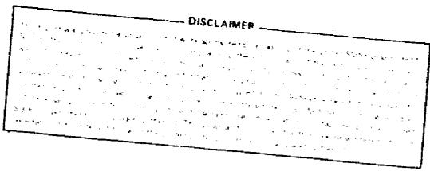

ORNL/TM-8298

Df3t. category UC-95

METALS AND CERAMICS DIVISION

ORNL/TM--8298

DE83 004228

THERMAL-CONVECTION-LOOP STUDY OF THE CORROSION OF Fe-Ni-Cr ALLOYS BY MOLTEN $\mathrm{NaNO}_3$ - $\mathrm{KNO}_3$

P. F. Tortorelli

J. H. Devan

Date Published - December 1982

NOTICE: This document contains information of a preliminary nature. It is subject to revision or correction and therefore does not represent a final report.

Prepared by the OAK RIDGE NATIONAL LABORATORY Oak Ridge, Tennessee 37830 operated by UNION CARBIDE CORPORATION for the Office of Industrial Programs U.S. DEPARTMENT OF ENERGY Under Contract No. W-7405-eng-26

# CONTENTS

ABSTRACT 1   
INTRODUCTION 1   
EXPERIMENTAL PROCEDURES 2   
RESULTS 5   
DISCUSSION 19   
SUMMARY 25   
ACKNOWLEDGMENTS 26   
REFERENCES 26   
APPENDIX 29

P. F. Tortorelli and J. H. Devan

# ABSTRACT

We studied the corrosion of Fe-Ni-Cr alloys by draw salt (60 wt $\%$ NaNO $_3$ -40 wt $\%$ KNO $_3$ ) with thermal convection loops of alloy 800 and types 304L and 316 stainless steel. The main corrosion processes at $600^{\circ}\mathrm{C}$ and below were the growth of thin oxide scales and the dissolution of chromium by the salt. Spallation of oxide layers occurred on type 304 stainless steel specimens at intermediate temperatures. Results indicated relatively low corrosion rates (<13 $\mu$ m/year in most cases) for temperatures of $600^{\circ}\mathrm{C}$ and less. Corrosion of type 316 stainless steel was greatly accelerated when the maximum loop temperature was raised to $620^{\circ}\mathrm{C}$ . It therefore appears that $600^{\circ}\mathrm{C}$ may be the limiting temperature for use of the above alloys in draw salt.

# INTRODUCTION

A mixture of 60 wt $\%$ $\mathrm{NaNO}_3 - 40$ wt $\%$ $\mathrm{KNO}_3$ (draw salt) has been proposed for use in solar thermal power systems as both a solar receiver working fluid and a thermal energy storage medium. Draw salt is attractive for such applications because of its high sensible heat capacity, its low reactivity in the event of a leak to air or steam, and the low operating pressures required for its use. However, the feasibility of such a system depends partly on the compatibility of the salt with candidate structural alloys. The subject experiments were therefore performed in closed-loop systems to study the corrosion of alloy 800 and types 304 and 316 stainless steel by slowly flowing $\mathrm{NaNO}_3$ - $\mathrm{KNO}_3$ under an impressed temperature gradient. Previous work with a nitrate-nitrite [49 $\mathrm{NaNO}_3 - 44$ $\mathrm{KNO}_3 - 7$ $\mathrm{NaNO}_2$ (wt %)] salt revealed unacceptably high corrosion rates of type 316 stainless steel at $550^{\circ}\mathrm{C}$ . The study presents comparable data for a pure nitrate salt system.

The tests reported here are companion experiments to those conducted at Sandia National Laboratory. $^{3-5}$ The Sandia experiments were matched to our experiments in terms of loop materials, specimens, and temperature conditions. However, the Sandia experiments operated under air, while ours were sealed, the cover gas being composed of salt decomposition products.

# EXPERIMENTAL PROCEDURES

The as-received draw salt, with a nominal composition of 60 wt $\%$ $\mathrm{NaNO}_3 - 40$ wt $\%$ $\mathrm{KNO}_3^*$ and a melting point of $221^{\circ}\mathrm{C}$ , was outgassed in a closed type 304 stainless steel vessel at 250 to $300^{\circ}\mathrm{C}$ while simultaneously being purged by argon flowing above and through the salt. A significant amount of water vapor was removed in this way. Subsequently, this pot of salt was used to fill three thermal convection loops (TCLs) of the type shown schematically in Fig. 1. Natural circulation of the salt was induced in these closed loops by controlling the loop's temperature profile to produce convective flow. Each of the three loops was constructed of different alloys: types 304L and 316 stainless steel and alloy 800 (Table 1). The loops were designed to permit the insertion and removal of corrosion coupons and salt samples with minimal disruption of the salt flow. In this way, changes in salt composition, specimen weight, and microstructure were monitored as functions of exposure time. Tubing for the loops ranged from 1.9 to $2.5\mathrm{cm}$ in outside diameter and from 0.2 to $0.3\mathrm{cm}$ in wall thickness. Insert coupons were approximately $1.9\times 0.8\times 0.1\mathrm{cm}$ and were in the as-annealed condition (unpolished). In any given loop, the insert specimens and tubing were of the same nominal compositions, although, in the case of the type 304L stainless steel loop, specimens of both normal- and low-carbon grades were exposed. In each TCL, the pressure above the salt rapidly increased to above $6.9\times 10^{4}\mathrm{Pa}$ , gage (10 psig) when the temperature was initially raised above about

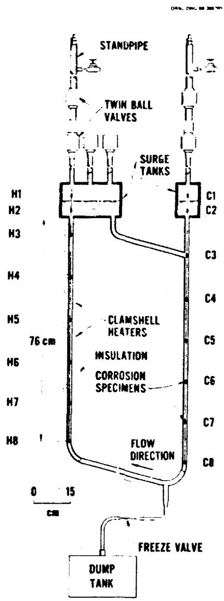  
Fig. 1. Thermal convection loop used in $\mathrm{NaNO}_3$ - $\mathrm{KNO}_3$ studier. The "H" and "C" numbers denote specimen positions in the hot and cold legs, respectively. Coupons H1 and Cl are located in the cover gas and are not wet by the salt.

$520^{\circ}\mathrm{C}$ . Analysis of the evolved gas showed that it was principally oxygen. Subsequently, care was taken to maintain this gas composition over the loop salt by using only oxygen as a cover gas durin; specimen manipulation and salt sampling. During most of our study the three TCLs operated with maximum temperatures and temperature differentials $\Delta T_{\mathrm{s}}$ of about 600 and

Table 1. Nominal compositions of tested alloys   

<table><tr><td rowspan="2">Alloy</td><td colspan="9">Concentration (wt %)</td></tr><tr><td>Fe</td><td>Ni</td><td>Cr</td><td>Mn</td><td>Mo</td><td>S1</td><td>A1</td><td>Ti</td><td>Ca</td></tr><tr><td>Alloy 800</td><td>45</td><td>32</td><td>21</td><td>1</td><td></td><td>0.2</td><td>0.5</td><td>0.5</td><td>0.10</td></tr><tr><td>Type 304 stainless steelb</td><td>68</td><td>10</td><td>19</td><td>2</td><td></td><td>1</td><td></td><td></td><td>0.08</td></tr><tr><td>Type 316 stainless steel</td><td>67</td><td>11</td><td>17</td><td>2</td><td>2</td><td>1</td><td></td><td></td><td>0.08</td></tr></table>

$a_{\text{Maximum concentrations}}$   
bType 304L stainless steel is of similar composition except for a maximum carbon concentration of 0.03.

$225^{\circ}\mathrm{C}$ , respectively. The $\Delta T$ was established by first setting the minimum temperature at the bottom of the cold leg and then increasing the output of the heaters along the hot leg to achieve a maximum temperature of $600^{\circ}\mathrm{C}$ just below the bottom of the hot-leg surge tank (Fig. 1). Typical temperature profiles for each of the three TCLs are shown in Fig. 2. The nominal salt velocity was $4\mathrm{mm/s}$ . After $5000\mathrm{h}$ of coupon exposure, the $\Delta T$ of the type 316 stainless steel TCL was changed to $150^{\circ}\mathrm{C}$ , and its maximum temperature was maintained at $600^{\circ}\mathrm{C}$ to assess any changes in behavior due to mass transfer effects (see below). This temperature profile is also shown in Fig. 2.

Before weighing, the loop specimens were cleaned with water after each exposure to flowing salt. After 1500 and $4500\mathrm{h}$ of exposure, corners were clipped from the specimens in each loop for metallographic examination. Periodically, samples of salt from the respective loops were taken and analyzed for Fe, Ni, Cr, Mo, $\mathrm{NO}_2$ , and $\mathrm{NO}_3$ . Total chromium and chromium(VI) concentrations in the salt were measured spectrophotometrically, $^{6,7}$ and nickel and molybdenum levels were determined by the atomic absorption spectroscopic graphite furnace technique. The salt samples were analyzed for iron spectrophotometrically with the o-phenanthroline method. $^{8}$ The nitrate concentrations were determined by a modified DeVarda method; $^{9}$ the nitrite levels were measured volumetrically by titration with cerium(IV) (ref. 10).

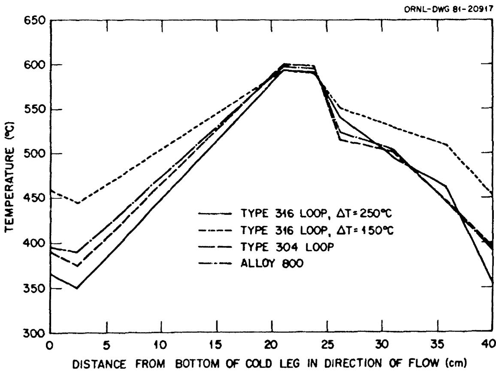  
Fig. 2. Typical temperature profiles for the three draw salt thermal convection loops; $\Delta T$ , temperature differential.

# RESULTS

As previously discussed, the weights of the loop specimens were measured as a function of exposure time. Such data are shown in Fig. 3 for the specimens at the two hottest coupon positions (H3 and H4) in the alloy 800 TCL. Very little weight change occurred. Similar behavior was found for specimens in these positions in the type 304L stainless steel loop, which contained both types 304 and 304L stainless steel at the $600^{\circ}\mathrm{C}$ (H3) position (Fig. 4). Equivalent weight change data for the type 316 stainless steel loop are shown in Fig. 5. As with the other two loops, the weight changes of the H3 $(595^{\circ}\mathrm{C})$ specimen were small. However, the weight of the H4 $(565^{\circ}\mathrm{C})$ specimen steadily decreased during the initial $3000\mathrm{h}$ of exposure to the salt, after which it became approximately

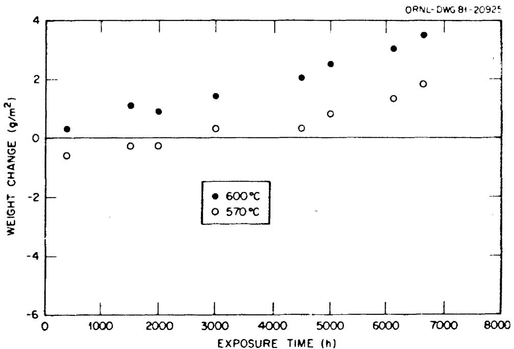  
Fig. 3. Weight change versus exposure time for alloy 800 exposed to flowing $\mathsf{NaNO}_3$ - $\mathsf{KNO}_3$ .

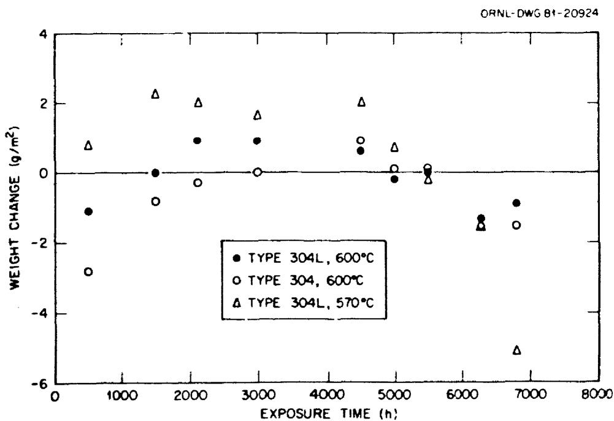  
Fig. 4. Weight change versus exposure time for types 304 and 304L stainless steel exposed to flowing $\mathrm{NaNO}_3$ - $\mathrm{KNO}_3$ .

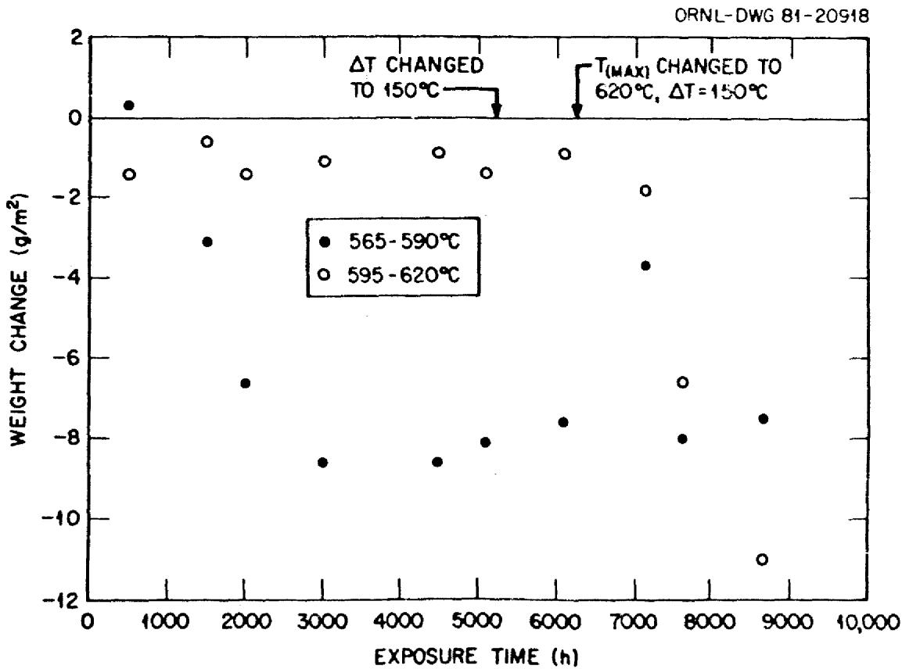  
Fig. 5. Weight change versus exposure time for type 316 stainless steel exposed to flowing $\mathrm{NaNO}_3$ - $\mathrm{KNO}_3$ .

constant. Changing the $\Delta T$ of the type 316 stainless steel loop from 225 to $150^{\circ}C$ after 5000 h of coupon exposure had little effect on the weight changes, but raising the maximum loop temperature to $620^{\circ}C$ after 6000 h resulted in the onset of significant weight-loss rates.

As noted, the weight change data in Figs. 3 through 5 are for only two of the coupon positions in each of the TCLs. The data for all loop coupons are listed in the Appendix in Tables A.1 through A.3 (the location of each specimen is shown in Fig. l). With the exception of the type 316 stainless steel H4 coupon, the weight changes of all the specimens in the alloy 800 and type 316 stainless steel loops were small. However, significant weight gains were measured on certain coupons in the type 304L

stainless steel TCL. The weight gains were particularly high for several coupons in the lower half of the hot leg. These weight changes are plotted as a function of exposure tire in Fig. 6. The decreases in weight at longer times appeared to be related to spallation.

Metallographic specimens were obtained by clipping corners from the loop coupons after 1500 and $4500\mathrm{h}$ of exposure to $\mathrm{NaNO}_3$ - $\mathrm{KNO}_3$ . Polished cross sections of specimens exposed to the draw salt at the H3 and H4 positions in each of the loops are shown in Figs. 7 through 9. Each alloy exhibited multilayered corrosion products at the higher temperatures. In certain cases, but particularly in the case of types 304 and 304L stainless steel, etching of these metallographic specimens increased the number of apparent layers that could be differentiated on a given specimen. Examples of this can be seen by comparing the micrographs in Fig. 10 with the associated ones in Figs. 8 and 9. Micrographs of specimens exposed at other loop positions are shown in Figs. 11 through 14. Those in Fig. 14 are of the surfaces of the coupons that exhibited the larger weight gains

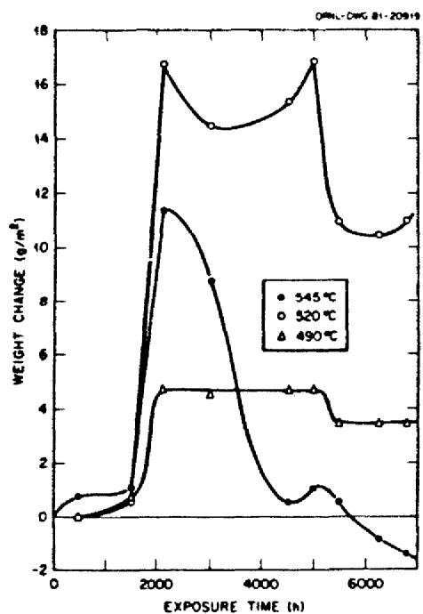  
Fig. 6. Weight change versus exposure time for type 304L stainless steel exposed to flowing $\mathsf{NaNO}_3$ - $\mathsf{KNO}_3$ .

Y-176892

Y-179930

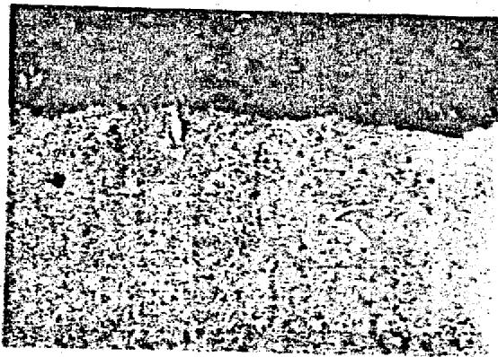  
(a)

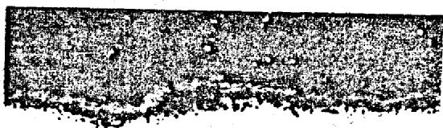  
(b)

Y-176894

Y-179931

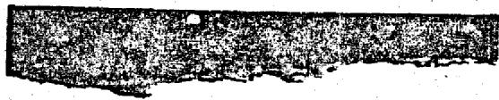

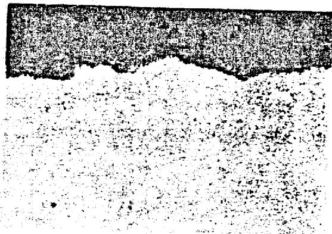  
Fig. 7. Polished cross sections of alloy 800 exposed to flowing $\mathrm{NaNO}_3$ - $\mathrm{KNO}_3$ : (a) $1500\mathrm{h}$ at $600^{\circ}\mathrm{C}$ , (b) $4500\mathrm{h}$ at $600^{\circ}\mathrm{C}$ , (c) $1500\mathrm{h}$ at $570^{\circ}\mathrm{C}$ , and (d) $4500\mathrm{h}$ at $570^{\circ}\mathrm{C}$ .

(c)

(d)

40μm

Y-173086

Y-177222

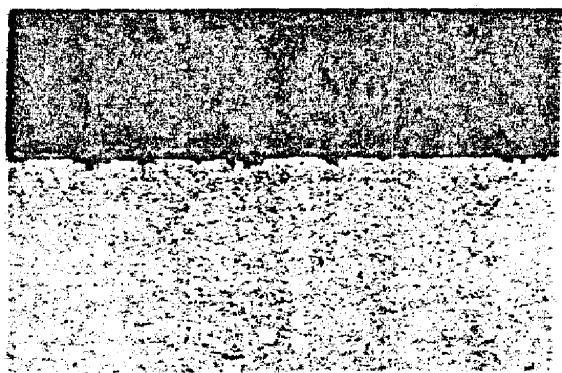  
(a)

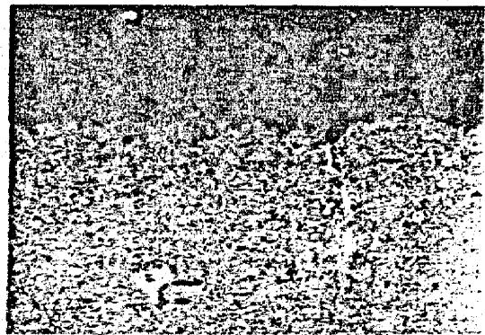  
(b)

Y-173088

Y-177224

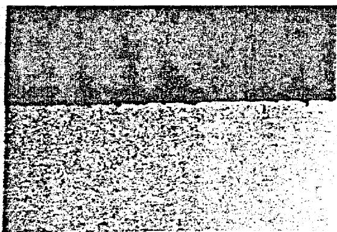  
(c)

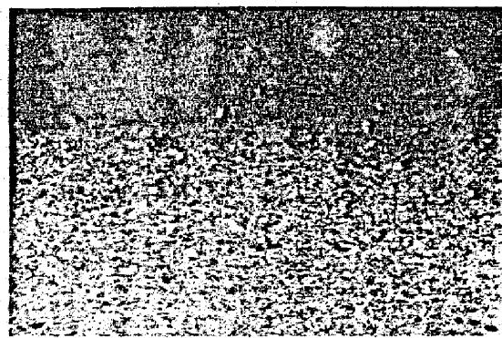  
Fig. 8. Polished cross sections of type 316 stainless steel exposed to flowing $\mathrm{NaNO}_3$ - $\mathrm{KNO}_3$ : (a) $1500\mathrm{h}$ at $595^{\circ}\mathrm{C}$ , (b) $4500\mathrm{h}$ at $595^{\circ}\mathrm{C}$ , (c) $1500\mathrm{h}$ at $565^{\circ}\mathrm{C}$ , and (d) $4500\mathrm{h}$ at $565^{\circ}\mathrm{C}$ .

(d)

40um

Y-174797

Y-174794

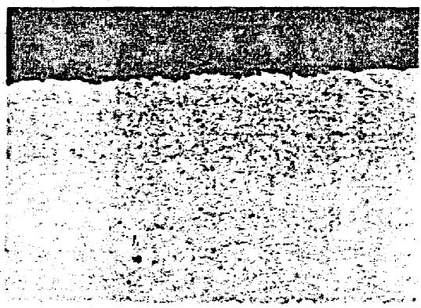  
(a)

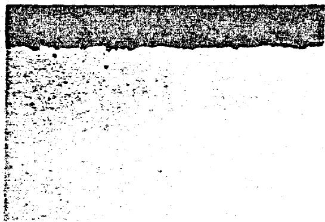  
(b)

Y-178808

Y-178306

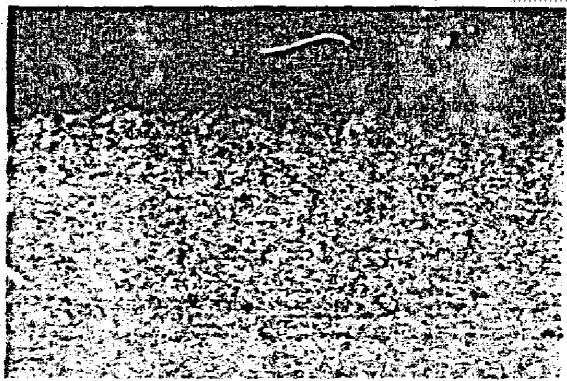  
(c)

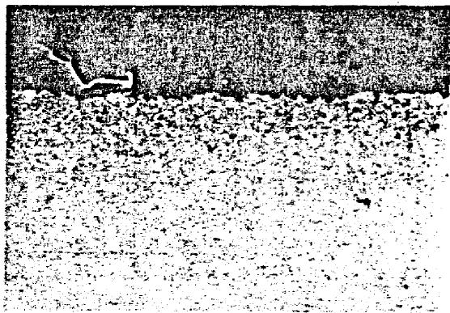  
(d)

Y-174801

Y-178810

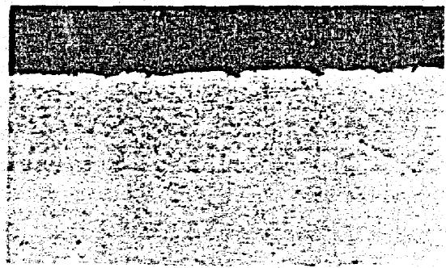  
(e)

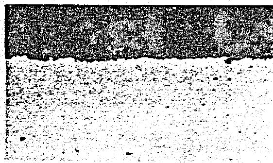  
(f)   
Fig. 9. Polished cross sections of types 304 and 304L stainless steel exposed to flowing $\mathsf{NaNO}_3$ - $\mathsf{KNO}_3$ . (a) Type 304 for 1500 h at $600^{\circ}\mathsf{C}$ . (b) Type 304L for 1500 h at $600^{\circ}\mathsf{C}$ . (c) Type 304 for 4500 h at $600^{\circ}\mathsf{C}$ .

Y-17723

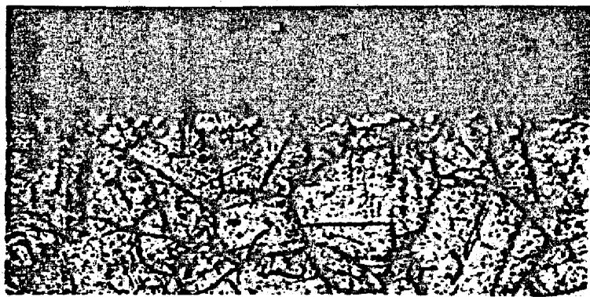  
(a)

Y-178952

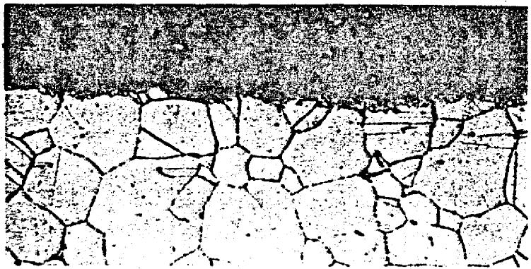  
(b)

Y-179010

(c)

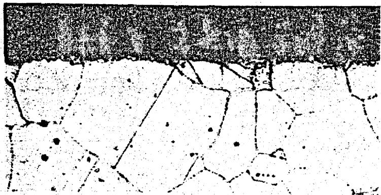  
Fig. 10. Cross sections of stainless steel exposed to flowing $\mathrm{NaNO}_3$ - $\mathrm{KNO}_3$ for $4500\mathrm{~h}$ at approximately $600^{\circ}\mathrm{C}$ ; etched with aqua regia.

40pm

(a) Type 316 stainless steel. (b) Type 304 stainless steel.   
(c) Type 304L stainless steel.

Y-179933

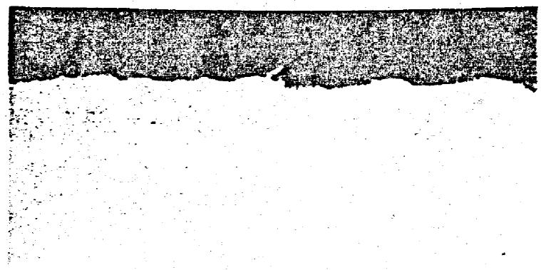  
13

Y-179941

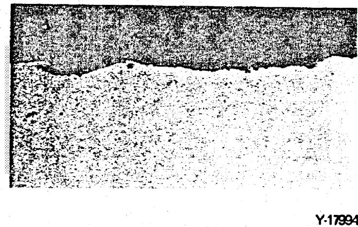

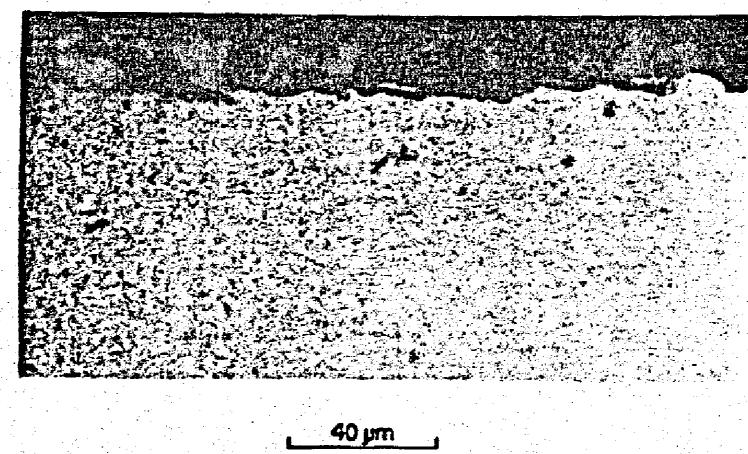  
Fig. 11. Polished cross sections of alloy 800 exposed to flowing $\mathrm{NaNO}_3$ - $\mathrm{KNO}_3$ for $4500\mathrm{h}$ at (a) $520^{\circ}\mathrm{C}$ , (b) $410^{\circ}\mathrm{C}$ , and (c) $375^{\circ}\mathrm{C}$ .

Y-17728

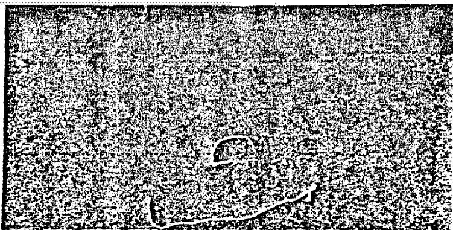  
(a)

Y-177244

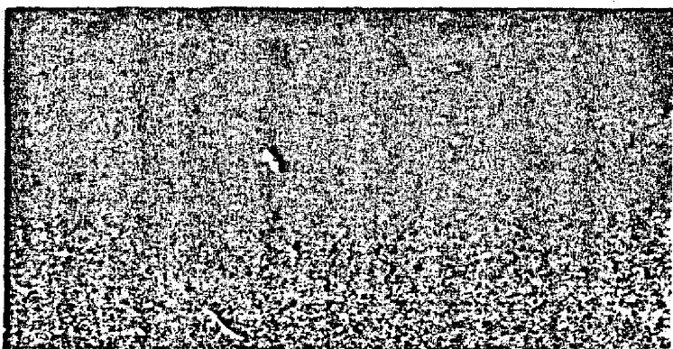  
(b)

Y-177248

(c)

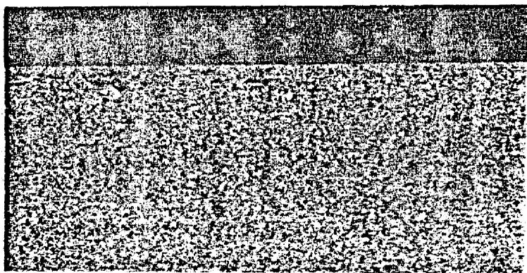  
Fig. 12. Polished cross sections of type 316 stainless steel exposed to flowing $\mathrm{NaNO}_3$ - $\mathrm{KNO}_3$ for 4500 h at (a) $505^{\circ}\mathrm{C}$ , (b) $410^{\circ}\mathrm{C}$ , and (c) $375^{\circ}\mathrm{C}$ .

40μm

Y-178828

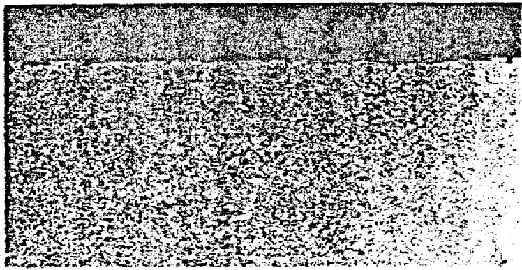  
(a)

Y-17832

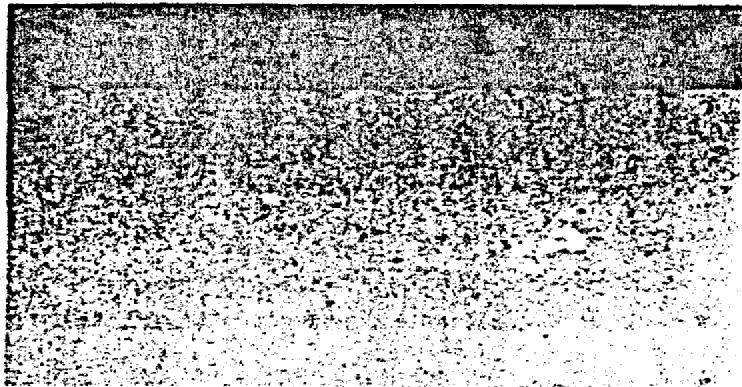  
Fig. 13. Polished cross sections of type 304L stainless steel exposed to flowing $\mathrm{NaNO}_3$ - $\mathrm{KNO}_3$ for 4500 h at (a) $410^{\circ}\mathrm{C}$ and (b) $375^{\circ}\mathrm{C}$ .

(b)

40ym

Y-178812

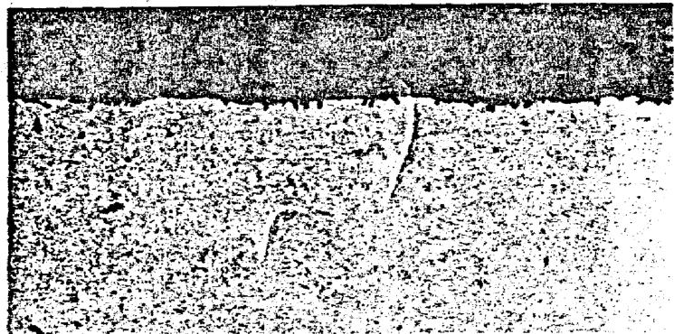  
(a)

Y-178814

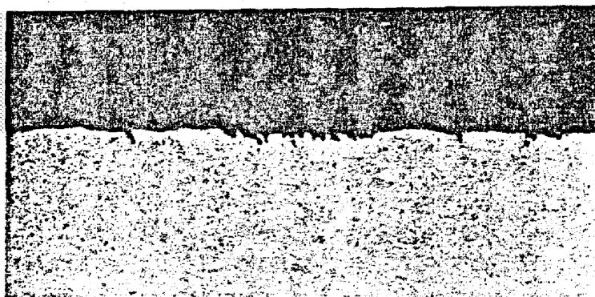  
(b)

Y-178816

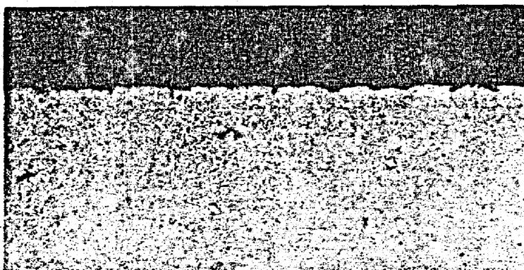  
(c)

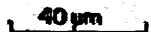  
Fig. 14. Polished cross sections of type 304L stainless steel exposed to flowing $\mathsf{NaNO}_3$ - $\mathsf{KNO}_3$ for 4500 h at (a) $545^{\circ}\mathsf{C}$ , (b) $520^{\circ}\mathsf{C}$ , and (c) $490^{\circ}\mathsf{C}$ .

reported in Fig. 6. Note that the large weight gains are also reflected in relatively thick reaction layers and that spallation of the layers seems imminent. Tables A.4 through A.6 in the Appendix list the total depth of the corrosion products $x$ for each coupon as measured from the respective micrographs.

High-resolution electron microprobe analysis allowed determination of the chemical composition of the reaction zone of type 316 stainless steel after $4500\mathrm{h}$ of exposure at $595^{\circ}\mathrm{C}$ . The results indicated three layers of different compositions, shown schematically in Fig. 15. The entire reaction zone contained oxygen, and the individual layers comprising this zone differed in their relative ratio of iron to chromium. The outermost layer was depleted in chromium, but the underlying one was not. Finally, a thin nickel-rich layer was observed at the corrosion product zone-base metal interface.

The salt in each of the TCLs was periodically analyzed to determine the extent and nature of corrosion product species; results are shown in Table 2. (The sampling times in the table represent the number of hours the salt circulated in a particular loop before analysis and, as such, do not coincide with the coupon exposure times used in reporting the weight change and microstructural results because of the periods in which the coupons were out of the respective loops.) The data in the table clearly show a general increase of chromium in the salt with increasing operating time in all three loops. The concentrations of the other principal elements of the structural alloys did not differ appreciably from their levels in the as-received salt. We are unsure of the reason for the occasional, unusually high molybdenum concentration in the salt. Most probably the measurements are erroneous because we observed a decrease to a "normal" concentration in the alloy 800 loop at a later sampling time. In all the loops, the salt's nitrite concentration increased rapidly to about 1.9 wt % but then increased more slowly.

As described in the experimental procedures section, the pressure above the loop salt rapidly increased when the temperature was raised above about $520^{\circ}\mathrm{C}$ . Analyzed samples of evolved gas were mainly oxygen. These analyses are given in Table 3.

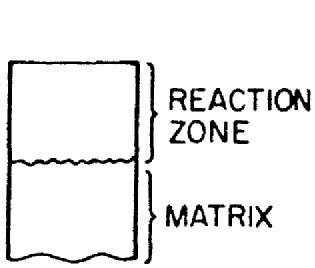

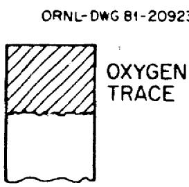

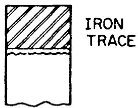

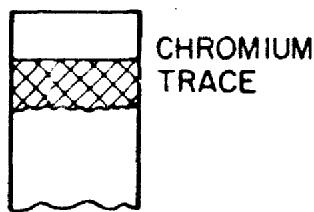  
Fig. 15. Results from electron microprobe analysis of type 316 stainless steel exposed to $\mathrm{NaNO}_3$ - $\mathrm{KNO}_3$ for $4500\mathrm{h}$ at $595^{\circ}\mathrm{C}$ .

Table 2. Salt composition as a function of loop operating time   

<table><tr><td rowspan="3">Loop material</td><td rowspan="3">Loop operating time (h)</td><td colspan="6">Concentration in salta</td></tr><tr><td colspan="4">(wt ppm)</td><td colspan="2">(wt Z)</td></tr><tr><td>Crb</td><td>Ni</td><td>Fe</td><td>Mo</td><td>NO2</td><td>NO3</td></tr><tr><td></td><td>0</td><td>4</td><td>&lt;10</td><td>21</td><td>&lt;2</td><td>0.05</td><td>65.5</td></tr><tr><td rowspan="4">Alloy 800</td><td>2,403</td><td>130</td><td>&lt;10</td><td>1.6</td><td>2</td><td>1.7</td><td>68.1</td></tr><tr><td>5,619</td><td>137</td><td>&lt;10</td><td>&lt;1</td><td>27</td><td>3.2</td><td>63.6</td></tr><tr><td>7,755</td><td>156</td><td>&lt;10</td><td></td><td>3</td><td>3.3</td><td>64.1</td></tr><tr><td>10,104c</td><td>237 (218)</td><td></td><td>&lt;1</td><td></td><td></td><td></td></tr><tr><td rowspan="6">Type 304L stainless steel</td><td>1,894</td><td>163</td><td>&lt;10</td><td>&lt;1</td><td></td><td>1.7</td><td>67.6</td></tr><tr><td>2,715</td><td>120</td><td>&lt;10</td><td>2.3</td><td>&lt;2</td><td>2.0</td><td>66.6</td></tr><tr><td>4,249</td><td>200</td><td>&lt;10</td><td>1.6</td><td>&lt;2</td><td>2.0</td><td>67.2</td></tr><tr><td>8,809</td><td>222</td><td>&lt;10</td><td></td><td>3</td><td>3.9</td><td>63.2</td></tr><tr><td>9,672</td><td>246</td><td>&lt;10</td><td></td><td>4</td><td>4.0</td><td>63.4</td></tr><tr><td>12,122</td><td>322 (310)</td><td></td><td>&lt;1</td><td></td><td></td><td></td></tr><tr><td rowspan="7">Type 316 stainless steel</td><td>1,126</td><td>63</td><td>&lt;10</td><td>14</td><td>&lt;2</td><td>1.9</td><td>64.3</td></tr><tr><td>4,034</td><td>118</td><td>&lt;10</td><td>&lt;1</td><td></td><td>1.8</td><td>66.5</td></tr><tr><td>5,355</td><td>128</td><td>&lt;10</td><td>&lt;1</td><td></td><td>1.9</td><td>68.5</td></tr><tr><td>7,419</td><td>120</td><td>&lt;10</td><td>1.1</td><td>&lt;2</td><td>1.9</td><td>64.3</td></tr><tr><td>12,578c</td><td>163</td><td>&lt;10</td><td></td><td>29</td><td>4.3</td><td>62.7</td></tr><tr><td>14,638c</td><td>270</td><td></td><td></td><td></td><td></td><td></td></tr><tr><td>15,313c</td><td>283 (282)</td><td></td><td>&lt;1</td><td></td><td></td><td></td></tr></table>

Measurement uncertainties are $\pm 5\%$ .   
$b_{\text{Numbers in parentheses}}$ represent concentrations of $\operatorname{Cr}(\mathrm{VI})$ in salt.   
Maximum loop temperature $T_{\text{max}}$ was about $625^{\circ}C$ ; all other measurement times were for a $T_{\text{max}}$ of about $600^{\circ}C$ .

Table 3. Analyses of gas initially evolved from $\mathsf{NaNO}_3$ - $\mathsf{KNO}_3$ in closed thermal convection loops   

<table><tr><td rowspan="2">Species</td><td colspan="4">Concentration (wt %)</td></tr><tr><td>Type</td><td>304L</td><td>loop</td><td>Type 316 loop</td></tr><tr><td>Arα</td><td>&lt;0.1</td><td></td><td></td><td>4.4</td></tr><tr><td>CO2</td><td></td><td></td><td></td><td>0.4</td></tr><tr><td>H2O</td><td>&lt;0.1</td><td></td><td></td><td>1.3</td></tr><tr><td>N2+ CO</td><td>0.7</td><td></td><td></td><td>3.6</td></tr><tr><td>O2</td><td>99.2</td><td></td><td></td><td>90.3</td></tr></table>

$\alpha$ Argon was the original cover gas.

# DISCUSSION

A substantial amount of gaseous oxygen rapidly evolved when the draw salt in these closed loops was heated to above about $520^{\circ}\mathrm{C}$ . This behavior is consistent with the decomposition reaction

$$
\chi \mathrm {N O} _ {3} \rightleftharpoons \chi \mathrm {N O} _ {2} + 1 / 2 0 _ {2}, \tag {1}
$$

where $X$ can be sodium or potassium. Such a reaction was reported earlier for this salt.1 As seen in Table 2, the measured nitrite concentrations in the salt increased in accordance with the decomposition reaction and are in approximate agreement with those calculated with the equilibrium constant for Eq. (1) (ref. 11) and the assumption that a mass balance was maintained between nitrate and nitrite. Although metal oxidation reactions were also occurring in the system, as evidenced by the growth of oxide filas and the buildup of chromium in the salt, it appears that the above decomposition reaction controls the oxidation potential of the system. This is consistent with the fact that the oxidation of the metal is a small effect relative to the amount of salt in the loop and therefore should not significantly affect salt chemistry.

As already discussed, metal oxidation processes were manifested by the formation of surface reaction layers (Figs. 7-10) and in increased

levels of chromium in the draw salt, and microprobe examination of exposed type 316 stainless steel (Fig. 5) indicated that significant depletion of chromium from hotter loop surfaces also occurred. Both the oxidation and depletion reactions are discussed in more detail below.

The weight changes reported in Tables A.1 through A.3 are not indicative of the true corrosion rates. The measured weight change $\Delta W$ is actually the difference between the weight of the reacted oxygen $\Delta W_{0}$ and the sum of the weights of the dissolved elements (principally chromium) $\Delta W_{D}$ and of the spalled material $\Delta W_{6}$ :

$$
\Delta W = \Delta W _ {O} - \left(\Delta W _ {D} + \Delta W _ {S}\right). \tag {2}
$$

The weight of the oxygen acquired by a specimen $\Delta W_{0}$ can be roughly calculated from the thickness of the oxide layer $x$ (see Tables A.4-A.6):

$$
\Delta W _ {O} = (6 4. 0 / 2 3 1. 4) \rho_ {\mathrm {F e} _ {3} \mathrm {O} _ {4}} \times x, \tag {3}
$$

where the density of $\mathrm{Fe}_{3}\mathrm{O}_{4}$ , $\rho_{\mathrm{Fe}_3\mathrm{O}_4}$ , was used to approximate that of the composite oxide layer. The total weight of oxidized metal $\Delta W_{T}$ is defined as the weight of metal in both the oxide scale and molten salt. This weight "loss" is thus the sum of the weight of the dissolved elements $\Delta W_{D}$ and the weight of the reacted (oxidized) iron and chromium $\Delta W_{M(O)}$ :

$$
\Delta W _ {T} = \Delta W _ {D} + \Delta W _ {H (O)}, \tag {4}
$$

where

$$
\Delta W _ {M} (O) = 0. 7 2 \left(\rho_ {\mathrm {F e} _ {3} \mathrm {O} _ {4}} \times x + \Delta W _ {6}\right). \tag {5}
$$

When $\Delta W_{T}$ is divided by the time of salt exposure, an average approximate corrosion rate for the particular specimen is obtained. The values of $\Delta W_{T}$ can be obtained by substituting in Eq. (4) values of $\Delta W_{D}$ and $\Delta W_{M(O)}$ obtained by use of Eqs. (2) and (5), respectively, and appropriate measurements of $\Delta W$ and $x$ from Tables A.1 through A.6. For our case, we will assume $\Delta W_{S} = 0$ because observation of possible spallation after 4500 h of exposure was restricted to a very few specimens in one loop (specimens H6 and H7 in the type 304L stainless steel TCL). With this assumption,

approximate values of the total weight of oxidized metal of each loop specimen are listed in Tables A.7 through A.12. Measurements of the weights of descaled specimens are in progress to determine the accuracy of the above approach. Corrosion weight changes and rates obtained in this manner for the alloy 800 and type 316 stainless steel loops (Tables A.7-A.10) are consistent with the expectation that oxidation kinetics, and therefore total weight loss, should increase with increasing temperature (this is not the case for the uncorrected weight changes measured with the oxide films intact). In contrast, the weight losses calculated for specimens in the type 304L stainless steel loop after $4500\mathrm{h}$ of exposure did not maximize at the highest loop temperature. In this case, relatively large corrosion rates resulted at intermediate temperatures (see Table A.12). The accelerated oxidation at these intermediate positions was characterized by the presence of relatively thick and apparently poorly adherent oxide films (Fig. 14). However, the actual corrosion rates at these positions are somewhat less than those calculated because the calculations assumed a $100\%$ dense oxide film of the same thickness as that of the observed porous film.

Regardless of possible inaccuracies in the determinations of $\Delta V_{T}$ , the weight change results shown in Tables A.7 through A.12 indicate that the metal in the oxide film constitutes most of the metal loss and that the total corrosion rates are relatively small. Figure 16 shows that the oxide thicknesses on the alloys of this study are about an order of magnitude less than those expected for annealed type 304 stainless steel in steam.[12] The total weight losses after $4500\mathrm{h}$ in draw salt have been converted into corrosion rates in the last column of Tables A.8, A.10, and A.12 and indicate that, while the "worst case" corresponds to $25~{\mu\mathrm{m}}/$ year (1 mil/year), the corrosion rate is substantially less in most cases. The one potential concern in these tests was the nature of the oxide films on type 304L stainless steel specimens at intermediate temperatures, where spalling appeared imminent.

Although the exact nature of the metallographically distinct surface layers on exposed specimens is not known, it appears that, in general, the

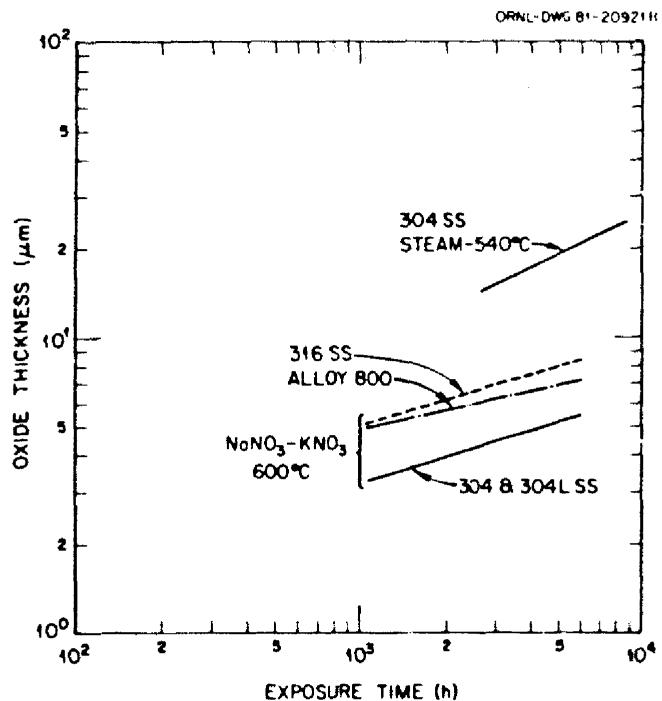  
Fig. 16. Comparison of oxide thickness versus exposure time for exposures to $\mathrm{NaNO}_3$ - $\mathrm{KNO}_3$ and steam.

reaction zone at higher temperatures consists of an iron oxide (probably $\mathrm{Fe}_{3}\mathrm{O}_{4}$ ) with an underlying spine! layer such as $\mathrm{Fe}(\mathrm{Fe},\mathrm{Cr})_{2}\mathrm{O}_{4}$ . This would be consistent with the microprobe data and agrees with the results from a study of the corrosion of type 304 stainless steel by thermally convective draw salt. However, details revealed by optical metallography indicate a more complex reaction zone than that just described. For example, a dark-etching phase was sometimes observed optically at the salt-alloy interface [Fig. 10(a)], although this phase was not revealed by microprobe analysis. The other three layers seen in Fig. 10(a) were distinct areas in the microprobe analysis (Fig. 15). Another complicating factor is the multitude of layers observed in the reaction zones of types 304 and 304L stainless steel when their polished cross sections are etched (Fig. 10). This variety of metallographically distinct structures was not observed in another study of type 304 stainless steel, and the reason why so many layers should develop on these alloys and not on the other materials

in this study is not obvious from compositional differences. Finally, the micrographs of the higher temperature alloy 800 coupons indicated some tendency for internal oxidation at the reaction zone-base metal interface [Fig. 7(a)], although longer term tests will be required to establish the significance of this observation.

The observed increases in the chromium levels of the test salt in each loop imply the formation of one or more chromium-containing species that are soluble in $\mathrm{NaNO}_3$ - $\mathrm{KNO}_3$ . Because most of the chromium in the salt was in the +6 oxidation state (Table 2), $\mathrm{Na}_2\mathrm{Cr}_2\mathrm{O}_7$ and $\mathrm{Na}_2\mathrm{CrO}_4$ are probable species. Changes in the chromium concentration of the draw salt as a function of exposure time can also yield information about the chromium depletion process. Assuming that, as discussed below, there is no deposition of chromium from the salt, the increase in the chromium concentrations of the salt $C_{\mathrm{Cr(s)}}$ should subscribe to a half-power time dependence if diffusion of chromium in the alloy or in the salt is rate controlling. A linear time dependence would imply surface reaction control. Recent work3 on the corrosion of type 304 stainless steel in draw salt revealed a time dependence of $t^{0.4}$ for $C_{\mathrm{Cr(s)}}$ . In agreement with other work3,5 our data generally indicate a continuing increase in chromium levels of the salt with time (Table 2) for the duration of the experiments. The chromium concentration of the salt in the type 316 stainless steel TCL appeared to approach a time-independent value after several thousand hours and then increased again when the maximum loop temperature was increased. In no case, however, was the time dependence of the chromium concentrations in the salt greater than $t^{0.5}$ for operation at a maximum temperature of $600^{\circ}\mathrm{C}$ ; the best-fit exponent was always between 0.1 and 0.5. This would thus indicate that a diffusional process involving chromium is the rate-controlling step. Accordingly, the concentrations are plotted versus the square root of exposure time in Fig. 17.

One possible corrosion effect is the movement of surface at: test alloys from hot to cold regions of the loop via convection salt phase. This phenomenon of thermal gradient mass transport

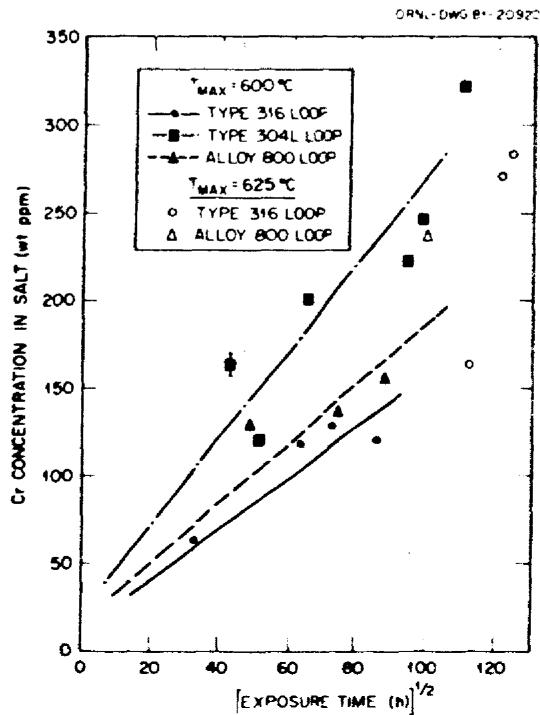  
Fig. 17. Chromium concentration in $\mathsf{NaNO}_3$ - $\mathsf{KNO}_3$ versus the square root of loop operating time.

observed in other molten salt systems (principally hydroxides or fluorides) subjected to a thermal gradient. $^{13}$ The transport mechanism can involve oxidation and dissolution of reactive metals as corrosion products in the hot zone with subsequent reduction and deposition of the metals in the cold zone. Our tests indicate that an oxidation reaction operates to dissolve chromium in the salt; however, the weight change data gave no evidence that the reaction leads to a net transport of chromium from hot to cold regions. There was also no evidence of cold-leg deposits in visual or metallographic examinations of cold-leg specimens. Furthermore, changes in the $\Delta T$ of the type 316 stainless steel loop did not significantly affect the measured weight changes (Fig. 5). Thus, our results are encouraging in that thermal gradient mass transport will not be a significant operational problem in draw salt systems up to $600^{\circ}C$ .

This study indicates two principal corrosion reactions resulting from exposure of Fe-Ni-Cr alloys to $\mathrm{NaNO}_3$ - $\mathrm{KNO}_3$ : the solid-state oxidation of the exposed alloys and the selective dissolution of chromium from the

matrix. As such, our results agree with those reported $^{3,4}$ for similar alloys exposed to $\mathrm{NaNO}_3$ - $\mathrm{KNO}_3$ in TCLs that were open to air. Spallation was not extensive, and intergranular attack was not observed.

The results of this study indicate that alloy 800 and types 304, 304L, and 316 stainless steel have low corrosion rates in thermally convective $\mathrm{NaNO}_3$ - $\mathrm{KNO}_3$ at a maximum temperature of $600^{\circ}\mathrm{C}$ . Under such conditions, the greatest metal loss rate corresponded to $25~\mu \mathrm{m}$ /year, but in most cases the rate was less than $13~\mu \mathrm{m}$ /year. These latter rates are somewhat smaller than those reported for similar loops operated with the salt exposed to the atmosphere3,5 but are within a factor of 2 to 5. Significant metal oxidation was observed only at intermediate temperatures in the type 304L stainless steel TCL after $5000\mathrm{h}$ of salt exposure (Fig. 6), but the overall rate did not exceed $25~\mu \mathrm{m}$ /year. Raising the maximum loop temperature to $620^{\circ}\mathrm{C}$ resulted in much greater corrosion rates for type 316 stainless steel (Fig. 5). This rapid acceleration of the corrosion process was also observed in other studies of types 304 and 316 stainless steel and alloy 800 in draw salt loops,3,5 where at $630^{\circ}\mathrm{C}$ significant spalling of the oxide films on type 316 stainless steel was observed.5 Our results therefore confirm that $600^{\circ}\mathrm{C}$ probably represents an upper temperature service limit for such alloys in $\mathrm{NaNO}_3$ - $\mathrm{KNO}_3$ (ref. 5).

# SUMMARY

Alloy 800 and types 304, 304L, and 316 stainless steel were exposed to thermally convective $\mathrm{NaNO}_3$ - $\mathrm{KNO}_3$ draw salt at 375 to $600^{\circ}\mathrm{C}$ for more than $4500\mathrm{h}$ . The exposure resulted in the growth of thin oxide films on all alloys and the dissolution of chromium by the salt. The weight change data for the alloys indicated that (1) the metal in the oxide film constituted most of the metal loss; (2) the corrosion rate, in general, increased with temperature; and (3) although the greatest metal loss corresponded to a penetration rate of $25~{\mu\mathrm{m}}/$ year (1 mil/year), the rate was less than $13~{\mu\mathrm{m}}/$ year in most cases. Spallation had a significant effect on metal loss at intermediate temperatures in the type 304L stainless steel loop. Metallographic examinations showed no evidence of intergranular attack

or of significant cold-leg deposits. Weight change data further confirmed the absence of thermal gradient mass transport processes in these draw salt systems.   
Raising the maximum temperature of the type 316 stainless steel loop from 595 to $620^{\circ}\mathrm{C}$ dramatically increased the corrosion rate. It thus appeared that $600^{\circ}\mathrm{C}$ may be the limiting temperature for use of such alloys in draw salt.

# ACKNOWLEDGMENTS

This study was funded by a subcontract from Sandia National Laboratory; R. W. Carling of Sandia was the task manager. The authors acknowledge the following ORNL staff members who contributed to this work: E. J. Lawrence, who designed and operated the thermal convection loops; G. C. Marsh and R. S. Crouse for their metallographic and microprobe work; D. A. Costanzo for his aid in the chemical analyses; Irene Brogden for editing; and D. L. LeComte for preparation of final copy.

# REFERENCES

1. Conceptual Design of Advanced Central Receiver Power System, Final Report, DOE/ET/20314-1/2, Martin Marietta Corporation, Denver, September 1978.   
2. J. R. Keiser, J. H. Devan, and E. J. Lawrence, "Compatibility of Molten Salts with Type 316 Stainless Steel and Lithium," J. Nucl. Mater. 85&86(II, A), 295-98 (1979).   
3. R. W. Bradshaw, Corrosion of 304 Stainless Steel by Molten $\mathsf{NaNO}_3$ - $\mathsf{KNO}_3$ in a Thermal Convection Loop, SAND80-8856, Sandia National Laboratory, Livermore, Calif., December 1980.   
4. R. W. Carling et al., Molten Nitrate Salt Technology Development Status Report, SAND80-8052, Livermore, Calif., March 1981, pp. 33-44.   
5. R. W. Bradshaw, Thermal Convection Loop Corrosion Tests of 316 Stainless Steel and IN800 in Molten Nitrate Salts, SAND81-8210, Sandia National Laboratory, Livermore, Calif., February 1982.

6. E. B. Sandell, Colorimetric Determination of Traces of Metals, 3d ed., Interscience, New York, 1959, p. 392.   
7. J. Applebaum and J. Marshall, "Silver(II) Oxide Oxidation and Spectrophotometric Determination of Chromium(III)," Anal. Chim. Acta 35, 409 (1966).   
8. A. E. Harvey, J. A. Smart, and E. S. Arnis, "Simultaneous Spectrophotometric Determination of Iron(II) and Total Iron with 1,10-Phenanthroline," Anal. Chem. 27, 26-27 (1955).   
9. W. W. Scott, Standard Methods of Chemical Analysis, 6th ed., Van Nostrand, New York, 1962, p. 748.   
10. I. M. Kolthoff and E. B. Sandell, Textbook of Quantitative Inorganic Analysis, 3d ed., MacMillan, New York, 1952, p. 581.   
11. D. A. Nissen, The Chemistry of the Binary $\mathsf{NaNO}_3$ - $\mathsf{KNO}_3$ System, SAND81-8007, Sandia National Laboratory, Livermore, Calif., June 1981.   
12. J. C. Griess and W. A. Maxwell, The Long-Term Oxidation of Selected Alloys in Superheated Steam at 482 and $538^{\circ}C$ , ORNL-5771, July 1981.   
13. J. H. Devan and R. B. Evans III, "Corrosion Behavior of Reactor Materials in Fluoride Salt Mixtures," pp. 557-80 in Corrosion of Reactor Materials, Int. Atomic Energy Agency, Vienna, 1962.

Appendix

CORROSION DATA

Table A.1. Weight changes for alloy 800 specimens exposed to draw salt in an alloy 800 thermal convection loop   

<table><tr><td rowspan="2">Specimen</td><td rowspan="2">Temperature (°C)</td><td colspan="8">Weight change (g/m2) for total exposure in h</td></tr><tr><td>378</td><td>1500</td><td>2002</td><td>3010</td><td>4498</td><td>4998</td><td>6146</td><td>6650</td></tr><tr><td>H1</td><td>580</td><td>0.0</td><td>+0.3</td><td>+0.9</td><td>+1.4</td><td>+2.6</td><td>+3.0</td><td>+3.4</td><td>+3.9</td></tr><tr><td>H2</td><td>595</td><td>+0.3</td><td>+1.7</td><td>+2.0</td><td>+2.5</td><td>+3.7</td><td>+3.7</td><td>+4.7</td><td>+5.7</td></tr><tr><td>H3</td><td>600</td><td>+0.3</td><td>+1.1</td><td>+0.9</td><td>+1.4</td><td>+2.0</td><td>+2.5</td><td>+3.0</td><td>+3.5</td></tr><tr><td>H4</td><td>570</td><td>-0.6</td><td>-0.3</td><td>-0.3</td><td>+0.3</td><td>+0.3</td><td>+0.8</td><td>+1.3</td><td>+1.8</td></tr><tr><td>H5</td><td>545</td><td>-0.6</td><td>-0.6</td><td>-1.1</td><td>-0.3</td><td>0.0</td><td>0.0</td><td>+1.0</td><td>+1.5</td></tr><tr><td>H6</td><td>520</td><td>0.0</td><td>0.0</td><td>-0.6</td><td>-0.3</td><td>-0.3</td><td>-0.3</td><td>+0.2</td><td>+0.7</td></tr><tr><td>H7</td><td>495</td><td>-0.6</td><td>-0.6</td><td>-1.1</td><td>-0.9</td><td>-0.6</td><td>-0.6</td><td>-0.6</td><td>-0.6</td></tr><tr><td>H8</td><td>470</td><td>0.0</td><td>+0.3</td><td>-0.6</td><td>0.0</td><td>0.0</td><td>0.0</td><td>0.0</td><td>0.0</td></tr><tr><td>C3</td><td>485</td><td>-0.6</td><td>-0.8</td><td>-1.1</td><td>-0.6</td><td>0.0</td><td>-1.4</td><td>-0.4</td><td>+0.1</td></tr><tr><td>C4</td><td>455</td><td>-0.6</td><td>-0.3</td><td>-0.6</td><td>-2.0</td><td>-1.4</td><td>-0.9</td><td>-0.4</td><td>-0.9</td></tr><tr><td>C5</td><td>435</td><td>-0.3</td><td>-0.3</td><td>-0.6</td><td>-0.3</td><td>0.0</td><td>-1.0</td><td>-0.5</td><td>0.0</td></tr><tr><td>C6</td><td>410</td><td>-0.6</td><td>-0.3</td><td>-0.6</td><td>-0.3</td><td>-0.3</td><td>-0.3</td><td>-0.3</td><td>+0.2</td></tr><tr><td>C7</td><td>390</td><td>-0.6</td><td>-0.3</td><td>-0.6</td><td>-0.3</td><td>0.0</td><td>-0.5</td><td>0.0</td><td>0.0</td></tr><tr><td>C8</td><td>375</td><td>-0.6</td><td>-0.6</td><td>-0.9</td><td>-0.3</td><td>-0.3</td><td>-0.3</td><td>-0.8</td><td>-0.3</td></tr></table>

Table A.2. Weight changes for types 304 and 304L stainless steel specimens exposed to draw salt in a type 304L stainless steel thermal convection loop   

<table><tr><td rowspan="2">Specimen</td><td rowspan="2">Temperature (°C)</td><td colspan="9">Weight change (g/m2) for total exposure in h</td></tr><tr><td>500</td><td>1500</td><td>2121</td><td>3006</td><td>4488</td><td>4988</td><td>5489</td><td>6279</td><td>6804</td></tr><tr><td>H1</td><td>580</td><td>0.0</td><td>+0.3</td><td>+0.3</td><td>+0.3</td><td>+0.6</td><td>+0.6</td><td>-1.3</td><td>-1.8</td><td>-0.9</td></tr><tr><td>H2</td><td>595</td><td>-1.7</td><td>-0.3</td><td>-2.0</td><td>-2.0</td><td>+0.9</td><td>+2.6</td><td>+3.5</td><td>+2.2</td><td>+3.1</td></tr><tr><td>H3</td><td>600</td><td>-1.1</td><td>0.0</td><td>+0.9</td><td>+0.9</td><td>+0.6</td><td>-0.2</td><td>0.0</td><td>-1.3</td><td>-0.9</td></tr><tr><td>H3Aα</td><td>600</td><td>-2.8</td><td>-0.8</td><td>-0.3</td><td>0.0</td><td>+0.9</td><td>+0.1</td><td>+0.1</td><td>-1.5</td><td>-1.3</td></tr><tr><td>H4</td><td>570</td><td>+0.8</td><td>+2.3</td><td>+2.0</td><td>+1.7</td><td>+2.0</td><td>+0.7</td><td>-0.2</td><td>-1.5</td><td>-5.1</td></tr><tr><td>H5</td><td>545</td><td>+0.8</td><td>+1.1</td><td>+11.4</td><td>+8.8</td><td>+0.6</td><td>+1.1</td><td>+0.6</td><td>-0.8</td><td>-1.3</td></tr><tr><td>H6</td><td>520</td><td>0.0</td><td>+0.6</td><td>+16.8</td><td>+14.5</td><td>+15.4</td><td>+16.9</td><td>+11.0</td><td>+10.5</td><td>+11.0</td></tr><tr><td>H7</td><td>490</td><td>0.0</td><td>+0.8</td><td>+4.8</td><td>+4.6</td><td>+4.8</td><td>+4.8</td><td>+3.5</td><td>+3.5</td><td>+3.5</td></tr><tr><td>H8</td><td>465</td><td>+0.3</td><td>+2.0</td><td>+2.6</td><td>+2.8</td><td>+3.4</td><td>+2.5</td><td>+2.5</td><td>+1.6</td><td>+1.6</td></tr><tr><td>C3</td><td>485</td><td>+0.6</td><td>+1.7</td><td>+4.0</td><td>+4.6</td><td>+5.7</td><td>+4.7</td><td>+5.2</td><td>+5.7</td><td>+6.7</td></tr><tr><td>C4</td><td>455</td><td>+0.3</td><td>+2.0</td><td>+2.8</td><td>+3.7</td><td>+5.7</td><td>+4.2</td><td>+6.7</td><td>+6.7</td><td>+6.2</td></tr><tr><td>C4Aα</td><td>455</td><td>0.0</td><td>+1.7</td><td>+3.1</td><td>+3.7</td><td>+4.6</td><td>+3.2</td><td>+2.7</td><td>+3.2</td><td>+3.2</td></tr><tr><td>C5</td><td>435</td><td>0.0</td><td>+1.1</td><td>+2.0</td><td>+3.4</td><td>+4.0</td><td>+3.6</td><td>+3.2</td><td>+3.2</td><td>+3.2</td></tr><tr><td>C6</td><td>410</td><td>+0.3</td><td>+0.8</td><td>+1.4</td><td>+2.6</td><td>+4.0</td><td>+4.0</td><td>+3.1</td><td>+2.2</td><td>+2.2</td></tr><tr><td>C7</td><td>390</td><td>+0.6</td><td>+1.7</td><td>+1.7</td><td>+2.3</td><td>+2.8</td><td>+2.4</td><td>+2.0</td><td>+1.1</td><td>+1.5</td></tr><tr><td>C8</td><td>375</td><td>+0.3</td><td>+2.8</td><td>+2.8</td><td>+3.1</td><td>+3.7</td><td>+2.8</td><td>+2.8</td><td>+2.4</td><td>+1.9</td></tr></table>

aSpecimens H3A and C4A are type 304 stainless steel; remainder are type 304L.

Table A.3. Weight changes for type 316 stainless steel specimens exposed to draw salt in a type 316 stainless steel thermal convection loop   

<table><tr><td rowspan="2">Specimen</td><td colspan="2">Temperaturea (°C)</td><td colspan="10">Weight change (g/m2) for total exposure in h</td></tr><tr><td>ΔT = 225°C</td><td>ΔT = 150°C</td><td>499</td><td>1500</td><td>2001</td><td>3010</td><td>4501</td><td>5102</td><td>6108</td><td>7133</td><td>7658</td><td>8660</td></tr><tr><td>H1</td><td>580</td><td>580</td><td>0.0</td><td>+1.1</td><td>+0.6</td><td>+0.3</td><td>+0.6</td><td>-0.3</td><td>+0.1</td><td>+0.5</td><td>+0.5</td><td>+0.5</td></tr><tr><td>H2</td><td>590</td><td>580</td><td>+0.3</td><td>-4.0</td><td>-2.8</td><td>-2.3</td><td>-2.0</td><td>-2.5</td><td>-2.0</td><td>-0.6</td><td>-0.1</td><td>-0.1</td></tr><tr><td>H3</td><td>595</td><td>595</td><td>-1.4</td><td>-0.6</td><td>-1.4</td><td>-1.1</td><td>-0.9</td><td>-1.4</td><td>-0.9</td><td>-1.8</td><td>-6.6</td><td>-8.0</td></tr><tr><td>H4</td><td>565</td><td>575</td><td>+0.3</td><td>-3.1</td><td>-6.6</td><td>-8.6</td><td>-8.6</td><td>-8.1</td><td>-7.6</td><td>-3.7</td><td>-8.0</td><td>-7.5</td></tr><tr><td>H5</td><td>535</td><td>555</td><td>+0.8</td><td>+0.8</td><td>0.0</td><td>+0.3</td><td>+0.6</td><td>+1.1</td><td>+1.6</td><td>+5.7</td><td>+3.3</td><td>+5.2</td></tr><tr><td>H6</td><td>505</td><td>535</td><td>+0.6</td><td>+0.6</td><td>+0.3</td><td>+0.6</td><td>+0.6</td><td>+1.1</td><td>+1.1</td><td>+3.5</td><td>+2.5</td><td>+4.9</td></tr><tr><td>H7</td><td>475</td><td>520</td><td>0.0</td><td>+0.3</td><td>+0.3</td><td>+0.6</td><td>+0.3</td><td>+0.8</td><td>+1.3</td><td>+1.8</td><td>+1.8</td><td>+4.2</td></tr><tr><td>H8</td><td>445</td><td>500</td><td>0.0</td><td>0.0</td><td>-0.3</td><td>0.0</td><td>-0.3</td><td>+1.3</td><td>+1.8</td><td>+3.4</td><td>+3.4</td><td>+5.0</td></tr><tr><td>C3</td><td>485</td><td>530</td><td>+0.8</td><td>+0.6</td><td>+0.6</td><td>+1.1</td><td>+1.4</td><td>+2.8</td><td>+2.3</td><td>+7.0</td><td>+5.1</td><td>+8.8</td></tr><tr><td>C4</td><td>455</td><td>505</td><td>+0.3</td><td>+0.8</td><td>-1.1</td><td>-1.7</td><td>-1.1</td><td>-1.6</td><td>-2.5</td><td>+0.8</td><td>-1.1</td><td>+0.3</td></tr><tr><td>C5</td><td>435</td><td>495</td><td>+0.8</td><td>+0.8</td><td>+0.8</td><td>+1.4</td><td>+1.7</td><td>+1.7</td><td>+2.7</td><td>+3.2</td><td>+3.2</td><td>+5.1</td></tr><tr><td>C6</td><td>410</td><td>480</td><td>+0.3</td><td>+2.8</td><td>+2.8</td><td>+3.1</td><td>+3.4</td><td>+3.4</td><td>+3.4</td><td>+6.2</td><td>+5.7</td><td>+7.6</td></tr><tr><td>C7</td><td>390</td><td>465</td><td>+0.3</td><td>+0.3</td><td>+0.6</td><td>+0.8</td><td>+0.6</td><td>+0.1</td><td>+0.1</td><td>+2.9</td><td>+2.4</td><td>+4.8</td></tr><tr><td>C8</td><td>375</td><td>450</td><td>-1.1</td><td>-1.1</td><td>-1.1</td><td>-1.1</td><td>-1.1</td><td>-1.1</td><td>-0.6</td><td>+1.3</td><td>+0.8</td><td>+3.2</td></tr></table>

$a_{\Delta T}$ (temperature differential) changed from 250 to $150^{\circ}C$ after 5102 h; $T_{\max}$ (maximum temperature) changed from 595 to $620^{\circ}C$ after 6108 h with corresponding changes in all specimen temperatures.

Table A.4. Average corrosion product thickness for alloy 800 specimens exposed to flowing draw salt   
(Average of ten measurements)   

<table><tr><td rowspan="2">Specimen</td><td rowspan="2">Temperature (℃)</td><td colspan="2">Thickness x (μm)</td></tr><tr><td>1500 h</td><td>4500 h</td></tr><tr><td>H1</td><td>580</td><td>3.7</td><td>5.1</td></tr><tr><td>H2</td><td>595</td><td>3.7</td><td>6.2</td></tr><tr><td>H3</td><td>600</td><td>5.4</td><td>6.8</td></tr><tr><td>H4</td><td>570</td><td>2.8</td><td>5.3</td></tr><tr><td>H5</td><td>545</td><td>2.3</td><td>3.6</td></tr><tr><td>H6</td><td>520</td><td>1.0</td><td>1.2</td></tr><tr><td>H7</td><td>495</td><td>0.4</td><td>1.1</td></tr><tr><td>H8</td><td>470</td><td>0.3</td><td>1.3</td></tr><tr><td>C3</td><td>485</td><td>1.8</td><td>2.5</td></tr><tr><td>C4</td><td>455</td><td>1.6</td><td>2.7</td></tr><tr><td>C5</td><td>435</td><td>0.9</td><td>1.7</td></tr><tr><td>C6</td><td>410</td><td>0.4</td><td>2.7</td></tr><tr><td>C7</td><td>390</td><td>0.4</td><td>1.2</td></tr><tr><td>C8</td><td>375</td><td>0.5</td><td>2.3</td></tr></table>

Table A.5. Average corrosion product thickness for types 304 and 304L stainless steel exposed to flowing draw salt   
(Average of ten measurements)   

<table><tr><td rowspan="2">Specimen</td><td rowspan="2">Temperature (℃)</td><td colspan="2">Thickness x (μm)</td></tr><tr><td>1500 h</td><td>4500 h</td></tr><tr><td>H1</td><td>580</td><td></td><td>4.1</td></tr><tr><td>H2</td><td>595</td><td>2.6</td><td>6.8</td></tr><tr><td>H3</td><td>600</td><td>3.6</td><td>5.6</td></tr><tr><td>H3Aα</td><td>600</td><td>3.6</td><td>5.0</td></tr><tr><td>H4</td><td>570</td><td>1.9</td><td>6.0</td></tr><tr><td>H5</td><td>545</td><td>1.2</td><td>11.9</td></tr><tr><td>H6</td><td>520</td><td>0.4</td><td>22.8</td></tr><tr><td>H7</td><td>490</td><td>1.1</td><td>3.5</td></tr><tr><td>H8</td><td>465</td><td>1.4</td><td>1.3</td></tr><tr><td>C3</td><td>485</td><td>2.9</td><td>5.1</td></tr><tr><td>C4</td><td>455</td><td>2.0</td><td>3.1</td></tr><tr><td>C4Aα</td><td>455</td><td>1.7</td><td>2.4</td></tr><tr><td>C5</td><td>435</td><td>1.4</td><td>3.1</td></tr><tr><td>C6</td><td>410</td><td>0.7</td><td>0.6</td></tr><tr><td>C7</td><td>390</td><td>&lt;0.4</td><td>1.4</td></tr><tr><td>C8</td><td>375</td><td>1.1</td><td>0.7</td></tr></table>

$^{a}$ Type 304 stainless steel; others are type 304L.

Table A.6. Average corrosion product thickness for type 316 stainless steel exposed to flowing draw salt   
(Average of ten measurements)   

<table><tr><td rowspan="2">Specimen</td><td rowspan="2">Temperature (℃)</td><td colspan="2">Thickness x (μm)</td></tr><tr><td>1500 h</td><td>4500 h</td></tr><tr><td>H1</td><td>580</td><td></td><td>0.5</td></tr><tr><td>H2</td><td>595</td><td>1.9</td><td>4.4</td></tr><tr><td>H3</td><td>595</td><td>4.0</td><td>7.7</td></tr><tr><td>H4</td><td>565</td><td>0.2</td><td>8.2</td></tr><tr><td>H5</td><td>535</td><td>1.7</td><td>5.7</td></tr><tr><td>H6</td><td>505</td><td>0.6</td><td>2.8</td></tr><tr><td>H7</td><td>475</td><td>0.2</td><td>0.0</td></tr><tr><td>H8</td><td>445</td><td>0.0</td><td>0.0</td></tr><tr><td>C3</td><td>485</td><td>2.2</td><td>7.4</td></tr><tr><td>C4</td><td>455</td><td>1.7</td><td>4.4</td></tr><tr><td>C5</td><td>435</td><td>0.9</td><td>1.3</td></tr><tr><td>C6</td><td>410</td><td>6.1</td><td>4.0</td></tr><tr><td>C7</td><td>390</td><td>0.3</td><td>0.2</td></tr><tr><td>C8</td><td>375</td><td>0.0</td><td>0.0</td></tr></table>

Table A.7. Weight change results for alloy 800 exposed to flowing $\mathsf{NaNO}_3$ - $\mathsf{KNO}_3$ for 1500 h   

<table><tr><td rowspan="2">Specimen</td><td rowspan="2">τa(°C)</td><td rowspan="2">xb(μm)</td><td colspan="5">Weight changec(g/m2)</td></tr><tr><td>ΔW0</td><td>ΔW</td><td>WD</td><td>ΔWM(O)</td><td>ΔWT</td></tr><tr><td>H1</td><td>580</td><td>3.7</td><td>5.4</td><td>+0.3</td><td>5.1</td><td>13.8</td><td>18.9</td></tr><tr><td>H2</td><td>595</td><td>3.7</td><td>5.4</td><td>+1.7</td><td>3.7</td><td>13.8</td><td>17.5</td></tr><tr><td>H3</td><td>600</td><td>5.4</td><td>7.9</td><td>+1.1</td><td>6.8</td><td>20.2</td><td>27.0</td></tr><tr><td>H4</td><td>570</td><td>2.8</td><td>4.1</td><td>-0.3</td><td>4.4</td><td>10.5</td><td>14.9</td></tr><tr><td>H5</td><td>545</td><td>2.3</td><td>3.3</td><td>-0.6</td><td>4.0</td><td>8.6</td><td>12.6</td></tr><tr><td>H6</td><td>520</td><td>1.0</td><td>1.5</td><td>0.0</td><td>1.5</td><td>3.7</td><td>5.2</td></tr><tr><td>H7</td><td>495</td><td>0.4</td><td>0.6</td><td>-0.6</td><td>1.2</td><td>1.5</td><td>2.7</td></tr><tr><td>H8</td><td>470</td><td>0.3</td><td>0.4</td><td>+0.3</td><td>0.2</td><td>1.1</td><td>1.3</td></tr><tr><td>C1</td><td>470</td><td></td><td></td><td>-2.8</td><td></td><td></td><td></td></tr><tr><td>C2</td><td>475</td><td></td><td></td><td>+1.1</td><td></td><td></td><td></td></tr><tr><td>C3</td><td>485</td><td>1.8</td><td>2.6</td><td>-0.8</td><td>3.4</td><td>6.8</td><td>10.2</td></tr><tr><td>C4</td><td>455</td><td>1.6</td><td>2.3</td><td>-0.3</td><td>2.6</td><td>6.0</td><td>8.6</td></tr><tr><td>C5</td><td>435</td><td>0.9</td><td>1.3</td><td>-0.3</td><td>1.6</td><td>3.4</td><td>5.0</td></tr><tr><td>C6</td><td>410</td><td>0.4</td><td>0.6</td><td>-0.3</td><td>0.9</td><td>1.5</td><td>2.4</td></tr><tr><td>C7</td><td>390</td><td>0.4</td><td>0.6</td><td>-0.3</td><td>0.9</td><td>1.5</td><td>2.4</td></tr><tr><td>C8</td><td>375</td><td>0.5</td><td>0.7</td><td>-0.6</td><td>1.3</td><td>1.9</td><td>3.2</td></tr></table>

$\alpha_{T}$ , temperature.   
$b_{x}$ , thickness.   
$c_{\Delta H_O}$ , weight of reacted oxygen; $\Delta W$ , measured weight change; $\Delta W_D$ , total weight of dissolved elements; $\Delta H_M(O)$ , weight of reacted iron and chromium; and $\Delta W_T$ , total weight of oxidized metal.

Table A.8. Weight change results for alloy 800 exposed to flowing $\mathsf{NaNO}_3$ - $\mathsf{KNO}_3$ for 4500 h   

<table><tr><td rowspan="2">Specimen</td><td rowspan="2">τa(°C)</td><td rowspan="2">xb(μm)</td><td colspan="5">Weight changec(g/m2)</td><td colspan="2">CRd</td></tr><tr><td>ΔW0</td><td>ΔW</td><td>ΔWD</td><td>ΔWM(o)</td><td>ΔWT</td><td>(μm/year)</td><td>(mil/year)</td></tr><tr><td>H1</td><td>580</td><td>5.1</td><td>7.4</td><td>+2.6</td><td>4.8</td><td>19.1</td><td>23.9</td><td>5</td><td>0.2</td></tr><tr><td>H2</td><td>595</td><td>6.2</td><td>9.0</td><td>+3.7</td><td>5.3</td><td>23.2</td><td>28.5</td><td>8</td><td>0.3</td></tr><tr><td>H3</td><td>600</td><td>6.8</td><td>9.9</td><td>+2.0</td><td>7.9</td><td>25.5</td><td>33.4</td><td>8</td><td>0.3</td></tr><tr><td>H4</td><td>570</td><td>5.3</td><td>7.7</td><td>-0.3</td><td>7.4</td><td>19.8</td><td>27.3</td><td>8</td><td>0.3</td></tr><tr><td>H5</td><td>545</td><td>3.6</td><td>5.2</td><td>0.0</td><td>5.2</td><td>13.5</td><td>18.7</td><td>5</td><td>0.2</td></tr><tr><td>H6</td><td>520</td><td>1.2</td><td>1.7</td><td>-0.3</td><td>2.0</td><td>4.5</td><td>6.5</td><td>3</td><td>0.1</td></tr><tr><td>H7</td><td>495</td><td>1.1</td><td>1.6</td><td>-0.6</td><td>2.2</td><td>4.1</td><td>6.3</td><td>3</td><td>0.1</td></tr><tr><td>H8</td><td>470</td><td>1.3</td><td>1.9</td><td>0.0</td><td>1.9</td><td>4.9</td><td>6.8</td><td>3</td><td>0.1</td></tr><tr><td>C1</td><td>470</td><td>3.2</td><td>4.7</td><td>-2.0</td><td>6.6</td><td>12.0</td><td>18.6</td><td>5</td><td>0.2</td></tr><tr><td>C2</td><td>475</td><td>2.2</td><td>3.2</td><td>+1.4</td><td>1.8</td><td>8.2</td><td>10.0</td><td>3</td><td>0.1</td></tr><tr><td>C3</td><td>485</td><td>2.5</td><td>3.6</td><td>0.0</td><td>3.6</td><td>9.4</td><td>13.0</td><td>3</td><td>0.1</td></tr><tr><td>C4</td><td>455</td><td>2.7</td><td>3.9</td><td>-1.4</td><td>5.3</td><td>10.1</td><td>15.4</td><td>3</td><td>0.1</td></tr><tr><td>C5</td><td>435</td><td>1.7</td><td>2.5</td><td>0.0</td><td>2.5</td><td>6.3</td><td>8.8</td><td>3</td><td>0.1</td></tr><tr><td>C6</td><td>410</td><td>2.7</td><td>3.9</td><td>-0.3</td><td>4.2</td><td>10.1</td><td>14.3</td><td>3</td><td>0.1</td></tr><tr><td>C7</td><td>390</td><td>1.2</td><td>1.7</td><td>0.0</td><td>1.7</td><td>4.5</td><td>6.2</td><td>3</td><td>0.1</td></tr><tr><td>C8</td><td>375</td><td>2.3</td><td>3.3</td><td>-0.3</td><td>3.7</td><td>8.6</td><td>12.3</td><td>3</td><td>0.1</td></tr></table>

$\alpha_{T}$ , temperature.   
$b_{x,}$ thickness.   
$C_{\Delta W_O}$ , weight of reacted oxygen; $\Delta W$ , measured weight change; $\Delta W_D$ , total weight of dissolved elements; $\Delta W_M(O)$ , weight of reacted iron and chromium; and $\Delta W_T$ , total weight of oxidized metal.   
$d_{\mathbf{CR}}$ , corrosion rate.

Table A.9. Weight change results for type 316 stainless steel exposed to flowing $\mathsf{NaNO}_3$ - $\mathsf{KNO}_3$ for $1500\mathrm{h}$   

<table><tr><td rowspan="2">Specimen</td><td rowspan="2">\( \frac{\tau a}{\left( ℃\right) } \)</td><td rowspan="2">\( {x}^{b} \) (μm)</td><td colspan="5">Weight change \( {}^{c}\left( {\mathrm{\;g}/{\mathrm{m}}^{2}}\right) \)</td></tr><tr><td>\( \Delta {H}_{O} \)</td><td>\( \Delta W \)</td><td>\( \Delta {H}_{L}^{d} \)</td><td>\( \Delta {W}_{M}\left( O\right) \)</td><td>\( \Delta {W}_{T} \)</td></tr><tr><td>H1</td><td>580</td><td></td><td></td><td>+1.1</td><td></td><td></td><td></td></tr><tr><td>H2</td><td>595</td><td>1.9</td><td>2.8</td><td>-4.0</td><td>6.8</td><td>7.1</td><td>13.9</td></tr><tr><td>H3</td><td>600</td><td>4.0</td><td>5.8</td><td>-0.6</td><td>6.4</td><td>15.0</td><td>21.4</td></tr><tr><td>H4</td><td>565</td><td>0.2</td><td>0.3</td><td>-3.1</td><td>3.4</td><td>0.8</td><td>4.1</td></tr><tr><td>H5</td><td>535</td><td>1.7</td><td>2.5</td><td>+0.8</td><td>1.7</td><td>6.4</td><td>8.0</td></tr><tr><td>H6</td><td>505</td><td>0.6</td><td>0.9</td><td>+0.6</td><td>0.3</td><td>2.2</td><td>2.5</td></tr><tr><td>H7</td><td>475</td><td>0.2</td><td>0.3</td><td>+0.3</td><td>0.0</td><td>0.7</td><td>0.7</td></tr><tr><td>H8</td><td>445</td><td>0.0</td><td>0.0</td><td>0.0</td><td>0.0</td><td>0.0</td><td>0.0</td></tr><tr><td>C1</td><td>470</td><td></td><td></td><td>0.0</td><td></td><td></td><td></td></tr><tr><td>C2</td><td>475</td><td></td><td></td><td>-0.6</td><td></td><td></td><td></td></tr><tr><td>C3</td><td>485</td><td>2.2</td><td>3.2</td><td>+0.6</td><td>2.6</td><td>8.2</td><td>10.8</td></tr><tr><td>C4</td><td>455</td><td>1.7</td><td>2.5</td><td>+0.8</td><td>-1.7</td><td>6.3</td><td>8.0</td></tr><tr><td>C5</td><td>435</td><td>0.9</td><td>1.3</td><td>+0.8</td><td>0.5</td><td>3.4</td><td>3.9</td></tr><tr><td>C6</td><td>410</td><td>6.1</td><td>8.9</td><td>+2.8</td><td>6.1</td><td>22.8</td><td>28.9</td></tr><tr><td>C7</td><td>390</td><td>0.3</td><td>0.4</td><td>+0.3</td><td>0.1</td><td>1.2</td><td>1.3</td></tr><tr><td>C8</td><td>375</td><td>0.0</td><td>0.0</td><td>-1.1</td><td>1.1</td><td>0.0</td><td>1.1</td></tr></table>

$\alpha_{T}$ , temperature.   
$b_{x}$ ,thickness.   
$c_{\Delta W_O}$ , weight of reacted oxygen; $\Delta W$ , measured weight change; $\Delta W_D$ , total weight of dissolved elements; $\Delta W_{M(O)}$ , weight of reacted iron and chromium; and $\Delta V_T$ , total weigh' of oxidized metal.   
$d_{\text{Negative number}}$ indicates physical impossibility.

Table A.10. Weight change results for type 316 stainless steel exposed to flowing $\mathsf{NaNO}_3$ - $\mathsf{KNO}_3$ for 4500 h   

<table><tr><td rowspan="2">Specimen</td><td rowspan="2">\( \tau^a \) (°C)</td><td rowspan="2">\( x^b \) (μm)</td><td colspan="5">Weight change \( ^c \) (g/m2)</td><td colspan="2">\( CRe^e \)</td></tr><tr><td>\( \Delta W_O \)</td><td>\( \Delta W \)</td><td>\( \Delta W_D^d \)</td><td>\( \Delta W_M(O) \)</td><td>\( \Delta W_T \)</td><td>(μm/year)</td><td>(mil/year)</td></tr><tr><td>H1</td><td>580</td><td>0.5</td><td>0.7</td><td>+0.6</td><td>0.1</td><td>1.9</td><td>2.0</td><td>&lt;3</td><td>&lt;0.1</td></tr><tr><td>H2</td><td>595</td><td>4.4</td><td>6.4</td><td>-2.0</td><td>8.4</td><td>16.5</td><td>24.9</td><td>5</td><td>0.2</td></tr><tr><td>H3</td><td>600</td><td>7.7</td><td>11.2</td><td>-0.9</td><td>12.1</td><td>28.8</td><td>40.9</td><td>10</td><td>0.4</td></tr><tr><td>H4</td><td>565</td><td>8.2</td><td>11.9</td><td>-8.6</td><td>20.5</td><td>30.7</td><td>51.2</td><td>13</td><td>0.5</td></tr><tr><td>H5</td><td>535</td><td>5.7</td><td>8.3</td><td>+0.6</td><td>7.7</td><td>21.3</td><td>29.0</td><td>8</td><td>0.3</td></tr><tr><td>H6</td><td>505</td><td>2.8</td><td>4.1</td><td>+0.6</td><td>3.5</td><td>10.5</td><td>14.0</td><td>3</td><td>0.1</td></tr><tr><td>H7</td><td>475</td><td>0.0</td><td>0.0</td><td>+0.3</td><td>-0.3</td><td>0.0</td><td>-0.3</td><td></td><td></td></tr><tr><td>H8</td><td>445</td><td>0.0</td><td>0.0</td><td>-0.3</td><td>0.3</td><td>0.0</td><td>0.3</td><td>&lt;3</td><td>&lt;0.1</td></tr><tr><td>C1</td><td>470</td><td>0.0</td><td>0.0</td><td>-0.3</td><td>0.3</td><td>0.0</td><td>0.3</td><td>&lt;3</td><td>&lt;0.1</td></tr><tr><td>C2</td><td>475</td><td>1.9</td><td>2.8</td><td>-0.3</td><td>3.1</td><td>7.1</td><td>10.2</td><td>3</td><td>0.1</td></tr><tr><td>C3</td><td>485</td><td>7.4</td><td>10.8</td><td>+1.4</td><td>9.4</td><td>27.7</td><td>37.1</td><td>10</td><td>0.4</td></tr><tr><td>C4</td><td>455</td><td>4.4</td><td>6.4</td><td>-1.1</td><td>7.5</td><td>16.5</td><td>24.0</td><td>5</td><td>0.2</td></tr><tr><td>C5</td><td>435</td><td>1.3</td><td>1.9</td><td>+1.7</td><td>0.2</td><td>4.9</td><td>5.1</td><td>&lt;3</td><td>&lt;0.1</td></tr><tr><td>C6</td><td>410</td><td>4.0</td><td>5.8</td><td>+3.4</td><td>2.4</td><td>15.0</td><td>17.4</td><td>5</td><td>0.2</td></tr><tr><td>C7</td><td>390</td><td>0.2</td><td>0.3</td><td>+0.6</td><td>-0.3</td><td>0.7</td><td>0.4</td><td>&lt;3</td><td>&lt;0.1</td></tr><tr><td>C8</td><td>375</td><td>0.0</td><td>0.0</td><td>-1.1</td><td>1.1</td><td>0.0</td><td>1.1</td><td>&lt;3</td><td>&lt;0.1</td></tr></table>

$\alpha_{T}$ , temperature.   
$b_{x,}$ thickness.

$C_{\Delta W_0}$ , weight of reacted oxygen; $\Delta W$ , measured weight change; $\Delta W_D$ , total weight of dissolved elements; $\Delta W_{M(O)}$ , weight of reacted iron and chromium; and $\Delta V_T$ , total weight of oxidized metal.

$d_{\text{Negative number}}$ indicates physical impossibility.

$e_{\mathrm{CR}}$ , corrosion rate.

Table A.11. Weight change results for types 304 and 304L stainless steel exposed to flowing $\mathsf{NaNO}_3$ - $\mathsf{KNO}_3$ for 1500 h   

<table><tr><td rowspan="2">Specimen</td><td rowspan="2">Ta(℃)</td><td rowspan="2">xb(μm)</td><td colspan="5">Weight changec(g/m2)</td></tr><tr><td>ΔW0</td><td>ΔW</td><td>ΔWD</td><td>ΔWM(o)</td><td>ΔWT</td></tr><tr><td>H1</td><td>580</td><td></td><td></td><td></td><td></td><td></td><td></td></tr><tr><td>H2</td><td>595</td><td>2.6</td><td>3.8</td><td>-0.3</td><td>4.1</td><td>9.7</td><td>13.8</td></tr><tr><td>H3</td><td>600</td><td>3.6</td><td>5.2</td><td>0.0</td><td>5.2</td><td>13.5</td><td>18.7</td></tr><tr><td>H3A</td><td>600</td><td>3.6</td><td>5.2</td><td>-0.8</td><td>6.0</td><td>13.5</td><td>19.5</td></tr><tr><td>H4</td><td>570</td><td>1.9</td><td>2.8</td><td>+2.3</td><td>0.5</td><td>7.1</td><td>7.6</td></tr><tr><td>H5</td><td>545</td><td>1.2</td><td>1.7</td><td>+1.1</td><td>0.6</td><td>4.5</td><td>5.1</td></tr><tr><td>H6</td><td>520</td><td>0.4</td><td>0.6</td><td>+0.6</td><td>0.0</td><td>1.5</td><td>1.5</td></tr><tr><td>H7</td><td>490</td><td>1.1</td><td>1.6</td><td>+0.8</td><td>0.8</td><td>4.1</td><td>4.9</td></tr><tr><td>H8</td><td>465</td><td>1.4</td><td>2.0</td><td>+2.0</td><td>0.0</td><td>5.2</td><td>5.2</td></tr><tr><td>C1</td><td>470</td><td></td><td></td><td>+0.8</td><td></td><td></td><td></td></tr><tr><td>C2</td><td>475</td><td></td><td></td><td>+2.3</td><td></td><td></td><td></td></tr><tr><td>C3</td><td>485</td><td>2.9</td><td>4.2</td><td>+1.7</td><td>2.5</td><td>10.9</td><td>13.4</td></tr><tr><td>C4</td><td>455</td><td>2.0</td><td>2.9</td><td>+2.0</td><td>0.9</td><td>7.5</td><td>8.4</td></tr><tr><td>C4A</td><td>455</td><td>1.7</td><td>2.5</td><td>+1.7</td><td>0.8</td><td>6.4</td><td>7.1</td></tr><tr><td>C5</td><td>435</td><td>1.4</td><td>2.0</td><td>+1.1</td><td>0.9</td><td>5.2</td><td>6.2</td></tr><tr><td>C6</td><td>410</td><td>0.7</td><td>1.0</td><td>+0.8</td><td>0.2</td><td>2.6</td><td>2.8</td></tr><tr><td>C7</td><td>390</td><td>&lt;0.4</td><td>0.6</td><td>+1.7</td><td>-1.1</td><td>1.5</td><td>0.4</td></tr><tr><td>C8</td><td>375</td><td>1.1</td><td>1.6</td><td>+2.8</td><td>-1.2</td><td>4.1</td><td>2.9</td></tr></table>

$\alpha_{T}$ , temperature.   
$b_{x}$ , thickness.   
$c_{\Delta W_O}$ , weight of reacted oxygen; $\Delta W$ , measured weight change; $\Delta W_D$ , total weight of dissolved elements; $\Delta W_{M(O)}$ , weight of reacted iron and chromium; and $\Delta W_T$ , total weight of oxidized metal.   
$d_{\text{Negative number}}$ indicates physical impossibility.

Table A.12. Weight change results for types 304 and 304L stainless steel exposed to flowing $\mathsf{NaNO}_3$ - $\mathsf{KNO}_3$ for 4500 h   

<table><tr><td rowspan="2">Specimen</td><td rowspan="2">\( \tau^a \) (°C)</td><td rowspan="2">\( x^b \) (μm)</td><td colspan="5">Weight change \( ^c \) (g/m2)</td><td colspan="2">\( CR^e \)</td></tr><tr><td>\( \Delta W_O \)</td><td>\( \Delta W \)</td><td>\( \Delta W_D^d \)</td><td>\( \Delta W_M(o) \)</td><td>\( \Delta W_T \)</td><td>(μm/year)</td><td>(mil/year)</td></tr><tr><td>H1</td><td>580</td><td>4.1</td><td>6.0</td><td>+6.0</td><td>5.4</td><td>15.4</td><td>20.7</td><td>5</td><td>0.2</td></tr><tr><td>H2</td><td>595</td><td>6.8</td><td>9.9</td><td>+0.9</td><td>9.0</td><td>25.5</td><td>34.5</td><td>8</td><td>0.3</td></tr><tr><td>H3</td><td>600</td><td>5.6</td><td>8.2</td><td>+0.6</td><td>7.6</td><td>21.0</td><td>28.5</td><td>8</td><td>0.3</td></tr><tr><td>H3A</td><td>600</td><td>5.0</td><td>7.3</td><td>+0.9</td><td>6.4</td><td>18.7</td><td>25.1</td><td>5</td><td>0.2</td></tr><tr><td>H4</td><td>570</td><td>6.0</td><td>8.7</td><td>+2.0</td><td>6.7</td><td>22.5</td><td>29.2</td><td>8</td><td>0.3</td></tr><tr><td>H5</td><td>545</td><td>11.9</td><td>17.3</td><td>+0.6</td><td>6.7</td><td>44.6</td><td>61.3</td><td>15</td><td>0.6</td></tr><tr><td>H6</td><td>520</td><td>22.8</td><td>33.2</td><td>+15.4</td><td>17.8</td><td>85.4</td><td>103.2</td><td>25</td><td>1.0</td></tr><tr><td>H7</td><td>490</td><td>3.5</td><td>5.1</td><td>+4.8</td><td>0.3</td><td>13.1</td><td>13.4</td><td>3</td><td>0.1</td></tr><tr><td>H8</td><td>465</td><td>1.3</td><td>1.9</td><td>+3.4</td><td>-1.5</td><td>4.9</td><td>3.4</td><td>&lt;3</td><td>&lt;0.1</td></tr><tr><td>C1</td><td>470</td><td></td><td></td><td>+2.3</td><td></td><td></td><td></td><td></td><td></td></tr><tr><td>C2</td><td>475</td><td></td><td></td><td>+2.0</td><td></td><td></td><td></td><td></td><td></td></tr><tr><td>C3</td><td>485</td><td>5.1</td><td>7.4</td><td>+5.7</td><td>1.7</td><td>19.1</td><td>20.8</td><td>5</td><td>0.2</td></tr><tr><td>C4</td><td>455</td><td>3.1</td><td>4.5</td><td>+5.7</td><td>-1.2</td><td>11.6</td><td>10.4</td><td>3</td><td>0.1</td></tr><tr><td>C4A</td><td>455</td><td>2.4</td><td>3.5</td><td>+4.6</td><td>-1.1</td><td>9.0</td><td>7.9</td><td>3</td><td>0.1</td></tr><tr><td>C5</td><td>435</td><td>3.1</td><td>4.5</td><td>+4.0</td><td>0.5</td><td>11.6</td><td>12.1</td><td>3</td><td>0.1</td></tr><tr><td>C6</td><td>410</td><td>0.6</td><td>0.9</td><td>+4.0</td><td>-3.1</td><td>2.2</td><td>-0.9</td><td></td><td></td></tr><tr><td>C7</td><td>390</td><td>1.4</td><td>2.0</td><td>+2.8</td><td>-0.7</td><td>5.2</td><td>4.5</td><td>&lt;3</td><td>&lt;0.1</td></tr><tr><td>C8</td><td>375</td><td>0.7</td><td>1.0</td><td>+3.7</td><td>-2.7</td><td>2.6</td><td>-1.9</td><td></td><td></td></tr></table>

$\alpha_{T}$ , temperature.   
$b_{x,}$ thickness.   
$c_{\Delta W_0}$ , weight of reacted oxygen; $\Delta W$ , measured weight change; $\Delta W_D$ , total weight of dissolved elements; $\Delta W_{M(O)}$ , weight of reacted iron and chromium; and $\Delta W_T$ , total weight of oxidized metal.   
Negative number represents physical impossibility.   
eCR, corrosion rate.