# ornl

ORNL/TM-9756

# OAK RIDGE NATIONAL LABORATORY

MARTIN MARIETTA

# NOT MODE COVER

# Extended Storage-in-Place of MSRE Fuel Salt and Flush Salt

Karl J. Notz

OPERATED BY

MARTIN MARIETTA ENERGY SYSTEMS, INC.

FOR THE UNITED STATES

DEPARTMENT OF ENERGY

Printed in the United States of America. Available from

National Technical Information Service

U.S. Department of Commerce

5285 Port Royal Road, Springfield, Virginia 22161

NTIS price codes—Printed Copy: A07; Microfiche A01

This report was prepared as an account of work sponsored by an agency of the United States Government. Neither the United States Government nor any agency thereof, nor any of their employees, makes any warranty, express or implied, or assumes any legal liability or responsibility for the accuracy, completeness, or usefulness of any information, apparatus, product, or process disclosed, or represents that its use would not infringe privately owned rights. Reference herein to any specific commercial product, process, or service by trade name, trademark, manufacturer, or otherwise, does not necessarily constitute or imply its endorsement, recommendation, or favoring by the United States Government or any agency thereof. The views and opinions of authors expressed herein do not necessarily state or reflect those of the United States Government or any agency thereof.

Nuclear and Chemical Waste Programs

EXTENDED STORAGE-IN-PLACE OF MSRE FUEL SALT AND FLUSH SALT

Karl J. Notz

Chemical Technology Division

With contributions from:

R. C. Ashline, Chemical Technology Division

D. W. Byerly, University of Tennessee

L. R. Dole, Chemical Technology Division

D. Macdonald, Martin Marietta Energy Systems, Inc., Engineering

T. E. Myrick, Operations Division

F. J. Peretz, Martin Marietta Energy Systems, Inc., Engineering

L. P. Pugh, Operations Division

A. C. Williamson, Martin Marietta Energy Systems, Inc., Engineering

Date Published: September 1985

NOTICE This document contains information of a preliminary nature. It is subject to revision or correction and therefore does not represent a final report.

Work Sponsored by U.S. Department of Energy Surplus Facilities Management Program

OAK RIDGE NATIONAL LABORATORY

Oak Ridge, Tennessee 37831

operated by

MARTIN MARIETTA ENERGY SYSTEMS, INC.

for the

U.S. DEPARTMENT OF ENERGY

under Contract No. DE-AC05-840R21400

# CONTENTS

Page

ABSTRACT 1

1．EXECUTIVE SUMMARY 3

1.1 HISTORY 3   
1.2 PROJECTIONS 4   
1.3 CONCLUSIONS 5

2. INTRODUCTION 7

3. HISTORY 9

3.1 DESCRIPTION 9   
3.2 SURVEILLANCE AND MAINTENANCE 16   
3.3 PRIOR STUDIES 17   
3.4 OPTIONS 18

4. PROJECTIONS 27

4.1 RADIOACTIVITY 27  
4.2 RADIOLYSIS 45

4.2.1 Pressure Rise 46   
4.2.2 Corrosion Rates 50   
4.2.3 Use of Getters 52

4.3 INTEGRITY OF THE FACILITY 54

4.3.1 Cell Penetrations 55   
4.3.2 Water Control 60   
4.3.3 Secondary Containment 62

4.4 GEOLOGY AND HYDROLOGY 62   
4.5ENTOMBMENT 63

4.6 UTILIZATION 64   
4.7 FINAL DISPOSAL 65

4.7.1 WIPP 66   
4.7.2 Commercial Spent Fuel Repository 66

4.7.3 Greater Confinement Disposal 67

4.8 IN-CELL ALTERATIONS 67   
4.9 CONTINGENCY PLANNING 68

5. CONCLUSIONS 71

5.1 EVALUATION OF OPTIONS 71   
5.2 SELECTION OF PLAN 73

Appendix A. BIBLIOGRAPHY AND REFERENCES 75   
Appendix B. SEMIQUANTITATIVE EVALUATION OF SIX MSRE OPTIONS 79   
Appendix C. WIPP WASTE ACCEPTANCE CRITERIA 85   
Appendix D. ANALYSIS OF MSRE CELL PENETRATIONS 93   
Appendix E. BUILDING 7503 DRAINAGE SYSTEMS 111   
Appendix F. GEOLOGIC INVESTIGATIONS RELATIVE TO MOLTEN SALT REACTOR DECOMMISSIONING 125

1

$\therefore m - 1 \neq  0$ ;

# EXTENDED STORAGE-IN-PLACE OF MSRE FUEL SALT AND FLUSH SALT

Karl J. Notz

# ABSTRACT

The solidified fuel salt and flush salt from the Molten Salt Reactor Experiment (MSRE) have been stored at the Oak Ridge National Laboratory (ORNL) since the reactor was shut down in 1969. The fluoride salt eutectic, containing $37\mathrm{kg}$ of uranium plus plutonium and fission products, is safely contained in three heavy-walled Hastelloy tanks, which are located inside a reinforced concrete cell. Removal of these salts to a remote location is not feasible until an appropriate repository has been identified, built, and placed in operation. Since this may take many years, extended storage-in-place was critically evaluated. The evaluation, which involved a preliminary assessment of several options for enhancing the integrity of in-place storage, including containment improvement, the addition of chemical getters and neutron poisons, and entombment in concrete, showed that this approach was a rational and safe solution to the problem for the short term. Entombment is essentially nonreversible, but the other options are open-ended; they do not limit the future selection of a final disposal option. Specific actions and improvements that would enhance safe containment during extended storage and would also be of future benefit, regardless of which disposal option is finally selected, were identified.

__________

# 1. EXECUTIVE SUMMARY

# 1.1 HISTORY

The Molten Salt Reactor Experiment (MSRE) was concluded in 1969 after several years of well-planned and highly successful work. This homogeneous reactor concept was based on the thorium-U-233 fuel cycle and used a molten fluoride eutectic as the operating medium. This work is thoroughly documented.

At shutdown, the fuel salt containing most of the uranium and fission products was divided and drained into two separate tanks, thus ensuring criticality safety. The flush salt, containing 1 to $2\%$ of the uranium and fission products, was drained into a third tank. The salts were allowed to cool and freeze, thereby precluding any leakage and decreasing further the already-low corrosion rate. The drain tanks are made of heavy-walled Hastelloy N, a special alloy created for the program, which has superior strength at high temperatures and outstanding corrosion resistance toward the eutectic fluoride system used for the MSRE. These tanks are contained within a hermetically sealed, stainless steel-lined, reinforced-concrete hot cell, located below grade except for a double set of roof plugs.

A surveillance and monitoring program, which includes daily and monthly measurements, has been in force since shutdown. There is also an annual reheat (but not hot enough to remelt) to recombine any fluorine that might have formed from radiolysis by $(\alpha, n)$ reactions on the fluoride salt. There have been no adverse incidents or releases of radioactivity since the reactor was shut down 16 years ago. Several prior studies have been made of decontamination and decommissioning (D&D) of the facility, based on removal and reprocessing of the salts and on the assumption that a site or repository would be available to accept this material. In fact, there is no such site or repository at present. Nor is it feasible to reprocess the salts without major construction of such capability, which would be very costly and would introduce a finite probability of radiation exposure or release.

The present study focused on extended storage and any enhancements to the storage mode that would benefit the storage period and also be beneficial in view of eventual final disposal. Time frames of 1 to 20 years (short term), 20 to 100 years (near term), 100 to 1000 years (midterm), and more than 1000 years (long term) were considered.

# 1.2 PROJECTIONS

The most important of these is the radioactivity projection, which was carried out to 1 million years by using the ORIGEN2 code. (Prior projections were truncated at 5 and 20 years.) This projection showed two major aspects: decay of fission product (FP) activity, as anticipated; and decay/ingrowth/decay of actinide activity, which is somewhat unusual and derives from the slow ingrowth of the U-233 decay chain. The FP activity has declined by a factor of 50 since discharge, will decline by another factor of 8 at 100 years after discharge, and will essentially disappear at 1000 years. The fission products are the major source of beta and gamma activity. The actinide activity will initially decay by a factor of 4 at 1000 years but will then grow back in to about its original level at 40,000 years before commencing final decay.

The actinide behavior is the net result of U-232 (half-life of 72 years) and plutonium decay, along with U-233 (half-life of 158,000 years) ingrowth and then decay. Each actinide decay spawns an additional five or six alpha decays (along with some beta-gamma activity). The alpha activity is important for several reasons: it is a long-term source of neutrons from $(\alpha, n)$ reactions on Be-9, F-19, and Li-7, which are major components of the fluoride eutectic, and it contributes about 50 W of decay energy for a very long time. The neutrons must be considered in shielding calculations but do not pose an undue problem. The decay energy is, indirectly, a problem, not because of heat but because of radiolysis.

Radiolysis of fluoride yields fluorine plus free metal. At slightly elevated temperatures ( $>150^{\circ}\mathrm{F}$ ) recombination is rapid enough to preclude a buildup of fluorine; however, at lower temperatures, free fluorine will eventually form (after an incubation period of $\geq 5$ years) and will then continue to be produced. Unless the radiolysis problem is brought under control, disposal of the salts in the fluoride form will present a significant problem. One possible way to limit the formation of free fluorine is by the addition of a getter - an active metal that reacts readily with fluorine.

The physical integrity of the drain tanks and cell is of obvious importance. This factor was considered in terms of penetrations and control of water. No deficiencies that would jeopardize extended storage are evident at this time in either area, but some additional work in these areas would be beneficial.

# 1.3 CONCLUSIONS

At this time, extended storage of the solidified fuel salts is the most prudent and rational course. Actions that can be easily taken out-of-cell to enhance storage should be implemented. An eventual decision to remove the fuel salts to a final disposal site will be tempered by site availability in 20 years or so. A future decision concerning whether to reprocess or not will be controlled by the ability to limit radiolysis, which is an open question at this time but must be resolved in the interim.


# 2. INTRODUCTION

The MSRE was a graphite-moderated, homogeneous-fueled reactor built to investigate the practicality of the molten-salt reactor concept for application to central power stations. It was operated from June 1965 to December 1969 at a nominal full-power level of 8.0 MW. The circulating fuel solution was a eutectic mixture of lithium and beryllium fluorides containing uranium fluoride as the fuel and zirconium fluoride as a chemical stabilizer. The initial fuel charge was highly enriched $^{235}\mathrm{U}$ , which was later replaced with a charge of $^{233}\mathrm{U}$ . Processing capabilities were included as part of the facility for on-line fuel additions, removal of impurities, and uranium recovery. A total of 105,737 MWh was accumulated in the two phases of operation. Following reactor shutdown, the fuel salt was drained into two critically safe storage tanks and isolated in a sealed hot cell, along with a third tank containing the flush salt.

When the reactor was first shut down, the assumption was made that the facility and the fuel and flush salts would probably be utilized again at some later date. Therefore, the shutdown procedure was essentially a mothballing operation followed by surveillance and maintenance (S&M) procedures. These procedures were designed to ensure safe temporary storage and to maintain the operational capability of the facility.

Some years later, it became evident that the facility would not be restarted, at least not as a molten-salt reactor. A decommissioning study was done in which two options were considered: (1) removal of the fuel and flush salts, followed by complete dismantling of the hot cells; and (2) removal of the fuel and flush salts, followed by entombment of the structural components within the reactor and fuel drain cells. The second option is far less costly than the first, but both are quite expensive because of the removal of the radioactive salts, which must be processed and repackaged. Obviously, both options require a repository which will accept the processed and repackaged salts. No such repository currently exists; nor is there any assurance that one will be available in

the reasonably near future, even though there are several possibilities. Therefore, our task is to determine what steps should be taken to extend the storage period safely and what measures, if any, should be adopted to enhance the present storage conditions.

In dealing with these questions, there are several time frames that represent various operational limits. These can be defined and described as follows:

1. Short term: 1 to 20 years. This is the period during which in-cell operations can still be carried out with confidence. Final disposal options will be more clearly defined at the end of this period. During this time span, the fission product activities will decay to about two-thirds of their present level.   
2. Near term: 20 to 100 years. During this period, institutional control can be maintained; therefore, it is the logical time to transfer the fuel (and flush) salts to the final repository. The fission product activities will decay to about $15\%$ of their present level during this time span.   
3. Midterm: 100 to 1000 years. This is a reasonable lifetime for a man-made concrete structure. During this time, the fission product activities will decay to essentially zero, while the U-232 and plutonium activities will decay to about $3\%$ of their present level; however, the U-233 activity will grow in to about $180\%$ of its present level.   
4. Long term: 1000 to 1 million years. Geology will be the controlling factor for this period. During this time, only the U-233 decay chain will have any significance. Its activity will peak after 40,000 years at about $900\%$ of the present level and will then decay permanently.

# 3. HISTORY

# 3.1 DESCRIPTION

The primary reactor and drain system components are contained within two interconnected cells; the coolant and fuel processing systems are located separately within adjoining cells (Figs. 1 and 2). The reactor and drain tank cells are sealed pressure vessels that serve as secondary containment for the fuel. The reactor cell is a 24-ft-diam steel tank, while the drain tank cell is a stainless steel-lined reinforced concrete rectangular tank. Each cell has removable roof beams and shield blocks with a stainless steel membrane seal that must be cut open for access. The coolant system and fuel process systems are located within shielded cells that are kept at a slightly negative pressure and are swept by a containment ventilation system. Access is gained via removable top shield plugs. The associated equipment is housed in a steel-concrete-transite structure that has containment features. Both the containment cells and the high-bay area are maintained under negative pressure, with an active ventilation system consisting of centrifugal fans and roughing and HEPA filters that exhaust through a 100-ft steel discharge stack. The reactor heat dissipation system included a salt-to-air radiator exhausting through a steel stack and a drain tank for storage of the coolant salt, where this material now resides. This stored coolant salt is essentially nonradioactive. Ancillary facilities at the site include an office building, a diesel generator house, a utility building, a blower house, a cooling-water tower, and a vapor condensing system. These facilities have been described in detail in other reports.[4,5,15,18] The three cells of most concern to this study (reactor, drain, and processing) are described in terms of penetrations and "containment envelopes" in Sect. 4.3.1. A fuel-salt drain tank is shown in Fig. 3; the properties and the major components of the material of construction, Hastelloy N (also called INOR-8), are listed in Table 1.[15]

The presence of the solidified, stored fuel and flush salts is the most significant aspect of the MSRE. More than $4600\mathrm{kg}$ of fuel salt and $4300\mathrm{kg}$ of flush salt, containing about $37\mathrm{kg}$ of uranium (primarily U-233)

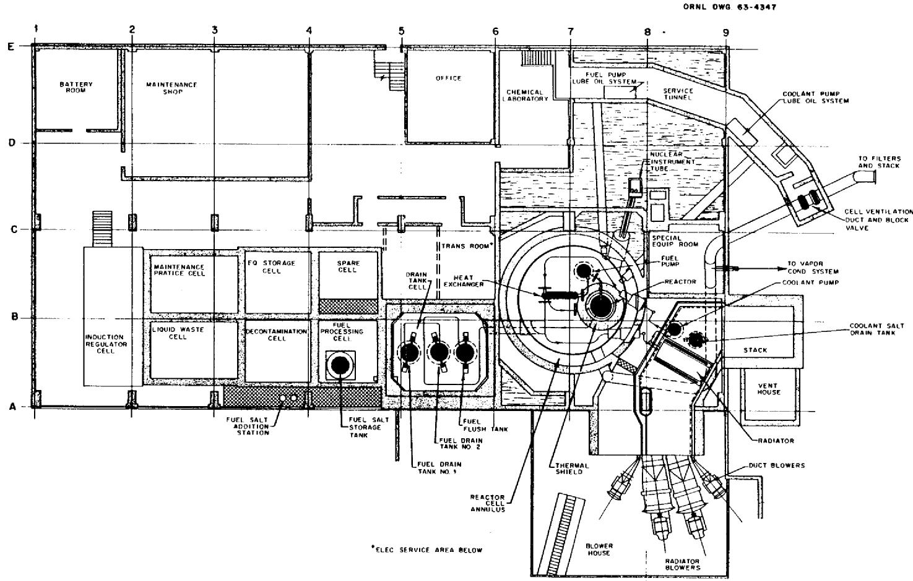  
Fig. 1. Basement level floor plan of Building 7503.

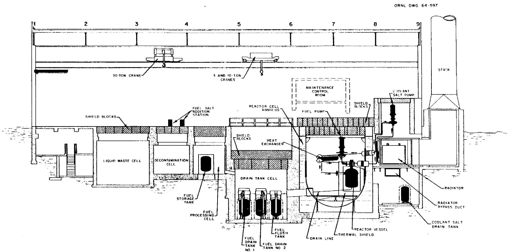  
MSRE PLANT LAYOUT, ELEVATION   
Fig. 2. Elevations view of Building 7503.

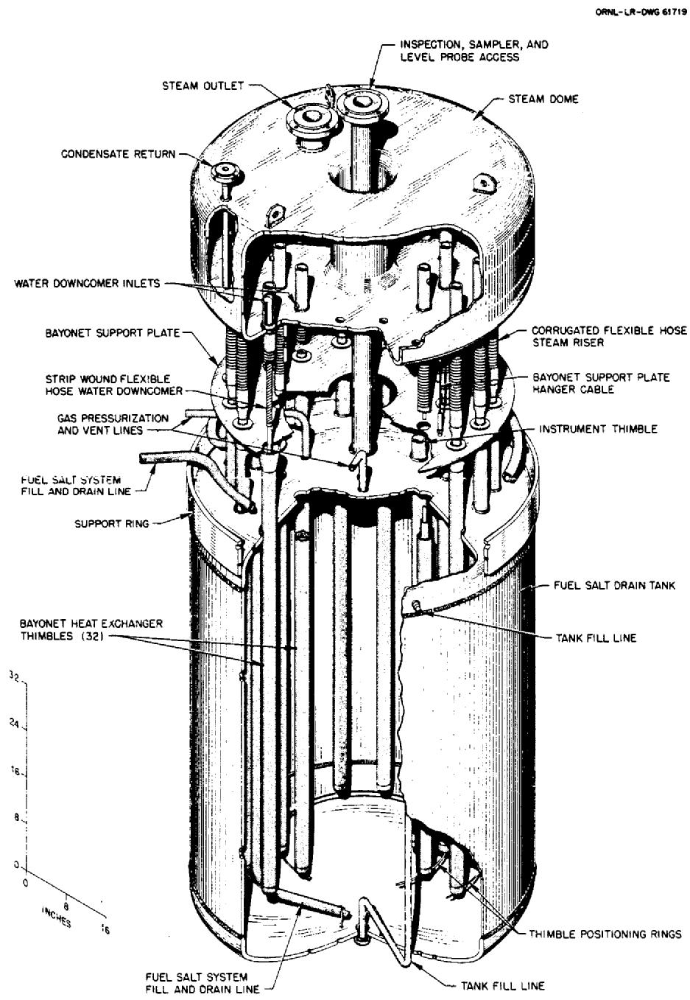  
MSR Primary Drain and Fill Tank   
Fig. 3. Fuel-salt drain tank.

Table 1. Composition and properties of INOR-8 (also known as Hastelloy N)   

<table><tr><td colspan="2">Chemical compositon, %</td></tr><tr><td>Ni</td><td>66-71</td></tr><tr><td>Mo</td><td>15-18</td></tr><tr><td>Cr</td><td>6-8</td></tr><tr><td>Fe, max</td><td>5</td></tr><tr><td>C</td><td>0.04-0.08</td></tr><tr><td>Ti + Al, max</td><td>0.5</td></tr><tr><td>S, max</td><td>0.02</td></tr><tr><td>Mn, max</td><td>1.0</td></tr><tr><td>Mn, max</td><td>1.0</td></tr><tr><td>Si, max</td><td>1.0</td></tr><tr><td>Cu, max</td><td>0.35</td></tr><tr><td>B, max</td><td>0.01</td></tr><tr><td>W, max</td><td>0.5</td></tr><tr><td>P, max</td><td>0.015</td></tr><tr><td>Co, max</td><td>0.2</td></tr><tr><td colspan="2">Physical properties:</td></tr><tr><td colspan="2">Density, lb/in.3</td></tr><tr><td colspan="2">Melting point, °F</td></tr><tr><td colspan="2">Thermal conductivity, Btu/(h·ft·°F)at 1300°F</td></tr><tr><td colspan="2">Modulus of elasticity at ~1300°F, psi</td></tr><tr><td colspan="2">Specific heat, Btu/lb·°F at 1300°F</td></tr><tr><td colspan="2">Mean coefficient of thermal expansion,70 to 1300°F range, in./in·°F</td></tr><tr><td colspan="2">Mechanical properties:</td></tr><tr><td colspan="2">Maximum allowable stress, a psi</td></tr><tr><td>1000°F</td><td>17,000</td></tr><tr><td>1100°F</td><td>13,000</td></tr><tr><td>1200°F</td><td>6,000</td></tr><tr><td>1300°F</td><td>3,500</td></tr></table>

aASME Boiler and Pressure Vessel Code, Case 1315.

and $743\mathrm{g}$ of plutonium (primarily Pu-239) are present in the drain tanks. Calculated fission product activities (mainly beta-gamma) of these salts, decayed to 1985, total about 32,000 Ci. The alpha activity from transuranic isotopes and their daughters amounts to about 2000 Ci. These isotopes are divided roughly $99\%$ in the fuel salt and $1\%$ in the flush salt. The total alpha activity of the fuel salt is very high, about 400,000 nCi/g, while that of the flush salt is about 6000 nCi/g. The total decay heat at present is about 200 W, with three-fourths coming from the beta-gamma component and the remainder from the alpha emissions. The compositions of the fuel, flush, and coolant salts are given in Table 2. The latter salt, which served as a secondary coolant, is not radioactive and is stored in the coolant cell. It is of interest primarily because it contains 338 kg of high-purity Li-7.

As expected, the radiation hazards associated with the stored fuel are significant. Gamma and neutron dose rates within the reactor and storage cells are in the $10^{3}$ rad/h range. Some of this radiation results from $(\alpha, n)$ reactions with the eutectic salt base. The high radiation field also causes the generation of some free fluorine, which slowly accumulates. Since recombination (with the metal simultaneously set free in the radiolysis) is accelerated by increased temperature, the salt is reheated periodically; however, it is not melted. The stored salts are in a stable, noncorrosive state, as dry frozen solids.

In addition to the stored fuel, the principal areas of concern at the MSRE are the reactor components and process equipment remaining in the below-grade containment cells. These components are internally contaminated and, in some cases, highly neutron activated. Exposure rates of up to $2200\mathrm{R / h}$ have been measured in the reactor vessel, attributed primarily to Co-60. The inventory of residual radioactive materials in the reactor and fuel processing cells is estimated to be several thousand curies, with the majority of that activity being associated with fission and activation products. The remaining cells, process piping, and associated operating areas are known to be slightly contaminated. The readily accessible areas of the reactor building (including the reactor bay and office areas) are generally uncontaminated and are being used for laboratory and office space, as well as for storage of various materials.

Table 2. Stored MSRE salts   

<table><tr><td></td><td>Fuel salt</td><td>Flush \( \text{salt}^{\text{a}} \)</td><td>Coolant \( \text{salt}^{\text{a}} \)</td></tr><tr><td>Total mass, kg</td><td>4650</td><td>4290</td><td>2610</td></tr><tr><td>Volume, ft3at room temperature</td><td>66.4</td><td>69.9</td><td>42.5</td></tr><tr><td>Density, g/cm3</td><td>2.47</td><td>2.17</td><td>2.17</td></tr><tr><td>Composition, mol %</td><td></td><td></td><td></td></tr><tr><td>LiF</td><td>64.5</td><td>\( 66^b \)</td><td>\( 66^b \)</td></tr><tr><td>BeF2</td><td>30.3</td><td>\( 34^b \)</td><td>\( 34^b \)</td></tr><tr><td>ZrF4</td><td>5.0</td><td>--</td><td>--</td></tr><tr><td>UF4</td><td>0.13</td><td>--</td><td>--</td></tr><tr><td>Uranium content, kg</td><td></td><td></td><td></td></tr><tr><td>U-232</td><td>c</td><td>c</td><td></td></tr><tr><td>U-233</td><td>30.82</td><td>0.19</td><td>--</td></tr><tr><td>U-234</td><td>2.74</td><td>0.02</td><td>--</td></tr><tr><td>U-235</td><td>0.85</td><td>0.09</td><td>--</td></tr><tr><td>U-236</td><td>0.04</td><td>0.00</td><td>--</td></tr><tr><td>U-238</td><td>2.01</td><td>0.19</td><td>--</td></tr><tr><td>Total</td><td>36.46</td><td>0.49</td><td></td></tr><tr><td>Plutonium content, g</td><td></td><td></td><td></td></tr><tr><td>Pu-239</td><td>657</td><td>13</td><td>--</td></tr><tr><td>Pu-240</td><td>69</td><td>2</td><td>--</td></tr><tr><td>Other Pu</td><td>2</td><td>0</td><td>--</td></tr><tr><td>Total</td><td>728</td><td>15</td><td>--</td></tr><tr><td>Lithium composition, %</td><td></td><td></td><td></td></tr><tr><td>Li-6</td><td>--</td><td>\( 0.009^d \)</td><td>0.009</td></tr><tr><td>Li-7</td><td>--</td><td>\( 99.991^d \)</td><td>99.991</td></tr></table>

${}^{a}$ Trace-element analyses of 39 batches used for both salts gave 16 ppm Cr, 39 ppm Ni, and 121 ppm Fe. Twelve other analyses of the flush salt gave 38, 22, and 118 ppm, respectively. (Note: Could the Cr and Ni have been interchanged?) In another series of 22 batches, the corresponding values were 19, 25, and 166 ppm.

bReported values. Analytical data for batches 116-161 gave 63 and $37\%$ , calculated from reported values of 12.95 wt % Li, 9.75 wt % Be, and 77.1 wt % F. For batches 101-130, the calculated composition was 64.3 and $35.7\%$ .

cPresent at 220 ppm, U-basis.

dFor batches 116-142. The values are 0.0065/99.9935 for batches 143-161.

The MSRE facility appears to be structurally sound and capable of retaining the current radionuclide inventory. No significant spread of contamination or personnel exposure has occurred since facility shutdown.

# 3.2 SURVEILLANCE AND MAINTENANCE

A comprehensive maintenance and surveillance program is provided to ensure adequate containment of the residual radioactivity at the MSRE.[11] Routine inspections of the containment systems and building services, radiological surveillance of operating areas and ventilation exhaust, stored-salt monitoring (temperature and pressure), and periodic testing of safety systems are performed as part of this program. In addition, the fuel and flush salt are reheated in order to allow recombination of fluorine, and the containment cells are subjected to a leak test, both on an annual basis. Facility maintenance includes general repairs, exhaust duct filter changes, and instrumentation and controls maintenance. Consolidation of the surveillance instrumentation and periodic heater and controls tests are planned as major improvements to the current program.

The salt storage cells have been under a planned program of regular surveillance and maintenance since the reactor was shut down in late 1969. This program includes daily observations of certain parameters by the Waste Control Operations Center and monthly observations by the Reactor Operations Group. The daily observations include measurements of internal cell temperature, building-air radioactivity, pressure differentials of the cell ventilation system, and stack off-gas radioactivity levels in terms of alpha, beta-gamma, and radioiodine. These observations are recorded on log sheets (the logs have been kept since 1969). The radioactivity data are now also computerized and coordinated through the central Waste Control Operations Center. A primary input point to the Center is located in the control room in 7503.

The monthly checklist involves a complete walk-through inspection of the entire facility plus recordings of in-cell temperatures and sump levels at seven locations. Any necessary maintenance items are noted and added to the list of work to be scheduled. (These logs have also been kept since 1969.)

On an annual basis, the three fuel and flush salt tanks are reheated to recombine any elemental fluorine that may have formed from radiolysis. The acceptable temperature range for the reheating is $>300^{\circ}\mathrm{F}$ (to ensure that the diffusion rate is fast enough) but $<500^{\circ}\mathrm{F}$ (well below the melting point of the salts). The reactor and drain tank cells are also leak-tested annually, and a check is made of about 40 equipment items. In addition, special checks are made of the ventilation system, two of the sump pumps, and the DOP efficiency of the ventilation filter.

During the course of this study, it became apparent that data on building groundwater were needed. Therefore, two additional items were added to the S&M procedures: a periodic check of the radioactivity of the building sump discharge, and a periodic check of the operating frequency of the building sump pump. The radioactivity measurements, which were initiated in June, have consistently shown no activity above background. The sump pump monitoring was started on August 19, and daily readings show an operating cycle of about $1\mathrm{h / d}$ . Rainfall during the period was greater than normal. The pump capacity is about 35 gal/min. These measurements will be continued for at least 1 year in order to establish a data base that covers one complete annual weather cycle.

# 3.3 PRIOR STUDIES

Decommissioning of the MSRE presents some unique problems because of the presence of the fuel and flush salts. Plans for site decommissioning will first have to address the issue of disposition of the fuel. In the early studies, it was generally assumed that the stored fuel would be removed from the MSRE cells, with or without reprocessing (fluorination) to strip out the uranium and some of the fission products, and then sent to a final repository or to retrievable storage; however, these operations are complex and potentially hazardous and, therefore, expensive.[13,15,16,18] Thus far, no need for the recoverable U-233 or for the cell space has been established. Therefore, there has been no incentive from that direction to proceed with decommissioning. Further, there is no known site that will accept the fluoride fuel salt for disposal in its present condition, either now or in the near future. Consequently, it appears

that the solidified salts must continue to be stored in their present mode and location, regardless of future possibilities, needs, or decisions. Fortunately, this is possible because the salts, their containment, and the facility are in excellent condition. However, it is essential to address two issues not directly considered in prior studies:

1. Is it rational to continue storing these salts in their present situation and, if so, what guidelines should be followed to enhance this storage in terms of safety and stability for an extended period of time?   
2. What other options exist for the future, and what steps should be taken in the near term to facilitate future decision-making?

This study gives an affirmative answer to the first question and identifies specific areas where improvements should be made. It also pinpoints needs that should be addressed in the short term to provide necessary information for future selection among available options. Finally, a preliminary work plan is outlined to achieve the above objectives.

# 3.4 OPTIONS

Prior studies of MSRE decommissioning have focused on the final disposition of both the salts and the facility. Selection among options involved many possible decision points, including the following:

A. Should the salt be chemically processed to separate the uranium (and some fission products) from the bulk of the fluoride salts?   
B. Should the fluoride salts be chemically converted to another form?   
C. Should the salts (with or without processing and/or conversion) be packaged and sent to an off-site repository or an on-site storage/disposal area, or should they be disposed of in the MSRE facility itself?   
D. Should the MSRE facility be totally or partially dismantled and portions of it entombed in concrete?

At present, there is no firm basis for selecting among these options. Options A or B, if exercised, would require sophisticated chemical processing of highly radioactive materials; new flowsheets and

processing equipment would also be needed (and the equipment would ultimately have to be disposed of). The total cost of processing might be as high as $10 to $20 million. No choice can be exercised on option (C) at this time because there is no off-site or on-site location that can accept this material at present, and we do not have an adequate basis at present to recommend permanent disposal in the MSRE facility itself. Option D could cost as much as $10 million and requires a prior decision on options A, B, and C.

In short, we need to defer a final decision. Continued storage of the fuel and flush salts is forced upon us by external conditions. The issues of concern, then, revolve around three questions that need to be considered:

1. Is is reasonable and safe to plan continued storage-in-place for up to 20 years or so?   
2. Before deliberately embarking on such extended storage, what, if anything, should be done to enhance the storage environment?   
3. During this storage period, or prior to it, what should be done to facilitate a future decision of a final nature?

In order to gain a sense of perspective, it is instructive to define a range of options and systematically evaluate them against various criteria. The six options that have been treated this way as part of the evaluation are listed and defined in Table 3. (Option 0, which is essentially to continue the present practice, is not acceptable for an extended period of time.) Options 1, 2, and 3 focus on the final decision and bracket a wide range of possibilities; this provides a broad, long-term perspective. Options 4, 5, and 6 focus on three variations of enhanced storage-in-place in order to bring short-term and near-term needs into view. The steps used for assessing each option are as follows:

1. List the process operations involved and compare them qualitatively.   
2. Evaluate them semiquantitatively on the bases of (a) process readiness, (b) economics, (c) short-term hazard, (d) long-term hazard, and (e) conservation (i.e., beneficial utilization of the buildings and contained materials).

Table 3. Options for the Decontamination and Decommissioning of the MSRE   

<table><tr><td>Option</td><td>Action to Be Taken</td></tr><tr><td>0</td><td>Continue as is, with no decision. Requires continued surveillance and maintenance, introduces maximum uncertainty, and eventually still needs a decision between the &quot;real&quot; options outlined below.</td></tr><tr><td>1</td><td>Complete dismantlement of hot cells following removal of fuel and flush salts.</td></tr><tr><td>2</td><td>Entombment of reactor and drain tank cells following removal of fuel and flush salts.</td></tr><tr><td>3</td><td>Entombment of reactor and drain tank cells, with fuel and flush salts in-place.</td></tr><tr><td>4</td><td>Enhanced near-term storage of solidified salts (which still leaves all other options available).</td></tr><tr><td>5</td><td>Enhanced storage in-place, including remelt and addition of getters (which still leaves options 1, 2, 3, and 6 available).</td></tr><tr><td>6</td><td>Enhanced storage in-place, including remelt, addition of getters, and repackaging (which still leaves options 1, 2, and 3 available).</td></tr></table>

# 3. Identify the limiting factor(s).

Of necessity, these evaluations are subjective and only semiquantitative at this stage.

The first evaluation (Table 4) lists the major process steps that would be required for the various options and indicates which steps are required in each case. The steps were defined in such a way that each represents a more-or-less equivalent effort or cost. Evaluation then simply requires counting the number of steps for the particular option in question. Clearly, from this point of view, options 1 and 2 are prohibitively complex (and costly) and would not be selected unless there were an overriding reason for doing so.

The second evaluation involves "scoring" each option for every applicable process step, as identified in Table 4. These results are tabulated in Appendix B. Scoring, which was done on five different bases, was set up so that a low score is more favorable than a high score. The available scoring ranges were selected to balance the relative importance of each of the five factors, on the assumption that near-term hazard, long-term hazard, and conservation were each about twice as important as either process readiness or economics. Scores for each criterion, as well as totals, are summarized in Table 5. The totals were converted to a more normal scale of 0 to 100, with a high score more favorable, by taking reciprocals of each total and then normalizing by dividing by the largest value (the 0.0161) and multiplying by 100. On this basis, Options 3, 4, and 5 are distinctly superior to Options 1, 2, and 6.

The third evaluation (Table 6) identifies limiting factors that would disqualify an option from further consideration at present. While this evaluation is the least quantitative, it is, nonetheless, highly significant because it seeks to identify controlling factors. The limiting factors are those which, if not within an acceptable range, would eliminate that option no matter how favorable the other aspects might be. Thus, in terms of the five criteria already established, Options 1 and 2 should not be considered further at this time. When two additional criteria were introduced, based on anticipated public reaction and on reversibility regarding future choice of options; Option 3 was also removed from consideration.

Table 4. Process steps required for MSRE options   

<table><tr><td rowspan="2">Process step</td><td colspan="6">Option</td></tr><tr><td>1</td><td>2</td><td>3</td><td>4</td><td>5</td><td>6</td></tr><tr><td>Melt salts (and add getters)</td><td>X</td><td>X</td><td>-</td><td>-</td><td>X</td><td>X</td></tr><tr><td>Remove salts</td><td>X</td><td>X</td><td>-</td><td>-</td><td>-</td><td>X</td></tr><tr><td>Build salt process facility</td><td>X</td><td>X</td><td>-</td><td>-</td><td>-</td><td>-</td></tr><tr><td>Process or convert salts/U</td><td>X</td><td>X</td><td>-</td><td>-</td><td>-</td><td>-</td></tr><tr><td>Package salts (and U)</td><td>X</td><td>X</td><td>-</td><td>-</td><td>-</td><td>X</td></tr><tr><td>Dismantle/dispose of facility</td><td>X</td><td>X</td><td>-</td><td>-</td><td>-</td><td>-</td></tr><tr><td>Transport packaged products</td><td>X</td><td>X</td><td>-</td><td>-</td><td>-</td><td>-</td></tr><tr><td>Store/isolate products</td><td>X</td><td>X</td><td>-</td><td>-</td><td>-</td><td>-</td></tr><tr><td>Decontaminate cells/equipment</td><td>X</td><td>-</td><td>-</td><td>-</td><td>-</td><td>-</td></tr><tr><td>Dispose of liquid LLW</td><td>X</td><td>-</td><td>-</td><td>-</td><td>-</td><td>-</td></tr><tr><td>Remove equipment</td><td>X</td><td>-</td><td>-</td><td>-</td><td>-</td><td>-</td></tr><tr><td>Dispose of solid LLW</td><td>X</td><td>-</td><td>-</td><td>-</td><td>-</td><td>-</td></tr><tr><td>Dismantle cell structure</td><td>X</td><td>-</td><td>-</td><td>-</td><td>-</td><td>-</td></tr><tr><td>Dispose of solid LLW/rubble</td><td>X</td><td>-</td><td>-</td><td>-</td><td>-</td><td>-</td></tr><tr><td>Restore area</td><td>X</td><td>-</td><td>-</td><td>-</td><td>-</td><td>-</td></tr><tr><td>Seal pipes/penetrations</td><td>-</td><td>X</td><td>X</td><td>X</td><td>X</td><td>X</td></tr><tr><td>Internal entombment</td><td>-</td><td>X</td><td>X</td><td>-</td><td>-</td><td>-</td></tr><tr><td>External structures</td><td>-</td><td>X</td><td>X</td><td>-</td><td>-</td><td>-</td></tr><tr><td>Stabilize drain-tank cell</td><td>-</td><td>-</td><td>-</td><td>X</td><td>X</td><td>X</td></tr><tr><td>Continue surveillance</td><td>-</td><td>-</td><td>-</td><td>X</td><td>X</td><td>X</td></tr><tr><td>Number of more-or-less equal process steps involved</td><td>15</td><td>11</td><td>3</td><td>3</td><td>4</td><td>6</td></tr></table>

Table 5. Summary of semiquantitative evaluation   

<table><tr><td rowspan="2">Factor</td><td colspan="6">Option</td></tr><tr><td>1</td><td>2</td><td>3</td><td>4</td><td>5</td><td>6</td></tr><tr><td>A. Process readiness</td><td>47</td><td>41</td><td>15</td><td>15</td><td>19</td><td>23</td></tr><tr><td>B. Economics</td><td>54</td><td>47</td><td>15</td><td>15</td><td>20</td><td>28</td></tr><tr><td>C. Near-term hazard</td><td>66</td><td>47</td><td>14</td><td>16</td><td>21</td><td>31</td></tr><tr><td>D. Long-term hazard</td><td>4</td><td>6</td><td>12</td><td>17</td><td>12</td><td>10</td></tr><tr><td>E. Conservation</td><td>14</td><td>6</td><td>6</td><td>6</td><td>6</td><td>6</td></tr><tr><td>Total</td><td>185</td><td>147</td><td>62</td><td>69</td><td>78</td><td>98</td></tr><tr><td>Reciprocal</td><td>0.0054</td><td>0.0068</td><td>0.0161</td><td>0.0145</td><td>0.0128</td><td>0.0102</td></tr><tr><td>Normalized</td><td>34</td><td>42</td><td>100</td><td>90</td><td>80</td><td>63</td></tr></table>

Table 6. Limiting factors for MSRE options   

<table><tr><td>Factor</td><td>1</td><td>2</td><td>3</td><td>4</td><td>5</td><td>6</td></tr><tr><td colspan="7">A. Process readiness</td></tr><tr><td>Decision nowa</td><td>XXX</td><td>XXX</td><td></td><td></td><td></td><td></td></tr><tr><td>Decision in 5-20 years</td><td>???</td><td>???</td><td></td><td></td><td></td><td></td></tr><tr><td>B. Economics</td><td>XXX</td><td>XXX</td><td></td><td></td><td></td><td></td></tr><tr><td>C. Near-term hazard</td><td>XXX</td><td>XXX</td><td></td><td></td><td></td><td></td></tr><tr><td>D. Long-term hazard Minimal for all options</td><td></td><td></td><td></td><td></td><td></td><td></td></tr><tr><td>E. Conservation</td><td>XXX</td><td></td><td></td><td></td><td></td><td></td></tr><tr><td>F. Institutional perception of anticipated public reaction Decision now Decision in 5-20 yearsb</td><td></td><td></td><td>XXX ???</td><td></td><td></td><td></td></tr><tr><td>G. Reversibility/future choice of options</td><td>XXX</td><td>XXX</td><td>XXX</td><td></td><td></td><td></td></tr></table>

aThere is no identified location at this time where the removed salts could be taken.   
bPublic reaction may become more rational with time, or institutional leaders may regain public confidence.

The results of all three evaluations are consolidated in Table 7. In summary, in terms of these three evaluations, and at this time:

1. Options 1 and 2 are rejected on the basis of each evaluation.   
2. Option 3 is rejected, based on limiting factors but recognizing that public reaction may change in future years, and that lack of reversibility may not be detrimental when judged against more definitive criteria.   
3. Option 6 deserves further consideration based on the semiquantitative evaluation.

This leaves Options 4 and 5, and possibly Option 6, available for short-term selection. These options are addressed in Sects. 4 and 5. Some topics relevant to the other options are also addressed; however, much of the information presented is of broad and general applicability, and is germane to all options.

Table 7. Options and evaluations for decontamination and decommissioning   

<table><tr><td rowspan="2">Option</td><td rowspan="2">Description</td><td colspan="3">Scorea</td></tr><tr><td>Ab</td><td>Bc</td><td>Cd</td></tr><tr><td>0</td><td>Continue as is, with no decision. Requires continued surveillance and maintenance, introduces maximum uncertainty, and eventually still needs a decision between the &quot;real&quot; options outlined below.</td><td></td><td></td><td></td></tr><tr><td>1</td><td>Removal of fuel and flush salts; complete dismantlement of hot cells.</td><td>15</td><td>185</td><td>5</td></tr><tr><td>2</td><td>Removal of fuel and flush salts; entombment of reactor and drain tank cells.</td><td>11</td><td>147</td><td>4</td></tr><tr><td>3</td><td>Entombment of drain tank cell, with fuel and flush salts in-place.</td><td>3</td><td>62</td><td>2</td></tr><tr><td>4</td><td>Enhanced near-term storage of solidified salts (which still leaves all other options available).</td><td>3</td><td>69</td><td>0</td></tr><tr><td>5</td><td>Enhanced storage in-place, including remelt and addition of getters (which still leaves Options 1, 2, 3, and 6 available).</td><td>4</td><td>78</td><td>0</td></tr><tr><td>6</td><td>Enhanced storage in-place, including remelt, addition of getters, and repackaging (which still leaves Options 1, 2, and 3 available).</td><td>6</td><td>98</td><td>0</td></tr></table>

${}^{a}$ In all cases, a low score is superior.   
bNumber of process steps involved.   
Semiquantitative rating of process steps.   
dNumber of limiting factors.

# 4. PROJECTIONS

# 4.1 RADIOACTIVITY

The original decay calculations, made using ORIGEN and MSRE-specific input data, were truncated at 5 years.9 Subsequently, these data have been extrapolated to the year 2000.16 However, any decisions regarding permanent emplacement require decay data out to a million years, as well as a detailed knowledge of radiological properties in the 10- to 10,000-year time span. Ideally, the entire calculation (generation and depletion) should be repeated using ORIGEN2, the updated and improved version of ORIGEN. However, ORIGEN2 does not have a molten salt reactor model, and construction of such a model would be prohibitively expensive. Therefore, the approach was to take the old ORIGEN output data at discharge and then make the decay calculations with ORIGEN2. When these two sets of data at 5 years after discharge were cross-checked, only inconsequential or readily explainable differences were noted. This gives us confidence in using the ORIGEN-generated results as our starting point.

The truncated ORIGEN data were presented in four groupings: fission products in both grams and curies, and actinides in both grams and curies. At least one activation product (Zr-93, from the fluoride salt mixture) was included in the old ORIGEN runs. The two sets of lists (grams and curies) were generally mutually exclusive; that is, isotopes listed on the grams output (because they were present in a quantity greater than $0.1\%$ of the total mass) were generally not included on the curies output (where they appeared if contributing greater than $0.1\%$ of the total radioactivity). By combining these two sets of lists, we believe that the input data for our ORIGEN2 calculations were acceptably complete.

The summary results are given in Tables 8 through 11 (fission products and actinides; grams and curies) for these times:

Table 8. ORIGEN2 output for MSRE salts: grams of fission products and daughters   

<table><tr><td rowspan="2"></td><td colspan="8">SUMMARY TABLE: CONCENTRATIONS, GRAMSENTIRE CORE (MSRE WITH U-233 FUEL)</td></tr><tr><td>DISCHARGE</td><td>1.0YR</td><td>10.0YR</td><td>100.0YR</td><td>1.0KY</td><td>10.0KY</td><td>100.0KY</td><td>1.0MY</td></tr><tr><td>ER 87</td><td>8.480E+00</td><td>8.480E+00</td><td>8.480E+00</td><td>8.480E+00</td><td>8.480E+00</td><td>8.480E+00</td><td>8.480E+00</td><td>8.480E+00</td></tr><tr><td>SR 88</td><td>5.640E+00</td><td>5.640E+00</td><td>5.640E+00</td><td>5.640E+00</td><td>5.640E+00</td><td>5.640E+00</td><td>5.640E+00</td><td>5.640E+00</td></tr><tr><td>SR 89</td><td>5.573E+00</td><td>3.705E-02</td><td>9.390E-22</td><td>0.0</td><td>0.0</td><td>0.0</td><td>0.0</td><td>0.0</td></tr><tr><td>SR 90</td><td>9.893E+01</td><td>9.660E+01</td><td>7.798E+01</td><td>9.154E+00</td><td>4.552E-09</td><td>0.0</td><td>0.0</td><td>0.0</td></tr><tr><td>Y 89</td><td>6.660E+01</td><td>7.214E+01</td><td>7.217E+01</td><td>7.217E+01</td><td>7.217E+01</td><td>7.217E+01</td><td>7.217E+01</td><td>7.217E+01</td></tr><tr><td>Y 91</td><td>7.458E+00</td><td>9.846E-02</td><td>1.201E-18</td><td>0.0</td><td>0.0</td><td>0.0</td><td>0.0</td><td>0.0</td></tr><tr><td>ZR 90</td><td>4.440E+00</td><td>6.768E+00</td><td>2.540E+01</td><td>9.424E+01</td><td>1.034E+02</td><td>1.034E+02</td><td>1.034E+02</td><td>1.034E+02</td></tr><tr><td>ZR 91</td><td>9.730E+01</td><td>1.047E+02</td><td>1.048E+02</td><td>1.048E+02</td><td>1.048E+02</td><td>1.048E+02</td><td>1.048E+02</td><td>1.048E+02</td></tr><tr><td>ZR 92</td><td>1.100E+02</td><td>1.100E+02</td><td>1.100E+02</td><td>1.100E+02</td><td>1.100E+02</td><td>1.100E+02</td><td>1.100E+02</td><td>1.100E+02</td></tr><tr><td>ZR 93</td><td>1.190E+02</td><td>1.190E+02</td><td>1.190E+02</td><td>1.190E+02</td><td>1.189E+02</td><td>1.185E+02</td><td>1.137E+02</td><td>7.564E+01</td></tr><tr><td>ZR 94</td><td>1.180E+02</td><td>1.180E+02</td><td>1.180E+02</td><td>1.180E+02</td><td>1.180E+02</td><td>1.180E+02</td><td>1.180E+02</td><td>1.180E+02</td></tr><tr><td>ZR 95</td><td>9.306E+00</td><td>1.779E-01</td><td>6.080E-17</td><td>0.0</td><td>0.0</td><td>0.0</td><td>0.0</td><td>0.0</td></tr><tr><td>ZR 96</td><td>1.140E+02</td><td>1.140E+02</td><td>1.140E+02</td><td>1.140E+02</td><td>1.140E+02</td><td>1.140E+02</td><td>1.140E+02</td><td>1.140E+02</td></tr><tr><td>NB 93</td><td>0.0</td><td>3.979E-06</td><td>1.379E-04</td><td>4.393E-03</td><td>5.290E-02</td><td>5.369E-01</td><td>5.270E+00</td><td>4.335E+01</td></tr><tr><td>NB 95</td><td>4.397E+00</td><td>2.194E-01</td><td>7.416E-17</td><td>0.0</td><td>0.0</td><td>0.0</td><td>0.0</td><td>0.0</td></tr><tr><td>MO 95</td><td>2.440E+01</td><td>3.772E+01</td><td>3.812E+01</td><td>3.812E+01</td><td>3.812E+01</td><td>3.812E+01</td><td>3.812E+01</td><td>3.812E+01</td></tr><tr><td>MO 97</td><td>3.250E+01</td><td>3.250E+01</td><td>3.250E+01</td><td>3.250E+01</td><td>3.250E+01</td><td>3.250E+01</td><td>3.250E+01</td><td>3.250E+01</td></tr><tr><td>MO 98</td><td>3.160E+01</td><td>3.160E+01</td><td>3.160E+01</td><td>3.160E+01</td><td>3.160E+01</td><td>3.160E+01</td><td>3.160E+01</td><td>3.160E+01</td></tr><tr><td>MO100</td><td>2.850E+01</td><td>2.850E+01</td><td>2.850E+01</td><td>2.850E+01</td><td>2.850E+01</td><td>2.850E+01</td><td>2.850E+01</td><td>2.850E+01</td></tr><tr><td>TC 99</td><td>2.930E+01</td><td>2.980E+01</td><td>2.980E+01</td><td>2.979E+01</td><td>2.979E+01</td><td>2.885E+01</td><td>2.152E+01</td><td>1.151E+00</td></tr><tr><td>RU 99</td><td>0.0</td><td>9.697E-05</td><td>9.697E-04</td><td>9.696E-03</td><td>9.681E-02</td><td>9.541E-01</td><td>8.277E+00</td><td>2.865E+01</td></tr><tr><td>RU101</td><td>1.950E+01</td><td>1.950E+01</td><td>1.950E+01</td><td>1.950E+01</td><td>1.950E+01</td><td>1.950E+01</td><td>1.950E+01</td><td>1.950E+01</td></tr><tr><td>RU102</td><td>1.560E+01</td><td>1.560E+01</td><td>1.560E+01</td><td>1.560E+01</td><td>1.560E+01</td><td>1.560E+01</td><td>1.560E+01</td><td>1.560E+01</td></tr><tr><td>RU103</td><td>2.292E+00</td><td>3.659E-03</td><td>2.357E-28</td><td>0.0</td><td>0.0</td><td>0.0</td><td>0.0</td><td>0.0</td></tr><tr><td>RU104</td><td>7.880E+00</td><td>7.880E+00</td><td>7.880E+00</td><td>7.880E+00</td><td>7.880E+00</td><td>7.880E+00</td><td>7.880E+00</td><td>7.880E+00</td></tr><tr><td>RU106</td><td>2.238E+00</td><td>1.125E+00</td><td>2.309E-03</td><td>3.06OE-30</td><td>0.0</td><td>0.0</td><td>0.0</td><td>0.0</td></tr><tr><td>RH103</td><td>5.070E+01</td><td>5.299E+01</td><td>5.299E+01</td><td>5.299E+01</td><td>5.299E+01</td><td>5.299E+01</td><td>5.299E+01</td><td>5.299E+01</td></tr><tr><td>PD105</td><td>1.820E+01</td><td>1.820E+01</td><td>1.820E+01</td><td>1.820E+01</td><td>1.820E+01</td><td>1.820E+01</td><td>1.820E+01</td><td>1.820E+01</td></tr><tr><td>PD106</td><td>4.610E+00</td><td>5.723E+00</td><td>6.846E+00</td><td>6.848E+00</td><td>6.848E+00</td><td>6.848E+00</td><td>6.848E+00</td><td>6.848E+00</td></tr><tr><td>PD107</td><td>5.640E+00</td><td>5.640E+00</td><td>5.640E+00</td><td>5.640E+00</td><td>5.639E+00</td><td>5.634E+00</td><td>5.580E+00</td><td>5.069E+00</td></tr><tr><td>AG107</td><td>0.0</td><td>6.018E-07</td><td>6.018E-06</td><td>6.018E-05</td><td>6.018E-04</td><td>6.015E-03</td><td>5.986E-02</td><td>5.708E-01</td></tr><tr><td>SB125</td><td>6.176E-01</td><td>4.809E-01</td><td>5.057E-02</td><td>8.368E-12</td><td>0.0</td><td>0.0</td><td>0.0</td><td>0.0</td></tr><tr><td>TE125</td><td>0.0</td><td>1.404E-01</td><td>5.767E-01</td><td>6.280E-01</td><td>6.280E-01</td><td>6.280E-01</td><td>6.280E-01</td><td>6.280E-01</td></tr><tr><td>TE127M</td><td>4.175E-01</td><td>4.092E-02</td><td>3.418E-11</td><td>0.0</td><td>0.0</td><td>0.0</td><td>0.0</td><td>0.0</td></tr><tr><td>TE128</td><td>9.460E+00</td><td>9.460E+00</td><td>9.460E+00</td><td>9.460E+00</td><td>9.460E+00</td><td>9.460E+00</td><td>9.460E+00</td><td>9.460E+00</td></tr><tr><td>TE129M</td><td>8.859E-01</td><td>4.731E-04</td><td>1.673E-33</td><td>0.0</td><td>0.0</td><td>0.0</td><td>0.0</td><td>0.0</td></tr><tr><td>TE130</td><td>2.090E+01</td><td>2.090E+01</td><td>2.090E+01</td><td>2.090E+01</td><td>2.090E+01</td><td>2.090E+01</td><td>2.090E+01</td><td>2.090E+01</td></tr><tr><td>I127</td><td>0.0</td><td>3.889E-01</td><td>4.299E-01</td><td>4.299E-01</td><td>4.299E-01</td><td>4.299E-01</td><td>4.299E-01</td><td>4.299E-01</td></tr><tr><td>I129</td><td>1.490E+01</td><td>1.579E+01</td><td>1.579E+01</td><td>1.579E+01</td><td>1.578E+01</td><td>1.572E+01</td><td>1.571E+01</td><td>1.571E+01</td></tr><tr><td>XE129</td><td>0.0</td><td>6.972E-07</td><td>6.972E-06</td><td>6.972E-05</td><td>6.972E-04</td><td>6.971E-03</td><td>6.957E-02</td><td>6.821E-01</td></tr><tr><td>CS137</td><td>1.287E+02</td><td>1.258E+02</td><td>1.021E+02</td><td>1.277E+01</td><td>1.188E-08</td><td>0.0</td><td>0.0</td><td>0.0</td></tr><tr><td>BA137</td><td>5.560E+00</td><td>8.500E+00</td><td>3.211E+01</td><td>1.215E+02</td><td>1.343E+02</td><td>1.343E+02</td><td>1.343E+02</td><td>1.343E+02</td></tr><tr><td>BA138</td><td>7.440E+01</td><td>7.440E+01</td><td>7.440E+01</td><td>7.440E+01</td><td>7.440E+01</td><td>7.440E+01</td><td>7.440E+01</td><td>7.440E+01</td></tr><tr><td>LA139</td><td>1.700E+02</td><td>1.700E+02</td><td>1.700E+02</td><td>1.700E+02</td><td>1.700E+02</td><td>1.700E+02</td><td>1.700E+02</td><td>1.700E+02</td></tr><tr><td>CE140</td><td>1.890E+02</td><td>1.890E+02</td><td>1.890E+02</td><td>1.890E+02</td><td>1.890E+02</td><td>1.890E+02</td><td>1.890E+02</td><td>1.890E+02</td></tr><tr><td>CE141</td><td>1.439E+01</td><td>5.972E-03</td><td>2.183E-33</td><td>0.0</td><td>0.0</td><td>0.0</td><td>0.0</td><td>0.0</td></tr><tr><td>CE142</td><td>1.730E+02</td><td>1.730E+02</td><td>1.730E+02</td><td>1.730E+02</td><td>1.730E+02</td><td>1.730E+02</td><td>1.730E+02</td><td>1.730E+02</td></tr><tr><td>CE144</td><td>3.979E+01</td><td>1.633E+01</td><td>5.395E-03</td><td>8.319E-38</td><td>0.0</td><td>0.0</td><td>0.0</td><td>0.0</td></tr><tr><td>PE141</td><td>1.700E+02</td><td>1.844E+02</td><td>1.844E+02</td><td>1.844E+02</td><td>1.844E+02</td><td>1.844E+02</td><td>1.844E+02</td><td>1.844E+02</td></tr><tr><td>ND143</td><td>1.670E+02</td><td>1.670E+02</td><td>1.670E+02</td><td>1.670E+02</td><td>1.670E+02</td><td>1.670E+02</td><td>1.670E+02</td><td>1.670E+02</td></tr><tr><td>ND144</td><td>1.130E+02</td><td>1.365E+02</td><td>1.528E+02</td><td>1.528E+02</td><td>1.528E+02</td><td>1.528E+02</td><td>1.528E+02</td><td>1.528E+02</td></tr><tr><td>ND145</td><td>1.070E+02</td><td>1.070E+02</td><td>1.070E+02</td><td>1.070E+02</td><td>1.070E+02</td><td>1.070E+02</td><td>1.070E+02</td><td>1.070E+02</td></tr><tr><td>ND146</td><td>8.410E+01</td><td>8.410E+01</td><td>8.410E+01</td><td>8.410E+01</td><td>8.410E+01</td><td>8.410E+01</td><td>8.410E+01</td><td>8.410E+01</td></tr><tr><td>ND148</td><td>4.630E+01</td><td>4.630E+01</td><td>4.630E+01</td><td>4.630E+01</td><td>4.630E+01</td><td>4.630E+01</td><td>4.630E+01</td><td>4.630E+01</td></tr><tr><td>ND150</td><td>1.900E+01</td><td>1.900E+01</td><td>1.900E+01</td><td>1.900E+01</td><td>1.900E+01</td><td>1.900E+01</td><td>1.900E+01</td><td>1.900E+01</td></tr><tr><td>PM147</td><td>4.011E+01</td><td>3.080E+01</td><td>2.856E+00</td><td>1.345E-10</td><td>0.0</td><td>0.0</td><td>0.0</td><td>0.0</td></tr><tr><td>PM148M</td><td>4.912E-02</td><td>1.069E-04</td><td>1.166E-28</td><td>0.0</td><td>0.0</td><td>0.0</td><td>0.0</td><td>0.0</td></tr><tr><td>SM147</td><td>2.390E+01</td><td>3.321E+01</td><td>6.115E+01</td><td>6.401E+01</td><td>6.401E+01</td><td>6.401E+01</td><td>6.401E+01</td><td>6.401E+01</td></tr><tr><td>SM148</td><td>0.0</td><td>4.901E-02</td><td>4.912E-02</td><td>4.912E-02</td><td>4.912E-02</td><td>4.912E-02</td><td>4.912E-02</td><td>4.912E-02</td></tr><tr><td>SM150</td><td>2.710E+01</td><td>2.710E+01</td><td>2.710E+01</td><td>2.710E+01</td><td>2.710E+01</td><td>2.710E+01</td><td>2.710E+01</td><td>2.710E+01</td></tr><tr><td>SM151</td><td>5.585E+00</td><td>5.542E+00</td><td>5.171E+00</td><td>2.585E+00</td><td>2.524E-03</td><td>1.982E-33</td><td>0.0</td><td>0.0</td></tr><tr><td>SM152</td><td>1.460E+01</td><td>1.460E+01</td><td>1.461E+01</td><td>1.462E+01</td><td>1.462E+01</td><td>1.462E+01</td><td>1.462E+01</td><td>1.462E+01</td></tr><tr><td>EU151</td><td>0.0</td><td>4.285E-02</td><td>4.140E-01</td><td>3.000E+00</td><td>5.582E+00</td><td>5.585E+00</td><td>5.585E+00</td><td>5.585E+00</td></tr><tr><td>EU152</td><td>3.110E-02</td><td>2.955E-02</td><td>1.868E-02</td><td>1.903E-04</td><td>2.286E-24</td><td>0.0</td><td>0.0</td><td>0.0</td></tr><tr><td>EU153</td><td>5.450E+00</td><td>5.450E+00</td><td>5.450E+00</td><td>5.450E+00</td><td>5.450E+00</td><td>5.450E+00</td><td>5.450E+00</td><td>5.450E+00</td></tr><tr><td>EU154</td><td>1.303E-01</td><td>1.202E-01</td><td>5.820E-02</td><td>4.118E-05</td><td>1.294E-36</td><td>0.0</td><td>0.0</td><td>0.0</td></tr><tr><td>EU155</td><td>7.629E-01</td><td>6.634E-01</td><td>1.886E-01</td><td>6.453E-07</td><td>0.0</td><td>0.0</td><td>0.0</td><td>0.0</td></tr><tr><td>GD154</td><td>0.0</td><td>1.009E-02</td><td>7.210E-02</td><td>1.303E-01</td><td>1.303E-01</td><td>1.303E-01</td><td>1.303E-01</td><td>1.303E-01</td></tr><tr><td>GD155</td><td>0.0</td><td>9.951E-02</td><td>5.743E-01</td><td>7.629E-01</td><td>7.629E-01</td><td>7.629E-01</td><td>7.629E-01</td><td>7.629E-01</td></tr><tr><td>SUMTOT</td><td>2.709E+03</td><td>2.709E+03</td><td>2.709E+03</td><td>2.709E+03</td><td>2.709E+03</td><td>2.709E+03</td><td>2.709E+03</td><td>2.709E+03</td></tr><tr><td>TOTAL</td><td>2.709E+03</td><td>2.709E+03</td><td>2.709E+03</td><td>2.709E+03</td><td>2.709E+03</td><td>2.709E+03</td><td>2.709E+03</td><td>2.709E+03</td></tr></table>

Table 9. ORIGEN2 output for MSRE salts: curies of fission products and daughters   

<table><tr><td rowspan="2"></td><td colspan="8">SUMMARY TABLE: RADIOACTIVITY, CURIES ENTIRE CORE (MSRE WITH U-233 FUEL)</td></tr><tr><td>DISCHARGE</td><td>1.0YR</td><td>10.0YR</td><td>100.0YR</td><td>1.0KY</td><td>10.0KY</td><td>100.0KY</td><td>1.0MY</td></tr><tr><td>SR 89</td><td>1.620E+05</td><td>1.077E+03</td><td>2.729E-17</td><td>0.0</td><td>0.0</td><td>0.0</td><td>0.0</td><td>0.0</td></tr><tr><td>SR 90</td><td>1.350E+04</td><td>1.318E+04</td><td>1.064E+04</td><td>1.249E+03</td><td>6.212E-07</td><td>0.0</td><td>0.0</td><td>0.0</td></tr><tr><td>Y 90</td><td>1.360E+04</td><td>1.319E+04</td><td>1.064E+04</td><td>1.249E+03</td><td>6.214E-07</td><td>0.0</td><td>0.0</td><td>0.0</td></tr><tr><td>Y 91</td><td>1.830E+05</td><td>2.416E+03</td><td>2.948E-14</td><td>0.0</td><td>0.0</td><td>0.0</td><td>0.0</td><td>0.0</td></tr><tr><td>ZR 93</td><td>2.991E-01</td><td>2.991E-01</td><td>2.991E-01</td><td>2.991E-01</td><td>2.990E-01</td><td>2.978E-01</td><td>2.859E-01</td><td>1.901E-01</td></tr><tr><td>ZR 95</td><td>2.000E+05</td><td>3.824E+03</td><td>1.307E-12</td><td>0.0</td><td>0.0</td><td>0.0</td><td>0.0</td><td>0.0</td></tr><tr><td>NB 93M</td><td>0.0</td><td>1.412E-02</td><td>1.135E-01</td><td>2.824E-01</td><td>2.840E-01</td><td>2.829E-01</td><td>2.716E-01</td><td>1.806E-01</td></tr><tr><td>NB 95</td><td>1.720E+05</td><td>8.584E+03</td><td>2.901E-12</td><td>0.0</td><td>0.0</td><td>0.0</td><td>0.0</td><td>0.0</td></tr><tr><td>NE 95M</td><td>4.149E+03</td><td>2.837E+01</td><td>9.694E-15</td><td>0.0</td><td>0.0</td><td>0.0</td><td>0.0</td><td>0.0</td></tr><tr><td>TC 99</td><td>5.054E-01</td><td>5.054E-01</td><td>5.054E-01</td><td>5.052E-01</td><td>5.038E-01</td><td>4.892E-01</td><td>3.650E-01</td><td>1.952E-02</td></tr><tr><td>RU103</td><td>7.400E+04</td><td>1.181E+02</td><td>7.611E-24</td><td>0.0</td><td>0.0</td><td>0.0</td><td>0.0</td><td>0.0</td></tr><tr><td>RU106</td><td>7.491E+03</td><td>3.766E+03</td><td>7.730E+00</td><td>1.024E-26</td><td>0.0</td><td>0.0</td><td>0.0</td><td>0.0</td></tr><tr><td>RH103M</td><td>7.401E+04</td><td>1.065E+02</td><td>6.861E-24</td><td>0.0</td><td>0.0</td><td>0.0</td><td>0.0</td><td>0.0</td></tr><tr><td>RH106</td><td>8.949E+03</td><td>3.766E+03</td><td>7.730E+00</td><td>1.024E-26</td><td>0.0</td><td>0.0</td><td>0.0</td><td>0.0</td></tr><tr><td>PD107</td><td>2.902E-03</td><td>2.902E-03</td><td>2.902E-03</td><td>2.902E-03</td><td>2.902E-03</td><td>2.899E-03</td><td>2.871E-03</td><td>2.608E-03</td></tr><tr><td>SN123M</td><td>1.390E+02</td><td>0.0</td><td>0.0</td><td>0.0</td><td>0.0</td><td>0.0</td><td>0.0</td><td>0.0</td></tr><tr><td>SB125</td><td>6.380E+02</td><td>4.967E+02</td><td>5.224E+01</td><td>8.644E-09</td><td>0.0</td><td>0.0</td><td>0.0</td><td>0.0</td></tr><tr><td>TE125M</td><td>1.870E+02</td><td>1.216E+02</td><td>1.275E+01</td><td>2.109E-09</td><td>0.0</td><td>0.0</td><td>0.0</td><td>0.0</td></tr><tr><td>TE127</td><td>3.279E+04</td><td>3.782E+02</td><td>3.160E-07</td><td>0.0</td><td>0.0</td><td>0.0</td><td>0.0</td><td>0.0</td></tr><tr><td>TE127M</td><td>3.940E+03</td><td>3.862E+02</td><td>3.226E-07</td><td>0.0</td><td>0.0</td><td>0.0</td><td>0.0</td><td>0.0</td></tr><tr><td>TE129</td><td>9.790E+04</td><td>9.282E+00</td><td>3.281E-29</td><td>0.0</td><td>0.0</td><td>0.0</td><td>0.0</td><td>0.0</td></tr><tr><td>TE129M</td><td>2.670E+04</td><td>1.426E+01</td><td>5.041E-29</td><td>0.0</td><td>0.0</td><td>0.0</td><td>0.0</td><td>0.0</td></tr><tr><td>I129</td><td>2.631E-03</td><td>2.789E-03</td><td>2.789E-03</td><td>2.789E-03</td><td>2.789E-03</td><td>2.788E-03</td><td>2.776E-03</td><td>2.668E-03</td></tr><tr><td>CS134</td><td>5.519E+00</td><td>3.944E+00</td><td>1.914E-01</td><td>1.389E-14</td><td>0.0</td><td>0.0</td><td>0.0</td><td>0.0</td></tr><tr><td>CS137</td><td>1.120E+04</td><td>1.094E+04</td><td>8.889E+03</td><td>1.111E+03</td><td>1.034E-06</td><td>0.0</td><td>0.0</td><td>0.0</td></tr><tr><td>BA137M</td><td>1.050E+04</td><td>1.035E+04</td><td>8.409E+03</td><td>1.051E+03</td><td>9.783E-07</td><td>0.0</td><td>0.0</td><td>0.0</td></tr><tr><td>CE141</td><td>4.101E+05</td><td>1.702E+02</td><td>6.220E-29</td><td>0.0</td><td>0.0</td><td>0.0</td><td>0.0</td><td>0.0</td></tr><tr><td>CE142</td><td>4.153E-06</td><td>4.153E-06</td><td>4.153E-06</td><td>4.153E-06</td><td>4.153E-06</td><td>4.153E-06</td><td>4.153E-06</td><td>4.153E-06</td></tr><tr><td>CE144</td><td>1.270E+05</td><td>5.211E+04</td><td>1.722E+01</td><td>2.655E-34</td><td>0.0</td><td>0.0</td><td>0.0</td><td>0.0</td></tr><tr><td>PR144</td><td>1.280E+05</td><td>5.211E+04</td><td>1.722E+01</td><td>2.655E-34</td><td>0.0</td><td>0.0</td><td>0.0</td><td>0.0</td></tr><tr><td>PR144M</td><td>0.0</td><td>6.254E+02</td><td>2.066E-01</td><td>3.186E-36</td><td>0.0</td><td>0.0</td><td>0.0</td><td>0.0</td></tr><tr><td>PM147</td><td>3.720E+04</td><td>2.856E+04</td><td>2.649E+03</td><td>1.247E-07</td><td>0.0</td><td>0.0</td><td>0.0</td><td>0.0</td></tr><tr><td>PM148M</td><td>1.050E+03</td><td>2.286E+00</td><td>2.492E-24</td><td>0.0</td><td>0.0</td><td>0.0</td><td>0.0</td><td>0.0</td></tr><tr><td>SM151</td><td>1.470E+02</td><td>1.459E+02</td><td>1.361E+02</td><td>6.804E+01</td><td>6.643E-02</td><td>5.217E-32</td><td>0.0</td><td>0.0</td></tr><tr><td>EU152</td><td>5.380E+00</td><td>5.113E+00</td><td>3.232E+00</td><td>3.292E-02</td><td>3.955E-22</td><td>0.0</td><td>0.0</td><td>0.0</td></tr><tr><td>EU154</td><td>3.519E+01</td><td>3.246E+01</td><td>1.572E+01</td><td>1.112E-02</td><td>3.495E-34</td><td>0.0</td><td>0.0</td><td>0.0</td></tr><tr><td>EU155</td><td>3.550E+02</td><td>3.087E+02</td><td>8.773E+01</td><td>3.002E-04</td><td>0.0</td><td>0.0</td><td>0.0</td><td>0.0</td></tr><tr><td>SUMTOT</td><td>1.800E+06</td><td>2.068E+05</td><td>4.159E+04</td><td>4.730E+03</td><td>1.159E+00</td><td>1.076E+00</td><td>9.281E-01</td><td>3.956E-01</td></tr><tr><td>TOTAL</td><td>1.800E+06</td><td>2.068E+05</td><td>4.159E+04</td><td>4.730E+03</td><td>1.159E+00</td><td>1.076E+00</td><td>9.281E-01</td><td>3.956E-01</td></tr></table>

Table 10. ORIGEN2 output for MSRE salts: grams of actinides and daughters   

<table><tr><td rowspan="2"></td><td colspan="8">SUMMARY TABLE: CONCENTRATIONS, GRAMS ENTIRE CORE (MSRE WITH U-233 FUEL)</td></tr><tr><td>DISCHARGE</td><td>1.0YR</td><td>10.0YR</td><td>100.0YR</td><td>1.0KY</td><td>10.0KY</td><td>100.0KY</td><td>1.0MY</td></tr><tr><td>HE 4</td><td>0.0</td><td>1.045E-02</td><td>1.051E-01</td><td>8.354E-01</td><td>4.487E+00</td><td>7.195E+01</td><td>1.142E+03</td><td>3.619E+03</td></tr><tr><td>PB206</td><td>0.0</td><td>9.789E-15</td><td>3.171E-10</td><td>2.170E-06</td><td>4.084E-03</td><td>2.036E+00</td><td>2.208E+02</td><td>2.352E+03</td></tr><tr><td>PB207</td><td>0.0</td><td>8.414E-14</td><td>8.777E-11</td><td>5.077E-08</td><td>8.727E-06</td><td>8.893E-04</td><td>6.807E-02</td><td>1.303E+00</td></tr><tr><td>PB208</td><td>0.0</td><td>6.277E-02</td><td>6.435E-01</td><td>4.447E+00</td><td>7.207E+00</td><td>7.207E+00</td><td>7.207E+00</td><td>7.207E+00</td></tr><tr><td>BI209</td><td>0.0</td><td>5.396E-06</td><td>5.926E-04</td><td>5.961E-02</td><td>5.794E+00</td><td>4.405E+02</td><td>9.361E+03</td><td>2.861E+04</td></tr><tr><td>EA226</td><td>0.0</td><td>3.587E-08</td><td>3.582E-06</td><td>3.535E-04</td><td>3.108E-02</td><td>1.217E+00</td><td>9.393E+00</td><td>1.576E+00</td></tr><tr><td>TH229</td><td>0.0</td><td>1.389E-01</td><td>1.388E+00</td><td>1.382E+01</td><td>1.323E+02</td><td>8.765E+02</td><td>9.958E+02</td><td>1.947E+01</td></tr><tr><td>TH230</td><td>0.0</td><td>8.111E-03</td><td>8.111E-02</td><td>8.107E-01</td><td>8.064E+00</td><td>7.647E+01</td><td>4.560E+02</td><td>7.712E+01</td></tr><tr><td>TH232</td><td>0.0</td><td>1.979E-06</td><td>1.980E-05</td><td>1.990E-04</td><td>2.089E-03</td><td>2.802E-02</td><td>3.917E-01</td><td>4.045E+00</td></tr><tr><td>U232</td><td>7.846E+00</td><td>7.771E+00</td><td>7.126E+00</td><td>2.996E+00</td><td>5.161E-04</td><td>1.207E-41</td><td>0.0</td><td>0.0</td></tr><tr><td>U233</td><td>3.232E+04</td><td>3.232E+04</td><td>3.232E+04</td><td>3.231E+04</td><td>3.218E+04</td><td>3.094E+04</td><td>2.087E+04</td><td>4.081E+02</td></tr><tr><td>U234</td><td>2.911E+03</td><td>2.911E+03</td><td>2.911E+03</td><td>2.910E+03</td><td>2.903E+03</td><td>2.830E+03</td><td>2.193E+03</td><td>1.711E+02</td></tr><tr><td>U235</td><td>9.860E+02</td><td>9.860E+02</td><td>9.862E+02</td><td>9.878E+02</td><td>1.003E+03</td><td>1.139E+03</td><td>1.563E+03</td><td>1.596E+03</td></tr><tr><td>U236</td><td>6.800E+01</td><td>6.801E+01</td><td>6.808E+01</td><td>6.878E+01</td><td>7.542E+01</td><td>1.162E+02</td><td>1.414E+02</td><td>1.376E+02</td></tr><tr><td>U238</td><td>2.370E+03</td><td>2.370E+03</td><td>2.370E+03</td><td>2.370E+03</td><td>2.370E+03</td><td>2.370E+03</td><td>2.370E+03</td><td>2.370E+03</td></tr><tr><td>NP237</td><td>0.0</td><td>7.761E-04</td><td>3.273E-02</td><td>1.065E+00</td><td>7.028E+00</td><td>8.847E+00</td><td>8.593E+00</td><td>6.420E+00</td></tr><tr><td>PU239</td><td>6.223E+02</td><td>6.223E+02</td><td>6.221E+02</td><td>6.205E+02</td><td>6.046E+02</td><td>4.666E+02</td><td>3.492E+01</td><td>1.925E-10</td></tr><tr><td>PU240</td><td>7.501E+01</td><td>7.500E+01</td><td>7.493E+01</td><td>7.422E+01</td><td>6.746E+01</td><td>2.598E+01</td><td>1.866E-03</td><td>0.0</td></tr><tr><td>PU241</td><td>8.742E+00</td><td>8.331E+00</td><td>5.402E+00</td><td>7.096E-02</td><td>1.085E-20</td><td>0.0</td><td>0.0</td><td>0.0</td></tr><tr><td>AM241</td><td>2.793E-01</td><td>6.894E-01</td><td>3.586E+00</td><td>7.868E+00</td><td>1.875E+00</td><td>1.015E-06</td><td>0.0</td><td>0.0</td></tr><tr><td>SUMTOT</td><td>3.937E+04</td><td>3.937E+04</td><td>3.937E+04</td><td>3.937E+04</td><td>3.937E+04</td><td>3.937E+04</td><td>3.937E+04</td><td>3.938E+04</td></tr><tr><td>TOTAL</td><td>3.937E+04</td><td>3.937E+04</td><td>3.937E+04</td><td>3.937E+04</td><td>3.937E+04</td><td>3.937E+04</td><td>3.938E+04</td><td>3.938E+04</td></tr></table>

Table 11. ORIGEN2 output for MSRE salts: curies of actinides and daughters   

<table><tr><td rowspan="2"></td><td colspan="8">SUMMARY TABLE: RADIOACTIVITY, CURIES ENTIRE CORE (MSRE WITH U-233 FUEL)</td></tr><tr><td>DISCHARGE</td><td>1.0YR</td><td>10.0YR</td><td>100.0YR</td><td>1.0KY</td><td>10.0KY</td><td>100.0KY</td><td>1.0MY</td></tr><tr><td>TL207</td><td>0.0</td><td>7.084E-10</td><td>6.467E-08</td><td>3.144E-06</td><td>4.492E-05</td><td>4.396E-04</td><td>2.795E-03</td><td>3.442E-03</td></tr><tr><td>TL208</td><td>5.491E+01</td><td>5.672E+01</td><td>5.618E+01</td><td>2.368E+01</td><td>4.086E-03</td><td>1.105E-09</td><td>1.544E-08</td><td>1.595E-07</td></tr><tr><td>TL209</td><td>0.0</td><td>6.385E-04</td><td>6.382E-03</td><td>6.354E-02</td><td>6.079E-01</td><td>4.029E+00</td><td>4.577E+00</td><td>8.951E-02</td></tr><tr><td>PB209</td><td>0.0</td><td>2.956E-02</td><td>2.955E-01</td><td>2.942E+00</td><td>2.815E+01</td><td>1.865E+02</td><td>2.119E+02</td><td>4.144E+00</td></tr><tr><td>PB210</td><td>0.0</td><td>3.591E-10</td><td>3.395E-07</td><td>1.941E-04</td><td>3.073E-02</td><td>1.204E+00</td><td>9.287E+00</td><td>1.558E+00</td></tr><tr><td>PB211</td><td>0.0</td><td>7.104E-10</td><td>6.486E-08</td><td>3.153E-06</td><td>4.504E-05</td><td>4.409E-04</td><td>2.803E-03</td><td>3.452E-03</td></tr><tr><td>PB212</td><td>1.530E+02</td><td>1.579E+02</td><td>1.564E+02</td><td>6.590E+01</td><td>1.137E-02</td><td>3.074E-09</td><td>4.298E-08</td><td>4.438E-07</td></tr><tr><td>PB214</td><td>0.0</td><td>3.547E-08</td><td>3.542E-06</td><td>3.495E-04</td><td>3.074E-02</td><td>1.204E+00</td><td>9.287E+00</td><td>1.558E+00</td></tr><tr><td>BI210</td><td>0.0</td><td>3.591E-10</td><td>3.396E-07</td><td>1.941E-04</td><td>3.073E-02</td><td>1.204E+00</td><td>9.287E+00</td><td>1.558E+00</td></tr><tr><td>BI211</td><td>0.0</td><td>7.104E-10</td><td>6.486E-08</td><td>3.153E-06</td><td>4.504E-05</td><td>4.409E-04</td><td>2.803E-03</td><td>3.452E-03</td></tr><tr><td>BI212</td><td>1.530E+02</td><td>1.579E+02</td><td>1.564E+02</td><td>6.590E+01</td><td>1.137E-02</td><td>3.074E-09</td><td>4.298E-08</td><td>4.438E-07</td></tr><tr><td>BI213</td><td>0.0</td><td>2.956E-02</td><td>2.955E-01</td><td>2.942E+00</td><td>2.815E+01</td><td>1.865E+02</td><td>2.119E+02</td><td>4.144E+00</td></tr><tr><td>BI214</td><td>0.0</td><td>3.547E-08</td><td>3.542E-06</td><td>3.495E-04</td><td>3.074E-02</td><td>1.204E+00</td><td>9.287E+00</td><td>1.558E+00</td></tr><tr><td>PO210</td><td>0.0</td><td>1.164E-10</td><td>3.396E-07</td><td>1.941E-04</td><td>3.073E-02</td><td>1.204E+00</td><td>9.287E+00</td><td>1.558E+00</td></tr><tr><td>PO212</td><td>9.760E+01</td><td>1.011E+02</td><td>1.002E+02</td><td>4.222E+01</td><td>7.286E-03</td><td>1.970E-09</td><td>2.754E-08</td><td>2.844E-07</td></tr><tr><td>PO213</td><td>0.0</td><td>2.892E-02</td><td>2.891E-01</td><td>2.878E+00</td><td>2.754E+01</td><td>1.825E+02</td><td>2.073E+02</td><td>4.055E+00</td></tr><tr><td>PO214</td><td>0.0</td><td>3.546E-08</td><td>3.542E-06</td><td>3.495E-04</td><td>3.073E-02</td><td>1.204E+00</td><td>9.287E+00</td><td>1.558E+00</td></tr><tr><td>PO215</td><td>0.0</td><td>7.104E-10</td><td>6.486E-08</td><td>3.153E-06</td><td>4.504E-05</td><td>4.409E-04</td><td>2.803E-03</td><td>3.452E-03</td></tr><tr><td>PO216</td><td>1.530E+02</td><td>1.579E+02</td><td>1.564E+02</td><td>6.590E+01</td><td>1.137E-02</td><td>3.074E-09</td><td>4.298E-08</td><td>4.438E-07</td></tr><tr><td>PO218</td><td>0.0</td><td>3.548E-08</td><td>3.543E-06</td><td>3.496E-04</td><td>3.074E-02</td><td>1.204E+00</td><td>9.287E+00</td><td>1.559E+00</td></tr><tr><td>AT217</td><td>0.0</td><td>2.956E-02</td><td>2.955E-01</td><td>2.942E+00</td><td>2.815E+01</td><td>1.865E+02</td><td>2.119E+02</td><td>4.144E+00</td></tr><tr><td>RN219</td><td>0.0</td><td>7.104E-10</td><td>6.486E-08</td><td>3.153E-06</td><td>4.504E-05</td><td>4.409E-04</td><td>2.803E-03</td><td>3.452E-03</td></tr><tr><td>RN220</td><td>1.530E+02</td><td>1.579E+02</td><td>1.564E+02</td><td>6.590E+01</td><td>1.137E-02</td><td>3.074E-09</td><td>4.298E-08</td><td>4.438E-07</td></tr><tr><td>RN222</td><td>0.0</td><td>3.548E-08</td><td>3.543E-06</td><td>3.496E-04</td><td>3.074E-02</td><td>1.204E+00</td><td>9.287E+00</td><td>1.559E+00</td></tr><tr><td>FR221</td><td>0.0</td><td>2.956E-02</td><td>2.955E-01</td><td>2.942E+00</td><td>2.815E+01</td><td>1.865E+02</td><td>2.119E+02</td><td>4.144E+00</td></tr><tr><td>RA223</td><td>0.0</td><td>7.104E-10</td><td>6.486E-08</td><td>3.153E-06</td><td>4.504E-05</td><td>4.409E-04</td><td>2.803E-03</td><td>3.452E-03</td></tr><tr><td>RA224</td><td>1.530E+02</td><td>1.579E+02</td><td>1.564E+02</td><td>6.590E+01</td><td>1.137E-02</td><td>3.074E-09</td><td>4.298E-08</td><td>4.438E-07</td></tr><tr><td>RA225</td><td>0.0</td><td>2.956E-02</td><td>2.955E-01</td><td>2.942E+00</td><td>2.815E+01</td><td>1.865E+02</td><td>2.119E+02</td><td>4.144E+00</td></tr><tr><td>RA226</td><td>0.0</td><td>3.548E-08</td><td>3.543E-06</td><td>3.496E-04</td><td>3.074E-02</td><td>1.204E+00</td><td>9.287E+00</td><td>1.559E+00</td></tr><tr><td>AC225</td><td>0.0</td><td>2.956E-02</td><td>2.955E-01</td><td>2.942E+00</td><td>2.815E+01</td><td>1.865E+02</td><td>2.119E+02</td><td>4.144E+00</td></tr><tr><td>AC227</td><td>0.0</td><td>7.104E-10</td><td>6.482E-08</td><td>3.153E-06</td><td>4.504E-05</td><td>4.409E-04</td><td>2.803E-03</td><td>3.452E-03</td></tr><tr><td>TH227</td><td>0.0</td><td>7.006E-10</td><td>6.396E-08</td><td>3.110E-06</td><td>4.442E-05</td><td>4.348E-04</td><td>2.764E-03</td><td>3.448E-03</td></tr><tr><td>TH228</td><td>1.530E+02</td><td>1.573E+02</td><td>1.562E+02</td><td>6.590E+01</td><td>1.137E-02</td><td>3.074E-09</td><td>4.298E-08</td><td>4.438E-07</td></tr><tr><td>TH229</td><td>0.0</td><td>2.956E-02</td><td>2.955E-01</td><td>2.942E+00</td><td>2.815E+01</td><td>1.865E+02</td><td>2.119E+02</td><td>4.144E+00</td></tr><tr><td>TH230</td><td>0.0</td><td>1.638E-04</td><td>1.638E-03</td><td>1.637E-02</td><td>1.628E-01</td><td>1.544E+00</td><td>9.287E+00</td><td>1.557E+00</td></tr><tr><td>TH231</td><td>0.0</td><td>2.132E-03</td><td>2.133E-03</td><td>2.136E-03</td><td>2.170E-03</td><td>2.463E-03</td><td>3.381E-03</td><td>3.452E-03</td></tr><tr><td>TH234</td><td>0.0</td><td>7.971E-04</td><td>7.971E-04</td><td>7.971E-04</td><td>7.971E-04</td><td>7.971E-04</td><td>7.971E-04</td><td>7.971E-04</td></tr><tr><td>PA231</td><td>0.0</td><td>4.511E-08</td><td>4.514E-07</td><td>4.511E-06</td><td>4.503E-05</td><td>4.407E-04</td><td>2.803E-03</td><td>3.452E-03</td></tr><tr><td>PA233</td><td>0.0</td><td>5.473E-07</td><td>2.308E-05</td><td>7.508E-04</td><td>4.956E-03</td><td>6.239E-03</td><td>6.060E-03</td><td>4.527E-03</td></tr><tr><td>PA234M</td><td>0.0</td><td>7.971E-04</td><td>7.971E-04</td><td>7.971E-04</td><td>7.971E-04</td><td>7.971E-04</td><td>7.971E-04</td><td>7.971E-04</td></tr><tr><td>U232</td><td>1.680E+02</td><td>1.664E+02</td><td>1.526E+02</td><td>6.415E+01</td><td>1.105E-02</td><td>2.584E-40</td><td>0.0</td><td>0.0</td></tr><tr><td>U233</td><td>3.130E+02</td><td>3.130E+02</td><td>3.130E+02</td><td>3.129E+02</td><td>3.116E+02</td><td>2.996E+02</td><td>2.021E+02</td><td>3.952E+00</td></tr><tr><td>U234</td><td>1.820E+01</td><td>1.820E+01</td><td>1.820E+01</td><td>1.819E+01</td><td>1.815E+01</td><td>1.769E+01</td><td>1.371E+01</td><td>1.069E+00</td></tr><tr><td>U235</td><td>2.132E-03</td><td>2.132B-03</td><td>2.133B-03</td><td>2.136E-03</td><td>2.170E-03</td><td>2.463E-03</td><td>3.381E-03</td><td>3.452E-03</td></tr><tr><td>U236</td><td>4.401E-03</td><td>4.402E-03</td><td>4.406E-03</td><td>4.452E-03</td><td>4.881E-03</td><td>7.520E-03</td><td>9.149E-03</td><td>8.909E-03</td></tr><tr><td>U238</td><td>7.971E-04</td><td>7.971E-04</td><td>7.971E-04</td><td>7.971E-04</td><td>7.971E-04</td><td>7.971E-04</td><td>7.971E-04</td><td>7.971E-04</td></tr><tr><td>NP237</td><td>0.0</td><td>5.473E-07</td><td>2.308E-05</td><td>7.508E-04</td><td>4.956E-03</td><td>6.239E-03</td><td>6.060E-03</td><td>4.527E-03</td></tr><tr><td>PU232</td><td>1.680E+02</td><td>1.664E+02</td><td>1.526E+02</td><td>6.415E+01</td><td>1.105E-02</td><td>2.584E-40</td><td>0.0</td><td>0.0</td></tr><tr><td>PU233</td><td>3.130E+02</td><td>3.130E+02</td><td>3.130E+02</td><td>3.129E+02</td><td>3.116E+02</td><td>2.996E+02</td><td>2.021E+02</td><td>3.952E+00</td></tr><tr><td>PU234</td><td>1.820E+01</td><td>1.820E+01</td><td>1.820E+01</td><td>1.819E+01</td><td>1.815E+01</td><td>1.769E+01</td><td>1.371E+01</td><td>1.069E+00</td></tr><tr><td>PU235</td><td>2.132B-03</td><td>2.132B-03</td><td>2.133B-03</td><td>2.136E-03</td><td>2.170E-03</td><td>2.463E-03</td><td>3.381E-03</td><td>3.452E-03</td></tr><tr><td>PU236</td><td>4.401E-03</td><td>4.402E-03</td><td>4.406E-03</td><td>4.452E-03</td><td>4.881E-03</td><td>7.520E-03</td><td>9.149E-03</td><td>8.909E-03</td></tr><tr><td>U238</td><td>7.971E-03</td><td>7.971E-04</td><td>7.971E-04</td><td>7.971E-04</td><td>7.971E-04</td><td>7.971E-04</td><td>7.971E-04</td><td>7.971E-04</td></tr><tr><td>NP237</td><td>0.0</td><td>5.473E-07</td><td>2.308E-25</td><td>7.508E-04</td><td>4.956E-03</td><td>6.239E-03</td><td>6.060E-03</td><td>4.527E-03</td></tr><tr><td>PU238</td><td>1.000E+00</td><td>1.090E+00</td><td>1.040E+00</td><td>5.108E-01</td><td>4.173E-04</td><td>5.541E-35</td><td>0.0</td><td>0.0</td></tr><tr><td>PU239</td><td>3.870E+01</td><td>3.870E+01</td><td>3.869E+01</td><td>3.859E+01</td><td>3.760E+01</td><td>2.901E+01</td><td>2.171E+00</td><td>1.197E-11</td></tr><tr><td>PU240</td><td>1.710E+01</td><td>1.710E+01</td><td>1.708E+01</td><td>1.692E+01</td><td>1.538E+01</td><td>5.922E+00</td><td>4.254E-04</td><td>0.0</td></tr><tr><td>PU241</td><td>9.010E+02</td><td>8.586E+02</td><td>5.567E+02</td><td>7.313E+00</td><td>1.118E-18</td><td>0.0</td><td>0.0</td><td>0.0</td></tr><tr><td>AM241</td><td>9.590E-01</td><td>2.367E+00</td><td>1.231E+01</td><td>2.701E+01</td><td>6.439E+00</td><td>3.487E-06</td><td>0.0</td><td>0.0</td></tr><tr><td>CM242</td><td>2.450E+01</td><td>5.193E+00</td><td>4.511E-06</td><td>0.0</td><td>0.0</td><td>0.0</td><td>0.0</td><td>0.0</td></tr><tr><td>SUMTOT</td><td>2.553E+03</td><td>2.525E+03</td><td>2.206E+03</td><td>9.704E+02</td><td>6.149E+02</td><td>1.857E+03</td><td>2.006E+03</td><td>5.382E+01</td></tr><tr><td>TOTAL</td><td>2.553E+03</td><td>2.525E+03</td><td>2.206E+03</td><td>9.704E+02</td><td>6.149E+02</td><td>1.857E+03</td><td>2.006E+03</td><td>5.382E+01</td></tr></table>

Discharge (these are the input data, as taken from ORIGEN)

1 year

10 years

100 years

1000 years

10,000 years

100,000 years

1 million years

Data were also calculated for those times used in the original ORIGEN runs:

384 d (1 year and 19 d, corresponding to January 1, 1971; used in the old ORIGEN calculations)

749 d (2 years and 19 d)

1115 d (3 years and 19 d)

1480 d (4 years and 19 d)

1845 d (5 years and 19 d)

Agreement between the two outputs was checked at the 1845-d output and found to be excellent, with minor exceptions. A detailed listing is given in Tables 12 through 15. In summary, the exceptions are as follows:

Fission products (in grams): Of a total of 45 isotopes, 31 agreed exactly and the other 14 differed by no more than $4\%$ . The total FP mass was $2710\mathrm{g}$ in both cases.

- Fission products (in curies): Of a total of 29 isotopes, 7 agreed exactly, 6 differed by minor amounts (1 to $4\%$ ), 3 differed significantly (17% less, 50% less, and 250% more), and 13 differed by large factors (20 to 800). All of the large differences were in minor isotopes that contributed less than $0.1\%$ of the total activity, which agreed very well ( $5.70 \times 10^{4}$ vs $5.71 \times 10^{4}$ Ci). The causes of these discrepancies are twofold: revised half-lives, and a numerical error in ORIGEN for the very low activities.

- Actinides (in grams): Excellent agreement for all nine isotopes; two agreed exactly, five were within $1\%$ , one minor constituent (Pu-24l) was within $14\%$ , and the major contributor (U-233) was within $2\%$ . The difference for U-233 was traced to a revision in the

Table 12.

Reconciliation of ORIGEN/ORIGEN2 Results

I: Actinides and Daughters, in Curies   

<table><tr><td rowspan="2">Isotope</td><td rowspan="2">Half-life</td><td colspan="2">Curies after 5 yr</td><td rowspan="2">Comments</td></tr><tr><td>ORIGEN</td><td>ORIGEN2</td></tr><tr><td>T1-208</td><td>3.05 min</td><td>5.82 E1</td><td>a</td><td>In secular equilibrium with U-232c</td></tr><tr><td>Pb-212</td><td>10.6 hr</td><td>1.62 E2</td><td>a</td><td>In secular equilibrium with U-232</td></tr><tr><td>Bi-212</td><td>60.6 min</td><td>1.62 E2</td><td>a</td><td>In secular equilibrium with U-232</td></tr><tr><td>Po-212</td><td>0.3 μsec</td><td>1.03 E2</td><td>1.04 E2</td><td>In secular equilibrium with U-232c</td></tr><tr><td>Po-216</td><td>0.15 sec</td><td>1.62 E2</td><td>a</td><td>In secular equilibrium with U-232</td></tr><tr><td>Rn-220</td><td>55.6 sec</td><td>1.62 E2</td><td>a</td><td>In secular equilibrium with U-232</td></tr><tr><td>Ra-224</td><td>3.64 d</td><td>1.62 E2</td><td>a</td><td>In secular equilibrium with U-232</td></tr><tr><td>Th-228</td><td>1.91 yr</td><td>1.62 E2</td><td>1.61 E2</td><td>In secular equilibrium with U-232</td></tr><tr><td>U-232</td><td>72 yr</td><td>1.60 E2</td><td>a</td><td></td></tr><tr><td>U-233</td><td>158 E3 yr</td><td>3.13 E2</td><td>a</td><td></td></tr><tr><td>U-234</td><td>245 E3 yr</td><td>1.82 E1</td><td>a</td><td></td></tr><tr><td>Pu-238</td><td>88 yr</td><td>1.09 E0</td><td>1.08 E0</td><td></td></tr><tr><td>Pu-239</td><td>24.1 E3 yr</td><td>3.87 E1</td><td>a</td><td></td></tr><tr><td>Pu-240</td><td>6540 yr</td><td>1.71 E1</td><td>a</td><td></td></tr><tr><td>Pu-241</td><td>14.4 yr</td><td>6.88 E2</td><td>7.07 E2</td><td>ORIGEN used half-life of 13.0 yr</td></tr><tr><td>Am-241</td><td>432 yr</td><td>6.97 E0</td><td>7.40 E0</td><td>Daughter of Pu-241; ORIGEN half-life was 470 yr</td></tr><tr><td>Cm-242</td><td>163 d</td><td>3.81 E-2</td><td>0.97 E-2</td><td>Assumed ORIGIN included a precursorsd</td></tr><tr><td>Subtotal</td><td></td><td>2.37 E3</td><td>2.40 E3</td><td>Difference due mainly to Pu-241</td></tr><tr><td>Total</td><td></td><td>2.38 E3b</td><td>2.40 E3</td><td>Difference due mainly to Pu-241</td></tr></table>

aSame value as ORIGEN.   
bThis total includes some minor contributors not included in the subtotal.   
cBranching decay product of Bi-212.   
$d_{Am} - 242 \, \text{m}$ (152 yr); 0.04 Ci at discharge would explain the difference.

Reconciliation of ORIGEN/ORIGEN2 Results

II: Actinides and Daughters, in Grams

Table 13.   

<table><tr><td colspan="5">Grams after 5 yr</td></tr><tr><td>Isotope</td><td>Half-life</td><td>ORIGEN</td><td>ORIGEN2</td><td>Comments</td></tr><tr><td>U-232</td><td>72.0 yr</td><td>7.49 E0</td><td>7.47 E0</td><td></td></tr><tr><td>U-233</td><td>158 E3 yr</td><td>3.30 E4</td><td>3.23 E4</td><td>ORIGEN used half-life of 162 E3 yr</td></tr><tr><td>U-234</td><td>245 E3 yr</td><td>2.94 E3</td><td>2.91 E3</td><td>ORIGEN used half-life of 247 E3 yr</td></tr><tr><td>U-235</td><td>704 E6 yr</td><td>9.86 E2</td><td>a</td><td>ORIGEN used half-life of 711 E6 yr</td></tr><tr><td>U-236</td><td>23.4 E6 yr</td><td>6.80 E1</td><td>6.81 E1</td><td>ORIGEN used half-life of 23.9 E6 yr</td></tr><tr><td>U-238</td><td>4.47 E9 yr</td><td>2.37 E3</td><td>a</td><td>ORIGEN used half-life of 4.51 E9 yr</td></tr><tr><td>Pu-239</td><td>24.1 E3 yr</td><td>6.31 E2</td><td>6.22 E2</td><td>ORIGEN used half-life of 24.4 E3 yr</td></tr><tr><td>Pu-240</td><td>6540 yr</td><td>7.74 E1</td><td>7.50 E1</td><td>ORIGEN used half-life of 6758 yr</td></tr><tr><td>Pu-241</td><td>14.4 yr</td><td>6.03 E0</td><td>6.86 E0</td><td>ORIGEN used half-life of 13.0 yr</td></tr><tr><td>Subtotal</td><td></td><td>4.01 E4</td><td>3.94 E4</td><td>Difference due mainly to U-233</td></tr><tr><td>Total</td><td></td><td>4.01 E4</td><td>3.94 E4</td><td>Difference due mainly to U-233</td></tr></table>

aSame value as ORIGEN.

Table 14.   
Reconciliation of ORIGEN/ORIGEN2 Results   

<table><tr><td colspan="6">III: Fission Products, in Curies</td></tr><tr><td></td><td></td><td colspan="2">Curies after 5 yr</td><td></td><td></td></tr><tr><td>Isotope</td><td>Half-life</td><td>ORIGEN</td><td>ORIGEN2</td><td>Comments</td><td></td></tr><tr><td>Sr-89</td><td>50.5 day</td><td>8.67 E-4</td><td>.016 E-4</td><td>Numerical error in ORIGINb</td><td></td></tr><tr><td>Sr-90</td><td>29.1 yr</td><td>1.19 E4</td><td>a</td><td></td><td></td></tr><tr><td>Y-90</td><td>64 hr</td><td>1.19 E4</td><td>a</td><td></td><td></td></tr><tr><td>Y-91</td><td>58.5 day</td><td>8.43 E-3</td><td>.059 E-3</td><td>Numerical error in ORIGINb</td><td></td></tr><tr><td>Zr-95</td><td>64.0 day</td><td>7.31 E-2</td><td>.042 E-2</td><td>Numerical error in ORIGINb</td><td></td></tr><tr><td>Nb-95 m</td><td>87 hr</td><td>7.76 E-4</td><td>.031 E-4</td><td>Numerical error in ORIGINc</td><td></td></tr><tr><td>Nb-95</td><td>35 day</td><td>8.56 E-2</td><td>.096 E-2</td><td>Numerical error in ORIGINb</td><td></td></tr><tr><td>Ru-103</td><td>39 day</td><td>1.79 E-7</td><td>.005 E-7</td><td>Numerical error in ORIGINb</td><td></td></tr><tr><td>Rh-103 m</td><td>56 min</td><td>8.94 E-8</td><td>.049 E-8</td><td>Numerical error in ORIGINc</td><td></td></tr><tr><td>Ru-106</td><td>368 day</td><td>2.30 E2</td><td>2.32 E2</td><td>ORIGIN used half-life of 366 days</td><td></td></tr><tr><td>Rh-106</td><td>30 sec</td><td>2.30 E2</td><td>2.32 E2</td><td>In secular equilibrium with Ru-106</td><td></td></tr><tr><td>Sn-123 m</td><td>40 min</td><td>7.99 E-2</td><td>0</td><td>ORIGIN used half-life of 129 daysd</td><td></td></tr><tr><td>Sb-125</td><td>2.77 yr</td><td>1.83 E2</td><td>1.80 E2</td><td>ORIGIN used half-life of 2.70 yre</td><td></td></tr><tr><td>Te-125 m</td><td>58 day</td><td>8.70 E1</td><td>4.4 E1</td><td>Daughter of Sb-125; revised branching ratiof</td><td></td></tr><tr><td>Te-127 m</td><td>109 day</td><td>1.09 E0</td><td>.032 E0</td><td>Numerical error in ORIGINb</td><td></td></tr><tr><td>Te-127</td><td>9.35 hr</td><td>5.39 E-1</td><td>.31 E-1</td><td>Numerical error in ORIGINc</td><td></td></tr><tr><td>Te-129 m</td><td>33.6 day</td><td>6.40 E-10</td><td>.008 E-10</td><td>Numerical error in ORIGINb</td><td></td></tr><tr><td>Te-129</td><td>69.6 min</td><td>2.05 E-10</td><td>.005 E-10</td><td>Numerical error in ORIGINc</td><td></td></tr><tr><td>Cs-134</td><td>2.06 yr</td><td>1.00 E0</td><td>a</td><td></td><td></td></tr><tr><td>Cs-137</td><td>30.0 yr</td><td>9.95 E3</td><td>a</td><td></td><td></td></tr><tr><td>Ba-137 m</td><td>2.55 min</td><td>9.30 E3</td><td>9.43 E3</td><td></td><td></td></tr><tr><td>Ce-141</td><td>32.5 day</td><td>1.52 E-9</td><td>.003 E-9</td><td>Numerical error in ORIGINb</td><td></td></tr><tr><td>Ce-144</td><td>284 day</td><td>1.41 E3</td><td>a</td><td></td><td></td></tr><tr><td>Pr-144</td><td>17.3 min</td><td>1.41 E3</td><td>a</td><td></td><td></td></tr></table>

Reconciliation of ORIGEN/ORIGEN2 Results

III: Fission Products, in Curies (Concluded)

Table 14. (continued)   

<table><tr><td rowspan="2">Isotope</td><td rowspan="2">Half-life</td><td colspan="3">Curies after 5 yr</td><td rowspan="2">Comments</td></tr><tr><td>ORIGEN</td><td>ORIGEN2</td><td>Comments</td></tr><tr><td>Pm-147</td><td>2.62 yr</td><td>1.02 E4</td><td>.98</td><td>E4</td><td></td></tr><tr><td>Pm-148 m</td><td>41.3 day</td><td>1.61 E-8</td><td>.004</td><td>E-8</td><td>Numerical error in ORIGENb</td></tr><tr><td>Sm-151</td><td>90 yr</td><td>1.42 E2</td><td></td><td>a</td><td></td></tr><tr><td>Eu-152</td><td>13.6 yr</td><td>4.02 E0</td><td>4.16</td><td>E0</td><td>ORIGEN used half-life of 12 yr</td></tr><tr><td>Eu-154</td><td>8.6 yr</td><td>2.83 E1</td><td>2.34</td><td>E</td><td>ORIGEN used half-life of 16 yr</td></tr><tr><td>Eu-155</td><td>4.96 yr</td><td>5.14 E1</td><td>17.52</td><td>E1</td><td>ORIGEN used half-life of 1.8 yr</td></tr><tr><td>Gd-162</td><td>8.6 min</td><td>8.27 E-2</td><td></td><td>0</td><td>ORIGEN used half-life of 1.00 yrg</td></tr><tr><td>Tb-162 m</td><td>7.6 min</td><td>8.27 E-2</td><td></td><td>0</td><td>In transient equilibrium with Gd-162</td></tr><tr><td>Subtotal</td><td></td><td>5.71 E4</td><td>5.70</td><td>E4</td><td></td></tr><tr><td>Total</td><td></td><td>5.71 E4</td><td>5.70</td><td>E4</td><td></td></tr></table>

aSame value as ORIGEN.   
bAll of these had half-lives of 32 to 109 days. ORIGEN gave the correct values at 1 yr, but then changed to a longer half-life (about $50\%$ longer). Later versions of ORIGEN do not have this error.   
cDaughter of a precursor that suffers from the error described in ff "b". dORIGEN reversed the half-lives of Sn-123 and Sn-123 m.   
eORIGEN used a longer half-life during the first year.   
fORIGEN used $47\%$ ; later value is $23\%$ .   
8This is an erroneous value used by ORIGEN. Later versions of ORIGEN used 10.4 min, before going to 8.6 min.

Table 15.   
Reconciliation of ORIGEN/ORIGEN2 Results   

<table><tr><td colspan="5">IV: Fission Products, in Grams</td></tr><tr><td colspan="5">Grams after 5 yr</td></tr><tr><td>Isotope</td><td>Half-life</td><td>ORIGEN</td><td>ORIGEN2</td><td>Comments</td></tr><tr><td>Rb-87</td><td>4.7 E10 yr</td><td>8.48 E0</td><td>a</td><td>ORIGIN used half-life of 5.0 E10 yrb</td></tr><tr><td>Sr-88</td><td>stable</td><td>5.64 E0</td><td>a</td><td></td></tr><tr><td>Y-89</td><td>stable</td><td>7.24 E1</td><td>7.22 E1</td><td></td></tr><tr><td>Sr-90</td><td>29.1 yr</td><td>8.44 E1</td><td>8.77 E1</td><td>ORIGIN used half-life of 28.1 yr</td></tr><tr><td>Zr-90</td><td>stable</td><td>1.57 E1</td><td>a</td><td></td></tr><tr><td>Zr-91</td><td>stable</td><td>1.05 E2</td><td>a</td><td></td></tr><tr><td>Zr-92</td><td>stable</td><td>1.10 E2</td><td>a</td><td></td></tr><tr><td>Zr-93</td><td>1.5 E6 yr</td><td>1.19 E2</td><td>a</td><td></td></tr><tr><td>Zr-94</td><td>stable</td><td>1.18 E2</td><td>a</td><td></td></tr><tr><td>Mo-95</td><td>stable</td><td>3.97 E1</td><td>3.81 E1</td><td></td></tr><tr><td>Zr-96</td><td>stable</td><td>1.14 E2</td><td>a</td><td></td></tr><tr><td>Mo-97</td><td>stable</td><td>3.25 E1</td><td>a</td><td></td></tr><tr><td>Mo-98</td><td>stable</td><td>3.16 E1</td><td>a</td><td></td></tr><tr><td>Tc-99</td><td>2.1 E5 yr</td><td>2.99 E1</td><td>2.98 E1</td><td></td></tr><tr><td>Mo-100</td><td>stable</td><td>2.85 E1</td><td>a</td><td></td></tr><tr><td>Ru-101</td><td>stable</td><td>1.95 E1</td><td>a</td><td></td></tr><tr><td>Ru-102</td><td>stable</td><td>1.56 E1</td><td>a</td><td></td></tr><tr><td>Rh-103</td><td>stable</td><td>5.30 E1</td><td>a</td><td></td></tr><tr><td>Ru-104</td><td>stable</td><td>7.88 E0</td><td>a</td><td></td></tr><tr><td>Pd-105</td><td>stable</td><td>1.82 E1</td><td>a</td><td></td></tr><tr><td>Pd-106</td><td>stable</td><td>6.77 E0</td><td>6.78 E0</td><td></td></tr><tr><td>Pd-107</td><td>6.5 E6 yr</td><td>5.64 E0</td><td>a</td><td>ORIGIN used half-life of 7.0 E6 yrb</td></tr><tr><td>Te-128</td><td>stable</td><td>9.47 E0</td><td>9.46 E0</td><td></td></tr><tr><td>I-129</td><td>1.57 E7 yr</td><td>1.58 E1</td><td>a</td><td>ORIGIN used half-life of 1.70 E7 yrb</td></tr><tr><td>Te-130</td><td>stable</td><td>2.09 E1</td><td>a</td><td></td></tr><tr><td>Cs-137</td><td>30.0 yr</td><td>1.14 E2</td><td>1.15 E2</td><td></td></tr><tr><td>Ba-137</td><td>stable</td><td>1.97 E1</td><td>a</td><td></td></tr><tr><td colspan="5">IV: Fission Products, in Grams (Concluded)</td></tr><tr><td colspan="5">Grams after 5 yr</td></tr><tr><td>Isotope</td><td>Half-life</td><td>ORIGEN</td><td>ORIGEN2</td><td>Comments</td></tr><tr><td>Ba-138</td><td>stable</td><td>7.44 E1</td><td>a</td><td></td></tr><tr><td>La-139</td><td>stable</td><td>1.70 E2</td><td>a</td><td></td></tr><tr><td>Ce-140</td><td>stable</td><td>1.90 E2</td><td>1.89 E2</td><td></td></tr><tr><td>Pr-141</td><td>stable</td><td>1.84 E2</td><td>a</td><td></td></tr><tr><td>Ce-142</td><td>stable</td><td>1.73 E2</td><td>a</td><td></td></tr><tr><td>Nd-143</td><td>stable</td><td>1.73 E2</td><td>1.67 E2</td><td>Assume ORIGEN included a precursorc</td></tr><tr><td>Ce-144</td><td>284 d</td><td>4.41 E-1</td><td>4.43 E-1</td><td>ORIGIN used half-life of ∞b</td></tr><tr><td>Nd-144</td><td>2.1 E15 yr</td><td>1.52 E2</td><td>a</td><td></td></tr><tr><td>Nd-145</td><td>stable</td><td>1.07 E2</td><td>a</td><td></td></tr><tr><td>Nd-146</td><td>stable</td><td>8.41 E1</td><td>a</td><td></td></tr><tr><td>Pm-147</td><td>2.62 yr</td><td>1.10 E1</td><td>1.06 E1</td><td>Assume ORIGEN included a precursorsd</td></tr><tr><td>Sm-147</td><td>1.06 E11 yr</td><td>5.46 E1</td><td>5.35 E1</td><td>ORIGIN used half-life of ∞b,e</td></tr><tr><td>Nd-148</td><td>stable</td><td>4.63 E1</td><td>a</td><td></td></tr><tr><td>Nd-150</td><td>stable</td><td>1.90 E1</td><td>a</td><td></td></tr><tr><td>Sm-150</td><td>stable</td><td>2.71 E1</td><td>a</td><td></td></tr><tr><td>Sm-151</td><td>90 yr</td><td>5.21 E0</td><td>5.37 E0</td><td>ORIGIN used half-life of 87 yr</td></tr><tr><td>Sm-152</td><td>stable</td><td>1.46 E1</td><td>a</td><td></td></tr><tr><td>Eu-153</td><td>stable</td><td>5.49 E0</td><td>5.45 E0</td><td></td></tr><tr><td>Subtotal</td><td></td><td>2.71 E3</td><td>a</td><td></td></tr><tr><td>Total</td><td></td><td>2.76 E3f</td><td>2.71 E3</td><td></td></tr></table>

${}^{a}$ Same value as ORIGEN.

bFor very long-lived isotopes the difference in half-lives has no effect over a 5-yr period.

cPr-143 (13.6 days); 6 grams at discharge would explain the difference.  
dNd-147 (11 day); 1.6 grams at discharge would explain the difference.  
eORIGIN had more precursor, Pm-147.

fThis total includes some minor contributors not included in the subtotal.

half-life from 162,000 to 158,000 years. This accounts for the U-233 and also for the small difference in the total actinide mass of $4.01 \times 10^{4} \mathrm{~g}$ vs $3.94 \times 10^{4} \mathrm{~g}$ . The difference for Pu-241, a minor constituent, also results from a revised half-life of 14.4 years vs the prior value of 13 years.

- Actinides (in curies): Excellent agreement; of a total of 17 isotypes, 11 agreed exactly, 5 were within $6\%$ , and an explanation was found for Cm-242, a minor constituent where ORIGEN2 was $75\%$ low. A minor precursor for Cm-242, Am-242m (152-years half-life), would not have been shown in the summary ORIGEN printout because it was below the $0.1\%$ cutoff; however, after 5 years, it would contribute the major part of the total Cm-242, which has a half-life of only 163 d.

The old ORIGEN calculations were quite thorough, including allowance for activation of the eutectic salt and rather precise modeling of the U-235 and U-233 fuelings and operating cycles. Allowance was made for the continuous gas sparging, which resulted in partial stripping of tritium and rare gases; also, the fluorination processing after the U-235 operation, which removed not only U, but also H, He, Se, Br, Kr, Nb, Mo, Tc, Ru, Te, I, Xe, and Np, was taken into consideration. Both Tc-99 and I-129, of potential concern for permanent emplacement, were in the grams printout. We were able to identify only two factors that were not included: activation of corrosion products, and activation by neutrons from $(\alpha ,n)$ reactions on the Be-9 and F-19 in the eutectic salt mixture. Both of these are very minor contributors.

A helpful view of the ORIGEN2 results is given in Figs. 4 and 5. Figure 4 shows the total FP activity and the major contributors out to 1 million years. Figure 5 shows the total actinide activity and the major contributors, also to 1 million years. Both drawings were made to the same scale. The former is essentially all beta-gamma contributors, while the latter is mostly alpha emitters. The actinide decay chain does include Tl-208 (from the U-232 chain), which is noteworthy because of a very energetic (2.6 MeV) gamma accompanying the beta decay to $^{208}\mathrm{Pb}$ . In each case, a relatively few isotopes contribute most of the activity over a rather distinctive time span. Two observations are particularly noteworthy:

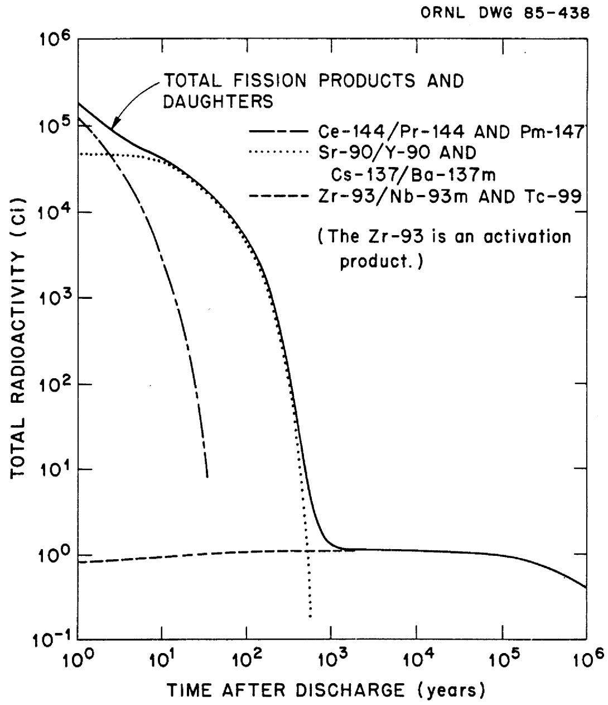  
Fig. 4. Fission product activity of MSRE fuel and flush salts.

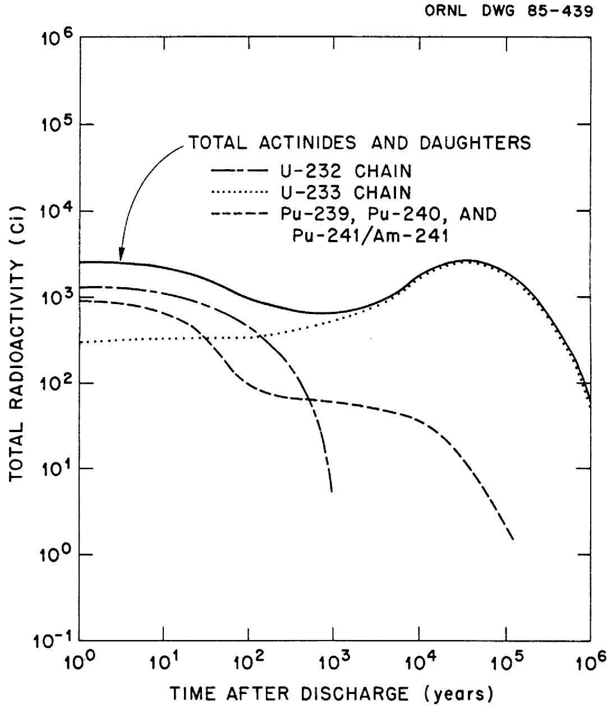  
Fig. 5. Actinide and daughter activity of MSRE fuel and flush salts.

1. Fission product activity dominates at present, by a factor of 15, but will decline by a factor of 10 over the next 100 years and be at a minimal level after 1000 years.

2. Actinide activity, presently controlled by plutonium and the U-232 chain, is decaying slowly, while the U-233 chain is very slowly growing in. The result is a minimum in alpha activity at 1000 years, along with the depletion of the Tl-208 gamma, followed by a maximum in alpha activity at about 40,000 years; therefore, permanent decay occurs.

The total activity has decayed dramatically since discharge, from 1.8 million Ci to 34,000 Ci. Most of this decline stems from the depletion of short-lived fission products, which accounted for 200,000 Ci at 1 year after discharge and now, after 15 years, amounts to 32,000 Ci. The actinides have decayed slowly, from 2550 Ci at discharge, to 2520 Ci after 1 year, to 2000 Ci after 15 years.

It can be seen that the gamma activity will continue to decay with half-lives of about 2, 30, and 72 years and will essentially disappear after 1000 years, while the alpha activity will fluctuate within one order of magnitude for the next 500,000 years before declining permanently. Since alpha decay contributes about one-fourth of the decay energy at present, this long-term alpha contribution is pertinent concerning radiolysis to yield fluorine.

The neutron activity of the salts from $(\alpha, n)$ reactions is much greater than normal because of the presence of Be-9, F-19, and Li-7. These isotopes, particularly the Be-9 and F-19, are excellent targets for $(\alpha, n)$ reactions. At present (15 years after discharge), there are about $6 \times 10^{9}$ neutrons/s from this source. Spontaneous fission also contributes some neutron activity. These values, listed in Table 16, follow the actinide curve with time. Less than $1\%$ of the alphas are converted to neutrons.

The transuranic alpha activity of the salts is relatively high, about 70,000 nCi/g in the fuel salt and about 1,000 nCi/g in the flush salt. (The total alpha activity, including that from all the daughters, is about six times greater.) Removal of the uranium and neptunium by

Table 16. Neutron activity of fuel salt   

<table><tr><td rowspan="2">Time (years)</td><td colspan="3">(α,n) neutrons/s</td><td rowspan="2">S.F.a neutrons/s</td></tr><tr><td>9Be</td><td>19F</td><td>7Li</td></tr><tr><td>Discharge</td><td>1.8 E9</td><td>4.7 E9</td><td>1.6 E7</td><td>1.86 E6</td></tr><tr><td>1</td><td>1.8 E9</td><td>4.7 E9</td><td>1.6 E7</td><td>1.75 E6</td></tr><tr><td>10</td><td>1.6 E9</td><td>4.1 E9</td><td>1.4 E7</td><td>1.69 E6</td></tr><tr><td>100</td><td>7 E8</td><td>1.8 E9</td><td>6 E6</td><td>9.30 E5</td></tr><tr><td>1000</td><td>4 E8</td><td>1.1 E9</td><td>4 E6</td><td>5.23 E5</td></tr><tr><td>10,000</td><td>1.3 E9</td><td>3.5 E9</td><td>1.2 E7</td><td>1.74 E6</td></tr><tr><td>100,000</td><td>1.4 E9</td><td>3.7 E9</td><td>1.3 E7</td><td>1.89 E6</td></tr><tr><td>1,000,000</td><td>4 E7</td><td>1 E8</td><td>0.4 E6</td><td>4.64 E4</td></tr></table>

Spontaneous fission.

fluorination could lower the activity of the flush salt below the threshold level for TRU waste, but the fuel salt would still be a TRU waste because of the plutonium content.

# 4.2 RADIOLYSIS

One of the more singular side effects deriving from the use of a fluoride salt eutectic as the matrix material for the MSRE fuel is the production of fluorine in the cooled salt as a result of radiolysis. This effect was first observed in 1962 in small test capsules, where a fluorine overpressure was noted after removal from a heated environment.[2] Subsequent experiments have confirmed that fluorine forms in cooled fluoride salts as a consequence of gamma radiation and recoil from the reaction

$$
\mathrm {M F} \xrightarrow {\text {r a d i a t i o n}} \mathrm {M} + \mathrm {F}
$$

or

$$
\mathrm {M} ^ {\prime} \mathrm {F} _ {2} \xrightarrow {\text {r a d i a t i o n}} \mathrm {M} ^ {\prime} \mathrm {F} + \mathrm {F},
$$

followed by

$$
\mathrm {F} + \mathrm {F} \rightarrow \mathrm {F} _ {2}.
$$

After an incubation period, gaseous $\mathbf{F}_2$ may be observed. At elevated temperatures, recombination (the reverse reaction) is fast enough to prevent accumulation of $\mathbf{F}_2$ . The recombination reaction is temperature dependent (activation energy of 19.4 kcal/mol) but relatively independent of fluorine pressure. This is consistent with a solid-state diffusion mechanism, which would account for the primary aspects of fluorine generation, the incubation period, and the rate-controlling factors in the recombination reaction.

Prior analyses suggested that for the MSRE fuel salt the production rate for radiolytic fluorine (in 1984) would be about $26~\mathrm{cm}^3/\mathrm{h}$ (at STP) and the induction period would be about 5 years.[7,16] For this reason, the annual reheat was instituted after shutdown. A temperature of about $350^{\circ}\mathrm{F}$ is utilized, which is well below the melting point of the salt and well above the estimated temperature of $145^{\circ}\mathrm{F}$ where the recombination rate equals the formation rate.

In any discussion of extended storage, fluorine production is of possible concern for two reasons: pressure rise, and corrosion. The

following analyses show that neither is a concern for extended storage, but both must be considered in terms of permanent disposal. In the latter case, mitigation can possibly be achieved by the addition of agetter - an active metal which will react readily with elemental fluorine.

To calculate the estimated production rate of $\mathbf{F}_2$ , we use Haubenreich's data for the net yield of $\mathbf{F}_2$ at ambient temperature: 0.020 molecule/100 eV, or 0.17 cm $^3$ (STP)/W-h. The induction period is calculated from: 3.0 x $10^{22}$ eV/g, or 1.3 W-h/g.

Table 17 gives the thermal power for actinides (and daughters) and for fission products, as calculated by ORIGEN2. These results, which are graphed in Fig. 6, show that there is a rapid decline in thermal power during the first 100 years and actinide activity is the controlling factor thereafter. These curves are, of course, an analogue to the radioactivity curves shown previously, except that the actinide contribution is relatively greater since the average energy per alpha decay is greater than for beta-gamma decays. This also introduces conservatism in the calculations. Haubenreich's data<sup>2</sup> were obtained for gamma radiation, but alpha radiation has a much higher linear energy transfer (LET). Therefore, the free radicals produced by alpha decay will be much closer together, and recombination is more probable. The induction periods and net fluorine yield rates were calculated using Haubenreich's values; these values are also given in Table 17. (The actual $\mathbf{F}_2$ production rates are about twice the net yields, but some recombination is occurring even at ambient temperature.)

The data in Fig. 6 were interpolated to estimate induction periods and $\mathbf{F}_2$ yield rates during the 10- to 100-year period; the results are given in Table 18. In 35 years (50 years after discharge), the $\mathbf{F}_2$ yield rate will fall to half its present value and will continue dropping until it reaches a minimum at about 1000 years. It will remain at an average value of about $8\mathrm{cm}^3/\mathrm{h}$ for the next 500,000 years before commencing a final decline.

# 4.2.1 Pressure Rise

The pressure rise in the fuel salt drain tanks can be calculated from the $\mathbf{F}_2$ yield rate and the void volumes in the tanks. Each tank (50 in. diam by 86 in. high) has a capacity of 80 ft $^3$ , and the volume of

Table 17. Thermal power and calculated fluorine yield rate   

<table><tr><td rowspan="2">Time (years)</td><td colspan="3">Thermal power (W)</td><td rowspan="2">Induction period (years)</td><td rowspan="2">Fluorine yield (cm3/h)</td></tr><tr><td>Actinides and daughters</td><td>Fission products</td><td>Total</td></tr><tr><td>Discharge</td><td>49</td><td>5,655</td><td>5,704</td><td>a</td><td>a</td></tr><tr><td>1</td><td>50</td><td>682</td><td>732</td><td>0.9</td><td>124</td></tr><tr><td>10</td><td>49</td><td>116</td><td>165</td><td>4</td><td>28</td></tr><tr><td>100</td><td>29</td><td>14</td><td>43</td><td>16</td><td>7</td></tr><tr><td>1,000</td><td>17</td><td>-</td><td>17</td><td>40</td><td>3</td></tr><tr><td>10,000</td><td>48</td><td>-</td><td>48</td><td>14</td><td>8</td></tr><tr><td>100,000</td><td>51</td><td>-</td><td>51</td><td>13</td><td>9</td></tr><tr><td>1,000,000</td><td>1.3</td><td>-</td><td>1.3</td><td>530</td><td>0.2</td></tr></table>

${}^{a}$ Salt is molten; recombination is very fast.

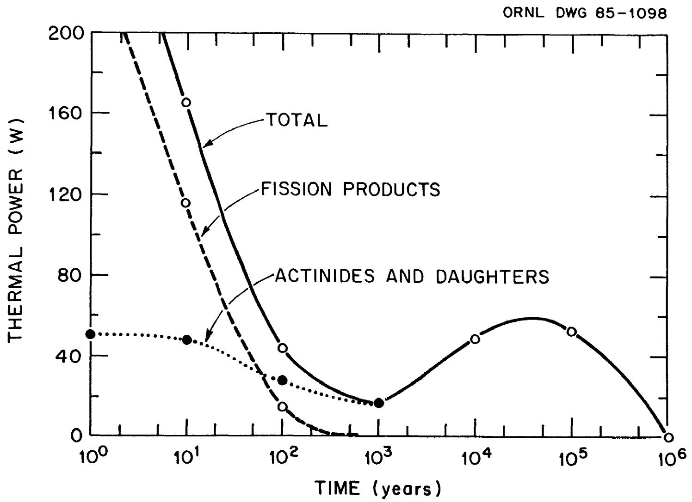  
Fig. 6. Thermal power of MSRE fuel and flush salts.

Table 18. Radiolysis data for the 10- to 100-year period   

<table><tr><td>Time after dischargea(years)</td><td>Estimated thermal power (W)</td><td>Induction period (years)</td><td>Fluorine yield (cm3/h)</td></tr><tr><td>10</td><td>165</td><td>4.2</td><td>28</td></tr><tr><td>15</td><td>140</td><td>4.9</td><td>24</td></tr><tr><td>20</td><td>122</td><td>5.7</td><td>21</td></tr><tr><td>30</td><td>98</td><td>7.0</td><td>17</td></tr><tr><td>40</td><td>83</td><td>8.3</td><td>14</td></tr><tr><td>50</td><td>72</td><td>9.6</td><td>12</td></tr><tr><td>60</td><td>63</td><td>11.0</td><td>11</td></tr><tr><td>70</td><td>57</td><td>12.1</td><td>10</td></tr><tr><td>80</td><td>51</td><td>13.5</td><td>9</td></tr><tr><td>90</td><td>47</td><td>14.7</td><td>8</td></tr><tr><td>100</td><td>43</td><td>16.0</td><td>7</td></tr></table>

aThe reactor was shut down on December 12, 1969.

solidified fuel salt is 66.4 ft³. Since the fuel salt is divided between two tanks, the void volume of each tank is 47 ft³. This provides considerable room for expansion. Assuming that the 1985 reheat, completed in June-July of this year, is the last one, an incubation period of 5 years would yield gaseous fluorine starting 20 years after discharge. The calculated pressure rise per year in the 20th year would be 2.0 psi. Table 19 gives the calculated values out to 100 years. The annual pressure increase, although quite small, is not insignificant enough to be neglected over a period of years.

# 4.2.2 Corrosion Rates

Corrosion data for INOR-8 have been obtained only at temperatures above the melting point of the salt because this was the obvious area of interest for reactor operation. Corrosion by the molten fluoride eutectic is extremely slow and, below the melting point, would be even slower. In the solid state, the corrosion rate is limited by diffusion processes. In addition, as a corrosion product builds up, it serves as a diffusion barrier and may act as a protective coating. Chromium is the most vulnerable component, which was predicted theoretically and confirmed experimentally. $^{8}$ After initial reaction with any impurities and oxide films is completed, there is a very slow reaction with $\mathrm{UF}_{4}$ :

$$
\mathrm {C r} + 2 \mathrm {U F} _ {4} \rightarrow \mathrm {C r F} _ {2} + 2 \mathrm {U F} _ {3}.
$$

Several years of MSRE operation yielded an estimated corrosion rate of only 0.1 mil/year at operating temperature (1100-1400°F).<sup>8</sup>

Corrosion by elemental fluorine, in the molten state, is far more severe. During reprocessing operations, which used $\mathbf{F}_2$ to strip out uranium by conversion to $\mathrm{UF}_6$ , a corrosion rate of 0.1 mil/h was estimated while in the molten condition ( $50^{\circ}\mathrm{F}$ above the liquidus temperature or about $800^{\circ}\mathrm{F}$ ). Again, chromium is the most vulnerable component by virtue of its larger negative free energy of formation for the fluoride salt relative to the other components of INOR-8. The attack on nickel was estimated at 0.04 mil/h, while that for chromium was 0.14 mil/h. This selective attack on the chromium is in keeping with the chemical properties of the two metals.

Table 19. Calculated pressure rise in fuel salt drain tanks, assuming last reheat was in 1985   

<table><tr><td>Time after dischargea(years)</td><td>Pressure rise rate (psi/year)</td><td>Total pressure buildup (psi)</td></tr><tr><td>20</td><td>2.0</td><td>2</td></tr><tr><td>30</td><td>1.6</td><td>20</td></tr><tr><td>40</td><td>1.4</td><td>35</td></tr><tr><td>50</td><td>1.2</td><td>48</td></tr><tr><td>60</td><td>1.1</td><td>59</td></tr><tr><td>70</td><td>1.0</td><td>70</td></tr><tr><td>80</td><td>0.9</td><td>80</td></tr><tr><td>90</td><td>0.8</td><td>88</td></tr><tr><td>100</td><td>0.7</td><td>95</td></tr></table>

aThe reactor was shut down on December 12, 1969.

The situation for the solid state is quite different. This is clearly evidenced by the fact that free fluorine can even be formed in the solidified salt since, for this to happen, elemental Li, Be, or Zr must also be formed. All of these metals are more reactive chemically than Ni, Mo, Cr, or Fe, the major components of INOR-8. Further, they are dispersed throughout the salt on a molecular scale as a result of the radiolysis process. The implication is that elemental fluorine is quite unreactive with metals when solid-state diffusion is the rate-controlling process. Even in the exposed parts of the tank, where gaseous diffusion allows free access by the liberated fluorine, any initial attack would immediately build up a layer of metal fluoride, after which solid-state diffusion would become rate controlling.

# 4.2.3 Use of Getters

The preceding discussion suggests that radiolysis can be regarded as a minor factor over the next 10 to 20 years but must be considered for prolonged storage. The addition of chemically active metals, to serve as getters, has been proposed. Comparison of the amount of $\mathbf{F}_2$ that might be released and the void space available in each tank for the addition of getters shows the idea to be feasible. Assuming an average $\mathbf{F}_2$ yield rate of $15\mathrm{cm}^3 /\mathrm{h}$ (Table 18), the calculated production over the next 80 years is $470\mathrm{mol}$ . Active metals that are easily available are listed in Table 20, along with the reactions and the densities of the metals. The volume of metal required to react with $470\mathrm{mol}$ of $\mathbf{F}_2$ was calculated from this and was found to be quite small. Considering the declining radiolysis rate, there is enough void volume in each tank for metal to consume the total $\mathbf{F}_2$ yield over the next 10,000 to 100,000 years.

At 100 years, the calculated $470\mathrm{mol}$ of $\mathbf{F}_2$ represent about $0.6\%$ of the fluoride inventory in the tanks. There would be about 3000 mol of $\mathbf{F}_2$ , or about $4\%$ of the total fluoride, at 1000 years. In any event, as fluorine is consumed by reaction with getter, the concentration of unrecombined free metal in the body of the solid salt would increase to the same degree and would, therefore, increase the rate of the recombination reaction. Thus, a time would come when recombination equaled production and the net $\mathbf{F}_2$ yield became zero.

Table 20. Potential fluorine getters   

<table><tr><td>Active metal</td><td>Reactions</td><td>Density of metal (g/cm3)</td><td>Volume of metal required, to consume 470 mol of F2(ft3)</td></tr><tr><td>Be</td><td>Be + F2→ BeF2</td><td>1.85</td><td>0.082</td></tr><tr><td>Ca</td><td>Ca + F2→ CaF2</td><td>1.55</td><td>0.43</td></tr><tr><td>Zr</td><td>Zr + 2F2→ ZrF4</td><td>6.4</td><td>0.12</td></tr><tr><td>Ti</td><td>Ti + 2F2→ TiF4</td><td>4.5</td><td>0.09</td></tr><tr><td>Al</td><td>Al + 1.5F2→ AlF3</td><td>2.7</td><td>0.24</td></tr><tr><td>Mg</td><td>Mg + F2→ MgF2</td><td>1.74</td><td>0.23</td></tr></table>

Other factors to consider are the manner and the degree of contact between the solid salt and the getter metal. Since the $\mathbf{F}_2$ has found its way to where pressure can be measured, simply adding metal flakes, chips, or sponge to the void space above the salt may be adequate. If finely divided metal were also added to the bulk salt (while in a molten condition and then allowed to freeze), recombination within the solid salt would be enhanced. Metal with a density nearly identical to that of the salt is required in order to achieve good dispersion throughout the salt. This can be achieved by alloying Be, Mg, or Ca with Al, Zr, or Ti in suitable proportions.

Before the addition of getters is undertaken, additional data are needed in two areas: the storage tanks themselves, and the performance of candidate getter metals. Concerning the former, a means for monitoring for $\mathbf{F}_2$ release should be included. This could be done either via measurements of pressure rise in the sealed storage tanks or via periodic analyses for $\mathbf{F}_2$ in swept samples. Meanwhile, tests should be conducted with various metals to determine the actual efficacy of each in reacting with $\mathbf{F}_2$ at ambient temperature and in various configurations.

# 4.3 INTEGRITY OF THE FACILITY

The apparent integrity of the hot cell and the contained fuel salt and flush salt is very high. In many ways, the facility already has the characteristics of an engineered repository. The uranium is in a solid form and is being held in a configuration that is safe against criticality. The containers are made of heavy-walled Hastelloy N (INOR-8), which is highly resistant to corrosion by fluoride. They are stored in a heavily shielded hot cell made of reinforced concrete with 3-ft-thick walls (largely underground) and a double-layer 5-ft-thick roof. The cell, lined with a welded skin of 1/8-in. stainless steel, is gas tight and leak-tested annually; it is monitored for temperature and pressure on a regular basis. However, the facility was not designed for permanent or extended emplacement, and three factors need attention - cell penetrations, control of groundwater, and secondary containment - before this can be seriously considered. These factors are addressed in Sects. 4.3.1-4.3.3.

# 4.3.1 Cell Penetrations

The hot cells were built for complex operations involving material transfers and extensive use of electrical heating. All functions were fully instrumented with redundant power supplies, control circuits, temperature and pressure readouts, etc. Therefore, the three main operating cells (reactor cell, drain tank cell, and fuel processing cell) have numerous penetrations for electrical signals plus a large number of material transfer lines through the outer cell walls. There are also two large cell-to-cell openings: a 36-in. opening between the reactor and drain tank cells, and a 14-in. opening between the drain tank and reprocessing cells (the latter is sealed). These openings carry insulated, heated lines for the transfer of molten salt, plus other lines that almost fill these openings. Tables 21 and 22 list the penetrations for the reactor cell and drain tank cell, respectively. A more comprehensive tabulation, including the processing cell, is given as part of Appendix D. In summary, these penetrations can be grouped and described as follows:

# Reactor Cell

Numbers I-XXIV:

Penetrations are from 4 to 36 in. in diam (many 8 and 24 in.); most are fitted with multiple lines, for materials, electrical, thermocouples, and off-gas. Only one is a "spare;" four carry dual water lines.

# Drain Tank Cell

Numbers 1-30:

Single penetrations are from 3/4 to 14 in. in diam; they are used to move material [steam, water, helium, and molten salt; nine were used by the Chemical Technology Division (Chem Tech) for reprocessing] and are located as follows:

South wall: 18 lines, mostly l-in.;   
West wall: 2-3/4-in. lines;   
North wall: the nine used by Chem Tech and the 14-in. salt transfer opening; eight of the nine are 1-1/2-in., and one is 4-in.

Table 21. MSRE reactor cell penetration list   

<table><tr><td>I.D.</td><td>Type</td><td>Subsets</td><td>Usage</td><td>Cell Location</td><td>Access Area</td><td>Size</td><td>Reference Drawings</td><td>Sub-unit sizes</td></tr><tr><td></td><td></td><td></td><td></td><td colspan="3">Ft-in., Degrees</td><td colspan="2">General: EGD-40704,41487,41489,41490</td></tr><tr><td>I</td><td>Multiple</td><td>60</td><td>Reactor Leak Detectors</td><td>836</td><td>15</td><td>South ESA</td><td>24&quot;</td><td>DKKD-40976 EBDB-41863 EBDB-41864 DJJD-55494 DJJD-40495 60*1/4&quot; tubing</td></tr><tr><td>II</td><td>Multiple</td><td>44</td><td>Electrical</td><td>834</td><td>30</td><td>South ESA</td><td>24&quot;</td><td>DKKD-40976 EBDB-41863 EBDB-41864 EMMZ-56230 EMMZ-56246 6*1*IPS, 38*3/4*IPS</td></tr><tr><td>III</td><td>Multiple</td><td>44</td><td>Electrical</td><td>836</td><td>45</td><td>South ESA</td><td>24&quot;</td><td>DKKD-40976 EBDB-41863 EBDB-41864 EMMZ-56230 EMMZ-56246 6*1*IPS, 38*3/4*IPS</td></tr><tr><td>IV</td><td>Multiple</td><td>60</td><td>Thermocouples</td><td>834</td><td>60</td><td>South ESA</td><td>24&quot;</td><td>DKKD-40976 EBDB-41863 EBDB-41864 DHHB-55567 7*3/4*,28*1/2*,25*3/8*1PS</td></tr><tr><td>V</td><td>Multiple</td><td>60</td><td>Instrumentation</td><td>836</td><td>75</td><td>South ESA</td><td>24&quot;</td><td>DKKD-40976 EBDB-41863 EBDB-41864 DHHB-55567 60*3/8*1PS</td></tr><tr><td>VI</td><td>Open</td><td></td><td>Sampler Offgas</td><td>847</td><td>110</td><td>High Bay</td><td>4&quot;</td><td>DKKD-40973 DKKD-40974 4*2*1/2*)</td></tr><tr><td>VII</td><td>Open</td><td></td><td>Sampler</td><td>847</td><td>115</td><td>High Bay</td><td>6&quot;</td><td>DKKD-40973 DKKD-40974 DBBC-41339</td></tr><tr><td>VIII</td><td>Multiple</td><td>8</td><td>Fuel Pump Aux. Piping</td><td>836-9</td><td>125</td><td>Service Tunnel</td><td>18&quot;</td><td>DKKD-40717 EKKD-40735 3*1/2*,4*3/4*,1*1*IPS</td></tr><tr><td>IX</td><td>Blanked in Cell</td><td colspan="2">Neutron Instrument Tube</td><td>834-5</td><td>145</td><td>High Bay</td><td>36&quot;</td><td>DKKD-40716 EKKD-40715 EHHA-41796 10*1 lon Chamber Guides</td></tr><tr><td>X</td><td>Multiple</td><td>6</td><td>Fuel Pump Liquid Level</td><td>844-6</td><td>155</td><td>Special Eq. Rm. 4&quot;</td><td>DKKD-40973 EKKD-40975 EGD-55411 EJJD-55428 6*1/4&quot; tubing</td><td></td></tr><tr><td>XI</td><td>Multiple</td><td>13</td><td>Fuel Pump Aux. Piping</td><td>836-9</td><td>160</td><td>Special Eq. Rm. 18&quot;</td><td>DKKD-40718 EKKD-40737 EGD-55411 2*1*IPS, 11*1/2*1PS</td><td></td></tr><tr><td>XII</td><td>Single</td><td>1</td><td>Component Coolant Air</td><td>829-10</td><td>165</td><td>Special Eq. Rm. 6&quot;</td><td>DKKD-40714 EGD-55411</td><td></td></tr><tr><td>XIII</td><td>Furnace</td><td>1</td><td>Coolant Salt to HX</td><td>840-10</td><td>170</td><td>Coolant Cell</td><td>24&quot;</td><td>EKKD-40711 EGGZ-55498</td></tr><tr><td>XIV</td><td>Multiple</td><td>2</td><td>Water Lines</td><td>839-9</td><td>185</td><td>Coolant Cell</td><td>8&quot;</td><td>DKKD-40740 EKD-40741 2*1&quot;</td></tr><tr><td>XV</td><td>Multiple</td><td>2</td><td>Spare</td><td>839-9</td><td>200</td><td>Coolant Cell</td><td>8&quot;</td><td>DKKD-40740 EKD-40741 2*2&quot;</td></tr><tr><td>XVI</td><td>Multiple</td><td>2</td><td>Water Lines</td><td>839-9</td><td>205</td><td>Coolant Cell</td><td>8&quot;</td><td>DKKD-40740 EKD-40741 2*2*</td></tr><tr><td>XVII</td><td>Multiple</td><td>2</td><td>Water Lines</td><td>839-9</td><td>210</td><td>Coolant Cell</td><td>8&quot;</td><td>DKKD-40740 EKD-40741 2*2&quot;</td></tr><tr><td>XVIII</td><td>Multiple</td><td>2</td><td>Water Lines</td><td>839-9</td><td>220</td><td>Coolant Cell</td><td>8&quot;</td><td>DKKD-40740 EKD-40741 2*2&quot;</td></tr><tr><td>XIX</td><td>Furnace</td><td>1</td><td>Coolant Salt to Radiator</td><td>837</td><td>220</td><td>Coolant Cell</td><td>24&quot;</td><td>DKKD-40712 EBGZ-55498</td></tr><tr><td>XX</td><td>Multiple</td><td>3</td><td>Offgas</td><td>839-9</td><td>225</td><td>Coolant Cell</td><td>6&quot;</td><td>DKKD-40740 EKD-40741 3*1&quot;</td></tr><tr><td>XXI</td><td>Multiple</td><td>2</td><td>Offgas</td><td>839-9</td><td>230</td><td>Coolant Cell</td><td>6&quot;</td><td>DKKD-40740 EKD-40741 2*1-1/4&quot;</td></tr><tr><td>XXII</td><td>Open Duct</td><td>1</td><td>Cell Exhaust Duct</td><td>824-10</td><td>245</td><td>CDT Tunnel</td><td>30&quot;</td><td>DKKD-40710 EKKD-40749 38*3/8*1PS</td></tr><tr><td>XXIII</td><td>Multiple</td><td>38</td><td>Thermocouple</td><td>836</td><td>325</td><td>West Tunnel</td><td>24&quot;</td><td>DKKD-40976 EBDB-41863 EBDB-41864 DHHB-55567 38*3/8*1PS</td></tr><tr><td>XXIV</td><td>Open</td><td></td><td>Drain Tank Cell intercon.</td><td>825-2</td><td>330</td><td>Drain Tank Cell</td><td>36&quot;</td><td>EKKD-40713</td></tr><tr><td></td><td></td><td></td><td>Sump?</td><td></td><td>Bottom Center</td><td></td><td></td><td>EBQ2-55493</td></tr></table>

Table 22. MSRE drain tank cell penetration list   

<table><tr><td>I.B.</td><td>Type</td><td>Subsets</td><td>Usage</td><td>Cell Location</td><td>Access Area</td><td>Size</td><td>Reference Drawings</td><td>Sub-unit sizes</td></tr><tr><td>1</td><td>Single</td><td>1 Steam from Domes</td><td></td><td>South Wall</td><td>South ESA</td><td>3" in 4"</td><td>DDKD-40948 E6GD-55425</td><td></td></tr><tr><td>2</td><td>Single</td><td>1 Steam from Domes</td><td></td><td>South Wall</td><td>South ESA</td><td>3" in 4"</td><td>DDKD-40948 E6GD-55425</td><td></td></tr><tr><td>3</td><td>Single</td><td>1 Water to Steam Domes</td><td></td><td>South Wall</td><td>South ESA</td><td>1"</td><td>DDKD-40948 E6GD-55425</td><td></td></tr><tr><td>4</td><td>Single</td><td>1 Water to Steam Domes</td><td></td><td>South Wall</td><td>South ESA</td><td>1"</td><td>DDKD-40948 E6GD-55425</td><td></td></tr><tr><td>5</td><td>Single</td><td>1 Water</td><td></td><td>South Wall</td><td>South ESA</td><td>1"</td><td>DDKD-40948 DKKB-41253</td><td></td></tr><tr><td>6</td><td>Single</td><td>1 Water</td><td></td><td>South Wall</td><td>South ESA</td><td>1"</td><td>DDKD-40948</td><td></td></tr><tr><td>7</td><td>Single</td><td>1 Spare</td><td></td><td>South Wall</td><td>South ESA</td><td>1"</td><td>DDKD-40948</td><td></td></tr><tr><td>8</td><td>Single</td><td>1 Spare</td><td></td><td>South Wall</td><td>South ESA</td><td>1"</td><td>DDKD-40948</td><td></td></tr><tr><td>9</td><td>Single</td><td>1 Helium</td><td></td><td>South Wall</td><td>South ESA</td><td>1/2" in 1"</td><td>DDKD-40948</td><td></td></tr><tr><td>10</td><td>Single</td><td>1 Helium</td><td></td><td>South Wall</td><td>South ESA</td><td>1/2" in 1"</td><td>DDKD-40948</td><td></td></tr><tr><td>11</td><td>Single</td><td>1 Helium</td><td></td><td>South Wall</td><td>South ESA</td><td>1/2" in 1"</td><td>DDKD-40948</td><td></td></tr><tr><td>12</td><td>Single</td><td>1 Helium</td><td></td><td>South Wall</td><td>South ESA</td><td>1/2" in 1"</td><td>DDKD-40948</td><td></td></tr><tr><td>13</td><td>Single</td><td>1 Helium</td><td></td><td>South Wall</td><td>South ESA</td><td>1/2" in 1"</td><td>DDKD-40948</td><td></td></tr><tr><td>14</td><td>Single</td><td>1 Helium</td><td></td><td>South Wall</td><td>South ESA</td><td>1/2" in 1"</td><td>DDKD-40948</td><td></td></tr><tr><td>15</td><td>Single</td><td>1 Helium</td><td></td><td>South Wall</td><td>South ESA</td><td>1/2" in 1"</td><td>DDKD-40948</td><td></td></tr><tr><td>16</td><td>Single</td><td>1 Helium</td><td></td><td>South Wall</td><td>South ESA</td><td>1/2" in 1"</td><td>DDKD-40948</td><td></td></tr><tr><td>17</td><td>Single</td><td>1 Sump Discharge</td><td></td><td>South Wall</td><td>Maste Cell</td><td>3/4"</td><td>DDKD-40948 DKKB-41280 DKKB-41281</td><td></td></tr><tr><td>18</td><td>Single</td><td>1 Sump Discharge</td><td></td><td>South Wall</td><td>Waste Cell</td><td>3/4"</td><td>DDKD-40948 DKKB-41280 DKKB-41281</td><td></td></tr><tr><td>19</td><td>Single</td><td>1 Air to Sump</td><td></td><td>West Wall</td><td>West of Bldg.</td><td>3/4"</td><td>DDKD-40948 DKKB-41280</td><td></td></tr><tr><td>20</td><td>Single</td><td>1 Air to Sump</td><td></td><td>West Wall</td><td>West of Bldg.</td><td>3/4"</td><td>DDKD-40948 DKKB-41280</td><td></td></tr><tr><td>21</td><td>Single</td><td>(Chem. Tech.)</td><td></td><td>North Wall</td><td>Fuel Proc. Cell</td><td>1-1/2"</td><td>DKKD-40949</td><td></td></tr><tr><td>22</td><td>Single</td><td>(Chem. Tech.)</td><td></td><td>North Wall</td><td>Fuel Proc. Cell</td><td>1-1/2"</td><td>DKKD-40949</td><td></td></tr><tr><td>23</td><td>Single</td><td>(Chem. Tech.)</td><td></td><td>North Wall</td><td>Fuel Proc. Cell</td><td>1-1/2"</td><td>DKKD-40949</td><td></td></tr><tr><td>24</td><td>Single</td><td>(Chem. Tech.)</td><td></td><td>North Wall</td><td>Fuel Proc. Cell</td><td>1-1/2"</td><td>DKKD-40949</td><td></td></tr><tr><td>25</td><td>Single</td><td>(Chem. Tech.)</td><td></td><td>North Wall</td><td>Fuel Proc. Cell</td><td>1-1/2"</td><td>DKKD-40949</td><td></td></tr><tr><td>26</td><td>Single</td><td>(Chem. Tech.)</td><td></td><td>North Wall</td><td>Fuel Proc. Cell</td><td>4"</td><td>DKKD-40949</td><td></td></tr><tr><td>27</td><td>Single</td><td>(Chem. Tech.)</td><td></td><td>North Wall</td><td>Fuel Proc. Cell</td><td>1-1/2"</td><td>DKKD-40949</td><td></td></tr><tr><td>28</td><td>Single</td><td>(Chem. Tech.)</td><td></td><td>North Wall</td><td>Fuel Proc. Cell</td><td>1-1/2"</td><td>DKKD-40949</td><td></td></tr><tr><td>29</td><td>Single</td><td>(Chem. Tech.)</td><td></td><td>North Wall</td><td>Fuel Proc. Cell</td><td>1-1/2"</td><td>DKKD-40949</td><td></td></tr><tr><td>30</td><td>Furnace</td><td>Salt Transfer</td><td></td><td>North Wall</td><td>Fuel Proc. Cell</td><td>14"</td><td>DKKD-40949</td><td></td></tr><tr><td colspan="2">A-1 to 36 Bank</td><td colspan="2">29 Instrumentation</td><td>East Wall</td><td>North ESA</td><td>3/4"</td><td>DKKD-40947 DHHB-55567</td><td></td></tr><tr><td colspan="2">B-1 to 36 Bank</td><td colspan="2">36 Instrumentation</td><td>East Wall</td><td>North ESA</td><td>3/4"</td><td>DKKD-40947 DHHB-55567</td><td></td></tr><tr><td colspan="2">C-1 to 36 Bank</td><td colspan="2">36 Thermocouples</td><td>East Wall</td><td>North ESA</td><td>3/4"</td><td>DKKD-40947 DHHB-55567</td><td></td></tr><tr><td colspan="2">D-1 to 36 Bank</td><td colspan="2">36 Thermocouples</td><td>East Wall</td><td>North ESA</td><td>3/4"</td><td>DKKD-40947</td><td></td></tr><tr><td colspan="2">E-1 to 36 Bank</td><td colspan="2">36 Thermocouples</td><td>East Wall</td><td>North ESA</td><td>3/4"</td><td>DKKD-40947</td><td></td></tr><tr><td colspan="2">A-37 to 60 Bank</td><td colspan="2">24 Electrical</td><td>East Wall</td><td>North ESA</td><td>3/16" in 3/4"</td><td>DKKD-40947 EMMZ-51656</td><td></td></tr><tr><td colspan="2">B-37 to 60 Bank</td><td colspan="2">24 Electrical</td><td>East Wall</td><td>North ESA</td><td>3/16" in 3/4"</td><td>DKKD-40947 EMMZ-51656</td><td></td></tr><tr><td colspan="2">C-37 to 60 Bank</td><td colspan="2">24 Electrical</td><td>East Wall</td><td>North ESA</td><td>3/16" in 3/4"</td><td>DKKD-40947 EMMZ-51656</td><td></td></tr><tr><td colspan="2">D-37 to 60 Bank</td><td colspan="2">24 Electrical</td><td>East Wall</td><td>North ESA</td><td>3/16" in 3/4"</td><td>DKKD-40947 EMMZ-51656</td><td></td></tr><tr><td colspan="2">E-37 to 60 Bank</td><td colspan="2">24 Electrical</td><td>East Wall</td><td>North ESA</td><td>3/16" in 3/4" DKKD-40947 EMMZ-51656</td><td></td><td></td></tr><tr><td colspan="2">F-37 to 60 Bank</td><td colspan="2">24 Electrical</td><td>East Wall</td><td>North ESA</td><td>3/16" in 3/4" DKKD-40947 EMMZ-51656</td><td></td><td></td></tr><tr><td>G</td><td></td><td>Spare</td><td>East Wall</td><td>North ESA</td><td>6"</td><td>DKKD-40947</td><td colspan="2"></td></tr><tr><td>H</td><td></td><td>Spare</td><td>East Wall</td><td>North ESA</td><td>6"</td><td>DKKD-40947</td><td colspan="2"></td></tr><tr><td>I</td><td>Multiple</td><td>3 Cover Gas</td><td>East Wall</td><td>North ESA</td><td>6"</td><td>DKKD-40947 EGGE-41884</td><td colspan="2">3 * 1/2*IPS</td></tr><tr><td>J</td><td></td><td>Spare</td><td>East Wall</td><td>North ESA</td><td>6"</td><td>DKKD-40947</td><td colspan="2"></td></tr><tr><td>K</td><td></td><td>Spare</td><td>East Wall</td><td>North ESA</td><td>6"</td><td>DKKD-40947</td><td colspan="2"></td></tr><tr><td>L</td><td></td><td>Spare</td><td>East Wall</td><td>North ESA</td><td>6"</td><td>DKKD-40947</td><td colspan="2"></td></tr><tr><td>M</td><td>Multiple</td><td>3 Component Coolant Air</td><td>East Wall</td><td>North ESA</td><td>6"</td><td>DKKD-40947 EGGE-41884 DJJA-41879 DJJA-41880</td><td colspan="2">3 * 3/4*IPS</td></tr><tr><td>N</td><td>Multiple</td><td>3 Component Coolant Air</td><td>East Wall</td><td>North ESA</td><td>6"</td><td>DKKD-40947 EGGE-41884 DJJA-41879 DJJA-41880</td><td colspan="2">3 * 3/4*IPS</td></tr><tr><td>O</td><td>Single</td><td>1 Component Coolant Air</td><td>East Wall</td><td>North ESA</td><td>1-1/2" in 6"</td><td>DKKD-40947 EGGE-41884 DJJA-41879 DJJA-41880</td><td colspan="2"></td></tr><tr><td>P</td><td>Multiple</td><td>4 DP Cell</td><td>East Wall</td><td>North ESA</td><td>6"</td><td>DKKD-40947 EGGE-41884 DJJA-41879 DJJA-41880</td><td colspan="2">4 * 1/2*IPS</td></tr><tr><td>Q</td><td>Multiple</td><td>12 Leak Detector</td><td>East Wall</td><td>South ESA</td><td>6"</td><td>DKKD-40947 ERBD-41863 EBBD-41863 DJJD-55494 DJJD-55495</td><td colspan="2">12 * 1/4" tubing</td></tr><tr><td>R</td><td>Multiple</td><td>12 Leak Detector</td><td>East Wall</td><td>South ESA</td><td>6"</td><td>DKKD-40947 EBD-41863 EBBD-41863 DJJD-55494 DJJD-55495</td><td colspan="2">12 * 1/4" tubing</td></tr></table>

Banks A-1 to -60, B-1 to -60, C-1 to -36, D-1 to -36, and E-1 to -36: All are 3/4-in. penetrations of the east wall and are used for instruments, thermocouples, and electrical supplies.

Numbers G-R: All are 6-in. penetrations of the east wall, most with multiple lines for cover gas, cooling air, and leak detectors; five are "spares."

# Reprocessing Cell

Numbers 31-54: Specific penetrations have not been identified, but these functions are provided: material transfer: at least 4 (HF, $\mathbf{H}_2$ , $\mathbf{F}_2$ , off-gas); H-series line heaters: 28; equipment heaters: 57; thermocouples: 94; limit annihilators: 15.

These penetrations are well-engineered and have proven to be reliable through many years of operation and monitored storage. They, along with the reactor and drain tank cells, were pressure-tested to 45 psi (gage) prior to placing the MSRE into hot operation. All external penetrations are welded into place and were offset or shielded to minimize radiation leakage. The numerous electrical penetrations were sealed at installation. The transfer lines are, or can be, sealed on both sides of the cell wall with Gray-loc closures or by welding. There is no cause for concern for the short term, but these penetrations should be reviewed from engineering and corrosion aspects before extended storage is adopted as a planned policy. Some of the transfer lines probably should be capped, rather than just being valved off. Many of the electrical penetrations are of no further use and could also be sealed. A more stringent analysis is appropriate for extended storage. The large cell-to-cell opening also deserves a stringent analysis for long-term storage if that is to be pursued. Again, for the short-term, the two-cell system appears to be more than adequate, but extended storage might benefit from specific modifications.

An engineering study of the penetrations, closure options, and possible containment envelopes was started late in FY 1985 but could not be completed with the available funds; the results obtained thus far have been reported and are included as Appendix D. It is anticipated that this work will be completed in FY 1986, or as soon as funding is provided. The important features of this study to date are:

1. A sequence of three possible containment envelopes was defined, for future consideration: the drain tank cell; the drain tank plus reactor cells; and the drain tank, reactor, and reprocessing cells.

2. Eight types of cell penetrations were identified and catalogued.

3. Three types of closure options were identified for these eight types of penetrations: (1) capping/welding of unneeded lines that emerge from a multiple penetration; (2) total capping of a multiple penetration where none of the individual lines are needed anymore and are cut off behind the new seal-plate; and (3) use of a threaded, pressure-tight plug on electrical lines, as was done on the original design with spare lines.

4. Individual penetrations were catalogued in terms of containment envelope and closure options. The identification of possible future uses for each of the penetrations was started but not completed. Finally, it was suggested that a visual inspection be made of all accessible penetrations to determine the present condition of each. This will be done as soon as possible because of the obvious implications if any penetrations were to be found in poor condition.

# 4.3.2 Water Control

If water should enter the cells, it could cause major problems such as:

1. increased corrosion rate of the Hastelloy tanks;

2. slow reaction with the fluoride salts or rapid reaction with any fluorine (from radiolysis) to yield HF;

3. radiolytic production of $\mathrm{H}_{2}$ and $\mathrm{O}_{2}$ , which is an explosive mixture that could cause pressure buildup or could increase oxidative corrosion; and

4. movement of radioactive material along transport paths provided by water.

Water entry has never occurred over the past 20 years. Each cell does have a sump where any water would be collected (if it did enter) and could then be pumped out or jetted out. The cells are leak-tested annually and are known to be leak tight; therefore, water entry is theoretically not possible, even if the level of the groundwater were to rise above that of the cell floor. Even so, groundwater is a long-term concern since the water table is not very far down at the MSRE site. However, the building was constructed with French drains below the footers and has a building sump with a minimum elevation of 812 ft. The lowest cell level is the drain tank cell, at 814 ft for the cell floor, which is above the building sump level.

Although the building sump pump is known to operate occasionally, the frequency of operation and the volume of water pumped have not been recorded or measured previously. As a part of this study, a pump monitor was recently installed and has been in operation since August 19, 1985. Readings were taken daily, except on weekends. During the first three weeks, the west pump operated an average of $1.06\mathrm{h / d}$ , with a daily high of $1.5\mathrm{h}$ and a daily low of $0.6\mathrm{h}$ . The east pump, a backup system, did not come on during this period. It is planned to continue gathering these data as part of our ongoing S&M.

Because of the importance of water control for extended storage, an engineering overview was prepared. This report is attached in its entirety as Appendix E. The information contained within it was obtained from engineering drawings and reports; highlights from the report include:

1. A description of the radioactive liquid waste system.   
2. A description of the nonradioactive drainage, which includes groundwater collected by the building French drain system and water entering floor drains outside the cells, which is then routed to the building sump cited earlier.   
3. A description of the storm water system, which collects water from roof drains and discharges to a separate catch basin.   
4. A description of the sanitary wastewater system, which is discharged to a septic tank and drain field system.

# 4.3.3 Secondary Containment

In context of this discussion, secondary containment refers to the external building structure surrounding the hot cells (i.e., the outer shell, the building ventilation system, the high-bay area and overhead crane, and the control rooms). This is the containment that is relied on during open-cell maintenance or in the event of a release from one of the cells. Secondary containment will be required and must be fully functional in case it should become necessary to open one of the cells for modifications, additions, removal of extraneous equipment, or treatment of the salts. Secondary containment is not required during standby mode, which is the usual condition of the facility.

The present status of the secondary containment system is functional. The high-bay area can be closed and ventilated through the cell ventilation system, while maintaining a negative pressure inside the containment zone. The overhead crane is still operational. The remote maintenance control room has deteriorated somewhat, and the zinc bromide viewing windows have been drained (but are still usable). The main control room contains most of the instrumentation being used for monitoring and surveillance.

The useful lifetime of the secondary containment system is definitely limited in the absence of a planned program to maintain this capability. Any operations that may need to be done prior to committing to extended storage should be carried out in the reasonably near future. In doing so, it would be possible to still utilize experienced personnel who have a firsthand knowledge of the facility from prior experience when the MSRE was an active project.

# 4.4 GEOLOGY AND HYDROLOGY

A geologic and hydrologic overview of the MSRE site was prepared by a consultant in this field. A copy of his report is included as Appendix F. The more significant of his findings can be summarized as follows:

1. The general geologic conditions at the MSRE site are favorable for continued storage. The area has a low seismic risk and has been relatively stable for millions of years. Other waste storage facilities (solid LLW, TRU waste, hydrofracture) have been sited in Melton Valley because of its suitability for such applications.

2. Water is a significant concern because the water table is not far below the surface and because water is a potential problem for two reasons: it can hasten corrosion, and it can provide a pathway or mechanism for movement of any released radioactivity.

In planning for the future of MSRE and evaluating various options, the time scale must be considered since each time frame has its own characteristics. The various time frames are defined in Sect. 1. For purposes of this evaluation, two key characteristics are: the types of physical control that can be applied, and the nature of the radioactive decay which is occurring.

Seismic factors are of minor concern to us through the near term (up to 100 years) since the reinforced concrete cells and heavy-walled Hastelloy tanks will provide ample strength during the early years. Water intrusion, however, must be considered even for the short term. Data are needed on water behavior in the immediate environment. As listed in the geologist's analysis, data are needed on the following: (1) characterization of the earthen materials at or near the site; (2) the site design itself, including all engineered improvements; and (3) site hydrology.

# 4.5 ENTOMBMENT

Entombment in cementitious material has been surveyed by L. R. Dole of this Laboratory, whose complete report was given as Appendix E in the evaluation study that preceded this report.[20] His survey identifies several aspects of this concept that could be detrimental, thus indicating a need for caution since entombment is nonreversible for all practical purposes. It also points out the potentially harmful effects of water, which suggest restraint at present and also support the need for more data in this area (as noted in the previous section).

While entombment is very attractive and might, in fact, become the option of choice at a future time, it is premature at present because we are not in a position to make a permanent commitment. This will continue to be the case until we have definitive data concerning the radiolysis of fluoride. The negative aspects of entombment include the preclusion of direct surveillance, the possible net weakening of the overall structure from shrinkage or expansion mismatch, and the introduction of water from

the grout mixture itself. In addition, the solidified grout could act as a wick to transport moisture to metal surfaces and thereby increase corrosion. It also fills up void space that might better be used as a sink for intruded water or as a reservoir for a desiccant (e.g., unslaked lime or Portland cement).

On the other hand, a properly engineered grout could add strength and provide a diffusion barrier against the movement of water either in or out of the cell. The projected lifetime of a grout can be measured in millennia in a dry climate. A more-detailed survey is required to identify any areas where specific data need to be gathered, or generated, in order to have the necessary technical basis for a future decision regarding entombment.

Radiolysis of the water contained in grout is also a possible drawback. The resulting oxygen and hydrogen could lead to excessive pressure or an increased corrosion rate; however, inhibitors or catalytic recombiners could be used to mitigate this effect.

The use of other entombment materials, such as lead or sulfur, has been suggested, but these materials have not been examined in detail.

# 4.6 UTILIZATION

The MSRE building facilities are being used extensively, particularly the office areas and the storage space in the high-bay and receiving areas. Approximately 50 people from the Health and Safety Research Division are housed in the office complex, and this number is expected to grow. The history of the Laboratory clearly shows an ever increasing need for office space. Therefore, the office facilities should be retained in any event.

The need for storage space for low-level radioactive samples and materials has also continued to grow. At present, the building provides space for soil samples (about 100 55-gal drums) and Cs-137 sources (about 260 in 200-lb lead pigs), and miscellaneous equipment (e.g., about 20 remote manipulators). These storage facilities definitely need to be retained. Even a conservative estimate suggests an additional 20-year lifetime for the offices and the storage space. This is commensurate with the anticipated short-term extended storage of the fuel and flush salts.

Looking beyond utilization already extant, the hot cells themselves are a valuable asset whose future utility should be preserved. Because of activation, the reactor, drain, and processing cells are likely candidates for entombment unless a suitable major project comes along. Even with entombment of these three cells, however, they could first be filled with waste removed from other cells. The remaining cells could easily be used for storage purposes or, with modification, for a suitable project.

# 4.7 FINAL DISPOSAL

The long-term alpha activity of the U-233 decay chain may require eventual removal of the fuel and flush salts, even if the radiolysis problem can be controlled with getters. In the latter case, it would be possible - and highly desirable - to leave the salts in their present Hastelloy N tanks since these tanks should serve as excellent primary containers. There are three possible options for permanent disposal of the tanks and contents:

1. the WIPP (Waste Isolation Pilot Plant), which is now under construction in New Mexico;   
2. a spent fuel repository, which is planned for a western location; or   
3. on-site greater confinement disposal (intermediate-depth burial), which has been considered for Oak Ridge.

These three options are discussed in the following sections. In the event that the radiolysis problem cannot be controlled with getters, thus making reprocessing necessary, the separated uranium and TRU waste would still be candidates for the same three final options. However, in this case, with the fluoride removed and the residue repackaged, acceptance criteria should be easier to meet. It should be recognized that, initially, all disposal sites will be conservative in specifying their acceptance criteria but that, with the passage of time and accumulation of experience, the potential for some relaxation in these criteria is very real, especially for a one-time interment that could be given additional overpacks.

# 4.7.1 WIPP

Since the WIPP is actually under construction and has been planned for many years, the waste acceptance criteria (WAC) for WIPP have been the subject of extensive study, review and comment, and revisions. Even so, these WAC are not yet final and, as already pointed out, tend to be conservative. Appendix C summarizes the WAC for remotely handled (RH) waste, the Certification Compliance Requirements (CCR), and some general comments. The WAC and CCR are not always in agreement. Those requirements that concern the MSRE fuel salt are briefly discussed below.

Size limit: Diameter of tanks too large (50 vs 26 in.) but length satisfactory (86 vs 121 in.)

Weight: Each tank ( $\sim 1300\mathrm{kg}$ ) plus salt ( $\sim 2300\mathrm{kg}$ ) is just within the limit (3636 kg); addition of getters would make them overweight.

Surface dose: Surface dose probably greater than the 100-rem/h limit; also, neutron dose much higher than 75 mrem/h, as limited by the CCR (although the WAC requires only that neutron doses $>75$ mrem/h be reported).

Thermal power: Well below the limit of 300 W/package; drain tanks are about 100 W each.

Criticality: About 10 times the limit of $1.9 \, \text{g/L}$ ; actually, about $17 \, \text{g/L}$ .

Pu-239

equivalent: Probably about the limit of 1000 plutonium-equivalent Ci/package.

# 4.7.2 Commercial Spent Fuel Repository

This offers some attractive features. Certainly, the MSRE fuel and flush salts qualify in a generic sense. The MSRE D&D is funded through the commercial branch of the SFMP since the MSRE was intended for commercial application. The fuel salt is a spent fuel, and the flush salt contains some spent fuel. Most of the WIPP restriction would not be applicable to a spent fuel repository, which would be designed to handle higher doses, thermal power, criticality, and Pu-239 equivalent. One possible problem is the tank diameter. A repository might not be designed for a package diameter of over 4 ft, even on an exception basis.

# 4.7.3 Greater Confinement Disposal

Every major DOE site (Oak Ridge included) has potential problems with oversized, overweight, or otherwise out-of-specification TRU waste, for which intermediate-depth disposal is being considered. The MSRE fuels salt is an obvious candidate for such disposal since the large tank diameter would not be a problem in this situation. Shipment would also be minimized if an Oak Ridge site is developed in the future.

# 4.8 IN-CELL ALTERATIONS

A number of in-cell alterations might be performed in the short term (within 10 to 20 years) to enhance the condition of the fuel salts during extended storage and also to help set the stage for eventual removal. As a step toward the eventual removal of the salts, it would be highly desirable to place the cell and the salts into a suitable condition during the short term so that the removal operation can be carried out as simply and easily as possible. The following possibilities are presented and then evaluated in terms of both enhanced storage and eventual removal:

1. removal of steam domes (and addition of neutron poison);   
2. addition of fluorine getter, without remelting;   
3. remelting of salt, with addition of fluorine getter;   
4. repackaging of salt into smaller containers, after remelting with addition of fluorine getter;   
5. disconnection of lines to and from the drain tanks; and   
6. installation of additional instrumentation.

It is assumed that the fuel salts will eventually have to be removed to a more permanent location because of the long-term activity from the U-233 chain. It is also assumed that it will be feasible to do so with the salts packaged in their present containers. With these assumptions, it is clear that the steam domes must be removed eventually; therefore, this should be done in the short term while experienced personnel are still available. Once the steam domes with attached bayonet tubes are removed, the thimbles (32 per tank) can be used to insert neutron poisons. These can be in the form of Cd, B, or Ge metal rods.

The earlier discussion on radiolysis is a strong argument for the addition of a fluorine getter. In fact, if an effective getter is not

added, disposal of the fuel salt as the fluoride will probably not be acceptable. The simplest way to include getter is to add it to the void volume in each tank. This might require cell entry; of course, the preferred method would be to supply getter through the addition tube used previously for adding salts. If cold laboratory tests show that the getter must be dispersed within the solid salt to be effective, then remelting would be required. While this operation is possible, it might cause some further corrosion to the tanks. Dispersal of added getter could be accomplished via sparging with dry helium through the dip tubes already provided for this purpose.

In the event that the salt needs to be melted in order to addgetter, this would be the logical time to repackage into smaller containers (if this step is needed). However, the incentive to repackage is small since the controlling factor is radiolysis and, if radiolysis can be controlled by the addition of getters, this can be done just as well in the present drain tanks.

The lines for the vessel should not be disconnected until there is assurance that the salt need not be repackaged or reprocessed. Such assurance cannot be provided until actual data are in hand to verify the addition ofgetter as a viable method for limiting fluorine formation. This may require the installation of additional instrumentation.

# 4.9 CONTINGENCY PLANNING

The MSRE has had an exceptionally clean history following shutdown of the reactor in December 1969. Because of this long period of trouble-free surveillance and maintenance, formal contingency planning and/or emergency planning has received virtually no attention. However, since it is now becoming clear that extended storage in the present location will be required, such planning is appropriate in the immediate future. Obviously, no major contingencies are expected; nor are they likely to occur. On the other hand, it is prudent to carry out a structured analysis in order to systematically investigate the possibilities, to identify any weaknesses that could or should be remedied in advance, and to be prepared in case the unexpected happens. A preliminary list of possible events includes, but is not necessarily limited to, the following items:

# 5. CONCLUSIONS

# 5.1 EVALUATION OF OPTIONS

Evaluation of the options, data, and constraints discussed in the body and appendixes of this report led to the following conclusions:

1. Extended storage is not only feasible but preferable at this time because:

a. the fuel salt is presently in a safe place;   
b. there is no available repository or disposal site to take it if it were removed, either with or without reprocessing, at this time;   
c. the full range of future disposal options or locations is not yet known;   
d. any enhancement actions taken at this time would probably benefit whichever option is finally exercised; and   
e. extended storage would provide time to collect additional data that would be of direct help in selecting a final option at a future date.

2. Entombment should be deferred because:

a. such action is not necessary at this time;   
b. it is essentially nonreversible and would be premature at this time; and   
c. additional technical data are needed before such a decision could be supported.

3. Some enhancements in direct support of extended storage should be evaluated in the near future. For example:

a. cell penetrations should be reviewed by Energy Systems

Engineering, inspected by the Operations Division and, where considered necessary, sealed permanently;

b. cell internals should be reviewed to identify interfering structures, if any, and plans made for their removal;

c. remelting of the fuel salt, with possible addition of a fluorine

getter (and possibly a neutron poison) should be evaluated for

implementation since this would eliminate both the need for annual reheating and long-term concerns about radiolysis-produced fluorine;

d. repackaging (if needed, it should be done in conjunction with remelting) should also be evaluated;   
e. enhancements seem prudent since the alpha activity (and the resulting neutrons from $\alpha, n$ reactions) will decline only slightly in future years, even though the gamma activity will drop significantly;   
f. these enhancements would not interfere with the exercise of options at a later date and would, in the interim, improve on the already sound and secure condition of the facility; and   
g. these enhancements, while not necessary for continued short-term storage, should be made prior to initiating extended storage while the assured capability to do so still exists, in terms of both people with firsthand knowledge and equipment that is still functional.

4. The following pertinent data (or studies) should be obtained (or made) over the next few years:

a. observations of groundwater levels around the site;   
b. possible improvements of a civil engineering nature, to lower the groundwater level;   
c. Hastelloy N corrosion behavior in the presence of moisture plus alkali, fluoride, or both;   
d. suitability of candidate materials for use as a fluorine getter, in-cell desiccant, tailored grout, and neutron poison; and   
e. contingency plans developed, along with a review and update of S&M procedures.

5. Beneficial utilization of the facility should be encouraged and aided for the following reasons:

a. to help fill directly our own facility requirements;   
b. office space at the site is fully utilized today, and this need is expected to grow;   
c. the high-bay area is being used to store bulky, mildly radioactive samples, and this need is expected to continue;   
d. the three more active hot cells (reactor, drain tank, and reprocessing) could be used for storage of other radioactive wastes;   
e. the remaining cells could be used for hot operations or radioactive waste storage; and

(1) ventilation failure; (2) extended power failure; (3) water ingress from leakage; (4) electric heater failure; (5) thermocouple failure; (6) overheating during annual reheat; (7) loss of instrument air; (8) a catastrophic event such as a tornado, earthquake, plane crash, or flood; (9) sabotage or terrorist action; (10) possible radiation exposure via plume or ingestion; and (11) possible radiation exposure to site operators. In addition to the above incidents, a contingency analysis should also cover three broad categories: (1) information sources, (2) identification of equipment, and (3) physical condition of components.

In the event of a contingency, needed information must be easily and quickly available. A concise "contingency plan," with readily available backup information in various specific areas, is probably appropriate. In addition, easy and positive identification of components, controls, etc., may be essential. The recently completed color coding scheme is a significant step in this direction. The coding employed is pink for routine maintenance and surveillance, whether daily, monthly, or annual, and yellow for possible future use in remelting, transferring, etc. (If these colors seem unusual, they were chosen to match the markup of drawings used to do this work.)

In the event of a serious contingency, it might be of considerable benefit if the frozen fuel were in a condition whereby it could either be sealed off and left in place for a long time or, alternatively, transported elsewhere. These factors would, of course, be enhanced if the fuel had previously been remelted and getters added, or remelted and repackaged, or if interfering structures (e.g., steam domes) had been removed.

At this time, work is scheduled for the next fiscal year on a contingency plan, along with a review and update of S&M procedures.

__________

__________

__________

__________

f. the Li-7 content of the cooling salt is nonradioactive and may have enough value to justify recovery.

# 5.2 SELECTION OF PLAN

Based on the above considerations, an outlined plan and approximate schedule are proposed:

1. 1986 - complete (or expand on) work in progress:

a. penetrations - complete the engineering evaluation and provide recommendations;   
b. groundwater - continue data collection on radioactivity and sump pump operation; complete an on-site survey and inspection of drainage system and components;   
c. radiolysis - conduct a peer review of the overall problem and potential solution; prepare a technical plan for pressure or fluorine "sniffer" measurements on the two drain tanks; make a decision if reheating is to be discontinued (in order to obtain direct data on radiolysis); and conduct preliminary laboratory-scale tests with potential fluorine getters;   
d. review and update the S&M procedures and prepare a contingency plan.

2. 1987 - upgrade facility and prepare for new work:

a. seal or improve cell penetrations, as appropriate;   
b. install fluorine radiolysis test equipment; and   
c. prepare a technical plan for removal of steam dome and other internals in order to evaluate the work involved.

3. 1988-95 - collect data:

a. fluorine radiolysis in the drain tanks; and   
b. laboratory-scale tests on fluorine getters.

4. 1996 - Make the following decisions:

a. to remelt and add getter, or not;   
b. to remove steam dome and internals, or not;   
c. to reprocess, or not;   
d. to repackage, or not; and   
e. selection of final disposal site, based on information available at that time.

__________

Appendix A. BIBLIOGRAPHY AND REFERENCES

# Appendix A. BIBLIOGRAPHY AND REFERENCES

The MSRE Project is extensively and thoroughly documented by reports, drawings, photographs, and miscellaneous documents. A computerized listing of these has been prepared by Park Owen and Nancy Knox, of the ORNL Remedial Action Program Information Center. There are approximately 1450 entries in this file, categorized as follows:

<table><tr><td>Type of entry</td><td>No. of entries</td></tr><tr><td>Progress report</td><td>~140</td></tr><tr><td>Technical report</td><td></td></tr><tr><td>CF memo</td><td>~370</td></tr><tr><td>TM report</td><td>~240</td></tr><tr><td>ORNL report</td><td>~70</td></tr><tr><td>Miscellaneous</td><td>14</td></tr><tr><td>Journal article</td><td>32</td></tr><tr><td>Drawing</td><td>19</td></tr><tr><td>Photograph</td><td>~500</td></tr><tr><td>Patent</td><td>4</td></tr><tr><td>Conference paper</td><td>~50</td></tr><tr><td>Correspondence</td><td>11</td></tr><tr><td>Total</td><td>~1450</td></tr></table>

Copies of most of these documents are in the MSRE file, which is stored in the basement of Building 7503. The Information Center also has copies of many of the reports. These documents are a merger of files previously maintained by individuals who were closely associated with the project. (Unfortunately, several extensive files have been lost over the years.) Most of the photographs were supplied by Luther Pugh. There is also an excellent collection of construction drawings maintained by Martin Marietta Energy Systems, Inc., Engineering on file in Building 1000.

A relatively small number of reports have provided all the background information used for this study. A listing, in chronological order, is provided on the following pages. The chronological numbers are used as reference call-outs in the main body of the report.

1. Ruth Slusher, H. F. McDuffie, and W. L. Marshall, Some Chemical Aspects of Molten-Salt Reactor Safety: (1) Dissolution of Coolant and Fuel Mixtures in $\mathrm{H}_2\mathrm{O}$ , (2) A Portion of the System LiF-BeF $_2$ -H $_2$ O at 25, 60 and Near $100^{\circ}\mathrm{C}$ , ORNL-TM-458, December 14, 1962.   
2. P. N. Haubenreich, Inherent Neutron Sources in Clean MSRE Fuel Salt, ORNL-TM-611, August 27, 1963.   
3. J. R. Engel and B. E. Prince, Criticality Factors in MSRE Fuel Storage and Drain Tanks, ORNL-TM-759, September 14, 1964.   
4. R. C. Robertson, MSRE Design and Operations Report - Part I - Description of Reactor Design, ORNL-TM-728, January 1965.   
5. R. B. Lindauer, MSRE Design and Operations Report - Part VII - Fuel Handling and Reprocessing Plant, ORNL-TM-907R, December 28, 1967.   
6. R. B. Lindauer, Processing of the MSRE Flush and Fuel Salts, ORNL-TM-2578, August 1969.   
7. R. C. Steffy, Jr., Inherent Neutron Source in MSRE with Clean U-233 Fuel, ORNL-TM-2685, August 10, 1969.   
8. W. R. Grimes, "Molten-Salt Reactor Chemistry", Nuclear Applications & Technology 8, 137, February 1970.   
9. M. J. Bell, Calculated Radioactivity of MSRE Fuel Salt, ORNL-TM-2970, May 1970.   
10. P. N. Haubenreich, Fluorine Production and Recombination in Frozen MSR Salts after Reactor Operation, ORNL-TM-3144, September 30, 1970.   
11. R. H. Guymon, MSRE Procedures for the Period Between Examination and Ultimate Disposal, ORNL-TM-3253, February 10, 1971.   
12. Roy E. Thoma, Chemical Aspects of MSRE Operations, ORNL-4658, December 1971.   
13. P. N. Haubenreich and R. B. Lindauer, Consideration of Possible Methods of Disposal of MSRE Salts, ORNL/CF-72-1-1, January 28, 1972.   
14. E. L. Compere et al., Fission Product Behavior in the Molten Salt Reactor Experiment, ORNL-4865, October 1975.   
15. C. D. Cagle and L. P. Pugh, Decommissioning Study for the ORNL Molten-Salt Reactor Experiment (MSRE), ORNL/CF-77/391, August 25, 1977.

16. EBASCO Services, Inc., Technical Report - Feasibility Study: Disposal of MSRE Fuel and Flush Salts, Letter Report (unnumber), October 1980.   
17. D. R. Simpson, Preliminary Radiological Characterization of the Molten Salt Reactor Experiment (MSRE), ORNL/CF-84/92, September 20, 1984.   
18. F. J. Peretz, Preliminary Decommissioning Study Reports - Volume 5: Molten Salt Reactor Experiment, X-0E-231, Vol. 5, September 1984.   
19. T. E. Myrick, The ORNL Surplus Facilities Management Program Long-Range Plan, ORNL/TM-8957, September 1984.   
20. K. J. Notz, Feasibility Evaluation of Extended Storage-in-Place of MSRE Fuel Salt and Flush Salt, ORNL/CF-85/71, March 1985.

# Appendix B. SEMIQUANTITATIVE EVALUATION OF SIX MSRE OPTIONS

Table No. Evaluation Basis

B.1 Process Readiness   
B.2 Economics   
B.3 Short-Term Hazard   
B.4 Long-Term Hazard   
B.5 Conservation

Table B.1. Semiquantitative evaluation of MSRE options: A. Process readiness<sup>a</sup>   

<table><tr><td rowspan="2">Process step</td><td colspan="6">Option</td></tr><tr><td>1</td><td>2</td><td>3</td><td>4</td><td>5</td><td>6</td></tr><tr><td>Melt salts (and add getter)</td><td>3</td><td>3</td><td>-</td><td>-</td><td>4</td><td>4</td></tr><tr><td>Remove salts</td><td>2</td><td>2</td><td>-</td><td>-</td><td>-</td><td>2</td></tr><tr><td>Build salt process facilitya</td><td>5</td><td>5</td><td>-</td><td>-</td><td>-</td><td>-</td></tr><tr><td>Process or convert salts/ua</td><td>5</td><td>5</td><td>-</td><td>-</td><td>-</td><td>-</td></tr><tr><td>Package salts (and U)</td><td>2</td><td>2</td><td>-</td><td>-</td><td>-</td><td>2</td></tr><tr><td>Dismantle/dispose of facility</td><td>4</td><td>4</td><td>-</td><td>-</td><td>-</td><td>-</td></tr><tr><td>Transport packaged products</td><td>3</td><td>3</td><td>-</td><td>-</td><td>-</td><td>-</td></tr><tr><td>Store/isolate productsb</td><td>5</td><td>5</td><td>-</td><td>-</td><td>-</td><td>-</td></tr><tr><td>Decontaminate cells/equipment</td><td>3</td><td>-</td><td>-</td><td>-</td><td>-</td><td>-</td></tr><tr><td>Dispose of liquid LLW</td><td>1</td><td>-</td><td>-</td><td>-</td><td>-</td><td>-</td></tr><tr><td>Remove equipment</td><td>3</td><td>-</td><td>-</td><td>-</td><td>-</td><td>-</td></tr><tr><td>Dispose of solid LLW</td><td>1</td><td>-</td><td>-</td><td>-</td><td>-</td><td>-</td></tr><tr><td>Dismantle cell structure</td><td>5</td><td>-</td><td>-</td><td>-</td><td>-</td><td>-</td></tr><tr><td>Dispose of solid LLW/rubble</td><td>3</td><td>-</td><td>-</td><td>-</td><td>-</td><td>-</td></tr><tr><td>Restore area</td><td>2</td><td>-</td><td>-</td><td>-</td><td>-</td><td>-</td></tr><tr><td>Seal pipes/penetrations</td><td>-</td><td>3</td><td>5</td><td>5</td><td>5</td><td>5</td></tr><tr><td>Internal entombment</td><td>-</td><td>4</td><td>5</td><td>-</td><td>-</td><td>-</td></tr><tr><td>External structures</td><td>-</td><td>5</td><td>5</td><td>-</td><td>-</td><td>-</td></tr><tr><td>Stabilize drain-tank cell</td><td>-</td><td>-</td><td>-</td><td>5</td><td>5</td><td>5</td></tr><tr><td>Continue surveillance</td><td>-</td><td>-</td><td>-</td><td>5</td><td>5</td><td>5</td></tr><tr><td>Total</td><td>47</td><td>41</td><td>15</td><td>15</td><td>19</td><td>23</td></tr></table>

${}^{a}$ Range: 0 to 5. (A low score is superior.) The rating considers the cost of developing the process, as well as the uncertainty of successful development. The time delay involved is not a part of the rating since ample time is presumably available.   
$b_{\text{No}}$ process flowsheet has been defined at this time.   
cNo facility which will accept the packaged products has been identified at this time.

Table B.2. Semiquantitative evaluation of MSRE options: B. Economicsa   

<table><tr><td rowspan="2">Process step</td><td colspan="6">Option</td></tr><tr><td>1</td><td>2</td><td>3</td><td>4</td><td>5</td><td>6</td></tr><tr><td>Melt salts (and add getters)</td><td>4</td><td>4</td><td>-</td><td>-</td><td>5</td><td>5</td></tr><tr><td>Remove salts</td><td>3</td><td>3</td><td>-</td><td>-</td><td>-</td><td>3</td></tr><tr><td>Build salt process facility</td><td>5</td><td>5</td><td>-</td><td>-</td><td>-</td><td>-</td></tr><tr><td>Process or convert salts/U</td><td>5</td><td>5</td><td>-</td><td>-</td><td>-</td><td>-</td></tr><tr><td>Package salts (and U)</td><td>5</td><td>5</td><td>-</td><td>-</td><td>-</td><td>5</td></tr><tr><td>Dismantle/dispose of facility</td><td>5</td><td>5</td><td>-</td><td>-</td><td>-</td><td>-</td></tr><tr><td>Transport packaged products</td><td>2</td><td>2</td><td>-</td><td>-</td><td>-</td><td>-</td></tr><tr><td>Store/isolate products</td><td>5</td><td>5</td><td>-</td><td>-</td><td>-</td><td>-</td></tr><tr><td>Decontaminate cells/equipment</td><td>5</td><td>-</td><td>-</td><td>-</td><td>-</td><td>-</td></tr><tr><td>Dispose of liquid LLW</td><td>1</td><td>-</td><td>-</td><td>-</td><td>-</td><td>-</td></tr><tr><td>Remove equipment</td><td>4</td><td>-</td><td>-</td><td>-</td><td>-</td><td>-</td></tr><tr><td>Dispose of solid LLW</td><td>1</td><td>-</td><td>-</td><td>-</td><td>-</td><td>-</td></tr><tr><td>Dismantle cell structure</td><td>5</td><td>-</td><td>-</td><td>-</td><td>-</td><td>-</td></tr><tr><td>Dispose of solid LLW/rubble</td><td>1</td><td>-</td><td>-</td><td>-</td><td>-</td><td>-</td></tr><tr><td>Restore area</td><td>3</td><td>-</td><td>-</td><td>-</td><td>-</td><td>-</td></tr><tr><td>Seal pipes/penetrations</td><td>-</td><td>4</td><td>5</td><td>5</td><td>5</td><td>5</td></tr><tr><td>Internal entombment</td><td>-</td><td>4</td><td>5</td><td>-</td><td>-</td><td>-</td></tr><tr><td>External structures</td><td>-</td><td>5</td><td>5</td><td>-</td><td>-</td><td>-</td></tr><tr><td>Stabilize drain-tank cell</td><td>-</td><td>-</td><td>-</td><td>5</td><td>5</td><td>5</td></tr><tr><td>Continue surveillance</td><td>-</td><td>-</td><td>-</td><td>5</td><td>5</td><td>5</td></tr><tr><td>Total</td><td>54</td><td>47</td><td>15</td><td>15</td><td>20</td><td>28</td></tr></table>

aRange: 0 to 5. (A low score is superior.) The rating considers the relative cost of each process.

Table B.3. Semiquantitative evaluation of MSRE options: C. Short-Term hazard   

<table><tr><td rowspan="2">Process step</td><td colspan="6">Option</td></tr><tr><td>1</td><td>2</td><td>3</td><td>4</td><td>5</td><td>6</td></tr><tr><td>Melt salts (and add getters)</td><td>3</td><td>3</td><td>-</td><td>-</td><td>5</td><td>5</td></tr><tr><td>Remove salts</td><td>5</td><td>5</td><td>-</td><td>-</td><td>-</td><td>5</td></tr><tr><td>Build salt process facility</td><td>5</td><td>5</td><td>-</td><td>-</td><td>-</td><td>-</td></tr><tr><td>Process or convert salts/U</td><td>10</td><td>10</td><td>-</td><td>-</td><td>-</td><td>-</td></tr><tr><td>Package salts (and U)</td><td>5</td><td>5</td><td>-</td><td>-</td><td>-</td><td>5</td></tr><tr><td>Dismantle/dispose of facility</td><td>7</td><td>7</td><td>-</td><td>-</td><td>-</td><td>-</td></tr><tr><td>Transport packaged products</td><td>2</td><td>2</td><td>-</td><td>-</td><td>-</td><td>-</td></tr><tr><td>Store/isolate products</td><td>3</td><td>3</td><td>-</td><td>-</td><td>-</td><td>-</td></tr><tr><td>Decontaminate cells/equipment</td><td>8</td><td>-</td><td>-</td><td>-</td><td>-</td><td>-</td></tr><tr><td>Dispose of liquid LLW</td><td>1</td><td>-</td><td>-</td><td>-</td><td>-</td><td>-</td></tr><tr><td>Remove equipment</td><td>8</td><td>-</td><td>-</td><td>-</td><td>-</td><td>-</td></tr><tr><td>Dispose of solid LLW</td><td>1</td><td>-</td><td>-</td><td>-</td><td>-</td><td>-</td></tr><tr><td>Dismantle cell structure</td><td>6</td><td>-</td><td>-</td><td>-</td><td>-</td><td>-</td></tr><tr><td>Dispose of solid LLW/rubble</td><td>1</td><td>-</td><td>-</td><td>-</td><td>-</td><td>-</td></tr><tr><td>Restore area</td><td>1</td><td>-</td><td>-</td><td>-</td><td>-</td><td>-</td></tr><tr><td>Seal pipes/penetrations</td><td>-</td><td>2</td><td>5</td><td>5</td><td>5</td><td>5</td></tr><tr><td>Internal entombment</td><td>-</td><td>4</td><td>6</td><td>-</td><td>-</td><td>-</td></tr><tr><td>External structures</td><td>-</td><td>1</td><td>3</td><td>1</td><td>1</td><td>1</td></tr><tr><td>Stabilize drain-tank cell</td><td>-</td><td>-</td><td>-</td><td>8</td><td>8</td><td>8</td></tr><tr><td>Continue surveillance</td><td>-</td><td>-</td><td>-</td><td>2</td><td>2</td><td>2</td></tr><tr><td>Total</td><td>66</td><td>47</td><td>14</td><td>16</td><td>21</td><td>31</td></tr></table>

${}^{a}$ Range: 0 to 10. (A low score is superior). The rating considers the expected operator exposure, public exposure, probability of an adverse release, and possibility of sabotage on-site, during transport, or in the final location. Short term means less than 100 years, nominally 5 to 20 years.

D. Long-Term hazard

Table B.4. Semiquantitative evaluation of MSRE options:   

<table><tr><td rowspan="2">Process step</td><td rowspan="2">1</td><td colspan="5">Option</td></tr><tr><td>2</td><td>3</td><td>\(4^b\)</td><td>5</td><td>6</td></tr><tr><td>Melt salts (and add getters)</td><td>-</td><td>-</td><td>-</td><td>-</td><td>-</td><td>-</td></tr><tr><td>Remove salts</td><td>-</td><td>-</td><td>-</td><td>-</td><td>-</td><td>-</td></tr><tr><td>Build salt process facility</td><td>-</td><td>-</td><td>-</td><td>-</td><td>-</td><td>-</td></tr><tr><td>Process or convert salts/U</td><td>-</td><td>-</td><td>-</td><td>-</td><td>-</td><td>-</td></tr><tr><td>Package salts (and U)</td><td>-</td><td>-</td><td>-</td><td>-</td><td>-</td><td>-</td></tr><tr><td>Dismantle/dispose of facility</td><td>-</td><td>-</td><td>-</td><td>-</td><td>-</td><td>-</td></tr><tr><td>Transport packaged products</td><td>-</td><td>-</td><td>-</td><td>-</td><td>-</td><td>-</td></tr><tr><td>Store/isolate products</td><td>1</td><td>1</td><td>-</td><td>-</td><td>-</td><td>-</td></tr><tr><td>Decontaminate cells/equipment</td><td>-</td><td>-</td><td>-</td><td>-</td><td>-</td><td>-</td></tr><tr><td>Dispose of liquid LLW</td><td>1</td><td>-</td><td>-</td><td>-</td><td>-</td><td>-</td></tr><tr><td>Remove equipment</td><td>-</td><td>-</td><td>-</td><td>-</td><td>-</td><td>-</td></tr><tr><td>Dispose of solid LLW</td><td>1</td><td>-</td><td>-</td><td>-</td><td>-</td><td>-</td></tr><tr><td>Dismantle cell structure</td><td>-</td><td>-</td><td>-</td><td>-</td><td>-</td><td>-</td></tr><tr><td>Dispose of solid LLW/rubble</td><td>1</td><td>-</td><td>-</td><td>-</td><td>-</td><td>-</td></tr><tr><td>Restore area</td><td>-</td><td>-</td><td>-</td><td>-</td><td>-</td><td>-</td></tr><tr><td>Seal pipes/penetrations</td><td>-</td><td>2</td><td>5</td><td>5</td><td>5</td><td>5</td></tr><tr><td>Internal entombment</td><td>-</td><td>2</td><td>5</td><td>-</td><td>-</td><td>-</td></tr><tr><td>External structures</td><td>-</td><td>1</td><td>2</td><td>1</td><td>1</td><td>1</td></tr><tr><td>Stabilize drain-tank cell</td><td>-</td><td>-</td><td>-</td><td>10</td><td>5</td><td>3</td></tr><tr><td>Continue surveillance</td><td>-</td><td>-</td><td>-</td><td>1</td><td>1</td><td>1</td></tr><tr><td>Total</td><td>4</td><td>6</td><td>12</td><td>17</td><td>12</td><td>10</td></tr></table>

${}^{a}$ Range: 0 to 10. (A low score is superior.) The rating considers the expected public exposure, probability of an adverse release, and possibility of inadvertent intrusion. Long term means greater than 100 years, nominally 1000 years or longer.   
bNot really a viable long-term option; would eventually have to be supplanted by one of the other options.

Table B.5. Semiquantitative evaluation of MSRE options: E - Conservationa   

<table><tr><td rowspan="2">Process step</td><td colspan="6">Option</td></tr><tr><td>1</td><td>2</td><td>3</td><td>4</td><td>5</td><td>6</td></tr><tr><td>Melt salts (and add getters)</td><td>-</td><td>-</td><td>-</td><td>-</td><td>-</td><td>-</td></tr><tr><td>Remove salts</td><td>-</td><td>-</td><td>-</td><td>-</td><td>-</td><td>-</td></tr><tr><td>Build salt process facility</td><td>-</td><td>-</td><td>-</td><td>-</td><td>-</td><td>-</td></tr><tr><td>Process or convert salts/U</td><td>-</td><td>-</td><td>-</td><td>-</td><td>-</td><td>-</td></tr><tr><td>Package salts (and U)</td><td>-</td><td>-</td><td>-</td><td>-</td><td>-</td><td>-</td></tr><tr><td>Dismantle/dispose of facility</td><td>-</td><td>-</td><td>-</td><td>-</td><td>-</td><td>-</td></tr><tr><td>Transport packaged products</td><td>-</td><td>-</td><td>-</td><td>-</td><td>-</td><td>-</td></tr><tr><td>Store/isolate products</td><td>1</td><td>1</td><td>-</td><td>-</td><td>-</td><td>-</td></tr><tr><td>Decontaminate cells/equipment</td><td>-</td><td>-</td><td>-</td><td>-</td><td>-</td><td>-</td></tr><tr><td>Dispose of liquid LLW</td><td>1</td><td>-</td><td>-</td><td>-</td><td>-</td><td>-</td></tr><tr><td>Remove equipment</td><td>-</td><td>-</td><td>-</td><td>-</td><td>-</td><td>-</td></tr><tr><td>Dispose of solid LLW</td><td>1</td><td>-</td><td>-</td><td>-</td><td>-</td><td>-</td></tr><tr><td>Dismantle cell structure</td><td>-</td><td>-</td><td>-</td><td>-</td><td>-</td><td>-</td></tr><tr><td>Dispose of solid LLW/rubble</td><td>1</td><td>-</td><td>-</td><td>-</td><td>-</td><td>-</td></tr><tr><td>Restore area (land)</td><td>-</td><td>5</td><td>5</td><td>5</td><td>5</td><td>5</td></tr><tr><td>Seal pipes/penetrations</td><td>-</td><td>-</td><td>-</td><td>-</td><td>-</td><td>-</td></tr><tr><td>Internal entombment</td><td>-</td><td>-</td><td>-</td><td>-</td><td>-</td><td>-</td></tr><tr><td>External structures (buildings)</td><td>10</td><td>-</td><td>1</td><td>1</td><td>1</td><td>1</td></tr><tr><td>Stabilize drain-tank cell</td><td>-</td><td>-</td><td>-</td><td>-</td><td>-</td><td>-</td></tr><tr><td>Continue surveillance</td><td>-</td><td>-</td><td>-</td><td>-</td><td>-</td><td>-</td></tr><tr><td>Total</td><td>14</td><td>6</td><td>6</td><td>6</td><td>6</td><td>6</td></tr></table>

${}^{a}$ Range 0 to 10. (A low score is superior.) The rating considers near-term utilization of the buildings and long-term utilization of the land.

Appendix C. WIPP WASTE ACCEPTANCE CRITERIA

C.1. WIPP WASTE ACCEPTANCE CRITERIA FOR REMOTELY HANDLED (RH) TRU WASTE   
C.2. WIPP CERTIFICATION COMPLIANCE REQUIREMENTS   
C.3. WIPP: GENERAL COMMENTS

C.1. WIPP WASTE ACCEPTANCE CRITERIA FOR RH TRU WASTE

Source: WIPP-DOE-069, Rev. 2, Draft C, dated August 1984.

Combustibility: Any combustible TRU waste shall be packaged in a noncombustible container.

Immobilization: Required if more than 1 wt % is in form of particles <10 microns, or if more than 15 wt % is <200 microns in diameter. Particulate desiccants (e.g., Portland cement) are exempted.

Sludges: Shall be packaged such that internal corrosion of the container does not occur.

Liquid Waste: Free liquids are not allowed; minor amounts in cans or bottles are acceptable.

Explosives and Compressed Gases: TRU waste shall contain no explosives or compressed gases, as defined by 49 CFR 173, subparts C and G.

Pyrophoric Material: No more than $1 \mathrm{wt} \%$ may be pyrophoric forms of radionuclide metals, and these shall be generally dispersed in the waste. Pyrophoric materials other than radionuclides shall be rendered safe by mixing with stable materials (e.g., glass or concrete).

Radioactive Mixed Waste: No hazardous waste is permitted unless it is also co-contaminated with TRU waste. Reactive material shall be identified. Corrosive materials must be neutralized, rendered non-corrosive, or packaged in a manner to ensure container adequacy through the design lifetime.

Container: May be the RH container itself, or it may be the container inside an overpack. It must meet design conditions for "Type A"

packaging, 49 CFR 173.412(b), specified by DOT. Container (and labeling) shall be certified for a design life of at least 20 years from date of certification.

Package Size and Handling: Maximum size 26" O.D. (0.66 m) and 121" long (3.1 m) including the pintle. Must have an axial pintle, of a design acceptable to WIPP, and no other lifting devices.

Waste Package Weight: Shall not exceed 8000 lbs (3636 kg).

Surface Dose Rate: Not greater than 100 Rem/hr at any point. Neutron contributions greater than 75 mRem/hr shall be reported in the data package.

Surface Contamination: Smearable contamination no greater than $50 \times 10^{-12}$ Curies per $100\mathrm{cm}^2$ for alpha and $450 \times 10^{-12}$ per $100\mathrm{cm}^2$ for beta-gamma.

Thermal Power: Not greater than 300 watts per package.

Nuclear Criticality: Shall not exceed 1.9 g/liter of fissionable isotopes (averaged over 5 liters with a maximum 50% void space). If such reasonable distribution cannot be assured, then the canister is limited to 240 g total (in Pu-239 fissile gram equivalents). The canister may be loaded with DOT 17C drums which will provide internal partitioning and increase (sic) the limits to 100 g for each 30 gal drum and 200 g for each 55 gal drum.

Pu-239 Equivalent Activity: Packages shall contain no more than 1000 PE-Ci (Plutonium - Equivalent curies).

Labeling: Each package shall be uniquely identified with a permanently attached number at least 2" high.

```txt
Data Package: Certified data provided prior to shipment shall include:  
Package identification number;  
Dated certification statement that waste content and packaging are in accord with the WIPP WAC, and the waste is unclassified;  
Waste generation site;  
Date of packaging;  
Maximum Surface Dose Rate;  
Weight;  
Container type;  
Physical description of waste form;  
Assay information, including PE-Ci and Pu-239 fissile gram equivalent contents;  
Hazardous materials (non-radionuclide) content: identification and quantity;  
Measured or calculated thermal power;  
Date of shipment;  
Carrier identification;  
Other information considered significant by the shipper. 
```

# C.2. WIPP CERTIFICATION COMPLIANCE REQUIREMENTS

Source: "Draft A" of WIPP-DOE-158 dated August 1984: For unclassified, RH, TRU waste, both newly-generated and retrieved-from-storage; all other applicable DOE orders must continue to be met.

Container: May be the RH container itself, or it may be the container inside an overpack. It must meet design conditions for "Type A" packaging, 49 CFR 173.412(b), specified by DOT. The container (and labeling) shall be certified for a design life of at least 20 years from date of certification.

Package Size and Handling: Maximum size 26" O.D. (0.66 m) and 121" long (3.1 m) including the pintle. Must have an axial pintle, of a design acceptable to WIPP, and no other lifting devices.

Immobilization: Required if more than 1 wt % is in form of particles <10 microns, or if more than 15 wt % is <200 microns in diameter. Particulate desiccants (e.g., Portland cement) are exempted.

Liquid Waste: Free liquids are not allowed; minor amounts in cans or bottles are acceptable.

Sludges: Shall be packaged such that internal corrosion of the container does not occur.

Pyrophoric Material: No more than $1 \, \text{wt} \%$ may be pyrophoric forms of radionuclide metals, and these shall be generally dispersed in the waste. Pyrophoric materials other than radionuclides shall be rendered safe by mixing with stable materials (e.g., glass or concrete).

Explosives and Compressed Gas: Not greater than trace quantities of explosive compounds or no vessels capable of being pressurized greater than 7 psig.

Radioactive Mixed Waste: No hazardous waste is permitted unless it is also co-contaminated with TRU waste. Reactive material shall be identified. Corrosive materials must be neutralized, rendered non-corrosive, or packaged in a manner to ensure container adequacy through the design lifetime.

Waste Package Weight: Shall not exceed 8000 lbs (3636 kg).

Nuclear Criticality: Fissile content no more than $50~\mathrm{g / ft}^3$ , averaged over 5 ft³ volume and 50% void space. If uniform distribution cannot be assured, the container is limited to 240 g total (in Pu-239 fissile equivalents).

Pu-239 Equivalent TRU Activity: Shall not exceed a value (in Curies) TBD. The Pu-239 equivalent is based on MPC values, DOE Order 5480.1A, Chapter XI.

Surface Dose Rate: Not greater than 100 Rem/hr at any point. Neutron levels shall be limited to 75 mRem/hr at the container surface(!).

Surface Contamination: Smearable contamination no greater than $50 \times 10^{-12}$ Curies per $100\mathrm{cm}^2$ for alpha and $450 \times 10^{-12}$ per $100\mathrm{cm}^2$ for beta-gamma.

Thermal Power: Not greater than 300 watts per package.

Combustibility: Any combustible TRU waste shall be packaged in a noncombustible container.

Gas Generation: All RH TRU waste canisters shall be vented, through a Rocky Flats-type carbon filter or equivalent.

Color Coding: No criterion specified.

Labeling: Each package shall be uniquely identified with a permanently attached number at least 2" high.

Documentation/Compliance: The shipper shall have operating procedures with methods for determination of all required data. The data package shall be transmitted to WIPP prior to shipment, in a format acceptable to WIPP. A certificate of compliance shall be provided by a designated individual from the certifying facility and be maintained by the shipper.

C.3. WIPP: GENERAL COMMENTS

Source: (Excerpted from WIPP-DOE-069)

The facility is not yet authorized to be permanent. Therefore, retrieval must be allowed for up to 20 years under present criteria.

Some experimental packages will be allowed. Out of 170 acres, 10 acres is for experimental purposes.

RH TRU has a surface dose rate $>200 \, \text{mRem/hr}$ , but may not be greater than 100 Rem/hr.

Pu-239 Fissile Gram Equivalent is based on $\mathbf{K}_{\mathrm{eff}}$ , assuming an optimally moderated infinite array.

Pu-239 Equivalent Activity (expressed in PE-Ci) is characterized by:

$$
\mathrm {A M} = \sum_ {\mathrm {i} = 1} ^ {\mathrm {k}} \mathrm {A} _ {\mathrm {i}} / \mathrm {C F} _ {\mathrm {i}},
$$

where there are $k$ isotopes, $A_{i}$ is maximum activity of isotope $i$ , $CF_{i}$ is the MPC correction factor for isotope $i$ , obtained by multiplying the MPC in 10 CFR 20, Appendix B, Table 1, column 1 for soluble materials by $5 \times 10^{11} \, \text{ml/Ci}$ , to normalize relative to Pu-239.

TRU Waste is defined as defense waste contaminated with certain alpha-emitting isotopes of atomic number greater than 92 and half-lives greater than 20 yrs, in concentrations greater than 100 nCi/g.

Waste Container is the disposable containment intended for emplacement at WIPP, including any integral liner or shielding. Package is the container and contents.

Waste volume percent is the material volume, excluding trapped void space, of that form compared to the total waste volume, but not compared to the package volume.

Appendix D. ANALYSIS OF MSRE CELL PENETRATIONS

Prepared by

D. Macdonald and A. C. Williamson

Martin Marietta Energy Systems, Inc., Engineering

August 21, 1985

# D.1 INTRODUCTION

The objective of this study is to review and comment on one aspect of the integrity of the MSRE facility to continue to safely store the fuel and flush salts presently located in the drain tank cell of Building 7503. This study is concerned with penetrations through the cell walls. These penetrations were evaluated in the context of overlapping containment envelopes composed of various cell groupings. The more than 100 penetrations into the reactor, drain tank, and fuel processing cells (Fig. D.l) associated with each proposed envelope are described by location, type, current condition, and potential for future use. The identification numbers shown on Fig. D.l indicate cell penetrations and refer to identification numbers shown on facility drawings; they are also referenced to Table D.l of this study. Possible closure options are proposed for those penetrations not needed for facility maintenance or for future fuel transfer. These evaluations of the condition of the penetrations are incomplete at present and warrant further study to establish the requirements for any recommended course of action with regard to long-range plans for safe storage of the fuel and eventual final decommissioning of the facility.

# D.2 CONTAINMENT ENVELOPES

While the MSRE was in operation, the fuel salt was circulated in the reactor, drain tank, and fuel processing cells. The fuel and flush salts have been stored in three critically safe storage tanks in the drain tank cell following facility shutdown in 1969. Since the three cells are interconnected to varying degrees, this study was organized in terms of three containment envelopes (Fig. D.2). Envelope 1 is composed of the reactor, drain tank, and fuel processing cells. These cells are grouped together because they contained most of the radioactivity while the MSRE was operating. Envelope 2 is made up of the reactor and drain tank cells, which are still connected via an open penetration (the penetration to the processing cell is sealed). Also, the processing cell is more accessible and more likely to be utilized in the future

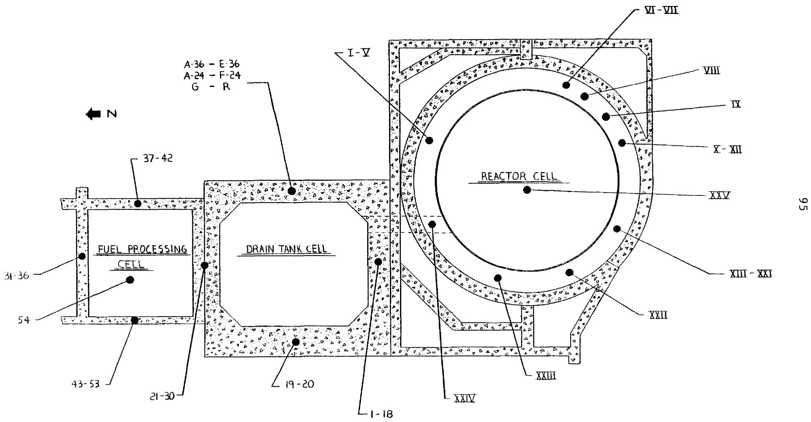  
Fig. D-1. Identification and location of cell penetrations at the MSRE.

REF.DWG.X3E-12598-001

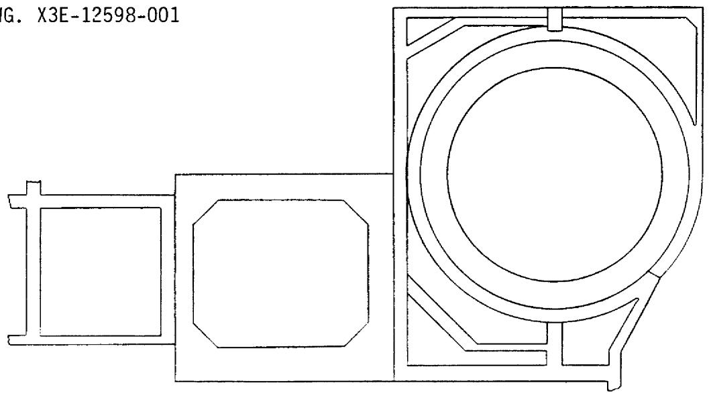  
ENVELOPE I

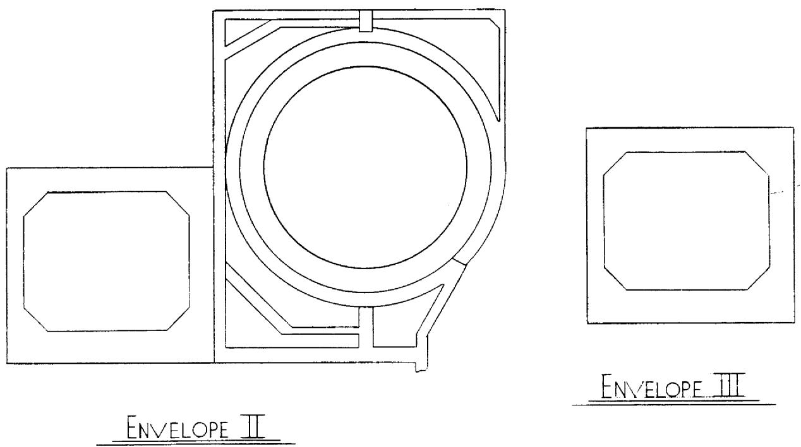  
Fig. D-2. Containment envelope options.

than is the reactor cell. Once the processing cell is accessed, the penetrations associated with Envelope 2 (between the fuel processing and drain tank cells) can be examined and sealed. Finally, Envelope 3 is the drain tank cell itself, where the fuel and flush salts are actually stored. Once the reactor cell has been opened, the large penetration between the drain tank cell and the reactor cell can be sealed.

# D.3 DESCRIPTION OF PENETRATIONS

During reactor operation, the molten fuel salt had to be maintained at a temperature above $840^{\circ}\mathrm{F}$ (the melting point of the salt) in order to prevent a plug of solid salt from forming. This was achieved by surrounding salt transfer lines with electrical heaters, insulation, thermocouples, pressure reading instruments, and redundant instrumentation. This complex array of electrical and instrumentation lines necessitated numerous penetrations through the cell walls. In addition to the cell wall penetrations, there are two large cell-to-cell openings: a 36-in. opening between the reactor and drain tank cells (Fig. D.3), and a 14-in. opening between the drain tank and reprocessing cells (Fig. D.4). These two openings carry insulated, heated lines for salt transfer.

# D.4 REACTOR CELL PENETRATIONS

Typical reactor cell penetrations (see Figs. D.5 through D.9) are electrical, thermocouple, water, off-gas, and salt transfer lines. All of these penetrations pass through the sand and water-filled annulus. In addition, the reactor cell penetrations are provided with some mechanism to allow movement relative to the cell walls. The 12-ft radius indicates the reactor containment cell wall, which was constructed of stainless steel plate ranging from 1-1/4 to 4-in. in thickness. The 15-ft radius indicates the reactor tank liner, which was constructed of 3/8-in.-thick stainless steel plate. The lines shown inside the larger penetrations are presently connected or were used as spares and left capped.

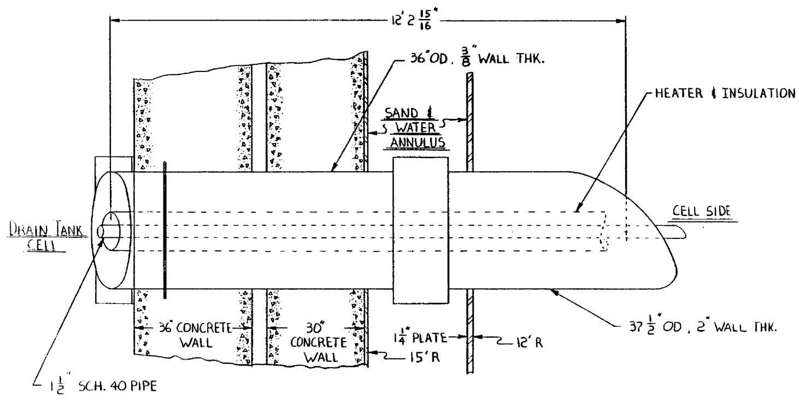  
REACTOR-DRAIN TANK INTERCONNECT   
Fig. D-3. Existing interconnecting penetration between reactor cell and drain tank cell.

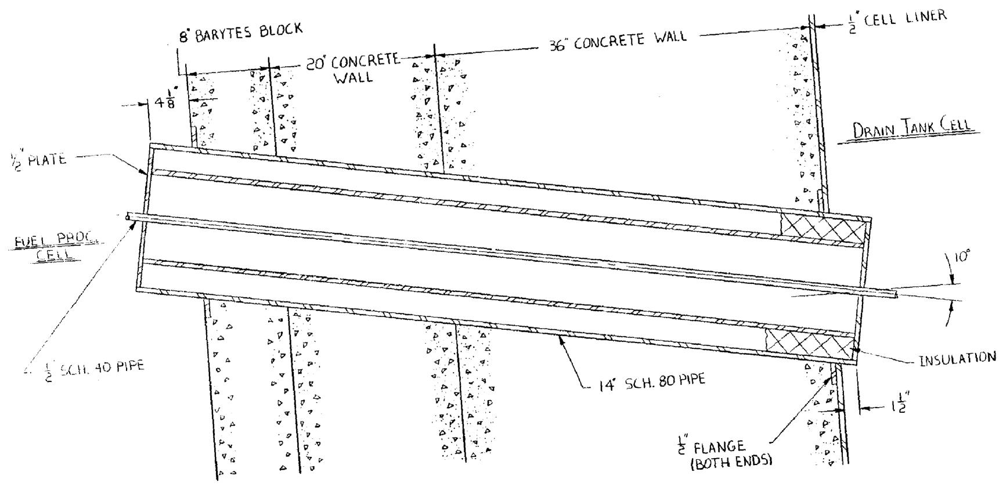  
SALT TRANSFER LINE  
SALT TRANSFER LINE Fig. D-4. Existing salt transfer line penetration between drain tank cell and fuel processing cell.

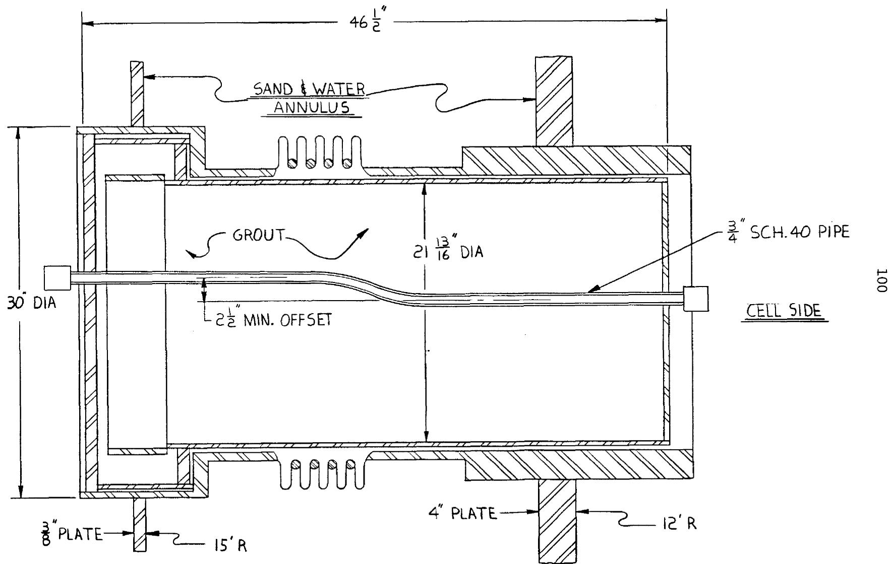  
Fig. D-5. Typical existing electrical, thermocouple and instrumentation pentrations into reactor cell.

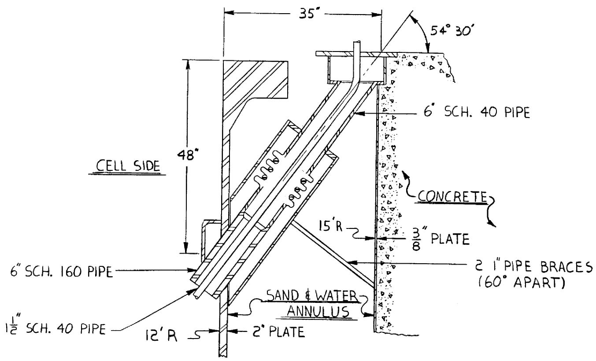  
SAMPLER AND SAMPLER OFFGAS LINES   
Fig. D-6. Existing sampler and sampler offgas line penetrations into reactor cell.

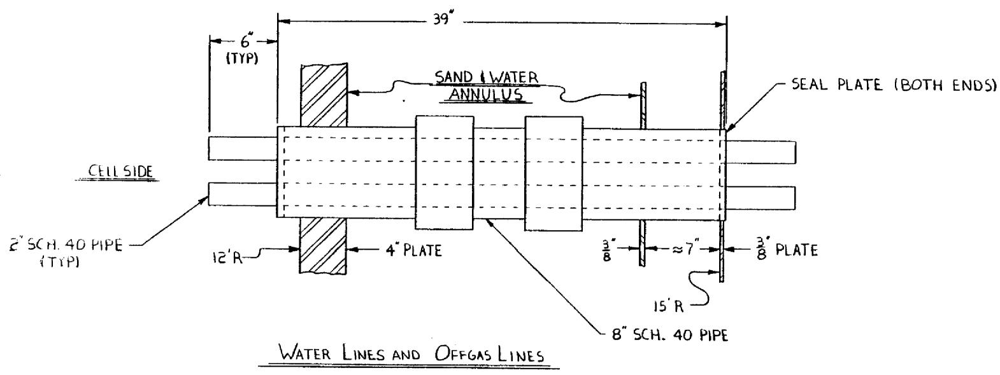  
Fig. D-7. Existing water and offgas penetrations into reactor cell.

102

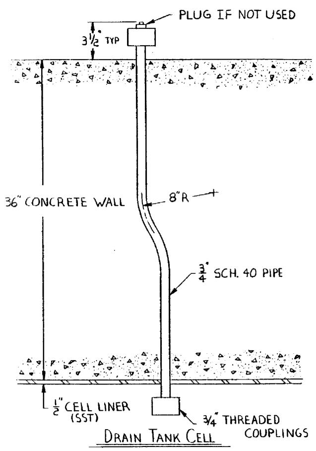  
INSTRUMENTATION ELECTRICAL LINES

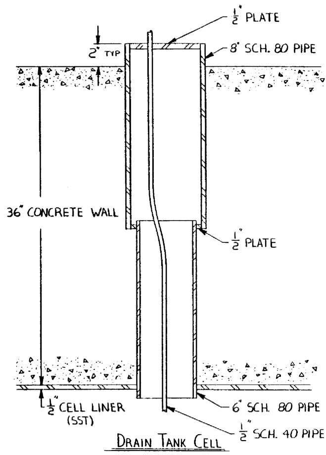  
Coolant Air Cover Gas Lines   
Fig. D-8. Typical existing penetrations into drain tank cell.

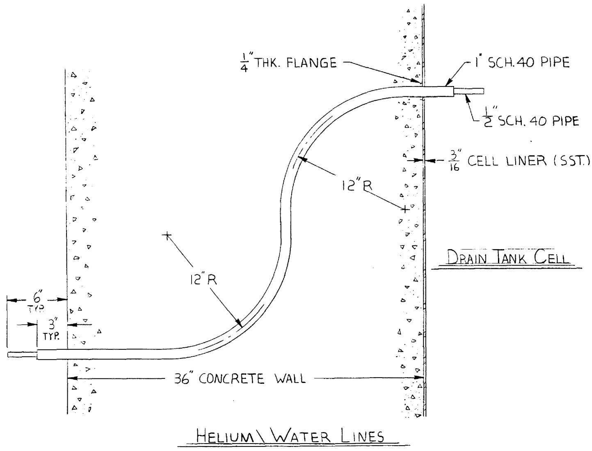  
Fig. D-9. Typical water and helium penetrations into drain tank cell.

# D.5 DRAIN TANK AND FUEL PROCESSING CELL PENETRATIONS

Figures D.8 and D.9 show typical electrical, cover gas, coolant air, helium, and water transfer lines. All of these lines, except for those interconnecting the two cells, pass through the concrete cell wall into access areas. As in the reactor cell, the lines are either connected or were used as spares and left capped.

# D.6 TABULATION OF PERTINENT INFORMATION

Much information about the cell penetrations has been collected and tabulated (Table D.1). This table has been divided into three sections, one for each of the main cells (reactor, drain tank, and fuel processing). Table headings are: (1) penetration identification number, (2) type/usage, (3) present condition, (4) location in the cell, (5) access area, (6) size of the major and interior penetrations, (7) determination as to whether the penetration is needed now or in the future, (8) closure options, and (9) envelope involved. The present condition of the penetrations (connected, capped, or empty) is yet to be determined; however, a detailed on-site inspection would provide most of this information. Some of the penetrations used in the facility, and their need for maintenance or for future salt transfer, were not readily available at the time this study was completed.

# D.7 CLOSURE OPTIONS

Numerous penetrations are currently needed for facility surveillance maintenance. The solid salt is heated annually to recombine fluorine, in addition to the periodic measurements of temperature and pressure. Besides the penetrations needed for surveillance and maintenance, the facility must maintain the capability for transferring the fuel and flush salts out of the drain tank cell in the event this may be required in the future. Several closure options are available for those penetrations that are not needed now or in the future. Penetrations with interior lines can be sealed in one of two ways (Fig. D.10). Each interior penetration can be capped and left in place, or the end seal-plate can be removed, the interior lines cut inside the larger penetration, and the seal-plate replaced with a new, solid plate. The option

Table D-1. MSRE reactor and drain tank cell penetration list.   

<table><tr><td>I.D.</td><td>TYPE/USAGE</td><td>PRESENT CONDITION</td><td>CELL LOCATION</td><td>ACCESS AREA</td><td>SIZE</td><td>NEeded</td><td>CLOSURE OPTIONS</td><td>ENVELOPE</td></tr><tr><td colspan="9">Drain Tank Cell</td></tr><tr><td>1</td><td>STEAM FROM DOMES (1)</td><td></td><td>South Wall</td><td>South ESA</td><td>3&quot; in 4&quot;</td><td></td><td>1</td><td>1</td></tr><tr><td>2</td><td>STEAM FROM DOMES (1)</td><td></td><td>South Wall</td><td>South ESA</td><td>3&quot; in 4&quot;</td><td></td><td>1</td><td>1</td></tr><tr><td>3</td><td>WATER TO STEAM DOMES (1)</td><td></td><td>South Wall</td><td>South ESA</td><td>1&quot;</td><td></td><td>1</td><td>1</td></tr><tr><td>4</td><td>WATER TO STEAM DOMES (1)</td><td></td><td>South Wall</td><td>South ESA</td><td>1&quot;</td><td></td><td>1</td><td>1</td></tr><tr><td>5</td><td>WATER (1)</td><td></td><td>South Wall</td><td>South ESA</td><td>1&quot;</td><td></td><td>1</td><td>1</td></tr><tr><td>6</td><td>WATER (1)</td><td></td><td>South Wall</td><td>South ESA</td><td>1&quot;</td><td></td><td>1</td><td>1</td></tr><tr><td>7</td><td>SPARE (1)</td><td></td><td>South Wall</td><td>South ESA</td><td>1&quot;</td><td>NO</td><td>1</td><td>1</td></tr><tr><td>8</td><td>SPARE (1)</td><td></td><td>South Wall</td><td>South ESA</td><td>1&quot;</td><td>NO</td><td>1</td><td>1</td></tr><tr><td>9</td><td>HELIUM (1)</td><td></td><td>South Wall</td><td>South ESA</td><td>1/2&quot; in 1&quot;</td><td></td><td>1</td><td>1</td></tr><tr><td>10</td><td>HELIUM (1)</td><td></td><td>South Wall</td><td>South ESA</td><td>1/2&quot; in 1&quot;</td><td></td><td>1</td><td>1</td></tr><tr><td>11</td><td>HELIUM (1)</td><td></td><td>South Wall</td><td>South ESA</td><td>1/2&quot; in 1&quot;</td><td></td><td>1</td><td>1</td></tr><tr><td>12</td><td>HELIUM (1)</td><td></td><td>South Wall</td><td>South ESA</td><td>1/2&quot; in 1&quot;</td><td></td><td>1</td><td>1</td></tr><tr><td>13</td><td>HELIUM (1)</td><td></td><td>South Wall</td><td>South ESA</td><td>1/2&quot; in 1&quot;</td><td></td><td>1</td><td>1</td></tr><tr><td>14</td><td>HELIUM (1)</td><td></td><td>South Wall</td><td>South ESA</td><td>1/2&quot; in 1&quot;</td><td></td><td>1</td><td>1</td></tr><tr><td>15</td><td>HELIUM (1)</td><td></td><td>South Wall</td><td>South ESA</td><td>1/2&quot; in 1&quot;</td><td></td><td>1</td><td>1</td></tr><tr><td>16</td><td>HELIUM (1)</td><td></td><td>South Wall</td><td>South ESA</td><td>1/2&quot; in 1&quot;</td><td></td><td>1</td><td>1</td></tr><tr><td>17</td><td>SLMP DISCHARGE (1)</td><td></td><td>South Wall</td><td>Waste Cell</td><td>3/4&quot;</td><td></td><td>1</td><td>1</td></tr><tr><td>18</td><td>SLMP DISCHARGE (1)</td><td></td><td>South Wall</td><td>Waste Cell</td><td>3/4&quot;</td><td></td><td>1 OR 2</td><td>1</td></tr><tr><td>19</td><td>AIR TO SUMP (1)</td><td></td><td>West Wall</td><td>West of Bldg.</td><td>3/4&quot;</td><td></td><td>1 OR 2</td><td>1</td></tr><tr><td>20</td><td>AIR TO SUMP (1)</td><td></td><td>West Wall</td><td>West of Bldg.</td><td>3/4&quot;</td><td></td><td>1 OR 2</td><td>1</td></tr><tr><td>21</td><td></td><td></td><td>North Wall</td><td>Fuel Proc. Cell</td><td>1-1/2&quot;</td><td></td><td>1 OR 2</td><td>2</td></tr><tr><td>22</td><td></td><td></td><td>North Wall</td><td>Fuel Proc. Cell</td><td>1-1/2&quot;</td><td></td><td>1 OR 2</td><td>2</td></tr><tr><td>23</td><td></td><td></td><td>North Wall</td><td>Fuel Proc. Cell</td><td>1-1/2&quot;</td><td></td><td>1 OR 2</td><td>2</td></tr><tr><td>24</td><td></td><td></td><td>North Wall</td><td>Fuel Proc. Cell</td><td>1-1/2&quot;</td><td></td><td>1 OR 2</td><td>2</td></tr><tr><td>25</td><td></td><td></td><td>North Wall</td><td>Fuel Proc. Cell</td><td>1-1/2&quot;</td><td></td><td>1 OR 2</td><td>2</td></tr><tr><td>26</td><td></td><td></td><td>North Wall</td><td>Fuel Proc. Cell</td><td>4&quot;</td><td></td><td>1 OR 2</td><td>2</td></tr><tr><td>27</td><td></td><td></td><td>North Wall</td><td>Fuel Proc. Cell</td><td>1-1/2&quot;</td><td></td><td>1 OR 2</td><td>2</td></tr><tr><td>28</td><td></td><td></td><td>North Wall</td><td>Fuel Proc. Cell</td><td>1-1/2&quot;</td><td></td><td>1 OR 2</td><td>2</td></tr><tr><td>29</td><td></td><td></td><td>North Wall</td><td>Fuel Proc. Cell</td><td>1-1/2&quot;</td><td></td><td>1 OR 2</td><td>2</td></tr><tr><td>30</td><td></td><td></td><td>North Wall</td><td>Fuel Proc. Cell</td><td>14&quot;</td><td></td><td>2</td><td>2</td></tr><tr><td>A-36</td><td>INSTRUMENTATION (29)</td><td></td><td>East Wall</td><td>North ESA</td><td>3/4&quot;</td><td></td><td>3</td><td>1</td></tr><tr><td>B-36</td><td>INSTRUMENTATION (36)</td><td></td><td>East Wall</td><td>North ESA</td><td>3/4&quot;</td><td></td><td>3</td><td>1</td></tr><tr><td>C-36</td><td>THERMOCOUPLIES (36)</td><td></td><td>East Wall</td><td>North ESA</td><td>3/4&quot;</td><td></td><td>3</td><td>1</td></tr><tr><td>D-36</td><td>THERMOCOUPLIES (36)</td><td></td><td>East Wall</td><td>North ESA</td><td>3/4&quot;</td><td></td><td>3</td><td>1</td></tr><tr><td>E-36</td><td>THERMOCOUPLIES (36)</td><td></td><td>East Wall</td><td>North ESA</td><td>3/4&quot;</td><td></td><td>3</td><td>1</td></tr><tr><td>A-24</td><td>ELECTRICAL. (24)</td><td></td><td>East Wall</td><td>North ESA</td><td>3/16&quot; in 3/4&quot;</td><td></td><td>3</td><td>1</td></tr><tr><td>B-24</td><td>ELECTRICAL. (24)</td><td></td><td>East Wall</td><td>North ESA</td><td>3/16&quot; in 3/4&quot;</td><td></td><td>3</td><td>1</td></tr></table>

Table D-1, continued.   

<table><tr><td colspan="2">C-24 ELECTRICAL (24)</td><td>East Wall</td><td>North ESA</td><td>3/16&quot; in 3/4&quot;</td><td></td><td>3</td><td>1</td></tr><tr><td colspan="2">D-24 ELECTRICAL (24)</td><td>East Wall</td><td>North ESA</td><td>3/16&quot; in 3/4&quot;</td><td></td><td>3</td><td>1</td></tr><tr><td colspan="2">E-24 ELECTRICAL (24)</td><td>East Wall</td><td>North ESA</td><td>3/16&quot; in 3/4&quot;</td><td></td><td>3</td><td>1</td></tr><tr><td colspan="2">F-24 ELECTRICAL (24)</td><td>East Wall</td><td>North ESA</td><td>3/16&quot; in 3/4&quot;</td><td></td><td>3</td><td>1</td></tr><tr><td colspan="2">G SPARE (1)</td><td>East Wall</td><td>North ESA</td><td>6&quot;</td><td>NO</td><td>1 OR 2</td><td>1</td></tr><tr><td colspan="2">H SPARE (1)</td><td>East Wall</td><td>North ESA</td><td>6&quot;</td><td>NO</td><td>1 OR 2</td><td>1</td></tr><tr><td colspan="2">I COVER GAS (3)</td><td>East Wall</td><td>North ESA</td><td>6&quot; (3 1/2&quot;)</td><td></td><td>1 OR 2</td><td>1</td></tr><tr><td colspan="2">J SPARE (1)</td><td>East Wall</td><td>North ESA</td><td>6&quot;</td><td>NO</td><td>1 OR 2</td><td>1</td></tr><tr><td colspan="2">K SPARE (1)</td><td>East Wall</td><td>North ESA</td><td>6&quot;</td><td>NO</td><td>1 OR 2</td><td>1</td></tr><tr><td colspan="2">L SPARE (1)</td><td>East Wall</td><td>North ESA</td><td>6&quot;</td><td>NO</td><td>1 OR 2</td><td>1</td></tr><tr><td colspan="2">M COMPONENT COOLANT AIR (3)</td><td>East Wall</td><td>North ESA</td><td>6&quot; (3 3/4&quot;)</td><td></td><td>1 OR 2</td><td>1</td></tr><tr><td colspan="2">N COMPONENT COOLANT AIR (3)</td><td>East Wall</td><td>North ESA</td><td>6&quot; (3 3/4&quot;)</td><td></td><td>1 OR 2</td><td>1</td></tr><tr><td colspan="2">O COMPONENT COOLANT AIR (1)</td><td>East Wall</td><td>North ESA</td><td>6&quot; (ONE 1 1/2&quot;)</td><td></td><td>1 OR 2</td><td>1</td></tr><tr><td colspan="2">P DP CELL (4)</td><td>East Wall</td><td>North ESA</td><td>6&quot; (4 1/2&quot;)</td><td></td><td>1 OR 2</td><td>1</td></tr><tr><td colspan="2">Q LEAK DETECTOR (12)</td><td>East Wall</td><td>South ESA</td><td>6&quot; (12 1/4&quot;)</td><td></td><td>1 OR 2</td><td>1</td></tr><tr><td colspan="2">R LEAK DETECTOR (12)</td><td>East Wall</td><td>South ESA</td><td>6&quot; (12 1/4&quot;)</td><td></td><td>1 OR 2</td><td>1</td></tr><tr><td colspan="8">Reactor Cell Ft-in., Degrees</td></tr><tr><td colspan="2">I REACTOR LEAK DETECTORS (60)</td><td>836 15</td><td>South ESA</td><td>24&quot; (60 1/4&quot;)</td><td>NO</td><td>2 OR 3</td><td>1</td></tr><tr><td colspan="2">II ELECTRICAL (44)</td><td>834 30</td><td>South ESA</td><td>24&quot; (6 1&quot;;38 3/4&quot;)</td><td>NO</td><td>2 OR 3</td><td>1</td></tr><tr><td colspan="2">III ELECTRICAL (44)</td><td>836 45</td><td>South ESA</td><td>24&quot; (6 1&quot;;38 3/4&quot;)</td><td>NO</td><td>2 OR 3</td><td>1</td></tr><tr><td colspan="2">IV THERMOCOUPLIES (60)</td><td>834 60</td><td>South ESA</td><td>24&quot; (7 3/4&quot;;28 1/2&quot;;25 3/8&quot;)NO</td><td></td><td>2 OR 3</td><td>1</td></tr><tr><td colspan="2">V INSTRUMENTATION (60)</td><td>836 75</td><td>South ESA</td><td>24&quot; (60 3/8&quot;)</td><td>NO</td><td>2 OR 3</td><td>1</td></tr><tr><td colspan="2">VI SAMPLER OFFGAS</td><td>847 110</td><td>High Bay</td><td>4&quot; (2 1/2&quot;)</td><td>NO</td><td>2</td><td>1</td></tr><tr><td colspan="2">VII SAMPLER</td><td>847 115</td><td>High Bay</td><td>6&quot;</td><td>NO</td><td>2</td><td>1</td></tr><tr><td colspan="2">VIII FUEL PLMP AUX. Piping (8)</td><td>836-9 125</td><td>Service Tunnel</td><td>18&quot; (3 1/2&quot;;4 3/4&quot;;1 1&quot;)</td><td>NO</td><td>?</td><td>1</td></tr><tr><td colspan="2">IX NEUTRON INSTRUMENT TUBE</td><td>834-5 145</td><td>High Bay</td><td>36&quot; (10 ION CHAMBER GUIDES)</td><td>NO</td><td>?</td><td>1</td></tr><tr><td colspan="2">X FUEL PLMP LIQ. LEVEL (6)</td><td>844-6 155</td><td>Special Eq. Rm.</td><td>4&quot; (6 1/4&quot;)</td><td>NO</td><td>2</td><td>1</td></tr><tr><td colspan="2">XI FUEL PLMP AUX. Piping (13)</td><td>836-9 160</td><td>Special Eq. Rm.</td><td>18&quot; (2 1&quot;;11 1/2&quot;)</td><td>NO</td><td>?</td><td>1</td></tr><tr><td colspan="2">XII COMPONENT COOLANT AIR (1)</td><td>829-10 165</td><td>Special Eq. Rm.</td><td>6&quot;</td><td>NO</td><td>?</td><td>1</td></tr><tr><td colspan="2">XIII COOLANT SALT TO HX (1)</td><td>840-10 170</td><td>Coolant Cell</td><td>24&quot;</td><td>NO</td><td>?</td><td>1</td></tr><tr><td colspan="2">XIV WATER LINES (2)</td><td>839-9 185</td><td>Coolant Cell</td><td>8&quot; (2 1&quot;)</td><td>NO</td><td>1 OR 2</td><td>1</td></tr><tr><td colspan="2">XV SPARE (2)</td><td>839-9 200</td><td>Coolant Cell</td><td>8&quot; (2 2&quot;)</td><td>NO</td><td>1 OR 2</td><td>1</td></tr><tr><td colspan="2">XVI WATER LINES (2)</td><td>839-9 205</td><td>Coolant Cell</td><td>8&quot; (2 2&quot;)</td><td>NO</td><td>1 OR 2</td><td>1</td></tr><tr><td colspan="2">XVII WATER LINES (2)</td><td>839-9 210</td><td>Coolant Cell</td><td>8&quot; (2 2&quot;)</td><td>NO</td><td>1 OR 2</td><td>1</td></tr><tr><td colspan="2">XVIII WATER LINES (2)</td><td>839-9 220</td><td>Coolant Cell</td><td>8&quot; (2 2&quot;)</td><td>NO</td><td>1 OR 2</td><td>1</td></tr><tr><td colspan="2">XIX COOL. SALT TO RADIATOR (1)</td><td>837 220</td><td>Coolant Cell</td><td>24&quot;</td><td>NO</td><td>?</td><td>1</td></tr><tr><td colspan="2">XX OFFGAS (3)</td><td>839-9 225</td><td>Coolant Cell</td><td>6&quot; (3 1&quot;)</td><td>NO</td><td>1 OR 2</td><td>1</td></tr><tr><td colspan="2">XXI OFFGAS (2)</td><td>839-9 230</td><td>Coolant Cell</td><td>6&quot; (TWO 1 1/4&quot;)</td><td>NO</td><td>1 OR 2</td><td>1</td></tr><tr><td colspan="2">XXII CELL EXHAUST DUCT (1)</td><td>824-10 245</td><td>CDT Tunnel</td><td>30&quot;</td><td>NO</td><td>2</td><td>1</td></tr><tr><td colspan="2">XXIII THERMOCOUPLE (38)</td><td>836 325</td><td>West Tunnel</td><td>24&quot; (38 3/8&quot;)</td><td>NO</td><td>2 OR 3</td><td>1</td></tr><tr><td colspan="2">XXIV DRAIN TANK CELI. INTERCON.</td><td>825-2 330</td><td>Drain Tank Cell1</td><td>36&quot;</td><td>NO</td><td>2</td><td>3</td></tr><tr><td colspan="2">XXV SUMP</td><td colspan="3">Bottom Center</td><td>NO</td><td>?</td><td>1</td></tr></table>

Table D-1, continued.   

<table><tr><td>31</td><td>NORTH WALL</td><td>DECON. CELL</td><td>6&quot;</td><td></td><td>1 OR 2</td><td>1</td></tr><tr><td>32 DRAIN</td><td>NORTH WALL</td><td>DECON. CELL</td><td>3&quot;</td><td>NO</td><td>1 OR 2</td><td>1</td></tr><tr><td>33 STEAM LINE</td><td>NORTH WALL</td><td>DECON. CELL</td><td>3/4&quot;</td><td></td><td>1 OR 2</td><td>1</td></tr><tr><td>34 STEAM JET DISCHARGE</td><td>NORTH WALL</td><td>DRAIN TANK CELL</td><td>3/4&quot;</td><td></td><td>1 OR 2</td><td>2</td></tr><tr><td>35 STEAM LINE</td><td>NORTH WALL</td><td>DECON. CELL</td><td>3/4&quot;</td><td></td><td>1 OR 2</td><td>1</td></tr><tr><td>36 STEAM LINE</td><td>NORTH WALL</td><td>DECON. CELL</td><td>3/4&quot;</td><td></td><td>1 OR 2</td><td>1</td></tr><tr><td>37</td><td>EAST WALL</td><td>SPARE CELL</td><td>6&quot;</td><td></td><td>1 OR 2</td><td>1</td></tr><tr><td>38</td><td>EAST WALL</td><td>SPARE CELL</td><td>12&quot;</td><td></td><td>1 OR 2</td><td>1</td></tr><tr><td>39</td><td>EAST WALL</td><td>SPARE CELL</td><td>12&quot;</td><td></td><td>1 OR 2</td><td>1</td></tr><tr><td>40</td><td>EAST WALL</td><td>SPARE CELL</td><td>12&quot;</td><td></td><td>1 OR 2</td><td>1</td></tr><tr><td>41 DRAIN</td><td>EAST WALL</td><td>SPARE CELL</td><td>3&quot;</td><td>NO</td><td>1 OR 2</td><td>1</td></tr><tr><td>42 DRAIN</td><td>EAST WALL</td><td>SPARE CELL</td><td>3&quot;</td><td>NO</td><td>1 OR 2</td><td>1</td></tr><tr><td>43</td><td>WEST WALL</td><td>HIGH BAY</td><td>8&quot;</td><td></td><td>1 OR 2</td><td>1</td></tr><tr><td>44</td><td>WEST WALL</td><td>ABSOR. CUBE.</td><td>6&quot;</td><td>YES</td><td>1 OR 2</td><td>1</td></tr><tr><td>45</td><td>WEST WALL</td><td>ABSOR. CUBE.</td><td>6&quot;</td><td>YES</td><td>1 OR 2</td><td>1</td></tr><tr><td>46</td><td>WEST WALL</td><td>ABSOR. CUBE.</td><td>4&quot;</td><td>YES</td><td>1 OR 2</td><td>1</td></tr><tr><td>47</td><td>WEST WALL</td><td>?</td><td>4&quot;</td><td></td><td>1 OR 2</td><td>1</td></tr><tr><td>48</td><td>WEST WALL</td><td>?</td><td>4&quot;</td><td></td><td>1 OR 2</td><td>1</td></tr><tr><td>49 ULTRASONIC PROBE</td><td>WEST WALL</td><td>?</td><td>2&quot;</td><td>YES</td><td>1 OR 2</td><td>1</td></tr><tr><td>50 INSTRUMENTATION</td><td>WEST WALL</td><td>INSTR. CUBE.</td><td>6&quot;</td><td>YES</td><td>1 OR 2</td><td>1</td></tr><tr><td>51 INSTRUMENTATION</td><td>WEST WALL</td><td>INSTR. CUBE.</td><td>2&quot;</td><td>YES</td><td>1 OR 2</td><td>1</td></tr><tr><td>52</td><td>WEST WALL</td><td>ABSOR. CUBE.</td><td>6&quot;</td><td>YES</td><td>1 OR 2</td><td>1</td></tr><tr><td>53 INSTRUMENTATION</td><td>WEST WALL</td><td>INSTR. CUBE.</td><td>6&quot;</td><td>YES</td><td>1 OR 2</td><td>1</td></tr><tr><td>54 SALT ADDITION LINE</td><td>ROOF</td><td>HIGH BAY</td><td>1 1/2&quot;</td><td>YES</td><td>2</td><td>1</td></tr></table>

Fig. D-10. Closure options for multiple penetration assemblies.   
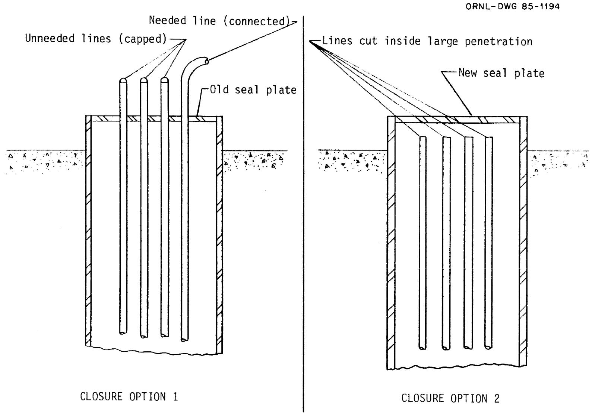  
NOTE: Closure option 3 is a threaded plug.

chosen depends on the use of the interior lines. If any of the interior lines are needed, then the sealing of individual lines would allow the needed lines to remain connected. If none of the interior penetrations is required, the method of replacing the seal-plate with a new, solid plate would eliminate exposed lines. Electrical lines can be sealed with a threaded, pressure-tight plug, such as those used for sealing spare electrical lines in the original construction.

# D.7 SUMMARY

The information developed in the course of this investigation into the condition of the cell wall penetrations of the MSRE facility was of a preliminary nature, and more work is needed. Completion of the tabulated data should be undertaken with a particular attention to further on-site inspection to verify conditions. The preparations required for closure of most penetrations is straightforward since most of the electrical and gas lines are readily accessible and sealing can be achieved in the same manner that spare lines are capped. However, special preparations will be required in two cases: (1) any penetration that will, when cut, have direct contact with cell atmosphere will have to be identified, and (2) the sampler and sampler off-gas lines will require considerable effort to remove the lead shielding above the penetrations in order to obtain access. Most of the penetrations in the facility are associated with the reactor and drain tank cells. Other than those penetrations required for monitoring the fuel storage conditions, final sealing of the wall penetrations that exist in the drain tank cell would achieve the maximum security for in-place fuel storage for an extended period. The major effort, of course, would be for the cleanup to gain access to the reactor and fuel processing cells so that final isolation of the drain tank cell could be achieved.

Appendix E. BUILDING 7503 DRAINAGE SYSTEMS

Prepared by

F.J.Peretz

Martin Marietta Energy Systems, Inc., Engineering

August 1985

# BUILDING 7503 DRAINAGE SYSTEMS

This appendix presents a review of the existing literature and design data for the Building 7503 drainage systems. Further work to field check the condition of the drainage systems would be useful, as would studies to define the flow patterns and volumes of groundwater at the site.

# Overall Description

Building 7503 is served primarily by four drainage systems. (1) A special radioactive liquid waste system collects water from process and cell floor drains in a liquid waste tank located in the liquid waste cell. Waste is neutralized in this tank if necessary, and then is pumped to the LLW pumping station at the northwest corner of the site. Waste is then pumped over to the Bethel Valley facilities for concentration and disposal. (2) Nonradioactive drainage, including groundwater collected by the building french drain system and water entering floor drains outside of the cells, is collected in the building sump. Water is then pumped out of the sump and discharged from a catch basin southwest of the building out to a drainage area leading to Melton Hill Branch. (3) Storm water is collected in a series of roof drains, and is piped to another catch basin west of the building. This water is also discharged to a drainage area. (4) Sanitary wastewater is collected and drained to a septic tank and drain field also located west of the building. Fig. E-1 shows a schematic of the storm and nonradioactive building water rainage systems, including the locations of the catch basins and discharge points. Drawing D-A-AA-40888-C (in pocket inside back cover) shows the flow diagram for the building radioactive and nonradioactive collection piping systems. Further details on all of the

Unclassified ORNL DWG 64-9109

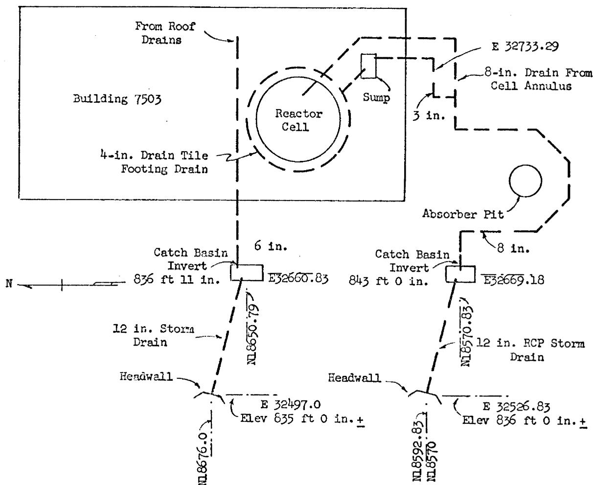  
Fig. E-1. Schematic diagram of Building 7503 drainage plan.

building drainage systems are given in ORNL-TM-728, Part 1, and in ORNL/CF-77/391.

# Radioactive Liquid Waste Collection

The central point for radioactive liquid waste collection is a 11,000 gal. tank located in the liquid waste cell in the north half of the building. The major sources of waste for which this collection system was designed are the floor sumps in each cell, decontamination solutions from the decontamination tank (which was never installed), and drainage from "hot" sinks. Radioactive water collected in the building sump room can also be sent to the liquid waste tank. The major lines of the radioactive waste system are listed in Table E-1. Each cell is provided with a sump to collect any water which might enter the cell. Steam jets are used to move water from the sump to the waste tank in all cells except the drain tank cell and the reactor cell. Those two cells use air jets to avoid introducing steam into cells containing fuel salts. One other exception is the sump added to the coolant drain tank cell, which is jetted to a sewer in the west tunnel of the south electric service area. Under normal conditions, no water is present in the sumps, indicating that the cells do indeed remain dry.

# Building Water Collection and Dispersal

The central point of the nonradioactive building water collection system is the pump room and building sump (Fig. E-2), located underneath the special equipment room in the southeast part of the building. Access to the pump room is gained through a ladder tunnel beginning on the main floor (elevation 852 ft). Two sump pumps and one "pit pump" are in the pump room,

Table E-1. Radioactive liquid waste lines   

<table><tr><td>Line No.</td><td>Description</td><td>Material</td><td>Size</td></tr><tr><td colspan="4">Lines entering liquid waste storage tank:</td></tr><tr><td>333</td><td>Reactor cell sump (air jet)</td><td>Stainless</td><td>3/4&quot;</td></tr><tr><td>343</td><td>Drain tank cell sump (air jet)</td><td>Stainless</td><td>3/4&quot;</td></tr><tr><td>314</td><td>Caustic scrubber tank steam jet</td><td>Steel</td><td>3/4&quot;</td></tr><tr><td>316</td><td>Liquid waste cell sump (steam jet)</td><td>Stainless</td><td>3/4&quot;</td></tr><tr><td>318</td><td>Equipment storage cell sump (steam jet)</td><td>Stainless</td><td>3/4&quot;</td></tr><tr><td>320</td><td>Spare cell sump (steam jet)</td><td>Stainless</td><td>3/4&quot;</td></tr><tr><td>322</td><td>Fuel processing cell sump (steam jet)</td><td>Stainless</td><td>3/4&quot;</td></tr><tr><td>326</td><td>Pit pump discharge</td><td>Stainless</td><td>2&quot;</td></tr><tr><td>339</td><td>Caustic addition</td><td>Stainless</td><td>2&quot;</td></tr><tr><td>340</td><td>Hot sinks</td><td>Stainless</td><td>2&quot;</td></tr><tr><td>308</td><td>Process water addition (siphon break)</td><td>Stainless</td><td>3/4&quot;</td></tr><tr><td>301</td><td>Waste pump discharge (recirc. &amp; mixing)</td><td>Stainless</td><td>2&quot;</td></tr><tr><td>948</td><td>Waste tank vent to blower</td><td>Stainless</td><td>6&quot;</td></tr><tr><td colspan="4">Lines entering waste pump:</td></tr><tr><td>300</td><td>Liquid waste storage tank discharge</td><td>Stainless</td><td>2-1/2&quot;</td></tr><tr><td>303</td><td>Decontamination tank discharge</td><td>Stainless</td><td>2-1/2&quot;</td></tr><tr><td colspan="4">Other lines:</td></tr><tr><td>305</td><td>Waste pump to central pumping station</td><td>Stainless</td><td>2&quot;</td></tr><tr><td>302</td><td>Waste pump to sand filter</td><td>Stainless</td><td>2&quot;</td></tr><tr><td>306</td><td>Sand filter to decontamination tank</td><td>Stainless</td><td>2&quot;</td></tr><tr><td>303</td><td>Decontamination cell sump to waste pump</td><td>Stainless</td><td></td></tr></table>

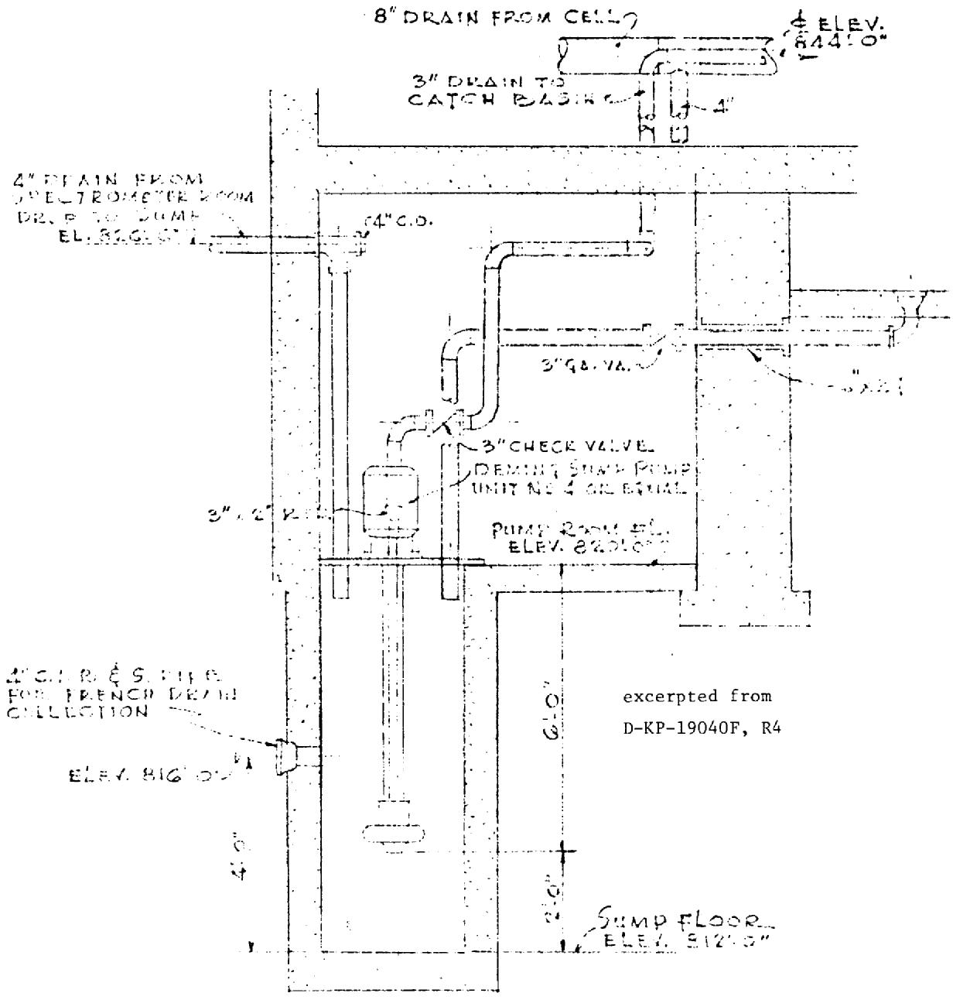  
Fig. E-2. Section of sump room, looking east. (ART configuration)

as seen in the flowsheet D-AA-A-40888-C. The sump and pump room were constructed as part of the building modifications for installation of the Aircraft Reactor Test (ART) in the late 1950's, and was modified only slightly for the MSRE. Thus, most of the design information is found with the design package for the ART. Drawing D-KP-19040-F shows many of the construction details of the building drainage system.

The building sump collects water from nonradioactive floor drains throughout the facility, as listed in Table E-2. Standard designs were used for these drains. The sump also recieves groundwater from a french drain system which serves the deeper cells and support areas in the south end of the building, and the charcoal bed south of the building. Again, this french drain system was largely constructed as part of the ART modifications. Figs. E-3, E-4 and E-5 show cross sections of the building foundations, with the approximate elevations of the french drains indicated. Similar french drains may exist in the original north section of the building, but specific design information was not found. The two sump pumps in the pump room were recently instrumented to determine what fraction of time they operate. Preliminary indications are that the pump with the deeper float operates about one hour a day, discharging 2000 gallons in an hour. The other pump, which would only operate should the first pump not be able to keep up with the inflow, has not operated during this period of observation. At one time during the interim period between ART and MSRE construction, the sump pump failed and was out of operation for some time. During this time, the lower levels of the building were flooded with several feet of water. This experience indicates that continued operation of the pumps is necessary for the assured safe storage of the salts in the MSRE facility.

Table E-2. Standard building drainage lines.   

<table><tr><td>Line No.</td><td>Description</td><td>Material</td><td>Size</td></tr><tr><td colspan="4">Drain lines entering sump:</td></tr><tr><td>352</td><td>Radiator air duct floor drain</td><td>Cast iron</td><td>3&quot;</td></tr><tr><td>353</td><td>Radiator stack floor drain</td><td>Cast iron</td><td>3&quot;</td></tr><tr><td>354</td><td>Coolant drain cell floor drain</td><td>Steel</td><td>3&quot;</td></tr><tr><td>364</td><td>Coolant drain cell (via 354)</td><td>Cast iron</td><td>3&quot;</td></tr><tr><td>355</td><td>Blower house floor drain</td><td>Cast iron</td><td>3&quot;</td></tr><tr><td>356</td><td>Blower house ramp drain (via 355)</td><td>Cast iron</td><td>3&quot;</td></tr><tr><td>357</td><td>West tunnel floor drain (via 355)</td><td>Cast iron</td><td>3&quot;</td></tr><tr><td>358</td><td>Service room floor drain</td><td>Cast iron</td><td>4&quot;</td></tr><tr><td>359</td><td>Service tunnel drain</td><td>Steel</td><td>3&quot;</td></tr><tr><td>365</td><td>Vent house valve pit drain</td><td>Cast iron</td><td>2&quot;</td></tr><tr><td>325</td><td>55 gal drum drain, pit pump suction</td><td>Steel</td><td>3&quot;</td></tr><tr><td colspan="4">French drain lines entering sump:</td></tr><tr><td>361</td><td>Reactor cell french drains</td><td>Cast iron</td><td>4&quot;</td></tr><tr><td>363</td><td>Southeast french drains (via 361)</td><td>Cast iron</td><td>4&quot;</td></tr><tr><td>362</td><td>Southwest building and charcoal bed cell french drains (via 361)</td><td>Cast iron</td><td>4&quot;</td></tr><tr><td>360</td><td>Sevice tunnel french drains</td><td>Cast iron</td><td>4&quot;</td></tr><tr><td colspan="4">Drain lines entering 55 gal. monitoring drum:</td></tr><tr><td>350</td><td>Ventilation stack drain line</td><td>Cast iron</td><td>3&quot;</td></tr><tr><td>351</td><td>Filter pit drain lines</td><td>Stainless</td><td>2&quot;</td></tr><tr><td colspan="4">Lines entering outdoor catch basin:</td></tr><tr><td>327</td><td>Sump pump &quot;A&quot; discharge</td><td>Steel</td><td>3&quot;</td></tr><tr><td>337</td><td>Sump pump &quot;B&quot; discharge (via 327)</td><td>Steel</td><td>2&quot;</td></tr><tr><td></td><td>Charcoal bed cell overflow (via 327)</td><td></td><td></td></tr><tr><td>331</td><td>Reactor cell annulus overflow</td><td>Steel</td><td>8&quot;</td></tr><tr><td>330</td><td>Pit pump discharge (via 331)</td><td>Steel</td><td>4&quot;</td></tr><tr><td colspan="4">Lines entering pit pump:</td></tr><tr><td>325</td><td>55 gal. monitoring drum discharge</td><td>Steel</td><td>3&quot;</td></tr><tr><td>328</td><td>Charcoal bed cell drainage</td><td>Cast iron</td><td>3&quot;</td></tr><tr><td>329</td><td>Reactor cell annulus drainage</td><td>Steel</td><td>3&quot;</td></tr><tr><td colspan="4">Other lines:</td></tr><tr><td>326</td><td>Pit pump discharge to liquid waste storage tank</td><td>Stainless</td><td>2&quot;</td></tr><tr><td></td><td>Catch basin to field</td><td>Concrete</td><td>10&quot;</td></tr></table>

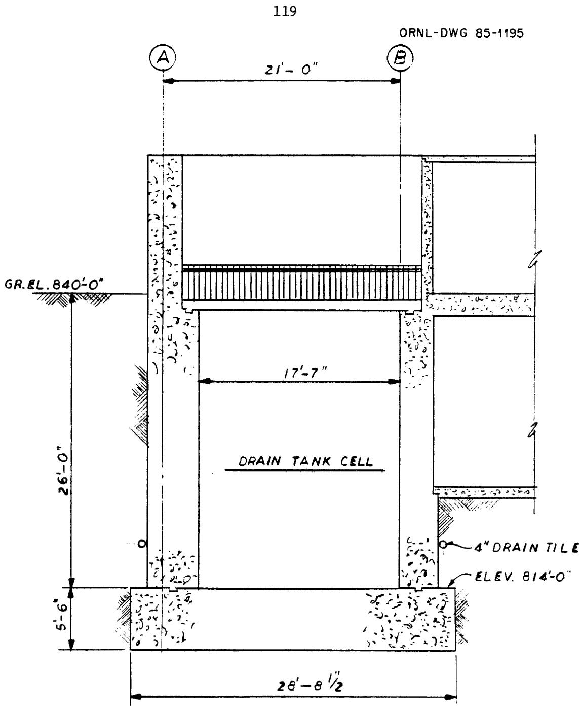  
Fig. E-3. Section of drain tank cell foundation showing french drain, looking north.

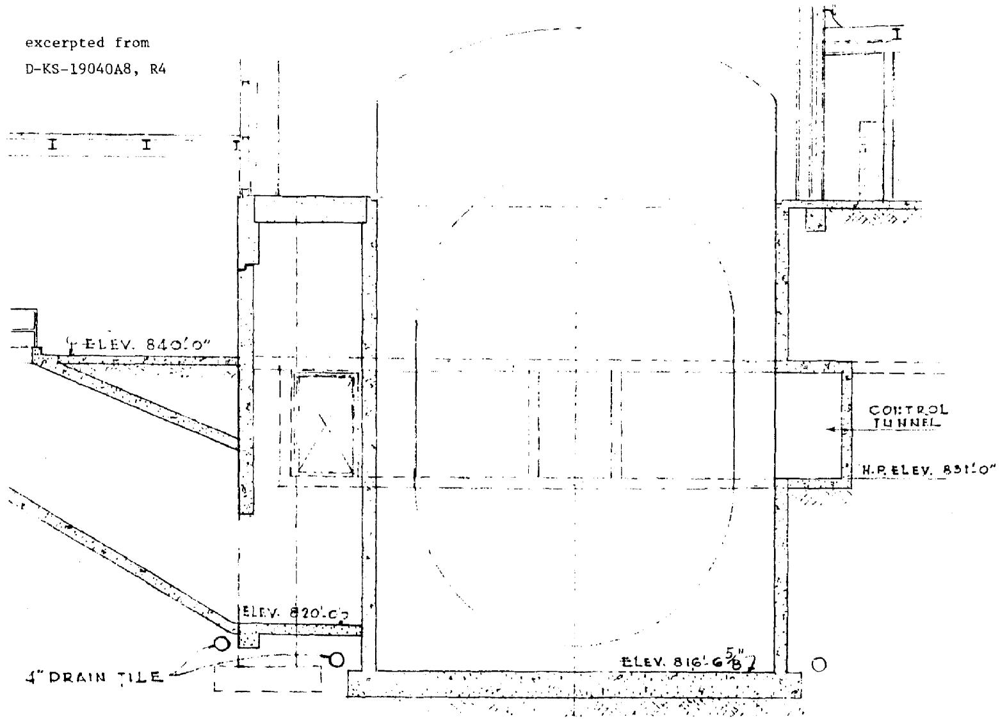  
Fig. E-4. Section of reactor cell foundations showing french drain, looking north. (ART configuration)

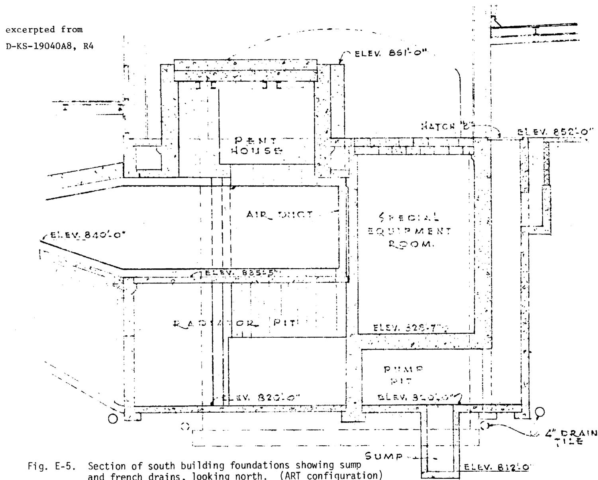

Several lines entering the pump room flow into a 55 gal. drum rather than entering the sump directly. The drum is used to collect drainage from areas which might have contained small levels of activity, and allows for monitoring prior to release. The "pit pump" could be used to send drainage colleted in the drum to the radioactive liquid waste tank in the event that activity is detected.

Water from the sump is pumped up to a catch basin southwest of the building, and flows out into a field through a 12 in. concrete line. As shown in Fig. E-1, the 3 in. pump discharge line branches into an 8 in. cell annulus drain line before circling around the charcoal absorber pit en route to the catch basin. The reactor cell annulus can be emptied by pumping to the catch basin via line 331 using the pit pump. This operation would remove a major reservoir of water adjacent to the cell in which the salts are now stored. Caution in disposal of this water would be dictated by the presence of chromate rust inhibitors, as well as the possibility of induced radioactivity.

# Storm Water Dispersal

Collection of storm water is accomplished with a standard roof drain piping system. Water flows by gravity to a catch basin, separate from the one serving the building sump, from which it flows out another 12 in. concrete line (Fig. E-1). Site grading and ditches are used to carry storm water from around the perimeter of the building.

Sanitary Sewage Collection and Disposal

A standard sanitary sewage collection system was installed in the building. Sewage flows by gravity to a septic tank located west of the building. The water leaving the septic tank then flows into a drain field west of the septic tank.

Appendix F. GEOLOGIC INVESTIGATIONS RELATIVE TO MOLTEN SALT REACTOR DECOMMISSIONING

Dr. D. W. Byerly, Department of Geology

University of Tennessee, Knoxville, Tennessee

December 1984

Geologic Investigations Relative to Molten Salt Reactor Decommissioning

Dr. D. W. Byerly, Department of Geology  
University of Tennessee, Knoxville, Tennessee

The Molten Salt Reactor Experiment (MSRE) facility is located in the Melton Valley area of the Oak Ridge National Laboratory (ORNL). The valley is bordered by Haw Ridge (elevation $317\mathrm{m}$ ) on the northwest and Copper Ridge (elevation $400\mathrm{m}$ ) on the southeast. Buildings housing the reactor and other facilities related to the reactor are situated on the northwest side of the valley near the base of Haw Ridge. Topographically, the valley is not flat, but instead consists of relatively steep-sided, irregularly-shaped, low hills with summit elevations averaging about $275\mathrm{m}$ . Relief in the valley ranges up to $43\mathrm{m}$ .

The buildings are at a ground elevation of about $259\mathrm{m}$ within a slight swale (partially resulting from construction back-fill) near the head of a draw which is tributary to Melton Branch that flows southwesterly through the main valley. All drainage from Melton Valley ultimately enters the Clinch River below Melton Hill Dam southwest of the confluence of Melton Branch at White Oak Creek.

The geological conditions of portions of Melton Valley have been interpreted as favorable for storage/disposal of low-level radioactive wastes. The facilities in Melton Valley used for hosting the ORNL-generated low-level radioactive wastes include: burial grounds, waste pits, treatment operations, and hydraulic fracturing.

Bedrock forming the foundation for the MSRE consists of the lower portion of a "package" of rocks referred to as the Conasauga Group. Rocks of this group grade compositionally downward into the Rome Formation underlying Haw Ridge and upward into the Knox Group which forms Copper Ridge. Variegated shales, commonly calcareous, comprise most of the lower Conasauga; however, intercalations of silty to pure limestone may be present as lenses. The upper portion of the Conasauga, on the southeastern side of the valley where gradation with the Knox Group occurs, generally contains more limestone.

The knobby topography in Melton Valley is typical of weathered and eroded shale. The knobs or hills are aligned in rows paralleling the regional structure, forming above the shaly bedrock, whereas the intervening low areas are ordinarily underlain by the carbonate rocks. Regolith above the bedrock is variable in thickness. Generally, it is thickest (up to $9\mathrm{m}$ ) on hill crests and thinnest (less than $1.5\mathrm{m}$ ) in the flat, low-lying areas. The total thickness of the Conasauga Group is about $600\mathrm{m}$ .

The trace of the Copper Creek fault, a major thrust fault in the Ridge and Valley province of the southern Appalachian orogen, strikes NE-SW along the northwest slope of Haw Ridge. The fault dips southeast projecting below Melton Valley and Copper Ridge at considerable depth.

Sedimentary strata of the Conasauga Group forming Melton Valley also strike northeast and dip to the southeast, forming the hanging wall of the Copper Creek fault. The fault and related deformation of the rocks in the valley resulted from tectonism that occurred over 200 million years ago. Subsequent deformation of these rocks is not evident.

Considering the present tectonic setting of North America and the fact that the fault as well as structural elements have not been active, at least during the most recent 70 to 80 million years, the area can be considered to have a low seismic risk (seismic risk zone 2, Modified Mercalli intensity less than V or VI). The nearest significant earthquake epicenters historically are Charleston, South Carolina, and New Madrid, Missouri; however, both are considered too distant to have or have had serious detrimental impacts on this area.

Joints or fractures within the Conasauga that are associated with past tectonism have not appreciably affected the strength of the bedrock, but have resulted in a secondary effective porosity which influences the geohydrology of the valley.

In Melton Valley, the zone of ground water saturation generally occurs at greater depths beneath summits than in the low-lying bottoms. In low areas such as adjacent to perennial streams like Melton Branch or to ephemeral streams in the gullies dissecting the low hills in Melton

Valley, the water table may be found within $1.5\mathrm{m}$ below the land surface. On hill tops, the depth to the water table may exceed $6\mathrm{m}$ . The general pattern of ground water movement is laterally along bedding strike (NE-SW), but jointing often modifies this pattern. An average rate of ground water movement within the shales of the Conasauga has been determined to be $15\mathrm{cm/day}$ .

Ground water behavior at the site is a key factor which must be addressed prior to deciding the disposition of the radioactive materials contained in the MSRE facilities. A hydrologic monitoring program should be developed to establish baseline qualitative and quantitative water data. Water is an important factor for at least two reasons. One, it can potentially deteriorate the waste containers, especially if the geochemistry of the water is reactive, and two, water is the most likely vehicle for transmitting the radioactivity to the biosphere should containment fail.

Although the MSRE facility is apparently sound structurally, it must be kept in mind that the facility was not designed for long-term entombment of radioactive wastes. Multilevels of barriers, including engineered as well as the natural geologic setting, are necessary for safe, long-term storage/disposal of radioactive wastes. Therefore, several geological aspects of the facility site need more assessment of a site-specific nature before on-site storage/disposal is considered a feasible alternative. To be acceptable, the site should be capable of safely containing the wastes without institutional controls (i.e., sump pumping of infiltrated water, etc.). Among the geologic aspects that should be included in further evaluation of the site include:

- Characterization of all earth materials on the site (anthropogeneous material, bedrock, etc.)   
- Site design - slopes, placement of fill soils, underdrains, foundations, etc.   
- Site hydrology - water inventory including quantity and quality, ground water flow nets, piezometric levels, etc.

Site-specific investigation of the above should be considered as the very minimum of any program plan for the evaluation of the site for on-site entombment of the MSRE radioactive materials.

INTERNAL DISTRIBUTION   
EXTERNAL DISTRIBUTION   

<table><tr><td>1.</td><td>J. F. Alexander</td><td>26.</td><td>F. J. Peretz</td></tr><tr><td>2-6.</td><td>T. W. Burwinkle</td><td>27.</td><td>L. P. Pugh</td></tr><tr><td>7.</td><td>K. W. Cook</td><td>28-32.</td><td>T. H. Row</td></tr><tr><td>8.</td><td>B. L. Corbett</td><td>33.</td><td>J. H. Swanks</td></tr><tr><td>9.</td><td>N. W. Durfee</td><td>34.</td><td>R. E. Thoma</td></tr><tr><td>10.</td><td>J. R. Engel</td><td>35.</td><td>W. W. Thompson</td></tr><tr><td>11.</td><td>D. E. Ferguson</td><td>36.</td><td>J. R. Trabalka</td></tr><tr><td>12.</td><td>P. N. Haubenreich</td><td>37.</td><td>V. C. A. Vaughen</td></tr><tr><td>13.</td><td>F. J. Homan</td><td>38.</td><td>R. G. Wymer</td></tr><tr><td>14.</td><td>J. M. Kennerly</td><td>39.</td><td>Central Research Library</td></tr><tr><td>15.</td><td>L. E. McNeese</td><td>40.</td><td>Document Reference Section</td></tr><tr><td>16-19.</td><td>T. E. Myrick</td><td>41.</td><td>Laboratory Records</td></tr><tr><td>20-24.</td><td>K. J. Notz</td><td>42.</td><td>Laboratory Records - RC</td></tr><tr><td>25.</td><td>P. T. Owen</td><td>43.</td><td>ORNL Patent Section</td></tr></table>

44. Office of Assistant Manager for Energy Research and Development, DOE-ORO, P.O. Box E, Oak Ridge, TN 37831  
45-49. R. N. Coy, Office of Surplus Facilities Management, UNC Nuclear Industries, Post Office Box 490, Richland, WA 99352  
50-54. C. E. Miller, Program Manager, Surplus Facilities Management Program, Richland Operations Office, U.S. Department of Energy, Post Office Box 550, Richland, WA 99352  
55-56. Technical Information Center, Post Office Box 62, Oak Ridge, TN 37831

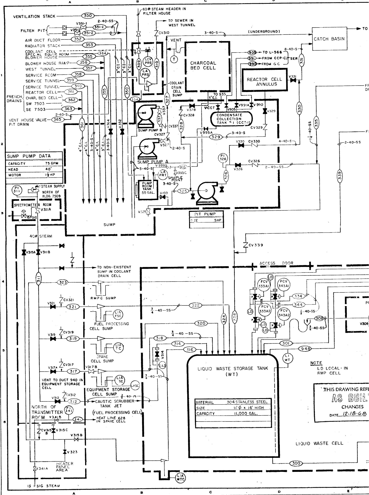

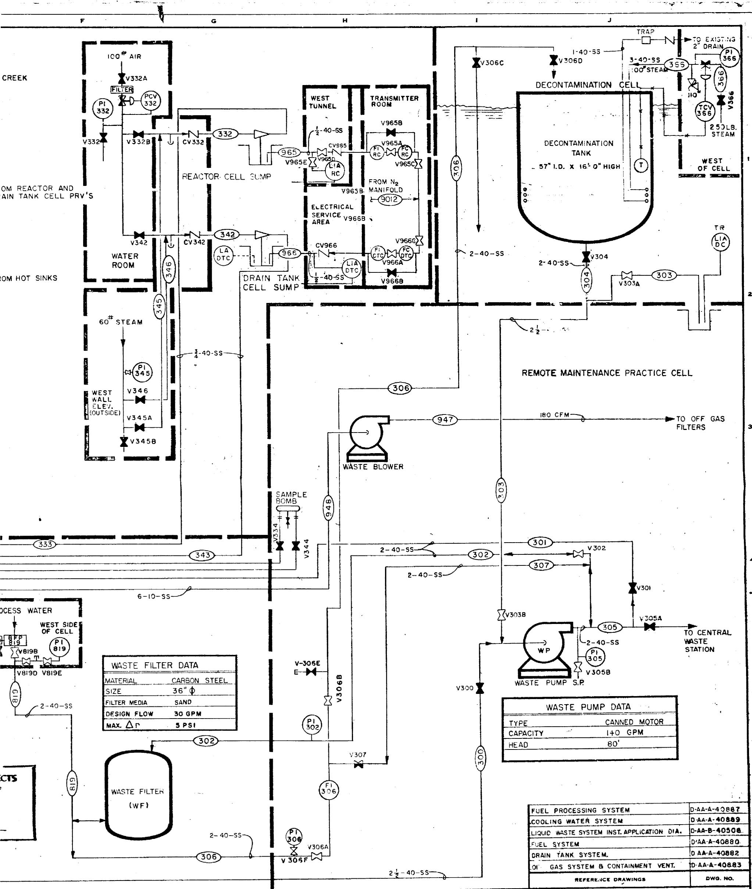

<table><tr><td></td><td></td><td></td><td></td><td></td><td></td><td></td><td>RBAng</td><td>PROJECT
UNITS</td><td>ENGLISH
MILLION</td><td>ENGINEER</td><td>BREAR ALL SHARP EDGES
UNLESS OTHERWISE SPECIFIED.</td><td colspan="2">OAK RIDGE NATIONAL LABORATORY</td><td></td></tr><tr><td></td><td></td><td></td><td></td><td></td><td></td><td></td><td></td><td></td><td></td><td></td><td></td><td colspan="2">LIQUID WASTE SYSTEM
PROCESS FLOW SHEET
M.S.R.E.</td><td rowspan="2"></td></tr><tr><td>3418</td><td>6</td><td>SEE DCN 3418 SIG.</td><td>12.68</td><td>###</td><td>PMT</td><td></td><td>RBL</td><td></td><td>PROJECT ENGR.</td><td></td><td>DESIGN ENGINEER</td><td>TOLERANCE UNLESS OTHERWISE
SPECIFIED.</td><td></td></tr><tr><td>3306</td><td>6</td><td>SEE DCN 3306</td><td>###</td><td>###</td><td></td><td></td><td></td><td></td><td></td><td></td><td></td><td></td><td rowspan="2"></td><td rowspan="2"></td></tr><tr><td>3102</td><td>D</td><td>SEE DCN 3102</td><td>8-65</td><td>###</td><td>RBD</td><td></td><td></td><td></td><td></td><td></td><td></td><td>FRACTIONS ±
DECIMALS ±
ANGLES ±</td></tr><tr><td>2930</td><td>C</td><td>SEE DCN 2930</td><td>###</td><td>###</td><td>RBD</td><td></td><td></td><td></td><td></td><td></td><td></td><td></td><td></td><td></td></tr><tr><td>2661</td><td>B</td><td>SEE DCN 2661</td><td>###</td><td>###</td><td>###</td><td></td><td></td><td></td><td></td><td></td><td></td><td></td><td></td><td></td></tr><tr><td>2491</td><td>A</td><td>SEE DCN 2491</td><td>###</td><td>###</td><td>###</td><td></td><td></td><td></td><td></td><td>CHECKED
RSTHKS</td><td>###/###</td><td>SCALE: NONE</td><td>JOB 433-1.0</td><td>D-AA-A-40888</td></tr><tr><td>D CN</td><td></td><td></td><td>###</td><td>###</td><td>APR.</td><td></td><td></td><td></td><td></td><td></td><td></td><td></td><td></td><td></td></tr></table>