# OAK RIDGE NATIONAL LABORATORY

MARTIN MARIETTA

# Nuclear Power Options   Viability Study

# Volume II, Reactor Concepts, Descriptions, and Assessments

D. B. Trauger   
J. D. White   
J. T. Bell   
R. S. Booth   
H. I. Bowers   
J. C. Cleveland   
J. G. Delene   
Uri Gat   
D. C. Hampson   
T. Jenkins   
D. L. Moses   
P. E. Pasqua   
D. L. Phung   
I. Spiewak   
R. E. Taylor

# APPLIED TECHNOLOGY

Any further distribution by any holder of this document or of the data therein to third parties representing foreign interests, foreign governments, foreign companies and subsidiaries, or foreign divisions of U.S. companies should be coordinated with the Deputy Assistant Secretary for Reactor Systems, Development, and Technology, U.S. Department of Energy.

OPERATED BY

MARTIN MARIETTA ENERGY SYSTEMS, INC.

FOR THE UNITED STATES

DEPARTMENT OF ENERGY

Released for announcement

In ATF. Distribution limited to

participants in the L3FBR

program. Others request from

BSAT, DOE.

Printed in the United States of America. Available from the U.S. Department of Energy Technical Information Center

P.O. Box 62, Oak Ridge, Tennessee 37830

This report was prepared as an account of work sponsored by an agency of the United States Government. Neither the United States Government nor any agency thereof, nor any of their employees, makes any warranty, express or implied, or assumes any legal liability or responsibility for the accuracy, completeness, or usefulness of any information, apparatus, product, or process disclosed, or represents that its use would not infringe privately owned rights. Reference herein to any specific commercial product, process, or service by trade name, trademark, manufacturer, or otherwise, does not necessarily constitute or imply its endorsement, recommendation, or favoring by the United States Government or any agency thereof. The views and opinions of authors expressed herein do not necessarily state or reflect those of the United States Government or any agency thereof.

MA-28:WDM

# To Addressees

# HANDLING OF APPLIED TECHNOLOGY REPORTS

The purpose of this memorandum is to reiterate the necessity to protect Applied Technology (AT) reports in the UC-79 (Liquid Metal Fast Breeder Reactors), UC-83 (Nuclear Converter Reactor Fuel Cycle Technology), and UC-86 (Consolidated Fuel Reprocessing Program) categories from unauthorized release in order to preserve their trading value vis a vis international exchange agreements. This memorandum, disseminated at the request of the Director of International Programs, Office of Support Program, Assistant Secretary for Nuclear Energy, provides further guidance for the Field on this important matter and serves as a reminder of the significance of the "Applied Technology" stamp shown below:

# APPLIED TECHNOLOGY

Any Further Distribution by any Holder of this Document or of Other Data Therein to Third Parties Representing Foreign Interests, Foreign Governments, Foreign Companies and Foreign Subsidiaries or Foreign Divisions of U. S. Companies Should Be Coordinated with the Director, "Appropriate NE Program Office", U. S. Department of Energy

The U. S. Department of Energy has this stamp placed on selected progress and topical reports that concern information related to engineering, development, design, construction, operation, or other activities pertaining to particular projects on which major funding emphasis has been placed. Reports labeled Applied Technology (AT) are given controlled, monitored distribution in order to keep the information contained therein in domestic hands. Such information is exchanged on a quid pro quo basis with nations with whom the U. S. Department of Energy has a formal exchange agreement. Towards this end, the Technical Information Center at Oak Ridge, Tennessee, has been instructed to obtain the Department of Energy Headquarters Program Office approval for release of UC-79, UC-83, and UC-86 AT reports to any requester, foreign or domestic, not on the official TIC AT Standard Distribution Lists. Only the TIC has been provided the authority to honor such requests for AT reports based on Program Office approval. DOE laboratories, contractors, and subcontractors must relay external foreign and domestic requests for AT reports to the TIC for disposition. Access to AT reports within a laboratory or contractor facility should be controlled so as not to vitiate the intent of the above policy. This is particularly important in those cases where foreign nationals are visiting, assigned, or employed at a facility.

The TIC official AT Standard Distribution Lists that have been approved by Headquarters are considered to be the sole distribution for AT reports, with the

exception of internal recipients (not subcontractors or outside program participants); when an AT report is originated by an organization, internal distribution within that organization may be made directly. Where external distribution outside that organization is involved, either foreign or domestic, only the TIC lists may be used for an AT report. Any exceptions to this situation will require written approval of the responsible Headquarters Program Office.

You are also reminded that AT reports are not to be presented, referenced, or form the basis of presentations of information in technical society meetings or journals, meetings with foreign interests, or other means without Headquarters Program Office approval.

Bil Matheny William D.Matheny

Chief, Control Branch

Document Control and Evaluation Division

# NUCLEAR POWER OPTIONS VIABILITY STUDY

VOLUME II,

REACTOR CONCEPTS, DESCRIPTIONS, AND ASSESSMENTS

D. B. Trauger, Editor

J. D. White

J. T. Bell

R. S. Booth

H. I. Bowers

J. C. Cleveland

J. G. Delene

U. Gat

D.C.Hampson

T. Jenkins

D. L. Moses

P. E. Pasqua2

D. L. Phung3

I. Spiewak4

R. E. Taylor

1Tennessee Valley Authority

2The University of Tennessee

3Professional Analysis, Inc.

4Consultant

Date Published - September 1986

Prepared for the

Office of the Assistant Secretary for Nuclear Energy

U.S. Department of Energy

Prepared by the

OAK RIDGE NATIONAL LABORATORY

Oak Ridge, Tennessee 37831

operated by

MARTIN MARIETTA ENERGY SYSTEMS, INC.

for the

U.S. DEPARTMENT OF ENERGY

under Contract No. DE-AC05-840R21400

# DISCLAIMER

This report was prepared as an account of work sponsored by an agency of the United States Government. Neither the United States Government nor any agency thereof, nor any of their employees, makes any warranty, express or implied, or assumes any legal liability or responsibility for the accuracy, completeness, or usefulness of any information, apparatus, product, or process disclosed, or represents that its use would not infringe privately owned rights. Reference herein to any specific commercial product, process, or service by trade name, trademark, manufacturer, or otherwise does not necessarily constitute or imply its endorsement, recommendation, or favoring by the United States Government or any agency thereof. The views and opinions of authors expressed herein do not necessarily state or reflect those of the United States Government or any agency thereof.

MASTER

Released for announcement In ATF. Distribution limited to participants in the LAFBR program. Others request from ASQT. DOE

# PREFACE

The Nuclear Power Options Viability Study (NPOVS) was initiated at the beginning of calendar year 1984. The objective of NPOVS was to explore the viabilities of several nuclear options for this country for electric power generation after the year 2000. The study emphasized technical issues but also considered institutional problems. Innovative reactor concepts were identified which may be marketable at the time when studies show that the demand for new electrical energy capacity will increase significantly. These concepts were considered with emphasis on cost, safety features, operability, and regulation as well as research needs. The study is reported in four volumes. Volume I is an executive summary. This report, Volume II, provides descriptions and assessments with respect to criteria established in the study of potential nuclear power plants which could be deployed early in the next century. Volume III, Nuclear Discipline Topics, provides supporting analyses; and Volume IV is a bibliography containing approximately 550 entries. A detailed outline covering all four volumes is given in Appendix A.

The study was initiated by Oak Ridge National Laboratory (ORNL), which, recognizing the need for a broad base of knowledge and experience, engaged the Tennessee Valley Authority (TVA) and The University of Tennessee to participate as partners. TVA concentrated its efforts on evaluation of the concepts and on licensing. The University of Tennessee assisted in the evaluation of construction costs and public opinion issues. Both institutions contributed extensively to the evaluation of issues and in review of reports. In conducting the study, the authors extensively contacted segments of the nuclear industry for current information concerning the concepts studied and for other valued assistance.

Many of the problems encountered by the nuclear industry are institutional in nature and are related to the way the utility companies, designers, constructors, and regulators are organized and function. Although this study attempted to identify those institutional factors, it has not addressed them in all aspects. It was observed that the institutional problems derive in some measure from technical aspects, which, in turn, originate at least in part from the large size, complexity, and exacting requirements for existing nuclear plants. Emphasis in the study was placed on technical aspects that have potential merit and on improved design concepts that may help or have promise of helping to alleviate institutional problems. Institutional factors related to market acceptance have also been surveyed and studied. Consideration of additional institutional factors is thought to be desirable, perhaps necessary, but is beyond the scope of this study.

The study emphasized criteria by which nuclear power reactors can be judged and which are thought to be appropriate, at least in part, for

judging future commercial viability. Other design or operational needs that are important but are more difficult to quantify are presented as either essential or desirable characteristics. Several innovative reactor concepts are described and evaluated with respect to these measures. Related and generic information on construction, economics, regulation, safety and economic risk, waste transportation and disposal, and market acceptance which supplements the evaluation is included in Volume III.

This study differs in several respects from other studies concerning the future of nuclear power in the United States. The first is the time frame of interest. The NPOVS effort was focused on a time frame a little later than most studies, the years 2000 through 2010. For the near term, existing Light-Water Reactor (LWR) designs, or evolutionary modifications to them, would be the most likely nuclear choices if there is a sufficient demand for increased electrical generating capacity. Projections by the electric industry indicate that new base load capacity will be needed before the year 2000. Therefore, it is probable that decisions to order baseload capacity will be made by 2000-2010 and, furthermore, that the reactor concepts discussed in this report have the potential for competing with existing LWR designs or coal-fired plants at that time. For the more distant future, nuclear plant concepts incorporating more innovative, if not revolutionary, features could be the best choices.

A second aspect making this study different is the level of technical detail in the evaluation of the specific designs. Significantly more design information was generated by all the nuclear designers involved with innovative concepts in the last three years, and much of this information was made available to NPOVS. Recognition has been given to the special features of each concept and thus to the role that each may achieve in a mature nuclear economy.

Systematic development of the information presented in this report was completed in September 1985. Delays in funding and review have prevented timely publication. An attempt has been made to include new information where substantial changes in programs or designs have occurred, but it has not been possible to bring the report fully up to date. Subsequent developments and events, particularly the Chernobyl accident, may alter some of the findings.

# CONTENTS

ABSTRACT ix

SUMMARY OF FINDINGS xi

1. INTRODUCTION 1-1

1.1 BACKGROUND 1-1   
1.2 REPORT ORGANIZATION 1-2   
1.3 REFERENCES FOR CHAPTER 1 1-2

2. GROUND RULES AND CRITERIA 2-1

2.1 GROUND RULES AND THEIR SIGNIFICANCE 2-1   
2.2 CRITERIA 2-2

2.2.1 Listing of Criteria, Essential and Related Desirable Characteristics, and Discussion of Their Applications 2-2   
2.3 REFERENCES FOR CHAPTER 2 2-7

3. CONCEPT EVALUATIONS 3-1

3.1 CONCEPT SELECTION AND CLASSIFICATION 3-1   
3.2 CONCEPT EVALUATION METHODS AND LIMITATIONS 3-2

3.3 LIGHT WATER REACTORS (LWRs) 3-2

3.3.1 PIUS 3-2

3.3.1.1 Description 3-2   
3.3.1.2 Claims, Advantages, and Disadvantages Evaluated Against Criteria, Essential and Desirable Characteristics 3-8

3.3.1.3 R&D Needs and Open Questions Evaluated 3-13

3.3.2 Small Advanced BWR 3-14   
3.3.2.1 Description 3-14   
3.3.2.2 Claims, Advantages, and Disadvantages Evaluated Against Criteria, Essential and Desirable Characteristics 3-17   
3.3.2.3 R&D Needs and Open Questions Evaluated 3-21

# CONTENTS (CONTINUED)

3.4 LIQUID METAL COOLED REACTORS (LMRs) 3-22

3.4.1 Introduction 3-22   
3.4.2 Design Options, Challenges, and Tradeoffs 3-22   
3.4.3 Design Descriptions 3-23

3.4.3.1 The Large Scale Prototype Breeder (LSPB) 3-24   
3.4.3.2 Sodium Advanced Fast Reactor (SAFR) 3-29   
3.4.3.3 Power Reactor-Inherently Safe Module (PRISM) 3-32

3.4.4 Advantages and Disadvantages of the LMR Concepts with Regard to the NPOVS Criteria and Essential Characteristics 3-35

3.4.4.1 General Overviews 3-35   
3.4.4.2 Advantages of the LMR Concepts 3-35   
3.4.4.3 Disadvantages of the LMR Concepts 3-39

3.4.5 Research and Development Needs for the LMR Concepts 3-43

3.4.5.1 Introduction 3-43   
3.4.5.2 Design-Specific R&D Requirements 3-43   
3.4.5.3 General R&D Goals for the U.S. National LMR Program 3-43

3.5 HIGH TEMPERATURE REACTORS (HTRs) 3-45

3.5.1 Design Descriptions 3-45   
3.5.2 Claims, Advantages, and Disadvantages Evaluated Against Criteria, Essential and Desirable Characteristics 3-54

3.5.3 Modular HTR Research and Development Needs Evaluated 3-58

3.5.3.1 Base Technology 3-59   
3.5.3.2 Applied Technology 3-59   
3.5.3.3 Design and Economic Studies 3-60

3.6 REFERENCES FOR CHAPTER 3 3-61

4. ACKNOWLEDGMENTS 4-1

APPENDIX A: BASIC OUTLINE FOR NUCLEAR POWER OPTIONS VIABILITY STUDY FINAL REPORT A-1

APPENDIX B: THE OUTLOOK FOR ELECTRICITY SUPPLY AND DEMAND

APPENDIX C: DISCUSSION OF CONCEPTS NOT INCLUDED FOR ASSESSMENT

# CONTENTS

Page APPENDIX D: R&D GOALS AND SPECIFIC REQUIREMENTS FOR LIQUID METAL REACTOR (LMR) CONCEPTS D-1   
APPENDIX E: LIQUID METAL REACTOR (LMR) FUEL REPROCESSING-REFABRICATION EVALUATION E-1   
APPENDIX F: 860 MW(e) LARGE HIGH TEMPERATURE GAS-COOLED REACTOR (HTGR) F-1   
APPENDIX G: EVALUATION OF CLAIMS FOR THE MODULAR HIGH TEMPERATURE REACTOR (HTR) G-1

# ABSTRACT

The Nuclear Power Options Viability Study (NPOVS) is reporting here on the description and assessment of several selected innovative reactor designs in accordance with criteria established in the study. These criteria are as follows:

1. The calculated risk to the public due to accidents is less than or equal to the calculated risk associated with the best modern Light-Water Reactors (LWRs).   
2. The probability of events leading to loss of investment is less than or equal to $10^{-4}$ per year (based on plant cost).   
3. The economic performance of the nuclear plant is at least equivalent to that for coal-fired plants. (Financial goals for the utility are met, and busbar costs are acceptable to the public utility commissions.)   
4. The design of each plant is complete enough for analysis to show that the probability of significant cost/schedule overruns is acceptably low.   
5. Official approval of a plant design must be given by the U.S. Nuclear Regulatory Commission (NRC) to assure the investor and the public of a high probability that the plant will be licensed on a timely basis if constructed in accordance with the approved design.   
6. For a new concept to become attractive in the marketplace, demonstration of its readiness to be designed, built, and licensed and begin operations on time and at projected cost is necessary.   
7. The design should include only those nuclear technologies for which the prospective owner/operator has demonstrated competence or can acquire competent managers and operators.

The criteria are supplemented by essential characteristics that both amplify the criteria and suggest additional qualities that have a bearing on viability.

In selecting the concepts to be studied, the following three ground rules were used:

1. The nuclear plant design option should be developed sufficiently that an order could be placed in the time period 2000 through 2010.   
2. The design option should be economically competitive with environmentally acceptable coal-fired plants.   
3. The design option should possess a high degree of passive safety to protect the public health and property and the owner's investment.

This study led to the choice of the following concepts:

1. Light Water Reactors (LWRs)

PIUS (Process Inherent Ultimate Safety) - Promoted by ASEA-ATOM of Sweden   
- Small BWR (Boiling Water Reactor) — Promoted by General Electric (GE)

2. Liquid Metal Reactors (LMRs)

- PRISM (Power Reactor Intrinsically Safe Module) - The advanced concept supported by DOE   
SAFR (Sodium Advanced Fast Reactor) - The Rockwell International (RI) advanced concept supported by DOE   
LSPB (Large-Scale Prototype Breeder) - The Electric Power Research Institute-Consolidated Management Office (EPRI-CoMO) concept supported by EPRI and DOE

3. High Temperature Reactor (HTR)

- Side-by-Side Modular - The core and steam generator in separate steel vessels in a side-by-side configuration. The concept is supported by DOE and promoted by Gas-Cooled Reactor Associates (GCRA) and industrial firms.

These concepts are judged to be potentially available in the chosen time period, are estimated by their promoters to be economically competitive with coal-fired power plants, and have varying degrees of passive safety attributes. In all cases, the designs are too preliminary for a complete and definitive assessment, but each is believed to have potential for a significant future role. The Advanced Pressurized-Water Reactor (APWR), the Advanced Boiling-Water Reactor (ABWR), and the large HTR are recognized as viable systems which could meet electric power generating needs prior to or following the year 2000. They are not included in this study except for reference because they do not fully meet the third ground rule and because they already have been the subject of extensive study by industry.

# SUMMARY OF FINDINGS

The criteria and the essential and desirable characteristics described in Chapter 2 are presented as useful guides to the selection and evaluation of current and future nuclear reactor concepts. The criteria were developed early in the study and have been subjected to extensive review and refinement. The criteria serve as guides for the evaluations of concepts presented in this report.

Most advanced reactor concepts are smaller than present LWRs; therefore, they suffer the disadvantage, whether real or perceived, associated with economy of scale. This disadvantage is claimed to be offset or compensated for in varying degrees through an improved match with load growth, reduction in capital risk, increased shop fabrication, shorter construction time, increased standardization, design simplification, and simpler construction management requirements. Licensing also may be simplified. A substantial problem in achieving these compensations derives from the need for a large front-end investment for certain of these features. Automated shop fabrication, in particular, may require a substantial backlog of orders to be economically feasible. Nuclear plant standardization is widely viewed as an important goal for viability.

To be concise in this summary, we have assumed that the reader is familiar with the concepts. If not, the concept descriptions should be read first. The claims, advantages, disadvantages, and important development needs will be summarized in the order in which the concepts appear in the report.

It must be noted that each of these concepts is currently in design development. The descriptions and assessments of this study reflect the status for each as of September 1985 except that some updating has been done where information was readily available. The reader must recognize that further development is expected to change design features and thus to affect the conclusions from future evaluations.

All of the concepts for the study appear to be potentially viable, but the available information has been insufficient to assess fully their economic competitiveness. Findings for the concepts are summarized here.

# PIUS

The basic design premise of this concept is to achieve a very high degree of passive safety with respect to equipment failure, operator error, and external threats. The large pool of borated water, which can enter the core without mechanical, electrical, or operator action, is to provide both shutdown and seven days of passive cooling for decay heat removal. These claims appear to be justified, although questions remain concerning the safety of fuel and equipment handling operations within the pool. The availability of water for introduction to the pool after seven days is site dependent but potentially viable. Overall, the

concept appears to be licensable without major redesign, assuming that the NRC will accept a reactor with no control rods. The features that promote safety also appear applicable to protection of the investment. ASEA-ATOM claims that the plant can be economically competitive with coal-fired plants. This may depend on further evaluation of the identified problems that follow.

The steam generator located inside the Prestressed Concrete Pressure Vessel (PCPV) is of a difficult design with respect to maintenance. This and the problems of handling fuel and equipment deep $(30\mathrm{m})$ in the pool require careful design and detailed assessment and are considered a disadvantage with respect to potential availability of the plant. Management of refueling appears difficult for the three-core design if the refueling sequence becomes out of phase.

Development and testing needs include further demonstration of fluid interface stability, extensive study and testing of steam generator modules, thorough testing of underwater fuel and equipment handling systems, steam flow and pressurizer stability for the multimodular design, thermal insulation development and testing, and demonstration of the PCPV design, particularly for the top closure.

# Small Advanced BWR

This reactor obviously derives advantage from its many operating similarities to existing BWRs. The gravity-fed Emergency Core Cooling System (ECCS) appears well conceived and adequate to provide shutdown cooling for up to three days, although its reliability is dependent on a relatively untried fail-open valve. A reliable site-dependent supply of additional cooling water would be required beyond the three days. Operator training should be straightforward since the basic operation is similar to that of existing BWR plants. A first-of-a-kind safety test and demonstration whereby the plant would later be used for power production may be practical and adequate for this concept.

Cost competitiveness is difficult to assess at this early stage of design development. Licensing requirements, although not thought to be particularly difficult, have not yet been addressed completely. Model testing for the gravity-drain ECCS, steam injector testing, and thermal hydraulic and seismic analyses must be thorough. The depressurization valve also requires design, development, and testing.

# LMR Concepts

The LSPB is an evolution of previous Liquid Metal Fast Breeder Reactor (LMFBR) designs. It includes several innovations to reduce capital costs and to enhance safety. The latter include diverse and independent reactor shutdown and dedicated decay heat removal systems. Although this design offers lower costs, these features are yet to be evaluated fully with respect to construction methods and

licensability. The LSPB appears attractive in offering economy of scale and increased passive safety.

Since the PRISM and SAFR concepts are under development in a DOE program and are at a preliminary stage, they were assessed primarily in common. LMR concepts benefit from the inherent LMR features of low system pressure and high thermal conductivity of the liquid metal (sodium) coolant. These features permit the design of primary containment pool concepts with reliable passive natural convection decay heat removal to atmospheric air. The smaller modular concepts provide the potential for testing of the core stability for conditions that might result from reactivity increases or from loss of flow of primary sodium. In this respect, smaller reactors generally have an advantage over the larger LMRs. Although the hypothetical core disruptive accident (HCDA) is claimed to be incredible by the proponents, the case for disregarding this accident is yet to be approved by the NRC. If the Clinch River Breeder Reactor (CRBR) can be taken as a precedent, then it would be reasonable to expect that a HCDA would be a beyond design basis event (BDBE). Acknowledging passive accommodation of HCDAs could significantly reduce design complexity, facilitate licensing, and improve public acceptance. Reliable control rod shutdown systems, feedback response from temperature increases, and the resulting thermal expansion are important safety features. Although containments are provided, careful design and perhaps testing will be required to ensure that air oxidation of the sodium cannot occur. Where primary boundaries and containments are in close proximity, they must be well protected from external threats that could breach both enclosures.

An important advantage of the LMR is the extensive operating experience available from the Fast Flux Test Facility (FFTF), the Experimental Breeder Reactor-II (EBR-II) and the European and Japanese plants. However, little of this experience is in the U.S. utility base, and the loss of the Clinch River Breeder Reactor (CRBR) also slowed the pace of development of LMRs in this country. Although it appears possible to design, construct, and operate a demonstration plant and to reach commercialization within the 2000-2010 time scale, it would require an early dedication to the task.

The availability of related experience, the simplicity of the proposed designs, and the passive features mentioned above strongly suggest that the licensing of LMRs should be achievable. An obvious long-term advantage of the LMR is its potential for breeding and thereby creating an essentially unlimited extension of uranium fuel resources. Although this is not an immediate objective of the current program, it should not be overlooked.

Historically, LMR concepts have had higher capital cost factors than LWRs. This cost experience is manifested in European as well as U.S. designs. Although the current concepts address this issue, it is as yet not adequately resolved. The long life core designs represent one approach to overall cost reduction. Another disadvantage is the requirement for enriched uranium or plutonium as the starting fuel. The

former is essentially assured by present U.S. enrichment programs since the required production capacity exists. The latter is at an early stage of development for acceptable fuel reprocessing plants in this country, although considerable experience exists abroad and in military facilities. Other countries offer the prospect for purchase of plutonium, but this is unlikely to be an acceptable continuing source. Once-through cycles are not adequate for long-term nuclear energy viability; therefore, reprocessing remains an important objective for future LMR concepts. The potential use of integral fast reactors which would be collocated with the supporting fuel reprocessing and refabrication facility faces significant institutional problems for operation.

Development needs include advanced core design and approved neutron counting systems, improved shielding, and self-actuated shutdown systems. Testing of heat removal systems is an obvious requirement. Depending upon the choice of initial fuel, the fuel cycle requirements may be extensive. The use of metal fuels, which offer some safety and operational advantages, requires an extensive fuel development and testing program. Concepts under consideration should benefit substantially from demonstration reactor testing; however, we caution against overly optimistic expectations from this approach. Indeed, valuable experience can be gained, and analytical techniques can be tested. However, many disturbances (such as the effects of severe seismic events, external interference with air cooling, and sabotage) cannot be tested and would require analysis for evaluation. Such analysis would include probabilistic risk assessments and simulations using models verified against data from smaller scale experiments. A more desirable and convincing approach with respect to utility acceptance may be to construct and operate a demonstration or prototype plant based on an adequate program of analysis, component development, and testing and design.

# Modular HTR Side-by-Side Concepts

A high degree of public protection is achieved through the avoidance of fuel damage by virtue of a capability for extended after-heat removal through the vessel wall by convection, conduction, and thermal radiation without operator, mechanical, or electrical intervention. This advantage is made possible by the very high temperature capability of the fuel, including retention of fission products and the slow thermal response of the core, which eliminates the need for a fast-acting shutdown system. The same protection applies to the probability of events leading to a loss of investment. The "low-enriched" fuel is an advantage in proliferation resistance but requires enrichment beyond that for a conventional LWR. The potential for producing high-temperature process heat is a long-term advantage.

Disadvantages include a potentially high overnight capital cost. Most, if not all, HTR designs have projected capital costs higher than those of large LWR reactors. This must be overcome by high availability and high capacity factors, shop fabrication, reduced costs for the balance of plant, and low fuel cycle costs.

A disincentive for the application of an HTR in the United States is the poor performance to date of the Fort St. Vrain reactor. However, the difficulties with this reactor are unique to its equipment and are not common with the new concept. In many ways, the MHTR design can benefit from the lessons learned at Fort St. Vrain. Also, the performance of the Peach Bottom Unit 1 reactor in the United States and that of the Arbeitsgemeinschaft Versuchs-Reaktor (AVR) in Germany has been satisfactory. Since the Thorium High Temperature Reactor (THTR-300) in Germany is the latest HTR to start operation, its operating performance is important to watch.

The small base of operating experience in the United States suggests an important need for a successful MHTR demonstration plant. Because of the ruggedness and resiliency of the fuel and the inherently slow time response for thermal excursions, it seems possible that a demonstration plant could be used extensively for experimentation in safety and operability and could later serve as a first-of-a-kind power plant. However, since the design experience is also limited, it is quite possible that a standardized plant design might benefit from the experience of the demonstration.

Development needs include the determination of fission product retention by the fuel coatings, graphite, and metal surfaces under hypothetical extreme accident conditions. Although acceptable graphite is available for fabrication of fuel elements and reflector blocks, statistical data are needed to better understand its widely variable properties as a basis for improvement of the basic structure and to obtain longer lifetimes. Structural materials development needs relate to obtaining physical property data to satisfy code requirements, including the effects of neutron irradiation on physical properties. Another important area of development is testing of key components under actual conditions. This testing is especially important in the case of the circulator and refueling system to assure high availability. Materials corrosion testing for various projected impurity levels in the helium would also be desirable but probably is not a requirement.

# 1.1 BACKGROUND

The Nuclear Power Options Viability Study (NPOVS) was begun at Oak Ridge National Laboratory (ORNL) in January 1984 to assess selected nuclear power options with respect to viability and to identify new directions for industry, regulation, and research. For the first five months, the study was funded through the ORNL Director's discretionary fund. Since June of 1984, the U.S. Department of Energy (DOE) has funded the program directly. The Tennessee Valley Authority (TVA) and The University of Tennessee (UT) have been working with ORNL in this study; TVA has used its own funds, while UT has been funded by ORNL through subcontracts.

The information on which this report is based has been gathered from the open literature, as well as from reactor design organizations, vendors, research and development (R&D) institutions, utility companies and the DOE. Proprietary information or other information received with restrictions has been considered in the assessment but is not displayed per se.

In a recent study by the Atomic Industrial Forum, Inc. (AIF), the following statement is made in the Executive Summary: "Nuclear power cannot at this time be considered a viable option on which to base new electric generating capacity in the U.S." The study points out that only half as much nuclear capacity will be constructed by 1986 as compared to that which was projected only ten years ago. Since 1972, 108 plants have been cancelled; no new orders have been placed since 1978. It is significant to note that there were no new large plants of any type ordered in 1984. Others have addressed projected needs for electric energy and indicated a required increase in baseload capacity by the year 2000 or soon thereafter. (See also Appendix B).

Several recent studies have considered the issue of nuclear power viability.[7-9] Most of these either (1) concern themselves with evaluations of large Light-Water Reactors (LWRs) or (2) assume that development of a new brand of passively safe reactor designs would lead to a second wave of nuclear reactor orders. The arguments are centered around the assumptions that either (1) LWR evolutions could provide by far the most cost-effective way of meeting the nation's needs or (2) inherently safe designs could lead to decreases in licensing time and costs, be made simpler and cheaper than existing LWRs, and be more acceptable to the public and the investor.

This study has emphasized technical detail in the evaluation of the specific designs. Institutional factors are recognized as very important, even to the extent of overshadowing technical issues, and are therefore included in the criteria chosen for evaluating the concepts. However, the principal thrust of this series of reports is on technical issues that have merit in their own right and particularly on those that may alleviate institutional problems. For example, added passive safety may simplify regulation. Several institutional factors are considered

generically for the reactor concepts in chapters of Volume III. Significant new design concepts have been generated in recent years by nuclear designers involved with innovative approaches. This information constitutes a substantial portion of the subjects considered in this volume. Attention is given in the study to safety and reliability, cost, licensing, and development needs as well as to the special features of each concept.

The NPOVS program has proceeded in the following steps: (1) a literature search and development of a bibliography; (2) development of criteria for evaluation of nuclear plant designs and plans; (3) evaluation of selected design concepts using these criteria as a guide; and (4) recommendations for areas of R&D to reduce uncertainties in the viabilities of options. The approach used in evaluation was to compile detailed information on the various reactor concepts of interest, synthesize that information in accordance with specific technical areas, develop an understanding of how design features influence the overall cost of generating power, and consider how changes in the design might accomplish improved economic performance and acceptance by regulators and the public. In addition to technical evaluation, assessments were also made of the various nontechnical factors that influence commercial use: for example, regulatory requirements, industry perspectives on future technologies, public acceptance, electric power growth needs, and economic conditions.

# 1.2 REPORT ORGANIZATION

This report is organized into four volumes. Volume I is the Executive Summary.10 Volume II, Reactor Concepts, Descriptions, and Assessments (this volume) primarily describes and evaluates the various concepts in accordance with a chosen methodology. The advantages and disadvantages as well as needs for further R&D of each concept are described. Volume III, Nuclear Discipline Topics,11 deals with generic disciplinary issues relevant to nuclear viability and provides a more detailed discussion of issues. Construction, economics, regulation, safety and economic risk, nuclear waste transportation and disposal, and market acceptance are considered both individually and as interrelated. Acceptance of nuclear energy by utilities, regulators and the public and institutional needs to revitalize the nuclear option are discussed. Volume IV is a comprehensive bibliography.12

# 1.3 REFERENCES FOR CHAPTER 1

1. Nuclear Power in America's Future, Atomic Industrial Forum, Inc., New York, New York, June 1984.   
2. The Future of Electric Power in America: Economic Supply for Economic Growth, DOE/PE-0045, U.S. Department of Energy, Washington, D.C., June 1983.

3. J. Skeer and D. Meyer, Two Views of the Nation's Electric Future: A Comparison of Recent Studies by the U.S. Department of Energy and the Congressional Research Service, DOE/PE-0047, U.S. Department of Energy, Washington, D.C., February 1984.   
4. "35th Annual Electric Utility Industry Forecast, Economic Recovery Drives kWh Sales Up," Electrical World, 49-56 (September 1984).   
5. G. Samuels, The Outlook for Electricity Supply and Demand, ORNL/TM-9469, Oak Ridge National Laboratory, Oak Ridge, Tennessee, April 1985.   
6. M. Crawford, "The Electricity Industry's Dilemma," Science 229, 248-250 (July 19, 1985).   
7. Nuclear Power in an Age of Uncertainty, Office of Technology Assessment, 1984.   
8. A. M. Weinberg et al., The Second Nuclear Era, ORAU/IEA-84-6(M), Institute for Energy Analysis, Oak Ridge Associated Universities, Oak Ridge, Tennessee, March 1984.   
9. R. K. Lester et al., Nuclear Power Plant Design Innovation for the 1990s: A Preliminary Assessment, MIT-NE-258, Massachusetts Institute of Technology, Cambridge, Massachusetts, September 1983.   
10. D. B. Trauger (ed.) et al., Nuclear Power Options Viability Study Volume I, Executive Summary, ORNL/TM-9780/1, Oak Ridge National Laboratory, Oak Ridge, Tennessee, September 1986.   
11. D. B. Trauger (ed.) et al., Nuclear Power Options Viability Study Volume III, Nuclear Discipline Topics, ORNL/TM-9780/3, Oak Ridge National Laboratory, Oak Ridge, Tennessee, September 1986.   
12. D. B. Trauger (ed.) et al., Nuclear Power Options Viability Study Volume IV, Bibliography, ORNL/TM-9780/4, Oak Ridge National Laboratory, Oak Ridge, Tennessee, September 1986.

__________

# 2.1 GROUND RULES AND THEIR SIGNIFICANCE

To facilitate useful study, NPOVS concentrated on a carefully selected, limited group of concepts by developing and applying ground rules. The following three ground rules were selected:

1. The nuclear plant design option should be developed sufficiently that an order could be placed in the 2000-2010 time period.   
2. The design option should be economically competitive with environmentally acceptable coal-fired plants.   
3. The design option should possess a high degree of passive safety to protect the public health and property and the owner's investment.

Ground Rule 1 determines the time period of interest. It is assumed that, if orders of additional nuclear power are placed before the year 2000, they will be filled by current or slightly modified designs, primarily of LWRs. By the turn of the millennium, the anticipated demand for power may permit consideration of advanced reactor concepts and their associated advantages. For the present the concept must be supported by an active and capable industrial proponent with a current program. It is considered very difficult, perhaps even impossible, for a proponent to obtain funds, complete a design, conduct R&D, build a demonstration plant or its equivalent, and demonstrate satisfactory operation by 2010, unless design work is already underway. The concept must have no major feasibility problems or major questions that must be resolved by long-term, high-risk R&D prior to commercial acceptance.

The validity of this ground rule with respect to the need for new electricity generating capacity in the time period 2000 through 2010 was considered early in the study. Several references1-4 were reviewed and opinions were solicited from the government offices, industries, utilities, and universities that were consulted in the conduct of the study. Although projections ranged widely, we concluded that need for increased baseload capacity was sufficiently probable to justify the chosen time period. More recently, a comprehensive study of the outlook for electricity supply and demand was made at ORNL which further confirms the choice.5 The summary of that report by G. Samuels is included as Appendix B.

Ground Rule 2 states the obvious: For a concept to be viable, it must be economical. The measure chosen is the most likely and perhaps the only major alternative, the coal-fired power plant. Since the cost of coal and its transportation vary widely with location, this ground rule is somewhat site dependent. The most favorable situations for coal might eliminate some or all of the nuclear concepts. However, other problems such as mining, acid rain, and carbon dioxide buildup could become dominant by the time period considered in this study.

Ground Rule 3: Although licensable plants are considered adequately safe by NRC and the nuclear industry, passive safety provides additional protection that is independent from engineered devices and from human intervention or management. The added protection of the owner's investment through passively safe designs may enhance the acceptability of advanced concepts as viable power options. Passive safety should help overcome intervenor's objections, public apprehension, and utility hesitation. These features also may simplify plant operation for the owner-operator. Thus, passive safety, enhanced beyond that of the present safety philosophy of primarily diverse and redundant engineered (active) systems, may provide an ingredient to help revitalize the nuclear industry.

# 2.2 CRITERIA

An early effort of the study was to develop criteria that reactor designs would have to meet to become viable in the future. In the reactor assessments, the seven criteria that were developed were used as a guide to assess nuclear concepts. In most cases, lack of adequate and detailed data necessitated the use of engineering judgment to determine compliance with criteria. Often the judgment had to be supplemented by the formulation of further R&D needs to facilitate more reliable conclusions. These needs are identified for each of the concepts.

The criteria are augmented by a list of characteristics that provide further guidance for properties judged to be of importance to nuclear power viability. The characteristics chosen are not readily quantifiable but include features that complement and amplify the criteria.

# 2.2.1 Listing of Criteria, Essential and Related Desirable Characteristics, and Discussion of Their Applications

The criteria are listed below. Comments follow each criterion.

1. The calculated risk to the public due to accidents is less than or equal to the calculated risk associated with the best modern LWRs.

This is a fundamental public safety criterion. To implement it strictly, a probabilistic risk assessment (PRA) would be necessary for each new concept and for the "best modern LWRs." This is a desired situation; however, where PRAs are unavailable or inadequate, other approaches based on judgment must be used. Compliance with this criterion is essentially a prerequisite for licensing. The criterion indicates the future importance of PRA.

2. The probability of events leading to loss of investment is less than or equal to $10^{-4}$ per year.

Protection of the plant and its components and hence the investment of the utility is the focus of this criterion. PRA methods must be applied again as for Criterion 1, to which this criterion is closely related. The emphasis is on the integrity of the entire plant, starting with the reactor core. The stated probability of $10^{-4}$ per year for loss-of-investment events is numerically consistent with insurance practices. Public reaction to nuclear accidents may make a lower probability desirable, recognizing the consumer nature of the utility industry sales. Although a probability of $10^{-5}$ has been cited as appropriate by other authors,[1] we believe that $10^{-4}$ is a conservative figure for loss of plant investment alone. A unique situation might arise if consideration were given to the possibility that a class of reactors could be shut down in response to a single failure of one of the reactors in that class. For the concept assessments, it was assumed that each plant stands alone and is independent of all others. Thus, failure probabilities are not multiplied by the number of units in a class.

3. The economic performance of the nuclear plant is at least equivalent to that for coal-fired plants. (Financial goals for the utility are met, and busbar costs are acceptable to public utility commissions.)

This criterion states the basic economic requirements for acceptance of a power plant by a utility and a public utility commission. It assumes that the available alternatives are primarily coal-fired or nuclear power plants. The evaluation is based on data provided by the proponent, checked for consistency, transformed to a common basis, and compared with data for coal-fired power plants. Purposely this is not a rigid criterion. It is recognized that coal-fired plant costs vary with location, type and quality of coal, and state and local regulations. Thus the competitive position of a nuclear plant would depend on location as well as its own costs and performance, but analysis at this level of detail is beyond the scope of this report. This criterion also suggests the need for better understanding of cost estimating, particularly cost savings associated with replicas, shop fabrication, economy of scale, and break-in of new technologies.

4. The design of each plant is complete enough for analysis to show that the probability of significant cost/schedule overruns is acceptably low.

This criterion also addresses the economic risk to the capital investment as affected by unanticipated requirements and schedule delays during the construction period up to the start of revenue-producing operation. Sufficiently complete and detailed designs, schedules, and specifications must exist to permit orderly planning and to prevent or minimize unanticipated events that lead to cost or

schedule overruns. An appropriate review would include the complexity of design, requirements for accuracy and tight tolerances, compactness of arrangements, room for expansion, and strictness of sequencing requirements. Review by NPOVS is limited since designs of the concepts considered are not complete enough for thorough analysis.

5. Official approval of the plant design must be given by the NRC to assure the investor and the public of a high probability that the plant will be licensed on a timely basis, if constructed in accordance with the approved design.

This criterion addresses concern for delays and associated risk for fully designed or replica plants and is closely related to Criterion 4. Criterion 6 also addresses the concerns of the adequacy and sufficiency of the first plant. Although current regulations provide a mechanism for the preapproval of standardized plant designs (10 CFR 50, Appendices M, N, and O; and 10 CFR 170.21) and early site-suitability reviews (10 CFR 50, Appendix Q), there is little experience in applying this mechanism. Also, past experience shows that the existence of a completed and licensed plant does not guarantee that a replica will encounter no obstacles in obtaining a license. This criterion's prime concern is with the licensing process, including potential further changes in requirements and regulations. Experience with licensing is extensive and should be sufficient to permit the induction of one-step licensing at the completion of design. Verification of quality control during construction, of course, would be required. This criterion is also addressed in the chapter on regulation in Volume III.

6. For a new concept to become attractive in the marketplace, demonstration of its readiness to be designed, built, licensed, and begin operation on time and at projected cost is necessary. (The demonstration may be accomplished by a reactor dedicated to that purpose or by a first-of-a-kind plant or the equivalent in other experience. For the latter, it is necessary that all important features have been demonstrated and that the sum of such features does not constitute a major departure from existing licensing experience.)

For a concept to be seriously considered as a viable option in the power industry, convincing evidence must be provided relative to major economic and performance claims. A demonstration plant offers an effective way to acquire this competence. Presumably the demonstration plant could be used for extensive validation of computer codes related to safety and operability. It might directly demonstrate selected safety features to the regulators, the industry, and the public. The construction and start-up of the demonstration plant would provide a base of experience from which future standardized plants could be designed. It is possible that following the test phase, the demonstration plant could be operated for an extended life as a first-of-a-kind unit. Where extensive related

A prior experience is available, the probability for demonstration in a first-of-a-kind plant may be high.

7. The design should include only those nuclear technologies for which the prospective owner/operator has demonstrated competence or can acquire competent managers and operators.

For the operation of a new or substantially different concept to be satisfactory, utility plant managers and operators must have acquired an adequate background and experience with the technology and equipment. This criterion relates closely to Criterion 6 since the demonstration plant can provide an exceptionally good training facility. Simulator training has proven effective for current power plants, and simulators would be necessary tools for new concepts. Where the concept derives from a prior system such as the small BWR, this criterion should be relatively easy to meet.

The seven criteria have been selected as a primary basis for evaluating new or existing reactor concepts. These criteria obviously are not independent since criteria 1 and 2 deal with the probabilities for successful operation or failure, criteria 3 to 6 are primarily economic, and criterion 7 relates to operation. However, we deem each to have sufficient stand-alone merits to justify separate consideration. The four essential characteristics listed below in large measure amplify the criteria. The desirable characteristics which follow are more peripheral and, in some instances, are not applicable to all concepts; however, they provide a useful checklist for evaluation purposes.

The essential characteristics for future nuclear plants are as follows:

- Acceptable front-end costs and risks

Construction economics

- Low and controllable capital costs (utilizing, for example, shop fabrication, a minimum of nuclear grade components, and standardization)   
- Designed for long lifetime

Investment economics including risk

- Low costs associated with accidents   
- Low costs associated with construction delays   
- Low costs associated with delayed or unanticipated actions by regulatory bodies   
- Low costs associated with delayed or unanticipated actions for environmental protection   
- Unit sizes to match load growth   
Uncertainties in technology and experience not likely to negate investment economics

- Minimum cost for reliable and safe operation

High availability   
Minimum requirements for operating and security staffs   
- Designed for ease of access to facilitate maintenance   
Simple and effective modern control system   
Low fuel cycle cost   
Adequate seismic design

- Practical ability to construct

Availability of financing   
Availability of qualified vendors   
Availability of needed technology   
- Adequately developed licensing regulations applicable to the concept   
— Ease of construction enhanced by design

Public acceptance

- Operational safety of power plants   
- Safe transportation and disposal of nuclear waste and radioactive effluent   
Low effect on rates from construction and operation   
- Adequate management controls on construction and operation   
Utility and regulatory credibility

Related desirable characteristics are as follows:

1. practical research, development, and demonstration requirements,   
2.ease of sitting,   
3. load-following capability,   
4. resistance to sabotage,   
5. ease of waste handling and disposal,   
6. good fuel utilization,   
7. ease of fuel recycle,   
8. technology applicable to breeder reactors,   
9. high thermal efficiency,   
10. low radiation exposure to workers,   
ll. highversatility relative to applications,   
12. resistance to nuclear fuel diversion and proliferation,   
13. on-line refueling,   
14. ease of decommissioning, and   
15. low visual profile.

Several of these characteristics are not readily determined quantitatively and therefore are applied primarily by judgment. They indicate areas and issues of interest and importance. As a rule, an individual characteristic should not determine the fate or viability of a concept.

2.3 REFERENCES FOR CHAPTER 2

1. R. K. Lester et al., Nuclear Power Plant Innovation for the 1990s: A Preliminary Assessment, MIT-NE-258, Massachusetts Institute of Technology, Cambridge, Massachusetts, September 1983.   
2. U.S. Department of Energy, Office of Policy, Planning and Analysis, The Future of Electric Power in America: Economic Supply for Economic Growth, DOE/PE-0045, June 1983.   
3. Congressional Research Service, A Perspective on Electric Utility Capacity Planning, Committee Print 98-M, U.S. Government Printing Office, 1983.   
4. "35th Annual Electric Utility Industry Forecast," Electrical World (September 1984), pp. 49-56.   
5. G. Samuels, The Outlook for Electricity Supply and Demand, ORNL/TM-9469, Oak Ridge National Laboratory, Oak Ridge, Tennessee, April 1985.

__________

# 3. CONCEPT EVALUATIONS

The NPOVS considered many concepts and selected for assessment those that were judged to fit within the scope of the study. The selected concepts are listed below. Exclusion does not necessarily indicate that the concept can not be utilized effectively within or before the time frame. The basis for exclusion has been either by the Ground Rules or because as for the ABWR and APWR, the system is sufficiently far along in commercial development that review here was deemed unnecessary. Concepts considered but not chosen for further evaluation are listed and discussed in Appendix C.

# 3.1 CONCEPT SELECTION AND CLASSIFICATION

All the concepts selected are considered advanced, are presently in development and have various degrees of innovation as compared to current concepts. For convenience, the selected concepts were classified in the traditional way by their coolant and respective generic name.

The concepts selected are:

1. Light Water Reactors (LWR)

a. PIUS - Process Inherent Ultimate Safety - promoted by ASEA-ATOM   
b. Small BWR - Boiling Water Reactor - promoted by General Electric

2. Liquid Metal Reactors (LMR)

c. PRISM - Power Reactor Intrinsically Safe Module - the General Electric advanced concept supported by DOE   
d. SAFR — Sodium Advanced Fast Reactor — the Rockwell International advanced concept supported by DOE   
e. LSPB -- Large-Scale Prototype Breeder - the EPRI-CoMO concept supported by DOE and EPRI

3. High Temperature Reactors (HTR)

Side-by-Side Modular - The core and steam generator in separate steel vessels in a side-by-side configuration. The concept is supported by DOE and promoted by GCRA and industrial firms.

All the concepts selected are judged to fit within the scope of the study. They are all potentially available in the time period 2000-2010. All are estimated by their promoters to be economically competitive with coal-fueled power plants, and attention has been given to designing them to include features of passive safety.

# 3.2 CONCEPT EVALUATION METHODS AND LIMITATIONS

The assessment of the concepts selected was performed using the criteria as a guide. First, available information has been gathered and is summarized in this report. Claims, advantages, and disadvantages were then formulated for each concept. In many cases, the available information is not sufficient to reach a final conclusion. Need for further information is then formulated in the form of R&D requirements including design.

An opportunity was given to the concept proponents to comment on the material related to their concept. These comments were considered carefully, but not all were accepted or included in the text. The proponents' assistance has been highly valuable and is appreciated.

The descriptions and evaluations are primarily based on information available in September 1985. Since all of the concepts have continued in development, design changes may affect the information presented here. Although the observations of the report are considered valid at the time of writing, the reader should use care in determining subsequent design changes and in assessing their impact before drawing serious conclusions.

# 3.3 LIGHT WATER REACTORS (LWRs)

The next two sections discuss the light water reactor (LWR) concepts investigated by NPOVS. The Process Inherent Ultimate Safety (PIUS) and Small (Advanced) Boiling Water Reactor (BWR) concepts are in preliminary stages of development. Both concepts build on LWR experience.

# 3.3.1 PIUS

# 3.3.1.1 Description

The Process Inherent Ultimate Safety (PIUS) concept1-4 is basically a PWR-type NSSS with core reactivity controlled both by varying the soluble boron concentration in the primary system coolant circuit and by the natural feedback provided by the fuel and moderator negative temperature coefficients of reactivity. The current "modular" plant design4 consists of three separate cores located within three separate primary circuits which are surrounded by a common pool of heavily borated water

maintained at low temperature. The pool and the three reactor-steam-generator modules are contained within a prestressed concrete pressure vessel (PCPV) and utilize a common pressurizer. Steam is routed from each steam generator to a conventional balance of plant consisting most likely of a common steam header feeding one or possibly two turbine-generator sets.

The reactor system is designed to provide natural thermal convection under reactor shutdown conditions by placing each reactor core at the base of a hot water column about 30 meters high. A large opening is provided between the primary system in each module and the pool water at both the top and bottom of the core riser column. Honeycomb arrays of tubes are provided in these open regions to inhibit convection currents during normal operation of the reactor, with the hydraulic head of the fluid in the surrounding pool being balance by the pump head in each primary circuit. Upon loss of forced convection flow in one of the primary circuits, the difference in density between the hot and cold water regions causes the borated pool water to flow into the core region of the affected module.

Figure 3.1 illustrates the axial configuration of a single reactor-steam-generator module showing the flow paths of the primary circuit. The PIUS Mk II module, illustrated in Figure 3.1, utilizes a single chimney-type riser pipe to carry coolant from the core up to a hot leg recirculation pump from which primary circuit flow proceeds down through a bayonet steam generator in a single pass to the core inlet. Density locks are provided between the primary circuit and pool water both below the core and around the pressurizer riser pipe from the primary recirculation loop. Figure 3.1 shows the connection between the module and the common pressurizer for the three modular units. Figure 3.2 provides two plan views of the internals of the PCPV showing the fuel storage locations and the mobile refueling turntable below the reactor-steam-generator modules on the right and the upper piping connections on the left. Figure 3.3 illustrates the PCPV with a central cavity and a drawer-like closure slab and pressure seal.

The system is designed for a constant water flow rate through each primary circuit and a constant reactor outlet temperature over the normal range of power operation. In the event of pump stoppage in any or all modules, the forced convection coolant flow through the primary circuit pump and steam generator comes to a stop, but thermal convection through the core and into the pool will initiate because of the differential head available for natural thermal convection. This causes the cool borated pool water to enter the core, quenching the nuclear reaction and cooling the fuel elements. Shutdown initiated for a single module should not affect operation of the remaining modules. The volume capacity of the PCPV should be sufficient to provide cooling water for about a week to accommodate decay heating from all three reactors without addition of water from an external source.

The concentration of boron within each core region is controlled by injecting decorated coolant obtained from one of two separate

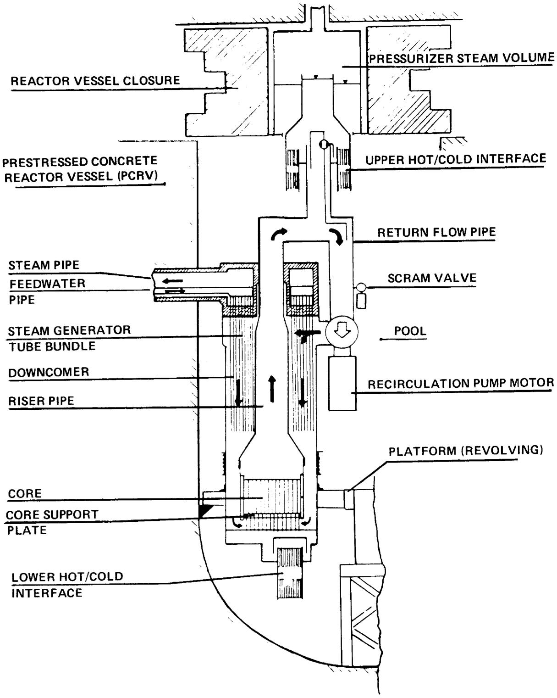  
Fig. 3.1. Vertical section through one module of a MK II modular PIUS plant.

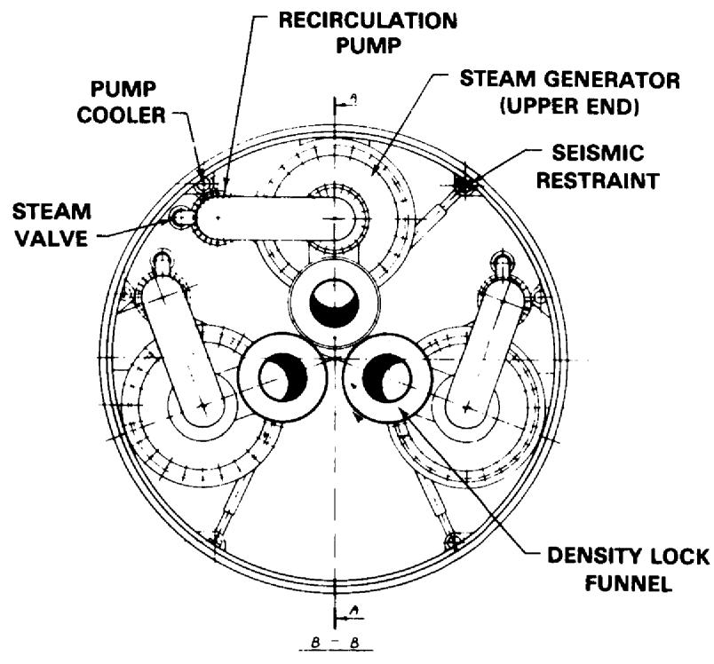

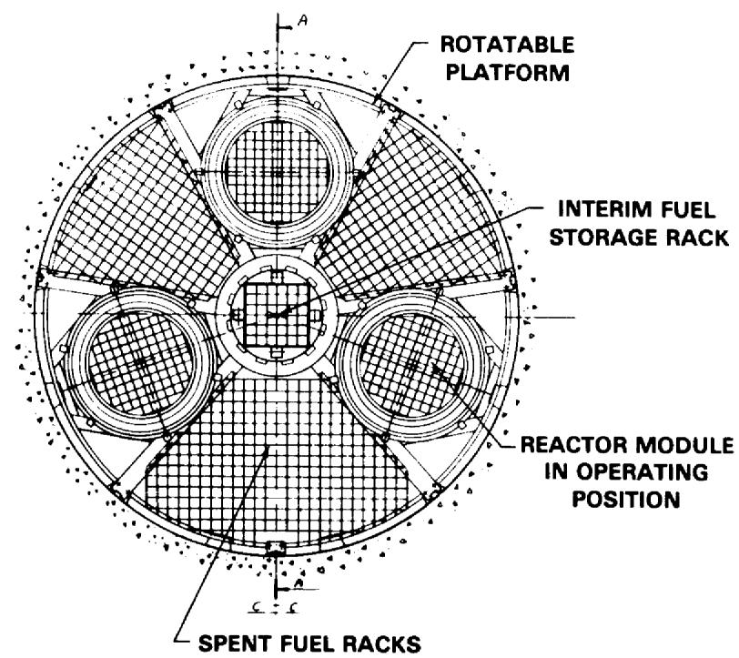  
Fig. 3.2. Horizontal sections through a three-module MK II PIUS plant.

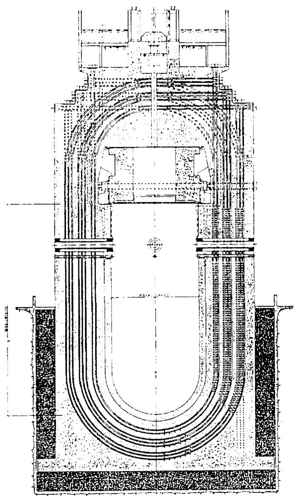  
A

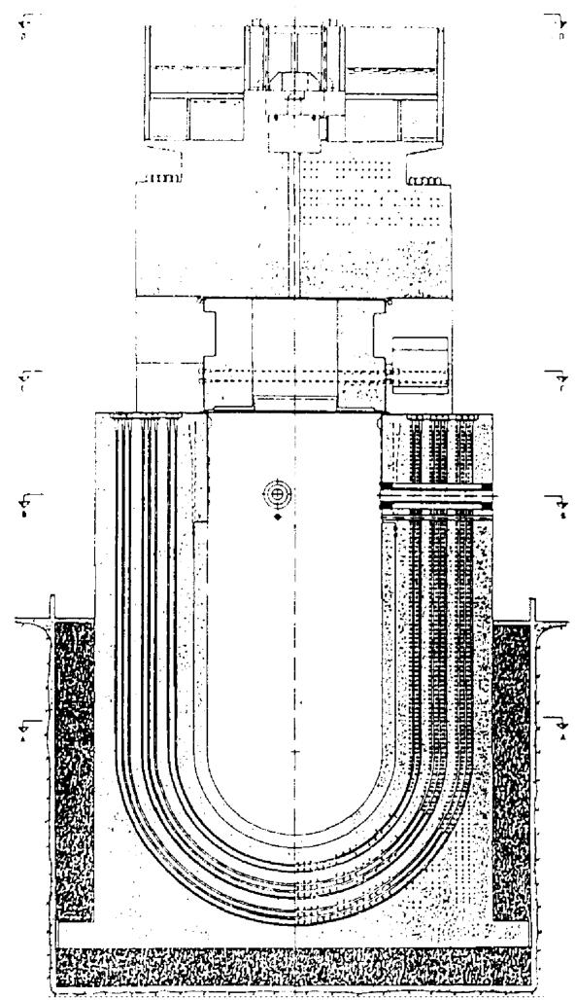  
B   
Fig. 3.3. Prestressed concrete vessel for PIUS plants of 500 to 600 MW(e).

distillation units. Both distillation units may be used after a scram to reestablish plant readiness. The size of the collection tanks and of the borated and clean water tanks is such that two consecutive scams can be accommodated with only one evaporator operating. Each reactor will operate without control rods, and the boron concentration control will provide the necessary reactivity control above that provided by inherent reactivity feedback and burnable poisons.

The PIUS reactor concept is proposed as a very safe reactor utilizing LWR technology. Further, it is proposed as a system which has a competitive capital cost because of its safety and control characteristics. The practicality of the concept rests on the stability and control of the fluid interfaces between the pool water and each hot primary circuit, including stability under transient conditions. Other important factors are the practicality of the PCPV design, of refueling by use of a rotating turntable within a deep pool, of insulation requirements, of replacement of equipment, the non-safety grade balance of plant and the practicality of operating three reactors without any control rods and without interference due to thermal and pressure transients. All of the above areas are being evaluated.

A fundamental design goal of PIUS is the preservation of fuel integrity under all credible conditions. The approach is claimed to achieve complete protection against core melting or overheating due to the following:

- any credible equipment failure,   
- natural events such as earthquakes and floods,   
- reasonably credible operator mistakes,   
- combinations of the above

as well as

- inside sabotage by plant personnel,   
- terrorist attacks in collaboration with insiders,   
- military attack (e.g., by aircraft with 'off-the-shelf' non-nuclear weapons),   
- abandonment of the plant by operating personnel.

The designers state that every attempt is made to achieve these goals via passive means (i.e., without reliance on safety equipment which could fail to function). This passive protection should last for a minimum of one week following any initiating event. Thus PIUS should meet well the Third Ground Rule. The designer's position is that all of these goals can be attained via fulfillment of two basic safety functions:

1. the design precludes any credible circumstance which can result in uncovering of the core, and

2. the design prevents core heat generation rates which would exceed the convective heat removal capability of the submerging water under all conceivable conditions.

# 3.3.1.2 Claims, Advantages, and Disadvantages Evaluated Against Criteria, Essential and Desirable Characteristics

The proponents claims and potential concept advantages are discussed briefly as follows first in the order of the preliminary criteria and then with regard to both essential and desirable characteristics:

1. Public Risk: PIUS appears to be resistant to fuel damage under all anticipated transients and for long periods (~7-10 days) without human intervention or active engineered safety features after worst case accidents. ASEA-ATOM claims that normal operating releases are expected to be less than for current LWRs. The lower power density and expected good chemistry behavior should limit the occurrence of minor fuel leaks. ASEA-ATOM argues that pressure cycles in the large pool where depleted fuel is stored will not exceed clad strength limits so that pool contamination will be minimal. Steam generator tube leaks will be contained by steam-line isolation valves and a secondary pressure boundary rated at primary system pressure (9 MPa or 1300 psia) up to the isolation valve location just outside the wall of the PCPV. PIUS is also designed to be highly resistant to external threats such as aircraft crashes, terrorism, and sabotage.   
2. Investment Risk: Since core damage is precluded during normal transients and delayed for at least a week without human intervention during worst case accidents, the probability of loss of investment arising from core melt appears to be much less than $10^{-4}$ / plant year (no PRA yet to support this conclusion).   
3. Economic Competitiveness: ASEA-ATOM claims economic competitiveness with coal-fired plants under Swedish market conditions and assuming a non-safety grade balance of plant (BOP). Their unpublished studies show that a PIUS 500 MW(e) nonmodular plant has twice the capital cost of a Swedish 600 MW(e) coal-fired plant but an energy cost that is less than the coal-fired plant by between $15\%$ (for coal at $\$50$ per metric ton) and $25\%$ (for coal at $\$60$ per metric ton), where the cost of coal contributes approximately $60 - 70\%$ of the levelized energy cost. Similarly, recent ASEA-ATOM estimates reported for the 600 MW(e) modular plant show the same relation to coal-fired capital costs and between a $20\%$ and $30\%$ advantage in energy costs for the coal prices noted above. ASEA-ATOM has not provided supporting documentation of the analysis nor is there sufficient information available currently to perform an independent analysis. However, if the

PIUS can be built at twice the capital cost of a coal-fired plant, it would be competitive in the United States in regions where Western low-sulfur coal is selling at $35 per metric ton and where Eastern high-sulfur coal is selling at$ 45 per metric ton assuming that the price of coal in the future escalates at 1.5% or more above inflation.

4. Probability of Cost/Schedule Overruns: ASEA-ATOM recognizes the need to develop a complete design before initiating construction and is working toward that goal.   
5. Licensability: ASEA-ATOM has a draft licensing plan, is actively engaged in dialogue with NRC-NRR and has plans to proceed with securing NRC final design approval (FDA) by January 1992.   
6. Demonstration of Readiness: ASEA-ATOM believes that a non-nuclear demonstration plant (including a full-scale steam generator module) built in a tank to demonstrate the fundamental thermal-hydraulic safety principles of PIUS can demonstrate the resistance of the plant to unwarranted shutdowns from minor transients. They further believe that such a demonstration will simplify licensing and quell the arguments of detractors with regard to the potential of high unavailabilitys resulting from minor upsets. ASEA-ATOM also believes that a non-nuclear demonstration presents the possibility of going directly to a financially selfsupporting power plant without burdening the development program with the large expenditure and time delay of a nuclear demonstration. ASEA-ATOM believes that the full-scale non-nuclear test would resolve most constructibility problems except for the PCPV; however, they consider the constructability of the PCPV to be based on an established technology and to be easier to construct than their current BWR pressure suppression containment buildings. Such a demonstration would not fully address all issues of constructability and maintenance, particularly long-term requirements for steam generator cleaning.   
7. Owner Competence: Any previous operator of an LWR should be able to build and operate PIUS assuming that the plant operates as projected by ASEA-ATOM. The operational complications are possibly the use of three reactor-steam generator modules to feed a single steam header, steam generator tube cleaning, pressure control of the primary system and refueling three cores in a deep pool. ASEA-ATOM claims that these features actually simplify operation and that their analyses support this claim. ASEA-ATOM points to the use of the large ( $\sim 200 \mathrm{~m}^{3}$ ) pressurizer as a buffer during transient events. Actual operating experience is needed to corroborate these claims. Other technologies appear to be extensions or modifications to existing LWR technology.

8. Essential Characteristics: PIUS has great promise according to its proponents of achieving safe, reliable and cost competitive operation; however, as noted under the evaluation against criteria, most of these claims require further analytical or experiential substantiation, particularly in the area of construction costs and availability. The sizing of PIUS at about 600 MW(e) appears to meet the need for smaller increments in base load capacity additions consistent with current load growth projections, and modularization of the reactor-steam generator configuration is an attempt to simplify plant construction. Resistance to accidents and external events such as sabotage is inherent in the design as conceptualized by the proponents. Such resistance implies low costs associated with accidents, possibly smaller security staffs and the reliance on passive safety features under worst case scenarios to delay required mitigative actions and perhaps to avoid having to provide for area evacuation.

9. Desirable Characteristics: Aside from the lack of planning for fuel recycle, the low thermal efficiency, lack of on-line refueling, and the questionable versatility relative to application (except for district heating) because of the low grade of steam compared to other higher temperature concepts, PIUS possesses most of the desirable characteristics listed in Chapter 2. Some areas of potential weakness such as waste handling and disposal, decommissioning and diversion and proliferation are generic problems shared in common with virtually all reactor concepts because the proposed solutions to these type of concerns are often subject to a variety of interpretation by national and international regulatory, governmental and public interest bodies. Replacement of the nuclear steam supply equipment for extended life may be easier for PIUS than for other LWR concepts assuming that the vessel remains qualified. Because of passive safety characteristics, PIUS does appear to be potentially much more flexible to siting requirements and more much resistant to sabotage and diversion than current generation LWRs.

The potential disadvantages are discussed as follows:

1. Public Risk: The potential for refueling accidents must be addressed more fully with attention to the control and monitoring of heavy loads above the spent fuel storage locations within the PCPV. ASEA-ATOM claims that major maintenance such as pump replacement could be performed with the freshly exposed fuel in the operating positions under the steam generators. The possibility of damage to fuel stored from previous operating cycles, claimed to pose little radiological hazard, may need extensive study.

2. Investment Risk:

a. PIUS availability has not been firmly established by analysis and testing to date.   
b. Deep pool maintenance may be a problem with the onus of long shutdowns. ASEA-ATOM cites their replacement of BWR internal recirculation pumps as an adequate experience base for deep pool maintenance on difficult configurations.

3. Economic Competitiveness:

a. PIUS competitiveness with coal and other nuclear options has not been established independently. PIUS capital costs have not been confirmed for U.S. siting.   
b. On-line refueling is not possible for PIUS so refueling shutdowns must be scheduled as in current LWRs. The three cores must be shut down for one to be serviced.   
c. PIUS load following may have been enhanced by a three reactor system, but operation of one or more modules at reduced power may be difficult depending upon the difficulties encountered in controlling steam generator feedwater injection rate to match core power levels. The effects of fuel cycle cost penalties have not been adequately addressed for the case in which the three cores become out of phase in burnup. ASEA-ATOM states that less fuel will be added in refueling the affected module; this solution to get back in phase incurs a financial penalty which is acknowledged but not fully addressed. Another alternative is to interchange fuels between modules.   
d. PIUS is not amenable to efficient fuel recycle because of the emphasis on onsite 30-year storage of spent fuel.   
e. PIUS has a relatively low thermal efficiency.

4. Probability of Cost/Schedule Overruns: No specific disadvantage identified provided component and system testing have been completed successfully prior to design completion.

5. Licensability:

a. As with all advanced reactors, PIUS has not yet been forced to address post-TMI licensing proceedings. The possibility exists for the need to address the probabilistic risk of the consequences of beyond design basis accidents coupled to the cost-benefit of adding equipment to avert the risk associated from very low probability accidents. The regulatory authorities may require the

use of a separate containment, a dedicated 30-day water supply, control rods, a safety-grade control room, dedicated emergency electrical power and/or other safety grade systems on the balance of plant. If so, the effect will be increased plant cost to meet such requirements. There appears to be a potential need for some level of secondary containment during shutdown operations with the vessel seal broken.

b. Requirements for area evacuation are also not firmly established for PIUS. ASEA-ATOM argues convincingly that significant releases could only occur after an extended time delay (7-10 days) following an accident. Such a delay in taking action to add water, assuming adequate prior provision had been made, would imply a chaotic social situation external to the plant. However, the PIUS pool could become severely contaminated from unanticipated fuel failures, for example, due to manufacturing problems. The result would be either a long shutdown to allow decay of radioactive nuclides with relatively slow water cleanup rates or an accelerated cleanup rate in which out-of-reactor incidents would be possible. ASEA-ATOM argues that eliminating the need for immediate evacuation is being addressed and that their water cleanup systems should be comparable in speed and safety to current LWRs and this appears to be achievable.

6. Demonstration of Readiness: Steam generator cleaning requirements may not be confirmed until after the first plant has been in operation for some time. ASEA-ATOM argues that cleaning requirements can be studied in relatively small scale (non-nuclear) tests, but such idealized testing although important may be inadequate to represent actual plant operation. Improvements in design for cleaning have been reported by ASEA-ATOM, but details are not yet available. Fuel handling, in-pool maintenance, boration control, wet insulation, submerged pumps, core carrier manipulation, and the PCPV closure involve new designs and technology. Although these features can be tested in mockup facilities, they will require actual demonstration with reactor operation. However, since the concept draws heavily on PWR experience, the demonstration reactor may be determined as commercially viable following a successful test period.   
7. Owner Competence: No specific disadvantage identified.   
8. Essential Characteristics: Most of the significant potential disadvantages associated with the essential characteristics have been addressed above under the criteria for Investment Risk, Economic Competitiveness and Licensability. As mentioned under the discussion of advantages, estimates of cost and availability need to be substantiated.

9. Desirable Characteristics: Most of those not met by PIUS were listed above for comparison purposes in the evaluation of the advantages. Load following is one area which the PIUS proponents claim has been solved by modularization but the control system, as noted under the economic competitiveness, may be more complicated and harder to operate effectively than currently envisioned by the proponents. However, experience with control in experimental facilities is reported to be favorable. With respect to radiation exposure to workers, corrosion product activation and transport is an unresolved consideration since the behavior may be different from that of the standard PWR.

# 3.3.1.3 R&D Needs and Open Questions Evaluated

1. Development, testing and demonstration of an optimum geometry for the hot/cold water interface mechanism to ensure core shutdown/quench when required and to preclude unwarranted shutdown in response to minor transients and upsets are needed. ASEA-ATOM has conducted preliminary tests which produced favorable results, but more comprehensive testing and analysis are required and are planned.   
2. ASEIA-ATOM is attempting to demonstrate by analysis and testing that plant availability will be sufficiently high to avert the possibility that the design is too complicated to operate economically. This important evaluation would justify independent study.   
3. Safety relief valves, steam suppression and filtering systems may require extensive testing since they are essential components of the decay heat removal system.   
4. Components within the PCPV, the unusually long tendons, the vessel liner, and its closures must be carefully studied and designed to ensure that in-service inspection is practical where required.   
5. Technical, economic and licensing evaluation and assessment is necessary for the PCPV including the sliding upper cover and locking devices.   
6. Submerged steam generator development is required including single tube, multitube and fullscale development testing of flow stability and transient response; disassembly, cleaning and plugging procedures.   
7. Wet thermal insulation for the primary coolant system and PCPV requires further development and demonstration testing.   
8. Development and testing of the refueling turntable component handling tools, and other features of underwater maintenance,

are needed. Also, corrosion product transport and activation are likely to differ from the standard PWR and may complicate maintenance.

9. Economic evaluation must be performed comparing against coal and conventional LWRs. This evaluation must include a capital investment cost estimate for U.S. siting. Planned and realistically estimated forced outage rates must be evaluated against refueling and maintenance requirements and the spectra of potential plant unavailabilitys. Extended testing of components is recommended in borated coolant conditions.   
10. Planned outage rates and realistically estimated forced outage rates must be evaluated against refueling and maintenance requirements and other potential plant unavailabilitys. Extended testing of components is recommended under borated coolant conditions.   
11. Development and demonstration testing are needed for the multi-service pressurizer and the integrated control system for three reactor-steam generator modules feeding one or more turbine-generator sets.   
12. Confirmatory tests and analysis will be required to assure adequate negative reactivity feedback and the effective operation of the soluble boron control system.

# 3.3.2 The Small Advanced BWR

# 3.3.2.1 Description

A small Boiling Water Reactor (BWR) design concept has been developed by the General Electric Company (GE). This concept attempts to maximize the use of BWR design, technology, and operating experience. Significant innovations are included to simplify and improve the performance of safety functions. These, as well as other system simplifications and a reduced power rating, are claimed to reduce total costs and speed construction. The major emphasis by GE has been on a 600 MW(e) concept which is judged to be adequately competitive with coal to interest the U. S. market. Lower power ratings are possible. A 1000 MW(e) concept is feasible but would require a larger volume suppression pool to maintain an equivalent time for operator response as in the 600 MW(e) concept.

The small BWR concept (Fig. 3.4) uses an isolation condenser to improve transient response. Control rods, which can be driven either electrically or with accumulator pressure, and gravity-driven borated water injection from an elevated low pressure pool are used to simplify and provide diversity to the shutdown function. Core cooling and decay heat removal are provided by depressurizing the reactor to the elevated

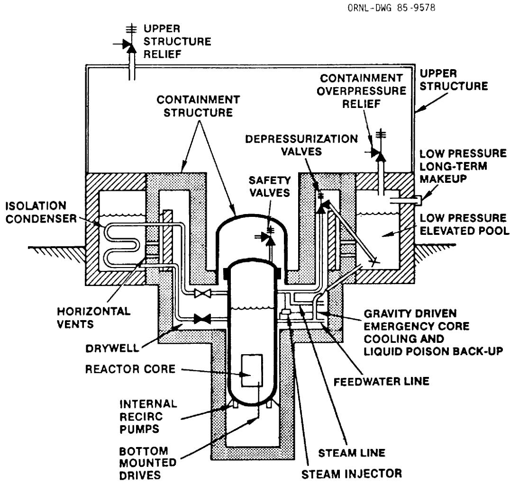  
Fig. 3.4. A small BWR concept.

suppression pool. The drywell and pool gas spaces are inert. In addition, a steam injector is used to improve feedwater availability by providing a continuous minimum flow from a condensate storage tank even if the main feedwater pumps are lost.

Steam is produced in the reactor vessel in a manner similar to that of current BWRs. Internal recirculation pumps similar to those used in ABWR are used to circulate water through the core. (At lower power levels, natural circulation becomes a better choice.) The steam-water mixture exiting the core is directed to separators and dryers. Bottom-mounted control rod drives, similar to those used on the ABWR, are used to provide power shaping and emergency shutdown.

Reactor pressure is normally controlled with turbine throttle and bypass valves. When the reactor vessel is isolated from the turbine condenser, an isolation condenser controls pressure. This device was selected because of its simplicity and because it provides high pressure reactor water inventory control. Failure of the isolation condenser function (to control reactor pressure) is not expected during the plant life. The availability of the pressure control function is to be achieved by selecting an appropriate redundancy in the isolation condenser units and by using the safety valves/steam injector as the diverse backup pressure/inventory control system. However, if such a failure occurs, safety and depressurization valves provide a backup depressurization to the suppression pool which is positioned above the reactor vessel. When the reactor pressure is sufficiently low, check valves open in the suppression pool-to-vessel fill lines and water flows by gravity into the reactor vessel to keep the core covered. The responses to a loss-of-coolant accident and a transient with failure to scram are similar.

The suppression pool contains borated water to provide a diverse backup to the control rods. Core cooling and decay heat removal is assured with water returned to the reactor vessel and steam produced by decay heat is vented to the suppression pool. In the 600 MW(e) concept, there is a three-day supply of water available to accept decay heat. No operator action is required during this time. For longer periods the suppression pool must be refilled from an assured source with highly reliable equipment. Emergency diesel generators and core cooling pumps are not required.

With the above-mentioned safety features, a severe accident is extremely unlikely. The ability to retain fission products in the suppression pool is an important BWR feature which has been retained to provide mitigation of severe accidents. Use of simple safety devices, activated by stored energy and use of inherent processes such as natural circulation and gravity-fed water delivery to the core, reduce costs through modularization and system elimination. The licensing process may be simplified.

The following objectives were established by GE for the Small BWR concept to assure that it would be practical and that enhanced performance, economy, and safety would be achieved.

1. The major power-producing elements of the concept are based on proven technology or minor extensions of current technology.   
2. The key safety functions are maintained at all times during transient and accident conditions:

a. There is no need for short-term operator action. Short-term is defined as three days. After this period, operator actions which are required should be judged easy to accomplish. With such operator action, the safety functions will be maintained for an indefinite period.   
b. Safety devices or features are either inherent to the concept or rely on the use of stored energy for motive power.   
c. Extensive testing is not required. This is defined as taking less than three years to prove the concept by testing its new features. The first commercial application is to serve as a demonstration unit, and a unique demonstration is not to be required.

3. The design is capable of modularization to allow factory fabrication and testing of most major components.   
4. The design permits a plant construction period of four years.   
5. Capital costs are minimized so electricity generation costs are competitive with those of coal-fired plants of similar power ratings.

These concept objectives were established by GE with the goal of achieving high confidence that the final design will produce the required power in a manner which enhances safety in a readily demonstrable way so that the licensing effort can be simplified.

# 3.3.2.2. Claims, Advantages, and Disadvantages Evaluated Against Criteria, Essential and Desirable Characteristics

The proponent's claims and concept advantages are discussed briefly as follows first in the order of the criteria and then the characteristics:

1. Public Risk: The Small BWR appears to be resistant to fuel damage under all anticipated transients and for long periods (3 days) without human intervention or active engineered safety features after worst case accidents.

2. Investment Risk: The small BWR appears to have a high degree of core damage resistance. The probability for loss of investment due to core melt would appear to be less than $10^{-4}$ / plant year (GE claims to have a preliminary PRA to support less than $10^{-6}$ / plant year). The probability of high availability through resistance to long shutdowns from upsets or major maintenance appears to be favorable for the small BWR. This confidence derives in part from the similarity to current BWRs and their extensive base of operating experience. The small BWR has no external recirculation piping to be subject to stress corrosion cracking, but a boration transient will require corroborating the primary system to acceptable levels. GE intends to ensure that this transient will be a very low probability event (less than once in plant life).   
3. Economic Competitiveness: Based on GE studies to date, the Small BWR is estimated to be nearly competitive with coal at 600 MW(e); however, GE believes that there are as yet unexplored options to improve economic competitiveness. However, the design is too preliminary for definitive evaluation of construction costs. Fuel cycle costs should derive easily from past BWR experience as should plant availability.   
4. Probability of Cost/Schedule Overruns: No specific advantage identified.   
5. Licensability: The licensability of this concept is enhanced by its similarity to current BWRs and by GE's plans to take no exceptions to the General Design Criteria. For example, the concept includes the use of containment and control rods. This approach is expected to minimize potential licensing difficulties.   
6. Demonstration of Readiness: GE believes that the passively safe BWR represents only a small evolutionary extension of existing technology needing only about two years for R&D demonstration testing and another two years to complete the design. R&D costs are estimated by GE at about $3M but this figure may be low. Their total design development cost is roughly between $100M and $300M. The first plant may be acceptable for commercial operation after serving as the demonstration. GE believes that because the concept relies heavily on existing technology and already developed designs, there is no need for long term, extensive testing. Therefore, a plant of this type could be available earlier than the 2000-2010 time frame.   
7. Owner Competence: The small BWR should be amenable to ready ease of operation by experienced BWR owner/operators.   
8. Essential Characteristics: As in the case of PIUS, the small BWR has a good deal of promise to provide safe, reliable and

economic electrical power. Unlike PIUS, the small BWR can be compared more directly to its evolutionary antecedents in the large BWR. From the standpoint of characteristics affecting constructibility, cost and operability, the comparison breaks down because of institutional reasons, for example, the history of problems in the U.S. BWR experience compared to successes in the Japanese BWR industry. GE recognizes this difference in historical perspectives but offers no specific arguments that the sought after characteristics listed in Chapter 2 will be realized for the small BWR in the U.S. In principle, at this early stage of development, most of the essential characteristics can be ascribed to the small BWR concept because of its enhanced reliance on passive safety and design simplification; however, the elevated pool may impose strenuous seismic requirements and more complicated construction which can increase cost.

9. Desirable Characteristics: Because of the evolutionary nature of the design, the few and practical RD&D requirements are the most salient characteristic.

The potential disadvantages are discussed as follows:

1. Public Risk: No specific disadvantage identified.   
2. Investment Risk: No specific disadvantage identified.   
3. Economic Competitiveness:

a. The cost competitiveness of the small 600 MW(e) BWR is not yet demonstrated because the GE analysis, which is stated to be very preliminary, finds the lower rating of the small BWR somewhat short of breakeven with equivalent coal-fired units. When other potential cost savings are analyzed, GE expects the design to be competetive with coal. GE agrees that more detailed calculations are in order and that independent evaluations are desirable.   
b. On-line refueling is not possible for the small BWR, and so refueling shutdowns must be scheduled as in current LWRs.

4. Probability of Cost/Schedule Overruns: No specific disadvantage identified; however, the design is in a very preliminary state. Identifiable important needs which require attention are a suitable water level indicator and a reliable depressurization system.   
5. Licensability:

a. As with all advanced reactors, the small BWR has not yet been forced to address post-TMI licensing proceedings.

However, GE is aware of post-TMI requirements and plans to reflect them in the final design. The possibility exists for the need to address the probabilistic risks of the consequences of beyond design basis accidents coupled to the cost-benefit of adding equipment to avert the risk associated with such very low probability accidents. GE feels that retention of the suppression pool and its ability to retain fission products after a severe accident will be of benefit in analysis of such accidents. The regulatory authorities may impose the use of secondary plant man-rated shielding for power operation, a dedicated 30-day water supply for the suppression pool, enhanced safety-grade control room beyond that planned by GE, and/or dedicated emergency ac electrical power. GE intends to rely solely on emergency dc sources with the gravity drain ECCS and argues that diesel-powered pumps on a fire engine truck could provide water to the suppression pool after 3 days. Although GE acknowledges that there are some licensing risks with potential for cost increases, GE also contends that this potential appears relatively small.

b. Need for area evacuation also is not firmly established for the small BWR, but GE feels that they can make a good case for avoiding area evacuation based on expected performance at lower power density and with expected fission product retention in the suppression pool.

6. Demonstration Plant: No specific disadvantage identified.   
7. Owner Competence: No specific disadvantage identified.   
8. Essential Characteristics: Although adequately safe by current design standards and regulations, BWRs have been significant contributors to radioactive effluent releases. Better fuel-clad performance and improved water chemistry have substantially decreased the releases. The use of barrier fuel and lower power densities as proposed should further reduce the radioactive effluents. Construction of the elevated pool and the attendant concern about seismic response must be addressed fully as planned in the proposed R&D.   
9. Desirable Characteristics: The small BWR offers no new features with regard to on-line refueling, proliferation resistance, decommissioning or waste handling and disposal. The concerns and problems are comparable to current generation LWRs and in many instances shared with other advanced or innovative designs. Although the objective is to have a remotely controlled secondary plant with no on-station operators near potentially contaminatable steam lines, the small BWR shares the same characteristics of the large BWRs in having radioactivity in the steam lines which can lead to the potential

for higher occupational exposures compared to other reactors. The improvements described in Section 8 above also apply here.

# 3.3.2.3 R&D Needs and Open Questions Evaluated

1. A full height demonstration test is needed of the gravity-drain Emergency Core Cooling System (ECCS) from the elevated low pressure pool (thought to be an item of concern to NRC licensing).   
2. High flow steam injector demonstration testing is necessary; the design is based on low flow tests performed over 10 years ago. Also, the reliability and availability of the injector control system must be demonstrated. A key component of the injector control system is a sufficiently accurate vessel water level indication. GE contends that injector control does not require fine indication of vessel water level, which may well be the case, but demonstration testing is felt to be required to assure that the injector is a legitimate benefit to plant safety and enhanced availability. A potential buyer may require assurance before being sold a product that could cause delay, rework or even removal if it were to fail during hot functional tests on the completed plant. GE notes however that "in the worst case", the steam injector could be deleted from the design, and a nearly equivalent level of protection could be added by increasing the redundancy of the isolation condenser, or by reverting to the use of the steam driven Reactor Core Isolation Cooling (RCIC) system now in use at operating BWRs.   
3. Confirmation of the analytical load definition for horizontal vent discharges to a covered suppression pool is needed. The covered pool results in the need for load definitions up to a differential pressure of about 0.35 MPa (40-50 psi) compared to the currently available test data up to 0.1 MPa (15 psi). However, such testing is already planned for the advanced BWR in 1986, and the results of that program can be utilized for the 600 MW(e) plant. GE considers this work to be confirmatory rather than R&D and so does not factor this into their R&D cost estimates.   
4. Depressurization valve demonstration is needed; the design is based on a concept of a valve which is deenergized to open and then latches open. Although the design is simple in concept, it apparently has never (or not widely) been applied in practice. Most LWRs use electric or air operated valves which are typically designed to fail shut; in the small BWR, reactor pressure opens the valves against a magnetic force which is lost when the dc circuits are deenergized. GE considers air operated valves to be the best backup alternative to the magnetic valve, but this option appears to reduce the passivity of the safety feature.

5. Independent, detailed evaluation of plant economics and costs is needed.   
6. Thorough seismic analysis is needed to assure the integrity of the elevated pools and associated piping, valves, and containment structures.

# 3.4 LIQUID METAL COOLED REACTORS (LMRs)

# 3.4.1 Introduction

The three LMR concepts evaluated by NPOVS are the Large Scale Prototype Breeder (LSPB), the Sodium Advanced Fast Reactor (SAFR), and the Power Reactor Inherently Safe Module (PRISM). To place the discussion of these designs in perspective, this section begins with a summary of major design options, design challenges, and design tradeoffs envisioned for commercial LMRs. This is followed by a description of each concept and a discussion of their advantages and disadvantages with regard to the NPOVS criteria. To complete the section, the research and development needs for the concepts are presented.

# 3.4.2 Design Options, Challenges, and Tradeoffs

Recently, emphasis of the U.S. breeder program has shifted towards enhanced passive safety, lower capital and operating costs, shorter construction times, and enhanced licensability.[6] This led to a reexamination of the many design options, challenges, and tradeoffs which are available for pursuing the LMR concepts. Those mentioned below are the more important ones with regard to the NPOVS study.

The universal choice of sodium as the coolant for commercial LMRs results in several design options and design challenges, all of which relate to the physical and chemical properties of sodium. Design options made possible by sodium which enhance passive safety include: (1) a low-pressure primary system, (2) an operating primary coolant temperature well below boiling, (3) a large heat capacity in the coolant volume, (4) relatively low coolant velocities and pumping powers, (5) a coolant which is compatible with preferred cladding materials, and (6) natural circulation heat transfer loops for decay heat removal. Design challenges associated with the use of sodium as the reactor coolant include: (1) protection against sodium fires and sodium-water reactions, (2) considerations of reactivity effects associated with loss-of-coolant accidents, (3) minimization of primary coolant activation by neutron absorption, (4) maintaining the coolant in the liquid state during accident conditions, (5) requirements for nonvisible refueling, and (6) sodium purity monitoring and cleanup. Through the many years of extensive research, development, and experience with sodium systems, design tradeoffs have been developed and demonstrated. To a great extent LMRs are attractive because they use sodium as a coolant; many design decisions are dominated by considerations of sodium

properties. However, the U.S. utility industry lacks familiarity with the use of sodium cooling technology, and this fact must be reckoned with in securing utility competence.

Another significant option for LMR designs is the required power output and therefore the size of the reactor core. Presently, a large core producing about 3500 MW(t) offers plant economy of scale and relative simplicity of reactor control compared to multiple modules. Claims associated with producing the same power with several smaller cores includes construction advantages associated with factory fabrication, enhanced passive safety against core disruptive accidents, and greater flexibility in the design of passive decay heat removal systems. In addition, safety characteristics of these smaller cores can be demonstrated in full-scale prototypic tests, thereby strengthening licensing positions. Other claims made for smaller, multiple cores for each power station include lower investment risk, a better match of completion schedules with load demands, and high availability.

The NPOVS assessment includes consideration of the entire fuel cycle. A once-through cycle does not take advantage of the potential for LMRs to breed and thus provide greatly extended fuel reserves. Fuel recycle is anticipated when it becomes cost effective and will be required for a long-term nuclear capability. Design options which most influence fuel recycle include long life cores and the fuel type. Oxide fuel has been the reference for all foreign and domestic programs, but, recently, metal fuel has been reexamined at the Argonne National Laboratory. See Appendix E for discussion of fuel cycles for oxide and metal fuels. However, other concerns such as safeguards, the availability of fuel from enrichment or reprocessing facilities, the cost and licensability of these facilities, and public and utility acceptance must be considered. Thus, a major business decision for building an LMR may be very dependent on having an acceptable and available fuel-supply system.

Two design options have traditionally existed for the configuration of the primary loop in a commercial LMR. The first is a pool design for which the core, intermediate heat exchanger, and remainder of the primary system are all contained within a single vessel. The second is a loop design where only the reactor core is placed in the sodium-filled reactor vessel; the primary pump and intermediate heat exchanger are outside this vessel, being incorporated into a heat transfer loop. The choice of a loop or pool option is significant since it has a major influence on the remainder of the plant design. A recent worldwide emphasis to decrease the capital costs projected for commercial LMRs has focused attention on the pool design, which generally offers an advantage in compactness.[8]

# 3.4.3 Design Descriptions

This brief discussion of the LSPB, SAFR, and PRISM designs includes plant characteristics which support claims concerning economics, safety,

licensability, constructibility, and public acceptance. Table 3.1 provides a summary list of the more important features of each design as presented in the references to this report and updated by the designers.

# 3.4.3.1 The Large Scale Prototype Breeder (LSPB)

This design effort is assisted by several contractors* sponsored by the U.S. Department of Energy and, since 1982, by the Electric Power Research Institute.[9-12] It is intended to provide the prototype of a commercially deployable plant which could produce power before the year 2000. Preliminary design of a four-loop configuration is completed and provides the basis for our evaluation. Preliminary design of a pool-type concept has been initiated.

Of the LMR concepts considered here, the 1319-MW(e) LSPB is most easily associated with historic design evolutions. It incorporates many features from previous IMFBR designs, both in the United States and abroad. In addition, the LSPB includes design innovations to reduce capital and operating costs and enhance passive safety. Thus, this concept, as presented by the LSPB project, satisfied the NPOVS ground rules.

As indicated in Table 3.1, each of the four loops of the LSPB consists of a primary heat transfer loop, an intermediate heat transport loop, and a steam generator system. The four steam generators feed a single turbine manifold. The reactor core is heterogeneous using both PuO2 and UO2 as fuel.

A major design goal of the LSPB has been cost competitiveness. $^{10}$ The third plant constructed is intended to be economically competitive with both coal-fired and LWR plants under the assumption of no government support. Specific features incorporated to enhance constructibility and reduce capital and operating costs include: (1) the capability to operate at reduced power using three loops while the remaining loop undergoes maintenance, (2) shallow excavation, (3) close-coupling of major systems for reduced lengths of large-diameter sodium piping, (4) reduced sizes of major buildings to reduce capital costs of commodities such as concrete and rebar, (5) use of cable multiplexing to reduce cable requirements and eliminate cable spreading rooms, (6) pre-assembly of subsystems on-site prior to installation in the plant, (7) separation of the balance-of-plant from the nuclear island, and (8) inline arrangement of major buildings to enhance constructibility. Another significant innovation of the LSPB system is the containment

Table 3.1. Design and construction characteristics of the LMR designs selected for initial investigations   

<table><tr><td colspan="2">Design and construction characteristics</td><td>LSPB Loop*</td><td>SAFR</td><td>PRISM</td></tr><tr><td colspan="2">Power level [MW(e)]</td><td>1319 [3500 MW(th) and a net plant efficiency of 37.6%]</td><td>Single Power Pak, 350; Multiple Power Paks, 700, 1050, 1400, etc.</td><td>Single reactor, 138; the smallest power block unit has three reactors and one turbine, for 415. Station power with multiple segments of 415, 830, or 1245</td></tr><tr><td colspan="2">Reactor Exit Temperature (°C)</td><td>510</td><td>510 (9 Cr-1 Mo used for entire intermediate system)</td><td>468</td></tr><tr><td colspan="2">Steam Cycle and Steam Conditions (°C, MPa)</td><td>Benson cycle (454, 15.7), conventional</td><td>Benson cycle (457, 18.3), conventional</td><td>Steam enters the turbine from a steam drum fed by three steam generators. Steam is at saturation conditions (282, 6.6)</td></tr><tr><td colspan="2">Plant Configuration</td><td>Four loops (pool design is being developed)</td><td>Pool (each Power Pak has one reactor and one turbine)</td><td>Pool (three pool modules, each with one reactor, for each turbine)</td></tr><tr><td colspan="2">Number of Pumps in Primary Loop(s)</td><td>Four (one per loop)</td><td>Two, in primary vessel of each Power Pak</td><td>Four per module</td></tr><tr><td colspan="2">Number of Intermediate Heat Exchangers (IHXs) per Power Unit</td><td>Four (one per loop)</td><td>Four, in primary vessel of each Power Pak, Primary flow is gravity driven on the tube side.</td><td>Four per module</td></tr><tr><td colspan="2">Number of Intermediate Loops per Power Unit</td><td>Four</td><td>Two, each with its own Steam Generator, for each Power Pak</td><td>One per reactor module with one steam generator per reactor</td></tr><tr><td colspan="2">Design and construction characteristics</td><td>LSPB Loop*</td><td>SAFR</td><td>PRISM</td></tr><tr><td colspan="2">Fuel</td><td>U-Pu oxide</td><td>U-Pu oxide, or U-Zr metal, or U-Pu-Zr metal</td><td>U-Pu oxide or U-Pu-Zr metal</td></tr><tr><td colspan="2" rowspan="2">Reactor Shutdown System</td><td>Diverse, redundant system for active shutdown</td><td>Diverse, redundant system for active shutdown</td><td>Diverse, redundant system for active system</td></tr><tr><td>Passive rod release from Curie-point or other temperature effect as a design option</td><td>Self-activated, passive, temperature-induced release of these rods from Curie-point effect</td><td colspan="2">Passive shutdown from negative reactivity feed-back due to temperature increases and self actuated release of shutdown rods from over-temperature</td></tr><tr><td colspan="2">Shutdown Heat Removal</td><td>Normal: BOP using natural or forced circulation Dedicated: Two, independent, diverse, and redundant safety grade systems that remove heat directly from the reactor vessel to the atmosphere. One system uses natural circulation Backup: Cross-connection to the natural circulation heat removal system of the exvessel, fuel storage tanks</td><td>Normal: BOP with natural circulation. Investment Protection: Direct reactor auxiliary cooling (DRAC). Sodium-to-air heat transfer using natural circulation. Safety: Reactor air cooling system (RACS). Reactor guard vessel is cooled by natural circulation of air</td><td>Normal: Heat transport system to turbine-generator condenser Investment Protection: Air cooling of steam generator shell. 
Safety: Radiant Vessel Auxiliary Cooling System (RVACS). A passive, radiant heat transfer, natural circulation system that operates efficiently at high temperatures</td></tr><tr><td colspan="2">Design and construction characteristics</td><td>LSPB Loop*</td><td>SAFR</td><td>PRISM</td></tr><tr><td colspan="2">IHTS and BOP Configuration</td><td>Modularization is stressed. A rectangular reactor containment building will be used. Systems outside contain-ment are of conventional design</td><td>IHTS loops and components made of 9 Cr-l Mo steel. Conventional and non-safety grade, seismic II design.</td><td>High commercial grade to reduce cost. The reactor module and refueling equipment are of nuclear safety grade.</td></tr><tr><td colspan="2">Fuel Cycle Facilities and Strategy</td><td>Under-the-head reactor refueling. Assumes off-site fuel reprocessing.</td><td>On-site reprocessing and refabrication included in design layout but little detail design as yet. Spent fuel is stored for a year in the primary vessel.</td><td>Refueling using a mobile refueling machine which moves from one module to the next. Reprocessing and refabrication may take place either on- or off-site.</td></tr><tr><td colspan="2">Construction Characteristics of Major Components and Structures</td><td>Modular construction will be emphasized. Access plugs are provided in the top of the containment building for removal of large components.</td><td>Reactor assembly with vessels, internals and deck is factory built and barge shippable. Access plugs provided in the top of the containment building for removal of large components.</td><td>Reactor modules are shop fabricated and assembled and are rail shippable. In addition, the intermediate sodium loop, the steam generator, and other BOP systems will be modularized and factory produced.</td></tr><tr><td colspan="2">Containment/Confinement Building Characteristics</td><td>Reactor, PHTS, and auxiliary equipment in a concrete containment building enclosed by a steel confinement structure.</td><td>One containment building for each Power Pak.</td><td>Each module has its own containment.</td></tr><tr><td colspan="2">Net Thermal Efficiency (%)</td><td>37.6</td><td>36.7</td><td>32.5</td></tr><tr><td colspan="2">Availability (%)</td><td>80 (design)</td><td>&gt;84 for a single Power Pak.</td><td>88 estimated; 80 used in economic assessments.</td></tr><tr><td colspan="2">Design and construction characteristics</td><td>LSPB Loop*</td><td>SAFR</td><td>PRISM</td></tr><tr><td>Plant Lifetime (yrs)</td><td>40</td><td></td><td>60</td><td>40 (but reactor modules can be replaced at relative low cost)</td></tr><tr><td colspan="5">Core Design Characteristics</td></tr><tr><td>a) Type</td><td>Heterogeneous</td><td></td><td>Heterogeneous</td><td>Homogeneous</td></tr><tr><td>b) Height (meters)</td><td>4.83</td><td></td><td>3.25</td><td>1.76</td></tr><tr><td>c) Diameter (meters)</td><td>5.71</td><td></td><td>4.04</td><td>1.93</td></tr><tr><td>d) Resident time in core (yrs)</td><td>3 (4 for advanced core)</td><td></td><td>4</td><td>4</td></tr><tr><td>e) Refueling Intervals (yrs)</td><td>1</td><td></td><td>1</td><td>1</td></tr><tr><td>f) Cover gas</td><td>Ar</td><td></td><td>He</td><td>He</td></tr><tr><td colspan="5">Reactor Vessel</td></tr><tr><td>a) ID (meters)</td><td>14.6</td><td></td><td>11.9</td><td>5.8 (containment)</td></tr><tr><td>b) Height (meters)</td><td>19</td><td></td><td>14.5</td><td>19.5</td></tr><tr><td>Burnup (MWd/kg)</td><td>109</td><td></td><td>158</td><td>107</td></tr><tr><td>Breeding Capability</td><td colspan="2">Doubling time of 25 years for breeder core reload. Breeding is not required for the initial core.</td><td>System will need only a feed of U-238 since Pu-239 needs will be supplied by conversion.</td><td>Breeding ratio of 1.04 for oxide fuel and 1.22 for metal fuel.</td></tr></table>

*The LSPB pool concept has similar characteristics but offers a higher power level and plant efficiency [1350 MW(e) and 38.5%] and improved shutdown heat removal. It also will require a larger vessel (19 m ID, 21 m H).

design which is a rectangular, steel-lined, concrete building with roof hatches for construction and maintenance. Adjacent nuclear island buildings are integral with the containment thereby providing cost-effective containment and confinement capabilities. The extent to which the LSPB design has achieved lower capital costs is suggested by comparison to the CRBRP design. The LSPB plant, while producing four times the net electrical power of the CRBRP design, occupies a nuclear island which is physically smaller than that of CRBRP. Finally an option has been maintained to use a fuel designed for cost performance by reducing the breeding specification. These design studies indicated that fuel cycle costs could be reduced by about 3 mills/kWh.

Design modifications under consideration could enhance inherent protection for failure-to-scream events through temperature-induced expansion of control rod drive-lines or temperature-induced control rod releases or other Self Actuated Safe Shutdown (SASS) type devices. Calculations are being conducted to identify the design measures needed to assure no boiling for a loss of flow with trip failure. In addition, the LSPB decay heat removal capability is enhanced by incorporating the capability for natural circulation in the normal heat transport systems. These design features should increase the licensability and acceptance of the plant by the public and the utilities.

Additional design features associated with safety and licensability include the use of two independent and diverse reactor shutdown systems and the use of two independent and diverse, safety-grade, decay heat removal systems. One of these decay heat removal systems consists of two, forced-circulation loops and the other is a passive, natural circulation loop. Both decay heat removal systems use the outside air as their ultimate heat sink and sodium in the reactor vessel as the heat source. The LSPB also utilizes a heterogeneous core design. Because of these enhanced safety features, the LSPB balance of plant (BOP) design has been downgraded from safety grade to commercial codes to obtain cost reductions and enhance constructibility.

# 3.4.3.2 Sodium Advanced Fast Reactor (SAFR)

This plant, being designed by the team of Rockwell International, Bechtel, and Combustion Engineering, for the U.S. Department of Energy, consists of one or more independent power generating units called Power Paks, as illustrated in Figure 3.5.13-16 The utilization of multiple units at one site permits cost savings through sharing certain facilities and services. These shared facilities include the control building, the plant service building, the nuclear island maintenance building, and the fuel cycle facility if colocated with the power plant. A major goal for the initial SAFR design effort was to determine the Power Pak power level, and therefore size, which is the optimum trade-off of cost, passive safety, utility acceptance, licensability, and constructibility. Factors which influenced the selection of the 350-MW(e) size included short construction times, low investment risk, economy of scale, and moderate energy costs. For the basic design configuration of each Power Pak, Rockwell made effective use of their previous LMR design

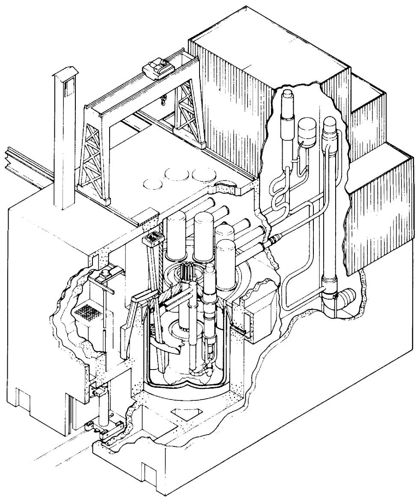  
Fig. 3.5. Power pak elevation for SAFR. Source: Rockwell International, Rocketdyne Division, "SAFR Discussions at ORNL, January 11, 1985."

ORNL-DWG 86-4051 ETD

experience, particularly that associated with the Large Pool Plant (LPP).17 Advanced LMR technology and enhanced passive safety features introduced into the design are listed as follows: (1) metal fuel and its associated reprocessing innovations have been retained as an option, (2) redundant and passive decay heat removal systems have been employed, (3) a relatively high primary system temperature was selected with the use of an advanced material, 9 Cr-1 Mo, for the entire intermediate loop, (4) a backup, self-actuated shutdown system has been included, and (5) heterogeneous core designs with self-regulating characteristics have been incorporated with the objectives of limiting the potential effect of hypothetical accidents.

As indicated in Table 3.1, each 350-MW(e) Power Pak consists of a reactor vessel, primary and intermediate heat transport systems, a steam generator system, and a turbine generator. Safety-related systems and components are minimized and localized in the design such that nuclear safety is decoupled from the BOP and Intermediate Heat Transfer System (IHTS). The reactor assembly is factory built and barge shippable. It contains the primary system and a spent-fuel storage rack. Fuel transfer is by a hoist mechanism and rotating plug which is part of the vessel head closure. Included in the primary system are the reactor, two inducer-type primary pumps, and four intermediate heat exchangers (IHXs). In each of the two independent, intermediate loops, non-radio-active sodium is circulated through the IHXs and a booster-tube, hockey-stick steam generator operating in the once-through mode. The superheated steam from the two steam generators (one for each loop) is directed to the turbine generator. The reactor containment building for each Power Pak encloses the reactor vessel and the in-containment, conventional (A-frame) fuel handling system. This building is a rectangular, reinforced concrete structure with a flat roof. Hatches are provided in the roof to facilitate handling of components, if necessary, thus limiting the building size and hence the construction commodities required. The reactor guard vessel constitutes part of the containment envelope. The non-safety-grade, steam generator building for each Power Pak is a conventional building mounted on the base mat.

The normal mode of decay heat removal uses natural circulation of sodium through the heat transport systems of the Power Pak. In addition, two independent, natural circulation, backup systems are provided. The first is a direct reactor auxiliary cooling system (DRACS) which transfers heat from the primary pool to the outside air using a sodium-to-air heat exchanger. The second is a passive, safety-related, reactor air cooling system (RACS) which operates with natural circulation to provide the ultimate decay heat removal capability through cooling of the reactor guard vessel. The RACS also provides passive cooling of the reactor cavity. The diverse and redundant shutdown system consists of both primary and secondary control rods as well as a self-actuated inherent shutdown system which responds to sodium overtemperatures.

The site construction time for a Power Pak unit, from ground breaking to initial power operation, is estimated to be thirty-three months. The licensing plan for SAFR stresses standardization and a

prelicensed Power Pak so that only site-related licensing considerations are required after obtaining a Final Design Approval.

# 3.4.3.3 Power Reactor-Inherently Safe Module (PRISM)

The PRISM concept of General Electric is being designed under contract for the U.S. Department of Energy.[18-21] A simplified drawing of the concept is shown in Figure 3.6. A major design emphasis of the PRISM concept is incorporation of passive safety through use of: (1) a relatively low power reactor core of 133 MW(e), (2) a pool design with relatively low primary sodium temperatures, (3) a safety-grade passive decay heat removal system, and (4) large negative temperature reactivity feedback in the core design with the intent of limiting potential core disruptive accidents to the initiating stage. Another major emphasis of the PRISM concept is licensing by demonstration of plant safety through tests conducted with at least the primary system of a prototype reactor module at a test facility.

This safety-grade reactor module is the basic power-producing unit in the PRISM design. The low-pressure, primary system of each module is a pool-type design with the reactor core, four cartridge-type, electromagnetic primary pumps, and four cartridge-type intermediate heat exchangers all contained within the reactor vessel. The intermediate system associated with each module consists of a single loop which transfers heat energy from a common header, fed by the four intermediate heat exchangers, to a single steam generator. Thus, the primary loops and the single, intermediate loop associated with each reactor module are independent of those of other modules.

The common tie between the reactor modules occurs on the turbineside of the steam drums. Steam from three steam generators drives a single turbine. Therefore, the PRISM design, like the HTR concept considered by NPOVS, has multiple reactors and their associated heat transport system supplying steam to a single turbine.

This power unit, or segment, containing three reactors, three steam generators and one turbine produces about 415-MW(e) of power. A power station, in turn, would consist of one or more of these segments. The reference PRISM design produces 1245-MW(e) and has three segments for a total of three turbines and nine reactors. Each segment is functionally independent of the others.

The homogeneous reactor core is fueled with U-Pu oxide. Through the head refueling will occur once each year using a mobile refueling machine. The residence time of the fuel is 4 years. The radial blankets containing U02 contribute to a breeding ratio of about 1.03, designed to compensate for losses during recycle. The diverse and redundant control and shutdown system contains six primary control rods and two secondary control rods.

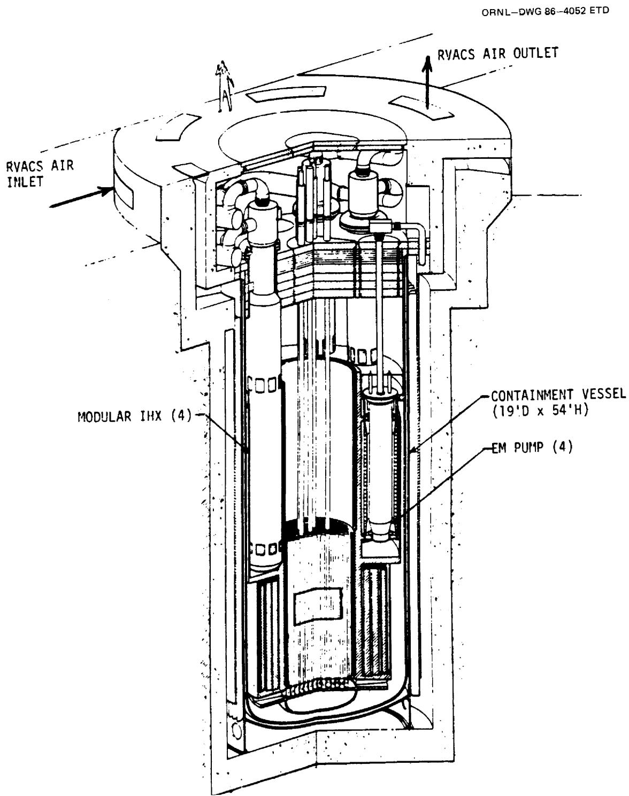  
Fig. 3.6. The below grade modular concept for PRISM, October 1984. Source: General Electric Company.

The containment vessel is 5.79 meters in diameter and 19.5 meters high. The vessel is shop fabricated and assembled and rail shippable. It is installed below grade to facilitate ground-level refueling, to reduce building costs, and to provide a natural barrier to missiles. A sodium containment vessel surrounds the reactor vessel and is sized so that the reactor core will always remain covered by sodium even if the reactor vessel should develop a leak. Details of the containment/confinement design are still under consideration. The primary pumps and intermediate heat exchangers can be removed easily through the top head for maintenance.

The reactor vessel and containment vessel are important components of the safety grade, shutdown heat removal system. Normally this residual heat would be removed by the non-safety grade, secondary heat transport loop associated with each reactor module. If this normal heat path is not available, the safety grade Reactor Vessel Auxiliary Cooling System (RVACS) would provide this safety function. The RVACS is a passive, natural circulation system that is always in operation. Radiative heat is transferred from the reactor vessel to the containment vessel. This heat is removed to the atmosphere by natural circulation of outside air past the outside surface of the containment vessel. Calculations by GE indicate that this system can accommodate decay heat removal requirements after loss of normal heat removal capability concurrent with a reactor scram. For this case, the peak in the primary sodium temperature would be about $600^{\circ}\mathrm{C}$ and would occur several hours after the start of the event. An important aspect of the RVACS system is that its heat removal capability increases substantially with increasing primary sodium temperature.

The passive safety features of PRISM are further indicated by its response to the very severe and unlikely accident where the loss of primary coolant pumping power, the loss of normal heat sink, and a failure to scram all occur at the same time. The GE analysis of this hypothetical event with no operator intervention predicted that, after some initial oscillations in core reactivity and temperature, an equilibrium situation would be reached within about ten hours without exceeding allowable temperatures. At this equilibrium state, the heat generation rate of the critical core would be matched by the heat rejection rate of the RVACS system with a system temperature of about $630^{\circ}\mathrm{C}$ .

Factory fabrication and assembly, standardization, and a reduction in systems required to be safety grade have been stressed in the PRISM design as a means of offsetting a perceived diseconomy of scale for small units. Advantages projected for this construction technique include more efficient use of site labor, a much shorter construction time of three years from start of construction to full power operation, "learning curve" benefits due to replication, and a closer potential match of a utility's power production capabilities to its load. Since the reactor module is the only nuclear qualified component, the balance of plant can be constructed economically to high quality industrial standards.

The PRISM licensing plan calls for prelicensing of a prototypic reactor module so that only site specific issues need be addressed for licensing a plant. This prelicensing would be accomplished through a design and safety test program during which the basic safety and economic claims for the concept would be demonstrated by prototypic, full scale tests.

# 3.4.4 Advantages and Disadvantages of the LMR Concepts with Regard to the NPOVS Criteria and Essential Characteristics

# 3.4.4.1 General Overviews

Commercialization and marketing of an LMR in the anticipated market between now and around the year 2010 may be difficult to accomplish. Not only do LMRs have the same negative market factors as other concepts, including an uncertainty in the need for power, licensing challenges, and financial uncertainties, but LMRs must also overcome additional concerns such as higher capital costs associated with traditional designs, their perceived role only as breeders, a lack of utility experience with LMRs, and uncertainties associated with an adequate and cost competitive fuel cycle. In fact, one could argue that LMRs will penetrate this market only if they have a unique and very important advantage over other power generating concepts.

Such an advantage may arise from the innovative LMR designs evaluated here. Their strong emphasis on cost reduction, passive safety, rapid construction, licensability, and low economic risk are certainly appropriate to meet the challenges of future markets. In the discussion which follows, the advantages and disadvantages, or challenges, outlined above will be discussed in the same order as the NPOVS criteria, essential characteristics, and desirable characteristics presented in Section 2.2.1. Many of these comments apply to all of the LMR concepts and they will be presented first. These will be followed by comments specific to a particular concept.

# 3.4.4.2 Advantages of the LMR Concepts

1. Public Risk: A significant feature of LMRs is the passive safety which may be incorporated into their designs.7 Among the passive features is the tendency for sodium to provide natural convection cooling, the high thermal conductivity of sodium, the large heat capacity of the reactor system (which affords long grace periods for problem diagnosis and corrective action), low-pressure design, and operating temperatures far below the boiling point of sodium. The usefulness and effectiveness of these features were successfully demonstrated in tests at several plants including the Prototype Fast Reactor (PFR), Phenix, and the FFTF. They are utilized in all three of the designs considered here. Because of passive

safety features, these designs require fewer engineered (active) safety systems and less emergency power than conventional LWRs. One caution is that, since these designs rely on outside air as the final heat transfer medium/sink for decay heat removal, they might be susceptible to common cause external degradation events, such as fires or dust storms.[22]

The three designs considered here incorporate a reactor shutdown system similar to the CRBRP concept. They may enhance the passive safety of their system with respect to Hypothetical Core Disruptive Accidents (HCDAs) through a passive control-rod release mechanism which will be activated by high sodium temperature. This feature may terminate any over-heating event before sodium boiling occurs. The designs also limit the total amount and rate of reactivity insertion possible in the event of a control-rod withdrawal accident. In addition, the assurance of decay heat removal capabilities is provided by both active and passive systems which incorporate significant redundancy and diversity. Finally, for the PRISM and SAFR designs in particular, the core and control drive lines are being designed so that many HCDA initiating events will be terminated by feedback responses from temperature increases and resulting thermal expansion before core degradation initiates.

In our judgment, LMR designs can meet and probably significantly exceed the goals of NPOVS Criterion 1. For example, the PRA study completed for the CRBRP calculated a core damage frequency for an HCDA to be $3.6 \times 10^{-5}$ /year, with seismic events being the major initiator.[23] The frequency for internal initiators was about a factor of ten less. Another independent study for the SNR-300 plant in Germany concluded that, "both the frequency of major accidents and the extent of damage associated with such accidents are smaller than those estimated in the German Risk Study for the PWR-1300."[24] These designs achieve low HCDA probabilities to a great extent because of the reliability of active safety systems, particularly the diverse and redundant reactor shutdown systems. Credit for inherent or passive responses of the core which could result in early termination of the event are incorporated into the calculations in a conservative manner.

2. Investment Risk: In our judgment, the LMR designs can meet and probably significantly exceed the goal of NPOVS criterion 2. The emphasis on simplicity of design, the use of fewer complex safety systems, and the incorporation of passive design features, discussed under criterion 1, would all contribute to low investment risk. In addition, extensive reliability studies and PRA evolutions are planned for each design.

3. Economic Competitiveness: The capability of breeding significantly more fuel than is consumed in producing power is a major long-term advantage of LMRs. This breeding capability, coupled with a complete fuel cycle, would enable LMRs to extract between 60 and 80 times the energy from a given quantity of natural uranium than can be done using non-breeders.7 In addition, LMR operating costs need not be as sensitive to fuel costs as non-breeders. The LMR designs can offer breeding as a design option to be implemented by a relatively easy and inexpensive core modification when it becomes economically attractive to do so. Comparative evaluations reported in Chapter 3, Volume III, of this report indicate a potential competitiveness with both the best LWR experience and with coal-fired plants.

The LSPB concept has perceived economy-of-scale advantages and has incorporated significant cost reduction features and a short construction schedule into the design. The ability to add plants in smaller power increments, thereby better matching utility needs, is a potential advantage of the PRISM and SAFR designs. Their lower capital risk achieved by modular construction and very short construction times is also attractive. However, it is not clear how costs for the factories to build these modules will be assessed and costs for the fuel cycle will be incorporated. This may increase the cost of the first several plants, and it may be difficult to justify the high initial costs for factory automation which would improve manufacturing efficiency. SAFR plans are to use existing facilities with increased automation for vessel assembly production up to a few units per year.

4. Probability of Cost/Schedule Overruns: All three concepts have stressed constructibility and simplicity, and a complete design before construction. They utilized modular construction of major components in a factory and shipment to the site, and non-safety grade construction at the site for the BOP. These approaches should minimize delays and cost overruns attributable to quality assurance problems and large construction crews. There is a lack of U.S. industry experience in LMR construction. However, recent documentation of construction experience indicates that construction problems are more a function of the management and construction team and their interaction with the NRC than the reactor type.[25] The concept of learning by experience should apply to SAFR and PRISM if additional modules and Power Paks can be built by the same team without delay after completion of the first plant segment. This can be done while the first segment is producing power, but care must be taken to avoid jeopardy to the operating unit by the construction activities where close proximity is required such as in the control building.

5. Licensability. Assurance of licensability before construction is emphasized by these LMR commercialization plans. Each stresses early approval by NRC of a standard plant design. Thus, only site-specific NRC concerns would need to be addressed for licensing of subsequent plants. The licensability of the LSPB should be relatively high because the design basis accident analysis and many key safety design features are based on the CRBRP licensing experience.

The first choice for PRISM licensing, and an alternative for SAFR, calls for demonstration of the plant's passive protection against traditional HCDA initiators through tests of a prototypic reactor module. This concept of licensing by test has attractive features. Chief among these are a possible reduction of analyses, validation of computer codes, and demonstration of safety claims to the public, potential investors, and the NRC.

Some precedence has been established for such tests through the extensive program at the Southwest Experimental Fast Oxide Reactor (SEFOR) which demonstrated the effect of the Doppler coefficient on power excursion,[19] and the recent tests at Raposdie[16] and EBR-II where loss-of-flow HCDAs were initiated and subsequently terminated by passive feedback of the core.

The SAFR designers indicate that a possibly more cost effective approach involves resolving the main licensing issues by extrapolation of test results from FFTF and EBR-II. Then a plant installed on a utility grid would be the vehicle for obtaining a standard plant FDA with rulemaking to apply to subsequent plants of the same design.

6. Demonstration of Readiness: Europe and Japan, which have less abundant natural supplies of fissile material, perceive a need for breeders sooner than the United States. For this reason these countries are pursuing a vigorous program of demonstration and commercialization of the entire LMFBR fuel cycle. One can estimate from projects now in place that 50 plant-years of operation could be compiled by LMR demonstration plants by the year 2000.8 From past experience, acceptable performance is expected from these plants. For example, since 1973 the French, 250-MW(e) Phenix prototype plant has operated with an overall capacity factor of $60\%$ .8 This experience base will be relevant to the requirement for a successful demonstration plant.

A strict interpretation of Criterion 6 requires that demonstration plants for the specific LMR plant concepts be built and operated in the United States before a utility decision to buy is made. To accomplish this task within the NPOVS time frame is a significant challenge. Nevertheless,

our judgment from evaluations of the marketing and commercialization plans for LSPB, SAFR, and PRISM is that implementation of any of these plans with a dedicated effort could result in satisfying this criterion.

7. Owner Competence: There are many similarities in the operation of LMRs and LWRs, particularly with regard to reactor control and BOP functioning. Thus a significant fraction of LWR operator training and experience would be relevant to LMRs. In addition, worldwide experience indicates that LMRs are relatively easy to operate and maintain. Personnel specifically trained in the operation of sodium systems within the United States are at national laboratories, industrial test facilities, and at the U.S. operating LMRs, EBR-II and FFTF.   
8. Essential Characteristics: The IMR concept designers have stressed shop fabrication, minimizing nuclear grade components, standardization, long plant lifetime, ease of construction, and passive safety features. The PRISM and SAFR designs offer a variety of plant sizes to match load growth and, as explained in Chapter 3 of Volume III dealing with economics, some availability advantages may result from smaller, multiple reactor cores.   
9. Desirable Characteristics: Relatively high thermal efficiencies ( $\approx 40\%$ ) have been achieved with LMR designs and very low radiation exposures to workers (on the order of a few man-rems per year) have been experienced in demonstration plants. Enhanced diversion and proliferation resistance is possible with on-site fuel recycle and with the metal fuel option. Fuel elements can be retained in the core for several years, thereby yielding burnup values $>100 \text{ MWd/kg}$ .

# 3.4.4.3 Disadvantages of the LMR Concepts

1. Public Risk: Unlike LWRs which are designed to maximize $\mathbf{k}_{\mathrm{eff}}$ , an LMR under normal operating conditions is not in its most reactive configuration. Thus, loss of sodium coolant from the core or core compaction could result in a reactivity increase. The designs considered here provide protection against loss of sodium inventory due to leaks and have substantial mitigating features — which are amenable to demonstration — for accommodating hypothetical accidents even beyond the design basis. Nevertheless, the way in which traditional licensing concerns associated with hypothetical accidents are addressed will need to be fully developed.   
2. Investment Risk: In addition to the comments made under public risk, some concern still exists about the performance and reliability of LMR steam generators. Data which could verify the performance of current designs should be available

within the NPOVS time period from component testing programs and foreign plant experience.

3. Economic Competitiveness: Evaluations of prototype LMR designs and foreign construction experience indicates that the capital costs for LMR commercial plants, based on traditional designs of the 1980s, could be substantially higher than present LWRs. This higher capital cost, resulting in part from the need for an intermediate loop, could be compensated by lower fuel costs and higher efficiencies for LMRs. Higher efficiencies for LMRs have indeed been realized; the Phenix plant, for example, has a gross efficiency of $44\%$ .[18] But, as indicated below, it is not clear that the potential fuel-cycle cost advantage for LMRs will be realized within the NPOVS time constraints. Longer core lifetimes are being studied in future plans. In summary, cost competitiveness can not be claimed for operating LMR demonstration plants and, assuming no dramatic changes in fuel costs within the NPOVS time frame, competitiveness of commercial LMR plants can best be achieved by significant reductions in capital costs.   
4. Probability of Cost/Schedule Overruns: No specific disadvantage identified except that these are new design concepts with no direct base of experience.   
5. Licensability: The merits of licensing by prototypic tests have been discussed previously. There are, however, some limitations of this approach. Not all safety claims or hypothetical accident sequences can be demonstrated, and analysis of accident sequences may still be required. In addition, this could be an expensive test program even if the module can subsequently be used commercially since the test program could last several years and analyses of pre- and post-test results could be a significant effort. On the other hand, the PRISM designers believe this demonstration to be relatively less expensive for a small reactor when compared to the potential costs and risks associated with licensing a large reactor.

An alternative would be to use the demonstration facility not only as a test of the PRISM and/or SAFR designs but also as an advanced research and development facility for general LMR passive safety features tests. It could demonstrate reactivity feedback effects as well as provide data for code verification. Perhaps alternate cores, metal and/or carbide, could be designed for the same facility. Passive shutdown systems and decay heat removal systems could be demonstrated as well. However, its utility for some of these purposes should be evaluated with respect to the FFTF and EBR-II capabilities.

In addition to licensing by test, other LMR licensing issues would still need to be considered for the standard plant designs. Prominent among these issues will be the

site-suitability source term, safety functions and design decisions associated with containment, passive features which accommodate HCDA concerns, and the need for redundancy and/or diversity within and in addition to safety systems which are passive.

Although useful experience was gained through FFTF and CRBRP interactions and licensing activities with the NRC, licensing rules, guidelines, and procedures are not as well established for LMRs as for LWRs. However, preliminary discussions have been initiated with NRC for the LMR concepts.

6. Demonstration of Readiness: Providing funding for an LMR demonstration plant will be a significant challenge.   
7. Owner Competence: Even though a large number of utilities participated to varying degrees in the CRBRP, experience in LMR operation does not currently exist within the U.S. utility organizations, and the FFTF and EBR II afford only part of the requirement.

Perhaps a more pertinent question is whether the owner/ operator could be convinced to purchase a new reactor concept for which utility experience is limited. This latter need is perhaps most clearly evident when one considers aspects of the LMR fuel cycle. In short, each fuel cycle option appears to have some significant difficulties. To provide unique LMR advantages associated with breeding, such as relative freedom from concerns about a reliable fuel supply, a complete fuel cycle should be utilized. This means that proven and reliable on-site or off-site reprocessing, refabrication, and waste handling of suitable scale must be available to the owner/ operator at a reasonable cost. The basic technology required for LMR fuel cycles has been developed in the United States and demonstrated overseas, and the first few LMRs could be supported by small-scale development facilities. However, if one assumes that this capability will be provided on-site, then uncertainties associated with available trained personnel, cost, safeguards, reliability, licensability, and public and utility acceptance are envisioned. (See also Appendix E).

It is not difficult to conclude, for example, that costs savings or other incentives must be significant and proven by experience before a utility would choose to purchase and operate a reprocessing plant. Technical and organizational options making this concept more attractive include a less complex fuel cycle, the IFR concept for example,[26] or the option that some other institution (not the utility) operates all facilities except (or including) the power station. These, and perhaps other options, could improve the viability,

but acceptance of this concept by a utility and its implementation and demonstration in the NPOVS time frame seems unlikely.

If, on the other hand, one assumes that off-site, central, reprocessing facilities would be used to complete the fuel cycle, it is difficult to envision the economic need for commercial facilities of this type much before the middle of the 21st century. Thus, off-site reprocessing may not be available in the United States within the NPOVS time frame.

Still another option for closing the fuel cycle is to rely on other countries to provide this service. Difficulties associated with this option include problems associated with Pu shipments between countries, adverse balance of payments, and the assumption that such a commercial industry will in fact be available to the United States.

If counting on a commercial fuel reprocessing industry is imprudent, another option is to consider a once-through cycle, including the possibility of spent fuel storage until commercial reprocessing/refabrication facilities are available. Difficulties associated with this choice are economic (traditional LMRs with once-through fuel cycles would have fuel costs about twice those with Plutonium recycle[27]) and institutional. Once-through cycles may need to use $^{235}\mathrm{U}$ enriched to 20 to $30\%$ which are levels beyond present production for commercial use. The once-through option could likely be enhanced by the incorporation of low-power density, heterogeneous, long-lived (10 years or more) core designs.

8. Essential Characteristics: Maintenance requirements and operating staffs for PRISM, and to a lesser extent SAFR, may exceed those for plants with a single reactor. Security staff requirements for PRISM can be small because of underground location and inaccessibility of key safety features during operation. On the other hand, regularly scheduled refuelling and maintenance reduces the need for extra manpower peaks at annual refuelling in a monolithic plant. In addition, design of the control system for PRISM must accommodate multiple reactor cores providing the main source of energy to a single turbine. Licensing requirements, particularly those associated with the option of reprocessing and refabrication of fuel on-site, are not completely defined. If the overall nuclear industry, including government support, continues to decline, the availability of qualified vendors may be in question.

9. Desirable Characteristics: On-line refueling, though considered, has not been incorporated into any designs. The PRISM plant, however, does have the capability to generate electric power continuously while a single module is being refueled. Completion of the fuel cycle, important for freedom from fuel

supply concerns and accomplished in foreign programs, has not been accepted in the United States because of economic and institutional considerations.

# 3.4.5 Research and Development Needs for the LMR Concepts

# 3.4.5.1 Introduction

Two different perspectives are presented in connection with LMR research and development (R&D) needs. First, the viewpoint of the plant designer is reflected through a collation of design-specific R&D requirements for the three LMR concepts considered in this report. Then consideration is given to general goals for the U.S. LMR R&D program which could contribute to a healthy and competitive industry considering the worldwide marketplace.

# 3.4.5.2 Design-Specific R&D Requirements

Each designer of the three LMR concepts considered by NPOVS recently completed an assessment of specific R&D needs and reported conclusions.[28-30] Appendix D presents summaries of these needs, where in several instances, similar needs have been combined. These design-specific needs can be classified as follows: (1) advanced core design tasks which include developing improved neutron counting channels, evaluating shielding designs, testing self-actuated shutdown systems, performing PRA assessments, and evaluating responses to accidents; (2) shutdown heat removal experiments and analyses to evaluate design effectiveness, design margins, and immunity to external events; (3) fuel related activities such as evaluations of metal fuel cycles, high burnup tests of oxide fuels, and performance of these two fuels during upsets or when breached; and (4) system- and component-related studies emphasizing operating plant experience, scale model flow and temperature tests, incorporation of advanced instrumentation and control technologies, and improving steam generator performance.

A large base of test experience exists for the oxide fuel but that for metal fuel is limited. It is anticipated that an extensive fuel testing program would be required for metal fuel before proceeding to commercial use. In the French qualification of oxide fuels for LMFBR use, the testing program included an extended operation with refabricated fuel from the reprocessing demonstration. A similar effort for metal fuel may be prudent. Reprocessing and refabrication are discussed more extensively in Appendix E.

# 3.4.5.3 General R&D Goals for the U.S. National LMR Program

A necessary but perhaps not sufficient list of goals for LMR R&D includes the following:

1. Develop an LMR design which has a clear, unique, and significant advantage in the marketplace over other concepts. The current design studies are judged to be consistent with this goal. However,

a small or debatable advantage for LMRs may not be adequate for penetration of a market dominated by LWR designs. Present programs are appropriately directed toward the innovative design of a cost competitive, modern (i.e., incorporating new technologies), and inherently safe LMR. Licensability advantages as well as public and utility acceptance also are important reasons for this goal to be achieved.

2. Maintain the option for rapid incorporation of breeders and of a complete fuel cycle into the future marketplace. The potential long-term market for breeders is assured unless nuclear fission energy is to have only a transitory role. Also, there exists a possibility for substantially increased shorter term demand if, for example, increased burning of coal should be found unacceptable.   
3. Complement the LMR R&D being performed by Europe and Japan so that the United States will be in a strong negotiating position to exchange our accomplishments for experience from their more accelerated programs of demonstration and commercialization. Programs which typify contributions to this goal include advanced computer code development, materials research, licensing reform, advanced designs, metal fuel research, advanced instrumentation, control and simulation, and development of double-wall steam generators.   
4. Contribute to a reduction in licensing concerns, costly design margins, and special systems resulting from the potential for core-disruptive accidents. Each of the LMR designs considered by NPOVS have already contributed to this goal. Advances in the future should stress demonstration of passive safety features, computer code validation, and experimental verification of specific reactivity feedback effects incorporated into designs.   
5. Demonstrate, test, and utilize to the fullest extent possible advanced technologies, components, and design concepts. Implementation of R&D to satisfy this goal would increase the available design options,31 thereby increasing the likelihood of optimizing the design to accomplish a larger number of desirable objectives and specifications. These advanced technologies could include automation, research resulting in higher plant operating temperatures and efficiencies, use of artificial intelligence, and increased use of computers for control and simulation, surveillance and diagnostics, data display and verification, and maintenance functions. Automation may be very important to the licensing and economic operation of multiple modules which feed a common steam system.   
6. Study and develop containment concepts which both simplify the overall nuclear system and ensure protection against both internal and external events, which may be judged credible. This work must be coupled closely with source term evaluations.

7. Investigate LMR core designs which might be competitive using a once-through fuel cycle. These studies should include the potential use of Pu obtained from foreign sources. This task will probably require determining an optimum core geometry, power density, core lifetime, and neutron energy. It could contribute significantly to competitive LMRs for a scenario of low energy-growth-rates. One such concept is an ultra long-life core which would require refueling only at major inspection intervals of approximately every ten years.

8. Develop and demonstrate technical solutions to the challenges associated with the LMR fuel cycle which were identified in the previous section of this report.

# 3.5. HIGH TEMPERATURE REACTORS (HTRs)

The focus of NPOVS HTR evaluation is on the modular HTR with the steam generator and core in separate steel vessels connected by concentric crossducts in a side-by-side configuration. An extensive amount of information has been derived from the DOE HTR Program.[33-38] To place the safety and economic features of the modular HTR in perspective, the large HTGR [2240 MW(t), 860 MW(e)], which was the focus of the DOE Program for several years, is carried by NPOVS as a point of reference. A summary of its advantages, disadvantages, and R&D needs can be found in Refs. 39 and 40 respectively. Appendix F presents the general design features of a large HTGR as a reference for HTR Technology that was originally oriented to that design.

# 3.5.1. Design Descriptions

Modular steel-vessel HTR development began in The Federal Republic of Germany (FRG) in the late 1970s. Concepts have been developed by Interatom, a subsidiary of Kraftwerk Union (KWU) and by Hochtemperatur Reaktorbau (HRB). Kernforschungsanlage (KFA), the Nuclear Research Center at Jülich, has also been very active in the FRG program. They have taken advantage of favorable HTR characteristics (e.g. high heat capacity of the core and reflector, high temperature capability of the fuel, large negative temperature coefficient of reactivity) to develop a simpler plant to ease regulatory, construction and financing difficulties, as well as minimize development requirements. Both the Interatom and the HRB modular HTR concepts involve small modules of 200 to 250 MW(t) each. The thermal output of several modules can be combined to obtain a larger total plant capacity. This approach obviously reduces the fission product inventory in any single reactor and reduces the amount of heat which must be removed from a reactor core in the event of an accident, thereby contributing to a high degree of safety. Both concepts utilize pebble fuel as do the two existing German HTRs [the Arbeitsgemeinschaft Versuchs Reaktor (AVR) and the Thorium Hoch Temperatur Reaktor (THTR)]. The Interatom concept places the core and steam generator in separate steel vessels in a side-by-side configuration, while in the HRB concept the steam generator is located above the

core in the same vessel. For both concepts, the reactor vessel is housed in a reinforced concrete cavity for both confinement and biological shielding. A vessel cooling system, mounted on the inside surface of the cavity wall, is normally in operation cooling the concrete and is capable of providing decay heat removal by heat radiation from the uninsulated reactor vessel. Design parameters (such as core size and power density) for these modules were judiciously combined with generic HTR features so that in extreme accidents public safety is provided without the operation of active heat removal equipment. Engineered systems are employed, but their role is primarily for investment protection. KWU/ Interatom is actively proposing their plant design for near-term commercial generation of electricity and for cogeneration of electricity and process heat. HRB proposes their concept for small electricity users and for process steam application. For the longer term, Interatom and HRB are developing their concepts for advanced process heat purposes such as the production of syngas through steam reforming of methane or by steam gasification of coal. For larger plants HRB offers the HTR 500 [500 MW(e)].

An informal but broad survey of US utilities by Gas Cooled Reactor Associates identified a preference for plant sizes in the 200-700 MW(e) range for capacity additions beginning in the mid- to late 1990s.[43] Other more general studies also have indicated interest in smaller plants. In response to these factors, the U.S. HTR Program was realigned in May 1984 to evaluate the potential for small reactor concepts with emphases on plant investment protection and safety. In particular, the plant design should be such that there would be no need for emergency sheltering or evacuation of the public as a consequence of licensing-basis events.

Four concepts which resulted from a preliminary screening process were:

1170-MW(t) HTGR Cylindrical Prismatic Core Concept; (Ref. 44)   
1260-MW(t) HTGR Annular Core Prismatic Concept; (Ref. 45)   
250-MW(t) Pebble Bed Reactor Vertical-In-Line Steel Vessel Concept (4 units of 250 MW(t) each); (Ref. 46)   
250-MW(t) Pebble Bed Reactor Side-by-Side Vessel Concept (4 units of 250 MW(t) each). (Ref. 35)

A Concept Evaluation Plan34 specified criteria (generally consistent with NPOVS criteria) against which these plant concepts were evaluated. As a result, the modular HTR in a side-by-side configuration was selected in early 1985 as a preferred concept. Initially, emphasis was placed on the pebble bed core concept; however, a subsequent evaluation

between pebble and prism fuels led to the selection of a prismatic core in September 1985. The prismatic core obtains higher capacity with power levels up to $350\mathrm{MW(t)}$ by employing an annular core design. The higher power level reduces the plant capital cost per $\mathrm{kW(e)}$ for the prismatic fueled core relative to that for the $250\mathrm{MW(t)}$ cylindrical-core pebble bed reactor. In addition, the problem of compensating for reactivity insertions due to water ingress is reduced in the annular core design. The current reference modular HTR plant consists of $4\times 350\mathrm{MW(t)}$ reactor units for a total capacity of approximately 560 MW(e).

Through an integrated approach, the modular HTR concept is being designed to meet the goals of safe, economical power.47 To meet these goals, the design must satisfy the following requirements:35

1. Equivalent availability factor of $80\%$ with planned downtime of less than or equal to $10\%$ per year.   
2. 50 yr life measured from issuance of construction permit.   
3. Have at least $10\%$ economic advantage over the best coal-fueled alternative source of electricity.   
4. Capable of start of operation in mid 1990s.   
5. Separate the nuclear and non-nuclear portions of plant to minimize the number of components and systems which must be procured, installed, operated, and inspected to nuclear standards.   
6. Satisfy investment protection goals:

a) less than $10\%$ unscheduled unavailability   
b) provide protection against long outages   
c) limit the cost of decontamination and decommissioning   
(d) frequency of events leading to plant loss to be less than $10^{-5}$ per plant year

7. Satisfy HTGR safety goals:

a) doses not to exceed EPA Protective Action Guidelines for public evacuation down to an accident frequency of $5 \times 10^{-7}$ per plant year   
b) meet NRC interim safety goals

The reference modular HTR is shown in Figure 3.7. A plant would consist of four $350\mathrm{MW(t)}$ reactor modules generating steam for two nominal $300\mathrm{MW(e)}$ turbine generators to produce a net plant output of $558\mathrm{MW(e)}$ (other design alternatives using $1 \times 560\mathrm{kW(e)}$ and $4 \times 140\mathrm{MW(e)}$ turbines are also being examined in the DOE program to determine the best approach).48

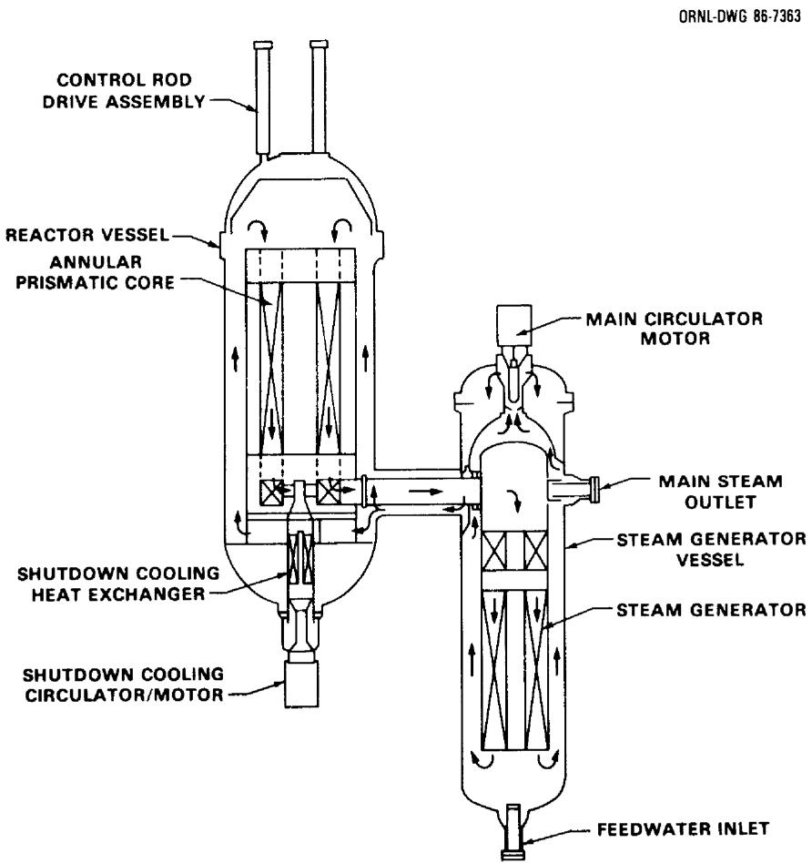  
Fig. 3.7. 350 MW(t) annular prismatic HTGR: Primary coolant flow path during normal operation.

Each reactor module is housed in a reinforced concrete enclosure (silo) which is fully embedded in the earth. The nuclear island consists of four enclosures and adjacent structures which house fuel handling, helium purification, storage, and transfer systems, the radwaste system, nuclear island cooling water systems, and other essential reactor service systems. A common control room is used to operate all four reactors and the turbine plant.

Each 350 MW(t) unit consists of separate reactor and steam generator vessels connected by a horizontal coaxial crossduct. The core, graphite reflector, core support structure, and restraining devices are installed in the reactor vessel. The current core concept uses prismatic fuel elements most of which will be geometrically identical to the Fort St. Vrain standard (non-control) elements. The elements contain vertical through-holes for coolant flow and blind holes for fuel rods. The core consists of fuel elements in an annulus between an inner and outer region of hexagonal reflector elements. A number of the elements to be placed adjacent to the inner reflector contain an off-center hole to accommodate the insertion of reserve shutdown materials. Although the internal configuration of these elements differ from those used at Fort St. Vrain, the external geometry is the same. A number of the internal and external reflector elements which bound the core contain off-center holes for control rod insertion. The hexagonal fuel and reflector elements are designed for periodic replacement via the control rod penetrations in the vessel top head. The outermost radial reflector elements are irregular in shape so as to interface with the hexagonally stepped outer boundary of replaceable reflector elements and the lateral core support structure. Gravity-assisted control rod drive mechanisms are positioned above the radial reflector to operate control rods in the channels in the inner and outer reflector.

The active core consists of 66 10-block high columns of fueled elements. This makes the annular core configuration three elements wide and gives an average core power density of $5.91 \, \text{W/cm}^3$ . The fuel elements contain 1.27 cm (0.50 in.) diameter by 6.35 cm (2.50 in.) long fuel rods consisting of coated UCO and THO2 particles of low enriched uranium (LEU) fuel ( $U - 235 < 20\%$ ) bonded in a graphite matrix. Refueling is accomplished with the reactor shut down and the vessel depressurized. The refueling operations are predicated on a three-year fuel residence time whereby half the fuel elements are replaced at the intervals of 18 months. The new fuel is placed into alternate columns adjacent to the half-burned fuel. During refueling, all the fuel elements in the core are moved within the vessel in 60 deg sectors at a time; fresh and spent fuel pass through the top head refueling penetrations which are located over the inner-reflector-to-core interface. Each sector is rebuilt with half new and half-burned fuel. At discharge, the spent fuel burnup of the equilibrium cycle is 82,460 MWD/tonne. During each refueling, one-sixth of the reflector elements adjacent to the active core is replaced which corresponds to a nine year residence time. An alternate cycle has also been evaluated whereby the entire core is fueled as a batch, with a lifetime of about

2.7 yr. This cycle is stated to have nearly as favorable costs and to require less frequent shutdown for refueling.

Replacement of fuel and reflector elements is performed with the fuel handling machine (FHM) which is placed over the inner penetration corresponding to the sector to be removed. The FHM elevates the spent elements into a fuel transfer cask. The fuel transfer cask, loaded to its maximum with five elements, is used to place the elements in a fuel storage well. Here the elements are dry-cooled before shipment off-site. The reactor plant cooling water system is used to remove heat from the well.

Helium flows downward through the core coolant channels to an outlet plenum and then through the central duct of the cross duct to the top of the steam generator. It then flows downward across the once through helical coil steam generator with uphill boiling in the steam generator tubes. Cool helium is drawn from the bottom of the steam generator and flows through an annulus surrounding the steam generator outer shroud to the circulator located on top of the vessel. The circulator discharges helium to a plenum from which helium flows through the outer annulus of the cross duct to the reactor vessel. It then flows upward through channels in the outer graphite reflector to a plenum above the top of the core.

The reactor internal structures consist of graphite and metallic components. The major graphite components are the outer permanent reflector, bottom reflector, core support posts, and top reflector. The major metallic components are the core support plate, core barrel lateral support structure, and the hot duct portion of the concentric cross duct. The reactor internals are designed for the full operating life, but are also designed to be inspectable, removable, and replace-able, if necessary.

The main circulator, a variable speed, motor-driven single stage centrifugal compressor using gas/magnetic bearings, is mounted vertically on top of the steam generator vessel.

Design parameters are summarized in Table 3.2. The basic approach has been to judiciously select design parameters and engineered systems so that they combine with inherent HTR features to yield a high degree of passive safety, and to provide investment protection as discussed in the following paragraphs.

Two independent, diverse reactivity control/reactor shutdown systems are provided. The primary system utilizes control rods located in the inner and outer replaceable reflector. The second system, the reserve shutdown system (RSS), consists of boronated graphite pellets in storage hoppers which can be discharged into channels in the innermost row of fuel columns. Reactivity control requirements for basic operations, including cold shutdown, are adequately covered by the reflector rod systems alone, with at-power operations possible without insertion

Table 3.2. Summary of major design features of modular HTR (side-by-side configuration)   

<table><tr><td>Power per module, MW(t)</td><td>350</td></tr><tr><td>Core power density, kW/l</td><td>5.91</td></tr><tr><td>Core inlet temperature, °C</td><td>258</td></tr><tr><td>Core outlet temperature, °C</td><td>687</td></tr><tr><td>Helium flow rate, kg/sec</td><td>156.6</td></tr><tr><td>Helium flow direction</td><td>downward</td></tr><tr><td>Helium pressure, MPa (psia)</td><td>6.38 (925)</td></tr><tr><td>Active core diameter, m</td><td>1.65 inner, 3.5 outer</td></tr><tr><td>Active core height, m</td><td>7.8</td></tr><tr><td>Fuel element</td><td>prismatic hex-block, 20.78 cm sides × 79.3 cm height</td></tr><tr><td>Fuel</td><td>LEU/Th</td></tr><tr><td>Equilibrium reload, kg:U/Th</td><td>965/881</td></tr><tr><td>Average discharge burnup, MWD/kg</td><td>82.5</td></tr><tr><td>Radial reflector thickness, m</td><td>1.0</td></tr><tr><td>Reactor vessel material</td><td>Low alloy steel-Mn-Mo, Sa 533 GrB Class l</td></tr><tr><td>Reactor vessel, OD, m</td><td>7.44</td></tr><tr><td>Reactor vessel thickness, cm</td><td>13.3</td></tr><tr><td>Reactor vessel height, m</td><td>21.95</td></tr><tr><td>Steam condition, 
pressure MPa (psia)</td><td>17.3 (2515)</td></tr><tr><td>temperature, °C</td><td>541</td></tr><tr><td>Net thermal efficiency, %</td><td>39.6</td></tr></table>

of the inner-reflector rods. Cold shutdown with maximum positive reactivity due to water ingress requires the combined insertion of the reflector rods and the RSS. During a conduction cooldown event, the inner control rods could be damaged because of high temperatures. To avoid damage, although it does not affect safety, a control rod operational strategy has been adopted where the inner rods are normally used for startup to $25\%$ power and for normal cold shutdown.

Steam generator tube leaks are detected by a moisture monitor located at the circulator outlet. If excessive moisture is detected, the steam generator is isolated and dumped and the main circulator is stopped.

A shutdown cooling system (SCS) is provided to achieve and maintain the reactor thermal conditions required for maintenance in the event of failure of the main heat transport system (HTS) and to help meet the overall plant availability goal. The SCS is located in the bottom of the reactor vessel and consists of a heat exchanger and a circulator with a submerged motor.

The reactor cavity is provided with a natural draft air cooling system (RCCS), Fig. 3.8. It consists of cooling panels mounted on the cavity wall through which air circulates by natural convection. The design has no valves or active components. The surface of the panels serves as a barrier separating the outside atmosphere from the reactor cavity atmosphere. The system uses four separate inlet/outlet structures to minimize the possibility of flow blockage. In addition, the four loops are interconnected by inlet/outlet plenums in the cooling panels. This provides a heat sink sufficient for decay heat removal in the event the main heat transport system (steam generator and main helium circulator) and the shutdown cooling system are not available. Heat transport from the reactor core is by natural processes of conduction and radiation (and convection if the primary system is pressurized) through the core to the vessel wall and by radiation and convection to the cooling panels.

The reactor utilizes a confinement equipped with dampers which open on excessive pressure loads resulting from feedwater, main steam, or reactor coolant line ruptures. Program studies indicate that the fission product releases from the core are small enough that reliance need not be placed on conventional pressure-tight containment or a confinement with a filter system to meet the defined safety criteria.

For decay heat removal, under pressurized or depressurized conditions, the main cooling loop (consisting of the main circulator and the steam generator) is the first option. If either the main circulator or the steam generator is not operational, then forced circulation using the shutdown cooling system is the next option for either pressurized or depressurized conditions. The next option is to remove decay heat through the vessel wall by radiation to the RCCS. This system is designed to limit the fuel temperatures to $1200^{\circ}\mathrm{C}$ under pressurized conditions (when there can be a significant redistribution of heat

ORNL-DWG86-4054ETD

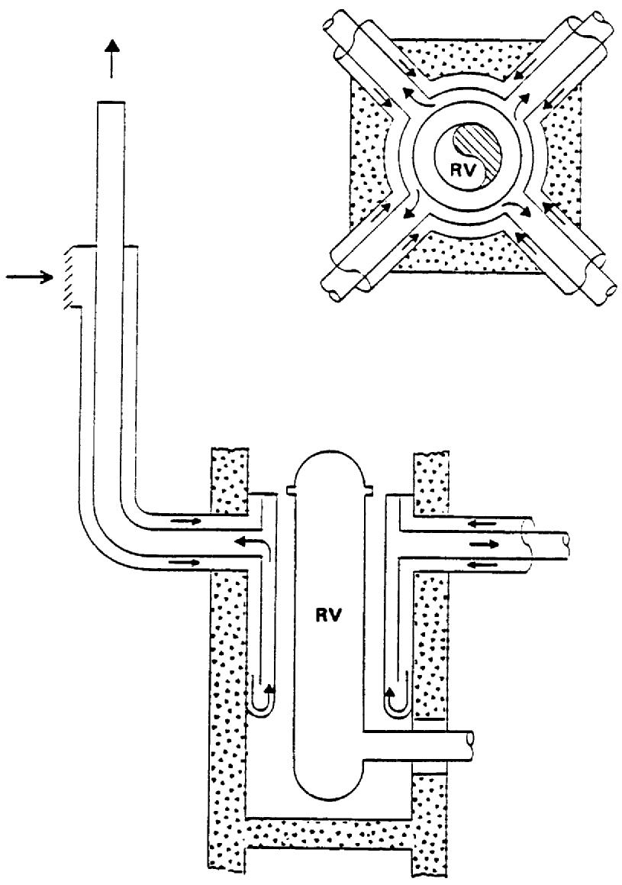  
Fig. 3.8. Reactor cavity cooling system.

# FEATURES :

1. COOLS THROUGH PANEL WALL   
2 OPERATES UNDER ALL MODES OF REACTOR OPERATION.  
3. SIMPLE TO OPERATE, VIRTUALLY MAINTENANCE FREE.

within the core by natural convection) and to $1600^{\circ}\mathrm{C}$ under depressurized conditions.

# 3.5.2 Claims, Advantages, and Disadvantages Evaluated Against Criteria, Essential and Desirable Characteristics

The claims and reported advantages of the modular HTR are discussed briefly as follows in the order of the criteria first and essential and desirable characteristics second. A more detailed evaluation of modular HTR claims has been included in Appendix G.

1. Public Risk: While the calculated risk to the public has not been quantified for the modular HTR, there are important features which provide the design with a high degree of passive safety, and thereby also provide confidence that the calculated risk to the public due to accidents will be equal to or less than the calculated risk associated with the best modern LWRs. These features are:

The capability for afterheat removal through the vessel wall by natural heat transport mechanisms (convection, conduction, and radiation). This capability has been demonstrated partially on the smaller experimental AVR which shares features of the modular HTR. Future confirmatory experimentation for more generally applicable data is being considered and may be possible at the AVR subject to the approval of the German authorities.   
- Very good retention of fission products within the fuel to high temperatures. This feature has been demonstrated by U.S. and German coated particle fuel systems experience and in fuel test programs.   
- No need for a fast acting shutdown system for core heatup events, which again has been demonstrated on other HTRs.

Other potentially severe accidents, such as major water and/or air ingress events, have been argued to be of such low consequence or low probability by virtue of system design that these types of accidents pose no significant public risk. However, the NRC may require that these accidents be factored into the cost benefit analysis of the use of confinement versus containment.

2. Investment Risk: The probability of loss of investment for the modular HTR is claimed to be less than $10^{-5}$ per year. This claim requires independent review, but many of the features which preclude or reduce the effect of incidents on public safety can be argued as being favorable to investment protection.

3. Economic Competitiveness: Until the plant design is complete and commodity requirements determined, a firm estimate of cost cannot be made. With regard to meeting the financial goals of the utility, the ability to add capacity in small increments as well as the potential for achieving short construction time through factory fabrication should reduce the utilities' capital investment exposure and investment risk, thereby helping to meet their financial goals. With regard to acceptable busbar costs, factory fabrication of modules coupled with the relatively high burnup achievable with HTR fuel cycles may compensate for higher fuel fabrication costs typical of HTRs and potentially higher distributed capital cost usually associated with smaller sized plants. The use of multiple modules may also increase overall availability, although at lower power levels, thereby providing flexibility in scheduling outages. Assumptions about availability for the modular plants play an important role in estimating overall competitiveness with both the coal fired and the better current generation LWR plants.   
4. Probability of Cost/Schedule Overruns: The DOE and the industrial proponents recognize the need for complete design before initiating construction. Detailed design and associated studies of construction needs, options and costs still remain to be completed, so that cost and schedule factors cannot be quantified. However, the DOE funded program has produced indepth studies of construction needs, options, and costs for the modular HTR so that uncertainties should be well defined.   
5. Licensability: The modular HTR has a draft licensing plan. The DOE and industrial proponents are actively engaged in dialogue with NRC-NRR. Early concurrence on licensing may be essential to meeting the 2000-2010 time frame for commercialization. DOE and the industrial proponents plan to secure an NRC final design approval (FDA) by 1996. A preliminary safety information document (PSID) will be submitted in CY 1986. There is also a utility effort led by the Tennessee Valley Authority (TVA) which proposes joint funding of a single plant to demonstrate licensability by test; however, such testing probably could not address all safety questions particularly those beyond design basis accidents such as a major air ingress, acts of sabotage and seismic events.   
6. Demonstration of Readiness: Many features of the modular HTR are or will have been demonstrated in the German AVR plant before the modular HTR is offered commercially. A successful demonstration of high powered, gas/magnetic bearing circulators would represent a significant contribution to the demonstration of readiness since most of the other major component technologies either are borrowed or have evolved from AVR, THTR, and Fort St. Vrain experience. More fuel testing is already planned to support licensing as well as normal operation requirements.

7. Owner Competence: The operation of multi-module plants may pose new concerns about interdependence and common mode interactions of systems. Such concerns may influence NRC mandates on acceptable control configurations which may in turn be more costly or manpower intensive than currently envisioned; however, the overall technology of the modular HTR appears to be as readily assimilable as LWR technology. The lessons from the Fort St. Vrain HTGR also appear to be clear to a potential owner/operator of an HTR. Some of these lessons are: (1) keep moisture out of the primary system and any other part of the plant where it can cause corrosion [which should be helped in the modular design by incorporating hardware features based on lessons learned to date], (2) maintain excellent secondary coolant chemistry, (3) maintain an intensive and extensive surveillance program of (1) and (2) above, (4) ensure quality and confirmatory testing of both original and replacement materials and equipment, and (5) maintain a clean physical plant. The large thermal margins inherent in the HTR fuel systems and the low graphite corrosion rates in the presence of numerous moisture ingress events at Fort St. Vrain could lull plant designers and operators into a failure to recognize the significance of operating problems. Some of the observed operational problems at Fort St. Vrain have included the effect of moisture on leaching and distribution of other corrosive materials (e.g., chlorides), the apparent inability to detect abnormal control configurations and reactivity anomalies quickly (e.g., confirming subcriticality by excore detectors and detecting dropped control material) and the possible interdependence of redundant emergency ac power systems. These types of situations should not be repeated with the modular HTR.

8. Essential Characteristics: Many of the essential characteristics are integral requirements for meeting one or more of the criteria and as such are discussed more fully above. However, in general, the modular HTR has promise of achieving many of these characteristics as outlined, in some cases repetitively, below:

a. High availability due to use of small-sized turbines and modularity which allows higher availability at reduced power.   
b. Maximum use of shop fabrication of reactor systems   
c. A high degree of passive safety   
d. Potentially no need for developing or demonstrating a plan for evacuation of the public beyond the site boundary   
e. Potential for demonstrating features important for passive safety

f. Low thermal discharge (due to high thermal efficiency)   
g. Low radioactive effluent as demonstrated by Peach Bottom l, Dragon, Fort St. Vrain and AVR experience   
h. Low investment risk to the utility resulting from adding capacity in small increments and from what is intended to be a simpler approach to meeting safety requirements and licensing.

9. Desirable Characteristics: Several of these characteristics are addressed in regard to criteria. The advantageous ones are listed again as follows. The modular HTR appears to have modest RD&D requirements, relative ease in sitting based on projected low source terms for both normal operation (worker exposure and effluents) and accident conditions, good fuel utilization (high burnup), high thermal efficiency, high versatility in application because of the production of high coolant temperatures, and a low visual profile through full embedment. Full embedment and passive safety should also contribute to a high degree of sabotage resistance. The claim is made that the use of low enriched uranium increases resistance to proliferation and diversion and that appears to be the case for the fresh fuel supply. Also, the HTR spent fuel appears to have a high resistance to diversion and proliferation technologies.

The potential disadvantages are discussed as follows:

1. Public Risk: As alluded to under the discussion of advantages, the resolution of concerns for severe accidents will preferably be handled by probabilistic risk analyses to demonstrate a low contribution to the overall risk to the public. If requirements such as the use of inerted containment are imposed, overall costs will increase.   
2. Investment Risk: Independent assessments are needed.   
3. Economic Competitiveness: The possibility of higher costs for fuel fabrication and plant capital investment are a concern; as is the availability which will be achieved. Independent evaluations appear prudent to perform.   
4. Probability of Cost/Schedule Overruns: Since this is a new concept, it is particularly important that the design is completed before construction begins. The current approach is based on defining "top-down" requirements from which design data needs and RD&D will proceed using functional analysis. Construction plans and schedules must be coordinated carefully with the availability of design and safety related data.   
5. Licensability: As mentioned above, the analysis requirements and expected design needs in response to "beyond design basis

accidents" must be settled, preferably, as early as possible in the design process. In the post-TMI licensing environment, the modular HTR could still face defense-in-depth requirements such as containment, emergency ac power sources and safety grade components in the balance of plant. These can have a severe effect on increasing plant costs if imposed. Seismic considerations with regard to the reactor core and the side-by-side connecting pipe must also be addressed for licensing.

6. Demonstration of Readiness: Other than answering questions about needing high availability for overall competitive economics, the modular HTR would appear to have a lesser requirement for a demonstration plant because of AVR and THTR experience and the ability to incorporate lessons learned at Fort St. Vrain.   
7. Owner Competence: No specific disadvantage identified, however, as indicated under advantages, a potential owner/operator should be thoroughly familiar with details of the engineering and licensing experience at St. Vrain. The lessons learned are positive with respect to avoiding potential pitfalls.   
8. Essential Characteristics: The relatively low power per module $[\sim 350\mathrm{MW(t)}]$ does affect the capital cost as a disadvantage. The side-by-side HTR module has also been questioned because of potentially adverse seismic response at the connecting pipe between the reactor and steam generator vessels. Both of these features may be improved through design enhancement and innovation. The power of the module may be increased if higher fuel temperatures $(>1600^{\circ}\mathrm{C})$ become acceptable by further fuels testing and verification. The connecting pipe will require thorough and extensive analysis to show that it can withstand the potential consequences from seismic events.   
9. Desirable Characteristics: The use of LEU/Th fuel leads to lower fuel conversion ratios relative to the use of highly enriched fuels.

# 3.5.3 Modular HTR Research and Development Needs Evaluated

Within the DOE HTR Program, development of a modular HTR Technology Development Plan using the Integrated Approach is under way, but results are not sufficiently complete for incorporation into NPOVS. However, ORNL has prepared a document40 which was presented to the Subcommittee on Energy Research and Production of the U.S. House of Representatives and which discussed the key research and development areas required for modular HTRs. This section presents R&D needs as excerpted from this document with modifications reflecting additional information obtained since that time. The key research and development (R&D) areas are considered in the following categories:

A. Base Technology   
B. Applied Technology; and   
C. Design and Economic Studies.

Item A generally refers to basic information needed to establish the feasibility of the reactor concept and to materials data needed for the detailed design; item B refers to R&D needed to assure the practicality of components and systems; and item C refers to the effort required to specify the entire reactor plant in sufficient detail to permit reliable economic estimates of plant performance.

The key R&D areas which need to be addressed for the modular HTR are shown below:

# 3.5.3.1 Base Technology

1. Determination of fission product retention of the fuel coatings, graphite and metal surfaces of the primary system and confinement during and subsequent to extreme accident conditions.   
2. Process development for fuel fabrication and irradiation testing to obtain understanding of the importance of specific processing parameters on fuel performance.   
3. Irradiation testing and examination of fuels produced in commercial-scale production equipment.   
4. Fission product behavior during normal reactor operation as related to lift-off and the source terms under depressurization accidents.   
5. Development of detailed materials properties under conditions of creep, fatigue, corrosion, and radiation necessary for designing and operating components.   
6. Obtaining statistical data on graphite properties as a basis for estimating fuel element stresses.   
7. Critical experiment testing of LEU/Th cores, including water ingress reactivity effects and temperature coefficients for low enriched uranium fuel with plutonium concentrations representative of equilibrium burnup.   
8. Obtaining experimental data to validate codes applicable to the passive heat removal system.

# 3.5.3.2 Applied Technology

1. Development, verification, and application of analytical tools for reactor design, safety, and risk analyses, including data bases.

2. Plant safety and risk analyses. This risk associated with normal operation and design basis accidents needs to be investigated. Also, risk associated with postulated events beyond design basis may need to be investigated to confirm that the total risk from such accidents is small relative to the risk from normal plant operation.   
3. Detailed reactor physics analysis including computation of cross sections, power distributions, temperature coefficients, and control rod worth under normal conditions and with water ingress. Also shielding analysis to determine fluence for the design of reactor internal components at various locations.   
4. Design and testing of refueling equipment to demonstrate that the reference reactor concept can be refueled on the assumed schedule.   
5. Design and testing of prototypic components and systems such as the helium circulator, core support structure, and shutdown cooling heat exchanger.   
6. Development of multi-module control system, service systems, and heat exchange systems.

# 3.5.3.3 Design and Economic Studies

The design of the modular HTR plant must be completed in sufficient detail to permit a firm estimate of plant costs, based on features which limit fuel temperatures under accident conditions, facilitate shop fabrication, and reduce balance-of-plant (BOP) costs. Also, a detailed determination of operating and maintenance and fuel cycle costs are required.

3.6 REFERENCES FOR CHAPTER 3

1. K. Hannerz (ASEA-ATOM), Towards Intrinsically Safe Light Water Reactors, ORAU/IEA-83-2 (M)-Rev. (research memorandum), Institute for Energy Analysis, Oak Ridge Associated Universities, Oak Ridge, Tennessee, July 1983.   
2. SECURE P: Design Progress Information, ASEA-ATOM, Vasteras, Sweden (April 1984). ASEA-ATOM PROPRIETARY.   
3. D. Babala and K. Hannerz, "Pressurized Water Reactor Inherent Core Protection by Primary System Thermohydraulics," Nuclear Science and Engineering 90(4), 400-410 (August 1985).   
4. C. Sundqvist and T. Pederson, "PIUS: The Forgiving Reactor, Safety and Operational Aspects," full text of paper presented at the 1985 Annual Meeting of the American Nuclear Society (ANS), Boston, Massachusetts, June 9-14, 1985; ASEA-ATOM, Vasteras, Sweden.   
5. J. D. Duncan and C. D. Sawyer, "Capitalizing on BWR Simplicity at Lower Power Ratings," SAE Technical Paper Series 859285 reprinted from p. 164, Proceedings of the 20th Intersociety Energy Conversion Engineering Conference, Miami Beach, Florida, August 18-23, 1985, General Electric Company, San Jose, California.   
6. Lyle C. Wilcox, "U.S. Department of Energy Programs on Cost Reduction," presented at the Institute of Applied Energy International Symposium on LMFBR Development, Tokyo, Japan (November 7, 1984).   
7. Alan E. Walter and Albert B. Reynolds, Fast Breeder Reactors, Pergamon Press (1981).   
8. Transactions of the ANS 1984 Winter Meeting 47, 13-16 (November 11-16 1984).   
9. Consolidated Management Office for the IMFBR of the Electric Power Research Institute, LSPB Design Descriptions, Vol. 1, CDS 400-8, for the U.S. Department of Energy, September 1984. APPLIED TECHNOLOGY.   
10. R. A. Lindley, Large Scale Prototype Breeder Cost Effectiveness Considerations, Consolidated Management Office for the LMFBR of the Electric Power Research Institute, August 1984. APPLIED TECHNOLOGY.

11. Consolidated Management Office for the LMFBR of the Electric Power Research Institute, LSPB Overall Plant Design Specification, CDS 100-2, Rev. 7, for the U.S. Department of Energy and Electric Power Research Institute, Washington, D.C., February 1984. APPLIED TECHNOLOGY.   
12. LSPB Constructibility Report, to be published by the U.S. Department of Energy. APPLIED TECHNOLOGY.   
13. Modular LMFBR Pool Plant Final Report, AI-DOE-13502, Rockwell International, Atomics International, Canoga, Park, California, September 30, 1984. APPLIED TECHNOLOGY.   
14. "Advancing Breeder Reactor Design in the United States," Nuclear Engineering International 30(365), 17-20, (February 1985).   
15. Transactions of the ANS 1984 Winter Meeting 47, 299-300 (November 11-16, 1984).   
16. "SAFR discussions at ORNL, January 11, 1985," a collection of viewgraphs presented at this meeting. APPLIED TECHNOLOGY.   
17. Large LMFBR Pool Plant, Vol. 1, Design Description, ESG-DOE-13410 Rockwell International, Energy Systems Group, Canoga Park, California, September 1983. APPLIED TECHNOLOGY.   
18. PRISM Semiannual Report, April-September, 1984, XL-897-840073/L3, General Electric Co., Nuclear Systems Technology Operation, Sunnyvale, California, October, 1984. APPLIED TECHNOLOGY.   
19. J. S. Armijo et al., "General Electric Strategy for Achieving a Low-Cost Liquid Metal Reactor Plant," Presented at the Institute of Applied Energy International Symposium on LMFBR Development, Tokyo, Japan, November 7, 1984.   
20. "Advancing Breeder Reactor Design in the United States," Nuclear Engineering International 30(365), 17-20 (February 1985).   
21. PRISM Design Requirements, Preliminary Rev B, 23A3071, General Electric Co., Nuclear Systems Technology Operation, Sunnyvale, California, October 1984. APPLIED TECHNOLOGY.   
22. Internal Correspondence from G. F. Flanagan to Distribution, "Inherently Safe LMRs," December 6, 1984.   
23. Clinch River Breeder Reactor Plant Probabilistic Risk Assessment, prepared for the U.S. Department of Energy by Technology for Energy Corporation, September 14, 1984.   
24. A. Bayer and K. Koberlein, "Risk-Oriented Analysis on the German Prototype Fast Breeder Reactor SNR-300," *Nuclear Safety* 25(1), 30 (January-February 1984).

25. Transactions of the ANS Winter Meeting 47, 333-338, (November 11-16, 1984).   
26. "Looking to the Future with the Integral Fast Reactor," Nuclear Engineering International 30(365), 20 (February 1985).   
27. R. Balent and J. Yedidia, DRAFT, Large Scale Prototype Breeder Fuel Cycle Plan, to be published by the U.S. Department of Energy. APPLIED TECHNOLOGY   
28. LSPB Research and Development Requirements, CDS 500-6, U.S. Department of Energy, Washington, D.C., September 1984. APPLIED TECHNOLOGY.   
29. SAFR Requirements for Base Technology Program, 149T1000002, Rockwell International Rocketdyne Division, Canoga Park, California, January 1985. APPLIED TECHNOLOGY.   
30. Letter number XL-897-850016 from L. N. Salerns to Francis X# Gavigan, dated January 11, 1985, "WBS2B0.5- Initial PRISM R&D Requirements Statements." APPLIED TECHNOLOGY.   
31. Letter from J. Ray to Dr. Bill Harms, dated January 31, 1983, with the attachment, "LMFBR Safety Philosophy Issues", Advanced Reactors Subcommittee, draft, January 27, 1983.   
32. Letter number T-85-053 from J. D. Mangus to D. C. Gibbs, dated July 23, 1985, with attachment, "Long Life Liquid Metal Core Concept."   
33. Utility/Users Design Requirements for Small High Temperature Gas-Cooled Reactors, GCRA 84-011, Gas-Cooled Reactor Associates, San Diego, California, November 1984. APPLIED TECHNOLOGY.   
34. HTGR Program Concept Evaluation Plan for Small HTGRs, GCRA 84-009, Gas-Cooled Reactor Associates, San Diego, California, October 31, 1984. APPLIED TECHNOLOGY.   
35. Preliminary Concept Evaluation Report, 4 x 250 MW(t) HTGR Plant Side-by-Side Steel Vessel Concept, HTGR-85-005, issued by Bechtel Group, Inc., et al., for Gas-Cooled Reactor Associates, San Diego, California, February 1985. APPLIED TECHNOLOGY.   
36. FY 1985 HTGR Summary Level Program Plan, HP-20202-85, Gas-Cooled Reactor Associates, San Diego, California, October 1984. APPLIED TECHNOLOGY.   
37. Licensing Plan for the Standard HTGR (Draft), GCRA 85-001, Bechtel Group, Inc., et al., January 1985.

38. Preliminary Concept Description Report, $4 \times 350$ MW(t) HTGR Plant Side-by-Side Steel Vessel Prismatic Core Concept, HTGR-85-142, issued by Bechtel Group Inc. for Gas-Cooled Reactor Associates, San Diego, California, October 1985. APPLIED TECHNOLOGY.   
39. P. R. Kasten et al., Assessment of the Thorium Fuel Cycle in Power Reactors, ORNL-TM-5565, Oak Ridge National Laboratory, Oak Ridge, Tennessee, January, 1977.   
40. P. R. Kasten, "Statement on an Inherently Safe High-Temperature Gas-Cooled Reactor Program," presented to Subcommittee on Energy Research and Production, U.S. House of Representatives, M. Lloyd, Chairman, February 7, 1984.   
41. H. Reutler and G. Lohnert, "The Modular High-Temperature Reactor," Nuclear Technology, 62(1), 22-30, (July 1983).   
42. HTR 100-MW(e) Konzeption; Technik, Termine, Kosten, Hochtemperatur Reaktorbau, Hochtempatur Reaktorbau, Mannheim, Federal Republic of Germany.   
43. Summary Report on the Utility Industry Questionnaire, GCRA 84-001, Gas Cooled Reactor Associates, San Diego, California, February 1984.   
44. Preliminary Concept Evaluation Report, 1170 MW(t) HTGR Plant PCRV Concept, HTGR-85-004, issued by Stone & Webster Engineering Corporation for Gas-Cooled Reactor Associates, San Diego, California, February 1985. APPLIED TECHNOLOGY.   
45. Preliminary Concept Evaluation Report, 1260 MW(t) HTGR Plant PCRV Concept, HTGR-85-003, issued by Stone & Webster Engineering Corporation for Gas-Cooled Reactor Associates, San Diego, California, February 1985. APPLIED TECHNOLOGY.   
46. Preliminary Concept Evaluation Report, 4 x 250 MW(t) HTGR Plant In-Line Steel Vessel Concept, HTGR-85-006, issued by Bechtel Group, Inc., et al., for Gas-Cooled Reactor Associates, San Diego, California, February 1985. APPLIED TECHNOLOGY.   
47. An Integrated Approach to Economical, Reliable, Safe Nuclear Power Production, AL0-1-11, Combustion engineering, Inc., Windsor, Connecticut, June 1982.   
48. Turbine Selection Trade Study $4 \times 250$ MW(t) HTR Plant SBS/SV Concept, HTGR-85-075, Stone and Webster Engineering Corporation for Gas-Cooled Reactor Associates, San Diego, California, July 1985. APPLIED TECHNOLOGY.

# 4. ACKNOWLEDGMENTS

The form and scope of this study necessitated the involvement of many individuals and organizations. In fact, the numbers are so great and the involvement so often indirect that complete individual recognition is next to impossible. However, the cooperation was extensive and effective; those listed as authors recognize and greatly appreciate this assistance. The institutions and individuals who contributed through interview and/or written reports and, in some cases, through work specific to the study are as follows:

# Reactor Vendors

ASEA-ATOM

Babcock and Wilcox

Combustion Engineering

GA Technologies

General Electric Company

Rockwell International

Westinghouse-Advanced Energy Systems Division

# Architect-Engineers

Bechtel

Sargent and Lundy

Stone and Webster

United Engineers and Constructors

# Utility Companies and Associations

Baltimore Gas and Electric

Central Electricity Generating Board, UK

Carolina Power and Light

Duke Power Company

Electric Power Research Institute

Electric Power Research Institute Consolidated Management Office

Gas-Cooled Reactor Associates

Houston Power and Lighting

Southern California Edison

Wisconsin Electric Power Company

# Laboratories, Institutions, and Universities

Argonne National Laboratory

Atomic Industrial Forum

Institute for Energy Analysis

International Atomic Energy Agency

Los Alamos National Laboratory

Massachusetts Institute of Technology

Nuclear Energy Agency

Office of Technology Assessment

The University of Tennessee

U.S. Nuclear Regulatory Commission

Individuals at the three cooperating institutions (ORNL, TVA, and the University of Tennessee) who provided assistance include the following:

# Oak Ridge National Laboratory

S. J. Ball

R. M. Harrington

T. E. Cole

W. O. Harms

R. M. Davis

J. E. Kibbe

J. C. Ebersole (consultant)

O. H. Klepper

J. R. Engel

A. E. Levin

G. F. Flanagan

G. Samuels

L.C.Fuller

J. W. Sims

S. R. Greene

# Tennessee Valley Authority

D. T. Bradshaw

J. G. Stewart

D. L. Lambert

R. E. Taylor

H. G. O'Brien

S. Vigander

J. E. Simmons

# The University of Tennessee

H. L. Dodds, Jr.

# NPOVS Advisory Committee Members

S. Burstein, Vice-Chairman of the Board, Wisconsin Electric Power Company

G. F. Dilworth, Director of Engineering and Technical Services (DETS), TVA

T. S. Elleman, Vice President of Corporate Nuclear Safety and Research, Carolina Power and Light Company

P. R. Kasten (Secretary), Technical Director, Gas-Cooled Reactor Programs, ORNL

L. M. Muntzing, Doub and Muntzing, Washington, D.C.

D. R. Patterson, Assistant to Manager, Office of Engineering Design and Construction, TVA

W. T. Snyder, Dean, College of Engineering, The University of Tennessee

J. Taylor, Vice President and Director, Nuclear Power Division, EPRI

N. E. Todreas, Department of Nuclear Engineering, Massachusetts Institute of Technology

NPOVS Advisory Committee Members (continued)

J. Taylor, Vice President and Director, Nuclear Power Division, EPRI

N. E. Todreas, Department of Nuclear Engineering, Massachusetts Institute of Technology

__________   
  
  
  
  
  
__________

# APPENDIX A

# BASIC OUTLINE FOR NUCLEAR POWER OPTIONS VIABILITY STUDY

# FINAL REPORT

VOLUME I EXECUTIVE SUMMARY

VOLUME II REACTOR CONCEPTS, DESCRIPTIONS, AND ASSESSMENTS (see page v)

VOLUME III NUCLEAR DISCIPLINE TOPICS

# ABSTRACT

1. INTRODUCTION   
2. CONSTRUCTION   
3. ECONOMICS   
4. REGULATION   
5. SAFETY AND ECONOMIC RISK   
6. NUCLEAR WASTE TRANSPORTATION AND DISPOSAL   
7. MARKET ACCEPTANCE   
8. ACKNOWLEDGMENTS

APPENDIX A. INTERVIEW FORMAT FOR THE ISSUE DEFINITION RESEARCH AND OUTLINE OF ISSUES USED FOR THE CASE STUDY INTERVIEWS

APPENDIX B. TABLES ON THE SAMPLE USED FOR THE ISSUE IDENTIFICATION RESEARCH

VOLUME IV BIBLIOGRAPHY

# ABSTRACT

1. INTRODUCTION   
2. ORGANIZATION AND RETRIEVAL   
3. KEYWORD LIST   
4. KEYWORD INDEX   
5. NUCLEAR OPTIONS CITATIONS   
6. LIGHT WATER REACTORS CITATIONS   
7. LIQUID METAL REACTORS CITATIONS   
8. HIGH TEMPERATURE REACTORS CITATIONS  
9. ACKNOWLEDGMENTS   
10. REFERENCES

__________

# APPENDIX B

# THE OUTLOOK FOR ELECTRICITY SUPPLY AND DEMAND*

The principal determinants of future electricity demand will probably be the utilities and their regulators. During the past ten years, utilities have been evolving from a supply industry concerned only with meeting electricity requirements to a service-oriented industry concerned not only with the supply of electricity but also with controlling and shaping its use through conservation and load management. Future electricity use will depend on how far this evolution proceeds.

The approach taken to estimate future energy use involves an analysis and/or estimate of the trend of factors that determine energy use, such as population, persons per household, gross national product (GNP), shifts in the industrial product mix, conservation, etc. The projections made here do not represent anything even approaching the technology limits of energy conservation nor do they come close to the economic limit of conservation as projected by "least cost energy strategies." They do depend on continued efficiency improvements and, to some extent, on a continuation of utilities' aversion to investment in new capacity, which has resulted in conservation and load management programs to limit demand growth. They probably represent a narrow band in the upper part of a rather wide range that could be expected.

Table B.1 summarizes the estimates of this study for growth rates of electricity and nonelectrical energy requirements to the year 2000 for the residential, commercial and industrial sectors. The total growth rate for electricity is estimated to range between 1.8 and $2.3\%$ / year and for nonelectrical energy between 0.1 and $0.5\%$ / year. These rates result in a growth of primary energy requirements of 0.9 to $1.4\%$ / year, which is equivalent to using between 67.3 and 73.9 quads (excluding transportation) in the year 2000. The transportation sector is not analyzed in this study since this sector does not use a significant amount of electricity and, barring a breakthrough in battery technology is expected to use very little electricity for the remainder of the century.

The residential sector projections are based on the following assumptions: (1) a population growth rate (as projected by the Bureau of the Census) of $0.85\%$ /year between 1980 and 2000; (2) a household growth rate of $1.4\%$ /year, which would continue the trend of households growing at a rate about $60\%$ greater than the population; (3) a continuation, at a modest rate, of the trend to less energy use per household; and (4) a continuation of the trend to electric space heating.

Table B.l. Projected energy use for the residential, commercial, and industrial sectors in the year 2000   

<table><tr><td>Sector</td><td>1980-2000 annual growth (%/year)</td><td>End use energy (1015 Btu/year)</td><td>Primary energy use (1015 Btu/year)</td></tr><tr><td>Residential</td><td></td><td></td><td></td></tr><tr><td>Electricity</td><td>1.50 to 2.00</td><td>3.30 to 3.64</td><td>11.29 to 12.45</td></tr><tr><td>Nonelectricity</td><td>-1.50 to -1.00</td><td>5.09 to 5.63</td><td>5.09 to 5.63</td></tr><tr><td>Total primary</td><td></td><td></td><td>16.38 to 18.08</td></tr><tr><td>Commercial</td><td></td><td></td><td></td></tr><tr><td>Electricity</td><td>2.00 to 2.50</td><td>2.83 to 3.12</td><td>9.70 to 10.69</td></tr><tr><td>Nonelectricity</td><td>0</td><td>4.09</td><td>4.09</td></tr><tr><td>Total primary</td><td></td><td></td><td>13.79 to 14.78</td></tr><tr><td>Industrial</td><td></td><td></td><td></td></tr><tr><td>Electricity</td><td>2.00 to 2.50</td><td>4.13 to 4.56</td><td>14.15 to 15.60</td></tr><tr><td>Nonelectricity</td><td>0.50 to 1.00</td><td>22.99 to 25.39</td><td>22.99 to 25.39</td></tr><tr><td>Total primary</td><td></td><td></td><td>37.14 to 40.99</td></tr><tr><td>U.S. total</td><td></td><td></td><td></td></tr><tr><td>Electricity</td><td>1.83 to 2.33</td><td>10.26 to 11.32</td><td>35.14 to 38.74</td></tr><tr><td>Nonelectricity</td><td>0.06 to 0.50</td><td>32.17 to 35.11</td><td>32.17 to 35.11</td></tr><tr><td>Total primary</td><td>0.90 to 1.37</td><td></td><td>67.31 to 73.85</td></tr></table>

The commercial sector projections are predicated on a substantial decline in the growth rate of both sectoral employment and floor space to an annual rate of $1.5\%$ . Electricity use per employee or per unit of floor space was assumed to increase at a rate 0.5 to $1.0\%$ greater than employment or floor space.

The industrial sector projections are based on a detailed analysis of the manufacturing industries between 1975 and 1980, which examined changes in the energy intensity and output of these industries at the four-digit Standard Industrial Classification level. Electricity use for these industries is projected to grow at a rate equal to about $80\%$ of the gross national product growth rate, which is expected to be in the range of 2.5 to $3.0\%$ for the remainder of the century.

Although these estimates are small compared to most projections of several years ago, they are in the range of recent projections and close to current "conventional wisdom." An examination of past energy use suggests that the rapid growth between 1950 and 1970 was self-limiting and that the oil price shocks of the 1970s were a catalyst that ended this rapid growth. The technologies that led to this growth were available by 1930. However, the Depression and World War II delayed their growth, which resulted in their impact being compressed into a shorter time span and the rapid growth of the 1950's and 1960's.

The utilities' projections of future demand and their plans for future generating capacity have declined steadily over the past ten years. Projections for peak demand and electrical energy requirements in 1992 represent a 2.25 and $2.61\%$ /year growth from actual 1980 values. Their projections indicate that average reserve margins for the contiguous United States should be adequate through 1992. Reserve margins are projected to decline slowly from $41\%$ in 1982 to $30\%$ in 1992. Furthermore, based on utility projections, each of the nine regional reliability councils will have reserve margins of at least $20\%$ in 1992. However, the adequacy of both regional and U.S. electricity supply depends primarily on the validity of the drastically reduced projections of future demand growth and to a lesser extent on the utilities' ability to provide the planned generating capacity. For example, if utilities were to complete only those units now under construction and if demand grows as projected, 1992 reserve margins would be 22 to $23\%$ . However, if demand were to reach that projected in 1980 (a $4\%$ annual growth rate), completion of all currently planned capacity by 1992 would provide only a $6\%$ margin—far too small to maintain service during peak demand periods.

The sensitivity of reserve margins to the demand growth rate, combined with a long lead time required to add economical capability, has led to concerns about the adequacy of future electricity supply. At the same time consumer resistance to higher electricity prices and the resulting pressure on Public Utility Commissions has seriously affected the utilities' ability to finance the capacity now being built. Adding more capacity as insurance for an unexpected increase in demand would be difficult to sell to either consumers or utilities at this time.

Relatively low-cost approaches exist for lessening the probability of future electricity shortages. One approach would be to allow advance siting and permitting and then "banking" of sites so that the lead time would be reduced to that required for construction—about half of the current 8- to 12-year lead time. The time for which the construction permit remains valid would have to be increased.

A second approach would follow a path now being adopted by a few utilities. This approach would treat conservation and load management as supply options. Utilities would, with the approval of regulators, channel capital into the most economical option to meet future service requirements whether this option be increased capacity or reduced demand. Treating demand-reducing options as a supply would permit "capacity" addition to more closely match increases in demand. Furthermore, this option would provide results in less time than that required for adding large central stations. This shorter lead time would also alleviate the debate over including construction work in progress in the rate base.

REFERENCES [Used in G. Samuels, The Outlook for Energy Supply and Demand, ORNL/TM-9469, Oak Ridge National Laboratory, Oak Ridge, Tennessee 37831 (April 1985).]   
A. P. Sanghvi, "Least Cost Energy Strategies for Power System Expan-sion," Energy Policy 12(1), 75-92 (March, 1984).   
R. H. Williams, G. S. Dutt, and H. S. Geller, "Future Energy Savings in U.S. Housing," Annual Review of Energy 8, 269-332 (1983).   
Survey of Utility Load Management and Energy Conservation Projects, EPRI/EM-1606, Electric Power Research Institute, Palo Alto, Calif., November 1980.   
Conference Proceedings Utilities and Energy Efficiency; New Opportunities and Risks, October 23-24, 1980, CONF-8010146, , Port Chester, NY.   
State Energy Data Report, 1960 through 1980, DOE/EIA-0214(80), U.S. Department of Energy, Washington, DC, July 1982.   
Statistical Abstract of the United States, 1982-83, U.S. Department of Commerce, Bureau of the Census, Washington, DC.   
Residential Energy Consumption Survey: Consumption and Expenditures April 1980 through March 1981, DOE/EIA-0321/1, U.S. Department of Energy, Washington, DC, September 1982.   
Residential Energy Consumption Survey: Housing Characteristics 1980, DOE/EIA-0314, U.S. Department of Energy, Washington, DC, July 1982.

Residential Energy Conservation, Volume I, OTA-E-02, U.S. Congress, Office of Technology Assessment, Washington, DC, July 1979.   
1982 Annual Energy Outlook with Projections to 1990, DOE/EIA-0383(92), U.S. Department of Energy, Washington, DC, April 1983.   
The Future of Electric Power in America: Economic Supply for Economic Growth, DOE/PE-0045, Department of Energy, Washington, DC, June 1983.   
J. F. Gustafero, "U.S. Energy For the Rest of the Century," EPRI Workshop Proceedings, Palo Alto, Calif., October 25-26, 1983.   
Economic Report of the President, February 1982.   
Nonresidential Buildings Energy Consumption Survey: Fuel Characteristics and Conservation Practices, DOE/EIA-0278, U.S. Department of Energy, Washington, DC, June 1981.   
Nonresidential Buildings Energy Consumption Survey: Building Characteristics, DOE/EIA-0246, U.S. Department of Energy, Washington, DC, March 1981.   
Nonresidential Buildings Energy Consumption Survey: 1979 Consumption and Expenditures, Part 1: Natural Gas and Electricity, DOE/EIA-0318/1, U.S. Department of Energy, Washington, DC, March 1983.   
1980 Annual Survey of Manufacturers: Fuels and Electric Energy Consumed, Industry Groups and Industries, M80(AS)-4.1, Bureau of the Census, U.S. Department of Commerce, Washington, DC, August 1982.   
Monthly Energy Review, DOE/EIA-0035(93/08), U.S. Department of Energy, Washington, DC, August 1983.   
Survey of Current Business, 62(7), Bureau of Economic Analysis, U.S. Department of Commerce, Washington, DC, July 1982.   
Survey of Current Business, 63(7), Bureau of Economic Analyses, U.S. Department of Commerce, Washington, DC, July 1983.   
G. Samuels, D. P. Vogt, and D. M. Evans, Shifts in Product Mix Versus Energy Intensity as Determinants of Energy Consumption in the Manufacturing Sector, presented at Electric Power Research Institute Workshop on Forecasting Industrial Structural Change in the U.S.A., October 25-26, 1983.   
U.S. Industry Outlook 1977 with Projections to 1985, U.S. Department of Commerce, Washington, DC, January 1977.   
1979 U.S. Industrial Outlook with Projections to 1983 for 200 Industries, Industry and Trade Administration, U.S. Department of Commerce, Washington, DC, January 1979.

1983 U.S. Industrial Outlook for 250 Industries with Projections for 1987, Bureau of Industrial Economies, U.S. Department of Commerce, Washington, DC, January 1983.   
Industrial Energy Use, OTA-E-198, U.S. Congress, Office of Technology Assessment, June 1983.   
C. C. Burwell, Glassmaking: A Case Study of the Form Value of Electricity Used in Manufacturing, ORAU/IEA-82-9(M), Institute for Energy Analysis, Oak Ridge Associated Universities, Oak Ridge, TN, July 1982.   
C. C. Burwell, Industrial Electrification: Current Trends, ORAU/IEA-83-4(M), Institute for Energy Analysis, Oak Ridge Associated Universities, Oak Ridge, TN, February 1983.   
Electric Power Supply and Demand 1983-1992, North American Electric Reliability Council, Princeton, NJ, July 1983.   
Energy Projections to the Year 2010, DOE/PE-0029/2, U.S. Department of Energy, Washington, DC, October 1983.   
G. Samuels, Options for Electricity Use and Management during a Petroleum Shortage, ORNL-5918, Oak Ridge National Laboratory, Oak Ridge, TN, January 1983.   
GADS-Generating Availability Data System, Equipment Availability Report 1972-1981, North American Electric Reliability Council, Princeton, NJ.   
Monthly Energy Review, DOE/EIA-0035/80, U.S. Department of Energy, Washington, DC, July 1980.   
13th Annual Review of Overall Reliability and Adequacy of Bulk Power Supply in the Electric Utility Systems of North America, North American Electric Reliability Council, Princeton, NJ, August 1983.   
S. Kichen and L. Pittel, "Utilities: Are the Good Times Over?", Forbes (December 5, 1983).   
"Around the State Legislatures," Modern Maturity (December 1983-January 1984).

# APPENDIX C

# DISCUSSION OF CONCEPTS NOT INCLUDED FOR ASSESSMENT

Many reactor concepts were proposed and considered for assessment in NPOVS. A list of those concepts that were not selected for detailed assessment follows. The exclusion of concepts was based primarily on the ground rules although other considerations contributed to the selection process. Explanations are included with each concept.

# LWR

APWR - The Advanced PwR by Westinghouse is considered sufficiently developed to be available now; hence, there is no merit in NPOVS assessment of the concept as a future viable option. Furthermore, safety relies substantially on conventional and engineered systems.

ABWR - The Advanced BwR by General Electric is considered sufficiently developed to be available now; hence, there is no merit in NPOVS assessment of the concept as a future viable option. Some of the Advanced BwR features are reflected in the small BwR and, thus, are being considered in NPOVS. Safety relies substantially on conventional engineered systems.

CNSS - The consolidated Nuclear Steam Supply System concept by B&W is based on available technology and included little emphasis on passive safety.

Steam-Cooled LWR - This "Schultz-Edlund" concept has no current active vendor promoting it. As a result, it is judged that the concept will not be available as a demonstrated option by 2010.

W-NUPACK 600 - The small [600 MW(e)], barge-mounted plant offers numerous cost advantages based on the maximum use of factory quality fabrication, standardization, and modularization. Westinghouse proposes marketing the plant with an NRC final design approval so that utilities would face primarily only the site suitability issues in licensing. NUPACK will probably incorporate other design simplification and advanced fuel cycle features of the APWR. Although NUPACK relies significantly on passive safety it is more traditional in its approach, primarily employing engineered safety features.

CE-Realistic Alternative Reactor - This concept calls for a self-pressurizing, single vessel, reactor-steam generator module. It is similar in many ways to the CNSS, but uses natural circulation for powered operation and does not rely on the use of control rods or soluble poison for control during burnup. Pressure feedback is the control mechanism under powered operation. Design simplification has been employed to limit the effects of many anticipated transients and traditional design basis events for conventional LWRs, but the ultimate safety response would still rely on the intervention of engineered safety features.

# HwR

CANDU - The Canadian heavy water reactors have served their domestic needs well and have been deployed in several other countries. Thus it is a viable option, but there is no U.S. sponsor and the concept depends on engineered safety features for decay heat removal. A principal rational cost advantage derives from its use of natural uranium. However, this advantage is lost when enrichment exists, as in the United States. A smaller reactor, CANDU 300 has been announced recently which is to have improved features for safety and reliability, but it relies on engineered safety systems and does not meet a passive safety criteria.

# LMR

Large Pool - This collective term applies to several concepts that are being demonstrated in other countries and some concepts studied in the United States. The concepts reviewed have no active U.S. vendors promoting them and, hence, are not considered available by 2010. However, the EPRI-COMO program recently turned attention to a large pool design.

Large Loop - The large loop LMR concepts (other than the LSPB) have no active proponent that would accomplish a demonstration of the concept by 2010. These concepts are designed with active, diverse, and redundant safety and do not emphasize passive safety. The economic approach to the large loop LMR is based on the need for the breeder and thus do not meet the economic ground rule with present and near-term fuel prices.

W-Pool - The Westinghouse pool LMR concept was one of the contenders for the DOE support of advanced concepts. Originally relying on an integrated fuel cycle with on-site reprocessing and refabrication, it was later changed not to require the integral fuel cycle. Not enough information and detail have been available to NPOVS to include this concept in the detailed assessment.

Hybrid - The Stone & Webster concept is based on two vessels, one for the core and one for components, connected by pipes. Not enough information is available to NPOVS to include this concept in the detailed assessment.

Thermal LMR - The moderated core, cooled by liquid metal, has no current sponsor. It is judged as not available by the year 2010, and not enough information is available for it to be considered in an assessment. There is little information about its present economic potential or its passive safety features.

IFR - The Integral Fast Reactor, based on metallic fuel, integrated pyrometallurgical reprocessing and on-site fabrication, with the emphasis on metallic fuel, is promoted by ANL. The reactor portion of the concept was not developed in sufficient detail for assessment. The lack of an active vendor contributed to the concept not being judged

available for deployment by 2010. However, features of this concept have been incorporated in the SAFR and PRISM concepts that are included in this report. Also, an analysis of the fuel cycle is presented in Appendix E.

GCR

HTR - This collective name applies to various versions of the High-Temperature Gas-Cooled Reactors. Of these, the "Side-by-Side" prismatic fuel concept was chosen for assessment. Other concepts were not examined in detail because the side-by-side modular concept had been selected for detailed study within the U.S. HTR Program. However, experience from the pebble bed concept now operating in two German demonstration units was utilized in the study. The 860-MWe large HTR has been included as an appended reference since much of the HTR technology development has been related to this concept and because it has significant passive features, see Appendix F.

GCFR - The Gas-Cooled Fast Reactor has no current active propo-. nent and hence is judged not to be available by the year 2010. Also, the available designs for a GCFR do not inco. corporate significant passive safety features.

AGR - This British designed and operated GCR has reached a point of virtual standardization in the Heysham II and Torness single-cavity PCRV designs. These plants share the large capital investment requirements of the large HTR but at a lower power rating due to lower gas temperatures for the carbon dioxide coolant. Therefore, competitive capital costs in a U.S. market would be very doubtful. Recent tests at Hinkley Point B have shown adequate passive cooling of the pressurized core to the PCRV concrete without damaging fuel or liner; however, the depressurized core cooling does require forced convection. As at Fort St. Vrain, liner cooling of the PCRV must be maintained to retain any released fission products resulting from a depressurized loss of normal heat sink.

MSR

MSR - All Molten Salt Reactor versions are excluded from detailed assessment since having no current active proponent, they cannot become available by 2010. Designs for molten salt concepts date back many years. Passive safety is not advertised, although many passive features are evident and some can be considered "inherent" to liquid fuel systems. Economic estimates that were made are all obsolete and cannot be used for evaluating economic viability.

Other - A few other concepts ("exotica") such as the fluidized bed reactor were briefly considered and rejected for lack of design information, lack of a sponsor, and insufficient other information.

# APPENDIX D

# R&D GOALS AND SPECIFIC REQUIREMENTS FOR LIQUID METAL REACTOR (LMR) CONCEPTS

Table D.l is a detailed presentation of R&D needs judged by the LMR designers as essential or important to the success of their specific power plant designs. Similar needs have been combined. The table also indicates which R&D needs might apply to other reactor concepts and provides justification for inclusion of each need. It should be emphasized that Table D.l includes only those R&D tasks required to complete a design to meet requirements and specifications.

Several challenges were identified for the LMR industry in the section dealing with advantages and disadvantages of the concepts. Consideration is given here to general R&D goals which could help meet these challenges. However, to put this discussion in perspective, two assertions are made and potential goals formulated. First, the LMR has a long-term potential for breeding to extend fuel resources. Therefore, one goal should be to maintain the capability to meet this challenge. We also assert that the worldwide nuclear program will be sustained through the NPOVS time frame, that a significant market for LMR converters and/or breeders eventually will develop, and that U.S. industry will seek a share of this market. Thus, a second goal should be to sustain a competitive LMR industrial potential in the United States for a significant range in growth rates of domestic and foreign power needs. A competitive industry would have an adequate number of properly trained technologists, up-to-date and appropriate facilities, and a competitive design to sell. These general R&D needs have been organized in the form of a hierarchy in Table D.2 where these goals and programs have been categorized within three major headings. This table, though preliminary, provides a framework for evaluating the importance of various R&D activities. For example, one could determine the relative importance of the listed and augmented R&D tasks under the scenario of low, modest, and high growth rates for the utility industry. Preliminary assessments indicate that the list of R&D tasks is not sensitive to the schedule; only the relative importance of the R&D tasks was scenario dependent.

Table D.1. Specific research and development needs identified for the LMR concept   

<table><tr><td rowspan="2">Research and Development (R&amp;D) needs identified by the designer as essential or important</td><td colspan="3">LMR concepts for which the R&amp;D needs was identified (*) or applicable (X)</td><td colspan="2">Other concepts for which the R&amp;D may be applicable</td><td colspan="4">Justification for the R&amp;D need</td></tr><tr><td>LSPB</td><td>SAFR</td><td>PRISM</td><td>LWR</td><td>HTR</td><td>Demonstrates low cost</td><td>Supports licensing</td><td>Increases public confidence</td><td>Investor or confidence</td></tr><tr><td colspan="10">SAFETY-RELATED REQUIREMENTS</td></tr><tr><td colspan="10">Advanced Core Design</td></tr><tr><td>Evaluate core features which can assure a benign core response to core disruptive accident initiators.</td><td>*</td><td>*</td><td>X</td><td></td><td></td><td></td><td>X</td><td></td><td>X</td></tr><tr><td>Demonstrate a low-cost and reliable approach for a self-actuated shutdown system. Provide experimental verifications of this concept needed for licensing discussions.</td><td>*</td><td>*</td><td>X</td><td></td><td></td><td>X</td><td>X</td><td></td><td>X</td></tr><tr><td>Develop high temperature, wide range, fission channels and ion chambers for power monitoring at in-vessel locations, and high sensitivity source-range fission channels for startup monitoring.</td><td>*</td><td>*</td><td>X</td><td>X</td><td>X</td><td>X</td><td>X</td><td></td><td></td></tr><tr><td>Perform experiments to demonstrate the effectiveness of B4C as an in-vessel shield and verify shield design. Perform detailed shielding and flux calculations needed for the design.</td><td>*</td><td>*</td><td>*</td><td>X</td><td>X</td><td>X</td><td>X</td><td></td><td></td></tr><tr><td>Perform core critical experiments at ZPPR to provide nuclear parameters and detector requirements, and test loading sequences for all cores considered.</td><td>*</td><td>*</td><td>*</td><td></td><td></td><td>X</td><td>X</td><td></td><td>X</td></tr><tr><td>Provide analytical verification of benign response of the core to all design basis accidents.</td><td>X</td><td>X</td><td>*</td><td></td><td></td><td></td><td>X</td><td></td><td>X</td></tr></table>

Table D.1. Specific research and development needs identified for the LMR concept (continued)   

<table><tr><td rowspan="2">Research and Development (R&amp;D) needs identified by the designer as essential or important</td><td colspan="3">LMR concepts for which the R&amp;D needs was identified (*) or applicable (X)</td><td colspan="2">Other concepts for which the R&amp;D may be applicable</td><td colspan="3">Justification for the R&amp;D need</td></tr><tr><td>LSPB</td><td>SAFR</td><td>PRISM</td><td>LWR</td><td>HTR</td><td>Demonstrates low cost</td><td>Supports licensing</td><td>Increases Investor or public confidence</td></tr><tr><td>Perform seismic analysis and tests to predict the response of the core and reactor assembly to a seismic event. Validate the code used through experimental tests.</td><td>*</td><td>X</td><td>*</td><td></td><td></td><td>X</td><td>X</td><td>X</td></tr><tr><td>Collect and apply data on joint failure probabilities of key components for use in reliability and risk assessment calculations.</td><td>*</td><td>X</td><td>*</td><td>X</td><td>X</td><td></td><td>X</td><td>X</td></tr><tr><td>Develop methodologies for assigning probabilities for accident sequences associated with core disruptive accidents. These probabilities are to be used in Event Trees and PRA studies for core responses and structural responses.</td><td>X</td><td>X</td><td>*</td><td></td><td></td><td></td><td>X</td><td>X</td></tr><tr><td>Evaluate the reactor system and other system responses to earthquakes to determine seismic event categories, evaluate safety systems reliabilities, and provide inputs to PRA studies.</td><td>X</td><td>X</td><td>*</td><td></td><td></td><td></td><td>X</td><td>X</td></tr><tr><td>Develop necessary input and perform analyses needed to quantify containment response event trees for accident sequences.</td><td>X</td><td>X</td><td>*</td><td></td><td></td><td></td><td>X</td><td>X</td></tr><tr><td>Develop and verify a 3-D coupled thermo-hydraulic, mechanical, neutronic, transient code used to support the design of inherently safe reactor cores. Develop a thermal-hydraulics core to characterize temperature and flow fields in large cores.</td><td>*</td><td>X</td><td>*</td><td></td><td></td><td></td><td>X</td><td>X</td></tr><tr><td>Provide friction and wear correlations to support innovative core holddown designs.</td><td></td><td></td><td>*</td><td></td><td></td><td>X</td><td>X</td><td></td></tr><tr><td>Perform testing and analysis to quantify corrosion and fission product migration and plateout in a sealed vessel without cleanup systems.</td><td></td><td></td><td>*</td><td></td><td></td><td>X</td><td></td><td></td></tr><tr><td>Develop and validate an analysis code that can calculate deformations of various core components due to creep and swelling and calculate mechanical loads thereby produced.</td><td>*</td><td>X</td><td>X</td><td></td><td></td><td></td><td>X</td><td>X</td></tr><tr><td>Shutdown Heat Removal</td><td></td><td></td><td></td><td></td><td></td><td></td><td></td><td></td></tr><tr><td>Perform experimental simulations of DRACS, RVACS, and RACS systems to evaluate their passive design features, demonstrate their operating principles, and optimize their performance. Review 1984 tests of the CRBRP NDHX system and understand uncertainties in the performance of this system at low air flow conditions. Perform 3-D thermal-hydraulic analysis of the RVACs performance. Perform tests of associated flow control devices.</td><td>*</td><td>*</td><td>*</td><td></td><td></td><td>X</td><td>X</td><td>X</td></tr><tr><td>LSPB</td><td>SAFR</td><td>PRISM</td><td>LWR</td><td>HTR</td><td>Demonstrates low cost</td><td>Supports, licensing</td><td>Increases Investor or public confidence</td></tr><tr><td>Determine and increase, if necessary, the immunity of the decay heat removal function to sodium fires.</td><td>X</td><td>*</td><td>X</td><td></td><td></td><td>X</td><td>X</td><td>X</td></tr><tr><td>Perform tests to verify design margins for creep of bellows in piping systems at elevated temperature.</td><td>*</td><td>X</td><td>X</td><td></td><td></td><td>X</td><td>X</td><td></td></tr><tr><td colspan="9">FUEL-RELATED REQUIREMENTS</td></tr><tr><td colspan="9">Integral Fast Reactor</td></tr><tr><td>Design and evaluate the performance of a metal (U-Pu-Zr) core. Test fuel assemblies in to demonstrate performance for normal and off-normal conditions.</td><td>X</td><td>*</td><td>*</td><td></td><td></td><td>X</td><td>X</td><td>X</td></tr><tr><td>Evaluate and demonstrate the reprocessing and refabrication of metal fuel.</td><td>X</td><td>*</td><td>*</td><td></td><td></td><td>X</td><td>X</td><td></td></tr><tr><td>Validate safety claims associated with metal fuel.</td><td>X</td><td>*</td><td></td><td></td><td></td><td></td><td></td><td></td></tr><tr><td colspan="9">Long-life core</td></tr><tr><td>Perform extended burnup tests at FFTF of core materials, and blanket, and control assemblies. Demonstrate RBCB performance at EBR-II.</td><td>*</td><td>*</td><td>*</td><td></td><td></td><td>X</td><td>X</td><td>X</td></tr><tr><td>LSPB</td><td>SAFR</td><td>PRISM</td><td>LWR</td><td>HTR</td><td>Demonstrates low cost</td><td>Supports licensing</td><td>Increases Investor or public confidence</td></tr><tr><td>Perform characterization test of cladding and duct materials at FFTF to determine irradiation effects at prototypic temperatures.</td><td>X</td><td>*</td><td>*</td><td></td><td></td><td>X</td><td></td><td>X</td></tr><tr><td>Perform transient tests of high-burnup fuel pins to demonstrate reliable performance under upset conditions.</td><td>*</td><td></td><td></td><td></td><td></td><td></td><td>X</td><td></td></tr><tr><td>Automated Fuel Fabrication</td><td></td><td></td><td></td><td></td><td></td><td></td><td></td><td></td></tr><tr><td>Evaluate approaches and provide conceptual design of fabrication processes and equipment system requirements.</td><td></td><td>X</td><td>*</td><td></td><td></td><td>X</td><td></td><td></td></tr><tr><td>SYSTEM-AND COMPONENT-RELATED REQUIREMENTS</td><td></td><td></td><td></td><td></td><td></td><td></td><td></td><td></td></tr><tr><td>Plant Experience</td><td></td><td></td><td></td><td></td><td></td><td></td><td></td><td></td></tr><tr><td>Utilize operating reactor experience and data to evaluate shielding predictions, core performance predictions, and flux monitor responses, and verify under-sodium-viewing device performance.</td><td></td><td>*</td><td>*</td><td></td><td></td><td>X</td><td>X</td><td>X</td></tr><tr><td>Establish and test methods to detect, locate, and fix steam generator leaks. Fabricate a prototypic detection and location system.</td><td>*</td><td>*</td><td></td><td></td><td></td><td></td><td></td><td>X</td></tr><tr><td>Improve the design of conventional cold traps or develop new designs which are more reliable, thereby improving plant availability.</td><td>*</td><td>X</td><td>X</td><td></td><td></td><td>X</td><td></td><td></td></tr><tr><td>Perform analyses and testing associated with the PHTS siphon breaker to determine its position, size, erosion/corrosion resistance and reliability.</td><td>*</td><td></td><td></td><td></td><td></td><td></td><td></td><td></td></tr><tr><td>Advanced Plant Technology</td><td></td><td></td><td></td><td></td><td></td><td></td><td></td><td></td></tr><tr><td>Perform hydraulic tests, using a scale model, of the temperature and fluid flow of the plenum, IHX, vessel wall, and reactor vessel under normal power and natural circulation conditions.</td><td>*</td><td>*</td><td>*</td><td>X</td><td></td><td></td><td>X</td><td>X</td></tr><tr><td>Evaluate various candidate materials as in-vessel insulation between the closure head and sodium surface, with particular attention given to French designs.</td><td></td><td>*</td><td></td><td></td><td></td><td>X</td><td></td><td></td></tr><tr><td>Study the effectiveness of redan as a thermal barrier and pressure seal.</td><td></td><td></td><td>*</td><td></td><td></td><td></td><td></td><td></td></tr><tr><td>Develop an approach for automating maintenance functions for a multi-module reactor site.</td><td></td><td></td><td>*</td><td></td><td></td><td>X</td><td></td><td></td></tr><tr><td>Investigate methods for validation and verification of software used in reactor control and protection systems.</td><td></td><td></td><td>*</td><td></td><td></td><td></td><td>X</td><td></td></tr><tr><td>Investigate advanced instrumentation and control stress automation, distributed control multiplexing, improve measurement sensors and systems, simplified maintenance, use of artificial intelligence, operator aids, and human engineering.</td><td>*</td><td>*</td><td>*</td><td>X</td><td>X</td><td>X</td><td>X</td><td>X</td></tr><tr><td>Steam Generator Performance</td><td></td><td></td><td></td><td></td><td></td><td></td><td></td><td></td></tr><tr><td>Conduct steam generator endurance tests to demonstrate long-term integrity.</td><td>X</td><td>*</td><td>*</td><td></td><td></td><td>X</td><td>X</td><td></td></tr><tr><td>Investigate other options to simplify the overall system. Investigate the performance of booster tubes in steam generators. Recommend or reference system and identify necessary key features tests.</td><td></td><td></td><td></td><td></td><td></td><td></td><td></td><td></td></tr><tr><td>Verify that existing inspection techniques for SGs meet code requirements and develop new techniques which might be used at elevated temperatures and in the presence of sodium.</td><td>*</td><td>X</td><td>X</td><td></td><td></td><td>X</td><td></td><td></td></tr><tr><td>Improve computer code predictions of SG performance under low sodium flow conditions.</td><td>*</td><td>X</td><td>X</td><td></td><td></td><td></td><td>X</td><td>X</td></tr><tr><td>Improved Materials</td><td></td><td></td><td></td><td></td><td></td><td></td><td></td><td></td></tr><tr><td>Obtain code approval for advanced materials and simplify or improve code rules for conventional materials.</td><td>*</td><td>*</td><td>*</td><td>X</td><td></td><td>X</td><td>X</td><td>X</td></tr><tr><td>Perform thermal striping tests for various candidate materials for upper internal designs.</td><td>*</td><td>*</td><td></td><td>X</td><td></td><td>X</td><td>X</td><td></td></tr><tr><td>Evaluate materials which could enhance radiative heat transfer associated with decay heat removal systems.</td><td></td><td></td><td>*</td><td></td><td></td><td>X</td><td>X</td><td>X</td></tr><tr><td>Evaluate purification methods for primary sodium and cover gas in a sealed, vessel during normal operation, and during refueling.</td><td>X</td><td></td><td>*</td><td></td><td></td><td>X</td><td></td><td>X</td></tr><tr><td>Verify the capability of an under sodium viewing system to satisfy in-service inspection requirements and refueling inspection requirements.</td><td>*</td><td>X</td><td>X</td><td></td><td></td><td>X</td><td>X</td><td>X</td></tr><tr><td>Perform component testing and obtain information from the British and French concerning location of failed fuel using a sodium sipper.</td><td>*</td><td></td><td></td><td></td><td></td><td>X</td><td></td><td></td></tr><tr><td>Develop a high sensitivity, fission channel with remote signal transmission capabilities for use as a monitor of initial core loadings.</td><td>*</td><td></td><td></td><td></td><td></td><td></td><td></td><td></td></tr><tr><td colspan="9">Advanced Sodium Component Feature Tests</td></tr><tr><td>Develop advanced pool-pumps such as a compact, self-cooled electromagnetic pump and a shrouded inducer pump.</td><td>X</td><td>*</td><td>*</td><td></td><td></td><td>X</td><td></td><td></td></tr><tr><td>Test control rod drive-line designs which provide inherent negative reactivity in response to core excursions.</td><td>X</td><td>X</td><td>*</td><td></td><td></td><td></td><td>X</td><td>X</td></tr><tr><td>Increase confidence in the use of flexible joints in piping system through their testing at EBR-II.</td><td>X</td><td>*</td><td>X</td><td>X</td><td>X</td><td>X</td><td></td><td></td></tr><tr><td>Determine flow distributions and investigate vibrations for IHXs through tests of physical models.</td><td>X</td><td>*</td><td>X</td><td></td><td></td><td></td><td></td><td></td></tr><tr><td>Develop a conceptual design of an innovative refueling and main-tenance system, and demonstrate key features by testing.</td><td></td><td></td><td>*</td><td></td><td></td><td>X</td><td></td><td></td></tr><tr><td>Demonstrate the functioning of the core support systems through tests using an engineering scale model.</td><td></td><td>*</td><td></td><td></td><td></td><td></td><td></td><td></td></tr><tr><td>Develop methods for under-sodium, in-service inspection of heat exchanges.</td><td></td><td>*</td><td></td><td></td><td></td><td></td><td></td><td></td></tr><tr><td>Perform tests of the reliability of the bearings and seals for the rotating plug of the closure head.</td><td>*</td><td>X</td><td>X</td><td></td><td></td><td></td><td></td><td>X</td></tr><tr><td>Perform test to demonstrate the performance under design and abnormal conditions of centri-fugal pumps, inducer pumps, and electromagnetic pumps.</td><td>*</td><td>X</td><td>*</td><td></td><td></td><td></td><td></td><td></td></tr><tr><td>Perform tests to verify that primary and secondary control rod systems satisfy design requirements.</td><td>*</td><td>X</td><td>X</td><td></td><td></td><td></td><td></td><td></td></tr></table>

*One or more of the needs of the associated list was specifically identified for this design.   
$\mathbf{X}_{\mathrm{One}}$ or more of the needs of the associated list would be applicable for this design.

Table D.2. A hierarchy of R&D tasks to keep the LMR/Breeder option as healthy and competitive as possible considering a realistic range in future nuclear energy usage   

<table><tr><td>Maintain an adequate work force of technologists and appropriate up-to-date facilities</td><td>Continue to improve LMR designs so that the concepts available will be competitive</td><td>Continue to solve institutional problems and improve the marketability of LMR concepts</td></tr><tr><td>Support R&amp;D that increases the design options available for new LMR concepts and significantly improves the technology</td><td>Complete and demonstrate technical solutions to long-established design challenges</td><td>Provide monetary incentives for utilities and industry to build LMR demonstration plants and facilities (for example, license them as R&amp;D facilities</td></tr><tr><td>Materials research for higher operating temperatures and improved efficiencies</td><td>Demonstrate passive safety against core-disruptive accidents</td><td>Encourage and support R&amp;D that increases consumption of electrical energy within the guidelines of national policy (for example, support storage battery research to make electric cars attractive)</td></tr><tr><td rowspan="2">Steam generator designs to eliminate sodium-water reactions (double-wall concepts) or provide instrumentation for more accurate and reliable detection</td><td>Establish the plant size and configurations which have the potential for lowest power costs</td><td>Decrease the complexity and shorten the time required for licensing (for example, one step licensing process)</td></tr><tr><td>Demonstrate cost competitive off-site and/or on-site reprocessing and refabrication</td><td>Increase utility involvement in LMR technology through personnel exchanges, joint research, etc.</td></tr><tr><td rowspan="2">Improved instrumentation and control to incorporate advances in automation, artificial intelligence, digital control etc.</td><td>Support standardization of design for improved licensability</td><td rowspan="2">Complement non-U.S. R&amp;D and commercialization activities so information exchange with other countires will be mutually beneficial</td></tr><tr><td>Demonstrate simpler, passive, decay heat removal concepts</td></tr><tr><td>Advanced oxide fuel designs for higher burnup, and metal fuels for safety and reprocessing advantages</td><td>Strive for a significantly better reactor design with convincing advantages in cost, public acceptance, licensability, etc.</td><td>If required, obtain support for LMR technologists and R&amp;D facilities from closely related areas such as defense, space research, etc., so that their skills will be maintained</td></tr><tr><td>Improved core designs for a once-through cycle so that reprocessing is not necessary for cost competitiveness</td><td>Produce, test, and qualify whole plant designs and/or components such as steam generators, pumps, etc., which can be sold to non-U.S. markets</td><td></td></tr><tr><td>Support university research to maintain a continuous supply of technologists</td><td></td><td></td></tr></table>

# REFERENCES FOR APPENDIX D

1. LSPB Research and Development Requirements, CDS 500-6, U.S. Department of Energy, Washington, D.C., September 1984. APPLIED TECHNOLOGY.   
2. SAFR Requirements for Base Technology Program, 149T1000002, Rockwell International Rocketdyne Division, Canoga Park, California, January 1985. APPLIED TECHNOLOGY.   
3. Letter number XL-897-850016 from L. N. Salerno to Francis X. Gavigan, dated January 11, 1985, "WBS2BO.5 - Initial PRISM R&D Requirements Statements."

# APPENDIX E

# LIQUID METAL REACTOR (LMR) FUEL REPROCESSING-REFABRICATION EVALUATION

J. T. Bell and D. C. Hampson

This evaluation was developed to compare LMR fuel recycle systems for oxide and metal fuels. An adequate data base was not then available, particularly for the metal fuel of the Integral Fast Reactor (IFR). An extensive program of study is now in progress at Argonne National Laboratory to develop a metal fuel system for the LMR and thus fill this void. Although the following evaluation is preliminary, it illustrates the questions that must be resolved to arrive at a final comparison of the fuel systems. The conclusions should be viewed qualitatively since the quantitative results are subject to revision as new data are developed by the Argonne study. However, our principal concerns for Argonne's estimates of the amount of research and development required and for the project costs, both of which are lower than our analysis indicates, have not been alleviated by work published to date. On the other hand, the scientific quality of the process research reported appears to be excellent.

This evaluation classifies fast reactor fuels as either oxide or metal. Reprocessing of oxide fuels is considered only with the Purex process, and the results are based primarily on ORNL experience over three decades. Metal fuels reprocessing is considered for an Argonne National Laboratory (ANL)-developed pyroprocess that includes molten salt and electrochemical techniques. The discussion of Purex processing will relate directly to any fast reactor concept with mixed-oxide (MOX) fuel, while the discussion of metal fuel reprocessing relates directly to the Argonne Integral Fast Reactor (IFR). The total reactor output for each concept is assumed to be 1300 MW(e). Most studies and programs for oxide fuel reprocessing have been for substantially larger plants. The small size here is chosen to match the IFR concept. These two fuel reprocessing schemes will be compared, and the resulting analysis should be generically applicable to other reactor concepts when metal and oxide fuels are considered.

The metal fuel could be processed by the Purex route with minor modifications. However, this would discard one of the prime benefits of the pyroprocess, which is that the fuel remains essentially in a metal state which is amenable to refabrication steps developed for the metal fuels. The metal fuel refabrication process is somewhat less complicated than the pellet pressing process envisioned for the MOX fuels.

A cost estimate for the Purex reprocessing of oxide fuels will be more accurate than that for metal fuels because the Purex process, including management of its wastes, has already been developed to the conceptual design stages for the Hot Engineering Facility (HEF) in 1978 and the Breeder Reprocessing Engineering Test (BRET) in 1984. The fused-salt electro-refining process (FSER) proposed for reprocessing metal

fuels is in the development and proof-of-principle stages. Although the FSER process is less developed, our analysis will assume that this process for metal fuels is valid, in principle, and that design of equipment for a Hot Experiment Plant (HEP) could begin in 1986 for the oxide fuel and in 1989 for the metal fuel. It is assumed that an HEP for either process is required to provide design data for a commercial demonstration reprocessing plant.

This evaluation applies to the 1985-2005 time frame and is based on a commercial demonstration reactor in 2005. The schedule would require a fuel reprocessing demonstration plant about 3 years later. To meet the 2005 goal, we have assumed that certain major facilities are available now. The Fast Flux Test Facility (FFTF) at Hanford would be used for irradiating oxide fuels, and the Fuels and Materials Examination Facility (FMEF), also at Hanford, would be used for an oxide fuel HEP. The Experimental Breeder Reactor No. 2 (EBR II) and associated Fuel Cycle Facility (FCF) at Idaho Falls would be used for irradiating metal fuels and for a molten salt-electrochemical HEP, respectively.

In both cases, it is assumed that the existing facilities (FMEF and FCF) can be modified and equipped to provide the functions of the HEP. Each HEP would be used to develop and demonstrate the proof-of-principle of the respective process and would receive irradiated fuels supplied by the associated reactor (FFTF for MOX, and EBR 11 for metal fuels). It should be noted that the FFTF does not have blanket elements, which would be present in a demonstration fast breeder reactor (FBR). The proof-of-principle demonstrations would provide the technical information necessary for the design of a demonstration facility. It is assumed that these HEPs would contribute sufficiently to design information to justify a second demonstration plant. However, the latter may be a first-of-a-kind commercial plant. Without these facilities, it is unlikely that either process could be commercially demonstrated in the NPOVS time frame.

# E.1 Schedules for Development of Commercial Demonstration

The 2000-2010 period has been selected as a feasible objective for demonstration of a selected new power reactor and the associated fuel cycle. Although the necessary time for reprocessing would be 3 to 5 years after the demonstration reactor goes on line, a fully developed fuel cycle would be essential to adoption of the IFR concept.

To establish schedules for developing the reprocessing/refabrication systems for oxide and metal fuels, it was presumed that an existing facility could be modified for specific needs of each process. This further implies that the use of the FCF for metal fuels or the FMEF for oxide fuels would be adequate to provide proof-of-principle information for either fuel cycle. However, use of these existing facilities would not provide the hard-schedule financial data for construction that are required for the commercial phase; such data would be a product of the demonstration phase.

The major difference between the two schedules is that the metal fuel reprocessing must be initiated with a process/waste development phase, while this work is not needed for the oxide fuel reprocessing program. Adequate development work has been done on the oxide program to permit immediate initiation of the design activities. The metal fuel recycle program would be divided into three components:

process/waste development   
- proof-of-principle runs in the FCF, and   
- design and construction of a demonstration fuel cycle plant at a location to be determined.

The oxide fuel recycle program would be divided into two major components:

- proof-of-principle runs in the FMEF, and   
- design and construction of a demonstration fuel cycle plant at a location to be determined.

Three constraints have been incorporated into the schedule for metal fuel processing:

1. The process must be proven on a laboratory scale prior to design of the modifications for the FCF.   
2. Cold-testing of the process must be successfully completed in the FCF prior to start of design for the demonstration plant.   
3. Hot-testing of both the separation process and the waste process should be completed prior to start of construction of the demonstration plant.

The one constraint that was deemed necessary for oxide fuel processing was that the integrated hot-testing should be completed prior to start of construction of the demonstration plant. Refabrication of both fuels must be included in the respective HEP, and proof-testing should be completed before initial construction of the demonstration facility.

The two schedules are based on a commitment to conduct the various activities within the time frames shown. This is critical, and delays in any phases of the program would be reflected in corresponding delays in subsequent phases. As can be seen in the table at the end of this section, there is little room for slippage in either fuel cycle schedule. These are the most optimistic feasible schedules and are given only to show that a 2005 objective could be achieved. These schedules can be accomplished only if the following are done:

1. The metal-fuel schedule is started immediately.   
2. Experimental reactor space for fuel testing is dedicated to this effort.   
3. Existing facilities are available and dedicated to the HEPs. (There is no time for construction of new HEPs.)   
4. Waste management is developed parallel to the chemical processing. (This will require an additional effort in the metal fuels program since little work has been done for this waste to date. The necessary development may extend past the 1997 date.)   
5. Fuel fabrication must be developed simultaneously with the chemical reprocessing.   
6. Plutonium must be available for fuel testing and for irradiation in order to have adequate spent fuel available for either HEP in the 1991 time frame.

Summary Schedule for Development   

<table><tr><td></td><td>Metal</td><td>Oxide</td></tr><tr><td>Laboratory experimentation started</td><td>1985</td><td>NR*</td></tr><tr><td>Complete laboratory experimentation</td><td>1987</td><td>NR*</td></tr><tr><td>Start equipment design for FCF or FMEF</td><td>1988</td><td>1988</td></tr><tr><td>Start modifications to FCF or FMEF</td><td>1989</td><td>1989</td></tr><tr><td>Install equipment in FCF or FMEF</td><td>1990</td><td>1991</td></tr><tr><td>Complete base experimental program</td><td>1997</td><td>1993</td></tr><tr><td>Start design demonstration plant</td><td>1994</td><td>1989</td></tr><tr><td>Start construction of demonstration plant</td><td>1998</td><td>1993</td></tr><tr><td>Start design of demonstration equipment</td><td>1996</td><td>1991</td></tr><tr><td>Install demonstration equipment</td><td>2000</td><td>1996</td></tr><tr><td>Complete construction</td><td>2002</td><td>1997</td></tr><tr><td>Start operating the demonstration plant</td><td>2004</td><td>1999</td></tr></table>

# E.2 The Two Processes

The flowsheet for pyrochemical processing of metal fuel1 and an equivalent Purex flowsheet for oxide fuels2 were evaluated. The block-diagram flowsheets described below are based on the conceptual design efforts for commercial-scale fuel cycle facilities to serve 1200 to 1400 MW(e) electricity generating capacity (nine PRISM modules or four SAFR power paks). Refabrication flowsheets follow Argonne information for metal fuels and the mechanical-blending pellet forming process for oxide fuels.

# E.2.1 The Pyrochemical Process for Metal Fuels

The present IFR concept (1985) includes a reactor-generator system operating in a fuel break-even converter mode but constructed with the potential of operating in a fuel breeder mode. For this analysis, multiple reactors are considered in a 1300-MW(e) unit with associated fuel cycle facilities. A fuel burnup of $11\%$ is proposed without an axial blanket. The break-even operation requires a reprocessing system with a throughput of 7.5 tonnes/year (t/a) (30 kg/d) of core fuel and 8 t/a (33 kg/d) of combined internal and radial blanket fuel.3 However, if the reactor has potential for future fuel breeding, the reprocessing facility must be initially constructed to accommodate the breeder system. The previously proposed IFR breeder required reprocessing capacities of 7.5 and 18 t/a (30 and 72 kg/d) of core and blanket fuel, respectively. This analysis will consider only the higher-capacity requirements for the breeder mode. Again, no axial blanket is assumed.

A block-diagram flowsheet for reprocessing metal fuel is shown in Fig. E.1. A special committee appointed by the University of Chicago has reviewed the chemistry proposed for the reprocessing of metal fuel; further discussion is not presented here. The core and the blanket fuel initially must be processed separately, and the plutonium from the blanket fuel is added to the core fuel. The blanket fuel is disassembled, chopped, and dissolved from the cladding by an electrodissolution process. The fuel dissolved in cadmium is contacted with a salt mixture to oxidize the plutonium to PuCl3, which transfers into the salt solution. Some of the uranium and most of the fission products will also be oxidized and dissolved into the salt. Noble metal fission products will remain predominantly with the unoxidized uranium. After this halide slagging, the salt solution is transferred to the process line for the core fuel and is coprocessed through the electrolysis scheme. Some problems with the halide slagging process include waste handling and control of the metal oxidation. The plutonium is oxidized by adding UCl3 to the salt solution. The amount required will depend on the amount of fission products that oxidize before the plutonium oxidizes. The added uranium also replaces that consumed in the blanket.

As shown in block form in Fig. E.l, the fuel bundles are disassembled and the individual core fuel pins are punctured to release gaseous fission products and then chopped into short segments. If an axial blanket had been included, that material would be mechanically separated and transferred to the decladding and the halide slagging process for blanket fuel. The chopped core fuel is dissolved into cadmium; the cladding does not dissolve. The salt solution from the halide slagging of the blanket fuel is added to the cadmium. This results in a two-phase liquid system - a molten salt phase in contact with a molten metal phase. Also, the cladding and the undissolved fuel make up a solid phase in the cadmium liquid metal. In electrorefining, the metal phase is used as the anode, and a cathode is placed in the salt phase. The PuCl3 is electro-reduced to plutonium from the salt phase onto the cathode. Plutonium is transferred from the metal to the salt phase by oxidation at the anode to PuCl3. The same electrolysis mechanism

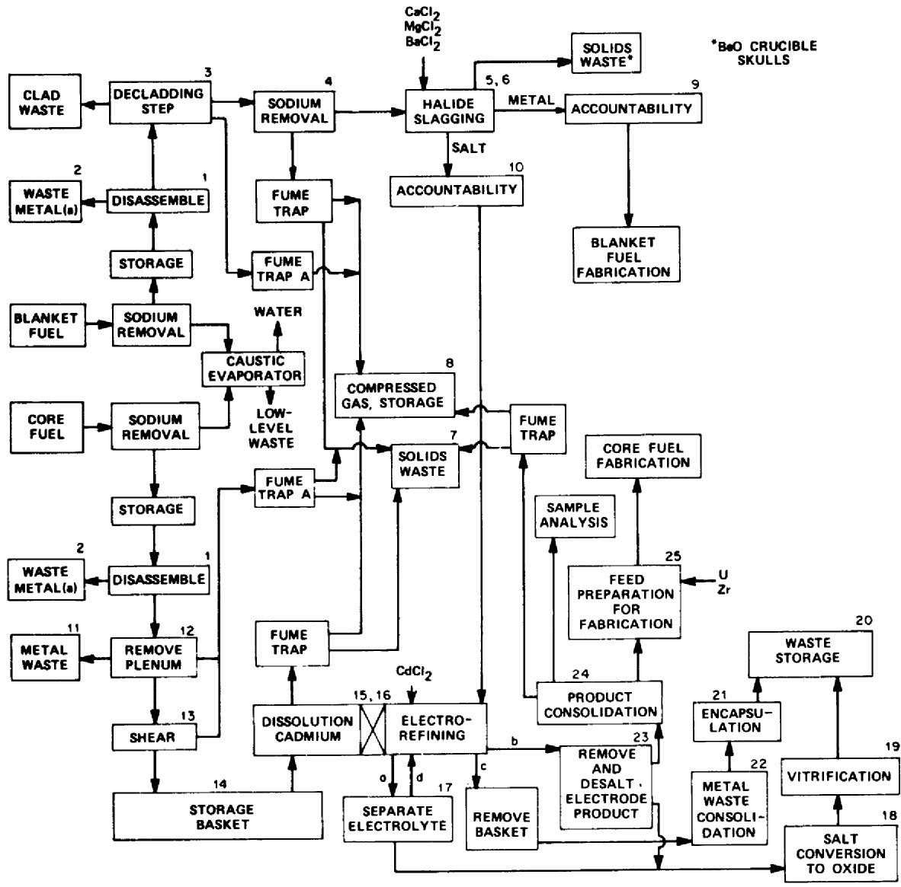  
Figure E.1. The block diagram flowsheet for pyro-electro-chemical reprocessing fast reactor metal fuel. Numbered blocks indicate space requirements in the containment, and multiple numbers per block indicate duplicate equipment. The decladding step, block 3, has not been defined but is thought to be feasible by an electrochemical process. Any such process will likely require at least three additional space requirements. The letters a, b, c, d indicate a sequence of steps following the electro-refining. During startup of the reactor with enriched uranium, the core uranium cannot be isotopically diluted with blanket uranium, and the blanket fuel may need to pass two times (or more) through the halide slagging step to reduce to uranium content.

applies to the reduction of UCl3 to uranium and of $\mathrm{ZrCl_4}$ to zirconium, and the product is a mixture or an alloy of the three metals. Control of the reducing potential can partially segregate the metals on the cathode.

# E.2.2 The Purex Process for Oxide Fuels

The assumed LMR design, as for the metal fueled system, is a 1300-MW(e) facility. The core and blanket fuels can be processed in the same equipment. A reprocessing facility on the site for this 1300-MW(e) complex would require a capacity of 35 t/a (8 t/a of core and 27 t/a of blanket fuel) or about 140 kg/d at 250 d/a.

The Purex process for reprocessing oxide fuels is diagrammed in Fig. E.2 and has been previously described. Both the core and the blanket fuels are processed through the same equipment. The head-end operation involves disassembly of the fuel bundles and chopping of fuel into 1-in. segments. Dissolution includes transfer of fuel from the cladding into nitric acid and removal of cladding hulls from the process. In the feed preparation step, the chemistry of the dissolved fuel is adjusted for solvent extraction.

The details of solvent extraction strongly depend on the characteristics required for the plutonium and uranium products. Our evaluation will be based on a conventional Purex solvent extraction, in which the solvent extraction step yields pure uranium and plutonium products. The product-conversion step converts aqueous nitrate solutions of plutonium and uranium into the respective oxides. The reference design includes oxalate precipitation followed by thermal decomposition.

# E.2.3 Fabrication of Metal Fuels for IFR

Fabrication of the metal core and blanket fuels will involve separate operations in the initial steps. However, the same equipment can be used during and after the fuel-rod assembly stage. All fabrication steps must be conducted remotely within thick containment shielding because both the recycle uranium from the halide slagging and the reprocessed plutonium/uranium/zirconium will retain appreciable quantities of fission products. Figure E.3 shows a block diagram for metal fuel fabrication, which is in accord with the fabrication of EBR II fuel. As in the reprocessing, the capacity for fuel fabrication must be capable of quantities for the breeding design basis, so that the IFR will have breeding as a future option.

Batch sizes may be limited by criticality considerations. The criticality safety analysis for these process steps has not been completed, and therefore the effect of criticality on batch sizes cannot be firmly evaluated. IFR breeder systems with a total output of 1300 MW(e) will require a total processing-refabrication capacity of 25.5 t/a (30 kg/d and 72 kg/d for the core and blanket fuels, respectively, for

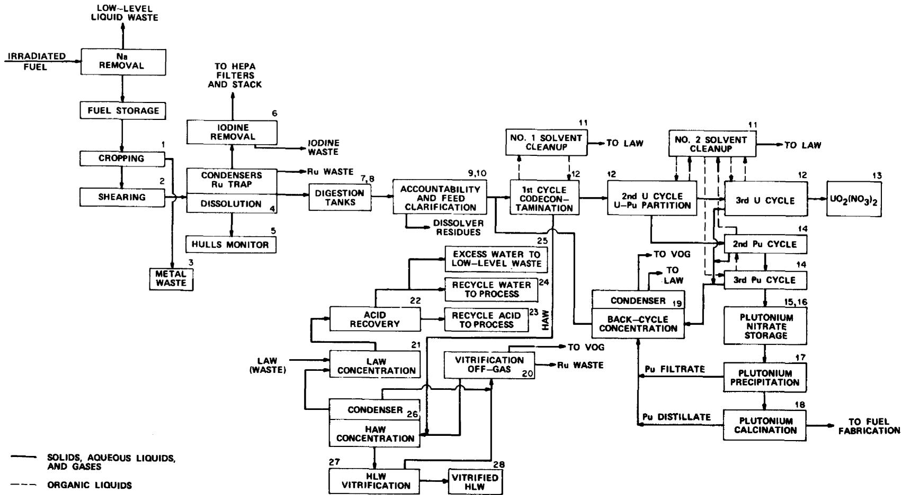  
Figure E.2. The block diagram flowsheet for Purex reprocessing of fast reactor oxide fuel. Numbered blocks indicate process steps that require space in the containment facility, and a number common to more than one block indicates that these steps share a space. For example, the solvent extraction steps, #9, are accomplished in an eight-pack of centrifugal contactors.

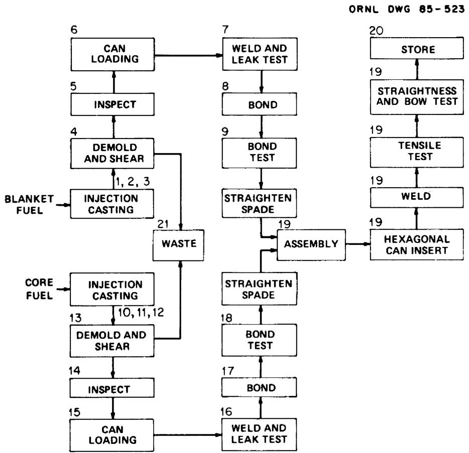  
Figure E.3. The block diagram flowsheet for fabrication of fast reactor metal fuel. Numbered blocks indicate processes or steps that require space in the containment facility, and multiple numbers per block indicate duplicate equipment. A single number on several blocks indicates that these steps are accomplished in a common space.

250 d/a). Thus, as a result of criticality considerations, the core and the blanket process may each require more than one injection casting unit. The cast fuel will be cooled and the mold removed. The spent mold becomes TRU waste but could, perhaps, be cleaned to low-level status. The fuel will then be inspected and a chemical analysis completed. The fuel that passes inspection will be loaded, along with some sodium, into new cladding. The cladding will be subsequently welded and leak-tested. Approved fuel rods will be bonded into bundles, and this bonding will be inspected. The positioning spade on the bottom of the fuel rods will be straightened, and the rods will be loaded into an assembly. Finally, each assembly will be equipped with the hexagonal can insert and welded. Tensile testing will be performed, and the approved assemblies will be examined to assure meeting the requirements for insertion into the reactor.

# E.2.4 Fabrication of Oxide Fuels

Feed material for fabrication of oxide fuels will have relatively low gamma activity because the Purex process removes essentially all of the fission-product elements from the plutonium/uranium products. Therefore, this fabrication can be housed in a low-level containment facility. However, automated remote operations and maintenance will be required because of the long-term increase in the even-numbered plutonium isotopes. The 1300-MW(e) reactor system will require 8, 9, and 18 t/a of core, axial, and radial blanket fuels, respectively. While the Purex reprocessing must handle all 35 t/a of spent fuel, the fabrication facility will prepare only the core fuel (8 t/a); the blanket fuel (27 t/a) will be purchased from an independent vendor. The vendor could be any of those that currently supply LWR fuel.

A block-type schematic for fabrication of oxide breeder fuel is shown in Fig. E.4. This flowsheet is in accord with the fabrication flow-sheet for the Secure Automated Fabrication line. $^{4}$ The recycled $\mathrm{PuO_2}$ and the $\mathrm{UO_2}$ are first blended in the proper batch quantities. The mixed oxide is milled to achieve uniformity, and a binder material is added. The fine material is then compacted into granules, and a lubricant is added. This mixture is pressed into pellets and loaded into boats for high-temperature treatment, which serves to remove the binding material and sinter the pellets. The sintered pellets undergo several grinding, gauging, cleaning, and inspection steps before they are loaded into the cladding jackets. The loaded jackets are filled with helium and welded closed. Helium leak-testing and ultrasonic testing are carried out successively. The fuel rods proceed through fissile assay and physical inspection, and rods that pass all inspections are wrapped with spacer wire and assembled into bundles. A final inspection of the assembled bundles completes the fabrication process.

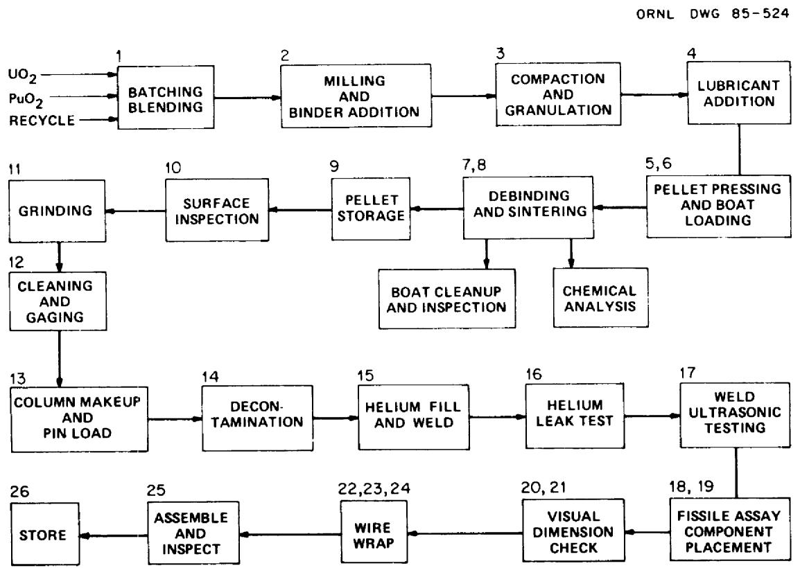  
Figure E.4. The block diagram flowsheet for fabrication of fast reactor oxide fuel. Numbered blocks indicate processes or steps that require space in the containment facility, and multiple numbers per block indicate duplicate equipment.

# E.3 COSTS OF DEMONSTRATION PLANTS FOR REPROCESSING AND REFABRICATING METAL AND OXIDE FUELS

Costs have been estimated for the fuel cycle plants for fast reactor facilities with 1300-MW(e) outputs. In Table E.1, through-puts for such reprocessing facilities are given as tonnes per year (t/a) for metal fuel from an IFR conceptual reactor operating as a breeder and for oxide fuel from a PRISM conceptual breeder reactor. Reprocessing of either type of fuel is conducted in remotely operated, shielded facilities. Refabrication of both the core and blanket of the metal fuel is conducted in remotely operated, shielded facilities. However for oxide fuels, only the core is refabricated remotely, the blanket fuel is purchased from a commercial vendor.

Table E.1. Fuel throughputs (t/a) for reprocessing and refabricating metal and oxide fuels from 1300-MW(e) fast reactors   

<table><tr><td></td><td>Core</td><td>Axial</td><td>Radial</td><td>Reprocess</td><td>Refabri-cation</td><td>Purchase</td><td>Total for remote operations</td></tr><tr><td>Metal fuel</td><td>7.5</td><td>0</td><td>18</td><td>25.5</td><td>25.5</td><td>0</td><td>51</td></tr><tr><td>Oxide fuel</td><td>8</td><td>9</td><td>18</td><td>35</td><td>8</td><td>27</td><td>43</td></tr></table>

The costs of reprocessing and refabrication facilities are highly dependent on the sizes of the containment buildings, because of the shielding and ventilation requirements. Therefore, the relative costs of fuel cycles for oxide or metal FBR fuels can be based on the relative sizes of the required facilities. As a first approximation for comparing costs, we have assumed that capital costs are proportional to the number of process steps that require space in the shielded, remotely operated facility. We have numbered such steps in Figs. E.1-E.4.

Several studies have calculated and examined the effects of various parameters on reprocessing costs for oxide fuels. Those are summarized in Ref. 5. Those costs and the costs herein are expressed as current-dollar levelized costs (1984 dollars). If the annual levelized fixed charge rate had been based upon constant dollars, the apparent cost would have been lower. Using the same scaling factors (0.5) that are used in those studies and assuming, as did Delene et al.,[5] that a facility for reprocessing 150 t/a would cost $1.02 billion, we estimate that the capital cost of an oxide fuel reprocessing facility for a 1300-MW(e) LMR would be $492 million. The validity of this cost figure is supported by the recently published costs for the newest LWR reprocessing plant in the Federal Republic of Germany.[6] In that document, $1.6 billion is the cost reported for a 500-t/a LWR reprocessing plant (excluding costs of the refabrication facility). When scaled downward to the 35-t/a plant, this yields $423 million. Since the costs of reprocessing LMR fuels are generally higher (up to 50%) than those for LWR fuels, the

two derived costs are comparable, and confidence in their validity is increased. However, preliminary results of an ORNL study currently in progress for a small onsite facility suggest a cost of $270 million compared to the above derived $492 million for reprocessing of oxide fuels in a 35 t/a facility. We have used these two cost figures to calculate lower and upper boundary costs for reprocessing and refabrication. The oxide fuel reprocessing costs were derived from these values, while the costs for refabricating the oxide fuel and blanket were based on the high end of the values given in Table 2.12 of Ref. 5. The high-end values were used to reflect the cost disadvantage for a small-throughput plant.

The corresponding cost estimates for a metal fuel reprocessing and refabricating plant have not been prepared in the same detail as those for the oxide fuel plants. Because of this, the values derived for the metal fuel cycle do not have the same validity as those for the oxide fuel cycle. However, we think the results are generally correct and acceptable as a basis for comparison. A more detailed design study would be required to provide cost estimates of equal validity to those for the oxide fuel plants.*

Since the number of major steps required for processing of metal fuels is comparable to that required for oxide fuels (see Figs. E.1 and E.2), the cost of the oxide reprocessing plant was used as a cost basis for the metal reprocessing plant. However, metal fuel reprocessing equipment may not require the head height that is needed for oxide reprocessing equipment. Therefore, the initial base cost for the metal fuel was reduced by $20\%$ before scaling for capacities was done. The $20\%$ reduction is based on the resulting reduced need for concrete and reinforcement, relative to the total reinforced concrete requirements for the total cell. This reduced base cost was then adjusted for size based on capacity, using a 0.5 scaling factor.

The facility requirements for reprocessing or refabricating metal fuels are similar. Therefore, the costs for refabrication of the metal fuels were based on the relative number of steps required for refabrication (i.e., 20) as compared with the number of steps required for reprocessing of the metal fuel (i.e., 25) to the 0.5 power. Thus, the refabrication capital costs are: $(20 / 25)^{0.5} = 0.894$ times the metal reprocessing capital costs.

The total waste costs were based on the rate of 1 mill/kWh and hence were $9.1 million annually. The cost of new blanket oxide fuel was based on the high range in Table 2.12 of Ref. 5. The high range, $500/kg, was used because of the relatively low quantity to be purchased. Hardware costs, estimated at $50,000 per fuel assembly, were

based on experience at the FFTF and the EBR II. The operating costs were scaled using a sizing exponent of 0.7.

The cost summary is given in Table E.2. This information suggests that there is no significant economic advantage in a metal-fuel or an oxide-fuel FBR based on the costs of reprocessing and refabricating the fuel.

Calculations were made to provide comparable values for processing oxide fuel in a large fuel cycle facility (1500 t/a), assuming that it existed and that the fuel was both reprocessed and fabricated there. The cost basis was taken from Table 2.13 of Ref. 5. The results showed costs of 4.7 to 6.3 mills/kWh for $80\%$ reactor capacity factors.

It is obvious that the costs derived here for a 35-t/a facility are high when converted to the unit cost ($/kg) basis or to mills/kWh, and when compared to costs in a large facility. This is a function of the low capacity requirements for either of the processes. The 25-35 t/a plants are a factor of 50 smaller, and the cost values reflect this; however, the cost comparisons should be more valid than the absolute values, since both the metal and the oxide processes were costed on approximately the same basis. Options other than integral reprocessing have been suggested, as follows:8

1. Store the spent fuel until sufficient quantities are accumulated for large-scale commercial reprocessing.   
2. Ship the spent fuel to a large international reprocessing facility set up as a cooperative venture.   
3. Reprocess fuel in a small dedicated experimental facility such as BRET, subsidized by research and development funds (for early power plants).   
4. Reprocess LMFBR fuel in a joint facility with LWR fuel (the "hybrid" concept).   
5. Reprocess IMFBR fuel in existing U.S. reprocessing facilities, utilizing part of their capacity for civilian purposes, after appropriate modifications are made.

# E.4 ISSUES THAT NEED ATTENTION

The colocation of fuel reprocessing facilities with fast reactors can require that all regulatory concerns for both the reactor and its associated reprocessing facility be addressed before approval of the reactor is obtained. We have defined several issues in each of six areas of the reactor-reprocessing-refabrication combination and have added a comment on each issue.

Table E.2. Cost summary for reprocessing and refabricating metal and oxide FBR fuel   

<table><tr><td colspan="2">Fuel type</td><td colspan="4">Reprocessing costs ($10^6)</td></tr><tr><td></td><td></td><td>Capital</td><td>Annual capital</td><td>Annual operating</td><td>Total annual</td></tr><tr><td>Metal fuel (20-year)</td><td>184-336</td><td>42-76</td><td>13</td><td>55-89</td><td></td></tr><tr><td>25.5 t/a (30-year)</td><td>184-336</td><td>31-56</td><td>13</td><td>44-69</td><td></td></tr><tr><td>Oxide fuel (20-year)</td><td>270-492</td><td>61-111</td><td>16</td><td>71-127</td><td></td></tr><tr><td>35 t/a (30-year)</td><td>270-492</td><td>45-82</td><td>16</td><td>61-98</td><td></td></tr><tr><td></td><td></td><td colspan="4">Refabrication annual costs ($10^6)</td></tr><tr><td></td><td></td><td>Capital and operating</td><td>Hardware</td><td>Purchases</td><td>Total</td></tr><tr><td>Metal fuel (20-year)</td><td>48-80</td><td>10</td><td>-</td><td>58-90</td><td></td></tr><tr><td>25.5 t/a (30-year)</td><td>39-61</td><td>10</td><td>-</td><td>49-71</td><td></td></tr><tr><td>Oxide fuel (20- or 8 t/a 30-year)</td><td>25.6</td><td>-</td><td>13.5</td><td>39</td><td></td></tr><tr><td></td><td></td><td colspan="4">Combined annual costs ($10^6)</td></tr><tr><td></td><td></td><td>Repro.</td><td>Refab.</td><td>Waste</td><td>Total</td></tr><tr><td>Metal fuel (20-year)</td><td>55-89</td><td>58-90</td><td>9.1</td><td>122-188</td><td></td></tr><tr><td>(30-year)</td><td>44-69</td><td>49-71</td><td>9.1</td><td>102-149</td><td></td></tr><tr><td>Oxide fuel (20-year)</td><td>77-127</td><td>39</td><td>9.1</td><td>126-176</td><td></td></tr><tr><td>(30-year)</td><td>61-98</td><td>39</td><td>9.1</td><td>110-147</td><td></td></tr><tr><td></td><td></td><td colspan="4">Busbar costs at 80% reactor capacity (mills/kWh)</td></tr><tr><td>Metal fuel (20-year)</td><td></td><td></td><td>13.4-20.6</td><td></td><td></td></tr><tr><td>(25.5 t/a) (30-year)</td><td></td><td></td><td>11.6-16.3</td><td></td><td></td></tr><tr><td>Oxide fuel (20-year)</td><td></td><td></td><td>13.8-19.3</td><td></td><td></td></tr><tr><td>(35 t/a) (30-year)</td><td></td><td></td><td>12.1-16.1</td><td></td><td></td></tr><tr><td>Oxide fuel (20-Year)</td><td></td><td></td><td>6.3</td><td></td><td></td></tr><tr><td>1500 t/a (30-year)</td><td></td><td></td><td>4.7</td><td></td><td></td></tr></table>

$a_{\mathrm{A}}$ constant waste cost of 1 mill/kWh, or $9.1 million per year, is assumed.

1. Waste — One of the major questions that needs to be resolved for the metal fuel processing concept is the means of handling the waste. Before this question can be answered, considerable experimental work is required to define where each of the major waste isotopes will reside as a result of these processes. Once the locations and the quantities of the wastes are defined, specific disposal methods can be determined.

In the area of waste disposal, there are many questions relative to the specific criteria for the wastes and waste containers for either metal or oxide fuels. Such questions would require clarification before final design could be completed. For the metal fuel, considerable development work would be necessary to verify proposed processes, particularly in the area of imperviousness of the disposal product.

2. Environment - The environmental requirements for the total fuel cycle need to be clarified before the experimental work is completed, particularly for metal fuel, since little experience and no source terms are available. This would require an early dedication to, and funding for, such a project.

Again, clarification is needed as to what specific criteria or regulations would apply to the releases from an FBR fuel cycle. The current regulations (40CFR190) apply specifically to the "uranium fuel cycle" for light-water reactors. It is not clear whether 40CFR61 was intended to cover fuel reprocessing from nonuranium fuel cycles (Par. IV B). This needs clarification.

3. Safety and Licensing - At present, there are no approved design criteria for LMRs or for the fuel cycle facilities. Can these be approved in time to be included in the design process?

At present there are also no regulations (NRC) which define the criteria for fuel cycle facilities. Appendix P to LOCFR50, which has been proposed (but not approved), contains safety criteria based on aqueous processing. It could be modified to cover pyroprocessing; however, this would have to be done well in advance of the final design of a demonstration facility, in order for the requirements to be included in the final design.

It is not clear that the safeguards requirements for the metal fuel reprocessing and fabrication would be the same as those for similar operations on the oxide fuel. However, the metal fuel would always be highly radioactive and thus less attractive for diversion. For either the oxide or metal fuel cycle, transportation is reduced by using the integral fuel cycle.

Would any safety or licensing waivers be required for either FMEF or FCF in order for them to meet DOE requirements, and could these waivers be obtained?

4. Public Acceptance - Public acceptance has been a major problem for less complex projects than these that are proposed. Could this become a major problem?

Although the public may accept a reactor or several reactors at a site, the addition of a fuel cycle facility to this "nuclear park," may require a great deal more education than before. This could be particularly important for the management and disposal of wastes.

5. Industry Acceptance - A major consideration will be the willingness of industry to become involved in a complex, total-power program such as that proposed for the IFR. How would industry propose to handle this?

A. In the course of this study, we have observed that utilities would not feel comfortable with staffing and managing the diverse facilities required for a total fuel cycle. Their background and training are related to power generation and do not include the complexities, costs, and risks of these other elements. It may be more practical to have a separate operating organization with the appropriate technical expertise.

B. Are the economics of one central fuel cycle compatible with a limited- (one-) reactor complex during early years when only one or two reactors are in operation?

A fuel cycle facility must be originally designed and built to handle the total output from all the reactors at the site. Therefore, the major costs - those of construction - would be incurred at some time before the total capacity of the facility was needed. The introduction of the fuel cycle might be delayed somewhat by storing the fuel after discharge. This would provide an inventory for the future reactors. An economic balance would have to be made in order to define the optimum storage period. The normal plant life for reprocessing is assumed to be 20 to 30 years, as opposed to an assumed reactor life of 30 to 40 years, however, the optimum lifetimes for both reactors and reprocessing plants require further study and may prove to be much longer.

C. How large an analytical complex will be required?

Reactors, per se, do not require an extensive analytical capability. The overall complex would require extensive remotely operated facilities for determining chemical, metallurgical, physical properties, and for analytical chemistry measurements.

D. Does the operator have sufficient backup technical capabilities available (analytical laboratories, metallurgical caves, etc.) to help resolve day-to-day problems?

The support facilities required to service a reactor fuel cycle complex would be much more extensive than those required for a reactor alone.

E. Can reactor(s) be dependent on only one fuel source and one disposal method? How do reactors operate in case of a 1- to 2-year shutdown of fuel cycle?

All of the facilities involved in the reactor cycle — fuel source, fuel storage and disposal, and waste disposal — are remotely operated and maintained. They would be difficult to duplicate on short schedule in case a major problem developed in any part of the system. Thus, the metal fuel reactors would not have a fall-back option, unless and until several similar facilities were available. The latter circumstance would require shipment of spent and refabricated fuel.

F. What is the design life of the fuel cycle complex? Can it be refurbished - and how often?

The design life of fuel cycle facilities is normally 20-30 years. The Savannah River Plant is 30 years old and still operating well. There are no other plants that have operated longer. It would appear feasible to replace equipment and services within a plant to extend longevity, providing remote handling capabilities were adequate.

G. How much plutonium is needed for the reactor program, at what rate would it be supplied, and from what source?

Two questions are concerned with the availability of fuel (and plutonium) for initial startup. First, is plutonium available to provide enough metal fuel (e.g., one fuel assembly per week) to support the pilot-plant program for the 2 to 3 years that is necessary to develop the process and waste-process system? And second, what is the source of the plutonium and the manufacturing capability to produce the initial two to three cores that would be required for either the metal- or oxide-fuel demonstration reactor prior to recycling fuel from the fuel cycle facilities? Will there be any problem in finding a vendor who will gear up for such a limited program?

# 6. Reactor Interfaces

A. Can a reactor operate with the higher plutonium concentrations that may be necessary to compensate for the less-fissile plutonium due to recycle, or does the addition of the blanket fuel compensate for this? (Would this affect the melting point of the fuel?)

With each recycle of fuel, the nonfissile isotopes of plutonium increase; thus, higher-quality plutonium may be required to provide the requisite fissile loading. A higher plutonium concentration, without other adjustments, could result in a lower melting point for the fuel. This would have to be evaluated from the reactor safety viewpoint. These changes may be magnified during the initial phases, when the fissile material is changing from $^{235}\mathrm{U}$ to plutonium.

B. How large a variance in specifications of fuel will the system accept?

Variations in metal fuel alloy composition and fissile composition can affect reactor performance. They can also affect the precision of the burnup calculations, which may be the input values for the fuel cycle SNM balance. Previous reactor cores (albeit experimental in nature) have had high accuracy and precision requirements for fuel composition. In this case, both the analytical determinations and the final adjustment will be accomplished by remote means, which may not produce the designed uniformity.

C. Is the fuel to be specified by percentage of plutonium, percentage of fissile plutonium or total reactivity? How is this to be determined?

If reactivity measurements are required, then special instrumentation will have to be developed.

D. How are uranium/plutonium concentrations controlled to meet requirements of (B) and (C) above?

A separate step may be needed between reprocessing and refabrication which would permit composition adjustment.

# E.5 Conclusions

The flowsheets described here appear to provide a viable process for either the oxide- or the metal-fuel cycle. It is recognized that additional development work is necessary for the metal fuel cycle, but this does not appear to present a major problem. Although some areas within the metal fuel reprocessing-waste handling flowsheets may change as more development work is done, there is no reason to expect these modifications to affect our overall conclusions.

It must be emphasized that the cost values presented here are generic in nature and may be more accurate in a comparative sense than in an absolute sense. It must also be pointed out that the principal cost advantage of the metal-fuel cycle (i.e., the relatively small number of

steps required for refabrication), is largely offset by blanket fabrication costs. The blanket for the metal fuel must be refabricated remotely, while the oxide blanket can be fabricated by an existing LWR fuel fabrication using contact means, which is considerably less expensive. Because of these considerations, no appreciable difference was found between the overall costs for the metal-fuel cycle and those for the oxide-fuel cycle. Although the calculated unit or bus bar costs for a small (35 t/a) integrated fuel cycle do not appear to be attractive, the corresponding fuel cycle costs for a projected large (1500 t/a) facility appear to be competitive. A much more detailed cost study would be required to refine the values presented here. Consideration must also be given to the identified potential regulatory, social, and industrial acceptance issues.

As discussed, the schedules presented here indicate that either the metal-fuel or the oxide-fuel cycle could be closed within the allotted time frame (2000-2010). Although the schedules contain leeway to provide for small delays in obtaining funding or in clarifying development uncertainties, there are several technical and institutional problems which must be resolved early for any integral reactor and fuel cycle facility to meet the projected time frame.

# REFERENCES FOR APPENDIX E

1. This flowsheet was developed from that initially provided in ANL-IFR-7, Stream Flows and Compositions for Preliminary Pyroprocess Flowsheets, March, 1985. The flowsheet includes modifications found in the ANL-IFR series of reports and provided by ANL staff in personal communications.   
2. Preliminary Safety Analysis Report, Vol. 4, Nuclear Fuel Recovery and Recycling Center, XN-FR-32, NRC Docket No. 50-564, Exxon Nuclear Co., Inc. (1977).   
3. M. J. Lineberry, R. D. Phipps and J. P. Burelbach, Commercial-side IFR Fuel Cycle Facility: Conceptual Design and Cost Estimate, ANL-IFR-25, October 1985.   
4. D. H. Nyman, "Secure Automated Fuel Fabrication, Proceedings, 31st Conference on Remote Systems Technology, 2, (1983).   
5. J. G. Delene, H. I. Bowers, and M. L. Myers, A Reference Data Base for Nuclear and Coal-Fired Power Generation Cost Analysis, DOE/NE 0044R (1985).   
6. Nada Stanie, Nucl. Fuel 13-14 (July 1, 1985).   
7. W. D. Burch, private communication, July 1985.   
8. R. Balent and J. M. Yedidia, Draft, Large-Scale, Prototype Breeder Fuel Cycle Plan, DOE/EPRI, July 1985.

__________

# APPENDIX F

# 860 MW(e) LARGE HIGH TEMPERATURE

# GAS-COOLED REACTOR (HTGR)

The 2240 MW(t) reactor core is contained within a prestressed concrete reactor vessel (PCRV), with the core in the center cavity and the steam generators and auxiliary heat exchangers in pods in the PCRV surrounding the core. The core is cooled with pressurized helium, moderated and reflected with graphite, and fueled with a mixture of uranium and thorium. It is constructed of prismatic hexagonal graphite blocks with vertical holes for coolant channels, fuel rods, and control rods. Helium coolant flows from four electric-motor-driven circulators downward through the core, through four steam generators, and back to the circulators. Superheated steam produced in once-through steam generators is expanded through a tandem compound turbine generator.

In addition to the four primary coolant loops, three core auxiliary heat removal system loops are also provided. Each loop consists of a gas/water heat exchanger with an electric-motor-driven circulator located in a cavity in the PCRV wall. Should the main loops not be available, coolant is circulated from the reactor core through the auxiliary heat exchangers where heat is transferred to the core auxiliary cooling water system for eventual rejection from cooling towers to the atmosphere.

The average core power density is about $6\mathrm{kW} / 1$ and the operating pressure is about $7\mathrm{MPa}$ . The coolant gas exits the core at about $690^{\circ}\mathrm{C}$ . Steam conditions at the turbine inlet are $17.3\mathrm{MPa}$ and $541^{\circ}\mathrm{C}$ providing a thermal efficiency of $38\%$ . The PCRV and ancillary systems are housed inside a reactor containment building, which is a conventional steel-lined reinforced containment structure. Typically, balance-of-plant systems are housed in separate buildings depending on function and service.

The advantageous safety characteristics of the large HTGR are based on the high heat capacity of the graphite core and reflector, the high temperature capability of the fuel and moderator, the use of a coolant which does not change phase and has no reactivity effect associated with density changes, the inherent shutdown mechanisms associated with a negative temperature coefficient, and the use of a PCRV which is a redundant structure that precludes catastrophic failure. The low core power density in combination with the graphite moderator leads to relatively slow fuel temperature rises following loss-of-cooling accidents; the graphite moderator and the ceramic fuel are stable to very high temperatures, providing a high degree of fission product retention within the fuel coatings up to about $1600 - 1800^{\circ}\mathrm{C}$ , and with only limited release up to about $2000^{\circ}\mathrm{C}$ . The helium coolant does not undergo chemical reactions within the reactor circuit, and the use of a gas coolant provides unambiguous coolant conditions. Further, the large negative temperature coefficient of reactivity for the fuel makes fast-acting shutdown systems unnecessary.

Nonetheless, if there is a complete loss of forced convection under depressurized conditions, the afterheat generated in the core would eventually cause plant damage and significant fuel particle coating failures, since fuel temperatures would rise to values greater than $2000^{\circ}\mathrm{C}$ . As a result, engineered safety systems are used to supplement the inherent characteristics of the reactor and include the independent auxiliary cooling systems, independent and emergency reactivity shutdown systems, and the reactor containment building.

# REFERENCES FOR APPENDIX F

1. Gas-Cooled Reactor Associates, HTGR Steam Cycle/Cogeneration 2230 MW(t) Lead Plant, Conceptual Design Summary Report, HCR-20101, February 1985. APPLIED TECHNOLOGY.

# APPENDIX G

# EVALUATION OF CLAIMS FOR THE MODULAR

# HIGH TEMPERATURE REACTOR (HTR)

This appendix summarizes safety and economic claims which have been examined by NPOVS for the modular HTR.

# 1. Modular HTR Safety Claims

The basic safety claims of the modular HTR are:

- doses to the public will not exceed values which would require public evacuation [according to EPA's Protective Action Guidelines (PAG)] to a frequency of greater than $5 \times 10^{-7}$ per plant year.   
- Meet the NRC interim safety goals.

Further, to achieve these goals, a filtered confinement, rather than a conventional containment is sufficient.

As specified under R&D needs, Section 3.5.3.1, additional source term data will be needed to assess this claim.

Relative to investment protection, the claim is that the cumulative frequency of events leading to plant loss is less than $10^{-5}$ /plant year. This is below the NPOVS criterion No. 2.

# 2. Modular HTR Claims for Core Heatup Accidents (with Scram)

a. Circulating activity and fission product plateau are sufficiently low and fuel performance during normal operation is sufficiently good that doses can be maintained below EPA's guidelines for public evacuation in core heatup accidents so long as the fuel is maintained below $1600^{\circ}\mathrm{C}$ .

To verify this claim requires additional data relative to the source term as is specified in the R&D needs, Section 3.5.3.1 of this report.

b. With loss of the main circulator or loss of cooling water flow to the steam generator, and with loss of the auxiliary heat removal system, heat transport to the vessel cooling system limits the fuel temperatures to $1200^{\circ}\mathrm{C}$ . If the primary system is depressurized, heat transport to the vessel cooling system limits fuel temperatures to $1600^{\circ}\mathrm{C}$ . Further, under neither circumstance will there be component damage.

This claim is essentially supported by several analyses in the United States and West Germany. Further sensitivity studies are needed to examine the impact of uncertainties in various parameters on temperatures of fuel and vessel internals.

c. With a loss of all active and passive engineered cooling systems, heat transfer to the earth limits the fuel to $1600^{\circ}\mathrm{C}$ . There would be component damage (reactor vessel and internals).

This is dependent on soil properties and would require confirmatory analysis for each site.

3. Modular HTR Safety Claims for Transients without Scram

Although the core is provided with highly reliable primary and reserve shutdown systems, rapid insertion of control material is not required for core heatup transients involving the following:

- loss of cooling water flow to the steam generator,   
- loss of forced circulation of helium,   
depressurization.

For these events which lead to core heatup, the increase in fuel temperatures, combined with the negative temperature coefficient of reactivity drives the reactor subcritical. Peak temperatures during the core heatup are not significantly greater than with scram. After several hours, depending on the specific thermal transient considered, the fuel will have cooled sufficiently and the xenon will have decayed sufficiently to cause recriticality.

Evidence that this claim can be met for conditions involving loss of forced helium circulation is provided by tests which have been performed at the AVR.1

4. Modular HTR Safety/Investment Protection Claims for Water Ingress

Modular HTR proponents claim that water ingress is not a public safety concern for the following reasons:

- the reactivity inserted can be compensated by the control and shutdown systems   
the chemical reaction between water and graphite is a self-limiting, endothermic reaction

- no flammable or combustible gas mixture will be produced in the confinement since the primary system safety relief valve will lift and discharge such gas through particulate filters and up a stack into the atmosphere

Further, the claim is made that a long outage would be prevented either by active engineered systems (moisture monitoring, steam generator isolation and dump), or by a combination of these systems and operator actions.

To examine the safety aspects of this claim will require computation of temperature coefficients and control rod worth under conditions of water ingress, computation of the reactivity insertion and insertion rate due to water ingress, and analysis of the resulting thermal transient. An analysis of the chemical reaction and its consequences should also be performed for the specific materials, geometry and assumed sequences of events.

# 5. Modular HTR Safety Claims for Air Ingress

A serious air ingress accident is considered by proponents to be an extremely unlikely event ( $< 5 \times 10^{-7}$ per reactor year) and thus is not treated as a design basis event. The claim is that excessive oxidation of graphite and resultant fission product release can occur only if there are multiple ruptures in the primary system, there is no forced cooling, and much more than one enclosure volume of air reacts with the graphite. If there is forced cooling capability, even with a mixture of helium and air at atmospheric pressure, core temperatures can be reduced to $400^{\circ}\mathrm{C}$ in a few hours. The rate of oxidation at $400^{\circ}\mathrm{C}$ and below is very low and no longer a safety concern. Finally, with a large air ingress, the heat generation by oxidation is very small relative to decay heat generation, so core temperatures are not expected to be significantly greater than for a depressurized core heatup accident.

To examine the licensing aspects of an air ingress event, it may be necessary to determine the risk associated with air ingress and to compare that risk with the total risk from normal operation of the plant. To examine the consequences of air ingress requires analytical model development (currently in progress) for accident simulation, an understanding of the gas exchange between the primary system and the confinement and a thorough understanding of the oxidation process. Further provisions in the confinement to limit air accessibility should be examined for practicality.

# 6. Economics and Constructibility Claims

a. Claim. Total power generation costs are competitive with coal plants of equal capacity.2

Evaluation. Because of the preliminary conceptual nature of the design, there are large uncertainties, especially in capital investment costs. Certainly, it can be claimed that this concept holds significant promise to be competitive. Design and cost studies should continue to better define the economic competitiveness with coal.

It is recommended that studies be carried out to provide improved capital cost estimates by:

(1) Continued development of the design to the point that quantities of commodities and labor can be estimated and compared with current LWR and coal-fired plant experience.   
(2) Development of estimates of indirect costs (e.g., manhours of design engineering and project management, instead of relying on percentages).   
(3) Starting with a "first-of-a-kind" plant, development of the strategy for arriving at the cost of an "Nth-of-a-kind" plant.

b. Claim. Significant capital investment cost savings are achieved through use of a confinement, rather than containment.

Evaluation. Bechtel made a study in FY 1982 (Ref. 4) in which the added direct cost for containment for a modular HTR plant with 8 reactors was estimated to be \(70 \times 10^6\). Escalation to 1985 and addition of indirect costs increases this amount to about \)120 \times 10^6$ or $150/ kW(e), which is a significant cost.

c. Claim. Systems outside the nuclear island can be procured and installed to non-nuclear standards resulting in an overall savings in capital investment cost of approximately $10\%$ (Ref. 5).

Evaluation. It has been documented $^{6,7}$ that the cost of non-nuclear portions of LWR plants is much higher than for coal-fired plants. The reasons cited are as follows:

- Nuclear quality standards affect the attitudes of all persons working on the entire project - management, engineering, and crafts.   
- Bulk materials for the entire project, such as rebar, anchor bolts, embeddings, small bore piping, and concrete, are procured and handled as required by a nuclear quality assurance program to eliminate danger of degrading the quality of safety-related structures and systems by inadvertent substitution.   
- Non-safety structures adjoining safety-related structures are designed to prevent collapse in the event of a design basis earthquake or tornado.

- Management and supervision are preoccupied with problems associated with safety-related facilities and often neglect planning for non-safety facilities.

Bechtel addresses these problems by proposing to provide physical separation between the nuclear and non-nuclear facilities and between the construction forces so that the low productivity experienced in nuclear construction is not transferred to the non-nuclear areas. Our analysis as applied to current LWRs confirms the $10\%$ level of savings in investment cost.8 However, there are also reasons why these savings may not be fully realized:

- Dispersion of plant facilities with longer runs for piping and wiring and cables.   
- Duplication of construction management and construction facilities.

The entire question of separation of facilities to achieve increased labor productivity is also a management issue. For example, a few U.S. utilities have been able to build LWR plants with about one-half the labor content of the average LWR plant.[7] R&D should be directed toward determining how best to manage and organize nuclear construction projects to assure higher labor productivity. Separation of construction is one organizational approach to promoting better management.

d. Claim. Availability can exceed $80\%$ with further design improvements. Use of two or four turbine generator sets could increase availability.[2]

Evaluation. HTR Program availability studies are continuing in the DOE program. Achievement of such values depends upon the unscheduled outages which will occur, as well as on refueling and scheduled outage times. Estimates of unscheduled outages and refueling times are uncertain in our evaluation; while $>80\%$ availability appears to be achievable (see below), it cannot be assured at this time.

The North American Electric Reliability Council (NERC) Equipment Availability Report for the 10-year period 1974-1983 supports the claim of smaller turbine generators contributing to higher overall plant availability. As shown in Table 3.4 of Volume III, fossil plant turbine-generator sets in 400 MW(e) and below sizes have distinctly lower forced and scheduled outage rates and higher availabilities than turbine-generator sets in the larger sizes. The advantage is even more significant for nuclear plant turbine-generator sets below 800-MW(e) size, compared with those above 800 MW(e). It also is observed that nuclear plant turbine-generator sets have a distinct performance advantage over fossil sets in all size ranges. It is speculated that this may be due to the lower steam temperatures and pressures and rotational speeds of nuclear turbine-generator sets, which result in a less severe operating environment.

As shown in Table 3.5 of Volume III the area having the greatest potential for LWR plant availability improvement is with the reactor and associated systems. It is obvious that plant availability improvement R&D must concentrate on the reactor and its related systems. For example, a $50\%$ reduction in reactor scheduled outage factor plus a $50\%$ reduction in reactor forced outage rate would result in $80\%$ overall plant equivalent availability. The above LWR data provides strong support that the modular HTR goal can be achieved.

e. Claim. A four-module plant can be constructed in 36 months from start of site work to commercial operation of the second turbine.[2]

Evaluation. This is an optimistic schedule when judged by U.S. experience, but appears possible. The modular HTR schedule is based on an evaluation of the conceptual design by Bechtel. It should be reexamined after the design has been carried to point of estimating quantities of construction materials (structural steel, concrete, piping, and wiring,) and labor man-hours. This will provide a firmer basis for estimating elapsed time for placing equipment and materials. The construction schedule should be reevaluated as the design progresses.

f. Claim. The plant can be operated and maintained by a staff of 306 (Ref. 2).

Evaluation. This estimate is based on a preliminary analysis of staffing requirements. In comparison, typical staffing for current large LWR plants is $\sim 400$ . The modular HTR staffing estimate is based on the following assumptions:

- Regulatory procedures have been stabilized (i.e. no back-fitting by maintenance forces).   
Plant control is highly automated, permitting operation of four reactors by one control operator station.   
Plant is designed for maintenance with one module offline resulting in minimum requirements for peak maintenance forces.   
Plant security is highly automated, requiring minimum security forces.

These assumptions, along with the smaller turbine-generator size requiring less maintenance personnel, are the principal reasons for the reduced staffing. Further studies of operation and maintenance staffing should be performed, using a task-analysis approach, especially in the area of control operation of multiple reactors by a single control operation and its relation to safety.

g. Claim. Adding capacity in small increments is/will be a significant financial goal of utilities and results in less financial risk.

Evaluation. In a time period of low load growth, high financing and construction costs, and reluctance of public utility commissions to grant rate adjustments, this claim appears intuitively obvious. Two recent draft studies by Los Alamos National Laboratory (LANL) and Applied Decision Analysis8,9 support this claim. Both studies attempted to quantify the additional capital investment cost that utilities could afford to pay for smaller, shorter lead time plants in comparison with larger, longer lead time plants, while continuing to meet their financial goals. LANL found that a reduction from long to medium lead times permits the utility company to pay 40-50% more in overnight construction costs, and a reduction from long to short lead times permits a four-fold increase in the overnight construction cost. From a ratepayer viewpoint, Boyd et al.9 found that utilities could pay approximately $200/kW(e) capital investment cost premium for smaller unit sizes and shorter lead times for utility system sizes 3000 MW(e) and larger. From the shareholder viewpoint, the affordable capital investment cost premium was found to be two to three times higher than from the ratepayer viewpoint. The findings are general in that they apply to any type of power plant, they are also sensitive to a number of parameters (e.g., system size, existing generation mix, load growth rate, and financing). However, sensitivity analyses in both studies support the claim. We recommend, however, that the studies in this area be continued and refined to develop a complete understanding of the economics of small nuclear plants.

# REFERENCES FOR APPENDIX G

1. K. J. Krüger and G. P. Ivens, "Safety-related Experiences with the AVR-Reactor," presented at the IAEA Specialists' Meeting on Safety and Accident Analysis for Gas-Cooled Reactors, Oak Ridge, Tennessee, May 13-15, 1985.   
2. Preliminary Concept Description Report, 4 x 250 MW(t) HTGR Plant Side-by-Side Steel Vessel Prismatic Core Concept, HTGR-85-142, issued by Bechtel Group, Inc., et al., for Gas-Cooled Reactor Associates, San Diego, California, October 1985. APPLIED TECHNOLOGY.   
3. HTGR Program Concept Evaluation Plan for Small HTGRs, GCRA 84-009, Gas-Cooled Reactor Associates, San Diego, California, October 31, 1984.   
4. Modular HTGR Balance of Plant Design and Cost Status Report, Bechtel Group, Inc., San Francisco, California, September 1982.   
5. Modular HTGR System Design and Cost Summary, GCFR-00693, Bechtel Group, Inc., San Francisco, California, September 1983.   
6. Constructibility Assessment for Modular High-Temperature Gas-Cooled Reactors, Bechtel Group, Inc., San Francisco, California, July 1982.   
7. Phase IV Update of the EEDB, DOE/NE-0051/1, United Engineers and Constructors, Inc., Philadelphia, Pennsylvania, September 1984.   
8. Andrew Ford, The Market for New Electric Generating Capacity: A Financial Feasibility Case Study, Los Alamos National Laboratory, Los Alamos, New Mexico, June 1984.   
9. D. W. Boyd et al., The Potential Impact of Modularity vs. Utility Generation Investment Decisions, Decision Focus, Inc. and Applied Decision Analysis, Inc., for the Electric Power Research Institute, Palo Alto, California, March 1984.

# INTERNAL DISTRIBUTION

1. E. D. Aebischer

27. J. E. Jones Jr.

2. T. D. Anderson

28. P. R. Kasten

3. S.J.Ball

29. F. C. Maienschein

4. J. T. Bell

30. A. P. Malinauskas

5. R. S. Booth

31-47. D. L. Moses

6. H. I. Bowers

48. F. R. Mynatt

7. R.B.Braid

49. L.C.Oakes

8. J. R. Buchanan

50. S. Rayner

9. W. D. Burch

51. T. H. Row

10. R. A. Cantor

52. D. L. Selby

11. J. C. Cleveland

53. H. E. Trammell

12. T. E. Cole

54-73. D. B. Trauger

13. W. G. Craddick

74. R.E.Uhrig

14. R. M. Davis

75. D. K. Wehe

15-16. J. G. Delene

76-93. J.D. White

17. H. L. Dodds, Jr.

94. T. J. Wilbanks

18. G. F. Flanagan

95. R. G. Wymer

19. C. W. Forsberg

96. Central Research Library

20-24. U. Gat

97. Document Reference Section

25. P. M. Haas

98-99. Laboratory Records Department

26. D. C. Hampson

100. Laboratory Records (RC)

# EXTERNAL DISTRIBUTION

101. Office of Assistant Manager for Energy Research and Development, ORO, DOE, Oak Ridge, TN 37831.

102-177. Distribution Category UC-79T, Liquid Metal Fast Breeder Reactors: Applied Technology.

178-283. Nuclear Power Options Viability Study Distribution.