PNL-3116

UC-20d

# Fusion-Fission Energy Systems Evaluation

V. L. Teofilo

D. T. Aase

W.E.Bickford

B. R. Leonard, Jr.

N. J. McCormick

R. T. McGrath

J. E. Morrison

R. T. Perry

F. L. Ribe

A. D. Rockwood

S.C.Schulte

C. E. Willingham

G. L. Woodruff

January 1980

Prepared for the U.S. Department of Energy under Contract EY-76-C-06-1830

Pacific Northwest Laboratory  
Operated for the U.S. Department of Energy  
by Battelle Memorial Institute

# NOTICE

This report was prepared as an account of work sponsored by the United States Government. Neither the United States nor the Department of Energy, nor any of their employees, nor any of their contractors, subcontractors, or their employees, makes any warranty, express or implied, or assumes any legal liability or responsibility for the accuracy, completeness or usefulness of any information, apparatus, product or process disclosed, or represents that its use would not infringe privately owned rights.

The views, opinions and conclusions contained in this report are those of the contractor and do not necessarily represent those of the United States Government or the United States Department of Energy.

PACIFIC NORTHWEST LABORATORY

operated by

BATTELLE

for the

UNITED STATES DEPARTMENT OF ENERGY

Under Contract EY-76-C-06-1830

Printed in the United States of America

Available from

National Technical Information Service

United States Department of Commerce

5285 Port Royal Road

Springfield, Virginia 22151

Price: Printed Copy $ __; Microfiche $3.00

<table><tr><td>*Pages</td><td>NTIS
Selling Price</td></tr><tr><td>001-025</td><td>$4.00</td></tr><tr><td>026-050</td><td>$4.50</td></tr><tr><td>051-075</td><td>$5.25</td></tr><tr><td>076-100</td><td>$6.00</td></tr><tr><td>101-125</td><td>$6.50</td></tr><tr><td>126-150</td><td>$7.25</td></tr><tr><td>151-175</td><td>$8.00</td></tr><tr><td>176-200</td><td>$9.00</td></tr><tr><td>201-225</td><td>$9.25</td></tr><tr><td>226-250</td><td>$9.50</td></tr><tr><td>251-275</td><td>$10.75</td></tr><tr><td>276-300</td><td>$11.00</td></tr></table>

3 3679 00053 6153

# FUSION-FISSION ENERGY SYSTEMS EVALUATION

# Pacific Northwest Laboratory

V. L. Teofilo J. E. Morrison(b)   
D. T. Aase R. T. Perry(c)   
W.E.Bickford A.D.Rockwood   
B. R. Leonard, Jr. S. C. Schulte(d)   
R. T. McGrath(a) C. E. Willingham

# University of Washington

F. L. Ribe G. L. Woodruff

N. J. McCormick

January 1980

Prepared for

the U.S. Department of Energy

under Contract EY-76-C-06-1830

Pacific Northwest Laboratory

Richland, Washington 99352


# PREFACE

This report serves as the basis for comparing the fusion-fission (hybrid) energy system concept with other advanced technology fissile fuel breeding concepts evaluated in the Nonproliferation Alternative Systems Assessment Program (NASAP). As such, much of the information and data provided herein is in a form that meets the NASAP data requirements. Since the hybrid concept has not been studied as extensively as many of the other fission concepts being examined in NASAP, the provided data and information are sparse relative to these more developed concepts. Nevertheless, this report is intended to provide a perspective on hybrids and to summarize the findings of the rather limited analyses made to date on this concept. This report was developed jointly by Pacific Northwest Laboratory and the University of Washington.

__________   
  
  
  
  
  
  
  
__________   
  
  
__________

# CONTENTS

PREFACE V

FIGURES xiii

TABLES XVii

I. SUMMARY I-1

A. FUSION DRIVERS I-1   
B. FISSION BLANKETS I-2

1. Once-Through Fuel Cycle I-2   
2. Pu Recycle I-3   
3. Refresh Cycle I-4   
4.U-233 Recycling I-4

C. SECTION I REFERENCES I-8

II. INTRODUCTION II-1

SECTION II REFERENCES II-4

III．FUSIONDRIVERS III-1

A. TOKAMAK III-1

1. Plasma Physics . III-1   
2. Conceptual Engineering Design . III-2

B. MIRROR III-6

1. Plasma Physics . III-6   
2. Conceptual Engineering Design . III-8

C．LINEAR THETA PINCH . III-9

1. Plasma Physics . III-9   
2. Conceptual Engineering Design . III-14

D.LASER INERTIAL III-15

1. Inertial Fusion Physics III-15   
2. Conceptual Engineering Design . III-17

E. SECTION III REFERENCES III-20

IV. FISSION BLANKETS IV-1

A. FUEL FORMS IV-1   
B. TRITIUM BREEDING MATERIAL CANDIDATES IV-4   
C．COOLANTS IV-7   
D. HEAT TRANSFER - FLUID FLOW IV-10

E. STRUCTURAL DESIGN IV-11   
F. MECHANICAL AND THERMAL HYDRAULIC DATA IV-19   
G. REMOTE DISASSEMBLY AND MAINTENANCE IV-26   
H. SECTION IV REFERENCES IV-32

# V. NEUTRONICS V-1

A. COMPUTATIONAL METHODOLOGY V-1   
B. NUCLEAR DATA V-4   
C. FISSILE FUEL BREEDING V-5   
D. TRITIUM BREEDING V-9   
E. BURNUP AND ISOTOPICS V-10   
F. FISSILE FUEL AND POWER PRODUCTION . V-11   
G.SECTIONVREFERENCES V-18

# VI. CONCEPTUAL PLANT DESIGN VI-1

A. PLANT LAYOUT VI-1

1. Tokamak Hybrid Reactor VI-1   
2. Mirror Hybrid Reactor VI-1   
3.Laser Hybrid Reactor VI-6   
4. Linear Theta-Pinch Hybrid Reactor VI-9

B. POWER ANALYSIS VI-9   
C. SECTION VI REFERENCES VI-20

# VII. HYBRID FUEL CYCLE ANALYSIS VII-1

A. FUELING ALTERNATIVES VII-1

1. No-Reprocessing VII-2   
2. Reprocessing and Recycle of Fissile Materials VII-7

B. FUEL MANAGEMENT STRATEGIES VII-12

1. Tokamak Hybrid Reactor VII-12   
2. Mirror Hybrid Reactor VII-25

C. FACILITY REQUIREMENTS VII-40

1. Fuel Fabrication - Mainline Process Description VII-40   
2. $\mathrm{UO}_2 / \mathrm{PuO}_2$ Fuel Fabrication VII-49   
3. $\mathrm{UO}_2 / \mathrm{PuO}_2$ Fuel Fabrication Mainline Process Description VII-49   
4. Refresh Fuel Cycle Fabrication VII-55   
5.ThC Fuel Fabrication VII-55

6. Hybrid Fuel Storage VII-57   
7. Operational Waste Facilities VII-57   
8. Reprocessing - Spent Hybrid Fuel VII-57   
9. Pu-Recycle to Thermal Reactor Reprocessing: Mainline Process Descriptions VII-58   
10. Description of Process Steps VII-58   
11. Thorex Process for U/Th Reprocessing in the Pu-Catalyst  
Fuel Cycle VII-63   
12. Reprocessing Options VII-63   
D. SECTION VII REFERENCES VII-70

# VIII. PROLIFERATION RESISTANCE CONSIDERATIONS VIII-1

A. INTRODUCTION - GENERAL CONSIDERATIONS VIII-1

1. The Issue of Reprocessing VIII-2   
2. Fusion-Fission Reactors Studied VIII-3   
3. Fuel Cycle Operations of Interest for Non-Proliferation VIII-3   
4. Standard of Comparison VIII-4

B. NO REPROCESSING VIII-4   
C. REPROCESSING AND RECYCLING VIII-5

1. Plutonium Recover and Recycle . VIII-5   
2. Denatured $^{233}\mathrm{U}$ Cycle VIII-6   
3. High Gain Mixed Cycle VIII-6

D. PROLIFERATION RESISTANCE ENGINEERING VIII-7

1. Allowable Activities VIII-7   
2. Proliferation Resistance Effectiveness Evaluation . VIII-10

E. REFERENCES FOR SECTION VIII . VIII-11

# IX. ECONOMICS IX-1

A. GROUND RULES AND ASSUMPTIONS . IX-1   
B. CAPITAL INVESTMENT COSTS IX-1   
C. BLANKET COSTS . IX-5   
D.ANNUAL OPERATING AND MAINTENANCE COSTS IX-5  
E. FUEL CYCLE COSTS IX-6   
F. LEVELIZED ENERGY COSTS IX-7   
G. FISSILE FUEL VALUE . IX-8   
H. MARKET PENETRATION . IX-10

I. NONPROLIFERATION IMPACT . IX-12

1. Nuclear Center . IX-12   
2. "Throw Away" Fuel Cycle IX-15   
3. Co-processing IX-15   
4. Refresh Blanket IX-16   
5. Denaturing IX-16

J. SECTION IX REFERENCES IX-17

X.LICENSING AND SAFETY X-1

A. GENERIC DISCUSSION OF THE HYBRID CONCEPT X-1   
B. GENERIC SAFETY AND LICENSING ISSUES X-3

1. Radiation Exposure X-3   
2. Accidents . X-6

C. TOKAMAK HYBRID. X-11

1.Description of the Tokamak Hybrid Concept X-11   
2. Safety and Licensing Issues for the THR . X-12   
3. Liquid Lithium Spills X-14   
4.Magnet Safety X-15   
5. Criticality X-15   
6.Magnetic Fields X-16   
7. Cryogenics X-17   
8. Activation Products . X-18

D.MIRROR HYBRID. X-19

1.Description of the Mirror Hybrid Concept. X-19   
2. Safety and Licensing Issues for the Mirror Hybrid Reactor X-20

E. THETA PINCH X-24

1. Description of the Theta Pinch Hybrid Reactor Concept X-24   
2. Safety and Licensing Issues for the Linear Theta Pinch Hybrid Reactor X-24

F. LASER FUSION HYBRID X-27

1. Description of the Laser Hybrid Reactor Concept X-27   
2. Safety and Licensing Issues for the Laser Hybrid Reactor X-28

G.SECTIONXREFERENCES X-32

XI. ENVIRONMENTAL CONSIDERATIONS XI-1

A. FUSION FUEL CYCLE XI-1

1. Deuterium and Lithium XI-1   
2. Tritium XI-2   
3. Activation Products . XI-3

B. FISSION FUEL CYCLE . XI-4   
C．MAGNETIC FIELDS XI-8   
D. TOXIC LASER GASES XI-8   
E．UNIQUE RESOURCE REQUIREMENT XI-9   
F. SECTION XI REFERENCES XI-11

XII. UTILITY AND INDUSTRIAL PERSPECTIVES - COMMERCIALIZING HYBRID HYBRID REACTORS XII-1

A. SIGNIFICANCE OF COMMERCIALIZATION ISSUES XII-1   
B. CONCEPTUAL MODEL OF THE COMMERCIALIZATION PROCESS XII-3   
C. CHARACTERISTICS OF DEMAND XII-6   
D. PROBLEMS OF PROPERTY RIGHTS XII-8  
E. CAPACITY TO PRODUCE XII-12   
F.PRODUCT CHARACTERISTICS.XII-15   
G. CONCLUSIONS XII-17   
H. SECTION XII REFERENCES XII-19

XIII. TECHNOLOGY STATUS AND RD&D REQUIREMENTS XII-1

A. PRESENT STATUS OF FUSION PHYSICS VIII-1

1. Tokamak . . . . . . . . . . . XIII-1   
2. Mirror VIII-4   
3. Linear Theta Pinch . VIII-7   
4. Inertial Confinement VIII-7

B. FUSION DRIVER RD&D REQUIREMENTS XIII-13

1. Tokamak . . . . . . . . . . . XIII-13   
2. Mirror VIII-19   
3. Linear Theta-Pinch VIII-21   
4. Inertial Confinement VIII-21   
5. ICF R&D Facilities VIII-27

C. PRESENT STATUS OF BLANKET ENGINEERING XIII-30

1. Neutronics Design VIII-30   
2. Thermal and Mechanical Design . XIII-31

D. BLANKET RD&D REQUIREMENTS XII-35

1. Fission VIII-35   
2. Neutronics VIII-36

E. POSSIBLE HYBRID RD&D PROGRAM . XII-38

1. Program VIII-38   
2. Facilities VIII-42   
3. Funding Requirements VIII-43

F. SELECTION XIII REFERENCES VIII-45

APPENDIX A - CAPITAL INVESTMENT COST ESTIMATES A-1

APPENDIX B - LEVELIZED ENERGY COST ESTIMATES B-1

# FIGURES

II-1 Fusion-Fision Process II-2   
III-A-1 Cross-Section of the Tokamak Hybrid Reactor. III-4   
III-B-1 Illustrating the Principles of a Magnetic-Mirror Device in Minimum-B Geometry III-7   
III-B-2 Overall View of the LLL-GA Mirror Hybrid Reactor . III-11   
III-B-3 Cutaway View of the LLL-GA Mirror Hybrid Reactor. III-12   
III-B-4 Mirror Hybrid Blanket Module. III-13   
III-C-1 Illustrating the Principle of a Staged Theta-Pinch Using Separate Shock-Heating and Adiabatic Compression Coils III-14   
III-C-2 Section of the Core of a Linear Fusion Reactor with the Blanket Inside the Multiturn Compression Coils and Shock Heating Coils III-16   
III-D-1 The LLL-Bechtel 4000-MWt Laser-Fusion Hybrid Reactor . III-18   
III-D-2 First Wall Structure of the LLL-Bechtel Laser Fusion Hybrid Reactor III-19   
IV-C-1 Thermal Efficiency of Typical Thermo-Dynamic Cycles as a Function of Peak Cycle Temperature IV-8   
IV-E-1 Tokamak Hybrid Blanket Segment IV-13   
IV-E-2 Helium Coolant Flow in the Tokamak Hybrid Reactor IV-14   
IV-E-3 Cross-section View of the Tokamak Hybrid Reactor . IV-15   
IV-E-4 Tokamak Hybrid Module Detail. IV-16   
IV-E-5 Mirror Hybrid Blanket Submodule IV-17   
IV-E-6 Mirror Hybrid Blanket Arrangement IV-18   
IV-E-7 Laser Hybrid Blanket Segment Arrangement IV-20   
IV-E-8 LinearTheta-Pinch Hybrid Blanket Module IV-21   
IV-G-1 Tokamak Hybrid Reactor Cross Section IV-27   
IV-G-2 Mirror Hybrid Reactor Blanket Module IV-28   
IV-G-3 Mirror Hybrid Reactor Blanket and Structural Components IV-29   
IV-G-4 Alternate Blanket Replacement Technique for Mirror Hybrid IV-30   
IV-G-5 Mirror Hybrid Module Handling Machine IV-31   
V-A-1 Reactor Calculational Schematic V-1   
V-C-2 $\mathsf{UO}_2$ Blanket Schematic V-6

<table><tr><td>V-C-3</td><td>UC Blanket Schematic</td><td>.</td><td>.</td><td>.</td><td>.</td><td>.</td><td>V-7</td></tr><tr><td>V-C-4</td><td>PuO2-ThC2Blanket Schematic</td><td>.</td><td>.</td><td>.</td><td>.</td><td>.</td><td>V-8</td></tr><tr><td>V-F-1</td><td>Heating Rates as a Function of Radius for Three Blanket Types</td><td>.</td><td>.</td><td>.</td><td>.</td><td>.</td><td>V-14</td></tr><tr><td>V-F-2</td><td>A Fast and Thermal Group Flux as a Function of Radius</td><td>.</td><td>.</td><td>.</td><td>.</td><td>.</td><td>V-15</td></tr><tr><td>V-F-3</td><td>A Fast and Thermal Group Flux as a Function of Reactor Radius</td><td>.</td><td>.</td><td>.</td><td>.</td><td>.</td><td>V-6</td></tr><tr><td>VI-A-1</td><td>Tokamak Hybrid Reactor Hall</td><td>.</td><td>.</td><td>.</td><td>.</td><td>.</td><td>VI-2</td></tr><tr><td>VI-A-2</td><td>Power Conversion System for Tokamak Hybrid Reactor</td><td>.</td><td>.</td><td>.</td><td>.</td><td>.</td><td>VI-3</td></tr><tr><td>VI-A-3</td><td>Mirror Hybrid Plant Layout</td><td>.</td><td>.</td><td>.</td><td>.</td><td>.</td><td>VI-4</td></tr><tr><td>VI-A-4</td><td>Mirror Hybrid Reactor</td><td>.</td><td>.</td><td>.</td><td>.</td><td>.</td><td>VI-5</td></tr><tr><td>VI-A-5a</td><td>Mirror Hybrid Coolant Systems (Primary Coolant Loop)</td><td>.</td><td>.</td><td>.</td><td>.</td><td>.</td><td>VI-7</td></tr><tr><td>VI-A-5b</td><td>Mirror Hybrid Coolant Systems (Secondary Coolant System</td><td>.</td><td>.</td><td>.</td><td>.</td><td>.</td><td>VI-8</td></tr><tr><td>VI-A-6</td><td>Laser Hybrid Reactor Building Layout</td><td>.</td><td>.</td><td>.</td><td>.</td><td>.</td><td>VI-9</td></tr><tr><td>VI-A-7</td><td>Linear Theta-Pinch Hybrid Reactor Configuration</td><td>.</td><td>.</td><td>.</td><td>.</td><td>.</td><td>VI-10</td></tr><tr><td>VI-B-1</td><td>Tokamak Hybrid Plant Schematic</td><td>.</td><td>.</td><td>.</td><td>.</td><td>.</td><td>VI-11</td></tr><tr><td>VI-B-2</td><td>Theta-Pinch Hybrid Plant Schematic</td><td>.</td><td>.</td><td>.</td><td>.</td><td>.</td><td>VI-14</td></tr><tr><td>VI-B-3</td><td>Laser Hybrid Plant Schematic</td><td>.</td><td>.</td><td>.</td><td>.</td><td>.</td><td>VI-16</td></tr><tr><td>VI-B-4</td><td>Mirror Hybrid Plant Schematic</td><td>.</td><td>.</td><td>.</td><td>.</td><td>.</td><td>VI-18</td></tr><tr><td>VII-A-1</td><td>Uranium Nuclear Fuel Cycle</td><td>.</td><td>.</td><td>.</td><td>.</td><td>.</td><td>VII-4</td></tr><tr><td>VII-A-2</td><td>Once-Through Hybrid Fuel Cycle</td><td>.</td><td>.</td><td>.</td><td>.</td><td>.</td><td>VII-5</td></tr><tr><td>VII-A-3</td><td>Refresh Hybrid Fuel Cycle</td><td>.</td><td>.</td><td>.</td><td>.</td><td>.</td><td>VII-6</td></tr><tr><td>VII-A-4</td><td>Thorium LWR Fuel Cycle</td><td>.</td><td>.</td><td>.</td><td>.</td><td>.</td><td>VII-8</td></tr><tr><td>VII-A-5</td><td>Thorium Hybrid Fuel Cycle</td><td>.</td><td>.</td><td>.</td><td>.</td><td>.</td><td>VII-10</td></tr><tr><td>VII-A-6</td><td>Plutonium Recycle</td><td>.</td><td>.</td><td>.</td><td>.</td><td>.</td><td>VII-11</td></tr><tr><td>VII-B-1</td><td>Tokamak Hybrid Reactor Fuel Flow Once-Through Fuel Cycle</td><td>.</td><td>.</td><td>.</td><td>.</td><td>.</td><td>VII-19</td></tr><tr><td>VII-B-2</td><td>Tokamak Hybrid Reactor Fuel Flow - Pu-Recycle</td><td>.</td><td>.</td><td>.</td><td>.</td><td>.</td><td>VII-20</td></tr><tr><td>VII-B-3</td><td>Tokamak Hybrid Reactor Fuel Flow - Pu-Catalyst Fuel Cycle</td><td>.</td><td>.</td><td>.</td><td>.</td><td>.</td><td>VII-21</td></tr><tr><td>VII-B-4</td><td>Tokamak Hybrid Reactor Fuel Flow - Refresh Fuel Cycle</td><td>.</td><td>.</td><td>.</td><td>.</td><td>.</td><td>VII-22</td></tr><tr><td>VII-B-5</td><td>Mirror Hybrid Reactor - Pu-Catalyst</td><td>.</td><td>.</td><td>.</td><td>.</td><td>.</td><td>VII-32</td></tr></table>

VII-B-6 Laser Hybrid Reactor - Once-Through Fuel Cycle VII-37

VII-B-7 Laser Hybrid Reactor - Pu-Recycle . VII-38

VII-B-8 Laser Hybrid Reactor - Pu-Catalyst VII-39

VII-B-9 Theta-Pinch Hybrid Reactor - Pu-Recycle to Thermal Reactor VII-45

VII-B-10 Theta-Pinch Hybrid Reactor - Pu-Catalyst VII-46

VII-C-1 Fabrication Facility Layout VII-50

VII-C-2 $\mathrm{UO}_2 / \mathrm{PuO}_2$ Fabrication Facility for Pu-Catalyst Fuel Cycle Ⅱ-53

IX-F-1 Annual Cost of Electricity and Levelized Energy Cost . IX-9

XII-A-1 Scope of Commercialization XII-3

XII-B-1 Conceptual Model of Commercialization XII-4

XIII-A-1 Technical Progress and Outlook in Magnetic Fusion XIII-3

XIII-A-2 Types of Laser Pellets as Projected by Lawrence Livermore Laboratory XIII-12

XIII-B-1 Major Facilities Schedule VIII-14

XIII-B-2 Engineering Facilities Schedule XIII-17

XIII-B-3 Tandem Mirror Reactor XIII-20

XIII-B-4 Inertial Confinement Fusion Facilities Schedule . XIII-29

XIII-E-1 Hybrid Development Facilities Schedule. XIII-40

# TABLES

I-A-1 Fusion Driver Characteristics. I-2   
I-B-1 Once-Through/Plutonium Breeding Hybrids. I-3   
I-B-2 Fuel Refreshing Hybrids I-5   
I-B-3 $^{233}\mathrm{U}$ Breeding Hybrids I-5

III-A-1 Plasma Parameters for Tokamak Hybrid Reactor. III-3   
III-A-2 Power Requirements for a Tokamak Hybrid Reactor III-6   
IV-B-1 Breeding Compound Characteristics IV-7   
IV-D-1 Typical Reactor Power Densities IV-10   
IV-F-1 Tokamak Hybrid Mechanical and Thermal Hydraulic Information IV-22   
IV-F-2 Mirror Hybrid Mechanical and Thermal Hydraulic Information IV-23   
IV-F-3 Linear Theta-Pinch Mechanical and Thermal Hydraulic Information IV-24   
IV-F-4 Laser Hybrid Mechanical and Thermal Hydraulic Information IV-25   
V-C-1 Blanket Neutronic Characteristics V-9   
V-E-1 Isotopic Concentrations After One Year Operation . . . V-12   
V-F-1 Blanket Fissile Fuel and Fission Power Production . . . V-13   
VI-B-1 Tokamak Hybrid Plant Parameters VI-12   
VI-B-2 Theta-Pinch Hybrid Plant Parameters VI-15   
VI-B-3 Laser Hybrid Plant Parameters. VI-17   
VI-B-4 Mirror Hybrid Plant Parameters. VI-19

VII-A-1 Driver/Blanket Fuel Cycle Combinations VII-12   
VII-B-1 Tokamak Hybrid Fuel Management Data VII-13   
VII-B-2 Reactor Subsystems VII-13   
VII-B-3 Tokamak Hybrid Reactor Initial Material Requirements VII-15   
VII-B-4 Once-Through and Pu-Recycle Fuel Charge Data . VII-16   
VII-B-5 Once-Through and Pu-Recycle Fuel Discharge Data VII-17   
VII-B-6 Pu-Catalyst Fuel Charge Data VII-18   
VII-B-7 Mirror Hybrid Fuel Management Data . VII-25   
VII-B-8 Mirror Hybrid Reactor Initial Material Requirements VII-27   
VII-B-9 Laser Hybrid Fuel Management Data VII-28

VII-B-10 Pu-Recycle Fuel Charge Data VII-29   
VII-B-11 Pu-Recycle Fuel Discharge Data VII-30   
VII-B-12 Pu-Catalyst Fuel Charge Data . VII-31   
VII-B-13 Laser Hybrid Reactor Initial Material Requirements VII-33   
VII-B-14 Once-Through and Pu-Recycle Fuel Charge Data VII-34   
VII-B-15 Once-Through and Pu-Recycle Fuel Discharge Data VII-35   
VII-B-16 Pu-Catalyst Fuel Charge Data . VII-36   
VII-B-17 Theta-Pinch Hybrid Fuel Management Data VII-40   
VII-B-18 Theta-Pinch Hybrid Reactor Initial Material Requirements VII-41   
VII-B-19 Once-Through and Pu-Recycle Fuel Charge Data VII-42   
VII-B-20 Once-Through and Pu-Recycle Fuel Discharge Data VII-43   
VII-B-21 Pu-Catalyst Fuel Charge Data . VII-44   
VII-C-1 Once-Through and Pu-Recycle to Thermal Reactors Fuel Fabrication Facility VII-51   
VII-C-2 Pu-Catalyst Fuel Fabrication Facility Characteristics VII-56   
VII-C-3 Reprocessing Facility Summary Data for Pu-Recycle Fuel Cycle VII-65   
VII-C-4 Reprocessing facility Summary Data for Pu-Catalyst Fuel Cycle VII-68   
VIII-D-1 Methods of Spiking Plutonium VIII-9

IX-A-1 Economic Parameters/Unit Costs IX-2   
IX-B-1 Capital Investment Cost Summary IX-4   
IX-B-2 Capital Investment Cost Summary IX-4   
IX-D-1 Annual Operating and Maintenance Cost Summary IX-6   
IX-E-1 Fuel Cycle Cost Summary IX-7   
IX-F-1 Levelized Energy Cost Summary IX-8   
IX-G-1 Fissile Fuel Breakeven Values IX-10   
IX-H-1 Energy Supply Scenarios. IX-10   
IX-H-2 Market Penetration Assessment Economic and Performance Parameters IX-11   
IX-H-3 Market Penetration Assessment/Scenario 1 IX-13   
IX-H-4 Market Penetration Assessment/Scenario 2 IX-14   
X-C-1 Engineered Safety Features for Fusion Magnets X-16

XI-E-1 Total Domestic Demand for Important Fusion Materials XI-10   
XI-E-2 Depletion of 1974 U.S. Reserves of Important Fusion Power Plant Materials, Assuming No Additions to Reserves XI-10

XIII-A-1 U.S. Tokamak Research XIII-1   
XIII-A-2 U.S. Tokamak Experiments . XIII-2   
XIII-A-3 Office of Laser Fusion Physics Through Mid 1980s . . . XIII-9   
XIII-B-1 Objectives of Major Fusion Reactor Facilities VIII-15   
XIII-B-2 Features of the Tokamak Fusion Driver Related to Large Tokamak Experience VIII-16   
XIII-B-3 Objectives of Major Fusion Engineering Facilities . XIII-18   
XIII-B-4 Sandia Accelerators . XIII-24   
XIII-B-5 Objectives of Major ICF Facilities. XIII-28   
XIII-E-1 Hybrid Reactor Technological Advance Requirements . XIII-40   
XIII-E-2 Hybrid Facility Cost Estimates VIII-44


# I. SUMMARY

The Office of Fuel Cycle Evaluation of the Department of Energy is conducting a Nonproliferation Alternative Systems Assessment Program (NASAP). The goal of the NASAP is to provide recommendations in the development of nuclear energy systems which have potential for reducing the risk of nuclear weapons proliferation while satisfying the short- and long-term needs for nuclear energy. The fusion-fission hybrid is one of the nuclear energy systems which have been considered for long-term applications. This report represents the development of the information and data needed to evaluate and analyze hybrids for the NASAP. Although most of the combined driver-blanket hybrid systems considered in this study have not been optimized for performance and cost, the resulting data provides valuable insights of the future prospects and potential of hybrid development.

# A. FUSION DRIVERS

The fusion driver reactor systems with available information for both inertial and magnetic confinement have been reviewed and analyzed. These systems have been subjected to a preliminary screening whereby they have been assessed in terms of electrical energy self-sufficiency; fuel production to support a sufficient number of fission burner converters; acceptable neutron wall loading and/or blanket power density; and scientific and technological feasibilities. Some of the characteristics of those driver systems which have been retained for evaluation in this study are listed in Table I-A-1.

These systems include the laser heated inertial confinement hybrid with high gain pellets based upon the Lawrence Livermore Laboratory-Bechtel Study $^{(1)}$ ; the Tokamak operated in the ignition mode designed by PNL and based upon the Tokamak Demonstration Hybrid Reactor $^{(2)}$ ; the classical mirror with Yin-Yang magnets based upon the LLL-General Atomic hybrid design $^{(3)}$ ; and a linear theta-pinch designed by the University of Washington. These systems generate fusion power of 400-1100 MW with neutron wall loadings of $1 - 2 \, \text{MW/m}^2$ . When combined with selected fission fueled blankets, they provide a neutron economy which may prove advantageous in the production of proliferation resistant fuel forms and/or in situ fissile fuel burning.

TABLE I-A-1. Fusion Driver Characteristics   

<table><tr><td></td><td>LASER INERTIAL</td><td>IGNITED TOKAMAK</td><td>CLASSICAL MIRROR</td><td>LINEAR Θ-PINCH</td></tr><tr><td>REACTOR CAVITY DIMENSIONS (m)</td><td>10x13.4</td><td>1.2x5.4</td><td>8.0</td><td>0.6x500</td></tr><tr><td>FUSION GAIN</td><td>250</td><td>30</td><td>0.67</td><td>6.5</td></tr><tr><td>nT(s/m3)</td><td>·1020</td><td>·1020</td><td>2.3x1019</td><td>·1020</td></tr><tr><td>HEATING POWER (MW)</td><td>3.4</td><td>10</td><td>630</td><td>170</td></tr><tr><td>FUSION POWER (MW)</td><td>850</td><td>1140</td><td>404</td><td>1090</td></tr><tr><td>NEUTRON WALL LOADING (MW/m2)</td><td>1.8</td><td>2.2</td><td>1.6</td><td>0.9</td></tr></table>

# B. FISSION BLANKETS

Previous hybrid blanket designs have generally proven to be undesirable from the nonproliferation viewpoint simply because most of them were guided by the desire to produce plutonium or U-233 without consideration of nonproliferation issues. With this information new blanket concepts having perceived nonproliferation advantages have been combined with the above fusion driver systems and the resulting hybrids and their associated fuel cycles have been characterized. A generic modular designed blanket was selected consisting of a stainless steel structure. It contains regions for stainless steel clad fertile fuel in addition to $\mathrm{LiO}_2$ for tritium breeding. The fuels are cooled with high pressure helium. An appropriate number of such modules have been designed to fit in the blanket region of each driver system. Different fertile fuels were used for the characterization of four fuel cycles.

# 1. Once-Through Fuel Cycle

Using natural uranium carbide as the fuel in the fertile region of the blanket, the fuel cycle can be either a once-through "throwaway blanket" cycle, in which the fissile fuel is burned in situ, or it can be used to breed fissile plutonium fuel to be used in fission reactors. The throwaway blanket concept is analogous to the LWR once-through system with verified spent fuel storage. The hybrid would only produce electric power for sale and its spent uranium fuel would be cooled and shipped to a secure repository for storage and ultimate disposal. Compared with the LWR once-through fuel

cycle, the hybrid "throwaway" blanket eliminates the need for enrichment requirements, but it still requires similar safeguards for the spent fuel. It has markedly improved resource utilization since natural or even depleted uranium could be used. However, with the present fusion driver concepts it appears to be economically inferior to LWRs since it involves plants with significantly greater capital costs to the extent that it would at least triple the cost of the electricity produced as noted in Table I-B-1.

# 2. Pu Recycle

If the plutonium fissile fuel of the same throw-away blanket is recycled to LWRs, the combination of the above blanket with the fusion driver systems yields hybrids having the performance characteristics as listed in Table I-B-1.

TABLE I-B-1. Once-Through/Plutonium Breeding Hybrids   

<table><tr><td></td><td>Laser Inertial</td><td>Ignited Tokamak</td><td>Classical Mirror</td><td>Linear θ-Pinch</td></tr><tr><td>Thermal Power (MWh)</td><td>3300</td><td>4150</td><td>2580</td><td>4835</td></tr><tr><td>Net Electric Power (MWe)</td><td>940</td><td>1000</td><td>140</td><td>45</td></tr><tr><td>Blanket Fuel</td><td>UC</td><td>UC</td><td>UC</td><td>UC</td></tr><tr><td>Pu Production Rate (kg/yr)</td><td>1325</td><td>1950</td><td>810</td><td>2590</td></tr><tr><td>LWR Support Ratio</td><td>4.0</td><td>5.8</td><td>2.4</td><td>7.8</td></tr><tr><td>Recirculated Power Fraction</td><td>0.24</td><td>0.29</td><td>0.89</td><td>0.98</td></tr><tr><td>Capital Cost ($/kWt)</td><td>617</td><td>501</td><td>997</td><td>531</td></tr><tr><td>Incremental Energy Cost (△ System Cost/LWR Pu-Recycle)</td><td></td><td></td><td></td><td></td></tr><tr><td>Pu Br:</td><td>0.34</td><td>0.20</td><td>1.00</td><td>1.50</td></tr><tr><td>Once-Through:</td><td>2.4</td><td>2.1</td><td>25.7</td><td>144.3</td></tr></table>

These are the same characteristics for the once-through cycle except for the reduction of the incremental energy cost of producing electric power with the hybrid integrated with the LWRs it supports. This incremental cost is the percent increase over the cost of electric power produced by LWRs which recycle their own plutonium supplemented by the plutonium produced by a fast breeder reactor. It is as little as $20\%$ to $34\%$ for the high Q drivers (tokamaks and lasers) and as high as $100\%$ to $150\%$ for the low Q drivers (mirrors and $\theta$ -pinch). For enhanced proliferation resistance of the recycled plutonium fuel cycle,

the reprocessing and fuel fabrication facilities could be located in an International Nuclear Center (INC) where co-processing and/or spiking of the final LWR fuel would be performed. The hybrid need not be located in the INC unless it contained an initial inventory of fissile fuel. The resource utilization of this cycle is favorable since use can be made of unenriched or even depleted uranium as well as the recycled plutonium. The hybrid system is economically attractive with this fuel cycle because of the large number of fission reactors which it could support.

# 3. Refresh Cycle

The fuel refreshing hybrid cycle utilizes natural uranium oxide fuel in the fertile regions of the blanket modules. In this refresh cycle, after the $\mathrm{UO}_2$ fuel is enriched in the hybrid blanket to the necessary level, it is reused in LWR systems after appropriate mechanical recladding and reassembly compatible with LWR systems. After the fuel is burned and its fissile content depleted in the LWR system, it may be again reclad and reassembled for refreshing or re-enriching in the hybrid. The performance characteristics of the resultant driver-blanket combinations are listed in Table I-B-2. For this cycle, only the ignited tokamak hybrid provides the necessary 14 MeV neutron fluence and initial inventory to allow for a practicable time (4 years) for enrichment of the $\mathrm{UO}_2$ fuel to the $3\%$ level. In that case the system economics indicate an incremental cost of electric energy slightly above the cost for plutonium recycling using the same hybrid system. It has the advantage of resource utilization since natural or depleted uranium or even thorium could be used and its nonproliferation attractiveness rests on the fact that no chemical reprocessing is involved in this fuel cycle.

# 4. U-233 Recycling

Perhaps the potentially most attractive hybrid blanket concept is one in which a zone of natural uranium oxide in an equilibrium mixture with recycled plutonium oxide is used for neutron and energy multiplication to enhance the production of U-233 in a natural thorium carbide fueled region. The recycled U-233 can then be denatured with U-238 and used in fission reactors to enhance proliferation resistance. This concept has high resource utilization since it makes use of thorium and recycled U-233 which can produce relatively high conversion ratios in thermal fission reactors. It also incorporates the superior

performance of U-238 and recycled Pu-239. As seen in Table I-B-3, the performance characteristics of the hybrids fueled with such a blanket concept indicate its economics may be superior to any of the other fuel cycles since it could produce the most power and fuel when combined with the same driver systems.

TABLE I-B-2. Fuel Refreshing Hybrids   

<table><tr><td></td><td>LASER INERTIAL</td><td>IGNITED TOKAMAK</td><td>CLASSICAL MIRROR</td><td>LINEAR Θ-PINCH</td></tr><tr><td>THERMAL POWER (MWt)</td><td>3015</td><td>3715</td><td>2400</td><td>4350</td></tr><tr><td>NET ELECTRIC POWER (MWe)</td><td>830</td><td>853</td><td>70</td><td>-175</td></tr><tr><td>BLANKET FUEL</td><td>\( UO_2 \)</td><td>\( UO_2 \)</td><td>\( UO_2 \)</td><td>\( UO_2 \)</td></tr><tr><td>Pu PRODUCTION RATE (kg/yr)</td><td>940</td><td>1390</td><td>575</td><td>1845</td></tr><tr><td>LWR SUPPORT RATIO</td><td>2.8</td><td>4.2</td><td>1.7</td><td>5.5</td></tr><tr><td>RECIRCULATED POWER FRACTION</td><td>0.27</td><td>0.32</td><td>0.94</td><td>1.09</td></tr><tr><td>CAPITAL COST ($/kWt)</td><td>544</td><td>536</td><td>1038</td><td>546</td></tr><tr><td>INIncrementAL ENERGY COST(△SYSTEM COST/LWR Pu-RECYCLE)</td><td>—</td><td>0.22</td><td>—</td><td>—</td></tr></table>

TABLE I-B-3. ${}^{233}$ U Breeding Hybrids   

<table><tr><td></td><td>LASER INERTIAL</td><td>IGNITED TOKAMAK</td><td>CLASSICAL MIRROR</td><td>LINEAR Θ-PINCH</td></tr><tr><td>THERMAL POWER (MWt)</td><td>4980</td><td>6600</td><td>3600</td><td>8200</td></tr><tr><td>NET ELECTRIC POWER (MWe)</td><td>1570</td><td>1835</td><td>545</td><td>1560</td></tr><tr><td>BLANKET FUEL</td><td>ThC (PuO2-UXO2)</td><td>ThC (PuO2-UXO2)</td><td>ThC (PuO2-UXO2)</td><td>ThC (PuO2-UXO2)</td></tr><tr><td>233U PRODUCTION RATE (kg/yr)</td><td>2585</td><td>3810</td><td>1575</td><td>5070</td></tr><tr><td>LWR SUPPORT RATIO</td><td>9.5</td><td>14</td><td>5.8</td><td>18.6</td></tr><tr><td>RECIRCULATED POWER FRACTION</td><td>0.16</td><td>0.17</td><td>0.67</td><td>0.58</td></tr><tr><td>CAPITAL COST ($/kWt)</td><td>557</td><td>396</td><td>830</td><td>463</td></tr><tr><td>INIncrementAL ENERGY COST (ΔSYSTEM COSTS/LWR Pu-RECYCLE)</td><td>0.14</td><td>0.04</td><td>0.42</td><td>0.26</td></tr></table>

In addition to systems design, resource utilization and economics, the hybrid systems which have been analyzed and characterized in this study have also been evaluated on a normalized basis with respect to safety and environmental factors, proliferation resistance, commercialization, as well as technological requirements. With the very significant absence of criticality as a key concern, the hybrid introduces no issues which have not been identified in the fission and fusion programs. Because it is the earliest proposed commercial application of fusion energy, the hybrid may be the first energy systems to introduce the unique fusion issues (e.g., tritium management, vacuum rupture, magnet accidents) to the licensing community. This is not seen as time-constraining on the date for introducing the first commercial systems providing the identified issues are resolved without delay.

An analysis has been done on the nonproliferation aspects of the hybrid and its associated fuel cycles relative to fission reactors. It is evident that any fission fuel cycle option recommended for reduced proliferation can be adopted with hybrids in the system. Moreover, new fuel cycles can be envisioned which start with natural or depleted material and discard the spent fuel elements. However, these may be unacceptable from an economic standpoint.

The utility and industrial perspectives on hybrid reactors are examined within the context of the commercialization process. Specific issues in the process are identified and reviewed for the case of hybrid reactor concepts. This illuminates the key factors which will influence private sector's decisions to invest in fusion-fission reactors. In addition, some of the public decision-making problems are highlighted.

The required level of technology for both the fusion and fission components of a commercial hybrid system are technologically feasible. The fusion-side scientific and technological performance requirements are perceived as being attainable as a next step following the current generation of confinement experiments (c. 1985). Similarly, the fission-side requirements are perceived as having been demonstrated or could be demonstrated with a modest investment of research and development funds. A possible hybrid facilities development schedule has been developed which allows for the parallel development of both magnetic and inertial fusion drivers as well as hybrid blankets. Such a schedule

would allow the driver selection to be made by 2000 for the first economically prototypical hybrid reactor which conceivably could operate as early as 2010.

C. SECTION I REFERENCES

1. Bechtel Corp., Laser Fusion-Fission Reactor Systems Study. UCRL-13796, University of California Research Labs, Livermore, CA, July 1977.   
2. R. W. Conn, et al., "TDHR - A Tokamak Demonstration Hybrid Reactor," TANSA, 27(26), 1977.   
3. D. J. Bender, et al., Reference Design for the Standard Mirror Hybrid Reactor, UCRL-52478, Lawrence Livermore Laboratory, Livermore, CA, May 1978.

# II. INTRODUCTION

A concept which has potential for future application in the electric power sector of the U.S. energy economy is a combination of fusion and fission technology.(1) The fusion-fission energy system, called a hybrid, is distinguished from its pure fusion counterpart by incorporation of fertile materials (uranium or thorium) in the blanket region of a fusion reactor.

The neutrons produced by the fusion process can be used to produce fuel for fission power reactors through capture events in the fertile material. For the current hybrid design concepts being studied, it is expected that 5 to 15 Light Water Reactors (LWRs) of 1000 MWe capacity can be supported from the annual fissile production from the hybrid. Although fuel production is envisioned as the chief benefit of a fission-fusion system, the thermal energy generated through fission events in the blanket could be used to generate electricity. The fact that hybrid reactors could produce power as well as fuel to extend the fuel supply for fission reactors has been the subject of many studies $^{(2)}$ . These studies have shown that fuel-producing hybrids capable of fueling multiple burner-converters can serve a useful function in the perceived market place shortly after the year 2000. However, they conclude that hybrid breeders must produce and sell power at least sufficient to offset the power consumed by the devices in order to compete in the marketplace. The sale of fissile material probably requires chemical processing of the blanket to recover the fuel, although recycle without reprocessing has been suggested $^{(3)}$ .

The hybrid may be able to play multiple roles in the nuclear power economy. Projections of the electric generation mix in the U.S., $^{(4)}$ to the year 2000, predict a potential shortfall of fissile material shortly after the year 2000. Interest in hybrids therefore stems from the possibility that fuel breeding hybrids might be developed and deployed in time to ease or eliminate this potential shortfall and stabilize fissile fuel costs. In addition, because of the uncertainty in the future supply of $^{235}\mathrm{U}$ , electrical utilities relying on nuclear power are interested in the hybrid concept to produce fissile fuel for existing power plants. With an additional supply of fissile material, the future nuclear increment of the electric generation mix might grow substantially.

In the fusion-fission reactor, as depicted in Figure II-1, the 14 MeV fusion neutron deposits its energy in the blanket where it is absorbed by the fertile

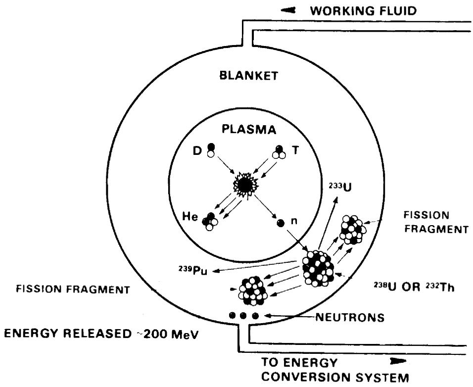  
FIGURE II-1. Fusion-Fission Process

material. Subsequent reactions. neutron reemission, fission or capture, can take place depending upon the energy of the absorbed neutron. If the incident neutron energy is greater than $\sim 12$ MeV, the neutron multiplying reactions (n, 2n) and (n, 3n) as well as the fission reactions with $^{238}\mathrm{U}$ and $^{232}\mathrm{Th}$ are dominant. If the Neutron energy is degraded below $\sim 2$ MeV, the principal absorption reaction is radiative capture (n, $\gamma$ ) in the fertile fuel. Through subsequent decay, the end products are the isotopes $^{239}\mathrm{Pu}$ or $^{233}\mathrm{U}$ . These isotopes are both fissile materials and thereby candidate fuels for fission power plants. In addition, neutron reactions with the isotopes of lithium in the blanket will absorb or yield energy, depending upon the isotopic content, and produce tritium for replenishing the T supply consumed in the fusion process.

In comparing the fusion process with the process in a hybrid, it should be noted that more energy is released in the hybrid. The fusion process yields $\sim 18$ MeV of energy whereas fission in the hybrid blanket yields $\sim 180$ MeV,

roughly ten times more energy release. In the high energy absorption and fission processes, additional neutrons are also released. Thus, in the hybrid both energy as well as neutron multiplication take place. This may be considered a desirable feature for reactor applications. The power output requirements of the fusion driver may be reduced compared to the pure fusion system for producing the equivalent amount of electric power. Thus, the performance requirements of the fusion driver component may be somewhat less stringent than those for pure fusion electrical power plants. This difference is probably small for fusion driver concepts with attainably high fusion gains $(Q > 20)$ . However, for those fusion confinement concepts with achievable low gain $(Q < 20)$ , conceptual studies have indicated that the fusion component performance requirements are substantially lower for the hybrid than for its pure fusion counterpart.

The major fission technology requirements for the hybrid are expected to be developed in the course of research and development of fission power reactors and their fuel cycles. Those fission components needing development require only a modest incremental investment of research and development funds. In addition, the fission blanket is inherently subcritical which precludes criticality accidents and mitigates the afterheat problems suffered in potential loss of coolant accidents compared to similar events in LWRs.

The hybrid concept may be a viable supplement or alternative to the LMFBR to extend the nuclear energy option beyond the next century. It may also be looked upon as a step along the pathway to pure fusion power. It is conceivable that many uncertainties in plasma physics, plasma engineering, and blanket engineering performance of pure fusion systems could be resolved through the development of hybrids. Thus, hybrids would be a step on the road to achieving the benefits of pure fusion technology. With the present schedule of development of fusion as well as fission technology, it is conceivable that a hybrid could be developed near the turn of the century.

In this report the selected fusion driver concepts with proposed blanket designs and their associated fuel cycles have been characterized. In addition to a detailed economic analysis of these hybrids, related issues on proliferation resistance, safety and environment and commercialization are presented. The technology status and RD&D requirements of the related technologies are reviewed and a proposed hybrid RD&D program is presented.

1. B. R. Leonard, Jr., "A Review of Fusion-Fission (Hybrid) Concepts." Nucl. Tech. 20:161, December 1973.   
2. R. C. Liikala, R. T. Perry, V. L. Teofilo, and B. R. Leonard, Jr., Perspectives of the Fusion Fission Energy Concept. PNL-SA-6492, Pacific Northwest Laboratory, Richland, WA, February 1978.   
3. R. L. Engel, and D. E. Deonigi, Evaluation of Fission-Fusion Hybrid Concepts, Part A. ER-469, Project 268-1, Electric Power Research Institute, Palo Alto, CA, 1976.   
4. Research and Development Program for 1978-1982 Overview, Electric Power and Research Institute, Palo Alto, CA, September 1, 1977.

# III. FUSION DRIVERS

The fusion driver reactor systems with available information in the literature for both inertial and magnetic confinement have been reviewed and analyzed. These systems have been subjected to a preliminary screening whereby they have been assessed in terms of electrical energy self-sufficiency; fuel production to support a sufficient number of fission burner converters; acceptable neutron wall loading and/or blanket power density; and scientific and technological feasibilities. Those systems which have been retained in this study and are described in this section include an ignited tokamak, a classical mirror, a linear theta pinch with end plugging, and laser inertial confinement system with high gain pellets.

# A. TOKAMAK

# 1. Plasma Physics

The fusion core of a Tokamak Hybrid Reactor $(\mathsf{THR})^{(1)}$ should have the highest possible fusion power density to maximize the neutron fluence supplied to the surrounding fusion blanket. In a Two-Energy Component Tokamak (TCT), the temperature of the tritium bulk plasma is maintained against transport and radiation losses by means of injected energetic deuterons which undergo fusion reaction with the relatively cold tritons. At plasma temperatures $< 10~\mathrm{keV}$ the maximum fusion power obtainable this mode of operation is considerably larger than that obtainable for an ignited plasma composed of a 50/50 D-T mixture. However, operation in the TCT mode requires that the neutral beam injectors remain at full power during the entire burn. This places strict performance requirements on the neutral beam system and, more importantly, demands that a sizable recirculating power fraction be maintained to meet the large power requirements for continuous operation of the beam injector system. Considering these factors, the desired fusion power level for the THR is obtained by using a $>10~\mathrm{keV}$ ignited 50/50 D-T plasma. This relaxes the performance demands on the neutral beam system and establishes an efficient operating cycle by minimizing the recirculating power requirements. Under ignition conditions the plasma temperature is maintained by the confinement of fusion alpha particles which is sufficient to balance the transport and radiation losses.

High toroidal field, high beta and elongated plasma cross sections are found to be essential for obtaining an ignited tokamak plasma. The ignited plasma which was designed for the tokamak driver has the characteristic parameters as listed in Table III-A-1.

A cross-sectional view of the Tokamak Hybrid Reactor is shown in Figure III-A-1. The plasma cross-section is in the shape of a flattened "D" ( $S = 1.53$ ). This cross-section lends itself well to the implementation of a double-null poloidal divertor, which is used for the removal of D and T ions, impurities, and alphas emerging from the discharge. The elongated plasma cross-section, however, has a negative decay index; hence, feedback stabilization of the plasma vertical position is required.

# 2. Conceptual Engineering Design

The first or vacuum wall of the THR consists of a 0.5 cm carbon liner inside a double-walled stainless steel shell 5 cm thick having channels for helium coolant at 700 psi. On the inner zone of the torus, where a large fraction of the tritium is bred, the stainless steel backing is 1.5 cm thick. This carbon-stainless steel first wall will be subjected to a neutron flux of $2.2\mathrm{MW / m}^2$ . The radiation to the first wall is approximated to be on the order of 25 MW resulting in a heating rate of $5.9\mathrm{W / cm}^2$ . This, together with the neutron flux, will result in a heating rate in the first wall region of approximately $60\mathrm{W / cm}^2$ . The coolant flow rate through the first wall coolant channels of 190 kg/s at 70 m/s velocity provides a heat transfer coefficient of $0.35\mathrm{W / cm}^2 -^\circ \mathrm{C}$ which is sufficient to keep the first wall at $35^\circ \mathrm{C}$ .

This can be provided by 110 rotatable cryo-sorption pump pairs, 55 in each divertor zone, similar to those designed for the Tokamak Engineering Test Reactor. (3) One-half of these pumps are to be on-line at any given time. As soon as the cryo-sorption surfaces of the on-line pump are saturated, the pump pair is rotated $180^{\circ}$ , placing the freshly regenerated pump in place to begin pumping.

The toroidal field magnet system consists of 20 cryogenically stable superconducting coils with $\mathsf{Nb}_3\mathsf{Sn}$ filaments in OFHC copper stabilizer. The TF coils are constant tension "D" shaped, which produces a magnetic field of 6.66 T on the plasma axis. The formulation corrects the magnetic forces

TABLE III-A-1. Plasma Parameters for Tokamak Hybrid Reactor   

<table><tr><td>Ro</td><td>5.4 m</td></tr><tr><td>a</td><td>1 m</td></tr><tr><td>A</td><td>5.4</td></tr><tr><td>Elongation, κ</td><td>2.0</td></tr><tr><td>Shape Factor, S</td><td>1.53 (flattened &quot;D&quot; shape)</td></tr><tr><td>Horizontal Wall Radius</td><td>1.3 m</td></tr><tr><td>Wall Area</td><td>424 m²</td></tr><tr><td>Plasma Volume</td><td>175 m³</td></tr><tr><td>Axial Bt</td><td>6.66 T</td></tr><tr><td>Ip</td><td>5.6 MA</td></tr><tr><td>q</td><td>2.4</td></tr><tr><td>ηe</td><td>2.54 x 10^14 cm^-3</td></tr><tr><td>T_e = T_i</td><td>11.5 keV</td></tr><tr><td>ηeτE</td><td>4.2 x 10^14 cm^-3s</td></tr><tr><td>βp</td><td>3.8</td></tr><tr><td>Fusion Power</td><td>1160 MW</td></tr><tr><td>Neutron Power</td><td>928 MW</td></tr><tr><td>Neutron Wall Loading</td><td>2.2 MW/m²</td></tr><tr><td>Power Density</td><td>6.6 MW/m³</td></tr></table>

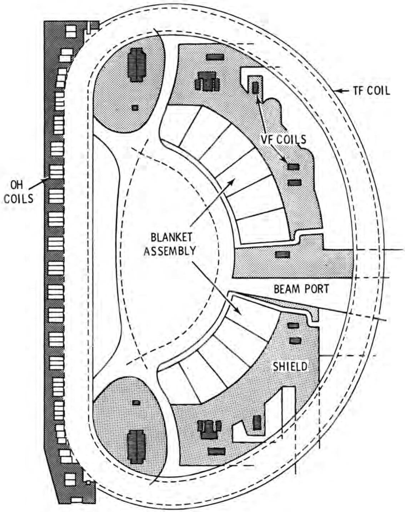  
FIGURE III-A-1. Cross-Section of the Tokamak Hybrid Reactor

for variations in field due to the discreteness of the finite number of coils and the shape of the cross section resulting in field ripple at the plasma surface of only $1\%$ . Conductors embedded in structural discs are employed in order to hold the conductor rigidly within the supporting structure.

Charged particles leaving the plasma are guided along the magnetic field lines into the poloidal divertor zone where they give up their energy by striking a sacrificial plate and are then pumped out in molecular form. The divertor entrance width is set at 30 cm to keep the plasma capture efficiency close to unity. Backflow of neutrals into the torus must be prevented in order to minimize charge-exchange loss of fast ions, as well as charge-exchange neutral sputtering. The required cryogenic pumping surfaces can be readily accommodated inside the large TF coils. The plasma flow in the scrapeoff region proceeds nearly at the speed of sound the density here is relatively low ( $\sim 2 \times 10^{13} \, \text{cm}^{-3}$ ), and the plasma temperature is high ( $\sim 2 \, \text{keV}$ ).

Neutral beam injectors will be used to heat the THR plasma during startup. Positive and negative ion source systems were considered for the neutral beam injectors. For the THR beams at 150 keV, tolerable net electrical efficiency can be obtained easily with positive ions, provided direct conversion is employed to recover most of the power in the unneutralized beam fraction.

The injector system for THR neutral beam heating is a 1980's technology positive ion system. Twelve beam lines, each containing seven positive ion sources arranged in a vertical array, will be used to deliver 150 MW to the plasma. At the first wall each beam line fills a window 96 cm (horizontal) by 25 cm (vertical). The beam ports take up less than $1\%$ of the first wall area. To provide 150 MW of power to the plasma at 150 keV, an injection current of 1000A equivalent is required.

Table III-A-2 lists the power requirements for the THR. As seen, a recirculating power of 410 is needed. This corresponds to a plant efficiency of about $70\%$ .

TABLE III-A-2. Power Requirements for a Tokamak Hybrid Reactor   

<table><tr><td></td><td>MW</td></tr><tr><td>Helium Circulating Pumps</td><td>175</td></tr><tr><td>Cryo-generation Systems</td><td>70</td></tr><tr><td>Resistive Loss of VF Coils</td><td>100</td></tr><tr><td>Resistive Loss of OH Coils</td><td>140</td></tr><tr><td>Divertor Requirements</td><td>6</td></tr><tr><td>Feedback Stabilization System</td><td>30</td></tr><tr><td>Cooling Towers</td><td>10</td></tr><tr><td>Neutral Beam Requirements</td><td>5.15</td></tr><tr><td>Additional System Support</td><td>13.85</td></tr><tr><td>Total</td><td>410</td></tr></table>

# B. MIRROR

# 1. Plasma Physics

Because it is an open-end device with an intrinsic loss of plasma, the magnetic mirror does not admit operation at high Q values approaching those of ignition. Under ideal circumstances the theoretical value of Q for the plasma is only slightly greater than unity. The magnetic-mirror reactor is therefore a driven power amplifier whose thermonuclear power output is a factor of Q times its injected power. In order to achieve economical net electrical output with such low values of Q, a magnetic-mirror reactor must use the plasma energy which escapes from its mirrors in order to power the injectors. The means by which this is accomplished at high efficiency is called direct conversion. In the pure fusion case this leads to a large recirculating power fraction of order unity.

In a simple magnetic mirror (Figure III-B-1), as in other containment devices, the plasma is contained transverse to the axis because of its inability to diffuse at an appreciable rate across magnetic lines. However, containment along the axis results from the "mirroring" of individual ion orbits by the converging field lines at the two ends, where the magnetic field strength $B$

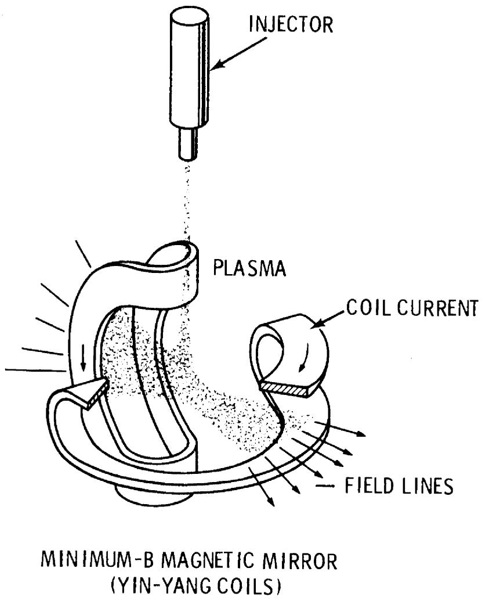  
FIGURE III-B-1. Illustrating the Principles of a Magnetic-Mirror Device in Minimum-B Geometry

is larger than in the central plane by the ratio $R$ , called the mirror ratio. An ion (Figure III-B-1) whose motion is directed predominantly toward a mirror with longitudinal kinetic energy will gain perpendicular (circular) energy $w_{1}$ around the field lines as it approaches a mirror. At the mirror it will have $w_{1}$ (mirror) = $w_{1}$ (center) x R and will have subtracted correspondingly from the longitudinal energy. In the case of sufficient $w_{1}$ (center) the ions are brought to rest so that $w_{1}$ (mirror) = 0. This occurs for those particles for which $w_{1}$ (center)/ $w_{1}$ (center) is sufficiently large that the direction of the ion velocity lies outside some angle to the axis of the mirror. This

angle defines a cone of directions called the loss cone, such that ions whose velocity directions lie outside it are contained, and the others are lost out the ends. Collisions between ions can send them into the loss cone and vice versa. There results a velocity distribution, called a loss-cone distribution, which is not Maxwellian and which largely determines the degree to which loss may exceed the collisional lower limit by influencing the kinds of unstable plasma waves that may occur.

It has long been known that plasma in the simple mirror geometry is unstable to magnetohydrodynamics (MHD) motions in which the plasma moves grossly across the magnetic lines. However, it has been shown theoretically and experimentally that a system whose magnetic lines are everywhere convex toward the plasma is stable to MHD modes. Such a system has minimum field strength B on its axis at the center of the system, and B increases outward in all directions. The minimum-B system of Figure III-B-1 has fan-shaped ends, one vertical and one horizontal, and the field is supplied by "Yin-Yang" coils, which are among the most economical of the various possible coil systems for producing minimum-B mirror fields. This coil system has been chosen by the Lawrence Livermore Laboratory (LLL) group as the basis for their reactor design.

To sustain the plasma in a mirror device against collisional end loss it must be injected with a neutral beam from an injector, as shown in Figure III-B-1. The plasma is nearly opaque to this beam and absorbs its energy to sustain the thermonuclear reactions. The plasma thereby becomes an energy amplifier because of the total thermonuclear power it produces.

# 2. Conceptual Engineering Design

The magnetic mirror fusion driver is based upon the Lawrence Livermore Laboratory (LLL) conceptual mirror-hybrid reactor design.(4) The plasma has a roughly spherical central portion of radius 2.5 m with mutually perpendicular "fans" at the ends from which plasma escapes. For the device discussed here the central ion density $n = 9 \times 10^{19} \, \text{m}^{-3}$ with $\beta = 0.7$ and confinement corresponding to $n\tau = 2 \times 10^{20} \, \text{sec/m}^3$ . The mean injection energy of the D-T ions is 125 keV. The neutron wall loading in the first wall is 1.6 MW/m².

The magnetic field is furnished by superconducting U-shaped Yin-Yang magnetic coils of 11-m radius. The maximum magnetic field at the conductor is 8T, allowing the use of NbTi superconductor. The field of the lower mirror is $0.5\%$ less than that of the upper mirror, forcing most of the plasma to escape from the bottom.

Figure III-B-2 shows an overall view of the reactor. Magnet, blanket and primary heat transfer loops are all within a prestressed concrete reactor vessel (PCRV) which has two holes for the neutral beams and allows access to the fuel elements through a hole at the top. The PCRV also serves to restrain the magnets against their internal magnetic pressure. The fission blanket is made of 600 helium-cooled modules as shown in Figure III-B-3. A single blanket module is illustrated in Figure III-B-4. The helium coolant flows up through the tritium-breeding pins, out around the fission pin bundle, back through them and out the diffuser to the steam generators.

Ninety percent of the plasma flow out of the bottom mirror is direct-converted with a single stage direct convertor with an effective efficiency of $50\%$ , while the $10\%$ flow of the upper mirror is thermally converted at an efficiency of $35\%$ .

The two neutral beam injectors are radiation hardened composites of 216 positive-ion, neutral-beam sources delivering 3000 A of 125 keV D and 189 keV T. With direct conversion of the stray beam the injection efficiency is $\eta_{\mathrm{I}} = 0.55$ . The plasma Q = 0.63 is stated as the ratio of fusion power (400 MW) to injected neutral power (625 MW).

# C. LINEAR THETA PINCH

# 1. Plasma Physics

Unlike other magnetic confinement systems, the theta pinch is a high-beta device ( $\beta \approx 1$ ) in which very little penetration of the magnetic field into the plasma occurs. In the theta pinch the plasma density ( $\sim 10^{22} \mathrm{~m}^{-3}$ ) is also two to three orders of magnitude larger than in the magnetic mirror and tokamak, and confinement times are correspondingly shorter. The theta pinch is inherently a pulsed device because of its impulsive method of heating and

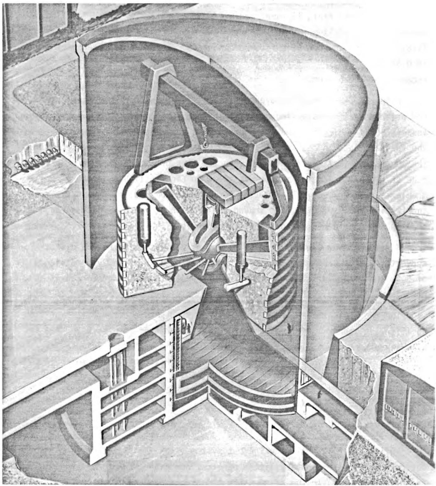  
FIGURE III-B-2. Overall View of the LLL-GA Mirror Hybrid Reactor(3)

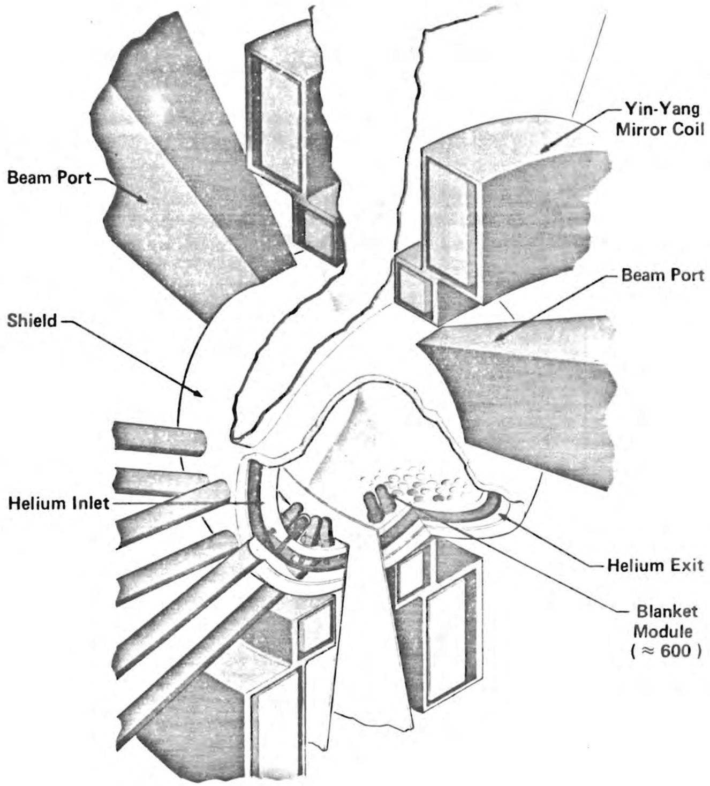  
Figure III-B-3. Cutaway View of the LLL-GA Mirror Hybrid Reactor(3)

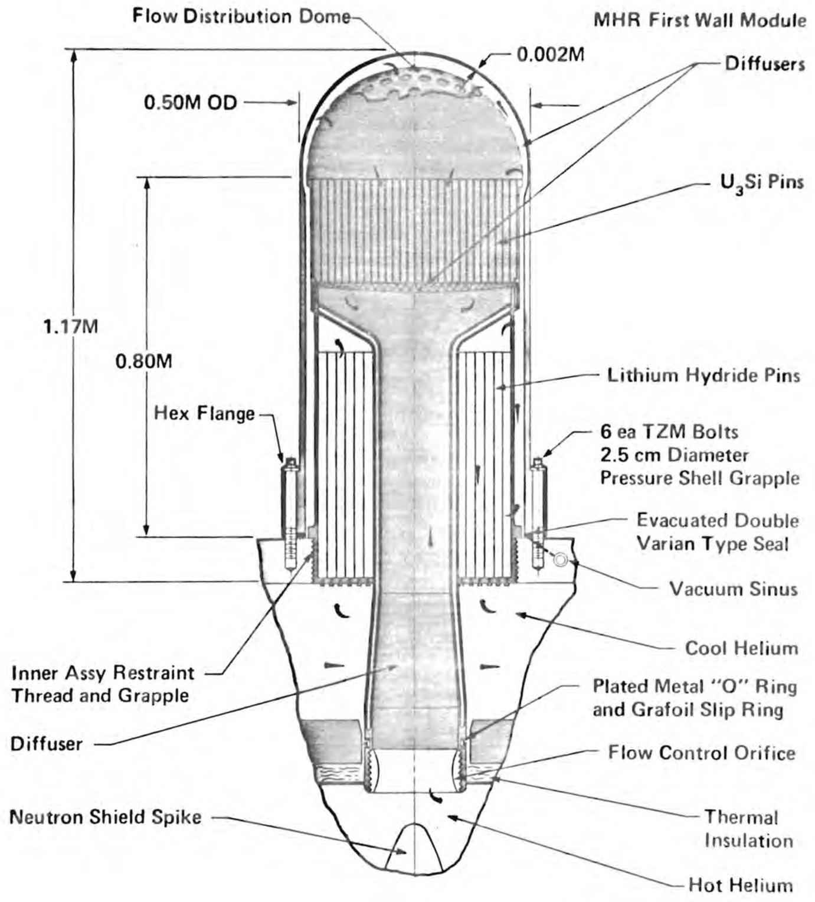  
Figure III-B-4. Mirror Hybrid Blanket Module(3)

its high instantaneous power density. For a typical cycle time $\tau_{\mathrm{C}} \sim 10$ sec, the duty factor $\tau_{\mathrm{B}} / \tau_{\mathrm{C}} \approx 10^{-3}$ results in average power densities and wall loading which are about the same as for the other concepts. Total magnetic energies are of the order of 100 GJ, also comparable to those of the other concepts. However, this energy is pulsed repetitively in and out of the compression-confinement coil from an external power supply (typically a superconducting homopolar motor-generator whose rotor stores the energy inertially, converts it to magnetic energy in the theta-pinch compression coil, and then recovers it again as inertial rotor energy with a high efficiency ( $\sim 90\%$ ) characteristic of rotating electrical machinery.

The basic principles of present day theta-pinch experiments are illustrated in Figure III-C-1. Ionized D-T gas is produced inside a single-turn coil by a high frequency oscillating magnetic field in the axial direction. Following this, a large current (in the poloidal, or theta, direction) is suddenly fed to the coil from a capacitor bank. This rapidly fills the coil with magnetic field parallel to its axis. During the dynamic (or "shock heating") phase, the surface of the plasma is driven rapidly inward by this axial field, heating the ions and electrons. Later there is a quiescent (adiabatic compression) phase after the magnetic field is built up on a much slower (adiabatic) time scale to a steady value in the coil.

A theta-pinch reactor will be a staged theta pinch, so-called because it employs separate energy sources for the shock heating and adiabatic compression stages. The shock heating coil is thin and can be liquid metal cooled. It is connected to a low energy, high voltage circuit whose energy content is a minor factor in the overall energy storage system. The energy in the magnetic compression field, which is preponderant, is furnished by a low voltage multiturn coil which produces a more slowly rising magnetic field (following the shock heating field), appropriate to adiabatic compression of the shock heated plasmas. Such a coil is economical of joule electrical losses, and leads to a satisfactory excess of reactor power output (low circulating power fraction). The compression coil is also of sufficient size to accommodate an inner neutron moderating or hybrid blanket.

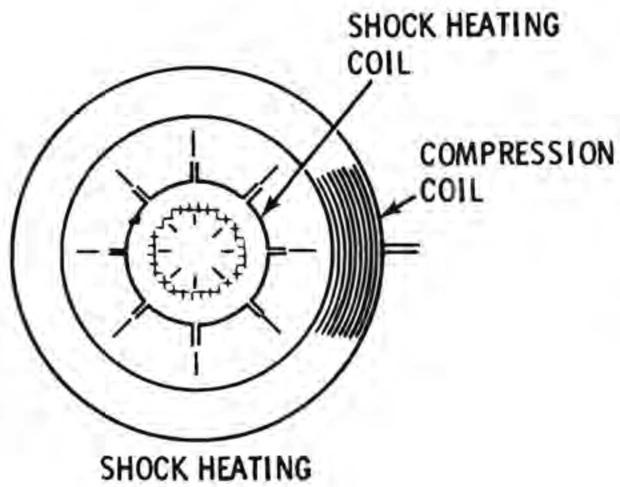

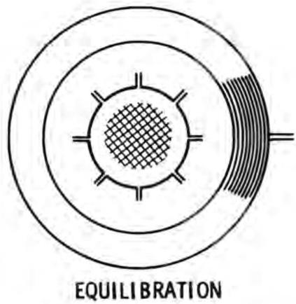

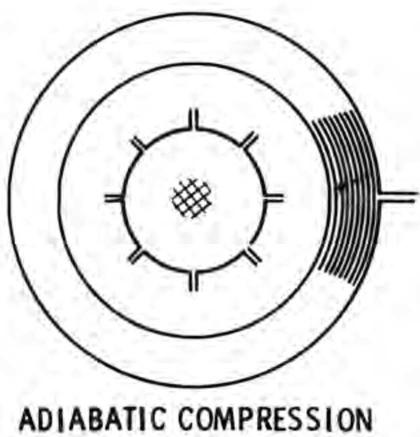

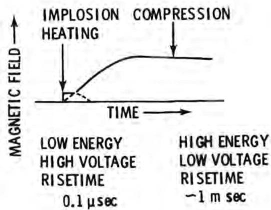  
FIGURE III-C-1. Illustrating the Principle of a Staged Theta-Pinch Using Separate Shock-Heating and Adiabatic Compression Coils

# 2. Conceptual Engineering Design

# a. The LASL Designs

There have been two studies of this concept at Los Alamos and a later one at the University of Washington. The first was based on a capacitively driven adiabatic compression system with separate shock heating assumed but not specified in detail. The second LASL study treated the staged heating coil and its surrounding multiturn adiabatic compression (ACC). The compression energy store was a set of homopolar generators. Both coils were inside the fissile blanket, and the 7 to 8 cm thickness of copper detracted from the

breeding and blanket energy multiplication. Confinement, and hence nT and the Q value were assumed to be limited by streaming of plasma out the ends of the device, which was one kilometer long. The repetition rate of the 10 ms burn pulses was adjusted to 2.3 Hz to give a neutron-current wall loading 1 MW/m2.

b. The University of Washington Linear Hybrid Reactor

This design remedied some of the difficulties of the LASL designs by incorporating the following features:

(a) Material end plugs were assumed, thereby reducing the energy loss problem to that of electron thermal conduction.   
(b) A reactor core with the hybrid blanket inside the shock-heating coil and then adiabatic compression coils was used. The main features of such a core are shown in Figure III-C-2.   
(c) A "hybrid" magnet was used, in which the normal copper pulsed compression coils were placed inside steady state NbTi superconducting (S.C.) coils. The 8-T field of the S.C. coils is cancelled by a negative 8-T pulse from the normal coil, shock heating is applied at zero field, and the plasma compressed in 5 ms to 16 T to a relatively low temperature to lessen thermal conduction and produce a 3.6 ms plasma burn. The use of this hybrid magnet principle allows a factor of four decrease in energy and joule losses of the pulsed magnet.

This University of Washington design has therefore been selected for consideration in this study.

# D. LASER INERTIAL

# 1. Inertial Fusion Physics

The basic idea of the inertial confinement is to heat an initially frozen D-T pellet to ignition by the absorption of pulsed radiation in a time short compared to the time of the pellet disassembly at the burning temperature ( $\leq 10 \, \text{keV}$ ).

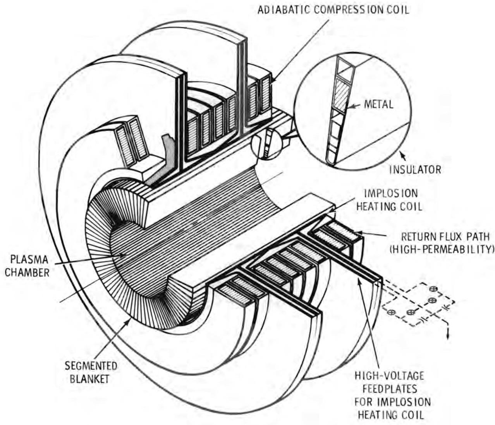  
FIGURE III-C-2.   
Section of the Core of a Linear Fusion Reactor with the Blanket Inside the Multiturn Compression Coils and Shock Heating Coils

A requirement for ignition is that the range of the fusion-produced 3.5 MeV alpha particles must be short compared to the radius of the pellet.

For these conditions to be met the pellet must be compressed by a factor of $10^{3}$ to $10^{4}$ above its normal solid or liquid density (0.2313 g/cm³ or 4.7 x $10^{22}$ ions/cm³). The burn parameter n is usually expressed in terms of the pellet radius R traversed at thermonuclear sound speed, and the mass density of the pellet. A burnup fraction of 30% corresponds to $\rho R \approx 3g/cm^2$ .

A figure of merit for the approach to reactor conditions is the pellet gain factor:

Q - (thermonuclear energy out) $\div$ (laser light energy incident on the pellet) Provided that the plasma burn can propagate from a small central region, Q values as small as $\sim 100$ may lead to practical pure fusion plant efficiencies.

# 2. Conceptual Engineering Design

There have been two in-depth studies of laser driver hybrids by the Lawrence Livermore Laboratory (LLL) group with the Bechtel Corporation $^{(5)}$ and the Westinghouse Corporation. The Westinghouse design operates at a neutron wall loading of $10 \, \text{MW/m}^2$ with a blanket power density of $250 \, \text{MW/m}^3$ with enriched (3 to $5\%$ Pu) UC fuel but low fissile production. It is optimized primarily to produce electric power. We do not consider this design although its wetted first wall concept is important for high energy pellets whose debris fluence exceeds the capability of a carbon first wall.

Figure III-D-1 shows the LLL-Bechtel reactor. It has a 10 m diameter first wall (Figure III-D-2) of nonablating graphite held at a steady temperature of 880 K. The structured pellets produce 100 MJ of fusion energy at a repetition rate of 6.1 Hz, giving a neutron wall loading of 175 MW/m². These values are averaged over a three full power year (4.28 CY at 70% capacity factor) fuel handling cycle in which the reactor thermal power $P_{\text{TH}}$ is held constant at 4000 MWt as the Pu concentration builds up. Fuel management holds the Pu concentration at about 1%. The laser frequency varies from 8.5 to 5.5 Hz to hold $P_{\text{TH}}$ constant. The first wall, shown in Figure III-D-2A is lithium cooled and sees 25 MJ (100 kJ/m²) per pulse (210 MW max.) in the form of X-rays and pellet debris and 40 MJ (330 MW max.) from neutrons and gamma rays. The remainder impinges on the upper and lower lithium blankets.

Figure III-D-2B shows the cylindrical side fission blanket and top and bottom fusion blankets consisting of $50\%$ enriched lithium, beryllium, stainless steel and graphite. The fission blanket intercepts $66\%$ of the area available to the pellets. This blanket and top lithium blanket lift out together as indicated in Figure III-D-2B.

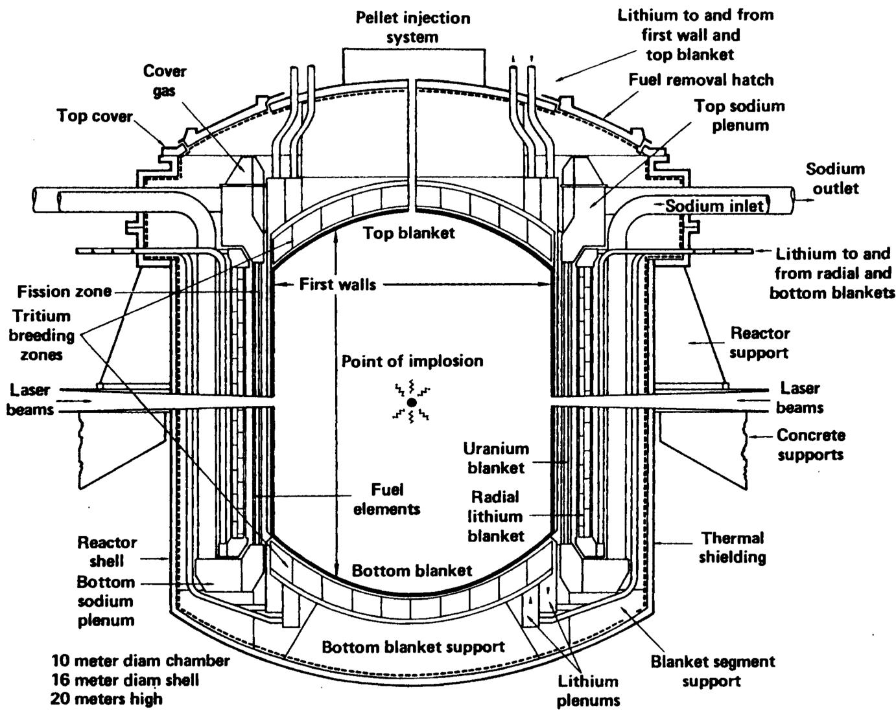  
FIGURE III-D-1. The LLL-Bechtel 4000-MWt Laser-Fusion Hybrid Reactor(5)

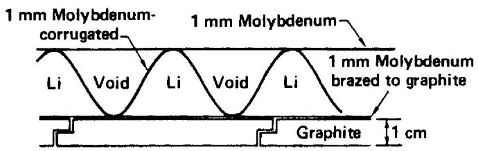  
A. First wall structure

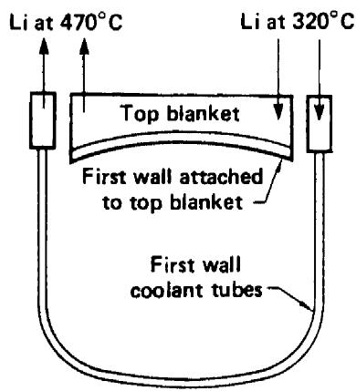  
B. First wall outline   
FIGURE III-D-2. First Wall Structure of the LLL-Bechtel Laser Fusion Hybrid Reactor(5)

Four $100\mathrm{kJ}$ lasers drive the pellets in the equatorial plane of the reactor. They are assumed to be of an excimer type in which 1.2 MeV electron beams excite Xe gas whose $170\mathrm{nm}$ fluorescence radiation dissociates COSe (carbonyl selenide) to give $489\mathrm{nm}$ selenium laser light.

The quality $\eta_{\mathrm{I}}$ is defined as the overall efficiency of the laser from the electric line, through the 1.25 MV, 2.3 MJ pulsed power conditioner, the electron beam (75%), the fluorescer (18%), the laser (25%), and the optics (60 m focal length f/30) (90%). The produce of these factors is 3.2%. When power for laser gas conditioning is taken into account the overall laser efficiency is 1.17% at 5.5 Hz and 1.5% at 8.5 Hz. Over a fuel handling cycle the time averaged $\eta_{\mathrm{I}} = 1.33\%$ . The gain of the laser pellet system is assumed to be $Q = 250$ .

E. SECTION III REFERENCES

1. V. L. Teofilo, "THR - A Tokamak Hybrid Reactor," TANSA. 32(27), 1979.   
2. J. M. Dawson, H. P. Furth, and F. H. Tenney, Phys. Rev. Lett. 26:1156, 1971. (Also see H. P. Furth and D. L. Jassby, Phys. Rev. Lett. 32:1176, 1974.)   
3. B. Badger, et al., Tokamak Engineering Test Reactor. UWF DM-191, University of Wisconsin, Dept. of Nucl. Engr., Madison, WI 53706, June 1977.   
4. D. J. Bender, et al. Reference Design for the Standard Mirror Hybrid Reactor, UCRL-52478, Lawrence Livermore Laboratory, Livermore, CA, May 1978.   
5. Bechtel Corp., Laser Fusion-Fission Reactor Systems Study. UCRL-13796, Lawrence Livermore Laboratory, University of California, Livermore, CA, July 1977.

# A. FUEL FORMS

Satisfactory performance of the fusion-fission hybrid system depends a great deal on the technological basis supporting the selection of the fission fuel form. Not only is fuel performance important under operating and accident conditions but fabrication, reprocessing and ultimate waste disposal technologies must be available or developed. Generally, the technology base for a fuel form (oxide, carbide, etc.) is dependent on a specific cladding material, geometrical form (pins, microspheres, etc.), and coolant. The technological basis for $\mathsf{UO}_2$ fuel is limited to fuel clad in Zircaloy or stainless steel, fabricated in pins and cooled by water. In assessing the status of technology for the fuel forms of interest for the Tokamak, Mirror, Laser, and Theta-Pinch hybrid reactors all of the following considerations must be addressed:

- Oxide Fuel - The most highly developed fuel form of interest for hybrids is $\mathsf{UO}_2$ clad in stainless steel. All commercial experience has been with pins assembled into bundles. Irradiation performance of water-cooled S.S.-clad $\mathsf{UO}_2$ fuel is fairly extensive. The Liquid Metal Fast Breeder Reactor (LMFBR) Program is rapidly developing Na-cooled data. The Gas Cooled Fast Reactor (GCFR) Program proposes to utilize LMFBR technology and has identified differences that must be resolved. The predictable performance of $\mathsf{ThO}_2$ should also be enhanced with this technological base. Oxide fuels achieve burnups of 40,000 to 100,000 megawatt days per metric tonne of heavy metal (MWD/MTHM). The transient performance of oxide fuels is the subject of considerable R&D in both the Light Water Reactor (LWR) Safety Program and the LMFBR Program. Extensive development of analytical methods for design is an integral part of both these programs. The methods developed will be of use to hybrid blanket designers for determining the response of oxide fuels to the pulsed power operation of most fusion drivers. Current transient experiments indicate that oxide fuels containing fission products can withstand only a few rapid transients before failure due to mechanical fatigue. It is anticipated that all solid fuel forms will have this problem due to retained fission products.

Metallic Fuel - The irradiation performance of many metallic fuels is very well understood. Of the many alloys and geometric forms that have been used in production reactors, test reactors, and others, perhaps the most applicable to fusion-fission hybrid reactors is the U-Fissium pins used as EBR II driver fuel. U-Fissium is primarily a U-Mo alloy. The pins are made up of cast U-Mo sodium bonded to 304 S.S. cladding. Burnups of 10,000 MWD/MTHM are current practice. Maximum fuel-clad temperature of $650^{\circ}\mathrm{C}$ limit the application of this alloy-clad combination with helium coolant. The design constraints for this fuel are well understood so the steady state performance can be reliably predicted. No transient experiments have been performed, however, so response to pulsed power operation is unknown.

- Carbide Fuel - Design information exists for carbide fuel in two forms. Stainless steel clad pins have been studied extensively as advanced fuel for LMFBR's. Although irradiation performance must yet be verified, experimental programs have been identified and await operation of the Fast Flux Test Facility (FFTF) for obtaining extensive irradiation data. Burnups of 100,000 MWD/MTHM are anticipated for fast reactor carbide fuels. The higher allowable linear heat rating (35 kW/ft compared to 18 kW/ft for oxide) will not be fully utilized in a hybrid blanket, so the incentive for carbide fuel in this form is primarily neutronic (higher atom density of U or Th). The transient response of this type of fuel is unknown. It is anticipated, however, that the analytical methods developed from current oxide fuel tests will form a good basis for predicting carbide fuel pin performance.

The other geometrical form of carbide fuel is the coated particle technology developed as part of the High Temperature Gas Cooled Reactor (HTGR) Program in this country and the gas cooled reactor program in Germany. The coated particles are TRISO or BISO coated beads $200 - 500\mu \mathrm{m}$ in diameter. The beads are imbedded in either a spherical graphite matrix (Germany) or mixed with graphite in pellet form and put in channels in a graphite block (HTGR). Extensive experience in helium cooled systems is available for estimating irradiation performance. Burnups greater than

100,000 MWD/MTHM are achieved. The resulting lattice is relatively low power density (10 kW/ℓ). The transient response of this fuel form has been studied extensively as part of the HTGR Safety Program. Therefore, adequate methods for the preliminary determination of response to pulse power cycles exist.

- Silicide Fuel - Uranium silicide $(\mathsf{U}_3\mathsf{Si})$ has been proposed in some blankets. This fuel form was developed as part of the CANDU program at AECL. $\mathsf{U}_3\mathsf{Si}$ is a-metallic type fuel form. Irradiation experiments with fuel exposure to 25,000 MWD/MTHM conducted by AECL show little swelling. It has shown an ability to handle large step increases in power which is important to pulsed power operation. Its linear heat rating is $20\%$ better than $\mathsf{UO}_2$ at $500^{\circ}\mathsf{C}$ surface temperature. Maximum fuel temperature must be maintained below $900^{\circ}\mathsf{C}$ which may limit its application in helium cooled systems. Compatibility of $\mathsf{U}_3\mathsf{Si}$ with liquid metal coolants and high temperature clad materials is unknown.

- Molten Salts - Molten salts have been proposed for hybrid blanket application primarily as a means of alleviating fuel movement problems in the complex geometries and because tritium separation would be relatively easy. The molten salt reactor experiment (MSRE) demonstrated the feasibility of the concept; however, many technological questions remain that require development. Molten salt is compatible with stainless steel up to $500^{\circ}\mathrm{C}$ and with graphite to $600^{\circ}\mathrm{C}$ . Above that Hastelloy-N must be used. The nickel in Hastelloy may produce sufficient He in a 14 MeV neutron field to make embrittlement a problem. Although a development program has been defined for molten salt fission reactors, it has not been implemented so the bases for blanket design and salt processing system are very uncertain.

If the various fuel forms are ranked in order of available technology, the list would be:

1. Oxide fuel in stainless steel clad pins   
2. Coated particle carbide fuel   
3. U-Mo alloy fuel in stainless steel clad pins   
4. Carbide fuel in stainless steel clad pins   
5. Molten salt fuel   
6. Silicide fuel in pins

How much the technology base should influence the selection of fuel form, cladding and coolant is certainly a topic for discussion. However, it would be expected that designs proposed for near-term application would weigh available technology heavier than designs proposed for ultimate commercial application. Considering the near term application of hybrids, available or newly developed blanket fuels were selected.

The Once-Through and Pu-Recycle blanket designs have the following fuel form, cladding and coolant combination:

```txt
Fuel -UC in rods Cladding-316 SS Coolant - Helium 
```

There is no basis for accurately predicting the performance of this combination. The overall performance expected from this blanket is superior enough to outweigh the technological uncertainty. The Refresh blanket design has the fuel form, cladding and coolant combination listed below:

```txt
Fuel - UO₂  
Cladding - 316 SS  
Coolant - Helium 
```

The fuel and cladding combination for this blanket are very familiar and have had extensive use in the LWR industry. The fourth fuel cycle, Pu-Catalyst, has the following blanket composition:

Fuel - $\mathrm{PuO_2 / UO_2}$ (Convertor Region)  
- ThC (Breeding Region)  
Cladding - 316 SS  
Coolant - Helium

This particular fuel cycle will draw heavily on technology developed in the LMFBR program.

# B. TRITIUM BREEDING MATERIAL CANDIDATES

The lithium compound selected as the tritium breeding material must satisfy several requirements. The tritium breeding compound must possess good neutronic and irradiation characteristics as well as exhibit good chemical stability at blanket operating temperatures. The lithium compound selected must release

tritium at a rate so that the tritium inventory in the blanket modules is not excessive. Lithium compounds fall into the following classes: Metallic, salts and ceramics.

- Liquid Lithium - Liquid lithium contained in stainless steel rods could be a potential tritium breeding candidate. The tritium removal would be complicated, however, by the high solubility of tritium in lithium. The blanket module tritium inventory would be very high.   
Metallic Compounds - Metallic compounds of lithium with Al, Bi, Pb, Si and Sn may be useful for hybrid blankets. The radiation stability of these compounds has not been established. Also the metallic compounds show the appearance of liquid phases at low temperatures as the lithium atoms are transmuted by nuclear reactions in the blanket.   
- Nonmetallic Compounds - The oxide-bearing ceramics have the highest melting points, except for the carbide. The compound $\mathsf{Li}_2\mathsf{O}$ has a high melting point and a high lithium atom density although its vapor pressure prohibits its use above $\sim 1400^{\circ}\mathsf{C}$ . It has a strong affinity for water and carbon dioxide. The reaction,

$$
\mathrm {L i} _ {2} 0 + \mathrm {H} _ {2} 0 = 2 \mathrm {L i O H}
$$

has calculated free energy change at $298^{\circ}\mathrm{K}$ of $-22.7\mathrm{kcal}$ so that the equilibrium vapor pressure of $\mathsf{H}_2\mathsf{O}$ at $298^{\circ}\mathsf{K}$ is $\sim 10^{-14}$ torr. Consequently, the dry powder would be difficult to fabricate without producing some LiOH which must be dehydrated at an elevated temperature after assembly.

Lithium oxide compounds with $\mathsf{Al}_{2}\mathsf{O}_{3}$ and $\mathsf{SiO}_2$ have much lower affinity for carbon dioxide and water; consequently, these compounds could be fabricated in dryboxes. The melting point of its lithium rich compound, $\mathsf{LiAlO}_2$ , has been reported between $1610^{\circ}$ and $1700^{\circ}\mathsf{C}$ . Such determinations were difficult because of the vaporization of $\mathsf{Li}_2\mathsf{O}$ which began $\sim 1400^{\circ}\mathsf{C}$ , and caused a change in the composition of the sample. A eutectic liquid reported at $\sim 1670^{\circ}\mathsf{C}$ between the compounds $\mathsf{Li}_2\mathsf{AlO}_2$ and $\mathsf{LiAl}_5\mathsf{O}_8$ would form as the lithium in the compound $\mathsf{LiAlO}_2$ is transformed by the neutron irradiation. The appearance of this liquid and the vaporization of lithia limits the usefulness of the compound to $< 1400^{\circ}\mathsf{C}$ . The desire

to avoid excessive sintering of the ceramic compound, $\mathrm{LiAlO}_2$ , limits its usefulness above $\sim 1300^{\circ}\mathrm{C}$ .

Lithium ortho-silicate, $\mathrm{Li}_4\mathrm{SiO}_4$ , and meta-silicate, $\mathrm{Li}_2\mathrm{SiO}_3$ , are stable compounds which may be useful. The ortho-silicate has a high lithium atom density. The ortho-silicate melts, however, by a reaction with $\mathrm{Li}_2\mathrm{O}$ , $1255^{\circ}\mathrm{C}$ , and the rapid vaporization of lithia at this temperature has been reported. Also, as the lithium in the ortho-silicate transforms as a result of neutron irradiation, a eutectic liquid forms at $1024^{\circ}\mathrm{C}$ between the ortho and meta-silicates; consequently, the useful temperature limit of the ortho-silicate is $< 1000^{\circ}\mathrm{C}$ .

In addition to the oxide ceramics, the carbide of a metal is often a stable compound. Lithium forms a single carbide $\mathrm{Li}_2\mathrm{C}_2$ , which reacts readily with water to yield acetylene. Although the detailed crystal structure of this compound has not been reported yet, it probably exists as a salt in which the carbon atoms form a dimer, similar to $\mathrm{CaC}_2$ so that it is not a stable high temperature compound.

The lithium halide salt, LiF, has a high lithium atom density but its relatively low melting and boiling points probably limit its usefulness. Also, the tritium which is generated in a fluoride salt would be released as molecular TF which may cuase potentially serious corrosion problems if released into the helium coolant. Consequently, a low temperature fused salt mixture would have to be circulated to external equipment for removal of the TF, as has been proposed previously.

Lithium hybrid or deuteride have many desirable neutronic characteristics as a potential tritium breeding material or neutron moderators. Their low melting point and high hydrogen pressure pose serious limitations on their usefulness, however.

Shown in Table IV-B-1 are some of the thermal and physical characteristics of potential tritium breeding compounds.

Lithium-oxide was selected as the blanket material for one hybrid reactor analysis in the assessment paper because it has a high lithium density and high temperature capability. In addition, natural liquid

TABLE IV-B-1. Breeding Compound Characteristics(1)   

<table><tr><td></td><td>Lithium Density (atoms/barn·cm)</td><td>Melting Point (C°)</td><td>Tritium Retention</td><td>Neutron Multiplier Needed</td><td>Chemically Stable</td><td>Reacts With Air</td></tr><tr><td>Liquid lithium</td><td>0.042</td><td>180</td><td>High</td><td>Yes</td><td>Yes</td><td>Violently</td></tr><tr><td>Flibe (47 LiF 53 BeF2)</td><td>0.014</td><td>360</td><td>Low</td><td>No</td><td>Yes</td><td>No</td></tr><tr><td colspan="7">Solid compounds:</td></tr><tr><td>LiAl</td><td>0.027</td><td>718</td><td>Very low</td><td>Yes</td><td>Yes</td><td>Slowly</td></tr><tr><td>LiAlH4</td><td>0.041</td><td>1625</td><td>?</td><td>Yes</td><td>? (dehydride)</td><td>?</td></tr><tr><td>LiAlO2</td><td>0.023</td><td>1700</td><td>Very low</td><td>Yes</td><td>Yes</td><td>No</td></tr><tr><td>Li4Si</td><td>0.013</td><td>635</td><td>?</td><td>No</td><td>?</td><td>?</td></tr><tr><td>Li2SiO3</td><td>0.034</td><td>1204</td><td>Very low</td><td>Yes</td><td>Yes</td><td>No</td></tr><tr><td>Li4SiO4</td><td>0.050</td><td>1256</td><td>Very low</td><td>Yes</td><td>Yes</td><td>No</td></tr><tr><td>Li7Pb2</td><td>0.083</td><td>726</td><td>Very low</td><td>No</td><td>Yes</td><td>Slowly</td></tr><tr><td>Li3N</td><td>0.041</td><td>800</td><td>?</td><td>No</td><td>?</td><td>Slowly (?)</td></tr><tr><td>Li3Bi</td><td>0.040</td><td>1145</td><td>?</td><td>No</td><td>Yes</td><td>Slowly (?)</td></tr><tr><td>Li2Be2O2</td><td>0.038</td><td>1150</td><td>?</td><td>No</td><td>Yes</td><td>No</td></tr><tr><td>Li2O</td><td>0.032</td><td>1700</td><td>Very low</td><td>No</td><td>No (?)</td><td>No</td></tr><tr><td>LiOH</td><td>0.037</td><td>471</td><td>?</td><td>Yes</td><td>Yes</td><td>No</td></tr><tr><td>LiH</td><td>0.059</td><td>686</td><td>?</td><td>Yes</td><td>? (dehydride)</td><td>No</td></tr></table>

lithium is used to cool the inner toroidal shield for the Tokamak Hybrid and the top and bottom cylindrical regions for the Laser Hybrid.

# C. COOLANTS

In assessing the technological bases for coolant selection and performance, several areas need to be considered:

1. Status of power conversion system components   
2. Availability of design analysis methods and supportive data bases   
3. Compatibility with fuel form, cladding and structural materials   
4. Compatibility with tritium processing requirements   
5. Knowledge of magnetic field effects   
6. Ability to predict safety performance

In selecting a blanket coolant, the plant power conversion system must be considered. The plant efficiency versus peak cycle temperature for both the conventional steam and gas turbine cycles are shown on Figure IV-C-1. These curves point out that to maintain blanket structural material temperatures within

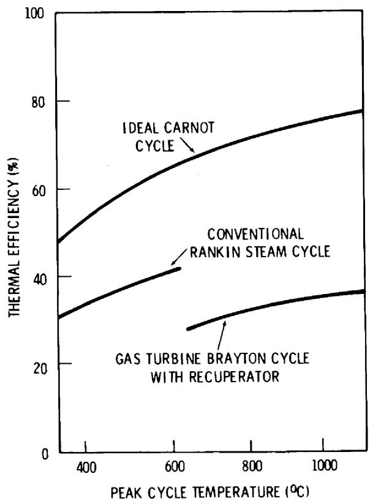  
FIGURE IV-C-1. Thermal Efficiency of Typical Thermo-Dynamic Cycles as a Function of Peak Cycle Temperature

currently available technology the conventional steam turbine generator will be employed. Therefore, whatever coolant is selected, the heat transport system must be made compatible with ultimate transfer of heat to a modern steam system.

Coolant compatibility with the fission fuel form and cladding is really the only difference in selection of blanket coolant for a hybrid as opposed to a pure fission reactor.

- Water Coolant - In all the areas of technology previously mentioned, we know the most about water as a coolant. Extensive R&D in the LWR program has developed an adequate data base and design methods to predict water-cooled blanket performance. However, water has not been considered as a blanket coolant to date because it is nearly impossible to remove tritium from water. In LWRs, tritium releases outside the plant are controlled simply by limiting the generation of tritium. Impurities (Li) in the core are reduced to levels which limit the tritium production to amounts that can be released from the plant.

- Helium Coolant - the HTGR and German Cooled Gas Reactor programs have developed and demonstrated helium cooled power conversion system technology. Helium is compatible with all structural materials with the exception of refractory metals and alloys. The impurity levels attainable in real systems result in corrosion problems for the refractories.

To get adequate heat transfer and transport properties, helium systems have to be operated at relatively high pressures (50 to 70 atm's.). In the complex geometries of hybrid blankets, this results in a requirement for structural material fractions which increases parasitic absorption of the neutrons. Where cladding and structural materials are stainless steel, helium-cooled systems yield $30\%$ power conversion efficiency. If higher temperature alloys (TZM, Inconel, etc.) are used, efficiencies approaching $40\%$ are projected. Helium has good neutronic properties with no anticipated MHD or corrosion enhancement effects in magnetic fields.

- Liquid Metal Coolants - The LMFBR program is developing data and system components for Na cooled systems. The major uncertainties in Na cooled systems are the MHD effects in rapidly changing high magnetic fields and the effects of magnetic fields on corrosion and mass transport rates. Due to enhanced heat transfer, higher sodium temperatures can be achieved with stainless steel structural materials and thus power conversion efficiencies near $40\%$ can be achieved without the use of high temperature alloys. The LMFBR Program is also developing an extensive data base for Na coolant. These data will be directly applicable to assessing hybrid performance.

The use of liquid Li as a coolant has not been investigated for a hybrid blanket. Although it is attractive neutrionically for producing tritium, the technology base for Li is uncertain. Li appears to be more corrosive than Na and hence operating temperatures must be lower $(50^{\circ}\mathrm{C})$ to be compatible with stainless steel, resulting in lower power conversion efficiency. The increased corrosion and mass transport rates result in uncertainty in the applicability of current Na power conversion system components.

Because liquid metals can be used at low pressures, they result in low structural material requirements. Where magnetic field effects are not important (vertical confinement applications) designers have proposed using both Na and Li as coolants, thus maximizing the use of R&D benefits from the LMFBR Program.

If candidate coolants are ranked by the available technology base, they would fall in the following order:

1. Water coolant   
2. Helium coolant   
3. Sodium coolant   
4. Lithium coolant

The blanket coolant selected for this study is helium because it is unaffected by magnetic fields, and because it is compatible with tritium breeding and recovery concepts.

# D. HEAT TRANSFER - FLUID FLOW

The four hybrid blankets, in general, do not pose serious heat transfer-fluid flow design problems compared to fission reactor technology. A good measure of this is the relative power density in hybrid blankets compared to various fission reactor cores as shown in Table IV-D-1. The fuel-coolant lattices being selected by designers are typical of GCFR and LMFBR technology; hence, there appears to be some freedom in increasing the amount of fuel in the blanket.

TABLE IV-D-1. Typical Reactor Power Densities   

<table><tr><td></td><td></td><td>PWR</td><td>GCFR</td><td>LMFBR</td><td>HTGR</td><td>Hybrid</td></tr><tr><td>Average Density</td><td>Core Power</td><td>100</td><td>240</td><td>360</td><td>8</td><td>~20</td></tr><tr><td colspan="2">Maximum Density (MW/m3)</td><td>285</td><td>360</td><td>540</td><td>13</td><td>~100</td></tr></table>

The calculational methods for heat transfer and fluid flow, developed by the fission reactor programs, are adequate for conceptual hybrid reactor blanket designs. However, detailed design and safety analyses of start-up and pulsed operation are going to require much closer coupling of thermal and mechanical analysis methods than now exist for both fuel and structures.

# E. STRUCTURAL DESIGN

In assessing the status of structural design of fusion-fission hybrid blankets, three areas must be addressed:

- Materials properties   
- Structural layout   
- Design analysis

The comments here pertain to hybrid blanket structure. The magnet shield region also has important structural implications; however, hybrid designers are currently relying on the pure fusion reactor blanket and shield program to develop the shield requirements because of the much lower neutron flux and energy entering the shield region for the hybrid.

# - Materials Properties

All components of a fusion-fission hybrid blanket are subjected to large fluences of high energy neutrons ( $>1$ MeV). When selecting materials and projecting performance, irradiated materials properties are important. The most complete irradiated properties data currently comes from the LMFBR Program which has concentrated on the 300 series stainless steels. The LMFBR Program ranges from extensive theoretical studies of damage mechanisms to establishing the bulk properties necessary for the designer. Data and correlations exist or are being developed for swelling and helium embrittlement due to irradiation. Irradiated stress rupture and cyclic fatigue data also exist. Stainless steel is serviceable up to $600^{\circ}\mathrm{C}$ with sodium or helium coolant, somewhat lower for lithium or molten salts ( $500^{\circ}\mathrm{C}$ ). For conceptual designers to change to alternate cladding and structural material to achieve higher operating temperatures would introduce a great deal of uncertainty into predicting design adequacy and structure lifetime.

The adequacy of the LMFBR data to predicting performance in a high 14 MeV neutron flux is of concern to designers. The current OFE materials program, however, is running some preliminary experiments to see if irradiation damage (swelling and helium embrittlement) are different for 14 MeV neutrons than LMFBR correlations predict. These experiments along with LMFBR data will form the only firm design bases available until high energy

neutron test facilities are in operation. Extensive materials properties data will not be available on alternate materials before the time frame of interest for initial hybrid operation (1990-2000).

# Structural Layout

Structural layout of current fusion-fission hybrid designs depends a great deal on the geometry of the fusion driver. Figure IV-E-1 is a modular arrangement developed by PNL in this study for the Tokamak Hybrid.

In the tokamak modular concept, the fuel pins are oriented radially. The helium coolant enters from the supply header, flows along the outer module wall, turns $180^{\circ}$ and flows back through the fuel region to the coolant exit header (see Figure IV-E-2). In some vacuum system concepts, the vacuum seal is formed where the modules connect to the header. In others such as the one whoen, a separate vacuum barrier is designed. A separate vacuum barrier (first wall) simplifies module design since the high heat loads from plasma losses are taken by a separate structure. There are 11 modules located around the torus segment (see Figure IV-E-3). The neutral beam injection port occupies $10 - 15\%$ of the first wall space and will extend completely around the torus. The torus will be divided into 60 segments each having 11 blanket modules to make a total of 660 modules. A close-up view of a Tokamak Hybrid module is shown in Figure IV-E-4. The thermal or mechanical stresses in the stainless steel module wall due to the 700 psia helium coolant pressure will be well below the maximum allowable 50 ksi provided the walls are externally supported and/or they have a double wall construction.

The Mirror Hybrid utilizes a cylindrical module design shown in Figure IV-E-5. These modules are arranged in orange peel shaped segments (Figure IV-E-6). There are approximately 600 modules arranged into 16 reactor segments. Figure IV-E-6 shows the overall segment placement around the plasma chamber. In the cylindrical module design, coolant gas enters through the inlet duct and fills the plenum below the fertile fuel rods. The gas then passes through the space provided between the submodule's side walls and the blanket fuel rods. At the first wall, the flow is

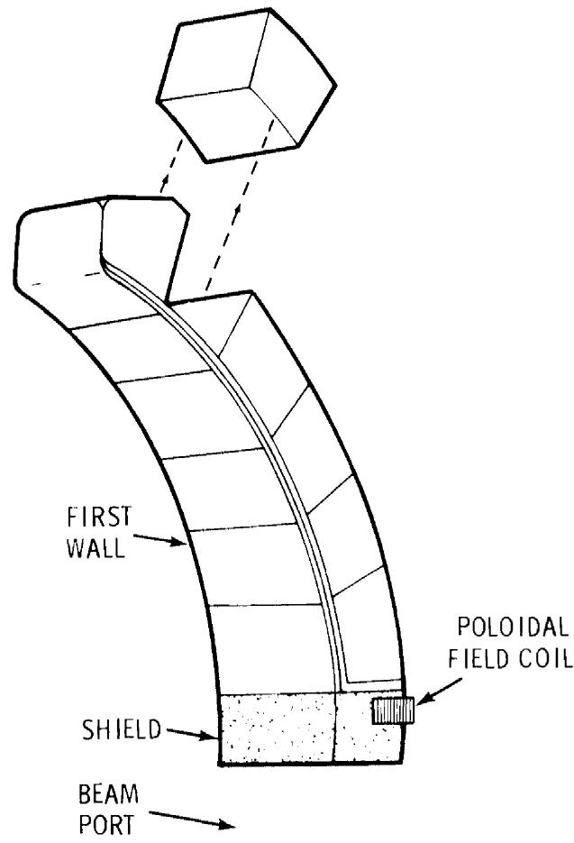

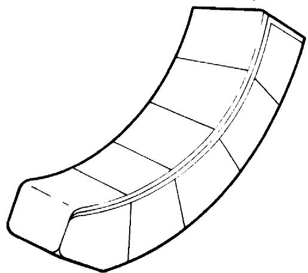  
FIGURE IV-E-1. Tokamak Hybrid Blanket Segment

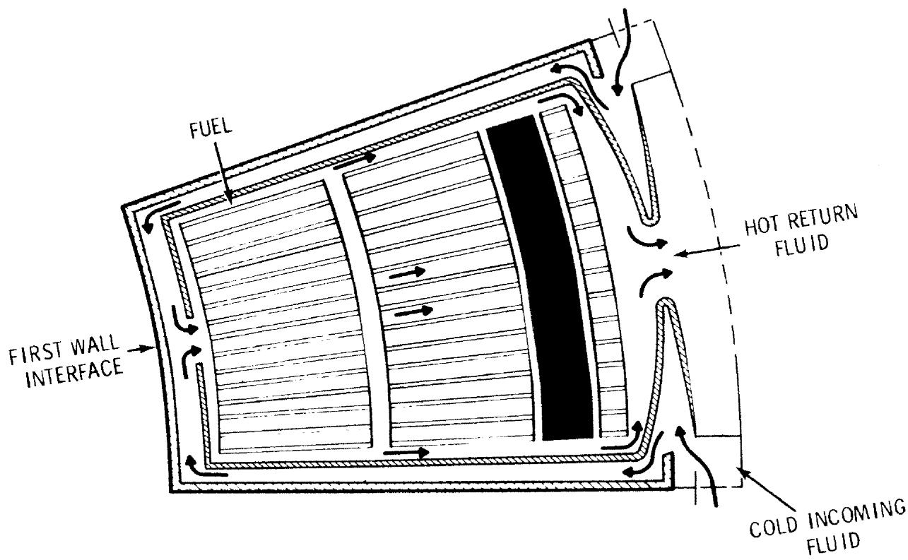  
FIGURE IV-E-2.   
Helium Coolant Flow in the Tokamak Hybrid Reactor

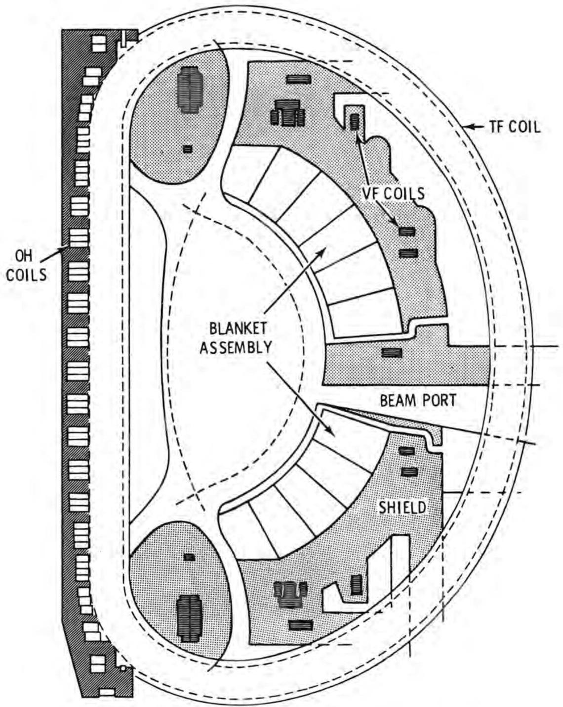  
FIGURE IV-E-3. Cross Section View of the Tokamak Hybrid Reactor

FIGURE IV-E-4.   
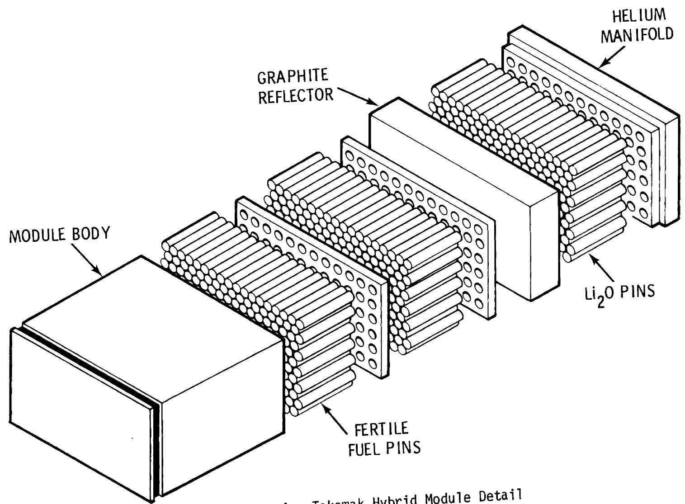  
Tokamak Hybrid Module Detail

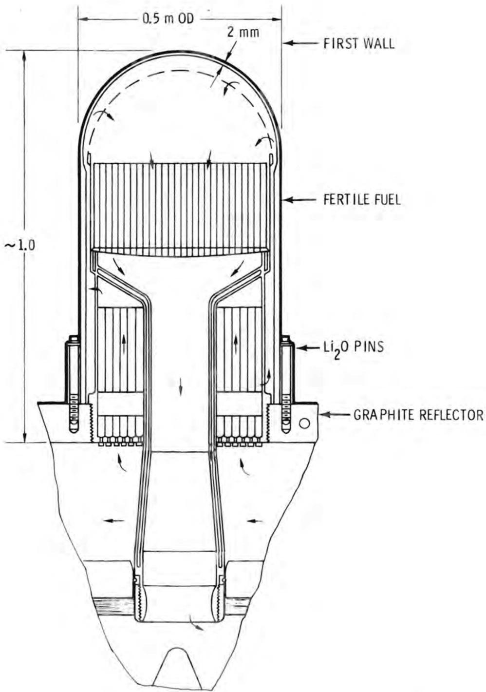  
FIGURE IV-E-5. Mirror Hybrid Blanket Submodule(2)

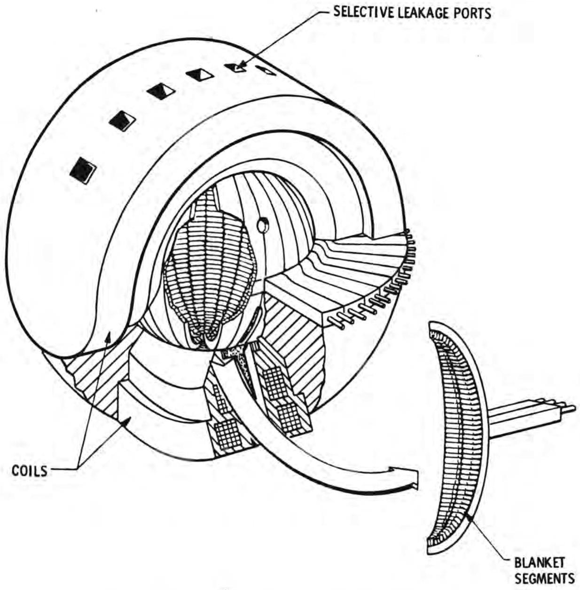  
FIGURE IV-E-6. Mirror Hybrid Blanket Arrangement(2)

reversed and directed into the blanket region by flow baffles. The helium then passes through the fission zone and tritium breeding zone and is discharged through a duct into a main manifold pipe.

The Laser inertial hybrid blanket arrangement is shown in Figure IV-E-7. It is a segmented type of blanket structure and utilizes extended modular fuel assemblies similar to the ones designed for the Tokamak Hybrid.

The Theta-Pinch hybrid is a linear device composed of 200 blanket modules. The total length is 500 meters with each module being 2.5 meters long. Figure IV-E-8 shows a schematic drawing of the module and fuel pin arrangement.

# F. MECHANICAL AND THERMAL HYDRAULIC DATA

For the purpose of this hybrid assessment study the fissionable and tritium breeding fuel assemblies for the blanket modules for all drivers were assumed to be similar to the Tokamak hybrid blanket module assemblies. This allowed the neutronic calculations performed for the Tokamak Hybrid (see Section V) to be scaled for all corresponding drivers with appropriate factors for fusion power and blanket coverage. The corresponding mechanical and thermal hydraulic information for these combinations of driver with blanket-fuel cycle options are tabulated in Tables IV-F-1 through IV-F-4. In all cases the coolant flow rates and velocities are adjusted to obtain the corresponding outlet/inlet temperatures. At helium inlet pressure of 700 psia, this corresponds to velocities in the range of 10 to 100 m/s with an approximate heat transfer coefficient of 1 to 2 W/cm²°C.

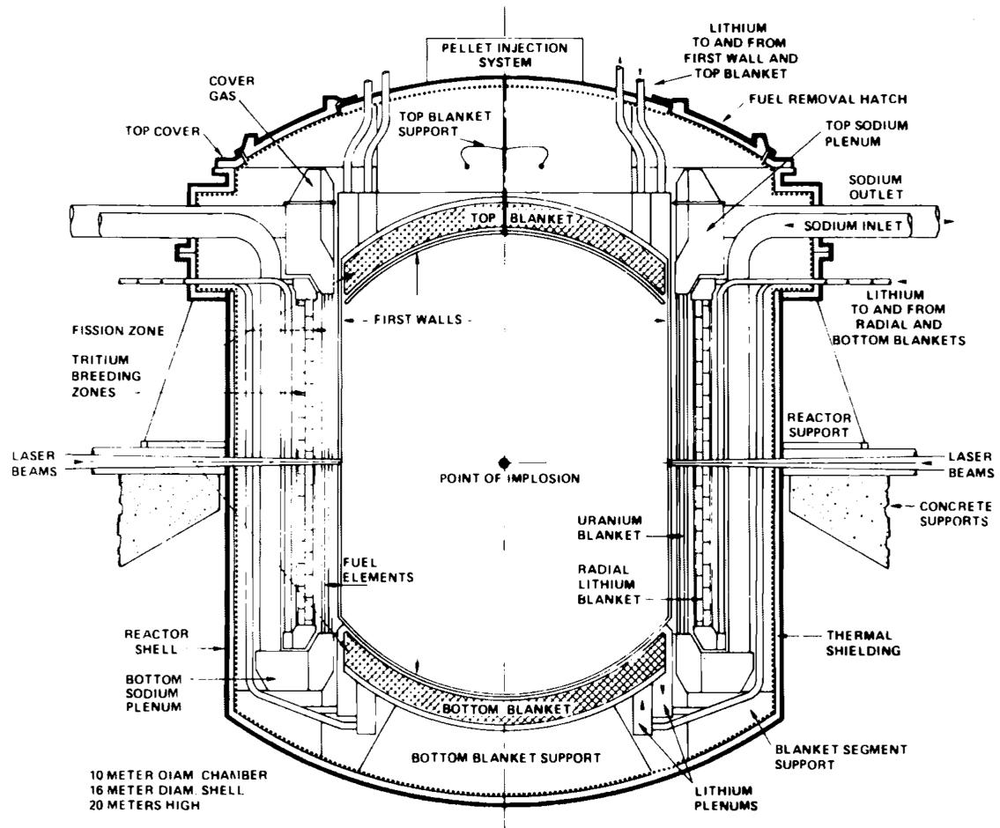

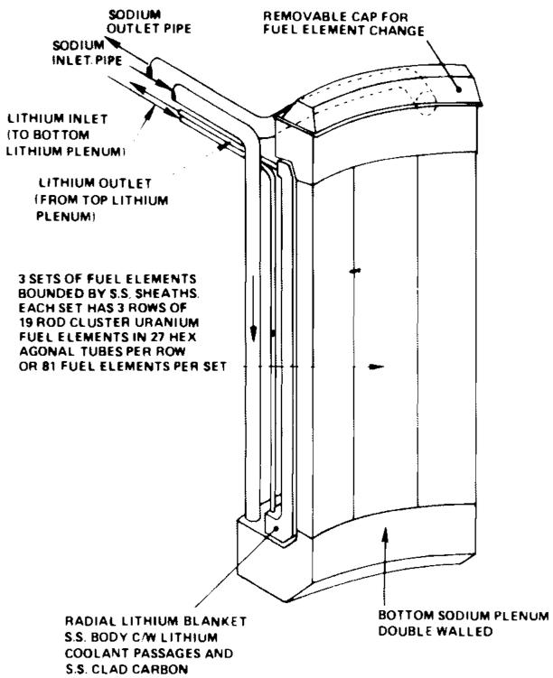  
FIGURE IV-E-7. Laser Hybrid Blanket Segment Arrangement(3)

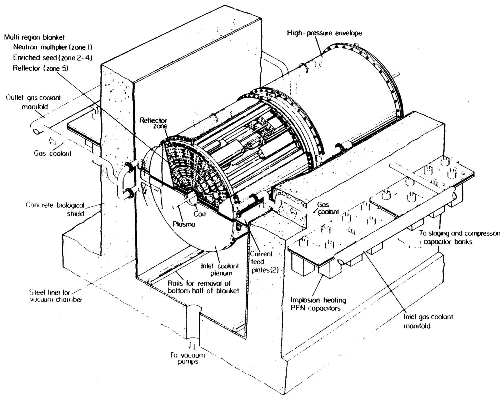  
FIGURE IV-E-8. Linear Theta-Pinch Hybrid Blanket Module

TABLE IV-F-1. Tokamak Hybrid Mechanical and Thermal Hydraulic Information   

<table><tr><td>Reactor Parameter</td><td>Pu-Recycle</td><td>Pu-Catalyst</td><td>Refresh</td></tr><tr><td>Reactor Thermal Power (MWh)</td><td>4,144</td><td>6,603</td><td>3,715</td></tr><tr><td>Fusion Power (MWh)</td><td>1,160</td><td>1,160</td><td>1,160</td></tr><tr><td>Electrical Output (Me)Net</td><td>1,000</td><td>1,835</td><td>853</td></tr><tr><td>Core Design:</td><td></td><td></td><td></td></tr><tr><td>Blanket Heat Output:</td><td></td><td></td><td></td></tr><tr><td>Fission (MWh)</td><td>2,615</td><td>5,136</td><td>2,210</td></tr><tr><td>Li Reactions (MWh)</td><td>252</td><td>191</td><td>229</td></tr><tr><td>Specific Power (MWh/MT)(a)</td><td>8.6</td><td>16.5</td><td>10.7</td></tr><tr><td>Power Density (W/cm3)(b)</td><td>54</td><td>68</td><td>45</td></tr><tr><td>Geometric Information:</td><td></td><td></td><td></td></tr><tr><td>Fast Fission Zone Height (cm)</td><td>26</td><td>39</td><td>26</td></tr><tr><td>Number of Blanket Modules</td><td>660</td><td>660</td><td>660</td></tr><tr><td>Fuel Pins (Rods)/Module</td><td>2,500</td><td>2,500</td><td>2,500</td></tr><tr><td>Li2O Pins/Module</td><td>600-800</td><td>600-800</td><td>600-800</td></tr><tr><td>Overall Module Dimensions (LxNxH)cm</td><td>84x40x78</td><td>84x40x78</td><td>84x40x78</td></tr><tr><td>Module Material</td><td>S.S.</td><td>S.S.</td><td>S.S.</td></tr><tr><td>Cladding Parameters:</td><td></td><td></td><td></td></tr><tr><td>Fuel/Li2O Rod:</td><td></td><td></td><td></td></tr><tr><td>Outside Diameter (cm)</td><td>1.0/2.0</td><td>1.0/2.0</td><td>1.0/2.0</td></tr><tr><td>Wall Thickness (mils)</td><td>15</td><td>15</td><td>15</td></tr><tr><td>Cladding Material</td><td>S.S.</td><td>S.S.</td><td>S.S.</td></tr><tr><td>Fuel Type</td><td>UC</td><td>UO2/PuO2ThC</td><td>UO2</td></tr><tr><td>Blanket Coolant -</td><td>Helium</td><td>Helium</td><td>Helium</td></tr><tr><td>Outlet/Inlet Temperature (°F)</td><td>1200/600</td><td>1200/600</td><td>1200/600</td></tr></table>

TABLE IV-F-2. Mirror Hybrid Mechanical and Thermal Hydraulic Information   

<table><tr><td>Reactor Parameter</td><td>Pu-Recycle</td><td>Pu-Catalyst</td><td>Refresh</td></tr><tr><td>Reactor Thermal Power (MWth)</td><td>2,578</td><td>3,603</td><td>2,404</td></tr><tr><td>Fusion Power (MWth)</td><td>402</td><td>402</td><td>402</td></tr><tr><td>Electrical Output (MeNet)</td><td>139</td><td>544</td><td>71</td></tr><tr><td>Core Design:</td><td></td><td></td><td></td></tr><tr><td>Blanket Heat Output:</td><td></td><td></td><td></td></tr><tr><td>Fission (MWth)</td><td>1,082</td><td>2,125</td><td>915</td></tr><tr><td>Li Reactions (MWth)</td><td>46</td><td>28</td><td>40</td></tr><tr><td>Specific Power (MWth/MT)(a)</td><td>3.75</td><td>6</td><td>3.9</td></tr><tr><td>Power Density (W/cm3)(b)</td><td>20</td><td>25</td><td>16.8</td></tr><tr><td>Geometric Information:</td><td></td><td></td><td></td></tr><tr><td>Fast Fission Zone Height (cm)</td><td>26</td><td>39</td><td>26</td></tr><tr><td>Number of Blanket Modules</td><td>580-600</td><td>580-600</td><td>580-600</td></tr><tr><td>Fuel Pins (Rods)/Module</td><td>~2,200</td><td>~2,200</td><td>~2,200</td></tr><tr><td>Li2O Pins/Module</td><td>500-600</td><td>500-600</td><td>500-600</td></tr><tr><td>Overall Module Dimensions (m) Height Diameter</td><td>0.8-1.0</td><td>0.8-1.0</td><td>0.8-1.0</td></tr><tr><td>Module Material</td><td>S.S.</td><td>S.S.</td><td>S.S.</td></tr><tr><td>Cladding Parameters:</td><td></td><td></td><td></td></tr><tr><td>Fuel/Li2O Rod:</td><td></td><td></td><td></td></tr><tr><td>Outside Diameter (cm)</td><td>1.0/2.0</td><td>1.0/2.0</td><td>1.0/2.0</td></tr><tr><td>Wall Thickness (mils)</td><td>15</td><td>15</td><td>15</td></tr><tr><td>Cladding Material</td><td>S.S.</td><td>S.S.</td><td>S.S.</td></tr><tr><td>Fuel Type</td><td>UC</td><td>UO2/PuO2ThC</td><td>UO2</td></tr><tr><td>Blanket Coolant -</td><td>Helium</td><td>Helium</td><td>Helium</td></tr><tr><td>Outlet/Inlet Temperature (°C)</td><td>530/280</td><td>530/280</td><td>530/280</td></tr></table>

TABLE IV-F-3. Linear Theta-Pinch Mechanical and Thermal Hydraulic Information   

<table><tr><td>Reactor Parameter</td><td>Pu-Recycle</td><td>Pu-Catalyst</td><td>Refresh</td></tr><tr><td>Reactor Thermal Power (MWth)</td><td>4,835</td><td>8,197</td><td>4,343</td></tr><tr><td>Fusion Power (MWth)</td><td>1,098</td><td>1,098</td><td>1,098</td></tr><tr><td>Electrical Output (MeNet)</td><td>45</td><td>1,557</td><td>-176</td></tr><tr><td>Core Design:</td><td></td><td></td><td></td></tr><tr><td>Blanket Heat Output:</td><td></td><td></td><td></td></tr><tr><td>Fission (MWth)</td><td>3,477</td><td>6,829</td><td>2,940</td></tr><tr><td>Li Reactions (MWth)</td><td>150</td><td>92</td><td>127</td></tr><tr><td>Specific Power (MWth/HT)(a)</td><td>1.4</td><td>2.4</td><td>1.7</td></tr><tr><td>Power Density (W/cm3)(b)</td><td>8.7</td><td>10.1</td><td>7.4</td></tr><tr><td>Geometric Information:</td><td></td><td></td><td></td></tr><tr><td>Fast Fission Zone Height (cm)</td><td>26</td><td>39</td><td>26</td></tr><tr><td>Number of Blanket Modules</td><td>200</td><td>200</td><td>200</td></tr><tr><td>Fuel Pins (Rods)/Module</td><td>5000-6000</td><td>5000-6000</td><td>5000-6000</td></tr><tr><td>Li2O Pins/Module</td><td>2000-3000</td><td>2000-3000</td><td>2000-3000</td></tr><tr><td>Overall Module Length (m)</td><td>2.5</td><td>2.5</td><td>2.5</td></tr><tr><td>Module Material</td><td>S.S.</td><td>S.S.</td><td>S.S.</td></tr><tr><td>Cladding Parameters:</td><td></td><td></td><td></td></tr><tr><td>Fuel/Li2ORod:</td><td></td><td></td><td></td></tr><tr><td>Outside Diameter (cm)</td><td>1.0/2.0</td><td>1.0/2.0</td><td>1.0/2.0</td></tr><tr><td>Wall Thickness (mils)</td><td>15</td><td>15</td><td>15</td></tr><tr><td>Cladding Material</td><td>S.S.</td><td>S.S.</td><td>S.S.</td></tr><tr><td>Fuel Type</td><td>UC</td><td>UO2/PuO2ThC</td><td>UO2</td></tr><tr><td>Blanket Coolant -</td><td>Helium</td><td>Helium</td><td>Helium</td></tr><tr><td>Outlet/Inlet Temperature (°C)</td><td>850/540</td><td>850/540</td><td>850/540</td></tr></table>

TABLE IV-F-4. Laser Hybrid Mechanical and Thermal Hydraulic Information   

<table><tr><td>Reactor Parameter</td><td>Pu-Recycle</td><td>Pu-Catalyst</td><td>Refresh</td></tr><tr><td>Reactor Thermal Power (MWth)</td><td>3,300</td><td>4,980</td><td>3,015</td></tr><tr><td>Fusion Power (MWth)</td><td>850</td><td>850</td><td>850</td></tr><tr><td>Electrical Output (MWe)Net</td><td>940</td><td>1,567</td><td>830</td></tr><tr><td>Core Design:</td><td></td><td></td><td></td></tr><tr><td>Blanket Heat Output:</td><td></td><td></td><td></td></tr><tr><td>Fission (MWth)</td><td>1,774</td><td>3,484</td><td>1,500</td></tr><tr><td>Li Reactions (MWth)</td><td>676</td><td>646</td><td>650</td></tr><tr><td>Specific Power (MWth/MT)(a)</td><td>3.8</td><td>7.4</td><td>4.7</td></tr><tr><td>Power Density (W/cm3)(b)</td><td>24</td><td>31</td><td>20</td></tr><tr><td>Geometric Information:</td><td></td><td></td><td></td></tr><tr><td>Fast Fission Zone Height (cm)</td><td>26</td><td>39</td><td>26</td></tr><tr><td>Number of Blanket Segments</td><td>8</td><td>8</td><td>8</td></tr><tr><td>Fuel Pins (Elements/Segment)</td><td>81</td><td>81</td><td>81</td></tr><tr><td>Overall Segment Height (m)</td><td>~10</td><td>~10</td><td>~10</td></tr><tr><td>Module Material</td><td>S.S.</td><td>S.S.</td><td>S.S.</td></tr><tr><td>Cladding Parameters:</td><td></td><td></td><td></td></tr><tr><td>Fuel/Li2ORod:</td><td></td><td></td><td></td></tr><tr><td>Outside Diameter (cm)</td><td>1.0/2.0</td><td>1.0/2.0</td><td>1.0/2.0</td></tr><tr><td>Wall Thickness (mils)</td><td>15</td><td>15</td><td>15</td></tr><tr><td>Cladding Material</td><td>S.S.</td><td>S.S.</td><td>S.S.</td></tr><tr><td>Fuel Type</td><td>UC</td><td>UO2/PuO2ThC</td><td>UO2</td></tr><tr><td>Blanket Coolant -</td><td>Helium</td><td>Helium</td><td>Helium</td></tr><tr><td>Outlet/Inlet Temperature (°C)</td><td>470/320</td><td>470/320</td><td>470/320</td></tr></table>

# G. REMOTE DISASSEMBLY AND MAINTENANCE

The blanket lifetime for the four hybrid fuel cycles is on the order of four years. The radioactivity and decay heat levels resulting from the hybrid blanket operation necessitates a blanket designed for remote maintenance. The blanket module arrangement must also provide ease of access and disassembly.

A cross section view of the Tokamak is shown in Figure IV-G-1. In order to gain access to the blanket modules, the following operations have to be performed:

1. The upper and lower blanket shield and VF coil have to be raised.   
2. The hinged shield would then be swung open and secured.   
3. Helium supply and return lines would then be disconnected from the module manifolds.   
4. The welds and seals adjoining adjacent segments would then be cut or machined off.   
5. Finally, the blanket segment would be either lifted out of the reactor by an overhead crane or transferred by means of a remotely operated carriage.

The blanket segments are transferred to a hot cell operations area. Here the segment would be remotely dismantled and the fuel rods removed from each individual module. The fuel rods would then be placed into special canisters and retired to a decay heat spent fuel storage basin. The $\mathsf{Li}_2\mathsf{O}$ pins and reflector region would be placed back into the module along with fresh fuel pins. Then the segment would be reassembled and placed into the reactor.

The Mirror Hybrid Reactor blanket maintenance strategy is influenced by the large size of the blanket sections. Figure IV-G-2 shows the blanket module concept used in the Mirror Hybrid Design. Each segment is a separate pressure vessel which makes vacuum leak testing an easier task. During a blanket replacement outage, one-fourth of the segments are replaced. The steps that would be necessary for blanket access are listed below.

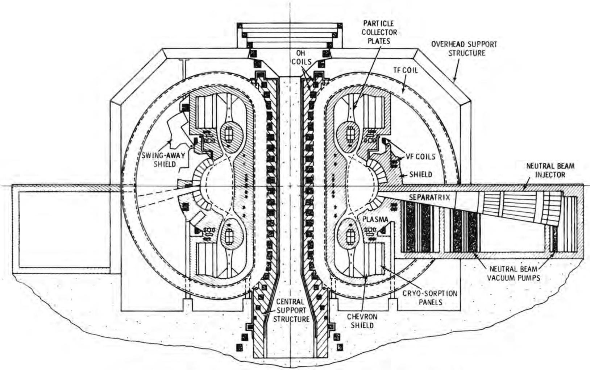  
FIGURE IV-G-1. Tokamak Hybrid Reactor Cross Section(4)

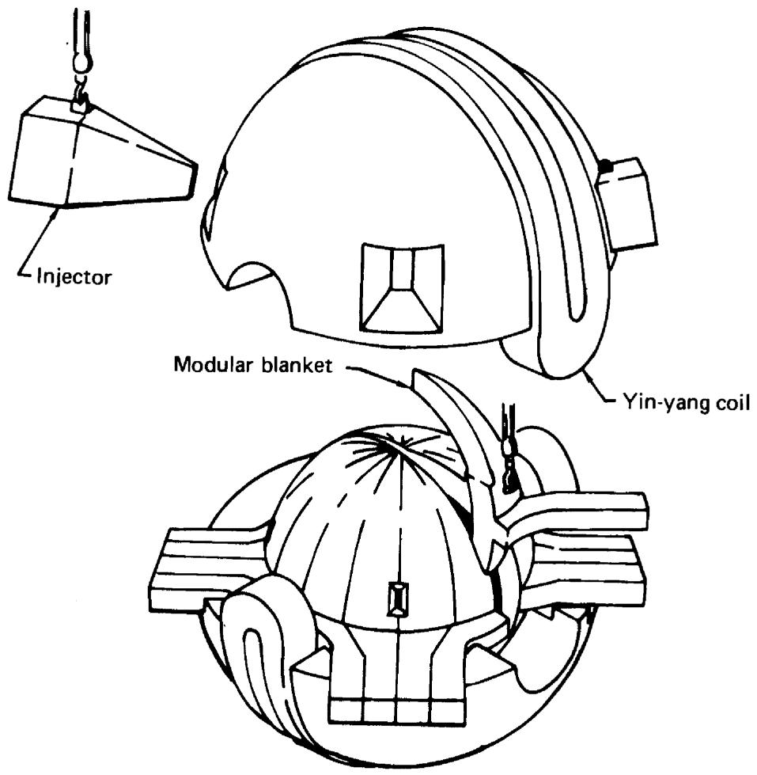  
FIGURE IV-G-2. Mirror Hybrid Reactor Blanket Module(2)

1. Remove beam injectors by means of the overhead crane.   
2. Disconnect the top vacuum shell (Figure IV-G-3) and remove to another location.   
3. Hoist the removable top plugs and transfer to a temporary storage location.   
4. Hoist the upper magnet and transfer it to a holding area.   
5. Disconnect the shield dome thus exposing the blanket segments.

The blanket segments are hoisted by means of the overhead crane and transferred to a hot cell workshop. Here the helium ducts can be disconnected making the segments easier to manipulate. The spent fuel is stored in a decay

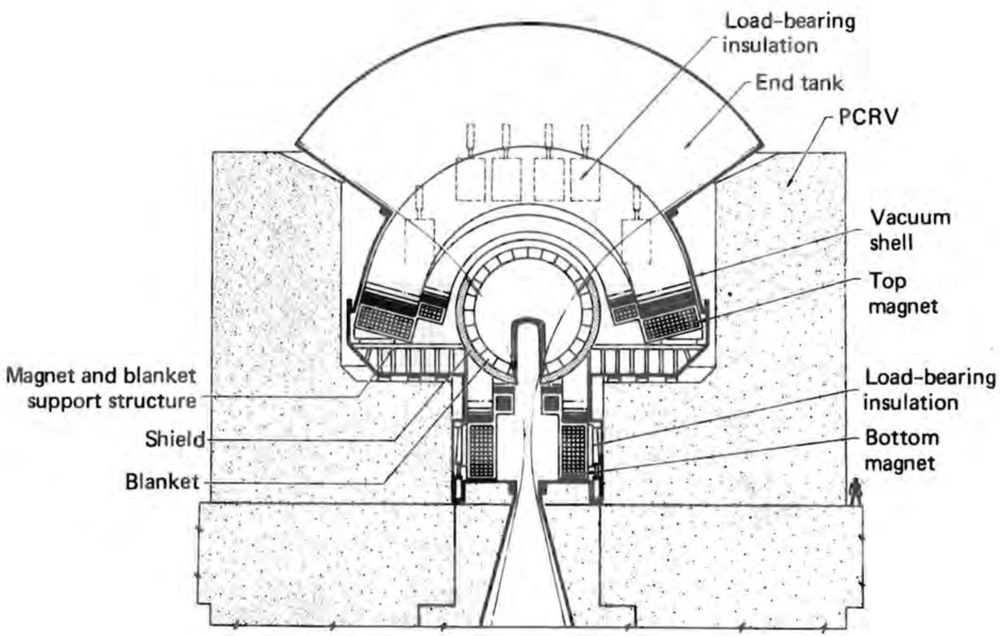  
FIGURE IV-G-3. Mirror Hybrid Reactor Blanket and Structure Components(2)

heat removal basin. Fresh fuel is loaded into the individual submodules and then the assembled segment is placed back into the reactor.

An alternate blanket maintenance approach is shown in Figures IV-G-4 and IV-G-5. In this method the blanket submodules are individually arranged forming a spherical plasma cavity. The technique for blanket replacement in this configuration is to use an in-chamber removal and replacement method.

Blanket replacement for the Laser Hybrid and Theta-Pinch Hybrid will also be performed by remotely operated fuel handling machines. For the Laser Hybrid one of the eight segments is removed by means of an overhead hoist. The segment itself can be further disassembled into three sets of fuel elements. The fuel elements are manipulated by a grapple and hoist crane similar to the fuel transfer machine used in LWRs. Blanket access in the Theta-Pinch Hybrid is accomplished by removing a portion of the high pressure shell that encompasses the blanket fuel rods.

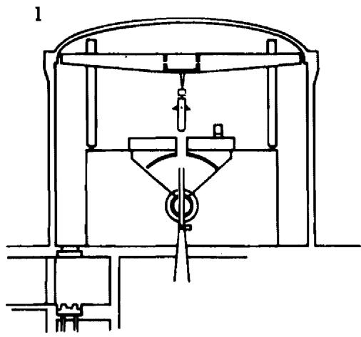

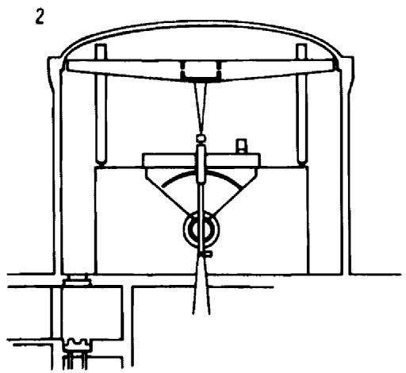

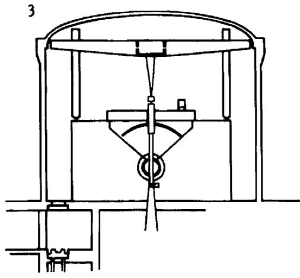

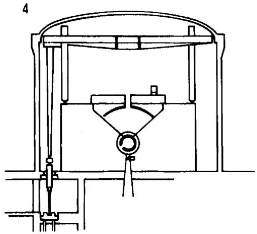

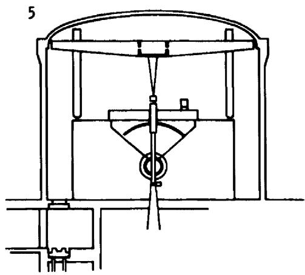

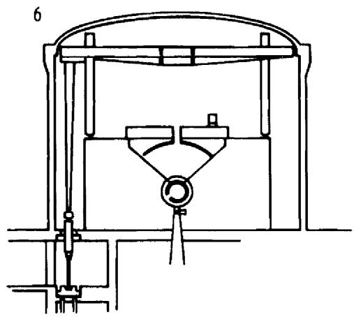  
FIGURE IV-G-4. Alternate Blanket Replacement Technique for Mirror Hybrid(2)

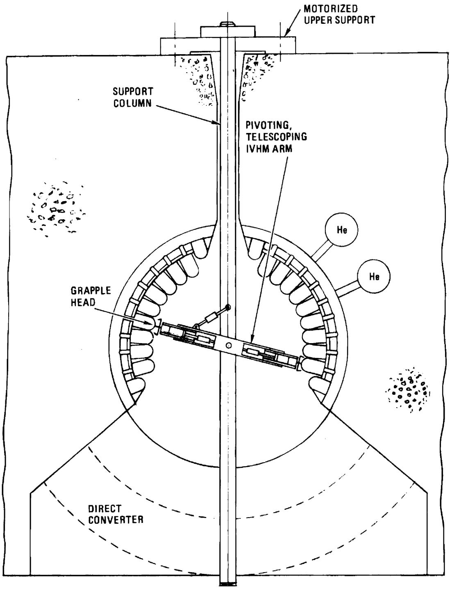  
FIGURE IV-G-5. Mirror Hybrid Module Handling Machine(2)

H. SECTION IV REFERENCES

1. Conceptual Design Study of a Non-Circular Tokamak Demonstration Fusion Power Reactor. GA-A13992, General Atomic Co., San Diego, CA, November 1976.   
2. D. J. Bender, et al., Reference Design for the Standard Mirror Hybrid Reactor. UCRL-52478, General Atomic Co. and Lawrence Livermore Laboratory, Livermore, CA, May 1978.   
3. Laser Fusion-Fission Reactor Systems Study. Bechtel Corporation and Lawrence Livermore Laboratory, Livermore, CA, July 1977.   
4. B. Badger, et al., Tokamak Engineering Test Reactor. UWFDM-191, University of Wisconsin, Dept. of Nucl. Engr., Madison, WI 53706, June 1977.

# V. NEUTRONICS

# A. COMPUTATIONAL METHODOLOGY

The primary objectives of the neutronics calculations were to determine the fissile fuel and power production in various fission blankets combined with various fusion drivers. Neutronics computations were performed for all selected blankets adapted to the Tokamak Hybrid Reactor. The results of such computations were then appropriately scaled to obtain the neutronics performance data for the selected blankets combined with the three fusion drivers. The calculational model for the Tokamak hybrid reactor is shown in Figure V-A-1. In order to represent the various blanket types, the materials of Zones 15, 16 and 17 were changed in each of the calculations. The remainder of the reactor remained the same.

The neutron flux calculations were made with the computer code ANISN $^{(1)}$ which solved numerically the one dimensional Boltzman equation. The geometrical model was in vertical cylindrical geometry and is identical to that described in Figure V-A-1. Reflective left hand and vacuum right hand boundary conditions were employed. A neutron source that varied both in space and energy was used in the calculation. A $S_{8} - P_{3}$ numerical solution was used.

The cross sections for the transport calculations were generated from ENDF/B-IV files $^{(2)}$ into a thirty energy group structure. The methodology is discussed under Nuclear Data.

The burnup calculations were made with the code ORIGEN. $^{(3)}$ It is a point code and uses one group average cross sections to determine the isotopic contents of the fissile and fertile nucleus as a function of operating time. The ORIGEN library did not include cross sections to 14 MeV, thus it is necessary to generate the cross sections for input into this code. This is accomplished in the following manner.

Four cross sections, $\sigma^f, \sigma^c, \sigma^{n-2n}, \sigma^{n-3n}$ , are required for each isotope. An ANISN calculation is made for a particular fuel, for a particular time in the life of the blanket segment and the calculations began with the blanket segment at the beginning of life. Those isotopes which are not present at this time, such as the higher isotopes of Pu are placed in the calculation at a low concentration. This does not affect the numerical calculation of

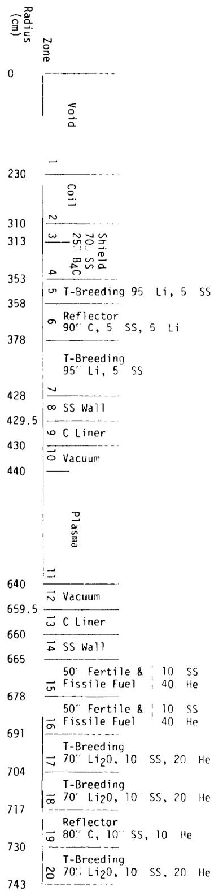  
e e e e e e e e e e e e e e e e e e e e e e e e e e e e e e

the flux, but does allow for the calculation of a reaction rate from which a particular cross section is obtained.

The reaction rate for a particular isotope, reaction and zone is found from the following relationship using calculated fluxes.

$$
R _ {k} ^ {n} = \sum_ {j i n \ell} \sum_ {i} \Phi_ {i j} v _ {j} \sigma_ {i k} ^ {n} \rho_ {k \ell}
$$

where

$R_{k}^{n}$ is the reaction rate for reaction $n$ for isotope $k$ in zone $\ell$ ,

$\Phi_{ij}$ is the group energy flux in energy group $i$ and interval $j$ ,

$V_{j}$ is the volume of interval $j$

$\sigma_{ik}^{n}$ is the cross section for reaction $n$ for element $k$ and energy group $i$ , and

$\rho_{k\ell}$ is the number density of element $k$ in zone $\ell$ .

The average cross section, $\overline{\sigma}$ , for input into ORIGEN is then calculated from the relationship:

$$
\overline {{\sigma}} _ {k} ^ {n} = R _ {k \ell} ^ {n} / [ \begin{array}{c c c c c} & \Sigma & & \Sigma & \Phi_ {i j} V _ {j} \end{array} ] \rho_ {k \ell}
$$

and the average flux $\overline{\Phi}$ is determined by

$$
\bar {\Phi} = \left[ \begin{array}{c c c c c} & \sum & \sum & \Phi_ {i j} V _ {j} \end{array} \right] / \sum_ {j} V _ {j}
$$

In the calculations here, the average cross sections for $\sigma^{\mathsf{c}},\sigma^{\mathsf{f}},\sigma^{n - 2n}$ and $\sigma^{n - 3n}$ for the following isotopes were generated:

$230_{\text{Th}}, 232_{\text{Th}}, 231_{\text{Pa}}, 233_{\text{Pa}}, 232_{\text{U}}, 233_{\text{U}}, 234_{\text{U}}, 235_{\text{U}}, 236_{\text{U}}, 238_{\text{U}}$   
239U, 237Np, 236Pu, 238Pu, 239Pu, 240Pu, 241Pu, 242Pu, and 244Cm.

Since in a fusion reactor, the flux and fission density changes rapidly

in the blanket, ORIGEN calculations are made for different zones in the fertile and fissile blanket. This involves the calculation of the average cross sections and flux for each zone.

Based on a one year burnup calculation isotopic generation and depletion are determined for each zone. These isotopic concentrations are then input into ANISN for new flux calculations and the process is repeated. The process may be repeated for as many years as desired. The accuracy may be improved by decreasing the zone width, in effect creating more zones for which calculations are made and decreasing the time period for the burnup calculation, as the flux is assumed constant during this period of time.

# B. NUCLEAR DATA

The cross sections for the transport calculation were generated from ENDF/B-IV into thirty energy groups and covers the energy range from 18 MeV to thermal. ETOG(4) generates the epi-thermal and fast data and FLANGE(5) is used to process the thermal data. These group cross sections are processed with scattering matrices expanded in Legendre polynomials. All the cross sections generated in this manner are infinite dilute, and thus the important isotopes, such as U $^{235}$ , U $^{238}$ and Th $^{232}$ must be resonance self-shielded.

The shielded cross sections are generated with the cell code EGGNIT $^{(6)}$ . In this code a typical unit cell in the fissionable lattice is mocked up. A unit cell calculation is made using a fine energy group structure to determine the flux shape in the unit cell. The Nordheim Integral Treatment is used for resonance self-shielding. The resultant cross sections are then flux weighted and resonance self-shielded.

Unfortunately, the cross sections in the EGGNIT library extend only to 10 MeV and contain only a $P_{1}$ expansion of the scattering matrix. Thus it is necessary to substitute the EGGNIT generated microscopic absorption and fission cross section into the ETOG generated set and re-normalize the total cross section. Three isotopes $^{232}\mathrm{Th}, ^{235}\mathrm{U},$ and $^{238}\mathrm{U}$ are treated in this manner.

For isotopes in which the thermal cross sections play an important role, such as $^{6}\mathrm{Li}$ , $^{235}\mathrm{U}$ and $^{238}\mathrm{Pu}$ , the thermal cell code GRANIT(7) is

used to generate the thermal cross section and these cross sections replace the FLANGE generated thermal cross section.

# C. FISSILE FUEL BREEDING

Three separate blanket types were considered:   
UO2   
UC   
- $\mathrm{PuO}_2\text{-}\mathrm{UO}_2$ CONVERTER followed by ThC₂ Zone

In Figures V-C-2, 3, and 4 the outside blanket is represented for each of the three types. The different zones correspond to Zones 15 to 20 in Figure V-A-1.

In the first case, the fuel is natural uranium in the form of $\mathrm{UO}_2$ in a 26 cm thick zone. In Case 2, the fuel is natural uranium in the form of UC in a 26 cm thick zone. In Case 3, natural uranium in the form of $\mathrm{UO}_2$ is mixed with $^{239}\mathrm{PuO}_2$ in an equilibrium mixture in a 13 cm thick zone. This is followed by a $\mathrm{ThC}_2$ zone, 26 cm thick. The volume fraction of all fuels is 50% with 10% stainless steel as the structural material. Helium is the coolant and occupies 40% of the volume.

ANISN calculations were made to determine the neutron flux from which the fission rate and $^{239}\mathrm{Pu}$ and $^{233}\mathrm{U}$ production rates were calculated. The results for the three blankets at the initial start up are given in Table V-C-1.

Comparing the $\mathsf{UO}_2$ blanket with the UC blanket, it is obvious that UC is the best blanket, both from the standpoint of the number of fissions per fusion and the Pu production. This arises from the fact that although both blankets have the same volume percent of fuel, the UC blanket has more U per cm³ than the $\mathsf{UO}_2$ blanket. Thus, more U is exposed to the 14 MeV flux than for the $\mathsf{UO}_2$ blanket, which results in a greater number of fast fissions and more secondary neutrons. The greater the number of secondary neutrons, the greater the number of neutrons being absorbed in Pu and tritium breeding reactions.

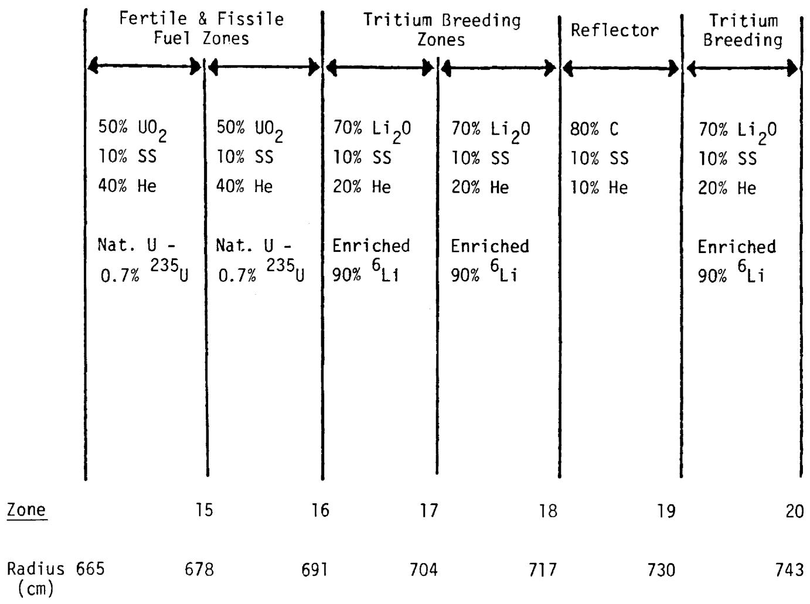  
FIGURE V-C-2. $\mathsf{UO}_2$ Blanket Schematic

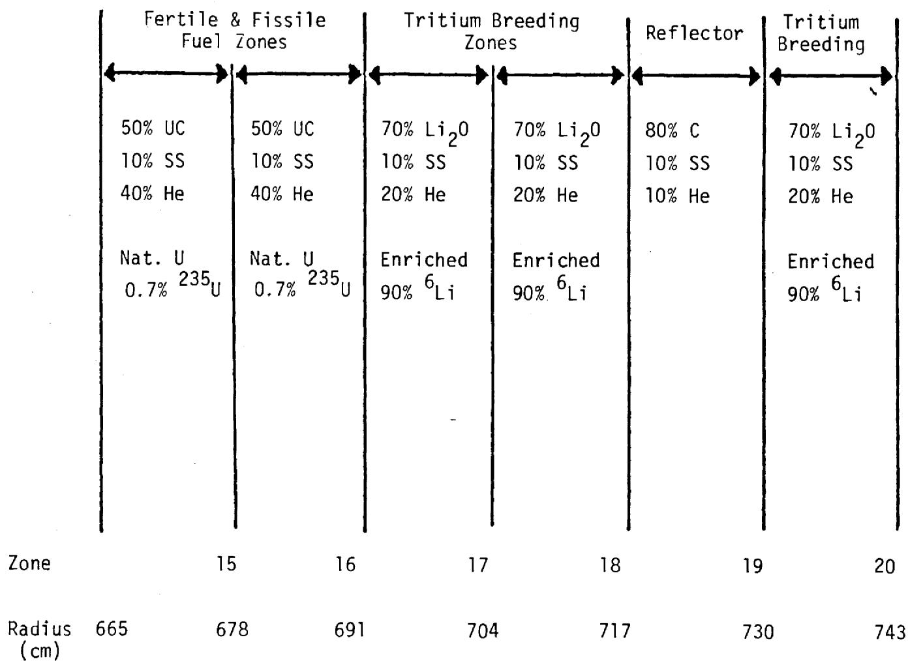  
FIGURE V-C-3. UC Blanket Schematic

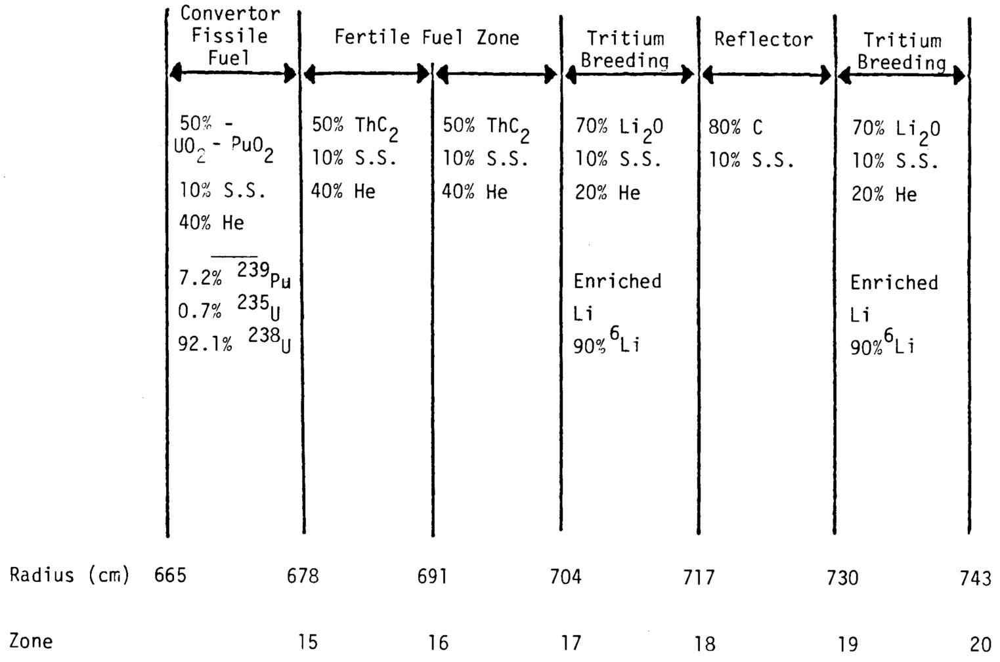  
8-1   
FIGURE V-C-4. $\mathsf{PuO_2 - UO_2 - ThC_2}$ Blanket Schematic

TABLE V-C-1. Blanket Neutronic Characteristics   

<table><tr><td>Blanket</td><td>Net Fissions 
Per Source 
Neutron</td><td>Net Pu 
Production per 
Source Neutron</td><td>Net 233U 
Production per 
Source Neutron</td><td>Tritium 
Breeding 
Ratio</td></tr><tr><td>UO2</td><td>0.186</td><td>0.440</td><td>-</td><td>1.17</td></tr><tr><td>UC</td><td>0.220</td><td>0.618</td><td>-</td><td>1.19</td></tr><tr><td>PuO2-UO2ThC2</td><td>0.424</td><td>0.047</td><td>1.24</td><td>1.18</td></tr></table>

The third case in which a converter of $\mathsf{UO}_2$ in $^{239}\mathsf{PuO}_2$ is followed by a $\mathsf{ThC}_2$ blanket combines the best features of both fuel cycles. The high $^{238}\mathsf{U}$ fission cross section for 14 MeV neutrons and resulting $\sim 5$ neutrons per fission coupled with the high thermal absorption in Th for $^{233}\mathsf{U}$ production results in the best blanket from the standpoint of fissile fuel production. An equilibrium mixture of $\mathsf{PuO}_2$ results in a larger power output, due to thermal fission, compared to cases one and two which had only $0.7\%$ $235\mathsf{U}$ .

# D. TRITIUM BREEDING

In each case following the fertile and fissile zones are the tritium breeding regions. These regions contain stainless steel clad pins of $\mathsf{Li}_2\mathsf{O}$ enriched to $90\%$ in ${}^6\mathsf{Li}$ to capitalize on the thermal flux. Few fast neutrons remain this far from the fast neutron source and little tritium is bred by the ${}^7\mathsf{Li}(\mathsf{n},\mathsf{n}^{-\alpha})\mathsf{T}$ reaction. Most of the tritium is bred by the ${}^6\mathsf{Li}(\mathsf{n},\alpha)\mathsf{T}$ reaction. For this reason it is essential in a helium cooled Tokamak to employ enrichments in ${}^6\mathsf{Li}$ in the tritium breeding compound. The use of natural Li coolant may obviate this need in Tokamaks and other confinement geometries. In fact, natural Li compounds could be used in this Tokamak geometry with helium coolant to obtain tritium breeding ratios $>1$ but only at the expense of fissile fuel production.

In the inside blanket, natural liquid lithium is used. Here, advantage may be taken of the fast flux for the breeding of tritium without the loss of a neutron in the $^7\mathrm{Li}(\mathsf{n},\mathsf{n}^\prime \alpha)\mathsf{T}$ reaction. However, here also the bulk of the tritium is bred through the $^6\mathrm{Li}(\mathsf{n},\mathsf{\alpha})\mathsf{T}$ reaction.

The results for the three blankets at the initial start up are given in Table V-C-1.

In each case the tritium breeding ratio is greater than one with sufficient excess that each could be self sustaining for tritium requirements. If tritium had not been bred, the neutrons could be used for fissile fuel production with the increase in production rates of fissile fuel being greater per source neutron than the number of tritium atoms produced per source neutron.

# E. BURNUP AND ISOTOPICS

The burnup calculations which determine the isotopic buildup and depletion are sensitive to the average flux used in the calculation. This is due to the fact that ${}^{239}\mathrm{Pu}$ and other fissile isotopes which build up greatly affect the average power determined by ORIGEN.

For example, an average flux of $1.21 \times 10^{15} \, \text{n/cm}^2$ -sec for a five year period of time produces an average power of $15.51 \, \text{MW per metric ton of U}$ . An average flux of $2.91 \times 10^{15} \, \text{n/cm}^2$ -sec over a five year period produces an average power of $45.15 \, \text{MW per metric ton of U}$ . Both cases had the same initial conditions of natural $\text{UO}_2$ as fuel.

The average flux is determined by the fusion power level and the isotopic concentration used in the ANISN calculation. One year burnup was chosen as the time period for which the flux should remain almost constant. The isotopic concentration of major isotopes following a one year burn is shown in Table V-E-1 for Zone 15 and 16 of Figure V-C-1. This is a $\mathrm{UO_2}$ blanket containing natural uranium as initial conditions. The Table lists only the isotopes that would be used in the next ANISN calculation.

Note that the isotopic concentration buildup in Zone 15 is much larger than that in Zone 16. The 14 MeV flux and fast flux in Zone 15 is much larger than in Zone 16. The fast flux is responsible for many of the reactions. Therefore, the average cross in Zone 16 is smaller than Zone 15. The average flux in Zone 16 is smaller than in Zone 15.

As expected much of the Pu build will occur in the first few centimeters until it reaches an equilibrium concentration of about $8\%$ .

# F. FISSILE FUEL AND POWER PRODUCTION

The fissile fuel and fission power production in the hybrid blanket combined with the Tokamak Fusion driver have been calculated from the blanket neutronic characteristics as computed by the ANISN and ORIGEN codes as displayed in Tables V-C-1 and V-E-1. The annual fissile fuel production as well as the thermal power averaged over the four year fuel management cycle (see Section VII) are tabulated in Table V-F-1. The plant availability (0.75) as well as the driver duty factor which is inherent in the calculated fusion power (see Section III) have been taken into account in computing these averages, in addition to the effective blanket coverage for the penetration of the beam parts, divertor channels, and poloidal field coils.

The corresponding amount of fissile fuel production and average blanket fission thermal powers for the other fusion driver systems with the selected blankets have been computed by scaling from the Tokamak results and they are also listed in Table V-F-1. For each driver blanket combination the corresponding differential in fusion neutron power duty factor and blanket coverage were taken into account in determining the average values. It should also be noted that in addition to the blanket fission power, the thermal power includes the fusion neutron power distributed in the blanket and shield as well as the fusion alpha power and any radiation generated in the fusion plasma incident on the first wall.

Due to the similarities in first wall thickness and blanket coverage, the scaling of the Tokamak neutronic results agrees favorably with the laser hybrid calculations of others. However, due to significant dissimilarities of the same nature, with the other drivers, this scaling becomes somewhat pessimistic for the mirror and theta pinch hybrids.

The heating rates for the three blankets combined with the Tokamak driver are shown in Figure V-F-1. These rates are calculated for the reactor at startup. For the UC and the $\mathsf{UO}_2$ blanket the power production is due almost entirely

TABLE V-E-1. Isotopic Concentrations After One Year Operation   

<table><tr><td>Isotope</td><td>Zone 15 &amp; 16 Initial Concentration</td><td>Zone 15 One Year</td><td>Zone 16 One Year</td></tr><tr><td>\(230_{Th}\)</td><td></td><td>\(2.75 \times 10^{-8}\)</td><td>\(8.1 \times 10^{-9}\)</td></tr><tr><td>\(232_{Th}\)</td><td></td><td>\(5.8 \times 10^{-8}\)</td><td>\(1.8 \times 10^{-8}\)</td></tr><tr><td>\(231_{Pa}\)</td><td></td><td>\(2.7 \times 10^{-8}\)</td><td>\(2.8 \times 10^{-8}\)</td></tr><tr><td>\(233_{Pa}\)</td><td></td><td>\(2.6 \times 10^{-7}\)</td><td>\(3.5 \times 10^{-12}\)</td></tr><tr><td>\(232_U\)</td><td></td><td>\(1.5 \times 10^{-4}\)</td><td>\(1.3 \times 10^{-5}\)</td></tr><tr><td>\(233_U\)</td><td></td><td>\(1.4 \times 10^{-3}\)</td><td>\(3.7 \times 10^{-4}\)</td></tr><tr><td>\(234_U\)</td><td></td><td>\(1.9 \times 10^{-2}\)</td><td>\(5.8 \times 10^{-3}\)</td></tr><tr><td>\(235_U\)</td><td>30.2</td><td>26.7</td><td>28.4</td></tr><tr><td>\(236_U\)</td><td></td><td>3.99</td><td>1.22</td></tr><tr><td>\(238_U\)</td><td>4170</td><td>4100</td><td>4140</td></tr><tr><td>\(239_U\)</td><td></td><td>\(2.5 \times 10^{-3}\)</td><td>\(1.41 \times 10^{-3}\)</td></tr><tr><td>\(237_{Np}\)</td><td></td><td>7.51</td><td>2.26</td></tr><tr><td>\(236_{Pu}\)</td><td></td><td>\(1.77 \times 10^{-3}\)</td><td>\(1.53 \times 10^{-4}\)</td></tr><tr><td>\(238_{Pu}\)</td><td></td><td>\(1.07 \times 10^{-2}\)</td><td>\(1.49 \times 10^{-3}\)</td></tr><tr><td>\(239_{Pu}\)</td><td></td><td>37.5</td><td>21.1</td></tr><tr><td>\(240_{Pu}\)</td><td></td><td>0.584</td><td>0.16</td></tr><tr><td>\(241_{Pu}\)</td><td></td><td>\(8.9 \times 10^{-3}\)</td><td>\(1.08 \times 10^{-3}\)</td></tr><tr><td>\(242_{Pu}\)</td><td></td><td>\(5.2 \times 10^{-5}\)</td><td>\(3.24 \times 10^{-6}\)</td></tr><tr><td>\(244_{Cm}\)</td><td></td><td>\(8.9 \times 10^{-10}\)</td><td>\(1.32 \times 10^{-11}\)</td></tr></table>

TABLE V-F-1. Blanket Fissile Fuel and Fission Power Production   

<table><tr><td rowspan="2">Driver/Blanket Fuel</td><td colspan="2">UO2</td><td colspan="2">UC</td><td colspan="2">PuO2-UO2/ThC2</td></tr><tr><td>kg Pu/yr</td><td>Mwt</td><td>kg Pu/yr</td><td>Mwt</td><td>kg 233U/yr</td><td>Mwt</td></tr><tr><td>Tokamak</td><td>1388</td><td>2439</td><td>1950</td><td>2867</td><td>3810</td><td>5327</td></tr><tr><td>Mirror</td><td>574</td><td>965</td><td>807</td><td>1128</td><td>1575</td><td>2153</td></tr><tr><td>Linear Theta Pinch</td><td>1845</td><td>3067</td><td>2592</td><td>3627</td><td>5066</td><td>6421</td></tr><tr><td>Laser Inertial</td><td>941</td><td>2150</td><td>1323</td><td>2450</td><td>2584</td><td>4130</td></tr></table>

to the fast fissions. The power profile in these two blankets almost parallels the fast flux in the blankets shown in Figure V-F-2. Both the power and fast flux are down by two orders of magnitude after transversing the 26 cm fuel region of the blanket. In these blankets little may be gained in the way of power by increasing the thickness of the fission blanket.

In comparing the $\mathrm{UO}_2$ with the UC blanket, it may be noted that the UC blanket produces the greater amount of power. In the UC blanket, uranium occupies a greater percent of the volume of the zone than in the $\mathrm{UO}_2$ blanket, even though the volume percent of the fuel ( $\mathrm{UO}_2$ or UC) is the same in both cases, i.e., $50\%$ . This increased density of uranium results in a greater percent of the uranium being exposed to the fast flux resulting in a greater number of fissions. Because of the higher density the fast flux decreases faster in the UC blanket than in the $\mathrm{UO}_2$ blanket as noted in Figure V-F-2. Thus increased power production may be obtained by increasing the ratio of $\Sigma$ fission/ $\Sigma$ absorption in the blanket. For example, U-Mo could be expected to be a better fuel than UC in terms of power production.

The most dramatic changes in power production may be obtained by enriching the fuel. Figure V-F-1 compares the heating rates of $\mathsf{UO}_2$ - $\mathsf{PuO}_2$ blanket with the UC and $\mathsf{UO}_2$ blanket. The $\mathsf{UO}_2$ and the UC blanket contains natural uranium, while the $\mathsf{PuO}_2$ - $\mathsf{UO}_2$ blanket contains $7.2\%$ ${}^{239}\mathsf{PuO}$ . The power profile is not as steep in the mixed oxide blanket indicating a considerable amount of power is being generated by the fission of ${}^{239}\mathsf{Pu}$ , rather than by fast fission of U. This is

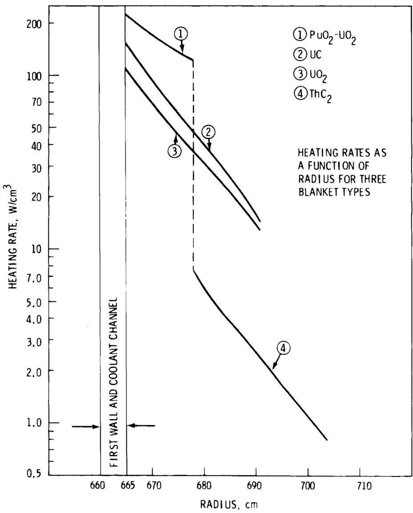  
FIGURE V-F-1. Heating Rates as a Function of Radius for Three Blanket Types

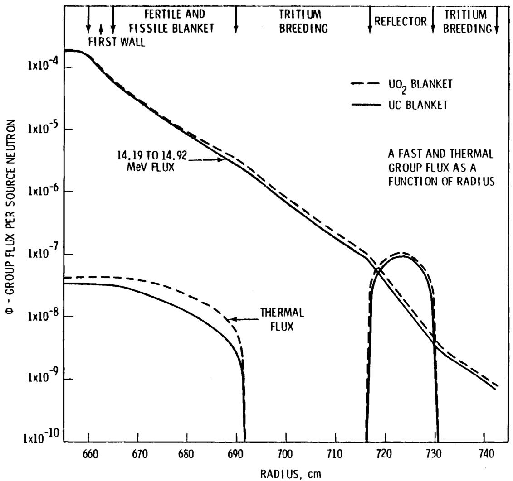  
FIGURE V-F-2. A Fast and Thermal Group Flux as a Function of Radius

also evident from Figure V-F-3 which shows the perturbation in the thermal flux in the converter region.

The fast flux in all three cases has been degraded by several orders of magnitude by the time it reaches the tritium breeding zones as shown in Figures V-F-2 and V-F-3. Thus, little tritium from the $^7\text{Li}(n,n\alpha)\text{T}$ reaction will be produced. These zones have been enriched in $^6\text{Li}$ to increase the macroscopic cross section for the $^6\text{Li}(n,\alpha)\text{T}$ reaction and therefore reduce the parasitic absorptions which do not result in a tritium atom.

Fast fission will occur in thorium. However, the cross section is small compared to the fast fission cross section for uranium. Thus for any reasonable power production a uranium converter is needed. At 680 cm in Figure V-F-1, the fast flux is about the same for the $\mathsf{UO}_2$ , UC and $\mathsf{ThC}_2$ blanket, yet the power production in the $\mathsf{ThC}_2$ is about $7\mathsf{W/cm}^3$ while the $\mathsf{UO}_2$ and UC blankets are about $35\mathsf{W/cm}^3$ .

It is important to note there is no fissionable material in the inside blanket (Zone 7). It was felt that the area was inaccessible and only liquid lithium was placed there as it could be pumped. Had the reactor been large enough that a uranium converter could be placed in this zone a significant increase in both fuel and power production could be obtained. In the current configuration a large percent of the fusion neutrons do not enter a uranium containing zone, and therefore do not have the opportunity to cause a fast fission.

In conclusion, increased performance in blankets may be obtained by increasing the fusion neutron power and the ratio of the macroscopic fast fission cross section to the macroscopic absorption. The most dramatic increase in power is obtained by increasing the enrichment in the blanket. Although $\mathsf{ThC}_2$ gives impressive fissile fuel production it requires a uranium converter, otherwise a serious decrease in performance occurs.

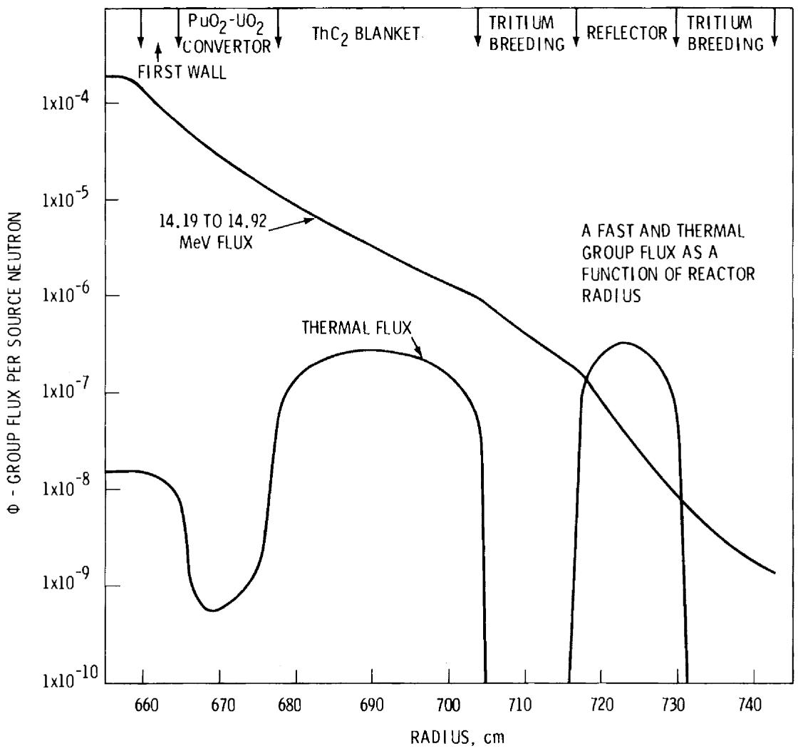  
FIGURE V-F-3. A Fast and Thermal Group Flux as a Function of Reactor Radius

G. SECTION V REFERENCES

1. W. W. Engle, Jr., A Users Manual for ANISN. K-1693, Oak Ridge National Laboratory, Oak Ridge, TN, 1967.   
2. H. C. Honeck, ENDF/B, Specifications for an Evaluated Nuclear Data File for Reactor Applications. BNWL-50066, Brookhaven National Laboratory, Upton, NY, 1966.   
3. M. J. Bell, ORIGEN - The ORNL Isotope Generation and Depletion Code. Oak Ridge National Laboratory, Oak Ridge, TN, May 1973.   
4. D. E. Kusner, et al., ETOG-I, A Fortran IV Program to Process Data from the ENDF/B File to the MUFT, GAM, and ANISN Formats. WCAP-3845-1, ENDF-114, Westinghouse Electric Corporation, December 1969.   
5. H. C. Honeck and D. R. Finch, FLANGE II, A Code to Process Thermal Neutron Data from an ENDF/B Tape. DP-1278, Savannah River Laboratory, Aiken, SC, 1971.   
6. C. R. Richey, EGGNIT: A Multigroup Cross Section Code. BNWL-1230, Pacific Northwest Laboratories, Richland, WA, November 1967.   
7. C. L. Bennett, GRANIT: A Code for Calculating Position Dependent Thermal Neutron Spectra in Doubly Heterogeneous Systems by the Integral Transport Method. BNWL-1634, Pacific Northwest Laboratories, Richland, WA, November 1971.

# VI. CONCEPTUAL PLANT DESIGN

This study has concentrated on coupling the fusion driver (tokamak, mirror, laser and theta-pinch) and the blanket fuel cycle (once-through, Pu-recycle, Pu-catalyst and refresh). Therefore, only minimal effort has gone into assessing and characterizing conceptual plant designs. The following discussion deals with the plant layout, energy conversion system, and primary system vessel and piping for the four hybrid reactor concepts.

# A. PLANT LAYOUT

# 1. Tokamak Hybrid Reactor

The fusion driver being used is a scale-up of the University of Wisconsin TETR. The blanket module design was discussed in previous sections of this report. A schematic diagram of the reactor hall and its dimensions is given in Figure VI-A-1.

The power conversion system is shown in Figure VI-A-2. The thermal storage system provides two functions. First, it combines the energy collected from all sources, i.e., inner shield, divertors and blankets, into the main helium circuit. Secondly, it minimizes temperature fluctuations in the helium coolant due to the pulsed operation of the tokamak driver.

# 2. Mirror Hybrid Reactor

The conceptual plant layout for the mirror reactor is given in Figure VI-1-3. The containment structure has a 96 meter diameter and is approximately 75 meters high.

The mirror hybrid coolant system is composed of a primary and an auxiliary loop. Normal blanket coolant during reactor operation is provided by the primary cooling loop. Emergency shutdown cooling is provided by the auxiliary system. The location of steam generators and the arrangement of the primary loop containment structures are shown in Figure VI-A-4. Also shown is the helium ducting and manifold system for the blanket module segments.

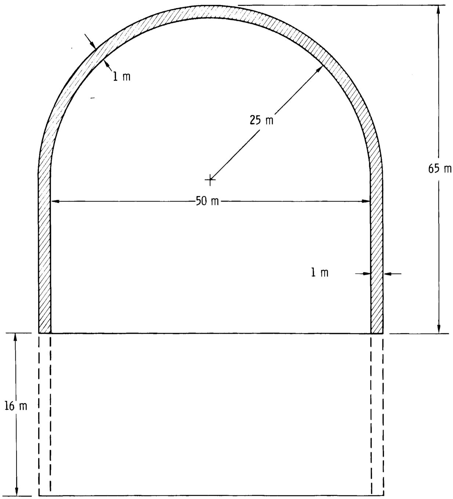  
FIGURE VI-A-1. Tokamak Hybrid Reactor Hall

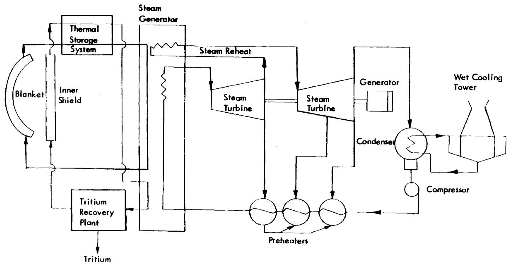  
FIGURE VI-A-2. Power Conversion System for Tokamak Hybrid Reactor

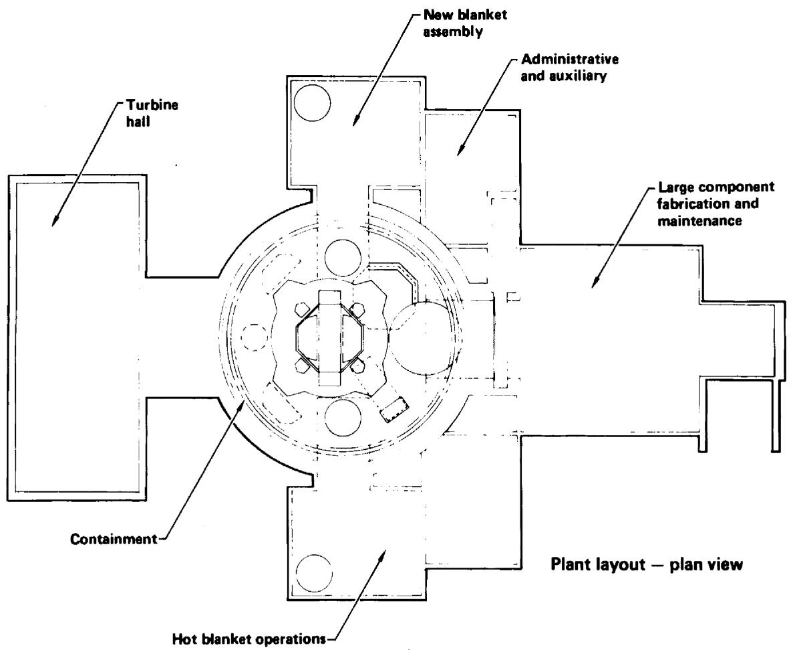

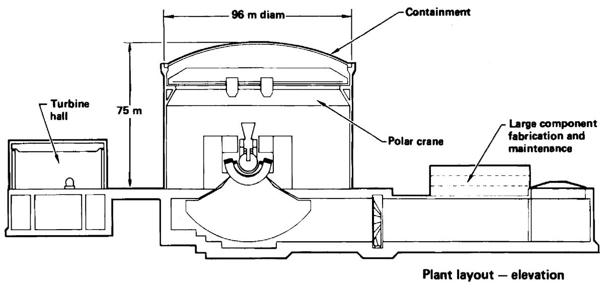  
FIGURE VI-A-3. Mirror Hybrid Plant Layout(1)

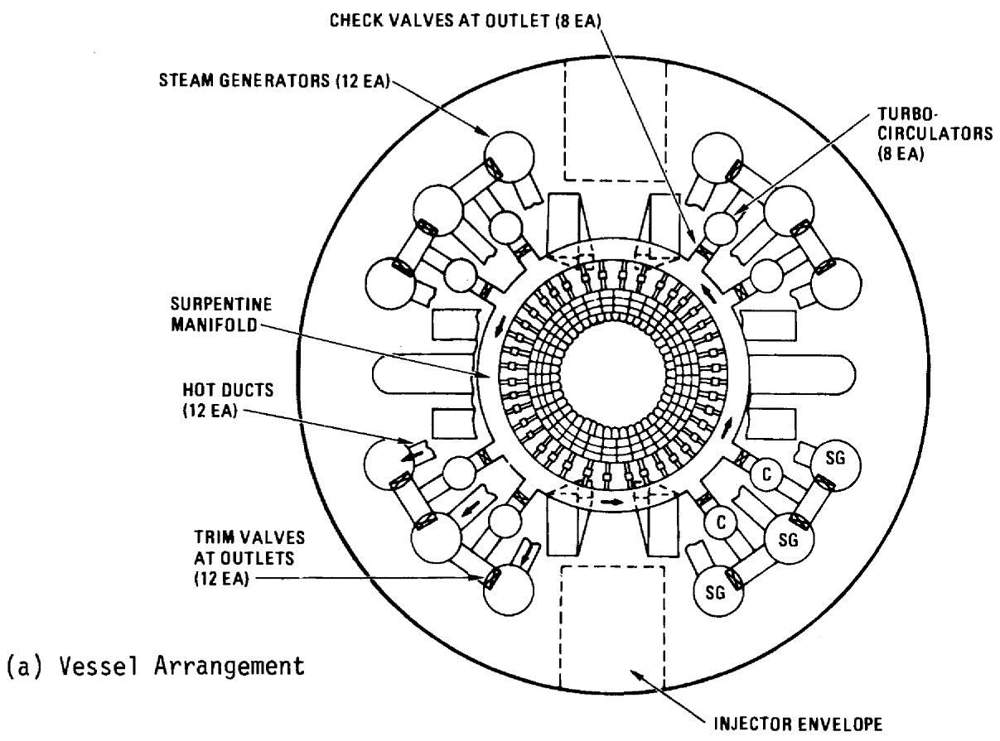

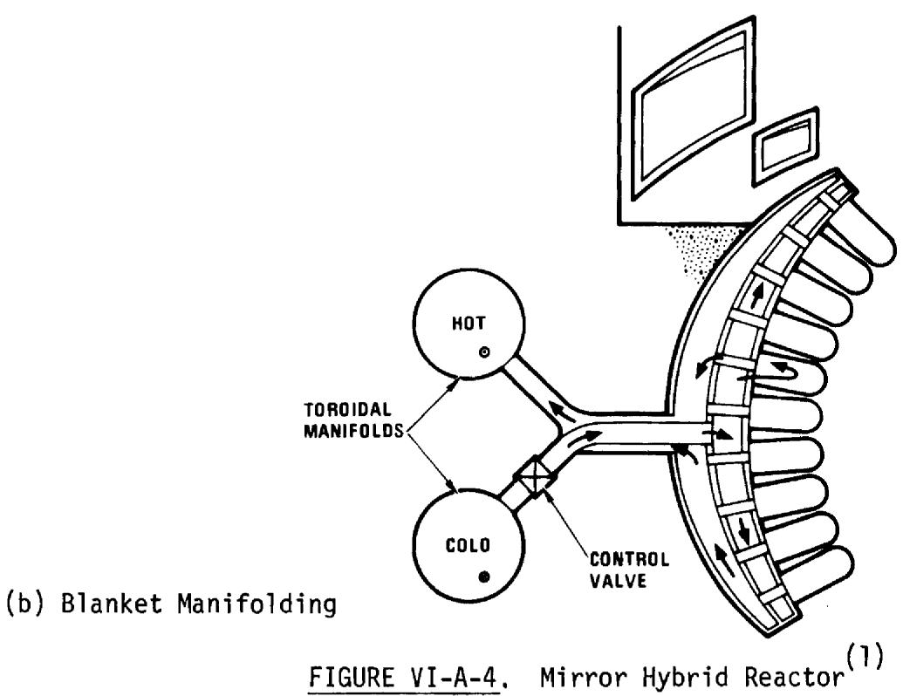

Cooled helium leaves the steam-generator through flow control valves and enters the circulators. The trim valves control circulator power requirements between loops. From the steam-driven, turbo-circulator outlets the coolant is transferred through check valves to a large diameter ring manifold surrounding the reactor itself. Coolant is bled from the ring manifold through 50 radial ducts containing blanket-flow control valves; the valves match the coolant flow to the heat load of the blanket modules. Helium then moves through the vertical distribution channels within the blanket structure, through the modules, and outward into the manifold. The heated coolant is directed toward the 12 steam generators to complete the primary power conversion loop circuit. An attractive feature of the PCRV (Prestressed Concrete Reactor Vessel) is that the primary power conversion loop helium never leaves the concrete structure, which gives the primary loop great integrity and renders a sudden depressurization impossible. The permanent blanket structure is also embedded in the PCRV, which eliminates a maintainable interface between the power conversion loop and the blanket. All power conversion loop maintenance is done either on the inner face of the reactor sphere by replacing blanket modules remotely or on equipment located in top-head cavities with standard gas-cooled reactor technology. The containment building crane is used to remove and replace top-head cavity closures and power conversion loop equipment within the cavities, including neutral beam injectors, circulators, and steam generators.

The primary coolant loop system consists of 50 12-module blanket units which are connected by ducts and manifolds. There are 12 steam generators, eight helium circulators, five auxiliary heat exchangers, and five auxiliary helium circulators. Figure VI-A-5 shows the primary helium loop schematic as well as the secondary coolant loop arrangement. These were taken from Reference 2.

# 3. Laser Hybrid Reactor

The reactor building layout is shown in Figure VI-A-6. The laser hybrid reactor building is approximately 52 meters high (from ground level) and, like the mirror hybrid facility, it has an overhead crane system used for blanket maintenance.

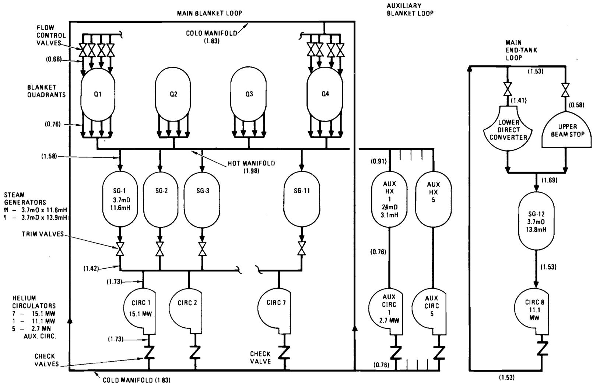  
NOTE: DUCT DIAMETERS SHOWN IN METERS ( )   
FIGURE VI-A-5a. Mirror Hybrid Coolant Systems (Primary Coolant Loop)(1)

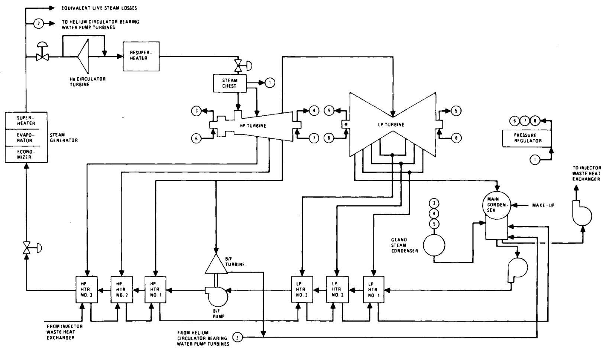  
FIGURE VI-A-5b. Mirror Hybrid Coolant Systems (Secondary Coolant System)

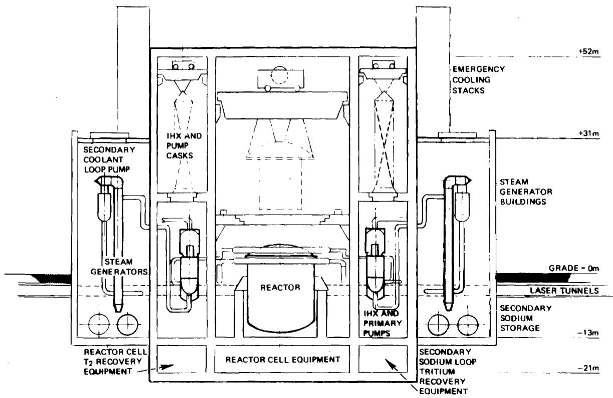  
FIGURE VI-A-6. Laser Hybrid Reactor Building Layout(2)

# 4. Linear Theta-Pinch Hybrid Reactor

Details of the reactor hall for the theta-pinch hybrid are given in Figure VI-A-7. The reactor building is approximately 500 meters long and 9.5 meters high. Running the length of the reactor is an overhead module handling crane. Beneath the reactor is situated a rail carriage for blanket removal from the bottom portion of the hybrid.

# B. POWER ANALYSIS

A schematic diagram for the Tokamak Hybrid Reactor is shown in Figure VI-B-1. Accompanying plant parameters for each of the fusion blankets are listed in Table VI-B-1. The neutral beam injectors supply 200 MW to the plasma during the three-second startup phase of the reactor cycle. An additional 405 MW is required for the remainder of the reactor support systems. A breakdown of the THR recirculating

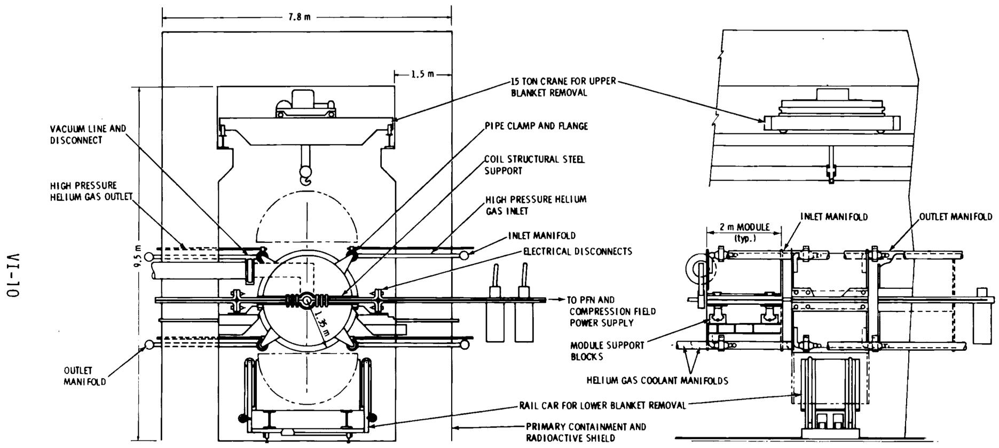  
FIGURE VI-A-7. Linear Theta-Pinch Hybrid Reactor Configuration

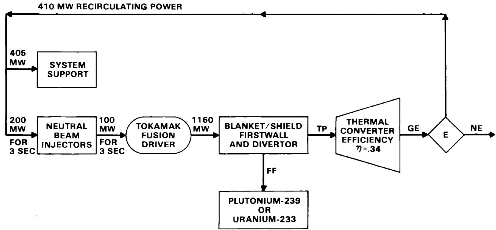  
FIGURE VI-B-1. Tokamak Hybrid Plant Schematic

TABLE VI-B-1. Tokamak Hybrid Plant Parameters   

<table><tr><td></td><td>Blanket</td><td>Thermal Power Due to Fissions FP (MW)</td><td>Total Thermal Power TP (MWh)</td><td>Plant Efficiency E</td><td>Gross Electric GE (MWe)</td><td>Net Electric NE (MWe)</td><td>Fissile Fuel Production Rate FF (kg/yr)</td></tr><tr><td></td><td>Pu-Recycle/Once Through</td><td>2615</td><td>4150</td><td>0.71</td><td>1410</td><td>1000</td><td>1950 Pu</td></tr><tr><td rowspan="2">≤13</td><td>ThC2-Pu Catalyst</td><td>5135</td><td>6600</td><td>0.83</td><td>2445</td><td>1835</td><td>3810 U233</td></tr><tr><td>UO2- Refresh</td><td>2210</td><td>3715</td><td>0.675</td><td>1263</td><td>853</td><td>1390 Pu</td></tr></table>

*See Figure VI-B-1.

power requirements is given in Table III-A-3. The ignited plasma supplies 1160 MW of fusion power to the blanket, shield, first wall and divertor.

The Theta-Pinch Hybrid Reactor is depicted in Figure VI-B-2 with various plant parameters for each of the three fission blankets listed in Table VI-B-2. The compression energy source for the theta-pinch draws an enormous 4050 MW of electric power, of which 2025 MW is delivered to the plasma and 1920 MW is directly recoverable. The overall efficiency of the compression energy system is $95\%$ , requiring only 2130 MW of recirculating power. The 500 meter plasma delivers 1098 MW of fusion power to the blanket, shield and first wall.

The Laser Hybrid Power Plant is shown in Figure VI-B-3. Of the 300 MW recirculating power required, 225 MW is needed to run the laser system. Operating at an efficiency of $1.5\%$ , each of the four lasers delivers $100\mathrm{kJ}$ at a frequency of $8.5\mathrm{Hz}$ . With a pellet gain of 250, this corresponds to a fusion power of $850\mathrm{MW}$ . The tritium breeding blankets on the top and bottom of the reactor chamber receive $34\%$ of the fusion power and supply $600\mathrm{MW}$ of thermal power to the turbine system. The remaining $64\%$ of the fusion power is delivered to the radial fission blanket, shield and first wall. The performance of each of the three blankets studied is indicated by the parameters listed in Table VI-B-3.

The Mirror Hybrid System shown in Figure VI-B-4 develops 404 MW of fusion power with the driving neutral beam drawing 1094 MW. The particles streaming out of the fan ports are guided to the direct energy conversion system which supplies 377 MW thermal power to the turbine system and produces 234 MW of electric output. Eighty percent of fusion power is delivered to the fission blanket and shield. The resulting plant parameters for the Mirror Hybrid System are listed in Table VI-B-4.

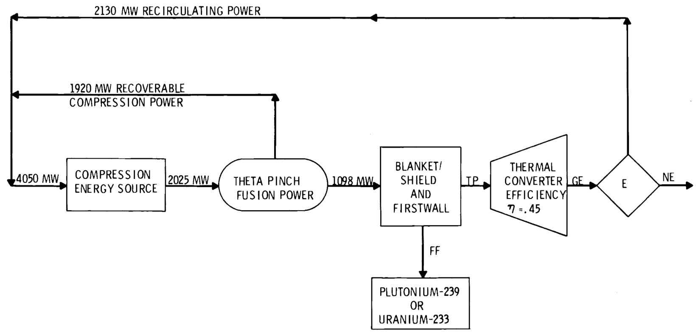  
FIGURE VI-B-2. Theta-Pitch Hybrid Plant Schematic

TABLE VI-B-2. Theta-Pinch Hybrid Plant Parameters   

<table><tr><td></td><td>Blanket</td><td>Thermal Power Due to Fissions FP (MW)</td><td>Total Thermal Power TP (MWh)</td><td>Plant Efficiency E</td><td>Gross Electric GE (MWe)</td><td>Net Electric NE (MWe)</td><td>Fissile Fuel Production Rate FF (kg/yr)</td></tr><tr><td></td><td>Pu-Recycle/Once Through</td><td>3480</td><td>4835</td><td>0.0207</td><td>2175</td><td>45</td><td>2590 Pu</td></tr><tr><td>≤15</td><td>ThC2-Pu Catalyst</td><td>6830</td><td>8200</td><td>0.423</td><td>3690</td><td>1560</td><td>5070 U233</td></tr><tr><td></td><td>UO2- Refresh</td><td>2950</td><td>4350</td><td>--</td><td>1950</td><td>-175</td><td>1845 Pu</td></tr></table>

*See Figure VI-B-2.

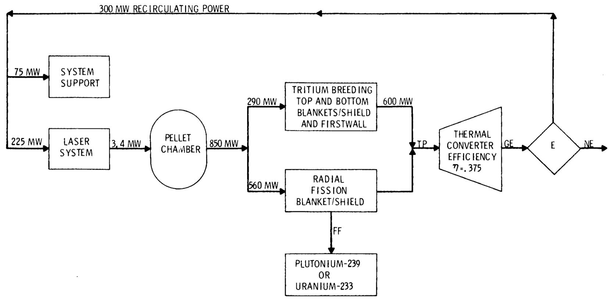  
FIGURE VI-B-3. Laser Hybrid Plant Schematic

TABLE VI-B-3. Laser Hybrid Plant Parameters   

<table><tr><td>Blanket</td><td>Thermal Power Due to Fissions FP (MW)</td><td>Total Thermal Power TP (Mwt)</td><td>Plant Efficiency E</td><td>Gross Electric GE (MWe)</td><td>Net Electric NE (MWe)</td><td>Fissile Fuel Production Rate FF (kg/yr)</td></tr><tr><td>Pu-Recycle/Once Through</td><td>1775</td><td>3300</td><td>0.758</td><td>1240</td><td>940</td><td>1325 Pu</td></tr><tr><td>ThC2-Pu Catalyst</td><td>3485</td><td>4980</td><td>0.839</td><td>1870</td><td>1570</td><td>2585 U233</td></tr><tr><td>UO2 - Refresh</td><td>1500</td><td>3015</td><td>0.735</td><td>1130</td><td>830</td><td>940 Pu</td></tr></table>

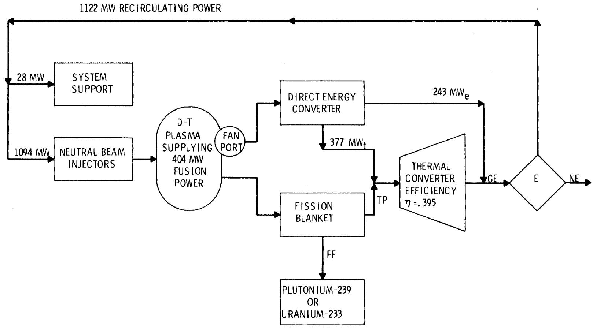  
FIGURE VI-B-4. Mirror Hybrid Plant Schematic

TABLE VI-B-4. Mirror Hybrid Plant Parameters   

<table><tr><td>Blanket</td><td>Thermal Power Due to Fissions FP (MW)</td><td>Total Thermal Power TP (MWT)</td><td>Plant Efficiency E</td><td>Gross Electric GE (MWe)</td><td>Net Electric NE (MWe)</td><td>Fissile Fuel Production Rate FF (kg/yr)</td></tr><tr><td>Pu-Recycle/Once Through</td><td>1080</td><td>2580</td><td>0.111</td><td>1260</td><td>140</td><td>810 Pu</td></tr><tr><td>ThC2-Pu Catalyst</td><td>2125</td><td>3600</td><td>0.327</td><td>1665</td><td>545</td><td>1575 U233</td></tr><tr><td>UO2 - Refresh</td><td>915</td><td>2400</td><td>0.059</td><td>1195</td><td>70</td><td>575 Pu</td></tr></table>

*See Figure VI-B-4.

C. SECTION VI REFERENCES

1. D. J. Bender, et al., Reference Design for the Standard Mirror Hybrid Reactor. UCRL-52478, General Atomic Co. and Lawrence Livermore Laboratory, Livermore, CA, May 1978.   
2. Laser Fusion Fission Reactor Systems Study. Bechtel Corporation and Lawrence Livermore Laboratory, University of California, Livermore, CA, July 1977.

The fuel cycle options for the four fusion drivers will be characterized so that a nonproliferation assessment of these systems can be made. Chapter VII will be divided into three parts: A. Fuel Alternatives, B. Fuel Management Studies, and C. Facility Requirements.

In Section A, the fueling alternatives section, two scenarios will be discussed: 1) no-reprocessing, and 2) reprocessing to recover fissile material for recycle purposes. The relationship between the hybrid and LWR reactor will be developed for the reprocessing scenarios.

Fuel management strategies for the tokamak, mirror, laser and theta-pinch hybrid reactors will be discussed in Section B of this chapter. Blanket management information such as module lifetime, maximum exposure, blanket replacement time, and the number of modules replaced each year will be identified for each hybrid device. The initial quantities of fertile fuel, stainless steel structure, $\mathsf{Li}_2\mathsf{O}$ tritium breeding material, and graphite reflector will be determined. In addition, the 30-year blanket fuel charge and discharge amounts for some of the fuel cycles will be determined.

In Section C, facility requirements, the blanket fuel rod fabrication and module reprocessing facilities will be described. This description will facilitate the identification of potential diversion points and possible proliferation paths.

# A. FUELING ALTERNATIVES

In order for facility descriptions to be developed, a characterization of each fuel cycle is needed. There are four fuel cycle scenarios being investigated for the hybrid reactor:

1. Once-Through - natural uranium fueled hybrid in throwaway mode (power production only).   
2. Pu-Recycle to Thermal Reactors - hybrid with dual role of fissile fuel production and power production.

3. Refresh Fuel Cycle - hybrid reactor re-enriching PWR fuel and returning re-enriched fuel to PWR. Another Refresh type fuel cycle being investigated is a denatured U-235 (20%) in U-238 [PWR-U5(DE)/U/Th]. The spent PWR fuel from the cycle, about 9% U-235/U will be re-enriched in the hybrid with the buildup of the fissile isotope U-233.   
4. Pu-Th (Pu Catalyst) Fuel Cycle - hybrid reactor breeds U-233 in a plutonium-thorium target; U-233 is then recycled in LWRs while the plutonium is recycled in the hybrid.

The proliferation resistance which may be attributed to a reactor and its associated fuel cycles may only be estimated by assessing the facility and speed with which weapons usable material can be extracted or diverted from the systems involved. These systems may be "hardened" to resist extraction or diversion by technical and institutional measures. In principle, any such measures or "fixes" which may be available to fission reactor fuel cycles can also be employed in the hybrid reactor system. Moreover, hybrid systems may have some unique nonproliferation advantages over fission breeder reactors since the spectrum of their copious source of fusion neutrons may be tailored in appropriate blanket designs which are more readily adaptable to such technical fixes.

In order to place the hybrid concept in some nonproliferation perspective it may prove useful to relate the candidate hybrid fuel cycles to the fuel cycle scenarios and technical fixes being considered for fission reactors. Such a perspective may give some indication as to whether these fuel cycles possess desirable nonproliferation qualities which may permit the appropriate criteria for proliferation resistance to be achieved.<sup>(1)</sup> We consider two scenarios: (1) no reprocessing of spent fuel, and (2) reprocessing of spent fuel to recover and recycle fissile materials in fission reactors. In the reprocessing scenario we examine recovery and recycle of (a) denatured $^{233}\mathrm{U}$ in fission reactors, and (b) plutonium in fission reactors.

# 1. No-Reprocessing

The Light Water Reactor (LWR) is the main type of commercial reactor in operation in the U.S. The High Temperature Gas Cooled Reactor (HTGR)

has seen limited commercial deployment. The LWR fuel cycle in the case of no-reprocessing in which spent fuel assemblies are stored is outlined below and the hybrid fuel cycle options related to these.

The current once-through LWR fuel cycle is shown in Figure VII-A-1. The spent LWR fuel is shown going to storage where it stays until such time that a decision is made as to its ultimate disposition.

In the no-reprocessing scenario, the hybrid role is limited to producing power for sale. The hybrid fuel cycle analogous to the once-through LWR cycle is shown in Figure VII-A-2. Natural uranium in the form of uranium carbide is used as blanket material for the hybrid. The blanket is irradiated, the uranium fissions, and power is generated. The spent blanket is discharged and temporarily stored in a decay heat removal area similar to LWR spent fuel pools awaiting ultimate disposition.

Another hybrid fuel cycle that operated in the no-reprocessing mode is the "refresh cycle." This is shown in Figure VII-A-3. Natural uranium is mined and refined in order to produce uranium dioxide for fabricating blanket modules. The blanket is irradiated in the hybrid where neutrons are captured in U-238 to produce Pu-239. The bred Pu blanket material is inserted in a fission reactor to produce power. After the fuel is depleted in the fission reactor it is sent back to the hybrid to be "refreshed" in Pu-239. Upon refreshing, the fuel is again used in the fission reactor for power production. Fuel might be shuffled between fission reactor and hybrid two to three times depending on the obtainable fuel life. After this cycle the spent fuel is stored for ultimate disposition. It is possible that the fuel would require refabrication between irradiations to remove the bulk of the fission products and extend fuel life.

In addition to the "refresh" cycle discussed above, the hybrid reactor might be used to "refresh" or "re-enrich" normal spent fuel (i.e., as in Figure VII-A-1 where the fresh fuel is enriched to $\sim 3\%$ $235_{\text{U}}$ in U at the start of life and is depleted to $\sim 1.0\%$ $235_{\text{U}}$ in U at the end of its life.) In this concept fission reactor spent fuel would be shipped from the reactor discharge basin to a refabrication center. The spent fuel would be mechanically

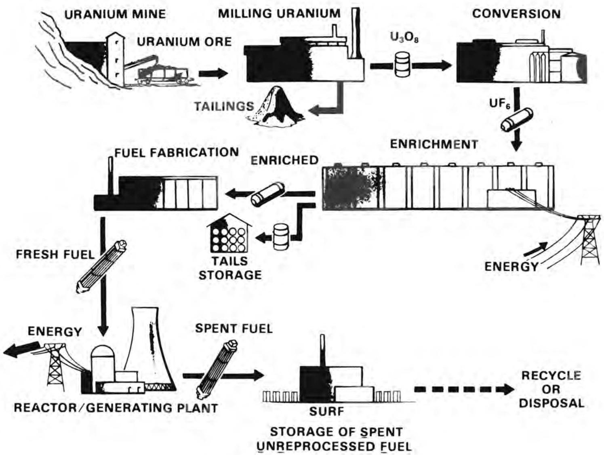  
FIGURE VII-A-1. Uranium Nuclear Fuel Cycle

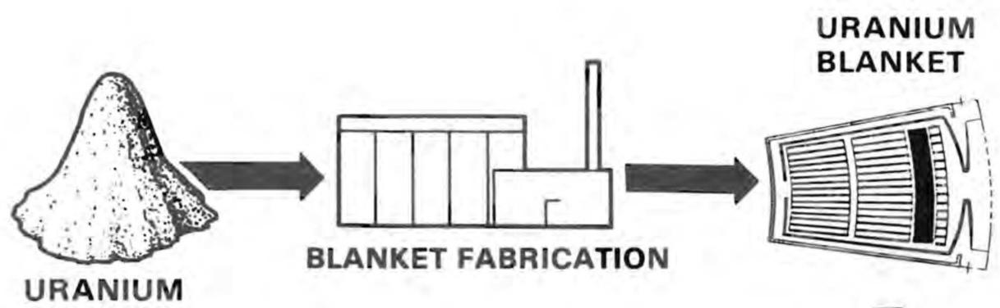

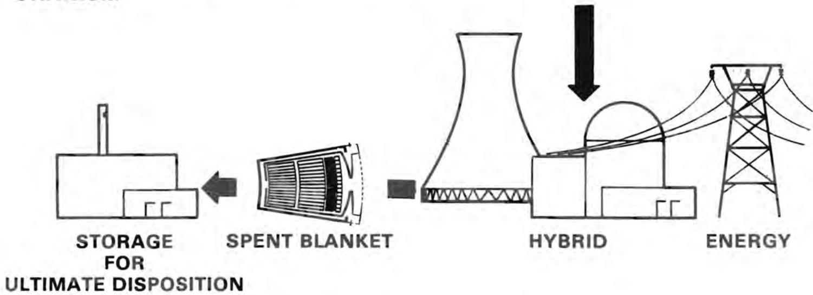  
FIGURE VII-A-2. Once-Through Hybrid Fuel Cycle

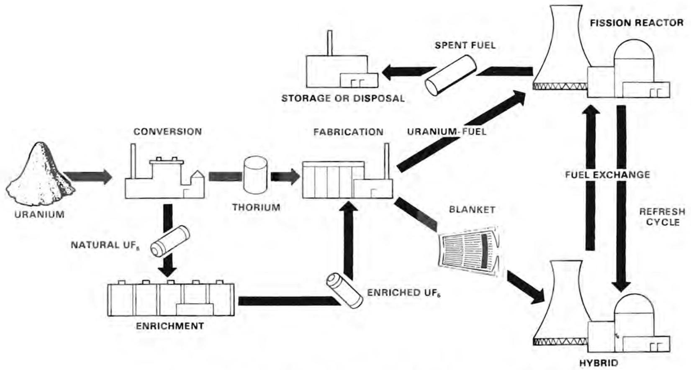  
9-11A   
FIGURE VII-A-3. Refresh Hybrid Fuel Cycle

refabricated into fresh hybrid blanket module assemblies. This fuel would then be re-enriched in the hybrid and, after an appropriate decay period, returned to the fission reactor.

# 2. Reprocessing and Recycle of Fissile Materials

Denaturing a fissile isotope means diluting it with another isotope of the same element to the extent that a nuclear weapon cannot be made from the material. In the case of the fissile uranium isotopes $(^{235}\mathrm{U}$ and $^{233}\mathrm{U})$ $^{238}\mathrm{U}$ serves as the diluent. Until recently it was generally felt that plutonium could not be denatured to render it unusable for weapons purposes. Recently, it has been proposed by Allied-General Nuclear Services that $^{238}\mathrm{Pu}$ in sufficient quantity in the plutonium can make the plutonium unusable for weapons because of its high heat generation rate.(2) Other technical and institutional fixes to make the fuel cycle proliferation resistant include:

- Keeping the fissile and fertile materials together at all times (e.g., co-processed U-Pu) to dilute the fissile content to below weapons-grade,   
- Making the fuel highly radioactive (e.g., having highly radioactive materials in the fuel) to preclude handling,   
Combining the above two in the CIVEX process, (3) and   
- Restricting use to fuel cycle centers.

These concepts for the $^{233}\mathrm{U}$ and plutonium cycles are briefly described below.

a. Denatured $^{233}\mathrm{U}$ Cycle

This scenario assumes uranium and therefore its fissile component $^{235}\mathrm{U}$ is in short supply. The limitation of $^{235}\mathrm{U}$ supply can be alleviated through utilization of thorium to generate $^{233}\mathrm{U}$ (which is denatured) and thereby extend the supply of fissile material for fission reactors. The LWR thorium cycle is shown in Figure VII-A-4. Raw materials bearing thorium are refined to produce $\mathrm{ThO}_2$ which is mixed with enriched $\mathrm{UO}_2$ to fabricate $\mathrm{ThO}_2 - \mathrm{UO}_2$ fuel for an LWR. The spent fuel is reprocessed to recover denatured $^{233}\mathrm{U}$ which is refabricated into new fuel. Since this is not a breeder cycle, an external source of $^{233}\mathrm{U}$ is needed to sustain the system and allow it to grow. The hybrid could be the external source.

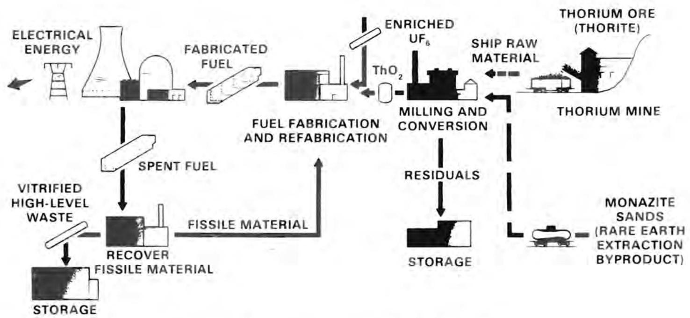  
FIGURE VII-A-4. Thorium LWR Fuel Cycle

The hybrid concept based on this scenario is shown in Figure VII-A-5. Mined thorium is refined and a thorium blanket for the hybrid is fabricated. Irradiating this blanket in the hybrids builds in $^{233}\mathrm{U}$ which is reprocessed and denatured ( $^{238}\mathrm{U}$ added during reprocessing). The denatured uranium is mixed with thorium during fabrication to produce LWR fuel. Once the spent fuel is discharged from the LWR, the steps shown in Figure VII-A-5 would be followed.

The isotope $^{232}\mathrm{U}$ builds up in these cycles to the point where the radiation levels are sufficient to require massive shielding during handling and processing. (4) The requirements for shielding are perceived as adding proliferation resistance to the fuel cycle.

# b. Plutonium Recovery and Recycle

As mentioned above it has been suggested that sufficient addition of $^{238}_{\text{Pu}}$ in the plutonium can render it unusable for weapons purposes. The level of $^{238}_{\text{Pu}}$ can be increased by recovering uranium and $^{237}_{\text{Np}}$ from the spent fuel. The isotope $^{236}_{\text{U}}$ builds up during irradiation of the fresh $\text{UO}_2$ fuel in the LWR. Subsequent irradiation of the $^{236}_{\text{U}}$ and $^{237}_{\text{Np}}$ produce $^{238}_{\text{Pu}}$ in the plutonium. It has been shown (4) that the plutonium produced in a hybrid can contain significant fractions of $^{236}_{\text{Pu}}$ and $^{238}_{\text{Pu}}$ .

Since LWRs do not convert a sufficient amount of plutonium to fuel themselves, an external source of plutonium is needed to sustain the system and allow it to grow. As shown in Figure VII-A-6 the hybrid could be the external source of proliferation resistant plutonium. The sources of uranium include: mixed natural, depleted uranium from the enrichment plants and/or the uranium recovered in reprocessing spent $\mathrm{UO}_2$ LWR fuel.

The hybrid fuel cycle in this scenario is similar to the fission breeder cycles in that fission reactor fuel supply requirements are extended by converting $^{238}\mathrm{U}$ to fissile plutonium. The plutonium produced in hybrid blankets could be subject to the same restrictions as that produced in fission reactor fuels, namely, it would be rendered proliferation resistant at the same stage as fission reactor fuel.

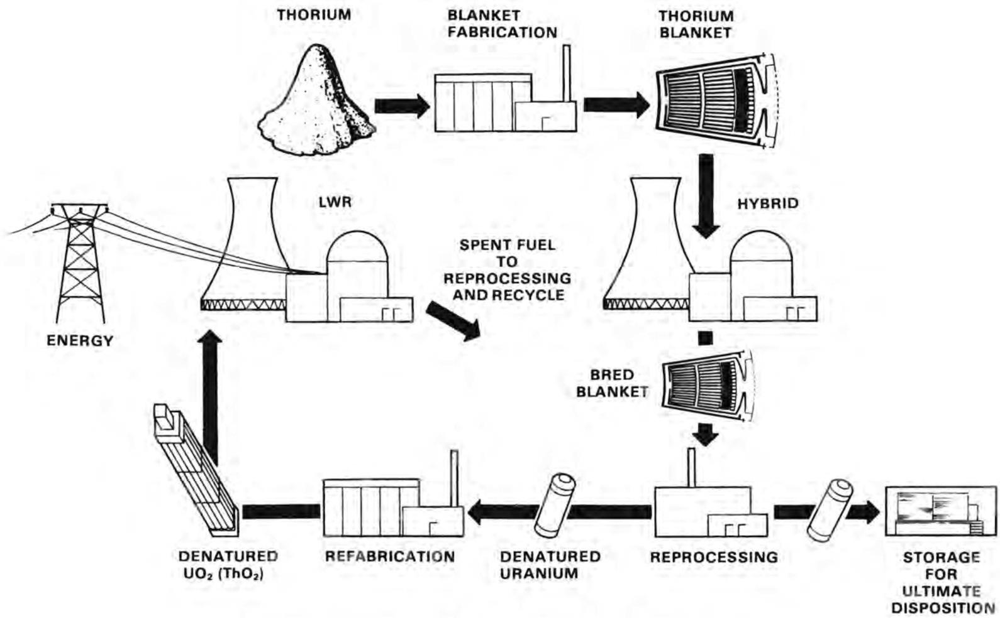  
VII-10   
FIGURE VII-A-5. Thorium Hybrid Fuel Cycle

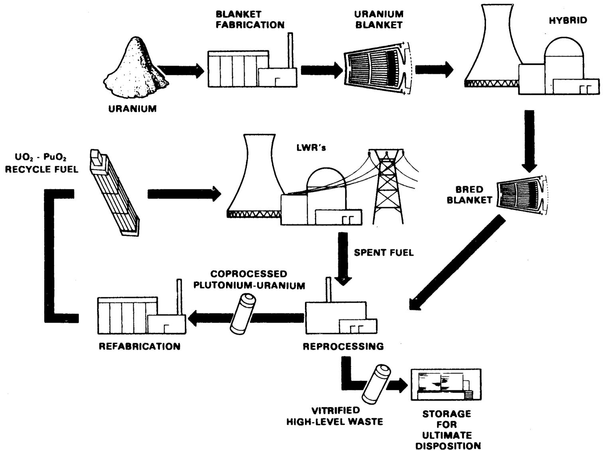  
FIGURE VII-A-6. Plutonium Recycle

Table VII-A-1 shows a list of specific driver/blanket fuel cycle combinations. Each of these fuel cycles will be characterized and placed into a non-proliferation perspective relative to a once-through or throwaway fuel cycle. Included in this characterization is a discussion of fuel management strategies and overall fuel requirements. Fuel cycle facility descriptions can be made once these fuel management strategies and fuel mass flows have been established.

TABLE VII-A-1. Driver/Blanket Fuel Cycle Combinations   

<table><tr><td>Driver</td><td>Once-Through</td><td>Pu-Recycle</td><td>Refresh</td><td>Pu Catalyst</td></tr><tr><td>Tokamak</td><td>○</td><td>○</td><td>○</td><td>○</td></tr><tr><td>Mirror</td><td>○</td><td>○</td><td>○</td><td>○</td></tr><tr><td>Theta-Pinch</td><td>○</td><td>○</td><td>○</td><td>○</td></tr><tr><td>Laser</td><td>○</td><td>○</td><td>○</td><td>○</td></tr></table>

# B. FUEL MANAGEMENT STRATEGIES

The blanket module management scheme is to place fertile fuel into the hybrid reactor and expose the fuel to a specified burnup. After the maximum burnup level is achieved the spent module is removed and placed into a hot cell operations area. Here the fuel is unloaded and prepared for shipment to a reprocessing plant where fissile fuel created in the hybrid is separated from the spent fuel. The thermal output of the blanket is increased as it resides in the hybrid due to energy multiplication resulting from the fission-ing of fissile material created in the hybrid blanket. The hybrid reactor should be operated such that the blanket management tends to minimize the power variations within the blanket modules.

# 1. Tokamak Hybrid Reactor

The Tokamak Hybrid Reactor blanket modules are divided into 4 fuel management regions. The tokamak blanket consists of 60 slices with each slice made up of 11 modules (660 total modules). The blanket life is taken to be 4 years so that each year 165 modules or $\frac{1}{4}$ of the blanket fuel is

removed and replaced with fresh fuel. Table VII-B-1 gives some pertinent fuel management information.

TABLE VII-B-1. Tokamak Hybrid Fuel Management Data

TABLE VII-B-2. Reactor Subsystems   

<table><tr><td>Number of Fuel Management Regions</td><td>4</td></tr><tr><td>Blanket Lifetime</td><td>4 years</td></tr><tr><td>Plant Capacity Factor</td><td>0.75</td></tr><tr><td>Maximum Exposure</td><td>9.6 MWy/m2</td></tr><tr><td>Blanket Replacement Time</td><td>35 days</td></tr><tr><td>Fuel Management Interval</td><td>1.3 years</td></tr></table>

The capacity factor for the Tokamak Hybrid Reactor is influenced by several factors. There are many subsystems that require maintenance. Table VII-B-2 lists some of these systems.

1. Coolant Loops   
2. Cryopump, $\mathsf{N}_2$ , He supplies   
3. Divertor plates   
4. Neutral Beam injectors   
5. Inspection of toroidal field coils, poloidal field coils, fluid lines and manifolds.   
6. Tritium cleanup systems, coolant purification, and sieve getter beds   
7. Shielding

For the purposes of this study it is assumed that maintenance of these systems is accomplished during blanket module replacement. Unscheduled maintenance results from first wall burn-through, coolant leaks, isolation of failed modules or any abnormal operating conditions. The unscheduled

maintenance is taken to be approximately 50 to 60 days/year. A portion of this time is for some scheduled maintenance not performed during blanket change operations. The blanket replacement outage will last about 35 days (1.5 days/slice plus 5 days for shutdown, decay heat removal, and tritium outgassing).

Shown in Table VII-B-3 are the initial fertile fuel, structure, tritium breeder, and reflector material requirements.

The blanket configuration for the Once-Through and Pu-Recycle fuel cycles both use uranium carbide as the fertile material, while the Pu-Catalyst fuel cycle has a converter region of uranium dioxide and plutonium dioxide and a fertile region of thorium carbide. The refresh fuel cycle makes use of uranium dioxide. The isotopic feed for each of these fuel cycles is natural uranium $(0.72\%^{235}\mathrm{U})$ . In the Pu-Catalyst fuel cycle the converter region uses a mixed-oxide $(\mathrm{UO}_2 / \mathrm{PuO}_2)$ fuel matrix with an equilibrium concentration of $\sim 8\%$ $\mathrm{PuO}_2$ . The tritium breeding material, $\mathrm{Li}_2\mathrm{O}$ , is enriched to $90\%$ Li. Both the fertile fuel and tritium breeder are contained in stainless steel rods. A graphite reflector region is also incorporated into the blanket module.

Using the fuel management information presented in Table VII-B-3, the annual charge and discharge fuel quantities can be determined. The 30-year requirements are given in Tables VII-B-4 - VII-B-6. This isotopic information was obtained through the use of the ORIGEN computer code.(5) ORIGEN is a point depletion code which solves equations of radioactive growth and decay. The ORIGEN program considers $(n,\gamma),(n,2n),(n,p)$ and $(n,\alpha)$ reactions for light elements and structural material. The actinides have $(n,\gamma),(n,fission),(n,2n)$ and $(n,3n)$ reactions included. The total fuel mass flows for each of the four cycles are shown in Figures VII-B-1 to VII-B-4. Listed below are some of the assumptions used in developing these fuel flows.

a. Once-Through Assumptions

(a) Li Content in crude ore - 5% Li/ore

TABLE VII-B-3. Tokamak Hybrid Reactor Initial Material Requirements   

<table><tr><td>Reactor/Fuel Cycle</td><td>Fuel</td><td>Structure</td><td>Tritium Breeding Material</td><td>Other</td></tr><tr><td>Tokamak/Once-Through</td><td>317.8 MTUC</td><td>170.9 MTSS(a)</td><td>123.62 MT Li2O(b)</td><td>55.97 MTC(c)</td></tr><tr><td>Tokamak/Pu Recycle to Thermal Reactors</td><td>317.8 MTUC</td><td>170.9 MTSS</td><td>123.62 MT Li2O</td><td>55.97 MTC</td></tr><tr><td>Tokamak/Refresh</td><td>234.0 MT UO2</td><td>170.9 MTSS</td><td>123.62 MT Li2O</td><td>55.97 MTC</td></tr><tr><td>Tokamak/Pu-Catalyst</td><td>113 MT UO2</td><td></td><td></td><td></td></tr><tr><td></td><td>223 MT ThC</td><td>170.9 MTSS</td><td>85.8 MT Li2O</td><td>55.97 MTC</td></tr><tr><td></td><td>9 MT PuO2</td><td></td><td></td><td></td></tr></table>

(a) Stainless steel amount includes cladding and module structure.   
(b) Tritium breeding material, $\mathrm{{Li}}20$ ,enriched to 90% 6Li.   
(c) Graphite is for reflector region of module.

# TABLE VII-B-4. Once-Through and Pu-Recycle Fuel Charge Data

# FUEL MANAGEMENT CHARACTERISTICS

Reactor Type Tokamak Hybrid

Fuel Type Natural Uranium Carbide

<table><tr><td rowspan="2">Year</td><td rowspan="2">Annual Capacity Factor, %</td><td rowspan="2">Heavy Metal, kg</td><td rowspan="2">Thorium, kg</td><td colspan="5">Uranium, kg</td><td colspan="4">Plutonium, kg</td></tr><tr><td>233</td><td>234</td><td>235</td><td>236</td><td>238</td><td>239</td><td>240</td><td>241</td><td>242</td></tr><tr><td>1</td><td>75</td><td>302,540</td><td>0</td><td>0</td><td>0</td><td>2178</td><td>0</td><td>300,345</td><td>0</td><td>0</td><td>0</td><td>0</td></tr><tr><td>2</td><td>75</td><td>75,635</td><td>•</td><td>•</td><td>•</td><td>544</td><td>•</td><td>75,086</td><td>•</td><td>•</td><td>•</td><td>•</td></tr><tr><td>3</td><td>75</td><td>75,635</td><td>•</td><td>•</td><td>•</td><td>544</td><td>•</td><td>75,086</td><td>•</td><td>•</td><td>•</td><td>•</td></tr><tr><td>4</td><td>75</td><td>75,635</td><td>•</td><td>•</td><td>•</td><td>544</td><td>•</td><td>75,086</td><td>•</td><td>•</td><td>•</td><td>•</td></tr><tr><td>5</td><td>•</td><td>•</td><td>•</td><td>•</td><td>•</td><td>•</td><td>•</td><td>•</td><td>•</td><td>•</td><td>•</td><td>•</td></tr><tr><td>6</td><td>•</td><td>•</td><td>•</td><td>•</td><td>•</td><td>•</td><td>•</td><td>•</td><td>•</td><td>•</td><td>•</td><td>•</td></tr><tr><td>7</td><td>•</td><td>•</td><td>•</td><td>•</td><td>•</td><td>•</td><td>•</td><td>•</td><td>•</td><td>•</td><td>•</td><td>•</td></tr><tr><td>8</td><td></td><td></td><td></td><td></td><td></td><td></td><td></td><td></td><td></td><td></td><td></td><td></td></tr><tr><td>9</td><td></td><td></td><td></td><td></td><td></td><td></td><td></td><td></td><td></td><td></td><td></td><td></td></tr><tr><td>10</td><td></td><td></td><td></td><td></td><td></td><td></td><td></td><td></td><td></td><td></td><td></td><td></td></tr><tr><td>11</td><td></td><td></td><td></td><td></td><td></td><td></td><td></td><td></td><td></td><td></td><td></td><td></td></tr><tr><td>12</td><td></td><td></td><td></td><td></td><td></td><td></td><td></td><td></td><td></td><td></td><td></td><td></td></tr><tr><td>13</td><td></td><td></td><td></td><td></td><td></td><td></td><td></td><td></td><td></td><td></td><td></td><td></td></tr><tr><td>14</td><td></td><td></td><td></td><td></td><td></td><td></td><td></td><td></td><td></td><td></td><td></td><td></td></tr><tr><td>15</td><td></td><td></td><td></td><td></td><td></td><td></td><td></td><td></td><td></td><td></td><td></td><td></td></tr><tr><td>16</td><td></td><td></td><td></td><td></td><td></td><td></td><td></td><td></td><td></td><td></td><td></td><td></td></tr><tr><td>17</td><td></td><td></td><td></td><td></td><td></td><td></td><td></td><td></td><td></td><td></td><td></td><td></td></tr><tr><td>18</td><td></td><td></td><td></td><td></td><td></td><td></td><td></td><td></td><td></td><td></td><td></td><td></td></tr><tr><td>19</td><td></td><td></td><td></td><td></td><td></td><td></td><td></td><td></td><td></td><td></td><td></td><td></td></tr><tr><td>20</td><td></td><td></td><td></td><td></td><td></td><td></td><td></td><td></td><td></td><td></td><td></td><td></td></tr><tr><td>21</td><td></td><td></td><td></td><td></td><td></td><td></td><td></td><td></td><td></td><td></td><td></td><td></td></tr><tr><td>22</td><td></td><td></td><td></td><td></td><td></td><td></td><td></td><td></td><td></td><td></td><td></td><td></td></tr><tr><td>23</td><td></td><td></td><td></td><td></td><td></td><td></td><td></td><td></td><td></td><td></td><td></td><td></td></tr><tr><td>24</td><td></td><td></td><td></td><td></td><td></td><td></td><td></td><td></td><td></td><td></td><td></td><td></td></tr><tr><td>25</td><td></td><td></td><td></td><td></td><td></td><td></td><td></td><td></td><td></td><td></td><td></td><td></td></tr><tr><td>26</td><td></td><td></td><td></td><td></td><td></td><td></td><td></td><td></td><td></td><td></td><td></td><td></td></tr><tr><td>27</td><td></td><td></td><td></td><td></td><td></td><td></td><td></td><td></td><td></td><td></td><td></td><td></td></tr><tr><td>28</td><td>•</td><td>•</td><td>•</td><td>•</td><td>•</td><td>•</td><td>•</td><td>•</td><td>•</td><td>•</td><td>•</td><td>•</td></tr><tr><td>29</td><td>•</td><td>•</td><td>•</td><td>•</td><td>•</td><td>•</td><td>•</td><td>•</td><td>•</td><td>•</td><td>•</td><td>•</td></tr><tr><td>30</td><td>75</td><td>75,635</td><td>0</td><td>0</td><td>0</td><td>544</td><td>0</td><td>75,086</td><td>0</td><td>0</td><td>0</td><td>0</td></tr></table>

# TABLE VII-B-5. Once-Through and Pu-Recycle Fuel Discharge Data

# FUEL MANAGEMENT CHARACTERISTICS

Reactor Type Tokamak Hybrid

Fuel Type Natural Uranium Carbide

Reactor Fuel Discharge Data   

<table><tr><td rowspan="2">Year</td><td rowspan="2">Heavy Metal, kg</td><td rowspan="2">Thorium, kg</td><td colspan="5">Uranium, kg</td><td colspan="4">Plutonium, kg</td><td rowspan="2">Fission Products, kg</td><td colspan="4">Other Isotopics, kg</td></tr><tr><td>233</td><td>234</td><td>235</td><td>236</td><td>238</td><td>239</td><td>240</td><td>241</td><td>242</td><td>Pa-233</td><td>Np-237</td><td>Am-241</td><td>Cm-242</td></tr><tr><td>1</td><td>74838</td><td>0</td><td>.006</td><td>.072</td><td>487</td><td>27.2</td><td>73593</td><td>480.6</td><td>4.8</td><td>.044</td><td>0</td><td>190.8</td><td>0</td><td>55</td><td>~0</td><td>0</td></tr><tr><td>2</td><td>74843</td><td>•</td><td>.014</td><td>.18</td><td>452</td><td>58</td><td>72880</td><td>955.4</td><td>8.7</td><td>.14</td><td>•</td><td>381.7</td><td>•</td><td>107</td><td>.006</td><td></td></tr><tr><td>3</td><td>74840</td><td>•</td><td>.026</td><td>.38</td><td>419</td><td>86</td><td>72168</td><td>1424.3</td><td>13.4</td><td>.30</td><td>•</td><td>572.6</td><td>•</td><td>156</td><td>.029</td><td></td></tr><tr><td>4</td><td>74829</td><td>•</td><td>.036</td><td>.62</td><td>387</td><td>114</td><td>71455</td><td>1887.4</td><td>17.5</td><td>.46</td><td>•</td><td>763.5</td><td>•</td><td>204</td><td>.088</td><td>.00136</td></tr><tr><td>5</td><td>•</td><td>•</td><td>•</td><td>•</td><td>•</td><td>•</td><td>•</td><td>•</td><td>•</td><td>•</td><td>•</td><td>•</td><td>•</td><td>•</td><td>•</td><td>•</td></tr><tr><td>6</td><td>•</td><td>•</td><td>•</td><td>•</td><td>•</td><td>•</td><td>•</td><td>•</td><td>•</td><td>•</td><td>•</td><td>•</td><td>•</td><td>•</td><td>•</td><td>•</td></tr><tr><td>7</td><td>•</td><td>•</td><td>•</td><td>•</td><td>•</td><td>•</td><td>•</td><td>•</td><td>•</td><td>•</td><td>•</td><td>•</td><td>•</td><td>•</td><td>•</td><td>•</td></tr><tr><td>8</td><td></td><td></td><td></td><td></td><td></td><td></td><td></td><td></td><td></td><td></td><td></td><td></td><td></td><td></td><td></td><td></td></tr><tr><td>9</td><td></td><td></td><td></td><td></td><td></td><td></td><td></td><td></td><td></td><td></td><td></td><td></td><td></td><td></td><td></td><td></td></tr><tr><td>10</td><td></td><td></td><td></td><td></td><td></td><td></td><td></td><td></td><td></td><td></td><td></td><td></td><td></td><td></td><td></td><td></td></tr><tr><td>11</td><td></td><td></td><td></td><td></td><td></td><td></td><td></td><td></td><td></td><td></td><td></td><td></td><td></td><td></td><td></td><td></td></tr><tr><td>12</td><td></td><td></td><td></td><td></td><td></td><td></td><td></td><td></td><td></td><td></td><td></td><td></td><td></td><td></td><td></td><td></td></tr><tr><td>13</td><td></td><td></td><td></td><td></td><td></td><td></td><td></td><td></td><td></td><td></td><td></td><td></td><td></td><td></td><td></td><td></td></tr><tr><td>14</td><td></td><td></td><td></td><td></td><td></td><td></td><td></td><td></td><td></td><td></td><td></td><td></td><td></td><td></td><td></td><td></td></tr><tr><td>15</td><td></td><td></td><td></td><td></td><td></td><td></td><td></td><td></td><td></td><td></td><td></td><td></td><td></td><td></td><td></td><td></td></tr><tr><td>16</td><td></td><td></td><td></td><td></td><td></td><td></td><td></td><td></td><td></td><td></td><td></td><td></td><td></td><td></td><td></td><td></td></tr><tr><td>17</td><td></td><td></td><td></td><td></td><td></td><td></td><td></td><td></td><td></td><td></td><td></td><td></td><td></td><td></td><td></td><td></td></tr><tr><td>18</td><td></td><td></td><td></td><td></td><td></td><td></td><td></td><td></td><td></td><td></td><td></td><td></td><td></td><td></td><td></td><td></td></tr><tr><td>19</td><td></td><td></td><td></td><td></td><td></td><td></td><td></td><td></td><td></td><td></td><td></td><td></td><td></td><td></td><td></td><td></td></tr><tr><td>20</td><td></td><td></td><td></td><td></td><td></td><td></td><td></td><td></td><td></td><td></td><td></td><td></td><td></td><td></td><td></td><td></td></tr><tr><td>21</td><td></td><td></td><td></td><td></td><td></td><td></td><td></td><td></td><td></td><td></td><td></td><td></td><td></td><td></td><td></td><td></td></tr><tr><td>22</td><td></td><td></td><td></td><td></td><td></td><td></td><td></td><td></td><td></td><td></td><td></td><td></td><td></td><td></td><td></td><td></td></tr><tr><td>23</td><td></td><td></td><td></td><td></td><td></td><td></td><td></td><td></td><td></td><td></td><td></td><td></td><td></td><td></td><td></td><td></td></tr><tr><td>24</td><td></td><td></td><td></td><td></td><td></td><td></td><td></td><td></td><td></td><td></td><td></td><td></td><td></td><td></td><td></td><td></td></tr><tr><td>25</td><td></td><td></td><td></td><td></td><td></td><td></td><td></td><td></td><td></td><td></td><td></td><td></td><td></td><td></td><td></td><td></td></tr><tr><td>26</td><td></td><td></td><td></td><td></td><td></td><td></td><td></td><td></td><td></td><td></td><td></td><td></td><td></td><td></td><td></td><td></td></tr><tr><td>27</td><td></td><td></td><td></td><td></td><td></td><td></td><td></td><td></td><td></td><td></td><td></td><td></td><td></td><td></td><td></td><td></td></tr><tr><td>28</td><td>•</td><td>•</td><td>•</td><td>•</td><td>•</td><td>•</td><td>•</td><td>•</td><td>•</td><td>•</td><td>•</td><td>•</td><td>•</td><td>•</td><td>•</td><td>•</td></tr><tr><td>29</td><td>•</td><td>•</td><td>•</td><td>•</td><td>•</td><td>•</td><td>•</td><td>•</td><td>•</td><td>•</td><td>•</td><td>•</td><td>•</td><td>•</td><td>•</td><td>•</td></tr><tr><td>30</td><td>74625</td><td>0</td><td>.036</td><td>.67</td><td>387</td><td>114</td><td>71455</td><td>1887</td><td>17.5</td><td>.46</td><td>0</td><td>763.5</td><td>0</td><td>204</td><td>.088</td><td>0</td></tr></table>

TABLE VII-B-6. Pu-Catalyst Fuel Charge Data

# FUEL MANAGEMENT CHARACTERISTICS

Reactor Type Tokamak Hybrid Reactor

Fuel Type ${\mathrm{{UO}}}_{2}/{\mathrm{{PuO}}}_{2}$ Converter Region

ThC Breeding Region

Reactor Fuel Charge Data   

<table><tr><td rowspan="2">Year</td><td rowspan="2">Annual Capacity Factor, %</td><td rowspan="2">Heavy Metal, kg</td><td rowspan="2">Thorium, kg</td><td colspan="5">Uranium, kg</td><td colspan="4">Plutonium, kg(a)</td></tr><tr><td>233</td><td>234</td><td>235</td><td>236</td><td>238</td><td>239</td><td>240</td><td>241</td><td>242</td></tr><tr><td>1</td><td>75</td><td>325,674</td><td>212,033</td><td>0</td><td>0</td><td>717.2</td><td>0</td><td>98,889</td><td>7968</td><td>3498</td><td>1870</td><td>699</td></tr><tr><td>2</td><td>75</td><td>81,418</td><td>53,008</td><td>•</td><td>•</td><td>179.3</td><td>•</td><td>24,722</td><td>1992</td><td>874</td><td>467</td><td>174</td></tr><tr><td>3</td><td>75</td><td>81,418</td><td>53,008</td><td>•</td><td>•</td><td>179.3</td><td>•</td><td>24,722</td><td>1992</td><td>874</td><td>467</td><td>174</td></tr><tr><td>4</td><td>74</td><td>81,418</td><td>53,008</td><td>•</td><td>•</td><td>179.3</td><td>•</td><td>24,722</td><td>1992</td><td>874</td><td>467</td><td>174</td></tr><tr><td>5</td><td>•</td><td>•</td><td>•</td><td>•</td><td>•</td><td>•</td><td>•</td><td>•</td><td>•</td><td>•</td><td>•</td><td>•</td></tr><tr><td>6</td><td>•</td><td>•</td><td>•</td><td>•</td><td>•</td><td>•</td><td>•</td><td>•</td><td>•</td><td>•</td><td>•</td><td>•</td></tr><tr><td>7</td><td>•</td><td>•</td><td>•</td><td>•</td><td>•</td><td>•</td><td>•</td><td>•</td><td>•</td><td>•</td><td>•</td><td>•</td></tr><tr><td>8</td><td></td><td></td><td></td><td></td><td></td><td></td><td></td><td></td><td></td><td></td><td></td><td></td></tr><tr><td>9</td><td></td><td></td><td></td><td></td><td></td><td></td><td></td><td></td><td></td><td></td><td></td><td></td></tr><tr><td>10</td><td></td><td></td><td></td><td></td><td></td><td></td><td></td><td></td><td></td><td></td><td></td><td></td></tr><tr><td>11</td><td></td><td></td><td></td><td></td><td></td><td></td><td></td><td></td><td></td><td></td><td></td><td></td></tr><tr><td>12</td><td></td><td></td><td></td><td></td><td></td><td></td><td></td><td></td><td></td><td></td><td></td><td></td></tr><tr><td>13</td><td></td><td></td><td></td><td></td><td></td><td></td><td></td><td></td><td></td><td></td><td></td><td></td></tr><tr><td>14</td><td></td><td></td><td></td><td></td><td></td><td></td><td></td><td></td><td></td><td></td><td></td><td></td></tr><tr><td>15</td><td></td><td></td><td></td><td></td><td></td><td></td><td></td><td></td><td></td><td></td><td></td><td></td></tr><tr><td>16</td><td></td><td></td><td></td><td></td><td></td><td></td><td></td><td></td><td></td><td></td><td></td><td></td></tr><tr><td>17</td><td></td><td></td><td></td><td></td><td></td><td></td><td></td><td></td><td></td><td></td><td></td><td></td></tr><tr><td>18</td><td></td><td></td><td></td><td></td><td></td><td></td><td></td><td></td><td></td><td></td><td></td><td></td></tr><tr><td>19</td><td></td><td></td><td></td><td></td><td></td><td></td><td></td><td></td><td></td><td></td><td></td><td></td></tr><tr><td>20</td><td></td><td></td><td></td><td></td><td></td><td></td><td></td><td></td><td></td><td></td><td></td><td></td></tr><tr><td>21</td><td></td><td></td><td></td><td></td><td></td><td></td><td></td><td></td><td></td><td></td><td></td><td></td></tr><tr><td>22</td><td></td><td></td><td></td><td></td><td></td><td></td><td></td><td></td><td></td><td></td><td></td><td></td></tr><tr><td>23</td><td></td><td></td><td></td><td></td><td></td><td></td><td></td><td></td><td></td><td></td><td></td><td></td></tr><tr><td>24</td><td></td><td></td><td></td><td></td><td></td><td></td><td></td><td></td><td></td><td></td><td></td><td></td></tr><tr><td>25</td><td></td><td></td><td></td><td></td><td></td><td></td><td></td><td></td><td></td><td></td><td></td><td></td></tr><tr><td>26</td><td></td><td></td><td></td><td></td><td></td><td></td><td></td><td></td><td></td><td></td><td></td><td></td></tr><tr><td>27</td><td></td><td></td><td></td><td></td><td></td><td></td><td></td><td></td><td></td><td></td><td></td><td></td></tr><tr><td>28</td><td>•</td><td>•</td><td>•</td><td>•</td><td>•</td><td>•</td><td>•</td><td>•</td><td>•</td><td>•</td><td>•</td><td>•</td></tr><tr><td>29</td><td>•</td><td>•</td><td>•</td><td>•</td><td>•</td><td>•</td><td>•</td><td>•</td><td>•</td><td>•</td><td>•</td><td>•</td></tr><tr><td>30</td><td>75</td><td>81,418</td><td>53,008</td><td>0</td><td>0</td><td>179.3</td><td>0</td><td>24,722</td><td>1992</td><td>874</td><td>467</td><td>174</td></tr></table>

(a) LWR Discharge Plutonium

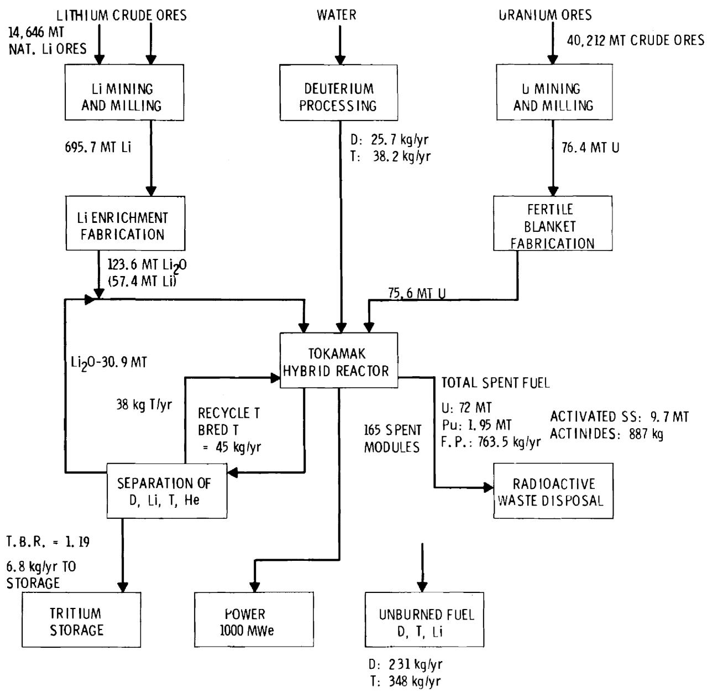  
FIGURE VII-B-1. Tokamak Hybrid Reactor Fuel Flow - Once-Through Fuel Cycle

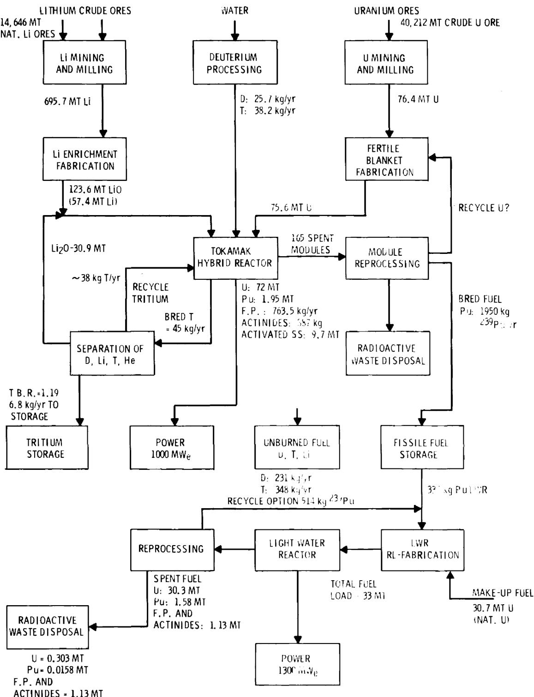  
FIGURE VII-B-2. Tokamak Hybrid Reactor Fuel Flow - Pu-Recycle

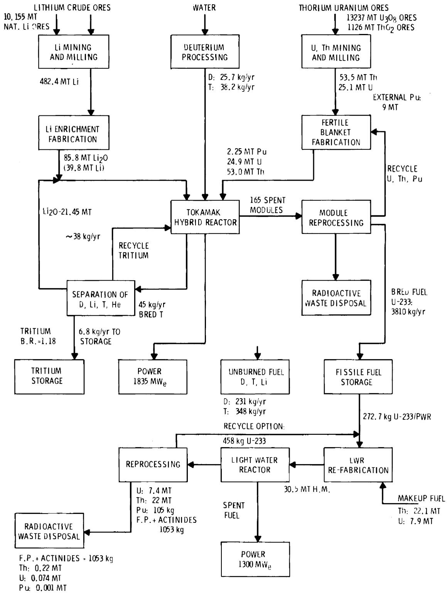  
FIGURE VII-B-3. Tokamak Hybrid Reactor Fuel Flow - Pu-Catalyst Fuel Cycle

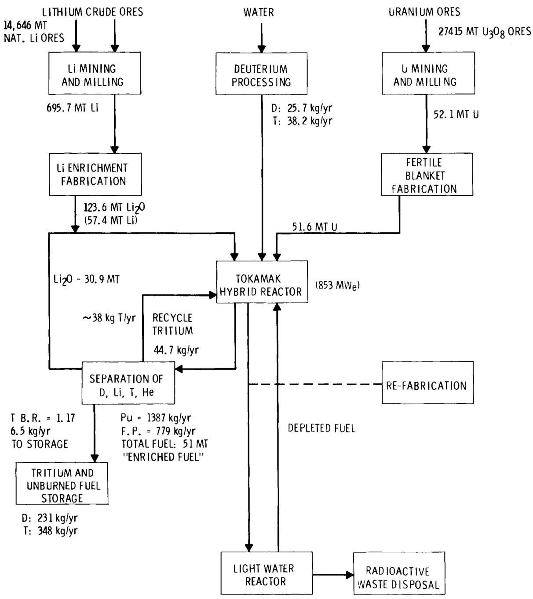  
FIGURE VII-B-4. Tokamak Hybrid Reactor Fuel Flow - Refresh Fuel Cycle

(b) D-T requirements represent quantity burned. Hybrid will become self-sufficient after a certain time $(B.R. = 1.19)$ - external tritium supply unnecessary   
(c) Uranium assay - $0.2\%$ U/crude ore $(U_{3}O_{8})$   
(d) $75\%$ Plant factor used.   
(e) 4 year fuel cycle - 1/4 modules replaced each year.   
(f) D-T processing losses not considered in unburned fuel quantity.   
(g) Lithium is $90\%$ Li enriched. The amount of natural Li required to obtain this enrichment is 12 x amount desired.   
(h) It is assumed that $\mathsf{Li}_2\mathsf{O}$ breeding pins are re-used. A continuous supply is unnecessary since the quantity of $^6\mathrm{Li}$ consumed, 76 kg/year, is small compared to the initial inventory (124 MT $\mathsf{Li}_20$ , 57 MT Li). The $^6\mathrm{Li}$ consumption is based on one atom consumed per fusion neutron.   
(i) The module stainless steel structure is re-used. The only components replaced are the fertile fuel pins. Occasionally a tritium breeding rod may be replaced. The graphite reflector region is also recycled each year.   
(j) The tritium extraction is a batch method whereby the pins are heated and the outgassed tritium collected. This process will occur in a separate vacuum containment and hot cell module maintenance area.   
(k) The fabrication process losses are taken to be $1\%$ of the feed inventory. The milling process is assumed to recover $95\%$ of the available U or Li in the ores.

# b. Pu-Recycle to Thermal Reactor

This fuel cycle is based upon the same assumptions that made up the Once-Through fuel cycle plus the followign assumptions:

(a) The reprocessing losses are taken to be $1\%$ of initial feed material (spent fuel).   
(b) Although separate reprocessing facilities for the LWR and Hybrid are shown in the diagram, these processes would probably be carried out at a common reprocessing facility. The Tokamak Hybrid

fuel rods are similar to the LWR fuel rods. The fabrication of $\mathsf{Li}_2\mathsf{O}$ and UC fuel rods could also be achieved at the same facility.   
(c) In the fuel cycle the uranium separated from the bred plutonium is recycled back to be used as fuel material in fresh fertile module elements.   
(d) The LWR data (Pu requirements, power, etc.) is based upon the Combustion Engineering PWR Pu/U fuel cycle. Averaged over 30 years the charge to the reactor is $854\mathrm{kg}$ and discharge is $519\mathrm{kg}$ . This leaves $\sim 334\mathrm{kg}$ makeup which is supplied by the hybrid reactor.

# c. Pu Catalyst Fuel Cycle

(a) An initial amount of $\mathsf{PuO}_2$ is required for start-up (8% by weight in the converter region).   
(b) U and Th are recycled back to the hybrid modules.   
(c) LWR fuel cycle used is the PWR cycle: denatured (20%) U-235/Th fuel with U-233 self-generated recycle and U-233 makeup from the hybrid reactor. This is a Combustion Engineering PWR fuel cycle. $^{(6)}$   
(d) The thorium ore assay is $5\%$ ThO /monazite sands.

# d. Refresh Fuel Cycle

(a) A direct exchange of fuel between Hybrid and PWR.   
(b) Replacement schedule based upon number of years required to obtain Pu/U enrichment of $\sim 2.7\%$ .   
(c) Re-fabrication is mechanical separation of fuels and cladding/ assemblies etc.   
(d) PWR based upon Combustion Engineering Pu/U reactor fuel cycle. (6) The hybrid produced mixed-oxide fuel has Pu-239 quality $\sim 90 - 98\%$ as compared to normal Pu-239 feed quality of $\sim 55\%$ .

The Pu-recycle fuel cycle utilizes the Tokamak Hybrid both as a power producer and fissile fuel producer. The fissile output, 1950 kg Pu-239/year, is used in a Pu/U fueled PWR. The reference PWR used in this study is a Combustion Engineering design producing 1300 MWe. The 30-year average annual Pu makeup requirement is 334 kg/year assuming recycle Pu from PWR spent fuel

reprocessing is used. The Tokamak Hybrid could theoretically support the annual fissile makeup requirements for 5-6 PWRs.

The Pu-catalyst fuel cycle, also operating in the reprocessing mode, consists of the Tokamak Hybrid Reactor coupled with a PWR operating on a denatured U-233 fuel cycle. This reactor is also a Combusion Engineering fuel cycle design producing 1300 MWe. Based on the annual U-233 makeup requirements and assuming the PWR has self-generated U-233 recycle the hybrid breeder could support 13 to 14 PWRs.

The refresh fuel cycle uses the annual discharge fuel from the Tokamak Hybrid to fuel a PWR. In this scenario the hybrid spent fuel is mechanically separated and refabricated into PWR fuel elements and assemblies. No chemical separation or reprocessing is required. An initial feed of natural uranium exposed to a four-year burn cycle would result in a fissile Pu/U enrichment of 2 to $3\%$ . It is possible that the annual discharge of fuel from the Tokamak Hybrid could support two PWRs in this manner.

# 2. Mirror Hybrid Reactor

The Mirror Hybrid Reactor is a collection of 16 "peel" shaped segments located around a spherical plasma chamber. Each of these slices consists of approximately 45 modules depending on the location of the segment (near a beam port or fan hole). There are 600 modules located around the plasma cavity. The Mirror blanket has been divided up into 4 management regions. Table VII-B-7 lists the important fuel management information.

TABLE VII-B-7. Mirror Hybrid Fuel Management Data   

<table><tr><td>Number of Fuel Management Regions</td><td>4</td></tr><tr><td>Blanket Lifetime</td><td>4 years</td></tr><tr><td>Plant Capacity Factor</td><td>0.75</td></tr><tr><td>Blanket Replacement Time</td><td>35 days</td></tr><tr><td>Fuel Management Interval</td><td>1.33 years</td></tr><tr><td>Maximum Blanket Exposure</td><td>6.7 MWy/m2</td></tr><tr><td>Number of Blanket Segments</td><td>16</td></tr><tr><td>Number of Blanket Modules</td><td>~600</td></tr><tr><td>Number of Blanket Modules Replaced Each Outage</td><td>150 modules/year</td></tr></table>

The maintenance of the reactor subsystems will occur mainly during blanket replacement outages but some maintenance or repair will occur that is unscheduled as was the situation in the Tokamak Hybrid Reactor. The Mirror Hybrid Reactor segments are quite massive, $\sim 40$ MT total weight, and although the crane hoisting system presents no unusual problems, it will take longer to gain access to the modules because of a massive concrete plug. One-fourth or 4 segments will be replaced during blanket change outage. It will take 5 to 8 days to remove a segment, disassemble the module, and replenish them with fresh fuel. A total blanket change time of 35 days, same as the tokamak, was assumed for the Mirror Hybrid Reactor. The total unscheduled outage time was taken to be 50 to 60 days/year.

Table VII-B-8 presents the initial loading of fertile fuel, structure, tritium breeder, and graphite reflector. The fuel and breeder material choices for the Mirror Hybrid Reactor are the same as those of the Tokamak Hybrid.

The 30-year plant lifetime requirements are given in Tables VII-B-9 to VII-B-11. The fuel mass flow balance is based upon these quantities and their isotopic content. Figure VII-B-5 shows the fuel mass balance for the Pu-Catalyst fuel cycle. This fuel cycle is capable of supplying the fissile makeup quantities for 5 to 6 PWRs. It should be noted that because of the scope of the NASAP study the driver blanket combinations were not optimized except for the Tokamak Hybrid Reactor. The Once-Through and Pu-Recycle blankets exhibit low power outputs and thus are not viable fuel cycles. The Mirror Refresh fuel cycle requires a 10-year burn cycle for the Pu/U enrichment to be $\sim 3\%$ .

# a. Laser Hybrid Reactor

The Laser Hybrid Reactor has a cylindrical plasma chamber with fertile and tritium breeding regions surrounding this cavity. There are also top and bottom tritium breeding blankets. The radial fertile blanket has rows of fuel elements and is divided into eight segments. Table VII-B-12 gives some important fuel management information.

TABLE VII-B-8. Mirror Hybrid Reactor Initial Material Requirements   

<table><tr><td>Reactor/Fuel Cycle</td><td>Fuel</td><td>Structure</td><td>Tritium Breeding Material</td><td>Other</td></tr><tr><td>Mirror/Once-Through</td><td>303 MT UC</td><td>162 MT SS(a)</td><td>116.5 MT Li2O(b)</td><td>53 MT C(c)</td></tr><tr><td>Mirror/Pu Recycle to Thermal Reactors</td><td>303 MT UC</td><td>162 MT SS</td><td>116.5 MT Li2O</td><td>53 MT C</td></tr><tr><td>Mirror/Refresh</td><td>223.5 MT UO2</td><td>162 MT SS</td><td>116.5 MT Li2O</td><td>53 MT C</td></tr><tr><td>Mirror/Pu Catalyst</td><td>108 MT UO2</td><td></td><td></td><td></td></tr><tr><td></td><td>212 MT ThC</td><td>162 MTSS</td><td>81 MT Li2O</td><td>53 MT C</td></tr><tr><td></td><td>8.7 MT PuO2</td><td></td><td></td><td></td></tr></table>

(a) Stainless steel amount includes cladding and module structure.   
(b) Tritium breeding material, Li20, enriched to 90% 6Li.   
(c) Graphite is for reflector region of module.

TABLE VII-B-9. Laser Hybrid Fuel Management Data   

<table><tr><td>Number of Fuel Management Regions</td><td>4</td></tr><tr><td>Blanket Lifetime</td><td>4 years</td></tr><tr><td>Plant Capacity Factor</td><td>0.75</td></tr><tr><td>Blanket Replacement time</td><td>35 days</td></tr><tr><td>Fuel Management Interval</td><td>1.33 years</td></tr><tr><td>Maximum Blanket Exposure</td><td>~ 6 MWy/m2</td></tr><tr><td>Number of Blanket Segments</td><td>8</td></tr><tr><td>Number of Blanket Segments Replaced</td><td>2</td></tr></table>

The Laser Hybrid Reactor fuel requirements will be based on a four-year burnup cycle. The unscheduled and scheduled maintenance outage times, 90 days/ year, results in a plant capacity factor of 0.75. Table VII-B-13 gives the initial loading of fertile fuel, structure, tritium breeder and graphite reflector.

The 30-year plant lifetime fuel requirements are given in Tables VII-B-14 to VII-B-16. The fuel mass flows for the blanket management schemedme discussed previously is given in Figures VII-B-6 to VII-B-8. The Once-Through, Pu-Recycle and Pu-Catalyst fuel cycles are shown in these figures. The annual discharge of Pu in the Pu-Recycle case, $1323\mathrm{kg}$ Pu-239, can be remotely refabricated into mixed-oxide PWR fuel elements. This plutonium could support 3 to 4 PWRs each year. The Pu-Catalyst fuel cycle produces $2584\mathrm{kg}$ U-233 each year. The fissile output is capable of supporting 9 to 10 PWRs. The refresh fuel cycle was not optimized with the result that a 10-year burn cycle is required to get a $\sim 3\%$ Pu/U enrichment.

# b. Theta-Pinch Hybrid Reactor

The Theta-Pinch Hybrid reactor is made up of 200 2.5 meter long cylindrical modules. The fuel and tritium breeder elements are arranged parallel to the plasma cavity axis. The fuel management information is listed in Table VII-B-17.

# TABLE VII-B-10. Pu-Recycle Fuel Charge Data

# FUEL MANAGEMENT CHARACTERISTICS

Reactor Type Mirror Hybrid Reactor -

Fuel Type Natural Uranium Carbide

<table><tr><td rowspan="3">Year</td><td rowspan="3">AnnualCapacity Factor, %</td><td colspan="10">Reactor Fuel Charge Data</td></tr><tr><td rowspan="2">Heavy Metal,kg</td><td rowspan="2">Thorium,kg</td><td colspan="5">Uranium, kg</td><td colspan="3">Plutonium, kg</td></tr><tr><td>233</td><td>234</td><td>235</td><td>236</td><td>238</td><td>239</td><td>240</td><td>241</td></tr><tr><td>1</td><td>75</td><td>288,800</td><td>0</td><td>0</td><td>0</td><td>2079</td><td>0</td><td>286,705</td><td>0</td><td>0</td><td>0</td></tr><tr><td>2</td><td>75</td><td>72,200</td><td>-</td><td>-</td><td>-</td><td>520</td><td>-</td><td>71,676</td><td>-</td><td>-</td><td>-</td></tr><tr><td>3</td><td>75</td><td>72,200</td><td>-</td><td>-</td><td>-</td><td>520</td><td>-</td><td>71,676</td><td>-</td><td>-</td><td>-</td></tr><tr><td>4</td><td>75</td><td>72,200</td><td>-</td><td>-</td><td>-</td><td>520</td><td>-</td><td>71,676</td><td>-</td><td>-</td><td>-</td></tr><tr><td>5</td><td>-</td><td>-</td><td>-</td><td>-</td><td>-</td><td>-</td><td>-</td><td>-</td><td>-</td><td>-</td><td>-</td></tr><tr><td>6</td><td>-</td><td>-</td><td>-</td><td>-</td><td>-</td><td>-</td><td>-</td><td>-</td><td>-</td><td>-</td><td>-</td></tr><tr><td>7</td><td>-</td><td>-</td><td>-</td><td>-</td><td>-</td><td>-</td><td>-</td><td>-</td><td>-</td><td>-</td><td>-</td></tr><tr><td>8</td><td></td><td></td><td></td><td></td><td></td><td></td><td></td><td></td><td></td><td></td><td></td></tr><tr><td>9</td><td></td><td></td><td></td><td></td><td></td><td></td><td></td><td></td><td></td><td></td><td></td></tr><tr><td>10</td><td></td><td></td><td></td><td></td><td></td><td></td><td></td><td></td><td></td><td></td><td></td></tr><tr><td>11</td><td></td><td></td><td></td><td></td><td></td><td></td><td></td><td></td><td></td><td></td><td></td></tr><tr><td>12</td><td></td><td></td><td></td><td></td><td></td><td></td><td></td><td></td><td></td><td></td><td></td></tr><tr><td>13</td><td></td><td></td><td></td><td></td><td></td><td></td><td></td><td></td><td></td><td></td><td></td></tr><tr><td>14</td><td></td><td></td><td></td><td></td><td></td><td></td><td></td><td></td><td></td><td></td><td></td></tr><tr><td>15</td><td></td><td></td><td></td><td></td><td></td><td></td><td></td><td></td><td></td><td></td><td></td></tr><tr><td>16</td><td></td><td></td><td></td><td></td><td></td><td></td><td></td><td></td><td></td><td></td><td></td></tr><tr><td>17</td><td></td><td></td><td></td><td></td><td></td><td></td><td></td><td></td><td></td><td></td><td></td></tr><tr><td>18</td><td></td><td></td><td></td><td></td><td></td><td></td><td></td><td></td><td></td><td></td><td></td></tr><tr><td>19</td><td></td><td></td><td></td><td></td><td></td><td></td><td></td><td></td><td></td><td></td><td></td></tr><tr><td>20</td><td></td><td></td><td></td><td></td><td></td><td></td><td></td><td></td><td></td><td></td><td></td></tr><tr><td>21</td><td></td><td></td><td></td><td></td><td></td><td></td><td></td><td></td><td></td><td></td><td></td></tr><tr><td>22</td><td></td><td></td><td></td><td></td><td></td><td></td><td></td><td></td><td></td><td></td><td></td></tr><tr><td>23</td><td></td><td></td><td></td><td></td><td></td><td></td><td></td><td></td><td></td><td></td><td></td></tr><tr><td>24</td><td></td><td></td><td></td><td></td><td></td><td></td><td></td><td></td><td></td><td></td><td></td></tr><tr><td>25</td><td></td><td></td><td></td><td></td><td></td><td></td><td></td><td></td><td></td><td></td><td></td></tr><tr><td>26</td><td></td><td></td><td></td><td></td><td></td><td></td><td></td><td></td><td></td><td></td><td></td></tr><tr><td>27</td><td></td><td></td><td></td><td></td><td></td><td></td><td></td><td></td><td></td><td></td><td></td></tr><tr><td>28</td><td>-</td><td>-</td><td>-</td><td>-</td><td>-</td><td>-</td><td>-</td><td>-</td><td>-</td><td>-</td><td>-</td></tr><tr><td>29</td><td>-</td><td>-</td><td>-</td><td>-</td><td>-</td><td>-</td><td>-</td><td>-</td><td>-</td><td>-</td><td>-</td></tr><tr><td>30</td><td>75</td><td>72,000</td><td>0</td><td>0</td><td>0</td><td>520</td><td>0</td><td>71,676</td><td>0</td><td>0</td><td>0</td></tr></table>

# TABLE VII-B-11. Pu-Recycle Fuel Discharge Data

# FUEL MANAGEMENT CHARACTERISTICS

Reactor Type Mirror Hybrid Reactor

Fuel Type Natural Uranium Carbide

Reactor Fuel Discharge Data   

<table><tr><td rowspan="2">Year</td><td rowspan="2">Heavy Metal, kg</td><td rowspan="2">Thorium, kg</td><td colspan="5">Uranium, kg</td><td colspan="4">Plutonium, kg</td><td rowspan="2">Fission Products, kg</td><td colspan="4">Other Isotopics, kg</td></tr><tr><td>233</td><td>234</td><td>235</td><td>236</td><td>238</td><td>239</td><td>240</td><td>241</td><td>242</td><td>Pa-233</td><td>Np-237</td><td>Am-241</td><td>Cm-242</td></tr><tr><td>1</td><td>71,519</td><td>0</td><td>.006</td><td>.07</td><td>468</td><td>26.1</td><td>70,706</td><td>199</td><td>2</td><td>.02</td><td>0</td><td>66.4</td><td>~0</td><td>52</td><td>~0</td><td>0</td></tr><tr><td>2</td><td>71,146</td><td>•</td><td>.013</td><td>.17</td><td>434</td><td>55.5</td><td>70,022</td><td>395</td><td>5.6</td><td>.08</td><td>•</td><td>132.7</td><td>•</td><td>101</td><td>.006</td><td>•</td></tr><tr><td>3</td><td>70,769</td><td>•</td><td>.025</td><td>.36</td><td>402</td><td>83.2</td><td>69,337</td><td>589</td><td>11.2</td><td>.20</td><td>•</td><td>199.1</td><td>•</td><td>148</td><td>.027</td><td>•</td></tr><tr><td>4</td><td>70,392</td><td>•</td><td>.034</td><td>.59</td><td>372</td><td>109</td><td>68,652</td><td>781</td><td>18.4</td><td>.39</td><td>•</td><td>265.5</td><td>•</td><td>194</td><td>.084</td><td>.0013</td></tr><tr><td>5</td><td>•</td><td>•</td><td>•</td><td>•</td><td>•</td><td>•</td><td>•</td><td>•</td><td>•</td><td>•</td><td>•</td><td>•</td><td>•</td><td>•</td><td>•</td><td>•</td></tr><tr><td>6</td><td>•</td><td>•</td><td>•</td><td>•</td><td>•</td><td>•</td><td>•</td><td>•</td><td>•</td><td>•</td><td>•</td><td>•</td><td>•</td><td>•</td><td>•</td><td>•</td></tr><tr><td>7</td><td>•</td><td>•</td><td>•</td><td>•</td><td>•</td><td>•</td><td>•</td><td>•</td><td>•</td><td>•</td><td>•</td><td>•</td><td>•</td><td>•</td><td>•</td><td>•</td></tr><tr><td>8</td><td></td><td></td><td></td><td></td><td></td><td></td><td></td><td></td><td></td><td></td><td></td><td></td><td></td><td></td><td></td><td></td></tr><tr><td>9</td><td></td><td></td><td></td><td></td><td></td><td></td><td></td><td></td><td></td><td></td><td></td><td></td><td></td><td></td><td></td><td></td></tr><tr><td>10</td><td></td><td></td><td></td><td></td><td></td><td></td><td></td><td></td><td></td><td></td><td></td><td></td><td></td><td></td><td></td><td></td></tr><tr><td>11</td><td></td><td></td><td></td><td></td><td></td><td></td><td></td><td></td><td></td><td></td><td></td><td></td><td></td><td></td><td></td><td></td></tr><tr><td>12</td><td></td><td></td><td></td><td></td><td></td><td></td><td></td><td></td><td></td><td></td><td></td><td></td><td></td><td></td><td></td><td></td></tr><tr><td>13</td><td></td><td></td><td></td><td></td><td></td><td></td><td></td><td></td><td></td><td></td><td></td><td></td><td></td><td></td><td></td><td></td></tr><tr><td>14</td><td></td><td></td><td></td><td></td><td></td><td></td><td></td><td></td><td></td><td></td><td></td><td></td><td></td><td></td><td></td><td></td></tr><tr><td>15</td><td></td><td></td><td></td><td></td><td></td><td></td><td></td><td></td><td></td><td></td><td></td><td></td><td></td><td></td><td></td><td></td></tr><tr><td>16</td><td></td><td></td><td></td><td></td><td></td><td></td><td></td><td></td><td></td><td></td><td></td><td></td><td></td><td></td><td></td><td></td></tr><tr><td>17</td><td></td><td></td><td></td><td></td><td></td><td></td><td></td><td></td><td></td><td></td><td></td><td></td><td></td><td></td><td></td><td></td></tr><tr><td>18</td><td></td><td></td><td></td><td></td><td></td><td></td><td></td><td></td><td></td><td></td><td></td><td></td><td></td><td></td><td></td><td></td></tr><tr><td>19</td><td></td><td></td><td></td><td></td><td></td><td></td><td></td><td></td><td></td><td></td><td></td><td></td><td></td><td></td><td></td><td></td></tr><tr><td>20</td><td></td><td></td><td></td><td></td><td></td><td></td><td></td><td></td><td></td><td></td><td></td><td></td><td></td><td></td><td></td><td></td></tr><tr><td>21</td><td></td><td></td><td></td><td></td><td></td><td></td><td></td><td></td><td></td><td></td><td></td><td></td><td></td><td></td><td></td><td></td></tr><tr><td>22</td><td></td><td></td><td></td><td></td><td></td><td></td><td></td><td></td><td></td><td></td><td></td><td></td><td></td><td></td><td></td><td></td></tr><tr><td>23</td><td></td><td></td><td></td><td></td><td></td><td></td><td></td><td></td><td></td><td></td><td></td><td></td><td></td><td></td><td></td><td></td></tr><tr><td>24</td><td></td><td></td><td></td><td></td><td></td><td></td><td></td><td></td><td></td><td></td><td></td><td></td><td></td><td></td><td></td><td></td></tr><tr><td>25</td><td></td><td></td><td></td><td></td><td></td><td></td><td></td><td></td><td></td><td></td><td></td><td></td><td></td><td></td><td></td><td></td></tr><tr><td>26</td><td></td><td></td><td></td><td></td><td></td><td></td><td></td><td></td><td></td><td></td><td></td><td></td><td></td><td></td><td></td><td></td></tr><tr><td>27</td><td></td><td></td><td></td><td></td><td></td><td></td><td></td><td></td><td></td><td></td><td></td><td></td><td></td><td></td><td></td><td></td></tr><tr><td>28</td><td>•</td><td>•</td><td>•</td><td>•</td><td>•</td><td>•</td><td>•</td><td>•</td><td>•</td><td>•</td><td>•</td><td>•</td><td>•</td><td>•</td><td>•</td><td>•</td></tr><tr><td>29</td><td>•</td><td>•</td><td>•</td><td>•</td><td>•</td><td>•</td><td>•</td><td>•</td><td>•</td><td>•</td><td>•</td><td>•</td><td>•</td><td>•</td><td>•</td><td>•</td></tr><tr><td>30</td><td>70,392</td><td>0</td><td>.034</td><td>.59</td><td>372</td><td>109</td><td>68,652</td><td>781</td><td>18.4</td><td>.39</td><td>0</td><td>265.5</td><td>0</td><td>194</td><td>.084</td><td>.0013</td></tr></table>

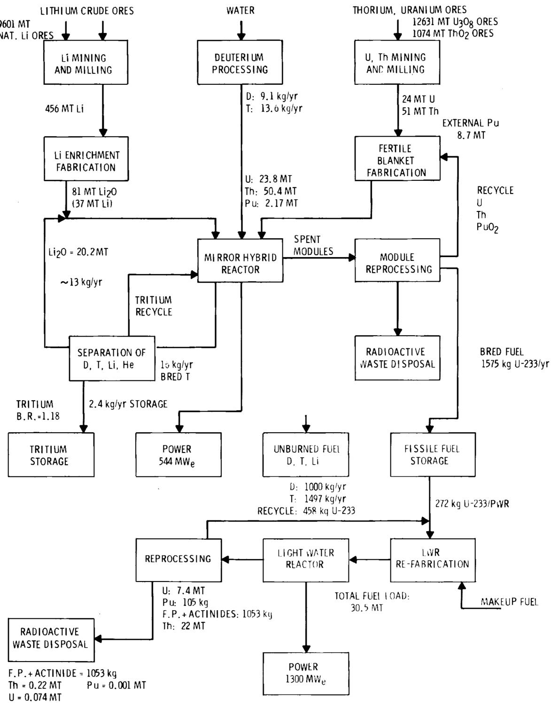  
FIGURE VII-B-5. Mirror Hybrid Reactor - Pu-Catalyst

# TABLE VII-B-12. Pu-Catalyst Fuel Charge Data

# FUEL MANAGEMENT CHARACTERISTICS

Reactor Type Mirror Hybrid Reactor

Fuel Type $\mathrm{UO}_2 / \mathrm{PuO}_2$ Converter Region

ThC Breeding Region

Reactor Fuel Charge Data   

<table><tr><td rowspan="2">Year</td><td rowspan="2">Annual Capacity Factor, %</td><td rowspan="2">Heavy Metal, kg</td><td rowspan="2">Thorium, kg</td><td colspan="5">Uranium, kg</td><td colspan="4">Plutonium, kg(a)</td></tr><tr><td>233</td><td>234</td><td>235</td><td>236</td><td>238</td><td>239</td><td>240</td><td>241</td><td>242</td></tr><tr><td>1</td><td>75</td><td>310,370</td><td>201,570</td><td>0</td><td>0</td><td>685</td><td>0</td><td>94,509</td><td>7588</td><td>3332</td><td>1881</td><td>666</td></tr><tr><td>2</td><td>75</td><td>77,592</td><td>50,392</td><td>•</td><td>•</td><td>171</td><td>•</td><td>23,627</td><td>1897</td><td>833</td><td>445</td><td>166</td></tr><tr><td>3</td><td>75</td><td>77,592</td><td>50,392</td><td>•</td><td>•</td><td>171</td><td>•</td><td>23,627</td><td>1897</td><td>833</td><td>445</td><td>166</td></tr><tr><td>4</td><td>75</td><td>77,592</td><td>50,392</td><td>•</td><td>•</td><td>171</td><td>•</td><td>23,627</td><td>1897</td><td>833</td><td>445</td><td>166</td></tr><tr><td>5</td><td>•</td><td>•</td><td>•</td><td>•</td><td>•</td><td>•</td><td>•</td><td>•</td><td>•</td><td>•</td><td>•</td><td>•</td></tr><tr><td>6</td><td>•</td><td>•</td><td>•</td><td>•</td><td>•</td><td>•</td><td>•</td><td>•</td><td>•</td><td>•</td><td>•</td><td>•</td></tr><tr><td>7</td><td>•</td><td>•</td><td>•</td><td>•</td><td>•</td><td>•</td><td>•</td><td>•</td><td>•</td><td>•</td><td>•</td><td>•</td></tr><tr><td>8</td><td></td><td></td><td></td><td></td><td></td><td></td><td></td><td></td><td></td><td></td><td></td><td></td></tr><tr><td>9</td><td></td><td></td><td></td><td></td><td></td><td></td><td></td><td></td><td></td><td></td><td></td><td></td></tr><tr><td>10</td><td></td><td></td><td></td><td></td><td></td><td></td><td></td><td></td><td></td><td></td><td></td><td></td></tr><tr><td>11</td><td></td><td></td><td></td><td></td><td></td><td></td><td></td><td></td><td></td><td></td><td></td><td></td></tr><tr><td>12</td><td></td><td></td><td></td><td></td><td></td><td></td><td></td><td></td><td></td><td></td><td></td><td></td></tr><tr><td>13</td><td></td><td></td><td></td><td></td><td></td><td></td><td></td><td></td><td></td><td></td><td></td><td></td></tr><tr><td>14</td><td></td><td></td><td></td><td></td><td></td><td></td><td></td><td></td><td></td><td></td><td></td><td></td></tr><tr><td>15</td><td></td><td></td><td></td><td></td><td></td><td></td><td></td><td></td><td></td><td></td><td></td><td></td></tr><tr><td>16</td><td></td><td></td><td></td><td></td><td></td><td></td><td></td><td></td><td></td><td></td><td></td><td></td></tr><tr><td>17</td><td></td><td></td><td></td><td></td><td></td><td></td><td></td><td></td><td></td><td></td><td></td><td></td></tr><tr><td>18</td><td></td><td></td><td></td><td></td><td></td><td></td><td></td><td></td><td></td><td></td><td></td><td></td></tr><tr><td>19</td><td></td><td></td><td></td><td></td><td></td><td></td><td></td><td></td><td></td><td></td><td></td><td></td></tr><tr><td>20</td><td></td><td></td><td></td><td></td><td></td><td></td><td></td><td></td><td></td><td></td><td></td><td></td></tr><tr><td>21</td><td></td><td></td><td></td><td></td><td></td><td></td><td></td><td></td><td></td><td></td><td></td><td></td></tr><tr><td>22</td><td></td><td></td><td></td><td></td><td></td><td></td><td></td><td></td><td></td><td></td><td></td><td></td></tr><tr><td>23</td><td></td><td></td><td></td><td></td><td></td><td></td><td></td><td></td><td></td><td></td><td></td><td></td></tr><tr><td>24</td><td></td><td></td><td></td><td></td><td></td><td></td><td></td><td></td><td></td><td></td><td></td><td></td></tr><tr><td>25</td><td></td><td></td><td></td><td></td><td></td><td></td><td></td><td></td><td></td><td></td><td></td><td></td></tr><tr><td>26</td><td></td><td></td><td></td><td></td><td></td><td></td><td></td><td></td><td></td><td></td><td></td><td></td></tr><tr><td>27</td><td></td><td></td><td></td><td></td><td></td><td></td><td></td><td></td><td></td><td></td><td></td><td></td></tr><tr><td>28</td><td>•</td><td>•</td><td>•</td><td>•</td><td>•</td><td>•</td><td>•</td><td>•</td><td>•</td><td>•</td><td>•</td><td>•</td></tr><tr><td>29</td><td>•</td><td>•</td><td>•</td><td>•</td><td>•</td><td>•</td><td>•</td><td>•</td><td>•</td><td>•</td><td>•</td><td>•</td></tr><tr><td>30</td><td>75</td><td>77,592</td><td>50,392</td><td>0</td><td>0</td><td>171</td><td>0</td><td>23,627</td><td>1897</td><td>833</td><td>445</td><td>166</td></tr></table>

(a) LWR Discharge Plutonium

TABLE VII-B-13. Laser Hybrid Reactor Initial Material Requirements   

<table><tr><td>Reactor/Fuel Cycle</td><td>Fuel</td><td>Structure</td><td>Breeding Material</td><td>Other</td></tr><tr><td>Laser/Once-Through</td><td>488 MT UC</td><td>249 MT SS(a)</td><td>169 MT Li2O(b)</td><td>75 MT C(c)</td></tr><tr><td>Laser/Pu Recycle to Thermal Reactors</td><td>488 MT UC</td><td>249 MT SS</td><td>169 MT Li2O</td><td>75 MT C</td></tr><tr><td>Laser/Refresh</td><td>360 MT UO2</td><td>249 MT SS</td><td>169 MT Li2O</td><td>75 MT C</td></tr><tr><td>Laser/Pu Catalyst</td><td>177.5 MT UO2</td><td></td><td></td><td></td></tr><tr><td></td><td>328.5 MT ThC</td><td>249 MT SS</td><td>103 MT Li2O</td><td>75 MT C</td></tr><tr><td></td><td>14 MT PuO2</td><td></td><td></td><td></td></tr></table>

(a) Stainless steel amount includes cladding and module structure.   
(b) Tritium breeding material, Li $20$ , enriched to 90% 6Li.   
(c) Graphite is for reflector region of module.

# TABLE VII-B-14. Once-Through and Pu-Recycle Fuel Charge Data

# FUEL MANAGEMENT CHARACTERISTICS

Reactor Type Laser Hybrid Reactor

Fuel Type Natural Uranium Carbide

Reactor Fuel Charge Data   

<table><tr><td rowspan="2">Year</td><td rowspan="2">Annual Capacity Factor, %</td><td rowspan="2">Heavy Metal, kg</td><td rowspan="2">Thorium, kg</td><td colspan="5">Uranium, kg</td><td colspan="4">Plutonium, kg</td></tr><tr><td>233</td><td>234</td><td>235</td><td>236</td><td>238</td><td>239</td><td>240</td><td>241</td><td>242</td></tr><tr><td>1</td><td>75</td><td>464,576</td><td>0</td><td>0</td><td>0</td><td>3345</td><td>0</td><td>461,206</td><td>0</td><td>0</td><td>0</td><td>0</td></tr><tr><td>2</td><td>75</td><td>116,144</td><td>•</td><td>•</td><td>•</td><td>836</td><td>•</td><td>115,301</td><td>•</td><td>•</td><td>•</td><td>•</td></tr><tr><td>3</td><td>75</td><td>116,144</td><td>•</td><td>•</td><td>•</td><td>836</td><td>•</td><td>115,301</td><td>•</td><td>•</td><td>•</td><td>•</td></tr><tr><td>4</td><td>75</td><td>116,144</td><td>•</td><td>•</td><td>•</td><td>836</td><td>•</td><td>115,301</td><td>•</td><td>•</td><td>•</td><td>•</td></tr><tr><td>5</td><td>•</td><td>•</td><td>•</td><td>•</td><td>•</td><td>•</td><td>•</td><td>•</td><td>•</td><td>•</td><td>•</td><td>•</td></tr><tr><td>6</td><td>•</td><td>•</td><td>•</td><td>•</td><td>•</td><td>•</td><td>•</td><td>•</td><td>•</td><td>•</td><td>•</td><td>•</td></tr><tr><td>7</td><td>•</td><td>•</td><td>•</td><td>•</td><td>•</td><td>•</td><td>•</td><td>•</td><td>•</td><td>•</td><td>•</td><td>•</td></tr><tr><td>8</td><td></td><td></td><td></td><td></td><td></td><td></td><td></td><td></td><td></td><td></td><td></td><td></td></tr><tr><td>9</td><td></td><td></td><td></td><td></td><td></td><td></td><td></td><td></td><td></td><td></td><td></td><td></td></tr><tr><td>10</td><td></td><td></td><td></td><td></td><td></td><td></td><td></td><td></td><td></td><td></td><td></td><td></td></tr><tr><td>11</td><td></td><td></td><td></td><td></td><td></td><td></td><td></td><td></td><td></td><td></td><td></td><td></td></tr><tr><td>12</td><td></td><td></td><td></td><td></td><td></td><td></td><td></td><td></td><td></td><td></td><td></td><td></td></tr><tr><td>13</td><td></td><td></td><td></td><td></td><td></td><td></td><td></td><td></td><td></td><td></td><td></td><td></td></tr><tr><td>14</td><td></td><td></td><td></td><td></td><td></td><td></td><td></td><td></td><td></td><td></td><td></td><td></td></tr><tr><td>15</td><td></td><td></td><td></td><td></td><td></td><td></td><td></td><td></td><td></td><td></td><td></td><td></td></tr><tr><td>16</td><td></td><td></td><td></td><td></td><td></td><td></td><td></td><td></td><td></td><td></td><td></td><td></td></tr><tr><td>17</td><td></td><td></td><td></td><td></td><td></td><td></td><td></td><td></td><td></td><td></td><td></td><td></td></tr><tr><td>18</td><td></td><td></td><td></td><td></td><td></td><td></td><td></td><td></td><td></td><td></td><td></td><td></td></tr><tr><td>19</td><td></td><td></td><td></td><td></td><td></td><td></td><td></td><td></td><td></td><td></td><td></td><td></td></tr><tr><td>20</td><td></td><td></td><td></td><td></td><td></td><td></td><td></td><td></td><td></td><td></td><td></td><td></td></tr><tr><td>21</td><td></td><td></td><td></td><td></td><td></td><td></td><td></td><td></td><td></td><td></td><td></td><td></td></tr><tr><td>22</td><td></td><td></td><td></td><td></td><td></td><td></td><td></td><td></td><td></td><td></td><td></td><td></td></tr><tr><td>23</td><td></td><td></td><td></td><td></td><td></td><td></td><td></td><td></td><td></td><td></td><td></td><td></td></tr><tr><td>24</td><td></td><td></td><td></td><td></td><td></td><td></td><td></td><td></td><td></td><td></td><td></td><td></td></tr><tr><td>25</td><td></td><td></td><td></td><td></td><td></td><td></td><td></td><td></td><td></td><td></td><td></td><td></td></tr><tr><td>26</td><td></td><td></td><td></td><td></td><td></td><td></td><td></td><td></td><td></td><td></td><td></td><td></td></tr><tr><td>27</td><td></td><td></td><td></td><td></td><td></td><td></td><td></td><td></td><td></td><td></td><td></td><td></td></tr><tr><td>28</td><td>•</td><td>•</td><td>•</td><td>•</td><td>•</td><td>•</td><td>•</td><td>•</td><td>•</td><td>•</td><td>•</td><td>•</td></tr><tr><td>29</td><td>•</td><td>•</td><td>•</td><td>•</td><td>•</td><td>•</td><td>•</td><td>•</td><td>•</td><td>•</td><td>•</td><td>•</td></tr><tr><td>30</td><td>75</td><td>116,144</td><td>0</td><td>0</td><td>0</td><td>836</td><td>0</td><td>115,301</td><td>0</td><td>0</td><td>0</td><td>0</td></tr></table>

# TABLE VII-B-15. Once-Through and Pu-Recycle Fuel Discharge Data

FUEL MANAGEMENT CHARACTERISTICS

Reactor Type Laser Hybrid Reactor

Fuel Type Natural Uranium Carbide

<table><tr><td rowspan="2">Year</td><td rowspan="2">Heavy Metal, kg</td><td rowspan="2">Thorium kg</td><td colspan="5">Uranium, kg</td><td colspan="4">Reactor Fuel Discharge Data Plutonium, kg</td><td rowspan="2">Fission Products, kg</td><td colspan="4">Other Isotopics, kg</td></tr><tr><td>233</td><td>234</td><td>235</td><td>236</td><td>238</td><td>239</td><td>240</td><td>241</td><td>242</td><td>Pa-233</td><td>Np-237</td><td>Am-241</td><td>Cm-242</td></tr><tr><td>1</td><td>115,000</td><td>0</td><td>.02</td><td>.28</td><td>752</td><td>42</td><td>113,653</td><td>326</td><td>3.27</td><td>.03</td><td>~0</td><td>129.5</td><td>~0</td><td>85</td><td>~0</td><td>~0</td></tr><tr><td>2</td><td>114,419</td><td>.</td><td>.04</td><td>.54</td><td>698</td><td>89</td><td>112,552</td><td>648</td><td>9.22</td><td>.13</td><td>.</td><td>259</td><td>.</td><td>164</td><td>.045</td><td>.</td></tr><tr><td>3</td><td>113,844</td><td>.</td><td>.056</td><td>.96</td><td>646</td><td>133</td><td>111,451</td><td>966</td><td>18.3</td><td>.33</td><td>.</td><td>388</td><td>.</td><td>241</td><td>.13</td><td>.</td></tr><tr><td>4</td><td>113,268</td><td>.</td><td>.069</td><td>1.4</td><td>597</td><td>175</td><td>110,351</td><td>1280</td><td>30.2</td><td>.64</td><td>.</td><td>518</td><td>.</td><td>315</td><td>.31</td><td>.002</td></tr><tr><td>5</td><td>.</td><td>.</td><td>.</td><td>.</td><td>.</td><td>.</td><td>.</td><td>.</td><td>.</td><td>.</td><td>.</td><td>.</td><td>.</td><td>.</td><td>.</td><td>.</td></tr><tr><td>6</td><td>.</td><td>.</td><td>.</td><td>.</td><td>.</td><td>.</td><td>.</td><td>.</td><td>.</td><td>.</td><td>.</td><td>.</td><td>.</td><td>.</td><td>.</td><td>.</td></tr><tr><td>7</td><td>.</td><td>.</td><td>.</td><td>.</td><td>.</td><td>.</td><td>.</td><td>.</td><td>.</td><td>.</td><td>.</td><td>.</td><td>.</td><td>.</td><td>.</td><td>.</td></tr><tr><td>8</td><td></td><td></td><td></td><td></td><td></td><td></td><td></td><td></td><td></td><td></td><td></td><td></td><td></td><td></td><td></td><td></td></tr><tr><td>9</td><td></td><td></td><td></td><td></td><td></td><td></td><td></td><td></td><td></td><td></td><td></td><td></td><td></td><td></td><td></td><td></td></tr><tr><td>10</td><td></td><td></td><td></td><td></td><td></td><td></td><td></td><td></td><td></td><td></td><td></td><td></td><td></td><td></td><td></td><td></td></tr><tr><td>11</td><td></td><td></td><td></td><td></td><td></td><td></td><td></td><td></td><td></td><td></td><td></td><td></td><td></td><td></td><td></td><td></td></tr><tr><td>12</td><td></td><td></td><td></td><td></td><td></td><td></td><td></td><td></td><td></td><td></td><td></td><td></td><td></td><td></td><td></td><td></td></tr><tr><td>13</td><td></td><td></td><td></td><td></td><td></td><td></td><td></td><td></td><td></td><td></td><td></td><td></td><td></td><td></td><td></td><td></td></tr><tr><td>14</td><td></td><td></td><td></td><td></td><td></td><td></td><td></td><td></td><td></td><td></td><td></td><td></td><td></td><td></td><td></td><td></td></tr><tr><td>15</td><td></td><td></td><td></td><td></td><td></td><td></td><td></td><td></td><td></td><td></td><td></td><td></td><td></td><td></td><td></td><td></td></tr><tr><td>16</td><td></td><td></td><td></td><td></td><td></td><td></td><td></td><td></td><td></td><td></td><td></td><td></td><td></td><td></td><td></td><td></td></tr><tr><td>17</td><td></td><td></td><td></td><td></td><td></td><td></td><td></td><td></td><td></td><td></td><td></td><td></td><td></td><td></td><td></td><td></td></tr><tr><td>18</td><td></td><td></td><td></td><td></td><td></td><td></td><td></td><td></td><td></td><td></td><td></td><td></td><td></td><td></td><td></td><td></td></tr><tr><td>19</td><td></td><td></td><td></td><td></td><td></td><td></td><td></td><td></td><td></td><td></td><td></td><td></td><td></td><td></td><td></td><td></td></tr><tr><td>20</td><td></td><td></td><td></td><td></td><td></td><td></td><td></td><td></td><td></td><td></td><td></td><td></td><td></td><td></td><td></td><td></td></tr><tr><td>21</td><td></td><td></td><td></td><td></td><td></td><td></td><td></td><td></td><td></td><td></td><td></td><td></td><td></td><td></td><td></td><td></td></tr><tr><td>22</td><td></td><td></td><td></td><td></td><td></td><td></td><td></td><td></td><td></td><td></td><td></td><td></td><td></td><td></td><td></td><td></td></tr><tr><td>23</td><td></td><td></td><td></td><td></td><td></td><td></td><td></td><td></td><td></td><td></td><td></td><td></td><td></td><td></td><td></td><td></td></tr><tr><td>24</td><td></td><td></td><td></td><td></td><td></td><td></td><td></td><td></td><td></td><td></td><td></td><td></td><td></td><td></td><td></td><td></td></tr><tr><td>25</td><td></td><td></td><td></td><td></td><td></td><td></td><td></td><td></td><td></td><td></td><td></td><td></td><td></td><td></td><td></td><td></td></tr><tr><td>26</td><td></td><td></td><td></td><td></td><td></td><td></td><td></td><td></td><td></td><td></td><td></td><td></td><td></td><td></td><td></td><td></td></tr><tr><td>27</td><td></td><td></td><td></td><td></td><td></td><td></td><td></td><td></td><td></td><td></td><td></td><td></td><td></td><td></td><td></td><td></td></tr><tr><td>28</td><td>.</td><td>.</td><td>.</td><td>.</td><td>.</td><td>.</td><td>.</td><td>.</td><td>.</td><td>.</td><td>.</td><td>.</td><td>.</td><td>.</td><td>.</td><td>.</td></tr><tr><td>29</td><td>.</td><td>.</td><td>.</td><td>.</td><td>.</td><td>.</td><td>.</td><td>.</td><td>.</td><td>.</td><td>.</td><td>.</td><td>.</td><td>.</td><td>.</td><td>.</td></tr><tr><td>30</td><td>113,268</td><td>0</td><td>.069</td><td>1.4</td><td>597</td><td>175</td><td>110,351</td><td>1280</td><td>30.2</td><td>.64</td><td>0</td><td>518</td><td>0</td><td>315</td><td>.31</td><td>.002</td></tr></table>

TABLE VII-B-16. Pu-Catalyst Fuel Charge Data

# FUEL MANAGEMENT CHARACTERISTICS

Reactor Type Laser Hybrid Reactor

Fuel Type $\mathrm{UO_2 / PuO_2}$ Converter Region ThC Breeding Region

Reactor Fuel Charge Data   

<table><tr><td rowspan="2">Year</td><td rowspan="2">Annual Capacity Factor, %</td><td rowspan="2">Heavy Metal, kg</td><td rowspan="2">Thorium, kg</td><td colspan="5">Uranium, kg</td><td colspan="4">Plutonium, kg(a)</td></tr><tr><td>233</td><td>234</td><td>235</td><td>236</td><td>238</td><td>239</td><td>240</td><td>241</td><td>242</td></tr><tr><td>1</td><td>75</td><td>491,240</td><td>312,340</td><td>0</td><td>0</td><td>1126</td><td>0</td><td>155,334</td><td>12,515</td><td>5495</td><td>2938</td><td>1099</td></tr><tr><td>2</td><td>75</td><td>122,810</td><td>78,085</td><td>•</td><td>•</td><td>281.5</td><td>•</td><td>38,833</td><td>3,128</td><td>1373</td><td>734</td><td>274</td></tr><tr><td>3</td><td>75</td><td>122,810</td><td>78,085</td><td>•</td><td>•</td><td>281.5</td><td>•</td><td>38,833</td><td>3,128</td><td>1373</td><td>734</td><td>274</td></tr><tr><td>4</td><td>75</td><td>122,810</td><td>78,085</td><td>•</td><td>•</td><td>•</td><td>•</td><td>•</td><td>•</td><td>•</td><td>•</td><td>•</td></tr><tr><td>5</td><td>•</td><td>•</td><td>•</td><td>•</td><td>•</td><td>•</td><td>•</td><td>•</td><td>•</td><td>•</td><td>•</td><td>•</td></tr><tr><td>6</td><td>•</td><td>•</td><td>•</td><td>•</td><td>•</td><td>•</td><td>•</td><td>•</td><td>•</td><td>•</td><td>•</td><td>•</td></tr><tr><td>7</td><td>•</td><td>•</td><td>•</td><td>•</td><td>•</td><td>•</td><td>•</td><td>•</td><td>•</td><td>•</td><td>•</td><td>•</td></tr><tr><td>8</td><td></td><td></td><td></td><td></td><td></td><td></td><td></td><td></td><td></td><td></td><td></td><td></td></tr><tr><td>9</td><td></td><td></td><td></td><td></td><td></td><td></td><td></td><td></td><td></td><td></td><td></td><td></td></tr><tr><td>10</td><td></td><td></td><td></td><td></td><td></td><td></td><td></td><td></td><td></td><td></td><td></td><td></td></tr><tr><td>11</td><td></td><td></td><td></td><td></td><td></td><td></td><td></td><td></td><td></td><td></td><td></td><td></td></tr><tr><td>12</td><td></td><td></td><td></td><td></td><td></td><td></td><td></td><td></td><td></td><td></td><td></td><td></td></tr><tr><td>13</td><td></td><td></td><td></td><td></td><td></td><td></td><td></td><td></td><td></td><td></td><td></td><td></td></tr><tr><td>14</td><td></td><td></td><td></td><td></td><td></td><td></td><td></td><td></td><td></td><td></td><td></td><td></td></tr><tr><td>15</td><td></td><td></td><td></td><td></td><td></td><td></td><td></td><td></td><td></td><td></td><td></td><td></td></tr><tr><td>16</td><td></td><td></td><td></td><td></td><td></td><td></td><td></td><td></td><td></td><td></td><td></td><td></td></tr><tr><td>17</td><td></td><td></td><td></td><td></td><td></td><td></td><td></td><td></td><td></td><td></td><td></td><td></td></tr><tr><td>18</td><td></td><td></td><td></td><td></td><td></td><td></td><td></td><td></td><td></td><td></td><td></td><td></td></tr><tr><td>19</td><td></td><td></td><td></td><td></td><td></td><td></td><td></td><td></td><td></td><td></td><td></td><td></td></tr><tr><td>20</td><td></td><td></td><td></td><td></td><td></td><td></td><td></td><td></td><td></td><td></td><td></td><td></td></tr><tr><td>21</td><td></td><td></td><td></td><td></td><td></td><td></td><td></td><td></td><td></td><td></td><td></td><td></td></tr><tr><td>22</td><td></td><td></td><td></td><td></td><td></td><td></td><td></td><td></td><td></td><td></td><td></td><td></td></tr><tr><td>23</td><td></td><td></td><td></td><td></td><td></td><td></td><td></td><td></td><td></td><td></td><td></td><td></td></tr><tr><td>24</td><td></td><td></td><td></td><td></td><td></td><td></td><td></td><td></td><td></td><td></td><td></td><td></td></tr><tr><td>25</td><td></td><td></td><td></td><td></td><td></td><td></td><td></td><td></td><td></td><td></td><td></td><td></td></tr><tr><td>26</td><td></td><td></td><td></td><td></td><td></td><td></td><td></td><td></td><td></td><td></td><td></td><td></td></tr><tr><td>27</td><td></td><td></td><td></td><td></td><td></td><td></td><td></td><td></td><td></td><td></td><td></td><td></td></tr><tr><td>28</td><td>•</td><td>•</td><td>•</td><td>•</td><td>•</td><td>•</td><td>•</td><td>•</td><td>•</td><td>•</td><td>•</td><td>•</td></tr><tr><td>29</td><td>•</td><td>•</td><td>•</td><td>•</td><td>•</td><td>•</td><td>•</td><td>•</td><td>•</td><td>•</td><td>•</td><td>•</td></tr><tr><td>30</td><td>75.</td><td>122,810</td><td>78,085</td><td>0</td><td>0</td><td>281.5</td><td>0</td><td>38,833</td><td>3,128</td><td>1373</td><td>734</td><td>274</td></tr></table>

(a) LWR Discharge Plutonium

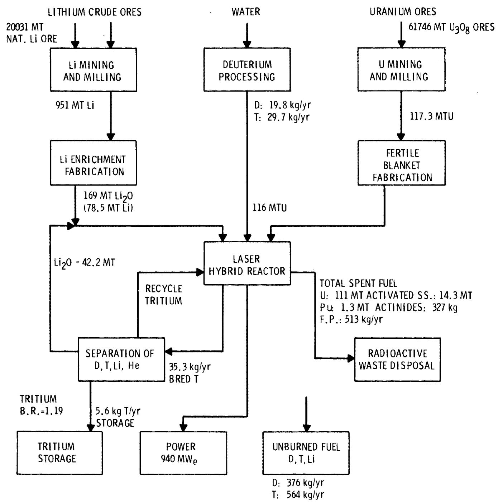  
FIGURE VII-B-6. Laser Hybrid Reactor - Once-Through Fuel Cycle

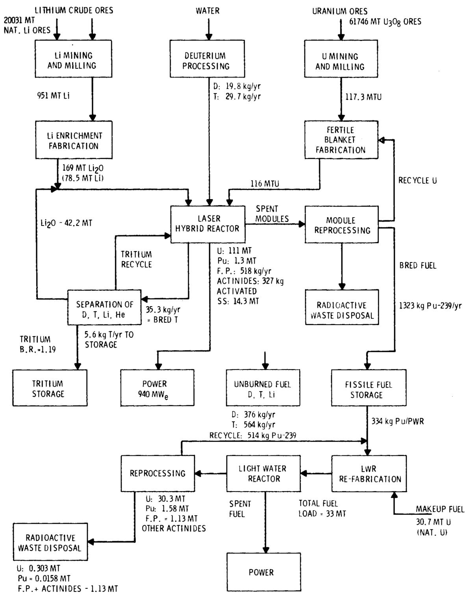  
FIGURE VII-B-7. Laser Hybrid Reactor - Pu-Recycle

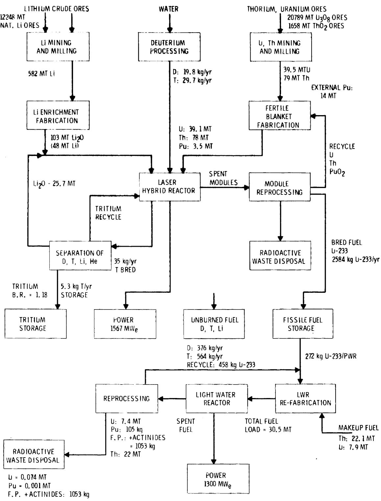  
FIGURE VII-B-8. Laser Hybrid Reactor - Pu-Catalyst

TABLE VII-B-17. Theta-Pinch Hybrid Fuel Management Data   

<table><tr><td>Number of Fuel Management Regions</td><td>4</td></tr><tr><td>Blanket Lifetime</td><td>4 years</td></tr><tr><td>Plant Capacity Factor</td><td>0.75</td></tr><tr><td>Blanket Replacement time</td><td>35 days</td></tr><tr><td>Fuel management Interval</td><td>1.3 years</td></tr><tr><td>Maximum Blanket Exposure</td><td>~ 3-4 MWy/m2</td></tr><tr><td>Number of Blanket Modules</td><td>200</td></tr><tr><td>Number of Blanket Modules Replaced</td><td>50</td></tr></table>

The initial loading of fertile fuel, structure, tritium breeder, and graphite reflector is given in Table VII-B-18.

The 30-year plant lifetime fuel requirements, based on a four-year burnup cycle, are presented in Tables VII-B-19 - VII-B-21. The fuel mass flows for the Pu-Recycle and Pu-Catalyst fuel cycles are given in Figures VII-B-9 and VII-B-10. The Theta-Pinch Hybrid can support 7-8 PWRs based on 2592 kg Pu-239 annual discharge. The Theta-Pinch Hybrid supplies the U-233 makeup requirements for 18-20 PWRs. The Theta-Pinch Hybrid operating in the Refresh cycle mode requires more than 20 years of fuel exposure before the Pu/U enrichment reaches 2-3%.

# C. FACILITY REQUIREMENTS

The major facilities of the hybrid fuel cycles are analogous and in some instances identical to the LWR fuel cycle facilities now in use. Blanket module fabrication, operational wastes, spent fuel storage, and reprocessing facilities will be characterized for each hybrid fuel cycle type. The current status of LWR fuel cycle technology relevant to the hybrid fuel cycle will be discussed.

# 1. Fuel Fabrication - Mainline Process Description

a. Summary Description of Overall Process

The reference fuel and blanket module fabrication facility performs chemical and mechanical operations in the manufacture of hybrid blanket modules.

TABLE VII-B-18. Theta-Pinch Hybrid Reactor Initial Material Requirements   

<table><tr><td>Reactor/Fuel Cycle</td><td>Fuel</td><td>Structure</td><td>Tritium Breeding Material</td><td>Other</td></tr><tr><td>Theta-Pinch/Once-Through</td><td>2595 MT UC</td><td>1688 MT SS(a)</td><td>1473 MT Li2O(b)</td><td>699 MT C(c)</td></tr><tr><td>Theta-Pinch/PuRecycle to ThermalReactors</td><td>2595 MT UC</td><td>1688 MT SS</td><td>1473 MT Li2O</td><td>699 MT C</td></tr><tr><td>Theta-Pinch/Refresh</td><td>1911 MT UO2</td><td>1688 MT SS</td><td>1473 MT Li2O</td><td>699 MT C</td></tr><tr><td>Theta-Pinch/PuCatalyst</td><td>827.5 MT UO2</td><td>-1688 MT SS</td><td>1081 MT Li2O</td><td>699 MT C</td></tr><tr><td></td><td>2160 MT ThC</td><td></td><td></td><td></td></tr><tr><td></td><td>66 MT PuO2</td><td></td><td></td><td></td></tr></table>

FUEL MANAGEMENT CHARACTERISTICS

Reactor Type Theta-Pinch Hybrid Reactor

Fuel Type N etural Uranium Carbide

TABLE VII-B-19. Once-Through and Pu-Recycle Fuel Charge Data   

<table><tr><td rowspan="2">Year</td><td rowspan="2">Annual Capacity Factor, %</td><td rowspan="2">Heavy Metal, kg</td><td rowspan="2">Thorium, kg</td><td colspan="5">Uranium, kg</td><td colspan="4">Plutonium, kg</td></tr><tr><td>233</td><td>234</td><td>235</td><td>236</td><td>238(a)</td><td>239</td><td>240</td><td>241</td><td>242</td></tr><tr><td>1</td><td>75</td><td>2,469,787</td><td>0</td><td>0</td><td>0</td><td>17787</td><td>0</td><td>2452</td><td>0</td><td>0</td><td>0</td><td>0</td></tr><tr><td>2</td><td>75</td><td>617,446</td><td>•</td><td>•</td><td>•</td><td>4446</td><td>•</td><td>613</td><td>•</td><td>•</td><td>•</td><td>•</td></tr><tr><td>3</td><td>75</td><td>617,446</td><td>•</td><td>•</td><td>•</td><td>4446</td><td>•</td><td>613</td><td>•</td><td>•</td><td>•</td><td>•</td></tr><tr><td>4</td><td>75</td><td>617,446</td><td>•</td><td>•</td><td>•</td><td>4446</td><td>•</td><td>613</td><td>•</td><td>•</td><td>•</td><td>•</td></tr><tr><td>5</td><td>•</td><td>•</td><td>•</td><td>•</td><td>•</td><td>•</td><td>•</td><td>•</td><td>•</td><td>•</td><td>•</td><td>•</td></tr><tr><td>6</td><td>•</td><td>•</td><td>•</td><td>•</td><td>•</td><td>•</td><td>•</td><td>•</td><td>•</td><td>•</td><td>•</td><td>•</td></tr><tr><td>7</td><td>•</td><td>•</td><td>•</td><td>•</td><td>•</td><td>•</td><td>•</td><td>•</td><td>•</td><td>•</td><td>•</td><td>•</td></tr><tr><td>8</td><td></td><td></td><td></td><td></td><td></td><td></td><td></td><td></td><td></td><td></td><td></td><td></td></tr><tr><td>9</td><td></td><td></td><td></td><td></td><td></td><td></td><td></td><td></td><td></td><td></td><td></td><td></td></tr><tr><td>10</td><td></td><td></td><td></td><td></td><td></td><td></td><td></td><td></td><td></td><td></td><td></td><td></td></tr><tr><td>11</td><td></td><td></td><td></td><td></td><td></td><td></td><td></td><td></td><td></td><td></td><td></td><td></td></tr><tr><td>12</td><td></td><td></td><td></td><td></td><td></td><td></td><td></td><td></td><td></td><td></td><td></td><td></td></tr><tr><td>13</td><td></td><td></td><td></td><td></td><td></td><td></td><td></td><td></td><td></td><td></td><td></td><td></td></tr><tr><td>14</td><td></td><td></td><td></td><td></td><td></td><td></td><td></td><td></td><td></td><td></td><td></td><td></td></tr><tr><td>15</td><td></td><td></td><td></td><td></td><td></td><td></td><td></td><td></td><td></td><td></td><td></td><td></td></tr><tr><td>16</td><td></td><td></td><td></td><td></td><td></td><td></td><td></td><td></td><td></td><td></td><td></td><td></td></tr><tr><td>17</td><td></td><td></td><td></td><td></td><td></td><td></td><td></td><td></td><td></td><td></td><td></td><td></td></tr><tr><td>18</td><td></td><td></td><td></td><td></td><td></td><td></td><td></td><td></td><td></td><td></td><td></td><td></td></tr><tr><td>19</td><td></td><td></td><td></td><td></td><td></td><td></td><td></td><td></td><td></td><td></td><td></td><td></td></tr><tr><td>20</td><td></td><td></td><td></td><td></td><td></td><td></td><td></td><td></td><td></td><td></td><td></td><td></td></tr><tr><td>21</td><td></td><td></td><td></td><td></td><td></td><td></td><td></td><td></td><td></td><td></td><td></td><td></td></tr><tr><td>22</td><td></td><td></td><td></td><td></td><td></td><td></td><td></td><td></td><td></td><td></td><td></td><td></td></tr><tr><td>23</td><td></td><td></td><td></td><td></td><td></td><td></td><td></td><td></td><td></td><td></td><td></td><td></td></tr><tr><td>24</td><td></td><td></td><td></td><td></td><td></td><td></td><td></td><td></td><td></td><td></td><td></td><td></td></tr><tr><td>25</td><td></td><td></td><td></td><td></td><td></td><td></td><td></td><td></td><td></td><td></td><td></td><td></td></tr><tr><td>26</td><td></td><td></td><td></td><td></td><td></td><td></td><td></td><td></td><td></td><td></td><td></td><td></td></tr><tr><td>27</td><td></td><td></td><td></td><td></td><td></td><td></td><td></td><td></td><td></td><td></td><td></td><td></td></tr><tr><td>28</td><td>•</td><td>•</td><td>•</td><td>•</td><td>•</td><td>•</td><td>•</td><td>•</td><td>•</td><td>•</td><td>•</td><td>•</td></tr><tr><td>29</td><td>•</td><td>•</td><td>•</td><td>•</td><td>•</td><td>•</td><td>•</td><td>•</td><td>•</td><td>•</td><td>•</td><td>•</td></tr><tr><td>30</td><td>75</td><td>617,446</td><td>0</td><td>0</td><td>0</td><td>4446</td><td>0</td><td>613</td><td>0</td><td>0</td><td>0</td><td>0</td></tr></table>

(a) Metric Tons

# TABLE VII-B-20. Once-Through and Pu-Recycle Fuel Discharge Data

FUEL MANAGEMENT CHARACTERISTICS

Reactor Type Tokamak Hybrid

Fuel Type Natural Uranium Carbide

<table><tr><td rowspan="2">Year</td><td rowspan="2">Heavy Metal, kg</td><td rowspan="2">Thorium kg</td><td colspan="5">Uranium, kg</td><td colspan="5">Reactor Fuel Discharge Data Plutonium, kg</td><td>Fission Products, kg</td><td colspan="5">Other Isotopics, kg</td></tr><tr><td>233</td><td>234</td><td>235</td><td>236</td><td>238</td><td>239</td><td>240</td><td>241</td><td>242</td><td></td><td>Pa-233</td><td>Np-237</td><td>Am-241</td><td>Cm-242</td><td></td><td></td></tr><tr><td>1</td><td>611,278</td><td>0</td><td>.12</td><td>1.5</td><td>4012</td><td></td><td>605,913</td><td>639</td><td>6.4</td><td>.058</td><td>~0</td><td>254</td><td>~0</td><td>452</td><td>~0</td><td>0</td><td></td><td></td></tr><tr><td>2</td><td>606,397</td><td></td><td>.22</td><td>3.1</td><td>3722</td><td></td><td>600,000</td><td>1270</td><td>18</td><td>.25</td><td></td><td>508</td><td></td><td>876</td><td>.24</td><td></td><td></td><td></td></tr><tr><td>3</td><td>601,607</td><td></td><td>.30</td><td>5.1</td><td>3447</td><td></td><td>594,176</td><td>1893</td><td>36</td><td>.64</td><td></td><td>762</td><td></td><td>1288</td><td>.72</td><td></td><td></td><td></td></tr><tr><td>4</td><td>596,767</td><td></td><td>.37</td><td>7.5</td><td>3186</td><td></td><td>588,308</td><td>2508</td><td>59</td><td>1.25</td><td></td><td>1016</td><td></td><td>1680</td><td>1.66</td><td>.01</td><td></td><td></td></tr><tr><td>5</td><td></td><td></td><td></td><td></td><td></td><td></td><td></td><td></td><td></td><td></td><td></td><td></td><td></td><td></td><td></td><td></td><td></td><td></td></tr><tr><td>6</td><td></td><td></td><td></td><td></td><td></td><td></td><td></td><td></td><td></td><td></td><td></td><td></td><td></td><td></td><td></td><td></td><td></td><td></td></tr><tr><td>7</td><td></td><td></td><td></td><td></td><td></td><td></td><td></td><td></td><td></td><td></td><td></td><td></td><td></td><td></td><td></td><td></td><td></td><td></td></tr><tr><td>8</td><td></td><td></td><td></td><td></td><td></td><td></td><td></td><td></td><td></td><td></td><td></td><td></td><td></td><td></td><td></td><td></td><td></td><td></td></tr><tr><td>9</td><td></td><td></td><td></td><td></td><td></td><td></td><td></td><td></td><td></td><td></td><td></td><td></td><td></td><td></td><td></td><td></td><td></td><td></td></tr><tr><td>10</td><td></td><td></td><td></td><td></td><td></td><td></td><td></td><td></td><td></td><td></td><td></td><td></td><td></td><td></td><td></td><td></td><td></td><td></td></tr><tr><td>11</td><td></td><td></td><td></td><td></td><td></td><td></td><td></td><td></td><td></td><td></td><td></td><td></td><td></td><td></td><td></td><td></td><td></td><td></td></tr><tr><td>12</td><td></td><td></td><td></td><td></td><td></td><td></td><td></td><td></td><td></td><td></td><td></td><td></td><td></td><td></td><td></td><td></td><td></td><td></td></tr><tr><td>13</td><td></td><td></td><td></td><td></td><td></td><td></td><td></td><td></td><td></td><td></td><td></td><td></td><td></td><td></td><td></td><td></td><td></td><td></td></tr><tr><td>14</td><td></td><td></td><td></td><td></td><td></td><td></td><td></td><td></td><td></td><td></td><td></td><td></td><td></td><td></td><td></td><td></td><td></td><td></td></tr><tr><td>15</td><td></td><td></td><td></td><td></td><td></td><td></td><td></td><td></td><td></td><td></td><td></td><td></td><td></td><td></td><td></td><td></td><td></td><td></td></tr><tr><td>16</td><td></td><td></td><td></td><td></td><td></td><td></td><td></td><td></td><td></td><td></td><td></td><td></td><td></td><td></td><td></td><td></td><td></td><td></td></tr><tr><td>17</td><td></td><td></td><td></td><td></td><td></td><td></td><td></td><td></td><td></td><td></td><td></td><td></td><td></td><td></td><td></td><td></td><td></td><td></td></tr><tr><td>18</td><td></td><td></td><td></td><td></td><td></td><td></td><td></td><td></td><td></td><td></td><td></td><td></td><td></td><td></td><td></td><td></td><td></td><td></td></tr><tr><td>19</td><td></td><td></td><td></td><td></td><td></td><td></td><td></td><td></td><td></td><td></td><td></td><td></td><td></td><td></td><td></td><td></td><td></td><td></td></tr><tr><td>20</td><td></td><td></td><td></td><td></td><td></td><td></td><td></td><td></td><td></td><td></td><td></td><td></td><td></td><td></td><td></td><td></td><td></td><td></td></tr><tr><td>21</td><td></td><td></td><td></td><td></td><td></td><td></td><td></td><td></td><td></td><td></td><td></td><td></td><td></td><td></td><td></td><td></td><td></td><td></td></tr><tr><td>22</td><td></td><td></td><td></td><td></td><td></td><td></td><td></td><td></td><td></td><td></td><td></td><td></td><td></td><td></td><td></td><td></td><td></td><td></td></tr><tr><td>23</td><td></td><td></td><td></td><td></td><td></td><td></td><td></td><td></td><td></td><td></td><td></td><td></td><td></td><td></td><td></td><td></td><td></td><td></td></tr><tr><td>24</td><td></td><td></td><td></td><td></td><td></td><td></td><td></td><td></td><td></td><td></td><td></td><td></td><td></td><td></td><td></td><td></td><td></td><td></td></tr><tr><td>25</td><td></td><td></td><td></td><td></td><td></td><td></td><td></td><td></td><td></td><td></td><td></td><td></td><td></td><td></td><td></td><td></td><td></td><td></td></tr><tr><td>26</td><td></td><td></td><td></td><td></td><td></td><td></td><td></td><td></td><td></td><td></td><td></td><td></td><td></td><td></td><td></td><td></td><td></td><td></td></tr><tr><td>27</td><td></td><td></td><td></td><td></td><td></td><td></td><td></td><td></td><td></td><td></td><td></td><td></td><td></td><td></td><td></td><td></td><td></td><td></td></tr><tr><td>28</td><td></td><td></td><td></td><td></td><td></td><td></td><td></td><td></td><td></td><td></td><td></td><td></td><td></td><td></td><td></td><td></td><td></td><td></td></tr><tr><td>29</td><td></td><td></td><td></td><td></td><td></td><td></td><td></td><td></td><td></td><td></td><td></td><td></td><td></td><td></td><td></td><td></td><td></td><td></td></tr><tr><td>30</td><td>596,767</td><td>0</td><td>.37</td><td>7.5</td><td>3186</td><td></td><td>588,308</td><td>2508</td><td>59</td><td>1.25</td><td>0</td><td>1016</td><td>0</td><td>1680</td><td>1.66</td><td>.01</td><td></td><td></td></tr></table>

TABLE VII-B-21, Pu-Catalyst Fuel Charge Data   
FUEL MANAGEMENT CHARACTERISTICS   

<table><tr><td>Reactor Type</td><td>Theta-Pinch Hybrid Reactor</td></tr><tr><td>Fuel Type</td><td>UO2/PuO2 Converter Region</td></tr><tr><td></td><td>ThC Breeding Region</td></tr></table>

Reactor Fuel Charge Data   

<table><tr><td rowspan="2">Year</td><td rowspan="2">Annual Capacity Factor, %</td><td rowspan="2">Heavy Metal, kg</td><td rowspan="2">Thorium, kg</td><td colspan="5">Uranium, kg</td><td colspan="4">Plutonium, kg(a)</td></tr><tr><td>233</td><td>234</td><td>235</td><td>236</td><td>238</td><td>239</td><td>240</td><td>241</td><td>242</td></tr><tr><td>1</td><td>75</td><td>2,885,240</td><td>2,053,000</td><td>0</td><td>0</td><td>5252</td><td>0</td><td>724,168</td><td>58,366</td><td>25,627</td><td>13,702</td><td>5125</td></tr><tr><td>2</td><td>75</td><td>721,310</td><td>513,250</td><td>-</td><td>-</td><td>1313</td><td>-</td><td>181,042</td><td>14,591</td><td>6,406</td><td>3,425</td><td>1281</td></tr><tr><td>3</td><td>75</td><td>721,310</td><td>513,250</td><td>-</td><td>-</td><td>1313</td><td>-</td><td>181,042</td><td>14,591</td><td>6,406</td><td>3,425</td><td>1281</td></tr><tr><td>4</td><td>75</td><td>721,310</td><td>513,250</td><td>-</td><td>-</td><td>1313</td><td>-</td><td>181,042</td><td>14,591</td><td>6,406</td><td>3,425</td><td>1281</td></tr><tr><td>5</td><td>-</td><td>-</td><td>-</td><td>-</td><td>-</td><td>-</td><td>-</td><td>-</td><td>-</td><td>-</td><td>-</td><td>-</td></tr><tr><td>6</td><td>-</td><td>-</td><td>-</td><td>-</td><td>-</td><td>-</td><td>-</td><td>-</td><td>-</td><td>-</td><td>-</td><td>-</td></tr><tr><td>7</td><td>-</td><td>-</td><td>-</td><td>-</td><td>-</td><td>-</td><td>-</td><td>-</td><td>-</td><td>-</td><td>-</td><td>-</td></tr><tr><td>8</td><td></td><td></td><td></td><td></td><td></td><td></td><td></td><td></td><td></td><td></td><td></td><td></td></tr><tr><td>9</td><td></td><td></td><td></td><td></td><td></td><td></td><td></td><td></td><td></td><td></td><td></td><td></td></tr><tr><td>10</td><td></td><td></td><td></td><td></td><td></td><td></td><td></td><td></td><td></td><td></td><td></td><td></td></tr><tr><td>11</td><td></td><td></td><td></td><td></td><td></td><td></td><td></td><td></td><td></td><td></td><td></td><td></td></tr><tr><td>12</td><td></td><td></td><td></td><td></td><td></td><td></td><td></td><td></td><td></td><td></td><td></td><td></td></tr><tr><td>13</td><td></td><td></td><td></td><td></td><td></td><td></td><td></td><td></td><td></td><td></td><td></td><td></td></tr><tr><td>14</td><td></td><td></td><td></td><td></td><td></td><td></td><td></td><td></td><td></td><td></td><td></td><td></td></tr><tr><td>15</td><td></td><td></td><td></td><td></td><td></td><td></td><td></td><td></td><td></td><td></td><td></td><td></td></tr><tr><td>16</td><td></td><td></td><td></td><td></td><td></td><td></td><td></td><td></td><td></td><td></td><td></td><td></td></tr><tr><td>17</td><td></td><td></td><td></td><td></td><td></td><td></td><td></td><td></td><td></td><td></td><td></td><td></td></tr><tr><td>18</td><td></td><td></td><td></td><td></td><td></td><td></td><td></td><td></td><td></td><td></td><td></td><td></td></tr><tr><td>19</td><td></td><td></td><td></td><td></td><td></td><td></td><td></td><td></td><td></td><td></td><td></td><td></td></tr><tr><td>20</td><td></td><td></td><td></td><td></td><td></td><td></td><td></td><td></td><td></td><td></td><td></td><td></td></tr><tr><td>21</td><td></td><td></td><td></td><td></td><td></td><td></td><td></td><td></td><td></td><td></td><td></td><td></td></tr><tr><td>22</td><td></td><td></td><td></td><td></td><td></td><td></td><td></td><td></td><td></td><td></td><td></td><td></td></tr><tr><td>23</td><td></td><td></td><td></td><td></td><td></td><td></td><td></td><td></td><td></td><td></td><td></td><td></td></tr><tr><td>24</td><td></td><td></td><td></td><td></td><td></td><td></td><td></td><td></td><td></td><td></td><td></td><td></td></tr><tr><td>25</td><td></td><td></td><td></td><td></td><td></td><td></td><td></td><td></td><td></td><td></td><td></td><td></td></tr><tr><td>26</td><td></td><td></td><td></td><td></td><td></td><td></td><td></td><td></td><td></td><td></td><td></td><td></td></tr><tr><td>27</td><td></td><td></td><td></td><td></td><td></td><td></td><td></td><td></td><td></td><td></td><td></td><td></td></tr><tr><td>28</td><td>-</td><td>-</td><td>-</td><td>-</td><td>-</td><td>-</td><td>-</td><td>-</td><td>-</td><td>-</td><td>-</td><td>-</td></tr><tr><td>29</td><td>-</td><td>-</td><td>-</td><td>-</td><td>-</td><td>-</td><td>-</td><td>-</td><td>-</td><td>-</td><td>-</td><td>-</td></tr><tr><td>30</td><td>75</td><td>710,115</td><td>513,250</td><td>0</td><td>0</td><td>1313</td><td>0</td><td>181,042</td><td>8,091</td><td>3,552</td><td>1,899</td><td>710</td></tr></table>

(a) LWR Discharge Plutonium

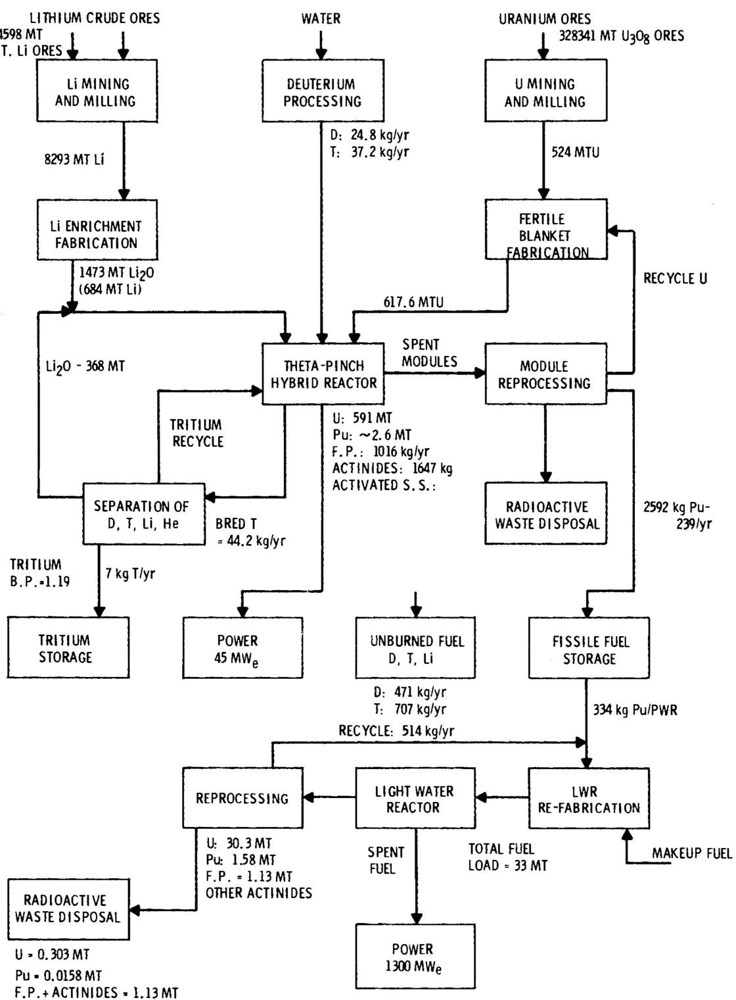  
FIGURE VII-B-9. Theta-Pinch Hybrid Reactor - Pu-Recycle to Thermal Reactor

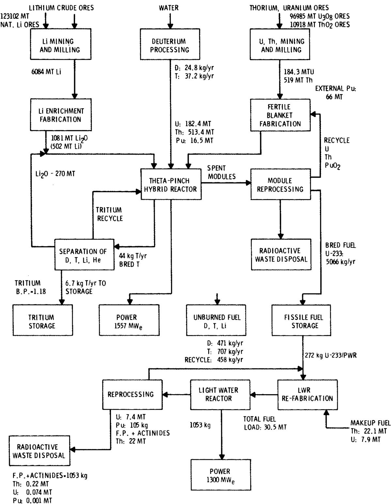  
FIGURE VII-B-10. Theta-Pinch Hybrid Reactor - Pu-Catalyst

The facility receives natural uranium $(\mathsf{U}_3\mathsf{O}_8)$ concentrates and enriched $\mathsf{Li}_2\mathsf{O}$ $(90\% 6_{\text{Li}})$ . The natural uranium is to be the only radioactive material present in the reference facility. Four basic operations are performed in the facility: chemical conversion of the $\mathsf{U}_3\mathsf{O}_8$ to $\mathsf{UO}_2$ powder and then to a carbide (UC); mechanical processing including preparation of UC pellets by cold pressing and sintering, fabrication of stainless steel clad UC fuel rods (the tubes are loaded with finished pellets, fitted with end plugs, and welded), and manufacture of $\mathsf{Li}_2\mathsf{O}$ tritium breeding pins; manufacturing of first wall and module structures and placing finished fuel and tritium breeding rods into the module; and recovery of uranium and $\mathsf{Li}_2\mathsf{O}$ from off-specification and scrap material. The finished blanket modules are to be shipped to appropriate hybrid commercial reactors.

# Description of Process Steps

Chemical Conversion of U3O8 to UC

$\mathsf{U}_3\mathsf{O}_8$ concentrates are received from the mill facility. This material is reacted with hydrogen to produce $\mathsf{UO}_2$ . UC is then produced by oxide-carbon solution preparation. This fuel conversion is identical to the process used in the light water reactor industry.

- Blending and Packaging

The UC from the conversion processes is pulverized and then collected into leaches for blending and acceptable UC is packaged in canisters for transfer to the pellet manufacturing area. Rejected UC is recycled back into the conversion step. $\mathsf{Li}_2\mathsf{O}$ is purified and collected into canisters for shipment to the pellet operations area.

Pelletizing

UC from the conversion or scrap recovery area is received in the pellet area where it is prepared for low pressure pressing. After UC is densified in the slug processing operation, the slugs are granulated and screened to obtain the proper size. At the pelleting station the granulated densified UC is pressed into pellets. These pellets are passed through a sintering furnace and then placed in a drying oven.

# Rod Loading and Finishing

Dried UC pellets are unloaded and the pellets manually loaded into stainless steel rods. The top and bottom of the rods are welded and sealed. $\mathsf{Li}_2\mathsf{O}$ powder will be loaded directly into the tritium breeding pins. The $\mathsf{Li}_2\mathsf{O}$ powder is compacted within the rods and then sealed with end plugs.

# - Module Assembly

The finished UC and $\mathsf{Li}_2\mathsf{O}$ rods are unloaded from their storage racks and containers and are inserted into the module body. The fabrication steps of the stainless steel module structure are dependent upon the hybrid reactor type. Some of the modules will be wedge-shaped and some cylindrical. Once the modules are assembled and completed, they are shipped to a hybrid reactor site.

# - Scrap Recovery

Scrap in various forms is sent to the recovery process operation where it is handled on a batch basis. Scrap recovery in this reference plant is relatively clean uranium-containing scrap that is amenable to recovery of uranium of acceptable quality by a modest amount of processing (i.e., without solvent extraction). Dirty scrap requiring more processing is either packaged and stored for later processing or shipped as waste.

Initial steps in scrap recovery involve concentration and conversion of the scrap into forms that can be readily processed into $\mathsf{U}_3\mathsf{O}_8$ powder. The basic sequence of the scrap recovery process involves: dissolution of solid forms in nitric acid, conversion to slurry, dewatering the slurry form by wet mechanical separation, calcining the resulting sludge in regular or controlled atmosphere furnaces, and packaging and storing the resulting product. Some scrap does not require processing through the entire sequence. Acceptable product is recycled by returning it to the powder preparation step in the

pellet area. Unacceptable product is transferred to the pH adjustment station or the calcination station in the conversion area. Solid waste is collected for disposal.

Liquid effluents held in the quarantine tanks are transferred to a waste treatment building when they do not exceed the specified release levels. A typical fabrication facility outlay is shown schematically in Figure VII-C-1.

Table VII-C-1 gives a summary of the isotopic, physical, and chemical characteristics of the material present in the fabrication facility. The average quantity of feed material that enters the facility is also given. The tritium breeding pins will not require continuous replacement but instead can be recycled into the fresh module. The graphite reflector region can also be reused in the hybrid module. The only nonfuel material required for module fabrication is stainless steel used as the cladding.

# 2. $\mathrm{UO}_2 / \mathrm{PuO}_2$ Fuel Fabrication

In the Pu-Catalyst fuel cycle $^{233}\mathrm{U}$ is bred in a ThC breeding region of the blanket module. In order to enhance this process and improve neutron multiplication, $\mathrm{PuO}_2$ is added to the converter region. In this region the amount of $\mathrm{PuO}_2$ is relatively constant, $8\%$ , because the rate of Pu production is approximately equal to the Pu burnup rate. Of course, the $\mathrm{UO}_2 / \mathrm{PuO}_2$ pins will need to be re-clad due to neutron bombardment and radiation effects. It is unrealistic to assume that the fuel pins (converter region) would retain their cladding integrity for a large number of cycles. In the following discussion the mixed oxide fabrication facility is characterized.

# 3. $\mathrm{UO}_2 / \mathrm{PuO}_2$ Fuel Fabrication Mainline Process Description

a. Summary Description of Overall Process

The reference $\mathrm{UO}_2 / \mathrm{PuO}_2$ fuel fabrication facility receives $\mathrm{UO}_2$ (natural U) and $\mathrm{PuO}_2$ powder. The $\mathrm{UO}_2$ and $\mathrm{PuO}_2$ are blended with recycled $\mathrm{UO}_2 / \mathrm{PuO}_2$ powders from other process steps in the facility. The blended mixture is cold pressed and sintered to yield $\mathrm{UO}_2 / \mathrm{PuO}_2$ pellets which are loaded into tubes to produce convertor region hybrid type, stainless steel clad, $\mathrm{UO}_2 / \mathrm{PuO}_2$ fuel rods. The welded and inspected fuel rods are shipped to the hybrid fuel fabrication facility for incorporation into appropriate blanket modules.

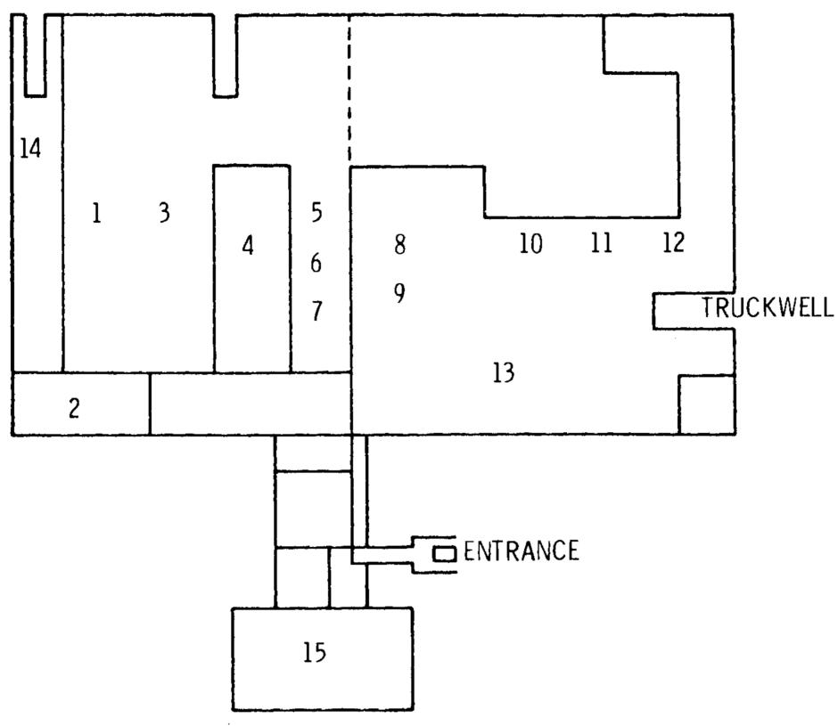

1 - Chemical Processing   
2 - Chemical Laboratory Area   
3 - Pelletizing   
4 - Sintering Furnaces

5, 6, 7 - Fertile Fuel Rod Loading

8,9-X-Ray

10, 11, 12 - Blanket Module Assembly Area

13 - Li $_2$ O Rod Preparation and Loading   
14 - UC, Li $_2$ O Recovery Area   
15 - Office-Control Area

FIGURE VII-C-1. Fabrication Facility Layout

TABLE VII-C-1. Once-Through and Pu-Recycle to Thermal Reactors Fuel Fabrication Facility

Fuel Type - Uranium carbide fertile fuel rods clad with stainless steel. Lithium oxide (90% $\mathsf{6Li}$ ) clad with stainless steel is tritium breeding material.

Type of Material - Contact-remote fabrication unnecessary with natural handling uranium as fuel feed.

Technology Status - Fertile fuel pin fabrication utilizes LWR technology. Some modification of existing fabrication facilities will be needed for $\mathsf{Li}_2\mathsf{O}$ (90% $\mathsf{6Li}$ ) pin fabrication.

Throughput (Range expected for commercial operation):

Tokamak Hybrid - 70 to 80 MT/yr-reactor(a)

Mirror Hybrid - 70 to 80 MT/yr-reactor

Laser Hybrid - 110 to 120 MT/yr-reactor

Theta-Pinch Hybrid - 600 to 620 MT/yr-reactor

Material Stream Characteristics   

<table><tr><td></td><td>Physical Form</td><td>Chemical Form</td><td>Fissile Isotopic Composition</td></tr><tr><td>Feed</td><td>Yellowcake Concentrates</td><td>U3O8</td><td>0.72% 235U</td></tr><tr><td>Product</td><td>Fertile Fuel Pins with Stainless Steel Cladding</td><td>UC</td><td>0.72% 235U</td></tr><tr><td>Waste</td><td>Airborne Particles, Solid and Liquid Operational Wastes</td><td>U Contaminated Material</td><td>0.72% 235U</td></tr></table>

Plant Modification Feasibility/Proliferation Criteria:

Material Flow Change: low feasibility

Process Change: low feasibility

Proliferation Criteria: fabrication of natural uranium fuel entails limited proliferation risks.

The reference $\mathrm{UO_2 / PuO_2}$ fuel fabrication facility contains equipment in "canyon" type areas where mixed oxide pellets are fabricated on a remote, batch-type basis. The fabrication plants for the Pu-Catalyst hybrid fuel cycle will use batch-type operations and semiremote (glove box) methods for all the steps up through the final welding on the fuel rod. Mixed oxide fuel is currently prepared commercially by dry (mechanical blending) or wet (coprecipitation) processes. The hybrid fuel fabrication facility will use the dry technique in the pelletization process. (Figure VII-C-2.)

# b. Description of Process Steps

Each of the major processes involved in manufacturing the $\mathrm{UO}_2 / \mathrm{PuO}_2$ rods will be discussed below. This description will apply only to the $\mathrm{UO}_2 / \mathrm{PuO}_2$ portion of fuel fabrication for the Pu-Catalyst fuel cycle.

- $\mathrm{PuO}_2$ Receiving/Unloading

The $\mathrm{PuO_2}$ arrives in special shipping containers from a reprocessing facility. The containers are opened inside a ventilated enclosure, the inner cans opened, and the $\mathrm{PuO_2}$ transferred to a restricted storage vessel.

- Powder Blending

Natural $\mathsf{UO}_2$ , $\mathsf{PuO}_2$ , and recycled $\mathsf{UO}_2 / \mathsf{PuO}_2$ powder are blended in batch increments. The $\mathsf{UO}_2$ powder is shipped from a fuel fabrication facility to the $\mathsf{UO}_2 / \mathsf{PuO}_2$ facility in 55-gal drums. The $\mathsf{UO}_2 / \mathsf{PuO}_2$ mixture is $92\%$ (weight) $\mathsf{UO}_2$ and $8\%$ $\mathsf{PuO}_2$ (weight). Rejected $\mathsf{UO}_2$ and $\mathsf{PuO}_2$ ( $71\%$ moisture) goes to scrap recovery and drying. The batch of $\mathsf{UO}_2 / \mathsf{PuO}_2$ is transferred from the blender to a storage area.

- Compaction, Granulation, Pelletization and Pellet Storage

$\mathrm{UO}_2 / \mathrm{PuO}_2$ powder is transferred by the air conveyor from a silo to the slug press where the powder is compacted into slugs which are then granulated and classified. Acceptable granules are sent to the pelletizing press, oversize granules (indicates broken classifier screen) are considered dirty scrap, and undersized granules are directly recycled back to the slug press. Acceptable green (i.e., unsintered) pellets from the pelletizing press are moved by mechanical conveyor to

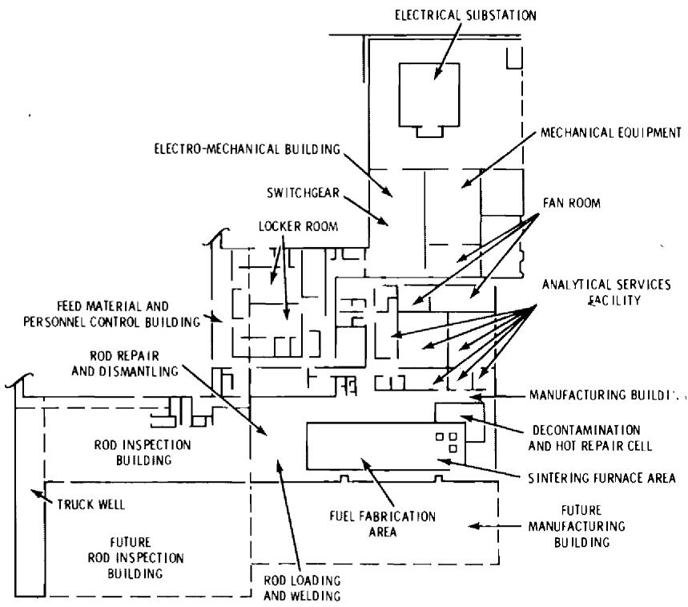  
FIRST LEVEL

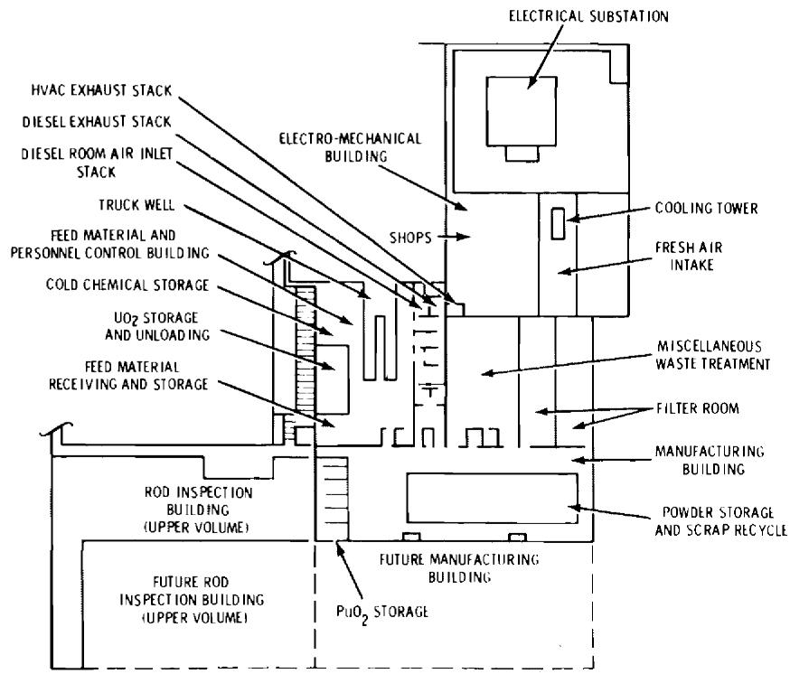  
SECOND LEVEL   
FIGURE VII-C-2. $\mathrm{UO}_2 / \mathrm{PuO}_2$ Fabrication Facility for Pu=Catalyst Fuel Cycle

boats (i.e., trays) which are, in turn, placed in green pellet storage; rejected green pellets are collected as clean scrap.

- Sintering, Boat Conveyance and Pellet Storage

Boats of green pellets are moved by shuttle car to the sintering furnaces. The fabrication facility will apparently have several sintering furnaces. The boats of pellets pass through the furnaces to an inspection station for sintered pellets. Also, the acceptable pellets are sent to sintered pellet boat storage, underfired pellets are recycled back through the furnace, and overfired pellets are sent to scrap recovery.

- Pellet Grinding, Inspection and Storage

Boats of sintered pellets from the furnace storage area are transferred by motor-driven conveyor. The pellets are mechanically unloaded and conveyed single file through a centerless grinder for surface grinding (water coolant used). The water coolant used in pellet grinding is pumped to a sludge separator. A high-velocity air stream (from nozzles) passes over the ground pellets and dries them.

The ground pellets are inspected for diameter. Acceptable pellets go to the nick inspection station, undersize pellets are transferred to scrap recovery, and oversize pellets are sent back for regrinding. From the nick inspection station, acceptable pellets are mechanically conveyed single-file to a tray loader. The loaded trays of pellets are mechanically conveyed through a heated-air drier. Trays of dried, inspected pellets are mechanically conveyed to the pellet storage unit. Before pellets are released from the storage units for insertion into tubes at the loading station, selected trays of pellets are conveyed to the inspection and sampling station. Trays of acceptable pellets are moved from the storage units to the loading station.

- Fuel Rod Loading

The fuel rod loading station is in a glove box and has a mechanical device to load pellets into stainless steel tubes. After the rods are

loaded, they are removed to a decontamination station. From here, the finished rods are sent to an inspection station where the welds and dimensions of the rod are checked. Acceptable rods are moved to a storage area before being shipped to the fuel fabrication plant where the breeding pins, ThC, are manufactured. Here the $\mathrm{UO}_2 / \mathrm{PuO}_2$ rods are inserted into the completed blanket modules.

Table VII-C-2 lists the fuel fabrication facility characteristics for the Pu-Catalyst fuel cycle.

# 4. Refresh Fuel Cycle Fabrication

The Refresh fuel cycle employs a direct exchange of fuel between the hybrid and light water reactor. The initial fabrication will be identical to the $\mathrm{UO_2}$ fuel pin fabrication for LWRs. Before the hybrid spent fuel can be loaded into a LWR, the fuel is mechanically pressed out of the stainless steel cladding. The fuel separated from the old cladding is transferred to another area of the fabrication facility where it is baked to remove fission product gases and then compressed and machined into pellets before it can be clad in "Zircaloy" tubing. All of these operations must be performed on a remote basis.

# 5. ThC Fuel Fabrication

The Pu-Catalyst blanket module fabrication facility performs the chemical and mechanical operations in the manufacture of hybrid fuel rods. The facility receives natural uranium, thorium, and $\mathrm{PuO_2}$ . The $\mathrm{UO_2 / PuO_2}$ or convertor fuel rod fabrication process was described previously. This section will characterize the manufacturing of the breeder region fuel rods, ThC.

# a. Chemical Conversion/Packaging

Thorium nitrate tetrahydrate $(\mathrm{Th}(\mathrm{NO}_3)_4^{4}\mathrm{H}_2\mathrm{O})$ is received from the mill facility. The thorium nitrate solution must first be converted into a finely divided powder, $\mathrm{ThO}_2$ . The nitrate solution is transferred to a vessel where superheated steam is used to drive off nitric acid leaving a $\mathrm{ThO}_2$ powder. The oxide solution is then transferred to another area where the oxide is formed into an oxide-carbon solution by heating it with channel-black carbon added to the vessel. The ThC material is then collected and purified before being transferred to the pellet process area.

TABLE VII-C-2. Pu-Catalyst Fuel Fabrication Facility Characteristics   

<table><tr><td>Material</td><td colspan="3">Stream Characteristics</td></tr><tr><td rowspan="2">Feed</td><td>Physical Form</td><td>Chemical Form</td><td>Fissile Isotopic Composition</td></tr><tr><td>Yellowcake Concentrates, Thorium Ores, and Plutonium from LWR Reprocessing</td><td>U3O8,ThO2and PuO2</td><td>.72% 235U (U)
~70% 239Pu and 241Pu (Pu)</td></tr><tr><td>Product</td><td>Convertor Fuel Pins and Fissile Fuel Breeding Pins</td><td>UO2/PuO2ThC</td><td>.72% 235U (U)
~70% 239Pu and 241Pu (Pu)</td></tr><tr><td>Waste</td><td>Airborne Particles, Solid and Liquid Operational Wastes</td><td>U Contaminated Material, Pu</td><td>.72% 235U (U)</td></tr></table>

# b. Pelletizing

ThC from the conversion or scrap recovery area is received in the pellet area. After the ThC is densified in the slug processing operation, the slugs are granulated and screened to obtain the proper size. At the pelleting station the granulated, densified ThC is pressed into pellets. These pellets are passed through a sintering furnace and then placed in a drying oven.

The remainder of the fabrication process (rod loading and finishing, module assembly, scrap recovery) are identical to the processes for the other fuel manufacturing facilities.

# 6. Hybrid Fuel Storage

Most LWR reactors have spent fuel storage pools that are capable of handling 1-1/3 to 2 core loadings. The blanket module management plans for the hybrid reactors are based on replacing one-fourth of the blanket each year. The spent fuel storage for the hybrids should have a capacity of 1-1/4 of the total blanket loading. The spent fuel basin will utilize water as a coolant and shield. Special storage canisters will be needed to store the spent fuel rods since the module structure itself is reused in the blanket. Additional storage may be required at the reactor for Once-Through fuel cycles.

# 7. Operational Waste Facilities

In addition to the wastes generated by blanket replacement operations there are wastes resulting from the operation of the hybrid that are not present in a fission reactor station. These wastes are associated with the operation of a fusion reactor. Tritium contamination of the primary coolant system occurs. There are also tritium wastes associated with the vacuum system and cryopump systems. Recovery bed wastes (contaminated sieve beds) will be generated by the bred tritium removal system. This system is used to remove tritium bred in the $\mathsf{Li}_2\mathsf{O}$ pins of the blanket module. From a proliferation or diversion perspective, these types of wastes pose no risk.

# 8. Reprocessing - Spent Hybrid Fuel

There are two fuel cycles or blankets which will require reprocessing: Pu Recycle to Thermal Reactors and Pu-Catalyst. The Once-Through employs a throw-away blanket concept optimized for power production only. The Refresh fuel cycles will use a mechanical type separation process.

There are several options available in the hybrid spent fuel reprocessing which render the product less vulnerable to proliferation. The Purex process can be adjusted to produce a coprocessed product, Pu and U. Or the normal Purex process can be adjusted to yield coprocessed U, Pu with fission product spike (partial decontamination). The Thorex process will be used to reprocess Pu catalyst spent fuel. However, the $\mathrm{UO}_2 / \mathrm{PuO}_2$ portion will usually remain inside the module and will not be replaced with fresh fuel. The cladding will need to be replaced periodically.

9. Pu Recycle to Thermal Reactor Reprocessing: Mainline Process Descriptions

The mainline processes employed at the hybrid reprocessing facility can be divided into three main categories. These are: 1) the process by which the uranium and plutonium are recovered in highly purified nitrate solutions, 2) the process by which the purified uranium is converted from nitrate solution to uranium carbide, and 3) the process by which the purified plutonium is converted from nitrate solution to plutonium dioxide.

The uranium nitrate solution is converted to a carbide form and recycled back into the hybrid reactor. The $\mathrm{PuO_2}$ is transferred to a mixed oxide fabrication system where it can be used in light water reactors. An option that is available in the reprocessing step is to leave the U and Pu in solution (co-process) and use this fuel as light water feed material. The first process description will apply to partitioned U/Pu streams. The significant processes present in coprocessing will be emphasized following the partitioned processing discussion.

10. Description of Process Steps

a. Recovery of Uranium and Plutonium

The hybrid reprocessing facility uses the Purex recovery process, which has been in large scale use for over 20 years and is currently employed, with minor variations, by most of the reprocessing plants now operating throughout the world.

# - Spent Module Receiving

The irradiated hybrid fuel rods arrive at the facility in shielded casks. The cask and carrier are monitored for outside radioactive contamination to determine if any leakage has occurred and are washed. The hybrid spent fuel elements are stored on reactor site in a decay heat pool for approximately one year.

# - Hybrid Fuel Rod Shearing and Dissolution

The fuel rods are remotely transferred from the storage pool to the feed mechanism of the mechanical bundle type shear after a full processing lot has been accumulated. Here the fuel elements are chopped into segments about 5 to $12\mathrm{cm}$ long to expose the fuel to the dissolvent. The fuel segments fall into the dissolver containing hot 3-8M nitric acid (and gadolinium nitrate which serves as a neutron poison), which dissolves virtually all the uranium, plutonium, and fission products. The undissolved cladding materials and accompanying hardware of stainless steel remain in the dissolver basket. The dissolver solution is centrifuged to remove fine solids which are sent to the high level waste storage system. The clarified dissolver solution is transferred to tanks to be sampled for accountability and to adjust the acid concentration to 2-3M nitric acid before being fed to the solvent extraction process. The cladding hulls are rinsed, monitored for residual fissile material, packaged, and transferred to the interim underground waste storage area.

# - Solvent Extraction, Partitioning, and Stripping of Plutonium and Uranium

After acid adjustment, the feed solution is sent to the first solvent extraction cycle where it is contacted countercurrently in a centrifugal contractor with an organic solution of tributyl phosphate. The lighter organic solution preferentially extracts the tetravalent plutonium and hexavalent uranium, leaving about 98 percent of the fission products in the aqueous solution. The organic solution from the centrifugal contractor passes through a pulsed scrub column where a nitric acid solution removes about 98 percent of the remaining fission products

and is recycled back to the centrifugal contactor. The final aqueous solution leaving the centrifugal contactor contains about 99.9 percent (or more) of the fission products, essentially all of the transplutonium elements and about 0.5 percent of the uranium and plutonium; it is then sent to a highlevel waste concentrator. The organic solution from the pulsed scrub column then is joined by organic raffinates from the plutonium purification sections and passes through a partitioning column where tetravalent plutonium is electrochemically reduced to the less extractable trivalent state. This enables the plutonium to be stripped into an aqueous nitric acid solution containing hydrazine as a holding chemical reductant, all within the same electrochemical device. The organic solution passes through the final first cycle pulsed column where the uranium is stripped into acidified water.

# Second Uranium Solvent Extraction and Concentration

The aqueous strip solution containing the uranium is concentrated adjusted with nitric acid and is sent to the second uranium solvent extraction cycle where it is again preferentially extracted by another organic solution in a pulsed column. Before leaving the column, the organic solution is scrubbed with nitric acid solution which removes additional fission products. Hydroxylamine nitrate and hydrazine are also added to the scrub solution to remove residual plutonium by chemical reduction to the less extractable trivalent state. Uranium is stripped from the organic solution in another pulsed column, using acidified water. This solution is concentrated further by evaporation. Finally, the concentrated uranium solution from the second cycle is passed through silica gel beds, if necessary, to remove residual traces.

# Second Plutonium Solvent Extraction

Plutonium in the aqueous stream leaving the partitioning column in the first cycle is reoxidized to the extractable tetravalent state with nitrogen dioxide or sodium nitrite and sent to the second plutonium solvent extraction cycle. Here it is preferentially extracted into an organic solution in another pulsed extraction column. In the top portion of the same column, the organic stream is scrubbed with nitric acid

solution to remove residual extracted fission products. The organic stream passes through a strip column where tetravalent plutonium is transferred to an aqueous stream of dilute nitric acid.

- Third Plutonium Solvent Extraction and Concentration

The extraction-scrubbing sequence is repeated in a third plutonium cycle for further decontamination from fission products. To effect a higher plutonium product concentration, the plutonium is reduced in the third strip column by hydroxylamine nitrate to the more readily strippable trivalent state. A organic scrub solution is added to remove residual uranium from the plutonium aqueous stream as it leaves the third strip column. The plutonium product solution is analyzed and stored in geometrically favorable tanks until it is transferred to a facility for conversion to $\mathsf{PuO}_2$ .

An overall analysis of the uranium and plutonium recovery process shows that the uranium and plutonium product streams contain about one-part in ten million of the fission products originally present in the spent fuel. This purity translates to a radioactivity level in uranium of about twice that of natural uranium. The radioactivity levels in the various processing areas range from very high levels that require artificial cooling to remove the heat from radioactive decay to levels low enough to permit direct personal contact.

b. Conversion of Uranium Nitrate to Uranium Carbide

The fuel reprocessing facility also converts uranium nitrate solutions to uranium carbide.

Uranyl Nitrate Receiving and Storage

The conversion area receives uranyl nitrate solution recovered from spent fuel in the adjoining separations area. The solution is received in an accountability tank where it is measured, sampled, and then transferred to the storage tanks.

- Uranyl Nitrate Concentration

From storage, uranyl nitrate solution is pumped to a steam-heated thermo-syphon reboiler where water is removed to form uranyl nitrate hexahydrate (UNH), containing 78.5 weight percent uranyl nitrate. Removed water is condensed and returned to the separations facility for recycle.

- Uranyl Nitrate Hexahydrate Calcination

Next, the UNH is calcined to uranium trioxide $(\mathsf{UO}_3)$ in a bed of $\mathsf{UO}_3$ fluidized by superheated steam at $315^{\circ}\mathsf{C}$ . A controlled discharge of $\mathsf{UO}_3$ is withdrawn from the bed and fed to the next process step. By denitrating in steam, the nitrate values are converted to nitric acid $(\mathsf{HNO}_3)$ which is condensed and returned to the separations facility for recycle.

- Uranium Trioxide Reduction

Calcined $\mathsf{UO}_3$ is then put through a feed preparation step where it is sized to a uniform particle size, activated by the addition of $\mathsf{H}_2\mathsf{SO}_4$ and is converted to uranium dioxide $(\mathsf{UO}_2)$ by reduction with hydrogen in a fluidized bed, the hydrogen being obtained by dissociation of ammonia.

The uranium dioxide produced by the reduction step is next reacted with carbon in a furnace. After purification and further processing uranium carbide is produced. This fertile fuel is stored and eventually recycled back to the hybrid reactor.

c. Conversion of Plutonium Nitrate to the Dioxide

The hybrid reprocessing facility's plutonium production facility converts plutonium nitrate solutions to plutonium dioxide powder.

The conversion process consists of continuous precipitation of plutonium oxalate followed by calcination to plutonium dioxide $(\mathrm{PuO}_2)$ . This process has been used for over 20 years in various nuclear installations. Two parallel conversion lines (i.e., precipitation through product packaging) are provided, each furnishing half the total capacity.

# - Plutonium Nitrate Conversion

Plutonium nitrate solution is transferred in batches from plutonium nitrate storage to feed preparation tanks. In these tanks, the nitric acid concentration is adjusted. The adjusted feed and oxalic acid streams flow continuously to a precipitator vessel where they are mixed and precipitation commences. From the precipitator vessel the slurry overflows to successive digestion vessels to allow crystal growth. The slurry is filtered on a rotary vacuum drum filter. The precipitate is then dried and calcined in a rotary screw calciner at temperatures up to $750^{\circ}\mathrm{C}$ . The plutonium oxide power is screened and blended to achieve product uniformity. The oxide is then sampled, packaged and storaged before shipment to a mixed-oxide LWR fuel fabrication facility.

# 11. Thorex Process for U/Th Reprocessing in the Pu-Catalyst Fuel Cycle

The Thorex process decontaminates uranium/thorium nitrate solutions and separates it from the fission products. The mixture of nitrate solutions is contacted with an organic solvent. The fission products are thus separated from the uranium and thorium. The mixture is contacted in a second extraction step in order to partition the uranium and thorium. These separate streams are recycled through solvent extraction steps to remove the remainder of the fission products. Purified uranium and thorium nitrate solutions are sent to a recycle or refabrication facility.

# 12. Reprocessing Options

Listed below are the reprocessing facility options that exist for the Pu-Recycle and Pu-Catalyst fuel cycles:

# Process

Purex 1 Reference Purex process

2 Coprocessed U, Pu   
3 Coprocessed U, Pu with fission-product spike, i.e., only partially decontaminated   
4 Coprocessed U, Pu, pre-irradiated before shipment

Thorex 1 Reference Thorex process

2 Coprocessed U, Th with fission-product spike   
3 Partitioned products (U, Th, Pu)   
4 Partitioned U, Th; Pu to waste with fission products   
5 Recycle $^{233}\mathrm{U}$ ; denature in process; Pu, $^{235}\mathrm{U}$ to waste with fission products   
6 Recycle $^{233}\mathrm{U}$ ; denature in situ; Pu, $^{235}\mathrm{U}$ to waste with fission products   
7 Recycle $^{233}\mathrm{U},$ $^{235}\mathrm{U}$ ; denature in situ; Pu to waste with fission products

A summary of the reprocessing facility data for the Pu-Recycle fuel cycle is given in Table VII-C-3. The summary data for the Pu-Catalyst fueling option is tabulated in Table VII-C-4.

Section VIII will deal with some of the proliferation resistant measures that can be applied to hybrid fuel cycles.

Fuel Type (feed): Irradiated fuel rods (UC) containing actinides, fission products and bred fuel (Pu). Reprocessing facility will receive fuel rods in special shipping containers.

Reprocessing Method: Purex and modified Purex for proliferation resistance measures.

Technology Status: Reference Purex method well developed and in use in several countries. Modified Purex methods have little commercial basis.

Maintenance: Remote, hot cell operations.

Throughput (Spent Fuel Reprocessed in a Commercial Facility)

Tokamak Hybrid - 70 - 80 MT/year-reactor

Mirror Hybrid -70-75 MT/year-reactor

Laser Hybrid - 110 - 115 MT/year-reactor

Theta-Pinch Hybrid - 500 - 600 MT/year-reactor

Throughput (Range Expected for Normal Commercial Operation)

TABLE VII-C-3. Reprocessing Facility Summary Data for Pu-Recycle Fuel Cycle   

<table><tr><td rowspan="6">Tokamak Hybrid</td><td colspan="2">Product</td><td colspan="2">Waste</td></tr><tr><td rowspan="2">- Pu:</td><td rowspan="2">1900-2000 kg/year-reactor (~96% fissile)</td><td>763</td><td>kg/year-reactor F.P. 237Np</td></tr><tr><td>204</td><td>kg/year-reactor 241Am</td></tr><tr><td rowspan="3">U:</td><td rowspan="3">71236 kg/year-reactor (0.54% fissile)</td><td>0.088</td><td>kg/year-reactor Pu</td></tr><tr><td>19.5</td><td>kg/year-reactor Pu</td></tr><tr><td>719</td><td>kg/year-reactor U</td></tr><tr><td rowspan="5">Mirror Hybrid</td><td rowspan="2">- Pu:</td><td rowspan="2">800-900 kg/year-reactor (~96% fissile)</td><td>265</td><td>kg/year-reactor F.P. 237Np</td></tr><tr><td>194</td><td>kg/year-reactor 241Am</td></tr><tr><td rowspan="3">U:</td><td rowspan="3">~69100 kg/year-reactor (0.54% fissile)</td><td>0.08</td><td>kg/year-reactor Pu</td></tr><tr><td>8</td><td>kg/year-reactor U</td></tr><tr><td>691</td><td>kg/year-reactor U</td></tr></table>

TABLE VII-C-3. (contd)   

<table><tr><td rowspan="6">Laser Hybrid</td><td colspan="2">Product</td><td colspan="2">Waste</td></tr><tr><td>- Pu:</td><td>1300-1400 kg/year-reactor</td><td>518</td><td>kg/year-reactor F.P.</td></tr><tr><td></td><td>(~96% fissile)</td><td>315</td><td>kg/year-reactor 237Np</td></tr><tr><td>U:</td><td>~111120 kg/year-reactor</td><td>0.31</td><td>kg/year-reactor 241Am</td></tr><tr><td></td><td>(.54% fissile)</td><td>13</td><td>kg/year-reactor Pu</td></tr><tr><td></td><td></td><td>1000</td><td>kg/year-reactor U</td></tr><tr><td rowspan="4">Theta-Pinch Hybrid</td><td>- Pu:</td><td>2500-2600 kg/year-reactor</td><td>1016</td><td>kg/year-reactor F.P.</td></tr><tr><td></td><td>(~96% fissile)</td><td>1680</td><td>kg/year-reactor 237Np</td></tr><tr><td></td><td>~591490 kg/year-reactor</td><td>1.6</td><td>kg/year-reactor 241Am</td></tr><tr><td></td><td>(.54% fissile)</td><td>5915</td><td>kg/year-reactor U</td></tr></table>

Material Stream Characteristics   

<table><tr><td rowspan="8">Feed</td><td>Chemical/Physical Form</td><td>Isotopics</td></tr><tr><td rowspan="7">Spent UC fuel rods containing actinides, fission products, activated structure (S.S.)</td><td>238U - 99.3% U</td></tr><tr><td>235U - 0.54% U</td></tr><tr><td>236U - 0.16% U</td></tr><tr><td>238Pu - 1.15% Pu</td></tr><tr><td>239Pu - 95% Pu</td></tr><tr><td>240Pu - 3.6% Pu</td></tr><tr><td>241Pu - 0.095% Pu</td></tr></table>

Product Partitioned stream of pluton- Isotopics same as ium nitrate $(\mathrm{Pu}(\mathrm{NO}_3)_4)$ conver- abovened to $\mathrm{PuO_2}$ and $\mathrm{UC}^3 (\mathrm{NO}_3)_2$

Waste SS cladding hulls, acidic high level waste from the extraction and concentrator steps. High level solid wastes from initial centrifugation process.

All fission products and actinides other than U or Pu are disposed of as wastes. Fission products are $1 - 2\%$ of initial spent fuel feed while actinides other than U and Pu are $\sim 0.6\%$ of initial spent fuel. Some of the more important actinides are: $^{237}$ Np - $0.56\%$ of spent fuel $^{241}$ Am - $1.8 \times 10^{-3}\%$ of spent fuel $^{242}$ Cm - $1.6 \times 10^{-5}\%$ of spent fuel

# TABLE VII-C-3. (contd)

Plant Modification Feasibility/Proliferation Criteria

Material Flow Change: medium-high feasibility

Process Change: low feasibility

Proliferation Criteria:

reprocessing facility located in a secure nuclear center would present limited proliferation risks. Technical fixes such as co-processing and fission product spiking could also be employed as diversion resistant measures.

TABLE VII-C-4. Reprocessing Facility Summary Data for Pu-Catalyst Fuel Cycle

Fuel Type (feed): Irradiated converter fuel rods $(\mathrm{UO}_2 / \mathrm{PuO}_2)$ and breeder rods (ThC) and bred fissile fuel $(^{233}\mathrm{U})^{2}\mathrm{UO}_2 / \mathrm{PuO}_2$ rods will be re-clad and not chemically treated.

Reprocessing Method: Thorex and modified Thorex for proliferation resistant product.

Technology Status: Reference Thorex process has seen limited commercial use.

Maintenance: Remote handling devices required heavy shielding - hot cell operations necessary.

Throughput (Spent Fuel Reprocessed in a Commercial Facility - Breeding Region Only)

Tokamak Hybrid -50-60 MT/year-reactor  
Mirror Hybrid -50-60 MT/year-reactor  
Laser Hybrid -70-80 MT/year-reactor  
Theta-Pinch Hybrid -510-515 MT/year-reactor

Throughput (Range Expected for Normal Commercial Operation)   

<table><tr><td></td><td></td><td>Product</td><td colspan="2">Waste</td></tr><tr><td rowspan="3">Tokamak Hybrid</td><td>-233U:</td><td>3800-4000 kg/year-reactor</td><td colspan="2">1648kg/year-reactorF.P.</td></tr><tr><td>Th:</td><td>50,000-55,000 kg/year-reactor</td><td colspan="2">38kg/year-reactor233U</td></tr><tr><td></td><td></td><td colspan="2">500kg/year-reactorTh</td></tr><tr><td rowspan="3">Mirror Hybrid</td><td>-233U:</td><td>1500-1600 kg/year-reactor</td><td colspan="2">663kg/year-reactorF.P.</td></tr><tr><td>Th:</td><td>48,000-53,000 kg/year-reactor</td><td colspan="2">15kg/year-reactor233U</td></tr><tr><td></td><td></td><td colspan="2">~500kg/year-reactorTh</td></tr><tr><td rowspan="3">Laser Hybrid</td><td>-233U:</td><td>2500-3000 kg/year-reactor</td><td colspan="2">1250kg/year-reactorF.P.</td></tr><tr><td>Th:</td><td>75,000-80,000 kg/year-reactor</td><td colspan="2">26kg/year-reactor233U</td></tr><tr><td></td><td></td><td colspan="2">750kg/year-reactorTh</td></tr><tr><td rowspan="3">Theta-Pinch Hybrid</td><td>-233U:</td><td>5000-6000 kg/year-reactor</td><td colspan="2">2146kg/year-reactorF.P.</td></tr><tr><td>Th:</td><td>510,000-515,000kg/year-reactor</td><td colspan="2">50kg/year-reactor233U</td></tr><tr><td></td><td></td><td colspan="2">5100kg/year-reactorTh</td></tr></table>

TABLE VII-C-4. (contd)   
Material Stream Characteristics   

<table><tr><td></td><td>Chemical/Physical
Form</td><td>Isotopics</td></tr><tr><td>Feed</td><td>Spent UO2/PuO2converter rods
and ThC breeding pins contain-
ing actinides, fission products,
activated structure (S.S.)</td><td>232
233U - 0.72%
234U - 98.2%
U - 0.89%</td></tr><tr><td>Product</td><td>Partitioned stream of U and Th;
converter region of UO2/PuO2is
returned to fuel fabrication
facility.</td><td>Isotopics same as
above</td></tr><tr><td>Wastes</td><td>SS cladding hulls acidic high
level waste from the extrac-
tion and concentrator steps.
High level solid wastes from
initial centrifugation process.</td><td>All fission products
and actinides other
than U are disposed
of as wastes. Fissio
products are 1-2% of
initial spent fuel
feed.</td></tr></table>

Plant Modification Feasibility/Proliferation Criteria

Material Flow Change: medium-high feasibility

Process Change: low feasibility

Proliferation Criteria: reprocessing facility located in a secure nuclear center would present limited proliferation risks. Technical fixes such as co-processing and fission product spiking could also be employed as diversion resistant measures.

D. SECTION VII REFERENCES

1. R. V. Laney, and P. R. Huebotter (ANL), "Nonproliferation Criteria for Nuclear Fuel Cycles," TANSA 28:320 (1978).   
2. The Energy Daily. 6(142):1, July 25, 1978.   
3. Proceedings of the Fifth Energy Technology Conference, Government Institutes, Inc., Washington, D.C., April 1978.

- Proliferation-Resistant Nuclear Technology, Chauncey Starr, President, Electric Power Research Institute, p. 103.   
- Precedents for Diversion-Resistant Nuclear Fuel Cycles, Floyd L. Culler, Jr., Executive Vice President, Electric Power Research Institute, p. 111.   
- A Fast Breeder System Concept, Milton Levenson, Director, Nuclear Power Division; Edwin Zebroski, Director, Systems and Materials Department, Nuclear Power Division, Electric Power Research Institute, p.230   
- Possible Long Term Options for the Fast Reactor Plutonium Fuel Cycle, R. H. Flowers, K. D. B. Johnson, J. H. Miles, R. K. Webster, United Kingdom Atomic Energy Authority, p. 256.

4. B. R. Leonard, Jr. and U. P. Jenquin, "The Quality of Fissile Fuel Bred in a Fusion Reactor Blanket." Second Topical Meeting on the Technology of Controlled Nuclear Fusion, Richland, WA, September 21-23, 1976. ERDA Report CONF--760935, p. 2, 711.   
5. M. J. Bell, ORIGEN - The ORNL Isotope Generation and Depletion Code. ORNL-4628, Oak Ridge National Laboratory, Oak Ridge, TN, May 1973.   
6. T. M. Helm, et al., Reactor Design Characteristics and Fuel Inventory Data, Vol. 1. Hanford Engineering Development Laboratories, Richland, WA, September 1977.

# A. INTRODUCTION - GENERAL CONSIDERATIONS

The relevance of nuclear power programs to proliferation risk arises mainly from the possibility that the potential access these programs may provide to weapon-usable fissile material may influence either the decision to seek nuclear weapons or the ability to implement such a decision.

The prevention of proliferation will not be assured by unilaterally developing in the United States alternative fuel cycles or delaying reprocessing or the fusion-fission reactor with a uranium-plutonium fuel cycle. The potential for further world-wide proliferation is both immediate and diffuse, since there are over 200 commercial nuclear power reactors and at least as many research reactors around the world producing plutonium today. Fusion-fission reactors containing uranium are simply another potential source of plutonium, whose use would increase the amount of plutonium which could be reprocessed.

A distinction must be made between two kinds of proliferation that concern today's policy makers. The first kind is a country-specific scenario of nations close to weapon capability now: the near-term proliferation problem. It is this problem that must be dealt with on a case-by-case basis. The second kind of proliferation, the longer-term problem, relates to the world-wide advancement in nuclear and other industrial technologies: a more general and abstract problem, but nonetheless real. It is this second kind which forms the basis for reevaluating alternative fuel cycles by attempting to control the role of plutonium in future nuclear power. The most difficult aspect of this approach is that it is discriminatory: the problem becomes one of defining those "qualified" (for using plutonium) without antagonizing others.(1)

As important as it is, the issue of terrorism and other forms of sub-national diversion or theft of nuclear material are not defined as proliferation in this report. The distinction is not an artificial or formal one: terrorist threats to nuclear material are of a different nature and are

susceptible to very different forms of protection than are the risks of governmental diversion and national proliferation. Furthermore, governments possess both resources and nearly unlimited authority and power to counter subnational threats, while the risks of national diversion must be dealt with through the relatively limited tools of diplomacy, international institutions, and sanctions.

# 1. The Issue of Reprocessing

It is important to keep in mind that there are many alternative routes to nuclear weapons other than the acquisition of fissile fuel from a civilian nuclear power reactor.[2] At the present time, plutonium separation in a chemical reprocessing facility is regarded as a basic point of connection between nuclear power and nuclear weapons capabilities.[1] If stockpiles of plutonium were to accumulate in national hands, international safeguards as a means of detecting diversion, and therefore of deterring it by providing advance warning, become less meaningful.

Reprocessing, however, is viewed in some countries as essential to the prudent long-term management of nuclear waste, and there is reluctance abroad to proceed with the large-scale exploitation of nuclear power until the means for permanent waste management are in hand.(1) In some instances government regulations require reprocessing and/or firm plans for waste management as a pre-condition of installing additional nuclear power plants. Failure to reprocess and to recycle recovered plutonium also will lead to the accumulation of large quantities of spent fuel in many places; this accumulation could represent both a hazard to public health and an increasing proliferation risk in its own right.

Because hybrid reactors could produce power as well as fuel to extend the fuel supply for fission reactors, they are capable of fueling multiple burner-converters and can serve a useful function in the perceived market place by the year 2000. However, previous studies (3-5) conclude that hybrid breeders must produce and sell power at least sufficient to offset the power consumed by the devices in order to compete in the market place. The sale of fissile material probably requires chemical processing of the blanket to recover the fuel, although recycle without reprocessing may be possible. (6)

# 2. Fusion-Fission Reactors Studied

As explained in Section III, the four fusion drivers considered are the tokamak, mirror, theta pinch, and laser inertial systems. Based upon the state-of-the-art of existing plant design, no discernible proliferation advantages could be identified for one driver system over another provided all plants were normalized to the same amount of fissile fuel produced annually and to the same location. As was shown in Section VII, however, different drivers produce different amounts of plutonium.

The principal factor of fusion-fission systems which influence non-proliferation considerations is the fuel cycle selected. The fuel cycle options of Section VII were:

- No chemical reprocessing, with the options of

- Once- through throwaway/stowaway   
- Refreshing and mechanical reprocessing

- Chemical reprocessing and recycling, with the options of

- Pu recycle   
Pu and 233

The systems without reprocessing will be considered in Section VIII-B and those with reprocessing will be covered in Section VIII-C.

# 3. Fuel Cycle Operations of Interest for Non-Proliferation

The fuel cycle operations which are of interest are those which give rise to the prospective availability for diversion of fissile materials to illicit uses. They are: reprocessing which produces highly enriched $235_{\mathsf{U}}$ , or $239_{\mathsf{Pu}}$ , or $233_{\mathsf{U}}$ ; processing and storage of plutonium, $233_{\mathsf{U}}$ and highly enriched $235_{\mathsf{U}}$ ; and transportation and storage of spent fuel containing highly enriched $235_{\mathsf{U}}$ and/or plutonium, and/or $233_{\mathsf{U}}$ . These operations are in practice generally separable, and in actual practice separated. Some may be amenable to being co-located with others, while others may not be.

The fuel cycle operations which are not the subject of interest are: uranium exploration, mining and milling; conversion and fabrication of low

enrichment $^{235}\mathrm{U}$ into fuel elements, and their transportation and storage as "fresh" fuel elements even though low-enriched fuels may offer some improved proliferation resistance due to their diminished fissile fuel streams in the conversion process.

# 4. Standard of Comparison

In order to place the hybrid concept in perspective it it useful to relate the candidate hybrid fuel cycles to the fuel cycle scenarios and technical fixes being considered for fission reactors. Such a perspective gives an indication as to whether these fuel cycles possess desirable nonproliferation qualities which may permit the appropriate criteria for proliferation resistance to be achieved.(3)

# B. NO REPROCESSING

These hybrid blanket concepts are discussed in Section VII where a comparison of the average $\mathsf{U}_3\mathsf{O}_8$ feed requirements and plutonium discharge per year is tabulated. Compared with the LWR once-through system, these hybrid blanket concepts offer greater proliferation resistance owing to the absence of enrichment requirements, assuming that similar safeguards are provided for the spent fuel. They also can have markedly improved resource utilization since they can utilize depleted uranium or thorium. However, they appear to be economically inferior since they involve plants with significantly greater capital costs.(5)

The second hybrid fuel cycle that operates in the no reprocessing mode is the "refresh cycle" which is dissussed in Section VI. Their average $\mathsf{U}_3\mathsf{O}_8$ feed requirements and plutonium discharged per year for the different drivers are tabulated in Section VII.

In addition to the "refresh" cycle just discussed, any hybrid might be used to "refresh" or re-enrich normal spent fuel where the fresh fuel is enriched to $\sim 1.0\%$ $235_{\text{U}}$ in U at the end of its life. In this concept fission reactor spent fuel would be shipped from the reactor discharge basin to a refabrication center. The spent fuel would be mechanically refabricated into fresh hybrid blanket module assemblies. This fuel would then be re-enriched in the hybrid and, after an appropriate decay period, returned to the fission reactor.

Conclusion about no reprocessing with fusion-fission hybrid reactors: With no reprocessing, the principal advantage of hybrids (viz., their ability to produce copious amounts of fissile fuel) is lost.

# C. REPROCESSING AND RECYCLING

These hybrids are somewhat analogous to fission breeders in that they extend natural resources by converting uranium and/or thorium to fissile material. The applications include hybrid blankets which produce only fissile material for sale to support fission reactors as well as those which produce both fissile material and electricity (or synthetic fuel) as salable products. Variants on the blanket fuel cycle include use of uranium, thorium, or mixtures of both.

# 1. Plutonium Recover and Recycle

Since LWRs do not convert a sufficient amount of plutonium to completely fuel themselves, an external source of plutonium is needed to sustain the system and allow it to grow. In this case, the hybrid could be the external source of proliferation resistant plutonium. The sources of uranium include: mixed natural, depleted uranium from the enrichment plants and/or the uranium recovered in reprocessing spent $\mathrm{UO}_2$ LWR fuel. Material flows for these plutonium-recirculating cycles are tabulated in Section VII.

For concepts involving recycling of plutonium to fission reactors, proliferation resistance may be adequate only if the hybrid, reprocessing and fuel refabrication facilities are located in a secure International Nuclear Center (INC) and

- The fissile and fertile materials are kept together at all times (e.g., co-processed U-Pu) to dilute the fissile content to below weapons-grade, or   
- The fuel is made highly radioactive (e.g., having highly radioactive materials in the fuel) to preclude handling, or   
The above two are combined in the CIVEX process. (7)

It also has been proposed by Allied-General Nuclear Services that denaturing plutonium by mixing it with a sufficient quantity of $^{238}\mathrm{Pu}$ can make the plutonium unusable for weapons because of its high heat generation rate. This could be accomplished by recovering uranium and $^{237}\mathrm{Np}$ from the spent fuel. The isotope $^{236}\mathrm{U}$ builds up during irradiation of the fresh $\mathrm{UO}_2$ fuel in the LWR. Subsequent irradiation of the $^{236}\mathrm{U}$ and $^{237}\mathrm{Np}$ produce $^{238}\mathrm{Pu}$ in the plutonium.

# 2. Denatured $^{233}\mathrm{U}$ Cycle

The hybrid thorium cycle is described in Section VII where the $\mathsf{U}_3\mathsf{O}_8$ requirements for the various fusion drivers are tabulated.

Thorium blanket concepts which involve the recycling of $^{233}\mathrm{U}$ denatured fuels to fission reactors are more proliferation resistant than plutonium recycling blankets even though they may also require locating the hybrid reactor and reprocessing and refabrication activities in an INC. In this case, the fission reactor fuel probably should be denatured by mixing with $^{238}\mathrm{U}$ . This concept has high resource utilization since it makes use of thorium and recycled $^{233}\mathrm{U}$ which can produce relatively high conversion ratios in the thermal fission reactors. Furthermore, the isotope $^{232}\mathrm{U}$ builds up in these cycles to the point where the radiation levels are sufficient to require massive shielding during handling and processing. The requirements for shielding are perceived as adding proliferation resistance to the fuel cycle.

# 3. High Gain Mixed Cycle

A potentially more attractive hybrid blanket is one in which depleted uranium and recycled plutonium are used for neutron and energy multiplication in which $^{233}\mathrm{U}$ is then bred in a thorium region. Such a design incorporates the superior performance of $^{238}\mathrm{U}$ and $^{239}\mathrm{Pu}$ in a high-energy spectrum while producing $^{233}\mathrm{U}$ , a superior fuel for thermal reactors. In this cycle, depicted in Figure VII-B-3, the hybrid, reprocessing, and refabrication plants should all be within the INC and the plutonium is separated and sent to storage while the $^{233}\mathrm{U}$ is used to feed the LWRs located outside the INC. The circulating

uranium is denatured with $^{238}\mathrm{U}$ . The $\mathrm{U}_{3}\mathrm{O}_{8}$ requirements and the buildup of plutonium are also shown in Figure VII-B-3.

Conclusion on Pu recovery and recycle with fusion fuel and hybrid reactions: With INC in which hybrid reactors and reprocessing facilities could be located, hybrids have a great advantage because of their fissile fuel production.

# D. PROLIFERATION RESISTANCE ENGINEERING

# 1. Allowable Activities

There is no established technical fix which can be applied to the fusion-fission reactor with a U-Pu fuel cycle to sever its potential link with proliferation. However, it must be remembered that no technical fix exists even for the light water reactor program currently underway in the United States since plutonium must be continually stored. The closest approximation to a "technical fix" is to avoid chemical reprocessing of spent fuel so that all countries, including the United States, are at least one step removed from a ready supply of plutonium. This would be a continuation of the "status quo" and can ultimately lead to shortage of fissile fuel and to severe economic penalties. The possibility of denaturing $^{239}\mathrm{Pu}$ with $^{238}\mathrm{Pu}$ and $^{237}\mathrm{Np}$ in LWR fuel has yet to be technically established. If this concept becomes technically viable, then hybrids would have a marked proliferation advantage since they are capable of producing copious quantities of $^{238}\mathrm{Pu}$ and $^{237}\mathrm{Np}$ along with $^{239}\mathrm{Pu}$ .

In principle, any such measures or "fixes" which may be available to fission reactor fuel cycles can also be employed in the hybrid reactor system. Thus the hybrid reactor designs will be reviewed in the context of the progress made toward making fission systems more proliferation resistant.

There are two basic approaches for enhancing proliferation resistance: technical barriers to proliferation (e.g., the isotopic, radiation, or reprocessing access barriers) and institutional barriers (e.g., special siting constraints for sensitive fuel cycle facilities and storage of sensitive fissile materials). As pointed out above, the proliferation resistance for hybrids should be accomplished with a combination of the two approaches:

- the hybrid reactor, any reprocessing and refabrication facilities, and all storage facilities should be located within an International Nuclear Center(10)   
- some form of radiation barrier, denaturing and/or co-processing barrier, or both should be used for all fissile material recycled to the LWRs.

In addition, (11) no plutonium should be permitted outside the INC except in full reactor subassemblies, containing fission product activity to a level of $\geq 1000$ rem/h at $1\mathrm{m}$ . Furthermore, no such subassembly should leave the fuel cycle center unless the plutonium content plus any other fissile material present in the fuel, is $\leq W\%$ by weight in the fuel, where $W = 30$ for oxide fuel, 20 for metal fuel, and 35 for carbide and nitride fuel.

No $^{233}\mathrm{U}$ shall leave the INC except when contained in full reactor sub- assemblies. A radiation level of $\geq 1000$ rem/h at $1\mathrm{m}$ is required when the $^{233}\mathrm{U}$ content in uranium exceeds $X\%$ where $X = 4$ . The upper limit of $^{233}\mathrm{U}$ plus other fissile material in the fuel is $W\%$ , where $W$ is defined as above.

In the case of $^{235}\mathrm{U}$ , bulk material may leave the INC provided the $^{235}\mathrm{U}$ content in uranium is $\leq 4\%$ . Higher levels require fabrication into full sub-assemblies within the center. Gamma activity $>1000 \, \text{rem/h}$ at $1\, \text{m}$ is required when the $^{235}\mathrm{U}$ concentration in uranium exceeds $Y\%$ , where $Y = 12$ . The upper limit of $^{235}\mathrm{U}$ plus other fissile material in the fuel is $Z\%$ , where $Z = 40$ for oxide fuel, 30 for metal fuel, and 35 for carbide and nitride fuels.

All spent subassemblies containing chemically separable fissile material should be returned to a fuel cycle center before the activity level drops below 1000 rem/h at $1\mathrm{m}$ .

The intent of these last four restrictions on form and condition of fissile material outside of fuel cycle centers is to introduce no temptations for diversions of material at either the front or back end of the once-through LWR cycle. Upper limits are set on the fissile content of fuel to prevent the direct conversion of a stolen subassembly to a weapon with only simple mechanical operations such as duct removal and fuel pin chopping.

Co-processing with conventional solvent extraction systems can produce about $12\%$ Pu and subsequent conversion of the mixture to a form suitable for mixed-oxide fuel fabrication seems technically feasible but has not been demonstrated on a commercial scale(12). However, with regard to nonproliferation, plutonium can be recovered from co-processed material by simple chemical processes (ion exchange, solvent extraction), so some form of radiation barriers should also be added.

This addition of a radiation source to the uranium-plutonium mixture to discourage unauthorized use can be accomplished by several techniques, as shown in Table VIII-D-1. For proliferation purposes, no added advantage can be associated with spiking beyond that required to assure the need for shielded equipment to process the plutonium mixture.

The promising fission product candidates for spiking also have been identified, but no isotope has the ideal combination of properties. Cobalt, cesium (provided it can be made nonvolatile), and/or cerium are the most promising candidates $^{(12)}$ .

TABLE VIII-D-1. Methods of Spiking Plutonium(12)   

<table><tr><td>Method</td><td>Spiking Effect Fuel Fabrication</td><td>Means to Defeat</td><td>Radiation Level</td></tr><tr><td>With Fission Products</td><td></td><td></td><td></td></tr><tr><td>Incomplete Removal</td><td>Yes</td><td>Recycle</td><td>Depends on design</td></tr><tr><td>Selective Partition and Add-Back</td><td>Yes</td><td>Avoid add-back</td><td>High decay depends on isotope</td></tr><tr><td>Irradiate Fuel After Fabrication</td><td>No</td><td>Bypass irradiation</td><td>Adjustable, will decay faster</td></tr><tr><td>With Cobalt Sources</td><td></td><td></td><td></td></tr><tr><td>Mix with Pu Fuel</td><td>Yes</td><td>Separate</td><td>High decays with 5-yr. half-life</td></tr><tr><td>Attach source to Fuel Assembly at Pu Fabrication Plant</td><td>No</td><td>Remove source</td><td></td></tr><tr><td>With238Pu or236Pu</td><td>No</td><td>Isotope separation</td><td>Minor (~few R/h)</td></tr></table>

# 2. Proliferation Resistance Effectiveness Evaluation

Proliferation resistance effectiveness evaluation (PREE) is the process of estimating how effective such measures are at any given site or transportation link. As yet, there is no established historical record from which to evaluate proliferation resistance, and so predictive models are needed.

One approach to predictive proliferation resistance evaluation can involve determining the probabilities of proliferation prevention for specified proliferation scenarios. Such overall probabilities involve products of probabilities of (a) a nation having the resources to attempt a diversion of special nuclear material in order to fabricate a nuclear weapon, (b) a nation attempting such a diversion, and (c) another nation (and ultimately the United States) not detecting such a diversion with sufficient advanced warning that diplomatic negotiations would fail.

A number of scenario models have been developed for the domestic safeguarding of special nuclear materials $^{(13-15)}$ , and it is not far-fetched to envision some useful results from such techniques for assessing proliferation as well. Unfortunately, these techniques lack sufficient detail at this time to make meaningful comparisons between fusion-fission systems and LWRs, or between different fusion-fission drivers. Some progress should be possible, however, by examining the different fuel cycles in a generic manner.

E. REFERENCES FOR SECTION VIII

1. The Atlantic Council of the United States, Nuclear Power and Nuclear Weapons Proliferation, Vol. I. Westview Press, Boulder, CO, 1978.   
2. C. Starr, and E. Zebroski, "Nuclear Power and Weapons Proliferation," Proceedings of the American Power Conference, Chicago, Illinois, April 18-20, 1977 and C. Starr, "Nuclear Power and Weapons Proliferation - The Thin Link," Nuclear News, 20(6):55 (June 1977).   
3. D. E. Deonigi, and R. L. Engel, Performance Targets for Fusion Fission Hybrid Reactors BNWL-2139, Pacific Northwest Laboratory, Richland, WA, 1977.   
4. D. E. Deonigi, "Economic Regimes," Proc. of the Second Fusion-Fission Energy Systems Review Meeting Vol. II, CONF-771155, Washington, D.C. pp 327, 1978.   
5. B. Augenstein, "Fusion-Fission Hybrid Breeders - Economic and Performance Issues - Role of Advanced Converters, Interdependence Between Fission and Fusion Programs." Proc. of the Second Fusion-Fission Energy Systems Review Meeting Vol. II, CONF-771155, Washington, D. C., pp 297 (1978).   
6. K. R. Schultz, R. H. Brogli, G. R. Hopkins, G. W. Shirley, and S. C. Burnett, "Preliminary Evaluation of a U-233 Fusion-Fission Power System Without Reprocessing," Proc. of the Second Fusion-Fission Energy Systems Review Meeting Vol. I, CONF-771155, Washington, D. C., pp. 183 (1978).   
7. Proceedings of the Fifth Energy Technology Conference, ("Energy Technology V, Challenges to Technology, February 27 - March 1, 1978, Washington, D.C.). Government Institute, Inc., Washington, D.C., April 1978.

- Proliferation-Resistant Nuclear Technology, Chauncey Starr, President, Electric Power Research Institute, pp. 103.   
- Precedents for Diversion-Resistant Nuclear Fuel Cycles, Floyd L. Culler, Jr., Executive Vice President, Electric Power Research Institute, pp. 111.   
- A Fast Breeder System Concept, Milton Levenson, Director, Nuclear Power Division; Edwin Zebroski, Director, Systems and Materials Department, Nuclear Power Division, Electric Power Research Institute, pp. 230.

- Possible Long Term Options for the Fast Reactor Plutonium Fuel Cycle, R. H. Flowers, K. D. B. Johnson, J. H. Miles, R. K. Webster, United Kingdom Atomic Energy Authority, pp. 256.   
8. The Energy Daily, 6(142):1, July 25, 1978.   
9. S. F. Su, G. L. Woodruff, and N. H. McCormick, "A High-Gain Fusion-Fission Reactor for Producing Uranium-233," Nucl. Tech. 29:392, 1976.   
10. S. Strauch, "Alternative Reactor Fuel Cycles under Consideration and Their Design Ramifications," Trans. Am. Nucl. Soc. 28:573, 1978.   
11. R. V. Laney, and P. R. Huebotter, "Nonproliferation Criteria for Nuclear Fuel Cycles," Trans. Am. Nucl. Soc. 28:320, 1978.   
12. F. R. Field, and F. E. Touper, "Reprocessing and Fuel Fabrication Systems," Trans. Am. Nucl. Soc. 28:67, 1978.   
13. L. Kull, L. Harris, Jr., and J. Clancy, "A Method for Evaluating the Effectiveness of a Facility Safeguards System," Nuclear Materials Management 6, 1977.   
14. H. Kendrick, E. Loftgren, D. E. Rundquist, and R. R. Fullwood, "An Approach to the Evaluation of Safeguards System Effectiveness," Nuclear Materials Management 5, 1976.   
15. H. A. Bennett, D. D. Boozer, L. D. Chapman, S. C. Daniel, B. C. Hulme, and G. B. Varnado, "Safeguard System Effectiveness Modeling," Nuclear Materials Management 5, 1976.

# IX. ECONOMICS

An assessment of the costs of constructing and operating the fusion-fission (hybrid) power reactor and fuel cycle concepts introduced in the technical sections of this report is contained in this chapter. Estimates of fusion-fission reactor system capital investment costs, operating and maintenance costs, and fuel cycle costs are developed along with projections of the resulting levelized energy costs or unit electricity costs. Also developed are estimates of the break-even fissile values (i.e., the projected selling value of the fissile fuel material produced in a commercial fusion-fission reactor system). Projections of the extent to which the systems will commercially deploy are given along with estimates of the economic benefits that would accrue due to this deployment. An appraisal of the specific economic penalties of utilizing proliferation resistant devices and fuel cycles is also made.

# A. GROUND RULES AND ASSUMPTIONS

The ground rules and assumptions utilized in estimating fusion-fission reactor system costs are given in Table IX-A-1. These parameters were specified to ensure consistency in all phases of the evaluations.

# B. CAPITAL INVESTMENT COSTS (Hybrid Reactor)

Capital investment cost or plant cost is the total cost of constructing the hybrid reactor and placing the reactor into operation. Estimated fusion-fission reactor capital investment costs for each of the reactor driver/blanket combinations identified in this study are given in Tables IX-B-1 and -2. Detailed cost estimates are given in Appendix A.

Estimates of reactor capital investment costs were generated assuming the reactor is a commercial generating unit of optimal economic size. The systems were costed assuming a mature industry (i.e., fifth facility of a like technology constructed), thereby excluding development and "first of a kind" costs from estimates. The following cost items or activities are excluded from estimates.

TABLE IX-A-1. Economic Parameters/Unit Costs   
General Economic Conditions   

<table><tr><td>Rate of General Inflation</td><td>0</td></tr><tr><td>Escalation Rate for Capital Investment Costs</td><td>0</td></tr><tr><td>Escalation Rate for Operating &amp; Maintenance Costs</td><td>0</td></tr><tr><td>Escalation Rate for Fuel Cycle Costs</td><td>0</td></tr><tr><td>Base Year for Constant Dollar Analysis</td><td>1978</td></tr></table>

System Description Data   

<table><tr><td>Assumed First Year of System Construction</td><td>1978</td></tr><tr><td>System Operating Lifetime</td><td>30 years</td></tr><tr><td>System Construction Period</td><td>8 years</td></tr></table>

Utility Description Data   

<table><tr><td>Annual &quot;Other Taxes&quot;</td><td>0.02</td></tr><tr><td>Annual Insurance Premiums</td><td>0.0025</td></tr><tr><td>Effective Income Tax Rate</td><td>0.40</td></tr><tr><td>Ratio of Debt to Total Capitalization</td><td>0.50</td></tr><tr><td>Ratio of Common Stock to Total Capitalization</td><td>0.40</td></tr><tr><td>Ratio of Preferred Stock to Total Capitalization</td><td>0.10</td></tr><tr><td>Annual Rate of Return on Debt (Deflated)</td><td>0.03</td></tr><tr><td>Annual Rate of Return on Common Stock (Deflated)</td><td>0.07</td></tr><tr><td>Annual Rate of Return on Preferred Stock (Deflated)</td><td>0.03</td></tr></table>

Fission Fuel Cycle Unit Costs   

<table><tr><td>Cost of Fertile Material (UC)</td><td>$120/kg Heavy Metal</td></tr><tr><td>Cost of Fertile Material (UO2)</td><td>$100/kg Heavy Metal</td></tr><tr><td>Cost of Fertile Material (Depleted Uranium)</td><td>$7/kg</td></tr><tr><td>Cost of Fertile Material (ThC)</td><td>$55/kg Heavy Metal</td></tr><tr><td>Cost of Fertile Material (ThO2)</td><td>$35/kg Heavy Metal</td></tr><tr><td>Cost of Blanket Fabrication</td><td>To be calculated
for each driver/
fuel cycle combination.</td></tr><tr><td>Cost of Reprocessing Spent Fertile Fuel</td><td>$160/kg Heavy Metal</td></tr><tr><td>Cost of Shipping Spent Fertile Fuel</td><td>$25/kg Heavy Metal</td></tr><tr><td>Plutonium Value (i.e., Pu Credit) @ $75/kg</td><td>$33/gram Fissile</td></tr><tr><td>Separative Work</td><td></td></tr><tr><td>Cost of Spent Fertile Fuel Disposal</td><td>$95/kg Heavy Metal</td></tr><tr><td>Cost of Waste Disposal (w/o Fissile Material)</td><td>$20/kg Heavy Metal</td></tr></table>

Fusion Fuel Cycle Unit Costs   

<table><tr><td>Cost of Deuterium</td><td>$60/kg</td></tr><tr><td>Cost of Tritium</td><td>$1,200,000/kg</td></tr><tr><td>Cost of Lithium</td><td>$200/kg</td></tr></table>

TABLE IX-A-1. (Continued)

Fusion Fuel Cycle Unit Costs (Continued)

Cost of Blanket Fabrication

Cost of Reprocessing Lithium

Cost of Shipping Lithium

Accompanying Fission Reactors (LWR Complex)

Cost of Fission Reactor

Cost of Fabricating Mixed-Oxide Fuel

Cost of Reprocessing Spent Fertile Fuel

Cost of Shipping Spent Fertile Fuel

Operating and Maintenance Costs/Yr/MWe

To be calculated

for each driver/

fuel cycle combination.

$100/kg

$25/kg

\$650/kWe

$245/kg Heavy Metal

$160/kg

$25/kg

\$5000

TABLE IX-B-1. Capital Investment Cost Summary $(\$ 10^{6})^{(a)(b)(c)}$   

<table><tr><td>Driver/Blanket</td><td>Pu Producing</td><td>U-Pu Catalyst</td><td>Refresh</td></tr><tr><td>Laser</td><td>2037</td><td>2775</td><td>1641</td></tr><tr><td>Mirror</td><td>2570</td><td>2991</td><td>2496</td></tr><tr><td>Theta-Pinch</td><td>2567</td><td>3797</td><td>2373</td></tr><tr><td>Tokamak</td><td>2074</td><td>2610</td><td>1990</td></tr></table>

(a) June 1978 price levels.   
(b) Interest during construction and escalation during construction costs not included.   
(c) Hybrid reactor costs only.

TABLE IX-B-2. Capital Investment Cost Summary(a)(d)(e)($)   

<table><tr><td>Driver/Blanket</td><td>Pu Producing</td><td>U-Pu Catalyst</td><td>Refresh</td></tr><tr><td>Laser</td><td>2167/kWe(b) 
(617/kWth)(c)</td><td>1770/kWe 
(557/kWth)</td><td>1977/kWe 
(544/kWth)</td></tr><tr><td>Mirror</td><td>18489/kWe 
(997/kWth)</td><td>5498/kWe 
(830/kWth)</td><td>35154/kWe 
(1038/kWth)</td></tr><tr><td>Theta-Pinch</td><td>57044/kWe 
(531/kWth)</td><td>2438/kWe 
(463/kWth)</td><td>Net Electricity 
Consumer 
(546/kWth)</td></tr><tr><td>Tokamak</td><td>2074/kWe 
(501/kWth)</td><td>1422/kWe 
(396/kWth)</td><td>2333/kWe 
(536/kWth)</td></tr></table>

(a) June 1978 price levels.   
(b) Net electrical output.   
(c) Gross thermal output.   
(d) Interest during construction and escalation during construction costs not included.   
(e) Hybrid reactor costs only.

1) Switchyard and Transmission Facility   
2) Escalation During Construction (computed in levelized energy cost   
3) Escalation Prior to Construction calculations)   
4) Decommissioning   
5) Research and Development   
6) Working Capital   
7) Interest During Construction (computed in levelized energy cost calculations)

Blanket costs are also excluded from the capital investment cost estimates (included in the fuel cycle cost estimates). June 1978 price levels are assumed in all estimates.

# C. BLANKET COSTS

Blanket costs consist of the costs of (1) purchasing the structural material and cladding components used in the blanket assemblies and 2) fabricating the assemblies. The costs of blanket fuel materials are not included as blanket costs. Structural material and cladding costs (i.e., material costs) consist of material purchase costs and the costs of material losses during fabrication - in this study assumed to be $5\%$ of the material requirements. Fabrication costs include labor, assembly expense, and the overhead costs on the plant and equipment used in the manufacture of the blankets. All blanket costs are accounted for as fuel cycle expenses.

Material requirements for blanket assemblies are based on driver geometries and blanket configurations. The middle regions of the blankets containing fuel material, stainless steel, and lithium dioxide were used as the basis for the blanket cost calculations.

# D. ANNUAL OPERATING AND MAINTENANCE COSTS (Hybrid Reactor)

Annual operating and maintenance costs are the routine day to day expenses required to operate the reactor system. These expenses include the costs of operating staff salaries, supplies, maintenance materials, and process chemicals. Also included are the costs of routine maintenance and replacement of major reactor components such as blanket assembly modules. Estimated fusion-fission reactor annual operating and maintenance costs for each of the reactor driver/blanket combinations identified in this study are given in Table IX-D-1.

TABLE IX-D-1. Annual Operating and Maintenance Cost Summary $(\$ 10^{6})^{(a)}(b)$   

<table><tr><td>Driver/Blanket</td><td>Pu Recycle/Once-Through</td><td>U-Pu Catalyst</td><td>Refresh Cycle</td></tr><tr><td>Laser</td><td>41</td><td>56</td><td>33</td></tr><tr><td>Mirror</td><td>51</td><td>60</td><td>50</td></tr><tr><td>Theta-Pinch</td><td>51</td><td>76</td><td>48</td></tr><tr><td>Tokamak</td><td>41</td><td>52</td><td>40</td></tr></table>

(a) June 1978 price levels.   
(b) Hybrid reactor costs only.

# E. FUEL CYCLE COSTS (Hybrid/Fission Reactor System)

Fuel cycle costs are the costs of operating the fuel material supply/discharge cycle servicing the fusion-fission reactor system. For some systems, fuel cycles are relatively simple, involving only fuel preparation activities before fusion-fission reactor charging and spent fuel disposal activities after fusion-fission reactor discharging. For other systems, fuel cycles are more complex, some involving the coupling of fusion-fission reactors into systems with conventional fission reactors – the fusion-fission reactor producing the fissile fuel, the conventional fission reactors consuming the fissile fuel. Regardless of the complexity of the fuel cycle, all system costs incurred for fuel material purchase, preparation, processing, storage, transportation, and disposal are considered fuel cycle costs.

Estimated fusion-fission reactor fuel cycle costs for each of the reactor driver/fuel cycle combinations identified in this study are given in Table IX-E-1. Detailed fuel cycle cost estimates are given in Appendix B. Costs are reported as levelized fuel cycle costs per unit of electricity generated (see Section IX-F for description), Parameters and unit cost assumptions used in calculations are given in Table IX-A-1.

TABLE IX-E-1. Fuel Cycle Cost Summary (Mills/kWh) (a)(b)   

<table><tr><td>Driver/Fuel Cycle</td><td>Once-Through</td><td>Pu Recycle</td><td>U-Pu Catalyst</td><td>Refresh</td></tr><tr><td>Laser</td><td>8.6</td><td>3.8</td><td>3.0</td><td>-</td></tr><tr><td>Mirror</td><td>36.0</td><td>4.3</td><td>3.2</td><td>-</td></tr><tr><td>Theta-Pinch</td><td>1067.0</td><td>20.7</td><td>5.1</td><td>-</td></tr><tr><td>Tokamak</td><td>5.4</td><td>3.0</td><td>2.5</td><td>2.0</td></tr></table>

(a) June 1978 price levels.   
(b) Complete hybrid/LWR system costs.

# F. LEVELIZED ENERGY COSTS

Levelized energy cost or unit electricity cost is the average cost per unit of generated electricity over the reactors operating lifetime (i.e., the average price that must be charged per unit of electricity generated to recover all costs of constructing and operating the reactor system. Capital investment costs, operating and maintenance costs and fuel cycle costs are all expenses incurred in constructing and operating the reactor system, and are therefore, used as input for levelized energy cost calculations. Estimated fusion-fission reactor system levelized energy costs for each reactor driver/fuel cycle combination identified in this study are given in Table IX-F-1. Detailed estimates of levelized energy costs are given in Appendix B.

Levelized energy costs were estimated using the general economic condition input parameters and utility description data input parameters listed in Table IX-A-1. Input parameters assume a real or deflated dollar analysis (i.e., input parameters reflect values that would be found if there was no inflation). A real cost of capital of $4\%$ /year and no cost escalation were assumed.

Levelized energy cost estimates may vary considerably for similar systems due to differences in the input parameters and the estimating methodology used. This study used a discounted cash flow/levelized energy cost estimating methodology.

TABLE IX-F-1. Levelized Energy Cost Summary (Mills/kwh) (a)(b)(c)   

<table><tr><td>Driver/Fuel Cycle</td><td>Once-Through</td><td>Pu Recycle</td><td>U-Pu Catalyst</td><td>Refresh</td></tr><tr><td>Laser</td><td>52.0</td><td>20.4</td><td>17.4</td><td>-</td></tr><tr><td>Mirror</td><td>405.1</td><td>31.2</td><td>21.6</td><td>-</td></tr><tr><td>Theta-Pinch</td><td>2205.8</td><td>37.5</td><td>19.2</td><td>-</td></tr><tr><td>Tokamak</td><td>46.81</td><td>18.25</td><td>15.76</td><td>18.57</td></tr></table>

(a) June 1978 price levels.   
(b) Complete hybrid/LWR system costs.   
(c) Levelized Energy cost for a plutonium recycle LWR system is 15.2 mills/kWh.

The relationship between the annual unit cost of generating electricity and the levelized energy cost is shown graphically in Figure IX-F-1. Annual capital investment costs are fixed by the initial financing and are constant over the systems operating lifetime. Operating and maintenance costs and fuel cycle costs typically increase over time as affected by inflation and real fuel price increases. As a result, the annual cost of generating electricity increases over time. The levelized cost or levelized energy cost is simply a present valued average measure of the increasing total annual costs.

# G. FISSILE FUEL VALUE (i.e., Breakeven Value)

A second criteria for judging the economic attractiveness of a particular fusion-fission reactor system is the value of the selling price of the

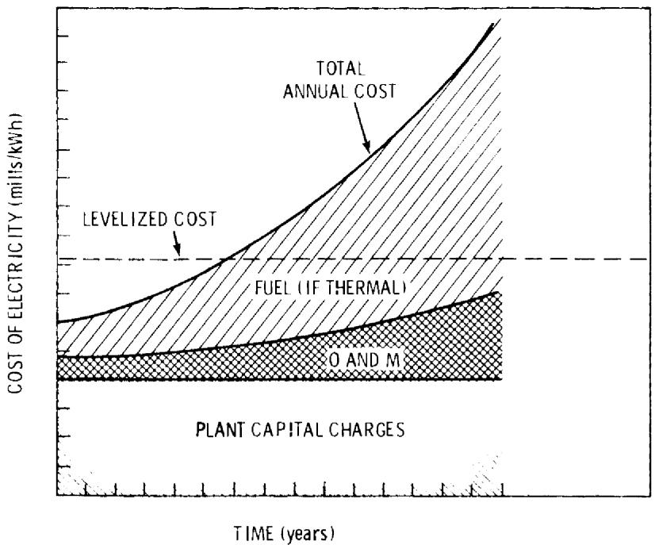  
FIGURE IX-F-1. Annual Cost of Electricity and Levelized Energy Cost

fissile fuel produced. This fissile fuel value or breakeven value is defined as the price at which reactor breed fissile fuel could be sold assuming the producing reactor is operating competitively. For reactor systems with relatively small construction and operating costs, revenues from fissile fuel sales need not be large to allow the reactor system to operate competitively. Under these conditions, the fissile fuel value would be low. For reactor systems with greater construction and operating costs, revenues from fissile fuel sales must be greater (to offset increased construction and operating costs), resulting in higher fissile fuel values. In this study, a fusion-fission reactor system (producing fissile fuel) is assumed to be operating competitively if its levelized energy cost is equivalent to the levelized energy cost of a conventional LWR plutonium recycle system.

Fissile fuel breakeven values for both a fissile plutonium production/sell fuel cycle and a fissile uranium production/sell fuel cycle for each of the reactor drivers identified in this study are given in Table IX-G-1.

TABLE IX-G-1. Fissile Fuel Breakeven Values ($/gram Fissile)   

<table><tr><td rowspan="2">Driver</td><td colspan="2">Fissile Fuel Value(a)</td></tr><tr><td>(Fissile Plutonium)</td><td>(Fissile Uranium)</td></tr><tr><td>Laser</td><td>205</td><td>140</td></tr><tr><td>Mirror</td><td>525</td><td>290</td></tr><tr><td>Theta-Pinch</td><td>310</td><td>200</td></tr><tr><td>Tokamak</td><td>130</td><td>75</td></tr></table>

(a) June 1978 price levels.

# H. MARKET PENETRATION

Fusion-fission reactor systems will not commercially deploy until the present value benefits of a sustained commercial fusion-fission economy become positive. Projections of the extent to which the fusion-fission reactor systems identified in this study would deploy as commercial power generating systems and the resulting economic benefits accruing to society due to this deployment are described.

The benefits resulting from deployment are best measured as present value benefits or present value energy generation cost savings resulting from displacement of expensive alternative energy sources by cheaper fusion-fission reactor systems. For this reason, the benefits resulting from fusion-fission reactor system deployment are sensitive to the generating costs of alternative energy sources. Two different alternative energy source situations or scenarions are examined in this study. These scenarios are described in Table IX-H-1.

TABLE IX-H-1. Energy Supply Scenarios   

<table><tr><td></td><td>Scenario 1</td><td>Scenario 2</td></tr><tr><td>LMFBR Availability</td><td>None</td><td>1993</td></tr><tr><td>CTR Availability</td><td>2010</td><td>2010</td></tr><tr><td>Fusion-Fission Availability</td><td>2000</td><td>2000</td></tr><tr><td>Electricity Demand</td><td>Moderate/High</td><td>Moderate/High</td></tr></table>

Examination of the estimated costs of the fusion-fission reactor systems identified in this study revealed that none of the systems would be economically competitive energy sources (i.e., all reactor systems were estimated to be more costly to construct and operate than alternative electricity generating sources). Therefore, this assessment of market penetration potential is aimed at identifying the reduction in estimated system costs that would have to occur before fusion-fission systems could be projected to be competitive energy generation sources.

"Capitalized costs" are used as the aggregate measure of system construction and operating cost. Capitalized costs are comprised of (1) the initial capital investment cost (i.e., plant cost), (2) the present value of all fuel cycle cost streams (except purchase costs and sales revenues of nuclear materials) over the systems operating lifetime, and (3) the present value of all interim capital replacement cost streams over the system's operating lifetime. This cost measure does not include plant operating and maintenance costs, costs or credits for electricity use or generation, nuclear fuel purchases or credits, taxes, and insurance costs. Capitalized costs and other measures of system performance are given in Table IX-H-2.

TABLE IX-H-2. Market Penetration Assessment(a) - Economic and Performance Parameters   

<table><tr><td>Driver</td><td>Estimated Capitalized (b) Cost (106$)</td><td>Fissile Fuel Production (kg/yr)</td><td>Reactor Thermal Power (MWth)</td><td>Net Electric Output (MWe)</td></tr><tr><td>Laser</td><td>3190</td><td>1323</td><td>3300</td><td>940</td></tr><tr><td>Mirror</td><td>3680</td><td>807</td><td>2578</td><td>139</td></tr><tr><td>Theta-Pinch</td><td>6700</td><td>2592</td><td>4835</td><td>45</td></tr><tr><td>Tokamak</td><td>2696</td><td>1950</td><td>4144</td><td>1000</td></tr></table>

The extent to which the identified fusion-fission reactor systems can be expected to deploy are given in Table IX-H-3 for the Scenario 1 energy supply situation. Deployment projections assuming a Scenario 2 energy supply situation are given in Table IX-H-4. Fusion-fission system deployment is stated both in terms of the number of fusion-fission power reactor plants operating in the year 2030 and in terms of the present value benefits through year 2040 of deployment. Reductions in estimated capitalized costs required to make system projections look economically competitive and deployable are also given.

# I. NONPROLIFERATION IMPACT

When assessing the economics of proliferation resistant fusion-fission systems, one characteristic quickly becomes evident. The additional costs of utilizing nonproliferation mechanisms in fusion-fission systems, given that the systems are developed with adequate planning and integration, are not great relative to the total costs of constructing and operating the systems. Preliminary estimates have indicated that when properly implemented, proliferation resistant fusion-fission power generating systems would yield power costs only $8\%$ greater than power costs of fusion-fission systems not specifically planned to be proliferation resistant. Five mechanisms have been identified as candidates for making fusion-fission systems more proliferation resistant. These mechanisms and their expected costs of implementation are discussed below.

# 1. Nuclear Center

The concept of an institutionalized nuclear center is very attractive. Reduced nuclear material shipping distances resulting in a lessened opportunity for nuclear material diversion is the primary advantage of such centers. Increased system costs would be primarily due to increased transmission distances. Given that centers are properly situated, decreased costs could result from lessened licensing problems, lessened construction and operating worker impacts, and sharing of common facilities. In addition, cost decreases could result from shortened nuclear material shipping distances and use of an integrated security system for all

TABLE IX-H-3. Market Penetration Assessment/Scenario 1   

<table><tr><td>Assumptions:</td><td>1) Moderate-High Electricity Demand
2) No LMFBR Availability
3) Year 2000 Fusion-Fission Availability
4) Year 2010 Pure Fusion Availability</td></tr></table>

<table><tr><td>Driver</td><td>Capitalized Cost(a)(c) ($/kWth)</td><td>Number of 2500 Mwth Fusion-Fission Power Reactors Operating in Year 2030</td><td>PV Benefits(b) to Year 2040</td></tr><tr><td rowspan="3">Laser</td><td>965 (Estimated Cost)</td><td>-</td><td>Negative</td></tr><tr><td>540</td><td>0</td><td>0</td></tr><tr><td>405</td><td>650</td><td>10 Billion</td></tr><tr><td rowspan="3">Mirror</td><td>1425 (Estimated Cost)</td><td>-</td><td>Negative</td></tr><tr><td>210</td><td>0</td><td>0</td></tr><tr><td>145</td><td>900</td><td>10 Billion</td></tr><tr><td rowspan="3">Theta-Pinch</td><td>1385 (Estimated Cost)</td><td>-</td><td>Negative</td></tr><tr><td>205</td><td>0</td><td>0</td></tr><tr><td>125</td><td>750</td><td>10 Billion</td></tr><tr><td rowspan="3">Tokamak</td><td>650 (Estimated Cost)</td><td>-</td><td>Negative</td></tr><tr><td>540</td><td>0</td><td>0</td></tr><tr><td>430</td><td>600</td><td>10 Billion</td></tr></table>

Assumptions: 1) Moderate-High Electricity Demand

2) Year 1993 LMFBR Availability   
3) Year 2000 Fusion-Fission Availability   
4) Year 2010 Pure Fusion Availability

TABLE IX-H-4. Market Penetration Assessment/Scenario 2   

<table><tr><td>Driver</td><td>Capitalized Cost(a)(c) ($/kWth)</td><td>Number of 2500 Mwth Fusion-Fission Power Reactors Operating in Year 2030</td><td>PV Benefits(b) to Year 2040</td></tr><tr><td rowspan="3">Laser</td><td>965 (Estimated Cost)</td><td>-</td><td>Negative</td></tr><tr><td>440</td><td>0</td><td>0</td></tr><tr><td>365</td><td>550</td><td>10 Billion</td></tr><tr><td rowspan="3">Mirror</td><td>1425 (Estimated Cost)</td><td>-</td><td>Negative</td></tr><tr><td>210</td><td>0</td><td>0</td></tr><tr><td>145</td><td>750</td><td>10 Billion</td></tr><tr><td rowspan="3">Theta-Pinch</td><td>1385 (Estimated Cost)</td><td>-</td><td>Negative</td></tr><tr><td>135</td><td>0</td><td>0</td></tr><tr><td>45</td><td>650</td><td>10 Billion</td></tr><tr><td rowspan="3">Tokamak</td><td>650 (Estimated Cost)</td><td>-</td><td>Negative</td></tr><tr><td>460</td><td>0</td><td>0</td></tr><tr><td>360</td><td>500</td><td>10 Billion</td></tr></table>

facilities. It is highly conceivable that the generating costs of a proliferation resistant fusion-fission system located within a nuclear center would be less than the costs of a decentralized fusion-fission system with much greater potential for proliferation.

# 2. "Throw Away" Fuel Cycle

A second method for alleviating fissile material proliferation is to "throw away" or dispose of the fusion-fission reactor spent fuel blanket containing the fissile materials. However, such disposal would penalize the fusion-fission systems as their primary function lies as fissile fuel breeders. The specific economic penalty of utilizing a throw-away fuel cycle can be approximated from results obtained in this study. Once-through "throw away" fuel cycle systems are projected to operate at levelized energy costs of 40 mills/kWh greater than reprocessing fuel cycle systems (see Section F). Given an average demand for nuclear center generated electricity between the years 2000 and 2030 of 1,000 GWe $(2.6 \times 10^{14} \mathrm{kWh}$ cumulative), the economic cost of utilizing the proliferation resistant "throw away" cycle between these years is in excess of 10 trillion dollars.

# 3. Co-processing

Co-processing is a third mechanism for reducing fusion-fission system proliferation potential. Fusion-fission system cost reductions with co-processing would result from lessened spent fuel reprocessing requirements. System cost increases with co-processing would result from increased volumes of radioactive fuel materials requiring remote handling, increased transportation costs (due to additional fuel material volumes), and increased re-enrichment and refabrication costs. In this study, the costs of reprocessing, transportation, and fuel fabrication in a plutonium recycle system are estimated to make up only $8\%$ of the system's power cost. Given that fusion-fission system fuel cycle operations are planned and integrated, the additional costs of including co-processing in fuel cycles should increase power costs by less than this $8\%$ .

# 4. Refresh Blanket

The refresh fuel cycle/blanket concept is a fourth mechanism for retarding fusion-fission system proliferation potential. In this fuel cycle concept, the fuel blankets are laden with fission and activation products making them highly radioactive and providing themselves proliferation resistance. Results obtained in this study indicate that the additional costs of utilizing such a nonproliferation device are negligible (see Section F).

# 5. Denaturing

Denaturing of fissile $^{233}\mathrm{U}$ or $^{235}\mathrm{U}$ , using $^{238}\mathrm{U}$ as a dilutant provides a fifth mechanism for obtaining proliferation resistant fuel cycles. Like co-processing, this mechanism affects only the reprocessing, transportation, enrichment, and refabrication stages of fuel cycles resulting in a maximum impact on system levelized energy costs or power costs of $8\%$ .

# J. SECTION IX REFERENCES

1. S. C. Schulte, T. L. Wilke and J. R. Young, Fusion Reactor Design Studies - Standard Accounts for Cost Estimates, PNL-2648, Battelle Pacific Northwest Laboratories, Richland, WA 99352, May 1978.   
2. Guide for Economic Evaluation of Nuclear Reactor Plant Designs, NUS-531, United States Atomic Energy Commission, Division of Technical Information, Washington, D.C., January 1969.   
3. Laser Fusion Hybrid Reactor Systems Study. UCRL-13720, Lawrence Livermore Laboratory, Livermore, CA, July 1976.   
4. Laser Fusion-Fission Reactor Systems Study, UCRL-13796, Lawrence Livermore Laboratory, Livermore, CA, July 1977.   
5. T. H. Baltzer, et al., Conceptual Design of a Mirror Reactor for a Fusion Engineering Research Facility, UCRL-51617, Lawrence Livermore Laboratory, Livermore, CA, August 1974.   
6. B. W. Moir, Conceptual Design of a Mirror Hybrid Fusion-Fission Reactor, UCRL-51797, Lawrence Livermore Laboratory, Livermore, CA, June 1975.   
7. D. J. Bender and G. A. Carlson, System Model for Analysis of the Mirror Fusion-Fission Reactor, UCRL-52293, Lawrence Livermore Laboratory, Livermore, CA, October 1977.   
8. K. R. Schultz, et al., Conceptual Design of the Blanket and Power Conversion System for a Mirror Hybrid Fusion-Fission Reactor, GA-A14021, General Atomic Company, San Diego, CA 92138, July 1976.   
9. Krakowski, et al., Engineering and Physics Considerations for a Linear Theta-Pinch Hybrid Reactor (LTPHR), Los Alamos Scientific Laboratory, Los Alamos, NM, June 1976.   
10. A Feasibility Study of a Linear Laser Heated Solenoid Fusion Reactor, EPRI-ER-171, Electric Power Research Institute, Palo Alto, CA, February 1976.   
11. J. K. Ostic and J. Sheppard, Synfuel and Fissile Production from a Linear Theta-Pinch Fission/Fusion Hybrid Reactor, University of Washington, Seattle, WA, June 1977.   
12. B. Badger, et al., UMAX-III, A Noncircular Tokamak Power Reactor Design, UWFDM-150, University of Wisconsin, Madison, WI, July 1976.

13. B. Badger, et al., TETR, A Tokamak Engineering Test Reactor to Qualify Materials and Blanket Components for Early DT Fusion Power Reactors, UWFDM-191, University of Wisconsin, Madison, WI, June 1977, Rev. December 1977.   
14. Experimental Fusion Power Reactor Conceptual Design Study. EPRI ER-289, Electric Power Research Institute, Palo Alto, CA, December 1976.   
15. The Handy-Whitman Index of Public Utility Construction Costs. Whitman, Requardt and Associates, Baltimore, MD. 1977.   
16. D. E. Deonigi and R. L. Engel, Performance Targets for Fusion-Fission (Hybrid) Reactors. BNWL-2139, Pacific Northwest Laboratory, Richland, WA 99352, January 1977.   
17. V. L. Teofilo, et al., "A Tokamak Hybrid Blanket Design," Proceedings of the Seventh Symposium on Engineering Problems of Fusion Research, IEEE p. 6, No. 77CH1267-4-NPS, p. 1624, Knoxville, TN, October 1977.   
18. V. L. Teofilo, "Tokamak Demonstration Hybrid Reactor," in Proceedings of Second Fusion-Fission Energy Systems Review Meeting, Washington, D.C., p. 513, November 1977.

# X. LICENSING AND SAFETY

A wide variety of hybrid concepts is possible, as seen in this report in the discussion of alternate fusion drivers, reactor coolants, fuel forms, and fuel cycles. So before a detailed discussion of the specific licensing and safety issues associated with each of the four drivers considered is given, a generic discussion of the problems facing the hybrid concept in general is in order.

# A. GENERIC DISCUSSION OF THE HYBRID CONCEPT

The fusion-fission hybrid reactor concept is based on the energy gain realized when neutrons produced by a thermonuclear deuterium-tritium plasma interact with a surrounding blanket containing fissile or fissionable material. Again, a large array of concepts is possible among the magnetic and inertial confinement fusion driver concepts available, as well as the choice of fission fuel cycle, heat removal cycle, etc. Typically, the fusion reaction is confined to the interior of a large vacuum vessel (torus or cylinder, etc.), which then dictates the general blanket geometry.

The fission zone is usually quite thin ( $\sim 1$ m or less); however, because of the size of the "shell" structure it is typically divided into quadrants, often with independent coolant loops, and further divided into modules or assemblies. The placement of energy systems required to initiate the fusion reaction (superconducting magnets, injector or beam lines, cryopanels, etc.) and the routing of the cooling system adds further complexity to the structure, often resulting in complex shapes with access problems for fabrication, refueling and maintenance.

In addition to the above, the blanket region must breed sufficient tritium for operation of the fusion driver. Lithium or lithium compounds must then be included, sometimes in the form of a liquid metal, where it can also operate as a reactor coolant.

Major design features include the lack of any reactivity controls. The fission blanket itself is designed to be subcritical over the fuel lifetime, and any large excursions in fusion neutron production are considered highly unlikely. Power densities are usually below those found in pure fission reactors, and the segmented blanket design tends to isolate coolant flow disturbances.

# B. GENERIC SAFETY AND LICENSING ISSUES

# 1. Radiation Exposure

Many of the safety and licensing aspects of hybrid plants will focus on the presence of radioactive materials, which will include tritium, activation products, fission products and actinides. These are found to varying degrees in modern fission reactors; however, for safety analysis and licensing the specific radionuclide inventories as well as their chemical form and location in hybrid systems must be identified. In addition, it must be demonstrated that the hybrid blanket modules can operate safely in close conjunction with high energy fusion systems. Of concern are unique initiating events leading to loss of containment as well as the identification of routine occupational exposure during plant operation, refueling and maintenance. A short discussion of the various radioactive materials present will now be given.

# a. Tritium

Due to the lower energy balance constraints placed on the fusion driver, a hybrid system may be the first commercial application of the D-T fuel cycle. To meet daily requirements, an extraction and separation process will probably require tritium to be present in kilogram quantities in the blanket.

Tritium (T) is a radioactive isotope of hydrogen which decays by emitting a soft beta particle ( $\overline{E} = 5.7 \, \text{keV}$ , $E_{\text{max}} = 18 \, \text{keV}$ ) and no gamma ray, and is therefore a significant radiological hazard only if ingested. Since $T_2$ is virtually insoluble in human tissue (about $98\%$ of $T_2$ inhaled is immediately exhaled), it is relatively innocuous. Tritiated water ( $T_2O$ , HTO or DTO), however, is a much greater hazard. The maximum permissible concentration (MPC) value for tritiated water in air is $0.2 \, \mu\text{Ci/m}^3$ (uncontrolled area), 1/200 of the comparable value for $T_2$ .

Research and development is therefore required for tritium monitors capable of discriminating between molecular tritium and tritiated water and of accurate real-time measurement of tritium concentrations on the order of $0.1\mu \mathrm{Ci} / \mathrm{m}^3$ . Without this development all tritium detected in the facility atmosphere must be assumed to be tritiated water. Such an assumption will decrease design and operational flexibility and increase costs.

In-plant tritium releases during normal operation would primarily result from leaks, particularly around valves, greatly exceeding contributions from permeation. One cause of leaks is the damage to elastomeric seals resulting from tritium exposure. The identification of tritium-resistant materials should proceed. For maintenance purposes, every tritium handling component should be designed so it can be purged. Components contaminated by tritium alone, however, do not require remote maintenance: a combination of glove boxes, plastic tents and bubble suits with independent air supply will be adequate for maintenance operations.

Design parameters for emergency cleanup systems will depend on the accident scenarios identified and the form of tritium released as discussed above. The conversion rate of $T_{2}$ to tritiated water (mostly HT0) will be a strong function of environment in the reactor hall (e.g., surface conditions, temperature, humidity, etc.). The identification of design basis accidents will be discussed under the section on accidents.

The safety and licensing aspects of large-scale tritium use are being investigated for the magnetic fusion program; however, the specific tasks and schedules for this research may have to be reevaluated for early applications in hybrid systems.

# b. Blanket and Structure Activation

D-T fusion drivers, as copious sources of neutrons, will activate structural, blanket and shielding materials with profound effects on overall machine design, operational planning, and costs. In particular, maintenance operations on components within or proximal to the fusion device will be affected. Most near term concepts project the use of stainless steel, which will surely make a substantial remote maintenance capability necessary. The fusion structures typically require replacement after several years of operation, and so the vacuum vessel must be designed with remote cutting and disassembly in mind.

The mass transport of activated structural materials in the coolant system (corrosion) and in the vacuum system (evaporation, sputtering, blistering, etc.) must also be considered. In fission reactors, unforeseen radioactive crud buildup in areas requiring maintenance is often the major source of occupational

exposure. Test loops to identify problems in liquid lithium cooled systems are now underway. Mass transport in vacuum systems may require some operational experience to pinpoint problem areas.

# c. Fission Products and Actinides

The presence of fission products and actinides in the hybrid blanket have three aspects which require unique investigation. First, the hard fusion neutron spectrum is likely to generate different radionuclide concentrations for the many fuel cycles and fuel types (carbides, oxides, metals, salts, etc.) under consideration for hybrids. Licensing considerations then require that the research include the following for all fuel combinations:

- establish nuclear data files for fusion spectrum,   
- determine radionuclide inventories at exposure,   
- determine decay heat curves.

The nuclear data is being formulated today; however, all hybrid neutronics to date have relied on fission reactor spectra and light water decay heat curves. Although this type of analysis is an acceptable approximation for today's design studies, it could not serve as the basis for component design of decay heat removal systems for actual systems subject to regulatory review.

The second area requiring work deals with the mechanical performance of the fuel in a hybrid application. Many fusion drivers operate in a cyclic or rapidly pulsed mode, resulting in thermal and radiation conditions far different from those found in fission reactors which operate in a relatively steady state mode. Commercial applications will require that the fuel be fully qualified in the hybrid environment during startup, operation and shutdown of the reactor. As with fission reactors, the hybrid would then be licensed to operate within a specific performance envelope defined by the fusion driver characteristics and fuel response. Fuel failure rates are also required to identify circulating inventories in cooling systems for accident analysis.

Finally, the shape of the fission blanket itself will introduce problems for refueling and maintenance. Many hybrid designs use large, irregularly shaped fuel modules which are welded into the reactor structure and cooling

system. Refueling then requires remote cutting and welding and the transport of large assemblies. Safety analysis will be required to provide input into reactor design to minimize exposure during these operations.

# 2. Accidents

It will be in the area of accident analysis more than anywhere else that the formulation of regulatory codes and design standards and materials qualification will impact the licensing of hybrid systems. It is recognized that this will be an iterative process, with initial scoping studies forming the basis for early design requirements. These will then eventually form the basis for the regulatory licensing functions which must provide the following:

- design basis accidents,   
analysis codes and assumptions,   
- design standards and criteria.

Regulatory review will interact between preliminary and final safety systems design and, of course, update standards on the basis of operational experience.

Much of the unique accident analysis and safety design work required for licensing hybrid systems will deal with the containment of the radioactive materials just discussed. Of particular concern are initiating events leading to loss of coolant in the fission blanket, possibly followed by fuel melting and loss of containment, or accidents affecting the sub-critical nature of the blanket. It must be demonstrated that the fission blanket can operate safely in close conjunction with any high energy fusion systems.

# a. LOCA/LOFA Accidents

At this stage of hybrid development it is difficult to identify initiating events in the various conceptual blanket designs which could lead to local flow reduction or blockage events, or more serious accidents involving larger portions of the cooling system. Analyzing the blanket response to a postulated event has the same problem due to the complex structural geometry. It is thought that the modular design of most hybrids with independent cooling loops serving a quadranted blanket will tend to isolate disturbances making it unlikely that fuel melting will propagate. However, this geometry distributes the fission blanket over a large region making it difficult to provide guard

vessels around all structures for containment if melt- through does occur. Because of this localized melting may still result in widespread contamination of other reactor systems. Also, because no one portion of the blanket can be isolated from the fusion driver during operation, a large instrumentation system will be required to spot isolated cooling problems which would require a power reduction in the entire blanket.

The response of a hybrid blanket to a loss of flow or coolant type accident will depend directly on the type of coolant, the operating power density, the speed with which reactor shutdown can occur, and the decay heat levels which were discussed earlier. Initial hybrid designs had very low power densities $(10 - 20\mathrm{w / cm}^3)$ making decay heat cooling by natural convection with liquid metal systems possible if designed with a functioning heat sink. For more recent designs, average blanket power densities have increased significantly with most relying on helium coolant. The power densities are well within modern HTGR and GCFR technology; however, forced circulation must be maintained with the gas cooled hybrid design to prevent fuel melting from decay heat. Another problem with the gas cooled designs is that the system has very little thermal inertia, making rapid shutdown of the fusion driver (and the initiation of auxiliary cooling if possible) imperative in a loss of flow accident. Rapid shutdown is easily achieved with inertial confinement and some pulsed magnetic fusion drivers; however, tokamaks or mirrors may require a significant cooldown period to quench the fusion reaction and avoid damage caused by a plasma dump. A safety system consisting of an emergency injection of impurities or an overfill of hydrogen may be required to improve the shutdown response for large plasma devices.

# b. Criticality

One of the major safety objectives of the hybrid design is to insure that the fission blanket remains subcritical under all conditions. Although the blankets are designed to be subcritical over the entire fuel lifetime, various mechanisms are available for reactivity insertion. If criticality could be achieved, large power excursions and energetic disruptions leading to large scale release of radionuclides can be envisioned. This possibility must and can be eliminated.

Changes in blanket geometry caused by gross physical displacement (e.g., collapse of structures), or by fuel melting in LOFA/LOCA accidents, or by the introduction of steam or water in blanket voids are considered to be the most serious ways of changing blanket reactivity. The hybrid blanket differs from pure fission reactors in that it is structured around the fusion driver vacuum vessel and is far from being in its most compact geometry. Also, most hybrid fuel cycles are designed to be breeders, with fissile fuel content increasing with exposure. The blanket response to various reactivity insertion accidents then becomes more serious with time.

The criticality calculations done for hybrids today are highly conservative in that they typically assume total collapse of the fission blanket. Plotting the $K_{\text{eff}}$ resulting from this "accident" as a function of blanket exposure (fissile fuel content) then defines the useful blanket lifetime to keep $K_{\text{eff}} < 1$ . Criticality calculations used to date for fuel meltdown accidents follow the same pattern, where reconfiguration is assumed to be as a sphere which is the most reactive geometry.

Steam ingress accidents for gas cooled designs have the potential for neutron thermalization in a blanket designed for a fast spectrum, possibly leading to criticality with a sufficient fissile buildup. However, this requires the accident to progress from steam leakage in the blanket to failure of the blanket with steam and water filling the vacuum vessel, followed by overpressurization and expansion of the blanket. With low burnup blankets the volume of water required to achieve criticality is estimated to greatly exceed steam generator inventories.

Greatly increased neutron output from the fusion reaction is not seriously considered as a source for reactivity input. Due to the difficulty in initiating the reaction, below par performance of the fusion driver will more likely be the case.

Motion in the fuel assemblies caused by thermal bowing or flow induced vibrations will not be unique to hybrid designs.

The conservative criticality calculations done to date then indicate that hybrid designs are possible that eliminate the chance of criticality, and that this can be considered an inherent safety feature. However, it again remains to establish more realistic design accidents and analyses to allow for the optimization of blanket performance ( $K_{\text{eff}}$ ) while still retaining this feature.

# c. Vacuum Vessel Safety

The presence of the large vacuum vessel in the center of the fission blanket has been mentioned several times. This structure is often used to provide support for the blanket as well as containing the fusion reactions. As such its failure is capable of affecting the integrity of cooling systems and fuel geometry, as discussed earlier for LOFA/LOCA accidents and criticality. Missile generation upon failure could also affect the cooling system and possibly the magnet systems for magnetic fusion devices.

Licensing considerations would then be directed towards appropriate materials qualification. Engineering for the necessary structural support is not foreseen as a serious problem (although designing for access and maintenance may be); however, the lead time required to qualify new materials may be substantial. For example, it now takes approximately eight years to qualify a new material or alloy for the ASME boiler codes.

# d. Hazardous Materials

Finally, materials which present occupational hazards or accident potential are used in the fusion driver systems. A major concern is the explosive nature of hydrogen which is used in all fusion drivers and its potential for releasing tritium. Hydrogen contains a great deal of potential energy; it contains 60,000 Btu/lb vs 20,000 Btu/lb for gasoline and 17,000 Btu/lb for dynamite. There is a $90\%$ chance that hydrogen leaks will ignite spontaneously under certain conditions. Hydrogen will auto-ignite at $585^{\circ}\mathrm{C}$ .

The various design solutions suggested are:

- Use of surge volumes and/or rupture discs.   
- Double walled, inert atmosphere tritium transfer lines.   
- Explosion-proof electric motors and coated wires in tritium facility buildings.

- ${\mathrm{H}}_{2}$ detectors,1.5% turnoff source and sprinkler initiators.   
- Limit combustibles.   
- High hazard volumes--Halon $\left(\mathrm{CBF}_{3}\right)$ explosion suppressors.

The advantages and disadvantages related to the use of an inert atmosphere will have to be resolved.

Other safety and licensing issues impacting accident analysis or occupational safety are associated with the fusion driver; however, these tend to be design dependent (liquid lithium, magnets, laser light, etc.). Such issues will be addressed in the following discussion of the Tokamak Hybrid Reactor if applicable.

# C. TOKAMAK HYBRID

# 1. Description of the Tokamak Hybrid Concept

The main fusion driver for the tokamak hybrid presented in this report is based on the Tokamak Engineering Test Reactor (TETR) designed by the University of Wisconsin. This pure fusion device has been modified by adding a helium cooled first wall with a surrounding fission blanket. This particular design has been designated the Tokamak Hybrid Reactor (THR).

In the THR the thermonuclear deuterium-tritium plasma is confined magnetically in a toroidal vacuum chamber with a major radius of $5.4\mathrm{m}$ and a minor radius of $2.4\mathrm{m}$ . A double-null poloidal divertor directs impurities to particle collection plates with final vacuum pumping being done by cryo-sorption panels located in the divertor region. Cryosorption panels are also used in the neutral beam injection ports which introduce penetrations around the circumference of the torus. The entire vacuum vessel and divertor regions are encompassed by the toroidal field "D" magnets assumed to be superconducting niobium-tin in this design. The inner edge of all "D" magnets is then attached to a center support stanchion.

Due to the lack of access between the vacuum vessel and this inner stanchion, no fission assemblies are located here, usually just shielding to protect the magnets. However, in this particular design flowing natural liquid lithium has been added to supplement the tritium breeding.

The fission blanket is then restricted to slightly less than $180^{\circ}$ of the outer poloidal angle of the vacuum vessel. It is divided into segments around the torus in "orange peel" fashion, with approximately three segments per toroidal field coil. The final design number of "D" coils and blanket segments has not been established. Each segment is then further divided into the 11 modules.

In the PNL hybrid modification of the TETR, the original steam-cooled stainless steel tubular first wall facing the plasma is replaced by a thin stainless steel water-cooled double wall with a carbon liner. The blanket modules plug into the helium delivery and collection ducts directly behind

the modules. Stainless steel cladding is specified for the fuel rods and $\mathsf{Li}_2\mathsf{O}$ contained in the modules. Shielding is then placed outside of the blanket assemblies where more field shaping coils are located.

The power conversion system for the THR has not been specified yet, but is likely to consist of four independent primary cooling loops, each with two main steam driven helium circulators. An auxiliary cooling system for each loop with electric driven circulators and its own independent heat exchangers would provide backup or emergency decay heat removal. Both systems should be capable of providing adequate decay heat removal independently in a depressurization accident.

# 2. Safety and Licensing Issues for the THR

As mentioned in the generic discussion of safety and licensing issues for hybrids, one of the initial tasks in safety analysis of the THR will be to identify those unique operating characteristics or systems which may impact accident analysis.

The fusion driver for the THR operates in a cyclic mode with plasma heating lasting three seconds, followed by approximately 100 seconds of plasma burn and a ten second cooldown and refueling cycle. With a driven tokamak, the temperatures required for the fusion reaction are maintained by beam injection and resistive heating; however, this design assumes an ignited plasma capable of maintaining the fusion reaction by utilizing the 3.5 MeV alpha energy.

The impact of continued fusion energy production in loss of coolant type accidents must then be addressed, along with various methods of rapidly quenching the fusion plasma. Undoubtedly the best approach will be the injection of impurities or cold hydrogen fuel to lower the plasma temperature. An emergency loss of confinement with a subsequent plasma dump to the first wall is another possibility, but has the potential for causing significant damage. For example, a highly localized dump has the potential for melting the first wall and dumping high pressure steam into the toroidal vacuum chamber. Temperatures for a bare stainless steel THR wall could exceed $\sim 1000^{\circ}\mathrm{C}$ in 0.2 seconds with a dump of $1500\mathrm{W/cm}^2$ . The carbon curtain gives added protection but can be vaporized in $\sim 10$ seconds with a dump over $1000\mathrm{W/cm}^2$ . (Accidental disturbances in magnetic confinement and magnet failure have safety implications themselves which will be addressed below.)

The operating power levels and decay heat curves for the various fuel cycles proposed for the THR will help determine an appropriate fusion driver response to disturbances in the cooling system. No decay heat curves have been calculated yet for the THR due to a lack of proper neutronics data. Even the more recent safety evaluation of a gas cooled mirror hybrid design (2) relied on decay heat standards for thermal reactors. (3) The calculations required for the various fuel cycles in THR are:

- time to fuel damage with reactor at full power following LOFA.   
- time to fuel damage following LOFA and shutdown from full power.   
time to fuel damage following LOFA 48 hours after shutdown (refueling).

The qualification of fuel pin failure rates in the cyclic THR power cycle will also be required for licensing. As with all gas cooled reactors, the immediate hazard associated with reactor coolant leakage will be the radiological exposure due to coolant-borne tritium and fission products that leak out with the coolant. Fission products leaking from defective fuel pins plate out on the internal surface of the helium loop, with the potential for being lifted off and blown into the containment building during depressurization. The circulating tritium activity was expected to be comparable to the fission product activity; however, due to the lower radiological toxicity of tritium it does not contribute significantly to the hazard potential in this type of accident. The actual circulating tritium inventory in the THR design will depend on the characteristics of the $\mathsf{Li}_2\mathsf{O}$ canisters used in the blanket modules.

In the THR design an evaluation of tritium containment and cleanup requirements must be extended to the liquid lithium breeding region in the central support region of the tokamak. So two different tritium process streams must be evaluated along with collection in the torus vacuum system and in the reactor coolant.

Again, as mentioned in the generic discussion of issues, some hybrid concepts place high energy fusion systems in close proximity to the irregularly shaped blanket modules introducing the anticipated problem of identifying

realistic accidents and predicting the system response. Examples with the THR are the liquid lithium region and the use of superconducting magnets.

# 3. Liquid Lithium Spills

Accidents affecting the integrity of the THR structure could cause the liquid lithium to be released. The lithium would then be very hot and chemically very reactive, and could cause damage to components that it contacts directly, such as shielding, structural supports or magnet components. At high temperatures it can ignite spontaneously in the air and would react vigorously with water and concrete. Lithium fires can then cause further damage directly, or lead to overpressurization and missile generation which may damage other blanket components and containment.

Experimental programs for sodium-concrete and sodium-steel-concrete interactions, in support of LMFBR safety, are available to illustrate methods for treating lithium spills. The likelihood of serious lithium spills can be reduced by utilization of a number of safety features, such as maintaining an inert atmosphere outside the lithium loops and providing double-walled piping.

A number of major research projects have been suggested for lithium safety in the magnetic fusion program. These include the following areas:

- lithium-concrete reactions   
- lithium-material reactions   
- lithium spill extinguishment   
- lithium aerosol behavior   
- lithium air cleaning concepts   
water/gas release from concrete   
hydrogen formation   
liner concepts   
use of sodium safety analysis codes

Many of these areas are, in fact, planned for investigation in the current program at the Hanford Engineering Development Laboratory in Richland, Washington.

The point to be made with the THR design is that the use of liquid lithium only to supplement tritium breeding will still require a major safety and materials qualification program for licensing. The exclusive use of $\mathsf{Li}_2\mathsf{O}$ pins would probably be more attractive for near-term reactor applications.

# 4. Magnet Safety

The superconducting toroidal field coils for the THR carry megajoule energies in close proximity to the fission blanket. The major safety concerns for magnet systems will then include:

- joule heating within a magnet or conductor sufficient to vaporize material.   
- sudden helium vaporization from heating resulting in destructive rupture of the helium coolant system.   
- thermal stress ruptures of magnets.   
- electric arcing with material vaporization and generation of high temperature flying material.   
- generation of eddy currents and stray electric fields.

For licensing purposes the above research would form the basis for identifying accident initiators whether they originate in the magnet or external to the magnet in other hybrid systems. It would also produce the realistic assumptions and codes to be used in accident analysis, and the criteria for engineered safety features in magnet design. A large superconducting development program is underway for the magnetic fusion program, and on the basis of safety studies at BNL various engineered safety features can be envisioned for reactor applications as shown in Table X-C-1.

Again, if the THR represents a near-term first application of fusion driver technology, the timetable for the above work would have to be adjusted accordingly.

# 5. Criticality

The $\mathsf{K}_{\mathsf{eff}}$ of specific THR blankets has not been calculated; however, the performance of a Pu catalyst fuel cycle can be extrapolated from previous designs. In Reference 4 the $\mathsf{K}_{\mathsf{eff}}$ of the blanket started at 0.9441 and increased to 0.9582 after two years of operation. This would be quite high for an initial hybrid application where design studies typically put $\mathsf{K}_{\mathsf{eff}} \simeq 0.5$ . To operate the fission blanket at the $\mathsf{K}_{\mathsf{eff}}$ would imply that the THR be designed to some standard for reactivity insertion accidents beyond a simple "total collapse and melting to a sphere" type of calculation. This further implies that a significant amount of research into design basis

TABLE X-C-1. Engineered Safety Features for Fusion Magnets   

<table><tr><td>Type of Engineered Safety Feature</td><td>Function</td></tr><tr><td>Detection Systems</td><td>Detect local hot spots in coil.Detect lead overheating and failure.Detect arcs in coil.Detect loss of coolant or flow.Detect excessive strain or movement.</td></tr><tr><td>Temperature Equilibration Systems</td><td>Drive all conductors normal early in a quenchRemove coolant rapidly.</td></tr><tr><td>Energy Removal Systems</td><td>Dump coil energy in external resistance.</td></tr><tr><td>Energy Dispersion Systems</td><td>Prevent excessive local deposition of coil energy.</td></tr><tr><td>Containment Systems</td><td>Prevent or minimize coil disruption consequences if coil winding fails.</td></tr></table>

accidents and the assumptions for accident analysis must precede the THR design to the point where the standards and criteria have been accepted as the basis for regulatory review and licensing. Blanket reactivity for THR in the $K_{\text{eff}} = 0.5 - 0.6$ range would be more realistic for initial applications of hybrid technology.

# 6. Magnetic Fields

Magnet safety must also address the issue of occupational exposure to high magnetic fields. The magnetic fields resulting from operation of a fusion driver may have strengths up to several hundred kilograms with pulse durations from several msec to hours and duty cycles of up to $80\%$ . Fusion plant employees could then be subject to high magnetic fields throughout their work period.

Numerous studies have been made to determine the biological effects to humans of magnetic fields. These studies include cardiac function, respiratory function, behavioral changes, food consumption and growth, fetal development, brain electrical activity, pathologic changes in spleen, liver, adrenal and

bone marrow, metabolic rates, hematology (red blood cells and leukocytes), antibody production, wound healing, tumor growth, cell culture (growth and function), cell division, genetics, enzymes, neuromuscular function, and survival. However, the results from these studies are ambiguous; for example, the results for several experiments on cell culture growth are about equally divided between no effect, increased growth, and decreased growth. Such results could be due to the normal range in experimental results, failure to control or measure important variables, or some unknown reason.

A series of closely controlled experiments has been recommended for the magnetic fusion program to determine the effects of exposure to magnetic fields. Typical biological effects that should be studied are:

neurological and behavioral phenomena   
- life span exposures   
- effects on development

- teratologic studies   
- reproductive performance   
- postnatal performance after prenatal exposure

studies of combined insult

- radiation   
- drugs or dietary alterations   
smoking   
- chemical carcinogens

epidemiologic   
avian   
mechanistic

In addition, there is a need for development of a personnel dosimeter.

The results of the above studies should be used to reevaluate the standards for exposure to magnetic fields. The U.S. and some foreign nations have established standards; however, the U.S. standards are less stringent by several orders of magnitude.

# 7. Cryogenics

Cryogenic systems find a number of applications in the THR fusion driver in addition to the superconducting coils just discussed. Specifically, cryogenic

condensation or sorption panels are often specified for vacuum systems due to their high pumping speeds at low pressures. They also find application in tritium containment and separation by distillation. These systems may then be subject to failure resulting in extreme temperature or pressure excursions capable of damaging other components or injuring personnel.

As with the superconducting magnets, the cryogenic systems will then require engineered safety features to both detect local heating or pressure increases, and containment systems to minimize the effect of loss of cryogenic fluids. Again, studies will be required to determine potential accident initiators and resulting consequences.

# 8. Activation Products

As for activation products, the production of radioactive materials in the stainless steel first wall was calculated for the original TETR design. The activity peaks at $\sim 0.5$ Ci/watt of fusion power generated after several years of operation. The use of helium is expected to minimize the problem of corrosion and activation product transport in the coolant system. The use of a carbon liner on the vacuum first wall is also expected to reduce the erosion and transport of stainless steel activation products in the vacuum system. However, the liner requires periodic replacement. At the high activation levels expected, remote maintenance will be required. It is not expected that any special radiation exposure standards will be required. However, it is obvious that a great deal of analysis into the methods of remote fabrication and disassembly will be required to demonstrate that compliance with radiation standards can be achieved.

# D. MIRROR HYBRID

# 1. Description of the Mirror Hybrid Concept

The reactor description here is based on the Lawrence Livermore, General Atomic design.[2] This design is helium cooled, with the magnet coils, blanket and primary heat-transfer loop all located within a pre-stressed concrete reactor vessel (PCRV) of the type developed for gas cooled fission reactors. The primary consideration for the PCRV is to provide a high level of confidence that forced cooling to the blanket can be maintained in accident situations. The PCRV also provides the main restraining forces for the magnet. Thermal insulation must be provided between the concrete of the PCRV and the superconducting magnet, which operates at $4^{\circ}\mathrm{K}$ .

The PCRV terminates in a hollow spherical region located within the Yin-Yang magret coils, with penetrations for beam injectors and particle streaming for direct conversion. The helium ducts are laid in as an integral part of the PCRV, and then terminate in the central spherical hollow area. The helium delivery and return ducts then connect to a spherical manifold system which is suspended directly from the inside wall of the PCRV. This structure also forms the vacuum vessel for plasma containment and is water cooled. The fission blanket then consists of small modules which bolt directly to the manifold wall, using a double knife-edge (Varian-type) seal to prevent gas leakage to the vacuum chamber.

For tritium breeding, the original design called for lithium deuteride pins in Lockalloy 43 cladding. This has been replaced for this report by lithium oxide pins with stainless steel cladding.

One of the main goals of this study was to investigate the feasibility of applying gas-cooled reactor technology to the mirror hybrid. Helium is then used as the main reactor coolant, with the system consisting of four independent primary loops and four independent auxiliary loops. The primary loops are used for normal power operation and for shutdown or depressurized cooling, with the auxiliary loops used for reactor decay-heat removal following normal or emergency loss of the primary loops. The blanket is divided up into four quadrants, with a total of eight primary helium circulators and eleven steam generators. The auxiliary system consists of five circulators and five auxiliary heat exchangers. The primary helium circulators are steam driven, where the auxiliary circulators are electric driven.

The design includes a large vacuum chamber below the reactor for direct conversion of plasma streaming.

2. Safety and Licensing Issues for the Mirror Hybrid Reactor

a. LOFA/LOCA

As with the gas-cooled tokamak hybrid, one of the major safety concerns of the mirror hybrid reactor (MHR) will be in assuring the integrity of the cooling system under accident situations. Forced convection again must be maintained to prevent fuel melting. The mirror hybrid reactor has a major safety advantage in that it uses the prestressed concrete reactor vessel (PCRV) technology developed for the gas-cooled fission reactors. The entire primary heat transfer system, including the steam generators, delivery and return lines and manifolds for the fission blanket, are either incased in or attached to this structure. It is stated that no damage or malfunction may be incurred in this system by internally generated (flow induced) or external vibrations. This reinforced structure also protects the cooling system from possible accident scenarios involving the superconducting coils, which would otherwise surround the coolant manifolds to the blanket. It is unlikely that failure of coils leading to missile generation would then affect the integrity of the cooling system. Unique safety research for the MHR would then likely be focused on local coolant flow disturbances or blockage accidents in the fuel modules themselves. Mechanisms that could lead to propagation of failure from fuel rod to fuel rod identified for the MHR include:

- Relocation of debris in adjacent cooling channels and on spacers.   
- Melt-through failure of wall leading to coolant bypassing and flow reduction to modules.   
- Reactivity changes due to blanket material relocation leading to power increases and acceleration of failure development.

This makes the rapid detection of coolant flow disturbances imperative. Instrumentation will then be required to monitor module coolant outlet

temperature and activity levels and flux monitoring for power levels. However, the response time of the instrumentation must be capable of providing an unambiguous signal before damage can propagate.

A conservative (assuming a diabatic heat-up) estimate of the LLL/GA mirror hybrid puts the time available before fuel damage occurs in loss of cooling at full power at 1.5 seconds. Cladding melting would begin after about 4.6 seconds. The value at 15 seconds is used as the minimum time required for a local failure to propagate to adjacent fuel modules. The response time of a thermocouple is put at 1 to 2 seconds, with an unambiguous signal in 2 to 3 seconds. Estimates put the system response time for detecting fission gasses due to cladding failure at less than 5 seconds. This indicates that the detection of high temperature and the shutdown of the fusion drawer before cladding melting will be marginal. Sufficient time is available to prevent propagation of damage to adjacent modules.

It is not clear if instrumentation would be required for each blanket module. The latest LLL/GA design has monitors for each 12-module assembly. The coolant manifolds then connect all portions of the blanket. Older designs for the MHR called for segmenting the blanket into 16 isolated orange peel segments, each with $\sim 45$ modules. Although the 12 module assembly required more instrumentation, it means that less modules have to be pulled and inspected after the detection of activity or a flow disturbance. The use of the PCRV eliminates the need to isolate the blanket into so many independent segments.

The operating characteristics of the mirror fusion driver will be similar to the tokamak. However, the MHR will operate in a driven mode with the fusion reaction maintained by beam injection. The fusion reaction can then be rapidly quenched by stopping the beam injection. The relatively steady state operation of the mirror driver will not result in thermal transients in the fission blanket as in tokamak operation for qualification of fuel and cladding.

The potential for damage to the fission blanket in the event of a plasma dump to the first wall is increased in the MHR since the fission modules themselves face the plasma. A burnthrough of the first wall would in fact consist of holing the $2.0 \, \text{mm}$ pressure shell(s) of a module (or modules). The resulting

depressurization would quench the fusion reaction, but the resulting pressure and thermal shocks should be investigated for producing fuel damage. Indications are that all structures can withstand the resulting helium pressure transient.

If fuel damage should occur in the MHR, the potential for propagation to nearby modules and the severity of damage will likely depend on the location of the initial failure. Fuel melting with failure of modules in the upper portion of the blanket may result in widespread contamination in the vacuum system with debris falling on modules located below. The propagation of damage may then be far removed from the site of initial failure. Locating the fuel modules directly facing the plasma rules out the use of guard vessels to contain the spread of contamination.

# b. Tritium Safety

The LLL/GA MHR design calls for the use of lithium deuteride (LiD) pins clad in Lockalloy 43. This aluminum-beryllium alloy was chosen especially for its low tritium permeability. The LiD also has a high deuterium vapor pressure, making this a good choice of material for a batch processing method of collecting bred tritium. No online tritium extraction process would be required with this design, although a clean-up system would still be needed. However, a subsequent economic analysis in the LLL/GA report states that the costs and tritium availability associated with batch processing were unacceptable. It was then suggested that a lithium compound which promotes dehydriding be coupled with a relatively permeable cladding for online extraction of tritium from the reactor coolant. The design considered in this report was lithium oxide $(\mathrm{Li}_{2}0)$ clad in stainless steel.

Going to an online method of tritium extraction will have a significant impact on required safety cleanup systems. A large fraction of the tritium inventory then becomes available for release to reactor containment in the event of a depressurization accident, and the cleanup systems must be designed accordingly.

Release to the environment was put at $\sim 10$ Ci/day; due to losses into the cooling systems of the main reactor, the neutral tritium beam injector and the

direct convertor. After extraction by cleanup systems, permeation of tritium into the steam generators with subsequent loss to the environment resulted in $\sim 3$ Ci/day from each of these sources. It is likely then that routine tritium releases can be held to $\sim 10$ Ci/day for either online extraction or batch processing of tritium.

# c. Lithium Safety

No liquid lithium is used in the mirror hybrid design. Accident analysis would then be simplified to examining the credibility of scenarios capable of producing liquid lithium metal which could interact with the concrete of the surrounding PCRV structure. It is likely that in postulated accidents this energetic, damage by lithium reactions would be insignificant in comparison.

# d. Magnet Safety

The implications on magnet safety and exposure to magnetic fields and required research have been discussed for the tokamak. As already mentioned, the introduction of the PCRV in the mirror hybrid is a major safety advantage in that it virtually eliminates the potential for energetic magnet failure leading to damage of the fission blanket structure.

For magnet repair, it appears the upper coil can be removed remotely. Repair or rewinding operations must then be examined in light of activation of the niobium, tin, and copper materials used. Removal of the bottom coil appears to be very difficult, and would be attempted only if the coil required rewinding. Repair would otherwise take place in the end tank of the direct convertor. This will require a safety evaluation of radiation fields in this region, and likely require portable shielding for personnel.

# E. THETA PINCH

# 1. Description of the Theta Pinch Hybrid Reactor Concept

The description given here is based on the Los Alamos Linear Theta Pinch Hybrid design. $^{(6)}$ This design consists of a cylindrical plasma chamber 20 cm in radius and 500 meters long. The actual reactor is divided up into 200 modules, each 2.5 meters in length. An insulator (graphite) lines the plasma chamber and separates the shock implosion heating coil from the return current generated in the gas when the coil is fired. A multiturn adiabatic compression coil surrounds the implosion coil. The fission blanket then consists of fuel assemblies oriented along the plasma axis in four radial zones followed by a reflector, with the helium cooled lithium region just outside of the coils. No biological shields are placed around the reactor itself. The entire device is placed within a steel-lined linear trench which serves as the vacuum vessel and also provides containment in case of accidental release of radionuclides. Concrete surrounding this vessel provides structural support and acts as a biological shield. Penetrations are provided for the helium delivery and return ducts every 2.5 meters, with the main helium manifolds outside of the vacuum vessel.

The capacitor banks for the implosion heating coils are located just outside of the concrete walls to the linear trench. Homopolar generators are used for the compression coils, and are also located outside of the trench.

# 2. Safety and Licensing Issues for the Linear Theta Pinch Hybrid Reactor

# a. Operating Characteristics

The LTPHR is based on another magnetic confinement fusion driver, but where the tokamak and mirror examined previously operated in a quasi-steady state mode, the theta pinch is a pulsed device. The burn time for the fusion neutron source is 10 milliseconds with this particular design firing several times per second (2.3 Hz). Depending on the exact fusion performance and energy multiplication in the blanket, this device will then likely produce on the order of $\sim 10$ megajoules of energy per pulse per meter of length. With this mode of operation, the qualification of fuel materials and cladding over the lifetime of the fuel cycle must be established for licensing. Startup procedures for bringing the fusion driver up to power with a cold

blanket must also be established. It is unlikely that any licensed performance envelope will allow initial full fusion driver output with high-energy multiplication in the fission blanket.

# b. LOCA/LOFA Analysis

The LTPHR is again a helium-cooled design. The geometry of the theta pinch is such that a more conventional fuel lattice can be designed which accepts fuel elements similar to those used in HTGRS. Analysis of local flow blockage accidents may then closely parallel modern gas-cooled fission reactor experience. However, the 500 m length of the reactor will likely introduce special design requirements to guarantee the integrity of cooling and vacuum systems under the influence of large external forces such as earthquakes. A number of independent cooling systems along the length of the device should be used.

In the event of fuel melting, the liner geometry of the theta pinch again is ideal to virtually eliminate the chance of a critical reconfiguration. The steel lined linear trench can be designed to contain any accidental releases and should allow for relatively easy cleanup and decontamination. The inlet parts to the vacuum system should be relocated away from the bottom of the lined trench and equipped with valves to eliminate the potential for contamination of the vacuum pumping network in the event of a release of volatile fission products.

The steel liner can also act as a primary tritium barrier by cooling the surface or applying coatings to lower permeability. Thermal insulation would, of course, surround the modules to reduce heat flow to the liner walls.

# c. Coil Safety

The geometry of the theta pinch allows for a compact, easily accessible fission blanket. However, it also places the fission assemblies in very close proximity to the heating and compression coils compared to the tokamak or mirror. In this design, the input energy to the shock coil is 0.37 MJ/m per pulse, with 33.4 MJ/m going to the compression coil. With the coils placed between the plasma and blanket, any protective barriers designed to restrain damage in the event of coil failure will impact the blanket

neutronics. A safety/performance analysis of coil failure mechanisms and required engineered safeguards and diagnostics is then required. Failure modes will likely result from the cyclic nature of operation rather than stresses beyond the design limit. This is because energy is delivered from a fixed storage supply.

Accident scenarios involving loss of insulation at the first wall should also be examined for potential damage to coils. The resulting electric arcing could damage coils directly or lead to depressurization with mechanical failure of components.

Associated with coil safety will be the safety of the pulsed power supplies. There are advantages in locating the capacitor banks close to the coils, which would place them just outside the concrete biological shield of the trench containing the reactor. However, this will also be the likely location of the main helium delivery manifolds and cable trays for reactor diagnostics. If the capacitors or homopolar generators are subject to energetic failure, appropriate engineered safety barriers and damage control systems will be required. The helium manifolds will also contain a circulating fission gas inventory due to expected fuel failure, which will make additional shielding necessary if maintenance will be required on electrical systems located nearby.

# F. LASER FUSION HYBRID

# 1. Description of the Laser Hybrid Reactor Concept

The reactor description given here is based on the Lawrence Livermore/ Bechtel design.(7) This concept uses an inertial confinement fusion driver, where laser irradiation of small targets containing deuterium and tritium yield fusion neutrons. In this design, 1 MJ of laser energy on target yields 100 MJ, with the fusion "microexplosions" confined to a cylindrical vacuum vessel 10 meters in diameter and 16 meters high. The cylinder is capped with upper and lower tritium breeding regions containing lithium clad in 316 stainless steel with beryllium and graphite added. These regions, along with the first wall, are cooled with liquid lithium.

The fission blanket is in eight sections placed around the cylinder in three rows of hexagonal stainless steel fuel elements. A 19-rod cluster of wire-wrapped stainless steel clad fuel pins is contained within each element. The fission blanket is liquid sodium cooled with upper and lower liquid sodium plenums capping off the blanket.

Finally, the cylindrical fission blanket is surrounded by a third lithium zone, also liquid lithium cooled.

The reactor is designed for easy access and replacement of fuel assemblies or structural materials. The cylinder top can be removed, along with the attached upper lithium blanket and first wall. Access to the bottom lithium blanket requires the removal of two segments of the radial fission blanket. The top pleuum covers for the fission blanket are removable for easy access to the fuel elements.

The fuel elements themselves resemble current fission fuel elements; however, they are large by comparison. The length is put at 9.8 meters, weighing approximately $1500\mathrm{kg}$ with $1200\mathrm{kg}$ of fuel.

As with coolant penetrations in LWRs, all coolant piping with the laser hybrid enter and exit at one plane at the top of the cylindrical barrel. The reactor is supported at the mid-plane.

A selenium laser system is used, present in the form of carbonyl selenide (COSe). Electron beam excitation of xenon is used to disassociate the COSe molecule and excite the laser atom.

2. Safety and Licensing Issues for the Laser Hybrid Reactor

a. Operating Characteristics

The laser fusion concept also operates in a pulsed mode, with the pulse rate varying from 8.5 to 5.5 cycles per second over the fuel exposure. A major licensing effort will then be directed towards qualifying materials, reactor systems and fuel assemblies in this nuclear environment. The radiation damage problem from the 100 MJ microexplosions is expected to be severe, with standoff considerations the reason for the large cavity diameter. With this design, the first wall structure (1 cm thick graphite blocks brazed onto a 1 mm molybdenum backing) is replaced every 1.5 full power reactor years. The top blanket is also replaced at this time. After 3.0 full power years it is estimated that all 8 segments of the reactor will need replacement due to neutron damage, including top and bottom plenums. Materials performance then helps define waste production in addition to structural requirements and operating procedures.

For accessibility and maintenance, the laser hybrid blanket incorporates a number of positive design characteristics:

- unit fabrication and installation   
coolant piping entry and exit at a central plane   
- removal capability of the total or part of the core without welding or cutting   
easy access to fission fuel process tubes

In the event of an accident or malfunction, the fusion driver can be cut off simply by shutting off the laser.

b. LOFA/LOCA Analysis

The laser hybrid concept has a significant advantage in accident analysis over the other fusion drivers in that the high energy systems used to initiate the fusion reaction are removed from the vicinity of the fission blanket.

The laser facility itself is located in another building along with its power supplies, with the beams transported through underground tunnels. To insure the integrity of the reactor containment, a series of fast acting valves can seal off the tunnels in accident situations.

The considerations for initiating events for loss of flow or loss of coolant type accidents then becomes essentially those for an LMFBR facility. The design further includes features to mitigate the consequences of potential LOFA/LOCA scenarios:

The fission blanket is subcritical in all configurations.   
The fuel elements in the reactor are furnished with a diaphragm that serves as a secondary containment to prevent loss of coolant. The problem can also be isolated due to the independent modular blanket design.   
- All equipment and piping containing lithium or sodium is housed in steel lined vaults containing an inert gas.

Again, the modular hybrid fission blanket makes it possible to isolate coolant disturbances; however, the geometry and plumbing are more complex than an LMFBR around the vessel. A loss of coolant accident due to pipe break or leak in the vessel would probably cause some fuel melting and slumping. The LLL/Bechtel report indicates that this type of accident may be difficult to cope with due to the large size of the blanket structures surrounding the vacuum vessel and the problem of surrounding all of the primary system components (blanket plenums and process tubes) with guard vessels. No detailed analysis has been performed.

The major differences in the safety analysis will be due to the liquid lithium inventory in this design, and the presence of the large vacuum vessel. The safety research required for the liquid lithium was outlined in the discussion of the tokamak hybrid. Activated corrosion product transport in the liquid metal systems will require investigation.

# c. Tritium

For tritium the goal is to limit release rates to 0.0021 grams (20 Ci) per day, similar to PWRs. A full, in-depth analysis of tritium leakage rates from fusion equipment and recovery systems has not been made, but design estimates have been made. The primary coolant loop is designed to hold the

tritium vapor pressure at $10^{-8}$ torr, with diffusion into the secondary loop put at 0.1 gram per hour before partial recovery. This should limit releases to the steam system to 1 to 2 Ci per day. For accidental releases of tritium in containment, a system capable of recovering a loss of $50\%$ of the total inventory (10 kg) is provided. The system operates at 150,000 cfm and is designed to reduce airborne tritium levels to $5 \mu \text{Ci/m}^3$ in less than three days.

# d. Laser Safety

The laser system itself introduces a number of safety issues. These include:

- laser beams   
- laser power generation   
chemical processes

In this design, a selenium laser with electron beam excitation is used, relying on capacitor banks for energy storage. The capacitor system will require standard safety procedures for maintenance and to contain damage in the event of failure. The e-beam source will require shielding or non-access during operation to prevent exposure to X-rays. Current procedures for firing e-beam excited $\mathrm{CO}_{2}$ lasers are to clear the laser hall, with personnel restricted to the control room.

The active laser gas in this design, carbonyl selenide, is toxic. Therefore, the laser system is leak tight, along with the laser building, which operates at a pressure less than one atmosphere.

Provisions are also made to pump down and condense the carbonyl selenide in the event of an accidental release to the building. A release of the entire selenium inventory is estimated to bring concentrations to $\sim 200$ times the allowable limits. Methods of detecting leaks and monitoring airborne concentrations in the laser hall are then required.

# e. Fuel Handling

The geometry of the laser hybrid blanket and fuel assemblies most resembles concepts used in pure fission reactors compared to the complex geometry of fuel modules used in magnetic fusion driven hybrids. As such,

the safety analysis for access and fuel handling will more closely resemble procedures used and licensed in the fission industry. The only major difference will be in the size of the fuel assemblies used. Fuel handling machines will have to be scaled up for the 9.8 meter length and 1500 kg mass.

# G. SECTION X REFERENCES

1. Tokamak Engineering Test Reactor, UWFDM-191, University of Wisconsin, Department of Nuclear Engineering, Madison, WI 53706, June 1977.   
2. D. J. Bender, et al., Reference Design for the Standard Mirror Hybrid Reactor. UCRL-52478, General Atomics and Lawrence Livermore, Livermore, CA, May 1978.   
3. Proposed ANS Standard Decay Energy Release Rates Following Shutdown of Uranium-Fueled Thermal Reactors, ANS-5-1, American Nuclear Society, Chicago, IL, October 1971.   
4. S. F. Su, G. L. Woodruff and H. J. McCormick, "A High-Gain Fusion-Fission Reactor for Producing 233U," Nucl. Tech. 24:392, June 1976.   
5. Environmental Development Plan (EDP), Magnetic Fusion Program. DOE/EDP-0008, U.S. Department of Energy, Washington, D.C., March 1978.   
6. R. A. Krakowski, et al., "An Engineering Design of a Linear Theta-Pinch Hybrid Reactor (LTPHR)," TANSA 21:61 (1975).   
7. Laser Fusion-Fission Reactor Systems Study. P0-5040603, Bechtel Corporation, July 1977.

# XI. ENVIRONMENTAL CONSIDERATIONS

A fusion-fission hybrid reactor is expected to be a large-scale thermal energy facility. As such, many of the environmental impacts associated with the concept will be similar to those of modern fission reactors. This includes site selection and many of the impacts of construction (site work, materials requirements, influx in population, etc.). In this section a generic discussion of the hybrid concept will be oriented towards identifying any unique environmental impacts.

# A. FUSION FUEL CYCLE

# 1. Deuterium and Lithium

All fusion drivers in this report are based on the deuterium-tritium fusion reaction. The fusion fuel cycle then requires that the basic materials of deuterium and lithium be delivered to the plant. A large lithium inventory (possibly in liquid metal form) surrounding the fusion reaction is then the target material for creating tritium by neutron capture.

The procurement of deuterium is expected to be routine. Deuterium occurs in all natural waters at a concentration of about 150 ppm, and the world inventory is estimated to be about \(10^{13}\) metric tons. It currently is readily extracted and is available commercially at a relatively low cost (\(600/kg). Since at least a quarter of the current resources can be extracted without a significant increase in cost, an essentially unlimited supply is available at current costs.

The deuterium is obtained from water by use of a hydrogen sulfide extraction process (the Guerdler-Sulfide or G-S process) to obtain heavy water $(\mathsf{D}_2\mathsf{O})$ and then electrolytic decomposition of the heavy water to obtain the deuterium. This process has been used commercially on a large scale for over 20 years and has an insignificant environmental impact consisting primarily of processing small quantities of water and releases of very small amounts of $\mathsf{H}_2\mathsf{S}$ and $\mathsf{SO}_2$ .

Several hundred tons of lithium are typically used in the blanket of fusion reactors, and hybrids will require similar amounts. Only about $1\%$ of the inventory will be consumed during a 30-year lifetime of the power plant in breeding

tritium. Since this small consumption is less than the extra amount of lithium that would be kept in storage as an emergency supply, it is probable that no additional shipments of lithium would be required beyond the initial startup.

The original procurement of lithium will require mining, milling and processing operations. This will impact land and water use, and produce waste piles, waste ponds and chemical releases to the water and air. It is expected that modern waste control technology can prevent any serious adverse impacts.

# 2. Tritium

As with safety and licensing, the primary environmental concerns will center on the potential for routine and accidental release of radioactive materials. Tritium will likely be the dominant radionuclide released, present in solid, liquid and gaseous effluents. A preliminary evaluation of the performance of radwaste systems indicates that even though tritium will be present in kilogram quantities in reactor systems, the routine release to the environment can be kept to levels found in light water fission reactors (<20 Ci/day).

The consequences of an accidental release of a large tritium inventory must also be addressed. The worst credible accident in this regard is considered to be the failure of a liquid lithium blanket with a successive failure of the fire suppressant device. An analysis of a laser fusion reactor accident(1) led to a maximum dose at the side boundary (100 m) of 0.7 rem for a cool ground level release, and $7 \times 10^{-4}$ rem for a hot fire release. A 100 m stack would reduce the latter by a factor of 100. The tritium inventory in a hybrid reactor would be less, resulting in a smaller release. To put the biological hazard of tritium in perspective in this worst possible accident, it was noted that someone at the site boundary would receive a fatal chemical exposure to the lithium smoke long before one could receive a lethal tritium dose.

Tritium will also likely contaminate solid structures removed from the reactor for maintenance. Any solid waste disposal must then be examined for gradual tritium leakage to the environment.

Since tritium is expected to be the primary cause of radiation doses to the general public as a result of radioisotope releases, ample technology must be available for estimating the release rates, radiation doses and biological

effects. The following information is needed to assure adequate ability to write environmental statements: (2)

- Tritium permeation rates through fusion reactor structural materials.   
- Tritium separations chemistry, including chemical and physical equilibrium relationships.   
- Tritium separation processes for air and water streams.   
- Optimum tritium storage methods.   
- Tritium barrier technology.   
- Application of current tritium control technology.   
Detailed designs for power plant subsystems containing tritium.   
- Tritium concentrations and doses at long distances from release points.   
- Tritium transport through the biosphere.   
- Additional information on the relationship between dose and somatic and genetic effects, especially in relation to long-term exposure to tritium at very low concentrations.

# 3. Activation Products

The D-T fusion fuel cycle will produce an intense neutron source, leading to activation of structural materials and coolant impurities. Neutron streaming from ducts and beam ports can also lead to substantial generation of activation products. All of these must then be examined for source terms into the environment.

The replacement of structural materials due to radiation damage is expected to generate the bulk of the solid rad wastes. Corrosion and erosion in the coolant system and vacuum system may also lead to waste streams which must be packaged and disposed of. The activated structural materials removed from the reactor are not thought to present any hazard in terms of an accidental dispersion into the environment, although they will require shielding. The materials will be removed in such quantities that they will represent valuable resources, and it is likely that they will be stored for recycling after a period of radioactive decay.

While still in the reactor, only the most energetic accidents postulated would be capable of releasing radioruclides to reactor containment and then possibly to the environment. Liquid metal fires or melting of fuel assemblies in the fission blanket are considered to be the only plausible methods of releasing the activation products in significant quantities; however, these accident scenarios would likely have more serious consequences than those associated with the release of activation products.

# B. FISSION FUEL CYCLE

The four hybrid fuel cycles investigated in this report are as follows:

1. Once-Through - natural uranium fueled hybrid in throwaway mode (power production only).   
2. Pu-Recycle to Thermal Reactors - hybrids with dual role of fissile fuel production and power production.   
3. Refresh Fuel Cycle - hybrid reactor re-enriching spent PWR fuel for return to PWR.   
4. Pu-Th (Pu Catalyst) Fuel Cycle - hybrid reactor breeds $^{233}\mathrm{U}$ in plutonium-thorium target; $^{233}\mathrm{U}$ sold while the plutonium is recycled.

The environmental impacts associated with these fuel cycles will then come from acquisition of materials, initial fabrication, transportation, operation in the hybrid, transportation of spent fuel, reprocessing and waste storage. Note that none of the fuel cycles being considered require enrichment of the original uranium feedstock, thereby eliminating impacts associated with gaseous or centrifuge enrichment plants.

The environmental impacts associated with acquisition of uranium and thorium and initial fabrication are identical to those now experienced with light water reactors. However, the resource utilization, or power generated per metric ton of ore mined varies widely with the fuel cycles considered. The initial material requirements and mass flow diagrams in Chapter 6.B. indicate that the fuel breeders are capable of supporting several fission reactors with their fissile fuel production; however, a once-through hybrid is a very inefficient use of natural uranium. Due to the relatively low thermal power densities in the hybrid blanket, this throwaway fuel cycle requires

a much higher uranium supply per kWe generated as compared to light water reactors. In order of most efficient use of natural resources, the fuel cycles are then Pu catalyst, Pu recycle, refresh, and finally, the once-through.

The fission products and actinides in the fission blanket will likely be relatively benign in routine operation of the hybrid reactor, as is the case in pure fission reactors. However, they have the potential for causing the most serious environmental damage if accidentally released at some point in the fuel cycle. Because of this, the hybrid reactor will require the same safeguards in reactor cooling, containment and aerosol blowdown systems.

Of interest here is the consideration that the fusion driver may produce a unique fission product inventory in the hybrid blanket. The neutron spectrum in a hybrid reactor is very different from that in a thermal or "fast" fission reactor due to the 14 MeV fusion neutron source and the subcritical nature of the blanket. Very fast fission reactions will result in a different fission yield than normally experienced, with the probability of symmetric fission increasing by two orders of magnitude. The abundance of fission products with atomic mass number between 105 and 130 in the hybrid will reflect this fact. The actual distribution of fission products and actinide will further depend on the geometry of the blanket and the particular fuel cycle used. The research required for the identification of specific radionuclide inventories and the performance of fuel systems in the hybrid were discussed previously in the chapter on safety and licensing.

As with safety analysis, the verification of the fission fuel cladding in the hybrid nuclear environment will be one of the more important requirements for licensing from an environmental standpoint. Although the public tends to focus on the potential for large accidental releases from a nuclear facility (which certainly must be evaluated), in actual practice the routine release of small amounts of fission gases will determine the actual environmental impact. It must then be established that the hybrid fission blanket and associated cleanup systems can routinely perform up to the standards set for the fission industry in the nuclear environment of the fusion driver.

However, it is the accumulation of the actinides, including plutonium, that will have the greatest impact on the potential environmental hazard presented by the hybrid fuel. The isotopes of americium, Am-241 and Am-243, are of particular biological concern. The once-through, Pu recycle and refresh fuel cycles have essentially no fissile fuel loading initially, but as seen in the performance tables in Chapter VII.B, these fuel cycles all produce plutonium in metric ton quantities per full power reactor year of exposure. The build-up of other actinides such as americium is then dependent on the neutron flux spectrum in each specific blanket design. The hybrid has the potential for being an actinide burner, however EPRI studies<sup>(3)</sup> indicate that the inventory of actinides increases significantly before consumption by fission is effective.

The remaining fuel cycle, the Pu catalyst, starts with an initial inventory of several metric tons of plutonium for all hybrids considered in this report. This Pu inventory then drives the thorium-uranium scheme:

$$
2 3 2 \mathrm {T h} + n \rightarrow 2 3 3 \mathrm {T h} _ {\beta} ^ {-} 2 3 3 \mathrm {P a} _ {\beta} ^ {-} 2 3 3 \mathrm {U}
$$

A previous examination of Th-U cycle $^{(4)}$ suggested that higher actinides for the thorium-uranium fuel cycle would only appear if the U-233 were left for very long times in the blanket, thereby reducing the hazard potential for the fuel cycle. However, the use of the plutonium catalyst puts this in doubt. The buildup of U-232 which has a long decay chain of alpha emitters may also present a problem. Again, the proper neutronics evaluation of actinide buildup for the four fuel cycles is not available.

The concentration of plutonium in the hybrid fuel and its isotopic composition must also be addressed. With the tokamak production rates in Section VII, Pu equilibrium concentrations in the discharged fuel range from .025 to .07 MT Pu/MT for the four fuel cycles. This compares to typical Pu discharge concentrations in PWRs of $\sim 0.01$ MT Pu/MT (250 kg Pu in 1/4 core discharge, 33,000 MWD/MT burnup). The isotopic composition of plutonium in discharged PWR fuel is also typically spread over several isotopes (1.7% Pu-238, 55.8% Pu-239, 24.5% Pu-240, 13.1% Pu-241, 4.9% Pu-242) where the plutonium in the hybrid fuel is expected to be >90% Pu-239.

The presence of fission products in the hybrid blanket after exposure has been addressed, however no specific radionuclide inventories are available for inclusion in this report. A previous examination of this problem<sup>(3)</sup> indicates that the change in the fission product yield curve for 14 MeV fusion neutrons will result in a higher production rate (compared to LWRs) of hazardous radionuclides such as ruthenium-106. However, burn-up reactions such as $(n,2n)$ may possibly reduce the difference in fission product inventories to insignificant levels. Fission product inventories in specific blanket volumes must, of course, be scaled to blanket power densities (250-500 watts/cm<sup>3</sup> for LWRs) and exposure. The proper neutronics must be developed for the fusion neutron spectrum if these fuel cycles are to be investigated properly for licensing.

It is then likely that per unit of power produced, the environmental impact of the fission products in the hybrid fuel cycles will be similar to those now experienced in light water reactors.

The environmental impact of the fission fuel cycle must also address the potential for release of these materials during transportation and reprocessing, if any. The technology employed is expected to be identical to that now developed for the fission industry. The analysis of transportation accidents must then address the higher concentrations of plutonium and other actinides in the spent hybrid fuel. The effluents released during reprocessing for all fuel cycles except the once-through are assumed to be those of their pure fission counterparts. Again, the neutronics are not available to estimate the release of the radioactive noble gases, krypton and xenon.

For high level waste storage, the once-through hybrid fuel cycle will require the disposal of metric ton quantities of plutonium each year. This is in addition to actinides and fission products. This will likely be unacceptable from a resource utilization and waste management point of view. The environmental impact analysis must address the relative hazards associated with long term storage of spent fuel with these high fissile material concentrations as opposed to reprocessing.

# C. MAGNETIC FIELDS

Three of the fusion drivers in this report are based on the magnetic confinement of the fusion reaction. The safety aspects associated with occupational exposure and the research required were outlined in the chapter on safety and licensing.

Where the safety aspects of magnetic fields were concerned with occupational exposure to field strengths as high as several hundred gauss for short periods and several tens of gauss for long periods, the environmental impact will be determined by exposure to field strengths comparable to the earth's $(\sim 0.5$ gauss). For example, with the tokamak driver in this report, the toroidal field strength is over 60 kilogauss in the plane of the torus, but it drops off rapidly and will be far below 0.5 gauss at the site exclusion boundary $(\sim 800\mathrm{m})$ . However, the poloidal field radiates both horizontally and vertically from the torus, and is expected to present a public exposure similar to that from the earth's natural field.(6)

The ability to demonstrate conclusively any biological effects associated with exposure to high magnetic field strengths is proving to be a difficult enough research task. Because of this, it is unlikely that any direct demonstration of effects from exposure to field strengths on the order of 1 gauss will be possible. In all probability, the environmental impact assumed for licensing purposes will be based on some extrapolation of effects observed (if any) at high exposure levels. This requires that a non-threshold assumption be made similar to that used with low level ionizing radiation exposure.

# D. TOXIC LASER GASES

In the laser fusion driver used in this study, the active laser gas, carbonyl selenide, is toxic. Accordingly, the laser building operates at a pressure of less than one atmosphere to contain routine releases. Provisions are also made to pump down and condense the carbonyl selenide in the event of an accidental release to the building. A release of the entire selenium inventory is estimated to bring concentrations to $\sim 200$ times the allowable limits. Because of the above precautions the operation of the laser driver is not expected to have any measurable impact on the outside

environment even under the worst accident scenarios. However, the shipment of carbonyl selenide to the reactor site will have environmental impacts similar to the shipment of other toxic gases.

# E. UNIQUE RESOURCE REQUIREMENT

A large hybrid reactor economy can possibly result in a significant increase in demand for materials associated with the fusion driver, including the lithium discussed earlier. These include the possible use of beryllium as a neutron multiplier, or materials chosen for their resistance to radiation damage and reduced neutron activation in the intense fusion nuclear environment. The particular designs in this report use stainless steel as a structural and fuel cladding material.

The impact on domestic demand and materials supply are shown in Tables XI-E-1 and -2 assuming a cccmmercial fusion economy with 2810 GWe installed.(2) The materials consumption in the hybrid should be lower per GWe installed due to the significant energy production in the fission blanket.

TABLE XI-E-1. Total Domestic Demand for Important Fusion Materials(2) (1975 to 2040)   

<table><tr><td></td><td>Units</td><td>Without Fusion Reactors</td><td>With Fusion Reactors</td></tr><tr><td>Beryllium</td><td>103metric tons</td><td>300</td><td>2,440</td></tr><tr><td>Chromium</td><td>106metric tons</td><td>140</td><td>180</td></tr><tr><td>Copper</td><td>106metric tons</td><td>410</td><td>440</td></tr><tr><td>Iron Ore</td><td>109metric tons</td><td>25</td><td>25</td></tr><tr><td>Helium</td><td>109cu meters</td><td>4</td><td>7</td></tr><tr><td>Mercury</td><td>10635-kg flasks</td><td>16</td><td>16</td></tr><tr><td>Lithium</td><td>103metric tons</td><td>810</td><td>5,960</td></tr><tr><td>Molybdenum</td><td>106metric tons</td><td>6</td><td>8</td></tr><tr><td>Nickel</td><td>106metric tons</td><td>50</td><td>80</td></tr><tr><td>Lead</td><td>106metric tons</td><td>690</td><td>760</td></tr></table>

TABLE XI-E-2. Depletion of 1974 U. S. Reserves of Important Fusion Power Plant Materials, Assuming No Additions to Reserves(2)   

<table><tr><td rowspan="2">Material</td><td colspan="2">U.S. Reserve Depletion Date</td></tr><tr><td>Without Fusion Reactors</td><td>With Fusion Reactors</td></tr><tr><td>Beryllium</td><td>Before 2010</td><td>Before 2010</td></tr><tr><td>Chromium</td><td colspan="2">--All chromium currently imported--</td></tr><tr><td>Copper</td><td>Before 2010</td><td>Before 2010</td></tr><tr><td>Iron</td><td>Before 2010</td><td>Before 2010</td></tr><tr><td>Helium</td><td>After 2040</td><td>~2030</td></tr><tr><td>Mercury</td><td>Before 2010</td><td>Before 2010</td></tr><tr><td>Lithium</td><td>After 2040</td><td>~2020</td></tr><tr><td>Molybdenum</td><td>~2030</td><td>~2020</td></tr><tr><td>Nickel</td><td>Before 2010</td><td>Before 2010</td></tr><tr><td>Lead</td><td>Before 2010</td><td>Before 2010</td></tr></table>

# F. SECTION XI REFERENCES

1. J. J. Devaney, L. A. Booth, J. H. Pendergrass and T. G. Frank, Environmental Effects and Potential Hazards of Laser Fusion Electric Generating Stations. LA-UR-77-2275, presented at ICF Conference, February 7-9, 1978, San Diego, CA.   
2. J. R. Young, An Environmental Analysis of Fusion Power To Determine Related R&D Needs. BNWL-2010, Pacific Northwest Laboratory, Richland, WA, November 1976.   
3. Fusion-Driven Actinide Burner Design Study, EPRI-ER-451, Electric Power Research Institute, San Diego, CA, May 1977.   
4. D. J. Bender, et al., Reference Design for the Standard Mirror Hybrid Reactor, UCRL-52478, GA-A14796, General Atomic Company and Lawrence Livermore Laboratory, Livermore, CA, May 22, 1978.   
5. W. E. Kastenberg, et al., Some Safety Studies for Conceptual Fusion-Fission Hybrid Reactors. University of California, Los Angeles, CA 90024.   
6. C. E. Easterly, K. E. Shank, and R. L. Shoup, "Radiological and Environmental Aspects of Fusion Power," Nuclear Safety, 18:56, March-April 1977.

Technological change occurs when it becomes possible to employ a new technique, such as fusion-fusion (hybrid) reactors in the production of goods and services. The extent to which a new technique is adopted is generally dependent upon three economic considerations: direct costs to the users, extra market costs to users and non-users alike, and the efficiency of the market(s) for the new technique. The direct costs of hybrid reactors which are of concern at this point in time are the maximum allowable capitalized costs permitting the technology to penetrate electric generation markets. These have been considered in Section IX. Even if the technology is potentially cost effective, it still may not become a commercial success for a variety of reasons. Further, in establishing public policy it is necessary to consider all costs of employing a production technique. In this section we address the economic issues related to the extra-market costs and market development and efficiency for an emerging technology such as fusion-fission.

In the following paragraphs we shall address the utility and industrial perspectives on hybrid reactors within the context of the commercialization process. This will include a statement of the scope and general theory of commercialization. From that foundation, specific issues in the process can be identified and reviewed for the case of hybrid reactor concepts. The objective is to illuminate the key factors which will influence private sector's decisions to invest in fusion-fission reactors. In turn, some of the public decision making problems will be highlighted.

# A. SIGNIFICANCE OF COMMERCIALIZATION ISSUES

In recent years the Federal Government has allocated a substantial proportion of its resources to civilian research and development activities. The Department of Energy and a predecessor organization, the Energy Research and Development Administration, exemplify this trend. The objective of these activities has been to hasten the development of new technologies and smooth the transition from one technology to another. For these research activities to be effective, viable technologies must be integrated

into the economic system. That process has become known as "commercialization". The proper management of research and development will recognize and take into account this process. Failure to do so may result in limited utilization of federal civilian R&D output. This can constitute a waste of physical and intellectual resources if viable technologies are passed over or inferior ones are forced on the market.

The process of commercialization has not been extensively researched or even consistently defined.(6,8) Research to date indicates that commercialization should be viewed as a process that begins early in the R&D process. The specific timing and degree of involvement of commercialization in R&D activities is not currently known; however, it is evident that there is no prescription for commercializing a new technology.

The process of commercialization is essentially a matter of "market development" and can, using familiar terms, be either related to "demand pull" or "technology push". This "market development" process parallels the technological development process in that both of these processes are striving to reduce uncertainty through the generation of improved information. As shown in Figure XII-A.1, the process of commercialization has two distinct phases, depending on the existence of a functioning market. In the early stage, labeled market identification, the technology is not fully developed and thus market transactions are not occurring. However, even at this time a "psuedo market" exists where information concerning economic and technical feasibility is exchanged. The second stage is initiated by the introduction of the new technology into the marketplace. Now actual market exchanges involving the technology can occur, with the information flow continuing as inferior products are "weeded out" and surviving products are continually refined. As the process evolves, the level of information is increased with a corresponding reduction in uncertainty.

  
FIGURE XII-A.1. Scope of Commercialization

A similar argument has been advanced concerning industrial innovation:

". . . there are two sources of ambiguity about the relevance of any particular program of research and development--target uncertainty and technical uncertainty."(1)

The traditional view is that the reduction of "technical uncertainties" is the principal objective of the R&D program. Today's concern for the rapid development of new technologies has accentuated the notion of target uncertainty. In the earliest stages of development, target uncertainty may include both the vendors and consumers of a technology. The process of commercialization can thus be viewed as the reduction of target uncertainties. One can, of course, employ a broad definition of the target concept for it includes many individual attributes of the ultimate market. Let us then proceed with a more detailed analysis of the commercialization concept.

# B. CONCEPTUAL MODEL OF THE COMMERCIALIZATION PROCESS

Commercialization can be viewed as a multi-dimensional process, composed of four basic elements: market demand, property rights, capacity to produce, and technological attributes. A full understanding of commercialization requires an integration of all of these. The primary interrelationships among the elements are shown below in Figure XII-B.1. The elements of market demand and capacity to produce constitute the primary components of a market--a demand sector and a supply sector. The elements of property rights and technological attributes represent the institutional and structural factors which determine the efficacy and efficiency of the market.

The logical starting place in this conceptual model of commercialization is with the effective market demand. Market demand is derived from the wants and incomes of potential buyers. In the case of hybrid reactors,

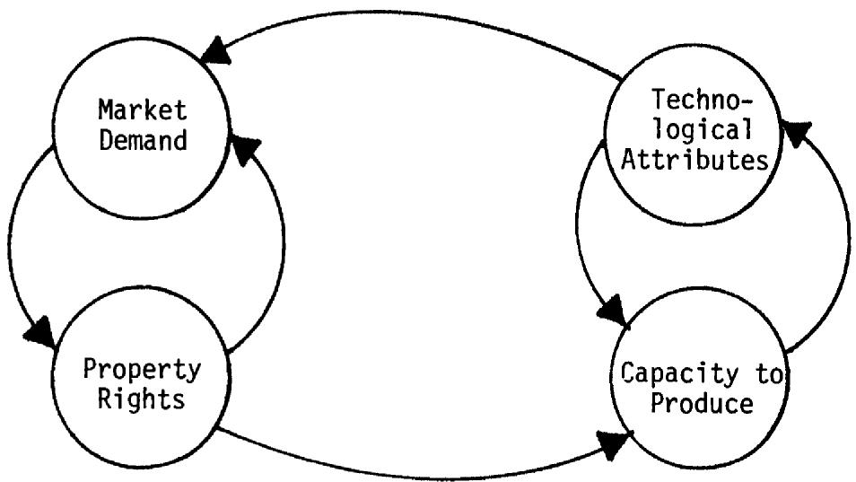  
FIGURE XII-B.1. Conceptual Model of Commercialization

demand is derived from the demand for goods which require electricity as an input. Commercial acceptance inevitably depends upon the ultimate user's willingness to pay for an R&D product, either directly or indirectly through the purchase of some other good. The element of market demand is a primary component of the theoretical literature on the determinants of technological change.(2)

For example, the theory of induced technological change is fundamentally demand-driven. $^{(3)}$ Additionally, a body of applied literature concerning research utilization, new product development, and market research typically involves identifying and satisfying needs as expressed in the marketplace.

Market demand works through the institutional arrangement of property rights to create incentives to produce. For a firm to undertake an investment to develop and produce a new product, the firm must be reasonably assured of recovering its investment. If the firm cannot establish and enforce rights to its product, that investment may not be forthcoming. At this point, this is the principal argument for the establishment of patent rights.

The property rights of consumers also influence market demand. Some types of goods, typically known as "public goods", are not subject to the principle of exclusability in use. Because individuals cannot be prevented from consuming public goods once they have been produced, consumers will be unwilling to pay private producers of such goods. Since private producers cannot obtain complete compensation for their production, private markets will fail to fully reflect the demand for public goods. Thus, R&D products having attributes characteristics of public goods may have limited commercial potential unless corrective action is taken by public agencies.

The establishment of incentives to produce through the institution of property rights leads to the third element of the process, the capacity to produce. Two issues are associated with this element. The first is the problem of technological transfer which has arisen in the context of developed and developing countries, but is also relevant to the flow of information between the research and production segments of an economy. Technology transfer is vital to the commercialization process.(4) The second issue is related to the behavior of the producing sector and has been addressed in the literature on market structure and innovation.(3) Market structure characteristics can influence a firm's decision to enter a new market or adopt a new production technology. Thus, structural characteristics must be considered in formulating commercialization policies.

The final element of the process is the technology's characteristics as they relate both to market demands and to the producing sector. The attributes of a technology must meet the basic needs of the consuming sector to be commercially viable. In managing R&D activities, information on the market demands should guide the development of a new product's characteristics. In addition, attributes of the technology influence the structure of the producing sector, and thus its conduct and performance. Such features as product differentiation, economies of scale and economies of scope are important in determining market structure.(5)

In the following sections each of the four elements will be examined in greater depth and implications for hybrid reactors will be considered.

Through this framework the salient utility and industrial issues can be identified. However, the scope of the current study is such that this will provide only a first glance at the commercialization issues. Several will merit additional in-depth analysis.

# C. CHARACTERISTICS OF DEMAND

The primary function of any economic system is the satisfaction of society's wants with the least cost combination of resources. Thus, the economic concept of demand is determined by the relative prices of commodities, the decision maker's budget and their preferences. The satisfaction of these demands necessitates a set of technologies to produce goods and services with the desired attributes. This establishes two principal objectives of new technologies. First, that they offer a more preferred set of attributes for their cost. Second, the same attribute can be achieved with fewer resources. In more familiar terms the first are product improvement and the second are cost reduction innovations.

Recent research on the process of innovation has identified a pattern related to the two principal motives for technical change with interesting implications for the general process of commercialization. Abernathy and Utterback $^{(1)}$ observed a generic pattern innovation beginning with new product development as the technology matures the thrust of technological changes are toward process innovations in order to produce the product more efficiently. They also found that new products are often the results of efforts by small technology-based companies while process innovations are often made by the large manufacturing firms. First, the cost of change is an increasing function of the size and integration of the organization. Second, the user's input into the research process is vital to the success of the innovation. Thus, the small organization can be more responsive to the needs of the users and it is less costly for them to make radical changes in product characteristics. However, as a technology matures there tends to be a shift in the nature of competition from product characteristics to price and cost sharing innovations are necessary for the organization's survival. The manufacturing firm is itself the user of the new technology.

This has potential implications for the course of commercialization for technologies developed by the Federal Government such as hybrid reactors. Firms with substantial interest in producing the prevailing products would at first glance appear to be logical producers of the next generation. However, this may not be the case; the cost of change to those organizations may vary a great deal due to their specialized knowledge and operating system. Therefore, entry with a new technology may likely come from smaller firms not presently engaged in the market for the prevailing product. By way of an example, the development and introduction of high temperature gas-cooled reactor (HTGR) would appear to fit this pattern. Although General Atomic was unsuccessful in its first attempt to capture a share of the electric generating reactor market, its attempt is noteworthy for other advanced reactor concepts and should be considered in more depth.

The derived demand for hybrid reactors is primarily for their capacity to breed fissile fuel. Thus, their demand will be influenced greatly by the price of uranium. The future of the natural uranium market is at the moment subject to considerable uncertainty and speculation.(6) The uncertainty itself suggests a need for the development of a 'breeder technology'. Some industry representatives have implied that utilities will be willing to build conventional nuclear reactors without a thirty year supply of uranium provided fusion scientific feasibility has been demonstrated and the Federal Government is actively supporting a hybrid reactor research program.(7) The uncertainty in the market is seen in wide ranges of price forecasts reported within the literature.(7) Some suggest the price will remain about $40 per pound (in constant dollars) through the year 2000 and others see prices rising to more than$ 74 by then. The recently published draft report on uranium from the Committee on Nuclear and Alternative Energy Sources (CONAES) expressed a very pessimistic view of the uranium reserves available given a price range of $40 to $60.(8) If a high cost U $_3$ O $_8$ scenario evolves there will be a demand for hybrids as fissile fuel breeders.

A second component of the demand for hybrids will be their contribution to the development of pure fusion reactors. The timeframe for

developing a hybrid reactor is perceived to be shorter than for a pure fusion device due to the lower requirements on the fusion component of the reactor. There could be significant benefits derived from the learning experience of operating a fusion-fission reactor which would carry over to pure fusion designs. This would apply to the design and construction of confinement systems and the fusion fuel cycle.

The development of a new technology is an investment process and, therefore, dependent upon the function of the capital market. It is often argued that new energy technologies fail to be developed because they cannot attract sufficient capital and thus require government intervention. This could either be a problem of insufficient return on the R&D investment or the inability to spread the risks. One could also find a problem of under-investment in new energy technologies if the social discount rate is less than the private sector's opportunity cost of capital. The private sector decision makers could discount further benefits more than is socially optimal. However, this would not be unique to the investment in energy related technologies. There could be a differential impact if energy technologies are significantly more capital intensive or require a longer gestation period for development than the typical product. Recent analysis suggests that there is little reason to believe that the capital market creates a significant problem for commercializing new energy technologies. (9)

# D. PROBLEMS OF PROPERTY RIGHTS

The role of property rights is central to the performance of a market economy. The institutional arrangements of property rights serves as the foundation for exchange relationships between those who demand and supply various goods and services. An entrepreneur realizing the existence of a demand will undertake an investment (in R&D and/or capital equipment) necessary to supply the product provided he can earn a "normal" return on his investment. If the entrepreneur's investment generates benefits external to his operation for which he is unable to obtain compensation, then he will tend to under-invest in that activity. Because the output of

R&D investments is information, for which it is very difficult to establish and enforce property rights, there is a tendency to under-invest in research. As was mentioned above the patent system was adopted to protect the returns of the innovators. Sometimes patents are unenforcible or cannot be applied to the given technology and thus offers another argument for direct public support of innovative activities. The Department of Energy (DOE) generally grants patent rights to contractors performing research for DOE, however, they normally retain exclusive title. In this regard, there appears to be a shift in DOE policy on patent rights which could become important for hybrid development. In the area of coal technology and "synfuels", DOE has recently granted foreign patent rights to a cost-sharing contractor for a coal liquefaction process.[12] With respect to fusion-fission reactors many feel that the areas of blanket design and fuel cycles are ripe for patentable inventions. An improved patent right policy could be important in generating significant private sector involvement in the technology.

It should be pointed out that in other cases legal protection is unnecessary. What have been termed "first-mover" effects create market protection for the originator of the product or service. This can result from two basic situations. One occurs when brand-name and identification are important in the consumer's purchasing habits. The other occurs when the lead times are very long for another firm to copy, produce, and market a competing product. Due to the complexity of hybrid reactor concepts the second factor could be important. There is already active interest in hybrid concepts by several large private firms (i.e., Westinghouse, General Atomic and Exxon through their research laboratory and their subsidiary Exxon Nuclear). Involvement of such firms in technologies such as hybrids is very important. However, if their interest is primarily research for profit as opposed to becoming a vendor of the technology, then the significance of their activities for commercialization is greatly reduced. It would appear that a detailed investigation of role property rights in commercializing fusion-fission reactors would be valuable in sorting out the

potential for patentable inventions as well as the motives the first private firms involved in the technology.

In addition to patent rights there is another institution potentially useful in developing hybrid concepts, which can deal with the ownership problems associated with research output. In most sectors, industry wide research associations would be difficult if not impossible to establish and administer due to anti-trust considerations. However, this is not a problem in the electric generating industry and so collective research associations can aid in the development and commercialization processes. The Electric Power Research Institute (EPRI) and a more specialized case, the Gas Cooled Reactor Associates (GCRA), are two examples of these. Such groups channel funds into research generally valuable to a large segment of the industry. If such groups obtain broad support from within industry the collective research group can overcome some of the ownership problems of a private corporation investing in the research.

Property rights also influence the demand for products with particular characteristics. As discussed above in Section XII-B, without collective action the demand for public goods will be less than is socially optimal. The national defense has long been recognized as a classic example of a public good. The security of a country is a good which can be enjoyed (consumed) by each resident of the country without excluding other residents of the country. Thus, the social value will be greater than the value for any individual or subgroup of individuals. This implies that the private sector will have insufficient incentives to invest in national security.

The alternative nuclear fuel cycles have different characteristics with respect to the risk of nuclear proliferation. Given that national defense is a public good, the private sector will not recognize the full social cost of proliferation risks. The incentives of the private sector are to choose a production technology and mix of inputs which minimize the production costs, but only the private costs. It is not surprising then to find the utility industry relatively insensitive to the issue of nonproliferation. If a reactor concept and fuel cycle offered lower costs to protect against

potential military or terrorist threats but higher production costs, the private sector would tend to recognize only the production costs. It is then the proper role of government to intervene in the marketplace and adopt decision criteria which accounts for the total social costs (both private and extra-market) of a technology. There are a wide range of institutional forms this might take.

Because of the scale at which most hybrid reactor designs produce fissionable fuels, the Federal Government could maintain ownership of the reactors and operate them as they have enrichment facilities in the past. The ability to breed fuel for many conventional light water reactors of equivalent thermal capacity for each hybrid reactor makes them highly amenable to centralized operation. If the Federal Government is the sole user then some of the ownership problems of the research output are reduced. However, society could also lose the benefits of competition for continually eliminating inferior technologies.

The rights of entrepreneurs are often attenuated by special interest laws and regulations which can influence incentives for innovation and create commercialization barriers. For example, entry into the electric generation industry is controlled by state regulatory commissions. Rigidity of regulators could inhibit hybrid commercialization as several characteristics of hybrid reactors are likely to result in pressures for institutional shifts among the users and the vendors of the technology. Because hybrids are a joint production process with outputs of both the breeding of fissile fuel generating electricity, there could conceivably be a significant change in the industrial structure of the sector utilizing the hybrid reactor. For example, as supplies of existing fuel become more scarce and their finding costs more uncertain, then those firms engaged in the traditional fuel supply would have strong incentives to enter the market. Even if the steam from the hybrid reactor was not employed to generate electricity, its operation is likely to be treated as a public utility which, given the present regulatory framework, would raise a wide range of legal and economic questions.

There is some evidence of policy changes at the Federal level which could encourage entry into the generation segment of the industry. In the National Energy Policy Act now before Congress, there is a provision on sales of electricity by non-utilities with cogeneration facilities. Of course this is a small scale technology as compared to hybrid reactors; however, it could be an important institutional shift.

# E. CAPACITY TO PRODUCE

If the proper incentives can be secured through either private property rights or collective action, then attention will turn to the decisions of private firms to acquire the necessary capacity to produce. This element in the process is a matter of information transfer or as it is sometimes termed "technology transfer". The entrepreneur must realize the technical capability to offer a new product or process along with the potential for economic gain through increased business activity or cost reductions. Acquiring the capacity to produce is a focal point of the reduction of uncertainties and risks.

Governmentally supported research has often used demonstration projects as vehicles to transfer the technology and reduce at least the technological uncertainties. The use of demonstration projects can be an important tool in the transfer of Federally sponsored research; however, they will not in-and-of themselves guarantee success. A recent study revealed several factors which have been associated with successful demonstration projects: (14) (1) The project should only begin after the principal technological problems have been resolved; (2) Costs and risks should be shared with the private sector or ultimate user of the technology; (3) Projects originating from the private sector tend to have faster rates of diffusion than those initiated by the Federal Government; (4) Faster rates of diffusion also occur where there is an already existing market (buyers and sellers) for a related product; (5) Successful demonstration projects tend to include all elements necessary for full scale production and uses of the innovation; and (6) Projects facing externally imposed time constraints were less likely to be successful. Observations (2), (3), and (4) follow the general notion

that projects with significant early involvement of the private sector tend to be more successful than those carried longer by the government alone. This, of course, can be a chicken-and-egg argument. Good projects quickly attract private interest versus private involvement will improve the focus of the project. Irrespective of the direction of causality, the private sectors interest can be an important signal to managers of publicly sponsored R&D.

Some private sector analyses are expressing interest in the hybrid reactor concepts especially for their breeder potential for LWR/HTGR fissile fuels. $^{(14)}$ However, it is also suggested that widespread involvement, especially financial involvement, may not be forthcoming. In the late 1980's, the industrial vendors could potentially be heavily involved in the transfer to HTGRs and faster breeder reactors. Also at this time, utilities will be making substantial capital investments in additional generating capacity. However, if the availability of fissile fuel becomes a significant problem in the late 1980's and early 1990's, the utility sector will have strong incentives to acquire the fuel breeding potential of hybrid reactors. The adjustment costs to the private sector may be high (especially to vendors) and, therefore, the direct costs of hybrid reactors will have to be more than marginally lower to encourage diffusion.

Demonstration plants have been useful in reducing technological risks and disseminating information. There still can be significant financial risks in the construction of the first few commercial scale plants. In the case of fission reactors, the vendors offered purchasers "turn-key" contracts which shifted the financial risks from the purchaser to the vendor. The Federal Government has sometimes contributed financial support to the first commercial units of a technology. Given that private industry behaves in a risk adverse fashion protecting the purchaser from cost overruns will be more of an incentive than an equivalent fixed subsidy. A well designed policy would also require the vendor to share in the overrun risk to insure cost effectiveness.

The decision of a private firm to acquire the necessary technical capabilities and enter a new product market will interact with potential

variations in product characteristics. Firms which sequentially enter a market will tend to offer a product with different attributes than existing producers.(15) This will afford them the greatest opportunity for securing an economic profit. The General Atomics case with the HTGR was discussed above, but it is again an interesting example. General Atomic, without a prior market position in the electric generating plant market, sought entry with a highly differentiated product from the existing producers terminal electric generators.

In Section XII-D control of fission-fission technology by the Federal Government was considered as a means of installing the technology into the economy. The focus in the present section is on the transfer of technology to the private sector. In this respect hybrids concepts have two factors influencing their adoption. First it appears as if the technological risks of hybrid reactors are less than for other advanced reactor concepts. The fission portion of the reactor is well understood and the fusion requirements are lessened by the energy multiplication of the blanket. The second factor is the widespread appeal of hybrids for their breeder characteristics. Each segment of the nuclear industry is affected by the uncertainty surrounding fissionable fuels and thus have an incentive to obtain the capacity to produce hybrid reactors. Current reactor vendors may need to offer the technology in order to continue selling convention reactors. They will be limited internally by their ability to cope with an additional technology. Fuel suppliers would also naturally find hybrids attractive for extending the life of the nuclear fuel business. Given that many of the larger fuel supplies are horizontally integrated energy companies, their activity in this area could be blocked by changes in anti-trust regulations. The third segment of the industry, the utilities given continued growth in the conventional reactors, will be a strong incentive to adopt the fusion-fission reactors, again for the capabilities to produce fissile fuel. Which of the groups will act more aggressively in entering the market will depend largely on the managerial costs of coping with the new hybrid nuclear technology.

# F. PRODUCT CHARACTERISTICS

The attributes a technology offered the consuming public are the final consideration in the commercialization process. This element is in many respects the mirror image of market demand. The ability of a new technology to meet the requirements of the final users is the last hurdle in the commercialization path. As was observed in the preceding section, the characteristics offered in a market are in part determined by the structure of the supply sector and the entry decision of competitors. Firms competing in a given market will formulate strategies based upon several parameters, one of which will be price; others will include service and specific product attributes.

In a recent analysis of successful corporate innovation policies, Alan Fusfeld $^{(16)}$ introduced the notion of "technology demand elasticities". This is an extension of the formula price elasticity concept which is an index of the sensitivity of the quantity of a product demand to changes in the product's characteristics. These elasticities will, of course, vary from market to market. Fusfeld suggested seven generic technological characteristics. They are as follows.

1) Functional Performance - basic task the device is to perform   
2) Acquisition Cost - capital cost of the device   
3) Operating Cost $\underline{a / }$ - variable cost per unit of service   
4) Ease of Use Characteristics - "the form of the user's interface with the device"   
5) Reliability - normally required service and random breakdowns   
6) Serviceability - speed and cost of repair   
7) Compatibility - the ease in which the device can be adopted into the existing system

The more important these elasticities are the more the market will be subject to extensive non-price competition. Each firm will endeavor to secure some portion of the market which it can uniquely service and exercise a degree of market power. If economies of scale in production are not significantly relative to the market, then the probability of successfully commercializing a new product is increased.

There have been a few studies on the characteristics of fusion reactors from the point of view of the utilities. (14, 17, 18) However, little attention has been given the hybrid concepts until recently. One comment specifically toward the hybrid concepts suggests that development should be continued very cautiously because it could associate the "fission related difficulties and public-political animosity" with fusion reactors. (14) This is an interesting point. However, it is beyond the scope of this report to evaluate and should possibly be addressed after the collection of primary data on the public's reactions.

Characteristics of hybrid reactors appear to generally satisfy the market's demands. Fusion-fission reactors are potentially the best breeding alternative now under consideration. The hybrid concept has been shown to be the most economical alternative.[19] Also because of the number of light water reactors each hybrid could support, siting requirements are significantly reduced. Some driver design would have problems interfacing with the electrical grid. This is the objective of future research. The scale of fusion reactors in general has sources of criticism.[17, 18] This too can be addressed in future research. However, it should be pointed out that institutional structures are continuously being altered due to technological change. System growth will accommodate increases in plant scale, as will improvements in transmission technology. In addition, individual utilities will become more comfortable with recent organizational innovations lowering their transaction costs of involvement in system interties and regional power pools. With respect to proliferation resistance fusion-fission reactors can be compatible with any previously selected fuel cycles. Also hybrids have the potential isotopic tailoring to reduce proliferation risks.

The acceptability of a technology's characteristics in meeting the demands of the marketplace is the ultimate test in the commercialization process. Numerous analyses of the problems of technological change suggest that significant user input early in the development can encourage the match of capabilities and needs. It is also advantageous to remove burdensome regulatory and institutional barriers which often do little more than protect special interest groups. Also, free entry into the new industry should be encouraged to the fullest extent possible.

# G. CONCLUSIONS

Before summarizing the findings presented in this chapter, it is important to consider the fundamental problems of managing R&D investments in the public sector. The principal argument for governmental intervention in civilian technological change, positive externalities, is very difficult to apply in a general decision rule. The notion of spillover benefits can be attractive politically, but unfortunately it can be misused to justify programs which simply fail to have sufficient social and private returns to justify the investment. The inability to capture all the returns from an investment is not the only distortion affecting the private R&D market. The market structure and nature of the basic product may be such that competition is channelled into non-price area, product differentiation. This can lead to a significant amount of R&D investment for the firm to maintain its market share. This may or may not be socially beneficial. If it is not, there will be a tendency for over-investment in R&D to improve the firm's products. The market is subject to further distortions due to other policies of the government; this includes environmental and product regulations, procurement practices, anti-trust, patent and copyright laws and tax laws. Within this environment it is difficult to determine if there are insufficient incentives for the private sector to invest in R&D because of the externalities.

The existence of externalities from investments in R&D tend to create additional problems for the management of government sponsored research.

There is a general tendency to model government research management systems after those of the private sector. $^{(20)}$ Any decision process will be tied to the nature of the incentive system. Thus, it may be difficult if not self-defeating to make government R&D sponsors behave as a private firm. The effectiveness of private decision making is linked to the residual claims on the return to the firm. $^{(21)}$ It will be impossible to replicate this in the public sector. Further, it is difficult to predict and measure the external benefits from a particular innovation. Therefore, modeling public decision making after the private sector's will generate a similar bias against those projects which produce the most external benefits. This is not to suggest that the public sector be immune from the basic resource allocation rules, but rather to point out the fundamental dilemma in managing the production of public goods.

The demand for hybrid reactors appears to be fairly straightforward as a stepping stone to pure fusion and as a breeder of fissile fuel, that is provided that can be cost effective. The hybrid nonproliferation attributes do represent a "public good" with their inherent problems. Obtaining desirable operating characteristics in terms of reliability and compatibility will require concerted design efforts and practical input from the users. The transfer of the technology and entry decision by firms into the market will be very significant. If a fusion-fission reactor concept becomes technically successful, it will potentially imply some very interesting structural changes on both sides of the market--vendors and users.

# H. SECTION XII REFERENCES

1. W. J. Abernathy and J. M. Utterback, "Patterns of Industrial Innovation," Technology Review 80(7):40, June/July 1978.   
2. Rate and Direction of Inventive Activity, National Bureau of Economic Research, Princeton University Press, Princeton, NJ, 1962.   
3. M. I. Kamien and N. L. Schwartz, "Market Structure and Innovation: A Survey," Journal of Economic Literature. 9(1):1, March 1975.   
4. A. B. Linhares, An Overview of Federal Technology Transfer NTIS PB-255, U.S. Department of Transportation, June 1976.   
5 F. M. Sherer, Industrial Market Structure and Economic Performance. Rand McNally, Chicago, IL, 1970.   
6. Supply 77, Electric Power Research Institute, Palo Alto, CA, May 1978.   
7. Charles River Associates, Uranium Price Formation, EPRI-EA-498, Prepared for the Electric Power Research Institute, Palo Alto, CA, October 1977.   
8. "CONAES Waxes Gloomy on Uranium," The Energy Daily, Washington, D.C., p.2-3, August 7, 1978.   
9. Government Support for the Commercialization of New Energy Technologies, Massachusetts Institute of Technology, MIT-EL-76-009, November 1976.   
10. J. Demsetz, "Some Aspects of Property Rights," Journal of Law and Economics, 9(3):61, October 1966.   
11. "Toward a Theory of Property Rights," American Economic Review, LVI(3):76, May 1967.   
12. "DOE Reserves Stance, Grants Gulf Foreign Patent Fights for SRC-II," Inside DOE, New York, page 2, June 26, 1978.   
13. W. S. Baer, L. L. Johnson, and E. W. Merrow, Analysis of Federally Funded Demonstration Projects. R-1926-DOC, Rand Corporation, Santa Monica, CA, April 1976.   
14. M. Lotker, "Commercializing Fusion," presented at American Nuclear Society/European Nuclear Society, International Meeting, Washington, D.C., November 1975.

15. E. C. Prescott and M. Visscher, "Sequential Location Among Firms with Foresight," Bell Journal of Economics, 8(2):378, Autumn 1977.   
16. A. R. Fusfeld, "How To Put Technology into Corporate Planning," Technology Review, 80(6):51, May 1978.   
17. C. P. Ashworth, A User's Perspective on Fusion, Pacific Gas and Electric Co., presented at the annual Conference of the American Association for the Advancement of Science, Denver, CO, February 1977.   
18. W. C. Wolkenhauer, "Interface of the Controlled Nuclear Fusion Program with Utilities," Mimeo, Washington Public Power Supply System, 1977.   
19. D. J. Dreyfuss, B. W. Augenstein, W. E. Mooz, and P. A. Sher, An Examination of Alternative Nuclear Breeding Methods, R-2267-DOE, Rand Corporation, Santa Monica, CA, July 1978.   
20. G. Eads, "U.S. Government Support for Civilian Technology: Economic Theory vs. Political Practice," Research Policy 3:2, November 3, 1974.   
21. R. T. Masson, "Executive Motivations, Earnings, and Consequent Equity Performance," Journal of Political Economy, 79(6):1278, December 1971.

# A. PRESENT STATUS OF FUSION PHYSICS

# 1. Tokamak

Tokamak fusion research in the U.S. is being conducted at a number of national laboratories and universities. The major ongoing experiments are located at Princeton Plasma Physics Laboratory (PPPL), Oak Ridge National Laboratory (ORNL), General Atomic Corporation (GA) and Massachusetts Institute of Technology (MIT). Research directions at these laboratories are summarized in Table XIII-A-1. A list of current or planned U.S. Tokamak experiments are tabulated in Table XIII-A-2.

TABLE XIII-A-1. U.S. Tokamak Research   

<table><tr><td>Laboratory</td><td>Research Direction</td></tr><tr><td>PPPL</td><td>Demonstrate Scientific Feasibility of tokamak fusion, evaluate divertor performance and supplementary heating techniques.</td></tr><tr><td>ORNL</td><td>Examine efforts and means of reducing plasma impurities developed from plasmal wall interactions.</td></tr><tr><td>GA</td><td>Evaluate stability and performance of doublet cross section tokamaks.</td></tr><tr><td>MIT</td><td>Explore plasma confinement in high magnetic fields.</td></tr></table>

The principal measures of progress in tokamak fusion physics are the ion temperature $T_{i}$ , plasma density $n$ and energy confinement time $\tau$ . The product of the last two $n\tau$ has been termed the Lawson number. For tokamaks operating with ion temperatures near 10 keV, the Lawson number must exceed about $10^{14} \, \text{s/cm}^3$ in order that energy losses from the plasma are balanced by fusion energy. Figure XIII-A-1 shows recent and expected progress in achieving high temperatures and $n\tau$ in both tokamak and mirror experiments.

Experimental results from the currently operating devices give encouraging signs for the success of the large, two-component tokamak TFTR under construction at PPPL. PLT has shown an $n\tau$ product of $10^{13} \, \text{s/cm}^3$ with as high

TABLE XIII-A-2. U.S. Tokamak Experiments   

<table><tr><td>Experiment</td><td>R(cm)</td><td>a(cm)</td><td>Btor(T)</td><td>Laboratory</td></tr><tr><td>PLT</td><td>130</td><td>45</td><td>4.2</td><td>PPPL</td></tr><tr><td>ORMAK</td><td>80</td><td>26</td><td>2.5</td><td>ORNL</td></tr><tr><td>ISX</td><td>92</td><td>26</td><td>1.8</td><td>ORNL</td></tr><tr><td>Microtor</td><td>30</td><td>10</td><td>6/25</td><td>UCLA</td></tr><tr><td>Macrotor</td><td>90</td><td>45</td><td>2/7</td><td>UCLA</td></tr><tr><td>Doublet IIA</td><td>66</td><td>30/100</td><td>0.8</td><td>GA</td></tr><tr><td>Alcator A</td><td>54</td><td>9.5</td><td>10</td><td>MIT</td></tr><tr><td>Alcator C</td><td>64</td><td>17</td><td>14</td><td>MIT</td></tr><tr><td>PDX</td><td>140</td><td>45</td><td>2.4</td><td>PPPL</td></tr><tr><td>Doublet III</td><td>140</td><td>45</td><td>2.6</td><td>GA</td></tr><tr><td>TFTR(a)</td><td>265</td><td>110</td><td>5.6</td><td>PPPL</td></tr></table>

(a) To begin operation in 1981

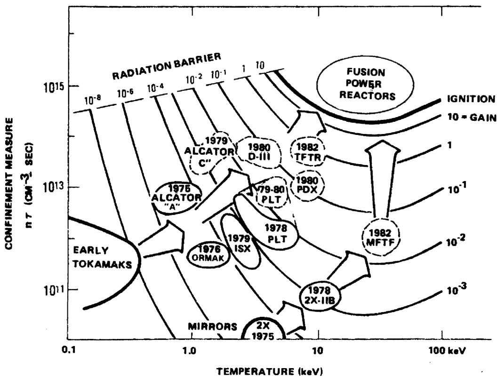  
FIGURE XIII-A-1. Technical Progress and Outlook in Magnetic Fusion(1)

as $6\mathrm{keV}$ temperatures, while ISX at a lower magnetic field has demonstrated a plasma beta value (ratio of plasma pressure to confining magnetic pressure) of $6\%$ . The MIT Alcator A experiment, at considerably higher density and magnetic field, has demonstrated $n\tau$ in excess of $10^{13}~\mathrm{s/cm^3}$ at a temperature of $1\mathrm{keV}$ . In this case the effective charge of the plasma is unity (no impurities), while in PLT it is a less desirable $Z_{\mathrm{eff}} = 2$ . The Alcator C and Doublet III experiments are expected to achieve $n\tau \geq 10^{14}~\mathrm{s/cm^3}$ , or near the Lawson condition for reactor ignition.

Tokamak theory has been developed to the point where many experimental results are well explained. This is particularly true for macroscopic plasma performance. Mechanisms of energy loss from the plasma are not fully explained however, and observed electron heat conduction losses are larger than the neoclassical prediction by a factor of 10-500. The theoretical uncertainties in predicting energy loss at conditions near those required for fusion reactors have prompted physicists to establish empirical scaling laws which relate energy confinement times to plasma parameters such as density, temperature and size. Fortunately, the data base to do this is strong and results from a variety of confirming diagnostic techniques. A recent assessment $^{(2)}$ of the tokamak confinement data base notes it to be basically sound and credible. The data has been satisfactorily determined by an acceptable computerized compilation of many diagnostic techniques, in numerous laboratories, with results showing an impressive consistency. The new and planned experiments of the DOE-OFE tokamak confinement program is expected to reinforce or help establish the data base in areas of auxiliary heating, impurity control, $\beta$ limits and elongated plasma.

# 2. Mirror

The major mirror fusion research is being conducted at the Lawrence Livermore Laboratory (LLL). Other laboratories which have mirror programs include the University of Wisconsin and Cornell University.

At LLL three mirror devices are operating or under construction: The Beta I (formerly 2XIIIB) the Tandem Mirror Experiment (TMX) and the Mirror Fusion Test Facility (MFTF).

- Beta II relies on magnetic fields to confine a hot, dense plasma for a short time. It features C-shaped magnetic coils

that form the confining magnetic field. Their unique shape (in what is known as a yin-yang geometry) stabilizes the confined plasma by creating a magnetic field (a magnetic well) that increases in every direction from the plasma center.

- MFTF, now being constructed, will bridge the physics and engineering gaps between current experiments and an experimental fusion reactor planned for operation by 1990. MFTF will use a superconducting magnet of yin-yang design (similar to the 2XIIIB experiment). This magnet will be capable of continuous operation.   
- The tandem mirror reactor concept consists of a long solenoidal magnet terminated at both ends by conventional mirror cells. These cells will act as "end plugs" to prevent plasma leakage out the ends of the solenoid. TMX is being constructed to test principles of this concept.

Experiments with 2X11B have shown that startup can be done in steady-state magnetic fields and that scaling of the density $n$ confinement time $\tau$ product follows the classical relationship $n\tau \sim W_i^{3/2}$ up to a mean ion energy $W_i = 13 \, \text{keV}$ for injected powers up to $3/MW$ at $20 \, \text{keV}$ . This device also demonstrated operation with $\beta = 2.5$ . It implies a close approach to a field-reversed state. In a field reversed mirror plasma, a ring-shaped plasma between mirrors is formed of sufficient density to create a locally field-reversed region by virtue of its ion diamagnetic currents. This would significantly augment the plasma confinement of the mirror machine and thereby enhance its Q.

On the basis of the favorable plasma physics results with 2XIIIB, a larger experiment, the MFTF is being constructed. It is scheduled for completion in late CY 1981. MFTF will test further scaling of mirror plasma confinement and will investigate advanced engineering problems such as those associated with NbTi superconducting magnets, neutral beam injectors, plasma wall interactions, disposal of neutral particles and ions escaping from the plasma chamber and high speed vacuum pumping techniques.

The TMX will test a new principle for improved confinement in mirror systems. The basic idea is to reduce the plasma loss rate by electrostatically plugging the ends of a solenoidal central confinement region using

the high positive ambipolar potential generated in minimum-B end plugs. Each end plug will be driven by the injection of neutral beams from 12 source modules, in a manner similar to that used in the 2XIIB experiment.

TMX has three fundamental objectives:

- To demonstrate the establishment and maintenance of a potential well between two mirror plasmas.   
- To develop a scalable magnetic geometry, while keeping macroscopic stability at high beta.   
- To investigate the microstability of the plug-solenoid combination to maximize the plug-density/injection power ratio. Possible reactor implications include the study of enhanced radial transport in the solenoidal cell and the accumulation of thermalized alpha particles in the central plasma. The TMX is currently in the initial operation of "shake down" phase.

The projected mirror hybrid represents about a four-fold increase in size over the MFTF, and the hybrid Q value is about 10 times that expected for MFTF. Given continued progress with mirror-stability physics, the mirror hybrid is a genuine near-term possibility, even though it has an uncomfortably large recirculating power fraction. It should be noted that the LLL-GA hybrid desingers have assumed attainable positive-ion neutral-beam technology and NbTi superconducting technology in their hybrid design.

It is important to note that present classical end-loss scaling behavior in mirrors is obtained by injecting cold plasma or neutral gas at the ends. This causes a heat loss, leading to low electron temperatures and low ambipolar plasma potential. Further physics research is needed to remove these effects while retaining stability. It is expected that MFTF will demonstrate whether or not the stabilizing cold gas or plasma can be dispensed with.

Phaedrus is a tandem mirror device (similar in design to TMX but smaller) which is in operation at the University of Wisconsin. It will be used to develop RF heating for the TMX. If the RF heating experiments are successful, this technique could lead to a large reduction in the neutral-beam heating required for a tandem mirror reactor and would significantly decrease

technology requirements and costs. Phaedrus will also be used to explore the trapping of plasmas (i.e., reactor refueling) by RF techniques.

# 3. Linear Theta Pinch

The primary advantages of the linear theta pinch are its simple magnetic configuration, known heating and ease of access to the core as a reactor. Plasma heating to thermonuclear temperatures in the 4-10 keV range is understood and practicable. There are no serious stability problems or problems of confinement of the plasma across its magnetic field, which has simple, longitudinal straight lines. The central problem is that of confining the plasma along its length. However, recent experiments and theory show that material end plugs successfully stop plasma particle flow. The remaining energy-loss mechanism is that of thermal conduction by electrons and ions along the magnetic lines to the end plugs. The energy loss time by thermal conduction is sufficiently large to sustain the reactor energy balance and to provide fissile production. There is a gross instability of linear theta pinches wherein plasma rotation produces a wobble of the plasma column. However, it does not lead to wall contact. In Scylla IV-P and STP this mode is stabilized by magnetic line tying and in the latter case by wall stabilization.

In 1964 the 1-meter Scylla IV produced an ion temperature of $5\mathrm{keV}$ at an $\pi$ value of $5\times 10^{10}\mathrm{cm}^{-3}$ sec. A successful test of the staging principle, on which reactor designs are based, was made in 1976 when the $4.5\mathrm{m}$ LASL Staged Theta Pinch (STP) produced 2-keV plasmas using separate shock heating and compression sources with adjustable plasma compression. A third important test of the linear theta pinch has been the solid-end-plug experiments on the 5-m LASL Scylla IV-P device. Application of LiD plugs results in stopping the flow of plasma particles. Thermal conduction at the ends of theta pinches was tested in 1965 in Scylla IV and 1978 in Scylla IV-P and found to agree with the theoretical predictions.

# 4. Inertial Confinement

The intertial confinement program is advancing with an array of short pulsed energy drivers. These include lasers, light particle beams (electrons and ions) and heavy particle beams.

# a. Lasers

Lasers were the only ICF driver candidates given serious consideration in the U.S. before 1972. In the early part of the ICF program, major development efforts were established for high energy, short pulse lasers systems using solid (neodymium:glass) and gaseous $(\mathrm{CO}_{2})$ media.

Neodymium:glass laser technology is the most highly developed short-pulse, high-peak-power laser technology existing today. The major ND: glass systems development and target experiments are centered at Lawrence Livermore Laboratory. Research experiments in the laser-plasma interaction area are also being conducted using ND:glass lasers at KMS Fusion, Inc., the University of Rochester, and Naval Research Laboratory.

The ARGUS laser, which began operations at Lawrence Livermore Laboratories at the 2-4 TW level in late FY-1976 served as a prototype for the 20-beam SHIVA system. The first full power fusion experiment with the SHIVA laser system took place in May, 1978. The 20-Arm SHIVA system focused 26 TW of optical power on a deuterium fuel pellet yielding $7.5 \times 10^{6}$ 14 MeV neutrons. Later experiments are expected to demonstrate significant thermonuclear burn where the fusion energy produced is several percent of the laser energy delivered to the target. At this time, glass lasers are not viewed as a candidate for ultimate commercial fusion applications because of probable pulse rate and efficiency limitations. These lasers are being developed however for intermediate programmatic tasks.

Short-pulse $\mathrm{CO}_{2}$ lasers are being developed at Los Alamos Scientific Laboratory (LASL) as drivers for laser fusion experiments. The resulting gas laser technology, particularly the high efficiency (to perhaps $10\%$ ), is considered extrapolable to repetitively pulsed laser designs which will be required for the development of commercial fusion drivers. A 2-beam $\mathrm{CO}_{2}$ system has operated at 0.8 TW on each beam at LASL and has produced neutron yield in early 1977. It is a prototype for an 8-beam, 10-20 TW system which consists of four of the 2-beam modules. This 8-beam system was successfully fired in mid-April, 1978 at the 8.4 kJ output energy (15 TW output power) level. The beams will later be fired at fuel pellets to initiate fusion reactions. Its goals are to

develop targets for ANTARES, study thermonuclear burn scaling, and to demonstrate 20 times liquid density compression.

The projected near term achievements of the glass and $\mathrm{CO}_{2}$ laser programs are provided in Table XIII-A-3.

TABLE XIII-A-3. Office of Laser Fusion Physics Through Mid 1980s   

<table><tr><td>Designation</td><td>Lab</td><td>Power, TW</td><td>Scheduled Completion Date Laser Drivers</td><td>Anticipated Results</td></tr><tr><td>Shiva (Nd:glass)</td><td>LLL</td><td>20-30</td><td>Operational</td><td>1013N/Pulse(1010N/Pulse achieved)</td></tr><tr><td>Nova - (Nd:glass)</td><td>LLL</td><td></td><td></td><td></td></tr><tr><td>- Phase I</td><td></td><td>100</td><td>1982</td><td>Gain of 1 or more</td></tr><tr><td>- Phase II</td><td></td><td>300</td><td>1984</td><td>Gain of 20 to 100</td></tr><tr><td>Eight-Beam System (CO2)</td><td>LASL</td><td>10-20</td><td>1978</td><td>1010-1012N/Pulse</td></tr><tr><td>Antares (CO2)</td><td>LASL</td><td>100-200</td><td>1982</td><td>Gain of 1 to 8</td></tr></table>

# b. Light Particle Beams

Light particle beam accelerators have been candidate drivers for inertial confinement fusion since 1972. The early accelerators have been developed for use in weapon's effect simulation studies. Since that time, much of the ICF light particle beam program has been centered at Sandia Laboratories, Albuquerque (SLA) and has been working to extend the useful range of machine operation. Additional light particle beam work is being carried out at the Naval Research Laboratory, Cornell University, Maxwell, and Physics International. The significant new operating requirements for an ICF driver are short pulses (10-30 ns), high instantaneous power (30-100 TW), a high energy/pulse (1-10 MJ), good beam focus (1-5 mm dia.), remote beam delivery (1-5m), repetitively and pulsed operation (1-10 Hz).

Sandia's primary accelerator development tasks have involved electron beam machines. Electron beam experiments with D-T targets using the Proto I accelerator (2 TW, 400 KA, 3 MeV, 24 ns pulse) have produced neutron yeilds greater than $10^{6}$ . Proto II (8 TW) has been in operation since 1977 and is expected to yield additional beam-target coupling data in 1979. Scientific

breakeven (pellet thermonuclear output equal to beam energy input), is expected with EBFA-I (30 TW) or EBFA-II (60 TW) by the end of 1985. In the development of the latter two facilities it is felt that most of the driver technology problems for commercial light particle driven inertial confinement fusion will be solved, except for those dealing with long-life rep rate, and operation in nuclear environment. Work is also underway to develop a 10 Hz, 10 KJ machine during the next five years to address problems associated with repetitive operation.

Recent developments indicate that these electron accelerators can be converted to ion accelerators with relatively minor changes. Work is in progress to access the beam generation efficiency of such a converted system. Success would allow the use of light ions (carbon and lighter) and reduce problems associated with electron-beam preheating of the pellet fuel material caused by electron penetration. Satisfactory light ion operation must be demonstrated before the impact of this option can be assessed. EBFA-I and II have been designed to operate with either polarity to allow modification should a light ion diode be developed successfully.

# c. Heavy Ion Beams

Heavy ion beam driver systems under consideration at this time are based on the accelerator development and operating experience gained from high energy physics experiments. This experience spans a period of more than 40 years and includes participation by Fermi Lab., Brookhaven National Laboratory, and Lawrence Berkeley Laboratory, each having different but complimenting accelerator technology.

Comparing the present capability to the anticipated needs for a successful heavy ion fusion driver reveals that (1) the particle energies achieved in recent physics machines greatly exceed the needs for a fusion driver, (2) the technology must be demonstrated for heavy ions and very large instantaneous current levels (Existing machines already have demonstrated large energy per pulse, 4 Mj $15\%$ and large average power levels, 0.54 Mw $85\%$ .) and (3) the existing accelerator technology also has a demonstrated capability for pulsed operation that exceeds the rate anticipated for inertial fusion applications. This pulsing capability is very significant for commercial

and programmatic needs even though it is not useful for the near term for proof of scientific feasibility.

The existing physics machines have established performance records that document their ability to provide:

- good operating efficiencies

(overall systems: up to 15%)

(subsystems: up to 42%)

- good machine reliability and availability

(ZGS at Argonne National Laboratory/85% of scheduled time)

The efficiency values are indicative of attainable values but do not represent an upper limit since this has not been emphasized in past research. Improvements can be anticipated with increased emphasis on this problem.

# d. Fusion Targets

At the present stage of inertial-confinement, fusion neutron yields in the range of $10^{9} - 10^{10}$ per shot have been obtained. The targets have generally been thin-shelled glass or metal submillimeter microspheres containing D-T gas at several hundred atmospheres. These targets explode as a reaction to the laser, e-beam or ion-beam - initiated surface vaporization. Compression heating to thermonuclear conditions occurs as a result of the initial impulse applied to the surface; this is termed an exploding "pusher" target. For practicable hybrid drivers multilayered high-gain targets must be used.(3) Whether such targets can be fabricated for economical commercial application will require extensive research and development.

__________

__________

# B. FUSION DRIVER RD&D REQUIREMENTS

# 1. Tokamak

The technological development of the ignited tokamak fusion driver of the Tokamak Hybrid Reactor (THR) can fit into the DOE-OFE confinement and D&T programmatic schedule which plans to have operational a pure fusion device about the year 2015 (Figure XIII-B-1). The progress of the major facilities are listed in Table XIII-B-1. The major plasma physics input for an ignited Tokamak Engineering Test Facility (TETF), which could conceivably be an Hybrid Experiment Facility (HEF), would come from the U.S. devices through TFTR in addition to ORMAK-Upgrade, Alcator C, et al., as well as foreign experiments (Table XIII-B-2). The D&T requirements (Figure XIII-B-2 and Table XIII-B-3) would come from the beam development for TFTR, the Large Coil Project (LCP) for the superconducting magnets, the High Intense Neutron Facility (HINF), the Multi-Component Radiation Facility (MCRF), and Fusion Materials Irradiation Test (FMIT) for the materials qualifications, and the Tritium Systems Test Assembly (TSTA). The HEF features would allow its operation as early as c. 1989. The features which may represent some question include the matter of stabilizing a "D" shaped MHD equilibrium plasma which has already been demonstrated on several tokamaks (e.g., Versator, Rector, TO-1) but would benefit from even further study. The technological development of divertor collection systems should perhaps be more clearly defined in the D&T program.

The successful operation of the HEF would impact the final design and construction of the scheduled EPR which with a hybrid blanket and appropriate fuel and blanket remote handling capabilities could conceivably be an Hybrid Experimental Reactor for operation c. 1994. Such a facility would produce power and demonstrate an integrated tritium handling and refueling capability. Its operation in turn would impact the final design and construction of the magnetic fusion DEMO which could be a Prototype Hybrid Reactor (PHR) to operate c. 2000 that would precede the first Commercial Hybrid Reactor to be built and operated early in the next century.

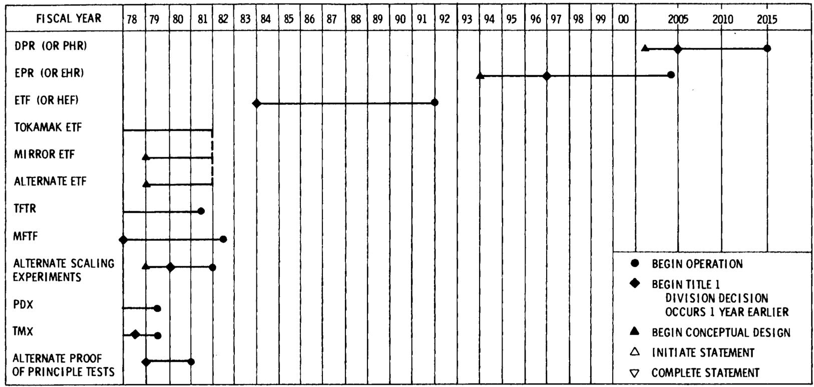  
FIGURE XIII-B-1. Major Facilities Schedule

TABLE XIII-B-1. Objectives of Major Fusion Reactor Facilities   

<table><tr><td>Reactor</td><td>Immediate Supporting Devices</td><td>Year of Operation</td><td>Objective</td></tr><tr><td>TETR (Driven Tokamak Engineer-Test Reactor</td><td>D-III, PDX, PLT, TTA, RTNS, TFTR, JET</td><td>1990-92</td><td>Test Materials to 1021n/cm2Fueling (E = 14 MeV)S/C MagnetsLimited T Breeding Neutronics Test Remote Handling Blanket Design Tests Performance Test of Plasma Operation Required for Hybrid</td></tr><tr><td>EPR Experimental Power Reactor</td><td>TETR, TFTR, JET, T-20-JT-60</td><td>2000-04</td><td>Limited Electrical GenerationHigh Temperature Operation Fabrication of CTR Vessel Components in Field Structural Material Test (Fatigue)Demonstrate Safe Handling and Pumping of Liquid Metals in CTR Environment Reliability of S/C Magnets Remote Assembly and Dis-assembly Breeding and Containing Tritium</td></tr><tr><td>DPR</td><td>TETR, EPR</td><td>2010-15</td><td>Demonstrate Safe Reliable Power Generation in a Reactor System which Scales Readily to a Commercial Reactor</td></tr></table>

TABLE XIII-B-2. Features of the Tokamak Fusion Driver(13) Related to Large Tokamak Experience   

<table><tr><td>Feature</td><td>Implication</td><td>Relevant Preceding(4) 
Experiments</td></tr><tr><td rowspan="2">High Neutron Flux 
and Small Size</td><td>TCT Operation</td><td>TFTR, JET</td></tr><tr><td>Noncircular Plasma</td><td>D-III, JET PDX-UG</td></tr><tr><td>High τp and Low Zeff</td><td>Divertor, gas blanket</td><td>DITE, JFT-2a/DIVA 
PDX, ASDEX, ISX</td></tr><tr><td>Long Burn Time 
(~30-60 s)</td><td>Pellet Fueling</td><td>ORMAK, ISX</td></tr><tr><td>Long Pulses at 
Reasonable Power 
Costs</td><td>Superconducting Toroidal 
Field Coils</td><td>T-7, T-10M 
Large Coil Project 
MFTF</td></tr><tr><td>High Power Neutral 
Beams</td><td>Efficiency ~ 50% at 
150 keV</td><td>Beam Test Stands</td></tr></table>

```txt
(a) TFTR = Tokamak Fusion Test Reactor (PPPL)  
JET = Joint European Torus (EEC)  
D-III = Doublet-III (GA)  
PDX-UG = Poloidal Divertor Experiment-Upgrade (PPPL)  
DITE = Divertor Injected Tokamak Experiment (Culham)  
JFT/2a = Japanese Tokamak with Divertor (JAERI)  
PDX = Poloidal Divertor Experiment (PPPL)  
ASDEX = Axisymmetric Divertor Experiment (MPI-Garching)  
ORMAK = Oak Ridge Tokamak (ORNL)  
T-7, T-10M = Tokamak-7, 10 Modified (Kurchatov)  
MFTF = Mirror Fusion Test Facility (LLL) 
```

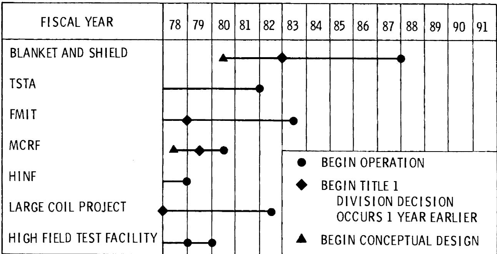  
FIGURE XIII-B-2. Engineering Facilities Schedule

TABLE XIII-B-3. Objectives of Major Fusion Engineering Facilities   

<table><tr><td>Facility</td><td>Year of Operation</td><td>Objective</td></tr><tr><td rowspan="5">Blanket and Shield Facility</td><td rowspan="5">1988</td><td>Test prototype blanket and first wall structures.</td></tr><tr><td>Test thermal/hydraulic performance and electromagnetic compatibility.</td></tr><tr><td>Test capability to accomodate accident conditions.</td></tr><tr><td>Demonstrate vacuum integrity and remote maintenance operations.</td></tr><tr><td>Test neutronic models and performance.</td></tr><tr><td>Tritium Systems Test Assembly (TSTA)</td><td>1982</td><td>Demonstrate safe and economic handling of tritium.</td></tr><tr><td>Neutron Source Facilities (FMIT, MCRF, HINF)</td><td>1979-83</td><td>Test small material samples in fusion neutron environments.</td></tr><tr><td>Large Coil Project</td><td>1982</td><td>Test large superconducting magnet designs.</td></tr><tr><td>High Field Test Facility</td><td>1980</td><td>Test high field superconducting magnet materials.</td></tr></table>

# 2. Mirror

It is generally recognized that, even with the energy multiplication of a fissile blanket, the low Q value of the classical mirror gives it an excessive recirculating power fraction and therefore poor economic performance. In addition, the open ends in near spherical geometry, as well as the beam injection parts, lead to poor blanket coverage of the plasma neutrons. For these reasons the mirror fusion program has been redirected to the tandem-mirror confinement concept for reactor applications.

A central feature of a mirror fusion device is the positive ambipolar electrostatic potential which the plasma assumes to keep the electrons from escaping faster than the ions. This positive potential is made the basis of a new end-plugging method for a linear solenoid by using two minimum-B mirrors at the solenoid ends to contain its ions electrostatically along the axis. The plugs are high density mirror devices (plasma volume $V_{p}$ ) whose Q values are less than unity. However the Q value of the composite system with central linear plasma volume $V_{c}$ can be raised to larger values by choosing $V_{c} / V_{p}$ large enough. As a test of these principles, the Tandem-Mirror Experiment (TMX) is now in operation at Lawrence Livermore Laboratory (LLL).

A pure-fusion system is envisaged as a 650-MWe system with 1-MeV neutral-beam injection into the end plugs, a first-wall radius of about $1\mathrm{m}$ and a length of about $80\mathrm{m}$ . The maximum plug magnetic field is $16.5\mathrm{T}$ and the central-cell magnetic field is $2.2\mathrm{T}$ .

As of September 1978, no detailed description of a tandem-mirror hybrid has been published by LLL. However, an outline of such a design based on the arrangement of Figure XIII-B-3 has been made. Like other linear devices it has the advantage of simple modular construction and it can be attractively short with small power rating.

A major RD&D requirement for a Mirror Hybrid is to run a tandem-mirror experiment and to check the main new features of its operation. The end-plug physics is like that of the existing 2XII-B or the projected MFTF. However, there are substantial questions of the stability of the new geometry, which includes regions of bad magnetic curvature. The thermal conduction problem may be aggravated owing to the very high density of the end plugs and attendant high plasma energy flux on the end walls.

Technological questions include the radiation-hardened injectors and the superconducting magnets of the central solenoid, as well as the high-field end plugs. Such development would follow successful operation of TMX and MFTF as scheduled in Figure XIII-B-1. The selection of the tandem-mirror concept for the Engineering Test Facility would also be based upon their operation. As with the tokamak hybrid, the Tandem-Mirror Engineering Test Facility could conceivably be a Hybrid Experimental Facility whose blanket modules would be a test bed for hybrid blanket and fuel development. The other scheduled magnetic fusion engineering development facilities of Figure XIII-B-2 would also fulfill the D-T requirements for the Tandem-Mirror hybrid development in support of the scheduled operation of the EHR and PHR.

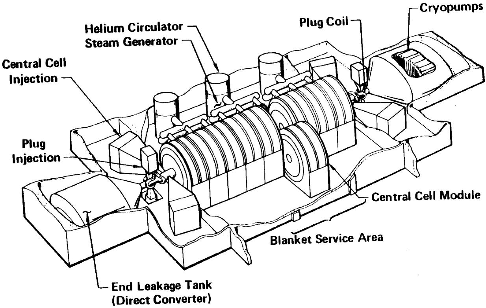  
FIGURE XIII-B-3. Tandem Mirror Reactor

# 3. Linear Theta-Pinch

The main technological developmental requirements for the Linear Theta Pinch Hybrid Reactor (LTPHR) include the development of pulsed electrical energy storage. Conceptual designs based on experience with superconducting machinery indicates that homopolar motor generators would furnish the plasma compression power economically and at sufficiently high efficiency. A development program for homopolar energy storage should therefore be pursued as part of the engineering development facilities schedule of Figure XIII-B-2. Since proof of principle tests and design studies have indicated that the first-wall pulsed heat loads and thermal stresses of the LTPHR can successfully be withstood, larger-scale simulation tests should also be included in the development schedule. The relatively small-diameter superconducting magnets required for LTPHR are little beyond the current state of the art and could be developed in the near term as part of the magnet development program.

Regarding the major reactor facilities for the development of the LTPHR, on the basis of present experimental results a scientific feasibility demonstration could be performed in a stage physics experiment of approximately 100 meters in length. It would have pulsed energy storage prototypical of the LTPHR but on a shorter time scale. As with the TFTR, the plasma would initially be deuterium, followed by D-T. It is already too late to schedule such a facility for selection of the ETF fusion driver as indicated by the magnetic fusion facility schedule of XIII-B-1. However, its successful operation (c. 1994) could impact the driver for the Experimental Power Reactor (EPR) (c. 2004) or the Experimental Hybrid Reactor (EHR) preceding the PHR. Such a facility would entail a 500 meter LTP with full hybrid blanket coverage and all of the subsystem engineering features the commercial LTPHR would have.

# 4. Inertial Confinement

In order to develop an inertial confinement hybrid (ICH) it will be necessary to conclude the physics research (driver/pellet interaction studies) and proceed through engineering development to a prototype hybrid reactor. In addition to lasers, R&D must be carried out for light-particle beams, heavy ion beams, and fusion targets.

# a. Lasers

The precise requirements for the ICH laser cannot now be specified. The conceptual requirements provided in the LLL/Bechtel design are:

Laser Energy (Selenium laser with 489 nm wavelength) 400 KJ

Laser Efficiency 1.2-1.5%

Laser Pulse Repitation Rate 5-8 Hz

Pellet 250

This laser was selected because it is known to have a short wavelength which is currently preferred for pellet coupling. It is one of several candidates discussed in Section XIII A.4 above.

None of the high power lasers available today satisfy all the criteria for a commercial driver (reliable, efficient, pulse rate capability, good pellet coupling, peak pulse power, and pulse shape). As a result, the identification and characterization of new laser media and excitation techniques are being carried out to develop an advanced laser capable of driving a fusion reactor. This is being done by:

- Conducting a program of fundamental research to identify new laser candidates,   
- Evaluating the usefulness of present advanced laser candidates for commercial fusion application,   
- Initiating an effort to scale an efficient visible laser to the 1 KJ level (1 nsec pulse width), and   
- Conducting a program of supporting technology to aid in scaling high power lasers.   
- The primary candidate advanced lasers currently being evaluated are:   
- Rare earth molecular vapor ( $\lambda \simeq 0.545\mu \mathrm{m}$ ) - terbium - aluminum - chloride complexes.   
- HF. chemical laser ( $\lambda = 1.315\mu$ ) 0 a high gain medium pumped by chemical reactions (expected efficiency is $5\%$ )

- Iodine $(\lambda = 1.315\mu \mathrm{m})$ - a low gain medium in the near infrared spectra whose efficiency needs improvement (expected efficiency is $1 - 2\%$ )

Metal vapor excimer lasers $(\lambda = 0.173\mu \mathrm{m} - 0.485\mu \mathrm{m})$

The initial laser chosen for the power scaling experiment (oxygen, $\lambda = 0.557\mu \mathrm{m}$ ) is from the Group IV metastable atom lasers.

The present advanced laser development plan includes:

- Selection of several candidate lasers during FY-80 for development of 1 kJ modules   
Completion and evaluation of the 1 kJ modules during FY-82, and   
- Development of the best candidate to a $30\mathrm{kJ}$ module with moderate pulse rate capability by FY-85 or FY-86.

These developments may be compared with the near-term Nd glass and $\mathrm{Co}_{2}$ laser projection given in Table XIII-A-3.

The next development tasks for lasers are associated with the efficient and reliable generation of high power, rep-rated laser pulses. Master oscillators which operate reliably with acceptable performance in the repetitive pulsed mode need to be developed. The near term tasks associated with single shot laser media handling must be solved for pulsed laser amplifiers. Here the flow system and the medium reprocessing tasks become important. Thermal control for these systems needs to be developed. Exciters which couple efficiently with the laser medium as well as efficient ways to extract the high power pulse from the power amplifiers need to be developed.

# b. Light Particle Beam

Electron accelerators provide one-step beam generation and acceleration when a short high voltage electrical pulse is applied to the accelerator diode. The temporal properties of the electron pulse leaving the diode are governed by the detailed design of the diode/power supply combination. The attachment of suitable ICF pulses (~10-30 nanosecond pulse width) represents a significant design problem for the overall system and will require R&D.

At present, electron diodes are being operated near the current levels required for an ICF driver but the electron energies are too low. Diode-power supply operation must also be extended to reach high power levels (shorter pulses) and repetitively pulsed operation. Diode survivability must also be developed for prolonged operation ( $10^{9}-10^{10}$ shots) and the ICF nuclear environment.

Light ion accelerators use a diode generated electron beam to generate the energetic light ion beam. Devices must be demonstrated with good conversion efficiencies (electron to ion) if this is to become a viable driver option. The ion generation techniques must also be developed to provide adequate lifetime and maintainability.

To reach the pulse power and energy levels that will be required for ICF, these accelerator systems are being assembled in parallel to reduce the performance required of an individual accelerator module. This has been done at Sandia on the recent electron machines and those planned for near term construction (Table XIII-B-4).

TABLE XIII-B-4. Sandia Accelerators   

<table><tr><td>Machine</td><td>Number of Modules</td><td>Peak Power</td><td>Pulse Energy</td><td>Operation Date</td></tr><tr><td>Proto I</td><td>2</td><td>2 TW</td><td>12 KJ</td><td>1975</td></tr><tr><td>Proto II</td><td></td><td>8 TW</td><td>100 KJ</td><td>1977</td></tr><tr><td>EBFA I</td><td>36</td><td>30 TW</td><td>1 MJ</td><td>1982</td></tr><tr><td>EBFA II</td><td>72</td><td>60 TW</td><td>2 MJ</td><td>1985</td></tr></table>

But the performance of the individual diodes must be improved beyond the present State-of-the-Art if these drivers are to succeed in inertial confinement fusion.

The near term attainment of breakeven with these drivers will require significant advances on single shot machines. This includes the improvement of diode-power supply designs to yield shorter pulse lengths (10-20 ns). Diode design must also accommodate the large power flow through the interface between the power supply's pulse forming line (PFL) and the evacuated beam

formation region. Improved materials and designs must be developed for this interface region.

It is assumed for the purposes of this report that the light-ion diodes are being developed to replace electron systems and that they will use the exact same technology as the electron beam except the diode design. The exact nature of the ion diode for ICF applications will depend on physics experiments underway at this time at Sandia, NRL, University of Maryland, Illinois, Cornell, Livermore/Berkeley and Ecole Polytechnique.

Major problems for diode development after breakeven are related to repetitively pulsed operation and the nuclear environment. The diode must withstand incident neutrons, ions and intense x-ray fields. Survivability under commercial reactor conditions can only be simulated until the demonstration stage. Beam steering and transport techniques must be developed to allow shielding and stand off of the diode from neutrons resulting from the pellet implosions or the diode will have to withstand intense neutron bombardment similar to the first wall in a Tokamak reactor. Diode replacement by remote handling techniques, therefore, will have to be developed as a part of the technology matrix.

Cooling methods to remove waste heat deposited in the diode by the beam and by joule heating will have to be developed. For electron beams, thin cathode foils or a fine mesh cathode screen will have to be cooled in high current repetitively pulsed systems if electrostatic or magnetic cathode protection schemes are not successful in making the beam by-pass these elements. If a portion of the beam is stopped in the support or mesh, this energy will have to be removed. Furthermore, in e-beams the anode will have to be cooled to remove the energy deposited from the plasma formed along the surface. Likewise, the light ion diode foil may have to be cooled.

# c. Heavy Ions

The development of heavy ion fusion drivers will not only benefit from the existing machine experience but also from continuing accelerator development programs. During the period covered by this plan, additional high energy physics machines will be built in this country and abroad. Advances in machine design, beam diagnostics, and control, etc. can be expected to occur.

In spite of the different operating regimes for fusion and high energy physics machines it is likely that some results will be of significant value to the heavy ion fusion program.

The fusion effort also stands to gain significant insights from recently initiated programs to evaluate the feasibility of particle beam weapons. The advances in this program could provide immediate benefits to the heavy ion fusion program since their operating regimes are similar. Initial estimates of weapons parameters include high peak currents ( $\sim 10$ kamperes), high peak power ( $\sim 10$ TW), high pulse energy ( $\sim 50 - 100\mathrm{kJ}$ ), and acceptable repetition rates (5-50 pulses/sec.). The differences are that the military programs are examining the use of electrons and protons with energies of 0.5-1 GeV whereas the fusion program needs range from 10-100 GeV. Major technical areas included in the present program that would relate to the heavy ion fusion are beam propagation physics, accelerator technology, and power supply subsystems (switches, energy storage, energy generation). A major barrier for incorporating these gains into the commercial heavy ion fusion program could result from classification of particle beam program advances.

High energy physics accelerators perform sequential manipulations of the beam over large system lengths (several kilometers for HIG systems). All systems proposed for HIF include 1) an ion source and preacceleration stage, 2) a voltage gain accelerator, and 3) a device or system to increase the instantaneous current levels (pulse compression). The voltage and current gain operations may be provided by one or more individual accelerator subsystems. The sequential nature of beam manipulation with these systems makes them suitable for performance upgrades by adding stages to an existing machine. This has the potential to reduce costs by requiring only one phased machine instead of several.

# d. ICF Fusion Targets

In practice bare D-T pellets or pellets with single container materials will not be suitable to obtain the required compression and heating. Future pellets will probably consist of a number of concentric spherical regions of different materials and will have diameters in the millimeter range. $^{(3)}$ The outside surface of these layers and its interfaces between layers will be

smooth enough to prevent Rayleigh-Taylor stabilities (defect height less than 100A and spatial wavelength of 50 microns or less). The development of economical fabrication techniques of such targets will require a considerable efforts.

# 5. ICF R&D Facilities

In addition to the development of lasers as drivers for Inertial Confinement Fusion (ICF), the current Office of Inertial Fusion (OIF) program plan includes light-particle beam (electron beam) (EBFAII) and heavy ion beam scientific feasibility demonstrations by 1985 whose purposes are described in Table XIII-B-5 and having a schedule as indicated in Figure XIII-B-4. The next generation of engineering development facilities and reactors, as indicated in this figure, would not allow the scheduling of operation of an ENngineering Test Facility equivalent to the magnetic fusion ETF until 1993. This is principally due to the fact that the ICF program presently does not plan to conduct any significant engineering development activities until after scientific feasibility is demonstrated in each of their driver options by 1985. Thus, as seen in Figure XIII-B-4, the ICF Engineering Test Facility (ETF) is scheduled to operate (c. 1993), approximately one year after the magnetic fusion scheduled ETF (See Figure XIII-B-1) which is part of a program that has already proceeded with significant engineering development (See Figure XIII-B-2).

The proposed schedule for the ICF Fusion Pilot Plan and Prototype Fusion Power Plant which would precede the first commercial demonstration could readily accommodate the equivalent hybrid facilities on the same schedule, viz., the EHR and PHR. It should be noted that this ICF schedule of facilities allows 2-3 years of operational experience and data to impact the final construction design while the magnetic fusion schedule makes for little if any of such allowance.

TABLE XIII-B-5. Objectives of Major ICF Facilities   

<table><tr><td>Facility</td><td>Year of Operation</td><td>Objective</td></tr><tr><td>ANTARES</td><td>1982</td><td>Achieve pellet gains of 1</td></tr><tr><td>NOVA II</td><td>1984</td><td>Achieve pellet gains of 20 or more</td></tr><tr><td>EBFA II</td><td>1985</td><td>Achieve pellet gains of up to 10</td></tr><tr><td>Advanced Laser</td><td>1985</td><td>Repetitive operation at 30 kJ</td></tr><tr><td>Heavy Ion Beam</td><td>1985</td><td>Demonstrate heavy ion beam driver feasibility</td></tr><tr><td>Systems Integration Facility</td><td>1988</td><td>Driver pellet targeting Pulse power supply testing Driver-module testing Beam propagation studies</td></tr><tr><td>Single-Pulse Target Facility</td><td>1989</td><td>Commercial pellet development Reactor component testing</td></tr><tr><td>Engineering Test Facility</td><td>1994</td><td>Reactor systems qualification in pulsed nuclear environment</td></tr><tr><td>Materials Test Facility</td><td>1997</td><td>Materials qualification Pulsed radiation effects testing</td></tr><tr><td>Fusion Pilot Plant</td><td>2000</td><td>Confirm prototype plant technology Electric power production</td></tr><tr><td>Prototype Fusion Power Plant</td><td></td><td>Safe reliable operation Scaleable to commercial size</td></tr></table>

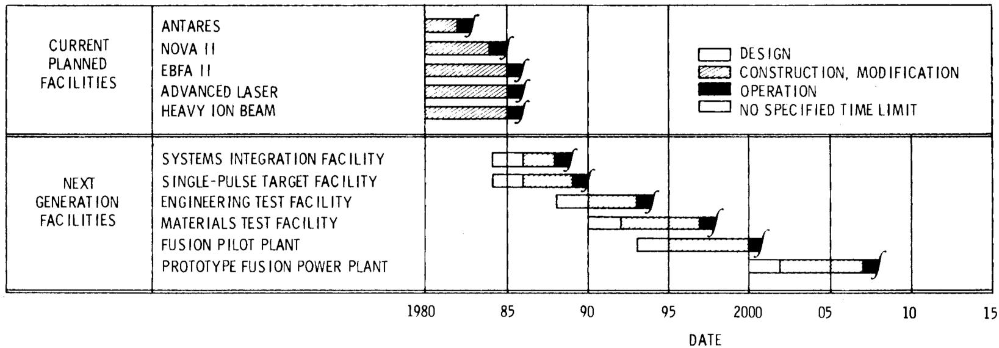  
FIGURE XIII-B-4. Inertial Confinement Fusion Facilities Schedule

# C. PRESENT STATUS OF BLANKET ENGINEERING

# 1. Neutronics Design

Hybrid concepts have thus far been subjected mainly to survey type neutronic analysis with specific requirements in the calculations, nuclear data, and experimental areas. Detailed calculations have not been made, in part because of the uncertainties associated with structural material choice and requirements which require definition from hydraulic and engineering analyses and the exact fluence limitation of a given design. Costs of conducting detailed analyses is another factor. Existing calculations of hybrid concepts, with few exceptions, have not been performed with the full sophistication available to fission reactor designers and with little attention to nuclear data problems. The experimental basis for the correlation of calculations is sparse and no experimental neutronics program on hybrid concepts presently exists.

# a. Nuclear Data

The only nuclear data uncertainties for hybrid concepts which have been studied have been for the $^{238}\mathrm{U}$ nucleus. No nuclear data problems have been considered for $^{232}\mathrm{Th}$ or for the fissile isotopes and the minor isotopes which impact on fuel cycle problems. Complete evaluated nuclear data files have been prepared for essentially all of the actinide nuclei for the next version (V) of the U.S. DOE Evaluated Nuclear Data File (ENDF/B). These files have not yet been released for use and no assessment has been made of their uncertainties and adequacy for hybrid neutronics analysis.

# b. Calculational Analysis

Most existing hybrid neutronic calculations are very unsophisticated. Most have not included resonance self shielding or temperature effects. Only a few calculations exist with neutron thermalization and associated temperature dependence. With one exception the minor isotopes $^{232}\mathrm{U}$ , $^{236}\mathrm{Pu}$ and $^{238}\mathrm{Pu}$ and their impacts on materials handling, operations, biological radiation dose, and safeguards have not been evaluated. Calculations of the fast-thermal $^{233}\mathrm{U}$ refresh mode hybrid have been extremely cursory at this time. The

question of fission criticality safety has been subjected to little rigorous analysis. There are very few studies to determine optimum fuel management steps for improved blanket performance. Inertial confinement fusion systems have not been evaluated for performance with high density pellets with their associated neutron spectrum and intensity characteristics. The effect on tritium breeding requirements needs to be examined.

# c. Experiments

No integral measurements experimental program exists for the hybrid concept. Some attempts have been made to define areas of microscopic neutron cross-sections for hybrid applications where improved experimental data are needed. There is no established experimental program supported to supply these needs. A single integral experiment performed some 20 years ago with a 14 MeV neutron source in a natural uranium assembly has constituted the basic criterion for hybrid neutronics performance. All calculational comparisons except one, however, have to date incorrectly compared calculated with experimentally measured quantities.

# 2. Thermal and Mechanical Design

The thermal and mechanical design of the blanket is more dependent on the fusion driver than on the type of fission blanket selected. Configurations are laid out to fit the geometry of the fusion driver and to facilitate the removal of blanket material. This will be required of all designs depending on the fission fuel cycle being considered and exposure capability of the fission fuel form and structural components utilized in the design. It is important in conceptual design studies to establish the required blanket configuration early in the study. Preliminary thermal-hydraulic and structural analyses must be carried out in conjunction with neutronic survey calculations. The neutronic performance is sensitive to the amount and type of structural material required in the blanket as noted previously, particularly for thermal and fast-thermal lattices. Knowing the blanket configuration is also important for estimating the integrated hybrid performance since the overall performance is sensitive to the fraction of total fusion neutrons utilized by the blanket.

# a. Fuel Form

The selection of a fission fuel form for any given blanket has been based primarily on neutronic performance, but the candidate forms have been based on developed fission reactor technology. Fusion-fission hybrid designers utilizing near-term fusion drivers, i.e., those with high recirculating power and low plasma, have selected advanced fission fuel forms and cladding for their designs. Those utilizing fusion drivers having a high gain (e.g., ignition tokamaks), however, can obtain performance parameters of commercial interest with blankets utilizing near-term fission fuel forms and cladding such as UC clad in stainless steel.

# b. Blanket Coolants

Selection of hybrid blanket coolants has been based on several factors:

Compatibility with neutronic requirements of the blanket

Status of power conversion system components

Availability of design analysis methods and supportive data bases

Compatibility with fuel form, cladding and structural materials

Compatibility with tritium processing requirements

Knowledge of magnetic field effects

Ability to predict safety performance

The selected coolant must be compatible with ultimate transfer of heat to a modern steam system to maintain reasonable power conversion efficiency within the temperature limitations of available blanket structural materials. In all the areas of technology previously mentioned, we know the most about water as a coolant. Extensive R&D in the LWR program has developed an adequate base and design methods to predict water-cooled blanket performance. However, water has not been considered as a blanket coolant to date because it is very difficult if not impossible to remove tritium from water. In LWRs tritium releases outside the plant are controlled simply by limiting the generation of tritium. Impurities (Li) in the core are reduced to levels which limit the tritium production to amounts than can be released from the plant.

The HTGR and German Gas Cooled Reactor programs have developed and demonstrated helium cooled power conversion system technology. Helium is

compatible with all structural materials with the exception of refractory metals and alloys. The impurity levels attainable in real systems result in corrosion problems for the refractories.

To get adequate heat transfer and transport properties, helium systems have to be operated at relatively high pressures (50 to 70 atm's). In the complex geometries of hybrid blankets this results in a requirement for lots of structural material fractions which reduces neutronic performance (i.e., parasitic absorption of the neutrons). Where cladding and structural materials are stainless steel, helium-cooled systems yield $30\%$ power conversion efficiency. If higher temperature alloys (TZM, Inconel, etc.) are used, efficiencies approaching $40\%$ are possible. Helium has good neutronic properties with no anticipated MHD or corrosion enhancement effects in magnetic fields. Hence, it has been a nearly unanimous choice of designers for use in Tokamak and Mirror hybrid blankets.

The LMFBR program is developing data and system components for Na cooled systems. The major uncertainties in Na cooled systems are the MHD effects in rapidly changing high magnetic fields and the effects of magnetic field on corrosion and mass transport rates. Due to enhanced heat transfer, higher sodium temperatures can be achieved with stainless steel structural materials and thus power conversion efficiencies near $40\%$ can be achieved without the use of high temperature alloys. The LMFBR program is also developing an extensive safety related data base for Na coolant. These data will be directly applicable to assessing hybrid safety problems.

Few hybrid designers to date have not proposed using Li as a coolant. Although it is attractive neutrionically for producing tritium, the technology base for Li leaves uncertainties. Li appears to be more corrosive than Na and hence operating temperatures must be lower $(50^{\circ}\mathrm{C})$ to be compatible with stainless steel, resulting in lower power conversion efficiency. The increased corrosion and mass transport rates result in uncertainty in the applicability of current Na power conversion system components.

Because liquid metals can be used at low pressures, they result in low structural material requirement. Where magnetic field effects are not important (laser applications) designers have proposed using both Na and Li as coolants, thus maximizing the use of R&D benefits from the LMFBR program.

If candidate coolants are ranked by the available technology base, they would fall in the following order:

Water coolant   
- Helium coolant   
- Sodium coolant   
- Lithium coolant

# c. Design Analysis

Methods currently being developed for the LWR safety program and LMFBR program should be adequate for analyzing the response of proposed fuel forms to start up transients or pulsed power operation. Ultimately experimental verification will be needed.

The calculational method for heat transfer and fluid flow, developed by the fission reactor programs, are adequate for conceptual hybrid reactor blanket designs. However, detailed design and safety analyses of start-up, pulsed operation and abnormal transients are going to require much closer coupling of thermal and mechanical analysis methods than now exists for both fuel and structures.

The structural analysis methods currently employed by designers (BOSOR 4, AXISOL, etc.) will require careful modeling by experienced structural analysts to adequately predict the stresses imposed on the complex modular and coolant header structures resulting from the Tokamak and Mirror hybrid conceptual design studies. None of the design teams have been adequately funded to date to take a design and set up all the structural calculations. This should be done to test the applicability of the current analytical methods as well as to give a preliminary assessment of the important design problems.

# D. BLANKET_RD&D REQUIREMENTS

# 1. Fission

The specific fission research and development needs for fusion-fission hybrid blanket designs will depend to a large extent on the fuel form and cladding, coolant, structural complexity, and operational characteristics of the concept(s) to be developed. Conceptual design studies to date have not been performed to the depth to have identified a reasonable list of the major R&D requirements that will be necessary for development of any given concept. It is therefore most appropriate to identify the very general requirements that are resulting from preliminary choices being made by conceptual designers.

Initial hybrid studies concentrated on fuels which have a good technological base from the fission reactor program. However, the more advanced studies have moved to advanced fuels and cladding that add uncertainty to the fabrication, irradiation behavior and reprocessing technologies involved. It is becoming increasingly apparent that hybrids with performance of commercial interest will require considerable development of the fission fuel form and associated technologies if near-term fusion drivers are utilized. Some alternative fuels considered are part of the current U.S. fission reactor research and development program while others are not. Nevertheless, the conditions imposed by 14 MeV neutrons and pulsed operation will require considerable performance verification since current transient experiments on oxide fuel show very limited ability to withstand cyclic operation. Economically attractive blanket designs for all hybrid concepts tend to select fuel forms which maximize the heavy metal density in the blanket lattice. This means a carbide or metallic fuel form. Assuming the LMFBR Program will develop the basic irradiation performance data for these fuel concepts, the question of how do 14 MeV neutrons, pulsed operation, alternate high temperature cladding, and severe power gradients affect the applicability of the basic data will have to be answered.

Methods for predicting fuel and clad transient response will have to be adapted from the LWR and LMFBR safety programs to the problems of predicting hybrid fuel response to rapid transients and pulsed operation. Experimental verification of these methods will have to be performed.

# 2. Neutronics

The neutronics RD&D requirements fall in four general areas: nuclear data, analytical methods, conceptual design studies, and integral experiments.

The nuclear data area includes the development of evaluated nuclear data files, experimental measurements of microscopic nuclear cross-sectional data, and the function of nuclear data centers. The development, assessment, and improvement of the evaluated nuclear data files require a continuing effort throughout the hybrid development, preferably carried out in conjunction with an experimental measurements program and conceptual design studies. The experimental cross-section data program requires the partial support of one or more measurements facilities with continuous source energy capability to 14 MeV neutrons.

The RD&D effort in analytical methods consists of the development and maintenance of verified computer codes to handle radiation deep penetration problems with complicated geometries, voids, and anisotropies. It also requires the melding of fission reactor core physics and burnup codes along with the corresponding required nuclear data libraries.

The RD&D requirements for conceptual design studies require the application of these codes and data in evaluations of conceptual hybrid designs. The studies required should emphasize performance optimization and full attention to detail of all aspects of the nuclear fuel cycle.

The integral experiments require an improved high-density 14 MeV neutron source facility with associated nuclear measurements capability. Integral measurements for verification of design studies and correlation with theoretical methods and nuclear data are required. The measurements program should proceed for simple homogeneous experiments through the complicated heterogenous blanket systems required for most hybrid concepts.

All of the above development could be implemented in the proposed blanket and shield experimental facility of Figure XIII-B-2 which presumably has a source of 14 MeV neutrons and capabilities for simulating the conditions of hybrid blanket neutronic exposures as well as thermal, mechanical and fuel testing. This facility could therefore impact the EHR and PHR. However, in preparation for such a facility and in order to provide design data for the HEF, hybrid blanket and fuel development would have to be initiated earlier in more modest laboratory facilities to impact those designs.

# 1. Program

The formulation of a definitive Research, Development and Demonstration Program of the fusion-fission hybrid energy system concept would be more formidable a task than could be accomplished during the course of this study. However, based upon the current status and RD&D requirements as reviewed in the preceding sections for magnetic and inertial fusion drivers, as well as hybrid blanket engineering and fission fuel, a Hybrid RD&D program can be proposed which could serve as a framework for future RD&D assessments and planning.

The advance technological requirements for commercializing hybrid reactors, some of which have been addressed in the preceding sections, are tabulated in Table XIII-E-1. In order to implement this development, a series of integrated RD&D facilities and projects may be planned beyond alternate magnetic and inertial fusion driver development, selection and demonstration of scientific feasibility as indicated by the schedules of Figures XIII-B-1 and XIII-B-4. Assuming such driver development selection and demonstration will proceed through 1985, a proposed parallel schedule of hybrid development facilities with magnetic and inertial fusion drivers and hybrid blankets is shown in Figure XIII-E-1.

In this program parallel Hybrid Experimental Facilities (HEF) and Experimental Hybrid Reactors (EHR) would be constructed with both magnetic and inertial fusion drivers which have survived their respective fusion development, selection and demonstration program. After operational experience of both magnetic and inertial EHRs, a decision will be made as to which fusion driver will be selected for the Prototype Hybrid Reactor (PHR) of near or full commercial size. Preceding and in parallel with the dual HEF and EHR facilities, a program of facilities to conduct hybrid blanket and fuel development will be required.

TABLE XIII-E-1. Hybrid Reactor Technological Advance Requirements   

<table><tr><td>Plant Components</td><td>No new knowledge required</td><td>Contemporary technology with modified configuration/application</td><td>Modest improvement in performance or size from present knowledge</td><td>Modest improvement in performance or size and modified configuration/application</td><td>Major improvement in performance or size from present knowledge</td><td>Major improvement in performance or size and modified configuration/application</td><td>New technology (e.g., materials) required to meet system requirements</td><td>New technology and modified design required</td><td>Entirely new concept requiring new technology and new design</td></tr><tr><td>a. Nuclear Fuel</td><td></td><td></td><td></td><td></td><td></td><td>•</td><td></td><td></td><td>•</td></tr><tr><td>b. Driver control systems</td><td></td><td></td><td></td><td></td><td></td><td></td><td></td><td></td><td></td></tr><tr><td>c. Driver vessel</td><td></td><td></td><td></td><td></td><td></td><td></td><td></td><td></td><td></td></tr><tr><td>d. Blanket support structure</td><td></td><td></td><td>•</td><td></td><td></td><td></td><td></td><td></td><td></td></tr><tr><td>e. Blanket vessel internals including shielding, ducting, control rod guides, baffles, etc.</td><td></td><td></td><td></td><td></td><td></td><td></td><td></td><td></td><td></td></tr><tr><td>f. Primary coolant pumps and auxiliary systems</td><td></td><td></td><td>•</td><td></td><td></td><td></td><td></td><td></td><td></td></tr><tr><td>g. Primary coolant chemistry/ radiochemistry control</td><td></td><td></td><td></td><td></td><td></td><td></td><td></td><td></td><td></td></tr><tr><td>h. Primary system heat exchangers</td><td></td><td></td><td>•</td><td></td><td></td><td></td><td></td><td></td><td></td></tr><tr><td>i. Reactor instrumentation</td><td></td><td></td><td></td><td></td><td></td><td></td><td></td><td></td><td></td></tr><tr><td>j. Emergency core cooling/safe shutdown systems</td><td></td><td></td><td>•</td><td></td><td></td><td></td><td></td><td></td><td></td></tr><tr><td>k. Containment, containment cleanup systems and effluent control systems</td><td></td><td></td><td>•</td><td></td><td></td><td></td><td></td><td></td><td></td></tr><tr><td>l. Other accident mitigating systems, i.e., plant protection systems</td><td></td><td></td><td>•</td><td></td><td></td><td></td><td></td><td></td><td></td></tr><tr><td>m. On-site fuel handling storage/shipping equipment</td><td></td><td></td><td>•</td><td></td><td></td><td></td><td></td><td></td><td></td></tr><tr><td>n. Main turbine</td><td></td><td>•</td><td></td><td></td><td></td><td></td><td></td><td></td><td></td></tr><tr><td>o. Other critical components, if any</td><td></td><td></td><td>•</td><td></td><td></td><td></td><td></td><td></td><td></td></tr><tr><td>p. Balance of plant components</td><td></td><td>•</td><td></td><td></td><td></td><td></td><td></td><td></td><td></td></tr><tr><td>q. Fuel raw material</td><td></td><td></td><td>•</td><td></td><td></td><td></td><td></td><td></td><td></td></tr><tr><td>r. Fresh/recycle fuel fabrication</td><td></td><td></td><td></td><td></td><td></td><td></td><td></td><td></td><td></td></tr><tr><td>s. Reprocessing</td><td></td><td></td><td>•</td><td></td><td></td><td></td><td></td><td></td><td></td></tr><tr><td>t. Off-site fuel storage/disposal</td><td></td><td></td><td>•</td><td></td><td></td><td></td><td></td><td></td><td></td></tr><tr><td>u. Radioactive waste disposal</td><td></td><td></td><td>•</td><td></td><td></td><td></td><td></td><td></td><td></td></tr><tr><td>v. Special nuclear safeguards and protection</td><td></td><td></td><td>•</td><td></td><td></td><td></td><td></td><td></td><td></td></tr><tr><td>w. New supporting technologies</td><td></td><td></td><td></td><td></td><td></td><td></td><td></td><td></td><td></td></tr></table>

3. Fission   
2. Fusion   
3. Purex   
4. Civex   
5. Thorex

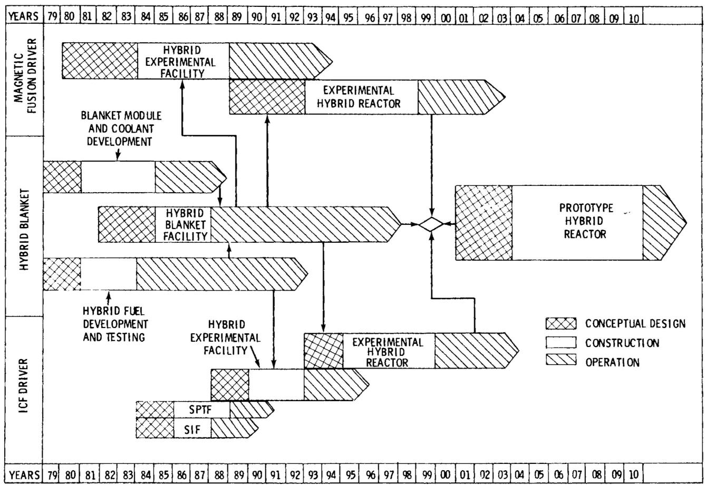  
FIGURE XIII-E-1. Hybrid Development Facilities Schedule

# a. Prototype Hybrid Reactor

The PHR will be a near or full commercial sized hybrid system with all integrated components prototypical of those to be used in commercial systems. Its driver selection (magnetic or inertial) may determine the plant size. It would demonstrate electric power and fissile fuel production in a reliable, efficient, maintainable, integrated system which is licensed and operating on a utility grid. This will require high plant efficiency and availability of a plant in the 500-1000 MWe range producing 1000-2000 kg/yr of fissile fuel. The construction and operation costs should be able to be readily extrapolated to commercial hybrid plants.

# b. Hybrid Blanket

The hybrid blanket facilities include parallel facilities to conduct blanket module coolant and fuel development and testing in thermally and mechanically simulated and fission reactor experimental environments. Such development will support the Hybrid Blanket Facility (HBF) which will have a dedicated 14 MeV neutron source of sufficient strength, fluence and target volume to perform single modular hybrid blanket experiments and testing. The HBF will be a long-term facility which together with those support facilities will qualify blanket module and fuel designs for testing in the HRE, EHR and eventually the PHR facilities.

# 2. Facilities

# a. Magnetic Fusion

The HEF would be the hybrid equivalent of the magnetic fusion ETF. This would require an appropriate minimum driver size to produce reactor grade plasmas and having a sufficient duty cycle to performing engineering tests of the various driver subsystem components including first wall, blanket and shield, superconducting magnets, heating and fueling systems. It would not have to breed tritium; however, it must be capable of performing tritium breeding experiments in appropriate blanket modules. Its hybrid engineering capabilities must facilitate the in-situ experiments of various hybrid blanket module, fuel and coolant selections as initially developed in the hybrid blanket facilities.

The EHR would be the first power and fuel producing demonstration of the hybrid system. It will have many scaled down driver components prototypical of a commercialized sized hybrid. It will be capable of producing significant power (100 to 300 MWe) and fissile fuel (100 to 1000 kg/yr) while simultaneously breeding tritium in a self-consistent fusion fuel system. This will require a fully integrated reactor system having a reasonable duty cycle and plant factor.

# b. Inertial

The Single Pulse Target Facility (SPTF) will be used for commercial pellet and limited reactor component development. It would have a powerful driver capable of producing 0.1-1.0 MJ per pulse operating in the single, discrete pulse mode for pellets having gains 10-100. The System Integration Facility (SIF) would develop and integrate high-repetition-rate subsystems for commercial reactor operation with driving pellets. It could conceivably be the initial phase of the inertial HRE with a 1 Hz, 0.1-0.2 MJ driver/targeting system with reasonable duty cycle to perform hybrid blanket modular experiments. Pellet manufacture and tritium breeding would not be required of this system although it should have the capability of performing tritium breeding modular experiments and it may require its own pellet factory.

The inertial EHR would be similar in objectives to its magnetic counterpart; however, it may be significantly smaller in power and fuel producing capability due to the modularity of inertial fusion systems.

# 3. Funding Requirements

Estimates of the total expenditures for development, design and construction of the hybrid program facilities have been made and are given in Table XIII-E-2. These estimates are based upon the normalized cost estimating procedures used in Section IX, which have been developed by PNL for OFE and OLF, as well as upon the cost estimates developed by PNL for the ICF facilities in the Engineering Development Program Plan.

One might note from these costs and the schedule of Figure XIII-E-1 that the ICF, HRE and EHR facilities require somewhat less funds for design development and construction, as well as short construction periods, than their magnetic fusion counterparts. This is principally due to the fact that ICF hybrid related and some common fusion system components will piggyback the magnetic facility development. In addition, the equivalent ICF hybrid system will generally be of smaller size than the magnetic system because of the modularity of ICF systems and their potential rep rate and target gain flexibilities. It should be noted that the cost estimates do not include the operational and testing cost associated with the development program which may require an additional $3 to $5 billion to commercialization. Also, the Federal Government funded PHR facility is significantly less expensive than the commercial hybrid systems costed in Section IX since they are unoptimized advanced developed full-scale commercial systems paid for with private capital. It is expected that an optimization of the performance and cost of these systems would implement cost reduction opportunities to achieve the same performance at a 15 to 20% cost reduction.

TABLE XIII-E-2. Hybrid Facility Cost Estimates   

<table><tr><td>Facility</td><td>Operational Date (FY)</td><td>Development, Design and Construction Costs ($M 1978)</td></tr><tr><td>Magnetic Fusion</td><td></td><td></td></tr><tr><td>HER</td><td>1989</td><td>800</td></tr><tr><td>EHR</td><td>1998</td><td>1200</td></tr><tr><td>Inertial Fusion</td><td></td><td></td></tr><tr><td>SIF</td><td>1988</td><td>100</td></tr><tr><td>SPTF</td><td>1989</td><td>500</td></tr><tr><td>HFF</td><td>1993</td><td>600</td></tr><tr><td>EHR</td><td>2000</td><td>1000</td></tr><tr><td>Blanket</td><td></td><td></td></tr><tr><td>Blanket Module and Coolant Development</td><td>1984</td><td>200</td></tr><tr><td>Hybrid Fuel Development and Testing</td><td>1983</td><td>200</td></tr><tr><td>Hybrid Blanket Facility</td><td>1988</td><td>400</td></tr><tr><td>Prototype Hybrid Reactor</td><td>2010</td><td>2000</td></tr><tr><td>Total</td><td></td><td>$7000M</td></tr></table>

F. SECTION XIII REFERENCES

1. Magnetic Fusion Programs Summary Document - FY-1980 HCP/73168-01, TRW, Inc., Redundo Beach, CA, April 1979.   
2. R. E. Aamodt, et al., Assessment of the Tokamak Confinement Data Base. EPRI ER-714 Electric Power Research Institute, Palo Alto, CA, March 1978.   
3. J. H. Nuckolls, "Inertial Confinement Fusion Targets," Inertial Confinement Fusion. Optical Society of American, page TuA-5-1, Washington, DC, 1978. p. TuA-5-1.


# APPENDIX A

# CAPITAL INVESTMENT COST ESTIMATES

Laser Inertial Confinement Hybrid Reactor Capital Costs \((\\) 10^{6})^{a}\)   

<table><tr><td colspan="2">Account Number</td><td>PU Recycle/ Once Through</td></tr><tr><td>20</td><td>LAND AND LAND RIGHTS</td><td>2.5</td></tr><tr><td>21</td><td>STRUCTURES AND SITE FACILITIES</td><td></td></tr><tr><td>21.01</td><td>Site Improvements and Facilities</td><td>15.68</td></tr><tr><td>21.02</td><td>Reactor Building</td><td>54.62</td></tr><tr><td>21.03</td><td>Turbine Building</td><td>14.85</td></tr><tr><td>21.06</td><td>Miscellaneous Buildings</td><td>63.53</td></tr><tr><td>21.98</td><td>Spare Parts Allowance (0.5%)</td><td>0.76</td></tr><tr><td>21.99</td><td>Contingency Allowance (20%)</td><td>30.24</td></tr><tr><td></td><td></td><td>182.18</td></tr><tr><td>22</td><td>REACTOR PLANT EQUIPMENT</td><td></td></tr><tr><td>22.01</td><td>Reactor Equipment</td><td>64.09</td></tr><tr><td>22.01.01</td><td>Blanket and First Wall</td><td></td></tr><tr><td>22.01.02</td><td>Shield</td><td></td></tr><tr><td>22.01.03</td><td>Magnets</td><td></td></tr><tr><td>22.01.04</td><td>Supplemental Heating</td><td></td></tr><tr><td>22.01.05</td><td>Primary Support and Structure</td><td></td></tr><tr><td>22.01.06</td><td>Reactor Vacuum Systems</td><td></td></tr><tr><td>22.01.08</td><td>Impurity Control</td><td></td></tr><tr><td>22.01.09</td><td>Direct Energy Converter</td><td></td></tr><tr><td>22.02</td><td>Main Heat Transfer and Transport Systems</td><td></td></tr><tr><td>22.02.01</td><td>Primary Coolant System</td><td>108.57</td></tr><tr><td>22.02.02</td><td>Intermediate Coolant System</td><td>101.67</td></tr><tr><td>22.03</td><td>Auxiliary Cooling Systems</td><td></td></tr><tr><td>22.04</td><td>Radioactive Waste Treatment and Disposal</td><td></td></tr><tr><td>22.05</td><td>Fuel Handling and Storage Systems</td><td>59.63</td></tr><tr><td>22.06</td><td>Other Reactor Plant Equipment</td><td>241.40</td></tr><tr><td>22.07</td><td>Instrumentation and Control</td><td>10.59</td></tr><tr><td>22.98</td><td>Spart Parts Allowance (1%)</td><td>5.86</td></tr><tr><td>22.99</td><td>Contingency Allowance (30%)</td><td>175.79</td></tr><tr><td></td><td></td><td>767.60</td></tr><tr><td>23</td><td>TURBINE PLANT EQUIPMENT</td><td></td></tr><tr><td>23.01</td><td>Turbine-Generators</td><td>86.10</td></tr><tr><td>23.02</td><td>Main Steam (or other Fluid) System</td><td>72.86</td></tr><tr><td>23.03</td><td>Heat Rejection System</td><td>18.03</td></tr><tr><td>23.06</td><td>Other Turbine Plant Equipment</td><td></td></tr><tr><td>23.98</td><td>Spare Part Allowance (1%)</td><td>1.77</td></tr><tr><td>23.99</td><td>Contingency Allowance (20%)</td><td>35.40</td></tr><tr><td></td><td></td><td>214.16</td></tr><tr><td>24</td><td>ELECTRIC PLANT EQUIPMENT</td><td>74.02</td></tr><tr><td>24.98</td><td>Spare Part Allowance (0.5%)</td><td>0.37</td></tr><tr><td>24.99</td><td>Contingency Allowance (20%)</td><td>14.80</td></tr><tr><td></td><td></td><td>89.19</td></tr><tr><td>25</td><td>MISCELLANEOUS PLANT EQUIPMENT</td><td></td></tr><tr><td>25.01</td><td>Transportation and Lifting Equipment</td><td></td></tr><tr><td>25.02</td><td>Air and Water Service</td><td></td></tr><tr><td>25.07</td><td>Other Plant Equipment</td><td></td></tr><tr><td>25.98</td><td>Spare Parts Allowance (1%)</td><td></td></tr><tr><td>25.99</td><td>Contingency Allowance (20%)</td><td></td></tr><tr><td>27</td><td>LASER SYSTEM EQUIPMENT</td><td>195.50</td></tr><tr><td></td><td>Spare Parts Allowance (1&quot;)</td><td>1.95</td></tr><tr><td></td><td>Contingency Allowance (30&quot;)</td><td>58.65</td></tr><tr><td></td><td></td><td>256.10</td></tr><tr><td></td><td>Total Direct Cost</td><td></td></tr><tr><td></td><td></td><td>1509.23</td></tr><tr><td>91</td><td>CONSTRUCTION FACILITIES, EQUIP-</td><td></td></tr><tr><td></td><td>MENT AND SERVICES (15&quot;)</td><td>226.38</td></tr><tr><td>92</td><td>ENGINEERING AND CONSTRUCTION</td><td></td></tr><tr><td></td><td>MANAGEMENT SERVICES (15&quot;)</td><td>226.38</td></tr><tr><td>93</td><td>OTHER COSTS (5&quot;)</td><td>75.46</td></tr><tr><td></td><td>Total Indirect Cost</td><td></td></tr><tr><td></td><td></td><td>525.23</td></tr><tr><td></td><td>TOTAL CAPITAL COST</td><td></td></tr></table>

Laser Inertial Confinement Hybrid Reactor Capital Costs \((\\) 10^{6})^{a}\)   

<table><tr><td colspan="2">Account Number</td><td>Th-Pu
Catalyst</td></tr><tr><td>20</td><td>LAND AND LAND RIGHTS</td><td>2.5</td></tr><tr><td>21</td><td>STRUCTURES AND SITE FACILITIES</td><td></td></tr><tr><td>21.01</td><td>Site Improvements and Facilities</td><td>23.65</td></tr><tr><td>21.02</td><td>Reactor Building</td><td>82.42</td></tr><tr><td>21.03</td><td>Turbine Building</td><td>72.41</td></tr><tr><td>21.06</td><td>Miscellaneous Buildings</td><td>95.87</td></tr><tr><td>21.98</td><td>Spare Parts Allowance (0.5%)</td><td>1.13</td></tr><tr><td>21.99</td><td>Contingency Allowance (20%)</td><td>45.37</td></tr><tr><td></td><td></td><td>273.35</td></tr><tr><td>22</td><td>REACTOR PLANT EQUIPMENT</td><td></td></tr><tr><td>22.01</td><td>Reactor Equipment</td><td>96.71</td></tr><tr><td>22.01.01</td><td>Blanket and First Wall</td><td></td></tr><tr><td>22.01.02</td><td>Shield</td><td></td></tr><tr><td>22.01.03</td><td>Magnets</td><td></td></tr><tr><td>22.01.04</td><td>Supplemental Heating</td><td></td></tr><tr><td>22.01.05</td><td>Primary Support and Structure</td><td></td></tr><tr><td>22.01.06</td><td>Reactor Vacuum Systems</td><td></td></tr><tr><td>22.01.08</td><td>Impurity Control</td><td></td></tr><tr><td>22.01.09</td><td>Direct Energy Converter</td><td></td></tr><tr><td>22.02</td><td>Main Heat Transfer and Transport Systems</td><td></td></tr><tr><td>22.02.01</td><td>Primary Coolant System</td><td>163.84</td></tr><tr><td>22.02.02</td><td>Intermediate Coolant System</td><td>152.44</td></tr><tr><td>22.03</td><td>Auxiliary Cooling Systems</td><td></td></tr><tr><td>22.04</td><td>Radioactive Waste Treatment and Disposal</td><td></td></tr><tr><td>22.05</td><td>Fuel Handling and Storage Systems</td><td></td></tr><tr><td>22.06</td><td>Other Reactor Plant Equipment</td><td>364.29</td></tr><tr><td>22.07</td><td>Instrumentation and Control</td><td>15.00</td></tr><tr><td>22.98</td><td>Spart Parts Allowance (1%)</td><td>7.93</td></tr><tr><td>22.99</td><td>Contingency Allowance (30%)</td><td>237.98</td></tr><tr><td></td><td></td><td>1030.18</td></tr><tr><td>23</td><td>TURBINE PLANT EQUIPMENT</td><td></td></tr><tr><td>23.01</td><td>Turbine-Generators</td><td>143.54</td></tr><tr><td>23.02</td><td>Main Steam (or other Fluid) System</td><td>109.96</td></tr><tr><td>23.03</td><td>Heat Rejection System</td><td>26.52</td></tr><tr><td>23.06</td><td>Other Turbine Plant Equipment</td><td></td></tr><tr><td>23.98</td><td>Spare Part Allowance (1%)</td><td>2.80</td></tr><tr><td>23.99</td><td>Contingency Allowance (20%)</td><td>56.00</td></tr><tr><td></td><td></td><td>338.83</td></tr><tr><td>24</td><td>ELECTRIC PLANT EQUIPMENT</td><td>123.39</td></tr><tr><td>24.98</td><td>Spare Part Allowance (0.5%)</td><td>.62</td></tr><tr><td>24.99</td><td>Contingency Allowance (20%)</td><td>24.68</td></tr><tr><td></td><td></td><td>148.59</td></tr><tr><td>25</td><td>MISCELLANEOUS PLANT EQUIPMENT</td><td></td></tr><tr><td>25.01</td><td>Transportation and Lifting Equipment</td><td></td></tr><tr><td>25.02</td><td>Air and Water Service</td><td></td></tr><tr><td>25.07</td><td>Other Plant Equipment</td><td></td></tr><tr><td>25.98</td><td>Spare Parts Allowance (1%)</td><td></td></tr><tr><td>25.99</td><td>Contingency Allowance (20%)</td><td></td></tr><tr><td>27</td><td>LASER SYSTEM EQUIPMENT</td><td>195.50</td></tr><tr><td></td><td>Spare Parts Allowance (1%)</td><td>1.95</td></tr><tr><td></td><td>Contingency Allowance (30%)</td><td>58.65</td></tr><tr><td></td><td></td><td>256.10</td></tr><tr><td></td><td>Total Direct Cost</td><td></td></tr><tr><td></td><td></td><td></td></tr><tr><td>91</td><td>CONSTRUCTION FACILITIES, EQUIP-
MENT AND SERVICES (15%)</td><td>308.42</td></tr><tr><td>92</td><td>ENGINEERING AND CONSTRUCTION
MANAGEMENT SERVICES (15%)</td><td>308.42</td></tr><tr><td>93</td><td>OTHER COSTS (5%)</td><td>102.81</td></tr><tr><td></td><td>Total Indirect Cost</td><td></td></tr><tr><td></td><td>TOTAL CAPITAL COST</td><td></td></tr></table>

(a) June 1978 dollars

Laser Inertial Confinement Hybrid Reactor Capital Costs \((\\) 10^{6})^{a}\)   

<table><tr><td>Account Number</td><td></td><td>Refresh Cycle</td></tr><tr><td>20</td><td>LAND AND LAND RIGHTS</td><td>2.5</td></tr><tr><td>21</td><td>STRUCTURES AND SITE FACILITIES</td><td></td></tr><tr><td>21.01</td><td>Site Improvements and Facilities</td><td>14.32</td></tr><tr><td>21.02</td><td>Reactor Building</td><td>49.90</td></tr><tr><td>21.03</td><td>Turbine Building</td><td>13.57</td></tr><tr><td>21.06</td><td>Miscellaneous Buildings</td><td>58.04</td></tr><tr><td>21.98</td><td>Spare Parts Allowance (0.5%)</td><td>0.69</td></tr><tr><td>21.99</td><td>Contingency Allowance (20%)</td><td>27.67</td></tr><tr><td></td><td></td><td>166.68</td></tr><tr><td>22</td><td>REACTOR PLANT EQUIPMENT</td><td></td></tr><tr><td>22.01</td><td>Reactor Equipment</td><td>58.55</td></tr><tr><td>22.01.01</td><td>Blanket and First Wall</td><td></td></tr><tr><td>22.01.02</td><td>Shield</td><td></td></tr><tr><td>22.01.03</td><td>Magnets</td><td></td></tr><tr><td>22.01.04</td><td>Supplemental Heating</td><td></td></tr><tr><td>22.01.05</td><td>Primary Support and Structure</td><td></td></tr><tr><td>22.01.06</td><td>Reactor Vacuum Systems</td><td></td></tr><tr><td>22.01.08</td><td>Impurity Control</td><td></td></tr><tr><td>22.01.09</td><td>Direct Energy Converter</td><td></td></tr><tr><td>22.02</td><td>Main Heat Transfer and Transport Systems</td><td></td></tr><tr><td>22.02.01</td><td>Primary Coolant System</td><td>99.19</td></tr><tr><td>22.02.02</td><td>Intermediate Coolant System</td><td>92.89</td></tr><tr><td>22.03</td><td>Auxiliary Cooling Systems</td><td></td></tr><tr><td>22.04</td><td>Radioactive Waste Treatment and Disposal</td><td></td></tr><tr><td>22.05</td><td>Fuel Handling and Storage Systems</td><td></td></tr><tr><td>22.06</td><td>Other Reactor Plant Equipment</td><td>220.55</td></tr><tr><td>22.07</td><td>Instrumentation and Control</td><td>9.68</td></tr><tr><td>22.98</td><td>Spart Parts Allowance (1%)</td><td>4.81</td></tr><tr><td>22.99</td><td>Contingency Allowance (30%)</td><td>144.26</td></tr><tr><td></td><td></td><td>629.93</td></tr><tr><td>23</td><td>TURBINE PLANT EQUIPMENT</td><td></td></tr><tr><td>23.01</td><td>Turbine-Generators</td><td>76.03</td></tr><tr><td>23.02</td><td>Main Steam (or other Fluid) System</td><td>66.57</td></tr><tr><td>23.03</td><td>Heat Rejection System</td><td>16.64</td></tr><tr><td>23.06</td><td>Other Turbine Plant Equipment</td><td></td></tr><tr><td>23.98</td><td>Spare Part Allowance (1%)</td><td>1.59</td></tr><tr><td>23.99</td><td>Contingency Allowance (20%)</td><td>31.85</td></tr><tr><td></td><td></td><td>192.68</td></tr><tr><td>24</td><td>ELECTRIC PLANT EQUIPMENT</td><td>65.35</td></tr><tr><td>24.98</td><td>Spare Part Allowance (0.5%)</td><td>0.33</td></tr><tr><td>24.99</td><td>Contingency Allowance (20%)</td><td>13.07</td></tr><tr><td></td><td></td><td>78.75</td></tr><tr><td>25</td><td>MISCELLANEOUS PLANT EQUIPMENT</td><td></td></tr><tr><td>25.01</td><td>Transportation and Lifting Equipment</td><td></td></tr><tr><td>25.02</td><td>Air and Water Service</td><td></td></tr><tr><td>25.07</td><td>Other Plant Equipment</td><td></td></tr><tr><td>25.98</td><td>Spare Parts Allowance (1%)</td><td></td></tr><tr><td>25.99</td><td>Contingency Allowance (20%)</td><td></td></tr><tr><td>27</td><td>LASER SYSTEM EQUIPMENT</td><td>195.50</td></tr><tr><td></td><td>Spare Parts Allowance (1%)</td><td>1.95</td></tr><tr><td></td><td>Contingency Allowance (30%)</td><td>58.65</td></tr><tr><td></td><td></td><td>256.10</td></tr><tr><td></td><td>Total Direct Cost</td><td></td></tr><tr><td></td><td></td><td></td></tr><tr><td>91</td><td>CONSTRUCTION FACILITIES, EQUIP-MENT AND SERVICES (15%)</td><td>182.40</td></tr><tr><td>92</td><td>ENGINEERING AND CONSTRUCTION MANAGEMENT SERVICES (15%)</td><td>182.40</td></tr><tr><td>73</td><td>OTHER COSTS (5%)</td><td>60.80</td></tr><tr><td></td><td>Total Indirect Cost</td><td></td></tr><tr><td></td><td></td><td></td></tr><tr><td></td><td>TOTAL CAPITAL COST</td><td></td></tr></table>

(a) June 1978 dollars

Classical Mirror Hybrid Reactor Capital Costs \((\\) 10^{6})^{a}\)   

<table><tr><td colspan="2">Account Number</td><td>PU Recycle/ Once Through</td></tr><tr><td>20</td><td>LAND AND LAND RIGHTS</td><td>2.5</td></tr><tr><td>21</td><td>STRUCTURES AND SITE FACILITIES</td><td></td></tr><tr><td>21.01</td><td>Site Improvements and Facilities</td><td>3.66</td></tr><tr><td>21.02</td><td>Reactor Building</td><td>23.46</td></tr><tr><td>21.03</td><td>Turbine Building</td><td>11.60</td></tr><tr><td>21.06</td><td>Miscellaneous Buildings</td><td>18.17</td></tr><tr><td>21.98</td><td>Spare Parts Allowance (0.5%)</td><td>0.30</td></tr><tr><td>21.99</td><td>Contingency Allowance (20%)</td><td>11.88</td></tr><tr><td></td><td></td><td>71.57</td></tr><tr><td>22</td><td>REACTOR PLANT EQUIPMENT</td><td></td></tr><tr><td>22.01</td><td>Reactor Equipment</td><td></td></tr><tr><td>22.01.01</td><td>Blanket and First Wall</td><td>64.55</td></tr><tr><td>22.01.02</td><td>Shield</td><td>19.89</td></tr><tr><td>22.01.03</td><td>Magnets</td><td>119.38</td></tr><tr><td>22.01.04</td><td>Supplemental Heating</td><td>142.22</td></tr><tr><td>22.01.05</td><td>Primary Support and Structure</td><td>263.38</td></tr><tr><td>22.01.06</td><td>Reactor Vacuum Systems</td><td>253.81</td></tr><tr><td>22.01.08</td><td>Impurity Control</td><td></td></tr><tr><td>22.01.09</td><td>Direct Energy Converter</td><td>67.30</td></tr><tr><td>22.02</td><td>Main Heat Transfer and Transport Systems</td><td></td></tr><tr><td>22.02.01</td><td>Primary Coolant System</td><td>77.34</td></tr><tr><td>22.02.02</td><td>Intermediate Coolant System</td><td>64.45</td></tr><tr><td>22.03</td><td>Auxiliary Cooling Systems</td><td>53.73</td></tr><tr><td>22.04</td><td>Radioactive Waste Treatment and Disposal</td><td></td></tr><tr><td>22.05</td><td>Fuel Handling and Storage Systems</td><td>46.38</td></tr><tr><td>22.06</td><td>Other Reactor Plant Equipment</td><td></td></tr><tr><td>22.07</td><td>Instrumentation and Control</td><td>8.28</td></tr><tr><td>22.98</td><td>Spart Parts Allowance (1%)</td><td>11.80</td></tr><tr><td>22.99</td><td>Contingency Allowance (30%)</td><td>354.21</td></tr><tr><td></td><td></td><td>1546.72</td></tr><tr><td>23</td><td>TURBINE PLANT EQUIPMENT</td><td></td></tr><tr><td>23.01</td><td>Turbine-Generators</td><td>14.04</td></tr><tr><td>23.02</td><td>Main Steam (or other Fluid) System</td><td>93.74</td></tr><tr><td>23.03</td><td>Heat Rejection System</td><td>26.94</td></tr><tr><td>23.06</td><td>Other Turbine Plant Equipment</td><td>56.59</td></tr><tr><td>23.98</td><td>Spare Part Allowance (1%)</td><td>1.91</td></tr><tr><td>23.99</td><td>Contingency Allowance (20%)</td><td>38.26</td></tr><tr><td></td><td></td><td>231.48</td></tr><tr><td>24</td><td>ELECTRIC PLANT EQUIPMENT</td><td>24.52</td></tr><tr><td>24.98</td><td>Spare Part Allowance (0.5%)</td><td>0.12</td></tr><tr><td>24.99</td><td>Contingency Allowance (20%)</td><td>4.90</td></tr><tr><td></td><td></td><td>29.54</td></tr><tr><td>25</td><td>MISCELLANEOUS PLANT EQUIPMENT</td><td></td></tr><tr><td>25.01</td><td>Transportation and Lifting Equipment</td><td>1.42</td></tr><tr><td>25.02</td><td>Air and Water Service</td><td>4.23</td></tr><tr><td>25.07</td><td>Other Plant Equipment</td><td>14.62</td></tr><tr><td>25.98</td><td>Spare Parts Allowance (1%)</td><td>0.20</td></tr><tr><td>25.99</td><td>Contingency Allowance (20%)</td><td>4.05</td></tr><tr><td></td><td></td><td>24.52</td></tr><tr><td></td><td>Total Direct Cost</td><td></td></tr><tr><td></td><td></td><td></td></tr><tr><td>91</td><td>CONSTRUCTION FACILITIES, EQUIP-MENT AND SERVICES (15%)</td><td>285.57</td></tr><tr><td>92</td><td>ENGINEERING AND CONSTRUCTIONMANAGEMENT SERVICES (15%)</td><td>285.57</td></tr><tr><td>93</td><td>OTHER COSTS (5%)</td><td>95.19</td></tr><tr><td></td><td>Total Indirect Cost</td><td></td></tr><tr><td></td><td></td><td></td></tr><tr><td></td><td>TOTAL CAPITAL COST</td><td></td></tr></table>

(a) June 1978 dollars

Classical Mirror Hybrid Reactor Capital Costs \((\\) 10^{6})^{a}\)   

<table><tr><td colspan="2">Account Number</td><td>Th-Pu Catalyst</td></tr><tr><td>20</td><td>LAND AND LAND RIGHTS</td><td>2.5</td></tr><tr><td>21</td><td>STRUCTURES AND SITE FACILITIES</td><td></td></tr><tr><td>21.01</td><td>Site Improvements and Facilities</td><td>5.12</td></tr><tr><td>21.02</td><td>Reactor Building</td><td>32.79</td></tr><tr><td>21.03</td><td>Turbine Building</td><td>16.21</td></tr><tr><td>21.06</td><td>Miscellaneous Buildings</td><td>25.51</td></tr><tr><td>21.98</td><td>Spare Parts Allowance (0.5%)</td><td>0.41</td></tr><tr><td>21.99</td><td>Contingency Allowance (20%)</td><td>16.43</td></tr><tr><td></td><td></td><td>98.97</td></tr><tr><td>22</td><td>REACTOR PLANT EQUIPMENT</td><td></td></tr><tr><td>22.01</td><td>Reactor Equipment</td><td></td></tr><tr><td>22.01.01</td><td>Blanket and First Wall</td><td>64.55</td></tr><tr><td>22.01.02</td><td>Shield</td><td>19.89</td></tr><tr><td>22.01.03</td><td>Magnets</td><td>119.38</td></tr><tr><td>22.01.04</td><td>Supplemental Heating</td><td>142.22</td></tr><tr><td>22.01.05</td><td>Primary Support and Structure</td><td>263.38</td></tr><tr><td>22.01.06</td><td>Reactor Vacuum Systems</td><td>253.81</td></tr><tr><td>22.01.08</td><td>Impurity Control</td><td></td></tr><tr><td>22.01.09</td><td>Direct Energy Converter</td><td>67.30</td></tr><tr><td>22.02</td><td>Main Heat Transfer and Transport Systems</td><td></td></tr><tr><td>22.02.01</td><td>Primary Coolant System</td><td>108.09</td></tr><tr><td>22.02.02</td><td>Intermediate Coolant System</td><td>90.08</td></tr><tr><td>22.03</td><td>Auxiliary Cooling Systems</td><td>75.09</td></tr><tr><td>22.04</td><td>Radioactive Waste Treatment and Disposal</td><td></td></tr><tr><td>22.05</td><td>Fuel Handling and Storage Systems</td><td>64.82</td></tr><tr><td>22.06</td><td>Other Reactor Plant Equipment</td><td></td></tr><tr><td>22.07</td><td>Instrumentation and Control</td><td>11.57</td></tr><tr><td>22.98</td><td>Spart Parts Allowance (1%)</td><td>12.80</td></tr><tr><td>22.99</td><td>Contingency Allowance (30%)</td><td>384.05</td></tr><tr><td></td><td></td><td>1677.03</td></tr><tr><td>23</td><td>TURBINE PLANT EQUIPMENT</td><td></td></tr><tr><td>23.01</td><td>Turbine-Generators</td><td>54.93</td></tr><tr><td>23.02</td><td>Main Steam (or other Fluid) System</td><td>131.01</td></tr><tr><td>23.03</td><td>Heat Rejection System</td><td>34.05</td></tr><tr><td>23.06</td><td>Other Turbine Plant Equipment</td><td>79.09</td></tr><tr><td>23.98</td><td>Spare Part Allowance (1%)</td><td>2.99</td></tr><tr><td>23.99</td><td>Contingency Allowance (20%)</td><td>59.82</td></tr><tr><td></td><td></td><td>361.88</td></tr><tr><td>24</td><td>ELECTRIC PLANT EQUIPMENT</td><td>34.26</td></tr><tr><td>24.98</td><td>Spare Part Allowance (0.5%)</td><td>0.17</td></tr><tr><td>24.99</td><td>Contingency Allowance (20%)</td><td>6.85</td></tr><tr><td></td><td></td><td>41.29</td></tr><tr><td>25</td><td>MISCELLANEOUS PLANT EQUIPMENT</td><td></td></tr><tr><td>25.01</td><td>Transportation and Lifting Equipment</td><td>1.98</td></tr><tr><td>25.02</td><td>Air and Water Service</td><td>5.91</td></tr><tr><td>25.07</td><td>Other Plant Equipment</td><td>20.43</td></tr><tr><td>25.98</td><td>Spare Parts Allowance (1%)</td><td>2.83</td></tr><tr><td>25.99</td><td>Contingency Allowance (20%)</td><td>5.66</td></tr><tr><td></td><td></td><td>36.81</td></tr><tr><td></td><td>Total Direct Cost</td><td></td></tr><tr><td>91</td><td>CONSTRUCTION FACILITIES, EQUIP-MENT AND SERVICES (15%)</td><td>332.40</td></tr><tr><td>92</td><td>ENGINEERING AND CONSTRUCTIONMANAGEMENT SERVICES (15%)</td><td>332.40</td></tr><tr><td>93</td><td>OTHER COSTS (5%)</td><td>110.80</td></tr><tr><td></td><td>Total Indirect Cost</td><td></td></tr><tr><td></td><td>TOTAL CAPITAL COST</td><td></td></tr></table>

Classical Mirror Hybrid Reactor Capital Costs \((\\) 10^{6})^{a}\)   

<table><tr><td colspan="2">Account Number</td><td>Refresh Cycle</td><td></td></tr><tr><td>20</td><td>LAND AND LAND RIGHTS</td><td>2.5</td><td></td></tr><tr><td>21</td><td>STRUCTURES AND SITE FACILITIES</td><td></td><td></td></tr><tr><td>21.01</td><td>Site Improvements and Facilities</td><td>3.41</td><td></td></tr><tr><td>21.02</td><td>Reactor Building</td><td>21.88</td><td></td></tr><tr><td>21.03</td><td>Turbine Building</td><td>10.82</td><td></td></tr><tr><td>21.06</td><td>Miscellaneous Buildings</td><td>17.02</td><td></td></tr><tr><td>21.98</td><td>Spare Parts Allowance (0.5%)</td><td>0.28</td><td></td></tr><tr><td>21.99</td><td>Contingency Allowance (20%)</td><td>11.13</td><td></td></tr><tr><td></td><td></td><td>67.03</td><td></td></tr><tr><td>22</td><td>REACTOR PLANT EQUIPMENT</td><td></td><td></td></tr><tr><td>22.01</td><td>Reactor Equipment</td><td></td><td></td></tr><tr><td>22.01.01</td><td>Blanket and First Wall</td><td>64.55</td><td></td></tr><tr><td>22.01.02</td><td>Shield</td><td>19.89</td><td></td></tr><tr><td>22.01.03</td><td>Magnets</td><td>119.38</td><td></td></tr><tr><td>22.01.04</td><td>Supplemental Heating</td><td>142.22</td><td></td></tr><tr><td>22.01.05</td><td>Primary Support and Structure</td><td>263.38</td><td></td></tr><tr><td>22.01.06</td><td>Reactor Vacuum Systems</td><td>253.81</td><td></td></tr><tr><td>22.01.08</td><td>Impurity Control</td><td></td><td></td></tr><tr><td>22.01.09</td><td>Direct Energy Converter</td><td>67.30</td><td></td></tr><tr><td>22.02</td><td>Main Heat Transfer and Transport Systems</td><td></td><td></td></tr><tr><td>22.02.01</td><td>Primary Coolant System</td><td>72.12</td><td></td></tr><tr><td>22.02.02</td><td>Intermediate Coolant System</td><td>60.10</td><td></td></tr><tr><td>22.03</td><td>Auxiliary Cooling Systems</td><td>50.10</td><td></td></tr><tr><td>22.04</td><td>Radioactive Waste Treatment and Disposal</td><td></td><td></td></tr><tr><td>22.05</td><td>Fuel Handling and Storage Systems</td><td>43.25</td><td></td></tr><tr><td>22.06</td><td>Other Reactor Plant Equipment</td><td></td><td></td></tr><tr><td>22.07</td><td>Instrumentation and Control</td><td>7.72</td><td></td></tr><tr><td>22.98</td><td>Spart Parts Allowance (1%)</td><td>11.64</td><td></td></tr><tr><td>22.99</td><td>Contingency Allowance (30%)</td><td>349.15</td><td></td></tr><tr><td></td><td></td><td>1520.69</td><td></td></tr><tr><td>23</td><td>TURBINE PLANT EQUIPMENT</td><td></td><td></td></tr><tr><td>23.01</td><td>Turbine-Generators</td><td>7.17</td><td></td></tr><tr><td>23.02</td><td>Main Steam (or other Fluid) System</td><td>87.41</td><td></td></tr><tr><td>23.03</td><td>Heat Rejection System</td><td>25.85</td><td></td></tr><tr><td>23.06</td><td>Other Turbine Plant Equipment</td><td>52.77</td><td></td></tr><tr><td>23.98</td><td>Spare Part Allowance (1%)</td><td>1.73</td><td></td></tr><tr><td>23.99</td><td>Contingency Allowance (20%)</td><td>34.64</td><td></td></tr><tr><td></td><td></td><td>209.57</td><td></td></tr><tr><td>24</td><td>ELECTRIC PLANT EQUIPMENT</td><td>22.86</td><td></td></tr><tr><td>24.98</td><td>Spare Part Allowance (0.5%)</td><td>0.11</td><td></td></tr><tr><td>24.99</td><td>Contingency Allowance (20%)</td><td>4.57</td><td></td></tr><tr><td></td><td></td><td>27.55</td><td></td></tr><tr><td>25</td><td>MISCELLANEOUS PLANT EQUIPMENT</td><td></td><td></td></tr><tr><td>25.01</td><td>Transportation and Lifting Equipment</td><td>1.32</td><td></td></tr><tr><td>25.02</td><td>Air and Water Service</td><td>3.94</td><td></td></tr><tr><td>25.07</td><td>Other Plant Equipment</td><td>13.63</td><td></td></tr><tr><td>25.98</td><td>Spare Parts Allowance (1%)</td><td>1.89</td><td></td></tr><tr><td>25.99</td><td>Contingency Allowance (20%)</td><td>3.78</td><td></td></tr><tr><td></td><td></td><td>24.56</td><td></td></tr><tr><td></td><td>Total Direct Cost</td><td></td><td>1849.40</td></tr><tr><td>91</td><td>CONSTRUCTION FACILITIES, EQUIP-MENT AND SERVICES (15%)</td><td>277.41</td><td></td></tr><tr><td>92</td><td>ENGINEERING AND CONSTRUCTION</td><td></td><td></td></tr><tr><td></td><td>MANAGEMENT SERVICES (15%)</td><td>277.41</td><td></td></tr><tr><td>93</td><td>OTHER COSTS (5%)</td><td>92.47</td><td></td></tr><tr><td></td><td>Total Indirect Cost</td><td></td><td>647.29</td></tr><tr><td></td><td>TOTAL CAPITAL COST</td><td></td><td>2496.69</td></tr></table>

(a) June 1978 dollars

Linear Theta Pinch Hybrid Reactor Capital Costs \((\\) 10^{6})^{a}\)   

<table><tr><td colspan="2">Blanket
Type
Account Number</td><td>Pu Recycle/
Once Through</td></tr><tr><td>20</td><td>LAND AND LAND RIGHTS</td><td>2.5</td></tr><tr><td>21</td><td>STRUCTURES AND SITE FACILITIES</td><td></td></tr><tr><td>21.01</td><td>Site Improvements and Facilities</td><td>4.84</td></tr><tr><td>21.02</td><td>Reactor Building</td><td>96.80</td></tr><tr><td>21.03</td><td>Turbine Building</td><td>21.78</td></tr><tr><td>21.06</td><td>Miscellaneous Buildings</td><td>67.28</td></tr><tr><td>21.98</td><td>Spare Parts Allowance (0.5%)</td><td>0.95</td></tr><tr><td>21.99</td><td>Contingency Allowance (20%)</td><td>38.14</td></tr><tr><td></td><td></td><td>229.79</td></tr><tr><td>22</td><td>REACTOR PLANT EQUIPMENT</td><td></td></tr><tr><td>22.01</td><td>Reactor Equipment</td><td></td></tr><tr><td>22.01.01</td><td>Blanket and First Wall</td><td>34.08</td></tr><tr><td>22.01.02</td><td>Shield</td><td>5.55</td></tr><tr><td>22.01.03</td><td>Magnets</td><td>70.42</td></tr><tr><td>22.01.04</td><td>Supplemental Heating</td><td></td></tr><tr><td>22.01.05</td><td>Primary Support and Structure</td><td>60.87</td></tr><tr><td>22.01.06</td><td>Reactor Vacuum Systems</td><td></td></tr><tr><td>22.01.08</td><td>Impurity Control</td><td></td></tr><tr><td>22.01.09</td><td>Direct Energy Converter</td><td></td></tr><tr><td>22.02</td><td>Main Heat Transfer and Transport Systems</td><td>249.82</td></tr><tr><td>22.02.01</td><td>Primary Coolant System</td><td></td></tr><tr><td>22.02.02</td><td>Intermediate Coolant System</td><td></td></tr><tr><td>22.03</td><td>Auxiliary Cooling Systems</td><td></td></tr><tr><td>22.04</td><td>Radioactive Waste Treatment and Disposal</td><td></td></tr><tr><td>22.05</td><td>Fuel Handling and Storage Systems</td><td>51.00</td></tr><tr><td>22.06</td><td>Other Reactor Plant Equipment</td><td>332.59</td></tr><tr><td>22.07</td><td>Instrumentation and Control</td><td>15.52</td></tr><tr><td>22.98</td><td>Spart Parts Allowance (1%)</td><td>8.19</td></tr><tr><td>22.99</td><td>Contingency Allowance (30%)</td><td>245.96</td></tr><tr><td></td><td></td><td>1074.00</td></tr><tr><td>23</td><td>TURBINE PLANT EQUIPMENT</td><td></td></tr><tr><td>23.01</td><td>Turbine-Generators</td><td>84.52</td></tr><tr><td>23.02</td><td>Main Steam (or other Fluid) System</td><td>175.80</td></tr><tr><td>23.03</td><td>Heat Rejection System</td><td>41.98</td></tr><tr><td>23.06</td><td>Other Turbine Plant Equipment</td><td>106.12</td></tr><tr><td>23.98</td><td>Spare Part Allowance (1%)</td><td>4.08</td></tr><tr><td>23.99</td><td>Contingency Allowance (20%)</td><td>81.68</td></tr><tr><td></td><td></td><td>494.19</td></tr><tr><td>24</td><td>ELECTRIC PLANT EQUIPMENT</td><td></td></tr><tr><td>24.98</td><td>Spare Part Allowance (0.5%)</td><td>45.98</td></tr><tr><td>24.99</td><td>Contingency Allowance (20%)</td><td>0.23</td></tr><tr><td></td><td></td><td>9.19</td></tr><tr><td>25</td><td>MISCELLANEOUS PLANT EQUIPMENT</td><td>55.40</td></tr><tr><td></td><td></td><td>38.00</td></tr><tr><td>25.01</td><td>Transportation and Lifting Equipment</td><td></td></tr><tr><td>25.02</td><td>Air and Water Service</td><td></td></tr><tr><td>25.07</td><td>Other Plant Equipment</td><td></td></tr><tr><td>25.98</td><td>Spare Parts Allowance (1%)</td><td>0.38</td></tr><tr><td>25.99</td><td>Contingency Allowance (20%)</td><td>7.60</td></tr><tr><td></td><td></td><td>45.98</td></tr><tr><td></td><td>Total Direct Cost</td><td></td></tr><tr><td></td><td></td><td></td></tr><tr><td>91</td><td>CONSTRUCTION FACILITIES, EQUIP-
MENT AND SERVICES (15%)</td><td>285.28</td></tr><tr><td>92</td><td>ENGINEERING AND CONSTRUCTION
MANAGEMENT SERVICES (15%)</td><td>285.28</td></tr><tr><td>93</td><td>OTHER COSTS (5%)</td><td>95.09</td></tr><tr><td></td><td>Total Indirect Cost</td><td></td></tr><tr><td></td><td></td><td></td></tr><tr><td></td><td>TOTAL CAPITAL COST</td><td></td></tr></table>

(a) June 1978 dollars

Linear Theta Pinch Hybrid Reactor Capital Costs \((\\) 10^{6})^{a}\)   

<table><tr><td colspan="2">Blanket
Type</td><td>Th-Pu
Catalyst</td></tr><tr><td colspan="2">Account Number</td><td></td></tr><tr><td>20</td><td>LAND AND LAND RIGHTS</td><td>2.5</td></tr><tr><td>21</td><td>STRUCTURES AND SITE FACILITIES</td><td></td></tr><tr><td>21.01</td><td>Site Improvements and Facilities</td><td>8.19</td></tr><tr><td>21.02</td><td>Reactor Building</td><td>163.80</td></tr><tr><td>21.03</td><td>Turbine Building</td><td>36.88</td></tr><tr><td>21.06</td><td>Miscellaneous Buildings</td><td>113.93</td></tr><tr><td>21.98</td><td>Spare Parts Allowance (0.5%)</td><td>1.61</td></tr><tr><td>21.99</td><td>Contingency Allowance (20%)</td><td>64.56</td></tr><tr><td></td><td></td><td>389.00</td></tr><tr><td>22</td><td>REACTOR PLANT EQUIPMENT</td><td></td></tr><tr><td>22.01</td><td>Reactor Equipment</td><td>34.08</td></tr><tr><td>22.01.01</td><td>Blanket and First Wall</td><td>5.55</td></tr><tr><td>22.01.02</td><td>Shield</td><td>70.42</td></tr><tr><td>22.01.03</td><td>Magnets</td><td></td></tr><tr><td>22.01.04</td><td>Supplemental Heating</td><td></td></tr><tr><td>22.01.05</td><td>Primary Support and Structure</td><td>60.87</td></tr><tr><td>22.01.06</td><td>Reactor Vacuum Systems</td><td></td></tr><tr><td>22.01.08</td><td>Impurity Control</td><td></td></tr><tr><td>22.01.09</td><td>Direct Energy Converter</td><td></td></tr><tr><td>22.02</td><td>Main Heat Transfer and Transport Systems</td><td>249.82</td></tr><tr><td>22.02.01</td><td>Primary Coolant System</td><td></td></tr><tr><td>22.02.02</td><td>Intermediate Coolant System</td><td></td></tr><tr><td>22.03</td><td>Auxiliary Cooling Systems</td><td></td></tr><tr><td>22.04</td><td>Radioactive Waste Treatment and Disposal</td><td></td></tr><tr><td>22.05</td><td>Fuel Handling and Storage Systems</td><td>86.47</td></tr><tr><td>22.06</td><td>Other Reactor Plant Equipment</td><td>563.87</td></tr><tr><td>22.07</td><td>Instrumentation and Control</td><td>26.31</td></tr><tr><td>22.98</td><td>Spart Parts Allowance (1%)</td><td>10.97</td></tr><tr><td>22.99</td><td>Contingency Allowance (30%)</td><td>329.22</td></tr><tr><td></td><td></td><td>1437.58</td></tr><tr><td>23</td><td>TURBINE PLANT EQUIPMENT</td><td></td></tr><tr><td>23.01</td><td>Turbine-Generators</td><td>143.31</td></tr><tr><td>23.02</td><td>Main Steam (or other Fluid) System</td><td>298.04</td></tr><tr><td>23.03</td><td>Heat Rejection System</td><td>49.73</td></tr><tr><td>23.06</td><td>Other Turbine Plant Equipment</td><td>179.92</td></tr><tr><td>23.98</td><td>Spare Part Allowance (1%)</td><td>6.71</td></tr><tr><td>23.99</td><td>Contingency Allowance (20%)</td><td>134.20</td></tr><tr><td></td><td></td><td>811.91</td></tr><tr><td>24</td><td>ELECTRIC PLANT EQUIPMENT</td><td>77.95</td></tr><tr><td>24.98</td><td>Spare Part Allowance (0.5%)</td><td>0.39</td></tr><tr><td>24.99</td><td>Contingency Allowance (20%)</td><td>15.59</td></tr><tr><td></td><td></td><td>93.93</td></tr><tr><td>25</td><td>MISCELLANEOUS PLANT EQUIPMENT</td><td>64.42</td></tr><tr><td>25.01</td><td>Transportation and Lifting Equipment</td><td></td></tr><tr><td>25.02</td><td>Air and Water Service</td><td></td></tr><tr><td>25.07</td><td>Other Plant Equipment</td><td></td></tr><tr><td>25.98</td><td>Spare Parts Allowance (1%)</td><td>0.64</td></tr><tr><td>25.99</td><td>Contingency Allowance (20%)</td><td>12.88</td></tr><tr><td></td><td></td><td>77.95</td></tr><tr><td></td><td>Total Direct Cost</td><td></td></tr><tr><td>91</td><td>CONSTRUCTION FACILITIES, EQUIP-MENT AND SERVICES (15%)</td><td>421.93</td></tr><tr><td>92</td><td>ENGINEERING AND CONSTRUCTION
MANAGEMENT SERVICES (15%)</td><td>421.93</td></tr><tr><td>93</td><td>OTHER COSTS (5%)</td><td>140.64</td></tr><tr><td></td><td>Total Indirect Cost</td><td></td></tr><tr><td></td><td>TOTAL CAPITAL COST</td><td></td></tr></table>

(a) June 1978 dollars

Linear Theta Pinch Hybrid Reactor Capital Costs \((\\) 10^{6})^{a}\)   

<table><tr><td colspan="2">Blanket
Type</td><td>Refresh
Cycle</td></tr><tr><td colspan="2">Account Number</td><td></td></tr><tr><td>20</td><td>LAND AND LAND RIGHTS</td><td>2.5</td></tr><tr><td>21</td><td>STRUCTURES AND SITE FACILITIES</td><td></td></tr><tr><td>21.01</td><td>Site Improvements and Facilities</td><td>4.34</td></tr><tr><td>21.02</td><td>Reactor Building</td><td>86.80</td></tr><tr><td>21.03</td><td>Turbine Building</td><td>19.54</td></tr><tr><td>21.06</td><td>Miscellaneous Buildings</td><td>60.37</td></tr><tr><td>21.98</td><td>Spare Parts Allowance (0.5%)</td><td>0.86</td></tr><tr><td>21.99</td><td>Contingency Allowance (20%)</td><td>34.21</td></tr><tr><td></td><td></td><td>206.12</td></tr><tr><td>22</td><td>REACTOR PLANT EQUIPMENT</td><td></td></tr><tr><td>22.01</td><td>Reactor Equipment</td><td></td></tr><tr><td>22.01.01</td><td>Blanket and First Wall</td><td>34.17</td></tr><tr><td>22.01.02</td><td>Shield</td><td>5.57</td></tr><tr><td>22.01.03</td><td>Magnets</td><td>70.61</td></tr><tr><td>22.01.04</td><td>Supplemental Heating</td><td></td></tr><tr><td>22.01.05</td><td>Primary Support and Structure</td><td>61.04</td></tr><tr><td>22.01.06</td><td>Reactor Vacuum Systems</td><td></td></tr><tr><td>22.01.08</td><td>Impurity Control</td><td></td></tr><tr><td>22.01.09</td><td>Direct Energy Converter</td><td></td></tr><tr><td>22.02</td><td>Main Heat Transfer and Transport Systems</td><td>250.51</td></tr><tr><td>22.02.01</td><td>Primary Coolant System</td><td></td></tr><tr><td>22.02.02</td><td>Intermediate Coolant System</td><td></td></tr><tr><td>22.03</td><td>Auxiliary Cooling Systems</td><td></td></tr><tr><td>22.04</td><td>Radioactive Waste Treatment and Disposal</td><td></td></tr><tr><td>22.05</td><td>Fuel Handling and Storage Systems</td><td>45.81</td></tr><tr><td>22.06</td><td>Other Reactor Plant Equipment</td><td>298.75</td></tr><tr><td>22.07</td><td>Instrumentation and Control</td><td>13.94</td></tr><tr><td>22.98</td><td>Spart Parts Allowance (1%)</td><td>7.80</td></tr><tr><td>22.99</td><td>Contingency Allowance (30%)</td><td>234.12</td></tr><tr><td></td><td></td><td>1022.32</td></tr><tr><td>23</td><td>TURBINE PLANT EQUIPMENT</td><td></td></tr><tr><td>23.01</td><td>Turbine-Generators</td><td>75.93</td></tr><tr><td>23.02</td><td>Main Steam (or other Fluid) System</td><td>157.91</td></tr><tr><td>23.03</td><td>Heat Rejection System</td><td>31.27</td></tr><tr><td>23.06</td><td>Other Turbine Plant Equipment</td><td>95.32</td></tr><tr><td>23.98</td><td>Spare Part Allowance (1%)</td><td>3.60</td></tr><tr><td>23.99</td><td>Contingency Allowance (20%)</td><td>72.09</td></tr><tr><td></td><td></td><td>436.12</td></tr><tr><td>24</td><td>ELECTRIC PLANT EQUIPMENT</td><td>41.30</td></tr><tr><td>24.98</td><td>Spare Part Allowance (0.5%)</td><td>0.21</td></tr><tr><td>24.99</td><td>Contingency Allowance (20%)</td><td>8.26</td></tr><tr><td></td><td></td><td>49.77</td></tr><tr><td>25</td><td>MISCELLANEOUS PLANT EQUIPMENT</td><td>34.13</td></tr><tr><td>25.01</td><td>Transportation and Lifting Equipment</td><td></td></tr><tr><td>25.02</td><td>Air and Water Service</td><td></td></tr><tr><td>25.07</td><td>Other Plant Equipment</td><td></td></tr><tr><td>25.98</td><td>Spare Parts Allowance (1%)</td><td>0.34</td></tr><tr><td>25.99</td><td>Contingency Allowance (20%)</td><td>6.83</td></tr><tr><td></td><td></td><td>41.30</td></tr><tr><td></td><td>Total Direct Cost</td><td></td></tr><tr><td>91</td><td>CONSTRUCTION FACILITIES, EQUIP-
MENT AND SERVICES (15%)</td><td>263.72</td></tr><tr><td>92</td><td>ENGINEERING AND CONSTRUCTION
MANAGEMENT SERVICES (15%)</td><td>263.72</td></tr><tr><td>93</td><td>OTHER COSTS (5%)</td><td>87.91</td></tr><tr><td></td><td>Total Indirect Cost</td><td></td></tr><tr><td></td><td>TOTAL CAPITAL COST</td><td></td></tr></table>

(a) June 1978 dollars

Ignited Tokamak Hybrid Reactor Capital Costs \((\\) 10^{6})^{a}\)   

<table><tr><td colspan="2">Account Number</td><td>PU Recycle/ Once Through</td></tr><tr><td>20</td><td>LAND AND LAND RIGHTS</td><td>2.5</td></tr><tr><td>21</td><td>STRUCTURES AND SITE FACILITIES</td><td>6.12</td></tr><tr><td>21.01</td><td>Site Improvements and Facilities</td><td>72.81</td></tr><tr><td>21.02</td><td>Reactor Building</td><td>30.62</td></tr><tr><td>21.03</td><td>Turbine Building</td><td>91.44</td></tr><tr><td>21.06</td><td>Miscellaneous Buildings</td><td>1.00</td></tr><tr><td>21.98</td><td>Spare Parts Allowance (0.5%)</td><td>40.20</td></tr><tr><td>21.99</td><td>Contingency Allowance (20%)</td><td>242.20</td></tr><tr><td>22</td><td>REACTOR PLANT EQUIPMENT</td><td></td></tr><tr><td>22.01</td><td>Reactor Equipment</td><td></td></tr><tr><td>22.01.01</td><td>Blanket and First Wall</td><td>38.11</td></tr><tr><td>22.01.02</td><td>Shield</td><td>30.38</td></tr><tr><td>22.01.03</td><td>Magnets</td><td>136.80</td></tr><tr><td>22.01.04</td><td>Supplemental Heating</td><td>26.00</td></tr><tr><td>22.01.05</td><td>Primary Support and Structure</td><td>1.03</td></tr><tr><td>22.01.06</td><td>Reactor Vacuum Systems</td><td>10.11</td></tr><tr><td>22.01.08</td><td>Impurity Control</td><td>7.17</td></tr><tr><td>22.01.09</td><td>Direct Energy Converter</td><td></td></tr><tr><td>22.02</td><td>Main Heat Transfer and Transport Systems</td><td></td></tr><tr><td>22.02.01</td><td>Primary Coolant System</td><td>89.90</td></tr><tr><td>22.02.02</td><td>Intermediate Coolant System</td><td>44.56</td></tr><tr><td>22.03</td><td>Auxiliary Cooling Systems</td><td>31.33</td></tr><tr><td>22.04</td><td>Radioactive Waste Treatment and Disposal</td><td>10.33</td></tr><tr><td>22.05</td><td>Fuel Handling and Storage Systems</td><td>72.69</td></tr><tr><td>22.06</td><td>Other Reactor Plant Equipment</td><td>48.31</td></tr><tr><td>22.07</td><td>Instrumentation and Control</td><td>7.41</td></tr><tr><td>22.98</td><td>Spart Parts Allowance (1%)</td><td>9.60</td></tr><tr><td>22.99</td><td>Contingency Allowance (30%)</td><td>288.03</td></tr><tr><td></td><td></td><td>1257.92</td></tr><tr><td>23</td><td>TURBINE PLANT EQUIPMENT</td><td></td></tr><tr><td>23.01</td><td>Turbine-Generators</td><td>132.54</td></tr><tr><td>23.02</td><td>Main Steam (or other Fluid) System</td><td>150.53</td></tr><tr><td>23.03</td><td>Heat Rejection System</td><td>55.73</td></tr><tr><td>23.06</td><td>Other Turbine Plant Equipment</td><td>42.11</td></tr><tr><td>23.98</td><td>Spare Part Allowance (1%)</td><td>3.81</td></tr><tr><td>23.99</td><td>Contingency Allowance (20%)</td><td>76.18</td></tr><tr><td></td><td></td><td>460.90</td></tr><tr><td>24</td><td>ELECTRIC PLANT EQUIPMENT</td><td>78.87</td></tr><tr><td>24.98</td><td>Spare Part Allowance (0.5%)</td><td>0.39</td></tr><tr><td>24.99</td><td>Contingency Allowance (20%)</td><td>15.77</td></tr><tr><td></td><td></td><td>95.04</td></tr><tr><td>25</td><td>MISCELLANEOUS PLANT EQUIPMENT</td><td></td></tr><tr><td>25.01</td><td>Transportation and Lifting Equipment</td><td>1.71</td></tr><tr><td>25.02</td><td>Air and Water Service</td><td>1.41</td></tr><tr><td>25.07</td><td>Other Plant Equipment</td><td>5.07</td></tr><tr><td>25.98</td><td>Spare Parts Allowance (1%)</td><td>0.08</td></tr><tr><td>25.99</td><td>Contingency Allowance (20%)</td><td>1.64</td></tr><tr><td></td><td></td><td>9.92</td></tr><tr><td></td><td>Total Direct Cost</td><td></td></tr><tr><td></td><td></td><td>2068.48</td></tr><tr><td>91</td><td>CONSTRUCTION FACILITIES, EQUIP-MENT AND SERVICES (15%)</td><td>310.27</td></tr><tr><td>92</td><td>ENGINEERING AND CONSTRUCTION MANAGEMENT SERVICES (15%)</td><td>310.27</td></tr><tr><td>93</td><td>OTHER COSTS (5%)</td><td>103.42</td></tr><tr><td></td><td>Total Indirect Cost</td><td></td></tr><tr><td></td><td></td><td>723.97</td></tr><tr><td></td><td>TOTAL CAPITAL COST</td><td></td></tr></table>

(a) June 1978 dollars

Ignited Tokamak Hybrid Reactor Capital Costs \((\\) 10^{6})^{a}\)   

<table><tr><td colspan="2">Account Number</td><td>Th-Pu
Catalyst</td></tr><tr><td>20</td><td>LAND AND LAND RIGHTS</td><td>2.5</td></tr><tr><td>21</td><td>STRUCTURES AND SITE FACILITIES</td><td></td></tr><tr><td>21.01</td><td>Site Improvements and Facilities</td><td>6.12</td></tr><tr><td>21.02</td><td>Reactor Building</td><td>72.81</td></tr><tr><td>21.03</td><td>Turbine Building</td><td>30.62</td></tr><tr><td>21.06</td><td>Miscellaneous Buildings</td><td>91.44</td></tr><tr><td>21.98</td><td>Spare Parts Allowance (0.5%)</td><td>1.00</td></tr><tr><td>21.99</td><td>Contingency Allowance (20%)</td><td>40.20</td></tr><tr><td></td><td></td><td>242.20</td></tr><tr><td>22</td><td>REACTOR PLANT EQUIPMENT</td><td></td></tr><tr><td>22.01</td><td>Reactor Equipment</td><td></td></tr><tr><td>22.01.01</td><td>Blanket and First Wall</td><td>38.11</td></tr><tr><td>22.01.02</td><td>Shield</td><td>30.38</td></tr><tr><td>22.01.03</td><td>Magnets</td><td>136.80</td></tr><tr><td>22.01.04</td><td>Supplemental Heating</td><td>26.00</td></tr><tr><td>22.01.05</td><td>Primary Support and Structure</td><td>1.03</td></tr><tr><td>22.01.06</td><td>Reactor Vacuum Systems</td><td>10.11</td></tr><tr><td>22.01.08</td><td>Impurity Control</td><td>7.17</td></tr><tr><td>22.01.09</td><td>Direct Energy Converter</td><td></td></tr><tr><td>22.02</td><td>Main Heat Transfer and Transport Systems</td><td></td></tr><tr><td>22.02.01</td><td>Primary Coolant System</td><td>89.90</td></tr><tr><td>22.02.02</td><td>Intermediate Coolant System</td><td>44.56</td></tr><tr><td>22.03</td><td>Auxiliary Cooling Systems</td><td>31.33</td></tr><tr><td>22.04</td><td>Radioactive Waste Treatment and Disposal</td><td>10.33</td></tr><tr><td>22.05</td><td>Fuel Handling and Storage Systems</td><td>72.69</td></tr><tr><td>22.06</td><td>Other Reactor Plant Equipment</td><td>48.31</td></tr><tr><td>22.07</td><td>Instrumentation and Control</td><td>7.41</td></tr><tr><td>22.98</td><td>Spart Parts Allowance (1%)</td><td>9.60</td></tr><tr><td>22.99</td><td>Contingency Allowance (30%)</td><td>288.08</td></tr><tr><td></td><td></td><td>1257.92</td></tr><tr><td>23</td><td>TURBINE PLANT EQUIPMENT</td><td></td></tr><tr><td>23.01</td><td>Turbine-Generators</td><td>211.03</td></tr><tr><td>23.02</td><td>Main Steam (or other Fluid) System</td><td>240.08</td></tr><tr><td>23.03</td><td>Heat Rejection System</td><td>68.65</td></tr><tr><td>23.06</td><td>Other Turbine Plant Equipment</td><td>77.27</td></tr><tr><td>23.98</td><td>Spare Part Allowance (1%)</td><td>5.91</td></tr><tr><td>23.99</td><td>Contingency Allowance (20%)</td><td>119.41</td></tr><tr><td></td><td></td><td>722.41</td></tr><tr><td>24</td><td>ELECTRIC PLANT EQUIPMENT</td><td>191.38</td></tr><tr><td>24.98</td><td>Spare Part Allowance (0.5%)</td><td>0.96</td></tr><tr><td>24.99</td><td>Contingency Allowance (20%)</td><td>38.28</td></tr><tr><td></td><td></td><td>230.61</td></tr><tr><td>25</td><td>MISCELLANEOUS PLANT EQUIPMENT</td><td></td></tr><tr><td>25.01</td><td>Transportation and Lifting Equipment</td><td>1.71</td></tr><tr><td>25.02</td><td>Air and Water Service</td><td>1.41</td></tr><tr><td>25.07</td><td>Other Plant Equipment</td><td>5.07</td></tr><tr><td>25.98</td><td>Spare Parts Allowance (1%)</td><td>0.08</td></tr><tr><td>25.99</td><td>Contingency Allowance (20%)</td><td>1.64</td></tr><tr><td></td><td></td><td>9.92</td></tr><tr><td></td><td>Total Direct Cost</td><td></td></tr><tr><td>91</td><td>CONSTRUCTION FACILITIES, EQUIP-MENT AND SERVICES (15%)</td><td>369.33</td></tr><tr><td>92</td><td>ENGINEERING AND CONSTRUCTION
MANAGEMENT SERVICES (15%)</td><td>369.83</td></tr><tr><td>93</td><td>OTHER COSTS (5%)</td><td>123.28</td></tr><tr><td></td><td>Total Indirect Cost</td><td></td></tr><tr><td></td><td>TOTAL CAPITAL COST</td><td></td></tr></table>

(a) June 1978 dollars

Ignited Tokamak Hybrid Reactor Capital Costs \((\\) 10^{6})^{a}\)   

<table><tr><td>Account Number</td><td></td><td>Refresh Cycle</td></tr><tr><td>20</td><td>LAND AND LAND RIGHTS</td><td>2.5</td></tr><tr><td>21</td><td>STRUCTURES AND SITE FACILITIES</td><td></td></tr><tr><td>21.01</td><td>Site Improvements and Facilities</td><td>6.12</td></tr><tr><td>21.02</td><td>Reactor Building</td><td>72.81</td></tr><tr><td>21.03</td><td>Turbine Building</td><td>30.62</td></tr><tr><td>21.06</td><td>Miscellaneous Buildings</td><td>91.44</td></tr><tr><td>21.98</td><td>Spare Parts Allowance (0.5%)</td><td>1.00</td></tr><tr><td>21.99</td><td>Contingency Allowance (20%)</td><td>40.20</td></tr><tr><td></td><td></td><td>242.20</td></tr><tr><td>22</td><td>REACTOR PLANT EQUIPMENT</td><td></td></tr><tr><td>22.01</td><td>Reactor Equipment</td><td></td></tr><tr><td>22.01.01</td><td>Blanket and First Wall</td><td>38.11</td></tr><tr><td>22.01.02</td><td>Shield</td><td>30.38</td></tr><tr><td>22.01.03</td><td>Magnets</td><td>136.80</td></tr><tr><td>22.01.04</td><td>Supplemental Heating</td><td>26.00</td></tr><tr><td>22.01.05</td><td>Primary Support and Structure</td><td>1.03</td></tr><tr><td>22.01.06</td><td>Reactor Vacuum Systems</td><td>10.11</td></tr><tr><td>22.01.08</td><td>Impurity Control</td><td>7.17</td></tr><tr><td>22.01.09</td><td>Direct Energy Converter</td><td></td></tr><tr><td>22.02</td><td>Main Heat Transfer and Transport Systems</td><td></td></tr><tr><td>22.02.01</td><td>Primary Coolant System</td><td>89.90</td></tr><tr><td>22.02.02</td><td>Intermediate Coolant System</td><td>44.56</td></tr><tr><td>22.03</td><td>Auxiliary Cooling Systems</td><td>31.33</td></tr><tr><td>22.04</td><td>Radioactive Waste Treatment and Disposal</td><td>10.33</td></tr><tr><td>22.05</td><td>Fuel Handling and Storage Systems</td><td>72.69</td></tr><tr><td>22.06</td><td>Other Reactor Plant Equipment</td><td>48.31</td></tr><tr><td>22.07</td><td>Instrumentation and Control</td><td>7.41</td></tr><tr><td>22.98</td><td>Spart Parts Allowance (1%)</td><td>9.60</td></tr><tr><td>22.99</td><td>Contingency Allowance (30%)</td><td>288.08</td></tr><tr><td></td><td></td><td>1257.92</td></tr><tr><td>23</td><td>TURBINE PLANT EQUIPMENT</td><td></td></tr><tr><td>23.01</td><td>Turbine-Generators</td><td>17.97</td></tr><tr><td>23.02</td><td>Main Steam (or other Fluid) System</td><td>135.07</td></tr><tr><td>23.03</td><td>Heat Rejection System</td><td>51.89</td></tr><tr><td>23.06</td><td>Other Turbine Plant Equipment</td><td>35.91</td></tr><tr><td>23.98</td><td>Spare Part Allowance (1%)</td><td>3.41</td></tr><tr><td>23.99</td><td>Contingency Allowance (20%)</td><td>68.17</td></tr><tr><td></td><td></td><td>412.42</td></tr><tr><td>24</td><td>ELECTRIC PLANT EQUIPMENT</td><td>67.20</td></tr><tr><td>24.98</td><td>Spare Part Allowance (0.5%)</td><td>0.34</td></tr><tr><td>24.99</td><td>Contingency Allowance (20%)</td><td>13.44</td></tr><tr><td></td><td></td><td>80.98</td></tr><tr><td>25</td><td>MISCELLANEOUS PLANT EQUIPMENT</td><td></td></tr><tr><td>25.01</td><td>Transportation and Lifting Equipment</td><td>1.71</td></tr><tr><td>25.02</td><td>Air and Water Service</td><td>1.41</td></tr><tr><td>25.07</td><td>Other Plant Equipment</td><td>5.07</td></tr><tr><td>25.98</td><td>Spare Parts Allowance (1%)</td><td>0.08</td></tr><tr><td>25.99</td><td>Contingency Allowance (20%)</td><td>1.64</td></tr><tr><td></td><td></td><td>9.92</td></tr><tr><td></td><td>Total Direct Cost</td><td></td></tr><tr><td>91</td><td>CONSTRUCTION FACILITIES, EQUIP-MENT AND SERVICES (15%)</td><td>300.89</td></tr><tr><td>92</td><td>ENGINEERING AND CONSTRUCTION MANAGEMENT SERVICES (15%)</td><td>300.89</td></tr><tr><td>93</td><td>OTHER COSTS (5%)</td><td>100.30</td></tr><tr><td></td><td>Total Indirect Cost</td><td></td></tr><tr><td></td><td>TOTAL CAPITAL COST</td><td></td></tr></table>

(a) June 1978 dollars

APPENDIX B

LEVELIZED ENERGY COST ESTIMATES

LASER ONCE THROUGH FUEL CYCLE COSTS - NASAP/HPQID

<table><tr><td>CAPITAL INVESTMENT COST</td></tr><tr><td>HYBRID CAPITAL INVESTMENT COST</td></tr><tr><td>LWR CAPITAL INVESTMENT COST</td></tr><tr><td>OPERATING AND MAINTENANCE COST</td></tr><tr><td>HYBRID OPERATING AND MAINTENENCE COST</td></tr><tr><td>LWR OPERATING AND MAINTENENCE COST</td></tr><tr><td>FUEL CYCLE ACTIVITY COSTS</td></tr><tr><td>PUR INTL ALKT UC</td></tr><tr><td>PUR YPLY ALKT UC</td></tr><tr><td>PUR INTL ALKT FAH</td></tr><tr><td>PUR YPLY ALKT FAH</td></tr><tr><td>PUR INTL ALKT 316SS</td></tr><tr><td>PUR YPLY ALKT 316SS</td></tr><tr><td>PUR INTL TRITIUM</td></tr><tr><td>PUR YPLY DEUTERIUM</td></tr><tr><td>PUR INTL LITHIUM</td></tr><tr><td>SHPG HYD SPNT FUEL YRLY</td></tr><tr><td>DISP HYD SPNT FUEL YRLY</td></tr></table>

<table><tr><td colspan="2">LEVELIZED RUSAR ENERGY COST
MILL/S/KWH (1978 DOLLARS)</td></tr><tr><td>36.72</td><td></td></tr><tr><td>36.72</td><td></td></tr><tr><td>.00</td><td></td></tr><tr><td>6.64</td><td></td></tr><tr><td>6.64</td><td></td></tr><tr><td>.00</td><td></td></tr><tr><td>8.60</td><td></td></tr><tr><td>.50</td><td></td></tr><tr><td>2.13</td><td></td></tr><tr><td>.31</td><td></td></tr><tr><td>1.31</td><td></td></tr><tr><td>.36</td><td></td></tr><tr><td>1.51</td><td></td></tr><tr><td>.05</td><td></td></tr><tr><td>.00</td><td></td></tr><tr><td>.30</td><td></td></tr><tr><td>.44</td><td></td></tr><tr><td>1.69</td><td></td></tr></table>

TOTAL COST 51.96

LASER

FUEL CYCLE COSTS - NASAP/ YHPTU

CAPITAL INVESTMENT COST

HYBWIN CAPITAL INVESTMENT COST

LWK CAPITAL INVESTMENT COST

OPERATING AND MAINTENANCE COST

HYRPIN OPERATING AND MAINTENNFNC COST

LWR OPERATING AND MAINTFNANCE COST

FUEL CYCLE ACTIVITY COSTS

PUR INTL ALKT IC

PUR YPLY HLKT UC

PUR INTL HLKT FAH

PUR YRLY ALKT FAH

PUR INTPLK31SS

PUR YRLY HLKT 31655

PUR INT TRITIUM

PURYPLYDFILTER

PIR INTI LITHIIM

SHPG HYHSPNT FUIY YHLY

REPRO YRYYHYDOUTPUT

DISP HYD REPRO WSTF

PIR YPLI WRI KIIIP

WRR YOY LWR PII "KJDP

PIR YHLY LWK PI MKIJD

PUR YRLY LWR PU MKIUP

PIH YPIY LWR FUIFL

PUR YRIY LWR FPTL FUEI

REPRO YHLY LWR (BUTPUT)

SHPGI WPRSPNTFUELLY

D

IFUEIIZED RUSHAR ENERGY COST

MILLSLKWH (1978DOLLARS)

14.9A

72

.01

1.57

6.64

.7n

3.75

.08

.33

.05

.20

.05

.23

.01

.00

.05

.27

A

.05

.15

.13

.11

.10

.80

.33

4

.07

.05

T01A C0C

LASER U - PUL CATALYST FUEL CYCLE COSTS - NASAP/YYHIO

<table><tr><td>CAPITAL INVESTMENT COST</td></tr><tr><td>HYBRID CAPITAL INVESTMENT COST</td></tr><tr><td>LWR CAPITAL INVESTMENT COST</td></tr><tr><td>OPERATING AND MAINTENANCE COST</td></tr><tr><td>HYBRID OPERATING AND MAINTENANCE COST</td></tr><tr><td>LWR OPERATING AND MAINTENANCE COST</td></tr><tr><td>FUEL CYCLE ACTIVITY COSTS</td></tr><tr><td>PUR INTL HKT U02</td></tr><tr><td>PUR YRLY HKT U02</td></tr><tr><td>PUR INTL BLKT THC</td></tr><tr><td>PUR YRLY BLKT THC</td></tr><tr><td>PUR INTL HKT PU</td></tr><tr><td>PUR INTL M-0 HLKT FAH</td></tr><tr><td>PUR YRLY M-0 HLKT FAH</td></tr><tr><td>PUR INTL TRITIUM</td></tr><tr><td>PUR YRLY DEUTERIUM</td></tr><tr><td>PUR INTL LITHIUM</td></tr><tr><td>SHPG HYD SPNT FUEL YRLY</td></tr><tr><td>REPRO-YRLY HYD OUTPUT</td></tr><tr><td>SHPG HYD REPRO U02 YRLY</td></tr><tr><td>DISP HYD REPRO WSTE YRLY</td></tr><tr><td>PUR YRLY LWR U233 MKUP</td></tr><tr><td>PUR YRLY LWR U233 MKUP</td></tr><tr><td>PUR YRLY LWR U233 MKUP</td></tr><tr><td>PUR YRLY LWR U233 MKUP</td></tr><tr><td>PUR YRLY LWR FUEL FAH</td></tr><tr><td>PUR YRLY LWR FUEL</td></tr><tr><td>PUR YRLY LWR FUEL</td></tr><tr><td>REPRO YRLY LWR OUTPUT</td></tr><tr><td>SHPG IWR SPNT FUEL YRLY</td></tr><tr><td>DISP IWR REPRO WSTE YRLY</td></tr></table>

<table><tr><td>13.15</td></tr><tr><td>30.01</td></tr><tr><td>11.01</td></tr><tr><td>1.29</td></tr><tr><td>5.44</td></tr><tr><td>.76</td></tr><tr><td>2.45</td></tr><tr><td>.01</td></tr><tr><td>.00</td></tr><tr><td>.01</td></tr><tr><td>.04</td></tr><tr><td>.28</td></tr><tr><td>.07</td></tr><tr><td>.30</td></tr><tr><td>.00</td></tr><tr><td>.00</td></tr><tr><td>.01</td></tr><tr><td>.03</td></tr><tr><td>.19</td></tr><tr><td>.03</td></tr><tr><td>.02</td></tr><tr><td>.14</td></tr><tr><td>.12</td></tr><tr><td>.10</td></tr><tr><td>.09</td></tr><tr><td>.78</td></tr><tr><td>.08</td></tr><tr><td>.08</td></tr><tr><td>.43</td></tr><tr><td>.07</td></tr><tr><td>.05</td></tr></table>

TOTAL COST 17.39

MIRROR

FUEL CYCLE COSTS - NASAP/HYHPIN

CAPITAL INVESTMENT COST

HYBRID CAPITAL INVESTMENT COST

LWK CAPITAL INVESTMENT COST

OPERATING AND MAINTENANCE COST

HYBRID OPERATING AND MAINTENNFNCF COST

LWR (OPERATING AND) MAINTENENCE COST

FUEL CYCLE ACTIVITY COSTS

PUR INTL HLKT IC

PUR YPLY HKT U

PUR INTL HLKT FAH

PUR YRIY ALKT FAH

PUR INTL BLKT 316SS

PURYALY ALKT 31ss

PUR INTL TRITIUM

PURYLYDEFUTERJIM

PUR INTL LITHIUM

SHPGHYNDSPNTFUEFLY

DISP HYAN SPNT FUEL YHLY

IFVELIZED RUSHAR ENERGY COST

MILLS/KWH (1974 DOLLARS)

313.31

313.31

.

55.85

55.85

. 0

35.94

1.67

A.93

1.07

5.73

1.24

A.63

.37

.00

1.41

1.86

7.17

TOTAL COST 405.13

CAPITAL INVESTMENT COST

HYBRID CAPITAL INVESTMENT COST

IWR CAPITAL INVESTMENT COST

OPERATING AND MAINTENANCE COST

HYBRID OPERATING AND MAINTENENCE COST

IWR OPERATING AND MAINTENENCE COST

FUEL CYCLE ACTIVITY COSTS

PUR INTL BLKTUC

PUR YOLY RLKTUC

PUR INTL BLKT FAN

PUR YRLY BLKT FAH

PUR INTL RLKT 316SS

PIR YPLY BLKT 316SS

PUR INTL TRITIUM

PURYLY DEUTERJUM

PUR INTL LITHIUM

SHPG HYBSPNT FUEL VPLY

REPRO YRLY HYAD OUTPUT

DISP HYAD REPRO WSTE

PUB YOLY LWR PII MKIUP

PIR YPLY LWA PI MKUP

PIR YRI LWR PIMKUP

PIR YRLY LWR PU MK10

PUR VALLY LWR FUEL FAH

PUR YQI LWR FRTL FULL

RFPRO YRL LWR OUTPUT

SHPG IWR SPNT FULY YRLY

DISO1wRRFPROwSTF

LEVELIZED RUSBAR ENERGY COST

MILLs/KH (1978 DOLLARS)

23.A3

313.31

11.01

3.1n

55.A5

76

4.32

.09

.38

.06

.24

.07

.2A

.02

.00

.06

.08

.50

.06

.17

.15

.13

.11

.91

.37

.5n

.08

.0

LHROR 1 - PUL CATALYST

UELCYCLE COSTS-NASAP/YYAWID

<table><tr><td>CAPITAL INVESTMENT COST</td></tr><tr><td>HYBRID CAPITAL INVESTMENT COST</td></tr><tr><td>LWP CAPITAL [INVESTMENT COST</td></tr><tr><td>OPERATING AND MAINTENANCE COST</td></tr><tr><td>HYBRID OPERATING AND MAINTENANCE COST</td></tr><tr><td>LWR OPERATING AND MAINTENANCE COST</td></tr><tr><td>FUEL CYCLE ACTIVITY COSTS</td></tr><tr><td>PUR INTL ALKT U02</td></tr><tr><td>PUR YRLY ALKT U02</td></tr><tr><td>PUR INTL ALKT THC</td></tr><tr><td>PUR YRLY ALKT THC</td></tr><tr><td>PUR INTL ALKT PU</td></tr><tr><td>PUR INTL M=O BLKT FAH</td></tr><tr><td>PUR YRLY M=O PLKT FAH</td></tr><tr><td>PUR INTL TRITJUM</td></tr><tr><td>PUR YRLY DEUTERIUM</td></tr><tr><td>PUR INTL LITHIUM</td></tr><tr><td>SHPG HYD SPNT FUEL YHLY</td></tr><tr><td>REPRO-YRLY HYD OUTPUT</td></tr><tr><td>SHPG HYP D REPRO U02 YRLY</td></tr><tr><td>DISP HYP D REPRO WSTE YRLY</td></tr><tr><td>PUR YRLY LWR U233 M&amp;UP</td></tr><tr><td>PUR YRLY LWR U233 N&amp;UP</td></tr><tr><td>PUR YRLY LWR U233 M&amp;UP</td></tr><tr><td>PUR YRLY LWR U233 M&amp;UP</td></tr><tr><td>PUR YRLY LWR FUEL FAH</td></tr><tr><td>PUR YRLY LWR FRTL FUEL</td></tr><tr><td>PUR YRLY LWR FRTL FUEL</td></tr><tr><td>REPRO YRLY LWR OUTPUT</td></tr><tr><td>SHPG LWR SPNT FUEL YRLY</td></tr><tr><td>DISP LWR REPRO WSTY YRLY</td></tr></table>

LEVELIZED RUSBAR ENERGY COST MILLS/KWH (1978 DOLLARS)

<table><tr><td>16.55</td></tr><tr><td>93.17</td></tr><tr><td>11.01</td></tr><tr><td>1.84</td></tr><tr><td>14.79</td></tr><tr><td>.76</td></tr><tr><td>3.15</td></tr></table>

TOTAL COST 21.55

THETA PINCH ONCE THROUGH FUEL CYCLE COSTS - NASAP/HYBRID

<table><tr><td>CAPITAL INVESTMENT COST</td></tr><tr><td>HYBRID CAPITAL INVESTMENT COST</td></tr><tr><td>LWR CAPITAL INVESTMENT COST</td></tr><tr><td>OPERATING AND MAINTENANCE COST</td></tr><tr><td>HYBRID OPERATING AND MAINTENENCE COST</td></tr><tr><td>LWR OPERATING AND MAINTENENCE COST</td></tr><tr><td>FUEL CYCLE ACTIVITY COSTS</td></tr><tr><td>PUR INTL HLKT 1C</td></tr><tr><td>PUR YPLY HLKT 1C</td></tr><tr><td>PUR INTL HLKT FAH</td></tr><tr><td>PUR YPLY BLKT FAH</td></tr><tr><td>PUR INTL HLKT 314SS</td></tr><tr><td>PUR YPLY ALKT 316SS</td></tr><tr><td>PUR INTL TRITIUM</td></tr><tr><td>PUR YPLY DEUTERIUM</td></tr><tr><td>PUR INTL LITHIUM</td></tr><tr><td>SHPG HYD SPNT FUEL YPLY</td></tr><tr><td>DISP HYD SPNT FUEL YPLY</td></tr></table>

<table><tr><td colspan="2">LEVELIZED RUSBAR ENERGY COST
MILLIS/KWH (1978 DOLLARS)</td></tr><tr><td>966.65</td><td></td></tr><tr><td>966.65</td><td></td></tr><tr><td>.00</td><td></td></tr><tr><td>172.50</td><td></td></tr><tr><td>172.50</td><td></td></tr><tr><td>.00</td><td></td></tr><tr><td>1066.60</td><td></td></tr><tr><td>55.79</td><td></td></tr><tr><td>236.49</td><td></td></tr><tr><td>42.77</td><td></td></tr><tr><td>141.61</td><td></td></tr><tr><td>44.82</td><td></td></tr><tr><td>207.28</td><td></td></tr><tr><td>1.13</td><td></td></tr><tr><td>.01</td><td></td></tr><tr><td>55.41</td><td></td></tr><tr><td>49.35</td><td></td></tr><tr><td>187.54</td><td></td></tr></table>

TOTAL COST 2205.75

THETA PINCH 11 RECYCLE

FUEL CYCLE COSTS - NASAP/HYHRID

CAPITAL INVESTMENT COST

HYHRID CAPITAL INVESTMENT COST

LWR CAPITAL INVESTMENT COST

OPERATING AND MAINTENANCE COST

HYBRID OPERATING AND MAINEFENCE COST

LWR OPERATING AND MAINTENENCE COST

FUEL CYCLE ACTIVITY COSTS

PUR INTL HKTUC

PUR YALY HLKT UCI

PIR INTL RKT FAH

DUR YRLY ALKT FAB

PUR INTL BLKT 316SS

PUR YRALY ALKT 31655

PUR INTL TRITIUM

PURYQLY DEUTERIUM

PUR INTL LITHIUM

SHPG HYHD SPNT FUL YRIY

REPRYRLYHYHUIIITPIJ

DISP HYD REPRO VSTE

PUR YRLY LWR PII MKUP

PIIY YPIY LWR PIJK

PIR YRI LWR PI MKIIP

PIR YRLY I.WR PIJ MKIIP

PUR YBLY LWH FIIFL FAH

PUR YOLY LWA FWTL FUTI

RFPRO YR1Y LWH OUTPUT

SHPG I WR SPNT FULY

DISP wR REHO WIF

LEVEIZED BUISAR ENERGY COST MILLS/KWH (1978 DOLLARS)

15.26

466.65 11.01

1.52 172.50

.76

25 1.05

.19

.

.

.92

.1

.00

,25

.22

14.03

.18

.18

.16

.13

11

.94

.38

.52

.08

.06

TOTAL COST 37.46

THETA PING

1 - PUL CATALYST

FUEL CYCLE COSTS - NASAL/NYHPIN

CAPITAL INVESTMENT COST

HYEHN CAPITAL INVESTMENT COST

LWK CAPITAL INVESTMENT COST

OPERATING AND MAINTENANCE COST

HYBRID OPERATING AND MAINTENENCE COST

IWR OPERATING AND MAINTENENCE COST

FUEL CYCLE ACTIVITY COSTS

PUR INTL HLP 102

PURYPLY HLEK U02

PUB INTL HKT

PIR YLL HLXT THC

PIR INTL KLKT PI

PURNTI.M-01KTKFAN

PLYLYM-01PLKFFH

PUR INTL TRITIUM

PUB YIY NUTFERIIUM

PUR INTL LITHIUM

SHPGHYHSPNTFUELVOLY

RFPRO-YYIY HYAD OUTPUT

SHPG HYPi REPHN 102 YHLY

DISP HYPN REPRO WSTYPL

PDRYPLLYLRU233MK114

AHR YHLY WKR 123 M

PUR YH Y LWR 1233 MHP

P1R YPLY LwR 1233 x11

Purty Lwn FUIF. FAN

PIR YALY LAR FILL F:FL

PIR YIY IWP FRII FIF

REPHYIY I W

SHDG IWR SPNT FUEL YRLY

DISP IwR REPRO wSIF YH

LEVELIZED HUSHAR ENERGY COST

mlls/kwh (1979 DOLLARS)

17.45

41.32

11.01

1.15

7.43

${7}^{2} + 1 = {7}^{2} + 1$

5.14

.12

.01

.

.14

.72

.23

.95

.00

.00

.07

.10

,

.10

.09

.15

.13

.11

,

.82

.

,

.45

.07

.

TAL

19.15

[01]

FJSEVCE 121s

APAL

4

1 1

JF

1

#

JEBcL: 11111

#

2

PNTL

2nn 1

0.12 109L 06431658

1. 1.1. 4. 4.1 3. 3.5

J 1

0

JHK 11

5+3 4n 101

DISP 4000 spn JEL

1

LEVELED BUSHAR ENERGY COST

1.5.4.4.4.4.4.4.4.4.4.4.4.4.4.4.4.4.4.4.4.4.4.4.4.4.4.4.4.4.4.4.4.4.4.4.4.4.4.4.4.4.4.4.4.4.4.4.4.4.4.4.

#

35.13

35.15

.

6.2

0.24

3

5.42

31

1.51

20

#

25

97

.15

.

.21

21

1.04

#

[GNIE]1

FJcCtLcs 15

CAPITAL LIVESTOCKS

1

1n 1

1

1

1

FJg. CYCLE ACTIVITY SIS

#

#

PjUNT,Inl

$\left\{  {1,2,3,4,5,6}\right\}$

jra 11L Lc! $1ss

${P}_{1} = y \leq  b - c < 1 > 1 > 2 > 3$

JW JvT 111

$\therefore {S}_{\Delta OBC} = {S}_{\Delta ABC} + {S}_{\Delta BOC}$

JH 111

SAPG 74> 5.156

2021 2021

236 44

#

#

#

1

JH V L F

#

#

9425

158

LEVELIZED BUSHAR ENERGY COST

1.1.3/（n-1（1974）0.16（29）

#

13.62

15.13

1

1.4

0.24

${75}$

3. ∪ 3

.24

15

.

$= \frac{1}{2} \cdot  {AC} \cdot  {PD}$

$\left( 2\right)$

$\cdots  + \frac{17}{9} - \frac{11}{2} = 1$

1

.

$\left( {x{t}^{2} - 1}\right) x + {y}^{2} =  - 1$

$\left( {x{t}^{2} - 5{x}^{2}}\right) t + x{y}^{2} = \left( x\right) {f}^{\prime }$

$\therefore m = \frac{3}{11}$

.

.

.10

14

.12

.1

${13}/{14}$

$\therefore m = \frac{3}{11}$

${a}_{1} = \frac{2 - 5}{2} =  - \frac{5}{2},{a}_{2} = \frac{3 - 4}{2} =  - \frac{4}{2},{b}^{2} + {c}^{2} = 1 + {4}^{2}$

.

$\therefore m - 1 \neq  0$ ;

.

1.1A. 151 19.25

105

FJEL

#

（）[AP]1v

1

J 151

1

100 1111 1111 1111 1111

JEP 2

JHNTL

2.14

JIL

1

JHKVIL 1

J 1

#

JH 111

JW

0jx1v1b1b1m1

34P 1

#

94p3 4001 4p2, j, e 14

3.80 +1 2

2J 1

1

JH 1

1

1

D. $\forall r \in  L$ 且 $r \neq  k$ 时, $k$ 是素数.

D. $\overrightarrow{a} \cdot  \overrightarrow{b} = 0$ D. 两个相反数的平方和为1

26P 1 4 4

y

137 2

Leviized HsHAR ENERGY CIST

1. $b > 5$ 或 $a > 4$ (1973. )

#

12.22

24.10

11.

1.0

1.

1.31

,76

2.4

1

（）

.

e

.15

13

.14

#

1

1

.

.

#

.

1

1

.

1

.

·

.

.

4

1

.

13.70

1

FIE. CYCLE 105

CAPITAL INVESTMENT

44

10411ab 11v3m21 G

JEEATNG

1

#

FJELGCLCIVITISIO

1.2

#

PvI

DHNILGL

JRKNTL 31535

14 16 1530

1

#

J1VIL

g

JNTL

0x

JyV L2 Fn. JzL

#

1

gdp

#

LEVELIZED AUSHAN ENERGY

LbS/An (1978)

#

14.21

39.53

1.0

1.03

7.14

,90

2.03

.

.12

15

14

1.4

10

21

.

1

.

.

$\therefore m = \frac{3}{11}$

2

U

#

1

29

1 19.5

# DISTRIBUTION

No. of

Copies

# OFFSITE

A. A. Churm

DOE Patent Division

9800 S. Cass Avenue

Argonne, IL 60439

E. J. Hanrahan

U.S. Department of Energy

Germantown, MD 20767

S. Strauch

U.S. Department of Energy

Germantown, MD 20767

H. Rohm

U.S. Department of Energy

Germantown, MD 20767

E. DeLaney

U.S. Department of Energy

Germantown, MD 20767

J. Baublitz

Office of Fusion Energy

U.S. Department of Energy

Germantown, MD 20767

E. Rossi

Office of Inertial Fusion

U.S. Department of Energy

Germantown, MD 20767

R. J. Braitsch

U.S. Department of Energy

20 Massachusetts Ave., N.W.

Washington, DC 20545

No. of

Copies

P. Afansenko

U.S. Department of Energy

20 Massachusetts Ave., N.W.

Washington, DC 20545

T. Abernathy

U.S. Department of Energy

Technical Information Center

P.O.Box62

Oak Ridge, TN 37830

B. Feldman

U.S. Department of Energy

Germantown, MD 20767

W. C. Lipinski

Argonne National Laboratory

9700 S. Cass Avenue

Argonne, IL 60439

I. Spiewak

Oak Ridge National Laboratory

P.0.Box Y

Oak Ridge, TN 37830

T. H. Row

Oak Ridge National Laboratory

P.0.Box X

Oak Ridge, TN 37830

B. A. Pasternak

Booz-Allen and Hamilton

4330 East-West Highway

Bethesda, MD 20014

No. of

Copies

J. Pirro

Burns and Roe Industrial

Services Corp.

P.O.Box663

Route 17 South

Paramus, NJ 07652

W.R.Harris

Rand Corporation

1700 Main St.

Santa Monica, CA 90406

E. Straker

Science Applications, Inc.

8400 Westpark Drive

McLean, VA 22101

A. Weitzberg

Science Applications, Inc.

8400 Westpark Drive

McLean, VA 22101

M. Higgins

Science Applications, Inc.

8400 Westpark Drive

McLean, VA 22101

S. M. Stoller

S. M. Stoller Corp.

1250 Broadway

New York, NY 10001

2 NASAP Control Office

U.S. Department of Energy

Rm F-409 (Mail Stop B-107)

Germantown, MD 20767

No. of

Copies

5 Prof. F. L. Ribe

University of Washington

Benson Hall BF-10

Seattle, WA 98195

151 DOE Technical Information Center

ONSITE

DOE - Richland Operations

H. E. Ransom

Hanford Engineering

Development Laboratory

R. P. Omberg

Pacific Northwest Laboratory

D. T. Aase

W.E.Bickford

D. A. Dingee

J. F. Haverfield

B. R. Leonard

R.C.Liikala

D. E. Olesen

D. A. Rockwood

A. M. Sutey

V. L. Teofilo

L. D. Williams

C. E. Willingham

Technical Information Files (5)

Publishing Coordination (2)

WI