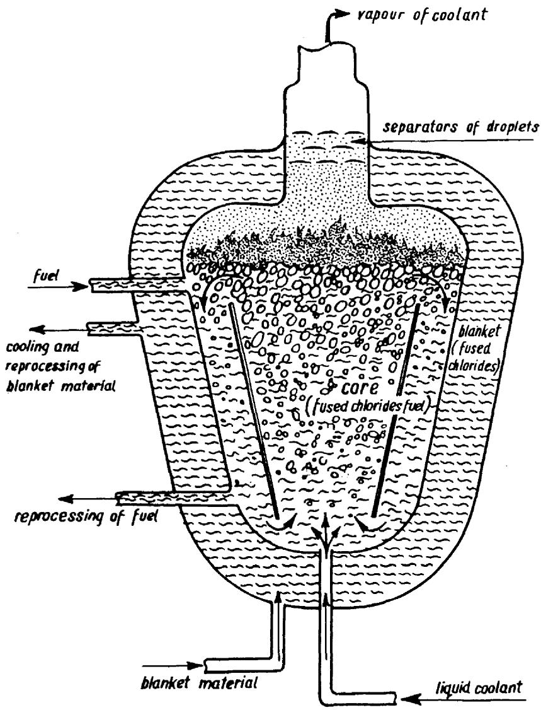

# NEW BOILING SALT FAST BREEDER REACTOR CONCEPTS *

M. TAUBE, M. MIELCARSKI, S. POTURAJ-GUTNIAK and A. KOWALEW Institute of Nuclear Research, Warsaw, Žerań, Poland

Received 10 February 1967

Concepts of fast breeder reactors fueled with fused chlorides of uranium, plutonium, sodium and/or potassium and cooled directly with boiling coolant are discussed including the SAWA reactor boiling homogeneously with aluminium chloride as coolant, and the WARS reactor boiling heterogeneously with metallic mercury as coolant.

Some preliminary calculations for 1000 MwT reactors of both types were performed. The characteristics considered are: SAWA concept: 6000 litre core, 0.33 MW/l, cooled with $1340\mathrm{kg}$ of $\mathrm{AlCl}_3$ per second; WARS concept: 10500 litre core, 0.40 MW/l, cooled with $3300\mathrm{kg}$ of $\mathrm{Hg}$ per second.

# 1. LIQUID FUELS FOR FAST BREEDER REACTORS

Liquid fuels, irrespective of their chemical properties, have a number of advantages discussed earlier [1, 2]. Such fuels can be applied in thermal reactors as well as in fast breeders. Molten salt can be considered as one of the more convenient forms of liquid fuels. Fused salts as liquid fuel for nuclear reactors were discussed by Briant and Weinberg [3]. The fluorides were chosen as being most appropriate. The experimental programme was developed at Oak Ridge National Laboratory (USA) by Weinberg, MacPherson and Grimes [4, 5]. A result of these investigations is the 10 Mw t reactor called MSRE. The fuel in this reactor is a mixture of fluorides $\mathrm{LiF - BeF_2 - ZrF_4 - ThF_4 - UF_4}$ with melting point of about $450^{\circ}C$ . The construction material is INOR-8. The MSRE is as yet the only working reactor fueled with molten salts. Its recent successful operation [6] is an encouragement for this type of reactors.

The application of fused salts in fast breeder reactors promises well. Such a system combines advantages of fast reactors and of liquid fuels, but eliminates disadvantages [7]. The properties of such fuels were discussed by Goodman [8], Wehmeyer [9] and Bulmer et al. [2]. The increasing interest in fast breeder reactors [10] is bound to cause fused salt fuels to receive still more attention [11-13].

# 2. COOLING

The cooling system is a decisive element in reactor design, especially in fast breeders [14]. Two methods of heat removal from a reactor core containing liquid fuel can be distinguished in general:

a) External cooling, when the heat is removed from the fuel circulating outside the core. In such a case the fuel inventory in the system is approximately twice that in the core alone.   
b) Internal cooling, when the heat is removed from the fuel by the coolant circulating through the core. The fuel inventory is of course less than in the case of external cooling.

Irrespective of the above mentioned cooling methods one can additionally distinguish two other systems:

c) The indirect cooling system, when the coolant is separated from the fuel by means of membrane.   
d) The direct cooling system, when the coolant is brought into direct contact with the fuel.

Recently the interesting idea of a direct contact metallic coolant-metallic fuel immiscible system was presented by Hammond and Humphreys [15]. For fused chloride fuel for fast breeders the concept was discussed by Alexander [11], and recent remarks were made by Moore and Fawcett [16] and Killingback [17].

# 3. BOILING SALT REACTORS

Fused chloride fuels for fast breeder reactors with direct and indirect cooling systems

have been the object of investigations in this laboratory since 1960 [18-21]. In this paper the new concept of boiling salt fast breeder reactors is presented. Two reactor concepts will be considered: the SAWA concept [22, 23] and the WARS concept [24, 25]. In both systems the fuel consists of plutonium trichloride as fissionable material, uranium trichloride as fertile material, and sodium and/or potassium chloride as diluent. In both types the coolant is boiling, and thus is partially in the liquid and partially in the vapour state. The two types differ in the following manner. In the SAWA concept cooling is realised by direct homogeneous boiling of aluminium chloride in the core, while in the WARS concept there is direct heterogeneous boiling of metallic mercury in the core. So the main specific feature of both ideas is that the coolant takes the heat from the core by boiling and transfers it directly to heat exchanger or turbine. The reactor proposed may be regarded as a pseudo-gas-cooled type because the gas is evolved in the fuel phase. It must be noticed that the vapour pressure of the coolants (AlCl₃ and Hgmet) at 750-800°C is by about six to seven orders of magnitude higher than the vapour pressure of plutonium and uranium chlorides, which assures that the part of the cooling system which contains vapour can not reach nuclear criticality.

The specific features of both concepts are

listed in table 1 and shown in fig. 1. For comparison some data for the non-boiling fused chloride reactor core calculated by Nelson et al. [26] are given.

Besides the data given in table 1 a number of features may be ascribed to the proposed reactor concepts which one can consider as advantages. These are:

a) simple geometry of the reactor core vessel, which simplifies also the construction of the whole system,   
b) minimal inventory of fuel in the reactor cycle due to the use of internal cooling eliminating fuel flow outside of the core,   
c) the irradiated fuel reprocessing system may be organized "under one roof" with the reactor system,   
d) the double breeding cycle 232Th-233U and 238U-239Pu seems to be realisable [27],   
e) the expected high temperature coefficient of volumetric expansion leads to an increase in safety. From preliminary calculations [28] it follows that the thermal expansion of the fuel volume in the WARS concept is an order of magnitude higher than in the case of nonboiling salt fuel, and in the SAWA concept it is several times higher yet than in the WARS.   
f) a relatively higher breeding ratio, caused by the minimizing of the amount of coolant in the core. The mass of the vapour bubbles con

Table 1   

<table><tr><td rowspan="2">Characteristics</td><td rowspan="2">SAWA</td><td rowspan="2">WARS</td><td colspan="2">Nelson et al. [26]</td></tr><tr><td>Homogeneous</td><td>Heterogeneous</td></tr><tr><td>Cooling system</td><td>Boiling AlCl3internal direct</td><td>Boiling Hgmetinternal direct</td><td>Liquid Na,external indirect</td><td>Liquid Na,internal indirect</td></tr><tr><td>Temperature of coolant (°C)</td><td></td><td></td><td></td><td></td></tr><tr><td>outlet</td><td>800</td><td>740</td><td>740</td><td>660</td></tr><tr><td>inlet</td><td>280</td><td>600</td><td>625</td><td>570</td></tr><tr><td>Vapour of coolant, outlet</td><td></td><td></td><td></td><td></td></tr><tr><td>kg/sec</td><td>1340</td><td>3300</td><td>-</td><td>-</td></tr><tr><td>litres/sec</td><td>33200</td><td>32800</td><td>-</td><td>-</td></tr><tr><td>Whole core volume (litres)</td><td>6000(vapour andliquid)</td><td>10000(vapour andliquid)</td><td>10000(liquid only)</td><td>10000(liquid only)</td></tr><tr><td>Core power (MWt)</td><td></td><td></td><td></td><td></td></tr><tr><td>Specific power (kW/litre of salt)</td><td>333</td><td>400</td><td>400</td><td>400</td></tr><tr><td>Liquid fuel composition (mol % (U, Pu)Cl3)(without coolant)</td><td>50</td><td>50</td><td>30</td><td>50</td></tr><tr><td>Volumetric thermal expansion coefficient(vol % per °C)</td><td>1(liquid salt andvapour bubbles)</td><td>1(liquid salt andvapour bubbles)</td><td>0.03(salt only)</td><td>0.03(salt only)</td></tr><tr><td>Pressure (bars)</td><td>20</td><td>40</td><td>low</td><td>low</td></tr></table>

  
Fig. 1. Cross section showing the main elements of a boiling salt fast breeder reactor.

stitutes only about $\frac{1}{50}$ of the mass of the liquid state.

Along with the advantages described above, a number of problems are also introduced which must be solved in further investigations. These concern mainly the lack of data about the boiling mechanism of liquid dissipating heat homogeneously and heterogeneously, the mechanism of initiation, growth, stability and motion of aluminium chloride and mercury vapour bubbles in the liquid salt, the separation of the bubbles from the salt phase, the neutron transport mechanism, criticality, safety-related effects in a microscopically unstable boiling system, etc. Also corrosion effects of molten chlorides on construction materials and corrosion by fission product, and especially by metallic mercury in the WARS concept, are of great importance. The danger of leakage of liquid fuel from the rela

tively high pressure system must be taken into account. At present all these problems must be treated as disadvantages of the proposed reactor concepts.

# 4. SAFETY CONDITIONS

The safety coefficient of both the SAWA and WARS concepts is expected to be relatively high. Safety is primarily related to the thermal expansion coefficient of the fuel. The volumetric thermal expansion coefficient is $3 \times 10^{-4} \mathrm{OC}^{-1}$ and the corresponding decrease in reactivity would be about $1.5\%$ per $10^{\circ} \mathrm{C}$ temperature increase. But beyond this the expansion reactivity effect is much further increased by void formation. A prompt increase of temperature due to a rise of power causes in the SAWA concept an in

tensification of boiling which leads to an increase in the void or vapour volume in the fuel material, and a decrease of reactivity. To avoid oscillation of the fuel system due to high instability of the reactivity, an appropriate geometry for the system in the region of the free boiling surface would be applied [29].

The Doppler effect is expected to be also negative. Okrent [30] reported that the Doppler effect is in general negative in the case of large fast reactors with fuel of intermediate enrichment.

# REFERENCES

[1] J. A. Lane, Homogeneous reactors and their development; fluid fuel reactors (Addison-Wesley Publ. Co., Reading, 1958).   
[2] I. I. Bulmer, E. H. Gift, R. J. Holl, A. M. Jacobs, S. Jaye, E. Koffman, R. L. McVean, R. G. Oehl and R. A. Rossi, Fused salt fast breeder, ORNL, CF-56-8-204 (1956).   
[3] R. C. Briant and A. M. Weinberg, Nucl. Sci. Eng. 2 (1957) 797.   
[4] H.G. McPherson, Molten salt reactor project, ORNL-2684 (1959).   
[5] W. R. Grimes, E. G. Bohlman and L. D. Kirkbride, Irradiation behaviour of fluid fuels, 3rd Intern. Conf. on the Peaceful Uses of Atomic Energy, Geneva, P/241 (1964).   
[6] W. R. Grimes, private communication (1966).   
[7] M. Taube, Powielanie Paliw Rozszczepialnych, PTJ-34/35 201/222, Warsaw (1964).   
[8] C. Goodman, J.L. Greenstadt, R.M. Kiehn, A.Klein, M.M. Mills and N. Tralli, Nuclear problems of non-aqueous fluid-fuel reactors, MIT-500 (1957).   
[9] D. B. Wehmeyer, I. A. Bara, D. J. Cockerman, R. B. Donwarth, L. B. Holland, R. S. Hunter and P. J. Mraz, Study of fused salt breeder reactor for power production, ORNL CF-53-10-25 (1953).   
[10] London Conference on fast breeder reactors, 17-19 May 1966. The concept of these reactors was

presented during the discussion on the general session of this conference by one of the authors (M. T.).   
[11] L. G. Alexander, Ann. Rev. Nucl. Sci. 14 (1964) 287.   
[12] O. D. Kazatchkovsky and V. B Lytkin, Atomic Energy Rev. Vol. 4, No. 4 (IAEA, Vienna, 1965).   
[13] C. E. Treeter, J. A. Lecky and I. H. Martens, Catalog of nuclear reactor concepts, ANL-7092, Reactor Technol. TID-4500, AEC Research and Development Report (1966).   
[14] J. R. Dietrich, P. Fortescue, M. D. Edlund et al., Nucleonics 23 (1965) 54.   
[15] R.P.Hammond and J.R.Humphreys, Nucl. Sci. Eng. 18 (1964) 421. This idea was first proposed by W.D.Burch et al., ORNL Cf-55-8-188 (1955).   
[16] R. V. Moore and S. Fawcett, Present and future types of fast breeder reactors, London Conf. on fast reactors, 17-19 May 1966, Ref. 1/7.   
[17] H. Killingback, Molten salt fast reactor A.E.E. Winfrith, preprint (1966).   
[18] M. Taube, Nukleonika 4 (1961) 565.   
[19] M. Taube, Symposium on power reactor experiments, Vienna, 23-27 October 1961, SM-21/19.   
[20] M. Taube, Stopione chlorki plutonu i uranu jakopaliwo dla predkich reaktorow, Raport IBJ no. 414/V, Warszawa (1963).   
[21] Euronuclear 3 (1966) 24.   
[22] M. Taube, M. Mielcarski, A. Kowalew and S. Poturaj-Gutniak, Nukleonika 10 (1965) 639.   
[23] M. Taube, A. Kowalew, M. Mielcarski and S. Poturaj-Gutniak, Salt-boiling fast reactor SAWA, Report IBJ no. 669/C, Warsaw (1965).   
[24] M. Taube, A. Wierusz, S. Poturaj-Gutniak, A. Kowalew, M. Mielcarski, Nukleonika 10 (1965) 637.   
[25] M. Taube, A. Wierusz, S. Poturaj-Gutniak, M. Mielcarski and A. Kowalew, Mercury boiling fused-salt fast reactor WARS, Report IBJ no. 706/C, Warsaw (1966).   
[26] P. A. Nelson, D. K. Buttler, M. G. Chasanov and D. Meneghetti, Trans. Am. Nucl. Soc. 8 (1965) 153.   
[27] A.J.Leipunskii, O.D.Kazatchkovsky, M.V.Troganov, N.V.Krasnoyarov, M.G.Kulakovsky, V.B.Lytkin, V.J.Matteev, V.M.Murogov, A.J.Novoshilov, L.M.Usatchev, N.M.Shalagin and S.B. Shihov, 3th Intern. Conf. on the Peaceful Uses of Atomic Energy, Geneva 1964, A/Conf. 28/P/369.   
[28] M. Taube, Nukleonika, in press.   
[29] O. D. Kazatchkovsky, private communication.   
[30] D. Okrent, Neutron physics consideration in large fast reactors, Power Reactor Technol. 7 (1964) 107.