# CIVILIAN NUCLEAR POWER

# THE USE OF THORIUM IN NUCLEAR POWER REACTORS

June 1969

Prepared for

DIVISION OF REACTOR DEVELOPMENT & TECHNOLOGY

U.S. ATOMIC ENERGY COMMISSION

# THE USE OF THORIUM

# IN NUCLEAR POWER REACTORS

JUNE 1969

# PREPARED BY

# Brookhaven National Laboratory

# AND THE

Division of Reactor Development and Technology

WITH THE ASSISTANCE OF

ARGONNE NATIONAL LABORATORY

BABCOCK & WILCOX

GULF GENERAL ATOMIC

OAK RIDGE NATIONAL LABORATORY

PACIFIC NORTHWEST LABORATORY

# FOREWORD

This report on "The Use of Thorium in Nuclear Power Reactors" was prepared under the direction of the Division of Reactor Development and Technology, U.S.A.E.C., as part of an overall assessment of the Civilian Nuclear Power Program initiated in response to a request in 1966 by the Joint Committee on Atomic Energy. It represents the results of the inquiry by the Thorium Systems Task Force whose membership included representatives of Babcock & Wilcox Company, Gulf General Atomic Company, the Argonne National Laboratory, the Brookhaven National Laboratory, the Oak Ridge National Laboratory, the Pacific Northwest Laboratory, and the U.S. Atomic Energy Commission.

Publication of this report, which provides information basic to the AEC reactor development program, completes one phase of the evaluation effort outlined in the 1967 Supplement to the 1962 Report to the President on Civilian Nuclear Power, issued in February 1967. The 1967 Supplement outlined changes since 1962 in the technical, economic and resource picture and provided background for further study.

Specifically, this report represents the consensus of the task force on the potential use of the thorium cycle and the specific thorium fueled reactor designs which have been proposed. It is expected that the relative promise of the use of thorium in reactors, and the future nuclear power industry may be judged on an increasingly sound basis as more information is obtained from the continuing developmental, analytical and engineering efforts.

The design data upon which the review was based are limited, particularly those for the molten salt breeder reactor (MSBR) and for the thorium-fueled light-water cooled reactors. In the case of the MSBR, the system is in a very early experimental stage and detailed design information still must be developed. Thus, the review was based upon a very preliminary design which has been changing as a result of continuing technical reassessments and developments.

The review of the use of thorium in light water reactors, of necessity, had to be inferred from very preliminary assessments carried out in 1961 - 1964. No detailed designs and only limited technical data are available to directly compare the use of uranium and thorium in the light-water cooled systems.

The review of the potential of the use of thorium in light-water reactors was somewhat restricted since the concept studied in the greatest depth, the LWBR, emphasized fuel conservation rather than minimum fuel costs. Therefore, this report does not compare the LWBR concept to the other concepts. The Commission is proceeding with a demonstration of the LWBR concept in the Shippingport reactor, and the results of this demonstration are expected to be available by the middle 1970's. Successful completion of such a breeding demonstration will show the technical feasibility of installing thorium breeder cores in existing and future pressurized light water reactor plants.

Information forthcoming from the activities of other task forces, such as those examining the reactor fuel cycle and projections of the future nuclear power economy, may also lead to changes in the predicted potential for the use of thorium in reactors. Also, since thorium-fueled systems are still in the experimental stage, any further data developed may necessitate changes in some of the conclusions of this report.

In large measure, the report was based on information provided by the designers of the various thorium-fueled reactors, and the principal participants of the Thorium Systems Task Force included proponents of specific reactor systems. It is recognized that inclusion of membership from national laboratories and industrial organizations actively engaged in the development and promotion of specific reactors can result in a report that reflects the enthusiasm of the proponents of these reactor systems.

In May 1968, a draft version of this report was distributed to selected representatives of the reactor plant industry, national laboratories, utilities, USAEC, and other agencies of the federal government for review and comment. The comments were carefully considered in the final preparation of the report.

As discussed in the 1967 Supplement to the 1962 Report to the President on Civilian Nuclear Power, the magnitude of the cumulative effort expended to develop light-water reactors, and the success which has been achieved, has resulted in a state and pace of development and production that will make the development of competing systems difficult. The continued economic improvement of light-water reactors, and the successful development of an economic fast breeder would narrow the time span in which an advanced, non-breeding reactor system could alleviate the resource requirements for an economic nuclear power industry.

Milton Shaw, Director

Division of Reactor Development

and Technology

# THE USE OF THORIUM IN NUCLEAR POWER REACTORS Contents

Page

1. Introduction 1

1.1 Background 1   
1.2 Objective of Study 1   
1.3 Topics Considered 2   
1.4 Source of Information 3

2. Summary 5

2.1 Nuclear Characteristics 5   
2.2 Reactor Performance Characteristics 6   
2.3 Utilization of Nuclear Fuel Resources 7   
2.4 Economic Considerations 7   
2.5 Status of Reactors Fueled with Thorium 8

2.5.1 HTGR 8   
2.5.2 MSBR 9   
2.5.3 LWR 10   
2.5.4 HwR 10   
2.5.5 FBR 10

2.6 General R&D for the Thorium Cycle 11

3. Features of the Thorium Cycle 13

3.1 Fuel Cycles 13   
3.2 Nuclear Properties of Fertile and Fissile Isotopes 16

3.2.1 Properties in a Thermal Spectrum 16   
3.2.2 Properties in a Fast Spectrum 19

3.3 Advantages of the Thorium Cycle for Applications in Thermal-Spectrum Reactors 20

3.3.1 Introduction 20   
3.3.2 Fuel Conversion Ratio 21   
3.3.3 Specific Fissile Inventory 22   
3.3.4 Fuel Exposure Time 23   
3.3.5 Plant Efficiency 23

3.4 The Thorium Cycle in Fast-Spectrum Reactors 24

3.4.1 Introduction 24   
3.4.2 Thorium as a Fertile Material 24

3.4.3 U-233 as a Fissile Material 26   
3.5 Transition from the Uranium to the Thorium Cycle 26   
3.6 Summary 27

# 4. Nuclear Fuel Resources, Requirements, and Economics 29

4.1 Introduction 29   
4.2 Nuclear Fuel Resources 29   
4.3 Civilian Nuclear Power Growth 33   
4.4 Reactor Uranium Requirements 34   
4.5 Economics 37   
4.6 Fuel Strategy 44

4.6.1 Crossed-Progeny System 47   
4.6.2 The Thorium Cycle in a Growing FBR Economy 49   
4.6.3 The Longer-Range Potential for Thorium 49

# 4.7 Summary 50

# 5. Utilization of the Thorium Cycle in Specific Reactor Types 51

5.1 Introduction 51   
5.2 High Temperature Gas Cooled Reactor 51

5.2.1 General Description of the HTGR 51   
5.2.2 Economics of the HTGR Thorium Fuel Cycle 55   
5.2.3 Status of the HTGR Technology 58   
5.2.4 R&D Required for the HTGR 63

5.3 Molten Salt Breeder Reactor 64

5.3.1 Introduction 64   
5.3.2 Description of Single-Fluid MSBR 65   
5.3.3 Nuclear Design 74   
5.3.4 Fuel Processing 76   
5.3.5 Status of the Molten Salt Reactor 79   
5.3.6 R&D Required for the MSBR 80

5.4 Light Water Moderated Reactor 81

5.4.1 Economics of the LWR Thorium Fuel Cycle 81   
5.4.2 Status of the LWR Technology 84   
5.4.3 R&D Required for the LWR 84

5.5 Heavy Water Moderated Reactor 84

5.5.1 General Description of an HWOCR 86   
5.5.2 Economics of the HWOCR 86   
5.5.3 Status of HwR Technology 88   
5.5.4 R&D Required for Pressure Tube HwR 90   
5.5.5 Startup Period for the Pressure Tube HwR 90

5.6 Fast Breeder Reactor Using Thorium Fuel Cycle 91

5.6.1 Introduction 91   
5.6.2 Nuclear Data Pertinent to the Thorium Fuel Cycle in a Fast Spectrum 91   
5.6.3 Reactor Design Studies 92   
5.6.4 Summary and Conclusions 93

6. General R&D for the Thorium Cycle 95

6.1 Reactor Physics 95   
6.2 Thorium Fuels 95   
6.3 Processing and Recycle of Thorium Fuels 96

Appendix A. Summary and Assessment of Reactor Physics of the Thorium Fuel Cycle 99   
Appendix B. Appraisal of Thorium Fuels 111   
Appendix C. Reprocessing of Thorium Fuels 119   
Appendix D. Identification of Estimates of Nuclear Fuel Resources 125   
Appendix E. Molten Salt Breeder Reactor-Two Fluid System 129

References 139

# LIST OF TABLES

No. TITLE Page

3.1 Thermal-Spectrum-Averaged Eta Values for U-233, U-235, and Pu-329 17   
3.2 Typical Spectrum-Averaged Thermal, Epithermal, and Combined Thermal-plus-Epithermal Eta Values for U-233, U-235, and Pu-239 at $600^{\circ}\mathrm{C}$ 17   
3.3 Fission Cross Sections and Eta Values for Fissile Nuclides at Three Neutron Energies 18   
3.4 Some Selected Average Cross-Section Parameters for Fuel Nuclides in a Fast Breeder Reactor 19   
3.5 Critical Mass, Breeding Ratio, and Sodium Void Effect for a 3000-Liter Metal Fueled Fast Reactor 25   
3.6 Comparison of Breeding Performance of Selected 3000-Liter Fast Reactors using Oxide, Carbide and Metallic Fuel 25   
4.1 Estimates of U.S. Uranium Fuel Resources 30   
4.2 Estimates of U.S. Thorium Resources 30   
4.3 Estimated Growth Rate of Nuclear Power Capacity 36   
4.4 Uranium Ore Requirements for Various Reactors 38   
4.5 Calculated Fuel Cycle Costs for Varying Uranium Ore Costs 44   
5.2.1 High-Temperature Gas-Cooled Reactor Characteristics 52   
5.2.2 Fuel Cycle Costs for the HTGR Reference and Backup Designs 56   
5.2.3 HTGR Fuel Cycle Characteristics and Costs for the Storage and the Pu-239/Th-232/U-233 Cycles 59   
5.2.4 Comparison of Fuel Depletion and Working Capital Charges for the Low-Enrichment Uranium and Thorium Fuel Cycles in the HTGR 62   
5.2.5 Projected Evolutionary Stages in the Development of the HTGR Leading to Improved Conversion Ratios 62   
5.3.1 Estimated Properties of Fuel and Coolant Salts for One-Fluid Breeder Reactors 68   
5.3.2 Design Parameters for One-Fluid Reactor (2000-Mwe Plant) 73   
5.3.3 Comparison of the Characteristics of Two-Fluid and Single Fluid MSBRs 75   
5.3.4 Modified Standard Reduction Potentials for the Systems LiF-BeF $_2$ (67-33 mole %)-Bismuth at $600^{\circ}\mathrm{C}$ 78   
5.4.1 Indicated Performance of Thorium and Uranium-Fueled PWRs 82   
5.4.2 Indicated Effect of Change in Plutonium and Uranium Ore Costs for Thorium and Uranium Fueled PWRs 83   
5.5.1 HWOCR Characteristics 87   
5.5.2 HWOCR Power Costs 89   
A-1 Cross-Section Data 10   
B-1 Selected Properties of Thorium Monocarbide and Uranium Monocarbide 11.

E-1 Summary of MSBR Total Energy Costs 136   
E-2 Comparison of Reactor Characteristics in the MSBR Potential and Backup Designs 137

# LIST OF FIGURES

# No. TITLE Page

3.1 Nuclide Chains Originating with Th-232 and U-238 14   
3.2 The Isotopic Buildup in Thorium and U-238 Systems 15   
4.1 U.S. AEC Reasonably Assured Plus Estimated Additional Cumulative Uranium Resources Recoverable up to Indicated Price (January 1967) 31   
4.2 Nuclear Power Growth Estimates for 1975 and 1980 Varying with Year Estimate Made 32   
4.3 Estimated U.S. Installed Nuclear Capacity 39   
4.4 Estimated Cumulative Uranium Ore Requirements for Specific Reactor Systems 39   
4.5 Estimated Cumulative Uranium Ore Requirements for Specific Reactor Systems (Advanced Reactors Delayed) 40   
4.6 Calculated Trend in Uranium Price 42   
4.7 Calculated Trend in Uranium Price (Advanced Reactors Delayed) 43   
4.8 Calculated Variation of Nuclear Fuel Cycle Cost with Uranium ore Cost in Different Reactor Systems 45   
4.9 Calculated Trend in Fuel Cycle Cost with Time Due to Assumed Increase in U Ore Cost 46   
4.10 Illustrations of Nuclear Fuel Strategies Using Thorium in Various Reactor Systems 48   
5.2.1 Conversion Ratio as a Function of C/Th Ratio and Fuel Lifetime in the HTGR (Reference Design) 57   
5.2.2 Fuel Cycle Cost As a Function of C/Th Ratio and Fuel Lifetime in the HTGR (Reference Design) 57   
5.3.1 Flow Diagram for 2000-Mw(e) Single-Fluid MSBR Plant 67   
5.3.2 Plan View of Single-Fluid MSBR Cell Arrangement 69   
5.3.3 Elevation View of Reactor and Fuel Drain Cells 70   
5.3.4 Elevation View of Reactor and Steam Cells 71   
5.3.5 Elevation View of Reactor Core 72   
5.3.6 Single-Fluid MSBR Processing by Reductive Extraction 77   
A-1 Eta of U-233 vs. Energy 10   
A-2 Fission Cross-Section of U-233, U-235, and Pu-239 at High Energy 10   
A-3 Capture to Fission Ratio U-233, U-235, Pu-239 at High Energy 10   
A-4 Eta vs Energy for U-233, U-235, and Pu-239 10   
A-5 Fission Cross-Section of Th-232 and U-238 10   
E-1 Reference MSBR Flow Diagram 13   
E-2 Fuel- and Fertile-Stream Processing for the MSBR 13

# 1. INTRODUCTION

# 1.1 Background

Early in the history of nuclear reactors it was recognized that the long term importance of nuclear fuels for power production depended not only upon the ability to use the fissile U-235 provided by nature, but also upon using at least some appreciable part of the much more abundant naturally occurring fertile materials, U-238 and Th-232, which could be converted into fissionable isotopes. While the basic physics characteristics of fissile plutonium produced from U-238 offers the potential of high breeding gains in fast reactors with the production of 40 to 50 percent more fissile fuel than is consumed, and conceivably can eventually multiply the resources of fissile energy approximately a hundred fold, these same characteristics allow only a limited fissile production from fertile material in thermal reactors, which would only approximately double the energy attainable from the original fissile U-235. In contrast, the basic physics characteristics of fissile U-233 produced from fertile Th-232 will permit improved conversion of fissile fuel in thermal reactors, and potentially permit breeding in thermal as well as fast reactors. These factors have formed the principal bases for the continued interest in the use of thorium for nuclear reactors.

The primary incentive for the development of nuclear power is economics, more specifically, the reduction in the cost of power. Reduced power costs are possible primarily because use of nuclear energy can result in low fuel costs. Sufficiently low fuel costs can be realized so that, even at some penalty in plant investment or other operating costs, nuclear plants can effectively compete with alternate means of power generation. Further, whether a specific reactor uses a thorium or uranium cycle will depend upon the expected economics of the respective cycles for the applicable financial and technological conditions, and on the impact of the specific fuel strategy selected upon the overall electric system economics.

# 1.2 Objective of Study

The Thorium System Task Force, as part of the current AEC assessment of Civilian Nuclear Power, was organized essentially to review and compile information, and to indicate the present status and the factors involved, in the use of thorium in power reactors. Its purpose was not to provide a comprehensive inquiry which would include national and policy considerations, detailed assessment of the overall thorium cycle and power generation, and the effect of the introduction of a fast breeder on the use of thorium reactors. Consideration of such issues, however, are considered part of the overall assessment effort. For example, detailed information about the thorium fuel cycle, and reactor design and costs for advanced converter reactors, are contained in AEC reports WASH-1085 (Evaluation of HTGR), WASH-1083 (Evaluation of HWOCR) and WASH-1087 (Advanced Converter Summary Report). The impact of the introduction of the fast breeder on the value of the thorium fueled reactors in an expanding nuclear power economy is considered in WASH-1100 (Potential Nuclear Power Growth Patterns).

# 1.3 Topics Considered

Because of its economic importance the fuel cycle is emphasized in this report, in particular the nuclear characteristics of the thorium cycle, and the effect of its use on uranium system requirements. A summary of the more pertinent observations is presented in Section 2.

The more important fuel cycles and their characteristics are reviewed in Section 3, Features of the Thorium Cycle. The relevant nuclear characteristics of the fertile isotopes, Th-232 and U-238, are compared in this section. Of greater interest is the comparison of nuclear characteristics of the naturally-occurring U-235 fissile isotope and the bred fissile isotopes, U-233 and Pu-239. The effect of the nuclear characteristics on reactor performance and economics are also discussed generally in Section 3.

The thorium fuel cycle will require naturally-occurring U-235 for the initial fuel inventory and burnup. Therefore, the requirements for both uranium and thorium ores must be evaluated when considering the use of the thorium cycle. Consequently, both the uranium and the thorium resources are reviewed in Section 4, Nuclear Fuel Resources, Requirements, and Economics. The fuel requirements are assessed for various types of reactors using the thorium cycle and are compared with the estimated requirements of other reactors using the low-enrichment uranium cycle. An attempt has been made in this section to place the ore requirements in proper perspective relative to the estimated available resources, required ore production, required enrichment, and production of bred fuel.

Since fertile thorium, like fertile uranium, is convertible into fissionable fuel, the economic development of the thorium cycle will significantly increase our economically exploitable resources of nuclear fuel. However, there is little incentive to develop the thorium cycle solely to increase the supply of fertile material. Fertile uranium material required for the fast breeders is expected to be in over supply through the first part of the next century.

From the point of view of practical application, the most significant part of the report is an assessment of the potential for utilizing the thorium cycle in specific types of reactors. In particular, the potential role of the thorium cycle in the High Temperature Gas-Cooled Reactor (HTGR), Molten-Salt Breeder Reactor (MSBR), Light-Water Moderated Reactor (LWR), Heavy-Water Moderated Reactor (H WR), and Fast Breeder Reactor (FBR) is discussed in Section 5, Utilization of the Thorium Cycle in Specific Reactors. This section also includes the operating experience to date and projected performance and R&D requirements for these reactors. General R&D requirements for the thorium cycle are presented in Section 6. Except for the molten-salt reactor, individual reactors are discussed in detail in other reports and just highlights are presented herein. Further information on specific topics is discussed in the Appendices: Summary and Assessment of Reactor Physics of the Thorium Fuel Cycle, Appendix A; Appraisal of Thorium Fuels, Appendix B; Reprocessing Thorium Fuels, Appendix C; Identification of Estimates of Nuclear Fuel Resources, Appendix D; and Molten-salt Breeder Reactors - Two-fluid System, Appendix E.

# 1.4 Source of Information

Basic technical and economic data for the various reactors were reviewed by the appropriate task forces. These data were then submitted to the Systems Analyses Task Force so that a comprehensive picture of the nuclear power industry could be projected to the year 2020, within the limits of uncertainty in the data, for varying economic and technical parameters. The basic information provided by the various task forces was used in the preparation of the present report to the extent possible, recognizing that information on advanced reactor concepts is always subject to change as the result of technological developments, and changes in design, and economic parameters.

# 2. SUMMARY

# 2.1 Nuclear Characteristics

Important isotopes of nuclear fuel cycles are fissile U-233 and Pu-239 which are bred from fertile Th-232 and U-238, respectively, and fissile U-235 which occurs naturally. At present, the nuclear power industry is based on the light-water reactor which operated on the U-235 (U-238) Pu-239 fuel cycle (LWR/U). However, another reactor system is under development which may become important, the high-temperature gas-cooled system operating on the U-235 (Th-232) U-233 cycle (HTGR/Th). The first isotope in each trio refers to the starting fissile fuel, the second to the predominant fertile material and the third to the predominant bred fissile fuel. Since nuclear fuel cycles are generally identified with the predominate fertile material, the first of the above fuel cycles is simply referred to as the uranium cycle, and the second, the thorium cycle.

Reactors, such as the LWR and HTGR, which have a conversion ratio less than one and thus produce less fissile fuel than they consume, are termed converter reactors. In these reactors there is an incentive to recycle the bred fuel because of its significant value. Recycle modes for the uranium and thorium cycles can be represented as Pu-239/U-235 (U-238) Pu-239 and U-233/U-235 (Th-232) U-233, respectively. In these cases the initial fuel will consist of the bred fuel recovered from the previous cycle together with U-235 makeup.

It is also possible to have so-called crossed or mixed-progeny fuel cycles U-233(U-238)Pu-239 and Pu-239(Th-232)U-233. In these fuel cycles the bred fuel from a uranium-fueled reactor is fed to a thorium-fueled reactor and vice-versa. Studies have indicated that in the future such fuel cycles may be economically advantageous. However, while such fuel cycles warrant further investigation, they are presently undeveloped.

The nuclear characteristics of the fissile and fertile isotopes are such that the U-233(Th-232)U-233 fuel cycle gives nearly as high conversion ratios in a thermal as in a fast neutron spectrum while the Pu-239(U-238)Pu-239 fuel cycle gives much higher conversion ratios in a high-energy neutron spectrum. Advanced thermal and fast-spectrum reactors* of the future will probably operate primarily with the bred fuels, U-233 and Pu-239, and not be dependent upon the U-235 content of natural uranium.

The relevant characteristics of the important fissile and fertile isotopes in thermal and fast-spectrum reactors are summarized as follows:

(1) Thermal absorption in U-233 produces more neutrons per neutron absorbed $^{**}$ than does corresponding absorption in either Pu-239 or U-235.

(2) The neutron production for U-233 is relatively insensitive to change in temperature, but for U-235 and Pu-239 eta decreases as the temperature increases. Thus, the advantage of U-233 over U-235 and Pu-239 is more pronounced in a hard (higher energy) thermal spectrum than in a soft (lower energy) thermal spectrum.   
(3) From a nuclear standpoint, the use of U-233 in a thermal reactor makes it possible to achieve higher fuel conversion ratios and longer fuel burnups than is practical with either U-235 or Pu-239 (Section 2.2).   
(4) The higher conversion ratios which can be obtained in thermal-spectrum reactors when using U-233 instead of Pu-239 can result in a significantly better utilization of natural uranium fuel resources with thorium-fueled reactors than with the low-enrichment, light-water cooled uranium-fueled reactors (Section 2.3).   
(5) A higher breeding ratio can be obtained with Pu-239 than with U-233 in a very high-energy, fast-neutron spectrum reactor. On the other hand, in a degraded (10 to $100\mathrm{keV}$ ) fast spectrum, U-233 would probably be as good as, or better than, Pu-239. Also, the variation of U-233 and Pu-239 cross sections with energy are such that improved reactivity coefficients would be obtained with the use of U-233 in a large sodium-cooled FBR. This leads to improved nuclear safety characteristics.   
(6) The energy dependence of the fast-fission cross sections of Th-232 and U-238 is such that the use of Th-232 would produce an improved reactivity coefficient in a liquid-metal-cooled FBR. The fast fission cross-section of Th-232 is much lower than that of U-238 so that use of the latter leads to much larger conversion ratios in fast-spectrum reactors.

# 2.2 Reactor Performance Characteristics

Nuclear power plants are designed to achieve economic and reliable operation based on the optimization of economic and technical parameters. Technical parameters of particular importance include fuel conversion ratio, specific fissile inventory, fuel fabrication and processing requirements and plant efficiency. These reactor system characteristics as related to the thorium and uranium cycles in thermal-spectrum reactors are summarized as follows:

1. The fuel conversion ratio (CR) is the ratio of the amount of fissile fuel produced per unit of fissile fuel destroyed. By virtue of the higher eta of U-233 in thermal systems, a larger conversion ratio generally may be obtainable with the thorium cycle than with the uranium cycle. Thus fissile fuel consumption for a thermal-spectrum, thorium-cycle reactor may be lower by a factor of at least two than for a LWR on the uranium cycle which is fueled with U-235.   
2. Nuclear fuel inventory requirements are generally measured by the specific fissile inventory, i.e., the amount of fissile fuel required per unit power output of a given reactor. A low specific inventory may be obtained in the HTGR and MSBR using the thorium cycle.   
3. Fuel exposures are generally expressed in units of heat energy produced (megawatt-days) per unit weight of fuel (tons or kilograms of fertile plus fissile material). Longer fuel exposures will, therefore,

result in lower energy costs associated with fabrication and reprocessing, while, at the same time, resulting in a decrease in the conversion ratio because of the buildup of fission products. The prospect for long fuel exposures is enhanced in the thorium cycle primarily by virtue of the higher conversion ratio and, hence, lower fuel reactivity changes, achievable in thermal systems.

4. A high plant efficiency permits the generation of more useful energy from a given heat source. The utilization of resources and the cost of electric energy are influenced by the thermal efficiency of power plants. In general, high reactor coolant outlet temperatures, which are dependent on the choice of primary reactor coolants, allow high efficiencies to be achieved. However, the choice of fuel cycle can also be important. For a reactor fueled with U-233, the eta, which directly affects the fuel conversion ratio, is relatively large. As the thermal neutron spectrum becomes less thermal with increasing moderator temperature, the eta will remain fairly constant with U-233, but decrease with a loading of U-235 or Pu-239. Consequently, the nuclear performance of a U-233 fueled reactor relative to a U-235 fueled reactor increases as the operating temperature of a reactor core (and the resulting thermal efficiency of the plant) increases.

# 2.3 Utilization of Nuclear Fuel Resources

Important features relative to use of thorium and uranium resources are:

1. Estimates of the recoverable thorium resources as a function of recovery cost are similar to those projected for uranium. However, the requirements for thorium, assuming that all nuclear power systems consist of thorium-fueled reactors are considerably smaller than the uranium requirements associated with the initial fuel inventory and net fissile fuel consumption.   
2. The total uranium ore requirements of advanced reactors using the thorium cycle are substantially smaller than for LWRs using the uranium cycle. Hence, thorium conserves rather than replaces uranium.   
3. The current availability of fertile uranium from the AEC diffusion plant stockpile and the further amounts expected to be generated in the process of enriching uranium for fueling light-water and other converter reactors during their lifetimes, will provide an excess of fertile material for fueling plutonium-uranium breeder reactors significantly beyond the end of this century. Thus, there is little incentive to develop the use of thorium primarily to extend the supply of fertile material during the remainder of this century.   
4. Uranium ore requirements for system inventories can be substantial, as shown in Section 4. Effective uranium usage will depend importantly on how low a specific fissile inventory can be achieved and not solely on whether the net conversion ratio is very high, or even slightly greater than unity.

# 2.4 Economic Considerations

The economic utilization of nuclear resources does not necessarily mean conservation of nuclear resources. Even the more expensive nuclear resources can be utilized economically if the fuel cycle cost for a reactor is not too sensitive to rising ore costs. Fuel cycle costs for advanced reactors using the thorium cycle, such as the HTGR and MSBR, exhibit this characteristic. The indicated fuel cycle costs for a LWR and a Heavy-Water Moderated Organic-Cooled Reactor (HWOCR) using the uranium cycle, and an HTGR,

HWOCR and MSBR using the thorium cycle, are shown in Figure 4.8, for postulated increases in uranium ore costs only and no projected improvements in the other fuel cycle charges.

Comparisons of fuel cycle costs using the uranium and thorium cycles in reactors of current and potential interest indicate:

1) The uranium cycle is currently more economical than the thorium cycle in reactors that are relatively heterogeneous to neutrons such as the light water moderated reactor and the heavy water moderated reactor (HWR), since the heterogeneity of the fuel allows significant self-shielding of the U-238 resonances. Consequently, uranium fuel of lower U-235 enrichment and, therefore, lower cost can be used, as contrasted to requirement for high U-235 enrichment, and thus higher fissile inventory cost of the thorium cycle.   
2) In the reactors that are more homogenous to neutrons, such as the HTGR and the MSBR, the thorium cycle appears to be more economic. Although more highly enriched, and expensive U-235 is used, the increased fissile inventory cost is more than compensated for by the savings in fuel depletion costs achievable with the thorium cycle due to the higher fuel conversion ratio.   
3) In.the future (after about the late seventies), use of the thorium cycle in the HTGR indicates potential fuel cycle cost savings of up to 0.4 mills/kWh over those attainable with LWRs operating on either the thorium or uranium cycle (Table 4.5).   
4) In the more distant future (after about 1985), use of the thorium cycle in the MSBR indicates potential fuel cost savings of up to $1.0\mathrm{~mills/kWhr(e)}$ over those attainable with LWRs operating on either the thorium or uranium cycles, and a fissile fuel yield of as much as 5 percent per year (table 4.5).   
5) Since the fuel inventory costs of reactors using the thorium cycle are higher than those of reactors using the uranium cycle, high interest rates on the fuel inventory penalize the thorium cycle more than the uranium cycle. Conversely, lower interest rates favor the thorium cycle.   
6) Future increases in uranium ore costs and/or decreases in fissile fuel costs tend to favor the thorium cycle reactors relative to the low-enrichment uranium cycle in the LWR.   
7) While the use of the U-233(Th-232)U-233 cycle in a fast breeder reactor does not, in general, appear to be as attractive as the Pu-239(U-238)Pu-239 cycle, the use of U-233 in the core may provide advantages in reactor safety and control, while Th-232 in the blanket may be economically justifiable in a future, mixed reactor, nuclear power complex.   
8) Because thorium fuels have better physical properties, the use of thorium in place of uranium could provide improved irradiation stability and increased fuel exposures which could lead to reduced charges for processing and fabrication per unit energy output.

# 2.5 Status of Reactors Fueled with Thorium

# 2.5.1 HTGR -THE HIGH TEMPERATURE GAS COOLED REACTOR

Peach Bottom Atomic Power Station, Peach Bottom, Pa., the first HTGR built for commercial power production in the US, became operable on March 3, 1966 and went into commercial operation June 1, 1967.

During 1968 the 40 MWe plant achieved 300 full power days of operation. Its continuing operation will serve to demonstrate the following important design features of the HTGR:

1) the practicality of high-temperature reactor operation leading to the production of steam at $1000^{\circ}\mathrm{F}$ ;   
2) the strength and integrity of the all-graphite fuel elements using coated fuel particles; and   
3) the performance of primary system components, such as circulators, steam generators, control drive mechanisms, valves, and instrumentation, in a high-temperature reactor environment.

A major R&D and engineering program is underway in support of the 330 MWe Fort St. Vrain HTGR. As currently designed, the Fort St. Vrain plant will incorporate the following significant modifications and improvements over the Peach Bottom HTGR design:

1) a primary system totally contained in a prestressed concrete reactor vessel (PCRV);   
2) a hexagonal block fuel element, to retain more fission products, and designed to reduce fabrication costs.   
3) an advanced fuel management scheme; and   
4) steam-turbine driven gas circulators and high power density, modular, once-through steam generators.

Further R&D to investigate potential significant improvements in the HTGR economics and resource utilization are described in Section 5.1. The HTGR has an ultimate potential to achieve a conversion ratio slightly greater than unity or a specific fissile inventory below $1.0\mathrm{kg / MWe}$ ; a plant efficiency greater than 45 percent and total fuel cycle costs below 1.0 mills/kWh.

# 2.5.2 MSBR - MOLTEN-SALT BREEDER REACTOR

Molten-salt technology has been studied extensively at ORNL since 1950. There have been two molten-salt reactors—the Aircraft Reactor Experiment in 1954 and the currently operating Molten-Salt Reactor Experiment (MSRE)—as well as a broad base of related applied research in this concept and other fluid-fuel reactors. These experimental reactors provide a varied background of experience in complete circuits of circulating fuel, including reactor kinetics response, pumping of fluid fuels, heat removal, and remote maintenance. Since it achieved criticality in June 1965, the MSRE has operated successfully for 375 equivalent full-power days (as of March 26, 1968), mostly at a power level of $8.0\mathrm{MWt}$ . This operation has served to demonstrate the following important design features of the experiment-sized single-region molten-salt concept:

1) the practicality of high temperature $(1200^{\circ}\mathrm{F})$ operation of a molten-salt fuel;   
2) the sustained performance of basic system components, such as pumps, heat exchangers, and instrumentation, with molten-salt fuel;   
3) satisfactory performance of remote maintenance;   
4) removal of xenon and other volatile fission products from the molten-salt;   
5) on-line refueling and fuel adjustment; and   
6) self-regulation and good response to changes in power demand.

Preliminary reactor designs, including the 1000 MWe MSBR as well as an advanced converter, are currently under investigation. Program plans include:

1) demonstration of dimensional and structural stability of graphite during long exposure to fast-neutrons;   
2) establishment of long term compatibility of Hastelloy-N in the molten-salt and neutron environment;   
3) development of remote maintenance equipment;   
4) removal of fission products and Pa-233 from molten-salts during reactor operation; and   
5) scale-up of system components, especially the pumps and heat exchangers.

As in all reactor development programs, there is a difficult transition from an experimental facility such as the MSRE to a large scale commercial plant such as the MSBR. This concept has not yet received significant industrial or utility support, and major R&D efforts will be required to develop the concept commercially.

The MSBR offers the potential of a breeding ratio of 1.07, a specific inventory in the order of $1.0\mathrm{kg}$ fissile/MWe or less, a power doubling time of less than 15 years, an estimated fuel cycle cost on the order of $0.5\mathrm{mill~kWh}$ or less and a plant efficiency greater than 45 percent.

# 2.5.3 LWR - LIGHT WATER MODERATED REACTORS

The thorium cycle in an LWR has been investigated extensively in the past, but for present conditions the uranium cycle is clearly favored economically. The Indian Point PwR was operated initially on the thorium cycle using U-235 enriched uranium as the initial fuel. While this plant successfully demonstrated the possibility of using the thorium cycle in an LWR, as well as the ability of converting completely to the uranium fuel cycle in the same plant, there appears to be no economic motivation to pursue the thorium cycle in the presently developed water reactors unless the economic factors improve significantly.

# 2.5.4 HWR - HEAVY WATER MODERATED REACTORS

The use of heavy water as a moderator permits the use of natural or slightly enriched uranium as the fuel. The resulting fuel inventory and makeup costs with the uranium cycle are so low that even a very large change in the uranium ore costs would not make the thorium cycle economically competitive (Sections 4 and 5.4).

# 2.5.5 FBR - FAST BREEDER REACTORS

Up to the present, essentially all developmental efforts on FBRs have involved the uranium cycle. No thorium fueled fast reactor experiments, fuel elements, or reactor prototypes have been built, nor is their design contemplated at this time.

# 2.6 General R&D for the Thorium Cycle

Research and development on the thorium cycle is indicated in the following areas to provide a firmer base on which to assess the value of present and potential use of thorium in reactors:

# 1. Physics

Determination of more precise values of eta to resolve the present uncertainty of the values in both the thermal and epithermal spectra and refinement in the measurement of other relevant nuclear properties of U-233, Pa-233, and Th-232;

# 2. Fuel Materials

a) Continued experimentation on present thorium fuels, such as on the use of coated thorium and uranium dicarbide and oxide particles for the HTGR, and molten-salts for the MSBR, which includes the measurement of the physical and chemical properties after long radiation exposures and the determination of the retention or disposition characteristics of the fission products,   
b) Further study of the potential use of thorium-plutonium fuels and thorium-uranium alloys for possible application in fast-spectrum reactors and/or in crossed-progeny cycles,   
c) Extension of the knowledge of the fundamental properties of potential advanced thorium fuels, such as the thorium monocarbide and BeO dispersion fuels, which could find application in specific reactors.

# 3. Processing

a) Additional development on head-end processes for solvent extraction of specific fuel concepts, even though solvent extraction technology for thorium-based fuels is available and commercial capability for recovering U-233 exists.   
b) Additional development on the recovery of thorium from irradiated fuels since the experience is limited to the pilot plant work conducted at ORNL.   
c) Further development of the separation and decontamination of U-233 which has been demonstrated in the AEC Savannah River and Richland plant facilities.   
d) Development of a U-233 recycle technology which is basic to a realization of the potential of the thorium cycle for specific reactor concepts and on which limited data are presently available.

# 3. FEATURES OF THE THORIUM CYCLE

# 3.1 Fuel Cycles

The U-235 component of uranium is the only fissile material present in any significant quantity in nature. Consequently, during the next few years all reactors will be started up with U-235 fuel. In general, it is economically favorable to use uranium enriched in the U-235 isotope beyond its natural abundance of 0.71 percent. The cost of the enriched uranium per gram of contained U-235 is a function of the enrichment. For example, based on an ore cost of \(8/lb of \mathrm{U}_3\mathrm{O}_8\) and an enrichment cost of \)30/kg unit, the cost of U-235 in uranium at 3.0 percent enrichment is about \(8/g\) of U-235, and at 93 percent enrichment, about \)12/g$ of U-235. These costs compare with a U-235 cost of about \)3/g$ of U-235 in natural uranium.

Reactors are designed so that the number of neutrons produced per fission can exceed the number required for sustaining the chain reaction. It is desirable from the point of view of economic power generation and the effective utilization of nuclear resources to use excess neutrons to convert fertile material, either U-238 or Th-232, to new fissile material. If U-238 is chosen as the fertile material, it is usually possible and economically desirable to design a thermal reactor for relatively low U-235 enrichment, e.g., 1 to 3 percent enrichment. If, on the other hand, Th-232 is chosen as the fertile material, highly-enriched U-235 is required to achieve a corresponding enrichment of fissile material. Consequently, the initial cost of the fuel per unit weight U-235 is usually higher when Th-232 is used as the fertile material than when using U-238. In a fast-spectrum reactor, however, with U-235 as the starting fuel, the fissile enrichment would be on the order of 10 to 20 percent. The cost of fuel per unit weight of U-235 for this enrichment range is about $10 / \mathrm{g}$ of U-235. Thus, there is little cost advantage in using less than highly-enriched uranium, and hence, the initial unit cost of fissile fuel would be relatively insensitive to the choice of fertile material.

The significant parts of the nuclide chains in a thermal neutron spectrum associated with the Th-232 and U-238 fertile materials are shown in Figure 3.1. The horizontal arrows indicate neutron capture events while the vertical arrows indicate beta decay processes. The numbers on the decay arrows indicate the half-lives for radioactive decay. Figure 3.2 shows a direct comparison of the major isotopes produced.

The fuel cycle using U-235 as an initial fissile material, Th-232 as the fertile material, and bred U-233 fuel is described by the notation U-235(Th-232)U-233. The corresponding fuel cycle using U-238 as the fertile material is U-235(U-238)Pu-239. When sufficient bred material is produced in thermal reactors to justify recycle of the fuel, two self-perpetuating recycles will probably be U-233/U-235(Th-232)U-233 and Pu-239/U-235(U238)Pu-239. In these cases, the initial fuel will consist of the bred fuel recovered from a previous cycle together with some makeup U-235 if the conversion ratio is less than unity. The use of crossed-progeny or mixed-progeny fuels is also possible and may be particularly valuable for certain combinations of reactors (Section 4.6). This may be particularly true for combinations of thermal and fast-spectrum reactors. The principal crossed progeny fuel cycles are U-233(U-238)Pu-239 and Pu-239(Th-232)U-233.

FIGURE 3.1   
NUCLIDE CHAINS ORIGINATING WITH TH-232 AND U-238 a   
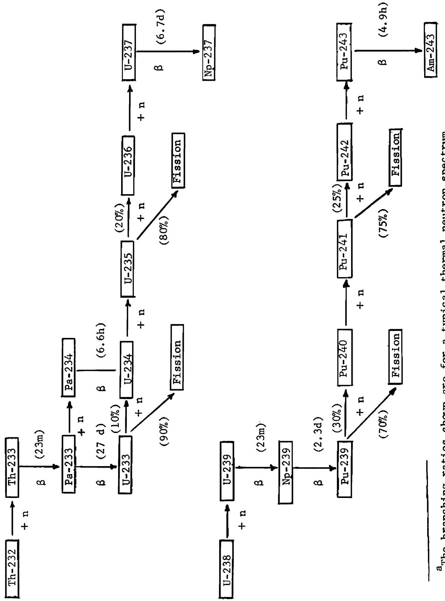  
aThe branching ratios shown are for a typical thermal neutron spectrum.

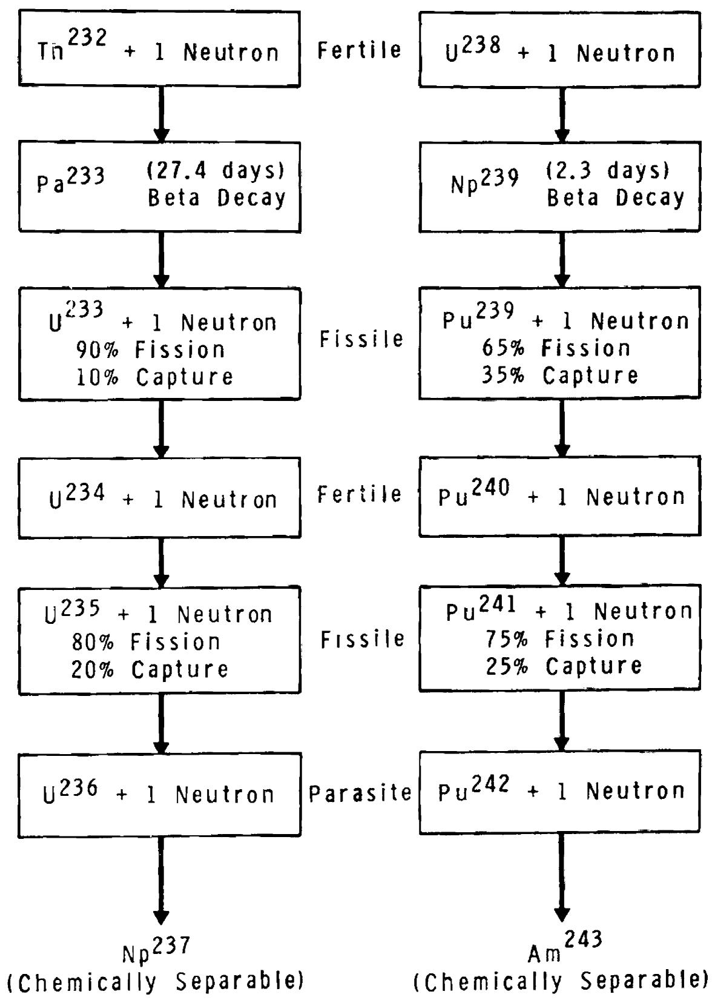  
FIGURE 3.2   
THE ISOTOPIC BUILDUP IN THORIUM AND U238 SYSTEMS

The nuclide chain beginning with Th-232 is very similar to the chain associated with U-238. In each case, a neutron capture leads to a nuclide that is transformed by two successive beta decays to a fissile nuclide. Two successive neutron captures in the bred fuel lead to a second fissile nuclide in each chain. Further, in both chains, successive neutron captures beyond the secondary fissile material lead to heavy-element nuclides that become neutron poisons. Unless special recycle management programs are used, these heavy-element poisons can penalize the neutron economy of recycle operations in thermal spectrum reactors, particularly after several recycles. A more detailed discussion of the nuclear characteristics of the nuclides associated with the thorium cycle is contained in Appendix A.

The Th-232 chain differs from the U-238 chain in one important respect. The precursor of the bred U-233, namely Pa-233, has a half-life of 27 days and a significant neutron absorption cross section; absorption in the Pa-233 results in a neutron loss, and also the removal of a potential fissile nuclide. If the Pa-233 is allowed to remain in the neutron flux, this process places a limit on the neutron flux intensity that is optimum for the fuel cycle and must be taken into consideration in fuel cycle optimizations.

# 3.2 Nuclear Properties of Fertile and Fissile Isotopes

# 3.2.1 PROPERTIES IN A THERMAL SPECTRUM

The nuclear characteristics of the fissile and fertile isotopes are such that the U-233(Th-232)U-233 cycle gives nearly as high conversion ratios in a thermal as in a fast spectrum, while the Pu-239(U-238)Pu-239 cycles gives much higher conversion ratios in a fast spectrum. The relative merits of the two cycles can be seen by comparing some of the integral nuclear characteristics of both the fertile and fissile nuclides involved.

In thermal-spectrum reactors, the cross-section characteristics of the fertile nuclides are relatively unimportant, although the U-238 does lead to a fast-fission effect that multiplies the neutron production rate by about 1.02 to 1.05. The fast-fission effect is generally less than 1.01 for Th-232.

Of greater importance in thermal-spectrum reactors are the neutron cross-section characteristics of the fissile nuclides. Table 3.1 shows the thermal-spectrum-averaged eta values for U-233, U-235, and Pu-239 as a function of moderator temperature for a moderating power per fuel atom $(\xi \Sigma_{\mathrm{s}} / \mathrm{N}_{\mathrm{fuel}})^{*}$ of 4,000 barns. This is equivalent to a carbon/fuel atom ratio of 5,000, or a hydrogen/fuel ratio of 90, which are characteristic of thermal-spectrum reactors. It can be seen that the average neutron generation rates are considerably larger for U-233 than for either U-235 or Pu-239. Pu-239 has the lowest value of eta in the thermal spectrum considered in Table 3.1 and, in addition, this value decreases significantly with increasing moderator temperatures.

The eta values in Table 3.1 represent averages only over the thermal-neutron spectrum i.e., up to a neutron energy of $1.0\mathrm{eV}$ . However, neutron absorption also takes place in the epithermal range. Since the epithermal values of eta are generally lower than the thermal values, an eta averaged over the thermal-plus-

TABLE 3.1.-Thermal-Spectrum-Averaged Eta Values for U-233, U-235, and Pu-239 (Moderating Power Per Fuel Atom = ξ Σs/N fuel = 4,000 barns/atom)   

<table><tr><td>Temp., °C</td><td colspan="3">Eta</td></tr><tr><td></td><td>U-233</td><td>U-235</td><td>Pu-239</td></tr><tr><td>0</td><td>2.29</td><td>2.06</td><td>1.87</td></tr><tr><td>300</td><td>2.29</td><td>2.05</td><td>1.82</td></tr><tr><td>600</td><td>2.29</td><td>2.04</td><td>1.79</td></tr><tr><td>900</td><td>2.28</td><td>2.03</td><td>1.77</td></tr></table>

TABLE 3.2.-Typical Spectrum-Averaged Thermal, Epithermal, and Combined Thermal-plus-Epithermal Eta Values for U-233, U-235, and Pu-239 at $600^{\circ}\mathrm{C}$ (Moderating Power Per Fuel Atom = ξ Σs/N fuel = 4,000 barns/atom)   

<table><tr><td></td><td>U-233</td><td>U-235</td><td>Pu-239</td></tr><tr><td>ηth</td><td>2.29</td><td>2.04</td><td>1.79</td></tr><tr><td>ηep1</td><td>2.14</td><td>1.62</td><td>1.76</td></tr><tr><td>η</td><td>2.24</td><td>1.95</td><td>1.78</td></tr></table>

epithermal spectrum tends to be lower than the thermal value. Average values of eta over the thermal, epithermal, and thermal-plus-epithermal energy ranges for the previously-defined moderating power at a temperature of $600^{\circ}\mathrm{C}$ are shown in Table 3.2. The eta value for U-233 is degraded less than that of U-235 due to an epithermal flux component. Since the typical LWR spectrum normally has a higher epithermal neutron absorption component than the example shown in Table 3.2, the average eta for U-235 in the LWR would be somewhat lower than shown.

There will always be a mixture of U-233 and U-235 fuels present after several cycles of operation in a thermal-spectrum reactor using the thorium cycle. Even if no U-235 is used as makeup fuel, some of it will build up from the parasitic capture of neutrons in U-233 and a subsequent second capture in U-234 (Figure 3.1). The ratio of neutron absorptions in U-235 to those in U-233 would be about 0.1 for equilibrium concentrations of the higher isotopes in the case shown in Table 3.2. On the other hand, if the reactor has a conversion ratio of less than unity, then some U-235 makeup fuel would also be required with each new fuel charge, thereby increasing the equilibrium fraction of fissions in U-235 above 10 percent; a conversion ratio of 0.80 will result in an equilibrium fraction of neutron absorptions in U-235 of approximately 30 percent with an over-all effective eta for the fuel mixture of U-233 and U-235 of about 2.15.

The relative nuclear characteristics of the various fissile and fertile isotopes in thermal-spectrum reactors are:

1) The thermal-spectrum-averaged value of eta for U-233 is considerably higher than that of either U-235 or Pu-239 (Table 3.1). However, build-up of Pu-241 will increase the average value of eta of fuel in the uranium cycle, whereas buildup of U-235 will decrease the average value of eta of fuel in the thorium cycle (Appendix A, Table A-1).

TABLE 3.3.-Fission Cross Sections and Eta Values for Fissile Nuclides at Three Neutron Energies   

<table><tr><td></td><td>10 kev
(104ev)</td><td>100 kev
(105ev)</td><td>1.0 Mev
(106ev)</td></tr><tr><td colspan="4">Fission Cross Sections, barns</td></tr><tr><td>U-233</td><td>4.5</td><td>2.5</td><td>2.0</td></tr><tr><td>U-235</td><td>3.3</td><td>1.7</td><td>1.2</td></tr><tr><td>Pu-239</td><td>1.9</td><td>1.8</td><td>1.7</td></tr><tr><td colspan="4">Eta Values, neutrons produced per neutron absorbed</td></tr><tr><td>U-233</td><td>2.24</td><td>2.26</td><td>2.40</td></tr><tr><td>U-235</td><td>1.77</td><td>1.90</td><td>2.32</td></tr><tr><td>Pu-239</td><td>2.00</td><td>2.41</td><td>2.99</td></tr></table>

TABLE 3.4.-Some Selected Average Cross-Section Parameters for Fuel Nuclides   

<table><tr><td>Nuclide</td><td>η</td><td>νf</td><td>vσf - σa</td></tr><tr><td>U-233</td><td>2.31</td><td>7.08</td><td>4.02</td></tr><tr><td>U-235</td><td>1.93</td><td>4.63</td><td>2.70</td></tr><tr><td>Pu-239</td><td>2.49</td><td>5.50</td><td>3.29</td></tr><tr><td>Pu-241</td><td>2.72</td><td>8.92</td><td>5.65</td></tr><tr><td>Th-232</td><td>0.076</td><td>0.028</td><td>-</td></tr><tr><td>U-238</td><td>0.411</td><td>0.124</td><td>-</td></tr><tr><td>Pu-240</td><td>1.315</td><td>1.185</td><td>-</td></tr></table>

* Spectrum chosen was that of a Gas-Cooled Fast Breeder Reactor with (U-238/Pu) oxide fuel.

2) The thermal-spectrum-averaged value of eta for U-233 is relatively insensitive to changes in the moderator temperature. On the other hand, an increase in the moderator temperature will result in a slight decrease of the eta of U-235 and a greater decrease of the eta of Pu-239.   
3) The epithermal eta for U-233 is slightly lower than the thermal value, so that the choice of a soft spectrum (high moderator-to-fuel ratio) will result in improved neutron economy. The epithermal eta for U-235 is significantly lower than the thermal value, so that a well-thermalized spectrum is very important for a reactor starting up with U-235 or using substantial amounts of U-235 as makeup fuel in recycle operations.

# 3.2.2 PROPERTIES IN A FAST SPECTRUM

In a fast-spectrum reactor, the cross sections of the fertile and fissile nuclides behave quite differently. Fission cross-section data for U-238 and Th-232, as well as the three fissile nuclides, are discussed in Appendix A. The fertile fast-fission contribution to the over-all neutron production rate per fission in an FBR is a very important factor in maximizing the breeding ratio. The fast-fission cross section of U-238 is significantly larger than that of Th-232 (a factor of 4 to 5; Fig. A.5) and the U-238 contribution to the breeding potential in a fast-spectrum reactor is, therefore, much greater.

The nuclear characteristics of the fissile nuclides as well as their behavior as a function of neutron energy in the high-energy spectrum have an important bearing on the performance of fast reactors using

these fuels, as discussed later in Sections 3.4 and 5.6. An examination of the fission cross sections and eta values for the fissile nuclides tabulated in Table 3.3 for three different energies, viz., $10\mathrm{keV}$ , $100\mathrm{keV}$ , and $1.0\mathrm{MeV}$ reveals that:

1) The U-233 fission cross section in the range from $10 \, \mathrm{keV}$ to $1.0 \, \mathrm{MeV}$ is significantly higher than that of either U-235 or Pu-239.   
2) The fission cross section of Pu-239 is relatively insensitive to the neutron energy, while those for U-233 and U-235 decrease significantly with energy.   
3) The eta value for Pu-239 is substantially higher than that of U-233 or U-235 at $1.0\mathrm{MeV}$ . At $10\mathrm{keV}$ , however, U-233 eta is larger than that of U-235 or Pu-239. Therefore, at a somewhat degraded fast neutron spectrum of about $100\mathrm{keV}$ , the eta values for Pu-239 and U-233 would not differ significantly.   
4) The eta values for Pu-239 and U-235 are very sensitive to changes in the neutron spectrum, while that of U-233 remains relatively constant with energy.

Of greater significance to the reactor designer are the spectrum-averaged values of the cross sections.

The spectrum of an FBR is very sensitive to the type of fuel element, the amount of structural material, the choice and volume fraction of coolant, and the specific design features of the reactor. General observations are possible for a broad range of spectra. For example, some spectrum-averaged cross-section parameters for several fuel nuclides in a gas-cooled FBR are shown in Table 3.4. The value of the neutron yield $(\upsilon\Sigma f)$ for U-238 is more than four times as large as that for Th-232. Among the fissile nuclides, the eta for U-233 is somewhat smaller than that the Pu-239, but still significantly greater than 2.00. The difference between neutron yield and neutron absorption $(\upsilon\Sigma f - \Sigma a)$ is a measure of the critical mass of the system, i.e., the larger the value for the core, the smaller the critical mass. Thus, the specific fissile inventory of a reactor using U-233 fuel should be somewhat smaller than that for one using Pu-239, and considerably smaller than that for a reactor using U-235. However this advantage for U-233 relative to fissile Pu, decreases as the Pu-241 to Pu-239 concentration increases.

# 3.3 Advantages of the Thorium Cycle for Applications in Thermal-Spectrum Reactors

# 3.3.1 INTRODUCTION

The selection of reactor and fuel cycle requires assessment of projected economics, taking into consideration that the uranium ore costs may increase. This implies assessment of fuel cycle types offering good fuel utilization. Factors which influence the economics and selection of such a fuel cycle are fuel conversion ratio, specific fissile inventory, fuel fabrication and processing costs, and plant efficiency.

Fuel cycles characterized by high fuel conversion ratios or low specific fissile inventory conserve nuclear fuel resources, and, in addition, permit realization of low fuel depletion costs or fuel working capital charges, respectively. The achievement of high fuel burnup results in low unit energy charge for fuel fabrication, shipping, and reprocessing because a large amount of heat is produced per unit of

fabricated fuel. High plant efficiency permits conservation of nuclear resources and the realization of low overall fuel costs since a high electric output is achievable from a unit of heat generated.

A discussion of these characteristics, as related to the thorium and uranium fuel cycles, is presented in the following sections.

# 3.3.2 FUEL CONVERSION RATIO

The most significant nuclear advantage of the U-233(Th-232)U-233 cycle over the Pu-239(U-238)Pu-239 cycle in thermal reactors is the potential of a higher conversion ratio. The importance of a high conversion ratio, CR, in assuring good utilization of resources is directly related to the burnup needs. In a converter reactor, CR units of bred fuel are produced for each unit of fuel consumed, and the net consumption of nuclear fuel is, then, proportional to (1-CR). Hence, other things being equal, a reactor with a conversion ratio of 0.6 would consume twice as much fuel per unit energy developed as a reactor having a conversion ratio of 0.8. The higher conversion ratio leads directly to a lower depletion charge in the fuel cycle cost.

The conversion ratio is directly related to the number of neutrons available in a reactor for conversion of fertile to fissile material and is simply the difference between the number of neutrons produced and those which are lost or required to sustain the chain reaction, that is

$$
\mathrm {C R} = \mathrm {e} ^ {*} \mathrm {n} - 1 - \mathrm {L},
$$

where $e$ is the fast-neutron multiplication factor, $n$ the neutron production rate per neutron absorbed in the fissile material, and $L$ the neutrons lost parasitically per neutron absorbed in the fissile fuel. The relatively large eta value of U-233 in the thermal spectrum is the most important factor contributing to the potentially larger conversion ratios achievable with the thorium cycle. A small part of the advantage of the higher eta in U-233 is lost in the thorium cycle, however, because of the smaller fast-fission effect in Th-232 relative to that in U-238.

The neutrons should be thermalized as much as possible in thermal and intermediate reactors to maximize the neutron production rate, $\mathrm{e}^{*}\mathrm{n}$ . Since the absorption cross sections of graphite and heavy water are relatively small, it is possible to thermalize the neutrons quite well in graphite or heavy water moderated reactors without incurring a large neutron loss in the moderator material itself. With ordinary water as the moderator, however, the neutron absorption due to the hydrogen is significant. It is also economical to use relatively tight lattices in LWRs, i.e., lattices with a high fuel-to-water ratio. The net result is that the neutron spectrum in a light water-moderated reactor tends to have a significant epithermal flux component, and the effective eta of the fuel, therefore, tends to be low with U-235 as the fissile material. This reduction is slightly offset in the LWR by a higher fast-fission factor.

Reduction of the parasitic loss of neutrons to achieve a high conversion ratio is greatly influenced by the reactor design features, the fuel cycle choice, fuel management and methods of control. Therefore, it is

difficult to compare quantitatively the neutron loss in various types of reactors. Pertinent to the discussion of the thorium cycle, however, are losses to control poisons, fission product poisons, and to Pa-233. A Pa-233 absorption not only results in a neutron loss but also in the removal of a potential fissile nuclide. In the HTGR, Pa-233 absorptions reduce the conversion ratio by about 0.03. In the MSBR there are no losses to control poisons, while neutron losses to Pa-233, to Xe and Sm, and to fission products result in conversion ratio losses of less than 0.005, about 0.005, and about 0.02 to 0.03, respectively.

Losses to fission product poisons can be reduced by decreasing the fuel exposure, but this normally results in an increase in the unit fabrication and reprocessing costs. Significant reductions could be achieved, for example, in the HTGR by allowing the more volatile fission products to escape from the fuel particle. A basic feature of the MSBR is the continuous removal of fission products from the fuel stream.

Control poison losses can be reduced or eliminated by the use of more frequent partial refueling, by on-stream refueling, as in the HTGR reference design, or by controls involving the motion of fuel or fertile material as in the MSBR.

# 3.3.3 SPECIFIC FISSILE INVENTORY

In a growing nuclear economy, significant amounts of fuel are required for the startup of new reactors, in addition to the net burnup requirements. If, for example, the nuclear power generating capacity grows with a doubling time of less than six years as is expected for at least the next 15 years, then fuel inventory requirements for the new power capacity will generally be found to exceed the fuel consumption requirements, at least for cases where the conversion ratio is greater than about 0.7. Hence, the introduction of reactors with high conversion ratios, even if they are slightly greater than unity, does not eliminate the requirement for additional mined uranium. But, if breeding and a low specific inventory can be achieved simultaneously, then annual uranium requirements to provide for an expanding nuclear power economy can be materially reduced.

The specific fissile inventory of a reactor system, kg fissile material/kWe, can be expressed as

$$
I _ {s} = \frac {t _ {r} + t _ {p}}{t _ {r}} \cdot I _ {r}
$$

where Ir is the kg fissile material/kWe in the reactor, tr the time interval spent by the fuel in the reactor, and tp the time interval of the fuel spent outside the reactor for fabrication, reprocessing, and associated operations. Since the total ex-reactor holdup time is typically about one year, a reactor with a fuel exposure of one year will have inventory requirement about 70 percent greater than that of a reactor with a six-year fuel lifetime. In a circulating fuel reactor, such as the MSBR, it is very important to minimize the ex-reactor volume of the circulating fuel system.

The specific inventory depends in part on the thermal-hydraulic design. It is generally found that improvements in the thermal performance can be achieved by design changes at the expense of increasing

the fissile load. Uneven power distributions in a reactor core can arise from a number of factors, including fuel zoning schemes, control rod programming, local heterogeneities in the core composition, and, in a fixed-fuel core, the composition and age distribution of the fuel in various parts of the core. It is sometimes difficult to accommodate power shifts arising from fuel depletion and the replacement of the spent fuel by fresh fuel, particularly if the fresh charge involves bred fuel having a composition and effective cross-section different from the surrounding older fuel. The situation sometimes can be improved by increasing the fissile load in the core so that the fractional change in loading during the fuel lifetime is reduced. Perturbations due to burnup and/or refueling can then be reduced, although at a penalty to the fuel cycle cost. The problem of uneven power distributions can be less severe in reactors utilizing the thorium cycle. The higher conversion ratio of this cycle leads to smaller changes in power due to depletion effects. In addition, the thermal cross-section characteristics of U-233 are closer to those of U-235 than are those of Pu-239 to U-235. When Pu-239 and U-235 are present together, the Pu-239 will burn out proportionately faster because of its relatively larger cross section.

The reactor systems homogeneous to neutrons, such as the HTGR and MSBR, require a lower specific inventory when using the thorium cycle instead of the uranium cycle. However, this advantage of the thorium cycle is lost when it is used in reactor systems such as the HWR and LWR that are heterogeneous to neutrons. In these, highly enriched fissile material would be required in utilizing the thorium cycle, as contrasted with slightly enriched fuel in the uranium cycle. Also, attainment of low specific inventories may be limited in the thorium cycle because of significant neutron losses in Pa-233 as the power density is increased, unless the Pa can be frequently or continuously removed.

# 3.3.4 FUEL EXPOSURE TIME

Fuel exposure is chosen on the basis of technical fuel performance and an economic optimum between fabrication and reprocessing costs, depletion costs, and, to some extent, working capital costs. Longer fuel exposures are usually associated with fixed-fuel, thermal-spectrum reactors using the thorium cycle than with the low-enrichment uranium cycle. This results from the higher conversion ratios in the thorium cycle which reduce reactivity losses for a given fuel burnup fraction.

For a fluid-fuel system such as the MSBR, the above conditions do not apply, since reactivity can be controlled by fuel addition or removal. Also, one of the major advantages of the MSBR is the continuous reprocessing of the fluid fuel. As described in Section 5.2, the separation of the bred uranium from the thorium-containing salt, and also the removal of fission products from the fuel carrier salt, are basic to the high performance characteristics of the MSBR. The processing methods are uniquely suited to the use of the thorium cycle, permitting rapid processing rates and short fuel exposures.

# 3.3.5 PLANT EFFICIENCY

The importance of a high plant efficiency in achieving good utilization of nuclear resources in nonbreeding reactors is obvious, i.e., to produce more power from a given amount of fuel and to reduce the

rejection of waste heat. In very efficient breeders, where the value of the bred fuel is enough to pay for all incremental operating costs, it would seem that the plant might be operated even if heat was wasted, but even in this case it would be more economical to have a high plant efficiency because of the fixed charges on the plant and fuel.

The plant efficiency of a nuclear plant depends primarily on the temperature of the steam that can be generated, and this depends, in turn, on the type of coolant, the fuel element design, and the overall plant design. Although the choice of the fuel cycle is not a major factor in the plant efficiency of a nuclear plant, high-temperature operation directly affects the conversion ratio as discussed in Sections 3.2 and 3.3.3. The U-233(Th-232)U-233 fuel cycle utilizes a fuel which has a relatively invariant value of eta with temperature and is, therefore, more attractive for high-temperature, thermal-spectrum reactors than is the Pu-239(U-238)Pu-239 fuel cycle.

# 3.4 The Thorium Cycle in Fast-Spectrum Reactors

# 3.4.1 INTRODUCTION

Large uncertainties exist in the cross-section data for the heavy-element fissile and fertile nuclides in the high neutron energy range of interest. Furthermore, results of only a few critical experiments are available for U-233-fueled assemblies. Hence, it is difficult to accurately evaluate the detailed performance characteristics of the various fuel cycles in fast reactors. Nevertheless, certain general information can be stated on the basis of the currently available nuclear data.

# 3.4.2 THORIUM AS A FERTILE MATERIAL

The larger fast-fission effect in U-238 compared with that in Th-232 gives a reactor loaded with U-238 fertile material a significant advantage over one loaded with thorium. As was shown in Table 3.4, the value of the neutron yield, $\upsilon \Sigma_{\mathrm{f}}$ , for U-238 is larger than that of Th-232 by a factor of about four, the exact value depending on the specific reactor design. An indication of this relative improvement may be seen in Table 3.5 which summarizes some calculations by Okrent (1) for a very simple spherical reactor. The combinations using U-238 as the fertile material lead to conversion ratios that are higher by about 0.15 to 0.25 and inventories that are lower by about 3 to 10 percent when compared with those obtained using Th-232. The breeding ratio given in Table 3.5 would be significantly lower for oxide or carbide fuels. Table 3.6 gives an indication of the reduction in breeding ratio using these fuel forms.

A design parameter of considerable importance in sodium-cooled FBRs is the sodium void coefficient. For reactors using the Pu-239(U-238)Pu-239 fuel cycle, this coefficient can be positive, due in part to the energy dependence of the fast-fission effect in the U-238. The use of thorium as a fertile material reduces this coefficient significantly as can be seen from Table 3.5. While this represents a distinct advantage for thorium in such reactors from the viewpoint of safety, the value of this advantage will remain unknown so long as the safety criteria for FBRs have not been established.

TABLE 3.5. Critical Mass, Breeding Ratio, and Sodium Void Effect for a 3000-Liter Metal Fueled Fast Reactora,b   

<table><tr><td>Fuel Type</td><td>Critical Mass, kg fissile</td><td>Breeding Ratio</td><td>Reactivity Worth of 40% of the Sodium, Δk/k in core</td></tr><tr><td>Th-232/U-233</td><td>918</td><td>1.27</td><td>- .031</td></tr><tr><td>U-238/U-233</td><td>878</td><td>1.50</td><td>- .012</td></tr><tr><td>Th-232/Pu-239</td><td>1060</td><td>1.36</td><td>- .013</td></tr><tr><td>U-238/Pu-239</td><td>1030</td><td>1.60</td><td>+ .0025</td></tr><tr><td>Th-232/U-235</td><td>1580</td><td>1.02</td><td>- .030</td></tr><tr><td>U-238/U-235</td><td>1460</td><td>1.16</td><td>- .016</td></tr></table>

aReference 1.   
These data pertain to a core with 15 v/o fuel, 18 v/o steel, and 67 v/o sodium, and a 45-in.-thick blanket with 40 v/o uranium.

TABLE 3.6.—Comparison of Breeding Performance of Selected 3000 Liter Fast Reactors Using Oxide, Carbide and Metallic Fuel   

<table><tr><td>Fuel Type</td><td>Critical Mass 
Kg fissile</td><td>Breeding 
Ratio</td></tr><tr><td>U-238/Pu Oxide</td><td>965</td><td>1.29</td></tr><tr><td>J-238/Pu Carbide</td><td>1104</td><td>1.46</td></tr><tr><td>U-238/Pu Metal</td><td>1247</td><td>1.75</td></tr></table>

$^{a}$ Reference 21, Table 1; core volume fraction: 30 fuel/20 clad/50 Na.

The use of thorium in the FBR leads to a unique control problem. Neutron capture in Th-232 results in Pa-233 which decays with a 27-day half-life (Figure 3.1). As a result, a relatively large amount of Pa-233 will build up in a thorium-bearing reactor, the buildup of U-233 fuel thereby being delayed. A fairly large reactivity loss can occur during the first month of operation before the U-233 builds in. Furthermore, if the reactor is shut down for a period corresponding to the Pa-233 half-life, the fuel buildup will result in a substantial reactivity increase. Since it is desirable for safety reasons, to limit the amount of excess reactivity in a FBR, the indicated reactivity transients associated with the use of thorium are a disadvantage. It should be noted, however, that the fast-fission effect and the Pa-233 reactivity effect would be small when thorium is used in the blanket of the reactor.

While thorium appears to have the nuclear disadvantages described above, its physical behavior as a metallic fuel material is far better than that of uranium. Consequently, the use of thorium as a fertile material in fast-spectrum reactors may offer some advantages if it is used in the metallic form.

# 3.4.3 U-233 AS A FISSILE MATERIAL

As discussed in Section 3.2, U-233 has some attractive characteristics in fast-spectrum reactors. The eta value for U-233 is not much lower than that of Pu-239, particularly in soft-spectrum fast reactors, so that the breeding ratio with the U-233(U-238)Pu-239 cycle would be expected to be reasonably close to that in the Pu-239(U-238)Pu-239 cycle. In addition, its high value of neutron yield ( $\upsilon\sigma f - \sigma a$ ) could lead to lower specific inventories. Finally, its cross-section behavior as a function of neutron energy is such that it would lead to a smaller void coefficient in sodium-cooled FBRs. All of these characteristics are shown qualitatively by the calculations summarized in Table 3.7.

# 3.5 Transition from the Uranium to the Thorium Cycle

Thermal-spectrum reactors will probably dominate the power reactor industry for the next two decades. However, these reactors could be converted to the use of the thorium fuel cycle if the uranium ore price goes up sufficiently. This would raise the conversion ratio, as discussed in Section 3.2. However, until such time as a breeder exists, there cannot be enough U-233 available to fuel thermal reactors with that material alone. Hence, U-235 must also be used as a feed and makeup material, and the full increase of 0.2 in the conversion ratio, which represents the potential in switching from U-235 to U-233, cannot be realized in any system to be operated in the near term. Any increase in conversion ratio must be balanced against the costs that may be incurred in switching from the uranium to the thorium system. Chief among these costs is the use of highly-enriched uranium instead of partially enriched material. The lower the required uranium enrichment in reactors utilizing the uranium cycle, the less will be the incentive to switch to U-233. Reactor systems which are more homogeneous from the nuclear point of view, such as the MSBR and the HTGR, would normally require a high uranium enrichment anyway, and these offer the greatest incentive to switch to U-233.

# 3.6 Summary

In summary:

1. A very important incentive for the use of the thorium cycle is the high eta of U-233 and the resulting improved fuel conversion ratio.   
2. The conversion ratio of a thermal-spectrum reactor fueled with U-233 is greater than one fueled with Pu-239. Hence, there is a greater incentive to recycle bred fuel in the thorium cycle than in the uranium cycle.   
3. The higher conversion ratios of the systems operating on the thorium cycle permit longer reactivity lifetimes. Longer fuel lifetimes result in reduced fabrication and processing charges per unit of energy output.   
4. While only slightly enriched uranium is required for the uranium cycle, highly-enriched uranium is required for the thorium cycle. Hence, for a particular reactor concept, the fissile inventory cost becomes a more important consideration with the use of the thorium cycle than with the uranium system.   
5. The thorium cycle tends to be more economical than the uranium cycle in high-temperature reactors in which the fuels are homogeneous to neutrons. In thermal-spectrum reactors, such as the HTGR and MSBR, which operate at higher temperatures, the eta remains high and the conversion ratio larger with the thorium cycle than when using the uranium cycle. Thus, the thorium cycle tends to lower fuel depletion costs which compensates for the relatively high fissile inventory costs associated with the thorium cycle.   
6. The uranium cycle tends to be economical in soft-spectrum reactors heterogeneous to neutrons, such as the LWR and HWR, in which the fissile enrichment requirement is low. The lower cost of fissile fuel which can be used with the uranium cycle offsets its relatively lower conversion ratio.   
7. Use of U-238 as the fertile material in a fast reactor provides a higher breeding ratio than does the use of Th-232. This is due in large part to the large fast-fission factor in U-238; the eta values for the respective bred fuels, Pu-239 and U-233, do not differ greatly in fast reactors. However, the uranium cycle tends to give a positive sodium void coefficient. The use of Th-232 or U-233 alleviates this problem.

# 4. NUCLEAR FUEL RESOURCES, REQUIREMENTS, AND ECONOMICS

# 4.1 Introduction

Both U-238 and Th-232 are convertible to fissile material in a nuclear reactor, but unlike natural uranium with its small percentage of U-235, natural thorium contains no fissile isotopes. Hence, the initial fuel inventory and any makeup fuel requirements to sustain the operation of reactors using the thorium cycle must depend on the U-235 separated from natural uranium, or on secondary fissile material produced in another reactor. Even in the latter case, the secondary fuel depends at some point on naturally occurring U-235 for fissile material. Thus, it is essential that the uranium as well as thorium requirements for fuel inventory and fuel replacement be examined when considering the use of the thorium cycle.

The use of the thorium cycle can lead to reductions in the amount of uranium ore that must be mined for the production of electrical energy; nevertheless the amount and cost of the uranium ore required still will be more important than the amount and cost of thorium ore. For example, a thorium fueled reactor might require on the order of \(0.1\mathrm{kg}\) \(\mathrm{ThO_2 / kWe}\) to provide its initial fertile material requirement compared to about 5-10 times as much uranium ore to provide for its initial fissile fuel requirement. At a \(\mathrm{ThO_2}\) cost of \\(5/1b, the initial thorium requirement would, therefore, be about \\)1/kWe, or a thorium inventory charge of less than 0.02 mills/kWe compared to the uranium ore inventory cost of 0.1 to 0.2 mills/kWe at an ore cost of \\(8/lb U3O8. Clearly, in contrast to the effect of an increase in uranium ore price, an increase in the cost of thorium ore by a factor of two would have little effect on the cost of electricity from a thorium-fueled reactor.

The amount and cost of thorium ore are, therefore, of little concern in assessing the possible role of the thorium cycle in the production of nuclear energy so long as the cost of recovery and amounts available are not very different from present estimates. Because of the present low thorium prices and the uncertain processing cost of the present low-volume thorium processing industry, there might be an economic incentive not to recycle thorium in the near-term, but to stockpile it until a large-scale, lower unit cost, industrial thorium processing capability was developed.

In the following discussion, the estimated domestic reserves of uranium and thorium ores are reviewed and the relative requirements of resources for reactors using the thorium and uranium cycles are discussed within the context of the projected nuclear power growth. Finally, the economics of the thorium cycle are discussed with particular emphasis on the effect of possible uranium ore cost increases.

# 4.2 Nuclear Fuel Resources

Estimates of U. S. uranium resources, prepared by the AEC (2), and the U. S. Geological Survey (USGS) (3), are given in Table 4.1. The thorium resources are given in Table 4.2. The estimates include those resources which are reasonably assured and estimated additional. The additional resources refer to those indigenous areas in which there are known deposits, or about which sufficient geological data or

TABLE 4.1.-Estimates of U. S. Uranium Fuel Resources a/b/   

<table><tr><td rowspan="3">Up to Price of, $/1b U308</td><td colspan="2">Reasonably Assured</td><td colspan="2">Total, Reasonably Assured plus Estimated Additional</td></tr><tr><td colspan="4">Millions of Short Tons</td></tr><tr><td>USAEC</td><td>USGS</td><td>USAEC</td><td>USGS</td></tr><tr><td>7</td><td>--</td><td>--</td><td>0.10</td><td>--</td></tr><tr><td>8</td><td>0.15</td><td>--</td><td>0.43</td><td>--</td></tr><tr><td>10</td><td>0.21</td><td>0.19</td><td>0.56</td><td>1.1</td></tr><tr><td>15</td><td>0.46</td><td>--</td><td>1.0</td><td>--</td></tr><tr><td>30</td><td>0.66</td><td>0.36</td><td>1.6</td><td>1.9</td></tr><tr><td>50</td><td>6</td><td>--</td><td>10</td><td>--</td></tr><tr><td>100</td><td>11</td><td>15</td><td>25</td><td>40</td></tr><tr><td>500</td><td>500</td><td>--</td><td>2000</td><td>4700</td></tr></table>

Reference 2 data; lower cost estimates revised Jan. 1968.   
$^{\mathrm{b}}$ Reference 3.

TABLE 4.2.-Estimates of U. S. Thorium Resources   

<table><tr><td>Up to Price of, $/lb ThO2</td><td colspan="2">Total, Reasonably Assured plus Estimated Additional, Millions of Short Tons</td></tr><tr><td></td><td>USAEC2</td><td>USGS3</td></tr><tr><td>10</td><td>0.6</td><td>1.0</td></tr><tr><td>30</td><td>0.8a</td><td>2.1</td></tr><tr><td>50</td><td>11</td><td>--</td></tr><tr><td>100</td><td>36</td><td>77</td></tr><tr><td>500</td><td>3000</td><td>--</td></tr></table>

aIncomplete estimate because of lack of data.

FIGURE 4.1   
U.S. AEC REASONABLY-ASSURED PLUS ESTIMATED ADDITIONAL CUMULATIVE URANIUM RESOURCES RECOVERABLE UP TO INDICATED PRICE (JANUARY 1967)   
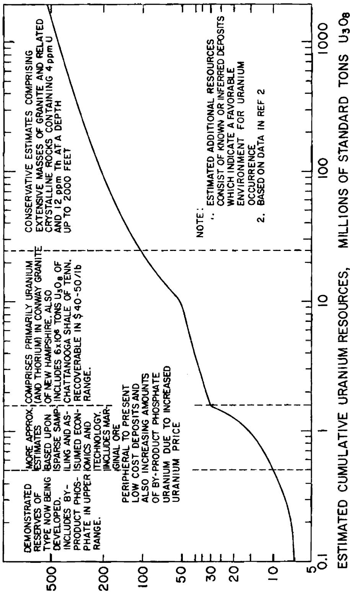  
02n q1/\\('LsOeONINrN

FOR 1975 AND 1980 VARYING

WITH YEAR ESTIMATE MADE

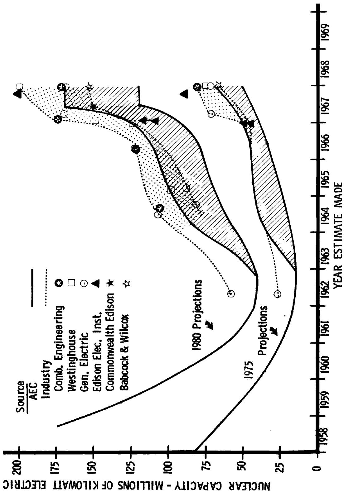  
FIGURE 4.2   
NUCLEAR POWER GROWTH ESTIMATES

information have been developed by active exploration to indicate the existence of a favorable environment for the occurrence of uranium or thorium-bearing deposits. Further discussion of the uranium resources is given in Appendix D.

Estimates of uranium and thorium resources are subject to the same uncertainties that apply to estimates of other minerals. It is noted that the USGS estimates make greater allowance than those of the AEC for discovering additional deposits in the specific price ranges.

For civilian nuclear power projections, the availability of uranium to meet nuclear power growth demands have been frequently based upon the AEC estimates of reasonably assured resources. However, for the assessment in this report, the AEC estimates of "Reasonably Assured plus Estimated Additional" resources were used. These are shown graphically in Figure 4.1. This basis recognizes that the use of AEC "Reasonably Assured" estimates may be too conservative and, therefore, greater credence should be given to the AEC total estimates, which include estimated additional resources, in making civilian nuclear power assessments. It is noted that the USGS "Reasonably Assured" estimates are lower than those of the AEC in the lower price range although their estimates of less-defined additional resources are higher.

Established mineral resources are frequently only sufficient to meet anticipated requirements for a few decades. As the demand increases, the established reserves become committed and the price for the mineral increases. This provides an economic incentive for further exploration and development to provide for a relatively consistent reserve-to-demand ratio. The practice in the uranium industry has been to maintain about an eight-year reserve. The current strong demand for uranium has resulted in the commitment of the bulk of the established uranium reserves and an intensified ore exploration by the mining industry to enlarge their resources. Even in the event that new, large, low-cost reserves should not be developed, the amount of known low-grade uranium ores that could be recovered at higher costs is large. Thus, the conservation of uranium resources, per se, is not critical if the lower grade, higher cost ores can be economically used in nuclear power reactors. Utilization of uranium resources, therefore, can be more appropriately interpreted in that context.

# 4.3 Civilian Nuclear Power Growth

Since the inception of the development of commercial nuclear power, forecasts of its growth rate have been made by responsible authorities. Figure 4.2 shows the variations of the projected estimates of nuclear capacity for 1975 and 1980 as a function of the year in which they were made. These estimates reflect the optimism of the mid-1950's when nuclear power was still under development, the cautiousness of the early 1960's when nuclear power was being commercially introduced, and the reality of the mid-1960's which witnessed the unexpected surge in orders for nuclear power plants. While there has been a continual revision of the nuclear power forecast up to the year 1980, none has been made beyond that date; beyond 1980 the estimate is essentially the same as that given in "Civilian Nuclear Power": The 1967 Supplement to the 1962 Report to the President on Civilian Nuclear Power.

The nuclear power forecast shown in Figure 4.3 has been used for the present assessment. The 1980 forecast is the mean value of the 1967 AEC estimates of 120 to 170 GWe. The forecast for the year 2000 is the same as that given in the Supplement to the 1962 Report mentioned above.

Table 4.3 indicates the projected nuclear power capacities for the years 1970 to 2010 at five-year intervals. Shown also in the table are the estimated annual growth rates in gigawatts and in percent, and the cumulative, full-power, nuclear generating capability in gigawatt-years. As would be expected, the annual growth of nuclear power installations is significantly more rapid than that of the electric industry in the early years. By about the turn of the century, the annual growth of nuclear power is expected to approach that of the entire electric industry. This represents a situation in which the ratio of nuclear-to-total power generation approaches and remains essentially a constant.

# 4.4 Reactor Uranium Requirements

Nuclear reactors require uranium for fuel inventory and for fuel replacement. Fuel inventory denotes either that which is required for the reactor core only, or for a total inventory. The latter includes the ex-reactor and ex-plant inventory as well; it may be based on either initial or equilibrium reactor conditions. The fuel replacement is usually considered on an annual basis, and is frequently called makeup, burnup, or depletion requirements. It is important to consider in this context how the power industry makes commitments for fuel procurement. The present assessment of uranium requirements, which reflects the effect of the nuclear power growth and type of reactor introduced upon the uranium supply and its price, is based upon a commitment rather than an actual utilization basis. Current practice is to negotiate for fuel for the first loading and for up to ten years of operation at the time a commitment is made for the construction of a nuclear plant. The practice in the uranium mining industry, indicated previously, is to maintain about an eight-year ore reserve. This report considers ore purchases for the initial core loading as well as for replacement for six full-power years of operation in order to estimate what impact the installation of specific thorium fueled reactor systems might have upon the uranium ore supply and price. Such a commitment would provide for the initial core loading plus about 7 to 8 years of operation at a 75 to 85 percent plant factor. Additional ore would be required to operate the plant for its remaining useful life. For an average capacity factor of 60 percent and a 30-year plant life (18 full power years) the total fuel commitment, therefore, would be equivalent to the initial and replacement fuel for 18 full power years.

The use of an average 60 percent plant capacity factor may be considered to be conservative, except, in the unlikely event that the early plants become technologically or economically obsolete before the expected design life of 30 years. If the average capacity factor were larger than that conservatively assumed (60 percent) more fuel would be consumed, thus leaving a somewhat smaller reserve margin and require additional fuel replacement. The additional fuel replacement needed, for 30 years of operation at an average capacity factor of 70 percent would amount to 3 full power years (21 vs. 18 full power years). Variation of the load factor and nuclear power growth rate assumed here would not significantly affect the general assessment of the role of thorium in specific reactors. For example, discovery of uranium ore in addition to

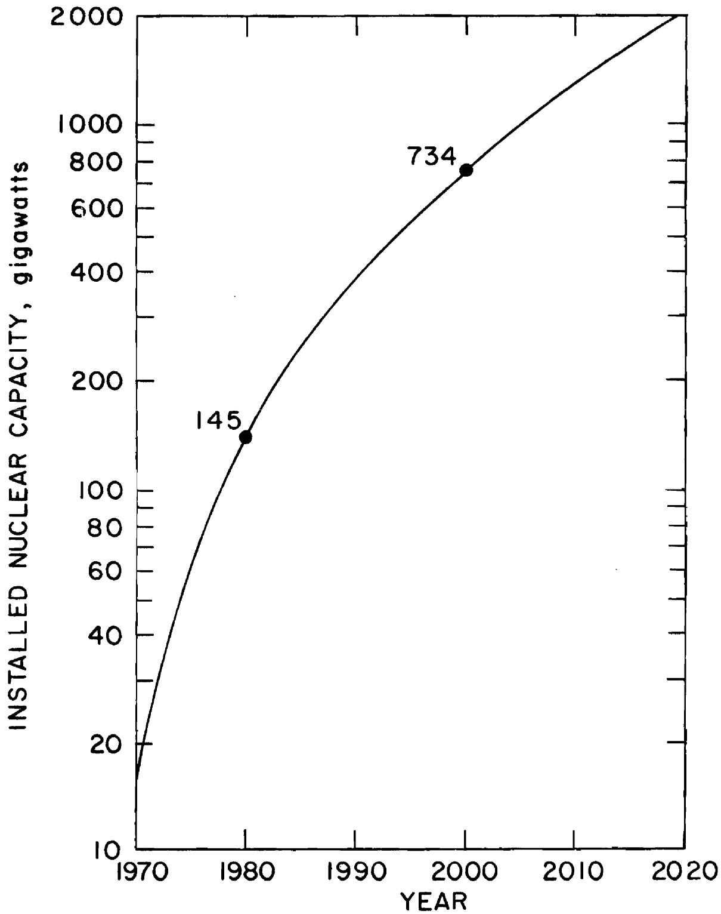  
FIGURE 4.3   
ESTIMATED U.S. INSTALLED NUCLEAR CAPACITY

TABLE 4.3.—Estimated Growth Rate of Nuclear Power Capacity (Data Interpolated from figure 4.3)   

<table><tr><td rowspan="2">Year</td><td rowspan="2">Operating Capacity, Gwea</td><td colspan="2">Annual Growth</td><td rowspan="2">Cumulative Nuclear Generating Capability, Gwe-yr</td></tr><tr><td>Percentb,c</td><td>Gwe</td></tr><tr><td>1970</td><td>12</td><td>-</td><td>-</td><td>-</td></tr><tr><td>1975</td><td>65</td><td>20.2</td><td>13</td><td>190</td></tr><tr><td>1980</td><td>145c</td><td>12.5</td><td>18</td><td>700</td></tr><tr><td>1985</td><td>248</td><td>9.3</td><td>23</td><td>1,680</td></tr><tr><td>1990</td><td>375</td><td>7.6</td><td>28</td><td>3,230</td></tr><tr><td>1995</td><td>535</td><td>6.7</td><td>35</td><td>5,490</td></tr><tr><td>2000</td><td>734</td><td>6.1</td><td>44</td><td>8,640</td></tr><tr><td>2005</td><td>990</td><td>5.8</td><td>56</td><td>12,900</td></tr><tr><td>2010</td><td>1,310</td><td>5.5</td><td>72</td><td>18,600</td></tr><tr><td>2015</td><td>1,720</td><td>5.4</td><td>92</td><td>26,200</td></tr><tr><td>2020</td><td>2,240</td><td>5.2</td><td>116</td><td>36,000</td></tr></table>

aOne gigawatt equals 1000 megawatts   
bCurrently the total U.S. Steam electric generating capacity is growing at a rate of about $8\%$ /year and is expected to decrease to about $6\%$ /year by the year 2000.4/   
cLatest AEC forecast indicates a slightly higher value (about 150 Gwe).

that assumed in Figure 4.1 could provide for any increased ore demand imposed by the larger number of nuclear plants operating at higher capacity factors.

The uranium ore requirements for various reactors are given in Table 4.4. For uranium systems, the HWR would require less than one-half as much uranium ore as the LWR for the initial core loading, and significantly less for makeup. With respect to the thorium systems, the HTGR and HWR would require about the same amount of uranium ore for the initial loading as the uranium-based LWR system, but the makeup requirement might be approximately half as much. The cumulative uranium ore requirements for the uranium fueled LWRs, which would be needed to meet the postulated nuclear power growth rate, and the effect of the introduction of an advanced reactor system after a specified date are given in Figures 4.4 and 4.5. In Figure 4.4 the shaded area between the top two solid lines indicates the uranium requirement if only LWR systems were built to meet the estimated nuclear power demands up to the year 2000. The dotted lines refer to cases where it is assumed that no LWRs would be built after 1980 and that these built would then continue to operate with improved core performance up to the year 2000. The effect of the introduction of only advanced reactor systems, excluding FBRs, starting in 1980, in reducing the uranium ore requirements is indicated. Figure 4.5 differs from Figure 4.4 in that the LWRs continue to be built up to 1985, followed by the building of only advanced reactor systems thereafter.

These figures show the large amount of uranium ore which would be required to sustain the projected nuclear power capacity up to the year 2000 with only LWRs in operation. The amount would be reduced by more than a factor of two by the introduction of high-performance advanced reactor systems, e.g., MSBR. Also, a very important consideration is the time of introduction of an advanced reactor; the longer it is delayed the less would be the reduction in over-all ore requirements.

# 4.5 Economics

The assessment in this report excludes consideration of the introduction of an economic FBR during the period under discussion. It is intended primarily to show the merit of the introduction of various thorium-fueled reactor systems into an LWR nuclear power complex. The interrelationship and merit of all promising reactor systems in meeting future electric power requirements for a variety of parametric conditions has been investigated by the Systems Analyses Task Force using a computerized linear programming procedure, and is reported in WASH-1098, Potential Nuclear Power Growth Patterns.

The real measure of the value of the difference in uranium resource requirements for various reactor systems is economics. Developed nuclear power plants will be accepted by the utility industry primarily on the basis of the economic performance which can be obtained, especially in the face of possible increases in the cost of uranium ore for fuel replacement. Figures 4.6 and 4.7 show the calculated trend in the uranium price with time based upon the data given in Figures 4.1, 4.4, and 4.5. The, introduction of an advanced reactor in 1980 might limit the uranium price to about \(15/lb \, \mathrm{U}_3\mathrm{O}_8\) (a possible critical economic value for the LWR) to about the years 1995 to 2000 (Figure 4.6); it is noted that while the MSBR would extend the availability of \)15/lb \(\mathrm{U}_3\mathrm{O}_8\) far beyond 2000, the MSBR is not likely to be commercially developed as

TABLE 4.4.Uranium Ore Requirements for Various Reactors   

<table><tr><td rowspan="2">Reactor Type</td><td rowspan="2">Fertile Fuel Form</td><td rowspan="2">Burnup, MWD/kg (Equilibrium)</td><td rowspan="2">Feed, % U-235a/Initial/Equilib.</td><td rowspan="2">Specific Power
kw/kg (U+Th)</td><td>Initial Loading</td><td colspan="3">Uranium Ore Requirement, ST U308/Mw e</td></tr><tr><td>Specific U-235
Inventory
kgU-235/Mw e</td><td>$/g</td><td>Initial
Loading</td><td>Total
Commitmentb/</td></tr><tr><td colspan="9">Uranium Systems</td></tr><tr><td>LWR/PWR1 (1970)</td><td>UO2</td><td>33</td><td>2.68/3.06</td><td>11.5</td><td>3.0</td><td>7.8</td><td>0.63e/</td><td>0.90</td></tr><tr><td>(1980)</td><td>UO2</td><td>32.5</td><td>1.77/3.06</td><td>13.3</td><td>2.5</td><td>6.6</td><td>0.40e/</td><td>0.84</td></tr><tr><td>(1990)</td><td>UO2</td><td>26.5</td><td>1.92/2.69</td><td>13.3</td><td>2.2</td><td>6.8</td><td>0.44e/</td><td>0.78</td></tr><tr><td>(1990)</td><td>UO2</td><td>20</td><td>1.92/2.24</td><td>13.3</td><td></td><td>6.8</td><td>0.44e/</td><td>0.72</td></tr><tr><td>LWR/BWR1 (1970)</td><td>UO2</td><td>27</td><td>2.14/2.56</td><td>7.2</td><td></td><td>7.2</td><td>0.50e/</td><td>0.84</td></tr><tr><td>(1980)</td><td>UO2</td><td>30</td><td>1.34/2.72</td><td>8.4</td><td></td><td>5.7</td><td>0.29e/</td><td>0.84</td></tr><tr><td>(1990)</td><td>UO2</td><td>25</td><td>1.41/2.43</td><td>8.4</td><td></td><td>5.9</td><td>0.31e/</td><td>0.78</td></tr><tr><td rowspan="2">HWCCR (Natural) (2)
(Enriched)</td><td>UC</td><td>8.0</td><td>0.71/0.71</td><td>4.7</td><td>1.52</td><td>3.3</td><td>0.28e/</td><td>0.52</td></tr><tr><td>UC</td><td>17</td><td>0.80/1.22</td><td>8.6</td><td>0.93</td><td>3.7</td><td>0.18e/</td><td>0.66</td></tr><tr><td colspan="9">Thorium Systems</td></tr><tr><td>Hwocr</td><td>TH</td><td>20</td><td>2.17/0.53</td><td>10.6</td><td>2.05</td><td>11</td><td>0.52e/</td><td>0.58</td></tr><tr><td>(6)</td><td>THC</td><td>20</td><td>2.04/0.41</td><td>9.0</td><td>2.26</td><td></td><td>0.58e/</td><td>0.52</td></tr><tr><td>HTGR</td><td>THC2</td><td>65</td><td>4.33/2.40</td><td>24.6</td><td>1.76</td><td>11</td><td>0.45e/</td><td>0.47</td></tr><tr><td>MSCR</td><td>ThF4</td><td></td><td></td><td></td><td>1.8</td><td>11</td><td>0.50e/</td><td>0.20</td></tr><tr><td>MSBR (Pa) (7)</td><td>ThF4</td><td></td><td></td><td></td><td>1.1</td><td>11</td><td>0.28e/</td><td>-0.09</td></tr><tr><td colspan="9">Reference</td></tr><tr><td colspan="9">Notes</td></tr><tr><td colspan="9">WASH-1082.</td></tr><tr><td colspan="9">WASH-1083, p. 86.</td></tr><tr><td colspan="9">WASH-1083, p. 59.</td></tr><tr><td colspan="9">WASH-1083, p. 77.</td></tr><tr><td colspan="9">WASH-1083, p. 78.</td></tr><tr><td colspan="9">WASH-1085 Table C-1</td></tr></table>

Systems Analysis Task Force Data.

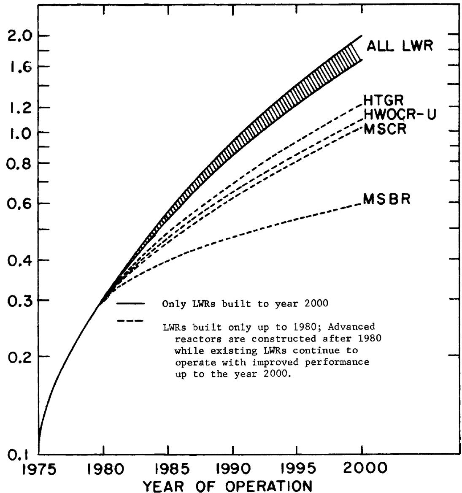  
FIGURE 4.4   
ESTIMATED CUMULATIVE URANIUM ORE REQUIREMENTS FOR SPECIFIC REACTOR SYSTEMS   
ESTIMATED CUMULATIVE URANIUM ORE REQUIREMENT, MILLIONS OF TONS U3O8

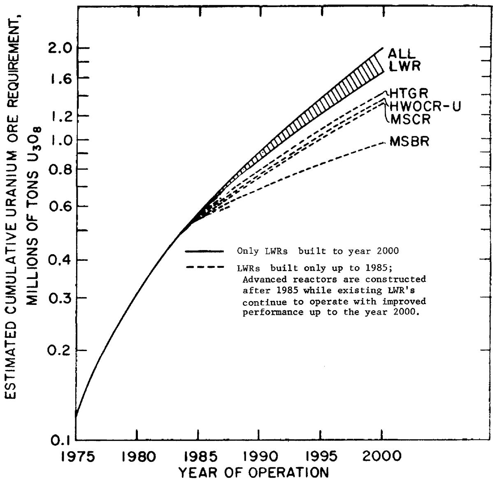  
FIGURE 4.5   
ESTIMATED CUMULATIVE URANIUM ORE REQUIREMENTS FOR SPECIFIC REACTOR SYSTEMS (ADVANCED REACTORS DELAYED)

early as 1980. If the introduction of an advanced system, other than the MSBR, is delayed to 1985, the price of uranium ore might be limited to $15/lb \mathrm{U}_3\mathrm{O}_8$ at best for ten years (1995) (Figure 4.7). Thus, to have a significant impact upon the uranium ore requirements and the cost of ore, an advanced converter reactor must be commercially developed by 1980, or an economic breeder developed by about 1985-1990.

One measure of the relative merit of different reactor types is their fuel cycle cost. The effect of the price of uranium ore upon the fuel cycle cost of various reactor systems was calculated and is shown in Table 4.5 and in Figure 4.8. In this comparison, the heavy-water inventory for the HWOCR and the on-site processing for the MSBR are included in the fuel cycle cost. Fabrication and processing costs are those estimated for the 1980 economy, and for the purpose of this comparison are held constant for varying uranium ore costs. These data show the sensitivity of energy cost to the uranium ore cost. If the ore price doubles to $16/lb \, \mathrm{U}_3\mathrm{O}_8$ , energy costs in the thorium-fueled HTGR, HWOCR, and MSBR reactors increase about 0.2, 0.4 and less than 0.1 mills/kWh respectively. For the uranium-fueled LWR and HWOCR reactors, the same ore price increase results in an energy cost increase of about 0.4 and 0.3 mills/kWh, respectively. Figure 4.9 shows the fuel cycle cost as a function of the year of operation, based on the data given in Figures 4.6 and 4.8. It is noted that these data do not reflect the savings due to the so-called "learning" which was postulated for the LWR in the LWR Task Force report(5) and which could be achievable through mass production and technological improvement. It is implicit in any comparison of reactor types that some allowance due to such "learning" is applicable to all reactor types. Thus the relative fuel-cycle costs of the various reactor systems given in Figure 4.9 are not expected to be significantly affected by future improvements in reactor systems and nuclear power technology (although the timing of these improvements in different reactors would vary).

The data in Figure 4.9, which reflect the potential of various advanced reactor systems, indicate that in the short term the introduction of the HTGR-Th and the HWOCR-U reactor systems offer the prospects of significantly lower fuel costs and less sensitivity to changing uranium ore costs than the LWR systems alone. For the longer term (starting about 1985), the MSBR could lead to a very low fuel cycle cost (less than $0.5\mathrm{~mill/kWh}$ ) which would be relatively insensitive to uranium ore costs during this century (Figure 4.8). As seen, there are thorium systems which promise lower fuel cycle costs than the uranium-cycle LWR. It should be noted that the mode of operation of the various reactor systems would change in the future to reflect changing economic conditions and, thus, affect the relative fuel cost difference. This is considered in the overall study of reactor types by the Systems Analysis Task Force. The next section gives a general discussion of the possible modes of operation using thorium as a reactor fuel.

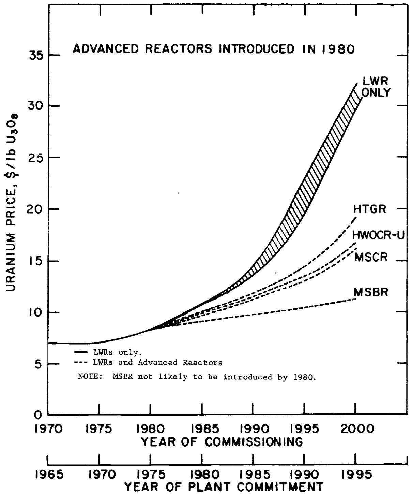  
FIGURE 4.6   
CALCULATED TREND IN URANIUM PRICE

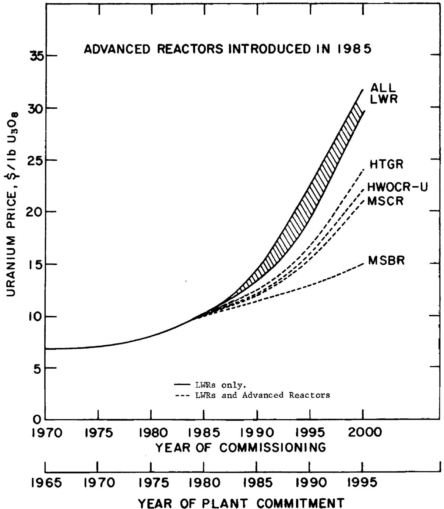  
FIGURE 4.7   
CALCULATED TREND IN URANIUM PRICE (ADVANCED REACTORS DELAYED)

TABLE 4.5.-Calculated Fuel Cycle Costs for Varying Uranium Ore Costs ${}^{a}$   

<table><tr><td rowspan="2">Reactor Type</td><td colspan="3">mills/kwh
Ore Cost, $/1b U3O8</td></tr><tr><td>8</td><td>16</td><td>30</td></tr><tr><td>Thorium Cycle</td><td></td><td></td><td></td></tr><tr><td>HWOCRb
(Metal)</td><td>1.64</td><td>2.01</td><td>2.66</td></tr><tr><td>HTGRc</td><td>1.02</td><td>1.24</td><td>1.68</td></tr><tr><td>MSBR</td><td>0.44d</td><td>0.47</td><td>0.51</td></tr><tr><td>Uranium Cycle</td><td></td><td></td><td></td></tr><tr><td>LWRe</td><td>1.47</td><td>1.92</td><td>2.73</td></tr><tr><td>HWOCRb
(carbide)</td><td>1.12</td><td>1.42</td><td>1.96</td></tr></table>

a1980 processing and fabrication charges assumed; no optimization for high ore costs.   
cWASH 1983; fuel cycle cost includes $\mathsf{D}_2\mathsf{O}$ inventory charges.   
WASH 1085.   
${}^{d}$ Based on ORNL studies as of mid 1968, and extrapolation for high cost uranium.   
$\mathbf{e}_{\mathrm{WASH}}$ 1082.

# 4.6 Fuel Strategy

Most of the reactors committed for the immediate future are LWRs designed to use the low-enrichment uranium cycle, without plutonium recycle. The plutonium produced must eventually be recycled in these reactors to assure some credit for the bred fuel since economically attractive FBRs may not be available for many years. Although reactors based on the thorium cycle will be started up with the U-235(Th-232)U-233 cycle, the recycle of U-233, with U-235 makeup as necessary, will be used just as soon as the thorium reprocessing and refabrication technology has been developed, since the motivation for the recycle of the bred fuel is stronger in the thorium cycle than the uranium cycle.

Bred fissile material could be stored during the first few years of operation, provided that the fuel materials permit a separation of the original and bred fissile materials. Regarding the thorium fueled reactors, storage of bred fuel, together with a somewhat shorter fuel residence time to minimize fission product poisoning, could lead to improved fuel conversion during the initial stages of operation.

FIGURE 4.8   
CALCULATED VARIATION OF NUCLEAR FUEL CYCLE COST WITH URANIUM ORE COST IN DIFFERENT REACTOR SYSTEMS   
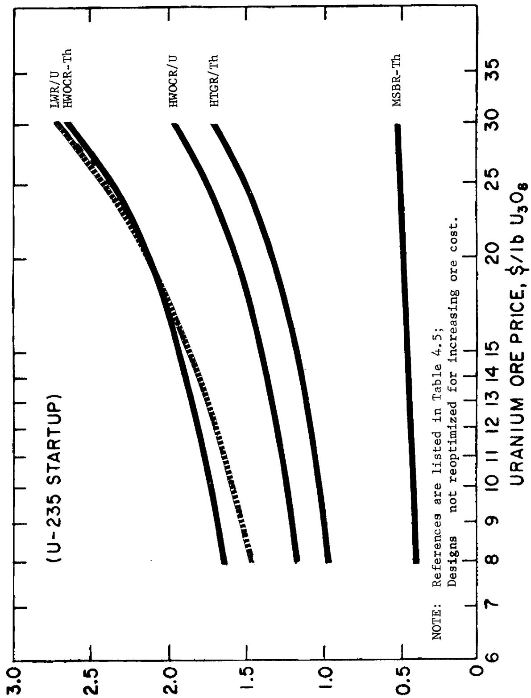  
(2) 14-Mx/sllw'⊥SOO370x73nF

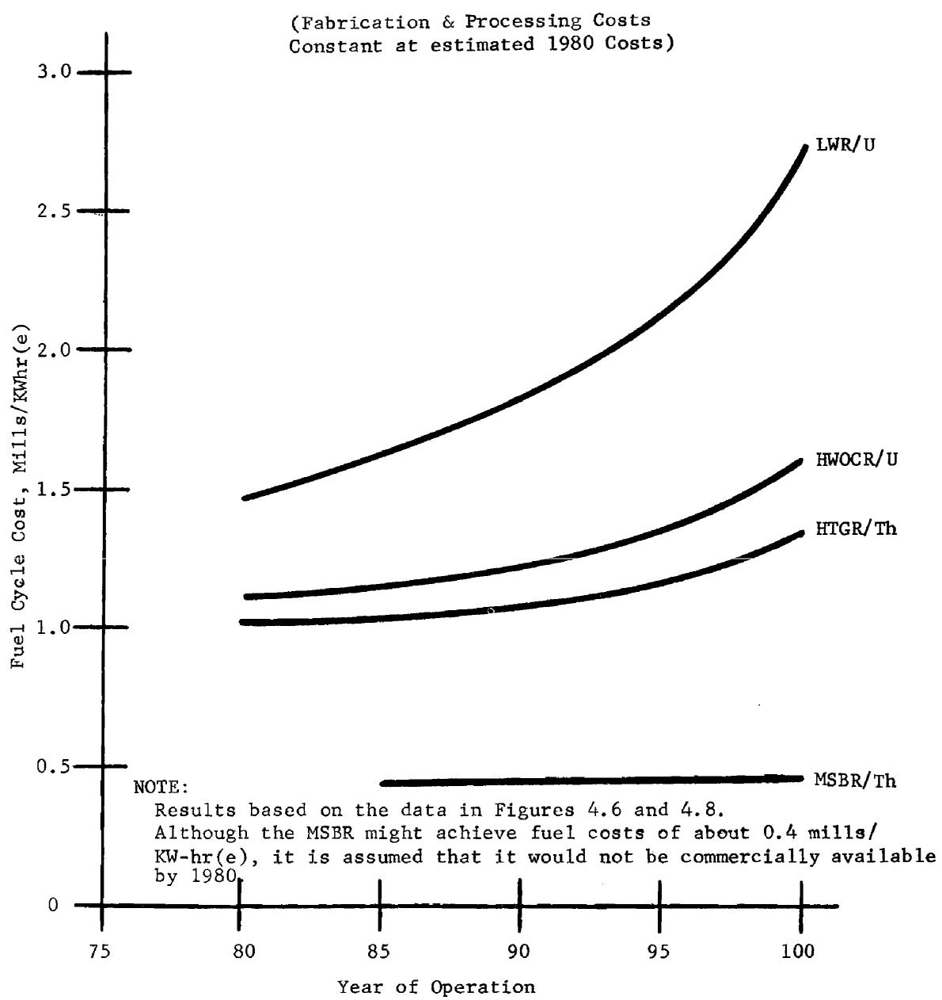  
FIGURE 4.9   
CALCULATED TREND IN FUEL CYCLE COST WITH TIME DUE TO ASSUMED INCREASE IN U ORE COST

The primary incentive to use the thorium cycle is that it is a source of U-233. As discussed in Section 3, in thermal-spectrum reactors the U-233 produced from thorium is a better fissile material than the Pu-239 produced from uranium, or the U-235 occurring in natural uranium. Fissioning of U-233 in the thermal neutron energy region can produce 15 to 20 percent more neutrons per neutron absorbed than Pu-239 or U-235. This inherent characteristic has resulted in programs for thorium-fueled reactor systems, such as the HTGR, LWBR, and MSBR, and it has prompted interest in possible crossed-progeny systems involving the uranium and thorium cycles.

The merit of the introduction of the thorium-fueled HTGR, MSBR, and HWOCR into a light water nuclear power complex has been discussed in the previous sections. Possible strategies using thorium and producing U-233 are shown in Figure 4.10. No detailed assessment has been made of these schemes.

# 4.6.1 CROSSED-PROGENY SYSTEM

System I in Figure 4.10 shows schematically a nuclear power system in which the U-233 produced in an HWR-Th reactor is used in an LWR-U reactor, while the Pu-239 produced in the LWR-U reactor is used in the HWR-Th reactor. This so-called "crossed progeny" system is discussed in detail in Reference 6, p. 13. Similarly, the Pu produced in a LWR-U reactor could be used in a LWR-Th reactor, and the U-233 produced in the latter used in the former reactor.

The merit of this scheme is that Pu-239 has a higher eta in a low-neutron-temperature reactor, such as the HWR, than in a higher-neutron-temperature reactor such as the LWR; the U-233, on the other hand, is equally effective in either type of reactor since its eta value is not significantly affected by reactor neutron temperature. In addition, the use of U-233 permits the use of a harder neutron spectrum than with Pu-239 or U-235, without significant loss of the neutron production. Thus, to take advantage of a high fast-fission effect, the PWR (U-238) with U-233 feed can be designed with a tight lattice which can improve the conversion ratio from about 0.6 to 0.9 compared with the current LWR in which the plutonium would be recycled. It has been estimated that a saving of about 0.1 mills/kWh could be achieved for a cross-progeny LWR-HWR system compared to the system in which the fissile material is recycled in the reactor in which it is produced.

System II in Figure 4.10 illustrates another possible crossed-progeny scheme for the situation in which the FBR is being introduced into basically a light-water nuclear power complex. No analysis has been made of the economic merit of this scheme. While the conversion ratio of the LWR using U-233 bred from a FBR-Th blanket might be increased from about 0.6 to 0.9, the loss of Pu which could be bred from a U blanket might reduce the FBR conversion ratio from about 1.3 to 1.0. Thus, there might not be any improvement in the net production of fissile material. However, there are other possible considerations which might make it profitable to operate in a crossed-progeny mode: 1) the substantial increase in specific power of an LWR-U reactor operating on U-233 feed; 2) the advantage of using material containing the higher isotopes of plutonium for an FBR compared with the use of plutonium obtained from an FBR-U blanket; and 3) possible advantages of metallic thorium as fuel and blanket material because of its good metallurgical properties.

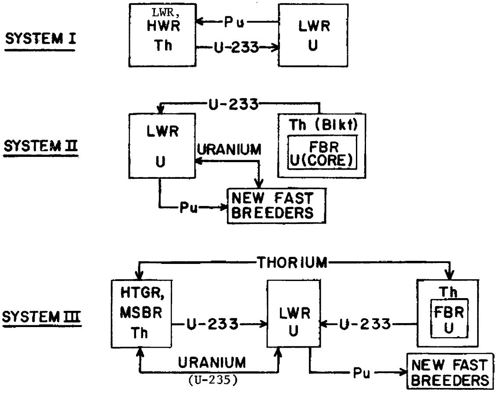  
FIGURE 4.10   
ILLUSTRATIONS OF NUCLEAR FUEL STRATEGIES USING THORIUM IN VARIOUS REACTOR SYSTEMS

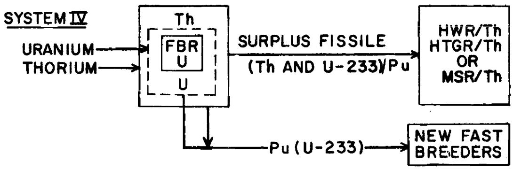

# 4.6.2 THE THORIUM CYCLE IN A GROWING FBR ECONOMY

Although plutonium is the preferred fissile material for FBRs the use of U-233 could result in smaller specific inventories. Furthermore, the use of some U-233 in the core of a liquid-metal-cooled FBR mitigates the sodium void coefficient problem. The source of U-233 for possible FBR utilization could be a thermal-spectrum, advanced converter, such as the HTGR or MSBR, both of which operate on the thorium cycle. For the near-term future, the HTGR could be a commercial source of U-233. The HTGR optimized for low energy cost could produce about twice as much U-233 per unit of electrical power as the LWR does of Pu-239. However, this advantage might be nullified by the large breeding gain associated with the use of Pu in an FBR.

System III in Figure 4.10, which is an extension of System II, illustrates another possible, unassessed, mode of operation of the U-233 producing HTGR and MSBR in an LWR-FBR nuclear power complex.

# 4.6.3. THE LONGER-RANGE POTENTIAL FOR THORIUM

It is possible that the potential production of fuel from fast or thermal breeder reactors could exceed the demand for fissile material. Under these conditions the economic value of bred fuels would be expected to fall, and the bred fissionable material might be used in either thermal near-breeder reactors, or in reoptimized breeder reactors, whichever could use the low-cost fuel more economically. The cost of the plant and the cost of the fuel handling, i.e., fabrication and reprocessing, would be the predominant factors in choosing the proper mix of reactors. If most of the excess supply of bred fuel could be used more economically in thermal-spectrum reactors, then it would probably be advantageous to use FBRs with thorium blankets or MSBR-type thermal breeders so that the excess bred fuel would be particularly suited for use in the thermal-spectrum advanced converter reactors. With U-233 as the feed material, the conversion ratio, even for non-breeding thermal-spectrum reactors, would be very close to unity, so that a large number of thermal reactors could be fed by a smaller number of breeder reactors.

The FBR can be fueled initially with U-235, but either U-233 or Pu-239 appears preferable. If U-233 were to be used in a continuing manner in a recycle mode of operation, the use of Th-232 somewhere in the FBR system would be necessary. The strategies could involve the use of thorium in part of the reactor core and/or the blanket so that enough U-233 was produced to supply possible fuel requirements. One operating mode is as shown in System II., Figure 4.10. An alternative is to adopt a mixed-progeny system where some of the Pu-239 produced from the U-233(U-238)Pu-239 cycle in the FBR is used in thermal-spectrum reactors operating at least partially on the Pu-239(Th-232)U-233 cycle. System IV in Figure 4.10 illustrates a possible use of thorium in a predominantly FBR nuclear power complex which has an excess fissile producing capability.

Further evaluations are needed before definitive conclusions can be drawn as to the practical value of such fuel strategies in the future.

# 4.7 Summary

The role of thorium in the effective utilization of the nuclear resources can be summarized as follows:

1) Since thorium requires fissile material for startup and any makeup, it does not eliminate use of uranium; but when used competitively in thermal-spectrum reactors, the thorium cycle can decrease the uranium requirements appreciably. In an economy based on the HTGR and MSBR, the thorium requirements are generally small relative to uranium requirements and would contribute little to energy costs. In an economy based on the MSBR the uranium requirements would be minimal.   
2) The effective utilization of nuclear resources does not necessarily mean their maximum conservation. If more expensive uranium could be used without making a reactor uneconomical, then the capability to use the more expensive uranium would enlarge considerably the commercially available resource base. The acceptance of reactors by utilities will be influenced by their economic performance, which would include the effect of possible rising uranium ore costs.   
3) A conversion ratio greater than unity is not, in itself, controlling in a rapidly expanding nuclear power economy. Fuel conversion ratio, specific fissile inventory, capital costs, plant efficiency, and losses during fabrication and processing all affect the cost and are all important in utilizing nuclear resources economically.   
4) The use of the thorium cycle in advanced thermal-spectrum reactors such as the HTGR, and MSBR promises better utilization of nuclear resources and lower energy costs than the presently developed LWR-U reactors.   
5) The MSBR, with its promise of low specific inventory and positive breeding gain has the potential to achieve fuel cycle costs on the order of 0.5 mills/kWh and constrain the price of uranium to an economic level for nuclear power generation beyond the end of this century. However, the MSBR is the least developed of the promising thorium fueled reactor systems, and is unlikely to be commercially available before 1985.   
6) The HTGR could be commercially available in the mid-1970's, and promises energy costs significantly lower than the LWR; it might constrain the price of uranium to an economic level for nuclear power to about 1995-2000. However, if its commercial introduction in an LWR economy were delayed to about 1985, its favorable impact upon the uranium ore price would be lessened considerably.   
7) While U-238 and Pu-239 appear to be more favorable than Th-232 and U-233 in the FBRs, there may nevertheless be some advantages in using Th-232 or U-233 in these reactors. However, detailed studies would be necessary to assess such fuel strategies.

# 5. UTILIZATION OF THE THORIUM FUEL CYCLE IN SPECIFIC REACTOR TYPES

# 5.1 Introduction

This section summarizes performance information for the different reactor concepts utilizing the thorium fuel cycle. Features of the thorium fuel cycle relative to the uranium fuel cycle are also discussed and their performance differences given. The reactor types considered are the HTGR, MSBR, LWR, and HWR. The economics of each concept are discussed, with primary emphasis on the fuel cycle. Although, it is often considered that the capital costs and the operating and maintenance costs of nuclear power plants are the same whether the thorium or the uranium fuel cycle is employed, this is not necessarily the case. Where information on this aspect is available, it is included. The possible use of thorium in the FBR is also discussed.

The different reactor concepts are considered in the following subsections. In general, a description of the reactor concept is presented, followed by a summary of the fuel cycle performance and the energy cost performance under the reference economic conditions. The current status of reactor technology associated with each concept and the R&D required to develop it to the point of commercial acceptance as large power producing systems are also discussed.

# 5.2 High-Temperature Gas-Cooled Reactor

# 5.2.1 GENERAL DESCRIPTION OF THE HTGR

The large, central-station, HTGR reactor under design by the Gulf General Atomic Co. is a thermal reactor moderated with graphite and cooled by helium. A 1000-MWe design was originally prepared in 1964, (7) and then updated for the recent Advanced Converter Task Force effort. Unless otherwise noted, the discussion here will pertain to this design. The characteristics of the Reference Reactor are shown in Table 5.2.1; those of a Backup Design (scale-up of the Fort St. Vrain plant) are shown for comparison.

The Reference HTGR is designed to produce a total of 2,318 MWt and a net electrical output of 1,000 MWe with a plant efficiency of 43.1 percent. Helium coolant at 700 psia pressure is circulated by six single-stage axial compressors downward through the reactor and then through three primary coolant loops. The gas enters and leaves the reactor at temperatures of $803^{\circ}$ and $1,524^{\circ}\mathrm{F}$ , respectively. The average core power density is $7\mathrm{kW / liter}$ and the average specific power is $1.6\mathrm{MWt / kg}$ fissile material. Supercritical steam at 3,500 psig and $1,050^{\circ}\mathrm{F}$ is produced in six once-through steam generator modules which supply three independent loops. The steam, in turn, drives a tandem-compound, six-flow reheat turbine.

The core is designed with an effective diameter of 31.1 ft and height of 15.6 ft. A total of 7,591 hexagonal fuel moderator blocks are located in the core. The inside diameter of the reactor vessel is 43.5 ft and the inside height 79.0 ft. The reactor contains 182 shim and safety control rods grouped into 91 rod pairs.

TABLE 5.2.1.-High-Temperature Gas-Cooled Reactor Characteristics ${}^{a}$   

<table><tr><td></td><td>Reference Design</td><td>Backup Design
(Fort St. Vrain Scale)</td></tr><tr><td>Total Electrical Power Output, Mwe</td><td>1,000</td><td>1,000</td></tr><tr><td>Plant Efficiency, percent</td><td>43.1</td><td>40.7</td></tr><tr><td>Fuel</td><td>UC2</td><td>UC2</td></tr><tr><td>Fertile Material</td><td>ThC2</td><td>ThC2</td></tr><tr><td>Fissile Inventory of First Core, kg</td><td>1,870</td><td>2,297</td></tr><tr><td>Fertile Inventory, kg</td><td>~40,000</td><td>~40,000</td></tr><tr><td>Conversion Ratio at Equilibrium</td><td>0.80</td><td>0.75</td></tr><tr><td>Reactor Vessel</td><td></td><td></td></tr><tr><td>Inside Diameter, ft</td><td>43.5</td><td>47.8</td></tr><tr><td>Inside Height, ft</td><td>79.0</td><td>88.5</td></tr><tr><td>External Diameter, ft</td><td>70.4</td><td>76.3</td></tr><tr><td>External Height, ft</td><td>114</td><td>136.5</td></tr><tr><td>Prestressing Mechanism</td><td>Wire-wound</td><td>Tendons</td></tr><tr><td>Core</td><td></td><td></td></tr><tr><td>Effective Diameter, ft</td><td>31.1</td><td>31.1</td></tr><tr><td>Height, ft</td><td>15.6</td><td>15.6</td></tr><tr><td>Reflector Thickness, in.</td><td></td><td></td></tr><tr><td>-Side</td><td>44</td><td>44</td></tr><tr><td>-Top</td><td>38.7</td><td>38.7</td></tr><tr><td>-Bottom</td><td>62.0</td><td>62.0</td></tr><tr><td>Fuel</td><td></td><td></td></tr><tr><td>No. of Hexagonal Blocks</td><td>7,591</td><td>3,841</td></tr><tr><td>Width Across Flats, in.</td><td>14.2</td><td>14.2</td></tr><tr><td>Length per Blocks, in.</td><td>15.6</td><td>31.2</td></tr><tr><td>No. of Blocks per Column</td><td>12</td><td>6</td></tr><tr><td>Average Burnup, MWD/MT</td><td>60,000</td><td>60,000</td></tr><tr><td>Recycle Scheme</td><td>Bred Uranium</td><td>Bred Uranium</td></tr><tr><td></td><td>Recycle</td><td>Recycle</td></tr></table>

TABLE 5.2.1.-High-Temperature Gas-Cooled Reactor Characteristics ${}^{a}$ (Cont'd)   

<table><tr><td></td><td>Reference Design</td><td>Backup Design
(Fort St. Vrain Scale)</td></tr><tr><td>Annual U Charge at Equilibrium, 
kg/yr</td><td></td><td></td></tr><tr><td>Fully enriched U-235 Feed</td><td>211</td><td>294</td></tr><tr><td>U-233 Recycle</td><td>266</td><td>317</td></tr><tr><td>U-235 Recycle</td><td>35</td><td>46</td></tr><tr><td>U-233 Retired</td><td>2.6</td><td>4</td></tr><tr><td>U-235 Retired</td><td>29</td><td>51</td></tr><tr><td>Annual Th Feed, kg/yr</td><td>10,300</td><td>10,800</td></tr><tr><td>Average Core Power Density, 
kwt/liter</td><td>7</td><td>7.4</td></tr><tr><td>Average Specific Power, 
Mwt/kg fissile material</td><td>1.57</td><td>1.36</td></tr><tr><td>Refueling Scheme</td><td>On-line</td><td>Annual Shutdown</td></tr><tr><td>Fuel Lifetime, yr</td><td>4</td><td>4</td></tr><tr><td>C/Th Ratio</td><td>200</td><td>200</td></tr><tr><td>Coolant</td><td></td><td></td></tr><tr><td>Total Flow Rate, lb/hr</td><td>9.28x10^6</td><td>10.27x10^6</td></tr><tr><td>Pressure, psia</td><td>700</td><td>700</td></tr><tr><td>Temperature In, °F</td><td>803</td><td>758</td></tr><tr><td>Temperature Out, °F</td><td>1,524</td><td>1,449</td></tr><tr><td>Circulators</td><td colspan="2">Single-stage axial compressor</td></tr><tr><td>Number</td><td>6</td><td>6</td></tr><tr><td>Drives</td><td colspan="2">Single-stage steam turbine</td></tr><tr><td>Number of Coolant Loops</td><td>3</td><td>3</td></tr><tr><td>Orificing</td><td>None</td><td>By refueling 
region</td></tr><tr><td>Steam System</td><td></td><td></td></tr><tr><td>Generators</td><td rowspan="2">Once-through, 
Radial flow</td><td>2 modules per loop</td></tr><tr><td>Type</td><td>Axial flow</td></tr><tr><td>Number of Generators</td><td>3</td><td>3</td></tr><tr><td>Turbine</td><td colspan="2">Tandem-couppound, 
six-flow reheat</td></tr><tr><td>Throttle Steam Pressure, psig</td><td>3,500</td><td>2,400</td></tr><tr><td>Temperature, °F</td><td>1,050</td><td>1,000</td></tr></table>

aPreliminary Phase III Systems Analysis Task Force data.

The Reference Design core is formed with hexagonal-shaped graphite elements, 14.2 in. across flats and 15.6 in. long. Coolant-holes pass completely through the element and are located parallel to the axially-oriented array of fuel holes which are packed with coated fuel particles. Groups of 12 elements are stacked into columns to a height of 187 in. The fuel and coolant holes, each about 0.5 in. in diameter, are located in a triangular array in which, except at the edges, there are two fuel holes for each coolant hole.

The fuel is in the form of small kernels of metal carbide surrounded by pyrolytic-carbon coatings. The fissile particles consist of highly-enriched UC, surrounded by, first, a low-density buffer layer of pyrolytic carbon and, then, a high-density layer of isotropic pyrolytic carbon. The fertile particles are composed of ThC, kernels with similar BISO (buffered-isotropic) coatings. The buffer layer is a sacrificial layer that absorbs fission product recoils and provides a reservoir (sink) for fission product gases. The high-density isotropic layer acts as a pressure vessel, keeping fission products in the particle.

The core for the reference design is loaded initially with $1,764\mathrm{kg}$ of U-235 and $\sim 40,000\mathrm{kg}$ of thorium. Bred U-233, as available, will be charged to the reactor in subsequent cycles. At equilibrium, the conversion ratio is 0.80 and the fuel reaches an average burnup of 60,000 MWD/MT of U and Th. Continual on-line refueling is carried out.

A very compact equipment arrangement is achieved in the Reference Design by locating the circulators and radial flow steam generators below the reactor core, and enclosing the entire reactor primary coolant system and also a part of the secondary coolant circuit inside a prestressed concrete reactor vessel (PCRV) lined with a steel membrane. The PCRV consists of a concrete structure reinforced with steel rods and prestressed by wires wound around the outside. It also has an inner steel liner as well as cooling pipes, liner thermal barrier, penetrations, penetration cooling pipes, and closures.

The reflector assembly consists of hexagonal graphite blocks surrounded by a steel core barrel. This is supported within the PCRV by means of a graphite support and flow distribution structure over a steel and concrete floor, which is, in turn, supported from the PCRV floor by steel columns. The main helium circulators, control rod drives, and helium purification system components are supported within their respective penetrations.

The Backup Design (Table 5.2.1) is essentially a scale-up of the Fort St. Vrain 330-MWe HTGR currently under design for Public Service Co. of Colorado. It differs from the Reference Design in the following areas:

1) Steel tendons will be used in lieu of wire-wrapping to pre-stress the PCRV   
2) The steam generators will be of an axial flow instead of a radial flow design   
3) The steam cycle is based on a lower steam pressure and temperature   
4) Annual refueling instead of on-line refueling will be employed.

From a fuel cycle cost standpoint, the Reference and Backup Designs differ most in the refueling strategy, continual on-line vs annual, respectively. Continuous on-line refueling is worth about 0.2 mills/kWh in the fuel cycle cost.

# 5.2.2 ECONOMICS OF THE HTGR THORIUM FUEL CYCLE

Fuel Cycle Description—The HTGR fuel material is contained in distinct coated particles. This makes it feasible to separate the particles after irradiation, subsequently recycling only the desired fraction. The two modes of fuel recycle that appear most desirable at this time (7) are: (1) the Bred Uranium Cycle, which involves the continual recycling of the bred U-233 while discharging the remaining feed U-235 after one cycle, and (2) the Once-Through Cycle, which involves mixing bred U-233 with the feed U-235 and then discharging the mixture at the end of each cycle. In either mode the initial thorium contains no uranium. The Bred Uranium Cycle is the basis for the Reference and Backup Designs, although the Once-Through Cycle is nearly as attractive.

Flexibility in fuel management is one of the desirable features of the HTGR. Plutonium could be substituted as a makeup fissile material in lieu of enriched uranium in the thorium cycle with little, if any, cost penalty. The possible use of BeO in the fuel element, either as a matrix for the fuel particles or in place of some of the bulk graphite in the element, would greatly enhance the conversion ratio of the system. Beryllium oxide is a good moderator, and the combined (n,2n) and $(\mathrm{n},\alpha)$ reactions in beryllium would add neutrons to the system. An HTGR with both BeO and graphite as moderators, and with a fuel particle which allows the volatile fission products to leave the fuel, could breed. The low-enrichment uranium cycle could also be used in the HTGR, but the resulting calculated power costs would not be as low as those for the thorium cycle.

Initially it may not be desirable to operate the first HTGRs in a recycle mode; the discharged fuel, in this case, could be stored to act as a fully depreciated reserve. To obtain the lowest cost, the fuel residence time would then have to be increased and the fuel loading decreased until constrained by power peaking or fuel element cost considerations. For example, the carbon-to-thorium ratio might be as high as 225 and the fuel residence time as long as six years in an optimum storage cycle. The resulting conversion ratio would be about 0.67. When the recycle mode becomes available, the cycle could be shortened to the reference four years and the loading increased to a C/Th ratio of 200. This would result in a considerable increase in conversion ratio and a decrease in the fuel cycle cost. Quantitative data on these points are presented later.

Fuel Cycle Costs—At the present time, the basic HTGR fuel management scheme utilizes the thorium cycle, with recycle of the bred U-233, augmented as necessary by highly-enriched U-235. The fuel cycle costs estimated for the equilibrium cycle of the Reference and the Backup Designs are shown in Table 5.2.2. The cost bases are consistent with those used in the Advanced Converter and Systems Analysis Task Forces. The fabrication and reprocessing costs assumed the existence of an established industry, i.e., 15,000 MWe.

Both the 4-year fuel lifetime and the average fuel exposure of 60,000 MWD/MT of metal are high compared with corresponding values for other reactor systems. However, they are essential because of the relatively high HTGR fuel fabrication and reprocessing costs. Reduction in these costs would be desirable since fuel lifetimes could be shortened with corresponding increases in the conversion ratio.

The dependence of the conversion ratio of the equilibrium cycle on the fuel lifetime and fertile loading is shown in Figure 5.2.1 for the Reference Design. The fertile loading and conversion ratio define the time-dependent fissile loading of the core because the reactor must be critical at all times during the operating cycle. As shown, heavy fertile loadings and short fuel lifetimes are both conducive to a high conversion ratio. Reasonable fuel cycles could yield conversion ratios between 0.8 and 0.9.

TABLE 5.2.2.-Fuel Cycle Costs for the HTGR Reference and Backup Designs   

<table><tr><td colspan="3">(1,000-Mwe Plants, Equilibrium Cycle)</td></tr><tr><td></td><td>Reference Design</td><td>Backup Design (Fort St. Vrain Scale-up)</td></tr><tr><td>Conversion ratio</td><td>0.81</td><td>0.78</td></tr><tr><td>Average specific power Mwt/kg fissile material</td><td>1.57</td><td>1.36</td></tr><tr><td>Fuel lifetime, yr</td><td>4</td><td>4</td></tr><tr><td>Costs, mills/kwh</td><td></td><td></td></tr><tr><td>Fabricationb</td><td>0.25</td><td>0.26</td></tr><tr><td>Reprocessingb</td><td>0.13</td><td>0.14</td></tr><tr><td>Depletion</td><td>0.30</td><td>0.40</td></tr><tr><td>Inventory</td><td>0.34</td><td>0.46</td></tr><tr><td>Total Fuel Cycle Cost</td><td>1.02</td><td>1.26</td></tr><tr><td>Total Power Cost</td><td>3.7</td><td>4.0</td></tr></table>

aWASH-1087   
b Working capital costs for fabrication and reprocessing are included in the fabrication and reprocessing charges, respectively; reprocessing charges include cost of fuel shipment.

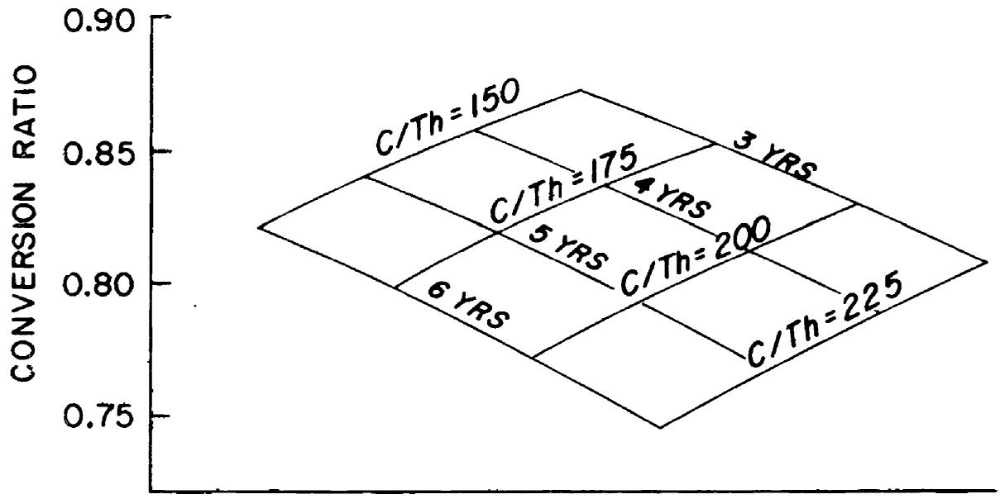  
FIGURE 5.2.1   
CONVERSION RATIO AND FUEL CYCLE COST AS A FUNCTION OF C/TH RATIO AND FUEL. LIFETIME IN THE HTGR (REFERENCE DESIGN   
FIGURE 5.2.2

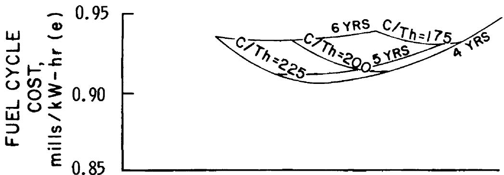  
FUEL CYCLE COST AS A FUNCTION OF C/TH RATIO AND FUEL LIFETIME IN THE HTGR (REFERENCE DESIGN)

The fuel cycle cost as a function of fuel lifetime and fertile loading is shown in Figure 5.2.1. The fuel cycle cost is nearly constant over a broad range of C/Th ratios and fuel lifetimes.

The fuel cycle characteristics and costs of the Reference Design with different assumptions vis-a-vis the makeup fissile material are illustrated in Table 5.2.3. The first column of numbers was calculated for the reference case, and the second for the storage cycle, in which the bred U-233 is stored for reprocessing and use at a future date; the increase in cost for this is about 0.20 mills/kWh. A long fuel lifetime is essential in the storage cycle. In the absence of a broad-based industry, storage of the bred material may be necessary. The third column of Table 5.2.3 pertains to a cycle in which plutonium, instead of highly-enriched uranium, is to be used as a makeup fissile material. In a nuclear economy in which plutonium is plentiful or inexpensive, or in which U-235 is scarce, this mode of operation could be attractive. The increase in fuel cycle cost is about 0.1 mill/kWh at a fissile Pu price of $ 10/g.

Conversion ratios close to unity would be possible using BeO in the HTGR with short fuel lifetimes and heavy thorium loads as shown in previous studies. (9) The estimated increase in the fuel cycle cost is about 0.1 mill/kWh, due chiefly to the working capital charges on the BeO itself. The corresponding makeup fissile requirements would be reduced by about half, relative to the requirements of an all-graphite fuel element. The use of BeO might be of particular value in applications where the importation of uranium ore or the purchase of separative work were to be minimized.

Finally, although feasible, the uranium cycle does not appear to be as economic as the thorium cycle in the HTGR at this time (Table 5.2.4). The average conversion ratio for the uranium cycle is 0.5 to 0.6, and its fuel cycle costs are 0.2 to 0.4 mills/kWh higher than for the thorium cycle. The relative economic incentive for using the uranium cycle decreases with increasing ore costs.

# 5.2.3 STATUS OF THE HTGR TECHNOLOGY

Introduction—The HTGR development in the U. S. is being carried out primarily by Gulf General Atomic and has been marked to date by several significant milestones:

1) Peach Bottom was placed in operation on the grid of the Philadelphia Electric Company in June 1967.   
2) Fort St. Vrain is proceeding for the Public Service Co. of Colorado, and is scheduled for operation in 1971.   
3) Detailed feasibility and cost studies for larger and more advanced HTGRs have been made.

Other developments in the U. S. that have contributed directly to the basic HTGR technology are the results of work carried out at ORNL and PNL.

1) A pilot plant, Thorium-Uranium Reprocessing Facility (TURF), was designed and constructed at ORNL.   
2) The Ultra High Temperature Reactor Experiment (UHTREX) was designed and built at LASL. This reactor experiment, while not originally designed to complement the effort in developing HTGRs, is

TABLE 5.2.3.-HTGR Fuel Cycle Characteristics and Costs for the Storage and the Pu-239/Th-232/U-233 Cycles   
(Equilibrium Cycle)   

<table><tr><td></td><td>U-235 Recycle Case</td><td>Storage Cycle</td><td>Pu Fissile Material Makeup</td></tr><tr><td>Makeup fuel</td><td>U-235</td><td>U-235</td><td>Pu</td></tr><tr><td>Fuel lifetime, yr</td><td>4</td><td>6</td><td>4</td></tr><tr><td>C/Th ratio</td><td>200</td><td>225</td><td>200</td></tr><tr><td>Conversion ratio</td><td>0.82</td><td>0.67</td><td>0.77</td></tr><tr><td>Average specific power, Mwt/kg</td><td>1.9</td><td>1.7</td><td>1.7</td></tr><tr><td>Th-232 charged per yr, MT</td><td>10</td><td>6</td><td>10</td></tr><tr><td>Net makeup fissile charge per yr, kg</td><td>200</td><td>500</td><td>200</td></tr><tr><td>Total U + Pu charged per yr, kg</td><td>500</td><td>500</td><td>800</td></tr><tr><td>Total U discharged per yr, kg</td><td>400</td><td>300</td><td>500</td></tr><tr><td>Total Pu discharged per yr, kg</td><td>-</td><td>-</td><td>40</td></tr><tr><td colspan="4">Relative Fuel Cycle Costs, mills/kwh</td></tr><tr><td>Fabrication</td><td>0.16</td><td>0.10</td><td>0.16</td></tr><tr><td>Reprocessing</td><td>0.14</td><td>0</td><td>0.14</td></tr><tr><td>Depletion</td><td>0.28</td><td>0.73</td><td>0.29</td></tr><tr><td>Inventory</td><td>0.34</td><td>0.29</td><td>0.43</td></tr><tr><td>Total</td><td>0.92</td><td>1.12</td><td>1.02</td></tr></table>

aThe values in this table are self-consistent but do not reflect Phase III data to the Systems Analysis Task Force.

Note: Values given for amount of fuel charged and discharged are approximations

nevertheless based on the same basic type of fuel coolant and core composition. High-temperature fuel operation, i.e., $3,000^{\circ}\mathrm{F}$ , in this reactor is expected to yield information on fission product release, transport, and control, the behavior of system components, and remote maintenance problems.

3) The High Temperature Lattice Test Reactor (HTLTR) at PNL has been designed so that the physics characteristics of high-temperature systems can be studied.   
4) An extensive program on PCRVs is underway at ORNL. The PCRV is associated with, but not limited to, the future development of the HTGR.   
5) An extensive program on HTGR-type fuels is underway at ORNL focusing on oxide as well as carbide fuels, irradiation damage effects, and the characterization of fuel properties.   
6) A cooperative graphite program is in progress at ORNL, PNL, and Gulf General Atomic. This work is concerned with the effects of irradiation on graphite, as well as the chemical behavior of graphite at high temperatures, particularly the steam-graphite and air-graphite reactions.

The HTGR is also under intensive development in Europe. The Dragon Project, a 20-MWt reactor experiment has been in operation at Winfrith, England since 1965 as the result of a cooperative effort by several European countries. Operating experience to date with Dragon has been excellent.

Peach Bottom Reactor—The Peach Bottom reactor is a 40-MWe prototype for the HTGR system, employing helium cooling and an all-graphite fuel element. The outlet gas temperature is about $1,400^{\circ}\mathrm{F}$ while the steam temperature is $1,000^{\circ}\mathrm{F}$ . The core is 9 ft in diameter and 7 ft high, and fits into a steel pressure vessel which is 14 ft in diameter and 35 ft high. The primary coolant systems consist of the reactor and two coolant loops, each of which contains a steam generator and a gas circulator.

The 804 fuel elements are 3.5 in. in diameter and about 12 ft long. Each contains a dispersion of coated thorium and highly-enriched uranium dicarbide particles in a graphite matrix. The annular matrix is enclosed in a graphite sleeve, and a graphite spine fills the central region. The fuel elements are designed for an average fuel exposure of 60,000 MWD/MT. The reactor is refueled during scheduled shutdown periods using specially designed fuel transfer and fuel charging machines.

Pre-startup difficulties at Peach Bottom were experienced with the fuel transfer machine, and also with the stainless steel tubing in the steam generator superheater section due to halogen stress corrosion. The fuel transfer machine was redesigned, and the stainless steel superheater tubes were replaced with Incoloy.

Fort St. Vrain Reactor—The next stage of HTGR development being carried out is the 330-MWe Fort St. Vrain reactor for the Public Service Co. of Colorado. It forms the basis for the Backup Design described earlier (Table 5.2.1). This reactor is also based on the thorium cycle with helium cooling. The steam conditions will be 2,400 psia with $1,000^{\circ}\mathrm{F}$ reheat. The principal improvements over Peach Bottom include an improved fuel element, the use of a PCRV, integral primary coolant circuits, steam-turbine-driven gas circulators, and the addition of a single stage of reheat to the steam cycle. At the same time, improvements in fuel management are anticipated—a graded fuel cycle will be employed instead of the batch reloading scheme of the Peach Bottom HTGR.

Gulf General Atomic has been carrying out a program of design, analysis and model testing for PCRV's with the financial assistance of the private utility industry [Advanced Reactor Development Associates—(ARDA)]. The results obtained with a 1/5-scale model for a 250-MWe plant have confirmed the analytical work which served as a basis for the design of the vessel (10). Construction of another test model oriented specifically towards the 330-MWe Fort St. Vrain HTGR has been completed and tests are underway. Containment vessels larger than this have already been successfully built in Europe and placed into routine service. Safety is improved with a PCRV because of redundancy in the multiple prestressing system and the enclosure of the entire reactor system inside a single pressure barrier.

The Fort St. Vrain fuel element will be a hexagonal block of graphite into which coolant and fuel holes are drilled. The fuel holes contain graphite-coated particles, which were previously described. This fuel element will be stronger, as well as easier and cheaper to make than the Peach Bottom element.

Over 100 irradiation tests of the fuel particles have been conducted by Gulf General Atomic and ORNL. The particles demonstrated a satisfactory performance capability at temperatures and burnups in excess of those required for the proposed HTGR systems. Support for this effort, in part, has come from the utilities comprising the HTRDAO Fuel and Fuel Cycle Group.

An effort has been underway to unitize component designs so that plants of different sizes can be constructed from the same components. The Empire State Atomic Development Associates, Inc. (ESADA) has provided financial support since 1960 for a part of this development.

Advanced Reactors—Post Fort St. Vrain HTGR designs are currently under development. Their evolution is summarized in Table 5.2.5. The Reference Design described earlier (Table 5.2.1), incorporated the advances in technology which appear to be feasible for the near future. While the basic approach is essentially that embodied in the Fort St. Vrain HTGR, significant improvements are foreseen in both the equipment and fuel element as follows:

a) Wire-winding is being considered for prestressing the concrete reactor vessel in lieu of the prestressing tendons used in the Fort St. Vrain HTGR.   
b) Larger blowers and steam generators are being designed. ESADA-sponsored development work is continuing on a steam generator design to meet the requirements of large reactors. Tests will be conducted to check the validity of theoretical models of steam generator performance.   
c) An on-stream refueling machine is being designed. This would make improvements possible in the conversion ratio and specific power because fuel could be replaced more often, thereby decreasing neutron losses to fission products and necessitating a smaller fissile loading to maintain reactivity. As mentioned earlier, the motivation for such work is a potential 0.2-mills/kWh reduction in the fuel cycle cost.   
d) The use of BeO in the fuel element to enhance the conversion ratio has been considered in the past, but as yet relatively little actual design work has been done on this approach. The same is true for elements which release part of their volatile fission products. The use of both BeO and a fission product releasing type of fuel particle, together with a shorter fuel lifetime; e.g., 3 yr, would raise the conversion ratio above unity.

TABLE 5.2.4.—Comparison of Fuel Depletion and Working Capital Charges for the Low-Enrichment Uranium and Thorium Fuel Cycles in the HTGRa   

<table><tr><td>Fuel cycle</td><td>Uranium</td><td>Thoriumb</td></tr><tr><td>Average specific power, Mwt/kg</td><td>2.6</td><td>1.9</td></tr><tr><td>Conversion ratio</td><td>0.53</td><td>0.82</td></tr><tr><td>Cycle time, yr.</td><td>3</td><td>4</td></tr><tr><td>C/U-238 (C/Th) ratio</td><td>250</td><td>(200)</td></tr><tr><td>Initial enrichment</td><td>5.0</td><td>---</td></tr><tr><td>Relative Fuel Cycle Cost, 
mills/Kwh</td><td></td><td></td></tr><tr><td>Fuel depletion</td><td>0.70</td><td>0.28</td></tr><tr><td>Fuel working capital</td><td>0.19</td><td>0.34</td></tr><tr><td>Sum (for U3O8@ $8/lb)</td><td>0.89</td><td>0.62</td></tr><tr><td>Sum (for U3O8@ $16/lb)</td><td>1.22</td><td>0.84</td></tr></table>

The values in this table are self-consistent but do not reflect Phase III data to the Systems Analysis Task Force.   
Reference Design.

TABLE 5.2.5 - Projected Evolutionary Stages in the Development of the HTGR Leading to Improved Conversion Ratios   

<table><tr><td>Reactor</td><td>Power, MW(e)</td><td>Fuel Element</td><td>Initial Fuel</td><td>Residence Time, Year</td><td>Conversion Ratio</td></tr><tr><td>Peach Bottom</td><td>40</td><td>C</td><td>U-235</td><td>3</td><td>0.44</td></tr><tr><td>Fort St. Vrain</td><td>330</td><td>C</td><td>U-235 Recyclea</td><td>6</td><td>0.61 0.70</td></tr><tr><td>Reference Design</td><td>1,000</td><td>C</td><td>U-235 Recyclea</td><td>4-6</td><td>0.7-0.8 0.8-0.85</td></tr><tr><td>Advanced Design</td><td>1,000</td><td>C/BeO</td><td>Recyclea</td><td>3-6</td><td>0.9-1.0 1.0-1.1b</td></tr></table>

aFuel requirements in excess of that available from recycle are met by U-235. bVolatile fission product removal.

e) With the support of the High Temperature Reactor Fuel and Fuel Cycle Group of HTRDA Gulf General Atomic is investigating the use of SiC, ZrC, and other metal carbides for coating the fuel microspheres.

# 5.2.4 R&D REQUIRED FOR THE HTGR

Fuel Elements—Although considerable development work has been carried out by Gulf General Atomic and ORNL on the technology of HTGR fuel, reprocessing, and the effects of irradiation, further irradiation testing is required, especially on a large engineering scale of typical HTGR fuel elements.

Component Development and Test—The HTGR plant design depends to a large measure on the successful demonstration of the PCRV that houses the entire pressurized primary system. It is expected that the test model programs currently underway at Gulf General Atomic and ORNL will provide information on this concept and should verify the analytical techniques being used to design the PCRV. British experience with the Oldbury Reactor and related French experience are also applicable to this concept. Gulf General Atomic has proposed development work leading to the use of wire winding for the circumferential tensioning of the PCRV as a means of reducing its cost. In this technique, a wire under tension is applied by a machine directly on the vessel surface much like winding a ball of string. The use of a wire-wound PCRV would eliminate the need for tendon tubes, at least for the circumferential prestressing, and result in significant simplification in PCRV design and construction. Also, component accessibility and maintenance might be improved by locating circulators and steam generators in radial cavities in the PCRV.

The HTGR design also depends upon the development of satisfactory seals and bearings for the vertical shafts of the turbine-driven, axial-flow compressors. Steam-driven helium circulators must be fully demonstrated, although a full-scale mockup of such a circulator has been tested.

On-line refueling has been adopted for the Reference Design HTGR and this will require the use of a dependable refueling machine. The major problem will be to insure that fuel elements can be removed and replaced reliably without damage and without seizing or catching on the surrounding elements. Other problems include the building of a containment vessel for the machine, the seal mechanism with the reactor vessel, and the lubrication of the contained moving parts.

Reprocessing and Refabrication Technology—The early achievement of experience with reprocessing technology and recycle operations using the bred fuel is important to the success of both the thorium and uranium-cycle programs. Complete thorium reprocessing facilities do not exist at the present time. A pilot plant, TURF, has been under construction at ORNL. The development effort, and the technology involved with it, will fill this gap.

Desirable R&D—Additional development work for advanced systems might also be desirable. This would include the development of fuel elements that contain significant amounts of BeO, use of coatings other than pyrolytic-carbon for the uranium and thorium particles, such as SiC and ZrC, and fuel particles which permit the release of volatile fission products.

The use of gas turbines driven by the helium coolant appears to offer sufficient advantages to warrant development. The HTGR fuel elements may prove capable of withstanding required high operating temperatures. Direct-cycle operation would result in a simpler, more reliable plant design, and increased plant efficiency.

Gulf General Atomic has suggested the use of a radial-flow steam generator which is potentially compact with low pressure drop as a means of reducing capital, and possibly fuel cycle, costs. In a radial-flow steam generator, helium flows radially inward or outward through an annular tube bundle. The frontal area is proportional to the product of diameter and height, and, in this case, a considerable increase in frontal area, relative to the axial flow generators, is possible. The reduced pressure drop would permit a tighter packing of tubes, resulting in a considerable reduction in the steam generator diameter and a corresponding decrease in PCVR dimensions.

# 5.3 MOLTEN-SALT BREEDER REACTOR

# 5.3.1 INTRODUCTION

Previously, the reference design (11) for the development of the MSBR has been the ORNL two-region, two-fluid system with fuel salt separated from the blanket salt by graphite tubes. The fluids consisted of lithium and beryllium fluorides containing $\mathrm{UF_4}$ and $\mathrm{ThF_4}$ for the fuel and blankets materials, respectively. The on-site fuel reprocessing employs fluorides-volatility and vacuum distillation operations for the fuel stream and direct protactinium removal for the blanket stream (Appendix C, Section 4).

This reference design was assessed by the Thorium Task Force and was the basis for the Systems Analyses Task Force overall assessment effort. The design and assessment is presented in Appendix E.

Graphite irradiation experience has shown that dimensional change can occur which result in an initial volumetric contraction followed by expansion. The rate of expansion, after the initial volume is attained, increases with increasing exposure so that eventually the expansion limits the useful life of the graphite. In addition, the factors which control the lifetime dosage are graphite strength and changes in pore structure under irradiation.

A consequence of the irradiation experience was the further reassessment of the MSBR development effort due to the considerable uncertainty as to the practicality of using graphite as a structural material to separate fluids in the reference two-fluid MSBR concept. Simultaneously chemical research results indicated that molten-salt reactors potentially could be operated economically as single-fluid systems. These developments were associated primarily with the evidence that protactinium as well as rare-earth fission products could be separated from single-fluid salts. Thus in mid-1968, a single-fluid, two-region MSBR concept was proposed, and a preliminary conceptual design prepared in which the graphite no longer serves as a structural material to separate two distinct fluids, but primarily serves as a moderator and a separation medium for two fuel regions of a single-fluid. An important consideration in the new design was theoretical and preliminary experimental evidence that the U-233, and possibly rare-earth fission

products, could be separated from a mixed thorium/uranium fuel salt by reductive extraction employing liquid bismuth. This, combined with nuclear consideration of the single-fluid design, indicated that fuel breeding gains and economics comparable to the reference two-fluid system could be achieved by the proposed single-fluid concept. The description of this preliminary conceptual design of the single-fluid MSBR is presented in section 5.3.2. It should be emphasized that the design of the MSBR is constantly being modified as a result of developments in the ORNL molten-salt program. Thus the design given in section 5.3.2, while it indicates the potential of the MSBR, has been significantly modified. The objectives of the latest design are more conservative; the specific fissile inventory is higher (1.5 g/kWe))and the fissile yield (about $3\%/\mathrm{yr}$ ) and power density (22 kW/liter) are lower.

The features described above for the single-fluid MSBR, when combined with the associated potential for reactor simplicity and reliability, appear to make the one-fluid breeder a more attractive concept than the two-fluid breeder that relies on graphite piping in the core to separate fuel and blanket streams. Because of this, primary emphasis in the Molten-Salt Reactor Program is being given to development of the single-fluid concept; but, as has been emphasized, a finalized and detailed design study for a 1000-MWe plant has not been prepared. However, since the potential economic and technical performance appears to be equally as good as the two-fluid reference designs, with indicated alleviation of the developmental problems, particularly as regards the use of graphite, the potential of the MSBR in the assessment in this report is predicated on the reference two-fluid design. This design has been reviewed in the greatest detail and is described in Appendix E.

An alternative for the MSBR is provided by the Molten-Salt Converter Reactor (MSCR), a single-region, single-fluid reactor moderated by graphite, which is essentially the same as the single-fluid MSBR except that the fuel is processed on a much longer processing cycle. Thus, an MSCR can be converted to an MSBR by appropriate installation of processing equipment. As considered herein, the MSCR is a reactor which utilizes fluoride volatility and vacuum distillation processing (12). The converter reactor's characteristics, along with an alternative MSBR design, are shown in Table E.2, Appendix E. The MSCR total energy cost at equilibrium is estimated to be only slightly more than that of the MSBR.

# 5.3.2 DESCRIPTION OF SINGLE-FLUID MSBR

The fuel for the one-fluid breeder consists of fissile uranium and fertile thorium as tetrafluorides dissolved in a lithium fluoride-beryllium fluoride carrier salt. Initially, it was expected that a single-fluid reactor would have to be a 20-ft-diam. right cylinder or larger in order for the neutron leakage to be acceptably low. A power output of $2000\mathrm{MWe}$ or greater per reactor then became necessary in order to achieve a low specific inventory. Subsequently, it was found that zoning the core permits one to obtain good breeding performance from $1000\mathrm{MWe}$ and possible smaller reactors. However, because of the trend to increased size of power plants, the design studies were continued for 2000-MWe reactors, and these are summarized here.

The flow diagram for a 2000-MWe, one-fluid reactor plant is shown in Fig. 5.3.1. This diagram is similar to those shown previously for the two-fluid reactors (Appendix E) except for the omission of the fertile salt circuit. The composition of the fuel salt and estimates of the physical properties are shown in Table 5.3.1. As shown in the flow diagram, this salt is circulated by four pumps through a common reactor vessel. Each pump circulates approximately $27,000\mathrm{gpm}$ of salt through the reactor and a heat exchanger. The salt enters the reactor at $1050^{\circ}\mathrm{F}$ and leaves at a mean temperature of $1300^{\circ}\mathrm{F}$ .

The coolant salt—sodium fluoroborate—is pumped in 4 heat transfer circuits, one for each fuel circuit. Each pump circulates $53,000\mathrm{gpm}$ of coolant salt through a primary heat exchanger and through several superheaters and reheaters. The coolant salt enters the primary heat exchanger at $950^{\circ}\mathrm{F}$ , flows to the superheater at $1150^{\circ}\mathrm{F}$ , and leaves the superheater at $850^{\circ}\mathrm{F}$ .

Each coolant salt loop has 4 superheaters, making a total of 16 units in the plant. There are 2 steam reheaters per coolant salt loop, a total of 8 units in the plant. Steam enters the reheaters at $600^{\circ}\mathrm{F}$ and is heated to $1000^{\circ}\mathrm{F}$ for return to the turbine.

A plan view of a possible arrangement of the various cells is shown in Fig. 5.3.2. The reactor vessel, 4 heat exchangers, and 4 fuel pumps are located in the reactor cell. This cell also serves as a furnace for maintaining salts in a fluid condition. The cell is circular and is about 52 ft in diameter by 47 ft deep. Four steam generating cells are located symmetrically in relation to the reactor cell. The cells are approximately 33 ft wide by 46 ft long by 43 ft deep. They contain only coolant salt and steam and are isolated from the reactor cell and from the high bay area by bellows seals around the pipes that communicate with those areas.

The fuel drain tank is in a separate cell. This cell is below the level of the reactor cell in order for salt to drain by gravity from the reactor into the drain tank. The drain tank cell is about 28 ft wide by 49 ft long by 38 ft deep. It is isolated from the reactor cell by bellows seals around the communicating salt lines. The arrangement of the reactor and fuel drain tank is shown in Fig. 5.3.3. The coolant salt is stored in a separate cell about 26 ft wide by 43 ft long by 45 ft deep.

The off-gas cell is approximately 18 ft wide, 63 ft long, and 43 ft deep. Cooling of the gas holdup tanks and the charcoal absorber beds is done by water which comes from the plant feedwater system. The chemical processing cell is about 18 ft wide by 63 ft long by 43 ft deep. In this cell the pieces of apparatus are heated and cooled individually.

The arrangement of equipment for the one-fluid reactor is based on one-pass upward flow of fuel through the reactor vessel. This "once-through" flow allows the reactor and heat exchangers to be at the same elevation. The pumps are at the top of the reactor and have drive shafts that may be short enough to eliminate the need for molten-salt bearings. The heat exchangers are mounted so that they move and the thermal stresses are accommodated without the use of expansion loops or expansion joints in the fuel piping. In the steam cell all components are anchored solidly. Expansion in pipe lines is taken up by bellows in the pipes. The high-pressure steam and feedwater lines have large expansion loops outside the

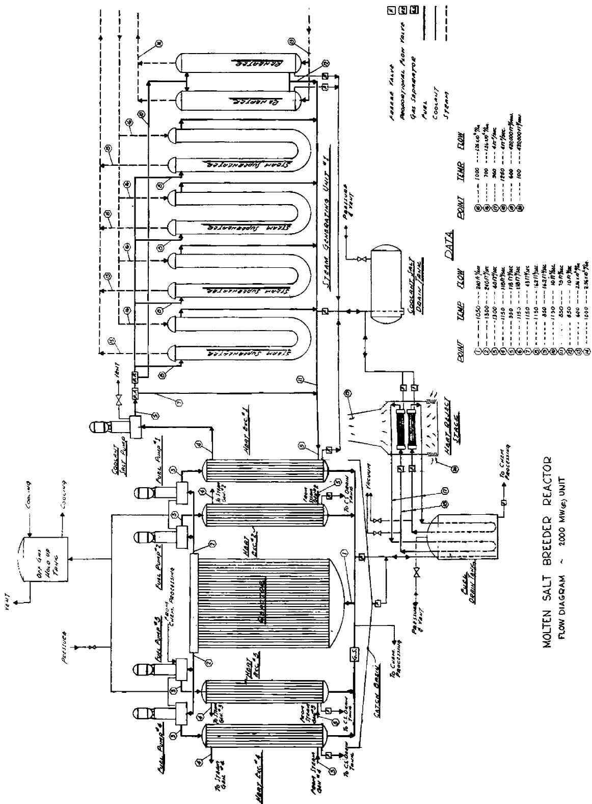  
FIGURE 5.3.1   
FLOW DIAGRAM FOR 2000MWE SINGLE-FLUID MSBR PLANT

TABLE 5.3.1.--Estimated Properties of Fuel and Coolant Salts for One-Fluid Breeder Reactors   

<table><tr><td></td><td>Fuel Salt at 1050°F</td><td>Coolant Salt at 800°F</td></tr><tr><td>Composition, (mole %)</td><td>BeF2, LiF, ThF4, UF4(20, 67.7, 12, 0.3)</td><td>BF3, NaF(48, 52)</td></tr><tr><td>Specific heat, Btu/lb-°F</td><td>0.29</td><td>0.37</td></tr><tr><td>Density, lb/fta</td><td>223</td><td>125</td></tr><tr><td>Thermal conductivity, Btu/ft-hr-°F</td><td>0.49</td><td>0.46</td></tr><tr><td>Viscosity, lb/ft-hr</td><td>34</td><td>34</td></tr><tr><td>Liquidus temperature, °F</td><td>930</td><td>715</td></tr></table>

cells to allow for dimensional changes in those lines. Figure 5.3.4 gives an elevation view of the reactor and steam cells.

In the single-fluid MSBR core the graphite functions essentially as moderator. In principle, the graphite can be present in the form of long bars with no firm connections at top or bottom, the bars can be removed individually or in groups without replacement of the reactor vessel, the lifetime of the graphite should depend only on the bulk changes in dimensions that result from irradiation. A core design which seems to offer the desired features is shown in elevation in Fig. 5.3.5. Some important parameters for the reactor are listed in Table 5.3.2.

As shown in Fig. 5.3.5, the vessel is about 18 ft in diameter by 24 ft high. It has a standard dished head at the bottom. In the center is a 4-ft-diam manifold into which the 24-in. outlet line from each heat exchanger discharges and the four streams mix in the plenum formed by the dished head of the reactor vessel. Mounted above the dished head is a flat support plate with perforated web reinforcing. This plate locates and supports the weight of the graphite stringers comprising the center part of the reactor core. The support plate is drilled on an even square pitch, and nipples for receiving the round ends of the moderator stringers are welded into these holes. These nipples serve as orifices for controlling flow and as sockets for locating the graphite pieces. Near the top of the reactor vessel a square grid is welded to the, vessel. The squares in this grid are large enough to contain nine of the core pieces. This grid locates the top ends of the pieces so that each group of nine is exactly positioned within the core. For nuclear reasons, the volume fraction of fuel in the core is non-uniform. This is accomplished by employing a graphite element which is 4 in. square with the edges contoured and the center cored to obtain the desired salt fraction in each region.

FIGURE 5.3.2   
PLAN VIEW OF SINGLE-FLUID MSBR CELL ARRANGEMENT  
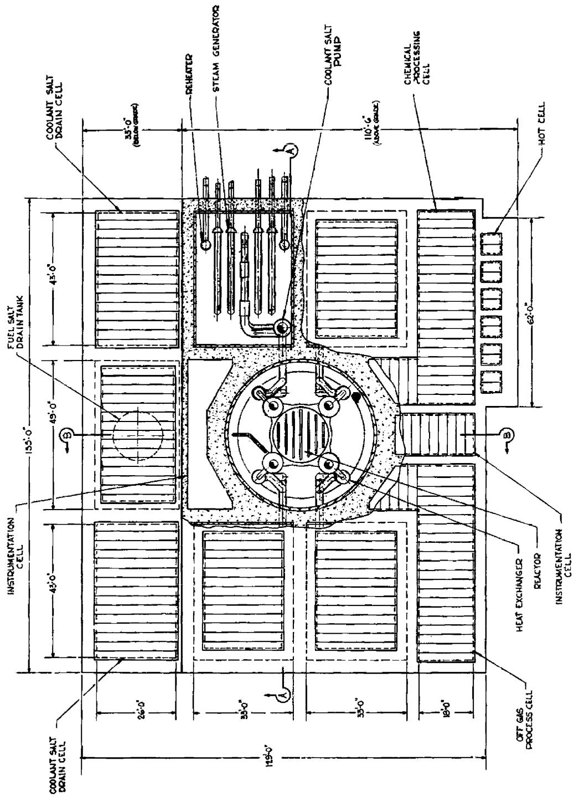  
MOLTEN SALT BREEDER REACTOR   
PLAN # PING - 2000 MW) UNIT   
MARK I

FIGURE 5.3.3   
ELEVATION VIEW OF REACTOR AND FUEL DRAIN CELLS   
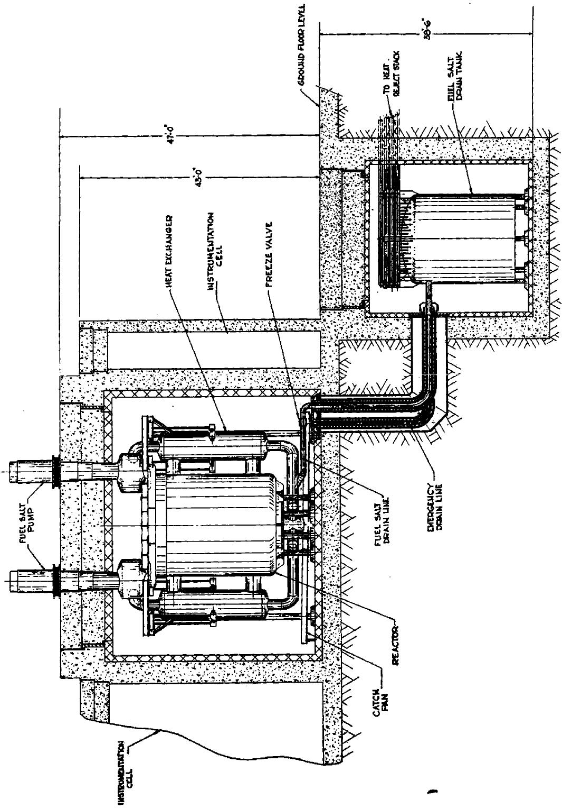  
MOLTEN SALT BREEDER REACTOR   
ELEVATION - REACTOR FUEL BRAIN CELL2000 MWS UNIT : SECT 1   
${M}^{2} + {1}^{2}$ 如何数项数： ${2n} \times  n$ 例题： $\frac{2}{3}$

FIGURE 5.3.4   
ELEVATION VIEW OF REACTOR AND STEAM CELLS   
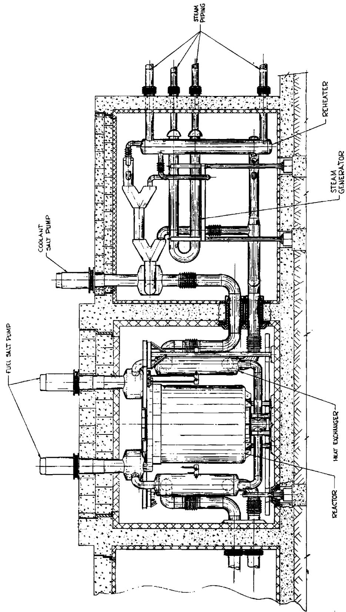  
MOLTEN SALT BREEDER REACTOR   
ELEVATION - REACTOR & STEAM CELL   
2000 MW (E) UNIT - SECT. A-A   
MK

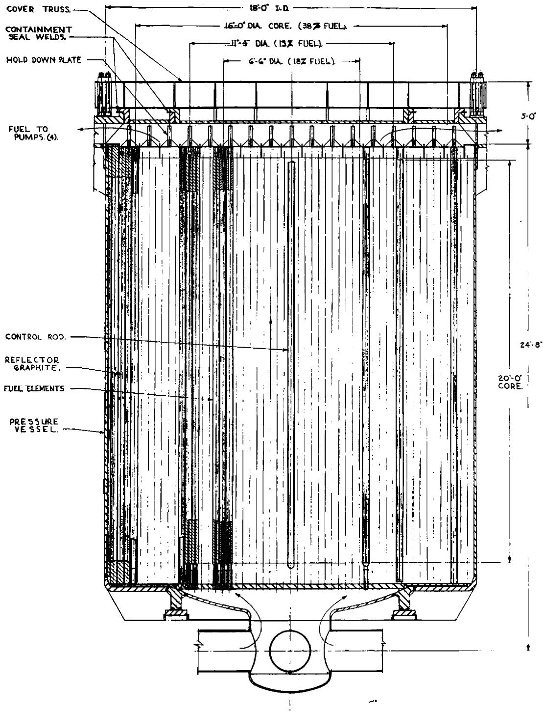  
FIGURE 5.3.5   
ELEVATION VIEW OF REACTOR CORE

TABLE 5.3.2.--Design Parameters for One-Fluid Reactor (2000-Mwe Plant)

Thermal power, Mwt 4444

Vessel diameter, ft 18.3

Vessel height, ft 24.5

Core diameter, ft 16

Core height, ft3. 20

Core volume, fta 4020

Average power density, kw/liter $\ldots \ldots \ldots \ldots \ldots \ldots \ldots \ldots \ldots \ldots \ldots \ldots \ldots \ldots \ldots \ldots \ldots \ldots \sim 40$

Fraction liquid in core, %

Region 1 19

Region 2 17

Region 3 44

Reflector thickness, in. 12

Number of core elements 1760

Maximum velocity salt in core, fps 13

Salt volumes, ft

Core 1240

Reflector 25

Plena 590

Heat exchanger 320

Pumps 120

Piping 150

Total 2445

Fissile inventory, kg 1880

Fertile inventory, kg 90,000

Specific power, Mwt/kg 2.36

# 5.3.3 NUCLEAR DESIGN.

Reactor physics calculations of a single-fluid molten-salt breeder reactor have shown that with direct Pa-233 removal the breeding performance of such a reactor is comparable to that of a two-fluid MSBR, provided the core is properly designed to minimize neutron leakage. Breeding ratios of 1.05-1.07, fuel specific power of $2 - 2.5\mathrm{MWt / kg}$ , and fuel yields of about 5 percent per year appear to be attainable using liquid-metal extraction, which appear to imply fuel-cycle costs less than 0.5 mills/kWh. Such a reactor would have a small negative overall isothermal temperature coefficient of reactivity, and a substantially negative prompt coefficient, i.e $\sim -3\times 10^{-5}\delta \mathrm{k} / ^{\circ}\mathrm{C}$ , associated with a change in salt temperature alone.

By utilizing a non-uniform distribution of fuel in the reactor, a single-fluid reactor acts like one having a core region surrounded by a blanket region. Based on optimization calculations, the reactor contains 19 percent salt (by volume) in the central one-sixth volume, 17 percent in the next one-third, and 44 percent in the outer one-half. The salt contains 67.68 mole percent LiF, 20 mole percent $\mathrm{BeF}_2$ , 12 mole percent $\mathrm{ThF}_4$ , and 0.32 mole percent $\mathrm{UF_4}$ . In addition to the reactor vessel salt inventory ( $1745~\mathrm{ft}^3$ ), the external system (heat exchangers, piping, etc.) contains $700~\mathrm{ft}^3$ . The total reactor power output is 4444 MWt or 2000 MWe. The average power density is $40~\mathrm{W/cm}^3$ of core volume. Although the details of fuel processing are incomplete, it is currently believed that the salt processing cycle time for fission product removal will be about 40 days, with a processing cycle time for Pa removal of about 5 days.

In presenting the principal nuclear design and performance features of the one-fluid reactor, comparable results for the two-fluid reactor discussed previously will also be presented in order to give perspective to the results. Table 5.3.3 gives pertinent information for the two systems. Both a 1000-MWe and a 2000-MWe single-fluid MSBR are considered, along with two versions of a 1000-MWe two-fluid MSBR. In the latter two versions, one plant has a single reactor vessel with average and maximum power densities in the core of 80 and $160\mathrm{kW / liter}$ respectively, while the other plant contains four 250-MWe reactor modules, each with average and maximum power densities of 40 and $80\mathrm{kW / liter}$ respectively. The modular plant of considerably degraded breeding performance but longer life of graphite under irradiation had been selected to be the reference design for the two-fluid breeder plant primarily on the basis of cost and practicality considerations relative to replacing the graphite. It appears possible to economically replace the graphite in a one-fluid reactor more frequently than in a two-fluid reactor, which implies the ability to operate the single-fluid reactor at higher peak power densities

As shown in Table 5.3.3 the one-fluid reactor has performance features which are comparable with those for the modular version of the two-fluid reactor, even though the reactor designs are rather different. The principal differences appear in the details of the parasitic losses in the neutron balances of the two systems. However, as shown in the table, the relatively modest differences essentially cancel.

Details of the fuel salt processing scheme for the one-fluid reactor have not yet been fully determined and hence it is premature to discuss the fuel cycle costs in any detail. However, it appears feasible that fuel-cycle costs less than $0.5\mathrm{~mill/kWh}$ can be achievable with the liquid-metal extraction techniques which are being investigated for the one-fluid system, for the fuel cycle times considered.

TABLE 5.3.3.—Comparison of the Characteristics of Two-Fluid and Single-Fluid MSBRs   

<table><tr><td></td><td colspan="2">Two-Fluid MSBR</td><td colspan="2">Single-Fluid MSBR</td></tr><tr><td></td><td>250 Mwea</td><td>1000 Mwe</td><td>1000 Mwe</td><td>2000 Mwe</td></tr><tr><td>Core height, ft</td><td>10</td><td>12.5</td><td>13.7</td><td>20</td></tr><tr><td>Core diameter, ft</td><td>8</td><td>10.0</td><td>9.7</td><td>11.32</td></tr><tr><td>Blanket thickness, ft</td><td>1.5</td><td>1.5</td><td>2.0</td><td>2.34</td></tr><tr><td>Core power, Mwt</td><td>555</td><td>2222</td><td>1812</td><td>3646</td></tr><tr><td>Blanket power, Mwt</td><td>--</td><td>--</td><td>410</td><td>798</td></tr><tr><td>Average core power density, kw/liter</td><td>39</td><td>80</td><td>64</td><td>64</td></tr><tr><td>Peak-to-average power ratio in coreb</td><td>2.0</td><td>2.0</td><td>2.0</td><td>2.0</td></tr><tr><td>Graphite replacement life, yearsc</td><td>3.4</td><td>1.7</td><td>2.1</td><td>2.1</td></tr><tr><td>Specific fuel inventory, kg/Mw</td><td>1.04</td><td>0.73</td><td>1.06</td><td>0.94</td></tr><tr><td colspan="5">Neutron Balance - Neutron Captures per Neutron Absorbed in Fissile Material</td></tr><tr><td>Fissile material (233U + 235U)</td><td>1.000</td><td>1.000</td><td>1.000</td><td>1.000</td></tr><tr><td>Moderator</td><td>0.033</td><td>0.032</td><td>0.041</td><td>0.045</td></tr><tr><td>Carrier salt</td><td>0.075</td><td>0.067</td><td>0.052</td><td>0.053</td></tr><tr><td>Fission products</td><td>0.031</td><td>0.032</td><td>0.021</td><td>0.025</td></tr><tr><td>Leakage</td><td>0.005</td><td>0.001</td><td>0.014</td><td>0.011</td></tr><tr><td>Breeding ratio</td><td>1.069</td><td>1.071</td><td>1.068</td><td>1.068</td></tr><tr><td>Annual fuel yield, %/yr</td><td>5.0</td><td>7.4</td><td>4.8</td><td>5.5</td></tr><tr><td>Fuel doubling time, yr</td><td>14</td><td>9.4</td><td>14.4</td><td>12.6</td></tr></table>

aOne-quarter module of a 1000-Mwe plant. Corresponds to nominal reference two-region MSBR presented previously.   
Assumed average ratio maintainable over life of graphite.   
cAllowable dose $= 3.0\times 10^{22}$ nvt $>50$ kev, plant factor $= 0.8$

# 5.3.4 FUEL PROCESSING

The presently proposed processing method for single-fluid MSBRs is similar to that proposed for removing Pa-233 from the blanket region of the two-fluid reactor. It depends upon the ability of liquid bismuth containing thorium and lithium to selectively extract uranium, protactinium, and fission products from fuel salt. The associated flow diagram is shown in Fig. 5.3.6. The ability of utilizing such a flowsheet for direct Pa removal and also fission product removal is related to the relative nobility of the various metals involved, as well as their solubility in bismuth. Also significant is the very low solubilities of the fluoride salt in metallic bismuth and the metallic bismuth in the salt phase. Further, bismuth is of such nobility that the concentration of $\mathrm{BiF}_3$ in the salt phase is extremely low, also, because of its high activity coefficient, the beryllium concentration in the metal phase is very low. Thus, fuel-salt extraction with liquid bismuth appears to be particularly appropriate as a processing scheme.

An indication of the relative nobility of the various fuel salt components is given by their modified standard reduction potentials, as given in Table 5.2.4. Based on these relative values, if a molten-fluoride salt containing the fluorides of lithium, beryllium, thorium, uranium, and protactinium were contacted with a molten bismuth phase in which some active metallic reductant were dissolved, typical reactions would be

$$
\mathrm {T h} _ {\text {m e t a l}} ^ {\circ} + \mathrm {U} _ {\text {s a l t}} ^ {+ 4} = \mathrm {T h} _ {\text {s a l t}} ^ {+ 4} + \mathrm {U} _ {\text {m e t a l}} ^ {\circ}
$$

$$
4 \mathrm {L i} _ {\text {m e t a l}} ^ {\circ} + \mathrm {P a} _ {\text {s a l t}} ^ {+ 4} - 4 \mathrm {L i} _ {\text {s a l t}} ^ {+ 4} + \mathrm {P a} _ {\text {m e t a l}} ^ {\circ}
$$

The distribution of any component between the salt and bismuth phases can be related to the distribution of a reference component and a factor which involves the difference in standard reduction potentials. Thus, if the concentrations of the components in the salt phase are given and the number of equivalents of active metal per mole of bismuth is specified, the corresponding equilibrium concentrations in the metal phase can be computed. The method of analysis is similar to that employed in distillation or extraction calculations, using the concept of theoretical stages.

The flowsheet for the isolation of protactinium uses a tower equivalent to several extraction stages. As shown in Fig. 5.3.6 flow from the reactor enters the bottom of the tower and rises countercurrent to a flow of bismuth containing reductive metals. At the top of the tower, the bismuth contains essentially thorium with an equilibrium amount of lithium, and the flow rate and concentration are adjusted so as to extract all of the uranium entering at the bottom. The operation of this tower exploits the fact that protactinium is of intermediate nobility between thorium and uranium. Thus, uranium is extracted from the incoming salt before the protactinium; the protactinium progresses up the tower until it meets the thorium which then reduces the protactinium and causes it to enter the metal phase. In this way the protactinium is trapped and refluxed in the center of the tower in a manner similar to the trapping of components of intermediate volatility in a distillation tower. A tank is provided at the center of the tower where the concentration of protactinium is the highest so as to retain the protactinium until it decays to uranium.

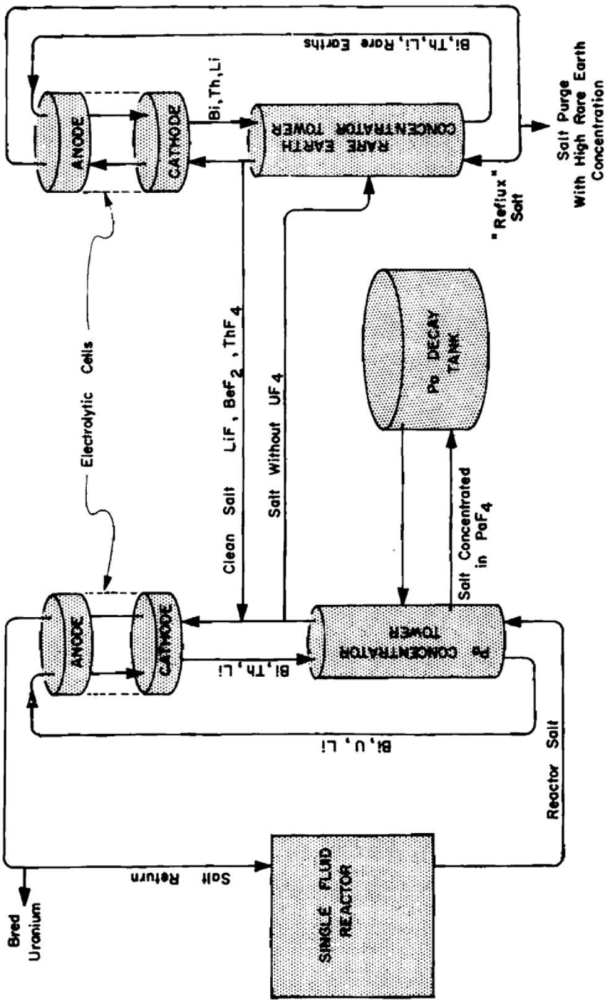  
FIGURE 5.3.6   
SINGLE FLUID MSBR PROCESSING BY REDUCTIVE EXTRACTION  
ORNL DWG. 68-814

TABLE 5.3.4.-Modified Standard Reduction Potentials E' for the System LiF-BeF2 (67-33 mole %)--Bismuth at 600 °C   

<table><tr><td></td><td>E0(volts)</td></tr><tr><td>Li+</td><td>-1.93</td></tr><tr><td>Be+2</td><td>-1.85</td></tr><tr><td>Ba+2</td><td>-1.80</td></tr><tr><td>Eu+2</td><td>-1.61</td></tr><tr><td>Th+4</td><td>-1.57</td></tr><tr><td>Nd+3</td><td>-1.52</td></tr><tr><td>Sm+2</td><td>-1.50</td></tr><tr><td>Ce+3</td><td>-1.50</td></tr><tr><td>Zr+4</td><td>-1.49</td></tr><tr><td>La+3</td><td>-1.48</td></tr><tr><td>Pa+4 (estimated)</td><td>-1.43</td></tr><tr><td>U+4</td><td>-1.39</td></tr></table>

These data were reported by D. M. Moulton and J. H. Shaffer, December, 1967.

An essential part of the processing flowsheet is an electrolytic oxidizer and reducer which, for the U-Pa tower, serves the dual purpose of recovering the extracted uranium from the metal phase and preparing the thorium-lithium-bismuth solution to be fed to the tower. The metal phase containing the uranium extracted in the tower can serve as the anode in an electrolytic cell where all of the uranium and lithium will be oxidized to uranium tetra-fluoride and lithium fluoride. The electrolyte for this cell is salt from the top of the tower which first passes over a pool of bismuth serving as the cathode into which thorium and lithium are electrolytically reduced for preparing the metal stream fed to the tower. This salt passes upward through the unit countercurrent to a downflow of bismuth droplets from the anode, accumulates the uranium and lithium fluorides produced by the oxidation step, and subsequently flows out of the processing system for return to the reactor.

Although considerable engineering development will be necessary to perfect this electrolytic unit, it can be noted that molten-salt/molten-metal electrolytic units are not unknown in industry. For a 1000-MWe reactor with a salt volume of 1000 cubic feet and a processing cycle time of 3 days, the theoretical current requirement would be about 6000 amps. Electrolytic units for refining aluminum have operated at greater than 25,000 amps per square foot. Thus, a few square feet of surface should be sufficient. Also, it is significant that the size of the extraction towers would be small, being about 4 in. in diameter and 12 ft long. Thus, processing equipment costs may be even less than those associated with the process previously considered for the two-fluid reactor (although not applied previously, it should be noted that reductive extractive processing can also be applied to the core fluid of a two-fluid reactor).

As shown in Fig. 5.3.6 the removal of rare-earth fission products more noble than thorium and less noble than protactinium also makes use of a reductive-extraction process. The process is analogous to that for uranium removal from the salt, except that fission products are discarded after concentration in the salt stream from the anode.

With regard to the very noble fission products reaching the processing plant (such as Nb and Mo), they would be reduced to the metal and accumulate in the bismuth. It may also be possible to remove them from the reactor system along with the noble-gas fission products by means of the gas-stripping system, since the noble metal fission products appear as "gases" in the MSRE pump bowl.

Those fission products which are less noble than thorium will go through the processing system unaffected and return to the reactor. These fission products include Cs, Rb, Ba, Sr, and perhaps Eu. It may be necessary to control concentrations of such elements by salt discard or by processing on a relatively long cycle time. A possible method could involve fluoride volatility processing along with vacuum distillation.

# 5.3.5 STATUS OF THE MOLTEN-SALT REACTOR

Molten-salt technology has been studied extensively since 1950 and a broad base of related applied research on molten-salts and related fluid-fuel reactors has been developed. Two fluoride-salt reactors have seen built, the Aircraft Reactor Experiment (ARE) in 1954 and the currently operating MSRE. These experimental reactors at ORNL provide a background of experience in complete circuits of flowing fuel, including reactor kinetics response, pumping of fluid fuels, heat removal, and remote maintenance. Since attaining criticality in June 1965, the MSRE has operated successfully for over 400 equivalent full power days as of Mar. 1, 1969, mostly at a power level of $8.0\mathrm{MWt}$ .

Much basic molten-salt reactor technology is embodied in the MSRE. This small, relatively crude reactor system has served to demonstrate that molten-salt reactors can be successfully operated and maintained. The MSRE, although operating at less severe conditions than the proposed MSBR, provides facilities for studying the behavior of fuel salts, graphite, and Hastelloy-N, the high-temperature operation of pumps and other system components, and the development of remote maintenance techniques and equipment, all in a radiation field.

# 5.3.6 R&D REQUIRED FOR THE MSBR

The transition from the relatively crude MSRE to a much more complex full-scale breeder reactor requires an extensive R&D program including scaleup of components. The MSBR pump design flow rates and power density would be considerably greater than those in the MSRE. While individual facets of the technology may be investigated in the MSRE as well as other reactor systems, e.g., HFIR, EBR-II, and Dounreay Fast Reactor, it is only by integrating all the various components and systems in an adequately-sized reactor experiment under conditions similar to those existing in the actual breeder, that the true operating characteristics and potential of the molten-salt reactors will be determined. To achieve this it would be necessary to construct a power-producing reactor, which would furnish data on fuel processing, breeding ratio, and secondary coolant behavior, that must be known before the MSBR can be built commercially with confidence. At the present time the single-fluid breeder concept is in the very early design stage. Thus development of a finalized detailed design of the concept is necessary before the R&D requirements can be assessed.

While there are no indications that dynamic instabilities will occur, the dynamic behavior of the system is very complicated, and further accurate and detailed analysis and experimental work are needed for designing a self-regulating system that is stable for constant power, and also for transient and load-following behavior.

Pumps and heat exchangers appear to be critical components. While the MSRE and experimental salt pumps have successfully logged thousands of hours of molten-salt operation and the MSRE heat exchangers have also operated successfully for thousands of hours, scale-up to MSBR size and modifications in design required for the MSBR operating conditions will have to be demonstrated. The presence of radioactivity, the need for adequate pressure relief against high-pressure steam, and salt cleanup problems in case of tube leakage appear to be some of the design and maintenance complications.

Remote maintenance of a molten-salt fluid-fuel reactor is required due to the presence of intense gamma radiation in the equipment outside the reactor caused by activation of sodium and fluorine in the salt, the presence of fission products, and activation of the structural material by delayed neutrons in the circulating salt. Pumps and heat exchangers will have to be capable of long maintenance-free life, as no practical reactor system could tolerate too many shutdowns due to failure of large components.

It is desired that the fission products be kept at a low concentration in the core of the reactor. MSRE experience with dilute solutions of fission products has shown that there is some deposition of the noble-metal fission products such as tellurium, ruthenium, molybdenum on the surfaces of Hastelloy-N as well as on the surfaces of the graphite. At the same time, a large fraction of these noble metals also appears in the gas stream, presumably as metallic colloids. While the MSRE is providing information concerning fission-product behavior in molten-salt reactor systems, additional information is required relative to fission product deposition on materials.

ORNL has shown that Hastelloy N is subject to radiation damage—a loss of high temperature ductility and a reduction in the creep-rupture life caused by the collection of helium at the grain boundaries.

If Hastelloy-N is to be used for the reactor vessel and in the reactor internals, it will be necessary to modify the composition of this alloy to reduce the radiation-induced loss in mechanical properties. Addition of small amounts of titanium appears to reduce the effects of irradiation damage. However, further testing is required to determine the suitability of the modified alloy for molten-salt reactor systems.

# 5.4 Light Water Moderated Reactor

Light water moderated reactors of both the boiling (BWR) and pressurized-water (PWR) type have been developed using slightly enriched uranium fuel, although they can also be operated on the thorium fuel cycle. Thorium fueling was initially used in the Indian Point plant of Consolidated Edison; however, that reactor plant was later converted to the use of the uranium fuel cycle because economic factors favored that cycle. Thorium was also used in the Elk River Reactor. A light-water breeder reactor (LWBR) is being developed at Bettis Atomic Laboratory which utilizes the thorium cycle as well as LWR technology.

# 5.4.1 ECONOMICS OF THE LWR THORIUM FUEL CYCLE

Early comparisons (13, 14) of fuel cycle costs between LWRs fueled with thorium or uranium indicated that the fuel cycle cost of the initial thorium fuel cycle was about the same as that of the initial uranium cycle. Since that time, however, advances in fuel technology have substantially lowered the fuel cycle costs of LWRs fueled with slightly enriched uranium. The current low cost of fuel fabrication has helped the uranium cycle relative to that of thorium since a long fuel exposure is economically less important as fabrication costs decrease. Thus, one of the advantages inherent in the higher conversion ratio of the thorium cycle has become less important. In addition, the increase in fuel inventory charges which occurred in the interim has helped the uranium cycle relative to that of the thorium cycle, since the fissile inventory cost in LWR systems of the slightly-enriched uranium cycle tends to be lower.

In view of the lack of optimized design information comparing the two cycles for current and projected LWRs, the uranium-fueled PWR design used in the assessment of the civilian nuclear power program was modified for operation on a thorium cycle. It should be emphasized that the data so obtained, while indicating the general differences between the two cycles, and identifying the general sensitivity of important features, does not provide a comparison based upon designs optimized for the varying conditions. The only basic modifications to the PWR/U system in going to the thorium cycle were to increase the specific power and the fuel exposure, in order to decrease the influence of the increased initial fuel costs and the fabrication and processing penalties. The indicated relative performances of the thorium and uranium-fueled PWR, based upon this exploratory study, are given in Table 5.4.1; the indicated effects of changing uranium ore and fissile fuel costs are given in Table 5.4.2.

Improvements in reactor technology have led to LWRs with higher performance than those used in the early comparisons. Present estimates for individual costs have changed for a number of items, but the most important ones relative to a comparison of the performance of the thorium and uranium cycles have been in increasing core power densities, decreasing fabrication costs, and reduction in separative work

(1000 Mwe - 1980 Design)

TABLE 5.4.1....Indicated Performance of Thorium and Uranium-Fueled PwRs ${}^{a}$   

<table><tr><td></td><td colspan="2">U-235 Feed</td><td colspan="2">Plutonium Fuel</td></tr><tr><td></td><td>PWR/U</td><td>PWR/Th</td><td>PWR/U</td><td>PWR/Th</td></tr><tr><td>Specific Power, MW/MT</td><td>39.9</td><td>43.6</td><td>39.9</td><td>43.6</td></tr><tr><td>Specific Fissile Inventory, g/KWe</td><td>1.72</td><td>2.19</td><td>1.77</td><td>2.00</td></tr><tr><td>Fuel Burnup, MWD/kg</td><td>22</td><td>30-26</td><td>22</td><td>30-27</td></tr><tr><td>Fissile Yield, Kg/Mwe-yr.</td><td></td><td></td><td></td><td></td></tr><tr><td>Pu</td><td>0.305</td><td>0.008</td><td>-0.395</td><td>-0.637</td></tr><tr><td>U-235</td><td>-0.890</td><td>-0.614</td><td>-0.141</td><td>0.008</td></tr><tr><td>U-233</td><td>-</td><td>0.025</td><td>-</td><td>0.034</td></tr><tr><td>Total</td><td>-0.58</td><td>-0.58</td><td>-0.54</td><td>-0.59</td></tr><tr><td>Unit Costs</td><td></td><td></td><td></td><td></td></tr><tr><td>\( U_{3}O_{8} \) Ore Cost, $/lb.</td><td>8</td><td>8</td><td>8</td><td>8</td></tr><tr><td>Pu, $/8 fissile</td><td>10</td><td>10</td><td>10</td><td>10</td></tr><tr><td>U-235, $/g</td><td>11</td><td>11</td><td>-</td><td>-</td></tr><tr><td>U-233, $/g</td><td>14</td><td>14</td><td>14</td><td>14</td></tr><tr><td>Fabrication,b $/kg</td><td>47</td><td>47/66</td><td>66</td><td>66</td></tr><tr><td>Processing, $/kg</td><td>19</td><td>38</td><td>20</td><td>38</td></tr><tr><td>First Core, $10^6</td><td>16</td><td>28</td><td>19</td><td>25</td></tr><tr><td>Fuel Cycle/mills/kwh</td><td></td><td></td><td></td><td></td></tr><tr><td>Burnup &amp; Inventory</td><td>0.91</td><td>1.38</td><td>0.98</td><td>1.23</td></tr><tr><td>Fabrication</td><td>0.37</td><td>0.38</td><td>0.53</td><td>0.40</td></tr><tr><td>Processing</td><td>0.13</td><td>0.18</td><td>0.13</td><td>0.18</td></tr><tr><td>Total</td><td>1.41</td><td>1.94</td><td>1.64</td><td>1.81</td></tr><tr><td>Initial Core</td><td>0.32</td><td>0.58</td><td>0.40</td><td>0.52</td></tr><tr><td>Fuel Replacement</td><td>1.06</td><td>1.31</td><td>1.13</td><td>1.23</td></tr></table>

TABLE 5.4.2.—Indicated Effect of Change in Plutonium and Uranium Ore Costs for Uranium and Thorium PVRsa   

<table><tr><td rowspan="2"></td><td colspan="2">U-235 Feed</td><td colspan="2">Plutonium Feed</td></tr><tr><td>PWR/U</td><td>PWR/Th</td><td>PWR/U</td><td>PWR/Th</td></tr><tr><td colspan="5">Sensitivity, Mills per kwh/$ Increase</td></tr><tr><td>Pu/g Fissile</td><td>-0.0287</td><td>-0.0006</td><td>0.0891</td><td>0.1163</td></tr><tr><td>\( U_{3}O_{8}/lb \)</td><td>0.0729</td><td>0.0490</td><td>0.0132</td><td>-</td></tr><tr><td>U-233/g</td><td>-</td><td>0.0032</td><td>-</td><td>0.0033</td></tr><tr><td>Processing/kg</td><td>0.0065</td><td>0.0044</td><td>0.0064</td><td>0.0042</td></tr><tr><td colspan="5">Total Fuel Cycle (mills/kwh)</td></tr><tr><td>\( Base\ Case^{b}\ At\ $10/g\ Pu,\ \\$8/lb.\ U_{3}O_{8} \)</td><td>1.41</td><td>1.94</td><td>1.64</td><td>1.81</td></tr><tr><td>Case 1. At $8/g Pu</td><td>1.47</td><td>1.94</td><td>1.46</td><td>1.58</td></tr><tr><td>Case 2. At $16/lb \( U_{3}O_{8} \)</td><td>1.99</td><td>2.33</td><td>1.75</td><td>1.81</td></tr><tr><td>Case 3. At $12/g Pu,and $16/lb \( U_{3}O_{8} \)</td><td>1.93</td><td>2.33</td><td>1.92</td><td>2.04</td></tr></table>

Design not reoptimized for changes   
bBase case as given in Table 5.4.1.

costs to $26/kg. The results given in Table 5.4.1 and 5.4.2 indicate that LWRs operate more economically on the uranium cycle, but that the margin between the two cycles may not be great, if basic parameters were to change and the design were to be optimized for the specific conditions. There is a significant increase in conversion ratio in changing from the uranium to the thorium cycle, but fuel utilization is relatively poor in either case. If plutonium at a cost of about$ 8/g fissile, or less (Table 5.4.2) were available for fueling LWRs, however, the results imply that the thorium cycle might be economically attractive. This appears valid even though the fuel fabrication costs associated with fuel recycle would be greater than for the first cycle of the slightly-enriched uranium case. Also because of the initial core cost, decreasing the inventory charge rate would favor the thorium cycle.

In summary, it appears that there is at present no economic incentive to use the thorium cycle in lieu of slightly-enriched uranium fueling in LWRs, although the penalty associated with the thorium cycle may not be great under certain conditions. If uranium ore prices were to double, the thorium cycle could become competitive. Also, if plutonium were used as a recycle fuel in LWRs, the thorium cycle appears to be competitive and should be considered in detailed comparison studies in which reactor designs are optimized for the specific cycles.

# 5.4.2 STATUS OF LWR TECHNOLOGY

The LWR technology developed for the uranium cycle is extensive and documented in detail in the LWR Task Force Report (5). The cost of fuel elements, primary system components, and steam system components are such as to make LWR power costs competitive with alternate energy sources. The LWRs have been accepted by the utilities for commercial power production and the scale-up of plant size has been steady and continuous. The first of the 1000-MWe plants (Browns Ferry) is due to start up in 1970. All of these plants operate on the uranium fuel cycle and no thorium-cycle plants are presently contemplated.

# 5.4.3 R&D REQUIRED FOR THE LWR

Research and development associated with uranium-fueled LWRs is described in the LWR Task Force Report(5). The general status of the technology is in a relatively favorable condition. However, to provide the technological basis for the future utilization of the thorium cycle in light-water systems an R&D program is required in the following areas: (1) the reactivity behavior of U-233/Th systems, and (2) fuel element development and reprocessing. The latter includes fabrication of thorium cycle fuels, irradiation testing, and reprocessing of thorium fuels.

# 5.5 Heavy Water Moderated Reactors

A variety of heavy water moderated reactor (HWR) designs are possible based on different design concepts and the use of different coolants. In most cases, the term HWR refers to a two-fluid, large-lattice-type system in which the moderator is separated from the coolant. This concept is typified by the Canadian CANDU reactor which utilizes heavy water as both coolant and moderator. However, since the coolant and

moderator fluids are separated in the reactor, a variety of coolant fluids can be considered. In addition to heavy water, these can be light water, organic fluids, and gases. Furthermore, the coolant can be permitted to undergo phase changes when passing through the reactor, as in the boiling light-water-cooled HwR. In addition, other concepts are associated with the use of heavy water, as in the BwR-type systems, in which the conventional light-water moderator and coolant are replaced by heavy-water. Still another HwR concept involves mixtures of heavy and light-water, as was proposed in the spectral-shift converter reactor.

Of the HwR concepts mentioned, the two-fluid, pressure-tube systems are currently being emphasized. Thus, the discussion herein concerns primarily such systems.

Previously, significant effort was expended on the spectral-shift converter reactor concept. This concept was based extensively on LWR technology, but utilized a mixture of light and heavy-water as both moderator and coolant. Fueling was based on the thorium fuel cycle. Evaluation of this concept indicated that it did not have an economic advantage over the uranium-fueled LWRs and support for this concept was, therefore, terminated.

Information concerning the relative performance of the thorium and uranium fuel cycles in BWRs moderated and cooled with heavy water is not available for this study. However, based on the tendency for the uranium fuel cycle to become more economical than the thorium cycle as the ratio of fissile-to-fertile material decreases, such a concept would tend to favor the uranium cycle slightly more than in the usual light-water moderated system.

Most of the initial studies of HWRs were associated with CANDU-type systems using heavy water as the moderator and coolant; nearly all of the effort was concentrated on the use of the uranium cycle. In order to evaluate the relative economic performances of the thorium and uranium fuel cycles in large-size CANDU-type power plants, Savannah River Laboratory (SRL) provided plant and core designs for the two cycles, which were then evaluated by ORNL(16). The results of these studies indicated that use of the thorium fuel cycle gave fuel cycle costs about 0.2 mills/kWh higher, and power costs about 0.5 mills/kWh higher than did the use of the uranium cycle at uranium prices of $8/lb U $_3$ O $_8$ . In general, the results obtained were similar to those obtained more recently from studies of Heavy-Water Moderated Organic-Cooled Reactor systems (HWOCR)(17). Since design and evaluation studies for the latter concept were more comprehensive and complete and the power costs obtained were lower and also based on the most recent set of ground rules used in evaluating all other reactor concepts, the HWOCR studies will be used to characterize HWR performance. The results obtained for this system, when considering both the thorium and uranium fuel cycles, are believed to be representative of the relative performance of the two fuel cycles in the two-fluid, pressure-tube-type HWR systems.

# 5.5.1 GENERAL DESCRIPTION OF AN HWOCR

The Heavy-Water Moderated Organic-Cooled Reactor (HWOCR) system utilizes process tubes within a calandria vessel. This vessel contains the heavy-water moderator, while the organic coolant flows through the process tubes, which also contain the reactor fuel. The organic coolant consists of a mixture of terphenyls (and degraded products) which exhibit favorable physical properties and relatively high temperature and radiation stability. The vapor pressure of the organic coolant is relatively low at the reactor operating temperature, and operating pressures are, therefore, determined primarily by fluid flow requirements. The HWOCRs that were under consideration were designed to operate at a maximum coolant pressure of about 400 psig, and to use primary coolant loops of carbon steel.

After passing through the reactor core, the organic coolant transfers its energy to the steam system through generators located outside the primary reactor containment structure. The plant utilizes on-power refueling to obtain low reactivity control requirements and high plant load factors. Fuel movement is bidirectional in adjacent fuel tubes, with coolant flow in the same direction as the fuel feed.

A series of pigtails and headers are employed to distribute coolant flow, and flow is orifice-controlled in accordance with the gross-radial power peaking factor. A hydrocracker is utilized to recover organic coolant from the high boilers formed because of pyrolytic and radiolytic degradation of the coolant.

The HWOCR which has been evaluated most extensively is based on that specified by Atomics International and Combustion Engineering (AI-CE), who developed a plant and core design associated with the use of a slightly enriched uranium fuel in the form of uranium carbide(18). The fuel assembly consisted of a cluster of 37 fuel pins each having an overall length of 44 in. and a diameter of about 0.5 in.; fuel cladding and process tubes were made of a sintered aluminum product (SAP). The SAP process tubes were surrounded by Zircaloy-2 calandria tubes, which formed a thermal insulating annulus between the process tubes and the moderator. A total of 492 process tubes were utilized.

Corresponding core designs based on the thorium fuel cycle were specified by Babcock and Wilcox(19). A number of fuel assembly designs were studied in order to obtain a high-performance system; the two more economical designs which were evaluated by ORNL (17) were a nested-cylinder metallic fuel assembly and a 37 pin-cluster assembly using oxide fuel. The metallic fuel was in the form of four concentric cylinders clad with Zircaloy-4. The oxide fuel pins were clad with SAP, and were about 0.5 in. in diameter; they were similar in arrangement to that for the UC fuel element design.

Some design characteristics associated with the HWOCR are given in Table 5.5.1.

# 5.5.2 ECONOMICS OF THE HWOCR

The use of the thorium fuel cycle in HWOCR systems relative to use of the uranium cycle results in an increase in the conversion ratio of about 0.1. This lowers the burnup portion of the fuel cycle cost; however, the thorium cycle involves a high fuel inventory charge. Also, since the heavy water moderator operates at low temperatures, the reduction in the eta of Pu-239 (bred in the uranium fuel cycle) relative to the eta of U-233 (bred in the thorium fuel cycle) is greater than in high-temperature HTGR or MSBR systems.

TABLE 5.5.1.-HWOCR Characteristics (17)   

<table><tr><td></td><td>UC Elements</td><td>Th-U Metallic Elements</td><td>\( ThO_2 \) Element</td></tr><tr><td>Total Power, Mwt</td><td>3,093</td><td>3,187</td><td>3,100</td></tr><tr><td>Net Electric Power, Mwe</td><td>1,067</td><td>1,048</td><td>1,076</td></tr><tr><td>Plant Thermal Efficiency, percent</td><td>34.5</td><td>33.9</td><td>34.7</td></tr><tr><td>Equivalent Core Diameter, ft</td><td>21.9</td><td>19.5</td><td>27</td></tr><tr><td>Active Core Height, ft</td><td>18</td><td>19.3</td><td>18.7</td></tr><tr><td rowspan="2">Coolant</td><td>Santowax OM + 10%</td><td>Santowax OM + 10%</td><td>Santowax OM + IC</td></tr><tr><td>High Boilers</td><td>High Boilers</td><td>High Boilers</td></tr><tr><td>Core Inlet Temperature, °F</td><td>590</td><td>535</td><td>605</td></tr><tr><td>Core Outlet Temperature, °F</td><td>745</td><td>685</td><td>766</td></tr><tr><td>Ave. Core Power Density, kwt/liter</td><td>16.1</td><td>19.6</td><td>12.3</td></tr><tr><td>Ave. Specific Power, kwt/kg fertile</td><td>24.8</td><td>32.2</td><td>26.4</td></tr><tr><td>Average Conversion Ratio</td><td>0.70</td><td>0.81</td><td>0.85</td></tr><tr><td>Average Core Inventory, kg fissile</td><td>974</td><td>1,970</td><td>2,190</td></tr><tr><td>No. of Fuel Channels</td><td>492</td><td>324</td><td>758</td></tr><tr><td>Fuel Cladding</td><td>SAP</td><td>Ozhenite 0.5</td><td>SAP</td></tr><tr><td>Process Tube</td><td>SAP</td><td>Ozhenite 0.5</td><td>SAP</td></tr><tr><td>Calandria Tube</td><td>Zircaloy-2</td><td>Zircaloy-2</td><td>Zircaloy-2</td></tr><tr><td colspan="4">\( MT U_{3}O_{8}Required/Mwe^a \)</td></tr><tr><td>Total Inventory</td><td>0.28</td><td>0.67</td><td>0.76</td></tr><tr><td>Annual Makeup (80% CF)</td><td>0.097</td><td>0.057</td><td>0.046</td></tr><tr><td>Total 30 year Requirement</td><td>3.20</td><td>2.38</td><td>2.14</td></tr></table>

As indicated in Table 5.5.1, a thorium-fueled HWOCR requires about two to three times as much uranium ore for fuel inventory as does a uranium-fueled HWOCR. However, the higher average conversion ratio achievable with the thorium cycle leads to lower fuel makeup requirements and to lower total uranium requirements over a 30-year plant life.

Due to increased inventory charges, the thorium system had fuel cycle costs 0.5 mills/kWh higher than the uranium system under the reference economic conditions, as shown in Table 5.5.2; the total energy production costs for the thorium fuel cycle were about 0.5 to 0.7 mills/kWh higher than for the uranium cycle under the reference economic conditions.

The fuel inventory charge is a major item in the thorium fuel cycle cost. Thus, the value of fissile material and the fuel inventory charge rate are important parameters. Although the specific fissile inventory can be decreased by removing fertile material, this leads to a decrease in the conversion ratio. Also, a low specific inventory can be obtained by using fuel with a high surface-to-volume ratio, but this tends to increase fabrication costs, particularly since fuel exposure is limited by design material considerations to about 20,000 MWD/MT. In order for thorium-fueled HWOCRs to be competitive economically with uranium-fueled systems, the value of fissile material would have to be significantly reduced. For example, if plutonium were available at $5 / \mathrm{g}$ , the thorium system would be economically competitive.

If the price of uranium ore were to rise by a large amount, the cost differential between the uranium and thorium fuel cycles would be expected to be smaller due to the decreased importance of the enrichment cost. However, due to the more pronounced effect on fuel inventory, the thorium cycle is less favorable at increased ore costs, even excluding reoptimized fuel design considerations which would further favor the uranium system.

# 5.5.3 STATUS OF HWR TECHNOLOGY

Up to the present, seven heavy-water moderated power reactors have been placed in service in various parts of the world, and an additional 12 are under construction; none of these uses thorium. Eleven of these reactors are cooled with heavy-water, two with light-water, four with $\mathrm{CO}_{2}$ , and two with organic coolant. Most of these reactors have been operating for only a short period of time. General experience with $\mathrm{D}_2\mathrm{O}$ leakage shows that it can be mastered despite the fact that it usually causes certain difficulties in the initial stage of reactor operation; most losses appear to be associated with the circulating coolant system. Fuel element performance in the operating systems has been good.

Most of the large power reactor designs specify a vertical pressure-tube arrangement for simplicity; vertical coolant channels appear suitable for all coolants under consideration.

Fuel charging machines have been built and tested for heavy-water cooled systems. These include the charging machines of the Canadian NPD and CANDU, and the German MZFR reactors.

The water-cooled systems can draw upon the pertinent extensive technology associated with LWRs and, more specifically, upon the technology associated with CANDU reactor development. Extensive experience exists with regard to heat transfer correlations, fuel element performance, fuel fabrication

TABLE 5.5.2. --- HWOCR Power Costs a   

<table><tr><td></td><td>Uranium Cycle
Carbide
Fuel</td><td>Thorium Cycle
Oxide
Fuel</td><td>Metal
Fuel</td></tr><tr><td>Outlet coolant temperature, °F</td><td>745</td><td>766</td><td>685</td></tr><tr><td>Power production cost, mills/kwh .......</td><td></td><td></td><td></td></tr><tr><td>Capital</td><td>2.51</td><td>2.59</td><td>2.50</td></tr><tr><td>Operating and maintenance</td><td>0.33</td><td>0.34</td><td>0.32</td></tr><tr><td>Subtotal</td><td>2.84</td><td>2.93</td><td>2.82</td></tr><tr><td>Fuel cycle</td><td>0.92</td><td>1.48</td><td>1.47</td></tr><tr><td>D2O and coolant inventory</td><td>0.20</td><td>0.27</td><td>0.17</td></tr><tr><td>Subtotal</td><td>1.12</td><td>1.75</td><td>1.64</td></tr><tr><td>Total</td><td>3.96</td><td>4.68</td><td>4.46</td></tr></table>

aReference 17, Tables 10.7 and 11.1; 80% capacity factor, 1967 dollars, and $8/1b. U308.

methods, and fuel handling procedures. Methods of separating and insulating coolant from moderator, and joining Zircaloy pressure tubes to other materials, have been developed. Development of special zirconium alloys, e.g., Ozhennite 0.5, suitable for application in steam and organic coolant environments, appears promising. Manufacturing methods for a variety of fuel materials, such as oxide, carbide, and metal, either exist already or appeal to be feasible based on present information.

Significant HWOCR technology has been developed, including the manufacture and use of SAP as a process tube and fuel cladding material. The AI-CE program for HWOCR development, terminated in March 1967 in the U.S., was extensive, and involved development of fuels, process and calandria tubes, cladding material, tube joints involving different materials, heat transfer and fluid flow relationships, and organic coolant technology. Associated efforts conducted by Canada and EURATOM are continuing.

Development work related to fuel development for thorium-fueled concepts has been largely in the Thorium Utilization Program at ORNL, and at B&W. Design work has been carried out by these groups, and also by Canada, EURATOM, and others. Development of the thorium fuel cycle in HWRs would involve primarily the technology associated with the uranium fuel cycle, except for the fuel itself.

# 5.5.4 R&D REQUIRED FOR PRESSURE-TUBE HWR'S

Pressure-tube HWRs must demonstrate that present material and designs are satisfactory for extended power plant service. Problems which arise in such demonstrations need to be solved, and designs, components, and materials upgraded to large power systems.

Extended study is required on safety and control characteristics and requirements of large reactor systems as a function of the coolant employed. The reliability of refueling machines must be demonstrated, as well as the ability of process tubes, cladding, and fuel to perform as anticipated. Where SAP is involved, the effects of transient stresses and transient local conditions on the mechanical properties and the associated permissible design criteria requires additional study. Satisfactory SAP fabrication procedures must be established. Organic coolant technology needs further development; associated with this effort would be the development of a hydrocracker or analogous unit for coolant recovery.

The on-power refueling machines, pumps, heat exchangers, and valves of the primary heat transfer system of large HwRs require performance testing. High reliability of the refueling machines must be demonstrated through repeated tests of prototype machines under actual or simulated reactor conditions.

The ability of thorium fuel elements to withstand satisfactorily the maximum exposures planned under HwR conditions must be further demonstrated with consideration given to the influence of fine axial and radial power peaking factors on maximum fuel exposure. Additional testing is required for the thorium-fueled elements to demonstrate that vibration compaction is a practical operation when SAP cladding is employed. Also, more information is needed on the permissible fuel exposures as limited by fission product gas pressure buildup under reactor conditions. Additional experimental results are needed to determine fuel growth and distortion as a function of exposure, temperature, and temperature distribution.

# 5.5.5 STARTUP PERIOD FOR THE PRESSURE-TUBE HWR'S

Pressure-tube HWRs using heavy water coolant have been built and are presently operating in sizes up to 200 MWe. These are based on use of the uranium fuel cycle. Use of the thorium fuel cycle would require some additional development, and would thus lag behind the uranium-cycle system. However, the conceptual design studies have indicated that thorium and uranium fuel concepts have many common design characteristics and that the thorium cycle could be used in a plant designed for the uranium cycle without large performance penalties. Thus, HWR plants can operate initially on the uranium cycle and then be changed at a later date to operate on the thorium cycle if technical and economic conditions were to favor integration of the thorium cycle into the economy.

# 5.6 Fast Breeder Reactor Using the Thorium Fuel Cycle

# 5.6.1 INTRODUCTION

There has been relatively little interest to date in using the thorium cycle in an FBR. Several survey studies have been made with respect to the use of the thorium cycle in an FBR and these studies generally supported the inferences derivable from basic cross-section data, as reviewed in Sections 2 and 3. The Pu-239(U-238)Pu-239 cycle is significantly more economical than the thorium cycle as a result of the relatively high U-238 fast-fission cross section, as well as the relatively high eta value of Pu-239. This is due to the high conversion ratio and relatively large monetary return for the bred fissile material. However, the use of either thorium or U-233 in a fast spectrum can lead to a more negative sodium void coefficient than is obtained with the uranium cycle under corresponding design conditions.

# 5.6.2 NUCLEAR DATA PERTINENT TO THE THORIUM FUEL CYCLE IN A FAST SPECTRUM

The nuclear characteristics of Th-232 and U-238, as well as of the pertinent fissile isotopes, were discussed in Sections 2 and 3. A brief review is presented below.

The resonance integral for Th-232 is about 83 barns while that for U-238 is about 280 barns. Most of this occurs in the low epithermal range. The total capture rate in the fertile isotope can usually be adjusted to the desired value by adjustments in the fertile loading so that the difference in absorption cross sections between Th-232 and U-238 is not important except that there may be some associated effect on the Doppler coefficient.

The U-238 fast-fission cross section is much larger than that of Th-232, as shown in Figure A-5, Appendix A. This difference, a factor of 4 or 5, leads to higher conversion ratios in U-238 based fuels than in Th-232 based fuels. The energy dependence of $\sigma$ for Th-232, however, is such that its use results in a less positive sodium void coefficient than is the case with U-238.

As a fissile isotope, U-233 compares favorably with Pu-239. The high-energy fission cross sections for the fissile isotopes are shown on Figure A-2 in Appendix A. At the lower energies of interest to the FBR, a $\sigma$ f for U-233 is significantly larger than that of either Pu-239 or U-235, while at very high energies, above 1 MeV, the fission cross sections of Pu-239 and U-233 are about the same, and larger than that of U-235.

The capture-to-fission ratio and eta for the fissile isotopes are also shown in Appendix A (Figures A-3 and A-4, respectively). At the lower energies of interest in the FBR, eta for U-233 is about the same as for Pu-239, while at higher energies, the eta of Pu-239 is about 25 percent higher. With respect to the energy dependence of both $\sigma$ and eta, U-233 is relatively more desirable from the standpoint of the sodium void coefficient. As the spectrum hardens, the spectrum-averaged eta value for U-233 remains nearly constant while that of Pu-239 increases, the latter giving rise to a positive component of the void coefficient.

# 5.6.3 REACTOR DESIGN STUDIES

The actual design of a FBR operating on the thorium cycle would be complicated by reactivity transients due to the buildup and decay of Pa-233. Relatively large excess reactivities must be controlled because of this phenomenon, a feature undesirable from the safety standpoint.

Cross-progeny systems have also been considered in which U-233 and U-238, or Pu-239 and Th-232, are used as the starting fuels. In either case, U-233 and Pu-239 would be the primary fissile isotopes. However, a difficult design problem would be encountered in practice since the fission cross section of U-233 in realistic spectra is about 40 to 50 percent larger than that of Pu-239. Hence the core reactivity level would tend to change rapidly with variations in the relative amounts of U-233 and Pu-239 unless the core conversion ratio could be adjusted to compensate for this effect.

One of the early surveys of fuel cycles in FBRs was reported at the Second Geneva Conference by Okrent and Loewenstein(20). They compared the U-233(Th-232)U-233 cycle and the Pu-239(Th-232)U-233 cycle with several Pu-239(U-238)Pu-239 cycles in relatively small spherical cores. Conversion ratios of 1.2 to 1.4 were calculated for the thorium cycles, and these were significantly below the range of 1.4 to 1.7 obtained with uranium cycles. Depletion studies were not performed.

Similar results with respect to the conversion ratio were reported by Okrent (1) on simple cores of larger size, up to 3,000 liters, in which carbide, oxide, and metallic fuels were explicitly considered. The favorable effect of the thorium cycle on the sodium void coefficient was emphasized in the review, and additional calculated coefficients were shown to be negative for core sizes as large as 25,000 liters. The potential attractiveness of the U-233(U-238)Pu-239 cycle was also pointed out. This latter cycle would, of course, require the use of thorium in another reactor type or in the blanket of an FBR. Again, depletion studies were not performed.

Further studies of the thorium cycle in large reactors were described at the Third Geneva Conference(21). With respect to the use of Th-232 and/or U-233 in the LMFBR, the results were substantially the same as those of earlier studies. Improved cross-section data led to slight downward revisions in the conversion ratios achievable with the thorium cycle. The U-233(U-238)Pu-239 cycle was again mentioned as being attractive from the safety viewpoint. The potential advantage of using Th-232 in the blanket of an FBR was pointed out, both to provide U-233 for subsequent use in the core and to provide a negative component to the sodium void coefficient.

Mixed fuel cycles were the subject of a more extensive review by Loewenstein and Blumenthal(22). The use of U-233(Th-232)U-233 in the central regions of a large LMFBR, with Pu-239(U-238)Pu-239 fuel in the rest of the reactor, appeared to be quite effective in making both the sodium void coefficient and the Doppler coefficient more negative. Recent studies of Singh and Hummel (23) have shown that uncertainties in cross-section data do not alter the conclusion that negative void coefficients can be obtained in very large reactors using the thorium cycle.

Significant fuel cycle cost information for the FBR using the thorium cycle has not been developed. Hankel and Goldman (24) in 1961 investigated the breeding potential of $300\mathrm{MWe}$ fast reactors on the U-

233(Th-232)U-233 cycle utilizing six different fuel compositions and configurations. Carbide fuel gave the shortest doubling time (19.6 years) and a total breeding ratio of 1.31. These data were revised in 1963 for a 1000 MWe plant (25); at an average burnup of 100,000 MWD/MT and a total breeding ratio of 1.35, the estimated fuel cycle costs were 0.93 mills/kWh.

The performance of metal-fueled FBRs has recently been investigated(26), considering unclad-metal fuel consisting of either a mixture of Pu-239, Th-232, and $\mathrm{U}_3\mathrm{O}_8$ , or a mixture of U-235 and Pu-239. In both cases depleted uranium metal is in the blanket. Use of thorium as the base material in the core leads to a fuel which has good irradiation stability at high temperatures(27); at the same time, uranium can be used as a blanket material because of the lower irradiation and temperature conditions required of that region. Plutonium and U-233 are the fissile materials in the core fuel, so that a mixture is employed which combines the desirable physical properties of thorium metal with the good nuclear performance of a uranium cycle. The resulting performance is indicated to be superior to that associated with the metallic uranium fuel cycle, since irradiation swelling of uranium-based fuel limits fuel exposure and coolant temperature to low values.

For the mixed fuel system, most of the breeding takes place in the core where thorium is transformed to U-233, while the breeding in the blanket transforms U-238 to Pu-239. Since the in-core conversion ratio is typically less than unity, the fuel that is recycled to the core requires all the fissile material produced in the core plus some of the plutonium produced in the blankets.

Because of its superior physical characteristics, thorium metal fuel could lead to fuel cycle costs and fuel doubling times which are lower than those corresponding to the use of uranium metal fuel, even though use of the latter results in a higher breeding ratio. This specific study illustrates a possible advantageous use of thorium in a fast reactor system. However, there currently is no programmatic interest in investigating use of unclad fuel elements, and a considerable development effort would be required to establish the performance and economics of such use.

# 5.6.4 SUMMARY AND CONCLUSIONS

Relative to present fast breeder fuels, use of the thorium cycle in the FBR does not appear to be as economic as the Pu-239(U-238)Pu-239 cycle since the conversion ratio is lower. However, the use of thorium-U-233 in the central part of the reactor may be beneficial from a safety point of view, yet have only a small effect on the fuel cycle cost. In addition, when metal fuel is considered, thorium may give significant material advantages under reactor irradiation, which could lead to improved economics.

The U-233(U-238)Pu-239 cycle appears attractive in an LMFBR from the void coefficient standpoint, but the time-dependent excess reactivity has not been investigated.

The proposed uses of thorium in a fast breeder indicated are based essentially on exploratory studies. Considerable further investigation would be necessary to establish the merit of using thorium in a fast breeder nuclear power reactor.

# 6. GENERAL R & D FOR THE THORIUM CYCLE

R & D requirements pertinent to the general use of the thorium cycle are presented below.

# 6.1 Reactor Physics

The exact values of eta in both the thermal and epithermal spectra are of prime importance in determining the reactor conversion ratios. As shown in Figure A-1 and discussed in Appendix A, there is considerable uncertainty in the value of eta as a function of neutron energy. Although the uncertainty of the value of eta in the thermal region is smaller than in the epithermal region, about three-quarters of the neutron reactions occur at these energies in typical thermal reactors. Improved data should therefore, be obtained first in the thermal range, and then at higher energies.

Significant advances in the knowledge of the nuclear properties of nuclides relevant to the thorium cycle have been made in the last few years. The cross-section data of Th-232 were notably improved by the work of Haddad (28) and Garg et al. (29). The U-233 cross sections are currently under intensive study by Weston et al. at ORNL and RPI (30) and by Bardes et al., at Gulf General Atomic(31). However, a long-range effort is necessary to improve the cross-section data so that the accuracy with which the thorium cycle can be evaluated will improve.

Integral properties of thorium-uranium lattices at room temperature are being measured at Gulf General Atomic(31), and high-temperature lattice experiments should get underway shortly in the High Temperature Lattice Test Reactor at PNL. Since the thorium cycle is frequently used in high-temperature systems, these experimental data can be used directly in estimating core performance.

# 6.2 Thorium Fuels

The technology of thorium and uranium dicarbide coated particles has been intensively developed in recent years. However, additional materials development and irradiation experience is needed for this fuel form, especially for fissile particles with diluents other than thorium which retain their integrity at high burnups, and with particles having coatings that retain fission products better than the presently used coatings.

Oxide particles of thorium and uranium, and also oxide pellets, have been investigated in the past and may eventually be more economic than the carbide fuels for high-temperature applications. Irradiation experiments must be carried out if the burnup limitations of thoria-based fuels are to be established. The compatibility of $\mathrm{UO}_2$ and $\mathrm{ThO}_2$ with BeO requires further investigation. Continued development of the sol-gel process for making thoria-urania fuel particles is required to bring this process to the point of commercial application.

The use of Pu in thorium matrices for possible application in crossed-progeny cycles requires further study.

A long-range but low-level effort on the monocarbides of thorium and uranium may be justifiable. Even though the potential for ThC as a fertile material appears to be limited at this time, a modest effort could be made to carefully measure its properties. This might include study of the effect of nonstoichiometry and the presence of uranium solid-solutions on irradiation behavior. Testing is also needed to better understand material behavior; an attempt could be made to make ThC less moisture sensitive through the use of additives.

Further studies of the chemical and physical properties of thorium and uranium fluorides are required. An extensive technology in this area already exists, but further work would benefit the development of the molten-salt concept and could prove useful in the establishment of a thorium reprocessing industry.

The thorium-uranium alloy technology has not been systematically developed. Th-U alloy fuels can be considered as dispersion-type systems since the uranium phase is dispersed in the thorium matrix. Unknown areas at this time include the character of the microstructure that evolves during fuel element fabrication and its behavior under irradiation. This fuel form could prove to be attractive in FBR applications.

# 6.3 Processing and Recycle of Thorium Fuels

General solvent extraction technology is currently available for processing irradiated thorium-based fuel elements. The separation and subsequent decontamination of U-233 has been demonstrated in AEC plant facilities at Savannah River and Hanford. Limited pilot-plant experience has been gained at ORNL in the recovery of thorium, but additional development is required to optimize this portion of the technology. Commercial capability for recovering U-233 using a solvent-extraction process currently exists at the Nuclear Fuel Services plant at West Valley, N.Y.

Additional effort is required to develop matching head-end processes by which the solvent-extraction technology can be applied to specific fuel concepts which evolve from the reactor development program. The Thorium-Uranium Reprocessing Facility at ORNL will be valuable in this effort.

Other thorium processing technologies require exploration on a laboratory basis so that the most efficient and economical process may eventually be identified. These include fluoride-volatility methods and non-aqueous methods such as pyrochemistry. Considerable development is needed to establish the liquid-metal reductive-extraction, the fluoride-volatility, and the vacuum-distillation methods for processing molten-salt fuels.

Recovered thorium and U-233, even after removal of fission products, rapidly become radioactive due to daughter products of U-232. In a matter of less than a week after high level decontamination, the gamma activity becomes sufficiently great that fabrication by direct methods can be permitted only on a scheduled radiation dosage basis. A single-fluid MSBR utilizing direct protactinium removal would contain only a few ppm U-232.

The magnitude of this problem is directly related to the U-232 concentration buildup which occurs throughout the fuel exposure lifetime. This, in turn, is a function of the integrated fuel exposure, including

the neutron energy level incident upon the fuel materials since the principal reaction which produces U-232, the Th-232(n,2n)Th-231 reaction, does not occur with neutrons with an energy below 6 MeV.

Several recycle approaches to the problem of radiation from the U-232 daughter products have been considered. One is a system involving high decontamination and direct fabrication. Fuel is chemically reprocessed, to remove essentially all fission products, in a plant which produces separate uranium and thorium product streams. The thorium stream product is stored 10 to 15 years before recycling to allow decay of the Th-228, the first daughter of the U-232 decay series, and virgin or previously stored thorium is used for immediate recycling. The uranium product stream, which contains both U-233 and decaying U-232, is again cleaned up chemically immediately before fabrication begins. Semi-remote fabrication methods for small quantities can be used if the U-232 concentrations are very low ( $>10$ ppm U-232 in heavy metal), the work proceeds promptly, and if measures are taken to routinely and adequately decontaminate all unshielded process equipment. Since the fabrication process must be done rapidly, it is necessary to avoid complicated processes and materials handling steps.

Another approach for thorium recycle is that of high decontamination and remote fabrication. This system is similar to the first in that it contemplates separation of thorium and U-233 in a conventional chemical separations plant. Initial use of this approach will most likely include U-233 cleanup prior to fabrication. However, no special chemical clean-up of the U-233 just prior to fabrication would necessarily be required because of the remote fabrication behind shielding adequate for the gamma radiation emanating from the U-232 daughter products. Also, this system could recycle the thorium without a long decay period. This approach is considered more practicable for power reactor fuels and almost a necessity when large quantities of high burnup fuel are being recycled.

The third approach involves intermediate decontamination and remote fabrication. All operations must be remote. One cycle of solvent extraction would give fission product decontamination factors of 100 to 1000, rather than the usual $10^{6}$ to $10^{8}$ . This level of decontamination approximates the level of activity which may be present in recycled U-233 due to the rapid ingrowth of radioactive daughter products. Since irradiated thorium is recycled immediately in this system, fission product extraction and fuel refabrication both require comparable shielding and can both be carried out in a single building.

In practice, processes used for a specific fuel or fuel element type would differ in many important respects, and the necessary R&D for the thorium cycle must be geared to the specific reactor and fuel cycle design features and optimization studies. For example, in the case of a molten-salt system which involves no fabrication, but does involve on-site processing, the proposed processing scheme could be strongly influenced by the specific reactor design, as in the case of a two-fluid versus a single-fluid system.

The developmental problems related to the economic use of thorium recycle span the whole field of reactor technology. A considerable effort has been expended in recent years to get into operation several reactor concepts using thorium as a fuel, and a considerable effort will be required for its recycle.

The Thorium Utilization Program at the Oak Ridge National Laboratory in cooperation with the nuclear industry is expected to furnish many of the technical answers and provide a focal point for technical planning for an integrated, over-all program of effort related to the thorium fuel cycle.

As the application of thorium fuels becomes more widespread, additional industrial activity will be required, not only for reactor construction and operation, but also the production aspect of fuel reprocessing and fuel refabrication.

# APPENDIX A

# SUMMARY AND ASSESSMENT OF REACTOR PHYSICS

# OF THE THORIUM CYCLE

# 1. Introduction

The results of physics calculations depend ultimately on the basic nuclear data which go into the computations. Although the assembling and evaluation of such data are generally local efforts, numerous compilations of such data exist (32). The variation in results obtained by different reactor designers, due to differences in basic input data, will hopefully be minimized by a standardized set of cross section values. The Evaluated Nuclear Data File (ENDF) system (33) for collecting and distributing evaluated nuclear data promises such a standardization. Table A-1 and Figures A-1 to A-5 summarize some of the data relevant to the fertile and fissile nuclides, obtained from the National Neutron Cross Section Center at BNL, which has the responsibility of compiling ENDF data. Rather than attempt to treat all of the cross-section data pertinent to reactor calculations in detail, some of the semi-quantitative considerations germane to the physics of thorium systems are discussed here.

# 2. U-233

The nuclear properties of U-233 are of prime importance to the thorium cycle-mainly through the quantity eta. Since eta is a function of energy, its average value in the spectrum of a reactor must be considered. In an advanced converter, or a thermal breeder based on the thorium fuel cycle, most of the neutron reactions occur at low energies, and the primary contribution to the average eta comes from these low energies. Most of the uncertainty in the conversion ratio comes from a lack of knowledge of eta in this region.

Values for eta as a function of energy below 1 eV obtained by a number of experimenters (32, 34-39) are presented in Figure A-1. All of the results have been normalized to the value of 2.292 at an energy of $0.0253\mathrm{eV}$ . Despite this normalization, which itself is uncertain by about 0.3 percent, there is a considerable spread of values for most of the energy range. While a value of eta obtained by averaging over the thermal spectrum will depend on the specific spectrum which is used, it is clear from the spread of values in Figure A-1 that an uncertainty of the order of 0.01 in the average value of eta is unavoidable for any reasonable spectrum.

In the epithermal energy range, two kinds of measurements have been made from which the value of eta may be deduced. Detailed measurement of the fission and total cross sections as functions of energy (45) can be used to estimate the variation of eta with energy. On the other hand, the average value of eta in a $1 / \mathrm{E}$ spectrum can be obtained from integral measurements of the capture-to-fission ratio, alpha (41). Integral measurements are considered to be the more reliable; however, when multigroup reactor

calculations require the detailed energy variation, the cross-section measurements can be used with a proper regard for the overall average value of alpha. Feiner and Esch(42) recommended a $(\mathrm{U} - 233) = 0.175 \pm 0.008$ . Hence

$$
\eta_ {\text {e p i}} = v / \left(1 + \alpha_ {\text {e p i}}\right) = 2. 1 2 5 + 0. 0 1 1
$$

While the fractional uncertainty in the epithermal value of eta is larger than in the thermal value, the uncertainty which it contributes to the conversion ratio is considerably smaller because of the smaller proportion of epithermal reactions in the usual thermal spectrum.

A change in eta affects the conversion ratio in a number of ways besides the direct effect of changing the number of excess neutrons which are available for absorption in the fertile material. When eta decreases, the equilibrium concentrations of the higher isotopes rise. This increases the nonproductive neutron captures, leading to a further decrease in the conversion ratio. At the same time, the reduced eta and the increased competition for neutrons requires a higher fissile fuel loading and leads to a hardening of the

TABLE A-1. Cross-Section Dataa (barns)   

<table><tr><td rowspan="2">Nuclide</td><td colspan="3">2200 m/sec Values</td><td>Reasonance</td><td>Integrals</td></tr><tr><td>\( ^o_a \)</td><td>\( ^o_f \)</td><td>\( ^n \)</td><td>\( ^I_a \)</td><td>\( ^I_f \)</td></tr><tr><td>Th-232</td><td>7.4</td><td>0</td><td>0</td><td>83</td><td>0</td></tr><tr><td>Pa-233</td><td>43</td><td>0</td><td>0</td><td>920</td><td>0</td></tr><tr><td>U-233</td><td>574</td><td>525</td><td>2.292</td><td>875</td><td>746</td></tr><tr><td>U-234</td><td>98</td><td>0.65</td><td>0</td><td>700</td><td>0</td></tr><tr><td>U-235</td><td>678</td><td>577</td><td>2.078</td><td>423</td><td>273</td></tr><tr><td>U-236</td><td>6</td><td>0</td><td>0</td><td>400</td><td>0</td></tr><tr><td>U-238</td><td>2.73</td><td>0</td><td>0</td><td>280</td><td>0</td></tr><tr><td>Pu-239</td><td>1015</td><td>741</td><td>2.116</td><td>653</td><td>333</td></tr><tr><td>Pu-240</td><td>290</td><td>0</td><td>0</td><td>8000</td><td>0</td></tr><tr><td>Pu-241</td><td>1346</td><td>956</td><td>2.21</td><td>1105</td><td>573</td></tr><tr><td>Pu-242</td><td>30</td><td>0.3</td><td>0</td><td>1150</td><td>0</td></tr></table>

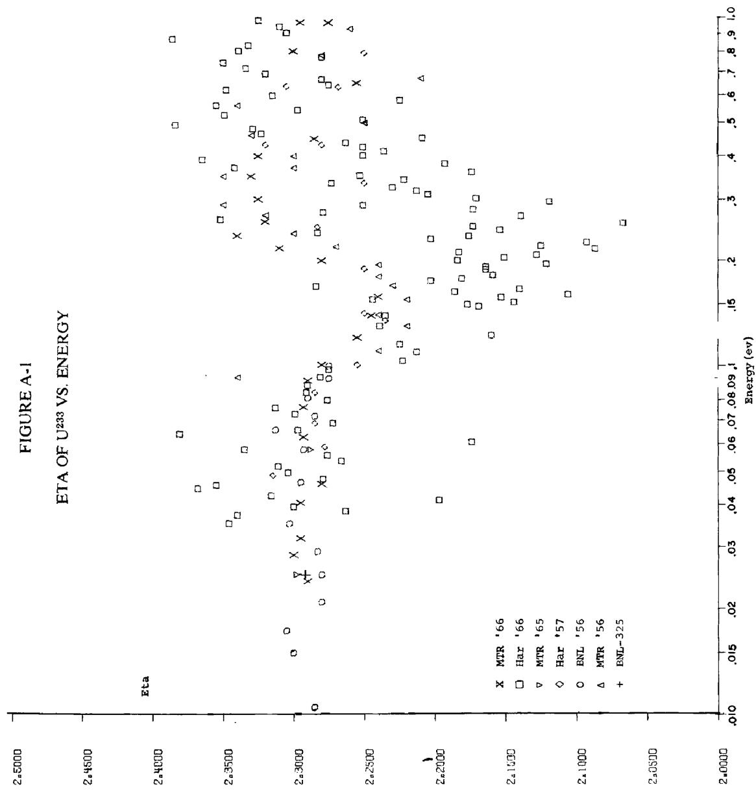

U233, U235, AND PU239 AT

HIGH ENERGY

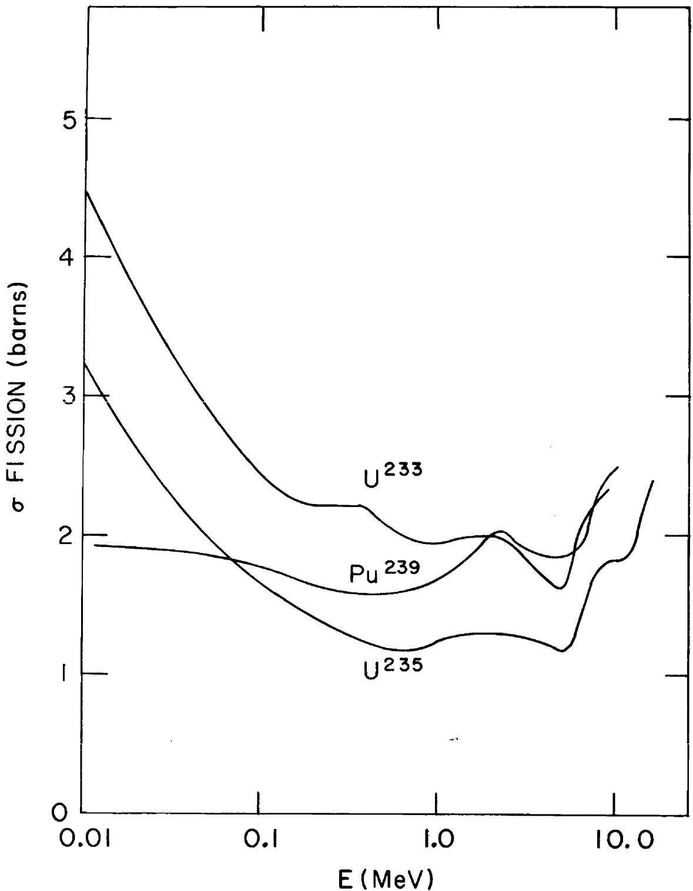  
FIGURE A-2   
FISSION CROSS-SECTION

U233, U235, PU239

AT HIGH ENERGY

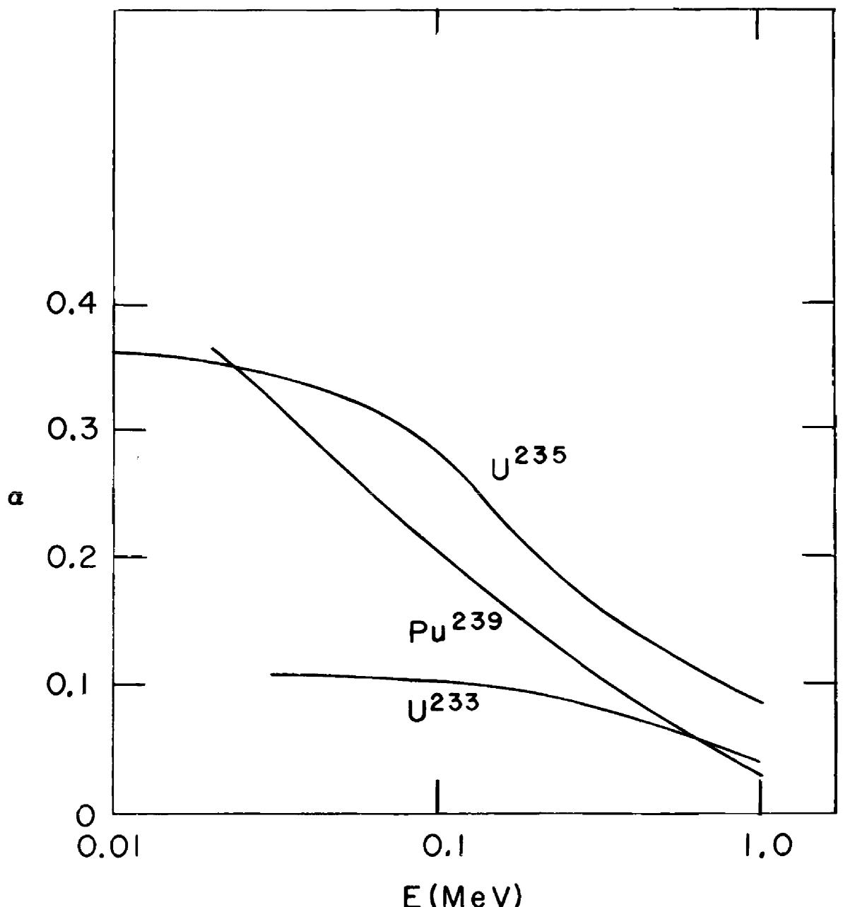  
FIGURE A-3   
CAPTURE TO FISSION RATIO

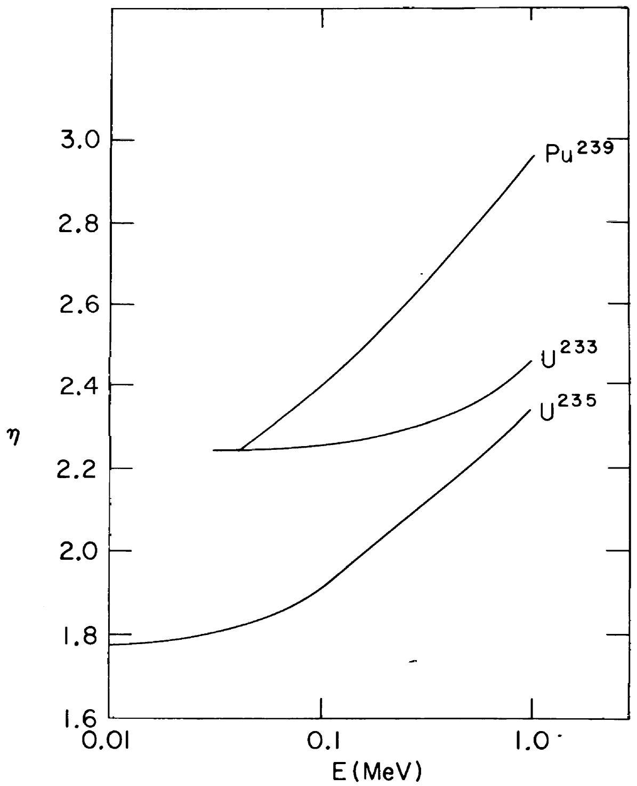  
FIGURE A-4   
$\mathfrak{NVS}$ ENERGY FOR U233, U235, AND PU239

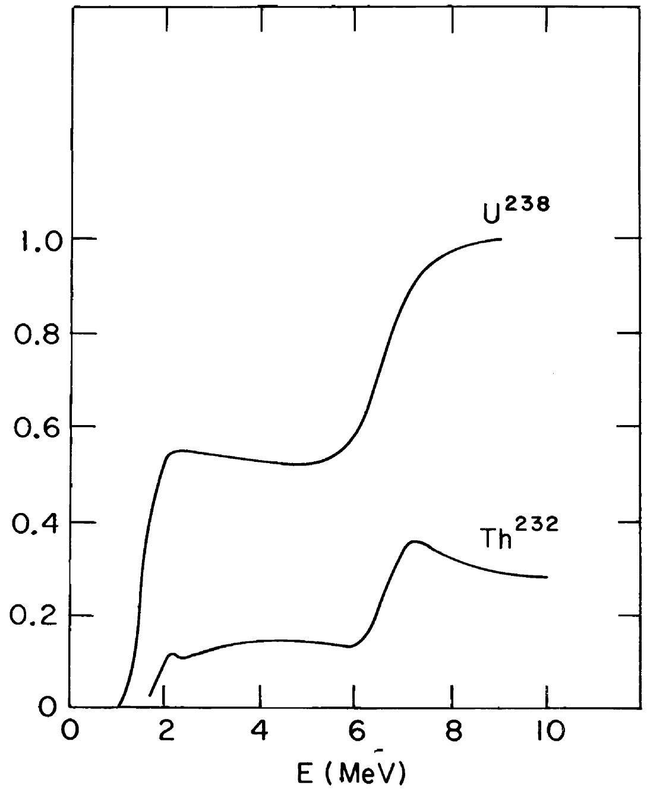  
FIGURE A-5   
FISSION CROSS-SECTION OF TH232 AND U238   
$\sigma$ FISSION (barns)

spectrum. As can be seen from Figure A-1, and from the data on thermal and epithermal eta values, a hardened spectrum causes a further decrease in eta. Thus, any change in eta will, in general, be reflected in a magnified change in the conversion ratio.

Because of the relative weightings of the thermal and epithermal contributions to the conversion ratio, required improvement in cross-section data should first be made in the thermal range.

While U-233 is a very valuable fuel in a thermal-spectrum reactor, its cross-section is such that it contributes a positive component to the temperature coefficient in high-temperature systems. The low-lying resonances in U-233 make the average U-233 cross section much less temperature-sensitive than the average cross-sections of most other reactor materials, such as Th-232, U-235, carbon, boron, and most of the fission products. Since graphite-moderated reactors tend to have small temperature coefficients, the source of any positive component must be well understood. Improved microscopic cross-section data would be helpful in this regard. Integral measurements at high temperature in typical lattices would also be valuable, particularly the temperature dependence of the lattice reactivity at operating temperatures and at temperatures obtained in credible accident situations.

# 3. Th-232

Since captures in thorium lead to the formation of fissile material (U-233), a breeder or an advanced converter requires accurate information on the thorium cross-sections. However, in the case of the MSBR, this is not primarily a question of breeding feasibility since any inaccuracy in the Th-232 cross section can usually be compensated by a corresponding change in concentration. That is, it is possible to arrange that all those neutrons which are surplus to the chain reaction and which are not captured parasitically will be captured by the Th-232.

Nevertheless, accurate Th-232 cross-section information is required for proper design of the reactor and for establishing the Doppler effect. Information on thorium resonance parameters now extends to energies well over $3\mathrm{keV}$ (32), and resonance integral measurements are matched fairly well by calculations using the standard methods (43).

The effective resonance integral in thorium lattices of interest has not, however, been extensively studied experimentally. Since the Doppler coefficient is a large negative contribution to the temperature coefficient, the temperature dependence of the resonance integral is also important, both in the operating temperature range (1000°C for systems of interest) and at higher accident temperatures. Critical assembly data on these points would be very valuable.

# 4. Fission Products

Fission products with very high absorption cross sections—such as Xe-135—saturate quickly, and, in this case, exact cross-section values are less important than correct values for the yield. Estimates of the gross poisoning of other, non-saturating, fission products depend on both the cross-sections and the yields.

Due to the large number of fission products which contribute to the poisoning, and the incompleteness of information on many of them, statistical estimates must be made for assessing their poisoning effects (44).

Such statistical estimates, while subject to appreciable uncertainties, are adequate for reasonably good assessments of the effects of fission product poisoning on the conversion ratio.

The gross U-233 fission-product poisoning contributes 39 barns per fission to the thermal energy cross-section of 158 barns per fission of the resonance integral. Since the corresponding thermal and epithermal cross-sections of U-233 are 573 and 917 barns, respectively, (32,42) it is clear that a hardening of the spectrum, which shifts the reactor to a greater proportion of epithermal events, enhances the fission product captures with respect to the U-233 and, therefore, tends to decrease the breeding ratio.

# 5. Higher Isotopes

Here U-234, U-235, U-236, as well as Pa-233 are considered.

Since U-234 is a fertile nuclide, it does not directly affect the conversion ratio, and its cross sections are subject to the same considerations as those of Th-232.

The U-235 cross sections can be characterized by the appropriate values just as those for U-233. However, these eta values are known with much greater accuracy than those for U-233, and uncertainties here contribute much less to any possible error in the calculated conversion ratio or power cost.

The U-236 resonance integral is on the order of fifty times its thermal cross-section (45), so that its absorption, like that of the fission products, is enhanced over the U-233 absorptions in harder spectra, leading to a decreased conversion ratio. In an equilibrium system, of course, the U-236 concentration reaches such a level that the absorption rate in U-236 equals the capture rate in U-235 regardless of the U-236 cross-sections.

In Pa-233, also, the ratio of resonance integral to thermal cross-section is higher than the ratio for U-233 (45), so that a hardening of the spectrum decreases the conversion ratio. Here, however, each capture by Pa-233 not only causes a neutron to be lost, but also causes a U-233 atom to be lost as well (that is, the U-233 into which the Pa-233 would have decayed in the absence of the neutron capture). Because the productive decays of Pa-233 must compete with the non-productive captures by Pa-233, the loss in conversion ratio due to this mechanism is proportional to the flux level and, therefore, to the specific power of the reactor.

# 6. U-232 Contamination

The presence of U-232 in irradiated fuel may lead to difficulties in subsequent handling of the fuel. U-232 is produced by the following reactions:

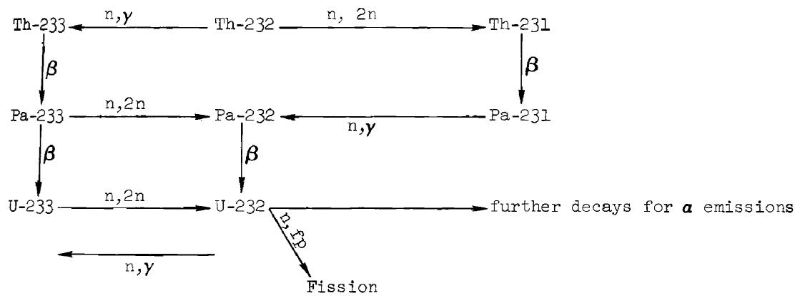

The cross sections involved here are known with reasonable accuracy from measurements or from nuclear systematics. Since the initiating (n, 2n) reactions take place only with high-energy neutrons, more U-232 is produced as the spectrum is hardened.

While the U-232 itself does not emit troublesome radiation, some of its daughter products do. In particular, Bi-212, which is produced from U-232 after a succession of five alpha and then a beta emission, decays with highly penetrating gamma radiation. The decay chain is as follows:

$$
\boxed {U ^ {2 3 2}} \xrightarrow [ 7 4 \mathrm {y r} ]{a} \mathrm {T h} ^ {2 2 8} \xrightarrow [ 1. 9 1 \mathrm {y r} ]{a} \mathrm {R a} ^ {2 2 4} \xrightarrow [ 3. 6 4 \mathrm {d} ]{a} \mathrm {R n} ^ {2 2 0} \xrightarrow [ 5 5 \mathrm {s} ]{a} \mathrm {P o} ^ {2 1 6} \xrightarrow [ 0. 1 6 \mathrm {s} ]{a}.
$$

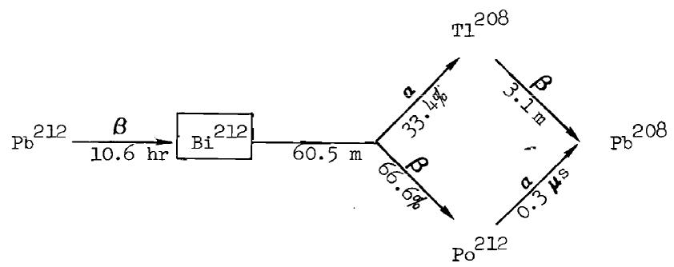

The alpha-produced neutron background is increased since many of the alpha emissions have sufficient energy to strip neutrons from light-metal impurities. The gamma background is increased because of the high-energy gammas of Bi-212 (0.4 to 2.1 MeV) and Tl-208 (2.6 MeV).

For a limited time after a chemical purification of the U-233 from a reactor, the material will emit only weak radiation. However, as the Bi-212 is formed, the radiation becomes more intense, and it becomes

necessary to use remote fuel handling procedures. The gamma activity of a sample of uranium which contains U-232 rises with time after chemical purification. Its level t days after purification is approximately proportional to:

$$
1 - e ^ {- 0. 0 0 1 t}
$$

# 7. Delayed Neutron Fraction

The delayed neutron fraction is lower for U-233 than for U-235, and slightly larger than for Pu-239, as shown in the following table:

The overall delayed neutron fraction for a breeder or converter reactor includes the effect of the fissions in the fertile as well as the fissile materials. While the delayed neutron fraction for Th-232 is higher than that for U-238, the thorium has a substantially lower fission cross-section and will generally contribute less to the average delayed neutron fraction.

Both U-233 and Pu-239 delayed reactions will be more sensitive to small changes in multiplication factor than reactors operating on U-235 because of their smaller delayed neutron fraction.

# APPENDIX B

# APPRAI SAL OF THORIUM FUELS

# 1. Introduction

Up-to-date reviews of thorium carbide and thorium-uranium carbides, thorium oxide and thorium-uranium oxides, and thorium and thorium alloys are available (19). Pertinent properties of thorium alloys, carbides, and oxides were reviewed and, in addition, fabrication techniques, irradiation behavior, and the status of the technology with respect to HwR fuels were discussed. A very detailed discussion of thorium fabrication technology and irradiation experience was presented in a monograph (46).

Two conferences on thorium were held in 1966 - "The Utilization of Thorium in Power Reactors" by the IAEA in Vienna, and the "Second Thorium Fuel Cycle Symposium" in Gatlinburg, Tennessee. The properties and irradiation behavior of thorium and its alloys and compounds were summarized in the proceedings of the Vienna Meeting (47).

The fuel element performance of three thorium-bearing reactors, the SSCR, HWR, and HTGR, was evaluated by ORNL (16).

In view of the availability of all these reports, a detailed compilation of the properties of thorium and its alloys and compounds will not be included here. However, pertinent properties will be tabulated and discussed where deemed necessary for purposes of comparison and evaluation. These references, as well as more recent articles and reports, form the background for the present evaluation.

The thorium compounds being considered as the fertile component in reactor fuel elements are the oxide and the carbide for solid-fuel elements and the fluoride for the MSBR. These particular compounds are similar and, in most cases exhibit superior properties, to the analogous uranium compounds which have been studied intensively. For example, $\mathrm{ThO_2}$ melts at a considerably higher temperature than $\mathrm{UO_2}$ ( $3300^{\circ}$ vs $2760^{\circ}\mathrm{C}$ ) and is stable in oxygen up to its melting point. $\mathrm{UO_2}$ is, of course, very sensitive to the presence of oxygen. The thorium compounds form solid solutions with their uranium analogs.

# 2. Thorium Carbide Fuel

# 2.1 TECHNICAL REVIEW AND AREAS OF CONCERN

Thorium carbide fuel materials have been well reviewed (48). Both uranium and thorium form monocarbides and dicarbides, and, in addition, uranium forms $\mathrm{U}_2\mathrm{C}_3$ . Both thorium carbides melt at about $2600^{\circ}\mathrm{C}$ ; they are slightly more refractory than UC and behave as metals in some of their properties. They both form extensive solid solutions with their uranium counterparts.

Thorium monocarbide has a non-stoichiometric composition, ranging from about $\mathrm{ThC}\sim .65$ to $\mathrm{ThC}\sim .96$ , while UC is essentially a stoichiometric compound (49). Preparing pure, single-phase UC is a delicate

procedure, since materials low in carbon contain free uranium, and compositions high in carbon contain $\mathrm{UC}_2$ . For ThC this problem does not exist, since a relatively wide variation in carbon content can be tolerated. ThC undergoes no phase changes up to its melting point, but may exhibit a congruently evaporating composition as other non-stoichiometric monocarbides do. $\mathrm{ThC}_2$ is essentially a stoichiometric compound. It undergoes phase changes at about $\sim 1400^{\circ}\mathrm{C}$ .

The properties of the thorium carbides have not been systematically investigated. This is especially true for properties such as thermal conductivity which are important in designing fuel elements. There is even less information on the variation in properties with the addition of uranium. Some properties of ThC are tabulated in Table B-1 together with the corresponding values for UC. It should be borne in mind that since ThC is non-stoichiometric, the properties are liable to vary widely with the composition. Since the composition of ThC is subject to change with the heat treatment, careful sample characterization is important.

A problem in working with the thorium carbides is their extreme sensitivity to moisture. This sensitivity extends even to organic coolants containing water. In this respect, they are far more reactive than UC (50). Dry atmospheres must be used for all operations with ThC. A cladding failure in a ThC fuel element might result in gross deterioration of the fuel. Attempts have, therefore, been made to improve the stability with various additives. The addition of 1 percent zirconium apparently stabilized the monocarbide to the extent that pieces may be handled in air (19).

Thorium dicarbide has been considered for gas-cooled reactors and ThC for organic-cooled reactors. For gas-cooled reactors, the thorium is in the form of small dicarbide particles coated with a number of layers of pyrolytic carbon (PyC). The particles may consist of either pure $\mathrm{ThC_2}$ or thorium-uranium dicarbide solid solutions. Extensive work has been done in developing fabrication techniques for producing these micro-spheres and in coating them with suitable PyC coatings. One method consists of preparing a colloidal suspension (sol) of thorium nitrate, channel black, and uranium, if necessary, and then spraying the sol into an organic mixture or solution which dries the sol droplets into gelled microspheres. The carbon-nitrate microspheres are converted to the dicarbide by heating in vacuum or in carbon monoxide at temperatures between $1750^{\circ}$ and $2100^{\circ}\mathrm{C}$ for $\sim 1$ hr. The particle densities range from 95 to 99 percent of theoretical (46).

The dicarbide microspheres may also be produced by heat treating sol-gel produced oxide microspheres in the presence of carbon to form the dicarbide according to the reaction

$$
(\mathrm {T h}, \mathrm {U}) \mathrm {O} _ {2} + 4 \mathrm {C} \rightleftharpoons (\mathrm {T h}, \mathrm {U}) \mathrm {C} _ {2} + 2 \mathrm {C O}
$$

and then separating the excess carbon.

The fuel particles produced by the sol-gel process are coated with PyC prior to reactor use. The PyC coatings contain the fission products. A sophisticated PyC coating technology has been developed, and

TABLE B-1.-Selected Properties of Thorium Monocarbide and Uranium Monocarbide   

<table><tr><td>Property</td><td>ThC a x</td><td>UC</td></tr><tr><td>Crystal Structure</td><td>NaCl</td><td>NaCl</td></tr><tr><td>Lattice Parameter, Å</td><td>5.304-5.343</td><td>4.952</td></tr><tr><td>Density, g/cc</td><td>10.96</td><td>13.63</td></tr><tr><td>Melting Point, °C</td><td>≈2,625</td><td>2,375</td></tr><tr><td>Coefficient of Thermal Expansion (25°-1000°C), 10-6/°C</td><td>7.6-8.1</td><td>11.2</td></tr><tr><td>Thermal Conductivity @ 20°C, cal/sec-°C-cm</td><td>0.07</td><td>0.195</td></tr><tr><td>Electrical Resistivity @ room temperature, μΩ-cm</td><td>140-170</td><td>≈40</td></tr></table>

aThe range of results may reflect the variable carbon content.

coating thickness, structure, and orientation can be controlled to rather close limits by appropriate variations of time, temperature, gas composition, and flow rate (46).

Most of this PyC coating technology, as well as the sol-gel microsphere technology, was developed for uranium oxide and carbide fuels. The conversion to thorium oxide and carbide materials has incurred no special problems that would be unique to thorium. Similarly, most of the irradiation testing of the PyC-coated microspheres either as loose, unsupported powders or as part of complete fuel elements involved uranium carbide. Olsen et al. (51) reviewed and summarized the irradiation testing of thorium-bearing coated-fuel particles. The fission-gas release rate is usually monitored in these irradiation experiments, and the results are reported in terms of a release-rate-to-birth-rate ratio for Kr-88; the lower the value the better the material. Release ratios of the order of $10^{-5}$ to $10^{-7}$ were found. These numbers represent lower limits caused by uranium contamination in the coatings determined prior to irradiation, since none of the coatings were found to have ruptured. The important conclusion for the thorium-bearing PyC-coated particles is that their irradiation behavior is comparable to that of similarly coated $\mathrm{UC}_2$ particles(47). Burnups as high as 14 wt % heavy metal atoms have been achieved.

There is little existing technology for ThC fuel in the form of cylindrical slugs. It might be anticipated that their properties could be approximated by the properties of massive UC. This has, in fact, been done for the (Th,U) C core of an HwR (19), but extrapolations should be made with care since ThC is nonstoichiometric and its properties are liable to vary greatly with composition.

No systematic investigation of pure, massive ThC has been undertaken, although a number of isolated measurements of various properties are available (Table B-1). In addition, only isolated measurements exist of properties in the ThC-UC solid-solution system. Abraham (50) reported that no significant differences in the thermal expansion up to $1300^{\circ}\mathrm{C}$ were observed for compositions ranging from 3.8 to $5.9\mathrm{wt}\%$ C, and Th-to-U ratios from 4 to 7.

Thorium carbide has been fabricated into shapes by arc melting and either drop casting or till pouring into graphite molds (19). Some work on hot-pressing finely divided ThC has also been reported (19). One advantage of arc melting methods is that the compounds are formed and fabricated in the same operation, so that the problem of handling finely-divided powders is avoided. Hot-pressing methods (or cold-pressing and sintering) require forming and handling of fine powders that are very moisture sensitive, so that the problem of powder deterioration is potentially great, even in relatively dry atmospheres.

There appear to be no data for the irradiation behavior of massive ThC (19). For purposes of design it might be assumed that the ThC behaves similarly to UC. This applies also to other properties of ThC, and since $\mathrm{ThC}_2$ and $\mathrm{UC}_2$ behave alike under radiation, this assumption is probably reasonable.

# 2.2 Summary, Conclusions, and Recommendations

The technology of PyC-coated $(\mathrm{Th},\mathrm{U})\mathrm{C}_2$ and $\mathrm{ThC_2}$ microspheres appears to be well established, following very closely the work on pure $\mathrm{UC}_2$ microsphere production. Irradiation testing of $\mathrm{ThC_2}$ indicates that the material behaves like $\mathrm{UC}_2$ . Thus it appears that sufficient information is available to permit the use of PyC-coated microspheres of thorium in gas-cooled reactors.

The properties of massive ThC have not been systematically measured. The potential for massive ThC as a fertile material appears to be limited at this time. If a developmental program is initiated the effort should include the effects of nonstoichiometry and uranium solid-solution. Irradiation testing should be included to study material behavior. The work should be included to study material behavior. The work should be extended to investigate additions that would make ThC less moisture sensitive.

The objective of this whole effort would be to accumulate in a systematic manner, information on ThC which might help shed light on the properties of uranium and plutonium carbides. If interest in this material becomes greater, a body of knowledge would be in existence which could be used readily.

# 3. THORIUM OXIDE FUEL

# 3.1 Technical Review and Areas of Concern

Thorium oxide has the highest melting point of all the oxides, $\sim 3300^{\circ}\mathrm{C}$ . Its crystal structure is identical to that of uranium oxide, and its lattice parameter slightly larger, 5.597 vs 5.470 angstroms. It forms a complete series of solid solutions with $\mathrm{UO}_2$ , but, unlike $\mathrm{UO}_2$ , is a stoichiometric compound. It is stable in oxygen up to its melting point.

Thorium oxide has been studied more extensively than any other thorium compound. Although most current $\mathrm{ThO_2}$ work is directed towards nuclear applications, it is also used as a crucible material for containing certain reactive melts, heating elements in oxide resistor furnaces, Welsbach mantles, and in preparing thoriated tungsten.

Thoria has already been used in a number of reactors and also considered for use in others. For example, it was used in the form of dense pellets with 6.36 wt percent $\mathrm{UO}_2$ in the Borax IV BWR blanket (46). The first cores of the Indian Point PWR and Elk River BWR also used pellets of pressed and sintered $\mathrm{ThO}_2\mathrm{UO}_2$ (46). In the Spectral-Shift Converter Reactor concept, $\mathrm{UO}_2\text{-}\mathrm{ThO}_2$ fuel rods containing vibratory compacted fuel rather than pellets was considered. Similarly, the thorium-fueled HwR fuel elements were designed as concentric fuel tubes filled with vibratory compacted $\mathrm{ThO}_2\text{-}\mathrm{UO}_2$ mixtures (16). Pyrolytic-carbon-coated thorium oxide microspheres were tested as a possible gas-cooled reactor fuel. Thoria-urania and thorium-uranium metal fuels were considered in the HWOCR report, WASH-1083.

The development of optimum thoria-based fuel elements has involved a number of different approaches. The fuel element production processes involve considerations of vibratory compaction or pelletizing, and the relative advantages of starting with mixtures of $\mathrm{ThO_2}$ and $\mathrm{UO_2}$ , or solid solutions. To date, most of the work has been done on pellet production, i.e., pressing and sintering, and the production of large quantities of high-quality $\mathrm{ThO_2 - UO_2}$ pellets is fairly routine.

Vibratory compaction methods for producing fuel elements are being actively developed. The process appears to have some real advantages over pressing and sintering operations and appears to be especially suitable for remote fabrication of recycled fuel. Tubes can be filled quickly to densities greater than 85 percent of theoretical. Two important areas of concern exist with vibratory compacted fuel elements. Because of the lower densities that are achieved with fuel of this type, fission-gas release can be as high as 30-40 percent, and this will generate pressures which can deform the cladding. In addition, the powders used for vibratory compaction are likely to contain considerable adsorbed or occluded gases. Also, adsorbed moisture or oil contamination might cause internal hydriding of the sheath (16).

The irradiation behavior of $\mathrm{ThO_2}$ and $(\mathrm{Th,U})\mathrm{O}_2$ has been summarized by Olsen et al. (47). Generally, they compared three massive $(\mathrm{Th,U})\mathrm{O}_2$ elements: sol-gel powder vibratory compacted rods, arc-fused $(\mathrm{Th,U})\mathrm{O}_2$ rods, and rods containing pressed and sintered pellets. According to these experimenters, all three fuel elements behaved similarly at burnups up to 80,000 MWD/MT, and there was no evidence of breakaway welling or sudden increases in fission gas release at heat ratings between 300 and $350~\mathrm{W / cm}$ .

Other sol-gel $\mathrm{ThO_2}$ -5 percent $\mathrm{UO_2}$ vibratory compacted fuel elements have been exposed to burnups of 20,000 MWD/MT at linear heat ratings of $1000\mathrm{W / cm}$ .

Experimental data indicated that the physical changes observed in the microstructure of irradiated $\mathrm{ThO_2}$ occurred at heat ratings of 10 to 40 percent higher than with $\mathrm{UO_2}$ . Thus $\mathrm{ThO_2}$ -based fuels will permit the use of higher power densities than the corresponding metal-clad $\mathrm{UO_2}$ fuels (19,51).

Irradiation experiments on PyC-clad, thoria-rich microspheres have been carried out to at least 12 atomic percent heavy metal at $1,400^{\circ}\mathrm{C}$ with very low fission-gas release rates (47). Since irradiation of bulk $\mathrm{ThO}_2$ fuels has shown them to be more stable than the corresponding $\mathrm{UO}_2$ fuels, the successful irradiation of clad thoria microspheres is, to a large extent, a demonstration of the high-quality coatings that can be made.

Even though only a limited amount of irradiation experience has been accumulated with thoria fuels, their excellent behavior has been demonstrated (47). While problems exist in the use of thoria-based fuels, these are not thoria problems per se, but rather fuel element problems. For example, vibratory-packed fuel elements, whether filled with thoria fuel or urania, are usually filled to between 83 and 89 percent of theoretical density. Consequently, certain properties of the materials which are porosity or surface-area dependent, like thermal conductivity and fission-gas release, can be greatly affected by fuel-particle shape, particle size distribution, and other factors(19). In addition, the vibratory-packed fuels are more likely to sinter and undergo density and porosity changes during reactor operation, with attendant changes to the thermal conductivity and gas-release rates, than pressed and sintered fuel material. Changes in properties of the kind just described require extensive knowledge of these properties under all conditions likely to be encountered during the fuel element lifetime. It is precisely in this area that information on the behavior of thoria fuel elements is limited. This is especially true for the thermal conductivity and fission-gas release rates for vibratory-compacted fuel elements. Reliable values of these properties are necessary before optimum fuel element design can be made. Establishing the values of properties will be difficult and require extensive experimentation. The scope of the problem and the variability of the results to be expected is shown by the work on $\mathrm{UO}_2$ , where a vast amount of work was done before the factors affecting these properties could be ascertained.

# 4. THORIUM AND THORIUM ALLOYS

# 4.1 Technical Review and Areas of Concern

The exploitation of metallic uranium fuels in power reactors has not progressed appreciably because the anisotropic expansion of uranium results in fuel swelling and distortion problems at relatively low burnups and low temperatures in the range of $400^{\circ}$ to $550^{\circ}\mathrm{C}$ . In addition, uranium undergoes a phase transition at $660^{\circ}\mathrm{C}$ , so that its useful temperature range for use as a fuel is restricted (47). The use of thorium fuels on the other hand permits improved thermal and irradiation performance relative to use of uranium fuels. The fact that thorium metal is face-centered cubic, while uranium is orthorhombic, is an advantage for thorium. The superior irradiation stability of thorium-uranium alloys over uranium alloys has

been recognized for some time. According to the extensive work reported by Kittel et al.(47), the change in volume with burnup (percent change in volume/atomic percent burnup) is only $2 \pm 1$ percent at irradiation temperatures up to $600^{\circ}\mathrm{C}$ for alloys containing $< 20$ percent uranium. This good behavior was attributed to the small size of the uranium particles. Most of the fission products became trapped in the thorium matrix.

A thorium-uranium fuel element design, consisting of four fuel tubes arranged concentrically around a central moderator can, has been described in detail (19). A number of problem areas appeared to exist with this design, the foremost being the development of experience in co-extruding large-diameter tubes.

The most extensive recent work on the fabrication of thorium-uranium alloy fuel elements was reported by the Hanford (HAPO) and Savannah River Laboratories (SRL). The work was summarized in detail (52)(53) and is applicable to a nested-tube fuel element design. These tubular fuel elements were clad internally and externally with Zircaloy-4, and fabricated by co-extrusion. In general, the operations used to produce the finished fuel element were similar at both installations.

The HAPO group prepared Th-U alloys by double-vacuum arc melting in a consumable arc arrangement. One percent zirconium was included in the batch after pilot runs had indicated that it improved the surface quality of the cast ingots, gave improved uranium homogeneity, lowered the room temperature hardness, and presumably exerted a gettering action on the carbon which lowered the amount of carbon in solid solution. The extruded tubes were 1.75-in.-O.D. x 1.05-in-I.D., with 0.025-in. cladding. The tubes were cut to 8-in. lengths and sealed with Zircaloy end caps. The SRL fuel tubes were 2.54-in.-O.D. and 1.83-in.-I.D., with an overall length of 118 in. The Zircaloy cladding was 0.030 in. thick. Both installations reported good metallurgical bonding between the Zircaloy cladding and the thorium alloy core.

The HAPO elements were irradiated in a high-temperature, high-pressure water loop in the ETR; the SRL fuel was irradiated in the HWCTR. Both tests were carried out without incident. The HWCTR irradiation program was terminated prematurely due to the shutdown of the reactor. The specimens reached an average exposure of 3,500 MWD/MT. The average temperature during irradiation was computed to be about $465^{\circ}\mathrm{C}$ , with inner and outer surface temperatures of $250^{\circ}\mathrm{C}$ . Post-irradiation measurements showed an increase in volume, in the hottest region, of 0.8 percent.

The irradiation of the HAPO elements in the ETR-P7 facility was more extensive than for the SRL elements. As of May 1966, the test elements were approaching 26,000 MWD/MT, the irradiation goal. The maximum fuel irradiation temperatures were between $460^{\circ}$ and $585^{\circ}\mathrm{C}$ , and a volume increase of 0.9 percent was measured at a burnup level of 10,500 MWD/MT (46).

Although the feasibility of co-extruding clad thorium-uranium alloy tubes has been demonstrated to at least a limited extent, the fabrication of large-size fuel elements may require considerable development.

Considerable Th-U reactor fuel experience was obtained at the SRE (47). This fuel consisted of slugs of Th-7.6 wt percent U (highly-enriched), bonded with NaK to a type 304 SS tube (54). The alloys were prepared by vacuum-induction melting, and then extruding, swaging, and machining them to a diameter of 0.75 in. and a length of 6 in. The fuel elements were irradiated to exposures of 5,260 MWD/MT, with maximum fuel control temperatures of $\sim 650^{\circ}\mathrm{C}$ . The fuel elements operated satisfactorily (52).

Recent experiments on the modes of failure of a Th-20 wt, percent U alloy fuel were reported (48). The fuel was very similar to the SRE fuel just discussed, consisting of a 0.14-in.-diam rod, 4.7 in. long, and sodium-bonded to a type 304L SS jacket. The elements were tested under transient heating conditions to cladding failure in the TREAT facility. The authors concluded that contact of the cladding with liquid fuel was one of the important factors leading to failure. It was also demonstrated that the high-melting thorium matrix contained and supported the uranium fuel at temperatures near the uranium melting point.

# 4.2 Summary, Conclusions, and Recommendations

Thorium-uranium alloys have many properties which make them attractive as reactor fuels. The potential also exists for applying relatively simple refabrication techniques. Successful fabrication and irradiation experience was obtained from the Th-U alloy core of the SRE. Work on the development of production methods for Zircaloy-clad, co-extruded Th-alloy tubes up to $2\frac{1}{2}$ -in.-O.D. was completed. Satisfactory tubes were produced, and some irradiation experience obtained.

Perhaps the most important factor hampering the evaluation of thorium-uranium alloy technology has been the lack of a continuing systematic effort to define the limitations of these fuels. The temperature and irradiation limitations of stainless-steel-clad, sodium-bonded fuel elements have not yet been demonstrated.

It might be best to consider Th-U fuels as "cermet"-type systems, since the uranium phase is dispersed in the thorium matrix. Of prime importance in the development of cermet fuels is the evaluation and control of the micro-structure. This area has been noted for Th-U alloys (48), but not much systematic work has been done in defining the microstructures that result from fabrication and composition variables, and those which lead to maximum radiation stability.

# APPENDIX C

# REPROCESSING OF THORIUM FUELS

# 1. THE GOALS OF REPROCESSING

A spent U-Th fuel element requires reprocessing in order to recover bred fuel, restore the proper fissile/fertile ratio, remove fission products, and in the case of solid elements, repair radiation damage (in conjunction with refabrication processes).

What may be termed a complete thorium cycle processing scheme calls for the separation of uranium, thorium, and protactinium from fission products and from each other. In many circumstances a simpler scheme is adequate. For example, if spent fuel is allowed to cool for 270 days before reprocessing, decay of Pa-233 to U-233 is virtually complete and Pa removal, per se, need not be provided. Or, it may be decided that a rather low decontamination factor of uranium from fission products is acceptable for fuel in which the U-233 is contaminated with U-232 to a degree which would preclude direct refabrication, even if fission product activity were made negligible. Thus, reprocessing methods may vary with the industrial maturity of the nuclear power industry, and associated technology.

Processing goals and methods will also be a function of raw material prices. When thorium is inexpensive, a reactor product contaminated with highly radioactive Th-228 can be allowed to age until the radioactivity decays; and high fission-product decontamination factors will not be needed for the stored material.

# 2. GENERAL PRINCIPLES OF THORIUM-URANIUM PROCESS CHEMISTRY

Practical schemes for processing thorium-cycle fuels are based on the separation of Th, U, Pa, and fission products by means of selective partition between an aqueous phase and an organic solvent, or upon differences in volatility among the fluorides of the elements. Which type of process is best in a given case depends on the kind and degree of separation necessary and on the chemical and physical nature of the fuel material. Solvent extraction is in general more versatile, and permits some separations which are not possible in a volatility scheme. For example, the separation of thorium from rare-earth fission products is readily attained with solvent extraction but not with volatility techniques. However, there are situations where a volatility method is clearly the preferred choice, as in the extraction of bred uranium from a molten-salt blanket.

When an aqueous method is to be used, the preparation or head-end steps are used to transform U and Th into nitrates dissolved in aqueous solution, since such solutions lend themselves best to practical solvent extraction processes. When volatility methods are used the U and Th must be converted to fluorides if they are not already present in that form. Some typical head-end operations in both aqueous and volatility flow-sheets are described below.

# 3. SOLID FUEL HEAD-END PROCESSES

# 3.1 Decladding

# 3.1.1 METAL-CLAD ELEMENTS

Among the possible procedures for decladding metal-clad fuel elements are: mechanical opening of fuel elements, followed by leaching of U and Th; dissolution of the clad by a solvent which does not affect U and Th (in whatever form they may be present); dissolution of the entire element; electrolytic decladding and/or dissolution; and gas-reaction decladding in a fluidized bed, as for instance by an $\mathrm{HF - O_2}$ mixture, followed by leaching or fluorination of the bed. Development of the first two of these has been carried much further than the others.

In the first procedure mentioned, which is known as "chop-leach" or "shear-leach," the mechanical operation opens the fuel to chemical exposure. In the "leach" portion of the procedure, a reagent is required which will dissolve the core - the alloy or compound of the fissile or fertile material - without dissolving much of the cladding material. Since metal-clad thorium-containing cores generally require fluoride-catalyzed nitric acid for dissolution, shear-leach is suitable only for clads which withstand this reagent. Experiments have shown that Zircaloy is sufficiently resistant (55).

In the second type of process, chemical decladding, the opposite condition is required: the reagent must dissolve the metal covering but not the fuel core. This requirement appears to be satisfied by the "Zirflex" reagent (aqueous $\mathrm{NH_4F}$ plus $\mathrm{NH_4NO_3}$ ) for Zircaloy-clad $\mathrm{ThO_2 - UO_2}$ ; by the "Sulfex" process (boiling 4 to $6\mathrm{M}~\mathrm{H}_2\mathrm{SO}_4$ for stainless-steel-clad oxides; and by an aqueous $\mathrm{NaOH - NaNO_3}$ dissolvent for aluminum-clad oxide or metal (52). Much experimental work remains to be done, covering all possible variables of oxide preparation, length of irradiation, etc.; but the available data indicate that there will be no serious difficulty in developing an aqueous head-end step for any likely thorium fuel which will be as convenient and as economical as those now used for uranium fuels.

Certain non-aqueous decladding methods which are being developed for uranium fuels may prove applicable to thorium fuels as well. In the "Zircex" process, zirconium alloy clad is removed by treatment with gaseous HCl at a temperature high enough $(500^{\circ}\mathrm{C})$ to volatilize the $\mathrm{ZrCl4}$ product; oxide cores remain unreacted under properly controlled conditions. In the $\mathrm{HF - O_2}$ process, a mixture of these gases (20 percent-40 percent HF) is used to disintegrate claddings of either Zircaloy or stainless steel. The alloy constituents are converted to a mixture of their fluorides and oxides; uranium oxide cores are also partially converted to fluoride. The reaction is best carried out in a fluidized bed of aluminum oxide. Uranium can be subsequently removed from the bed either by an acid leach or high-temperature fluorination. The Zircex and $\mathrm{HF - O_2}$ processes have not been tested on $\mathrm{ThO_2}$ -containing fuels, but one would expect little reaction between the oxide and the reactant gases.

# 3.1.2 GRAPHITE-MATRIX ELEMENTS

A fuel which has been developed primarily for the thorium cycle is a dispersion in graphite of spherical particles of sub-millimeter dimensions. Each sphere consists of mixed oxides or carbides of U and Th coated with pyrolytic carbon or silicon carbide, or both, to retain fission products. In an alternative arrangement, which would be advantageous in the early stages of a reactor system when U-235 rather than U-233 was the predominant fissile material, the U and Th would be incorporated in separate particles. The two kinds of particles would be made in different sizes so as to separate them physically during the processing.

Two head-end processes are under development for graphite-matrix fuels: grind-leach and burn-leach. In the first, the fuel elements are crushed very fine to the point where the fuel-containing particles are all individually ruptured; passage between rollers is a possible method. The powder is then leached with fluoride-catalyzed nitric acid to extract uranium and thorium. If fuel were originally present in oxide form, the resulting nitrate solution would be suitable for solvent extraction purification without further treatment. If fuel were originally in the form of carbides, organic compounds might form which would have to be destroyed by a permanganate treatment or the equivalent.

In burn-leach, which seems at present to be the preferred process, the fuel is crushed to a suitable size and oxidized in a fluidized bed of alumina. The oxides of uranium and thorium which are thus produced are then leached out of the alumina with $\mathrm{HNO}_3$ -HF reagent. Some decontamination from volatile fission products is achieved in the burning process. The principal process problem is decontamination of burner off-gas. Burn-leach methods are not applicable to particles coated with materials which would resist oxidation, such as SiC, $\mathrm{Al}_2\mathrm{O}_3$ , or BeO; these have been proposed as coating materials.

Further development is required for both grind-leach and burn-leach processes, but success does not seem to be in doubt. Engineering feasibility studies (55,56) and cost estimates (57) have been made.

# 3.2 Solvent Extraction

Most proposed solvent extraction processes for uranium-bearing thorium fuels are variations of "Thorex", which is itself a variation of "Purex" which is used for uranium fuels. The organic extractant is a solution of tributyl phosphate (TBP) in a hydrocarbon diluent. The distributions of uranyl nitrate and thorium nitrate between the TBP and aqueous phases are controlled by adjustment of the aqueous concentrations of nitric acid or aluminum nitrate, or both. Initially, conditions are so adjusted that both uranium and thorium go into the organic phase, while most fission products remain behind. Then, advantage is taken of the fact that thorium has, in general, a stronger affinity than uranium for an aqueous phase. The organic solution is treated with an aqueous phase, which is relatively weak in nitric acid, and the thorium transfers into it while the uranium remains in the organic phase. Finally, the uranium itself is scrubbed out of the organic.

Details of the Thorex process have been extensively described (58-62). It can be considered to be technically feasible but requires considerable improvement. One significant defect is that since the

maximum capacity of the solvent for thorium is only about half that for uranium, the effective capacity of the equipment is only about half as much for thorium as for uranium. However, a plant specifically designed for the thorium cycle may not require as many extractions, so processing costs for the two fuel cycles may be comparable. A discussion of relative-cost considerations has been made (47).

No provision is usually made for protactinium recovery in solvent extraction processes; it is assumed to have decayed completely to uranium. Protactinium can be extracted by the Thorex solvent, however, along with uranium and thorium, if the aqueous phase has been made sufficiently acid. The high acid level also results in a transfer of zirconium-niobium fission products, and other methods are now favored for removing protactinium from aqueous solutions. It can be adsorbed on manganese dioxide, silica gel, or unfired Vycor glass. From the latter two, the adsorbed protactinium can be eluted with 0.5M oxalic acid.

# 3.3 Aqueous Alternatives to Solvent Extraction

ORNL has investigated the possible usefulness of peroxide, oxalate, and phosphate precipitation, electrodialysis, and anion exchange processes. None was judged more promising than solvent extraction methods (55,63).

# 3.4 Fluoride Volatility Processing

The fluorination of oxide, carbide, or metallic fuels is usually done either in a fused-salt medium or a fluidized bed for better control of temperature and reaction rate. The use of fused salts has been demonstrated for zirconium-uranium alloy fuel, which was immersed in $\mathrm{NaF - ZrF_4}$ at $600^{\circ} - 700^{\circ}\mathrm{C}$ and converted to $\mathrm{ZrF_4}$ and $\mathrm{UF_4}$ by bubbling anhydrous HF through the melt. Subsequent treatment of such a melt would be essentially the same as that described later for the MSBR. Such a process would probably work for a thorium-uranium alloy, provided the composition of the salt were such that the $\mathrm{ThF_4}$ formed could dissolve completely and not form a protective film on the alloy. Recovering the thorium from the fused salt would be very difficult. Fluidized-bed fluorination is more versatile. It would be especially suited for following one of the fluidized-bed head-end steps described above. It has been found that an $\mathrm{Al}_{2}\mathrm{O}_{3}$ bed of proper specifications will not react appreciably with fluorine under conditions which result in the conversion of uranium to $\mathrm{UF_6}$ . Consequently, either the material resulting from the fluidized-bed combustion of graphite-matrix fuel or the $\mathrm{HF - O_2}$ decladding of metal-clad elements would be an appropriate feed for a volatility process. The $\mathrm{UF_6}$ formed in the fluorination would be taken out of the exit gas stream by absorption on an inorganic fluoride.

Recovery of thorium would be difficult and expensive, using fluoride-volatility methods, unless the method could be improved.

# 4. MOLTEN-SALT FUELS

# Two-fluid Reference Design

The volatility process proposed for the MSBR is more highly developed than that for solid fuels (64). The MSBR is a two-region reactor in which the proposed core fluid would consist of 63.6 LiF, 36.2 $\mathrm{BeF}_2$ 0.23 $\mathrm{UF_4}$ (numbers are mole percent) while the blanket, also molten, would be 71.0 LiF, 2.0 $\mathrm{BeF}_2$ , and 27.0 $\mathrm{ThF_4}$ . Both core and blanket would be processed continuously via side streams.

The uranium would be separated from the carrier salt and fission products in processing the MSBR fuel stream. The valuable carrier salt would be separated from the rare-earth fission products by the vacuum-distillation process, with about 6.5 percent of the carrier salt either discarded or unrecovered in the distillation process in order to control fission-product buildup and reduce recovery costs. The fuel salt would be reconstituted by absorbing $\mathrm{UF}_6$ in uranium-containing carrier salt and reducing it to $\mathrm{UF}_4$ by bubbling hydrogen through the melt.

An important factor affecting both the MSBR breeding gain and the fuel cost is the loss of fissile material in processing. There is considerable engineering experience in fluoride volatility processing that indicates an MSBR fissile material loss of 0.1 percent or less per pass through the processing plant.

# 4.1 Processing the Fuel Stream

The basic processes considered in processing the fuel would involve fluorination, purification of $\mathrm{UF_6}$ , vacuum distillation, reduction of $\mathrm{UF_6}$ and reconstitution of the fuel, off-gas processing, waste storage, flow control of the salt streams, removal of decay heat, provisions for sampling of the salt and off-gas streams, and provisions for shielding, maintenance, and repair of equipment. The major novel pieces of processing equipment include the fluorinator, $\mathrm{UF_6}$ reduction equipment, and vacuum-distillation unit. The fluorinator utilizes a frozen wall of salt and a flowing stream of uranium-containing molten-salt is continuously fluorinated. Coolant is used to freeze a layer of salt on the inner surface of the column to protect the structural material from corrosive attack by the molten-salt-fluorine mixture. When reducing $\mathrm{UF_6}$ to $\mathrm{UF_4}$ , barren salt and $\mathrm{UF_6}$ enter the bottom of a column, which contains circulating $\mathrm{LiF - BeF_2 - UF_4}$ . The $\mathrm{UF_6}$ dissolves in the salt, aided by the presence of $\mathrm{UF_4}$ , and moves up the column, where it is reduced by hydrogen. Reconstituted fuel is taken off the top of the column and sent to the reactor core. In the vacuum-distillation unit, the still is maintained at about $1000^{\circ}\mathrm{C}$ and $1\mathrm{mmHg}$ pressure. $\mathrm{LiF - BeF_2}$ distillate is removed at the same rate that salt enters. Most of the fission products accumulate in the still bottoms and are drained to waste storage when the heat-generation rate reaches a prescribed limit.

# 4.2 Protactinium Removal

Even though fluoride volatility processing appears to be a satisfactory process for removal of uranium, the ability to remove Pa-233 directly and economically from the blanket region of an MSBR would significantly improve the performance of the reactor. One possible process involves oxide precipitation of protactinium. Several laboratory experiments have demonstrated that protactinium can be readily

precipitated from a molten fluoride mixture by addition of thorium oxide, and that the precipitate can be returned to solution by treatment with HF. Experimental results also indicated that treatment of protactinium-containing salt with $\mathrm{ZrO_2}$ leads to oxide precipitation of the protactinium and that after beta decay of the protactinium, the resulting $\mathrm{UO_2}$ will react with $\mathrm{ZrF_4}$ to give $\mathrm{UF_4}$ .

More recent experimental results have indicated another method for removing protactinium directly from the blanket fluid. This involves treating the molten blanket salt with a stream of bismuth containing dissolved thorium metal. The thorium reduces the protactinium (and also any uranium) to metal, which can then be accumulated on a stainless-steel-wool filter, or recovered directly from the liquid metal. The metal can be hydro-fluorinated and/or fluorinated to return the protactinium (and any uranium) to the fuel-recycle process as the fluoride. Thus there is experimental evidence that direct processes are available for removal of protactinium from the blanket stream of molten-salt reactors.

If protactinium is not removed directly from the blanket stream, then the blanket salt is processed by the fluoride-volatility process alone. Any uranium not removed during the blanket processing would be returned to the blanket and removed by subsequent processing.

# 5. GENERAL CONSIDERATIONS

Only statements of a qualitative nature can be made relative to the economic and technical impact of processing thorium fuels because of the developmental nature of this fuel cycle. It is believed that reprocessing of thorium fuels is technically feasible in several ways; and that the reprocessing cost, in mills/kWh, should not be significantly different than for the U-Pu cycle, provided that the two cycles are compared on the same terms, i.e., the sizes of plant should be about the same, and if "equilibrium" fuel is used in one case, it should be used in the other also. Isotopic impurities are often mentioned as a liability of U-233, but the plutonium cycle will also accumulate them, and will require at least semi-remote fabrication (70). While Pu-239 emits only a small amount of hard radiation, its emission is the source of very high toxicity if ingested. While the plutonium fuel could be handled in a glovebox to guard against hazards, long irradiations and high burnups, on the other hand, produce substantial amounts of other isotopes with a consequent increase in the radiation level. The gloveboxes would then no longer be adequate and shielding would be required around the equipment and remote control techniques would be used in handling the fuel. The absolute amount of actinide activity present would be a function of the isotopic ratio and cooling time before and after processing.

If thorium fuels are reprocessed in equipment designed for uranium, or with processes such as Thorex which use reagents developed for a different system, complications will occur and good economy cannot be expected. Processing of thorium fuel should be based on plants designed for that specific purpose and an intensive research program on new separation methods would be desirable and economically justified.

# APPENDIX D

# IDENTIFICATION OF ESTIMATES OF NUCLEAR FUEL RESOURCES

Estimates of the US uranium and thorium resources have been given in Tables 4.1 and 4.2., and in Figure 4.1. The resources in each price category included those which are defined as reasonably assured and estimated additional. The estimated additional resources refer to indigenous areas in which there are known deposits or about which sufficient geological data or information have been developed by active exploration to indicate the existence of favorable environments.

# 1. AEC URANIUM ESTIMATES

The AEC estimates of reasonably assured resources costing up to $10/lb \, \mathrm{U}_3\mathrm{O}_8$ comprise demonstrated reserves of uranium in specific deposits of the type now being mined or developed, plus a small quantity of uranium considered economically available as a by-product of phosphate fertilizer manufacture at the upper end of the range. The estimates of uranium resources in this price range, most of which are sufficiently delineated to permit production with a minimum lead time, were stated to be accurate to probably within 10 percent (2). They are based on detailed investigation and extensive sampling. The uranium content and other factors, such as size, shape, depth, and metallurgical characteristics of the deposits are sufficiently well defined so that the cost of production can be estimated on the basis of presently known mining and processing technology.

Estimates of reasonably-assured resources of uranium in the intermediate price ranges, $10 to$ 30/lb $U_{3}O_{8}$ , are more approximate, being based on sparse sampling and assumed economics and technology. They include presently uneconomical material peripheral to the low-cost reserves, lower grade deposits of the same type and, as the price increases, increasing quantities of by-product uranium from phosphate production.

A limited amount of uranium, about 1,000 tons of $\mathrm{U}_3\mathrm{O}_8$ per year at present and rising to about 2,000 tons of $\mathrm{U}_3\mathrm{O}_8$ per year by 1975, could be derived as a by-product from wet-process phosphoric acid manufactured in the US. Some of this should be available at prices of less than $10/\mathrm{lb}$ $\mathrm{U}_3\mathrm{O}_8$ and the remainder at less than $\$15/\mathrm{lb}$ .

The Florida phosphate deposits are usually overlain by a phosphatic material, commonly called "leached zone," which is stripped and discarded in preparation for phosphate rock mining. The leached zone contains about 0.2 lb of recoverable $\mathrm{U}_3\mathrm{O}_8$ per ton, and the quantity stripped was estimated to be at least equal to the quantity of phosphate rock mined (currently about 17 million long tons annually). This would be capable of yielding an estimated 2,000 tons of $\mathrm{U}_3\mathrm{O}_8$ per year at present mining rates. Studies of processes to recover this uranium, with alumina and phosphate fertilizer as co-products, indicated that it may be technically feasible, but the economics would be complicated by the uncertain market for the co-products. A cost in the range of $15 to$ 30/lb $\mathrm{U}_3\mathrm{O}_8$ could probably be realized, assuming that there will be a market for the co-products.

Estimated additional resources in the intermediate range are informed judgments. These are based on currently available information and do not indicate the full extent of the resources which may ultimately be discovered or exploited. They may be regarded as conservative inasmuch as they include expectations of new discoveries only in those areas in which geological conditions are believed to be favorable for uranium deposition.

The resources in the $30 to$ 50 and $50 to $100/lb U_3O_8$ price ranges comprise primarily uranium and thorium in the Conway granite of New Hampshire; these formations have been studied extensively. The granite contains immense quantities of uranium and thorium estimated to be of the order of tens of millions of tons. These elements are amenable to leaching with sulfuric acid. Sample collection and analysis, and laboratory-scale process development studies conducted at ORNL, have indicated that combined uranium and thorium may be recoverable at a cost of $25 to $80/lb if mining and processing is of a sufficiently large scale. However, because of its greater abundance, thorium would be the principal product and uranium a by-product. Although the need is not foreseen for exploration of these resources, they do represent a virtually inexhaustible source of a high-cost fuel which eventually could be used economically in breeder reactors if lower cost resources became exhausted.

The Chattanooga shale of Tennessee contains about 0.1 lb of recoverable $\mathrm{U}_3\mathrm{O}_8$ per ton. An AEC research and development program directed toward the recovery of uranium from this source in the 1950's indicated that the probable cost of recovery would be $40 to$ 50/lb $\mathrm{U}_3\mathrm{O}_8$ . Further research and development might reduce this to $30 to $40/lb. Resources in the Chattanooga shale which may be recoverable at these costs were estimated at about 6 million tons of $\mathrm{U}_3\mathrm{O}_8$ .

The estimates of resources in the $100 to$ 500/lb U $_3$ O $_8$ price range represent large masses of granitic and related crystalline rocks containing about 4 ppm of uranium and 12 ppm of thorium at depths up to 2000 feet. The estimate of resources in these price ranges is believed to be conservative, as is the allocation of approximately one-third of the total to the reasonably assured category.

# 2. RECOVERY OF URANIUM FROM LOW-GRADE ORES

The uranium ore milled in the U.S. ranges in grade from 0.1 to nearly 1 percent $\mathrm{U}_3\mathrm{O}_8$ . The cost of recovery by conventional methods increases roughly as the grade of ore decreases because of the larger amount of material processed. Some lower grade ores containing insufficient uranium to justify treatment by conventional methods may be amenable to upgrading by methods such as radiometric sorting, heavy media separation, flotation, or sizing, to make a satisfactory mill feed. All upgrading methods, however, are characterized by substantial losses. Low-grade material is also commonly subjected to "heap leaching" in which acid liquors are made to percolate through piles of coarsely crushed ores. Acid-bearing mine water contains some dissolved uranium and is commonly processed for its recovery. In some cases bacteria are used to advantage to generate the leaching acid from pyritic materials in the ore. In addition, the mine water and heap-leaching liquors from some porphyry copper mine operations contain low concentrations of uranium which may be recoverable together with the copper.

# 3.USGS URANIUM ESTIMATES

Using a broad statistical approach, and making greater allowances for yet unidentified districts, the USGS has arrived at the estimates shown in Tables 4.1 and 4.2 for uranium and thorium, respectively. Thus, the USGS estimates are more optimistic relative to the extent of availability of additional resources that might be found. However, their estimates of the reasonably assured uranium resources up to $30/lb \mathrm{U}_3\mathrm{O}_8$ , the price range of most significance prior to the introduction of a fast-breeder reactor, appear to be lower.

# 4. THORIUM ESTIMATES

Although there has been little demand for thorium to date for both non-nuclear and nuclear purposes, and therefore, little prospecting activity, the estimated U. S. thorium resources are large as shown in Table 4.2. They are located predominantly in Lemhi County, Idaho, and in neighboring Montana, where preliminary investigation indicated the presence of deposits containing more than 100,000 tons of $\mathrm{ThO_2}$ from which thorium can be produced at prices comparable to present prices for uranium, with a possibility of several times that amount being there.

The present lack of a market is not conducive to exploration. However, if the demand for thorium develops, increased exploration activity will undoubtedly result. The geological potential for new discoveries appears to be promising.

The estimates of reasonably assured resources in the $5 to$ 10/lb ThO $_2$ price range comprise demonstrated reserves of thorium in specific deposits of the type now being mined. Thorium available at $10 to $30/lb ThO $_2$ is in the higher-grade, and more easily available, portions of placer deposits and in sedimentary rocks in which it is disseminated over broad areas but in relatively low concentrations. Higher-priced thorium ores are found together with uranium in Conway and other granites as described previously.

# APPENDIX E

# MOLTEN-SALT BREEDER REACTOR - TWO-FLUID SYSTEM

# 1. General Description

The ORNL Molten-salt Breeder Reactor (MSBR) concept, formerly the reference design (11) is a two-region, two-fluid system with fuel salt separated from the blanket salt by graphite tubes. The plant consists of four separate, but identical, 250-MWe reactor modules, each with its own heat transfer loop and related equipment. The fuel salt consists of $\mathrm{UF_4}$ dissolved in a mixture of lithium and beryllium fluorides [similar, but not identical, to the Molten-salt Reactor Experiment (MSRE) fuel], and the blanket salt is a ternary mixture of thorium, lithium, and beryllium fluorides. The heat generated in these fluids is transferred from the primary circulating salt to a NaF-NaBF $_4$ coolant salt in a secondary coolant circuit which couples the reactor to a supercritical steam cycle. On-site fuel-recycle processing is employed (Appendix C), with fluoride-volatility and vacuum-distillation operations used for the fuel stream, and direct-protactinium-removal processing applied to the blanket system.

The flowsheet of the reference 1000-MWe MSBR power plant is shown in Figure E.1. Flow rates shown are for the complete plant containing the four modules. In each module, fuel is pumped by one pump through the reactor at a rate of about $11,000\mathrm{gpm}$ (velocity of about 15 ft/sec); it enters the core at a temperature of $1000^{\circ}\mathrm{F}$ and leaves at a temperature of $1300^{\circ}\mathrm{F}$ . Each module consists of a loop having a reactor, a pump and a primary heat exchanger. The four blanket-salt pumps and heat exchangers, although smaller, are similar to the corresponding components in the fuel system. The blanket salt enters the reactor vessel at a temperature of $1150^{\circ}\mathrm{F}$ and leaves at a temperature of $1250^{\circ}\mathrm{F}$ . The blanket-salt pumps have a design capacity of about $2000\mathrm{gpm}$ .

Each reactor core consists of 2 10 re-entry type graphite fuel elements. The core region is cylindrical, and has a diameter of about 6.3 ft and a height of about 7.9 ft. The graphite elements are attached to the two plenum chambers at the bottom of the reactor with screwed graphite-to-metal joints. Fuel from the entrance plenum flows up fuel passages in the outer region of the fuel tube and down through a single central passage to the exit plenum. The fuel flows from the exit plenum to the heat exchangers and then to the pump and back to the reactor again. A molten-salt blanket and a graphite reflector surround the core. The blanket salt also permeates the interstices of the core lattice, and thus fertile material flows through the core without mixing with the fissile fuel salt. The reactor is designed to permit replacement of the entire graphite core by remote means if required.

Each Hastelloy-N reactor vessel is about 12 ft in diameter and about 14 ft high. It has a side-wall thickness of about 1.25 in. and a head thickness of about 2.25 in.; it is designed to operate at a temperature of $1200^{\circ}\mathrm{F}$ and pressures up to 150 psig. The plenum chambers at the bottom of the vessel are joined to the external heat exchangers by concentric inlet-outlet piping. The inner pipe has slip joints to accommodate thermal expansion. By-pass flow through these slip joints amounts to about 1 percent of the total flow. The

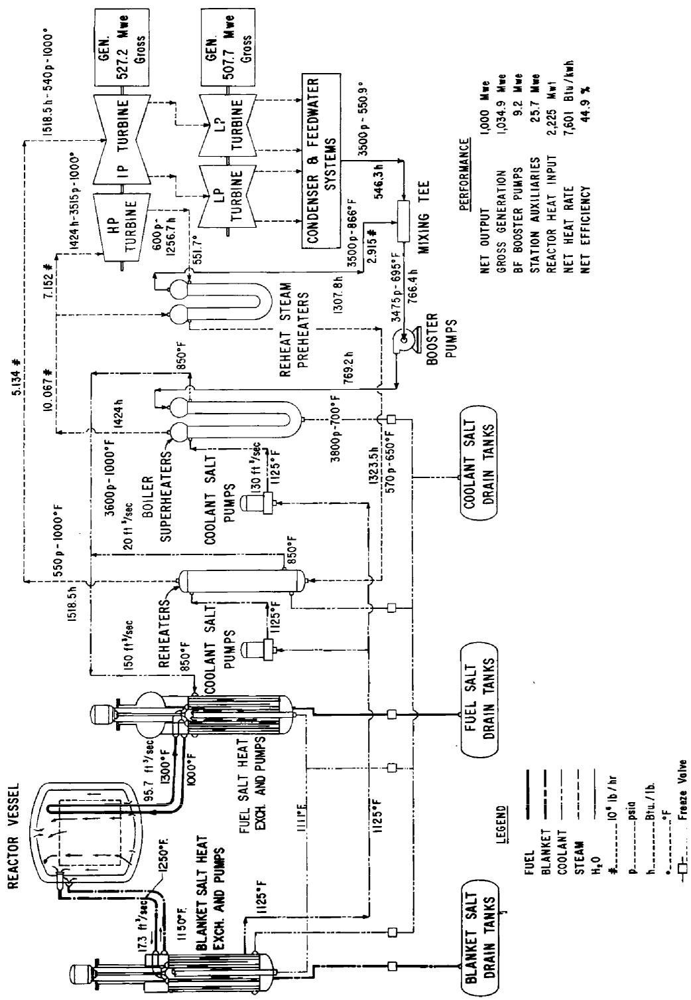  
FIGURE E.1   
REFERENCE MSBR FLOW DIAGRAM

heat exchangers are suspended from the top of the cell and are located below the reactor. Each fuel pump has a free fluid surface and a storage volume that permits rapid drainage of fuel from the core upon loss of flow. In addition, the fuel salt can be drained to the dump tanks when the reactor is shut down for an extended time. The entire reactor cell is kept at a high temperature, while cold "fingers" and thermal insulation surround structural support members and all special equipment that must be kept at relatively low temperatures. The control rod drivers are located above the core and the control rods are inserted into the central region of the core.

The fuel processing plant is located adjacent to the reactor and is divided into high-level and low-level activity areas. The MSBR fuel is processed by fluoride volatility and vacuum distillation. The effluent $\mathrm{UF}_6$ is absorbed by fuel salt and then reduced to $\mathrm{UF}_4$ by treatment with hydrogen to reconstitute a fuel-salt mixture of the desired composition. It is expected that the blanket stream will be treated with molten bismuth containing dissolved thorium. The thorium would displace the protactinium (as well as uranium) from the solution and the metallic protactinium and uranium would then be removed by hydrofluorination or fluorination for recycle of bred fuel.

Molten-salt reactors are inherently suited to the design of processing facilities integral with the reactor plant since these facilities would be expected to require only a relatively small amount of cell space adjacent to the reactor cell. Because all services and equipment available to the reactor would also be available to the processing plant as well, and shipping and storage charges eliminated, integral processing facilities would permit significant savings in fuel processing plant capital and operating costs. Also, the processing plant inventory of fissile material could be kept very small.

The principal steps in a proposed core and blanket stream processing of the MSBR are indicated in Figure E.2. A small side stream of each fluid is continuously withdrawn from the fuel and blanket loops and circulated through the processing system. After processing, the decontaminated fluids are returned to the reactor system. Fuel inventories retained in the processing plant are estimated to be about 5 percent of the reactor system for core processing and less than 1 percent for blanket processing.

The design structural material is Hastelloy-N for all components contacted by molten-salt in the fuel, blanket, and coolant systems, including the reactor vessel, pumps, heat exchangers, piping, and storage tanks. The primary heat exchangers are of the vertical tube-and-shell type, with fuel salt on the tube side and with a fuel circulating pump mounted at the top. Each shell contains two concentric tube bundles attached to fixed tube sheets. Fuel flows through the two bundles in series; it flows downward in the inner section of tubes, enters a plenum at the bottom of the exchanger, and then flows upward to the pump through the outer section of tubes. The coolant salt enters at the top of the exchanger and flows on the baffled shell side down the outer annual region; it then flows upward in the inner annual section before exiting through a pipe centrally placed in the exchanger.

Heat is transferred from the blanket to the coolant salt in the blanket heat exchangers. The exchangers are smaller, but otherwise similar to the main fuel heat exchangers.

The superheater is a long, slender U-tube, U-shell heat exchanger that has disk and doughnut baffles with varying spacing. The baffle spacing is established by the shell-side pressure drop and by the temperature gradient across the tube wall; it is greatest in the central portion of the exchanger where the temperature difference between the steam and secondary coolant salt is high. The feedwater enters the tube side of the superheater at $700^{\circ}\mathrm{F}$ and 3770 psia and leaves as supercritical steam at $1000^{\circ}\mathrm{F}$ and 3600 psia. Since the freezing temperature of the secondary coolant salt is about $700^{\circ}\mathrm{F}$ , a high feedwater inlet temperature (to the superheater) is required.

The steam reheaters transfer energy from the coolant salt to the steam from the high-pressure turbine before its use in the intermediate-pressure turbine. The steam is produced at $1,000^{\circ}\mathrm{F}$ and 557 psia in a shell-and-tube exchanger.

Preheaters, utilizing primary stream, are used in raising the temperature of the exhaust steam from the high pressure turbine. The degraded primary steam leaving the reheat steam preheaters at a pressure of 3544 psia and a temperature of $870^{\circ}\mathrm{F}$ is mixed with the feedwater in a mixing tee to increase the feedwater temperature to $700^{\circ}\mathrm{F}$ before entering the superheater. The pressure is increased to about 3770 psia by a feedwater pump before the fluid enters the superheater.

# 2. ECONOMICS OF THE MSBR THORIUM FUEL CYCLE

Molten-salt reactors could be operated on either the uranium or thorium fuel cycle. Since these systems are homogeneous to neutrons, there is a tendency to favor the thorium fuel cycle over the uranium cycle. However, the principal advantage of the thorium fuel cycle in molten-salt systems is associated with the chemical and physical properties of the fuel salts. Thorium fluoride does not form a volatile fluoride, whereas uranium does. Thus, fluorination of a mixture of uranium and thorium tetrafluorides leads to formation of $\mathrm{UF}_6$ , which is readily separated from the thorium fluoride. Also, vacuum distillation is applicable for separation of fission products from the system. These simple processing operations of the fuel and the direct removal of protactinium from the blanket salt all appear to be amenable to on-line operation. Thus, very short fuel recycle times are feasible. As a result, the thorium fuel cycle has a significant potential cost advantage over the uranium cycle, and, in addition, permits the thorium fuel cycle to operate economically as a breeder in a two-region molten-salt system. Also, use of a circulating fuel system permits ease of refueling and therefore minimizes excess reactivity in the core.

Preliminary estimates of the capital cost of a 1000-MWe MSBR power station indicated a direct construction cost of about $92 million. After applying the indirect cost factors associated with reactor construction, an estimated total plant cost of$ 130 million was obtained for private-financing conditions. (1967 dollars and interest rates)

The reactor power plant operating and maintenance costs of 0.34 mills/kWh were estimated by standard procedures and modified to reflect present-day salaries. It is difficult to assess the realism of these costs, which are comparable to those quoted for a number of sodium-cooled plants in the absence of a detailed design.

The capital costs associated with fuel-recycle equipment were obtained by itemizing and costing the major process equipment required and estimating the costs of site, building, instrumentation, waste disposal, and building services associated with fuel recycle (12).

The operating and maintenance costs for the fuel-recycle facility include labor, labor overhead, chemicals, utilities, and maintenance materials. Estimates of the capital and operating costs for specific capacities were used as base points for obtaining the costs for processing plants as a function of processing rate. For each fluid stream the capital and operating costs were estimated separately as a function of plant throughput based on the volume of salt processed (10). The results of these estimates are given in Fig. E.3, but for the case of processing with no protactinium removal.

The cost of removing protactinium directly from the blanket stream was estimated to be (10)

$$
\mathrm {C} (\mathrm {P a}) = 1. 6 5 \mathrm {R} ^ {0. 4 5}
$$

where $C(Pa)$ is the capital cost of protactinium-removal equipment in millions of dollars, and $R$ is the blanket-stream processing rate for protactinium removal in thousands of cubic feet of blanket salt per day. Thus, the cost of fuel recycle in the MSBR was estimated to be equivalent to the sum of the costs given by this expression and those in Fig. E-3. It is based on uranium removal from the blanket stream by the fluoride-volatility process and on the uranium removal rate being influenced by the use of the protactinium removal process.

The fuel cycle cost was combined with the capital and operating and maintenance costs to give the total estimated energy generation cost of 2.96 mills/kWh (Table E.1) (11). The fuel cycle costs include the processing plant capital charges and the operating and maintenance charges attributable to the processing plant. They amounted to 0.40 mills/kWh, or $\sim 15$ percent of the total energy production cost (11).

# 3. GRAPHITE CONSIDERATIONS

Graphite suitable for the two-fluid MSBR design, which has been described, cannot be produced with currently available technology. For a ten-year design life, the graphite would be exposed to a fast neutron flux ( $>100\mathrm{keV}$ ) of the order of $2\times 10^{23}$ neutrons per $\mathrm{cm}^2$ . No graphites have received exposures of this magnitude and, due to the limited reactor fluxes available, it would take a long time to determine whether they could withstand this degree of exposure without deterioration.

Recent graphite irradiation experience has shown that dimensional changes occur which result in an initial volumetric contraction followed by expansion. The rate of volumetric expansion after the graphite again reaches its initial volume becomes very large and is undesirable from the viewpoint of reactor performance. In short, the graphite has a limited lifetime. The factors which define the lifetime dosage involve considerations of reactor design in addition to graphite strength and pore structure changes during irradiation. An arbitrary but reasonable core life expectancy is presently defined as the integrated flux at which the graphite volume after irradiation is equal to its initial volume.

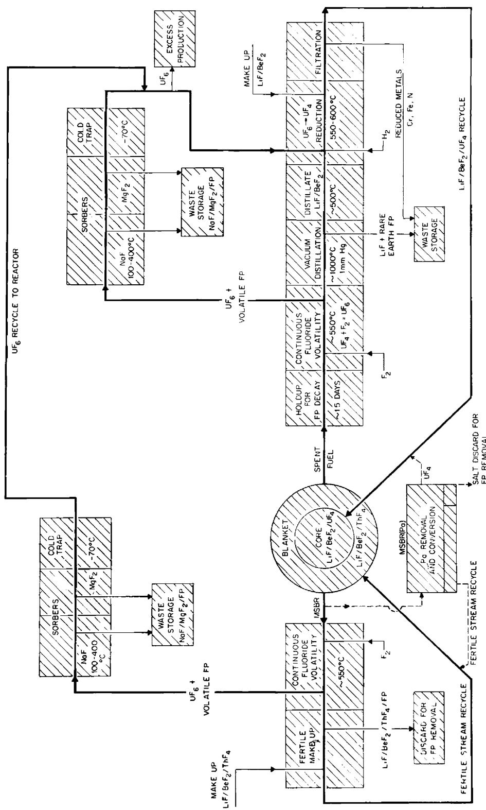  
ORNL-DWG66-7668   
FIGURE E.2   
FUEL- AND FERTILE-STREAM PROCESSING FOR THE MSBR

Irradiation experience to date has indicated the best currently available graphite could withstand an exposure of $3 \times 10^{22}$ neutrons/cm $^2$ . This would be equivalent to a two to four year lifetime exposure in a reactor operating at a peak power density of 80 to 40 watts/cm $^3$ , respectively.

While the indications are that a graphite with a reactor life twice that of presently available material could be developed, there is considerable uncertainty in the use and suitability of graphite as a structural material to separate the two molten-salt fluids in the two-fluid MSBR. This has resulted in the redirection of the MSBR development effort toward a single-fluid, two-region MSBR concept; discussed in section 5.2. In a preliminary conceptual design, the graphite no longer serves as a structural material to separate two fluids, but serves essentially as a moderator and a non-structural material in separating two regions of a single fluid.

Comparison of the potential two-fluid MSBR with an MSBR design with a shorter graphite exposure, and with a suggested alternative to the MSBR, i.e., the molten-salt converter, is shown in Table E.2.

TABLE E.1._Summary of MSBR Total Energy Costsa   

<table><tr><td>Item</td><td>Cost, mills/kwh</td></tr><tr><td>Capital Chargesb,c</td><td>2.22</td></tr><tr><td>Operating &amp; Maintenance Costsd</td><td>0.34</td></tr><tr><td>Fuel Cycle Cost</td><td></td></tr><tr><td>Processing Plant Capitalb</td><td>0.094</td></tr><tr><td>Processing Plant O &amp; M</td><td>0.112</td></tr><tr><td>Fuel, Fertile Material, and Salt Inventory</td><td>0.238e</td></tr><tr><td>Replacement Costs</td><td>0.071f</td></tr><tr><td>Credit for Bred Fuel</td><td>(0.111)g</td></tr><tr><td>Total Fuel Cycle Cost</td><td>0.40</td></tr><tr><td>Total Energy Production Cost</td><td>2.96</td></tr></table>

aReference 11

bBased on 0.8 load factor, capital charge of $12\%$ /yr for depreciating capital, and $10\%$ /yr for non-depreciating capital

Capital charges for the processing plant were included under fuel cycle costs

dO & M charges attributable to the processing plant were included under fuel cycle costs

Based on specific inventory of 0.87 kg/Mw e

fAssumes $6.5\%$ salt loss per pass through processing plant

With $6.4\%$ yield/yr

TABLE E.2.-Comparison of Reactor Characteristics in the MSBR Potential and Backup Designa   

<table><tr><td></td><td>Potential MSBRb</td><td>Fall-back MSBRc,e</td><td>MSCRe</td></tr><tr><td rowspan="3">Core Fast Neutron Flux, 100 kev, neutrons/cm2-sec . . . . . . . . . . . . . . . . . . . . . . . . . . . . . . . . . . . . . . . . . . . . . . . . . . . . . . . . . . . . . . . . . . . . . . . . . . . . . . . . . . . . . . . . . . . . . . . . . . . . .
GraphitefReplacement Life (0.8 plant factor), yr. . . . . . . . . . . . . . . . . . . . . . . . . . . . . . . . . . . . . . . . . . . . . . . . . . . . . . . . . . . . . . . . . . . . . . . . . . . . . . . . . . . . . . . . . . . . . . . . . . . ..
nvt, neutrons/cm2 . . . . . . . . . . . . . . . . . . . . . . . . . . . . . . . . . . . . . . . . . . . . . . . . . . . . . . . . . . . . . . . . . . . . . . . . . . . . . . . . . . . . . . . . . . . . . . . . . . . 
Conversion Ratio . . . . . . . . . . . . . . . . . . . . . . . . . . . . . . . . . . . . . . . . . . . . . . . . . . . . . . . . . . . . . . . . . . . . . . . . . . . . . . . . . . . . . . . . . . . . . . . . . . . 1.07</td><td>3x1014</td><td>1x1014</td><td>0.7x1014</td></tr><tr><td>10</td><td>4</td><td>10</td></tr><tr><td>24x1022</td><td>3x1022</td><td>6x1022</td></tr><tr><td>Total Fissile Inventory, kg/Mw e . . . . . . . . . . . . . . . . . . . . . . . . . . . . . . . . . . . . . . . . . . . . . . . . . . . . . . . . . . . . . . . . . . . . . . . . . . . . . . . . . . . . . . . . . . . . . . . . . . .</td><td>0.87</td><td>1.22</td><td>1.63</td></tr><tr><td colspan="4">Costs, mills/kwh</td></tr><tr><td>Capital</td><td>2.22</td><td>2.70</td><td>2.22</td></tr><tr><td>O &amp; M</td><td>0.34</td><td>0.34</td><td>0.34</td></tr><tr><td>Fuel Cycle.</td><td>0.40</td><td>0.55</td><td>0.57</td></tr><tr><td>Total Energy.</td><td>2.96</td><td>3.59</td><td>3.13</td></tr></table>

aReview of ORNL-3996 (Reference 11) by BNL Working Group, March 1967.   
bBNL-Adjusted values of data given in ORNL-3996.   
cNot optimized   
dNo Pa removal   
eDoes not include cost of containment shell; if required, it would add less than 0.10 mills/kwh to the capital cost.   
fSee p. 133 for discussion on graphite.

# REFERENCES

1. D. Okrent, Review of Fast Reactors in Power Reactor Tech. 7, 124-7 (1964).   
2. R. D. Nininger, Appendix for 1967 Supplement to the 1962 Report to the President on Civilian Nuclear Power, U. S. Atomic Energy Commission, Feb. 1967.   
3. J. C. Olsen, U. S. Geological Survey Bulletin 1204 (1964).   
4. Civilian Nuclear Power, Appendices to ... A Report to the President - 1962, P. 65, USAEC Nov. 1962.   
5. Jackson & Moreland and S. M. Stoller Associates, Current Status & Future Technical and Economic Potential of Light Water Reactors, June 21, 1967.   
6. Thorium Fuel Cycle, AEC Symposium Series, 12, USAEC, Feb. 1968.   
7. General Atomic Division, General Dynamics Corp., Design Study Report for TARGET, a 1000-MW(e) High-Temperature Gas-Cooled Reactor, GA-4706, Nov. 1964.   
8. S. Jaye and W. V. Goeddel, High-Temperature Gas-Cooled Reactor Fuels and Fuel Cycles - Their Progress and Promise, GA-7482, Dec. 10, 1966.   
9. H. B. Stewart, S. Jaye, and R. C. Traylor, HTGR Fuel Cycle Assessment Studies, GA-6146, May 11, 1965.   
10. S. Jaye, C. L. Rickard, and H. B. Stewart, High-Temperature Gas-Cooled Advanced Converter Reactors and the Colorado Project, GA-7149, May 16, 1966.   
11. P. R. Kasten, E. S. Bettis, and R. C. Robertson, Design Studies of 1000-MW(e) Molten-salt Breeder Reactors, ORNL-3996, Aug. 1966.   
12. C. D. Scott and W. L. Carter, Preliminary Design Study of a Continuous Fluorination-Vacuum-Distillation System for Regenerating Fuel and Fertile Streams in a Molten-salt Breeder Reactor, ORNL-3791, Jan. 1966.   
13. P. R. Kasten, An Evaluation of Thorium Fuel Cycles, De Ingenieur, No. 24, 1-6 (1964).

14. P. R. Kasten, L. G. Alexander, R. Carlsmith, and R. Van Winkle, Economics of Thorium Fuel Cycles, ORNL-61-6-83, June 22, 1961.   
15. Browns Ferry Nuclear Power Plant, Design and Analysis Report, General Electric Co., Nov. 1966.   
16. M. W. Rosenthal et al. A Comparative Evaluation of Advanced Converters, ORNL-3686, Jan. 1965.   
17. P. R. Kasten et al, An Evaluation of Heavy Water Moderated Organic Cooled Reactors, ORNL-3921A, March 23, 1967.   
18. Combustion Engineering, Inc. and Atomics International, Heavy Water Organic Cooled Reactor-1000-MW(e) Nuclear Power Plant Preliminary Conceptual Design, AI-CE-Memo 6, Vols. I and II, Oct. 1, 1965.   
19. Babcock & Wilcox Co., Evaluation of Thorium Fuels for the Heavy Water Organic Cooled Reactor, BAW-393-7, July, 1966.   
20. W. B. Loewenstein and D. Okrent, The Physics of Fast Power Reactors; A Status Report, Proc. 2nd Inter. Conf. on the Peaceful Uses of Atomic Energy, P/637, Vol. 12, p. 16, United Nations (1958).   
21. D. Okrent, K. P. Cohen and W. B. Loewenstein, Some Nuclear and Safety Considerations in the Design of Large Fast Power Reactors, Proc. 3rd Inter. Conf. on the Peaceful Uses of Atomic Energy, P/267, Vol. 6, p. 137, United Nations (1965).   
22. W. B. Loewenstein and B. Blumenthal, Mixed Fuel-Cycle Fast Breeder Reactors - Nuclear, Safety, and Materials Considerations, Proc. Conf. on Safety, Fuels and Core Design in Large Fast Power Reactors. ANL-7120, pp. 751-8, Oct. 11-14, 1965.   
23. F. S. Singh and H. H. Hummel, Parametric Studies of the Reactivity Coefficients for Large $\mathbf{U}^{233}$ -Th-Fueled Fast Reactors, ANL-6930, Jan., 1966.   
24. R. Hankel and A. J. Goldman, An Evaluation of $\mathbf{U}^{233}$ -Thorium Fuels for Fast Breeder Applications, NDA-2164-2, Aug. 15, 1961.   
25. G. A. Sofer, A. H. Kazi, and J. Bobker, Economics and Safety Aspects of Large Ceramic U-Th Fast Breeder Reactors, Proc. Conf. on Breeding, Economics, and Safety in Large Fast Power Reactors, pp. 435-54, ANL-6792, Oct. 7-10, 1963.

26. R. P. Hammond et al., The Use of Unclad-Metal Fuel in High Gain Breeders for Desalting or Power, ANS Transactions 10, No. 2, 644-5(1967).   
27. J. H. Kittel, J. A. Horak, W. F. Murphy, and S. H. Paine, Effects of Irradiation on Thorium and Thorium-Uranium Alloys, ANL-5674, Apr., 1963.   
28. E. Haddad, S. J. Freisenhahn, F. H. Frohner, and W. M. Lopez, Thorium Resonance Parameters for Neutron Energies from 20 to $222\mathrm{eV}$ , Phys. Rev. 140B, 50-62 (1965).   
29. J. B. Garg, J. Rainwater, J. S. Petersen, and W. W. Havens, Jr., Neutron Resonance Spectroscopy III, Th $^{232}$ and U $^{238}$ , Phys. Rev. 134B, 985-4009 (1964).   
30. L. W. Weston, R. Gwin, G. deSaussure, R. W. Ingle, R. R. Fullwood, and R. W. Hockenbury, Measurement of the Neutron Fission and Capture Cross Sections for $^{233}\mathrm{U}$ in the Energy Region 0.4 to 1000 eV, ORNL-TM-1751, Apr. 26, 1967.   
31. R. Bardes et al., GA-7801, HTGR Base Program Quarterly Report, Apr. 20, 1967.   
32. M. Goldberg et al., Neutron Cross Sections, BNL 325, 2nd Ed., Supplement No. 2, Vol. 1-4 (1965-66).   
33. H. Honeck, ENDF-Evaluated Nuclear Data File, BNL 8381 (1964).   
34. J. R. Smith and E. Fast, Techniques for Determining Eta for the Thermally Fissionable Isotopes, IDO-17173, Apr., 1966.   
35. F. D. Brooks, Atomic Energy Research Establishment, Harwell, England, Private Communication, 1966.   
36. J. R. Smith, S. D. Reeder, and R. G. Fluharty, Measurement of the Absolute Value of Eta for U-233, U-235, and Pu-239 Using Monochromatic Neutrons, Bull. Am. Phys. Soc. 10, 1099-1100 (1966).   
37. J. E. Sanders, H. M. Skarsgard, and C. J. Kenward, The Energy Dependence of the Fission-Neutron Yield Per Neutron Absorbed in $\mathrm{U}^{233}$ Over the Range 0.025-2.2 eV, J. Nucl. Energy 5, 186-91 (1957).   
38. H. Palevsky, D. J. Hughes, R. L. Zimmerman, and R. M. Eisberg, Direct Measurement of the Energy Variation of eta for $\mathrm{U}^{233}$ , $\mathrm{U}^{235}$ , and $\mathrm{Pu}^{239}$ , J. Nucl. Energy I, 3, 177-87 (1956).

39. E. H. Magleby, J. R. Smith, J. E. Evans, and M. S. Moore, Energy Dependence of eta for Uranium-233 in the Region 0.1 to $4.0\mathrm{eV}$ , Bull. Am. Phys. Soc. 1, 327 (1956).   
40. M. S. Moore, L. G. Miller, and O. C. Simpson, Slow Neutron Total and Fission Cross Sections of $\mathrm{U}^{233}$ , Phys. Rev. 118, 714-7 (1960).   
41. J. Halperin et al., The Average Capture/Fission Ratio of U233 for Epithermal Neutrons, Nucl. Sci. Eng. 16, 245-7 (1963) / E. D. Conway and S. B. Gunst, Integrals of the Epithermal Neutron Capture-to-Fission Cross-Section Ratios of $^{233}\mathrm{U}$ and $^{235}\mathrm{U}$ , Nucl. Sci. Eng. 29. 1 (1967).   
42. F. Feiner and L. J. Esch. Survey of Capture and Fission Integrals of Fissile Materials, Proc. Nat. Topical Meeting of ANS, San Diego, 1966, Vol. II, p. 299, MIT Press, Cambridge, Mass. (1966).   
43. J. Chernick and M. M. Levine, Developments in Resonance Absorption, Proc. Third UN Intern. Conf. on the Peaceful Uses of Atomic Energy, Geneva, Sept. 1964, Vol. 2, pp. 35-44 (1965).   
44. J. D. Garrison and B. W. Roos. Fission-Product Capture Cross Sections, Nucl. Sci. Eng. 12, 115-34 (1962). W. H. Walker, Yields and Effective Cross Sections of Fission Products and Pseudo-FissionProducts, CRRP-913, March, 1960. E. A. Nephew, Thermal and Resonance Absorption Cross Sections of the $\mathrm{U}^{233}$ $\mathrm{U}^{235}$ , and $\mathrm{Pu}^{239}$ Fission Products, ORNL-2869, March 1, 1960. M. M. Levine, Equal Charge Displacement Rule in Fission Product Poisoning, Nucl. Sci. Eng. 9, 495-9 (1961).   
45. R. W. Stoughton and J. Halperin, Heavy Nuclide Cross Sections of Particular Interest to Thermal Reactor Operation: Conventions, Measurements and Preferred Values, Nucl. Sci. Eng. 6, 100-18 (1959).   
46. L. R. Weissert and G. Schileo, Fabrication of Thorium Fuel Elements-An AEC Monograph, TRG-66-33, unpublished report.   
47. "Utilization of Thorium in Power Reactors," Technical Report Series No. 52, Intern. Atomic Energy Agency, Vienna (1966).   
48. C. E. Dickerman, L. E. Robinson, B. Blumenthal, and R. Stewart, Behavior of Th-20 wt% U Fast Reactor Fuel Under Transient Heating to Failure, Nucl. Appl. 3, 9-17 (1967).   
49. S. Aronson and J. Sadofsky, J. Inorg. Nucl. Chem. 27, 1769 (1965).

50. L. Abraham, Thorium-Uranium Monocarbide Fuel Development, TID-7650, Proc. Thorium Fuel Cycle Symposium, Gatlinburg, Tenn. 1962.   
51. A. R. Olsen, D. A. Douglas, Y. Hirose, J. L. Scott, and J. W. Ullman, Properties and Prospects of Thoria-Base Nuclear Fuels, ORNL-P-1724 (1965).   
52. R., S. Kempter, R. N. Johnson, J. E. Minor, and R. G. Nelson, Fabrication of Zircaloy-2 Clad Thorium-Uranium Alloy Fuel Elements, HW-79843, Mar., 1964.   
53. S. R. Nemeth, ed., Thorium-1.4 wt % $^{235}$ Uranium Metal Fuel Tubes-Fabrication and Irradiation in HWCTR, DP-943, July, 1965.   
54. B. R. Hayward and P. Corzine, Thorium-Uranium Fuel Elements for SRE, Proc. 2nd Intern. Conf. on the Peaceful Uses of Atomic Energy, Vol. 6, p. 438, United Nations (1958).   
55. E. L. Nicholson et al., Recent Developments in Thorium Fuel Processing, Preprint for 2nd Intern. Thorium Fuel Cycle Symposium, Gatlinburg, Tennessee, 1966.   
56. K. G. Steyer and H. E. Stelling, Preliminary Design for a Head-End Reprocessing Facility Integrated with an HTGR Power Plant, GA-7107 (1966).   
57. G. D. C. Short, G. Orsenigo, and E. Romberg, Reprocessing of U-Th Fuel for High-Temperature Gas-Cooled Power Reactors, Preprint for 2nd Intern. Thorium Fuel Cycle Symposium, Gatlinburg, Tennessee, 1966.   
58. J. F. Flagg, ed., "Chemical Reprocessing of Reactor Fuels," Academic Press (1961).   
59. S. M. Stoller and R. B. Richards, ed., Reactor Handbook, 2nd Edition, Vol. II, Fuel Reprocessing Interscience, New York (1961).   
60. Proc. Thorium Fuel Cycle Symposium, Gatlinburg, Tenn., TID-7650, pp. 385-435, 437-53 (1962).   
61. R. E. Blanco, L. M. Ferris, and D. E. Ferguson, Aqueous Processing of Thorium Fuels, ORNL-3219, Mar. 14, 1962.

62. E. C. Moncrief, C. A. Burkart, and D. A. Nitti, Thorium Fuel Separation Engineering Studies, Preprint for 2nd Intern. Thorium Fuel Cycle Symposium, Gatlinburg, Tennessee, 1966.   
63. L. M. Ferris, Experimental Survey of Close-Coupled Processing Methods for Fuel Containing Uranium and Thorium, ORNL-3952, June, 1966.   
64. W. L. Carter and M. E. Whatley, Fuel and Blanket Processing Development for Molten-salt Breeder Reactors, ORNL CF-66-7-40, July 26, 1966.   
65. M. Levenson, V. G. Trice, Jr., and W. J. Mecham, Comparative Cost Study of the Processing of Oxide, Carbide, and Metal Fast-Breeder-Reactor Fuels by Aqueous, Volatility, and Pyrochemical Methods, ANL 7137, May, 1966.