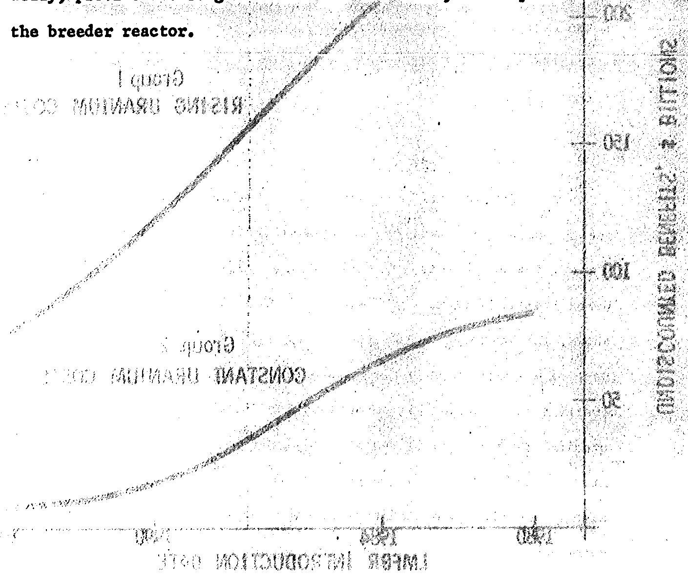
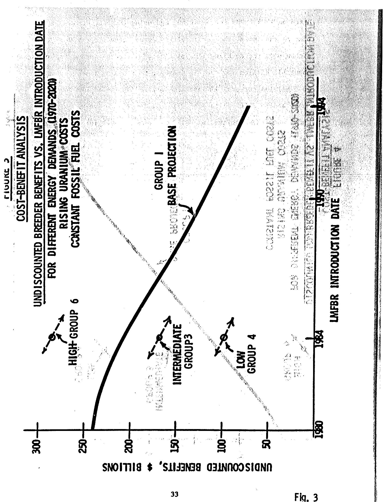
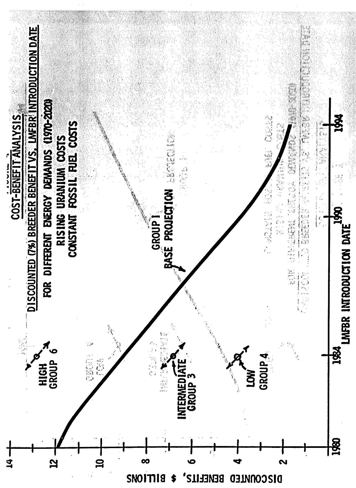
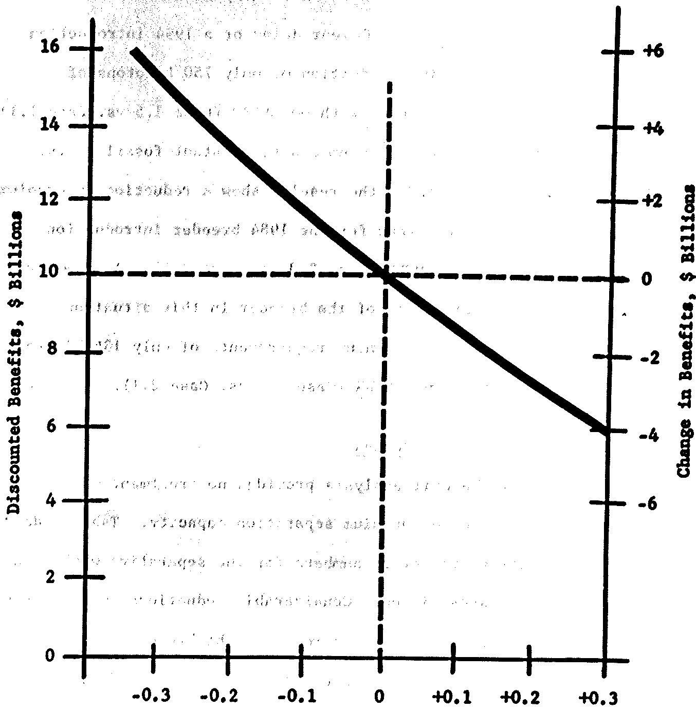
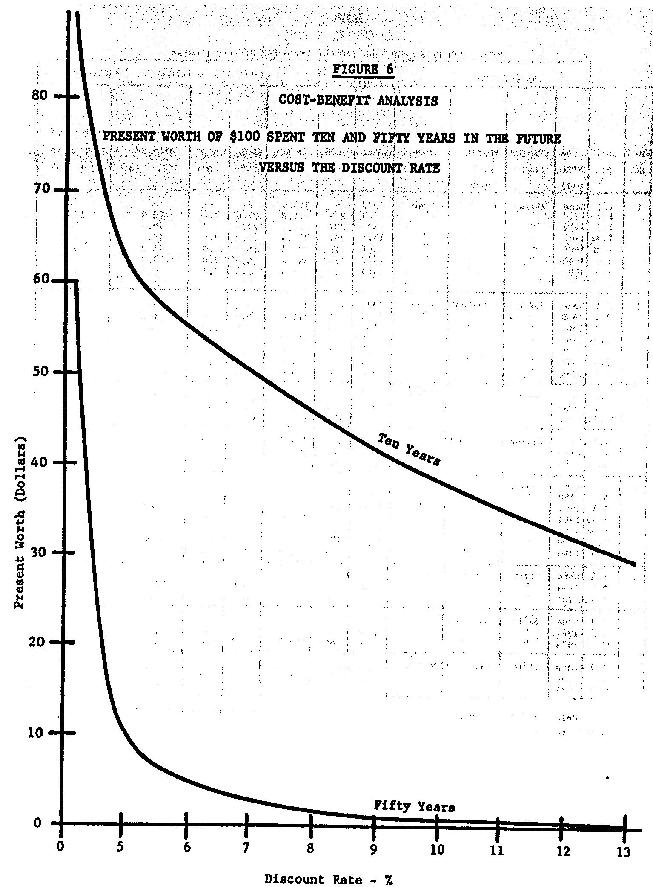

# LEGAL NOTICE

- Project was programmed on an amount of Cocos++ sponsored tools. [Number On the United]  
- It uses the Commodus, our own person testing on Intel of the Commodus  
- It addresses any dependency or representation, expressed or embodied, with respect to the content  
- it comprehensively, our confidence of the implementation overland in this report, or that the use of any standard rigidity, or  
- It addresses any limitations with respect to the use of, or by design, corresponding framework.  
- It uses the Commodus, our confidence, stated, or proven documented in this report may not be included  
- It used in this above, "performance testing" on Intel of the Commodus (included) and Intel of the Commodus, or workups of each architecture, to the extent that  
- it addresses all aspects of the Commodus, or components of each architecture, or components of each architecture (proposed),  
- Commodus, or provides support for, any intervention (pre defined) in his program (proposed) or comments

WASR 1126

COST-DEPOSIT ANALYSIS

OF THE

U. S. BREEDER REACTOR

PROGRAM

APRIL 1969

Prepared by

Division of Reactor Development and Technology

U. 3. ATOMIC ENERGY COMMISSION

# PREPAC

The widespread and concentrated efforts being devoted on a national and international basis to develop a breeder reactor clearly evidences man's intense desire to free himself from limited and costly energy sources. The introduction of the breeder reactor into the utility market will provide virtually unlimited energy which can be used to elevate the standard of living and, with proper attention, improve man's environment.

The basic importance of major sustained commitments of managerial and financial resources by Government, private industry and the utilities to the overall success of the breeder program cannot be over-emphasized. Experience in the development and application of civilian nuclear power reactors has established that such commitments are essential to bring into being the technologies, research and development facilities, trained personnel, components, systems, and production facilities necessary to assure the successful introduction of the breeder into the commercial market. In view of the substantial investment of the nation's resources that the development of the breeder entails, it seems highly appropriate that in making the decision to proceed with this program, estimated costs be measured against the benefits expected to derive from the investment.

In recognition of the desirability of better defining the commitments and benefits implicit in the breeder development program, the U. S. Atomic Energy Commission, Division of Reactor Development and Technology

undertook the task of conducting the study described in this "Cost-Benefit Analysis of the U. S. Breeder Reactor Program." The optimization of the U. S. electric energy economy over a 50-year period serves as a basis for the study. A linear programming model of the United States electrical energy economy developed by Pacific Northwest Laboratory, and principal members of other sectors of the nuclear community was used in the analysis. It is important to note that the model utilized in this analysis is in an early stage of development and is being continually improved to better simulate the characteristics of the nation's power economy.

The benefits considered in the calculations are those that are clearly quantifiable and take the form of low-cost electrical energy, reductions in uranium ore requirements and in preparative work demand, increase in plutonium production, and use of uranium tailings. Also, the report makes reference to other benefits of major importance which are not quantifiable, at least not at the present time. Such benefits include those associated with reductions of air pollution and with new uses for low cost electricity and heat such as large scale desalting of sea water. Weighed against the quantifiable benefits are the costs expected to be incurred by the Government in the development of the breeder. This approach appears reasonable in view of the fact that the continuing program of systems analysis, which provides input for studies of this nature, has as its major objective the determination of the Government's future role in advanced reactor development.

The funds and other resources which the Government, the large industrial complex, and the utilities have already committed to the breeder program and to companion non-breeder programs coupled to the uranium-plutonium cycle, have not been examined directly, nor have future expenditures by the utilities and manufacturers been factored into the study. Use charges for plutonium used in the R&D program amounting to about $40 million discounted to 1970 were not included. These represent about 12% of the R&D discounted expenditures and would not affect numerical results to any noticeable degree. Furthermore, no weight has been given to the quite evident priority and usable commitments which have also been made to breeder programs by the other countries with strong programs for the exploitation of nuclear power.

Cost-benefit analysis should be considered as only one of the many elements of input pertinent to decision-making. Examination of results of cost-benefits analyses conducted in the past, when compared to actual program progress and status, identifies well those limitations inherent in any such analyses and the continuing need to insure compatibility of assumptions in the analyses with the assumptions in the program plan. The degree of sophistication of the model developed, the validity of the assumptions made, the quality of the analysis involved, and the nature of the analysis involved, and the nature of the subject studied all will affect the use of such an analysis in decision making. Particular care must be taken to avoid the tendency to regard cost-benefit analysis as an end unto itself; it will be a useful tool only if it is properly applied with full realization of the inherent limitations of such studies.

Considering the uncertainty in choosing any parameter used in this analysis, the overall conclusions and trends developed in the analysis are considered to be reasonably valid indicators which can serve as a guide for further analyses and assessments. It is particularly important to recognize that in undertaking such an analysis, a number of basic assumptions must be developed on the basis of available information and indicated trends in the nuclear energy program. As a logical consequence, therefore, the actual results in the future will be predicated on which values of the parameters become valid. We believe that the actions to be taken over the next few years will significantly affect the outcome.

Such actions include the degree of M&D support given to the breeder program by both the Government and industry, as it will affect the date of introduction of the breeder; changes promulgated in fossil fuel costs; and changes affecting capital costs and fuel cycle costs, including uranium costs. A parameter over which there is little control at the present, electrical energy demand, will also have an effect on the future outcome.

Of particular importance is the degree to which associated programs are given high priority and are provided with the resources previously identified as essential to their success. In this regard, the recently published detailed LUTR program plan provided a logical base for projecting costs and schedules for the LUTR portion of the analysis.

It should be recognized that the rapidly expanding electric power industry may encounter problems, applicable to nuclear and/or fossil-fired power

plant, the resolution of which could conceivably affect the validity of assumptions made in this study. Many of these are of the type that bereto-fore have not been of serious concern to the electric power industry, such as skilled labor availability and the environmental aspects of citing very large nuclear or fossil-fired power plants.

It is appropriate that this report place primary emphasis on sensitivity of benefits to changes in parameters, and it is this sensitivity which should be of primary interest to the reader. Of particular note is the significant reduction in benefits that will develop if (1) the nuclear industry is not capable of meeting present and projected nuclear power commitments, (2) the introduction date for the breeder reactor is delayed significantly due to reasons such as a reduction in research and development support or failure of the research and development program to meet programmatic goals, (3) discount rates higher than 8 to 92 are applied, and/or much larger than estimated quantities of low cost uranium become available.

It is of paramount importance that timely results be achieved with respect to strengthening the execution of the civilian nuclear power programs in this country, including those capabilities associated with the broader development. The results of this study assume success in these necessary strengthening actions; delays will jeopardize the success of these programs and could seriously affect their cost and substantially affect benefits. Accordingly, it is necessary that we proceed with the strongest possible engineering and quality assurance programs.

Because of the overall importance of nuclear power the capabilities and resources required for such a major undertaking as the breeder program must be continually evaluated and strengthened in context with the experience from the existing and planned commitments for nuclear power plants by the utilities. The high national priority afforded the breeder program clearly recognises not only the benefits identified in this report, but even more importantly the vital implications of the tremendous growth of electric power in this country, our increasing dependence on electricity for defence, public safety, and general welfare, and the increasing emphasis on preserving and improving our environment.

Milton Shaw, Director Division of Reactor Development and Technology

# TABLE OF CONTENTS

Page No.

PREFACE 111

1.0 INTRODUCTION 1   
2.0 SUMMARY OF COST-BENEFIT ANALYSIS 9   
3.0 DISCUSSION OF COST-BENEFIT ANALYSIS 14   
4.0 OTHER CONSIDERATIONS 53   
5.0 MAJOR ASSUMPTIONS USED IN THE COST-BENEFIT ANALYSIS 63

# APPENDICES

"A" - SELECTED STATEMENTS AND REVIEWS IN SUPPORT OF THE BREKDER PROGRAM 76   
"B" - STATEMENTS REGARDING CORPORATE COMMITMENTS OF MAJOR REACTOR MANUFACTURERS TO LITER 86   
"C" - UTILITY INVOLVEMENT IN THE LAFER PROGRAM (NOVEMBER 1968). 90   
"D" - INTERNATIONAL FAST BREEDER PROGRAMS AND IMPLICATIONS 95

PAGE NO.

TABLE 1 - COST-BENEFIT ANALYSIS - GROUPS OF CASES CONSIDERED. 15   
TABLE 2 - COST-BENEFIT ANALYSIS - SUMMARY OF ESTIMATED AEC RESEARCH AND DEVELOPMENT COSTS - CUMULATIVE-FISCAL YEAR (FY) 1970-2020 - $ BILLIONS. 18   
TABLE 3 - COST-BENEFIT ANALYSIS - COSTS, BENEFITS, AND BENEFIT/COST RATIO FOR BREEDER PROGRAM (DISCOUNTED TO 1970 @ 72) . . . . . . . . . . . . . . . . . . . . . . . . . . . . . . . . . . . . . . . . . . . . . . . . . . .   
TABLE 4 - COST-BENEFIT ANALYSIS - SUMMARY OF RESULTS (1970-2020).... 21   
TABLE 5 - COST-BENEFIT ANALYSIS - COSTS, BENEFITS, AND BENEFIT/COST RATIO FOR BREEDER PROGRAM (DISCOUNTED TO 1970 @ 52)............ 42   
TABLE 6 - COST-BENEFIT ANALYSIS - COSTS, BENEFITS, AND BENEFIT/COST RATIO FOR BREEDER PROGRAM (DISCOUNTED TO 1970 @ 72)......... 43   
TABLE 7 - COST-BENEFIT ANALYSIS - COSTS, BENEFITS, AND BENEFIT/COST RATIO FOR BREEDER PROGRAM (DISCOUNTED TO 1970 @ 10%).... 44   
TABLE 8 - COST-BENEFIT ANALYSIS - COSTS, BENEFITS, AND BENEFIT/COST RATIO FOR BREKDER PROGRAM (DISCOUNTED TO 1970 @ 12.52)...... 45   
TABLE 9 - COST-BENKPIT ANALYSIS - GENERATING CAPACITY JUILT (NUMBER OF 1000 MWE PLANTS) - CASES 1.1 AND 1.3 49   
TABLE 10- COST-BENEFIT ANALYSIS - GENERATING CAPACITY BUILT (NUMBER OF 1000 MWE PLANTS) - CASE 1.4 49   
TABLE 11- COST-BENEFIT ANALYSIS - TYPICAL REACTOR CHARACTERISTICS ASSUMED IN ANALYSIS. 67   
TABLE 12- COST-BENEFIT ANALYSIS - REPRESENTATIVE FUEL FABRICATION AND REPROCESSING COSTS. 68   
TABLE 13- COST-BENEFIT ANALYSIS - U3O8 RESOURCE VS. AVERAGE -J08 COST USED AS A STEP FUNCTION IN COMPUTER RUNS. 70   
TABLE 14- COST-BENEFIT ANALYSIS - U.S. AEC ORANITUM RESOURCES (BASIS FOR TABLE 13) 71   
TABLE 15- COST-BENEFIT ANALYSIS - ESTIMATES OF ELECTRICAL ENERGY DEMAND. 72   
TABLE D-1 - FBR PROGRAMS - MILESTONEs. 97   
TABLE D-2 - COST-BENEFIT ANALYSIS - LIQUID METAL COOLED FAST REACTOR PROJECTS. 98

# LIST OF FIGURES

FIGURE 1 - COST-BENEFIT ANALYSIS - LMPER UNDISCOUNTED BENEFITS (1970-2020) VS. LMPER INTRODUCTION DATE - FOR GROUPS 1 AND 2...   
FIGURE 2 - COST-BENEFIT ANALYSIS - LMPER DISCOUNTED BENEFITS (1970-2020 @ 7%) VS. LMPER INTRODUCTION DATE FOR GROUPS 1 AND 2...   
FIGURE 3 - COST-BENEFIT ANALYSIS - UNDISCOUNTED BREEDER BENEFITS VS. LMPBR INTRODUCTION DATE FOR DIFFERENT ENERGY DEMANDS (1970-2020) 33   
FIGURE 4 - COST-BENEFIT ANALYSIS - DISCOUNTED (7x) BREKDER BENEFITS VS. IMFBR INTRODUCTION DATE FOR DIFFERENT ENERGY DEMANDS (1970-2020). 34   
FIGURE 5 - COST-BENEFIT ANALYSIS - SENSITIVITY OF DISCOUNTED GROSS BENEFITS TO A CHANGE IN LITER ENERGY COSTS.... 35   
FIGURE 6 - COST-BENEFIT ANALYSIS - PRESENT WORTH OF $100 SPENT TEN AND FIFTY YEARS IN THE FUTURE VERSUS THE DISCOUNT RATE. 41   
FIGURE 7 - COST-BENEFIT ANALYSIS - ELASTICITY IN THE DEMAND FOR ELECTRICITY. 62   
FIGURE 8 - COST-BENEFIT ANALYSIS - ASSUMPTION FOR CAPITAL COSTS OF POWER PLANTS. 65

# 1.0 INTRODUCTION

This analysis consists of an examination of the cost-benefit and other relationships for a number of postulated cases that include the currently planned breeder development program. Included is a discussion of the assumptions which provide the basic framework for the postulated cases. The analysis also includes consideration of many other tangible and intangible benefits, more difficult to quantify, which would accrue to our economy based upon early completion of the currently planned breeder program.

In this analysis, the Liquid Metal-Cooled Fast Breeder Reactor (LWFR) is assumed to be the initial breeder type commercially introduced into the U. S. electric power economy. The benefits which have been calculated in this analysis resulting from the introduction of the LWFR are representative of the benefits to be achieved from the successful introduction of a breeder or even two breeder types.

The results of the cost-benefit analysis depend upon assumptions which can substantially affect the future cost of electrical energy. Since the prospective value of many of these variables is uncertain, the sensitivities of undiscounted and discounted benefits to changes in the following key variables have been examined: timing of the introduction date of the breeder; uranium costs; fossil fuel costs; electrical energy demands; energy costs, which include plant capital and fuel cycle costs; and discount rates.

# BLANK PAGE

To determine the most tangible benefit of introducing the breeder, namely, the reduction in cost of electrical power, calculations were made of the differences in power costs between competitive economies based on:

(1) converter reactors (Light Water Reactors - LWR), plus advanced converter reactors (High Temperature Gas Reactors - HTGR), plus fossil fueled electrical generating plants, and (2) converter reactors (LWR), plus advanced converter reactors (HTGR), plus breeder reactors (LWBR), plus fossil fueled electrical generating plants. These calculations were based on a linear programming model of the United States electrical energy economy developed by Pacific Northwest Laboratory. The model has been prepared in conjunction with the activities of the Systems Analytes Task Force, which has been working on civilian nuclear power evaluations with the AEC Division of Reactor Development and Technology.

The quantifiable benefits discussed herein have been recognized since the inception of nuclear power as the basis of support for breeder programs in the United States and in every major highly industrialized country in the world. The other important benefits, many less tangible and more difficult to quantify than those quantifiable in terms of lower electrical energy cost, are of substantial consequence in any meaningful review of the role which nuclear power and fossil fuel plants can play in the future to meet the energy demands of the United States.

It has long been recognised that nuclear energy's full promise for providing a virtually unlimited energy source for future generations could only be realized through the development and application of the breeder reactor. The U. S. interest in breeder reactors dates back to the Manhattan Project days, when the possibility was first recognized by pioneers in the nuclear field. In 1945 Enrico Fermi observed that "The country which first develops a breeder reactor will have a great competitive advantage in atomic energy." To obtain this advantage, the U. S. nuclear community has been working for over 20 years on the breeder reactor. In 1945 the development of the plutonium fueled fast breeder was established as a major goal by the Argonne National Laboratory Division of the Manhattan District Metallurgical Laboratory. The program has been continuous since that time, and the momentum now has built up to the point where the large-scale introduction and commercial acceptance of the breeder will be feasible in the near future. Appendix A presents some of the more significant reviews and statements that have been made over the years on the national importance and potential of the breeder program.

Much of the essential effort on the breeder was conducted in the ABC national laboratories. The Clementine reactor was constructed at Los Alamos and used from March 1949 to December 1952 to demonstrate the feasibility of operating with fast neutrons, plutonium fuel and a liquid metal coolant. The Experimental Breeder Reactor I (EBR-I) was built and operated by Argonne National Laboratory from August 1951 through

December 1963 to prove the breeding principle in a fast flux reactor and to establish the engineering feasibility of using liquid metal coolant.

Developments related to the operation in environments of fast flux and high temperature liquid metal were initiated. These developments led to demonstrating the physics and safety of a fast flux neutron spectrum reactor, culminating in the construction of two fast reactors in the mid 1950's, the 62.5 MWh EBR-11 and the 200 MWh Yorai reactor.

Several factors mitigated against immediate success in terms of the commercial exploitation of the breeder reactor: the development effort was focused largely on technological goals; the industrial involvement was minimal; and the breeder development participation was essentially confined to the national laboratories, with the exception of the Fermi development effort. The industrial groups concentrated on the light water reactors and the nuclear Navy, where success was nearer at hand. The proven uranium resources appeared sufficient to meet predicted requirements. Though a relatively large technological base, including test facilities, was being developed in the laboratories, the breeder effort was diffuse in terms of an engineering type of undertaking. In general, until the mid-1960's, there appeared to be no urgent requirement to concentrate the industrial resources on the breeder program.

In 1962, the ABC issued its Report to the President on Civilian Nuclear Power. This report clearly re-emphasized that the use of breeders could solve the problem of an adequate and economic energy supply for the future. The report concluded that nuclear energy can and should make an important and eventually, a vital contribution toward meeting our long term energy requirements, and that economic breeders were essential to the long range major use of nuclear energy. The report included a detailed discussion of the place to be occupied by the breeders in the overall program.

Faced with the question of determining the future course to be taken by the U. S. advanced reactor development programs, the AEC, in early 1965, initiated a series of overall technical reviews. These reviews of the reactor program indicated a lack of important engineering information and an inadequacy of facilities and other resources necessary to obtain that information. There was clear evidence of the need to build up the engineering capabilities in the laboratories and in industry and to assemble necessary and adequate resources to develop and produce safe, reliable and economical breeder power plants for operation in the utility environment. These early overall reviews further indicated a requirement for in-depth reviews of each of the technical elements of the breeder program. Concurrently, it was necessary to initiate detailed plans for each of the elements of the breeder program.

During this period, remarkable advances were taking place in the development of light water reactor power plants. As a result, nuclear power moved towards widespread acceptance as a new source of electrical energy. The resultant unprecedented demand for light water power reactor plants, paralleled by greatly increased uranium demands and "y projected large-scale plutonium production, provided additional incentives for a more direct and concentrated effort on a unified breeder development program than bitherto achieved. It was recognized that the plutonium produced in light water reactors could be most efficiently used in the fast breeder reactors and that the breeder would measurably reduce uranium ore requirements. The breeder development program was thus invested with a sense of urgency which had been lacking up to them.

In early 1967, the Atomic Energy Commission issued the 1967 Supplement to the 1962 Report to the President on Civilian Nuclear Power. The Supplement set forth the changes that had occurred since 1962, and considered the ongoing ABC reactor programs in relation to the recommendations of the 1962 report. The Supplement reaffirmed the promise of the breeder for meeting our long term energy needs and established the LMTBR program as the highest priority civilian reactor development effort which would lead to full commercial acceptance of the breeder. The continuing ABC role of leadership was reviewed relative to the development of nuclear technology required to assure the nation that large amounts of low cost energy would be available

for the growing demands. The steps taken to strengthen the industrial and utility capability requisite to the successful introduction of the LHR and the timely development and commercial utilization of the fast breeders, in particularly the LMPER, were discussed.

In view of the established first priority, the level of activity on the LIFER was considerably increased in Fiscal Years 1967, 1968 and 1969. The buildup to bring together the required resources, including manpower, facilities, and funds has continued within the ABC, the ABC laboratories, and in other sectors of the nuclear community. New major test facilities are under construction, and other existing facilities are being upgraded. Encouraged by the increased attention and efforts of the Government, substantial commitments have been made by the major reactor manufacturers and the utilities with a view to making large-scale commitments to the first LIFER demonstration plants in the 1970's. These investments are in addition to the heavy LIFR commitments.

In recognition of the importance of the fast breeder, the Edison Electric Institute (EHI), an association of the private utilities, conducted a detailed study of the status of fast breeder reactor development. Their report was published in April 1969. In the Foreword of this report, the situation was stated as follows:

"The Subcommittee (EII) on Fast Breeder Reactor Development urges that all EII members give the most careful consideration to this report and to ways and means of implementing the recommendations set forth. In the entire industrial history

of the United States, no major new technology has advanced to commercial practice as rapidly or on such a massive scale as has nuclear power. Many of XE1's members are preoccupied today with the problems of a first nuclear power project, with the transition from government to private ownership of nuclear fuel, and with collateral matters. At a time when one family of reactors is just coming into commercial use, it is difficult immediately to shoulder the problems of fostering an entirely new concept. But, as the report brings out, there are persuasive reasons, both in terms of opportunity and responsibility, to do so and strong incentives to do so promptly."

The LUTR Program Office at the Argonne National Laboratory has prepared LUTR Program Plans, under the direction of the ABC, which have recently been released. The Program Plans are national in scope and represent the results of many months of discussions, reviews, and assessments within the nuclear community. The Plans represent a major advance in the LUTR program by setting forth in a comprehensive manner those courses of action necessary for achieving the objectives of the LUTR program. The Joint Committee on Atomic Energy of the Congress of the Congress of the United States has observed that the LUTR Program Plans represent one of the most carefully thought-out long range developmental efforts ever pursued by the U. S. Government.

# 2.0 SUMMARY OF COST-BENEFIT ANALYSIS

This cost-benefit analysis involved an extensive system analysis effort and the development of R&D costs for the fifty year period 1970 - 2020. Eight groups of calculations were performed to investigate the effects of varying assumptions upon benefits accrued from an economy with a breeder reactor as compared with an economy without a breeder. The major assumptions relate to uranium costs, fossil fuel costs, electrical energy demands, electrical energy costs, and the introduction date of the breeder.

Three major quantifiable conclusions from the analysis are:

1. The breeder can produce not only large direct money benefits from the low cost of electrical energy, but also other tangible quantitative benefits, such as those associated with reduced uranium requirements, reduced uranium cooperative work requirements, and the large production of plutonium.   
2. The benefit/ cost ratio is significantly greater than one for most of the cases having a discount rate of $7\pi$ or less. The benefit to cost ratios fall below 1, for a number of cases based on discount rates above $7\pi$ .   
3. Deferring the presently planned LMPBR R&D program with consequent delays in the introduction date does not substantially reduce the present worth of the R&D expenditures. In all cases, deferring the LMPBR R&D program increases the undiscounted R&D costs.

The extent of the benefits determined in this analysis depend upon many assumptions, which in many cases have been simplified. The assumptions used in this analysis are believed to be conservative and as realistic as possible considering that the analysis covers very complex research and development programs, ever-changing energy patterns and industrial situations, and a 50-year time period during which many industrial and technological advances may be anticipated.

Following are other important conclusions:

1. The increased dollar benefits from reduced costs of electrical energy alone, resulting from the early introduction of the breeder, provide a major incentive for a timely and strong research and development program, and even make a strong point for its acceleration.   
2. Although an increase in uranium ore costs is highly probable, even a constant U3O8 cost ($8/lb), with constant fossil fuel costs, and with an early introduction of the LMTBR provides substantial benefits for discount rates below 7%, and substantial benefits for a 1980 introduction at 7% discount rate.   
3. Early introduction of the breeder substantially reduces future uranium ore demands.   
4. Early introduction of the breeder substantially reduces future uranium separative work demand.

5. Using a discount rate of $72$ or less and assuming 1984 or earlier introduction of the LMPB, the LMPB program would, in cost cases, generate sufficient benefits to support the cost of a parallel development program for another type of breeder and still maintain a benefit/ cost ratio in excess of 1.   
6. The analysis above a significant increase in benefits with a higher energy demand projection.   
7. The benefits accruing from the introduction of the breeder are affected by changes in fossil fuel costs. These benefits would be increased significantly if increases in fossil fuel costs are experienced.   
8. Small changes in the cost of electrical energy from the breeder cause significant changes in the benefits, with capital costs being more important in this regard than fuel cycle costs.   
9. In all cases considered with breeder introduction, the nuclear generating capacity by year 2020 represents an extremely large percentage of the total electrical generating capacity available for competition between fossil fueled and nuclear fueled power plants.   
10. Discount rates substantially above $7\%$ seriously affect dollar benefits because of low present worth in 1970 of large undiscounted gross benefits for the latter part of the 50 year period as compared with the high present worth in 1970 of R&D expenditures in the early part of the 50 year period.   
ll. Other benefits not as readily susceptible to quantitative analysis

but substantial consequence in terms of national objectives would accrue from the early introduction of the breeder. A number of these relate to the significant economic, technological and industrial coupling between light water reactor industry and the fast breeder reactors. These benefits include:

a. Access to virtually limitless sources of low cost electricity, and the potential impact of this low cost energy on desalting, mining, manufacturing and other processes.   
b. An ample supply of low cost electricity to areas which have been denied low cost energy.   
c. Virtual elimination of air pollution from electrical power plants.   
d. Assurance that low cost uranium ore reserves will be most efficiently used.   
e. A premium market for plutonium produced by light water reactor.   
f. The efficient and economic utilization of the depleted uranium stockpile.   
g. The efficient use of the resources committed to the breeder program in the AEC national laboratories, in the U. S. industry and in the U. S. utilities.

h. Stimulation of improvements in other energy producing industries, including those associated with the production, transportation and utilization of fossil fuels.   
1. Increased use of the technical and economic ties as a principal vehicle for international cooperation and a means for promoting peace and for assisting industrial developments in other countries.   
j. The continued preeminence of the U.S. in its leadership role in nuclear power.

# 3.0 DISCUSSION OF COST-BENEFIT ANALYSIS

# 3.1 Method of Coat-Benefit Analysis

Eight groups of calculations with a total of 36 cases were performed to investigate the effects of varying parameters, within the assumptions made, on benefits accrued from an economy with a breeder reactor as compared with an economy without a breeder. These assumptions relate to uranium fuel costs, fossil fuel costs, electrical energy demands, electrical energy costs, and timing of the introduction of the breeder. The characteristics of the eight groups are summarized in Table 1. Each group consists of a base case without a breeder compared with cases with a breeder represented by the LMTBR. Case 1.3a and other "a" cases cover a parallel breeder program. The benefits of introducing the breeder in different years were determined by comparison with the base cases without a breeder. The four parameters studied included the introduction date of the breeder, the cost of uranium, the cost of fossil fuel, and the energy demand. Groups 1, 3, 4, and 6, provide a measure of how varying energy demands affect benefits for assumed rising uranium costs and constant fossil fuel costs. Similarly, groups 2, 7, and 8 provide a measure of how varying energy demands affect benefits for assumed constant $8 per pound uranium costs and constant fossil fuel costs. Group 5 examines

# TABLE 1

# COST-BENEFIT ANALYSIS

# GROUPS OF CASES CONSIDERED

<table><tr><td></td><td></td><td></td><td></td><td></td><td></td><td></td><td></td><td></td></tr><tr><td></td><td></td><td></td><td></td><td></td><td></td><td></td><td></td><td></td></tr><tr><td>1984</td><td>1984</td><td>1984</td><td>1984</td><td>1984</td><td>1984</td><td>1984</td><td>1984</td><td>1984</td></tr><tr><td></td><td></td><td></td><td></td><td></td><td></td><td></td><td></td><td></td></tr><tr><td></td><td></td><td></td><td></td><td></td><td></td><td></td><td></td><td></td></tr><tr><td></td><td></td><td></td><td></td><td></td><td></td><td></td><td></td><td></td></tr><tr><td></td><td></td><td></td><td></td><td></td><td></td><td></td><td></td><td></td></tr></table>

a set of cases for rising uranium and rising fossil fuel costs with a base energy demand. This group can be compared with Group 1 to determine the sensitivity of benefits to rising fossil fuel costs. Similar comparisons can be made between Groups 1 and 2 to determine sensitivity of benefits to rising uranium costs.

This analysis centered around a linear programming model used to calculate the minimum cost of supplying V. S. electrical energy needs for the next 50 years (1970-2020) for a series of possible electricity growth patterns. Each calculation simulated the growth of the system as influenced by a set of postulated parameters identified above.

The 50-year energy cost of a system with a breeder compared with the 50-year energy cost of a system which does not include a breeder provides an estimate of the principal incremental dollar benefits expected from investment in a breeder program. The dollar value of other benefits which have or could be quantitatively obtained are not included in the summary or in the derived benefit/cost ratios.

# 3.2 P&D Costs

Table 2 summarizes the results of a detailed R&D cost analysis made for the period 1970-2020 with and without the introduction of the breeder. Discussion of the assumptions used for R&D costs is covered in section 5.0 on Major Assumptions Used In the Cost-Benefit Analysis.

The analysis assumed successful R&D programs and further assumed a viable and competitive nuclear industry for each concept introduced into the utility market. The R&D costs listed in Table 2 have been determined for the following cases:

Plan A. Light Water (LIN) + Advanced Converter (WCA)

Plan B. LTR + MTGR + LTER with 6 alternatives listed below, including a parallel breeder program:

# Lawn Introduced in

3-1 Currently planned breeder program 1984   
1-2 Accelerated breeder program 1980   
B-3 Current breeder program with a delay 1986 in demonstration plants of 2 years   
8-4 Lrr technology program at $40 million 1990 per annum 1971-77   
8-5 LITER technology program at $15 million 1994 per annum 1971-77   
Parallel breeder program - Parallel breeder 1984 introduced 1992

All plans include competitive fossil fuel systems.

The results of the R&D cost analysis indicate that undiscounted R&D costs for the breeder program vary from $3.5 billion for an accelerated program introducing an LIFER in 1980 to $3.6 billion for a parallel

TABLE 2   
COST-BUILDING ANALYSIS   
STOCK OF ENDED ASSETS AND CURRENT LIABILITIES  
COULATIVE-FISCAL YAR (PY) 1970-2020 - Billions   

<table><tr><td rowspan="4"></td><td>Plan A</td><td colspan="6">Plan B</td></tr><tr><td>L26</td><td>1-1</td><td>1-2</td><td>1-3</td><td>1-4</td><td>1-5</td><td>1-7</td></tr><tr><td colspan="7">LW78 Introduced</td></tr><tr><td>1996(1)</td><td>1990(2)</td><td>1996(3)</td><td>1990(4)</td><td>1994(5)</td><td>1994(6)</td><td></td></tr><tr><td>Brodgers</td><td></td><td></td><td></td><td></td><td></td><td></td><td></td></tr><tr><td>LW78Other Broedors</td><td>-</td><td>$ 2.0</td><td>$ 1.0</td><td>$ 2.2</td><td>$ 2.5</td><td>$ 2.7</td><td>$ 2.0</td></tr><tr><td>Supporting Technology</td><td>-</td><td>0.7</td><td>0.5</td><td>0.8</td><td>0.9</td><td>0.3</td><td>1.6</td></tr><tr><td>Total Broedors</td><td>-</td><td>1.3</td><td>1.2</td><td>1.4</td><td>1.5</td><td>1.4</td><td>2.0</td></tr><tr><td>Non-Broedors</td><td>-</td><td>4.0</td><td>3.3</td><td>4.6</td><td>4.8</td><td>4.9</td><td>3.6</td></tr><tr><td>Convertor</td><td>0.7</td><td>0.2</td><td>0.2</td><td>0.2</td><td>0.2</td><td>0.2</td><td>0.2</td></tr><tr><td>Supporting Technology</td><td>0.7</td><td>0.2</td><td>0.2</td><td>0.3</td><td>0.3</td><td>0.3</td><td>0.3</td></tr><tr><td>Total Non-Broedors</td><td>0.7</td><td>0.7</td><td>0.7</td><td>0.7</td><td>0.7</td><td>0.7</td><td>0.7</td></tr><tr><td>General Support</td><td>2.2</td><td>2.7</td><td>2.8</td><td>2.6</td><td>2.5</td><td>2.4</td><td>2.5</td></tr><tr><td>Grand Total</td><td>2.9</td><td>7.4</td><td>7.0</td><td>7.7</td><td>7.9</td><td>7.3</td><td>7.1</td></tr><tr><td>Total Expenditures Discounted to FY 1970 $</td><td></td><td></td><td></td><td></td><td></td><td></td><td></td></tr><tr><td>$1</td><td></td><td></td><td></td><td></td><td></td><td></td><td></td></tr><tr><td>$2</td><td></td><td></td><td></td><td></td><td></td><td></td><td></td></tr><tr><td>10%</td><td></td><td></td><td></td><td></td><td></td><td></td><td></td></tr><tr><td>12.3%</td><td></td><td></td><td></td><td></td><td></td><td></td><td></td></tr><tr><td>Total Broedor Expenditure Discounted to FY 1970 $</td><td></td><td></td><td></td><td></td><td></td><td></td><td></td></tr><tr><td>$1</td><td></td><td></td><td></td><td></td><td></td><td></td><td></td></tr><tr><td>$2</td><td></td><td></td><td></td><td></td><td></td><td></td><td></td></tr><tr><td>10%</td><td></td><td></td><td></td><td></td><td></td><td></td><td></td></tr><tr><td>12.3%</td><td></td><td></td><td></td><td></td><td></td><td></td><td></td></tr></table>

Current breeder program   
Accelerated breeder control   
Current brooder program with the four-color in demonstration please .   
LUTR technology proeet of 60 million per year 1971-1977.   
LUTR technology program at €15 million per year 1071-1077.

(1)

（）  
(3)   
(4)   
(5)

breeder program. Based on a 72 discount rate, the discounted breeder R&D costs vary from $3.2 billion to$ 2.2 billion.

Significantly, discounted USD costs actually increase for delays to 1986 and 1990. Costs of $2.5 billion for the current program increase to $2.6 billion for 1986 and 1990 introduction.

Basic reason for the increase, or relatively small change in discounted R&D costs for delayed introduction of the breeder, is the additional R&D costs incurred in the stretchout of a program. The stretchout involves expenditures in phaseing-down or phaseing-out programs; and expenditures in re-starting a program, including those costs associated with the difficult task of reassembling resources, replacing lost personnel, retraining of personnel, and the updating of deteriorated facilities and equipment.

# 1.3 Results of Analysis

# 3.3.1 Benefits and Benefits/Cost Ratios

The results of the cost-benefit analysis which include costs, benefits, benefit/ cost ratios, uranium demand, separate work demand and nuclear capacities are summarized in Tables 3 and 4. Discounted present values are based on a discount rate of $7\%$ .

# 3.3.2 Current Progarn

The undiscounted gross benefits (Table 3) directly resulting from dollar savings in cost of electric energy associated with the currently planned breeder program (198% introduction) range from $53 to $288 billion (Case 8.2 to Case 5.3) in the 50 year period 1970-2020, depending on the assumptions assigned to uranium costs,

# TABLE 3

# COT-DELETYT ANALYSIS

COST, DEBTIT, AND DEBTIT/COST RATIO FOR DEBTIT PROGRAM

<table><tr><td colspan="2"></td><td colspan="4">ASSOCIATED</td><td colspan="2">DISCONTINUED$ MILLIONS</td><td colspan="5">DISCONTINUED TO 1970-$72,$ MILLIONS</td></tr><tr><td>No.</td><td>CASE No.</td><td>LIFEOUT DATE</td><td>UNCLASSIFIED COST</td><td>FUND IT FUND COST</td><td>ENERGY EXPENSE</td><td>COST</td><td>COST</td><td>COST</td><td>COST</td><td>COST</td><td>NET NETTIT (2) - (3)</td><td>NET NETTIT TO COST MARGIN (2) - (3)</td></tr><tr><td rowspan="7">1</td><td rowspan="7">1.1.1</td><td rowspan="7">June</td><td rowspan="7">Billing</td><td rowspan="7">Consigno</td><td rowspan="7">Bags</td><td>1530</td><td>-</td><td>214.7</td><td>-</td><td>-</td><td>-</td><td>-</td></tr><tr><td>1360</td><td>230</td><td>202.7</td><td>12.0</td><td>2.4</td><td>9.4</td><td>2.0</td></tr><tr><td>1323</td><td>287</td><td>263.6</td><td>9.1</td><td>2.3</td><td>9.4</td><td>3.0</td></tr><tr><td>1332</td><td>307</td><td>265.6</td><td>9.1</td><td>3.2</td><td>2.0</td><td>2.0</td></tr><tr><td>1341</td><td>170</td><td>207.3</td><td>7.6</td><td>2.6</td><td>4.0</td><td>2.0</td></tr><tr><td>1410</td><td>130</td><td>210.7</td><td>4.0</td><td>2.0</td><td>1.4</td><td>1.3</td></tr><tr><td>1443</td><td>76</td><td>212.9</td><td>3.0</td><td>2.2</td><td>(-0.4)</td><td>0.0</td></tr><tr><td rowspan="6">2</td><td rowspan="6">2.1.2</td><td rowspan="6">June</td><td rowspan="6">(6)/1b.</td><td rowspan="6">Consigno</td><td rowspan="6">Bags</td><td>1390</td><td>-</td><td>204.4</td><td>-</td><td>-</td><td>-</td><td>-</td></tr><tr><td>1274</td><td>63</td><td>202.2</td><td>4.2</td><td>2.4</td><td>1.0</td><td>1.0</td></tr><tr><td>1290</td><td>63</td><td>202.2</td><td>2.3</td><td>2.3</td><td>(-0.2)</td><td>0.9</td></tr><tr><td>1311</td><td>40</td><td>202.1</td><td>2.3</td><td>2.3</td><td>(-0.9)</td><td>0.7</td></tr><tr><td>1341</td><td>10</td><td>204.2</td><td>0.2</td><td>2.0</td><td>(-2.4)</td><td>0.1</td></tr><tr><td>1350</td><td>9</td><td>204.6</td><td>-0.2)</td><td>2.2</td><td>(-3.4)</td><td>(-0.1)</td></tr><tr><td rowspan="3">3</td><td rowspan="3">3.1.3</td><td rowspan="3">June</td><td rowspan="3">Billing</td><td rowspan="3">Consigno</td><td rowspan="3">Total- unclassified</td><td>1293</td><td>-</td><td>161.9</td><td>-</td><td>-</td><td>-</td><td>-</td></tr><tr><td>1120</td><td>167</td><td>172.0</td><td>6.0</td><td>2.3</td><td>4.4</td><td>2.0</td></tr><tr><td>1120</td><td>167</td><td>172.0</td><td>6.0</td><td>2.3</td><td>3.7</td><td>2.2</td></tr><tr><td rowspan="3">4</td><td rowspan="3">4.1.4</td><td rowspan="3">June</td><td rowspan="3">Billing</td><td rowspan="3">Consigno</td><td rowspan="3">Low</td><td>920</td><td>-</td><td>246.3</td><td>-</td><td>-</td><td>-</td><td>-</td></tr><tr><td>832</td><td>90</td><td>136.3</td><td>4.0</td><td>2.9</td><td>1.3</td><td>1.3</td></tr><tr><td>832</td><td>90</td><td>136.3</td><td>4.0</td><td>2.9</td><td>0.6</td><td>1.3</td></tr><tr><td rowspan="6">5</td><td rowspan="6">5.1.5</td><td rowspan="6">June</td><td rowspan="6">Billing</td><td rowspan="6">Billing</td><td rowspan="6">Bags</td><td>1437</td><td>-</td><td>224.8</td><td>-</td><td>-</td><td>-</td><td>-</td></tr><tr><td>1303</td><td>224</td><td>203.9</td><td>16.0</td><td>2.4</td><td>14.3</td><td>7.9</td></tr><tr><td>1350</td><td>280</td><td>200.6</td><td>13.2</td><td>2.3</td><td>12.7</td><td>6.1</td></tr><tr><td>1372</td><td>300</td><td>200.6</td><td>13.2</td><td>2.3</td><td>12.0</td><td>4.0</td></tr><tr><td>1430</td><td>180</td><td>216.0</td><td>0.2</td><td>2.0</td><td>3.0</td><td>3.0</td></tr><tr><td>1404</td><td>133</td><td>220.2</td><td>4.3</td><td>2.2</td><td>2.1</td><td>2.0</td></tr><tr><td rowspan="3">6</td><td rowspan="3">6.1.6</td><td rowspan="3">June</td><td rowspan="3">Billing</td><td rowspan="3">Consigno</td><td rowspan="3">High</td><td>1970</td><td>-</td><td>243.9</td><td>-</td><td>-</td><td>-</td><td>-</td></tr><tr><td>1403</td><td>200</td><td>212.0</td><td>12.0</td><td>2.3</td><td>10.4</td><td>3.2</td></tr><tr><td>1403</td><td>200</td><td>212.0</td><td>12.0</td><td>2.3</td><td>9.7</td><td>4.0</td></tr><tr><td rowspan="3">7</td><td rowspan="3">7.1.7</td><td rowspan="3">June</td><td rowspan="3">(6)/1b.</td><td rowspan="3">Consigno</td><td rowspan="3">High</td><td>1734</td><td>-</td><td>252.0</td><td>-</td><td>-</td><td>-</td><td>-</td></tr><tr><td>1440</td><td>64</td><td>248.0</td><td>3.0</td><td>2.3</td><td>0.3</td><td>1.2</td></tr><tr><td>1440</td><td>64</td><td>248.0</td><td>3.0</td><td>2.3</td><td>(-0.2)</td><td>0.9</td></tr><tr><td rowspan="3">8</td><td rowspan="3">8.1.8</td><td rowspan="3">June</td><td rowspan="3">(6)/1b.</td><td rowspan="3">Consigno</td><td rowspan="3">High</td><td>1135</td><td>-</td><td>174.0</td><td>-</td><td>-</td><td>-</td><td>-</td></tr><tr><td>1102</td><td>33</td><td>172.2</td><td>1.0</td><td>2.3</td><td>(-0.7)</td><td>0.7</td></tr><tr><td>1102</td><td>33</td><td>172.2</td><td>1.0</td><td>2.3</td><td>(-1.4)</td><td>0.6</td></tr></table>

Example: Column 2 derivation for Case 1.2: [Column (1) Case 1.1 - Column (1) Case 1.2] $\cdot$ [214.7 - 202.7] $\cdot$ 12.0

(1970-1980)

TABLE A   
OUT-LEWITT ANALYSIS   
1   

<table><tr><td rowspan="3"></td><td colspan="2">Plan A</td><td colspan="2">Plan B</td></tr><tr><td>Plan 1</td><td>Plan 2</td><td>Plan 3</td><td>Plan 4</td></tr><tr><td>1998</td><td>1996</td><td>1996</td><td>1996</td></tr><tr><td colspan="5">Endemicamand Gestion, (0 Billions)</td></tr><tr><td>Group 1</td><td colspan="4">Foodl Energy</td></tr><tr><td>L Cost</td><td colspan="4">Cost</td></tr><tr><td>Hiding</td><td>Constant</td><td>Constant</td><td>Constant</td><td>Constant</td></tr><tr><td>3 M/1b.</td><td>Constant</td><td>Constant</td><td>Intermediates</td><td>Intermediates</td></tr><tr><td>3 Hiding</td><td>Constant</td><td>Constant</td><td>Low</td><td>Low</td></tr><tr><td>3 Hiding</td><td>Hiding</td><td>Low</td><td>1970</td><td>1970</td></tr><tr><td>6 Hiding</td><td>Constant</td><td>High</td><td>1724</td><td>1724</td></tr><tr><td>8 M/1b.</td><td>Constant</td><td>Intermediates</td><td>1153</td><td>1153</td></tr><tr><td colspan="5">Endemicamand benefits, Plan 0 (0 Billions)</td></tr><tr><td>Group 1</td><td>...</td><td>230</td><td>209</td><td>170</td></tr><tr><td>3</td><td>...</td><td>65</td><td>63</td><td>48</td></tr><tr><td>3</td><td>...</td><td>...</td><td>247</td><td>...</td></tr><tr><td>3</td><td>...</td><td>...</td><td>196</td><td>...</td></tr><tr><td>3</td><td>...</td><td>...</td><td>200</td><td>123</td></tr><tr><td>7</td><td>...</td><td>...</td><td>84</td><td>...</td></tr><tr><td>8</td><td>...</td><td>...</td><td>11</td><td>...</td></tr><tr><td colspan="5">Present Worth of Costa 0 YI (0 Billions)</td></tr><tr><td>Group 1</td><td>214.7</td><td>202.7</td><td>202.6</td><td>202.3</td></tr><tr><td>3</td><td>204.4</td><td>200.3</td><td>202.1</td><td>198.0</td></tr><tr><td>3</td><td>181.9</td><td>...</td><td>172.0</td><td>...</td></tr><tr><td>3</td><td>144.3</td><td>...</td><td>134.3</td><td>...</td></tr><tr><td>3</td><td>224.0</td><td>203.9</td><td>200.6</td><td>211.0</td></tr><tr><td>7</td><td>201.9</td><td>...</td><td>211.0</td><td>...</td></tr><tr><td>8</td><td>231.0</td><td>...</td><td>244.0</td><td>...</td></tr><tr><td>...</td><td>...</td><td>...</td><td>172.3</td><td>...</td></tr><tr><td colspan="5">Discounted benefits, Plan 0</td></tr><tr><td>Group 1</td><td>...</td><td>12.0</td><td>9.5</td><td>7.6</td></tr><tr><td>3</td><td>...</td><td>4.3</td><td>3.3</td><td>1.6</td></tr><tr><td>3</td><td>...</td><td>...</td><td>6.0</td><td>...</td></tr><tr><td>3</td><td>...</td><td>...</td><td>4.0</td><td>...</td></tr><tr><td>3</td><td>...</td><td>10.9</td><td>13.2</td><td>12.9</td></tr><tr><td>3</td><td>...</td><td>...</td><td>12.0</td><td>...</td></tr><tr><td>3</td><td>...</td><td>...</td><td>1.0</td><td>...</td></tr><tr><td colspan="5">Economic yAγ Cumulative</td></tr><tr><td>Group 1</td><td>1902</td><td>982</td><td>1033</td><td>1900</td></tr><tr><td>3</td><td>4070</td><td>1192</td><td>1767</td><td>2700</td></tr><tr><td>3</td><td>2340</td><td>...</td><td>935</td><td>...</td></tr><tr><td>3</td><td>1770</td><td>...</td><td>710</td><td>...</td></tr><tr><td>3</td><td>2830</td><td>1876</td><td>1303</td><td>1440</td></tr><tr><td>3</td><td>2083</td><td>...</td><td>1263</td><td>...</td></tr><tr><td>3</td><td>6404</td><td>...</td><td>2377</td><td>...</td></tr><tr><td>3</td><td>4240</td><td>...</td><td>1320</td><td>...</td></tr><tr><td colspan="5">Separate Benefit, Eileotanea/Tr.,</td></tr><tr><td colspan="5">Kunism through 1996</td></tr><tr><td>Group 1</td><td>126.9</td><td>27.0</td><td>20.7</td><td>30</td></tr><tr><td>3</td><td>195.0</td><td>31.0</td><td>46.6</td><td>72</td></tr><tr><td>3</td><td>168.3</td><td>...</td><td>32.7</td><td>...</td></tr><tr><td>3</td><td>71.0</td><td>...</td><td>27.3</td><td>...</td></tr><tr><td>3</td><td>232.3</td><td>29.2</td><td>44.3</td><td>50</td></tr><tr><td>3</td><td>154.3</td><td>...</td><td>42.3</td><td>...</td></tr><tr><td>3</td><td>229.9</td><td>...</td><td>29.9</td><td>...</td></tr><tr><td>3</td><td>146.0</td><td>...</td><td>41.1</td><td>...</td></tr><tr><td colspan="5">Nuclear Capacity Operating, CQ(a), 2020</td></tr><tr><td>Group 1</td><td>1994</td><td>2720</td><td>2644</td><td>2530</td></tr><tr><td>3</td><td>2816</td><td>2015</td><td>2802</td><td>2800</td></tr><tr><td>3</td><td>1442</td><td>...</td><td>2281</td><td>...</td></tr><tr><td>3</td><td>1083</td><td>...</td><td>1412</td><td>...</td></tr><tr><td>3</td><td>2461</td><td>2920</td><td>2894</td><td>2870</td></tr><tr><td>3</td><td>1995</td><td>...</td><td>3394</td><td>...</td></tr><tr><td>7</td><td>3672</td><td>...</td><td>3672</td><td>...</td></tr><tr><td>8</td><td>2392</td><td>...</td><td>2392</td><td>...</td></tr></table>

fossil fuel costs, and electrical energy demand. During this period, there would be a reduction in $U_{3}O_{8}$ requirements ranging from 1,046 to 4,127 kilotons, as well as a reduction of maximum domestic cooperative work demand ranging from 44 to 200 kilotones per year.

Discounted to 1970 at $7\%$ , the present worth gross benefits for the current program from lower energy costs alone range from $1.8 to $15.2 billion. The highest value is associated with rising fossil fuel and uranium costs (Case 3.3), while the lowest is associated with constant fossil fuel and uranium costs and an intermediate energy demand (Case 3.2). Other major tangible benefits are reduction in air pollution, the production of a large supply of energy producing plutonium, the large reduction in cooperative work demand, and efficient and economic use of the depleted uranium stockpile.

Of the cases studied, the most probable case is associated with rising uranium costs, constant fossil fuel costs, a base energy demand, and with the currently planned introduction of the breeder in 1984 (Case 1.3, Tables 3 and 4). The results of this case show undiscounted gross benefits of $207 billion, gross discounted benefits of $9.1 billion, net benefits accruing to the breeder program of $6.6 billion, and a benefit/cost ratio of 3.6. This case would also result in a reduction in U3Og requirements of 1450 kilotons, and a reduction in maximum preparative work demand of 85 kilotonnes per year.

# 3.3.3 Early Introduction of the Breeder

Benefit/ cost ratios ranging from 7.9 to 0.7 result from those cases with an introduction of the breeder in 1984 or earlier, for all 8 groups analyzed, as shown in Table 3. The higher values are associated with rising fossil fuel costs.

# 3.3.4 Parallel Breeder Program

Based on assumptions delineated below, a tentative case can be made to improve the industrial breeder base by establishing a parallel breeder program. The benefits of the LIFBR program would be sufficient to maintain benefit/cost ratios in excess of one for a 1984, or earlier introduction of the LIFBR and a 1992 introduction of the parallel breeder for 8 of the 11 cases considered, and using discount rates of $7\%$ or less. Because of the technical status and other factors, the decision on whether to establish a parallel breeder program would have to await further analyses of alternative breeder concepts, such as the light water breeder reactor, the molten salt breeder reactor, or the gas-cooled fast breeder. Such analyses would lead to considerations for possibly selecting one of these as a basis for initiating a full scale parallel breeder development program.

If justified by further analysis, a parallel breeder program could strengthen the nuclear posture of the U. S. by providing for increasing industrial competition, by broadening the industrial nuclear manufacturing base, by broadening the base of other associated sectors, and by strengthening the industrial base of nuclear technology. The cost-benefit analysis has assumed the possibility of such a parallel breeder program in each of

the groups analyzed. On the basis of a 1984 IMFBR introduction, the parallel breeder reactor (PBR) would be introduced in 1992.

Eearlier introduction of the IMFBR would probably result in an earlier introduction of the PBR:

For the purpose of this analysis, it was assumed that a decision on whether to establish a PBR would be made in Fiscal Year 1972. Also, if and when an alternative is proposed, the answer to the above question is no more than a decision would then be reached as to whether to continue further pursuing a PBR. The rationale for this approach is that if the answer is not more than a reasonable amount of time, the decision was assumed to be that other alternatives and/or backups would not be pursued after the PBR decision date.

The following list summarizes and expands the assumptions stated:  
Assumptions for Parallel Breeder

(1) It is assumed that the PBR would benefit from the IMFBR program as indicated in Table 2. The total costs of the R&D for Other Breeders, shown in Table 2, are lower than for the IMFBR: $2.0 billion IMFBR undiscounted direct costs vs. $1.6 billion Other Breeder undiscounted direct costs.   
(2) The LMFBR R&D program would be the same as for Plan B-1 with a 1984 LMFBR introduction.   
(3) Decision to proceed with PBR to be made in FY 1972.   
(4) No support for alternates or backups after FY 1972.

(5) The PBR program would be conducted with essentially the same disciplined engineering approach and with development of a viable and competitive industrial capability as for the IMFBR program.   
(6) The PBR demonstration plants would be authorized two years apart, beginning FY 1978.   
(7) PBR introduced in 1992.   
(8) Gross benefits would be the same as for R&D Plan B-1, with the LMFBR representing breeder benefits. This may or may not be valid.

# Discussion of Parallel Breeder Results

Table 2 indicates that a parallel full scale development program will cost $5.6 billion undiscounted, or an additional $1.6 billion above the current breeder program, assuming introduction of the LMFBR in 1984 and the parallel breeder in 1992. Discounted at 7%, the additional present worth in 1970 will be $0.7 billion.

The benefit/cost ratios range from 4.8 to 0.6 for a parallel breeder program for all 8 groups, assuming a 1984 introduction of the LMFBR and a 1992 introduction of the PBR as contrasted to a range from 6.1 to 0.7 for the current breeder program for all 8 groups (Table 3). The results indicate that the early introduction of the LMFBR provides tangible, quantifiable benefits sufficiently large to adequately support the cost of a parallel breeder program for most of the cases studies at discount rates of $7\%$ or less, and at discount rates up to $10\%$ with both rising fossil and rising uranium costs and with a base energy demand.

# 3.3.5 Sensitivity of Results to Changes in Parameters

Factors influencing the benefits of the breeder which are not subject to administrative decision (for example: level of R&D support), but are dependent on the prevailing total economic structure, include parameters such as breeder introduction date, uranium cost structure, fossil fuel costs, electrical energy demand, and electrical energy costs (including plant capital and fuel cycle).

The sensitivity of benefits to changes in a parameter provides an indication of the extent to which uncertainty plays a part in the perturbations associated with this change. The following summarizes the sensitivity of the parameters noted.

# 1. Breeder Introduction Date

Though, for most cases, benefits result from savings in energy costs regardless of its date of introduction into the commercial market, these benefits are substantially affected by the date of breeder introduction. For example, examination of Tables 3 and 4 shows, for Groups 1 and 2, that a ten year delay in the current date of breeder introduction will result in an increased 50-year energy cost of $131 billion dollars (undiscounted) with rising uranium costs (Group 1), and$ 54 billion (undiscounted) with constant uranium costs (Group 2). Figures 1 and 2 show LMFBR program undiscounted and discounted benefits for different LMFBR introduction dates assuming constant fossil fuel costs, and a base energy demand for both rising and constant uranium costs (Groups 1 and 2). The

figures present a definitive picture of the decrease in benefits in energy cost alone resulting from the delay in the introduction of the breeder. The sensitivity of benefits to schedule delay is such that for each year of delay in the introduction date of the breeder, the undiscounted benefits decrease by about $6 to $13 billion in Groups 1 and 2 covered by Figures 1 and 2. It is clear that these results, covering only reductions in energy cost resulting from delay, provide a strong incentive for the timely development of the breeder reactor.



2

50

#

uioiinai 15 10 FIGURE.11

a! yelab s#haoe of 81 and to t##t ( 8T , #haoe 40

COST-BENEFIT ANALYSIS

LMFBR UNDISCOUNTED BENEFITS (1970-2020)

CONSTANT FOSSIL FUEL COSTS

BASE ENERGY, DEMAND

o 1

BASE ENERGY DEMAND

1 1 1 1 1 1 1 1 1 1 1 1 1 1 1 1 1 1 1 1 1 1 1

2018-2019-3d 61

Group I

RISING URANIUM COSTS

Group 2

CONSTANT URANIUM COSTS

LMFBR INTRODUCTION DATE

FIGURE 2

COST-BENEFIT ANALYSIS

LMFBR DISCOUNTED BENEFITS (1970-2020 @ 7%)

CONSTANT FOSSIL FUEL COSTS

BASE ENERGY DEMAND

Group I

RISING URANIUM COSTS

Group 2

CONSTANT URANIUM

COSTS

LMFBR INTRODUCTION DATE

Cases 1.3b, 2.3b, and 5.3b (R&D Plan B-3) involving a two year delay in the introduction of the breeder were extrapolated from computer results for Cases 1.3-1.4; 2.3-2.4; and 5.3-5.4; i.e., years 1984 and 1990. Discounted gross benefits for Group 1 Case 1.3b will be reduced to $7.4 billion as compared to $9.1 billion for 1984 introduction. Case 1.3 or a net reduction of $1.7 billion; net benefits are reduced from $6.6 billion to $4.8 billion, and benefit/cost ratio is reduced from 3.6 to 2.8. Of interest is the fact that the present worth of the R&D costs is actually increased by $0.1 billion, i.e., R&D costs are $2.6 billion for 1986 introduction vs. $2.5 billion for 1984 introduction. Results of Cases 2.3b and 5.3b are shown in Table 3.

# 2. Uranium Cost

The effect of uranium cost is indicated by comparing Cases 1.1 and 2.1 with Cases 1.3 and 2.3 in Table 3 for LMFBR introduction in 1984. The only parameter changed from Group 1 to Group 2 was the uranium cost. The discounted cumulative energy cost increases by $10.3 billion over 50 years, for an economy without an LMFBR (Case 2.1 to Case 1.1) with an average increase of $12.60 per pound of U3O8, compared with a $3.5 billion increase for an economy with an LMFBR (Case 2.3 to Case 1.3) and an average increase of $2.50 per pound of U3O8.

# 3. Fossil Fuel Coats

Increased discounted gross benefits for the breeder of $6.1 billion ($15.2 billion less $9.1 billion) accrue with a 1984 LMFBR introduction, assuming rising fossil fuel and uranium costs

(Group 5 - Case 5.3 in Table 3), as compared with constant fossil fuel costs and rising uranium costs (Group 1 - Case 1.3 in Table 3). The resulting sensitivity is about a $7\%$ change in discounted gross benefits for each $0.1\%$ per year increase in fossil fuel costs. The striking effect of this sensitivity is illustrated by noting that 0.5 cent per ton per year increase in the cost of coal ( $5 per ton in 1970 as base) could result in increased discounted benefits of about$ 600 million accruing over the 50-year period to an economy with a breeder. The converse with decreasing fossil fuel costs would hold to a lesser extent.

# 4. Electrical Energy Demand

The following table shows the projections used in the analysis for the total electrical energy demand growth rate percentages and associated doubling times for the demand. These projections were averaged for 1970-2020 and in great measure do not reflect the decelerated rate growth which occurs for the intermediate and low energy demands in the later years.

<table><tr><td>Projection</td><td>Growth Rate
% Per Year</td><td>Doubling Time
Years</td></tr><tr><td>High energy demand</td><td>6.5</td><td>10.9</td></tr><tr><td>Base energy demand</td><td>6.3</td><td>11.4</td></tr><tr><td>Intermediate energy demand</td><td>5.8</td><td>12.6</td></tr><tr><td>Low energy demand</td><td>4.8</td><td>15.1</td></tr><tr><td>Historical Growth</td><td>7.0</td><td>10.0</td></tr></table>

Based on 1984 IMFBR introduction, and using the base demand doubling
time as the index, the sensitivity of gross benefits (1970-2020) to
a change in the doubling time of electrical energy demand is, undiscounted,
about $18 billion for each 1% decrease in doubling time, and about
$3.5 billion for each 1% increase in doubling time. Discounted,
these become $870 million and $175 million respectively. Figures 3
and 4 show the benefits in $ billions compared with the introduction
date.

# 5. Energy Cost (Capital and Fuel Cycle)

The total discounted energy costs are quite sensitive to changes in the IMFBR energy costs. The following IMFBR energy cost breakdown is provided as an approximate reference for a 1990 IMFBR:

# Mills/KWhr

Capital 3.2

Operation and Maintenance 0.3

Fuel Cycle 0.6

TOTAL 4.1

Figure 5 shows the discounted benefits for an economy with an IMFBR with rising uranium costs and constant fossil fuel costs as a function of the change in IMFBR energy cost. Over the range investigated, the benefits increase about $1.6 billion for each 0.1 mill/kwhr decrease in energy cost. The sensitivity of capital costs is such that a 1% decrease in capital cost will cause about 4% increase in discounted benefits. Because the fuel cycle cost is a smaller absolute number, a 5% reduction in fuel cycle cost is required to provide an equivalent 4% increase in discounted benefits.





FIGURE 5

COST-BENEFIT ANALYSIS

SENSITIVITY OF DISCOUNTED GROSS BENEFITS

TO A CHANGE IN LMFBR ENERGY COSTS

(Discount Rate of 7%)

(RISING URANIUM COST)

(Constant FOSSIL FUEL COST)

  
Change in LMFBR Energy Cost, Mills/KWhr.

# 6. Uranium Requirements

Table 4 provides an indication of the substantial savings in uranium to be gained from the early development of the breeder. Assuming Group 1 parameters of rising uranium costs, constant fossil costs, and base electrical demands, the results show a reduction in 50-year U3O8 requirements of 1449 kilotons of U3O8 for an economy with a 1984 breeder as compared to an economy without an LMFBR (Case 1.3 vs. Case 1.1). A 10-year delay or a 1994 introduction of the breeder results in a reduction of only 750 kilotons of U3O8 as compared to an economy with no LMFBR (Case 1.5 vs. Case 1.1). Assuming Group 2 constant uranium costs, constant fossil costs, and base electrical demands, the results show a reduction in uranium requirements of 3211 kilotons for the 1984 breeder introduction date, as compared to no LMFBR (Case 2.3 vs. Case 2.1). A 10-year delay or a 1994 introduction of the breeder in this situation results in a reduction in uranium requirements of only 136 kilotons of U3O8 as compared to no LMFBR (Case 2.5 vs. Case 2.1).

# 7. Separative Work Demand

The cost-benefit analysis provides no treatment of the effect of the breeder on uranium separation capacity. Table 4 does provide a quantitative set of numbers for the separative work demand for each of the cases listed. Considerable reductions in separative work demand can be effected by introducing the breeder. Separative work demands are subject to changes in uranium cost as discussed below:

(1) An increase in uranium costs serves to reduce the separative work demand for all cases of LMFBR introduction because demand decreases for reactors using enriched uranium. For the currently planned breeder program (1984 LMFBR), rising uranium costs and base energy demand, the maximum growth rate for separate work demand would peak at about 36 kilotonnes per year (Case 1.3).

(2) Assuming constant uranium costs, base energy demand, and a delay to 1990 in the introduction of the IMFBR, maximum separation of kilotonnes per year (Case 2.4), and for a 1984 introduction of the IMFBR--47 kilotonnes per year (Case 2.3).

8. The Use of Varying Discount Rates and Sensitivity of Benefits to Varying Discount Rates

The Use of Varying Discount Rates

The basic purpose underlying the vast and complex engineering task inherent in successfully implementing the IMFBR program is to develop a power source that can confer substantial benefits upon the general well-being of the American public as well as the industrial community which forms the base for this well-being.

Factors to be considered in determining the need for Government sponsorship are many and varied. They include the magnitude of the program which may exceed industry's capability and resources, prospects for returns far off in time, and wide dispersion of program benefits throughout society. Other factors have been discussed in the Introduction, the Summary, and under Other Considerations.

The Interdepartmental Energy Study report, prepared by the Energy Study Group in 1964, "Energy R&D and National Progress," states that the whole topic of choice of an appropriate Government discount rate, particularly in reference to R&D, is an unresolved problem, involving many viewpoints, subtle and controversial issues, and differing value judgments. The report adds that the determination (both qualitative and quantitative) of the discount rate that the Government might use is a matter of continuing controversy among professional economists.

Testimony given in 1967 and 1968 at hearings before the Subcommittee on Economy in Government of the Joint Economic Committee brought out a wide range of judgments applicable to this problem, and indicated that much work lies ahead before reasonable objective criteria can be established to serve as guidelines in the selection of discount rates for application to Government programs. A common understanding and agreement on the conceptual basis for discounting must be achieved, following which agreement must be reached on the method or methods for calculating discount rates to be used.

In the Cost-Benefit-Analysis, benefits were calculated after taxes, R&D costs were enumerated without reference to taxes and a discount rate representing the after-tax return for utilities was used. If one were performing the analysis on a social account basis, as favored by some economists, one would calculate benefits and costs on a pre-tax basis and use a discount rate representing the pre-tax rate of return of the relevant portion of the private sector.

The LMFBR program can be identified with the utility sector of the U. S. economy, and the rate of return applicable to that sector has been considered as the criterion rate for evaluation of public investments in this area. The discount rates applicable to the electric utility industry would most nearly comply with this criterion. While it is doubtful, as stated, that the electric utility industry would undertake a program of this magnitude, it is this sector of the economy which will be in the money market to obtain funds with which to finance capital investments, and it is in this sector in which benefits accruing to the public good will be obtained.

Proceeding on this basis, our analysis shows that a discount rate of $7\%$ is compatible with and directly relates to the after tax cost of money to the utilities, reflecting both debt and equity financing based on the following:

1. 1. 1. 1. 1. 1. 1. 1. 1. 1. 1. 1. 1. 1. 1. 1. 1. 1. 1. 1. 1. 1. 1. 1. 1. 1. 1. 1. 1. 1. 1. 1. 1. 1. 2

Fraction of capital in bonds 0.52

01

Fraction of capital in equity 0.48

#

Interest rate on bonds 4.23%

#

Earning rate on equity 10.00%

The actual average rate of return for all electric utilities privately owned in the U. S. was $6.7\%$ in 1964, $6.9\%$ in 1965, and was estimated to be $6.9\%$ for 1966. The actual average fraction of capital in bonds for all electric utilities privately owned was 0.523 in 1966 and 0.515 in 1965, with fraction in equity - 0.477 and 0.485 respectively.

It is recognized that the cost of money has increased since 1967, when the assumptions noted above were made for a systems analysis study. Assuming a $10\%$ return on equity and an increase to $6\%$ on corporate bonds, and maintaining the same equity-to-bond ratio, the cost of money would increase to $7.92\%$ versus $7.0\%$ used in the analysis. Since the assumptions for the linear programming analysis were made in 1967 and, to maintain the time schedule for this analysis, the $7\%$ cost of money has been retained. Further, the $7\%$ cost was based on private investment. A mixture of private plus local, state, regional, and Federal investments would more closely approximate the $7\%$ , even today.

The computer model minimized the sum of all cash expenditures present-worthed at a rate of 7% per year. The model was also programmed to provide, from the 7% optimized solution, the present worth of the total energy cost 1970-2020 for discount rates of 5, 10, and 12.5%. The results of the computations with the 84.0 Venni at least to be given in Tables 5 through 8. Table 6 is a repeat of Table 3. However, before discussing the results given in 80.04 Venni no more. These tables, it is worthwhile to consider the effect the choice of discount rate can have over the 50-year period considered in this study. Figure 6, Present Worth of $100 Spent Ten and Fifty Years in the Future Versus the Discount Rate, indicates that an increase from 5 to 12.5% in the discount rate results in a reduction of the present worth by about a factor of 30 for expenditures 50 years in the future. This large sensitivity of benefits from events in the distant future as a function of discount rate becomes readily apparent in the results. The effect of expenditures 10 years in the future on present worth, as compared to 50 years in the future, is clearly shown in Figure 6. Tables 5 through 8 show that the maximum net discounted benefits range from $38.7 billion for the 5% discount rate to net dollar losses for most of the 10 and 12.5% discount rate cases.



TABLE 5   
COST-BENEFIT ANALYSIS   
COSTS, BENEFITS, AND PENEFIT/COST RATIO FOR BREEDER PROGRAM   

<table><tr><td colspan="2"></td><td colspan="4">ASSUMPTIONS</td><td colspan="2">UNDISCOUNTED$ BILLIONS</td><td colspan="5">DISCOUNTED TO 1970 @ 52, $ BILLIONS</td></tr><tr><td>GROUPNo.</td><td>CASENo.</td><td>LHPBRINTRO.DATE</td><td>URANIUMCOST</td><td>POSSILFUEL COST</td><td>ENERGYDEMAND</td><td>ENERGYCOST</td><td>GROSSBENEFIT</td><td>(1)ENERGYCOST</td><td>(2)GROSSBENEFIT</td><td>(3)R&amp;DCOST</td><td>NETBENEFIT(2) - (3)</td><td>BENEFIT TOCOST RATIO(2) + (3)</td></tr><tr><td>1</td><td>1.11.21.3*1.3a1.3b1.41.2</td><td>None198019841984198619901994</td><td>Rising&quot;</td><td>Constant&quot;</td><td>Base&quot;</td><td>1539130013321332136113411463</td><td>--23920720717812076</td><td>343.4315.8321.4321.4325.1332.6337.9</td><td>--27.622.022.018.310.85.5</td><td>--2.62.83.63.03.02.7</td><td>--25.019.218.415.37.82.8</td><td>--10.67.86.16.13.63.62.0</td></tr><tr><td>2</td><td>2.12.22.3*2.3a2.3b2.42.5</td><td>None198019841984198619901994</td><td>$8/1b.&quot;</td><td>Constant&quot;</td><td>Base&quot;</td><td>1359127412961296131113411350</td><td>--85636348189</td><td>320.9311.4315.0315.0316.6319.8320.8</td><td>--9.55.95.94.31.10.10.1</td><td>--2.62.83.63.63.03.02.7</td><td>--6.93.12.31.3(-1.9)(-2.6)</td><td>--3.62.11.61.40.30.4</td></tr><tr><td>3</td><td>3.13.2*3.2a</td><td>None198419841984</td><td>Rising&quot;</td><td>Constant&quot;</td><td>Inter-mediate&quot;</td><td>129511281128</td><td>--167167</td><td>290.3273.1273.1</td><td>--17.217.2</td><td>--2.83.6</td><td>--14.413.6</td><td>--6.14.7</td></tr><tr><td>4</td><td>4.14.24.2a</td><td>None198419841984</td><td>Rising&quot;</td><td>Constant&quot;</td><td>Low&quot;</td><td>930832832</td><td>--9898</td><td>219.3209.2209.2</td><td>--10.110.1</td><td>--2.83.6</td><td>--7.36.5</td><td>--3.62.8</td></tr><tr><td>5</td><td>5.15.25.3*5.3a5.3b5.45.5</td><td>None1980198419841984198619901994</td><td>Rising&quot;</td><td>Rising&quot;</td><td>Base&quot;</td><td>1627130313391339137214381494</td><td>--324288288255189133</td><td>360.9319.8326.6326.6331.4341.1349.2</td><td>--41.134.334.329.519.811.7</td><td>--2.62.83.63.63.03.02.7</td><td>38.531.530.726.516.89.0</td><td>--15.812.29.59.86.64.3</td></tr><tr><td>6</td><td>6.16.2*6.2a</td><td>None198419841984</td><td>Rising&quot;</td><td>Constant&quot;</td><td>High&quot;</td><td>197916931693</td><td>--286286</td><td>430.3399.3399.3</td><td>--31.031.0</td><td>--2.83.6</td><td>--28.227.4</td><td>--11.08.6</td></tr><tr><td>7</td><td>7.17.2*7.2a</td><td>None198419841984</td><td>$8/1b.&quot;</td><td>Constant&quot;</td><td>High&quot;</td><td>172416401640</td><td>--8484</td><td>397.9390.2390.2</td><td>--7.77.7</td><td>--2.83.6</td><td>--4.94.1</td><td>--2.72.2</td></tr><tr><td>8</td><td>8.18.2*8.2a</td><td>None198419841984</td><td>$8/1b.&quot;</td><td>Constant&quot;</td><td>Inter-mediate&quot;</td><td>115511021102</td><td>--5353</td><td>273.1268.1268.1</td><td>--5.05.0</td><td>--2.83.6</td><td>--2.21.4</td><td>--1.71.3</td></tr></table>

Example: Column 2 derivation for Case 1.2; [Column (1) Case 1.1 - Column (1) Case 1.2] = [343.4 - 315.8] = 27.6   
\* Parallel breeder cases.

TABLE 6   
COST-BENEFIT ANALYSIS   
COSTS, BENEFITS, AND BENEFIT/COST RATIO FOR BREEDER PROGRAM   

<table><tr><td colspan="2"></td><td colspan="4">ASSUMPTIONS</td><td colspan="2">UNDISCOUNTED$ BILLIONS</td><td colspan="5">DISCOUNTED TO 1970 @ 7%, $ BILLIONS</td></tr><tr><td>GROUPNo.</td><td>CASENo.</td><td>LMPBRINTRO.DATE</td><td>URANUMCOST</td><td>YUCUILFZLCOST</td><td>ENERGYDEMAND</td><td>ENERGYCOST</td><td>GROSSBENEFIT</td><td>(1)ENERGYCOST</td><td>(2)GROSSBENEFIT</td><td>(3)R&amp;D COST</td><td>NETBENEFIT(2) - (3)</td><td>BENEFIT TOCOST RATIO(2) + (3)</td></tr><tr><td>1</td><td>1.11.21.3*1.3a1.3b1.41.5</td><td>None198019841984198619901994</td><td>Rising&quot;&#x27;&#x27;&#x27;&#x27;&#x27;&#x27;&#x27;&#x27;&#x27;&#x27;&#x27;&#x27;&#x27;&#x27;&#x27;&#x27;&#x27;&#x27;</td><td>Constant&quot;&#x27;&#x27;&#x27;&#x27;&#x27;&#x27;&#x27;&#x27;&#x27;&#x27;&#x27;&#x27;&#x27;&#x27;&#x27;&#x27;</td><td>Base&quot;&#x27;&#x27;&#x27;&#x27;&#x27;&#x27;&#x27;&#x27;&#x27;&#x27;&#x27;&#x27;&#x27;&#x27;&#x27;&#x27;</td><td>1539130013321332136114191463</td><td>--239207205.6207.317812076</td><td>214.712.09.19.17.44.01.8</td><td>--2.42.53.22.62.61.2</td><td>--9.66.65.94.81.4(-0.4)</td><td>--9.66.65.94.81.4(-0.4)</td><td>--5.03.62.82.81.90.8</td></tr><tr><td>2</td><td>2.12.23*2.3a2.3b2.42.5</td><td>None198019841984198619901994</td><td>$8/lb.&quot;&#x27;&#x27;&#x27;&#x27;&#x27;&#x27;&#x27;&#x27;&#x27;&#x27;&#x27;&#x27;&#x27;&#x27;&#x27;&#x27;&#x27;&#x27;</td><td>Constant&quot;&#x27;&#x27;&#x27;&#x27;&#x27;&#x27;&#x27;&#x27;&#x27;&#x27;&#x27;&#x27;&#x27;&#x27;&#x27;&#x27;&#x27;&#x27;</td><td>Base&quot;&#x27;&#x27;&#x27;&#x27;&#x27;&#x27;&#x27;&#x27;&#x27;&#x27;&#x27;&#x27;&#x27;&#x27;&#x27;&#x27;</td><td>1359127412961296131113411350</td><td>--85636348189</td><td>204.4200.2202.1202.8204.2204.6</td><td>--4.22.32.31.60.2(-0.2)</td><td>--2.42.53.22.62.61.2</td><td>--1.8(-0.2)(-0.9)(-1.0)(-2.4)(-2.4)</td><td>--1.80.90.70.60.1-0.1</td></tr><tr><td>3</td><td>3.13.2*3.2a</td><td>None19841984</td><td>Rising&quot;&#x27;&#x27;&#x27;&#x27;&#x27;&#x27;</td><td>Constant&quot;&#x27;&#x27;&#x27;&#x27;&#x27;&#x27;</td><td>Inter-median</td><td>129511281128</td><td>--167167</td><td>181.9175.0175.0</td><td>--6.96.9</td><td>--2.53.2</td><td>--4.43.7</td><td>--2.82.2</td></tr><tr><td>4</td><td>4.14.2*4.2a</td><td>None19841984</td><td>Rising&quot;&#x27;&#x27;&#x27;&#x27;</td><td>Constant&quot;&#x27;&#x27;&#x27;&#x27;</td><td>Low&quot;&#x27;&#x27;&#x27;&#x27;</td><td>930832832</td><td>--9898</td><td>140.3136.3136.3</td><td>--4.04.0</td><td>--2.53.2</td><td>--1.50.8</td><td>--1.61.3</td></tr><tr><td>5</td><td>5.15.25.3*5.3a5.3b5.45.5</td><td>None198019841984198619901994</td><td>Rising&quot;&#x27;&#x27;&#x27;&#x27;&#x27;&#x27;&#x27;&#x27;&#x27;&#x27;</td><td>Rising&quot;&#x27;&#x27;&#x27;&#x27;&#x27;&#x27;&#x27;&#x27;</td><td>Base&quot;&#x27;&#x27;&#x27;&#x27;&#x27;&#x27;&#x27;&#x27;</td><td>1627130313391339137214381494</td><td>--324288288289133</td><td>224.8205.9209.6209.6211.9216.6220.5</td><td>--18.915.215.212.98.24.3</td><td>--2.42.53.22.62.62.2</td><td>--16.512.712.010.35.62.1</td><td>--7.96.14.85.03.22.0</td></tr><tr><td>6</td><td>6.16.2*6.2a</td><td>None19841984</td><td>Rising&quot;&#x27;&#x27;&#x27;&#x27;</td><td>Constant&quot;&#x27;&#x27;&#x27;&#x27;</td><td>High&quot;&#x27;&#x27;&#x27;&#x27;</td><td>197916931693</td><td>--286286</td><td>265.9253.0253.0</td><td>--12.912.9</td><td>--2.53.2</td><td>-10.49.7</td><td>--5.24.0</td></tr><tr><td>7</td><td>7.17.2*7.2a</td><td>None19841984</td><td>$8/lb.&quot;&#x27;&#x27;&#x27;&#x27;</td><td>Constant&quot;&#x27;&#x27;&#x27;&#x27;</td><td>High&quot;&#x27;&#x27;&#x27;&#x27;</td><td>172416401640</td><td>--8484</td><td>251.0248.0248.0</td><td>--3.03.0</td><td>--2.53.2</td><td>--0.5(-0.2)</td><td>--1.20.9</td></tr><tr><td>8</td><td>8.18.2*8.2a</td><td>None19841984</td><td>$8/lb.&quot;&#x27;&#x27;</td><td>Constant&quot;&#x27;&#x27;&#x27;&#x27;</td><td>Inter-median</td><td>115511021102</td><td>--5353</td><td>174.0172.2172.2</td><td>--1.81.8</td><td>--2.53.2</td><td>--(-0.7)(-1.4)</td><td>--0.70.6</td></tr></table>

Example: Column 2 derivation for Case 1.2: [Column (1) Case 1.1 - Column (1) Case 1.2] = [214.7 - 202.7] = 12.0   
\* Parallel breeder cases

COSTS. BENEFITS. AND BENEFIT/COST RATIO FOR BREEDER PROGRAM

TABLE 7   
COST-BENEFIT ANALYSIS   

<table><tr><td colspan="2"></td><td colspan="4">ASSUMPTIONS</td><td colspan="2">UNDISCOUNTED$ BILLIONS</td><td colspan="5">DISCOUNTED TO 1970 @ 10%, $ BILLIONS</td></tr><tr><td>ROUTNo.</td><td>CASENo.</td><td>LMPDRINTRODATE</td><td>URANUMCOST</td><td>FOSSILFUELCOST</td><td>ENERGYDEMAND</td><td>ENERGYCOST</td><td>GROSSBENEFIT</td><td>(1)ENERGYCOST</td><td>(2)GROSSBENEFIT</td><td>(3)R&amp;D COST</td><td>NETBENEFIT(2) - (3)</td><td>BENEFITTOCCOST RATIO(2) + (3)</td></tr><tr><td>1</td><td>1.11.21.3*1.3a1.3b1.41.5</td><td>None198019841984198619901994</td><td>Rising&quot;&#x27;&#x27;&#x27;&#x27;&#x27;&#x27;&#x27;&#x27;&#x27;&#x27;&#x27;&#x27;&#x27;&#x27;&#x27;&#x27;&#x27;&#x27;&#x27;&#x27;&#x27;&#x27;&#x27;&#x27;&#x27;&#x27;&#x27;&#x27;&#x27;&#x27;&#x27;&#x27;&#x27;&#x27;&#x27;&#x27;&#x27;&#x27;&#x27;&#x27;&#x27;&#x27;&#x27;&#x27;&#x27;&#x27;&#x27;&#x27;&#x27;&#x27;&#x27;&#x27;&#x27;&#x27;&#x27;&#x27;&#x27;&#x27;&#x27;&#x27;&#x27;&#x27;&#x27;&#x27;&#x27;&#x27;&#x27;&#x27;&#x27;&#x27;&#x27;&#x27;&#x27;&#x27;&#x27;&#x27;&#x27;&#x27;&#x27;&#x27;&#x27;&#x27;&#x27;&#x27;&#x27;&#x27;&#x27;&#x27;&#x27;&#x27;&#x27;&#x27;&#x27;&#x27;&#x27;&#x27;&#x27;&#x27;&#x27;&#x27;&#x27;&#x27;&#x27;&#x27;&#x27;&#x27;&#x27;&#x27;&#x27;&#x27;&#x27;&#x27;&#x27;&#x27;&#x27;&#x27;&#x27;&#x27;&#x27;&#x27;&#x27;&#x27;&#x27;&#x27;&#x27;&#x27;&#x27;&#x27;&#x27;&#x27;&#x27;&#x27;&#x27;&#x27;&#x27;&#x27;&#x27;&#x27;&#x27;&#x27;&#x27;&#x27;&#x27;&#x27;&#x27;&#x27;&#x27;&#x27;&#x27;&#x27;&#x27;&#x27;&#x27;&#x27;&#x27;&#x27;&#x27;&#x27;&#x27;&#x27;&#x27;&#x27;&#x27;&#x27;&#x27;&#x27;&#x27;&#x27;&#x27;&#x27;&#x27;&#x27;&#x27;&#x27;&#x27;&#x27;&#x27;&#x27;&#x27;&#x27;&#x27;&#x27;&#x27;&#x27;&#x27;&#x27;&#x27;&#x27;&#x27;&#x27;&#x27;&#x27;&#x27;&#x27;&#x27;&#x27;&#x27;&#x27;&#x27;&#x27;&#x27;&#x27;
Constant</td><td>Base&quot;&#x27;&#x27;&#x27;&#x27;&#x27;&#x27;&#x27;&#x27;&#x27;&#x27;&#x27;&#x27;&#x27;&#x27;&#x27;&#x27;&#x27;&#x27;&#x27;&#x27;&#x27;&#x27;&#x27;&#x27;&#x27;&#x27;&#x27;&#x27;&#x27;&#x27;&#x27;&#x27;&#x27;&#x27;&#x27;&#x27;&#x27;&#x27;&#x27;&#x27;&#x27;&#x27;&#x27;&#x27;&#x27;&#x27;&#x27;&#x27;&#x27;&#x27;&#x27;&#x27;&#x27;&#x27;&#x27;&#x27;&#x27;&#x27;&#x27;&#x27;&#x27;&#x27;&#x27;&#x27;&#x27;&#x27;&#x27;&#x27;&#x27;&#x27;&#x27;&#x27;&#x27;&#x27;&#x27;&#x27;&#x27;&#x27;&#x27;&#x27;&#x27;&#x27;&#x27;&#x27;&#x27;&#x27;&#x27;&#x27;&#x27;&#x27;&#x27;&#x27;&#x27;&#x27;&#x27;&#x27;&#x27;&#x27;&#x27;&#x27;&#x27;&#x27;&#x27;&#x27;&#x27;&#x27;&#x27;&#x27;&#x27;&#x27;&#x27;&#x27;&#x27;&#x27;&#x27;&#x27;&#x27;&#x27;&#x27;&#x27;&#x27;&#x27;&#x27;&#x27;&#x27;&#x27;&#x27;&#x27;&#x27;&#x27;&#x27;&#x27;&#x27;&#x27;&#x27;&#x27;&#x27;&#x27;&#x27;&#x27;&#x27;&#x27;&#x27;&#x27;&#x27;&#x27;&#x27;&#x27;&#x27;&#x27;&#x27;&#x27;&#x27;&#x27;&#x27;&#x27;&#x27;&#x27;&#x27;&#x27;&#x27;&#x27;&#x27;&#x27;&#x27;&#x27;&#x27;&#x27;&#x27;&#x27;&#x27;&#x27;&#x27;&#x27;&#x27;&#x27;&#x27;&#x27;&#x27;&#x27;&#x27;&#x27;&#x27;&#x27;&#x27;&#x27;&#x27;&#x27;&#x27;&#x27;&#x27;&#x27;&#x27;&#x27;&#x27;&#x27;&#x27;&#x27;
130013321332136114191463</td><td>--23920720717812076</td><td>120.3116.9118.1118.1118.6119.6120.2</td><td>--3.42.22.21.70.70.1</td><td>--2.12.22.62.22.11.6</td><td>--1.30.0(-0.4)(-0.5)(-1.4)(-0.5)</td><td>--1.61.00.80.70.1</td><td>--0.9(-1.7)(-2.1)(-1.9)(-2.3)(-2.0)</td><td></td></tr><tr><td>2</td><td>2.12.2*2.3a2.3b2.42.5</td><td>None198019841984198619901994</td><td>$8/1b.&quot;&#x27;&#x27;&#x27;&#x27;&#x27;&#x27;&#x27;&#x27;&#x27;&#x27;&#x27;&#x27;&#x27;&#x27;&#x27;&#x27;&#x27;&#x27;&#x27;&#x27;&#x27;&#x27;&#x27;&#x27;&#x27;&#x27;&#x27;&#x27;&#x27;&#x27;&#x27;&#x27;&#x27;&#x27;&#x27;&#x27;&#x27;&#x27;&#x27;&#x27;&#x27;&#x27;&#x27;&#x27;&#x27;&#x27;&#x27;&#x27;&#x27;&#x27;&#x27;&#x27;&#x27;&#x27;&#x27;&#x27;&#x27;&#x27;&#x27;&#x27;&#x27;&#x27;&#x27;&#x27;&#x27;&#x27;&#x27;&#x27;&#x27;&#x27;&#x27;&#x27;&#x27;&#x27;&#x27;&#x27;&#x27;&#x27;&#x27;&#x27;&#x27;&#x27;&#x27;&#x27;&#x27;&#x27;&#x27;&#x27;&#x27;&#x27;&#x27;&#x27;&#x27;&#x27;&#x27;&#x27;&#x27;&#x27;&#x27;&#x27;&#x27;&#x27;&#x27;&#x27;&#x27;&#x27;&#x27;&#x27;&#x27;&#x27;&#x27;&#x27;&#x27;&#x27;&#x27;&#x27;&#x27;&#x27;&#x27;&#x27;&#x27;&#x27;&#x27;&#x27;&#x27;&#x27;&#x27;&#x27;&#x27;&#x27;&#x27;&#x27;&#x27;&#x27;&#x27;&#x27;&#x27;&#x27;&#x27;&#x27;&#x27;&#x27;&#x27;&#x27;&#x27;&#x27;&#x27;&#x27;&#x27;&#x27;&#x27;&#x27;&#x27;&#x27;&#x27;&#x27;&#x27;&#x27;&#x27;&#x27;&#x27;&#x27;&#x27;&#x27;&#x27;&#x27;&#x27;&#x27;&#x27;&#x27;&#x27;&#x27;&#x27;&#x27;&#x27;&#x27;&#x27;&#x27;&#x27;&#x27;&#x27;&#x27;&#x27;&#x27;&#x27;&#x27;&#x27;&#x27;&#x27;&#x27;&#x27;&#x27;&#x27;&#x27;&#x27;&#x27;&#x27;&#x27; &#x27;&#x27;</td><td>1359127412961296131113411350</td><td>--85636348189</td><td>117.1115.9116.6116.6116.8117.3117.5</td><td>--1.20.30.50.3(-0.2)(-0.4)</td><td>--2.12.22.62.22.11.6</td><td>--(-0.7)(-1.1)</td><td>--0.50.20.1(-0.1)(-0.2)</td><td></td><td></td></tr><tr><td>3</td><td>3.13.2*3.2a</td><td>None19841984</td><td>Rising&quot;&#x27;&#x27;&#x27;&#x27;&#x27;&#x27;&#x27;&#x27;&#x27;&#x27;&#x27;&#x27;&#x27;&#x27;&#x27;&#x27;&#x27;&#x27;&#x27;&#x27;&#x27;&#x27;&#x27;&#x27;&#x27;&#x27;&#x27;&#x27;&#x27;&#x27;&#x27;&#x27;&#x27;&#x27;&#x27;&#x27;&#x27;&#x27;&#x27;&#x27;&#x27;&#x27;&#x27;&#x27;&#x27;&#x27;&#x27;&#x27;&#x27;&#x27;&#x27;&#x27;&#x27;&#x27;&#x27;&#x27;&#x27;&#x27;&#x27;&#x27;&#x27;&#x27;&#x27;&#x27;&#x27;&#x27;&#x27;&#x27;&#x27;&#x27;&#x27;&#x27;&#x27;&#x27;&#x27;&#x27;&#x27;&#x27;&#x27;&#x27;&#x27;&#x27;&#x27;&#x27;&#x27;&#x27;&#x27;&#x27;&#x27;&#x27;&#x27;&#x27;&#x27;&#x27;&#x27;&#x27;&#x27;&#x27;&#x27;&#x27;&#x27;&#x27;&#x27;&#x27;&#x27;&#x27;&#x27;&#x27;&#x27;&#x27;&#x27;&#x27;&#x27;&#x27;&#x27;&#x27;&#x27;&#x27;&#x27;&#x27;&#x27;&#x27;&#x27;&#x27;&#x27;&#x27;&#x27;&#x27;&#x27;&#x27;&#x27;&#x27;&#x27;&#x27;&#x27;&#x27;&#x27;&#x27;&#x27;&#x27;&#x27;&#x27;&#x27;&#x27;&#x27;&#x27;&#x27;&#x27;&#x27;&#x27;&#x27;&#x27;&#x27;&#x27;&#x27;&#x27;&#x27;&#x27;&#x27;&#x27;&#x27;&#x27;&#x27;&#x27;&#x27;&#x27;&#x27;&#x27;&#x27;&#x27;&#x27;&#x27;&#x27;&#x27;&#x27;&#x27;&#x27;&#x27;&#x27;&#x27;&#x27;&#x27;&#x27;&#x27;&#x27;&#x27;&#x27;&#x27;&#x27;&#x27;
Constant</td><td>Intermediated&quot;</td><td>129511281128</td><td>--167167</td><td>102.3100.8100.8</td><td>--1.31.5</td><td>--2.22.6</td><td>--(-0.7)(-1.1)</td><td>--0.60.5</td><td></td></tr><tr><td>4</td><td>4.14.2*4.2a</td><td>None19841984</td><td>Rising&quot;&#x27;&#x27;&#x27;&#x27;&#x27;&#x27;&#x27;&#x27;&#x27;&#x27;&#x27;&#x27;&#x27;&#x27;&#x27;&#x27;&#x27;&#x27;&#x27;&#x27;&#x27;&#x27;&#x27;&#x27;&#x27;&#x27;&#x27;&#x27;&#x27;&#x27;&#x27;&#x27;&#x27;&#x27;&#x27;&#x27;&#x27;&#x27;&#x27;&#x27;&#x27;&#x27;&#x27;&#x27;&#x27;&#x27;&#x27;&#x27;&#x27;&#x27;&#x27;&#x27;&#x27;&#x27;&#x27;&#x27;&#x27;&#x27;&#x27;&#x27;&#x27;&#x27;&#x27;&#x27;&#x27;&#x27;&#x27;&#x27;&#x27;&#x27;&#x27;&#x27;&#x27;&#x27;&#x27;&#x27;&#x27;&#x27;&#x27;&#x27;&#x27;&#x27;&#x27;&#x27;&#x27;&#x27;&#x27;&#x27;&#x27;&#x27;&#x27;&#x27;&#x27;&#x27;&#x27;&#x27;&#x27;&#x27;&#x27;&#x27;&#x27;&#x27;&#x27;&#x27;&#x27;&#x27;&#x27;&#x27;&#x27;&#x27;&#x27;&#x27;&#x27;&#x27;&#x27;&#x27;&#x27;&#x27;&#x27;&#x27;&#x27;&#x27;&#x27;&#x27;&#x27;&#x27;&#x27;&#x27;&#x27;&#x27;&#x27;&#x27;&#x27;&#x27;&#x27;&#x27;&#x27;&#x27;&#x27;&#x27;&#x27;&#x27;&#x27;&#x27;&#x27;&#x27;&#x27;&#x27;&#x27;&#x27;&#x27;&#x27;&#x27;&#x27;&#x27;&#x27;&#x27;&#x27;&#x27;&#x27;&#x27;&#x27;&#x27;&#x27;&#x27;&#x27;
Low&quot;</td><td>930832832</td><td>--9898</td><td>81.380.480.4</td><td>--0.90.9</td><td>--2.22.6</td><td>--(-1.3)(-1.7)</td><td>--0.40.3</td><td></td><td></td></tr><tr><td>5</td><td>5.15.25.3*5.3a5.3b5.45.5</td><td>None198019841984198619901994</td><td>Rising&quot;&#x27;&#x27;&#x27;&#x27;&#x27;&#x27;&#x27;&#x27;&#x27;&#x27;&#x27;&#x27;&#x27;&#x27;&#x27;&#x27;&#x27;&#x27;&#x27;&#x27;&#x27;&#x27;&#x27;&#x27;&#x27;&#x27;&#x27;&#x27;&#x27;&#x27;&#x27;&#x27;&#x27;&#x27;&#x27;&#x27;&#x27;&#x27;&#x27;&#x27;&#x27;&#x27;&#x27;&#x27;&#x27;&#x27;&#x27;&#x27;&#x27;&#x27;&#x27;&#x27;&#x27;&#x27;&#x27;&#x27;&#x27;&#x27;&#x27;&#x27;&#x27;&#x27;&#x27;&#x27;&#x27;&#x27;&#x27;&#x27;&#x27;&#x27;&#x27;&#x27;&#x27;&#x27;&#x27;&#x27;&#x27;&#x27;&#x27;&#x27;&#x27;&#x27;&#x27;&#x27;&#x27;&#x27;&#x27;&#x27;&#x27;&#x27;&#x27;&#x27;&#x27;&#x27;&#x27;&#x27;&#x27;&#x27;&#x27;&#x27;&#x27;&#x27;&#x27;&#x27;&#x27;&#x27;&#x27;&#x27;&#x27;&#x27;&#x27;&#x27;&#x27;&#x27;&#x27;&#x27;&#x27;&#x27;&#x27;&#x27;&#x27;&#x27;&#x27;&#x27;&#x27;&#x27;&#x27;&#x27;&#x27;&#x27;&#x27;&#x27;&#x27;&#x27;&#x27;&#x27;
Rising&quot;&#x27;&#x27;&#x27;&#x27;&#x27;&#x27;&#x27;&#x27;&#x27;&#x27;&#x27;&#x27;&#x27;&#x27;&#x27;&#x27;&#x27;&#x27;&#x27;&#x27;&#x27;&#x27;&#x27;&#x27;&#x27;&#x27;&#x27;&#x27;&#x27;&#x27;&#x27;&#x27;&#x27;&#x27;&#x27;&#x27;&#x27;&#x27;&#x27;&#x27;&#x27;&#x27;&#x27;&#x27;&#x27;&#x27;&#x27;&#x27;&#x27;&#x27;&#x27;&#x27;&#x27;&#x27;&#x27;&#x27;&#x27;&#x27;&#x27;&#x27;&#x27;&#x27;&#x27;&#x27;&#x27;&#x27;&#x27;&#x27;
Rising&quot;&#x27;&#x27;&#x27;&#x27;&#x27;&#x27;&#x27;&#x27;&#x27;&#x27;&#x27;&#x27;&#x27;&#x27;&#x27;&#x27;&#x27;&#x27;&#x27;&#x27;&#x27;&#x27;&#x27;&#x27;&#x27;&#x27;&#x27;&#x27;&#x27;&#x27;&#x27;&#x27;&#x27;&#x27;&#x27;&#x27;&#x27;&#x27;&#x27;&#x27;&#x27;&#x27;&#x27;&#x27;&#x27;&#x27;&#x27;&#x27;
Rising&quot;&#x27;&#x27;&#x27;&#x27;&#x27;&#x27;&#x27;&#x27;&#x27;&#x27;&#x27;&#x27;&#x27;&#x27;&#x27;&#x27;&#x27;&#x27;&#x27;&#x27;&#x27;&#x27;&#x27;&#x27;&#x27;&#x27;&#x27;&#x27;&#x27;&#x27;&#x27;&#x27;&#x27;&#x27;&#x27;&#x27;
Rising&quot;&#x27;&#x27;&#x27;&#x27;&#x27;&#x27;&#x27;&#x27;&#x27;&#x27;&#x27;&#x27;&#x27;&#x27;&#x27;&#x27;&#x27;&#x27;&#x27;&#x27;&#x27;&#x27;&#x27;&#x27;&#x27;&#x27;&#x27;&#x27;&#x27;&#x27;
Rising&quot;&#x27;&#x27;&#x27;&#x27;&#x27;&#x27;&#x27;&#x27;&#x27;&#x27;&#x27;&#x27;&#x27;&#x27;&#x27;&#x27;&#x27;&#x27;&#x27;&#x27;&#x27;&#x27;&#x27;&#x27;&#x27;&#x27;&#x27;&#x27;
Rising&quot;&#x27;&#x27;&#x27;&#x27;&#x27;&#x27;&#x27;&#x27;&#x27;&#x27;&#x27;&#x27;&#x27;&#x27;&#x27;&#x27;&#x27;&#x27;&#x27;&#x27;&#x27;&#x27;&#x27;&#x27;
Rising&quot;&#x27;&#x27;&#x27;&#x27;&#x27;&#x27;&#x27;&#x27;&#x27;&#x27;&#x27;&#x27;&#x27;&#x27;&#x27;&#x27;&#x27;&#x27;&#x27;&#x27;&#x27;&#x27;
Rising&quot;&#x27;&#x27;&#x27;&#x27;&#x27;&#x27;&#x27;&#x27;&#x27;&#x27;&#x27;&#x27;&#x27;&#x27;&#x27;&#x27;&#x27;&#x27;
Rising&quot;&#x27;&#x27;&#x27;&#x27;&#x27;&#x27;&#x27;&#x27;&#x27;&#x27;&#x27;&#x27;&#x27;&#x27;
Rising&quot;&#x27;&#x27;&#x27;&#x27;
Rising&quot;&#x27;&#x27;&#x27;&#x27;
Rising&quot;&#x27;&#x27;
Rising&quot;&#x27;&#x27;
Rising&quot;&#x27;&#x27;
Rising&quot;&#x27;&#x27;
Rising&quot;&#x27;&#x27;
Rising&quot;&#x27;&#x27;
Rising&quot;&#x27;&#x27;
Rising&quot;&#x27;&#x27;
Rising&quot;&#x27;&#x27;
Rising&quot;&#x27;&#x27;
Rising&quot;&#x27;&#x27;
Rising&quot;&#x27;&#x27;
Rising&quot;&#x27;&#x27;
Rising&quot;&#x27;&#x27;
Rising&quot;&#x27;&#x27;
Rising&quot;&#x27;&#x27;
Rising&quot;&#x27;&#x27;
Rising&quot;&#x27;&#x27;
Rising&quot;&#x27;&#x27;
Rising&quot;&#x27;&#x27;
Rising&quot;&#x27;&#x27;
Rising&quot;&#x27;&#x27;
Rising&quot;&#x27;&#x27;
Rising&quot;&#x27;&#x27;
Rising&quot;&#x27;&#x27;
Rising&#x27;&#x27;&#x27;
Rising&quot;&#x27;&#x27;
Rising&quot;&#x27;&#x27;
Rising&quot;&#x27;&#x27;
Rising&quot;&#x27;&#x27;
Rising&quot;&#x27;&#x27;
Rising&quot;&#x27;&#x27;
Rising&quot;&#x27;&#x27;
Rising&quot;&#x27;&#x27;
Rising&quot;&#x27;&#x27;
Rising&quot;&#x27;&#x27;
Rising&quot;&#x27;&#x27;
Rising&quot;&#x27;&#x27;
Rising&quot;&#x27;&#x27;
Rising&quot;&#x27;&#x27;
Rising&quot;&#x27;&#x27;
Rising&quot;&#x27;&#x27;
Rising&quot;&#x27;&#x27;
Rising&quot;&#x27;&#x27;
Rising&quot;&#x27;&#x27;
Rising&quot;&#x27;&#x27;
Rising&quot;&#x27;&#x27;
Rising&quot;&#x27;&#x27;
Rising&quot;&#x27;&#x27;
Rising&quot;&#x27;&#x27;
Rising &quot;&#x27;&#x27;
Rising&quot;&#x27;&#x27;
Rising&quot;&#x27;&#x27;
Rising&quot;&#x27;&#x27;
Rising&quot;&#x27;&#x27;
Rising&quot;&#x27;&#x27;
Rising&quot;&#x27;&#x27;
Rising&quot;&#x27;&#x27;
Rising&quot;&#x27;&#x27;
Rising&quot;&#x27;&#x27;
Rising&quot;&#x27;&#x27;
Rising&quot;&#x27;&#x27;
Rising&quot;&#x27;&#x27;
Rising&quot;&#x27;&#x27;
Rising&quot;&#x27;&#x27;
Rising&quot;&#x27;&#x27;
Rising&quot;&#x27;&#x27;
Rising&quot;&#x27;&#x27;
Rising&quot;&#x27;&#x27;
Rising&quot;&#x27;&#x27;
Rising&quot;&#x27;&#x27;
Rising&quot;&#x27;&#x27;
Rising&quot;&#x27;&#x27;
Rising&quot;&#x27;&#x27;
Rising&quot;&#x27;&#x27;
Rising”&#x27;&#x27;
Rising&quot;&#x27;&#x27;
Rising&quot;&#x27;&#x27;
Rising&quot;&#x27;&#x27;
Rising&quot;&#x27;&#x27;
Rising&quot;&#x27;&#x27;
Rising&quot;&#x27;&#x27;
Rising&quot;&#x27;&#x27;
Rising&quot;&#x27;&#x27;
Rising&quot;&#x27;&#x27;
Rising&quot;&#x27;&#x27;
Rising&quot;&#x27;&#x27;
Rising&quot;&#x27;&#x27;
Rising&quot;&#x27;&#x27;
Rising&quot;&#x27;&#x27;
Rising&quot;&#x27;&#x27;
Rising&quot;&#x27;&#x27;
Rising&quot;&#x27;&#x27;
Rising&quot;&#x27;&#x27;
Rising&quot;&#x27;&#x27;
Rising&quot;&#x27;&#x27;
Rising&quot;&#x27;&#x27;
Rising&quot;&#x27;&#x27;
Rising&quot;&#x27;&#x27;
Rising&quot;&#x27;&#x27;
Rising&quot;
Rising&quot;&#x27;&#x27;
Rising&quot;&#x27;&#x27;
Rising&quot;&#x27;&#x27;
Rising&quot;&#x27;&#x27;
Rising&quot;&#x27;&#x27;
Rising&quot;&#x27;&#x27;
Rising&quot;&#x27;&#x27;
Rising&quot;&#x27;&#x27;
Rising&quot;&#x27;&#x27;
Rising&quot;&#x27;&#x27;
Rising&quot;&#x27;&#x27;
Rising&quot;&#x27;&#x27;
Rising&quot;&#x27;&#x27;
Rising&quot;&#x27;&#x27;
Rising&quot;&#x27;&#x27;
Rising&quot;&#x27;&#x27;
Rising&quot;&#x27;&#x27;
Rising&quot;&#x27;&#x27;
Rising&quot;&#x27;&#x27;
Rising&quot;&#x27;&#x27;
Rising&quot;&#x27;&#x27;
Rising&quot;&#x27;&#x27;
Rising&quot;&#x27;&#x27;
Rising&quot;&#x27;&#x27;
Rising&quot;</td><td></td><td></td><td></td><td></td><td></td><td></td><td></td><td></td><td></td></tr></table>

Example: Column 2 derivation for Case 1.2; [Column (1) Case 1.1 - Column (1) Case 1.2] = {120.3 - 116.9} = 3.4   
$\star$ Parallel breeder cases.

TABLE 8   
COST-BENEFIT ANALYSIS   
COSTS, BENEFITS, AND BENEFIT/COST RATIO PLR BREZEDER PROGRAM   

<table><tr><td colspan="2"></td><td colspan="4">ASSUMPTIONS</td><td colspan="2">UNDISCOUNTED$ BILLIONS</td><td colspan="5">DISCOUNTED TO 1970 @ 12.5%, $ BILLIONS</td></tr><tr><td>GROUPNo.</td><td>CASENo.</td><td>LMPB;INTRO DATE</td><td>URANIUM COST</td><td>POSSIL FULC COST</td><td>ENERGY DEMAND</td><td>ENERGY COST</td><td>GROSS BENEFIT</td><td>(1)ENERGY COST</td><td>(2)GROSS BENEFIT</td><td>(3)R&amp;D COST</td><td>NET BENEFIT(2) - (3)</td><td>BENEFIT TO COST RATIO(2) ÷ (3)</td></tr><tr><td>1</td><td>1.11.21.3*1.3a1.3b1.41.5</td><td>None198019841984198619901994</td><td>Rising&quot;&#x27;&#x27;&#x27;&#x27;&#x27;&#x27;&#x27;&#x27;&#x27;&#x27;&#x27;&#x27;&#x27;&#x27;&#x27;&#x27;</td><td>Constant&quot;&#x27;&#x27;&#x27;&#x27;&#x27;&#x27;&#x27;&#x27;&#x27;&#x27;&#x27;&#x27;&#x27;&#x27;</td><td>Base&quot;&#x27;&#x27;&#x27;&#x27;&#x27;&#x27;&#x27;&#x27;&#x27;&#x27;&#x27;&#x27;</td><td>1539130013321332136114191463</td><td>--23920720717812076</td><td>81.980.981.581.581.681.982.8</td><td>--1.00.40.40.30.0(-0.9)</td><td>--2.01.92.31.91.81.3</td><td>--(-1.0)(-1.5)(-1.9)(-1.6)(-1.8)(-2.2)</td><td>--0.50.20.20.10.0(-0.7)</td></tr><tr><td>2</td><td>2.12.23*2.3a2.3b2.42.5</td><td>None198019841984198619901994</td><td>$8/1b.&quot;&#x27;&#x27;&#x27;&#x27;&#x27;&#x27;&#x27;&#x27;&#x27;&#x27;&#x27;&#x27;&#x27;&#x27;&#x27;&#x27;</td><td>Constant&quot;&#x27;&#x27;&#x27;&#x27;&#x27;&#x27;&#x27;&#x27;&#x27;&#x27;&#x27;&#x27;</td><td>Base&quot;&#x27;&#x27;&#x27;&#x27;&#x27;&#x27;&#x27;&#x27;&#x27;&#x27;</td><td>1359127412961296131113411350</td><td>--85636348189</td><td>80.780.380.780.780.881.181.1</td><td>--2.01.92.3(-0.1)(-0.4)1.8(-0.4)</td><td>--(-1.6)(-1.9)(-2.3)(-2.0)(-2.2)(-1.7)</td><td>--0.20.00.0(-0.1)(-0.2)(-0.3)</td><td></td></tr><tr><td>3</td><td>3.13.2*3.2a</td><td>None19841984</td><td>Rising&quot;&#x27;&#x27;&#x27;&#x27;&#x27;&#x27;&#x27;&#x27;</td><td>Constant&quot;&#x27;&#x27;&#x27;&#x27;&#x27;&#x27;</td><td>Intermediate&quot;&#x27;&#x27;</td><td>129511281128</td><td>--167167</td><td>69.869.769.7</td><td>--0.10.1</td><td>--1.92.3</td><td>--(-1.8)(-2.2)</td><td>--0.10.0</td></tr><tr><td>4</td><td>4.14.2*4.2a</td><td>None19841984</td><td>Rising&quot;&#x27;&#x27;&#x27;&#x27;&#x27;&#x27;</td><td>Constant&quot;&#x27;&#x27;&#x27;&#x27;</td><td>Low&quot;&#x27;&#x27;</td><td>930832832</td><td>--9898</td><td>56.756.656.6</td><td>--0.10.1</td><td>--2.3</td><td>--(-1.8)(-2.2)</td><td>--0.10.0</td></tr><tr><td>5</td><td>5.15.25.3*5.3a5.3b5.45.5</td><td>None198019841984198619901994</td><td>Rising&quot;&#x27;&#x27;&#x27;&#x27;&#x27;&#x27;&#x27;&#x27;</td><td>Rising&quot;&#x27;&#x27;&#x27;&#x27;&#x27;&#x27;</td><td>Base&quot;&#x27;&#x27;</td><td>1627130313391339137214381494</td><td>--32428828883.483.483.6189133</td><td>84.882.583.483.483.684.484.8</td><td>--2.31.41.41.20.40.0</td><td>--2.01.92.31.91.81.3</td><td>--0.3(-0.5)(-0.9)(-0.7)(-1.4)(-1.3)</td><td>--1.20.70.60.60.20.0</td></tr><tr><td>6</td><td>6.16.2*6.2a</td><td>None19841984</td><td>Rising&quot;&#x27;&#x27;&#x27;&#x27;</td><td>Constant&quot;&#x27;&#x27;</td><td>High&quot;&#x27;&#x27;</td><td>197916931693</td><td>--286286</td><td>98.797.997.9</td><td>--0.80.8</td><td>--1.92.3</td><td>--(-1.1)(-1.5)</td><td>--0.40.3</td></tr><tr><td>7</td><td>7.17.2*7.2a</td><td>None19841984</td><td>$8/1b.&quot;&#x27;&#x27;&#x27;&#x27;</td><td>Constant&quot;&#x27;&#x27;</td><td>High&quot;&#x27;&#x27;</td><td>172416401640</td><td>--8484</td><td>96.996.896.8</td><td>--0.10.1</td><td>--1.92.3</td><td>--(-1.8)(-2.2)</td><td>--0.10.0</td></tr><tr><td>8</td><td>8.18.2*8.2a</td><td>None19841984</td><td>$8/1b.&quot;&#x27;&#x27;</td><td>Constant&quot;&#x27;&#x27;</td><td>Intermediate&quot;&#x27;&#x27;</td><td>115511021102</td><td>--5353</td><td>69.068.968.9</td><td>--0.10.1</td><td>--1.92.3</td><td>--(-1.8)(-2.2)</td><td>--0.10.0</td></tr></table>

Example: Column 2 derivation for Case 1.2: [Column (1) Case 1.1 - Column (1) Case 1.2] = [81.9 - 80.9] = 1.0   
* Parallel breeder cases.

Table 5, for the 5% discount rate, shows a net benefit obtained in all instances. In Group 1, the net benefits range from
$25.0 billion for the 1980 breeder introduction to $2.8 billion
for the 1994 breeder introduction. The benefit/cost ratios
exceed one for all but two of the 28.5% discount cases. For
the current program with a 1984 IMFBR introduction, the net
benefits are $19.2 billion and benefit/cost ratio is 7.8. For
rising fossil costs, benefit/cost ratios are as high as 15.8.

Table 6 for the $7 \%$ discount rate, which rate is the reference rate used for discussion in this report, begins to show some degradation in the benefit/cost ratio, but for early introduction of the breeder (1984 or 1980), still shows ratios substantially above one for 9 out of the 11 cases studied.

Table 7, for the \(10 \%\)discount rate, shows seven cases where there is a net discounted benefit, with benefit/cost ratios varying from 2.8 to 1.2 for these cases. Group 1 net discounted benefit of $1.3 billion is obtained for the 1980 breeder introduction and, for Group 5, net benefits of \(3.9 billion and \)2.7 billion are obtained for the 1980 and 1984 breeder introduction, respectively, with benefit/cost ratios of 2.8 and 2.0, respectively. Group 6, Case 6.2, for 1984 introduction, shows a net discounted benefit of \(1.0 billion and a benefit/cost ratio of 1.4.

Table 8, for the $12.5\%$ discount rate, contains no instances where there is a net benefit: The Group 1, Case 1.3, benefit/cost ratio for the current program (1984 IMFER) falls to 0.2.

Conclusions reached from the results of varying the discount rates are:

(1) A discount rate of $5\%$ results in large benefit/cost ratios in 26 of 28 cases examined.

(2) Even with discount rates of $10\%$ , benefit/cost ratios of 1.6 are obtained for a 1980 introduction of the breeder and reasonable assumptions of rising uranium costs, constant fossil fuel costs, and base energy demand. Benefit ratios greater than 1.0 are obtained for assumptions of early introduction of the breeder, rising uranium costs, rising fossil fuel costs, and base energy demand (Group 5), and for early introduction of the breeder, rising uranium costs, constant fossil fuel costs, and high energy demand (Group 6).

(3) Discount rates of $12.5\%$ result in benefit/cost ratios below one for all but one case.

# 3.3.6 Electrical Generating Capacity

Tables 9 and 10 are indicative of the electrical generating capacity allocations between fossil, LWR, HTGR, and LMPBR systems determined in this analysis for two of the base reference cases, Case 1.3 and Case 1.4, in Tables 3 and 4. Also, they are indicative of (1) the trend for HTGR penetration, (2) the trend for the LWR

which provides plutonium necessary for the IMFBR, and (3) the trend in IMFBR penetration. Tables 9 and 10 indicate numbers of plants built. The actual U.S. generating capacity in operation in the year 2020 (the cutoff year in this analysis) for fossil plus nuclear, is about 3000 million Xe (excluding peaking units and hydro), as compared to the January 1, 1968 total capacity (Hydro + Fossil + Nuclear) of 267 million Xe.

# TABLE 9

# COST-BENEFIT ANALYSIS

GENERATING CAPACITY BUILT (NUMBER OF 1000 MWE PLANTS)

CASES 1.1 AND 1.3 HTGR IN 1980, RISING URANIUM PRICES

CONSTANT Fossil Fuel Costs, BASE ENERGY DEMAND

<table><tr><td rowspan="2">YEAR</td><td colspan="3">Case 1.1 (w/o LMPBR)</td><td colspan="4">Case 1.3 (w/LMPBR Intro. 1984)</td><td rowspan="2">TOTAL</td></tr><tr><td>Fossil</td><td>LWR</td><td>HTGR</td><td>Fossil</td><td>LWR</td><td>HTGR</td><td>LMPBR</td></tr><tr><td>1970-79</td><td>120</td><td>84</td><td>8</td><td>91</td><td>121</td><td>-</td><td>-</td><td>212</td></tr><tr><td>1980-89</td><td>190</td><td>36</td><td>159</td><td>136</td><td>64</td><td>136</td><td>49</td><td>385</td></tr><tr><td>1990-99</td><td>260</td><td>15</td><td>343</td><td>165</td><td>-</td><td>-</td><td>453</td><td>618</td></tr><tr><td>2000-09</td><td>428</td><td>12</td><td>515</td><td>168</td><td>54</td><td>-</td><td>733</td><td>955</td></tr><tr><td>2010-19</td><td>687</td><td>1</td><td>706</td><td>-</td><td>-</td><td>25</td><td>1,369</td><td>1,394</td></tr><tr><td>Total</td><td>1,685</td><td>148</td><td>1,731</td><td>560</td><td>239</td><td>161</td><td>2,604</td><td>3,564*</td></tr></table>

* The total of 3564 should be reduced by the initial plants whose 30 year life has expired before 2020, to obtain operating capacity in 2020 of about 3000 GW(e).

# TABLE 10

# COST-BENEFIT ANALYSIS

GENERATING CAPACITY BUILT (NUMBER OF 1000 MWE PLANTS) - CASE 1.4
BASE CASE FOR IMFBR INTROUDCED IN 1990, HTGR IN 1980, RISING URANIUM PRICES,
CONSTANT FOSsIL FUEL COSTS, BASE ENERGY DEMAND

<table><tr><td>Year</td><td>Fossil</td><td>LWR</td><td>HTGR</td><td>LMFBR</td><td>TOTAL</td></tr><tr><td>1970-79</td><td>117</td><td>95</td><td>-</td><td>-</td><td>212</td></tr><tr><td>1980-89</td><td>142</td><td>72</td><td>171</td><td>-</td><td>385</td></tr><tr><td>1990-99</td><td>207</td><td>98</td><td>63</td><td>250</td><td>618</td></tr><tr><td>2000-09</td><td>328</td><td>-</td><td>54</td><td>573</td><td>955</td></tr><tr><td>2010-19</td><td>110</td><td>73</td><td>75</td><td>1,136</td><td>1,394</td></tr><tr><td>Total</td><td>904</td><td>338</td><td>363</td><td>1,959</td><td>3,564*</td></tr></table>

# 3.3.7 Discussion of Assumptions

# Fuel Cycle Costa

The fuel cycle costs associated with the LMFBR are probably conservative since they were based on present technology modified for an increase in scale of plants. Improvements in technology in the next 50 years should markedly reduce these costs and measurably increase benefits.

# Energy Demand

Though the validity of any of the electrical demand projections may be at issue, there is little question that electricity penetration of the energy market is increasing at the expense of other forms of direct energy use. The differential cost of producing energy which has been displaced should appropriately be credited if the additional penetration is due to decreased costs of a new form of energy such as that from an LMFBR. This was not done in this analysis.

# Termination of Analysis

The arbitrary termination of the analysis at the point of high slope in kilowatt-hour additions has been too conservative. Further, benefits from plants operating in year 2020 which have continuing lives of up to 30 years are not adequately accounted for. A more realistic model needs to be developed.

# Advanced Converter

The assumption of advanced converter development program success, followed by a large scale introduction of the advanced converter, leads to large scale installations of the advanced converter, and substantially

affects IMFBR benefits.

# Tax Benefito

Large nuclear penetrations are - for the present - and the foreseeable future - more capital intensive and lead to larger tax flows to the governments. Considerations of such flows should be accounted for in future analyses.

# Uranium Costs

A uranium cost schedule intermediate between the constant $8/1b uranium cost and the uranium cost schedule based on the AEC cost projections (half-way between $8/1b and Table 13 Schedule) was studied to further determine the sensitivity of benefits to uranium cost. One group included cases with constant fossil fuel costs, a base energy demand, a non-breeder base case with LWR and HTGR, and cases with 1980, 1984, 1990 and 1994 LMFBR introduction.

The intermediate Uranium cost schedule (with advanced converters) results in small changes in benefits as compared to cases using Table 13 uranium costs.

The slight increase in discounted gross benefits for the economy with a breeder and intermediate uranium costs, about $6 \%$ for early introduction of the breeder, indicates that the maximum gross benefits for an IMFBR economy would be obtained for a intermediate uranium price schedule, not necessarily the one used in this report.

The uranium requirements for Constant Uranium Costs, Intermediate Uranium Costs, and Rising Uranium Costs (Fossil Fuel Costs Constant, and Base Electrical Demand) are shown in the following table.

Kilotone U3O8 Cumulative 1970-2020   

<table><tr><td></td><td>Constant U</td><td>Intermediate U</td><td>Rising U</td></tr><tr><td>No IMFBR</td><td>4,978</td><td>2,923</td><td>2,502</td></tr><tr><td>IMFBR 1980</td><td>1,192</td><td>1,034</td><td>892</td></tr><tr><td>IMFBR 1984</td><td>1,767</td><td>1,249</td><td>1,053</td></tr><tr><td>IMFBR 1990</td><td>4,535</td><td>1,888</td><td>1,498</td></tr><tr><td>IMFBR 1994</td><td>4,845</td><td>2,323</td><td>1,752</td></tr></table>

Although the results of the cost-benefit analysis clearly support the development of the breeder in accordance with the current planning schedule, it is evident that the results of quantifiable economic analysis are only one element to be considered in determining the values of such developmental efforts. As described in the 1962 Report to the President and its 1967 Supplement, nuclear power, in addition to the benefits resulting from lower cost power, has a number of other advantages of tremendous importance and potential from a near term and long term standpoint, both here in the United States and throughout the rest of the world. Numbers cannot be assigned to intangibles, and judgment values in many cases have to predominate. Major benefits in many cases are not readily susceptible to measurement, but in terms of national objectives are of substantial consequence. For example, the success of the breeder program would, in the not too distant future, provide:

(1) access to virtually limitless sources of electricity at a low cost;   
(2) an ample supply of electricity to areas which have been denied low cost power because of distance from fossil fuel sources or hydro resources;   
(3) virtual elimination of air pollution from nuclear fueled electrical power plants;

(4) assurance that the low cost uranium ore reserves will be most efficiently used;   
(5) a premium market for LWR produced plutonium in the time period before an equilibrium fast breeder economy is achieved; and   
(6) the utilization of the stockpile of depleted uranium which is presently of little economic value.

These considerations have long been recognized as the basis for support of the breeder program. Appendix A provides a selection of significant statement which have been made over the years highlighting the national importance of developing the breeder reactor.

#

# 4.1 Need for Electrical Energy

The availability of energy and, in particular, low cost energy, holds the key to obtaining significant improvements in the standard of living in developing areas and to sustaining the planned growth of the more highly industrialized areas. With the passage of time, the demand for electricity, a most useful and versatile form of energy, has been growing rapidly. The total U.S. electric generating capacity, which amounted to 267,000 MWe at the end of 1967, is expected to grow to 523,000 MWe in 1980, and to about 1,600,000 MWe in 2000, based on the base projection of electrical energy demand used in this analysis.

The electric utility industry of this country is increasingly using large-scale nuclear power plants to meet the demands for electricity. This decision to rely on nuclear power has been made in large measure as a result of substantial Government encouragement and support. The present commitment to nuclear power is based almost exclusively on the use of light water reactor which now utilize less than $1\%$ of the energy potential of natural uranium. The large demand for uranium which will result from the large-scale use of the light water reactor makes necessary the development of the advanced reactors, particularly the breeder reactors, and their timely introduction into the utility environment.

# .2 Large-Scale Commitments to R&D Program

The role of the Government is to establish an advanced reactor nuclear power program which has as its objective the development of breeders, which can make available the full potential of nuclear fuels.

The nuclear community is actively involved in conducting the R&D for the breeder program. A number of major facilities are in operation, being built, or are in the planning stage. In addition to the AEC sponsored work, substantial investments have been committed to the LMFBR program by the nuclear industry and utilities in terms of funds, manpower, and facilities. The determination of the AEC to carry the LMFBR forward on a national basis, along with the strong economic incentives, have been key factors in obtaining commitments and participation by industry

and the utilities in this R&D program. The nuclear community, including the laboratories, industry and the utilities, have actively participated in the development and preparation of the LMPBR Program Plan, WASH 1101 through 1110. These plans set forth the course of action for achieving the LMPBR objective.

# 4.3 Industrial and Utility Commitments

In addition to the AEC-funded and-directed program, the reactor manufacturers and nuclear oriented utilities have publicly announced that they are proceeding with privately financed studies and broad technological development programs complementary to the AEC-sponsored efforts. The reactor manufacturers are annually investing a total of more than $20 million. Statements regarding the corporate commitments of major reactor manufacturers to fast breeder reactor development are presented in Appendix B. In addition to this, approximately 50 of the leading electrical utility companies are participating financially and technically in one or more of the reactor manufacturer-sponsored programs. In the spring of 1968, the annual level of utility effort was estimated to be about $6 million, excluding the continuing commitments to Fermi and SEFOR. Utility commitments are summarized in Appendix C.

Experience has shown that the successful power reactor concepts are those in which there has been strong industrial participation and utility involvement during the developmental

period. The ultimate objective is the establishment, at an early date, of a self-sufficient and competitive LMFBR nuclear power industry which can provide the commercial breeder needed in our economy. Steps to achieve this objective have been taken, and considerable progress has been achieved.

# 4.4 Coupling of Breeder to LWR Commitments

The early introduction of the breeder will provide significant reduction in the long range requirement for enriched uranium and, in the case of the fast breeders, provide optimum utilization of the plutonium that will be produced in the light water reactors. (The AEC estimate of the plutonium contained in irradiated fuel after final discharge from light water reactors in the U. S. through 1980 is more than 100,000 $\mathrm{Kg^{*}}$ .)

The strong economic, technical, and industrial coupling characteristic of the light water and fast breeder reactors employing the uranium - 238-plutonium fuel cycle is important to establishing the flexible transition to a fast breeder dominant complex. The industrial and utility support for the IMFER reinforces this conclusion.

# 4.5 Plutonium Availability and Demand

Though plutonium from the light water reactor can be recycled in light water reactors, reducing uranium requirements to a degree, somewhat lowering energy costs, and reducing the need to invest in added diffusion plant capacity, its ultimate use in large amounts is to fuel the fast breeder. The high performance fast breeder will produce an excess of plutonium, thereby reducing uranium ore requirements and separative work required by the LWR's and other uranium-consuming reactors, to a minimal amount.

# 4.6 Fuel Cycle

Substantial private investments have been made and industrial competence developed with respect to the fabrication of mixed oxide plutonium bearing fuel elements in this country for recycle of this fuel in the LWR, as well as for eventual use in the LMFBR. This capability over the next ten years can be increased by providing fuel for plutonium recycle in the LWR, for the FTF, and for LMFBR demonstration plants. Thus, the required fuel cycle capabilities should be well established when the LMFBR is introduced on a commercial basis in the 1980's. There is little question that the industrial experience with the light water reactor fuel cycle will be of great importance in establishing an LMFBR fuel cycle industry.

A number of countries, including France, Germany, Italy, Japan, the USSR, and the United Kingdom, have established a high priority for the development of the fast breeder reactor as a matter of national policy. Each of these countries has committed substantial resources toward achieving this goal. It is estimated that these countries, excluding the USSR, are spending over $150 million per year on fast breeder R&D programs.

Appendix D summarizes the major foreign fast breeder reactor programs and considers the implications of these programs on the economy and technological posture of the U. S.

# 4.8 World Market

The development of a commercial LMPBR by United States industry can have a beneficial impact on the United States balance of payments position. Though the country which is first able to produce an economic and reliable fast breeder reactor may occupy a strong position from the standpoint of initially capitalizing on the available worldwide market for breeder reactors, the domination of a foreign market will depend on many other factors. These include price structure, simplicity of plant operation and maintenance, and reactor characteristics. Several West European countries are planning to introduce a fast breeder reactor into the commercial environment in the late 1970's and early 1980's. The U. S. is planning to commence LMFBR operation in the early 1980's. Substantial sales of both LWR's and breeders will be gained by the U. S. - both for the near and far term - if the current programs are successfully achieved. See Appendix D for further details.

# 4.9 Technological Leadership

U. S. efforts must be continued in order to maintain the technological world leadership which the U. S. has achieved in the development of nuclear power. The U. S. achieved this leadership role in the 1940's and 1950's as the result of an aggressive policy in pursuing nuclear technology. Strong cooperative exchange agreements with a number of foreign countries have been based on this leadership, and the reputation of the U. S. in many of the nations is in no small measure due to its commanding position in advancing the uses of the atom for peaceful purposes. The U. S. resolve to apply nuclear energy to peaceful applications was first enunciated by President Truman and has been reiterated by each succeeding President. Strengthening of the IMFBR program will enhance the posture of the United States. There is little question that the USSR would exploit any failure on the part of the U. S. to maintain its leadership in this field. To appreciate this, one need only have witnessed the aggressive program presented by the USSR at the World Power Conference held in Moscow in August 1968 with regard to its position in the area of peaceful application of the atom to nuclear power.

# 4.10 Electricity and Other Processes

Whereas the most readily quantifiable benefit from the breeder program will be the reduction in cost of electricity in mills per kilowatt hour and of heat in cents per million Btu, the indirect benefits of cheaper energy are extremely far reaching. A small incremental savings in the cost of energy will open up new horizons

studies have shown the important economic potential of large industrial and agro-industrial complexes using nuclear energy. Such "energy centers" would produce large quantities of low cost energy in the form of both electricity and process heat. They could be used for manufacturing products using processes which are not feasible at today's energy costs. In addition, large quantities of fresh water could be produced by such energy centers, making possible irrigation for adjacent agricultural production.

T39L01

EUYJAMAYF3M38-T200

10139071.WW36H7H

1600

t 1   
  
no1+2+253 anil

fototupiA 6iv nayxO

snirid-1aus

#

huangx

132 jx205

17

$\therefore m - 1 \neq  0$ ;

saaee

# FIGURE 7

COST-BENEFIT ANALYSIS ELASTICITY IN THE DEMAND FOR ELECTRICITY

Gasoline from Coal

General-Purpose Industrial Heat

Pipeline Gas $(\mathsf{H}_2 + \mathsf{CO})$ from Coal

Acetylene from CaC2

Ammonia (and $\mathsf{HNO}_3$ , $\mathsf{NH_4NO_3}$ , and Urea)

Iron by Electrolytic $\mathsf{H}_2$ Reduction

Electric Furnace Phosphorus

Oxygen via Air Liquefaction

Caustic-Chlorine

Aluminum

Magnesium

Electric Steel

Ferromanganese

Electric Pig Iron

cethylene via Arc

Process

4 5 6 7 8 9 ELECTRICAL ENERGY COST (mills/kwhr)

lich electric processes must attain to cns.

Reference - ORNL 4291, Nuclear Energy Centers Industrial and Agro-Industrial Complexes Summary Report.

__________

FIG. 7

# 5.0 MAJOR ASSUMPTIONS USED IN THE COST-BENEFIT ANALYSIS

The following assumptions used in this analysis are based on presently, available information. The results of the analysis are only as accurate as the numbers associated with the assumptions. However, as noted elsewhere, the sensitivity of the benefits to changes in the parameters associated with these assumptions are fairly valid and of direct interest.

# 5.1 Discount Rates

Decisions on appropriate discount rates should be made on a case by case basis. The application of high discount rates could cause the Government to ignore investments of great potential benefit to the country which only the Government can undertake in favor of continued investments by the private sector. For most of the cases examined in this analysis, a $7\%$ discount rate has been used. The $7\%$ discount rate was adopted by the AEC Systems Analyses Task Force in 1967 and used in the projection of the nuclear power economy that served as a basis for this study. For purposes of comparison and discussion, the model also discounted the objective function, which has already been minimized with the $7\%$ value, for discount rates of 5, 10, and 12.5 percent. In no event was the internal cost of money, $7\%$ , changed in the analysis.

# 5.2 Restraint on Number of Reactors Introduced

R e s t r a i n t s w e r e u n d i n g n e w t y p e s o f r e a c t o r s into the

(1) none for the Light Water Reactors other than economics;   
(2) for the HTGR and LMFBR, the equivalent of four 1000 MWe plants per year for the first two years, eight 1000 MWe plants per year for the next two years, 16 - 1000 MWe plants per year for the third two years, and economics dictating thereafter.

The rates assumed are compatible with the capability of 3 to 5 reactor manufacturers to initially achieve these rates.

# 5.3 Capital Costs of Plants

The capital costs utilized in the model for the IMFBR cost benefits study are shown in Figure 8. These are estimated 1970 costs, averaged for the U. S. and they reflect, to the extent possible, the following factors:

a. Increased cost of money.   
b. Inflation in cost of materials and labor to 1970.   
c. Experience with plants constructed to date and on order.   
d. The effects of projected cost reductions.   
e. Effects of mode of construction (shop versus field, improvements in engineering and utilization of facilities), and related quality assurance practices.   
f. Contingency allowance.

These costs represent data available in the fall of 1968. All of the data had, as yet, not reflected Items a, b, and f. It is expected that complete factual data would increase the estimated costs.

FIGURE 8

COST-BENEFIT ANALYSIS

ASSUMPTION FOR CAPITAL COSTS OF POWER PLANTS

#

， 1 .

__________

，

$\left( {x{t}^{2} - 5{x}^{2}}\right) \cos \theta  = 0$

10000000000000000000000000000000000000

$\left| \begin{array}{llll} \mathbf{0} & \mathbf{0} & \mathbf{0} & \mathbf{0} \\  \mathbf{0} & \mathbf{0} & \mathbf{0} & \mathbf{0} \\  \mathbf{0} & \mathbf{0} & \mathbf{0} & \mathbf{0} \\  \mathbf{0} & \mathbf{0} & \mathbf{0} & \mathbf{0} \end{array}\right|$

#

$\left| \begin{array}{l} \left| \begin{array}{l} 1 \\  2 \end{array}\right| \right| \end{array}\right|  = 0$

1000 1

\( \left\{  {1,2,3}\right\}   \Rightarrow  \;\left\{  {1,3,4}\right\}   \Rightarrow  \;\left\{  {2,3,4}\right\}   \Rightarrow  \left\{  {3,4,5}\right\}   \Rightarrow  \left\{  {4,5,6}\right\}   \Rightarrow  \left\{  {5,6,7}\right\}   \Rightarrow  \left\{  {6,7,8}\right\}   \Rightarrow  \left\{  {7,8,9}\right\}   \Rightarrow  \left\{  {8,9}\right\}   \Rightarrow  \left\{  {9,10}\right\}   \Rightarrow  \left\{  {10,11}\right\}   \Rightarrow  \left\{  {11,12}\right\}   \Rightarrow  \left\{  {12,13}\right\}   \Rightarrow  \left\{  {13,14}\right\}   \Rightarrow  \left\{  {14,15}\right\}   \Rightarrow  \left\{  {15,16}\right\}   \Rightarrow  \left\{  {16,17}\right\}   \Rightarrow  \left\{  {17,18}\right\}   \Rightarrow  \left\{  {18,19}\right\}   \Rightarrow  \left\{  {19,20}\right\}   \Rightarrow  \left\{  {20,21}\right\}   \Rightarrow  \left\{  {21,22}\right\}   \Rightarrow  \left\{  {22,23}\right\}   \Rightarrow  \left\{  {23,24}\right\}   \Rightarrow  \left\{  {24,25}\right\}   \Rightarrow  \left\{  {25,26}\right\}   \Rightarrow  \left\{  {26,27}\right\}   \Rightarrow  \left\{  {27,28}\right\}   \Rightarrow  \left\{  {28,29}\right\}   \Rightarrow  \left\{  {29,30}\right\}   \Rightarrow  \left\{  {30,31}\right\}   \Rightarrow  \left\{  {31,32}\right\}   \Rightarrow  \left\{  {32,33}\right\}   \Rightarrow  \left\{  {33,34}\right\}   \Rightarrow  \left\{  {34,35}\right\}   \Rightarrow  \left\{  {35,36}\right\}   \Rightarrow  \left\{  {36,37}\right\}   \Rightarrow  \left\{  {37,38}\right\}   \Rightarrow  \left\{  {38,39}\right\}   \Rightarrow  \left\{  {39,40}\right\}   \Rightarrow  \left\{  {40,41}\right\}   \Rightarrow  \left\{  {41,42}\right\}   \Rightarrow  \left\{  {42,43}\right\}   \Rightarrow  \left\{  {43,44}\right\}   \Rightarrow  \left\{  {44,45}\right\}   \Rightarrow  \left\{  {45,46}\right\}   \Rightarrow  \left\{  {46,47}\right\}   \Rightarrow  \left\{  {47,48}\right\}   \Rightarrow  \left\{  {48,49}\right\}   \Rightarrow  \left\{  {49,50}\right\}   \Rightarrow  \left\{  {50,51}\right\}   \Rightarrow  \left\{  {51,52}\right\}   \Rightarrow  \left\{  {52,53}\right\}   \Rightarrow  \left\{  {53,54}\right\}   \Rightarrow  \left\{  {54,55}\right\}   \Rightarrow  \left\{  {55,56}\right\}   \Rightarrow  \left\{  {56,57}\right\}   \Rightarrow  \left\{  {57,58}\right\}   \Rightarrow  \left\{  {58,59}\right\}   \Rightarrow  \left\{  {59,60}\right\}   \Rightarrow  \left\{  {60,61}\right\}   \Rightarrow  \left\{  {61,62}\right\}   \Rightarrow  \left\{  {62,63}\right\}   \Rightarrow  \left\{  {63,64}\right\}   \Rightarrow  \left\{  {64,65}\right\}   \Rightarrow  \left\{  {65,66}\right\}   \Rightarrow  \left\{  {66,67}\right\}   \Rightarrow  \left\{  {67,68}\right\}   \Rightarrow  \left\{  {68,69}\right\}   \Rightarrow  }

#

\( \left\{  {1,2,3}\right\}   \Rightarrow  \left\{  {1,3,4}\right\}   \Rightarrow  \left\{  {2,3,4}\right\}   \Rightarrow  \left\{  {3,4,5}\right\}   \Rightarrow  \left\{  {4,5,6}\right\}   \Rightarrow  \left\{  {5,6,7}\right\}   \Rightarrow  \left\{  {6,7,8}\right\}   \Rightarrow  \left\{  {7,8,9}\right\}   \Rightarrow  \left\{  {8,9}\right\}   \Rightarrow  \left\{  {9,10}\right\}   \Rightarrow  \left\{  {10,11}\right\}   \Rightarrow  \left\{  {11,12}\right\}   \Rightarrow  \left\{  {12,13}\right\}   \Rightarrow  \left\{  {13,14}\right\}   \Rightarrow  \left\{  {14,15}\right\}   \Rightarrow  \left\{  {15,16}\right\}   \Rightarrow  \left\{  {16,17}\right\}   \Rightarrow  \left\{  {17,18}\right\}   \Rightarrow  \left\{  {18,19}\right\}   \Rightarrow  \left\{  {19,20}\right\}   \Rightarrow  \left\{  {20,21}\right\}   \Rightarrow  \left\{  {21,22}\right\}   \Rightarrow  \left\{  {22,23}\right\}   \Rightarrow  \left\{  {23,24}\right\}   \Rightarrow  \left\{  {24,25}\right\}   \Rightarrow  \left\{  {25,26}\right\}   \Rightarrow  \left\{  {26,27}\right\}   \Rightarrow  \left\{  {27,28}\right\}   \Rightarrow  \left\{  {28,29}\right\}   \Rightarrow  \left\{  {29,30}\right\}   \Rightarrow  \left\{  {30,31}\right\}   \Rightarrow  \left\{  {31,32}\right\}   \Rightarrow  \left\{  {32,33}\right\}   \Rightarrow  \left\{  {33,34}\right\}   \Rightarrow  \left\{  {34,35}\right\}   \Rightarrow  \left\{  {35,36}\right\}   \Rightarrow  \left\{  {36,37}\right\}   \Rightarrow  \left\{  {37,38}\right\}   \Rightarrow  \left\{  {38,39}\right\}   \Rightarrow  \left\{  {39,40}\right\}   \Rightarrow  \left\{  {40,41}\right\}   \Rightarrow  \left\{  {41,42}\right\}   \Rightarrow  \left\{  {42,43}\right\}   \Rightarrow  \left\{  {43,44}\right\}   \Rightarrow  \left\{  {44,45}\right\}   \Rightarrow  \left\{  {45,46}\right\}   \Rightarrow  \left\{  {46,47}\right\}   \Rightarrow  \left\{  {47,48}\right\}   \Rightarrow  \left\{  {48,49}\right\}   \Rightarrow  \left\{  {49,50}\right\}   \Rightarrow  \left\{  {50,51}\right\}   \Rightarrow  \left\{  {51,52}\right\}   \Rightarrow  \left\{  {52,53}\right\}   \Rightarrow  \left\{  {53,54}\right\}   \Rightarrow  \left\{  {54,55}\right\}   \Rightarrow  \left\{  {55,56}\right\}   \Rightarrow  \left\{  {56,57}\right\}   \Rightarrow  \left\{  {57,58}\right\}   \Rightarrow  \left\{  {58,59}\right\}   \Rightarrow  \left\{  {59,60}\right\}   \Rightarrow  \left\{  {60,61}\right\}   \Rightarrow  \left\{  {61,62}\right. }\right.

$\Rightarrow  \;1\;1\;1\;1\;1$

#

$\frac{5 - 1}{2} = 2 - \frac{3}{2}$

， 144100000000000000000000000000000000000000000

$\left( {x{t}^{2} - x}\right) a + b{t}^{2} = 0\;\left( {a > 0}\right)$

#

$\left( {x{t}^{2} - x}\right) a + b{t}^{2} = 7\left| {8y}\right|$

__________

$\frac{1}{2} - \frac{1}{x} = \frac{1}{2} - \frac{1}{x + 2} = \frac{1}{2} - \frac{1}{x + 3} = \frac{1}{2} - \frac{1}{3} =$

__________

__________

$\left( {x{t}^{2} - 5{x}^{2}}\right) t + x{y}^{2} = \left( x\right) {f}^{\prime }$

$\frac{1 + u}{1} - \frac{u}{1} = \frac{\left( {1 + u}\right) u}{1} < \frac{u}{1} = u$

$\frac{1 + u}{1} - \frac{u}{1} = \frac{\left( {1 + u}\right) u}{1} < \frac{u}{1} = u$

__________

$\therefore m - 1 \neq  0$ ;

$\frac{1 + u}{1} - \frac{u}{1} = \frac{\left( {1 + u}\right) u}{1} < \frac{u}{1} = u$

__________

$\frac{1 + u}{1} - \frac{u}{1} = \frac{\left( {1 + u}\right) u}{1} < \frac{u}{1} = u$

$\frac{a - b}{a + b} = \frac{c - d}{c + d}$

#

1 1 1 1 1 1 1 1 1

#

$\frac{c}{d} + x = 0$ 去除每个

#

18 170 169 15 14 | 13 | 12 | 11 | 10

#

IOIeE IAVMOTIK 3d SsVTOO

NOTE: LMFBR Cost curve shifts to right or left with date of introduction other

than 1984.

# 5.4 Mass Balance and Reactor Performance

The mass balance of each reactor was based on reactor performance numbers shown in Table 11. Two sets of values were assumed for the LMFBR, one for the initial introduction of the LMFBR and a second for advanced LMFBR's. The reactors introduced in the first 6 years were assumed to maintain low specific power and high specific inventory for the 30 years of life. In practice, advanced cores would replace the earlier cores.

Three of the several types of light water reactors used in the analysis are shown in Table 11, representing (1) LWR with only enriched uranium feed, (2) LWR enriched with only plutonium feed for first 4 years, then enriched with uranium-235, and (3) LWR enriched with only plutonium feed for first 10 years, uranium-235 thereafter. This simplified method was used in the computer runs to represent non-recycle and recycle LWR's.

# 5.5 Fuel Cycle Coats

The systems analysis model utilized unit costs of fuel fabrication, chemical preparation, conversion, and chemical reprocessing which have been computed based on fuel mass flows for the entire life of each reactor considered. The code used is applicable to reactor systems in which the number of reactors installed is changing with time, and in which several different kinds of reactors are used. Based on assumptions developed by the AEC Fuel Recycle and Systems Analyses Task Forces, representative results are shown in Table 12.

TABLE 11   
COST-BENEFIT ANALYSIS   
TYPICAL REACTOR CHARACTERISTICS   

<table><tr><td rowspan="3">REACTOR DESIGN</td><td rowspan="3">PLANT MET THERMAL EFFICIENCY, %</td><td rowspan="3">EARliest DATE OF AVAILABILITY</td><td rowspan="3">FUEL</td><td rowspan="3">EQUILIBRIUM FUEL EXPOSURES MWD/TONNE HEAVY METAL</td><td rowspan="3">SPECIFIC POWER MHT/ TORNE</td><td colspan="3">EC/MHE-YR</td><td rowspan="3">INITIAL SPECIFIC INVENTION NG FISSILE PER MHE</td><td rowspan="3">FLUTONIUM DOUBLING TIME (SIMPLE INTEREST) YEARS</td><td rowspan="3">NET \( U_{3}0_{8} \)TONNES/MHE/YR.</td><td rowspan="3">NET SEPARATIVE WORK EC/MHE-YR.</td></tr><tr><td colspan="2">MHT/YIELD</td><td rowspan="2">NET CONSUMPTION \( y^{235} \)</td></tr><tr><td>FISSILE FU</td><td>\( u^{233} \)</td></tr><tr><td>LWR 1970-1980</td><td>32.5</td><td>1970</td><td>Enriched uranium for 30 years.</td><td>30,000-197020,000-1990</td><td>34.9</td><td>.285</td><td>--</td><td>.877</td><td>2.16</td><td>--</td><td>.22</td><td>151</td></tr><tr><td>1970-1980</td><td>32.5</td><td>1970</td><td>Pu in natural uranium - 4 yrs. then enriched U.</td><td>30,000-197020,000-1990</td><td>34.9</td><td>.025</td><td>--</td><td>.573</td><td>2.18</td><td>--</td><td>.15</td><td>96</td></tr><tr><td>1990-2000</td><td>32.5</td><td>1990</td><td>Pu in natural uranium - 10 yrs. then ear. U.</td><td>20,000</td><td>44.8</td><td>.059</td><td>--</td><td>.623</td><td>1.47</td><td>--</td><td>.15</td><td>100</td></tr><tr><td>HTCR Reference</td><td>43.1</td><td>1980</td><td>Highly ear. Uranium carbide (U235 in U238) in TbC with recyclng of bred \( u^{233} \)</td><td>63,000</td><td>35.0</td><td>.001</td><td>.035</td><td>.280</td><td>1.77</td><td>--</td><td>.09</td><td>82</td></tr><tr><td>LMFBR Early</td><td>43.5</td><td>1980</td><td>\( \mathrm{PuO_2 - 00_2} \)</td><td>Core-97,000 Blanket 6000</td><td>65.4</td><td>.250</td><td>--</td><td>--</td><td>1.78</td><td>8.05</td><td>--</td><td>--</td></tr><tr><td>Advanced Reactors</td><td>43.5</td><td>1986</td><td>\( \mathrm{PuO_2 - 00_2} \)</td><td>Core 97,000 Blanket 6000</td><td>75.2</td><td>.250</td><td>--</td><td>--</td><td>1.55</td><td>6.98</td><td>--</td><td>--</td></tr></table>

<table><tr><td colspan="2">TABLE 12</td></tr><tr><td colspan="2">COST-BENEFIT ANALYSIS</td></tr><tr><td colspan="2">REPRESENTATIVE FUEL FABRICATION AND REPROCESSING COSTS</td></tr></table>

<table><tr><td rowspan="2">Reactor</td><td colspan="2">Fabrication Cost
Including Fuel Prep. $/Kg</td><td colspan="2">Reprocessing Cost
Including Conversion $/Kg</td></tr><tr><td>Initial</td><td>Year 2020</td><td>Initial</td><td>Year 2020</td></tr><tr><td>LWR-Pu Recycle</td><td>$ 89.10</td><td>$ 44.80</td><td>$ 37.30</td><td>$ 19.70</td></tr><tr><td>HTGR with IMFBR</td><td>191.94</td><td>70.10</td><td>52.70</td><td>38.10</td></tr><tr><td>IMFBR Intro 1984</td><td>178.50</td><td>74.60</td><td>47.10</td><td>33.90</td></tr></table>

# 5.6 Fossil Fuel Costs

Ten geographical regions of the U. S. were selected in which fossil fuel costs range from 16.3 to 31.8 cents per million BTU as burned, or about 1.64 to 3.46 mills per KWhr. These costs were assumed to be constant in all groups considered except for Group 5 for which cost increases of 1% per year were assumed.

# 5.7 Uranium Costs

Uranium costs were assumed to be rising for 5 of the 8 groups considered (see Table 1) in accordance with a schedule shown in Table 13. This table was developed, for computer purposes, from the AEC Uranium Reserve estimates shown in Table 14. For Groups 2, 7, and 8 (Table 1), the uranium cost was assumed to be constant at $8 per pound U3O8. Future uranium discoveries will probably result in an intermediate cost, more closely approximating the rising than the constant cost assumption. The analysis did include some consideration of intermediate costs, as discussed in this report. The analysis further assumed that there was no import or export of fissile or fertile material.

1

COST-BENEFIT ANALYSIS

U3O8 RESOURCE VS. AVERAGE U3O8 COST

USED AS A STEP FUNCTION IN COMPUTER RUNS

# Quantity Available

Millions of Short Tons of $\mathbf{U}_3\mathbf{O}_8$

Average Coat

1

0.0 - 0.3

er Lb. U308

0.3 - 0.5

9.00

0.5 - 0.75

11.25

0.75-1.0

13.75

1.0 - 1.2

17.50

1.2 - 1.4

22.50

1.4 - 1.6

27.50

1.6 - 1.8

32.50

1.8 - 2.0

37.50

2.0 - 3.0

42.50

3.0 - 10.0

50.00

# COST-BENEFIT ANALYSIS

2

U. S. AEC URANIUM RESOURCES

(BASIS FOR TABLE 13)

JANUARY,1,1968

$(v_{3}o_{8}$ in 1000 tons)

21

<table><tr><td>Cost per 1b. of U308</td><td>$8 or less</td><td>$8 to 10</td><td>$10 to 15</td><td>$15 to 30</td><td>$30 to 50</td><td>$50 to 100</td><td>Total</td></tr><tr><td>Reasonably* Assured</td><td>148</td><td>162</td><td>150</td><td>200</td><td>5,000</td><td>6,000</td><td>11,660</td></tr><tr><td>Estimated ** Additional</td><td>280</td><td>350</td><td>200</td><td>440</td><td>3,000</td><td>9,000</td><td>13,270</td></tr></table>

# 5.8 Base Date for Analysis and Cut-off Dates

Nuclear power plants will not go into commercial operation in sizeable numbers until 1970, which was selected as the initial year of this analysis and, also, as the base year for which all present worth costs of all future expenditures were determined. The period from 1970 to 2020 was selected as the period over which the cost benefits are obtained.

# 5.9 Electrical Demand

The electrical energy demand used in the analysis is in accordance with Table 15. This table excludes the demand associated with peaking units and all hydro. It further assumes that nuclear and fossil start at a 1970 base which excludes those plants in operation before 1970.

# TABLE 15 in

1234567890

# COST-BENEFIT ANALYSIS

(6.5 LIDA: 80% ZTAEU)

ESTIMATES OF ELECTRICAL ENERGY: DEMAND 1970-2020

（m）0n上n（1，0.4）

USED IN ANALYSIS

<table><tr><td>1930</td><td>001.00</td><td colspan="3">01.01.01 (BILLIONS OF KWHR PER YEAR) #</td><td>Year</td><td>250</td><td>250</td><td>250</td></tr><tr><td>000,0</td><td>000,0</td><td>00</td><td>00</td><td>Q4</td><td>B4</td><td>2,000</td><td>2,330</td><td>10,000</td></tr><tr><td>1970*</td><td>250</td><td>1</td><td>250</td><td>18,500</td><td>24,210</td><td>6,800</td><td>8,000</td><td>24,210</td></tr><tr><td>1980*</td><td>1,377</td><td>1</td><td>1,700</td><td>18,500</td><td>24,210</td><td>15,725</td><td>18,500</td><td>24,210</td></tr><tr><td>2000</td><td>5,070</td><td>1</td><td>6,800</td><td>18,500</td><td>24,210</td><td>15,725</td><td>18,500</td><td>24,210</td></tr><tr><td>2020</td><td>10,870</td><td>1</td><td>15,725</td><td>18,500</td><td>24,210</td><td>15,725</td><td>18,500</td><td>24,210</td></tr></table>

*Output of plants operating prior to 1970 are not included.

# 5.10 Generating Capacity Load Factor

The United States yearly load factor was assumed to range from $65\%$ in 1970 to $68\%$ in 2020. The load factors are based on nuclear power in competition for all estimated electrical demand shown in Table 15, which as stated, excludes the demand associated with peaking units and all hydro.

5.11 Research and Development Board, 2016-2017, 2018, 2019, 2020, 2021, 2022, 2023, 2024, 2025, 2026, 2027, 2028, 2029, 2030, 2031, 2032, 2033, 2034, 2035, 2036, 2037, 2038, 2039, 2040, 2041, 2042, 2043, 2044, 2045, 2046, 2047, 2048, 2049, 2050, 2051, 2052, 2053, 2054, 2055, 2056, 2057, 2058, 2059, 2060, 2061, 2062, 2063, 2064, 2065, 2066, 2067, 2068, 2069, 2070, 2071, 2072, 2073, 2074, 2075, 2076, 2077, 2078, 2079, 2080, 2081, 2082, 2083, 2084, 2085, 2086, 2087, 2088, 2089, 2090,

Plan A. Light Water (LWR) + Advanced Converter (HTGR).

Plan B. LWR + HTGR + IMFBR 80000000000000000000

Plan B has 6 alternatives:

B-1 LMFBR introduced in 1984 - Presently planned program for breeders.   
B-2 LMFBR introduced in 1980 - Accelerated program for breeders.   
B-3 LMFBR introduced in 1986 - Delay in present program demonstration by 2 years.   
B-4 LMFBR introduced in 1990 - A $40 million per annum LMFBR technology program 1971-77.   
B-5 LMFBR introduced in 1994 - A $15 million per annum LMFBR technology program 1971-77.   
B-7 LMFBR introduced in 1984 - Parallel Breeder introduced in 1992 - Parallel Breeder program.

In Plan B-1 through B-5, the alternate breeders (MSBR and alternate FBR's) are phased out subsequent to IMFBR introduction. Plan B-7 supports a level of effort for alternate breeders through 1971-1972, at which time it was assumed that a decision is made to

fully develop one of these alternate breeders on the same priority basis as the IMFBR as part of a parallel breeder program and to introduce it into the economy in 1992, after introducing the IMFBR in 1984.

Since this cost-benefit study was initiated late in the FY-1970 budget cycle, plans B-3 through B-5 which delay the LMFBR, assumed funding to start in FY 1971 to allow for a programmed reduction.

Additional total expenditures for the delayed programs, above and beyond the total expenditures for the presently planned program would be made as a result of the phase-down and phase-up during the delaying period. In any case the plans assume that some benefits from R&D would result during such delaying period.

In Plan B-4, LMFBR R&D facilities are maintained to the extent necessary for introducing the LMFBR in 1990, with the LMFBR technology effort maintained at $40 million per year for Fiscal Years 1971-77.

Plan B-5 reduces the LMFBR technology effort to $15.0 million in the FY 1971-77 time period, but maintains existing LMFBR R&D facilities in this period in a manner which would allow the LMFBR to be introduced in 1994.

Supporting reactor technology programs include support of the industrial, university and AEC laboratories. Light Water Breeder costs are not included, since full scale designs of 1000 MWe LWBR's are not available to date.

To establish the validity of safety criteria used in reactor design, construction, operation and related accident analysis, it is necessary for the AEC to continue to support safety R&D

to the extent necessary. In addition, it is necessary to continue to conduct general safety research and development common to all nuclear reactors. It was assumed that a minimal safety effort is extended to the year 2020. The level of effort to support this activity would appear to be relatively insensitive to the type of reactors being introduced. Except for safety, all concept related R&D support is phased out no later than four years after introduction of commercial reactors.

```txt
1 
```

```txt

```

```txt

```

```txt

```

# APPENDIX A

Selected Statements and Reviews in Support of the Breeder Program

1. 1962 Report to the President on Civilian Nuclear Power, U. S.

Atomic Energy Commission.

"Clearly: The overall objective of the Commission's nuclear power program should be to foster and support the growing use of nuclear energy and, importantly, to guide the program in such directions as to make possible the exploitation of the vast energy resources latent in the fertile materials, uranium-238 and thorium.

"More specific objectives may be summarized as follows:

1. The demonstration of economic nuclear power by assuring the construction of plants incorporating the presently most competitive reactor types;   
2. The early establishment of a self-sufficient and growing nuclear power industry that will assume an increasing share of the development costs;   
3. The development of improved converter and, later, breeder reactors to convert the fertile isotopes to fissionable ones, thus making available the full potential of the nuclear fuels.   
4. The maintenance of U. S. technological leadership in the world by means of a vigorous domestic nuclear power program and appropriate cooperation with, and assistance to, our friends abroad."

"Hence, it is essential that, within a reasonably short time, the goal should be attained of making breeder reactors technologically and economically attractive. The Government must take the lead in this regard."

"Thus, the future program should include the vigorous development and timely introduction of improved converters and especially of economic breeders; the latter are essential to long-range major use of nuclear energy."

2. 1967 Supplement to the 1962 Report to the President on Civilian Nuclear Power, U. S. Atomic Energy Commission.

"...Intensive development of the high gain breeder over the long term has been undertaken as recommended by the 1962 Report.

"The objectives expressed in the 1962 Report are still regarded as valid. The Commission intends to continue to exercise positive and vigorous leadership in achieving the technical goals and in assuring growing participation by the nuclear industry as nuclear power becomes economic."

\*\*\*

"The fast breeder, with a potential for a doubling time of 8 to 10 years, can most efficiently use the fertile uranium-238 in depleted and natural uranium.

"The fast breeders of major interest are divided into three categories - sodium cooled, gas cooled and steam cooled. The sodium cooled fast breeder has been established as the priority program on the basis of potential economy, reactor manufacturer interest, and technological experience gained in the U. S. and abroad. Worldwide interest is concentrated on the sodium cooled breeder...."

3. Energy R&D and National Progress: Findings and Conclusions, An Interdepartmental Study, September 1966.

"While private industry will probably concentrate on improving existing commercial reactors, the Government should play a key role in developing more advanced reactors with better fuel utilization. Present development schedules should be maintained so as to accomplish development and final commercial application within the normally expected 15 year time period. Concurrently, the Government should encourage development of more than one breeder or near breeder concept as a hedge against possible failure of any one approach."

4. Fast Breeder Reactor Report, Edison Electric Institute, April 1968.

"The long range benefits from the use of fast breeder reactors in nuclear power generation have been recognized for two decades; however only recently has widespread interest in the expeditious development of breeders for commercial application become manifest.

"There are strong economic incentives for the electric utility industry to participate in the development of the fast breeder reactor."

# 5. Speeches

a. Remarks by W. Kenneth Davis, Director, Division of Reactor

Development, U. S. Atomic Energy Commission, Fast Reactor

Information Meeting, Chicago, Illinois, November 20, 1957.

"If we ask ourselves why there should be a substantial effort on fast reactors, I think a major reason to be given is the promise of nuclear breeding. Fast reactors offer a proven means of utilizing to the maximum the energy stored in uranium - not just that in the U-235 (0.71 percent of natural uranium) or even that which can be obtained by a plutonium recycle in thermal reactors which is only two or three times the natural U-235 content.

"The fast reactor systems offer, in addition to the advantage of high temperature and long fuel life, the attractive possibility of breeding, and thus are probably the most important systems which we have under study when looked at from the long range viewpoint. The idea of conservation of nuclear fuel, which can best be realized by development of breeder concepts, is of such importance to our program that we have made it the subject of a separate objective of our long range program."

b. Remarks by Dr. Frank K. Pittman, Director, Division of Reactor

Development, U. S. Atomic Energy Commission, Fast Breeder

Power Conference, Detroit, Michigan, December 3, 1963.

"To this end, the objective of the Commission's nuclear power program for the long-range future is clearly identified: it is to guide the program in such direction as to make possible the exploitation of the vast energy resources latent in the fertile materials, thorium and uranium-238. We are still involved in some of the first steps toward the realization of this long-term objective. Successfully attaining this objective will assure that we can obtain maximum benefit from our low cost uranium reserves and render relatively unimportant the cost of nuclear raw materials so that even very low-grade sources will become economically acceptable."

c. Remarks by Milton Shaw, Director of Division of Reactor Development and Technology, U. S. Atomic Energy Commission, at ENES Conference on Fast breeder Reactors, May 17-19, 1966.

"In its program to achieve systems that will extend the U. S.'s energy resources while reducing further the cost of electrical power, the AEC has given the highest priority to the Liquid Metal-Cooled Fast Breeder Reactor. The potential economic advantages far outweigh the difficult development problems and the expenditures currently proposed; the cost-benefits of the extensive R&D program are obvious.[10] The successful demonstration of this vital reactor concept in a timely, effective and economic manner depends upon verification of the technological and engineering prerequisites through a planned and disciplined research and development program ...

d. Remarks by AEC Commissioner Dr. Gerald F. Tape, Third

International Conference on the Peaceful Uses of Atomic

Energy, Geneva, Switzerland, August 31, 1964.

"The basic purpose of nuclear power research and development in the United States is to provide an additional and alternate energy source to meet present and future demands thereby providing timely protection for the nation against rising power costs and eventual fuel shortages. The long term objective will be met through the development of commercial breeder reactors capable of utilizing the vast potential of the world's nuclear resources."

e. Remarks by Dr. Glenn T. Seaborg, Chairman, U. S. Atomic Energy

Commission, American Power Conference, Chicago, Illinois,

April 25, 1967.

"In speaking to the British Nuclear Energy Society last October, I outlined the reasons why I believe we must move ahead rapidly to the development of more efficient means of using our basic nuclear energy resources - the world's vast, but not unlimited, supply of uranium and thorium. Projections of the world's increasing population, its rising rate of consumption of energy, and its even proportionally greater increase in the use of electricity, combine to show an urgent need for developing economically competitive nuclear reactors which will burn,

not less than one percent of the uranium used in today's light water reactors, but a much larger fraction, and eventually almost all of the uranium in our nuclear fuel resources, as might be done by the most advanced breeder systems of the future."

f. Remarks by Commissioner James T. Ramey, U. S. Atomic Energy

Commission, American Power Conference, Chicago, Illinois, April 11 23, 1968.

"As you well know, for more than ten years the utility and reactor manufacturing industries have been deeply involved in the predecessor AEC program - namely, the light water reactor program for electric power plants. Embarkation into the breeder generation is another important indication of the growing maturity of our nuclear power industry."

g. Remarks by Commissioner Wilfrid E. Johnson, U. S. Atomic

Energy Commission, ANS Topical Meeting, San Francisco, California, April 10, 1967.

"The ultimate step in extending fuel supplies is in getting many times the present 1 to $2\%$ of energy latent in uranium transformed into economically useable form. Our ability to make more than a few percent of this latent energy available at all, requires the breeder-type of reactor, and to get this energy into the economy requires that nuclear breeding plants be economic. To achieve this goal will require that Government and industry each pursue complementary roles."

h. Remarks by Congressman Chet Holifield, Chairman of JCAE,

American Public Power Association's 1965 Annual Convention Los Angeles, California, May 4, 1965.

"If we are successful in developing advanced converters and near term breeders utilizing thorium we will succeed in multiplying our energy resources as much as 50 times. If we successfully tackle and accomplish the much more difficult goal of high yield breeder reactors we will have achieved unlimited supplies of energy."

1. Remarks by Congressman Wayne Aspinall, Twelfth Annual Meeting of the American Nuclear Society, Denver, Colorado, June 21, 1966.

"If the breeder reactor can be successfully developed-- and we are confident that it can-- it will meet the world's energy needs for the indefinite future. I can think of no finer bequest to succeeding generations than that."

j. Remarks by Representative Craig Hosmer (R-Calif), ANS Meeting, San Diego, California, June 13, 1967.

"Continued large research and development costs to round out the national nuclear power capability in the form of advanced converters and breeders makes continued substantial government participation in these areas mandatory for another 15 years or so."

k. Statement by Philip Sporn, President of American Electric

Power Service Corporation, before the Joint Committee on Atomic Energy, July 17, 1964.

"This program (reactor development program) should be aimed at the development of advanced reactors which make more efficient use of nuclear fuels than do our present light water reactors. Selection of specific concepts and the setting up of development schedules in this program must be determined so as to be consistent with the overall and developing energy needs and policies of this country. In particular, it is my judgment that we need to focus both on reactors which can utilize thorium efficiently and on fast breeders. Moreover, I believe that the potential economic performance of each of these reactors must be considered every bit as seriously as their ability to extend our nuclear fuel resources, for we can afford neither the waste of our fuel resources nor our manpower and other resources all of which are integrated in the final figure of economic performance."

1. Statement by President-Elect Nixon, October 5, 1968: Acceleration of the Atomic Energy Commission's breeder reactor project could provide virtually inexhaustible energy at low cost. -- Reported by New York Times, October 6, 1968.

6. Letter to the Atomic Energy Commission from President Johnson,

April 18, 1965.

"I look for the continuation of the important progress that is being made in the peaceful uses of nuclear energy. For example, in the field of civilian nuclear power, I look forward to the development of the advanced converter and breeder reactors, which will be required for the more efficient and economical use of our Nation's nuclear fuel resources."

7. Excerpts from the Budget of the United States Government.

a. FY 1964 Budget.

"Expenditures in 1964 for the development of economic civilian nuclear power are estimated at $244 million, an increase of$ 34 million over 1963. In line with the Commission's recent Report to the President on Civilian Nuclear Power, increasing emphasis will be placed on reactors which produce more fuel than they consume ('breeders')". Breeders will be necessary if nuclear energy is to make a significant contribution to the national power supply in the long run."

b. FY 1965 Budget.

"Increased emphasis will be placed on reactors which produce more fuel than they consume ('breeders') and efforts will be continued to develop certain other advanced reactors.

"In 1965 particular emphasis will be given to "breeder" power reactors, which would produce more fissionable material than they consume, and to the area of nuclear safety."

c. FY 1966 Budget.

"The Commission is also working toward the long-range objective of high-gain breeder reactors which produce significantly more fuel than they consume. These breeders would insure a tremendous energy source for centuries to come."

"Continued emphasis will be given to the development of reactors which produce significantly more fuel than they consume ("high-gain breeders") as the long-range objective for civilian power reactors."

d. $\Gamma X$ 1967 Budget.

"With the increasingly widespread acceptance and use of nuclear power reactors, the efforts of the Federal Government are focused upon development of improved designs which will use nuclear fuels more efficiently and produce electric power at lower cost. Work on the so-called "fast breeder" reactors--which would produce more fuel than they consume--will be intensified, with design in 1967 of a special test reactor, expected to cost about $75 million."

e. FY 1969 Budget.

"The principal element of AEC's program in this area is the effort to develop an economic fast breeder reactor, which promises to produce more fissionable nuclear material than is consumed in the process of producing power. This long-term program will be intensified further in 1969."

8. Excerpts from AEC Annual Reports to Congress.

a. CY 1958 AEC Annual Report.

"Fast reactors occupy an important place in nuclear power programs because their ability to produce more fuel than they consume is potentially important to conservation of fissionable material resources."

b. CY 1963 AEC Annual Report.

"The third implementing phase of the AEC's civilian nuclear reactor power program is the conduct of an intensive, long-range effort to develop breeder reactors which will make possible the use of the full potential energy available in nuclear fuels."

"Good technical progress has been made on the breeder concept which has been under study for a number of years. Its technology, however, is extremely complex and much research and development remains to be done before breeder reactors approach an economically attractive stage of development."

c. CY 1967 AEC Annual Report.

"With industry's acceptance of the light water reactors, the AEC has now given the highest priority to the development of liquid metal-cooled fast breeder reactors (IMFBR)."

# 9. Excerpts from Reports of the JCAE on AEC Authorizing

Appropriations for the AEC.

a. FY 1965 Budget.

"This year's request for the civilian power reactor program reflects a shift in emphasis from the first generation of light or ordinary water-type reactors to the next phase which has as its objective the development of reactors which utilize nuclear fuel more efficiently. As the AEC indicated in its November 1962 report to the President, it is only nuclear energy which holds the promise of meeting the Nation's long-term energy requirements and in this connection, only those reactors which permit more efficient utilization of fuel, or contribute to the ultimate goal of breeding, should be pursued. In this report, the AEC indicated that the fast reactor concept would be the main approach to developing breeders. However, since that time, technological developments have occurred which indicate that breeding may also be feasible in certain types of thermal reactors using the thorium fuel cycle. This would represent a major advance in our reactor technology, since it provides an alternate approach to the fast breeder reactor. It would be an important milestone in the national objective of conserving our fuel resources."

b. FY 1966 Budget.

"The AEC's civilian power reactor program represents a planned research and development effort designed to introduce a new energy source into the national economy. The ultimate objective of this program is the development of high-gain breeder reactors to meet the Nation's long-term energy needs. The basic guidelines to be followed in this development effort were stated in the AEC's November 1962 report to the President, the basic conclusions and recommendations of which the committee continues to endorse as a national policy for the development of civilian nuclear power."

c. FY 1967 Budget.

"The civilian nuclear power program is presently proceeding in accordance with guidelines expressed in the Atomic Energy Commission's November 1962 report to the President. This report has provided the program with sound objectives for attainment of a virtually limitless supply of energy for this country. However, the committee believes that developments, particularly those in the past year,

warrant a general updating of the program presented in this report. The committee urges this review because of the sharply increased rate of addition of nuclear generating capacity, changes in estimates of future growth of nuclear power, the more recent technical developments which have taken place in certain of the advanced reactor fields, and the latest information which has been developed concerning our uranium resources."

# d. FY 1968 Budget.

"A very significant point has been reached concerning test facilities for the fast breeder program. The proposed Fast Flux Test Facility (FFTF), for which the committee has recommended authorization of $80 million in construction funds beyond the previously authorized $7.5 million for architect-engineering, is aimed at providing critically needed test facilities for the sodium cooled fast breeder program. In light of the complexity of this facility, test results from it are not expected until about 1975. The next major decision in the fast breeder program concerns the plan for construction of demonstration fast breeder reactor power-plants. The Commission in its testimony stated a belief that such plants could be started as early as 1970. The committee intends to follow the planning and scheduling of this important phase of the program closely."

# e. FY 1969 Budget.

"As the Commission's highest priority civilian nuclear reactor program, the liquid metal fast breeder reactor (LMFBR) program is rapidly becoming a model for coordinated, long-range planning. The Commission is to be commended for its efforts to obtain the maximum industrial contribution toward solving the technical problems and in broadening the base of industrial capability in both technical and management aspects."

# APPENDIX B

# Statements* Regarding Corporate Commitments of Major Reactor Manufacturers to LMFBR

# North American Rockwall Corporation

"North American Rockwell is committed as a matter of corporate policy to becoming a supplier of fast breeder reactor power plants to the utility industry. Beyond the integrated investment in facilities and equipment at Atomica International, the corporation has invested to date $7 million in conceptual design and $1.9 million in capital facilities and equipment to support the design of a 500 MWe fast breeder plant intended for construction on the Penelec system under the AEC demonstration plant program. The demonstration plant is a key objective in the corporation's plan to supply FBR's to the utility industry. The company investment during this fiscal year (October 1967 - September 1968) will be 4.3 million dollars for design and development and $1.1 million for capital facilities and equipment."

The interest and commitment of North American Rockwell was also stated by Mr. J. L. Atwood, President and Chief Executive Officer of North American Rockwell, in remarks before the Commission on January 8, 1968 during a presentation on the AI/GPU program. A portion of that statement is quoted here.

"North American Rockwell is prepared to commit the management and financial resources required over the next ten years to demonstrate the technical and economic feasibility of the liquid metal cooled fast breeder reactor concept. Our commitment is predicated on anticipated progress in the AEC Liquid Metal Fast Breeder Reactor Program, successful development and test in the current NR-GPU program and appropriate support from the AEC for our demonstration plant program leading to commercial operation in 1976."

* Excerpts from submissions in reply to AEC invitation for expressions of interest in cost-reimbursement, task-type contracts for LMFBR plant design R&D work.

# General Electric Company

"It is a matter of record that General Electric Company is committed as a point of corporate policy to develop and demonstrate the successful operation of the LMFBR in the electric utility industry on a true scale, consistent with the commercial availability of plutonium from the thermal reactor systems.

"With the door thus effectively closed on early development of a steam cooled fast reactor, General Electric has taken the position that it will concentrate its technical resources on meeting the date of 1980 with the liquid metal fast breeder reactor.

"On September 5, 1967 General Electric entered into a contract with the Empire State Atomic Development Associates for a $5 million research and development program, whose stated objective is to develop information which will significantly strengthen the basis for a demonstration plant commitment in 1969-1970. General Electric has undertaken to submit to ESADA not later than September 30, 1969, provided that it is technically feasible and safe to proceed, an offer to supply a sodium cooled fast breeder nuclear power plant with a design target output of approximately 300 MW. Although it is clear that implementation of this agreement depends on the prior successful operation of the SEFOR reactor, and on General Electric's assessment of the state of development of the sodium cooled fast breeder technology generally (which obviously depends in large part on the results from current AEC LMFBR programs), it is also clear that such an undertaking with some of General Electric's major customers represents a serious statement of intent."

# Westinghouse Electric Corporation

Westinghouse "has committed $50 million for facilities and development" in the fast reactor area. "In addition, more than $10 million in facilities are in place and more under construction."

"We have also joined 22 utilities and one consultant engineer to participate in our work to lead toward a demonstration plant.

"To support this approach, Westinghouse has committed more of its resources, including capital, to breeder development than to any other single technological development. The Westinghouse approach is a three-phase program leading to construction of a sodium-cooled fast breeder reactor. This demonstration plant, with a rating of 200 to 400 megawatts, will be the prototype design for a full-scale 1000-MW plant. The program's first phase, which will continue until 1970, encompasses the study and research needed to commit the demonstration plant to detailed design; the second phase is plant construction, expected to take about five years; in the final phase, the plant will be operated to optimize the design and determine the technological and economic feasibility of the full-scale fast breeder plant.

"This development program can be successful only if it receives the active support of both the utility industry and the Atomic Energy Commission. The first phase of the program, already underway, is receiving financial support from several utilities, some of which may also provide manpower. A number of other utility companies, along with the Atomic Energy Commission, have been invited to join the first phase. Similar cooperation will be required to complete the second and third phases.

"As a part of the Westinghouse commitment, the facilities of the Advanced Reactors Division are undergoing a five million dollar expansion program. The building expansion, due for completion in early 1969, will provide administration and engineering offices, high and low bay testing and analytical laboratories, machine and instrument shops, and other miscellaneous support facilities for design, experimentation and testing in the areas of:

Plant Systems and Components Development Reactor Mechanical Development Fuels and Materials Development Sodium Technology"

"A recent comprehensive evaluation by corporate management confirmed that substantial amounts of money, personnel and facilities will continue to be invested in the LMFBR and other advanced R&D to secure a place in the breeder market when it develops. The Company has spent millions of dollars to date in nuclear R&D of which a large portion is directly and indirectly related to breeder reactor development. Planned expenditures approximate $36 million in the next ten years on breeder reactors alone.

"At this time, the Company is preparing the groundwork for a joint B&W-utility LMFBR engineering program. Over thirty electrical utilities have been presented with background information as to B&W performance and capability in the fast breeder field. Discussions are now being held with certain of these utilities for the purpose of laying the foundation for the referenced joint venture.

"The proposed association with the utility industry will provide for active and objective communication between B&W and the electrical utilities. The information and analysis developed by this joint venture will provide a sound basis for the decisions required relative to the construction of a demonstrator plant."

# Combustion Engineering, Inc.

"The ultimate importance of the fast breeder for the generation of economic electrical power was recognized some years ago by Combustion Engineering, and the Company has consistently promoted this concept as a means to decrease dependence upon the limited source of low cost uranium ore.

"We are, consequently, pursuing the development of a sodium-cooled fast breeder with a core geometry optimized for economics using sodium-bonded carbide fuel. We expect that this development will take several years, that it will require substantial support from the USAEC and from the utility industry and that it will involve the construction of a demonstration plant at an appropriate time.

"Combustion Engineering is actively engaged in obtaining utility support for its research and development program.

"One utility has given us a letter of intent to support this program. Several other utilities have expressed considerable interest in the program, and we expect to receive several more favorable responses. In addition, there are a number of other utilities we plan to contact about this program which would ultimately place us in a position to work on a firm design for a demonstration plant."

# 1. Directed Toward Prototype

a. Atomica International (North American Rockwell)

With GPU: an estimated $5,000,000 three-year R&D study
expected to lead to a decision in 1970 on construction
of a 350 to 500 MWe prototype sodium-cooled breeder
reactor power plant.

GPU - General Public Utilities

Jersey Central Power & Light Company  
Metropolitan Edison Company  
New Jersey Power & Light Company  
Pennsylvania Electric Company

Pennsylvania Electric has selected a site in northeastern Pennsylvania on the Susquehanna River near Tonawanda that could be used for an LMFBR.

b. General Electric

(1) With the SAEA group and four other utilities - a $750,000 design study of a 200 MWe prototype sodium-cooled plant. Construction decision in 1969.

SAEA - Southwest Atomic Energy Associates (SEFOR)

Arkansas - Missouri Power Company
Arkansas Power & Light Company
Central Louisiana Electric Company
The Central Kansas Power Company*
The Empire District Electric Company
Gulf States Utilities Company
Kansas Gas and Electric Company
Louisiana Power & Light Company
Mississippi Power and Light Company
Missouri Public Service Company
Missouri Utilities Company*

New Orleans Public Service, Inc. Oklahoma Gas & Electric Company Public Service Company of Oklahoma Southwestern Electric Power Company The Kansas Power & Light Company Western Light and Telephone Company, Inc.

Others -

e 100000000000000000000000000000000000000000000000000000000000000000000000000

(2) With ESADA: a $5 million for development of key components.  
To reach a joint decision on constructing a 300 MWe prototype sodium-cooled plant.

ESADA - Empire State Atomic Development Associates  
(1500 West 23rd Ave.)  
Niagara Mohawk Power Corporation  
Central Hudson Gas & Electric Corporation  
Consolidated Edison Company of New York, Inc.  
Long Island Lighting Company  
Rochester Gas & Electric Corporation  
Orange and Rockland Utilities, Inc.  
New York State Electric and Gas Corporation

# c. Westinghouse

With 21 utilities and an A/E firm: four-year program for development of sodium-cooled plant. Looking toward construction decision on 200 to 400 MWe prototype unit in 1970. This has been reported in the trade press as a $100 million program. First phase from April 1967 to April 1970 is a $1,000,000 demonstration plant study to help establish the technical basis.

Westinghouse Group

Baltimore Gas & Electric Boston Edison Cleveland Electric Illuminating Commonwealth Associates, Inc.

Commonwealth Edison

Detroit Edison

Duke Power

Monongahela Power

Northeast Utilities

Potomac Edison 1/

South Carolina Electric & Gas

West Penn Power

Consumers Power Company

Dallas Power & Light

Duquesne Light Company

Houston Lighting & Power 2/

Pennsylvania Power Company

Ohio Edison Company

Public Service of Indiana

Texas Electric Service™ Texas Power & Light Company™

Wisconsin Electric Power Company

2. Design Studies

a. Atomica International (North American Rockwell)

With ESADA,\(100,000 for design study of a sodium-cooled system,

which will draw on sodium handling technology developed under

earlier AI/ESADA contracts. Technology and economics of a

1,000 MWe plant to be considered.

ESADA - See listing on page 94 of Appendix C.

Allegheny Power System   
Texas Utilities Company   
Ohio Edison System

b. General Electric

With Southwest Atomic Energy Associates (S&A): project includes construction and operation of Southwest Experimental Fast Oxide Reactor (SEFOR) scheduled for start-up by the end of 1968. This is a ceramic fueled, sodium-cooled 20 Mw t (no electricity) project. The Karlsruhe Research Center in West Germany is participating. Three years of testing will follow start-up.

Financing: Construction - SAEA $6.9 million and West Germany with Euratom, $5.0 million; R&D plus operating costs - AEC supplies $12.7 million plus other support valued at $4 million, including fuel use waiver and use of ZPR-3.1. The $11.9 million from utilities and West Germany and $12.7 million from the AEC are ceiling figures.

SAEA - See listing on pages 93 and 94 of Appendix C.

C. Power Reactor Development Company

Fermi: 60 MWe sodium cooled fast breeder

PRDC - Power Reactor Development Company (Perr)

Allis-Chalmere Manufacturing Company  
The Babcock & Wilcox Company  
Burroughs Corporation  
Central Hudson Gas & Electric Corporation  
The Cincinnati Gas & Electric Company  
Columbus and Southern Ohio Electric Company  
Combustion Engineering, Inc.

Consumers Power Company
Delmarva Power & Light Company
The Detroit Edison Company
Holley Carburetor Company
Iowa-Illinois Gas & Electric Company
Long Island Lighting Company
Philadelphia Electric Company
Potomac Electric Power Company
Rochester Gas & Electric Corporation
Southern Services, Inc. as representatives of:
The Southern Company
Alabama Power Company
Georgia Power Company
Gulf Power Company
Mississippi Power Company
The Toledo Edison Company
Westinghouse Electric Corporation
Wisconsin Electric Power Company

# d. Atomic Power Development Associates

Performs R&D for Fermi. Performs R&D for other LMPBR activities.

Allis-Chalmers Manufacturing Company  
Babcock & Wilcox Company  
Baltimore Gas and Electric Company  
Central Hudson Gas & Electric Corporation  
Cincinnati Gas & Electric Company  
Cleveland Electric Illuminating Company  
Commonwealth Associates  
Consolidated Edison Company of New York, Inc.  
Consolidation Coal Company  
Delmarva Power & Light Company  
Detroit Edison Company  
Indianapolis Power & Light Company  
Leeds & Northrup Company  
Long Island Lighting Company  
New York State Electric & Gas Corporation  
Niagara Mohawk Power Corporation  
Philadelphia Electric Company  
Potomac Electric Power Company  
Public Service Electric and Gas Company  
Rochester Gas and Electric Corporation  
Toledo Edison Company  
Wisconsin Power and Light Company

# Other Activities

Edison Electric Institute, Detroit Edison, and APDA

$0.8 million to demonstrate PuO₂ - UO₂ fuel performance in an operating reactor.

# APPENDIX D

# International Fast Breeder Programs and Implications

In this study the expenditures on the different foreign programs have not been placed on a comparable basis with those of the U. S. since accessibility to information on foreign expenditures and budgets is limited. However, as the attached table (Table D-1) from the EEI Fast Breeder Reactor Report* shows, it is estimated that other countries, excluding the USSR, are spending over $150 million per year on fast breeder R&D programs.

The French have spent about $160 million through 1967 on their LMFBR program, and expect to spend over $100 million more for the Phoenix Reactor and critical experiments through 1972. Germany has spent $100 million on R&D and, in cooperation with Belgium and the Netherlands, plans to spend $300 million additional on R&D and prototype design, $100 million on prototype construction, and $500 million on development and construction of commercial plant. Most of these expenditures are on the LMFBR.

It is estimated that the Euratom members (German, France, Netherlands, Belgium, Italy) will have spent at least $2 billion by 1978 on the LMFBR, including two prototype-and two commercial-scale LMFBR plants. Attempts are being made by Euratom to consolidate R&D activities of member countries, and to construct two prototype and only one commercial plant, thereby reducing their expenditures.

The United Kingdom has spent about $130 million over the last five years specifically on the LMFBR, and another $55 million on general reactor technology, a major share of which is oriented toward the fast breeder. These expenditures represent about 45% of their reactor R&D budget. Construction of the LMFBR Prototype Fast Reactor (PFR) is underway, and the total cost is estimated to be $70 million.

The attached table (Table D-2) shows the operational dates of fast reactors, past and future, in various interested countries. The U.S. program has been on an extended time scale when compared with other countries. This approach has been taken for a number of reasons. However, at this time, continued emphasis and strengthening of the U. S. efforts are required to permit this country to establish an advantageous position in a competitive market.

Substantial sales of light water and breeder reactors will be obtained, both for the near and far term, with the successful achievement of the objectives of the U. S. reactor programs.

The development of a commercial LMFBR by United Stated industry can have a beneficial impact on the United States balance of payments position. Though the country which is first able to produce an economic and reliable fast breeder reactor may occupy a strong position from the standpoint of initially capitalizing on the available worldwide market for breeder reactors, the domination of a foreign market will depend on many other factors. These include price structure, simplicity of plant operation and maintenance, and reactor characteristics. Several West European countries are planning to introduce a fast breeder reactor into the commercial environment in the late 1970's and early 1980's. The U. S. is planning to commence LMFBR operation in the early 1980's. Substantial sales of both LWR's and breeders will be gained by the U. S., both for the near and far term, if the current programs are successfully achieved.

The following simplified calculation provides an indication of the financial implications of a worldwide free market for nuclear reactors. Assuming a parallel introduction of the breeder by the various competing free world countries in 1984 and electricity demands of the U. S. equal to the rest of the free world, the total LMFBR demand for the free world in the 1984-1995 period would equal 640,000 MWe, representing about $100 billion dollars in investment.

On the basis of the above assumptions, the U. S. industry has the potential of competing not only for the $50 billion domestic market, but also in the position of competing in an overseas market of equal size. Each percent of the overseas market represents about $500 million.

TABLE D-1   
FBR.PROGRAMS--MILESTONE\*  

<table><tr><td>START INITIAL STUDIES</td><td>1945</td><td>1949 - 1950</td><td>1951</td><td>1956</td><td>1956 (BELGIUM)1946 (GERMANY)</td><td>1948</td><td>1949</td></tr><tr><td>FIRST CRITICALFACILITY OPERATIONS - SMALL</td><td>19731948</td><td>19731948</td><td>19731948</td><td>-261946</td><td>-261946</td><td>-</td><td>-261947</td></tr><tr><td>EXPERIMENTAL REACTOR CRITICAL</td><td>1946 (Clomethicone)1951 (EBI-1)1961 (LAPIDOS)1963 (EBI-11)1965 (EYESER)</td><td>1946 (EBI-3)1953 (EBI-3)</td><td>1959 (1973)</td><td>1967 (JAPRODEX)</td><td>1970 (DBE-BE)1979 (EBI-41)</td><td>-</td><td>1973 (ABIS)</td></tr><tr><td>16 JURSE OF THERMAL FLUXFIRE FLOWS - FASE FLUX</td><td>19401947</td><td>1941</td><td>1944</td><td>1948</td><td>1948</td><td>19501948</td><td>1949</td></tr><tr><td>THICK REACTOR CRITICAL</td><td>1968 (SFCU)1973 (FTT)</td><td>1968 (TOB)</td><td>-</td><td>-</td><td>-</td><td>1978 (PBO)</td><td></td></tr><tr><td>LIFE TIME(&gt;5000 OR&lt;5000 gpm)</td><td>1966 (8CT)1970 (8PT)</td><td>1966</td><td>1963 (7000 gpm pmp)1967 (Large Bp-Bp)</td><td>1966 (10 Nm, DB, pmp)1964 (5 Nm Bp)1969 (50 Nm Bp)</td><td>1965 (30Nt Bp)1965 (8000 gpm pmp)1968 (Lrg Bp-Bp)1970 (50 Nm Bp)1969 (30 Nm Bpm)</td><td>1972 (50 Nm Bp)</td><td>(Under consideration)</td></tr><tr><td>DECOMPOSITION REACTOR CRITICAL</td><td>1963 (Pemul)1974-1978 (In PPM)</td><td>1969 (IN 300)1971 (600 Mpa)</td><td>1971 (PMP)</td><td>1973 (Phenix)</td><td>1976 (IN)1976 (94mm)</td><td>1978</td><td>1977</td></tr><tr><td>COMMERCIAL REACTOR CRITICAL (estimate)</td><td>1961</td><td>1976</td><td>1977</td><td>1979</td><td>1979 (IN)1979 (94mm)</td><td>1982</td><td>1987</td></tr><tr><td>PROFESSIONAL STAFF 1966-1967</td><td>1000</td><td>?</td><td>~650</td><td>~700</td><td>200-250 (GERMANY)150-700 (BIOLOGICAL)</td><td>~100</td><td>~150</td></tr><tr><td>R&amp;D FUNDS: TEOUSSE 19671967 ABEND1970-73 ABEND</td><td>400~70NIO INCREASE</td><td>?~35INCREASE</td><td>?~10~30</td><td>~460 (GERMANY)-10 (MBL &amp; EBL)-40 (15 M&amp; INCREASE)INCREASE</td><td>~15~10800 INCREASE</td><td>?~10800 INCREASE</td><td>?~10800 INCREASE</td></tr><tr><td>REACTOR CONSTRUCTION: AURICRAFT RAILS1967 AND THE BILLSOR DISCLOSURE</td><td>9013013013013013013013013013013013013013013013013013013013013013013013013013013013013013013013013013013</td><td>ENR I-11LAFRISFDIGSOFFETFTFTDume.</td><td>24 SFRNOFFR</td><td>45 RAPIDCOLES100 PEXIXI</td><td>300</td><td>0150150</td><td>0150150</td></tr></table>

*EEI Fast Breeder Report, April 1968

LIQUID METAL COOLED FAST REACTOR PROJECTS   

<table><tr><td>NAME</td><td>COUNTRY</td><td>POWER
(MWT)</td><td>COOLANT</td><td>INITIAL1
OPERATION</td></tr><tr><td>CLémentINE</td><td>UNITED STATES</td><td>.025</td><td>Hg</td><td>1946</td></tr><tr><td>EBR-I</td><td>UNITED STATES</td><td>1.0</td><td>NaK</td><td>1951</td></tr><tr><td>BR-2</td><td>USSR</td><td>0.1</td><td>Hg</td><td>1956</td></tr><tr><td>BR-5</td><td>USSR</td><td>5.0</td><td>Na</td><td>1959</td></tr><tr><td>DUNREAY</td><td>GREAT BRITAIN</td><td>60.0</td><td>NaK</td><td>1959</td></tr><tr><td>LAMPRE</td><td>UNITED STATES</td><td>1.0</td><td>Na</td><td>1961</td></tr><tr><td>EBR-II</td><td>UNITED STATES</td><td>60.0</td><td>Na</td><td>1963</td></tr><tr><td>FERMI</td><td>UNITED STATES</td><td>200.0</td><td>Na</td><td>1963</td></tr><tr><td>RAPSODIE</td><td>FRANCE</td><td>20.02</td><td>Na</td><td>1967</td></tr><tr><td>SEFOR</td><td>UNITED STATES4</td><td>20.0</td><td>Na</td><td>1969</td></tr><tr><td>BR-60 (BOR)</td><td>USSR</td><td>60.0</td><td>Na</td><td>1968</td></tr><tr><td>BN-350</td><td>USSR</td><td>1000.0</td><td>Na</td><td>1970</td></tr><tr><td>PFR</td><td>GREAT BRITAIN</td><td>600.0</td><td>Na</td><td>1971</td></tr><tr><td>PEC</td><td>ITALY</td><td>140.0</td><td>Na</td><td>1973</td></tr><tr><td>JEFR</td><td>JAPAN</td><td>100.0</td><td>Na</td><td>1973</td></tr><tr><td>PHENIX</td><td>FRANCE</td><td>600.0</td><td>Na</td><td>1973</td></tr><tr><td>NA-2</td><td>W. GERMANY3</td><td>750.0</td><td>Na</td><td>1975</td></tr><tr><td>FFT</td><td>UNITED STATES</td><td>400.0</td><td>Na</td><td>1974</td></tr><tr><td>JPFR</td><td>JAPAN</td><td>900.0</td><td>Na</td><td>1976</td></tr><tr><td>DEMO 1</td><td>UNITED STATES</td><td>&gt;900.0</td><td>Na</td><td>1976</td></tr><tr><td>BN-600</td><td>USSR</td><td>1400.0</td><td>Na</td><td>1976</td></tr><tr><td>DEMO 2</td><td>UNITED STATES</td><td>&gt;900.0</td><td>Na</td><td>1978</td></tr><tr><td>CFR</td><td>UKAEA</td><td>2500.0</td><td>Na</td><td>1979</td></tr><tr><td>1000 MWe</td><td>FRANCE</td><td>2500.0</td><td>Na</td><td>1980</td></tr><tr><td>1000 MWe</td><td>GERMANY</td><td>2500.0</td><td>Na</td><td>1980</td></tr><tr><td>DEMO 3</td><td>UNITED STATES</td><td>&gt;900.0</td><td>Na</td><td>1980</td></tr><tr><td>1000 MWe</td><td>UNITED STATES</td><td>2500.0</td><td>Na</td><td>1984</td></tr></table>

1 Estimated beyond 1969   
2 Being increased to over 40 Mw t in 1969.   
3 With Belgium and Netherlands.   
4 With Germany and Euratom.