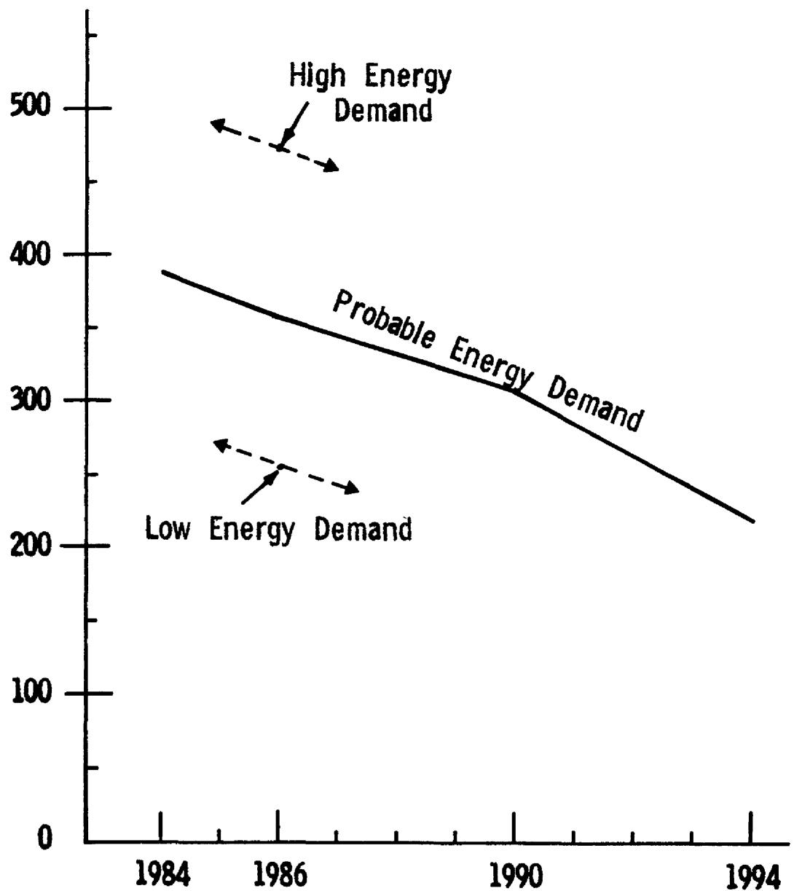
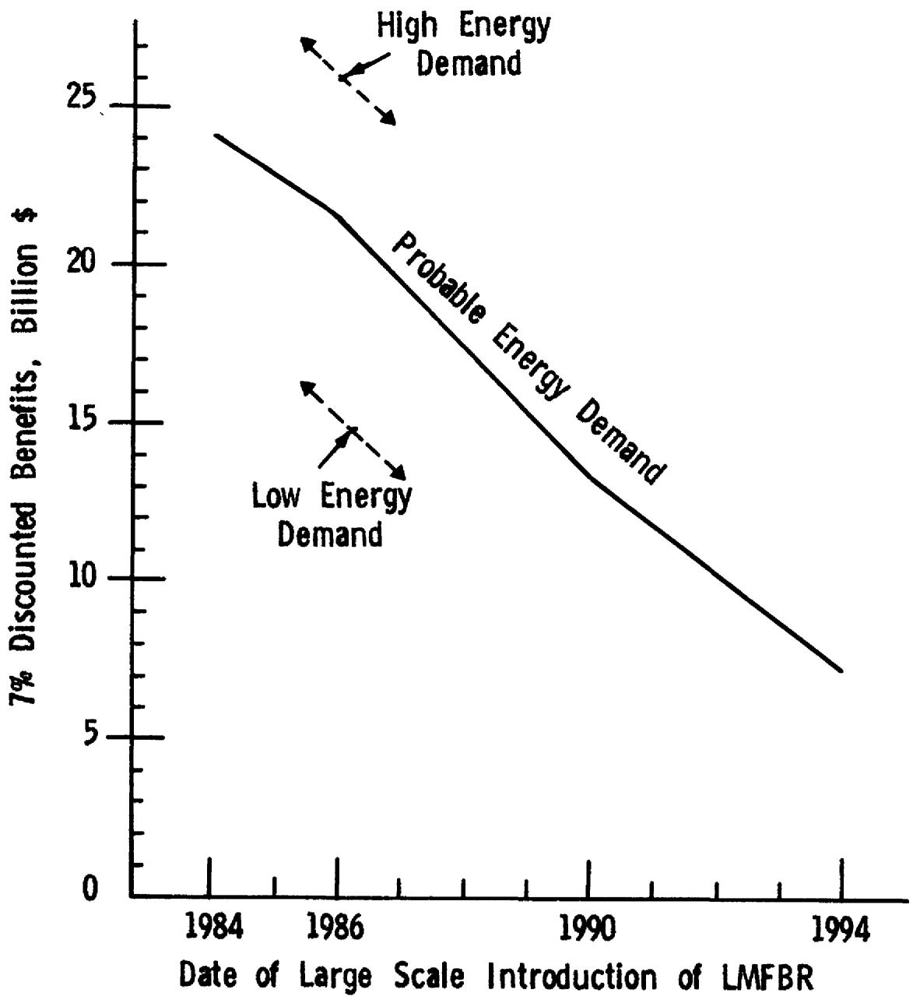
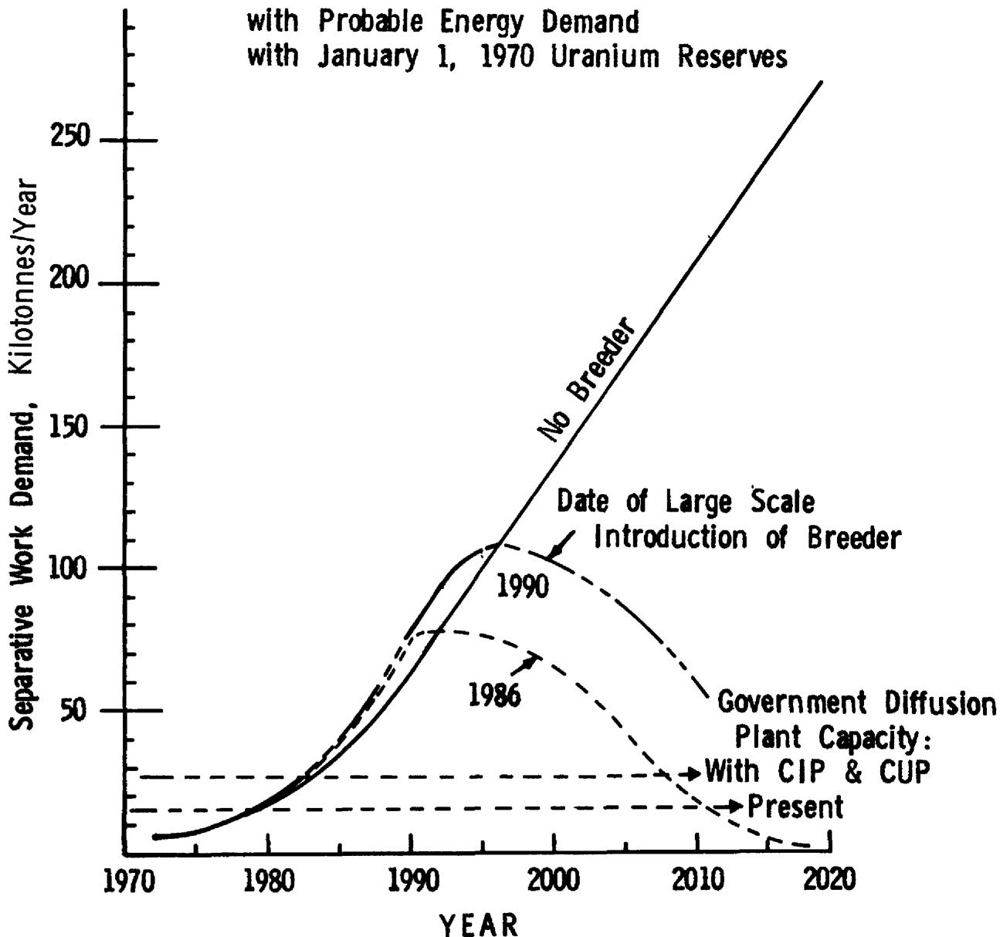
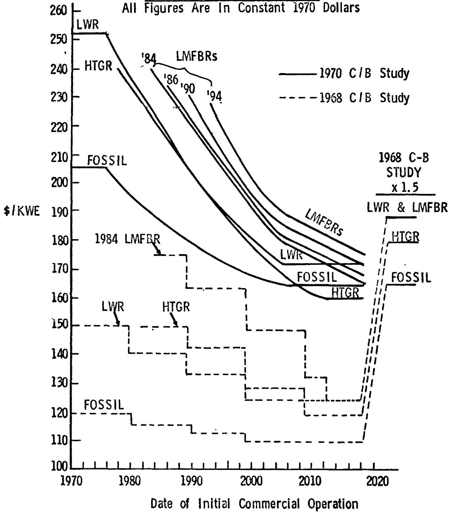
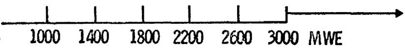
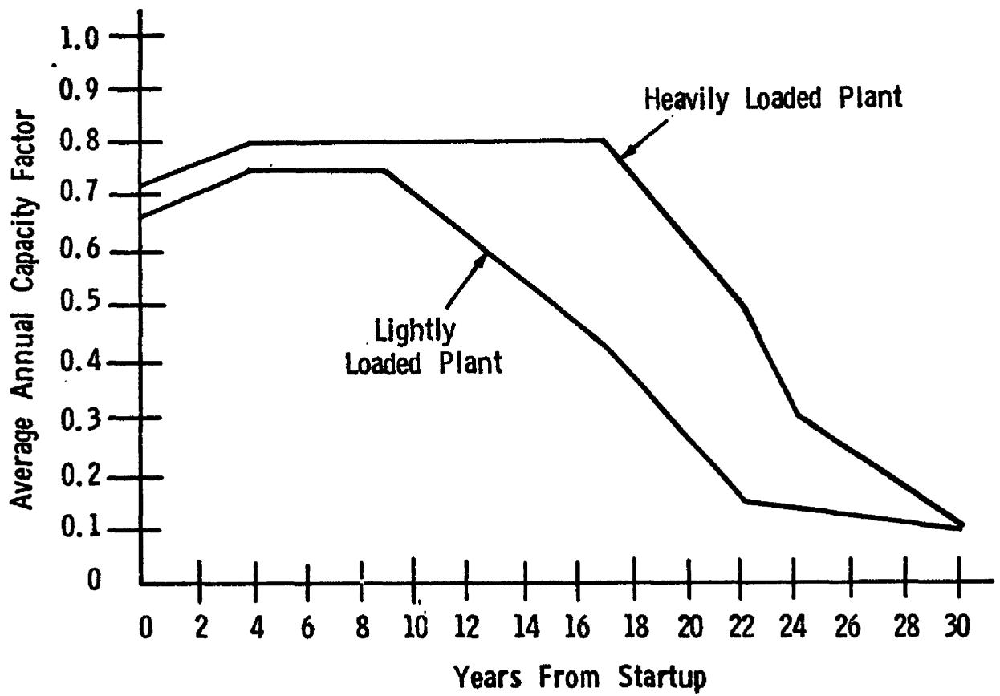

UPDATED (1970)

COST-BENEFIT ANALYSIS

OF THE

U.S. BREEDER REACTOR

PROGRAM

January 1972

# NOTICE

This report was prepared as an account of work sponsored by the United States Government, Neither the United States nor the United States Atomic Energy Commission, nor any of their employees, nor any of their contractors, subcontractors, or their employees, makes any warranty, express or implied, or assumes any legal liability or responsibility for the accuracy, completeness or usefulness of any information, apparatus, product or process disclosed, or represents that its use would not infringe privately owned rights.

# Prepared by

Division of Reactor Development and Technology

U. S. Atomic Energy Commission

# DISCLAIMER

This report was prepared as an account of work sponsored by an agency of the United States Government. Neither the United States Government nor any agency Thereof, nor any of their employees, makes any warranty, express or implied, or assumes any legal liability or responsibility for the accuracy, completeness, or usefulness of any information, apparatus, product, or process disclosed, or represents that its use would not infringe privately owned rights. Reference herein to any specific commercial product, process, or service by trade name, trademark, manufacturer, or otherwise does not necessarily constitute or imply its endorsement, recommendation, or favoring by the United States Government or any agency thereof. The views and opinions of authors expressed herein do not necessarily state or reflect those of the United States Government or any agency thereof.

# DISCLAIMER

Portions of this document may be illegible in electronic image products. Images are produced from the best available original document.

# (Updated Cost-Benefit Analysis)

On June 4, 1971 President Nixon sent to the U.S. Congress a comprehensive Energy Message which proposed a program to ensure an adequate supply of clean energy for the years ahead. This message was the first such action by a President of the U.S. dealing exclusively with this vital subject.

The major theme of the Presidential message was that recent intensive national energy study efforts had converged to the conclusion that comprehensive actions must be taken now to assure the United States a sufficient supply of clean energy to sustain healthy economic growth and to improve the quality of our national life. The message stressed the fact that shortages of electrical power and clean fuel, sharp increases in certain fuel prices, and a growing awareness of environmental consequences of energy production and use have all demonstrated that the United States can no longer take a plentiful supply of energy for granted.

The Energy Message set forth a broad range of specific goals and actions designed to assure the Nation an adequate future supply of clean energy. These direct measures included the assignment of a high priority to civilian nuclear power in meeting the Nation's future needs for electrical energy.

The Message stated that:

"Our best hope today for meeting the Nation's growing demand for economical clean energy lies with the fast breeder reactor."

To realize the immense potential of the fast breeder, the President provided augmented funding for the Liquid Metal Fast Breeder Reactor (LMFBR) and

established a national commitment to complete the successful demonstration of a Liquid Metal Fast Breeder Reactor by 1980.

The substantial benefits to be realized from the breeder were clearly brought out in a 1968 AEC Study entitled "Cost-Benefit Analysis of the U.S. Breeder Program" subsequently published as WASH 1126. This Study indicated that the readily quantifiable benefits of a successful commercial breeder in the form of reduced cost of electrical energy, reductions in uranium ore requirements and separative work demand, increased plutonium production, and use of the depleted uranium byproduct from the diffusion plants would exceed the development costs of the breeder by a significant amount. Other benefits, quantifiable and non-quantifiable, such as those associated with reductions in air pollution and enhanced social values through the availability of low-cost electricity were noted. It is apparent that the results of this Study in combination with other important national studies on alternative energy production systems contributed in a major way to achieving the consensus of support which has developed for the breeder program.

Recognizing the rapidly changing nature of the U.S. energy program, it was decided to update the 1968 Study. The updating, started in 1970, which is reported in this document, indicates that the anticipated benefits are about twice as large as reported in the 1968 Study. This is attributable primarily to the greater electrical energy demands that are now being projected, the increase in the cost of fossil fuels since performing the last study, and the increased cost of uranium separative work which tends to improve the competitive position of the breeder over light water reactors. At a $7\%$ per year discount rate, the anticipated benefits to the Nation in terms of decreased energy costs, as a result of the timely introduction of the breeder, are from 4.5 to 9 times the estimated cost of the development

While these results are highly encouraging, the reader should keep in mind that the primary purpose of this Study is to provide information that will be useful to the AEC, as well as others in the energy and environmental communities, in guiding research and development programs to assure pertinence to the national need. The continuing cost-benefit analysis studies are integral to the LMFBR program that is now entering the demonstration plant phase.

Parametric studies involving projections are a continuing LMFBR program activity. The assumptions basic to these studies are reviewed, the analysis techniques refined, and the studies updated as appropriate. This affords a continuous monitoring of the program and provides a tool which can be used to quickly obtain an indication of the effect of changes on the Nation's electric power system.

It should be noted that analytic studies which extend 50 years into the future should be used primarily to indicate trends that may result from changes in parameters. The validity of the projections is directly dependent on the validity of the assumptions used in the study. The reader should keep this fact and the assumptions clearly in mind when reviewing the results and avoid a natural tendency to use such parameter studies that involve projections into the future as absolute forecasts.

Milton Shaw, Director Division of Reactor Development and Technology

Page

PREFACE 1

1.0 INTRODUCTION 1   
2.0 SUMMARY OF UPDATED COST-BENEFIT ANALYSIS 3   
3.0 DISCUSSION OF COST-BENEFIT ANALYSIS 7   
4.0 MAJOR ASSUMPTIONS USED IN THE ANALYSIS 35

# APPENDIX

"A" - Rationale For Updated (1970) Cost-Benefit Analysis 50  
Fossil Fuel Cost Projection

# GLOSSARY

AEC U.S. Atomic Energy Commission

EBR-II Experimental Breeder Reactor-II

FFTF Fast Flux Test Facility

FPC Federal Power Commission

FUELCO A computer code used for calculating fuel cycle costs

GCFR Gas Cooled Fast Reactor

HTGR High Temperature Gas Reactor

LMFBR Liquid Metal-Cooled Fast Breeder Reactor

LWBR Light Water Breeder Reactor

LWR Light Water Reactor

MSBR Molten Salt Breeder Reactor

PBR Parallel Breeder Reactor

R&D Research and Development

RDT Division of Reactor Development and Technology, AEC

$\mathsf{U}_{3}\mathsf{O}_{8}$ A stable oxide of uranium used as the reference chemical compound for quantitative measurements of uranium. Sales transactions of uranium concentrates ("Yellow Cake") and measurement of reserves are generally based upon theoretical $\mathsf{U}_{3}\mathsf{O}_{8}$ equivalent.

Page

Table 1 - Cases Considered 8   
Table 2 - Summary of Estimated AEC Research and Development Costs 11   
Table 3 - Costs, Benefits, and Benefit/Cost Ratio to Year 2020 for Breeder Program (Undiscounted and Discounted to Mid-1971 @ 7%/Year)   
Table 4 - Uranium and Separative Work Demand Requirements .... 15   
Table 5 - Costs, Benefits, and Benefit/Cost Ratio to Year 2020 for Breeder Program (Undiscounted and Discounted to Mid-1971 @ 5%/Year) 28   
Table 6 - Costs, Benefits, and Benefit/Cost Ratio to Year 2020 for Breeder Program (Undiscounted and Discounted to Mid-1971 @ 7%/Year) 29   
Table 7 - Costs, Benefits, and Benefit/Cost Ratio to Year 2020 for Breeder Program (Undiscounted and Discounted to Mid-1971 @ 10%/Year) 30   
Table 8 - Costs, Benefits, and Benefit/Cost Ratio to Year 2020 for Breeder Program (Undiscounted and Discounted to Mid-1971 @ 12.5%/Year) 31   
Table 9 - Generating Capacity Placed in Operation with Known Uranium Resources as of January 1, 1970, Probable Energy Demand, and HTGR Introduced in 1978 34   
Table 10 - Typical Reactor Characteristics Used in Analysis .... 40   
Table 11 - Representative Fuel Fabrication and Reprocessing Costs 41   
Table 12 - Uranium Cost Versus Supply 42   
Table 13 - Estimates of Electrical Energy Demand 1970-2020 .... 45

Page

Figure 1 - Undiscounted Breeder Benefits, Mid-1971 to 2020 .... 19   
Figure 2 - $7\%$ /Year Discounted Breeder Benefits, Mid-1971 to 2020 20   
Figure 3 - Separative Work Demand 26   
Figure 4 - Capital Cost Ground Rule 37   
Figure 5 - Average Annual Capacity Factor Histories 46

In 1968, the Division of Reactor Development and Technology (RDT), with the assistance of the Hanford Engineering Development Laboratory, performed an analysis of the cost and benefits associated with a number of postulated cases involving the introduction of the breeder reactor into the U.S. electric power economy. This Study was published in April 1969 as WASH-1126, "Cost-Benefit Analysis of the U.S. Breeder Reactor Program." The analysis confirmed that the Liquid Metal-Cooled Fast Breeder Reactor (LMFBR) can produce large direct money benefits by making low-cost electrical energy available to the Nation while simultaneously reducing uranium and separative work requirements. It also indicated that deferring the presently planned LMFBR research and development (R&D) program with consequent delays in the commercial introduction of the LMFBR would reduce the benefits of the LMFBR while slightly increasing the cost of the R&D program.

At the time the 1968 Study was performed, the assumptions were based upon the best information available; however, since then there has been a marked change in the energy economy. The actual consumption of electricity in 1968 and 1969 has been higher than that predicted in 1968, and the Federal Power Commission (PPC) has substantially increased their energy projections. Their currently projected energy demand, with an increase of $25\%$ in the Year 2000, is nearer that of the high energy demand case of the 1968 Study. In the latter part of 1965, the utility industry purchased a number of nuclear power plants. This commitment to nuclear power resulted in a marked increase in uranium prospecting. It has required from three to five years for the results of this prospecting to be realized in an increase in uranium

reserves. Inflation, which has been particularly rampant in the construction trades, the addition of cooling towers, and other costs associated with environmental and safety considerations have caused the capital costs of both fossil and nuclear plants to increase about $50\%$ . Fossil fuel costs, which were projected to remain essentially level in the earlier Study, have actually increased by about $35\%$ due to the enactment of air quality regulations and a temporary shortage of fossil fuel.

Prediction of the combined effects of these changes is not straightforward. The higher energy demand and fossil fuel costs would increase the benefits of developing the breeder while the increased availability of uranium would cause the benefits to decrease. Since capital costs have increased for both fossil and nuclear plants, the effect of capital cost changes on the benefits of developing the breeder is not readily predictable. Because of these uncertainties, it was decided to rerun the cost-benefit analysis using up-to-date assumptions. A number of other updating changes were also made. The separative work cost was revised from the $26 per kilogram used throughout the 1968 Study to$ 27.16 per kilogram for 1970 and 1971 and $32 per kilogram thereafter. The introduction of the breeder was delayed from 1984 to 1986 in line with current planning. Still another change consisted of correcting the computer code to give a more accurate summarization of the benefits. This involved modifying the computer model to include all the energy produced by, and the costs for the entire thirty-year useful life of, all plants built before the cutoff date for calculating benefits. This procedure results in a more accurate indication of the benefits and is consistent with the method used by utilities in performing their system analysis studies.

More attention has also been devoted to selecting the input data in the current analysis. The assumptions are stated in greater detail in Section 4.0.

# 2.0 SUMMARY OF UPDATED COST-BENEFIT ANALYSIS

The Updated Cost-Benefit Analysis of the U.S. Breeder Reactor Program bears out the conclusions of the 1968 Study but with considerably more emphasis. The benefits of the breeder as measured in terms of savings to the Nation's power customers have increased markedly in the current Study. The breeder will not only stabilize the cost of electricity, but will also conserve uranium resources and reduce the amount of uranium separative work capacity required. While the benefits are sensitive to power demand, they remain substantial even at the lowest of the projected demands. The relative capital cost of the LMFBR is an important factor, and the LMFBR power plant designers should keep costs firmly in mind in order to assure that reliable and dependable LMFBR power plants can be built at minimum cost.

The combined effect of the changes in the power economy since 1968 is to increase the $7 \%$ discounted benefits of the breeder by over $100 \%$ -- from $9.1$ billion for the base case of the 1968 Study to $\$ 21.5$ billion for the base case of the updated Study. Of the $\$ 12.4$ billion increase in benefits, $\$ 6.7$ billion is due to the higher energy demand; $\$ 1.2$ billion is due to the higher separative work charge; and $\$ 7.1$ billion is due to the higher fossil fuel costs, higher capital costs, and computer program changes. These increases are partially offset by a $\$ 2.6$ billion decrease due to the two- year slippage in introducing the LMFBR.

Besides the benefits as measured in dollars, breeder reactors will effect substantial savings in uranium resources and the separative work capacity necessary to sustain the Nation's demand for electrical energy. The updated Study indicates that with presently estimated uranium reserves, introduction of the breeder by 1986 will decrease $\mathrm{U}_{3}\mathrm{O}_{8}$ requirements by 2,360,000 short tons, which is over $50\%$ of the $\mathrm{U}_{3}\mathrm{O}_{8}$ requirements if the breeder were not developed. Stated another way, without the breeder the Nation will be using $50 per pound uranium by the Year 2020. With the breeder the Nation will be using only $27.50 per pound uranium by the Year 2020 and, in addition, only a small amount of uranium will be required to sustain the Nation's power economy for many decades beyond 2020. The increased use of higher cost reserves with the breeder, as compared to the estimate used in the 1968 Study, is due to the higher energy demand, the higher utilization of nuclear fuel resulting from the higher cost of fossil fuel, and the two-year delay in introducing the LMFBR. Regarding separation work, the updated Study indicates that without the breeder the separative work capacity required to sustain the Nation's power economy constantly increases reaching 270,000 metric tons per year by 2020. With the breeder, the separative work capacity increases to only 81,000 metric tons per year in 1992 with no additional capacity required beyond 1992.

Sensitivity analyses were run to determine the effects of changes in the LMPBR introduction date, uranium reserves, energy demand, and LMFBR capital costs.

Delaying introduction of the LMFBR to 1990 decreases benefits discounted at $7 \%$ to mid-1971 by $8.2 billion. Therefore, in this four- year timeframe,

every year of delay beyond 1986 costs the Nation about $2 billion a year higher costs of electric power. A further delay to 1994 decreases 7% discounted benefits by another $6.2 billion, so that after 1990, each year of delay costs the Nation about $1.5 billion per year.

If one assumes a more optimistic uranium reserve schedule based on industry continuing its normal pace of exploration activities, the benefits of the breeder to the Year 2020 decrease by only $1.4 billion. This small decrease and lack of sensitivity to uranium supply reflect the breeder's efficient utilization of uranium resources.

The benefits are sensitive to energy demand and it is an important input to the Study. If the energy demand is $20\%$ lower than projected, the breeder's discounted benefits decrease by $6.7 billion; and conversely, if the energy demand is $20\%$ greater than projected, the benefits increase by $4.5 billion. Historical energy usage and future projections should be carefully followed in guiding the Nation's energy policy.

A 10% increase in capital cost of the LMFBR, above those of other nuclear power plants, decreases the $21.5 billion benefits to $10.6 billion which indicates the sensitivity of the benefits to the capital cost of the LMFBR. However, it should be noted that the addition of SO2 removal equipment could result in a cost penalty for fossil plants which would more than compensate for a 10% increase in LMFBR capital costs.

The four major quantifiable conclusions of the analysis are:

(1) The introduction of a breeder into the U.S. electric power utility system will produce significant financial benefits and reduce long-range uranium and separative work requirements.

(2) The benefit-cost ratio is significantly greater than one for the credible cases examined which provides a high incentive for a strong R&D program.   
(3) Deferring the LMFBR introduction date reduces the $7 \%$ discounted benefits by about $2 billion per year; thus, there is a strong incentive to introduce the breeder at the earliest possible date.   
(4) The increase in fossil fuel prices in the United States, since the 1968 Study was completed, has adversely affected the competitive position of fossil fuel plants.

As stated in the report of the 1968 Study, there are many other benefits not as readily susceptible to quantitative analysis but of substantial consequence, which would accrue from early introduction of the breeder. A number of these relate to the significant economic, technological and industrial coupling between the Light Water Reactor (LWR) and the Fast Breeder Reactor (FBR). These benefits include:

(1) Access to a virtually limitless supply of low-cost electricity and the potential use of this low-cost electricity in energy intensive applications.   
(2) An ample supply of low-cost electricity to areas which have been denied low-cost energy.   
(3) The virtual elimination of air pollution from electric power plants.   
(4) Assurance that low-cost uranium ore reserves will be most efficiently used.   
(5) A premium market for plutonium produced by LWRs.   
(6) The most beneficial utilization of the stockpile of depleted uranium from the diffusion plants.

The efficient use of the manpower and the facility resources committed to the breeder program by the Atomic Energy Commission (AEC) National Laboratories, by U.S. industry and U.S. utilities.

(8) Stimulation of improved efficiency and economy in other energy producing industries, including those associated with the production, transportation, and utilization of fossil fuels.   
(9) Increased use of the technical and economic ties as a principal vehicle for international cooperation and a means for promoting peace and industrial development in other countries.   
(10) The continued preeminence of the U.S. in its leadership role in nuclear power.

# 3.0 DISCUSSION OF COST-BENEFIT ANALYSIS

# 3.1 Method of Cost-Benefit Analysis

Seven groups of calculations consisting of 16 cases are presented in this report. The calculations indicate the benefits accrued from an economy with a breeder as compared to an economy with only fossil, LWR, and High Temperature Gas Reactor (HTGR) power plants. By varying the input data, the effects of potential situations and the sensitivity of the results to the assumptions can be investigated. The characteristics of the seven groups are presented in Table 1. Each group consists of a base case without a breeder and cases with a breeder represented by the LMFBR. The cases with the breeder indicate that the required energy could be produced less expensively than the corresponding case without the breeder and the difference represents the dollar benefit of the breeder.

The seven groups were designed to determine the effect of varying the date of introduction of the breeder, varying uranium resources, varying energy

Cases Considered

TABLE 1   
UPDATED (1970) COST-BENEFIT ANALYSIS   

<table><tr><td>Case No.</td><td>LMFBR
Introduction Date</td><td>Uranium Reserves
Versus Cost</td><td>Energy
Demand</td></tr><tr><td>1</td><td>NONE</td><td>1/1/70 Estimate</td><td>Probable</td></tr><tr><td>2</td><td>1984</td><td>&quot;</td><td>&quot;</td></tr><tr><td>3</td><td>1986</td><td>&quot;</td><td>&quot;</td></tr><tr><td>4</td><td>1990</td><td>&quot;</td><td>&quot;</td></tr><tr><td>5</td><td>1994</td><td>&quot;</td><td>&quot;</td></tr><tr><td>6</td><td>NONE</td><td>Optimistic</td><td>Probable</td></tr><tr><td>7</td><td>1986</td><td>&quot;</td><td>&quot;</td></tr><tr><td>8</td><td>NONE</td><td>Unlimited</td><td>Probable</td></tr><tr><td>9</td><td>1986</td><td>&quot;</td><td>&quot;</td></tr><tr><td>10</td><td>NONE</td><td>1/1/70 Estimate</td><td>Low</td></tr><tr><td>11</td><td>1986</td><td>&quot;</td><td>&quot;</td></tr><tr><td>12</td><td>NONE</td><td>1/1/70 Estimate</td><td>High</td></tr><tr><td>13</td><td>1986</td><td>&quot;</td><td>&quot;</td></tr><tr><td>14*</td><td>1986</td><td>1/1/70 Estimate</td><td>Probable</td></tr><tr><td>15**</td><td>NONE</td><td>1/1/70 Estimate</td><td>Probable</td></tr><tr><td>16***</td><td>1986</td><td>&quot;</td><td>&quot;</td></tr></table>

*Same as case 3 but with LMFBR capital costs increased by $10\%$ .   
Without HTGR.

demand, increasing the capital cost of the breeder, and the ability of the HTGR to penetrate the market.

The date of breeder introduction was parameterized for 1984, 1986, 1990 and 1994 (cases 2, 3, 4 and 5).

Uranium reserves estimated as of January 1, 1970 were used as the basis for most of the projections. Two groups were calculated with varying uranium resources. In the first group, cases 6 and 7, the uranium resources are estimated to be those that will probably be found if industry maintains a normal rate of exploration and development. In the second group, cases 8 and 9, an unlimited availability of $8 per pound of U₃O₈ was assumed.

While unlimited amounts of uranium are not expected to be available at this price, the group was calculated to serve as a boundary limitation and reference point against which other cases may be measured.

Two groups were calculated with varying energy demands. The first group, cases 10 and 11, was for a demand approximately $20\%$ lower than the base energy demand. This is also approximately equivalent to the base demand of the 1968 Study and, therefore, serves as a basis for comparison to the 1968 Study. The second group, cases 12 and 13, was calculated for an energy demand approximately $20\%$ higher than the base case and represents a high or maximum energy demand situation.

One case (case 14) was calculated with the capital cost of the LMFBR power plant increased by $10\%$ , while the cost of other plants remained constant. This $10\%$ increase is approximately equivalent to a one-third increase in cost of the LMFBR nuclear steam supply system. Since the steam turbine and generator of the LMFBR are essentially the same as those used in modern

fossil fueled power plants, no relative cost increase would be anticipated in these portions of the plant. Therefore, the $10\%$ increase in total plant costs represents a very significant increase in the cost of the nuclear steam supply system.

The final group (cases 15 and 16) was calculated to measure the effect on benefits when the HTGR is removed from the calculational model. Case 15 models the power economy if the most probable energy requirements are met with fossil and LWR reactors, and case 16 if power requirements are met with fossil, LWR, and breeder plants with large-scale introduction of the LMFBR in 1986.

# 3.2 Research and Development Costs

Table 2 summarizes the results of an R&D cost analysis for the period mid-1971 to 2020 with and without introduction of the breeder. The assumptions used for R&D costs are discussed in section 4.0 entitled Major Assumptions Used in the Cost-Benefit Analysis.

The analysis assumed successful R&D programs and a viable and competitive nuclear industry for each concept introduced into the utility market. The R&D costs listed in Table 2 were estimated for the following cases:

Case A: LWR + Advanced converter as represented by the HTGR

Case B: LWR + HTGR + breeder with 5 alternatives listed below, including a Parallel Breeder Reactor (PBR) program:

Summary Of Estimated AEC Research & Development Costs

Cumulative Costs From Fiscal Year 1972 (Mid-1971) To 2020

Billions of Dollars

TABLE 2   
UPDATED (1970) COST-BENEFIT ANALYSIS   

<table><tr><td rowspan="2"></td><td>Case A</td><td colspan="5">Date of LMFBR Introduction</td></tr><tr><td>LWR &amp; HTGR</td><td>B-1</td><td>B-2</td><td>B-3</td><td>B-4</td><td rowspan="2">B-5 1986 with PBR in 1994</td></tr><tr><td>Breeders</td><td></td><td>1984</td><td>1986</td><td>1990</td><td>1994</td></tr><tr><td>LMFBR</td><td></td><td>2.3</td><td>2.5</td><td>3.1</td><td>3.7</td><td>2.5</td></tr><tr><td>Other Breeders</td><td></td><td>0.1</td><td>0.1</td><td>0.1</td><td>0.1</td><td>1.9</td></tr><tr><td>Supporting Technology</td><td></td><td>1.0</td><td>1.2</td><td>1.4</td><td>1.6</td><td>1.6</td></tr><tr><td>Total Breeders</td><td></td><td>3.4</td><td>3.8</td><td>4.6</td><td>5.4</td><td>6.0</td></tr><tr><td>Non-Breeders</td><td></td><td></td><td></td><td></td><td></td><td></td></tr><tr><td>Converters</td><td>0.1</td><td>0.1</td><td>0.1</td><td>0.1</td><td>0.1</td><td>0.1</td></tr><tr><td>Supporting Technology</td><td>0.4</td><td>0.4</td><td>0.4</td><td>0.4</td><td>0.4</td><td>0.4</td></tr><tr><td>Total Non-Breeders</td><td>0.5</td><td>0.5</td><td>0.5</td><td>0.5</td><td>0.5</td><td>0.5</td></tr><tr><td>General Support</td><td></td><td>2.7</td><td>2.5</td><td>2.3</td><td>2.1</td><td>2.6</td></tr><tr><td>Grand Total</td><td></td><td>6.6</td><td>6.8</td><td>7.4</td><td>8.0</td><td>9.1</td></tr><tr><td>Total Discounted to Mid-1971 @</td><td></td><td></td><td></td><td></td><td></td><td></td></tr><tr><td>5%</td><td>...</td><td>3.7</td><td>3.8</td><td>4.1</td><td>4.3</td><td>5.2</td></tr><tr><td>7%</td><td>...</td><td>3.2</td><td>3.3</td><td>3.5</td><td>3.6</td><td>4.4</td></tr><tr><td>10%</td><td>...</td><td>2.7</td><td>2.7</td><td>2.8</td><td>2.9</td><td>3.6</td></tr><tr><td>12.5%</td><td>...</td><td>2.4</td><td>2.4</td><td>2.5</td><td>2.5</td><td>3.1</td></tr><tr><td>Total Breeders Discounted to Mid-1971 @</td><td></td><td></td><td></td><td></td><td></td><td></td></tr><tr><td>5%</td><td>...</td><td>2.5</td><td>2.7</td><td>3.1</td><td>3.4</td><td>4.0</td></tr><tr><td>7%</td><td>...</td><td>2.3</td><td>2.4</td><td>2.7</td><td>2.9</td><td>3.6</td></tr><tr><td>10%</td><td>...</td><td>2.0</td><td>2.1</td><td>2.3</td><td>2.4</td><td>3.0</td></tr><tr><td>12.5%</td><td>...</td><td>1.8</td><td>1.9</td><td>2.0</td><td>2.1</td><td>2.6</td></tr></table>

B-1 Accelerated breeder program 1984   
B-2 Currently planned breeder program 1986   
B-3 Four-year delay in breeder development program 1990   
B-4 Eight-year delay in breeder development program 1994   
B-5 PBR program with parallel breeder introduced 1986

in 1994

Commercial introduction is defined as the date when a significant number of commercial-sized LMFBR power plants become operational.

The results of the R&D cost analysis indicate that undiscounted R&D costs for the breeder program vary from $3.4 billion for an accelerated program introducing an LMFBR in 1984 to$ 6.0 billion for a PBR program. Based on a 7%/yr. discount rate, the discounted breeder R&D costs vary from $2.3 billion to $3.6 billion. The cost of the current program discounted 7%/yr. to mid-1971 is $2.4 billion which increases to $2.7 and $2.9 billion when introduction of the breeder is delayed to 1990 and 1994, respectively.

The basic reason for the increase in R&D costs for delayed introduction of the breeder is the additional R&D costs incurred in the stretchout of a program. The stretchout involves expenditures in phasing down or phasing out subprograms and expenditures involved in restarting these subprograms at a later date, including those costs associated with the difficult task of reassembling resources, replacing lost personnel, retraining personnel, and replacing deteriorated facilities and equipment.

The costs are slightly lower than for the 1968 Study because there are two less years of expenditures, and funds allocated to Other Breeder R&D and Supporting Technology have been reduced.

# 3.3 Results of Analysis

# 3.3.1 Benefits and Benefit/Cost Ratios

The results of the cost-benefit analysis which include costs, benefits, benefit-cost ratios, uranium demand, separative work demand and nuclear capacities are summarized in Tables 3 and 4. A $7\%$ /yr. discount rate was used.

# 3.3.2 Current Program

Assuming the availability of the HTGR, the undiscounted gross benefits (Table 3), directly resulting from dollar savings in cost of electric energy associated with the currently planned breeder program (1986 introduction), range from $10 billion to $475 billion (cases 8 minus 9 and 12 minus 13) in the time period from mid-1971 to 2020, depending on the assumptions of uranium costs and electrical energy demand.

During this period, the estimated reduction in $\mathsf{U}_{3}\mathsf{O}_{8}$ requirements would range from 1,900 to 3,600 kilotons, and the reduction of maximum domestic separative work demand would range from 140 to 230 kilotonnes per year. Discounted to mid-1971 at $7\%$ /yr., the present worth gross benefits for the current program from lower energy costs alone range from $1.2 to $26.0 billion. The highest benefit is associated with the January 1, 1970 estimate of uranium reserves and the high* energy demand (case 12 minus 13), while the lowest benefit is associated with unlimited* availability of $8/1b. $\mathsf{U}_{3}\mathsf{O}_{8}$ and the probable* energy demand (case 8 minus 9). Other major tangible benefits are reduction in air pollution, the production of a large

# TABLE 3

# UPDATED (1970) COST-BENEFIT ANALYSIS

Costs, Benefits, and Benefit-Cost Ratio to Year 2020 for Breeder Program

At $7 \%$ Per Year Discount Rate

(Dollar Figures are in Billions of Dollars)

<table><tr><td rowspan="2">Case No.</td><td rowspan="2">Uranium Reserves vs. Cost</td><td rowspan="2">Energy Demand</td><td rowspan="2">Date of Introduction LMFBR</td><td colspan="2">Undiscounted</td><td colspan="5">Discounted to Mid-1971 @ 7%Yr.</td></tr><tr><td>Energy Cost</td><td>Gross Benefit</td><td>(1) Energy Cost</td><td>(2) Gross Benefit</td><td>(3) R &amp; D Cost</td><td>(2)-(3) Net Benefit</td><td>(2)-(3) Benefit to Cost Ratio</td></tr><tr><td>1</td><td>1/70 Est.</td><td>Probable</td><td>NONE</td><td>2704</td><td>-</td><td>437.4</td><td>-</td><td>-</td><td>-</td><td>-</td></tr><tr><td>2</td><td>&quot;</td><td>&quot;</td><td>1984</td><td>2316</td><td>388</td><td>413.3</td><td>24.1</td><td>2.3</td><td>21.8</td><td>10.5</td></tr><tr><td>3</td><td>&quot;</td><td>&quot;</td><td>1986</td><td>2346</td><td>358</td><td>415.9</td><td>21.5</td><td>2.4</td><td>19.1</td><td>9.0</td></tr><tr><td>4</td><td>&quot;</td><td>&quot;</td><td>1990</td><td>2398</td><td>306</td><td>424.1</td><td>13.3</td><td>2.7</td><td>10.6</td><td>4.9</td></tr><tr><td>5</td><td>&quot;</td><td>&quot;</td><td>1994</td><td>2485</td><td>219</td><td>430.3</td><td>7.1</td><td>2.9</td><td>4.2</td><td>2.4</td></tr><tr><td>6</td><td>Optimistic</td><td>&quot;</td><td>NONE</td><td>2667</td><td>-</td><td>433.5</td><td>-</td><td>-</td><td>-</td><td>-</td></tr><tr><td>7</td><td>&quot;</td><td>&quot;</td><td>1986</td><td>2328</td><td>339</td><td>413.4</td><td>20.1</td><td>2.4</td><td>17.7</td><td>8.4</td></tr><tr><td>8</td><td>Unlimited</td><td>&quot;</td><td>NONE</td><td>2244</td><td>-</td><td>409.6</td><td>-</td><td>-</td><td>-</td><td>-</td></tr><tr><td>9</td><td>&quot;</td><td>&quot;</td><td>1986</td><td>2234</td><td>10</td><td>408.4</td><td>1.2</td><td>2.4</td><td>(1.2)</td><td>0.5</td></tr><tr><td>10</td><td>1/70 Est.</td><td>Low</td><td>NONE</td><td>2096</td><td>-</td><td>349.2</td><td>-</td><td>-</td><td>-</td><td>-</td></tr><tr><td>11</td><td>&quot;</td><td>&quot;</td><td>1986</td><td>1842</td><td>254</td><td>334.4</td><td>14.8</td><td>2.4</td><td>12.4</td><td>6.2</td></tr><tr><td>12</td><td>&quot;</td><td>High</td><td>NONE</td><td>3332</td><td>-</td><td>523.3</td><td>-</td><td>-</td><td>-</td><td>-</td></tr><tr><td>13</td><td>&quot;</td><td>&quot;</td><td>1986</td><td>2857</td><td>475</td><td>497.3</td><td>26.0</td><td>2.4</td><td>23.6</td><td>10.8</td></tr><tr><td>14*</td><td>&quot;</td><td>Probable</td><td>1986</td><td>2449</td><td>255</td><td>426.5</td><td>10.9</td><td>2.4</td><td>8.5</td><td>4.5</td></tr><tr><td>15**</td><td>&quot;</td><td>&quot;</td><td>NONE</td><td>3466</td><td>-</td><td>461.7</td><td>-</td><td>-</td><td>-</td><td>-</td></tr><tr><td>16**</td><td>&quot;</td><td>&quot;</td><td>1986</td><td>2387</td><td>1079</td><td>419.4</td><td>42.3</td><td>2.4</td><td>39.9</td><td>17.6</td></tr></table>

*with 10% higher LMFBR plant capital costs   
\*\*without HTGR

# TABLE 4

# UPDATED (1970) COST-BENEFIT ANALYSIS

# Uranium And Separative Work Demand Requirements

<table><tr><td rowspan="2">Case No.</td><td rowspan="2">Uranium Reserves vs. Cost</td><td rowspan="2">Energy Demand</td><td rowspan="2">Date of Introduction LMFBR</td><td colspan="2">\( U_{3}O_{8} \)Required To Year 2020 Kilotons</td><td colspan="2">Separative Work*** Demand Kilotonnes Per Year</td></tr><tr><td>Required</td><td>Savings</td><td>Required</td><td>Savings</td></tr><tr><td>1</td><td>1/70 Est.</td><td>Probable</td><td>NONE</td><td>4531</td><td>-</td><td>269.6</td><td>-</td></tr><tr><td>2</td><td>&quot;</td><td>&quot;</td><td>1984</td><td>1929</td><td>2602</td><td>68.0</td><td>201.6</td></tr><tr><td>3</td><td>&quot;</td><td>&quot;</td><td>1986</td><td>2171</td><td>2360</td><td>80.9</td><td>188.7</td></tr><tr><td>4</td><td>&quot;</td><td>&quot;</td><td>1990</td><td>2589</td><td>1942</td><td>108.3</td><td>161.3</td></tr><tr><td>5</td><td>&quot;</td><td>&quot;</td><td>1994</td><td>3129</td><td>1402</td><td>132.9</td><td>136.7</td></tr><tr><td>6</td><td>Optimistic</td><td>&quot;</td><td>NONE</td><td>4639</td><td>-</td><td>271.5</td><td>-</td></tr><tr><td>7</td><td>&quot;</td><td>&quot;</td><td>1986</td><td>2320</td><td>2319</td><td>81.0</td><td>190.5</td></tr><tr><td>8</td><td>Unlimited</td><td>&quot;</td><td>NONE</td><td>6636</td><td>-</td><td>221.2</td><td>-</td></tr><tr><td>9</td><td>&quot;</td><td>&quot;</td><td>1986</td><td>3043</td><td>3593</td><td>77.0</td><td>144.2</td></tr><tr><td>10</td><td>1/70 Est.</td><td>Low</td><td>NONE</td><td>3740</td><td>-</td><td>214.0</td><td>-</td></tr><tr><td>11</td><td>&quot;</td><td>&quot;</td><td>1986</td><td>1798</td><td>1942</td><td>64.0</td><td>150.0</td></tr><tr><td>12</td><td>&quot;</td><td>High</td><td>NONE</td><td>5327</td><td>-</td><td>333.0</td><td>-</td></tr><tr><td>13</td><td>&quot;</td><td>&quot;</td><td>1986</td><td>2419</td><td>2908</td><td>99.3</td><td>233.7</td></tr><tr><td>14*</td><td>&quot;</td><td>Probable</td><td>1986</td><td>2216</td><td>2315</td><td>83.0</td><td>186.6</td></tr><tr><td>15**</td><td>&quot;</td><td>&quot;</td><td>NONE</td><td>4540</td><td>-</td><td>220.6</td><td>-</td></tr><tr><td>16**</td><td>&quot;</td><td>&quot;</td><td>1986</td><td>2152</td><td>2388</td><td>69.8</td><td>150.8</td></tr></table>

\*with $10 \%$ higher LMFBR plant capital costs   
\*\*without HTGR   
***To put this into perspective, the three existing U.S. diffusion plants, after completion of the approved program for cascade improvement, when operating at 6100 MWe will produce 22 kilotonnes of separative work units per year.

supply of plutonium, the large reduction in separative work demand, and efficient and economic use of the depleted uranium stockpile.

Of the cases studied, the most conservative likely case is associated with the January 1, 1970 estimate of uranium reserves, probable or medium energy demand, and the currently planned large-scale introduction of the breeder in 1986 (cases 1 minus 3, Table 3). The results of this case show undiscounted gross benefits of $358 billion, gross discounted benefits of $21.5 billion, net benefits accruing from the breeder program of $19.1 billion, and a benefit-cost ratio of 9.0. This case would also result in a reduction in U3O8 requirements of 2360 kilotons, and a reduction in maximum separative work demand of 189 kilotonnes per year.

# 3.3.3 Early Introduction of the Breeder

As shown in Table 3, the benefit-cost ratio of introducing the breeder in 1984 is 10.5 compared to 9.0 for introduction of the breeder in 1986. The additional benefits of advancing the large-scale introduction of the breeder by two years is $2.7 billion or $1.3 billion per year.

# 3.3.4 Parallel Breeder Reactor (PBR) Program

Using the assumptions delineated in Section 4.12 Research and Development Program, a tentative case can be made to improve the industrial breeder base by establishing a PBR program. The benefits of the LMFBR program would be sufficient to maintain benefit-cost ratios in excess of one for a 1986 or earlier introduction of the LMFBR, and a 1994 introduction of the PBR for all but one of the cases considered, using discount rates of $7\%$ /yr. or less. Only the unlimited $\$ 8$ per pound of $\mathrm{U}_{3} \mathrm{O}_{8}$ group, which is not considered to represent a real situation, would fail to support a PBR program. Because

of the technical status and other factors, the decision on whether to establish a PBR program would have to await further analyses of alternative breeder concepts, such as the Molten Salt Breeder Reactor (MSBR), or the Gas-Cooled Fast Reactor (GCFR).

If justified by further analysis, a PBR program could strengthen the nuclear posture of the U.S. by providing increased industrial competition, broadening the industrial manufacturing base, and strengthening the industrial base of nuclear technology. The cost-benefit analysis has assumed the possibility of such a parallel breeder program in each of the groups analyzed. On the basis of a 1986 LMFBR introduction and the selection of a parallel breeder concept by 1973, the PBR would be introduced in 1994.

# Discussion of Parallel Breeder Results

Table 2 indicates that a parallel full-scale development program will cost $5.0 billion undiscounted, or an additional $2.2 billion above the current breeder program, assuming introduction of the LMFBR in 1986 and the PBR in 1994. Discounted to mid-1971 at 7%/yr., the additional cost will be $1.2 billion.

Assuming that no additional gross benefits would be obtained as a result of the PBR program, the benefit-cost ratios at the discount rate of $7\%/\mathrm{yr}$ . range from 7.2 to 0.3 for a parallel breeder program for all cases which included the HTGR (refer to Tables 2 and 3). This may be compared to a range from 10.8 to 0.5 for the current breeder program for all cases with the HTGR. The results indicate that the early introduction of the LMFBR provides tangible quantifiable benefits sufficiently large to adequately support the cost of a

PBR program for most of the cases studied at discount rates of $7\%$ /yr. or less and at discount rates up to $10\%$ /yr. with existing uranium resources and the most probable, or medium, energy demand.

# 3.3.5 Sensitivity of Results to Changes in Parameters

Factors influencing the benefits of the breeder which are not subject to administrative decision (level of R&D support for example), but are dependent on the prevailing total economic structure, include parameters such as breeder introduction date, uranium reserves versus cost, electrical energy demand, capital costs of the breeder, and the degree of utility acceptance of the HTGR.

The sensitivity of benefits to changes in a parameter provides an indication of the extent to which uncertainty in a parameter affects the results. The sensitivity of important parameters is discussed in the following paragraphs.

# 1. Breeder Introduction Date

Although benefits are derived from the introduction of the breeder into the commercial market regardless of the date, these benefits are substantially affected by the date of introduction. For example, examination of Table 3 shows that delaying the breeder four years beyond 1986 increases the power production costs to the Year 2020 by $52 billion. Delaying another four years to the Year 1994 increases the power production costs by another $87 billion. Conversely, if the breeder is introduced in 1984 rather than 1986, power costs decrease by $30 billion. The variation of benefits with the date of large-scale introduction of the LMFBR is also shown on Figure 1.

with January 1, 1970 Uranium Reserves   
Undiscounted Benefits, Billion $   
  
Date of Large Scale Introduction of LMFBR

with January 1, 1970 Uranium Reserves

Figure 2 shows the variation of the $7 \%$ /yr. discounted benefits with the date of large- scale introduction of the breeder. The figure graphically shows the decrease in benefits resulting from a delay in the introduction of the breeder. The sensitivity of benefits to schedule delay is such that for each year of delay in the introduction date of the breeder, the $7 \%$ /yr. discounted benefits decrease by about $\$ 1.3$ to $\$ 2.0$ billion per year of delay. It is clear that these results, considering only reductions in energy cost resulting from delay, provide a strong incentive for the timely development of the breeder reactor.

# 2. Uranium Cost Versus Supply

The effect of the uranium cost versus supply schedule is indicated by comparing cases 1 and 3 with cases 6 and 7 in Table 3. Cases 1 and 3 use the uranium cost versus supply schedule generally agreed to represent uranium resources estimated as of January 1, 1970, and cases 6 and 7 use a more optimistic schedule representative of the resources that may be found if sufficient time is allowed for discovery and exploitation. The benefits of the breeder discounted at $7\%$ /yr. decrease by $\$1.4$ billion, from $\$21.5$ to $\$20.1$ billion. This lack of sensitivity to uranium supply reflects the breeder's efficient utilization of uranium resources.

# 3. Electrical Energy Demand

The electrical energy demand was projected to the Year 2020 by extrapolating FPC estimates to the Year 2000 by an additional twenty years. An annual growth rate of $4.8\%/\mathrm{yr}$ . was used for the

first ten-year period and $3.8\%$ /yr. for the second ten-year period.

These growth rates compare with an FPC growth rate of $5.84\%/\mathrm{yr}$ .

from 1990 to the Year 2000. Energy demands $20\%$ lower and $20\%$

higher than the FPC estimate were then selected for the Year 2000

and curves fitted from the 1970 demand through the Year 2000

demand. (See Section 4.9, Table 13). Cases 10 and 11 represent

the low energy demand situation and cases 12 and 13 the high

energy demand situation. The $7\%$ /yr. discounted benefits of the

breeder decrease $31\%$ (\$6.7 billion) when the energy demand is

lowered 20% and increase 21% ($4.5 billion) when the energy

demand is increased $20\%$ . This is shown on Figure 2. This

relatively high sensitivity of the results to energy demand

indicates the importance of accurate energy demand projections to

the validity of such studies.

The low energy demand of this Study corresponds to the base energy

demand of the 1968 Study. The $7\%$ /yr. discounted benefits of the

low energy demand case is $14.8 billion and compares with benefits

of $9.1 billion for the base case of the 1968 Study. This increase

in benefits is due to the increased fossil fuel prices, increased

uranium separative work charge, and a change in the computer

program to include the entire thirty-year energy production and

costs for reactors placed on the line prior to the Year 2020 cut

off time of the program.

# 4. Capital Cost of the Breeder

In order to determine the sensitivity of benefits to the capital

cost of the breeder, the capital cost of the entire LMFBR power

plant was increased by $10\%$ while the capital cost of the other power plants remained constant, (case 14). This increase is conservatively equal to a one-third increase in the cost of the nuclear island.

This increase decreases the 7%/yr. discounted benefits from $21.5 billion to $10.6 billion and indicates a high degree of sensitivity to capital costs.

It should be noted that there are also uncertainties in the capital costs of other plants. For example, the repetitive capital cost of HTGR power plants on a commercial basis is not yet known. Although not factored into this Study, the addition of $\mathsf{SO}_2$ removal equipment to fossil fuel plants could result in a cost penalty which would more than compensate for a $10\%$ increase in the LMFBR power plant capital costs.

# 5. Effect of Introduction of HTGR

Assuming that the HTGR does not penetrate the commercial market (cases 15 and 16) increases the 7%/yr. discounted benefits of the breeder almost 100%, from $21.5 billion to $42.3 billion. This is attributable to the fact that, without the HTGR, the base cost of producing power, using only fossil plants and the LWR, is markedly increased.

# 6. Uranium Requirements

Table 4 provides an indication of the substantial savings in uranium to be gained from the early development of the breeder. Assuming the probable energy demand and known uranium resources as of January 1, 1970, the results show a reduction in $\mathrm{U}_{3} \mathrm{O}_{8}$

requirements to the Year 2020 of 2360 (4531 - 2171) kilotons of $\mathsf{U}_3\mathsf{O}_8$ for an economy with the breeder introduced in 1986, as compared to an economy without an LMFBR. A four-year delay, or 1990 introduction of the breeder, results in a reduction of 1942 (4531 - 2589) kilotons of $\mathsf{U}_3\mathsf{O}_8$ , as compared to an economy with no LMFBR, and a further four-year delay, or 1994 introduction, results in a reduction of 1402 (4531 - 3129) kilotons.

Assuming the more optimistic uranium cost versus supply schedule and the probable electrical demand, the results show a reduction in uranium requirements of 2319 (4639 - 2320) kilotons when the breeder is introduced in 1986, as compared to an economy without an LMFBR. The small change in uranium savings (from 2360 kilotons with the present uranium reserve schedule to 2319 kilotons with an optimistic uranium reserve schedule) indicates that uranium requirements are insensitive to the uranium resource schedule.

The greater use of uranium, than projected in the 1968 Study, reflects the impact of the higher energy demand, the higher cost of fossil fuel which results in increased utilization of nuclear fuel, and the two-year delay in introducing the LMFBR.

# 7. Separative Work Demand

Table 4 also provides an indication of substantial savings in uranium separative work capacity by development of the breeder. Assuming the probable energy demand and known uranium resources as of January 1, 1970, the results show a reduction in maximum annual separative work demand over the time period studied of 188.7 (269.6 - 80.9) kilotonnes/yr. for an economy with the LMFBR

introduced in 1986 as compared to an economy without an LMFBR. A four-year delay (1990 introduction) of the breeder results in a reduction of 161.3 (269.6 - 108.3) kilotons/yr. as compared to an economy without an LMFBR. A further four-year delay (1994 introduction) results in a reduction of 136.7 (269.6 - 132.9) kilotons/yr.

Assuming the more optimistic uranium cost versus supply schedule and the probable energy demand, the results show a reduction in separative work requirements of 190.5 (271.5 - 81.0) kilotonnes/yr. when the breeder is introduced in 1986 as compared to an economy without an LMFBR. The small change in separative work capacity savings (from 188.7 kilotonnes/yr. with the present uranium reserve schedule to 190.5 with an optimistic uranium reserve schedule) indicates that separative work capacity is also insensitive to the uranium resource schedule.

Figure 3 indicates the separative work demand versus time for meeting the probable energy demand with presently known uranium reserves for the cases where there is no breeder, and where large-scale introduction of the breeder takes place in 1986 and in 1990. Figure 3 shows that while the breeder cases indicate lower separative work requirements in the long term, they also indicate higher requirements in the years up to and immediately after the large-scale introduction of the breeder. This is because the breeder limits uranium demand and price to about one-half the price when there is no breeder and because the

# FIGURE 3 UPDATED (1970) COST-BENEFIT ANALYSIS

# SEPARATIVE WORK DEMAND

breeder provides a ready market for plutonium produced by LWRs. These considerations provide an increased economic incentive to build LWRs. Thus, the anticipated introduction of the breeder could significantly increase the demand for LWRs and diffusion plant capacity through the early 1990's.

# 8. Sensitivity of Benefits to Varying Discount Rates

The use of various discount rates and the choice of a discount rate for comparing the results of a cost-benefit study of an electric power economy was discussed in detail in the 1968 "Cost-Benefit Analysis of the U.S. Breeder Reactor Program," WASH-1126 (see pp. 37-41). Interest rates have increased since 1968, but when performing a study covering a fifty-year period, long-term interest rates must be considered. While the electric power industry is presently feeling the effects of the higher interest rates, it is not certain that the current high interest rates will become permanent. In addition, a significant fraction of the U.S. electric generation is performed by public utilities which have a cost of money lower than private utilities. Therefore, a $7\%$ /yr. discount rate was used as approximating the average long-term discount rate for the whole U.S. electric utility industry.

The computer model minimized the sum of all present-worsted cash expenditures at a rate of $7\%$ /yr. The model was also programmed to provide, from the $7\%$ /yr. optimized solution, the present worth of the total energy cost mid-1971 to 2020 for discount rates of

# TABLE 5

# UPDATED (1970) COST-BENEFIT ANALYSIS

Costs, Benefits, and Benefit-Cost Ratio to Year 2020 for Breeder Program

# At 5% Per Year Discount Rate

(Dollar Figures are in Billions of Dollars)

<table><tr><td rowspan="2">Case No.</td><td rowspan="2">Uranium Reserves vs. Cost</td><td rowspan="2">Energy Demand</td><td rowspan="2">Date of Introduction LMFBR</td><td colspan="2">Undiscounted</td><td colspan="5">Discounted to Mid-1971 @ 5%/Yr.</td></tr><tr><td>Energy Cost</td><td>Gross Benefit</td><td>(1) Energy Cost</td><td>(2) Gross Benefit</td><td>(3) R &amp; D Cost</td><td>(2)-(3) Net Benefit</td><td>(2)-(3) Benefit to Cost Ratio</td></tr><tr><td>1</td><td>1/70 Est.</td><td>Probable</td><td>NONE</td><td>2704</td><td>-</td><td>700.9</td><td>-</td><td>-</td><td>-</td><td>-</td></tr><tr><td>2</td><td>&quot;</td><td>&quot;</td><td>1984</td><td>2316</td><td>388</td><td>647.4</td><td>53.5</td><td>2.5</td><td>51.0</td><td>21.4</td></tr><tr><td>3</td><td>&quot;</td><td>&quot;</td><td>1986</td><td>2346</td><td>358</td><td>652.5</td><td>48.4</td><td>2.7</td><td>45.7</td><td>17.9</td></tr><tr><td>4</td><td>&quot;</td><td>&quot;</td><td>1990</td><td>2398</td><td>306</td><td>668.3</td><td>32.6</td><td>3.1</td><td>29.5</td><td>10.5</td></tr><tr><td>5</td><td>&quot;</td><td>&quot;</td><td>1994</td><td>2485</td><td>219</td><td>681.4</td><td>19.5</td><td>3.4</td><td>16.1</td><td>5.7</td></tr><tr><td>6</td><td>Optimistic</td><td>&quot;</td><td>NONE</td><td>2667</td><td>-</td><td>693.5</td><td>-</td><td>-</td><td>-</td><td>-</td></tr><tr><td>7</td><td>&quot;</td><td>&quot;</td><td>1986</td><td>2328</td><td>339</td><td>648.2</td><td>45.3</td><td>2.7</td><td>42.6</td><td>16.8</td></tr><tr><td>8</td><td>Unlimited</td><td>&quot;</td><td>NONE</td><td>2244</td><td>-</td><td>641.1</td><td>-</td><td>-</td><td>-</td><td>-</td></tr><tr><td>9</td><td>&quot;</td><td>&quot;</td><td>1986</td><td>2234</td><td>10</td><td>639.5</td><td>1.6</td><td>2.7</td><td>(1.1)</td><td>0.6</td></tr><tr><td>10</td><td>1/70 Est.</td><td>Low</td><td>NONE</td><td>2096</td><td>-</td><td>554.2</td><td>-</td><td>-</td><td>-</td><td>-</td></tr><tr><td>11</td><td>&quot;</td><td>&quot;</td><td>1986</td><td>1842</td><td>254</td><td>520.9</td><td>33.3</td><td>2.7</td><td>30.6</td><td>12.3</td></tr><tr><td>12</td><td>&quot;</td><td>High</td><td>NONE</td><td>3332</td><td>-</td><td>845.0</td><td>-</td><td>-</td><td>-</td><td>-</td></tr><tr><td>13</td><td>&quot;</td><td>&quot;</td><td>1986</td><td>2857</td><td>475</td><td>785.2</td><td>59.8</td><td>2.7</td><td>57.1</td><td>22.1</td></tr><tr><td>14*</td><td>&quot;</td><td>Probable</td><td>1986*</td><td>2449</td><td>255</td><td>673.5</td><td>27.4</td><td>2.7</td><td>24.7</td><td>10.1</td></tr><tr><td>15**</td><td>&quot;</td><td>&quot;</td><td>NONE</td><td>3466</td><td>-</td><td>761.0</td><td>-</td><td>-</td><td>-</td><td>-</td></tr><tr><td>16**</td><td>&quot;</td><td>&quot;</td><td>1986</td><td>2387</td><td>1079</td><td>659.3</td><td>101.7</td><td>2.4</td><td>99.3</td><td>42.4</td></tr></table>

\*with $10 \%$ higher LMFBR plant capital costs   
\*\*without HTGR

# TABLE 6

# UPDATED (1970) COST-BENEFIT ANALYSIS

Costs, Benefits, and Benefit-Cost Ratio to Year 2020 for Breeder Program

# At $7 \%$ Per Year Discount Rate

(Dollar Figures are in Billions of Dollars)

<table><tr><td rowspan="2">Case No.</td><td rowspan="2">Uranium Reserves vs. Cost</td><td rowspan="2">Energy Demand</td><td rowspan="2">Date of Introduction LMFBR</td><td colspan="2">Undiscounted</td><td colspan="5">Discounted to Mid-1971 @ 7%/Yr.</td></tr><tr><td>Energy Cost</td><td>Gross Benefit</td><td>(1) Energy Cost</td><td>(2) Gross Benefit</td><td>(3) R &amp; D Cost</td><td>(2)-(3) Net Benefit</td><td>(2)-(3) Benefit to Cost Ratio</td></tr><tr><td>1</td><td>1/70 Est.</td><td>Probable</td><td>NONE</td><td>2704</td><td>-</td><td>437.4</td><td>-</td><td>-</td><td>-</td><td>-</td></tr><tr><td>2</td><td>&quot;</td><td>&quot;</td><td>1984</td><td>2316</td><td>388</td><td>413.3</td><td>24.1</td><td>2.3</td><td>21.8</td><td>10.5</td></tr><tr><td>3</td><td>&quot;</td><td>&quot;</td><td>1986</td><td>2346</td><td>358</td><td>415.9</td><td>21.5</td><td>2.4</td><td>19.1</td><td>9.0</td></tr><tr><td>4</td><td>&quot;</td><td>&quot;</td><td>1990</td><td>2398</td><td>306</td><td>424.1</td><td>13.3</td><td>2.7</td><td>10.6</td><td>4.9</td></tr><tr><td>5</td><td>&quot;</td><td>&quot;</td><td>1994</td><td>2485</td><td>219</td><td>430.3</td><td>7.1</td><td>2.9</td><td>4.2</td><td>2.4</td></tr><tr><td>6</td><td>Optimistic</td><td>&quot;</td><td>NONE</td><td>2667</td><td>-</td><td>433.5</td><td>-</td><td>-</td><td>-</td><td>-</td></tr><tr><td>7</td><td>&quot;</td><td>&quot;</td><td>1986</td><td>2328</td><td>339</td><td>413.4</td><td>20.1</td><td>2.4</td><td>17.7</td><td>8.4</td></tr><tr><td>8</td><td>Unlimited</td><td>&quot;</td><td>NONE</td><td>2244</td><td>-</td><td>409.6</td><td>-</td><td>-</td><td>-</td><td>-</td></tr><tr><td>9</td><td>&quot;</td><td>&quot;</td><td>1986</td><td>2234</td><td>10</td><td>408.4</td><td>1.2</td><td>2.4</td><td>(1.2)</td><td>0.5</td></tr><tr><td>10</td><td>1/70 Est.</td><td>Low</td><td>NONE</td><td>2096</td><td>-</td><td>349.2</td><td>-</td><td>-</td><td>-</td><td>-</td></tr><tr><td>11</td><td>&quot;</td><td>&quot;</td><td>1986</td><td>1842</td><td>254</td><td>334.4</td><td>14.8</td><td>2.4</td><td>12.4</td><td>6.2</td></tr><tr><td>12</td><td>&quot;</td><td>High</td><td>NONE</td><td>3332</td><td>-</td><td>523.3</td><td>-</td><td>-</td><td>-</td><td>-</td></tr><tr><td>13</td><td>&quot;</td><td>&quot;</td><td>1986</td><td>2857</td><td>475</td><td>497.3</td><td>26.0</td><td>2.4</td><td>23.6</td><td>10.8</td></tr><tr><td>14*</td><td>&quot;</td><td>Probable</td><td>1986</td><td>2449</td><td>255</td><td>426.5</td><td>10.9</td><td>2.4</td><td>8.5</td><td>4.5</td></tr><tr><td>15**</td><td>&quot;</td><td>&quot;</td><td>NONE</td><td>3466</td><td>-</td><td>461.7</td><td>-</td><td>-</td><td>-</td><td>-</td></tr><tr><td>16**</td><td>&quot;</td><td>&quot;</td><td>1986</td><td>2387</td><td>1079</td><td>419.4</td><td>42.3</td><td>2.4</td><td>39.9</td><td>17.6</td></tr></table>

*with 10% higher LMFBR plant capital costs   
\*\*without HTGR

# TABLE 7

# UPDATED (1970) COST-BENEFIT ANALYSIS

Costs, Benefits, and Benefit-Cost Ratio to Year 2020 for Breeder Program

# At $10\%$ Per Year Discount Rate

(Dollar Figures are in Billions of Dollars)

<table><tr><td rowspan="2">Case No.</td><td rowspan="2">Uranium Reserves vs. Cost</td><td rowspan="2">Energy Demand</td><td rowspan="2">Date of Introduction LMFBR</td><td colspan="2">Undiscounted</td><td colspan="5">Discounted to Mid-1971 @ 10%Yr.</td></tr><tr><td>Energy Cost</td><td>Gross Benefit</td><td>(1) Energy Cost</td><td>(2) Gross Benefit</td><td>(3) R &amp; D Cost</td><td>(2)-(3) Net Benefit</td><td>(2)-(3) Benefit to Cost Ratio</td></tr><tr><td>1</td><td>1/70 Est.</td><td>Probable</td><td>NONE</td><td>2704</td><td>-</td><td>247.8</td><td>-</td><td>-</td><td>-</td><td>-</td></tr><tr><td>2</td><td>&quot;</td><td>&quot;</td><td>1984</td><td>2316</td><td>388</td><td>240.4</td><td>7.4</td><td>2.0</td><td>5.4</td><td>3.7</td></tr><tr><td>3</td><td>&quot;</td><td>&quot;</td><td>1986</td><td>2346</td><td>358</td><td>241.4</td><td>6.4</td><td>2.1</td><td>4.3</td><td>3.0</td></tr><tr><td>4</td><td>&quot;</td><td>&quot;</td><td>1990</td><td>2398</td><td>306</td><td>244.4</td><td>3.4</td><td>2.3</td><td>1.1</td><td>1.5</td></tr><tr><td>5</td><td>&quot;</td><td>&quot;</td><td>1994</td><td>2485</td><td>219</td><td>246.4</td><td>1.4</td><td>2.4</td><td>(1.0)</td><td>0.6</td></tr><tr><td>6</td><td>Optimistic</td><td>&quot;</td><td>NONE</td><td>2667</td><td>-</td><td>246.2</td><td>-</td><td>-</td><td>-</td><td>-</td></tr><tr><td>7</td><td>&quot;</td><td>&quot;</td><td>1986</td><td>2328</td><td>339</td><td>240.3</td><td>5.9</td><td>2.1</td><td>3.8</td><td>2.3</td></tr><tr><td>8</td><td>Unlimited</td><td>&quot;</td><td>NONE</td><td>2244</td><td>-</td><td>238.5</td><td>-</td><td>-</td><td>-</td><td>-</td></tr><tr><td>9</td><td>&quot;</td><td>&quot;</td><td>1986</td><td>2234</td><td>10</td><td>238.2</td><td>0.3</td><td>2.1</td><td>(1.8)</td><td>0.1</td></tr><tr><td>10</td><td>1/70 Est.</td><td>Low</td><td>NONE</td><td>2096</td><td>-</td><td>200.4</td><td>-</td><td>-</td><td>-</td><td>-</td></tr><tr><td>11</td><td>&quot;</td><td>&quot;</td><td>1986</td><td>1842</td><td>254</td><td>196.2</td><td>4.2</td><td>2.1</td><td>2.1</td><td>2.0</td></tr><tr><td>12</td><td>&quot;</td><td>High</td><td>NONE</td><td>3332</td><td>-</td><td>293.1</td><td>-</td><td>-</td><td>-</td><td>-</td></tr><tr><td>13</td><td>&quot;</td><td>&quot;</td><td>1986</td><td>2857</td><td>475</td><td>285.7</td><td>7.4</td><td>2.1</td><td>5.3</td><td>3.5</td></tr><tr><td>14*</td><td>&quot;</td><td>Probable</td><td>1986*</td><td>2449</td><td>255</td><td>245.4</td><td>2.4</td><td>2.1</td><td>0.3</td><td>1.1</td></tr><tr><td>15**</td><td>&quot;</td><td>&quot;</td><td>NONE</td><td>3466</td><td>-</td><td>254.8</td><td>-</td><td>-</td><td>-</td><td>-</td></tr><tr><td>16**</td><td>&quot;</td><td>&quot;</td><td>1986</td><td>2387</td><td>1079</td><td>242.8</td><td>12.0</td><td>2.4</td><td>9.6</td><td>5.0</td></tr></table>

\*with 10% higher LMFBR plant capital costs   
\*\*without HTGR

- Tε -

# TABLE 8

# UPDATED (1970) COST-BENEFIT ANALYSIS

Costs, Benefits, and Benefit-Cost Ratio to Year 2020 for Breeder Program

(Dollar Figures are in Billions of Dollars)

At 12.5% Per Year Discount Rate   

<table><tr><td rowspan="2">Case No.</td><td rowspan="2">Uranium Reserves vs. Cost</td><td rowspan="2">Energy Demand</td><td rowspan="2">Date of Introduction LMFBR</td><td colspan="2">Undiscounted</td><td colspan="5">Discounted to Mid-1971 @ 12.5%/Yr.</td></tr><tr><td>Energy Cost</td><td>Gross Benefit</td><td>(1) Energy Cost</td><td>(2) Gross Benefit</td><td>(3) R &amp; D Cost</td><td>(2)-(3) Net Benefit</td><td>(2)-(3) Benefit to Cost Ratio</td></tr><tr><td>1</td><td>1/70 Est.</td><td>Probable</td><td>NONE</td><td>2704</td><td>-</td><td>171.7</td><td>-</td><td>-</td><td>-</td><td>-</td></tr><tr><td>2</td><td>&quot;</td><td>&quot;</td><td>1984</td><td>2316</td><td>388</td><td>168.9</td><td>2.8</td><td>1.8</td><td>1.0</td><td>1.6</td></tr><tr><td>3</td><td>&quot;</td><td>&quot;</td><td>1986</td><td>2346</td><td>358</td><td>169.4</td><td>2.3</td><td>1.9</td><td>0.4</td><td>1.2</td></tr><tr><td>4</td><td>&quot;</td><td>&quot;</td><td>1990</td><td>2398</td><td>306</td><td>170.6</td><td>1.1</td><td>2.0</td><td>(0.9)</td><td>0.6</td></tr><tr><td>5</td><td>&quot;</td><td>&quot;</td><td>1994</td><td>2485</td><td>219</td><td>171.4</td><td>0.3</td><td>2.1</td><td>(1.8)</td><td>0.1</td></tr><tr><td>6</td><td>Optimistic</td><td>&quot;</td><td>NONE</td><td>2667</td><td>-</td><td>170.9</td><td>-</td><td>-</td><td>-</td><td>-</td></tr><tr><td>7</td><td>&quot;</td><td>&quot;</td><td>1986</td><td>2328</td><td>339</td><td>168.8</td><td>2.1</td><td>1.9</td><td>0.2</td><td>1.1</td></tr><tr><td>8</td><td>Unlimited</td><td>&quot;</td><td>NONE</td><td>2244</td><td>-</td><td>167.9</td><td>-</td><td>-</td><td>-</td><td>-</td></tr><tr><td>9</td><td>&quot;</td><td>&quot;</td><td>1986</td><td>2234</td><td>10</td><td>167.9</td><td>0.0</td><td>1.9</td><td>(1.9)</td><td>0</td></tr><tr><td>10</td><td>1/70 Est.</td><td>Low</td><td>NONE</td><td>2096</td><td>-</td><td>140.2</td><td>-</td><td>-</td><td>-</td><td>-</td></tr><tr><td>11</td><td>&quot;</td><td>&quot;</td><td>1986</td><td>1842</td><td>254</td><td>138.7</td><td>1.5</td><td>1.9</td><td>(0.4)</td><td>0.8</td></tr><tr><td>12</td><td>&quot;</td><td>High</td><td>NONE</td><td>3332</td><td>-</td><td>201.4</td><td>-</td><td>-</td><td>-</td><td>-</td></tr><tr><td>13</td><td>&quot;</td><td>&quot;</td><td>1986</td><td>2857</td><td>475</td><td>198.9</td><td>2.5</td><td>1.9</td><td>0.6</td><td>1.3</td></tr><tr><td>14*</td><td>&quot;</td><td>Probable</td><td>1986*</td><td>2449</td><td>255</td><td>171.2</td><td>0.5</td><td>1.9</td><td>(1.4)</td><td>0.3</td></tr><tr><td>15**</td><td>&quot;</td><td>&quot;</td><td>NONE</td><td>3466</td><td>-</td><td>174.3</td><td>-</td><td>-</td><td>-</td><td>-</td></tr><tr><td>16**</td><td>&quot;</td><td>&quot;</td><td>1986</td><td>2387</td><td>1079</td><td>170.0</td><td>4.3</td><td>2.4</td><td>1.9</td><td>1.8</td></tr></table>

*with $10\%$ higher LMFBR plant capital costs   
\*\*without HTGR

5, 10, and $12.5\%$ /yr. The results of the computations with the 5, 7, 10 and $12.5\%$ /yr. are given in Tables 5 through 8. Table 6 is a repeat of Table 3.

Except for the group in which unlimited amounts of $8/lb. uranium is assumed (cases 8 minus 9), Table 5, which presents the 5%/yr. discount rate results, shows a net benefit obtained in all groups. The net benefits range from $51.0 billion for the 1984 breeder introduction to $16.1 billion for the 1994 breeder introduction. The benefit-cost ratios exceed one for all of the six 5%/yr. discount groups, again excluding the unlimited $8/lb. uranium case. For the current program with a 1986 LMFBR introduction, the net benefits are $45.7 billion and the benefit-cost ratio is 17.9.

Table 6, which presents the $7 \%$ / yr. discount rate results, the reference rate used for discussion in this report, shows a lower benefit- cost ratio, but still shows ratios substantially above one, except for the unlimited $\$ 8/\mathrm{lb}$ . uranium group.

Table 7, which presents the $10\%$ /yr. discount rate results, shows all but two groups where there is a net discounted benefit, with benefit- cost ratios as high as 5.0. The groups which do not indicate a benefit- cost ratio of greater than one are the 1994 breeder group (case 1 minus 5) and the artificial unlimited $\$ 8/\mathrm{lb}$ . uranium group (case 8 minus 9). The net benefit for the group where the probable energy demand is met with January 1, 1970 estimated uranium resources, and the LMFBR is introduced in 1986, (case 1 minus 3) is $\$ 5.4$ billion with a benefit- cost ratio of 3.0.

In Table 8, which presents the $12.5\%$ /yr. discount rate results, only half of the cases indicate a net benefit. The benefit-cost ratio for the group in which the LMFBR is introduced in 1986 (case 1 minus 3) indicates that the savings from the current program fall to 1.21.

Conclusions reached from examining the results of varying the discount rates are:

(1) Discount rates of $5\%$ /yr. and $7\%$ /yr. result in large benefit-cost ratios in six out of seven of the groups of cases examined. The only group which did not yield a ratio greater than one involved the artificial boundary limitation assumption of unlimited availability of $\$ 8/\mathrm{lb}$ . $\mathsf{U}_{3}0_{8}$ .   
(2) At a 10%/yr. discount rate the benefit-cost ratios vary from 3.7 to 1.1, with the exception of the 1994 introduction of the breeder and the unlimited $8/lb of U₃O₈ cases.   
(3) Even with a discount rate of $12.5\% / \text{yr}$ , benefit-cost ratios of 1.2 and 1.1 are obtained for a 1986 introduction of the breeder with the estimated probable energy demand and reasonable assumptions of uranium resources. A 1.6 benefit-cost ratio is obtained for 1984 introduction of the breeder.

# 3.3.6 Electric Generating Capacity

Table 9 indicates the electrical generating capacity allocations between fossil, LWR, HTGR, and LMFBR systems determined in this analysis for three of the cases (cases 1, 3 and 4). The actual U.S. generating capacity in operation in the Year 2020 (the cutoff year in this analysis) for fossil

# TABLE 9

# UPDATED (1970) COST-BENEFIT ANALYSIS

Generating Capacity Placed In Operation With Known Uranium Resources, as of January 1, 1970,

Probable Energy Demand, And HTGR Introduced In 1978

1000 MWe or 1,000,000 Kilowatts of Capacity

<table><tr><td rowspan="2">YEAR</td><td colspan="3">Case 1 (w/o LMFBR)</td><td colspan="4">Case 3 (w/LMFBR Intro. 1986)</td><td colspan="4">Case 4 (w/LMFBR Intro. 1990)</td><td rowspan="2">Total for Each Case</td></tr><tr><td>Fossil</td><td>LWR</td><td>HTGR</td><td>Fossil</td><td>LWR</td><td>HTGR</td><td>LMFBR</td><td>Fossil</td><td>LWR</td><td>HTGR</td><td>LMFBR</td></tr><tr><td>1970-79</td><td>186</td><td>114</td><td>2</td><td>182</td><td>118</td><td>2</td><td>-</td><td>182</td><td>118</td><td>2</td><td>-</td><td>302</td></tr><tr><td>1980-89</td><td>196</td><td>213</td><td>124</td><td>118</td><td>267</td><td>124</td><td>24</td><td>157</td><td>252</td><td>124</td><td>-</td><td>533</td></tr><tr><td>1990-99</td><td>73</td><td>-</td><td>792</td><td>16</td><td>-</td><td>280</td><td>569</td><td>67</td><td>-</td><td>548</td><td>250</td><td>865</td></tr><tr><td>2000-09</td><td>127</td><td>-</td><td>1,221</td><td>-</td><td>198</td><td>85</td><td>1,065</td><td>21</td><td>-</td><td>272</td><td>1,055</td><td>1,348</td></tr><tr><td>2010-19</td><td>150</td><td>24</td><td>1,618</td><td>-</td><td>425</td><td>77</td><td>1,290</td><td>0</td><td>440</td><td>62</td><td>1,290</td><td>1,792</td></tr><tr><td>Total</td><td>732</td><td>351</td><td>3,757</td><td>316</td><td>1,008</td><td>568</td><td>2,948</td><td>427</td><td>810</td><td>1,008</td><td>2,595</td><td>4,840*</td></tr></table>

*The total of 4,840 should be reduced by the initial plants whose thirty-year life has expired before 2020, to obtain operating capacity in 2020 of about 4000 GW(e).

us nuclear is about 4000 million KWe (excluding peaking units and hydro), as compared to the total capacity (Hydro + Fossil + Nuclear) in 1970 of 340 million KWe.

# 4.0 MAJOR ASSUMPTIONS USED IN THE ANALYSIS

The following assumptions used in the analysis were based upon information available in the fall of 1970. Sensitivity studies were performed on key parameters, the introduction date of the LMFBR, capital cost of the LMFBR, uranium resource availability, energy demand and the availability of the HTGR to the electric power economy.

# 4.1 Discount Rates

The decision concerning the appropriate discount rate to be used in any given study should be made on a case-by-case basis. The study was performed at a $7\%$ /yr. discount rate, which was the rate adopted by the AEC Systems Analysis Task Force in 1967 after a review of utility practices. This same discount rate was used in the 1968 Study. For purposes of comparison and discussion the solution which represented the minimum cost of producing the Nation's energy demand, with the cost of money valued at $7\%$ per year, was utilized as a basis for calculation at discount rates of 5, 10, and $12.5\%$ /yr.

# 4.2 Constraint on Reactor Capacity Introduced

No constraints were placed on fossil or LWR power plant capacity, and economics alone control the number of these plants introduced. It was assumed that the first commercial HTGR would be placed on line in 1978. The date of large-scale introduction of the LMFBR was varied to occur during 1984, 1986, 1990 and 1994. Unless restrained, the computer model would build large numbers of new reactor types immediately upon introduction into the system.

In this study, it was assumed that 2000 MWe of HTGR capacity would be introduced in the 1978-1979 biennium, and that the capacity introduced in any two-year period could not exceed twice the capacity introduced in any preceding two-year period. For the LMFBR, 8000 MWe of LMFBR capacity was allowed in the first biennium with the same limitation that the capacity could no more than double in any succeeding two-year period. The restraint on the rate of introduction allows time for the nuclear industry to tool up to meet the demand for the new power plant. The higher rate of entry of the LMFBR recognizes that there are five potential LMFBR vendors and only one vendor for the HTGR.

# 4.3 Capital Costs of Plants

The capital costs used in the study together with those used in the 1968 Study are shown on Figure 4. Since the costs are expressed in constant 1970 dollars, they decrease with time to reflect increasing unit size, improved technology, and improved manufacturing and construction techniques. Capital costs used in this study are approximately $50\%$ over those used in the 1968 Study due to increases in construction costs and the addition of cooling towers or other means of alleviating the waste heat disposal problem. The cost of improved radioactive waste treatment facilities and other environmental equipment are added to nuclear plant capital costs; however, fossil plant capital costs do not include $\mathrm{SO}_2$ and/or $\mathrm{NO}_x$ removal facilities.

While the capital cost of fossil plants used are those for coal-fired units, residual oil (particularly low sulfur residual oil) prices are more than

FIGURE 4   
UPDATED (1970) COST BENEFIT ANALYSIS CAPITAL COST GROUND RULE All Figures Are In Constant 1970 Dollars   
  
Avg. Size  
of New   
Nucl. Units

enough higher than coal prices to offset the lower capital costs of oil-fired plants. Gas-fired plants are also less expensive but, because of the shortage of gas, it was assumed that no new gas-fired unit would be built. Existing gas plants will, of course, continue to run for the remainder of their useful life.

The average size of new nuclear units added was assumed to be 1000 MWe in the Year 1976 and to increase linearly to 3000 MWe over the subsequent thirty-year period. Thus, the average size of new nuclear units is about 1500 MWe in 1984, 1700 MWe in 1986, 1900 MWe in 1990, 2200 MWe in 1994, and 3000 MWe in 2006.

LWR and HTGR power plants were assumed to always achieve the average size of new units added to the utility system. However, it was assumed that the first four fully commercial LMFBRs would be a maximum size of 1500 MWe and the second four units, a maximum size of 2200 MWe. Therefore, the first four units in the 1986 case were introduced at 1500 MWe with the second four units at 1700 MWe, the average size of new nuclear units installed on the system in 1986. Similarly, the first four units in the 1990 case were 1500 MWe and the second four units 1900 MWe, the average size of new nuclear units installed on the system in 1990; and in the 1994 case, the first four units were 1500 MWe and the second four units 2200 MWe. In the case of fossil plants, it was assumed that unit size will not increase above 1000 MWe, and that multiple units will be used to make up plants equivalent in size to nuclear plants. This assumption is in line with current experience which indicates that utilities are no longer building fossil units of increasing size.

Although costs have changed since the fall of 1970 when the input data was prepared, it represented the best data available at the time. This ground rule is under constant review as part of the AEC's continuing evaluation of capital costs.

# 4.4 Mass Balance and Reactor Performance

The mass balance and reactor performance data for LWR and HTGR power plants was the same as that used in the 1968 Study. The mass balance data for the LMFBR was revised to utilize more recent data developed by the Argonne National Laboratory.

The characteristics of three of the several types of LWRs used in the analysis are shown in Table 10, representing (1) an LWR with only enriched uranium feed, (2) an LWR enriched with only plutonium feed for first four years and enriched with uranium-235 thereafter, and (3) an LWR enriched with only plutonium feed for the first ten years and enriched with uranium-235 thereafter. This simplified method was used in the computer runs to represent LWR operation with and without plutonium recycle.

Table 10 also shows the two sets of values which were assumed for the LMFBR, one for the LMFBRs introduced in the first six years and a second for more advanced LMFBRs introduced in subsequent years. The LMFBRs introduced in the first six years were assumed to maintain a specific inventory that is about $15\%$ higher for the thirty years of life than the advanced LMFBRs. In practice, the earlier cores would be replaced with improved higher performance cores.

# 4.5 Fuel Cycle Costs

The systems analysis model utilized unit costs of fuel fabrication, chemical preparation, conversion, and chemical reprocessing which have been computed

TYPICAL RECTOR CHARACTERISTICS USED IN ANALYSIS

TABLE 10   
UPDATED (1970) COST-BENEFIT ANALYSIS   

<table><tr><td rowspan="3">REACTOR DESIGN</td><td rowspan="3">PLANT NET THERMAL EFFICIENCY, %</td><td rowspan="3">FUEL</td><td rowspan="3">EQUILIBRIUM FUEL EXPOSURES MWD/TONNE HEAVY METAL</td><td rowspan="3">SPECIFIC POWER MWT/ TONNE</td><td colspan="3">KG/MWE-YR</td><td rowspan="3">INITIAL SPECIFIC INVENTORY KG FISSILE PER MWE</td><td rowspan="3">PLUTONIUM DOUBLING TIME (SIMPLE INTEREST) YEARS</td><td rowspan="3">NET U308 TONNES/ MWE/YR.</td><td rowspan="3">NET SEPARATIVE WORK KG/MWE-YR.</td></tr><tr><td colspan="2">NET YIELD</td><td rowspan="2">NET CONSUMPTION U235</td></tr><tr><td>FISSILE PU</td><td>U233</td></tr><tr><td>LWR Non-recycle</td><td>32.5</td><td>Enriched uranium for 30 years.</td><td>30,000-1970 20,000-1990</td><td>34.9</td><td>.272</td><td>--</td><td>.867</td><td>2.17</td><td>--</td><td>.24</td><td>148</td></tr><tr><td>Pu-recycle</td><td>32.5</td><td>Pu in natural uranium - 4 yrs. then enriched U.</td><td>30,000-1970 20,000-1990</td><td>34.9</td><td>.107</td><td>--</td><td>.690</td><td>2.20</td><td>--</td><td>.19</td><td>115</td></tr><tr><td>Pu-recycle</td><td>32.5</td><td>Pu in natural uranium - 10 yrs. then enr. U.</td><td>30,000-1970 20,000-1990</td><td>44.8</td><td>-.009</td><td>--</td><td>.550</td><td>1.48</td><td>--</td><td>.13</td><td>105</td></tr><tr><td>HTGR Reference</td><td>43</td><td>Highly enr. Uranium carbide (U235 in U238) in ThC with recycling of bred U233</td><td>63,000</td><td>57.0</td><td>.001</td><td>.064</td><td>.293</td><td>1.77</td><td>--</td><td>.09</td><td>98</td></tr><tr><td>LMFBR Early</td><td>42</td><td>PuO2-UiO2</td><td>Core-68,000 Blanket-6000</td><td>50.2</td><td>.217</td><td>--</td><td>--</td><td>2.67</td><td>12</td><td>--</td><td>--</td></tr><tr><td>Advanced Reactors</td><td>42</td><td>PuO2-UiO2</td><td>Core-104,000 Blanket-9000</td><td>53.8</td><td>.358</td><td>--</td><td>--</td><td>1.96</td><td>6</td><td>--</td><td>--</td></tr></table>

based on fuel mass flows for the entire life of each reactor considered. The code FUELCO used is applicable to reactor systems in which the number of reactors installed is changing with time, and several different kinds of reactors are used. Based on assumptions developed by the AEC Fuel Recycle and Systems Analyses Task Forces, representative results are shown in Table 11.

TABLE 11   
UPDATED (1970) COST-BENEFIT ANALYSIS   
Representative Fuel Fabrication And Reprocessing Costs   

<table><tr><td rowspan="4">Reactor</td><td colspan="2">Fabrication Cost</td><td colspan="2">Reprocessing Cost</td></tr><tr><td colspan="2">Including Fuel</td><td colspan="2">Including</td></tr><tr><td colspan="2">Preparation, $/Kg</td><td colspan="2">Conversion, $/Kg</td></tr><tr><td>Initial</td><td>Year 2020</td><td>Initial</td><td>Year 2020</td></tr><tr><td>LWR (w/o Pu Recycle)</td><td>$ 83</td><td>$ 42</td><td>$ 34</td><td>$ 22</td></tr><tr><td>LWR (Pu Recycle)</td><td>147</td><td>48</td><td>53</td><td>22</td></tr><tr><td>HTGR (with LMFBR)</td><td>243</td><td>89</td><td>69</td><td>34</td></tr><tr><td>LMFBR* (Intro. 1986)</td><td>303</td><td>115</td><td>38</td><td>30</td></tr></table>

* Includes core and blanket Fuel

# 4.6 Fossil Fuel Costs

The average cost of coal delivered to utilities in the U.S. was projected to be $7 per ton in 1970 and 1971, and$ 8 per ton in 1972 and beyond. At a Btu content of 23,500,000 Btu per ton (11,750 Btu per pound), this equates to 29.8 and 34.0 cents per million Btu respectively. This compares with a price of about $6 per ton used in the 1968 Study. The increase is a result of atmospheric pollution ordinances which have forced the utilities to burn low sulfur coal, costs associated with complying with the Federal Mine Health and Safety Law, increased costs of transportation, and the coal industry's

demand for profitability more in line with other industrial ventures. A detailed discussion of the fossil fuel cost projection is presented in Appendix A, "Rationale for Fossil Fuel Cost Projection."

# 4.7 Uranium Cost Versus Supply

Table 12 shows the three uranium supply versus cost schedules used in the Study. In preparing this table, it was assumed that U.S. resources would supply U.S. requirements and that if ore was imported into the U.S. during the time period studied, it would be offset by the export of a like amount of ore from the U.S.

TABLE 12 UPDATED (1970) COST-BENEFIT ANALYSIS   
Uranium Cost Versus Supply   
Cases (A & B Based on Estimates of U.S. Resources)   

<table><tr><td rowspan="2">Thousands of Tons of U3O8</td><td colspan="3">Average Cost $/lb. U3O8</td></tr><tr><td>Case A</td><td>Case B</td><td>Case C</td></tr><tr><td>0 - 300</td><td>7.25</td><td>7.25</td><td>8.00</td></tr><tr><td>300 - 700</td><td>9.00</td><td>8.50</td><td>8.00</td></tr><tr><td>700 - 1100</td><td>11.25</td><td>9.50</td><td>8.00</td></tr><tr><td>1100 - 1500</td><td>13.75</td><td>11.00</td><td>8.00</td></tr><tr><td>1500 - 1800</td><td>17.50</td><td>12.50</td><td>8.00</td></tr><tr><td>1800 - 2100</td><td>22.50</td><td>15.00</td><td>8.00</td></tr><tr><td>2100 - 2300</td><td>27.50</td><td>17.50</td><td>8.00</td></tr><tr><td>2300 - 2500</td><td>32.50</td><td>20.00</td><td>8.00</td></tr><tr><td>2500 - 2800</td><td>37.50</td><td>25.00</td><td>8.00</td></tr><tr><td>2800 - 4000</td><td>42.50</td><td>35.00</td><td>8.00</td></tr><tr><td>4000 - 10000</td><td>50.00</td><td>50.00</td><td>8.00</td></tr></table>

Case A is based on domestic uranium reserves as of January 1, 1970 and estimates of additional available resources in recognized favorable geological environments. To achieve the uranium availability shown in this case would require continued expeditious exploration and exploitation of known and estimated resources.

Case B is an alternative analysis based on the premise that resources may be larger than presently estimated. Historical patterns of resource development for other metals suggest that this can be expected if adequate time is allowed for discovery and exploitation. This case might be considered as "optimistic" because it goes beyond current knowledge. If the breeder is introduced in the 1980's as expected, the uranium demand can be expected to peak during the next 30 years. If this prediction curtails prospecting efforts, this projection may not be realized.

Case C assumes unlimited amounts of uranium are available at $8/lb. of U₃O₈. While an unlimited amount of uranium is not expected to be available at this price, this case was included to examine the competitive position of the breeder if the cost of uranium does not increase.

# 4.8 Reference and Cutoff Dates

The reference date for this analysis was selected as mid-1971 compared to January 1, 1970 for the 1968 Study. Since cost-benefit analyses are a decision-making tool, the reference date should correspond to the earliest time a decision to change a program can be effected. Since the breeder R&D program was developed on a U.S. Government Fiscal Year basis with costs discounted to July 1, 1971, the optimization model was based on the same reference date.

The beginning of the Year 2020 was selected as the cutoff date with the exception that any reactors constructed before 2020 were assumed to operate for their entire thirty-year life. The energy produced and the associated costs were included in the solution. The 1968 Study used the same cutoff date, but used a prorating scheme to terminate the costs and benefits at the beginning of 2020. The procedure of operating plants for their entire life is in keeping with the practice used by utilities when evaluating alternatives.

# 4.9 Electrical Energy Demand

The electrical energy demand used in the analysis is shown in Table 13. The probable demand was obtained by using FPC projections* through the Year 2000 and extrapolating to the Years 2010 and 2020. The low and high electrical energy demands were selected to be $20\%$ lower and $20\%$ higher than the FPC estimate for the Year 2000. The low estimate of demand is approximately equivalent to the Base Electrical Demand of the 1968 Study, and provides a ready reference for comparing the two studies. The high energy demand corresponds to a projection slightly lower (28 versus 29 trillion kWhrs) than would be obtained with a constant $5.54\%$ /year exponential extrapolation of the FPC projection of a 10 trillion kilowatt hour demand during the Year 2000. The FPC projection of growth rate between 1990 (5.83 trillion kWhrs) and 2000 (10 trillion kWhrs) corresponds to an exponential growth rate of $5.54\%$ /yr. For comparison, FPC projections of growth rate between 1980 and 1990 result in a growth rate of $6.62\%$ /yr; and between 1970 and 1980, $7.28\%$ /yr.

# TABLE 13

# UPDATED (1970) COST-BENEFIT ANALYSIS

Estimates Of Electrical Energy Demand 1970-2020

(Trillions (10 $^{12}$ ) of KWhr Per Year)

<table><tr><td></td><td>LOW</td><td>PROBABLE</td><td>HIGH</td></tr><tr><td>1970</td><td>1.52</td><td>1.52</td><td>1.52</td></tr><tr><td>1980</td><td>2.7</td><td>3.07</td><td>3.4</td></tr><tr><td>1990</td><td>4.8</td><td>5.83</td><td>6.8</td></tr><tr><td>2000</td><td>8</td><td>10</td><td>12</td></tr><tr><td>2010</td><td>12.5</td><td>16</td><td>19.5</td></tr><tr><td>2020</td><td>18</td><td>23</td><td>28</td></tr></table>

# 4.10 Generating Capacity Load Factor

When selecting a plant, the computer associates it with either of two average annual capacity factors, a heavily loaded plant or a lightly loaded plant. These two load factor histories were derived from capacity factor histories of fossil-fired plants in base load and peaking operation as shown on Figure 5.

# Average Annual Capacity Factor Histories

manner that the predicted yearly integrated system capacity factor for steam- electric plants was approximately $64\%$ , a system capacity factor consistent with utility experience. This capacity factor does not include peaking plants, such as gas turbines, hydro-electric plants, or pumped storage facilities.

# 4.11 Separative Work Cost

The separative work charge used was $27.16 per kilogram in 1970 and 1971, and $32 per kilogram thereafter. The $27.16 per kilogram change represents

# 4.12 Research and Development Program

In order to obtain costs, alternate R&D plans were projected which would lead to the large-scale introduction of the LMFBR reactor in 1984, 1986, 1990 and 1994; and a plan involving introduction of a parallel breeder in 1994. The analysis assumed that the R&D programs would be successful and that a commercially viable and competitive nuclear industry would evolve for each reactor concept pursued.

# The following cases were used:

Case A LWRs introduced into the power economy in the early 1970's.   
. HTGRs introduced into the power economy in the late 1970's.

B Cases Prior to LMFBR introduction, program includes converters (LWR, HTGR) and breeders (LMFBR, MSBR and alternate fast breeder reactors)

LWRs introduced into the power economy in the early 1970's.   
. HTGRs introduced into the power economy in the late 1970's.   
Except in Case B-5, the parallel breeder, MSBR and other breeder work continued at technology level until LMFBR introduction is imminent, then those efforts are phased out.   
Three LMFBR demonstration plants and the first few large commercial plants receive government support.   
Large demonstration plants follow initial demonstration by three years and are built by same reactor manufacturers.   
Fast Flux Test Facility (FFTF) becomes operational in 1974.

Experimental Breeder Reactor-II (EBR-II) continues operation as a supporting facility until the second demonstration plant is beneficially operated.   
All major safety facilities are operational, or committed nine years before LMFBR introduction.   
Case B-1 Accelerated breeder development program; LMFBR is introduced into the commercial economy in 1984.   
Case B-2. Currently planned breeder development program; LMFBR is introduced into the economy in 1986.   
Case B-3. Extended breeder development program; LMFBR is introduced into the economy in 1990.   
Case B-4 Delayed breeder development program; LMFBR is introduced into the economy in 1994.   
Case B-5. Currently planned breeder development program with the LMFBR introduced in 1986. In addition, a PBR concept would be selected in 1973 followed by large-scale introduction of the PBR concept in 1994.

The general guidelines in developing R&D costs include the following assumptions and definitions:

1. Concept introduction occurs over the two-year period during which a significant number of commercial-sized LMFBRs are placed in operation.   
2. Except for safety, all concept-related R&D support is closed out four years after concept introduction.   
3. Light water breeder costs are not included in this analysis.   
4. Safety R&D support for breeder and converter concepts continues as long as the concept is in the power economy.

Safety related work on waste disposal, environmental effects, and other related efforts continue throughout the time period considered in this program.

6. In the case of the PBR program, it was assumed that the LMFBR R&D program would not be changed as the result of a decision to implement the PBR program, and that the PBR would benefit from the LMFBR R&D program.

# Fossil Fuel Cost Projection

The coal projection of $7/ton in 1970 and 1971 and$ 8/ton in 1972 and beyond was made after reviewing the Bituminous Coal and Lignite Chapter of the 1970 Edition of the U.S. Bureau of Mines' Mineral Facts and Problems Yearbook and current literature, and after discussions with the Bureau of Mines.

The 1970 Mineral Facts and Problems Yearbook, published in late 1970, is formulated based upon fuel price data collected by the PPC. No new material is introduced into the report after the first draft is assembled. Thus, the 1970 Yearbook is based upon the cost of coal delivered to utilities in 1968 and the coal supply situation as seen in mid-1969.

The costs of "as burned" coal reported in the 1970 Edition in 1968 dollars are:

<table><tr><td>1955</td><td>$8.13/ton</td></tr><tr><td>1957</td><td>8.30</td></tr><tr><td>1958</td><td>8.01</td></tr><tr><td>1961</td><td>7.22</td></tr><tr><td>1963</td><td>6.84</td></tr><tr><td>1965</td><td>6.42</td></tr><tr><td>1966</td><td>6.29</td></tr><tr><td>1967</td><td>6.19</td></tr><tr><td>1968</td><td>6.10</td></tr></table>

Since many of the current problems in the energy supply and coal industries had not yet developed by mid-1969, the backdrop for writing the 1970 Yearbook was a stable coal supply demand relationship with strong downward pressure on coal prices. In light of this, it was predicted that prices would gradually decrease to about $6/ton in 1978

and then remain relatively stable rising at a gradual rate of only $0.1\%$ per year. The slight decrease in costs was attributed to increased efficiencies resulting from accelerated mechanization, increased strip mining, and price competition from other energy sources as well as competition within the industry itself.

The assumption that competition would continue to exert a strong downward pressure on prices has proven incorrect, and prices have been and are continuing to rise. The average utility coal price on an "as burned" basis in 1969 is now known to have been $6.26/ton and the Department of the Interior has estimated that the average cost for the first quarter of 1970 was$ 6.85/ton.

The 1970 Yearbook did not anticipate or discuss any of the problems which exist today. The increase in energy demand coupled with delays in bringing both large fossil and nuclear plants into operation, which resulted in an acute shortage of coal for existing plants, had not yet developed. The emphasis on lowering $\mathrm{SO}_2$ emissions resulting in a quest for low sulfur coal was just getting underway. Attention had been focused on the black lung disease but had not yet been fully directed to improved mine safety; and the railroads had not yet started their drive for higher haulage rates.

In addition, the profitability of the coal industry has been low and the current situation is providing an opportunity for mine owners to improve the economic structure of the industry. Assistant Secretary of the Interior Hollis M. Dole, in his October 7, 1970 testimony before the House of Representatives Select Committee on Small Business,

pointed out that from 1960 through 1968 the profitability in the durable and nondurable goods industries and the coal industry were as follows:

In percent of sales   

<table><tr><td></td><td>1960</td><td>1965</td><td>1966</td><td>1967</td><td>1968</td></tr><tr><td>Durable and nondurable goods...</td><td>4.4</td><td>5.6</td><td>5.6</td><td>5.0</td><td>5.1</td></tr><tr><td>Coal...</td><td>0.4</td><td>2.9</td><td>1.9</td><td>1.9</td><td>1.3</td></tr></table>

By comparison, earnings in the petroleum refining industry were 9.9 to $11.2\%$ ; in the minerals and allied products industries, 6.8 to $7.9\%$ ; in the tobacco industry, 5.5 to $5.9\%$ ; and in the motor vehicles and equipment industries, 4.9 to $7.2\%$ . Because of the strong downward price pressure which has existed during the past several years and the strong competition from new fuel sources, mine owners (particularly the smaller mine owners) have sold coal at prices too low to sustain a continuing operation. Either mine owners had to close their mines as their equipment wore out or prices had to increase. Coupled with this was recognition on the part of oil companies that the productivity of mining coal and its profitability might be improved by the infusion of large amounts of capital, and that owning coal reserves would provide a hedge against dwindling domestic resources of gaseous and liquid fuels. The result was that the major oil companies purchased coal properties and now produce about $20\%$ of the coal mined in the United States. While these oil companies have the capital to invest in the mines, it is reasonable to expect that they will also demand a return on their investment more in line with petroleum refining and other commitments available to them; and once the current upward price trend ends, it is not likely that prices will ever return to former levels. This is particularly true since many of the small

Thus, a temporary coal shortage and increased emphasis on low sulfur coal has occurred at the precise time when increased profitability and greater capital expenditures for improving mine productivity and safety are required. Once these economic factors have been reflected, it is unlikely that the price will ever fall back to former levels. However, after these factors have run their course, relative long-term stability can be expected. The larger companies will be able to provide the capital required to increase mechanization and obtain higher productivity, and the higher productivity will help offset higher wages and the progressively increasing difficulty in removing coal from the earth. In light of what is known today, once coal prices have stabilized at a new level, it is reasonable to agree with the 1970 Mineral Facts and Problems Yearbook prediction that prices will remain essentially stable, rising at the very gradual rate of $0.1\%$ /yr.

While attempts can be made to assess the magnitude of each of the various factors causing the upward price pressure, the various factors are not necessarily additive. Therefore, authorities in the industry place more emphasis on estimates of their overall effect. An informative article on this subject was published1 in August of 1970 by L. G. Hauser and R. F. Potter of the Westinghouse Electric Corporation. They project 1969 delivered coal costs of 26 cents per million Btu and 1971 costs of 36 cents per million Btu with further price rises beyond 1971 due to normal

inflationary factors. When these costs are escalated and deescalated
to 1970 dollars respectively and converted to $/ton of coal, prices of
$6.30/ton for 1969 and $8.00/ton for 1971 result. The $6.30/ton for
1969 agrees with the average 1969 price of $6.26/ton determined from
FPC data. The Department of the Interior's first quarter of 1970
estimate of $6.85/ton agrees surprisingly well with an interpolation
between the Hauser and Potter 1969 and 1971 average prices. In another
projection, Mr. Gerald C. Gambs, Director of Special Projects for Ford,
Bacon and Davis, estimated that average coal costs would reach $10/ton
by October 1971. This projection appears overly pessimistic and
underestimates the ability of the coal industry to compete as market
conditions change. On October 6, 1970 Mr. Herbert Stein, Member of the
Council of Economic Advisers, testified before the House Select Committee
on Small Business Subcommittee on Special Small Business Problems, and
stated that bituminous coal prices have been rising sharply. He predicted
that prices would rise to $6.50/ton in 1970. This is slightly lower than
the Hauser and Potter prediction, but essentially in line with the direc-
tion coal prices have been moving.

Consultation with the Bureau of Mines on the predictions of coal prices indicated agreement with the factors described and the $8/ton long-term prediction. It should also be noted that coal prices were at the$ 8/ton level as recently as ten years ago. The Bureau of Mines also indicated that mine-mouth coal gasification will be industrialized as gas supplies

come scarcer, and that coal production will remain stable as the use shifts from producing electricity to producing gas and possibly liquid hydrocarbons.

Estimating oil and gas prices presents a different problem.

Oil, being a liquid, is relatively easy to transport and manufacture into other products, such as gasoline, lubricating oils, etc. Since the refiner has considerable control over his product mix, residual oil (the utility's fuel) can be functionally priced. The price of the alternate fuel sets a ceiling price when residual oil is plentiful and a floor price when it is scarce. East Coast residual oil prices without sulfur content specifications were about $1.80/bbl., equal to 30 cents per million Btu or $7/ton of coal, before the enactment of atmospheric pollution ordinances by most large cities. The enactment of these ordinances has forced many utilities to convert from coal to oil and to place maximum sulfur content specifications on fuel. The resulting increased demand for residual oil has resulted in the cost of East Coast low sulfur residual oil increasing to $3/bbl. and higher. This is equal to 49 cents per million Btu or $11.60/ton coal, a price clearly above coal costs. Thus, oil has risen higher than coal prices and will probably remain so for the life of existing plants. Nuclear power plants will probably replace these oil-fired plants as they are placed into peaking service or retired.

Gas prices are regulated by the FPC and there has been pressure to allow gas prices to seek higher levels. However, since gas reserves have been diminishing, an assumption was made for this study that existing gas-fueled electric power plants would continue to run for the remainder of their useful

life, but no new plants would be constructed. Therefore, the cost of gas and the cost of producing electricity from gas is of no consequence to

this study.

When considering the $8/ton average long-term coal price prediction, it is important to understand that it is a prediction made in context of the present mix of usage by the utility industry. This mix is entered into the computer data bank in terms of l3 cost categories selected from 1967 FPC data. The categories were selected in such a way that about equal amounts of energy were produced in each category. A weighted average energy cost for each category was then calculated. Since the average cost of coal delivered to utilities in 1967 was $6.19/ton, the cost of each category was increased by $8/$6.19 to obtain new cost categories for the Year 1972 and beyond. The $8/ton average price is then made up of categories as low as $4.96/ton and others as high as $10.39/ton.

The computer selects the most economical method of producing the energy (fossil or nuclear) in each of the 13 new cost categories. Nuclear energy supplies the energy in the high cost categories in early years and gradually progresses to lower cost categories. Thus, the $8/ton fuel cost assumption allows the continued use of coal in low-cost regions with a deepening penetration of nuclear plants in the higher fuel cost categories of the United States. The mix of coal usage, therefore, shifts with time toward lower cost regions. This change in mix results in lowering the average cost of coal burned below the $8/ton assumption and results in an average cost of "as burned" coal in later years of approximately $6.50/ton.