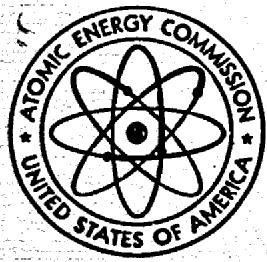
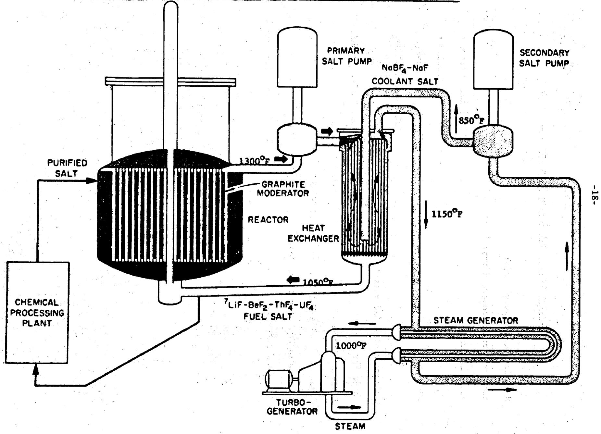
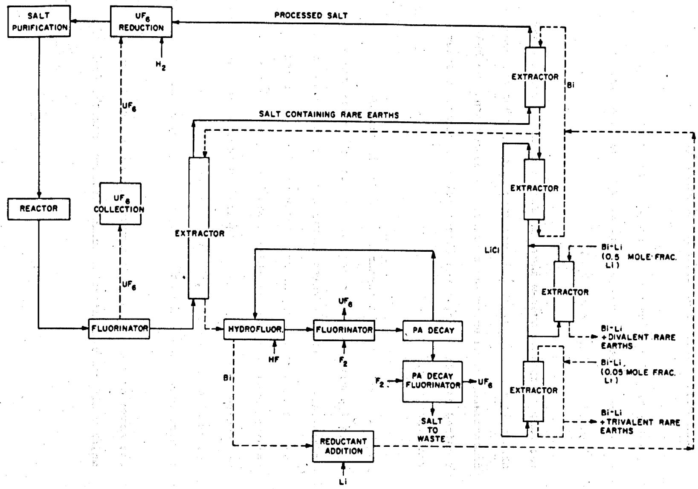

# AN EVALUATION

# OF THE

# MOLTEN SALT BREEDER REACTOR

SEPTEMBER 1972

MASTER

MSTER

Prepared for the Federal Council on Science and Technology R&D Goals Study

By the U.S. Atomic Energy Commission

Division of Reactor Development and Technology

# LEGAL NOTICE

This report was prepared as an account of work sponsored by the United States Government. Neither the United States nor the United States Atomic Energy Commission, nor any of their employees, nor any of their contractors, subcontractors, or their employees, makes any warranty, express or implied, or assumes any legal liability or responsibility for the accuracy, completeness or usefulness of any information, apparatus, product or process disclosed, or represents that its use would not infringe privately owned rights.

WASH-1222

UC-80

AN EVALUATION

OF

THE MOLTEN SALT BREEDER REACTOR

NOTICE

This report was prepared as an account of work sponsored by the United States Government, Neither the United States nor the United States Atomic Energy Commission, nor any of their employees, nor any of their contractors, subcontractors, or their employees, makes any warranty, express or implied, or assumes any legal liability or responsibility for the accuracy, completeness or usefulness of any information, apparatus, product or process disclosed, or represents that its use would not infringe privately owned rights.

September 1972

MASTER

Prepared for the Federal Council on Science and Technology

R&D Goals Study

By the U.S. Atomic Energy Commission

Division of Reactor Development and Technology

This report was prepared as input to the Office of Science and Technology's Energy Research and Development Study conducted through the Federal Council for Science and Technology. The contents represent the views of the panel members and not necessarily those of the Office of Science and Technology.

# TABLE OF CONTENTS

I. INTRODUCTION 1   
II. SUMMARY 8   
III. RESOURCE UTILIZATION 10   
IV. HISTORICAL DEVELOPMENT OF MOLTEN SALT REACTORS 12   
V. MOLTEN SALT BREEDER REACTOR CONCEPT DESCRIPTION 14   
VI. STATUS OF MSBR TECHNOLOGY 19

A. MSRE - The Reference Point for Current Technology 19   
B. Continuous Fuel Processing - The Key to Breeding 22

1. Chemical Process Development 22   
2. Fuel Processing Structural Materials 25

C. Molten Salt Reactor Design - Materials Requirements 26

1. Fuel and Coolant Salts 27   
2. Reactor Fuel Containment Materials 30   
3. Graphite 33   
4. Other Structural Materials 34

D. Tritium - A Problem of Control 35   
E. Reactor Equipment and Systems Development 38

1. Components 38   
2. Systems 41

F. Maintenance - A Difficult Problem for the MSBR 43   
G. Safetv - Different Issues for the MSBR 45   
H. Codes, Standards, and High Temperature Design Methods 47

VII. INDUSTRIAL PARTICIPATION IN THE MSBR PROGRAM 48   
VIII. CONCLUSIONS 51   
IX. REFERENCES 53

APPENDIX A A-1

Page

# LIST OF TABLES AND FIGURES

Page

# Tables

I Selected Conceptual Design Data for a Large MSBR. 17   
II Important Dates and Statistics for the MSRE 20   
III Comparison of Selected Parameters for the MSRE and 1000 MW(e) MSBR 21

# Figures

1. Single-Fluid, Two-Region Molten Salt Breeder Reactor 18   
2. Flowsheet for Processing a Single-Fluid MSBR. 24

# I. INTRODUCTION

The Division of Reactor Development and Technology, USAEC, was assigned the responsibility of assessing the status of the technology of the Molten Salt Breeder Reactor (MSBR) as part of the Federal Council of Science and Technology Research and Development Goals Study. In conducting this review, the attractive features and problem areas associated with the concept have been examined; but more importantly, the assessment has been directed to provide a view of the technology and engineering development efforts and the associated government and industrial commitments which would be required to develop the MSBR into a safe, reliable and economic power source for central station application.

The MSBR concept, currently under study at the Oak Ridge National Laboratory (ORNL), is based on use of a circulating fluid fuel reactor coupled with on-line continuous fuel processing. As presently envisioned, it would operate as a thermal spectrum reactor system utilizing a thorium-uranium fuel cycle. Thus, the concept would offer the potential for broadened utilization of the nation's natural resources through operation of a breeder system employing another fertile material (thorium instead of uranium).

The long-term objective of any new reactor concept and the incentive for the government to support its development are to help provide a self-

sustaining, competitive industrial capability for producing economical power in a reliable and safe manner. A basic part of achievement of this objective is to gain public acceptance of a new form of power production. Success in such an endeavor is required to permit the utilities and others to consider the concept as a viable option for generating electrical power in the future and to consider making the heavy, long-term commitments of resources in funds, facilities and personnel needed to provide the transition from the early experimental facilities and demonstration plants to full scale commercial reactor power plant systems.

Consistent with the policy established for all power reactor development programs, the MSBR would require the successful accomplishment of three basic research and development phases:

. An initial research and development phase in which the basic technical aspects of the MSBR concept are confirmed, involving exploratory development, laboratory experiment, and conceptual engineering.   
. A second phase in which the engineering and manufacturing capabilities are developed. This includes the conduct of in-depth engineering and prooftesting of first-of-a-kind components, equipment and systems. These would then be incorporated into experimental installations and supporting

test facilities to assure adequate understanding of design and performance characteristics, as well as to gain overall experience associated with major operational, economic and environmental parameters. As these research and development efforts progress, the technological uncertainties would need to be resolved and decision points reached that would permit development to proceed with necessary confidence. When the technology is sufficiently developed and confidence in the system was attained, the next stage would be the construction of large demonstration plants.

A third phase in which the utilities make large scale commitments to electric generating plants by developing the capability to manage the design, construction, test and operation of these power plants in a safe, reliable, economic, and environmentally acceptable manner.

Significant experience with the Light Water Reactor (LWR), the High Temperature Gas-cooled Reactor (HTGR) and the Liquid Metal-cooled Fast Breeder Reactor (LMFBR) has been gained over the past two decades pertaining to the efforts that are required to develop and advance nuclear reactors to the point of public and commercial acceptance. This experience has clearly demonstrated that the phases of development and demonstration should be similar regardless of the energy concept being explored; that the logical progression through each of

the phases is essential; and that completing the work through the three phases is an extremely difficult, time consuming and costly undertaking, requiring the highest level of technical management, professional competence and organizational skills. This has again been demonstrated by the recent experience in the expanding LWR design, construction and licensing activities which emphasize clearly the need for even stronger technology and engineering efforts than were initially provided, although these were satisfactory in many cases for the first experiments and demonstration plants. The LMFBR program, which is relatively well advanced in its development, tracks closely this LWR experience and has further reinforced this need as it applies to the technology, development and engineering application areas.

It should also be kept in mind that the large backlog of commitments and the shortage of qualified engineering and technical management personnel and prooftest facilities in the government, in industry and in the utilities make it even more necessary that all the reactor systems be thoroughly designed and tested before additional significant commitment to, and construction of, commercial power plants are initiated.

With regard to the MSBR, preliminary reactor designs were evaluated in WASH-1097 ("The Use of Thorium in Nuclear Power Reactors") based upon

the information supplied by ORNL. Two reactor design concepts were considered -- a two fluid reactor in which the fissile and fertile salts were separated by graphite and a single fluid concept in which the fissile and fertile salts were completely mixed. This evaluation identified problem areas requiring resolution through conduct of an intensive research and development program. Since the publication of WASH-1097, all efforts related to the two fluid system have been discontinued because of mechanical design problems and the development of processes which would, if developed into engineering systems, permit the on-line reprocessing of fuel from single fluid reactors. At present, the MSBR concept is essentially in the initial research and development phase, with emphasis on the development of basic MSBR technology. The technology program is centered at ORNL where essentially all research and development on molten salt reactors has been performed to date. The program is currently funded at a level of $5 million per year. Expenditures to date on molten salt reactor technology both for military and civilian power applications have amounted to approximately $150 million of which approximately $70 milli has been in support of central station power plants. These efforts date back to the 1940's.

In considering the MSBR for central station power plant application, it is noted that this concept has several unique and desirable features: at the same time, it is characterized by both complex technological and

practical engineering problems which are specific to fluid fueled reactors and for which solutions have not been developed. Thus, this concept introduced major concerns that are different in kind and magnitude from those commonly associated with solid fuel breeder reactors. The development of satisfactory experimental units and further consideration of this concept for use as a commercial power plant will require resolution of these as well as other problems which are common to all reactor concepts.

As part of the AEC's Systems Analysis Task Force (AEC report WASH-1098) and the "Cost-Benefit Analysis of the U.S. Breeder Reactor Program" (AEC reports WASH-1126 and WASH-1184), studies were conducted on the cost and benefit of developing another breeder system, "parallel" to the LMFBR. The consistent conclusion reached in these studies is that sufficient information is available to indicate that the projected benefits from the LMFBR program can support a parallel breeder program. However, these results are highly sensitive to the assumptions on plant capital costs with the recognition, even among concepts in which ample experience exists, that capital costs and especially small estimated differences in costs are highly speculative for plants to be built 15 or 20 years from now. Therefore, it is questionable whether analyses based upon such costs should constitute a major basis for making decisions relative to the desirability of a parallel breeder effort.

Experience in reactor development programs in this country and abroad has demonstrated that different organizations, in evaluating the projected costs of introducing a reactor development program and carrying it forward to the point of large scale commercial utilization, would arrive at different estimates of the methods, scope of development and engineering efforts, and the costs and time required to bring that program to a stage of successful large scale application and public acceptance.

Based upon the AEC's experience with other complex reactor development programs, it is estimated that a total government investment up to about 2 billion dollars in undiscounted direct costs* could be required to bring the molten salt breeder or any parallel breeder to fruition as a viable, commercial power reactor. A magnitude of funding up to this level could be needed to establish the necessary technology and engineering bases; obtain the required industrial capability; and advance through a series of test facilities, reactor experiments, and demonstration plants to a commercial MSBR safe and suitable to serve as a major energy option for central station power generation in the utility environment.

\*WASH-1184 - Updated (1970) Cost-Benefit Analysis of the U.S.

Breeder Reactor Program, January 1972.

# II. SUMMARY

The MSBR concept is a thermal spectrum, fluid fuel reactor which operates on the thorium-uranium fuel cycle and when coupled with on-line fuel processing has the potential for breeding at a meaningful level. The marked differences in the concept as compared to solid fueled reactors, make the MSBR a distinctive alternate. Although the concept has attractive features, there are a number of difficult development problems that must be resolved; many of these are unique to the MSBR while others are pertinent to any complex reactor system.

The technical effort accomplished since the publication of WASH-1097 and WASH-1098 has identified and further defined the problem areas; however, this work has not advanced the program beyond the initial phase of research and development. Although progress has been made in several areas (e.g., reprocessing and improved graphite), new problems not addressed in WASH-1097 have arisen which could affect the practicality of designing and operating a MSBR. Examples of major uncertainties relate to materials of construction, methods for control of tritium, and the design of components and systems along with their special handling, inspection and maintenance equipment. Considerable research and development efforts are required in order to obtain the data necessary to resolve the uncertainties.

Assuming that practical solutions to these problems can be found, a further assessment would have to be made as to the advisability of proceeding to the next stage of the development program. In advancing to the next phase, it would be necessary to develop a greatly expanded industrial and utility participation and commitment along with a substantial increase in government support. Such broadened involvement would require an evaluation of the MSBR in terms of already existing commitments to other nuclear power and high priority energy development efforts.

# III. RESOURCE UTILIZATION

It has long been recognized that the importance of nuclear fuels for power production depends initially on the utilization of the naturally occurring fissile U-235; but it is the more abundant fertile materials, U-238 and Th-232, which will be the major source of nuclear power generated in the future. The basic physics characteristics of fissile plutonium produced from U-238 offer the potential for high breeding gains in fast reactors, and the potential to expand greatly the utilization of uranium resources by making feasible the utilization of additional vast quantities of otherwise uneconomic low grade ore. In a similar manner, the basic physics characteristics of the thorium cycle will permit full utilization of the nation's thorium resources while at the same time offering the potential for breeding in thermal reactors.

The estimated thorium reserves are sufficient to supply the world's electric energy needs for many hundreds of years if the thorium is used in a high gain breeder reactor. It is projected that if this quantity of thorium were used in a breeder reactor, approximately 1000 Q (1 Q = 10 $^{18}$ Btu) would be realized from this fertile material. It is estimated that the uranium reserves would also supply 1000 Q $^{\star}$ of energy if the uranium were used in LMFBRs. In contrast, only 20 Q

would be available if thorium were used as the fertile material in an advanced converter reactor because the reactor would be dependent upon U-235 availability for fissile inventory make-up. (Note: a conservative estimate is that between 20 and 30 Q will be used for electric power generation between now and the year 2100.)

# IV. HISTORICAL DEVELOPMENT OF MOLTEN SALT REACTORS

The investigation of molten salt reactors began in the late 1940's as part of the U.S. Aircraft Nuclear Propulsion (ANP) Program. Subsequently, the Aircraft Reactor Experiment (ARE) was built at Oak Ridge and in 1954 it was operated successfully for nine davs at power levels up to 2.5 MW(th) and fuel outlet temperatures up to $1580^{\circ}\mathrm{F}$ . The ARE fuel was a mixture of NaF, $\mathrm{ZrF}_4$ , and $\mathrm{UF}_4$ . The moderator was BeO and the piping and vessel were constructed of Inconel.

In 1956, ORNL began to study molten salt reactors for application as central station converters and breeders. These studies concluded that graphite moderated, thermal spectrum reactors operating on a thorium-uranium cycle were most attractive for economic power production. Based on the technology at that time, it was thought that a two-fluid reactor in which the fertile and fissile salts were kept separate was required in order to have a breeder system. The single fluid reactor, while not a breeder, appeared simpler in design and also seemed to have the potential for low power costs.

Over the next few years, ORNL continued to study both the two fluid and single fluid concepts, and in 1960 the design of the single fluid 8 MW(th) Molten Salt Reactor Experiment (MSRE) was begun. The MSRE was completed in 1965 and operated successfully during the period 1965 to 1969. The MSRE experience is treated in more detail in a later section.

Concurrent with the construction of the MSRE, ORNL performed research and development on means for processing molten salt fuels. In 1967 new discoveries were made which suggested that a single fluid reactor could be combined with continuous on-line fuel processing to become a breeder system. Because of the mechanical design problems of the two fluid concept and the laboratory-scale development of processes which would permit on-line reprocessing, it was determined that a shift in emphasis to the single fluid breeder concept should be made; this system is being studied at the present.

The breeding reactions of the thorium cycle are:

$$
2 3 2 _ {\mathrm {T h}} + \mathrm {n} \longrightarrow 2 3 3 _ {\mathrm {T h}} \frac {\beta}{2 2 \min .} \rightarrow 2 3 3 _ {\mathrm {P a}} \frac {\beta}{2 7 . 4 d} \rightarrow 2 3 3 _ {\mathrm {U}}
$$

Because of the number of neutrons produced per neutron absorbed and the small fast fission bonus associated with U-233 and Th-232 in the thermal spectrum, a breeding ratio only slightly greater than unity is achievable. In order to realize breeding with the thorium cycle it is necessary to remove the bred Pa-233 and the various nuclear poisons produced by the fission process from the high flux region as quickly as possible. The Molten Salt Breeder Reactor concept permits rapid removal of Pa-233 and the nuclear poisons (e.g. Xe-135 and the rare earth elements). The reactor is a fluid fueled system containing $\mathsf{UF}_4$ and $\mathsf{ThF}_4$ dissolved in LiF - $\mathsf{BeF}_2$ . The molten fuel salt flows through a graphite moderator where the nuclear reactions take place. A side stream is continuously processed to remove the Pa and rare earth elements, thereby permitting the achievement of a calculated breeding ratio of about 1.06.

The MSBR is attractive because of the following:

1. Use of a fluid fuel and on-site processing would eliminate the problems of solid fuel fabrication and the handling, and

shipping and reprocessing of spent fuel elements which are associated with all other reactor types under active consideration.

2. MSBR operation on the thorium-uranium fuel cycle would help conserve uranium and thorium resources by utilizing thorium reserves with high efficiency.   
3. The MSBR is projected to have attractive fuel cycle costs. The major uncertainty in the fuel cycle cost is associated with the continuous fuel processing plant which has not been developed.   
4. The safety issues associated with the MSBR are generally different from those of solid fuel reactors. Thus, there might be safety advantages for the MSBR when considering major accidents. An accurate assessment of MSBR safety is not possible today because of the early state of development.   
5. Like other advanced reactor systems such as the LMFBR and HTGR, the MSBR would employ modern steam technology for power generation with high thermal efficiencies. This would reduce the amount of waste heat to be discharged to the environment.

Selected conceptual design data for a large MSBR, based primarily on design studies performed at ORNL, are given in Table I.

There are, however, problem areas associated with the MSBR which must be overcome before the potential of the concept could be attained. These include development of continuous fuel processing, reactor and processing structural materials, tritium control methods, reactor equipment and systems, maintenance techniques, safety technology, and MSBR codes and standards. Each of these problem areas will now be evaluated in some detail, using as a reference point the technology which was demonstrated by the Molten Salt Reactor Experiment (MSRE) during its design, construction and operation at Oak Ridge and the conceptual design parameters presented in Table I and in Appendix A. A conceptual flowsheet for this system is shown in Figure 1.

Table I   
Selected Conceptual Design Data for a Large MSBR   

<table><tr><td>Net Electrical Power, MW(e)</td><td>1000</td></tr><tr><td>Reactor Thermal Power, MW(th)</td><td>2240</td></tr><tr><td>Steam System</td><td>3500 psia, 1000°F, 
44% net efficiency</td></tr><tr><td>Fuel Salt</td><td>72% LiF, 16% BeF2, 
12% ThF4, 0.3% UF4</td></tr><tr><td>Primary Piping and Vessel Material</td><td>Hastelloy N</td></tr><tr><td>Moderator</td><td>Sealed Unclad Graphite</td></tr><tr><td>Breeding Ratio</td><td>1.06</td></tr><tr><td>Specific Fissile Fuel Inventory, Kg/MW(e)</td><td>1.5</td></tr><tr><td>Compounded Doubling Time, Years</td><td>22</td></tr><tr><td>Core Temperatures, °F</td><td>1050 inlet, 1300 outlet</td></tr></table>

  
SINGLE-FLUID, TWO-REGION MOLTEN SALT BREEDER REACTOR  
Figure 1

# A. MSRE - The Reference Point for Current, Technology

The Molten Salt Reactor Experiment (MSRE) was begun in 1960 at ORNL as part of the Civilian Nuclear Power Program. The purpose of the experiment was to demonstrate the basic feasibility of molten salt power reactors. All objectives of the experiment were achieved during its successful operation from June 1965 to December 1969. These included the distinction of becoming the first reactor in the world to operate solely on U-233. Some of the more significant dates and statistics pertinent to the MSRE are given in Table II.

In spite of the success of the MSRE, there are many areas of molten salt technology which must be expanded and developed in order to proceed from this small non-breeding experiment to a safe, reliable, and economic 1000 MW(e) MSBR with a 30-year life. To illustrate this point, some of the most important differences in basic design and performance characteristics between the MSRE and a conceptual 1000 MW(e) MSBR are given in Table III. Scale-up would logically be accomplished through development of reactor plants of increasing size. Examination of Table III provides an appreciation of the scale-up requirements in going from the MSRE to a large MSBR. Some problems associated with progressing from a small experiment to a commercial, high performance power plant are not adequately

# Table II.

# Important Dates and Statistics for the MSRE

# Dates:

Design initiated July 1960

Critical with 235U Fuel . June 1, 1965

Operation at full power - 8 MW(th) . . . . . May 23, 1966

Complete 6-month run . . . . . . . . . March 20, 1968

End Operation with $^{235}\mathrm{U}$ fuel . . . . . . . March 26, 1968

Critical with $^{233}\mathrm{U}$ fuel October 2, 1968

Operation at full power with $^{233}\mathrm{U}$ fuel . . . January 28, 1969

Reactor operation terminated . December 12, 1969

# Statistics:

Hours critical 17,655

Fuel loop time circulating salt (Hrs). 21,788

Equiv. full power hours with $^{235}\mathrm{U}$ fuel 9,005

Equiv. full power hours with $^{233}\mathrm{U}$ fuel 4,167

1/

Table III.   
Comparison of Selected Parameters of the MSRE and 1000 MW(e) MSBR   

<table><tr><td></td><td>MSRE</td><td>MSBR</td></tr><tr><td>General</td><td></td><td></td></tr><tr><td>Thermal Power, MW(th)</td><td>8</td><td>2250</td></tr><tr><td>Electric Power, MW(e)</td><td>0</td><td>1000</td></tr><tr><td>Plant lifetime, years</td><td>4</td><td>30</td></tr><tr><td>Fuel Processing Scheme</td><td>Off-line, batch processing</td><td>On-line, continuous processing</td></tr><tr><td>Breeding Ratio</td><td>Less than 1.0 (No Th present)</td><td>1.06</td></tr><tr><td>Reactor</td><td></td><td></td></tr><tr><td>Fuel Salt</td><td>7LiF-BeF2-ZrF4-UF4</td><td>7Lif-BeF2-ThF4-UF4</td></tr><tr><td>Moderator</td><td>Unclad, unsealed graphite</td><td>Unclad, sealed graphite</td></tr><tr><td>Reactor Vessel Material</td><td>Standard Hastelloy-N</td><td>Modified Hastelloy-N</td></tr><tr><td>Power Density, KW/liter</td><td>2.7</td><td>22</td></tr><tr><td>Exit Temperature, °F</td><td>1210</td><td>1300</td></tr><tr><td>Temperature Rise Across Core, °F</td><td>40</td><td>250</td></tr><tr><td>Reactor Vessel Height, Ft.</td><td>8</td><td>20</td></tr><tr><td>Reactor Vessel Diameter, Ft.</td><td>5</td><td>22</td></tr><tr><td>Vessel Design Pressure, psia</td><td>65</td><td>75</td></tr><tr><td>Peak Thermal Neutron Flux, Neutrons/cm-2-sec</td><td>6 x 1013</td><td>8.3 x 1014</td></tr><tr><td>Other Components and Systems Data</td><td></td><td></td></tr><tr><td>Number of Primary Circuits</td><td>1</td><td>4</td></tr><tr><td>Fuel Salt Pump Flow, gpm</td><td>1200</td><td>16,000</td></tr><tr><td>Fuel Salt Pump Head, ft.</td><td>48.5</td><td>150</td></tr><tr><td>Intermediate Heat Exchanger Capacity, MW(th)</td><td>8</td><td>556</td></tr><tr><td>Secondary Coolant Salt</td><td>7LiF-BeF2</td><td>NaF-NaBF4</td></tr><tr><td>Number of Secondary Circuits</td><td>1</td><td>4</td></tr><tr><td>Secondary Salt Pump Flow, gpm</td><td>850</td><td>20,000</td></tr><tr><td>Secondary Salt Pump Head, ft.</td><td>78</td><td>300</td></tr><tr><td>Number of Steam Generators</td><td>0</td><td>16</td></tr><tr><td>Steam Generator Capacity, MW(th)</td><td>0</td><td>121</td></tr></table>

1/ Based on information from "Conceptual Design Study of a Single Fluid Molten Salt Breeder Reactor," ORNL-4541, June 1971.

represented by the comparison presented in the Table. Therefore, it is useful to examine additional facets of MSBR technology in more detail.

# B. Continuous Fuel Processing - The Key to Breeding

In order to achieve nuclear breeding in the single fluid MSBR it is necessary to have an on-line continuous fuel processing system. This would accomplish the following:

Isolate protactinium-233 from the reactor environment so it can decay into the fissile fuel isotope uranium-233 before being transmuted into other isotopes by neutron irradiation.   
Remove undesirable neutron poisons from the fuel salt and thus improve the neutron economy and breeding performance of the system.   
Control the fuel chemistry and remove excess uranium-233 which is to be exported from the breeder system.

# 1. Chemical Process Development

The Oak Ridge National Laboratory has proposed a fuel processing scheme to accomplish breeding in the MSBR, and the flowsheet processes involve:

a. Fluorination of the fuel salt to remove uranium as UF $_6$ .

b. Reductive extraction of protactinium by contacting the salt with a mixture of lithium and bismuth.   
c. Metal transfer processing to preferentially remove the rare earth fission product poisons which would otherwise hinder breeding performance.

The fuel processing system shown in Fig. 2 is in an early stage of development at present and this type of system has not been demonstrated on an operating reactor. By comparison, the MSRE required only off-line, batch fluorination to recover uranium from fuel salt.

At this time, the basic chemistry involved in the MSBR processing scheme has been demonstrated in laboratory scale experiments. Current efforts at Oak Ridge are being directed toward development of subsystems incorporating many of the required processing steps. Ultimately a complete breeder processing experiment would be required to demonstrate the system with all the chemical conditions and operational requirements which would be encountered with any MSBR.

Not shown on the flowsheet is a separate processing system which would require injecting helium bubbles into the fuel

  
FLowsheet for PROCESSING A SINGLE-FLUID MSBR BY FLUORINATION-REDUCTIVE EXTRACTION AND THE METAL-TRANSFER PROCESS.

  
Figure 2

-2

salt, allowing them to circulate in the reactor system until they collect fission product xenon, and then removing the bubbles and xenon from the reactor system. Xenon is a highly undesirable neutron poison which will hamper breeding performance by capturing neutrons which would otherwise breed new fuel. This concept for xenon stripping was demonstrated in principle by the MSRE, although more efficient and controllable stripping systems will be desirable for the MSBR. The xenon poisoning in the MSRE was reduced by a factor of six by xenon stripping; the goal for the MSBR is a factor of ten reduction.

# 2. Fuel Processing Structural Materials

Aside from the chemical processes themselves, there are also development requirements associated with containment materials for the fuel processing systems. In particular, liquid bismuth presents difficult compatibility problems with most structural metals, and present efforts are concentrated on using molybdenum and graphite for containing bismuth. Unfortunately, both molybdenum and graphite are difficult to use for such engineering applications. Thus, it will be necessary to develop improved techniques for fabrication and joining before their use is possible in the reprocessing system.

A second materials problem of the current fuel processing system is the containment for the fluorination step in which uranium is volatilized from the fuel salt. The fluorine and fluoride salt mixture is corrosive to most structural materials, including graphite, and present ORNL flowsheets show a "frozen wall" fluorinator which operates with a protective layer of frozen fuel salt covering a Hastelloy-N vessel wall. This component would require considerable engineering development before it is truly practical for use in on-line full processing systems.

# C. Molten Salt Reactor Design - Materials Requirements

In concept, the molten salt reactor core is a comparatively uncomplicated type of heat source. The MSRE reactor core, for example, consisted of a prismatic structure of unclad graphite moderator through which fuel salt flowed to be heated by the self-sustaining chain reaction which took place as long as the salt was in the graphite. The entire reactor internals and fuel salt were contained in vessels and piping made of Hastelloy-N, a high strength nickel base alloy which was developed under the Aircraft Nuclear Propulsion Program. Over the four-year lifetime of the MSRE, the reactor structural materials performed satisfactorily for the purposes of the experiments although operation of the MSRE revealed possible problems with long term use of

Hastelloy-N in contact with fuel salts containing fission products.

The MSBR application is more demanding in many respects than the MSRE, and additional development work would be required in several areas of materials technology before suitable materials could become available.

# 1. Fuel and Coolant Salts

The MSRE fuel salt was a mixture of $^{7}$ LiF-BeF- $\text{ZrF}_4 - \text{UF}_4$ in proportions of 65.0-29.1-5.0-0.9 mole %, respectively. Zirconium fluoride was included as protection against $\text{UO}_2$ precipitation should inadvertent oxide contamination of the system occur. MSRE operation indicated that control of oxides was not a major problem and thus it is not considered necessary to include zirconium in future molten salt reactor fuels. It should also be noted that the MSRE fuel contained no thorium whereas the proposed MSBR fuels would include thorium as the fertile material for breeding. With the possible exception of incompatibilities with Hastelloy-N, the MSRE fuel salt performed satisfactorily throughout the Life of the reactor.

The MSBR fuel salt, as currently proposed by ORNL, would be a mixture of $\mathbf{7}_{\text{LiF-BeF}_2 - \text{ThF}_4 - \text{UF}_4}$ in proportions of 71.7-16-12-0.3

mole $\mathbf{Z}$ , respectively. This salt has a melting point of about $930^{\circ}\mathrm{F}$ and a vapor pressure of less than 0.1 mm Hg at the mean operating temperature of $1150^{\circ}\mathrm{F}$ . It also has about 3.3 times the density and 10 times the viscosity of water. Its thermal conductivity and volumetric heat capacity are comparable to water.

The high melting temperature is an obvious limitation for a system using this salt, and the MSBR is limited to high temperature operation. In addition, the lithium component must be enriched in Li-7 in order to allow nuclear breeding, since naturally occurring lithium contains about $7.5\%$ Li-6. Li-6 is undesirable in the MSBR because of its tendency to capture neutrons, thus penalizing breeding performance.

The chemical and physical characteristics of the proposed MSBR fuel mixture have been and are being investigated, and they are reasonably well known for unirradiated salts. The major unknowns are associated with the reactor fuel after it has been irradiated. For example, not enough is known about the behavior of fission products. The ability to predict fission product behavior is important to plant safety, operation, and maintenance. While the MSRE provided much useful information, there is still a need for more information,

particularly with regard to the fate of the so-called "noble metal" fission products such as molybdenum, niobium and others which are generated in substantial quantities and whose behavior in the system is not well understood.

A more complete understanding of the physical/chemical characteristics of the irradiated fuel salt is also needed. As an illustration of this point, anomalous power pulses were observed during early operation of the MSRE with U-233 fuel which were attributed to unusual behavior of helium gas bubbles as they circulated through the reactor. This behavior is believed to have been due to some physical and/or chemical characteristics of the fuel salt which were never fully understood. Out-of-reactor work on molten fuel salt fission product chemistry is currently under way. Eventually, the behavior of the fuel salt would need to be confirmed in an operating reactor.

The coolant salt in the secondary system of the MSRE was of molar composition $66\%$ ${}^{7}\mathrm{LiF}-34\%\mathrm{BeF}_{2}$ . While this coolant performed satisfactorily (no detectable corrosion or reaction could be observed in the secondary system), the salt has a high melting temperature ( $850^{\circ}\mathrm{F}$ ) and is relatively expensive. Thus, it may not be the appropriate choice for power reactors

for two reasons: (1) larger volumes of coolant salt will be used to generate steam in the MSBR, and (2) salt temperatures in the steam generator should be low enough, if possible, to utilize conventional steam system technology with feedwater temperatures up to about $550^{\circ}\mathrm{F}$ . The operation of MSRE was less affected by the coolant salt melting temperature since it dumped the 8 MW(th) of heat via an air-cooled radiator.

The high melting temperatures of potential coolant salts remain a problem. The current choice is a eutectic mixture of sodium fluoride and sodium fluoroborate with a molar composition of $8\%$ NaF- $92\%$ NaBF; this salt melts at $725^{\circ}\mathrm{F}$ . It is comparatively inexpensive and has satisfactory heat transfer properties.

However, the effects of heat exchanger leaks between the coolant and fuel salts, and between the coolant salt and steam systems, must be shown to be tolerable. The fluoroborate salt is currently being studied with respect to both its chemistry and compatibility with Hastelloy-N.

# 2. Reactor Fuel Containment Materials

A prerequisite to success for the MSBR would be the ability to assure reliable and safe containment and handling of molten

fuel salts at all times during the life of the reactor. It would be necessary, therefore, to develop suitable containment materials for MSBR application before plants could be constructed.

A serious question concerning compatability of Hastelloy-N with the constituents of irradiated fuel salt was raised by the post-operation examination of the MSRE in 1971. Although the MSRE materials performed satisfactorily for that system during its operation, subsequent examination of metal which was exposed to MSRE fuel salt revealed that the alloy had experienced intergranular attack to depths of about 0.007 inch. The attack was not obvious until metal specimens were tensile tested, at which time cracks opened up as the metal was strained. Further examination revealed that several fission products, including tellurium, had penetrated the metal to depths comparable to those of the cracks. At the present time, it is thought that the intergranular attack was due to the presence of tellurium. Subsequent laboratory tests have verified that tellurium can produce, under certain conditions, intergranular cracking in Hastelloy N.

Although the limited penetration of cracks presented no problems for the MSRE, concern now exists with respect to the chemical

compatability of Hastelloy-N and MSBR fuel salts when subjected to the more stringent MSBR requirements of higher power density and 30-year life. If the observed intergranular attack was indeed due to fission product attack of the Hastelloy-N, then this material may not be suitable for either the piping or the vessels which would be exposed to much higher fission product concentrations for longer periods of time. Efforts are underway to understand and explain the cracking problem, and to determine whether alternate reactor containment materials should be actively considered.

In addition to the intergranular corrosion problem, the standard Hastelloy-N used in the MSRE is not suitable for use in the MSBR because its mechanical properties deteriorate to an unacceptable level when subjected to the higher neutron doses which would occur in the higher power density, longer-life MSBR. The problem is thought to be due mainly to impurities in the metal which are transmuted to helium when exposed to thermal neutrons. The helium is believed to cause a deterioration of mechanical properties by its presence at grain boundaries within the alloy. It would be necessary to develop a modified Hastelloy-N with improved irradiation resistance for the MSBR, and some progress is being made in that direction. It appears at this time that small additions of certain elements, such as titanium, improve the irradiation

performance of Hastelloy-N substantially. Development work on modified alloys with improved irradiation resistance is currently under way.

# 3. Graphite

Additional developmental effort on two problems is required to produce graphites suitable for MSBR application. The first is associated with irradiation damage to graphite structures which results from fast neutrons. Under high neutron doses, of the order of $10^{22}$ neutrons/cm², most graphites tend to become dimensionally unstable and gross swelling of the material occurs. Based on tests of small graphite samples at ORNL, the best commercially available graphites at this time may be usable to about 3 x $10^{22}$ neutrons/cm², before the core graphite would have to be replaced. This corresponds to roughly a four-year graphite lifetime for the ORNL reference design. While this might be acceptable, there are still uncertainties about the fabrication and performance of large graphite pieces, and additional work would be required before a four-year life could be assured at the higher MSBR power densities now being considered. In any event, there would be an obvious economic incentive to develop longer lived graphites for MSBR application since a four-year life for graphite is estimated to represent a fuel cycle cost

penalty of about 0.2 mills/kw-hr relative to a system with thirty year graphite life.

The second major problem associated with graphites for MSBR application is the development of a sealing technique which will keep xenon, an undesirable neutron poison, from diffusing into the core graphite where it can capture neutrons to the detriment of breeding performance. While graphite sealing may not be necessary to achieve nuclear breeding in the MSBR, the use of sealed graphite would certainly enhance breeding performance. The economic incentives or penalties of graphite sealing cannot be assessed until a suitable sealing process is developed.

Sealing methods which have been investigated to date include pyrolytic carbon coating and carbon impregnation. Thus far, however, no sealed graphite that has been tested remained sufficiently impermeable to gas at MSBR design irradiation doses, and research and development in this area is continuing.

# 4. Other Structural Materials

In addition to the structural materials requirements for the reactor and fuel processing systems proper, there are other components and systems which have special materials requirements. Such components as the primary heat exchangers and

steam generators must function while in contact with two different working fluids.

At the present time, Hastelloy-N is considered to be the most promising material for use in all salt containment systems, including the secondary piping and components. Research to date indicates that sodium fluoroborate and Hastelloy-N are compatible as long as the water content of the fluoroborate is kept low; otherwise, accelerated corrosion can occur. Additional testing would be needed and is underway.

Hastelloy-N has not been adequately evaluated for service under a range of steam conditions and whether it will be a suitable material for use in steam generators is still not known.

# D. Tritium - A Problem of Control

Because of the lithium present in fluoride fuel salts, the present MSBR concept has the inherent problem of generating tritium, a radioactive isotope of hydrogen. Tritium is produced by the following reactions:

(1) $6_{\mathrm{Li}}(\mathfrak{n}, \mathfrak{a})^{3}{}_{\mathrm{H}}.$   
(2) $7_{\text{Li}} (\mathfrak{n}, \mathfrak{a} \mathfrak{n})^3_{\text{H}}.$

Due primarily to these interactions, tritium would be produced at a rate of about 2400 curies/day in a 1000 MWe MSBR. This compares with about

40 to 50 curies/dav for light water, gas-cooled, and fast breeder reactors, in which tritium is produced primarily as a low yield fission product. Tritium production in heavy water reactors of comparable size is generally in the range 3500 to 5800 curies/dav, due to neutron interactions with the deuterium present in heavy water.

To further compound the problem tritium diffuses readily through Hastellov-N at elevated temperatures. As a result, it may be difficult to prevent tritium from diffusing through the piping and components of the 'YSBR system (such as heat exchangers) and eventually reaching the steam system where it might be discharged to the environment as tritiated water.

The problem of tritium control in the WSBR is being studied in detail at OPNL. The following are being considered as potential methods for tritium control:

1. Exchanging the tritium for any hydrogen present in the secondary coolant, thereby retaining the tritium in the secondary coolant.   
2. Using coatings on metal surfaces in order to inhibit tritium diffusion.

3. Operating the reactor with the salt more oxidizing, thereby causing the formation of tritium fluoride which could be removed in the off-pas systems.   
4. Using a different secondary coolant, e.g., sodium or helium, and processing this coolant to remove tritium.   
5. Using another intermediate loop between the fluoroborate and steam to "getter" tritium.   
6. Using duplex tubing in either the heat exchanger or steam generator with a purge gas between the walls.

Of these potential solutions, the use of an additional intermediate loop between the secondary and steam systems is considered the most effective method technically, but it would also be expensive due to the additional equipment required and the loss of thermal efficiency.

From an economic viewpoint, the most desirable solution is one which does not significantly complicate the system, such as exchange of tritium for hydrogen present in the secondary coolant. This technique is being investigated as part of the ORNL efforts on tritium chemistry. The tritium retention problem may be eased by the low permeability of

oxide coatings which occur on steam generator materials in contact with steam, and this is also being investigated at ORNL.

# E. Reactor Equipment and Systems Development

While the MSBR would utilize some existing engineering technology from other reactor types, there are specific components and systems for which additional development work is required. Such work would have to take into account the induced activity that those components would accumulate in the MSBR system, i.e., special handling and maintenance equipment would also need to be developed. The previous discussion has already dealt with a number of these, such as fuel processing components and systems, but additional discussion is appropriate.

# 1. Components

As indicated in the Table III, a number of components must be scaled up substantially from the MSRE sizes before a large MSBR is possible. The development of these larger components along with their special handling and maintenance equipment is probably one of the most difficult and costly phases of MSBR development. However, reliable, safe, and maintainable components would need to be developed in order for any reactor system to be a success.

The MSBR pumps would likely be similar in basic design to those for the MSRE, namely, vertical shaft, overhung impeller pumps.

Substantial experience has been gained over the years in the design, fabrication and operation of smaller salt pumps, but the size would have to be increased substantially for MSBR application. The development and proof testing of such units along with their handling and maintainence equipment and test facilities are expected to be costly and time consuming.

The intermediate heat exchangers for the MSBR must perform with a minimum of salt inventory in order to improve the breeding performance by lowering the fuel inventory. Special surfaces to enhance heat transfer would help achieve this, and more studies would be in order. Based on previous experience with other reactor systems, it is believed that these units would require a difficult development and proof testing effort.

The steam generator for MSBR applications is probably the most difficult large component to develop since it represents an item for which there has been almost no experience to date. It is believed that a difficult development and proof testing program would be needed to provide reliable and maintainable units. As discussed previously, the high melting temperatures of candidate secondary coolants, such as sodium fluoroborate, present problems of matching with conventional steam system technology. At this time, central station power plants utilize

feedwater temperatures only up to about $550^{\circ}\mathrm{F}$ . Therefore, coupling a conventional feedwater system to a secondary coolant which freezes at $725^{\circ}\mathrm{F}$ presents obvious problems in design and control. It might be necessary to provide modifications to conventional steam system designs to help resolve the problems. Because of these factors, a study related to the design of steam generators has been initiated at Foster Wheeler Corporation.

Control rods and drives for the MSER would also need to be developed. The MSRE control rods were air cooled and operated inside Hastelloy-N thimbles which protruded down into the fuel salt. The MSER would require more efficient cooling due to the higher power densities involved. Presumably rods and drives would be needed which permit the rods to contact and be cooled by the fuel salt.

The salt valves for large MSBR's represent another development problem, although the freeze valve concept which was employed successfully in the MSRE could likely be scaled up in size and utilized for many MSBR applications. Mechanical throttling valves would also be needed for the MSBR salt systems, even though no throttling valve was used with the MSRE. Mechanical shutoff valves for salt systems, if required, would have to be developed.

Other components which would require considerable engineering development and testing include the helium bubble generators and gas strippers which are proposed for use in removing the fission product xenon from the fuel salt. Research and development in this area is currently under way as part of the technology program at ORNL.

# 2. Systems

The integration of all required components into a complete MSBR central station power plant would involve a number of systems for which development work is still required. It should be noted that some components, such as pumps and control rod drives, would require their own individual systems for functions such as cooling and lubrication.

Given the required components and materials of construction, the basic reactor primary and secondary flow systems can be designed. However, the primary flow system would require supporting systems for continuous fuel processing, on-line fuel analysis and control of salt chemistry, reactor control and safety, handling of radioactive gases, fuel draining from every possible holdup area in components and equipment, afterheat control, and temperature control during non-nuclear operations.

The continuous fuel processing systems proposed to date are quite complicated and include a number of subsystems, all of which would have to operate satisfactorily within the constraints of economics, safety, and reliability. The effects of off-design conditions on these systems would have to be understood so that control would be possible to prevent inadvertent contamination of the primary system by undesirable materials.

The fuel drain system is important to both operation and safety since it would be used to contain the molten fuel whenever a need arises to drain the primary system or any component or instrument for maintainence or inspection. Thus, additional systems would be required, each with its own system for maintaining and controlling temperatures. The fuel salt drain tank would have to be equipped with an auxiliary cooling system capable of rejecting about 18 MW(th) of heat should the need arise to drain the salt immediately following nuclear operation.

The secondary coolant system would also require subsystems for draining and controlling of salt chemistry and temperature. In addition, the secondary loop might require systems to control tritium and to handle the consequences of steam generator or heat exchanger leaks.

The steam system for the MSBR might require a departure from conventional designs due to the unique problems associated with using a coolant having a high melting temperature. Precautions would have to be taken against freezing the secondary salt as it travels through the steam generator; suitable methods for system startup and control would need to be incorporated. ORNL has proposed the use of a supercritical steam system which operates at 3500 psia and provides $700^{\circ}\mathrm{F}$ feedwater by mixing of supercritical steam and high pressure feedwater. This system would introduce major new development requirements because it differs from conventional steam cycles.

# F. Maintenance - A Difficult Problem for the MSBR

Unlike solid fueled reactors in which the primary system contains activation products and only those fission products which may leak from defective fuel pins, the MSBR would have the bulk of the fission products dispersed throughout the reactor system. Because of this dispersal of radioactivity, remote techniques would be required for many maintenance functions if the reactor were to have an acceptable plant availability in the utility environment.

The MSRE was designed for remote maintenance of highly radioactive components; however, no major maintenance problems (removal or repair of large components) were encountered after nuclear operation was initiated.

Thus, the degree to which the MSRE experience on maintenance is applicable to large commercial breeder reactors is open to question.

As has been evident in plant layout work on nuclear facilities to date, this requirement for remote maintenance will significantly affect the ultimate design and performance of the plant system. The MSBR would require remote techniques and tools for inspection, welding and cutting of pipes, mechanical assembly and disassembly of components and systems, and removing, transporting and handling large component items after they become highly radioactive. The removal and replacement of core internals, such as graphite, might pose difficult maintenance problems because of the high radiation levels involved and the contamination protection which would be required whenever the primary system is opened.

Another potential problem is the afterheat generation by fission products which deposit in components such as the primary heat exchangers.

Auxiliary cooling might be required to prevent damage when the fuel salt is drained from the primary system, and a requirement for such cooling would further complicate inspection and maintenance operations.

In some cases, the inspection and maintenance problems of the MSBR could be solved using present technology and particularly experience gained from fuel reprocessing plants. However, additional technology development would be required in other areas, such as remote cutting, alignment,

cleaning and welding of metal members. Depending to some degree on the particular plant arrangement, other special tools and equipment would also have to be designed and developed to accomplish inspection and maintenance operations.

In the final analysis, the development of adequate inspection and maintenance techniques and procedures, and hardware for the MSBR hinges on the success of other facets of the program, such as materials and component development, and on the requirement that adequate care be taken during plant design to assure that all systems and components which would require maintenance over the life of the plant are indeed maintainable within the constraints of utility operation.

# G. Safety - Different Issues for the MSBR

The MSBR concept has certain characteristics which might provide advantages relating to safety, particularly with respect to postulated major types of accidents currently considered in licensing activities. Since the fuel would be in a molten form, consideration of the core meltdown accident is not applicable to the MSBR. Also, in the event of a fuel spill, secondary criticality is not a problem since this is a thermal reactor system requiring moderator for nuclear criticality.

Other safety features include the fact that the primary system would operate at low pressure with fuel salt that is more than $1000^{\circ}\mathrm{F}$ below

its boiling point, that fission product iodine and strontium form stable compounds in the fluoride salts, and that the salts do not react rapidly with air or water. Because of the continuous fuel processing, the need for excess reactivity would be decreased and some of the fission products would be continuously removed from the primary system. A prompt negative temperature coefficient of reactivity is also a characteristic of the fuel salt.

Safety disadvantages, on the other hand, include the very high radioactive contamination which would be present throughout the primary system, fuel processing plant, and all auxiliary primary systems such as the fuel drain and off-gas systems. Thus, containment of these systems would have to be assured. Also, removal of decay heat from fuel storage systems would have to be provided by always ready and reliable cooling systems, particularly for the fuel drain tank and the Pa-233 decay tank in the reprocessing plant where megawatt quantities of decay heat must be removed. The tritium problem, already discussed, would have to be controlled to assure safety.

Based on the present state of MSBR technology, it is not possible to provide a complete assessment of MSBR safety relative to other reactors. It can be stated, however, that the safety issues for the MSBR are generally different from those for solid fuel reactors, and that more detailed design work must be done before the safety advantages and disadvantages of the MSBR could be fully evaluated.

H. Codes, Standards, and High Temperature Design Methods

Codes and standards for MSBR equipment and systems must be developed in conjunction with other research and development before large MSBR's can be built. In particular, the materials of construction which are currently being developed and tested would have to be certified for use in nuclear power plant applications.

The need for high temperature design technology is a problem for the MSBR as well as for other high temperature systems. The AEC currently has under way a program in support of the LMFBR which is providing materials data and structural analysis methods for design of systems employing various steel alloys at temperatures up to $1200^{\circ}\mathrm{F}$ . This program would need to be broadened to include MSBR structural materials such as Hastelloy-N and to include temperatures as high as $1400^{\circ}\mathrm{F}$ to provide the design technology applicable to high-temperature, long-term operating conditions which would be expected for MSBR vessels, components, and core structures.

# VII. INDUSTRIAL PARTICIPATION IN THE MSBR PROGRAM

Privately funded conceptual design studies and evaluations of MSBR technology were performed in 1970 by the Molten Salt Breeder Reactor Associates (MSBRA), a study group headed by the engineering firm of Black & Veatch and including five midwest utilities. The MSBRA concluded that the economic potential of the MSBR is attractive relative to light water reactors, but they recognized a number of problems which must be resolved in order to realize this potential. Since that time the MSBRA has been relatively inactive.

A second privately funded organization, the Molten Salt Group, is headed by Evasco Services, Incorporated and includes five other industrial firms and fifteen utilities. In 1971 the Group completed an evaluation of the MSBR concept and technology and concluded that existing technology is sufficient to justify construction of an MSBR demonstration plant although the performance characteristics could not be predicted with confidence. Additional support for further studies has recently been committed by the members of this group.

In addition to these studies, manufacturers of graphite and Hastelloy-N have been cooperating with ORNL to develop improved materials.

There has been little other industrial participation in the MSBR Program aside from ORNL subcontractors. At the present time, there are

two ORNL subcontracts in effect. Evasco Services, Inc., utilizing the industrial firms who are participants in the Molten Salt Group is performing a design and evaluation study. Foster Wheeler Corporation is currently performing design studies on steam generators for MSBR application.

A number of factors can be identified which tend to limit further industrial involvement at this time, namely:

1. The existing major industrial and utility commitments to the LWR, ETGR, and LMFBR.   
2. The lack of incentive for industrial investment in supplying fuel cycle services, such as those required for solid fuel reactors.   
3. The overwhelming manufacturing and operating experience with solid fuel reactors in contrast with the very limited involvement with fluid fueled reactors.   
4. The less advanced state of MSBR technology and the lack of demonstrated solutions to the major technical problems associated with the MSBR concept.

It should be noted that these factors are also relevant considerations in establishing the level of governmental support for the MSBR program which in turn, to some extent, affects the interest of the manufacturing and utility industries.

# VIII. CONCLUSIONS

The Molten Salt Breeder Reactor, if successfully developed and marketed, could provide a useful supplement to the currently developing uranium-plutonium reactor economy. This concept offers the potential for:

. Breeding in a thermal spectrum reactor;   
. Efficient use of thorium as a fertile material;   
. Elimination of fuel fabrication and spent fuel shipping;   
High thermal efficiencies.

Notwithstanding these attractive features, this assessment has reconfirmed the existence of major technological and engineering problems affecting feasibility of the concept as a reliable and economic breeder for the utility industry. The principal concerns include uncertainties with materials, with methods of controlling tritium, and with the design of components and systems along with their special handling, inspection and maintenance equipment. Many of these problems are compounded by the use of a fluid fuel in which fission products and delayed neutrons are distributed throughout the primary reactor and reprocessing systems.

The resolution of the problems of the MSBR will require the conduct of an intensive research and development program. Included among the major efforts that would have to be accomplished are:

Proof testing of an integrated reprocessing system;   
. Development of a suitable containment material;

. Development of a satisfactory method for the control and retention of tritium;   
- Attainment of a thorough understanding of the behavior of fission products in a molten salt system;   
. Development of long life moderator graphite, suitable for breeder'application;   
Conceptual definition of the engineering features of the many components and systems;   
. Development of adequate methods and equipment for remote inspection, handling, and maintenance of the plant.

The major problems associated with the MSBR are rather difficult in nature and many are unique to this concept. Continuing support of the research and development effort will be required to obtain satisfactory solutions to the problems. When significant evidence is available that demonstrates realistic solutions are practical, a further assessment could then be made as to the advisability of advancing into the detailed design and engineering phase of the development process including that of industrial involvement. Proceeding with this next step would also be contingent upon obtaining a firm demonstration of interest and commitment to the concept by the power industry and the utilities and reasonable assurances that large scale government and industrial resources can be made available on a continuing basis to this program in light of other commitments to the commercial nuclear power program and higher priority energy development efforts.

# IX. REFERENCES

1. U. S. Atomic Energy Commission, "The 1967 Supplement to the 1962 Report to the President on Civilian Nuclear Power" USAEC Report, February 1967.   
2. U. S. Atomic Energy Commission, "The Use of Thorium in Nuclear Power Reactors" USAEC Report WASH-1097, 1969.   
3. U. S. Atomic Energy Commission, "Potential Nuclear Power Growth Patterns," USAEC Report WASH-109B, December 1970.   
4. U. S. Atomic Energy Commission, "Cost-Benefit Analysis of the U. S. Breeder Reactor Program," USAEC Report WASH-1126, 1969.   
5. U. S. Atomic Energy Commission, "Updated (1970) Cost-Benefit Analysis of the U. S. Breeder Reactor Program," USAEC Report WASH-1184, January 1972.   
6. Edison Electric Institute, "Report on the EEI Reactor Assessment Panel," EEI Publication No. 70-30, 1970.   
7. Annual Hearings on Reactor Development Program, U. S. Atomic Energy Commission FY 1972 Authorizing Legislation, Hearings before the Joint Committee on Atomic Energy, Congress of the United States p. 820-830, U. S. Government Printing Office   
8. Nuclear Applications & Technology, Volume 8, February 1970.   
9. Robertson, R. D. (ed), "Conceptual Design Study of a Single Fluid Molten Salt Breeder Reactor," ORNL-4541, June 1971.

10. Rosenthal, M. W., et al.; "Advances in the Development of Molten-Salt Breeder Reactors," A/CONF. 49/P-048, Fourth United Nations International Conference on the Peaceful Uses of Atomic Energy, Geneva, September 6-16, 1971.   
11. Trinko, J. R. (ed.), "Molten-Salt Reactor Technology," Technical Report of the Molten-Salt Group, Part I, December 1971.   
12. Trinko, J. R. (ed), "Evaluation of a 1000 MWe Molten-Salt Breeder Reactor," Technical Report of the Molten Salt Group, Part II, November 1971.   
13. Evasco Services Inc., "1000 MWe Molten Salt Breeder Reactor Conceptual Design Study," Final Report Task I, Prepared under ORNL subcontract 3560, February 1972.   
14. "Project for Investigation of Molten Salt Breeder Reactor," Final Report, Phase I Study for Molten Salt Breeder Reactor Associates, September 1970.   
15. Cardwell, D. W. and Haubenreich, P. N., "Indexed Abstracts of Selected References on Molten-Salt Reactor Technology," ORNL-TM-3595, December 1971.   
16. Kasten, P. R., Bettis, E. S. and Robertson, R. C., "Design Studies of 1000 MW(e) Molten-Salt Breeder Reactors," ORNL-3996, August 1966.   
17. Molten Salt Reactor Program Semiannual Reports beginning in February 1962.

# Appendix A

Summary of principal data for MSBR power station

<table><tr><td></td><td>Engineering unitsa</td><td>International system unitsb</td></tr><tr><td>General</td><td></td><td></td></tr><tr><td>Thermal capacity of reactor</td><td>2250 MW(t)</td><td>2250 MW(t)</td></tr><tr><td>Gross electrical generation</td><td>1035 MW(e)</td><td>1035 MW(e)</td></tr><tr><td>Net electrical output</td><td>1000 MW(e)</td><td>1000 MW(e)</td></tr><tr><td>Net overall thermal efficiency</td><td>44.4%</td><td>44.4%</td></tr><tr><td>Net plant heat rate</td><td>7690 Btu/kWhr</td><td>2252 J/kW-sec</td></tr><tr><td>Structures</td><td></td><td></td></tr><tr><td>Reactor cell, diameter × height</td><td>72 × 42 ft</td><td>22.0 × 12.8 m</td></tr><tr><td>Confinement building, diameter × height</td><td>134 × 189 ft</td><td>40.8 × 57.6 m</td></tr><tr><td>Reactor</td><td></td><td></td></tr><tr><td>Vessel ID</td><td>22.2 ft</td><td>6.77 m</td></tr><tr><td>Vessel height at center (approx)</td><td>20 ft</td><td>6.1 m</td></tr><tr><td>Vessel wall thickness</td><td>2 in.</td><td>5.08 cm</td></tr><tr><td>Vessel head thickness</td><td>3 in.</td><td>7.62 cm</td></tr><tr><td>Vessel design pressure (abs)</td><td>75 psi</td><td>5.2 × 10^5 N/m²</td></tr><tr><td>Core height</td><td>13 ft</td><td>3.96 m</td></tr><tr><td>Number of core elements</td><td>1412</td><td>1412</td></tr><tr><td>Radial thickness of reflector</td><td>30 in.</td><td>0.762 m</td></tr><tr><td>Volume fraction of salt in central core zone</td><td>0.13</td><td>0.13</td></tr><tr><td>Volume fraction of salt in outer core zone</td><td>0.37</td><td>0.37</td></tr><tr><td>Average overall core power density</td><td>22.2 kW/liter</td><td>22.2 kW/liter</td></tr><tr><td>Peak power density in core</td><td>70.4 kW/liter</td><td>70.4 kW/liter</td></tr><tr><td>Average thermal-neutron flux</td><td>2.6 × 10^14 neutrons cm^-2 sec^-1</td><td>2.6 × 10^14 neutrons cm^-2 sec^-1</td></tr><tr><td>Peak thermal-neutron flux</td><td>8.3 × 10^14 neutrons cm^-2 sec^-1</td><td>8.3 × 10^14 neutrons cm^-2 sec^-1</td></tr><tr><td>Maximum graphite damage flux (&gt;50 keV)</td><td>3.5 × 10^14 neutrons cm^-2 sec^-1</td><td>3.5 × 10^14 neutrons cm^-2 sec^-1</td></tr><tr><td>Damage flux at maximum damage region (approx)</td><td>3.3 × 10^14 neutrons cm^-2 sec^-1</td><td>3.3 × 10^14 neutrons cm^-2 sec^-1</td></tr><tr><td>Graphite temperature at maximum neutron flux region</td><td>1284°F</td><td>969°C</td></tr><tr><td>Graphite temperature at maximum graphite damage region</td><td>1307°F</td><td>982°C</td></tr><tr><td>Estimated useful life of graphite</td><td>4 years</td><td>4 years</td></tr><tr><td>Total weight of graphite in reactor</td><td>669,000 lb</td><td>304,000 kg</td></tr><tr><td>Maximum flow velocity of salt in core</td><td>8.5 fps</td><td>2.6 m/sec</td></tr><tr><td>Total fuel salt in reactor vessel</td><td>1074 ft³</td><td>30.4 m³</td></tr><tr><td>Total fuel-salt volume in primary system</td><td>1720 ft³</td><td>48.7 m³</td></tr><tr><td>Fissile-fuel inventory in reactor primary system and fuel processing plant</td><td>3316 lb</td><td>1504 kg</td></tr><tr><td>Thorium inventory</td><td>150,000 lb</td><td>68,100 kg</td></tr><tr><td>Breeding ratio</td><td>1.06</td><td>1.06</td></tr><tr><td>Yield</td><td>3.2%/year</td><td>3.2%/year</td></tr><tr><td>Doubling time, compounded continuously, at 80% power factor</td><td>22 years</td><td>22 years</td></tr><tr><td>Primary heat exchangers (for each of 4 units)</td><td></td><td></td></tr><tr><td>Thermal capacity, each</td><td>556.3 MW(t)</td><td>556.3 MW(t)</td></tr><tr><td>Tube-side conditions (fuel salt)</td><td></td><td></td></tr><tr><td>Tube OD</td><td>3/8 in.</td><td>0.953 cm</td></tr><tr><td>Tube length (approx)</td><td>22.2 ft</td><td>6.8 m</td></tr><tr><td>Number of tubes</td><td>5896</td><td>5896</td></tr><tr><td>Inlet-outlet conditions</td><td>1300–1050°F</td><td>978–839°C</td></tr><tr><td>Mass flow rate</td><td>23.45 × 10^6 Ib/hr</td><td>2955 kg/sec</td></tr><tr><td>Total heat transfer surface</td><td>13,000 ft²</td><td>1208 m²</td></tr><tr><td>Shell-side conditions (coolant salt)</td><td></td><td></td></tr><tr><td>Shell ID</td><td>68.1 in.</td><td>1.73 m</td></tr><tr><td>Inlet-outlet temperatures</td><td>850–1150°F</td><td>727–894°C</td></tr><tr><td>Mass flow rate</td><td>17.6 × 10^6 Ib/hr</td><td>2218 kg/sec</td></tr><tr><td>Overall heat transfer coefficient (approx)</td><td>850 Btu hr^-1 ft^-2 (^F)^-1</td><td>4820 W m^-2 (^K)^-1</td></tr><tr><td colspan="3">Primary pumps (for each of 4 units)</td></tr><tr><td>Pump capacity, nominal</td><td>16,000 gpm</td><td>1.01 m3/sec</td></tr><tr><td>Rated head</td><td>150 ft</td><td>45.7 m</td></tr><tr><td>Speed</td><td>890 rpm</td><td>93.2 radians/sec</td></tr><tr><td>Specific speed</td><td>2625 rpm(gpm)0.5/(ft)0.75</td><td>5.321 radians/sec(m3/sec)0.5/(m)0.75</td></tr><tr><td>Impeller input power</td><td>2350 hp</td><td>1752 kW</td></tr><tr><td>Design temperature</td><td>1300°F</td><td>978°C</td></tr><tr><td colspan="3">Secondary pumps (for each of 4 units)</td></tr><tr><td>Pump capacity, nominal</td><td>20,000 gpm</td><td>1.262 m3/sec</td></tr><tr><td>Rated head</td><td>300 ft</td><td>91.4 m</td></tr><tr><td>Speed, principal</td><td>1190 rpm</td><td>124.6 radians/sec</td></tr><tr><td>Specific speed</td><td>2330 rpm(gpm)0.5/(ft)0.75</td><td>4.73 radians/sec(m3/sec)0.5/(m)0.75</td></tr><tr><td>Impeller input power</td><td>3100 hp</td><td>2310 kW</td></tr><tr><td>Design temperature</td><td>1300°F</td><td>978°C</td></tr><tr><td colspan="3">Fuel-salt drain tank (1 unit)</td></tr><tr><td>Outside diameter</td><td>14 ft</td><td>4.27 m</td></tr><tr><td>Overall height</td><td>22 ft</td><td>6.71 m</td></tr><tr><td>Storage capacity</td><td>2500 ft3</td><td>70.8 m3</td></tr><tr><td>Design pressure</td><td>55 psi</td><td>3.79 × 105 N/m2</td></tr><tr><td>Number of coolant U-tubes</td><td>1500</td><td>1500</td></tr><tr><td>Size of tubes, OD</td><td>3/4 in.</td><td>1.91 cm</td></tr><tr><td>Number of separate coolant circuits</td><td>40</td><td>40</td></tr><tr><td>Coolant fluid</td><td>7LiF-BeF2</td><td>7LiF-BeF2</td></tr><tr><td colspan="3">Under normal steady-state conditions:</td></tr><tr><td>Maximum heat load</td><td>18 MW(t)</td><td>18 MW(t)</td></tr><tr><td>Coolant circulation rate</td><td>830 gpm</td><td>0.0524 m3/sec</td></tr><tr><td>Coolant temperatures, in/out</td><td>900–1050°F</td><td>755–839°K</td></tr><tr><td>Maximum tank wall temperature</td><td>~1260°F</td><td>~955°K</td></tr><tr><td>Maximum transient heat load</td><td>53 MW(t)</td><td>53 MW(t)</td></tr><tr><td colspan="3">Fuel-salt storage tank (1 unit)</td></tr><tr><td>Storage capacity</td><td>2500 ft3</td><td>70.8 m3</td></tr><tr><td>Heat-removal capacity</td><td>1 MW(t)</td><td>1 MW(t)</td></tr><tr><td>Coolant fluid</td><td>Boiling water</td><td>Boiling water</td></tr><tr><td colspan="3">Coolant-salt storage tanks (4 units)</td></tr><tr><td>Total volume of coolant salt in systems</td><td>8400 ft3</td><td>237.9 m3</td></tr><tr><td>Storage capacity of each tank</td><td>2100 ft3</td><td>59.5 m3</td></tr><tr><td>Heat-removal capacity, first tank in series</td><td>400 kW</td><td>400 kW</td></tr><tr><td colspan="3">Steam generators (for each of 16 units)</td></tr><tr><td>Thermal capacity</td><td>120.7 MW(t)</td><td>120.7 MW(t)</td></tr><tr><td colspan="3">Tube-side conditions (steam at 3600–3800 psi)</td></tr><tr><td>Tube OD</td><td>1/2 in.</td><td>1.27 cm</td></tr><tr><td>Tube-sheet-to-tube-sheet length (approx)</td><td>76.4 ft</td><td>23.3 m</td></tr><tr><td>Number of tubes</td><td>393</td><td>393</td></tr><tr><td>Inlet-outlet temperatures</td><td>700–1000°F</td><td>644–811°K</td></tr><tr><td>Mass flow rate</td><td>633,000 lb/hr</td><td>79.76 kg/sec</td></tr><tr><td>Total heat transfer surface</td><td>3929 ft2</td><td>365 m2</td></tr><tr><td colspan="3">Shell-side conditions (coolant salt)</td></tr><tr><td>Shell ID</td><td>1.5 ft</td><td>0.457 m</td></tr><tr><td>Inlet-outlet temperatures</td><td>1150–850°F</td><td>894–727°K</td></tr><tr><td>Mass flow rate</td><td>3.82 × 106 lb/hr</td><td>481.3 kg/sec</td></tr><tr><td>Apparent overall heat transfer coefficient range</td><td>490–530 Btu hr-1 ft-2 (°F)-1</td><td>2780–3005 W m-2(°K)-1</td></tr><tr><td colspan="3">Steam reheaters (for each of 8 units)</td></tr><tr><td>Thermal capacity</td><td>36.6 MW(t)</td><td>36.6 MW(t)</td></tr><tr><td colspan="3">Tube-side conditions (steam at 550 psi)</td></tr><tr><td>Tube OD</td><td>3/4 in.</td><td>1.9 cm</td></tr><tr><td>Tube length</td><td>30.3 ft</td><td>9.24 m</td></tr><tr><td>Number of tubes</td><td>400</td><td>400</td></tr><tr><td>Inlet-outlet temperatures</td><td>650–1000°F</td><td>616–811°C</td></tr><tr><td>Mass flow rate</td><td>641,000 lb/hr</td><td>80.77 kg/sec</td></tr><tr><td>Total heat transfer surface</td><td>2381 ft2</td><td>221.2 m2</td></tr><tr><td colspan="3">Shell-side conditions (coolant salt)</td></tr><tr><td>Shell ID</td><td>21.2 in.</td><td>0.54 m</td></tr><tr><td>Inlet-outlet temperatures</td><td>1150–850°F</td><td>894–727°C</td></tr><tr><td>Mass flow rate</td><td>1.16 × 106lb/hr</td><td>146.2 kg/sec</td></tr><tr><td>Overall heat transfer coefficient</td><td>298 Btu hr-1 ft-2(°F)-1</td><td>1690 W m-2(°K)-1</td></tr><tr><td colspan="3">Turbine-generator plant (see "General" above)</td></tr><tr><td>Number of turbine-generator units</td><td>1</td><td>1</td></tr><tr><td>Turbine throttle conditions</td><td>3500 psia, 1000°F</td><td>24.1 × 106N/m2, 811°C</td></tr><tr><td>Turbine throttle mass flow rate</td><td>7.15 × 106lb/hr</td><td>900.9 kg/sec</td></tr><tr><td>Reheat steam to IP turbine</td><td>540 psia, 1000°F</td><td>3.72 × 106N/m2, 811°C</td></tr><tr><td>Condensing pressure (abs)</td><td>1.5 in. Hg</td><td>5,078 N/m2</td></tr><tr><td>Boiler feed pump work</td><td>19,700 hp</td><td>14,690 kW</td></tr><tr><td colspan="3">(steam-turbine-driven), each of 2 units</td></tr><tr><td>Booster feed pump work (motor-driven), each of 2 units</td><td>6200 hp</td><td>4620 kW</td></tr><tr><td colspan="3">Fuel-salt inventory, primary system</td></tr><tr><td colspan="3">Reactor</td></tr><tr><td>Core zone I</td><td>290 ft3</td><td>8.2 m3</td></tr><tr><td>Core zone II</td><td>382 ft3</td><td>10.8 m3</td></tr><tr><td>Plenum, inlets, outlets</td><td>218 ft3</td><td>6.2 m3</td></tr><tr><td>2-in. annulus</td><td>135 ft3</td><td>3.8 m3</td></tr><tr><td>Reflectors</td><td>49 ft3</td><td>1.4 m3</td></tr><tr><td colspan="3">Primary heat exchangers</td></tr><tr><td>Tubes</td><td>269 ft3</td><td>7.6 m3</td></tr><tr><td>Inlets, outlets</td><td>27 ft3</td><td>0.8 m3</td></tr><tr><td>Pump bowls</td><td>185 ft3</td><td>5.2 m3</td></tr><tr><td>Piping, including drain line</td><td>145 ft3</td><td>4.1 m3</td></tr><tr><td>Off-gas bypass loop</td><td>10 ft3</td><td>0.3 m3</td></tr><tr><td>Tank heels and miscellaneous</td><td>10 ft3</td><td>0.3 m3</td></tr><tr><td>Total enriched salt in primary system</td><td>1720 ft3</td><td>48.7 m3</td></tr><tr><td colspan="3">Fuel-processing system (Chemical Treatment Plant)</td></tr><tr><td>Inventory of barren salt (Lif-BeF2-ThF4) in plant</td><td>480 ft3</td><td>13.6 m3</td></tr><tr><td>Processing rate</td><td>1 gpm</td><td>63.1 × 10-6m3/sec</td></tr><tr><td>Cycle time for salt inventory</td><td>10 days</td><td>10 days</td></tr><tr><td>Heat generation in salt to processing plant</td><td>56 kW/ft3</td><td>1980 kW/m3</td></tr><tr><td colspan="3">Design properties of fuel salt</td></tr><tr><td>Components</td><td>7LiF-BeF2-ThF4-UF4</td><td>7LiF-BeF2-ThF4-UF4</td></tr><tr><td>Composition</td><td>71.7-16-12-0.3 mole %</td><td>71.7-16-12-0.3 mole %</td></tr><tr><td>Molecular weight (approx)</td><td>64</td><td>64</td></tr><tr><td>Melting temperature (approx)</td><td>930°F</td><td>772°C</td></tr><tr><td>Vapor pressure at 1150°F (894.3°C)</td><td>&lt;0.1 mm Hg</td><td>&lt;13.3 N/m2</td></tr><tr><td colspan="3">Density:cρ(g/cm3)=3.752-6.68×10-4t(°C); ρ(lb/ft3)=235.0-0.02317t(°F)</td></tr><tr><td>At 1300°F (978°C)</td><td>204.9 lb/ft3</td><td>3283.9 kg/m3</td></tr><tr><td>At 1175°F (908°C)</td><td>207.8 lb/ft3</td><td>3330.4 kg/m3</td></tr><tr><td>At 1050°F (839°C)</td><td>210.7 lb/ft3</td><td>3376.9 kg/m3</td></tr><tr><td colspan="3">Viscosity:d μ (centipoises) = 0.109 exp [4090/T (°K)]; μ (lb ft-1hr-1) = 0.2637 exp [7362/T (°R)]</td></tr><tr><td>At 1300°F (978°C)</td><td>17.3 lb hr-1ft-1</td><td>0.007 N sec m-2</td></tr><tr><td>At 1175°F (908°C)</td><td>23.8 lb hr-1ft-1</td><td>0.010 N sec m-2</td></tr><tr><td>At 1050°F (839°C)</td><td>34.5 lb hr-1ft-1</td><td>0.015 N sec m-2</td></tr><tr><td>Heat capacitye (specific heat, cp)</td><td>0.324 Btu lb-1(°F)-1± 4%</td><td>1.357 J g-1(°K)-1± 4%</td></tr><tr><td colspan="3">Thermal conductivity (k)f</td></tr><tr><td>At 1300°F (978°C)</td><td>0.69 Btu hr-1(°F)-1 ft-1</td><td>1.19 W m-1(°K)-1</td></tr><tr><td>At 1175°F (908°C)</td><td>0.71 Btu hr-1(°F)-1 ft-1</td><td>1.23 W m-1(°K)-1</td></tr><tr><td>At 1050°F (839°C)</td><td>0.69 Btu hr-1(°F)-1 ft-1</td><td>1.19 W m-1(°K)-1</td></tr><tr><td colspan="3">Design properties of coolant salt</td></tr><tr><td>Components</td><td>NaBF4-NaF</td><td>NaBF4-NaF</td></tr><tr><td>Composition</td><td>92-8 mole %</td><td>92-8 mole %</td></tr><tr><td>Molecular weight (approx)</td><td>104</td><td>104</td></tr><tr><td>Melting temperature (approx)</td><td>725°C</td><td>658°C</td></tr><tr><td colspan="3">Vapor pressure:g log P (mm Hg) = 9.024 - 5920/T (°K)</td></tr><tr><td>At 850°F (727°C)</td><td>8 mm Hg</td><td>1066 N/m2</td></tr><tr><td>At 1150°F (894°C)</td><td>252 mm Hg</td><td>33,580 N/m2</td></tr><tr><td colspan="3">Density:c ρ (g/cm3) = 2.252 - 7.11 × 10-4t (°C); ρ (lb/ft3) = 141.4 - 0.0247t (°F)</td></tr><tr><td>At 1150°F (894°C)</td><td>113.0 lb/ft3</td><td>1811.1 kg/m3</td></tr><tr><td>At 1000°F (811°C)</td><td>116.7 lb/ft3</td><td>1870.4 kg/m3</td></tr><tr><td>At 850°F (727°C)</td><td>120.4 lb/ft3</td><td>1929.7 kg/m3</td></tr><tr><td colspan="3">Viscosity:d μ (centipoises) = 0.0877 exp [2240/T (°K)]; μ (lb_m ft-1hr-1) = 0.2121 exp [4032/T (°R)]</td></tr><tr><td>At 1150°F (894°C)</td><td>2.6 lb ft-1hr-1</td><td>0.0011 N sec m-2</td></tr><tr><td>At 1000°F (811°C)</td><td>3.4 lb ft-1hr-1</td><td>0.0014 N sec m-2</td></tr><tr><td>At 850°F (727°C)</td><td>4.6 lb ft-1hr-1</td><td>0.0019 N sec m-2</td></tr><tr><td>Heat capacityh (specific heat, cp)</td><td>0.360 Btu lb-1(°F)-1 ± 2%</td><td>1507 J kg-1(°K)-1± 2%</td></tr><tr><td colspan="3">Thermal conductivity (k)i</td></tr><tr><td>At 1150°F (894°C)</td><td>0.23 Btu hr-1(°F)-1 ft-1</td><td>0.398 W m-1(°K)-1</td></tr><tr><td>At 1000°F (811°C)</td><td>0.23 Btu hr-1(°F)-1 ft-1</td><td>0.398 W m-1(°K)-1</td></tr><tr><td>At 850°F (727°C)</td><td>0.26 Btu hr-1(°F)-1 ft-1</td><td>0.450 W m-1(°K)-1</td></tr><tr><td colspan="3">Design properties of graphitej</td></tr><tr><td>Density, at 70°F (294.3°C)</td><td>115 lb/ft3</td><td>1843 kg/m3</td></tr><tr><td>Bending strength</td><td>4000-6000 psi</td><td>28 × 106-41 × 106N/m2</td></tr><tr><td>Modulus of elasticity coefficient</td><td>1.7 × 106psi</td><td>11.7 × 109N/m2</td></tr><tr><td>Poisson's ratio</td><td>0.27</td><td>0.27</td></tr><tr><td>Thermal expansion coefficient</td><td>2.3 × 10-6°C</td><td>1.3 × 10-6°C</td></tr><tr><td>Thermal conductivity at 1200°F, unirradiated (approx)</td><td>18 Btu hr-1(°F)-1 ft-1</td><td>31.2 W m-1(°K)-1</td></tr><tr><td>Electrical resistivity</td><td>8.9 × 10-4-9.9 × 10-4Ω-cm</td><td>8.9 × 10-4-9.9 × 10-4Ω-cm</td></tr><tr><td colspan="3">Specific heat</td></tr><tr><td>At 600°F (588.8°C)</td><td>0.33 Btu lb-1(°F)-1</td><td>1380 J kg-1(°K)-1</td></tr><tr><td>At 1200°F (922.0°C)</td><td>0.42 Btu lb-1(°F)-1</td><td>1760 J kg-1(°K)-1</td></tr><tr><td>Helium permeability at STP with sealed surfaces</td><td>1 × 10-8cm2/sec</td><td>1 × 10-8cm2/sec</td></tr></table>

# Appendix A (continued)

<table><tr><td></td><td>Engineering unitsa</td><td>International system unitsb</td></tr><tr><td colspan="3">Design properties of Hastelloy Nk</td></tr><tr><td>Density</td><td></td><td></td></tr><tr><td>At 80°F (300°K)</td><td>557 lb/ft3</td><td>8927 kg/m3</td></tr><tr><td>At 1300°F (978°K)</td><td>541 lb/ft3</td><td>8671 kg/m3</td></tr><tr><td>Thermal conductivity</td><td></td><td></td></tr><tr><td>At 80°F (300°K)</td><td>6.0 Btu hr-1(°F)-1 ft-1</td><td>10.4 W m-1(°K)-1</td></tr><tr><td>At 1300°F (978°K)</td><td>12.6 Btu hr-1(°F)-1 ft-1</td><td>21.8 W m-1(°K)-1</td></tr><tr><td>Specific heat</td><td></td><td></td></tr><tr><td>At 80°F (300°K)</td><td>0.098 Btu lb-1(°F)-1</td><td>410 J kg-1(°K)-1</td></tr><tr><td>At 1300°F (978°K)</td><td>0.136 Btu lb-1(°F)-1</td><td>569 J kg-1(°K)-1</td></tr><tr><td>Thermal expansion</td><td></td><td></td></tr><tr><td>At 80°F (300°K)</td><td>5.7 × 10-6/°F</td><td>3.2 × 10-6/°K</td></tr><tr><td>At 1300°F (978°K)</td><td>9.5 × 10-6/°F</td><td>5.3 × 10-6/°K</td></tr><tr><td>Modulus of elasticity coefficient</td><td></td><td></td></tr><tr><td>At 80°F (300°K)</td><td>31 × 106psi</td><td>214 × 109N/m2</td></tr><tr><td>At 1300°F (978°K)</td><td>25 × 106psi</td><td>172 × 109N/m2</td></tr><tr><td>Tensile strength (approx)</td><td></td><td></td></tr><tr><td>At 80°F (300°K)</td><td>115,000 psi</td><td>793 × 106N/m2</td></tr><tr><td>At 1300°F (978°K)</td><td>75,000 psi</td><td>517 × 106N/m2</td></tr><tr><td>Maximum allowable design stress</td><td></td><td></td></tr><tr><td>At 80°F (300°K)</td><td>25,000 psi</td><td>172 × 106N/m2</td></tr><tr><td>At 1300°F (978°K)</td><td>3500 psi</td><td>24 × 106N/m2</td></tr><tr><td>Melting temperature</td><td>2500°F</td><td>1644°K</td></tr></table>

4English engineering units as used in MSR literature.   
$^{D}$ Meter-kilogram-second system. Table closely follows International System (SI). See Appendix C for conversion factors from engineering to SI units.